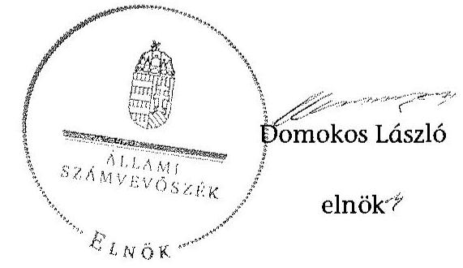

# ÁLLAMI   SZÁMVEVŐSZÉK 

## JELENTÉS

a helyi nemzetiségi önkormányzatok gazdálkodásának ellenőrzéséről Somogyhatvani Roma Nemzetiségi Önkormányzat

---

# Állami Számvevőszék 

Iktatószám: V-0789-064/2015.
Témaszám: 1823
Vizsgálat-azonosító szám: V067641

## Az ellenőrzést felügyelte:

## Brebán Andrea

felügyeleti vezető
Az ellenőrzést vezette és az ellenőrzés végrehajtásáért felelős:
Gál Magdolna
ellenőrzésvezető
A számvevőszéki jelentés összeállításában közremúködött:
Székely Beáta
számvevő
Az ellenőrzést végezték:
Székely Beáta
Vitányi István
számvevő
számvevő tanácsos

---

# TARTALOMJEGYZÉK 

BEVEZETÉS ..... 3
I. ÖSSZEGZŐ MEGÁLLAPÍTÁSOK, KÖVETKEZTETÉSEK, JAVASLATOK ..... 6
II. RÉSZLETES MEGÁLLAPÍTÁSOK ..... 13

1. A Nemzetiségi Önkormányzat és a Települési Önkormányzat együttműködésének szabályozása, a működési feltételek biztosítása ..... 13
2. A gazdálkodási feladatok ellátásának szabályszerűsége ..... 14
2.1. A költségvetésre és zárszámadásra, valamint a kincstári adatszolgáltatás rendjére vonatkozó jogszabályi előírások betartása ..... 14
2.2. A Nemzetiségi Önkormányzat gazdálkodásának szabályozottsága ..... 16
2.3. Az operatív gazdálkodási jogkörök kialakítása, gyakorlása ..... 16
3. A Nemzetiségi Önkormányzattal összefüggő gazdálkodási feladatok belső ellenőrzése ..... 19

## MELLÉKLET

1. számú A Nemzetiségi Önkormányzat 2013. évi gazdálkodási adatai

## FÜGGELÉKEK

1. számú Rövidítések jegyzéke
2. számú Értelmező szótár

---

.

---

# JELENTÉS   a helyi nemzetiségi önkormányzatok gazdálkodásának ellenőrzéséről Somogyhatvani Roma Nemzetiségi Önkormányzat 

## BEVEZETÉS

A Nemzetiségi Önkormányzat 2010. évben alakult, elnöke a 2014. évi helyhatósági választások óta látja el feladatát. A Nemzetiségi Önkormányzat intézményt, gazdasági társaságot és más szervezetet nem alapított, illetve társulásban nem vett részt. A négytagú Képviselő-testület a munkája segítésére bizottságot nem hozott létre. A Nemzetiségi Önkormányzat költségvetési beszámolója szerint a 2013. évben a módosított költségvetési bevételi és kiadási előirányzat 525 ezer Ft, a teljesített költségvetési bevétel 760 ezer Ft, a teljesített költségvetési kiadás 912 ezer Ft volt. A Nemzetiségi Önkormányzat a 2013. évben 759 ezer Ft feladatalapú támogatásban részesült. A 2013. évi gazdálkodási adatokat részletesen az 1. számú mellékletben mutatjuk be.

Az Alaptörvény Szabadság és felelősség rész XXIX. cikk (1) bekezdése szerint a Magyarországon élő nemzetiségek államalkotó tényezők. Minden, valamely nemzetiséghez tartozó magyar állampolgárnak joga van önazonossága szabad vállalásához és megőrzéséhez. A hazánkban élő nemzetiségek helyi (települési és területi) valamint országos önkormányzatokat hozhatnak létre ${ }^{1}$. A helyi nemzetiségi önkormányzatok gazdálkodási feladatait jogszabályi előírás alapján a székhely szerinti helyi önkormányzat polgármesteri hivatala látja el.

A nemzetiségek helyzete, támogatása mind hazai, mind EU-s szinten kiemelt figyelmet kap napjainkban. A helyi nemzetiségi önkormányzatok gazdálkodására és támogatási rendszerére vonatkozó jogszabályok a 2010-2012. években jelentős változásokon mentek át. A helyi nemzetiségi önkormányzatok gazdálkodásának, a részükre juttatott költségvetési támogatások felhasználásának ellenőrzését az ÁSZ 2012-ben sorozatjellegű ellenőrzés keretében indította el. A 2014. évi ellenőrzések az önkormányzati ellenőrzésekre ráépülő (egyablakos) ellenőrzésként valósulnak meg.

Az ellenőrzés célja annak értékelése volt, hogy a Nemzetiségi Önkormányzat gazdálkodási kereteinek kialakítása, gazdálkodása megfelelt-e a jogszabályoknak.

[^0]
[^0]:    ${ }^{1}$ A 2010. évben megtartott nemzetiségi önkormányzati választásokat követően 2304 települési, 58 területi és 13 országos nemzetiségi önkormányzat alakult meg.

---

Ennek keretében értékeltük, hogy:

- a Nemzetiségi Önkormányzat és a Települési Önkormányzat együttműködésének szabályozása, a múködési feltételek biztosítása megfelelt-e a jogszabályi előírásoknak;
- a felek együttmúködése megfelelt-e a megállapodásban foglaltaknak a gazdálkodási feladatok szabályszerű ellátása során, betartották-e vonatkozó jogszabályi előírásokat;
- biztosított volt-e a Nemzetiségi Önkormányzat gazdálkodásának belső ellenőrzése.

Az ellenőrzés várható hasznosulása: a nemzetiségi önkormányzatok testületi döntéseinek tapasztalatait összegezve következtetés vonható le a törvényalkotás számára a jogszabályi környezet esetleges módosításának indokoltságára vonatkozóan. Az ellenőrzés az ellenőrzött számára visszajelzést ad a rendezett gazdálkodási keretek kialakításáról, a múködésbeli hiányosságokról. Az ellenőrzés megállapításai és javaslatai, a jó gyakorlat bemutatása tanulságul szolgálhatnak más nemzetiségi önkormányzatok, szervezetek számára a rendezett gazdálkodási keretek kialakításához. A társadalom számára jelzi, hogy közpénz nem maradhat ellenőrizetlenül, az ÁSZ értékteremtő rend kialakításához és megőrzéséhez hozzájáruló tevékenysége pozitív hatással lesz a szervezetről kialakított összkép formálásában. Az ÁSZ szervezetén belül lehetőség nyílik arra, hogy a megállapítások szintetizálásával az intézmény a hozzáadott értéket teremtő elemző tevékenységét és tanácsadó szerepét erősítse.

A helyi nemzetiségi önkormányzatok gazdálkodásának ellenőrzéséről szóló jelentés I. fejezetének összegző része az ellenőrzés céljára adott rövid, szintetizáló összefoglalót és következtetéseket tartalmazza a II. fejezet részletes megállapításain alapulóan. A jelentés intézkedést igénylő megállapításait és javaslatait az összegzőben foglaltak mellett - az ellenőrzés során feltárt, a jelentés II. fejezetében rögzített részletes megállapítások alapozzák meg, illetve támasztják alá.

Az ellenőrzés típusa: szabályszerűségi ellenőrzés.
Az ellenőrzött időszak: a Nemzetiségi Önkormányzat és a Települési Önkormányzat együttműködésének, valamint a Nemzetiségi Önkormányzat gazdálkodásának szabályozása megfelelőségét a 2013. évre vonatkozóan (a 2013. december 31-i állapotnak megfelelően), a Nemzetiségi Önkormányzat gazdálkodásának szabályszerűségét, a múködési feltételek, valamint a belső ellenőrzés biztosítását a 2013. január 1. - december 31-e közötti időszakot figyelembe véve kell értékelni.

Ellenőrzött szervezet: a Nemzetiségi Önkormányzat és a gazdálkodási feladatait ellátó Hivatal.

Az ellenőrzés szakmai módszertana az ÁSZ hivatalos honlapján (www.asz.hu) közzétett szakmai szabályokon alapult, amely a Legfőbb Ellenőrző Intézmények Nemzetközi Szervezete (INTOSAI) által kiadott nemzetközi standardok (ISSAI) figyelembevételével készült.

---

A gazdálkodás folyamatában kulcsszerepet betöltő két kulcskontroll - teljesítésigazolás, érvényesítés - múködésének megfelelőségét teljes körűen, azaz minden, a személyi juttatásokkal, dologi és felhalmozási kiadásokkal, múködési és felhalmozási célú pénzeszköz átadásokkal, ellátottak pénzbeli juttatásaival kapcsolatos kifizetés esetében ellenőriztük. „Megfelelőnek" értékeltük a gazdálkodási jogkörök gyakorlását, amennyiben a hibaarány legfeljebb 10\%, „részben megfelelőnek" értékeltük, ha a hibaarány 10-30\% között volt, „nem megfelelőnek" pedig akkor, ha az eredmények alapján a hibaarány meghaladta a 30\%ot.

Az ellenőrzés végrehajtásának jogszabályi alapját az ÁSZ tv. 5. § (2)-(3) és (6) bekezdéseiben foglaltak képezik.

Az ÁSZ tv. 29. § (1) bekezdése szerint a jelentéstervezetet megküldtük a jegyző és a Nemzetiségi Önkormányzat elnöke részére, akik az ÁSZ tv. 29. § (2) bekezdésében foglalt észrevételezési jogukkal nem éltek, a jelentéstervezetre észrevételt nem tettek.

---

# I. ÖSSZEGZŐ MEGÁLLAPÍTÁSOK, KÖVETKEZTETÉSEK, JAVASLATOK 

A Nemzetiségi Önkormányzat és a Települési Önkormányzat együttmüködésének szabályozása nem felelt meg a jogszabályi előírásoknak. A Nemzetiségi Önkormányzat az ellenőrzött időszakban rendelkezett a Települési Önkormányzattal történő együttműködésre vonatkozó együttműködési megállapodással. Az együttműködési megállapodást a Nek tv. előírása ellenére sem a jogszabályban előírt határidőig - 2013. január 31-éig -, sem később nem vizsgálták felül. A nemzetiségi önkormányzati SZMSZ valamint a települési önkormányzati SZMSZ nem rögzítette a Nek. tv.-ben foglaltak ellenére az együttmúködési megállapodás szerinti múködési feltételeket. Az együttműködési megállapodás az Áht. és a Nek. tv. előírása ellenére nem tartalmazta a Nemzetiségi Önkormányzat bevételeivel és kiadásaival kapcsolatban a finanszírozási feladatok ellátásának részletes szabályait, önálló fizetési számla nyitásával, törzskönyvi nyilvántartásba vételével és adószám igénylésével kapcsolatos határidőket és együttműködési kötelezettségeket a felelősök konkrét kijelölésével, a Nemzetiségi Önkormányzat kötelezettségvállalásaival összefüggő összeférhetetlenségi és nyilvántartási kötelezettségeket, valamint azt, hogy a jegyző vagy annak - a jegyzővel azonos képesítési előírásoknak megfelelő - megbízottja a települési önkormányzat megbízásából és képviseletében részt vesz a Nemzetiségi Önkormányzat testületi ülésein és jelzi, amennyiben törvénysértést észlel.

A Települési Önkormányzat - a szabályozási hiányosságok ellenére - a Nemzetiségi Önkormányzat múködéséhez biztosította a személyi és a tárgyi feltételeket.

A Nemzetiségi Önkormányzat 2013. évi költségvetésének és zárszámadásának tartalma, jóváhagyása, valamint a kapcsolódó adatszolgáltatás részben felelt meg a jogszabályi előírásoknak. A Nemzetiségi Önkormányzat elnöke az Áht.-ban foglaltak ellenére nem nyújtotta be a Képviselő-testület részére a költségvetési koncepciót, mert azt a jegyző nem készítette el a 2013. évre vonatkozóan. A jegyző az Áht.-ban előírtaknak megfelelően előkészítette a Nemzetiségi Önkormányzat 2013. évi költségvetési határozat-tervezetét, amelyet a Nemzetiségi Önkormányzat elnöke a központi költségvetésről szóló törvény kihirdetését követő 45. napig benyújtott a Képviselő-testület részére.

A 2013. évi költségvetési határozat előterjesztésekor a Képviselő-testület részére az Áht.-ban előírtaktól eltérően tájékoztatásul nem mutatták be szöveges indoklással együtt a Nemzetiségi Önkormányzat költségvetési mérlegét közgazdasági tagolásban és az előirányzat felhasználási tervét.

A költségvetési határozat az Áht. előírásától eltérően nem tartalmazta a költségvetési bevételek és a költségvetési kiadások kötelező és önként vállalt feladatok szerinti bontását.

A jegyző által elkészített zárszámadási határozat-tervezetet a Nemzetiségi Önkormányzat elnöke - az Áht.-ban foglaltakat megsértve - a Kormányhivatal

---

törvényességi felhívására terjesztette a Képviselő-testület elé. A zárszámadási határozat-tervezet előterjesztésekor a Képviselő-testület részére a jegyző mulasztása miatt - az Áht. előírásától eltérően - nem mutatták be tájékoztatásul a vagyonkimutatást, továbbá szöveges indoklással együtt a pénzeszközök változását. A zárszámadási határozatnak az elfogadott költségvetéssel való összehasonlíthatósága biztosított volt. A Nemzetiségi Önkormányzat éves elemi költségvetési beszámolóját az Áhsz.-ben foglaltakkal ellentétben nem teljes körűen támasztotta alá főkönyvi kivonat. A bevételi és kiadási előirányzatokat a feladatalapú támogatás év közbeni növekménye összegével nem módosították, arról határozatot nem hoztak. A teljesített kiadások összege az Áht.-ban foglalt előírások ellenére a jóváhagyott előirányzatot meghaladó volt, ezáltal nem tartották be az Áht. kötelezettségvállalásra vonatkozó előírásait.

A jegyző a Nemzetiségi Önkormányzatra vonatkozó kincstári adatszolgáltatási kötelezettségének nem minden esetben tett határidőre eleget.

A Nemzetiségi Önkormányzat gazdálkodásának szabályozottsága az ellenőrzött időszakban nem felelt meg a jogszabályi előírásoknak. A Nemzetiségi Önkormányzat gazdálkodási feladatait ellátó Hivatal rendelkezett a 2013. évben a Számv. tv.-ben előírt szabályzatokkal, amelyek hatálya kiterjedt a Nemzetiségi Önkormányzat gazdálkodásával összefüggő végrehajtási feladatokra is.

A hivatali SZMSZ az Ávr.-ben előírtak ellenére nem tartalmazta a Nemzetiségi Önkormányzat gazdálkodásával kapcsolatos - a szervezeti és múködési szabályzatban nevesített - munkakörökhöz tartozó feladat- és hatásköröket, a hatáskörök gyakorlásának módját, a helyettesítés rendjére, az ezekhez kapcsolódó felelősségi szabályokra vonatkozó előírásokat.

A jegyző - az Ávr.-ben foglalt előírásnak megfelelően - a Hivatal 2013. augusztus 14-től hatályos gazdálkodási szabályzatában - az együttmúködési megállapodással összhangban - meghatározta a Nemzetiségi Önkormányzat gazdálkodásával összefüggésben a tervezéssel, gazdálkodással, az adatszolgáltatási és beszámolási feladatok teljesítésével kapcsolatos belső előírásokat, feltételeket, az ellenőrzési feladatok teljesítésével kapcsolatos belső előírások, feltételek kivételével.

A jegyző - a Bkr. előírása ellenére - nem készítette el a Hivatal ellenőrzési nyomvonalát, valamint a szabálytalanságok kezelésének eljárásrendjét, így ezekkel a szabályzatokkal a Nemzetiségi Önkormányzat gazdálkodásával öszszefüggő végrehajtási feladatokra vonatkozóan sem rendelkeztek, továbbá nem biztosította a Nemzetiségi Önkormányzat gazdálkodási feladataira vonatkozóan a folyamatba épített, előzetes, utólagos és vezetői ellenőrzést. A jegyző a Kttv előírása ellenére nem készítette el a Nemzetiségi Önkormányzat gazdálkodásával összefüggő végrehajtási feladatokat ellátó köztisztviselő munkaköri leírását.

A Nemzetiségi Önkormányzat gazdálkodása tekintetében az operatív gazdálkodási jogkörök kialakítása megfelelt a jogszabályi előírásoknak, és az együttműködési megállapodásban foglaltaknak. A Nemzetiségi Önkormányzatnál a 2013. évben a személyi juttatásokkal és a dologi kiadásokkal kapcsolatos kifizetések teljesítése során az operatív gazdálkodási jogkörökön belül

---

kulcsszerepet betöltő teljesítésigazolás és érvényesítés kontrollok működése nem felelt meg a jogszabályi előírásoknak, azok nem biztosították a hibák megelőzését és feltárását. A Nemzetiségi Önkormányzat gazdálkodásában kulcsszerepet betöltő kontrollok múködésében feltárt hiányosságok miatt fennáll a hibák, szabálytalanságok bekövetkezésének kockázata. A nem megfelelően működtetett belső kontrollok korrupciós kockázatot hordoznak.

A Nemzetiségi Önkormányzattal összefüggő gazdálkodási feladatok belső ellenőrzése nem felelt meg a jogszabályi előírásoknak. A jegyző - az együttmúködési megállapodásban és a Bkr.-ben foglalt előírások ellenére - az ellenőrzött időszakban nem gondoskodott a Hivatalnál a Nemzetiségi Önkormányzat gazdálkodásával összefüggő végrehajtási feladatok belső ellenőrzésének kialakításáról és múködtetéséről. A Nemzetiségi Önkormányzat gazdálkodásával összefüggő végrehajtási feladatokra vonatkozóan belső ellenőrzést a 2013. évben nem terveztek és nem végeztek.

Az ÁSZ tv. 33. § (1) bekezdésében foglaltak értelmében az ellenőrzött szervezet vezetője köteles a jelentésben foglalt megállapításokhoz kapcsolódó intézkedési tervet összeállítani és azt a jelentés kézhezvételétől számított 30 napon belül az ÁSZ részére megküldeni. Amennyiben az intézkedési tervet határidőre nem küldi meg a szervezet, vagy az ÁSZ tv. 33. § (2) bekezdésében foglalt póthatáridő elteltével megküldött intézkedési terv továbbra sem elfogadható, az ÁSZ elnöke a hivatkozott törvény 33. § (3) bekezdés a)-b) pontjaiban foglaltakat érvényesítheti.

A helyszíni ellenőrzés megállapításainak hasznosítása mellett javasoljuk:

# a jegyzőnek 

1. Az együttműködés szabályozásával kapcsolatban

A Nemzetiségi Önkormányzat és a Települési Önkormányzat együttműködését meghatározó együttműködési megállapodás tartalma nem felelt meg a Nek. tv. 80. § (3) bekezdés a) és c) pontjaiban, illetve a 80. § (4) bekezdésében foglaltaknak. A Nek. tv. 80. § (2) bekezdésében foglaltak ellenére 2013. január 31-éig, és ezt követően sem végezték el az együttműködési megállapodás felülvizsgálatát.

A 2013. december 31-én hatályos együttműködési megállapodás szerinti működési feltételeket a Nek. tv. 80. § (2) bekezdésében előírtak ellenére a Nemzetiségi Önkormányzat és a Települési Önkormányzat SZMSZ-ében sem rögzítették.

Javaslat
Az együttműködés szabályszerűsége érdekében:
a) készítse elő az együttműködési megállapodás módosítását, hogy az feleljen meg a Nek. tv-ben foglalt előírásoknak és kezdeményezze annak a Települési Önkormányzat Képviselő-testülete elé terjesztését;
b) gondoskodjon a Nek. tv-ben előírt határidőre az együttműködési megállapodás évenkénti felülvizsgálatáról;

---

c) készítse elő a Nemzetiségi Önkormányzat SZMSZ-ének kiegészítését a Nek. tvben foglalt előírás alapján;
d) készítse elő a Települési Önkormányzat SZMSZ-ének kiegészítését a Nek. tv-ben foglalt előírás alapján és kezdeményezze a Települési Önkormányzat Képviselőtestülete elé terjesztését.
2. A költségvetés és zárszámadás szabályszerűségével kapcsolatban

A 2013. évi költségvetési határozat az Áht. 23. § (2) bekezdés a) pontja előírásától eltérően nem tartalmazta a költségvetési bevételek és a költségvetési kiadások kötelező és önként vállalt feladatok szerinti bontását.

A 2013. évi költségvetési határozat-tervezet előterjesztésekor a Képviselő-testület részére az Áht. 24. § (4) bekezdés a) pontjában foglalt előírásoktól eltérően tájékoztatásul nem mutatták be szöveges indokolással együtt a Nemzetiségi Önkormányzat költségvetési mérlegét közgazdasági tagolásban és az előirányzat felhasználási tervét. A zárszámadási határozat-tervezet előterjesztésekor a Képviselő-testület részére a jegyző mulasztása miatt nem mutatták be tájékoztatásul - az Áht. 91. § (2) bekezdés a) és c) pontjaiban foglaltaktól eltérően - a vagyonkimutatást, továbbá szöveges indoklással együtt a pénzeszközök változását.

A teljesített kiadások összege az Áht. 6. § (1) bekezdésében foglalt előírások ellenére a jóváhagyott előirányzatot meghaladó volt, ezáltal nem tartották be az Áht. 36. § (1) bekezdésében foglalt kötelezettségvállalásra vonatkozó előírásokat.

Javaslat
a) Intézkedjen a jövőben arról, hogy a költségvetési határozat az Áht.-ban előírtaknak tartalmilag maradéktalanul feleljen meg;
b) Intézkedjen a jövőben arról, hogy a költségvetési és zárszámadási határozattervezet előterjesztésekor a Képviselő-testületnek tájékoztatásul maradéktalanul bemutatásra kerüljenek - a szükséges szöveges indoklással együtt - az Áht.-ban előírt mérlegek és kimutatások, illetve az előirányzat felhasználási terv;
c) Intézkedjen a megállapított előirányzaton belüli gazdálkodásra, illetve indokolt esetben készítse el a jövőben az előirányzatok szükséges mértékű módosítására vonatkozó határozat tervezetet - az ellenőrzött időszak óta bekövetkezett jogszabályi változásokra figyelemmel - az Áht. előírásának betartása érdekében.

---

3. A kincstári adatszolgáltatási kötelezettséggel kapcsolatban

A jegyző a Nemzetiségi Önkormányzatra vonatkozó kincstári adatszolgáltatási kötelezettségének nem minden esetben tett határidőre eleget, mivel a Nemzetiségi Önkormányzat 2013. éves elemi költségvetési beszámolóját nem az Áhsz. 10. § (5a) bekezdése szerinti határidőre küldte meg a Kincstár területileg illetékes szervéhez.

Javaslat
Tegyen eleget a kincstári adatszolgáltatási kötelezettségének - az ellenőrzött időszak óta bekövetkezett esetleges jogszabályi változásokra figyelemmel - az Áhsz.-ben foglalt határidő betartásával.
4. A gazdálkodási feladatok szabályozottságával kapcsolatban

A hivatal SZMSZ nem tartalmazta az Ávr. 13. § (1) bekezdés g) pontja előírásától eltérően az SZMSZ-ben nevesített munkakörökhöz tartozó - a Nemzetiségi Önkormányzat gazdálkodásával kapcsolatos - feladat és hatásköröket és a helyettesítés rendjét, a hatáskörök gyakorlásának módját, valamint az ezekhez kapcsolódó felelősségi szabályokat.

A jegyző - a Bkr. 6. § (3)-(4) bekezdései ellenére - nem készítette el a Hivatal ellenőrzési nyomvonalát, valamint a szabálytalanságok kezelésének eljárásrendjét, így ezekkel a szabályzatokkal a Nemzetiségi Önkormányzat gazdálkodásával összefüggő végrehajtási feladatokra vonatkozóan sem rendelkeztek. A jegyző - a Bkr. 8. § (2) bekezdésének előírása ellenére - a Nemzetiségi Önkormányzat gazdálkodási feladataira vonatkozóan nem biztosította a folyamatba épített, előzetes, utólagos és vezetői ellenőrzést.

Javaslat
a) A Nemzetiségi Önkormányzat gazdálkodásának végrehajtásával kapcsolatos feladataira készítse el a hivatali SZMSZ módosítását, hogy az teljes körűen feleljen meg az Ávr.-ben foglalt előírásnak és kezdeményezze annak jóváhagyását;
b) A Nemzetiségi Önkormányzat gazdálkodásának végrehajtásával kapcsolatos feladataira kiterjedően készítse el a Bkr.-ben meghatározott ellenőrzési nyomvonalat, a szabálytalanságok kezelésének eljárásrendjét;
c) A Nemzetiségi Önkormányzat gazdálkodásának végrehajtásával kapcsolatos feladataira biztosítsa a Bkr.-ben foglaltaknak megfelelően a folyamatba épített, előzetes, utólagos és vezetői ellenőrzést.
5. A kulcskontrollok müködésével kapcsolatban

A teljesítésigazolást az Ávr. 57. § (1) bekezdésében foglaltak ellenére nem végezték el, illetve nem szabályszerűen végezték. A teljesítésigazoló az Ávr. 57. § (1) bekezdésében foglaltak ellenére nem ellenőrizte a kiadások teljesítésének jogosságát, összegszerűségét, valamint az ellenszolgáltatás teljesítését. A teljesítésigazolás az Ávr. 57. § (3) bekezdésében foglaltak ellenére nem tartalmazta a teljesítésigazolás dátumát.

---

Az érvényesítést az Ávr. 58. § (1) bekezdésében foglaltak ellenére nem végezték el, illetve nem szabályszerűen végezték. Az érvényesítő ellenőrizhető okmányok hiányában az összegszerűséget és a fedezet meglétét nem ellenőrizte. Az érvényesítő nem jelezte az Ávr. 58. § (2) bekezdésében foglaltak ellenére, hogy a megelőző ügymenetben a teljesítésigazolást nem, vagy nem szabályszerűen végezték. Az érvényesítő nem jelezte továbbá, hogy a megelőző ügymenetben az Ávr. 55. § (1) bekezdésében előírtak ellenére a kötelezettségvállalásra pénzügyi ellenjegyzés nélkül került sor. Az érvényesítés az Ávr. 58. § (3) bekezdésében foglalt előírás ellenére nem tartalmazta az érvényesítés dátumát.

A Nemzetiségi Önkormányzatnál négy személyi juttatással és kettő dologi kiadással kapcsolatos kifizetést alátámasztó dokumentum, bizonylat nem állt rendelkezésre, ezzel megsértve a Számv. tv. 15. § (3) bekezdésében előírt valódiság elvét.

Javaslat
Intézkedjen:
a) a teljesítésigazolás és az érvényesítés Ávr.-ben foglalt előírásoknak megfelelő elvégzéséről;
b) az éves beszámolók alapjául szolgáló könyvvezetésben a Számv. tv.-ben szabályozott számviteli alapelvek maradéktalan érvényesítéséről.

# a Nemzetiségi Önkormányzat elnökének 

1. A Nemzetiségi Önkormányzat és a Települési Önkormányzat együttműködését meghatározó együttműködési megállapodás tartalma nem felelt meg a Nek. tv. 80. § (3) bekezdés a) és c) pontjaiban, illetve a 80. § (4) bekezdésében foglaltaknak.

A 2013. december 31-én hatályos együttműködési megállapodás szerinti működési feltételeket a Nek. tv. 80. § (2) bekezdésében előírtak ellenére a Nemzetiségi Önkormányzat SZMSZ-ében nem rögzítették.

Javaslat
Terjessze a Képviselő-testület elé jóváhagyásra:
a) a jegyző által a Nek. tv-ben foglaltaknak megfelelően előkészített együttműködési megállapodás módosítását;
b) a jegyző által előkészített Nemzetiségi Önkormányzati SZMSZ-t.
2. A Nemzetiségi Önkormányzat elnöke a jegyző által előkészített zárszámadási határo-zat-tervezetet az Áht. 91. § (1) bekezdésében előírt határidőig nem terjesztette a Képviselő-testület elé.

A 2013. évi költségvetési határozat-tervezet előterjesztésekor a Képviselő-testület részére az Áht. 24. § (4) bekezdés a) pontjában foglalt előírásoktól eltérően tájékoztatásul nem mutatták be szöveges indokolással együtt a Nemzetiségi Önkormányzat költségvetési mérlegét közgazdasági tagolásban és az előirányzat felhasználási ter-

---

vét. A zárszámadási határozat-tervezet előterjesztésekor a Képviselő-testület részére a jegyző mulasztása miatt nem mutatták be tájékoztatásul - az Áht. 91. § (2) bekezdés a) és c) pontjaiban foglaltaktól eltérően - a vagyonkimutatást, továbbá szöveges indoklással együtt a pénzeszközök változását.

A teljesített kiadások összege az Áht. 6. § (1) bekezdésében foglalt előírások ellenére a jóváhagyott előirányzatot meghaladó volt, ezáltal nem tartották be az Áht. 36. § (1) bekezdésében foglalt kötelezettségvállalásra vonatkozó előírásokat.

Javaslat
A Képviselő-testület részére:
a) történő előterjesztésekor gondoskodjon a zárszámadási határozat-tervezet esetében az Áht.-ban meghatározott határidő betartásáról;
b) tájékoztatásul mutassa be a költségvetési és a zárszámadási határozat-tervezet előterjesztésekor szöveges indoklással együtt az Áht.-ban előírt valamennyi mérleget, kimutatást, illetve az előirányzat felhasználási tervet;
c) terjessze be a jegyző által elkészített, az előirányzatok szükséges módosítására vonatkozó határozat-tervezetet.

---

# II. RÉSZLETES MEGÁLLAPÍTÁSOK 

## 1. A Nemzetiségi Önkormányzat és a Települési ÖnkormányZAT EGYÜTTMÜKÖDÉSÉNEK SZABÁLYOZÁSA, A MÜKÖDÉSI FELTÉTELEK BIZTOSÍTÁSA

A Nemzetiségi Önkormányzat és a Települési Önkormányzat együttműködésének szabályozása nem felelt meg a jogszabályi előírásoknak.

A Nemzetiségi Önkormányzat az ellenőrzött időszakban rendelkezett a Települési Önkormányzattal történő együttműködésre vonatkozó együttműködési megállapodással. Az együttműködési megállapodást a Képviselő-testület és a Települési Önkormányzat Képviselő-testülete határozattal hagyta jóvá és az arra jogosult személyek írták alá.

Az együttmúködési megállapodást a Települési Önkormányzat a 101/2011. (V. 30.) számú, a Nemzetiségi Önkormányzat a 7/2011. (VII. 21.) számú határozatával hagyta jóvá.

Az együttműködési megállapodást a Nek tv. 80. § (2) bekezdésében ${ }^{2}$ foglalt előírás ellenére sem a jogszabályban előírt határidőig - 2013. január 31-élg - sem később nem vizsgálták felül.

A Nemzetiségi Önkormányzat 2012. október 24-én a Pécsi Törvényszéken bírósági keresetet indított a Települési Önkormányzat ellen az együttmúködési megállapodás létrehozása, valamint kártérítés megállapítása érdekében. A Szigetvári Járásbíróság 2014. január 21-én hozta meg az ítéletét, amelyben meghatározta a Települési Önkormányzat és a Nemzetiségi Önkormányzat között megkötendő együttműködési megállapodás részletes tartalmát.

A nemzetiségi önkormányzati SZMSZ valamint a települési önkormányzati SZMSZ - a Nek. tv. 80. § (2) bekezdésében foglaltak ellenére - nem rögzítette az együttműködési megállapodás szerinti müködési feltételeket. ${ }^{3}$

Az együttműködési megállapodás nem tartalmazta az Áht. 27. § (2) bekezdésében ${ }^{4}$, valamint a Nek. tv. 80. § (3)-(4) bekezdéseiben foglaltak közül az alábbiakat:

- az Áht. 27. § (2) bekezdésében ${ }^{5}$ foglalt előírások ellenére a Nemzetiségi Önkormányzat bevételeivel és kiadásaival kapcsolatban a finanszírozási feladatok ellátásának részletes szabályait;

[^0]
[^0]:    ${ }^{2}$ Módosította: 2014. évi XCIX. tv. 362. § 2. pontja, hatályos: 2015. január 1-jétől.
    ${ }^{3}$ A települési önkormányzati SZMSZ-ben nem rögzítették az előterjesztés benyújtására jogosult személyt.
    ${ }^{4}$ 2015. január 1-jétől hatálytalan.
    ${ }^{5}$ 2015. január 1-jétől hatálytalan.

---

- a Nek. tv. 80. § (3) bekezdés a) pontja előírása ellenére a Nemzetiségi Önkormányzat önálló fizetési számla nyitásával, törzskönyvi nyilvántartásba vételével és adószám igénylésével kapcsolatos határidőket és együttmúködési kötelezettségeket a felelősök konkrét kijelölésével;
- a Nek. tv. 80. § (3) bekezdés c) pontja előírása ellenére a Nemzetiségi Önkormányzat kötelezettségvállalásaival összefüggő összeférhetetlenségi és nyilvántartási kötelezettségeket;
- a Nek tv. 80. § (4) bekezdés előírása ellenére nem rögzítették azt, hogy a jegyző vagy annak - a jegyzővel azonos képesítési előírásoknak megfelelő megbízottja a Települési önkormányzat megbízásából és képviseletében részt vesz a Nemzetiségi Önkormányzat testületi ülésein és jelzi, amennyiben törvénysértést észlel.

A Települési Önkormányzat - a szabályozási hiányosságok ellenére - a Nemzetiségi Önkormányzat múködéséhez a 2013. évben a személyi és tárgyi feltételeket biztosította.

# 2. A GAZDÁLKODÁSI FELADATOK ELLÁTÁSÁNAK SZABÁLYSZERÚSÉGE 

### 2.1. A költségvetésre és zárszámadásra, valamint a kincstári adatszolgáltatás rendjére vonatkozó jogszabályi előírások betartása

A Nemzetiségi Önkormányzat 2013. évi költségvetésének és zárszámadásának tartalma, jóváhagyása, valamint a kapcsolódó adatszolgáltatás részben felelt meg a jogszabályi előírásoknak.

A Nemzetiségi Önkormányzat elnöke - az Áht. 24. § (1) bekezdésében ${ }^{6}$ foglaltak ellenére - 2012. október 31-ig nem nyújtotta be a Képviselő-testülete részére a költségvetési koncepciót, mert azt a jegyző nem készítette el a 2013. évre vonatkozóan.

A jegyző - az Áht. 24. § (2) bekezdésében ${ }^{7}$ előírtaknak megfelelően - előkészítette a Nemzetiségi Önkormányzat 2013. évi költségvetési határozattervezetét, amelyet a Nemzetiségi Önkormányzat elnöke a központi költségvetésről szóló törvény kihirdetését követő 45. napig benyújtott a Képviselőtestület részére.

A 2013. évi költségvetési határozat előterjesztésekor a Képviselő-testület részére az Áht. 24. § (4) bekezdés a) pontjában előírtaktól eltérően - tájékoztatásul nem mutatták be szöveges indoklással együtt a Nemzetiségi Önkormányzat költségvetési mérlegét közgazdasági tagolásban és előirányzat felhasználási tervét. A Nemzetiségi Önkormányzat a 2013. évben több éves kihatású döntést nem hozott.

[^0]
[^0]:    ${ }^{6}$ 2014. szeptember 30-ától hatálytalan.
    ${ }^{7}$ 2013. december 21-étől az Áht. 24. § (3) bekezdése szabályozza.

---

A 2013. évi költségvetési határozat az Áht. 23. § (2) bekezdés a) pontja ${ }^{8}$ előírásától eltérően nem tartalmazta a költségvetési bevételek és a költségvetési kiadások kötelező és önként vállalt feladatok szerinti bontását.

A jegyző által elkészített zárszámadási határozat-tervezetet a Nemzetiségi Önkormányzat elnöke - az Áht. 91. § (1) bekezdésében ${ }^{9}$ előírtakat megsértve a Kormányhivatal törvényességi felhívására terjesztette a Képviselő-testület elé ${ }^{10}$. A zárszámadási határozat-tervezet előterjesztésekor a Képviselő-testület részére a jegyző mulasztása miatt nem mutatták be tájékoztatásul - az Áht. 91. § (2) bekezdés a) és c) pontjaiban foglaltaktól eltérően a vagyonkimutatást, továbbá szöveges indoklással együtt a pénzeszközök változását.

A zárszámadási határozatnak az elfogadott költségvetéssel való összehasonlíthatósága az Áht. 89. § (1) bekezdése ${ }^{11}$ előírása alapján biztosított volt.

A Nemzetiségi Önkormányzat éves elemi költségvetési beszámolóját - az Áhsz. 50. § (1) bekezdésében ${ }^{12}$ foglaltakkal ellentétben - nem teljes körűen támasztotta alá főkönyvi kivonat, mivel a főkönyvi könyvelésben szereplő kiadások öszszege 35 ezer forinttal meghaladta a beszámolóban szereplő kiadási adatokat.

A bevételi és kiadási előirányzatokat a feladatalapú támogatás év közbeni növekménye összegével nem módosították, arról határozatot nem hoztak. A teljesített kiadások összege az Áht. 6. § (1) bekezdésében ${ }^{13}$ foglalt előírások ellenére a jóváhagyott előirányzatot meghaladó volt, ezáltal nem tartották be az Áht. 36. § (1) bekezdésében foglalt kötelezettségvállalásra vonatkozó előírásokat.

A jegyző a Nemzetiségi Önkormányzatra vonatkozó kincstári adatszolgáltatási kötelezettségének nem minden esetben tett határidőre eleget, mivel a Nemzetiségi Önkormányzat 2013. éves elemi költségvetési beszámolóját nem az Áhsz. 10. § (5a) bekezdése ${ }^{14}$ szerinti határidőre ${ }^{15}$ küldte meg a Kincstár területileg illetékes szervéhez.

[^0]
[^0]:    ${ }^{8}$ 2015. január 1-jétől az Áht. 23. § (2) ab) pontja szabályozza.
    ${ }^{9}$ Módosította: a 2014. évi XCIX. törvény 42. §-a, hatályos 2015. január 1-jétől.
    ${ }^{10}$ A 2013. évi zárszámadást a Képviselő-testület október 8-án tárgyalta és a 16/2014. (X.08.) sz. határozatával fogadta el.
    ${ }^{11}$ 2015. január 1-jétől hatálytalan.
    ${ }^{12}$ 2014. január 1-jétől hatálytalan.
    ${ }^{13}$ 2015. január 1-jétől az Áht. 5. § (4) bekezdése szabályozza.
    ${ }^{14}$ 2014. január 1-jétől hatálytalan.
    ${ }^{15}$ A Nemzetiségi Önkormányzat 2013. évi elemi költségvetési beszámolóját a következő költségvetési év március 10-e helyett március 12-én küldték meg a Kincstár területileg illetékes szervének.

---

# 2.2. A Nemzetiségi Önkormányzat gazdálkodásának szabályozottsága 

A Nemzetiségi Önkormányzat gazdálkodásának szabályozottsága az ellenőrzött időszakban nem felelt meg a jogszabályi előírásoknak.

A Nemzetiségi Önkormányzat gazdálkodási feladatait ellátó Hivatal rendelkezett a 2013. évben a Számv. tv. 14. § (3) és (5) bekezdéseiben és a 161. § (1) bekezdésében előírt szabályzatokkal, amelyek hatálya kiterjedt a Nemzetiségi Önkormányzat gazdálkodásával összefüggő végrehajtási feladatokra is.

A hivatali SZMSZ az Ávr. 13. § (1) bekezdés g) pontjában foglaltak ellenére nem tartalmazta a Nemzetiségi Önkormányzat gazdálkodásával kapcsolatos a szervezeti és működési szabályzatban nevesített - munkakörökhöz tartozó feladat- és hatásköröket, a hatáskörök gyakorlásának módját, a helyettesítés rendjére, az ezekhez kapcsolódó felelősségi szabályokra vonatkozó előírásokat.

A jegyző - az Ávr. 13. § (2) bekezdés a) pontjában foglalt előírásnak megfelelően - a Hivatal 2013. augusztus 14-től hatályos gazdálkodási szabályzatában az együttmúködési megállapodással összhangban - meghatározta a Nemzetiségi Önkormányzat gazdálkodásával összefüggésben a tervezéssel, gazdálkodással, így különösen a kötelezettségvállalás, ellenjegyzés, teljesítés igazolása, érvényesítés, utalványozás gyakorlásának módjával, eljárási és dokumentációs részletszabályaival, valamint az ezeket végző személyek kijelölésének rendjével, az adatszolgáltatási és beszámolási feladatok teljesítésével kapcsolatos belső előírásokat, feltételeket, az ellenőrzési feladatok teljesítésével kapcsolatos belső előírások, feltételek kivételével.

A jegyző - a Bkr. 6. § (3)-(4) bekezdései ellenére - nem készítette el a Hivatal ellenőrzési nyomvonalát, valamint a szabálytalanságok kezelésének eljárásrendjét, így ezekkel a szabályzatokkal a Nemzetiségi Önkormányzat gazdálkodásával összefüggő végrehajtási feladatokra vonatkozóan sem rendelkeztek.

A jegyző - a Bkr. 8. § (2) bekezdésének előírása ellenére - a Nemzetiségi Önkormányzat gazdálkodási feladataira vonatkozóan nem biztosította a folyamatba épített, előzetes, utólagos és vezetői ellenőrzést.

A jegyző a Kttv. 75. § (1) bekezdés d) pontja előírása ellenére nem készítette el a Nemzetiségi Önkormányzat gazdálkodásával összefüggő végrehajtási feladatokat ellátó köztisztviselő munkaköri leírását.

### 2.3. Az operatív gazdálkodási jogkörök kialakítása, gyakorlása

A Nemzetiségi Önkormányzat gazdálkodása tekintetében az operatív gazdálkodási jogkörök kialakítása megfelelt a jogszabályi előírásoknak és az együttműködési megállapodásban foglaltaknak.
A Hivatal az ellenőrzött időszakban nem rendelkezett gazdasági szervezettel.

---

A jegyző által a pénzügyi ellenjegyzés és érvényesítés ellátására kijelölt köztisztviselő - Ávr. 55. § (3) bekezdésének ${ }^{16}$ és az Ávr. 58. § (4) bekezdésének megfelelően - rendelkezett az előírt végzettséggel.

A Nemzetiségi Önkormányzatnál a 2013. évben a személyi juttatásokkal és a dologi kiadásokkal kapcsolatos kifizetések teljesítése során az operatív gazdálkodási jogkörökön belül kulcsszerepet betöltő teljesítésigazolás és érvényesítés kontrollok müködése nem felelt meg a jogszabályi előírásoknak, azok nem biztosították a hibák megelőzését és feltárását.

A személyi juttatásokkal kapcsolatos kifizetések során a 2013. évben a teljesítésigazolás és az érvényesítés kulcskontrollok múködésével kapcsolatban az alábbi hiányosságok, szabálytalanságok fordultak elő:

- a kifizetéseket megelőzően teljesítésigazolást - az Áht. 38. § (1) bekezdésében és az Ávr. 57. § (1) bekezdésében foglaltak ellenére - nem végezték el;
- a kifizetéseket megelőzően az érvényesítést - az Áht. 38. § (1) bekezdésében és az Ávr. 58. § (1) bekezdésében foglaltak ellenére - nem végezték el;
- a kifizetéseket megelőzően az érvényesítés nem volt szabályszerű, mivel azt az Ávr. 58. § (4) bekezdésében előírtak ellenére - kijelöléssel nem rendelkező személy jogosulatlanul végezte;
- az érvényesítésre jogosult személyekről - az Ávr. 60. § (3) bekezdésében előírtak ellenére - naprakész nyilvántartást nem vezetettek.
- a kifizetéseket megelőzően az érvényesítés - az Ávr. 58. § (3) bekezdésében foglalt előírás ellenére - nem tartalmazta az érvényesítés dátumát;
- a kifizetéseket megelőzően az érvényesítő - az Ávr. 58. § (1) bekezdésében foglaltak ellenére - a fedezet meglétét nem ellenőrizte, mivel - az Ávr. 56. § (1) bekezdésében ${ }^{17}$ foglaltak ellenére - a 2013. évben a kötelezettségvállalásokról nyilvántartást nem vezettek;
- a kifizetéseket megelőzően az érvényesítő - az Ávr. 58. § (2) bekezdésében foglaltak ellenére - nem jelezte az utalványozónak, hogy a megelőző ügymenetben nem tartották be az Áht. 37. § (1) bekezdésében és az Ávr. 55 § (1) bekezdésében foglaltakat, mivel a kötelezettségvállalásra pénzügyi ellenjegyzés nélkül került sor;
- a kifizetéseket megelőzően az érvényesítő - az Ávr. 58. § (2) bekezdésében foglaltak ellenére - nem jelezte az utalványozónak, hogy a megelőző ügymenetben a teljesítésigazolást nem végezték el.

[^0]
[^0]:    ${ }^{16}$ Módosította: 159/2014. (VI.30.) Korm. rendelet 7.§ 2. pontja, hatályos 2014. július 1jétől.
    ${ }^{17}$ Módosította: 397/2014. (XII.31.) Korm. rendelet 44. § 31. pontja, hatályos 2015. január 1-jétől

---

A dologi kiadásokkal kapcsolatos kifizetések során a 2013. évben a teljesítésigazolás és az érvényesítés kulcskontrollok müködésével kapcsolatban az alábbi hiányosságok, szabálytalanságok fordultak elő:

- a kifizetéseket megelőzően teljesítésigazolást - az Áht. 38. § (1) bekezdésében és az Ávr. 57. § (1) bekezdésében foglaltak ellenére - nem végezték el;
- a kifizetéseket megelőzően a teljesítésigazolás nem volt szabályszerű, mivel az Ávr. 57. § (1) bekezdésében foglaltak ellenére - ellenőrizhető okmányok hiányában nem ellenőrizték a kiadások teljesítésének jogosságát, összegszerűségét, valamint az ellenszolgáltatás teljesítését;
- a kifizetéseket megelőzően a teljesítésigazolás - az Ávr. 57. § (3) bekezdésében foglaltak ellenére - nem tartalmazta a teljesítésigazolás dátumát;
- a kifizetéseket megelőzően az érvényesítést - az Áht. 38. § (1) bekezdésében és az Ávr. 58. § (1) bekezdésében foglaltak ellenére - nem végezték el;
- a kifizetéseket megelőzően az érvényesítés - az Ávr. 58. § (3) bekezdésében foglalt előírás ellenére - nem tartalmazta az érvényesítés dátumát;
- a kifizetéseket megelőzően az érvényesítő - az Ávr. 58. § (1) bekezdésében foglaltak ellenére - a fedezet meglétét nem ellenőrizte, mivel - az Ávr. 56. § (1) bekezdésében ${ }^{18}$ foglaltak ellenére - a 2013. évben a kötelezettségvállalásokról nyilvántartást nem vezettek;
- a kifizetéseket megelőzően - az Ávr. 58. § (1) bekezdésében foglaltak ellenére - az érvényesítés nem volt szabályszerű, mivel az érvényesítő ellenőrizhető okmányok hiányában az összegszerűséget és a fedezet meglétét nem ellenőrizte, mivel - az Áht. 37. § (1) bekezdésében foglaltak ellenére - nem volt előzetes írásbeli kötelezettségvállalás;
- az érvényesítő - az Ávr. 58. § (2) bekezdésében foglaltak ellenére - nem jelezte az utalványozónak, hogy a megelőző ügymenetben a teljesítésigazolást nem vagy nem szabályszerűen végezték, továbbá nem jelezte az utalványozónak, hogy a megelőző ügymenetben nem tartották be az Áht. 37. § (1) bekezdésében és az Ávr. 55. § (1) bekezdésében foglaltakat, mivel kötelezettségvállalásra pénzügyi ellenjegyzés nélkül került sor.

A Nemzetiségi Önkormányzatnál felhalmozási kiadásokkal, müködési és felhalmozási célú pénzeszközátadással és ellátottak pénzbeli juttatásaival kapcsolatos kifizetések nem történtek a 2013. évben.

A kulcskontrollok ellenőrzése során feltárt egyéb hiányosság volt, hogy a Nemzetiségi Önkormányzatnál négy személyi juttatással és kettő dologi kiadással kapcsolatos kifizetést alátámasztó dokumentum, bizonylat nem állt rendelkezésre, ezzel a jegyző megsértette a Számv. tv. 15. § (3) bekezdésében foglalt valódiság elvét, amely szerint a könyvvitelben rögzített és a beszámolóban szerep-

[^0]
[^0]:    ${ }^{18}$ Módosította: 397/2014. (XII.31.) Korm. rendelet 44. § 31. pontja, hatályos 2015. január 1-jétől

---

lő tételeknek a valóságban is megtalálhatóknak, bizonyíthatóknak, kívülállók által is megállapíthatóknak kell lenniük.

A Nemzetiségi Önkormányzat gazdálkodásában kulcsszerepet betöltő kontrollok működésében feltárt hiányosságok miatt fennáll a hibák, szabálytalanságok bekövetkezésének kockázata. A nem megfelelően müködtetett belső kontrollok korrupciós kockázatot hordoznak.

# 3. A Nemzetiségi Önkormányzattal összefüGGŐ GAZDÁlKODÁSI FELADATOK BELSŐ ELLENŐRZÉSE 

A Nemzetiségi Önkormányzattal összefüggő gazdálkodási feladatok belső ellenőrzése nem felelt meg a jogszabályi előírásoknak.

Az együttműködési megállapodásban meghatározottak szerint a Nemzetiségi Önkormányzat operatív gazdálkodása lebonyolításának ellenőrzése - a Hivatal gazdálkodásának részeként - a függetlenített belső ellenőrzés feladatát képezi.

A jegyző - az együttműködési megállapodásban és a Bkr. 15. § (1) bekezdésében foglalt előírások ellenére - az ellenőrzött időszakban nem gondoskodott a Hivatalnál a Nemzetiségi Önkormányzat gazdálkodásával összefüggő végrehajtási feladatok belső ellenőrzésének kialakításáról és müködtetéséről.

A Nemzetiségi Önkormányzat gazdálkodásával összefüggő végrehajtási feladatokra vonatkozóan belső ellenőrzést a 2013. évben nem terveztek és nem végeztek.

Budapest, 2015.
$\Delta \dot{S}$. hónap $\quad \mathrm{Y}_{\text {, }}$ nap

Melléklet: $\quad 1 \mathrm{db}$
Függelék: $\quad 2 \mathrm{db}$

---

.

---

# A Nemzetiségi Önkormányzat 2013. évi gazdálkodási adatai 

## A) Bevételek

| Megnevezés | Eredeti elöirányzat |  | Módosított | Teljesités |
| :--: | :--: | :--: | :--: | :--: |
|  | ezer Ft |  |  | megoszlás |
| Intézményi müködési bevételek | 0,0 | 0,0 | 1,0 | $0,1 \%$ |
| Feladatalapú támogatás | 218,0 | 218,0 | 759,0 | $99,9 \%$ |
| Költségvetési bevételek összesen | 218,0 | 218,0 | 760,0 | $100,0 \%$ |
| Maradvány igénybevétel | 307,0 | 307,0 | 0,0 | $0,0 \%$ |
| Bevételek összesen | 525,0 | 525,0 | 760,0 | $100,0 \%$ |

## B) Kiadások

| Megnevezés | Eredeti elöirányzat | Módosított | Teljesités |
| :--: | :--: | :--: | :--: |
|  |  | ezer Ft |  |
| Személyi juttatások | 240,0 | 240,0 | 311,0 |
| Munkaadókat terhelő járulék és szocális hozzájárulási adó | 65,0 | 65,0 | 111,0 |
| Dologi kiadások | 170,0 | 170,0 | 525,0 |
| Egyéb müködési célú kiadások | 50,0 | 50,0 | 0,0 |
| Költségvetési kiadások összesen | 525,0 | 525,0 | 947,0 |
| Függő, átfutó kiadások | 0,0 | 0,0 | $-35,0$ |
| Kiadások összesen | 525,0 | 525,0 | 912,0 |

---

.

---

# RÖVIDÍTÉSEK JEGYZÉKE 

| Törvények |  |
| :--: | :--: |
| Alaptörvény | Magyarország Alaptörvénye |
| Áht. | az államháztartásról szóló 2011. évi CXCV. törvény |
| ÁSZ tv. | az Állami Számvevőszékről szóló 2011. évi LXVI. törvény |
| Nek. tv. | a nemzetiségek jogairól szóló 2011. CLXXIX. törvény |
| Számv. tv. | a számvitelről szóló 2000 . évi C. törvény |
| Rendeletek |  |
| Áhsz. | az államháztartás szervezetei beszámolási és könyvvezetési kötelezettségének sajátosságairól szóló 249/2000. (XII. 24.) Korm. rendelet |
| Ávr. | az államháztartási törvény végrehajtásáról szóló 368/2011. (XII. 31.) Korm. rendelet |
| Bkr. | a költségvetési szervek belső kontrollrendszeréről és belső ellenőrzéséről szóló 370/2011. (XII. 31.) Korm. rendelet |
| települési önkormányzati SZMSZ | 4/1999. (IV.15.) sz. rendelet Somogyhatvan Község Önkormányzata Szervezeti és Müködési Szabályzata (hatályos 1999. április 15-étől) |
| Szórövidítések |  |
| ÁSZ | Állami Számvevőszék |
| EU | Európai Unió |
| gazdálkodási szabályzat | Tótszentgyörgyi Közös Önkormányzati Hivatal Gazdálkodási szabályzat A kötelezettségvállalás, pénzügyi ellenjegyzés, teljesítés igazolása, érvényesítés, utalványozás és az adatszolgáltatás rendjéről (hatályos 2013. augusztus 14-étől) |
| INTOSAI | International Organization of Supreme Audit Institutions (Legfőbb Ellenőrző Intézmények Nemzetközi Szervezete) |
| ISSAI | International Standards of Supreme Audit Institutions (Legfőbb Ellenőrző Intézmények Nemzetközi Standardjai) |
| jegyző | Somogyhatvan Község Önkormányzat Polgármesteri Hivatalának jegyzője (2013. február 28-áig), Tótszentgyörgyi Közös Önkormányzati Hivatal jegyzője (2013. március 1jétől) |
| Képviselő-testület | Somogyhatvani Roma Nemzetiségi Önkormányzat Képvi-selő-testülete |
| Kincstár | Magyar Államkincstár |
| Kormányhivatal kulcskontroll | Baranya Megyei Kormányhivatal teljesítésigazolás és érvényesítés |
| Nemzetiségi Önkormányzat nemzetiségi önkormányzati SZMSZ | Somogyhatvani Roma Nemzetiségi Önkormányzat |
|  | Cigány Kisebbségi Önkormányzat Somogyhatvan 4/2003. (III.01.) sz. határozat A közvetlenül választott cigány kisebbségi önkormányzat Szervezeti-és müködési szabályza- |

---

operatív gazdál- kötelezettségvállalás, pénzügyi ellenjegyzés, utalványozás; kodási jogkör
Hivatal érvényesítés, teljesítésigazolás jogkörök
Selemény 2013. február 28-áig), Tótszentgyörgyi Közös Önkormányzati Hivatal (2013. március 1-jétől)
Települési Önkormányzat
Települési Önkormányzat Kép-viselő-testülete

Somogyhatvan Község Önkormányzat
Somogyhatvan Községi Önkormányzat Képviselő-testülete

---

# ÉRTELMEZŐ SZÓTÁR 

belső ellenőrzés
belső kontrollrendszer
együttmúködési megállapodás
költségvetési szerv vezetője

A Bkr. 2. § b) pont meghatározásában független, tárgyilagos bizonyosságot adó és tanácsadó tevékenység, amelynek célja, hogy az ellenőrzött szervezet múködését fejlessze és eredményességét növelje, az ellenőrzött szervezet céljai elérése érdekében rendszerszemléletű megközelítéssel és módszeresen értékeli, illetve fejleszti az ellenőrzött szervezet irányítási és belső kontrollrendszerének hatékonyságát.
A Bkr. 2. § d) pont és az Áht. 69. § (1) bekezdése alapján a belső kontrollrendszer a kockázatok kezelése és tárgyilagos bizonyosság megszerzése érdekében kialakított folyamatrendszer, amely azt a célt szolgálja, hogy a múködés és gazdálkodás során a tevékenységeket szabályszerűen, gazdaságosan, hatékonyan, eredményesen hajtsák végre, az elszámolási kötelezettségeket teljesítsék, megvédjék az erőforrásokat a veszteségektől, károktól és nem rendeltetésszerú használattól.
Az Áht. 27. § (2) bekezdése és a Nek. tv. 80. § (1) bekezdése értelmében a helyi önkormányzat a helyi nemzetiségi önkormányzat részére - annak székhelyén - biztosítja az önkormányzati múködés személyi és tárgyi feltételeit, továbbá gondoskodik a múködéssel kapcsolatos végrehajtási feladatok ellátásáról. Az önkormányzati múködés feltételei és az ezzel kapcsolatos végrehajtási feladatok. A Nek. tv. 80. § (2) bekezdés szerinti a fenti kötelezettségének teljesítése érdekében a helyi önkormányzat harminc napon belül biztosítja a rendeltetésszerú helyiséghasználatot, valamint a helyiséghasználatra, a további feltételek biztosítására és a feladatok ellátására vonatkozóan megállapodást köt a helyi nemzetiségi önkormányzattal. A megállapodást minden év január 31. napjáig, általános vagy időközi választás esetén az alakuló ülést követő harminc napon belül felül kell vizsgálni. A helyi önkormányzat és a nemzetiségi önkormányzat szervezeti és múködési szabályzatában rögzíti a megállapodás szerinti múködési feltételeket, a megállapodás megkötését, módosítását követő harminc napon belül. A Nek. tv. 80. § (3) bekezdés írja elő a megállapodásban rögzítendőket.

A Bkr. 2. § nd) pont meghatározásában a helyi önkormányzat, helyi nemzetiségi önkormányzat esetén a jegyző, illetve a Bkr. 2. § ne) pontja alapján a fővárosi kerületi önkormányzat esetén a jegyző, körjegyző, főjegyző.

---

korrupció
kulcskontroll
lényegesség
megfelelőségi teszt
nemzetiség

Azok a cselekmények, amelyek során a köz érdekében való eljárással megbízott és döntéshozatali felelősséggel felruházott személy a köz érdeke helyett önös vagy részérdekeket követve, mástól jogtalan vagy etikátlan előnyt elfogadva és őt jogtalan vagy etikátlan előnyhöz juttatva jár el, illetve amikor valaki a köz érdekében való eljárással megbízott és döntéshozatali felelősséggel felruházott személynek jogtalan vagy etikátlan előnyt nyújtva vagy felajánlva jogtalan vagy etikátlan előnyt kér. (Forrás: A Kormány korrupció megelőzési programja 2012-2014.)
Az azonosított kockázatok mérséklése érdekében kialakított kontrollok közül azok, amelyek elégtelen múködése esetén a szervezetet jelentős veszteség érheti, vagy a múködésükben bekövetkező hiba/hiányosság más kontrollok eredményességét csökkenti. Ezek ellenőrzése, értékelése elegendő bizonyítékot szolgáltat adott területen a kontrollrendszer értékeléséhez. Az önkormányzatok kontrollrendszere kialakításának ellenőrzése során a pénzügyi folyamatokban kulcsszerepet betöltő belső kontrollok a teljesítésigazolás és érvényesítés.
Egy információ akkor lényeges, ha hiánya vagy téves állítása befolyásolhatja ezen információkat felhasználók döntéseit, véleményét. Az ellenőrzés során a lényegesség három szempontból értelmezhető: érték, jelleg és összefüggés szerint.
Az ellenőrzés során alkalmazott módszer - a számvevő egy adatállomány, statisztikai sokaság összes tételének vizsgálata helyett a kiválasztott tételek meghatározott jellemzőinek elemzése és kiértékelése útján szerezhet a teljes állományra vonatkozó következtetések levonására alkalmas ellenőrzési bizonyítékokat - a mennyiségileg elegendő és a minőségileg megfelelő bizonyíték megszerzésére az ellenőrzött kulcskontroll (teljesítésigazolás, érvényesítés) múködésének megfelelő, vagy nem megfelelő voltáról. (A számvevőszéki ellenőrzés általános alapelvei 4.1.2, és 4.2 pontjai)

A Nek. tv. 1. § (1) bekezdése alapján nemzetiség minden olyan Magyarország területén legalább egy évszázada honos népcsoport, amely az állam lakossága körében számszerú kisebbségben van, tagjai magyar állampolgárok és a lakosság többi részétől saját nyelve és kultúrája, hagyományai különböztetik meg, egyben olyan összetar-tozás-tudatról tesz bizonyságot, amely mindezek megőrzésére, történelmileg kialakult közösségeik érdekeinek kifejezésére és védelmére irányul.

---

nemzetiségi önkormányzat

Az Nek. tv. 2. § 2. pontja szerint törvényben meghatározott nemzetiségi közszolgáltatási feladatokat ellátó, testületi formában múködő, jogi személyiséggel rendelkező, demokratikus választások útján e törvény alapján létrehozott szervezet, amely a nemzetiségi közösséget megillető jogosultságok érvényesítésére, a nemzetiségek érdekeinek védelmére és képviseletére, a feladat- és hatáskörébe tartozó nemzetiségi közügyek települési, területi vagy országos szinten történő önálló intézésére jön létre.