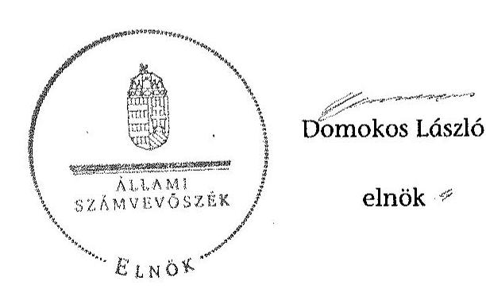

# ÁLLAMI   SZÁMVEVŐSZÉK 

## JELENTÉS

a helyi nemzetiségi önkormányzatok gazdálkodásának ellenőrzéséről
Orosháza Város Német Nemzetiségi Önkormányzat 15164

---

# Állami Számvevőszék 

Iktatószám: V-0794-045/2015.
Témaszám: 1828
Vizsgálat-azonosító szám: V067621

## Az ellenőrzést felügyelte:

## Brebán Andrea

felügyeleti vezető
2015. július 21. napjától

## Horváthné Herbáth Mária

felügyeleti vezető
2015. július 20. napjáig

## Az ellenőrzés végrehajtásáért felelős és az ellenőrzést vezette:

Páncsics Judit
ellenőrzésvezető
A számvevői jelentések feldolgozásában és a jelentés összeállításában közreműködött:

Pálfiné Pusztai Magdolna
számvevő tanácsos
Az ellenőrzést végezték:

| Dr. Elek László | Lakatos József | Pálfiné Pusztai Magdolna |
| :-- | :-- | :-- |
| számvevő | számvevő tanácsos | számvevő tanácsos |

---

# TARTALOMJEGYZÉK 

BEVEZETÉS ..... 7
I. ÖSSZEGZŐ MEGÁLLAPÍTÁSOK, KÖVETKEZTETÉSEK, JAVASLATOK ..... 10
II. RÉSZLETES MEGÁLLAPÍTÁSOK ..... 17

1. A Nemzetiségi Önkormányzat és a Települési Önkormányzat együttműködésének szabályozása, a működési feltételek biztosítása ..... 17
2. A gazdálkodási feladatok ellátásának szabályszerűsége ..... 18
2.1. A költségvetésre és a zárszámadásra, valamint a kincstári adatszolgáltatás rendjére vonatkozó jogszabályi előírások betartása ..... 18
2.2. A Nemzetiségi Önkormányzat gazdálkodásának szabályozottsága ..... 19
2.3. Az operatív gazdálkodási jogkörök kialakítása, gyakorlása ..... 20
3. A Nemzetiségi Önkormányzattal összefüggő gazdálkodási feladatok belső ellenőrzése ..... 22
MELLÉKLETEK
4. számú Orosháza Város Német Nemzetiségi Önkormányzat 2013. évi gazdálkodási adatai

---

.

---

# RÖVIDÍTÉSEK JEGYZÉKE 

## Törvények

Alaptörvény
Áht.
ÁSZ tv.
Nek tv.
Számv. tv.

## Rendeletek

Áhsz. 1

Áhsz. 2
Ávr.

Bkr.
Települési Önkormányzat SZMSZ

## Szórövidítések

ÁSZ
együttműködési megállapodás
értékelési szabályzat
gazdasági szervezet ügyrendje
gazdasági szervezet vezetője
hivatali SZMSZ 1
hivatali SZMSZ 2
jegyző

Magyarország Alaptörvénye
az államháztartásról szóló 2011. évi CXCV. törvény az Állami Számvevőszékről szóló 2011. évi LXVI. törvény a nemzetiségek jogairól szóló 2011. évi CLXXIX. törvény a számvitelről szóló 2000. évi C. törvény
az államháztartás szervezetei beszámolási és könyvvezetési kötelezettségének sajátosságairól szóló 249/2000. (XII. 24.) Korm. rendelet (hatálytalan 2014. január 1-jétől)
az államháztartás számviteléről szóló 4/2013. (I. 11.) Korm. rendelet (hatályos 2014. január 1-jétől)
az államháztartásról szóló törvény végrehajtásáról szóló 368/2011. (XII. 31.) Korm. rendelet (hatályos 2012. január 1-jétől)
a költségvetési szervek belső kontrollrendszeréről és belső ellenőrzéséről szóló 370/2011. (XII. 31.) Korm. rendelet
Orosháza Város Önkormányzata Képviselő-testületének 15/2010. (X. 22.) számú rendelete Orosháza Város Önkormányzat Szervezeti és Működési Szabályzatáról

Állami Számvevőszék
Együttműködési megállapodás a Települési és a Német Nemzetiségi Önkormányzat között, amelyet a Települési Önkormányzat Képviselő-testülete a 137/2012. (V. 25.) számú, a Nemzetiségi Önkormányzat a 35/2012. (V. 17.) számú határozatával fogadott el (hatályos 2012. május 30 -tól, módosítva három alkalommal)
A Polgármesteri hivatal eszközök és források értékelési szabályzata (hatályos 2013. január 1-jétől)
a Polgármesteri hivatal Közgazdasági Irodájának ügyrendje (hatályos 2013. január 1-jétől)
a Közgazdasági Iroda vezetője
Orosházi Polgármesteri Hivatal Szervezeti és Működési Szabályzata a 12/2011. (II. 4.) számú Települési Önkormányzat határozatával jóváhagyott és a 261/2011. (X. 21.), 25/2012. (II. 3.) és a 100/2012. (IV. 20.) számú határozatokkal módosított (egységes szerkezetben hatályos 2012. július 15-2013. április 30-ig)
Orosházi Polgármesteri Hivatal Szervezeti és Működési Szabályzata a 89/2013. (III. 22) számú határozattal jóváhagyott (hatályos 2013. április 1-jétől)
Orosháza Város Önkormányzatának jegyzője

---

Képviselő-testület

Kincstár
Közgazdasági iroda
leltározási szabályzat

Nemzetiségi Önkormányzat
Nemzetiségi Önkormányzat elnöke
Nemzetiségi Önkormányzati SZMSZ
önköltségszámítási szabályzat
pénzkezelési szabályzat

Pénzügyi bizottság
Polgármesteri hivatal
számlarend
számviteli politika
Települési Önkormányzat
Települési Önkormányzat Képviselő-testülete

Orosháza Város Német Nemzetiségi Önkormányzat Képviselő-testülete
Magyar Államkincstár
a Polgármesteri hivatal Közgazdasági Irodája, a pénzügyi-gazdálkodási feladatait ellátó szervezeti egysége
a Polgármesteri hivatal leltárkészítési és leltározási szabályzata (hatályos 2013. március 1-jétől)
Orosháza Város Német Nemzetiségi Önkormányzat
Orosháza Város Német Nemzetiségi Önkormányzat 1. elnöke
Orosháza Város Német Nemzetiségi Önkormányzat Képviselő-testületének 8/2012 (I. 20.) számú határozatával jóváhagyott és a 82/2012. (XII. 6.) számú határozatával módosított Szervezeti és Működési Szabályzata (egységes szerkezetben hatályos 2013. január 1-jétől)
A Polgármesteri hivatal önköltségszámítási szabályzata (hatályos 2013. január 1-jétől)
Orosháza Város Német Nemzetiségi Önkormányzat és Orosháza Város Roma Nemzetiségi Önkormányzat pénzkezelési szabályzata (hatályos 2013. január 1-jétől)
Orosháza Város Német Nemzetiségi Önkormányzat Pénzügyi Bizottsága
Orosházi Polgármesteri Hivatal
a Polgármesteri hivatal számlarendje (hatályos 2013. január 1-jétől)
a Polgármesteri hivatal számviteli politikája (hatályos 2013. január 1-jétől)

Orosháza Város Önkormányzata
Orosháza Város Önkormányzatának Képviselő-testülete

---

# ÉRTELMEZŐ SZÓTÁR 

belső ellenőrzés
belső kontrollrendszer
együttműködési megállapodás
költségvetési szerv vezetője
korrupció

A Bkr. 2. § b) pont meghatározásában független, tárgyilagos bizonyosságot adó és tanácsadó tevékenység, amelynek célja, hogy az ellenőrzött szervezet működését fejlessze és eredményességét növelje, az ellenőrzött szervezet céljai elérése érdekében rendszerszemléletű megközelítéssel és módszeresen értékeli, illetve fejleszti az ellenőrzött szervezet irányítási és belső kontrollrendszerének hatékonyságát.
A Bkr. 2. § d) pont és az Áht. 69. § (1) bekezdése alapján a belső kontrollrendszer a kockázatok kezelése és tárgyilagos bizonyosság megszerzése érdekében kialakított folyamatrendszer, amely azt a célt szolgálja, hogy a működés és gazdálkodás során a tevékenységeket szabályszerűen, gazdaságosan, hatékonyan, eredményesen hajtsák végre, az elszámolási kötelezettségeket teljesítsék, megvédjék az erőforrásokat a veszteségektől, károktól és nem rendeltetésszerű használattól.
Az Áht. 27. § (2) bekezdése és Nek tv. 80. § (1) bekezdése értelmében a helyi önkormányzat a helyi nemzetiségi önkormányzat részére - annak székhelyén - biztosítja az önkormányzati működés személyi és tárgyi feltételeit, továbbá gondoskodik a működéssel kapcsolatos végrehajtási feladatok ellátásáról. Az Nek tv. 80. § (2) bekezdés szerinti a fenti kötelezettségének teljesítése érdekében a helyi önkormányzat harminc napon belül biztosítja a rendeltetésszerű helyiséghasználatot, valamint a helyiséghasználatra, a további feltételek biztosítására és a feladatok ellátására vonatkozóan megállapodást köt a helyi nemzetiségi önkormányzattal. A megállapodást minden év január 31. napjáig, általános vagy időközi választás esetén az alakuló ülést követő harminc napon belül felül kell vizsgálni. A helyi önkormányzat és a nemzetiségi önkormányzat szervezeti és működési szabályzatában rögzíti a megállapodás szerinti működési feltételeket, a megállapodás megkötését, módosítását követő harminc napon belül. Az Nek tv. 80. § (3) bekezdés írja elő a megállapodásban rögzítendőket.
A Bkr. 2. § nd) pont meghatározásában a helyi önkormányzat, helyi nemzetiségi önkormányzat, illetve a fővárosi kerületi önkormányzat esetén a jegyző, körjegyző, főjegyző.
Azok a cselekmények, amelyek során a köz érdekében való eljárással megbízott és döntéshozatali felelősséggel felruházott személy a köz érdeke helyett önös vagy részérdekeket követve, mástól jogtalan vagy etikátlan előnyt elfogadva és őt jogtalan vagy etikátlan előnyhöz juttatva jár el, illetve amikor valaki a köz érdekében való eljárással

---

kulcskontroll
lényegesség
nemzetiség
nemzetiségi önkormányzat
megbízott és döntéshozatali felelősséggel felruházott személynek jogtalan vagy etikátlan előnyt nyújtva vagy felajánlva jogtalan vagy etikátlan előnyt kér. (Forrás: A Kormány korrupció megelőzési programja 2012-2014.)
Az azonosított kockázatok mérséklése érdekében kialakított kontrollok közül azok, amelyek elégtelen működése esetén a szervezetet jelentős veszteség érheti, vagy a működésükben bekövetkező hiba/hiányosság más kontrollok eredményességét csökkenti. Ezek ellenőrzése, értékelése elegendő bizonyítékot szolgáltat adott területen a kontrollrendszer értékeléséhez. Az önkormányzatok kontrollrendszere kialakításának ellenőrzése során a pénzügyi folyamatokban kulcsszerepet betöltő belső kontrollok a teljesítésigazolás és érvényesítés.
Egy információ akkor lényeges, ha hiánya vagy téves állítása befolyásolhatja ezen információkat felhasználók döntéseit, véleményét. Az ellenőrzés során a lényegesség három szempontból értelmezhető: érték, jelleg és összefüggés szerint.
A Nek tv. 1. § (1) bekezdése alapján nemzetiség minden olyan Magyarország területén legalább egy évszázada honos népcsoport, amely az állam lakossága körében számszerű kisebbségben van, tagjai magyar állampolgárok és a lakosság többi részétől saját nyelve és kultúrája, hagyományai különböztetik meg, egyben olyan összetartozástudatról tesz bizonyságot, amely mindezek megőrzésére, történelmileg kialakult közösségeik érdekeinek kifejezésére és védelmére irányul.
Az Nek tv. 2. § 2. pontja szerint törvényben meghatározott nemzetiségi közszolgáltatási feladatokat ellátó, testületi formában működő, jogi személyiséggel rendelkező, demokratikus választások útján e törvény alapján létrehozott szervezet, amely a nemzetiségi közösséget megillető jogosultságok érvényesítésére, a nemzetiségek érdekeinek védelmére és képviseletére, a feladat- és hatáskörébe tartozó nemzetiségi közügyek települési, területi vagy országos szinten történő önálló intézésére jön létre.

---

# JELENTÉS 

## a helyi nemzetiségi önkormányzatok gazdálkodásának ellenőrzéséről Orosháza Város Német Nemzetiségi Önkormányzat

## BEVEZETÉS

A Nemzetiségi Önkormányzat 1998. évben alakult. Nemzetiségi Önkormányzat 2013-ban hivatalban lévő elnöke az 1998. évi helyhatósági választások óta látja el feladatát. A Nemzetiségi Önkormányzat intézményt, gazdasági társaságot és más szervezetet nem alapított, illetve társulásban nem vett részt. A négytagú Képviselő-testület a munkája segítésére 2010-2014. között Pénzügyi bizottságot hozott létre. A Nemzetiségi Önkormányzat 2013. évi költségvetési beszámolója szerint a módosított bevételi és kiadási előirányzat 4763,0 ezer Ft, a teljesített költségvetési bevétel 3169,0 ezer Ft, a teljesített költségvetési kiadás 2468,0 ezer Ft, az igénybe vett előző évi pénzmaradvány 1600 ezer Ft volt. A Nemzetiségi Önkormányzat az adatszolgáltatása szerint a 2013. évben 225,4 ezer Ft általános működési támogatásban és 1674,6 ezer Ft feladatalapú támogatásban részesült. A 2013. évi gazdálkodási adatokat részletesen az 1. számú mellékletben mutatjuk be.

Az Alaptörvény Szabadság és felelősség rész XXIX. cikk (1) bekezdése szerint a Magyarországon élő nemzetiségek államalkotó tényezők. Minden, valamely nemzetiséghez tartozó magyar állampolgárnak joga van önazonossága szabad vállalásához és megőrzéséhez. A hazánkban élő nemzetiségek helyi (települési és területi) valamint országos önkormányzatokat hozhatnak létre ${ }^{1}$. A helyi nemzetiségi önkormányzatok gazdálkodási feladatait jogszabályi előírás alapján a székhely szerinti helyi önkormányzat polgármesteri hivatala látja el.

A nemzetiségek helyzete, támogatása mind hazai, mind EU-s szinten kiemelt figyelmet kap napjainkban. A helyi nemzetiségi önkormányzatok gazdálkodására és támogatási rendszerére vonatkozó jogszabályok a 2010-2012. években jelentős változásokon mentek át. A helyi nemzetiségi önkormányzatok gazdálkodásának, a részükre juttatott költségvetési támogatások felhasználásának ellenőrzését az ÁSZ 2012-ben sorozatjellegű ellenőrzés keretében indította el.

[^0]
[^0]:    ${ }^{1}$ A 2010. évben megtartott nemzetiségi önkormányzati választásokat követően 2304 települési, 58 területi és 13 országos nemzetiségi önkormányzat alakult meg.

---

Az ellenőrzés célja annak értékelése volt, hogy a helyi nemzetiségi önkormányzat gazdálkodási kereteinek kialakítása, gazdálkodása megfelelt-e a jogszabályoknak.

Ennek keretében értékeltük, hogy:

- a helyi nemzetiségi önkormányzat és a helyi (települési) önkormányzat együttműködésének szabályozása, a működési feltételek biztosítása megfelelte a jogszabályi előírásoknak;
- a felek együttműködése megfelelt-e a megállapodásban foglaltaknak a gazdálkodási feladatok szabályszerű ellátása során, betartották-e a vonatkozó jogszabályi előírásokat;
- biztosított volt-e a helyi nemzetiségi önkormányzat gazdálkodásának belső ellenőrzése.

Az ellenőrzés várható hasznosulása: a nemzetiségi önkormányzatok testületi döntéseinek tapasztalatait összegezve következtetés vonható le a törvényalkotás számára a jogszabályi környezet esetleges módosításának indokoltságára vonatkozóan. Az ellenőrzés az ellenőrzött számára visszajelzést ad a rendezett gazdálkodási keretek kialakításáról, a működésbeli hiányosságokról. Az ellenőrzés megállapításai és javaslatai, a jó gyakorlat bemutatása tanulságul szolgálhatnak más nemzetiségi önkormányzatok, szervezetek számára a rendezett gazdálkodási keretek kialakításához. A társadalom számára jelzi, hogy közpénz nem maradhat ellenőrizetlenül, az ÁSZ értékteremtő rend kialakításához és megőrzéséhez hozzájáruló tevékenysége pozitív hatással lesz a szervezetről kialakított összkép formálásában. Az ÁSZ szervezetén belül lehetőség nyílik arra, hogy a megállapítások szintetizálásával az intézmény a hozzáadott értéket teremtő elemző tevékenységét és tanácsadó szerepét erősítse.

A helyi nemzetiségi önkormányzatok gazdálkodásának ellenőrzéséről szóló jelentés I. fejezetének összegző része az ellenőrzés céljára adott rövid, szintetizáló összefoglalót és következtetéseket tartalmazza a II. fejezet részletes megállapításain alapulóan.

A jelentés intézkedést igénylő megállapításait és javaslatait - az összegzőben foglaltak mellett - az ellenőrzés során feltárt, a jelentés II. fejezetében rögzített részletes megállapítások alapozzák meg, illetve támasztják alá.

Az ellenőrzés típusa: szabályszerűségi ellenőrzés.
Az ellenőrzött időszak: a Nemzetiségi
 Önkormányzat és a Települési Önkormányzat együttműködésének, valamint a Nemzetiségi Önkormányzat gazdálkodásának szabályozása megfelelőségét a 2013. évre vonatkozóan (a 2013. december 31-i állapotnak megfelelően), a Nemzetiségi Önkormányzat gazdálkodásának szabályszerűségét, a működési feltételek, valamint a belső ellenőrzés biztosítását a 2013. január 1. - december 31-e közötti időszakot figyelembe véve értékeltük.

Ellenőrzött szervezet: Orosháza Város Német Nemzetiségi Önkormányzat és a gazdálkodási feladatait ellátó Orosházi Polgármesteri Hivatal.

---

Az ellenőrzés szakmai módszertana az ÁSZ hivatalos honlapján (www.asz.hu) közzétett szakmai szabályokon alapult, amely a Legfőbb Ellenőrző Intézmények Nemzetközi Szervezete (INTOSAI) által kiadott nemzetközi standardok (ISSAI) figyelembevételével készült.

A gazdálkodás folyamatában kulcsszerepet betöltő két kulcskontroll - teljesítésigazolás és érvényesítés - működésének megfelelőségét a személyi juttatásokkal, a dologi és felhalmozási kiadásokkal, működési és felhalmozási célú pénzeszköz átadásokkal, ellátottak pénzbeli juttatásaival kapcsolatos kifizetések esetében mintavétellel ellenőriztük. „Megfelelőnek" értékeltük a gazdálkodási jogkörök gyakorlását, amennyiben 95%-os bizonyossággal a teljes sokaságban a hibaarány legfeljebb 10%, „részben megfelelőnek" értékeltük, ha a hibaarány felső határa 10-30% között volt, „nem megfelelőnek" pedig akkor, ha a mintavételi eredmények alapján a sokaságbeli hibaarány felső határa meghaladta a 30%-ot.

Az ellenőrzés végrehajtásának jogszabályi alapját az ÁSZ tv. 5. § (2)-(3) és (6) bekezdéseiben foglaltak képezték.

Az ÁSZ tv. 29. § (1) bekezdése szerint a jelentéstervezetet megküldtük a jegyző és a Nemzetiségi Önkormányzat elnöke részére, akik az ÁSZ tv. 29. § (2) bekezdésében foglalt észrevételezési jogukkal nem éltek, a jelentéstervezetre észrevételt nem tettek.

---

# I. ÖSSZEGZŐ MEGÁLLAPÍTÁSOK, KÖVETKEZTETÉSEK, JAVASLATOK 

A Nemzetiségi Önkormányzat és a Települési Önkormányzat együttműködésének szabályozása a feltárt hiányosságok ellenére megfelelt a jogszabályi előírásoknak.

A Nemzetiségi Önkormányzat és a Települési Önkormányzat között 2013-ban hatályban volt együttműködési megállapodást a Nek tv.-ben előírt határidőre felülvizsgálták. Az együttműködési megállapodás az Áht.-ban előírtak ellenére nem tartalmazta, hogy a Nemzetiségi Önkormányzat bevételeivel és kiadásaival kapcsolatban az ellenőrzési feladatok ellátásáról a Polgármesteri hivatal gondoskodik. Az együttműködési megállapodásban az Áht.-ban előírtaknak megfelelően rögzítették, hogy a Nemzetiségi Önkormányzat tervezési, gazdálkodási, finanszírozási, adatszolgáltatási és beszámolási feladatait Polgármesteri hivatal látja el. A feladatellátás részletes szabályait - az ellenőrzési feladat kivételével - a megállapodásban rendezték. A Nek. tv. előírásai ellenére az együttműködési megállapodásban nem rögzítették teljes körűen a Nemzetiségi Önkormányzat kötelezettségvállalásának a szabályait, különösen az összeférhetetlenségi kötelezettségeket. Az együttműködési megállapodásban az Ávr.-ben előírtak ellenére az érvényesítésre a gazdasági szervezet vezetője helyett a jegyző által írásban kijelölt köztisztviselő jogosultságát rögzítették.

A Települési Önkormányzat 2013-ban a Nek. tv.-ben előírtaknak megfelelően biztosította a Nemzetiségi Önkormányzat működéséhez szükséges személyi és tárgyi feltételeket, amelyet az együttműködési megállapodásban rögzítettek. A jegyző a nemzetiségi önkormányzati feladatok ellátását az érintett hivatali dolgozók munkaköri leírásában előírta.

Az együttműködési megállapodás szerinti működési feltételeket a Nek. tv.-ben előírtak ellenére a Nemzetiségi Önkormányzat SZMSZ-e nem tartalmazta.

A Nemzetiségi Önkormányzat 2013. évi költségvetésének és zárszámadásának tartalma, jóváhagyása, valamint a kapcsolódó adatszolgáltatás a feltárt hiányosságok ellenére megfelelt a jogszabályi előírásoknak.

A Nemzetiségi Önkormányzat elnöke határidőben benyújtotta a Képviselő-testület részére a 2013-2014. évi költségvetési koncepciókat és a 2013. évi költségvetési határozat-tervezetét. A 2013. évi költségvetés előterjesztésekor a Nemzetiségi Önkormányzat Képviselő-testülete részére tájékoztatásul - az Áht.-ban előírtak ellenére - szöveges indoklás nélkül mutatták be a költségvetési mérleget közgazdasági tagolásban és az előirányzat felhasználási tervet.

A 2013. évi zárszámadási határozat-tervezetet a Nemzetiségi Önkormányzat elnöke az előírt határidőben a Képviselő-testület elé terjesztette. A zárszámadási határozat-tervezet előterjesztésekor tájékoztatásul - az Áht.-ban előírtak ellenére - szöveges indoklás nélkül mutatták be a költségvetési mérleget közgazdasági tagolásban és a pénzeszközök változását. A zárszámadási határozat-tervezet előterjesztésekor az Áht.-ban előírtak ellenére a vagyonkimutatást tájékoztatásul nem mutatták be.

---

közgazdasági tagolásban és a pénzeszközök változását. A zárszámadási határozat-tervezet előterjesztésekor az Áht.-ban előírtak ellenére a vagyonkimutatást tájékoztatásul nem mutatták be.

A zárszámadási határozatban az Áht.-ban foglaltaknak megfelelően a Nemzetiségi Önkormányzat valamennyi bevételéről és kiadásáról elszámoltak.

A jegyző a 2013. évi költségvetéshez kapcsolódó, a Nemzetiségi Önkormányzat részére előírt kincstári adatszolgáltatást az Ávr.-ben és az Áhsz.¹-ben előírt határidőre teljesítette.

A Nemzetiségi Önkormányzat gazdálkodásának szabályozottsága a 2013. évben részben felelt meg a jogszabályi előírásoknak, valamint az együttműködési megállapodásban foglaltaknak. A Nemzetiségi Önkormányzat 2013. évben a Számv. tv.-ben előírt szabályzatokkal rendelkezett. A Nemzetiségi Önkormányzat pénzkezelési szabályzatát az Ávr.-ben és az Áhsz.¹-ben foglaltak ellenére - a jegyző helyett - a gazdasági szervezet vezetője adta ki. A hivatali SZMSZ¹,² - az Ávr.-ben foglaltak ellenére - nem tartalmazta teljes körűen az abban nevesített munkakörökhöz tartozó feladat- és hatásköröket, a hatáskörök gyakorlásának módját, a helyettesítés rendjét, valamint az ezekhez kapcsolódó felelősségi szabályokat. A gazdasági szervezet ügyrendje - az együttműködési megállapodásban foglaltaknak megfelelően - részletesen szabályozta a tervezéssel, a gazdálkodással, az adatszolgáltatási feladatok teljesítésével kapcsolatos belső előírásokat, feltételeket. Az operatív gazdálkodási jogkörök gyakorlásának módját, eljárási és dokumentációs részletszabályait a pénzkezelési szabályzat tartalmazta. A kontrolltevékenységek részeként a Nemzetiségi Önkormányzat tevékenységeire a Bkr.-ben előírtak ellenére a folyamatba épített előzetes, utólagos és vezetői ellenőrzést nem biztosították.

Az ellenőrzött időszakban a Nemzetiségi Önkormányzat gazdálkodása tekintetében az operatív gazdálkodási jogkörök kialakítása a feltárt hiányosságok ellenére megfelelt a jogszabályi előírásoknak, valamint az együttműködési megállapodásban foglaltaknak. A Nemzetiségi Önkormányzat költségvetésének végrehajtásával összefüggő operatív gazdálkodási jogköröket az együttműködési megállapodásban és a pénzkezelési szabályzatban rögzítették. A pénzkezelési szabályzat az Ávr.-ben előírtak ellenére nem tartalmazta a pénzügyi ellenjegyzést, teljesítésigazolást, érvényesítést és utalványozást végző személyek kijelölésének rendjével kapcsolatos belső előírásokat, feltételeket. A Nemzetiségi Önkormányzat elnöke az Ávr. előírásainak megfelelően írásban felhatalmazást adott a kötelezettségvállalás és az utalványozás gyakorlására, és kijelölte a teljesítés igazolására jogosult személyeket. A pénzügyi ellenjegyzést és érvényesítést végző dolgozók az Ávr.-ben előírt végzettséggel, illetve pénzügyi-számviteli képesítéssel rendelkeztek.

A Nemzetiségi Önkormányzat a 2013. évben csak személyi juttatással és dologi kiadásokkal kapcsolatos kifizetést teljesített. A Nemzetiségi Önkormányzatnál a 2013. évi személyi juttatásokkal és dologi kiadásokkal kapcsolatos kifizetések esetében az operatív gazdálkodási jogkörökön belül a teljesítés igazolás és érvényesítés kulcskontrollok működése - a két ellenőrzött kiadási terület értékelésének súlyozott átlaga alapján - összességében „részben megfelelő" volt, mivel az ellenőrzött tételek több mint egynegyedében hibák, hiányosságok fordultak elő.

---

A teljesítésigazolást a személyi juttatások és dologi kiadások kifizetéseit megelőzően az Ávr.-ben előírtak ellenére több esetben nem végezték el, illetve nem a pénzkezelési szabályzatban előírt módon teljesítették. Előfordult, hogy a teljesítésigazolás az Ávr.-ben előírtak ellenére nem volt szabályszerű, mert a személyi kifizetéseknél a teljesítésigazoló ellenőrizhető okmányok, dokumentumok hiányában a kifizetések jogosságát, összegszerűségét nem ellenőrizte.

Az érvényesítő több esetben a személyi juttatások és dologi kiadások kifizetéseit megelőzően nem jelezte, hogy a teljesítésigazolást nem végezték el, illetve nem szabályszerűen látták el, továbbá azt, hogy nem történt meg a kötelezettségvállalás nyilvántartásba vétele. Az érvényesítés az Ávr.-ben foglaltak ellenére az ellenőrzött tételeknél nem tartalmazta az érvényesítésre utaló megjelölést. Az érvényesítő nem kifogásolta, hogy az utalványrendeleteken nem tüntették fel a költségvetési évet és a kötelezettségvállalás nyilvántartási számát.

Az ellenőrzés az operatív gazdálkodási jogkörök működésével kapcsolatban további szabálytalanságokat tárt fel, több esetben a kiadási pénztárbizonylatokon az utalványozó és a készpénz átvevője azonos személy volt, figyelmen kívül hagyva az Ávr. összeférhetetlenségre vonatkozó előírásait.

A kiadási pénztárbizonylatok kiállítása során nem tettek eleget a Számv. tv.-ben előírtaknak, mert azok a könyvvitelben rögzítendő adatokat nem a valóságnak megfelelően tartalmazták. A készpénzben teljesített dologi kiadások közül több esetben a kiadási pénztárbizonylatokat a számla kibocsájtójának nevére állították ki a számlák ellenértékét átvevő, a kiadásokat megelőlegező személy helyett, emiatt az átvevő nem volt beazonosítható.

A 2013. évben a Nemzetiségi Önkormányzat gazdálkodásával összefüggő végrehajtási feladatokra vonatkozó belső ellenőrzés nem volt megfelelő. A jegyző a Bkr.-ben foglaltak ellenére - a feladatkörében eljárva - nem gondoskodott a Nemzetiségi Önkormányzatnál a gazdálkodási feladatokat érintően a belső ellenőrzés megfelelő működtetéséről. A belső ellenőrzés a Polgármesteri hivatalban végezte a Bkr.-ben előírt kockázatelemzést, de az nem terjedt ki Nemzetiségi Önkormányzat gazdálkodásával összefüggő feladatokra. A Nemzetiségi Önkormányzatnál a gazdálkodással összefüggő végrehajtási feladatokra vonatkozóan belső ellenőrzést a 2013. évben nem terveztek és nem végeztek.

Az ÁSZ tv. 33. § (1) bekezdésében foglaltak értelmében a jelentésben foglalt megállapításokhoz kapcsolódó intézkedési tervet köteles az ellenőrzött szervezet vezetője összeállítani, és azt a jelentés kézhezvételétől számított 30 napon belül az ÁSZ részére megküldeni. Amennyiben az intézkedési tervet határidőben nem küldi meg a szervezet, vagy az nem elfogadható, az ÁSZ elnöke a hivatkozott törvény 33. § (3) bekezdés a)-b) pontjaiban foglaltakat érvényesítheti.

---

A helyszíni ellenőrzés megállapításainak hasznosítása mellett javasoljuk

# a jegyzőnek 

1. Az együttműködés szabályozásával kapcsolatban

Az együttműködési megállapodás - a Nek. tv. 80. § (3) bekezdés c) pontjában előírtak ellenére - nem tartalmazta a Nemzetiségi Önkormányzat kötelezettségvállalásának szabályait, különösen az összeférhetetlenségi követelményekre vonatkozó előírásokat.

Az együttműködési megállapodásban - az Ávr. 58. § (4) bekezdésében és az 55. § (2) bekezdés g) pontjában foglalt előírások ellenére - érvényesítésre a gazdasági szervezet vezetője helyett a jegyző által írásban kijelölt köztisztviselő jogosultságát rögzítették.

Az együttműködési megállapodás szerinti működési feltételeket a Nek. tv. 80. § (2) bekezdésében foglaltak ellenére a Nemzetiségi Önkormányzat SZMSZ-ében nem rögzítették.

Javaslat
a) Készítse elő az együttműködési megállapodás módosítását, amely teljes körűen megfelel a jogszabályi előírásoknak és kezdeményezze annak a Települési Önkormányzat Képviselő-testülete elé terjesztését.
b) Készítse elő a Nemzetiségi Önkormányzat SZMSZ-ének kiegészítését az együttműködési megállapodás módosításához kapcsolódóan, és kezdeményezze annak a Képviselő-testület elé terjesztését.
2. A költségvetés és zárszámadás szabályszerűségével kapcsolatban

A 2013. évi költségvetési határozat-tervezet előterjesztésekor az Áht. 26. § (1) bekezdés figyelembevételével a Képviselő-testület részére tájékoztatásul - az Áht. 24. § (4) bekezdés a) pontjában előírtak ellenére - szöveges indoklás nélkül mutatták be a költségvetési mérleget közgazdasági tagolásban és az előirányzat felhasználási tervet.

A 2013. évi zárszámadási határozat-tervezet előterjesztésekor az Áht. 91. § (2) bekezdés a) pontjában foglaltak ellenére szöveges indoklás nélkül mutatták be az Áht. 24. § (4) bekezdés a) pontja szerinti költségvetési mérleget közgazdasági tagolásban és a pénzeszközök változását, továbbá az Áht. 91. § (2) bekezdés c) pontjában előírtak ellenére nem mutatták be a vagyonkimutatást tájékoztatásul.

Javaslat
a) Gondoskodjon arról, hogy a költségvetési határozat-tervezet előterjesztésekor a Képviselő-testületnek tájékoztatásul szöveges indoklással együtt mutassák be a költségvetési mérleget és az előirányzat felhasználási tervet.
b) Gondoskodjon arról, hogy a zárszámadási határozat-tervezet előterjesztésekor a Képviselő-testület részére tájékoztatásul szöveges indoklással együtt kerüljön bemutatásra a költségvetési mérleg és pénzeszközök változása, valamint készítse el a zárszámadási határozat-tervezet előterjesztéséhez a tájékoztatásul bemutatandó vagyonkimutatást.

---

3. A gazdálkodási feladatok szabályozottságával kapcsolatban

A pénzkezelési szabályzatot az Ávr. 13. § (2) bekezdésében és az Áhsz. 8. § (12) bekezdésében foglalt előírás ellenére a jegyző helyett a Közgazdasági iroda vezetője mint a gazdasági szervezet vezetője adta ki.

A hivatali SZMSZ¹,² - az Ávr. 13. § (1) bekezdés g) pontjában előírtak ellenére -
 nem tartalmazta teljes körűen az abban nevesített munkakörökhöz tartozó feladat- és hatásköröket, a hatáskörök gyakorlásának módját, a helyettesítés rendjét, valamint az ezekhez kapcsolódó felelősségi szabályokat.

A Polgármesteri hivatalban – Bkr. 8. § (2) bekezdésében előírtak ellenére – nem biztosították a Nemzetiségi Önkormányzat gazdálkodásával összefüggő tevékenységekre vonatkozóan a folyamatba épített előzetes, utólagos és vezetői ellenőrzést.

Javaslat
a) Intézkedjen a pénzkezelési szabályzat jogszabályi előírásoknak megfelelő kiadásáról.
b) Készítse el a Polgármesteri hivatal SZMSZ-ének jogszabályi előírásoknak megfelelő kiegészítését, módosítását, majd kezdeményezze annak képviselő-testületi előterjesztését.
c) Biztosítsa a Polgármesteri hivatal által ellátott minden tevékenységre vonatkozóan a folyamatba épített előzetes, utólagos és vezetői ellenőrzést.
4. Az operatív gazdálkodási jogkörök kialakításával és működésével kapcsolatban

A pénzkezelési szabályzat, illetve más belső szabályzat – az Ávr. 13. § (2) bekezdése a) pontjában előírtak ellenére – nem határozta meg a pénzügyi ellenjegyzést, a teljesítésigazolást, az érvényesítést és az utalványozást végző személyek kijelölésének rendjével kapcsolatos belső előírásokat, feltételeket.

A teljesítésigazoló több esetben nem végezte el az Ávr. 57. § (1) bekezdése szerint feladatát. Előfordult, hogy a teljesítést – dokumentumok hiányában – a kiadás jogosságának, összegszerűségének ellenőrzése nélkül igazolták, továbbá a teljesítés igazolását nem az Ávr. 57. § (3) bekezdésében előírt módon végezték el.

Az érvényesítés – az Ávr. 58. § (1) bekezdésében előírtak ellenére – néhány esetben nem a teljesítés igazolása alapján történt, továbbá nem felelt meg az Ávr. 58. § (3) bekezdésében foglaltaknak, mert nem tartalmazta az érvényesítésre utaló megjelölést. Az érvényesítő nem az Ávr. 58. § (1) és (2) bekezdésének megfelelően látta el a feladatát, mivel nem ellenőrizte, hogy a megelőző ügymenetben a jogszabályok előírásait és a belső szabályzatokban foglaltakat betartották-e. Az érvényesítő nem jelezte az utalványozónak, hogy a teljesítésigazolást nem, illetve nem szabályszerűen végezték el. Az érvényesítő nem kifogásolta, hogy a külön írásbeli rendelkezésként elkészített utalványrendeleteken az Ávr. 59. § (3) bekezdés b) és f) pontjaiban előírtak ellenére nem tüntették fel a költségvetési évet és a kötelezettségvállalás nyilvántartási számát.

---

A kiadási pénztárbizonylatok – a Számv. tv. 165. § (2) bekezdésében és a 167. § (1) bekezdés c) pontjában előírtak ellenére – nem feleltek meg a bizonylat általános alaki és tartalmi követelményeinek, mert a feltüntetett adatokat nem a valóságnak megfelelően tartalmazták.

Javaslat
Az operatív gazdálkodás működési hibáinak megelőzése, feltárása és kijavítása érdekében intézkedjen:
a) a pénzügyi ellenjegyzést, teljesítésigazolást, érvényesítést és utalványozást végző személyek kijelölésének rendjével kapcsolatos belső előírások, feltételek szabályzatban történő meghatározásáról;
b) a teljesítésigazolás jogszabályi előírásoknak megfelelő elvégzéséről;
c) az érvényesítéshez kapcsolódó ellenőrzési és jelzési feladatok szabályszerű ellátásáról;
d) annak érdekében, hogy a pénztárbizonylatok kiállítása megfeleljen a jogszabályi előírásoknak;
e) az operatív gazdálkodási jogkörök gyakorlását és a bizonylatkezelést érintően feltárt hiányosságok, szabálytalanságok tekintetében a munkajogi felelősség tisztázására irányuló eljárás megindításáról, és ennek eredménye ismeretében tegye meg a szükséges intézkedéseket.

# a Nemzetiségi Önkormányzat elnökének 

1. Az együttműködés szabályozásával kapcsolatban

Az együttműködési megállapodás – a Nek. tv. 80. § (3) bekezdés c) pontjában előírtak ellenére – nem tartalmazta a Nemzetiségi Önkormányzat kötelezettségvállalásának szabályait, különösen az összeférhetetlenségi követelményekre vonatkozó előírásokat. Az együttműködési megállapodásban – az Ávr. 58. § (4) bekezdésében és az 55. § (2) bekezdés g) pontjában foglalt előírások ellenére – érvényesítésre a gazdasági szervezet vezetője helyett a jegyző által írásban kijelölt köztisztviselő jogosultságát rögzítették.

Az együttműködési megállapodás szerinti működési feltételeket a Nek. tv. 80. § (2) bekezdésében foglaltak ellenére a Nemzetiségi Önkormányzat SZMSZ-ében nem rögzítették.

Javaslat
Terjessze a Nemzetiségi Önkormányzat Képviselő-testülete elé jóváhagyásra
a) az együttműködési megállapodás jogszabályi előírásoknak megfelelő – jegyző által előkészített – módosítását;
b) a Nemzetiségi Önkormányzat – jegyző által előkészített – a jogszabályi előírásoknak megfelelően kiegészített SZMSZ-ét.

---

2. Az operatív gazdálkodási jogkörök kialakításával kapcsolatban

Az utalványozás során több esetben megsértették az Ávr. 60. § (2) bekezdésében foglalt összeférhetetlenségre vonatkozó előírásokat, az utalványozó az utalványozást több esetben a saját maga javára végezte.

Javaslat
Az utalványozásra jogosultak írásbeli kijelölése során biztosítsa az összeférhetetlenségre vonatkozó jogszabályi előírások betartását.

---

# II. RÉSZLETES MEGÁLLAPÍTÁSOK 

## 1. A Nemzetiségi Önkormányzat és a Települési Önkormányzat EGYÜTTMŰKÖDÉSÉNEK SZABÁLYOZÁSA, A MŰKÖDÉSI FELTÉTELEK BIZTOSÍTÁSA

A Nemzetiségi Önkormányzat és a Települési Önkormányzat együttműködésének szabályozása – a feltárt hiányosságok ellenére – megfelelt a jogszabályi előírásoknak.

A Nemzetiségi Önkormányzat a 2013. évben rendelkezett a Települési Önkormányzattal kötött – a Nek. tv. 80. § (2) bekezdésében előírt – együttműködési megállapodással, amelyet a Nemzetiségi Önkormányzat és a Települési Önkormányzat képviselő-testületei határozataikkal ${ }^{2}$ jóváhagytak. Az együttműködési megállapodás 2013. évi felülvizsgálata a Nek. tv. 80. § (2) bekezdésében előírt határidőre megtörtént ${ }^{3}$.

Az együttműködési megállapodás – az Áht. 27. § (2) bekezdésben foglaltak ellenére – nem tartalmazta, hogy a Nemzetiségi Önkormányzat bevételeivel és kiadásaival kapcsolatban az ellenőrzési feladatokat a Polgármesteri hivatal látja el. Az együttműködési megállapodás az Áht. 27. § (2) bekezdésben foglaltaknak megfelelően rögzítette, hogy a Közgazdasági iroda látja el a Nemzetiségi Önkormányzat bevételeivel és kiadásaival kapcsolatban a tervezési, gazdálkodási, finanszírozási, adatszolgáltatási és beszámolási feladatokat. A feladatellátás részletes szabályait – az ellenőrzési feladat kivételével – a megállapodásban rendezték.

Az együttműködési megállapodás a Nek. tv. 80. § (3) bekezdés a), b) és d) pontjában előírtaknak megfelelően tartalmazta a költségvetés előkészítésével és megalkotásával, a költségvetéssel összefüggő adatszolgáltatási kötelezettségek teljesítésével kapcsolatos határidőket, az operatív gazdálkodási feladatokat, a felelősök kijelölését, valamint a működési feltételeinek és gazdálkodásának eljárási és dokumentációs részletszabályaival kapcsolatos előírásokat.

Az együttműködési megállapodás – a Nek. tv. 80. § (3) bekezdés c) pontjában előírtak ellenére – nem tartalmazta a Nemzetiségi Önkormányzat kötelezettségvállalásának szabályait, különösen az összeférhetetlenségi követelményekre vonatkozó előírásokat. Az együttműködési megállapodásban – az Ávr. 58. § (4) bekezdésben és az 55. § (2) bekezdés g) pontjában előírtak ellenére – az

[^0]
[^0]:    ${ }^{2}$ A 2013. évben hatályos együttműködési megállapodást a Nemzetiségi Önkormányzat Képviselő-testülete a 35/2012. (V. 17.) számú határozatával, a Települési Önkormányzat Képviselő-testülete a 137/2012. (V. 25.) számú határozatával fogadta el.
    ${ }^{3}$ A felülvizsgálatról az előterjesztés 2013. január 21-én készült, ezt követően a módosított együttműködési megállapodást a Települési Önkormányzat Képviselő-testülete a 7/2013. (II. 1.) számú határozatával, a Nemzetiségi Önkormányzat a 16/2013. (II. 27.) számú határozatával hagyta jóvá.

---

érvényesítésre a gazdasági szervezet vezetője helyett a jegyző által írásban kijelölt köztisztviselő jogosultságát rögzítették.

A Települési Önkormányzat 2013. december 31-én hatályos együttműködési megállapodásban a Nek. tv. 80. § (1) bekezdésében előírtaknak megfelelően – a Polgármesteri hivatal útján – biztosította a Nemzetiségi Önkormányzat önkormányzati működéséhez szükséges személyi és tárgyi feltételeket, amelyet az együttműködési megállapodásban rögzítettek. Az együttműködési megállapodás a Nek. tv. 80. § (4) bekezdésének megfelelően tartalmazta, hogy a jegyző vagy a jegyzővel azonos képesítési előírásoknak megfelelő megbízottja a Települési Önkormányzat megbízásából és képviseletében részt vesz a Nemzetiségi Önkormányzat testületi ülésein és jelzi, amennyiben törvénysértést észlel. A jegyző a nemzetiségi önkormányzati feladatok ellátását az érintett hivatali dolgozók munkaköri leírásában rögzítette. A Polgármesteri hivatal az előírásoknak megfelelően gondoskodott a Nemzetiségi Önkormányzat működéséhez szükséges személyi és tárgyi feltételekről. A Települési Önkormányzat SZMSZ-e tartalmazta az együttműködési megállapodások szerinti működési feltételeket.

A Nemzetiségi Önkormányzat SZMSZ-ében az együttműködési megállapodás szerinti működési feltételeket a Nek. tv. 80. § (2) bekezdésében foglaltak ellenére nem rögzítették.

# 2. A GAZDÁLKODÁSI FELADATOK ELLÁTÁSÁNAK SZABÁLYSZERŰSÉGE 

### 2.1. A költségvetésre és a zárszámadásra, valamint a kincstári adatszolgáltatás rendjére vonatkozó jogszabályi előírások betartása

A Nemzetiségi Önkormányzat 2013. évi költségvetésének és zárszámadásának tartalma, jóváhagyása, valamint a kapcsolódó adatszolgáltatás a feltárt hiányosságok ellenére megfelelt a jogszabályi előírásoknak.

A Nemzetiségi Önkormányzat elnöke a 2013. évi és a 2014. évi költségvetési koncepciót ${ }^{4}$, valamint a 2013. évi költségvetési határozat-tervezetét az Áht.-ban előírt határidőben benyújtotta a Képviselő-testületnek.

A 2013. évi költségvetési határozat-tervezet előterjesztésekor az Áht. 26. § (1) bekezdésének figyelembevételével a Képviselő-testület részére tájékoztatásul – az Áht. 24. § (4) bekezdés a) pontjában előírtak ellenére – szöveges indoklás nélkül mutatták be a költségvetési mérleget közgazdasági tagolásban és az előirányzat felhasználási tervet.

[^0]
[^0]:    ${ }^{4}$ A Képviselő-testület a 2013. évi költségvetési koncepciót a 73/2012. (XI. 29.) számú határozatával fogadta el, a 2014. évi költségvetési koncepciót az elnök 2013. október 28-án terjesztette elő.

---

A jóváhagyott 2013. évi költségvetési határozat ${ }^{5}$ megfelel a jogszabályi előírásoknak.

A Nemzetiségi Önkormányzat elnöke a jegyző által elkészített 2013. évi zárszámadási határozat-tervezetét – az Áht.-ban előírt határidőben – a Képviselő-testület elé terjesztette ${ }^{6}$. A zárszámadási határozatot az elfogadott költségvetéssel összehasonlítható módon készítették el. A zárszámadásban a Nemzetiségi Önkormányzat valamennyi bevételéről és kiadásáról elszámoltak. A zárszámadási határozat-tervezet előterjesztésekor tekintettel az Áht. 91. § (2) bekezdés a) pontjában foglaltak ellenére szöveges indoklás nélkül mutatták be az Áht. 24. § (4) bekezdés a) pontja szerinti költségvetési mérleget közgazdasági tagolásban és a pénzeszközök változását. A zárszámadási határozattervezet előterjesztésekor az Áht. 91. § (2) bekezdés c) pontjában előírtak ellenére a vagyonkimutatást – tájékoztatásul – nem mutatták be. A Nemzetiségi Önkormányzatnak a 2013. évben, valamint azt megelőzően az ellenőrzött év előirányzataira hatást gyakorló, többéves kihatással járó döntése nem volt, közvetett támogatást nem nyújtott.

A jegyző a Nemzetiségi Önkormányzat 2013. évi költségvetéséhez kapcsolódó kincstári adatszolgáltatási kötelezettségének eleget tett. Az időközi költségvetési jelentéseket az Ávr. 169. § (2) bekezdésében előírt határidőben továbbította a Kincstár felé. A jegyző a Nemzetiségi Önkormányzat időközi mérlegjelentéseit az Ávr. 170. § (5) bekezdésében ${ }^{7}$, a 2013. évi I. féléves és a 2013. évi éves elemi költségvetési beszámolóját az Áhsz. 10. § (5a) bekezdésében előírt határidőre benyújtotta a Kincstárnak.

# 2.2. A Nemzetiségi Önkormányzat gazdálkodásának szabályozottsága 

A Nemzetiségi Önkormányzat gazdálkodásának szabályozottsága az ellenőrzött időszakban részben felelt meg a jogszabályi előírásoknak, valamint az együttműködési megállapodásban foglaltaknak. A Nemzetiségi Önkormányzat a 2013. évben a Számv. tv. 14. § (3)-(4) bekezdéseiben előírt tartalmú számviteli politikával, a számviteli politika részeként a Számv. tv. 14. § (5) bekezdésében előírt szabályzatokkal rendelkezett. A pénzkezelési szabályzatot ${ }^{8}$ az Ávr. 13. § (2) bekezdésében és az Áhsz. 8. § (12) bekezdésében ${ }^{9}$ foglalt előírás ellenére a jegyző helyett a Közgazdasági iroda vezetője – mint a gazdasági szervezet vezetője – adta ki. A jegyző a Polgármesteri hivatal a Számv. tv. 161. § (1) bekezdés és az Áhsz. 149. § (1) bekezdése szerint elkészített számlarendjének a hatályát kiterjesztette a Nemzetiségi Önkormányzatra.

[^0]
[^0]:    ${ }^{5}$ A Képviselő-testület 8/2013 (I. 30.) számú határozata.
    ${ }^{6}$ A Képviselő-testület a 2013. évi zárszámadást a 36/2014. (IV. 14.) számú határozattal hagyta jóvá.
    ${ }^{7}$ 2015.

 január 1-jétől az Ávr. 170. § (2) bekezdése írja elő.
    ${ }^{8} \mathrm{~A}$ pénzkezelési szabályzat 4. pontja a gazdálkodási jogkörök szabályozását is tartalmazta.
    ${ }^{9}$ 2014. január 1-jétől az Áhsz. 250. § (1) bekezdése írja elő.

---

A hivatali SZMSZ$_{1,2}$-ben rögzítették, hogy a Polgármesteri hivatal látja el a Nemzetiségi Önkormányzat gazdálkodásával kapcsolatos – együttműködési megállapodás szerinti feladatokat, azonban ezeket munkakörökre lebontva nem határozták meg. A hivatali SZMSZ$_{1,2}$ – az Ávr. 13. § (1) bekezdés g) pontjában előírtak ellenére – nem tartalmazta teljes körűen az abban nevesített munkakörökhöz tartozó feladat- és hatásköröket, a hatáskörök gyakorlásának módját, a helyettesítés rendjét, valamint az ezekhez kapcsolódó felelősségi szabályokat.

A Polgármesteri hivatal elkülönített gazdasági szervezettel rendelkezett, a gazdasági szervezet 2013-ban hatályos ügyrendje kiterjedt a Nemzetiségi Önkormányzattal kötött együttműködési megállapodásban foglaltakra. A gazdasági szervezet ügyrendje – az Áht.-ban és az Ávr.-ben, valamint az együttműködési megállapodásban foglaltaknak megfelelően – részletesen szabályozta a tervezéssel, a gazdálkodással és az adatszolgáltatási feladatok teljesítésével kapcsolatos belső előírásokat. Az operatív gazdálkodási jogkörök gyakorlásának módját, eljárási és dokumentációs részletszabályait a pénzkezelési szabályzat gazdálkodási jogkörök szabályozására vonatkozó része tartalmazta.

A 2013. évben a Bkr. 6. § (3)–(4) bekezdéseiben előírtak szerint a Polgármesteri hivatal rendelkezett ellenőrzési nyomvonallal és a szabálytalanságok kezelésének eljárásrendjével. ${ }^{10}$ A Polgármesteri hivatalban – a Bkr. 8. § (2) bekezdésében előírtak ellenére – a kontrolltevékenység részeként nem biztosították a Nemzetiségi Önkormányzat gazdálkodásával összefüggő tevékenységekre vonatkozóan a folyamatba épített, előzetes, utólagos és vezetői ellenőrzést.

# 2.3. Az operatív gazdálkodási jogkörök kialakítása, gyakorlása 

Az ellenőrzött időszakban a Nemzetiségi Önkormányzat gazdálkodása során az operatív gazdálkodási jogkörök kialakítása – a feltárt hiányosságok ellenére – megfelelt a jogszabályi előírásoknak, valamint az együttműködési megállapodásban foglaltaknak.

A Nemzetiségi Önkormányzat költségvetésének végrehajtásával összefüggő operatív gazdálkodási jogköröket az együttműködési megállapodásban és a pénzkezelési szabályzatban rögzítették. A kötelezettségvállalás rendjét, nyilvántartásának módját szabályozták, meghatározták, hogy 100,0 ezer Ft alatti egyedi kifizetés esetén nem szükséges az előzetes írásbeli kötelezettségvállalás, szabályozták az írásbeli kötelezettségvállalást nem igénylő kifizetések nyilvántartási rendjét. A pénzkezelési szabályzat tartalmazta a pénzügyi ellenjegyzés, teljesítésigazolás, érvényesítés és utalványozás gyakorlásának módját, eljárási és dokumentációs részletszabályait, azonban pénzkezelési – és más belső szabályzatban az Ávr. 13. § (2) bekezdés a) pontjában előírtak ellenére nem határozta meg az ezeket végző személyek kijelölésének rendjével kapcsolatos belső előírásokat, feltételeket. A Nemzetiségi Önkormányzat elnöke az Ávr. előírásainak megfelelően írásban felhatalmazást adott a kötelezettségvállalás és az utalványozás gyakor-

[^0]
[^0]:    ${ }^{10}$ A jegyző 2014. március 1-jétől kiadta a Nemzetiségi Önkormányzatra vonatkozó szabálytalanságok kezelésének eljárásrendjét.

---

lására, és kijelölte a teljesítés igazolására jogosult személyeket. A pénzügyi ellenjegyzést és érvényesítést végző dolgozók az Ávr.-ben előírt végzettséggel, illetve pénzügyi-számviteli képesítéssel rendelkeztek.

A Nemzetiségi Önkormányzat a 2013. évben csak személyi juttatással és dologi kiadásokkal kapcsolatos kifizetést teljesített, más jogcímen kifizetés nem fordult elő. A Nemzetiségi Önkormányzatnál a 2013. évi személyi juttatásokkal és dologi kiadásokkal kapcsolatos kifizetések esetében az operatív gazdálkodási jogkörökön belül a teljesítés igazolás és érvényesítés kulcskontrollok működését – a két ellenőrzött kiadási terület értékelésének súlyozott átlaga alapján – összességében „részben megfelelőnek” minősítettük, mivel az ellenőrzött tételek több mint egynegyedében hibák, hiányosságok fordultak elő.

A teljesítésigazoló a személyi juttatással kapcsolatos kifizetések közül 12 esetben, 119,3 ezer Ft költségvetési kiadást érintően nem végezte el az Ávr. 57. § (1) bekezdése szerinti feladatát. A teljesítésigazolás további 10 esetben, 515,4 ezer Ft összegű gépjármű költségtérítés kifizetését megelőzően az Ávr. 57. § (3) bekezdésében foglaltak ellenére nem tartalmazta a teljesítés tényére történő utalást. A gépjármű költségtérítések kifizetései többek között a nyelvi lektor szállításához ${ }^{11}$, kulturális napok egyesületi gyűlések, versenyek, konferenciák részvételéhez kapcsolódtak ${ }^{12}$. A kiküldetési rendelvény mellé – egy eset kivételével – nem csatolták a kiküldetés céljára, tényleges programjára vonatkozó dokumentumot, ezért az Ávr. 57. § (1) bekezdésében előírtak ellenére a kiadás jogossága és összegszerűsége és a szerződésszerű teljesítése dokumentumok hiányában nem volt ellenőrizhető.

A teljesítésigazoló a dologi kiadásokkal kapcsolatos kifizetések közül öt kifizetés esetében, 33,0 ezer Ft költségvetési kiadást érintően nem végezte el az Ávr. 57. § (1) bekezdése szerinti ellenőrzési feladatát, mivel a teljesítésigazolás az Ávr. 57. § (3) bekezdésében előírtaknak megfelelően nem történt meg, valamint három esetben a teljesítés igazolását nem a pénzkezelési szabályzatban meghatározott módon végezték.

Az érvényesítő a személyi juttatások kifizetései közül nem az Ávr. 58. § (1)–(2) bekezdésében előírtak szerint látta el a feladatát, mivel nem ellenőrizte, hogy a megelőző ügymenetben az Áht., az Áhsz., és az Ávr. előírásait, valamint a belső szabályzatokban foglaltakat betartották-e. Az érvényesítésre az Ávr. 58. § (1) bekezdésében előírtak ellenére 12 esetben nem a teljesítés igazolása alapján került sor, illetve további 10 esetben az érvényesítő nem jelezte, hogy a teljesítésigazolás nem a pénzkezelési szabályzatban meghatározott módon történt. Az érvényesítés az Ávr. 58. § (3) bekezdésében előírtak ellenére nem tartalmazta az érvényesítésre utaló megjelölést. Az érvényesítő nem kifogásolta, hogy a külön írásbeli rendelkezésként elkészített utalványrendeleteken az Ávr. 59. § (3)

[^0]
[^0]:    ${ }^{11}$ A Képviselő-testület a nyelvi lektor alkalmazásáról a 43/2013. (IX. 11.) számú határozatával döntött.
    ${ }^{12}$ A Képviselő-testület a 25/2013. (IV. 10.) számú határozattal a megyei kulturális napokon, a 14/2013. (II. 27.) számú határozattal a Berlini Napokon, az 53/2013. (X. 4.) számú határozattal egy építészeti konferencián, a 18/2013. (II. 27.) számú határozattal egy hagyományőrző rendezvényen való részvételt támogatta.

---

bekezdés b) és f) pontjaiban előírtak ellenére nem tüntették fel a költségvetési évet és a kötelezettségvállalás nyilvántartási számát.

Az érvényesítésre a dologi kiadások kifizetéseinél az Ávr. 58. § (1) bekezdésében előírtak ellenére öt esetben nem a teljesítés igazolása alapján került sor, illetve további három esetben az érvényesítő nem jelezte az utalványozónak, hogy a teljesítés igazolása nem az előírt módon történt. Az érvényesítő négy esetben nem észrevételezte, hogy a kifizetésre az Ávr. 56. § (1) bekezdésének és a belső szabályzatában rögzített előírás ellenére a kötelezettségvállalás nyilvántartásba vétele nélkül került sor. Az utalványrendelet az Ávr. 58. § (3) bekezdésében előírtak ellenére nem tartalmazta az érvényesítésre utaló megjelölést. Az érvényesítő nem kifogásolta, hogy az utalványrendeleteken az Ávr. 59. § (3) bekezdésében b) és f) pontjaiban és az Ávr. 59. § (4) bekezdésében előírtak ellenére nem tüntették fel a költségvetési évet és a kötelezettségvállalás nyilvántartási számát.

Az operatív gazdálkodási jogkörök működésével kapcsolatban az ellenőrzés további szabálytalanságot tárt fel. Az ellenőrzött személyi juttatások kiadásai közül négy alkalommal, a dologi kiadások közül 32 esetben a kiadási pénztárbizonylatokon – az Ávr. 60. § (2) bekezdésében előírt összeférhetetlenségi követelmény ellenére – az utalványozó és a készpénz átvevője azonos személy volt, azaz az utalványozó az utalványozást a saját maga javára végezte.

A kiadási pénztárbizonylatok kiállítása során nem tettek eleget a Számv. tv. 165. § (2) bekezdésében és a 167. § (1) bekezdés c) pontjában előírtaknak, mert azok az adott gazdasági műveletre (eseményre) vonatkozóan a könyvvitelben rögzítendő adatokat nem a valóságnak megfelelően tartalmazták, illetve nem feleltek meg a bizonylat általános alaki és tartalmi követelményeinek:

- a személyi juttatásokkal és a dologi kiadásokkal kapcsolatos kifizetések kiadási pénztárbizonyalatain 55 esetben nem tüntették fel a készpénz átvevőjének személyi igazolvány számát;
- a készpénzben teljesített dologi kiadások közül 36 esetben a kiadási pénztárbizonylatokat a számla kibocsájtójának nevére állították ki a számlák ellenértékét átvevő, a kiadásokat megelőlegező személy helyett, emiatt az átvevő nem volt beazonosítható.

A fenti hiányosságok miatt nem tettek eleget a Számv. tv. 165. § (2) bekezdésében előírtaknak, amely szerint a számviteli (könyvviteli) nyilvántartásokba csak szabályszerűen kiállított bizonylatok alapján szabad adatokat bejegyezni.

Az ellenőrzés a kiadásokkal kapcsolatos dokumentumok ellenőrzése során jogosulatlan kifizetést nem tárt fel. A kulcskontrollok működésében tapasztalt hiányosságok miatt a hibák teljes körű megelőzése, feltárása és kijavítása nem volt biztosított.

# 3. A Nemzetiségi Önkormányzattal összefüggő gazdálkodási feladatok belső ellenőrzése 

A 2013. évben a Nemzetiségi Önkormányzat gazdálkodásával összefüggő végrehajtási feladatokra vonatkozó belső ellenőrzés nem volt megfelelő. Az

---

együttműködési megállapodásban nem rögzítették, hogy a Polgármesteri hivatal gondoskodik a Nemzetiségi Önkormányzat bevételeivel és kiadásaival kapcsolatban az ellenőrzési feladatok ellátásáról. A jegyző a Bkr. 15. § (1) bekezdésében és az Áht. 70. § (1) bekezdésében foglalt feladatkörében eljárva nem gondoskodott a Nemzetiségi Önkormányzat gazdálkodásának végrehajtásával összefüggő feladatokat érintően a belső ellenőrzés megfelelő működtetéséről.

A Polgármesteri hivatal stratégiai és éves ellenőrzési tervet megalapozó – a Bkr. 29. § (1) bekezdése alapján a belső ellenőrzési egység által végzett – kockázatelemzés nem terjedt ki a Nemzetiségi Önkormányzat gazdálkodásával összefüggő feladatokra. A Nemzetiségi Önkormányzat gazdálkodásának végrehajtására vonatkozóan a 2013. évben belső ellenőrzést – a Bkr. 31. § (1) és (3) bekezdésében előírtak ellenére – nem terveztek és nem végeztek. A belső ellenőrzés hiánya növelte a szervezet működéséből eredő korrupciós kockázatokat.

2014. januárjában az együttműködési megállapodás 3. számú módosításában a Bkr. 15. § (1) és az Áht. 70. § (1) bekezdésében előírtakat figyelembe véve rendelkeztek a Nemzetiségi Önkormányzat belső ellenőrzésének kialakításáról és működtetéséről, meghatározták a belső ellenőrzési feladatellátás részletes rendjét. Az együttműködési megállapodás módosítására vonatkozó javaslatot a Települési Önkormányzat Képviselő-testülete a 18/2014. (I. 31.) számú határozatával hagyta jóvá. A Nemzetiségi Önkormányzat a módosított megállapodást a 11/2014. (II. 11.) számú határozattal fogadta el.

Budapest, 2015. év

Melléklet: $\quad 1 \mathrm{db}$

---

.

---

# Orosháza Város Német Nemzetiségi Önkormányzat 2013. évi gazdálkodási adatai

## A) Bevételek

|  Megnevezés | Eredeti előirányzat | Módosított
ezer Ft | Teljesítés |   |
| --- | --- | --- | --- | --- |
|   |  |  |  | megoszlás  |
|  Intézményi működési bevételek | 244,0 | 327,0 | 334,0 | 7,0\%  |
|  Felhalmozási saját bevételek | 0,0 | 0,0 | 0,0 | 0,0\%  |
|  Általános működési támogatás ${ }^{1}$ | 0,0 | 0,0 | 225,4 | 4,7\%  |
|  Feladatalapú támogatás | 0,0 | 1901,0 | 1674,6 | 35,1\%  |
|  Települési Önkormányzat által nyújtott támogatás | 900,0 | 935,0 | 935,0 | 19,6\%  |
|  Költségvetési bevételek összesen | 1144,0 | 3163,0 | 3169,0 | 66,4\%  |
|  Előző évi pénzmaradvány működési célú igénybevétele | 0,0 | 1600,0 | 1600,0 | 33,6\%  |
|  Bevételek összesen | 1144,0 | 4763,0 | 4769,0 | 100,0\%  |

## B) Kiadások

|  Megnevezés | Eredeti előirányzat

 | Módosított
ezer Ft | Teljesítés |   |
| --- | --- | --- | --- | --- |
|   |  |  |  | megoszlás  |
|  Személyi juttatások | 300,0 | 984,0 | 983,0 | 39,8\%  |
|  Munkaadókat terhelő járulékok és szociális hozzájárulási adó összesen | 50,0 | 221,0 | 198,0 | 8,0\%  |
|  Dologi kiadások | 794,0 | 3558,0 | 1287,0 | 52,1\%  |
|  Támogatásértékű működési kiadások | 0,0 | 0,0 | 0,0 | 0,0\%  |
|  Működési célú pénzeszközátadások államháztartáson kívülre | 0,0 | 0,0 | 0,0 | 0,0\%  |
|  Működési kiadások összesen | 1144,0 | 4763,0 | 2468,0 | 100,0\%  |
|  Felhalmozási kiadások | 0,0 | 0,0 | 0,0 | 0,0\%  |
|  Költségvetési kiadások összesen | 1144,0 | 4763,0 | 2468,0 | 100,0\%  |

[^0] [^0]: ${ }^{1}$ Kiegészítő támogatással
