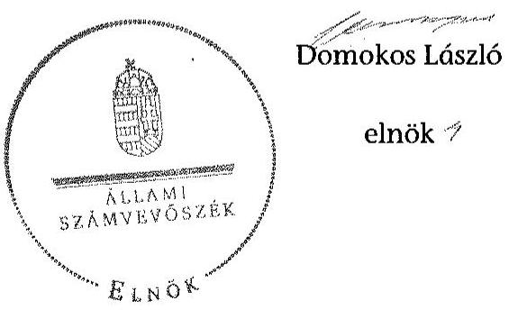

# ÁLLAMI   SZÁMVEVŐSZÉK 

## JELENTÉS

a helyi nemzetiségi önkormányzatok gazdálkodásának ellenőrzéséről
Orosháza Város Roma Nemzetiségi Önkormányzata 15165

---

# Állami Számvevőszék 

Iktatószám: V-0795-034/2015.
Témaszám: 1829
Vizsgálat-azonosító szám: V067622

## Az ellenőrzést felügyelte:

## Brebán Andrea

felügyeleti vezető
2015. július 21. napjától

## Horváthné Herbáth Mária

felügyeleti vezető
2015. július 20. napjáig

## Az ellenőrzés végrehajtásáért felelős és az ellenőrzést vezette:

Páncsics Judit
ellenőrzésvezető

## A számvevői jelentések feldolgozásában és a jelentés összeállításában közreműködött:

Balázsné Antoni Erika
számvevő

## Az ellenőrzést végezték:

| Balázsné Antoni | Dr. Elek László | Pálfiné Pusztai Magdolna |
| :-- | :-- | :-- |
| Erika | számvevő | számvevő tanácsos |
| számvevő |  |  |

---

# TARTALOMJEGYZÉK 

BEVEZETÉS ..... 7
I. ÖSSZEGZŐ MEGÁLLAPÍTÁSOK, KÖVETKEZTETÉSEK, JAVASLATOK ..... 10
II. RÉSZLETES MEGÁLLAPÍTÁSOK ..... 17

1. A Nemzetiségi Önkormányzat és a Települési Önkormányzat együttműködésének szabályozása, a működési feltételek biztosítása ..... 17
2. A gazdálkodási feladatok ellátásának szabályszerűsége ..... 18
2.1. A költségvetésre és a zárszámadásra, valamint a kincstári adatszolgáltatás rendjére vonatkozó jogszabályi előírások betartása ..... 18
2.2. A Nemzetiségi Önkormányzat gazdálkodásának szabályozottsága ..... 19
2.3. Az operatív gazdálkodási jogkörök kialakítása, gyakorlása ..... 20
3. A Nemzetiségi Önkormányzattal összefüggő gazdálkodási feladatok belső ellenőrzése ..... 22
MELLÉKLETEK
4. számú Orosháza Város Roma Nemzetiségi Önkormányzata 2013. évi gazdálkodási adatai

---

.

---

# RÖVIDÍTÉSEK JEGYZÉKE 

## Törvények

Alaptörvény
Áht.
ÁSZ tv.
Nek. tv.
Számv. tv.

## Rendeletek

$\AA_{h s z_{1}}$

Áhsz $_{2}$
Ávr.

Bkr.
Települési Önkormányzat SZMSZ

## Szórövidítések

ÁSZ
együttműködési megállapodás
értékelési szabályzat
gazdasági szervezet ügyrendje
gazdasági szervezet vezetője
hivatali SZMSZ ${ }_{1}$
hivatali SZMSZ ${ }_{2}$
jegyző

Magyarország Alaptörvénye
az államháztartásról szóló 2011. évi CXCV. törvény az Állami Számvevőszékről szóló 2011. évi LXVI. törvény a nemzetiségek jogairól szóló 2011. évi CLXXIX. törvény, a számvitelről szóló 2000. évi C. törvény
az államháztartás szervezetei beszámolási és könyvvezetési kötelezettségének sajátosságairól szóló 249/2000. (XII. 24.) Korm. rendelet (hatálytalan 2014. január 1-jétől) az államháztartás számviteléről szóló 4/2013. (I. 11.) Korm. rendelet (hatályos 2014. január 1-jétől)
az államháztartásról szóló törvény végrehajtásáról szóló 368/2011. (XII. 31.) Korm. rendelet (hatályos 2012. január 1-jétől)
a költségvetési szervek belső kontrollrendszeréről és belső ellenőrzéséről szóló 370/2011. (XII. 31.) Korm. rendelet
Orosháza Város Önkormányzata Képviselő-testületének 15/2010. (X. 22.) számú rendelete Orosháza Város Önkormányzat Szervezeti és Működési Szabályzatáról

Állami Számvevőszék
Együttműködési megállapodás a Települési és a Roma Nemzetiségi Önkormányzata között, amelyet a Települési Önkormányzat Képviselő-testülete a 136/2012. (V. 25.) számú, a Nemzetiségi Önkormányzat a 25/2012. (V. 24.) számú határozatával fogadott el (hatályos 2012. május 25-től)
a Polgármesteri hivatal eszközök és források értékelési szabályzata (hatályos 2013. január 1-jétől)
a Polgármesteri hivatal Közgazdasági irodájának ügyrendje (hatályos: 2013. január 1-jétől)
a Közgazdasági Iroda vezetője
a Polgármesteri Hivatal Szervezeti és Működési Szabályzata, melyet a Települési Önkormányzat a 12/2011. (II. 4.) számú határozatával jóváhagyott és a 261/2011. (X. 21.), 25/2012. (II. 3.) és a 100/2012. (IV. 20.) számú határozatokkal módosított. (egységes szerkezetben hatályos 2012. július 15-től 2013. április 30-ig)
a Polgármesteri Hivatal Szervezeti és Működési Szabályzata a 89/2013. (III. 22) számú határozattal jóváhagyva (hatályos 2013. április 1-jétől)
Orosháza Város Önkormányzatának jegyzője

---

Képviselő-testület

Kincstár
Közgazdasági Iroda
leltározási szabályzat

Nemzetiségi Önkormányzat
Nemzetiségi Önkormányzat elnöke
Nemzetiségi Önkormányzati SZMSZ
önköltségszámítási szabályzat

polgármesteri hivatal
számlarend
számviteli politika
Települési Önkormányzat
Települési Önkormányzat Képviselőtestülete

Orosháza Város Roma Nemzetiségi Önkormányzatának Képviselő-testülete
Magyar Államkincstár
a Polgármesteri hivatal Közgazdasági Irodája, a gazdasági szervezet pénzügyi-gazdálkodási feladatait ellátó szervezeti egysége
a Polgármesteri hivatal leltárkészítési és leltározási szabályzata (hatályos 2013. március 1-jétől)
Orosháza Város Roma Nemzetiségi Önkormányzata
Orosháza Város Roma Nemzetiségi Önkormányzatának elnöke
Orosháza Város Roma Nemzetiségi Önkormányzatának Szervezeti és Működési Szabályzata, melyet a 6/2012.(I. 20.) számú határozatával jóváhagyott és a 9/2012.(II. 07.) határozattal módosított (hatályos 2012. január 20-tól)
a Polgármesteri hivatal önköltségszámítási szabályzata (hatályos 2013. január 1-jétől)
a Polgármesteri hivatal pénzkezelési szabályzata (hatályos 2013. január 1-jétől)
Orosházi Polgármesteri Hivatal
a Polgármesteri hivatal számlarendje (hatályos 2013. január 1-jétől)
a Polgármesteri hivatal számviteli politikája (hatályos 2013. január 1-jétől)

Orosháza Város Önkormányzata
Orosháza Város Önkormányzatának Képviselő-testülete

---

# ÉRTELMEZŐ SZÓTÁR 

belső ellenőrzés
belső kontrollrendszer
együttműködési megállapodás
költségvetési szerv vezetője
korrupció

A Bkr. 2. § b) pont meghatározásában független, tárgyilagos bizonyosságot adó és tanácsadó tevékenység, amelynek célja, hogy az ellenőrzött szervezet működését fejlessze és eredményességét növelje, az ellenőrzött szervezet céljai elérése érdekében rendszerszemléletű megközelítéssel és módszeresen értékeli, illetve fejleszti az ellenőrzött szervezet irányítási és belső kontrollrendszerének hatékonyságát.
A Bkr. 2. § d) pont és az Áht. 69. § (1) bekezdése alapján a belső kontrollrendszer a kockázatok kezelése és tárgyilagos bizonyosság megszerzése érdekében kialakított folyamatrendszer, amely azt a célt szolgálja, hogy a működés és gazdálkodás során a tevékenységeket szabályszerűen, gazdaságosan, hatékonyan, eredményesen hajtsák végre, az elszámolási kötelezettségeket teljesítsék, megvédjék az erőforrásokat a veszteségektől, károktól és nem rendeltetésszerű használattól.
Az Áht. 27. § (2) bekezdése és Nek tv. 80. § (1) bekezdése értelmében a helyi önkormányzat a helyi nemzetiségi önkormányzat részére - annak székhelyén - biztosítja az önkormányzati működés személyi és tárgyi feltételeit, továbbá gondoskodik a működéssel kapcsolatos végrehajtási feladatok ellátásáról. Az Nek tv. 80. § (2) bekezdés szerinti a fenti kötelezettségének teljesítése érdekében a helyi önkormányzat harminc napon belül biztosítja a rendeltetésszerű helyiséghasználatot, valamint a helyiséghasználatra, a további feltételek biztosítására és a feladatok ellátására vonatkozóan megállapodást köt a helyi nemzetiségi önkormányzattal. A megállapodást minden év január 31. napjáig, általános vagy időközi választás esetén az alakuló ülést követő harminc napon belül felül kell vizsgálni. A helyi önkormányzat és a nemzetiségi önkormányzat szervezeti és működési szabályzatában rögzíti a megállapodás szerinti működési feltételeket, a megállapodás megkötését, módosítását követő harminc napon belül. Az Nek tv. 80. § (3) bekezdés írja elő a megállapodásban rögzítendőket.
A Bkr. 2. § nd) pont meghatározásában a helyi önkormányzat, helyi nemzetiségi önkormányzat, illetve a fővárosi kerületi önkormányzat esetén a jegyző, körjegyző, főjegyző.
Azok a cselekmények, amelyek során a köz érdekében való eljárással megbízott és döntéshozatali felelősséggel felruházott személy a köz érdeke helyett önös vagy részérdekeket követve, mástól jogtalan vagy etikátlan előnyt elfogadva és őt jogtalan vagy etikátlan előnyhöz juttatva jár el, illetve amikor valaki a köz érdekében való eljárással

---

|  | megbízott és döntéshozatali felelősséggel felruházott személynek jogtalan vagy etikátlan előnyt nyújtva vagy felajánlva jogtalan vagy etikátlan előnyt kér. (Forrás: A Kormány korrupció megelőzési programja 2012-2014.) |
| :--: | :--: |
| kulcskontroll | Az azonosított kockázatok mérséklése érdekében kialakított kontrollok közül azok, amelyek elégtelen működése esetén a szervezetet jelentős veszteség érheti, vagy a működésükben bekövetkező hiba/hiányosság más kontrollok eredményességét csökkenti. Ezek ellenőrzése, értékelése elegendő bizonyítékot szolgáltat adott területen a kontrollrendszer értékeléséhez. Az önkormányzatok kontrollrendszere kialakításának ellenőrzése során a pénzügyi folyamatokban kulcsszerepet betöltő belső kontrollok a teljesítésigazolás és érvényesítés. |
| lényegesség | Egy információ akkor lényeges, ha hiánya vagy téves állítása befolyásolhatja ezen információkat felhasználók döntéseit, véleményét. Az ellenőrzés során a lényegesség három szempontból értelmezhető: érték, jelleg és összefüggés szerint. |
| nemzetiség | A Nek tv. 1. § (1) bekezdése alapján nemzetiség minden olyan Magyarország területén legalább egy évszázada honos népcsoport, amely az állam lakossága körében számszerű kisebbségben van, tagjai magyar állampolgárok és a lakosság többi részétől saját nyelve és kultúrája, hagyományai különböztetik meg, egyben olyan összetartozástudatról tesz bizonyságot, amely mindezek megőrzésére, történelmileg kialakult közösségeik érdekeinek kifejezésére és védelmére irányul. |
| nemzetiségi önkormányzat | Az Nek tv. 2. § 2. pontja szerint törvényben meghatározott nemzetiségi közszolgáltatási feladatokat ellátó, testületi formában működő, jogi személyiséggel rendelkező, demokratikus választások útján e törvény alapján létrehozott szervezet, amely a nemzetiségi közösséget megillető jogosultságok érvényesítésére, a nemzetiségek érdekeinek védelmére és képviseletére, a feladat- és hatáskörébe tartozó nemzetiségi közügyek települési, területi vagy országos szinten történő önálló intézésére jön létre. |

---

# JELENTÉS 

## a helyi nemzetiségi önkormányzatok gazdálkodásának ellenőrzéséről Orosháza Város Roma Nemzetiségi Önkormányzat

## BEVEZETÉS

A Nemzetiségi Önkormányzat az 1994. évben alakult. A Nemzetiségi Önkormányzat 2013-ban hivatalban lévő elnöke a 2006. évi helyhatósági választások óta látja el feladatát. A Nemzetiségi Önkormányzat intézményt, gazdasági társaságot és más szervezetet nem alapított, illetve társulásban nem vett részt. A négytagú Képviselő-testület bizottságot nem hozott létre. A Nemzetiségi Önkormányzat a költségvetési beszámolója szerint a 2013. évben a módosított bevételi és kiadási előirányzata 2416,0 ezer Ft, a teljesített költségvetési kiadás 2222,0 ezer Ft, a teljesített költségvetési bevétele 2204,0 ezer Ft, az igénybe vett előző évi pénzmaradvány 212 ezer Ft volt. A Nemzetiségi Önkormányzat a 2013. évben 225,4 ezer Ft általános működési támogatásban és 776,6 ezer Ft feladatalapú támogatásban részesült. A 2013. évi gazdálkodási adatokat részletesen az 1. számú mellékletben mutatjuk be.

Az Alaptörvény Szabadság és felelősség rész XXIX. cikk (1) bekezdése szerint a Magyarországon élő nemzetiségek államalkotó tényezők. Minden, valamely nemzetiséghez tartozó magyar állampolgárnak joga van önazonossága szabad vállalásához és megőrzéséhez. A hazánkban élő nemzetiségek helyi (települési és területi) valamint országos önkormányzatokat hozhatnak létre ${ }^{1}$. A helyi nemzetiségi önkormányzatok gazdálkodási feladatait jogszabályi előírás alapján a székhely szerinti helyi önkormányzat polgármesteri hivatala látja el.

A nemzetiségek helyzete, támogatása mind hazai, mind EU-s szinten kiemelt figyelmet kap napjainkban. A helyi nemzetiségi önkormányzatok gazdálkodására és támogatási rendszerére vonatkozó jogszabályok a 2010-2012. években jelentős változásokon mentek át. A helyi nemzetiségi önkormányzatok gazdálkodásának, a részükre juttatott költségvetési támogatások felhasználásának ellenőrzését az ÁSZ 2012-ben sorozatjellegű ellenőrzés keretében indította el.

Az ellenőrzés célja annak értékelése volt, hogy a helyi nemzetiségi önkormányzat gazdálkodási kereteinek kialakítása, gazdálkodása megfelelt-e a jogszabályoknak.

[^0]
[^0]:    ${ }^{1}$ A 2010. évben megtartott nemzetiségi önkormányzati választásokat követően 2304 települési, 58 területi és 13 országos nemzetiségi önkormányzat alakult meg.

---

Ennek keretében értékeltük, hogy:

- a helyi nemzetiségi önkormányzat és a helyi (települési) önkormányzat együttműködésének szabályozása, a működési feltételek biztosítása megfelelt-e a jogszabályi előírásoknak;
- a felek együttműködése megfelelt-e a megállapodásban foglaltaknak a gazdálkodási feladatok szabályszerű ellátása során, betartották-e a vonatkozó jogszabályi előírásokat;
- biztosított volt-e a helyi nemzetiségi önkormányzat gazdálkodásának belső ellenőrzése.

Az ellenőrzés várható hasznosulása: a nemzetiségi önkormányzatok testületi döntéseinek tapasztalatait összegezve következtetés vonható le a törvényalkotás számára a jogszabályi környezet esetleges módosításának indokoltságára vonatkozóan. Az ellenőrzés az ellenőrzött számára visszajelzést ad a rendezett gazdálkodási keretek kialakításáról, a működésbeli hiányosságokról. Az ellenőrzés megállapításai és javaslatai, a jó gyakorlat bemutatása tanulságul szolgálhatnak más nemzetiségi önkormányzatok, szervezetek számára a rendezett gazdálkodási keretek kialakításához. A társadalom számára jelzi, hogy közpénz nem maradhat ellenőrizetlenül, az ÁSZ értékteremtő rend kialakításához és megőrzéséhez hozzájáruló tevékenysége pozitív hatással lesz a szervezetről kialakított összkép formálásában. Az ÁSZ szervezetén belül lehetőség nyílik arra, hogy a megállapítások szintetizálásával az intézmény a hozzáadott értéket teremtő elemző tevékenységét és tanácsadó szerepét erősítse.

A helyi nemzetiségi önkormányzatok gazdálkodásának ellenőrzéséről szóló jelentés I. fejezetének összegző része az ellenőrzés céljára adott rövid, szintetizáló összefoglalót és következtetéseket tartalmazza a II. fejezet részletes megállapításain alapulóan.

A jelentés intézkedést igénylő megállapításait és javaslatait - az összegzőben foglaltak mellett - az ellenőrzés során feltárt,
 a jelentés II. fejezetében rögzített részletes megállapítások alapozzák meg, illetve támasztják alá.

Az ellenőrzés típusa: szabályszerűségi ellenőrzés.
Az ellenőrzött időszak: a Nemzetiségi Önkormányzat és a Települési Önkormányzat együttműködésének, valamint a Nemzetiségi Önkormányzat gazdálkodásának szabályozása megfelelőségét a 2013. évre vonatkozóan (a 2013. december 31-i állapotnak megfelelően), a Nemzetiségi Önkormányzat gazdálkodásának szabályszerűségét, a működési feltételek, valamint a belső ellenőrzés biztosítását a 2013. január 1. - december 31. közötti időszakot figyelembe véve értékeltük.

Ellenőrzött szervezet: Orosháza Város Roma Nemzetiségi Önkormányzata és a gazdálkodási feladatait ellátó Orosházi Polgármesteri Hivatal.

Az ellenőrzés szakmai módszertana az ÁSZ hivatalos honlapján (www.asz.hu) közzétett szakmai szabályokon alapult, amely a Legfőbb Ellenőrző Intézmények

---

Nemzetközi Szervezete (INTOSAI) által kiadott nemzetközi standardok (ISSAI) figyelembevételével készült.

A gazdálkodás folyamatában kulcsszerepet betöltő két kulcskontroll - teljesítésigazolás és érvényesítés - működésének megfelelőségét a személyi juttatásokkal, a dologi és felhalmozási kiadásokkal, működési és felhalmozási célú pénzeszköz átadásokkal, ellátottak pénzbeli juttatásaival kapcsolatos kifizetések esetében mintavétellel ellenőriztük. „Megfelelőnek" értékeltük a gazdálkodási jogkörök gyakorlását, amennyiben 95%-os bizonyossággal a teljes sokaságban a hibaarány legfeljebb 10%, „részben megfelelőnek" értékeltük, ha a hibaarány felső határa 10-30% között volt, „nem megfelelőnek" pedig akkor, ha a mintavételi eredmények alapján a sokaságbeli hibaarány felső határa meghaladta a 30%-ot.

Az ellenőrzés végrehajtásának jogszabályi alapját az ÁSZ tv. 5. § (2)-(3) és (6) bekezdéseiben foglaltak képezték.

Az ÁSZ tv. 29. § (1) bekezdése szerint a jelentéstervezetet megküldtük a jegyző és a Nemzetiségi Önkormányzat elnöke részére, akik az ÁSZ tv. 29. § (2) bekezdésében foglalt észrevételezési jogukkal nem éltek, a jelentéstervezetre észrevételt nem tettek.

---

# I. ÖSSZEGZŐ MEGÁLLAPÍTÁSOK, KÖVETKEZTETÉSEK, JAVASLATOK 

A Nemzetiségi Önkormányzat és a Települési Önkormányzat együttműködésének szabályozása a feltárt hiányosságok ellenére megfelelt a jogszabályi előírásoknak.

A Nemzetiségi Önkormányzat és a Települési Önkormányzat között 2013-ban hatályban volt együttműködési megállapodást a Nek. tv.-ben előírt határidőre felülvizsgálták. Az együttműködési megállapodás az Áht.-ban előírtak ellenére nem tartalmazta, hogy a Nemzetiségi Önkormányzat bevételeivel és kiadásaival kapcsolatban az ellenőrzési feladatok ellátásáról a Polgármesteri hivatal gondoskodik. Az együttműködési megállapodásban az Áht.-ban előírtaknak megfelelően rögzítették, hogy a Nemzetiségi Önkormányzat tervezési, gazdálkodási, finanszírozási, adatszolgáltatási és beszámolási feladatait Polgármesteri hivatal látja el. A feladatellátás részletes szabályait - az ellenőrzési feladat kivételével - a megállapodásban rendezték. A Nek. tv. előírásai ellenére az együttműködési megállapodásban nem rögzítették teljes körűen a Nemzetiségi Önkormányzat kötelezettségvállalásának a szabályait, különösen az összeférhetetlenségi kötelezettségeket. Az együttműködési megállapodásban az Ávr.-ben előírtak ellenére az érvényesítésre a gazdasági szervezet vezetője helyett a jegyző által írásban kijelölt köztisztviselő jogosultságát rögzítették.

A Települési Önkormányzat 2013-ban a Nek. tv.-ben előírtaknak megfelelően biztosította a Nemzetiségi Önkormányzat működéséhez szükséges személyi és tárgyi feltételeket, amelyet az együttműködési megállapodásban rögzítettek. A jegyző a nemzetiségi önkormányzati feladatok ellátását az érintett hivatali dolgozók munkaköri leírásában előírta.

Az együttműködési megállapodás szerinti működési feltételeket a Nek. tv.-ben előírtak ellenére a Nemzetiségi Önkormányzat SZMSZ-e nem tartalmazta.

A Nemzetiségi Önkormányzat 2013. évi költségvetésének és zárszámadásának tartalma, jóváhagyása, valamint a kapcsolódó adatszolgáltatás a feltárt hiányosságok ellenére megfelelt a jogszabályi előírásoknak.

A Nemzetiségi Önkormányzat elnöke határidőben benyújtotta a Képviselő-testület részére a 2013-2014. évi költségvetési koncepciókat és a 2013. évi költségvetési határozat-tervezetét. A 2013. évi költségvetés előterjesztésekor a Nemzetiségi Önkormányzat Képviselő-testülete részére tájékoztatásul - az Áht.-ban előírtak ellenére - szöveges indoklás nélkül mutatták be a költségvetési mérleget közgazdasági tagolásban és az előirányzat felhasználási tervet.

A 2013. évi zárszámadási határozat-tervezetet a Nemzetiségi Önkormányzat elnöke az előírt határidőben a Képviselő-testület elé terjesztette. A zárszámadási határozat-tervezet előterjesztésekor tájékoztatásul - az Áht.-ban előírtak ellenére - szöveges indoklás nélkül bemutatták a költségvetési mérleget

---

közgazdasági tagolásban és a pénzeszközök változását. A zárszámadási határozat-tervezet előterjesztésekor az Áht.-ban előírtak ellenére a vagyonkimutatást tájékoztatásul nem mutatták be. A zárszámadási határozatban az Áht.-ban foglaltaknak megfelelően a Nemzetiségi Önkormányzat valamennyi bevételéről és kiadásáról elszámoltak.

A jegyző a 2013. évi költségvetéshez kapcsolódó, a Nemzetiségi Önkormányzat részére előírt kincstári adatszolgáltatást az Ávr.-ben és az Áhsz.-ben előírt határidőre teljesítette.

A Nemzetiségi Önkormányzat gazdálkodásának szabályozottsága a 2013. évben részben felelt meg a jogszabályi előírásoknak, valamint az együttműködési megállapodásban foglaltaknak. A Nemzetiségi Önkormányzat 2013. évben a Számv. tv.-ben előírt szabályzatokkal rendelkezett. A Nemzetiségi Önkormányzat pénzkezelési szabályzatát az Ávr.-ben és az Áhsz.-ben foglaltak ellenére - a jegyző helyett - a gazdasági szervezet vezetője adta ki. A hivatali SZMSZ$_{1,2}$ az Ávr.-ben foglaltak ellenére nem tartalmazta teljes körűen az abban nevesített munkakörökhöz tartozó feladat- és hatásköröket, a hatáskörök gyakorlásának módját, a helyettesítés rendjét, valamint az ezekhez kapcsolódó felelősségi szabályokat. A gazdasági szervezet ügyrendje - az együttműködési megállapodásban foglaltaknak megfelelően - részletesen szabályozta a tervezéssel, gazdálkodással, az adatszolgáltatási feladatok teljesítésével kapcsolatos belső előírásokat. A pénzkezelési szabályzat tartalmazta az operatív gazdálkodási jogkörök gyakorlásának módját, eljárási és dokumentációs részletszabályait. A kontrolltevékenységek részeként a Nemzetiségi Önkormányzat tevékenységeire a Bkr.-ben előírtak ellenére a folyamatba épített előzetes, utólagos és vezetői ellenőrzést nem biztosították.

Az ellenőrzött időszakban a Nemzetiségi Önkormányzat gazdálkodása tekintetében az operatív gazdálkodási jogkörök kialakítása a feltárt hiányosságok ellenére megfelelt a jogszabályi előírásoknak, valamint az együttműködési megállapodásban foglaltaknak. A Nemzetiségi Önkormányzat költségvetésének végrehajtásával összefüggő operatív gazdálkodási jogköröket az együttműködési megállapodásban és a pénzkezelési szabályzatban rögzítették. A pénzkezelési szabályzat az Ávr.-ben előírtak ellenére nem tartalmazta a pénzügyi ellenjegyzést, teljesítésigazolást, érvényesítést és utalványozást végző személyek kijelölésének rendjével kapcsolatos belső előírásokat, feltételeket. A Nemzetiségi Önkormányzat elnöke az Ávr. előírásainak megfelelően írásban felhatalmazást adott a kötelezettségvállalás és az utalványozás gyakorlására, és kijelölte a teljesítés igazolására jogosult személyeket. A pénzügyi ellenjegyzést és érvényesítést végző dolgozók az Ávr.-ben előírt végzettséggel, illetve pénzügyi-számviteli képesítéssel rendelkeztek.

A Nemzetiségi Önkormányzat a 2013. évben csak személyi juttatással és dologi kiadásokkal kapcsolatos kifizetést teljesített. A Nemzetiségi Önkormányzatnál a 2013. évi személyi juttatásokkal és dologi kiadásokkal kapcsolatos kifizetések esetében az operatív gazdálkodási jogkörökön belül a teljesítés igazolás és érvényesítés kulcskontrollok működése - a két ellenőrzött kiadási terület értékelésének súlyozott átlaga alapján - összességében „nem megfelelő" volt, mivel az ellenőrzött tételek egyharmadában hibák, hiányosságok fordultak elő.

---

A személyi juttatások és dologi kiadások kifizetéseit megelőzően a teljesítésigazolást az Ávr.-ben előírtak ellenére néhány esetben nem végezték el, illetve több alkalommal nem a pénzkezelési szabályzatban előírt módon teljesítették. A teljesítésigazolás több esetben az Ávr.-ben előírtak ellenére szabálytalanul történt, mert a személyi kifizetéseknél a teljesítésigazoló ellenőrizhető okmányok, dokumentumok hiányában a kifizetések jogosságát, összegszerűségét nem igazolta.

Az érvényesítő a személyi juttatások és dologi kiadások kifizetéseit megelőzően nem jelezte, hogy a teljesítésigazolást néhány alkalommal nem, illetve több esetben nem szabályszerűen végezték el. Az érvényesítés az Ávr.-ben foglaltak ellenére több ellenőrzött tételnél nem tartalmazta az érvényesítésre utaló megjelölést. Az érvényesítő nem kifogásolta, hogy néhány esetben nem történt meg a kötelezettségvállalás nyilvántartásba vétele, az utalványrendeleteken többször nem tüntették fel a költségvetési évet és a kötelezettségvállalás nyilvántartási számát.

Az ellenőrzés az operatív gazdálkodási jogkörök működésével kapcsolatban további szabálytalanságokat tárt fel, az utalványozó néhány kiküldetési rendelvényen írásos felhatalmazás nélkül, az Ávr. összeférhetetlenségre vonatkozó előírásait megsértve közeli hozzátartozója részére utalványozott. Egy kifizetésnél az utalványozó közeli hozzátartozója részére utalványozott, mellyel megsértette az Ávr. összeférhetetlenségre vonatkozó előírásait.

A kiadási pénztárbizonylatok kiállítása során nem tettek eleget a Számv. tv.-ben előírtaknak, mert azok a könyvvitelben rögzítendő adatokat nem a valóságnak megfelelően tartalmazták. A készpénzben teljesített dologi kiadások közül több esetben a kiadási pénztárbizonylatokat a számla kibocsájtójának nevére állították ki a számlák ellenértékét átvevő, a kiadásokat megelőlegező személy helyett, emiatt az átvevő nem volt beazonosítható.

Az ellenőrzött készpénzes pénzforgalmi tételek esetében a pénztárellenőri feladatot nem a pénzkezelési szabályzatban megjelölt hivatali dolgozó látta el, hanem jogosulatlanul, a feladatra írásbeli megbízással nem rendelkező nemzetiségi önkormányzati képviselő.

A 2013. évben a Nemzetiségi Önkormányzat gazdálkodásával összefüggő végrehajtási feladatokra vonatkozó belső ellenőrzés nem volt megfelelő. A jegyző - a Bkr.-ben foglaltak ellenére - a feladatkörében eljárva nem gondoskodott a Nemzetiségi Önkormányzatnál a gazdálkodási feladatokat érintően a belső ellenőrzés megfelelő működtetéséről. A belső ellenőrzés a Polgármesteri hivatalban végezte a Bkr.-ben előírt kockázatelemzést, de az nem terjedt ki Nemzetiségi Önkormányzat gazdálkodásával összefüggő feladatokra. A Nemzetiségi Önkormányzatnál a gazdálkodással összefüggő végrehajtási feladatokra vonatkozóan belső ellenőrzést a 2013. évben nem terveztek és nem végeztek.

Az ÁSZ tv. 33. § (1) bekezdésében foglaltak értelmében a jelentésben foglalt megállapításokhoz kapcsolódó intézkedési tervet köteles az ellenőrzött szervezet vezetője összeállítani, és azt a jelentés kézhezvételétől számított 30 napon belül az ÁSZ részére megküldeni. Amennyiben az intézkedési tervet határidőben nem küldi meg a szervezet, vagy az nem elfogadható, az ÁSZ elnöke a hivatkozott törvény 33. § (3) bekezdés a)-b) pontjaiban foglaltakat érvényesítheti.

---

A helyszíni ellenőrzés megállapításainak hasznosítása mellett javasoljuk

# a jegyzőnek 

1. Az együttműködés szabályozásával kapcsolatban

Az együttműködési megállapodás - a Nek. tv. 80. § (3) bekezdés c) pontjában előírtak ellenére - nem tartalmazta a Nemzetiségi Önkormányzat kötelezettségvállalásának szabályait, különösen az összeférhetetlenségi követelményekre vonatkozó előírásokat.

Az együttműködési megállapodásban - az Ávr. 58. § (4) bekezdésében és az 55. § (2) bekezdés g) pontjában foglalt előírások ellenére - érvényesítésre a gazdasági szervezet vezetője helyett a jegyző által írásban kijelölt köztisztviselő jogosultságát rögzítették.

Az együttműködési megállapodás szerinti működési feltételeket a Nek. tv. 80. § (2) bekezdésében foglaltak ellenére a Nemzetiségi Önkormányzat SZMSZ-ében nem rögzítették.

Javaslat
a) Készítse elő az együttműködési megállapodás módosítását, amely teljes körűen megfelel a jogszabályi előírásoknak és kezdeményezze annak a Települési Önkormányzat Képviselő-testülete elé terjesztését.
b) Készítse elő a Nemzetiségi Önkormányzat SZMSZ-ének kiegészítését az együttműködési megállapodás módosításához kapcsolódóan, és kezdeményezze annak a Képviselő-testület elé terjesztését.
2. A költségvetés és zárszámadás szabályszerűségével kapcsolatban

A 2013. évi költségvetési határozat-tervezet előterjesztésekor a Képviselő-testület részére tájékoztatásul - az Áht. 24. § (4) bekezdés a) pontjában előírtak ellenére, a 26. § (1) bekezdését is figyelembe véve - szöveges indoklás nélkül mutatták be a költségvetési mérleget közgazdasági tagolásban és az előirányzat felhasználási tervet.

A 2013. évi zárszámadási határozat-tervezet előterjesztésekor az Áht. 91. § (2) bekezdés a) pontjában foglaltak ellenére szöveges indoklás nélkül mutatták be az Áht. 24. § (4) bekezdés a) pontja szerinti költségvetési mérleget közgazdasági tagolásban és a pénzeszközök változását, továbbá az Áht. 91. § (2) bekezdés c) pontjában előírtak ellenére nem mutatták be a vagyonkimutatást tájékoztatásul.

Javaslat
Intézkedjen, hogy a költségvetési és zárszámadási határozat-tervezet előterjesztésekor tájékoztatásul szöveges indoklással együtt, teljes körűen kerüljenek bemutatásra a jogszabályban előírt mérlegek, kimutatások a Képviselő-testület részére.
3. A gazdálkodási feladatok szabályozottságával kapcsolatban

A pénzkezelési szabályzatot az Ávr. 13. § (2) bekezdésében és az Áhsz. 8. § (12) bekezdésében foglalt előírás ellenére a jegyző helyett a Közgazdasági iroda vezetője, mint a gazdasági szervezet vezetője adta
 ki.

---

A pénztárellenőri feladatokat - a pénzkezelési szabályzat 1. számú mellékletében kijelölt köztisztviselő helyett - a feladatra írásbeli megbízással nem rendelkező nemzetiségi önkormányzati képviselő látta el.

A hivatali SZMSZ ${ }_{1,2}$ - az Ávr. 13. § (1) bekezdés g) pontjában előírtak ellenére - nem tartalmazta teljes körűen az abban nevesített munkakörökhöz tartozó feladat- és hatásköröket, a hatáskörök gyakorlásának módját, a helyettesítés rendjét, valamint az ezekhez kapcsolódó felelősségi szabályokat.

A Polgármesteri hivatalban - Bkr. 8. § (2) bekezdésében előírtak ellenére - nem biztosították a Nemzetiségi Önkormányzat gazdálkodásával összefüggő tevékenységekre vonatkozóan a folyamatba épített előzetes, utólagos és vezetői ellenőrzést.

Javaslat
a) Intézkedjen a Nemzetiségi Önkormányzat pénzkezelési szabályzatának jogszabályi előírásoknak megfelelő kiadásáról, továbbá a pénzkezelési szabályzatban foglaltak betartásáról.
b) Készítse el a Polgármesteri hivatal SZMSZ-ének jogszabályi előírásoknak megfelelő kiegészítését, módosítását, majd kezdeményezze annak képviselő-testületi előterjesztését.
c) Biztosítsa a Polgármesteri hivatal által ellátott minden tevékenységre vonatkozóan a folyamatba épített előzetes, utólagos és vezetői ellenőrzést.
4. Az operatív gazdálkodási jogkörök kialakításával és működésével kapcsolatban

A pénzkezelési szabályzat, illetve más belső szabályzat - az Ávr. 13. § (2) bekezdés a) pontjában előírtak ellenére - nem határozta meg a pénzügyi ellenjegyzést, a teljesítésigazolást, az érvényesítést és az utalványozást végző személyek kijelölésének rendjével kapcsolatos belső előírásokat, feltételeket.

A teljesítésigazoló több esetben nem végezte el az Ávr. 57. § (1) bekezdés szerint feladatát. Előfordult, hogy a teljesítést - dokumentumok hiányában - a kiadás jogosságának, összegszerűségének ellenőrzése nélkül igazolták, továbbá a teljesítés igazolását nem az Ávr. 57. § (3) bekezdésében előírt módon végezték el.

Az érvényesítés - az Ávr. 58. § (1) bekezdésében előírtak ellenére - néhány esetben nem a teljesítés igazolása alapján történt, továbbá nem felelt meg az Ávr. 58. § (3) bekezdésében foglaltaknak, mert nem tartalmazta az érvényesítésre utaló megjelölést. Az érvényesítő nem az Ávr. 58. § (1) és (2) bekezdésének megfelelően látta el a feladatát, mivel nem ellenőrizte, hogy a megelőző ügymenetben a jogszabályok előírásait és a belső szabályzatokban foglaltakat betartották-e. Az érvényesítő nem jelezte az utalványozónak, hogy a teljesítésigazolást nem, illetve nem szabályszerűen végezték el. Az érvényesítő nem kifogásolta, hogy a külön írásbeli rendelkezésként elkészített utalványrendeleteken az Ávr. 59. § (3) bekezdés b) és f) pontjaiban előírtak ellenére nem tüntették fel a költségvetési évet és a kötelezettségvállalás nyilvántartási számát.

A kiadási pénztárbizonylatok - a Számv. tv. 165. § (2) bekezdésében és a 167. § (1) bekezdés c) pontjában előírtak ellenére - nem feleltek meg a bizonylat általános alaki 

---

és tartalmi követelményeinek, mert a feltüntetett adatokat nem a valóságnak megfelelően tartalmazták.

Javaslat
Az operatív gazdálkodás működési hibáinak megelőzése, feltárása és kijavítása érdekében intézkedjen:
a) a pénzügyi ellenjegyzést, teljesítésigazolást, érvényesítést és utalványozást végző személyek kijelölésének rendjével kapcsolatos belső előírások, feltételek szabályzatban történő meghatározásáról;
b) a teljesítésigazolás jogszabályi előírásoknak megfelelő elvégzéséről;
c) az érvényesítéshez kapcsolódó ellenőrzési és jelzési feladatok szabályszerű ellátásáról;
d) annak érdekében, hogy a pénztárbizonylatok kiállítása feleljen meg a jogszabályi előírásoknak;
e) az operatív gazdálkodási jogkörök gyakorlását és a bizonylatkezelést érintően feltárt hiányosságok, szabálytalanságok tekintetében a munkajogi felelősség tisztázására irányuló eljárás megindításáról, és ennek eredménye ismeretében tegye meg a szükséges intézkedéseket.

# a Nemzetiségi Önkormányzat elnökének 

1. Az együttműködés szabályozásával kapcsolatban

Az együttműködési megállapodás - a Nek. tv. 80. § (3) bekezdés c) pontjában előírtak ellenére - nem tartalmazta a Nemzetiségi Önkormányzat kötelezettségvállalásának szabályait, különösen az összeférhetetlenségi követelményekre vonatkozó előírásokat. Az együttműködési megállapodásban - az Ávr. 58. § (4) bekezdésében és az 55. § (2) bekezdés g) pontjában foglalt előírások ellenére - érvényesítésre a gazdasági szervezet vezetője helyett a jegyző által írásban kijelölt köztisztviselő jogosultságát rögzítették.

Az együttműködési megállapodás szerinti működési feltételeket a Nek. tv. 80. § (2) bekezdésében foglaltak ellenére a Nemzetiségi Önkormányzat SZMSZ-ében nem rögzítették.

Javaslat
Terjessze a Nemzetiségi Önkormányzat Képviselő-testülete elé jóváhagyásra
a) az együttműködési megállapodás jogszabályi előírásoknak megfelelő - jegyző által előkészített - módosítását;
b) a Nemzetiségi Önkormányzat - jegyző által előkészített - a jogszabályi előírásoknak megfelelően kiegészített SZMSZ-ét.

---

2. Az operatív gazdálkodási jogkörök kialakításával kapcsolatban

Az utalványozás során több esetben megsértették az Ávr. 60. § (2) bekezdésében foglalt összeférhetetlenségre vonatkozó előírásokat, az utalványozó az utalványozást több esetben a saját maga javára végezte.

Javaslat
Az utalványozásra jogosultak írásbeli kijelölése során biztosítsa az összeférhetetlenségre vonatkozó jogszabályi előírások betartását.

---

# II. RÉSZLETES MEGÁLLAPÍTÁSOK 

## 1. A Nemzetiségi Önkormányzat és a Települési Önkormányzat együttműködésének szabályozása, a működési feltételek biztosítása

A Nemzetiségi Önkormányzat és a Települési Önkormányzat együttműködésének szabályozása - a feltárt hiányosságok ellenére - megfelel a jogszabályi előírásoknak.

A Nemzetiségi Önkormányzat a 2013. évben rendelkezett a Települési Önkormányzattal kötött - a Nek. tv. 80. § (2) bekezdésében előírt - együttműködési megállapodással, amelyet a Nemzetiségi Önkormányzat és a Települési Önkormányzat képviselő-testületei határozatokkal ${ }^{2}$ hagyott jóvá. Az együttműködési megállapodás 2013. évi felülvizsgálata a Nek. tv. 80. § (2) bekezdésében előírt határidőre megtörtént ${ }^{3}$.

Az együttműködési megállapodás - az Áht. 27. § (2) bekezdésben foglaltak ellenére - nem tartalmazta, hogy a Nemzetiségi Önkormányzat bevételeivel és kiadásaival kapcsolatban az ellenőrzési feladatokat a Polgármesteri hivatal látja el. Az együttműködési megállapodás az Áht. 27. § (2) bekezdésben foglaltaknak megfelelően rögzítette, hogy a Közgazdasági iroda látja el a Nemzetiségi Önkormányzat bevételeivel és kiadásaival kapcsolatban a tervezési, gazdálkodási, finanszírozási, adatszolgáltatási és beszámolási feladatokat. A feladatellátás részletes szabályait - az ellenőrzési feladat kivételével - a megállapodásban rendezték.

Az együttműködési megállapodás a Nek. tv. 80. § (3) bekezdés a), b) és d) pontjában előírtaknak megfelelően tartalmazta a költségvetés előkészítésével és megalkotásával, a költségvetéssel összefüggő adatszolgáltatási kötelezettségek teljesítésével kapcsolatos határidőket, az operatív gazdálkodási feladatokat, a felelősök kijelölését, valamint a működési feltételeinek és gazdálkodásának eljárási és dokumentációs részletszabályaival kapcsolatos előírásokat.

Az együttműködési megállapodás - a Nek. tv. 80. § (3) bekezdés c) pontjában előírtak ellenére - nem tartalmazta a Nemzetiségi Önkormányzat kötelezettségvállalásának szabályait, különösen az összeférhetetlenségi követelményekre vonatkozó előírásokat. Az együttműködési megállapodásban - az Ávr. 58. § (4) bekezdésében és az 55. § (2) bekezdés g) pontjában előírtak ellenére - az

[^0]
[^0]:    ${ }^{2}$ A 2013. évben hatályos együttműködési megállapodást a Nemzetiségi Önkormányzat Képviselő-testülete a 25/2012. (V. 24.) számú határozatával, a Települési Önkormányzat Képviselő-testülete a 136/2012. (V. 25.) számú határozatával fogadta el.
    ${ }^{3}$ A felülvizsgálatról az előterjesztés 2013. január 21-én készült, ezt követően a módosított együttműködési megállapodást a Települési Önkormányzat Képviselő-testülete a 7/2013. (II. 1.) számú határozatával, a Nemzetiségi Önkormányzat a 12/2013. (III. 29.) számú határozatával hagyta jóvá.

---

érvényesítésre a gazdasági szervezet vezetője helyett a jegyző által írásban kijelölt köztisztviselő jogosultságát rögzítették.

A Települési Önkormányzat a Nek. tv. 80. § (1) bekezdésében előírtaknak megfelelően a Polgármesteri hivatal útján biztosította a Nemzetiségi Önkormányzat működéséhez szükséges személyi és tárgyi feltételeket, melyet a 2013-ban hatályos együttműködési megállapodásban rögzítettek. Az együttműködési megállapodás a Nek. tv. 80. § (4) bekezdésének megfelelően tartalmazta, hogy a jegyző vagy a jegyzővel azonos képesítési előírásoknak megfelelő megbízottja a Települési Önkormányzat megbízásából és képviseletében részt vesz az Nemzetiségi Önkormányzat testületi ülésein és jelzi, amennyiben törvénysértést észlel. A jegyző a nemzetiségi önkormányzati feladatok ellátását az érintett hivatali dolgozók munkaköri leírásában rögzítette. A Polgármesteri hivatal az előírásoknak megfelelően gondoskodott a Nemzetiségi Önkormányzat működéséhez szükséges személyi és tárgyi feltételekről. A Települési Önkormányzat SZMSZ-e tartalmazta az együttműködési megállapodások szerinti működési feltételeket.

A Nemzetiségi Önkormányzat SZMSZ-ében az együttműködési megállapodás szerinti működési feltételeket a Nek. tv. 80. § (2) bekezdésében foglaltak ellenére nem rögzítették.

# 2. A GAZDÁLKODÁSI FELADATOK ELLÁTÁSÁNAK SZABÁLYSZERŰSÉGE 

### 2.1. A költségvetésre és a zárszámadásra, valamint a kincstári adatszolgáltatás rendjére vonatkozó jogszabályi előírások betartása

A Nemzetiségi Önkormányzat 2013. évi költségvetésének és zárszámadásának tartalma, jóváhagyása, valamint a kapcsolódó adatszolgáltatás a feltárt hiányosságok ellenére megfelelt a jogszabályi előírásoknak.

A Nemzetiségi Önkormányzat elnöke a 2013. évi és a 2014. évi költségvetési koncepciót ${ }^{4}$, valamint a 2013. évi költségvetési határozat tervezetét az Áht.-ban előírt határidőben benyújtotta a Képviselő-testületnek.

A 2013. évi költségvetési határozat-tervezet előterjesztésekor a Képviselő-testület részére tájékoztatásul - az Áht. 26. § (1) bekezdését figyelembe véve a Képviselőtestület részére tájékoztatásul - az Áht. 24. § (4) bekezdés a) pontjában előírtak ellenére szöveges indoklás nélkül mutatták be a költségvetési mérleget közgazdasági tagolásban és az előirányzat felhasználási tervet.

A jóváhagyott 2013. évi költségvetési határozat ${ }^{5}$ megfelel a jogszabályi előírásoknak.

[^0]
[^0]:    ${ }^{4}$ A Képviselő-testület a 2013. évi költségvetési koncepciót a 42/2012. (XI. 30.) számú határozatával fogadta el, a 2014. évi költségvetési koncepciót az elnök 2013. október 29-én terjesztette elő.
    ${ }^{5}$ A Képviselő-testület 4/2013. (II. 17.) számú határozata.

---

A Nemzetiségi Önkormányzat elnöke a jegyző által elkészített 2013. évi zárszámadási határozat tervezetet határidőben a Képviselő-testület elé terjesztette ${ }^{6}$. A zárszámadási határozatot az elfogadott költségvetéssel összehasonlítható módon készítették el. A zárszámadásban a Nemzetiségi Önkormányzat valamennyi bevételéről és kiadásáról elszámoltak. A zárszámadási határozat-tervezet előterjesztésekor az Áht. 91. § (2) bekezdés a) pontjában foglaltak ellenére szöveges indoklás nélkül mutatták be az Áht. 24. § (4) bekezdés a) pontja szerinti költségvetési mérleget közgazdasági tagolásban és a pénzeszközök változását. A zárszámadási határozattervezet előterjesztésekor tájékoztatásul nem mutatták be az Áht. 91. § (2) bekezdés c) pontjában előírtak ellenére a vagyonkimutatást. A Nemzetiségi Önkormányzatnak a 2013. évben, valamint azt megelőzően az ellenőrzött év előirányzataira hatást gyakorló, többéves kihatással járó döntése nem volt, közvetett támogatást nem nyújtott.

A jegyző a Nemzetiségi Önkormányzat 2013. évi költségvetéséhez kapcsolódó kincstári adatszolgáltatási kötelezettségének eleget tett. Az időközi költségvetési jelentéseket az Ávr. 169. § (2) bekezdésében előírt határidőben továbbította a Kincstár felé. A jegyző a Nemzetiségi Önkormányzat időközi mérlegjelentéseit az Ávr. 170. § (5) bekezdésében ${ }^{7}$, a 2013. évi I. féléves és a 2013. évi éves elemi költségvetési beszámolóját az Áhsz., 10. § (5a) bekezdésében előírt határidőre benyújtotta a Kincstárnak.

# 2.2. A Nemzetiségi Önkormányzat gazdálkodásának szabályozottsága 

A Nemzetiségi Önkormányzat gazdálkodásának szabályozottsága az ellenőrzött időszakban részben megfelelt a jogszabályi előírásoknak, valamint az együttműködési megállapodásban foglaltaknak. A Nemzetiségi Önkormányzat a 2013. évben a Számv. tv. 14. § (3)-(4) bekezdéseiben előírt tartalmú számviteli politikával, a számviteli politika részeként a Számv. tv. 14. § (5) bekezdésében előírt szabályzatokkal rendelkezett. A pénzkezelési szabályzatot ${ }^{8}$ az Ávr. 13. § (2) bekezdésében és az Áhsz., 8. § (12) bekezdésében ${ }^{9}$ foglalt előírás ellenére a jegyző helyett a Közgazdasági iroda vezetője - mint a gazdasági szervezet vezetője - adta ki. A pénztárellenőri feladatot nem a pénzkezelési szabályzat 1. számú mellékletében megjelölt hivatali dolgozó, hanem
 az erre vonatkozó írásbeli megbízással nem rendelkező, a Nemzetiségi Önkormányzat egyik képviselője látta el. A jegyző a Polgármesteri hivatal Számv. tv. 161. § (1) bekezdése és az Áhsz. 49. § (1) bekezdése szerint elkészített számlarendjének a hatályát kiterjesztette a Nemzetiségi Önkormányzatra.

A hivatali SZMSZ${ }_{1,2}$-ben rögzítették, hogy a Polgármesteri hivatal látja el a Nemzetiségi Önkormányzat gazdálkodásával kapcsolatos - együttműködési megá-

[^0]
[^0]:    ${ }^{6}$ A Képviselő-testület a 2013. évi zárszámadást a 15/2014. (IV. 29.) számú határozattal hagyta jóvá.
    ${ }^{7}$ 2015. január 1-jétől az Ávr. 170. § (2) bekezdése írja elő.
    ${ }^{8}$ A pénzkezelési szabályzat 4. pontja a gazdálkodási jogkörök szabályozását is tartalmazta.
    ${ }^{9}$ 2014. január 1-jétől az Áhsz. 50. § (1) bekezdése írja elő.

---

llapodás szerinti feladatokat, azonban ezeket munkakörökre lebontva nem határozták meg. A hivatali SZMSZ${ }_{1,2}$-ben - az Ávr. 13. § (1) bekezdés g) pontjában előírtak ellenére - nem tartalmazta teljes körűen az abban nevesített munkakörökhöz tartozó feladat- és hatásköröket, a hatáskörök gyakorlásának módját, a helyettesítés rendjét, valamint az ezekhez kapcsolódó felelősségi szabályokat.

A Polgármesteri hivatal elkülönített gazdasági szervezettel rendelkezett, a gazdasági szervezet 2013-ban hatályos ügyrendje kiterjedt a Nemzetiségi Önkormányzattal kötött együttműködési megállapodásban foglaltakra. A gazdasági szervezet ügyrendje - az Áht.-ban és az Ávr.-ben, valamint az együttműködési megállapodásban foglaltaknak megfelelően - részletesen szabályozta a tervezéssel, a gazdálkodással, az adatszolgáltatási feladatok teljesítésével kapcsolatos belső előírásokat. Az operatív gazdálkodási jogkörök gyakorlásának módját, eljárási és dokumentációs részletszabályait a pénzkezelési szabályzat gazdálkodási jogkörök szabályozására vonatkozó része tartalmazta.

A 2013. évben a Bkr. 6. § (3)-(4) bekezdéseiben előírtak szerint a Polgármesteri hivatal rendelkezett ellenőrzési nyomvonallal és a szabálytalanságok kezelésének eljárásrendjével. ${ }^{10}$ A Polgármesteri hivatalban - a Bkr. 8. § (2) bekezdésében előírtak ellenére - a kontrolltevékenység részeként nem biztosították a Nemzetiségi Önkormányzat gazdálkodásával összefüggő tevékenységekre vonatkozóan a folyamatba épített, előzetes, utólagos és vezetői ellenőrzést.

# 2.3. Az operatív gazdálkodási jogkörök kialakítása, gyakorlása 

Az ellenőrzött időszakban a Nemzetiségi Önkormányzat gazdálkodása során az operatív gazdálkodási jogkörök kialakítása - a feltárt hiányosságok ellenére - megfelelt a jogszabályi előírásoknak, valamint az együttműködési megállapodásban foglaltaknak.

A Nemzetiségi Önkormányzat költségvetésének végrehajtásával összefüggő operatív gazdálkodási jogköröket az együttműködési megállapodásban és a pénzkezelési szabályzatban rögzítették. A kötelezettségvállalás rendjét, nyilvántartásának módját szabályozták, meghatározták, hogy 100,0 ezer Ft alatti egyedi kifizetés esetén nem szükséges az előzetes írásbeli kötelezettségvállalás, szabályozták az írásbeli kötelezettségvállalást nem igénylő kifizetések nyilvántartási rendjét. A pénzkezelési szabályzat tartalmazta a pénzügyi ellenjegyzés, teljesítésigazolás, érvényesítés és utalványozás gyakorlásának módját, eljárási és dokumentációs részletszabályait, azonban a pénzkezelési- és más belső szabályzatban az Ávr. 13. § (2) bekezdés a) pontjában előírtak ellenére nem határozták meg az ezeket végző személyek kijelölésének rendjével kapcsolatos belső előírásokat, feltételeket.

[^0]
[^0]:    ${ }^{10}$ A jegyző 2014. március 1-jétől kiadta a Nemzetiségi Önkormányzatra vonatkozó szabálytalanságok kezelésének eljárásrendjét.

---

A Nemzetiségi Önkormányzat elnöke az Áht. és az Ávr. alapján írásban felhatalmazást adott a kötelezettségvállalás gyakorlására, valamint kijelölte az utalványozásra és a teljesítés igazolására jogosult személyeket.

A gazdasági szervezet vezetője, mint pénzügyi ellenjegyző és az általa írásban kijelölt érvényesítő az Ávr.-ben előírt végzettséggel, illetve pénzügyi-számviteli képesítéssel rendelkezett.

Az együttműködési megállapodásban meghatározták az önkormányzati támogatás felhasználási céljait, valamint azt, hogy a támogatás legfeljebb 30%-a (2013. évben az 1200,0 ezer Ft összegű támogatásból 360,0 ezer Ft) fordítható személyi jellegű kifizetésekre, költségtérítésekre. A 2013. évben a Nemzetiségi Önkormányzat 1002 ezer Ft összegben részesült általános működési célú és feladatalapú állami támogatásban. A korlátot figyelembe véve a személyi juttatások maximális összege 2013-ban 1362 ezer Ft lehetett volna, szemben a ténylegesen teljesített 1568,0 ezer Ft-tal.

A pénzkezelési szabályzatban meghatározták a házipénztár kezelésének és pénzellátásának szabályait, a pénzforgalom lebonyolításának rendjét és a Számv. tv.-nek megfelelően rendelkeztek a napi készpénz záró állomány maximális mértékéről. Alapelvként rögzítették, hogy a Nemzetiségi Önkormányzatnak törekednie kell a készpénz nélküli és a készpénzkímélő fizetési módok alkalmazására és a pénzforgalom lebonyolítása során, a bankszámlán történő tranzakciókat kell előnyben részesíteni. A pénzkezelési szabályzatban foglalt alapelv ellenére a 2013. évi költségvetési kiadásainak 94,0%-át (2088,7 ezer Ft-ot) készpénzes kifizetéssel teljesítették.

A Nemzetiségi Önkormányzat a 2013. évben csak személyi juttatással és dologi kiadásokkal kapcsolatos kifizetést teljesített, más jogcímen kifizetés nem fordult elő. A Nemzetiségi Önkormányzatnál a 2013. évi személyi juttatásokkal és dologi kiadásokkal kapcsolatos kifizetések esetében az operatív gazdálkodási jogkörökön belül a teljesítés igazolás és érvényesítés kulcskontrollok működését - a két ellenőrzött kiadási terület értékelésének súlyozott átlaga alapján - összességében „nem megfelelőnek" minősítettük, mivel az ellenőrzött tételek egyharmadában hibák, hiányosságok fordultak elő.

A teljesítésigazoló a személyi juttatások és a dologi kiadások kifizetéseinél egy-egy esetben az Ávr. 57. § (1) bekezdésében előírt feladatát nem végezte el. A teljesítésigazolást a személyi juttatások kifizetését megelőzően - az Ávr. 57. § (3) bekezdésében foglaltak ellenére - 16 esetben nem a pénzkezelési szabályzatban meghatározott módon végezték el, valamint az nem tartalmazta a teljesítés tényére történő utalást. A teljesítésigazolás 15 esetben az Ávr. 57. § (1) bekezdésében foglaltak ellenére szabálytalanul történt, mert a teljesítést - a kiküldetés célját, szakmai programját tartalmazó dokumentumok hiányában - a kiadások jogosságának, összegszerűségének ellenőrzése nélkül igazolták.

Az érvényesítés a személyi juttatások és a dologi kiadások kifizetéseinél - az Ávr. 58. § (1) bekezdésében előírtak ellenére - két esetben nem a teljesítés igazolása alapján történt. Az ellenőrzött tételek esetében az érvényesítés nem felelt meg az Ávr. 58. § (3) bekezdésében foglaltaknak, mert nem tartalmazta az érvényesítésre utaló megjelölést. Az érvényesítő nem az Ávr. 58. § (1) és (2) bekezdésének megfelelően látta el a feladatát, mivel nem ellenőrizte, hogy a megelőző

---

ügymenetben a jogszabályok előírásait és a belső szabályzatokban foglaltakat betartották-e. Az érvényesítő nem jelezte az utalványozónak, hogy a teljesítésigazolást nem, illetve nem szabályszerűen végezték el. Az érvényesítő nem kifogásolta, hogy a külön írásbeli rendelkezésként elkészített utalványrendeleteken az Ávr. 59. § (3) bekezdés b) és f) pontjaiban előírtak ellenére nem tüntették fel a költségvetési évet és 40 esetben a kötelezettségvállalás nyilvántartási számát.

Nem jelezte, hogy 15 esetben a saját gépjárműhasználat miatti költségtérítés kifizetésénél a kiküldetéseket nem rendelték el és a teljesítés igazolása nem szabályszerűen történt, a kötelezettségvállalás pénzügyi ellenjegyzését hét kifizetésnél - az Áht. 37. § (1) bekezdésében és az Ávr. 55. § (1) bekezdésében foglaltak ellenére - nem végezték el.

Az ellenőrzés az operatív gazdálkodási jogkörök működésével kapcsolatban megállapította, hogy az utalványozó három személyi juttatással kapcsolatos kifizetésnél a kiküldetési rendelvényen az Ávr. 59. § (1) bekezdése ellenére írásos felhatalmazás nélkül, és az Ávr. 60. § (2) bekezdésében foglalt összeférhetetlenségi követelményt megsértve a közeli hozzátartozója részére utalványozott. Az utalványozó személye a három kiküldetési rendelvényen nem egyezett meg a kiadási pénztárbizonylatokon az utalványozást elvégző, arra jogosultsággal rendelkező személyével. Egy kifizetésnél az utalványozó közeli hozzátartozója részére utalványozott, mellyel megsértette az Ávr. 60. § (2) bekezdésében foglalt összeférhetetlenségre vonatkozó előírásokat.

A kiadási pénztárbizonylatok kiállítása során nem tettek eleget a Számv. tv. 165. § (2) bekezdésében és a 167. § (1) bekezdés c) pontjában előírtaknak, mivel azok az adott gazdasági műveletre (eseményre) vonatkozóan a könyvvitelben rögzítendő adatokat nem a valóságnak megfelelően tartalmazták, illetve nem feleltek meg a bizonylat általános alaki és tartalmi követelményeinek, továbbá nem biztosították, hogy a számviteli (könyvviteli) nyilvántartásokba csak szabályszerűen kiállított bizonylat alapján jegyezzék be az adatokat. A Nemzetiségi Önkormányzatnál az ellenőrzött dologi kiadások kiadási pénztárbizonylatait egy kivételével - a számla kibocsátója nevére állították ki a készpénz tényleges átvevője helyett. A dologi kiadási előirányzat terhére teljesített pénztári kifizetések esetében - egy kifizetés kivételével - a készpénz átvevője nem volt beazonosítható, mivel a neve, aláírása és a személyi igazolvány száma a kiadási pénztárbizonylatról hiányzott. Emiatt nem volt ellenőrizhető, hogy az Ávr. 60. § (2) bekezdésében rögzített összeférhetetlenségi előírást betartották-e.

A Nemzetiségi Önkormányzatnál a 2013. évi személyi juttatások és dologi kiadások kifizetéseivel kapcsolatban a kulcskontrollokat nem megfelelően működtették, emiatt a hibák megelőzése, feltárása és kijavítása nem volt biztosított. A nem megfelelően működtetett belső kontrollok korrupciós kockázatot hordoznak.

# 3. A Nemzetiségi Önkormányzattal összefüggő gazdálkodási feladatok belső ellenőrzése 

A 2013. évben a Nemzetiségi Önkormányzat gazdálkodásával összefüggő végrehajtási feladatokra vonatkozó belső ellenőrzés nem volt megfelelő. Az

---

együttműködési megállapodásban nem rögzítették, hogy a Polgármesteri hivatal gondoskodik a Nemzetiségi Önkormányzat bevételeivel és kiadásaival kapcsolatban az ellenőrzési feladatok ellátásáról. A jegyző a Bkr. 15. § (1) bekezdésében és az Áht. 70. § (1) bekezdésében foglalt feladatkörében eljárva nem gondoskodott a Nemzetiségi Önkormányzat gazdálkodásának végrehajtásával összefüggő feladatokat érintően a belső ellenőrzés megfelelő működtetéséről.

A Polgármesteri hivatal stratégiai és éves ellenőrzési tervét megalapozó - a Bkr. 29. § (1) bekezdése alapján a belső ellenőrzési egysége által végzett - kockázatelemzés nem terjedt ki a Nemzetiségi Önkormányzat gazdálkodásával összefüggő feladatokra. A 2013. évben belső ellenőrzést a Nemzetiségi Önkormányzat gazdálkodásának végrehajtására vonatkozóan - a Bkr. 31. § (1) és (3) bekezdésében előírtak ellenére - nem terveztek és nem végeztek. A belső ellenőrzés hiánya növelte a szervezet működéséből eredő korrupciós kockázatokat.

2014 januárjában az együttműködési megállapodás 1. számú módosításában figyelembe véve a Bkr. 15. § (1) bekezdésében és az Áht. 70. § (1) bekezdésében előírtakat - rendelkeztek a Nemzetiségi Önkormányzat belső ellenőrzésének kialakításáról és működtetéséről, meghatározták a belső ellenőrzési feladatellátás részletes rendjét. Az együttműködési megállapodás módosítására vonatkozó javaslatot a Települési Önkormányzat Képviselő-testülete a 17/2014. (I. 31.) számú határozatával hagyta jóvá. A Nemzetiségi Önkormányzat a módosított megállapodást az 5/2014. (II. 7.) számú határozattal fogadta el.

Budapest, 2015. év

Melléklet: $\quad 1 \mathrm{db}$

---

.

---

# Orosháza Város Roma Nemzetiségi Önkormányzatának 2013. évi gazdálkodási adatai

## A) Bevételek

|  Megnevezés | Eredeti előirányzat | Módosított | Teljesítés  |
| --- | --- | --- | --- |
|   | ezer Ft |  | megoszlás  |
|  Intézményi működési bevételek | 0,0 | 2,0 | 2,0  |
|  Felhalmozási saját bevételek | 0,0 | 0,0 | 0,0  |
|  Általános működési támogatás (kiegészítő támogatással együtt) | 0,0 | 225,4 | 225,4  |
|  Feladatalapú támogatás | 0,0 | 776,6 | 776,6  |
|  Települési Önkormányzat által nyújtott támogatás | 900,0 | 1200,0 | 1200,0  |
|  Költségvetési bevételek összesen | 900,0 | 2204,0 | 2204,0  |
|  Előző évi pénzmaradvány működési célú igénybevétele | 0,0 | 212,0 | 212,0  |
|  Bevételek összesen

 | 900,0 | 2416,0 | 2416,0  |

## B) Kiadások

|  Megnevezés | Eredeti előirányzat | Módosított | Teljesítés  |
| --- | --- | --- | --- |
|   | ezer Ft |  | megoszlás  |
|  Személyi juttatások | 280,0 | 1568,0 | 1568,0  |
|  Munkaadókat terhelő járulékok és szociális hozzájárulási adó összesen | 0,0 | 107,0 | 107,0  |
|  Dologi kiadások | 600,0 | 741,0 | 547,0  |
|  Támogatásértékű működési kiadások | 0,0 | 0,0 | 0,0  |
|  Működési célú pénzeszközátadások államháztartáson kívülre | 20,0 | 0,0 | 0,0  |
|  Működési kiadások összesen | 900,0 | 2416,0 | 2222,0  |
|  Felhalmozási kiadások | 0,0 | 0,0 | 0,0  |
|  Költségvetési kiadások összesen | 900,0 | 2416,0 | 2222,0  |

