# ÁLLAMI
SZÁMVEVŐSZÉK

## JELENTÉS

az Antall József Alapítvány 2012-2013. évi gazdálkodása törvényességének ellenőrzéséről

---

# Állami Számvevőszék

Iktatószám: V-0717-207/2015.
Témaszám: 1751
Vizsgálat-azonosító szám: V070103

## Az ellenőrzést felügyelte:

Dr. Benedek Mária
felügyeleti vezető
Az ellenőrzést vezette és az ellenőrzés végrehajtásáért felelős:
Bialkó Zsolt Gyula
ellenőrzésvezető
Kulcsár Lászlóné
ellenőrzésvezető
A számvevőszéki jelentés összeállításában közreműködött:
Szudi Ferencné
számvevő főtanácsos
Péntek László
számvevő főtanácsos
Az ellenőrzést végezték:
Mokánszkiné Mengyi Péntek László Szeibel Gáborné
Andrea
számvevő főtanácsos
számvevő főtanácsos

A témához kapcsolódó eddig készített számvevőszéki jelentések:
címe
sorszáma
Jelentés az Antall József Alapítvány 2003-2005. évi gazdálkodása ..... 0702
törvényességének ellenőrzéséről
Jelentés az Antall József Alapítvány 2006-2007. évi gazdálkodása ..... 0848
törvényességének ellenőrzéséről
Jelentés az Antall József Alapítvány 2008-2009. évi gazdálkodása ..... 1044
törvényességének ellenőrzéséről
Jelentés az Antall József Alapítvány 2010-2011. évi gazdálkodása ..... 13002
törvényességének ellenőrzéséről

---

# TARTALOMJEGYZÉK

BEVEZETÉS ..... 7
I. ÖSSZEGZŐ MEGÁLLAPÍTÁSOK, KÖVETKEZTETÉSEK, JAVASLATOK ..... 9
II. RÉSZLETES MEGÁLLAPÍTÁSOK ..... 14

1.  Az alapítvány gazdálkodásának törvényessége ..... 14
1.1. A kuratórium és a munkaszervezet tevékenységének megfelelősége ..... 14
1.2. A költségvetési és egyéb kapott támogatások, adományok elfogadásának megfelelősége ..... 17
1.3. A költségvetési és egyéb kapott támogatások, adományok felhasználásának és közzétételének szabályszerűsége ..... 17
1.4. Az alapítvány által létrehozott szervezetre vonatkozó tulajdonosi döntések megfelelősége ..... 19
2.  Az éves számviteli beszámolók és az alapítvány tevékenységéről szóló éves jelentések szabályszerűsége ..... 19
2.1. Az alapítvány tevékenységéről szóló éves jelentés megfelelősége ..... 19
2.2. A mérleg összeállításának szabályszerűsége ..... 20
2.3. Az eredménykimutatás szabályszerűsége ..... 23
3.  Az alapítvány könyvvezetésének szabályszerűsége ..... 24
3.1. A könyvvezetés szabályozottsága ..... 24
3.2. A könyvvezetés gyakorlatának megfelelősége ..... 25
4.  Az előző ÁSZ ellenőrzés javaslatai alapján készített intézkedési tervben foglaltak végrehajtása ..... 26

## MELLÉKLETEK

1.  számú Az Antall József Alapítvány 2012. évi egyszerűsített éves beszámolójának mérlege és eredménykimutatása (4 oldal)
2.  számú Az Antall József Alapítvány 2013. évi egyszerűsített éves beszámolójának mérlege és eredménykimutatása (4 oldal)
3.  számú Az alapítvány kuratóriumának elnöke észrevételét tartalmazó levél
4.  számú Észrevételre vonatkozó elnöki válaszlevél

---

.

---

# RÖVIDÍTÉSEK JEGYZÉKE

## Törvények

ÁSZ tv.
Civil tv.

Párt tv.
Pártalapítványi tv.

Ptk.
Számv. tv.

## Rendeletek

224/2000. (XII. 19.) Korm. rendelet

350/2011. (XII. 30.) Korm. rendelet

## Szórövidítések

Áfa
alapító okirat ${ }_{1}$
alapító okirat ${ }_{2}$
alapító okirat ${ }_{3}$
alapító okirat ${ }_{4}$
alapító okirat ${ }_{5}$
alapító okirat ${ }_{6}$
Alapítvány
ÁSZ
elnök
JESZ
Kuratórium
leltározási szabályzat

PGSZ
pénzkezelési szabályzat
számlarend
számviteli politika
SZMSZ
ügyvezető elnök
az Állami Számvevőszékről szóló 2011. évi LXVI. törvény
az egyesülési jogról, a közhasznú jogállásról, valamint a civil szervezetek működéséről és támogatásáról szóló 2011. évi CLXXV. törvény (2014. III. 15 -től a Civil tv. II-X. fejezeteiben foglaltakat a pártalapítványokra nem kell alkalmazni)
a pártok működéséről és gazdálkodásáról szóló 1989. évi XXXIII. törvény
a pártok működését segítő tudományos, ismeretterjesztő, kutatási, oktatási tevékenységet végző alapítványokról szóló 2003. évi XLVII. törvény
a Polgári Törvénykönyvről szóló 1959. évi IV. törvény (hatálytalan: 2014. március 15-étől)
a számvitelről szóló 2000. évi C. törvény
a számviteli törvény szerinti egyes egyéb szervezetek beszámoló készítési és könyvvezetési kötelezettségének sajátosságairól szóló 224/2000. (XII. 19.) Korm. rendelet
a civil szervezetek gazdálkodása, az adománygyűjtés, és a közhasznúság egyes kérdéseiről szóló 350/2011. (XII. 30.) Korm. rendelet
általános forgalmi adó
az Alapítvány alapító okirata (hatályos 2011. augusztus 16-2012. január 10. között)
az Alapítvány alapító okirata (hatályos 2012. január 11-2012. március 26. között)
az Alapítvány alapító okirata (hatályos 2012. március 27-2012. április 24. között)
az Alapítvány alapító okirata (hatályos 2012. április 25-2013. február 26. között)
az Alapítvány alapító okirata (hatályos 2013. február 27-2013. augusztus 4. között)
az Alapítvány alapító okirata (hatályos 2013. augusztus 5-étől)
Antall József Alapítvány
Állami Számvevőszék
az Alapítvány kuratóriumának elnöke
Jólét és Szabadság Demokrata Közösség
az Alapítvány kuratóriuma, kezelő szervezete
az Alapítvány leltározási és leltárkészítési sza-

---

bályzata (hatályos 2004. január 1-jétől)
az Alapítvány Pénzügyi Gazdálkodási Szabályzata (hatályos 2010. október 25-étől)
az Alapítvány pénzkezelési szabályzata (hatályos 2005. június 1-jétől)
az Alapítvány számlarendje (hatályos 2004. január 1-jétől)
az Alapítvány számviteli politikája (hatályos 2004. január 1-jétől)
az Alapítvány Szervezeti és Működési Szabályzata (hatályos 2011. december 22-étől)
az Alapítvány Kuratóriumának ügyvezető elnöke

---

# FOGALOMTÁR

adomány
civil szervezet
csatlakozói támogatás
gazdálkodó tevékenység
költségvetési támogatás
a civil szervezetnek - létesítő okiratban rögzített céljaira ellenszolgáltatás nélkül juttatott eszköz, illetve nyújtott szolgáltatás (forrás: Civil tv. 2. § 1. pontja); az a pénzbeli vagy természetbeni juttatás, amelyet az adományozó az adományozott civil szervezet alapcéljának, illetve közhasznú céljának elérésére ellenszolgáltatás nélkül juttat (forrás: 350/2011. (XII. 30.) Korm. rendelet 1. § (5) bekezdés a) pontja) a közhasznú szervezet részére törvényben meghatározott közhasznú tevékenysége támogatására, valamint az egyházi jogi személy részére törvényben meghatározott tevékenysége támogatására, továbbá a közérdekű kötelezettségvállalás céljára az adóévben visszafizetési kötelezettség nélkül adott támogatás, juttatás, térítés nélkül átadott eszköz könyv szerinti értéke, térítés nélkül nyújtott szolgáltatás bekerülési értéke, feltéve hogy az nem jelent az e törvényben meghatározottakon túl vagyoni előnyt az adományozónak, az adományozó tagjának vagy részvényesének, vezető tisztségviselőjének, felügyelőbizottsága vagy igazgatósága tagjának, könyvvizsgálójának, illetve ezen személyek vagy a természetes személy tag vagy részvényes közeli hozzátartozójának azzal, hogy nem minősül vagyoni előnynek az adományozó nevére, tevékenységére történő utalás (a társasági adóról és az osztalékadóról szóló 1996. évi LXXXI. tv. 4. § 1/a. pont)
a civil társaság, illetve a Magyarországon nyilvántartásba vett egyesület - a párt kivételével -, valamint az alapítvány (forrás: Civil tv. 2. § 6. pontja), az alapítvány és az egyesület, ide nem értve a pártot és a civil társaságot (forrás: 350/2011. (XII. 30.) Korm. rendelet 1. § (5) bekezdés f) pontja)
a csatlakozó természetes személyektől és szervezetektől saját forrásukból az alapítvány részére, annak céljai megvalósításhoz nyújtott összeg, amelyet az alapítvány az egyéb bevételek között elkülönítetten köteles kimutatni
azon tevékenységek összessége, amelyek a civil szervezet vagyoni, pénzügyi, jövedelmi helyzetére kiható gazdasági eseményt eredményeznek (Civil tv. 2. § 10. pont)
az államháztartás alrendszerei terhére nyújtott pénzbeli vagy nem pénzbeli juttatás, amelyet a támogató nem elsősorban ellenszolgáltatás ellenében, de konkrét program megvalósítása vagy meghatározott időszakban a támogatott szervezet működtetése érdekében nyújt (Civil tv. 2. § 15. pont)

---

.

---

# JELENTÉS

## az Antall József Alapítvány 2012-2013. évi gazdálkodása törvényességének ellenőrzéséről

## BEVEZETÉS

A pártok működését segítő tudományos, ismeretterjesztő, kutatási, oktatási tevékenységet végző alapítványokról szóló 2003. évi XLVII. törvény (Pártalapítványi tv.) alapján a pártok a politikai kultúra fejlesztése érdekében tudományos, ismeretterjesztő, kutatási és oktatási tevékenységük elősegítésére a pártok működéséről és gazdálkodásáról szóló 1989. évi XXXIII. törvényben (Párt tv.) meghatározott mértékű költségvetési támogatásra jogosult alapítványt hozhatnak létre.

A Magyar Demokrata Fórum (2011. június 18-tól Jólét és Szabadság Demokrata Közösség) a törvényben biztosított lehetőséggel élve 2003. évben létrehozta az Antall József Alapítványt (továbbiakban: Alapítvány). Az Alapítvány célja, hogy tevékenységével hozzájáruljon a magyarországi politikai kultúra fejlesztéséhez, színvonalának emeléséhez, az alapító által vallott értékekhez, politikai értékrendhez kapcsolódó tudományos, ismeretterjesztő, kutatási és oktatási tevékenységet végezzen, valamint tudományos kutatás, tájékoztatás, oktatás és képzés szervezésével elősegítse a célok megvalósulását.

Az Alapítvány a törvényi előírásoknak megfelelően a 2012. és 2013. évben évente 28.300 ezer Ft költségvetési támogatásban részesült.

A Pártalapítványi tv. 4. § (2) bekezdése alapján az alapítvány gazdálkodása törvényességének ellenőrzésére az Állami Számvevőszék (ÁSZ) jogosult. A Pártalapítványi tv. 4. § (4) bekezdése alapján az ÁSZ kétévenként ellenőrzi azoknak az alapítványoknak a gazdálkodását, amelyek e törvény szerint költségvetési támogatásban részesültek. Az ÁSZ legutóbb 2012-ben az Alapítvány 20102011. évi gazdálkodásának törvényességét ellenőrizte, jelentésében több intézkedési javaslatot tett (13002 számú jelentés).

Jelen ellenőrzés célja volt annak megállapítása, hogy az Alapítvány 20122013. években törvényesen gazdálkodott-e, amelynek keretében ellenőrizte az ÁSZ:

-   az Alapítvány gazdálkodásának törvényességét;
-   az éves számviteli beszámolók és éves jelentések jogszabályi előírásoknak való megfelelését;

---

-   az Alapítvány könyvvezetésében a Számv. tv., a pártalapítványok könyvvezetésére vonatkozó egyéb jogszabályi rendelkezések, valamint belső előírások betartását;
-   az előző ÁSZ ellenőrzés javaslatai alapján készített intézkedési tervben foglalt feladatok végrehajtását.

Az ellenőrzött időszak: 2012. január 1. - 2013. december 31.
Az ellenőrzés hasznosulása: az ellenőrzés a gazdálkodás szabályszerűségének bemutatásával hozzájárul ahhoz, hogy a társadalom objektív képet alkothasson a pártalapítványok működéséről. A hiányosságok, szabálytalanságok feltárása, az ennek kapcsán megfogalmazott megállapítások elősegíthetik a pártalapítványok szabályszerű gazdálkodását. A gazdálkodás szabályszerűségének bemutatásával az ellenőrzés értékteremtő módon járul hozzá az ÁSZ stratégiai céljainak megvalósításához.

Az ellenőrzést a pénzügyi-szabályszerűségi ellenőrzés módszertani szabályai szerint, a Legfőbb Ellenőrző Intézmények Nemzetközi Szervezete (INTOSAI) által kiadott, nemzetközi standardok (ISSAI) figyelembevételével végezte az ÁSZ.

Az Alapítvány által nyújtott támogatások és a kiadási főösszeg 2\%-ánál magasabb összegű ráfordítások esetében teljes körű ellenőrzést végzett az ÁSZ. A személyi jellegű kifizetések, bérköltségek és járulékok közül évente egy véletlenszerűen választott hónap tételei kerültek ellenőrzésre. A ráfordításoknál továbbá az alacsony kockázatot jelentő kis összegű tételek (postaköltség, bankköltség, bírság és késedelmi kamat) közül évente a két-két legnagyobb összegű került ellenőrzésre. Véletlen mintavétellel ellenőrizte az ÁSZ az előzőekben fel nem sorolt ráfordításokat.

Az ellenőrzés jogszabályi alapját az Állami Számvevőszékről szóló 2011. évi LXVI. törvény 5. § (3) bekezdése, valamint a Pártalapítványi tv. 4. § (2) és (4) bekezdései szolgáltatták.

Az Ász tv. 29. § (1) bekezdésében foglaltak alapján a jelentéstervezetet megküldtük az alapítvány kuratóriumának elnöke részére, aki az ÁSZ tv. 29. § (2) bekezdésében foglalt észrevételezési jogával élt, a jelentéstervezetre észrevételt tett (3. számú melléklet). Az ÁSZ tv. 29. § (3) bekezdésében előírtaknak megfelelően a figyelembe nem vett észrevételeket és annak indokairól szóló tájékoztatást a jelentés tartalmazza (4. számú melléklet).

---

# I. ÖSSZEGZŐ MEGÁLLAPÍTÁSOK, KÖVETKEZTETÉSEK, JAVASLATOK

Az Alapítvány Kuratóriuma és munkaszervezete a 2012. és a 2013. évi tevékenysége során a jogszabályi- és a belső szabályozási előírásokat nem tartotta be maradéktalanul. Az ellenőrzött időszakban az alapító okirat ${ }_{1-6}$ megfelelte a Ptk. rendelkezéseinek, módosításaira szabályszerűen került sor. A bankszámla feletti rendelkezési jog alapító okirat ${ }_{4}$-ben történt 2012. április 25-ei módosítását az SZMSZ-en nem vezették át, emiatt a bankszámla feletti rendelkezési jog gyakorlása ellentétes volt az SZMSZ előírásaival. A Kuratórium 2012ben a 350/2011. (XII. 30.) Korm. rendelet előírása ellenére nem döntött az Alapítvány költségvetéséről, ennek következtében az egyedi döntések kivételével a vagyon felhasználásáról sem rendelkezett. A Kuratórium 2013-ban elfogadta az Alapítvány költségvetési tervét, azonban az nem felelt meg a 350/2011. (XII. 30.) Korm. rendeletben foglaltaknak, mert az nem az előírt beszámoló tartalmi elemeinek megfelelően készült. A 2012-2013. években a Kuratórium a döntései végrehajtásáról és a pénzügyi helyzetről szóló, PGSZ-ben előírt negyedéves írásbeli beszámolók elmaradását nem kérte számon, ezáltal a döntések végrehajtását nem ellenőrizte. A kuratóriumi ülések összehívása és az évenkénti ülések száma tekintetében, valamint a határozathozatal során az ellenőrzött években esetenként nem tartották be az alapító okirat ${ }_{1-6}$ és az SZMSZ előírásait, ennek következtében egyes gazdasági döntések meghozatala szabálytalan volt. Az alapító JESZ-szel közösen szervezett rendezvényekről és azok pénzügyi kereteiről egyedi határozatok útján döntött a Kuratórium, azonban a döntéseket az Alapítvány nem tartotta be. A képviseleti jog gyakorlása egy esetben nem felelt meg a Számv. tv. és az alapító okirat ${ }_{6}$ előírásainak.

Az Alapítvány a 2012.
 és a 2013. évi egyszerűsített éves beszámolójában összesen 64 094 ezer Ft bevételt és 65 407 ezer Ft ráfordítást mutatott ki.

A kapott támogatások célszerinti felhasználása egy esetben nem volt biztosított, mivel a 2013. évben az Alapítvány egy elmaradt rendezvény szervezési költségeinek megtérítésével ellenszolgáltatás nélküli kifizetést teljesített, mely eljárással megsértette a Pártalapítványi tv. és a Párt tv. előírásait.

Az Alapítvány az ellenőrzött időszakban három esetben nyújtott támogatást, ebből egynél - az alapító okirat ${ }_{4}$ és a PGSZ előírását megsértve - kuratóriumi döntés nélkül. A támogatottak nem teljesítették a szerződésben előírt módon az elszámolási kötelezettségüket, amellyel kapcsolatban az Alapítvány a PGSZ rendelkezése ellenére nem intézkedett. A támogatásnyújtások esetében a PGSZ-ben előírt - támogatásra való jogosultság megállapítására vonatkozó - eljárás lefolytatását az Alapítvány nem tudta igazolni.

Az Alapítvány 2012. évi egyszerűsített éves beszámolóját a Kuratórium határidőben jóváhagyta. A 2012. évi beszámoló mellett a Pártalapítványi tv.-ben meghatározott kimutatásokat közzétették, mellyel az Alapítvány az előírt jelentés közzétételi kötelezettségének eleget tett, ugyanakkor megsértette a jelentés Kuratórium által történő elfogadására vonatkozó előírást. Az Alapítvány

---

elkészítette a Számv. tv.-nek megfelelő 2013. évi egyszerűsített éves beszámolóját, azonban azt a Kuratórium nem határidőben hagyta jóvá. A Pártalapítványi tv. rendelkezései szerinti jelentéskészítési és közzétételi kötelezettségének a 2013. évre vonatkozóan az Alapítvány nem tett eleget.

Az egyszerűsített éves beszámolók összeállítása nem volt szabályszerű, mivel a Számv. tv. előírásait nem tartották be maradéktalanul. A számviteli beszámolók készítése során megsértették a valódiság és a folytonosság számviteli alapelveit. Az ellenőrzött időszak egyszerűsített éves beszámolóinak mérleg és eredménykimutatásai a főkönyvi kivonatok adataiból levezethetők voltak, azonban a Számv. tv.-ben foglaltakat megsértve a mérlegekben leltárral alá nem támasztott, kötelezettek által el nem ismert követeléseket mutattak ki. A tárgyi eszközök értékét 2013-ban a leltár nem támasztotta alá, továbbá nem végezték el a főkönyv és az analitikus nyilvántartások egyeztetését. Az egyszerűsített éves beszámoló, illetve eredménykimutatás jelentős összegű hibát tartalmazott, a szabálytalanság mértéke a 2012. évi mérlegfőösszeg 4,6\%-ának, a 2013. évi mérlegfőösszeg 4,7\%-ának megfelelő összegű volt. Az eredménykimutatás tagolása az ellenőrzött években nem felelt meg a 224/2000. (XII. 19.) Korm. rendeletben foglaltaknak.

A könyvvezetés szabályozottsága nem felelt meg teljes mértékben a Számv. tv. előírásainak, mivel az Alapítvány az ellenőrzött időszakban nem rendelkezett az eszközök és források értékelési szabályzatával, valamint a számviteli szabályzatokat nem aktualizálták. A Számv. tv.-ben előírtakat megsértve nem tervezték meg az immateriális javak és tárgyi eszközök esetében az évenként elszámolandó értékcsökkenés módszerét, és esetenként nem gondoskodtak annak nyilvántartásokon való rögzítéséről. A PGSZ összhangja nem volt biztosított az alapító okirat ${ }_{1-6}$-tal és az SZMSZ-szel.

Az Alapítvány könyvvezetésének gyakorlata a Számv. tv. előírásainak nem felelt meg teljes körűen. A bizonylatok kötelező alaki és tartalmi elemeire vonatkozó előírásokat nem tartották be maradéktalanul, illetve egy esetben egy bevételként kimutatott összeget bizonylattal nem támasztották alá. Az ellenőrzött bizonylatok jelentős részénél nem szerepelt az érintett könyvviteli számlára történő hivatkozás, illetve hiányzott a könyvviteli nyilvántartásokban történt rögzítés tényének időpontja és annak igazolása. Több esetben az igénybe vett szolgáltatás ellenértékének kifizetése a számla kiállítását megelőző időpontban történt meg.

Az előző ÁSZ ellenőrzés által feltárt szabálytalanságok megszüntetésére készített intézkedési tervben az ÁSZ által megfogalmazott 18 javaslat alapján tervezett intézkedésekből hármat teljes egészében, kettőt részben teljesítettek, tizenhármat azonban nem hajtottak végre.

Az ellenőrzés intézkedést igénylő megállapításai és javaslatai:

# a kuratórium elnökének 

1.  A Kuratórium tevékenysége az alapító okirat ${ }_{1-6}$-ban, az SZMSZ-ben és a PGSZ-ben foglalt előírásoknak részben felelt meg, mert az ülések összehívására, az évenkénti

---

ülések számára és a határozathozatalra vonatkozó előírásokat nem minden esetben tartották be, ennek következtében egyes gazdasági döntések meghozatala szabálytalan volt.

Az alapító okirat ${ }_{3}$ 2012. április 25-ei módosítását követően a bankszámla feletti rendelkezési jog gyakorlásának szabályozása tekintetében az összhang nem volt biztosított, mivel az alapító okirat ${ }_{4}$ szerinti rendelkezést az SZMSZ-en nem vezették át. A bankszámla feletti rendelkezési jog gyakorlása a módosítás átvezetésének hiányában 2012. április 25-étől ellentétes volt az SZMSZ V. fejezet 17. pontjában foglaltakkal.

Az Alapítvány támogatást egy esetben szabálytalanul, kuratóriumi határozat nélkül biztosított. A 2012-ben és a 2013-ban nyújtott támogatások esetében a PGSZ 15. pontjában előírt - támogatásra való jogosultság megállapítására vonatkozó - eljárás lefolytatását dokumentumokkal nem tudta igazolni. A támogatott szervezetek a megállapodásokban előírt elszámolási kötelezettségüket nem teljesítették teljes körűen, és ehhez kapcsolódóan az Alapítvány a PGSZ 15. pontjában előírtak ellenére intézkedéseket nem tett.

Az Alapítvány a 2012. évben a 350/2011. (XII. 30.) Korm. rendelet 3. § (1) bekezdésében foglalt rendelkezés ellenére költségvetési tervet nem készített. A 2013. évben elkészített költségvetési tervet a Kuratórium elfogadta, azonban az elfogadott költségvetési terv nem felelt meg a 350/2011. (XII. 30.) Korm. rendelet 3. § (1) bekezdésében foglaltaknak, mert az nem a 224/2000. (XII. 19.) Korm. rendeletben előírt beszámoló tartalmi elemeinek megfelelően készült.

Az alapító okirat ${ }_{1-6}$ és az SZMSZ a PGSZ-szel ellentétben nem rögzített főigazgatói feladat- és hatáskört, operatív vezetőként az ügyvezető elnököt nevesítette. A Kuratórium a 2012-ben a vagyonnal kapcsolatban hozott egyedi döntései, valamint a 2013. évi költségvetési terv végrehajtását dokumentált módon nem ellenőrizte, a döntések végrehajtásáról és a pénzügyi helyzetről szóló negyedéves írásbeli beszámolók elmaradását a PGSZ 3. pontjában foglaltak ellenére nem kérte számon.

Javaslat
A Kuratórium szabályszerű működése érdekében:
Gondoskodjon a kuratóriumi ülések összehívása, az ülésezési gyakoriság, továbbá a határozathozatal vonatkozásában az SZMSZ-ben és a PGSZ-ben foglalt előírások betartásáról. Kezdeményezze az összhang megteremtését a belső szabályzatokban foglalt rendelkezések között, valamint gondoskodjon az alapító okiratban a támogatás nyújtására vonatkozóan a Kuratórium részére előírt döntési hatáskör, továbbá a PGSZ-ben a támogatásra való jogosultság megállapítására vonatkozó eljárási szabályok betartásáról. Intézkedjen a 350/2011. (XII. 30.) Korm. rendeletben foglaltak szerint a költségvetési terv elkészítéséről, e jogszabályban foglaltak betartásával a 224/2000. (XII. 19.) Korm. rendeletben előírt beszámoló tartalmi elemeinek megfelelően, továbbá a PGSZ előírásának betartásával intézkedjen a negyedéves írásbeli beszámolók elkészítésére vonatkozóan.
2.  A 2012. év vonatkozásában az Alapítvány a Pártalapítványi tv.-ben előírt jelentés közzétételi kötelezettségének eleget tett, ugyanakkor a Pártalapítványi tv. 3/A. § 2) bekezdésében előírtakat megsértette, mivel a jelentés a Kuratórium által nem került

---

elfogadásra. Az Alapítvány a 2013. év vonatkozásában nem készített a Pártalapítványi tv. 3/A. § (1) bekezdése szerinti jelentést.

Az alapítványi vagyon felhasználására egy esetben nem a Pártalapítványi tv. 1. §-ában és a Párt tv. 9/A. § (1) bekezdésében foglalt alapítványi célok érdekében került sor, mivel a 2013. évben 1429 ezer Ft összegű központi költségvetésből kapott támogatást az Alapítvány nem tudományos, ismeretterjesztő, kutatási, oktatási tevékenységre, hanem kuratóriumi döntés alapján egy elmaradt rendezvény szervezési költségeinek ellenszolgáltatás nélküli megtérítésére fordította.

Javaslat
A gazdálkodás törvényessége biztosítása érdekében:
Intézkedjen az Alapítvány tevékenységéről szóló jelentés a Pártalapítványi tv.-ben meghatározott tartalommal történő elkészítéséről, Kuratórium általi elfogadásáról, és az ott rögzített határidőben történő közzétételéről. Biztosítsa a támogatásoknak a Pártalapítványi és a Párt tv.-ben meghatározott céloknak megfelelő felhasználását.
3.  Az Alapítvány 2013. évi egyszerűsített éves beszámolója a Számv. tv. 17. §-ában foglaltaknak megfelelően került elkészítésre, azonban azt a Kuratórium nem határidőben hagyta jóvá. A 2012. és a 2013. évi számviteli beszámolók eredménykimutatásának tagolása nem felelt meg a 224/2000. (XII. 19.) Korm. rendelet 5. számú mellékletben meghatározottaknak, továbbá nem tartalmazta az abban előírt tájékoztató adatokat.

A 2012. és a 2013. évi egyszerűsített éves beszámolókban a számviteli alapelvek közül megsértették a Számv. tv. 15. § (3) bekezdésében foglalt valódiság elvét, valamint a Számv. tv. 15. § (6) bekezdésében rögzített folytonosság elvét.

A 2013. évben a mérlegben szereplő tárgyi eszközök értékét a leltár a Számv. tv. 69. § (1) bekezdésének előírását megsértve nem támasztotta alá. A 2012. és a 2013. évben a főkönyv és az analitikus nyilvántartások egyeztetését a Számv. tv. 69. § (2) bekezdésének előírása ellenére nem végezték el. Az Alapítvány 2012. és 2013. évi egyszerűsített éves beszámolója könyvviteli mérlegének adatai analitikus nyilvántartásokkal és leltárral egyik évben sem voltak teljes körűen alátámasztva.

A 2012. évi mérlegben 36 239 ezer Ft, a 2013. évi mérlegben 34 239 ezer Ft összegű követelést mutattak ki, azonban a Számv. tv. 65. § (1) bekezdésében előírtakat megsértve nem történt meg azok kötelezettek általi elismertetése. A követelések összegét a Számv. tv 69. § (1) bekezdésében előírtak ellenére tételes, ellenőrizhető leltárral nem támasztották alá, illetve a kimutatott követeléseket a Számv. tv. 46. § (3) bekezdésében előírtak ellenére egyedileg nem értékelték.

Az Alapítvány könyvvezetésének gyakorlata a 2012. és a 2013. évben nem felelt meg teljes körűen a vonatkozó jogszabályi előírásoknak, mivel a könyvelt tételek alapbizonylatainál a Számv. tv. 167 § (1) bekezdés h) és i) pontjai előírása ellenére az ellenőrzött 2012. és 2013. évi bizonylatok 70,8\%-ánál, illetve 86,3\%-ánál hiányzott a könyvviteli számlára történő hivatkozás, továbbá 81,7\%, illetve 88,5\% esetében nem szerepelt a bizonylatokon a könyvviteli nyilvántartásokban történt rögzítés

---

időpontja és annak igazolása, továbbá a Számv. tv. 165. § (1)-(2) bekezdésének előírása ellenére a 2012. évben négy esetben a kifizetés időpontjában nem állt rendelkezésre a bizonylat.

Az Alapítvány az ellenőrzött időszakban a Számv. tv. 14. § (5) bekezdés b) pontjában előírtakat megsértve - hatályba léptetés és kiadmányozás hiányában - nem rendelkezett hatályos eszközök és források értékelési szabályzattal, továbbá a Számv. tv. 14. § (3)-(5) bekezdéseiben előírt szabályzatok közül a számviteli politika, a leltározási szabályzat és a pénzkezelési szabályzat, valamint a Számv. tv. 161. § (1) bekezdésében előírt számlarend aktualizálására a Számv. tv. 14. § (11) és a 161. § (5) bekezdésében meghatározottak ellenére az ellenőrzött időszakban a jogszabályi változásokat követően nem került sor.

A Számv. tv. 52. § (2) bekezdésében előírtakat megsértve nem tervezték meg az immateriális javak és tárgyi eszközök esetében az évenként elszámolandó értékcsökkenés módszerét, és esetenként nem gondoskodtak annak nyilvántartásokon történő rögzítéséről.

Javaslat
A számviteli szabályok előírásainak érvényesítése érdekében:
Intézkedjen arról, hogy az Alapítvány a Számv. tv. és a 224/2000. (XII. 19.) Korm. rendelet előírásainak megfelelően az előírt formában elkészített kötelező mellékletekkel együtt, határidőben tegyen eleget a beszámoló készítési kötelezettségének.

Gondoskodjon a könyvvezetésben a Számv. tv.-ben rögzített számviteli elvek teljes körű betartatásáról, valamint a Számv. tv. előírásainak betartásával az év végi mérlegek leltárakkal való teljes körű alátámasztásáról, a főkönyv és az analitikus nyilvántartások egyeztetéséről. Intézkedjen a Számv. tv.-ben foglaltak betartásával a követelések egyedenkénti értékeléséről, kötelezettek általi elismertetéséről a mérlegkészítést megelőzően, és arról, hogy a mérlegekben elismert követelést mutassanak ki.

Biztosítsa a Számv. tv.-ben foglaltak szerinti könyvviteli elszámolást alátámasztó bizonylatok szabályszerűségét, továbbá kezdeményezze a Kuratóriumnál a Számv. tv.-ben
 előírt számviteli szabályzatok elkészítését, módosítását.

Intézkedjen az immateriális javak és tárgyi eszközök esetében az évenként elszámolandó értékcsökkenés Számv. tv. előírásainak megfelelő megtervezéséről, és azoknak a nyilvántartásokon történő rögzítéséről.

---

# II. RÉSZLETES MEGÁLLAPÍTÁSOK 

## 1. Az alapítvány GAZDÁLKODÁSÁNAK TÖRVÉNYESSÉGE

### 1.1. A kuratórium és a munkaszervezet tevékenységének megfelelősége

Az Alapítvány ellenőrzött időszakban hatályos alapító okirat ${ }_{1-6}$-ja a Ptk. 74/B. §-ában foglalt előírásoknak megfelelt. Az alapító okirat ${ }_{1-6}$-ban rögzített alapítványi célok a Párt tv. 9/A. § (1) bekezdésének és a Pártalapítványi tv. 1. §-ának rendelkezéseivel összhangban voltak. A célokra rendelt vagyont és annak felhasználási módját a Ptk. 74/B. § (1) bekezdés c) pontjában előírtakkal összhangban az alapító okirat ${ }_{1-6}$-ban megjelölték. Az induló vagyon összegét 1000 ezer Ft-ban határozták meg.

Az alapító okirat ${ }_{1}$ módosítására a 2012-2013. években öt alkalommal került sor. A módosítás három esetben a Kuratórium tagjai személyében bekövetkezett változás miatt történt. Egy-egy esetben a bankszámla feletti rendelkezésre jogosult személye, illetve az alapító JESZ feladat- és hatásköre módosult.

Az alapító okirat ${ }_{1}$ 2012. január 11-ei módosítását követően a JESZ volt jogosult a Kuratórium tagjainak kijelölésére, függetlenül attól, hogy a pártnak volt-e országgyűlési képviselő csoportja. Az alapító okirat ${ }_{3}$ 2012. április 25-ei módosítását megelőzően a bankszámla feletti rendelkezési jogot az elnök és az ügyvezető elnök együttes aláírásukkal, a módosítást követően önállóan gyakorolhatták.

Az alapító JESZ meghatározta az Alapítvány kezelő szervezetének - a Kuratóriumnak - a feladat- és hatáskörét, valamint tagjainak számát öt főben állapította meg. A Ptk. 74/C. § (1) és (4) bekezdésében előírtaknak megfelelően jelölték ki a képviseletre és a bankszámla feletti rendelkezésre jogosult személyeket. Az alapító okirat ${ }_{1-6}$ és az SZMSZ előírásai - a bankszámla feletti rendelkezési jog gyakorlásának szabályozása kivételével - összhangban voltak. Az alapító okirat ${ }_{3}$ 2012. április 25-ei módosítását követően a bankszámla feletti rendelkezési jog gyakorlásának szabályozása tekintetében az összhang nem volt biztosított, mivel az alapító okirat ${ }_{4}$ rendelkezését - mely szerint az elnök és az ügyvezető elnök önállóan jogosult rendelkezni - az SZMSZ-en nem vezették át. A bankszámla feletti rendelkezési jog gyakorlása megfelelt az alapító okirat ${ }_{1-6}$ előírásának, azonban a módosítás átvezetésének hiányában 2012. április 25-étől ellentétes volt az SZMSZ V. fejezet 17. pontjában foglaltakkal.

A 2012. évi egyszerűsített éves beszámolót az alapító okirat ${ }_{4}$-ben foglaltaknak megfelelően a képviseletre jogosult ügyvezető elnök kiadmányozta. A 2013. évben azonban a képviseleti jog gyakorlása során megsértették a Számv. tv. 20. §. (6) bekezdésének és az alapító okirat ${ }_{5}$ VIII. fejezet 1. pontjának előírását, mert az egyszerűsített éves beszámolót nem a Kuratórium képviseletre jogosult elnöke, hanem a 2013. augusztus 5-éig hivatalban lévő ügyvezető elnök írta alá 2014. április 30-án.

---

A Kuratórium az Alapítvány működésének technikai segítésére Alapítványi Irodát hozott létre az ügyvezető elnök irányításával, továbbá az SZMSZ IV. fejezetében meghatározta annak feladatait.

A Kuratórium tevékenysége a 350/2011. (XII. 30.) Korm. rendeletben, az alapító okirat ${ }_{1-4}$-ben, az SZMSZ-ben, valamint a PGSZ-ben foglalt előírásoknak részben felelt meg, mert az ülések összehívására, az évenkénti ülések számára és a határozathozatalra vonatkozó előírásokat nem minden esetben tartották be, ennek következtében egyes gazdasági döntések meghozatala szabálytalan volt:

- A Kuratórium ülését a 2012. évben öt esetből három alkalommal szabálytalanul, az SZMSZ III. fejezet 2. pontjában foglalt előírást figyelmen kívül hagyva hívták össze, mivel a kuratóriumi tagok nem kapták meg az ülésről szóló értesítést annak időpontját megelőzően legalább három nappal korábban. A 2012. július 1-jén megtartott ülés összehívására szabálytalanul került sor, mert a tagoknak egy nappal korábban küldték meg a meghívót. Az ülésen az öt kuratóriumi tag közül kettő nem vett részt, azonban a jelen lévők - munkavállalók felvételével, külső könyvviteli szolgáltatóval való szerződéskötéssel, valamint kettő megbízási szerződés megkötésével kapcsolatos - határozatokat hoztak az SZMSZ III. fejezet 3. pontjában foglalt előírás ellenére, mely szerint a nem szabályszerűen összehívott ülésen csak akkor lehet határozatot hozni, ha valamennyi tag jelen van. E kuratóriumi ülésen meghozott határozatok alapján megkötött szerződések és kötelezettségvállalások azonban nem tekinthetők érvénytelennek, tekintettel arra, hogy azok az ellenőrzés időpontjáig teljesítéssel lezárásra kerültek, és a szerződő felek a Ptk. 236. § (1) bekezdésében meghatározott időszakon belül nem támadták meg azokat. A Kuratórium 2012. október 10-én és december 14-én megtartott ülésének összehívása szabálytalanul történt meg, mivel a tagoknak egy nappal korábban küldték meg a meghívót, viszont ezekben az esetekben a Kuratórium a döntéseit az SZMSZ III. fejezet 3. pontjának előírását betartva, valamennyi tag jelenlétében hozta meg. A Kuratórium 2012. október 10-én többek között munkaszerződésekkel, a JESZ-nek 2011. szeptember 13-án nyújtott kölcsönnel, 2012. december 14-én pedig munkaszerződésekkel, a Nádor utcai ingatlan megvásárlásával, továbbá a 2013. évi költségvetési tervezettel kapcsolatban döntött. A 2013. évben a Kuratórium - az SZMSZ III. fejezet 9. pontjában foglaltak alapján lefolytatott „elektronikus úton történt e-szavazásokon" kívül - nem ülésezett, így az alapító okirat4-6 VII. fejezet 2. pontjában és az SZMSZ III. fejezet 1. pontjában foglalt, a minimum félévente történő ülésezési gyakoriságra vonatkozó előírást nem tartották be. Az elektronikus úton történt e-szavazások során a Kuratórium az SZMSZ-ben előírtak alapján eljárva - egyebek mellett - döntött a 2012. évi számviteli beszámoló elfogadásáról, támogatásigénylésről, a JESZ-szel szervezett közös rendezvények költségviseléséről, valamint egy meghiúsult rendezvény előkészítéssel kapcsolatos összesen 1429 ezer Ft összegű kiadása vállalkozó részére történő megtérítéséről.
- Az Alapítvány a 2012. évben a 350/2011. (XII. 30.) Korm. rendelet 3. § (1) bekezdésében foglalt rendelkezés ellenére költségvetési tervet nem készített. A 2013. évben elkészített költségvetési tervet a Kuratórium elfogadta, azonban az elfogadott költségvetési terv nem felelt meg a 350/2011. (XII. 30.) Korm. rendelet 3. § (1) bekezdésében foglaltaknak, mert az nem a

---

224/2000. (XII. 19.) Korm. rendeletben előírt beszámoló tartalmi elemeinek megfelelően készült. A bevételek és ráfordítások a jogszabályi előírásoknak megfelelően egyensúlyban kerültek bemutatásra a 2013. évi költségvetési tervben.

- A PGSZ 3. pontjában foglaltak alapján „az Alapítvány főigazgatójának a feladata a pénzügyi tervben megfogalmazott pénzügyi forgalom és feladat végrehajtása a Kuratórium döntésével összhangban, és annak folyamatos ellenőrzése. A végrehajtás folyamatáról és a pénzügyi helyzet állásáról negyedévente írásban tájékoztatja a Kuratóriumot." Az alapító okirat1-6 és az SZMSZ a PGSZ-szel ellentétben nem rögzített főigazgatói feladat- és hatáskört, operatív vezetőként az ügyvezető elnököt nevesítette. A Kuratórium a 2012-ben a vagyonnal kapcsolatban hozott egyedi döntései ${ }^{1}$, valamint a 2013. évi költségvetési terv végrehajtását dokumentált módon nem ellenőrizte, a döntések végrehajtásáról és a pénzügyi helyzetről szóló negyedéves írásbeli beszámolók elmaradását a PGSZ 3. pontjában foglaltak ellenére nem kérte számon.

Az Alapítvány az általa kötött vállalkozási és megbízási szerződések alapján az alapító JESZ-szel 2012-ben közösen megtartott kettő rendezvényre összesen 7920 ezer Ft-ot, a 2013-ban szervezett kettő rendezvényre összesen 3098 ezer Ft-ot, mindösszesen 11018 ezer Ft-ot fordított.

A Kuratórium határozatban rögzítette, hogy az Alapítvány a 2012. április 29-ei rendezvény költségeinek megosztása érdekében a JESZ-szel együttműködési megállapodást köt. Az Alapítvány a határozatban foglaltakat nem tartotta be, a rendezvényre úgy költött 3258 ezer Ft-ot, hogy a költségek megosztását szolgáló együttműködési megállapodást nem kötötte meg a JESZ-szel.

A Kuratórium a 2013. február 15-én és a 2013. június 25-én hozott határozataiban rögzítette, hogy az Alapítvány a JESZ-szel együttműködve tart rendezvényeket, továbbá előírta, hogy az Alapítvány a rendezvények költségeinek finanszírozására nem fordíthat többet a rendezvények összes költsége 50\%-ánál, egyidejűleg felhatalmazta az ügyvezető elnököt a szükséges szerződések megkötésére. Az Alapítvány nem tartotta be a kuratóriumi határozatokban foglaltakat, a JESZ-szel nem kötött a költségek megosztását szolgáló együttműködési megállapodást, valamint a rendezvények költségei vonatkozásában nem számolt el, így a költségek 50\%-ának viselésére vonatkozó Kuratórium által meghatározott korlát betartását nem igazolta.

Az Alapítvány számviteli nyilvántartásait az ellenőrzött években külső szervezet vezette. A 2012. június hónapig számviteli feladatokat ellátó szervezettel a szerződés felbontásra került, 2012. július 15-étől a tevékenységet új szervezet látta el. A tevékenység végzésére vonatkozóan a Ptk. előírásaival összhangban

[^0]
[^0]:    ${ }^{1}$ A Kuratórium 2012-ben döntést hozott többek között a JESZ-szel szervezett közös rendezvényekről, a Nádor utcai ingatlan megvásárlásáról, Antall József halála 20. évfordulójára megemlékezések lehetőségeinek felméréséről szóló megbízásról, munkavállalók felvételéről, külső könyvviteli szolgáltatóval való szerződéskötésről, megbízási szerződésekről, folyószámlahitel meghosszabbításáról.

---

lévő szerződést kötöttek. 2012. szeptember 20-án kiegészítő szerződés megkötésére került sor, mely a 2012. év I. félév számviteli nyilvántartásainak utólagos rögzítésére irányult. A szerződések tartalmazták a megbízott anyagi felelősségvállalását.

# 1.2. A költségvetési és egyéb kapott támogatások, adományok elfogadásának megfelelősége 

Az Alapítvány a 2012. és a 2013. évi egyszerűsített éves beszámolóiban összesen 64094 ezer Ft bevételt mutatott ki, a bevételek megoszlását a következő diagram szemlélteti:
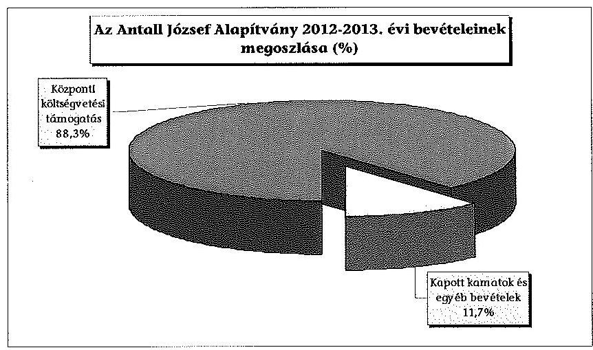

A 2012. és a 2013. évi összes bevétel 88,3\%-a (évenként 28300 ezer Ft) költségvetési támogatásból származott, melyre az Alapítvány a Párt tv. 9/A. § (3) bekezdésében foglaltak alapján volt jogosult. A költségvetési támogatás összege és annak folyósítása megfelelt a Párt tv. 9/A. § (2) és (4)(6) bekezdéseiben foglalt rendelkezéseknek.

Az Alapítvány az ellenőrzött időszakban egyéb támogatásban és adományban nem részesült.

A bevételek 11,7\%-át, 7494 ezer Ft-ot a kapott kamatok és egyéb bevételek összege tette ki.

### 1.3. A költségvetési és egyéb kapott támogatások, adományok felhasználásának és közzétételének szabályszerűsége

Az Alapítvány 2012. és 2013. évi összes ráfordítása az egyszerűsített éves beszámolói alapján 65407 ezer Ft volt, melyet a következő diagram szemléltet.

---

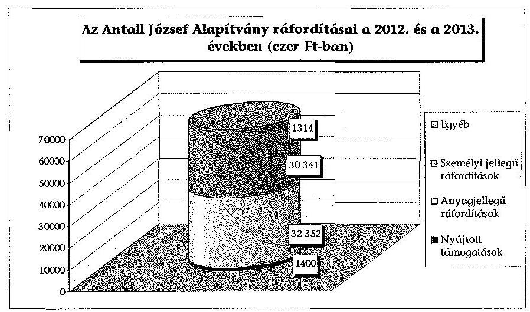

Az alapítványi vagyon felhasználására egy esetben nem a Pártalapítványi tv. 1. §-ában és a Párt tv. 9/A. § (1) bekezdésében foglalt alapítványi célok érdekében került sor, mivel a 2013. évben 1429 ezer Ft összegű központi költségvetésből kapott támogatást az Alapítvány nem tudományos, ismeretterjesztő, kutatási, oktatási tevékenységre, hanem kuratóriumi döntés alapján egy elmaradt rendezvény szervezési költségeinek ellenszolgáltatás nélküli megtérítésére fordította.

A 2012 decemberére tervezett rendezvény lebonyolítására a Kuratórium döntése alapján az Alapítvány 2545 ezer Ft+Áfa díjjal kötött 2012. november 20-án egy Kft.-vel megbízási szerződést, mely tartalma szerint eredmény létrehozatalát is magában foglalta. A Kft. szerződött partnere a rendezvény helyszínét lemondta, ezért a rendezvény meghiúsult, azonban a Kft. kérte a Kuratóriumtól az előkészítéssel kapcsolatos, 1125 ezer Ft+Áfa (összesen 1429 ezer Ft) összegű kiadásai megtérítését. A Kuratórium annak ellenére elfogadta a Kft. kérvényét, hogy a Ptk. 399. b) pontja rendelkezésének értelmében a Kft. díjazásra nem tarthatott volna igényt, továbbá az általa kiállított és melléklet nélkül benyújtott számla nem tartalmazott arra vonatkozóan információt, hogy az előzetesen felmerült ráfordítások milyen feladatok ellátásával kapcsolatosak, illetve azokat milyen dokumentumok támasztják alá.

Az Alapítvány az 1429 ezer Ft összegű támogatást a törvénysértő felhasználás miatt a Pártalapítványi tv. 4. § (6) bekezdése alapján köteles visszafizetni a központi költségvetésbe.

A 2012. és a 2013. években az Alapítvány kettő egyesület részére, három esetben összesen 1400 ezer Ft támogatást nyújtott a cél szerinti tevékenységei folytatására. Az Alapítvány a támogatást kettő esetben a Kuratórium egyedi határozata alapján, egy esetben - 350 ezer Ft összegben - azonban szabálytalanul, a 2013. évi költségvetésben támogatások céljára elkülönített pénzügyi keret terhére, kuratóriumi határozat nélkül biztosította, figyelmen kívül hagyva ezáltal az alapító okirat, VII/3. f) pontjában és a PGSZ 14. pontjában a támogatás nyújtására vonatkozó kuratóriumi döntési hatáskört.

Az Alapítvány a 2012-ben és a 2013-ban nyújtott támogatások esetében a PGSZ 15. pontjában előírt - támogatásra való jogosultság megállapítására vonatkozó - eljárás lefolytatását dokumentumokkal nem tudta

---

igazolni. Az Alapítvány képviseletében eljáró ügyvezető elnök mindhárom támogatás esetében megállapodást kötött a támogatott szervezettel, melyben rögzítették a támogatás célját, összegét, a folyósítás időpontját és az elszámolás feltételeit. A támogatott szervezetek a megállapodásokban előírt elszámolási kötelezettségüket nem teljesítették teljes körűen, mert tételes elszámolást nem készítettek a támogatási összeg felhasználásáról. Ehhez kapcsolódóan az Alapítvány a PGSZ 15. pontjában előírtak ellenére intézkedéseket nem tett, nem kérte a támogatottaktól a támogatás szerződés szerinti felhasználását alátámasztó elszámolás bizonylatait, a kapcsolódó számlákat, szerződéseket.

Az ellenőrzött időszakban az Alapítványnak - az ellenőrzés rendelkezésére álló dokumentumok alapján - közbeszerzési eljárási kötelezettsége nem keletkezett.

# 1.4. Az alapítvány által létrehozott szervezetre vonatkozó tulajdonosi döntések megfelelősége 

Az ellenőrzött időszakban az Alapítvány gazdasági társaságot vagy egyéb szervezetet nem alapított.
2. Az ÉVES SZÁMVITELI BESZÁMOLÓK ÉS AZ ALAPÍTVÁNY TEVÉKENYSÉGÉRŐL SZÓLÓ ÉVES JELENTÉSEK SZABÁLYSZERŰSÉGE

### 2.1. Az alapítvány tevékenységéről szóló éves jelentés megfelelősége

Az Alapítvány 2012. évi egyszerűsített éves beszámolóját a Kuratórium határidőben jóváhagyta. A beszámoló mellett a Pártalapítványi tv. 3/A. § (3) bekezdés b)-g) pontjaiban meghatározott kimutatásokat ${ }^{2}$ a Magyar Közlöny Hivatalos Értesítőjében közzétették, mellyel a 2012. év vonatkozásában az Alapítvány a Pártalapítványi tv.-ben előírt jelentés közzétételi kötelezettségének eleget tett, ugyanakkor a Pártalapítványi tv. 3/A. § (2) bekezdésében előírtakat ${ }^{3}$ megsértette, mivel a jelentés a Kuratórium által nem került elfogadásra.

Az Alapítvány 2013. évi egyszerűsített éves beszámolója a Számv. tv. 17. §-ában foglaltaknak megfelelően került elkészítésre, azonban azt a Kuratórium nem határidőben hagyta jóvá. Az Alapítvány a 2013. év vonatkozásában nem készített a Pártalapítványi tv. 3/A. § (1) bekezdése szerinti jelentést.

[^0]
[^0]:    ${ }^{2}$ A 2012. évi költségvetési támogatás felhasználására vonatkozó kimutatást, a vagyon felhasználásával kapcsolatos kimutatást, a cél szerinti juttatások kimutatását, a kapott támogatások kimutatását és az Alapítvány vezető tisztségviselőinek nyújtott juttatásokról készített kimutatást.
    ${ }^{3}$ A Kuratórium 2013. május 20-ai jegyzőkönyve szerint a 2012. egyszerűsített éves beszámoló elfogadásáról döntöttek, mely nem tartalmazta a Pártalapítványi tv. 3/A. § (3) bekezdés b)-f) pontjaiban meghatározott kimutatásokat.

---

Az Alapítvány a 2012. és a 2013. évi egyszerűsített éves beszámolóit a 224/2000. (XII. 19.) Korm. rendelet 6. § (1)-(3) bekezdésében előírtaknak, illetve a számviteli politikájában meghatározottaknak megfelelően készítette el, azonban a számviteli beszámolók eredménykimutatásának tagolása nem felelt meg a 224/2000. (XII. 19.) Korm. rendelet 5. számú mellékletben meghatározottaknak, továbbá nem tartalmazta az abban előírt tájékoztató adatokat. A 2012. és a 2013. évi egyszerűsített éves beszámolók mérlegeit és eredménykimutatásait az 1. és a 2. számú melléklet tartalmazza.

Az ellenőrzött időszak egyszerűsített éves beszámolói mérlegeinek és eredménykimutatásainak adatai a Számv. tv. 164. § (2) bekezdés előírásainak megfelelően az év végi záráshoz készített főkönyvi kivonat adataiból levezethetők voltak, azokkal megegyeztek.

A 2012. és a 2013. évi egyszerűsített éves beszámolókban a Számv. tv. 15-16. §-aiban meghatározott számviteli alapelvek közül a következők nem érvényesültek maradéktalanul:

- A Számv. tv. 15. § (3) bekezdésében foglalt valódiság elvét megsértették, mert az Alapítvány mindkét év egyszerűsített éves beszámolójának mérlegében - a Számv. tv. 65. § (1) bekezdésében meghatározottak ellenére - el nem ismert követeléseket mutatott ki, valamint a 2013. évben a tárgyi eszközök értékét - a Számv. tv. 69. § (1) bekezdésében meghatározottak ellenére - a leltár nem támasztotta alá. Továbbá a 2012. évben a Nádor utcai ingatlan megvásárlásához kapcsolódó 1400 ezer Ft foglaló összegével egyező összeget bevételként úgy jegyzett be az Alapítvány a számviteli nyilvántartásaiba, hogy az ingatlan vásárlástól nem állt el. Az elállás tényét a Ptk. 320. §-ában meghatározott nyilatkozattal megalapozni nem tudta, ezáltal a bevételt a Számv. tv. 165. § (1)-(2) bekezdésében foglaltak ellenére nem támasztotta alá szabályszerűen kiállított bizonylattal.
- A Számv. tv. 15. § (6) bekezdésében rögzített folytonosság elvét megsértették, mivel a 2012. év nyitóadatai a tárgyi eszközök és a követelések esetében nem egyeztek meg az előző évi beszámoló mérlegének záró adataival ${ }^{4}$.

# 2.2. A mérleg összeállításának szabályszerűsége 

Az Alapítvány 2012. és 2013. évi egyszerűsített éves beszámolója könyvviteli mérlegének adatai a kapcsolódó főkönyvi nyilvántartások adataival megegyeztek, azonban azok analitikus nyilvántartásokkal és leltárral egyik évben sem voltak teljes körűen alátámasztva.

A 2013. évben a mérlegben szereplő tárgyi eszközök értékét a leltár a Számv. tv. 69. § (1) bekezdésének előírását megsértve nem támasztotta alá. A 2012. és a 2013. évben a főkönyv és az analitikus nyilvántartások

[^0]
[^0]:    ${ }^{4}$ A 2011. év záró mérlegében az ingatlanvásárlásra beruházási előlegként adott pénzeszközt ( 21000 ezer Ft) tárgyi eszközként mutatták ki, a 2012. év nyitó mérlegében azonban már a követelések között szerepeltették.

---

egyeztetését a Számv. tv. 69. § (2) bekezdésének előírása ellenére nem végezték el.

A tárgyi eszközök értéke a 2012. év végén a mérlegben és a leltárban egyezően 972 ezer Ft, az analitikus nyilvántartás szerint 1048 ezer Ft (az eltérés 76 ezer Ft) volt. A 2013. év végén a mérlegben 1268 ezer Ft, a leltárban 1363 ezer Ft (az eltérés 95 ezer Ft), az analitikus nyilvántartásban 1144 ezer Ft (az eltérés 124 ezer Ft) volt a tárgyi eszközök értéke. Az analitikus nyilvántartásban a tárgyi eszközökről a számlarend 1. Számlaosztály Befektetett eszközökre meghatározottak ellenére nem vezették teljes körűen az egyedi nyilvántartó kartonokat, így nem biztosították a főkönyvvel való egyeztetés elvégzésének lehetőségét.

A 2012. évi mérlegben 36239 ezer Ft, a 2013. évi mérlegben 34239 ezer Ft összegű követelést mutattak ki, azonban a Számv. tv. 65. § (1) bekezdésében előírtakat megsértve nem történt meg azok kötelezettek általi elismertetése. A követelésekről az Alapítvány a számlarendje „Kapcsolatok a 3. számlaosztály és az analitikus nyilvántartások között" pontjának előírása ellenére analitikus nyilvántartást nem vezetett. Továbbá a követelések összegét a Számv. tv. 69. § (1) bekezdésében előírtak ellenére tételes, ellenőrizhető leltárral nem támasztották alá, illetve a kimutatott követeléseket a Számv.tv. 46. § (3) bekezdésében előírtak ellenére egyedileg nem értékelték:

- Az Alapítvány 2011. május 5-én adásvételi előszerződést kötött az alapító JESZ tulajdonában lévő Nádor utcai ingatlan megvásárlására vonatkozóan, melyben a vételárat 25000 ezer Ft-ban határozták meg. Az előszerződés tartalmazta, hogy a JESZ gondoskodik az ingatlant terhelő egyetemleges keretbiztosítéki jelzálogjog megszűntetéséről, erre azonban az adásvételi szerződés 2012. január 31-ei aláírásáig nem került sor. A Kuratórium a 2012. január 30-ai határozatában - tekintettel arra, hogy az előszerződés megkötését követően készített kettő darab értékbecslésben meghatározott érték meghaladta az előszerződésben rögzített összeget - hozzájárult az eladási ár 29250 ezer Ft-ra növeléséhez. Továbbá felhatalmazást adott az adásvételi szerződés megkötésére, azonban az előszerződés 6. pontjában rögzítettektől kedvezőtlenebb feltételekkel történő - tulajdonba adást, valamint birtokbavételt nem érvényesítő - szerződés megkötéséről nem döntött, ezáltal ahhoz nem járult hozzá. Az előszerződés 6. pontjában a szerződő felek úgy döntöttek, hogy „a végleges adásvételi szerződést legkésőbb a teljes vételár kiegyenlítésével egyidejűleg megkötik, amely okiratban a felek rendelkeznek a vevő tulajdonjogának bejegyzéséhez történő hozzájárulásról, továbbá az ingatlan vevő részére történő birtokba adásáról". A 2012. január 31-én megkötött adásvételi szerződésben tényként rögzítették összesen 28150 ezer Ft megfizetését, mely összeg az előszerződés megkötésekor megfizetett 1400 ezer Ft foglalóból, a 2011-ben teljesített 19600 ezer Ft vételárelőlegből, valamint az adásvételi szerződés aláírásával egyidejű átutalással teljesített 7150 ezer Ft vételárelőlegből tevődött össze. Ugyanakkor az adásvételi szerződésben a felek - az előszerződés 6. pontjában meghatározottaktól eltérően - nem rendelkeztek a vevő tulajdonjogának bejegyzéséhez történő hozzájárulásról. Továbbá az ingatlan vevő részére történő birtokba adása nem történt meg, erre vonatkozó jegyzőkönyvet az adásvételi szerződés 8. pontjában meghatározottak ellenére nem készítettek. Ennek következtében a vételár megfizetésének ellenére az Alapítvány az érintett ingatlanon tulajdon, illetőleg birtokjogot nem szerzett. Az adásvételi szerződés a Ptk. 320. §-ában meghatározottaknak megfelelően

---

rögzítette, hogy amennyiben az eladó az ingatlant legkésőbb 2012. június 15-éig nem tehermentesíti, akkor 15 nap türelmi időt követően a vevő jogosult „az eladóhoz címzett egyoldalú jognyilatkozattal elállni a szerződéstől". A Kuratórium 2012. december 14-én az ingatlanvásárlástól való elállásról döntött, azonban az Alapítvány a döntést nem hajtotta végre, nem állt el a vételtől, mivel az elállásról nem intézett az eladó JESZ-hez a Ptk. 320. §-ában, illetve az adásvételi szerződésben meghatározott nyilatkozatot. Ennek ellenére a vételárból foglalóként és előlegként megfizetett összesen 28150 ezer Ft-ot, valamint további - a foglalóval megegyező összeget ${ }^{5}$ 1400 ezer Ft-ot az Alapítvány a 2012. és a 2013. év végi mérlegben a követelések között mutatta ki, azonban a JESZ-szel szemben nyilvántartott követelés elismertetése nem történt meg.

- A követelések között szerepelt továbbá az Alapítvány mérlegében a 2012. és a 2013. év végén is fennálló 1455 ezer Ft összegű, az alapító JESZ részére adott kölcsön. A JESZ részére nyújtott 2500 ezer Ft összegű kölcsön visszafizetési határideje a szerződés szerint 2011. december 31-e volt. A kölcsön visszafizetésére 2012. október 10-éig nem került sor. Ekkor a Kuratórium arról határozott, hogy a JESZ a vissza nem fizetett kölcsön összegét az Alapítvány részére piaci értéken átadott tárgyi eszközök értékével csökkentheti. Az Alapítvány nevében eljáró ügyvezető elnök 2012. október 15-én úgy módosította a kölcsönszerződést, hogy a módosítás - a kuratóriumi döntésben foglaltakkal ellentétben - nem kizárólag a kölcsön összegének JESZ által felajánlott tárgyi eszközökkel való 1045 ezer Ft értékű kompenzációjára terjedt ki, hanem a kölcsön visszafizetésének határidejét jogosulatlanul 2013. június 30-ában határozta meg. A kompenzációt követően fennálló 1455 ezer Ft összegű kölcsön visszafizetésére nem került sor a módosított szerződésben jogosulatlanul meghatározott határidőig. Az Alapítvány a kölcsön visszafizetése érdekében a meghosszabbított határidő lejártát követően nem tett intézkedéseket, továbbá nem történt meg a követelés kötelezett általi 2012. és 2013. évi mérleg fordulónapjára történő elismertetése.
- Az Alapítvány 3234 ezer Ft összegű magánszemélyekkel szembeni követelést mutatott ki mérlegében a 2012. és a 2013. év végén, amely a 2010. év végétől változatlan összegben állt fenn. A leltárral és analitikus nyilvántartással alá nem támasztott 3234 ezer Ft összegű követelésből 727 ezer Ft-ot annak ellenére mutattak ki az ellenőrzött időszak mérlegeiben, hogy az Alapítvány nyilvántartásai alapján a kötelezettek nem voltak beazonosíthatók, a követeléssel kapcsolatban kizárólag azt rögzítették, hogy „egyéb követelés egyéb személyek"-kel szemben. A 3234 ezer Ft összegű követelés kötelezettek általi elismertetése és egyedi értékelése nem történt meg.
- Az Alapítvány a Számv. tv. 29. § (1) bekezdésében meghatározottakat megsértve a 2012. évi mérlegében a követelések között szerepeltette a szolgáltatásnyújtás ellenértékeként részszámlák alapján megfizetett 2000 ezer Ft-os összegét.

[^0]
[^0]:    ${ }^{5}$ Az ellenőrzött időszakban hatályos Ptk. 245. § (1) bekezdésének rendelkezése szerint „A teljesítés meghiúsulásáért felelős személy az adott foglalót elveszti, a kapott foglalót kétszeresen köteles visszatéríteni."

---

Az ellenőrzött időszakban az Alapítvány a követelésekről analitikus nyilvántartást annak ellenére nem vezetett, hogy a főkönyv egyedi azonosító adatokat nem tartalmazott és a számlarend „Kapcsolatok a 3. számlaosztály és az analitikus nyilvántartások között" pontja előírta az analitikus nyilvántartások vezetésének a kötelezettségét abban az esetben, ha a „főkönyvi számla nem folyószámlaként kerül vezetésre, vagy az nem alkalmas az egyedi azonosító adatok feltüntetésére".

A pénzeszközökön belül a bankszámla egyenleg a záró bankkivonattal megegyezett. A 2012-2013. évekre a december 31-ei pénztár készpénzállományáról címletjegyzékes, a jogszabályoknak és a pénzkezelési szabályzatnak megfelelő leltár készült, melynek összege megegyezett az időszaki pénztárjelentésben és a főkönyvi nyilvántartásban rögzített értékkel.

A Számv. tv. előírásainak megfelelően az aktív időbeli elhatárolások között mutatták ki az alapító részére nyújtott kölcsön után járó kamat, valamint a dolgozói magáncélú telefonhasználat befolyt bevételének tárgyévet megillető összegét.

A mérlegben kimutatott kötelezettségek 2012. év végi 14200 ezer Ft-os, valamint 2013. év végi 12039 ezer Ft-os összegét részletező nyilvántartásokkal alátámasztották.

Az Alapítvány számviteli beszámolóiban az induló vagyont a saját tőke részeként, az alapító okirat ${ }_{1-6}$-ban meghatározott 1000 ezer Ft-os összeggel egyezően szerepeltette.

# 2.3. Az eredménykimutatás szabályszerűsége

Az ellenőrzött években az eredménykimutatás tagolása nem felelt meg a 224/2000. (XII. 19.) Korm. rendelet 5. számú mellékletben meghatározottaknak, továbbá nem tartalmazta az abban előírt tájékoztató adatokat.

Az Alapítvány a 2012. évi eredménykimutatásában a bevételeket egy 1400 ezer Ft foglalóval egyező összeg - esetében a Számv. tv. 165. § (1)-(2) bekezdése előírásának megfelelő bizonylattal nem támasztotta alá, mivel a Nádor utcai ingatlanvásárlástól való elállás nem történt meg, arra vonatkozóan az eladó felé a Ptk. 320. §-ában meghatározott nyilatkozatot nem intézett.

Az Alapítvány betartotta a 224/2000. (XII. 19.) Korm. rendelet 17. § (4) bekezdése előírásának megfelelően a bevételi kategóriák szerinti bontási kötelezettséget. Az eredménykimutatás sorai az adott sorokon kimutatható bevételek körébe tartozó tételeket tartalmaztak.

Az Alapítvány a költségek, ráfordítások tekintetében a 2012. és a 2013. évben nem tartotta be teljes körűen a Számv. tv. 165. § (1)-(2) bekezdésében meghatározottakat, mivel öt esetben a ráfordítás kifizetését a kifizetést megalapozó dokumentum nélkül teljesítették.

---

A 2012. évi eredménykimutatásában a 2000 ezer Ft szolgáltatásnyújtás ellenértékeként kifizetett részszámlák szerinti összeget az Alapítvány a Számv. tv. 78. § (1) bekezdésében foglaltakat megsértve nem a ráfordítások, hanem a követelések között szerepeltette, majd a szerződés szerinti teljes összeget a 2013. évben számolta el ráfordításként. A szabálytalanság mértéke a 2012. évi mérlegfőösszeg 4,6\%-ának, a 2013. évi mérlegfőösszeg 4,7\%-ának megfelelő összegű volt, ennek következtében az egyszerűsített éves beszámoló, illetve eredménykimutatás jelentős összegű hibát tartalmazott.

# 3. AZ ALAPÍTVÁNY KÖNYVVEZETÉSÉNEK SZABÁLYSZERŰSÉGE

### 3.1. A könyvvezetés szabályozottsága

Az Alapítvány gazdálkodásának, a számviteli beszámoló készítésének és könyvvezetésének belső szabályozási rendszere nem felelt meg teljes körűen a Számv. tv. 14. §-a és 161. §-a előírásainak. Az Alapítvány az ellenőrzött időszakban a Számv. tv. 14. § (5) bekezdés b) pontjában előírtakat megsértve - hatályba léptetés és kiadmányozás hiányában - nem rendelkezett hatályos eszközök és források értékelési szabályzattal.

A Számv. tv. 14. § (3)-(5) bekezdéseiben előírt szabályzatok ${ }^{6}$ közül a számviteli politika, a leltározási szabályzat és a pénzkezelési szabályzat, valamint a Számv. tv. 161. § (1) bekezdésében előírt számlarend aktualizálására a Számv. tv. 14. § (11) és a 161. § (5) bekezdésében meghatározottak ellenére az ellenőrzött időszakban a jogszabályi változásokat követően nem került sor.

Az Alapítvány aktualizált számviteli szabályzatainak tervezeteit jóváhagyásra 2012 decemberében előkészítették, azonban azok kuratóriumi határozat hiányában nem váltak érvényessé. Az alapító okirat2 VII. fejezetének 3. pontjának k) alpontja, mely szerint „a Kuratórium dönt minden olyan, az Alapítvány működésével és céljainak megvalósításával kapcsolatos ügyben, mely hatáskörében felmerül" és az SZMSZ II. fejezet 2. k) pontja alapján, figyelembe véve azt a tényt is, hogy a kuratóriumi tagoknak 2012. december 13-án megküldött e-mailben tervezett napirendként szerepelt a szabályzatok elfogadása, a szabályzatok elfogadását a Kuratórium „hatáskörében felmerül?" ügyként kell tekinteni. A döntéshozatali eljárás során az ügyvezető elnök és a jegyzőkönyvvezető nem tartották be az SZMSZ VII. fejezet 7. pontjában előírtakat, amikor a kuratóriumi határozatot nem foglalták jegyzőkönyvbe.

Az Alapítvány költségvetésének részletes szabályait, a pénzügyi ellenőrzés módját és idejét, valamint a beszámoltatás rendjét a 2010. október 25-én kiadmányozott PGSZ-ben szabályozták ${ }^{7}$. A PGSZ és az SZMSZ II. fejezet 3. pontja előírásának összhangja nem volt biztosított az ellenőrzött időszakban, mert a PGSZ 3-8., 10., 13-14., 16-17. és 20. pontjai főigazgatói operatív vezetői

[^0]
[^0]:    ${ }^{6}$ A Számv. tv. 14. § (6) bekezdésében előírtak alapján az egyszerűsített éves beszámolót készítő Alapítványnak nem kellett önköltségszámítás rendjére vonatkozó belső szabályzatot készítenie.
    ${ }^{7}$ A PGSZ 2012. decemberi módosítása írásba foglalt kuratóriumi határozat hiányában nem lépett érvénybe.

---

feladat- és hatásköröket rögzítenek, míg az SZMSZ az Alapítvány operatív vezetőjeként a Kuratórium ügyvezető elnökét nevesítette.

A Számv. tv. 52. § (2) bekezdésében előírtakat megsértve nem tervezték meg az immateriális javak és tárgyi eszközök esetében az évenként elszámolandó értékcsökkenés módszerét, és esetenként nem gondoskodtak annak nyilvántartásokon való rögzítéséről.

A Számv. tv. 14. § (4)-(5) bekezdésében előírt szabályzatok hiányosságai, szabálytalanságai az ellenőrzött időszakban a következők voltak:

- A számviteli politikában a Számv. tv. 12. § (3)-(4) bekezdésében meghatározottakkal ellentétben „egyszerűsített kettős könyvviteli" szabályoknak megfelelő könyvvezetést írtak elő kettős könyvvitel helyett. Az egyszerűsített éves beszámoló formáját nem a 224/2000. (XII. 19.) Korm. rendelet 6. § (7) bekezdése előírásának megfelelően határozták meg, az eredménykimutatás tekintetében a 224/2000. (XII. 19.) Korm. rendelet közhasznú társaságokra vonatkozó, ellenőrzött időszakban hatálytalan 6. számú mellékletének elkészítési kötelezettségét írták elő. A számviteli politika keretében a 224/2000. (XII. 19.) Korm. rendelet 17. § (8) bekezdésében foglaltak ellenére a részletező nyilvántartási rendszert nem alakították ki oly módon, hogy abból a szükséges információk rendelkezésre álljanak.
- A pénzkezelési szabályzat nem felelt meg a Számv. tv. 14. § (8) bekezdése előírásainak. Nem szabályozták a pénzforgalom bankszámlán történő lebonyolításának rendjét, a pénztáros és a pénztárellenőr felelősségét, a készpénzállományt érintő pénzmozgások jogcímeit, a pénzkezeléssel kapcsolatos bizonylatok rendjét. Emellett nem határozták meg az elektronikus pénzforgalom lebonyolításának nyilvántartási szabályait, az ügyfélterminál használatának rendjét, a bankszámla feletti rendelkezésre jogosultak névsorát, a készpénzállomány ellenőrzése gyakoriságát és dokumentálásának módját.
- A számlarend a Számv. tv. 161. § (2) bekezdésében foglaltak ellenére nem tartalmazta minden főkönyvi számla számjelét, megnevezését, tartalmát, a növekedések és csökkenések jogcímeit, a számlát érintő gazdasági eseményeket, azok más számlákkal való kapcsolatát, a főkönyvi számla és az analitikus nyilvántartás kapcsolatát, a számlarendben foglaltakat alátámasztó bizonylati rendet, ugyanakkor tartalmazott az Alapítványra nem értelmezhető számlacsoportokat.
- A leltározási szabályzat és az SZMSZ II. fejezet 3. pontja előírásának összhangja nem volt biztosított az ellenőrzött időszakban, mert 7., 10., 13. és 14. pontjai főigazgatói operatív vezetői feladat- és hatásköröket rögzítenek, míg az SZMSZ az Alapítvány vezetőjeként a Kuratórium ügyvezető elnökét nevesítette.

# 3.2. A könyvvezetés gyakorlatának megfelelősége

Az Alapítvány könyvvezetési feladatait szerződés alapján külső könyvviteli szolgáltató látta el az ellenőrzött időszakban. Egy alkalommal történt változás 2012. és 2013. között a könyvvezetési feladatellátó személyében, a váltáskor a Ptk. 479. § (2) bekezdése rendelkezésének megfelelően dokumentáltan megtörtént

---

a bizonylatok, dokumentumok átadása-átvétele. A könyvvezetéshez az ellenőrzött időszakban azonos számítógépes programot használtak. Az év végi zárlattal kapcsolatos feladatokat az ellenőrzött időszakban elvégezték, a záráshoz a főkönyvi kivonatok rendelkezésre álltak.

Az Alapítvány könyvvezetésének gyakorlata a 2012. és a 2013. évben nem felelt meg teljes körűen a vonatkozó jogszabályi előírásoknak. A gazdasági eseményeket alátámasztó bizonylatokat a Számv. tv. előírásainak megfelelően időrendi sorrendben rögzítették, azonban a könyvelt tételek alapbizonylatainál az alábbi, eredményt nem érintő hiányosságok, szabálytalanságok merültek fel:

- A Számv. tv. 167 § (1) bekezdés h) és i) pontjainak előírása ellenére az ellenőrzött 2012. és 2013. évi bizonylatok 70,8\%-ánál, illetve 86,3\%-ánál hiányzott a könyvviteli számlára történő hivatkozás, továbbá 81,7\%, illetve 88,5% esetében nem szerepelt a bizonylatokon a könyvviteli nyilvántartásokban történt rögzítés időpontja és annak igazolása. Az ellenőrzött tételeket a megfelelő főkönyvi számlákra könyvelték.
- A Számv. tv. 165. § (1)-(2) bekezdésének előírása ellenére a 2012. évben négy esetben (összesen 5066 ezer Ft összegben) a kifizetés időpontjában nem állt rendelkezésre a bizonylat. A bizonylatok kiállítására a kifizetést követően került sor.

Az ellenőrzött időszakban a házipénztár kezelése során nem tartották be az Alapítvány pénzkezelési szabályzata 5. pontjában foglaltakat, mert az év végi záró készpénzállomány az abban előírtakat meghaladta.

A pénztárbizonylatokat, a pénztárjelentés és az útnyilvántartás tömbjét a Számv. tv. 168. § (2)-(3) bekezdése előírásával összhangban szabályosan nyilvántartották.

A 2012. és a 2013. évben elektronikus banki utalással történt a bankszámlaforgalom bonyolítása, a szükséges banki eszközöket és kódot az arra jogosultak vették át a pénzintézettől.

Az Alapítvány az ellenőrzött időszakban a Számv. tv. 169. § (1)-(2) bekezdései előírásainak megfelelően gondoskodott a beszámolók, főkönyvi kivonatok és bizonylatok megőrzéséről.

# 4. Az előző ÁSZ ellenőrzés javaslatai alapján Készített INTÉZKEDÉSI TERVBEN FOGLALTAK VÉGREHAJTÁSA

Az ÁSZ 13002 számú, az Antall József Alapítvány 2010-2011. évi gazdálkodása törvényességének ellenőrzéséről szóló jelentés 18 javaslata alapján az Alapítvány az ÁSZ tv. 33. § (1) bekezdésében előírt intézkedési tervét elkészítette, és határidőben megküldte. A tervezett intézkedéseket, azok felelőseinek meghatározását és az intézkedések végrehajtásának határidőit tartalmazó intézkedési tervet az ÁSZ elnöke elfogadta.

---

Az Alapítvány az intézkedési tervben foglaltakat részben hajtotta végre, mivel a tervezett intézkedésekből hármat teljes egészében, kettőt részben hasznosított, tizenhárom intézkedés azonban
 nem került hasznosításra.

Az alapító okirat ${ }_{1}$ módosításával a kuratóriumi ülések gyakorisága tekintetében megteremtették az összhangot az SZMSZ-szel, gondoskodtak a 2013. évi költségvetési terv elkészítéséről és jóváhagyásáról, továbbá intézkedtek egy támogatott felszólításáról a jogtalanul igénybe vett támogatás miatt. Az intézkedési tervben vállaltakkal szemben nem teljes körűen tartották be az alapító okirat ${ }_{1-6}$-ban előírtakat, mert egy támogatás odaítélésére kuratóriumi döntés nélkül került sor, továbbá a ráfordítások elszámolásánál nem minden könyvviteli elszámolást alátámasztó bizonylat felelt meg a Számv. tv.-ben foglaltaknak. Nem tartották be 2013-ban az alapító okirat ${ }_{1-6}$ Kuratórium összehívására vonatkozó előírását és az alapító részére előírt tájékoztatási kötelezettséget. Nem történt meg a jelzett jelentős összegű hibák kijavítása, továbbra sem gondoskodtak a mérlegsorok leltárral való teljes körű alátámasztásáról, illetve nem biztosították az alapítványi céltól eltérő kifizetések megszüntetését sem. Az ellenőrzött időszakot megelőzően magánszemélyek részére nyújtott támogatások személyi jellegű ráfordításként való elszámolására nem került sor. Nem pótolták egy támogatás honlapon történő megjelenítését. Nem módosították a számviteli szabályzatokat, továbbá a PGSZ és az SZMSZ összhangját nem teremtették meg. Nem tartották be a valódiság és a folytonosság Számv. tv. szerinti alapelveit. A JESZ-szel kötött Nádor utcai ingatlan adásvételi szerződésben foglalt elállási joggal nem éltek. A ráfordításokat nem a Civil tv. előírásai figyelembe vételével tartották nyilván. A Kuratórium az intézkedési tervben tervezett intézkedések teljesítését nem ellenőrizte.

Budapest, 2015. 08. hó 49 nap

Melléklet: 4 db
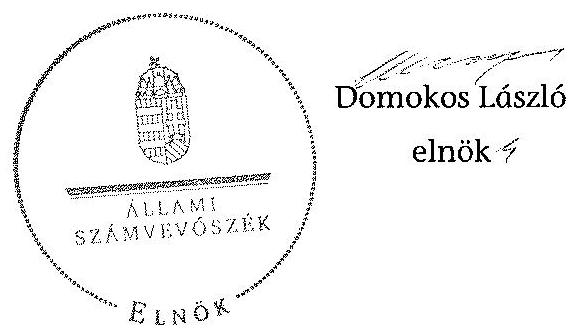

---

.

---

Beszámoló az Antall József Alapítvány 2012. évi tevékenységéről
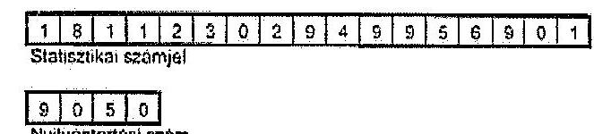

A vállalkozás megnevezése
A vállakozás címe, telefonszáma

## ANTALL JÓZSEF ALAPÍTVÁNY

1026 BUDAPEST SZILÁGYI ERZSÉBET FASOR 73.

# Egyszerűsített éves beszámoló 

2012. üzleti évröl

Keltezés: $\quad$ Budapest, 2013. április 30.
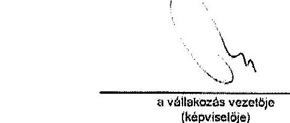

---

# 1. SZÁMÚ MELLÉKLET A V-0717-207/2015. SZÁMÚ JELENTÉSHEZ

|  1 | 2 | 3 | 4 | 5 | 6 | 7 | 8 | 9 | 0 | 1  |
| --- | --- | --- | --- | --- | --- | --- | --- | --- | --- | --- |
|  1 | 2 | 3 | 4 | 5 | 6 | 7 | 8 | 9 | 0 | 1  |

**Sztószólkó szám**

**Nyilvamantási szám**

**Egyszerűsített éves beszámoló MÉRLEGE "A" változat**

**Eszközök (aktívák)**

Az üzleti év mérlegfordulónapja: 2012. december 31.

|  Sorszám | A tétel megnevezése | Előző év | Előző év(ek) módosításai | Tárgyév  |
| --- | --- | --- | --- | --- |
|  a | b | c | d | e  |
|  01. | A. Befektetett eszközök (02.+04.+06.sz) | 8 | 0 | 972  |
|  02. | I. IMMATERIÁLIS JAVAK |  |  |   |
|  03. | 02. sorból: Immateriális javak értékhelyesbítése |  |  |   |
|  04. | II. TÁRGYI ESZKÖZÖK | 8 |  | 972  |
|  05. | 04. sorból: Tárgyi eszközök értékhelyesbítése |  |  |   |
|  06. | III. BEFEKTETETT PÉNZÜGYI ESZKÖZÖK |  |  |   |
|  07. | 06. sorból: Befektetett pénzügyi eszközök értékhelyesbítése |  |  |   |
|  08. | B. Forgóeszközök (09.+10.+11.+12. sz) | 36 629 | 0 | 42 215  |
|  09. | I. KÉSZLETEK | 1 696 |  | 1 696  |
|  10. | II. KÖVETELÉSEK | 26 861 |  | 36 239  |
|  11. | III. ÉRTÉKPAPÍROK |  |  |   |
|  12. | IV. PÉNZESZKÖZÖK | 7 272 |  | 4 160  |
|  13. | C. Aktív időbeli elhatárolások | 0 |  | 150  |
|  14. | ESZKÖZÖK ÖSSZESEN (01.+08.+13. sz) | 36 043 | 0 | 43 443  |

**Keltezés:**

- Budapest, 2013. április 30.
- P.M.: 01/13. Noktálko
- 02/13. 13:00:00 Kétjük: 01/13. Noktálko
- 03/13. 13:00:00 Kétjük: 01/13. Noktálko
- 04/13. 13:00:00 Kétjük: 01/13. Noktálko
- 05/13. 13:00:00 Kétjük: 01/13. Noktálko
- 06/13. 13:00:00 Kétjük: 01/13. Noktálko
- 07/13. 13:00:00 Kétjük: 01/13. Noktálko
- 08/13. 13:00:00 Kétjük: 01/13. Noktálko
- 09/13. 13:00:00 Kétjük: 01/13. Noktálko
- 10/13. 13:00:00 Kétjük: 01/13. Noktálko
- 11/13. 13:00:00 Kétjük: 01/13. Noktálko
- 12/13. 13:00:00 Kétjük: 01/13. Noktálko
- 13/13. 13:00:00 Kétjük: 01/13. Noktálko
- 14. 13:00:00 Kétjük: 01/13. Noktálko
- 15. 13:00:00 Kétjük: 01/13. Noktálko
- 16. 13:00:00 Kétjük: 01/13. Noktálko
- 17. 13:00:00 Kétjük: 01/13. Noktálko
- 18. 13:00:00 Kétjük: 01/13. Noktálko
- 19. 13:00:00 Kétjük: 01/13. Noktálko
- 20. 13:00:00 Kétjük: 01/13. Noktálko
- 21. 13:00:00 Kétjük: 01/13. Noktálko
- 22. 13:00:00 Kétjük: 01/13. Noktálko
- 23. 13:00:00 Kétjük: 01/13. Noktálko
- 24. 13:00:00 Kétjük: 01/13. Noktálko
- 25. 13:00:00 Kétjük: 01/13. Noktálko
- 26. 13:00:00 Kétjük: 01/13. Noktálko
- 27. 13:00:00 Kétjük: 01/13. Noktálko
- 28. 13:00:00 Kétjük: 01/13. Noktálko
- 29. 13:00:00 Kétjük: 01/13. Noktálko
- 30. 13:00:00 Kétjük: 01/13. Noktálko
- 31. 13:00:00 Kétjük: 01/13. Noktálko
- 32. 13:00:00 Kétjük: 01/13. Noktálko
- 33. 13:00:00 Kétjük: 01/13. Noktálko
- 34. 13:00:00 Kétjük: 01/13. Noktálko
- 35. 13:00:00 Kétjük: 01/13. Noktálko
- 36. 13:00:00 Kétjük: 01/13. Noktálko
- 37. 13:00:00 Kétjük: 01/13. Noktálko
- 38. 13:00:00 Kétjük: 01/13. Noktálko
- 39. 13:00:00 Kétjük: 01/13. Noktálko
- 40. 13:00:00 Kétjük: 01/13. Noktálko
- 41. 13:00:00 Kétjük: 01/13. Noktálko
- 42. 13:00:00 Kétjük: 01/13. Noktálko
- 43. 13:00:00 Kétjük: 01/13. Noktálko
- 44. 13:00:00 Kétjük: 01/13. Noktálko
- 45. 13:00:00 Kétjük: 01/13. Noktálko
- 46. 13:00:00 Kétjük: 01/13. Noktálko
- 47. 13:00:00 Kétjük: 01/13. Noktálko
- 48. 13:00:00 Kétjük: 01/13. Noktálko
- 49. 13:00:00 Kétjük: 01/13. Noktálko
- 50. 13:00:00 Kétjük: 01/13. Noktálko
- 51. 13:00:00 Kétjük: 01/13. Noktálko
- 52. 13:00:00 Kétjük: 01/13. Noktálko
- 53. 13:00:00 Kétjük: 01/13. Noktálko
- 54. 13:00:00 Kétjük: 01/13. Noktálko
- 55. 13:00:00 Kétjük: 01/13. Noktálko
- 56. 13:00:00 Kétjük: 01/13. Noktálko
- 57. 13:00:00 Kétjük: 01/13. Noktálko
- 58. 13:00:00 Kétjük: 01/13. Noktálko
- 59. 13:00:00 Kétjük: 01/13. Noktálko
- 60. 13:00:00 Kétjük: 01/13. Noktálko
- 61. 13:00:00 Kétjük: 01/13. Noktálko
- 62. 13:00:00 Kétjük: 01/13. Noktálko
- 63. 13:00:00 Kétjük: 01/13. Noktálko
- 64. 13:00:00 Kétjük: 01/13. Noktálko
- 65. 13:00:00 Kétjük: 01/13. Noktálko
- 66. 13:00:00 Kétjük: 01/13. Noktálko
- 67. 13:00:00 Kétjük: 01/13. Noktálko
- 68. 13:00:00 Kétjük: 01/13. Noktálko
- 69. 13:00:00 Kétjük: 01/13. Noktálko
- 70. 13:00:00 Kétjük: 01/13. Noktálko
- 71. 13:00:00 Kétjük: 01/13. Noktálko
- 72. 13:00:00 Kétjük: 01/13. Noktálko
- 73. 13:00:00 Kétjük: 01/13. Noktálko
- 74. 13:00:00 Kétjük: 01/13. Noktálko
- 75. 13:00:00 Kétjük: 01/13. Noktálko
- 76. 13:00:00 Kétjük: 01/13. Noktálko
- 77. 13:00:00 Kétjük: 01/13. Noktálko
- 78. 13:00:00 Kétjük: 01/13. Noktálko
- 79. 13:00:00 Kétjük: 01/13. Noktálko
- 80. 13:00:00 Kétjük: 01/13. Noktálko
- 81. 13:00:00 Kétjük: 01/13. Noktálko
- 82. 13:00:00 Kétjük: 01/13. Noktálko
- 83. 13:00:00 Kétjük: 01/13. Noktálko
- 84. 13:00:00 Kétjük: 01/13. Noktálko
- 85. 13:00:00 Kétjük: 01/13. Noktálko
- 86. 13:00:00 Kétjük: 01/13. Noktálko
- 87. 13:00:00 Kétjük: 01/13. Noktálko
- 88. 13:00:00 Kétjük: 01/13. Noktálko
- 89. 13:00:00 Kétjük: 01/13. Noktálko
- 90. 13:00:00 Kétjük: 01/13. Noktálko
- 91. 13:00:00 Kétjük: 01/13. Noktálko
- 92. 13:00:00 Kétjük: 01/13. Noktálko
- 93. 13:00:00 Kétjük: 01/13. Noktálko
- 94. 13:00:00 Kétjük: 01/13. Noktálko
- 95. 13:00:00 Kétjük: 01/13. Noktálko
- 96. 13:00:00 Kétjük: 01/13. Noktálko
- 97. 13:00:00 Kétjük: 01/13. Noktálko
- 98. 13:00:00 Kétjük: 01/13. Noktálko
- 99. 13:00:00 Kétjük: 01/13. Noktálko
- 100. 13:00:00 Kétjük: 01/13. Noktálko
- 101. 13:00:00 Kétjük: 01/13. Noktálko
- 102. 13:00:00 Kétjük: 01/13. Noktálko
- 103. 13:00:00 Kétjük: 01/13. Noktálko
- 104. 13:00:00 Kétjük: 01/13. Noktálko
- 105. 13:00:00 Kétjük: 01/13. Noktálko
- 106. 13:00:00 Kétjük: 01/13. Noktálko
- 107. 13:00:00 Kétjük: 01/13. Noktálko
- 108. 13:00:00 Kétjük: 01/13. Noktálko
- 109. 13:00:00 Kétjük: 01/13. Noktálko
- 110. 13:00:00 Kétjük: 01/13. Noktálko
- 111. 13:00:00 Kétjük: 01/13. Noktálko
- 112. 13:00:00 Kétjük: 01/13. Noktálko
- 113. 13:00:00 Kétjük: 01/13. Noktálko
- 114. 13:00:00 Kétjük: 01/13. Noktálko
- 115. 13:00:00 Kétjük: 01/13. Noktálko
- 116. 13:00:00 Kétjük: 01/13. Noktálko
- 117. 13:00:00 Kétjük: 01/13. Noktálko
- 118. 13:00:00 Kétjük: 01/13. Noktálko
- 119. 13:00:00 Kétjük: 01/13. Noktálko
- 120. 13:00:00 Kétjük: 01/13. Noktálko
- 121. 13:00:00 Kétjük: 01/13. Noktálko
- 122. 13:00:00 Kétjük: 01/13. Noktálko
- 123. 13:00:00 Kétjük: 01/13. Noktálko
- 124. 13:00:00 Kétjük: 01/13. Noktálko
- 125. 13:00:00 Kétjük: 01/13. Noktálko
- 126. 13:00:00 Kétjük: 01/13. Noktálko
- 127. 13:00:00 Kétjük: 01/13. Noktálko
- 128. 13:00:00 Kétjük: 01/13. Noktálko
- 129. 13:00:00 Kétjük: 01/13. Noktálko
- 130. 13:00:00 Kétjük: 01/13. Noktálko
- 131. 13:00:00 Kétjük: 01/13. Noktálko
- 132. 13:00:00 Kétjük: 01/13. Noktálko
- 133. 13:00:00 Kétjük: 01/13. Noktálko
- 134. 13:00:00 Kétjük: 01/13. Noktálko
- 135. 13:00:00 Kétjük: 01/13. Noktálko
- 136. 13:00:00 Kétjük: 01/13. Noktálko
- 137. 13:00:00 Kétjük: 01/13. Noktálko
- 138. 13:00:00 Kétjük: 01/13. Noktálko
- 139. 13:00:00 Kétjük: 01/13. Noktálko
- 140. 13:00:00 Kétjük: 01/13. Noktálko
- 141. 13:00:00 Kétjük: 01/13. Noktálko
- 142. 13:00:00 Kétjük: 01/13. Noktálko
- 143. 13:00:00 Kétjük: 01/13. Noktálko
- 144. 13:00:00 Kétjük: 01/13. Noktálko
- 145. 13:00:00 Kétjük: 01/13. Noktálko
- 146. 13:00:00 Kétjük: 01/13. Noktálko
- 147. 13:00:00 Kétjük: 01/13. Noktálko
- 148. 13:00:00 Kétjük: 01/13. Noktálko
- 149. 13:00:00 Kétjük: 01/13. Noktálko
- 150. 13:00:00 Kétjük: 01/13. Noktálko
- 151. 13:00:00 Kétjük: 01/13. Noktálko
- 152. 13:00:00 Kétjük: 01/13. Noktálko
- 153. 13:00:00 Kétjük: 01/13. Noktálko
- 154. 13:00:00 Kétjük: 01/13. Noktálko
- 155. 13:00:00 Kétjük: 01/13. Noktálko
- 156. 13:00:00 Kétjük: 01/13. Noktálko
- 157. 13:00:00 Kétjük: 01/13. Noktálko
- 158. 13:00:00 Kétjük: 01/13. Noktálko
- 159. 13:00:00 Kétjük: 01/13. Noktálko
- 151. 13:00:00 Kétjük: 01/13. Noktálko
- 152. 13:00:00 Kétjük: 01/13. Noktálko
- 153. 13:00:00 Kétjük: 01/13. Noktálko
- 154. 13:00:00 Kétjük: 01/13. Noktálko
- 155. 13:00:00 Kétjük: 01/13. Noktálko
- 156. 13:00:00 Kétjük: 01/13. Noktálko
- 157. 13:00:00 Kétjük: 01/13. Noktálko
- 158. 13:00:00 Kétjük: 01/13. Noktálko
- 159. 13:00:00 Kétjük: 01/13. Noktálko
- 151. 13:00:00 Kétjük: 01/13. Noktálko
- 152. 13:00:00 Kétjük: 01/13. Noktálko
- 153. 13:00:00 Kétjük: 01/13. Noktálko
- 154. 13:00:00 Kétjük: 01/13. Noktálko
- 155. 13:00:00 Kétjük: 01/13. Noktálko
- 156. 13:00:00 Kétjük: 01/13. Noktálko
- 157. 13:00:00 Kétjük: 01/13. Noktálko
- 158. 13:00:00 Kétjük: 01/13. Noktálko
- 159. 13:00:00 Kétjük: 01/13. Noktálko
- 151. 13:00:00 Kétjük: 01/13. Noktálko
- 152. 13:00:00 Kétjük: 01/13. Noktálko
- 153. 13:00:00 Kétjük: 01/13. Noktálko
- 154. 13:00:00 Kétjük: 01/13. Noktálko
- 155. 13:00:00 Kétjük: 01/13. Noktálko
- 156. 13:00:00 Kétjük: 01/13. Noktálko
- 157. 13:00:00 Kétjük: 01/13. Noktálko
- 158. 13:00:00 Kétjük: 01/13. Noktálko
- 159. 13:00:00 Kétjük: 01/13. Noktálko
- 151. 13:00:00 Kétjük: 01/13. Noktálko
- 152. 13:00:00 Kétjük: 01/13. Noktálko
- 153. 13:00:00 Kétjük: 01/13. Noktálko
- 154. 13:00:00 Kétjük: 01/13. Noktálko
- 155. 13:00:00 Kétjük: 01/13. Noktálko
- 156. 13:00:00 Kétjük: 01/13. Noktálko
- 157. 13:00:00 Kétjük: 01/13. Noktálko
- 158. 13:00:00 Kétjük: 01/13. Noktálko
- 159. 13:00:00 Kétjük: 01/13. Noktálko
- 157. 13:00:00 Kétjük: 01/13. Noktálko
- 158. 13:00:00 Kétjük: 01/13. Noktálko
- 159. 13:00:00 Kétjük: 01/13. Noktálko
- 151. 13:00:00 Kétjük: 01/13. Noktálko
- 152. 13:00:00 Kétjük: 01/13. Noktálko
- 153. 13:00:00 Kétjük: 01/13. Noktálko
- 154. 13:00:00 Kétjük: 01/13. Noktálko
- 155. 13:00:00 Kétjük: 01/13. Noktálko
- 156. 13:00:00 Kétjük: 01/13. Noktálko
- 157. 13:00:00 Kétjük: 01/13. Noktálko
- 158. 13:00:00 Kétjük: 01/13. Noktálko
- 159. 13:00:00 Kétjük: 01/13. Noktálko
- 151. 13:00:00 Kétjük: 01/13. Noktálko
- 152. 13:00:00 Kétjük: 01/13. Noktálko
- 153. 13:00:00 Kétjük: 01/13. Noktálko
- 154. 13:00:00 Kétjük: 01/13. Noktálko
- 155. 13:00:00 Kétjük: 01/13. Noktálko
- 156. 13:00:00 Kétjük: 01/13. Noktálko
- 157. 13:00:00 Kétjük: 01/13. Noktálko
- 158. 13:00:00 Kétjük: 01/13. Noktálko
- 159. 13:00:00 Kétjük: 01/13. Noktálko
- 151. 13:00:00 Kétjük: 01/13. Noktálko
- 151. 13:00:00 Kétjük: 01/13. Noktálko
- 152. 13:00:00 Kétjük: 01/13. Noktálko
- 152. 13:00:00 Kétjük: 01/13. Noktálko
- 153. 13:00:00 Kétjük: 01/13. Noktálko
- 154. 13:00:00 Kétjük: 01/13. Noktálko
- 155. 13:00:00 Kétjük: 01/13. Noktálko
- 156. 13:00:00 Kétjük: 01/13. Noktálko
- 157. 13:00:00 Kétjük: 01/13. Noktálko
- 158. 13:00:00 Kétjük: 01/13. Noktálko
- 159. 13:00:00 Kétjük: 01/13. Noktálko
- 151. 13:00:00 Kétjük: 01/13. Noktálko
- 151. 13:00:00 Kétjük: 01/13. Noktálko
- 151. 13:00:00 Kétjük: 01/13. Noktálko
- 152. 13:00:00 Kétjük: 01/13. Noktálko
- 152. 13:00:00 Kétjük: 01/13. Noktálko
- 152. 13:00:00 Kétjük: 01/13. Noktálko
- 153. 13:00:00 Kétjük: 01/13. Noktálko
- 154. 13:00:00 Kétjük: 01/13. Noktálko
- 155. 13:00:00 Kétjük: 01/13. Noktálko
- 155. 13:00:00 Kétjük: 01/13. Noktálko
- 156. 13:00:00 Kétjük: 01/13. Noktálko
- 156. 13:00:00 Kétjük: 01/13. Noktálko
- 157. 13:00:00 Kétjük: 01/13. Noktálko
- 157. 13:00:00 Kétjük: 01/13. Noktálko
- 157. 13:00:00 Kétjük: 01/13. Noktálko
- 157. 13:00:00 Kétjük: 01/13. Noktálko
- 157. 13:00:00 Kétjük: 01/13. Noktálko
- 157. 13:00:00 Kétjük: 01/13. Noktálko
- 157. 13:00:00 Kétjük: 01/13. Noktálko
- 157. 13:00:00 Kétjük: 01/13. Noktálko
- 157. 13:00:00 Kétjük: 01/13. Noktálko
- 157. 13:00:00 Kétjük: 01/13. Noktálko
- 157. 13:00:00 Kétjük: 01/13. Noktálko
- 157. 13:00:00 Kétjük: 01/13. Noktálko
- 157. 13:00:00 Kétjük: 01/13. Noktálko
- 157. 13:00:00 Kétjük: 01/13. Noktálko
- 157. 13:00:00 Kétjük: 01/13. Noktálko
- 157. 13:00:00 Kétjük: 01/13. Noktálko
- 157. 13:00:00 Kétjük: 01/13. Noktálko
- 157. 13:00:00 Kétjük: 01/13. Noktálko
- 157. 13:00:00 Kétjük: 01/13. Noktálko
- 157. 13:00:00 Kétjük: 01/13. Noktálko
- 157. 13:00:00 Kétjük: 01/13. Noktálko
- 157. 13:00:00 Kétjük: 01/13. Noktálko
- 157. 13:00:00 Kétjük: 01/13. Noktálko
- 157. 13:00:00 Kétjük: 01/13. Noktálko
- 157. 13:00:00 Kétjük: 01/13. Noktálko
- 157. 13:00:00 Kétjük: 01/13. Noktálko
- 157. 13:00:00 Kétjük: 01/13. Noktálko
- 157. 13:00:00 Kétjük: 01/13. Noktálko
- 157. 13:00:00 Kétjük: 01/13. Noktálko
- 157. 13:00:00 Kétjük: 01/13. Noktálko
- 157. 13:00:00 Kétjük: 01/13. Noktálko

---

Statisztikai számjel: 1 8 1 1 2 3 0 2 9 4 0 0 5 6 0 0 1 Nyilvántartási szám: 9 0 5 0 1 2

# Egyszerűsített éves beszámoló MÉRLEGE "A" változat Források (passzívák)

Az üzleti év mérlegfordulónapja: 2013. december 31.

|  Sor-
szám | A tétel megnevezése | Előző év | Előző év(ek)
módosítása | Tárgyév  |
| --- | --- | --- | --- | --- |
|  a. | b. | 5 | 6 | 6  |
|  15. | D. Saját tőke (10.+18.+19.+20.+21.+22.+23.sor) | 31 523 | 0 | 29 338  |
|  16. | I. JEGYZETT TŐKE | 1 000 |  | 1 000  |
|  17. | II. sorost:
visszavásárolt tulajdon részesedés növeltéken |  |  |   |
|  18. | III. JEGYZETT. DE MEG BE NEM FIZETETT
TŐKE (1) |  |  |   |
|  19. | III. TŐKETARTALÉK |  |  |   |
|  20. | IV. EREDMÉNYTARTALÉK | 22 008 |  | 30 523  |
|  21. | V. LEKÖTÖTT TARTALÉK |  |  |   |
|  22. | VI. ÉRTÉKELÉSI TARTALÉK |  |  |   |
|  23. | VII. MÉRLEG SZERINTI EREDMÉNY | 7 915 |  | -2 285  |
|  24. | E. Céltartalék |  |  |   |
|  25. | F. Kötelezettségek (26.+27.+28. sor) | 4 419 | 0 | 14 200  |
|  26. | I. HÁTRASOROLT KÖTELEZETTSÉGEK | 0 |  | 0  |
|  27. | II. HOSSZÚ LEJÁRATÚ KÖTELEZETTSÉGEK | 0 |  | 0  |
|  28. | III. RÖVID LEJÁRATÚ KÖTELEZETTSÉGEK | 4 419 |  | 14 200  |
|  29. | C. Passzív időbeli elhatárolások | 101 |  | 5  |
|  30. | FORRÁSOK ÖSSZESEN (15.+24.+25.+29. sor) | 36 043 | 0 | 43 443  |

Keltezés: Budapest, 2013. április 30.

P.H.: JZV KITTÉSÉG

Vállalkozás vezetője (képviselője)

---

# 1. SZÁMÚ MELLÉKLET A V-0717-207/2015. SZÁMÚ JELENTÉSHEZ

|  Statisztikai számjel: | 1 | 8 | 1 | 1 | 2 | 3 | 0 | 2 | 9 | 4 | 9 | 9 | 5 | 6 | 9 | 0 | 1  |
| --- | --- | --- | --- | --- | --- | --- | --- | --- | --- | --- | --- | --- | --- | --- | --- | --- | --- |
|  Nyilvántartási szám: | 0 | 0 | 5 | 0 |  |  |  |  |  |  |  |  |  |  |  | 3 | 1  |

Egyszerűsített éves beszámoló összköltség eljárással készített

## Eredménykimutatása "A" változat

Az üzleti év mérlegfordulónapja: 2012. december 31.

|  Sor-
szá | A tétel megnevezése | Előző év | Előző év(ek)
módosításai | Tárgyév  |
| --- | --- | --- | --- | --- |
|  0 | 0 | 0 | 0 | 0  |
|  I. | Értékesítés nettó árbevétele | 256 |  | 0  |
|  II. | Aktivált saját teljesítmények értéke |  |  |   |
|  III. | Egyéb bevételek | 95 860 |  | 32 018  |
|   | III. sorból visszaírt értékvesztes |  |  |   |
|  IV. | Anyag jellegű ráfordítások | 16 972 |  | 18 250  |
|  V. | Személyi jellegű ráfordítások | 4 893 |  | 14 646  |
|  VI. | Értékcsökkenési leírás | 672 |  | 80  |
|  VII. | Egyéb ráfordítások | 68 893 |  | 1 271  |
|   | VII. sorból értékvesztes |  |  |   |
|  A. | ÜZEMI (ÜZLETI) TEVÉKENYSÉG
EREDMÉNYE (I.+-II.+III.-IV.-V.-VI.-VII.) | 8 716 | 0 | -2 229  |
|  VIII. | Pénzügyi műveletek bevételei | 138 |  | 178  |
|  IX. | Pénzügyi műveletek ráfordításai | 939 |  | 234  |
|  B. | PÉNZÜGYI MŰVELETEK EREDMÉNYE (VIII.-IX.) | -801 | 0 | -56  |
|  C. | SZOKÁSOS VÁLLALKOZÁSI EREDMÉNY (+-A.+-B.) | 7 915 | 0 | -2 285  |
|  X. | Rendkívüli bevételek |  |  |   |
|  XI. | Rendkívüli ráfordítások |  |  |   |
|  D. | RENDKÍVÜLI EREDMÉNY (X.-XI.) | 0 | 0 | 0  |
|  E. | ADÓZÁS ELŐTTI EREDMÉNY (+-C.+-D.) | 7 915 | 0 | -2 285  |
|  XII. | Adófizetési kötelezettség | 0 |  | 0  |
|  F. | ADÓZOTT EREDMÉNY (+-E.-XII.) | 7 915 | 0 | -2 285  |
|  G. | MÉRLEG SZERINTI EREDMÉNY | 7 915 |  | -2 285  |

Keltezés: Budapest, 2013. április 30.

P.H.: JOZOT ALATOKOM

A vállalkozás vezetője (képviselője)

---

# 2. SZÁMÚ MELLÉKLET A V-0717-207/2015. SZÁMÚ JELENTÉSHEZ 

Beszámoló Antall József Alapítvány 2013. évi tevékenységéről
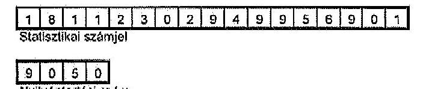

A vállalkozás magnevezése
A vállalkozás címe, telefonszáma

## ANTALL JÓZSEF ALAPÍTVÁNY

1026 BUDAPEST SZILÁGYI ERZSÉBET FASOR 73.

## Egyszerűsített éves beszámoló

2013.
üzleti évról

Keltezés: Budapest, 2014. április 30.
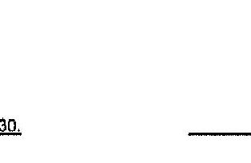
a vállalkozás vezetője
(képviselője)
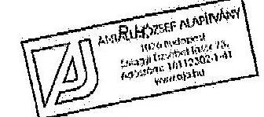

---

# 2. SZÁMÚ MELLÉKLET A V-0717-207/2015. SZÁMÚ JELENTÉSHEZ

|  1 | 8 | 1 | 1 | 2 | 3 | 0 | 2 | 9 | 4 | 9 | 9 | 5 | 6 | 9 | 0 | 1  |
| --- | --- | --- | --- | --- | --- | --- | --- | --- | --- | --- | --- | --- | --- | --- | --- | --- |
|  Nyilvántartási szám: |  |  |  |  |  |  |  |  |  |  |  |  |  |  |  |   |

# Egyszerűsített éves beszámoló MÉRLEGE "A" változat Eszközök (aktivák)

Az üzleti év mérlegfordulónapja: 2013. december 31.

|  Bor-
szám | A tétel megnevezése | Előző év | Előző év(ek)
módosításai | Tárgyév  |
| --- | --- | --- | --- | --- |
|  a | b | c | d | e  |
|  01. | A. Befektetett eszközök (02.+04.+06.sor) | 972 | 0 | 1 268  |
|  02. | I. IMMATERIÁLIS JAVAK |  |  |   |
|  03. | 02. sorból: Immateriális javak értékhelyesbítése |  |  |   |
|  04. | II. TÁRGYI ESZKÖZÖK | 972 |  | 1 268  |
|  05. | 04. sorból: Tárgyi eszközök értékhelyesbítése |  |  |   |
|  06. | III. BEFEKTETETT PÉNZÜGYI ESZKÖZÖK |  |  |   |
|  07. | 06. sorból:
Befektetett pénzügyi eszközök értékhelyesbítése |  |  |   |
|  08. | B. Forgóeszközök (09.+10.+11.+12. sor) | 42 315 | 0 | 40 224  |
|  09. | I. KÉSZLETEK | 1 896 |  | 1 896  |
|  10. | II. KÖVETELÉSEK | 36 239 |  | 34 239  |
|  11. | III. ÉRTÉKPAPÍROK |  |  |   |
|  12. | IV. PÉNZESZKÖZÖK | 4 180 |  | 4 080  |
|  13. | C. Aktív időbeli elhatárolások | 156 | | 702  |
|  14. | ESZKÖZÖK ÖSSZESEN (01.+08.+12. sor) | 43 443 | 0 | 42 254  |

Keltezés: Budapest, 2014. április 30.

A vállalkozás vezetője (képviselője)

---

# 2. SZÁMÚ MELLÉKLET A V-0717-207/2015. SZÁMÚ JELENTÉSHEZ

|  Statisztikai számjel: | 1 | 8 | 1 | 1 | 2 | 3 | 0 | 2 | 9 | 4 | 9 | 9 | 5 | 8 | 9 | 0 | 1  |
| --- | --- | --- | --- | --- | --- | --- | --- | --- | --- | --- | --- | --- | --- | --- | --- | --- | --- |
|  Nyilvántartási szám: | 9 | 0 | 5 | 0 |  |  |  |  |  |  |  |  |  |  |  |  |   |

# Egyszerűsített éves beszámoló MÉRLEGE "A" változat Források (passzívák)

Az üzleti év mérlegfordulónapja: 2013. december 31.

|  Sorszám | A tétel megnevezése | Előző év | Előző év(ek) módosításai | Tárgyév  |
| --- | --- | --- | --- | --- |
|  a | b | c | d | e  |
|  15. | D. Saját tőke (16.+18.+19.+20.+21.+22.+23.sor) | 29 238 | 0 | 30 210  |
|  16. | I. JEGYZETT TŐKE | 1 000 |  | 1 000  |
|  17. | 16. sorból: visszavásárolt tulajdoni részesedés névértéken |  |  |   |
|  18. | II. JEGYZETT, DE MÉG BE NEM FIZETETT TŐKE (-) |  |  |   |
|  19. | III. TÖKETARTALÉK |  |  |   |
|  20. | IV. EREDMÉNYTARTALÉK | 30 523 |  | 28 238  |
|  21. | V. LEKÖTÖTT TARTALÉK |  |  |   |
|  22. | VI. ÉRTÉKELÉSI TARTALÉK |  |  |   |
|  23. | VII. MÉRLEG SZERINTI EREDMÉNY | -2 285 |  | 972  |
|  24. | E. Céltartalék |  |  |   |
|  25. | F. Kötelezettségek (26.+27.+28. sor) | 14 200 | 0 | 12 039  |
|  26. | I. HÁTRASOROLT KÖTELEZETTSÉGEK | 0 |  | 0  |
|  27. | II. HOSSZÚ LEJÁRATÚ KÖTELEZETTSÉGEK | 0 |  | 0  |
|  28. | III. RÖVID LEJÁRATÚ KÖTELEZETTSÉGEK | 14 200 |  | 12 039  |
|  29. | G. Passzív időbeli elhatárolások | 5 |  | 5  |
|  30. | FORRÁSOK ÖSSZESEN (15.+24.+25.+29. sor) | 43 443 | 0 | 42 264  |

Keltezés: Budapest, 2014. április 30.

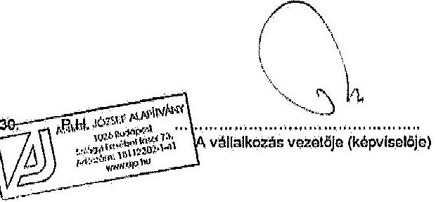

---

# 2. SZÁMÚ MELLÉKLET A V-0717-207/2015. SZÁMÚ JELENTÉSHEZ

|  Statisztikai számjel: | 1 | 6 | 1 | 1 | 2 | 3 | 0 | 2 | 9 | 4 | 9 | 9 | 5 | 6 | 9 | 0 | 1  |
| --- | --- | --- | --- | --- | --- | --- | --- | --- | --- | --- | --- | --- | --- | --- | --- | --- | --- |
|  Nyilvántartási szám: | 9 | 0 | 5 | 0 |  |  |  |  |  |  |  |  |  |  |  |  |   |

## Egyszerűsített éves beszámoló összköltség eljárással készített

## Eredménykimutatása "A" változat

Az üzleti év mérlegfordulónapja: 2013. december 31.

|  Sorszá | A tétel megnevezése | Előző év | Előző év(ek) módosításai | Tárgyév  |
| --- | --- | --- | --- | --- |
|  m | b | c | d | e  |
|  I. | Értékesítés nettó árbevétele | 0 |  | 0  |
|  II. | Aktivált saját teljesítmények értéke |  |  |   |
|  III. | Egyéb bevételei | 32 018 |  | 31 834  |
|   | III. sorból: visszaírt értékvesztés |  |  |   |
|  IV. | Anyag jellegű ráfordítások | 18 250 |  | 14 102  |
|  V. | Személyi jellegű ráfordítások | 14 646 |  | 15 695  |
|  VI. | Értékcsökkenési leírás | 80 |  | 114  |
|  VII. | Egyéb ráfordítások | 1 271 |  | 563  |
|   | VII. sorból: értékvesztés |  |  |   |
|  A. | ÜZEMI (ÜZLETI) TEVÉKENYSÉG EREDMÉNYE (I.+-II.+III.-IV.-V.-VI.-VII.) | -2 229 | 0 | 1 360  |
|  VIII. | Pénzügyi műveletek bevételei | 176 |  | 64  |
|  IX. | Pénzügyi műveletek ráfordításai | 234 |  | 452  |
|  B. | PÉNZÜGYI MŰVELETEK EREDMÉNYE (VIII.-IX.) | -56 | 0 | -388  |
|  C. | SZOKÁSOS VÁLLALKOZÁSI EREDMÉNY (+-A.+-B.) | -2 285 | 0 | 972  |
|  X. | Rendkívüli bevételek |  |  |   |
|  XI. | Rendkívüli ráfordítások |  |  |   |
|  D. | RENDKÍVÜLI EREDMÉNY (X.-XI.) | 0 | 0 | 0  |
|  E. | ADÓZÁS ELŐTTI EREDMÉNY (+-C.+-D.) | -2 285 | 0 | 972  |
|  XII. | Adófizetési kötelezettség | 0 |  | 0  |
|  F. | ADÓZOTT EREDMÉNY (+-E.-XII.) | -2 285 | 0 | 972  |
|  G. | MÉRLEG SZERINTI EREDMÉNY | -2 285 |  | 972  |

Keltezés: Budapest, 2014. április 30.

A vállalkozás vezetője (képviselője)

---

Antall József Alapítvány
1026 Budapest, Szilágyi Erzsébet fasor 73.
e-mail: alapitvany.antalljozsef@gmail.com

Állami Számvevőszék
1364 Budapest 4. Pf. 54
Hivatkozási szám: V-0717-204/2015
Domokos László elnök

# Tisztelt Elnök Úr!

Az Állami Számvevőszék V-0717-204/2015. iktatószámú nem nyilvános jelentéstervezettel kapcsolatban az alábbi észrevételeket tesszük:

- A kuratórium és munkaszervezet tevékenységének megfelelőségével kapcsolatban az Antall József Alapítvány (továbbiakban: AJA) Kuratóriuma döntött és időközben átvezetésre kerültek az Állami Számvevőszék (továbbiakban: ÁSZ) által feltárt formai hiányosságok.
- A kuratóriumi ülések összehívásával kapcsolatban többször azért történt később kiküldésre a meghívó, mert az AJA cél szerinti tevékenységével kapcsolatos programok részletes tervét és költségvetését a fellépő előadók miatt csak utolsó napokban tudott produkálni az illetékes munkatárs. Telefonon minden esetben előre történt jelzés a kuratóriumi tagoknak, hogy az ülésre fel tudjanak készülni, melyről a kuratórium minden tagja kész írásban nyilatkozatot tenni.
- Az AJA-nak főlgazgatója nem volt költségtakarékossági okokból ez a korábbi években már kivezetésre került. Az ellenőrzés során kifogásolt formai hiányosságot pótoltuk. A PGSZ. módosításában ez átvezetésre került 2015. július 24-én.
- A közös rendezvények az alapító Jólét és Szabadság Demokrata Közösségnek (továbbiakban JESZ-szel) az AJA-nak céljaival megegyező módon történt, névadójának, Antall Józsefhez kapcsolódó események kerültek megrendezésre. Példaként említhető: A néhai miniszterelnök születésnapjára szervezett program vagy halálának évfordulóján való Európa szerte megszervezett koszorúzás, illetve Somlóhegyen az orosz csapatok kivonása alkalmából megtartott junális, mely 1992

---

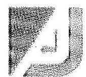

Antall József Alapítvány
1026 Budapest, Szilágyi Erzsébet fasor 73. e-mail: alapitvany.antalljozsef@gmail.com
óta minden évben megrendezésre kerülő Antall Józsefre való megemlékezés is egyben. A JESZ jogutódja a néhai miniszterelnök pártjának a Magyar Demokrata Fórumnak, melynek Antall József első elnöke volt. Így a JESZ és az MDF, illetve az AJA fontosnak érezte a hagyaték ápolását, ahogyan a cél szerinti tevékenységben meg is fogalmazódik. Tételes költség kimutatás került kiadásra, melyen egyértelműen elhatárolásra került, hogy mely költségeket fizette az Alapítvány és melyeket a párt.

- A kuratórium elnöke az ÁSZ jelentést áttekintve soron kívül megvizsgálta a JESZ-szel kötött szerződéseket és megállapításra került, hogy a kuratórium döntése alapján került elszámolásra. Figyelembe véve, hogy a meghatározott közös költségek kimutatásában összességében figyelembe vette az anyagi és önkéntes humán hozzájárulás értékét is (pl. társadalmi munka, önkéntes felajánlások)
- A 2012. november 20-án kötött szerződés lényege, hogy az AJA a programszervező céget az antalli hagyományok ápolása végett megbízza, hogy a Radnóti Miklós Színházban egy, Antall József halálának évfordulója alkalmából zártkörűen megrendezésre kerülő „Protokoll" című színházi előadás megszervezzen. Az eseményre 2012. december 15-én (szombaton) 19 órától került volna sor a Radnóti Színházban. (Budapest VI. kerület, Nagymező utca 11.) A színház a programot az Antall Család elhatárolódása miatt lemondta. A színháznak ez költségbe került ezért kérte, hogy az előkészítéssel kapcsolatos 1125 ezer Ft+Áfa (összesen 1429 ezer Ft-ot) utalja át az AJA. (színházi, próbák, díszlet, meghívók) A rendezvény nem 2013 januárban volt. Pontos elszámolás bemutatható, így a visszafizetést nem tudjuk elfogadni és azt vitatjuk.
- A 2012-ben és 2013-ban az egyesületek részére nyújtott támogatások minden esetben az AJA célszerinti tevékenységével kapcsolatban kerültek felhasználásra. Az egyesületek felszólítás után időközben dokumentumokkal alátámasztva részletesen elszámoltak a támogatások felhasználásáról, melyet a Kuratórium 2015. július 24-én elfogadott.

---

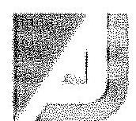

Antall József Alapítvány
1026 Budapest, Szilágyi Erzsébet fasor 73. e-mail: alapitvany.antalljozsef@gmail.com

Az éves számviteli beszámolók és az alapítvány tevékenységéről szóló jelentések szabályszerűsége tekintetében az alábbi észrevételek tesszük.

- A 2012. év beszámoló jelentésének elfogadásának az ÁSZ által felhívott formai hiányosságot a kuratórium utólag pótolta.
- A kuratórium a Nádor utcai ingatlan vételétől elállt, s a szükséges lépéseket megtette legutóbbi 2015. július 24-ei ülésén.
- Az eredmény-kimutatást módosítottuk a 224/2000. Korm. rendelet alapján. Ez annyit jelent, hogy az egyéb bevételeket meg kellett bontani, hogy a támogatásokat kitől kapta az AJA.
- A könyvelő tájékoztatása alapján a főkönyv és a tárgyi eszköz analitika: „A tárgyi eszköz analitika nekem egyezik a főkönyvvel, valószínűleg egy hibás verzió lett átküldve Önöknek, majd küldök egy másikat. A mérlegben szereplő összeg jó." Időközben módosításra került, amit rendelkezésre tudunk biztosítani.
- A követelések nem lettek elismertetve a kimutatott partnerekkel. Ennek egy része a JESZ, a többi magánszemélyektől követelés. Ezekről készítünk egy egyenlegközlőt, mely alá lesz iratva és el lesznek ismertve a követelések. Az AJA egy hónapon belül a kuratórium következő ülésére elkészítteti.
- A 2012. évi nyitó főkönyv adminisztrációs hiba miatt nem egyezett a leadott mérleggel. Ez javításra került. A kuratórium 2015. július 25-én elfogadta azt.
- A kontírozás tekintetében a könyvelőnk az ÁSZ kérése értelmében ezt a hiányosságot pótolta. „Ha kontírozás nem szerepel, minden számlán azokat pótoljuk. A könyvelés dátuma egyik bizonylaton sincs feltüntetve, ezt már évek óta nem alkalmazzuk, mert senki nem kéri. Ha szükséges, akkor pótoljuk."
- A 2012-es mérlegben a könyvelő iroda a követelések között szerepeltette a szolgáltatásnyújtás ellenértékeként részszámlák alapján megfizetett 2.000 ezer Ft-os összeget. Ezt az adminisztrációs hiányosságot a könyvelés utólag pótolta, mert előlegszámlaként vette korábban figyelembe miközben azok részszámlák voltak.

Az AJA könyvvezetésének szabályszerűségével kapcsolatban az alábbi észrevételek tesszük:

- Az AJA a hatályos eszközök és forrásokat tartalmazó értékelési szabályzatát a kuratórium ülésre elkészítette, azt a kurátorok elfogadták a 2015. július 25-ei ülésen.
- A számviteli politika, a leltározási szabályzat, a pénzkezelési szabályzat, valamint a számlarend aktualizálása a jogszabályi változásoknak megfelelően aktualizálásra került.
- Az előre utalásokat az indokolta, hogy a művészek fellépései előtt bevett gyakorlat, hogy nem lépnek fel mindaddig amíg a szolgáltatási díjat részben vagy egészben nem téríti meg a megrendelő. Ez nem az AJA hibája, hanem Magyarországon a sok nem teljesítés miatt kérik ezt a fellépő előadók.

---

Antall József Alapítvány
1026 Budapest, Szilágyi Erzsébet fasor 73.
e-mail: alapitvany.antalljozsef@gmail.com

- A PGSZ és az SZMSZ II. fejezet 3. pontjának összhangja a továbbiakban biztosított. Az ellentmondás meg lett szüntetve. A kuratórium ezt elfogadta.
- A pénzkezelési szabályzat, a számlarend a Számviteli tv. által meghatározottak szerint javításra került. A kuratórium ezen módosításokat elfogadta 2015. július 25-el ülésén.

Az előző ÁSZ ellenőrzés javaslatai alapján készített intézkedési tervben foglaltok végrehajtása.

- Az intézkedési tervben szereplő hiányosságok pótlásáról természetesen azonnal intézkedett az AJA és 1 hónapon belüli kuratóriumi ülésen tájékoztatni fogja a kurátorokat a javítások szükségességéről.

Budapest, 2015. július 22.
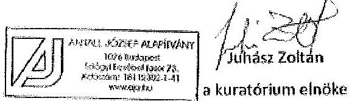

---

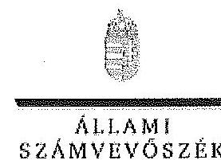

# Juhász Zoltán úr 

elnök
Antall József Alapítvány

## Budapest

## Tisztelt Elnök Úr!

Köszönettel megkaptam a 2015. július 27. napján az Állami Számvevőszékhez érkezett „az Antall József Alapítvány 2012-2013. évi gazdálkodása törvényességének ellenőrzéséről" készült számvevőszéki jelentéstervezetben foglalt megállapításokra tett észrevételét.

Tájékoztatom Elnök urat, hogy a jelentésben a részben elfogadott észrevétel átvezetésre kerül, és - az Állami Számvevőszékről szóló 2011. évi LXVI. törvény 29. § (3) bekezdése alapján az el nem fogadott észrevételeket szerepeltetjük az elutasítás indokainak feltüntetésével együtt.

Az Állami Számvevőszék észrevételre vonatkozó álláspontjáról a felügyeleti vezető által készített részletes tájékoztatást csatoltan megküldöm.

Budapest, 2015. 06 hó 11 nap
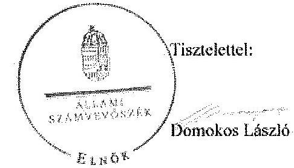

Melléklet: Tájékoztatás a részben elfogadott és az el nem fogadott észrevételekről, azok indokairól

---

# Tájékoztatás 

a részben elfogadott és az el nem fogadott észrevételekről, azok indokairól

|  | Észrevétel: | „Tételes költségkimutatás került kiadásra, melyen egyértelműen elhatárolásra került, hogy mely költségeket fizette az Alapítvány és melyeket a párt."   „A kuratórium elnöke az ÁSZ jelentést áttekintve soron kívül megvizsgálta a JESZ-szel kötött szerződéseket és megállapításra került, hogy a kuratórium döntése alapján kerül elszámolásra. Figyelembe véve, hogy a meghatározott közös költségek kimutatásában összességében figyelembe vette az anyagi és önkéntes humán hozzájárulás értékét is (pl. társadalmi munka, önkéntes felajánlások)." |
| :--: | :--: | :--: |
|  | Válasz: | Az Állami Számvevőszék az észrevételt nem fogadja el. |
| 1. | Indoklás: | Az észrevétel nem megalapozott. Az Állami Számvevőszék az ellenőrzés során az alábbi ellenőrzési megállapításokat tette, melyek a jelentéstervezetben rögzítésre kerültek.   „A Kuratórium határozatban rögzítette, hogy az Alapítvány a 2012. április 29-ei rendezvény költségeinek megosztása érdekében a JESZ-szel együttműködési megállapodást köt. Az Alapítvány a határozatban foglaltakat nem tartotta be, a rendezvényre úgy költött 3258 ezer Ftot, hogy a költségek megosztását szolgáló együttműködési megállapodást nem kötötte meg a JESZ-szel.   A Kuratórium a 2013. február 15-én és a 2013. június 25-én hozott határozatalban rögzítette, hogy az Alapítvány a JESZ-szel együttműködve tart rendezvényeket, továbbá előírta, hogy az Alapítvány a rendezvények költségeinek finanszírozására nem fordíthat többet a rendezvények összes költsége 50%-ánál, egyidejűleg felhatalmazta az ügyvezető elnököt a szükséges szerződések megkötésére. Az Alapítvány nem tartotta be a kuratóriumi határozatokban foglaltakat, a JESZ-szel nem kötött a költségek megosztását szolgáló együttműködési megállapodást, valamint a rendezvények költségei vonatkozásában nem számolt el, így a költségek 50%-ának viselésére vonatkozó Kuratórium által meghatározott korlát betartását nem igazolta." |

---

|  |  | Az Állami Számvevőszék ellenőrzése időszakában az alapítvány által 2014. november 24-ei keltezéssel kiállított nyilatkozatban elkészített kimutatás tartalmazta az elvégzett munkákat és azok értékét, mely az alapítvány részéről költségeket, a JESZ részéről többségében társadalmi munkát és önkéntes felajánlásokat jelentett. A JESZ rendezvényekhez való költség hozzájárulását azonban dokumentumokkal nem támasztották alá. Az Állami Számvevőszék rendelkezésére bocsátott dokumentumokkal az ellenőrzött részéről nem adtak át és az észrevételhez sem csatoltak olyan dokumentumot, amely azt támasztaná alá, hogy az ellenőrzött időszakban az alapítvány a költségek megosztását szolgáló együttműködési megállapodást kötött a JESZ-szel, illetve, hogy a rendezvények költségei vonatkozásában elszámoltak, valamint az alapítvány a költségek 50%-ának viselésére vonatkozó Kuratórium által meghatározott korlát betartását sem igazolta.   A fent leírtak alapján az Állami Számvevőszék fenntartja a jelentéstervezetben tett ellenőrzési megállapításait. |
| :--: | :--: | :--: |
| 2. | Észrevétel: | „A 2012. november 20-án kötött szerződés lényege, hogy az AJA a programszervező céget az antalli hagyományok ápolása végett megbízza, hogy a Radnóti Miklós Színházban egy. Antall József halálának évfordulója alkalmából zártkörűen megrendezésre kerülő „Protokoll" című színházi előadás megszervezzen. Az eseményre 2012. december 15-én (szombaton) 19 órától került volna sor a Radnóti Színházban. (Budapest VI. kerület, Nagymező utca 11.) A színház a programot az Antall család elhatárolódása miatt lemondta. A színháznak ez költségbe került ezért kérte, hogy az előkészítéssel kapcsolatos 1125 ezer Ft+Áfa (összesen 1429 ezer Ft) utalja át az AJA. (színházi, próbák, díszlet, meghívók) A rendezvény nem 2013 januárban volt. Pontos elszámolás bemutatható, így a visszafizetést nem tudjuk elfogadni és azt vitatjuk." |
|  | Válasz: | Az Állami Számvevőszék az észrevételt részben fogadja el. |
|  | Indoklás: | A tervezett rendezvény időpontjára vonatkozó észrevétel megalapozott. Az észrevételben jelzett eltérés alapján az Állami Számvevőszék áttekintette az ellenőrzés során rendelkezésére bocsátott dokumentumokat - az érintett Kft.-vel 2012. november 20-án kötött szerződést - és megállapította, hogy abban a megemlékezési az alapítvány 2012. december 12. napján szervezi. |

---

A fentiek figyelembevételével az Állami Számvevőszék a jelentéstervezetben a rendezvény időpontjára vonatkozó megállapítást a szerződésben foglalt dátumnak megfelelően módosította.
A rendezvény időpontján kívül megfogalmazott további észrevételek nem megalapozottak. Az Állami Számvevőszék az ellenőrzés során az alábbi ellenőrzési megállapításokat tette, melyek a jelentéstervezetben rögzítésre kerültek.
„A 2013 januárjára tervezett rendezvény lebonyolítására a Kuratórium döntése alapján az Alapítvány 2545 ezer Ft+ Áfa díjjal kötött 2012. november 20-án egy Kft.-vel megbízási szerződést, mely tartalma szerint eredmény létrehozatalát is magában foglalta. A Kft. szerződött partnere a rendezvény helyszínét lemondta, ezért a rendezvény meghiúsult, azonban a Kft. kérte a Kuratóriumtól az előkészítéssel kapcsolatos, 1125 ezer Ft+ Áfa (összesen 1429 ezer Ft) összegű kiadásai megtérítését. A Kuratórium annak ellenére elfogadta a Kft. kérvényét, hogy a Ptk. 399. b) pontja rendelkezésének értelmében a Kft. díjazásra nem tarthatott volna igényt, továbbá az általa kiállított és melléklet nélkül benyújtott számla nem tartalmazott arra vonatkozóan információt, hogy az előzetesen felmerült ráfordítások milyen feladatok ellátásával kapcsolatosak, illetve azokat milyen dokumentumok támasztják alá."

Az észrevételben jelzettek alapján az Állami Számvevőszék áttekintette az alapítvány által az ellenőrzés során rendelkezésére bocsátott dokumentumokat. Az érintett Kft.-vel 2012. november 20-án kötött megbízási szerződésben az alapítvány megbízza a Kft.-t a rendezvény koordinálására illetve lebonyolítására. A megbízott feladatai közé tartozik többek között a rendezvény helyszínének kiválasztása és lefoglalása, a műsor összeállítása és az állófogadás megszervezése, a sajtó és a díszvendégek meghívása, illetve a rendezvényről sajtóhírek/közlemények közreadása. A megbízási szerződésben a megbízó nem kötötte ki a helyszínt, és nem is került meghatározásra az esemény helyszíneként a Radnóti Színház. A rendelkezésre álló további dokumentumok alapján megállapítható, hogy az érintett Kft. ügyvezető-tulajdonosa egy aláírással nem hitelesített rövid levélben 2013. január 7-én fordult az alapítvány kuratóriumához azzal a kérvénnyel, hogy a rendezvény rajtuk kívül álló okok miatt, a Radnóti Színház részéről lemondásra került, ugyanakkor a Kft. számára az előkészületek kiadásokkal jártak, melynek okán kérvényez 1.125.000 Ft+Áfa költségtérítést, kártérítésként az elvégzett előkészítési és szervezési

---

munkáért. Az alapítvány kuratóriuma még ezen a napon elektronikus szavazás útján döntést hozott a költségtérítés kifizetéséről, elfogadta azt, annak ellenére, hogy a kérvény nem volt hiteles és nem kerültek csatolásra azt alátámasztó dokumentumok.
A szerződés - bár elnevezése szerint megbízási jogviszonyra utal - tartalma szerint eredmény létrehozását (a rendezvény koordinálása illetve lebonyolítása) is magában foglalja, ezért rá a Ptk. vállalkozási szerződésre vonatkozó szabályai (Ptk. 389. § - 401. §) irányadók. A szerződés nem tartalmaz rendelkezést a rendezvény meghiúsulásának esetére. A Ptk. 399. § b) pontja rendelkezésének értelmében ,,ha a teljesítés olyan okból vált lehetetlenné, amelyért egyik fél sem felelős, és a lehetetlenné válás oka a vállalkozó érdekkörében merült fel, díjazásra nem tarthat igényt." A kérvényből kiderül, hogy a rendezvény helyszínének biztosítását lemondó Radnóti Színház a Kft. szerződéses partnere volt, ezért a lehetetlenülés egyértelműen a Kft., mint vállalkozó érdekkörében merült fel, így a Kft.-nek az előzetesen elvégzett tevékenységéért a megbízási díj meghatározott részére vonatkozó igényének sem jogszabályi, sem szerződésbeli alapja nincs. A Kft. a szerződés teljesítésével kapcsolatban, annak lehetetlenülését megelőzően felmerült költségeinek megtérítését a Ptk. 355. § (4) bekezdése alapján a rendezvény helyszínének biztosítását lemondó szerződéses partnerétől, tehát a Radnóti Színháztól követelhette volna kártérítés címén.
Összességében megállapítható, hogy az alapítvány megsértette a Pártalapítványi és a Párt tv. vonatkozó, alább hivatkozott rendelkezéseit, amikor részéről harmadik fél részére olyan kifizetés történt, melynek jogossága teljesítésigazolással vagy más módon nem történt meg, ezért az összeg felhasználásának célja sem igazolható hitelt érdemlő módon. Ennek következtében helytállóak a jelentéstervezetben rögzített alábbi ellenőrzési megállapítások.
„Az alapítványi vagyon felhasználására egy esetben nem a Pártalapítványi tv. 1. §-ában és a Párt tv. 9/A. § (1) bekezdésében foglalt alapítványi célok érdekében került sor, mivel a 2013. évben 1429 ezer Ft összegű központi költségvetésből kapott támogatást az Alapítvány nem tudományos, ismeretterjesztő, kutatási, oktatási tevékenységre, hanem kuratóriumi döntés alapján egy elmaradt rendezvény szervezési költségeinek ellenszolgáltatás nélküli megtérítésére fordította."

---

|  |  | „Az Alapítvány az 1429 ezer Ft összegű támogatást a törvénysértő felhasználás miatt a Pártalapítványi tv. 4 § (6) bekezdése alapján köteles visszfizetni a központi költségvetésbe."   A fentiek figyelembevételével az Állami Számvevőszék a jelentéstervezetben szereplő, előzőekben idézett ellenőrzési megállapításait fenntartja. |
| :--: | :--: | :--: |
|  | Észrevétel: | „A számviteli politika, a leltározási szabályzat, a pénzkezelési szabályzat, valamint a számlarend aktualizálása a jogszabályi változásoknak megfelelően aktualizálásra került." |
|  | Válasz: | Az Állami Számvevőszék az észrevételt nem fogadja el. |
|  |  | Az észrevétel nem megalapozott. Az Állami Számvevőszék az ellenőrzés során az alábbi ellenőrzési megállapításokat tette, melyek a jelentéstervezetben rögzítésre kerültek.   „A Számv. tv. 14. § (3)-(5) bekezdéseiben előírt szabályzatok közül a számviteli politika, a leltározási szabályzat és a pénzkezelési szabályzat, valamint a Számv. tv. 161. § (1) bekezdésében előírt számlarend aktualizálására a Számv. tv. 14. § (11) és a 161. § (5) bekezdésében meghatározottak ellenére az ellenőrzött időszakban a jogszabályi változásokat követően nem került sor." |
| 3. | Indoklás: | A jelentéstervezetben rögzítésre került az is, hogy fenti ellenőrzési megállapítást az ellenőrzést végző számvevő a következők alapján tette.   „Az Alapítvány aktualizált számviteli szabályzatainak tervezeteli jóváhagyásra 2012 decemberében előkészítették, azonban azok kuratóriumi határozat hiányában nem váltak érvényessé." |
|  |  | Az Állami Számvevőszék rendelkezésére bocsátott dokumentumokkal az ellenőrzött részéről nem adtak át és az észrevételhez sem csatoltak olyan dokumentumot, amely azt támasztaná alá, hogy az ellenőrzött időszakban az alapítvány rendelkezett érvényes, aktualizált számviteli politikával, leltározási szabályzattal, pénzkezelési szabályzattal, valamint számlarenddel. |
|  |  | A fent leírtak alapján az Állami Számvevőszék fenntartja a jelentéstervezetben tett, előzőekben idézett ellenőrzési megállapításait a jelenlegi megfogalmazásban. |

---

# 4. SZÁMÚ MELLÉKLET A V-0717-207/2015. SZÁMÚ JELENTÉSHEZ 

Elnök úr levelében a fenti észrevételeken kívül megfogalmazottak tartalmuknál fogva nem tekinthetők észrevételnek, mivel azok egy része az Állami Számvevőszék által a jelentéstarvezetben tett konkrét megállapításokra adnak magyarázatot, a megállapításokhoz általánosan kapcsolódnak.
Elnök úr levelében általános tájékoztatást adott a feladatok végrehajtásának feltételeiről, nehézségeiről, valamint az ellenőrzött időszakot követően hozott és a tervezett intézkedésekről.

Budapest, 2015. 08. hó 14 nap

## Ruch' inuruluna   Dr. Benedek Mária   4.   felügyeleti vezető
