# ÁLLAMI   SZÁMVEVŐSZÉK 

## JELENTÉS

Magyarország 2014. évi központi költségvetése végrehajtásának ellenőrzéséről

---

# Állami Számvevőszék 

Iktatószám: V-0782-11459/2015.
Témasorszám: 36
Vizsgálatazonosító: V0719

## Az ellenőrzést felügyelte:

Holman Magdolna
felügyeleti vezető
Az ellenőrzés végrehajtásáért felelős:
Imre Zsuzsanna
ellenőrzésvezető

Az ellenőrzés végrehajtását támogató vezetői team:
Dormán István Zoltán
számvevő vezető
főtanácsos

## Niklai Heléna

számvevő vezető
főtanácsos

A számvevői munkaanyagok feldolgozásában és a Jelentés összeállításában közreműködtek:

| Eötvös Magdolna   számvevő tanácsos | Federics Adrienn   számvevő tanácsos | Fekete Gábor   számvevő tanácsos |
| :-- | :-- | :-- |
| Fülöppné Nagy   Marianna   számvevő főtanácsos | Gergely Tilda   számvevő | Hálóné Pelikán   Veronika |
| Horváthné Menyhárt   Erika   számvevő főtanácsos | Huszár Anna   számvevő tanácsos | Igar Tamás   számvevő főtanácsos |
| Jenei Zoltánné   számvevő tanácsos | Kántor Ilona   számvevő főtanácsos | Dr. Korbuly Andrea   számvevő tanácsos |
| Kovács Richárd   számvevő | Kuszinger Andrea   számvevő tanácsos | Literáti Gergő   számvevő |
| Maklári Dorottya   számvevő gyakornok | Dr. Marosi Gyöngyi   számvevő főtanácsos | Marozsán Katalin   számvevő tanácsos |

---

| Dr. Németh Eszter | Robák Ferencné | Samu István |
| :-- | :-- | :-- |
| számvevő tanácsos | számvevő tanácsos | számvevő tanácsos |
| Szabó Zoltán Gyula | Szabó Zsuzsanna | Szarvas Szilárd |
| számvevő asszisztens | számvevő | számvevő tanácsos |
| Várhegyi Anett | Dr. Vass Gábor | Vicze Klára |
| számvevő | számvevő tanácsos | számvevő tanácsos |
| Vida Cecília | Völgyesi Mátyás | Vörös Katalin |
| számvevő tanácsos | számvevő tanácsos | számvevő főtanácsos |
| Zsigó Éva | Dr. Zsolnay András |  |
| számvevő asszisztens | számvevő |  |

# Az ellenőrzést végezték: 

| Dr. Baloghné Sebestyén | Baritsa Orsolya |
| :-- | :-- |
| Éva | számvevő |
| számvevő |  |
| Béres László | Berki László |
| számvevő főtanácsos | számvevő |
| Bodonyi Miklós | Bozsik Tamás |
| számvevő főtanácsos | számvevő |
| Burenzsargal | Buús Zoltánné |
| Narantuja | Hütter Erzsébet |
| számvevő tanácsos | számvevő tanácsos |
| Dr. Csapó Anna | Csepreginé Tancsik |
| számvevő tanácsos | Erzsébet |
|  | számvevő főtanácsos |
| Dr. Ernst László | Farkas László |
| számvevő tanácsos | számvevő tanácsos |
| Fekete Győr László | Fórián Erika |
| számvevő | számvevő tanácsos |

| Belovai Sándorné |
| :-- |
| számvevő főtanácsos |
| Biró Csaba |
| számvevő |
| Bretus Zoltán János |
| számvevő |
| Czékus Balázs Imre |
| számvevő |
| Eötvös Magdolna |
| számvevő tanácsos |
| Fekete Gábor |
| számvevő tanácsos |
| Gaálné Izsó Éva |
| számvevő tanácsos |

---

| Gácsi Györgyi Ivett   számvevő főtanácsos | Gelencsér Zoltán   számvevő tanácsos | Gergely Tilda   számvevő |
| :--: | :--: | :--: |
| Giday Zoltán   számvevő tanácsos | Gölöncsér Péter   számvevő | Hadházy Sándor   György   számvevő tanácsos |
| Dr. Halmné Harsányi   Zsuzsa   számvevő tanácsos | Hálóné Pelikán   Veronika   számvevő | Hámoriné Maróti   Györgyi   számvevő vezető   főtanácsos |
| Hegyes Mária   számvevő tanácsos | Herczku Olivia   számvevő | Horváthné Menyhárt   Erika   számvevő főtanácsos |
| Humli Tamásné   számvevő tanácsos | Huszárné Borbás   Melinda   számvevő | Igar Tamás   számvevő főtanácsos |
| Jakab Laura   számvevő | Jenei Zsuzsanna   számvevő tanácsos | Kakas Sándor   számvevő |
| Kalmár István   számvevő tanácsos | Kántor Ilona   számvevő főtanácsos | Klinger Zoltán   számvevő |
| Koczor László   számvevő tanácsos | Dr. Korbuly Andrea   számvevő tanácsos | Kóródi Gábor   számvevő |
| Kovács Ildikó   számvevő tanácsos | Kovács Richárd   számvevő | Kozma Gábor   számvevő tanácsos |
| Kriston-Vizi János   számvevő tanácsos | Krüzselyi Attila   számvevő tanácsos | Kúnosné Talián   Márta   számvevő |
| Kupcsik Éva   számvevő | Kuszinger Andrea   számvevő tanácsos | L. Kovács János   számvevő |
| Dr. Lajos Béla   számvevő főtanácsos | Literáti Gergő   számvevő | Liziczai Imréné   számvevő főtanácsos |
| Lödiné Cser Zsuzsanna   számvevő főtanácsos | Dr. Lörincz Zoltán   számvevő főtanácsos | Luhály Matild   számvevő |

---

| Dr. Marosi Gyöngyi számvevő főtanácsos | Mészáros Ildikó Éva számvevő | Mokánszkiné Mengyi Andrea számvevő főtanácsos |
| :--: | :--: | :--: |
| Molcsánné Márta Tünde   számvevő tanácsos | Molnár Antal Lászlóné számvevő tanácsos | Molnár Istvánné számvevő főtanácsos |
| Molnár-Sipos Judit számvevő | Dr. Nagy Ágnes számvevő tanácsos | Nagy Csilla Erzsébet számvevő |
| Nagy Erika számvevő tanácsos | Nagy László Imre számvevő | Dr. Németh Eszter számvevő tanácsos |
| Némethné Nagy Mária számvevő | Nyikon Zsigmondné számvevő főtanácsos | Orosz Diána számvevő tanácsos |
| Pályi Katalin Ágnes számvevő | Papp József számvevő tanácsos | Pappné dr. Szamosi Éva számvevő főtanácsos |
| Pénzes Gyula számvevő főtanácsos | Dr. Podonyi László számvevő főtanácsos | Puskás Balázs számvevő |
| Ráczkevi Katalin számvevő | Robák Ferencné számvevő tanácsos | Samu István számvevő tanácsos |
| Sipos Attila számvevő tanácsos | Solymár Ágnes számvevő főtanácsos | Somlai Gábor számvevő tanácsos |
| Szabó Erzsébet számvevő tanácsos | Szabó Zsuzsanna számvevő | Szabóné László Mária számvevő tanácsos |
| Dr. Szabóné Nagy Katalin számvevő | Szakál Zsuzsanna számvevő | Szarka Péterné számvevő vezető főtanácsos |
| Szarvas Szilárd számvevő tanácsos | Szilágyi Nándorné számvevő főtanácsos | Dr. Szima Mária számvevő tanácsos |
| Dr. Szöllősi Zsolt számvevő tanácsos | Tamás László számvevő tanácsos | Tótfalusi Zoltán számvevő tanácsos |

---

| Tóth Árpád számvevő főtanácsos | Tóth Sándor számvevő tanácsos | Ujvári Józsefné számvevő tanácsos |
| :--: | :--: | :--: |
| Ungár Ervin számvevő | Unger Ferenc számvevő | Uram Ferenc számvevő tanácsos |
| Varga Ágnes Klára számvevő | Várkonyi Kristóf   Zsolt   számvevő tanácsos | Dr. Vass Gábor számvevő tanácsos |
| Vicze Klára számvevő tanácsos | Vida Cecília számvevő tanácsos | Vida László számvevő tanácsos |
| Villányi Antal számvevő tanácsos | Dr. Vincze Ibolya számvevő | Vitányi István számvevő tanácsos |
| Vörösné Lakatos Zsuzsanna számvevő | Dr. Zelei Andrásné számvevő | Dr. Zsolnay András számvevő |

# A témához kapcsolódó eddig készített számvevőszéki jelentések: 

címe
sorszáma
Jelentés Magyarország 2012. évi központi költségvetése végrehajtásának ellenőrzéséről
Jelentés A 2013. évi zárszámadásról - Magyarország 2013. évi költségvetése végrehajtásának ellenőrzéséről

---

# TARTALOMJEGYZÉK 

BEVEZETÉS ..... 3
I. ÖSSZEGZŐ MEGÁLLAPÍTÁSOK, KÖVETKEZTETÉSEK ..... 5
II. FŐ MEGÁLLAPÍTÁSOK ..... 7

1. A költségvetés végrehajtása ..... 7
1.1. Az államháztartás központi alrendszere előirányzatainak teljesítése, a hiány és az államadósság alakulása ..... 7
1.2. A zárszámadási törvényjavaslat ..... 11
2. A központi kezelésű előirányzatok, valamint az állami vagyonnal kapcsolatos bevételek és kiadások ..... 13
3. A társadalombiztosítás pénzügyi alapjai ..... 18
4. Elkülönített állami pénzalapok ..... 20
5. Fejezeti kezelésű előirányzatok ..... 21
5.1. Európai Uniós támogatások és az európai uniós tagsággal összefüggő hazai befizetések ..... 21
5.2. Szakmai fejezeti kezelésű előirányzatok ..... 23
6. Intézmények ..... 25

## MELLÉKLETEK

1. számú Részletes megállapítások ellenőrzési területenként
2. számú A kontrollkörnyezet és a belső kontrollrendszerek ellenőrzésével kapcsolatos összefoglaló megállapítások
3. számú A NAV bevallás feldolgozó rendszerének, és az ÁKK Zrt. államadósság kezelésével kapcsolatos informatikai rendszerének (InFoRex) ellenőrzése
4. számú Az eredményszemléletű államháztartási számvitel bevezetése és a 2014. évi beszámolási kötelezettség teljesítése
5. számú Ellenőrzési megközelítés
6. számú Az integritási szemlélet érvényesítése eredményeinek összegzése
7. számú A 2014. évi központi költségvetés végrehajtásának helyszíni ellenőrzésébe bevont fejezetek és szervezetek listája
8. számú Az ellenőrzött szervezetek ÁSZ által el nem fogadott észrevételei

---

# FÜGGELÉKEK 

1. számú Rövidítések jegyzéke
2. számú Fogalomtár

---

# JELENTÉS 

## 2014. évi zárszámadás - Magyarország 2014. évi központi költségvetése végrehajtásának ellenőrzéséről

## BEVEZETÉS

Az Állami Számvevőszék törvényi kötelezettségének eleget téve ellenőrizte a 2014. évi központi költségvetés végrehajtását és Magyarország 2014. évi központi költségvetése végrehajtására vonatkozó törvényjavaslatot. Az Állami Számvevőszékről szóló törvény alapján ellenőrzésünk kiterjedt a társadalombiztosítás pénzügyi alapjai költségvetésének végrehajtásáról készített zárszámadásra, a társadalombiztosítás pénzügyi alapjainak beszámolójára, valamint az elkülönített állami pénzalapok költségvetésének végrehajtásáról készített zárszámadásra.
Az államháztartásról szóló törvény előírja, hogy a Kormány a zárszámadásról szóló törvényjavaslatot az Országgyűlés elé terjeszti, illetve azt előzetesen a Számvevőszéknek megküldi.
A 2014. év az eredményszemléletű számvitel bevezetésének éve volt az államháztartásban, ennek következtében jelentősen módosultak a beszámolásra vonatkozó jogszabályi előírások. Az Európai Unió Tanácsának a tagállamok költségvetési keretrendszerére vonatkozó követelményekről szóló 2011/85/EU Irányelvéhez kapcsolódó jogharmonizáció keretében - az Irányelvben előírtaknak megfelelően - január 1-jétől az államháztartás számvitele a pénzforgalmi szemléletű költségvetési számvitelből és az eredményszemléletű pénzügyi számvitelből áll. Mindkét szemléletmód szerinti könyvvezetést - párhuzamosan - a kettős könyvvitel szabályai szerint, folyamatosan, zárt rendszerben, áttekinthető formában kell végezni és az év végén lezárni. A költségvetési számvitel célja a költségvetési tervezés, az évközi folyamatok mérése, valamint a költségvetés végrehajtásának, a zárszámadás alátámasztásának biztosítása.
A zárszámadás, és ebből adódóan az általunk lefolytatott ellenőrzés a pénzforgalmi szemléletű költségvetési számvitel által szolgáltatott adatokra épült. Ugyanakkor, az eredményszemléletű államháztartási számvitel előmozdításának és megbízhatóságának növelése érdekében meghatározott területeken elvégeztük egyes eredményszemléletű pénzügyi számvitellel készített beszámolórészek ellenőrzését is. Az ezzel kapcsolatos megállapításaink a zárszámadási törvényjavaslat adatai megbízhatóságának minősítését nem érintik.
Az ellenőrzés típusa: megfelelőségi ellenőrzés.
Az ellenőrzés céljaival összhangban

- értékeltük azt, hogy a központi költségvetés bevételi és kiadási előirányzatainak teljesítése megfelelt-e a jogszabályi előírásoknak, és tartalmaz-e megbízhatóságot befolyásoló lényeges hibát;

---

- ellenőriztük, hogy az államháztartás bevételeit a költségvetési törvényben rögzítettekkel összhangban, a közpénzekkel való gazdálkodás jogszabályi követelményeinek megfelelően használták-e fel,
- ellenőriztük, hogy a 2014. évi költségvetésben meghatározott pénzügyi keretek között a költségvetés végrehajtásában jog- és hatáskörrel rendelkezők szabályszerűen gazdálkodtak-e a közpénzekkel;
- értékeltük az Alaptörvény és a Stabilitási törvény államadósságra vonatkozó előírásai érvényesülését; továbbá
- ellenőriztük a zárszámadási törvényjavaslat összeállításának folyamatát; azt, hogy a törvényjavaslat tartalma, szerkezete megfelel-e a törvényi előírásoknak, valamint a törvényjavaslatban szereplő adatok megbízhatóságát.
A központi költségvetésről szóló törvényben a bevételi előirányzatok és a kiadási előirányzatok központi kezelésű előirányzatként, társadalombiztosítás pénzügyi alapjai előirányzataiként, elkülönített állami pénzalapok előirányzataiként, fejezeti kezelésű előirányzatként, az államháztartás központi alrendszerébe tartozó költségvetési szervek (intézmények) előirányzataiként jelennek meg. Az ellenőrzést ezeken a területeken végeztük el. Valamennyi ellenőrzési területen a gazdálkodás és az előirányzat-felhasználás szabályszerűségét, a költségvetési gazdálkodásra vonatkozó szabályokkal való összhangját új módszertannal ellenőriztük, amelyet a 2014. január 1-jétől hatályba lépett új pénzügyi és költségvetési számviteli szabályok és az ÁSZ ellenőrzés-szakmai módszertanának - nemzetközi standardokkal összefüggő - megújítása indokolt. Az új módszertan eredményeként ellenőrzésünk lefedte a központi alrendszer kiadásainak
 és bevételeinek 100%-át. Az ellenőrzés során a zárszámadási törvényjavaslatban megjelenő törvényi módosított előirányzatokhoz viszonyítottuk a teljesítési adatokat. Az ellenőrzést a 7. számú mellékletben felsorolt szervezeteknél folytattuk le.
Jelentésünk a 2014. évi zárszámadás ellenőrzése során megszerzett ellenőrzési bizonyítékokon alapul. A 2014. évi központi költségvetés végrehajtásáról az egyes ellenőrzési területeken lefolytatott ellenőrzések és a zárszámadási törvényjavaslat ellenőrzése alapján alkottunk véleményt.
Az ellenőrzés indokoltsága és várható eredménye a Számvevőszék törvényi kötelezettségének teljesítésével annak elősegítése, hogy az Országgyűlés a zárszámadási törvény elfogadásával kapcsolatban megalapozott döntést hozhasson. Ellenőrzésünk átfogó és objektív képet ad a 2014. évi zárszámadási törvényjavaslatban szereplő adatok megbízhatóságáról.
Az ellenőrzés lefolytatásának jogalapját az Állami Számvevőszékről szóló 2011. évi LXVI. törvény 5. § (7) bekezdése képezte.
Az ellenőrzés eredményeképpen azokban az esetekben, ahol intézkedést igénylő megállapításokat tettünk, az ellenőrzött szervezetek vezetői részére figyelemfelhívó leveleket fogalmaztunk meg.
Az Állami Számvevőszékről szóló 2011. évi LXVI. törvény 29. §-a alapján a Számvevőszék a jelentéstervezetet megküldte az ellenőrzött szervezetek vezetőinek. A határidőben beérkezett és el nem fogadott észrevételeket, valamint annak indoklását a jelentés 8. számú melléklete tartalmazza.

---

# I. ÖSSZEGZŐ MEGÁLLAPÍTÁSOK, KÖVETKEZTETÉSEK 

Az Országgyűlés Magyarország 2014. évi központi költségvetéséről szóló törvényben az államháztartás központi alrendszerének bevételi főösszegét 15 983,7 Mrd Ft-ban, kiadási főösszegét 16 968,3 Mrd Ft-ban, hiányát 984,6 Mrd Ft-ban állapította meg. A Ktv. módosításáról szóló törvények 2014. évben a központi alrendszer bevételi főösszegét 15 985,0 Mrd Ft-ra, a kiadási főösszeget 17 136,5 Mrd Ft-ra, a hiányt 1151,5 Mrd Ft-ra módosították. A bevételek 17 458,4 Mrd Ft-ra, a kiadások 18 261,4 Mrd Ft-ra teljesültek, amelynek eredményeként a hiány 348,5 Mrd Ft-tal (30,3%-kal) alacsonyabb szinten teljesült.
A központi alrendszer bevétele 1473,4 Mrd Ft-tal (9,2%-kal) haladta meg a törvényi módosított előirányzatot. Az előirányzat túlteljesüléséből a központi költségvetés 1255,7 Mrd Ft-tal, az elkülönített állami pénzalapok 33,8 Mrd Ft-tal, a társadalombiztosítás pénzügyi alapjai közül a Nyugdíjbiztosítási Alap 160,5 Mrd Ft-tal, az Egészségbiztosítási Alap 23,4 Mrd Ft-tal részesült.
A központi alrendszer kiadása 1125,0 Mrd Ft-tal (6,6%-kal) túlteljesült a törvényi módosított előirányzathoz képest. A túlteljesülés a központi költségvetés tekintetében 945,5 Mrd Ft, az elkülönített állami pénzalapok esetében 4,8 Mrd Ft, míg a társadalombiztosítás pénzügyi alapjainál 174,7 Mrd Ft volt.
Megállapítottuk, hogy az államháztartás központi alrendszere 2014. évi törvényi előirányzatainak teljesítése, a hiány és az államadósság alakulása megfelelt az Alaptörvény, a Stabilitási törvény és a költségvetésről szóló törvény előírásainak. Az államháztartás központi alrendszerének pénzforgalmi hiánya 2014. évben 803,0 Mrd Ft-ra teljesült. Az államadósság-mutató értéke a 2013. évi 76,6%-ról 2014. évre 74,1%-ra, a GDP arányában 2,5 százalékponttal (ezen belül a központi alrendszer adóssága 1,1 százalékponttal) csökkent.
A Kormány elvégezte a tervezés során alkalmazott makrogazdasági és költségvetési előrejelzés értékelését, a féléves adatok alapján felülvizsgálta az adósságszabály érvényesülését, amellyel eleget tett az államháztartásról szóló törvényben és a Stabilitási törvényben foglalt követelményeknek.
A központi költségvetés bevételi és kiadási előirányzatainak teljesítése megfelelt a jogszabályi előírásoknak. A központi költségvetés 2014. évi bevételi teljesítése 11 954,3 Mrd Ft volt. Az ellenőrzés során megállapítottuk, hogy a központi költségvetés bevételeit a költségvetési törvényben rögzítettekkel összhangban, a közpénzekkel való gazdálkodás jogszabályi követelményeinek megfelelően használták fel. A központi költségvetés 2014. évi kiadási teljesítése 12 770,9 Mrd Ft. Megállapítottuk, hogy a költségvetés végrehajtásában jog- és hatáskörrel rendelkezők a 2014. évi költségvetésben meghatározott pénzügyi keretek között összességében szabályszerűen gazdálkodtak a közpénzekkel. Az ellenőrzés megállapította, hogy a központi költségvetés teljesített bevételi és kiadási főösszege nem tartalmaz lényeges hibát, a bevétel és kiadás teljesítési adatok megbízhatóak.
A társadalombiztosítás pénzügyi alapjai tekintetében az ellenőrzés megállapította, hogy a Nyugdíjbiztosítási Alap és az Egészségbiztosítási Alap teljesített bevételi és kiadási adatai megbízhatóak.

---

Az elkülönített állami pénzalapok kiadás teljesítési adatai megbízhatóak.
Megállapítottuk, hogy a 2014. évi zárszámadási törvényjavaslat összeállítása során az NGM betartotta a vonatkozó belső szabályzatok előírásait és a számszaki adatok tekintetében elvégezte a szükséges ellenőrzéseket.
Az államháztartásért felelős miniszter a jogszabályi határidőnek megfelelően, 2015. június 30-án átadta a Számvevőszék részére Magyarország 2014. évi központi költségvetése végrehajtásáról szóló törvényjavaslatot. Megállapítottuk, hogy a zárszámadási törvényjavaslat tartalmazza a jogszabályban előírt tartalmi elemeket, szerkezete megfelel a törvényi előírásoknak.
A törvényjavaslatban szereplő adatokat a kincstári beszámolók adatai alátámasztják.

---

# II. FŐ MEGÁLLAPÍTÁSOK 

## 1. A KÖLTSÉGVETÉS VÉGREHAJTÁSA

Az Országgyűlés a Ktv.-ben az államháztartás központi alrendszerének bevételi főösszegét 15 983,7 Mrd Ft-ban, kiadási főösszegét 16 968,3 Mrd Ft-ban, hiányát 984,6 Mrd Ft-ban állapította meg. A Ktv. módosításáról szóló törvények 2014. évben a központi alrendszer bevételi főösszegét 15 985,0 Mrd Ft-ra, a kiadási főösszeget 17 136,5 Mrd Ft-ra, a hiányt 1151,5 Mrd Ft-ra módosították. A bevételek 17 458,4 Mrd Ft-ra, a kiadások 18 261,4 Mrd Ft-ra teljesültek. A teljesítés a bevételi oldalon 1473,4 Mrd Ft-tal (9,2%-kal), a kiadási oldalon 1125,0 Mrd Ft-tal (6,6%-kal) magasabb összegben valósult meg, amelynek eredményeként a hiány 30,3%-kal alacsonyabb szinten (803,0 Mrd Ft-ra) teljesült.

### 1.1. Az államháztartás központi alrendszere előirányzatainak teljesítése, a hiány és az államadósság alakulása

Fő megállapítás: Az államháztartás központi alrendszere 2014. évi törvényi előirányzatainak teljesítése, a hiány és az államadósság alakulása megfelelt az Alaptörvény, a Stabilitási törvény és a Ktv. előírásainak.
A Kormány elvégezte a tervezés során alkalmazott makrogazdasági és költségvetési előrejelzés értékelését, a féléves adatok alapján felülvizsgálta az adósságszabály érvényesülését, amelynek eredményéről tájékoztatta az Országgyűlés Költségvetési bizottságát és a Költségvetési Tanácsot. Ezzel a Kormány eleget tett az Áht.-ben és a Stabilitási törvényben foglalt követelményeknek.
A kormányzati szektor 2014. évi uniós módszertan szerinti hiánya GDP arányosan az előzetesen várt 2,9%-nál lényegesen kedvezőbben alakult, 2,6%-ot (folyó áron 817,6 Mrd Ft-ot) tett ki annak ellenére, hogy a swap ügyletek ESA2010 előírásainak megfelelően megváltozott elszámolásának hatására a hiány 0,3 százalékponttal nőtt. A központi alrendszer - a 2014. évi gyorsjelentések alapján készült tavaszi - EDP jelentésben szereplő - egyenlege összességében -4% (ezen belül a központi költségvetés egyenlege -3,9%, az ELKÁ-é -0,2%, a TB Alapoké 0,1%) volt, a helyi önkormányzatok 1,4% többlettel zárták az évet. A 2015. áprilisi Konvergencia Program szerint 2014. évben - az önkormányzati adósságátvállalás nélkül - a központi alrendszer hiánya a GDP százalékában 2,7%, az önkormányzati alrendszer többlete pedig 0,1% lett volna.
Az államadósság-szabály Alaptörvény és Stabilitási törvény szerinti teljesülését vizsgálva megállapítható, hogy az államadósság-mutató értéke a 2013. évi 76,6%-ról 2014. évre 74,1%-ra, azaz 2,5 százalékponttal csökkent. Ezen belül a központi alrendszer adóssága a GDP arányában 1,1 százalékponttal, az önkormányzati alrendszeré 1,5 százalékponttal csökkent, a kormányzati szektorba sorolt egyéb szervezetek adóssága 0,1 százalékponttal nőtt. Összességében megállapítható, hogy az államadósság-mutató csökkenésével kapcsolatos törvényi előírások teljesültek.
A központi költségvetés 2014. évi előzetes finanszírozási tervét az ÁKK Zrt. elkészítette. A nettó finanszírozási igény 803,0 Mrd Ft, a forint instrumentumok és

---

a devizaadósság összes nettó kibocsátása 761,4 Mrd Ft volt. A KESZ likviditása a 2014. évi finanszírozási tervtől eltérően alakult, a tervtől való eltéréseket indokolták. A letéti számlavezetés, az analitikus nyilvántartás szabályszerűen valósult meg, letéti számlanyitás, a letéti számlához kapcsolódóan beszámolás nem volt. A KESZ és a letéti számlák kezelése szabályszerűen történt.
A MÁV Zrt.-t érintő 2014. évi adósságátvállalás, a tőkekövetelések visszatérülése, a követeléskezelés költségei megfeleltek a jogszabályi előírásoknak. Az állam által nyújtott hitelek visszatérülése összhangban volt a hatályos törlesztési megállapodásokkal és az Áht. követeléskezelésre vonatkozó előírásaival.
Az államháztartás központi alrendszerén belül a központi költségvetés 816 588,1 M Ft-os deficittel, a TB Alapok 7951,5 M Ft-os, az ELKA 5621,6 M Ft-os szufficittel zárta a 2014. évet. A központi alrendszer hiányát alapvetően a központi költségvetés előirányzatainak teljesülése determinálta. A központi alrendszer bevételeinek és kiadásainak megoszlását az 1. számú ábra mutatja.

1. számú ábra
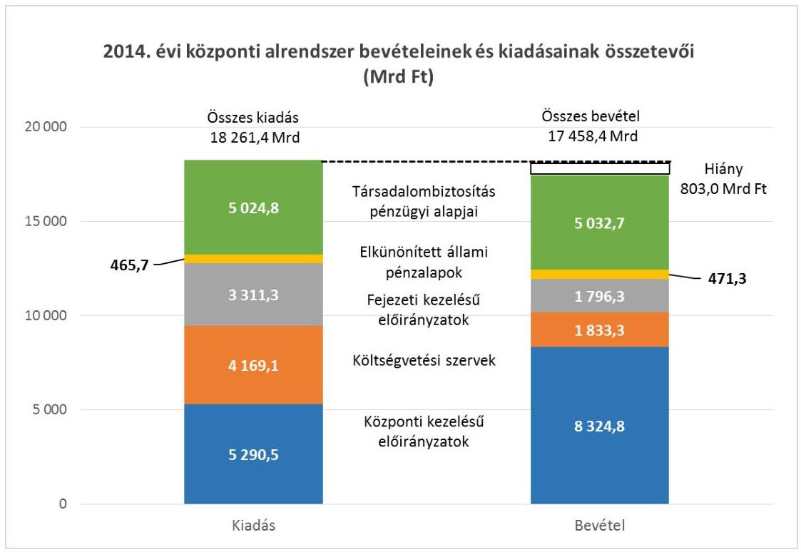

Forrás: Zárszámadási törvényjavaslat

# A központi alrendszer bevételei 

A központi alrendszer bevételei 1473 440,6 M Ft-tal haladták meg a törvényi módosított előirányzatot. Az előirányzat túlteljesüléséhez a központi költségvetés 1255 720,4 M Ft-tal, az ELKA 33 752,3 M Ft-tal, a TB Alapok közül a Nyugdíjbiztosítási Alap 160 527,9 M Ft-tal, az Egészségbiztosítási Alap 23 440,0 M Ft-tal járult hozzá.
A központi alrendszer bevételeinek legnagyobb hányadát, 68,5%-át kitevő központi költségvetés bevételei közül a Vállalkozások költségvetési befizetései 43 323,8 M Ft-tal és az Egyéb uniós bevételek 3766,9 M Ft-tal elmaradtak a törvényi módosított előirányzattól. A Fogyasztáshoz kapcsolt adók, a Lakosság költségvetési befizetéseiből származó bevételek, a Költségvetési szervek és fejeze-

---

ti kezelésű előirányzatok bevételei, a Bevételek az államháztartás alrendszereiből, az Állami vagyonnal kapcsolatos befizetések, a Kamatbevételek és az Egyéb bevételek együttesen 1302 811,1 M Ft-tal meghaladták az előirányzatot. A központi alrendszer bevételeinek megoszlását a 2. számú ábra mutatja.
2. számú ábra
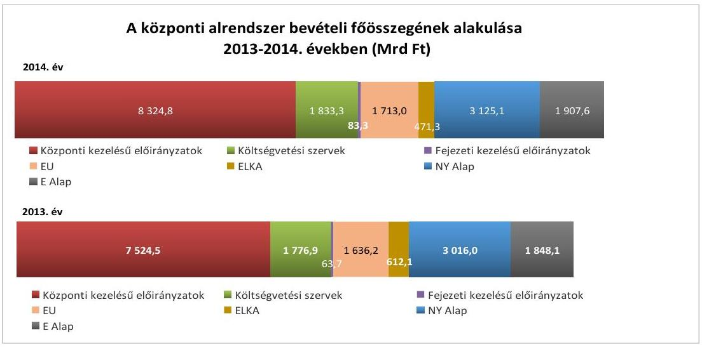

Forrás: Zárszámadási törvényjavaslat
A Vállalkozások költségvetési befizetései címen belül az Energiaellátók jövedelemadója esetében 26 140,7 M Ft-tal, a KATA és a KIVA tekintetében együttesen 68 512,3 M Ft-tal maradt el a teljesítés a törvényi módosított előirányzattól. Ugyanezen a címen belül a Társasági adó 36013 M Ft-tal, az Egyszerűsített vállalkozói adó 29 829,4 M Ft-tal; a Fogyasztáshoz kapcsolt adók közül az Áfa 21 490,6 M Ft-tal, a Pénzügyi tranzakciós illeték 8523,5 M Ft-tal; a Lakosság befizetései közül az Szja 39 055,4 M Ft-tal, az Illeték befizetések 10 273,9 M Ft-tal a törvényi módosított előirányzathoz képest magasabb összegben teljesültek. A Költségvetési szervek és fejezeti kezelésű előirányzatok bevételei 725 966,7 M Ft-tal teljesültek túl. A Bevételek az államháztartás alrendszereiből több mint háromszorosan, 174 860,5 M Ft-tal haladták meg a törvényi módosított előirányzatot. Az Állami vagyonnal kapcsolatos befizetések 65 048,8 M Ft-os többletbevételéhez a tulajdonosi részesedések értékesítéséből származó nem tervezett többletbevétel és a frekvenciahasználati jog meghosszabbításáért fizetett magasabb összeg járult hozzá. Az előirányzathoz mérten jelentős, 242 813,5 M Ft bevétel növekedés volt az Adósságszolgálattal kapcsolatos kamatbevételeknél.
A központi költségvetés bevételeinek előirányzatot meghaladó teljesülését több, a bevételek alakulását befolyásoló tényező eredményezte, köztük a - GDP tervezettnél magasabb növekedése mellett - a Tao bevételek esetében a KIVA-t választó adóalanyok számának tervezettől való elmaradása, a vállalkozások 2014. évre becsült eredményének növekedése. Az EVA bevételekre szintén kedvezően hatott a KATA-ra és a KIVA-ra áttérők számának tervezettől való elmaradása. Az Szja bevételek túlteljesülésére kedvező hatással volt a foglalkoztatottak számának emelkedése és a bértömeg növekedése. Az adósságszolgálattal kapcsolatos bevételek jelentős túlteljesülését a hiányt finanszírozó és adósságmegújító államkötvények előirányzatot meghaladó összegű kamatai eredményezték.

---

# A központi alrendszer kiadásai 

A központi alrendszer együttes kiadása 1124 974,8 M Ft-tal túlteljesült a törvényi módosított
 előirányzathoz képest. Az alrendszert alkotó mindhárom terület teljesítése meghaladta a törvényi módosított előirányzatot. A túlteljesülés mértéke a központi költségvetés tekintetében 945 497,3 M Ft, az ELKA esetében 4759,6 M Ft, míg a TB Alapoknál 174 717,9 M Ft volt. A TB Alapokon belül a Ny. Alap kiadásai 151 685,8 M Ft-tal, az E. Alapé 23 032,1 M Ft-tal haladta meg az előirányzottat. A központi alrendszer kiadásainak megoszlását a 3. számú ábra mutatja.
3. számú ábra
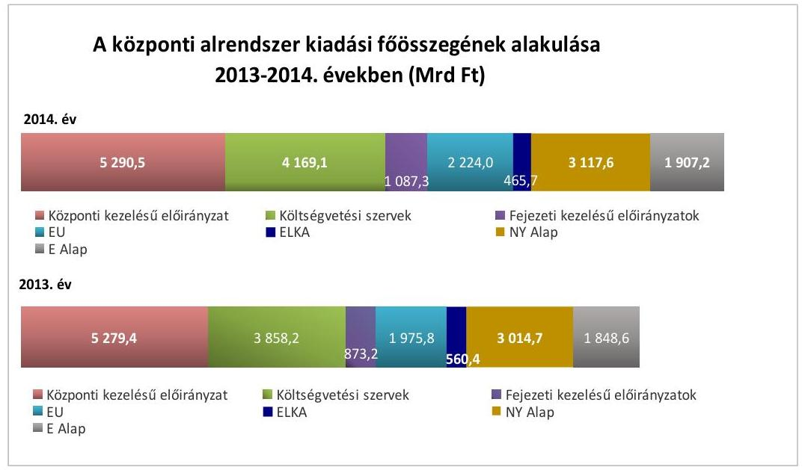

Forrás: Zárszámadási törvényjavaslat
A központi költségvetés törvényi módosított kiadási előirányzatot meghaladó teljesítésében meghatározó volt a költségvetési szervek, az uniós programok, a kamatkiadások, az állami vagyonnal kapcsolatos kiadások, a Start-munka-program és a gyógyító-megelőző ellátások túlteljesülése. A költségvetési szervek kiadásainak túlteljesítését ( $932743,1 \mathrm{M}$ Ft) alapvetően az intézményi maradványok és többletbevételek felhasználása okozta. Az uniós programok kiadásainak 74 346,6 M Ft-os túlteljesüléséhez főként a strukturális programokkal összefüggő kiadások járultak hozzá. A kamatkiadások esetében a túlteljesülés ( $180835,0 \mathrm{M}$ Ft) ellentétes hatások eredménye volt. Változott a finanszírozási és kamatkiadási szerkezet, kedvezőbb lett a hozamszint, ami miatt a tervezettnél magasabb összegű volt a kibocsátás, így nőtt a kamatkiadás, ugyanakkor a devizaárfolyam kedvezőtlenebbé vált. Az állami vagyonnal kapcsolatos kiadások ( $55112,9 \mathrm{M}$ Ft-tal) meghaladták a törvényi módosított előirányzatot, jellemzően az MNV Zrt. ingatlanvásárlása, a Főgáz Zrt. részvényeinek, illetve az MKB Bank Zrt. teljes részesedésének megvásárlása kapcsán.
Az ELKA teljesítése 4759,6 M Ft-tal meghaladta a törvényi módosított előirányzatot, amihez alapvetően hozzájárult a Startmunka-program túlteljesülése a közfoglalkoztatás kiszélesítésének eredményeként.
A TB Alapok közül az E. Alap esetében meghatározóan a gyógyító-megelőző ellátás teljesítése haladta meg ( $13779,0 \mathrm{M}$ Ft-tal) a törvényi módosított elő-

irányzatot. Ennek oka, hogy a törvény szerinti előirányzathoz képest a természetbeni ellátásoknál többletkiadás keletkezett, melyet kismértékben ellensúlyozott a pénzbeli ellátásoknál jelentkező elmaradás. Az NY. Alap túlteljesülése a járulékbevételek, hozzájárulások ( $168454,7 \mathrm{M}$ Ft-os) túlteljesülésének, valamint a nyugellátás kiadásai ( $32814,4 \mathrm{M}$ Ft-tal történt) alulteljesülésének a következménye.

# 1.2. A zárszámadási törvényjavaslat 

Az ellenőrzött terület: A zárszámadási törvényjavaslat összeállítása és az NGM által alkalmazott ellenőrzések
Fő megállapítás: A 2014. évi zárszámadási törvényjavaslat összeállításánál az NGM betartotta a vonatkozó belső szabályzatok előírásait és a számszaki adatok tekintetében elvégezte a szükséges ellenőrzéseket. A törvényjavaslatban szereplő adatokat a kincstári beszámolók adatai alátámasztják.
Az NGM rendelkezik a zárszámadási törvényjavaslatok összeállítási folyamatára vonatkozó szabályzattal, amelyet a 2014. évi zárszámadási törvényjavaslat összeállításához 2015 februárjában aktualizált. A szabályzat tartalmazza a törvényjavaslat összeállítási folyamatával kapcsolatos módszertani elveket és szempontokat, valamint a törvényjavaslat elkészítésével kapcsolatos feladatok ütemezését.
Az NGM SzMSz-e és a folyamatban részt vevő egyes szakfőosztályok ügyrendjei tartalmazzák a törvényjavaslat elkészítéséért felelős szervezeti egységek zárszámadási dokumentumok előkészítésével és összeállításával kapcsolatos feladatait.
Az NGM által 2015. májusban kiadott munkaprogram tartalmazta a 2014. évi zárszámadási törvényjavaslat összeállítását megalapozó módszertani elveket, a beszámolási keretrendszert, a kapcsolódó feladatokat, azok ütemezését és felelőseit, valamint az adatok átadására, az adatszolgáltató szervezetek (NAV, Kincstár, ÁKK Zrt., fejezetek, alapkezelők) és az NGM közötti, illetve az NGM szervezetén belüli adategyeztetésekre vonatkozó iránymutatásokat. A munkaprogramban foglaltakat az NGM által kiadott zárszámadás törvényjavaslat előkészítési útmutató részletezte, megadva a zárszámadási törvényjavaslattal és indokolásával szemben támasztott tartalmi követelményeket. A 2014. évi zárszámadási törvényjavaslat összeállításánál az NGM betartotta a vonatkozó belső szabályzatok előírásait.
A zárszámadási törvényjavaslat összeállításának informatikai támogatására az NGM a Költségvetési Adatcserélő Rendszert alkalmazza. A KAR rendszerhez kapcsolódó jogosultságokat az NGM Jogosultságkezelési Szabályzata, a KAR rendszer technikai háttér információit, a kapcsolódó biztonsági előírásokat és az elérhető funkciókat a KAR rendszerleírása tartalmazza. A 2012. évi zárszámadás ellenőrzési megállapításai alapján az NGM elkészítette a KAR informatikai rendszer zártságát biztosító kontrollok leírását.
Az ellenőrzött terület: A zárszámadási törvényjavaslat tartalma, szerkezete, megfelelése az Áht.-ban foglalt előírásoknak
Fő megállapítás: A zárszámadási törvényjavaslat tartalmazza a jogszabályban előírt tartalmi elemeket, szerkezete összhangban van az Áht.-ban foglalt előírásokkal.

A költségvetés végrehajtásáról szóló törvényjavaslat az elfogadott költségvetéssel összehasonlítható módon került összeállításra. A központi alrendszer hiánya a költségvetésben tervezett mértékétől való eltérésének okai a zárszámadási törvényjavaslatban bevételi és kiadási oldalon egyaránt bemutatásra kerültek.

A törvényjavaslat általános indokolásában és a mellékletben került bemutatásra a kormányzati szektor maastrichti kritériumok szerint számított egyenlege (hiánya) és adóssága. A törvényjavaslat normaszövege rögzíti az Alaptörvény és a Stabilitási törvény szerinti adósságmutató 2014. év végi alakulását, illetve csökkenését, tartalmazza a költségvetési hiány finanszírozásának módját. Az államháztartás pénzforgalmi hiányát és az elsődleges egyenleg alakulását a törvényjavaslat általános indokolásának melléklete tartalmazza. A törvényjavaslat általános indokolásának melléklete tartalmazza a költségvetési mérleget alrendszerenként és összevontan, közgazdasági és funkcionális tagolásban, tájékoztatást ad az adóbevételekben érvényesülő közvetett támogatásokról (adónemenként az adóelengedésekről, adókedvezményekről), bemutatja az állam által vállalt kezességek, garanciák és viszontgaranciák állományát és az állam tulajdonában álló gazdálkodó szervezetek működéséből származó kötelezettségek, a részesedések alakulását.
Az Áht. 13. §-a előírásainak megfelelően a költségvetési tervezés során figyelembe vett makrogazdasági és költségvetési folyamatok alakulásának értékelését, az eltérések okait alrendszerenként a törvényjavaslat általános indokolása tartalmazza.
A helyi önkormányzatok tulajdonában álló gazdálkodó szervezetek működéséből származó kötelezettségek, a részesedések alakulása, valamint a helyi önkormányzatok által kibocsátott garanciák és kezességek állománya a törvényjavaslat indokolásának mellékletében került bemutatásra.
Az államháztartás központi alrendszerében és önkormányzati alrendszerében, valamint a kormányzati szektorba sorolt egyéb szervezeteknél a nem teljesítő hitelkövetelések állományát a törvényjavaslat általános indokolásának melléklete tartalmazza.
A 2014. évi zárszámadási törvényjavaslat fejezeti indokolásai (a fejezeti kötetek) tartalmazzák a fejezetek közötti átcsoportosítást, valamint a címrend és a címrend alá rendezett alcímek, jogcímcsoportok, jogcímek változását.

# Az ellenőrzött terület: A törvényjavaslat adatainak megbízhatósága 

Fő megállapítás: Az ellenőrzés megállapította, hogy a központi költségvetés teljesített bevételi és kiadási főösszege nem tartalmaz lényeges hibát.
A 2014. évi központi költségvetés végrehajtásáról az egyes ellenőrzési területeken lefolytatott ellenőrzések és a zárszámadási törvényjavaslat ellenőrzése alapján alkottunk véleményt. Véleményünk a 2014. évi zárszámadás ellenőrzése során megszerzett ellenőrzési bizonyítékokon alapul.
Ellenőrzésünk megállapította, hogy a központi költségvetés teljesített bevételi főösszege és a központi költségvetés teljesített kiadási főösszege nem tartalmaz lényeges hibát. Ellenőrzésünk eredményeit a központi költségvetésre, illetve az egyes ellenőrzési területekre vonatkozóan a 4. számú ábra mutatja.

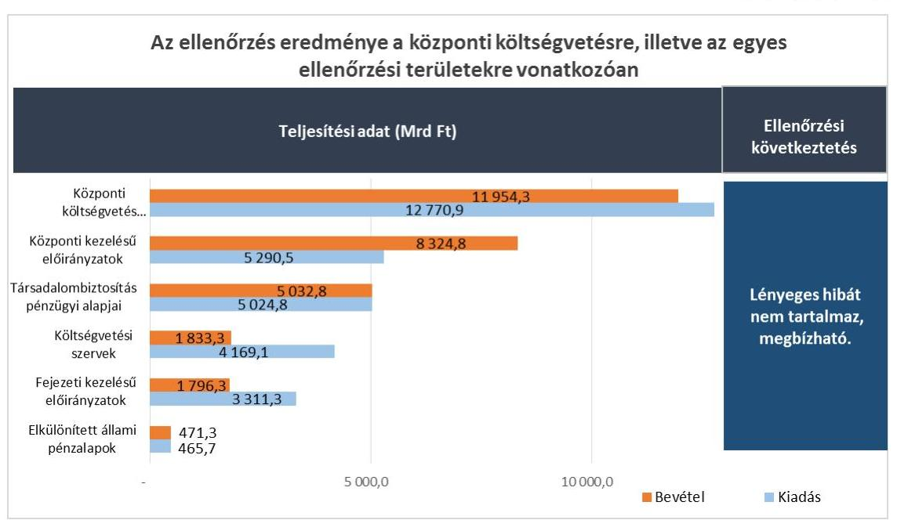

Forrás: Zárszámadási törvényjavaslat

# 2. A KÖZPONTI KEZELÉSŰ ELŐIRÁNYZATOK, VALAMINT AZ ÁLLAMI VAGYONNAL KAPCSOLATOS BEVÉTELEK ÉS KIADÁSOK 

Az ellenőrzött terület: I. OGY fejezet 8. Pártok támogatása, 9. Pártalapítványok támogatása címek, 11. Közszolgálati médiaszolgáltatás támogatása cím, IX. Helyi önkormányzatok támogatásai, X. IM fejezet 24. Céltartalékok cím, XI. ME fejezet 17. RKI, 18. OVA címek, XIV. BM fejezet 21. K-600 hírrendszer működtetése cím, XVII. NFM fejezet 21. Vállalkozások folyó támogatása és 25. Peres ügyek címek, XX. EMMI fejezet 21. NCSSZA cím, XLI. Adósságszolgálattal kapcsolatos bevételek és kiadások fejezet, XLII. A költségvetés közvetlen bevételei és kiadásai fejezet meghatározott címei és jogcímei, XLIII. Az állami vagyonnal kapcsolatos bevételek és kiadások fejezet, illetve XLIV. A Nemzeti Földalappal kapcsolatos bevételek és kiadások fejezet
Fő megállapítás: A költségvetés központi kezelésű, valamint az állami vagyonnal kapcsolatos bevételi és kiadási előirányzatainak teljesítési adatai összességében megbízhatóak. A költségvetés központi kezelésű, valamint az állami vagyonnal kapcsolatos bevételi és kiadási előirányzatainak teljesítése és elszámolása szabályszerű volt.
A központi kezelésű bevételi és kiadási előirányzatok összetevőit az 5. számú ábra mutatja be.

5. számú ábra
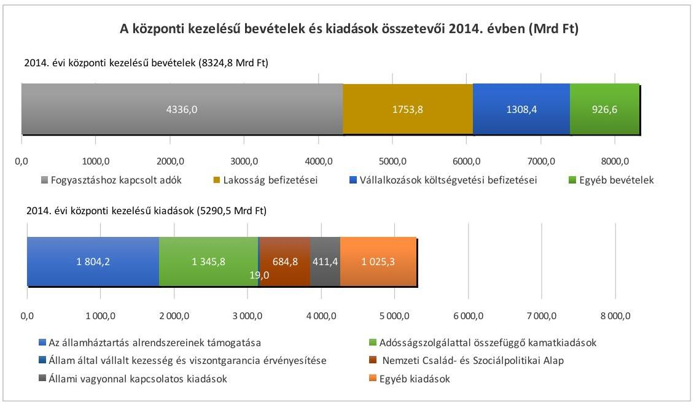

Forrás: Zárszámadási törvényjavaslat
A központi kezelésű előirányzatok bevételeinek 88,9%-át a fogyasztáshoz kapcsolt adók ( 4335 948,2 M Ft), a lakosság befizetései ( 1753750,3 M Ft) és a gazdálkodó szervezetek befizetései ( 1308 414,3 M Ft) együttesen teszik ki. Az ellenőrzés megbízhatósági hibát nem tárt fel, ezért a bevételi adatok megbízhatóak.
A NAV az informatikai kontrollkörnyezetét a jogszabályi előírásoknak részben megfelelően alakította ki. Ugyanakkor a bevételek elszámolása során a jogszabályi előírásokat betartották, az ellenőrzés szabályszerűségi hibát nem tárt fel.
A 2014. évi költségvetési tervezés alapját képező makropálya 2014. évben 2,0%-os GDP növekedés feltételezésével készült. Ezzel szemben a magyar gazdaság 2013. év második felétől beindult növekedése folytatódott és a GDP 2014. évi 3,6%-os növekedése szinte minden ágazatban jelentkezett. Ennek megfelelően a központi költségvetés bevételeit meghatározó Tao, Áfa és Szja adónemek, valamint a kisebb adónemek többségének bevételei a makrogazdasági és a költségvetési folyamatokkal összhangban, az előirányzatot meghaladó mértékben teljesültek.
A központi kezelésű előirányzatok kiadásainak 34,1%-át az államháztartás alrendszereinek támogatása képezte. A támogatások meghatározó részét jelentette a IX. Helyi önkormányzatok támogatásai fejezet, amely előirányzattal összevontan történt a XX. EMMI fejezeten belül a Települési és területi nemzetiségi önkormányzatok támogatása cím kiadásainak ellenőrzése.
A 2014. évi kiadás teljesítése a helyi önkormányzatok esetében 723 640,9 M Ft, a nemzetiségi önkormányzatok vonatkozásában 1519,3 M Ft volt, ami mindkét területen megegyezett a törvényi módosított előirányzattal.
A kiutalt támogatások ellenőrzése során megbízhatósági hibákat tártunk fel, amelyek a támogatási szerződések és a támogatás felhasználása ellenőrzésének hiányosságaihoz kapcsolódtak. A feltárt hibák alapján a kiadási adatok összeségében előforduló megbízhatósági hibák összértéke nem éri el a lényegességi szintet, ebből következően a kiadási adatok megbízhatóak.
Az ellenőrzés szabályszerűségi hibákat tárt fel, amelyek jellemzően az utalványozást és érvényesítést megelőző teljesítésigazolások, illetve pénzügyi ellenjegyzések hiányához, valamint a támogatói okiratok hiányosságaihoz kapcsolódtak.

A 2014. évben végrehajtott előirányzat-módosítások megfeleltek a jogszabályi előírásoknak. Az Önkormányzati fejezeti tartalék előirányzatát a Kincstár az általa vezetett számlákra érkezett, a helyi önkormányzatok előző évi elszámolásai, tárgyévi lemondásai miatti befizetéseivel, 9690,5 M Ft-tal növelte meg. Ezek a tételek a Kvtv. 4. melléklet I. pontja alapján fejezeti tartalékot növelő előirányzatok.
A központi kezelésű előirányzatok bevételeinek 4,0%-át az adósságszolgálattal kapcsolatos kamatbevételek ( $334456,1 \mathrm{M}$ Ft), míg a központi kezelésű előirányzatok kiadásainak 25,4%-át az adósságszolgálattal kapcsolatos kamatkiadások (1 345 850,2 M Ft) képezték. Az ellenőrzés a bevételek és kiadások tekintetében megbízhatósági hibát nem tárt fel, így a bevételi és kiadási adatok megbízhatóak. Az ÁKK Zrt. az Áht. és az Ávr. vonatkozó előírásainak megfelelően eleget tett az adósságszolgálattal kapcsolatos bevételekkel és kiadásokkal összefüggő, a Kincstár könyvvezetéséhez és beszámolási kötelezettségéhez kapcsolódó adatszolgáltatási és beszámolási kötelezettségének.
Az ÁKK Zrt. államadósság kezelésével kapcsolatos informatikai rendszerének (InFoRex) ellenőrzése során megállapítottuk, hogy az ÁKK Zrt. az informatikai kontrollkörnyezetét a jogszabályi előírásoknak részben megfelelően alakította ki. A szervezet - az Ibtv.-ben előírtakkal ellentétben - nem rendelkezett informatikai biztonsági stratégiával, illetve nem határozta meg a felhasználókra vonatkozó szabályokat a jogosultságok utólagos felülvizsgálatának gyakoriságát illetően. Az informatikai szabályozási hiányosságok ellenére az adósságszolgálattal kapcsolatos elszámolásokat és kifizetéseket szabályszerűen hajtották végre, az ellenőrzés szabályszerűségi hibát nem tárt fel.
Az adósságszolgálattal kapcsolatos bevételek és kiadások a Kvtv.-ben jóváhagyott összegeket meghaladó mértékben teljesültek. A kiadások teljesítésénél betartották a Kvtv. előírásait, mely szerint a kiadások teljesítése eltérhet az előirányzattól annak módosítása nélkül.
A kezesség-visszatérülés összege 4170,0 M Ft
 volt. A központi kezelésű előirányzatok kiadásainak 0,4%-át az Állam által vállalt kezesség és viszontgarancia érvényesítésével kapcsolatos kiadások adják (18946,9 MFt). Az előirányzattal kapcsolatos elszámolások ellenőrzése során megbízhatósági hibát nem tártunk fel, a bevételi és a kiadási adatok megbízhatóak.
A garantőr szervezetek az általuk vállalható kezességek, garanciák és viszontgaranciák állományának felső határára vonatkozó Kvtv. előírásokat betartották, az állományokat a jogszabályi előírásokkal összhangban tartották nyilván.
Az állam által vállalt kezesség és viszontgarancia érvényesítéséből eredő kiadásokat a 6. számú ábra mutatja be.

---

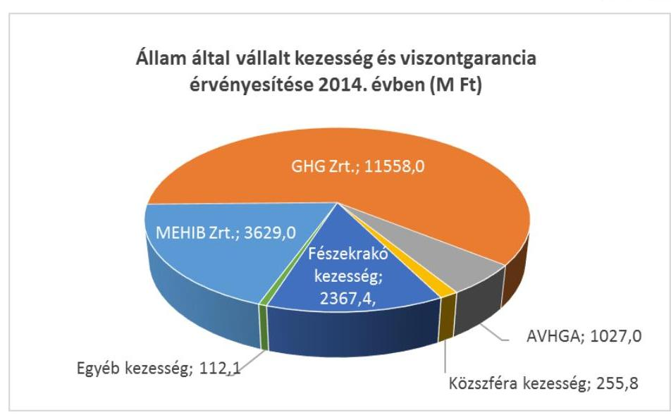

Forrás: Zárszámadási törvényjavaslat
Az állam által vállalt kezesség és viszontgarancia érvényesítéséből eredő kiadások a törvényi módosított előirányzat 58,6%-ában teljesültek. A 13 372,6 M Ft összegű elmaradást a fészek-rakó kezességekhez (lakáshitelekhez), valamint a GHG Zrt. által a kis- és középvállalkozások hiteleihez nyújtott kezességek beváltásának kedvezőbb alakulása határozta meg.
A XX. EMMI fejezet NCSSZA cím esetében bevételi előirányzatot a Kvtv. nem tartalmazott, a jogosulatlanul igénybevett ellátások visszafizetéséből származóan 1276,0 M Ft bevétel keletkezett. Az NCSSZA 684 829,9 M Ft összegű kiadásai képezték a központi kezelésű előirányzatok kiadásainak 12,9%-át. Az előirányzat a törvényi módosított előirányzat 95,8%-ában teljesült.
Az ellenőrzés az NCSSZA előirányzatainak terhére történő ellátások, támogatások folyósítása területén tárt fel megbízhatósági hibát. Az ellenőrzött tételeknél több esetben nem állt rendelkezésre az ellátások kifizetését alátámasztó határozat, illetve a szükséges szakvélemény, vagy a családi pótlék igényelbírálásához szükséges kérelem. Az ellenőrzés megállapította, hogy az ellátások, támogatások teljesítési adatai lényeges hibát tartalmaznak, így az elszámolt kiadások nem megbízhatóak.
Az NCSSZA előirányzatainak terhére történő ellátások, támogatások folyósítása, a nyújtott térítések, az elszámolások és az adatfeldolgozás a vonatkozó jogszabályi előírásoknak, valamint a tevékenységet ellátó szervek hatályos belső szabályzataiban foglaltaknak megfeleltek. Az ellenőrzés a Kincstárnál, mint ellátásokat, támogatásokat folyósító szervnél tárt fel szabályszerűségi hibát, mivel a Gyermekek születésével kapcsolatos szabadság megtérítése jogcímcsoportra vonatkozó eljárásrend nem volt összhangban a vonatkozó jogszabályi előírásokkal.
Az NCSSZA kiadásainak alakulását a 7. számú ábra mutatja be.

---

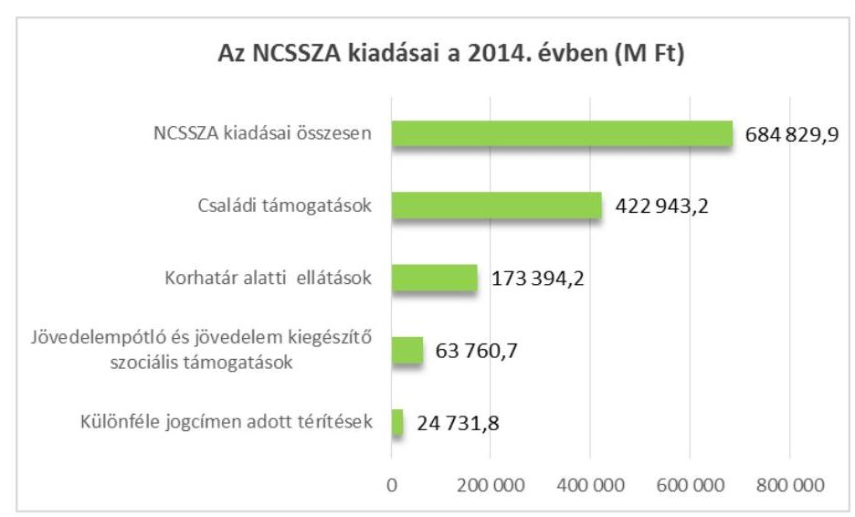

Forrás: Zárszámadási törvényjavaslat
Az NCSSZA kiadási előirányzatának 29 706,1 M Ft-tal való alulteljesüléséhez meghatározóan a Családi támogatásokkal kapcsolatos kiadások 23 275,8 M Ft összegű csökkenése járult hozzá, amelyet alapvetően a jogosultak számának tervezettől való elmaradása okozott.
Az állami vagyonnal és az NFA-val kapcsolatos bevételek (274 961,4 M Ft) a központi kezelésű előirányzatok bevételeinek 3,3%-át, a kiadások (411 412,3 M Ft) a központi kezelésű előirányzatok kiadásainak 7,8%-át képezték.

Az állami vagyonnal és az NFA-val kapcsolatos bevételek ellenőrzése során számla késedelmes elkészítéséhez, illetve a szerződések módosításának elmaradásához kapcsolódóan megbízhatósági hibákat tártunk fel. Ez utóbbi következtében a magasabb összegű haszonbérleti díjak nem kerültek érvényesítésre. A feltárt hibák alapján a bevételi adatok összességében előforduló megbízhatósági hibák összértéke nem éri el a lényegességi szintet, ebből következően a bevételi adatok megbízhatóak. A kiutalt támogatások vonatkozásában az ellenőrzés megbízhatósági hibát nem tárt fel, így a kiadási adatok megbízhatóak.
Az állami vagyonnal és az NFA-val kapcsolatos bevételekkel és kiadásokkal összefüggő előirányzat módosítások, teljesítések összhangban voltak a jogszabályi előírásokkal. A szerződéskötések, a lebonyolított ügyletek elszámolásai összességében szabályszerűek voltak, az ellenőrzés szabályszerűségi hibát nem tárt fel.
A bevételek teljesülése 65 048,8 M Ft-tal meghaladta az eredeti előirányzatot, az eredeti előirányzat a 2014. év során nem módosult. A túlteljesülést meghatározóan a Fővárosi Gázművek Zrt. tulajdoni hányadának eredetileg nem tervezett értékesítése, illetve a MOL részvények után fizetett osztalék tervezettet jelentősen meghaladó mértéke eredményezte. A 2014. évi bevételek 47,6%-a egyszeri bevétel, ami a frekvenciahasználati jogok értékesítéséből (130 800,0 M Ft) származott. A kiadások törvényi módosított előirányzata 356 299,4 M Ft volt, amit a teljesítés 55 112,9 M Ft-tal meghaladt. A túlteljesülés jellemzően az

---

MNV Zrt. ingatlanvásárlásaival, a Főgáz Zrt. részvényeinek, illetve az MKB Bank Zrt. teljes részesedésének megvásárlásával függött össze.
Az 5. számú ábrán bemutatott Egyéb kiadások előirányzatainak teljesülése (1 025 288,3 M Ft) a központi kezelésű kiadási előirányzatok 19,4%-át jelentette. Az Egyéb kiadások ellenőrzése során nem tártunk fel megbízhatósági hibát, ezért a kiadási adatok megbízhatóak. Az ellenőrzött kiadási előirányzatok teljesítése megfelelt a jogszabályi előírásoknak. Az ellenőrzés a Lakástámogatások címen az 57/2012. (III. 30.) Korm. rendelet alapján végzett támogatás kiutalásához kapcsolódóan állapított meg szabályszerűségi hibát, mivel az NGM teljesítésigazolása nem felelt meg az Ávr. előírásainak.
A központi kezelésű előirányzatok közé tartozó tartalékok (RKI, OVA, céltartalékok) képzése a jogszabályi előírásoknak megfelelt, a képzett tartalékok összege 289 150 M Ft volt. A 232 805,9 M Ft összegű felhasználásról a Kormány határozatokban döntött.
Az RKI-ra szolgáló tartalékok felhasználásának ellenőrzése során tártunk fel szabályszerűségi hibákat, amelyeket az NGM részéről az érintett fejezetek határidőben történő, valamint a Kormány tájékoztatásának elmaradása okozott. Az OVA és a céltartalékok felhasználása során betartották a jogszabályi előírásokat.
Az RKI eredeti előirányzata 113 000,0 M Ft volt, amit a Kormány határozatban 1200,0 M Ft-tal emelt meg. A 2014. év során az előirányzat felhasználására vonatkozóan 102 kormányhatározatban döntöttek az RKI-ból történő előirányzat átcsoportosításokról. Az RKI előirányzat-felhasználás összege 113 955,4 M Ft, a fel nem használt rész 244,5 M Ft volt.
Az OVA eredeti előirányzata 100 000,0 M Ft volt, amelyet a 2014. évi LXXXIV. törvény 52 328,0 M Ft-ra csökkentett. Az előirányzat felhasználására a Kvtv. előírásai alapján 2014. szeptember 30-a előtt nem kerülhetett sor. Az előírásnak megfelelően az előirányzatról 2014. december 18-án történt 44 886,3 M Ft összegű átcsoportosítás, hét fejezetet, a 2014. december 31-ei 300 M Ft átcsoportosítás egy fejezetet érintett. Az OVA előirányzatából 45 186,3 M Ft összegű felhasználás történt, a fel nem használt összeg 7141,7 M Ft volt.
A céltartalékok 76 150,0 M Ft-os eredeti előirányzatából a felhasználás 73 664,2 M Ft (96,7%) volt, az eredeti előirányzat év közben nem módosult. A benyújtott igények megfeleltek azoknak a céloknak, amelyeket a jogszabályok a céltartalékok felhasználásával összefüggésben meghatároztak.

# 3. A TÁRSADALOMBIZTOSÍTÁS PÉNZÜGYI ALAPJAI 

Az ellenőrzött terület: A LXXI. Ny. Alap és a LXXII. E. Alap ellátási és működési bevételei, illetve kiadásai
Fő megállapítás: Az Ny. Alap és az E. Alap éves költségvetési beszámolóinak összeállítása megfelelt a jogszabályi előírásoknak. Az Ny. Alap és az E. Alap teljesített bevételi és kiadási adatai megbízhatóak.
Az Ny. Alap és az E. Alap 2014. évi bevételeinek és kiadásainak teljesítését a 8. számú ábra mutatja.

---

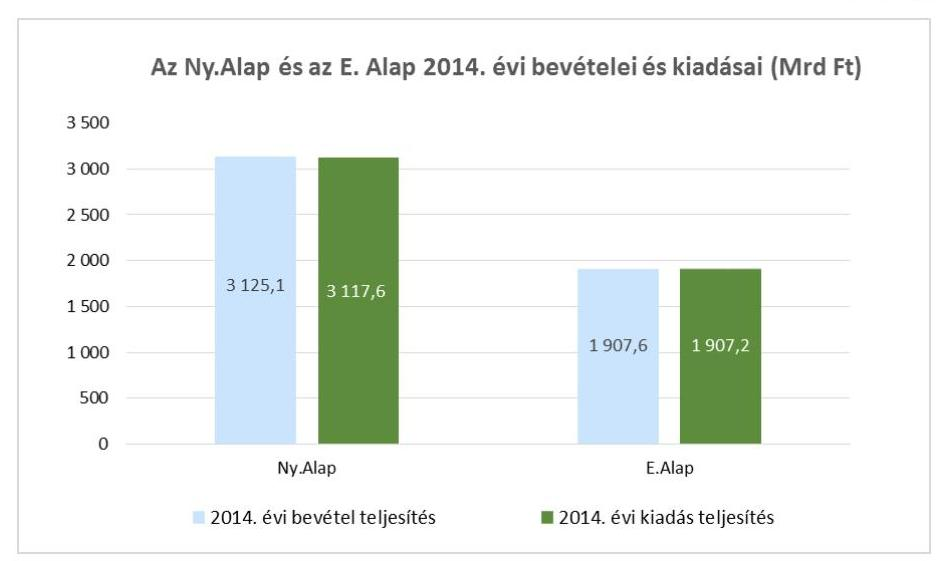

Forrás: Zárszámadási törvényjavaslat
Az Ny. Alap bevételi előirányzata 3125 136,1 M Ft-ban teljesült, amely a törvényi módosított előirányzatot 5,4%-kal haladta meg. Az ellátással összefüggésben 3122 383,8 M Ft, a működéshez kapcsolódóan pedig 2752,3 M Ft bevétel teljesült. Az Ny. Alap kiadási előirányzata 3117 592,5 M Ft-ra teljesült, amely 5,1%-kal haladta meg a törvényi módosított előirányzatot. A teljesített kiadásokból 3105 932,6 M Ft az ellátásokhoz, 11 659,9 M Ft az Ny. Alap működéséhez (ONYF alapkezelő és NYUFIG) kapcsolódott. Az Ny. Alap költségvetése többlettel teljesült, költségvetési egyenlege 7543,6 M Ft volt.
Az Ny. Alap teljesített bevételei és kiadásai tekintetében az ellenőrzés nem tárt fel megbízhatósági hibát, ezért a bevételi és a kiadási adatok megbízhatóak.
Az ONYF és a NYUFIG belső kontrollrendszereinek kialakítása és működtetése megfelelt az Áht. és a Bkr. előírásainak. Az ellenőrzés az Ny. Alapból teljesített kifizetéseknél tárt fel szabályszerűségi hibákat, amelyek a gazdálkodási jogkörök gyakorlásához kapcsolódtak.
Ellenőriztük az éves költségvetési beszámoló költségvetési számvitellel készült beszámolórészei összeállítását az Ny. Alap ellátási tevékenységére, az ONYF és a NYUFIG működési tevékenységeire vonatkozóan. Az ellenőrzött beszámolórészek összeállítása összességében szabályszerűen, a vonatkozó jogszabályi és belső szabályozási rendelkezések előírásainak betartásával történt, ezért azokat megfelelőnek minősítettük.
Az E. Alap bevételi előirányzata 1907 617,5 M Ft-ban teljesült, amely a törvényi módosított előirányzatot 23 440,0 M Ft-tal haladta meg. Az ellátással összefüggésben 1906 703,2 M Ft, a működéshez kapcsolódóan pedig 914,3 M Ft bevétel teljesült. Az E. Alap teljesített kiadása 1907 209,6 M Ft volt, ami a törvényi módosított előirányzatot 23 032,1 M Ft-tal haladta meg. A teljesített kiadásokból 1897 493,0 M Ft az ellátásokhoz, 9716,6 M Ft az E. Alapot kezelő OEP működéséhez kapcsolódott. Az E. Alap költségvetése többlettel teljesült, költségvetési egyenlege 407,9 M Ft volt.
A bevételek elszámolásánál az ellenőrzés nem tárt fel megbízhatósági hibát, a bevételi adatok megbízhatóak. Az E. Alap működési kiadásainál megállapított megbízhatósági hiba volt, hogy a külső személyi juttatások terhére kötött meg-

---

bízási szerződés az Ávr. előírásai ellenére nem tartalmazta a pénzügyi teljesítés módját, feltételeit és a kifizetés határidejét. A feltárt hibák alapján az adatok összességében előforduló megbízhatósági hibák összértéke nem éri el a lényegességi szintet, ebből következően az E. Alap kiadási adatai megbízhatóak.
Ellenőriztük az OEP belső kontrollrendszerének kialakítását és működtetését, amely megfelelt az Áht. és a Bkr. előírásainak. Az E. Alap bevételei és kifizetései - a rokkantsági és rehabilitációs ellátások, a terhességi és gyermekágyi segély, táppénz, gyermekgondozási díj, valamint természetbeni ellátások egyes kifizetései kivételével - szabályszerűek voltak. Az egyes ellátásoknál feltárt szabályszerűségi hibák a gazdálkodási jogkörök gyakorlásához kapcsolódtak.
Az E. Alap ellátási és az OEP működési tevékenységéről szóló éves költségvetési beszámoló költségvetési számvitellel készült beszámolórészeinek összeállítása összességében szabályszerűen történt. Az ellenőrzött beszámolórészeket a vonatkozó jogszabályi és belső szabályozási rendelkezések előírásainak betartásával állították össze, ezért azokat megfelelőnek minősítettük.

# 4. ELKÜLÖNÍTETT ÁLLAMI PÉNZALAPOK 

Az ellenőrzött terület: ELKA (LXIII. NEFA, LXV. BGA, LXVI. KNPA, LXVII. NKA, LXVIII. WMA, LXIX. KTIA)
Fő megállapítás: Az ELKA szabályozottsága, bevételei és az azokból teljesített kiadások megfeleltek a jogszabályi előírásoknak. Az ELKA kiadás teljesítési adatai megbízhatóak.
Az ELKA 2014. évi bevételeinek és kiadásainak teljesülését a 9. számú ábra mutatja.
9. számú ábra
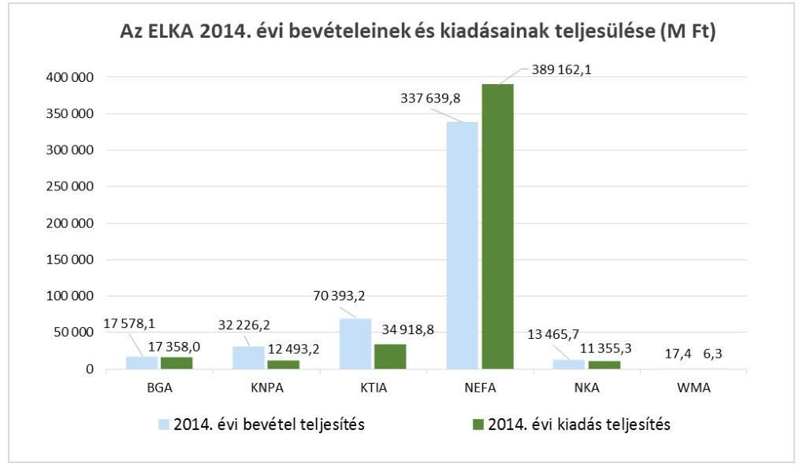

Forrás: Zárszámadási törvényjavaslat
Az ELKA 2014. évi teljesített bevételi összege 471 320,4 M Ft volt, ami a törvényi módosított előirányzatot 7,7%-kal meghaladta. Az ELKA Kvtv. szerint megállapított törvényi módosított kiadási előirányzata 460 939,2 M Ft volt, amelynél a teljesítés 4759,6 M Ft-tal volt magasabb. Működési kiadásokra 6171,4 M Ft-ot

---

fordítottak. A 2014. év végén az ELKA egyenlege 5621,6 M Ft volt, költségvetése többlettel teljesült. A NEFA hiánya 51 522,3 M Ft volt.
Az ellenőrzés megbízhatósági hibát a KNPA kiadásainál tárt fel, a támogatott szervezet a támogatási szerződésben foglalt határidőn túl küldte meg a támogatás felhasználásáról készített pénzügyi elszámolást az alapkezelő részére. A támogatott szervezet a szerződésben foglalt kötelezettségét elmulasztva a pénzügyi elszámolásban nem nyilatkozott arról, hogy a feltüntetett költségek kifizetése előtt azok összegszerűségéről és jogszerűségéről meggyőződött. Az elszámoláshoz idegen nyelvű, devizában kiállított számlát csatoltak, ami nem felelt meg a Számv. tv.-ben foglalt előírásoknak. A feltárt hibák alapján a kiadási adatok összességében előforduló megbízhatósági hibák összértéke nem éri el a lényegességi szintet, ebből következően az ELKA teljesített kiadási adatai megbízhatóak.
Az ELKA bevételeinek elszámolása megfelelt a
 jogszabályi előírásoknak. A NAV által beszedett adó- és járulékbevételekről készített adatszolgáltatás és az alapján készített elszámolás a jogszabályi előírásoknak megfelelően, határidőre teljesült az alapkezelők felé.
Az ELKA hat kezelő szervéből öténél a kontrollkörnyezet kialakítása és működtetése megfelelő, a KTIA esetében a belső szabályzatok hiánya miatt nem megfelelő volt. Az ellenőrzés szabályszerűségi hibákat tárt fel a NEFA, az NKA, a KNPA és a KTIA kiadásai ellenőrzésénél, amelyek a gazdálkodási jogkörök gyakorlásához kapcsolódtak.
Az éves költségvetési beszámoló költségvetési számvitellel készült beszámolórészei összeállításának ellenőrzése során megállapítottuk, hogy az éves beszámolók adatai - a NEFA kivételével - összhangban voltak a könyvviteli zárlat során készített főkönyvi kivonatokkal. A kötelezettségvállalás dokumentumai az Áht. és az Ávr. előírásainak megfeleltek, szabályszerűek voltak. A maradvány tekintetében az éves költségvetési beszámolók, a főkönyvi kivonatok valamint az analitikus nyilvántartások egyezősége biztosított volt.
Az ELKA költségvetési jelentéseinek összeállítása során nem tartotta be az Áhsz.-ben előírt határidőket, a maradvány megállapítása ugyanakkor szabályszerűen, dokumentumokkal alátámasztottan történt. A KNPA, a NEFA, NKA, valamint a WMA esetében az Áhsz. előírásai ellenére nem történt meg 2015. május 31-ig a beszámoló irányító szerv általi jóváhagyása és a Kincstárhoz való benyújtása. A NEFA esetében a költségvetési beszámoló és a főkönyvi kivonat közötti egyezőség nem állt fenn a kiadási előirányzatok, a kötelezettségvállalások esetében, valamint a követeléseken belül a költségvetési évben és a költségvetési évet követően esedékes követeléseknél.

# 5. FEJEZETI KEZELÉSŰ ELŐIRÁNYZATOK 

### 5.1. Európai Uniós támogatások és az európai uniós tagsággal összefüggő hazai befizetések

Az ellenőrzött terület: Az egyéb uniós bevételek teljesülése, az uniós tagsággal összefüggő hazai befizetések és a XIX. Uniós fejlesztések fejezetben megjelenő európai uniós támogatások.

---

Fő megállapítás: Az egyéb uniós bevételek és az európai uniós tagsággal összefüggő hazai befizetések elszámolása megfelelt a jogszabályi előírásoknak. A XIX. Uniós fejlesztések fejezetben megjelenő európai uniós támogatások kiadás teljesítési adatai megbízhatóak.
A Kvtv. XLII. fejezet Egyéb uniós bevételek cím 28 678,9 M Ft teljesített bevétele 3766,9 M Ft-tal (11,6%-kal) maradt el a tervezettől. A Hozzájárulás az EU költségvetéséhez cím 288 679,2 M Ft tervezett kiadása 2187,7 M Ft-tal (0,8%-kal) haladta meg a módosított előirányzatot, amely többletkiadást az előző évekről áthúzódó költségvetés módosítások, valamint az ÁFA és GNI egyenlegeinek korrekciói okozták.
A költségvetésben megjelenő uniós bevételek és támogatások összege 2223 959,4 M Ft volt, amelyből az uniós bevételek 1668 921,6 M Ft-ot tettek ki, a hazai támogatás 528 213,5 M Ft, a kedvezményezettekkel szembeni követelésekből befolyt összeg 26 824,3 M Ft volt. A 2014. évi uniós támogatások teljesített kiadása 2223 959,4 M Ft volt, amelynek 85,7%-át az NSRK-ból finanszírozott projektek megvalósítására fordították. A teljesített kiadások 3,5%-kal (74 346,6 M Ft-tal) meghaladták a törvényi módosított előirányzatot.
A XIX. UF fejezet bevételei a törvényi módosított előirányzat 98,7%-ában, 1706 608,2 M Ft-ban realizálódtak. A költségvetési támogatás a törvényi módosított előirányzat 166,0%-ára, 802 955,7 M Ft-ra, a fejezet kiadási előirányzata a törvényi módosított előirányzat 102,2%-ára, 2262 182,1 M Ft összegben teljesült. Az előirányzatok 30%-ot meghaladó túlteljesítésére 2014. évben a Kvtv.-nek megfelelően a Kormány döntése alapján két esetben került sor összesen 215 000,0 M Ft összegben. A fejezeti kezelésű előirányzatok felülről nyitására 30%-os mértékig összesen 112 496,5 M Ft állt rendelkezésre, melyet 2014 októberéig a Kormány igénybevett. A keretből összesen 98 382,7 M Ft összegben került sor az NSRK OP-jai felülről nyitására, melyet az indokolt, hogy egyes OPok kiadási előirányzatai nem biztosítottak elegendő forrást a kifizetések teljesítéséhez.
A NEFA-ból az UF fejezet részére a TÁMOP hazai társfinanszírozása céljára meghatározott 17 130,1 M Ft összegű forrás átadása megvalósult. Érvényesültek a GOP és a KMOP garanciaeszközeire vonatkozó készfizető kezesség, garancia állomány összegére vonatkozó előírások. A JEREMIE-típusú pénzügyi eszközök végrehajtása során megtérült visszatérítendő támogatásokból származó bevételek a GOP 4. és a KMOP 1.3 prioritás forrásait növelték összesen 45 687 M Ft-tal.
Az ellenőrzés az uniós támogatások kifizetésénél megbízhatósági hibát nem tárt fel, ezért a teljesített kiadási adatok megbízhatóak.
Az uniós források felhasználásának szabályozási környezetét az ME-nél és az MVH-nál kialakították, a szervezetek kontrollkörnyezetét az ellenőrzés megfelelőnek minősítette. Az uniós források 2014. évi felhasználása - az ÉMOP-nál és a DAOP TS-nél feltárt hibák kivételével - szabályszerű volt. A feltárt szabályszerűségi hibák az ÉMOP és a DAOP TS egy-egy projektjénél a gazdálkodási jogkörök gyakorlásához kapcsolódtak, illetve a DAOP TS keret felhasználására a döntéshozó nem kötött támogatási szerződést a kedvezményezett DARFÜ Kht.vel.

---

A 2014-2020 közötti uniós költségvetési időszak kohéziós politikai operatív programjaira kötelezettségvállalás nem történt. Magyarország és az EU Bizottság közötti Partnerségi Megállapodás 2014. szeptember 11-én aláírásra került, melyben a kijelölt fejlesztési irányokat kilenc OP-ban (GINOP, VEKOP, TOP, IKOP, KEHOP, EFOP, KÖFOP, VP, MAHOP) rögzítették. Az új időszakban 7764,5 Mrd Ft (25 038,5 M EUR) EU-támogatás áll hazánk rendelkezésére az ún. ESB alapokból. A helyszíni ellenőrzés lezárásáig három OP EU Bizottság általi elfogadása (KÖFOP, VP, MAHOP) nem történt meg.

# 5.2. Szakmai fejezeti kezelésű előirányzatok 

Az ellenőrzött terület: Az I. OGY, II. KE, III. AB, IV. AJBH, VI. BIR, VIII. Ügyészség, X. IM, XI. ME, XII. FM, XIII. HM, XIV. BM, XV. NGM, XVII. NFM, XVIII. KKM, XX. EMMI, XXX. GVH, XXXI. KSH, XXXIII. MTA, XXXIV. MMA fejezetek fejezeti kezelésű előirányzatai.
Fő megállapítás: A fejezeti kezelésű előirányzatok felhasználása szabályszerű volt. A fejezeti kezelésű előirányzatok bevétel és kiadás teljesítési adatai megbízhatóak.
A fejezeti kezelésű előirányzatok teljesített bevétele 70 854,2 M Ft-tal haladta meg a 12 446,8 M Ft-os törvényi módosított előirányzatot. A bevételi túlteljesítés meghatározóan a maradvány felhasználásával és a többletbevételekkel függ össze. A fejezeti kezelésű előirányzatok kiadásai 1 074 438,8 M Ft összegű törvényi módosított előirányzatának teljesítése 1 087 363,3 M Ft volt. A fejezeti kezelésű előirányzatok 2014. évi teljesített kiadásainak fejezetek közötti megoszlását a 10. számú ábra szemlélteti.
10. számú ábra
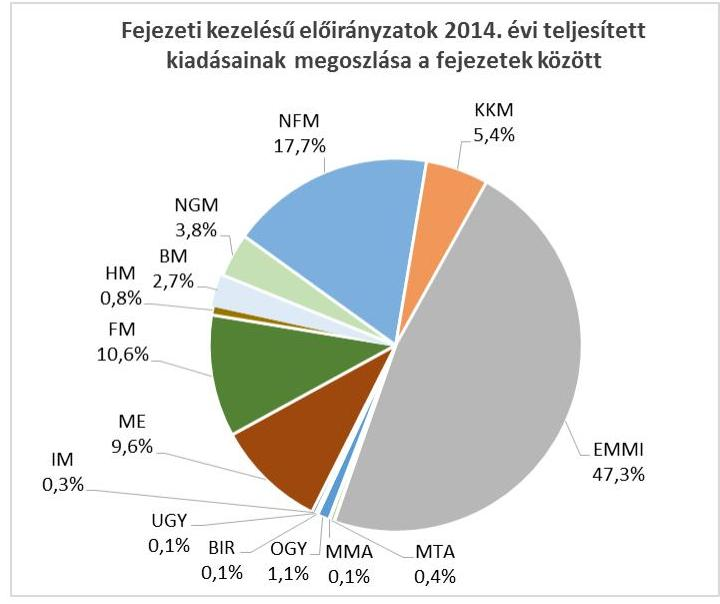

Forrás: Zárszámadási törvényjavaslat
A Kvtv. 10. számú melléklete nevesíti a beruházási, felújítási vagy egyéb felhalmozási célú kiadási előirányzatokat (69 fejezeti kezelésű és két központi kezelésű előirányzatot) magában foglaló Beruházási Alapot. Az állami vagyonnal kapcsolatos bevételek értékesítési bevételei a 146 591,7 M Ft összegű módosított előirányzathoz képest 35,5%-kal (52 054,3 M Ft-tal) túlteljesültek. A Beruházási Alapot alkotó fejezeti és központi kezelésű előirányzatok eredeti ki-

---

adási előirányzatát 130 392,0 M Ft-ban határozták meg, amely 50,4%-ban, 65 752,6 M Ft-ban teljesült. A fejezeti kezelésű előirányzatokat kezelő nyolc fejezet (OGY, BIR, IX. Helyi önkormányzatok támogatása, FM, KIM (IM), NFM, EMMI, MTA) a Beruházási Alaphoz tartozó előirányzatok igénybevételénél betartotta a Kvtv. előírásait.
A fejezeti kezelésű előirányzatok bevételeinél az ellenőrzés megbízhatósági hibát nem tárt fel. Megbízhatósági hibákat a fejezeti kezelésű előirányzatok kiadásainál az FM és az EMMI fejezetek tekintetében tártunk fel. A hibák az FMnél beszámoló határidőre történő benyújtásának, illetve elfogadásának elmaradásával, támogatási szerződésben a Kbt. alkalmazása előírásának hiányával, valamint az Áhsz.-nek nem megfelelő elszámolással függött össze. Az EMMI-nél a nyertes ajánlatnál magasabb összegű szerződéssel, illetve kifizetéssel, beszámolás határidőn túli teljesítésével, illetve elmaradásával, a támogatások kifizetését kizáró Ávr. szerinti körülmények fennállásának vizsgálatával kapcsolatos hibákat tártunk fel. A feltárt hibák alapján az adatok összességében előforduló megbízhatósági hibák összértéke nem éri el a lényegességi szintet, ebből következően a fejezeti kezelésű előirányzatok teljesített bevételi és kiadási adatai megbízhatóak.
A fejezeti kezelésű előirányzatok kontrollkörnyezetének kialakítása a vonatkozó jogszabályi előírásoknak megfelelt, rendelkezésre álltak a hatályos és jóváhagyott belső szabályozások. 14 fejezet fejezeti kezelésű előirányzatainál megfelelő, 5 fejezet (BIR, FM, KKM, EMMI, MTA) esetében részben megfelelő volt a kontrollkörnyezet kialakítása. Az ellenőrzés a bevételeknél és a kiadásoknál szabályszerűségi hibákat tárt fel, amelyek jellemzően a gazdálkodási jogkörök gyakorlásához kapcsolódtak és a KE, BIR, ME, FM, NFM, EMMI fejezetek fejezeti kezelésű előirányzatait érintették.
Az előirányzatokkal való gazdálkodási feladatokat hat fejezet fejezeti kezelésű előirányzatainál (IM, FM, NGM, NFM, KKM, EMMI) összesen 20 külső kezelő szerv látta el jogszabályi kijelölés illetve megállapodás alapján. Az ellenőrzés az IM-nél tárt fel hiányosságokat, mivel a külső kezelő szervvel való együttműködés feltételeit meghatározó KIM utasítás nem tartalmazta az adatszolgáltatásra, beszámolásra vonatkozó eljárásrendet.
Az irányító szervi feladatok ellátása nyolc fejezetnél szabályszerű, 11 fejezetnél részben szabályszerű volt, mivel elmaradt a fejezeti kezelésű előirányzatok felhasználására vonatkozó szabályzat Ávr.-ben előírt határidőre történő aktualizálása, illetve nyolc fejezet nem nyújtotta be az Ávr.-ben előírt határidőre maradvány-elszámolását az államháztartásért felelős miniszternek.
A fejezeti kezelésű előirányzatok nyilvántartása és a maradvány alátámasztása - a BIR fejezet kivételével - megfelelt a jogszabályi előírásoknak. A BIR fejezetnél két fejezeti kezelésű előirányzat elszámolását alátámasztó analitikus nyilvántartás nem felelt meg az Áhsz.-ben előírt részletező nyilvántartás szabályának.
A fejezeti kezelésű előirányzatok tárgyévi előirányzat maradványainak megállapítása - egy fejezet kivételével - szabályszerű volt. Az MTA-nál a beszámolóban kimutatott maradvány összege eltért a főkönyvi kivonatban és az analitikus nyilvántartásban szereplő adatoktól.

---

# 6. INTÉZMÉNYEK 

Az ellenőrzött terület: Az államháztartás központi alrendszerébe tartozó költségvetési szervek közül 108 intézmény, a következő csoportosítás szerint: 1. Országgyűlés felé beszámolásra kötelezett intézmények: KH, NAIH, NVI, NÉBIH, GVH, KSH, MTA Igazgatása, MMA Titkárság Igazgatása; 2. Alkotmányos fejezetek intézményei: OGYH, KEH, AB, AJBH, Bíróságok (26 intézmény), Kúria, Ügyészségek; 3. A központi alrendszer 68 egyéb intézménye
Az államháztartás központi alrendszerébe tartozó költségvetési szervek 2014. évi bevételeinek és kiadásainak törvényi módosított előirányzatait és teljesített adatait a 11. számú ábra mutatja be.
11. számú ábra
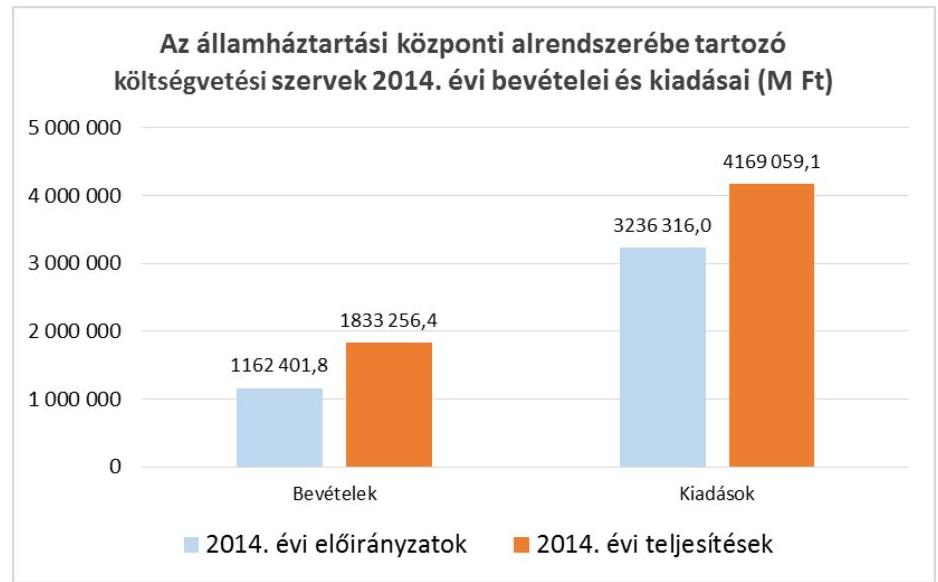

Forrás: Zárszámadási törvényjavaslat
Az államháztartás központi alrendszerébe tartozó költségvetési szervek bevételeinek törvényi módosított előirányzata 1 162 401,8 M Ft volt, amelyet 57,7%-kal haladt meg a teljesítés (1 833 256,4 M Ft). Az intézmények kiadásainak 3 236 316,0 M Ft-os törvényi módosított előirányzata 4 169 059,1 M Ft-ra teljesült, ami az előirányzatnál 28,8%-kal magasabb.
Fő megállapítás: Az OGY felé beszámolásra kötelezett intézmények a bevételi és kiadási előirányzataik teljesítése során - a KH és a NAIH kivételével - betartották a jogszabályok és a belső szabályzatok előírásait. Az intézmények teljesített bevételi és kiadási adatai - a KH kivételével - megbízhatóak.
Az ellenőrzés megállapította, hogy az NVI, a NÉBIH, a GVH, a KSH, az MTA Igazgatása és az MMA Titkárság Igazgatása bevételi és kiadási adatai megbízhatóak.
Az ellenőrzés a KH-nál, a NAIH-nál és az MTA Igazgatásnál tárt fel megbízhatósági hibákat.
A KH a bírói letét összegét végleges kiadásként számolta el, amely nem felelt meg az Áhsz. és az Áht. előírásainak. A feltárt hibák alapján a KH bevételi és kiadási adatainak összességében előforduló megbízhatósági hibák összértéke

---
 kiadások elszámolásához kötődtek. A feltárt hibák alapján a NAIH bevételi és kiadási adatainak összességében előforduló megbízhatósági hibák összértéke meghaladta a lényegességi szintet. A hibák egy része tekintetében az ellenőrzés megállapította, hogy az érintett kiadások valósak voltak, és bár azok elszámolása nem a megfelelő soron történt, minden más tekintetében megfeleltek a jogszabályi előírásoknak, így ezek a hibák a beszámoló bevételi és kiadási főösszegének megbízhatóságát nem befolyásolják.
Az MTA Igazgatásának bevételei esetében a külföldi kiküldetések elszámolásával összefüggésben tárt fel az ellenőrzés megbízhatósági hibát. A feltárt hibák alapján az MTA Igazgatása bevételi és kiadási adatainak összességében előforduló megbízhatósági hibák összértéke nem éri el a lényegességi szintet.
Az OGY felé beszámolásra kötelezett intézmények belső kontrollrendszerének kialakítása és működtetése megfelelt az Áht. és a Bkr. előírásainak. Öt intézmény belső kontrollrendszere megfelelő, három intézmény (KH, NVI, MTA Igazgatás) részben megfelelő minősítést kapott. A bevételeknél és a kiadásoknál feltárt szabályszerűségi hibák jellemzően a gazdálkodási jogkörök gyakorlásához kapcsolódtak és a NAIH-ot, a GVH-t, a KSH-t és az MTA Igazgatását érintették.
Az éves költségvetési beszámoló költségvetési számvitellel készült beszámolórészeinek összeállításának ellenőrzése során megállapítottuk, hogy a NAIH, az NVI, a NÉBIH, a GVH, a KSH, az MTA Igazgatása, az MMA Titkárság Igazgatása költségvetési számvitellel készített beszámolórészeinek összeállítása összességében szabályszerűen történt, a vonatkozó jogszabályi és belső szabályozási rendelkezések előírásainak betartásával, ezért azokat megfelelőnek minősítettük.
A KH költségvetési számvitellel készített beszámolórészeinek összeállítása részben valósult meg szabályszerűen, a vonatkozó jogszabályi és belső szabályozási rendelkezések előírásait részben tartották be, ezért azokat összességében nem megfelelőnek minősítettük.
Fő megállapítás: Az alkotmányos fejezetek intézményei a bevételi és kiadási előirányzataik teljesítése során betartották a jogszabályok és a belső szabályzatok előírásait. Az intézmények teljesített bevételi és kiadási adatai megbízhatóak.
Az alkotmányos fejezetek intézményeinek ellenőrzése során a bevételeknél nem állapítottunk meg megbízhatósági hibát, a bevételi adatok megbízhatóak. A kiadásoknál négy intézmény esetében (AJBH, Bíróságok cím két intézménye, Ügyészségek) tártunk fel megbízhatósági hibát. Az AJBH-nál és a Bíróságok két intézményénél elmulasztották a közbeszerzési eljárás lefolytatását. A Közbeszerzési Döntőbizottság a Budapest Környéki Tsz esetében a jogsértést megállapította. Az Ügyészségeknél a költségelszámolás, a Bíróságok két intézményénél a közbeszerzési eljárások dokumentálása, a gazdasági események alátámasztása, illetve a szerződések területén tártunk fel hiányosságokat. Az ellenőrzés megállapította, hogy az alkotmányos fejezetek kiadásainál feltárt hiányosságok mellett a kiadási adatok nem tartalmaznak lényeges hibát, ezért a kiadási adatok megbízhatóak.

---

Az alkotmányos fejezetek intézményei kontrollkörnyezetének kialakítása és működtetése öt intézmény (OGYH, KEH, AB, AJBH, Ügyészségek) esetében megfelelő volt. A Bíróságok fejezet intézményei közül egy megfelelő, 19 intézmény részben megfelelő minősítést kapott, hét intézmény (Tsz) kontrollkörnyezete nem felelt meg a Bkr. előírásainak. A feltárt hiányosságok jellemzően a számviteli szabályzatok aktualizálásának elmaradásához kapcsolódtak. Az ellenőrzés hét intézmény (KEH, Debreceni Tsz, Székesfehérvári Tsz, Fővárosi Tsz, Miskolci Tsz, Pécsi Tsz és Kúria) esetében tárt fel szabályszerűségi hibákat, amelyek a jogszabályok és belső szabályozások előírásainak be nem tartását, valamint a gazdálkodási jogkörök gyakorlását érintették.
Az alkotmányos fejezetek intézményei a 2014. évi éves költségvetési beszámolókat - az annak részét képező költségvetési számvitellel készült költségvetési jelentéseket és maradvány-kimutatásokat - a jogszabályi előírásoknak megfelelően állították össze és küldték meg jóváhagyásra az irányító szervnek. A költségvetési jelentések adott űrlapjai - az AJBH kivételével - biztosították a kötelező egyezőségeket a megfelelő nyilvántartási ellenszámlákkal. Az AJBH beszámolójában kimutatott előző évi maradvány igénybevételének összegét a főkönyvi kivonat vonatkozó adatai nem támasztották alá, amellyel megsértette az Áhsz. előírásait.
Fő megállapítás: A központi alrendszer egyéb intézményei a bevételi és kiadási előirányzataik teljesítése során betartották a jogszabályi és a belső szabályzatok előírásait. Az intézmények teljesített bevételi és kiadási adatai megbízhatóak.
A központi alrendszer egyéb intézményeinek ellenőrzése a bevételek és a kiadások tekintetében is tárt fel megbízhatósági hibát. A bevételeknél a NIH, az NFSZ, az NFMIg és a CSMEEK esetében megállapított hibák a számviteli bizonylatok hiányához kapcsolódtak. A kiadásoknál az FMKMAK, a KMESZIK, az MHEK, a NAV KEKI, és a DorogiSZB tekintetében feltárt hibákat a közbeszerzési eljárás lefolytatásának elmulasztása okozta. A Közbeszerzési Döntőbizottság az FMKMAK, a KMESZIK és a DorogiSZB intézmények esetében a jogsértést megállapította. Az NKE, a Baross, az NFSZ, a KGI, az NFMIg, a CSMEEK és az OE intézményeknél feltárt hibákat a számviteli bizonylatok hiánya vagy nem megfelelősége jelentette. A Baross, a CSMEEK és az SZGYF-hez tartozó intézmények tekintetében feltárt hibákat a gazdálkodási jogkörök nem megfelelő gyakorlása okozta. A központi alrendszer egyéb intézményeinek ellenőrzése megállapította, hogy a feltárt hiányosságok mellett a bevételi és a kiadási adatok nem tartalmaznak lényeges hibát, így a teljesített bevételi és kiadási adatok megbízhatóak.
Az egyéb intézmények közül 38 szervezet kontrollkörnyezete megfelelő, 21 költségvetési szerv részben megfelelő, 9 intézmény nem megfelelő minősítést kapott. A részben, illetve nem megfelelő minősítést az SZMSZ-szel kapcsolatos hiányosságok, illetve a számviteli szabályzatok aktualizálásának elmaradása okozták.
Az ellenőrzés a bevételeket és a kiadásokat érintően szabályszerűségi hibát 39 intézménynél állapított meg, amelyek jellemzően a gazdálkodási jogkörök gyakorlásához kapcsolódtak (MEKH, NKE, NIH, Baross, FMKMAK, Veres, KDKTF, NFSZ, MHEK, KGI, HMKI, EDUVIZIG, NYDUVIZIG, EUTAF, NFMIg, KSZSZK, Kornis, ZMSZI, MIO, Kékmadár, SZSZBMGYK, FGYO, TOFORI, VSO,

---

A 2014. évi éves költségvetési beszámolót - ezen belül a költségvetési számvitellel készült költségvetési jelentést és a maradvány-kimutatást - 58 intézmény a jogszabályi előírásoknak megfelelően készítette el és küldte meg jóváhagyásra az irányító szervnek, a Bkr.-ben előírt vezetői nyilatkozattal együtt. A helyszíni ellenőrzés lezárásáig nyolc intézmény (NK, KDKTF, ZMSZI, Kékmadár, SZSZBMGYK, ZMPBO, VMSZSZI, TT) az éves költségvetési beszámolóját jogszabályoknak részben megfelelően, két intézmény pedig nem készítette el (KGK, CSMEEK).
Budapest, 2015. augusztus 28. nap

Melléklet: $\quad 8 \mathrm{db}$
Függelék: $\quad 2 \mathrm{db}$
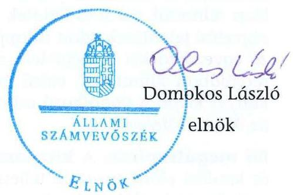

---

# Részletes megállapítások ellenőrzési területenként 

I. KÖZPONTI KEZELÉSŰ ELŐIRÁNYZATOK, AZ ÁLLAMI VAGYONNAL KAPCSOLATOS BEVÉTELEK ÉS KIADÁSOK ..... 3

1. A KÖLTSÉGVETÉS KÖZVETLEN BEVÉTELEI ..... 3
2. HELYI ÖNKORMÁNYZATOK TÁMOGATÁSA, TELEPÜLÉSI ÉS TERÜLETI NEMZETISÉGI ÖNKORMÁNYZATOK TÁMOGATÁSA ..... 4
3. AZ ADÓSSÁGSZOLGÁLATTAL KAPCSOLATOS BEVÉTELEK ÉS KIADÁSOK, A NYUGDÍJREFORM ÉS ADÓSSÁGCSÖKKENTŐ ALAP ..... 6
4. A KÖZPONTI KÖLTSÉGVETÉS TERHÉRE VÁLLALT ÁLLAMI KEZESSÉGEK, GARANCIÁK ÉS VISZONTGARANCIÁK ..... 8
5. NEMZETI CSALÁD- ÉS SZOCIÁLPOLITIKAI ALAP KIADÁSAI ..... 9
6. AZ ÁLLAMI VAGYONNAL ÉS NEMZETI FÖLDALAPPAL KAPCSOLATOS BEVÉTELEK ÉS KIADÁSOK ..... 10
7. A KÖLTSÉGVETÉS KÖZVETLEN KIADÁSI ELŐIRÁNYZATAI ..... 13
8. A KÖZPONTI KÖLTSÉGVETÉS KÖZPONTI TARTALÉKAI ..... 15
II. TÁRSADALOMBIZTOSÍTÁS PÉNZÜGYI ALAPJAI ..... 18
III. ELKÜLÖNÍTETT ÁLLAMI PÉNZALAPOK ..... 23
IV. EURÓPAI UNIÓS TÁMOGATÁSOK ÉS AZ EURÓPAI UNIÓS TAGSÁGGAL ÖSSZEFÜGGŐ HAZAI BEFIZETÉSEK ..... 28
V. SZAKMAI FEJEZETI KEZELÉSŰ ELŐIRÁNYZATOK ..... 31
VI. INTÉZMÉNYEK ..... 36
9. AZ ORSZÁGGYŰLÉS FELÉ BESZÁMOLÁSRA KÖTELEZETT INTÉZMÉNYEK ..... 36

---

1. SZÁMÚ MELLÉKLET
A V-0782-11459/2015. SZ. JELENTÉSHEZ
2. ALKOTMÁNYOS FEJEZETEK INTÉZMÉNYEI ..... 42
3. KÖZPONTI ALRENDSZER EGYÉB INTÉZMÉNYEI ..... 45

---

A Jelentéstervezet jelen melléklete a V-0782-006/2015. ikt. számú ellenőrzési program alapján az ellenőrzés részletes megállapításait tartalmazza ellenőrzött területenként.

# I. KÖZPONTI KEZELÉSŰ ELŐIRÁNYZATOK, AZ ÁLLAMI VAGYONNAL KAPCSOLATOS BEVÉTELEK ÉS KIADÁSOK 

## 1. A KÖLTSÉGVETÉS KÖZVETLEN BEVÉTELEI

Az ellenőrzött terület: XLII. A költségvetés közvetlen bevételei és kiadásai fejezet 1. Vállalkozások költségvetési befizetései, 2. Fogyasztáshoz kapcsolt adók, 3. Lakosság költségvetési befizetései, 4. Egyéb költségvetési bevételek, 5. Költségvetési befizetések és 7. Egyéb uniós bevételek címek előirányzatai

Az ellenőrzés megbízhatósági hibát nem tárt fel.
A költségvetés közvetlen bevételeinek elszámolása a jogszabályi előírásoknak megfelelt. A közvetlen bevételek körében végzett folyamatkövetéses tesztek alátámasztották, hogy az adó- és a központosított bevételek elszámolása során a NAV, illetve a bevételek beszedésére jogosult szervezetek betartották az Art. és a bevételeket beszedő szervezetekre vonatkozó jogszabályokban és a szervezetek belső eljárásrendjeiben foglalt előírásokat. A folyamatba épített kontrollok megfelelően működtek, amelyek biztosították az adóbevallások szabályszerű és országosan egységes feldolgozásának, az adó és központosított bevételek elszámolásának és nyilvántartásának megbízhatóságát.

A 2014. évi költségvetési tervezés alapját képező makropálya 2014. évben 2,0%-os GDP növekedés feltételezésével készült. Ezzel szemben a magyar gazdaság 2013. év második felétől beindult növekedése folytatódott és a GDP 2014. évi 3,6%-os növekedéséhez szinte minden ágazat hozzájárult. Ennek megfelelően a központi költségvetés bevételeit meghatározó Tao, Áfa és Szja adónemek, valamint a kisebb adónemek többségének bevételei a makrogazdasági és a költségvetési folyamatokkal összhangban, az előirányzatot meghaladó mértékben teljesültek. Az Szja bevételek előirányzatot meghaladó teljesülése a GDP, valamint a bértömeg 7,7%-os, illetve a keresettömeg növekedésével összhangban következett be. A központi költségvetés 2014. évi bevételi főösszegének 61,9%-át képező adó- és adójellegű bevételek az előirányzott 7368,5 Mrd Ft-ot 29,6 Mrd Ft-tal teljesítették túl. A teljesült bevétel részét képe-

---

zik 279,5 Mrd Ft összeggel a NAV adóhatósági beavatkozásból - behajtásból, adóhatósági visszatartásból, szankcionálásból - származó bevételek is.

A Számvevőszék a 2014. évi költségvetési törvényjavaslat véleményezésekor az adó- és adójellegű bevételek és a központosított bevételek előirányzatai összegének 53%-át a számításokkal való alátámasztottság és a teljesíthetőség alapján megalapozottnak, míg 47%-át részben megalapozottnak minősítette. A részben megalapozott előirányzatok teljesíthetőségére vonatkozóan a Számvevőszék által jelzett kockázatok beigazolódtak, mivel az érintett KATA, KIVA alulteljesült. Az előirányzat alulteljesülését többek között a két adónemre áttérők számának tervezettől való elmaradása okozta, amely egyúttal a kiváltani tervezett adónemekből származó bevételek felülteljesüléséhez vezetett. A KATA és a KIVA bevétel alulteljesülése más adóbevételi sorokon (pl.: Tao, EVA) többletbevételt eredményezett. Az Áfa bevétel 0,7%-kal teljesült túl annak ellenére, hogy az infláció alulteljesülése - a folyóáras vásárolt fogyasztáson keresztül az áfa bevétel alulteljesülését indokolta volna. Az online pénztárgépek bekötésének tervezettnél nagyobb gazdaságfehérítő hatása azonban összességében az adónemen a bevétel túlteljesülését eredményezte. A pénzügyi tranzakciós illeték 3,2%-os túlteljesülését a Kincstár adókötelezettségének tervezettnél magasabb alakulása indokolta.

# 2. Helyi önkormányzatok támogatása, Települési és területi nemzetiségi önkormányzatok támogatása 

| Kiadási főösszeg: | A kiadások nem | A kiadások teljesítése |
| :--: | :--: | :--: |
| 793 914,1 M Ft | tartalmaznak lényeges hibát. | megfelel a jogszabályi előírásoknak. |

Az ellenőrzött terület: IX. Helyi önkormányzatok támogatásai, XX. EMMI fejezet 22. Települési és területi nemzetiségi önkormányzatok támogatása cím, XLII. A költségvetés közvetlen bevételei és kiadásai fejezet 38. A települési önkormányzatok adósságkonszolidációjához kapcsolódó állami támogatások cím

Az ellenőrzés megbízhatósági hibát tárt fel. A Helyi önkormányzatok támogatásai előirányzatból és a Települési és területi nemzetiségi önkormányzatok támogatása előirányzatból történő utalások esetében nem történt meg a támogatási szerződés Áht. 37. § (1) bekezdése és Ávr. 55. § (1) bekezdése szerint szükséges pénzügyi ellenjegyzése, hiányzott az Áht. 48. § (2) bekezdésében meghatározott támogatási szerződés, illetve a 428/2012. (XII. 29.) Korm. rendelet 14. § (1) bekezdésében előírtak ellenére nem valósult meg a támogatás cél szerinti felhasználásának ellenőrzése. Az ellenőrzés megállapította, hogy az adatokban előforduló megbízhatósági hibák összértéke nem haladja meg
 a lényegességi szintet.

A IX. Helyi önkormányzatok támogatásai fejezet előirányzatainak, valamint a XX. EMMI 22. Települési és területi nemzetiségi önkormányzatok cím támogatása előirányzat teljesítése megfelelt a jogszabályi előírásoknak.

---

Az ellenőrzés az előirányzatok terhére történő kiutalásoknál tárt fel a gazdálkodási jogkörök gyakorlásához kapcsolódóan szabályszerűségi hibákat. A Helyi önkormányzatok támogatási fejezet előirányzatainak teljesítésekor a BM által végrehajtott utalványozás során az Áht. 38. § (1) bekezdésében és az Ávr. 57. § (1) bekezdésében előírtak ellenére az utalványozást és az érvényesítést megelőzően nem került sor teljesítésigazolásra. A BM által előkészített, pályázati úton nyújtott Lakossági víz- és csatornaszolgáltatás támogatása, az Adósságkonszolidációban részt nem vett települési önkormányzatok fejlesztéseinek támogatása és az Önkormányzati fejezeti tartalék terhére nyújtott támogatások körében a döntési listák - mint elsődleges kötelezettségvállalások - az Áht. 37. § (1) bekezdésében és az Ávr. 55. § (1) bekezdésében előírtak ellenére a támogató pénzügyi ellenjegyzését nem tartalmazták.

A 2014. évben megszűnt települési és területi nemzetiségi önkormányzatok számára, az időarányos támogatást visszafizető nemzetiségi önkormányzatok számára, a visszafizetések összegére vonatkozóan a támogató és a Kincstár analitikus nyilvántartásai eltérő adatokat tartalmaztak, ezáltal az Áht. 53. § (2) bekezdése és a 428/2012. (XII. 29.) Korm. rendelet 1. § (3) bekezdése szerint visszafizetendő, de még vissza nem fizetett támogatások nagyságrendje nem volt megállapítható.

A települési önkormányzatokat és azok társulásait érintő 2014. évi adósságátvállalások szabályszerűen, a Kvtv. előírásainak megfelelően történtek. A 2014. évben az állam a Kvtv. alapján a települési önkormányzatok és azok társulásai 2013. december 31-én fennálló összegű adósságelemeit és ezen adósságelemek járulékai összegét átvállalta. A 200,0 M Ft összeghatár alatti ügyletek egyszeri, törlesztési célú költségvetési támogatás nyújtásával megvalósult adósságkonszolidációjának fedezetét a Kvtv. XLII. A költségvetés közvetlen bevételei és kiadásai fejezet 38. A települési önkormányzatok adósságkonszolidációjához kapcsolódó állami támogatások cím 64000,0 M Ft-os, felülről nyitott előirányzata biztosította. A támogatások hitelezők részére történő kiutalása a Kvtv.-ben előírtakkal összhangban, összesen 68 753,9 M Ft összegben (a törvényi módosított előirányzat 107,4%-ában) történt meg. A 200,0 M Ft összeghatár feletti ügyletek esetében a Kvtv. alapján kötött megállapodások szerint a 2014. évben az ÁKK részéről 401 479,5 M Ft összegű önkormányzati adósságállomány átvállalására került sor, amely államháztartási szinten nem emelte az államadósságot.

A helyi önkormányzatok gazdálkodásához a központi költségvetés a 2014. évben a IX. Helyi önkormányzatok támogatásai fejezetben 715 854,9 M Ft kiadási előirányzatot biztosított. Az előirányzat módosítások következtében a 2014. évi eredeti előirányzat 8089,0 M Ft-tal, (1,1%-kal) növekedett, így a módosított előirányzat 723 943,9 M Ft volt. A végrehajtott előirányzat-módosítások - az Önkormányzati fejezeti tartalék kivételével - megfeleltek az előírásoknak. A Kincstár a helyi önkormányzatok előző évi elszámolásai alapján az általuk visszafizetett összeggel (9690,5 M Ft) megnövelte az Önkormányzati fejezeti tartalék előirányzatát. A 2014. évi teljesítés a módosított előirányzat 100,0%-a (723 640,9 M Ft) volt, amely 48 832,5 M Ft-tal (7,2%-kal) meghaladta az előző évit. A támogatások igénylése és folyósítása a jogszabályok és a felhasználható forrásokra vonatkozó speciális előírások alapján történt.

---

A Kvtv. a XX. EMMI fejezet 22. Települési és területi nemzetiségi önkormányzatok támogatása címen 1520,0 M Ft eredeti kiadási előirányzatot tartalmazott, amely év közben nem módosult. Az előirányzat-felhasználás 1519,3 M Ft volt. A kiutalandó támogatások összegének meghatározására a Kvtv. előírásaival és a kötelezettségvállalást megalapozó dokumentumokkal összhangban került sor. Megvalósultak a költségvetési támogatások igénybevételének jogszabályban előírt feltételei. A települési és területi nemzetiségi önkormányzatok támogatásából a 2014. év elején működők számára 506,0 M Ft-ot működési költségvetési támogatásra, 1013,7 M Ft-ot feladatalapú költségvetési támogatásra folyósítottak. A 2014. évi választások során újonnan alakult települési és területi nemzetiségi önkormányzatok számára az időarányos működési költségvetési támogatás fedezetének biztosítása megtörtént, a teljes körű kiutalás azonban a törzskönyvi nyilvántartásba vétel, illetve a fizetési számlanyitás késedelmessége miatt nem történt meg. A 2014. december 31-ig ki nem utalt támogatás összege 3,0 M Ft volt.

# 3. Az adósságszolgálattal kapcsolatos bevételek és kiadások, a Nyugdíjreform és Adósságcsökkentő Alap 

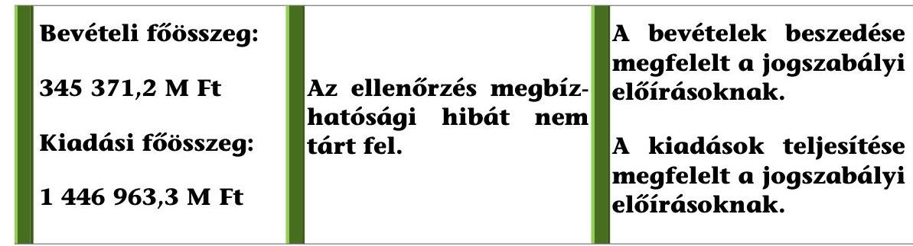

Az ellenőrzött terület: XLI. fejezet Az Adósságszolgálattal kapcsolatos bevételek és kiadások fejezet az Adósság-átvállalásokkal együtt; XLII. fejezet A költségvetés közvetlen bevételei és kiadásai 8. Tőkekövetelések visszatérülése és 41. Követeléskezelés költségei címek; a központi költségvetés finanszírozása (KESZ); Nyugdíjreform és az Adósságcsökkentő Alap

Az ellenőrzés megbízhatósági hibát nem tárt fel. A központi költségvetés kamatelszámolásainak és az adósság költségeinek ellenőrzése alapján megállapítottuk, hogy az adósságszolgálattal kapcsolatos elszámolások megbízhatóak voltak, a bizonylatok alátámasztottsága megfelelt az Áhsz. 15. melléklete előírásainak.

Az adósságszolgálattal kapcsolatos bevételek és kiadások, valamint a NYRA eszközeinek kezelése szabályszerűen történt.

Az ÁKK Zrt. a jogszabályi előírásoknak megfelelően eleget tett a Kincstár könyvvezetéséhez és beszámolási kötelezettségéhez kapcsolódó adatszolgáltatási és beszámolási kötelezettségének (Áht. 88. §, Ávr. 156. §).

---

Az ÁKK Zrt. a NYRA működtetésével kapcsolatos feladatait a jogszabályi előírásoknak megfelelően látta el. (A NYRA 2015. január 31-i hatállyal történő megszüntetésével kapcsolatos feladatait az ÁKK Zrt. a jogszabályi előírásoknak megfelelően határidőben teljesítette.)

A KESZ és a letéti számlák kezelése - a gyorsforgalmi úthálózat Áfa-megelőlegezési számla kezelésének kivételével - szabályszerűen történt.

A KESZ likviditása 2014-ben biztosított volt, az év végi záró állománya a finanszírozási tervtől eltérően alakult, az eltérést az ÁKK Zrt. indokolta. A KESZ állomány a minimális szintet négy nap kivételével elérte. A Kincstár és az ÁKK Zrt. közötti megállapodás alapján a Kincstár az ÁKK Zrt. adósságkezeléssel összefüggő, a KESZ egyenlegére vonatkozó előrejelzéseket az Áht. rendelkezésének megfelelően elkészítette, a likviditás kezelésében az ÁKK Zrt.-vel együttműködött. A Kincstár által a KESZ terhére díj és kamat felszámítása nélkül teljesíthető megelőlegezés szabályait az Áht. 78. § (4)-(5) bekezdése és az Ávr. 123. §-a határozta meg, a megelőlegezés 2014. év végén összesen 348,4 Mrd Ft volt.

A MÁV Zrt.-t érintő 2014. évi adósságátvállalás, a tőkekövetelések visszatérülése, a követeléskezelés költségei megfeleltek a jogszabályi előírásoknak.

A MÁV Zrt. adósságának a magyar állam által történő átvállalásáról az OGY az Áht. 12. § (3) bekezdésének megfelelően a Kvtv. 75. § (1) bekezdésében döntött, amelynek értelmében a magyar állam legkésőbb 2014. augusztus 31-i hatállyal ellenérték nélkül átvállalja a MÁV Zrt. által 2011. szeptember 7-én kibocsátott 35000,0 M Ft tőkeösszegű pályavasúti tevékenység működtetéséhez szükséges kötvénytartozást és annak járulékait. Az állam által nyújtott hitelek visszatérülése összhangban volt a hatályos törlesztési megállapodásokkal és az Áht. követeléskezelésre vonatkozó előírásaival.

A központi alrendszer adósságának összetétele 2013. évről 2014. évre jelentősen javult. A teljes adósságon belül a devizaadósság részaránya 3 százalékponttal csökkent, míg a forintadósságé 2,2 százalékponttal és az egyéb kötelezettségeké 0,8 százalékponttal nőtt.

Az adósságszolgálattal kapcsolatos kiadások 1446 963,3 M Ft-os összege a 2014. évi előirányzatot 15,9%-kal haladta meg, ami főként a tervezettnél nagyobb összegű államkötvények kibocsátására vezethető vissza. A 2014. évi teljesített kamatbevételek 242,8 Mrd Ft-tal haladták meg az előirányzatot, ezen belül a forintkövetelések kamatbevétele dominált, a többletből 241,1 Mrd Ft-ot képviselt, ami döntően az államkötvények aukciós értékesítésekor keletkező csereügyletekkel állt összefüggésben. A kamatkiadások és a kamatbevételek növekedéséhez egyaránt hozzájárultak a kötvénycsere ügyletek mintegy 800,0 Mrd Ft nagyságrendben, ami az előző évekhez képest négyszeres növekedést jelentett, valamint a KESZ magas állománya, amely az év során szinte folyamatosan 2000,0 Mrd Ft körül mozgott.

---

# 4. A központi költségvetés terhére vállalt állami kezességek, garanciák és viszontgaranciák 

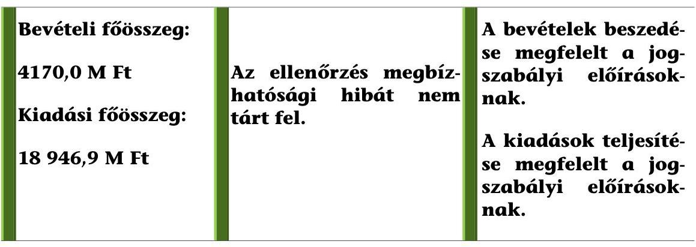

Az ellenőrzött terület: A központi költségvetés terhére vállalt állami kezességek, garanciák, viszontgaranciák beváltása és megtérülése az NGM-nél, a NAV-nál, az MFB-nél, az EXIMBANK Zrt.-nél, MEHIB Zrt.-nél, GHG Zrt.-nél, AVHGA-nál, a KAVOSZ VF Zrt.-nél, a DK Zrt.-nél és a Kincstárnál

Az ellenőrzés megbízhatósági hibát nem tárt fel.
A 2014. évben a központi költségvetés terhére vállalt állami kezességek, garanciák és viszontgaranciák beváltása és megtérülése a Kvtv., az Áhsz., az Áht. Szám. tv. és az egyes alcímeknél alkalmazandó speciális jogszabályok előírásainak megfelelt.

A kezesség-, a garancia és viszontgarancia állományok felső határára vonatkozó, a Kvtv. 38-43. § és 45. §-ában meghatározott előírásokat a garantőr szervezetek betartották.

Az állam által vállalt kezességekről, garanciákról, viszontgaranciákról és kapcsolódó hitelekről a garantőr szervezetek (analitikus nyilvántartó helyek) által vezetett nyilvántartások megfeleltek a Számv. tv. 160. §-ában, illetve az Áhsz. 40. § (1) bekezdésében és 15. mellékletében foglalt előírásoknak.

A garantőr szervezetek által a kezesség, garancia és viszontgarancia állományokról, a beváltásokról és megtérülésekről vezetett analitikus nyilvántartások a Kincstár adataival és főkönyvi nyilvántartásával megegyeztek.

A Kincstár az állami kezesség és viszontgarancia beváltásokhoz, megtérülésekhez kapcsolódó kiadások és bevételek főkönyvi elszámolásai során az Áhsz. 40. § (1) bekezdésében foglaltaknak megfelelően, egységes rovatrend szerint vezette nyilvántartásait.

A garantőr szervezetek az Áhsz. 2. § (4) bekezdése és 2. melléklete szerinti adatszolgáltatási kötelezettségüknek eleget tettek, a Kincstárral a 2014. évi nyilvántartásaik egyeztetését elvégezték, az MFB Zrt. esetében az egyeztetésről írásos dokumentumok nem készültek.

---

A 2014. évben az Eximbank Zrt. és MEHIB Zrt. 20,6 M Ft-os behajtási jutalék elszámolása az Exim tv. 8/A. § (2) bekezdése előírásaival összhangban történt.

A központi költségvetés terhére vállalt állami kezességekkel, garanciákkal és viszontgaranciákkal kapcsolatos kiadásokat az Áht. 92-94. §-ai, a Kvtv. 38-46. §-ai és az alcímre vonatkozó speciális jogszabályok előírásainak megfelelően és a bennük foglalt célokkal összhangban számolták el. A kezesség és viszontgarancia megtérülések elszámolása szabályszerűen történt.

A Kincstár a kezesség és viszontgarancia érvényesítésének megtérüléséből származó költségvetési bevételként 2014. évben összességében 4170,0 M Ft-ot mutatott ki, amely a Kvtv.-ben meghatározott éves bevételi előirányzatot 7,8%-kal haladta meg. Az Állam által vállalt kezesség és viszontgarancia érvényesítésből (Kvtv. XLII. fejezet 33. cím) 2014. évben a költségvetésnek 18 946,9 M Ft kiadása keletkezett, így a 2014. évi előirányzat (32319,5 M Ft) 58,6%-ában teljesült.

# 5. Nemzeti Család- és Szociálpolitikai Alap kiadásai 

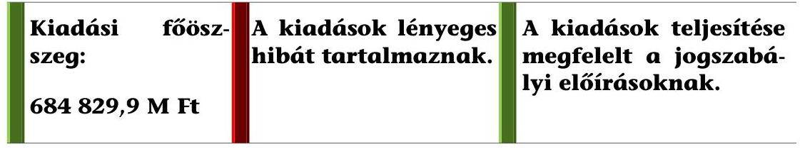

Az ellenőrzött terület: XX. EMMI fejezet Nemzeti Család- és Szociálpolitikai Alap kiadásai

Az ellenőrzés a Nemzeti Család- és Szociálpolitikai Alap kiadásainál tárt fel megbízhatósági hibát, amely meghaladja a lényegességi szintet. A Kincstár végzi a Kvtv.-ben jóváhagyott családi támogatási igények jogosultságának elbírálását és az ezzel kapcsolatos előkészítési, ellenőrzési, folyósítási feladatokat. A feltárt hibát az okozta, hogy a Ket. 71. § (1) bekezdésével ellentétben a családi pótlék jogosultságáról szóló határozatok nem minden esetben álltak rendelkezésre. Az 5/2003. (II.19.) ESzCsM rendelet 4/A. § (1) bekezdését megsértve az emelt összegű családi pótlék folyósításához szükséges orvosszakértői szerv szakvéleményével, vagy szakhatósági állásfoglalással, továbbá a Cst. 34. § (1) bekezdése előírása ellenére a családi pótlék igényelbírálásához szükséges írásbeli kérelemmel nem minden esetben rendelkeztek.

Az NCSSZA előirányzatainak terhére történő kiutalások - az alátámasztó dokumentumok alapján - szabályszerűen történtek. Az ellátások, támogatások folyósítása, a nyújtott térítések, az 5/2013. (III. 8.) NGM utasításnak,
 a Kincstár, az ONYF, az OEP hatályos belső szabályozásainak és az Áhsz.-ben meghatározott egységes rovatrendnek megfelelően, szabályszerűen történt. A támogatások igénylésében, folyósításában, illetve a kiadások utalásában részt vevő szervezetek közötti együttműködés, a feladatmegosztás és az adatfeldolgozás szabályszerű volt, nyilvántartásaik egyezőséget mutattak. A Kincstárnál az ellátások folyósításának szabályait tartalmazó eljárásrendek, a belső szabályozá-

---

sok -a Gyermekek születésével kapcsolatos szabadság megtérítése jogcímcsoporttal kapcsolatos eljárásrend kivételével - megfeleltek a vonatkozó jogszabályok előírásainak. A 2014. évben hatályos, az apákat megillető munkaidő kedvezménnyel összefüggő 14/2005. számú Elnöki Utasítást nem aktualizálták a gyermek születése esetén az apát megillető pótszabadsággal összefüggő költségek megtérítéséről szóló 420/2012. (XII.29.) Korm. rendelettel összhangban.

A 2014. évi kiadási előirányzat 714 536,0 M Ft, a kiadás teljesítése 684 829,9 M Ft, az előirányzatként nem tervezett bevétel teljesítése 1276,0 M Ft volt. A kiadási előirányzat 95,8%-ra teljesült, előirányzat módosítás nem történt. Az NCSSZA kiadási előirányzatának 4,2%-os alulteljesülését döntően a családi pótlék jogcímcsoport 10932,0 M Ft-os és a gyermekgondozási segély jogcímcsoport 8469,6 M Ft-os kiadás csökkenése eredményezte.

A családi pótlék 340 178,9 M Ft-os előirányzata 96,8%-ra, a gyermekgondozási segély 68719,7 M Ft-os előirányzata 87,7%-ra teljesült. A családi pótlék és gyermekgondozási segély előirányzat alulteljesülésének oka, az ellátás szempontjából figyelembe vett igénybevevő családok számának csökkenése volt. A családi pótlékot igénybevevő családok száma átlagosan az előző évi 1154,6 ezer főről 1138,3 ezer főre csökkent. 2014-ben a gyermekgondozási segélyt igénybe vevő családok száma az előző évihez képest átlagosan 312 fővel csökkent.

# 6. Az állami vagyonnal és Nemzeti Földalappal kapcsolatos BEVÉTELEK ÉS KIADÁSOK 

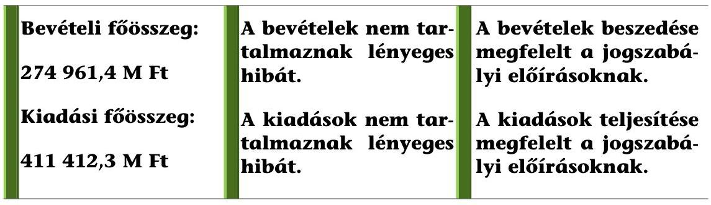

Az ellenőrzött terület: XLIII. Az állami vagyonnal és a XLIV. A Nemzeti Földalappal kapcsolatos bevételek és kiadások fejezetek

Az ellenőrzés az állami vagyonnal és az NFA-val kapcsolatos bevételek teljesítésénél tárt fel megbízhatósági hibákat, amelyek nem haladták meg a lényegességi szintet. A megbízhatósági hibák a hasznosítási bevételekhez kapcsolódó bérleti díjak, vagyonkezelői díjak, haszonbérleti díjak teljesítéséhez kapcsolódtak. Az MNV Zrt. késedelmesen számlázott bérleti díjat. Az NFA a haszonbérleti szerződéseket nem módosította a Birtokpolitikai Tanács 1/2011. (01. 18.) határozatának megfelelően, azonban a bérleti díjakat a határozat alapján számlázta.

---

Az állami vagyonnal és az NFA-val kapcsolatos bevételek és kiadások teljesítése, eredeti előirányzathoz képest történő módosításai, átcsoportosításai összhangban voltak a jogszabályi előírásokkal. A kiadások elszámolása, felhasználása szabályszerűen történt.

A XLIII. Az állami vagyonnal kapcsolatos bevételek és kiadások fejezet eredeti bevételi előirányzatait év közben nem módosították. Az állami vagyonnal kapcsolatos teljesített bevétel 2014. évben 262603,6 M Ft volt, ami 69 375,0 M Ft-tal, 35,9%-kal meghaladja az előirányzott értéket. A teljesített bevételek 75,6%-a (198 646,0 M Ft) értékesítési bevétel volt.

Az XLIII. fejezet ingatlanértékesítésből származó bevételei elmaradtak a tervezett előirányzattól. A 8000,0 M Ft összegű törvényi módosított előirányzathoz képest a bevételek 6931,4 M Ft-ra (86,7%-ra) teljesültek. Az elmaradás oka az volt, hogy nem sikerült értékesíteni a ferencvárosi stadion értékesíthető telekrészét, illetve hogy az Andrássy úti BM vendégház 2014. évi értékesítésével összefüggő pénzügyi teljesítésre 2015-ben került sor. Az egyéb eszköz értékesítéséből származó bevételek lényegesen meghaladták a tervezett összeget. 2014-ben ezen a jogcímcsoporton belül egy jelentős értékű tranzakció bevétele, a Győr-Gönyű kikötő földhasználati jogának értékesítése realizálódott.

Az értékesítési bevételekhez kapcsolódó kibocsátási egységek és légiközlekedési kibocsátási egységek értékesítése harmadik fél által történik, a jogosultságok árverését az EU több tagállamával közös aukciós platformon valósította meg, amely során az árverezés Vhr. 44-47. §-aiban előírt szabályszerűségét biztosították. A kibocsátási egységek értékesítéséből származó bevételek a törvényi módosított előirányzat (18 541,7 M Ft) 94,3%-ában teljesültek.

A tulajdonosi részesedések értékesítéséből a 2014. évben nem tervezett bevétel keletkezett. A bevétel alapvetően a Fővárosi Gázművek Zrt. tulajdoni hányadának eladásából valósult meg. A vagyonhasznosításból származó bevételek a 2014. évben 44 954,5 M Ft-ra (125,5%), nagy részben az osztalékbevételekből teljesültek. A bérleti díjak 653,6 M Ft-os törvényi módosított előirányzatához képest 1978,2 M Ft-on (302,7%) teljesültek, a különbözet egy része a költségvetési szervek felé továbbszámlázott üzemeltetési kiadás volt.

A XLIII. fejezeten belül a vagyonkezelői díj 1548,0 M Ft-os előirányzata 2914,3 M Ft-on, 188,3%-on realizálódott. A vagyonkezelői díjak az érvényes szerződések alapján kerültek beállításra a Kvtv.-be. A teljesített bevételek a HungaroControl Zrt.-től, a BA Zrt.-től, a regionális vízmű társaságoktól és egyéb vagyonkezelői díjakból származnak. Az osztalékbevétel 28 580,0 M Ft-os előirányzata 35637,3 M Ft-on, 124,7%-on teljesült. A törvényi módosított előirányzatot jelentősen meghaladó teljesítés elsősorban a MOL részvényekből származó osztaléknak köszönhető. A koncessziós díjak 5355,3 M Ft-os bevételi előirányzata 4424,7 M Ft-on, 82,6%-on teljesült. A jogcímcsoporthoz a szerencsejáték koncessziós díj, infrastruktúra koncessziókból származó díj, bányakoncessziós díj és a dohánytermékek kiskereskedelmének koncessziós díja tartozott. Az infrastruktúra koncessziók törvényi módosított bevételi előirányzata 988,8 M Ft, a teljesítése 273,7 M Ft volt (27,7%).

---

A XLIV. A Nemzeti Földalappal kapcsolatos bevételek és kiadások fejezet bevételi előirányzatait év közben nem módosították. A NFA-val kapcsolatos teljesített bevétel 2014. évben 12357,8 M Ft volt, ami 4326,2 M Ft-tal (25,9%) volt kevesebb a törvényi módosított előirányzatnál. Az elmaradást az értékesítési bevételek elmaradása és az alulteljesült egyéb bevételek okozták. A fejezet összes teljesített bevételén belül az értékesítési bevételek aránya 7,4%, a hasznosítási bevételeké 88,3%, az egyéb bevételeké 4,3% volt.

A XLIV. fejezet esetében az ingatlanértékesítésből származó bevételek jelentős mértékben elmaradtak a 8484,0 M Ft összegű törvényi módosított előirányzattól, 910,3 M Ft-ra (10,7%) teljesültek. Az elmaradás oka, hogy az ellenőrzött időszakban nagyobb hangsúlyt kapott az értékesítéssel szemben a hasznosítatlan termőföldek haszonbérletbe adása. A hasznosítási bevételek a 2014. évben 10 917,4 M Ft-ra, 143,6%-ra teljesültek, a haszonbérleti díjbevételekből, megbízási díjbevételekből és vagyonkezelési díjbevételekből származtak.

Az állami vagyonnal kapcsolatos kiadások előirányzatainak teljesítése, illetve felhasználása megfelelt a jogszabályi előírásoknak. Az MNV Zrt.-t érintően 45 alkalommal módosították az előirányzatot (a Kvtv. módosításai, a Kormány határozatai és az NFM miniszter engedélyei alapján), az NFA esetében hat alkalommal került sor előirányzat módosításra.

A XLIII. Az állami vagyonnal kapcsolatos bevételek és kiadások fejezettel összefüggésben a teljesített kiadások összege 2014. évben 394 248,9 M Ft volt, ami 58 523,5 M Ft-tal meghaladja a törvényi módosított előirányzat értékét.

A hasznosítással kapcsolatos kiadásokon belül az ingatlanok fenntartása jogcím jellemzően az MNV Zrt. közvetlen kezelésében lévő ingatlanok fenntartásához köthető, a szerződéskötésre és teljesítésre szabályszerűen került sor. Az állami tulajdonú társaságok támogatása jogcímhez kapcsolódóan, az MNV Zrt. tulajdonosi joggyakorlásával kapcsolatos kifizetések kiadási soron megvalósult a regionális vízi közmű társaságok, az MNV Zrt. és az MFB Zrt. működésének, valamint a Magyar Nemzeti Filmalap Zrt. támogatása, amelyek a rendelkezésre bocsátott dokumentumok alapján szabályszerűen történtek. Az állami tulajdonú ingatlanvagyon és földvagyon felmérésére teljesített kiadások döntéssel, szerződéssel, alátámasztottak voltak, mind az MNV Zrt.-nél, mind az NFA-nál. A kifizetéseket teljesítésigazolással alátámasztották, azonban az eredményeknek megfelelő föld és ingatlan vagyonjogi rendezés az ellenőrzés idején még folyamatban volt.

A felhalmozási jellegű kiadások 275 288,4 M Ft összegű törvényi módosított előirányzatának teljesítése 323 188,9 M Ft volt. A hasznosítással kapcsolatos folyó kiadások törvényi módosított előirányzata 16563,0 M Ft volt, ami 27072,7 M Ft-ra teljesült. Az ingatlanok fenntartásával járó kiadások 7537,0 M Ft összegű törvényi módosított előirányzatának teljesítése 4901,9 M Ft volt. Az MNV Zrt. több feladatához (pl. ingatlanok vásárlás, állami ingatlanon történő beruházás) kapcsolódó Áfa elszámolásoknál az Áfa törvény 142. § szerinti fordított adózás szabályait alkalmazzák. E tranzakciók éves mértéke és vonzata nehezen tervezhető, épp ezért a Kvtv. 5. számú mellékletének alapján a Vagyonfejezet Áfa elszámolásának teljesítése szabályozás nélkül is eltérhet az előirányzattól. Az 1000,0 M Ft összegű törvényi módosított előirány-

---

zat 6130,4 M Ft-ban teljesült, amelynek oka, hogy az egyéb vagyonkezelőktől térítés nélkül átvett eszközök esetében is keletkezik fordított Áfa fizetési kötelezettség.

A XLIV. Nemzeti Földalappal kapcsolatos bevételek és kiadások fejezettel kapcsolatos kiadások 20574,0 M Ft összegű törvényi módosított előirányzatának teljesítése 17163,4 M Ft volt.

# 7. A KÖLTSÉGVETÉS KÖZVETLEN KIADÁSI ELŐIRÁNYZATAI 

## Kiadási főösszeg: 1693033,7 M Ft   Az ellenőrzés nem tárt fel megbízhatósági hibát.   A kiadások teljesítése megfelelt a jogszabályi előírásoknak.

Az ellenőrzött terület: I. fejezet 8. Pártok támogatása cím, 9. Pártalapítványok támogatása cím, 11. Közszolgálati médiaszolgáltatás támogatása cím, XIV. fejezet 21. K-600 hírrendszer cím, XVII. NFM fejezet 21. Vállalkozások folyó támogatása cím, 25. Peres ügyek cím, XLII. A költségvetés közvetlen bevételei és kiadásai fejezet 28. Diákhitel 2 konstrukció kamattámogatása cím, 29. Lakástámogatások cím, 30. Vállalkozások folyó támogatása cím, 31. Szociálpolitikai menetdíj támogatása cím, 32. Egyéb költségvetési kiadások cím, 34. Kormányzati rendkívüli kiadások cím, 35. Garancia és hozzájárulás a társadalombiztosítási ellátásokhoz cím, 36. Nemzetközi elszámolások kiadásai cím, 37. Hozzájárulás az EU költségvetéséhez cím

Az ellenőrzés nem tárt fel megbízhatósági hibát.
A költségvetés közvetlen kiadásai előirányzatainak teljesítése megfelelt a jogszabályi előírásoknak. A kiadási előirányzatok terhére teljesített kiutalások megfeleltek a jogszabályi előírásoknak, a címek előirányzata terhére teljesített kiutalások jogszerűek voltak. A kiutalások a megfelelő jogcímre, a kiutalást alátámasztó dokumentumok alapján, szabályszerűen történtek. A kifizetések nyilvántartása az Áhsz. 40.§ (1) bekezdése szerint, a 15. mellékletben meghatározott egységes rovatrendnek megfelelően történt.

Az ellenőrzés a Lakástámogatások címen állapított meg szabályszerűségi hibát az 57/2012. (III. 30.) Korm. rendelet alapján végzett támogatás kiutalásához kapcsolódóan. Az NGM teljesítésigazolása nem felelt meg az Ávr. 57.§ (3) bekezdése előírásának, a teljesítésigazolásról hiányzott a teljesítés tényére történő utalás.

Az OGY fejezet Pártok támogatására és a Pártalapítványok támogatására fordítandó összegeket a Párt tv. 5.§ (4) bekezdése szerint a Kvtv. állapította meg. A Pártok támogatása cím pénzforgalmi teljesülése (2548,9 M Ft) 100%-os, a Pártalapítványok támogatása cím teljesülése (1250,8 M Ft) 99,2%-os volt a 2014. évben.

---

Az OGY fejezet 11. Közszolgálati médiaszolgáltatás támogatása címen a módosított előirányzat az eredeti előirányzat mellett tartalmazta az NMHH prémiumévek programmal kapcsolatos kiadásai alcím javára 2014. évben a X. KIM fejezettől átcsoportosított összesen 26,7 M Ft-ot, illetve az 1146/2014. (III. 18.) Korm. határozat 2. al) pontja alapján a Honvédelmi- és gazdasági felkészülés központi kiadásai jogcímről átcsoportosított 15,0 M Ft összeget is. A teljesítés (69887,7 M Ft) a törvényi módosított előirányzattól 15,0 M Ft-tal maradt el. Az elmaradás oka, hogy előirányzat átcsoportosítását követően nem került sor az összeg kiutalására.

Az NFM fejezet Vállalkozások folyó támogatása cím az előirányzat 100%-ában teljesült (267744,0 M Ft). A költségvetés közvetlen bevételei és kiadásai fejezet Vállalkozások folyó támogatása cím az előirányzat 107,2%-ában realizálódott (15892,0 M Ft), a Kvtv. 5. számú mellékletében foglaltaknak megfelelően. A túlteljesülés az Eximbank Zrt. által bevezetett új termékek megnövekedett támogatási igényével függ össze.

A költségvetés
 közvetlen bevételei és kiadásai fejezet Szociálpolitikai menetdíj támogatása cím az előirányzat 99,3%-ában realizálódott (103 243,9 M Ft).

A BM fejezet K-600 hírrendszer cím 339,8 M Ft-os módosított előirányzat 100%-ban teljesült, az előző évi teljesítéshez képest 30,7%-kal magasabban.

Az NFM fejezet Peres ügyek cím teljesülése több mint 416,8%-kal meghaladta a törvényi módosított előirányzatot ( $800,0 \mathrm{M} \mathrm{Ft}$ ), amelyet a Kvtv. 5. számú melléklete lehetővé tett. A túllépés oka, hogy az ICSID eljárásokban a kérelmek számának megnövekedése miatt szakértő bevonása vált indokolttá.

A költségvetés közvetlen bevételei és kiadásai fejezet Egyéb költségvetési kiadások cím előirányzatának teljesítése $15852,1 \mathrm{M}$ Ft. A törvényi módosított előirányzathoz viszonyított 29,2%-os elmaradás a Felszámolásokkal kapcsolatos kiadások, az 1% Szja közcélú felhasználása jogcímcsoportok teljesítésének elmaradásából, valamint a Magán- és egyéb jogi személyek kártérítése, a MEHIB és Eximbank behajtási jutaléka és a Gazdálkodó szervezetek által befizetett termékdíj-visszaigénylés jogcímcsoportok túlteljesülésének együttes hatásából adódott.

A költségvetés közvetlen bevételei és kiadásai fejezet Kormányzati rendkívüli kiadások cím három jogcímcsoportot tartalmaz. A Pénzbeli kárpótlás, melynek teljesítése az eredeti előirányzat 102,1%-ában - a Kvtv. 5. számú mellékletében foglaltakkal összhangban - teljesült. Az 1947-es párizsi békeszerződésből eredő kárpótlás az eredeti előirányzat 101,0%-ában teljesült, valamint a Pénzbeli kárpótlás folyósítási költségei jogcímcsoport a tervezettnek megfelelően 100,0%-ban teljesült.

A költségvetés közvetlen bevételei és kiadásai fejezet Garancia és hozzájárulás a társadalombiztosítási ellátásokhoz cím az előirányzat 97,2%-ában 892 121,1 M Ft összegben teljesült.

---

A költségvetés közvetlen bevételei és kiadásai fejezet Nemzetközi elszámolások kiadásai cím 1,6%-kal haladta meg a törvényi módosított előirányzat összegét ( 8652,1 M Ft), amit a Kvtv. 5. számú melléklete lehetővé tett. A cím túlteljesülése az előirányzat tervezésekor, illetve a kifizetések teljesítésekor érvényes árfolyamok közötti különbséggel magyarázható.

A költségvetés közvetlen bevételei és kiadásai fejezet Lakástámogatások cím teljesítésének a törvényi módosított előirányzathoz (159 200,0 M Ft) viszonyított 19,6%-os mérséklődése alapvetően a megelőlegezett lakásépítési kedvezményre fordított kiadások 45,5%-os, a kiegészítő kamattámogatás 43,6%-os, a jelzáloglevéllel finanszírozott lakáshitelek kamattámogatásának 14,3%-os, a víziközmű-hitelek kamattámogatás 44,6%-os csökkenéséből, illetve a lakástakarékpénztári megtakarítások támogatásának 15,3%-os emelkedéséből adódott.

A költségvetés közvetlen bevételei és kiadásai fejezet Diákhitel 2 konstrukció kamattámogatása cím pénzforgalmi teljesítésének ( 310,2 M Ft) a törvényi módosított előirányzattól való 38,5%-os elmaradása és az előző évhez viszonyított $219,2 \%$ - os emelkedése azt mutatja, hogy a konstrukció iránti kereslet ugyan nőtt, azonban nem a tervezett mértékben. A hitelt igénybevevők száma 2014. évben a januári 10025 főről decemberre 15116 főre emelkedett, a tőketartozás összege 4085,0 M Ft-ról 8486,6 M Ft-ra növekedett.

# 8. A KÖZPONTI KÖLTSÉGVETÉS KÖZPONTI TARTALÉKAI 

| Kiadási főösszeg: | Az ellenőrzés megbízhatósági hibát | A kiadások teljesítése |
| :--: | :--: | :--: |
| 232 805,9 M Ft | nem tárt fel. | előírásoknak. |

Az ellenőrzött terület: A központi költségvetés központi tartalékai
Az ellenőrzés megbízhatósági hibát nem tárt fel.
A központi költségvetés központi tartalékai képzése, felhasználása, illetve elszámolása szabályszerűen történt.

A 2014. évben a központi tartalékok a céltartalékokból, a rendkívüli kormányzati intézkedésekre szolgáló tartalékból és az OVA-ból álltak. A központi tartalékok betöltötték szerepüket, felhasználásuk 96,0%-os, összesen 232 805,9 M Ft volt. A központi tartalékok képzése megfelelt a vonatkozó jogszabályi előírásoknak. A Kvtv.-ben meghatározták a céltartalékok, az RKI és az OVA célját és rendeltetését. A céltartalékok és az OVA felhasználása megfelelt a vonatkozó jogszabályi előírásoknak. Az RKI-re szolgáló tartalékok felhasználása összességében megfelelt a vonatkozó jogszabályi előírásoknak.

---

A központi tartalékok felhasználásáról a Kormány egyedi határozatokban rendelkezett különböző fejezetek vagy feladatok javára. A kiadások teljesítése az adott fejezet vagy feladat vonatkozásában merült fel.

A központi tartalékok (céltartalékok, RKI, OVA) 2014. évi eredeti előirányzata 289 150,0 M Ft volt. Előirányzat módosítás az RKI-t és az OVÁ-t érintette, a céltartalékok eredeti előirányzatát visszarendezés növelte. A módosított előirányzatok felhasználása a céltartalékok esetében 96,9%, a rendkívüli kormányzati intézkedésekre szolgáló tartaléknál 99,8%, az OVÁ-t illetően 86,4% volt. A központi tartalékok felhasználásáról a Kormány egyedi határozatokban rendelkezett. A rendkívüli kormányzati intézkedésekre szolgáló tartalék felhasználására vonatkozó kormány-előterjesztésekben (egy kivétellel) nem történt meg a Kormány tájékoztatása a rendelkezésre álló szabad előirányzat összegéről. Az RKI kormányhatározatok döntéséről az érintett fejezeteket a jogszabályban előírt határidő után értesítette az NGM. A céltartalékok, RKI, OVA előirányzataira vonatkozó szabályozás teljes körű volt.

A céltartalékok eredeti előirányzata 2014-ben a X. IM fejezet, 24. cím, 2. Közszférában foglalkoztatottak bérkompenzációja alcímen 71 150,0 M Ft, a X. IM fejezet, 24. cím, 3. Különféle kifizetések alcímen 5000,00 M Ft, összesen 76 150,0 M Ft volt. A céltartalékok eredeti előirányzatait a 2014. év során nem módosították. A céltartalékok esetében a benyújtott igények, valamint a források rendelkezésre bocsátása megfelelt a jogszabályokban rögzített céloknak, a kormányzati döntésekkel elrendelt felhasználás a Kvtv.-ben meghatározott előirányzaton belül maradt. A céltartalékok kifizetései közül a Kvtv. 5. § (2) a) bekezdés szerinti Prémium Évek Programra, valamint a Kvtv. 5. § (2) c) bekezdés szerint a központi költségvetési szervek létszámcsökkentésére történt felhasználás 2014-ben összesen 2722,1 M Ft. Az eredeti előirányzat 5000,0 M Ft, a még felhasználható keret 2277,9 M Ft volt 2014-ben. A céltartalékok felhasználása a Kvtv.-ben meghatározott előirányzaton belül maradt. A Kvtv. 5. § (1) bekezdés szerinti közszférában foglalkoztatottak bérkompenzációjára benyújtott igények megfeleltek a 495/2013. (XII. 29.) Korm. rendeletben foglaltaknak. A források rendelkezésre bocsátása, a benyújtott igények nyilvántartása, az elő-irányzat-átcsoportosításokról történő értesítések szabályszerűek voltak.

Az RKI 2014. eredeti előirányzata 113 000,0 M Ft volt, amely a kiadási főösszeg 0,666%-át tette ki, összhangban az Áht. 21. § (2) bekezdése előírásaival.

Az RKI eredeti előirányzatából 20 000,0 M Ft-ot zárolt a 1381/2014. (VII. 17.) Korm. határozat 3. pontja. A zárolást később feloldotta a 1595/2014. (XI. 3.) Korm. határozat. Az RKI 2014. eredeti előirányzatát a 1563/2014 (X. 2.) számú kormányhatározat 1200,0 M Ft-tal megemelte. Az RKI módosított előirányzatából (114 200,0 M Ft) 113 955,4 M Ft-ot átcsoportosítottak a 2014. év folyamán, ami 99,78%-os felhasználást jelent. Az év végén a rendkívüli kormányzati intézkedésekre szolgáló tartalék megtakarítása 244,6 M Ft volt. A 2014. évben összesen 102 kormányhatározatban döntöttek átcsoportosításról a rendkívüli kormányzati intézkedésekre szolgáló tartalékból.

Az előirányzatok átcsoportosítása - az Áht. 21. § (1) bekezdésének megfelelően - szabályszerű volt, azaz az év közben meghozott kormányzati döntésekből következő feladatok finanszírozására és az előirányzott, de elháríthatatlan ok

---

miatt elmaradó költségvetési bevételek pótlására szolgált az átcsoportosítás. A 2014. év elején több esetben az előző évi kormányzati döntésekből következő feladatokat finanszírozták az RKI-ból. A Kincstár átlátható, naprakész nyilvántartást vezetett a rendkívüli kormányzati intézkedések költségvetési törvényben megállapított előirányzatáról és annak Kormány hatáskörében végzett módosításairól, átcsoportosításairól. Az NGM minden esetben küldött értesítést az átcsoportosítással érintett fejezetek és a Kincstár számára. A megadott határidő lejárta után történt meg az érintett fejezetek értesítése, ezzel az NGM megsértette az Ávr. 167. § (1) bekezdésében foglaltakat.

A Kormány előterjesztésekben (a 2014. évi első kormány-előterjesztés kivételével) nem történt meg a Kormány tájékoztatása a rendkívüli kormányzati intézkedésre szolgáló tartalék szabad előirányzatának összegéről, ami ellentétes az Ávr. 23. § (2) bekezdésével. A Kormány az RKI-re szolgáló tartalék terhére átcsoportosított előirányzatokról szóló 102 határozatának mindegyikében visszafizetési és elszámolási kötelezettséget írt elő a fel nem használt rész tekintetében. A 2014. évben kiadott RKI-re vonatkozó 102 kormányhatározat 28,4%-a 100 M Ft alatti maradt, fele 50,0%-a 100 M Ft és 1000 M Ft közötti mozgott, 21,6%-a pedig meghaladta 1000 M Ft-ot. Mind az NGM, mind a Kincstár figyelemmel kísérte az elszámolási kötelezettségek határidejét, elszámolásait, azokról nyilvántartást vezetett. A 2014. évben összesen 462,4 M Ft-ot utaltak vissza fel nem használt részként a Kincstár nyilvántartása szerint.

Az OVA felhasználása szabályszerűen történt. Az OVA eredeti előirányzata 100000,0 M Ft volt, amelyet - Kvtv. 23. § (6) bekezdésének megfelelően - a 2014. évi LXXXIV. törvény 1. melléklet 4. pontja 52 328,0 M Ft-ra csökkentett. Erre lehetőség volt, mivel az NGM 2014. szeptember 17-i feljegyzése szerint a 2014. évi uniós módszertan szerinti hiány várható mértéke 2,76% volt, megfelelve a 479/2009/EK tanácsi rendeletnek, amely szerint a 2014. szeptember 30-áig benyújtandó jelentésben szereplő, 2014. évre várható hiány (EDP-hiány) nem haladja meg a GDP 2,9%-át.

Az OVA eredeti előirányzatát a 2014. évi LXXXIV. törvény 47 672,0 M Ft-tal csökkentette 2014. december 18-án. A 1812/2014. (XII. 19.) Korm. határozat 2. számú melléklete az Alapból 44886,3 M Ft átcsoportosítását irányozta elő a következő fejezetek részére: Helyi önkormányzatok támogatása, BM, NGM, NFM, KÜM valamint EMMI. A 1870/2014. (XII. 31.) Korm. határozat 1. számú melléklete 300,0 M Ft átcsoportosítást irányozott elő az EMMI részére. Ezzel teljesültek a Kvtv. 23. § (5)-(6) bekezdésében foglaltak, miszerint az OVA előirányzatot 2014. szeptember 30-át megelőzően nem lehet felhasználni. A kormányhatározatok előkészítése megfelelt a jogszabályi előírásnak. Az államháztartásért felelős miniszter 5 munkanapon belül értesítette a fejezetet irányító szervet és a Kincstárt az elrendelt előirányzat-módosításokról, átcsoportosításokról. A Kincstár nyilvántartást vezetett a központi költségvetésben megállapított OVA előirányzatáról és annak a Kormány hatáskörében végzett módosításairól, átcsoportosításairól. Az OVA esetében nem történt zárolás, teljes felhasználása a 2014. évben 45 186,3 M Ft, maradványa 7141,7 M Ft volt.

---

# II. TÁRSADALOMBIZTOSÍTÁS PÉNZÜGYI ALAPJAI 

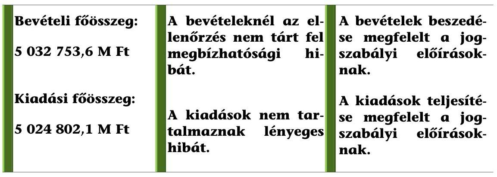

Az ellenőrzött terület: A Ny. Alap és az E. Alap ellátási és működési bevételei, illetve kiadásai

A TB Alapok bevételei és támogatásai a jogszabályi előírások, belső szabályozások és felhatalmazások betartásával az adatszolgáltatásokkal egyezően teljesültek. Az Ny. Alap és az E. Alap költségvetési beszámolói egyezőséget mutattak a NAV adatszolgáltatásában szereplő összegekkel. Az Alapok bevételeinél az ellenőrzés megbízhatósági hibát nem tárt fel, a bevételek elszámolása szabályszerű volt, beszedésük a szerződéseknek, megállapodásoknak és a jogszabályi előírásoknak megfelelő összegben történt.

A TB Alapok ellátási kiadási előirányzataiból teljesített kifizetéseknél az ellenőrzés megbízhatósági hibát nem tárt fel. A kifizetések - a feltárt szabályszerűségi hibák kivételével - a jogszabályi előírások, belső szabályozások és felhatalmazások betartásával teljesültek.

Az Ny. Alap özvegyi, öregségi és szolgálatfüggő nyugellátások címén teljesített kifizetések megbízhatóak voltak, az ellátás jogszerűsége, összegének dokumentáltsága, illetve nyilvántartásba vétele megfelelő volt. Az ellenőrzés a kifizetéseknél tárt fel szabályszerűségi hibákat. Az érvényesítés nem felelt meg az Ávr. 58. § (3) bekezdésében foglaltaknak. Az utalványrendelet, amelyen az érvényesítés történt, nem felelt meg az Ávr 59. § (3) bekezdés a) b) e) h) pontjainak.

Az E. Alap ellátási kiadásaiból teljesített kifizetések megbízhatóak voltak, azonban az ellenőrzés tárt fel szabályszerűségi hibákat. Nem érvényesültek a teljesítésigazolásra, ennek következtében az érvényesítésre vonatkozó kontrollok. A hiányosságok miatt az érvényesítők az Ávr. 58. § (1) bekezdésében foglaltak ellenére nem
 a teljesítés igazolás alapján végezték el az összegszerűségnek, a fedezet meglétének, valamint a jogszabályok és belső szabályzatok betartásának ellenőrzését. A hibás tételek esetében, a 13/2013. számú OEP szabályzat 40. pontjában foglaltak ellenére, a "teljesítést igazolom" helyett a "kifizetést elrendelem" szerepelt. Ezen ellenőrzött tételek esetében nem érvényesültek - az Ávr. 57. § (1), (3) bekezdések előírásai, az Ávr. 58. § (1) bekezdés előírása -

---

a teljesítésigazolásra és érvényesítésre vonatkozó kontrollok. A teljesítésigazolás szabálytalansága, a beszámoló készítése során annak megbízhatóságát nem befolyásolta.

Az E. Alap rokkantsági és rehabilitációs ellátások ellenőrzött tételei esetében (kifizetőhely a NYUFIG) a kifizetések megbízhatóak voltak, azonban nem feleltek meg az Ávr. vonatkozó jogszabályi előírásainak. Az utalványrendelet az Ávr. 59. § előírásai ellenére nem tartalmazta az érvényesítésre utaló megjelölést, az utalványozó és érvényesítő személye az utalványon nem volt megnevezve, továbbá nem különült el az érvényesítő és utalványozó aláírásához tartozó keltezés sem.

A TB Alapok működési kiadásai ellenőrzése során az E. Alap működési kiadási előirányzatainak teljesítésénél tártunk fel megbízhatósági és szabályszerűségi hibákat.

Az Ny. Alap működési kiadási előirányzatainak teljesítése során a pénzügyi kontrollok a kötelezettségvállalás, ellenjegyzés, utalványozás és teljesítésigazolás az Ávr. előírásainak megfelelően és megbízhatóan működtek. A gazdasági eseményt alátámasztó számviteli bizonylatok alakilag és tartalmilag megfeleltek a Számv. tv., valamint az Áhsz. előírásainak. A kifizetéseknél az ellenőrzés megbízhatósági hibát nem tárt fel.

Az E. Alap működési kiadási előirányzatainak teljesítésénél megállapított megbízhatósági hibát az okozta, hogy az Ávr. 50. § (1) bekezdés b) és c) pontjában foglaltak ellenére a megbízási szerződésben nem határozták meg a pénzügyi teljesítés módját, feltételeit és a kifizetés határidejét. A feltárt megbízhatósági hiba a lényegességi küszöböt nem haladta meg.

A személyi juttatások és a külső személyi juttatások esetében a kifizetés nem felelt meg az Ávr. vonatkozó jogszabályi előírásainak és az E. Alap belső szabályozásának, ezáltal nem érvényesültek az érvényesítésre vonatkozó kontrollok sem. A személyi juttatások esetében az Ávr. 60. § (2) bekezdés előírása ellenére, az érvényesítő és a kifizetés kedvezményezettje ugyanaz a személy volt. Az érvényesítő nem rendelkezett az Ávr. 55. § (3) bekezdése szerinti képesítéssel, valamint az utalványrendelet nem felelt meg az Ávr. 59. § előírásainak sem.

A dologi és az egyéb működési célú kiadások, felhalmozási kiadások ellenőrzött tételei esetében, a kifizetések elszámolása a vonatkozó jogszabályi rendelkezéseknek és a belső szabályzatoknak megfelelt. Az ellenőrzött tételek esetében érvényesültek az Ávr. előírásai valamint a kötelezettségvállalásra, pénzügyi ellenjegyzésre, teljesítésigazolásra, érvényesítésre, utalványozásra vonatkozó kontrollok.

A társadalombiztosítás pénzügyi alapjaiból folyósított egyes ellátások finanszírozása megfelelt a jogszabályi előírásoknak. Az Ny. Alap a méltányossági keretösszegre vonatkozó jogszabályi előírásoknak megfelelően járt el. A Kvtv. 14. § (1) bekezdése a 2014. évi különös méltánylást érdemlő körülmények esetén, méltányossági alapon megállapításra kerülő nyugellátásra 200,0 M Ft, a méltányossági alapú nyugdíjemelésre 700,0 M Ft, az egyszeri segélyre 500,0 M Ft előirányzatot állapított meg. Az Ny. Alap a 2014. évi költségvetésé-

---

ben meghatározott előirányzatok alapján döntött a méltányossági és segélyezési keretek felosztásáról a Nyugdíjigazgatóságok, az ONYF, és a NYUFIG között. A keretek felosztásánál a korábbi évek tapasztalatait figyelembe vették, tartalékot képeztek, 50-50 M Ft-ot különítettek el a méltányossági alapú nyugdíjemelés és az egyszeri segély jogcímeknél.

Az E. Alap a megfelelő előirányzatból a rendelkezésre álló keretösszeg túllépése nélkül biztosította a finanszírozási előlegre fordítható összegeket. A Kvtv. 20. § (4) bekezdésében foglaltak alapján a gyógyszertámogatás kiadási előirányzata 1200,0 M Ft fedezetet biztosított a közforgalmú gyógyszertárak évente egyszer igényelhető finanszírozási előlegéhez. A rendelkezésre álló keretösszeg az elmúlt évekhez képest nem változott, az igénybe vett összeg a 2013. évihez közel azonos, 404,9 M Ft volt, ami jóval az engedélyezett összeg alatt maradt. A 2014. évben 102 gyógyszertár részesült finanszírozási előlegben.

A különös méltányossági keretek felhasználása az előirányzott összegek betartásával történt. Az Ny. Alap rendelkezésre álló méltányossági keretösszegek előirányzatai felhasználásra kerültek, a kifizetett ellátások a megengedett keretek között teljesültek. A teljesítési arányok kedvezően alakultak, a nyugellátásnál 99,9%-os (199,8 M Ft), a nyugdíjemelésnél 99,0%-os (683,5 M Ft), az egyszeri segélynél 99,9%-os (508,9 M Ft) volt a teljesítés az eredeti előirányzathoz képest.

Az E. Alap 2014. évi pénzbeli ellátások terhére kifizetett méltányossági keretösszege a támogatási keret 91,9%-a, 156,2 M Ft volt, amely jelentős mértékben 45,3 M Ft-tal meghaladta a 2013. évi értéket. A növekedéshez a méltányossági igények darabszámának emelkedése mellett az egy fő részére engedélyezett napok növekedése is szerepet játszott. A gyógyító-megelőző ellátásokra biztosított méltányossági keretből 5611,3 M Ft került felhasználásra, amely megegyezik a Kvtv.-ben meghatározott előirányzattal. A gyógyszertámogatás jogcímen, egyedi méltányossági támogatás formájában a 2014. évben 8094,3 M Ft került kifizetésre, amely nem haladta meg a módosított kiadási előirányzatot. A gyógyászati segédeszközök egyedi méltányosság formájában történő támogatása 842,4 M Ft volt, amely az erre a célra biztosított keretet (1300 M Ft) nem lépte túl.

A TB alapok éves költségvetési beszámolóinak összeállítása megfelelt a jogszabályi előírásoknak. Az éves költségvetési beszámolók és a költségvetési számvitellel készített beszámolórészeinek összeállítása az Áhsz.-nek és a belső szabályozási rendelkezések előírásainak megfelelően szabályszerűen történt.

Az Ny. Alap költségvetési számvitellel elkészített költségvetési jelentése és maradvány kimutatása megfelelt az Áhsz. előírásainak. Az egységes rovatrend szerinti tagolásban elkészített űrlapokat ÁHT azonosító szerinti részletezettséggel mutatta be a költségvetési jelentés. A teljesített bevételek és kiadások kormányzati funkciók szerinti megoszlását tartalmazta a költségvetési jelentés. A költségvetési jelentést a főkönyvi kivonattal alátámasztották.

Az E. Alap éves költségvetési jelentése nem tartalmazta az Áhsz. 8. § (1), valamint a kormányzati funkciók, államháztartási szakfeladatok és szakágazatok osztályozási rendjéről szóló 68/2013 (XII. 29.) NGM rendelet 6. § (1)-(2) bekez-

---

dése szerinti mutatószámokat. A költségvetési jelentésben közölt adatok és a megfelelő főkönyvi számlák december 31-i állapot szerinti egyenlegei között az Áhsz. 17. mellékletében meghatározott kötelező egyezőségek fennálltak.

A TB Alapok bevételi és kiadási előirányzatainak módosítását a jogszabályi előírásoknak és a belső szabályzatokban foglaltaknak megfelelően hajtották végre.

A Kvtv. 14. § (1) bekezdése az Ny. Alap 2014. évi bevételi és kiadási főösszegét 2964 608,2 M Ft-ban állapította meg. A bevételi főösszeg tartalmazta a nyugdíjbiztosítási ellátások fedezetéül szolgáló 2962 745,2 M Ft eredeti előirányzat mellett a vagyongazdálkodás 3,0 M Ft, valamint a működési célú bevételként megtervezett 1860 M Ft bevételi előirányzatot is. Az eredeti előirányzat módosult, mivel a 2013. évi költségvetési törvény végrehajtásáról rendelkező 2014. évi LXII. törvény 18. §-ának végrehajtására, az Országgyűlés döntése alapján a Ny. Alap kiadási előirányzata 1298,5 M Ft-tal emelkedett. A Kvtv. 26. § (5) bekezdésének előírása szerint az Ny. Alapból 184 677,7 M Ft befizetési kötelezettség került meghatározásra a központi költségvetés javára, így ezzel az összeggel is megemelkedett a kiadási előirányzat. A bevételi előirányzatok főösszege nem változott. A 2014. évi költségvetési törvény az ONYF intézményi (törvényi) költségvetési előirányzatainak összegét 5554,5 M Ft összegben határozta meg. Az intézményi működési bevételek törvényi előirányzata 1830,0 M Ft, támogatási előirányzata 3724,5 M Ft volt, működési kiadásokra 5373,4 M Ft, felhalmozási kiadásokra 181,1 M Ft előirányzatot fogadott el az Országgyűlés. A 2014. évi előirányzatok módosítására kormányzati, irányító szervi és saját hatáskörben is sor került. A módosításokat követően a bevételi és kiadási előirányzatok főösszege 7621,6 M Ft-ra változott. Az előirányzatmódosítások az ellenőrzött tételek tekintetében szabályszerűek és megbízhatóak voltak.

Az E. Alap bevételi előirányzata 2014. évben nem változott, kiadási előirányzatában két alkalommal történt előirányzat-emelés, összesen 27 820,0 M Ft összegben. Az OEP, mint költségvetési szerv esetében a 8877,1 M Ft eredeti előirányzat 11244,2 M Ft-ra módosult, a 2014. évben az összes előirányzat változás 2367,1 M Ft volt. Az előirányzat-módosítások kormányzati, irányító szervi és intézményi hatáskörben történtek.

Az előirányzat-maradványt szabályszerűen mutatták ki. Az Ny. Alap a költségvetési beszámoló 7. számú maradvány kimutatás űrlapját az Áhsz. előírásainak megfelelően elkészítette. A maradvány kimutatás és a főkönyvi kivonat között az egyezőség fennállt. A maradvány kimutatás szerint a működési szektor (az ONYF maradványa 861,6 M Ft, a NYUFIG maradványa 55,7 M Ft) maradványa 917,3 M Ft, az ellátási szektor maradványa pedig 8202,7 M Ft volt. Az Ny. Alapnál a támogatás és az előirányzat-maradványok figyelembevételével meghatározásra került egyenleg (7543,6 M Ft) felhasználhatóságáról az Országgyűlés a zárszámadásról szóló törvényben dönt.

Az E. Alap a költségvetési beszámoló 7. számú maradvány kimutatás űrlapját az Áhsz. előírásainak megfelelően elkészítette. Az E. Alap működési szektor maradványa 1448,1 M Ft, az ellátási szektor maradványa 1269,6 M Ft volt. Az éves beszámoló 7. űrlapján, mérlegében és a kapcsolódó főkönyvi számlákon

---

kimutatott előirányzat-maradvány megegyezett - az ellátási szektor esetében a kerekítések miatt az eltérés 3 E Ft - a maradvány-analitikával. A kimutatott összegek technikai jellegűek, az E. Alapnál az előirányzat-maradványok figyelembevételével meghatározásra került egyenleg (407,9 M Ft) - az Áht. 86. §-ában meghatározottak alapján - felhasználhatóságáról az Országgyűlés a zárszámadásról szóló törvényben dönt.

A TB Alapok bevételei és kiadásai, valamint a bevételek és kiadások egyenlege a Kvtv.-ben meghatározott előirányzatoknak megfelelően teljesültek.

Az Ny. Alap költségvetése 3125 136,1 M Ft bevételi és 3117 592,5 M Ft kiadási főösszeg mellett 7543,6 M Ft költségvetési egyenleggel (többlettel) teljesült. A bevételi előirányzat az eredeti előirányzatot 5,4%-kal haladta meg. A bevételi többlet oka a szociális hozzájárulási adó és a biztosítotti nyugdíjárulék előirányzat feletti teljesülése. Az Ny. Alap kiadási előirányzata 3117 592,5 M Ft-ra teljesült, amely 5,1%-kal haladta meg a törvényi módosított előirányzatot.

Az E. Alap költségvetése 1907 617,5 M Ft bevételi és 1907 209,6 M Ft kiadási főösszeg mellett 407,9 M Ft költségvetési egyenleggel (többlettel) teljesült. A bevételi és kiadási előirányzata 1,2%-kal haladta meg a tervezettet.

A Kincstár a KESZ terhére az ellátások folyamatos teljesítése érdekében a jogszabályi előírásoknak megfelelően biztosította a napi likviditási hiteleket.

Az Ny. Alap a 2014. év folyamán, 323 napig bevételi többlettel rendelkezett, 42 napig merült fel a likvid hitel igénybevételének szükségessége. Az igénybe vett likvid hitelek napi átlagos összege a 2014. évben 43461,1 M Ft volt. A Kincstár a KESZ terhére az ellátások folyamatos teljesítése érdekében a jogszabályi előírásoknak megfelelően biztosította a napi likviditási hiteleket. A likvid hiteleket az ONYF havonta igényelte az aktualizált havi előirányzatfelhasználási ütemtervek benyújtásával, amelyeket a Kincstár rendszeresen visszaigazolt.

Az E. Alap kezelője, az OEP által folyósított ellátások folyamatos teljesítése érdekében a bevételek és a kiadások időbeli eltéréséből adódó átmeneti finanszírozási igény fedezetét a Kincstár, a KESZ terhére díj és kamat felszámítása nélkül megelőlegezte. A nyitó és a záró hitelállomány az E. Alapot terhelő ellátások esetében 0 Ft volt. Mindösszesen 101
 olyan nap volt az évben, amikor az OEP igénybe vette a hitelt. A legmagasabb napi hitelegyenleg 75741,3 M Ft, az éves átlagos hitelállomány 11933,0 M Ft volt.

A nem az E. Alap költségvetéséhez kapcsolódó megelőlegezési hitelszámla nyitó egyenleg 0,9 M Ft, záró egyenlege 0 Ft volt. A hitel igénybevételére összesen 65 napon került sor. A legmagasabb napi hitelállomány április 9-én állt fenn 677,6 M Ft értékben. A hitelállomány éves átlaga 30,2 M Ft volt.

---

# III. ELKÜLÖNÍTETT ÁLLAMI PÉNZALAPOK 

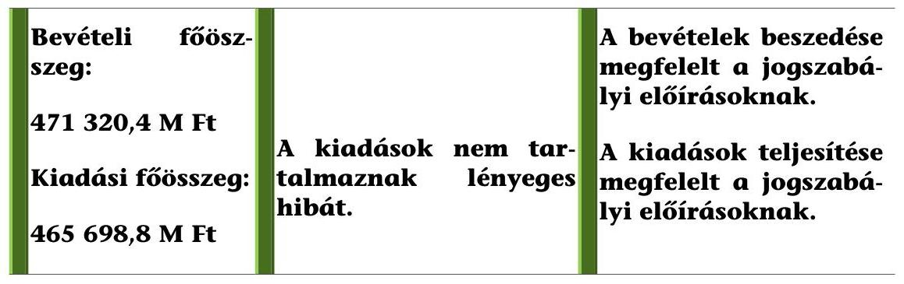

Az ellenőrzött terület: ELKA (LXIII. NEFA, LXV. BGA, LXVI. KNPA, LXVII. NKA, LXVIII. WMA, LXIX. KTIA)

Az ELKA bevételeinek elszámolása, valamint az előírt adatszolgáltatási kötelezettség teljesítése megfelelt a jogszabályi előírásoknak. A NAV által beszedett adó- és járulékbevételekről készített adatszolgáltatás és az alapján készített elszámolás a jogszabályi előírásoknak megfelelően határidőre teljesült az alapkezelők felé. Az ELKA bevételei az eredeti előirányzatnak megfelelően teljesültek, törvényi módosítás nem történt.

Az ellenőrzés megbízhatósági hibát a KNPA kiadásainál tárt fel, mivel az alap által támogatott egyik szervezet egy esetben a támogatási szerződésben meghatározott határidőn túl küldte meg a támogatás felhasználásáról elkészített pénzügyi elszámolást. A támogatott szervezet a szerződésben foglalt kötelezettségét elmulasztva a pénzügyi elszámolásban nem nyilatkozott arról, hogy a feltüntetett költségek kifizetése előtt azok összegszerűségéről és jogszerűségéről meggyőződött.

Az ELKA által nyújtott támogatások odaítélése és a kifizetések - a feltárt hibák kivételével - megfeleltek a jogszabályi és a belső szabályzatok előírásainak. A teljesítésigazolásokat a jogszabályban, valamint az operatív gazdálkodási jogkörök gyakorlásának belső eljárásrendjében kijelölt személyek végezték. A megbízásokról és a beazonosítható aláírás mintákról vezették az előírt nyilvántartásokat. Az érvényesítők képesítése megfelelt az előírt követelményeknek, a teljesítés igazolók és az érvényesítők a gazdálkodási jogkörök gyakorlása során betartották az összeférhetetlenségre vonatkozó szabályokat. A teljesítés igazolását az arra jogosult személyek aláírással, dátummal, valamint a teljesítés tényére történő utalással, az előírásoknak megfelelő módon végezték. Az érvényesítők a teljesítés igazolások alapján ellenőrizték az összegszerűséget, a fedezet meglétét, továbbá azt, hogy a megelőző ügymenetben betartották-e az egyéb gazdálkodási jogkörökre vonatkozó előírásokat. Az érvényesítők által elvégzett főkönyvi számlakijelölések helyesek voltak, a tételekhez kapcsolódó bizonylatok megfeleltek a formai és tartalmi követelményeknek. Az érvényesítés igazolása az érvényesítésre utaló megjegyzéssel, keltezéssel és aláírással, a jogszabályi és belső szabályzatok előírásai szerint történt.

---

Az ellenőrzés a KNPA, a NEFA, az NKA kiadásainál tárt fel szabályszerűségi hibákat, amelyek a gazdálkodási jogkörök gyakorlásához kapcsolódtak. A KNPA kifizetései között az Ávr. 58. § (3) bekezdésében foglalt előírások ellenére nem szerepelt valamennyi utalványon az érvényesítő személy aláírása. A NEFA ellenőrzött tételeinél az Ávr. 57. § (3) bekezdésében és a 13. § (2) bekezdés a) pontjában, valamint a gazdálkodási jogkörök gyakorlásának belső szabályozásában foglalt előírások ellenére az arra kijelölt személyek nem végezték el minden alkalommal dokumentáltan a teljesítésigazolást. Az érvényesítők nem jelezték, hogy az előző ügymenetben nem történtek meg a teljesítésigazolások, ezáltal az Ávr. 58. § (1) bekezdésében foglaltak ellenére nem a teljesítés igazolás alapján végezték el az összegszerűségnek, a fedezet meglétének, valamint a jogszabályok és belső szabályzatok betartásának az ellenőrzését. Nem tartották be valamennyi kifizetés során az Ávr. 60. § (1)-(2) bekezdésében, valamint a gazdálkodási jogkörök gyakorlásának belső szabályozásában foglalt, összeférhetetlenségre vonatkozó előírásokat, mivel a teljesítés igazoló és az érvényesítő ugyanaz a személy volt. Az NKA-nál az Ávr. 57. § (4) bekezdésében foglaltak ellenére a kötelezettségvállalásra jogosult személyek nem minden esetben jelölték ki írásban a teljesítésigazolókat, akik emiatt jogosulatlanul látták el feladatukat. Az érvényesítők az Ávr. 58. § (2) bekezdésében előírtak ellenére nem jelezték az utalványozók részére a teljesítésigazoló kijelölésével kapcsolatos mulasztást.

A pénzügyi teljesítések a KTIA esetében a szabályozottság hiánya miatt nem voltak megfelelőek. A feltárt hiányosságok döntő része ahhoz kapcsolódott, hogy az NGM és a ME nem határozta meg a kötelezettségvállalás, ellenjegyzés, teljesítésigazolás, érvényesítés, utalványozás gyakorlásának módját, valamint az eljárási és dokumentációs részletszabályokat. Az alapkezelők az előirányzatok feletti rendelkezési jogkörök gyakorlására egyedi meghatalmazást készítettek. Az Ávr. 13. § (2) bekezdésében foglalt szabályozás hiánya miatt a teljesítésigazolás, valamint az érvényesítés nem az Ávr. 57-58. §-aiban foglalt előírások szerint történt.

Az ellenőrzött pályázati és egyéb pénzforgalmi kiadások - a KTIA kivételével - megfeleltek a jogszabályok és a belső szabályzatok előírásainak. A pénzforgalmi kiadásokhoz tartozó kötelezettségvállalásokat és azok teljesítését a jogszabályi előírásoknak megfelelő egységes rovatrend szerint tartották nyilván. A gazdasági műveleteket alátámasztó számviteli bizonylatok rendelkezésre álltak, megfeleltek az alaki és tartalmi követelményeknek. A pályázatok kiírása, valamint a támogatások odaítélése során az alapkezelők betartották a vonatkozó ágazati jogszabályi előírásokat. Az elbírálást követően megtörtént a támogatói okiratok kiadása, illetve a támogatási szerződések megkötése előtt annak ellenőrzése, hogy nem állnak fenn a támogatást kizáró körülmények, feltételek. A támogatói szerződésekben rögzítették a jogszabályban foglalt kötelezettségek megtartását biztosító feltételeket. A kedvezményezettek eleget tettek a támogatott tevékenységről és a támogatott tevékenység megvalósításával kapcsolatos beszámolási kötelezettségüknek a költségvetési támogatás rendeltetésszerű felhasználására vonatkozóan. Megtörtént a részbeszámolók, beszámolók elfogadása és a kedvezményezettek értesítése.

A költségvetési jelentés összeállítása és az előirányzat maradvány megállapítása részben felelt meg a jogszabályi előírásoknak. A 2014. december 31-ei fordulónapra összeállított végleges költségvetési beszámolót a BGA, a KNPA, a KTIA és a WMA az előírt tartalommal és határidőben, a NEFA és az NKA ugyanakkor a jogszabályban előírt határidőn túl készítette el. Az éves költségvetési beszámoló irányító szervi jóváhagyását és a Kincstár részére történő megküldését a BGA és a KTIA határidőben teljesítette. A KNPA, a NEFA, az NKA, valamint a WMA esetében az Áhsz. 33. § (1) bekezdésének előírásai ellenére nem történt meg 2015. május 31-ig a beszámoló irányító szerv általi jóváhagyása és a Kincstárhoz való benyújtása.

Az előzetes, illetve a végleges beszámolók adatai - a NEFA kivételével - összhangban voltak az Áhsz. 5. § (1) bekezdésének megfelelően folyamatosan vezetett részletező nyilvántartásokkal, a könyvviteli zárlat során készített főkönyvi kivonatokkal és a mérleget alátámasztó leltárak adataival. A NEFA esetében az előzetes költségvetési beszámoló és a főkönyvi kivonat közötti egyezőség a kiadási előirányzatok, a költségvetési évben esedékes végleges kötelezettségvállalás, valamint a követelések vonatkozásában nem állt fent. A teljesített költségvetési kiadások főösszege megegyezett, ugyanakkor a főkönyvi számla egyenlege a munkanélküli aktív korúak ellátása és a foglalkoztatást elősegítő képzések esetében -213,4 M Ft-tal, a szakképzési és felnőttképzési támogatásoknál 211,2 M Ft-tal, a Startmunka-program esetében 2,2 M Ft-tal tért el a beszámolóban szereplő összegtől. Az eltéréseket a főkönyvi könyvelésben alkalmazott kormányzati funkciók téves paraméterezése okozta. A tárgyévben esedékes végleges kötelezettségvállalások esetében az ellenszámlák helytelen könyvelése miatt 8,4 M Ft-tal kevesebb összeget tartalmazott a beszámoló a főkönyvi kivonathoz viszonyítva. A költségvetési évet követő évben esedékes követelések főkönyvi számlájának egyenlege 1,2 M Ft-tal alacsonyabb volt a beszámolóban szerepeltetett értéknél.

A költségvetési beszámolók az Áhsz. előírásainak megfelelően egységes rovatrend szerinti tagolásban tartalmazták az eredeti és módosított előirányzatokat, az azokra vonatkozó követeléseket, kötelezettségvállalásokat, más fizetési kötelezettségeket, az előirányzatok teljesítését, valamint a bevételek és kiadások kormányzati funkciók szerinti megoszlását. A költségvetési számvitelen belül a gazdálkodási szabályokból adódó, az Áhsz.-ben kötelezően előírt egyezőségek teljesültek. A maradvány kimutatások az Áhsz. szerint előírt formában mutatták be az alaptevékenység kötelezettségvállalással terhelt és szabad maradványát. A 2014. évi kifizetések, valamint az ELKA rendelkezésére álló bevételek alapján a tárgyévi maradvány összege 531 484,5 M Ft, a kötelezettségvállalással terhelt maradvány ennek 3,6%-a 19 285,0 M Ft volt. Az ellenőrzés megállapította, hogy a kötelezettségvállalás dokumentumai az Áht. előírásainak megfeleltek, szabályszerűek voltak. A maradvány tekintetében az éves költségvetési beszámolók, a főkönyvi kivonatok valamint az analitikus nyilvántartások egyezősége biztosított volt, teljesültek az Áhsz.-ben foglalt előírások.

A felügyeleti szervi, illetve saját hatáskörben végrehajtott előirányzat módosítások megfeleltek az Áht. előírásainak. Az alapkezelők a saját hatáskörben végrehajtott előirányzat módosításokról az Ávr.-ben foglaltak alapján tájékoztatták a Kincstárt. Az előirányzatokat és azok módosításait az Áhsz.-nek megfelelően a főkönyvi könyvelésben rögzítették, az előirányzat változások az Áhsz. előírása alapján az előirányzat nyilvántartás adataival megegyeztek. Az ELKA Kvtv. szerint megállapított bevételi előirányzata 437 568,1 M Ft volt,

---

amely az év közben végrehajtott előirányzat módosítások következtében 5,3%-kal emelkedett a BGA költségvetési támogatása, a KTIA-t megillető innovációs járulék, az NKA játékadóból, kulturális adóból, valamint a szerzői joghoz kapcsolódó befizetésekből származó bevételekre vonatkozóan. Az alapok egyéb bevételeinek előirányzata összességében 3886,2 M Ft-tal emelkedett. A KNPA nukleáris létesítményekkel és a radioaktív hulladékkezeléssel kapcsolatos kiadásainál 452,0 M Ft-tal, a KTIA hazai innovációs támogatásai esetében 14 065,6 M Ft-tal emelkedett az eredeti előirányzat. A működési és az egyéb kiadások esetében a BGA-nál és az NKA-nál összesen 73,5 M Ft volt az előirányzat emelés, a szakképzési és felnőttképzési támogatások előirányzata a NEFA-nál ugyanakkor 400,0 M Ft-tal csökkent.

Az ELKA költségvetési bevételei összességében a 460 916,9 M Ft összegű módosított előirányzatot meghaladóan, 471 320,4 M Ft-ban teljesültek (102,3%). A KNPA esetében a bevételek a módosított előirányzatnak megfelelően teljesültek, a többi alap többletbevételt ért el a módosított előirányzathoz viszonyítva, a KNPA esetében az elmaradás 1%. A BGA, a KTIA és a WMA esetében a bevételek megközelítőleg a tárgyévi módosított előirányzatoknak megfelelően teljesültek. A három alap eseti támogatásokból, rendszeres befizetésekből és egyéb bevételekből származó többletbevétele összesen 93,2 M Ft volt. A NEFA bevételi többletét a szakképzési hozzájárulás, az egészségbiztosítási és munkaerő-piaci járulék, valamint az egyéb működési bevételek 16 479,3 M Ft-os növekedése, valamint a TÁMOP intézkedések és a bérgarancia támogatás törlesztésének 6288,8 M Ft-os csökkenése együttesen eredményezte. Az NKA esetében a játékadóból 302,3 M Ft, a kulturális adóból 52,4 M Ft többlet származott.

A KTIA, a NEFA és az NKA 2014. évi 421 498,7 M Ft-os költségvetési bevételének 65,7%-a (276 768,3 M Ft) származott a NAV által beszedett adó- és járulékbevételekből. A KTIA-t megillető innovációs járulékból, a NEFA-t megillető szakképzési hozzájárulásból, egészségbiztosítási és munkaerőpiaci járulékból, valamint az NKA-t megillető ötöslottó szerencsejáték játékadójából, továbbá kulturális adóból és járulékból származó bevétel 6,9%-kal (17 772,0 M Ft) meghaladta az előző évi teljesítést, illetve 11,7%-kal (29 030,7 M Ft) magasabb volt a 2014. évi eredeti előirányzatnál. Az innovációs járulék, a szakképzési hozzájárulás, valamint az egészségbiztosítási és munkaerőpiaci járulék emelkedése a fizetésre kötelezettek korábbi éveknél kedvezőbb gazdasági tevékenységére vezethető vissza. A játékadó emelkedése a nyereményalap halmozódásával és a háztartások szerencsejátékra fordított kiadásaival áll összefüggésben, a kulturális adó növekedését az adózói kör bővítése, valamint a javuló adófizetői hajlandóság eredményezte. A NAV az Ávr. 134. § c) és d) pontjaiban foglalt határidők
 betartásával teljesítette a KTIA, a NEFA és az NKA felé fennálló adatszolgáltatási kötelezettségét. A tárgyévi kötelezettségek, befizetések és visszafizetések összegéről, a költségvetési évben és a megelőző időszakban keletkezett tartozások és túlfizetések nyitó és záró állományáról, a költségvetési évben esedékes összes bevallások jogcímenkénti bontásáról, valamint a behajtásból származó bevételek december 31-ig teljesített befizetések összegéről a NAV 2015. május 5-éig megküldte az adatokat az alapok részére. A követelések értékvesztésének összegéről az első negyedévre vonatkozóan május 20-áig, a második, harmadik negyedévre vonatkozóan a tárgynegyedévet követő hónap 15-éig, a negyedik negyedévre vonatkozóan a költségvetési évet követő május 15-éig tájékoztatta az alapokat. A NAV által a beszedett adó- és járulékbevételekre

---

vonatkozóan közölt adatok megegyeztek az alapok analitikus nyilvántartásaival.

Az alapok céljaival összhangban lévő támogatások előirányzata a BGA esetében 6654,9 M Ft-tal, az NKA esetében 3193,1 M Ft-tal növekedett. A KNPA költségvetési támogatása az Atv. 64. § (2) bekezdésében foglalt előírások alapján, a jegybanki alapkamat változása miatt 235,1 M Ft-tal csökkent.

Az ELKA Kvtv. szerint megállapított kiadási előirányzata 460 939,2 M Ft volt, amely az év közben végrehajtott előirányzat-módosítások következtében 5,2%-kal (24039,1 M Ft) emelkedett. Az ELKA 2014. évben teljesített kiadása 465 698,8 M Ft volt. Az alapok fel nem használt előirányzatának 95,4%-a (30 381,8 M Ft) a KTIA-t érintette az alapkezelő többszöri változásával összefüggésben. A kiadások teljesítése során az alapok a NEFA kivételével valamennyi jóváhagyott kiadási előirányzatot betartották. A módosított előirányzat 41665,8 M Ft összegű túllépése a NEFA-nál fordult elő, a Startmunkaprogramhoz kapcsolódó felülről nyitott előirányzat 1361/2014. (VI.30.) Korm. határozatban engedélyezett szabályszerű túllépése miatt.

Az ELKA azon kilenc kiadási jogcímén, amelyek a Kvtv. 5. számú mellékletében foglaltak alapján módosítás nélkül, illetve a Kormány engedélye alapján eltérhetnek a tervezett mértéktől, három esetben magasabb, hat esetben alacsonyabb volt a teljesítés a módosított előirányzatnál. A felülről nyitott előirányzatok összességében 26348,1 M Ft-tal meghaladták a módosított előirányzatot, amely alapvetően a NEFA Startmunka-program kifizetéseihez kapcsolódott. Az előirányzat-túllépés nem jelentett kockázatot az ELKA tervezett egyenlegére, mivel az eltérésre fedezetet nyújtott az alap betétállománya.

Az alapok a kiadásaik döntő hányadát pályázati támogatások, illetve szerződések alapján teljesítették. A BGA, a KTIA, a NEFA és az NKA 47 pályázati konstrukciót hirdetett meg, amelyekre 276651 érvényes pályázat érkezett, az igényelt támogatások összege 132568 M Ft volt. A benyújtott pályázatok 95,1%-a (263100 db) kedvező elbírálásban részesült, a megítélt támogatás összege 89582 M Ft-ot tett ki. A támogatási szerződések megkötését követően a kezelő szervek 65707 M Ft támogatást fizettek ki a 2014. évben. A források felhasználására a KNPA 13, a WMA egy szerződést kötött, amelyek alapján 12 527,9 M Ft-ot, illetve 1,1 M Ft-ot fizettek ki a kedvezményezettek részére.

---

# IV. EURÓPAI UNIÓS TÁMOGATÁSOK ÉS AZ EURÓPAI UNIÓS TAGSÁGGAL ÖSSZEFÜGGŐ HAZAI BEFIZETÉSEK 

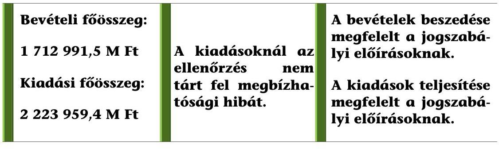

Az ellenőrzött terület: Az egyéb uniós bevételek teljesülése, az uniós tagsággal összefüggő hazai befizetések és a XIX. Uniós fejlesztések fejezetben megjelenő európai uniós támogatások

Az egyéb uniós bevételek és az európai uniós tagsággal összefüggő hazai befizetések elszámolása megfelelt a jogszabályi előírásoknak. A XIX. Uniós fejlesztések fejezetben megjelenő európai uniós támogatások kiadás-teljesítési adatai megbízhatóak.

A Kvtv. XLII. fejezet Egyéb uniós bevételek cím 28 678,9 M Ft teljesített bevétele 3766,9 M Ft-tal (11,6%-kal) maradt el a tervezettől. A vámbeszedési és a cukorágazati hozzájárulás beszedési költségek megtérítésének bevételei 1700,5 M Ft-tal túlteljesültek. A vámbeszedési költség megtérítésének bevétele 1686,3 M Ft-tal (18,1%-kal), míg a cukorágazati hozzájárulás beszedési költségtérítésének bevétele 14,2 M Ft-tal (7,4%-kal) haladta meg a tervezettet. Az uniós támogatások utólagos megtérülése 5467,4 M Ft-tal (24,8%-kal) maradt a tervezett szint alatt, figyelembe véve a 5A-ból befolyt, de nem tervezett 3413,8 M Ft összegű visszatérülést, mely az EU által korábban visszatartott támogatás átutalásából adódott. A KA-ból megtérülő uniós támogatások elmaradása a tervezettől 8881,2 M Ft (38,7%) volt, amit a tárgyévben az EU-hoz benyújtott támogatási igények és a szabálytalansági eljárások során elmaradt kifizetések indokolnak.

A Kvtv. XLII. fejezet Hozzájárulás az EU költségvetéséhez cím 288 679,2 M Ft tervezett kiadása 2187,7 M Ft-tal (0,8%-kal) haladta meg a módosított előirányzatot. Ezen belül az Áfa alapú hozzájárulás 622,1 M Ft-tal (1,7%-kal), a GNI alapú hozzájárulás 1556,5 M Ft-tal (0,7%-kal), a brit korrekció pedig 9,1 M Ft-tal (0,0%-kal) haladta meg a tervezettet.

A költségvetésben megjelenő uniós bevételek és támogatások összege 2223 959,40 M Ft volt, amelyből az uniós bevételek 1668 921,6 M Ft-ot tettek ki, a hazai támogatás 528 213,5 M Ft nagyságot ért el, a kedvezményezettekkel szembeni követelésekből befolyt összeg 26 824,3 M Ft. A 2014. évi uniós támo-

---

gatások teljesített kiadása 2223 959,4 M Ft volt, amelynek 85,7%-át az NSRK-ból finanszírozott projektek megvalósítására fordították. A teljesített kiadások 3,5%-kal (74 346,6 M Ft-tal) meghaladták a törvényi módosított előirányzatot.

A XIX. UF fejezet bevételei a törvényi módosított előirányzat 98,7%-ában, 1706 608,2 M Ft-ban realizálódtak. A költségvetési támogatás a törvényi módosított előirányzat 166,0%-ára, 802 955,7 M Ft-ra, a fejezet kiadási előirányzata a törvényi módosított előirányzat 102,2%-ára, 2262 182,1 M Ft összegben teljesült. Az uniós előirányzatok 30%-ot meghaladó túlteljesítésére 2014. évben a Kvtv. 5. számú melléklete 3. pontjának megfelelően a Kormány döntése 1510/2014. (IX. 16.) és 1832/2014. (XII. 23.) Korm. határozatok alapján két esetben került sor összesen 215000 M Ft értékben. Az UF fejezeti kezelésű előirányzatok felülről nyitására 30%-os mértékig összesen 112 496,5 M Ft állt rendelkezésre, melyet 2014. októberéig a Kormány igénybevett. A 112 496,5 M Ft-ot kitevő keretből összesen 98 382,7 M Ft összegben került sor az NSRK OP-jai közül a GOP, KÖZOP, TÁMOP és a KEOP esetében az előirányzatok felülről nyitására.

A Kvtv. 13. § (3) bekezdése által rögzített, a NEFA-ból az UF fejezet részére a TÁMOP hazai társfinanszírozása céljára meghatározott 17 130,1 M Ft összegű forrás átadása megvalósult. Az EMMI HEP IH a NEFA fejezetet kezelő NGM, az ME és az EMMI között 2014. december 5-én létrejött megállapodásnak megfelelően utólag, egy alkalommal, teljes összegben lehívta a NEFA forrást.

Érvényesültek a GOP és a KMOP garanciaeszközeire vonatkozó készfizető kezesség, garancia-állomány összegére vonatkozó előírások. Az MV Zrt. által a garanciaeszközökre vállalt készfizető kezesség, illetve garancia-állomány 2014. december 31-én a GOP Pénzügyi eszközök prioritási tengelyében 16 962,4 M Ft-ot, a KMOP A tudásalapú gazdaság innováció- és vállalkozásorientált fejlesztése prioritási tengelyében pedig 8192,4 M Ft-ot tett ki, így nem haladta meg a Kvtv. 47. § (3) bekezdésben előírt 300 000,0 M Ft-ot. A Kvtv. 50. §-ának megfelelően a JEREMIE-típusú pénzügyi eszközök végrehajtása során megtérült visszatérítendő támogatásokból származó bevételek a GOP 4. és a KMOP 1.3 prioritás forrásait növelték összesen 45687 M Ft-tal.

Az ellenőrzés az uniós támogatások kifizetésénél megbízhatósági hibát nem tárt fel, ezért a teljesített kiadási adatok megbízhatóak.

Az uniós források 2014. évi felhasználása - az ÉMOP-nál és a DAOP TS-nél feltárt hibák kivételével - szabályszerű volt. A támogatási kérelmek tartalmi követelményei megfeleltek a végrehajtási rendeletben foglaltaknak, a támogatások elbírálása szabályszerű volt. A kedvezményezettekkel szabályszerűen kötötték meg a támogatási szerződéseket. Az ellenőrzött tételek esetében a kifizetési kérelmek szabályszerűek voltak.

A DAOP TS keretének felhasználásra vonatkozóan 2007. évben a hatályos 217/1998. (XII. 30.) Korm. rendelet 87. § (1) bekezdése ellenére a döntéshozó nem kötött támogatási szerződést a kedvezményezett DARFÜ Kht.-vel, valamint a 217/1998. (XII. 30.) Korm. rendelet 134. § (8) bekezdése ellenére a kötelezettségvállalás ellenjegyzése a gazdasági vezető vagy az általa írásban kijelölt személy révén írásban nem történt meg.

---

Az NSRK OP-oknál a támogatottak a kifizetések igénylését az EMIR rendszerben a 4/2011. (I. 28.) Korm. rendelet 55. § (2) bekezdése szerint elektronikusan rögzítették, az 55. § (1) bekezdése és a (3) bekezdés a)-c) pontjai szerinti mellékleteket, az eredeti számlák hitelesített másolatát, számlaösszesítőket csatolták. A teljesítésigazolás dokumentumokkal alátámasztott, a kifizetési kérelmek, előlegkérelmek tartalma és formája megfelelő volt. Az EMIR rendszerben a benyújtott dokumentumok és azok ellenőrzése az elektronikus ellenőrzési listák alapján bizonylatolt volt.

Az NSRK OP-khoz kapcsolódó előirányzatok kezelésében részt vevő KSz-ekkel kötött megállapodások szabályszerűek voltak. Az ME, mint az NFÜ általános jogutódja valamint a feladatellátásban részvevő szaktárcák, mint a KSz-ek jogutódjai 2014. évben az SLA megállapodásokat közös megegyezéssel megszüntették, melyben rögzítették a záró elszámolásokat. A ROP-ok esetében - a 7 KSz-szel az 1083/2006 EK rendelet alapján 2007-ben megkötött SLA szerződéseket - 2013. decemberében módosították.

Az ÚMVP esetében a támogatási döntéseket - az AKG kivételével - az IIER rendszeren kívül ún. forrás-allokációs levelek útján hozta meg az IH, ahol a felterjesztő levél tartalmazta a támogatásra jogosultak listáját. Pénzügyi ellenjegyzést a döntések - a TS-ek kivételével - nem tartalmaztak, amely nem felel meg az Ávr. 55. § (1) bekezdésében foglaltaknak. Az IIER-ben az Ávr. 57. § (4) bekezdés szerinti teljesítésigazolásnak megfelel a Közvetlen Támogatások Igazgatósága által használt Általános végrehajtási kézikönyv 3.1.2.3. pontja szerinti adminisztratív ellenőrzés, az Ávr. 58. § (4) bekezdés szerinti érvényesítésnek megfelel a KVK 1. pontja szerinti forrásigény-lista összeállítása és az Ávr. 38. § (1) bekezdés szerinti utalványozásnak megfelel a KVK 4. pontja szerinti utalványozás. A teljesítés-igazolás és érvényesítés fogalma az IIER-ben nem definiált, amely sérti az Ávr. hivatkozott pontjaiban foglaltakat.

A 2014-2020 közötti uniós költségvetési időszak kohéziós politikai operatív programjaira kötelezettségvállalás nem történt. Magyarország és az EU Bizottság közötti Partnerségi Megállapodás 2014. szeptember 11-én aláírásra került, melyben a kijelölt fejlesztési irányokat kilenc OP-ban (GINOP, VEKOP, TOP, IKOP, KEHOP, EFOP, KÖFOP, VP, MAHOP) rögzítették. Az új időszakban 7764,5 Mrd Ft (25 038,5 M EUR) EU-támogatás áll hazánk rendelkezésére az ún. ESB alapokból. A helyszíni ellenőrzés lezárásáig három OP EU Bizottság általi elfogadása (KÖFOP, VP, MAHOP) nem történt meg.

---

# V. SZAKMAI FEJEZETI KEZELÉSŰ ELŐIRÁNYZATOK 

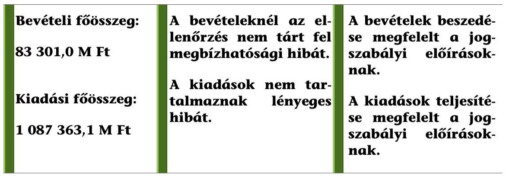

Az ellenőrzött terület: Az I. OGY, II. KE, III. AB, IV. AJBH, VI. BIR, VIII. Ügyészség, X. IM, XI. ME, XII. FM, XIII. HM, XIV. BM, XV. NGM, XVII. NFM, XVIII. KKM, XX. EMMI, XXX. GVH, XXXI. KSH, XXXIII. MTA, XXXIV. MMA fejezetek fejezeti kezelésű előirányzatai

A fejezeti kezelésű előirányzatok felhasználása szabályszerű volt. Az ellenőrzés megbízhatósági hibát a bevételeknél nem tárt fel. A kiadásoknál feltárt megbízhatósági hibák nem haladták meg a lényegességi szintet, így a bevételek és kiadások teljesítési adatai megbízhatóak.

A fejezeti kezelésű előirányzatok teljesített bevétele
 70 854,2 M Ft-tal haladta meg a 12 446,8 M Ft-os törvényi módosított előirányzatot. A bevételi túlteljesítés meghatározóan a maradvány felhasználásával és a többletbevételekkel függ össze. A fejezeti kezelésű előirányzatok kiadásai 1 074 438,8 M Ft összegű törvényi módosított előirányzatának teljesítése 1 087 363,3 M Ft volt.

A Beruházási Alapot a 2012. évi CCIV. törvény 2013. július 1-jétől hatályos 76/A. §-a hozta létre. A Beruházási Alapot alkotó fejezeti és központi kezelésű előirányzatokat a Kvtv. 10. számú melléklete nevesíti. Az állami vagyonnal kapcsolatos bevételek értékesítési bevételei a 146 591,7 M Ft összegű módosított előirányzathoz képest 35,5%-kal (52 054,3 M Ft-tal) túlteljesültek. A Beruházási Alaphoz tartozó fejezeti és központi kezelésű előirányzatok eredeti kiadási előirányzatát 130 392,0 M Ft-ban határozták meg, amely 50,4%-ban, 65 752,6 M Ft-ban teljesült. A fejezeti kezelésű előirányzatokat kezelő nyolc fejezet (OGY, BIR, IX. Helyi önkormányzatok támogatása, FM, KIM (IM), NFM, EMMI, MTA) a Beruházási Alaphoz tartozó előirányzatok igénybevételénél betartotta a Kvtv. előírásait, új kötelezettségek vállalásához minden esetben megkérték az államháztartásért felelős miniszter előzetes egyetértését, illetve a Kormány irányítása alá nem tartozó fejezeteknél az államháztartásért felelős miniszter előzetes véleményét.

A bevételi előirányzatokat a tervezett és módosított előirányzatoknak megfelelő összegben teljesítették, az ellenőrzés megbízhatósági hibát nem állapított meg. A fejezeti kezelésű előirányzatok bevételei döntően államháztartáson belülről kapott támogatási bevételek, fel nem használt támogatások visszautalása, kötelezettségvállalással nem terhelt előirányzat-maradványok átcsoportosításai, támogatási előirányzat-nyitások, finanszírozási bevételek voltak.

A bevételek teljesítése és elszámolása - a feltárt hibák kivételével - szabályszerű volt. Az ellenőrzés során feltárt szabályszerűségi hibák három fejezet fejezeti kezelésű előirányzatait érintették. Az EMMI ellenőrzött bevételi tételeinél az Ávr. 59. § (3) bekezdés g) pontjában foglalt - a teljesítésigazolás, érvényesítés és utalványozás - szabályaival ellentétes számviteli elszámolási gyakorlatot tárt fel az ellenőrzés, mivel az utalványozás dátuma nem szerepelt a bizonylatokon. Az FM bevételeinél három esetben késedelmes befizetés miatt nem teljesültek a jogszabályi előírások (két esetben a határozatban előírt agrárkárenyhítési hozzájárulás befizetéseinél, egy esetben a 341/2013. (IX. 25.) Korm. rendelet 7. § (1) bekezdésében előírt határidőn túli befizetés miatt), az NFM az Ávr. 59. § (3) bekezdés g) pontjának előírása ellenére az utalványrendeleten nem tüntette fel az utalványozó aláírását.

Az ellenőrzés a kiadásoknál az FM és az EMMI fejezeti kezelésű előirányzatainál tárt fel megbízhatósági hibákat. Az FM-nél az Áht. 53. § (1) bekezdését megsértve az egyik kedvezményezett határidőben nem tett eleget beszámolási kötelezettségének. Az Ávr. 80. § (5) bekezdése ellenére a kedvezményezettet nem értesítették a beszámoló elfogadásáról, egy alkalommal nem az Áhsz. szerint főkönyvi számlán számolták el a kiadást. Egy támogatási szerződésnél az Áht. 51. § (1) bekezdésével ellentétesen a támogatás felhasználásához nem írták elő a Kbt. alkalmazását. Az EMMI Beruházási Alapba tartozó tételeinél az ellenőrzés megállapította, hogy az Áht. 53. § (1) és az Ávr. 80. § (1) bekezdése előírása ellenére a kedvezményezett nem teljesítette elszámolási kötelezettségét az előírt határidőre. Egy további esetben úgy került sor a támogatás kifizetésére, hogy az egyik támogatott a nyertes ajánlatnál magasabb összegre kötött vállalkozói szerződést. Az EMMI a szerződések megkötését és a támogatások kifizetését megelőzően nem győződött meg arról, hogy fennállnak-e a támogatás Ávr. szerinti kizáró körülményei, feltételei.

A kiadási előirányzatok teljesítése és elszámolása - a feltárt hibák kivételével szabályszerűen történt. A támogatási célú előirányzatok esetében az egyes kifizetések teljesítése, elszámolása a jogszabályi rendelkezéseknek és belső szabályzatoknak megfelelt. A fejezeti kezelésű előirányzatok kiadásainál szabályszerűségi hibát a KE, a BIR, az ME, az FM, az NFM és az EMMI fejezeteknél tárt fel az ellenőrzés. A hibák jellegük szerint a KE-nél az Ávr. 60. § (3) bekezdésében előírt, a gazdálkodási szabályzat szerinti jogkörgyakorlásra jogosult személyek és aláírás mintájuk naprakész nyilvántartása vezetésének hiányához, a BIR-nél a gazdasági események a belső szabályzatokban előírt követelményeknek nem megfelelő elszámolásához kapcsolódtak. Az ME-nél és az NFM-nél - az Ávr. 59. § (3) bekezdés g) pontjában foglaltak ellenére - az utalványrendeleten nem tüntették fel az utalványozás időpontját. Az FM-nél az Ávr. 55. § (2) bekezdés b) pontja és az 58. § (4) bekezdésével ellentétesen a gazdasági vezető helyett a miniszter jelölte ki az érvényesítőt. Az EMMI-nél, különösen a normatív támogatásoknál, az Áht. 37. § (1) bekezdése előírása ellenére a kötelezettségvállaló aláírásának időpontja megelőzte a pénzügyi ellenjegyző aláírásának időpontját, illetve hiányzott az Ávr. 55. § (1) bekezdése szerinti pénzügyi ellenjegyzés keltezése. Több esetben hiányzott az érvényesítés keltezése, ami nem felelt meg az Ávr. 58. § (3) bekezdése előírásának és ezáltal nem biztosította annak igazolását, hogy az okmány utalványozása előtt az érvényesítés megtörtént.

A fejezeti kezelésű előirányzatokkal kapcsolatos szakmai és gazdálkodási feladatok ellátása során az irányító szerv és a külső kezelő szerv közti szerződésben, illetve megállapodásban foglaltakat a külső kezelő szervezetek betartották. Az ellenőrzött fejezetek közül hat fejezetnél látták el külső szervezetek a fejezeti kezelésű előirányzatokkal való gazdálkodási feladatokat az ellenőrzött időszakban. Az IM fejezeti kezelésű előirányzatai közül kettőt, az NGM fejezeti kezelésű előirányzatai közül hatot, az FM és az NFM fejezeti kezelésű előirányzatai közül 18-at, a KKM fejezeti kezelésű előirányzatai közül egyet, az EMMI fejezeti kezelésű előirányzatai közül nyolcat kezelt a minisztérium szervezetén kívüli intézmény.

A kezelő szervezetek jogszabályi kijelölés és/vagy megállapodás alapján látták el feladataikat. A külső kezelő, lebonyolító szervezetekkel kötött megállapodások tartalmazták a feladatokat, a feladatok teljesítése érdekében a fejezeti kezelésű előirányzatokból nyújtott támogatást, az ezzel való elszámolás követelményeit és határidejét. A kezelő szervezetek és a lebonyolítók a fejezet döntése alapján kötötték meg a támogatási szerződéseket, a megállapodások és lebonyolítási szerződésben foglaltak szerint látták el azok pénzügyi teljesítését. A kezelők a jogszabályban meghatározott előirányzatok teljes körű gazdálkodását végezték, önálló beszámolót készítettek a kezelt előirányzatokról, amelyek részét képezték a fejezet összevont beszámolójának. Az előirányzatok felhasználása során a kezelők és a külső lebonyolítók a megállapodásokban és a jogszabályokban foglaltak szerint jártak el. Az irányító szerv és külső kezelő szervek közti adatszolgáltatás során betartották a vonatkozó szerződésekben, megállapodásokban foglaltakat, illetve a jogszabályi előírásokat. Hiányosság volt az IM-nél, hogy a külső kezelőszervvel való együttműködés feltételeit meghatározó KIM utasítás nem tartalmazta az adatszolgáltatásra, beszámolásra vonatkozó eljárásrendet.

Az éves költségvetési beszámoló költségvetési számvitellel készült beszámolórészei összeállításának ellenőrzése során megállapítottuk, hogy az előirányzatok nyilvántartása és a maradvány alátámasztása összességében megfelelt a jogszabályi előírásoknak. A fejezeti kezelésű előirányzatok nyilvántartása - a BIR kivételével - megfelelt a jogszabályi előírásoknak. A BIR fejezetnél két előirányzat elszámolását alátámasztó analitikus nyilvántartás nem felelt meg az Áhsz. 39. § (3) bekezdésében előírt részletező nyilvántartás szabályának.

Az ellenőrzött bevételi és kiadási előirányzatok teljesítéséről összeállított 2014. évi költségvetési jelentések - összhangban az Áhsz. 5. § (1) bekezdésében foglaltakkal - könyvviteli zárlat során készített főkönyvi kivonattal, szabályszerű könyvvezetéssel és - a BIR fejezet kivételével - folyamatosan vezetett részletező nyilvántartásokkal alátámasztottak voltak.

Az ellenőrzött fejezetek 42,1%-a (AB, BIR, FM, BM, NGM, NFM, KKM, EMMI) a fejezeti kezelésű előirányzatok jóváhagyott éves költségvetési beszámolóit az új államháztartási számviteli rendszer, az új beszámolási forma (úrlapok változása) és a KGR-K11 informatikai modul változásai (verzió frissítések) miatt az Áhsz. 32. § (1), (3) bekezdéseiben meghatározott időponthoz képest késedelemmel nyújtotta be a Kincstárnak.

A maradvány kimutatás összeállítása összességében szabályszerű volt, az ellenőrzött fejezetek - egy fejezetet kivéve - betartották a jogszabályi előírásokat. A maradvány megállapítás szabályszerűsége az MTA fejezetnél részben megfelelő lett. A maradvány-kimutatás szabálytalanságát az MTA-nál a beszámolóban, a főkönyvi kivonatban és az analitikus nyilvántartásban kimutatott maradványösszeg eltérése okozta. A tárgyévi előirányzat-maradvány analitika alapján történő ellenőrzése során a kapott dokumentumok alapvetően megfelelően alátámasztották a maradvány kimutatásokat. Hibát a KE és a BIR fejezeteknél tártunk fel. A KE esetében az eltérést a hatályos gazdálkodási szabályzat szerinti jogkörgyakorlásra jogosult személyekről és az aláírás mintájukról naprakész nyilvántartás vezetésének hiánya okozta, a BIR esetében a kötelezettségvállalással terhelt maradványokat alátámasztó részletező nyilvántartások hiányoztak.

Az előirányzatok évközi módosításai illetve átcsoportosításai a jogszabályi előírásoknak megfelelően, szabályszerűen történtek.

Az irányító szervi feladatok ellátása részben szabályszerűen történt. A 19 fejezetből 11 fejezet (BIR, Ügyészség, ME, FM, HM, NGM, NFM, EMMI, GVH, MTA, MMA) az Ávr. 30. § (1) bekezdésben előírt, a fejezeti kezelésű előirányzatok felhasználására vonatkozó szabályzatot az előírt határidőre (2014. január 15-ig) nem aktualizálta, illetve nyolc fejezet (BIR, ME, FM, BM, NGM, NFM, KKM, EMMI) az Ávr. 152. § (1)-(3) bekezdésében előírt maradványelszámolást határidőre az államháztartásért felelős miniszter részére nem teljesítette. Az NGM részükre az elszámolás benyújtására 2015. május 20-ig haladékot adott.

A fejezetek irányító szervei - az Ávr. 37. § (2) bekezdése előírásaival összhangban - a folyósítást megelőzően, a Kincstár által megállapított formában benyújtották az államháztartásért felelős miniszternek az előirányzat túllépését megalapozó indokokat és számításokat, aki a keretemeléshez szükséges engedélyeket megadta.

A fejezeti kezelésű előirányzatok teljesített kiadási értéke a módosított előirányzati szint 81,1%-a, 1 037 506,9 M Ft volt. A teljesített bevételek szintje elérte a módosított érték 94,3%-át, 88 989,1 M Ft-ot. A teljesített támogatások meghaladták a módosított értéket 4,3%-kal, 1 235 248,6 M Ft-ot tettek ki. A fejezeti kezelésű előirányzatok év végi maradványa 286 730,8 M Ft volt, ebből a kötelezettségvállalással terhelt előirányzat maradvány 227 666,2 M Ft volt, a módosított kiadási előirányzat 17,8%-a. Az évközi teljesített kiadások és a kötelezettségvállalással terhelt előirányzat maradványok összege elérte a módosított kiadási előirányzat 98,9%-át.

A fejezeteknél végrehajtották a kiadási előirányzatok felhasználáshoz kapcsolódó évközi korlátozó intézkedéseket. A Kormány a 2014. évi hiánycél megtartása érdekében az 1381/2014. (VII. 17.) Korm. határozattal az irányítása alá tartozó fejezetek részére zárolási kötelezettséget írt elő. A zárolási kötelezettség az érintett fejezeti kezelésű előirányzatoknál (IM, ME, FM, NGM, NFM, KKM, EMMI) együttesen 20 768,0 M Ft-ot tett ki. A zárolást a Kormány az 1799/2014. (XII. 19.) Korm. határozattal visszavonta, az előirányzatok azonos összegben visszarendezésre kerültek. A kormányhatározatokkal elrendelt feladatokat a fejezetek végrehajtották, a zárolt előirányzatok terhére nem történt új kötelezettségvállalás. A zárolás feladatelmaradást nem okozott. A Beruházási Alaphoz tartozó előirányzatokat nem érintette a zárolási kötelezettség.

A Kvtv. 5. melléklete alapján az ún. felülről nyitott előirányzattal az Úgyészség (1 db), IM (3 db), ME (2 db), FM (7 db), HM (1 db), BM (10 db), NGM (4 db), NFM (1 db), KKM (1 db), EMMI (5 db) fejezet rendelkezett. Az érintett fejezetek felülről nyitott, eredeti kiadási előirányzata
 $413614,2 \mathrm{MFt}$, módosított kiadási előirányzata $450184,4 \mathrm{MFt}$, teljesítése $458510,6 \mathrm{MFt}$ volt. Az előirányzatok összesen 8326,2 M Ft-tal, 1,8\%-kal haladták meg a módosított kiadási előirányzatokat. A felülről nyitott előirányzatok felhasználása az NGM-nél nem érte el az eredeti előirányzatot, a HM-nél nem került sor az előirányzat lehívására, az Ügyészségnél, az NFM-nél, a KKM-nél a módosított előirányzaton belül maradt. A módosított előirányzatokat meghaladó teljesítésre 5 fejezetnél került sor (IM, ME, FM, BM, EMMI), amelynek 88,8\%-a az EMMI fejezetnél jelentkezett.

A fejezeti tartalék igénybevétele öt ellenőrzött szervezetet érintett. Az átcsoportosítások, a vonatkozó kormányrendeletekben előírtak szerint valósultak meg.

---

# VI. INTÉZMÉNYEK 

Az ellenőrzött terület: Az államháztartás központi alrendszerébe tartozó költségvetési szervek közül 108 intézmény, a következő csoportosítás szerint: 1. Országgyűlés felé beszámolásra kötelezett intézmények: KH, NAIH, NVI, NÉBIH, GVH, KSH, MTA Igazgatása, MMA Titkárság Igazgatása; 2. Alkotmányos fejezetek intézményei: OGYH, KEH, AB, AJBH, Bíróságok (26 intézmény), Kúria, Ügyészségek; 3. A központi alrendszer 68 egyéb intézménye

## 1. Az Országgyűlés felé beszámolásra kötelezett intézmény-

NYEK

Az ellenőrzött terület: Országgyűlés felé beszámolásra kötelezett intézmények: KH, NAIH, NVI, NÉBIH, GVH, KSH, MTA Igazgatása, MMA Titkárság Igazgatása

A bevételi és kiadási előirányzataik teljesítése során az Országgyűlés részére beszámolási kötelezettséggel tartozó intézmények közül a KH és a NAIH nem tartotta be, az NVI, NÉBIH, GVH, KSH, MTA Igazgatása, MMA Titkárság Igazgatása betartotta a jogszabályi és a belső szabályzatok előírásait. Az Országgyűlés részére beszámolási kötelezettséggel tartozó intézmények bevétel és kiadás teljesítési adatai - a KH kivételével - megbízhatóak.

A KH költségvetési számvitellel készített beszámolórészeinek összeállítása részben valósult meg szabályszerűen, a vonatkozó jogszabályi és belső szabályozási rendelkezések előírásait részben tartották be, ezért azokat összességében nem megfelelőnek minősítettük.

A szervezet kiadásainak és bevételeinek elszámolásáról az ellenőrzés megállapította, hogy az intézmény bevételi és kiadási adataiban előforduló megbízhatósági hibák összértéke meghaladja a lényegességi szintet. A KH a bírói letét összegét végleges kiadásként számolta el, amely nem felelt meg az Áhsz. 48. § (1) bekezdése és az Áht. 72. § (2) bekezdésében, valamint az Áhsz. 15. melléklete K355 rovathoz kapcsolódó előírásoknak.

Az előirányzat-maradványt szabályszerűen mutatták ki.
A KH-nál szabályszerűségi hibákat nem tárt fel az ellenőrzés, a kötelezettségvállalásra, pénzügyi ellenjegyzésre, teljesítésigazolásra, érvényesítésre, utalványozásra vonatkozó kontrollok érvényesültek.

Az előirányzatok intézményi módosítását nem a belső szabályzatokban foglaltaknak megfelelően hajtották végre, az átcsoportosítást nem az elnök engedélyezte.

A KH eredeti költségvetési kiadási előirányzata 1655,8 M Ft, a módosított előirányzata 4003,8 M Ft, a teljesítés 3028,3 M Ft volt. A KH az eredeti kiadási előirányzatát 2014. évben az előző évhez képest 15,7\%-kal magasabb összegben tervezte, elsősorban a dologi kiadások növekedésével számolva. Közel 50\%-kal

---

magasabb összegű költségvetési bevételt tervezett a 2013. évhez képest, mivel a 2007-2013. időszak európai uniós forrásokból várhatóan megvalósuló projektek, és a Kbt. egybeszámítási szabályainak enyhítése miatt a közbeszerzési eljárások növekedésével számolt. A módosított kiadási előirányzat jelentősen meghaladta az eredeti előirányzatot. Az év közbeni módosítás oka az előző évi maradvány igénybevétele, az európai uniós pályázati támogatás, és a tervezettet meghaladó közhatalmi bevétel miatti módosítás volt.

Az eredeti bevételi előirányzat 1524,0 M Ft, a módosított 1681,8 M Ft, a teljesítés 2406,7 M Ft volt. A költségvetési bevételek teljesítése az előirányzott összeget meghaladóan realizálódott.

A NAIH költségvetési számvitellel készített beszámolórészeinek összeállítása összességében szabályszerűen történt, a vonatkozó jogszabályi és belső szabályozási rendelkezések előírásainak betartásával, ezért azokat megfelelőnek minősítettük.

A feltárt megbízhatósági hibák a költségtérítés, illetve a dologi kiadások elszámolásához kötődtek. A megbízhatósági hibák összértéke meghaladta a lényegességi szintet. A feltárt hibák egy része kapcsán az ellenőrzés megállapította, hogy az érintett kiadások valósak voltak, és bár azok elszámolása nem a megfelelő soron történt, minden más tekintetben megfeleltek a jogszabályi előírásoknak. Így ezek a hibák a beszámoló kiadási főösszegének a megbízhatóságát nem befolyásolták. Ezt figyelembe véve kijelenthető, hogy a NAIH beszámolójának kiadási és bevételi főösszege nem tartalmazza a lényegességi szintet meghaladó megbízhatósági hibát.

Az előirányzat-maradványt szabályszerűen mutatták ki.
A NAIH-nál szabályszerűségi hibákat tárt fel az ellenőrzés, a működési kiadásoknál nem érvényesültek a teljesítésigazolásra, az érvényesítésre és az utalványozásra vonatkozó kontrollok.

Az előirányzatok módosítását a jogszabályi előírásoknak megfelelően hajtották végre.

A NAIH eredeti költségvetési kiadási előirányzata 501,0 M Ft, a módosított előirányzata 634,0 M Ft, a teljesítés 526,6 M Ft volt. A NAIH az eredeti kiadási előirányzatát 2014. évben az előző évhez képest 5,0\%-kal növelten tervezte. A kiadási előirányzat év közbeni módosításának oka, hogy az Intézmény uniós forrást (EKOP pályázat) kapott és fejezeti tartalékot átcsoportosítottak. A bevételi előirányzat emelése az audit tevékenység közhatalmi bevétele miatt történt. A kiadások a módosított előirányzat 83,0\%-ára teljesültek. A dologi és beruházási kiadásoknál jelentkezett megtakarítás.

Eredeti bevételi előirányzat nem volt, a módosított $98,3 \mathrm{M}$ Ft, a teljesítés 36,6 M Ft volt. A költségvetési bevételek teljesítése a működési és felhalmozási célú támogatásoknál csak részben realizálódott, mert a pályázati elszámolások pénzügyi teljesítése áthúzódott 2015-re.

---

Az NVI költségvetési számvitellel készített beszámolórészeinek összeállítása összességében szabályszerűen történt, a vonatkozó jogszabályi és belső szabályozási rendelkezések előírásainak betartásával, ezért azokat megfelelőnek minősítettük.

Az intézménynél az ellenőrzés megbízhatósági hibát nem tárt fel.
Az előirányzat-maradványt szabályszerűen mutatták ki.
Az NVI-nél szabályszerűségi hibát tárt fel az ellenőrzés, a dologi kiadásoknál nem érvényesült a kötelezettségvállalás pénzügyi ellenjegyzésére vonatkozó belső kontroll.

A bevételi és kiadási előirányzatok módosítását a jogszabályi előírásoknak és a belső szabályzatokban foglaltaknak megfelelően hajtották végre.

Az NVI eredeti költségvetési kiadási előirányzata 1398,4 M Ft, a módosított előirányzata $11289,2 \mathrm{M}$ Ft, a teljesítés $9358,3 \mathrm{M}$ Ft volt. Év közben - tekintettel a három országos és egy helyi önkormányzati képviselői választásra 9899,8 M Ft előirányzat-emelés történt, melyből az előző évi maradvány igénybevétele 1287,5 M Ft volt. A választások lebonyolításához szükséges kötelezettségvállalások fedezete a fejezeti kezelésű előirányzatból került átadásra 5739,7 M Ft összegben. A kiadások a módosított előirányzat 82,9\%-ára teljesültek. A megtakarítás a dologi és a beruházási kiadásoknál jelentkezett.

Eredeti bevételi előirányzata nem volt, a módosított előirányzat és a teljesítés 2872,6 M Ft volt. A költségvetési bevételek a módosított előirányzatnak megfelelően teljesültek.

A NÉBIH költségvetési számvitellel készített beszámolórészeinek összeállítása összességében szabályszerűen történt, a vonatkozó jogszabályi és belső szabályozási rendelkezések előírásainak betartásával, ezért azokat megfelelőnek minősítjük.

Az intézménynél az ellenőrzés megbízhatósági hibát nem tárt fel.
Az előirányzat-maradványt szabályszerűen mutatták ki.
A kiadások valamint a bevételek ellenőrzött tételeinél szabályszerűségi hibát nem tárt fel az ellenőrzés.

A NÉBIH 2014. évi eredeti költségvetési kiadási előirányzata 13 688,6 M Ft volt, a módosított előirányzat 19547,1 M Ft-ra emelkedett, amelyből 18712,4 M Ft teljesült. A beruházások és felújítások kiadási előirányzatának emelésére az élelmiszerlánc-felügyeleti díj 10\%-ának fejlesztési célú felhasználási kötelezettsége, valamint az uniós projektek biztosítottak lehetőséget.

A működési bevételek előirányzatának növelését - a laboratóriumok szolgáltató tevékenységéből származó többletbevételek miatt - irányító szervi hatáskörben engedélyezték.

---

Az eredeti bevételi előirányzat az előző évhez képest 58,9\%-kal növekedett, melynek oka az élelmiszerlánc felügyeleti díj bevételbe történő beépítése volt. A bevételek a módosított előirányzat 95,7\%-ában teljesültek, míg a kiadások teljesítése 93,4\% volt. A dologi és beruházási kiadásoknál keletkezett megtakarítás.

A GVH Igazgatás költségvetési számvitellel készített beszámolórészeinek összeállítása összességében szabályszerűen történt, a vonatkozó jogszabályi és belső szabályozási rendelkezések előírásainak betartásával, ezért azokat megfelelőnek minősítettük.

Az intézménynél az ellenőrzés megbízhatósági hibát nem tárt fel.
Az előirányzat-maradványt szabályszerűen mutatták ki.
A GVH-nál szabályszerűségi hibát tárt fel az ellenőrzés, a személyi juttatásoknál, a dologi kiadásoknál nem érvényesültek a teljesítésigazolásra, az érvényesítésre és az utalványozásra vonatkozó belső kontrollok.

A bevételi és kiadási előirányzatok módosítását a jogszabályi előírásoknak és a belső szabályzatokban foglaltaknak megfelelően hajtották végre.

A GVH Igazgatásának eredeti költségvetési kiadási előirányzata 2312,6 M Ft volt, a módosított előirányzat 3328,4 M Ft-ra emelkedett és 2907,5 M Ft-ra teljesült. A dologi kiadások módosított előirányzata az előző évi maradvány igénybevétele miatt növekedett 26,6\%-kal az eredeti előirányzathoz képest. Az egyéb működési célú kiadások emelkedését a 1423/2014. (VII. 28.) Korm. határozatban foglalt 361,9 M Ft szabad maradvány más fejezethez történő átcsoportosítása okozta. A felhalmozási kiadások beruházási célú előirányzat-módosítását az előző évi maradvány igénybevétele és a többletbevétel fedezte.

A 66,3 M Ft eredeti bevételi előirányzat 258,2 M Ft-ra emelkedett és ugyanilyen összegben teljesült. A GVH igazgatási szolgáltatási díjakból származó többletbevétele saját bevételként előirányzatosításra került. A GVH Igazgatása a bevételi előirányzatok teljesítésének kötelezettségét betartotta, a költségvetési kiadásokat 87,5\%-ban teljesítette.

A KSH költségvetési számvitellel készített beszámolórészeinek összeállítása összességében szabályszerűen történt, a vonatkozó jogszabályi és belső szabályozási rendelkezések előírásainak betartásával, ezért azokat megfelelőnek minősítettük.

Az intézménynél az ellenőrzés megbízhatósági hibát nem tárt fel.
Az előirányzat-maradványt szabályszerűen mutatták ki.
A kiadások ellenőrzött tételeinek elszámolásánál szabályszerűségi hibát nem tárt fel az ellenőrzés, bevételek elszámolásánál előfordult, hogy a belső szabályzat előírása ellenére a teljesítésigazolást nem végezték el.

A bevételi és kiadási előirányzatok módosítását a jogszabályi előírásoknak és a belső szabályzatokban foglaltaknak megfelelően hajtották végre.

---

A KSH eredeti költségvetési kiadási előirányzata 8064,1 M Ft, a módosított előirányzata 10270,2 M Ft, a teljesítés 9192,3 M Ft volt. A működési és felhalmozási célú támogatások államháztartáson belülről bevételek eredeti előirányzatainak módosítását a költségvetés benyújtását követően aláírt, vagy módosított támogatási szerződések eredményezték. A működési bevételek eredeti előirányzat módosítását a statisztikai szolgáltatásokból származó többletbevétel indokolta. A dologi és a beruházási kiadások eredeti előirányzata a többletbevételek előirányzatosítása, valamint az előző évi maradvány felhasználása következtében nőtt.

Az eredeti bevételi előirányzat 511,1 M Ft, a módosított 1909,5 M Ft, a teljesítés 1594,2 M Ft volt. A KSH a bevételi előirányzatait 83,5\%-ban, a költségvetési kiadásokat 89,5\%-ban teljesítette. A támogatások teljesülésének elmaradását az EKOP és ÁROP támogatások utófinanszírozásának 2015. évre történő áthúzódása okozta. A dologi és beruházási kiadások megtakarítását a tárgyévi előirányzat terhére vállalt kötelezettségek 2015. évre áthúzódó kifizetései eredményezték.

Az MTA Igazgatása költségvetési számvitellel készített beszámolórészeinek összeállítása összességében szabályszerűen történt, a vonatkozó jogszabályi és belső szabályozási rendelkezések előírásainak betartásával, ezért azokat megfelelőnek minősítettük.

Az intézmény bevételei esetében a külföldi kiküldetések elszámolásával összefüggésben tárt fel az ellenőrzés megbízhatósági hibát, amelynek összértéke nem érte el a lényegességi szintet.

A szervezet kiadásainak és bevételeinek elszámolásáról az ellenőrzés megállapította, hogy az intézmény bevételi és kiadási adataiban előforduló megbízhatósági hibák összértéke nem haladja meg a lényegességi szintet.

Az előirányzat-maradványt szabályszerűen mutatták ki.
A kiadások ellenőrzött tételeinek elszámolásánál szabályszerűségi hibát tárt fel az ellenőrzés, az érvényesítők kijelölését nem a gazdasági vezető végezte, ezáltal nem tartották be az Ávr. 55. § (2) és az Ávr. 58. § (4) bekezdésének előírását. Előfordult, hogy a személyi juttatás ellenőrzött tételénél a teljesítésigazolás és érvényesítés, a működési kiadásoknál az érvényesítés nem volt szabályszerű. A bevételek ellenőrzött tételeinél nem minden esetben érvényesültek
 a teljesítésigazolásra, utalványozásra vonatkozó belső kontrollok.

A bevételi és kiadási előirányzatok módosítását a jogszabályi előírásoknak és a belső szabályzatokban foglaltaknak részben megfelelően hajtották végre.

Az MTA Igazgatásnál az analitikus nyilvántartás részét képezte a foglalkoztatottak lakáskölcsön tartozásának név szerinti kimutatása, azonban ezt sem a főkönyvi kivonat, sem a beszámoló mérleg űrlapjának adatai nem tartalmazták.

Az MTA Igazgatás eredeti költségvetési kiadási előirányzata 1118,9 M Ft, a módosított előirányzata 1934,2 M Ft, a teljesítés 1782,3 M Ft volt. Az eredeti

---

bevételi előirányzat 18,1 M Ft, a módosított $337,0 \mathrm{M}$ Ft, a teljesítés $325,5 \mathrm{M}$ Ft volt.

Az eredeti előirányzat az előző évi adattól minimális összeggel tért el. A kiadási előirányzatok módosítását a dologi és beruházási kiadások emelése okozta. A személyi juttatások emelésére előirányozatosítottak a Lakásalap számla összegéből, amely nem felelt meg az Ávr. 36. § (2) bekezdésében foglaltaknak.

A bevételi előirányzatok a működési célú támogatások államháztartáson belülről soron 165,7 M Ft-tal, a felhalmozási célú átvett pénzeszközöknél címrend változásával összefüggésben 111,8 M Ft-tal emelkedett, ahol az Áhsz. változása miatt a korábban idegen pénzeszközként nyilvántartott - Lakásalap számla év végi egyenlege okozott növekedést.

Az MTA Igazgatása a bevételi előirányzatait 97,0%-ban, a költségvetési kiadásokat $92,0 \%$-ban teljesítette. A személyi juttatások és a dologi kiadások megtakarítását a tárgyévi előirányzat terhére vállalt kötelezettségek 2015. évre áthúzódó kifizetései eredményezték.

Az MMA Titkárság igazgatása költségvetési számvitellel készített beszámolórészeinek összeállítása összességében szabályszerűen történt, a vonatkozó jogszabályi és belső szabályozási rendelkezések előírásainak betartásával, ezért azokat megfelelőnek minősítettük.

Az intézménynél az ellenőrzés megbízhatósági hibát nem tárt fel.
Az előirányzat-maradványt szabályszerűen mutatták ki.
A kiadások valamint a bevételek ellenőrzött tételeinél szabályszerűségi hibát nem tárt fel az ellenőrzés. A bevételi és kiadási előirányzatok módosítását a jogszabályi előírásoknak és a belső szabályzatokban foglaltaknak megfelelően hajtották végre.

Az MMA Titkárság Igazgatása eredeti költségvetési kiadási előirányzata 1708,1 M Ft, a módosított előirányzata 5170,6 M Ft, a teljesítés 4134,9 M Ft volt.

A kiadási előirányzatok módosítását a dologi kiadások 804,0 M Ft-os emelése okozta, elsősorban az előirányzat-maradvány igénybevétele miatt. A felhalmozási kiadásoknál - 1653/2014. (XI. 17.) Korm. határozat alapján - egy irodaépület vásárlására 2061,9 M Ft előirányzat-módosítás történt.

Az eredeti bevételi előirányzata nem volt, a módosított $62,9 \mathrm{MFt}$, a teljesítés 62,8 M Ft volt. Az MMA Titkárság Igazgatása a bevételi előirányzatok teljesítésének kötelezettségét betartotta, a költségvetési kiadások a módosított kiadási előirányzatok 80,0%-ára teljesültek. A kiadási megtakarítás a dologi és a felújítási kiadásoknál keletkezett.

---

# 2. Alkotmányos FEJEZETEK INTÉZMÉNYEI 

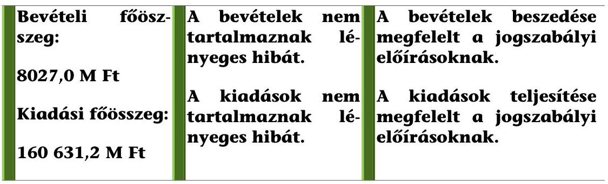

Az ellenőrzött terület: Alkotmányos fejezetek intézményei: OGYH, KEH, AB, AJBH, Bíróságok (26 intézmény), Kúria, Ügyészségek

Az alkotmányos fejezetek intézményei a bevételi és kiadási előirányzataik teljesítése során - a szabályszerűségi hibák kivételével - betartották a jogszabályok és a belső szabályzatok előírásait. Az alkotmányos fejezetek intézményei bevétel és kiadás teljesítési adatai megbízhatóak.

Az alkotmányos fejezetek ellenőrzött intézményei a költségvetési törvényben megfogalmazott célokkal összhangban gazdálkodtak.

A bevételek tekintetében az ellenőrzés nem tárt fel megbízhatósági hibát.
Szabályszerűségi hibát eredményezett, hogy a Debreceni és a Székesfehérvári Tsz esetében az Ávr. 57. § (2) bekezdése alapján belső szabályzatban előírták a bevételek teljesítésigazolását és utalványozását, de nem tartották be az előírásokat. A Fővárosi, a Miskolci és a Pécsi Tsz esetében a bevétel alátámasztását szolgáló szerződés, megállapodás nem állt rendelkezésre.

A kiadások tekintetében három intézményt (AJBH, Bíróságok cím két intézménye) érintően tárt fel az ellenőrzés megbízhatósági hibát, mivel nem folytattak le közbeszerzési eljárást a Kbt. 19. §-ában foglaltakkal ellentétben.

Az AJBH és a Budapest Környéki Tsz - a Kbt. 18. §-ában előírt egybeszámítási kötelezettség figyelmen kívül hagyásával - határozott idejű szerződést kötött. - Ezzel megsértette a Kbt. 5. §-ában foglalt, a közbeszerzési eljárás lefolytatására vonatkozó kötelezettséget, tekintettel a Kbt 19. §-ának előírásaira. A Közbeszerzési Döntőbizottság a Budapest Környéki Tsz esetében a jogsértést megállapította. A Miskolci Tsz hőközpont kiépítésére kötött szerződést közbeszerzési eljárás nélkül, amellyel megsértette a Kbt. 5. §-ában foglalt, a közbeszerzési eljárás lefolytatására vonatkozó kötelezettséget, figyelemmel a Kbt. 19. §-ában előírtakra.

További hibát eredményezett, hogy az Ügyészségeknél az üzemanyag elszámolás összege nem felelt meg az Szja. tv. 27. § (2) bekezdés előírásának. A Bíróságok cím intézményei esetében a Budapest Környéki Törvényszéknél a közbeszerzési eljárás dokumentuma és a gazdasági események bizonylata a

---

Számv. tv. 166. § (1) (2) bekezdése ellenére hiányzott vagy nem volt megfelelő, az Egri és a Debreceni Törvényszék külső személyi juttatásra vonatkozó szerződése az Ávr. 50. § (1) bekezdésben előírtakat nem tartalmazta.

Az ellenőrzés szabályszerűségi hibát jellemzően a kötelezettségvállalásra, pénzügyi ellenjegyzésre, teljesítésigazolásra, érvényesítésre, utalványozásra vonatkozó kontrollok nem megfelelő működéséhez kapcsolódóan tárt fel. Az alkotmányos intézmények közül az OGYH, az AB és az AJBH esetében teljes körűen érvényesültek a kötelezettségvállalásra, pénzügyi ellenjegyzésre, teljesítésigazolásra, érvényesítésre, utalványozásra vonatkozó kontrollok, a gazdálkodási jogkörök gyakorlása megfelelt az Ávr. előírásának. Az Ügyészségeknél az üzemanyag elszámolás kivételével a kontrollok megfelelően működtek.

A Bíróságok cím intézményeinél nem érvényesültek teljes körűen a kötelezettségvállalásra, pénzügyi ellenjegyzésre, teljesítésigazolásra, érvényesítésre, utalványozásra vonatkozó kontrollok, amely nem felelt meg az Ávr.-ben foglaltaknak.

A Bíróságoknál az aláírás-minták hiánya miatt a külső személyi juttatások és a felhalmozási kiadások néhány esetben nem feleltek meg az Ávr. 60. § (3) bekezdésében előírtaknak. A működési kiadások tekintetében jellemzően a teljesítésigazoló és az érvényesítő aláírása nem volt beazonosítható, illetve a teljesítésigazolás elmaradt, megsértve ezzel az Ávr. 57. § (3) bekezdés és az Ávr. 58. § (3) bekezdés előírásait.

A Kúriánál a személyi juttatások tekintetében több esetben a teljesítésigazolásra vonatkozó szabályok az Ávr. 57. § (3) bekezdésében foglaltak ellenére nem érvényesültek, a munkavégzés vezetői igazolása nem történt meg.

A KEH 2014. április 1-jét követően a jogkörgyakorlásra jogosult személyekről és aláírás-mintájukról naprakész nyilvántartást nem vezetett.

Az alkotmányos fejezetek intézményei költségvetési bevételei és kiadásai részben teljesültek a módosított előirányzatnak megfelelően.

Az alkotmányos fejezetek intézményei a költségvetési kiadásokat legfeljebb az év közben módosított kiadási előirányzatok mértékéig teljesítették, a költségvetési kiadások a módosított előirányzat 88,8%-ban teljesültek. A kiadási megtakarítás 20233,7 M Ft volt, amely főként a beruházások és felújítások területén képződött. Az alkotmányos intézmények költségvetési bevételei tekintetében a bevétel elmaradás 488,7 M Ft volt.

Az alkotmányos fejezetek intézményei a kiemelt előirányzatok átcsoportosítására vonatkozó előírásokat betartották.

Az alkotmányos intézmények a kiemelt előirányzatok átcsoportosítására vonatkozó előírásokat a Bíróságok cím intézményei kivételével betartották.

A Bíróságok cím intézményei előirányzat-módosításai néhány esetben nem feleltek meg maradéktalanul az előírásoknak. Az előirányzat-módosítást engedélyező vezető aláírásának hiánya miatt az Áht. 33. § (6) bekezdésében előírtak

---

ellenére a módosítás nem a megfelelő hatáskörben történt, illetve az Ávr. 167. § (4) bekezdésben foglaltakkal ellentétben az intézkedés meghozatalát követő öt munkanapon belül nem tájékoztatták a Kincstárt.

Az alkotmányos fejezetek intézményei az előirányzat maradványt szabályszerűen mutatták ki.

Az ellenőrzött intézmények 2014. évi előirányzat maradványának összege 19 700,2 M Ft, amelynek 60%-a (11 829,5 M Ft) kötelezettségvállalással terhelt. A kötelezettségvállalással terhelt előirányzat maradvány összegét szabályszerűen, az Ávr. 150. §-ában foglaltaknak megfelelően állapították meg. A kötelezettségvállalással lekötött előirányzat maradvány analitikus nyilvántartással alátámasztott volt.

Az alkotmányos fejezetek intézményei a költségvetési számvitellel készült költségvetési jelentést és maradvány-kimutatást a jogszabályi előírások alapján állították össze.

Az alkotmányos fejezetek ellenőrzött intézményei a 2014. évi éves költségvetési beszámolót - ezen belül a költségvetési számvitellel készült költségvetési jelentést és a maradvány kimutatást - a jogszabályi előírásoknak megfelelően készítették el és küldték meg jóváhagyásra az irányító szervnek a kontrollrendszer minősítéséről szóló vezetői nyilatkozattal együtt. Két intézmény esetében - a javítási munkák elhúzódása miatt - a 2015. február 28-i határidő késve teljesült, ezzel megsértették az Áhsz. 32. § (1) bekezdésben foglaltakat.

A költségvetési jelentés űrlapjai - az AJBH kivételével - biztosították a kötelező egyezőségeket a megfelelő nyilvántartási ellenszámlákkal. Az AJBH beszámolójában kimutatott előző évi maradvány igénybevételének összegét a főkönyvi kivonat vonatkozó adatai nem támasztották alá, amellyel megsértette az Áhsz. 5. § (1) bekezdését.

Az alkotmányos fejezetek intézményeinél az irányító szervi kontrollok érvényesültek.

A KGR rendszerben rögzített beszámolók felülvizsgálatát az irányító szervek folyamatosan végezték, a hibák javítása a felülvizsgálat keretében megtörtént. E miatt intézkedési tervek készítésére nem volt szükség. A felülvizsgált éves költségvetési beszámolót az irányító szerv - a felülvizsgálat elvégzését igazoló személy aláírásával ellátva - visszaküldte a felülvizsgált intézményeknek a helyszíni ellenőrzés végéig, és a beszámolók pénzügyi elfogadása elektronikusan megtörtént.

---

# 3. KÖZPONTI ALRENDSZER EGYÉB INTÉZMÉNYEI 

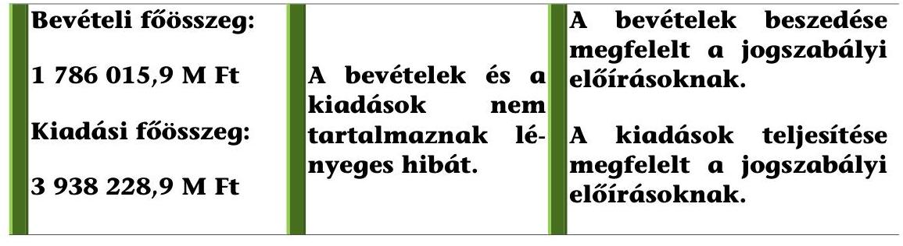

Az ellenőrzött terület: A központi alrendszer 68 egyéb intézménye, a 7. számú mellékletben felsoroltak szerint

A központi alrendszer egyéb intézményei bevétel és kiadás teljesítési adatai megbízhatóak.

A központi alrendszer egyéb intézményei a bevételi és kiadási előirányzataik teljesítése során - a feltárt szabályszerűségi hibák kivételével - betartották a jogszabályi és a belső szabályzatok előírásait. A központi alrendszer ellenőrzött egyéb intézmények - a feltárt szabályszerűségi hibák kivételével - a közpénzekkel szabályszerűen, a költségvetési törvényben megfogalmazott célokkal összhangban gazdálkodtak.

Az ellenőrzött egyéb intézményeknél a bevételek tekintetében megbízhatósági hiba volt, hogy a Számv. tv. 166. § (1)-(2) bekezdés és az Áhsz. 52. § előírásai ellenére a gazdasági esemény számviteli elszámolásánál a számviteli bizonylat (pl. számla, szerződés) hiányzott (CSMEEK, NIH), illetve a főkönyvi könyvelésben bizonylat nélküli helyesbítés történt (NFMIg, NFSZ). Továbbá az NFMIg-nél az EUR-ban számlázott szolgáltatás bevételét nem a teljesítés (számlázás) napján érvényes MNB árfolyam alapján, hanem későbbi napi árfolyam alapján számított összegben könyvelték, amely nem felel meg a Számv. tv. 75. § (4) bekezdése előírásának.

A bevételek ellenőrzése során 12 intézménynél tártunk fel szabályszerűségi hibát, amelyek az operatív gazdálkodási jogkörök gyakorlásához kapcsolódtak. A KGI több esetben megsértette az Ávr. 59. § (1) bekezdését azzal, hogy a jogszabály által nevesített esetekben bevételeit nem utalványozta.

Az ellenőrzött egyéb intézményeknél a kiadások tekintetében megbízhatósági hiba volt, hogy a Kbt 5. §-ában foglaltakkal ellentétben - figyelemmel a Kbt. 19. §-ában előírtakra - nem folytattak le közbeszerzési eljárást (MHEK, KMESZIK, FMKMAK, DorogiSZB, NAV KEKI).

Az MHEK a 2014. évben teljesített kifizetéseihez kapcsolódóan több esetben nem folytatta le a közbeszerzési eljárást, a beszerzéseket egyedi megrendeléssel végezte annak ellenére, hogy a beszerzett termékekhez, szolgáltatásokhoz hasonló beszerzésekkel egybeszámítva azok értéke meghaladta a közbeszerzési értékhatárt. Az MHEK a hivatkozott beszerzésekkel megsértette - a Kbt. 18. §-ában szereplő egybeszámítási kötelezettségre tekintettel - a Kbt. 5. §-ában előírt közbeszerzési eljárás lefolytatásának kötelezettségét, figyelemmel a Kbt. 19. §-ában foglaltakra.

A KMÉSZIK földgáz beszerzésre vonatkozó szerződést kötött határozatlan időre közbeszerzési eljárás lefolytatása nélkül. A KMÉSZIK a gázszolgáltató részére a 2014. évben összesen nettó 20,3 M Ft-ot fizetett. A határozatlan idejű szerződéskötés ellentétes volt a Kbt 125. § (8) bekezdésében foglaltakkal, mert az, a jogszabályhely szerint a verseny fenntartása és a közpénzek hatékony
 elköltésének céljával ellentétes. A Közbeszerzési Döntőbizottság a KMÉSZIK jogsértését megállapította.

Az FMKMAK 2010. június 30-át követően a helyszíni ellenőrzés időpontjáig folyamatosan, közbeszerzési eljárás mellőzésével valósította meg a közbeszerzési értékhatárt meghaladó összegű földgáz-beszerzéseit, amellyel megsértette a régi Kbt. 240. § (1) bekezdésében foglaltakat. Az FMKMAK a gázszolgáltató részére a 2014. évben összesen nettó 22,2 M Ft-ot fizetett ki. A KMÉSZIK és az FMKMAK a hivatkozott beszerzésekkel megsértette továbbá a Kbt. 5. §-ában előírt közbeszerzési eljárás lefolytatásának kötelezettségét, figyelemmel a Kbt. 19. §-ában foglaltakra. A Közbeszerzési Döntőbizottság az FMKMAK jogsértését megállapította.

A DorogiSZB kétéves időtartamra együttműködési és szállítási szerződést kötött laboratóriumi kémiai reagens termékek beszerzésére közbeszerzési eljárás lefolytatása nélkül. A hivatkozott beszerzéssel megsértette a Kbt. 5. §-ában előírt közbeszerzési eljárás lefolytatásának kötelezettségét, figyelemmel a Kbt. 19. §-ában foglaltakra. A Közbeszerzési Döntőbizottság a DorogiSZB jogsértését megállapította.

A NAV KEKI a 2012. május 3-án közbeszerzési eljárás eredményeként takarításra létrejött vállalkozási szerződést a Kbt. 132. § (1) bekezdésének előírását megsértve - a szerződés 2014. május 31-i lejáratát megelőzően - 2014. április 29-én meghosszabbította. A hivatkozott szerződés-módosítással a NAV KEKI megsértette a Kbt. 132. §-át, valamint a Kbt. 5. §-ában előírt közbeszerzési eljárás lefolytatásának kötelezettségét, figyelemmel a Kbt. 19. § (1) bekezdésében foglaltakra.

A kiadásoknál a gazdasági esemény számviteli elszámolásánál a számviteli bizonylat (pl. számla, szerződés, üzletrész vásárlás előkészítésének dokumentuma) hiánya a Számv.tv. 165. § (2) bekezdésének és a 166. § (1)(2) bekezdésének megsértését okozta (CSMEEK, Baross), továbbá a bizonylat nélküli helyesbítések a könyvelésben (NFSZ). A gazdasági eseményt alátámasztó számviteli bizonylat adatai nem feleltek meg az Áht. 37. § (1) és 38. § (1) bekezdésében és a Számv. tv. 166. § (2) bekezdésében és a 167. §-ában előírtaknak (NKE, OE, NFMIg, KGI). Jellemző hiba volt továbbá, hogy megbízási szerződés megkötésekor az Ávr. 50. § (1)-(2) bekezdésében foglaltakat figyelmen kívül hagyták (pl. pénzügyi ellenjegyzés elmaradása) (CSMEEK, Baross). Az NFMIg esetében az üzletrész megszerzéséhez az MNV Zrt. hozzájárulást nem előzetesen szerezte meg, amellyel megsértette a Vtv. 3. § (1) bekezdésében és a Számv. tv. 167. § (1) bekezdés j) pontjában foglaltakat.

Az SZGYF-hez tartozó intézmények ellenőrzött külső személyi juttatásainál több esetben a megbízási szerződések nem tartalmazták az Ávr.-ben meghatározott kötelező tartalmi elemeket. Az Ávr. 50. § (1) bekezdés a), b) és d) pontjában foglaltak ellenére nem történt meg a szakmai, műszaki teljesítés mennyiségi és minőségi jellemzőinek, a kifizetendő összegnek vagy a számlázás alapjául szolgáló egységárnak a meghatározása, valamint a pénzügyi ellenjegyzés tényének és a pénzügyi ellenjegyző keltezéssel ellátott aláírásának a feltűntetése. Továbbá az Ávr. 50. § (2) bekezdésében rögzített előírásokat figyelmen kívül hagyva megbízási szerződést saját dolgozóval kötelezően ellátandó feladatra kötöttek.

A kiadások tekintetében az ellenőrzés 38 intézménynél állapított meg szabályszerűségi hibát. A feltárt hibák 29 intézmény esetében a személyi juttatások jogcímen, 23 intézmény tekintetében a külső személyi juttatások jogcímen, 27 intézmény esetében a működési kiadások jogcímen, valamint 24 intézmény vonatkozásában a felhalmozási kiadások jogcímen fordultak elő.

38 intézménynél - MEKH, NKE, NIH, Baross, FMKMAK, Veres, KDKTF, NFSZ, MHEK, KGI, HMKI, EDUVIZIG, NYDUVIZIG, EUTAF, NFMIg, KSZSZK, Kornis, ZMSZI, MIO, Kékmadár, SZSZBMGYK, FGYO, TOFORI, VSO, PESZK, DorogiSZB, TMGYI, BMGYK, SMGYI, Nagyatádi, TT, OORI, KGK, FSZK, CSMEEK, OE, SZGYF, OTKAIR - nem teljes körűen érvényesültek a kötelezettségvállalásra, pénzügyi ellenjegyzésre, teljesítésigazolásra, érvényesítésre, utalványozásra vonatkozó kontrollok, amellyel megsértették az Ávr. vonatkozó rendelkezéseit.

A személyi juttatások és a külső személyi juttatások kifizetései esetében jellemzően az Ávr. 57. § (1) bekezdésében előírt teljesítésigazolást nem hajtották végre, vagy nem az Ávr. 57. § (3) bekezdésének megfelelő formában történt a teljesítésigazolás (Veres, HMKI, NKE, NYUDUVIZIG, EDUVIZIG, NFSZ), az Ávr. 60. § (3) bekezdésben foglaltak ellenére az aláírásra jogosult személyek aláírás-mintáiról nem vezettek naprakész nyilvántartást (OE), illetve az Ávr. 58. § (1) bekezdésében előírt érvényesítési feladatokat (Veres), továbbá az Ávr. 58. § (2) alapján előírt utalványozó felé történő jelzési kötelezettséget (HMKI) nem végezték el. A működési kiadások tételeinek ellenőrzése kapcsán feltárt jellemzőbb szabályszerűségi hibák az Ávr. 60. § (3) bekezdésében meghatározott előírásoknak figyelmen kívül hagyásából adódtak (NFMIg, OE, Veres).

A felhalmozási kifizetések tekintetében a KGI intézménynél nem jelöltek ki érvényesítőt, ami nem felel meg az Ávr. 58. § (4) bekezdésében előírtaknak. Továbbá a kötelezettségvállaló nem volt jogosult felhalmozási kiadások tekintetében kötelezettséget vállalni, ezáltal az intézmény nem tartotta be az Ávr. 52. § (1) bekezdésében foglaltakat. Az MEKH intézmény esetében a felhalmozási kiadások egyes tételeinél nem tartották be az Ávr. 58. § (3) bekezdésében foglaltakat, mert az érvényesítés nem az Ávr. 59. § (2) bekezdése szerinti okmány utalványozása előtt történt.

A 2014. évi zárszámadás keretében az ellenőrzésre kiválasztott szociális intézmények közül 22 intézmény gazdasági szervezettel nem rendelkezik, ezen intézmények a gazdálkodási feladatokat - az Ávr. 8. § (1), 9. § (1) bekezdéseinek megfelelően - a Szociális és Gyermekvédelmi Főigazgatóság (SZGYF) a központi és megyei kirendeltségei útján látja el.

A megyei kirendeltségekhez tartozó intézmények közül az ellenőrzés 13 intézmény esetében tárt fel - KSZSZK, FKKGY, ZMSZI, MIO, Kékmadár, SZSZBMGYK, FGYO, TOFORI, VSO, PESZK, TMGYI, BMGYK, SMGYI - szabályszerűségi hibát. Az SZGYF a hozzá tartozó intézményi kör tekintetében az egyes intézményekre vonatkozó szabályozás esetében nem járt el egységesen, mert a munkamegosztás és a felelősségvállalás rendjéről nem minden intézmény esetén rendelkezett, ezzel megsértette az Ávr. 10. § (4) bekezdésében foglaltakat. A költségvetési és a pénzügyi számvitel alkalmazásával kapcsolatos sajátos szabályokat - az Áhsz. 50. §-ában foglaltak ellenére - a számviteli politikájában és kapcsolódó szabályzatokban nem vezette át. E hiányosságok, valamint az operatív gazdálkodási jogkörök gyakorlására történő kijelölések hiánya miatt 4 intézmény esetében - ZMSZI, Kékmadár, SZSZBMGYK, TOFORI - nem tartották be az Ávr. 57. § (1), (3)-(4) bekezdésében, valamint az Ávr. 58. § (1) bekezdésében foglalt teljesítésigazolásra és érvényesítésre vonatkozó előírásokat. Jellemző hiba volt, hogy az Ávr. 57. § (4) bekezdésében előírtakkal szemben a teljesítés igazolására jogosult személyeket nem a kötelezettségvállaló jelölte ki.

A 2014. évi zárszámadás keretében ellenőrzésre kiválasztott intézmények közül 5 egészségügyi feladatokat ellátó szervezetnél (MHEK, DorogiSZB, CSMEEK, TT, Nagyatádi) több kiadási jogcímet érintően is tárt fel szabályszerűségi hibát az ellenőrzés.

Az MHEK 2010. december 1-jén jóváhagyott kötelezettségvállalási szabályzatát nem aktualizálták a hatályos jogszabályokra figyelemmel. A működési és felhalmozási kiadások tekintetében a kötelezettségvállalást, pénzügyi ellenjegyzést, teljesítésigazolást, érvényesítést, utalványozást végző személyek - a jogszabályban előírt esetekben - írásbeli kijelöléssel nem rendelkeztek, ezzel az MHEK megsértette az Ávr. 52. § (1), 55. § (2), 57. § (4), 58. § (4) és 59. § (1) bekezdés előírásait. A működési és a felhalmozási kiadások tételeihez kapcsolódó utalványrendeleteken nem szerepelt az érvényesítő és az utalványozó aláírása, mellyel az MHEK megsértette az Ávr. 58. § (3) bekezdését és az 59. § (3) bekezdés g) pontját. Az MHEK továbbá megsértette az Áht. 37. § (1) bekezdését, mert fedezet hiányában pénzügyi ellenjegyzést megelőzően vállaltak kötelezettséget.

A DorogiSZB Ávr. 58. § (3) bekezdésében, valamint az Ávr. 59. § (3) bekezdés g) pontjában foglaltak ellenére nem tüntette fel az érvényesítés és az utalványozás dátumát.

A CSMEEK esetében a személyi juttatásokra, valamint a működési kiadásokra vonatkozóan a kifizetések teljesítése során az Ávr. 57. § (1) bekezdésében előírt teljesítésigazolást nem hajtották végre, mivel az Ávr. 57. § (3) bekezdésében foglalt előírás ellenére a teljesítésigazolás dátuma, a teljesítés tényére történő utalás és az arra jogosult személy aláírása a bizonylaton nem szerepelt. Az Ávr. 58. § (1) bekezdésében előírt érvényesítési feladatokat nem végezték el, mivel az ellenőrzött időszakban az Ávr. 58. § (4) bekezdésében foglaltak ellenére érvényesítőt nem jelöltek ki. Az utalványon az Ávr. 58. § (3) bekezdésében foglaltak ellenére az érvényesítésre utaló megjelölés és az érvényesítő keltezéssel ellátott aláírása nem szerepelt. A személyi juttatások és a működési kiadások tekintetében a kötelezettségvállalási dokumentumot nem az Ávr. 52. § (1) bekezdésében meghatározott, arra jogosult személy írta alá, valamint a kötelezettségvállalási dokumentum pénzügyi ellenjegyzése az Ávr. 55. § (1) bekezdésében foglaltakat figyelmen kívül hagyva nem történt meg. Továbbá több esetben kötelezettségvállalási dokumentum nem állt rendelkezésre és az Ávr. 53. § (2) bekezdésében foglaltak ellenére az írásbeli kötelezettségvállalást nem igénylő kifizetések rendjét belső szabályzatban nem rögzítették.

A TT intézmény tekintetében az ellenőrzött tételek többségénél az Áht. 37. § (1) bekezdésében előírtakat megsértve kötelezettségvállalásra pénzügyi ellenjegyzés nélkül került sor. A teljesítésigazolást az Áht. 38. § (1) bekezdésében és az Ávr. 57. § (1) bekezdésében előírtak ellenére nem végezték el. Az érvényesítést a kifizetéseket megelőzően az Ávr. 58. § (4) bekezdésében előírtak ellenére szabálytalan kijelölés miatt nem az arra jogosult végezte, valamint az érvényesítő az Ávr. 58. § (2) bekezdésében előírtak ellenére nem járt el szabályszerűen. Az utalványok nem tartalmazták az Ávr. 59. § (3) bekezdés e) pontjában előírtakat.

A Nagyatádi (kórház) esetében a személyi kifizetéseknél, a külső személyi juttatásoknál és a dologi kiadásoknál a gazdálkodói jogkörök gyakorlása (teljesítésigazolás, érvényesítés) nem felelt meg az Áht. 38. § (1) bekezdésében és az Ávr. 57. § (3)-(4) bekezdéseiben foglalt előírásoknak. Az Ávr. 58. § (4) bekezdésében előírtak ellenére az Intézmény állományába tartozó, de jogosultsággal nem rendelkező személy látta el az érvényesítő feladatait. A beszámolási időszakban kötött, a felhalmozási kiadásokhoz kapcsolódó szerződéseknél nem minden esetben tartották be az Áht. 37. § (1) bekezdése és Ávr. 55. § (1)-(2) bekezdése előírásait, mert pénzügyi ellenjegyzés nélkül történt a kötelezettségvállalás, illetve az arra nem jogosult személy (pénzügyi osztályvezető) végezte a pénzügyi ellenjegyzést.

Az egyéb intézmények költségvetési bevételei és kiadásai részben teljesültek a módosított előirányzatnak megfelelően.

40 költségvetési szerv az Áht. 4. § (2) bekezdésében meghatározottak szerint a bevételi előirányzatok teljesítésének kötelezettségét betartotta. Ebből 25 költségvetési szerv esetében a költségvetési bevételek teljesítése megegyezett a módosított előirányzat összegével, 15 intézmény bevételi többletet ért el.

27 intézmény esetében a 2014. évi költségvetési bevételi előirányzatának teljesítése nem érte el a módosított előirányzat összegét. Az ellenőrzött szervezetek a 2014. évben 108,5 M Ft bevételi többletet és 9538,9 M Ft bevételi lemaradást mutattak ki, amelynek egyenlege 9430,4 M Ft lemaradás volt.

A módosított bevételi előirányzattól való elmaradást az uniós utófinanszírozású projektek elszámolásai, az NFM Igazgatás esetében az EU-s projektek lebonyolításának szervezeteit érintő átszervezési tervek okozták, amelyek a költségvetés tervezésekor nem voltak ismertek. Az NFM bevételi lemaradása 2968,3 M Ft volt, amely az ellenőrzött 67 egyéb intézmény bevételi előirányzat teljesítési kötelezettségétől való eltérésének 31,5%-át
 jelentette.

Az egészségügyi intézmények tekintetében a vérkészítményekből tervezett bevétel elmaradása, a tervezettnél kevesebb praxis működtetése, illetve fejlesztések miatti kapacitás kiesés miatt nem sikerült teljesíteni a módosított bevételi előirányzatot.

Valamennyi egyéb intézmény az Áht. 6. § (1) bekezdésének megfelelően a költségvetési kiadásokat legfeljebb az év közben módosított kiadási előirányzatok mértékéig teljesítette. A módosított előirányzathoz képest a költségvetési kiadások 84,7%-ban teljesültek, a kiadási lemaradás 42 223,5 M Ft volt.

A teljesített kiemelt kiadási előirányzatok módosított előirányzatától való elmaradását egyrészt az előirányzatok tervezési pontatlansága, másrészt a szervezeti változások és az európai uniós programok megvalósításának a tervezett ütemezéstől való eltérései okozták.

A kiemelt előirányzatok átcsoportosítására vonatkozó előírásokat az ellenőrzött intézmények közül 12 nem tartotta be, míg 56 intézmény esetében a kiemelt előirányzatok átcsoportosításai a jogszabályi előírásoknak megfeleltek, előkészítettek és dokumentáltak voltak.

Az előirányzat-módosítások és átcsoportosítások az NKE, a Baross, az NFSZ, az NYDUVIZIG, az EUTAF, a DorogiSZB, a Kozma, a Nagyatádi, a TT, az OORI, a KGK és a CSMEEK intézmények esetében nem voltak teljes körűen szabályszerűek, mert a saját hatáskörben végrehajtott előirányzat-módosításokról, átcsoportosításokról az intézkedés meghozatalát követő öt munkanapon belül az Ávr. 167. § (4) bekezdésében foglaltakkal ellentétben az irányító szervet nem tájékoztatták.

A Nagyatádi és a KGK esetében az előirányzat-módosítások, átcsoportosítások több szempontból nem feleltek meg az Ávr. előírásának. A Nagyatádi (kórháznál) a saját hatáskörű előirányzat-változtatások esetében nem tartotta be az intézmény az Ávr. 43. § (2) bekezdésében előírtakat, mert az előirányzatmódosításról nem az előirányzatok felett rendelkező intézményvezető, hanem a gazdasági vezető döntött, nem történt meg az intézkedést elrendelő dokumentumok pénzügyi ellenjegyzése.

A KGK esetében a saját hatáskörben végrehajtott előirányzat-módosítások az alátámasztó dokumentumok alapján nem feleltek meg az előírásoknak, mivel az Ávr. 43. § (2) bekezdése, illetve 44. (2) bekezdése előírásaival ellentétben hiányzott az előirányzat-módosítások ellenjegyzése, valamint a költségvetési szerv vezetőjének aláírása.

Az előirányzat maradványt szabályszerűen mutatták ki.
Az ellenőrzött intézmények 2014. évi előirányzat maradványának összege 33 471,7 M Ft, amelynek 88%-a (29 447,5 M Ft) kötelezettségvállalással terhelt.

---

A kötelezettségvállalással terhelt előirányzat maradvány összegét - a CSMEEK és a TT kivételével - az Ávr. 150. §-ában foglaltaknak megfelelően állapították meg.

A CSMEEK az Áhsz. 5. § (1) bekezdésében foglalt előírást megsértve éves beszámoló készítési kötelezettségének - az Áhsz. 3. § (2) bekezdésében foglaltak ellenére könyvelése naprakészségének hiánya miatt - a helyszíni ellenőrzés lezárásának időpontjáig nem tett eleget, a 2014. évi előirányzat maradványának összegét az Ávr. 149. § (1) bekezdésében előírtak ellenére nem mutatta ki.

A TT esetében a 2014. évi költségvetési beszámoló 07/A űrlapján a kötelezettségvállalással terhelt maradványként kimutatott 613,5 M Ft nem egyezett meg a maradványanalitikában kimutatott 51,3 M Ft kötelezettségvállalással terhelt összeggel, mellyel az Intézmény az Áhsz. 39. § (3) bekezdésében előírtakat nem tartotta be.

A költségvetési számvitellel készült költségvetési jelentést és maradványkimutatást az intézmények a jogszabályi előírások alapján állították össze.

58 intézmény a 2014. évi éves költségvetési beszámolót - és ezen belül a költségvetési számvitellel készült költségvetési jelentést és maradványkimutatást - alapvetően a jogszabályi előírásoknak megfelelően készítette el és küldte meg jóváhagyásra az irányító szervnek a kontrollrendszer minősítéséről szóló vezetői nyilatkozattal együtt. Az éves költségvetési beszámolót a helyszíni ellenőrzés lezárásáig nyolc intézmény (NK, KDKTF, ZMSZI, Kékmadár, SZSZBMGYK, ZMPBO, VMSZSZI, TT) a jogszabályoknak részben megfelelően, két intézmény (CSMEEK, KGK) pedig nem készítette el.

A költségvetési jelentést (költségvetési beszámolót) az egyéb költségvetési intézmények nagy része - a feltárt hibák ellenére - a jogszabályi előírásoknak megfelelően állította össze, annak adott űrlapjai biztosították a kötelező egyezőségeket a megfelelő nyilvántartási ellenszámlákkal. Az egyes űrlapokon belül fennálltak a kötelező összefüggések. A maradványkimutatást az Áhsz. által megadott formában és tartalommal készítették el.

A költségvetési intézményeknél az irányító szervi kontrollok nem érvényesültek teljes körűen. Az irányító szervek az irányításuk alá tartozó költségvetési intézmények beszámolójával kapcsolatos felülvizsgálati kötelezettségüknek az ellenőrzött intézmények 74%-ánál eleget tettek. A KGR rendszerben rögzített beszámolók felülvizsgálatát az irányító szervek folyamatosan végezték, a hibák javítása a felülvizsgálat keretében folyamatosan megtörtént, ezekben az esetekben intézkedési tervek készítésére nem volt szükség. A felülvizsgált éves költségvetési beszámolókat az irányító szerv (döntő többségben az EMMI) a felülvizsgálat elvégzését igazoló személy aláírásával ellátva nem küldte vissza a felülvizsgált intézmények közel felének a helyszíni ellenőrzés végéig. Az éves költségvetési beszámoló jóváhagyásáról nem érkezett visszajelzés a helyszíni ellenőrzés végéig az ellenőrzött szervezetek 26%-ánál, mellyel megsértették az Áhsz. 32. § (1) bekezdésében foglaltakat. Ennek oka jellemzően az egyeztetési, javítási folyamat elhúzódása volt.

---

.

---

# A kontrollkörnyezet és a belső kontrollrendszer ellenőrzésével kapcsolatos összefoglaló megállapítások 

Magyarország 2014. évi központi költségvetése végrehajtásának ellenőrzése keretében az ELKA, a fejezeti kezelésű előirányzatok, az EU támogatásokhoz kapcsolódó előirányzatok, az alkotmányos fejezetek intézményei (OGYH, KEH, AB, AJBH, Bíróságok, Ügyészségek) és az egyéb intézmények kontrollkörnyezetét minősítettük.
A TB Alapok kezelői szervei (ONYF, NYUFIG, OEP), valamint az Országgyűlés részére évente vagy kétévente beszámolásra kötelezett szervezetek közül nyolc intézmény esetében a teljes belső kontrollrendszer minősítését végeztük el.

## 1. A KONTROLLKÖRNYEZET ELLENŐRZÉSÉVEL KAPCSOLATOS ÖSSZEFOGLALÓ MEGÁLLAPÍTÁSOK

### 1.1. Az ELKA kontrollkörnyezeteinek kialakítása és működtetése

Az ELKA hat kezelő szervéből ötnél a kontrollkörnyezet kialakítását és működtetését megfelelőnek, a KTIA-nál nem megfelelőnek minősítettük. A KTIA esetében a nem megfelelő minősítést a belső szabályzatok hiánya okozta. Az alapkezelők elkészítették a szervezeti és működési szabályzatukat, valamint - a KTIA kivételével - a gazdasági tevékenységet ellátó szervezeti egységek feladataira vonatkozó ügyrendeket. A KTIA az Áht. 10. § (4)-(5) bekezdéseiben, valamint az Ávr. 9. § (5) bekezdésében foglalt előírások ellenére nem rendelkezett a hivatkozott ügyrenddel. A munkaköri leírásokban szabályszerűen határozták meg a dolgozók feladatait és hatásköreit, valamint a munkakörök betöltésére vonatkozó követelményeket. A gazdasági feladatokat ellátó szervezetek vezetői megfeleltek a végzettségre, a szakképesítésre és a könyvviteli szolgáltatási tevékenység ellátására vonatkozó előírásoknak.
A KTIA feladatellátását jelentősen befolyásolták az ellenőrzött időszakban bekövetkezett szervezeti változások. Az alap kezelése 2014. január 1-jén az NFM-től az NGM-hez, majd 2014. augusztus 1-jétől év végéig a ME-hez került. A változások miatti átadás-átvételek követően nem történt meg a szabályzatok és eljárásrendek teljes körű kialakítása, illetve az elkészített dokumentumok hatályba helyezése. A KTIA az Áht. 10. § (4)-(5) bekezdéseiben, a Számv. tv. 14. § (3)-(5) és 161. § (1)-(4) bekezdéseiben, az Áhsz. 50. § (1) és 51. § (2) bekezdéseiben, az Ávr. 13. § (2)-(3) bekezdéseiben, valamint a Bkr. 6. § (3)-(4) bekezdéseiben foglaltak ellenére részben rendelkezett a szabályszerű gazdálkodást meghatározó érvényes szabályzatokkal. A KTIA nem rendelkezett a következő hatályos szabályzatokkal: számviteli politika, számlarend, leltározási, értékelési, pénzkezelési szabályzatok, bizonylati rend, a gazdálkodás részletes rendjét meghatározó szabályzat.
A KNPA esetében a gazdasági tevékenységet ellátó szervezeti egység ügyrendje az Ávr. 13. § (5) bekezdésében foglalt előírások ellenére nem tartalmazta az alap

---

kezelésével kapcsolatos munkafolyamatok leírását. Az előirányzatok felhasználásával összefüggésben az Ávr. 13. § (2) bekezdés a) pontjában, valamint a 4/2014. (II.7.) NFM utasítás 15. § a) és d) pontjában foglaltaktól eltérően az alapkezelő nem határozta meg a kötelezettségvállalás, az ellenjegyzés, a teljesítésigazolás, az érvényesítés, az utalványozás gyakorlásának módjával, eljárási és dokumentációs részletszabályaival kapcsolatos előírásokat, feltételeket, illetve a támogatások felhasználása ellenőrzésének szabályait. Az NKA az Ávr. 13. § (2) bekezdés a) pontjának előírásai ellenére nem határozta meg a szakmai teljesítésigazolást, a teljesítésigazolás gyakorlásának módját, eljárási és dokumentációs részletszabályait, valamint a személyek kijelölésének rendjével kapcsolatos belső előírásokat, feltételeket. A BGA, a KTIA, a NEFA, az NKA és a WMA kezelő szervei az Ávr. 13. § (3) bekezdésében foglalt előírások ellenére nem készítettek külön szabályzatot a tervezési, gazdálkodási, finanszírozási, adatszolgáltatási és beszámolási feladatokra vonatkozóan.

# 1.2. Az uniós források kontrollkörnyezetének kialakítása és működtetése 

Az uniós források felhasználásának szabályozási környezetét kialakították, ami megteremtette a szabályszerű felhasználás feltételeit. A 475/2013. (XII. 17.) Korm. rendelettel 2014. január 1-jétől megszüntetett NFÜ jogutódja, az ME a kontrollkörnyezetet megfelelően alakította ki. A módosított 4/2011 (I. 28.) Korm. rendelet szerint 2014. január 1-jétől az ágazati szakpolitikákért felelős tárcákhoz került IH-k, illetve 96/2014. (III. 25.) Korm. rendelet alapján közreműködő szervezeti feladatokat - a ROP KSz-ek kivételével - átvevő központi költségvetési szervek az uniós források felhasználásának szabályozási környezetét kialakították. A 256/2007. (X. 4.) Korm. rendelet 5. § (1) bekezdése alapján az EMVA és a HOP esetében az MVH az uniós támogatások elszámolásának szabályozási környezetét megfelelően kialakította. Az 1483/2014. (VIII. 27.) Korm. határozat értelmében az EMVA és HOP támogatások a Kvtv. XII. fejezet FM fejezetből 2014. január 1-jei hatállyal átfordításra kerültek a XIX. Uniós fejlesztések fejezethez.
A XIX. fejezet irányító szerve az ME az ellenőrzött időszakban rendelkezett jóváhagyott SzMSz-szel. A három egymást követően hatályba lépő SzMSz közül kettőnél állapítottunk meg hiányosságot. A 2014. január 22-ig hatályos 1/2012. (VIII. 31.) ME utasítás - az Ávr. 13. § (1) bekezdés e) pontja ellenére - nem tartalmazta az UF fejezettel kapcsolatos feladatokat ellátó szervezeti egységek megnevezését, engedélyezett létszámát és feladatait. A 2014. július 24-től hatályos 1/2014. (VII. 23.) MvM utasítás - az Ávr. 13. § (1) bekezdés e) pontja ellenére - nem tartalmazta a szervezeti egységek engedélyezett létszámát és az Ávr. 13. § (1) bekezdés h) pontja ellenére a munkáltatói jogok gyakorlásának rendjét.
A Számv. tv. és az Áhsz. által előírt szabályzatokkal 2014. évben rendelkeztek, azonban - a Számv.tv. 161. § (2) bekezdés d) pontja és az Áhsz. 51. § (2) bekezdésének előírásai ellenére - a számlarend nem tartalmazta a bizonylati rendet. A 2007-2013 programozási időszakra, az NSRK OP-kra hatályos, a 2014. évben elkészült Kincstári Számviteli Bizonylati Szabályzat nem tartalmazta a Számv. tv. 167. § (1) bekezdése ellenére - a könyvviteli elszámolást közvetlenül alátámasztó bizonylatok általános alaki és tartalmi kellékeire vonatkozó előírá-

---

sokat. Az UF fejezet fejezeti kezelésű előirányzataira vonatkozó értékelési szabályzat - az Áhsz. 50. § (2) bekezdés b) pontja ellenére - nem tartalmazta követeléstípusonként a kis összegű követelések év végi meghatározásának elveire, dokumentálásának szabályaira vonatkozó előírást. Az UF fejezetbe tartozó fejezeti kezelésű előirányzatok felhasználási szabályairól szóló 549/2013. (XII. 30.) Korm. rendelet az Áht. 28. § (1a) bekezdése és az Ávr. 30. § (2) bekezdése ellenére nem rendelkezett a fejezeti kezelésű előirányzatok átcsoportosításának szabályairól.

# 1.3. A fejezeti kezelésű előirányzatok kontrollkörnyezetének kialakítása és működtetése 

A fejezeti kezelésű előirányzatok kontrollkörnyezetének kialakítása a vonatkozó jogszabályi előírásoknak megfelelt, rendelkezésre álltak a hatályos és jóváhagyott belső szabályozások. A hatásköri viszonyok és feladatok egyértelműen meghatározottak voltak. A 2014. december 31-i állapot szerint a kontrollkörnyezet kialakítása 14 fejezetnél (OGY, KE,
 AB, AJBH, Ügyészség, IM, ME, HM, BM, NGM, NFM, GVH, KSH, MMA) megfelelő, öt fejezetnél (BIR, FM, KKM, EMMI, MTA) részben megfelelő minősítést kapott. Négy fejezet (BIR, KKM, GVH, MTA) nem felelt meg az Ávr. 13. § (2) bekezdés a) pontjának, mert a gazdálkodási szabályzatban nem határozták meg a fejezeti kezelésű előirányzatok tervezésével, gazdálkodásával és az ellenőrzési, adatszolgáltatási és beszámolási feladatok teljesítésével kapcsolatos belső előírásokat, feltételeket, ami a legjellemzőbb hibát jelentette. A jogszabályi előírások - Számv. tv. 14. § (3) és (5), 161. § (1) és 162. § (d) bekezdés, Áhsz. 50. § (1) és 51. § (2) bekezdés - ellenére a BIR és az EMMI 2014. évben nem készítette el és nem rendelkezett a fejezeti kezelésű előirányzatok Áhsz. szerinti számviteli szabályzataival.

### 1.4. Az alkotmányos fejezetek intézményei kontrollkörnyezetének kialakítása és működtetése

Az alkotmányos fejezetek intézményei kontrollkörnyezetének kialakítása és működtetése öt intézmény (OGYH, KEH, AB, AJBH, Ügyészségek) esetében megfelelő volt. A Bíróságok fejezet intézményei közül egy megfelelő, 19 intézmény részben megfelelő minősítést kapott, hét intézmény kontrollkörnyezete nem felelt meg a Bkr. 3. § a) pontja és a 6. §-a előírásának.
Az alkotmányos fejezetek három intézménye (OGYH, KEH, AB) az Áhsz. hatályba lépését követően módosította a számviteli politikáját, a Számv. tv. 14. § (5) bekezdése szerinti szabályzatait, illetve a számlarendjét. A Számv. tv. 14. § (11) bekezdésében előírtak ellenére, a jogszabályváltozást követő 90 napon túl módosította az AJBH a számviteli politikáját, az értékelési és pénzkezelési szabályzatát, az OGYH az értékelési és az önköltségszámítási szabályzatát valamint az Ügyészség a leltározási és leltárkészítési szabályzatát.
Az alkotmányos fejezetek kontrollkörnyezete minősítésének eredményeit az 1. számú ábra mutatja.

---

1. számú ábra
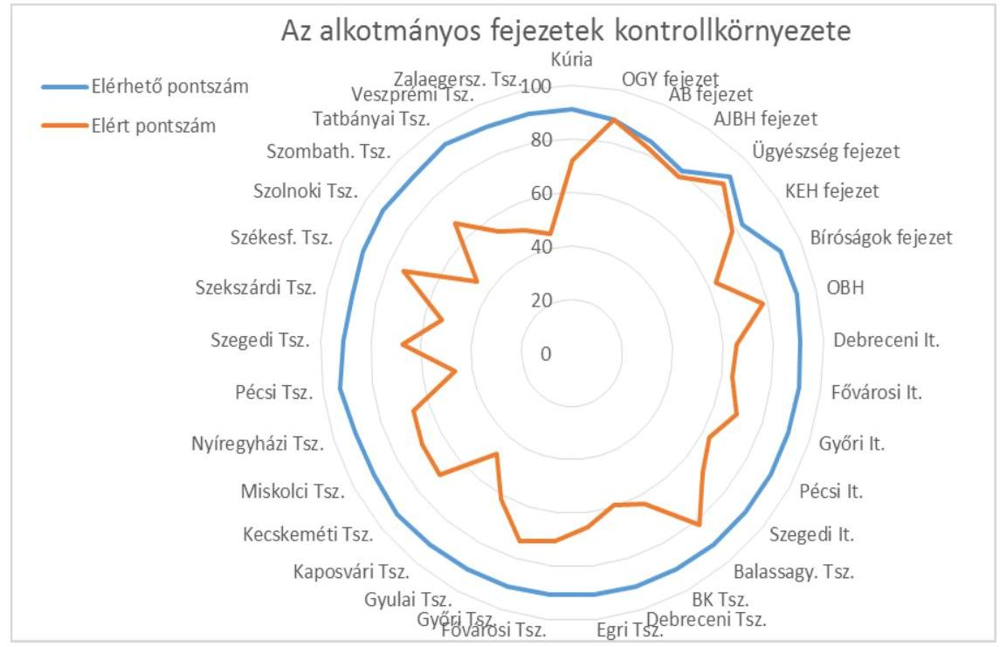

Forrás: Számvevőszék adatgyűjtés
A 20 törvényszék közül egy intézmény kontrollkörnyezete megfelelő volt, 12 törvényszék kontrollkörnyezete részben felelt meg a jogszabályi követelményeknek, hét törvényszék esetében a kontrollkörnyezet nem felelt meg az előírásoknak. A hiányosságokat alapvetően a Számv. tv. 14. § (3) és (5), valamint az Áhsz. 50. § (1) bekezdésében megjelölt szabályzatok - a számviteli politika, ennek keretében az eszközök és a források leltárkészítési és leltározási szabályzata és értékelési szabályzata, az önköltségszámítás rendjére vonatkozó belső szabályzat, továbbá a pénzkezelési szabályzat - hatályos Áhsz. előírásaival összhangban lévő módosításának elmaradása okozta.
A Számv. tv. 14. § (3)-(5), és az Áhsz. 50. § (1) bekezdésének megfelelő számviteli politikával 18 törvényszék rendelkezett. A Debreceni és a Pécsi Tsz a jogszabályi rendelkezések ellenére nem készítette el a szervezet számviteli politikáját. A 2014. január 1-jétől hatályos Áhsz.-nek megfelelő aktualizált számviteli politikával mindössze öt törvényszék rendelkezett, 13 törvényszék a Számv. tv. 14. § (1) és az Áhsz. 50. § (1) bekezdésében előírt kilencven napon belül nem vezette át a jogszabályváltozásokat a számviteli politikán.
Az ítélőtáblák kontrollkörnyezete mind az öt szervezet esetében részben felelt meg a Bkr. 3. § a) pont és 6. § rendelkezéseinek a Számv. tv. 14. § (3) és (5), valamint az Áhsz. 50. § (1) és az 51. § (2) bekezdésében előírt szabályzatokkal kapcsolatos hiányosságok miatt. A Fővárosi és a Szegedi Ítélőtábla nem aktualizálta számviteli politikáját és számlarendjét, a Debreceni Ítélőtábla a számlarendjét a 2011. évben léptette hatályba.

---

# 1.5. Az egyéb intézmények kontrollkörnyezetének kialakítása és működtetése 

A 68 ellenőrzött intézmény közül 38 szervezet kontrollkörnyezete megfelelő, 21 költségvetési szerv részben megfelelő minősítést kapott. Kilenc intézmény (NFSZ, BKMCSI, CSMEEK, TOFORI, OE, KSZSZK, SZSZBMGYK, Veres, DTH) esetében a kontrollkörnyezet nem felelt meg a Bkr. 3. § a) pont és a 6. § -aiban foglalt előírásoknak. A részben, illetve nem megfelelő értékelést a jogszabályokban előírt belső szabályozó eszközök hiánya, továbbá a számviteli szabályzatok aktualizálásának elmaradása okozta.
A 68 ellenőrzött szervezetből öt (BKMCSI, Dorogi Kórház, OORI, SZGYF, SZLMK) az Áht. 10. § (5) pontjában előírtakkal szemben nem rendelkezett hatályos SzMSz-szel. A TT az Áht. 9. § (1) bekezdés a) pont ellenére nem rendelkezett az irányító szerv által jóváhagyott SzMSz-szel. A 68 költségvetési szervből 38 aktualizálta a számviteli politikáját a jogszabályváltozást követően. 30 intézmény a Számv. tv. 14. § (11) és az Áhsz. 50. § (1) bekezdésében foglaltak ellenére a változásokat az Áhsz. hatálybalépését követő 90 napon belül nem vezette át a számviteli politikán.
A Baross és az EUTAF SzMSz-e az intézmények gazdasági szervezetét és annak feladatait nem nevesítette, amely ellentétes az Ávr. 13. § (1) bekezdés e) pontjában foglaltakkal.

## 2. A BELSŐ KONTROLLRENDSZER KIALAKÍTÁSA ÉS MŰKÖDTETÉSE

A belső kontrollrendszer kialakítását és működtetését a TB Alapok kezelő szerveinél, valamint az Országgyűlés felé beszámolásra kötelezett intézményeknél (KH, NAIH, NVI, NÉBIH, GVH, KSH, MTA Igazgatása, MMA) ellenőriztük. Az ellenőrzés eredményeit a 2. számú ábra szemlélteti.
2. számú ábra
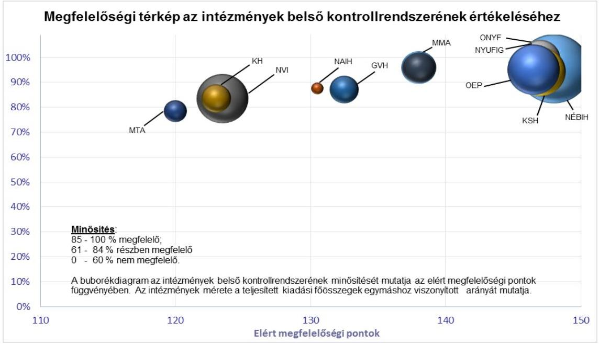

Forrás: Számvevőszék adatgyűjtés

---

# 2.1. A TB Alapok kezelő szervei belső kontrollrendszerének kialakítása és működtetése 

A TB Alapok kezelő szerveinek (ONYF, OEP), valamint a NYUFIG belső kontrollrendszerének kialakítása és működtetése megfelelő az Áht. 69-70. §-a és a Bkr. 3-10. §-ai előírásainak.
Ugyanakkor az ONYF és a NYUFIG tekintetében a számviteli politikát és ennek keretében az eszközök és a források leltárkészítési és leltározási szabályzatát, az eszközök és a források értékelési szabályzatát, az önköltségszámítás rendjére vonatkozó belső szabályzatot és a pénzkezelési szabályzatot, valamint az OEP működési területének számviteli politikáját a Számv. tv. 14. § (11) és az Áhsz. 50. § (1) bekezdéseivel szemben a jogszabályi változásokat követő kilencven napon belül nem aktualizálták.
Az OEP az ellátási terület számviteli politikáján és a Számv. tv. 14. § (5) bekezdés szerinti szabályzatokon, valamint a működési terület értékelési és önköltségszámítási szabályzatán a Számv. tv. 14. § (11) és az Áhsz. 50. § (1) bekezdései ellenére a jogszabályi változásokat a 2014. évben nem vezette át.

### 2.2. Az Országgyűlés felé beszámolásra kötelezett intézmények belső kontrollrendszerének kialakítása és működtetése

Az OGY felé beszámolásra kötelezett intézmények belső kontrollrendszerének kialakítása és működtetése megfelelő az Áht. 69-70. §-a és a Bkr. 3-10. §-ai előírásának.
Öt intézmény (NAIH, NÉBIH, GVH, KSH, MMA) belső kontrollrendszere megfelelő, három intézmény (KH, NVI, MTA Igazgatás) részben megfelelő minősítést kapott.
A 2014. év végén a kontrollkörnyezet kialakítása - az MTA Igazgatás kivételével -, a kockázatkezelési rendszer - az NVI és a GVH kivételével - megfelelő volt. A kontrolltevékenységek működtetése öt intézménynél megfelelő, három intézménynél - KH, NAIH, NVI - részben megfelelő minősítést kapott. Az információs és kommunikációs rendszer kialakítása és működtetése hat intézménynél megfelelő volt, két intézménynél - NVI, MTA Igazgatás - részben megfelelő minősítésű volt. A monitoring rendszer működtetése négy intézmény (NAIH, NÉBIH, GVH, KSH) esetében megfelelő, négy intézménynél (KH, NVI, MTA Igazgatás, MMA) részben megfelelő volt.
A szervezetek rendelkeztek az Áht. 10. § (5) pontjának megfelelő, érvényes SzMSz-szel, valamint a Számv. tv. 14. § (3) és (5) bekezdése és az Áhsz. 50. § (1) bekezdés szerinti számviteli politikával és az annak keretében elkészítendő szabályzatokkal, továbbá a Számv. tv. 161. § (1) és (2) bekezdés d) pontja, és az Áhsz. 51. § (2) bekezdésének megfelelő számlarenddel és bizonylati renddel.
Az MTA kivételével ugyanakkor hét intézmény esetében az ellenőrzés megállapította, hogy a Számv. tv. 14. § (11), valamint az Áhsz. 50. § (1) bekezdésében meghatározottak ellenére a számviteli politikán és a Számv. tv. 14. § (5) bekezdésében felsorolt szabályzatokon a jogszabályváltozásokat annak hatálybalépését követő 90 napon belül nem vezették át.

---

A nyolc intézményből egyedül az MTA Igazgatás kontrollkörnyezete nem kapott megfelelő minősítést, mivel a gazdasági szervezet ügyrendje nem tartalmazta a gazdálkodással kapcsolatos feladatok munkafolyamatainak leírását, valamint a gazdasági szervezet vezetőinek, alkalmazottainak feladat- és hatáskörét az Ávr. 13. § (5) bekezdésében leírtak ellenére. A költségvetési szerv vezetője nem határozta meg az etikai elvárásokat a szervezet minden szintjén a Bkr. 6. § (1) bekezdés c) pontja ellenére.
Az intézmények háromnegyedének kockázatkezelési rendszere megfelelő volt, két szervezet (NVI, GVH) a működtetési hiányosságai következtében részben megfelelő minősítést kapott.
Az NVI kockázatkezelési rendszerének működtetése során megsértette a Bkr. 7. § (2) bekezdését, mert kockázatelemzéssel nem mérte fel, nem határozta meg a szervezet tevékenységében, gazdálkodásában rejlő kockázatokat, valamint nem határozta meg a kockázatok kezelése érdekében szükséges intézkedések teljesítésének folyamatos nyomon követési módját. A GVH-nál nem határozták meg az egyes kockázatokkal kapcsolatban szükséges intézkedéseket és azok nyomon követésének módját a Bkr. 7. § (2) bekezdésével ellentétben.
Az OGY felé beszámolásra kötelezett intézmények kontrolltevékenysége öt intézménynél megfelelő (NÉBIH, GVH, KSH, MTA igazgatás, MMA), három szervezetnél részben megfelelő (KH, NAIH, NVI) minősítést kapott. Utóbbi esetekben a felelősségi körök és az adatbiztonság szabályozásának hiányosságai, valamint a megfelelőségi és megbízhatósági hibák okozták a közepes kockázatot.
Az információs és kommunikációs rendszer működtetése két intézménynél (NVI, MTA Igazgatás) részben megfelelő, a további hat szervezetnél megfelelő volt. Az NVI és az MTA Igazgatás nem szabályozta a kötelezően közzéteendő adatok nyilvánosságra hozatalának, valamint a közérdekű adatok megismerésére irányuló igények teljesítésének rendjét nem szabályozták az Info tv. 30. § (6) és 35. § (3) bekezdésében előírtak ellenére. Nem határozták meg továbbá a beszámolási szinteket, határidőket, módokat a Bkr. 9. § (2) bekezdésében előírtakkal szemben.
A monitoring rendszer közepes kockázatát az operatív tevékenységek keretében megvalósuló folyamatos és eseti nyomon követés hiányosságai okozták. A nyolc ellenőrzött szervezetből ötnél (KH, NVI, GVH, MTA Igazgatás, MMA) a folyamatos és eseti nyomon követés nem felelt meg a Bkr. 10. §-ának.
A belső ellenőrzés - az NVI kivételével - megfelelt az Áht. 70. § és a Bkr. 10. § előírásainak. Az NVI-nél a belső ellenőrzési vezető a Bkr. 21. § (2) bekezdés d) pontjában előírtak ellenére nem vezetett nyilvántartást a belső ellenőrzési jelentésekben megfogalmazott javaslatok alapján tett intézkedésekről és azok végrehajtásáról.
A 2014. év folyamán a GVH és az NVI belső kontrollrendszerének kialakítása és működtetése javuló tendenciát mutatott.
A GVH kontrollkörnyezete 2014. április 30-ig nem felelt meg a Bkr. 3. § a) pont és 6. § előírásainak, mert a - Számv. tv. 14. § (3) és (5) és Áhsz. 50. § (1) bekezdése ellenére - nem rendelkezett számviteli politikával és ennek keretében elkészítendő belső szabályzatokkal. A Számv. tv. 161. § (1) és a (2) bekezdés d) pontja valamint az Áhsz. 51. § (2) bekezdés ellenére nem rendelkezett számlarenddel és bizonylati renddel.

---

Az NVI monitoring rendszere május 31-ig nem felelt meg az Áht. 70. § és a Bkr. 10. § előírásainak. Az NVI a belső ellenőrzési feladatokat külső szervezettel kötött vállalkozási szerződés alapján 2014. június 1-jétől biztosította, azt megelőzően nem alakítottak ki
 és nem működtettek belső ellenőrzést.

---

# A NAV bevallás feldolgozó rendszerének, és az ÁKK Zrt. államadósság kezelésével kapcsolatos informatikai rendszerének (InForex) ellenőrzése 

Az ellenőrzött terület: A NAV bevallás feldolgozó rendszere, és az ÁKK Zrt. államadósság kezelésével kapcsolatos informatikai rendszere (InForex).
A NAV az informatikai kontroll-környezetét a jogszabályi előírásoknak részben megfelelően alakította ki. Az ÁKK Zrt. államadósság-kezelési tevékenységére a Bszt. és az 535/2013. (XII. 30.) Korm. rendelet hatálya nem terjedt ki. A 2014. évben az ÁKK Zrt. államadósság-kezelési tevékenységének feltételeire, illetve az informatikai kontroll-környezetére vonatkozó jogszabályi környezetét az Ibtv. határozta meg. Az államadóssággal összefüggő adatok, illetve az ahhoz kapcsolódó elszámolások kezelése céljából alkalmazott InFoRex informatikai rendszer vizsgált belső kontrolljainak működése részben megfelelő volt.
A NAV és az ÁKK biztosította az informatikai irányítás és az információvédelem szervezeti és személyi feltételeit.
A NAV által alkalmazott kontrolltevékenységek biztosították a bevallás feldolgozó rendszer működtetésének szabályszerűségét. Az SzMSz, a NAV Központi Hivatala Ügyrendjéről szóló szabályzat, továbbá a NAV Informatikai Intézete (INIT) Ügyrendjéről szóló szabályzat meghatározta az ellenőrzésben érintett szervezeti egységek feladatait és hatásköreit. Az INIT szervezeti felépítése biztosította a rendszerfelügyeleti, az üzemeltetési feladatok és a fejlesztési feladatok ellátásának szervezeti szintű elkülönítését. A szakrendszerek alatti operációs rendszerek és adatbázis-kezelő rendszerek üzemeltetését, az adatkapcsolatokat biztosító tranzakció-kezelő rendszerek üzemeltetését, továbbá a központi alkalmazások verzióváltását, és az alkalmazások informatikai felügyelet alá tartozó (kötegelt) funkcióinak üzemeltetését a központi üzemeltetési igazgató irányítása alá tartozó Rendszerfelügyeleti Főosztály biztosította.
A szervezet kialakította az informatikai biztonság szervezeti feltételeit. Az IBSz és az SzMSz meghatározta az informatikai biztonsági kontrollok kialakításáért, felügyeletéért és belső ellenőrzéséért felelős szervezeti egységek feladatait. Az irányító és szabályzási környezet azonban nem volt teljes körű, mivel a szervezet nem rendelkezett Informatikai Stratégiával, Biztonsági Stratégiával, illetve Kockázatkezelési Stratégiával. A szervezet IBSz-e meghatározta az informatikai rendszerekben kezelt adatok bizalmasságát, sértetlenségét és rendelkezésre állását biztosító követelményeket és a kapcsolódó felelősségeket. A szabályozási környezet hiányossága volt, hogy a szervezet - az Ibtv. végrehajtási rendeletének (77/2013. (XII. 19.) NFM rendelet) 3.1.2.1. és 3.3.9.1. pontjaiban előírtak ellenére - nem rendelkezett Kockázatelemzési Eljárásrenddel, illetve Rendszer- és kommunikációvédelmi eljárásrenddel.
A NAV az Ibtv. 7. § 3.) pontjában, illetve a 10. § 8.) pontjában meghatározott, számára irányadó biztonsági szintet az ellenőrzött időszak végéig nem teljesítette. A jogszabály alapján a szervezetnek az elektronikus információs rendszer vizsgálatát követő két év alatt kell elérnie a szükséges biztonsági szintet. A NAV

---

az ellenőrzési időszakban biztonsági osztályba sorolta rendszereit, illetve biztonsági szintbe sorolta a szervezetet, azonban a besorolás nem a jogszabályi előírásoknak megfelelően történt. A szervezet irányadó biztonsági szintjének 4-es szintet határozott meg, miközben a jogszabály 5-öst írt elő. Az információs rendszerek besorolása nem a jogszabály végrehajtói rendeletében meghatározott kockázatelemzés alapján történt.
Az ÁKK Zrt. vonatkozásában az informatikai irányítás és az információvédelem szervezeti feltételei biztosítottak voltak. Az államadóssággal összefüggő adatok, illetve az ahhoz kapcsolódó elszámolások kezelése céljából alkalmazott InFoRex informatikai rendszer vizsgált kontrolljainak működésének minősítése részben megfelelő volt. A szervezet - az Ibtv. 11. § (1) bekezdése e) pontjában előírtakkal ellentétben - nem rendelkezett informatikai biztonsági stratégiával, illetve ugyanezen bekezdés f) pontjának előírásai ellenére nem határozta meg a felhasználókra vonatkozó szabályokat a jogosultságok utólagos felülvizsgálatának gyakoriságát illetően. Az ÁKK Zrt. nem készített értékelést a rosszhiszemű felhasználói tesztelésre.
A szervezet az Informatikai Biztonsági Szabályzatát (IBSZ) az MSZ ISO: 17799:2006-os szabványok figyelembevételével készítette. Az ÁKK Zrt. rendelkezett IBSz-szel, IBP-vel, illetve Katasztrófavédelmi és üzletmenet-folytonossági szabályzattal. Nem rendelkezett azonban sem Informatikai Stratégiával, sem Informatikai biztonsági stratégiával. Készített az informatikai biztonságra vonatkozó fejlesztési tervét, ez azonban nem tartalmazta a szervezet egyértelműen meghatározott rövid-, közép- és hosszú távú informatikai céljait. Kockázatnövelő tényezőnek tekinthető, hogy az ÁKK Zrt. belső szabályzatában előírtakkal ellentétben nem történt meg az IBP és az IBSz évenkénti felülvizsgálata.
Az IBSz előírásai ellenére az ellenőrzött időszakban nem történt meg az InFoRex rendszer kapcsán az adatvédelmi intézkedésekre vonatkozó szerződési előírások felülvizsgálata a rendszer fejlesztőjének való adatátadás (éles vagy tesztadatok) tekintetében, ami ugyancsak kockázatnövelő tényező. Az ellenőrzött időszakban nem készült olyan kockázatelemzés (elemző és értékelő jellegű szakértői vizsgálat), amely a rendszerben kezelt adatok és alkalmazások értékelésén, gyenge pontjainak és fenyegetettségeinek elemzése útján meghatározta volna a potenciális kárértékeket és azok bekövetkezési gyakoriságát.
Az informatikai rendszerek működtetéséhez kapcsolódó kontrolltevékenységek megfeleltek a jogszabályok és a belső szabályzatok előírásainak.
A NAV adó-, illeték- és vámbevételek esetében a szervezet meghatározta a hozzáférések kiadásának és ellenőrzésének rendszerét, a felhasználó azonosítására, a rendszer használatára való feljogosításra, illetve a jelszóhasználatra vonatkozó szabályozást az IBSz írta elő. A tranzakciók esetében a hozzáférések kiadása és ellenőrzése a belső szabályzatok előírása alapján történt, továbbá kialakításra kerültek az adatbevitellel, az adatfeldolgozással és az adatátvitellel kapcsolatos a felhasználói műveletek nyomon követéséhez szükséges naplózási eljárások. A naplófájlok adatai a kiválasztott tranzakciók lebonyolításában résztvevőkre vonatkozóan rögzítette azokat az adatokat, amelyből megállapítható volt, hogy az elektronikus információs rendszerekben a belső szabályzat előírásai szerinti feladatokat végezték el.

---

Az ÁKK esetében az InFoRex rendszer naplóit az InFoRex adatbázisa tárolja, azok módosítása az InFoRex felületén keresztül nem lehetséges. A szerver szintű naplózás hiányossága, hogy nem teljes körűen, hanem csak meghatározott felhasználók tevékenységét rögzíti, így az utólagos nyomkövetés nem minden jogosultságra terjed ki. Az ÁKK rendelkezik rendszergazdai jelszókezelési renddel, Adatvédelmi és Adatkezelési Szabályzattal. A felhasználók csak a besorolásuk szerint képesek az egyes funkciók használatára. Nem alkalmaznak felügyeleti eszközöket a meghatározott alapvető információk gyűjtésére és a rendszer ad hoc területeire a potenciálisan fontos, speciális típusú tranzakcióknak a nyomon követésére. Az InFoRex rendszer működése során kikényszeríti a négyszem elv alapján azt, hogy a rögzítő ne hagyhassa jóvá az önmaga által rögzített tranzakciókat. A napló fájl adatai alapján az adott elektronikus tranzakcióban részt vevők az elektronikus információs rendszerben a vonatkozó szabályzatok előírásai szerinti feladatokat végezték el. Az elektronikus információs rendszerhez való hozzáférési jogosultságot igénylő személyekkel, felhasználókkal szembeni elvárásokat megfelelően szabályozták, a rájuk vonatkozó szabályokat, felelősségüket és az adott rendszerhez kapcsolódó kötelező tevékenységeket.

---

.

---

# Az eredményszemléletű államháztartási számvitel bevezetése és a 2014. évi beszámolási kötelezettség teljesítése 

## 1. AZ EREDMÉNYSZEMLÉLETŰ ÁLLAMHÁZTARTÁSI SZÁMVITEL BEVEZETÉSE

Az éves költségvetési beszámoló költségvetési számvitellel készült részei képezték az alapját a zárszámadási törvényjavaslatban a költségvetési előirányzatok teljesítéséről szóló beszámolásnak. Az Alaptörvény 36. cikkében és annak alapján az Áht. 62. pontjában előírtak szerint a költségvetés végrehajtásáról szóló törvényjavaslatban az állami/költségvetési kiadásokat és bevételeket kell bemutatni. A zárszámadási törvényjavaslat nem tartalmazza az eredményszemléletű bevételek, a költségek és ráfordítások adatait.
Az államháztartás számviteléről szóló 4/2013. (I. 11.) Korm. rendelet (Áhsz.) alapján az éves költségvetési beszámoló, a beszámoló űrlapok adattartalmát alátámasztó főkönyvi és analitikus nyilvántartás az előző évhez képest jelentősen megváltozott. Az államháztartási számvitelben elkülönítésre került a költségvetési számvitel és a pénzügyi számvitel. A költségvetési számvitel a bevételek és kiadások előirányzatának, követelés előírásának és kötelezettségvállalásának valamint ezek teljesítésének nyilvántartását és elszámolását, a pénzügyi számvitel a vagyon és annak összetétele, a tevékenységek bevételei és ráfordításai eredményszemléletű nyilvántartásának és elszámolásának nyomon követését biztosítja. Az Áhsz. változása az informatikai rendszerek átalakítását is szükségessé tette, mind a Kincstár, mind az államháztartási könyvvezetést végző és be-számoló-készítő adatszolgáltatók (intézmények, fejezeti kezelésű előirányzatok, alapok) számára.
Az új Áhsz. 2013. januári kihirdetésekor közel egy év felkészülési idő állt rendelkezésre a változások követésére. A rendelet azonban a 2014. január 1-jei hatálybalépés előtt még két alkalommal - 2013. augusztus 14-től és 2013. december 29-től -nagymértékben módosult. Az Áhsz.-t 2014. év során még több alkalommal (február 7-től, július 1-jétől, október 1-jétől, november 21-étől és december 31-től) módosították.
A 2014. évi könyvvezetéshez kapcsolódóan - a korábbi évektől eltérően - a 38/2013. (IX. 13.) NGM rendeletben meghatározásra került az államháztartásban felmerülő egyes gyakoribb gazdasági események kötelező elszámolási módja. A 2013. december 31-én hatályba lépett 75/2013. (XII.31.) NGM rendelet számos új gazdasági esemény elszámolásával egészítette ki, illetve pontosította a rendeletet a könyvelési összefüggések és főkönyvi számlák tekintetében. A 2014. évben a rendeletben foglaltakat december 11-től módosította a 37/2014. (XII. 10.) NGM rendelet.

A költségvetési szerveket a könyvvezetéshez és a 2014. évi beszámoló összeállításához kapcsolódóan számos információval látta el a Kincstár, illetve már 2013 szeptemberétől segítette az új rendszerre való felkészülésüket. Az átállás támog-

---

atása érdekében 2013 szeptemberében létrehozott a honlapján egy informatikai felületet, egy külön menüpontot „Államháztartási számvitel" címen. Itt lehetett elérni az új Áhsz. bevezetésével kapcsolatos jogszabályokat, oktatási anyagokat, kincstári gazdálkodáshoz kapcsolódó tájékoztatókat, útmutatókat, segédanyagokat. Itt jelentették meg az elemi költségvetés és a beszámoló űrlapjait és azok kitöltési útmutatóját. Szakmai tájékoztatóként jelent meg az ERA kódok és szervezetek kapcsolata és a speciális ERA kódok használata. A Kincstár azzal támogatta az új számvitelre történő átállást, hogy a gazdálkodás megváltozott szabályairól előadásokat tartott az intézmények részére.
A 2014. éves költségvetési beszámolók összeállítása és adatainak megbízhatósága érdekében szükségessé vált a hibák javításának szabályozása. Az Áhsz. 2014. november 21-től két új szakasszal egészült ki (54/A. §. és 54/B. §) a könyvelést érintő hibák javításáról. A hivatkozott jogszabályhelyek az intézmények hibajavítási kérelmeinek jóváhagyását az NGM hatáskörébe utalták. A Kincstár a 2014. évi beszámolóhoz kapcsolódóan az NGM megbízásából 2015. február 6-án tette közzé az „NGM Tájékoztatója a 2014. évi éves költségvetési beszámoló összeállításával kapcsolatos egyes kérdésekről" című anyagot, amelyben a hibajavítás eljárásrendjét is meghatározták. Ez az eljárás biztosította, hogy a hibajavításoknak a hiány alakulására való hatását az NGM közvetlenül nyomon követhesse.
Az adatszolgáltatók az NGM által kiadott útmutatónak megfelelően kezdeményezhették a hibajavításokat függetlenül attól, hogy az érinti-e a hiány javítását.
Az éves költségvetési beszámoló részét képező mérlegről, az eredményszemléletű bevételeket, költségeket és ráfordításokat tartalmazó eredménykimutatásról, valamint a kiegészítő melléklet adatairól a pénzügyi számvitel alapján szolgáltattak adatot a Kincstárnak. Az adatszolgáltatók a hibajavítás keretében az eredményszemléletű adatokat is javították az NGM Tájékoztatója alapján, ezekhez a javításokhoz nem kellett kérniük az NGM jóváhagyását.
Az adatok javítását több mint 700 adatszolgáltató összesen 1357 kérelemben kezdeményezte.
2014. évtől a Kincstár feladata az éves beszámolók alapján az Áhsz. III. fejezete szerint a konszolidálás, az összevont (konszolidált) beszámolók elkészítése.
Az államháztartás alrendszereiről és az államháztartás egészéről készítendő összevont (konszolidált) beszámolók készítésének határidejét az Áhsz. nem írta elő. Az Áht. 90. § (3) bekezdése alapján azonban az Országgyűlés részére a zárszámadáskor be kell nyújtani többek között az Áht. 22. § (4) bekezdés a) pontjában előírt az államháztartás bevételeit és kiadásait alrendszerenként és összevontan. A Kincstárnál 2015. június közepéig még nem alakították ki az államháztartási szintű konszolidációhoz szükséges programokat. Az
 államháztartás alrendszereiről és az államháztartás egészéről készítendő összevont (konszolidált) beszámolók a helyszíni ellenőrzés lezárásáig, illetve a zárszámadási törvényjavaslat Számvevőszék részére történt átadásáig nem álltak rendelkezésre.
Az Áht. 102. § (1) bekezdése szerint az államháztartás információs rendszerét úgy kell kialakítani, hogy az - elemzésre, értékelésre is alkalmas módon - segítse az államháztartási pénzügyi folyamatok tervezését, az előirányzatok kialakítását, a költségvetés végrehajtását és ellenőrzését. Ezt a feladatot az Áht. 103. § (1) bekezdése szerint az államháztartásért felelős miniszter a Kincstár útján látja el.

---

A pénzügyi számvitellel készített beszámolórészek adatainak elemzésére vonatkozó információk az államháztartás információs rendszerében a helyszíni ellenőrzés lezárásáig nem jelentek meg. A Kincstár a pénzügyi számvitellel készített beszámolórészek adataiból a költségvetési szervek vagyoni helyzetéről és eredményszemléletű bevételeinek és ráfordításainak alakulásáról elemzést nem készített, és az NGM-től sem kapott felkérést ezek elkészítésére.

# 2. AZ ÉVES KÖLTSÉGVETÉSI BESZÁMOLÓ PÉNZÜGYI SZÁMVITELLEL KÉSZÜLT BESZÁMOLÓRÉSZEINEK ÖSSZEÁLLÍTÁSA 

Az ellenőrzés megállapította, hogy a TB Alapok pénzügyi számvitellel készített beszámolórészeinek összeállítása összességében szabályszerűen történt, a vonatkozó jogszabályi és belső szabályozási rendelkezések előírásainak betartásával, ezért azokat megfelelőnek minősítettük.
Az E. Alap, illetve az Ny. Alap mérlegtételei esetében az ellenőrzés megállapította, hogy a mérlegadatok megfelelőek.
A TB Alapok ellátási és működési területén összességében a jogszabályok és belső szabályzatok előírásainak megfelelően történt a mérlegben kimutatott eszközök és források leltározása, selejtezése, értékelése és nyilvántartása. A 2014. évi költségvetési beszámolót leltárral alátámasztották, a leltár a jogszabályoknak és belső szabályozásoknak megfelelően tartalmazta a mérlegben szereplő eszközöket és forrásokat. Az OEP leltározásánál a kiértékelés módja nem felelt meg a leltározási szabályzat illetve a végrehajtási utasítás előírásainak.
A TB Alapokról szóló eredménykimutatások összeállítása megfelelő volt, azokat az Áhsz.-ben foglalt előírások betartásával, az előírt formában és tartalommal készítették el. A bevételek, költségek és ráfordítások az Áhsz.-ben meghatározott jogcímek szerint kerültek elszámolásra és azokat az eredménykimutatás megfelelő soraiban szerepeltették. Az eredménykimutatások számszaki adatait a főkönyvi kivonatok alátámasztották.
A TB Alapok kiegészítő mellékleteit a költségvetési beszámolók részeként elkészítették. A kiegészítő mellékletek összeállítása megfelelt a jogszabályi követelményeknek. A kiegészítő mellékletekben közölt részletező adatokat a kapcsolódó főkönyvi számlák egyenlegei alátámasztották, a kiegészítő mellékletekben közölt adatokkal egyezőséget mutattak.
Az Országos Egészségbiztosítási Pénztár leltározásánál a kiértékelés módja nem felelt meg a leltározási szabályzat illetve a végrehajtási utasítás előírásainak. A 41/2014. számú OEP szabályzat II. 11) pontjában foglaltak ellenére, záró jegyzőkönyv csak az immateriális javak, tárgyi eszközök, készletek vonatkozásában készült.
Az Országgyűlés részére beszámolási kötelezettséggel tartozó intézményeknél - NAIH, NVI, NÉBIH, GVH, KSH, MMA - a pénzügyi számvitellel készült beszámolórészek - mérleg, eredménykimutatás és kiegészítő melléklet - összeállítása szabályszerűen történt, a vonatkozó jogszabályi és belső szabályozási rendelkezések előírásainak betartásával, ezért azokat megfelelőnek minősítettük. A KH esetében az eredménykimutatás két sora és a főkönyvi kimutatás között nem volt egyezőség, azonban az eltérés az eredménykategóriák és mérleg szerinti

---

eredményt nem befolyásolta, ezért a pénzügyi számvitellel készült beszámolórészek összeállítását megfelelőnek minősítettük. Az MTA Igazgatás esetében a mérleg összeállítása nem valósult meg szabályszerűen - az eredménykimutatás és a Kiegészítő melléklet megfelelő volt -, ezért a pénzügyi számvitellel készült beszámolórészeket nem megfelelőnek minősítettük.
A NAIH, NVI, NÉBIH, GVH, KSH, MMA esetében az ellenőrzés megállapította, hogy a mérlegadatok megfelelőek.
Az MTA Igazgatás esetében a tételes ellenőrzés alapján a mérlegadatok nem megfelelőek. Az analitikus nyilvántartás részét képezte a foglalkoztatottak lakáskölcsön tartozásának név szerinti analitikája, azonban ezt sem a főkönyvi kivonat, sem a beszámoló mérleg űrlapjának adatai nem tartalmazták.

---

# Ellenőrzési megközelítés 

A Számvevőszék a 2014-es zárszámadás ellenőrzését megújított módszertan alapján végezte el.
A Számvevőszék a nemzetközi ellenőrzés-szakmai előírások figyelembevételével alakítja ki ellenőrzés-szakmai szabályait (módszertanait). A zárszámadás ellenőrzésére vonatkozó Módszertani Útmutatója tartalmazza a költségvetés végrehajtásának ellenőrzéséhez speciálisan kialakított módszertani elveket és szabályokat.
A zárszámadási ellenőrzés típusa megfelelőségi ellenőrzés. A megfelelőségi ellenőrzés annak megállapítására irányul, hogy az ellenőrzés tárgyát képező tevékenység vagy működés - pénzügyi művelet, információ és adat - minden lényeges szempontból megfelel-e a vonatkozó szabályozásoknak és követelményeknek. Az ellenőrzés módszertanát úgy alakítottuk ki, hogy az alkalmazott ellenőrzési eljárások alapján megalapozott véleményt mondhassunk a költségvetés egészének végrehajtásáról.
2014. január 1-jétől az államháztartás számvitele a pénzforgalmi szemléletű költségvetési számvitelből és az eredményszemléletű pénzügyi számvitelből áll. A költségvetési számvitel célja a költségvetési tervezés és az évközi folyamatok mérése, a költségvetés végrehajtásának, a zárszámadás alátámasztásának biztosítása. Az államháztartás számviteléről szóló kormányrendelet 6. § (2) bekezdése szerint a költségvetés végrehajtásának ellenőrzését és a zárszámadás elkészítését a költségvetési számvitel alapján készülő beszámoló-részek biztosítják. Ebből adódóan Számvevőszék ellenőrzése a pénzforgalmi szemléletű költségvetési számvitel által szolgáltatott adatokra épült.
A Számvevőszék jelentése a 2014. évi zárszámadás ellenőrzése során megszerzett ellenőrzési bizonyítékokon alapul. A 2014. évi központi költségvetés végrehajtásáról a Számvevőszék az egyes ellenőrzési területeken lefolytatott ellenőrzések és a zárszámadási törvényjavaslat ellenőrzése alapján alkotott véleményt.

1. A zárszámadási ellenőrzés során az ellenőrzési területek az alábbiak voltak:

- a központi kezelésű előirányzatok;
- a társadalombiztosítás pénzügyi alapjai;
- az elkülönített állami pénzalapok;
- a fejezeti kezelésű előirányzatok, az európai uniós támogatásokhoz kapcsolódó előirányzatok; és
- a központi költségvetésbe sorolt intézmények.

A Számvevőszék valamennyi ellenőrzési területen az előirányzatokkal való gazdálkodás, a bevételek és a kiadások elszámolásának szabályszerűségét, a költségvetési gazdálkodásra vonatkozó szabályokkal való összhangját ellenőrizte.
A Számvevőszék értékelte

---

- az ELKA, a fejezeti kezelésű előirányzatok, az európai uniós előirányzatok, az alkotmányos fejezetek intézményei, valamint a központi alrendszer egyéb intézményei kontrollkörnyezetének és tevékenységeinek; illetve
- a TB Alapok és az Országgyűlés felé beszámolásra kötelezett intézmények esetében az ellenőrzött szervezetek belső kontrollrendszereinek
megfelelőségét.
Az értékelés alapján:
- amennyiben a megfelelőség százaléka elérte legalább a 85%-os mértéket (85-100%), a kontrollkörnyezet, illetve a teljes belső kontrollrendszer minősítése „megfelelő",
- amennyiben a megfelelőség százaléka elérte legalább a 61%-os mértéket (61-84%), a kontrollkörnyezet, illetve a teljes belső kontrollrendszer minősítése „részben megfelelő",
- amennyiben a megfelelőség százaléka nem érte el legalább a 61%-os mértéket (0-60%), a kontrollkörnyezet, illetve a teljes belső kontrollrendszer minősítése „nem megfelelő" volt.
A 2014. évi zárszámadás ellenőrzése során lefolytatott ellenőrzési eljárások a következők voltak:
- a NAV bevallásfeldolgozó rendszerének, és az ÁKK Zrt. államadósság kezelésével kapcsolatos (InFoRex) informatikai rendszerének ellenőrzése;
- a bevételeknél és a kiadásoknál a költségvetési jelentések alapjául szolgáló, (statisztikai és nem statisztikai mintavételi módszerek alkalmazásával) ellenőrzésre kiválasztott tételek szabályszerűségének és számviteli elszámolásának ellenőrzése, illetve elemző eljárás alkalmazása;
- az ELKA-k, a fejezeti kezelésű előirányzatok, az alkotmányos fejezetek intézményei és az egyéb intézmények esetében az éves költségvetési beszámolók költségvetési számvitellel készített beszámolórészei összeállítása szabályszerűségének ellenőrzése, és
- a TB Alapok és az OGY felé beszámolásra kötelezett intézmények éves költségvetési beszámolóinak ellenőrzése;
- az ellenőrzési eljárások eredményeinek értékelése, a statisztikai mintavételi módszerrel ellenőrzésre kiválasztott tételeknél feltárt megbízhatósági hibák alapján statisztikai következtetés levonása a teljes sokaságra vonatkozóan.
A Számvevőszék az ellenőrzés során feltárt hibákat két fő csoportba sorolta:
- szabályszerűségi hibák - jogszabályi előírásoknak való meg nem felelés esetei, illetve
- megbízhatósági (elszámolásbeli) hibák - a pénzforgalom és a zárszámadási törvényjavaslat adatainak megbízhatóságát befolyásoló hibák.
A Számvevőszék értékelte az ellenőrzés során azonosított megbízhatósági hibákat abból a szempontból, hogy azok önmagukban vagy együttesen lényegesek, és meghatározta, hogy milyen hatást gyakorolhatnak a zárszámadási törvényjavaslat egészének megbízhatóságára. Ehhez mérlegelte a hibák jellegét és

---

összegét a zárszámadási törvényjavaslat egésze vonatkozásában, valamint az előfordulásuk körülményeit. A zárszámadási törvényjavaslatról szóló véleménye kialakításához - az ellenőrzés eredményeinek kiértékelése és a hibák teljes sokaságra történt kivetítése alapján - a Számvevőszék a zárszámadási törvényjavaslat megbízhatóságát befolyásoló összes hiba összegét viszonyította a lényegességi küszöbértékhez. A lényegességi küszöbértéket a Számvevőszék a központi költségvetés kiadási, illetve a bevételi főösszegének (teljesítési adat) 2%-ában határozta meg. A Számvevőszék ennek alapján alkotott véleményt a törvényjavaslatban szereplő adatok összességének megbízhatóságáról.
A Számvevőszék további specifikus lényegességi küszöbértékeket is meghatározott az egyes részterületek tekintetében, az adott részterület kiadási, bevételi összegei teljesítési adatainak 2%-ában. A 2014. évi zárszámadás pénzegység alapú mintavételi eljárás (MUS) alkalmazásával ellenőrzött területeinek adatait a Számvevőszék „megbízható"-nak értékelte, amennyiben az ellenőrzés eredményeinek kiértékelése alapján azt állapította meg, hogy a teljes alapsokaságban (azaz az ellenőrzött terület adatainak összességében) előforduló megbízhatósági hibák összértéke 95%-os valószínűséggel nem haladja meg a 2%-os lényegességi szintet. Ellenkező esetben a Számvevőszék az adott terület adataira vonatkozóan „nem megbízható" értékelést adott.
2. A zárszámadási törvényjavaslat ellenőrzése keretében a Számvevőszék:

- ellenőrizte a zárszámadási törvényjavaslat összeállításának folyamatát az NGM-nél;
- ellenőrizte, hogy az NGM által 2015. június 30-án megküldött zárszámadási törvényjavaslat tartalma és szerkezete megfelel-e a törvényi elírásoknak, az államháztartásról szóló törvényben foglaltaknak, valamint a költségvetési törvénynek;
- ellenőrizte a zárszámadási törvényjavaslat számszaki adatainak alátámasztottságát: elvégezte a Kincstár által átadott beszámoló-űrlapok szektoronkénti összesítésében és a törvényjavaslatban szereplő adatok összevetését, ellenőrizte a vonatkozó adatok közötti konzisztenciát. Annak érdekében, hogy hozzájáruljon a zárszámadási törvényjavaslat adatai megbízhatóságának növeléséhez, a Számvevőszék az ellenőrzés folyamatában jelezte az azonosított eltéréseket az NGM felé, és felkérte azok helyesbítésére, illetve az eltérések indoklására;
- a zárszámadási törvényjavaslat hiányra, államadósságra vonatkozó információi ellenőrzésekor a Számvevőszék a költségvetési törvény előírásainak betartását, az Alaptörvény és a Stabilitási törvény államadósságra vonatkozó előírásainak érvényesülését értékelte.
Az ellenőrzés a zárszámadási törvényjavaslatra és mellékleteire, valamint a zárszámadáskor kötelezően bemutatni rendelt mérlegekre és kimutatásokra terjedt ki.

Az eredményszemléletű államháztartási számvitel előmozdításának és megbízhatóságának növelése érdekében a TB Alapok és az Országgyűlés felé beszámolásra kötelezett intézmények esetében a Számvevőszék elvégezte egyes, eredményszemléletű pénzügyi számvitellel készített beszámolórészek ellenőrzését is. Az ezzel kapcsolatos megállapítások a zárszámadási törvényjavaslat adatai megbízhatóságának minősítését nem érintik.

---

.

---

# Az integritási szemlélet érvényesítése eredményeinek összegzése 

A zárszámadás ellenőrzés keretében ellenőrzött szervezetek által szolgáltatott adatok alapján mértük fel az integritás szemlélet érvényesülését. Kétféle - szűkített, illetve bővített - kérdőívet alkalmaztunk. A bővített kérdőív adattartalma megegyezett a Számvevőszék által végzett integritási felmérés során alkalmazott kérdőív tartalmával. Azon ellenőrzött szervezetek számára, amelyek az elmúlt két évben nem vettek részt integritás felmérésben, a bővített integritás tanúsítványt küldtük meg. Az ellenőrzött szervezetek 58%-a - amelyek az elmúlt két évben (2013-2014.) is részt vettek integritás felmérésben - szűkített integritás kérdőívet töltött ki. A kérdőívek értékelése alapján a szervezetek integritása „kiváló", „megfelelő", vagy „fejlesztendő" minősítést kaphatott. Kiváló, illetve megfelelt minősítést azon szervezetek kaphattak, amelyek képesek kezelni a kockázatokat. Fejlesztendő minősítést azon szervezetek kapnak, amelyek esetében a kontrollok jelenlegi szintje nem képes megfelelően kezelni a kockázatokat.
A zárszámadás ellenőrzése során a szűkített integritás kérdőívet kitöltő ellenőrzött szervezeteken belül 18 szervezet fejlesztendő, 28 szervezet megfelelt és 18 szervezet kiváló minősítést kapott. Az ellenőrzött intézmények közül az egészségügyi intézmények 6%-a, az egyéb intézmények 28%-a, a független államhatalmi szervek 11%-a, az igazságszolgáltatás 33%-a, a rend- és
 honvédelem 6%-a, a szociális ellátó intézmények 16%-a kapott fejlesztendő minősítést.
A bővített integritás kérdőívet kitöltő ellenőrzött szervezeteken belül - amelyek még nem vettek részt integritás felmérésben - 17 szervezet fejlesztendő, 13 szervezet megfelelő és 16 szervezet kiváló értékelést kapott. Az ellenőrzött intézmények közül a középiskolák 75%-a, a szociális ellátó intézmények 47%-a, az egészségügyi intézmények 43%-a, az egyéb intézmények 18%-a, a rend- és honvédelmi szervezetek 33%-a, a felsőoktatási szervezetek 100%-a kapott fejlesztendő minősítést.
A fejlesztendő minősítést kapott szervezetek esetében a kontrollok jelenlegi szintje nem képes megfelelően kezelni a kockázatokat.
Kockázatokat mérséklő kontrolltényező volt, hogy az utóbbi három évben az ellenőrzött szervezetek közel teljes köre módosította alapító okiratát a közigazgatási reformokhoz igazítva, 43 szervezet rendelkezett hatályos és aktualizált SZMSZ-szel. 38 szervezetnél igazították a munkaköri leírásokat a megváltozott belső szabályokhoz és 39 szervezet szabályozta az összeférhetetlenség kérdését. A szervezetek több mint fele tette kötelezővé a munkatársaknak a nyilatkozat tételét gazdasági, vagy - a szervezet tevékenysége szempontjából releváns - egyéb érdekeltségeikről. Ugyancsak a kockázatokat mérsékeli, hogy új munkatársak kiválasztásakor az ellenőrzött szervezetek 24%-a mindig kiír álláspályázatot.

---

.

---

# A 2014. évi központi költségvetés végrehajtásának helyszíni ellenőrzésébe bevont fejezetek és szervezetek listája 

## Alkotmányos fejezetek intézményei

1. Országgyűlés Hivatala
2. Köztársasági Elnöki Hivatal
3. Alkotmánybíróság
4. Alapvető Jogok Biztosának Hivatala
5. Balassagyarmati Törvényszék
6. Budapest Környéki Törvényszék
7. Debreceni Ítélőtábla
8. Debreceni Törvényszék
9. Egri Törvényszék
10. Fővárosi Ítélőtábla
11. Fővárosi Törvényszék
12. Győri Ítélőtábla
13. Győri Törvényszék
14. Gyulai Törvényszék
15. Kaposvári Törvényszék
16. Kecskeméti Törvényszék
17. Miskolci Törvényszék
18. Nyíregyházi Törvényszék
19. Országos Bírósági Hivatal
20. Pécsi Ítélőtábla
21. Pécsi Törvényszék
22. Szegedi Ítélőtábla
23. Szegedi Törvényszék
24. Székesfehérvári Törvényszék
25. Szekszárdi Törvényszék
26. Szolnoki Törvényszék
27. Szombathelyi Törvényszék
28. Tatabányai Törvényszék
29. Veszprémi Törvényszék
30. Zalaegerszegi Törvényszék
31. Kúria
32. Ügyészségek

## Országgyűlés részére beszámolási kötelezettséggel tartozó intézmények

33. Közbeszerzési Hatóság
34. Nemzeti Adatvédelmi és Információszabadság Hatóság

---

35. Nemzeti Választási Iroda
36. Nemzeti Élelmiszerlánc-biztonsági Hivatal
37. Gazdasági Versenyhivatal igazgatása
38. Központi Statisztikai Hivatal
39. Magyar Tudományos Akadémia igazgatása
40. Magyar Művészeti Akadémia Titkársága

# Fejezeti kezelésű előirányzatok 

41. Országgyűlés
42. Köztársasági Elnökség
43. Alkotmánybíróság
44. Alapvető Jogok Biztosának Hivatala
45. Bíróságok
46. Ügyészség
47. Igazságügyi Minisztérium
48. Miniszterelnökség (XI. és XIX. fejezet vonatkozásában)
49. Földművelésügyi Minisztérium
50. Honvédelmi Minisztérium
51. Belügyminisztérium
52. Nemzetgazdasági Minisztérium
53. Nemzeti Fejlesztési Minisztérium
54. Külgazdasági és Külügyminisztérium
55. Emberi Erőforrások Minisztériuma
56. Gazdasági Versenyhivatal igazgatása
57. Központi Statisztikai Hivatal
58. Magyar Tudományos Akadémia
59. Magyar Művészeti Akadémia

## Közvetlen előirányzatok

60. Agrár-Vállalkozási Hitelgarancia Alapítvány
61. Államadósság Kezelő Központ Zrt.
62. Garantiqa Hitelgarancia Zrt.
63. KAVOSZ Vállalkozásfejlesztési Zrt.
64. Magyar Államkincstár
65. Magyar Bányászati és Földtani Hivatal
66. Magyar Exporthitel Biztosító Zrt.
67. Magyar Export-Import Bank Zrt.
68. Magyar Fejlesztési Bank Zrt.
69. Magyar Nemzeti Vagyonkezelő Zrt.
70. Nemzeti Adó- és Vámhivatal
71. Nemzeti Földalapkezelő Szervezet
72. Nemzeti Média- és Hírközlési Hatóság

---

73. Nemzeti Útdíjfizetési Szolgáltató Zrt.
74. Országos Egészségbiztosítási Pénztár
75. Országos Környezetvédelmi és Természetvédelmi Főfelügyelőség
76. Országos Nyugdíjbiztosítási Főigazgatóság

# Alapok 

77. Bethlen Gábor Alap (BG Alapkezelő Zrt. és KIM)
78. Központi Nukleáris Pénzügyi Alap (NFM)
79. Kutatási és Technológiai Innovációs Alap (NGM, NFÜ) Nemzeti Kutatási, Fejlesztési és Innovációs Hivatal
80. Nemzeti Foglalkoztatási Alap (NEFA) (NGM)
81. Nemzeti Kulturális Alap (NKA Igazgatósága, NAV)
82. Egészségbiztosítási Alap (OEP) (NAV, MÁK)
83. Nyugdíjbiztosítási Alap (ONYF) (NAV, MÁK)
84. Wesselényi Miklós Ár-és Belvízvédelmi Kártalanítási Alap (Kincstár)

## Egyéb intézmények

85. Magyar Energetikai és Közmű-szabályozási Hivatal
86. Nemzeti Közszolgálati Egyetem
87. Nemzetstratégiai Kutatóintézet
88. Szabolcs-Szatmár-Bereg Megyei Kormányhivatal
89. Nemzeti Innovációs Hivatal - jogutód: Nemzeti Kutatási, Fejlesztési és Innovációs Hivatal
90. Baross László Mezőgazdasági Szakképző Iskola és Kollégium
91. Földművelésügyi Minisztérium Kelet-Magyarországi Agrár-szakképző Központ, Mezőgazdasági Szakképző Iskola és Kollégium
92. Kiskunfélegyházi Mezőgazdasági és Élelmiszeripari Szakképző Iskola és Kollégium
93. Veres Péter Mezőgazdasági és Élelmiszeripari Szakképző Iskola és Kollégium
94. Balaton-felvidéki Nemzeti Park Igazgatóság
95. Körös-Maros Nemzeti Park Igazgatóság
96. Közép-Dunántúli Környezetvédelmi és Természetvédelmi Felügyelőség
97. Nemzeti Földalapkezelő Szervezet
98. MH Egészségügyi Központ
99. Terrorelhárítási Központ
100. Békés Megyei Büntetés-végrehajtási Intézet (Büntetés-végrehajtás Országos Parancsnoksága)
101. Kalocsai Fegyház és Börtön
102. Veszprém Megyei Büntetés-végrehajtási Intézet
103. Központi Gazdasági Ellátó Igazgatóság
104. Tolna Megyei Rendőr-főkapitányság
105. Veszprém Megyei Rendőr-főkapitányság (Országos Rendőr Főkapitányság)
106. Heves Megyei Katasztrófavédelmi Igazgatóság (Országos Katasztrófavédelmi Főigazgatóság)

---

107. Veszprém Megyei Katasztrófavédelmi Igazgatóság
108. Észak-dunántúli Vízügyi Igazgatóság (Országos Vízügyi Főigazgatóság)
109. Nyugat-dunántúli Vízügyi Igazgatóság
110. Európai Támogatásokat Auditáló Főigazgatóság
111. Nemzeti Adó- és Vámhivatal Képzési, Egészségügyi és Kulturális Intézete
112. Nemzeti Fejlesztési Minisztérium igazgatása
113. Nemzeti Befektetési Ügynökség - Külgazdasági Hivatal
114. Bács-Kiskun Megyei Csillagvizsgáló Intézet
115. Kalocsai Szociális Szakellátási Központ
116. Fővárosi Kornis Klára Gyermekotthon
117. Zala Megyei Szocioterápiás Intézmény
118. Margita Idősek Otthona
119. Vas Megyei Idősek Otthona Táplánszentkereszt
120. Kikötő Gyermekotthon
121. Szabolcs-Szatmár-Bereg Megyei „Kék Madár" Ápoló-Gondozó Otthon Gacsály
122. Szabolcs-Szatmár-Bereg Megyei Gyermekvédelmi Központ Tiszadob
123. Zala Megyei Pszichiátriai Betegek Otthona és Rehabilitációs Intézete
124. Vas Megyei Szakosított Szociális Intézet
125. Fogyatékos Gyermekek Otthona
126. Tóparti Otthon Jász-Nagykun-Szolnok Megyei Fogyatékosok Otthona és Rehabilitációs Intézménye
127. Viktor Speciális Otthon
128. Debreceni Terápiás Ház
129. Kéthelyi Értelmi Fogyatékosok Otthona
130. Dr. Piróth Endre Szociális Központ
131. Iparművészeti Múzeum
132. Heves Megyei Gyermekvédelmi Központ
133. Dorogi Szent Borbála Szakkórház és Szakorvosi Rendelő
134. Szent Kozma és Damján Rehabilitációs Szakkórház
135. Tolna Megyei Gyermekvédelmi Igazgatóság
136. Országos Alapellátási Intézet
137. Baranya Megyei Gyermekvédelmi Központ
138. Somogy Megyei Gyermekvédelmi Igazgatóság
139. Nagyatádi Kórház (Gyógyszerészeti és Egészségügyi Minőség és Szervezetfejlesztési Intézet)
140. Tüdőgyógyintézet Törökbálint
141. Országos Orvosi Rehabilitációs Intézet
142. Kátai Gábor Kórház
143. Felső-Szabolcsi Kórház
144. Csongrád Megyei Egészségügyi Ellátó Központ
145. Szent Lázár Megyei Kórház

---

146. Óbudai Egyetem
147. Türr István Képző és Kutató Intézet
148. Szociális és Gyermekvédelmi Főigazgatóság
149. Központi Statisztikai Hivatal Népességtudományi Kutató Intézet
150. Magyar Tudományos Akadémia Energiatudományi Kutatóközpont
151. OTKA Iroda - jogutód: Nemzeti Kutatási, Fejlesztési és Innovációs Hivatal
152. Magyar Művészeti Akadémia Művészetelméleti és Módszertani Kutatóintézet

# Önállóan működő intézmények gazdasági feladatot ellátó szervezetei 

153. Országos Tisztifőorvosi Hivatal (Országos Alapellátási Intézet)
154. Szociális és Gyermekvédelmi Főigazgatóság Bács-Kiskun Megyei Kirendeltség (Bács-Kiskun Megyei Csillagvizsgáló Intézet, Kalocsai Szociális Szakellátási Központ)
155. Szociális és Gyermekvédelmi Főigazgatóság Baranya Megyei Kirendeltség (Baranya Megyei Gyermekvédelmi Központ)
156. Szociális és Gyermekvédelmi Főigazgatóság Fővárosi Kirendeltség (Fővárosi Kornis Klára Gyermekotthon)
157. Szociális és Gyermekvédelmi Főigazgatóság Győr-Moson-Sopron Megyei Kirendeltség (Fogyatékos Gyermekek Otthona, Dr. Piróth Endre Szociális Központ)
158. Szociális és Gyermekvédelmi Főigazgatóság Hajdú-Bihar Megyei Kirendeltség (Debreceni Terápiás Ház)
159. Szociális és Gyermekvédelmi Főigazgatóság Heves Megyei Kirendeltség (Heves Megyei Gyermekvédelmi Központ)
160. Szociális és Gyermekvédelmi Főigazgatóság Jász-Nagykun-Szolnok Megyei Kirendeltség (Tóparti Otthon Jász-Nagykun-Szolnok Megyei Fogyatékosok Otthona és Rehabilitációs Intézménye)
161. Szociális és Gyermekvédelmi Főigazgatóság Pest Megyei Kirendeltség (Margita Idősek Otthona, Viktor Speciális Otthon)
162. Szociális és Gyermekvédelmi Főigazgatóság Somogy Megyei Kirendeltség (Kikötő Gyermekotthon, Somogy Megyei Gyermekvédelmi Igazgatóság, Kéthelyi Értelmi Fogyatékosok Otthona)
163. Szociális és Gyermekvédelmi Főigazgatóság Szabolcs-Szatmár-Bereg Megyei Kirendeltség (Szabolcs-Szatmár-Bereg Megyei „Kék Madár" Ápoló-Gondozó Otthon Gacsály, Szabolcs-Szatmár-Bereg Megyei Gyermekvédelmi Központ Tiszadob)
164. Szociális és Gyermekvédelmi Főigazgatóság Tolna Megyei Kirendeltség (Tolna Megyei Gyermekvédelmi Igazgatóság)
165. Szociális és Gyermekvédelmi Főigazgatóság Vas Megyei Kirendeltség (Vas Megyei Idősek Otthona Táplánszentkereszt, Vas Megyei Szakosított Szociális Intézet)
166. Szociális és Gyermekvédelmi Főigazgatóság Zala Megyei Kirendeltség (Zala Megyei Szocioterápiás Intézmény, Zala Megyei Pszichiátriai Betegek Otthona és Rehabilitációs Intézete)

---

.

---

# Az ellenőrzött szervezetek ÁSZ által el nem fogadott észrevételei 

## 1. Európai Támogatásokat Auditáló Főigazgatóság

## Észrevétel

„A szintén az 1. számú mellékletben tett másik megállapításukkal (50. o. - az előirányzat-módosítások és átcsoportosítások végrehajtásával kapcsolatos irányító szervi tájékoztatás elmulasztása) kapcsolatban az alábbiakról tájékoztatom. A Kincstár által készített havi PJO2-es kimutatások, valamint időközi költségvetési jelentések a saját hatáskörben elvégzett előirányzat-módosításokról és átcsoportosításokról tájékoztatást nyújtanak az irányító szerv részére. A külön adatszolgáltatás 5 napos határidőn belüli megküldése megtörtént, miután a fejezetet irányító szervtől megkaptuk a szükséges információkat."

## El nem fogadott észrevétel indoklása

Az Ávr. 167. § (4) bekezdésében foglaltak értelmében a szervezetnek a saját hatáskörben végrehajtott előirányzat-módosításokról, átcsoportosításokról az intézkedés meghozatalát követő öt munkanapon belül tájékoztatnia kell a Kincstárt és a fejezetet irányító szervet. Az EUTAF nem tudta az ÁSZ rendelkezésére bocsátani a saját hatáskörben végrehajtott előirányzat módosításokról, átcsoportosításokról szóló - 5 munkanapon belül történő - irányítószervi tájékoztatásról szóló dokumentumokat.

## Észrevétel

„A tervezet 2. számú mellékletében (5. o.) megállapítást tettek arról, hogy az EUTAF 2014-ben nem rendelkezett gazdasági szervezettel. Ezzel szemben az alábbi érveket támasztjuk:

- az önálló gazdálkodásra való áttérésről és a gazdasági szervezet kialakításáról felettes szervi döntés született 2013-ban, az ezzel járó költségek fedezetére a fejezetet irányító szerv biztosította a szükséges összeget;
- 2014.02.10-én az Alapító Okirat módosítása is megtörtént az irányítási jogkört gyakorló államháztartásért felelős miniszter (nemzetgazdasági miniszter) jóváhagyásával;
- államháztartásért felelős miniszter egyetértésével kijelölésre került a gazdasági vezető;
- a szervezet vezetője meghatározta és kiadta a gazdasági szervezet ügyrendjét, melyben a gazdasági szervezet feladatainak ellátására kijelölte a Főigazgató Titkárság szervezeti egységét, továbbá belső szabályzatokban rendezte a működéséhez kapcsolódó, pénzügyi kihatással bíró, jogszabályban nem szabályozott kérdéseket;
- a szervezeti átalakítást követően kiadott első Szervezeti és Működési Szabályzatban is - a számvevőszéki ellenőrzés lefolytatása előtt - a jogszabályi előirásnak megfelelően rögzítésre kerültek a gazdasági szervezetre vonatkozó rendelkezések;

---

- a kijelölt szervezeti egység teljes körűen, mind a jogszabályoknak, mind a belső utasításoknak megfelelően működött és ellátta az Ávr.-ben meghatározott feladatokat.

A fenti dokumentumok a helyszíni ellenőrzés során az ellenőrzést végző számvevőnek átadásra kerültek.
Fentiek alapján az EUTAF egyértelműen rendelkezett 2014. évben gazdasági szervezettel. Szervezetünk esetében mindössze az új szabályzat kiadásának adminisztratív nehézségei, elhúzódó egyeztetési eljárása miatt nem került a változás azonnal rögzítésre. Kérjük, hogy a fentiekre való tekintettel a jelentéstervezet módosítani szíveskedjenek."

# El nem fogadott észrevétel indoklása 

Az Ávr. 13. §-a (1) bekezdésének e) pontja előírja, hogy a költségvetési szerv szervezeti és működési szabályzata (SZMSZ) tartalmazza a szervezeti felépítést és a működés rendjét, a szervezeti egységek - ezen belül a gazdasági szervezet - megnevezését, engedélyezett létszámát, feladatait, a költségvetési szerv szervezeti ábráját. Az ellenőrzött időszakban (2014. január 1.-2014. december 31.) hatályos SZMSZ-e az EUTAF-nak az Európai Támogatásokat Auditáló Főigazgatóság Szervezeti és Működési Szabályzatáról szóló 25/2012. (VIII.31.) számú, 2013. szeptember 1-jétől hatályos NGM utasítás volt. Az SZMSZ 2. függelékének II. pontja tartalmazza a Főigazgatói Titkárságot, mint szervezeti egységet, de az Ávr. 13. § (1) bekezdésében előírtakkal ellentétben nem jelölték meg, mint az EUTAF gazdasági szervezetét, nem rendelték hozzá azokat a feladatokat, amelyeket egy költségvetési szerv gazdasági szervezetének el kell látnia. A jogalkotásról szóló 2010. évi CXXX. tv. 2. § (4) bekezdését és jogszabályszerkesztésről szóló 61/2009. (XII. 14.) IRM rendelet 36. § (2) bekezdését figyelembe véve az SZMSZ függelékei nem tekinthetők az SZMSZ részeinek. A szervezeti átalakítást követően kiadott első Szervezeti és Működési Szabályzat kiadására 2015-ben került sor. Mindezek alapján az EUTAF-nál a gazdasági szervezet működésének feltételei nem álltak fenn.

## 2. KÚRIA

## Észrevétel

„Az ellenőri jelentés-tervezet a Kúrián a személyi juttatások tekintetében a teljesítésigazolásra vonatkozó szabályok érvényesülését kifogásolja, illetve, hogy a munkavégzés vezetői igazolása nem történt meg. A megállapítás általános megfogalmazást tartalmaz valamennyi személyi juttatás vonatkozásában, és nem egyértelműen határozza meg, hogy milyen konkrét hiányosságot kifogásol.
A Kúria gyakorlatában a munkavégzések igazolása inverz módon, havonta a távollétek vezető által történő igazolásával valósul meg. Ezek, a szervezeti
 egységek vezetői által aláírt havi távolléti jelentések képezik az illetményszámfejtés alapját.
A jelentésben - amely a vezetők által ellenőrzött jelenléti ív alapján készül minden hónap 20. napjáig - a távollét illetményszámfejtés szempontjából releváns összes jogcíme feltüntetésre kerül.
A fenti gyakorlat kialakításának az az oka, hogy az illetményszámfejtést végzők számára nehezen kezelhető lenne, ha az összes munkavállalóra vonatkozó jelenléti ívről

---

kellene a számfejtéshez szükséges adatokat megállapítaniuk. A jelenléti ívek ilyen módon az adatszolgáltatás alapját képezik.
Álláspontom szerint e módszer alkalmazásával semmilyen formában nem sérül az Áht. 57. § (3) bekezdése.
Abban az esetben, ha az általunk jelzett észrevételek nem kerülnének elfogadásra, kérjük a jelentés-tervezetben foglalt ezen megállapítás pontosítását."

# El nem fogadott észrevétel indoklása 

Az államháztartásról szóló törvény végrehajtásáról szóló 368/2011. (XII. 31.) Korm. rendelet 57. § (3) bekezdése egyértelműen meghatározza, hogy a teljesítést az igazolás dátumának és a teljesítés tényére történő utalás megjelölésével, az arra jogosult személy aláírásával kell igazolni. A Kúriánál a személyi juttatások kifizetéseit alátámasztó dokumentumokon a fenti előírások ellenére nem történt meg a teljesítésigazolás. A Kúria a személyi juttatások kifizetése esetében az ellenőrzés részére nem bocsátott rendelkezésére olyan dokumentumot, amelyen a teljesítés tényére történő utalás és az erre kijelölt teljesítésigazoló aláírása szerepel. Mindezek alapján a jelentéstervezet 1. számú mellékletében szereplő megállapítást megalapozott.

## 3. Országos Nyugdíjbiztosítási Főigazgatóság

## Észrevétel

„Az 1. sz. melléklet 14. oldalán a harmadik bekezdésben és a 15. oldalán az első teljes bekezdésben a NYUFIG által folyósított (az NY. alapból és az E. alapból finanszírozott) ellátások kifizetésénél feltárt szabályszerűségi hibát jelezte a tervezet készítője.
Az ellátás kifizetése, naponta annak iránya (postai, bankos, külföldi IBAN-os, nem IBAN-os), illetve formája (ellátás, idegentérítmény, késedelmi kamat) szerinti elkülönítésben több főösszesítőn történik. Az egy-egy adott napon kifizetésre kerülő ellátások utalványozására használt un. nagygépes főösszesítőn az érvényesítő és utalványozó aláírása keltezéssel ellátottan szerepel, az összesítő és az azt kísérő nyomtatvány valóban nem pontosan tartalmaz minden, az Ávr-ben előírt kelléket, így például:

- az érvényesítőre utaló megnevezést (helyette cégszerű aláírás megnevezése szerepel),
- az utalvány szót (helyette főösszesítő megnevezés szerepel), valamint bizonyos adatok csak a főösszesítő mellékletein kerülnek feltüntetésre (pl. rovatkód, főkönyvi szám)
A helyszíni ellenőrzés alapján feltárt (a jogszabály előírásaitól való formai) eltérések ellenére azonban - mint ahogy az az ellenőrzés eredményeként az a fejezet bevezetőjében megfogalmazásra került - „ ... teljesített kifizetéseknél az ellenőrzés megbízhatósági hibát nem tárt fel. A kifizetések ... a jogszabályi előírások, belső szabályozások és felhatalmazások betartásával teljesültek." E megállapítás mellett a fent jelzett hibák súlyosságának minősítését kissé túlzónak tartjuk.
A jelentésben leírtakra is tekintettel a nagygépes főösszesítő adattartalmának módosítása érdekében haladéktalanul intézkedünk."

---

# El nem fogadott észrevétel indoklása 

A jelentéstervezet 1. számú mellékletének 14. oldal 3. bekezdésében, és a 15. oldal 1. bekezdésében, a NYUFIG által folyósított ellátásoknál feltárt szabályszerűségi hibák minősítésére vonatkozó 4. számú észrevételét nem fogadtuk el. A jelentéstervet 18. oldal 3. bekezdésében és a 19. oldal második bekezdésében szereplő megállapítások a gazdálkodási jogkörök gyakorlásánál feltárt hiányosságokat a beszámoló megbízhatóságát nem befolyásoló szabályszerűségi hibának minősítik. A jogszabályi előírásoknak való nem teljes körű megfelelést az észrevétel is tartalmazza. Az utalványrendelet az Ávr. 59. § (3) bekezdésének előírásai ellenére nem tartalmazta az érvényesítésre utaló megjelölést, az utalványozó és érvényesítő személye az utalványon nem volt megnevezett, továbbá nem különült el az érvényesítő és utalványozó aláírásához tartozó keltezés sem.

## 4. Nemzeti Választási Iroda

## Észrevétel

„A jelentéstervezet 38. oldal 4. bekezdése szerinti megállapítást „Az NVI-nél szabályszerűségi hibát tárt fel az ellenőrzés, a dologi kiadásoknál nem érvényesült a kötelezettségvállalás pénzügyi ellenjegyzésére vonatkozó belső kontroll" a tervezet szövegéből törölni kérem.

## Indoklás:

Az NVI-nél a kötelezettségvállalás pénzügyi ellenjegyzése minden esetben az államháztartásról szóló 2011. évi CXCV. törvény 36-37. § továbbá az államháztartásról szóló törvény végrehajtásáról szóló 368/2011 (XII.31.) Korm. rendelet 55. § alapján történik. A pénzügyi ellenjegyzésre jogosultakról az NVI - a mindenkor hatályos Gazdálkodási szabályzata alapján - nyilvántartást és aláírás-mintát vezet. A pénzügyi ellenjegyző a kötelezettségvállalás ellenjegyzése során minden esetben meggyőződik arról, hogy a kötelezettségvállalás nem sérti a gazdálkodásra vonatkozó szabályokat, a szabad előirányzat rendelkezésre áll és a tervezett kifizetési időpontokban a pénzügyi fedezet biztosított. Ennek tényét és idejét a kötelezettségvállalás bizonylatán és a kötelezettségvállalást kísérő dokumentumon aláírásával igazolja. Ezen túlmenően a források felhasználásáról a gazdasági szervezet vezetője heti jelentés során tájékoztatja az NVI felső vezetését a kötelezettségvállalások alakulásáról, a szabad előirányzatok nagyságáról, ezzel is biztosítva a belső kontroll és monitoring rendszer üzemeltetését."

## El nem fogadott észrevétel indoklása

A jelentéstervezet 1. sz. mellékletének 38. oldal 4. bekezdésében a kötelezettségvállalás pénzügyi ellenjegyzésének belső kontrolljára vonatkozó megállapításunkra tett 1. számú észrevételét nem fogadtuk el, mert ellentétben az Ávr. 55. § (1) bekezdésével a Magyar Posta Zrt-vel kötött szerződés 1. sz. módosítása esetében a pénzügyi ellenjegyzési jogkört az NVI részéről nem gyakorolták.

## 5. Nyugat-Dunántúli Vízügyi Igazgatóság

## Észrevétel

„Személyi juttatások és külső személyi juttatások esetében a teljesítés igazolása a személyi kiadásokhoz nem volt mellékelve a bekért anyagnak. A Szombathely, Vörösmarty u. 2. központi épületben elektronikus blokkolási rendszer működik, hogy rögzíti a ki- és

---

belépések adatait. Ezekről a kimutatások havonta elküldésre kerülnek az egységeknek ellenőrzés és igazolás céljából. Más külső egységeknél jelenléti ív biztosítja a foglalkoztatottak mozgásának rögzítését, amelyet ellenőrzés után az egységek megküldenek a Bér- és Munkaügyi Csoport részére.
Véleményünk szerint a folyamat megfelel a teljesítésigazolásnak. A Kötelezettségvállalási Szabályzat következő módosításakor ezt rögzíteni fogjuk. A bér utalása minden esetben a Kötelezettségvállalási Szabályzat mellékletét képező Utalványrendelettel történik, melyen a teljesítésigazolás, valamint a Szabályzatban foglaltak szerinti kötelező aláírások megtalálhatók."

# El nem fogadott észrevétel indoklása 

Az adatbekérési jegyzék 2. számú mellékletében a „Személyi juttatások ellenőrzéséhez kapcsolódó dokumentumok a mintatételekhez kapcsolódóan" című dokumentum 7. francia bekezdésében kértük be a mintatételbe került foglalkoztatottak (K11 rovatokon elszámolt) juttatásai esetében a munkavégzés teljesítését, illetve a fizetett távollétet igazoló dokumentumokat (pl: jelenléti ív, szabadság, betegszabadság, táppénz dokumentumai).
A kézzel kitöltött jelenléti íveket vagy az elektronikus rendszerből készített kimutatásokat a mintatételekhez kapcsolódóan Önök megküldték az ellenőrzés számára. Ugyanakkor a jelenléti íveken a munkavégzés teljesítését igazoló személy kijelölésére irányuló dokumentumot az ellenőrzés részére nem adtak át, az ellenőrzés végrehajtásához a teljességi nyilatkozatot aláírták.

## Észrevétel

„Az előirányzat-módosítások és átcsoportosítások esetében a 18/2012. (IV.27.) BM utasítás 13. § (2) bekezdése szerint járt el az Igazgatóság, amely az előirányzat módosítások és átcsoportosítások esetében a tárgyhót követő hó 15.-ét adja meg határidőnek, hogy a BM PEF-et tájékoztassuk.
Ezt a határidőt az Igazgatóság mindig betartotta."

## El nem fogadott észrevétel indoklása

Az NYDUVIZIG az intézkedések meghozataláról az Ávr. 167. § (4) bekezdésében előírt a Kincstár és a fejezetet irányító szerv felé fennálló 5 munkanapon belüli tájékoztatási kötelezettségét nem teljesítette. Ez alól alacsonyabb szintű szabályozás nem adhat felmentést.

## 6. Köztársasági Elnöki Hivatal

## Észrevétel

„A gazdálkodási jogköröket érintő megállapítások
A KE a gazdálkodási jogköröket az Ávr. előírásainak megfelelően folyamatosan, szabályszerűen, naprakészen gyakorolta, ennek megfelelően minden kötelezettségvállalás, kötelezettségvállalás pénzügyi ellenjegyzése, szakmai teljesítésigazolás, érvényesítés és utalványozás jogszerű volt.
A vizsgált időszakban - 2014.03.31-ig - a 7/2012 (VII.23.) KEH utasítás a gazdálkodás szabályairól, 2014. április 1-jétől a 8/2014 (III.31.) KEH utasítás a gazdálkodás szabályairól volt hatályban.

---

A 7/2012 (VII.23.) KEH utasítás 1.1.3. pontja szerint: „A kötelezettségvállalásra kizárólag a főigazgató
vagy az általa személyre szóló írásbeli felhatalmazással rendelkező, a KEH alkalmazásában álló személy jogosult. A felhatalmazásban fel kell tüntetni a kötelezettségvállalás összeghatárát, mely szakmai területtel, tevékenységgel kapcsolatos, valamint annak időbeli hatályát, és a teljesítés igazolására vonatkozó szabályokat. A kötelezettségvállalásra vonatkozó felhatalmazást a jelen szabályzat 1. sz. melléklete szerint kell elkészíteni."

Az egyéb gazdálkodási jogkörökre vonatkozó megbízásokkal összefüggésben a 7/2012 (VII.23.) KEH utasítás 1.2.2. pontja (pénzügyi ellenjegyzés), az 1.3.4. pontja (szakmai teljesítésigazolás), a 1.4.4. pontja (érvényesítés), valamint az 1.5.3. pontja (utalványozás) utal a minta szerinti alkalmazásra.
Az idézett szabályozásból kitűnik, hogy a felhatalmazás kötelező eleme - egyebek mellett - az időbeli hatálynak a feltüntetése. A szabályozás normatívan rögzíti a gazdálkodási jogkörök „kiállításának" feltételeit, de ez nem azonosítható a konkrét, egyedileg kiállított dokumentumokkal.
A fenti szövegezés egyértelmű a tekintetben, hogy a KEH utasítás melléklete mintaként alkalmazandó, azonban az érvényesség és szabályszerűség tekintetében kizárólag a tartalom irányadó.
A gazdálkodási jogkörök gyakorlásáról szóló - hatályos szabályzatok mellékletei alapján készített - megbízások „visszavonásig" érvényesek, ezt a megbízások szövegrésze pontosan tartalmazza. A megbízások érvényességét naprakészen figyelemmel kísérjük.
A fentiek alapján a 7/2012 (VII.23.) KEH utasítás mellékletét képező minta szerint elkészült megbízások érvényességét nem érintik a szabályzatnak mindazon módosulásai, amelyek egyébként a felhatalmazás kötelező tartalmi elemein nem változtatnak. Sem a 7/2012 (VII.23.) KEH utasításnak, sem pedig a később hatályos 8/2014 (III.31.) KEH utasításnak nem a kitöltött és szabályszerűen aláírt felhatalmazások képezik a mellékletét, hanem kizárólag a minták. Ezért a gazdálkodási jogkör gyakorlók megbízása a szabályzat változása mellett is folyamatosan fennállt, az Ávr. előírásait a KE maradéktalanul betartotta. A gazdálkodási jogkörök gyakorlása szabályszerű, érvényes és jogszerű volt.
A Köztársasági Elnöki Hivatal a jogszabályi változásokat követve a 2014. év folyamán kiadta a 2014.04.01.-től hatályos 8/2014. (III.31) KEH utasítást a gazdálkodás szabályairól.
A gazdálkodási jogkörökre vonatkozó megbízások szabályozása a hatályos gazdálkodás szabályairól szóló 8/2014. (III.31.) KEH utasításban nem változott.
A 8/2014. (III.31.) KEH utasítás 1.1.3. pontja (kötelezettségvállalás), 1.2.2. pontja (pénzügyi ellenjegyzés), az 1.3.4. pontja (szakmai teljesítésigazolás), valamint az 1.5.3. pontja (utalványozás) rendelkezései szó szerint megegyeznek a 7/2012 (VII.23.) KEH utasítás a gazdálkodás szabályairól szóló pontok számozásával, szövegezésével.
8/2014. (III.31) KEH utasítás 1.4.4. pontjának rendelkezésében (érvényesítés) a korábbi szabályozás szó szerinti megismétlése mellett a képesítési előírások kerültek pontosításra.

---

A szabályzatok mellékletei a kötelezettségvállalásra, a pénzügyi ellenjegyzésre, az érvényesítésre, a teljesítés igazolásra, az utalványozásra (1.a-1.c) vonatkozó megbízások mintái.

A gazdálkodás szabályairól szóló 8/2014 (III.31.) KEH utasítás 1a. -1e. melléklete a gazdálkodási szabályzat számára történő hivatkozás kivételével sem tartalmilag, sem formailag nem változott.

Tekintettel arra, hogy a szabályzat módosulása nem érintette a kötelezettségvállalásra, pénzügyi ellenjegyzésre, teljesítés igazolásra és utalványozásra vonatkozó megbízások tartalmi elemeit, a korábban elkészített meghatalmazások nem kerültek visszavonásra, így azok továbbra is érvényesek voltak.
Mindazonáltal, az ÁSZ részéről felmerült aggályok szóbeli jelzését követően, az együttműködés szándékával intézkedtem arról, hogy a gazdálkodási jogkörgyakorlásra vonatkozó megbízások az aktuális szabályzat számának feltüntetésével kerüljenek kiadásra, a korábbi megbízások visszavonásával egyidejűleg. Levelemhez csatolom az ellenőrzéssel érintett időszakban hatályos (3. melléklet), majd az intézkedésem alapján kiadott megbízások (5. melléklet) másolatát. Egyértelműen látszik, hogy a két megbízás között a szövegszerű eltérés mindössze a mintaként szolgáló KEH utasítás száma, amely azonban a megbízások tartalmát és érvényességét nem érinti.
A
 fenti indokok alapján kérem a felsorolt bekezdések KE-re, illetve KEH-re vonatkozó negatív megállapításainak elhagyását."

# El nem fogadott észrevétel indoklása 

Részben elfogadtuk a „I. A gazdálkodási jogköröket érintő megállapítások"-ra tett észrevételét. A jelentéstervezet 26. és 29. oldalán, a KE-re és a KEH-re tett megállapításainkat továbbra is fenntartjuk. 2014. április 1-től a kötelezettségvállalásra, az ellenjegyzésre, a teljesítés igazolására, az érvényesítésre, az utalványozásra jogosultságot adó megbízások - az Ávr. mellett - a hatályon kívül helyezett 7/2012. (VII.23.) KEH utasításra hivatkoznak. A hatályon kívül helyezett szabályzatra hivatkozó megbízást nem fogadta el az ellenőrzés érvényes kijelölésnek. A 7/2012. (VII.23.) KEH utasítás feladatot határozott meg a kijelölt személyeknek és nem KEH utasításban foglaltaknak mintaként való használatát tartalmazza.

## Észrevétel

„A gazdálkodási jogkörgyakorlásra jogosult személyekről és aláírásmintájukról vezetett nyilvántartást érintő megállapítások
A jogkörgyakorlásra jogosult személyek és az aláírásmintákról vezetett nyilvántartás az Ávr. 60. § (3) bekezdése, valamint a gazdálkodás szabályairól szóló 8/2014 (III.31.) KEH utasítás előírásainak megfelelően naprakész volt, és teljes összhangban állt a gazdálkodási jogkörgyakorlásra jogosult személyek megbízásaival.
Az ÁSZ helyszíni vizsgálatakor rendelkezésre bocsátott, az aláírásmintákat tartalmazó „hirdetmény"-t folyamatosan, naprakészen vezettük, az új jogosultak aláírásmintáit a „hirdetmény kiegészítések"-ek (2 db) tartalmazták, a jogosultságok megszünéseit (5 db) a „hirdetmény"-re felvezetett, dátummal ellátott bejegyzések igazolják.
Az ellenőrzéshez rendelkezésre bocsátott nyilvántartást csatoltan papír alapon is megküldöm az Ön részére (4. melléklet).

---

A fenti indokok alapján kérem a felsorolt bekezdések KE-re, illetve KEH-re vonatkozó negatív megállapításainak elhagyását."

# El nem fogadott észrevétel indoklása 

Nem fogadtuk el a „II. A gazdálkodási jogkörgyakorlásra jogosult személyekről és aláírásmintájukról vezetett nyilvántartást érintő megállapítások"-ra tett észrevételt. A megküldött dokumentumok alapján megállapítottuk, hogy a gazdasági igazgató kötelezettségvállalási, valamint utalványozási, a helyettesének utalványozási jogosultságai kiegészítésre illetve módosításra kerültek 2014. január 22-én. A gazdasági igazgató kötelezettségvállalásra szóló megbízása kiegészült a személyi juttatásokra és a beruházásokra vonatkozóan, míg az utalványozási jogkört mindkét vezetőnél módosították a személyi juttatások előirányzat (reprezentációs kiadások) tekintetében. Ugyanakkor a megküldött „hirdetmény" és „hirdetmény kiegészítések" nem tartalmazzák ezen változtatásokat, azokon az utolsó módosítás dátumaként 2013. június 25-e szerepel. Ezáltal a jogkörgyakorlásra jogosult személyek és az aláírásmintákról vezetett nyilvántartás az Ávr. 60. § (3) bekezdése, valamint a gazdálkodás szabályairól szóló 8/2014. (III.31.) KEH utasítás előírásaival ellentétben nem volt naprakész, és nem állt összhangban a gazdálkodási jogkörgyakorlásra jogosult személyek megbízásaival.

## 7. MAGYAR HONVÉDSÉG EGÉSZSÉGÜGYI KÖZPONT

## Észrevétel

„A Központi alrendszer egyéb intézményei pontban (3. pont, 45. old.) megbízhatóság hibaként szerepel közbeszerzési eljárások lefolytatásának hiánya, megsértve ezzel a Kbt 5. § 18. §, 19. §-t.

A Magyar Honvédség Egészségügyi Központ feladatainak ellátását a beszerzések tekintetében három releváns jogszabály határozza meg. Míg a Közbeszerzési Törvény előírja a beszerzések kötelező rendjét, addig
az MH EK köteles folyamatos egészségügyi ellátást az 1997. évi CLIV. törvény értelmében biztosítani mindazon egészségügyi szolgáltatások tekintetében, napi 24 órában, melyekre vonatkozóan OEP szerződéssel és az Országos Tisztifőorvosi Hivatal által kijelölt ellátási területtel, felelősséggel rendelkezik, és
az éves előirányzat nem fedezi ezen kötelezettség teljes körű ellátását. A beszerzések tervezett időszakára vonatkozóan teljes körű fedezet nem áll rendelkezésre, így az ÁHT szerint nem indítható el a közbeszerzési eljárás."

## El nem fogadott észrevétel indoklása

A jelentéstervezet megállapítása, amely szerint „Az ellenőrzött egyéb intézményeknél a kiadások tekintetében megbízhatósági hiba volt, hogy a Kbt 5. §-ában foglaltakkal ellentétben - figyelemmel a Kbt. 19. §-ában előírtakra - nem folytattak le közbeszerzési eljárást", megalapozott. A Kbt. előírása alapján a közbeszerzési eljárást az ajánlatkérőként meghatározott szervezetek visszterhes szerződés megkötése céljából kötelesek lefolytatni megadott tárgyú és értékű beszerzések megvalósítása érdekében. Észrevétele a jelentéstervezetben foglalt megállapításokat nem módosítja.

## Észrevétel

---

„A Központi alrendszer egyéb intézményei pontban (3. pont, 47. old.) hibaként szerepel az Avr. 58-59§ megsértése.
A Magyar Honvédség Egészségügyi Központ a kötelezettségvállalási, ellenjegyzési és teljesítésigazolási feladatok ellátását egyedileg megtartva az érvényesítési/utalványozási folyamatot átszervezve, továbbra is megfelel az Aht. 38§ (1), valamint az ehhez kapcsolódó Avr. 57-59§-nak.
A konkrét folyamat tekintetében, az Magyar Honvédség Egészségügyi Központ a pénzügyi teljesítéseit megelőzően a HM KGIR-ből tételes szállítói tartozás listát készített, melyről kijelölésre kerültek a tervezett kifizetésben érintett szállítói számlák. A kijelölt számlákról kivonatolt analitika készült a pénzügyi osztály finanszírozási alosztálya által, melyet a finanszírozási alosztályvezető hitelesített, a pénzügyi osztályvezető ellenőrzött és aláírta (érvényesített), majd a gazdasági igazgató írásban rávezetve engedélyezte a kifizetést (utalványozott). Az így keletkezett okmány ("tömeges utalványrendelet") a tartalmilag hozzá tartozó számlákkal együtt került nyilvántartásba vételre és irattárazásra.
Az Avr. 59§ (2)-(4) bekezdése kimondja, hogy a készpénzes kifizetési módtól eltérő esetekben külön írásbeli rendelkezéssel is végre lehet hajtani az utalványozást. A külön írásbeli rendelkezésen szerepeltetni kell az "utalvány" szót, a költségvetési évet, kedvezményezett adatait, fizetési módot és összeget, fizetés időpontját, főkönyvi adatait, kötelezettségvállalás adatát, "utalványozás" szót, utalványozó aláírását dátummal, "érvényesítés" szót, érvényesítő aláírást dátummal. Mindezekből nem kell szerepeltetni a tömeges utalványrendeleteken azokat az adatokat, amelyek az írásbeli rendelkezéshez csatolt felszerelt számlákon megtalálhatóak.
Az Avr. által előírt folyamat a Magyar Honvédség Egészségügyi Központ működését egyszerűsítve és támogatva végrehajtásra kerül."

# El nem fogadott észrevétel indoklása 

Nem fogadtuk el a jelentéstervezet 1. számú mellékletének 47. oldalán szereplő, a 3. Központi alrendszer egyéb intézményei pontban tett megállapításra tett észrevételét, mert az nem a jelentéstervezetben foglalt, a MHEK-nél feltárt hiányosságra irányul. Az ellenőrzés által feltárt hibákat észrevétele nem kifogásolja. A jelentéstervezet 1. számú mellékletének 48. oldal 4. bekezdése részletesen tartalmazza a MHEK ellenőrzése keretében feltárt hiányosságokat, melyek alapján megalapozott a 47. oldalon a kötelezettségvállalásra, pénzügyi ellenjegyzésre, teljesítésigazolásra, érvényesítésre, utalványozásra vonatkozó kontrollok hiányosságára tett megállapításunk.

## 8. Államadósság Kezelő Központ Zrt.

## Észrevétel

„A Jelentéstervezet II. Fő Megállapítások 2. pontjában és a 3. sz. mellékletben az ÁKK Zrt. informatikai rendszerével kapcsolatban hangsúlyozza, hogy az ÁKK Zrt. az informatikai kontrollkörnyezetét a jogszabályi előírásoknak részben megfelelően alakította ki. Ezt már korábban is kifogásoltuk, miután a hivatkozott Ibtv (2013. évi L. törvény) hatálya nem terjed ki az ÁKK Zrt-re, így ennek a jogszabályi előírásnak nem kell megfelelnie. A Jelentés megemlíti, hogy az ÁKK Zrt. nem rendelkezik informatikai biztonsági stratégiával, illetve nem határozta meg a felhasználókra vonatkozó szabályokat a jogosultságok utólagos felülvizsgálatának gyakoriságát illetően.

---

Fenti megállapításokkal kapcsolatosan a következő észrevételeket tesszük:
Az ÁKK Zrt. külön Informatikai Biztonsági Stratégiát nem készített, ugyanakkor az ÁKK Zrt. számára releváns információbiztonsági irányelvek, az információbiztonsági fejlesztések tervei más dokumentumokban, az ÁKK Zrt. üzleti, szakmai működési igényeivel összhangban az adott évre vonatkozó Üzleti tervében kerültek megfogalmazásra. Az üzleti tervben szerepelnek az IT beruházások is, a rendelkezésre álló költségkeret figyelembevételével.
Az InfoRex rendszert használók jogosultságainak utólagos felülvizsgálatára, tekintettel a munkaerő szervezeten belüli alacsony mozgására, új munkakörbe helyezésére csak ad-hoc jelleggel kerül sor. Ezen ellenőrzésekre új jogosultság igénylés vagy új munkakörbe helyezés, illetve a jogosultsági mátrix frissítését is érintő rendszerfejlesztés esetén kerül sor.
Az észrevétel alapján az InfoRex rendszer esetében a jogosultságok ellenőrzését az ÁKK Zrt. Informatikai Főosztály 2015. augusztus 31-ig újra elvégzi és azt féléves gyakorisággal megismétli."

# El nem fogadott észrevétel indoklása 

A 2013. évi L. törvény (Ibtv.) hatályára vonatkozó indoklása szerint „A tárgyi hatály a kiemelt fontosságú közszolgálati szervek adatait és a nemzeti adatvagyont kezelő szervezetek, valamint az európai és nemzeti létfontosságú információs infrastruktúrák elektronikus információs rendszereinek védelmére vonatkozik. Ez a személyi és tárgyi hatály kellően széles körű ahhoz, hogy Magyarország kibervédelme szempontjából minden, az állam működése szempontjából lényeges elektronikus információs rendszer védelmére kiterjedjen." A fentiek alapján az Ibtv. hatálya kiterjed az ÁKK Zrt-re.

## 9. Nemzeti Adó- és Vámhivatal Képzési, Egészségügyi és Kulturális Intézete

## Észrevétel

„A NAV objektumokban való munkavégzés szigorú feltételekhez kötött, a takarítást csak olyan személyek végezhetik, akikkel szemben nemzetbiztonsági kockázat nem merült fel.

Mindezen körülmények mérlegelésével született döntés arról, hogy a már előkészítés alatt álló közbeszerzési eljárás eredményeként megkötött vállalkozási szerződés megkötéséig a korábbi szolgáltató lássa el a takarítási feladatokat. A lejárt szerződésben érintett felek fentieket a 2014. április 29-én kelt jegyzőkönyvben rögzítették, mely dokumentum tartalmazta továbbá, hogy a korábban közbeszerzési eljárás eredményeként megkötött szerződés feltételei változatlanok maradnak.
A 46. pontban jelzett megállapítással ellentétben tehát szerződésmódosításra nem került sor, kizárólag a működési feltételek folyamatos biztosítását célzó - mindezidáig jogszerűnek tartott, és a költségvetési intézmények között széles körben elterjedt - kényszerű megoldást alkalmazott a NAV KEKI.
A jegyzőkönyv alapján a TOP CLEANING Kereskedelmi és Szolgáltató Kft. a 2014. augusztus 29. napján feladott 2014/S 166-296613 számú hirdetmény és a 2014/S 179-

---

316229 számú korrigendum közzétételével indult, uniós értékhatárt elérő, nyílt közbeszerzési eljárás eredményeképpen nyertes ajánlattevővel (mely szintén a TOP CLEANING Kereskedelmi és Szolgáltató Kft.) kötött szerződés 2014. december 17. napján történő hatályba lépéséig látta el a beszerzéssel érintett takarítási feladatokat.
Megítélésem szerint az ügyben a NAV KEKI a közbeszerzésekkel és a költségvetési intézmények gazdálkodásával kapcsolatos jogszabályok, szakmai elvárások figyelembevételével járt el. A közbeszerzési törvény előírásai, illetve az eljárások jelenlegi ellenőrzési rendszere magában hordozza annak kockázatát, hogy az ajánlatkérő az esetek nagy részében rajta kívülálló okok miatt kizárólag az előzetesen tervezett időponton túl zárhatja le a közbeszerzési eljárást. A jelenlegi jogszabályi környezet nem ad iránymutatást ezen helyzetek kezelésére, illetve a rendelkezésre álló információk alapján a Közbeszerzési Döntőbizottság, illetve a NAV, illetve a jogelőd szervezetek tekintetében korábban lefolytatott belső, illetve külső ellenőrzések nem kifogásolták a jelenlegihez hasonló körülmények között - a NAV KEKI által jelen beszerzés tekintetében is - alkalmazott gyakorlatot."

# El nem fogadott észrevétel indoklása 

Nem fogadtuk el a jelentéstervezet 29. oldalán, illetve annak 1. számú melléklete 45. és 46. oldalán található, a közbeszerzési eljárás lefolytatásának elmulasztására vonatkozó megállapításokra tett észrevételeit. Az 1. számú melléklet 46. oldalán lévő megállapításunk megalapozott, mivel a Kbt. 6. § (1) bekezdésének b) pontja alapján a NAV KEKI a beszerzések idején a Kbt. alanyi hatálya alá tartozott.

## 10. Nemzetgazdasági Minisztérium

## Észrevétel

„ÁSZ megállapítás:
A jelentéstervezetben foglaltak szerint „az ellenőrzés az NCSSZA előirányzatainak terhére történő ellátások, támogatások folyósítása területén megbízhatósági hibát tárt fel." (II. fejezet 17-18. oldal)
NGM észrevétel:
Az ellenőrzés során 104 darab mintatétel került kiválasztásra és ellenőrzésre. Ezek közül 7 darab 5 különböző megyei igazgatóságot érintő tétel esetében hiányosság került feltárásra, vagyis az ellenőrzött minta 6,7%-ánál.
Egy esetben nem volt megtalálható a jogosultság alapjául szolgáló dokumentum, amely a Nyugdíjfolyósító Igazgatóságtól a Megyei Egészségbiztosítási Pénztárhoz, majd az Államháztartási Hivatalhoz folyósításra került ügyhöz kapcsolódik.
Öt esetben nem készült módosító határozat az összegszerűség változásáról és egy tételnél az igénybejelentő kérelem nem volt megtalálható.
Az ellenőrzés során feltárt hibás tételek aránya, valamint azon tény, hogy a felsorolt hiányosságok
 jogosultsági vagy összegszerűségi eltérést nem eredményeztek és a hiányzó dokumentumokat a szakterület pótolta, nem indokolja és alapozza meg a jelentéstervezet azon megállapítását, miszerint az elszámolt kiadások nem megbízhatóak. A feltárt hiányosságok jellege nem befolyásolja az elszámolt kiadások megbízhatóságát. A családtámogatási ügyek nagy száma, az iratok kezelése, az irattári anyag gondozása nagy munkaerőigénnyel járó feladat, és az iratok visszahelyezése során előfordulhatnak téves helyre való besorolások."

# El nem fogadott észrevétel indoklása 

A 6. számú észrevételét nem fogadtuk el. Az NCSSZA előirányzatainak terhére történő kifizetések ellenőrzésére a Kincstárnál került sor. Az észrevételében is jelzett határozatok meghozatala, a kifizetések szabályszerű lebonyolítása nem az NGM feladata. A családtámogatások esetében a kifizetések alapvető dokumentuma a határozat. A jogszabályi előírásoknak megfelelő határozatok tudják igazolni a kifizetések jogoságát, így az ezekben előforduló hibák megbízhatósági hibák.

## Észrevétel

„ÁSZ megállapítás:
„Az ellenőrzés a Lakástámogatások címen az 57/2012. (III.30.) Korm. rendelet alapján végzett támogatás kiutalásához kapcsolódóan állapított meg szabályszerűségi hibát, mivel az NGM teljesítésigazolása nem felelt meg az Ávr. 57.§ (3) bekezdése előírásainak." (II. fejezet 19. oldal, 1. sz. melléklet 13. oldal)

NGM észrevétel:
Az Ávr. 57. § (1) és (3) bekezdésében foglaltak az NGM Makrogazdasági Főosztályának szakmai teljesítésigazolása során teljesülnek. Az igazolás dátuma és az arra jogosult személy aláírása a pénzügyi intézmények által megküldött elszámolásokra kerül rávezetésre. A teljesítés tényére történő utalást a lakástámogatási elszámolási igényeket Kincstár részére továbbító levelek tartalmazzák. Az előzőek alapján az NGM Makrogazdasági Főosztálya az Ávr. rendelkezéseinek megfelelően eleget tesz a szakmai teljesítésigazolásra vonatkozó kötelezettségének."

## El nem fogadott észrevétel indoklása

A 7. észrevételét nem fogadtuk el. Az Ávr. 57. § (3) bekezdése egyértelműen meghatározza, hogy a teljesítést az igazolás dátumának és a teljesítés tényére történő utalás megjelölésével, az arra jogosult személy aláírásával kell igazolni. A Lakástámogatások címen az 57/2012. (III. 30.) Korm. rendelet alapján végzett támogatás kiutalásához kapcsolódóan a teljesítésigazolás nem volt teljes, mivel a teljesítésigazolás tartalmazta ugyan annak dátumát és a jogosult személy aláírását, a teljesítés tényére való utalást azonban nem. A teljesítés tényére való utalásnak külön dokumentumban való szerepeltetésének lehetőségét a jogszabály nem tartalmazza.

## Észrevétel

„ÁSZ megállapítás:
„Az RKI-ra szolgáló tartalékok felhasználásának ellenőrzése során tártunk fel szabályszerűségi hibákat, amelyeket az NGM részéről a Kormány és az érintett fejezetek tájékoztatásának elmaradása okozott." (II. fejezet 19. oldal)
NGM észrevétel:

Kérjük törölni a fent idézett részt, mivel ilyen elmaradás nem történt, ezt támasztja alá az 1. sz. melléklet 16. oldalának (4. bekezdés) következő megállapítása: „Az NGM minden esetben küldött értesítést az átcsoportosítással érintett fejezetek és a Kincstár számára."

# El nem fogadott észrevétel indoklása 

A 8. észrevételét részben elfogadtuk. A Jelentéstervezet - az észrevételnek megfelelően - tartalmazza, hogy az NGM minden esetben küldött értesítést az átcsoportosítással érintett fejezetek és a Kincstár számára. Az értesítés azonban az Ávr. 167. § (1) bekezdésében előírtakhoz képest késedelmesen történt. Az 1025/2014. (I. 30.) Korm. határozatról az NGM az egyik érintettet, az I. OGy fejezet 25. cím NEB hivatalát a határidő utáni 14. munkanapon, 2014. február 26-án értesítette. Az 1590/2014. (X. 21.) Korm. határozatról az NGM a KÜM fejezetet a határidő utáni 3. munkanapon, 2014. november 4-én értesítette. Ezért a tájékoztatás esetében a határidőre való utalással kiegészítjük a megállapítást.
A kormány előterjesztésekben - a 2014. évi első kormány-előterjesztés kivételével - nem történt meg a Kormány tájékoztatása a rendkívüli kormányzati intézkedésre szolgáló tartalék szabad előirányzatának összegéről. Az Ávr. 23. § (2) bekezdése előírja, hogy az előterjesztésben tájékoztatást kell adni a rendkívüli kormányzati intézkedésekre szolgáló tartalék szabad előirányzatának összegéről. A szóbeli tájékoztatás ennek nem felel meg.

## Észrevétel

„ÁSZ megállapítás:
„A megadott határidő lejárta után történt meg az érintett fejezetek értesítése, ezzel az NGM megsértette az Ávr. 167. § (1) bekezdésében foglaltakat." (1. sz. melléklet 16. oldal 4. bekezdés)

NGM észrevétel:
A bekezdést kérjük törölni, mivel ilyen határidőn túli értesítésről nincs tudomásunk, azt a jelentés sem részletezi."

## El nem fogadott észrevétel indoklása

A 22. észrevételét nem fogadtuk el. Az ellenőrzés megállapította, hogy az ellenőrzött mintatételeknél előfordult, hogy az RKI-val kapcsolatos átcsoportosításokkal érintett fejezetek és a Kincstár értesítése az Ávr. 167. § (1) bekezdésében előírtakhoz képest késedelmesen történt. Pl. az 1025/2014. (I. 30.) Korm. határozatról az NGM az egyik érintettet, az I. OGy fejezet 25. cím NEB hivatalát a határidő utáni 14. munkanapon, 2014. február 26-án értesítette. Az 1590/2014. (X. 21.) Korm. határozatról az NGM a KÜM fejezetet a határidő utáni 3. munkanapon, 2014. november 4-én értesítette.

## Észrevétel

„ÁSZ megállapítás:
„Nem történt meg a Kormány tájékoztatása az RKI szabad előirányzatának összegéről az előterjesztésekben." (1. sz. melléklet 16. oldal utolsó bekezdés)
NGM észrevétel:

Az NGM folyamatosan készített kimutatást a szabad keretről, mely alapján az NGM vezetői szóban tájékoztatták arról a Kormányt. Kérjük a mondat törlését a jelentésből."

# El nem fogadott észrevétel indoklása 

A 23. észrevételét nem fogadtuk el. Az RKI felhasználásáról a Kormány előterjesztés alapján dönt. Az Ávr. 23. § (1) bekezdése alapján a Kormány az államháztartásért felelős miniszter önállóan, vagy az államháztartásért felelős miniszter és a fejezetet irányító szerv vezetőjének együttesen benyújtott előterjesztése alapján dönt. Az Ávr. 23. § (2) bekezdés értelmében az előterjesztésben kell tájékoztatást adni az RKI szabad előirányzatának összegéről, a szóbeli tájékoztatás ezeknek az előírásoknak nem felel meg.

## Észrevétel

„ÁSZ megállapítás:
Az 1. számú melléklet 47. oldala szerint „az EUTAF működése során nem teljes körűen érvényesültek a kötelezettségvállalásra, pénzügyi ellenjegyzésre, teljesítésigazolásra, érvényesítésre, utalványozásra vonatkozó kontrollok, ezáltal az EUTAF megsértette az Ávr. vonatkozó rendelkezéseit."
NGM észrevétel:
A tervezet nem jelöli meg konkrétan, hogy hány és mely esetben történt az Ávr. megsértése, ez megakadályozza azt, hogy a megállapítás megalapozottságára vonatkozóan észrevételt lehessen tenni. Az EUTAF-tól kapott információ alapján a helyszíni ellenőrzés során e tárgykörben semmilyen hiányosság nem került feltárásra, az ellenőrzést végző számvevő ilyen tartalmú észrevételt nem tett, tájékoztatást nem kért. Ezért javasoljuk ÁSZ részéről a fentiek konkrét megjelölését vagy az EUTAF elhagyását a felsorolásból."

## El nem fogadott észrevétel indoklása

A 27. észrevételét nem fogadtuk el. A Jelentéstervezetben az ellenőrzés során feltárt hibák típusa szerepel és nem a gazdálkodási jogkörök gyakorlásával kapcsolatos szabálytalanságok részletes leírása. Az ellenőrzés során tett megállapításokat az ÁSZ tv. előírásának megfelelően ismertettük meg az ellenőrzöttekkel a 15 napos észrevételezési határidő biztosításával. Az egyes intézményeknél feltárt konkrét hiányosságokat az elnöki figyelemfelhívó levelek tartalmazzák.

## Észrevétel

„ÁSZ megállapítás:
A 2. sz. melléklet 5. oldala szerint „az EUTAF 2014-ben nem rendelkezett gazdasági szervezettel."
NGM észrevétel:
Az EUTAF 2014. január 1-jétől önállóan gazdálkodóvá vált (545/2013. (XII. 30.) Korm. rendelet). Az Alapító Okirat módosítása 2014.02.10-én megtörtént, a gazdasági szervezet kialakítása megtörtént, és a szervezeti átalakítást követően kiadott első Szervezeti és Működési Szabályzatban - a számvevőszéki ellenőrzés lefolytatása előtt - a jogszabályi előírásnak megfelelően rögzítésre kerültek a gazdasági szervezetre vonatkozó rendelkezések. Az SzMSz kiadása valóban később követte le az Alapító Okiratot, és a valós szervezeti változást. Ezzel kapcsolatban javasoljuk, hogy az ellenőrzési jelentésben ne szerepeljen, hogy az EUTAF 2014-ben nem rendelkezett gazdasági szervezettel, hanem, hogy a gazdasági szervezet kialakítására vonatkozó SzMSz módosítás késedelmesen történt meg."

# El nem fogadott észrevétel indoklása 

A 29. észrevételét nem fogadtuk el. Az ellenőrzött időszakban (2014. január 1. 2014. december 31.) hatályos SzMSz-e az EUTAF-nak az Európai Támogatásokat Auditáló Főigazgatóság Szervezeti és Működési Szabályzatáról szóló 25/2012. (VIII. 31.) számú, 2013. szeptember 1-től hatályos NGM utasítás volt. A Gazdálkodási ügyrend I. fejezet 5. pontja és II. fejezet 2.1. pontja szerint a gazdasági szervezet a gazdasági vezető közvetlen irányítása alatt álló, Főigazgatói Titkárság önálló szervezeti egységének nem elkülönített részét képező egység. Az Ávr. 13. § (1) bekezdésének e) pontja előírja, hogy a költségvetési szerv SzMSz-ének tartalmaznia kell a szervezeti felépítést és a működés rendjét, a szervezeti egységek - ezen belül a gazdasági szervezet - megnevezését, engedélyezett létszámát, feladatait, a költségvetési szerv szervezeti ábráját. Az SzMSz 2. függelékének II. pontja tartalmazza ugyan a Főigazgatói Titkárságot, mint szervezeti egységet, de az Ávr. 13. § (1) bekezdésében előírtakkal ellentétben az SzMSz egyik fejezetében sem jelölték meg a Főigazgatói Titkárságot az Intézmény gazdasági szervezetének, nem rendelték hozzá azokat a feladatokat, amelyeket egy költségvetési szerv gazdasági szervezetének el kell látnia. A jogalkotásról szóló 2010. évi CXXX. tv. 2. § (4) bekezdését és jogszabályszerkesztésről szóló 61/2009. (XII. 14.) IRM rendelet 36. § (2) bekezdését figyelembe véve az SZMSZ függelékei nem tekinthetők az SZMSZ részeinek. A szervezeti átalakítást követően kiadott első Szervezeti és Működési Szabályzat kiadására 2015-ben került sor. Mindezek alapján az EUTAF-nál a gazdasági szervezet működésének feltételei nem álltak fenn.

## 11. Nemzeti Adó- és Vámhivatal

## Észrevétel

„A jelentéstervezet 29., 45. és 46. oldalán a NAV Képzési, Egészségügyi és Kulturális Intézetével kapcsolatban rögzítettekkel kapcsolatos észrevételek:
...NAV KEKI a fenti beszerzéssel érintett épületeinek üzemeltetését 4 db különböző tárgyú (műszaki üzemeltetés, klímaberendezések karbantartása, hőtermelő rendszerek karbantartása, takarítási szolgáltatás) vállalkozási szerződéssel biztosította. Ezen határozott idejű, közbeszerzési eljárások eredményeként megkötött szerződések mindegyike 2014. évben, azonban eltérő időpontokban járt le. Tekintettel arra, hogy a szerződésekkel lefedett szolgáltatások gazdasági és műszaki funkciójának egysége fennáll, így a NAV KEKI számára legkedvezőbb, legköltséghatékonyabb megoldást egy komplex, teljes műszaki üzemeltetési és takarítási tevékenységet magába foglaló üzemeltetési szerződés megkötése jelentette volna, melynek előkészítő munkálatai 2013. december hónapjában megkezdődtek.
A fentiek szerint összeállított közbeszerzési dokumentáció - a közbeszerzések központi ellenőrzéséről és engedélyezéséről szóló 46/2011. (III.25.) Kormányrendeletben meghatározott ellenőrzési eljárás lefolytatása érdekében - 2014. március 18-án került megküldésre a Nemzeti Fejlesztési Minisztérium Közbeszerzési Felügyeleti és Ellenőrzési Főosztálya felé. A 2014. április 1. kelt értesítés alapján a Nemzeti Fejlesztési Minisztérium hozzájárult az eljárás lefolytatásához, azonban annak megindítását 22 pontban részletezett feltételekhez kötötte. Az előírt feltételek, különös tekintettel a beszerzés tárgyának részekre bontási kötelezettségére, oly mértékű módosítást feltételezett a közbeszerzési dokumentációban, hogy lényegében az eljárás előkészítői szakaszának ismételt lefolytatása vált szükségessé. A módosítások teljes körűen érintették mind az ajánlati felhívás, mind az ajánlati dokumentáció szerződéses feltételeit, műszaki dokumentációját.
Figyelemmel arra, hogy a beszerzéssel érintett épületek a NAV KEKI alaptevékenységi körébe tartozó oktatási, vendéglátási, sport és kulturális, valamint irodai funkciót szolgálnak, így a takarítási feladatok ellátatlansága a NAV KEKI alapvető működését veszélyeztette. Továbbá a NAV objektumokban való munkavégzés szigorú feltételekhez kötött, a takarítást csak olyan személyek végezhetik, akikkel szemben nemzetbiztonsági kockázat nem merült fel. Mindezen körülmények mérlegelésével született döntés arról, hogy a már előkészítés alatt álló közbeszerzési eljárás eredményeként megkötött vállalkozási szerződés megkötéséig a korábbi szolgáltató lássa el a takarítási feladatokat.
 A lejárt szerződésben érintett felek fentieket a 2014. április 29-én kelt jegyzőkönyvben rögzítették, mely dokumentum tartalmazta továbbá, hogy a korábban közbeszerzési eljárás eredményeként megkötött szerződés feltételei változatlanok maradnak.
A 46. pontban jelzett megállapítással ellentétben tehát szerződésmódosításra nem került sor, kizárólag a működési feltételek folyamatos biztosítását célzó - mindezidáig jogszerűnek tartott, és a költségvetési intézmények között széles körben elterjedt - kényszerű megoldást alkalmazott a NAV KEKI.
A jegyzőkönyv alapján a TOP CLEANING Kereskedelmi és Szolgáltató Kft. a 2014. augusztus 29. napján feladott 2014/S 166-296613 számú hirdetmény és a 2014/S 179-316229 számú korrigendum közzétételével indult, uniós értékhatárt elérő, nyílt közbeszerzési eljárás eredményeképpen nyertes ajánlattevővel (mely szintén a TOP CLEANING Kereskedelmi és Szolgáltató Kft.) kötött szerződés 2014. december 17. napján történő hatályba lépéséig látta el a beszerzéssel érintett takarítási feladatokat.
A NAV KEKI a közbeszerzésekkel és a költségvetési intézmények gazdálkodásával kapcsolatos jogszabályok, szakmai elvárások figyelembevételével járt el. A közbeszerzési törvény előírásai, illetve az eljárások jelenlegi ellenőrzési rendszere magában hordozza annak kockázatát, hogy az ajánlatkérő az esetek nagy részében rajta kívülálló okok miatt kizárólag az előzetesen tervezett időponton túl zárhatja le a közbeszerzési eljárást. A jelenlegi jogszabályi környezet nem ad iránymutatást ezen helyzetek kezelésére, illetve a rendelkezésre álló információk alapján a Közbeszerzési Döntőbizottság, illetve a NAV, illetve a jogelőd szervezetek tekintetében korábban lefolytatott belső, illetve külső ellenőrzések nem kifogásolták a jelenlegihez hasonló körülmények között - a NAV KEKI által jelen beszerzés tekintetében is - alkalmazott gyakorlatot.

# El nem fogadott észrevétel indoklása 

Nem fogadtuk el a jelentéstervezet 29. oldalán, illetve annak 1. számú melléklete 45. és 46. oldalán a NAV Képzési, Egészségügyi és Kulturális Intézetével kapcsolatban a közbeszerzési eljárás lefolytatásának elmulasztására vonatkozó megállapításokra tett észrevételeit. Az 1. számú melléklet 46. oldalán lévő megállapításunk megalapozott, mert a Kbt. 6. § (1) bekezdésének b) pontja alapján a NAV KEKI a beszerzések idején a Kbt. alanyi hatálya alá tartozott.

## Észrevétel

---

„A szabályozási környezet hiányosságaival (Informatikai Stratégia, Biztonsági Stratégia, Kockázatkezelési Stratégia, illetve Kockázatelemzési Eljárásrend, valamint Rendszer- és kommunikációvédelmi eljárásrend) kapcsolatos észrevételek:
Az Ibtv. alapján előírt (rendszer és szervezeti szintű) besorolás végrehajtása során a NAV megállapította, hogy az NFM rendeletben foglalt adminisztratív védelmi követelmények nem teljesülnek teljes körűen. Ennek kiküszöbölésére került kiadásra a NAV elnöke által 2014. október 6. napján jóváhagyott intézkedési terv (2216569940 iktatószám), amelynek elkészítésére az Ibtv. 10. § (2) bekezdése ad lehetőséget.
Az intézkedési terv Adminisztratív védelmi intézkedések címe alatt jelenik meg az Informatikai Stratégia és Biztonsági Stratégia elkészítésének kötelezettsége, amelynek végrehajtása jelenleg is folyamatban van. A dokumentumokat előkészítő tevékenység során döntés született arról, hogy a két stratégiai dokumentum egyesítésre kerül, az informatikai biztonsági részt az általános informatikai stratégia fogja tartalmazni.
A Kockázatkezelési Stratégia kapcsán jelzem, hogy a hivatkozott intézkedési terv szerint a 2015. évben a bűnügyi szakterületre vonatkozóan készül el, ezt követően a teljes NAV tekintetében 2016. június 30. napjáig kerül kiadásra.
A stratégiák elkészítésének célja, hogy az abban rögzített elemek leképezhetőek legyenek a szabályozásban.
A Kockázatelemzési eljárásrend kapcsán jelzett hiányosságra vonatkozóan megjegyzendő, hogy a már említett intézkedési tervben meghatározott, a Kockázatkezelési Stratégia kapcsán fent ismertetett határidők irányadók.
A Rendszer- és kommunikációvédelmi eljárásrend vonatkozásában jelzem, hogy az IBSZ 2015. évben történt felülvizsgálatakor megállapítást nyert, hogy az új IBSZ (2107/2015. szabályzat) további szabályokkal történő kiegészítése nem szükséges. Rendelkezései tartalmazzák a rendszer- és kommunikációvédelmi tárgyú előírásokat (különösen az IBSZ 10., 12., 17., 19-20., 22., 24., 26-30. és 32. fejezetei), erre tekintettel önálló eljárási rend kialakítása sem indokolt.
Mindezek alapján az alábbi szövegjavaslatot teszem:
A stratégiák kidolgozása az Ibtv. rendelkezéseinek megfelelően, a szervezet elnöke által jóváhagyott intézkedési tervben foglaltak szerint, a helyszíni vizsgálat időtartama alatt folyamatban volt.
Az Ibtv. végrehajtási rendeletének (77/2013. (XII. 19.) NFM rendelet) 3. 1. 2. 1. pontjában előírt Kockázatelemzési Eljárásrend kidolgozása az Ibtv. rendelkezéseinek megfelelően, a szervezet elnöke által jóváhagyott intézkedési tervben foglaltak szerint, a helyszíni vizsgálat időtartama alatt folyamatban volt."

# El nem fogadott észrevétel indoklása 

Megállapításaink, miszerint „Az irányító és szabályzási környezet azonban nem volt teljes körű, mivel a szervezet nem rendelkezett Informatikai Stratégiával, Biztonsági Stratégiával, illetve Kockázatkezelési Stratégiával....A szabályozási környezet hiányossága volt, hogy a szervezet - az Ibtv. végrehajtási rendeletének (77/2013. (XII. 19.) NFM rendelet) 3.1.2.1. és 3.3.9.1. pontjaiban előírtak ellenére - nem rendelkezett Kockázatelemzési Eljárásrenddel, illetve Rendszer- és kommunikációvédelmi eljárásrenddel." az ellenőrzött időszakban helytállóak. A hiányolt stratégiák és eljárásrendek helyszíni ellenőrzésünk időtartama alatti, 2015-ben történő kidolgozása nem befolyásolja a 2014. évre vonatkozó megállapításainkat.

---

# Észrevétel 

„Az Ibtv. alapján történt besorolással kapcsolatban tett észrevételek:

1. Az irányadó biztonsági szint nem teljesítése

Az Ibtv. 9. § (2) bekezdése szerint a szervezet biztonsági szintje a szervezet elektronikus információs rendszereinek legmagasabb biztonsági osztályával azonos besorolású. Erre figyelemmel - tekintve, hogy a NAV rendelkezik 4. biztonsági osztályba sorolt elektronikus információs rendszerrel - a NAV elvárt biztonsági szintje 4. lenne. A NAV jelenleg nem minden esetben tudja teljesíteni az NFM rendelet által a 4. biztonsági szint esetében előírt biztonsági kritériumokat.
Az Ibtv. 10. § (1) és (2) bekezdései szerint azonban a szervezet a jogszabályban meghatározott szempontok alapján meghatározza, hogy a vizsgálat elvégzésekor melyik biztonsági szintnek felel meg. Ha a vizsgálat alapján meghatározott biztonsági szint alacsonyabb, mint az adott szervezetre a 9. § (2) bekezdésében előírt biztonsági szint, akkor a szervezetnek a vizsgálatot követő 90 napon belül cselekvési tervet kell készítenie a számára előírt biztonsági szint elérésére. E jogszabályhely értelmében a szervezet biztonsági szintjének az a szint tekinthető, amelyet az adott szerv az adott időpontban képes teljesíteni, erre tekintettel lett meghatározva a NAV jelenlegi, tényleges (nem elvárt) biztonsági szintje, azaz 3. biztonsági szint, valamint lett összeállítva és jóváhagyva a már említett intézkedési terv.

## 2. A besorolás nem a jogszabályi előírásoknak megfelelően történt

Az 1. pontban leírtaknak megfelelően, az ellenőrzött időszakban hatályos jogszabályi rendelkezések teljes körű és tételes figyelembe vételével történt meg a besorolás. Első körben a rendszerek értékelése, biztonsági osztályba sorolása, majd ennek megfelelően a szervezet tényleges (nem elvárt) biztonsági szintjének meghatározása történt meg.
3. A szervezet vonatkozásában a jogszabály 5. biztonsági szintet ír elő

Az Ibtv. 9. § (2) bek. d) pontja a nemzeti adatvagyon adatfeldolgozói tekintetében határozza meg elvárt biztonsági szintként az 5. szintet. A NAV esetében az Ibtv. 9. § (2) bekezdés b) alpontja szerint a szervezet biztonsági szintje a szervezet elektronikus információs rendszereinek legmagasabb biztonsági osztályával azonos besorolású, de legalább 3. szintű. A NAV elvárt biztonsági szintje - figyelembe véve az 1. pontban leírtakat és azt, hogy a NAV nem adatfeldolgozó, hanem adatkezelő - legfeljebb 4. lenne.

Megjegyzendő, hogy az elvárt biztonsági szintre vonatkozó rendelkezéseket a jogalkotó módosította, így az Ibtv. 2015. július 16-ai módosítása megerősíti, hogy a NAV nem tartozik a legmagasabb (5.) biztonsági szintű szervezetek közé. A jelenleg hatályos 41/2015. (VII. 15.) BM rendelet 2. melléklete szerint a NAV 4. biztonsági szintű, figyelemmel arra, hogy az 5. biztonsági szintbe az európai létfontosságú rendszerelemmé és a nemzeti létfontosságú rendszerelemmé törvény alapján kijelölt rendszerelemek elektronikus információs rendszereinek üzemeltetője, fejlesztője, illetve az információbiztonsági ellenőrzések, tesztelések végrehajtására jogosult szervezet vagy szervezeti egység tartozik.
4. A besorolás nem a jogszabály végrehajtói rendeletében meghatározott kockázatelemzés alapján történt

---

A besorolást a NAV az NFM rendeletben rögzített értékelési szempontrendszer (besorolási útmutató) figyelembe vételével hajtotta végre. Az ÁSZ észrevételében említett kockázatelemzést szükséges megkülönböztetni az értékelési szempontrendszertől, figyelemmel arra, hogy a kockázatelemzés szakmai támogatására a jogszabály nem tartalmaz előírásokat, mindössze utal arra, hogy saját szempontok alapján, de hazai és nemzetközi szabványok, ajánlások és legjobb gyakorlatok alapján célszerű a kockázatelemzést végrehajtani (NFM rendelet 1. melléklet 1.2. pontja). Az Ibtv. és végrehajtási rendelete tehát a szervezet számára lehetőséget biztosítanak az értékelési szempontrendszeren alapuló, de a szervezet sajátosságait figyelembe vevő kockázatelemzés kidolgozására, amelyet a NAV ennek megfelelően hajtott végre. A NAV által kidolgozott kockázatelemzés továbbá az ÁSZ korábbi vizsgálatai alkalmával elfogadott és értékelt kockázatelemzés továbbfejlesztett változata.
Megjegyzendő továbbá, hogy az értékelési szempontrendszer egyik eleme a kockázatelemzési eljárásrend elkészítése, amely - figyelembe véve a II. pontban leírtakat - folyamatban van.

Fentiek alapján az alábbi kiegészítést javaslom:
A NAV határidőben végrehajtotta az elektronikus információs rendszereinek értékelését, biztonsági osztályba sorolását, végül a szervezet biztonsági szintbe sorolását. A NAV jogszabályi rendelkezések alapján meghatározza a szervezet tényleges (nem elvárt) és elvárt biztonsági szintjét. A jogszabályban meghatározott, elvárt biztonsági szint elérése érdekében a NAV intézkedési tervet adott ki, amelynek végrehajtása folyamatban van."

# El nem fogadott észrevétel indoklása 

Az Ibtv. alapján történt besorolással kapcsolatban tett megállapításunkat fenntartjuk, és nem fogadtuk el az arra tett észrevételeket. A NAV a nemzeti adatvagyon körébe tartozó állami nyilvántartások rendszerével rendelkezik. Az Ibtv. 9. § (2) bekezdés d) pontja a nemzeti adatvagyon adatfeldolgozói tekintetében elvárt biztonsági szintként az 5. szintet határozza meg. A nemzeti adatvagyon körébe tartozó állami nyilvántartások adatfeldolgozásának biztosításáról szóló 38/2011. (III. 22.) Korm. rendelet melléklete alapján a NAV által kezelt adóhatósági és vámhatósági adatok, illetve ezen előbbi adatnyilvántartások alá nem tartozó adatok nyilvántartása vonatkozásában az adatfeldolgozóként kijelölt szervezet, a 100%-os állami tulajdonban lévő Pillér Kft. Mivel a NAV döntésétől függ az adatfeldolgozó igénybevételének jellege, aki felett a NAV gyakorolja a tulajdonosi jogok és kötelezettségek összességét, a NAV-val szemben elvárt biztonsági szint az 5.

---

# 12. AGRÁR VÁLLALKOZÁSI HITELGARANCIA ALAPÍTVÁNY 

## Észrevétel

„A jelentéstervezet „II. Fő megállapítások" részének 17. oldalán az alábbi szerepel: "Az állam által vállalt kezesség és viszontgarancia érvényesítéséből eredő kiadások a törvényi módosított előirányzat 58,6%-ában teljesültek. A 13 372,6 M Ft összegű elmaradást a fészek-rakó kezességekhez (lakáshitelekhez), valamint a GHG Zrt. által a kis- és középvállalkozások hiteleihez nyújtott kezességek beváltásának kedvezőbb alakulása határozta meg."
Javasoljuk itt feltüntetni az AVHGA-t is, hiszen 2014-ben az AVHGA 1027 M Ft viszontgaranciát hívott le, ami az előirányzott 1900 M Ft keretösszeg alig 54%-a."

## El nem fogadott észrevétel indoklása

Nem fogadtuk el a jelentéstervezet „II Fő megállapítások" részének 17. oldalán szereplő, az állam által vállalt kezesség és viszontgarancia érvényesítéséből eredő kiadások 58,6%-ában teljesült, módosított előirányzat vonatkozásában tett észrevételét. A jelentéstervezetben szereplő fészekrakó kezességekhez (lakáshitelekhez), valamint a GHG Zrt. által a kis- és középvállalkozások hiteleihez nyújtott kezességek beváltásának kedvezőbb alakulása együttesen a teljes elmaradás meghatározó részét teszik ki (a két legnagyobb tétel). Az AVHGA által 2014-ben lehívott 1027 M Ft viszontgarancia és az 1900 M Ft eredeti előirányzott keretösszeg különbözete (873 M Ft) a szervezet szintjén
 magas, azonban a teljes $13372,6 \mathrm{M}$ Ft összegű elmaradásnak 6,5 %-a. Ezért meghatározó tételként a jelentéstervezetben nem emeltük ki.

## 13. SZEGEDI ÍTÉLŐTÁBLA

## Észrevétel

„A Szegedi Ítélőtábla vonatkozásában a jelentéstervezet a 2. számú melléklet sz. pontjában tesz megállapítást a 4. oldal utolsó bekezdésében. Eszerint a Szegedi Ítélőtábla nem aktualizálta számviteli politikáját és számlarendjét.
Ezzel kapcsolatosan az alábbiakat tartom szükségesnek kifejteni. A bíróságok és az Országos Bírósági Hivatal gazdálkodásáról szóló 5/2013. (VI.25.) OBH utasítás 29. §-a kimondja, hogy a Kormányrendeletben meghatározottak figyelembe vételével az OBH elnöke alakítja ki fejezeti szinten a költségvetési szervek számlarendjét és számlatükrét is magában foglaló számviteli politikáját, melyek alapján készítik el az egyes intézmények - így a Szegedi Ítélőtábla is - a saját szabályzataikat. Mivel jelenleg az OBH nem adta ki a számlarendjét és a számviteli politikáját, így emiatt maradt el a Szegedi Ítélőtábla részéről ennek a saját intézmény tekintetében való kiadása is."

## El nem fogadott észrevétel indoklása

A jelentéstervezethez tett észrevétele - a Szegedi Ítélőtábla számviteli politikája és számlarendje vonatkozásában feltárt hiányosságok tekintetében - kiegészítő információt, magyarázatot nyújt az Állami Számvevőszék által tett megállapításhoz. Az észrevétel a jelentéstervezetben foglalt megállapításokat nem módosítja.

---

# 14. TATABÁNYAI TÖRVÉNYSZÉK 

## Észrevétel

„A jelentéstervezetben az ÁSZ javaslatokat nem fogalmazott meg. A Tatabányai Törvényszék a jelentéstervezetben rögzített, feltárt hiányosságok vonatkozásában nincs nevesítve. A jelentéstervezetben foglaltak hasznosítását ugyanakkor indokoltnak tartom, a kockázatok bekövetkezésének megelőzése érdekében. Azoknál a megállapításoknál, ahol az érintett intézmények köre pontosan nem került meghatározásra a jelentéstervezetben - amennyiben mód van rá - indokolt lehet a részletes információk beszerzése a Tatabányai Törvényszék vonatkozásában, annak érdekében, hogy a feltárt hiányosságok pótolhatók, a további működés során figyelembe vehetők legyenek (pl. kontrollkörnyezet területén, ahol a bírósági intézmények - egy kivétellel - részben megfelelő vagy nem megfelelő minősítést kaptak)."

## El nem fogadott észrevétel indoklása

Az ÁSZ - az ellenőrzés során - a Tatabányai Törvényszék tekintetében megbízhatóságot befolyásoló hibára vonatkozó megállapítást nem tett, egy mintatétel esetében tárta fel az ellenőrzés a teljesítésigazolás hiányát. Az ellenőrzés ugyanakkor a kontrollkörnyezet kialakítása tekintetében tárt fel hiányosságot a Tatabányai Törvényszéknél, amelyet a Számv. tv. 14 § (3) és (5), valamint az Áhsz. 50. § (1) bekezdésében megjelölt szabályzatok módosításának az elmaradása okozott. Az erre vonatkozó megállapítást a jelentéstervezet 2. számú mellékletének 4. oldala tartalmazza.

## 15. KÖZBESZERZÉSI HATÓSÁG

## Észrevétel

„A KH a Közbeszerzési törvény és a hivatkozott törvényi helyek eltérő értelmezhetőségénél az állami vagyonnal való lehető legóvatosabb gazdálkodást szem előtt tartva a további késedelmi kamat fizetési kötelezettség elkerülése érdekében járt el, amikor 2014. év végén a fenti összeget bírói letétbe helyezte és ezzel követte el a hibát.

A hibát 2015. évben javítottuk. A letét összegét a számviteli szabályoknak megfelelően rendeztük. Ennek az egy tételnek a nagyságrendje miatt állapította meg az ÁSZ, hogy "az intézmény bevételi és kiadási adataiban előforduló megbízhatósági hibák összértéke meghaladja a lényegességi szintet. Tekintettel arra, hogy egyetlen tétel helytelen könyvelése okozta a hibát, mely a lényegességi szintet meghaladta, az alábbi megállapítás túlzottan sommás, ami nem tükrözi híven a KH gazdálkodását. Kérem, hogy a 28. oldal 3. bekezdés 2. mondatát az alábbiak szerint pontosítani szíveskedjenek: "A feltárt hiba alapján ... összességében előforduló megbízhatósági hiba összértéke meghaladta a lényegességi szintet..."

## El nem fogadott észrevétel indoklása

Nem fogadtuk el a jelentéstervezet 1. számú mellékletének 36. oldalán szereplő, a bírói letét elszámolásával kapcsolatos megállapításokra tett észrevételét. Állami Számvevőszék (ÁSZ) statisztikai módszereket alkalmazott, annak szabályai szerint járt el. Ennek ismerete és alkalmazása minden közpénzt ellenőrző szerv számára alapvető követelmény. A Bírói letét összegének végleges kiadásként, az

---

Áhsz. 48. § (1) és Áht. 72. § (2) bekezdés előírásban foglaltak nem megfelelő elszámolását az észrevétel nem vitatja. A jogszabályi előírások be nem tartása több elszámolásnál is hibát okozott, mértéke pedig önmagában is meghaladta a lényegességi szintet. Ezért megállapításunkat továbbra is fenntartjuk.

# Észrevétel 

„A KH első számú vezetőjének változását követően, az előirányzat-átcsoportosítási jogkört gyakorló személy tekintetében bekövetkezett változások nem minden esetben tették lehetővé az Áht. szerinti joggyakorlást az előirányzat átcsoportosítások tekintetében.
A Kbt. 171.§ [2] A Hatóság elnökét távolléte esetén az alelnök teljes jogkörrel helyettesíti. Tekintettel arra, hogy delegált és a Hatósággal semminemű jogviszonyban nem áll az alelnök, így a Kbt. és az Áht., illetve a végrehajtási rendelete egyértelműen nem feleltethetők meg egymásnak. Ezért kérem, az 1. számú melléklet 36. oldal alulról 2. bekezdését fenti észrevételeink alapján pontosítani szíveskedjenek."

## El nem fogadott észrevétel indoklása

Nem fogadtuk el a jelentéstervezet 1. számú mellékletének 36. oldalán szereplő, az előirányzat-átcsoportosítással kapcsolatos megállapításra tett észrevételét sem. Az előirányzatok intézményi módosítását több esetben nem a hatályos belső szabályzatoknak (a KH elnökének 8/2012. számú utasítása a Gazdasági szervezet Ügyrendjének és ellenőrzési nyomvonalának meghatározására, valamint a KH elnökének 22/2014. számú utasítása a Gazdasági szervezet Ügyrendjének meghatározására) megfelelően hajtották végre, azt nem az átcsoportosításra jogosult vezető (elnök/alelnök) engedélyezte. Ezért megállapításunk megalapozott.

## Észrevétel

„A belső kontrollrendszer szélesítését és működésének hatékonyabbá tételét célozta a belső kontrollrendszer elemeinek felülvizsgálatára és aktualizálására hozott intézkedések végrehajtása, a belső ellenőrzés megfelelő szervezeti és személyi feltételének megteremtése. Szükségessé vált és megtörtént a 2015. évi éves belső ellenőrzési terv módosítása. A belső kontrollrendszerfejlesztése és a belső ellenőrzési tevékenység hatékonyságának növelése érdekében a vezetői intézkedések megszülettek. Folyamatban van a kontrollkörnyezetet előíró belső szabályzatok átdolgozása és előírásainak érvényesítése."

## El nem fogadott észrevétel indoklása

A jelentéstervezet 2. számú mellékletére (A kontrollkörnyezet és a belső kontrollrendszer ellenőrzésével kapcsolatos összefoglaló megállapítások), valamint 4. számú mellékletére (Az eredményszemléletű államháztartási számvitel bevezetése és a 2014. évi beszámolási kötelezettség teljesítése) tett észrevételek tájékoztatásul szolgálnak a helyszíni ellenőrzés során feltárt hiányosságok kezelésére vonatkozóan, így az észrevételek a jelentéstervezetben foglalt megállapításokat nem módosítják.

## 16. Nemzeti Kulturális Alap

Észrevétel

---

„A jelentés 1. számú mellékletének 24. oldalán, illetve a jelentés 2. számú mellékletében szerepel az a megállapítás, hogy a szakmai teljesítés igazolás rendje nem került szabályozásra, illetve a teljesítésigazolásra jogosultak köre nem került kijelölésre. A vizsgálat megállapításaival az alábbiak miatt nem értek egyet. A Nemzeti Kulturális Alap esetében a pályázatok szakmai teljesítés igazolására az adott kollégium tagjai jogosultak. A kollégium tagjait az Alappal rendelkező miniszter nevezi ki. A kollégium tagjainak kinevezése hivatkozik az NKA tv. és a végrehajtási utasításban számukra meghatározott feladatokra. A 9/2006. (V.9.) NKÖM rendelet 13. § f) pontja a kollégiumok tagjainak a feladatáról az alábbiak szerint rendelkezik: figyelemmel kísérik a pályázati célkitűzések teljesítését, ellenőrzik a támogatások felhasználását, az NKA igazgatósága ezt tekinti teljesítés igazolásra való kijelölésnek."

# El nem fogadott észrevétel indoklása 

Nem fogadtuk el az 1. számú észrevételét a Jelentéstervezet 1. számú melléklet 24. oldal 1. bekezdésére, illetve a 2. számú melléklet 2. oldal 1. bekezdésére vonatkozóan. Az NKA az Ávr. 13. § (2) bekezdés a) pontjának előírásai ellenére nem határozta meg a teljesítésigazolás gyakorlásának módját, eljárási és dokumentációs részletszabályait, valamint a teljesítésigazolók kijelölésének rendjével kapcsolatos belső előírásokat, feltételeket. Továbbá az Ávr. 57. § (4) bekezdés előírása ellenére a teljesítés igazolására jogosult személyeket - az adott kötelezettségvállaláshoz, vagy a kötelezettségvállalások előre meghatározott csoportjaihoz kapcsolódóan - a kötelezettségvállaló írásban nem jelölte ki. Az észrevételükben hivatkozott 9/2006. évi NKÖM rendelet 13. § f. pontja a kollégiumok, mint szervezetek számára szab feladatokat a pályázatok kezelésével kapcsolatosan, ami nem helyettesíti a teljesítésigazolók kijelölését, jogkörük gyakorlása módjának és részletszabályainak kialakítását.

## Észrevétel

„A vizsgálati jelentés 2. sz. mellékletének 2. oldalán a következő megállapítás szerepel:".....NKA kezelő szervei az Ávr. 13. § (3) bekezdésében foglalt előírások ellenére nem készítettek külön szabályzatot a tervezési, gazdálkodási, finanszírozási, adatszolgáltatási és beszámolási feladatokra vonatkozóan"' Az NKA rendelkezik a 2014. évi jogszabályváltozásoknak megfelelő Pénz-és értékkezelési szabályzattal, amely a tervezési, gazdálkodási és finanszírozási, valamint Számviteli Politikával, amely az adatszolgáltatási és beszámolási feladatokat szabályozza. A szabályzatokat 2015. április 13-án küldtük meg elektronikusan, a visszaigazolás rendelkezésükre áll."

## El nem fogadott észrevétel indoklása

Nem fogadtuk el a 3. számú észrevételét a Jelentéstervezet 2. számú melléklet 2. oldal 1. bekezdésre vonatkozóan. Az Ávr. 13. § (3) bekezdésében foglalt előírások ellenére az NKA nem készített külön szabályzatot a tervezési, gazdálkodási, finanszírozási, adatszolgáltatási és beszámolási feladatokra vonatkozóan.

## 17. Heves Megyei Katasztrófavédelmi Igazgatóság

## Észrevétel

„2. A személyi juttatások és a külső személyi juttatások kifizetései esetében az Ávr. 58. § (1) bekezdésében előírt érvényesítési feladatokat a HMKI nem végezte el.
Észrevétel:

---

a személyi juttatások és a külső személyi juttatások kifizetésekor minden esetben megtörtént az érvényesítés az utalványozás és az ellenjegyzés is. (dokumentáció az ÁSZ vizsgálathoz megküldve)
Az érvényesítő a kifizetések során ellenőrizte az összegszerűséget és a fedezet meglétét.
a helyszíni ellenőrzés során a számvevő ellenőr az érvényesítéssel kapcsolatosan annyi észrevételt tett, hogy az érvényesítőnek az Ávr. 58 § (2) bekezdése alapján a teljesítésigazolás hiányát jeleznie kellett volna az utalványozó felé, mely megállapítását elfogadtuk.
Kérem tisztelt Elnök Urat, hogy a 2. pontban kifejtett észrevételem alapján a jelentéstervezetből az érvényesítés hiányára vonatkozó részt törölni szíveskedjenek."

# El nem fogadott észrevétel indoklása 

A 2. számú, a személyi juttatások és külső személyi juttatások kifizetései esetében az Ávr. 58. § (1) bekezdésében előírt érvényesítési feladatokra vonatkozó észrevételét részben elfogadtuk. Az ellenőrzés megállapítása szerint az érvényesítő a feladatát nem teljes körűen látta el, mert az Ávr. 58. § (2) pontjában előírt, az utalványozó felé történő jelzési kötelezettségének az érvényesítő nem tett eleget. Nem jelezte a teljesítésigazolás hiányát. Ennek megfelelően a számvevőszéki jelentés készítésénél a megállapítást pontosítjuk.

## 18. Magyar Nemzeti Vagyonkezelő Zrt.

## Észrevétel

„1. II.I.1. fejezet / 10. old. harmadik bekezdés, valamint 11. old. első bekezdés
„...Az állami vagyonnal kapcsolatos kiadások (47 674,4 M Ft-tal) meghaladták a törvényi módosított előirányzatot, jellemzően az MNV Zrt. ingatlanvásárlása, a Főgáz Zrt. részvényeinek, illetve az MKB Bank Zrt. teljes részesedésének megvásárlása kapcsán."
„...Az állami vagyonnal kapcsolatos kiadások összességében 8 392,7 M Ft-tal haladták meg a törvényi módosított előirányzatot, jellemzően az MNV Zrt. ingatlanvásárlása, az uniós pályázatok, környezetvédelmi feladatok és Áfa elszámolás kapcsán."

## 2. II.2. fejezet / 19. old. második bekezdés

„...A kiadások törvényi módosított előirányzata 356 299,4 M Ft volt, amit a teljesítés 47 674,4 M Ft-tal meghaladt. A túlteljesülés jellemzően az MNV Zrt. ingatlanvásárlásaival, a Főgáz Zrt. részvényeinek, illetve az MKB Bank Zrt. teljes részesedésének megvásárlásával függött össze."
„...A kiadások törvényi módosított előirányzata 382 326,7 M Ft volt, amit a teljesítés 8 392,7 M Ft-tal meghaladt. A túlteljesülés jellemzően az MNV Zrt. ingatlanvásárlásaival, uniós pályázatokkal, környezetvédelmi feladatokkal és
 Áfa elszámolással függött össze.

## 4. I. számú melléklet / 11. old. hatodik bekezdés

„A XLIII. fejezeten belül a vagyonkezelői díj 1548,0 M Ft-os előirányzata 2913,0 M Ft-on, 188,2%-on realizálódott...
...Az osztalékbevétel 28 580,0 M Ft-os előirányzata 35 637,5 M Ft-on, 124,7%-on teljesült."

---

„A XLIII. fejezeten belül a vagyonkezelői díj 1548,0 M Ft-os előirányzata 2914,3 M Ft-on, 188,3%-on realizálódott...
...Az osztalékbevétel 27 580,0 M Ft-os előirányzata 35 637,3 M Ft-on, 129,2%-on teljesült."
5. I. számú melléklet / 12. old. harmadik bekezdés
,...Az állami vagyonnal kapcsolatos teljesített kiadások összege 2014. évben 387 253,2 M Ft volt, ami 51 527,8 M Ft-tal meghaladja a törvényi módosított előirányzat értékét."
„...Az állami vagyonnal kapcsolatos teljesített kiadások összege 2014. évben 390 719,4 M Ft volt, ami 8 392,7 M Ft-tal meghaladja a törvényi módosított előirányzat értékét."
6. I. számú melléklet / 12. old. ötödik bekezdés
„A felhalmozási jellegű kiadások 275 288,4 M Ft összegű törvényi módosított előirányzatának teljesítése 316 591,4 M Ft volt. A hasznosítással kapcsolatos folyó kiadások törvényi módosított előirányzata 16 563,0 M Ft volt, ami 27 001,9 M Ft-ban teljesült. Az ingatlanok fenntartásával járó kiadások 7 537,0 M Ft összegű törvényi módosított előirányzatának teljesítése 4917,3 M Ft volt....
„Az 1000,0 M Ft összegű törvényi módosított előirányzat 6140,4 M Ft-ban teljesült, amelynek oka, hogy az egyéb vagyonkezelőktől térítés nélkül átvett eszközök esetében is keletkezik fordított Áfa fizetési kötelezettség."
A felhalmozási jellegű kiadások 314 230,9 M Ft összegű törvényi módosított előirányzatának teljesítése 320 288,0 M Ft volt. A hasznosítással kapcsolatos folyó kiadások törvényi módosított előirányzata 29 430,2 M Ft volt, ami 27 027,7 M Ft-ban teljesült. Az ingatlanok fenntartásával járó kiadások 7 537,0 M Ft összegű törvényi módosított előirányzatának teljesítése 4901,9 M Ft volt....
Az 1000,0 M Ft összegű törvényi módosított előirányzat 6130,1 M Ft-ban teljesült, amelynek oka, hogy az egyéb vagyonkezelőktől térítés nélkül átvett eszközök esetében is keletkezik fordított Áfa fizetési kötelezettség."
Kérem Elnök Urat, hogy a Jelentés véglegesítése során jelen észrevételeinket szíveskedjenek figyelembe venni."

# El nem fogadott észrevétel indoklása 

Nem fogadtuk el az 1., 2. és 5. észrevételt, illetve a 4. és 6. észrevételek előirányzatokra, és a 6. észrevétel felhalmozási jellegű kiadások teljesítésére vonatkozó részeit. A számvevőszéki jelentés készítése során valamennyi előirányzat esetében a törvényi módosított előirányzat adatait, illetve a beszámolók és a zárszámadási törvényjavaslat teljesítési adatait vesszük figyelembe.

## 19. Országos Bírósági Hivatal

## Észrevétel

„3. A számvevői jelentéstervezet 1. sz. melléklet V. Fejezeti kezelésű előirányzatok, 33. oldal utolsó előtti bekezdés és 34. oldal 1. bekezdés

---

33. oldal „Az ellenőrzött bevételi és kiadási előirányzatok teljesítéséről összeállított 2014. évi költségvetési jelentések - összhangban az Áhsz. 5. § (1) bekezdésében foglaltakkal - szabályszerű könyvvezetéssel, a BIR fejezet kivételével folyamatosan vezetett részletező nyilvántartásokkal, a könyvviteli zárlat során készített főkönyvi kivonattal alátámasztottak voltak."
34. oldal „A maradvány-kimutatás szabálytalanságát a BIR-nél és az MTA-nál a beszámolóban, a főkönyvi kivonatban és az analitikus nyilvántartásban kimutatott maradványösszeg eltérése ... okozta."

A megállapítással nem értünk egyet..."

# El nem fogadott észrevétel indoklása 

Részben fogadtuk el a 3. számú észrevételét a Jelentéstervezet 1. számú melléklet V. Fejezeti kezelésű előirányzatok a 34. oldal 1. bekezdése vonatkozásában, mert az ellenőrzés részére helyszíni ellenőrzés szakaszában átadott, valamint az észrevételekről szóló levele 1. számú mellékletben is megküldött analitikus nyilvántartás az Ávr. 46. § (1)-(2) bekezdések szabályaira is figyelemmel nem az Áhsz. 39. § (3) bekezdésében előírt, az Áhsz. 14. mellékletében rögzített adattartalommal készült. A számvevőszéki jelentés készítése során a 1. számú melléklet V. Fejezeti kezelésű előirányzatok a 34. oldal 1. bekezdését ennek megfelelően módosítjuk. („A maradvány-kimutatás szabálytalanságát a BIR-nél nem a jogszabályoknak megfelelő analitikus nyilvántartás, az MTA-nál a beszámolóban, a főkönyvi kivonatban és az analitikus nyilvántartásban kimutatott maradványösszeg eltérése, az NGM-nél az Ávr. 152.§ (3) bekezdésében előírt határidőn túli elszámolás benyújtása okozta.")

## Észrevétel

„6. A számvevői jelentéstervezet 1. számú melléklet VI. Intézmények, 2. pont Alkotmányos Fejezetek Intézményei, 43. oldal 5. bekezdés
„A Kúriánál a személyi juttatások tekintetében több esetben a teljesítésigazolásra vonatkozó szabályok az Ávr. 57. § (3) bekezdésében foglaltak ellenére nem érvényesültek, a munkavégzés vezetői igazolása nem történt meg."
A Kúria elnöke nem ért egyet a megállapítással, erre vonatkozó észrevételét önállóan is megküldte az Állami Számvevőszék részére.
Észrevétele az alábbi:
„A megállapítás általános megfogalmazást tartalmaz valamennyi személyi juttatás vonatkozásában, és nem egyértelműen határozza meg, hogy milyen konkrét hiányosságot kifogásol.
A Kúria gyakorlatában a munkavégzések igazolása inverz módon, havonta a távollétek vezető által történő igazolásával valósul meg. Ezek, a szervezeti egységek vezetői által aláírt havi távolléti jelentések képezik az illetményszámfejtés alapját.
A jelentésben - amely a vezetők által ellenőrzött jelenléti ív alapján készül minden hónap 20. napjáig - a távollét illetményszámfejtés szempontjából releváns összes jogcíme feltüntetésre kerül.
A fenti gyakorlat kialakításának az az oka, hogy az illetményszámfejtés végzők számára nehezen kezelhető lenne, ha az összes munkavállalóra vonatkozó jelenléti ívről

---

kellene a számfejtéshez szükséges adatokat megállapítaniuk. A jelenléti ívek ilyen módon az adatszolgáltatás alapját képezik.
Álláspontom szerint e módszer alkalmazásával semmilyen formában nem sérül az Áht.57.§ (3) bekezdése."

# El nem fogadott észrevétel indoklása 

Nem fogadtuk el a 6. számú észrevételét a Kúria a személyi juttatások kifizetéseihez kapcsolódó teljesítésigazolásra vonatkozóan. Indoklásunk a Kúriának megküldött válaszlevelünkkel azonos. Az államháztartásról szóló törvény végrehajtásáról szóló 368/2011. (XII. 31.) Korm. rendelet 57. § (3) bekezdése egyértelműen meghatározza, hogy a teljesítést az igazolás dátumának és a teljesítés tényére történő utalás megjelölésével, az arra jogosult személy aláírásával kell igazolni. A Kúriánál a személyi juttatások kifizetéseit alátámasztó jelenléti íveken a fenti előírások ellenére nem történt meg a teljesítésigazolás. Az említett havi távolléti jelentés dokumentumokon kizárólag a távollétek kerülnek feltüntetésre, amely az illetményszámfejtés alapját képező dolgozói jelenlétet nem igazolja. Mindezek alapján a jelentéstervezet 1. számú mellékletében szereplő megállapítást nem áll módunkban módosítani, mert a Kúria nem tudott olyan alátámasztó dokumentumot az ÁSZ rendelkezésére bocsátani, ahol a jelenlétet igazoló dokumentumokon szerepelt volna a teljesítésigazoló aláírása, illetve a munkavégzés vezetői igazolása.

## 20. Magyar Államkincstár

## Észrevétel

„II. Fő megállapítások 2. pont 17-18. oldal és 1. számú melléklet I. 5. pont 9. oldal hatodik bekezdés

Észrevétel leírása
A jelentéstervezetben foglaltak szerint az ellenőrzés az NCSSZA előirányzatainak terhére történő ellátások, támogatások folyósítása területén megbízhatósági hibát tárt fel.
Az ellenőrzés során 104 darab mintatétel került kiválasztásra és ellenőrzésre. Ezek közül 7 darab 5 különböző megyei igazgatóságot érintő tétel esetében hiányosság került feltárásra, vagyis az ellenőrzött minta 6,7%-ánál.
Egy esetben nem volt megtalálható a jogosultság alapjául szolgáló dokumentum, amely a Nyugdíjfolyósító Igazgatóságtól a Megyei Egészségbiztosítási Pénztárhoz, majd az Államháztartási Hivatalhoz folyósításra került ügyhöz kapcsolódik.
Öt esetben nem készült módosító határozat az összegszerűség változásáról és egy tételnél az igénybejelentő kérelem nem volt megtalálható.
Az ellenőrzés során feltárt hibás tételek aránya, valamint azon tény, hogy a felsorolt hiányosságok jogosultsági vagy összegszerűségi eltérést nem eredményeztek és a hiányzó dokumentumokat a szakterület pótolta, nem indokolja és alapozza meg a jelentéstervezet azon megállapítását, miszerint az elszámolt kiadások nem megbízhatóak. A feltárt hiányosságok jellege nem befolyásolja az elszámolt kiadások megbízhatóságát. A családtámogatási ügyek nagy száma, az iratok kezelése, az irattári anyag gondozása nagy munkaerőigénnyel járó feladat, és az iratok visszahelyezése során előfordulhatnak téves helyre való besorolások.

---

Megjegyzés: Az észrevétel az NGM részére is megküldésre került."

# El nem fogadott észrevétel indoklása 

A 3. számú észrevételét nem fogadtuk el. A 2014. évi zárszámadás ellenőrzése során az Állami Számvevőszék (ÁSZ) statisztikai módszereket alkalmazott, annak szabályai szerint járt el. Ennek ismerete és alkalmazása minden közpénzt ellenőrző szerv számára alapvető követelmény. Észrevétele is tartalmazza, hogy a 2014. évi előirányzatok és azok felhasználása tekintetében a kifizetések jogosságát és összegszerűségét alátámasztó kérelmek, szakvélemények és határozatok több esetben nem álltak rendelkezésre, vagy nem megfelelőek voltak. A családtámogatások esetében a kifizetések alapvető dokumentuma a határozat. A jogszabályi előírásoknak megfelelő határozatok tudják igazolni a kifizetések jogosságát, így az ezekben előforduló hibák megbízhatósági hibák. A családtámogatási ügyek nagy számával, a jelentős munkaerő szükséglettel összefüggő észrevétele az ellenőrzés során feltárt hibákat nem befolyásolja.

## Észrevétel

„1. számú melléklet I. 2. pont 5. oldal második bekezdés
Észrevétel leírása:
A megszűnt települési és területi nemzetiségi önkormányzatok időarányos támogatásainak visszafizetéséről a Kincstár szolgáltat adatot az EMMI részére a támogatások visszafizetésére szolgáló kincstári számla forgalma alapján, így véleményünk szerint a Kincstár analitikus nyilvántartásaiban szereplő adatok a valóságnak megfelelnek."

## El nem fogadott észrevétel indoklása

A Jelentéstervezetre tett 7. számú észrevételét nem fogadtuk el. A megszűnt települési és területi nemzetiségi önkormányzatok időarányos támogatásai visszafizetését tartalmazó kincstári analitikus nyilvántartás adatainak valódiságára vonatkozóan a Jelentéstervezet nem tartalmaz megállapítást. A Jelentéstervezetben szereplő megállapítás a támogató és a Kincstár analitikus nyilvántartásaiban szereplő adatok eltéréséről szól, amelyekkel összefüggésben szükséges az egyezőség megteremtése.

## Észrevétel

„2. számú melléklet 1.1. pont 2. oldal első bekezdés
Észrevétel leírása:
Az 1.1. pont utolsó bekezdés utolsó előtti mondatában foglaltak szerint a Kincstár, mint a WMA kezelő szerve nem tett eleget az Ávr. 13. § (3) bekezdésében előírt kötelezettségének. Véleményünk szerint a 19/2013. és a 75/2014. számú Elnöki Utasításokkal kiadott eljárásrendek az Ávr.13. § (3) előírásának megfelelnek.
Szövegjavaslat:
A jelzett mondatból a ,,WMA" törlése."

## El nem fogadott észrevétel indoklása

A 12. számú észrevételét nem fogadtuk el. Ellenőrzésünk során az észrevételben hivatkozott 75/2014. számú Elnöki Utasítás, illetve az azzal kiadott eljárásrendek

---

nem képezték részét a WMA által az ellenőrzés számára átadott dokumentumoknak, azok a WMA által készített teljességi nyilatkozatokban sem szerepelnek. Mindezek alapján a megállapításban foglaltakat fenntartjuk.

# Észrevétel 

„1. számú melléklet I. 7. pont, 13. oldal
Észrevétel leírása:
A II. Fő megállapítások 2. pontban "Az ellenőrzött terület"-nél leírtakkal történő egybevetés alapján az 1. számú melléklet 7. pontjában "Az ellenőrzött terület" leírásában javasolt az alábbi pontosítások átvezetése:
Szövegjavaslat:
I. OGY fejezet
XIV. BM fejezet 21. K-600 hírendszer működtetése cím"

## El nem fogadott észrevétel indoklása

A 17. számú észrevételét nem fogadtuk el. Az észrevételben hivatkozott pontokban az ellenőrzött területek eltérők. A Jelentéstervezet Fő megállapítások hivatkozott pontja a központi kezelésű előirányzatok, valamint az állami vagyonnal kapcsolatos bevételek és kiadások ellenőrzésének megállapításait, míg az 1. számú melléklet a költségvetés közvetlen kiadási előirányzatai ellenőrzésének megállapításait tartalmazza.

## 21. Országos Egészségbiztosítási Pénztár

## Észrevétel

„A jelentéstervezet "II. FŐ MEGÁLLAPÍTÁSOK" fejezet 1. A költségvetés végrehajtása cím 1. 1. Az államháztartás központi alrendszere előirányzatainak teljesítése, a hiány és az államadósság alakulása 11. oldal harmadik bekezdés első mondatának pontosítását, kiegészítését és második mondatának törlését kérjük.
„A TB Alapok közül az E. Alap esetében meghatározóan a természetbeni ellátások, illetve azon belül is a gyógyító-megelőző ellátás teljesítése
 haladta meg a törvényi módosított előirányzatot (13 779,0 M Ft-tal). A természetbeni ellátásoknál keletkezett többletkiadás fedezetét a kormány és miniszteri hatáskörben megemelt előirányzatok biztosították. Ennek oka, hogy a természetbeni ellátásoknál többletkiadás keletkezett, ami jelentősen meghaladta a pénzbeli ellátásoknál jelentkező elmaradást.
Indokolás: Az E. Alap esetében törvényi előirányzat módosítás nem történt. A gyógyító-megelőző ellátást érintő kormány és miniszteri hatáskörű átcsoportosítások együttes összege 13800 M Ft (10000+3800) volt, így a jogcímcsoport módosított előirányzatának összege mindösszesen 945.670,2 M Ft. A teljesítés a törvényi előirányzatot 13779 M Ft-tal haladta meg, a módosított előirányzattól 21,0 M Ft-tal maradt el, azaz az előirányzaton nem keletkezett túllépés (első mondat vonatkozásában).
A pénzbeli ellátások kiadásainak elmaradása és a természetbeni ellátások kiadásainak túllépése között - ebben a szövegkörnyezetben - nincs szakmai összefüggés, azok nem összevethetőek, ezért kérjük a mondat törlését (második mondat vonatkozásában).

---

# El nem fogadott észrevétel indoklása 

Nem fogadtuk el az 1. számú észrevételét. A Jelentéstervezet II. Fő megállapítások 1.1. fejezet 11. oldal harmadik bekezdésében is - azonosan a többi előirányzathoz, és a törvényjavaslatban szerepeltetett adatokhoz - a törvényi módosított bevételi és kiadási előirányzataihoz képest határoztuk meg a teljesítési adatokat. A bekezdés számszerűen mutatja be a területet a hiány és az adósság alakulásának szempontjából, az előirányzatok túllépése és megtakarítása közötti szakmai okokat a jelentéstervezet nem tartalmazta. Mivel a megállapítás számszakilag helyes, ezért módosítást nem igényel.

## Észrevétel

„A jelentéstervezet "II. FŐ MEGÁLLAPÍTÁSOK" fejezet 3. A társadalombiztosítás pénzügyi alapjai cím 21. oldal második bekezdés első mondatának kiegészítését, második és harmadik mondatának törlését, továbbá a "MELLEKLETEK" fejezet, Részletes megállapítások ellenőrzési területenként cím, II. TÁRSADALOMBIZTOSÍTÁSI PÉNZÜGYI ALAPJAI alcím 1. számú melléklet 19. oldal ötödik bekezdésének és hatodik bekezdés első mondatának törlését, valamint második mondatának módosítását kérjük.

## II. FŐ MEGÁLLAPÍTÁSOK fejezetben

„A bevételek és kiadások elszámolásánál az ellenőrzés nem tárt fel megbízhatósági hibát, a bevételi és kiadási adatok megbízhatóak. Az E. Alap működési kiadásainál megállapított megbízhatósági hiba volt, hogy a külső személyi juttatások terhére kötött megbízási szerződés az Ávr. előírásai ellenére nem tartalmazta a pénzügyi teljesítés módját, feltételeit és a kifizetés határidejét. A feltárt hibák alapján az adatok összességében előforduló megbízhatósági hibák összértéke nem éri el a lényegességi szintet, ebből következően az E. Alap kiadási adatai megbízhatóak.

## El nem fogadott észrevétel indoklása

Nem fogadtuk el a 2. számú észrevételét, a jelentéstervezet II. Fő megállapítások 3. fejezet A társadalombiztosítás pénzügyi alapjai cím 21. oldal második bekezdésére vonatkozóan. A külső személyi juttatások ellenőrzött tételeinél a megbízási szerződés a kifizetés határidejét a teljesítésigazolás napját követő 20. banki naphoz köti, de a teljesítésigazolás esedékessége a szerződésben nincs rögzítve, így a szerződésből a kifizetés határideje sem állapítható meg.

## Észrevétel

„MELLÉKLETEK fejezetben
„Az E. Alap működési kiadási előirányzatainak teljesítésénél megállapított megbízhatósági hibát az okozta, hogy az Ávr. 50. § (1) bekezdés b) és c) pontjában foglaltak ellenére a megbízási szerződésben nem határozták meg a pénzügyi teljesítés módját, feltételeit és a kifizetés határidejét. A feltárt megbízhatósági hiba a lényegességi küszöböt nem haladta meg."
„A személyi juttatások és a külső személyi juttatások esetében a kifizetés nem felelt meg az Ávr. vonatkozó jogszabályi előírásainak és az E. Alap belső szabályozásának, ezáltal nem érvényesültek az érvényesítésre vonatkozó kontrollok sem. Az E. Alap működési kiadásai közül a személyi juttatások előirányzatainak teljesítése esetében az érvényesítő személye ugyanaz volt, az érvényesítő nem rendelkezett az Ávr. 55. § (3) bekezdése

---

szerinti képesítéssel, valamint az utalványrendelet nem felelt meg az Ávr. 59. § előírásainak sem."

Indokolás: A megállapítással nem értünk egyet, mivel az ellenőrzés során mintavétellel kiválasztott külső személyi juttatás terhére kötött megbízási szerződések tartalmazzák a pénzügyi teljesítés módját, feltételeit és a kifizetés határidejét, amelyek a belső szabályozás szerint is kötelező elemek, e nélkül jogi és pénzügyi ellenjegyzésre nem került volna sor. A leírtak alapján kérjük a vonatkozó bekezdés törlését.
"A személyi juttatások esetében az érvényesítő személye ugyanaz volt megállapítás félreértelmezhető, mivel itt az illetményszámfejtő személyére utal a jelentéstervezet, azaz hogy a számfejtő és az érvényesítő személye ugyanaz volt. Erre vonatkozóan az Ávr. nem tartalmaz előírásokat."

# El nem fogadott észrevétel indoklása 

Nem fogadtuk el a 2. számú észrevételét a jelentéstervezet 1. számú mellékletének 20. oldal 6. bekezdésére vonatkozóan. A személyi juttatásoknál az ellenőrzés olyan hibát tárt fel, amely kifizetés esetében a kifizetés kedvezményezettje és az érvényesítő személye is ugyanaz volt. Ez nem felel meg az Ávr. 60. § (2) bekezdés előírásának.

## Észrevétel

„A jelentéstervezet "II. FŐ MEGÁLLAPÍTÁSOK" fejezet 3. A társadalombiztosítás pénzügyi alapjai cím 21. oldal harmadik bekezdés második mondatának módosítását, valamint a "MELLEKLETEK" fejezet, Részletes megállapítások ellenőrzési területenként cím, II. TÁRSADALOMBIZTOSÍTÁS PÉNZÜGYI ALAPJAI alcím 1. számú melléklet 18. oldal negyedik bekezdésének módosítását kérjük.

## II. FŐMEGÁLLAPÍTÁSOK fejezetben

„Ellenőriztük az OEP belső kontrollrendszerének kialakítását és működtetését, amely megfelelt az Áht. és a Bkr. előírásainak. Az E. Alap bevételei és kifizetései - a rokkantsági és rehabilitációs ellátások, a terhességi és gyermekágyi segély, táppénz, gyermekgondozási díj, valamint természetbeni ellátások egyes kifizetései kivételével - szabályszerűek voltak."

## MELLÉKLETEK fejezetben

„Az E. Alap ellátási kiadásaiból teljesített kifizetések megbízhatóak voltak, azonban az ellenőrzés tárt fel szabályszerűségi hibákat. Nem érvényesültek a teljesítésigazolásra, ennek következtében az érvényesítésre vonatkozó kontrollok. A hiányosságok miatt az érvényesítők az Ávr. 58. § (1) bekezdésében foglaltak ellenére nem a teljesítés igazolás alapján végezték el az összegszerűségnek, a fedezet meglétének, valamint a jogszabályok és belső szabályzatok betartásának ellenőrzését. A hibás tételek esetében, a 13/2013. számú OEP szabályzat 40. pontjában foglaltak ellenére, a "teljesítést igazolom" helyett a "kifizetést elrendelem" szerepelt. Az ASZ 2013. évi ellenőrzése során feltárt szabályszerűségi hibák kezelésére az OEP módosította a belső szabályzatát az intézkedési tervében meghatározott határidőre (2014. október 31. ). A 2014. évi ellenőrzésre kiválasztott mintatételek ezen időpontot megelőző időszakra estek, így az ez évi ellenőrzés a korábbi ellenőrzésből fakadó szabályszerűségi hibákat tárta fel. Ezen ellenőrzött tételek esetében nem érvényesültek - az Ávr. 57. § (1), (3) bekezdések előírásai, az Ávr. 58. § (1) bekezdés előírása a teljesítésigazolásra és érvényesítésre vonatkozó

---

kontrollok. A teljesítésigazolás szabálytalansága, a beszámoló készítése során annak megbízhatóságát nem befolyásolta."
Indokolás: Az Állami Számvevőszék 2013. évi ellenőrzése tárgyában 2014. augusztus 28-ai elnöki figyelemfelhívó levélben tett megállapítások kezelése érdekében az E. Alap ellátási szektor kötelezettségvállalási, pénzügyi ellenjegyzési, teljesítésigazolási, valamint utalványozási és érvényesítési jogköreiről szóló 34/2014. számú OEP szabályzat az intézkedési tervben megadott határidőben - 2014. október 31-én - elkészült, amelyben meghatározásra kerültek a kifizetések teljesítésigazolásának sajátosságai és elvégzésének módjai. Az ASZ 2014. évi ellenőrzése során a 2013. évi megállapításaiból fakadó szabályszerűségi hibákat tárta fel, abból adódóan, hogy a kiválasztott mintatételek a 2014. október 31-ét megelőző időszakra vonatkoztak, amikor még nem volt hatályos a módosított szabályzat.
A szabályzat hatálybalépését követően sor került a teljesítésigazolási, valamint utalványozási és érvényesítési - az ASZ által is észrevételezett és szabályzatban rögzített előírások érvényesülésének szigorú betartatására, amely időszak tételei nem kerültek a kiválasztott mintatételek közé.

# El nem fogadott észrevétel indoklása 

Nem fogadtuk el a 3. számú észrevételét a jelentéstervezet Fő megállapítások 3. fejezet A társadalombiztosítás pénzügyi alapjai cím 21. oldal harmadik bekezdésére és a 1. sz. melléklet 18. oldal negyedik bekezdésére vonatkozóan. Észrevétele a megállapítást nem módosítja. A hibát az ellenőrzés 2014. október 31-ét megelőző kifizetéseknél tárta fel, és az észrevétel szerint a 2013. évi zárszámadás ellenőrzése alapján készített intézkedési terv végrehajtása során a hibát 2014. október 31-én javították ki a rendszerükben

## Észrevétel

„A jelentéstervezet,,MELLÉKLETEK" fejezet, Részletes megállapítások ellenőrzési területenként cím, II. TÁRSADALOMBIZTOSÍTÁS PÉNZÜGYI ALAPJAI alcím 1. számú melléklet 20. oldal utolsó bekezdésének módosítását kérjük.
„Az E. Alap éves költségvetési jelentése és maradvány kimutatása megfelelt az Áhsz. előírásainak. A költségvetési jelentés az egységes rovatrend szerinti tagolásban, ÁHT azonosító szerinti részletezettséggel készült el, valamint a teljesített bevételeket és kiadásokat kormányzati funkciók szerinti megoszlásban is tartalmazta, főkönyvi kivonattal alátámasztott. A működési terület költségvetési jelentése nem tartalmazta az Áhsz. 8. § (1), valamint a kormányzati funkciók, államháztartási szakfeladatok és szakágazatok osztályozási rendjéről szóló 68/2013 (XII. 29.) NGM rendelet 6. § (1)-(2) bekezdése szerinti mutatószámokat (statisztikai létszámadatok), melyek a beszámoló megbízhatóságának szempontjából nem releváns adatok. A költségvetési jelentésben közölt adatok és a megfelelő főkönyvi számlák december 31-i állapot szerinti egyenlegei között az Áhsz. 17. mellékletében meghatározott kötelező egyezőségek fennálltak."
Indokolás: Az E. Alap a hivatkozott Áhsz. 8. § (1) bekezdés alapján készítette el az éves költségvetési jelentését, maradvány kimutatását. Az egységes rovatrend szerinti tagolásban elkészített űrlapok ÁHT azonosítók szerinti részletezettséggel kerültek kitöltésre, továbbá a teljesített bevételek és kiadások kormányzati funkciók szerinti megoszlását is tartalmazta a költségvetési jelentés.

---

Az éves költségvetési beszámolók a Magyar Államkincstár KGR/K11 informatikai rendszerében is kötelezően feldolgozásra kerültek.
Az E. Alap működési területét érintően a költségvetési jelentés 05-ös űrlap 311-312 sorában nem került kitöltésre a hivatkozott NGM rendeletben előírt mutatószám (átlagos statisztikai állományi létszám), amelynek hiányát a kincstári informatikai rendszer nem jelezte hibaként a beszámoló lezárásakor.
Továbbá a korábbi évek gyakorlatának megfelelő kitöltési, módszertani útmutató nem állt rendelkezésre annak ellenére, hogy első alkalommal készültek az éves beszámolók az új számviteli előírások szerint.
Tekintettel arra, hogy a létszámadatokat a 9-es űrlap is tartalmazza részletes bontásban, a beszámoló valódiságát és megbízhatóságát a mutatószám hiánya nem befolyásolja.

# El nem fogadott észrevétel indoklása 

Nem fogadtuk el 6. számú észrevételét a jelentéstervezet 1. számú mellékletének 20. oldal utolsó bekezdésére vonatkozóan. Az észrevétel alátámasztja a megállapításunkat, mely szerint „Az E.Alap működési területét érintően a költségvetési jelentés 05-ös űrlap 311-312 sorában nem került kitöltésre a hivatkozott NGM rendeletben előírt mutatószám (átlagos statisztikai létszám)..." Ezért megállapításunkat fenntartjuk.

## Észrevétel

„A jelentés tervezet "MELLÉKLETEK" fejezet, A kontrollkörnyezet és a belső kontrollrendszerek ellenőrzésével kapcsolatos összefoglaló megállapítások 2. 1. A TB Alapok kezelő szervei belső kontrollrendszerének kialakítása és működtetése cím 2. számú melléklet 6. oldal harmadik bekezdésének módosítását kérjük.
„Az OEP az ellátási terület számviteli politikáján és a Számv. tv. 14. § (5) bekezdés szerinti szabályzatokon, valamint a működési terület értékelési és önköltségszámítási szabályzatán a Számv. tv. 14. § (11) és az Áhsz. 50. § (1) bekezdései ellenére a jogszabályi változásokat a 2014. évben nem vezette át, azonban az új költségvetési és pénzügyi számviteli előírásoknak megfelelően teljesítette feladatellátását, amelyhez szakmai körlevelekkel biztosította a jogszabályi változások végrehajtását."
Indokolás: Az E. Alapnál 2014. évben az új számviteli előírások hatálybalépésével egyidejűleg - az Alap sajátosságainak figyelembevételével - új integrált pénzügyi, számviteli és követeléskezelési informatikai rendszer került bevezetésre. Az új rendszerre történő zökkenőmentes átállásra kiemelt hangsúly helyeződött az egészségügyi szolgáltatók finanszirozási támogatásainak biztosítása érdekében. A napi operatív feladat végrehajtása során a számviteli változások szakmai körlevelekkel kerültek kiadmányozásra.
Az E. Alap mindkét területét érintően a költségvetési év nyitását követően az új számviteli előírások szerinti költségvetési és pénzügyi számvitelnek megfelelő törzsállományok (rovatrend, ÁHT, főkönyvi számlaszám) kerültek kidolgozásra és alkalmazásra az integrált informatikai rendszerekben, melyek biztosították a beszámoló megbízhatóságát. Az E. Alap ellátási területére vonatkozóan a számviteli politika, az eszközök és források értékelési szabályzata, valamint
 a működési terület értékelési és önköltségszámítási szabályzata annak figyelembevételével került kiadmányozásra 2015. év elején, hogy annak

---

előírásait a 2014. évben a költségvetési és pénzügyi számvitel könyvvezetése során, továbbá a beszámoló készítésekor alkalmazni kellett, tekintettel arra, hogy az E. Alapra vonatkozóan a beszámoló készítés határideje tárgyévet követő május 31-e.

# El nem fogadott észrevétel indoklása 

Nem fogadtuk el a 9. számú észrevételüket a jelentéstervezet 2. számú mellékletének 6. oldal harmadik bekezdésének módosítására vonatkozóan. Az észrevétel indoklásában leírtak alátámasztják a megállapításunk megalapozottságát, nem módosítják, hanem magyarázzák a megállapításunkban foglaltakat. A Számv. tv. 14. § (11) bekezdése alapján törvénymódosítás esetén a változásokat annak hatálybalépését követő 90 napon belül kell a számviteli politikán keresztülvezetni függetlenül attól, hogy a jogszabályok betartása más irányítási eszközökkel is elérhető, vagy hogy a jogszabályváltozással érintett számviteli feladatokat ténylegesen mikor végzik el.

## Észrevétel

„A jelentéstervezet "MELLÉKLETEK" fejezet, Az eredményszemléletű államháztartási számvitel bevezetése és a 2014. évi beszámolási kötelezettség teljesítése, 2. Az éves költségvetési beszámoló pénzügyi számvitellel készült beszámolórészeinek összeállítása cím 4. számú melléklet harmadik bekezdés utolsó mondatának és a hatodik bekezdés (3. oldal) törlését kérjük.
„Az OEP leltározásánál a kiértékelés módja nem felelt meg a leltározási szabályzat illetve a végrehajtási utasítás előírásainak."
„Az Országos Egészségbiztosítási Pénztár leltározásánál a kiértékelés módja nem felelt meg a leltározási szabályzat illetve a végrehajtási utasítás előírásainak. A 41/2014. számú OEP szabályzat II. 11. pontjában foglaltak ellenére, záró jegyzőkönyv csak az immateriális javak, tárgyi eszközök, készletek vonatkozásában készült."
Indokolás: Az OEP a leltározásánál a kiértékelést az előírások szerint hajtotta végre, leltári jegyzőkönyv minden vagyonelemről készült. A hivatkozott 41/2014. számú OEP szabályzat II. fejezet 11) pontja alapján a leltárfelvétel kiértékelése az analitikus könyvelés adatainak összevetésével történt. Záró jegyzőkönyvet csak a leltáreltéréseket tartalmazó vagyonelemek vonatkozásában kell készíteni, főigazgatói jóváhagyás céljából.
A fentiekben leírtakra tekintettel - az egyértelműsítés érdekében - a szabályzat pontosításra kerül.
A leírt indokolások alapján kérjük észrevételeink szíves megfontolását, figyelembe vételét a Jelentéstervezet véglegesítésénél."

## El nem fogadott észrevétel indoklása

Nem fogadtuk el a 10. számú észrevételüket a jelentéstervezet 4. számú mellékletének harmadik és hatodik bekezdésének módosítására vonatkozóan. A leltározási szabályzat (41/2014 számú OEP szabályzat) valamennyi vagyonelem esetében előírja záró jegyzőkönyv készítését „főkönyvi számonként kimutatva az egyezőséget és az eltéréseket", nemcsak azokban az esetekben, amikor az analitikus könyvelés adatai és a leltárfelvétel között eltérés van, hanem azokban az esetekben is, amikor az egyezőség fennáll. Az OEP a zárójegyzőkönyvet csak a tárgyi eszközökre, immateriális javakra és a készletekre készítette el.

---

# 22. BELÜGYMINISZTÉRIUM 

## Észrevétel

„A Jelentéstervezet 16. oldal 2. bekezdésében foglalt támogatások felhasználásának ellenőrzésére! kapcsolatos megállapításból nem derül ki, hogy a hiányosság mely támogatásra vonatkozik.

## El nem fogadott észrevétel indoklása

Az ellenőrzés a IX. Helyi önkormányzatok támogatásai fejezet és a XX. EMMI fejezeten belül a Települési és területi nemzetiségi önkormányzatok támogatása cím kiadásai tekintetében is tárt fel hibát. A hibát a támogatási szerződés Ávr. 55. § (1) bekezdése szerinti pénzügyi ellenjegyzésének, valamint a támogatási szerződéshez szükséges - az Ávr. 72. § (1) bekezdésben előírt - nyilatkozat hiánya okozta. Előfordult, hogy hiányzott az Áht. 48. § (1), (2) bekezdés szerinti támogatási szerződés, és a támogatás - a 428/2012. (XII. 29.) Korm. rendelet 14. § (1) bekezdésében rögzített - cél szerinti felhasználásának az ellenőrzése nem történt meg.

## Észrevétel

A Jelentéstervezet 16. oldal 3. bekezdése és az 1. számú melléklet 4. oldal 2. pont utolsó bekezdésében feltárt pénzügyi ellenjegyzés hiányára tett megállapítás elhagyását javasoljuk a következő indokok miatt:
A IX. fejezet vonatkozásában az egyes támogatásokról szóló, jóváhagyásra felterjesztett döntési javaslatok két részből állnak: a döntési listához csatolunk egy feljegyzést, melyben a kötelezettségvállaló, döntést hozó miniszter (legtöbbször az önkormányzatokért felelős miniszter) felé igazoljuk a szükséges forrás rendelkezésre állását. Ez indokolja, hogy a döntési javaslaton ismételten már nem szerepel pénzügyi ellenjegyző aláírása.

## El nem fogadott észrevétel indoklása

Az Ávr. 68. § (5) bekezdése szerint „a döntési lista e rendelet alkalmazásában kötelezettségvállalásnak minősül. A döntési lista alapján kiadott támogatói okiratokat vagy megkötött támogatási szerződések a támogatási döntés végrehajtásának tekintendők, önmagukban nem jelentenek kötelezettségvállalást". Ezért a döntési lista esetében is alkalmazni kell az Áht. 37. § (1) bekezdése és az Ávr. 55. § (1) bekezdésében előírtakat.

## Észrevétel

„A Jelentéstervezet 16. oldal 3. bekezdése és az 1. számú melléklet 4. oldal 2. pont utolsó bekezdésében feltárt teljesítés igazolásának hiányára tett megállapítás elhagyását javasoljuk a következők miatt:
Az államháztartásról szóló törvény végrehajtásáról szóló 368/2011. (XII. 31.) Korm. rendelet (továbbiakban: Ávr.) 57. § (1) szerint a teljesítés igazolása során ellenőrizhető okmányok alapján ellenőrizni és igazolni kell a kiadások teljesítésének jogosságát, összegszerűségét. Az Ávr. fenti előírása teljesül, ui. okmányok alatt a IX. fejezetből történő kifizetések esetében az éves költségvetési törvényt, egyedi kormányhatározatot, miniszteri döntést kell érteni.
Mind az utalványozó, mind az érvényesítő aláírásával igazolja ezek ellenőrzését, adatok helyességét, forrás meglétét."

---

# El nem fogadott észrevétel indoklása 

A jelentéstervezet megállapítása teljesítésigazolásra vonatkozik. Az Ávr. előírása szerint az érvényesítőnek azt kell ellenőrizni, hogy a megelőző ügymenetben betartották-e többek között az Ávr. előírásait. Azonban az érvényesítő aláírása önmagában nem jelenti azt, hogy a teljesítésigazolás meg is történt. Az Ávr. 57. § (3) bekezdése tartalmazza a teljesítés igazolásának módját. Az ennek megfelelő teljesítésigazolást észrevétele nem tartalmazza, ezért megállapításunkat fenntartjuk.

## Észrevétel

„A Jelentéstervezet 1. számú melléklet 47. oldal 4. bekezdésében foglaltak szerint a Nyugat-dunántúli Vízügyi Igazgatóság (NYUDUVIZIG) vonatkozásában a személyi juttatások és a külső személyi juttatások kifizetései esetében jellemzően az Ávr. 57. § (1) bekezdésében előírt teljesítésigazolást nem hajtották végre, vagy nem az Ávr. 57. § (3) bekezdésének megfelelő formában történt a teljesítésigazolás.
A Nyugat-dunántúli Vízügyi Igazgatóság a Kötelezettségvállalási Szabályzatának mellékletét képező Utalványrendelettel végzi a személyi juttatások és a külső személyi juttatások kifizetését. Az utalványrendelet I. pontja tartalmazza a Teljesítésigazolásra vonatkozó részeket, mely alapján az Ávr. 57. §-ában foglaltak teljesülnek. Az adatbekérés során az utalványrendeletek az Állami Számvevőszék részére megküldésre kerültek."

## El nem fogadott észrevétel indoklása

Az ÁSZ által kiküldött adatbekérési jegyzéken kértük be a mintatételbe került foglalkoztatottak (K11 rovatokon elszámolt) juttatásai esetében a munkavégzés teljesítését, illetve a fizetett távollétet igazoló dokumentumokat (pl: jelenléti ív, szabadság, betegszabadság, táppénz dokumentumai). A kézzel kitöltött jelenléti íveket vagy az elektronikus rendszerből készített kimutatásokat a mintatételekhez kapcsolódóan a NYUDUVIZIG megküldte az ellenőrzés számára. Ugyanakkor a jelenléti íveken a munkavégzés teljesítését igazoló személy kijelölésére irányuló dokumentumot az ellenőrzés részére nem adtak át, az ellenőrzés végrehajtásához a teljességi nyilatkozatot aláírták.

---

# RÖVIDÍTÉSEK JEGYZÉKE 

| Törvények |  |
| :--: | :--: |
| Áht. | az államháztartásról szóló 2011. évi CXCV. törvény |
| Alaptörvény | Magyarország Alaptörvénye (hatályos: 2012. január 1-jétől) |
| Art. | az adózás rendjéről szóló 2003. évi XCII. törvény |
| Állami Számvevőszékről szóló törvény | az Állami Számvevőszékről szóló 2011. évi LXVI. törvény |
| Atv. | az atomenergiáról szóló 1996. évi CXVI. törvény |
| Cst. | a családok támogatásáról szóló 1998. évi LXXXIV. törvény |
| Eütv. | 1997. évi CLIV. törvény az egészségügyről |
| Eva tv. | az egyszerűsített vállalkozói adóról szóló 2002. évi XLIII. törvény |
| Exim tv. | a Magyar Export-Import Bank Részvénytársaságról és a Magyar Exporthitel Biztosító Részvénytársaságról szóló 1994. évi XLII. törvény |
| Flt. | a foglalkoztatás elősegítéséről és a munkanélküliek ellátásáról szóló 1991. évi IV. törvény |
| Ibtv. | az állami és önkormányzati szervek elektronikus információbiztonságáról szóló 2013. évi L. törvény |
| Info tv. | az információs önrendelkezési jogról és az információszabadságról szóló 2011. évi CXII. törvény |
| Itv. | az illetékekről szóló 1990. évi XCIII. törvény |
| Jöt. tv. | a jövedéki adóról és a jövedéki termékek forgalmazásának különös szabályairól szóló 2003. évi CVIII. törvény |
| Kbt. | a közbeszerzésekről szóló 2011. évi CVIII. törvény |
| Ket. | a közigazgatási hatósági eljárás és szolgáltatás általános szabályairól szóló 2004. évi CXL. törvény |

---

| Kjt. | a közalkalmazottak jogállásáról szóló 1992. évi XXXIII. törvény |
| :--: | :--: |
| KTIA tv. | a Kutatási és Technológiai Innovációs Alapról szóló 2003. évi XC. törvény (2015.01.01-től hatályon kívül) |
| Kttv. | a közszolgálati tisztviselőkről szóló 2011. évi CXCIX. törvény |
| Kvtv. | Magyarország 2014. évi központi költségvetéséről szóló 2013. évi CCXXX. törvény |
| 2014. évi LXXXIV. törvény | a Magyarország 2014. évi központi költségvetéséről szóló 2013. évi CCXXX. törvény módosításáról szóló 2014. évi LXXXIV. törvény |
| Ltv. | a köziratokról, a közlevéltárakról és a magánlevéltári anyag védelméről szóló 1995. évi LXVI. törvény |
| MNB tv. | 2013. évi CXXXIX. törvény |
| Munka tv. | a munka törvénykönyvéről szóló 2012. évi I. törvény |
| NKA tv. | a Nemzeti Kulturális Alapról szóló 1993. évi XXIII. törvény |
| Nvtv. | a nemzeti vagyonról szóló 2011. évi CXCVI. törvény |
| NYRA | Nyugdíjreform és Adósságcsökkentő Alapról, és a szabad nyugdíjpénztár-választás lebonyolításával összefüggő egyes törvénymódosításokról szóló 2010. évi CLIV. törvény |
| Párt tv. | A pártok működéséről és gazdálkodásáról szóló 1989. évi XXXIII. törvény |
| Pti. tv. | a pénzügyi tranzakciós illetékről szóló 2012. évi CXVI. törvény |
| Stabilitási törvény | Magyarország gazdasági stabilitásáról szóló 2011. évi CXCIV. törvény |
| Statisztikai tv.   Számv. tv. | a Statisztikáról szóló 1993. évi XLVI. törvény, a számvitelről szóló 2000. évi C. törvény |
| Szja tv. | a személyi jövedelemadóról szóló 1995. évi CXVII. törvény |
| Szövetkezeti Hitelintézetek Integrációs Alapja tv. | a Szövetkezeti Hitelintézetek Integrációs Alapjáról szóló 2013. évi CLVI. törvény |
| Tao. tv. | a társasági adóról és az osztalékadóról szóló 1996. évi LXXXI. törvény |
| Tbj. | a társadalombiztosítás ellátásaira és a magánnyugdíjra jogosultakról, valamint e szolgáltatások fedezetéről szóló 1997. évi LXXX. törvény |

---

# gáltatások fedezetéről szóló 1997. évi LXXX. törvény 

Vnytv.
az egyes vagyonnyilatkozat-tételi kötelezettségekről szóló 2007. évi CLII. törvény
Vtv. az állami vagyonról szóló 2007. évi CVI. törvény

## Egyéb jogszabályok, segédletek

87/2011. (V. 31.)
Korm. rendelet

214/2013. (VI.21.)
Korm. rendelet

249/2012. (VIII. 31.)
Korm. rendelet
288/2009. (XII. 15.)
Korm. rendelet
341/2013. (IX. 25.)
Korm. rendelet

367/2010. (XII.30.)
Korm. rendelet
420/2012. (XII.29.)
Korm. rendelet

428/2012. (XII. 29.)
Korm. rendelet

495/2013. (XII. 29.)
Korm. rendelet

5/2003. (II.19.)
ESzCsM rendelet
a Nyugdípreform és Adósságcsökkentő Alapról, és a szabad nyugdíjpénztár-választás lebonyolításával összefüggő egyes törvénymódosításokról szóló 2010. évi CLIV. törvény végrehajtásáról
a Központi Nukleáris Pénzügyi Alapból az ellenőrzési és információs célú önkormányzati társulásoknak nyújtott támogatások szabályairól szóló 214/2013. (VI.21.) Korm. rendelet
a közszolgálati tisztviselők részére adható juttatásokról és egyes illetménypótlékokról
az Országos Statisztikai Adatgyűjtési Program adatgyűjtéseiről és adatátvételeiről
a villamosenergia-termelők részére az üvegházhatású gázok közösségi kereskedelmi rendszerében és az erőfeszítés-megosztási határozat végrehajtásában történő részvételről szóló 2012. évi CCXVII. törvény alapján történő derogációs kiosztás végrehajtási szabályairól
a BGA tv. végrehajtásáról szóló 367/2010. (XII.30.) Korm. rendelet
gyermek születése esetén az apát megillető pótszabadsággal összefüggő költségek megtérítéséről szóló 420/2012. (XII.29.) Korm. rendelet
a nemzetiségi célú előirányzatokból nyújtott támogatások feltételrendszeréről és elszámolásának rendjéről szóló 428/2012.
 (XII. 29.) Korm. rendelet
a költségvetési szervek és az egyházi jogi személyek foglalkoztatottjainak 2014. évi kompenzációjáról szóló 495/2013. (XII. 29.) Korm. rendelet
a magasabb összegű családi pótlékra jogosító betegségekről és fogyatékosságokról szóló 5/2003. (II. 19.) ESzCsM rendelet

---

6/1996. (VII. 16.)
MÜM rendelet

9/2006. (V. 19.)
NKÖM rendelet
18/2013. (VI. 11.)
NGM rendelet

24/2012. (VIII. 25.)
NGM rendelet

46/2014. (IX. 25.)
BM rendelet

48/2002. (XII. 28.)
PM rendelet

473/79/EK rendelet

479/2009. EK tanácsi rendelet

2223/96/EK tanácsi rendelet

1146/2014. (III. 18.)
Korm. határozat

1361/2014. (VI. 30.)
Korm. határozat

1381/2014. (VII. 17.)
Korm. határozat
1569/2012. (XII. 6.)
Korm. határozat
a foglalkoztatást elősegítő támogatásokról, valamint a Munkaerőpiaci Alapból foglalkoztatási válsághelyzetek kezelésére nyújtható támogatásról szóló 6/1996. (VII. 16.) MÜM rendelet
az NKA tv. végrehajtásáról szóló 9/2006. (V. 19.) NKÖM rendelet
a Nemzeti Foglalkoztatási Alap kezeléséről és felhasználásáról szóló 18/2013. (VI. 11.) NGM rendelet
a Nemzeti Foglalkoztatási Alap képzési alaprészből nyújtható szakképzési célú támogatások szabályairól szóló 24/2012. (VIII. 25.) NGM rendelet
a települési önkormányzatok szociális célú tüzelőanyag vásárláshoz kapcsolódó kiegészítő támogatásáról szóló 46/2014. (IX. 25.) BM rendelet
a költségvetési viszontgarancia vállalásának és érvényesítésének részletes szabályairól szóló 48/2002. (XII. 28.) PM rendelet
az Európai Közösséget létrehozó szerződéshez csatolt, a túlzott hiány esetén követendő eljárásról szóló jegyzőkönyv alkalmazásáról
a TANÁCS 2009. május 25-i 479/2009/EK RENDELETE az Európai Közösséget létrehozó szerződéshez csatolt, a túlzott hiány esetén követendő eljárásról szóló jegyzőkönyv alkalmazásáról
a Közösségben a nemzeti és
regionális számlák európai rendszeréről
a 2014. évi honvédelmi igazgatási feladatok végrehajtásához szükséges költségvetési források átcsoportosításáról
a közfoglalkoztatással összefüggő egyes kérdésekről szóló 1361/2014. (VI. 31.) Korm. határozat
a 2014. évi hiánycél tartásához szükséges intézkedésekről
az AUDI HUNGÁRIA MOTOR Kft. magyarországi beruházásához kapcsolódó képzéseinek, valamint a Kft. tanműhelyének létrehozását, felszerelését célzó fejlesztési tevékenységének

---

1588/2014. (X. 21.)
Korm. határozat

1799/2014. (XII. 19.)
Korm. határozat

2/2013. (III. 29.)
NFM KÁT utasítás
3/2014. (III. 31.)
NFM KÁT utasítás

4/2014. (II. 7.)
NFM utasítás

5/2013. (III. 8.)
NGM utasítás

Áhsz.
államháztartás szabályozásáról szóló rendelet

Ávr.
az államháztartási számvitel megváltozásáról szóló rendelet

BGA-ról szóló rendelet

Bkr.
devizakölcsönök törlesztési árfolyamának rögzítéséről szóló rendelet
gazdasági események
kormányzati támogatásáról szóló 1569/2012. (XII. 6.) Korm. határozat
egyes honvédelmi igazgatási feladatok végrehajtása érdekében történő költségvetési fejezetek közötti előirányzat-átcsoportosításról
a 2014. évi hiánycél tartásához szükséges intézkedésekről szóló 1381/2014. (VII. 17.) Korm. határozat visszavonásáról
a Nemzeti Fejlesztési Minisztérium Közszolgálati Szabályzatáról
a Nemzeti Fejlesztési Minisztérium Közszolgálati Szabályzatáról szóló 2/2013. (III. 29.) NFM KÁT utasítás módosításáról
a Központi Nukleáris Pénzügyi Alap kezelésének és gazdálkodásának szabályairól szóló 4/2014. (II. 7.) NFM utasítás
a nemzetgazdasági miniszter rendelkezése alatt álló központi kezelésű előirányzatok és finanszírozási kiadások kezelésének eljárási rendjéről szóló 5/2013. (III. 8.) NGM utasítás
az államháztartás számviteléről szóló 4/2013. (I. 11.) Korm. rendelet (hatályos: 2014. január 1-jétől)
az államháztartás szabályozásával összefüggő egyes rendeletek módosításáról szóló 307/2013. (VIII. 14.) Korm. rendelet (hatályos: 2013. augusztus 19-étől)
az államháztartásról szóló törvény végrehajtásáról szóló 368/2011. (XII. 31.) Korm. rendelet
az államháztartás számvitelének 2014. évi megváltozásával kapcsolatos feladatokról szóló 36/2013. (IX. 13.) NGM rendelet
a Bethlen Gábor Alapról szóló 367/2010. (XII. 30.) Korm. rendelet
a költségvetési szervek belső kontrollrendszeréről és belső ellenőrzésről szóló 370/2011. (XII. 31.) Korm. rendelet
a devizakölcsönök törlesztési árfolyamának rögzítését érintő megtérítésről és a közszférában dolgozók támogatásáról szóló 57/2012. (III. 30.) Korm. rendelet
az államháztartásban felmerülő egyes gyako-

---

elszámolásáról szóló rendelet
integritásirányításról szóló rendelet

Irányelv
iratkezelésről szóló rendelet
közpénzek átláthatóságának végrehajtásáról szóló rendelet

NEHMI segédlet

NFA-ról szóló rendelet

NFM rendelet

NKA-ról szóló rendelet
osztályozási rendről szóló rendelet
radioaktív hulladékok
ribb gazdasági események kötelező elszámolási módjáról szóló 38/2013. (IX. 19.) NGM rendelet
az államigazgatási szervek integritásirányítási rendszeréről és az érdekérvényesítők fogadásának rendjéről szóló 50/2013. (II. 25.) Korm. rendelet

Az Európai Unió Tanácsának a tagállamok költségvetési keretrendszerére vonatkozó követelményekről szóló 2011/85/EU Irányelve
a közfeladatot ellátó szervek iratkezelésének általános követelményeiről szóló 335/2005. (XII. 29.) Korm. rendelet
a közpénzekből nyújtott támogatások átláthatóságáról szóló 2007. évi CLXXXI. törvény végrehajtásáról szóló 67/2008. (III. 29.) Korm. rendelet
a Nemzeti Elektronikus Információbiztonsági Hatóság Segédlete a 77/2013. (XII. 19.) NFM rendelethez az állami és önkormányzati szervek elektronikus információbiztonságáról szóló 2013. évi L. törvényben meghatározott technológiai biztonsági, valamint biztonságos információs eszközökre, termékekre vonatkozó, valamint a biztonsági osztályba és biztonsági szintbe sorolási követelményeiről
a Nemzeti Foglalkoztatási Alap kezeléséről és felhasználásáról szóló 18/2013. (VI. 11.) NGM rendelet

77/2013. (XII. 19.) NFM rendelet az állami és önkormányzati szervek elektronikus információbiztonságáról szóló 2013. évi L. törvényben meghatározott technológiai biztonsági, valamint biztonságos információs eszközökre, termékekre vonatkozó, valamint a biztonsági osztályba és biztonsági szintbe sorolási követelményeiről
a Nemzeti Kulturális Alapról szóló 1993. évi XXIII. törvény végrehajtásáról szóló 9/2006. (V. 9.) NKÖM rendelet
a kormányzati funkciók, államháztartási szakfeladatok és szakágazatok osztályozási rendjéről szóló 68/2013. (XII. 29.) NGM rendelet
a radioaktív hulladékokkal és a kiégett üzem-

---

kezeléséről szóló rendelet
rendelet az átláthatóságról

Vtvr.

WMA-ról szóló rendelet

## Egyéb rövidítések

ÁAK Zrt.

AB
Áfa
AHAB
ÁHT kód
AJBH
AKG
ÁKK Zrt.
ÁROP
Számvevőszék
AVHGA
Baross

BA Zrt.
BGA
BIR
BKMCSI
BM
BMGYK
CSMEEK
DAOP
DARFÜ Kft.
anyaggal kapcsolatos egyes feladatokat ellátó szerv kijelöléséről, tevékenységéről és annak pénzügyi forrásáról szóló 215/2013. (VI. 21.) Korm. rendelet
az államháztartási szervek és a közvállalkozások közötti pénzügyi kapcsolatok átláthatóságáról, valamint az egyes vállalkozásokon belüli pénzügyi átláthatóságról szóló 105/2003. (VII. 18.) Korm. rendelet
az állami vagyonnal való gazdálkodásról szóló 254/2007. (X. 4.) Korm. rendelet
a Wesselényi Miklós Ár- és Belvízvédelmi Kártalanítási Alap működésével összefüggő szabályokról szóló 33/2003. (XII. 9.) PM rendelet

Állami Autópályakezelő Zártkörűen működő Részvénytársaság
Alkotmánybíróság
általános forgalmi adó
Államháztartási Adatbázis
államháztartási egyedi azonosító szám
Alapvető jogok biztosának hivatala
Agrár-környezetgazdálkodás
Állami Adósságkezelő Központ Zártkörűen Működő Részvénytársaság
Államreform Operatív Program
Állami Számvevőszék
Agrár-Vállalkozási Hitelgarancia Alapítvány
Baross László Mezőgazdasági Szakképző Iskola és Kollégium
Budapest Airport Zártkörűen Működő Részvénytársaság
Bethlen Gábor Alap
Bíróságok
Bács-Kiskun Megyei Csillagvizsgáló Intézet
Belügyminisztérium
Baranya Megyei Gyermekvédelmi Központ
Csongrád Megyei Egészségügyi Ellátó Központ
Dél-alföldi Operatív Program
Dél-alföldi Regionális Fejlesztési Ügynökség Nonprofit Korlátolt felelősségű társaság

---

| DAS | Déclaration d'Assurance (megbízhatósági nyilatkozat) |
| :--: | :--: |
| DK | Diszkont Kincstárjegy |
| DorogiSZB, DSZBSZSSZR | Dorogi Szent Borbála Szakkórház és Szakorvosi Rendelő |
| DTH | Debreceni Terápiás Ház |
| E. Alap | Egészségbiztosítási Alap |
| ECA | European Court of Audit (Európai Számvevőszék) |
| EDP | Pénzforgalmi és eredményszemléletű adatok |
| EDP | Excessive Deficit Procedure - Az Európai Unió Túlzott Hiány Eljárása |
| EDUVIZIG | Észak-dunántúli Vízügyi Igazgatóság |
| EFOP | Emberi Erőforrás Fejlesztési Operatív Program |
| EGT | Európai Gazdasági Térség |
| EH | Ellenőrző Hatóság |
| EKOP | Elektronikus Közigazgatás Operatív Program |
| ELKA | Elkülönített Állami Pénzalapok |
| EMET | Emberi Erőforrások Támogatáskezelő |
| EMIR | Egységes Monitoring és Információs Rendszer |
| ÉMOP | Észak-magyarországi Operatív Program |
| EMMI | Emberi Erőforrások Minisztériuma |
| EMVA | Európai Mezőgazdasági és Vidékfejlesztési Alap |
| ESA95, ESA2010 | European System of Accounts - A nemzeti számlák európai rendszere címú módszertani dokumentumok |
| ESB | Európai Strukturális és Beruházási Alapok |
| EU | Európai Unió |
| EU Bizottság | Európai Bizottság |
| EUR | euro |
| Eurostat | Európai Unió Statisztikai Hivatala (European Statistical Office) |
| EUTAF | Európai Támogatásokat Auditáló Főigazgatóság |
| Eximbank Zrt. | Magyar Export-Import Bank Zártkörűen Működő Részvénytársaság |
| EVA | egyszerűsített vállalkozási adó |
| FEUVE | folyamatba épített, előzetes és utólagos vezetői ellenőrzés |
| FGYO | Fogyatékos Gyermekek Otthona |
| FM | Földművelésügyi Minisztérium |
| FMKMAK | Földművelésügyi Minisztérium Kelet-Magyarországi Agrár-szakképző Központ, Mezőgazdasági Szakképző Iskola és Kollégium |

---

| FSZK | Felső-Szabolcsi Kórház |
| :--: | :--: |
| GINOP | Gazdaságfejlesztési és Innovációs Operatív Program |
| Főgáz Zrt. | Fővárosi Gázművek Zártkörűen Működő Részvénytársaság |
| Ft | forint |
| GDP | Gross Domestic Product - Bruttó hazai termék |
| GDP deflátor | GDP árindexe |
| GHG Zrt. | Garantiqa Hitelgarancia Zártkörűen Működő Részvénytársaság |
| GINOP | Gazdaságfejlesztési és Innovációs Operatív Program |
| GNI | Gross National Income - Bruttó Nemzeti jövedelem |
| GOP | Gazdaságfejlesztési Operatív Program |
| GVH | Gazdasági Versenyhivatal |
| GVH Igazgatása | Gazdasági Versenyhivatal Igazgatása |
| HEP IH | Humánerőforrás Programok Irányító Hatósága |
| HM | Honvédelmi Minisztérium |
| HMKI | Heves Megyei Katasztrófavédelmi Igazgatóság |
| HOP OP | Halászati Operatív Program |
| HÖT | Helyi Önkormányzatok Támogatásai |
| IBP | Informatikai Biztonsági Politika |
| IBSz | Informatikai Biztonsági Szabályzat |
| ICSID | International Center for the Settlement of Investment Disputes - Beruházási Viták Rendezésének Nemzetközi Központja |
| IH | Irányító Hatóság |
| IIER | Integrált Irányítási és Ellenőrzési Rendszer |
| IgH | Igazoló Hatóság |
| IKOP | Integrált Közlekedésfejlesztési Operatív Program |
| IM | Igazságügyi Minisztérium |
| Inforex | Integrált adósságkezelő és elszámoló rendszer |
| INTOSAI | „International Organization of Supreme Audit Institutions", Legfőbb Ellenőrző Intézmények Nemzetközi Szervezete |
| ISSAI | „International Standards of Supreme Audit Institutions", a Legfőbb Ellenőrző Intézmények Nemzetközi Szervezete által kiadott nemzetközi ellenőrzési standardok |
| ISSAI III. szintű   standardok | „Fundamental Auditing Principles", Alapvető ellenőrzési elvek |
| IT | NYRA Irányító Testület |

---

| KA | Kohéziós Alap |
| :--: | :--: |
| KAR | Költségvetési Adatcserélő Rendszer |
| KATA | kisadózó vállalkozások tételes adója |
| KAVOSZ Zrt. | KAVOSZ Vállalkozásfejlesztési Zártkörűen Működő Részvénytársaság |
| KDKTF | Közép-Dunántúli Környezetvédelmi és Természetvédelmi Felügyelőség |
| KE | Köztársasági Elnökség |
| KEH | Köztársasági Elnöki Hivatal |
| KEHOP | Környezeti és Energetikai Hatékonysági Operatív Program |
| KEOP | Környezet és Energia Operatív Program |
| KESZ | Kincstári Egységes Számla |
| Kékmadár | Szabolcs-Szatmár-Bereg Megyei „Kék Madár" Ápoló-Gondozó Otthon Gacsály |
| KGI | Központi Gazdasági Ellátó Igazgatóság |
| KGK | Kátai Gábor Kórház |
| KGR rendszer | Költségvetési Gazdálkodási Rendszer |
| KH | Közbeszerzési Hatóság |
| KIM | Közigazgatási és Igazságügyi Minisztérium |
| Kincstár | Magyar Államkincstár |
| KIR | központosított illetményszámfejtő rendszer |
| KIVA | kisvállalati adó |
| KKK | Közlekedésfejlesztési Koordinációs Központ |
| KKM | Külgazdasági és Külügyminisztérium |
| KMESZIK | Kiskunfélegyházi Mezőgazdasági és Élelmiszeripari Szakképző Iskola és Kollégium |
| KMOP | Közép-Magyarországi Operatív Program |
| KNPA | Központi Nukleáris Pénzügyi Alap |
| Konvergencia Program | Magyarország Konvergencia Programja (2015-2018) |
| Kornis, FKKGY | Fővárosi Kornis Klára Gyermekotthon |
| Kozma | Szent Kozma és Damján Rehabilitációs Szakkórház |
| KÖFOP | Közigazgatás- és Közszolgáltatásfejlesztés Operatív Program |
| KÖZOP | Közlekedés Operatív Program |
| központi alrendszer | az államháztartás központi alrendszere |
| KSH | Központi Statisztikai Hivatal |
| KSZ | Közreműködő Szervezet |
| KSZSZK | Kalocsai Szociális Szakellátási Központ |
| KTIA | Kutatási és Technológiai Innovációs Alap |
| KVK | Kifizetési Végrehajtási Kézikönyv |
| M Ft | millió forint |
| MAHOP | Magyar Halgazdálkodási Operatív Program |

---

| MÁV Zrt. | Magyar Államvasutak Zártkörűen Működő Részvénytársaság |
| :--: | :--: |
| ME | Miniszterelnökség |
| MEHIB Zrt. | Magyar Exporthitel Biztosító Zártkörűen Működő Részvénytársaság |
| MEKH | Magyar Energetikai és Közműszabályozási Hivatal |
| MFB | Magyar Fejlesztési Bank Zártkörűen Működő Részvénytársaság |
| MHEK | Magyar Honvédség Egészségügyi Központ |
| MIO | Margita Idősek Otthona |
| MKB Bank Zrt. | Magyar Kereskedelmi Bank Zártkörűen Működő Részvénytársaság |
| MKÜ | Magyar Köztársaság Ügyészsége

 |
| MMA | Magyar Művészeti Akadémia |
| MMA Titkárság Igazgatása | Magyar Művészeti Akadémia Titkárság Igazgatása |
| MNB | Magyar Nemzeti Bank |
| MNV Zrt. | Magyar Nemzeti Vagyonkezelő Zártkörűen Működő Részvénytársaság |
| MOL Nyrt. | MOL Magyar Olaj- és Gázipari Nyilvánosan Működő Részvénytársaság |
| Mrd Ft | milliárd forint |
| MTA | Magyar Tudományos Akadémia |
| MTA Igazgatása | Magyar Tudományos Akadémia Igazgatása |
| MTM, M2M | mark-to-market betét |
| MUS | Monetary Unit Sampling - pénzegység alapú mintavételi eljárás |
| MvM | Miniszterelnökséget vezető miniszter |
| Nagyatádi | Nagyatádi Kórház |
| NAIH | Nemzeti Adatvédelmi és Információszabadság Hatóság |
| NAV | Nemzeti Adó és Vámhivatal |
| NAV KEKI | Nemzeti Adó- és Vámhivatal Képzési, Egészségügyi és Kulturális Intézete |
| NBÜ | Nemzeti Befektetési Ügynökség |
| NCSSZA | Nemzeti Család- és Szociálpolitikai Alap |
| NEFA | Nemzeti Foglalkoztatási Alap |
| NEIH | Nemzeti Elektronikus Információbiztonsági Hivatal |
| NÉBIH | Nemzeti Élelmiszerlánc-biztonsági Hivatal |
| NFA | Nemzeti Földalap |
| NFM | Nemzeti Fejlesztési Minisztérium |
| NFMIg | Nemzeti Fejlesztési Minisztérium Igazgatása |

---

| NFSZ | Nemzeti Földalapkezelő Szervezet |
| :--: | :--: |
| NFÜ | Nemzeti Fejlesztési Ügynökség |
| NGM | Nemzetgazdasági Minisztérium |
| NGM KÖF | NGM Költségvetési Összefoglaló Főosztálya |
| NIH | Nemzeti Innovációs Hivatal |
| NK | Nemzetstratégiai Kutatóintézet |
| NKA | Nemzeti Kulturális Alap |
| NKE | Nemzeti Közszolgálati Egyetem |
| NSRK | Magyarország 2006. július 11-i 1083/2006/EK Tanácsi Rendelet 27. cikke szerinti, a 2007-2013-as programozási időszakra vonatkozó Nemzeti Stratégiai Referencia Kerete |
| NÚSZ Zrt. | Nemzeti Útdíjfizetési Szolgáltató |
| NVI | Nemzeti Választási Iroda |
| Ny. Alap | Nyugdíjbiztosítási Alap |
| NYDUVIZIG | Nyugat-dunántúli Vízügyi Igazgatóság |
| NYRA | Nyugdíjreform és Adósságcsökkentő Alap |
| NYUFIG | Nyugdíjfolyósítási Igazgatóság |
| OBH | Országos Bírósági Hivatal |
| OE | Óbudai Egyetem |
| OEP | Országos Egészségbiztosítási Pénztár |
| OGY | Országgyúlés |
| OGYH | Országgyúlés Hivatala |
| OKTF | Országos Környezetvédelmi és Természetvédelmi Főfelügyelőség |
| ONYF | Országos Nyugdíjbiztosítási Főigazgatóság |
| OORI | Országos Orvosi Rehabilitációs Intézet |
| OP | Operatív Program |
| OSAP | Országos Statisztikai Adatgyűjtési Program adatgyűjtésről és adatátvételről |
| OTIVA | Országos Takarékszövetkezeti és Intézményvédelmi Alap |
| OTKAIR | Országos Tudományos Kutatási Alapprogramok Iroda |
| OVA | Országvédelmi Alap |
| Piróth, PESZK | Dr. Piróth Endre Szociális Központ |
| PO | Program Operátor |
| PPP | Public-Private Partnership (magán és közszféra együttműködése) |
| PTI | pénzügyi tranzakciós illeték |
| RKI | Rendkívüli kormányzati intézkedésekre szolgáló tartalék |
| ROP | Regionális Operatív Programok |
| SA | Strukturális Alapok |
| SLA szerződés/ | „Service-Level Agreement" (a Közreműködő |

---

| megállapodás | Szervezetekkel kötött feladatellátási szerződés) |
| :--: | :--: |
| SMGYI | Somogy Megyei Gyermekvédelmi Igazgatóság |
| SZGYF | Szociális és Gyermekvédelmi Főigazgatóság |
| SZHIA | Szövetkezeti Hitelintézetek Integrációs Alapja |
| SZHISZ | Szövetkezeti Hitelintézetek Integrációs Szervezete |
| Szja | személyi jövedelemadó |
| SZLMK | Szent Lázár Megyei Kórház-Rendelőintézet |
| SzMSz | Szervezeti Működési Szabályzat |
| SZSZBMGYK | Szabolcs-Szatmár-Bereg Megyei Gyermekvédelmi Központ Tiszadob |
| Tao | társasági adó |
| TÁMOP | Társadalmi Megújulás Operatív Program |
| TB Alapok | társadalombiztosítás pénzügyi alapjai |
| TIOP | Társadalmi Infrastruktúra Operatív Program |
| TMGYI | Tolna Megyei Gyermekvédelmi Igazgatóság |
| TOP | Terület- és településfejlesztési operatív program |
| TOFORI | Tóparti Otthon Jász-Nagykun-Szolnok Megyei Fogyatékosok Otthona és Rehabilitációs Intézménye |
| TS | Technikai Segítségnyújtás |
| Tsz | Törvényszék |
| TT | Tüdőgyógyintézet Törökbálint |
| UF | Uniós fejlesztések |
| ÚMVP | Új Magyarország Vidékfejlesztési Program |
| ÚSZT | Új Széchenyi Terv |
| VEKOP | Versenyképes Közép-Magyarország Operatív Program |
| Veres | Veres Péter Mezőgazdasági és Élelmiszeripari Szakképző Iskola és Kollégium |
| VMSZSZI | Vas Megyei Szakosított Szociális Intézet |
| VOP | Végrehajtási Operatív Program |
| VP | Vidékfejlesztési program |
| VSO | Viktor Speciális Otthon |
| VÜ | Végrehajtó Ügynökség |
| WMA | Wesselényi Miklós Ár- és Belvízvédelmi Kártalanítási Alap |
| ZMPBO | Zala Megyei Pszichiátriai Betegek Otthona és Rehabilitációs Intézete |
| ZMSZI | Zala Megyei Szocioterápiás Intézmény |

---

.

---

# FOGALOMTÁR 

állam által vállalt
kezességek, garanciák
és viszontgaranciák
analitikus nyilvántar-
tás
analitikus nyilvántar-
tó helyek
alkotmányos fejezetek
a zárszámadáskor kötelezően bemutatni rendelt mérlegek és kimutatások
államadósság-mutató
államadósság-szabály

Az állam által vállalt kezességek, garanciák és viszontgaranciák célja többek között, hogy indirekt módon támogassa a gazdálkodókat a működésükhöz, fejlesztésükhöz, a fiatalokat az otthonteremtéshez szükséges pénzpiaci forrásokhoz jutáshoz. Az állam közvetlenül (pl. kiállítási garancia, viszontgarancia vállalása) és közvetett módon, garantőr szervezetek - pl.: MFB Zrt., Eximbank Zrt., MEHIB Zrt., GHG Zrt., AVHGA, KAVOSZ VF Zrt., DK Zrt. közreműködésével látja el ezt a tevékenységet. Közreműködik a feladat ellátásában az NGM, a Kincstár és a NAV is.

A 2014. január 1-jétől hatályos Áhsz. 5. § (1) bekezdésében és 39. § (3) bekezdésében meghatározott részletező nyilvántartás. Az Áhsz. 39. § (3) bekezdés szerint részletező nyilvántartások vezetésével kell gondoskodni a költségvetési jelentés és a maradvány kimutatás 39. § (2) bekezdés szerinti nyilvántartási számlákon nem szereplő adatainak, továbbá a jogszabályban előírt adatszolgáltatási kötelezettségek alátámasztásáról. A részletező nyilvántartások kötelező minimum tartalmát az Áhsz. 14. melléklete állapítja meg.
A 2014. január 1-jétől hatályos Áhsz. 2. § (1) bekezdésében meghatározott, részletező nyilvántartásokat vezető hely.

A központi költségvetésen belül az Országgyúlés, a Köztársasági Elnökség, az Alkotmánybíróság, az Alapvető Jogok Biztosának Hivatala, a Bíróságok és az Ügyészség fejezetek.

Az államháztartásról szóló 2011. évi CXCV. törvény 90. § (3) bekezdése a)-k) pontjaiban előírt, az Országgyúlés részére zárszámadáskor tájékoztatásul bemutatandó, meghatározott mérlegek és kimutatások.

Az államadósság-mutató olyan százalékban kifejezett, egy tizedesig kerekített hányados, amely számlálójában az államháztartás központi alrendszerének, az államháztartás önkormányzati alrendszerének, és a kormányzati szektorba sorolt egyéb szervezetek egymással szembeni kötelezettségek kiszűrésével számított (konszolidált) adósságának, nevezőjében a nemzeti és regionális számlák európai rendszeréről szóló tanácsi rendeletben meghatározottak szerint számított bruttó hazai terméknek a Stabilitási törvény szerinti értéke szerepel.
Az Alaptörvény 36. cikk (4) és (5) bekezdésében foglaltak szerint az Országgyúlés nem fogadhat el olyan központi költségvetésről szóló törvényt, amelynek eredményeképpen

---

államháztartás központi alrendszere
államháztartás számvitele
analitikus
nyilvántartó hely
belső kontrollrendszer
deficit

EDP jelentések

EDP-híd

Elkülönített Állami Pénzalapok
az államadósság meghaladná a teljes hazai össztermék felét. Mindaddig, amíg az államadósság a teljes hazai össztermék felét meghaladja, az Országgyúlés csak olyan központi költségvetésről szóló törvényt fogadhat el, amely az államadósság teljes hazai össztermékhez viszonyított arányának csökkentését tartalmazza.
Az államháztartás központi és önkormányzati alrendszerből áll. Az államháztartás központi alrendszerébe tartozik az állam, a központi költségvetési szerv, a törvény által az államháztartás központi alrendszerébe sorolt köztestület, illetve az e köztestület által irányított köztestületi költségvetési szerv. (Forrás: Áht. 3. §)
Az államháztartás számvitele a költségvetési számvitelből és a pénzügyi számvitelből áll. (Forrás: Áhsz. 3. §)
Az Áhsz 2. számú mellékletében felsorolt a Kincstár beszámolási és könyvvezetési körébe tartozó központi kezelésű előirányzatokkal kapcsolatos nyilvántartási feladatokat ellátó szervek listáján szereplő szerv.
A kockázatok kezelése és tárgyilagos bizonyosság megszerzése érdekében kialakított folyamatrendszer, amely azt a célt szolgálja, hogy egy adott szervezet a működés és a gazdálkodás során a tevékenységeket szabályszerűen, gazdaságosan, hatékonyan, eredményesen végezze, az elszámolási kötelezettségeket teljesítse, megvédje az erőforrásokat a veszteségektől, károktól és a nem rendeltetésszerű használattól. (Forrás: Áht. 69. §)
Az államháztartási alrendszer bevételének és kiadásainak negatív különbsége (hiány).

Az Európai Unió Túlzott Hiány Eljárása (Excessive Deficit Procedure $=$ EDP) keretében a tagországok évente kétszer adatszolgáltatásban (EDP Jelentés) jelentik a kormányzati szektor két kiemelt mutatójának: a kormányzati szektor hiányának és adósságának alakulását. Annak érdekében, hogy az uniós konvergencia kritériumok által meghatározott mutatók és az államháztartási mutatók módszertani megkülönböztetése egyértelmű legyen, az Áht. a kormányzati szektor hiánya, illetve adóssága elnevezéseket használja. A Konvergencia Programban használatos mutatók módszertana megegyezik az EDP jelentésével. (Forrás: NGM honlap szerinti definíció)
A pénzforgalmi és az eredményszemléletű adatok közötti eltérés

Az elkülönített állami pénzalapok a közfeladatok ellátása során az állam nevében beszedendő költségvetési bevételek és teljesítendő költségvetési kiadások alapszerű elszámolására szolgálnak. Elkülönített állami pénzalapot

---

előirányzat-
átcsoportosítás
előirányzat-módosítás

ESA2010
európai uniós forrás
fejezetet irányító szerv
fejezeti kezelésű előirányzat
közfeladat részben vagy egészben államháztartáson kívüli forrásból történő ellátásának biztosítása céljából törvény hozhat létre. Ide tartozik a Nemzeti Foglalkoztatási Alap, a Bethlen Gábor Alap, a Központi Nukleáris Pénzügyi Alap, a Nemzeti Kulturális Alap, a Wesselényi Miklós Ár- és Belvízvédelmi Kártalanítási Alap, valamint a Kutatási és Technológiai Innovációs Alap. (Forrás: Áht. 6/A. § (5) bek., Kvtv. 13. §)
Az átcsoportosítást végrehajtó költségvetésének - az Országgyúlés vagy a Kormány intézkedése, és a fejezetet irányító szervek megállapodása esetén a központi költségvetés, a fejezetet irányító szerv intézkedése esetén a fejezet, az államháztartás önkormányzati alrendszerében a költségvetési rendelet, határozat összesített - kiadási előirányzatai főösszegének változatlansága mellett, a kiadási előirányzatok egyidejű csökkentésével és növelésével végrehajtott módosítás. (Forrás: Áht. 1. § 5. pont)
A megállapított bevételi előirányzat vagy a kiadási előirányzat növelése vagy csökkentése. (Forrás: Áht. 1. § 6. pont)

2014 szeptemberétől a nemzeti számlák összeállításának módszertana megváltozott, az ESA2010 felváltotta az ESA95öt. Az Európai Unió 2013. május 21-én fogadta el az 549/2013/EU parlamenti és tanácsi jogszabályt. Ennek melléklete az ESA2010 (European System of Accounts - A nemzeti számlák európai rendszere) címú módszertani kézikönyv. Az új módszertan követi a gazdasági környezetben lezajlott változásokat, figyelembe veszi az új kutatási eredményeket és a felhasználók új igényeit. (Forrás: KSH honlap szerinti definíció)
Az Európai Unió költségvetéséből, az Európai Gazdasági Térség Európai Unión kívüli tagállamának költségvetéséből, valamint a Svájci Hozzájárulás programból származó forrás. (Forrás: Áht. 1. § 6. pont)
A fejezetet irányító szerv látja el a központi kezelésű előirányzatokhoz, a fejezeti kezelésű előirányzatokhoz, az elkülönített állami pénzalapokhoz és a társadalombiztosítás pénzügyi alapjaihoz kapcsolódó tervezési, gazdálkodási, ellenőrzési, adatszolgáltatási és beszámolási feladatokat. A fejezetet irányító szerveket az Ávr. 1. sz. melléklete határozza meg. (Forrás: Áht. 6/B. § (1) bek., Ávr. 6. §)
A fejezeti kezelésű előirányzatok a fejezetet irányító szerv sajátos szakmai, ágazati feladatai ellátása, vagy az államnak a fejezethez tartozó költségvetési szervek tevékenységével kapcsolatban felmerülő, illetve szakmailag ahhoz kapcsolódó sajátos kötelezettségei teljesítése során

---

felülről nyitott előirányzatok
garantőr szervezet
integritás

JEREMI-típusú pénzügyi eszközök
kezelő szerv

K-600 hírrendszer

KGR-K11 rendszer

Kincstári Egységes Számla
kockázatelemzés
felmerülő költségvetési bevételek és költségvetési kiadások elszámolására szolgálnak. (Forrás: Áht. 6/A. § (3) bek.)

A központi költségvetési alrendszer azon kiadási előirányzatai, amelyek teljesülése módosítás nélkül eltérhet az előirányzattól. (Forrás: Kvtv. 5. számú melléklet)

Jogi személy részére, az általa vállalt kezesség, garancia érvényesítéséhez az állam nevében törvényben megtérítési kötelezettség vállalható (a továbbiakban: állami viszontgarancia). Az állami viszontgarancia alapján az állam által

 kifizetett összeg behajtása annak a jogi személynek a feladata, amely a viszontgarancia alapjául szolgáló kezességet, garanciát nyújtja. (Forrás: Áht. 93. § (1)-(2) bek.)
Az integritás az elvek, értékek, cselekvések, módszerek, intézkedések konzisztenciáját jelenti, vagyis olyan magatartásmódot, amely meghatározott értékeknek megfelel. (Forrás: NGM Magyarországi államháztartási belső kontroll standardok Útmutató 1.6.1. pont, 2012. december)

Joint European Resources for Micro to Medium Enterprises (mikro, kis- és középvállalkozásokat támogató közös európai források, EU forrásból finanszírozott támogatás)
A központi kezelésű előirányzat, a fejezeti kezelésű előirányzat és az elkülönített állami pénzalapok előirányzata esetében jogszabály a fejezetet irányító szerv feladatai ellátására - a tervezéssel, az előirányzatok módosításával, átcsoportosításával és az éves költségvetési beszámoló jóváhagyásával kapcsolatos feladatok kivételével - kezelő szervet jelölhet ki. Ha az Áht. központi kezelésű előirányzat, fejezeti kezelésű előirányzat vagy elkülönített állami pénzalapok előirányzata kezelő szervéről rendelkezik, azon - kezelő szerv kijelölése hiányában - a fejezetet irányító szervet kell érteni. (Forrás: Áht. 6/B. § (3) bek.)
államigazgatási célú távközlési és informatikai hálózat
Az elemi költségvetés és elemi beszámoló készítést támogató web-es felületű rendszer.

A Magyar Államkincstár a Magyar Nemzeti Banknál Kincstári Egységes Számla elnevezésű számlával rendelkezik. A Kincstári Egységes Számla az államháztartás központi alrendszerébe tartozó jogi személyek és előirányzatok részére végzett fizetési-számlavezetési tevékenységgel összefüggő pénzforgalom lebonyolítását szolgálja. (Forrás: Áht. 77. §, 79. §)

Objektív módszer, amely meghatározza a költségvetési szerv tevékenységében és belső kontrollrendszerében rejlő kockázatokat. (Forrás: Bkr. 2. § 1. pont)

---

kockázatkezelési rendszer
konszolidált adósság
kontrollkörnyezet
kontrolltevékenységek

Konvergencia Program
kormányzati szektor
költségvetés
beszámolási rendszere
költségvetési jelentés

Olyan irányítási eszközök és módszerek összessége, melynek elemei a szervezeti célok elérését veszélyeztető tényezők (kockázatok) azonosítása, elemzése, csoportosítása, nyomon követése, valamint szükség esetén a kockázati kitettség mérséklése. (Forrás: Bkr. 2. § m) pont)
Az államháztartás önkormányzati alrendszerének, és a kormányzati szektorba sorolt egyéb szervezetek egymással szembeni kötelezettségek kiszűrésével számított adóssága. (Forrás: Stabilitási törvény 2. § (1) bek. a) pont)
A kontrollkörnyezet elemei az átlátható szervezeti struktúra, az egyértelmű felelősségi, hatásköri viszonyok és feladatok, a szervezet minden szintjén meghatározott etikai elvárások, valamint az átlátható humánerőforrás-kezelés. (Forrás: Bkr. 6. § (1) bek.)
Azok a szervezeten belüli tevékenységek, amelyek biztosítják a kockázatok kezelését, hozzájárulnak a szervezet céljainak eléréséhez. (Forrás: Bkr. 8. §)
A Kormány által évente elfogadott, adott időszakra vonatkozó gazdaságpolitikai célokat, makrogazdasági előrejelzéseket, az államháztartás egyenlege és az államadósság alakulására, az államháztartás folyamataira és rendszerére vonatkozó prognózisokat, követelményeket tartalmazó dokumentum, amely a költségvetési fegyelem biztosításának feltételrendszerét rögzíti. (Forrás: Magyarország Konvergencia Programja)
Az uniós statisztika szerinti „kormányzati szektor" magában foglalja a "központi kormányzatot", a "tartományi kormányzatot", a "helyi önkormányzatot" és a "társadalombiztosítási alapokat". Magyarországon ebbe a körbe tartoznak azok a szervezetek is, amelyek az Áht. alapján nem részei az államháztartásnak, azonban az Európai Közösséget létrehozó szerződéshez csatolt, a túlzott hiány esetén követendő eljárásról szóló jegyzőkönyv alkalmazásáról szóló 2009. május 25-i 479/2009/EK rendelet szerint a kormányzati szektorba tartoznak. (Forrás: ESA95-Kézikönyv a Kormányzati Hiányról és Adósságról, Áht. 1. § 6. pont)
A költségvetési beszámolási kötelezettséget szabályozó, a számvitelről szóló törvény, az államháztartásról szóló törvény, az államháztartás számviteléről szóló kormányrendelet, az államháztartás végrehajtásáról szóló kormányrendelet.
Az államháztartás számviteléről szóló kormányrendelet alapján a költségvetési jelentés - az éves költségvetési beszámoló részeként - a zárszámadás elkészítését a költségvetési számvitellel biztosítja. A költségvetési jelentés az egységes rovatrend szerinti tagolásban az eredeti és a módosított előirányzatokat, az azokra vonatkozó követeléseket, kötele-

---

zettségvállalásokat, más fizetési kötelezettségeket, valamint az előirányzatok teljesítését, továbbá a teljesített bevételek és kiadások kormányzati funkciók szerinti megoszlását, valamint azoknak a kormányzati funkciók rendjében meghatározott mutatószámait tartalmazza.
költségvetési számvitel A bevételi és kiadási előirányzatok alakulásának, a követelések, kötelezettségvállalások, más fizetési kötelezettségek, és ezek teljesítésének, továbbá a központi költségvetésből kapott támogatások felhasználásának a valóságnak megfelelő, folyamatos, zárt rendszerű, áttekinthető nyilvántartását és az éves költségvetési beszámoló ezekre vonatkozó részei megbízható és valós összképet mutató elkészítését biztosítja. (Forrás: Áhsz. 3. § (2) bek.)
költségvetési szerv Az államháztartásról szóló törvény szerint a költségvetési szerv jogszabályban vagy az alapító okiratban meghatározott közfeladat ellátására létrejött jogi személy, amelynek alapítására, nyilvántartására, képviseletére, szervezetére, működésére, irányítására, felügyeletére, átalakítására és megszüntetésére a törvényben, kormányrendeletben, valamint az egyes költségvetési szervekre vonatkozó jogszabályokban foglalt rendelkezéseket kell alkalmazni.
költségvetési támogatás

A társadalombiztosítás pénzügyi alapjai kivételével az államháztartás központi alrendszeréből ellenérték nélkül, pénzben nyújtott támogatások. (Forrás: Áht. 1. § 14. pont)
kötelezettségvállalás

A kiadási előirányzatok terhére fizetési kötelezettség vállalásáról szóló - így különösen a foglalkoztatásra irányuló jogviszony létesítésére, szerződés megkötésére, költségvetési támogatás biztosítására irányuló szabályszerűen megtett jognyilatkozat. (Forrás: Áht. 1. § 15. pont)
közreműködő szervezet A fejezetet irányító szerv az európai uniós forrásból nyújtott költségvetési támogatásokkal kapcsolatos feladatok ellátására közreműködő szervezetet is megbízhat, ha azt jogszabály lehetővé teszi. A közreműködő szervezet az európai uniós forrásból nyújtott költségvetési támogatás esetén a támogató képviseletében jár el. A közreműködő szervezet képviseleti joga jogszabályon alapul, a képviselet terjedelmét a fejezetet irányító szerv és a közreműködő szervezet között megkötött megállapodásban kell meghatározni. (Forrás: Áht. 49. §, Ávr. 80. §)

---

központi kezelésű előirányzatok

Maastrichti hiány és adósság
maradvány
megfelelőségi ellenőrzés
monitoring rendszer

Nemzeti Család- és Szociálpolitikai Alap

A központi költségvetésről szóló törvény szerint a következő előirányzatok: I. fejezet 8-10. címébe tartozó központi kezelésű előirányzatok, XI. fejezet 32-34. címébe tartozó központi kezelésű előirányzatok, XIV. fejezet 21. címébe tartozó központi kezelésű előirányzatok, XLI. fejezethez tartozó központi kezelésű előirányzatok, XLII. fejezethez tartozó központi kezelésű előirányzatok, XVII. fejezet 21. és 25. címébe tartozó központi kezelésű előirányzatok, XX. fejezet 21. és 22. címébe tartozó központi kezelésű előirányzatok, XLIII. fejezet 1. cím 1. alcím 3. jogcímcsoportjába, 1. cím 2. alcím 4. jogcímcsoportjába és 2. cím 4. alcím 3. jogcímcsoportjába tartozó központi kezelésű előirányzatok és XLIV. fejezethez tartozó központi kezelésű előirányzatok. (Forrás: Áhsz. 1. melléklete)

A Maastrichti Szerződés konvergencia-kritériumainak megfelelő hiány (3%) és adósságráta (60%) a GDP-hez viszonyítva.

A költségvetési év során a bevételek és kiadások különbözete, amely az alaptevékenység bevételei és kiadásai tekintetében a költségvetési maradvány, a vállalkozási tevékenység bevételei és kiadásai tekintetében a vállalkozási maradvány. A költségvetési évet megelőző év maradványának összegével az államháztartás központi alrendszerébe tartozó költségvetési szervek, fejezeti kezelésű előirányzatok illetve alapok a költségvetési évben a jogszabályoknak megfelelően rendelkezhetnek. (Forrás: Áht. 2. § m) bekezdés, 86. §)

A megfelelőségi ellenőrzés a számvevőszéki ellenőrzések azon típusa, amely annak megállapítására irányul, hogy az ellenőrzés tárgyát képező tevékenység vagy működés pénzügyi művelet, információ és adat - minden lényeges szempontból megfelel-e az ellenőrzött szervezetre vonatkozó szabályozásoknak és követelményeknek.
A szervezet tevékenységének, a célok megvalósításának nyomon követését biztosító rendszer, amely az operatív tevékenységek keretében megvalósuló folyamatos és eseti nyomon követésből, valamint az operatív tevékenységektől független belső ellenőrzésből áll. (Forrás: Bkr. 10. §)

Az NCSSZA-ból finanszírozza az állam a Ny. Alapból kikerült korhatár előtti ellátásokat, valamint a szociális ellátások egy meghatározott körét. A XX. EMMI fejezet 21. címen tervezett előirányzat nyújtott fedezetet a családi támogatásokra; a korhatár alatti ellátásokra; a jövedelempótló és jövedelemkiegészítő szociális támogatásokra; valamint a különféle jogcímen adott térítésekre.

---

pénzügyi számvitel

Startmunka-program
szufficit
swap ügylet
társadalombiztosítás pénzügyi alapjai
zárolás

A vagyon és annak összetétele, a tevékenység eredménye valóságnak megfelelő, folyamatos, zárt rendszerű, áttekinthető nyilvántartását és az éves költségvetési beszámoló ezekre vonatkozó részei megbízható és valós összképet mutató elkészítését biztosítja. (Forrás: Áhsz. 3. § (3) bek.)

2011. szeptember 1. napján hatályba lépett a közfoglalkoztatásról és a közfoglalkoztatáshoz kapcsolódó, valamint egyéb törvények módosításáról szóló 2011. évi CVI. törvény (Kftv.), amely létrehozta a közfoglalkoztatás új rendszerét. A közfoglalkoztatás rendszerének eleme, a Start munkaprogram hét projektből áll, ezeken belül többek között mezőgazdasági munka, belvízelvezetés, földutak rendbetétele, a közúthálózat javítása, illegális hulladéklerakó helyek felszámolása, újak kialakításának megelőzése a feladat. Az új típusú közfoglalkoztatás keretében az állam maga szervezi a közfoglalkoztatást. (Forrás: NGM/14953/2/2012 sz. NGM útmutató)

Az államháztartási alrendszer bevételének és kiadásainak pozitív különbsége (többlet).
határidős ügylet idegen pénznemekkel
A társadalombiztosítás pénzügyi alapjai a társadalombiztosítás rendszerének működtetése során az állam nevében beszedendő költségvetési bevételek és teljesítendő költségvetési kiadások elszámolására szolgálnak. A társadalombiztosítás pénzügyi alapjaihoz tartozik a Nyugdíjbiztosítási Alap és az Egészségbiztosítási Alap. A Nyugdíjbiztosítási Alap az öregségi nyugdíj ideértve a társadalombiztosítási nyugellátásról szóló törvényben meghatározott szolgálatfüggő nyugellátást is -, a hozzátartozói nyugellátás és a törvényben meghatározott méltányossági kifizetések fedezetére szolgál. Az Egészségbiztosítási Alap a társadalombiztosítási ellátások közül az egészségbiztosítási (pénzbeli, természetbeni) ellátásokat finanszírozza.
A költségvetési kiadási előirányzatok felhasználásának időlegesen, feltételhez kötötten történő korlátozása, felfüggesztése. (Forrás: Áht. 1.§ 20. pont)
