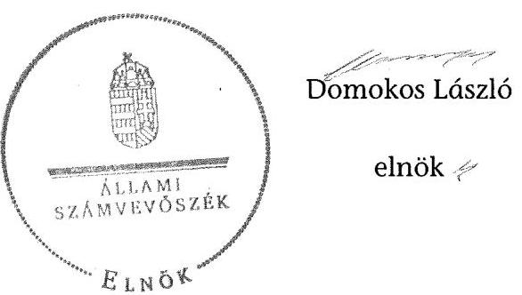

# ÁLLAMI   SZÁMVEVŐSZÉK 

## JELENTÉS

a helyi nemzetiségi önkormányzatok gazdálkodásának ellenőrzéséről
Sajókaza Község Roma Nemzetiségi Önkormányzata

---

# Állami Számvevőszék 

Iktatószám: V-0704-089/2015.
Témaszám: 1738
Vizsgálat-azonosító szám: V067613

## Az ellenőrzést felügyelte:

## Brebán Andrea

felügyeleti vezető
2015. július 21. napjától

## Horváthné Herbáth Mária

felügyeleti vezető
2015. július 20. napjáig

## Az ellenőrzést vezette és az ellenőrzés végrehajtásáért felelős:

## Zakar László

ellenőrzésvezető

## A számvevőszéki jelentést készítették:

## Zakar László

ellenőrzésvezető

## Molnár-Sipos Judit

számvevő
Pappné dr. Szamosi Éva
számvevő főtanácsos

## Az ellenőrzést végezték:

## Burenzsargal Narantuja

számvevő tanácsos

## Molnár-Sipos Judit

számvevő

---

# TARTALOMJEGYZÉK 

BEVEZETÉS ..... 3
I. ÖSSZEGZŐ MEGÁLLAPÍTÁSOK, KÖVETKEZTETÉSEK, JAVASLATOK ..... 6
II. RÉSZLETES MEGÁLLAPÍTÁSOK ..... 12

1. A Nemzetiségi Önkormányzat és a Települési Önkormányzat együttműködésének szabályozása, a működési feltételek biztosítása ..... 12
2. A gazdálkodási feladatok ellátásának szabályszerűsége ..... 13
2.1. A költségvetésre és a zárszámadásra, valamint a kincstári adatszolgáltatás rendjére vonatkozó jogszabályi előírások betartása ..... 13
2.2. A Nemzetiségi Önkormányzat gazdálkodásának szabályozottsága ..... 14
2.3. Az operatív gazdálkodási jogkörök kialakítása, gyakorlása ..... 15
3. A Nemzetiségi Önkormányzattal összefüggő gazdálkodási feladatok belső ellenőrzése ..... 18

## MELLÉKLET

1. számú A Sajókaza Község Roma Nemzetiségi Önkormányzata 2013. évi gazdál- kodási adatai

## FÜGGELÉKEK

1. számú Rövidítések jegyzéke
2. számú Értelmező szótár

---

.

---

# JELENTÉS 

## A helyi nemzetiségi önkormányzatok gazdálkodásának ellenőrzéséről Sajókaza Község Roma Nemzetiségi Önkormányzata

## BEVEZETÉS

A Nemzetiségi Önkormányzat 2010. évben alakult. Az ellenőrzött időszakban a Nemzetiségi Önkormányzat elnöke a 2014. évi helyhatósági választásokig látta el feladatait. A Nemzetiségi Önkormányzat intézményt, gazdasági társaságot és más szervezetet nem alapított, illetve társulásban nem vett részt. A négy tagú Képviselő-testület bizottságot nem hozott létre. A Nemzetiségi Önkormányzat költségvetési beszámolója szerint a 2013. évben a módosított költségvetési bevételi előirányzat 222,0 ezer Ft és a módosított költségvetési kiadási előirányzat 236,0 ezer Ft, a teljesített költségvetési bevétel 224,0 ezer Ft, a teljesített költségvetési kiadás 201,0 ezer Ft volt. A tárgyévi bevétel 239,0 ezer Ft-ot, a tárgyévi kiadás 201,0 ezer Ft-ot tett ki. A Nemzetiségi Önkormányzat a 2013. évben feladatalapú támogatásban nem részesült. A 2013. évi gazdálkodási adatokat részletesen az 1. számú mellékletben mutatjuk be.

Az Alaptörvény Szabadság és felelősség rész XXIX. cikk (1) bekezdése szerint a Magyarországon élő nemzetiségek államalkotó tényezők. Minden, valamely nemzetiséghez tartozó magyar állampolgárnak joga van önazonossága szabad vállalásához és megőrzéséhez. A hazánkban élő nemzetiségek helyi (települési és területi) valamint országos önkormányzatokat hozhatnak létre ${ }^{1}$. A helyi nemzetiségi önkormányzatok gazdálkodási feladatait jogszabályi előírás alapján a székhely szerinti helyi önkormányzat polgármesteri hivatala látja el.

A nemzetiségek helyzete, támogatása mind hazai, mind EU-s szinten kiemelt figyelmet kap napjainkban. A helyi nemzetiségi önkormányzatok gazdálkodására és támogatási rendszerére vonatkozó jogszabályok a 2010-2012. években jelentős változásokon mentek át. A helyi nemzetiségi önkormányzatok gazdálkodásának, a részükre juttatott költségvetési támogatások felhasználásának ellenőrzését az ÁSZ 2012-ben sorozatjellegú ellenőrzés keretében indította el.

Az ellenőrzés célja annak értékelése volt, hogy a helyi nemzetiségi önkormányzat gazdálkodási kereteinek kialakítása, gazdálkodása megfelelt-e a jogszabályoknak.

[^0]
[^0]:    ${ }^{1}$ A 2010. évben megtartott nemzetiségi önkormányzati választásokat követően 2304 települési, 58 területi és 13 országos nemzetiségi önkormányzat alakult meg.

---

Ennek keretében értékeltük, hogy:

- a helyi nemzetiségi önkormányzat és a helyi (települési) önkormányzat együttműködésének szabályozása, a működési feltételek biztosítása megfelel-t-e a jogszabályi előírásoknak;
- a felek együttműködése megfelelt-e a megállapodásban foglaltaknak a gazdálkodási feladatok szabályszerű ellátása során, betartották-e vonatkozó jogszabályi előírásokat;
- biztosított volt-e a helyi nemzetiségi önkormányzat gazdálkodásának belső ellenőrzése.

Az ellenőrzés várható hasznosulása: a nemzetiségi önkormányzatok testületi döntéseinek tapasztalatait összegezve következtetés vonható le a törvényalkotás számára a jogszabályi környezet esetleges módosításának indokoltságára vonatkozóan. Az ellenőrzés az ellenőrzött számára visszajelzést ad a rendezett gazdálkodási keretek kialakításáról, a működésbeli hiányosságokról. Az ellenőrzés megállapításai és javaslatai, a jó gyakorlat bemutatása tanulságul szolgálhatnak más nemzetiségi önkormányzatok, szervezetek számára a rendezett gazdálkodási keretek kialakításához. A társadalom számára jelzi, hogy közpénz nem maradhat ellenőrizetlenül, az ÁSZ értékteremtő rend kialakításához és megőrzéséhez hozzájáruló tevékenysége pozitív hatással lesz a szervezetről kialakított összkép formálásában. Az ÁSZ szervezetén belül lehetőség nyílik arra, hogy a megállapítások szintetizálásával az intézmény a hozzáadott értéket teremtő elemző tevékenységét és tanácsadó szerepét erősítse.

A helyi nemzetiségi önkormányzatok gazdálkodásának ellenőrzéséről szóló jelentés I. fejezetének összegző része az ellenőrzés céljára adott rövid, szintetizáló összefoglalót és következtetéseket tartalmazza a II. fejezet részletes megállapításain alapulóan. A jelentés intézkedést igénylő megállapításait és javaslatait az összegzőben foglaltak mellett - az ellenőrzés során feltárt, a jelentés II. fejezetében rögzített részletes megállapítások alapozzák meg, illetve támasztják alá.

Az ellenőrzés típusa: szabályszerűségi ellenőrzés.
Az ellenőrzött időszak: a helyi nemzetiségi önkormányzat és a települési önkormányzat együttműködésének, valamint a helyi nemzetiségi önkormányzat gazdálkodásának szabályozása megfelelőségét a 2013. évre vonatkozóan (a 2013. december 31-i állapotnak megfelelően), a helyi nemzetiségi önkormányzat gazdálkodásának szabályszerűségét, a működési feltételek, valamint a belső ellenőrzés biztosítását a 2013. január 1. - december 31-e közötti időszakot figyelembe véve értékeltük.

Ellenőrzött szervezet: a Sajókaza Község Roma Nemzetiségi Önkormányzat és a gazdálkodási feladatait ellátó Sajókazai Polgármesteri Hivatal.

Az ellenőrzés szakmai módszertana az ÁSZ hivatalos honlapján (www.asz.hu) közzétett szakmai szabályokon alapult, amely a Legfőbb Ellenőrző Intézmények Nemzetközi Szervezete (INTOSAI) által kiadott nemzetközi standardok (ISSAI) figyelembevételével készült.

---

A gazdálkodás folyamatában kulcsszerepet betöltő két kulcskontroll - teljesítésigazolás, érvényesítés - múködésének megfelelőségét teljes körűen, azaz minden, a személyi juttatásokkal, a dologi és felhalmozási kiadásokkal, múködési és felhalmozási célú pénzeszköz átadásokkal, ellátottak pénzbeli juttatásaival kapcsolatos kifizetések esetében ellenőriztük. „Megfelelőnek" értékeltük a gazdálkodási jogkörök gyakorlását, amennyiben a hibaarány legfeljebb 10\%, „részben megfelelőnek" értékeltük, ha a hibaarány 10-30\% között volt, „nem megfelelőnek" pedig akkor, ha az eredmények alapján a hibaarány meghaladta a $30 \%$-ot.

Az ellenőrzés végrehajtásának jogszabályi alapját az ÁSZ tv. 5. § (2)-(3) és (6) bekezdéseiben foglaltak képezik.

Az ÁSZ tv. 29. § (1) bekezdése szerint a jelentéstervezetet megküldtük egyeztetésre a jegyzőnek és a Nemzetiségi Önkormányzat elnökének. Az ellenőrzött szervezetek vezetői az ÁSZ tv. 29. § (2) bekezdésében foglalt észrevételezési jogukkal nem éltek, a jelentéstervezetre nem tettek észrevételt.

---

# I. ÖSSZEGZŐ MEGÁLLAPÍTÁSOK, KÖVETKEZTETÉSEK, JAVASLATOK 

A Nemzetiségi Önkormányzat és a Települési Önkormányzat együttmüködését szabályozó 2010. évben megkötött megállapodás nem felelt meg a Nek. tv.-ben előírt feltételeknek, azonban azt a törvényi előírás ellenére nem módosították. A hatályos együttmúködési megállapodás nem rögzítette a jegyző Nemzetiségi Önkormányzat képviselő-testületi ülésein való részvételének kötelezettségét, ezáltal a Települési Önkormányzat a Nemzetiségi Önkormányzat müködéséhez szükséges személyi feltételeket részben biztosította. A megállapodás az Áht.-ban foglaltak ellenére nem tartalmazta a Nemzetiségi Önkormányzat bevételeivel és kiadásaival kapcsolatban az ellenőrzési és adatszolgáltatási feladatok ellátásának részletes szabályait. A szabályozás hiánya hozzájárult ahhoz, hogy a Nemzetiségi Önkormányzat gazdálkodásával összefüggő végrehajtási feladatokra vonatkozóan a 2013. évben nem terveztek és nem hajtottak végre belső ellenőrzést. A Települési Önkormányzat a 2013. évben biztosította a Nemzetiségi Önkormányzat müködéséhez szükséges tárgyi feltételeket.

A Nemzetiségi Önkormányzat 2013. évi költségvetésének és zárszámadásának tartalma, jóváhagyása, valamint a kapcsolódó adatszolgáltatás megfelel a jogszabályi előírásoknak.

A Nemzetiségi Önkormányzat gazdálkodásának szabályozottsága az ellenőrzött időszakban részben felelt meg a jogszabályi előírásoknak és az együttműködési megállapodásban foglaltaknak. A gazdálkodási feladatokat ellátó Polgármesteri Hivatal SZMSZ-e - az Ávr.-ben előírtak ellenére - nem tartalmazta teljes körűen a Polgármesteri Hivatal nevesített munkaköreihez tartozó feladat- és hatásköröket, a hatáskörök gyakorlásának módját, a helyettesítés rendjét. A jegyző nem készítette el a Bkr.-ben előírt ellenőrzési nyomvonalat és a szabálytalanságok kezelésének eljárásrendjét és nem biztosította minden tevékenységre a folyamatba épített, előzetes, utólagos és vezetői ellenőrzést.

A Nemzetiségi Önkormányzat gazdálkodása tekintetében az operatív gazdálkodási jogkörök kialakítása a 2013. évben nem felelt meg a jogszabályi előírásoknak, valamint az együttmúködési megállapodásban foglaltaknak. A kiadások teljesítése során az operatív gazdálkodási jogkörökön belül kulcsszerepet betöltő teljesítésigazolás és érvényesítés belső kontrollokat nem a jogszabályi előírásoknak megfelelően múködtették, aminek következtében nem volt biztosított a hibák megelőzése, feltárása és kijavítása. A teljesítésigazolást az Ávr. előírása ellenére több esetben nem végezték el, valamint írásbeli kijelölés hiányában nem az arra jogosult személy látta el a feladatot. Továbbá a teljesítésigazolás dátumának rögzítése az Ávr.-ben előírtak ellenére a teljesítésigazolás dokumentumán elmaradt. Az érvényesítés gyakorlata szabálytalan volt, mivel az Ávr.-ben foglaltak ellenére valamennyi kifizetés esetében kijelölés hiányában nem az arra jogosult személy látta el a feladatot.

Az ÁSZ tv. 33. § (1) bekezdésében foglaltak értelmében a jelentésben foglalt megállapításokhoz kapcsolódó intézkedési tervet köteles az ellenőrzött szervezet

---

vezetője összeállítani, és azt a jelentés kézhezvételétől számított 30 napon belül az ÁSZ részére megküldeni. Amennyiben az intézkedési tervet határidőben nem küldi meg a szervezet, vagy az nem elfogadható, az ÁSZ elnöke a hivatkozott törvény 33. § (3) bekezdés a)-b) pontjaiban foglaltakat érvényesítheti.

A helyszíni ellenőrzés megállapításainak hasznosítása mellett javasoljuk:

# a jegyzönek 

1. Az együttműködés szabályozásával kapcsolatban

A Nemzetiségi Önkormányzat és a Települési Önkormányzat között 2010-ben megkötött és az ellenőrzött időszakban is hatályban levő együttműködési megállapodást nem módosították a Nek. tv. hatályba lépése után az abban rögzített feltételeknek megfelelően. Az együttműködési megállapodásban nem határozták meg a Nek. tv. 80. § (3) bekezdés a) pontja szerint a Nemzetiségi Önkormányzat részére önálló fizetési számla nyitásával, törzskönyvi nyilvántartásba vételével és adószám igénylésével kapcsolatos határidőket, együttműködési kötelezettséget és ezek felelőseit. A megállapodás nem tartalmazta a Nek. tv. 80. § (3) bekezdés c) pontjának előírásai szerint a Nemzetiségi Önkormányzat kötelezettségvállalásának SZMSZ-ben meghatározott nyilvántartási szabályait. A Nek. tv. 80. § (4) bekezdésében foglaltak ellenére nem rögzítették, hogy a jegyző - vagy annak a jegyzővel azonos képesítési előírásoknak megfelelő megbízottja - a Települési Önkormányzat megbízásából és képviseletében részt vesz a Nemzetiségi Önkormányzat ülésein és jelzi, amennyiben törvénysértést észlel. Az Áht. 27. § (2) bekezdésében előírtak ellenére a megállapodásban nem határozták meg a Nemzetiségi Önkormányzat bevételeivel és kiadásaival kapcsolatban az ellenőrzési és adatszolgáltatási feladatok ellátásának részletes szabályait.

A Nek. tv. 80. § (2) bekezdésében foglaltak ellenére az együttműködési megállapodás szerinti müködési feltételeket a Települési Önkormányzat SZMSZ-ében nem rögzítették.

Az együttműködési megállapodást a Nek. tv. 80. § (2) bekezdésében előírt határidőre és azt követően sem vizsgálták felül.

Javaslat
a) Készítse elő az együttműködési megállapodás Nek. tv. és az Áht. előírásainak megfelelő módosítását és kezdeményezze annak a Települési Önkormányzat Képviselő-testülete elé terjesztését;
b) Készítse elő a Települési Önkormányzat SZMSZ-ének kiegészítését az együttműködési megállapodás módosításához kapcsolódóan és kezdeményezze a Települési Önkormányzat Képviselő-testülete elé terjesztését;
c) Kezdeményezze az együttműködési megállapodás évenkénti felülvizsgálatát oly módon, hogy az biztosítsa a Nek. tv-ben rögzített határidő betartását:

---

2. A költségvetés és zárszámadás szabályszerűségével kapcsolatban

A 2013. évi költségvetési határozat-tervezet Nemzetiségi Önkormányzat Képviselőtestülete részére történő előterjesztésekor - az Áht. 24. § (4) bekezdés a) pontja előírásától eltérően - nem mutatták be tájékoztatásul szöveges indokolással a Nemzetiségi Önkormányzat előirányzat-felhasználási tervét. A zárszámadási határozattervezet előterjesztésekor - az Áht. 91. § (2) bekezdés a) pontjának előírása ellenére - tájékoztatásul nem mutatták be a pénzeszközök változását.

Javaslat
Intézkedjen, hogy a Nemzetiségi Önkormányzat Képviselő-testülete részére tájékoztatásul teljes körűen, szöveges indoklással együtt kerüljenek bemutatásra a jogszabályban előírt mérlegek, kimutatások a költségvetési és zárszámadási határozattervezetek előterjesztésekor.
3. A gazdálkodási feladatok szabályozottságával kapcsolatban

A Polgármesteri Hivatal SZMSZ-e - az Ávr. 13. § (1) bekezdés g) pontjában előírtak ellenére - nem tartalmazta teljes körűen a Polgármesteri Hivatal nevesített munkaköreihez tartozó feladat- és hatásköröket, a hatáskörök gyakorlásának módját, a helyettesítés rendjét, az ezekhez kapcsolódó felelősségi szabályokat.

A jegyző - az Ávr. 13. § (2) a) pontjában foglaltak ellenére - nem szabályozta belső szabályzatban a Nemzetiségi Önkormányzat adatszolgáltatási feladatok teljesítésével kapcsolatos belső előírásokat, feltételeket.

A jegyző a Bkr. 6. § (3) bekezdésében előírt ellenőrzési nyomvonalat és a 6. § (4) bekezdésében előírt szabálytalanságok kezelésének eljárásrendjét a Polgármesteri Hivatalra vonatkozóan nem készítette el, továbbá - Bkr. 8. § (2) bekezdésének előírásától eltérően - nem biztosította a kontrolltevékenység részeként minden tevékenységre vonatkozóan a folyamatba épített, előzetes, utólagos és vezetői ellenőrzést.

Javaslat
a) Készítse elő a Polgármesteri Hivatal SZMSZ-ének módosítását, hogy az feleljen meg az Ávr.-ben foglalt előírásoknak és kezdeményezze annak Települési Önkormányzat Képviselő-testülete elé terjesztését.
b) Készítse el a Polgármesteri Hivatal ellenőrzési nyomvonalát és a szabálytalanságok kezelésének eljárásrendjét.
c) Biztosítsa a Polgármesteri Hivatal által ellátott minden tevékenységre vonatkozóan a folyamatba épített, előzetes, utólagos és vezetői ellenőrzést.
4. Az operatív gazdálkodási jogkörök kialakításával és a kulcskontrollok müködésével kapcsolatban

A jegyző a gazdálkodási feladatot ellátó vezetők és alkalmazottak helyettesítésének rendjét - az Ávr. 13. § (5) bekezdésében foglaltak ellenére - belső szabályzatban nem határozta meg.

---

A jegyző a Nemzetiségi Önkormányzat kiadási előirányzatai terhére vállalt kötelezettség esetére - az Ávr. 55. § (2) bekezdés g) pontjában, illetve az Ávr. 58. § (4) bekezdésében foglaltak ellenére - nem jelölt ki írásban a gazdasági szervezettel nem rendelkező Polgármesteri Hivatal állományába tartozó, előírt végzettséggel rendelkező köztisztviselőt a pénzügyi ellenjegyzés és az érvényesítés gyakorlására.

A teljesítésigazolást - az Áht. 38. § (1) bekezdésében és az Ávr. 57. § (1) bekezdésében foglaltak ellenére - több esetben nem végezték el, illetve az Ávr. 57. § (4) bekezdésében foglaltak ellenére - jogosulatlanul, kijelölés hiányában végezték. Többször előfordult, hogy a teljesítésigazoló a bizonylatokon - az Ávr. 57. § (3) bekezdésében előírtak ellenére - nem jelölte meg a teljesítésigazolás dátumát.

Az érvényesítést a kifizetések előtt - az Ávr. 58. § (4) bekezdésében előírtak ellenére - jogosulatlanul, kijelölés hiányában végezték, többször előfordult, hogy az érvényesítő - az Ávr. 58. § (3) bekezdésében előírtak ellenére - az érvényesítést dátum nélkül írta alá.

Az érvényesítő - az Ávr. 58. § (2) bekezdésében foglaltak ellenére - nem jelezte az utalványozónak, hogy a megelőző ügymenetben a teljesítésigazolást nem végezték el, vagy nem az arra jogosult végezte, illetve nem szabályszerűen történt. Nem jelezte továbbá, hogy az utalványrendeletek - az Ávr. 59. § (3) bekezdés f) pontjában előírtak ellenére - nem tartalmazták a kötelezettségvállalás nyilvántartási számát.

A temetési támogatással, továbbá a 2013-ban nyújtott iskolakezdési és tanszercsomag támogatással megsértették a támogatási kormányrendelet 2. § (5) bekezdésében foglaltakat, mert a müködési költségvetési támogatást nem a Nemzetiségi Önkormányzat müködésével közvetlenül összefüggő költségek fedezetére használták fel.

Javaslat
Intézkedjen:
a) a jogszabályi előírás szerint a gazdálkodási feladatot ellátó vezető és alkalmazottak helyettesítési rendjének meghatározásáról;
b) a pénzügyi ellenjegyzésre, valamint az érvényesítési feladatok ellátására jogosult személyek írásbeli kijelöléséről a jogszabályi előírásoknak megfelelően;
c) a teljesítésigazolás jogszabályi előírásoknak megfelelő végzéséről;
d) az érvényesítéshez kapcsolódó ellenőrzési és jelzési feladatok szabályszerű ellátásáról;
e) a Nemzetiségi Önkormányzat jogszabályi előírások szerinti feladatellátásának, közpénzfelhasználásának biztosításáról;
f) a feltárt hiányosságok és/vagy szabálytalanságok tekintetében a munkajogi felelősség tisztázására irányuló eljárás megindításáról, és ennek eredménye ismeretében tegye meg a szükséges intézkedéseket.

---

5. A Nemzetiségi Önkormányzat gazdálkodásának belső ellenőrzésével kapcsolatban

Az együttműködési megállapodás - az Áht. 27. § (2) bekezdésében foglaltak ellenére - nem tartalmazta a Nemzetiségi Önkormányzat bevételeivel és kiadásaival kapcsolatban az ellenőrzési feladat ellátásának részletes szabályait. Az együttműködési megállapodás a nemzetiségi önkormányzat belső ellenőrzési feladatainak ellátására vonatkozó rendelkezéseket nem tartalmazott.

Javaslat
Az együttműködési megállapodás módosításának előkészítése során kezdeményezze annak kiegészítését a belső ellenőrzés ellátására vonatkozó részletszabályok meghatározásával.

# a Nemzetiségi Önkormányzat elnökének 

1. A Nemzetiségi Önkormányzat és a Települési Önkormányzat között 2010.-ben megkötött és az ellenőrzött időszakban is hatályban levő együttműködési megállapodást nem módosították a Nek. tv. hatályba lépése után az abban rögzített feltételeknek megfelelően.

Az együttműködési megállapodást a Nek. tv. 80. § (2) bekezdésében előírt határidőre és azt követően sem vizsgálták felül.

Az Áht. 27. § (2) bekezdésében előírtak ellenére a megállapodásban nem határozták meg a Nemzetiségi Önkormányzat bevételeivel és kiadásaival kapcsolatban az ellenőrzési és adatszolgáltatási feladatok ellátásának részletes szabályait. Az együttműködési megállapodás a nemzetiségi önkormányzat belső ellenőrzési feladatainak ellátására vonatkozó rendelkezéseket nem tartalmazott.

Javaslat
a) Intézkedjen annak érdekében, hogy az együttműködési megállapodásban rendelkezzenek a belső ellenőrzés ellátására vonatkozó részletszabályok meghatározásáról.
b) Terjessze a Nemzetiségi Önkormányzat Képviselő-testülete elé jóváhagyásra az együttműködési megállapodás jegyző által előkészített módosítását, amely megfelel a hatályos jogszabályi előírásoknak, a továbbiakban biztosítsa a megállapodás évenkénti felülvizsgálatát.
2. A 2013. évi költségvetés előterjesztésekor a Nemzetiségi Önkormányzat Képviselőtestülete részére az Áht. 24. § (4) bekezdés a) pontja előírásától eltérően nem mutatták be tájékoztatásul szöveges indokolással a Nemzetiségi Önkormányzat előirányzat felhasználási tervét. A zárszámadási határozattervezet előterjesztésekor tájékoztatásul nem mutatták be - az Áht. 91. § (2) bekezdés a) pontjának előirása ellenére - a pénzeszközök változását.

---

Javaslat
A költségvetési és zárszámadási határozat-tervezetek Nemzetiségi Önkormányzat Képviselő-testülete részére történő előterjesztésekor tájékoztatásul teljes körűen, szöveges indoklással együtt mutassa be a jogszabályi előírásoknak megfelelő mérlegeket, kimutatásokat.

---

# II. RÉSZLETES MEGÁLLAPÍTÁSOK 

## 1. A Nemzetiségi Önkormányzat És a Telepúlési ÖnkormányZAT EGYÜTTMŰKÖDÉSÉNEK SZABÁLYOZÁSA, A MŰKÖDÉSI FELTÉTELEK BIZTOSÍTÁSA

A Nemzetiségi Önkormányzat és a Települési Önkormányzat együttmúködésének szabályozása nem felelt meg a jogszabályi előírásoknak.

A Nemzetiségi Önkormányzat és a Települési Önkormányzat 2010. évben megkötött és az ellenőrzött időszakban is hatályban lévő együttműködési megállapodással rendelkezett, melyet a Nemzetiségi Önkormányzat Képviselőtestülete és a Települési Önkormányzat Képviselő-testülete határozattal hagytak jóvá ${ }^{2}$, és az arra jogosult személyek írtak alá.

A Nemzetiségi Önkormányzat és a Települési Önkormányzat nem kötötte meg a Nek. tv. hatályba lépését ${ }^{3}$ követően a Nek. tv. 159.§ (3) bekezdésben foglalt feltételeknek megfelelő együttműködési megállapodást. Az együttműködési megállapodást a Nek. tv. 80. § (2) bekezdésében előírt határidőre és azt követően sem vizsgálták felül. Emiatt a Nek. tv. 83. § (3) bekezdésében előírtaknak megfelelően a Kormányhivatal soron kívüli eljárást folytatott le, de az egyeztetés nem vezetett eredményre.

Az eljárás során készült jegyzőkönyvben rögzítették, hogy a jegyző nyilatkozott arról, hogy ellátja Nemzetiségi Önkormányzat múködésével kapcsolatos feladatokat és azokat ellátja a jövőben is. Továbbá a Polgármester nyilatkozott, hogy a megállapodás megkötésére ezidáig azért nem került sor, mert a Nemzetiségi Önkormányzat olyan kiegészítéseket tett bele, melyek az együttmúködési megállapodásnak nem kötelező elemei (pl.: ár és belvíz védelem megoldása). A Kormányhivatal képviselője a jegyzőkönyvben rögzítettek szerint tájékoztatta a jelenlévőket, hogy a Nek. tv. 83. § (3) bekezdése alapján a Nemzetiségi Önkormányzat a nemzetiségi jogok sérelmére hivatkozással bírósághoz fordulhat.

Az ellenőrzött időszak alatt a Nemzetiségi Önkormányzat bírósághoz nem fordult, az együttműködési megállapodás módosítására nem került sor.

A 2013. december 31-én hatályos együttműködési megállapodásban a Nemzetiségi Önkormányzat gazdálkodásával kapcsolatos feladatokat, felelősöket és határidőket az Áht. 27. § (2) bekezdésében és a Nek. tv. 80. § (3)-(4) bekezdéseiben foglalt előírások ellenére nem teljes körűen szabályozták. A költségvetés tervezési és gazdálkodási feladatait rögzítették. Ugyanakkor az együttműködési megállapodásban nem határozták meg:

[^0]
[^0]:    ${ }^{2}$ Nemzetiségi Önkormányzat Képviselő-testülete 5/2010. (XI. 10.) számú határozattal és a Települési Önkormányzat Képviselő-testülete 176/2010. (XI. 23.) számú KT határozattal fogadta el az együttmúködési megállapodást.
    ${ }^{3}$ Hatályos 2011. december 19-től.

---

- az Áht. 27. § (2) bekezdésében előírtak ellenére a Nemzetiségi Önkormányzat bevételeivel és kiadásaival kapcsolatban az ellenőrzési és adatszolgáltatási feladatok ellátásának részletes szabályait;
- a Nek. tv. 80. § (3) bekezdés a) pontja szerinti, a Nemzetiségi Önkormányzat részére önálló fizetési számla nyitásával, törzskönyvi nyilvántartásba vételével és adószám igénylésével kapcsolatos határidőket és együttmúködési kötelezettséget, a felelősök konkrét kijelölésével;
- a Nek. tv. 80. § (3) bekezdés c) pontja szerinti, a Nemzetiségi Önkormányzat kötelezettségvállalásának az SZMSZ-ben meghatározott nyilvántartási szabályait;
- a Nek. tv. 80. § (4) bekezdésében foglaltak ellenére nem rögzítették, hogy a jegyző - vagy annak a jegyzővel azonos képesítési előírásoknak megfelelő megbízottja - a Települési Önkormányzat megbízásából és képviseletében részt vesz a Nemzetiségi Önkormányzat ülésein és jelzi, amennyiben törvénysértést észlel.

A Nek. tv. 80. § (2) bekezdésében foglaltak ellenére az együttmúködési megállapodás szerinti múködési feltételeket a Települési Önkormányzat SZMSZ-ében nem rögzítették. A Nemzetiségi Önkormányzat SZMSZ-e - a Nek. tv. 80. § (2) bekezdésében foglaltaknak megfelelően - tartalmazta az együttmúködési megállapodás szerinti múködési feltételeket.

A Települési Önkormányzat a 2013. évben a Nemzetiségi Önkormányzat részére a Nek. tv. 80. § (1)-(2) bekezdése szerinti múködés tárgyi feltételeit biztosította a személyi feltételeket részben biztosította. Nem határozták meg, hogy a jegyző vagy annak - a jegyzővel azonos képesítési előírásoknak megfelelő megbízottja a Települési Önkormányzat megbízásából és képviseletében részt vesz a Nemzetiségi Önkormányzat Képviselő-testülete ülésein.

# 2. A GAZDÁLKODÁSI FELADATOK ELLÁTÁSÁNAK SZABÁLYSZERŰSÉGE 

### 2.1. A költségvetésre és a zárszámadásra, valamint a kincstári adatszolgáltatás rendjére vonatkozó jogszabályi előírások betartása

A Nemzetiségi Önkormányzat 2013. évi költségvetésének és zárszámadásának tartalma, jóváhagyása, valamint a kapcsolódó adatszolgáltatás megfelelt a jogszabályi előírásoknak.

A Nemzetiségi Önkormányzat elnöke az Áht. 26. § (1) bekezdése alapján, az Áht. 24. § (1) bekezdésében előírt határidőre nem nyújtotta be a Nemzetiségi Önkormányzat Képviselő-testülete részére az ellenőrzött évre vonatkozó költségvetési koncepciót, mert azt a jegyző nem készítette elő. A Nemzetiségi Önkormányzat elnöke az Áht. 26. § (1) bekezdése alapján, az Áht. 24. § (2) bekezdésében ${ }^{4}$ előírtaknak megfelelően a központi költségvetésről szóló törvény ha-

[^0]
[^0]:    ${ }^{4}$ 2013. december 21-étől az Áht. 24. § (3) bekezdése írja elő

---

tálybalépését követő 45 napig benyújtotta a Nemzetiségi Önkormányzat Képvi-selő-testülete részére a költségvetési határozat tervezetét, amelyet a testület az 1/2013. (II. 12.) számú határozatával elfogadott. A 2013. évi költségvetési határozat-tervezet előterjesztésekor a Nemzetiségi Önkormányzat Képviselőtestülete részére az Áht. 24. § (4) bekezdés a) pontja előírásától eltérően nem mutatták be tájékoztatásul szöveges indokolással a Nemzetiségi Önkormányzat előirányzat felhasználási tervét. A 2013. évi költségvetési határozat tartalmazta az Áht. 26. § (I) bekezdésében foglalt előírás alapján az Áht. 23. § (2) bekezdés a), c), és h) pontja szerinti tartalmi elemeket.

A jegyző az Áht. 91. § (1) bekezdésében előírt határidőre elkészítette a Nemzetiségi Önkormányzat 2013. évi zárszámadási határozattervezetét, amelyet a Nemzetiségi Önkormányzat elnöke határidőben terjesztett be a Nemzetiségi Önkormányzat Képviselő-testülete elé elfogadásra ${ }^{5}$. A zárszámadási határozattervezet előterjesztésekor a Nemzetiségi Önkormányzat Képviselő-testület részére tájékoztatásul bemutatták - egy kivételével - az Áht. 91. § (2) bekezdés a), c) pontja szerinti és 24 . § (4) bekezdés a) pontja szerinti mérlegeket és kimutatásokat. Nem mutatták be - az Áht. 91. § (2) bekezdés a) pontjának előírása ellenére - a pénzeszközök változását. A Nemzetiségi Önkormányzat a 2013. év során több éves kihatással járó döntést nem hozott, közvetett támogatásokat nem nyújtott, közvetett támogatásban nem részesült.

A jegyző a 2013. évben a jogszabályokban előírt határidőben teljesítette a Nemzetiségi Önkormányzatra vonatkozó kincstári adatszolgáltatásokat.

A jegyző a Nemzetiségi Önkormányzat 2013. évi elemi költségvetéséről - az Ávr. 33. § (1)-(2) bekezdései alapján - a költségvetési határozat-tervezet Nemzetiségi Önkormányzat Képviselő-testülete elé terjesztésének határidejét követő 30 napon belül adatot szolgáltatott a Kincstárnak. A Nemzetiségi Önkormányzat 2013. év I. féléves és éves elemi költségvetési beszámolóját határidőre 2013. július 31-ig illetve 2014. február 28-ig elkészítette és 2013. augusztus 10-ig valamint 2014. március 10 -ig benyújtotta a Kincstárnak.

A Nemzetiségi Önkormányzat 2013. évben az I. és III. negyedéves és éves időközi költségvetési jelentéseket az Áht. 108. § (1)-(2) bekezdései és az Ávr. 169. § (1)-(2) bekezdései szerinti határidőre, a II. negyedéves időközi költségvetési jelentést július 22-én ${ }^{6}$, az időközi mérlegjelentéseket az Áht. 108. § (1-2) bekezdései és az Ávr. 170. § (5) bekezdései szerinti határidőre megküldte a Kincstárnak.

# 2.2. A Nemzetiségi Önkormányzat gazdálkodásának szabályozottsága 

A Nemzetiségi Önkormányzat gazdálkodásának szabályozottsága az ellenőrzött időszakban részben felelt meg a jogszabályi előírásoknak és az együttmúködési megállapodásban foglaltaknak.

[^0]
[^0]:    ${ }^{5}$ A 2/2014 (IV. 25.) számú határozattal került elfogadásra.
    ${ }^{6}$ A 2013. év II. negyedévei költségvetési jelentést július 20. szombati határidő helyett július 22-én hétfőn adták fel.

---

A Nemzetiségi Önkormányzat gazdálkodási feladatainak végrehajtását ellátó Polgármesteri Hivatal 2013. évben rendelkezett hatályos számviteli politikával valamint az annak részét képező szabályzatokkal ${ }^{7}$, amelyek hatályát kiterjesztették a Nemzetiségi Önkormányzatra.

A Polgármesteri Hivatal SZMSZ-e - az Ávr. 13. § (1) bekezdés g) pontjában előírtak ellenére - nem tartalmazta teljes körűen a Polgármesteri Hivatal nevesített munkaköreihez tartozó feladat- és hatásköröket, a hatáskörök gyakorlásának módját, a helyettesítés rendjét, az ezekhez kapcsolódó felelősségi szabályokat.

A Polgármesteri Hivatal SZMSZ-e, a kötelezettségvállalási szabályzat, a pénzkezelési szabályzat és az együttmúködési megállapodás együttesen tartalmazta a Nemzetiségi Önkormányzatra vonatkozóan - az Ávr. 13. § (2) bekezdés a) pontban foglaltak szerinti - a tervezéssel, gazdálkodással, így különösen a kötelezettségvállalás, ellenjegyzés, teljesítés igazolása, érvényesítés, utalványozás gyakorlásának módjával, eljárási és dokumentációs részletszabályaival, valamint az ezeket végző személyek kijelölésének rendjével és az ellenőrzési feladatok teljesítésével kapcsolatos belső előírásokat, feltételeket.

A jegyző nem szabályozta belső szabályzatban - az Ávr. 13. § (2) bekezdés a) pontjában foglaltak ellenére - a Nemzetiségi Önkormányzat adatszolgáltatási feladatok teljesítésével kapcsolatos belső előírásokat, feltételeket.

A jegyző a Bkr. 6. § (3) bekezdésében előírt ellenőrzési nyomvonalat és a Bkr. 6. § (4) bekezdésében előírt szabálytalanságok kezelésének eljárásrendjét a Polgármesteri Hivatalra vonatkozóan nem készítette el. A jegyző a Bkr. 8. § (2) bekezdés előírásától eltérően nem biztosította a Polgármesteri Hivatalban a kontrolltevékenység részeként minden tevékenységre vonatkozóan a folyamatba épített, előzetes, utólagos és vezetői ellenőrzést.

# 2.3. Az operatív gazdálkodási jogkörök kialakítása, gyakorlása 

A Nemzetiségi Önkormányzat gazdálkodása tekintetében az operatív gazdálkodási jogkörök kialakítása a 2013. évben nem felelt meg a jogszabályi előírásoknak, valamint az együttmúködési megállapodásban foglaltaknak.

A kötelezettségvállalási szabályzatban kialakították az Ávr. 53. § (2) bekezdésében előírtak szerint az előzetes írásbeli kötelezettségvállalást nem igénylő kifizetések rendjét.

A jegyző a gazdálkodási feladatot ellátó vezetők és alkalmazottak helyettesítésének rendjét - az Ávr. 13. § (5) bekezdésében foglaltak ellenére - belső szabályzatban nem határozta meg.

[^0]
[^0]:    ${ }^{7}$ Az eszközök és a források leltározási és leltárkészítési szabályzata, az eszközök és források értékelési szabályzata, valamint a pénzkezelési szabályzat.

---

A Polgármesteri Hivatal SZMSZ-e II. fejezetének 6. pontja tartalmazta a helyettesítésre vonatkozó szabályokat azzal az előírással, hogy az ügyintézők munkaköri leírásukban foglaltak szerint helyettesítik egymást. A gazdasági, pénzügyi feladatot ellátó ügyintézők munkaköri leírásaiban a helyettesítés feladata nem szerepelt.

A jegyző a Nemzetiségi Önkormányzat kiadási előirányzatai terhére vállalt kötelezettség esetére - az Ávr. 55. § (2) bekezdés g) pontjában és az Ávr. 58. § (4) bekezdésében foglaltak ellenére - nem jelölt ki írásban a gazdasági szervezettel nem rendelkező Polgármesteri Hivatal állományába tartozó, előírt végzettséggel rendelkező köztisztviselőt a pénzügyi ellenjegyzés és az érvényesítés gyakorlására.

A Nemzetiségi Önkormányzatnak a 2013. évben dologi kiadásokkal és múködési célú pénzeszközátadással kapcsolatos kifizetései voltak. A kiadások teljesítése során az operatív gazdálkodási jogkörökön belül kulcsszerepet betöltő teljesítésigazolás és érvényesítés belső kontrollokat nem a jogszabályi előírásoknak megfelelően múködtették.

A dologi kiadások kifizetéseinél a teljesítésigazolás kulcskontroll múködtetésével kapcsolatban az alábbi hiányosságok, szabálytalanságok fordultak elő:

- A teljesítésigazolást több esetben - az Áht. 38. § (1) bekezdésében és az Ávr. 57. § (1) bekezdésében foglaltak ellenére - nem végezték el, a kifizetéseket megelőzően a kiadások jogosságát, összegszerűségét és az ellenszolgáltatás teljesítését nem ellenőrizték;
- a teljesítésigazolást a kifizetéseket megelőzően több esetben - az Ávr. 57. § (4) bekezdésében foglaltak ellenére - jogosulatlanul, kijelölés hiányában végezték;
- a teljesítésigazoló több kifizetésnél a bizonylatokon - az Ávr. 57. § (3) bekezdésében előírtak ellenére - a teljesítésigazolást dátum rögzítése nélkül írta alá.

A dologi kiadások kifizetéseinél az érvényesítés kulcskontroll múködtetésével kapcsolatban az alábbi hiányosságok, szabálytalanságok fordultak elő:

- az érvényesítést valamennyi kifizetés előtt - az Ávr. 58. § (4) bekezdésében előírtak ellenére - kijelölés hiányában nem az arra jogosult személy végezte;
- az érvényesítő több esetben - az Ávr. 58. § (3) bekezdésében előírtak ellenére - az érvényesítést dátumát az utalványrendeleten nem rögzítette;
- az érvényesítő - az Ávr. 58. § (2) bekezdésében foglaltak ellenére - rendszeresen nem jelezte az utalványozónak, hogy a megelőző ügymenetben a teljesítésigazolást vagy nem végezték el, vagy nem az arra jogosult végezte, illetve nem szabályszerűen történt, valamint az utalványrendeletek - az Ávr. 59. § (3) bekezdés f) pontjában előírtak ellenére - nem tartalmazták a kötelezettségvállalás nyilvántartási számát.

---

A múködési célú pénzeszközátadás kifizetéseinél a teljesítésigazolás kulcskontroll múködtetésével kapcsolatban az alábbi hiányosságok, szabálytalanságok fordultak elő:

- A teljesítésigazolást néhány esetben - az Áht. 38. § (1) bekezdésében és az Ávr. 57. § (1) bekezdésében foglaltak ellenére - nem végezték el, így a kifizetéseket megelőzően a kiadások jogosságát, összegszerűségét és az ellenszolgáltatás teljesítését nem ellenőrizték;
- a teljesítésigazolást a kifizetéseket megelőzően néhány esetben - az Ávr. 57. § (4) bekezdésében foglaltak ellenére - kijelölés hiányában nem az arra jogosult végezte, továbbá - az Ávr. 57. § (3) bekezdésében előírtak ellenére - nem rögzítette a teljesítésigazolás dátumát.

A múködési célú pénzeszközátadás kifizetéseinél az érvényesítés kulcskontroll múködtetésével kapcsolatosan az alábbi hiányosságok, szabálytalanságok fordultak elő:

- az érvényesítést valamennyi kifizetés előtt - az Ávr. 58. § (4) bekezdésében előírtak ellenére - kijelölés hiányában nem az arra jogosult személy végezte;
- az érvényesítő néhány esetben - az Ávr. 58. § (2) bekezdésében foglaltak ellenére - nem jelezte az utalványozónak, hogy a megelőző ügymenetben a teljesítésigazolást nem végezték el, vagy nem az arra jogosult végezte és nem szabályszerűen történt, valamint az utalványrendeletek - az Ávr. 59. § (3) bekezdés f) pontjában előírtak ellenére - nem tartalmazták a kötelezettségvállalás nyilvántartási számát.

A kulcskontrollok ellenőrzése során további feltárt szabálytalanság volt:

- a Nemzetiségi Önkormányzat a temetési segélyről, iskolakezdési és tanszertámogatásokról szóló döntései és azok kifizetése során megsértette a támogatási kormányrendelet 2. § (5) bekezdésében foglaltakat, mivel a múködési költségvetési támogatást nem a Nemzetiségi Önkormányzat múködésével közvetlenül összefüggő költségek fedezetére használta fel. A jegyző a szabálytalanságokról tájékoztatta a Borsod-Abaúj-Zemplén Megyei Kormányhivatalt. A temetési segély ügyében eljárva a Kormányhivatal kezdeményezte a jogszabálysértő támogatás nyújtásáról szóló, a Nemzetiségi Önkormányzat Képviselő-testületi határozatának saját hatáskörben történő visszavonását, illetve bírósághoz fordult. A Miskolci Közigazgatási és Munkaügyi Bíróság a Nemzetiségi Önkormányzat Képviselő-testületének a hatósági feladat ellátásáról szóló határozatát hatályon kívül helyezte.

A Nemzetiségi Önkormányzatnál a 2013. évben a kulcskontrollokat nem megfelelően múködtették és emiatt nem volt biztosított a hibák megelőzése, feltárása és kijavítása. A nem megfelelően múködtetett belső kontrollok korrupciós kockázatot hordoztak.

Az integritás szemlélet érvényesülésének ellenőrzéséhez a Nemzetiségi Önkormányzat tanúsítványon szolgáltatott adatokat. Ezen adatok értékelése alapján az eredendő veszélyeztetettségi szint és a kockázatokat növelő tényezők szintje is alacsony. Emellett a szervezetnél kiépült, kockázatok kezelésére hivatott kontrollok szintje is alacsony.

---

A kockázatok és a kontrollok szintje alapján megállapítható, hogy a szervezetnél jelenlévő eredendő korrupciós kockázatok, valamint a kockázatokat növelő tényezők szintje nem haladja meg az azok kezelésére kiépült kontrollok szintjét.

Ugyanakkor az operatív gazdálkodási jogkörök szabályozása és gyakorlása területén feltárt hiányosságok és hibák arra utalnak, hogy a Nemzetiségi Önkormányzatnak még lépéseket kell tennie az integritás szemlélet érvényesülésében.

# 3. A Nemzetiségi Önkormányzattal összefüggő gazdálkodÁsi feladatok belsö elLENÖrzése 

A 2013. évben a Nemzetiségi Önkormányzat gazdálkodásával összefüggő végrehajtási feladatokra vonatkozó belső ellenőrzés nem volt megfelelő.

Az együttműködési megállapodás - az Áht. 27. § (2) bekezdésében foglaltak ellenére - nem tartalmazta a Nemzetiségi Önkormányzat bevételeivel és kiadásaival kapcsolatban az ellenőrzési feladat ellátásának részletes szabályait. Az együttműködési megállapodás a belső ellenőrzés ellátására vonatkozóan rendelkezéseket nem tartalmazott. A Nemzetiségi Önkormányzat gazdálkodására vonatkozóan 2013. évben belső ellenőrzést nem terveztek és nem végeztek.

Budapest, 2015. 09. hó 16. nap

Melléklet: $\quad 1 \mathrm{db}$
Függelék
2 db

---

# SAJÓKAZA KÖZSÉG ROMA NEMZETISÉGI ÖNKORMÁNYZATA 2013.ÉVI GAZDÁLKODÁSI ADATAI

A) Bevételek

|  Megnevezés | Eredeti elöirányzat | Módosított | Teljesítés  |
| --- | --- | --- | --- |
|   | ezer Ft |  | megoszlás  |
|  Intézményi múködési bevételek | 0,0 | 0,0 | 2,0  |
|  Általános múködési támogatás | 222,0 | 222,0 | 222,0  |
|  Feladatalapú támogatás | 0,0 | 0,0 | 0,0  |
|  Települési Önkormányzat által nyújtott támogatás | 0,0 | 0,0 | 0,0  |
|  Megyei Nemzetiségi Alapítványtól támogatás | 0,0 | 0,0 | 0,0  |
|  Múködési bevételek | 222,0 | 222,0 | 224,0  |
|  Felhalmozási bevételek | 0,0 | 0,0 | 0,0  |
|  Költségvetési bevételek összesen | 222,0 | 222,0 | 224,0  |
|  Előző évi pénzmaradvány felhasználás | 14,0 | 14,0 | 15,0  |
|  Tárgyévi bevételek összesen | 236,0 | 236,0 | 239,0  |

B) Kiadások

|  Megnevezés | Eredeti elöirányzat | Módosított | Teljesítés  |
| --- | --- | --- | --- |
|   | ezer Ft |  | megoszlás  |
|  Személyi juttatások | 0,0 | 0,0 | 0,0  |
|  Munkaadókat terhelő járulékok és szociális hozzájárulási adó összesen | 0,0 | 0,0 | 0,0  |
|  Dologi kiadások | 236,0 | 236,0 | 107,0  |
|  Támogatásértékủ múködési kiadások | 0,0 | 0,0 | 0,0  |
|  Múködési célú pénzeszközátadások államháztartáson kívülre | 0,0 | 0,0 | 94,0  |
|  Múködési kiadások összesen | 236,0 | 236,0 | 201,0  |
|  Felhalmozási kiadások | 0,0 | 0,0 | 0,0  |
|  Költségvetési kiadások összesen | 236,0 | 236,0 | 201,0  |
|  Finanszírozási kiadások | 0,0 | 0,0 | 0,0  |
|  Tárgyévi kiadások összesen | 236,0 | 236,0 | 201,0  |

---

.

---

# RÖVIDÍTÉSEK JEGYZÉKE 

## Törvények

Alaptörvény
Áht.
ÁSZ tv.
Nek. tv.
Ptk.
Számv. tv.

## Rendeletek

Áhsz.

Ávr.
Bkr.
támogatási kormányrendelet

## Szórövidítések

Alapító Okirat

ÁSZ
együttmúködési megállapodás

Polgármesteri Hivatal
jegyzö
Kincstár
Kormányhivatal
kötelezettségvállalási szabályzat

Nemzetiségi Önkormányzat
Nemzetiségi Önkormányzat Képviselő-

Magyarország Alaptörvénye
az államháztartásról szóló 2011. évi CXCV. törvény az Állami Számvevőszékről szóló 2011. évi LXVI. törvény a nemzetiségek jogairól szóló 2011. évi CLXXIX. törvény a 2013. évi V. törvény a Polgári Törvénykönyvről a számvitelről szóló 2000 . évi C. törvény
az államháztartás szervezetei beszámolási és könyvvezetési kötelezettségének sajátosságairól szóló 249/2000. (XII. 24.) Korm. rendelet
az államháztartási törvény végrehajtásáról szóló 368/2011. (XII. 31.) Korm. rendelet
a költségvetési szervek belső kontrollrendszeréről és belső ellenőrzéséről szóló 370/2011. (XII. 31.) Korm. rendelet
a nemzetiségi célú előirányzatokból nyújtott támogatások feltételrendszeréről és elszámolásának rendjéről szóló 428/2012. (XII. 29.) Korm. rendelet

Sajókaza Községi Önkormányzat Polgármesteri Hivatal Alapító Okirata (33/2013. (IV.16.) sz. KT határozattal elfogadva)
Állami Számvevőszék
Együttmúködési megállapodás a települési és a kisebbségi önkormányzat között (Sajókaza Község Roma Nemzetiségi Önkormányzata Képviselő-testülete SZMSZ-ének 2. sz. melléklete, aláírva 2010. november 23-án.), valamint a kisebbségi önkormányzat elnöke és a községi önkormányzat jegyzője között, (Sajókaza Község Roma Nemzetiségi Önkormányzata Képviselő-testülete SZMSZ-ének 1. sz. melléklete, aláírva 2010. november 10-én)
Sajókazai Polgármesteri Hivatal
Sajókaza Község Önkormányzatának jegyzője
Magyar Államkincstár
Borsod-Abaúj-Zemplén Megyei Kormányhivatal
2/2013. sz. polgármesteri-jegyzői együttes rendelkezéssel módosított 3/2012. sz. polgármesteri-jegyzői együttes rendelkezés Sajókaza Község Önkormányzat Kötelezettségvállalás, utalványozás, a pénzügyi ellenjegyzés, teljesítésigazolás, és érvényesítés rendjének szabályzatáról (hatályos 2012. 04.01-től)

Sajókaza Község Roma Nemzetiségi Önkormányzata
Sajókaza Község Roma Nemzetiségi Önkormányzata Kép-

---

testülete
Polgármesteri Hivatal SZMSZ
számviteli politika
Települési Önkormányzat
Települési Önkormányzat Képviselő-testülete
viselő-testülete
Sajókazai Polgármesteri Hivatal
szervezeti és múködési szabályzat
8/2012. sz. polgármesteri-jegyzői együttes rendelkezés Sajókaza Község Önkormányzatának Számviteli politikájáról (hatályos 2012. 07.01-től)
Sajókaza Községi Önkormányzat
Sajókaza Községi Önkormányzat Képviselő-testülete

---

# ÉRTELMEZŐ SZÓTÁR 

belső ellenőrzés
belső kontrollrendszer
együttmúködési megállapodás
integritás

A Bkr. 2. § b) pont meghatározásában független, tárgyilagos bizonyosságot adó és tanácsadó tevékenység, amelynek célja, hogy az ellenőrzött szervezet múködését fejlessze és eredményességét növelje, az ellenőrzött szervezet céljai elérése érdekében rendszerszemléletű megközelítéssel és módszeresen értékeli, illetve fejleszti az ellenőrzött szervezet irányítási és belső kontrollrendszerének hatékonyságát.
A Bkr. 2. § d) pont és az Áht. 69. § (1) bekezdése alapján a belső kontrollrendszer a kockázatok kezelése és tárgyilagos bizonyosság megszerzése érdekében kialakított folyamatrendszer, amely azt a célt szolgálja, hogy a múködés és gazdálkodás során a tevékenységeket szabályszerűen, gazdaságosan, hatékonyan, eredményesen hajtsák végre, az elszámolási kötelezettségeket teljesítsék, megvédjék az erőforrásokat a veszteségektől, károktól és nem rendeltetésszerú használattól.
Az Áht. 27. § (2) bekezdése és a Nek. tv. 80. § (1) bekezdése értelmében a helyi önkormányzat a helyi nemzetiségi önkormányzat részére - annak székhelyén - biztosítja az önkormányzati múködés személyi és tárgyi feltételeit, továbbá gondoskodik a múködéssel kapcsolatos végrehajtási feladatok ellátásáról. Az önkormányzati múködés feltételei és az ezzel kapcsolatos végrehajtási feladatok. A Nek. tv. 80. § (2) bekezdés szerinti a fenti kötelezettségének teljesítése érdekében a helyi önkormányzat harminc napon belül biztosítja a rendeltetésszerú helyiséghasználatot, valamint a helyiséghasználatra, a további feltételek biztosítására és a feladatok ellátására vonatkozóan megállapodást köt a helyi nemzetiségi önkormányzattal. A megállapodást minden év január 31. napjáig, általános vagy időközi választás esetén az alakuló ülést követő harminc napon belül felül kell vizsgálni. A helyi önkormányzat és a nemzetiségi önkormányzat szervezeti és múködési szabályzatában rögzíti a megállapodás szerinti múködési feltételeket, a megállapodás megkötését, módosítását követő harminc napon belül. A Nek. tv. 80. § (3) bekezdés írja elő a megállapodásban rögzítendőket.

Az integritás elvek, értékek, cselekvések, módszerek, intézkedések konzisztenciáját jelenti: olyan magatartásmódot, amely meghatározott értékeknek felel meg. Az integritás a közszféra esetében a társadalom által elvárt nyilvánossági, átláthatósági, illetve jogi/etikai normáknak történő megfelelést jelenti.
(Forrás: a http://integritas.asz.hu honlapon közzétett „A 2012. évi integritás felmérés eredményeinek összefoglalója"

---

költségvetési szerv vezetője
korrupció
kulcskontroll
lényegesség
megfelelőségi teszt
nemzetiség
dokumentum 3. oldal 1. bekezdése)
A Bkr. 2. § nd) pont meghatározásában a helyi önkormányzat, helyi nemzetiségi önkormányzat esetén a jegyző, illetve a Bkr. 2. § ne) pontja alapján a fővárosi kerületi önkormányzat esetén a jegyző, körjegyző, főjegyző.
Azok a cselekmények, amelyek során a köz érdekében való eljárással megbízott és döntéshozatali felelősséggel felruházott személy a köz érdeke helyett önös vagy részérdekeket követve, mástól jogtalan vagy etikátlan előnyt elfogadva és őt jogtalan vagy etikátlan előnyhöz juttatva jár el, illetve amikor valaki a köz érdekében való eljárással megbízott és döntéshozatali felelősséggel felruházott személynek jogtalan vagy etikátlan előnyt nyújtva vagy felajánlva jogtalan vagy etikátlan előnyt kér. (Forrás: A Kormány korrupció megelőzési programja 2012-2014.)
Az azonosított kockázatok mérséklése érdekében kialakított kontrollok közül azok, amelyek elégtelen múködése esetén a szervezetet jelentős veszteség érheti, vagy a múködésükben bekövetkező hiba/hiányosság más kontrollok eredményességét csökkenti. Ezek ellenőrzése, értékelése elegendő bizonyítékot szolgáltat adott területen a kontrollrendszer értékeléséhez. Az önkormányzatok kontrollrendszere kialakításának ellenőrzése során a pénzügyi folyamatokban kulcsszerepet betöltő belső kontrollok a teljesítésigazolás és érvényesítés.
Egy információ akkor lényeges, ha hiánya vagy téves állítása befolyásolhatja ezen információkat felhasználók döntéseit, véleményét. Az ellenőrzés során a lényegesség három szempontból értelmezhető: érték, jelleg és összefüggés szerint.
Az ellenőrzés során alkalmazott módszer - a számvevő egy adatállomány, statisztikai sokaság összes tételének vizsgálata helyett a kiválasztott tételek meghatározott jellemzőinek elemzése és kiértékelése útján szerezhet a teljes állományra vonatkozó következtetések levonására alkalmas ellenőrzési bizonyítékokat - a mennyiségileg elegendő és a minőségileg megfelelő bizonyíték megszerzésére az ellenőrzött kulcskontroll (teljesítésigazolás, érvényesítés) múködésének megfelelő, vagy nem megfelelő voltáról. (A számvevőszéki ellenőrzés általános alapelvei 4.1.2, és 4.2 pontjai)
A Nek. tv. 1. § (1) bekezdése alapján nemzetiség minden olyan Magyarország területén legalább egy évszázada honos népcsoport, amely az állam lakossága körében számszerú kisebbségben van, tagjai magyar állampolgárok és a lakosság többi részétől saját nyelve és kultúrája, hagyományai különböztetik meg, egyben olyan összetar-tozás-tudatról tesz bizonyságot, amely mindezek megőrzésére, történelmileg kialakult közösségeik érdekeinek

---

nemzetiségi önkormányzat
operatív gazdálkodási jogkör
kifejezésére és védelmére irányul.
Az Nek. tv. 2. § 2. pontja szerint törvényben meghatározott nemzetiségi közszolgáltatási feladatokat ellátó, testületi formában múködő, jogi személyiséggel rendelkező, demokratikus választások útján e törvény alapján létrehozott szervezet, amely a nemzetiségi közösséget megillető jogosultságok érvényesítésére, a nemzetiségek érdekeinek védelmére és képviseletére, a feladat- és hatáskörébe tartozó nemzetiségi közügyek települési, területi vagy országos szinten történő önálló intézésére jön létre.
kötelezettségvállalás; pénzügyi ellenjegyzés; utalványozás; érvényesítés; teljesítésigazolás jogkör