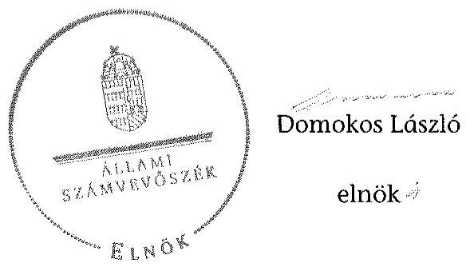

# ÁLLAMI   SZÁMVEVŐSZÉK 

## JELENTÉS

a helyi nemzetiségi önkormányzatok gazdálkodásának ellenőrzéséről
Piliscsaba Szlovák Nemzetiségi Önkormányzat

---

# Állami Számvevőszék 

Iktatószám: V-0833-062/2015.
Témaszám: 1867
Vizsgálat-azonosító szám: V067645

## Az ellenőrzést felügyelte:

## Brebán Andrea

felügyeleti vezető
2015. július 21. napjától

## Horváthné Herbáth Mária

felügyeleti vezető
2015. július 20. napjáig

## Az ellenőrzést vezette és az ellenőrzés végrehajtásáért felelős:   Zakar László   ellenőrzésvezető

## A számvevőszéki jelentést készítették:

## Zakar László

ellenőrzésvezető

## Szöllősiné Hrabóczki Etelka

számvevő tanácsos

## Az ellenőrzést végezték:

## Bretus Zoltán János

számvevő
Szöllősiné Hrabóczki Etelka
számvevő tanácsos

## Szeibel Gáborné

számvevő tanácsos
Kliment Krisztián
számvevő asszisztens

---

# TARTALOMJEGYZÉK 

BEVEZETÉS ..... 3
I. ÖSSZEGZŐ MEGÁLLAPÍTÁSOK, KÖVETKEZTETÉSEK, JAVASLATOK ..... 6
II. RÉSZLETES MEGÁLLAPÍTÁSOK ..... 12

1. A Nemzetiségi Önkormányzat és a Települési Önkormányzat együttműködésének szabályozása, a működési feltételek biztosítása ..... 12
2. A gazdálkodási feladatok ellátásának szabályszerűsége ..... 13
2.1. A költségvetésre és zárszámadásra, valamint a kincstári adatszolgáltatás rendjére vonatkozó jogszabályi előírások betartása ..... 13
2.2. A Nemzetiségi Önkormányzat gazdálkodásának szabályozottsága ..... 14
2.3. Az operatív gazdálkodási jogkörök kialakítása, gyakorlása ..... 15
3. A Nemzetiségi Önkormányzattal összefüggő gazdálkodási feladatok belső ellenőrzése ..... 17

## MELLÉKLET

1. számú A Piliscsaba Szlovák Nemzetiségi Önkormányzat 2013. évi gazdálkodási adatai

## FÜGGELÉKEK

1. számú Rövidítések jegyzéke
2. számú Értelmező szótár

---

.

---

# JELENTÉS 

## A helyi nemzetiségi önkormányzatok gazdálkodásának ellenőrzésérőlPiliscsaba Szlovák Nemzetiségi Önkormányzat

## BEVEZETÉS

A Nemzetiségi Önkormányzat a 2002. évben alakult. A 2013. évben év közben változás történt az elnök személyében, az új elnök a 2014. évi helyhatósági választásokig látta el feladatát. A Nemzetiségi Önkormányzat intézményt, gazdasági társaságot és más szervezetet nem alapított, illetve társulásban nem vett részt. A négytagú Képviselő-testület bizottságot nem hozott létre. A Nemzetiségi Önkormányzat 2013. évi módosított bevételi és kiadási előirányzata 2057,0 ezer Ft, a teljesített tárgyévi bevétele 2053,0 ezer Ft, a teljesített tárgyévi kiadása 1493,0 ezer Ft volt. A Nemzetiségi Önkormányzat a 2013. évben 1213,0 ezer Ft feladatalapú támogatásban részesült. A 2013. évi gazdálkodási adatokat részletesen az 1. számú mellékletben mutatjuk be.

Az Alaptörvény Szabadság és felelősség rész XXIX. cikk (1) bekezdése szerint a Magyarországon élő nemzetiségek államalkotó tényezők. Minden, valamely nemzetiséghez tartozó magyar állampolgárnak joga van önazonossága szabad vállalásához és megőrzéséhez. A hazánkban élő nemzetiségek helyi (települési és területi) valamint országos önkormányzatokat hozhatnak létre ${ }^{1}$. A helyi nemzetiségi önkormányzatok gazdálkodási feladatait jogszabályi előírás alapján a székhely szerinti helyi önkormányzat polgármesteri hivatala látja el.

A nemzetiségek helyzete, támogatása mind hazai, mind EU-s szinten kiemelt figyelmet kap napjainkban. A helyi nemzetiségi önkormányzatok gazdálkodására és támogatási rendszerére vonatkozó jogszabályok a 2010-2012. években jelentős változásokon mentek át. A helyi nemzetiségi önkormányzatok gazdálkodásának, a részükre juttatott költségvetési támogatások felhasználásának ellenőrzését az ÁSZ 2012-ben sorozatjellegű ellenőrzés keretében indította el.

Az ellenőrzés célja annak értékelése volt, hogy a helyi nemzetiségi önkormányzat gazdálkodási kereteinek kialakítása, gazdálkodása megfelelt-e a jogszabályoknak.

[^0]
[^0]:    ${ }^{1}$ A 2010. évben megtartott nemzetiségi önkormányzati választásokat követően 2304 települési, 58 területi és 13 országos nemzetiségi önkormányzat alakult meg.

---

Ennek keretében értékeltük, hogy:

- a helyi nemzetiségi önkormányzat és a helyi (települési) önkormányzat együttműködésének szabályozása, a működési feltételek biztosítása megfelel-e a jogszabályi előírásoknak;
- a felek együttműködése megfelelt-e a megállapodásban foglaltaknak a gazdálkodási feladatok szabályszerű ellátása során, betartották-e vonatkozó jogszabályi előírásokat;
- biztosított volt-e a helyi nemzetiségi önkormányzat gazdálkodásának belső ellenőrzése.

Az ellenőrzés várható hasznosulása: a nemzetiségi önkormányzatok testületi döntéseinek tapasztalatait összegezve következtetés vonható le a törvényalkotás számára a jogszabályi környezet esetleges módosításának indokoltságára vonatkozóan. Az ellenőrzés az ellenőrzött számára visszajelzést ad a rendezett gazdálkodási keretek kialakításáról, a működésbeli hiányosságokról. Az ellenőrzés megállapításai és javaslatai, a jó gyakorlat bemutatása tanulságul szolgálhatnak más nemzetiségi önkormányzatok, szervezetek számára a rendezett gazdálkodási keretek kialakításához. A társadalom számára jelzi, hogy közpénz nem maradhat ellenőrizetlenül, az ÁSZ értékteremtő rend kialakításához és megőrzéséhez hozzájáruló tevékenysége pozitív hatással lesz a szervezetről kialakított összkép formálásában. Az ÁSZ szervezetén belül lehetőség nyílik arra, hogy a megállapítások szintetizálásával az intézmény a hozzáadott értéket teremtő elemző tevékenységét és tanácsadó szerepét erősítse.

A helyi nemzetiségi önkormányzatok gazdálkodásának ellenőrzéséről szóló jelentés I. fejezetének összegző része az ellenőrzés céljára adott rövid, szintetizáló összefoglalót és következtetéseket tartalmazza a II. fejezet részletes megállapításain alapulóan. A jelentés intézkedést igénylő megállapításait és javaslatait az összegzőben foglaltak mellett - az ellenőrzés során feltárt, a jelentés II. fejezetében rögzített részletes megállapítások alapozzák meg, illetve támasztják alá.

Az ellenőrzés típusa: szabályszerűségi ellenőrzés.
Az ellenőrzött időszak: a helyi nemzetiségi önkormányzat és a települési önkormányzat együttműködésének, valamint a helyi nemzetiségi önkormányzat gazdálkodásának szabályozása megfelelőségét 2013. évre vonatkozóan (a 2013. december 31-i állapotnak megfelelően), a helyi nemzetiségi önkormányzat gazdálkodásának szabályszerűségét, a működési feltételek, valamint a belső ellenőrzés biztosítását a 2013. január 1. - december 31-e közötti időszakot figyelembe véve értékeltük.

Ellenőrzött szervezet: Piliscsaba Szlovák Nemzetiségi Önkormányzat és a gazdálkodási feladatait ellátó Piliscsaba Nagyközség/Város Önkormányzata Polgármesteri Hivatala.

Az ellenőrzés szakmai módszertana az ÁSZ hivatalos honlapján (www.asz.hu) közzétett szakmai szabályokon alapult, amely a Legfőbb Ellenőrző Intézmé-

---

nyek Nemzetközi Szervezete (INTOSAI) által kiadott nemzetközi standardok (ISSAI) figyelembevételével készült.

A gazdálkodás folyamatában kulcsszerepet betöltő két kulcskontroll - teljesítésigazolás, érvényesítés - múködésének megfelelőségét a személyi juttatásokkal, a dologi és felhalmozási kiadásokkal, múködési és felhalmozási célú pénzeszköz átadásokkal, ellátottak pénzbeli juttatásaival kapcsolatos kifizetések esetében mintavétellel ellenőriztük. „Megfelelőnek" értékeltük a gazdálkodási jogkörök gyakorlását, amennyiben 95\%-os bizonyossággal a teljes sokaságban a hibaarány legfeljebb $10 \%$, „részben megfelelőnek" értékeltük, ha a hibaarány felső határa 10-30\% között volt, „nem megfelelőnek" pedig akkor, ha a mintavételi eredmények alapján a sokaságbeli hibaarány felső határa meghaladta a 30\%ot.

Az ellenőrzés végrehajtásának jogszabályi alapját az ÁSZ tv. 5. § (2)-(3) és (6) bekezdéseiben foglaltak képezik.

Az ÁSZ tv. 29. § (1) bekezdése szerint a jelentéstervezetet megküldtük egyeztetésre a jegyzőnek és a Nemzetiségi Önkormányzat elnökének. Az ellenőrzött szervezetek vezetői az ÁSZ tv. 29. § (2) bekezdésében foglalt észrevételezési jogukkal nem éltek, a jelentéstervezetre nem tettek észrevételt.

---

# I. ÖSSZEGZŐ MEGÁLLAPÍTÁSOK, KÖVETKEZTETÉSEK, JAVASLATOK 

Az ellenőrzött időszakban a Nemzetiségi Önkormányzat és a Települési Önkormányzat együttmúködését - a Nek. tv. előírásának megfelelően - megállapodás szabályozta. A Nemzetiségi Önkormányzat és a Települési Önkormányzat együttmüködésének szabályozása részben felelt meg a jogszabályi előírásoknak. Ennek oka volt, hogy az együttmúködési megállapodást a Nek. tv.ben előírtak ellenére 2013. január 31-e helyett szeptember 11-én vizsgálták felül; a megállapodásban a Nek. tv.-ben foglaltak ellenére nem írták elő - és így a Nemzetiségi Önkormányzat múködéséhez szükséges személyi feltételeket részben biztosították - a jegyző részvételének kötelezettségét a Nemzetiségi Önkormányzat Képviselő-testületi ülésein az esetleges törvénysértés jelzése érdekében. Továbbá az együttműködési megállapodás szerinti müködési feltételeket a Nemzetiségi Önkormányzat SZMSZ-ében a Nek. tv.-ben foglaltak ellenére nem rögzítették. Az együttmúködési megállapodásban - az Áht.-ban foglaltak ellenére - az ellenőrzési feladatok ellátásának részletes szabályait teljes körűen nem határozták meg. A szabályozás hiánya hozzájárult ahhoz, hogy a Nemzetiségi Önkormányzat gazdálkodásával összefüggő végrehajtási feladatokra vonatkozóan a 2013. évben nem terveztek és nem hajtottak végre belső ellenőrzést. A 2013. december 31-én hatályos együttmúködési megállapodás az Áht.ban foglalt előírásoknak eleget tett, mivel a felülvizsgálat eredményeként a megállapodást kiegészítették a Polgármesteri Hivatal ellenőrzési feladataival, azon belül a belső ellenőrzés ellátásának részletes szabályaival. Az együttmúködési megállapodásban a jegyző részvételének szükségességét a Képviselőtestületi üléseken - a Nek. tv.-ben foglaltak ellenére - azonban továbbra sem deklarálták.

A Települési Önkormányzat a 2013. évben biztosította a Nemzetiségi Önkormányzat müködéséhez szükséges tárgyi feltételeket.

A Nemzetiségi Önkormányzat 2013. évi költségvetésének és zárszámadásának tartalma, jóváhagyása, valamint a kapcsolódó adatszolgáltatás részben felelt meg a jogszabályi előírásoknak. A jegyző az Áht. előírása ellenére nem készítette elő a költségvetési koncepciót, és a költségvetési és a zárszámadási határozat-tervezeteket nem az Áht.-ban előírtaknak megfelelő tartalommal állította össze. A jegyző az Ávr.-ben foglaltak ellenére több esetben az előírt határidőt követően teljesítette a Nemzetiségi Önkormányzat részére előírt kincstári adatszolgáltatást.

A Nemzetiségi Önkormányzat gazdálkodásának szabályozottsága nem felelt meg a jogszabályi előírásoknak és az együttmúködési megállapodásban foglaltaknak. A Polgármesteri Hivatal gazdálkodási szabályzataiban - az együttműködési megállapodásban foglaltak ellenére - nem rögzítették elkülönülten a Nemzetiségi Önkormányzat feladatellátására vonatkozó, a Számv. tv.-ben előírt sajátos szabályokat.

---

A Nemzetiségi Önkormányzat gazdálkodása tekintetében az operatív gazdálkodási jogkörök kialakítása nem felelt meg a jogszabályi előírásoknak, valamint az együttmúködési megállapodásban foglaltaknak. A kiadások teljesítése során az operatív gazdálkodási jogkörökön belül kulcsszerepet betöltő teljesítésigazolás és érvényesítés belső kontrollokat nem a jogszabályi előírásoknak megfelelően múködtették, aminek következtében nem volt biztosított a hibák megelőzése, feltárása és kijavítása. A teljesítésigazolást az Ávr. előírása ellenére több esetben nem végezték el, előfordult, hogy írásbeli kijelölés hiányában nem az arra jogosult személy látta el a feladatot. A teljesítésigazoló az Ávr.-ben és az együttmúködési megállapodásban rögzített előírások ellenére, ellenőrizhető okmány - előzetes írásbeli kötelezettségvállalási dokumentum - hiányában igazolta a teljesítést. Az érvényesítést az Ávr.-ben foglaltak ellenére szabályszerű kijelölés hiányában nem az arra jogosult személy végezte el, továbbá az érvényesítés dátumát az utalványrendeleten nem rögzítették. Az érvényesítő nem jelezte az utalványozónak, hogy a megelőző ügymenetben a teljesítésigazolást nem, vagy nem szabályszerűen végezték, az utalványrendeletek nem tartalmazták a kötelezettségvállalás nyilvántartási számát. További feltárt szabálytalanság volt, hogy egy esetben támogatást a Nemzetiségi Önkormányzat SZMSZ-ében foglaltak ellenére támogatási szerződés nélkül nyújtottak. A nem megfelelően müködtetett belső kontrollok korrupciós kockázatot hordoztak.

Az ÁSZ tv. 33. § (1) bekezdésében foglaltak értelmében a jelentésben foglalt megállapításokhoz kapcsolódó intézkedési tervet köteles az ellenőrzött szervezet vezetője összeállítani, és azt a jelentés kézhezvételétől számított 30 napon belül az ÁSZ részére megküldeni. Amennyiben az intézkedési tervet határidőben nem küldi meg a szervezet, vagy az nem elfogadható, az ÁSZ elnöke a hivatkozott törvény 33. § (3) bekezdés a)-b) pontjaiban foglaltakat érvényesítheti.

A helyszíni ellenőrzés megállapításainak hasznosítása mellett javasoljuk:

# a jegyzőnek 

1. Az együttműködés szabályozásával kapcsolatban

A Nek. tv. 80. § (2) bekezdésében rögzített határidőn túl felülvizsgált és módosított együttműködési megállapodás a Nek. tv. 80. § (4) bekezdésében foglaltak ellenére nem tartalmazta, hogy a Települési Önkormányzat megbízásából és képviseletében a jegyző/vagy a jegyzővel azonos képesítési előírásoknak megfelelő megbízottja részt vesz a Nemzetiségi Önkormányzat testületi ülésein és jelzi, amennyiben törvénysértést észlel.

Az együttműködési megállapodás szerinti működési feltételeket a Nemzetiségi Önkormányzat SZMSZ-ében - a Nek. tv. 80. § (2) bekezdésében foglaltak ellenére nem rögzítették.

Javaslat
a) Készítse elő az együttműködési megállapodás Nek. tv. előírásainak megfelelő módosítását a testületi döntések szabályszerűségének biztosítása érdekében,

---

majd kezdeményezze annak a Települési Önkormányzat Képviselő-testülete elé terjesztését;
b) A továbbiakban kezdeményezze az együttműködési megállapodás évenkénti felülvizsgálatát oly módon, hogy az biztosítsa a jogszabályban rögzített határidő betartását;
c) Készítse elő a Nemzetiségi Önkormányzat SZMSZ-ének Nek. tv. előírásainak megfelelő kiegészítését és kezdeményezze annak a Nemzetiségi Önkormányzat képviselő-testülete elé terjesztését.
2. A költségvetés és zárszámadás szabályszerűségével kapcsolatban

A 2013. évi költségvetési határozat-tervezet előterjesztésekor a Nemzetiségi Önkormányzat Képviselő-testülete részére tájékoztatásul a Nemzetiségi Önkormányzat költségvetési mérlegét közgazdasági tagolásban és az előirányzat felhasználási tervét - az Áht. 24. § (4) bekezdés a) pontjában foglaltak ellenére - szöveges indokolás nélkül mutatták be.

A 2013. évi költségvetési határozat - az Áht. 23. § (2) bekezdés a) pontjában foglaltak ellenére - nem tartalmazta a Nemzetiségi Önkormányzat költségvetési bevételeit és kiadásait kötelező és önként vállalt feladatok szerinti bontásban.

A zárszámadási határozat-tervezet előterjesztésekor a Képviselő-testület részére tájékoztatásul, szöveges indokolás nélkül mutatták be a pénzeszközök változását az Áht. 24. § (4) bekezdés a) pontja és az Áht. 91. § (2) bekezdés a) pontja előírásaitól eltérően.

A jegyző több esetben nem az Ávr. 169. § (2) illetve az Ávr. 170. § (5) bekezdése szerinti határidőre küldte meg a Kincstárnak a jogszabályban előírt időközi adatszolgáltatásokat.

Javaslat
Intézkedjen, hogy:
a) a Nemzetiségi Önkormányzat Képviselő-testülete részére tájékoztatásul teljes körűen, szöveges indoklással együtt kerüljenek bemutatásra a jogszabályban előírt mérlegek, kimutatások a költségvetés és a zárszámadási határozat-tervezet előterjesztésekor;
b) a költségvetési határozat tartalmilag teljes körűen feleljen meg a hatályos jogszabályi előírásoknak;
c) a Nemzetiségi Önkormányzatra vonatkozóan a kincstári adatszolgáltatás teljesítése a jogszabályban előírt határidőre megtörténjen.
3. A gazdálkodási feladatok szabályozottságával kapcsolatban

Az együttműködési megállapodásban - a szabályzatok készítésére vonatkozó hatáskörök részletes meghatározása nélkül - rögzítették, hogy a Polgármesteri Hivatal a Nemzetiségi Önkormányzat feladatai ellátásával „kapcsolatos jogosultságokat és köte-

---

lezettségeket a gazdálkodás rendjét szabályozó belső szabályzataiban a helyi nemzetiségi önkormányzatra vonatkozóan elkülönülten szabályozza". Ennek ellenére a Polgármesteri Hivatal számlarendje, pénzkezelési, értékelési, leltározási- és leltárkészítési szabályzata nem tartalmazott a Nemzetiségi Önkormányzat feladatellátására vonatkozóan elkülönített előírásokat, működéséből adódó sajátos szabályozást. A 2013. évben - a Számv. tv. 14. § (3)-(4) bekezdéseiben, továbbá az Áhsz. 8. § (3) bekezdésében előírtak ellenére - a Polgármesteri Hivatal nem rendelkezett számviteli politikával.

A Polgármesteri Hivatal SZMSZ-e - az Ávr. 13. § (1) bekezdés g) pontjában előírtak ellenére - nem tartalmazta teljes körűen a Polgármesteri Hivatal nevesített munkaköreihez tartozó feladat- és hatásköröket, a hatáskörök gyakorlásának módját, a helyettesítés rendjét, az ezekhez kapcsolódó felelősségi szabályokat.

Javaslat
a) Intézkedjen a jogszabályban előírt számviteli szabályzatok teljes körű biztosítása, továbbá annak érdekében, hogy azokban - az együttműködési megállapodásnak megfelelően - elkülönülten rögzítsék a Nemzetiségi Önkormányzatra feladatellátására vonatkozó sajátos szabályokat, előírásokat.
b) Intézkedjen a Polgármesteri Hivatal SZMSZ-ének - jogszabályi előírásoknak megfelelő - kiegészítéséről, majd kezdeményezze annak előterjesztését a Települési Önkormányzat Képviselő-testülete részére.
4. Az operatív gazdálkodási jogkörök gyakorlásával kapcsolatban

Az együttműködési megállapodásban - az Ávr. 55. § (2) bekezdés g) pontjában, illetve az Ávr. 58. § (4) bekezdésében foglalt előírások ellenére - a gazdasági vezető távollétében a jegyző kapott feladat- és hatáskört a pénzügyi ellenjegyzést és az érvényesítést végzők kijelölésére.

A kifizetések teljesítése során a teljesítésigazolást az Ávr. 57. § (1) bekezdése ellenére több esetben nem végezték el. Előfordult, hogy teljesítésigazolás az Ávr. 57. § (4) bekezdése ellenére írásbeli kijelölés hiányában nem az arra jogosult személy végezte el. A teljesítésigazoló - az Ávr. 57. § (1) bekezdésében és az együttműködési megállapodásban rögzítettek ellenére - előzetes írásbeli kötelezettségvállalási dokumentum hiányában igazolta a teljesítéseket.

Az érvényesítést az Ávr. 58. § (4) bekezdésében rögzítettek ellenére a dologi kiadásokkal kapcsolatos kifizetéseknél szabályszerű kijelölés hiányában nem az arra jogosult személy végezte el. A dologi kiadásokkal kapcsolatos kifizetéseknél az érvényesítés dátumának rögzítése az utalványrendeleteken az Ávr. 58. § (3) bekezdésében foglaltak ellenére elmaradt.

Az érvényesítő több esetben az Ávr. 58. § (1)-(2) bekezdéseinek előírása ellenére nem jelezte az utalványozónak, hogy a megelőző ügymenetben:

- a dologi kiadásoknál az együttműködési megállapodásban foglaltakat figyelmen kívül hagyva a 100 ezer Ft alatti kifizetések esetében előzetes írásbeli kötelezettségvállalási dokumentum nem készült;

---

- a teljesítésigazolást az Ávr. 57. § (1), (3), és (4) bekezdései alapján nem, vagy nem szabályszerűen végezték;
- az utalványrendeletek az Ávr. 59. § (3) bekezdés f) pontjában előírtak ellenére nem tartalmazták a kötelezettségvállalás nyilvántartási számát.

A Nemzetiségi Önkormányzat a Magyarországi Szlovákok Szövetségének Piliscsabai Szervezete részére támogatást nyújtott, azonban a Nemzetiségi Önkormányzat SZMSZ-ének 94. §-ban foglaltak ellenére a támogatottal támogatási szerződést nem kötöttek.

Javaslat
Az operatív gazdálkodás működési hibáinak megelőzése, feltárása és kijavítása érdekében intézkedjen:
a) hogy az együttműködési megállapodás összhangban legyen az államháztartási jogszabályok előírásaival;
b) a teljesítésigazolás jogszabályi előírásoknak megfelelő elvégzéséről;
c) az érvényesítéshez kapcsolódó feladatok szabályszerű ellátásáról;
d) a támogatási szerződéshez kapcsolódó szabálytalanság tekintetében a munkajogi felelősség tisztázására irányuló eljárás megindításáról, és ennek eredménye ismeretében tegye meg a szükséges intézkedéseket;
e) a továbbiakban a Nemzetiségi Önkormányzat SZMSZ-ében rögzített szabályok betartásáról.

# a Nemzetiségi Önkormányzat elnökének 

1. Az együttműködés szabályozásával kapcsolatban

A Nek. tv. 80. § (2) bekezdésében rögzített határidőn túl módosított együttműködési megállapodás a Nek. tv. 80. § (4) bekezdésében foglaltak ellenére nem tartalmazta, hogy a települési önkormányzat megbízásából és képviseletében a jegyző/vagy a jegyzővel azonos képesítési előírásoknak megfelelő megbízottja részt vesz a Nemzetiségi Önkormányzat testületi ülésein és jelzi, amennyiben törvénysértést észlel.

Az együttműködési megállapodás szerinti működési feltételeket a Nemzetiségi Önkormányzat SZMSZ-ében - a Nek. tv. 80. § (2) bekezdésében foglaltak ellenére nem rögzítették.

Javaslat
a) Terjessze a Nemzetiségi Önkormányzat Képviselő-testülete elé jóváhagyásra az együttműködési megállapodás jegyző által előkészített, jogszabályi előírásoknak megfelelő módosítását.

---

b) Terjessze a Nemzetiségi Önkormányzat Képviselő-testülete elé jóváhagyásra a Nemzetiségi Önkormányzat jogszabályi előírásoknak megfelelően kiegészített SZMSZ-ét.
2. A költségvetés és zárszámadás szabályszerűségével kapcsolatban

A 2013. évi költségvetési határozat-tervezet előterjesztésekor a Nemzetiségi Önkormányzat Képviselő-testülete részére tájékoztatásul a Nemzetiségi Önkormányzat költségvetési mérlegét közgazdasági tagolásban és az előirányzat felhasználási tervét - az Áht. 24. § (4) bekezdés a) pontjában foglaltak ellenére - szöveges indokolás nélkül mutatták be.

A zárszámadási határozat-tervezet előterjesztésekor a Nemzetiségi Önkormányzat Képviselő-testülete részére tájékoztatásul, szöveges indokolás nélkül mutatták be a pénzeszközök változását az Áht. 24. § (4) bekezdés a) pontja és az Áht. 91. § (2) bekezdés a) pontja előírásaitól eltérően.

Javaslat
Az éves költségvetési és a zárszámadási határozat-tervezet előterjesztésekor a Nemzetiségi Önkormányzat Képviselő-testülete részére tájékoztatásul szöveges indoklásal együtt mutassa be a jogszabályban előírt mérleget, kimutatásokat.

---

# II. RÉSZLETES MEGÁLLAPÍTÁSOK 

## 1. A Nemzetiségi Önkormányzat És a Telepúlési ÖnkormányZAT EGYÜTTMÜKÖDÉSÉNEK SZABÁLYOZÁSA, A MÜKÖDÉSI FELTÉTELEK BIZTOSÍTÁSA

A Nemzetiségi Önkormányzat és a Települési Önkormányzat együttmüködésének szabályozása részben felelt meg a jogszabályi előírásoknak.

A Nemzetiségi Önkormányzat az ellenőrzött időszakban rendelkezett a Települési Önkormányzattal történő együttműködésre vonatkozó megállapodással, melyet a Nemzetiségi Önkormányzat és a Települési Önkormányzat Képviselőtestületei határozattal ${ }^{2}$ hagytak jóvá és az arra jogosult személyek írtak alá.

Az együttműködési megállapodás felülvizsgálata a Nek. tv. 80. § (2) bekezdésében előírtak ellenére 2013. január 31-éig nem történt meg. Az együttműködési megállapodást 2013. szeptember 11-én felülvizsgálták és a megállapodást kiegészítették a Nemzetiségi Önkormányzat bevételeire és kiadásaira vonatkozóan a Polgármesteri Hivatal ellenőrzési feladatai ellátásának részletes szabályaival.

Az együttműködési megállapodás módosítását a Nemzetiségi Önkormányzat Képviselő testülete a 33/2013. (VIII. 23.) számú, a Települési Önkormányzat Képviselő testülete a 160/2013. (IX. 10.) számú határozatával hagyta jóvá.

A 2013. december 31-én hatályos együttműködési megállapodás az Áht. 27. § (2) bekezdésében foglaltaknak megfelelően tartalmazta a tervezési, gazdálkodási, ellenőrzési, finanszírozási, adatszolgáltatási és beszámolási feladatok ellátásának részletes szabályait, valamint a Nek. tv. 80. § (3) bekezdésben foglaltakat.

Az együttműködési megállapodás a Nek. tv. 80. § (4) bekezdésében foglaltak ellenére nem tartalmazta, hogy a Települési Önkormányzat megbízásából és képviseletében a jegyző/vagy a jegyzővel azonos képesítési előírásoknak megfelelő megbízottja részt vesz a Nemzetiségi Önkormányzat testületi ülésein és jelzi, amennyiben törvénysértést észlel.

Az együttműködési megállapodás szerinti működési feltételeket a Nemzetiségi Önkormányzat SZMSZ-ében - a Nek. tv. 80. § (2) bekezdésében foglaltak ellenére - nem rögzítették, a Települési Önkormányzat SZMSZ-ében a megállapodás megkötését követő harminc napon belül rögzítették.

[^0]
[^0]:    ${ }^{2}$ A 2013. évben hatályos együttműködési megállapodást a Nemzetiségi Önkormányzat Képviselő-testülete a 30/2012. (IV. 25.) számú, a Települési Önkormányzat Képviselőtestülete a 129/2012. (VI. 05.) számú határozatával hagyta jóvá

---

A Települési Önkormányzat a 2013. évben a Nemzetiségi Önkormányzat részére a Nek. tv. 80. § (1)-(2) bekezdése szerinti múködés tárgyi feltételeit biztosította, a személyi feltételeket részben biztosította. A személyi feltételek esetében nem volt megfelelő, hogy nem rögzítették az együttmúködési megállapodásban azt, hogy a jegyző vagy annak megbízottja a Települési Önkormányzat megbízásából és képviseletében részt vesz a Nemzetiségi Önkormányzat Képviselőtestülete ülésein.

# 2. A GAZDÁLKODÁSI FELADATOK ELLÁTÁSÁNAK SZABÁLYSZERŰSÉGE 

### 2.1. A költségvetésre és zárszámadásra, valamint a kincstári adatszolgáltatás rendjére vonatkozó jogszabályi előírások betartása

A Nemzetiségi Önkormányzat 2013. évi költségvetésének és zárszámadásának tartalma, jóváhagyása, valamint a kapcsolódó adatszolgáltatás részben felelt meg a jogszabályi előírásoknak.

A jegyző a 2013. évre vonatkozó költségvetési koncepciót az Áht. 24. § (2) bekezdésével és az Áht. 26. § (1) bekezdésével ellentétben nem készítette elő, emiatt a Nemzetiségi Önkormányzat elnöke az Áht. 24. § (1) bekezdésében és az Áht. 26. § (1) bekezdésében előírtak ellenére nem nyújtotta be ${ }^{3}$ a Képviselő-testület részére.

A jegyző a Nemzetiségi Önkormányzat 2013. évi költségvetésének határo-zat-tervezetét az Áht. 24. § (2) bekezdése és az Áht. 26. § (1) bekezdése szerint előkészítette, amelyet a Nemzetiségi Önkormányzat elnöke a Képviselő-testület részére határidőben benyújtott ${ }^{4}$. A 2013. évi költségvetési határozat-tervezet előterjesztésekor a Képviselő-testület részére tájékoztatásul - az Áht. 24. § (4) bekezdés a) pontjában foglaltak ellenére - szöveges indokolás nélkül mutatták be a költségvetési mérleget közgazdasági tagolásban és az előirányzat felhasználási tervét. A Nemzetiségi Önkormányzat 2013. évi költségvetési határozattervezete az Áht. 23. § (2) bekezdés a) pontjának megfelelően tartalmazta a Nemzetiségi Önkormányzat költségvetési bevételeit és kiadásait előirányzatcsoportok, kiemelt előirányzatok szerinti bontásban, de nem tartalmazta a kötelező és önként vállalt feladatok szerinti bontásban.

A jegyző a Nemzetiségi Önkormányzat 2013. évi zárszámadási határozattervezetét az Áht. 91. § (1) bekezdésében előírt határidőre előkészítette, amelyet a Nemzetiségi Önkormányzat elnöke határidőben ${ }^{5}$ beterjesztett a Képvise-lő-testületnek az Áht. 91. § (1) és (3) bekezdésekben foglaltak alapján. A Képvi-selő-testület az Áht. 91. § (1) bekezdésében előírt határidőre jóváhagyta a 2013.

[^0]
[^0]:    ${ }^{3}$ 2012. október 31-éig
    ${ }^{4}$ A Nemzetiségi Önkormányzat 2013. február 14-én, az 5/2013. (II. 14.) SZNÖ számú határozatával fogadta el a 2013. évi költségvetését.
    ${ }^{5}$ 2014. április 30-ig

---

évi zárszámadási határozat-tervezetet ${ }^{6}$. A zárszámadási határozat-tervezet előterjesztésekor a Képviselő-testület részére tájékoztatásul szöveges indokolással együtt mutatták be a Nemzetiségi Önkormányzat költségvetési mérlegét közgazdasági tagolásban, de - az Áht. 24. § (4) bekezdés a) pontjának előírásától és az Áht. 91. § (2) bekezdés a) pontjának előírásaitól eltérően - a pénzeszközök változásához a szöveges indokolás hiányzott. A 2013. évi költségvetési és zárszámadási határozatnak az Áht. 89. § (1) bekezdésében előírt összehasonlíthatósága biztosított volt. A zárszámadási határozat-tervezetben a Nemzetiségi Önkormányzat az Áht. 89. § (2) bekezdésében foglaltaknak megfelelően valamennyi bevételéről és kiadásáról elszámolt.

A jegyző három esetben a jogszabályban előírt határidőt követően teljesítette az együttmúködési megállapodásban vállalt - a Nemzetiségi Önkormányzat részére előírt kincstári adatszolgáltatást. A 2013. évi első három hónap, és az első kilenc hónap időközi költségvetési jelentéseit nem az Ávr. 169. § (2) bekezdés szerinti határidőkre, valamint az év első negyedévi időközi mérlegjelentését nem az Ávr. 170. § (5) bekezdés szerinti határidőre küldte meg a Kincstárnak ${ }^{7}$.

# 2.2. A Nemzetiségi Önkormányzat gazdálkodásának szabályozottsága 

A Nemzetiségi Önkormányzat gazdálkodásának szabályozottsága a 2013. évben nem felelt meg a jogszabályi előírásoknak és az együttmúködési megállapodásban foglaltaknak.

A gazdálkodási feladatok végrehajtását ellátó Polgármesteri Hivatal a 2013. évben a Számv. tv. 14. § (3)-(4) bekezdéseiben és az Áhsz. 8.§ (3) bekezdésében előírtak ellenére nem rendelkezett számviteli politikával ${ }^{8}$. Az együttmúködési megállapodásban rögzítették, - a szabályzatok készítésére vonatkozó hatáskörök részletes meghatározása nélkül - hogy a Polgármesteri Hivatal a Nemzetiségi Önkormányzat feladatai ellátásával „kapcsolatos jogosultságokat és kötelezettségeket a gazdálkodás rendjét szabályozó belső szabályzataiban a helyi nemzetiségi önkormányzatra vonatkozóan elkülönülten szabályozza". Ennek ellenére a Polgármesteri Hivatal számlarendje, pénzkezelési, eszközök és források értékelési, valamint leltározási és leltárkészítési szabályzata nem tartalmazott a Nemzetiségi Önkormányzat feladatellátására vonatkozóan elkülönített előírásokat, illetve a Nemzetiségi Önkormányzat müködéséből adódó sajátos szabályozást.

A Polgármesteri Hivatal SZMSZ-e - az Ávr. 13. § (1) bekezdés g) pontjában előírtak ellenére - nem tartalmazta teljes körűen a Polgármesteri Hivatal nevesített munkaköreihez tartozó feladat- és hatásköröket, a hatáskörök gyakorlásá-

[^0]
[^0]:    ${ }^{6}$ Piliscsaba Szlovák Nemzetiségi Önkormányzatának 9/2014. (IV. 29.) SZNÖ. számú határozata az SZNÖ 2013. évi zárszámadásról és pénzmaradványról
    ${ }^{7}$ Költségvetési jelentések benyújtása: első három hónap 2013. május 14., első kilenc hónap 2013. október 25., és az első negyedéves mérlegjelentés benyújtása 2013. május 14. volt.
    ${ }^{8}$ A számviteli politika hatályba léptetése elmaradt.

---

nak módját, a helyettesítés rendjét, az ezekhez kapcsolódó felelősségi szabályokat.

Az együttműködési megállapodásban meghatározták a Nemzetiségi Önkormányzat gazdálkodásával kapcsolatosan - az Ávr. 13. § (2) bekezdés a) pontjában és a Nek. tv. 80. § (3) bekezdésében foglaltaknak megfelelően - a tervezéssel, a gazdálkodással, így különösen a kötelezettségvállalással, a pénzügyi ellenjegyzéssel, a teljesítés igazolásával, az érvényesítéssel, az utalványozás gyakorlatának módjával kapcsolatos eljárási és dokumentációs részletszabályokat, valamint az ezeket végző személyek kijelölésének rendjét, és az ellenőrzési, adatszolgáltatási feladatok teljesítésével kapcsolatos belső előírásokat, feltételeket.

A Polgármesteri Hivatal rendelkezett a Bkr. 6. § (3), (4) bekezdéseiben előírt ellenőrzési nyomvonallal és a szabálytalanságok kezelésének eljárásrendjével. A jegyző a Bkr. 8. § (2) bekezdésében foglaltaknak megfelelve a Nemzetiségi Önkormányzat gazdálkodásának végrehajtásával kapcsolatos feladataira vonatkozóan biztosította a folyamatba épített, előzetes, utólagos és vezetői ellenőrzést.

# 2.3. Az operatív gazdálkodási jogkörök kialakítása, gyakorlása 

A Nemzetiségi Önkormányzat gazdálkodása tekintetében az operatív gazdálkodási jogkörök kialakítása nem felelt meg a jogszabályi előírásoknak, valamint az együttmúködési megállapodásban foglaltaknak.

Az együttmúködési megállapodásban az Ávr. 55. § (2) bekezdés g) pontjában, illetve az Ávr. 58.§ (4) bekezdésében foglaltak ellenére a gazdasági vezetô ${ }^{9}$ távollétében - az általa kijelölt személy helyett - helytelenül a jegyző feladat- és hatáskörébe utalták a kötelezettségvállalás pénzügyi ellenjegyzésére jogosult személy kijelölését, valamint a gazdasági vezető helyett helytelenül a jegyző feladat- és hatáskörébe utalták az érvényesítésre jogosult személy kijelölését.

A Polgármesteri Hivatal rendelkezett az Áht. 10. § (4) bekezdése és az Ávr. 9. § (1) bekezdése szerinti gazdasági szervezettel. A pénzügyi ellenjegyzésre az Ávr. 55. § (2) bekezdés g) pontja szerint jogosult gazdasági vezető rendelkezett az Ávr. 12. §-ában előírt szakképesítéssel.

A Nemzetiségi Önkormányzatnak a 2013. évben dologi kiadásokkal, valamint pénzeszközátadással kapcsolatos kifizetései voltak. A kiadások teljesítése során az operatív gazdálkodási jogkörökön belül kulcsszerepet betöltő teljesítésigazolás és érvényesítés belső kontrollokat nem a jogszabályi előírásoknak megfelelően múködtették.

A dologi kiadásokkal kapcsolatos kifizetéseknél a teljesítésigazolást az Ávr. 57. § (1) bekezdésében foglaltak ellenére több esetben nem végezték el. Előfordult, hogy az Ávr. 57. § (4) bekezdés ellenére írásbeli kijelölés hiányában

[^0]
[^0]:    ${ }^{9}$ A gazdasági vezető az Adó és Gazdasági Osztály vezetője.

---

nem az arra jogosult személy végezte el. A teljesítésigazoló az Ávr. 57. § (1) bekezdésében és az együttmúködési megállapodásban rögzített előírások ellenére, ellenőrizhető okmány - előzetes írásbeli kötelezettségvállalási dokumentum - hiányában igazolta a teljesítést. Az együttműködési megállapodásban rögzítettek ellenére a kifizetés alapját képező dokumentumokra a teljesítésigazolás tényére történő utalást szabálytalanul ${ }^{10}$ vezették fel.

Az együttműködési megállapodásban rögzítették, hogy előzetes írásbeli kötelezettségvállalás szükséges a gazdasági eseményenként 100 ezer Ft-ot el nem érő kifizetések esetén is. Az együttmúködési megállapodásban szabályozottak ellenére a 100 ezer Ft-ot el nem érő dologi kifizetések esetében nem készült előzetes írásbeli kötelezettségvállalási dokumentum.

Az érvényesítést az Ávr. 58. § (4) bekezdésben rögzítettek ellenére a dologi kiadásokkal kapcsolatos kifizetéseknél szabályszerű kijelölés hiányában nem az arra jogosult személy végezte ${ }^{11}$ el. A dologi kiadásokkal kapcsolatos kifizetéseknél az érvényesítés dátumának rögzítése az utalványrendeleteken az Ávr. 58. § (3) bekezdésében foglaltak ellenére elmaradt.

Az érvényesítő több esetben az Ávr. 58. § (1)-(2) bekezdéseinek előírása ellenére nem jelezte az utalványozónak, hogy a megelőző ügymenetben:

- a dologi kiadásoknál az együttmúködési megállapodásban foglaltakat figyelmen kívül hagyva a 100 ezer Ft alatti kifizetések esetében előzetes írásbeli kötelezettségvállalási dokumentum nem készült;
- a teljesítésigazolást az Ávr. 57. § (1), (3), és (4) bekezdései alapján nem, vagy nem szabályszerűen végezték;
- az utalványrendeletek az Ávr. 59. § (3) bekezdés f) pontjában előírtak ellenére nem tartalmazták a kötelezettségvállalás nyilvántartási számát.

A kulcskontrollok ellenőrzése során további feltárt szabálytalanság volt, hogy a Nemzetiségi Önkormányzat a Magyarországì Szlovákok Szövetségének Piliscsabai Szervezete részére támogatást úgy nyújtott, hogy a Nemzetiségi Önkormányzat SZMSZ-ének 94. §-ban foglalt támogatási szerződés megkötése nem történt meg. A Nemzetiségi Önkormányzat Képviselő-testülete 2013. december 3-án döntött a pénzeszközátadásról.

A Nemzetiségi Önkormányzatnál a 2013. évben a kulcskontrollokat nem megfelelően működtették és emiatt nem volt biztosított a hibák megelőzése, feltárása és kijavítása. A nem megfelelően működtetett belső kontrollok korrupciós kockázatot hordoztak.

Az integritás szemlélet érvényesülésének ellenőrzéséhez az Önkormányzat tanúsítványon szolgáltatott adatokat. Ezen adatok értékelése alapján az ere-

[^0]
[^0]:    ${ }^{10}$ A „teljesítést összegszerüségében is igazolom", valamint „a kiadások teljesitésének jogosságát" szövegnek a kifizetés alapját jelentő dokumentumon a rávezetése elmaradt.
    ${ }^{11}$ A gazdasági vezető helyett szabálytalanul a jegyző jelölt ki a Polgármesteri Hivatal állományába tartozó köztisztviselőt az érvényesítési feladatok ellátására.

---

dendő veszélyeztetettségi szint és a kockázatokat növelő tényező szintje is alacsony. Emellett a szervezetnél kiépült, a kockázatok kezelésére hivatott kontrollok szintje is alacsony.

A kockázatok és a kontrollok szintje alapján megállapítható, hogy a szervezetnél jelenlévő eredendő korrupciós kockázatok, valamint a kockázatokat növelő tényezők szintje nem haladja meg az azok kezelésére kiépült kontrollok szintjét.

Ugyanakkor az operatív gazdálkodási jogkörök szabályozása és gyakorlása területén feltárt hiányosságok és hibák arra utalnak, hogy a Nemzetiségi Önkormányzatnak még lépéseket kell tennie az integritás szemlélet érvényesülésében.

# 3. A Nemzetiségi Önkormányzattal összefüggő GAZDÁlKODÁSI FELADATOK BELSŐ ELLENŐRZÉSE 

A 2013. évben a Nemzetiségi Önkormányzat gazdálkodásával összefüggő végrehajtási feladatokra vonatkozó belső ellenőrzés nem volt megfelelő.

A 2013. szeptember 10-ig hatályos együttműködési megállapodásban - az Áht. 27. § (2) bekezdésében foglaltaknak megfelelően - rögzítették a Polgármesteri Hivatal ellenőrzési kötelezettségét a Nemzetiségi Önkormányzat bevételei és kiadásai vonatkozásában, azonban nem határozták meg az ellenőrzés részletes szabályait. Az együttmúködési megállapodásban 2013. szeptember 11-től az Áht. 27. § (2) bekezdésében előírt ellenőrzési feladatok, azon belül a belső ellenőrzés ellátásának részletes szabályait teljes körűen meghatározták.

A 2013. évben a Nemzetiségi Önkormányzat gazdálkodásával összefüggő végrehajtási feladatokra vonatkozóan belső ellenőrzést nem terveztek és nem végeztek.

Budapest, 2015. hónap 16 nap

Melléklet: 1 db
Függelék: 2 db

---

.

---

# PILISCSABA SZLOVÁK NEMZETISÉGI ÖNKORMÁNYZAT 2013.ÉVI GAZDÁLKODÁSI ADATAI 

A) Bevételek

| Megnevezés | Eredeti elöirányzat |  | Módosított   ezer Ft | Teljesítés |  |
| :--: | :--: | :--: | :--: | :--: | :--: |
|  |  |  |  |  | megoszlás |
| Intézményi múködési bevételek | 0,0 | 4,0 |  | 4,0 | $0,2 \%$ |
| Általános múködési támogatás | 222,0 | 226,0 |  | 226,0 | $11,0 \%$ |
| Feladatalapú támogatás | 0,0 | 1213,0 |  | 1213,0 | $59,1 \%$ |
| Települési Önkormányzat által nyújtott támogatás | 320,0 | 320,0 |  | 320,0 | $15,6 \%$ |
| Országos Szlovák   Önkormányzat által nyújtott   támogatás | 0,0 | 50,0 |  | 50,0 | $2,4 \%$ |
| Müködési bevételek | 542,0 | 1813,0 |  | 1813,0 | 88,3\% |
| Felhalmozási bevételek | 0,0 | 0,0 |  | 0,0 | $0,0 \%$ |
| Költségvetési bevételek összesen | 542,0 | 1813,0 |  | 1813,0 | 88,3\% |
| Előző évi pénzmaradvány felhasználás | 240,0 | 244,0 |  | 244,0 | $11,9 \%$ |
| Finanszírozási bevételek | 0,0 | 0,0 |  | $-4,0$ | $-0,2 \%$ |
| Tárgyévi bevételek összesen | 782,0 | 2057,0 |  | 2053,0 | 100,0\% |

B) Kiadások

| Megnevezés | Eredeti elöirányzat | Módosított   ezer Ft | Teljesítés |  |
| :--: | :--: | :--: | :--: | :--: |
|  |  |  |  | megoszlás |
| Személyi juttatások | 0,0 | 0,0 | 0,0 | $0,0 \%$ |
| Munkaadókat terhelő járulékok és szociális hozzájárulási adó összesen | 0,0 | 0,0 | 0,0 | $0,0 \%$ |
| Dologi kiadások | 567,0 | 901,0 | 901,0 | 60,3\% |
| Támogatásértékủ múködési kiadások | 0,0 | 0,0 | 0,0 | $0,0 \%$ |
| Múködési célú pénzeszközátadások államháztartáson kívülre | 215,0 | 600,0 | 600,0 | 40,2\% |
| Tartalékok | 0,0 | 556,0 | 0,0 | 0,0\% |
| Müködési kiadások összesen | 782,0 | 2057,0 | 1501,0 | 100,5\% |
| Felhalmozási kiadások | 0,0 | 0,0 | 0,0 | 0,0\% |
| Költségvetési kiadások összesen | 782,0 | 2057,0 | 1501,0 | 100,5\% |
| Finanszírozási kiadások | 0,0 | 0,0 | $-8,0$ | $-0,5 \%$ |
| Tárgyévi kiadások összesen | 782,0 | 2057,0 | 1493,0 | 100,0\% |

---

.

---

# RÖVIDÍTÉSEK JEGYZÉKE 

## Törvények

Alaptörvény
Áht.
ÁSZ tv.
Nek. tv.
Számv. tv.

## Rendeletek

Áhsz.

Ávr.
Bkr.
támogatási kormányrendelet

## Szórövidítések

ÁSZ
együttmúködési megállapodás
ellenőrzési nyomvonal

## EU

FEUVE
folyamatba épített előzetes és utólagos vezetői ellenőrzés szabályzata jegyző

Képviselő-testület
Kincstár
Nemzetiségi Önkormányzat
Nemzetiségi Önkormányzat elnöke
Nemzetiségi Önkormányzat Képviselőtestülete

Magyarország Alaptörvénye
az államháztartásról szóló 2011. évi CXCV. törvény
az Állami Számvevőszékről szóló 2011. évi LXVI. törvény
a nemzetiségek jogairól szóló 2011. évi CLXXIX. törvény
a számvitelről szóló 2000 . évi C. törvény
az államháztartás szervezetei beszámolási és könyvvezetési kötelezettségének sajátosságairól szóló 249/2000. (XII. 24.) Korm. rendelet
az államháztartási törvény végrehajtásáról szóló 368/2011. (XII. 31.) Korm. rendelet
a költségvetési szervek belső kontrollrendszeréről és belső ellenőrzéséről szóló 370/2011. (XII. 31.) Korm. rendelet
a nemzetiségi célú előirányzatokból nyújtott támogatások feltételrendszeréről és elszámolásának rendjéről szóló 428/2012. (XII. 29.) Korm. rendelet

Állami Számvevőszék
Piliscsaba Nagyközség Önkormányzata Képviselőtestülete és Piliscsaba Szlovák Nemzetiségi Önkormányzat Képviselő-testülete által aláírt együttmúködési megállapodás (kelt 2012. június 15 -én, módosítva 2013. szeptember 11-én)
Piliscsaba Nagyközség Önkormányzat Polgármesteri Hivatala folyamatba épített előzetes és utólagos vezetői ellenőrzés rendszere (hatályos 2012. december 1-jétől)
Európai Unió
folyamatba épített előzetes és utólagos vezetői ellenőrzés
Piliscsaba Nagyközség Önkormányzat Polgármesteri Hivatala folyamatba épített előzetes és utólagos vezetői ellenőrzés rendszere (hatályos 2012. december 1-jétől)
Piliscsaba Nagyközség/Piliscsaba Város Önkormányzat Polgármesteri Hivatala jegyzöje
Piliscsaba Szlovák Nemzetiségi Önkormányzat Képviselőtestülete
Magyar Államkincstár
Piliscsaba Szlovák Nemzetiségi Önkormányzat
Piliscsaba Szlovák Nemzetiségi Önkormányzat elnöke
Piliscsaba Szlovák Nemzetiségi Önkormányzat Képviselőtestülete

---

Nemzetiségi Önkormányzat SZMSZ-e

Polgármesteri Hivatal
SZMSZ

Települési Önkormányzat

Piliscsaba Szlovák Nemzetiségi Önkormányzatának Szervezeti és Müködési Szabályzata (hatályos 2012. október 25-étől)
Piliscsaba Nagyközség/ Önkormányzat Polgármesteri Hivatala/ Piliscsabai Polgármesteri Hivatala
Piliscsaba Nagyközség Önkormányzat Képviselőtestületének 265/2012. (XII. 12.) számú határozatával jóváhagyott Piliscsabai Polgármesteri Hivatal Szervezeti és Müködési Szabályzata, hatályos 2013. január 1-jétől (iktatószám: 661/2013.)
Piliscsaba Város Önkormányzat Képviselő-testületének 179/2013. (X. 9.) számú határozatával jóváhagyott Piliscsabai Polgármesteri Hivatal Szervezeti és Müködési Szabályzata, hatályos 2013. november 6-ától (iktatószám 661-2/2013.)
Piliscsaba Nagyközség Önkormányzata/ Piliscsaba Város Önkormányzata

---

# ÉRTELMEZŐ SZÓTÁR 

belső ellenőrzés
belső kontrollrendszer
együttmúködési megállapodás
integritás

A Bkr. 2. § b) pont meghatározásában független, tárgyilagos bizonyosságot adó és tanácsadó tevékenység, amelynek célja, hogy az ellenőrzött szervezet múködését fejlessze és eredményességét növelje, az ellenőrzött szervezet céljai elérése érdekében rendszerszemléletű megközelítéssel és módszeresen értékeli, illetve fejleszti az ellenőrzött szervezet irányítási és belső kontrollrendszerének hatékonyságát.
A Bkr. 2. § d) pont és az Áht. 69. § (1) bekezdése alapján a belső kontrollrendszer a kockázatok kezelése és tárgyilagos bizonyosság megszerzése érdekében kialakított folyamatrendszer, amely azt a célt szolgálja, hogy a múködés és gazdálkodás során a tevékenységeket szabályszerűen, gazdaságosan, hatékonyan, eredményesen hajtsák végre, az elszámolási kötelezettségeket teljesítsék, megvédjék az erőforrásokat a veszteségektől, károktól és nem rendeltetésszerű használattól.
Az Áht. 27. § (2) bekezdése és a Nek. tv. 80. § (1) bekezdése értelmében a helyi önkormányzat a helyi nemzetiségi önkormányzat részére - annak székhelyén - biztosítja az önkormányzati múködés személyi és tárgyi feltételeit, továbbá gondoskodik a múködéssel kapcsolatos végrehajtási feladatok ellátásáról. Az önkormányzati múködés feltételei és az ezzel kapcsolatos végrehajtási feladatok. A Nek. tv. 80. § (2) bekezdés szerinti a fenti kötelezettségének teljesítése érdekében a helyi önkormányzat harminc napon belül biztosítja a rendeltetésszerú helyiséghasználatot, valamint a helyiséghasználatra, a további feltételek biztosítására és a feladatok ellátására vonatkozóan megállapodást köt a helyi nemzetiségi önkormányzattal. A megállapodást minden év január 31. napjáig, általános vagy időközi választás esetén az alakuló ülést követő harminc napon belül felül kell vizsgálni. A helyi önkormányzat és a nemzetiségi önkormányzat szervezeti és múködési szabályzatában rögzíti a megállapodás szerinti múködési feltételeket, a megállapodás megkötését, módosítását követő harminc napon belül. A Nek. tv. 80. § (3) bekezdés írja elő a megállapodásban rögzítendőket.

Az integritás elvek, értékek, cselekvések, módszerek, intézkedések konzisztenciáját jelenti: olyan magatartásmódot, amely meghatározott értékeknek felel meg. Az integritás a közszféra esetében a társadalom által elvárt nyilvánossági, átláthatósági, illetve jogi/etikai normáknak történő megfelelést jelenti.
(Forrás: a http://integritas.asz.hu honlapon közzétett „A 2012. évi integritás felmérés eredményeinek összefoglalója"

---

költségvetési szerv vezetője
korrupció
kulcskontroll
lényegesség
megfelelőségi teszt
nemzetiség
dokumentum 3. oldal 1. bekezdése)
A Bkr. 2. § nd) pont meghatározásában a helyi önkormányzat, helyi nemzetiségi önkormányzat esetén a jegyző, illetve a Bkr. 2. § ne) pontja alapján a fővárosi kerületi önkormányzat esetén a jegyző, körjegyző, főjegyző.
Azok a cselekmények, amelyek során a köz érdekében való eljárással megbízott és döntéshozatali felelősséggel felruházott személy a köz érdeke helyett önös vagy részérdekeket követve, mástól jogtalan vagy etikátlan előnyt elfogadva és őt jogtalan vagy etikátlan előnyhöz juttatva jár el, illetve amikor valaki a köz érdekében való eljárással megbízott és döntéshozatali felelősséggel felruházott személynek jogtalan vagy etikátlan előnyt nyújtva vagy felajánlva jogtalan vagy etikátlan előnyt kér. (Forrás: A Kormány korrupció megelőzési programja 2012-2014.)
Az azonosított kockázatok mérséklése érdekében kialakított kontrollok közül azok, amelyek elégtelen múködése esetén a szervezetet jelentős veszteség érheti, vagy a múködésükben bekövetkező hiba/hiányosság más kontrollok eredményességét csökkenti. Ezek ellenőrzése, értékelése elegendő bizonyítékot szolgáltat adott területen a kontrollrendszer értékeléséhez. Az önkormányzatok kontrollrendszere kialakításának ellenőrzése során a pénzügyi folyamatokban kulcsszerepet betöltő belső kontrollok a teljesítésigazolás és érvényesítés.
Egy információ akkor lényeges, ha hiánya vagy téves állítása befolyásolhatja ezen információkat felhasználók döntéseit, véleményét. Az ellenőrzés során a lényegesség három szempontból értelmezhető: érték, jelleg és összefüggés szerint.
Az ellenőrzés során alkalmazott módszer - a számvevő egy adatállomány, statisztikai sokaság összes tételének vizsgálata helyett a kiválasztott tételek meghatározott jellemzőinek elemzése és kiértékelése útján szerezhet a teljes állományra vonatkozó következtetések levonására alkalmas ellenőrzési bizonyítékokat - a mennyiségileg elegendő és a minőségileg megfelelő bizonyíték megszerzésére az ellenőrzött kulcskontroll (teljesítésigazolás, érvényesítés) múködésének megfelelő, vagy nem megfelelő voltáról. (A számvevőszéki ellenőrzés általános alapelvei 4.1.2, és 4.2 pontjai)
A Nek. tv. 1. § (1) bekezdése alapján nemzetiség minden olyan Magyarország területén legalább egy évszázada honos népcsoport, amely az állam lakossága körében számszerú kisebbségben van, tagjai magyar állampolgárok és a lakosság többi részétől saját nyelve és kultúrája, hagyományai különböztetik meg, egyben olyan összetar-tozás-tudatról tesz bizonyságot, amely mindezek megőrzésére, történelmileg kialakult közösségeik érdekeinek

---

nemzetiségi önkormányzat
operatív gazdálkodási jogkör
kifejezésére és védelmére irányul.
Az Nek. tv. 2. § 2. pontja szerint törvényben meghatározott nemzetiségi közszolgáltatási feladatokat ellátó, testületi formában múködő, jogi személyiséggel rendelkező, demokratikus választások útján e törvény alapján létrehozott szervezet, amely a nemzetiségi közösséget megillető jogosultságok érvényesítésére, a nemzetiségek érdekeinek védelmére és képviseletére, a feladat- és hatáskörébe tartozó nemzetiségi közügyek települési, területi vagy országos szinten történő önálló intézésére jön létre.
kötelezettségvállalás; pénzügyi ellenjegyzés; utalványozás; érvényesítés; teljesítésigazolás jogkör