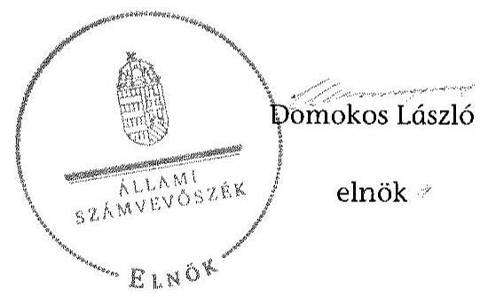

# ÁLLAMI   SZÁMVEVŐSZÉK 

## JELENTÉS

a helyi nemzetiségi önkormányzatok gazdálkodásának ellenőrzéséről
Piliscsaba Roma Nemzetiségi Önkormányzat

---

# Állami Számvevőszék 

Iktatószám: V-0703-151/2015.
Témaszám: 1737
Vizsgálat-azonosító szám: V067612

## Az ellenőrzést felügyelte:

## Brebán Andrea

felügyeleti vezető
2015. július 21. napjától

## Horváthné Herbáth Mária

felügyeleti vezető
2015. július 20. napjáig

## Az ellenőrzést vezette és az ellenőrzés végrehajtásáért felelős:

Zakar László
ellenőrzésvezető

## A számvevőszéki jelentést készítették:

Zakar László ellenőrzésvezető Szeibel Gáborné számvevő tanácsos Szöllősiné Hrabóczki Etelka számvevő tanácsos Kliment Krisztián számvevő asszisztens

## Az ellenőrzést végezték:

Bretus Zoltán János
számvevő
Szöllősiné Hrabóczki Etelka
számvevő tanácsos

Szeibel Gáborné
számvevő tanácsos
Kliment Krisztián
számvevő asszisztens

---

# TARTALOMJEGYZÉK 

BEVEZETÉS ..... 3
I. ÖSSZEGZŐ MEGÁLLAPÍTÁSOK, KÖVETKEZTETÉSEK, JAVASLATOK ..... 6
II. RÉSZLETES MEGÁLLAPÍTÁSOK ..... 12

1. A Nemzetiségi Önkormányzat és a Települési Önkormányzat együttműködésének szabályozása, a működési feltételek biztosítása ..... 12
2. A gazdálkodási feladatok ellátásának szabályszerűsége ..... 13
2.1. A költségvetésre és zárszámadásra, valamint a kincstári adatszolgáltatás rendjére vonatkozó jogszabályi előírások betartása ..... 13
2.2. A Nemzetiségi Önkormányzat gazdálkodásának szabályozottsága ..... 14
2.3. Az operatív gazdálkodási jogkörök kialakítása, gyakorlása ..... 15
3. A Nemzetiségi Önkormányzattal összefüggő gazdálkodási feladatok belső ellenőrzése ..... 18

## MELLÉKLETEK

1. számú Piliscsaba Roma Nemzetiségi Önkormányzat 2013. évi gazdálkodási adatai

## FÜGGELÉKEK

1. számú Rövidítések jegyzéke
2. számú Értelmező szótár

---

.

---

# JELENTÉS 

## A helyi nemzetiségi önkormányzatok gazdálkodásának ellenőrzéséről Piliscsaba Roma Nemzetiségi Önkormányzat

## BEVEZETÉS

A Nemzetiségi Önkormányzat az 1998. évben alakult. A 2013. évben hivatalban lévő elnök a 2010. évi helyhatósági választások óta látja el feladatát. A Nemzetiségi Önkormányzat intézményt, gazdasági társaságot és más szervezetet nem alapított, illetve társulásban nem vett részt. A négytagú Képviselőtestület bizottságot nem hozott létre. A Nemzetiségi Önkormányzat költségvetési beszámolója szerint 2013. évben a módosított bevételi és kiadási előirányzata 3323,0 ezer Ft, a teljesített tárgyévi bevétele 4142,0 ezer Ft, a teljesített tárgyévi kiadása 3866,0 ezer Ft volt. A Nemzetiségi Önkormányzat a 2013. évben 291,0 ezer Ft feladatalapú támogatásban részesült. A 2013. évi gazdálkodási adatokat részletesen az 1. számú mellékletben mutatjuk be.

Az Alaptörvény Szabadság és felelősség rész XXIX. cikk (1) bekezdése szerint a Magyarországon élő nemzetiségek államalkotó tényezők. Minden, valamely nemzetiséghez tartozó magyar állampolgárnak joga van önazonossága szabad vállalásához és megőrzéséhez. A hazánkban élő nemzetiségek helyi (települési és területi), valamint országos önkormányzatokat hozhatnak létre ${ }^{1}$. A helyi nemzetiségi önkormányzatok gazdálkodási feladatait jogszabályi előírás alapján a székhely szerinti helyi önkormányzat polgármesteri hivatala látja el.

A nemzetiségek helyzete, támogatása mind hazai, mind EU-s szinten kiemelt figyelmet kap napjainkban. A helyi nemzetiségi önkormányzatok gazdálkodására és támogatási rendszerére vonatkozó jogszabályok a 2010-2012. években jelentős változásokon mentek át. A helyi nemzetiségi önkormányzatok gazdálkodásának, a részükre juttatott költségvetési támogatások felhasználásának ellenőrzését az ÁSZ 2012-ben sorozatjellegű ellenőrzés keretében indította el.

Az ellenőrzés célja annak értékelése volt, hogy a helyi nemzetiségi önkormányzat gazdálkodási kereteinek kialakítása, gazdálkodása megfelelt-e a jogszabályoknak.

[^0]
[^0]:    ${ }^{1}$ A 2010. évben megtartott nemzetiségi önkormányzati választásokat követően 2304 települési, 58 területi és 13 országos nemzetiségi önkormányzat alakult meg.

---

Ennek keretében értékeltük, hogy:

- a helyi nemzetiségi önkormányzat és a helyi (települési) önkormányzat együttműködésének szabályozása, a működési feltételek biztosítása megfelel-e a jogszabályi előírásoknak;
- a felek együttműködése megfelelt-e a megállapodásban foglaltaknak a gazdálkodási feladatok szabályszerű ellátása során, betartották-e vonatkozó jogszabályi előírásokat;
- biztosított volt-e a helyi nemzetiségi önkormányzat gazdálkodásának belső ellenőrzése.

Az ellenőrzés várható hasznosulása: a nemzetiségi önkormányzatok testületi döntéseinek tapasztalatait összegezve következtetés vonható le a törvényalkotás számára a jogszabályi környezet esetleges módosításának indokoltságára vonatkozóan. Az ellenőrzés az ellenőrzött számára visszajelzést ad a rendezett gazdálkodási keretek kialakításáról, a működésbeli hiányosságokról. Az ellenőrzés megállapításai és javaslatai, a jó gyakorlat bemutatása tanulságul szolgálhatnak más nemzetiségi önkormányzatok, szervezetek számára a rendezett gazdálkodási keretek kialakításához. A társadalom számára jelzi, hogy közpénz nem maradhat ellenőrizetlenül, az ÁSZ értékteremtő rend kialakításához és megőrzéséhez hozzájáruló tevékenysége pozitív hatással lesz a szervezetről kialakított összkép formálásában. Az ÁSZ szervezetén belül lehetőség nyílik arra, hogy a megállapítások szintetizálásával az intézmény a hozzáadott értéket teremtő elemző tevékenységét és tanácsadó szerepét erősítse.

A helyi nemzetiségi önkormányzatok gazdálkodásának ellenőrzéséről szóló jelentés I. fejezetének összegző része az ellenőrzés céljára adott rövid, szintetizáló összefoglalót és következtetéseket tartalmazza a II. fejezet részletes megállapításain alapulóan. A jelentés intézkedést igénylő megállapításait és javaslatait az összegzőben foglaltak mellett - az ellenőrzés során feltárt, a jelentés II. fejezetében rögzített részletes megállapítások alapozzák meg, illetve támasztják alá.

Az ellenőrzés típusa: szabályszerűségi ellenőrzés.
Az ellenőrzött időszak: a helyi nemzetiségi önkormányzat és a települési önkormányzat együttműködésének, valamint a helyi nemzetiségi önkormányzat gazdálkodásának szabályozása megfelelőségét a 2013. évre vonatkozóan (a 2013. december 31-i állapotnak megfelelően), a helyi nemzetiségi önkormányzat gazdálkodásának szabályszerűségét, a működési feltételek, valamint a belső ellenőrzés biztosítását a 2013. január 1. - december 31-e közötti időszakot figyelembe véve értékeltük.

Ellenőrzött szervezet: a Piliscsaba Roma Nemzetiségi Önkormányzat és a gazdálkodási feladatait ellátó Piliscsaba Nagyközség/Város Önkormányzat Polgármesteri Hivatala.

Az ellenőrzés szakmai módszertana az ÁSZ hivatalos honlapján (www.asz.hu) közzétett szakmai szabályokon alapult, amely a Legfőbb Ellenőrző Intézmények Nemzetközi Szervezete (INTOSAI) által kiadott nemzetközi standardok (ISSAI) figyelembevételével készült.

A gazdálkodás folyamatában kulcsszerepet betöltő két kulcskontroll - teljesítésigazolás, érvényesítés - működésének megfelelőségét a személyi juttatásokkal, a dologi és felhalmozási kiadásokkal, működési és felhalmozási célú pénzeszköz átadásokkal, ellátottak pénzbeli juttatásaival kapcsolatos kifizetések esetében mintavétellel ellenőriztük. „Megfelelőnek" értékeltük a gazdálkodási jogkörök gyakorlását, amennyiben 95%-os bizonyossággal a teljes sokaságban a hibaarány legfeljebb 10%, „részben megfelelőnek" értékeltük, ha a hibaarány felső határa 10-30% között volt, „nem megfelelőnek" pedig akkor, ha a mintavételi eredmények alapján a sokaságbeli hibaarány felső határa meghaladta a 30%-ot.

Az ellenőrzés végrehajtásának jogszabályi alapját az ÁSZ tv. 5. § (2)-(3) és (6) bekezdéseiben foglaltak képezik.

Az ÁSZ tv. 29. § (1) bekezdése szerint a jelentéstervezetet megküldtük egyeztetésre a jegyzőnek és a Nemzetiségi Önkormányzat elnökének. A jegyző az ÁSZ tv. 29. § (2) bekezdésében foglalt észrevételezési jogával nem élt, a jelentéstervezetre észrevételt nem tett. A Nemzetiségi Önkormányzat elnöke az ÁSZ tv. 29. § (2) bekezdésében foglalt 15 napos észrevételezésre küldött elektronikus levelében a jelentéstervezetre észrevételt nem tett.

---

# I. ÖSSZEGZŐ MEGÁLLAPÍTÁSOK, KÖVETKEZTETÉSEK, JAVASLATOK 

Az ellenőrzött időszakban a Nemzetiségi Önkormányzat és a Települési Önkormányzat együttműködését - a Nek. tv. előírásának megfelelően - megállapodás szabályozta. A Nemzetiségi Önkormányzat és a Települési Önkormányzat együttműködésének szabályozása részben felelt meg a jogszabályi előírásoknak. Ennek oka volt, hogy az együttműködési megállapodást a Nek. tv.-ben előírtak ellenére 2013. január 31-e helyett szeptember 11-én vizsgálták felül; a megállapodásban a Nek. tv.-ben foglaltak ellenére nem írták elő - és így a Nemzetiségi Önkormányzat működéséhez szükséges személyi feltételeket részben biztosították - a jegyző részvételének kötelezettségét a Nemzetiségi Önkormányzat képviselő-testületi ülésein. Az együttműködési megállapodásban az Áht.-ban foglaltak ellenére - az ellenőrzési feladatok ellátásának részletes szabályait teljes körűen nem határozták meg. A szabályozás hiánya hozzájárult ahhoz, hogy a Nemzetiségi Önkormányzat gazdálkodásával összefüggő végrehajtási feladatokra vonatkozóan a 2013. évben nem terveztek és nem hajtottak végre belső ellenőrzést. A 2013. december 31-én hatályos együttműködési megállapodás az Áht.-ban foglalt előírásoknak eleget tett, mivel a felülvizsgálat eredményeként a megállapodást kiegészítették a Polgármesteri Hivatal ellenőrzési feladataival, azon belül a belső ellenőrzés ellátásának részletes szabályaival. Az együttműködési megállapodásban a jegyző részvételének szükségességét a Képviselő-testületi üléseken - a Nek. tv.-ben foglaltak ellenére - azonban továbbra sem deklarálták. A Települési Önkormányzat a 2013. évben biztosította a Nemzetiségi Önkormányzat működés szükséges tárgyi feltételeket.

A 2013. évi költségvetésének és zárszámadásának tartalma, jóváhagyása, valamint a kapcsolódó adatszolgáltatás részben felelt meg a jogszabályi előírásoknak. A jegyző az Áht. előírása ellenére nem készítette elő a költségvetési koncepciót, és a költségvetési és zárszámadási határozat-tervezeteket nem az Áht.-ban előírtaknak megfelelő tartalommal állította össze. A Nemzetiségi Önkormányzat a 2013. évi költségvetés végrehajtása során az Áht.-ban foglalt előírások ellenére vállalt, illetve teljesített a jóváhagyott kiadási előirányzaton felül működési kiadást. A jegyző az Ávr.-ben foglaltak ellenére több esetben az előírt határidőt követően teljesítette a Nemzetiségi Önkormányzat részére előírt kincstári adatszolgáltatást.

A Nemzetiségi Önkormányzat gazdálkodásának szabályozottsága nem felelt meg a jogszabályi előírásoknak és az együttműködési megállapodásban foglaltaknak. A Polgármesteri Hivatal gazdálkodási szabályzataiban - az együttműködési megállapodásban foglaltak ellenére - nem rögzítették elkülönülten a Nemzetiségi Önkormányzat feladatellátására vonatkozó, a Számv. tv.-ben előírt sajátos szabályokat.

A Nemzetiségi Önkormányzat gazdálkodása tekintetében az operatív gazdálkodási jogkörök kialakítása nem felelt meg a jogszabályi előírásoknak, valamint az együttműködési megállapodásban foglaltaknak. A kiadások

---

teljesítése során az operatív gazdálkodási jogkörökön belül kulcsszerepet betöltő teljesítésigazolás és érvényesítés belső kontrollokat nem a jogszabályi előírásoknak megfelelően működtették, aminek következtében nem volt biztosított a hibák megelőzése, feltárása és kijavítása. A teljesítésigazolást az Ávr. előírása ellenére több esetben nem végezték el, előfordult, hogy írásbeli kijelölés hiányában nem az arra jogosult személy látta el a feladatot. A teljesítésigazoló az Ávr.-ben és az együttműködési megállapodásban rögzített előírások ellenére, ellenőrizhető okmány - előzetes írásbeli kötelezettségvállalási dokumentum - hiányában igazolta a teljesítést. Továbbá a teljesítésigazolás dátumának rögzítése az Ávr.-ben előírtak ellenére a teljesítésigazolás dokumentumán elmaradt. Az érvényesítést több esetben az Ávr.-ben foglaltak ellenére szabályszerű kijelölés hiányában nem az arra jogosult személy végezte el, továbbá az érvényesítés dátumát az utalványrendeleten nem rögzítették. Az érvényesítő nem jelezte az utalványozónak, hogy a megelőző ügymenetben a teljesítésigazolást nem, vagy nem szabályszerűen végezték, a kötelezettséget pénzügyi ellenjegyzés nélkül vállaltak. A nem megfelelően működtetett belső kontrollok korrupciós kockázatot hordoztak.

Az ÁSZ tv. 33. § (1) bekezdésében foglaltak értelmében a jelentésben foglalt megállapításokhoz kapcsolódó intézkedési tervet köteles az ellenőrzött szervezet vezetője összeállítani, és azt a jelentés kézhezvételétől számított 30 napon belül az ÁSZ részére megküldeni. Amennyiben az intézkedési tervet határidőben nem küldi meg a szervezet, vagy az nem elfogadható, az ÁSZ elnöke a hivatkozott törvény 33. § (3) bekezdés a)-b) pontjaiban foglaltakat érvényesítheti.

A helyszíni ellenőrzés megállapításainak hasznosítása mellett javasoljuk:

# a jegyzőnek 

1. Az együttműködés szabályozásával kapcsolatban

A Nek. tv. 80. § (2) bekezdésében rögzített határidőn túl felülvizsgált és módosított együttműködési megállapodás a Nek. tv. 80. § (4) bekezdésében foglaltak ellenére nem tartalmazta, hogy a települési önkormányzat megbízásából és képviseletében a jegyző/vagy a jegyzővel azonos képesítési előírásoknak megfelelő megbízottja részt vesz a Nemzetiségi Önkormányzat testületi ülésein és jelzi, amennyiben törvénysértést észlel.

Javaslat
a) Készítse elő az együttműködési megállapodás Nek. tv. előírásainak megfelelő módosítását a testületi döntések szabályszerűségének biztosítása érdekében, majd kezdeményezze annak a Települési Önkormányzat Képviselő-testülete elé terjesztését;
b) A továbbiakban kezdeményezze az együttműködési megállapodás évenkénti felülvizsgálatát oly módon, hogy az biztosítsa a jogszabályban rögzített határidő betartását.
2. A költségvetés és zárszámadás szabályszerűségével kapcsolatban:

A 2013. évi költségvetési határozat-tervezet előterjesztésekor a Képviselő-testület részére - az Áht. 24. § (4) bekezdés a) pontjában foglaltak ellenére - szöveges indoko-

---
 be tájékoztatásul a Nemzetiségi Önkormányzat költségvetési mérlegét közgazdasági tagolásban és az előirányzat felhasználási tervét.

A Nemzetiségi Önkormányzat 2013. évi költségvetési határozata az Áht. 23. § (2) bekezdés a) pontjában foglaltak ellenére nem tartalmazta a Nemzetiségi Önkormányzat költségvetési bevételeit és kiadásait kötelező és önként vállalt feladatok szerinti bontásban.

A zárszámadási határozat-tervezet előterjesztésekor - az Áht. 24. § (4) bekezdés a) pontjának és az Áht. 91. § (2) bekezdés a) pontjának előírásától eltérően - a Képviselő-testület részére tájékoztatásul, szöveges indokolás nélkül mutatták be a Nemzetiségi Önkormányzat költségvetési mérlegét közgazdasági tagolásban, valamint pénzeszközeinek változását.

A 2013. évi működési kiadások teljesítése - a munkaadót terhelő járulékokat és a szociális hozzájárulási adót kivéve - meghaladta a módosított kiadási előirányzatot, amivel megsértették az Áht. 6. § (1) bekezdését, valamint nem tartották be az Áht. 36. § (1) bekezdésében foglalt kötelezettségvállalásra vonatkozó szabályt.

A jegyző több esetben nem az Ávr. 169. § (2) illetve nem az Ávr. 170. § (5) bekezdése szerinti határidőre küldte meg a Kincstárnak a jogszabályban előírt időközi adatszolgáltatásokat.

Javaslat
Intézkedjen, hogy:
a) a Nemzetiségi Önkormányzat Képviselő-testülete részére tájékoztatásul teljes körűen, szöveges indoklással együtt kerüljenek bemutatásra a jogszabályban előírt mérlegek, kimutatások a költségvetési és a zárszámadási határozat-tervezet előterjesztésekor;
b) a költségvetési határozat tartalmilag teljes körűen feleljen meg a hatályos jogszabályi előírásoknak;
c) a kiadások teljesítése ne haladja meg a módosított kiadási előirányzatot, egyidejűleg biztosítva a kötelezettségvállalásra vonatkozó jogszabály betartását;
d) a Nemzetiségi Önkormányzatra vonatkozóan a kincstári adatszolgáltatás teljesítése a jogszabályban előírt határidőre megtörténjen.
3. A gazdálkodási feladatok szabályozottságával kapcsolatban

Az együttműködési megállapodásban - a szabályzatok készítésére vonatkozó hatáskörök részletes meghatározása nélkül - rögzítették, hogy a Polgármesteri Hivatal a Nemzetiségi Önkormányzat feladatai ellátásával „kapcsolatos jogosultságokat és kötelezettségeket a gazdálkodás rendjét szabályozó belső szabályzataiban a helyi nemzetiségi önkormányzatra vonatkozóan elkülönülten szabályozza". Ennek ellenére a Polgármesteri Hivatal számlarendje, pénzkezelési, értékelési, leltározási- és leltárkészítési szabályzata nem tartalmazott a Nemzetiségi Önkormányzat feladatellátására vonatkozóan elkülönített előírásokat, működéséből adódó sajátos szabályozást. A 2013. évben - a Számv. tv. 14. § (3)-(4) bekezdéseiben, továbbá az Áhsz. 8. § (3) bekezdésében előírtak ellenére - a Polgármesteri Hivatal nem rendelkezett számviteli politikával.

A Polgármesteri Hivatal SZMSZ-e - az Ávr. 13. § (1) bekezdés g) pontjában előírtak ellenére - nem tartalmazta teljes körűen a Polgármesteri Hivatal nevesített munkakörökhöz tartozó feladat- és hatásköröket, a hatáskörök gyakorlásának módját, a helyettesítés rendjét, az ezekhez kapcsolódó felelősségi szabályokat, mivel abban nem jelenítették meg a Nemzetiségi Önkormányzat gazdálkodásával összefüggő végrehajtási feladatokat.

Javaslat
a) Intézkedjen a jogszabályban előírt számviteli szabályzatok teljes körű biztosítása, továbbá annak érdekében, hogy azokban - az együttműködési megállapodásnak megfelelően - elkülönülten rögzítsék a Nemzetiségi Önkormányzatra feladatellátására vonatkozó sajátos szabályokat, előírásokat.
b) Intézkedjen a Polgármesteri Hivatal SZMSZ-ének - jogszabályi előírásoknak megfelelő - kiegészítéséről, majd kezdeményezze annak előterjesztését a Települési Önkormányzat Képviselő-testülete részére.
4. Az operatív gazdálkodási jogkörök gyakorlásával kapcsolatban

Az együttműködési megállapodásban - az Ávr. 55. § (2) bekezdés g) pontjában, illetve az Ávr. 58. § (4) bekezdésében foglalt előírások ellenére - a gazdasági vezető távollétében a jegyző kapott feladat- és hatáskört a pénzügyi ellenjegyzést és az érvényesítést végzők kijelölésére.

A kiadások teljesítése során a teljesítésigazolást az Ávr. 57. § (1) bekezdése ellenére több esetben nem végezték el. Előfordult, hogy teljesítésigazolás az Ávr. 57. § (4) bekezdése ellenére írásbeli kijelölés hiányában nem az arra jogosult személy végezte. Továbbá a teljesítésigazoló - az Ávr. 57. § (1) bekezdésében és az együttműködési megállapodásban rögzítettek ellenére - előzetes írásbeli kötelezettségvállalási dokumentum hiányában igazolta a teljesítéseket. Az Ávr. 57. § (3) bekezdésében előírtak ellenére több kifizetés dokumentumán elmaradt a teljesítésigazolás dátumának rögzítése.

Egyes kifizetéseknél az érvényesítést - az Ávr. 58. § (1) bekezdésében foglaltak ellenére - nem végezték el, továbbá az Ávr. 58. § (3) bekezdésében foglaltak ellenére az érvényesítés dátumának a rögzítése elmaradt. Az érvényesítő az Ávr. 58. § (1)-(2) bekezdéseinek előírása ellenére nem jelezte az utalványozónak, hogy a megelőző ügymenetben a teljesítésigazolást nem, vagy nem szabályszerűen végezték. Nem észrevételezte, hogy az Ávr. 55. § (1) bekezdésében foglaltak ellenére egyes kötelezettségvállalási dokumentumokon a pénzügyi ellenjegyzés nem történt meg, arra esetenként az Áht. 37. § (1) bekezdésében foglaltak ellenére a kötelezettségvállalást követően került sor, illetve - az együttműködési megállapodásban foglaltakat figyelmen kívül hagyva - a 100 ezer Ft alatti dologi kiadások esetében előzetes írásbeli kötelezettségvállalás nem történt. Hiányzott a jelzés arra vonatkozóan, hogy az utalványrendeletek - az Ávr. 59. § (3) bekezdés f) pontjában előírtak ellenére - nem tartalmazták a kötelezettségvállalás nyilvántartási számát.

Javaslat
Az operatív gazdálkodás működési hibáinak megelőzése, feltárása és kijavítása érdekében intézkedjék:
a) annak érdekében, hogy az együttműködési megállapodás összhangban legyen az államháztartási jogszabályok előírásaival;
b) a pénzügyi ellenjegyzésre és érvényesítésre jogosult személy jogszabályi előírásoknak megfelelő kijelölése érdekében;
c) a teljesítésigazolás jogszabályi előírásoknak megfelelő elvégzése érdekében az érvényesítéshez kapcsolódó ellenőrzési és jelzési feladatok szabályszerű ellátásáról.

# a Nemzetiségi Önkormányzat elnökének 

1. Az együttműködés szabályozásával kapcsolatban

A Nek. tv. 80. § (2) bekezdésében rögzített határidőn túl módosított együttműködési megállapodás a Nek. tv. 80. § (4) bekezdésében foglaltak ellenére nem tartalmazta, hogy a települési önkormányzat megbízásából és képviseletében a jegyző/vagy a jegyzővel azonos képesítési előírásoknak megfelelő megbízottja részt vesz a Nemzetiségi Önkormányzat testületi ülésein és jelzi, amennyiben törvénysértést észlel.

Javaslat
Terjessze a Nemzetiségi Önkormányzat Képviselő-testülete elé jóváhagyásra az együttműködési megállapodás jegyző által előkészített, jogszabályi előírásoknak megfelelő módosítását.
2. A költségvetés és zárszámadás szabályszerűségével kapcsolatban

A 2013. évi költségvetési határozat-tervezet előterjesztésekor a Képviselő-testület részére - az Áht. 24. § (4) bekezdés a) pontjában foglaltak ellenére - szöveges indokolás nélkül mutatták be tájékoztatásul a Nemzetiségi Önkormányzat költségvetési mérlegét közgazdasági tagolásban és az előirányzat felhasználási tervét.

A zárszámadási határozat-tervezet előterjesztésekor - az Áht. 24. § (4) bekezdés a) pontjának és az Áht. 91. § (2) bekezdés a) pontjának előírásától eltérően - a Képviselő-testület részére tájékoztatásul, szöveges indokolás nélkül mutatták be a Nemzetiségi Önkormányzat költségvetési mérlegét közgazdasági tagolásban, valamint pénzeszközeinek változását.

Javaslat
a) Az éves költségvetési határozat-tervezet előterjesztésekor a Képviselő-testület részére tájékoztatásul szöveges indokolással együtt mutassa be a Nemzetiségi Önkormányzat költségvetési mérlegét közgazdasági tagolásban és az előirányzat felhasználási tervét;

b) A zárszámadási határozat-tervezet előterjesztésekor a Képviselő-testület részére tájékoztatásul, szöveges indokolással mutassa be a Nemzetiségi Önkormányzat költségvetési mérlegét közgazdasági tagolásban, valamint pénzeszközeinek változását.

# II. RÉSZLETES MEGÁLLAPÍTÁSOK 

## 1. A Nemzetiségi Önkormányzat És a Települési Önkormányzat Együttműködésének Szabályozása, a Működési Feltételek Biztosítása

A Nemzetiségi Önkormányzat és a Települési Önkormányzat együttműködésének szabályozása részben felelt meg a jogszabályi előírásoknak.

A Nemzetiségi Önkormányzat az ellenőrzött időszakban rendelkezett a Települési Önkormányzattal történő együttműködésre vonatkozó megállapodással, melyet a Nemzetiségi Önkormányzat és a Települési Önkormányzat Képviselőtestületei határozattal ${ }^{2}$ hagytak jóvá és az arra jogosult személyek írtak alá.

Az együttműködési megállapodás felülvizsgálata a Nek. tv. 80. § (2) bekezdésében előírtak ellenére 2013. január 31-éig nem történt meg. Az együttműködési megállapodást 2013. szeptember 11-én felülvizsgálták és a megállapodást kiegészítették a Nemzetiségi Önkormányzat bevételeire és kiadásaira vonatkozóan a Polgármesteri Hivatal ellenőrzési feladatai ellátásának részletes szabályaival.

A Nemzetiségi Önkormányzat elnöke állásfoglalást és vizsgálatot kért az ombudsmantól a Települési Önkormányzat által a Nemzetiségi Önkormányzatoknál 2012. augusztus 13-án elrendelt belső ellenőri vizsgálattal kapcsolatban. A kérelem alapján az alapvető jogok biztosa jelentést készített amelyben (a nemzetgazdasági miniszter és a Pest Megyei Kormányhivatalt vezető kormánymegbízott mellett) határidő megjelölése nélkül felhívta a Települési Önkormányzat Képviselő-testületének figyelmét az együttműködési megállapodás áttekintésére és szükség szerinti módosításának kezdeményezésére. Az együttműködési megállapodás módosítását a Nemzetiségi Önkormányzat Képviselőtestülete a 21/2013. (VIII. 26.) számú, a Települési Önkormányzat Képviselőtestülete a 160/2013. (IX. 10.) számú határozattal hagyta jóvá.

A 2013. december 31-én hatályos együttműködési megállapodás az Áht. 27. § (2) bekezdésében foglaltaknak megfelelően tartalmazta a tervezési, gazdálkodási, ellenőrzési, finanszírozási, adatszolgáltatási és beszámolási feladatok ellátásának részletes szabályait, valamint a Nek. tv. 80. § (3) bekezdésben foglaltakat.

Az együttműködési megállapodás a Nek. tv. 80. § (4) bekezdésében foglaltak ellenére nem tartalmazta, hogy a Települési Önkormányzat megbízásából és képviseletében a jegyző/vagy a jegyzővel azonos képesítési előírásoknak megfelelő

[^0]
[^0]:    ${ }^{2}$ Az együttműködési megállapodást a Nemzetiségi Önkormányzat Képviselő-testülete a 24/2012. (IV. 23.) számú, a Települési Önkormányzat Képviselő-testülete a 129/2012. (VI. 05.) számú határozatával hagyta jóvá.

megbízottja részt vesz a Nemzetiségi Önkormányzat testületi ülésein és jelzi, amennyiben törvénysértést észlel.

A Nek. tv. 80. § (2) bekezdésének megfelelően a Nemzetiségi Önkormányzat SZMSZ-ében és a Települési Önkormányzat SZMSZ-ében rögzítették az együttműködési megállapodás szerinti működési feltételeket.

A Települési Önkormányzat a 2013. évben a Nemzetiségi Önkormányzat részére a Nek. tv. 80. § (1)-(2) bekezdései szerinti működés tárgyi feltételeit biztosította, a személyi feltételeket részben biztosította. A személyi feltételek esetében nem volt megfelelő, hogy nem rögzítették az együttműködési megállapodásban azt, hogy a jegyző vagy annak megbízottja a Települési Önkormányzat megbízásából és képviseletében részt vesz a Nemzetiségi Önkormányzat Képviselőtestülete ülésein.

# 2. A Gazdálkodási Feladatok Ellátásának Szabályszerűsége 

### 2.1. A költségvetésre és zárszámadásra, valamint a kincstári adatszolgáltatás rendjére vonatkozó jogszabályi előírások betartása

A Nemzetiségi Önkormányzat 2013. évi költségvetésének és zárszámadásának tartalma, jóváhagyása, valamint a kapcsolódó adatszolgáltatás részben felelt meg a jogszabályi előírásoknak.

A jegyző nem készítette elő, és emiatt a Nemzetiségi Önkormányzat elnöke - az Áht. 24. § (1) és Áht. 26. § (1) bekezdéseiben előírtak ellenére - nem nyújtotta be a Nemzetiségi Önkormányzat Képviselő-testülete részére jóváhagyásra a 2013. évre vonatkozó költségvetési koncepciót.

A Nemzetiségi Önkormányzat elnöke az Áht. 24. § (2) bekezdésében és az Áht. 26. § (1) bekezdésében előírtaknak megfelelően a központi költségvetésről szóló törvény hatálybalépését követő 45 napon belül ${ }^{3}$ benyújtotta a Képviselőtestület részére a jegyző által előkészített költségvetési határozattervezetet. A Nemzetiségi Önkormányzat 2013. évi költségvetési határozattervezet az Áht. 23. § (2) bekezdés a) pontjának megfelelően tartalmazta a Nemzetiségi Önkormányzat költségvetési bevételeit és kiadásait előirányzatcsoportok, kiemelt előirányzatok szerinti bontásban, de nem tartalmazta kötelező és önként vállalt feladatok szerinti bontásban. A 2013. évi költségvetési határozat-tervezet előterjesztésekor a Képviselő-testület részére - az Áht. 24. § (4) bekezdés a) pontjában foglaltak ellenére - szöveges indokolás nélkül mutatták be tájékoztatásul a Nemzetiségi Önkormányzat költségvetési mérlegét közgazdasági tagolásban és az előirányzat felhasználási tervét.

A jegyző a Nemzetiségi Önkormányzat 2013. évi zárszámadási határozattervezetét az Áht. 91. § (1) bekezdésében előírt határidőre előkészítette, amelyet a Nemzetiségi Önkormányzat elnöke határidőben ${ }^{4}$ beterjesztett a Képviselő-testületnek az Áht. 91. § (1) és (3) bekezdésekben foglaltak alapján. A Képviselő-testület az Áht. 91. § (1) bekezdésében előírt határidőre

[^0]
[^0]:    ${ }^{3}$ A Képviselő-testület 2/2013. (II. 14.) számú határozata a 2013. évi költségvetés elfogadásáról

 jóváhagyta a 2013. évi zárszámadási határozattervezetet. ${ }^{5}$ A zárszámadási határozattervezet előterjesztésekor - az Áht. 24. § (4) bekezdés a) pontjának előírásától és az Áht. 91. § (2) bekezdés a) pontjának előírásától eltérően - a Képviselő-testület részére tájékoztatásul szöveges indokolás nélkül mutatták be a Nemzetiségi Önkormányzat költségvetési mérlegét közgazdasági tagolásban, valamint pénzeszközeinek változását. A 2013. évi költségvetési és zárszámadási határozatnak az Áht. 89. § (1) bekezdésében előírt összehasonlíthatósága biztosított volt. A zárszámadási határozattervezetben a Nemzetiségi Önkormányzat az Áht. 89. § (2) bekezdésében foglaltaknak megfelelően valamennyi bevételéről és kiadásáról elszámolt.

A 2013. évi működési kiadások teljesítése (kivéve a munkaadókat terhelő járulékokat és szociális hozzájárulási adót) meghaladták a módosított kiadási előirányzatot, amivel nem tartották be az Áht. 6. § (1) bekezdését, valamint az Áht. 36. § (1) bekezdésében foglalt a kötelezettségvállalásra vonatkozó szabályt.

A jegyző négy esetben a jogszabályban előírt határidőt követően teljesítette a Nemzetiségi Önkormányzat részére előírt kincstári adatszolgáltatást. A 2013. évi első három hónap, az első hat hónap, és az első kilenc hónap időközi költségvetési jelentéseit nem az Ávr. 169. § (2) bekezdés szerinti határidőkre, valamint az első negyedéves időközi mérlegjelentést nem az Ávr. 170. § (5) bekezdés szerinti határidőre küldte meg a Kincstárnak ${ }^{6}$.

# 2.2. A Nemzetiségi Önkormányzat gazdálkodásának szabályozottsága 

A Nemzetiségi Önkormányzat gazdálkodásának szabályozottsága a 2013. évben nem felelt meg a jogszabályi előírásoknak és az együttműködési megállapodásban foglaltaknak.

A gazdálkodási feladatok végrehajtását ellátó Polgármesteri Hivatal a 2013. évben a Számv. tv. 14. § (3)-(4) bekezdéseiben és az Áhsz. 8.§ (3) bekezdésében előírtak ellenére nem rendelkezett számviteli politikával ${ }^{7}$. Az együttműködési megállapodásban rögzítették, - a szabályzatok készítésére vonatkozó hatáskörök részletes meghatározása nélkül - hogy a Polgármesteri Hivatal a Nemzetiségi Önkormányzat feladatai ellátásával „kapcsolatos jogosultságokat és kötelezettségeket a gazdálkodás rendjét szabályozó belső szabályzataiban a helyi nemzeti-

[^0]
[^0]:    ${ }^{4}$ 2014. április 30-ig
    ${ }^{5}$ A Képviselő-testület 3/2014. (IV. 28.) sz. határozata a 2013. évi zárszámadásról és pénzmaradványról
    ${ }^{6}$ Költségvetési jelentések benyújtása: első három hónap 2013. május 14., első hat hónap 2013. július 26., első kilenc hónap 2013. október 24., az első negyedéves mérlegjelentés benyújtása 2013. május 14. volt.
    ${ }^{7}$ A számviteli politika hatályba léptetése elmaradt.

---

ségi önkormányzatra vonatkozóan elkülönülten szabályozza". Ennek ellenére a Polgármesteri Hivatal számlarendje, pénzkezelési, eszközök és források értékelési, valamint leltározási és leltárkészítési szabályzata nem tartalmazott a Nemzetiségi Önkormányzat feladatellátására vonatkozóan elkülönített előírásokat, illetve a Nemzetiségi Önkormányzat működéséből adódó sajátos szabályozást.

A Polgármesteri Hivatal SZMSZ-e - az Ávr. 13. § (1) bekezdés g) pontjában előírtak ellenére - nem tartalmazta teljes körűen a Polgármesteri Hivatal nevesített munkaköreihez tartozó feladat- és hatásköröket, a hatáskörök gyakorlásának módját, a helyettesítés rendjét, az ezekhez kapcsolódó felelősségi szabályokat.

Az együttműködési megállapodásban meghatározták a Nemzetiségi Önkormányzat gazdálkodásával kapcsolatosan - az Ávr. 13. § (2) bekezdés a) pontjában és a Nek. tv. 80. § (3) bekezdésében foglaltaknak megfelelően - a tervezéssel, a gazdálkodással, így különösen a kötelezettségvállalással, a pénzügyi ellenjegyzéssel, a teljesítés igazolásával, az érvényesítéssel, az utalványozás gyakorlatának módjával kapcsolatos eljárási és dokumentációs részletszabályokat, valamint az ezeket végző személyek kijelölésének rendjét, és az ellenőrzési, adatszolgáltatási feladatok teljesítésével kapcsolatos belső előírásokat, feltételeket.

A Polgármesteri Hivatal rendelkezett a Bkr. 6. § (3), (4) bekezdéseiben előírt ellenőrzési nyomvonallal és a szabálytalanságok kezelésének eljárásrendjével. A jegyző a Bkr. 8. § (2) bekezdésében foglaltaknak megfelelve a Nemzetiségi Önkormányzat gazdálkodásának végrehajtásával kapcsolatos feladataira vonatkozóan biztosította a folyamatba épített, előzetes, utólagos és vezetői ellenőrzést.

# 2.3. Az operatív gazdálkodási jogkörök kialakítása, gyakorlása 

A Nemzetiségi Önkormányzat gazdálkodása tekintetében az operatív gazdálkodási jogkörök kialakítása nem felelt meg a jogszabályi előírásoknak, valamint az együttműködési megállapodásban foglaltaknak.

Az együttműködési megállapodásban az Ávr. 55. § (2) bekezdés g) pontjában, illetve az Ávr. 58. § (4) bekezdésében foglaltak ellenére, a gazdasági vezető ${ }^{8}$ távollétében - az általa kijelölt személy helyett - helytelenül a jegyző feladat- és hatáskörébe utalták a kötelezettségvállalás pénzügyi ellenjegyzésére jogosult személy kijelölését.

A Polgármesteri Hivatal rendelkezett az Áht. 10. § (4) bekezdés és az Ávr. 9. § (1) bekezdés szerinti gazdasági szervezettel. A pénzügyi ellenjegyzésre az Ávr. 55. § (2) bekezdés g) pontja szerint jogosult gazdasági vezető rendelkezett az Ávr. 12. §-ában előírt szakképesítéssel.

[^0]
[^0]:    ${ }^{8}$ A gazdasági vezető az Adó és Gazdasági Osztály vezetője.

---

Az együttműködési megállapodásban - az Ávr. 55. § (2) bekezdés g) pontja és az Ávr. 58. § (4) bekezdésében foglaltak ellenére - a gazdasági vezető helyett helytelenül a jegyző feladat- és hatáskörébe utalták az érvényesítésre jogosult személy kijelölését.

A Nemzetiségi Önkormányzatnak a 2013. évben személyi juttatásokkal, dologi kiadásokkal, valamint ellátottak juttatásaival kapcsolatos kifizetései voltak. A kiadások teljesítése során az operatív gazdálkodási jogkörökön belül kulcsszerepet betöltő teljesítésigazolás és érvényesítés belső kontrollokat nem a jogszabályi előírásoknak megfelelően működtették.

A személyi juttatásokkal kapcsolatos kifizetések esetén az együttműködési megállapodásban rögzítettek ellenére a kifizetés alapját képező dokumentumokra a teljesítésigazolás tényére történő utalást szabálytalanul ${ }^{9}$ vezették fel. A teljesítésigazolás dátumának rögzítése az Ávr. 57. § (3) bekezdésében előírtak ellenére a teljesítésigazolás dokumentumán elmaradt.

A dologi kiadásokkal kapcsolatos kifizetéseknél a teljesítésigazolást az Ávr. 57. § (1) bekezdésében foglaltak ellenére több esetben nem végezték el, előfordult, hogy az Ávr. 57. § (4) bekezdésében foglaltak ellenére írásbeli kijelölés hiányában nem az arra jogosult személy (Nemzetiségi Önkormányzat elnökhelyettese) végezte. A teljesítésigazolás dátumának rögzítése az Ávr. 57. § (3) bekezdésében előírtak ellenére több kifizetésnél a teljesítésigazolás dokumentumán elmaradt. A teljesítésigazoló az Ávr. 57. § (1) bekezdésében és az együttműködési megállapodásban rögzített előírások ellenére, ellenőrizhető okmány - előzetes írásbeli kötelezettségvállalási dokumentum - hiányában igazolta a teljesítést.

Az együttműködési megállapodásban rögzítették, hogy előzetes írásbeli kötelezettségvállalás szükséges a gazdasági eseményenként 100 ezer Ft-ot el nem érő kifizetések esetén is. Az együttműködési megállapodásban szabályozottak ellenére a 100 ezer Ft-ot el nem érő dologi kifizetések esetében nem készült előzetes írásbeli kötelezettségvállalási dokumentum.

Az érvényesítést az Ávr. 58. § (4) bekezdésben rögzítettek ellenére több esetben a személyi juttatásokkal és a dologi kiadásokkal kapcsolatos kifizetéseknél szabályszerű kijelölés ${ }^{10}$ hiányában nem az arra jogosult személy végezte. A dologi kiadásokkal kapcsolatos kifizetéseknél az Ávr. 58. § (3) bekezdésében foglaltak ellenére az érvényesítés dátumának a rögzítése az utalványrendeleteken elmaradt.

[^0]
[^0]:    ${ }^{9}$ A „teljesítést összegszerűségében is igazolom", valamint „a kiadások teljesítésének jogosságát" szövegnek a kifizetés alapját jelentő dokumentumon a rávezetése elmaradt.
    ${ }^{10}$ Az érvényesítésre 2013. július 1-je előtt a gazdasági vezető nem adott írásban kijelölést.

---

Az érvényesítő az Ávr. 58. § (1)-(2) bekezdéseinek előírásai ellenére nem jelezte az utalványozónak, hogy a megelőző ügymenetben:

- a dologi kiadásoknál az együttműködési megállapodásban foglaltakat figyelmen kívül hagyva a 100 ezer Ft alatti kifizetések esetében előzetes írásbeli kötelezettségvállalási dokumentum nem készült;
- a közfoglalkoztatási szerződéseken és az ellátottak pénzbeli juttatása kötelezettségvállalása dokumentumon az Ávr. 55. § (1) bekezdésében foglaltak ellenére kötelezettséget pénzügyi ellenjegyzés nélkül vállaltak, valamint 204,7 ezer Ft összegű dologi kiadással kapcsolatos kifizetés esetében a pénzügyi ellenjegyzésre az Áht. 37. § (1) bekezdésében foglaltak ellenére a kötelezettségvállalást (szerződés megkötését) követően került sor ${ }^{11}$;
- a teljesítésigazolást az Ávr. 57. § (1), (3), és (4) bekezdései alapján nem, vagy nem szabályszerűen végezték;
- az utalványrendeletek az Ávr. 59. § (3) bekezdés f) pontjában előírtak ellenére nem tartalmazták a kötelezettségvállalás nyilvántartási számát.

Az ellátottak pénzbeli juttatásaival kapcsolatos kifizetésnél a Nemzetiségi Önkormányzat megsértette a Nek. tv. 116. § (2) bekezdésében foglaltakat, mivel a differenciált összegű kifizetés miatt a társadalmi felzárkozás feladat ellátása nem állapítható meg. Továbbá a támogatási kormányrendelet 2. § (5) bekezdés előírást sértette meg, mert a működési költségvetési támogatást nem a Nemzetiségi Önkormányzat működésével közvetlenül összefüggő költségek fedezetére használta fel. Az ellátottak pénzbeli juttatásai kifizetéseknél az érvényesítést az Ávr. 58. § (1) bekezdésében foglaltak ellenére az arra jogosult személy nem végezte el.

A Nemzetiségi Önkormányzatnál a 2013. évben a kulcskontrollokat nem megfelelően működtették és emiatt nem volt biztosított a hibák megelőzése, feltárása és kijavítása. A nem megfelelően működtetett belső kontrollok korrupciós kockázatot hordoztak.

Az integritás szemlélet érvényesülésének ellenőrzéséhez az Önkormányzat tanúsítványon szolgáltatott adatokat. Ezen adatok értékelése alapján az eredendő veszélyeztetettségi szint és a kockázatokat növelő tényező szintje is alacsony. Emellett a szervezetnél kiépült, a kockázatok kezelésére hivatott kontrollok szintje is alacsony.

A kockázatok és a kontrollok szintje alapján megállapítható, hogy a szervezetnél jelenlévő eredendő korrupciós kockázatok, valamint a kockázatokat növelő tényezők szintje nem haladja meg az azok kezelésére kiépült kontrollok szintjét.

Ugyanakkor az operatív gazdálkodási jogkörök szabályozása és gyakorlása területén feltárt hiányosságok és hibák arra utalnak, hogy a Nemzetiségi Önkormányzatnak még lépéseket kell tennie az integritás szemlélet érvényesülésében.

[^0]
[^0]:    ${ }^{11}$ A szerződés megkötése 2013. augusztus 27-én, a kötelezettségvállalás pénzügyi ellenjegyzése 2013. szeptember 3-án történt.

---

# 3. A Nemzetiségi Önkormányzattal összefüggő GAZDÁLKODÁSI FELADATOK BELSŐ ELLENŐRZÉSE 

A 2013. évben a Nemzetiségi Önkormányzat gazdálkodásával összefüggő végrehajtási feladatokra vonatkozó belső ellenőrzés nem volt megfelelő.

A 2013. szeptember 10-ig hatályos együttműködési megállapodásban - az Áht. 27. § (2) bekezdésében foglaltaknak megfelelően - rögzítették a Polgármesteri Hivatal ellenőrzési kötelezettségét a Nemzetiségi Önkormányzat bevételei és kiadásai vonatkozásában, azonban nem határozták meg az ellenőrzés részletes szabályait. Az együttműködési megállapodásban 2013. szeptember 11-től az Áht. 27. § (2) bekezdésében előírt ellenőrzési feladatok, azon belül a belső ellenőrzés ellátásának részletes szabályait teljes körűen meghatározták.

A 2013. évben a Nemzetiségi Önkormányzat gazdálkodásával összefüggő végrehajtási feladatokra vonatkozóan belső ellenőrzést nem terveztek és nem végeztek.

Budapest, 2015.
hónap 16 nap

Melléklet: $\quad 1 \mathrm{db}$
Függelék: $\quad 2 \mathrm{db}$

---

# PILISCSABA ROMA NEMZETISÉGI ÖNKORMÁNYZAT 2013. ÉVI GAZDÁLKODÁSI ADATAI 

A) Bevételek

| Megnevezés | Eredeti előirányzat |  | Módosított   2013. 6 |  |
| :--: | :--: | :--: | :--: | :--: |
|  | ezer Ft |  |  | megoszlás |
| Intézményi működési bevételek | 0,0 | 392,0 | 392,0 | $9,5 \%$ |
| Általános működési támogatás | 222,0 | 226,0 | 226,0 | $5,5 \%$ |
| Feladatalapú támogatás | 0,0 | 291,0 | 291,0 | 7,0\% |
| Települési Önkormányzat által nyújtott támogatás | 320,0 | 546,0 | 545,0 | $13,2 \%$ |
| Országos Szlovák   Önkormányzat által nyújtott   támogatás | 0,0 | 1580,0 | 1580,0 | $38,1 \%$ |
| Működési bevételek | 542,0 | 3035,0 | 3034,0 |
 | 73,2\% |
| Felhalmozási bevételek | 0,0 | 0,0 | 0,0 | 0,0\% |
| Költségvetési bevételek összesen | 542,0 | 3035,0 | 3034,0 | 73,2\% |
| Előző évi pénzmaradvány felhasználás | 0,0 | 288,0 | 288,0 | 7,0\% |
| Finanszírozási bevételek | 0,0 | 222,0 | 820,0 | 19,8\% |
| Tárgyévi bevételek összesen | 542,0 | 3323,0 | 4142,0 | 100,0\% |

B) Kiadások

| Megnevezés | Eredeti előirányzat | Módosított   2013. 6 | Teljesítés |
| :--: | :--: | :--: | :--: |
|  |  |  |  |
|  | ezer Ft |  | megoszlás |
| Személyi juttatások | 0,0 | 1947,0 | 1948,0 | $50,4 \%$ |
| Munkaadókat terhelő járulékok és szociális hozzájárulási adó összesen | 0,0 | 283,0 | 283,0 | 7,3\% |
| Dologi kiadások | 542,0 | 1093,0 | 1355,0 | $35,0 \%$ |
| Támogatásértékű működési kiadások | 0,0 | 0,0 | 550,0 | $14,2 \%$ |
| Működési célú pénzeszközátadások államháztartáson kívülre | 0,0 | 0,0 | 0,0 | 0,0\% |
| Tartalékok | 542,0 | 3323,0 | 4136,0 | 107,0\% |
| Működési kiadások összesen | 0,0 | 0,0 | 0,0 | 0,0\% |
| Felhalmozási kiadások | 542,0 | 3323,0 | 4136,0 | 107,0\% |
| Költségvetési kiadások összesen | 0,0 | 0,0 | $-270,0$ | $-7,0 \%$ |
| Finanszírozási kiadások | 542,0 | 3323,0 | 3866,0 | 100,0\% |
| Tárgyévi kiadások összesen | 0,0 | 1947,0 | 1948,0 | $50,4 \%$ |

---

.

---

# RÖVIDÍTÉSEK JEGYZÉKE 

## Törvények

Alaptörvény
Áht.
ÁSZ tv.
Kttv.
Nek. tv.
Számv. tv.
Sztv.

## Rendeletek

Áhsz.
Ávr.
Bkr.
támogatási kormányrendelet

## Szórövidítések

ÁSZ
EU
együttműködési megállapodás
jegyző
Képviselő-testület
Kincstár
Nemzetiségi Önkormányzat
Nemzetiségi Önkormányzat elnöke
ombudsman
Polgármesteri Hivatal

Polgármesteri Hivatal

Magyarország Alaptörvénye
az államháztartásról szóló 2011. évi CXCV. törvény
az Állami Számvevőszékről szóló 2011. évi LXV. törvény
a közszolgálati tisztviselőkről szóló CXCIX. törvény
a nemzetiségek jogairól szóló 2011. évi CLXXIX. törvény
a számvitelről szóló 2000. évi C. törvény
a szociális igazgatásról és a szociális ellátásokról szóló 1993. évi III. törvény
az államháztartás szervezetei beszámolási és könyvvezetési kötelezettségének sajátosságairól szóló 249/2000. (XII. 24.) Korm. rendelet
az államháztartási törvény végrehajtásáról szóló 368/2011. (XII.31.) Korm. rendelet
a költségvetési szervek belső kontrollrendszeréről és belső ellenőrzéséről szóló 370/2011. (XII.31.) Korm. rendelet
a nemzetiségi célú előirányzatokból nyújtott támogatások feltételrendszeréről és elszámolásának rendjéről szóló 428/2012. (XII. 29.) Korm. rendelet

Állami Számvevőszék
Európai Unió
Piliscsaba Nagyközség Önkormányzata Képviselőtestülete és Piliscsaba Roma Nemzetiségi Önkormányzat Képviselő-testülete által aláírt együttműködési megállapodás (hatályos 2012. június 5-étől), módosítva 2013. szeptember 11-jén)
Piliscsaba Nagyközség/Piliscsaba Város Önkormányzat Polgármesteri Hivatala jegyzője
Piliscsaba Roma Nemzetiségi Önkormányzat Képviselőtestülete
Magyar Államkincstár
Piliscsabai Roma Nemzetiségi Önkormányzat 2012. január 1-jétől
Piliscsaba Roma Nemzetiségi Önkormányzat elnöke
Alapvető Jogok Biztosa (az ENSZ nemzeti emberi jogi intézménye 2013 évben)
Piliscsaba Nagyközség/ Önkormányzat Polgármesteri Hivatala/ Piliscsaba Város Önkormányzat Polgármesteri Hivatala
Piliscsaba Nagyközség Önkormányzat Képviselő-

---

SZMSZ-e
testületének 265/2012. (XII. 12.) számú határozatával jóváhagyott Piliscsabai Polgármesteri Hivatal Szervezeti és Működési Szabályzata, hatályos 2013. január 1-jétől Piliscsaba Város Önkormányzat Képviselő-testületének 179/2013. (X. 8.) számú határozatával jóváhagyott Piliscsabai Polgármesteri Hivatal Szervezeti és Működési Szabályzata, hatályos 2013. november 6-ától (iktatószám 661-2/2013.)
Települési Önkormányzat
Települési Önkormányzat SZMSZ-e
Piliscsaba Nagyközség Önkormányzata/ Piliscsaba Város Önkormányzata
Piliscsaba Nagyközség Önkormányzata Képviselőtestületének 8/2012. (VI. 06.) számú rendeletével elfogadott, 5/2013. (II. 14.) és 10/2013. (IV.16.) számú rendeleteivel módosított Képviselő-testület és szervei Szervezeti és Működési Szabályzatáról (hatályos 2012. június 7-étől)
Piliscsaba Nagyközség Önkormányzata Képviselőtestületének 21/2013. (VII. 12.) számú rendeletével elfogadott Képviselő-testület és szervei Szervezeti és Működési Szabályzatáról (hatályos 2012. július 15-étől)
Piliscsaba Nagyközség Önkormányzata Képviselőtestületének 23/2013. (IX. 11.) számú rendeletével elfogadott Képviselő-testület és szervei Szervezeti és Működési Szabályzatáról (hatályos 2013. szeptember 11-étől)
Piliscsaba Város Önkormányzata Képviselő-testületének 25/2013. (X. 21.) számú rendeletével elfogadott Képviselőtestület és szervel Szervezeti és Működési Szabályzatáról (hatályos 2013. október 21-étől)

---

# ÉRTELMEZŐ SZÓTÁR 

belső ellenőrzés
belső kontrollrendszer
együttműködési megállapodás
integritás

A Bkr. 2. § b) pont meghatározásában független, tárgyilagos bizonyosságot adó és tanácsadó tevékenység, amelynek célja, hogy az ellenőrzött szervezet működését fejlessze és eredményességét növelje, az ellenőrzött szervezet céljai elérése érdekében rendszerszemléletű megközelítéssel és módszeresen értékeli, illetve fejleszti az ellenőrzött szervezet irányítási és belső kontrollrendszerének hatékonyságát.
A Bkr. 2. § d) pont és az Áht. 69. § (1) bekezdése alapján a belső kontrollrendszer a kockázatok kezelése és tárgyilagos bizonyosság megszerzése érdekében kialakított folyamatrendszer, amely azt a célt szolgálja, hogy a működés és gazdálkodás során a tevékenységeket szabályszerűen, gazdaságosan, hatékonyan, eredményesen hajtsák végre, az elszámolási kötelezettségeket teljesítsék, megvédjék az erőforrásokat a veszteségektől, károktól és nem rendeltetésszerű használattól.
Az Áht. 27. § (2) bekezdése és a Nek. tv. 80. § (1) bekezdése értelmében a helyi önkormányzat a helyi nemzetiségi önkormányzat részére - annak székhelyén - biztosítja az önkormányzati működés személyi és tárgyi feltételeit, továbbá gondoskodik a működéssel kapcsolatos végrehajtási feladatok ellátásáról. Az önkormányzati működés feltételei és az ezzel kapcsolatos végrehajtási feladatok. A Nek. tv. 80. § (2) bekezdés szerinti a fenti kötelezettségének teljesítése érdekében a helyi önkormányzat harminc napon belül biztosítja a rendeltetésszerű helyiséghasználatot, valamint a helyiséghasználatra, a további feltételek biztosítására és a feladatok ellátására vonatkozóan megállapodást köt a helyi nemzetiségi önkormányzattal. A megállapodást minden év január 31. napjáig, általános vagy időközi választás esetén az alakuló ülést követő harminc napon belül felül kell vizsgálni. A helyi önkormányzat és a nemzetiségi önkormányzat szervezeti és működési szabályzatában rögzíti a megállapodás szerinti működési feltételeket, a megállapodás megkötését, módosítását követő harminc napon belül. A Nek. tv. 80. § (3) bekezdés írja elő a megállapodásban rögzítendőket. Az integritás elvek, értékek, cselekvések, módszerek, intézkedések konzisztenciáját jelenti: olyan magatartásmódot, amely meghatározott értékeknek felel meg. Az integritás a közszféra esetében a társadalom által elvárt nyilvánossági, átláthatósági, illetve jogi/etikai normáknak történő megfelelést jelenti.
(Forrás: a http://integritas.asz.hu honlapon közzétett „A 2012. évi integritás felmérés eredményeinek összefoglalója"

---

költségvetési szerv vezetője
korrupció
kulcskontroll
lényegesség
megfelelőségi teszt
nemzetiség
dokumentum 3. oldal 1. bekezdése)
A Bkr. 2. § nd) pont meghatározásában a helyi önkormányzat, helyi nemzetiségi önkormányzat esetén a jegyző, illetve a Bkr. 2. § ne) pontja alapján a fővárosi kerületi önkormányzat esetén a jegyző, körjegyző, főjegyző.
Azok a cselekmények, amelyek során a köz érdekében való eljárással megbízott és döntéshozatali felelősséggel felruházott személy a köz érdeke helyett önös vagy részérdekeket követve, mástól jogtalan vagy etikátlan előnyt elfogadva és őt jogtalan vagy etikátlan előnyhöz juttatva jár el, illetve amikor valaki a köz érdekében való eljárással megbízott és döntéshozatali felelősséggel felruházott személynek jogtalan vagy etikátlan előnyt nyújtva vagy felajánlva jogtalan vagy etikátlan előnyt kér. (Forrás: A Kormány korrupció megelőzési programja 2012-2014.)
Az azonosított kockázatok mérséklése érdekében kialakított kontrollok közül azok, amelyek elégtelen működése esetén a szervezetet jelentős veszteség érheti, vagy a működésükben bekövetkező hiba/hiányosság más kontrollok eredményességét csökkenti. Ezek ellenőrzése, értékelése elegendő bizonyítékot szolgáltat adott területen a kontrollrendszer értékeléséhez. Az önkormányzatok kontrollrendszere kialakításának ellenőrzése során a pénzügyi folyamatokban kulcsszerepet betöltő belső kontrollok a teljesítésigazolás és érvényesítés.
Egy információ akkor lényeges, ha hiánya vagy téves állítása befolyásolhatja ezen információkat felhasználók döntéseit, véleményét. Az ellenőrzés során a lényegesség három szempontból értelmezhető: érték, jelleg és összefüggés szerint.
Az ellenőrzés során alkalmazott módszer - a számvevő egy adatállomány, statisztikai sokaság összes tételének vizsgálata helyett a kiválasztott tételek meghatározott jellemzőinek elemzése és kiértékelése útján szerezhet a teljes állományra vonatkozó következtetések levonására alkalmas ellenőrzési bizonyítékokat - a mennyiségileg elegendő és a minőségileg megfelelő bizonyíték megszerzésére az ellenőrzött kulcskontroll (teljesítésigazolás, érvényesítés) működésének megfelelő, vagy nem megfelelő voltáról. (A számvevőszéki ellenőrzés általános alapelvei 4.1.2, és 4.2 pontjai).
A Nek tv. 1. § (1) bekezdése alapján nemzetiség minden olyan Magyarország területén legalább egy évszázada honos népcsoport, amely az állam lakossága körében számszerű kisebbségben van, tagjai magyar állampolgárok és a lakosság többi részétől saját nyelve és kultúrája, hagyományai különböztetik meg, egyben olyan összetartozás-tudatról tesz bizonyságot, amely mindezek megőrzésére, történelmileg kialakult közösségeik érdekeinek

---

nemzetiségi önkormányzat
kifejezésére és védelmére irányul.
A Nek tv. 2. § 2. pontja szerint törvényben meghatározott nemzetiségi közszolgáltatási feladatokat ellátó, testületi formában működő, jogi személyiséggel rendelkező, demokratikus választások útján e törvény alapján létrehozott szervezet, amely a nemzetiségi közösséget megillető jogosultságok érvényesítésére, a nemzetiségek érdekeinek védelmére és képviseletére, a feladat- és hatáskörébe tartozó nemzetiségi közügyek települési, területi vagy országos szinten történő önálló intézésére jön létre.
operatív gazdálkodási kötelezettségvállalás; pénzügyi ellenjegyzés; utalványozójogkör; érvényesítés; teljesítésigazolás jogkör

