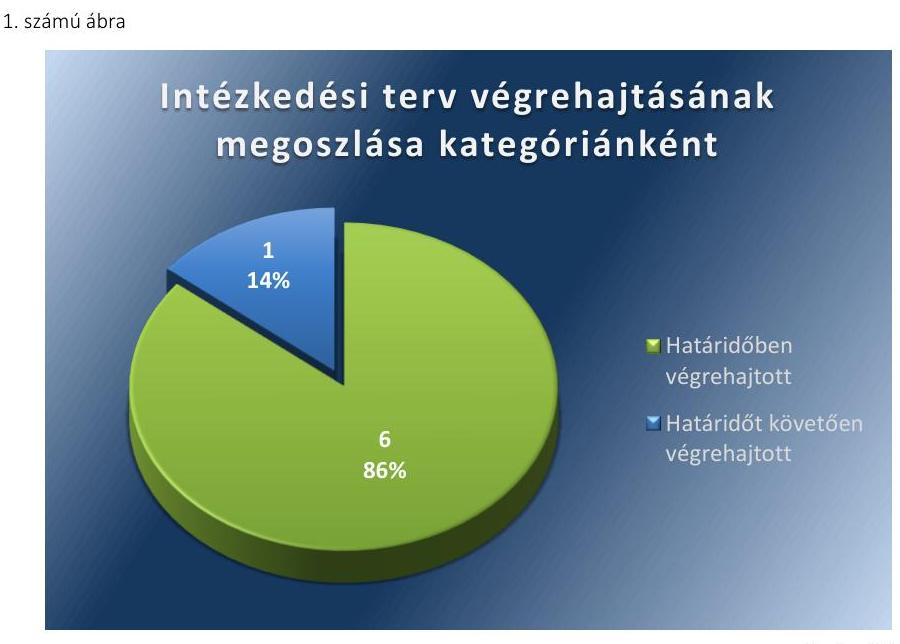

# Jelentés 

## Utóellenőrzés

Kadarkút Város Önkormányzata pénzügyi gazdálkodási helyzetének, szabályszerűségének utóellenőrzése

15172
www.asz.hu

---

# Jelentés 

## Utóellenőrzés

Kadarkút Város Önkormányzata pénzügyi gazdálkodási helyzetének, szabályszerűségének utóellenőrzése

15172
www.asz.hu

---

# AZ ELLENŐRZÉST FELÜGYELTE:

- **HOLMAN MAGDOLNA JULIANNA** felügyeleti vezető
- **AZ ELLENŐRZÉST VEZETTE ÉS A VÉGREHAJTÁSÁÉRT FELELŐS:**
- **BÍRÓ ZSOLT** ellenőrzésvezető
- **A PROGRAM ÖSSZEÁLLÍTÁSÁÉRT FELELŐS:**
- **LAJTERNÉ HUDÁK MAGDOLNA** osztályvezető
- **A TÉMÁHOZ KAPCSOLÓDÓ KORÁBBI SZÁMVEVŐSZÉKI JELENTÉS:**
  - címe: **Jelentés Kadarkút Város Önkormányzata pénzügyi gazdálkodási helyzetének, szabályosságának ellenőrzéséről**
  - sorszáma: **13004**

**Jelentéseink az Országgyűlés számítógépes hálózatán és az Interneten a www.asz.hu címen is olvashatóak.**

**IKTATÓSZÁM: V-0603-042/2015.**

**TÉMASZÁM: 1637**

**ELLENŐRZÉS-AZONOSÍTÓ SZÁM: V069303**

---

# TARTALOMJEGYZÉK 

■ ÖSSZEGZÉS ..... 5
■ AZ ELLENŐRZÉS CÉLJA ..... 6
■ AZ ELLENŐRZÉS TERÜLETE ..... 7
■ AZ ELLENŐRZÉS HÁTTERE, INDOKOLTSÁGA ..... 8
■ FÓKUSZKÉRDÉSEK ..... 9
■ ELLENŐRZÉS HATÓKÖRE ÉS MÓDSZEREI ..... 10
■ MEGÁLLAPÍTÁSOK ..... 12
■ MELLÉKLETEK ..... 15
I. Sz. melléklet: Az ÁSZ 13004 számú jelentéséhez kapcsolódó intézkedési terv végrehajtása ..... 15
■ FÜGGELÉK: ÉSZREVÉTELEK ..... 19
■ RÖVIDÍTÉSEK JEGYZÉKE ..... 21

---

# ÖSSZEGZÉS 

Az ÁSZ Kadarkút Város Önkormányzata pénzügyi gazdálkodási helyzetének, szabályszerűségének utóellenőrzését a 2013. február 11. és 2015. április 29. közötti időszakra végezte el. Az Önkormányzat pénzügyi gazdálkodási helyzetének, szabályszerűségének ellenőrzéséről készült ÁSZ jelentés intézkedést igénylő megállapításai és javaslatai hasznosítására végrehajtott intézkedések

hozzájárultak a pénzügyi stabilitás kialakulásának és fenntartásának feltételeinek javulásához, az egy intézkedés késedelmes végrehajtása alacsony szintű kockázatot jelez a pénzügyi gazdálkodásra és annak szabályszerűségére.

## Az ellenőrzés társadalmi indokoltsága

Az ÁSZ stratégiájában célként tűzte ki, hogy a számvevőszéki munka eredménye jobban hasznosuljon, segítse az elszámoltatható közpénzfelhasználás megteremtését, ehhez az intézkedési tervekben vállalt feladatok végrehajtásának ellenőrzése, valamint a célzott utóellenőrzések rendszerének kialakítása is hozzájárul. Az ÁSZ a tavalyi évben lezárta a megújult jogszabályi környezetben lefolytatott első önálló utóellenőrzés-sorozatát. Ezzel teljesen kiépítetté vált a rendszer, amely biztosítja az Országgyűlés azon szándékának teljes körű érvényesülését, hogy felszámolásra kerüljön a következmények nélküli számvevőszéki ellenőrzések korszaka.

## Főbb megállapítások, következtetések, javaslatok

A Képviselő-testület által elfogadott javított, kiegészített intézkedési tervet határidőben megküldték az ÁSZ részére. Az Önkormányzat az ÁSZ által elfogadott intézkedési tervben foglalt feladatokat, egy kivételével az abban megjelölt határidőben végrehajtotta. Az intézkedési tervben előírt feladatok végrehajtásának értékelése alacsony szintű kockázatot jelez a pénzügyi gazdálkodásra és annak szabályszerűségére. Az intézkedések végrehajtása hozzájárult a pénzügyi stabilitás kialakulásának és fenntartásának feltételeinek javulásához.

---

# **AZ ELLENŐRZÉS CÉLJA**

## **Kadarkút Város Önkormányzata pénzügyi gazdálkodási helyzetének, szabályszerűségének utóellenőrzése**

Az ellenőrzés célja annak megállapítása volt, hogy az Önkormányzat pénzügyi gazdálkodási helyzetének, szabályszerűségének ellenőrzéséről készült ÁSZ jelentésben foglalt intézkedést igénylő megállapításokra és javaslatokra az ellenőrzött által összeállított, ÁSZ által elfogadott intézkedési tervben meghatározott feladatokat végrehajtották-e.

Ennek keretében ellenőriztük, hogy a polgármester az ÁSZ törvény értelmében az intézkedési tervet határidőben megküldte-e az ÁSZ részére, szükség volt-e az elfogadást megelőzően kiegészítésre, azt az előírt póthatáridőn belül megtették-e, a Képviselő-testület a kiegészített intézkedési tervet elfogadta-e. Értékeltük, hogy az Önkormányzat az elfogadott (kiegészített) intézkedési tervében foglaltak megtételéről, az abban előírt határidők betartásával gondoskodott-e, valamint hogy az elfogadott intézkedések esetleges késedelme, végrehajtásának elmaradása milyen szintű kockázatot jelez a pénzügyi gazdálkodásra és annak szabályszerűségére.

---

# **AZ ELLENŐRZÉS TERÜLETE**

## **Kadarkút Város Önkormányzata**

Kadarkút város Somogy megyében fekszik, népességszáma 2014. január 1-jén 2494 fő* volt. Az Önkormányzat1 pénzügyi helyzetének ellenőrzését az ÁSZ2 a 2009. január 1. – 2012. június 30. közötti időszakra végezte el, amelynek eredményeként megállapította, hogy az Önkormányzat pénzügyi egyensúlyi helyzete mind rövid, mind hosszútávon veszélyeztetett volt. Az utóellenőrzés – a 2015. április 29-ig végrehajtott intézkedéseket figyelembe véve – az Önkormányzat pénzügyi gazdálkodási helyzetének, szabályszerűségének ellenőrzéséről készült ÁSZ jelentés3 intézkedést igénylő megállapításai és javaslatai hasznosítására elfogadott intézkedési tervben4 foglalt feladatok végrehajtására irányult. Az ÁSZ jelentés a polgármesternek5 és a jegyzőnek6 két-két javaslatot tartalmazott.

\* A Központi Statisztikai Hivatal tájékoztatási adatbázisa alapján

1 Az ÁSZ 13004 számú jelentése. Az elkészített jelentés az interneten, a www.asz.hu címen olvasható (a továbbiakban ÁSZ jelentés).

2 A Képviselő-testület az intézkedési tervet a 68/2013. (III. 28.) számú határozatával fogadta el.

---

# AZ ELLENŐRZÉS HÁTTERE, INDOKOLTSÁGA 

AZ ÁSZ STRATÉGIÁJA a helyi önkormányzatok ellenőrzésében a pénzügyi-gazdasági helyzet értékelésére, kockázatainak feltárására helyezte a fő hangsúlyt. A 2011-2013. években az ÁSZ által ellenőrzött önkormányzatok esetében a működési, beruházási és a hosszú lejáratú pénzintézeti kötelezettségeinek teljesítésével kapcsolatos pénzügyi kockázatokat mutattuk be. Az ÁSZ megállapította, hogy az önkormányzatok pénzügyi egyensúlyi helyzete az ellenőrzött időszakban romlott, a pénzügyi kockázatok fokozódtak, a pénzügyi egyensúlyi helyzetet jellemző mutatószámok kedvezőtlenül változtak. Az önkormányzati alrendszerben 2012. év végétől 2014. évelejéig lezajlott adósságkonszolidáció és feladat-ellátási-, finanszírozási-rendszer változás következtében a települési önkormányzatok pénzügyi helyzete jelentős mértékben megváltozott, amely a jóváhagyott intézkedési tervek végrehajtását is befolyásolta.

Az ellenőrzött szervezet vezetője az ÁSZ tv. ${ }^{5}$ 33. § (1)-(2) bekezdésében foglaltak alapján a jelentések intézkedést igénylő megállapításaihoz kapcsolódóan köteles intézkedési tervet benyújtani, amelyet az ÁSZ-nak kell elfogadni. Amennyiben az ellenőrzött által vállalt intézkedések hiányosak, vagy más okból nem elfogadhatók az ÁSZ indoklással és póthatáridő tűzésével visszaküldi azt kijavításra, kiegészítésre. Az elfogadásról szóló tájékoztatásban az ÁSZ elnöke valamennyi ellenőrzött szervezet vezetőjének figyelmét felhívta arra, hogy az intézkedési tervben foglaltak megvalósítását - az ÁSZ tv. 33. § (7) bekezdésében foglaltak alapján - utóellenőrzés keretében ellenőrizheti.

## AZ UTÓELLENŐRZÉS VÁRHATÓ HASZNOSULÁSA:

az ellenőrzés megállapításai segítséget nyújthatnak a közpénzügyi helyzet javításához. Az adósságkonszolidációt követően az önkormányzati alrendszerben kiemelt jelentőségű feladat az adósságállomány újratermelődésének megakadályozása. Az utóellenőrzés, jellegéből adódóan fokozza a közbizalmat, fegyelmet, a társadalom, az ellenőrzöttek, a helyi döntéshozók vonatkozásában erősíti az ÁSZ tekintélyét és igazolja, hogy lejárt a következmények nélküli ellenőrzések időszaka. A jóváhagyott intézkedési tervek megvalósításának utóellenőrzése révén megállapítható, hogy az önkormányzatok megtették-e a szükséges intézkedéseket a pénzügyi stabilitás elérése és megőrzése, illetve a pénzügyi kockázataik csökkentése érdekében.

---

# FÓKUSZKÉRDÉSEK 

1. A Képviselő-testület által elfogadott intézkedési tervet, szükség esetén annak javítását, kiegészítését határidőben megküldték-e az ÁSZ részére?
2. Az ÁSZ által elfogadott intézkedési tervben foglaltak végrehajtásáról az abban előírt határidők betartásával gondoskodtak-e?

---

# ELLENŐRZÉS HATÓKÖRE ÉS MÓDSZEREI 

## Az ellenőrzés típusa

Szabályszerűségi ellenőrzés

## Az ellenőrzött időszak

Az intézkedési terv ÁSZ-nak történő benyújtásától (2013. február 11.) az utóellenőrzés megkezdéséig (2015. április 29.) tartó időszak volt.

## Az ellenőrzés tárgya

Az Önkormányzat intézkedési tervében foglaltak betartásának ellenőrzése.

## Az ellenőrzött szervezet

Kadarkút Város Önkormányzata

## Az ellenőrzés jogalapja

Az ellenőrzés végrehajtásának jogszabályi alapját az ÁSZ tv. 1. § (3) bekezdése, az 5. § (2) és (6) bekezdései, a 33. § (7) bekezdése, valamint az Áht. 61. § (2) bekezdésének előírásai képezték.

## Az ellenőrzés módszerei

Az ÁSZ által elfogadott intézkedési tervben előírt feladatok végrehajtásának értékelése során alkalmazott besorolási kategóriák:
$\longrightarrow$ okafogyottá vált feladat: ha végrehajtására - meghatározott esemény bekövetkezése, továbbá külső körülmény, a működést érintő feltétel változása miatt - már nincs szükség, illetve lehetőség, és egyértelműen megállapítható, hogy az intézkedést szükségessé tevő körülmény a jövőben nem fordulhat elő;
$\longrightarrow$ nem időszerű (nem esedékes) feladat: amelynek ellenőrzési időszakon belüli végrehajtására azért nem került (kerülhetett) sor, mert az intézkedés alapjául szolgáló esemény nem következett be, de annak jövőbeni előfordulása lehetséges;
$\longrightarrow$ határidőben végrehajtott feladat: ha teljesítése dokumentáltan az intézkedési tervben előírt határidőben és tartalommal, módon megtörtént;

---

- határidőn túl végrehajtott feladat: ha annak teljesítése az intézkedési tervben meghatározott módon, de az előírt határidőn túl történt meg;
- részben végrehajtott feladat: amelynek végrehajtása teljes körűen az intézkedési tervben előírt tartalommal/módon nem történt meg, vagy a feladatot nem az előírt gyakorisággal hajtották végre;
- végre nem hajtott feladat: ha a végrehajtásért felelősként megjelölt személy(ek)nek felróhatóan a teljesítés elmaradt, vagy a teljesítést nem dokumentálták.
Az intézkedési tervben előírt feladatok végrehajtásának részletes bemutatását, valamint a teljesítés minősítését az I. számú melléklet tartalmazza.

Elfogadott intézkedések esetleges késedelme, végrehajtásának elmaradása a pénzügyi gazdálkodásra és annak szabályszerűségére kockázatot jelez. A kockázati arányszám kiszámítása során az összes kategória súlyozott értékének összegéhez viszonyítottuk a határidőn túl, a részben és a nem végrehajtott intézkedési kategóriák súlyozott pontszámát. A súlyozott érték megállapítása az egyes kategóriákhoz rendelt pontszámok alapján történt. A pénzügyi gazdálkodásra és annak szabályszerűségére ható, az intézkedési terv végrehajtásának elmaradásából eredő kockázat „magas", ha az elért pontszám és az elérhető pontszám százalékban kifejezett hányadosa elérte a 71%-ot, „közepes", ha 51 és 70% közé esett és „alacsony" ha nem haladta meg az 50%-ot.

Az ellenőrzésre az Önkormányzat elektronikus adatszolgáltatása alapján került sor, helyszínen ellenőrzést nem végeztünk. A megállapítások rögzítése az Önkormányzat által rendelkezésre bocsátott dokumentumok, tanúsítványok alapján történt, melyek valódiságát és teljes körűségét a polgármester, valamint a jegyző teljességi nyilatkozata igazolta.

---

# MEGÁLLAPÍTÁSOK 

## 1. A Képviselő-testület által elfogadott intézkedési tervet, szükség esetén annak javítását, kiegészítését határidőben megküldték-e az ÁSZ részére?

Összegző megállapítás Az Önkormányzat a Képviselő-testület ${ }^{6}$ által elfogadott kiegészített intézkedési tervet határidőben megküldte az ÁSZ részére.

A polgármester a Képviselő-testületet tájékoztatta az ÁSZ jelentéséről. A jelentésben foglalt intézkedést igénylő megállapításokra és javaslatokra készített intézkedési tervet az ÁSZ tv. 33. § (1) bekezdésében foglalt határidőben megküldték az ÁSZ részére, amelyet az ÁSZ nem fogadott el.

Az ÁSZ az intézkedési terv kiegészítését kérte, amelyet az Önkormányzat határidőben végrehajtott.

Az ÁSZ jelentés a polgármester és a jegyző részére két-két javaslatot fogalmazott meg, melynek hasznosítására az Önkormányzat az intézkedési tervében hét feladatot határozott meg, felelősként a polgármestert, a jegyzőt és a belső ellenőrt megjelölve.

Az ÁSZ által elfogadott intézkedési tervben meghatározott feladatokat, az ÁSZ jelentés javaslatainak címzettjét és a feladatok végrehajtását az I. számú melléklet mutatja be.

## 2. Az ÁSZ által elfogadott intézkedési tervben foglaltak végrehajtásáról az abban előírt határidők betartásával gondoskodtak-e?

Összegző megállapítás Az Önkormányzat az ÁSZ által elfogadott intézkedési tervben foglalt feladatokat, egy kivételével az abban megjelölt határidőben végrehajtotta.

Az intézkedések végrehajtási kategóriánkénti megoszlását az 1. számú ábra szemlélteti.

---

Forrás: ÁSZ

# HATÁRIDŐBEN VÉGREHAJTOTT feladatok: 

$\qquad$ 1. Az Önkormányzat feladatstruktúráját felülvizsgálták, ennek keretében áttekintették a 2013. évi bevételszerző és kiadáscsökkentő lehetőségeket és intézkedtek azok bevezetéséről.
$\qquad$ 2. A bevételszerző és kiadáscsökkentő lehetőségeket évenkénti rendszerességgel áttekintették a 2014-2015. években.
$\qquad$ 3. A pénzügyi gazdálkodási folyamatok szabályosságát biztosító kontrollokat a FEUVE szabályzat kiegészítésében ${ }^{7}$ kialakították.
$\qquad$ 4. A 2013-2015. évi éves belső ellenőrzési terveket előírásszerűen, kockázatelemzés alapján elkészítették.
$\qquad$ 5. A 2013-2014. évi éves belső ellenőrzési tervek feladatait teljes körűen végrehajtották.
$\qquad$ 6. A 2013-2014. évi éves belső ellenőrzési tervek végrehajtásának jegyző általi folyamatos kontrollját elvégezték.

## HATÁRIDŐT KÖVETŐEN VÉGREHAJTOTT feladat:

7. A reorganizációs programot a vállalt 2013. április 20-i határidőhöz képest 2013. május 27-ére készítették el, amelyet a polgármester a Képviselő-testület 2013. május 30-i ülésére terjesztett elő a vállalt 2013. április 25-i határidőhöz képest.

ALACSONY SZINTŰ KOCKÁZATOT JELEZ a pénzügyi gazdálkodásra és annak szabályszerűségére az intézkedés késedelme. Az intézkedések
 végrehajtása hozzájárult a pénzügyi stabilitás kialakulásához és fenntartásának feltételeinek javulásához.

---

.

---

# MELLÉKLETEK

- I. SZ. MELLÉKLET: AZ ÁSZ 13004 SZÁMÚ JELENTÉSÉHEZ KAPCSOLÓDÓ INTÉZKEDÉSI TERV VÉGREHAJTÁSA

|  Sorszám | Intézkedési terv alapján elvégzendő feladat | Az intézkedési tervben meghatározott határidő | Az ÁSZ 13004 sz. jelentése javaslatának címzettje | Az intézkedés végrehajtása  |
| --- | --- | --- | --- | --- |
|   | 1. | 2. | 3. | 4. |
|  1. | Bevételszerző és kiadáscsökkentő lehetőségek feltárása, intézkedés a bevételek növelésére, a kintlévőségek behajtására, a kiadások csökkentésére. | 2013. április 20. | polgármester | A 2013. évi költségvetési koncepció összeállításakor a polgármester az Önkormányzat feladatstruktúrájával összhangban áttekintette a bevételszerző és kiadáscsökkentő lehetőségeket. A 2013. évi költségvetési rendelet tervezetét a költségvetési koncepcióban javasolt elvek mentén terjesztette elő. Az intézményi működési bevételek javasolt növelése a térítési díjak emelése, ingatlan bérbeadás, lakáscélú kölcsönök visszatérülésének bevételezése, kommunális adó bevezetése volt. A kiadási megtakarítási lehetőségként a szociális juttatások csökkentése, cafetéria bázis összegben való megállapítása, létszámcsökkentés miatti személyi juttatások csökkentése iránti intézkedésre tett javaslatot, továbbá javasolta a finanszírozási gondok kezelése és a működés folytonosságának biztosítása érdekében a 2013. évi önkormányzati költségvetésben általános és céltartalék képzését, amelyet a költségvetési rendeletben érvényesítettek (1/2013. (II. 22.) önkormányzati rendelet).  |
|  2. | A Képviselő-testület utasítja a polgármestert az önkormányzat bevételszerző és kiadáscsökkentő lehetőségeinek évenkénti rendszerességgel történő áttekintésére. | minden év április 20. | polgármester | Az ellenőrzött időszakban a polgármester a költségvetési rendelet tervezet előterjesztésekor áttekintette a bevételszerző és kiadáscsökkentő lehetőségeket, melyet a Képviselő-testület a költségvetési rendeletben érvényesített (2/2014. (II. 6.) és 1/2015. (II. 28.) önkormányzati rendeletek).  |

---

|  1. | 2. | 3. | 4.  |
| --- | --- | --- | --- |
|  3. A pénzügyi gazdálkodási folyamatok szabályosságát biztosító kontrollok megfelelő beépítése érdekében az önkormányzati fejlesztések döntés-előkészítési folyamatában az előkészítés, a lebonyolítás és a működtetés kockázatai feltárását és kezelését biztosító szabályozások elkészítése az önkormányzat FEUVE szabályzatának kiegészítésével, illetve módosításával. | 2013. március 28. | jegyző | A jegyző a pénzügyi gazdálkodási folyamatok szabályosságát biztosító kontrollok megfelelő beépítése érdekében a FEUVE szabályzatot kiegészítette a 12. számú, "Kadarkút Város önkormányzata feladatellátásának szabályosságát, a pénzügyi egyensúlyi helyzet alakulását, a pénzügyi-gazdasági döntések megalapozását döntően befolyásoló kontrollok és a kapcsolódó pénzügyi kockázatok elemzésének, illetve kezelésének követelményei, kiemelt feladatai" című melléklettel. A kiegészítésben előírta az elvégzendő kontrolltevékenységeket és meghatározta az előírt kontrolltevékenységekért felelős személyek körét. A jegyző a szabályzat-kiegészítést 2013. március 26-án hatályba helyezte.  |
|  4. Az önkormányzat 2013. évi, továbbá a későbbi évekre vonatkozóan elkészítendő belső ellenőrzési terveiben - a költségvetési szervek belső kontrollrendszeréről szóló 370/2011. (XII.31.) Korm. rendelet 31. § (I)-(2) bekezdésében foglaltak szerint- minden esetben szerepeltetni kell az önkormányzat pénzügyi egyensúlyi helyzetét befolyásoló döntésekkel kapcsolatosan feltárt kockázati tényezők elemzését. | 2013. március 28., folyamatos | jegyző | Az éves belső ellenőrzési tervek előírásszerű elkészítése megvalósult. A jegyző 2013. március 4-én jóváhagyta a „Kadarkúti Közös Önkormányzati Hivatal stratégiai ellenőrzési terve 2013-2017. év" dokumentumot. A belső ellenőr 2013. március 26-án kidolgozta az éves ellenőrzési tervet megalapozó kockázatelemzési modellt és ez alapján ugyanezzel a dátummal elvégezte az Önkormányzat pénzügyi egyensúlyi helyzetét befolyásoló döntésekkel kapcsolatosan feltárt kockázati tényezők kockázatelemzését. A stratégiai tervben foglaltak és a kockázatelemzés eredménye alapján a Képviselő-testület a 2012. október 25-én elkészített és 175/2012. (X. 25.) határozattal jóváhagyott 2013. évi ellenőrzési tervet nem módosította, mivel az nem vált indokolttá. A Képviselő-testület az éves belső ellenőrzési tervet megalapozó kockázatelemzések dokumentumait ezt követően az éves belső ellenőrzési terv részeként hagyta jóvá (a Képviselő-testület 205/2013. (X. 31.) és 183/2014 (XII. 18.) határozatai).  |

---

|  Sorszám | Intézkedési terv alapján elvégzendő feladat | Az intézkedési tervben meghatározott határidő | Az ÁSZ 13004 sz. jelentése javaslatának címzettje | Az intézkedés végrehajtása  |
| --- | --- | --- | --- | --- |
|   | 1. | 2. | 3. | 4.  |
|  5. | A fentiekhez kapcsolódóan biztosítani kell az ellenőrzési tervekben foglaltak maradéktalan végrehajtását. | 2013. március 28., folyamatos | jegyző | A 2013. évre és a 2014. évre elfogadott éves belső ellenőrzési tervekben foglalt ellenőrzési feladatokat a belső ellenőr teljes körűen elvégezte. A 2015. évi belső ellenőrzési terv végrehajtása jelen ellenőrzés idején még nem kezdődött meg, mivel csak a tárgyév második felére terveztek belső ellenőrzést. Az éves belső ellenőrzési tervek módosítására, ellenőrzés elhagyására és terven felüli ellenőrzés elrendelésére nem került sor.  |
|  6. | A belső ellenőrzési tervben foglaltak végrehajtásának jegyző általi kontrollja. | folyamatos | jegyző | A belső ellenőrzési tervekben foglaltak jegyző általi folyamatos kontrollja a belső ellenőrzési jelentések realizálásán keresztül megvalósult. Az éves belső ellenőrzési terveket maradéktalanul végrehajtották.  |
|   | Határidőt követően végrehajtott intézkedések |  |  |   |
|  7. | A kedvezőtlen pénzügyi folyamatok megállítására, a pénzügyi helyzet gyors stabilizálására reorganizációs program elkészítése és Képviselő-testület elé terjesztése. | Elkészítésre: 2013. április 20. Képviselő-testület elé terjesztése: 2013. április 25. | polgármester | Az Önkormányzat pénzügyi gazdálkodási helyzetének stabilizálását, illetőleg a kedvezőtlen pénzügyi folyamatok megállítását biztosító reorganizációs programot 2013. május 27-ére készítették el, amelyet a polgármester a Képviselő-testület elé terjesztett. A Képviselő-testület a reorganizációs programot a 2013. május 30-i ülésén a 112/2013. (V. 30.) határozatával fogadta el.  |

---

.

---

# FÜGGELÉK: ÉSZREVÉTELEK 

A jelentéstervezetet a Számvevőszék 15 napos észrevételezésre megküldte az ellenőrzött szervezet vezetőjének az ÁSZ tv. 29. § (1) bekezdése előírásának megfelelően.
A polgármester az ÁSZ tv. 29. § (2) bekezdésében foglalt észrevételezési jogával nem élt, a jelentéstervezetre észrevételt nem tett.

[^0]
[^0]:    § 29. § (1) Az Állami Számvevőszék az ellenőrzési megállapításait megküldi az ellenőrzött szervezet vezetőjének vagy az általa megbízott személynek, és annak, akinek személyes felelősségét állapította meg.
    (2) Az ellenőrzött szervezet vezetője és a felelősként megjelölt személy az ellenőrzés megállapításaira tizenöt napon belül írásban észrevételt tehet.
    (3) Az Állami Számvevőszék az észrevételre a beérkezésétől számított harminc napon belül írásban válaszol. A figyelembe nem vett észrevételeket köteles a jelentésben feltüntetni, és megindokolni, hogy azokat miért nem fogadta el.

---

.

---

# RÖVIDÍTÉSEK JEGYZÉKE 

${ }^{1}$ Önkormányzat
${ }^{2}$ ÁSZ
${ }^{3}$ polgármester
${ }^{4}$ jegyző
${ }^{5}$ ÁSZ tv.
${ }^{6}$ Képviselő-testület
${ }^{7}$ FEUVE szabályzat kiegészítése

Kadarkút Város Önkormányzata
Állami Számvevőszék
Kadarkút Város Önkormányzatának polgármestere
Kadarkút Város Önkormányzatának jegyzője
2011. évi LXVI. törvény az Állami Számvevőszékről (hatályos 2011. július 1-jétől)
Kadarkút Város Önkormányzatának Képviselő-testülete
Kadarkút Város Önkormányzatának Polgármesteri Hivatala Szervezeti és
Működési Szabályzatának 5. függelékeként kiadott szabályzat 12. számú melléklete (hatályos 2013. március 26-ától)

---

.

---

.

---

# ÁLLAMI SZÁMVEVŐSZÉK 

1052 Budapest, Apáczai Csere János utca 10.
Levélcím: 1364 Budapest 4. Pf. 54
Telefon: +36 1 4849100 Telefax: +36 1 4849200
www.asz.hu
