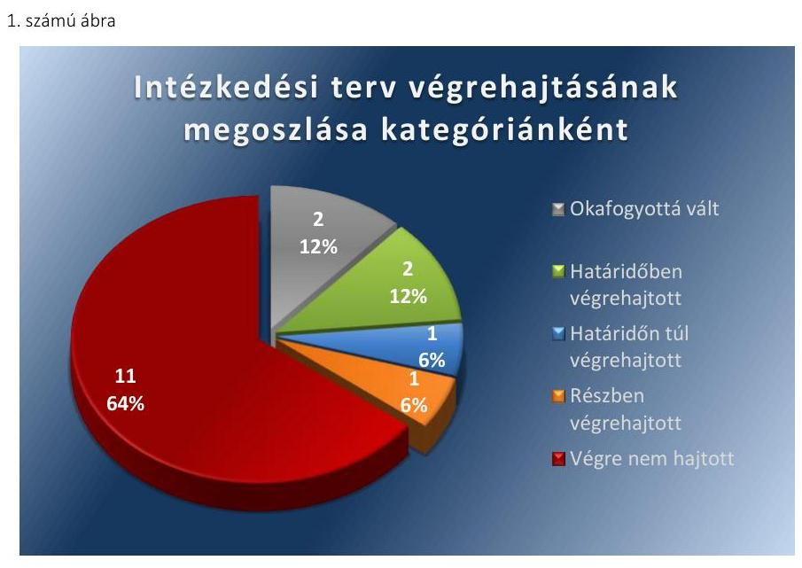
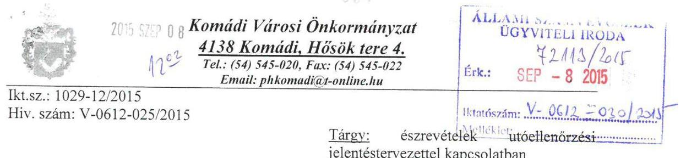
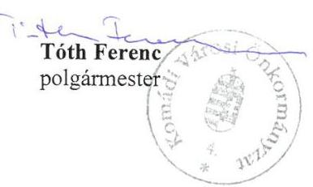
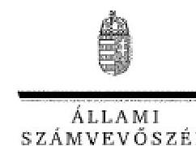
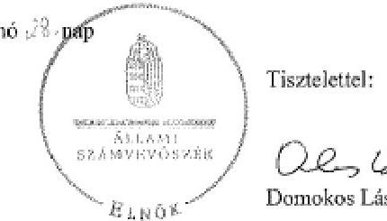

# Jelenetés 

## Utóellenőrzés

Komádi Város Önkormányzata pénzügyi gazdálkodási helyzetének, szabályszerűségének utóellenőrzése

15173
www.asz.hu

---

# Jelentés 

## Utóellenőrzés

Komádi Város Önkormányzata pénzügyi gazdálkodási helyzetének, szabályszerűségének utóellenőrzése

15173
www.asz.hu

---

# AZ ELLENŐRZÉST FELÜGYELTE: 

HOLMAN MAGDOLNA JULIANNA felügyeleti vezető

## AZ ELLENŐRZÉST VEZETTE ÉS A VÉGREHAJTÁSÁÉRT FELELŐS:

BÍRÓ ZSOLT ellenőrzésvezető

## A PROGRAM ÖSSZEÁLLÍTÁSÁÉRT FELELŐS:

LAJTERNÉ HUDÁK MAGDOLNA osztályvezető

## A TÉMÁHOZ KAPCSOLÓDÓ KORÁBBI SZÁMVEVŐSZÉKI JELENTÉS:

- címe: Jelentés Komádi Város Önkormányzata pénzügyi gazdálkodási helyzetének, szabályszerűségének ellenőrzéséről
- sorszáma: 13032

Jelentéseink az Országgyűlés számítógépes hálózatán és az Interneten a www.asz.hu címen is olvashatóak.

IKTATÓSZÁM: V-0612-024/2015
TÉMASZÁM: 1646
ELLENŐRZÉS-AZONOSÍTÓ SZÁM: V069312

---

# TARTALOMJEGYZÉK 

■ ÖSSZEGZÉS ..... 5
■ AZ ELLENŐRZÉS CÉLJA ..... 6
■ AZ ELLENŐRZÉS TERÜLETE ..... 7
■ AZ ELLENŐRZÉS HÁTTERE, INDOKOLTSÁGA ..... 8
■ FÓKUSZKÉRDÉSEK ..... 9
■ ELLENŐRZÉS HATÓKÖRE ÉS MÓDSZEREI ..... 10
■ MEGÁLLAPÍTÁSOK ..... 12
■ MELLÉKLETEK ..... 15
I. Sz. melléklet: Az ÁSZ 13032 számú jelentéséhez kapcsolódó intézkedési terv végrehajtása ..... 15
■ FÜGGELÉK: ÉSZREVÉTELEK ..... 19
■ RÖVIDÍTÉSEK JEGYZÉKE ..... 27

---

# ÖSSZEGZÉS 

Az Állami Számvevőszék Komádi Város Önkormányzata pénzügyi gazdálkodási helyzetének, szabályszerűségének utóellenőrzését a 2013. június 18. és 2015. április 29. közötti időszakra végezte el. Az Önkormányzat pénzügyi gazdálkodási helyzetének, szabályszerűségének ellenőrzéséről készült ÁSZ jelentés intézkedést igénylő megállapításai és javaslatai hasznosítására elfogadott intézkedések végrehajtásának késedelme és elmaradása magas szintű kockázatot jelez a pénzügyi gazdálkodásra és annak szabályszerűségére.

## Az ellenőrzés társadalmi indokoltsága

Az ÁSZ stratégiájában célként tűzte ki, hogy a számvevőszéki munka eredménye jobban hasznosuljon, segítse az elszámoltatható közpénzfelhasználás megteremtését, ehhez az intézkedési tervekben vállalt feladatok végrehajtásának ellenőrzése, valamint a célzott utóellenőrzések rendszerének kialakítása is hozzájárul. Az ÁSZ a tavalyi évben lezárta a megújult jogszabályi környezetben lefolytatott első önálló utóellenőrzés-sorozatát. Ezzel teljesen kiépítetté vált a rendszer, amely biztosítja az Országgyűlés azon szándékának teljes körű érvényesülését, hogy felszámolásra kerüljön a következmények nélküli számvevőszéki ellenőrzések korszaka.

## Főbb megállapítások, következtetések, javaslatok

A Képviselő-testület által elfogadott intézkedési tervet határidőben megküldték az ÁSZ részére. Az ÁSZ által elfogadott intézkedési tervben foglaltak végrehajtásáról túlnyomórészt - tizenhét feladatból tizenegy esetben - nem gondoskodtak. Az intézkedési tervben előírt feladatok végrehajtásának értékelése magas szintű kockázatot jelez a pénzügyi gazdálkodásra és annak szabályszerűségére.

---

# **AZ ELLENŐRZÉS CÉLJA**

## **Komádi Város Önkormányzata pénzügyi gazdálkodási helyzetének, szabályszerűségének utóellenőrzése**

Az ellenőrzés célja annak megállapítása volt, hogy az Önkormányzat pénzügyi gazdálkodási helyzetének, szabályszerűségének ellenőrzéséről készült ÁSZ jelentésben foglalt intézkedést igénylő megállapításokra és javaslatokra az ellenőrzött által összeállított, ÁSZ által elfogadott intézkedési tervben meghatározott feladatokat végrehajtották-e.

Ennek keretében ellenőriztük, hogy a polgármester az ÁSZ törvény értelmében az intézkedési tervet határidőben megküldte-e az ÁSZ részére, szükség volt-e az elfogadást megelőzően kiegészítésre, azt az előírt póthatáridőn belül megtették-e, a Képviselő-testület a kiegészített intézkedési tervet elfogadta-e. Értékeltük, hogy az Önkormányzat az elfogadott (kiegészített) intézkedési tervében foglaltak megtételéről, az abban előírt határidők betartásával gondoskodott-e, valamint hogy az elfogadott intézkedések esetleges késedelme, végrehajtásának elmaradása milyen szintű kockázatot jelez a pénzügyi gazdálkodásra és annak szabályszerűségére.

---

# **AZ ELLENŐRZÉS TERÜLETE**

## **Komádi Város Önkormányzata**

Komádi város Hajdú-Bihar megyében fekszik, népességszáma 2014. január 1-jén 5485 fő* volt. Az Önkormányzat1 pénzügyi helyzetének ellenőrzését az ÁSZ2 a 2009. január 1. – 2012. június 30. közötti időszakra végezte el, amelynek eredményeként megállapította, hogy az Önkormányzat pénzügyi egyensúlya rövidtávon veszélyeztetett volt. Az utóellenőrzés – a 2015. április 29-ig végrehajtott intézkedéseket figyelembe véve – az Önkormányzat pénzügyi gazdálkodási helyzetének, szabályszerűségének ellenőrzéséről készült ÁSZ jelentés3 intézkedést igénylő megállapításai és javaslatai hasznosítására elfogadott intézkedési tervben4 foglalt feladatok végrehajtására irányult. Az ÁSZ jelentés a polgármesternek5 nyolc, a jegyzőnek6 kilenc javaslatot tartalmazott.

* A Központi Statisztikai Hivatal tájékoztatási adatbázisa alapján

1 Az ÁSZ 13032 számú jelentése. Az elkészített jelentés az interneten, a www.asz.hu címen olvasható (továbbiakban ÁSZ jelentés).

2 A Képviselő-testület az intézkedési tervet a 86/2013. (V. 30.) számú határozatával fogadta el.

---

# AZ ELLENŐRZÉS HÁTTERE, INDOKOLTSÁGA 

AZ ÁSZ STRATÉGIÁJA a helyi önkormányzatok ellenőrzésében a pénzügyi-gazdasági helyzet értékelésére, kockázatai feltárására helyezte a fő hangsúlyt. A 2011-2013. években az ÁSZ által ellenőrzött önkormányzatok esetében a működési, beruházási és a hosszú lejáratú pénzintézeti kötelezettségeinek teljesítésével kapcsolatos pénzügyi kockázatokat mutattuk be. Az ÁSZ megállapította, hogy az önkormányzatok pénzügyi egyensúlyi helyzete az ellenőrzött időszakban romlott, a pénzügyi kockázatok fokozódtak, a pénzügyi egyensúlyi helyzetet jellemző mutatószámok kedvezőtlenül változtak. Az önkormányzati alrendszerben 2012. év végétől 2014. évelejéig lezajlott adósságkonszolidáció és feladat-ellátási-, finanszirozási-rendszer változás következtében a települési önkormányzatok pénzügyi helyzete jelentős mértékben megváltozott, amely a jóváhagyott intézkedési tervek végrehajtását is befolyásolta.

Az ellenőrzött szervezet vezetője az ÁSZ tv. ${ }^{5}$ 33. § (1)-(2) bekezdésében foglaltak alapján a jelentések intézkedést igénylő megállapításaihoz kapcsolódóan köteles intézkedési tervet benyújtani, amelyet az ÁSZ-nak kell elfogadni. Amennyiben az ellenőrzött által vállalt intézkedések hiányosak, vagy más okból nem elfogadhatók az ÁSZ indoklással és póthatáridő tűzésével visszaküldi azt kijavításra, kiegészítésre. Az elfogadásról szóló tájékoztatásban az ÁSZ elnöke valamennyi ellenőrzött szervezet vezetőjének figyelmét felhívta arra, hogy az intézkedési tervben foglaltak megvalósítását - az ÁSZ tv. 33. § (7) bekezdésében foglaltak alapján - utóellenőrzés keretében ellenőrizheti.

## AZ UTÓELLENŐRZÉS VÁRHATÓ HASZNOSULÁSA:

az ellenőrzés megállapításai segítséget nyújthatnak a közpénzügyi helyzet javításához. Az adósságkonszolidációt követően az önkormányzati alrendszerben kiemelt jelentőségű feladat az adósságállomány újratermelődésének megakadályozása. Az utóellenőrzés, jellegéből adódóan fokozza közbizalmat, fegyelmet, a társadalom, az ellenőrzöttek, a helyi döntéshozók vonatkozásában erősíti az ÁSZ tekintélyét és igazolja, hogy lejárt a következmények nélküli ellenőrzések időszaka. A jóváhagyott intézkedési tervek megvalósításának utóellenőrzése révén megállapítható, hogy az önkormányzatok megtették-e a szükséges intézkedéseket a pénzügyi stabilitás elérése és megőrzése, illetve a pénzügyi kockázataik csökkentése érdekében.

---

# FÓKUSZKÉRDÉSEK 

1. A Képviselő-testület által elfogadott intézkedési tervet, szükség esetén annak javítását, kiegészítését határidőben megküldték-e az ÁSZ részére?
2. Az ÁSZ által elfogadott intézkedési tervben foglaltak végrehajtásáról az abban előírt határidők betartásával gondoskodtak-e?

---

# ELLENŐRZÉS HATÓKÖRE ÉS MÓDSZEREI 

## Az ellenőrzés típusa

Szabályszerűségi ellenőrzés

## Az ellenőrzött időszak

Az intézkedési terv ÁSZ-nak történő benyújtásától (2013. június 18.) az utóellenőrzés megkezdéséig (2015. április 29.) tartó időszak volt.

## Az ellenőrzés tárgya

Az Önkormányzat intézkedési tervében foglaltak betartásának ellenőrzése.

## Az ellenőrzött szervezet

Komádi Város Önkormányzata

## Az ellenőrzés jogalapja

Az ellenőrzés végrehajtásának jogszabályi alapját az ÁSZ tv. 1. § (3) bekezdése, az 5. § (2) és (6) bekezdései, a 33. § (7) bekezdése, valamint az Áht. 61. § (2) bekezdésének előírásai képezték.

## Az ellenőrzés módszerei

Az ÁSZ által elfogadott intézkedési tervben előírt feladatok végrehajtásának értékelése során alkalmazott besorolási kategóriák:
$\longrightarrow$ okafogyottá vált feladat: ha végrehajtására - meghatározott esemény bekövetkezése, továbbá külső körülmény, a működést érintő feltétel változása miatt - már nincs szükség, illetve lehetőség, és egyértelműen megállapítható, hogy az intézkedést szükségessé tevő körülmény a jövőben nem fordulhat elő;
$\longrightarrow$ nem időszerű (nem esedékes) feladat: amelynek ellenőrzési időszakon belüli végrehajtására azért nem került (kerülhetett) sor, mert az intézkedés alapjául szolgáló esemény nem következett be, de annak jövőbeni előfordulása lehetséges;
$\longrightarrow$ határidőben végrehajtott feladat: ha teljesítése dokumentáltan az intézkedési tervben előírt határidőben és tartalommal, módon megtörtént;

---

- határidőn túl végrehajtott feladat: ha annak teljesítése az intézkedési tervben meghatározott módon, de az előírt határidőn túl történt meg;
- részben végrehajtott feladat: amelynek végrehajtása teljes körűen az intézkedési tervben előírt tartalommal/módon nem történt meg, vagy a feladatot nem az előírt gyakorisággal hajtották végre;
- végre nem hajtott feladat: ha a végrehajtásért felelősként megjelölt személy(ek)nek felróhatóan a teljesítés elmaradt, vagy a teljesítést nem dokumentálták.
Az intézkedési tervben előírt feladatok végrehajtásának részletes bemutatását, valamint a teljesítés minősítését az I. számú melléklet tartalmazza.

Elfogadott intézkedések esetleges késedelme, végrehajtásának elmaradása a pénzügyi gazdálkodásra és annak szabályszerűségére kockázatot jelez. A kockázati arányszám kiszámítása során az összes kategória súlyozott értékének összegéhez viszonyítottuk a határidőn túl, a részben és a nem végrehajtott intézkedési kategóriák súlyozott pontszámát. A súlyozott érték megállapítása az egyes kategóriákhoz rendelt pontszámok alapján történt. A pénzügyi gazdálkodásra és annak szabályszerűségére ható, az intézkedési terv végrehajtásának elmaradásából eredő kockázat „magas", ha az elért pontszám és az elérhető pontszám százalékban kifejezett hányadosa elérte a 71%-ot, „közepes", ha 51 és 70% közé esett és „alacsony" ha nem haladta meg az 50%-ot.

Az ellenőrzésre az Önkormányzat elektronikus adatszolgáltatása alapján került sor, helyszínen ellenőrzést nem végeztünk. A megállapítások rögzítése az Önkormányzat által rendelkezésre bocsátott dokumentumok, tanúsítványok alapján történt, melyek valódiságát és teljes körűségét a polgármester, valamint a jegyző teljességi nyilatkozata igazolta.

---

# MEGÁLLAPÍTÁSOK 

## 1. A Képviselő-testület által elfogadott intézkedési tervet, szükség esetén annak javítását, kiegészítését határidőben megküldték-e az ÁSZ részére?

Összegző megállapítás

A Képviselő-testület ${ }^{6}$ által elfogadott intézkedési tervet határidőben megküldték az ÁSZ részére.

A polgármester a Képviselő-testületet tájékoztatta az ÁSZ jelentéséről. A jelentésben foglalt intézkedést igénylő megállapításokra és javaslatokra készített intézkedési tervet az ÁSZ tv. 33. § (1) bekezdésében foglalt határidőben megküldték az ÁSZ részére, amelyet az ÁSZ elfogadott.

Az ÁSZ által elfogadott intézkedési tervben meghatározott feladatokat, az ÁSZ jelentés javaslatainak címzettjét és a feladatok végrehajtását az I. számú melléklet mutatja be.

Az ÁSZ jelentés a polgármester részére nyolc, a jegyző részére kilenc javaslatot fogalmazott meg, melynek hasznosítására az Önkormányzat az intézkedési tervében tizenhét feladatot határozott meg, felelősként a jegyzőt, a polgármestert és a pénzügyi irodavezetőt ${ }^{7}$ megjelölve.

## 2. Az ÁSZ által elfogadott intézkedési tervben foglaltak végrehajtásáról az abban előírt határidők betartásával gondoskodtak-e?

Összegző megállapítás

Az ÁSZ által elfogadott intézkedési tervben foglaltak végrehajtásáról túlnyomórészt nem gondoskodtak.

Az intézkedések végrehajtási kategóriánkénti megoszlását az 1. számú ábra szemlélteti.

---

Forrás: ÁSZ

# OKAFOGYOTTÁ VÁLT feladatok: 

$\qquad$ 1. Az adósságkonszolidációt követően fennmaradó kötelezettségei tekintetében az egyensúlyi tartalék képzése az adósságkonszolidáció miatt okafogyottá vált
$\qquad$ 2. Az adósságkonszolidáció következtében a jogellenes állapot megszüntetése érdekében a jogszerű biztosíték cseréjére nem volt szükséges.

## HATÁRIDŐBEN VÉGREHAJTOTT feladatok:

$\qquad$ 3. A bevételnövelő és kiadáscsökkentő intézkedések lehetőségének vizsgálatát végrehajtották.
$\qquad$ 4. A 2014. évi belső ellenőrzési terv ${ }^{8}$ tartalmazta a pénzügyi egyensúlyi helyzetet befolyásoló döntésekkel kapcsolatos kockázati tényezők ellenőrzését.

## HATÁRIDŐT KÖVETŐEN VÉGREHAJTOTT feladat:

$\qquad$ 5. A közbeszerzési értékhatár alatti esetekben a pályáztatási kötelezettséggel kapcsolatos kontrolltevékenységeket meghatározták, a vonatkozó szabályzatot a 2013. június 30 -ai vállalt határidő helyett 2013. szeptember 28-án dolgozták ki

## RÉSZBEN VÉGREHAJTOTT feladat:

$\qquad$ 6. A lejárt szállítói állomány alakulásáról beszámoltak a Képviselő-testületnek, azonban a szállítói számlák esedékesség szerinti kiegyenlítéséről, illetve a lejárt tartozások átütemezéséről nem intézkedtek.

VÉGRE NEM HAJTOTT feladatok:
$\qquad$ 7. Nem terjesztettek reorganizációs programot a Képviselő-testület elé.

---

8. Nem intézkedtek a fejlesztések döntés előkészítés folyamatában, a lebonyolítás és a működtetés kockázatai feltárásának meghatározásáról.
9. Nem intézkedtek arról, hogy a jövőbeni hitelfelvétel és kötvénykibocsátás fedezeteként az Önkormányzat általános működésének és ágazati feladatainak támogatása, továbbá a költségvetési támogatás ne kerüljön felhasználásra.
10. Nem terjesztettek intézkedési tervet a Képviselő-testület elé a kizárólagos tulajdonú gazdasági társaságok pénzügyi helyzetének stabilizálása érdekében.
11.
 Nem intézkedtek a pénzügyi egyensúlyt befolyásoló kockázatok kezelésére alkalmas kockázatkezelési rendszer működtetéséről.
12. Nem szabályozták a működési és felhalmozási célú pénzeszközátadások feltételrendszerével összefüggő kontrolltevékenységeket.
13. Nem írták elő az Önkormányzat kizárólagos tulajdonában lévő gazdasági társaságok beszámolási kötelezettségét pénzügyi helyzetük alakulásáról.
14. Nem született intézkedés a devizában fennálló hitelállomány törlesztése során a pénzügyileg realizált árfolyam-különbözet elszámolásáról árfolyamveszteség esetén.
15. Nem szabályozták az Önkormányzat fizetőképességének és eladósodásának kezelését, valamint a pénzügyi kötelezettségek teljesítésének, a szállítói tartozások rendezésének helyi szabályait.
16. Nem intézkedtek a pénzintézeti kötelezettségvállalások kockázatainak döntés-előkészítő szakaszban történő feltárásáról, a futamidő egyes éveit terhelő kötelezettségek költségvetési egyensúlyra gyakorolt hatásának vizsgálatáról.
17. Nem gondoskodtak az Önkormányzat gazdálkodási rendszerét érintő 2010. évi ÁSZ ellenőrzés által megállapított szabálytalanságok megszüntetéséről, a nem teljesült szabályszerűségi javaslatok megvalósításáról.

MAGAS SZINTŰ KOCKÁZATOT JELEZ a pénzügyi gazdálkodásra és annak szabályszerűségére az elfogadott intézkedések késedelme, végrehajtásának elmaradása.

---

# MELLÉKLETEK

- I. SZ. MELLÉKLET: AZ ÁSZ 13032 SZÁMÚ JELENTÉSÉHEZ KAPCSOLÓDÓ INTÉZKEDÉSI TERV VÉGREHAJTÁSA

|  1. | Intézkedési terv alapján elvégzendő feladat | Az intézkedési tervben meghatározott határidő | Az ÁSZ 13032. sz. jelentése javaslatának címzettje  |
| --- | --- | --- | --- |
|   | 1. | 2. | 3.  |
|  1. |  |  |   |
|  1. | Az adósságkonszolidációt követően fennmaradó kötelezettségei tekintetében terjesszen a Képviselő-testület elé olyan egyensúlyi tartalék képzésére vonatkozó a Htv. 140. § (1) bekezdés a) pontja alapján a jegyző által elkészített döntési javaslatot, amelyben a Képviselő-testület meghatározza annak összegét és kötelezettséget vállal arra, hogy a törlesztési időszak alatt ezt a tartalékot a költségvetési rendeleteiben minden évben betervezi az adósságszolgálat teljesítésére. | 2013. szeptember 30. | polgármester  |
|  2. | A jogellenes állapot megszüntetése érdekében vizsgálja meg a jogszerű biztosíték cseréjének lehetőségét, és terjesszen javaslatot a Képviselő-testület elé a biztosíték cseréjéről. | 2013. augusztus 31. | polgármester  |
|  3. | Vizsgálja meg további bevételszerző, kiadáscsökkentő intézkedések bevezetésének lehetőségét. | 2013. szeptember 30. | polgármester  |

## Határidőben végrehajtott intézkedés

Az Önkormányzat határidőben megvizsgálta a bevételnövelő és kiadáscsökkentő intézkedéseket és határozatban döntött ingatlan- és eszközbérbeadásáról, valamint a kintlévőségeik behajtásáról és működőképességet szolgáló támogatás iránti igény benyújtásáról. (Képviselő-testület 106/2013. (VI.27.), 114/2013. (VII.25.), 117/2013. (VII.25.), 122/2013. (VIII.6.), 129/2013. (IX.12.), 131/2013. (IX.12.) számú határozatai)

---

|  5 | Intézkedési terv alapján elvégzendő feladat | Az intézkedési tervben meghatározott határidő | Az ASZ 13032. sz. jelentése javaslatának címzettje | Az intézkedés végrehajtása  |
| --- | --- | --- | --- | --- |
|   | 1. | 2. | 3. | 4.  |
|  4. | Intézkedni kell, hogy az Áht. 70. § (1) bekezdésében, továbbá a Bkr. 29. § (1) bekezdésében, a 31. § (2) bekezdésében és a (4) bekezdés a) pontjában foglalt előírások szerint az éves belső ellenőrzési tervek tartalmazzák a pénzügyi egyensúlyi helyzetet befolyásoló döntésekkel kapcsolatos feltárt kockázati tényezők ellenőrzését | 2013. november 30. | jegyző | A jegyző és a polgármester által 2013. november 28-án jóváhagyott 2014. évi belső ellenőrzési tervben szerepel a pénzügyi egyensúlyi helyzetet befolyásoló döntésekkel kapcsolatos kockázati tényezők ellenőrzése.  |
|   |  | Határidőt követően végrehajtott intézkedés |  |   |
|  5. | A közbeszerzési értékhatár alatti esetekben a pályáztatási kötelezettséggel kapcsolatos kontrolltevékenységek meghatározása | 2013. június 30. | jegyző | Az Önkormányzat a Szerződéskötés rendjéről szóló szabályzatában8 meghatározta a közbeszerzési értékhatár alatti esetekben a pályáztatási kötelezettséggel kapcsolatos kontrolltevékenységet. A szabályzatot a 2013. június 30-ai határidő helyett 2013. szeptember 28-án adták ki.  |
|   |  | Részben végrehajtott intézkedés |  |   |
|  6. | A szállítói kitettség és a helyi önkormányzatok adósságrendezési eljárásáról szóló 1996. évi XXV. törvény 4-9. §-aiban szabályozott adósságrendezési eljárás megindítása elkerülésének érdekében meghatározott gyakorisággal számoljon be a Képviselő-testületnek az Önkormányzat lejárt szállítói állománya alakulásáról. Intézkedjen a szállítói számlák esedékesség szerinti kiegyenlítéséről, vagy a lejárt tartozások átütemezéséről. | 2013. szeptember 30. | polgármester | A 18/2013. (IX.12.) számú önkormányzati rendelet a 2013. évi költségvetés módosításáról, a 1/2014. (II.13.) számú önkormányzati rendelet a 2014. évi költségvetésről és a 2/2015. (II.27.) számú önkormányzati rendelet a 2015. évi költségvetésről az „adatszolgáltatás az elismert tartozás állományról" szóló mellékletében felsorolásra kerülnek az elismert tartozások lejárat szerinti bontásban. Ezzel biztosított volt a testület tájékoztatása a szállítói állomány alakulásáról. Ugyanakkor az Önkormányzat a szállítói számlák esedékesség szerinti kiegyenlítéséről, illetve a lejárt tartozások átütemezéséről nem intézkedett.  |

---

|  7. | Terjesszen a Képviselő-testület elé jóváhagyásra – a Htv. 140. § (1) bekezdés a) pontja alapján a jegyző által elkészített – az Önkormányzat gazdasági helyzetének elemzésén alapuló, a pénzügyi egyensúlyi helyzet gyors helyreállítását, hosszú távú fenntartását, valamint az adósságállomány újratermelődése elkerülését biztosító intézkedéseket tartalmazó reorganizációs programot. | 2013. szeptember 30. | polgármester | Nem készítettek és nem terjesztettek a Képviselő-testület elé az Önkormányzat gazdasági helyzetének elemzésén alapuló, a pénzügyi egyensúlyi helyzet gyors helyreállítását, hosszú távú fenntartását, valamint az adósságállomány újratermelődése elkerülését biztosító intézkedéseket tartalmazó reorganizációs programot.  |
| --- | --- | --- | --- | --- |
|  8. | Intézkedni kell a fejlesztések döntés–előkészítési folyamatában a lebonyolítás és a működtetés kockázatai feltárásának meghatározásáról. | 2013. szeptember 30. | jegyző | Nem történt intézkedés a fejlesztések döntés-előkészítési folyamatában a lebonyolítás és a működtetés kockázatai feltárásának előírásáról. Az Önkormányzat által hivatkozott fejlesztések, rendelkezésre bocsátott döntés-előkészítési dokumentációja nem igazolta a feladat végrehajtását.  |
|  9. | Intézkedni kell, hogy jövőbeni hitelfelvétel és kötvénykibocsátás fedezeteként az Áht. 84. § (4) bekezdésében előírtak szerint az Önkormányzat általános működésének és ágazati feladatainak támogatása, továbbá a költségvetési támogatás ne kerüljön felhasználásra. | 2013. szeptember 30. | polgármester | Nem hajtottak végre olyan intézkedést, amely garantálná a jövőbeni hitelfelvételekre vonatkozóan, hogy azok fedezeteként az Áht. 84. § (4) bekezdésében előírtak szerint az Önkormányzat általános működésének és ágazati feladatainak támogatása, továbbá a költségvetési támogatás ne kerüljön felhasználásra.  |
|  10. | Terjesszen a jegyző közreműködésével elkészített intézkedési tervet a Képviselő-testület elé jóváhagyásra, a kizárólagos tulajdonú gazdasági társaságok pénzügyi helyzetének stabilizálása érdekében. | 2013. szeptember 30. | polgármester | Az Önkormányzat kizárólagos tulajdonába tartozó gazdasági társasága pénzügyi helyzetének stabilizálása érdekében nem készítettek intézkedési tervet. Az önkormányzati tulajdonú gazdasági társaságok kötelezettségállománya a 2013. évi 128,8 M Ft-ról 2014-re 139,9 M Ft-ra nőtt.  |
|  11. | Intézkedni kell az Áht. 69. § (2) bekezdésében, továbbá a Bkr. 7. § (1)-(2) bekezdéseiben foglalt előírásoknak megfelelő, a pénzügyi egyensúlyt befolyásoló kockázatok kezelésére alkalmas kockázatkezelési rendszer működtetéséről. | 2013. szeptember 30. | jegyző | A pénzügyi egyensúlyt befolyásoló kockázatok kezelésére alkalmas kockázatkezelési rendszer működtetéséről nem intézkedtek.  |

---

|  1. | Intézkedési terv alapján elvégzendő feladat | Az intézkedési tervben meghatározott határidő | Az ÁSZ 13032. sz. jelentése javaslatának címzettje | Az intézkedés végrehajtása  |
| --- | --- | --- | --- | --- |
|   | 1. | 2. | 3. | 4.  |
|  12. | Szabályozni kell a működési és felhalmozási célú pénzeszközátadások feltételrendszerével összefüggő kontrolltevékenységeket. | 2013. június 30 | jegyző | Az Önkormányzat belső kontroll kézikönyvében a működési és felhalmozási célú pénzeszközátadások feltételrendszerével összefüggő kontrolltevékenységeket nem szabályozták.  |
|  13. | Az Önkormányzat írja elő a kizárólagos tulajdonában lévő gazdasági társaságok beszámolási kötelezettségét pénzügyi helyzetük alakulásáról. | 2013. szeptember 30. | polgármester | A Képviselő-testület nem írta elő a kizárólagos tulajdonú gazdasági társaságok számára a beszámolási kötelezettséget pénzügyi helyzetük alakulásáról.  |
|  14. | Intézkedni kell a devizában fennálló hitelállomány törlesztése során a pénzügyileg realizált árfolyam-különbözet elszámolására árfolyamveszteség esetén az Áhsz. 9. számú melléklet számlaosztályok tartalmára vonatkozó előírásai 4. díl és a 9. c) pontjában foglalt előírásoknak, illetve árfolyamnyereség esetén a 14. a) pontjában foglalt előírásnak megfelelően történjen. | 2013. szeptember 30 | jegyző | Nem intézkedtek arról, hogy az árfolyamveszteség elszámolása a jogszabályoknak megfelelően történjen. Az Önkormányzat a végrehajtás alátámasztására a 2010. január 1-én készült Számviteli politikát ${ }^{10}$ jelölte meg, amelynek aktualizálása nem történt meg.  |
|  15. | Szabályzat készítése az Önkormányzat fizetőképességének és eladósodásának kezelésére, valamint a pénzügyi kötelezettségek teljesítésének, a szállítói tartozások rendezésének helyi szabályaira vonatkozóan. | 2013. szeptember 30. | jegyző | Nem készült szabályzat az Önkormányzat fizetőképességének és eladósodásának kezelésére, valamint a pénzügyi kötelezettségek teljesítésének, a szállítói tartozások rendezésének helyi szabályaira vonatkozóan.  |
|  16. | Intézkedni kell a pénzintézeti kötelezettségvállalások kockázatainak döntés-előkészítő szakaszban történő feltárásáról, a futamidő egyes éveit terhelő kötelezettségek költségvetési egyensúlyra gyakorolt hatásának vizsgálatáról | 2013. szeptember 30. | jegyző | Az ellenőrzött időszakban felvett fejlesztési hitelénél a döntés-előkészítő szakaszban a kockázatok feltárásáról és a futamidő egyes éveit terhelő kötelezettségek költségvetési egyensúlyra gyakorolt hatásának vizsgálatáról nem intézkedtek.  |
|  17. | Gondoskodni kell az Önkormányzat gazdálkodási rendszerét érintő 2010. évi ÁSZ ellenőrzés által megállapított szabálytalanságok megszüntetéséről, a nem teljesült szabályszerűségi javaslatok megvalósításáról | folyamatos | jegyző | Dokumentált formában nem támasztották alá az Önkormányzat gazdálkodási rendszerét érintő a 2010. évi ÁSZ ellenőrzés által megállapított szabálytalanságok megszüntetése, és a nem teljesült szabályszerűségi javaslatok megvalósítása végrehajtására hozott intézkedéseket.  |

Forrás: ÁSZ által készített táblázat

---

# FÜGGELÉK: ÉSZREVÉTELEK 

A jelentéstervezetet a Számvevőszék 15 napos észrevételezésre megküldte az ellenőrzött szervezet vezetőjének az ÁSZ tv. 29. § (1) bekezdése előírásának megfelelően.
A függelék tartalmazza az ellenőrzött észrevételeit, illetve az el nem fogadott észrevételek elutasításának indoklását.

- Komádi Város Önkormányzata Polgármesterének 1029-12/2015. iktatószámú észrevétele
- Tájékoztatás az el nem fogadott észrevételekről (V-0612-033/2015.)

- 29. § (1) Az Állami Számvevőszék az ellenőrzési megállapításait megküldi az ellenőrzött szervezet vezetőjének vagy az általa megbízott személynek, és annak, akinek személyes felelősségét állapította meg.
(2) Az ellenőrzött szervezet vezetője és a felelősként megjelölt személy az ellenőrzés megállapításaira tizenöt napon belül írásban észrevételt tehet.
(3) Az Állami Számvevőszék az észrevételre a beérkezésétől számított harminc napon belül írásban válaszol. A figyelembe nem vett észrevételeket köteles a jelentésben feltüntetni, és megindokolni, hogy azokat miért nem fogadta el.

---

# ÁLLAMI SZÁMVEVŐSZÉK 

Budapest
Pf. 54
1364

## Domokos László Elnök Úr részére

## Tisztelt Elnök Úr!

Hivatkozással a V-0612-025/2015. iktatószámú levelükre, a Komádi Város
 Önkormányzata pénzügyi gazdálkodási helyzetének, szabályszerűségének utóellenőrzése című számvevőszéki jelentéstervezet megállapításaival kapcsolatban az Állami Számvevőszékről szóló 2011. évi LXVI. törvény 29. § (2) bekezdése alapján az alábbi észrevételeket teszem:
2.7 pont:

Az ellenőrzéshez kiállított 1. számú tanúsítványban tett nyilatkozatunkkal egyezően ismételten hangsúlyozni kívánjuk, hogy nem volt szükség reorganizációs programnak a képviselő-testület elé terjesztésére, hiszen az önkormányzati adósságkonszolidáció során 2013. június 30.-án az Önkormányzatunk adósságállományának 70%-át az állam átvállalta és 2014. február 28.-án a fennmaradó adósságállományunk is kiegyenlítésre került. Ezzel az Önkormányzat pénzügyi helyzete helyreállt, és a stabilitás hosszú távú fenntartását a Magyarország gazdasági stabilitásáról szóló 2011. évi CXCVI. törvényben foglaltak álláspontunk szerint kellően, külön intézkedések nélkül is garantálják.
2.8 pont:

Egyedileg, minden adott fejlesztés előkészítésekor minden esetben előzetesen felmérésre kerülnek a lebonyolítás és működtetés egyedi lehetséges kockázatai. Általános jelleggel (pl. szabályzatban) ezt a kérdést szabályozni nem lehet, hiszen minden fejlesztés egyedi előkészítést, és ennek kapcsán kockázatelemzést igényel. Az egyedi fejlesztések megvalósításáról szóló döntés előkészítése során az előterjesztésekben minden alkalommal részletes kockázatelemzést tárjuk a képviselő-testület elé, amely tartalmazza az adott fejlesztés lebonyolításának és a fejlesztés eredményeként létrehozott produktum működtetésének lehetséges pénzügyi, jogi és műszaki kihatásait és kockázatait. Ezenkívül maga a benyújtott fejlesztési pályázati anyag is minden esetben a kockázatelemzést követően legcélszerűbbnek és leghatékonyabbnak ítélt változatot tartalmazza, melyet igazol, hogy a létrehozott fejlesztések fenntartása egyetlen esetben sem okozott többlet pénzügyi kötelezettségvállalást vagy külön nehézséget.
2.9 pont:

---

# Komádi Városi Önkormányzat   4138 Komádi, Hösök tere 4.   Tel.: (54) 545-020, Fax: (54) 545-022   Email: phkomadi@t-online.hu 

Az önkormányzati adósságkonszolidáció 2014. évi II. ütemének végrehajtása után a Komádi Városi Önkormányzat adósságállománya teljes egészében megszűnt, és pénzintézet vagy más szerv felé fennálló pénzügyi kötelezettsége azóta sem keletkezett. Hitelfelvételre, kötvénykibocsátásra vagy adósságot keletkeztető egyéb ügylet megkötésére nem került sor, így nem kellett külön intézkedni arról, hogy hitelfelvétel vagy kötvénykibocsátás fedezeteként az Önkormányzat általános működésének és ágazati feladatainak támogatása, továbbá a költségvetési támogatás ne kerüljön felhasználásra. Amennyiben a későbbiek során mégis hitelfelvétel vagy kötvénykibocsátás válna szükségessé, Önkormányzatunk szem előtt tartja és érvényesíti a fenti korlátokat és előírásokat. A jövőbeni hitelfelvételre vonatkozó korlátokat a Magyarország gazdasági stabilitásáról szóló 2011. évi CXCVI. törvényben foglaltak álláspontunk szerint kellően, külön intézkedések nélkül is garantálják.

### 2.10 pont:

Az önkormányzat kizárólagos tulajdonát képező gazdasági társaságok pénzügyi helyzete egyedi intézkedések hatására az utóellenőrzés időpontjára nagyobb részt stabilizálódott, részben feladatátszervezés, részben a racionalizáló intézkedések, valamint a tulajdonosi tőkefeltöltés (186/2013 (XII.19.) ÖKT. határozat) hatására. A pénzügyi helyzet stabilizálódását igazolja a társaságok éves beszámolója, amely szerint az előző évekhez képest jelentősen csökkent az adósságállományuk, és mára csupán a korábbi években felhalmozódott adósságaikat görgetik maguk előtt. A jelenlegi működésük már nem termel további hiányt, és a korábbi években felhalmozott, mára csak mérleg szerinti hiány pedig a jövő évek stabil gazdálkodásából származó pozitív eredmény alapján csökkenthető, illetve megszüntethető. Mindezen folyamatok a társaságok éves beszámolóiból nyomon követhetők, amelyeket a képviselő-testület minden évben a számvitelről szóló törvény és a gazdasági társaságokról szóló törvény alapján legfőbb szervi hatáskörében megtárgyalt és el is fogadott.

### 2.11 pont:

A pénzügyi egyensúlyt befolyásoló kockázatok kezelésére a Komádi Városi Önkormányzat külön kockázatkezelési szabályzattal rendelkezik, amely az ellenőrzés során bemutatásra került. A kockázatkezelési szabályzatban foglaltak folyamatos végrehajtásával a pénzügyi egyensúlyt befolyásoló kockázatok kezelésére alkalmas kockázatkezelési rendszer működik az Önkormányzatnál.

### 2.12 pont:

A működési és felhalmozási célú pénzeszközátadások feltételrendszerével kapcsolatos kontrolltevékenységet a belső kontroll kézikönyv I. Kontroll környezet fejezete (20. oldal) szabályozza, amely az ellenőrzés során szintén bemutatásra került.

### 2.13. pont:

Az Önkormányzat kizárólagos tulajdonában lévő gazdasági társaságok beszámolási kötelezettségét jelenleg a Polgári Törvénykönyvről szóló 2013. évi V. törvény 3: 109 §-a szabályozza, amely alapján - mint tulajdonosnak és legfőbb szervnek - a Képviselő testület kizárólagos hatáskörébe tartozik a számviteli törvény szerinti beszámoló jóváhagyása, amellyel egyidejűleg teljesítve van a gazdasági társaság beszámolási kötelezettsége is. Erre ezidáig minden évben igazolhatóan sor került.

---

# Komádi Városi Önkormányzat   4138 Komádi, Hösök tere 4.   Tel.: (54) 545-020, Fax: (54) 545-022   Email: phkomadi@t-online.hu 

A fenti törvényi előírás - álláspontunk szerint - külön utasítási vagy szabályzati szintű beszámolási kötelezettség előírását már nem teszi szükségessé.

### 2.14. pont:

Az Önkormányzat számviteli politikája szerint kerül sor az árfolyamnyereség és az árfolyamveszteség elszámolására, melyet a Számviteli politika III. A számviteli politika részletes előírásai fejezet 12. pontja tartalmaz. A számviteli politika az ellenőrzés során szintén bemutatásra került.

### 2.15. pont:

Bár külön szabályzat nem készült az Önkormányzat fizetőképességének és eladósodottságának kezelésére, illetve a pénzügyi kötelezettségek teljesítésének, és a szállítói tartozások rendezésének szabályairól, a gyakorlatban az Önkormányzat különös figyelmet fordít arra, hogy a szállítói tartozásai ne halmozódjanak, és a fizetési kötelezettségei határidőben kerüljenek teljesítésre. Ez a polgármester és a pénzügyi iroda közötti együttműködés és a kialakított pénzügyi jelzőrendszer alapján, a mindennapi végrehajtás során megfelelően működő rendszer, melyet igazol, hogy az elmúlt évben a szállítói számlák szinte kivétel nélkül határidőben kerültek teljesítésre, és az Önkormányzat fizetőképessége, likviditása stabilnak mondható. Önkormányzati tartozással kapcsolatban egyre ritkábbak a szállítóktól érkező fizetési felszólítások, a követelés érvényesítésére vonatkozó peres eljárás megindítására pedig egyetlen esetben sem került sor. Komádi Városi Önkormányzat képviselő-testületének az Önkormányzat és Szervei Szervezeti és Működési Szabályzatáról szóló 4/2014 (IV.14.) önkormányzati rendeletének 26. § (3) bekezdése alapján pedig a Pénzügyi Bizottság az önkormányzatnál és intézményeinél figyelemmel kíséri a költségvetési bevételek alakulását, különös tekintettel a saját bevételekre, a vagyonváltozás (vagyon növekedés, -csökkenés) alakulását, értékeli az azt előidéző okokat; vizsgálja az adósságot keletkeztető kötelezettségvállalás indokait és gazdasági megalapozottságát, ellenőrizheti a pénzkezelési szabályzat megtartását, a bizonylati rend és a bizonylati fegyelem érvényesítését.

### 2.16. pont:

Ismételten hangsúlyozni kívánjuk, hogy az előterjesztések mindig tartalmazzák a pénzügyi kötelezettségvállalások lehetséges hatásait, de az intézkedési terv elkészülése óta nem került sor pénzintézeti vagy egyéb adósságot keletkeztető kötelezettségvállalásra.

### 2.17. pont:

A 2010. évi ÁSZ ellenőrzés által megállapított szabálytalanságok megszüntetéséről valamint a szabályszerűségi javaslatok megvalósításáról Komádi Városi Önkormányzat Képviselőtestülete 2015. április 29.-én tartott nyílt ülése keretében kapott tájékoztatást, melyről szóló jegyzőkönyv az ellenőrzés során bemutatásra került.

Kérem a Tisztelt Állami Számvevőszéket, hogy Önkormányzatunk fenti észrevételei alapján szíveskedjen felülvizsgálni a jelentéstervezetben foglaltakat, és az Önkormányzat kockázati besorolását ennek megfelelően - a teljesült intézkedésekre figyelemmel - módosítani szíveskedjen.

---

Komádi Városi Önkormányzat
4138 Komádi, Hösök tere 4.
Tel.: (54) 545-020, Fax: (54) 545-022
Email: phkomadi@t-online.hu
Komádi, 2015. szeptember 02.
Tisztelettel:

---

ELKÖK

Ikt.szám: V-0612-033/2015.

Tóth Ferenc úr
polgármester
Komádi Város Önkormányzata

Komádi

Tisztelt Polgármester Úr!

Az Utóellenőrzés - Komádi Város Önkormányzata pénzügyi gazdálkodási helyzetének, szabályszerűségének utóellenőrzése című számvevőszéki jelentéstervezetre tett észrevételeit köszönettel megkaptam.

Az Állami Számvevőszék észrevételekre vonatkozó álláspontjáról a felügyeleti vezető által készített részletes tájékoztatást csatoltan megküldöm.

Tájékoztatom Polgármester urat, hogy a jelentésben - az Állami Számvevőszékről szóló 2011. évi LXVI. törvény 29. § (3) bekezdése alapján - az el nem fogadott észrevételeket szerepeltetjük az elutasítás indokának feltüntetésével együtt.

Budapest, 2015.

Tisztelettel:

Domokos László

Melléklet: Tájékoztatás az el nem fogadott észrevételekről

1052 BUDAPEST, AFRICAN COURT 10405 MICA US 1264 Budapest 1 PL 24 Telefon: 484 9101 fax: 484 9201

---

# Tájékoztatás az el nem fogadott észrevételekről 

Az Utóellenőrzés - Komádi Város Önkormányzata pénzügyi gazdálkodási helyzetének, szabályszerűségének utóellenőrzése című számvevőszéki jelentéstervezetre az 1029-12/2015. iktatószámú levelében tett észrevételeit áttekintettük, annak kezeléséről az alábbi tájékoztatást adom.

Nem fogadtuk el a 2.7. és a 2.9. pontokra tett észrevételeit, miszerint az Önkormányzat pénzügyi helyzetének stabilitását, a jövőbeni hitelfelvételre vonatkozó korlátokat a Magyarország gazdasági stabilitásáról szóló 2011. évi CXCVI. törvényben foglaltak betartása - külön intézkedések nélkül - garantálja. Az adósságkonszolidáció, valamint a fennmaradó adósság 2014. évi rendezése az Önkormányzat pénzügyi helyzetére rövid távon gyakorolt hatást. Az Önkormányzat pénzügyi egyensúlyi helyzetének hosszú távú fenntartásához, az adósságállomány újratermelődésének (hitelfelvétel és kötvénykibocsátás) elkerüléséhez azonban nem nyújtott garanciát, azt az Önkormányzat döntései befolyásolják. Ezért elengedhetetlen az intézkedési tervben meghatározott, az önkormányzat pénzügyi egyensúlyi helyzetének hosszú távú fenntartását, valamint az adósságállomány újratermelődésének elkerülését biztosító intézkedések meghozatala, reorganizációs program elkészítése és beterjesztése a Képviselő-testület felé.
Nem fogadtuk el a 2.8. pontra tett észrevételét. Az Állami Számvevőszék ellenőrzése során az Önök által elkészített, a Képviselő-testület által elfogadott intézkedési tervben foglalt feladatok végrehajtását ellenőrizte. Az ellenőrzés részére - teljességi nyilatkozattal - rendelkezésre bocsátott döntés-előkészítés dokumentációja nem támasztotta alá a feladat végrehajtását. Ezen túl a fejlesztések egyedi jellege nem zárja ki, hogy a fejlesztések döntés-előkészítésének folyamatában a lebonyolítás és a működtetés kockázatai feltárására, annak általános folyamatára intézkedés történjen.
Nem fogadtuk el a 2.10. és 2. 13. pontokra tett észrevételeit. Az Önkormányzat kizárólagos tulajdonát képező gazdasági társaságok éves beszámolóiban szereplő, a társaság pénzügyi helyzetére, adósságállományának alakulására vonatkozó adatok - ha nem állnak fenn a Polgári Törvénykönyvről szóló 2013. évi V. törvény 3:189. §-ában előírt esetek - évente egyszer kerülnek az Önkormányzat látókörébe, amikor a képviselő-testület megtárgyalja és elfogadja a társaságok éves beszámolóit. A képviselő-testület által elfogadott intézkedési tervben előírt feladat végrehajtását ellenőrizte az Állami Számvevőszék. A képviselő-testület ettől eltérő döntéséről szóló olyan dokumentumot, amely elegendőnek tartja az éves beszámoló keretében történő tájékoztatást az ellenőrzés részére nem adtak át. Ezen túlmenően jelentős kockázatot hordoz mind az intézkedési terv hiánya (a társaságok pénzügyi helyzetének stabilizálására), mind a csak évi egyszeri alkalommal - a számviteli törvény szerinti beszámolási kötelezettség alapján - történő beszámoltatás a társaságok részéről az Önkormányzat pénzügyi stabilitásának elérésé és megőrzése, illetve pénzügyi kockázatai csökkentése érdekében akkor, amikor a gazdasági társaságok kötelezettségállománya a 2013. évtől 2014-re nőtt.
A 2.11. pontra tett észrevételét nem fogadtuk el. Az Önkormányzat rendelkezik ugyan Kockázatkezelési Szabályzattal, de az intézkedési tervben vállalt, a pénzügyi egyensúlyt befolyásoló

---

kockázatok kezelésére alkalmas kockázatkezelési rendszert - a szabályzatnak megfelelően - az Önkormányzat folyamatában nem működhet, mivel a kockázatok kezelésére vonatkozó évenkénti értékelést nem végezte el.

A 2.12. pontra tett észrevételét nem fogadtuk el. Az ellenőrzés során rendelkezésre bocsátott önkormányzati belső kontroll kézikönyvben a működési és felhalmozási célú pénzeszközátadások feltételrendszerével összefüggő kontrolltevékenységeket nem szabályozták.
Nem fogadtuk el a 2.14. pontra tett észrevételét. A devizában fennálló hitelállomány törlesztése során a pénzügyileg realizált árfolyam-veszteség elszámolásáról nem intézkedtek a jogszabályoknak megfelelően, a végrehajtás alapját képező Számviteli politika aktualizálása elmaradt.
Nem fogadtuk el a 2.15. pontra tett észrevételét. Amint azt észrevételében Ön is megerősítette a fizetőképesség és eladósodás kezelését, valamint a pénzügyi kötelezettségek teljesítésének, a szállítói tartozások rendezésének helyi szabályait nem rögzítették szabályzatban. A Képviselőtestület a 86/2013 (V. 30.) határozatában a szabályzat elkészítéséről döntött, melyet nem hajtottak végre.
A 2.16. pontra tett észrevételét nem tudtuk figyelembe venni, mert az ellenőrzött időszakban az Önkormányzat által felvett fejlesztési

 hitelnél a döntés-előkészítő szakaszban a kockázatok feltárásáról és a futamidő egyes éveit terhelő kötelezettségek költségvetési egyensúlyra gyakorolt hatásának vizsgálatáról nem intézkedtek, így megállapításunkat továbbra is fenntartjuk.
Nem fogadtuk el a 2.17. pontra tett észrevételét, mivel dokumentált formában nem támasztották alá az Önkormányzat gazdálkodási rendszerét érintő, a 2010. évi ÁSZ ellenőrzés által megállapított szabálytalanságok megszüntetése, és a nem teljesült szabályszerűségi javaslatok megvalósítása végrehajtására hozott intézkedéseket. Az Önkormányzat Képviselőtestülete 2015. április 29-én megtartott nyílt üléséről készített jegyzőkönyv kivonat sem tartalmazta a 2010. évi ÁSZ ellenőrzés során feltárt szabálytalanságok témaköreit.

Budapest, 2015. 06. hó 28. nap

Holmán Magdolna
felügyeleti vezető 2

---

# RÖVIDÍTÉSEK JEGYZÉKE 

${ }^{1}$ Önkormányzat
${ }^{2}$ ÁSZ
${ }^{3}$ polgármester
${ }^{4}$ jegyző
${ }^{5}$ ÁSZ tv.
${ }^{6}$ Képviselő-testület
${ }^{7}$ pénzügyi irodavezető
${ }^{8}$ belső ellenőrzési terv
${ }^{9}$ Szerződéskötés rendjéről szóló szabályzat
${ }^{10}$ Számviteli Politika

Komádi Város Önkormányzata
Állami Számvevőszék
Komádi Város Önkormányzatának polgármestere
Komádi Város Önkormányzatának jegyzője
2011. évi LXVI. törvény az Állami Számvevőszékről (hatályos 2011. július 1-jétől)
Komádi Város Képviselő-testülete
Komádi Közös Önkormányzati Hivatal pénzügyi irodavezetője
Komádi Város Önkormányzatának 2014. évi Belső Ellenőrzési Terve
Komádi Város Szerződéskötés rendjéről szóló szabályzata (hatályos 2013. október 1-jétől)
Komádi Város Önkormányzatának Számviteli Politikája (hatályos 2010. január 1-jétől)

---

.

---

.

---

# ÁLLAMI SZÁMVEVŐSZÉK 

1052 Budapest, Apáczai Csere János utca 10.
Levélcím: 1364 Budapest 4. Pf. 54
Telefon: +36 14849100 Telefax: +36 14849200
www.asz.hu
