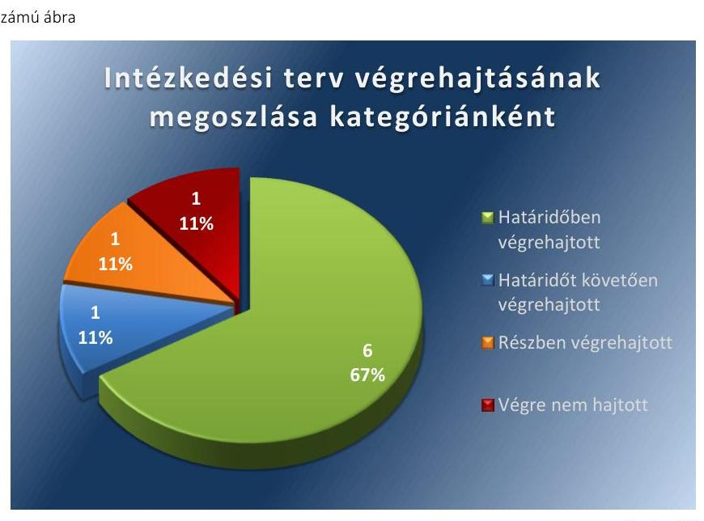

# Jelentés 

## Utóellenőrzés

Pacsa Város Önkormányzata pénzügyi gazdálkodási helyzetének, szabályszerűségének utóellenőrzése

15174
www.asz.hu

---

.

---

# Jelentés 

## Utóellenőrzés

Pacsa Város Önkormányzata pénzügyi gazdálkodási helyzetének, szabályszerűségének utóellenőrzése

---

# AZ ELLENŐRZÉST FELÜGYELTE: 

HOLMAN MAGDOLNA JULIANNA felügyeleti vezető

## AZ ELLENŐRZÉST VEZETTE ÉS A VÉGREHAJTÁSÁÉRT FELELŐS:

BÍRÓ ZSOLT ellenőrzésvezető

## A PROGRAM ÖSSZEÁLLÍTÁSÁÉRT FELELŐS:

LAJTERNÉ HUDÁK MAGDOLNA osztályvezető

## A TÉMÁHOZ KAPCSOLÓDÓ KORÁBBI SZÁMVEVŐSZÉKI JELENTÉS:

- címe: Jelentés Pacsa Város Önkormányzata pénzügyi gazdálkodási helyzetének, szabályosságának ellenőrzéséről
- sorszáma: 13027

IKTATÓSZÁM: V-0622-029/2015
TÉMASZÁM: 1656
ELLENŐRZÉS-AZONOSÍTÓ SZÁM: V069322

---

# TARTALOMJEGYZÉK 

■ ÖSSZEGZÉS ..... 5
■ AZ ELLENŐRZÉS CÉLJA ..... 6
■ AZ ELLENŐRZÉS TERÜLETE ..... 7
■ AZ ELLENŐRZÉS HÁTTERE, INDOKOLTSÁGA ..... 8
■ FÓKUSZKÉRDÉSEK ..... 9
■ ELLENŐRZÉS HATÓKÖRE ÉS MÓDSZEREI ..... 10
■ MEGÁLLAPÍTÁSOK ..... 12
■ MELLÉKLETEK ..... 15
I. Sz. melléklet: Az ÁSZ 13027 számú jelentéséhez kapcsolódó intézkedési terv végrehajtása ..... 15
■ FÜGGELÉK: ÉSZREVÉTELEK ..... 19
■ RÖVIDÍTÉSEK JEGYZÉKE ..... 21

---

.

---

# ÖSSZEGZÉS 

Az Állami Számvevőszék Pacsa Város Önkormányzata pénzügyi gazdálkodási helyzetének, szabályszerűségének utóellenőrzését a 2013. május 27. és 2015. április 29. közötti időszakra végezte el. Az Önkormányzat pénzügyi gazdálkodási helyzetének, szabályszerűségének ellenőrzéséről készült ÁSZ jelentés intézkedést igénylő megállapításai és javaslatai hasznosítására elfogadott intézkedések végrehajtásának késedelme és elmaradása közepes szintű kockázatot jelez a pénzügyi gazdálkodásra és annak szabályszerűségére.

## Az ellenőrzés társadalmi indokoltsága

Az ÁSZ stratégiájában célként tűzte ki, hogy a számvevőszéki munka eredménye jobban hasznosuljon, segítse az elszámoltatható közpénzfelhasználás megteremtését, ehhez az intézkedési tervekben vállalt feladatok végrehajtásának ellenőrzése, valamint a célzott utóellenőrzések rendszerének kialakítása is hozzájárul. Az ÁSZ a tavalyi évben lezárta a megújult jogszabályi környezetben lefolytatott első önálló utóellenőrzés-sorozatát. Ezzel teljesen kiépítetté vált a rendszer, amely biztosítja az Országgyűlés azon szándékának teljes körű érvényesülését, hogy felszámolásra kerüljön a következmények nélküli számvevőszéki ellenőrzések korszaka.

## Főbb megállapítások, következtetések, javaslatok

A Képviselő-testület által elfogadott javított, kiegészített intézkedési tervet határidőben megküldték az ÁSZ részére. Az ÁSZ által elfogadott kiegészített intézkedési tervben foglaltak végrehajtásáról teljes körűen nem gondoskodtak. Az intézkedési tervben előírt feladatok végrehajtásának értékelése közepes szintű kockázatot jelez a pénzügyi gazdálkodásra és annak szabályszerűségére.

---

# AZ ELLENŐRZÉS CÉLJA 

## Pacsa Város Önkormányzata pénzügyi gazdálkodási helyzetének, szabályszerűségének utóellenőrzése

Az ellenőrzés célja annak megállapítása volt, hogy az Önkormányzat pénzügyi gazdálkodási helyzetének, szabályszerűségének ellenőrzéséről készült ÁSZ jelentésben foglalt intézkedést igénylő megállapításokra és javaslatokra az ellenőrzött által összeállított, ÁSZ által elfogadott intézkedési tervben meghatározott feladatokat végrehajtották-e.

Ennek keretében ellenőriztük, hogy a polgármester az ÁSZ törvény értelmében az intézkedési tervet határidőben megküldte-e az ÁSZ részére, szükség volt-e az elfogadást megelőzően kiegészítésre, azt az előírt póthatáridőn belül megtették-e, a Képviselő-testület a kiegészített intézkedési tervet elfogadta-e. Értékeltük, hogy az Önkormányzat az elfogadott (kiegészített) intézkedési tervében foglaltak megtételéről, az abban előírt határidők betartásával gondoskodott-e, valamint hogy az elfogadott intézkedések esetleges késedelme, végrehajtásának elmaradása milyen szintű kockázatot jelez a pénzügyi gazdálkodásra és annak szabályszerűségére.

---

# AZ ELLENŐRZÉS TERÜLETE

## Pacsa Város Önkormányzata

Pacsa város Zala megyében fekszik, népességszáma 2014. január 1-jén 1651 fő* volt. Az Önkormányzat1 pénzügyi helyzetének ellenőrzését az ÁSZ2 a 2009. január 1. – 2012. június 30. közötti időszakra végezte el, amelynek eredményeként megállapította, hogy az Önkormányzat pénzügyi egyensúlya középtávon nem volt biztosított. Az utóellenőrzés – a 2015. április 29-ig végrehajtott intézkedéseket figyelembe véve – az Önkormányzat pénzügyi gazdálkodási helyzetének, szabályszerűségének ellenőrzéséről készült ÁSZ jelentés3 intézkedést igénylő megállapításai és javaslatai hasznosítására elfogadott intézkedési tervben4 foglalt feladatok végrehajtására irányult. Az ÁSZ jelentés a polgármesternek5 négy, a jegyzőnek6 öt javaslatot tartalmazott.

\* A Központi Statisztikai Hivatal tájékoztatási adatbázisa alapján

1 Az ÁSZ 13027 számú jelentése. Az elkészített jelentés az interneten, a www.asz.hu címen olvasható (továbbiakban ÁSZ jelentés).

2 A Képviselő-testület az intézkedési tervet a 84/2013. (IX. 24.) számú határozatával fogadta el.

---

# AZ ELLENŐRZÉS HÁTTERE, INDOKOLTSÁGA 

AZ ÁSZ STRATÉGIÁJA a helyi önkormányzatok ellenőrzésében a pénzügyi-gazdasági helyzet értékelésére, kockázatai feltárására helyezte a fő hangsúlyt. A 2011-2013. években az ÁSZ által ellenőrzött önkormányzatok esetében a működési, beruházási és a hosszú lejáratú pénzintézeti kötelezettségeinek teljesítésével kapcsolatos pénzügyi kockázatokat mutattuk be. Az ÁSZ megállapította, hogy az önkormányzatok pénzügyi egyensúlyi helyzete az ellenőrzött időszakban romlott, a pénzügyi kockázatok fokozódtak, a pénzügyi egyensúlyi helyzetet jellemző mutatószámok kedvezőtlenül változtak. Az önkormányzati alrendszerben 2012. év végétől 2014. évelejéig lezajlott adósságkonszolidáció és feladat-ellátási-, finanszirozási-rendszer változtatás következtében a települési önkormányzatok pénzügyi helyzete jelentős mértékben megváltozott, amely a jóváhagyott intézkedési tervek végrehajtását is befolyásolta.

Az ellenőrzött szervezet vezetője az ÁSZ tv. ${ }^{5}$ 33. § (1)-(2) bekezdésében foglaltak alapján a jelentések intézkedést igénylő megállapításaihoz kapcsolódóan köteles intézkedési tervet benyújtani, amelyet az ÁSZ-nak kell elfogadni. Amennyiben az ellenőrzött által vállalt intézkedések hiányosak, vagy más okból nem elfogadhatók az ÁSZ indoklással és póthatáridő tűzésével visszaküldi azt kijavításra, kiegészítésre. Az elfogadásról szóló tájékoztatásban az ÁSZ elnöke valamennyi ellenőrzött szervezet vezetőjének figyelmét felhívta arra, hogy az intézkedési tervben foglaltak megvalósítását - az ÁSZ tv. 33. § (7) bekezdésében foglaltak alapján - utóellenőrzés keretében ellenőrizheti.

## AZ UTÓELLENŐRZÉS VÁRHATÓ HASZNOSULÁSA:

az ellenőrzés megállapításai segítséget nyújthatnak a közpénzügyi helyzet javításához. Az adósságkonszolidációt követően az önkormányzati alrendszerben kiemelt jelentőségű feladat az adósságállomány újratermelődésének megakadályozása. Az utóellenőrzés, jellegéből adódóan fokozza közbizalmat, fegyelmet, a társadalom, az ellenőrzöttek, a helyi döntéshozók vonatkozásában erősíti az ÁSZ tekintélyét és igazolja, hogy lejárt a következmények nélküli ellenőrzések időszaka. A jóváhagyott intézkedési tervek megvalósításának utóellenőrzése révén megállapítható, hogy az önkormányzatok megtették-e a szükséges intézkedéseket a pénzügyi stabilitás elérése és megőrzése, illetve a pénzügyi kockázataik csökkentése érdekében.

---

# FÓKUSZKÉRDÉSEK 

1. A Képviselő-testület által elfogadott intézkedési tervet, szükség esetén annak javítását, kiegészítését határidőben megküldték-e az ÁSZ részére?
2. Az ÁSZ által elfogadott intézkedési tervben foglaltak végrehajtásáról az abban előírt határidők betartásával gondoskodtak-e?

---

# ELLENŐRZÉS HATÓKÖRE ÉS MÓDSZEREI 

## Az ellenőrzés típusa

Szabályszerűségi ellenőrzés

## Az ellenőrzött időszak

Az intézkedési terv ÁSZ-nak történő benyújtásától (2013. május 27.) az utóellenőrzés megkezdéséig (2015. április 29.) tartó időszak volt.

## Az ellenőrzés tárgya

Az Önkormányzat intézkedési tervében foglaltak betartásának ellenőrzése.

## Az ellenőrzött szervezet

Pacsa Város Önkormányzata

## Az ellenőrzés jogalapja

Az ellenőrzés végrehajtásának jogszabályi alapját az ÁSZ tv. 1. § (3) bekezdése, az 5. § (2) és (6) bekezdései, a 33. § (7) bekezdése, valamint az Áht. 61. § (2) bekezdésének előírásai képezték.

## Az ellenőrzés módszerei

Az ÁSZ által elfogadott intézkedési tervben előírt feladatok végrehajtásának értékelése során alkalmazott besorolási kategóriák:
$\longrightarrow$ okafogyottá vált feladat: ha végrehajtására - meghatározott esemény bekövetkezése, továbbá külső körülmény, a működést érintő feltétel változása miatt - már nincs szükség, illetve lehetőség, és egyértelműen megállapítható, hogy az intézkedést szükségessé tevő körülmény a jövőben nem fordulhat elő;
$\longrightarrow$ nem időszerű (nem esedékes) feladat: amelynek ellenőrzési időszakon belüli végrehajtására azért nem került (kerülhetett) sor, mert az intézkedés alapjául szolgáló esemény nem következett be, de annak jövőbeni előfordulása lehetséges;
$\longrightarrow$ határidőben végrehajtott feladat: ha teljesítése dokumentáltan az intézkedési tervben előírt határidőben és tartalommal, módon megtörtént;

---

- határidőn túl végrehajtott feladat: ha annak teljesítése az intézkedési tervben meghatározott módon, de az előírt határidőn túl történt meg;
- részben végrehajtott feladat: amelynek végrehajtása teljes körűen az intézkedési tervben előírt tartalommal/módon nem történt meg, vagy a feladatot nem az előírt gyakorisággal hajtották végre;
- végre nem hajtott feladat: ha a végrehajtásért felelősként megjelölt személy(ek)nek felróhatóan a teljesítés elmaradt, vagy a teljesítést nem dokumentálták.
Az intézkedési tervben előírt feladatok végrehajtásának részletes bemutatását, valamint a teljesítés minősítését az I. számú melléklet tartalmazza.

Elfogadott intézkedések esetleges késedelme, végrehajtásának elmaradása a pénzügyi gazdálkodásra és annak szabályszerűségére kockázatot jelez. A kockázati arányszám kiszámítása során az összes kategória súlyozott értékének összegéhez viszonyítottuk a határidőn túl, a részben és a nem végrehajtott intézkedési kategóriák súlyozott pontszámát. A súlyozott érték megállapítása az egyes kategóriákhoz rendelt pontszámok alapján történt. A pénzügyi gazdálkodásra és annak szabályszerűségére ható, az intézkedési terv végrehajtásának elmaradásából eredő kockázat „magas", ha az elért pontszám és az elérhető pontszám százalékban kifejezett hányadosa elérte a 71%-ot, „közepes", ha 51 és 70% közé esett és „alacsony" ha nem haladta meg az 50%-ot.

Az ellenőrzésre az Önkormányzat elektronikus adatszolgáltatása alapján került sor, helyszínen ellenőrzést nem végeztünk. A megállapítások rögzítése az Önkormányzat által rendelkezésre bocsátott dokumentumok, tanúsítványok alapján történt, melyek valódiságát és teljes körűségét a polgármester, valamint a jegyző teljességi nyilatkozata igazolta.

---

# MEGÁLLAPÍTÁSOK 

## 1. A Képviselő-testület által elfogadott intézkedési tervet, szükség esetén annak javítását, kiegészítését határidőben megküldték-e az ÁSZ részére?

Összegző megállapítás

A Képviselő-testület által elfogadott javított, kiegészített intézkedési tervet határidőben megküldték az ÁSZ részére.

A polgármester a Képviselő-testületet tájékoztatta az ÁSZ jelentéséről. A jelentésben foglalt intézkedést igénylő megállapításokra és javaslatokra készített intézkedési tervet az ÁSZ tv. 33. § (1) bekezdésében foglalt határidőben megküldték az ÁSZ részére, amelyet az ÁSZ nem fogadott el.

Az ÁSZ az intézkedési terv kiegészítését kérte, amelyet az Önkormányzat határidőben végrehajtott.

Az ÁSZ által elfogadott intézkedési tervben meghatározott feladatokat, az ÁSZ jelentés javaslatainak címzettjét és a feladatok végrehajtását az I. számú melléklet mutatja be.

Az ÁSZ jelentés a polgármester részére négy, a jegyző részére öt javaslatot fogalmazott meg, melynek hasznosítására az Önkormányzat az intézkedési tervében kilenc feladatot határozott meg, felelősként a jegyzőt, a polgármestert és a gazdasági irodavezetőt megjelölve.

## 2. Az ÁSZ által elfogadott intézkedési tervben foglaltak végrehajtásáról az abban előírt határidők betartásával gondoskodtak-e?

Összegző megállapítás

Az ÁSZ által elfogadott kiegészített intézkedési tervben foglaltak végrehajtásáról teljes körűen nem gondoskodtak.

Az intézkedések végrehajtási kategóriánkénti megoszlását az 1. számú ábra szemlélteti.

---

Fonós: ÁSZ

# HATÁRIDŐBEN VÉGREHAJTOTT feladatok: 

1. A további bevételszerző, kiadáscsökkentő intézkedések bevezetése lehetőségének vizsgálatát elvégezték és a Képviselő-testület elé terjesztették és a végrehajtás érdekében eljártak.
2. A stabilizációs programot elkészítették és a Képviselő-testület elé terjesztették.
3. A harminc napot meghaladóan lejárt szállítói állomány alakulásáról és a lejárt tartozások átütemezése érdekében tett intézkedésekről beszámoltak a Képviselő-testületnek.
4. A környezetvédelmi programot elkészítették és a Képviselő-testület elé terjesztették.
5. Intézkedtek arról, hogy az Önkormányzat könyvviteli nyilvántartásában a rövid lejáratú kötelezettségek bemutatása teljes körűen történjen.
6. Előírták a jövőbeni pénzintézeti kötelezettségvállalások kockázatainak döntés-előkészítő szakaszban történő feltárását, a futamidő egyes éveit terhelő kötelezettségek költségvetési egyensúlyra gyakorolt hatása vizsgálatát.

## HATÁRIDŐT KÖVETŐEN VÉGREHAJTOTT feladat:

7. A feladatellátáshoz kapcsolódó döntések pénzügyi egyensúlyi helyzetre gyakorolt hatásának értékelésére, valamint a feladatellátási szerződések minimum tartalmi követelményeinek meghatározása helyi szabályaira vonatkozó szabályzatot 2014. június 28-án készítették el a vállalt 2013. október 31-ei határidőhöz képest

## RÉSZBEN VÉGREHAJTOTT feladat:

8. Részben intézkedtek arról, hogy az éves belső ellenőrzési tervek tartalmazzák a pénzügyi egyensúlyi helyzetet befolyásoló döntésekkel kapcsolatos feltárt kockázati tényezők ellenőrzését, a 2015.

---

évi belső ellenőrzési tervben nem szerepel ezen tényezők ellenőrzése.

VÉGRE NEM HAJTOTT feladat:
9. Nem működtettek a pénzügyi egyensúlyt befolyásoló kockázatok kezelésére alkalmas kockázatkezelési rendszert.

KÖZEPES SZINTŰ KOCKÁZATOT JELEZ a
 pénzügyi gazdálkodásra és annak szabályszerűségére az elfogadott intézkedések késedelme, végrehajtásának elmaradása.

---

# MELLÉKLETEK

- I. SZ. MELLÉKLET: AZ ÁSZ 13027 SZÁMÚ JELENTÉSÉHEZ KAPCSOLÓDÓ INTÉZKEDÉSI TERV VÉGREHAJTÁSA

|  1. | Intézkedési terv alapján elvégzendő feladat | Az intézkedési tervben meghatározott határidő | Az ÁSZ 13027 sz. jelentése javaslatának címzettje | Az intézkedés végrehajtása  |
| --- | --- | --- | --- | --- |
|   | 1. | 2. | 3. | 4.  |
|  Határidőben végrehajtott intézkedések |  |  |  |   |
|  1. | Vizsgáltassa meg és terjessze a Képviselő-testület elé a további bevételszerző, kiadáscsökkentő intézkedések bevezetésének lehetőségét és a döntés függvényében járjon el a bevezetésre kerülő intézkedések végrehajtása érdekében. | Első alkalommal 2013. október 31., ezt követő években: a költségvetési koncepció benyújtásával egyidejűleg | polgármester | A polgármester a 2013. október 29-i rendkívüli képviselő-testületi ülésre - az intézkedési tervben foglalt határidőnek megfelelően - előterjesztette a bevételszerző, kiadáscsökkentő intézkedések bevezetésének lehetőségéről szóló vizsgálat eredményét, amelyet a Képviselő-testület a 97/2013. (X. 29.) számú határozatával elfogadott azzal, hogy a vizsgálat eredményét a 2014. évi költségvetési koncepció elkészítésekor figyelembe kell venni. Az intézkedési tervben foglaltak szerint a bevételszerző és kiadáscsökkentő intézkedések bevezetésének lehetőségét 2013. október 31-ét követően minden évben a költségvetési koncepció benyújtásával egyidejűleg szükséges megvizsgálni és a Képviselő-testület elé terjeszteni. A 2013. október 31-ét követő teljesítésre vonatkozóan rendelkezésre álltak a 2015. évi költségvetés Képviselő-testület elé történő beterjesztésének dokumentumai, amelyek érdemben foglalkoznak a bevételek és kiadások tervezését befolyásoló tényezőkkel, ennek megfelelően például új adó bevezetésével (IFA), dologi kiadások takarékos tervezésével.  |
|  2. | A jegyző által - az 1991. évi XX. törvény 140. § (1) bekezdés a) pontja alapján - elkészített stabilizációs programot terjessze a Képviselő-testület elé jóváhagyásra. | 2013. október 31. | polgármester | A jegyző a 2013. október 29-i rendkívüli képviselő-testületi ülésre - az intézkedési tervben foglalt határidőnek megfelelően - előterjesztette a stabilizációs programot, amelyet a Képviselő-testület a 99/2013. (X. 29.) számú határozatával elfogadott.  |
|  3. | A harminc napot meghaladóan lejárt szállítói állomány alakulásáról és a lejárt tartozások átütemezése érdekében tett intézkedésekről számoljon be a Képviselő-testületnek. | Első alkalommal: 2013. október 31., aktualitás esetén a soron következő képviselő-testületi ülés | polgármester | A polgármester a 2013. október 29-i rendkívüli képviselő-testületi ülésre - az intézkedési tervben foglalt határidőnek megfelelően - előterjesztette a harminc napot meghaladóan lejárt szállítói állomány alakulásáról és a lejárt szállítói tartozások átütemezése érdekében tett intézkedésekről szóló beszámolót, amelyet a Képviselő-testület a 98/2013. (X. 29.) számú határozatával elfogadott. Az előterjesztésben foglaltak alapján az Önkormányzat a lejárt szállítói állományát az általános iskolát  terhelő szállítói állományt - a 2013. évben kiegyenlítette. Ezen túlmenően az Önkormányzatnak 2013. október 31. napját követően az ellenőrzött időszakban lejárt szállítói állománya nem volt.  |

---

|  4. | A zöldterületek fejlesztése és fenntartása érdekében kezdeményezze a környezetvédelmi program elkészítését és terjeszze a Képviselő-testület elé jóváhagyásra a környezet védelmének általános szabályairól szóló 1995. évi LIII. törvény (Kvtv.) 46. § (1) bekezdés b) pontjában foglalt előírásnak megfelelően. | 2013. december 31. | polgármester | A polgármester a 2013. december 3-i képviselő-testületi ülésre – az intézkedési tervben foglalt határidőnek megfelelően – előterjesztette a környezetvédelmi programot, amelyet a Képviselő-testület a 112/2013. (XII. 03.) számú határozatával elfogadott a környezet védelmének általános szabályairól szóló 1995. évi LIII. törvény 46. § (1) bekezdés b) pontjában foglalt előírásnak megfelelően.  |
| --- | --- | --- | --- | --- |
|  5. | Intézkedjen, hogy az Önkormányzat könyvviteli nyilvántartásában a rövid lejáratú kötelezettségek bemutatása teljes körűen, a számvitelről szóló 2000. évi C. törvény (Számv. tv.) 15. § (2)-(3) bekezdéseiben, valamint az államháztartás szervezetei beszámolási és könyvvezetési kötelezettségének sajátosságairól szóló 249/2000. (XII.24.) Korm. rendelet 26. § (5) bekezdés c) pontjában foglalt előírásoknak megfelelően történjen. | 2013. október 31., majd folyamatos | jegyző | A rövid lejáratú kötelezettségek számviteli nyilvántartásokban való számviteli alapelveknek megfelelő, teljes körű szerepeltetése, az Önkormányzat által rendelkezésre bocsátott 2012. évi éves beszámolók (Önkormányzat, általános iskola, KSZK) alapján összeállított 2012. évi nettósított elemi költségvetési beszámoló szerint az ellenőrzési időszakot megelőzően már megtörtént. A 2012. évi nettósított elemi költségvetési beszámoló alátámasztottan tartalmazta az általános iskola lejárt szállítói állományát is, amely a 2013. évben teljes összegben kiegyenlítésre került. A 2013. évi zárszámadási rendelet képviselő-testületi ülésre való előterjesztésének indokolása alapján az általános iskola állami fenntartásba került. A feladat végrehajtásának folyamatosságát az Önkormányzat a FEUVE1,210 szabályzatban szereplő, a főkönyvi és analitikus könyvelésre, illetve a beszámoló összeállítására vonatkozó ellenőrzési nyomvonal működtetésével biztosította. A feladat végrehajtása a 2012. évi elemi költségvetési beszámoló összeállításával és az ellenőrzési nyomvonal folyamatos működtetésével határidőben megvalósult.  |
|  6. | Írja elő a jövőbeni pénzintézeti kötelezettségvállalások kockázatainak döntés-előkészítő szakaszban történő feltárását, a futamidő egyes éveit terhelő kötelezettségek költségvetési egyensúlyra gyakorolt hatásának vizsgálatát. | 2013. október 31. | jegyző | Az Önkormányzat 2013. október 31-én – az intézkedési tervben foglalt határidőnek megfelelően – elkészítette az egyes önkormányzati kötelezettségvállalások előkészítésének és a szállítói tartozások kezelésének szabályzatát, amelyet a polgármester és a jegyző 2013. november 1. napján hagyott jóvá, hatályba lépése 2013. november 1-je. A szabályzat tartalmazta a pénzintézeti kötelezettségvállalások kockázatai feltárásának szabályait a döntés-előkészítés során és a költségvetési egyensúlyra gyakorolt hatásának vizsgálati kötelezettségét.  |
|   |  |  | **Határidőt követően végrehajtott intézkedés** |   |
|  7. | Készítsen szabályzatot a feladatellátáshoz kapcsolódó döntések pénzügyi egyensúlyi helyzetre gyakorolt hatásának értékelésére, valamint a feladatellátási szerződések minimum tartalmi követelményeinek meghatározása helyi szabályaira; | 2013. október 31. | jegyző | A jegyző 2014. június 28-án elkészítette a feladatellátáshoz kapcsolódó döntések pénzügyi egyensúlyi helyzetre gyakorolt hatásának értékelésére, valamint a feladatellátási szerződések minimum tartalmi követelményeinek meghatározásának helyi szabályairól szóló szabályzatot, amelynek hatályba lépése 2014. július 1-je. Az intézkedés az elfogadott intézkedési tervben rögzített határidőn (2013. október 31.) túl teljesült.  |

---

|  E Sorszám | Intézkedési terv alapján elvégzendő feladat | Az intézkedési tervben meghatározott határidő | Az ÁSZ 13027 sz. jelentése javaslatának címzettje | Az intézkedés végrehajtása  |
| --- | --- | --- | --- | --- |
|   | 1. | 2. | 3. | 4.  |
|  Részben végrehajtott intézkedés |  |  |  |   |
|  8. | Intézkedjen, hogy az Áht. 70. § (1) bekezdésében, továbbá a Bkr. 29. § (1) bekezdésében és a 31. § (2) bekezdése és a (4) bekezdés a) pontjában foglalt előírások szerint az éves belső ellenőrzési tervek tartalmazzák a pénzügyi egyensúlyi helyzetet befolyásoló döntésekkel kapcsolatos feltárt kockázati tényezők ellenőrzését, és biztosítsa az ellenőrzési tervek végrehajtását. | 2013. december 31., majd folyamatos | jegyző | A Képviselő-testület a 2014. évi belső ellenőrzési munkatervet megalapozó elemzés alapján 2013. december 3-án a 110/2013. (XII. 03.) számú határozatával elfogadta a 2014. évi belső ellenőrzési tervet. A Bkr. 29. § (1) bekezdése és a 31. § (2) bekezdése, valamint a (4) bekezdés a) pontja alapján a 2014. évi belső ellenőrzési munkatervét megalapozó elemzés tartalmazta az ellenőrzési prioritásokat, a rendelkezésre álló erőforrás, valamint az ellenőrzési tervet megalapozó elemzések és a kockázatelemzés eredményének összefoglaló bemutatását, illetve a 2014. évi belső ellenőrzési tervet. A kockázatelemzés kiterjedt a pénzügyi egyensúlyi helyzetet befolyásoló döntésekkel kapcsolatos kockázatokra. A 2014. évi belső ellenőrzési terv feladatként tartalmazta az Önkormányzat kontrolltevékenységeinek vizsgálatát. A 2015. évi belső ellenőrzési terv kockázatelemzésen alapult, amely kiterjedt a pénzügyi egyensúlyi helyzetet befolyásoló döntésekkel kapcsolatos kockázatokra, azonban a belső ellenőrzési terv nem tartalmazta azok ellenőrzését. A feladat ennek megfelelően részben teljesült.  |
|  Végre nem hajtott intézkedés |  |  |  |   |
|  9. | Működtessen az államháztartásról szóló 2011. évi CXCV. törvény (Áht.) 69. § (2) bekezdésében, továbbá a költségvetési szervek belső kontrollrendszeréről és belső ellenőrzéséről szóló 370/2011. (XII.31.) Korm.r. (Bkr.) 7. § (1)(2) bekezdéseiben foglalt előírásoknak megfelelő, a pénzügyi egyensúlyt befolyásoló kockázatok kezelésére alkalmas kockázatkezelési rendszert. | 2013. október 31., majd folyamatos | jegyző | Az Önkormányzat alátámasztó dokumentumként a FEUVE  szabályzatot bocsátotta rendelkezésre. A FEUVE  szabályzat aktualizálását az Önkormányzat elvégezte, a FEUVE  2014. január 1én lépett hatályba. Az aktualizálással önmagában nem tett eleget az Önkormányzat a kiegészített intézkedési tervében vállalt feladatnak. A kockázatkezelési szabályzat - amely a FEUVE  szabályzat része - nem tartalmazott nevesített előírást a pénzügyi egyensúlyt befolyásoló kockázatok felmérésére és kezelésére. A pénzügyi egyensúlyi helyzetet befolyásoló kockázatok feltárására vonatkozó alátámasztó dokumentummal az Önkormányzat nem rendelkezett. A kiegészített intézkedési tervben vállalt feladat ennek megfelelően nem végrehajtott.  |

Forrás: ÁSZ által készített táblázat

---

.

---

# FÜGGELÉK: ÉSZREVÉTELEK 

A jelentéstervezetet a Számvevőszék 15 napos észrevételezésre megküldte az ellenőrzött szervezet vezetőjének az ÁSZ tv. 29. § (1) bekezdése előírásának megfelelően.
A polgármester az ÁSZ tv. 29. § (2) bekezdésében foglalt észrevételezési jogával nem élt, a jelentéstervezetre észrevételt nem tett.

[^0]
[^0]:    § 29. § (1) Az Állami Számvevőszék az ellenőrzési megállapításait megküldi az ellenőrzött szervezet vezetőjének vagy az általa megbízott személynek, és annak, akinek személyes felelősségét állapította meg.
    (2) Az ellenőrzött szervezet vezetője és a felelősként megjelölt személy az ellenőrzés megállapításaira tizenöt napon belül írásban észrevételt tehet.
    (3) Az Állami Számvevőszék az észrevételre a beérkezésétől számított harminc napon belül írásban válaszol. A figyelembe nem vett észrevételeket köteles a jelentésben feltüntetni, és megindokolni, hogy azokat miért nem fogadta el.

---

.

---

# RÖVIDÍTÉSEK JEGYZÉKE 

${ }^{1}$ Önkormányzat
${ }^{2}$ ÁSZ
${ }^{3}$ polgármester
${ }^{4}$ jegyző
${ }^{5}$ ÁSZ tv.
${ }^{6}$ Képviselő-testület
${ }^{7}$ gazdasági irodavezető
${ }^{8}$ általános iskola
${ }^{9}$ KSZK
${ }^{10}$ FEUVE${ }_{1,2}$

Pacsa Város Önkormányzata
Állami Számvevőszék
Pacsa Város Önkormányzatának polgármestere
Pacsa Város Önkormányzatának jegyzője
2011. évi LXVI. törvény az Állami Számvevőszékről (hatályos 2011. július 1-jétől)

Pacsa Város Képviselő-testülete
Pacsai Polgármesteri Hivatal Gazdasági Iroda vezetője
Pacsai Általános Iskola és Óvoda
Közép-Zalai Szociális és Gyermekjóléti Központ
A Folyamatba épített, Előzetes és Utólagos Vezetői Ellenőrzés (FEUVE) szabályzata, az Ellenőrzési nyomvonal, a Kockázatkezelés szabályzata (FEUVE: hatályos 2012. január 01-től 2013. december 31-ig; FEUVE: hatályos 2014. január 01-től)

---

.

---

.

---

# ÁLLAMI SZÁMVEVŐSZÉK 

1052 Budapest, Apáczai Csere János utca 10.
Levélcím: 1364 Budapest 4. Pf. 54
Telefon:

 +36 1 4849100 Telefax: +36 1 4849200
www.asz.hu
