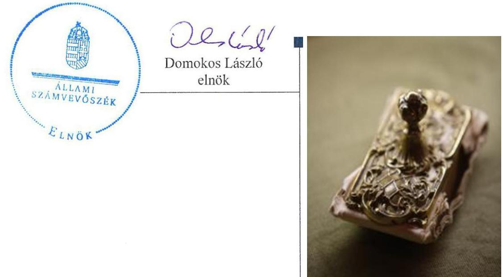
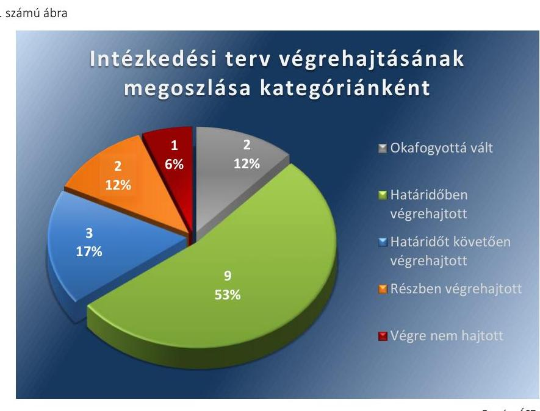
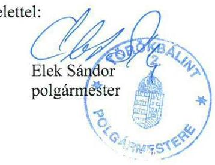
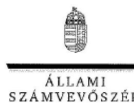
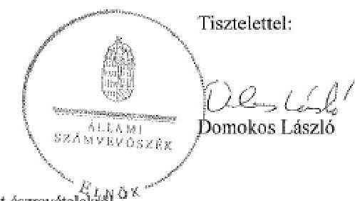

# Jelenetés 

## Utóellenőrzés

Törökbálint Város Önkormányzata pénzügyi gazdálkodási helyzetének, szabályszerűségének utóellenőrzése

15175
www.asz.hu

---

.

---

# J elentés 

## Utóellenőrzés

Törökbálint Város Önkormányzata pénzügyi gazdálkodási helyzetének, szabályszerűségének utóellenőrzése

---

# AZ ELLENŐRZÉST FELÜGYELTE: 

HOLMAN MAGDOLNA JULIANNA felügyeleti vezető

## AZ ELLENŐRZÉST VEZETTE ÉS A VÉGREHAJTÁSÁÉRT FELELŐS:

BÍRÓ ZSOLT ellenőrzésvezető

## A PROGRAM ÖSSZEÁLLÍTÁSÁÉRT FELELŐS:

LAJTERNÉ HUDÁK MAGDOLNA osztályvezető

## A TÉMÁHOZ KAPCSOLÓDÓ KORÁBBI SZÁMVEVŐSZÉKI JELENTÉS:

- címe: Jelentés az önkormányzatok pénzügyi gazdálkodási helyzetének, szabályosságának ellenőrzéséről Törökbálint
- sorszáma: 13096

Jelentéseink az Országgyúlés számítógépes hálózatán és az Interneten a www.asz.hu címen is olvashatóak.

IKTATÓSZÁM: V-0623-041/2015
TÉMASZÁM: 1657
ELLENŐRZÉS-AZONOSÍTÓ SZÁM: V069323

---

# TARTALOMJEGYZÉK 

■ ÖSSZEGZÉS ..... 5
■ AZ ELLENŐRZÉS CÉLJA ..... 6
■ AZ ELLENŐRZÉS TERÜLETE ..... 7
■ AZ ELLENŐRZÉS HÁTTERE, INDOKOLTSÁGA ..... 8
■ FÓKUSZKÉRDÉSEK ..... 9
■ ELLENŐRZÉS HATÓKÖRE ÉS MÓDSZEREI ..... 10
■ MEGÁLLAPÍTÁSOK ..... 12
■ MELLÉKLETEK ..... 15
I. Sz. melléklet: Az ÁSZ 13096 számú jelentéséhez kapcsolódó intézkedési terv végrehajtása ..... 15
■ FÜGGELÉK: ÉSZREVÉTELEK ..... 21
■ RÖVIDÍTÉSEK JEGYZÉKE ..... 27

---

.

---

# ÖSSZEGZÉS 

Az Állami Számvevőszék Törökbálint Város Önkormányzata pénzügyi gazdálkodási helyzetének, szabályszerűségének utóellenőrzését a 2013. október 22. és 2015. április 30. közötti időszakra végezte el. Az Önkormányzat pénzügyi gazdálkodási helyzetének, szabályosságának ellenőrzéséről készült ÁSZ jelentés intézkedést igénylő megállapításai és javaslatai hasznosítására elfogadott intézkedések végrehajtásának késedelme és elmaradása közepes szintü kockázatot jelez a pénzügyi gazdálkodásra és annak szabályszerűségére.

## Az ellenőrzés társadalmi indokoltsága

Az ÁSZ stratégiájában célként tűzte ki, hogy a számvevőszéki munka eredménye jobban hasznosuljon, segítse az elszámoltatható közpénzfelhasználás megteremtését, ehhez az intézkedési tervekben vállalt feladatok végrehajtásának ellenőrzése, valamint a célzott utóellenőrzések rendszerének kialakítása is hozzájárul. Az ÁSZ a tavalyi évben lezárta a megújult jogszabályi környezetben lefolytatott első önálló utóellenőrzés-sorozatát. Ezzel teljesen kiépítetté vált a rendszer, amely biztosítja az Országgyűlés azon szándékának teljes körű érvényesülését, hogy felszámolásra kerüljön a következmények nélküli számvevőszéki ellenőrzések korszaka.

## Főbb megállapítások, következtetések, javaslatok

A Képviselő-testület által elfogadott intézkedési tervet a határidőt követően küldte meg az Önkormányzat az ÁSZ részére. Az ÁSZ által elfogadott intézkedési tervben foglaltak végrehajtásáról teljes körűen nem gondoskodtak. Az intézkedési tervben előírt feladatok végrehajtásának értékelése közepes szintű kockázatot jelez a pénzügyi gazdálkodásra és annak szabályszerűségére.

---

# **AZ ELLENŐRZÉS CÉLJA**

## **Törökbálint Város Önkormányzata pénzügyi gazdálkodási helyzetének, szabályszerűségének utóellenőrzése**

Az ellenőrzés célja annak megállapítása volt, hogy az Önkormányzat pénzügyi gazdálkodási helyzetének, szabályszerűségének ellenőrzéséről készült ÁSZ jelentésben foglalt intézkedést igénylő megállapításokra és javaslatokra az ellenőrzött által összeállított, ÁSZ által elfogadott intézkedési tervben meghatározott feladatokat végrehajtották-e.

Ennek keretében ellenőriztük, hogy a polgármester az ÁSZ törvény értelmében az intézkedési tervet határidőben megküldte-e az ÁSZ részére, szükség volt-e az elfogadást megelőzően kiegészítésre, azt az előírt póthatáridőn belül megtették-e, a Képviselő-testület a kiegészített intézkedési tervet elfogadta-e. Értékeltük, hogy az Önkormányzat az elfogadott (kiegészített) intézkedési tervében foglaltak megtételéről, az abban előírt határidők betartásával gondoskodott-e, valamint hogy az elfogadott intézkedések esetleges késedelme, végrehajtásának elmaradása milyen szintű kockázatot jelez a pénzügyi gazdálkodásra és annak szabályszerűségére.

---

# **AZ ELLENŐRZÉS TERÜLETE**

## **Törökbálint Város Önkormányzata**

Törökbálint város Pest megyében fekszik, népességszáma 2014. január 1-jén 13 108 fő* volt. Az Önkormányzat1 pénzügyi helyzetének ellenőrzését az ÁSZ2 a 2009. január 1. – 2012. december 31. közötti időszakra végezte el, amelynek eredményeként megállapította, hogy az Önkormányzat pénzügyi egyensúlya középtávon nem volt biztosított. Az utóellenőrzés – a 2015. április 30-ánég végrehajtott intézkedéseket figyelembe véve – az Önkormányzat pénzügyi gazdálkodási helyzetének, szabályosságának ellenőrzéséről készült ÁSZ jelentés3 intézkedést igénylő megállapításai és javaslatai hasznosítására elfogadott intézkedési tervben4 foglalt feladatok végrehajtására irányult. Az ÁSZ jelentés a polgármesternek5 hét, a jegyzőnek6 kilenc javaslatot tartalmazott.

* A Központi Statisztikai Hivatal tájékoztatási adatbázisa alapján

1 Az ÁSZ 13096 számú jelentése. Az elkészített jelentés az interneten, a www.asz.hu címen olvasható (továbbiakban ÁSZ jelentés).

2 A Képviselő-testület az intézkedési tervet a 319/2013. (X. 17.) számú határozatával fogadta el.

---

# AZ ELLENŐRZÉS HÁTTERE, INDOKOLTSÁGA 

AZ ÁSZ STRATÉGIÁJA a helyi önkormányzatok ellenőrzésében a pénzügyi-gazdasági helyzete értékelésére, kockázatai feltárására helyezte a fő hangsúlyt. A 2011-2013. években az ÁSZ által ellenőrzött önkormányzatok esetében a múködési, beruházási és a hosszú lejáratú pénzintézeti kötelezettségeinek teljesítésével kapcsolatos pénzügyi kockázatokat mutattuk be. Az ÁSZ megállapította, hogy az önkormányzatok pénzügyi egyensúlyi helyzete az ellenőrzött időszakban romlott, a pénzügyi kockázatok fokozódtak, a pénzügyi egyensúlyi helyzetet jellemző mutatószámok kedvezőtlenül változtak. Az önkormányzati alrendszerben 2012. év végétől 2014. évelejéig lezajlott adósságkonszolidáció és feladat-ellátási-, finanszi-rozási-rendszer változtatás következtében a települési önkormányzatok pénzügyi helyzete jelentős mértékben megváltozott, amely a jóváhagyott intézkedési tervek végrehajtását is befolyásolta.

Az ellenőrzött szervezet vezetője az ÁSZ tv. ${ }^{5}$ 33. § (1)-(2) bekezdésében foglaltak alapján a jelentések intézkedést igénylő megállapításaihoz kapcsolódóan köteles intézkedési tervet benyújtani, amelyet az ÁSZ-nak kell elfogadni. Amennyiben az ellenőrzött által vállalt intézkedések hiányosak, vagy más okból nem elfogadhatók az ÁSZ indoklással és póthatáridő tűzésével visszaküldi azt kijavításra, kiegészítésre. Az elfogadásról szóló tájékoztatásban az ÁSZ elnöke valamennyi ellenőrzött szervezet vezetőjének figyelmét felhívta arra, hogy az intézkedési tervben foglaltak megvalósítását - az ÁSZ tv. 33. § (7) bekezdésében foglaltak alapján - utóellenőrzés keretében ellenőrizheti.

## AZ UTÓELLENŐRZÉS VÁRHATÓ HASZNOSULÁSA:

az ellenőrzés megállapításai segítséget nyújthatnak a közpénzügyi helyzet javításához. Az adósságkonszolidációt követően az önkormányzati alrendszerben kiemelt jelentőségű feladat az adósságállomány újratermelődésének megakadályozása. Az utóellenőrzés, jellegéből adódóan fokozza közbizalmat, fegyelmet, a társadalom, az ellenőrzöttek, a helyi döntéshozók vonatkozásában erősíti az ÁSZ tekintélyét és igazolja, hogy lejárt a következmények nélküli ellenőrzések időszaka. A jóváhagyott intézkedési tervek megvalósításának utóellenőrzése révén megállapítható, hogy az önkormányzatok megtették-e a szükséges intézkedéseket a pénzügyi stabilitás elérése és megőrzése, illetve a pénzügyi kockázataik csökkentése érdekében.

---

# FÓKUSZKÉRDÉSEK 

1. A Képviselő-testület által elfogadott intézkedési tervet, szükség esetén annak javítását, kiegészítését határidőben megküldték-e az ÁSZ részére?
2. Az ÁSZ által elfogadott intézkedési tervben foglaltak végrehajtásáról az abban előírt határidők betartásával gondoskodtak-e?

---

# ELLENŐRZÉS HATÓKÖRE ÉS MÓDSZEREI 

## Az ellenőrzés típusa

Szabályszerűségi ellenőrzés

## Az ellenőrzött időszak

Az intézkedési terv ÁSZ-nak történő benyújtásától (2013. október 22.) az utóellenőrzés megkezdéséig (2015. április 30.) tartó időszak volt.

## Az ellenőrzés tárgya

Az Önkormányzat intézkedési tervében foglaltak betartásának ellenőrzése.

## Az ellenőrzött szervezet

Törökbálint Város Önkormányzata

## Az ellenőrzés jogalapja

Az ellenőrzés végrehajtásának jogszabályi alapját az ÁSZ tv. 1. § (3) bekezdése, az 5. § (2) és (6) bekezdései, a 33. § (7) bekezdése, valamint az Áht. 61. § (2) bekezdésének előírásai képezték.

## Az ellenőrzés módszerei

Az ÁSZ által elfogadott intézkedési tervben előírt feladatok végrehajtásának értékelése során alkalmazott besorolási kategóriák:
$\longrightarrow$ okafogyottá vált feladat: ha végrehajtására - meghatározott esemény bekövetkezése, továbbá külső körülmény, a müködést érintő feltétel változása miatt - már nincs szükség, illetve lehetőség, és egyértelműen megállapítható, hogy az intézkedést szükségessé tevő körülmény a jövőben nem fordulhat elő;
$\longrightarrow$ nem időszerű (nem esedékes) feladat: amelynek ellenőrzési időszakon belüli végrehajtására azért nem került (kerülhetett) sor, mert az intézkedés alapjául szolgáló esemény nem következett be, de annak jövőbeni előfordulása lehetséges;
$\longrightarrow$ határidőben végrehajtott feladat: ha teljesítése dokumentáltan az intézkedési tervben előírt határidőben és tartalommal, módon megtörtént;

---

- határidőn túl végrehajtott feladat: ha annak teljesítése az intézkedési tervben meghatározott módon, de az előírt határidőn túl történt meg;
- részben végrehajtott feladat: amelynek végrehajtása teljes körűen az intézkedési tervben előírt tartalommal/módon nem történt meg, vagy a feladatot nem az előírt gyakorisággal hajtották végre;
- végre nem hajtott feladat: ha a végrehajtásért felelősként megjelölt személy(ek)nek felróhatóan a teljesítés elmaradt, vagy a teljesítést nem dokumentálták.
Az intézkedési tervben előírt feladatok végrehajtásának részletes bemutatását, valamint a teljesítés minősítését az I. számú melléklet tartalmazza.

Elfogadott intézkedések esetleges késedelme, végrehajtásának elmaradása a pénzügyi gazdálkodásra és annak szabályszerűségére kockázatot jelez. A kockázati arányszám kiszámítása során az összes kategória súlyozott értékének összegéhez viszonyítottuk a határidőn túl, a részben és a nem végrehajtott intézkedési kategóriák súlyozott pontszámát. A súlyozott érték megállapítása az egyes kategóriákhoz rendelt pontszámok alapján történt. A pénzügyi gazdálkodásra és annak szabályszerűségére ható, az intézkedési terv végrehajtásának elmaradásából eredő kockázat „magas", ha az elért pontszám és az elérhető pontszám százalékban kifejezett hányadosa elérte a $71 \%$-ot, „közepes", ha 51 és $70 \%$ közé esett és „alacsony" ha nem haladta meg az 50\%-ot.

Az ellenőrzésre az Önkormányzat elektronikus adatszolgáltatása alapján került sor, helyszínen ellenőrzést nem végeztünk. A megállapítások rögzítése az Önkormányzat által rendelkezésre bocsátott dokumentumok, tanúsítványok alapján történt, melyek valódiságát és teljes körűségét a polgármester, valamint a jegyző teljességi nyilatkozata igazolta.

---

# MEGÁLLAPÍTÁSOK 

## 1. A Képviselő-testület által elfogadott intézkedési tervet, szükség esetén annak javítását, kiegészítését határidőben megküldték-e az ÁSZ részére?

Összegző megállapítás

A Képviselő-testület ${ }^{6}$ által elfogadott intézkedési tervet határidőt követően küldték meg az ÁSZ részére, amelyet az ÁSZ javítás és kiegészítés nélkül elfogadott.

A polgármester a Képviselő-testületet tájékoztatta az ÁSZ jelentéséről. A jelentésben foglalt megállapításokhoz kapcsolódó intézkedési tervet az ÁSZ tv. 33. § (1) bekezdésében foglalt határidőt követően küldték meg az ÁSZ részére, a késedelemről a polgármester levélben előre tájékoztatta az ÁSZ-t.

Az ÁSZ által elfogadott intézkedési tervben meghatározott feladatokat, az ÁSZ jelentés javaslatainak címzettjét és a feladatok végrehajtását az I. számú melléklet mutatja be.

Az ÁSZ jelentés a polgármester részére hét, a jegyző részére kilenc javaslatot fogalmazott meg, melyek hasznosítására az Önkormányzat az intézkedési tervében tizenhét feladatot határozott meg, felelősként a Pénzügyi Iroda ${ }^{7}$ vezetőjét, a Városfejlesztési és Vagyongazdálkodási Iroda ${ }^{8}$ vezetőjét, az aljegyzőt ${ }^{9}$ és a jegyzőt megjelölve.

## 2. Az ÁSZ által elfogadott intézkedési tervben foglaltak végrehajtásáról az abban előírt határidők betartásával gondoskodtak-e?

Összegző megállapítás

Az ÁSZ által elfogadott intézkedési tervben foglaltak végrehajtásáról teljes körűen nem gondoskodtak.

A végrehajtott feladatok kategóriánkénti megoszlását az 1. számú ábra szemlélteti.

---

Forrás: ÁSZ

# OKAFOGYOTTÁ VÁLT feladatok: 

1. A törzsvagyon részét képező korlátozottan forgalomképes ingatlanra engedélyezett keretbiztosítéki jelzálog cseréje nem volt szükséges, mivel az Önkormányzat a 2013. január 1-jétől hatályos vagyongazdálkodási rendeletében ${ }^{10}$ az érintett ingatlant forgalomképessé minősítette.
2. Az adósságkonszolidációt követően fennmaradó kötelezettségek tekintetében egyensúlyi (elkülönített) tartalék képzésére nem volt szükség, mivel a Magyar Állam a 2013, 2014. évi adósságkonszolidáció folyamán az Önkormányzat hiteltartozását teljes mértékben átvállalta.

## HATÁRIDŐBEN VÉGREHAJTOTT feladatok:

3. Előírtak a jövőbeni hitelfelvételről, kötvénykibocsátásról való döntések előtti, előzetes ellenőrzést annak érdekében, hogy fedezetként az Önkormányzat törzsvagyonába tartozó ingatlan ne kerüljön felhasználásra.
4. A feltárt számviteli szabálytalanságok tekintetében a munkajogi felelősséggel kapcsolatos körülményeket kivizsgálták, munkajogi lépésre nem volt szükség.
5. A pénzügyileg realizált árfolyam-különbözet előírásszerű, elkülönített elszámolására intézkedéseket hoztak.
6. Előírták az Önkormányzat vagyonát érintő gazdasági eseményeknek a Képviselő-testület döntése alapján történő elszámolását.
7. Előírták a befejezetlen beruházások könyvviteli nyilvántartásból való kivezetése elszámolásának szabályait.
8. A pénzügyi egyensúlyt befolyásoló kockázatok feltárására, beazonosítására, értékelésére és kezelésére komplex kockázatkezelési rendszert alakítottak ki.

---

9. Előírták feladat átadás-átvételt érintő előterjesztés esetén annak kötelező vagy önként vállalt jellegének, költségvetési kihatásának bemutatását.
10. Előírták a fejlesztési döntések előtt a lebonyolítás és a működtetés kockázatai feltárásának és kezelésének kötelezettségét.
11. Előírták a több évet érintő kötelezettségvállalások kockázatai dön-tés-előkészítő szakaszban történő feltárását, a futamidő egyes éveit terhelő kötelezettségek költségvetési egyensúlyra gyakorolt hatása vizsgálatát.

HATÁRIDŐT KÖVETŐEN VÉGREHAJTOTT feladatok:
12. Az Önkormányzat Stabilizációs programját ${ }^{11}$ a vállalt 2014. január 31-i határidő helyett 2014. június 18-án készítették el és 2014. július 21-én terjesztették a Képviselő-testület elé.
13. Az önként vállalt feladatok finanszírozhatóságának felülvizsgálatát, racionalizálási javaslatok előterjesztését a vállalt 2013. november 30-i határidő helyett a 2013. december 12-ei képviselő testületi ülésen terjesztették elő.
14. A beruházási eljárási rendet a vállalt határidőt követően vizsgálták felül, a kapcsolódó beruházási döntéstámogató rendszer műszaki dokumentációja a vállalt 2014. március 31-i határidő helyett 2014. május 21-én készült el.

# RÉSZBEN VÉGREHAJTOTT feladatok: 

15. A költségvetési rendelettervezet, valamint annak évközi módosítását megelőzően a bevételszerző, kiadáscsökkentő lehetőségek felmérését részben hajtották végre, mivel a 2015. évi költségvetési rendelet-tervezethez nem készültek ilyen előterjesztések.
16. A befejezetlen beruházások kivezetésének elszámolását, a minősítés dokumentálását, előzetes szakvéleménnyel történő alátámasztását részben hajtották végre, mivel a kivezetésekhez előzetes szakvélemény nem készült.

VÉGRE NEM HAJTOTT feladat:
17. A fizetőképesség és eladósodás kezelésére szolgáló szabályzatot nem készítették el.

KÖZEPES SZINTŰ KOCKÁZATOT JELEZ a pénzügyi gazdálkodásra és annak szabályszerűségére az elfogadott intézkedések késedelme, végrehajtásának elmaradása.

---

# MELLÉKLETEK

- I. SZ. MELLÉKLET: AZ ÁSZ 13096 SZÁMÚ JELENTÉSÉHEZ KAPCSOLÓDÓ INTÉZKEDÉSI TERV VÉGREHAJTÁSA

|  Sorszám | Intézkedési terv alapján elvégzendő feladat | Az intézkedési tervben meghatározott határidő | Az ÁSZ 13096 sz. jelentése javaslatának címzettje | Az intézkedés végrehajtása  |
| --- | --- | --- | --- | --- |
|   | 1. | 2. | 3. | 4.  |
|  Okafogyottá vált intézkedések |  |  |  |   |
|  1. | A jogellenes állapot megszüntetése érdekében a biztosíték cseréje jogszerú lehetőségének megvizsgálása és javaslat előterjesztése a Képviselőtestület részére a biztosíték cseréjéről. | 2013. december 31. | polgármester | Az Önkormányzat a megállapítással érintett ingatlant a 2013. január 1jétől hatályos 49/2012. (XII. 17.) vagyongazdálkodási rendelete szerint forgalomképessé minősítette.  |
|  2. | Az adósságkonszolidációt követően fennmaradó kötelezettségei tekintetében olyan egyensúlyi (elkülönített) tartalék képzésére vonatkozó döntési javaslat előterjesztése a képviselő-testület elé, amelyben a Képviselő-testület meghatározza annak összegét, és kötelezettséget vállal arra, hogy a törlesztési időszak alatt a tartalékot a költségvetési rendeleteiben minden évben betervezi az adósságszolgálat teljesítésére. | 2013. december 31. | polgármester | A Magyar Állam a 2013, 2014. évi adósságkonszolidáció folyamán az Önkormányzat hiteltartozását teljes mértékben átvállalta.  |
|  Határidőben végrehajtott intézkedések |  |  |  |   |
|  3. | Intézkedés arra vonatkozóan, hogy jövőbeni hitelfelvétel, kötvénykibocsátás fedezeteként az Áht. ${ }^{12}$ 84. § (4) bekezdésében előírtak szerint az Önkormányzat törzsvagyonába tartozó ingatlan ne kerüljön felhasználásra. | folyamatos | polgármester | Az Önkormányzat intézkedési tervének elfogadása, 2013. október 17-e után négy napon belül kiadott 10/2013. (X. 22.) jegyzői intézkedés 5. pontja előírta a vagyonelemeket érintő döntések előtti, előzetes ellenőrzést arra vonatkozóan, hogy az adott vagyontárgy tervezett módon való hasznosítása nem ellentétes-e a nemzeti vagyonról szóló 2011. évi CXCVI. törvény illetve az Áht. előírásaival. Az Önkormányzatnak az ellenőrzött időszak végén (2015. április 30.) nem volt hosszú lejáratú hitele, kötvényt nem bocsátott ki.  |

---

|  4. | Intézkedési terv alapján elvégzendő feladat | Az intézkedési tervben meghatározott határidő | Az ÁSZ 13096 sz. jelentése javaslatának címzettje | Az intézkedés végrehajtása  |
| --- | --- | --- | --- | --- |
|   | 1 | 2 | 3 | 4  |
|  4. | Intézkedés az ÁSZ ellenőrzés során feltárt számviteli szabálytalanságok tekintetében a munkajogi felelősséggel kapcsolatos körülmények kivizsgálásáról és a szükséges munkajogi lépések meghozása. | 2013. december 31. | polgármester | A végrehajtásért felelősként meghatározott jegyző a polgármester felé készített, 2013. december 12-ei beszámolója szerint a munkajogi felelősséggel kapcsolatos körülményeket kivizsgálta. Munkajogi lépéseket nem tett.  |
|  5. | Intézkedés annak érdekében, hogy a devizában fennálló hosszú lejáratú kötelezettségei törlesztése során a pénzügyileg realizált árfolyam-különbözet elszámolása árfolyamveszteség esetén az Áhsz. ${ }^{13} 9$. számú melléklet számlaosztályok tartalmára vonatkozó előírásai 4. díl és a 9. c) pontjában foglalt előírásoknak, illetve árfolyamnyereség esetén az Áhsz. 14. a) pontjában foglalt előírásnak megfelelően elkülönítetten történjen. | folyamatos | jegyző | A 10/2013. (X. 22.) jegyzői intézkedés 6. pontja előírta, hogy a jövőben az árfolyam-különbözetek elszámolása a jogszabályoknak megfelelően történjen. A Pénzügyi Iroda 2013. október 28-ai értekezletén minden munkatárssal ismertették az ÁSZ ellenőrzés megállapításait és a devizás tételekkel kapcsolatos könyvelési tételeket.  |
|  6. | Intézkedés annak érdekében, hogy a Mötv. ${ }^{14}$ 107. §-a alapján az Önkormányzat vagyonát érintő - ideértve a folyamatban lévő beruházásokkal kapcsolatos - gazdasági eseményeket a Képviselő-testület döntésének megfelelően kezeljék, illetve számolják el. | folyamatos | jegyző | A 10/2013. (X. 22.) jegyzői intézkedés 7. pontja szerint az Önkormányzat vagyonát érintő gazdasági eseményeket a Képviselő-testület döntése alapján számolják el. Az Önkormányzat Képviselő-testülete a 2014. január 30ai képviselő testületi ülésen a polgármester előterjesztése alapján döntött 9 befejezetlen beruházásról, 5 esetben azok kivezetéséről.  |
|  7. | Annak biztosítása, hogy beruházás terven felüli értékcsökkenés elszámolását követő, könyvviteli nyilvántartásból való kivezetésére kizárólag a Számv. tv. ${ }^{15} 53 . \S$ (2) bekezdésében, illetve az Áhsz. 30. § (12) bekezdésében foglalt előírás szerint kerüljön sor, amennyiben a beruházás rendeltetésének megfelelően nem használható, illetve használhatatlan, megsemmisült vagy hiányzik. Ehhez kapcsolódóan az Értékelési szabályzat ${ }^{16}$ 3. pontja szerinti értékelési eljárásnak megfelelően járjanak el. | folyamatos | jegyző | A 10/2013. (X. 22.) jegyzői intézkedés 7. pontja előírta, hogy az Önkormányzat vagyonát érintő gazdasági eseményeket a Képviselő-testület döntése alapján számolják el, kivezetésre a jogszabályoknak megfelelően kerüljön sor. A 2013. december 31-ével kivezetett befejezetlen beruházások esetében a terven felüli értékcsökkenés elszámolása, a könyvviteli nyilvántartásokból való kivezetés a Számv. tv. előírásainak megfelelően történt.  |

---

|  8. | A Bkr. ${ }^{17}$ 7. § (1)-(2) bekezdéseiben foglalt előírásoknak megfelelő, a pénzügyi egyensúlyt befolyásoló kockázatok feltárására, beazonosítására, értékelésére és kezelésére alkalmas kockázatkezelési rendszer működtetése. | folyamatos | jegyző | A 10/2013. (X. 22.) jegyzői intézkedés 8. pontja szerint egy komplex kockázatkezelési rendszer kialakítása volt folyamatban, amely az ÁROP ${ }^{18}$ szervezetfejlesztési pályázat keretében megvalósult. A rendszer folyamatos működtetése megvalósult azáltal, hogy a 2014 szeptemberében szervezett továbbképzés egyik kiemelt témája volt a kockázatelemzés, kockázatkezelés - amely az éves ellenőrzési terv szerint a belső ellenőrzés egyik témája 2015-ben -, valamint a Pénzügyi Iroda 2014. és 2015. évekre vonatkozóan elkészítette a pénzügyi egyensúlyi kockázatok értékelését.  |
| --- | --- | --- | --- | --- |
|  9. | A feladat átadás-átvételre vonatkozó döntések előkészítése során a döntés kötelező és önként vállalt feladatok arányára, ezáltal a pénzügyi egyensúlyi helyzetre gyakorolt hatása vizsgálatának előírása. | folyamatos | jegyző | A 10/2013. (X. 22.) jegyzői intézkedés 9. pontja előírta, hogy feladat át-adás-átvételt érintő előterjesztés esetén annak kötelező vagy önként vállalt jellegét, továbbá költségvetési kihatását be kell mutatni. Az érintett időszakban egy esetben fordult elő önként vállalt feladatot érintő átadás, amelyet a Budaörs Kistérség Többcélú Társulása megszűnése indokolt. A Pénzügyi Iroda a képviselő-testületi SZMSZ ${ }^{19}$ szerint véleményezi a feladatváltozások pénzügyi egyensúlyi helyzetre gyakorolt hatását.  |
|  10. | A fejlesztések döntés-előkészítés folyamatában a lebonyolítás és a működtetés kockázatai feltárása és kezelése kötelezettségének meghatározása. | folyamatos | jegyző | A 10/2013. (X. 22.) jegyzői intézkedés 8. pontja szerint a Pénzügyi Iroda vezetőjének a fejlesztési döntések előtti véleményezése kiterjedt a működtetés kockázatainak bemutatására és kezelésére is.  |
|  11. | A pénzintézeti kötelezettségvállalások kockázatai döntés-előkészítő szakaszban történő feltárásának, a futamidő egyes éveit terhelő kötelezettségek költségvetési egyensúlyra gyakorolt hatása vizsgálatának előírása. | folyamatos | jegyző | A 10/2013. (X. 22.) jegyzői intézkedés 8. pontja a Pénzügyi Iroda vezetőjének előírta a több évet érintő kötelezettségvállalás esetén a várható kockázatok bemutatását, valamint a hatályos 16/2013. (III. 25.) ÖK rendelet a Képviselő-testület SZMSZ-éről 26. § (3) bekezdése tartalmazta a Pénzügyi Irodavezető azon kötelezettségét, hogy minden költségvetést érintő előterjesztésnél a költségvetéssel való összhanggal kapcsolatban nyilatkoznia kell.  |
|  12. | Az Önkormányzat gazdasági helyzetének elemzésén alapuló, a pénzügyi egyensúlyi helyzet hosszú távú fenntartását, valamint az adósságállomány | 2014. január 31. | polgármester | Az Önkormányzat Stabilizációs programját 2014. június 18-án készítette el és 2014. július 21-ei ülésre terjesztette elő a polgármester, elfogadása a 2014. szeptember 25-ei képviselő testületi ülésen történt meg (276/2014. (IX. 25.) ÖK határozat).  |

---

|  ㄷ
E
E
E | Intézkedési terv alapján elvégzendő feladat | Az intézkedési tervben meghatározott határidő | Az ÁSZ 13096 sz. jelentése javaslatának címzettje | Az intézkedés végrehajtása  |
| --- | --- | --- | --- | --- |
|   | 1. | 2. | 3. | 4.  |
|   | újratermelődésének elkerülését biztosító intézkedéseket tartalmazó stabilizációs program készítése, képviselő-testület elé terjesztése. |  |  |   |
|  13. | Az önként vállalt feladatok finanszírozhatóságának felülvizsgálata a kötelező feladatellátás elsődlegességének biztosítása érdekében és ennek függvényében a Képviselő-testület részére javaslat a feladatellátás racionalizálására. | 2013. november 30. | polgármester | Az Önkormányzat az önként vállalt feladatokat a 2014. évi költségvetés előkészítése során felülvizsgálta, a felülvizsgálat eredményét a 2013. december 12-ei képviselő testületi ülésen terjesztette elő a jegyző.  |
|  14. | A beruházási eljárási rend teljes felülvizsgálata és annak alapján egy új, teljes folyamatot lefedő intézkedési feladatra javaslat készítése (az ÁSZ jelentéshez kapcsolódóan a Képviselő-testület részéről szükségesnek tartott további intézkedés). | 2014. március 31. | jegyző | Az Önkormányzatnál a beruházási eljárási folyamat átalakítása elkezdődött. Az ÁROP szervezetfejlesztési támogatásból a vezetői információs rendszer részeként a beruházási döntéstámogató rendszert is fejlesztették, a kapcsolódó műszaki dokumentáció 2014. május 21-én készült el. A beszerzési és a közbeszerzési szabályzatok tervezetét elkészítették, azok szakmai egyeztetés alatt állnak.  |
|   |  | Részben végrehajtott intézkedések |  |   |
|  15. | A költségvetési rendelettervezet, valamint annak évközi módosítása előterjesztését megelőzően a bevételszerző, kiadáscsökkentő lehetőségek felmérése és a bevételek növelését, a kiadások csökkentését célzó intézkedések bevezetéséhez szükséges döntési javaslatának Képviselő-testület elé terjesztése. | Évenként a költségvetési koncepcióval egyidejűleg és a költségvetés valamennyi módosítását megelőzően. | polgármester | Az Önkormányzatnál a 2014. évi költségvetési koncepció előterjesztése előtt megtörtént a bevételnövelő intézkedések előterjesztése, kiadáscsökkentő intézkedés nem volt. A 2015. évi költségvetési rendelet-tervezethez nem készültek ilyen előterjesztések.  |

---

|  15
25 | Intézkedési terv alapján elvégzendő feladat | Az intézkedési tervben meghatározott határidő | Az ÁSZ 13096 sz. jelentése javaslatának címzettje | Az intézkedés végrehajtása  |
| --- | --- | --- | --- | --- |
|   | 1 | 2 | 3 | 4  |
|  16. | Intézkedés annak érdekében, hogy a beruházások kivezetésére a Vagyongazdálkodási rendelet 7. § (1) bekezdés m) és a (2) bekezdés b) pontjában, valamint a Selejtezési szabályzat ${ }^{10}$ II. 1. pontjában foglalt előírásoknak megfelelően, az öt millió Ftot meghaladó beruházások esetében a képviselőtestület döntése, az egy millió Ft-ot meghaladó beruházások esetében a Pénzügyi Bizottság ${ }^{11}$ döntése alapján kerüljön sor. Biztosítsa, hogy a Selejtezési szabályzat II. fejezet 1., 3.2, valamint 5. pontjában foglalt előírások alapján a kivezetést megelőzően a beruházásra fordított pénzeszközök feleslegesnek, rendeltetésszerű használatra alkalmatlannak történő minősítését dokumentálják, azt ellenőrizzék, szakvéleménnyel támasszák alá. | folyamatos | jegyző | A 10/2013. (X. 22.) jegyzői intézkedés 7. pontja előírta, hogy az Önkormányzat vagyonát érintő gazdasági eseményeket a Képviselő-testület döntése alapján számolják el, a minősítést dokumentálják, előzetes szakvéleménnyel támasszák alá. Az Önkormányzat a 2014. január 30-ai képviselő testületi ülésen a polgármester előterjesztése alapján döntött 9 befejezetlen beruházásról, 5 esetben azok kivezetéséről. Előzetes szakvéleményt a fenti jegyzői intézkedés ellenére nem készítettek, szakbizottságok tárgyalták meg a kivezetési javaslatokat.  |
|  17. | Szabályzat készítése az önkormányzat fizetőképességének és eladósodásának kezelésére. | 2014. március 31. | jegyző | A jegyző elkészítette az Önkormányzat fizetőképességének és eladósodásának kezelésére szolgáló rendelet-tervezetet, azonban azt az ellenőrzött időszakban nem terjesztette a Képviselő-testület elé elfogadásra.
Ferrás: ÁSZ által készített táblázat  |

---

.

---

# FÜGGELÉK: ÉSZREVÉTELEK 

A jelentéstervezetet a Számvevőszék 15 napos észrevételezésre megküldte az ellenőrzött szervezet vezetőjének az ÁSZ tv. 29. §§ (1) bekezdése előírásának megfelelően.
A függelék tartalmazza az ellenőrzött észrevételeit, illetve az el nem fogadott észrevételek elutasításának indoklását.

- Törökbálint Város Önkormányzata Polgármesterének észrevétele
- Tájékoztatás az el nem fogadott észrevételekről (V-0623-046/2015.)

- 29. § (1) Az Állami Számvevőszék az ellenőrzési megállapításait megküldi az ellenőrzött szervezet vezetőjének vagy az általa megbízott személynek, és annak, akinek személyes felelősségét állapította meg.
(2) Az ellenőrzött szervezet vezetője és a felelősként megjelölt személy az ellenőrzés megállapításaira tizenöt napon belül írásban észrevételt tehet.
(3) Az Állami Számvevőszék az észrevételre a beérkezésétől számított harminc napon belül írásban válaszol. A figyelembe nem vett észrevételeket köteles a jelentésben feltüntetni, és megindokolni, hogy azokat miért nem fogadta el.

---

# 2015 522208 1752 

## Törökbálint Város Polgármestere

Levelezési cím: 2045 Törökbálint, Munkácsy Mihály u. 79.
Tel.: 06-23-335-021 Fax: 06-23-336-039 e-mail: polgarmester@torokbalint.hu honlap:www.torokbalint.hu

Iktatószám: VII/120-7/2015.
Úgyintéző: dr. Lantos Ottó
Telefon: (20) 283-3234
E-mail: penzugy@torokbalint.hu

Tárgy: Észrevételek Törökbálint Város Önkormányzat pénzügyi gazdálkodási helyzetének, szabályszerűségének utóellenőrzése címủ számvevőszéki jelentéstervezetére

Állami Számvevőszék

## Domokos László

elnök

Tisztelt Elnök Úr!

## 42.114/2015

Érkeret: 2015 SZÉPI 08.
Iktatószám: V-0623-016/2015
Melléklet:

Köszönettel vettem kézhez az Állami Számvevőszék „Utóellenőrzés - Törökbálint Város Önkormányzata pénzügyi gazdálkodási helyzetének, szabályszerűségének utóellenőrzése" című számvevőszéki jelentés-tervezetét, s mindenek előtt kollégáim nevében is szeretném megköszönni Tisztelt Munkatársainak az ellenőrzés lefolytatása során végzett munkáját, hasznos megállapításait, javaslatait.

A tervezet tartalmát megismertem, az abban foglaltakkal alapvetően egyetértek. Néhány ponton azonban a leírtakhoz képest eltérő véleményünk merült fel, ezért - élve az Ön által felkínált lehetőséggel -, az alábbi észrevételeket teszem.

1. A jelentéstervezet részletes megállapításaival, következetéseivel, javaslataival kapcsolatos észrevételeink:
a) A jelentés-tervezet a 14. oldalon a részben végrehajtott feladatok körében említi a bevételszerző és kiadáscsökkentő lehetőségek felmérését, azzal indokolva, hogy a 2015. évi költségvetési rendelet-tervezethez nem készültek ilyen előterjesztések.

Külön előterjesztések valóban nem készültek, de az utóellenőrzés során az Állami Számvevőszék részére feljegyzést készítettünk arról a 3 napos informális testületi ülésről, amelyen a Képviselő-testület gyakorlatilag feladatonként vette végig a 2015. évi költségvetés előirányzatait. Ahogy azt a 2015. május 18 -ai keltezésű, utóellenőrzés során az ÁSZ részére készített tájékoztatásban is említettük, több konkrét - bár informális elhatározás született itt egyes feladatok kiadásainak csökkentésére (például: pedagógus ösztöndíj keret, helyi tömegközlekedéssel kapcsolatos kiadások). Tartalmilag tehát véleményünk szerint elvégeztük e feladatot.
b) A végre nem hajtott feladatok körében szerepelteti a jelentés-tervezet a fizetőképesség és eladósodás kezelésére szolgáló szabályzatot. Úgy véljük, ez a feladat részben teljesültnek tekinthető, mivel a tárggyal kapcsolatos rendelet-tervezet elkészült. Tény azonban, hogy előterjesztésére az utóellenőrzés által vizsgált időszakban nem került

---

sor, mivel az akkori önkormányzati vezetés az önkormányzati választások után megalakuló új önkormányzatra kívánta hagyni ezt a feladatot.
2. A jelentéstervezet 5. oldalán található, „Föbb megállapítások, következtetések, javaslatok" cím alatt megfogalmazott összegző értékeléshez kapcsolódó konkrét észrevételeink:
a) Az intézkedési tervet az Önkormányzat a határidőt követően küldte meg az ÁSZ részére, azonban - ahogy ezt a jelentéstervezet a részletes megállapításoknál (12. oldal) írja is - a késedelemről az Önkormányzat előre tájékoztatta az ÁSZ-t. A késedelem oka - ahogy ezt az Önkormányzat a VII/79-8/2013. iktatószámú, 2013. 'október 14-én kelt tájékoztató levelében leírta - az volt, hogy a Képviselő-testület az intézkedési tervet a 2013. október 16-án lejáró határidő helyett csak 2013. október 17én tudta tárgyalni. Az intézkedési terv tehát elkészült, a Képviselő-testület valamennyi bizottsága tárgyalta és elfogadásra javasolta azt határidőn belül, csupán a Képviselőtestület általi jóváhagyásra nem kerülhetett sor a határidőn belül. A polgármester erre tekintettel kérte a késedelemhez kapcsolódó jogkövetkezmények alkalmazásának mellőzését.

Fentiek alapján kérjük, hogy az összefoglaló megállapítások erre vonatkozó részében szerepeltessék az arra vonatkozó utalást is, hogy az Önkormányzat a késedelemről és annak indokáról előzetesen tájékoztatta az Állami Számvevőszéket.
b) Az összefoglaló megállapítások utolsó mondata szerint „az intézkedési tervben előírt feladatok végrehajtásának értékelése közepes szintủ kockázatot jelez a pénzügyi gazdálkodásra és annak szabályszerűségére". A jelentéstervezet a 10-11. oldalakon ismerteteti az ellenőrzés módszereit, ezen belül a kockázati arányszám kiszámításának elveit. A jelentéstervezetből nem derül ki, de ennek alapján vélhetően Törökbálint Város Önkormányzata esetében az intézkedési terv végrehajtásának elmaradásából eredő kockázat azért közepes, mert a számított arányszám az 51 és $70 \%$ közé esett (az Önkormányzatra vonatkozó konkrét számítás, illetve arányszám a jelentéstervezetben nem szerepel). A módszertant természetesen nem vitatjuk, azonban úgy véljük, hogy a matematikailag közepes mértékủ kockázat ténylegesen az elvégzett és el nem végzett feladatok tartalma alapján nem jelent ilyen magas mértékủ kockázatot az Önkormányzat pénzügyi gazdálkodására, annak szabályszerűségére.

Törökbálint, 2015. szeptember 7.

Tisztelettel:

Készült: 3 eredeti példányban
Kapja: 1 pld. Címzett
1 pld. Pénzügyi Iroda
1 pld. Irattár

---

ELNÖK

Ikt.szám: V-0623-046/2015.

# Elek Sándor úr   polgármester 

Törökbálint Város Önkormányzat

Törökbálint

## Tisztelt Polgármester Úr!

Az Utóellenőrzés - Törökbálint Város Önkormányzata pénzügyi gazdálkodási helyzetének, szabályszerűségének utóellenőrzése címủ számvevőszéki jelentéstervezetre tett észrevételeit köszönettel megkaptam.

Az Állami Számvevőszék észrevételekre vonatkozó álláspontjáról a felügyeleti vezető által készített részletes tájékoztatást csatoltan megküldöm.

Tájékoztatom Polgármester urat, hogy a jelentésben - az Állami Számvevőszékről szóló 2011. évi LXVI. törvény 29. § (3) bekezdése alapján - az el nem fogadott észrevételeket szerepeltetjük az elutasítás indokának feltüntetésével együtt.

Budapest, 2015. 05. hó 25. nap

Melléklet: Tájékoztatás az el nem fogadott észrevételekről

---

# Tájékoztatás az el nem fogadott észrevételekról 

Az Utóellenőrzés - Törökbálint Város Önkormányzata pénzügyi gazdálkodási helyzetének, szabályszerűségének utóellenőrzése című számvevőszéki jelentéstervezetre tett észrevételeit áttekintettük, annak kezeléséről az alábbi tájékoztatást adom.
Nem fogadtuk el az 1/a számú, a részben végrehajtott feladatok körében említett bevételszerző és kiadáscsökkentő lehetőségek felmérésére vonatkozó észrevételét. Az intézkedési tervben foglalt feladatok szerint a bevételnövelő és kiadáscsökkentő intézkedésekről képviselő-testületi előterjesztés készítése szerepelt. Az utóellenőrzés során az ÁSZ részére készített feljegyzés a 3 napos informális testületi ülésről, - amelyen az Önkormányzat kötelező, önként vállalt és államigazgatási feladatait egyeztették a 2015. évi költségvetés előirányzataival - ennek nem felel meg. Az informális testületi ülésről jegyzőkönyv és jelenlíti ív sem készült, amely igazolná a feladatellátás racionalizálására vonatkozó megbeszélést.
Nem fogadtuk el az 1/b számú észrevételét. Amint azt észrevételében is megerősítette a fizetőképesség és eladósodás kezelésére szolgáló rendelet nem került elfogadásra. A 15 napos észrevételezésre megküldött jelentéstervezet mellékletében is szerepel, hogy a jegyző elkészítette a tervezetet, de a képviselő-testület elé nem került beterjesztésre. A jegyző által elkészített rendelettervezetet nem tudjuk elfogadni részben teljesített feladatként, mert az a képviselő-testület felé nem került benyújtásra. Ezzel nem érte el célját sem, az önkormányzat pénzügyi stabilitásának elérését és megőrzését, illetve a pénzügyi kockázatok csökkentését.
A 2/a észrevételét nem fogadtuk el. Kérése, hogy egészítsük ki a „Főbb megállapítások, következtetések, javaslatok" alatti szövegrészt az intézkedési terv megküldésének késedelmére vonatkozó, előre történt tájékoztatásról, érdemben nem módosítja a megállapításunkat. Tény, hogy az intézkedési tervet az ÁSZ tv. 33. § (1) bekezdésében foglalt határidőt követően küldték meg az ÁSZ részére.
A 2/b számú észrevételére az alábbi választ adom: A bevezető tartalmazza a minősítéseket. Az Önkormányzat az ellenőrzés céljához kapcsolódó lényeges és nélkülönözhetetlen - a pénzügyi helyzet javítása, az eladósodás megállítása, újratermelődése szempontjából vállalt intézkedéseket részben, vagy egyáltalán nem hajtotta végre. Ez is alátámasztja a közepes kockázatot.

Budapest, 2015. 05. hó j. nap

Holman Magdolna felügyeleti vezető

---

.

---

# RÖVIDÍTÉSEK JEGYZÉKE 

${ }^{1}$ Önkormányzat
${ }^{2}$ ÁSZ
${ }^{3}$ polgármester
${ }^{4}$ jegyző
${ }^{5}$ ÁSZ tv.
${ }^{6}$ Képviselő-testület
${ }^{7}$ Pénzügyi Iroda
${ }^{8}$ Városfejlesztési és Vagyongazdálkodási Iroda
${ }^{9}$ aljegyző
${ }^{10}$ vagyongazdálkodási rendelet
${ }^{11}$ Stabilizációs program
${ }^{12}$ Áht.
${ }^{13}$ Áhsz.
${ }^{14}$ Mötv.
${ }^{15}$ Számv. tv.
${ }^{16}$ Értékelési szabályzat
${ }^{17}$ Bkr.
${ }^{18}$ ÁROP
${ }^{19}$ SZMSZ
${ }^{20}$ Selejtezési Szabályzat
${ }^{21}$ Pénzügyi bizottság

Törökbálint Város Önkormányzata
Állami Számvevőszék
Törökbálint Város Önkormányzatának polgármestere
Törökbálint Város Önkormányzatának jegyzője
2011. évi LXVI. törvény az Állami Számvevőszékről (hatályos 2011. július 1jétől)
Törökbálint Város Képviselő-testülete
Törökbálinti Polgármesteri Hivatal Pénzügyi Iroda
Törökbálinti Polgármesteri Hivatal Városfejlesztési és Vagyongazdálkodási Iroda
Törökbálint Város Önkormányzatának aljegyzője
Törökbálint Város Önkormányzata Képviselő-testületének 49/2012.
(XII.17.) önkormányzati rendelete Törökbálint Város Önkormányzata vagyonáról, a vagyongazdálkodás szabályairól (hatályos 2013. január 1jétől)
Törökbálint Város Önkormányzatának a 276/2014. (IX. 25.) ÖK határozattal elfogadott Stabilizációs programja
2011. évi CXCV. törvény az államháztartásról (hatályos 2012. január 1jétől)
249/2000. (XII. 24.) Korm. rendelet az államháztartás szervezetei beszámolási és könyvvezetési kötelezettségének sajátosságairól (hatályos 2001. január 1-jétől - 2013. december 31-ig), 4/2013. (I. 11.) Korm. rendelet az államháztartás számviteléről (hatályos 2014. január 1-jétől) Magyarország helyi önkormányzatairól szóló 2011. évi CLXXXIX. törvény (hatályos 2012. január 1-jétől)
2000. évi C. törvény a számvitelről (hatályos 2001. január 1-től) Törökbálint Város Polgármesteri Hivatalának Eszközök és források értékelési szabályzata (hatályos 2011. január 1-jétől)
370/2011. (XII. 31.) Korm. rendelet a költségvetési szervek belső kontrollrendszeréről és belső ellenőrzéséről (hatályos 2012. január 1jétől)
Államreform Operatív Program
többször módosított 16/2013 (III. 25.) önkormányzati rendelet Törökbálint Város Önkormányzata Képviselő-testületének szervezeti és működési szabályairól (hatályos 2013. április 2-ától)
Törökbálint Város Önkormányzat Polgármesteri Hivatalának
Felesleges vagyontárgyak hasznosításának és selejtezésének szabályzata (hatályos 2008. július 14-étől)
Törökbálint Város Önkormányzatának Pénzügyi, Jogi és Ügyrendi Bizottsága

---

.

---

.

---

# ÁLLAMI SZÁMVEVŐSZÉK 

1052 Budapest, Apáczai Csere János utca 10.
Levélcím: 1364 Budapest 4. Pf. 54
Telefon: +36 14849100 Telefax: +36 14849200
www.asz.hu