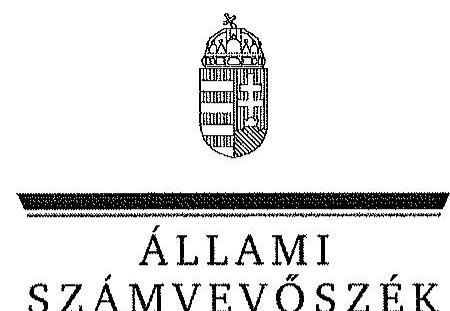
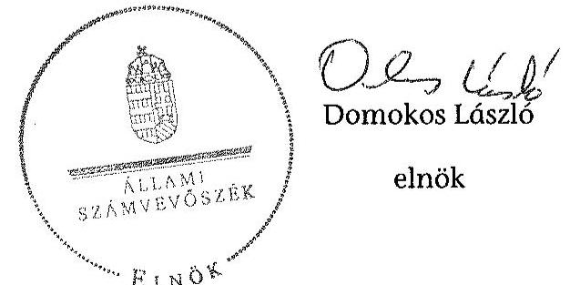
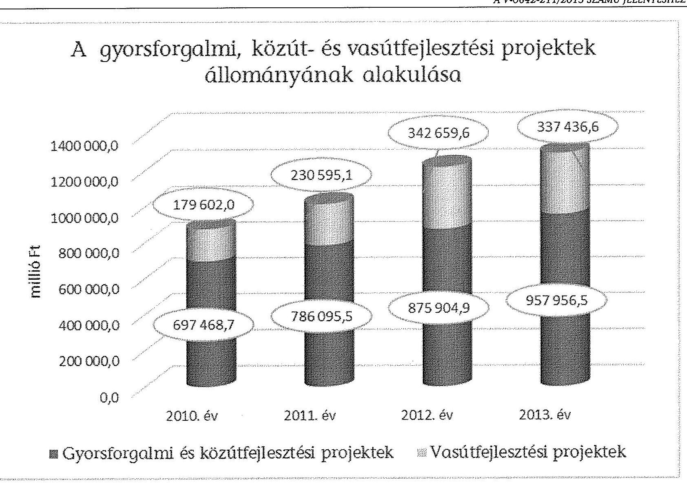
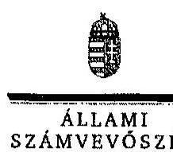
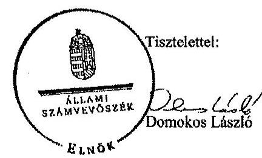
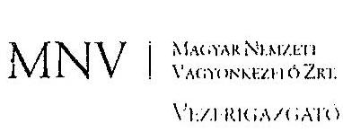
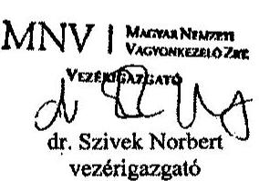
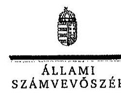
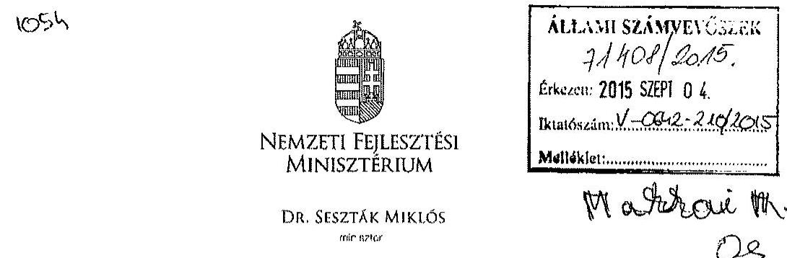
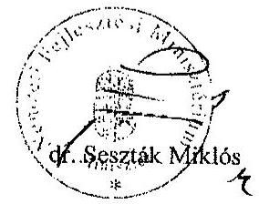

ÁLLAMI
SZÁMVEVŐSZÉK

# JELENTÉS 

Az állami tulajdonban (résztulajdonban) lévő gazdálkodó szervezetek vagyonmegőrzési és gazdálkodási tevékenységének ellenőrzése
Nemzeti Infrastruktúra Fejlesztő Zártkörűen Müködő Részvénytársaság

---

# Állami Számvevőszék 

Iktatószám: V-0642-211/2015.
Témaszám: 1676
Vizsgálat-azonosító szám: V-066601

## Az ellenőrzést felügyelte:

## Makkai Mária

felügyeleti vezető

## Az ellenőrzést vezette és a végrehajtásáért felelős:

## Klinga László

ellenőrzésvezető

## A jelentéstervezet összeállításában közremúködött:

## Fülöp Istvánné

számvevő vezető főtanácsos

## Az ellenőrzést végezték:

| Bárány Terézia | Szaszkó Zoltánné | Varga Magdolna |
| :-- | :-- | :-- |
| okleveles könyvvizsgáló | okleveles könyvvizsgáló | okleveles könyvvizsgáló |
| külső szakértő | külső szakértő | külső szakértő |

## A témához kapcsolódó eddig készített számvevőszéki jelentések:

| címe | sorszáma |
| :-- | :-- |
| Jelentés a gyorsforgalmi úthálózattal kapcsolatban állami felada- | 1003 |
| tot ellátó szervezetrendszer múködésének ellenőrzéséről |  |
| Jelentés a 2009-2010-ben befejeződő autópálya beruházások és | 1118 |
| pénzügyi folyamatai ellenőrzéséről |  |
| Jelentés a vasúti közlekedés állami támogatási rendszerének ellen- | 1292 |
| őrzéséről |  |

---

# TARTALOMJEGYZÉK 

BEVEZETÉS ..... 9
I. ÖSSZEGZŐ MEGÁLLAPÍTÁSOK, KÖVETKEZTETÉSEK, JAVASLATOK ..... 13
II. RÉSZLETES MEGÁLLAPÍTÁSOK ..... 18

1. A tulajdonosi jogok gyakorlója által kialakított vagyongazdálkodási szabályoknak való megfelelés ..... 18
1.1. A vagyon kezelésére kötött szerződés szabályszerűsége és a követelmények előírása ..... 18
1.2. A vagyonnyilvántartás szabályozottsága és a vagyongazdálkodásra vonatkozó jogok meghatározása ..... 19
2. A NIF Zrt. vagyongazdálkodási és vagyonnyilvántartási tevékenységének kialakítása ..... 21
2.1. A vagyongazdálkodási feltételek kialakításának szabályszerűsége ..... 21
2.2. A NIF Zrt. vagyonnyilvántartásának szabályszerűsége ..... 23
3. Az ellátott közfeladat bevételei és ráfordításai elszámolásának és önköltségszámításának a szabályszerűsége ..... 24
3.1. Az ellátott közfeladat bevételei és ráfordításai szabályszerűsége ..... 24
3.2. Az önköltségszámítás szabályszerűsége ..... 28
4. A vagyonváltozást eredményező döntések jogszabályi és tulajdonosi elvárásoknak való megfelelése ..... 28
4.1. A NIF Zrt. vagyongazdálkodási tevékenységének szabályszerűsége ..... 28
4.2. A döntések előkészítésének megalapozása ..... 32
4.3. A tulajdonosi joggyakorló vagyonváltozást eredményező döntéseinek megfelelése ..... 33
5. A belső kontroll és monitoring rendszer kialakítása, működtetése ..... 35
5.1. A vagyon védelmét és a vagyonnal való felelős gazdálkodást biztosító belső kontrollrendszer kialakítása és múködtetése ..... 35
5.2. A monitoring rendszer kialakítása és működtetése ..... 37
5.3. A kormányzati szektorba sorolt egyéb szervezetek adatszolgáltatása ..... 39

---

# MELLÉKLETEK 

1. számú A NIF Zrt. tevékenységének fóbb jellemzői a 2010-2013. években
2. számú A NIF Zrt. eredményének alakulása a 2010-2013. években
3. számú A gyorsforgalmi, közút- és vasútfejlesztési projektek állományának alakulása a 2010-2013. években
4. számú A NIF Zrt. vezérigazgatójának észrevétele
5. számú A NIF Zrt. vezérigazgatójának észrevételére adott válasz
6. számú Az MNV Zrt. vezérigazgatójának észrevétele
7. számú Az MNV Zrt. vezérigazgatójának észrevételére adott válasz
8. számú Az NFM miniszterének nemleges észrevétele

---

# RÖVIDÍTÉSEK JEGYZÉKE 

## EU-s joganyagok

479/2009/EK rendelet

## Törvények

Aptv.

Avtv.

Áht.
ÁSZ tv.
Eisztv.
Gt. tv.
Info tv.

Kbt. 1
Kbt. 2
Kkt.
MFB tv.
Nvtv.
Stabilitási tv.
Számv. tv.
Szja tv.
Tbj. tv.
Vasúti tv.
Vtv.

## Rendeletek

Ávr.
a Tanács 2009. május 25-i 479/2009./EK rendelete az Európai Közösséget létrehozó szerződéshez csatolt, a túlzott hiány esetén követendő eljárásról szóló jegyzőkönyv alkalmazásáról
a Magyar Köztársaság gyorsforgalmi közúthálózatának közérdeküségéről és fejlesztéséről szóló 2003. évi CXXVIII. törvény
a személyes adatok védelméről és a közérdekű adatok nyilvánosságáról szóló 1992. évi LXIII. törvény (hatálytalan 2012. január 1-jétől)
az államháztartásról szóló 2011. évi CXCV. törvény (hatályos 2012. január 1-jétől)
az Állami Számvevőszékről szóló 2011. évi LXVI. törvény az elektronikus információszabadságról szóló 2005. évi XC. törvény (hatálytalan: 2012. január 1-jétől)
a gazdasági társaságokról szóló 2006. évi IV. törvény (hatálytalan: 2014. március 15-étől)
az információs önrendelkezési jogról és az információszabadságról szóló 2011. évi CXII. törvény (hatályos 2011. július 27-étől)
a közbeszerzésekről szóló 2003. évi CXXIX. törvény (hatálytalan: 2012. január 1-jétől)
a közbeszerzésekről szóló 2011. évi CVIII. törvény (hatályos: 2012. augusztus 21-étől)
a közúti közlekedésről szóló 1988. évi I. törvény
a Magyar Fejlesztési Bank Részvénytársaságról szóló 2001. évi XX. törvény
a nemzeti vagyonról szóló 2011. évi CXCVI. törvény (hatályos: 2011. december 31-étől)
Magyarország gazdasági stabilitásáról szóló 2011. évi CXCIV. törvény
a számvitelről szóló 2000. évi C. törvény
a személyi jövedelemadóról szóló 1995. évi CXVII. törvény
a társadalombiztosítási nyugellátásról szóló 1997. évi LXXXI. törvény
a vasúti közlekedésről szóló 2005. évi CLXXXIII. törvény az állami vagyonról szóló 2007. évi CVI. törvény
az államháztartási törvény végrehajtásáról szóló 368/2011. (XII. 31.) Korm. rendelet (hatályos: 2012. január 1-jétől)

---

Vhr.

5/2010. (II. 16.) KHEM rendelet

40/2011. (VIII. 3.) NFM rendelet

353/2011. (XII. 30.)
Korm. rendelet
40/2012. (VII. 10.) NFM rendelet

## Szórövidítések

Alapító Okirat
ÁSZ
EU
FB
KKK
KÖZOP
KVI

KHEM
MFB Zrt.
MNV Zrt.
NA Zrt.

NGM
NIF Zrt., Társaság
NFM
SZMSZ
vagyonkezelési szerződés ${ }_{1}$
vagyonkezelési szerződés $_{2}$
az állami vagyonnal való gazdálkodásról szóló 254/2007. (X. 4.) Korm. rendelet (hatályos: 2007. október 4-étől)
a közlekedési hálózat finanszírozási célokat szolgáló egyes fejezeti kezelésű előirányzatok felhasználásának szabályozásáról, valamint az országos közúthálózattal összefüggő feladatok ellátásáról szóló 5/2010. (II. 16.) KHEM rendelet (hatálytalan: 2011. augusztus 4 -től)
a közlekedési hálózat finanszírozási célokat szolgáló egyes fejezeti kezelésű előirányzatok felhasználásának szabályozásáról, valamint az országos közúthálózattal összefüggő egyes feladatok ellátásáról szóló 40/2011. (VIII. 3.) NFM rendelet (hatálytalan: 2012. július 11 -től)
az adósságot keletkeztető ügyletekhez történő hozzájárulás részletes szabályairól szóló 353/2011. (XII. 30.) Korm. rendelet
a közlekedési infrastruktúrával összefüggő egyes állami feladatok végrehajtásáról, valamint a feladatok végrehajtásához szükséges források felhasználásának szabályairól szóló 40/2012. (VII. 10.) NFM rendelet
a NIF Zrt. Alapító Okirata és annak módosításai
Állami Számvevőszék
Európai Unió
a NIF Zrt. Felügyelőbizottsága
Közlekedésfejlesztési Koordinációs Központ
Közlekedésfejlesztési Operatív Program
Kincstári Vagyoni Igazgatóság, a Magyar Nemzeti Vagyonkezelő Zrt. jogelődje
Közlekedési, Hírközlési és Energiaügyi Minisztérium
Magyar Fejlesztési Bank Zrt.
Magyar Nemzeti Vagyonkezelő Zrt.
Nemzeti Autópálya Zártkörűen Müködő Részvénytársaság, a NIF Zrt. jogelődje
Nemzetgazdasági Minisztérium
Nemzeti Infrastruktúra Fejlesztő Zrt.
Nemzeti Fejlesztési Minisztérium
a NIF Zrt. Szervezeti és Müködési Szabályzat
az NA Zrt. és a KVI között 2006. január 31-én létrejött vagyonkezelői szerződés
az MNV Zrt. és a NIF Zrt. között 2012. december 20-án létrejött, a vagyonkezelői jogviszony teljes újraszabályozására vonatkozó szerződés

---

# ÉRTELMEZŐ SZÓTÁR 

Állami vagyon
2010. június 16 -ig állami vagyonnak minősül:
a) az állami tulajdonban lévő ingó dolog, valamint a dolog módjára hasznosítható természeti erő,
b) az állami tulajdonban lévő termőföldekből álló, külön törvényben szabályozott Nemzeti Földalap,
c) az állami tulajdonban lévő - a b) pont hatálya alá nem tartozó - ingatlan,
d) az állami tulajdonban lévő értékpapír,
e) az államot megillető társasági részesedés és más vagyoni értékű jog.
Forrás: Vtv. 1. § (2) bekezdése
2010. június 17 -től
a) Az állam tulajdonában lévő dolog, valamint a dolog módjára hasznosítható természeti erő,
b) az a) pont hatálya alá nem tartozó mindazon vagyon, amely vonatkozásában törvény az állam kizárólagos tulajdonjogát nevesíti,
c) az állam tulajdonában lévő tagsági jogviszonyt megtestesítő értékpapír, illetve az államot megillető egyéb társasági részesedés,
d) az államot megillető olyan immateriális, vagyoni értékkel rendelkező jogosultság, amelyet jogszabály vagyoni értékű jogként nevesít.
Forrás: Vtv. 1. § (2) bekezdése
2012. november 10 -től az állami vagyon fogalma kiegészül a következő ponttal:
e) az állam tulajdonában lévő pénzügyi eszközök

Forrás: Vtv. 1. § (2) bekezdése
Állami vagyon hasznosítása

2010. december 31-ig:

Az állami vagyont az MNV Zrt. maga kezeli, illetve szerződés - így különösen bérlet, haszonbérlet, szerződésen alapuló haszonélvezet, vagyonkezelés, megbízás - alapján központi költségvetési szervnek, természetes vagy jogi személynek, illetőleg jogi személyiséggel nem rendelkező gazdasági társaságnak hasznosításra átengedi.
Forrás: Vtv. 23. § (1) bekezdése
2011. december 31-ig:

Az állami vagyont az MNV Zrt. maga kezeli, vagy szerződés - így különösen bérlet, haszonbérlet, szerződésen alapuló haszonélvezet, vagyonkezelés, megbízás - alapján központi költségvetési szervnek, természetes vagy jogi személynek, vagy jogi személyiséggel nem rendelkező gazdálkodó szervezetnek hasznosításra átengedi.
Forrás: Vtv. 23. § (1) bekezdése

---

Állami vagyon hasznosítására kötött szerződés

Állami vagyon kezelője /vagyonkezelő
2012. január 1-jétől:

Az állami vagyont az MNV Zrt. maga kezeli, vagy szerződés - így különösen bérlet, haszonbérlet, megbízás alapján központi költségvetési szervnek, természetes vagy jogi személynek, vagy jogi személyiséggel nem rendelkező gazdálkodó szervezetnek hasznosításra átengedi.
Forrás: Vtv. 23. § (1) bekezdése
2013. június 28 -ától:

Az állami vagyonnal az MNV Zrt. maga gazdálkodik, vagy szerződés - így különösen bérlet, haszonbérlet, megbízás - alapján központi költségvetési szervnek, természetes vagy jogi személynek, vagy jogi személyiséggel nem rendelkező gazdálkodó szervezetnek hasznosításra átengedi, illetőleg vagyonkezelésbe, haszonélvezetbe adja.
Forrás: Vtv. 23. § (1) bekezdése
Az állami vagyon hasznosítására kötött szerződések elsődleges célja az állami vagyon hatékony múködtetése, állagának védelme, értékének megőrzése, illetve gyarapítása, az állami és közfeladatok ellátásának elősegítése.
Forrás: Vtv. 23. § (2) bekezdése
2010. január 01 - 2011. december 31. között:

Az állami vagyont az MNV Zrt. maga kezeli, vagy szerződés - így különösen bérlet, haszonbérlet, szerződésen alapuló haszonélvezet, vagyonkezelés, megbízás - alapján központi költségvetési szervnek, természetes vagy jogi személynek, illetőleg jogi személyiséggel nem rendelkező gazdasági társaságnak hasznosításra átengedi.
Vtv. 23. § (1) bekezdése
2012. január 1-jétől:

Az állami vagyont az MNV Zrt. maga kezeli, vagy szerződés - így különösen bérlet, haszonbérlet, megbízás alapján központi költségvetési szervnek, természetes vagy jogi személynek, vagy jogi személyiséggel nem rendelkező gazdálkodó szervezetnek hasznosításra átengedi. Az állami vagyonra vonatkozóan az MNV Zrt. kizárólag az Nvtv-ben meghatározott személyekkel köthet vagyonkezelési szerződést.
Forrás: Vtv. 23. § (1), 27. § (1)
2013. június 28 -ától:

Az állami vagyonnal az MNV Zrt. maga gazdálkodik, vagy szerződés - így különösen bérlet, haszonbérlet, megbízás - alapján központi költségvetési szervnek, természetes vagy jogi személynek, vagy jogi személyiséggel nem rendelkező gazdálkodó szervezetnek hasznosításra átengedi, illetőleg vagyonkezelésbe, haszonélvezetbe adja. Az állami vagyonra vonatkozóan az MNV Zrt. kizárólag az Nvtv-ben meghatározott személyekkel köthet vagyonkezelési szerződést.

---

|  | Forrás: Vtv. 23. § (1), 27. § (1) |
| :--: | :--: |
| Ázsiós tőkeemelés | A jegyzett tőke emelése mellett az átadott vagyon egy része tőketartalékba kerül. |
| Kormányzati szektorba sorolt egyéb szervezet | Az a szervezet, amely az Áht. alapján nem része az államháztartásnak, azonban az Európai Közösséget létrehozó szerződéshez csatolt, a túlzott hiány esetén követendő eljárásról szóló jegyzőkönyv alkalmazásáról szóló 2009. május 25-i 479/2009/EK rendelet szerint a kormányzati szektorba tartozik. A nemzetgazdasági miniszter 2013. június 26 -án megjelent Közleményben tette közé ezen szervezetek listáját. |
| MFB Zrt. | Az MNV Zrt. melletti másik tulajdonosi joggyakorló szervezet az állami vagyon vonatkozásában, amely 2010. június 17 -től gyakorol ilyen jogokat a rábízott állami tulajdonú társasági részesedések tekintetében. |
| MNV Zrt. | Az állami vagyon felett, a Magyar Államot megillető tulajdonosi jogok és kötelezettségek összességét - a hatályos szabályozás szerint - az állami vagyon felügyeletéért felelős miniszter (jelenleg a nemzeti fejlesztési miniszter) gyakorolja. A miniszter feladatát nagy részben az MNV Zrt., mint tulajdonosi joggyakorló szervezet útján látja el. |
| Tulajdonosi jogok gyakorlója | 2010. június16-ig:   Az állami vagyon feletti tulajdonosi jogok és kötelezettségek összességét - ha törvény eltérően nem rendelkezik - a Magyar Állam nevében a Nemzeti Vagyongazdálkodási Tanács (a továbbiakban: Tanács) gyakorolja. A Tanács a feladatait az MNV Zrt. útján, annak ügyvezető szerveként látja el.   Forrás: Vtv. 3. §   2010. június 17 -től:   Az állami vagyon felett a Magyar Államot megillető tulajdonosi jogok és kötelezettségek összességét - ha törvény eltérően nem rendelkezik - az állami vagyon felügyeletéért felelős miniszter (a továbbiakban: miniszter) gyakorolja, aki e feladatát az MNV Zrt., az MFB Zrt., illetve a tulajdonosi joggyakorló szervezet útján látja el. A miniszter miniszteri rendeletben, a törvényben meghatározott állami vagyoni kör tekintetében, meghatározott időtartamra, a joggyakorlás egyes szabályainak meghatározásával - az őt megillető tulajdonosi jogok és kötelezettségek összességének, illetve azok meghatározott részének gyakorlóját az Áht. szerinti központi költségvetési szervek, ezek intézménye, továbbá a 100\%-ban állami tulajdonban álló gazdasági társaságok közül kijelölheti.   Forrás: Vtv. 3. § (1) és (2)   2013. június 28 -ától:   A rábízott állami vagyon felett az államot megillető tulajdonosi jogok és kötelezettségek összességét tulajdonosi joggyakorlóként: |

---

a) ha törvény vagy miniszteri rendelet eltérően nem rendelkezik, az MNV Zrt.,
b) törvényben kijelölt személy vagy
c) az állami vagyon felügyeletéért felelős miniszter (a továbbiakban: miniszter) által rendeletben kijelölt személy gyakorolja.
A miniszter e törvény felhatalmazása alapján - a meghatározott célok hatékonyabb elérése érdekében, miniszteri rendeletben, az ott meghatározott állami vagyoni kör tekintetében, meghatározott időtartamra - e törvény keretei között, a joggyakorlás egyes szabályainak meghatározásával - az államot megillető tulajdonosi jogok és kötelezettségek összességének, illetve azok meghatározott részének gyakorlóját az Áht. szerinti központi költségvetési szervek, ezek intézménye, továbbá a 100\%-ban állami tulajdonban álló gazdasági társaságok közül kijelölheti. Forrás: Vtv. 3. § (1) és (2)

---

# JELENTÉS 

## Az állami tulajdonban (résztulajdonban) lévő gazdálkodó szervezetek vagyonmegőrzési és gazdálkodási tevékenységének ellenőrzése

Nemzeti Infrastruktúra Fejlesztő Zrt.

## BEVEZETÉS

Az Állami Számvevőszék alapvető célkitűzése, hogy az államháztartáson kívülre nyújtott költségvetési támogatások és ingyenes vagyonjuttatások ellenőrzésével járuljon hozzá ahhoz, hogy a közpénzeket az államháztartáson kívül működő szervezetek is átlátható módon használják fel a közfeladatok szerződésben vállalt ellátása érdekében. Az Áht. értelmében a közfeladatok ellátása elsősorban költségvetési szervek alapításával és múködtetésével történik. Az államháztartáson kívüli szervezetek a közfeladatok ellátásában jogszabályban meghatározott feltételekkel közremüködhetnek.

Az állami tulajdonú gazdálkodó szervezetek a nemzeti vagyon részét képezik. Az állami vagyonnal való gazdálkodást illetően a tulajdonosi joggyakorlás és a vagyongazdálkodás feladata az állami vagyon átlátható, rendeltetésszerú és felelős felhasználásának biztosítása. Az állam meghatározza az ellátandó közszolgáltatásokkal kapcsolatos feladatokat, amelyhez a vagyonnal kapcsolatos döntéseknek igazodniuk kell. A nemzetgazdasági szempontból kiemelt jelentőségű nemzeti vagyonban tartandó állami tulajdonban álló társasági részesedést a nemzeti vagyonról szóló törvény tartalmazza.

Az Áht. nevesíti a kormányzati szektorba sorolt egyéb szervezet fogalmát. E körbe tartoznak azok a szervezetek, amelyek nem részei az államháztartásnak, azonban az Európai Közösséget létrehozó szerződéshez csatolt, a túlzott hiány esetén követendő eljárásról szóló jegyzőkönyv alkalmazásáról szóló 2009. május 25 -i 479/2009/EK rendelet szerint a kormányzati szektorba tartoznak. A nemzeti számlák nemzetközi és hazai statisztikai módszertana és szabványai elveket határoznak meg a statisztikai értelemben vett kormányzati szektorba tartozó szervezetek körére és besorolásuk módjára. A szervezetek megnevezését a nemzetgazdasági miniszter teszi közzé.

A kormányzati szektorba sorolt egyéb szervezet többek között köteles adatszolgáltatást teljesíteni a központi költségvetésről szóló törvény elkészítéséhez, továbbá adósságot keletkeztető ügyletet érvényesen csak az államház-tartásért felelős miniszter előzetes hozzájárulásával köthet. A kormányzati szektorba sorolt egyéb szervezet kormányzati szektoron kívüli féllel kötött adósságot kelet-

---

keztető ügylete, gazdálkodásának eredménye befolyásolja a kormányzati szektor konszolldált adósságmutatóját, illetve a kormányzati hiányt.

A közúti és vasúti beruházási feladatbővülésre figyelemmel 2007. február 19ével a Nemzeti Autópálya Zrt. neve Nemzeti Infrastruktúra Fejlesztő Zrt.-re változott. A NIF Zrt. egyszemélyes, 100\%-os állami tulajdonban lévő gazdasági társaság. A tulajdonosi (részvényesi) jogok gyakorlója - az ellenőrzött időszakban - 2010. június 17 -élg a KHEM képviseletében a miniszter volt. Ezt követően a Magyar Fejlesztési Bank Részvénytársaságról szóló 2001. évi XX. törvény alapján a tulajdonosi (részvényesi) jogokat az MFB Zrt. gyakorolta. Az MNV Zrt. az ellenőrzött időszakban vagyonkezelői szerződés keretében a NIF Zrt.-nek vagyonkezelésbe adott állami vagyon feletti tulajdonosi jogokat és kötelezettségeket tulajdonosi joggyakorlóként gyakorolta. Az út és vasút építés céljára megszerzett földterületek vagyonkezelője a fejlesztés és az építés időszakára - az MNV Zrt.-vel kötött vagyonkezelői szerződés alapján - a NIF Zrt. volt.

A Nemzeti Infrastruktúra Fejlesztő Zrt. a Kkt. rendelkezései alapján építtetőnek minősül az országos gyorsforgalmi-, közúthálózat-, valamint az EU támogatással megvalósuló vasútfejlesztési projektek tekintetében. A beruházási értéket tekintve Magyarország legnagyobb állami infrastruktúra-fejlesztő cége a NIF Zrt., amely évente több százmilliárdnyi fejlesztést valósít meg, főként a Közlekedésfejlesztési Operatív Program (KÖZOP) keretében. A NIF Zrt. nem bevétel és eredmény orientált, állami megrendelésre végezte a közlekedési infrastruktúra hálózatfejlesztés építtetői, beruházói feladatait, működése a Kbt.1,2. hatálya alá tartozott. A Társaság a kormányzati alszektorba besorolt gazdálkodó szervezetnek minősült.

A NIF Zrt. központi költségvetési és EU-s forrásokkal gazdálkodott, elkülönült fejezeti források adták a fedezetét a projektek megvalósításának és a szervezet múködésének. Az elkészült, forgalomba helyezett fejlesztések a Magyar Állam kizárólagos forgalomképtelen vagyonát képezik, amelyet az MNV Zrt. közreműködésével a kijelölt vagyonkezelő szervezetnek kell átadni.

A NIF Zrt.-nek nem volt leányvállalata, közös vezetésű vállalata, társult vagy kapcsolt vállalkozása, illetve egyéb részesedési viszonyban álló vállalkozása. A NIF Zrt. ügyvezető szerve 2010. június 20 -áig az Igazgatóság volt, majd azt követően az Igazgatóság jogait a vezérigazgató gyakorolta. Az ellenőrzött időszakban a NIF Zrt. vezérigazgatójának személye két alkalommal változott.

A NIF Zrt. mérlegében a 2013. év végén szereplő összes eszközvagyon 1 535,4 milliárd Ft volt, ebből vagyonkezelésbe átvett vagyon (földterületek) értéke 86,9 milliárd Ft volt. A saját tőkéje a 2013. év végén 99,1 millió Ft, ebből jegyzett tőke 7478,7 millió Ft, az eredménytartalék -7 399,1 millió Ft volt. A NIF Zrt. öszszes bevétele a 2013. évben 154,9 milliárd Ft volt. A NIF Zrt. az ellenőrzött időszakban - a 2013. évet kivéve - negatív mérleg szerinti eredménnyel zárt, a 2013. évben 19,5 millió Ft nyereséget realizált. A NIF Zrt. átlagos statisztikai létszáma a 2013. év végén 318 fő volt (1. számú melléklet).

Az ellenőrzés célja annak értékelése volt, hogy a tulajdonosi jogok gyakorlása szabályszerű volt-e ; a gazdálkodó szervezet által ellátott feladat bevételei, ráfordításai elszámolásának, és vagyongazdálkodási tevékenységének szabályo-

---

zása megfelelt-e a jogszabályi és a tulajdonosi előírásoknak és azok végrehajtása szabályszerű volt-e; biztosítva volt-e a közfeladatok átláthatósága és elszámoltathatósága érdekében a közszolgáltatás dijának megalapozottsága szabályszerű önköltségszámítással; a vagyonváltozást eredményező döntések esetében a tulajdonosi jogok gyakorlója és a gazdálkodó szervezet szabályszerűen jártak-e el; kiépítette és müködtette-e a gazdálkodó szervezet a szabályszerű vagyongazdálkodás érdekében a kontroll és monitoring rendszert; a kormányzati szektorba sorolt egyéb szervezetek gazdálkodásának a kormányzati szektor hiányára és az államadósságra befolyással bíró elemei a jogszabályi előírásoknak megfeleltek-e.

Az ellenőrzés a 2010. január 1-jétől 2013. december 31-ig terjedő időszakra terjedt ki.

Az ellenőrzéssel érintett szervezetek: Az ellenőrzés kiterjedt a Nemzeti Infrastruktúra Fejlesztő Zrt.-re, a Magyar Nemzeti Vagyonkezelő Zrt.-re, a Magyar Fejlesztési Bank Zrt.-re, valamint - a Nemzeti Fejlesztési Minisztérium jogelődjére - a Közlekedési, Hírközlési és Energiaügyi Minisztériumra.

Az ellenőrzés várható hasznosulásaként az ellenőrzés megállapításai a jogalkotás számára segítséget nyújthatnak az államháztartáson kívüli közfeladatellátás, közvagyonnal való gazdálkodás értékeléséhez, jogszabályi keretei pontosításához, az átláthatóságot biztosító szabályozáshoz. Az ellenőrzöttek számára visszajelzést ad a gazdálkodási tevékenységgel, az állami vagyon felhasználásával, a közszolgáltatási árképzés megalapozottságával és az éves elszámolással kapcsolatos szabálytalanságokról és kockázatokról. Az ellenőrzés tapasztalatai segítik és erősítik az ÁSZ hozzáadott értéket teremtő elemző tevékenységét és tanácsadó szerepét. A kormányzati szektorba sorolt, költségvetési tervezésbe is bevont gazdálkodó szervezetek ellenőrzése fokozza a legfőbb ellenőrző szerv iránti figyelmet és közbizalmat.

Az ellenőrzést a számvevőszéki ellenőrzés szakmai szabályai szerint, szabályszerűségi ellenőrzés módszerével, a vonatkozó nemzetközi standardok figyelembevételével végeztük el.

A bevételek és ráfordítások elszámolása, valamint a vagyonnyilvántartás terén a szabályszerű működést mintavétellel ellenőriztük. A kormányzati szektorba sorolt gazdálkodó szervezetek esetében a személyi jellegű ráfordítások elszámolása mellett az egyéb ráfordítások, pénzügyi műveletek ráfordításai, rendkívüli ráfordítások, illetve az egyéb bevételek, pénzügyi műveletek bevételei, rendkívüli bevételek elszámolásának szabályszerűségét szintén mintatételeken keresztül ellenőriztük. A véletlen mintavétellel (évenkénti elemszámmal arányos rétegezéssel) ellenőrzött területek esetében minden egyes tétel vonatkozásában a szabályszerűségre vonatkozó kérdéseket tettünk fel, amelyek eredménye összesítésre került. A jogszabályoknak és a belső előírásoknak megfelelőnek tekintettük az adott területet, amennyiben a minta el-lenőrzésének eredménye alapján $95 \%$-os bizonyossággal a teljes sokaságban a hibaarány kisebb volt, mint $10 \%$, nem megfelelőnek értékeltük, ha a hibaarány a $10 \%$-ot meghaladta. A ráfordítások elszámolására és a vagyon-nyilvántartásra vonatkozó véletlen mintavételt kockázati alapú kiválasztással egészítettük ki, amelynek során évente a három legnagyobb összegű tételt választottuk ki. A

---

tárgyi eszköz beszerzésekre és létesítésekre vonatkozóan mintatétellel ellenőriztük a közbeszerzési eljárások lefolytatását.

Az ellenőrzés végrehajtásának jogszabályi alapját az Állami Számvevőszékről szóló 2011. évi LXVI. törvény 5. § (3)-(5) bekezdései képezték.

Az ÁSZ a 2011. évi LXVI. törvény 29. §-a szerint a jelentéstervezetet megküldte a Nemzeti Infrastruktúra Fejlesztő Zrt., a Magyar Nemzeti Vagyonkezelő Zrt. és a Magyar Fejlesztési Bank Zrt. vezérigazgatójának, valamint a Nemzeti Fejlesztési Minisztérium miniszterének egyeztetésre. A Nemzeti Infrastruktúra Fejlesztő Zrt. vezérigazgatójának észrevételét és az arra adott választ a 4-5. számú melléklet, a Magyar Nemzeti Vagyonkezelő Zrt. vezérigazgatójának észrevételét és az arra adott válaszunkat a 6-7. számú melléklet tartalmazza. A Nemzeti Fejlesztési Minisztérium miniszterének nemleges észrevételét a 8. számú melléklet tartalmazza. A Magyar Fejlesztési Bank Zrt. vezérigazgatója az ÁSZ tv. 29. § (2) bekezdésében foglalt észrevételezési jogával nem élt, a törvényes határidőn belül észrevételt nem tett.

---

# I. ÖSSZEGZŐ MEGÁLLAPÍTÁSOK, KÖVETKEZTETÉSEK, JAVASLATOK 

A NIF Zrt. a gyorsforgalmi-, közút és vasútfejlesztéssel érintett, a Magyar Állam nevében és javára megvásárolt vagy kisajátított földterületeket kizárólag a fejlesztés és az építés időszakára - jogszabályi rendelkezés, illetve vagyonkezelési szerződés alapján - vagyonkezelésbe vette. A NIF Zrt. a már állami tulajdonban és valamely központi költségvetési szerv vagy egyéb vagyonkezelő vagyonkezelésében lévő földrészleteken nem szerzett vagyonkezelői jogot.

Az MNV Zrt. a vagyon érték megőrzését és gyarapítását szolgáló szabályszerű vagyongazdálkodás feltételeit a 2010. január 1.-2012. december 20. közötti időszakban részben megfelelően, azt követően megfelelően alakította ki. Az NA Zrt. és a KVI 2006. január 31-én vagyonkezelési szerződés ${ }_{1}$-t kötött, amelyben az NA Zrt. vagyonkezelésébe kerültek a szerződés függelékeiben kijelölt utak ingatlanai. A vagyonkezelési szerződés ${ }_{1}$-t 2012. december 20-ig a szerződő felek a NIF Zrt. vagyonkezelésébe került, illetve onnan - a 2010. évet megelőzően vagyonátadással kikerült ingatlanok, földterületek körének változása miatt a Vhr. előírása ellenére nem módosították. Az MNV Zrt. 2012. december 20-án a NIF Zrt.-vel - a vagyonkezelői jogviszony teljes újraszabályozásával - a Vhr.ben előírtak figyelembe vételével vagyonkezelési szerződés ${ }_{2}$-t kötött.

Az MNV Zrt. a vagyon-nyilvántartással összefüggő szabályzatot a Vhr.-ben előírtaknak megfelelően elkészítette, ami a NIF Zrt.-re is kiterjedt. Az ellenőrzött időszakban a tulajdonosi (részvényesi) jogokat gyakorló KHEM és MFB Zrt. a tulajdonosi jogait szabályszerűen gyakorolta. A vagyongazdálkodással összefüggésben alapítói határozatokban döntöttek - többek között - a számviteli beszámoló, az éves üzleti és közbeszerzési terv elfogadásáról, az MFB Zrt. az alaptőke felemeléséről és leszállításáról.

Az állami vagyon értékének megőrzését, gyarapítását szolgáló vagyongazdálkodás feltételeit a NIF Zrt. a 2010-2013. években szabályszerűen alakította ki, azok végrehajtása szabályszerű volt. Az ellenőrzött időszakban a NIF Zrt. részére előírt és jóváhagyott projektlistákban szereplő közlekedési fejlesztések megvalósítási ütemeit az éves üzleti tervekben határozták meg. A NIF Zrt. rendelkezett a Számv. tv.-ben előírt és a szervezet sajátosságait figyelembe vevő számviteli politikával, számlarenddel, eszközök és források értékelési szabályzatával, pénzkezelési szabályzattal és önköltségszámítási szabályzattal. A NIF Zrt. leltározási szabályzata 2000. január 31-étől volt hatályban, amit 2011. december 31-éig egy alkalommal (2001. január 1-jén) módosítottak annak ellenére, hogy törvénymódosítás esetén a változásokat a hatálybalépést követő 90 napon belül kell a számviteli politika keretében elkészített leltározási szabályzaton keresztül vezetni. A NIF Zrt. 2012. december 1-jétől hatályba léptette a Számv. tv.ben előírtak figyelembe vételével elkészített új leltározási és leltárkészítési szabályzatát. Az önköltségszámítási szabályzat tartalmazta a beruházások során felmerülő költségek teljes körű meghatározását és azok felosztását. A NIF Zrt. az SZMSZ-ben szabályozta a vagyongazdálkodással kapcsolatos feladat- és hatásköröket, illetve felelősségi viszonyokat. A NIF Zrt. a vagyongazdálkodás so-

---

rán a kezelésbe átvett vagyon folyamatos nyilvántartásáról és az adatszolgáltatás teljesítéséről a Vhr.-ben előírtak szerint gondoskodott.

A NIF Zrt. az elkészült, illetve az építés alatt álló beruházásokat (projekteket), valamint az útépítésekhez kapcsolódóan vagyonkezelésbe vett földterületek értékét tartotta nyilván könyveiben. Ezen túlmenően a fejlesztési projektektől elkülönítetten, a Számv. tv. előírásaival összhangban az immateriális javak és tárgyi eszközök között tartotta nyilván a működési célokat tartósan szolgáló eszközeit. A NIF Zrt. a 2010-2011. években és a 2013. évben a könyveiben kimutatott, a működéssel összefüggő eszközöket és forrásokat egyeztetéssel leltározta, 2012-ben - a működéssel nem összefüggő készleteket kivételével - menynyiségi leltárfelvétel történt. A készleteket a Számv. tv.-ben előírtak ellenére mennyiségben nem leltározták, azokat egyeztetéssel leltározták. A NIF Zrt. az ellenőrzött időszakban a bevételeket és a ráfordításokat elkülönítetten, szabályszerűen számolta el.

Az ellenőrzött időszakban gyorsforgalmi- és közúti projektekhez kapcsolódó, továbbá a 2010-2012. években vasúti pályaszakaszt érintő vagyonátadás nem történt. A 2013. évben két alkalommal, 23 vasúti pályaszakaszt érintő-en öszszesen 152,6 milliárd Ft értékben történt vagyonátadás. Mindkét esetben a szerződő felek a NIF Zrt., a MÁV Magyar Államvasutak Zrt., valamint az MNV Zrt. voltak.

A Kkt. 2012. augusztus 7 -én hatályba lépett módosítását követően a forgalomba helyezett út és az egyes projektekkel kapcsolatban létrehozott vagy megszerzett egyéb eszközök, illetve ezeket magában foglaló, a magyar állam tulajdonában álló egyes földterületek az ideiglenes, vagy ennek hiányában a végleges forgalomba helyezés napján a Kkt. erejénél fogva - a NIF Zrt. vagyonkezelői jogának egyidejű megszűnése mellett - a KKK vagyonkezelésébe kerültek. Az MNV Zrt. és a KKK a vagyonkezelői jog gyakorlásához a Kkt.-ben előírtak ellenére vagyonkezelési szerződést nem kötött. Nem állt rendelkezésre a NIF Zrt. által elkészített elszámolási kimutatás. Az elkészült utak forgalomba helyezését követően a vagyonkezelési szerződés ${ }_{1,2}$ hatálya alá tartozó vagyonelemek köre megváltozott, mivel azok a Kkt. -ben előírtak alapján kikerültek a NIF Zrt. vagyonkezeléséből. A NIF Zrt. a vagyontárgyak körének változása miatt a Vhr.ben előírtak ellenére nem kezdeményezte a vagyonkezelési szerződés ${ }_{1,2}$ hatvan napon belüli egységes szerkezetbe foglalását.

A NIF Zrt. nem tett eleget a Kkt.-ben előírt kötelezettségének, a vagyonkezelői jogának megszűnését követő hat hónapon belül - egy esettől eltekintve - elszámolási kimutatást nem készített. Az elszámolási kimutatás célja az, hogy az érintett eszközöket, ingatlanokat a megszűnés napján nyilvántartott könyv szerinti értéken a NIF Zrt. könyveiből kivezesse és az új vagyonkezelő (KKK) könyveiben azokat nyilvántartásba vegye. A NIF Zrt. a 2013. évi üzleti tervében a gyorsforgalmi- és közúti projektekhez kapcsolódó vagyonátadási értéket 2012. augusztus 7 -ei fordulónappal 674,7 milliárd Ft-ban, a vasúti projektekhez kapcsolódóan 273,3 milliárd Ft-ban mutatta ki.

A NIF Zrt. - vagyonkezelői jogának megszűnését követően - a Kkt. előírásait megsértve szabálytalanul tartotta nyilván könyveiben egyrészt a készletek között a befejezett beruházásokat, másrészt az egyéb követelések között az elké-

---

szült beruházásokhoz kapcsolódóan vagyonkezelésbe vett földterületek értékét. Ebből kifolyólag a NIF Zrt. 2013. évi mérlege nem a valós képet mutatta, mert ezen eszközök értéke jogszerútlenül szerepelt könyveiben. A vagyonátadás hiányában a műszakilag átadott, illetve üzembe helyezett vagyonelemek értéke a vagyonkezelő KKK mérlegében nem szerepelt. A NIF Zrt. eszközeinek értéke 2010. január 1-je és 2013. december 31-e között 693,0 milliárd Ft-tal (82,3\%$\mathrm{kal})$ nőtt. A vagyonátadás elmaradása miatt a mérlegben kimutatott növekedési adat a 2012. augusztus 7-e utáni időszakra vonatkozóan megtévesztő, félrevezető, nem a valós állapotot tükrözi, mivel a NIF Zrt. könyveiben jogszerútlenül szerepeltetett vagyonelemeket tartalmazott.

A földterületek kivételével, amelyek után értékcsökkenés nem számolható el, az érintett vagyonelemek könyvekből történő kivezetése elmaradásának következtében az átadott beruházások eredményeként létrejött vagyonelemek után az értékcsökkenés elszámolása nem történt meg, veszélyeztetve ezzel a vagyonérték megőrzését, fenntartását. Mindezek következtében az érintett vagyonelemek esetében az elvárt összhang helyett a birtokviszony, és a számviteli elszámolás eltért a Kkt.-ben előírtaktól.

A NIF Zrt. gazdálkodását a 2010-2013. években likviditási problémái, valamint rendezetlen tőkehelyzete határozták meg, a saját tőke/jegyzett tőke aránya az ellenőrzött időszakban folyamatosan romlott, a saját tőke a jegyzett tőke értéke alatt volt. Az MFB Zrt. a Gt. tv.-ben kapott felhatalmazás alapján a NIF Zrt. működőképességének fenntartása, valamint a tőkehelyzet rendezése érdekében a 2012-2013. években tőkepótlást, a 2013. évben alap-tőke leszállítást hajtott végre, arról írásban határozott. A NIF Zrt.-nél a 2012. évben két ütemben történt összesen 10000,0 millió Ft-os tőkeemelés és 41354,0 millió Ft összegű alaptőke tőkekivonással való leszállítás. A 2013. évben az MFB Zrt. összességében 7900,0 millió Ft összegben ázsiós tőkeemelést hajtott végre.

A beruházásokkal összefüggésben hozott vagyongazdálkodási döntések jogszabályokon alapultak. A vagyonváltozást eredményező döntések előtt - az előírásokat betartva - az egyeztetési, engedélyeztetési kötelezettséget a NIF Zrt. teljesítette. Az MNV Zrt. a vagyonváltozást eredményező döntések előkészítésével kapcsolatos követelményeket a Vhr.-ben előírtak alapján a vagyonkezelési szerződés ${ }_{1,2}$-ben határozta meg. Az MFB Zrt. az Alapító Ok-iratban írta elő a vagyonváltozást eredményező döntések megalapozását szolgáló üzleti terv készítési kötelezettséget.

A vagyon védelmét, a vagyonnal való felelős gazdálkodást biztosító belső kontrollrendszer a 2010-2013. években részben megfelelő volt. A 2010. június 17-éig tulajdonosi (részvényesi) jogokat gyakorló KHEM a NIF Zrt. részére beszámolási, adatszolgáltatási és egyéb tájékoztatási feladatai elvégzésének rendjét szabályzatban nem írta elő, azonban a 2010. június 18 -ától az MFB Zrt. ennek rendjét belső szabályzatban előírta. Az ellenőrzött időszakban NIF Zrt.-nél múködő FB a hatáskörébe tartozó vagyongazdálkodással kapcsolatos feladatait ellátta. A NIF Zrt. a számviteli beszámoló készítési kötelezettségének határidőben eleget tett, letétbe helyezésekor a Számv. tv.-ben előírt határidőt betartotta. A 2010-2013. évekről készült számviteli beszámolókat a könyvvizsgáló figyelemfelhívó megjegyzéssel látta el. Felhívta a figyelmet minden évben - többek között - a saját tőke/jegyzett tőke arányának csökkenésére, a szállító állományok

---

késedelmes fizetése miatti kamatok, árfolyam kockázataira, a projektek átadásának elmaradására. Az MFB Zrt. az ellenőrzött időszakban négy alkalommal ellenőrzött a NIF Zrt.-nél.

A szabályszerű vagyongazdálkodás érdekében működtetett információáramlási és monitoring rendszer a 2010-2013. években megfelelő volt. Az MFB Zrt. a Stratégiai csoport adatszolgáltatásának eljárási rendjéről szóló utasításban szabályozta a tulajdonolt társaságai részére az adatszolgáltatás eljárási rendjét, amelyben havi, negyedéves és éves adatszolgáltatási kötelezettséget írtak elő. Az MNV Zrt. a vagyonkezelési szerződés ${ }_{1,2}$-ben írta elő a NIF Zrt. adatszolgáltatási, elszámolási és nyilvántartási kötelezettségét. A NIF Zrt. a 20102011. években az Avtv.-ben, 2012-2013. években az Info tv.-ben előírtaknak megfelelően a közérdekű adatok megismerésére irányuló igények teljesítésének rendjét, továbbá az adatvédelmi és adatbiztonsági előírásokat szabályzatban rögzítette. A 2010. évben az Eisztv.-ben, a 2011-2013. években az Info tv.-ben előírt közzétételi kötelezettségeinek eleget tett.

A NIF Zrt., mint a kormányzati szektorba sorolt egyéb szervezet jogszabályban előírt adatszolgáltatási kötelezettségének teljesítése a 2010-2013 években megfelelő volt. Az MFB Zrt. a Stratégiai csoport eljárási rendjében szabályozta az adatszolgáltatással kapcsolatos előírásokat. A NIF Zrt., mint a kormányzati szektorba sorolt egyéb szervezet az MFB Zrt. felé történő adatszolgáltatási kötelezettségének eleget tett. A Társaság gazdálkodásának a kormányzati szektor hiányára és az államadósságra befolyással bíró elemei a jogszabályi előírásoknak megfeleltek. A Társaságnak 2012-től adósságot keletkeztető ügylete nem volt, a halmozott mérleg szerinti eredmény 25 786, 6 millió Ft összegű vesztesége negatívan befolyásolta a kormányzati hiány alakulását. A veszteséget legjelentősebben a beruházási projektek forráshiányos finanszírozása miatti ráfordításokat növelő céltartalék képzése okozta.

Az Állami Számvevőszékről szóló 2011. évi LXVI. törvény 33. § (1) bekezdésében foglaltak értelmében a jelentésben foglalt megállapításokhoz kapcsolódó intézkedési tervet köteles az ellenőrzött szervezet vezetője összeállítani, és azt a jelentés kézhezvételétől számított 30 napon belül az ÁSZ részére megküldeni. Amennyiben az intézkedési tervet határidőben nem küldi meg a szervezet, vagy az nem elfogadható, az ÁSZ elnöke a hivatkozott törvény 33. § (3) bekezdésében foglaltakat érvényesítheti.

Az ellenőrzés intézkedést igénylő megállapításai és javaslatai:

# a NIF Zrt. vezérigazgatójának: 

1. Az ellenőrzött időszakban gyorsforgalmi- és közúti projektekhez kapcsolódó, továbbá a 2010-2012. években vasúti pályaszakaszt érintő vagyonátadás nem történt. A NIF Zrt. a Kkt. 29. § (3e) bekezdésében előírtak ellenére a vagyonkezelői jogának megszűnését követő hat hónapon belül - egy esettől eltekintve - elszámolási kimutatást nem készített annak céljából, hogy az érintett eszközöket, ingatlanokat a megszűnés napján nyilvántartott könyv szerinti értéken a könyveiből kivezesse és az új vagyonkezelő könyveiben azokat nyilvántartásba vegye. A NIF Zrt. a 2013. évi üzleti tervében a gyorsforgalmi- és közúti projektekhez kapcsolódó vagyonátadási értéket

---

2012. augusztus 7 -ei fordulónappal 674,7 milliárd Ft-ban, a vasúti projektekhez kapcsolódóan 273,3 milliárd Ft értékben mutatta ki.

Javaslat:
a) Intézkedjen a vonatkozó jogszabályi előírásnak megfelelően az elszámolási kimutatás elkészítéséről és annak az MNV Zrt. és a KKK részére történő megküldéséről annak érdekében, hogy az érintett eszközöket, ingatlanokat a megszűnés napján nyilvántartott könyvszerinti értéken a NIF Zrt. könyveiből kivezesse.
b) Tegyen intézkedéseket a vagyonátadás elmaradásával összefüggésben feltárt szabálytalanságok tekintetében a felelősség tisztázása érdekében, és szükség szerint intézkedjen a felelősség érvényesítéséről.
2. Az elkészült utak forgalomba helyezését követően a vagyonkezelési szerződés ${ }_{1,2}$ hatálya alá tartozó vagyonelemek (földterületek) köre megváltozott, mivel azok a Kkt. 29. § (3) bekezdésében előírtak alapján a Kkt. erejénél fogva - a NIF Zrt. vagyonkezelői jogának egyidejű megszűnése mellett kikerültek a NIF Zrt. vagyonkezeléséből. A NIF Zrt. a vagyontárgyak körének változása miatt a Vhr. 8. § (2) bekezdésében előírtak ellenére nem kezdeményezte a vagyonkezelési szerződés ${ }_{1,2}$ hatvan napon belüli egységes szerkezetbe foglalását.

Javaslat:
Kezdeményezze - a jogszabályi előírásokkal összhangban - a vagyonkezelési szerződés ${ }_{2}$ módosítását és a módosításokkal egységes szerkezetbe foglalását.

---

# II. RÉSZLETES MEGÁLLAPÍTÁSOK 

## 1. A TULAJDONOSI JOGOK GYAKORLÓJA ÁLTAL KIALAKÍTOTT VAGYONGAZDÁLKODÁSI SZABÁLYOKNAK VALÓ MEGFELELÉS

Az MNV Zrt. a vagyon érték megőrzését és gyarapítását szolgáló szabályszerű vagyongazdálkodás feltételeit a 2010. január 1.-2012. december 20. közötti időszakban részben megfelelően, azt követően megfelelően alakította ki.

### 1.1. A vagyon kezelésére kötött szerződés szabályszerúsége és a követelmények előirása

A NIF Zrt. a gyorsforgalmi-, közút és vasútfejlesztéssel érintett, a Magyar Állam nevében és javára megvásárolt vagy kisajátított földterületeket, kizárólag a fejlesztés és az építés időszakára - jogszabályi rendelkezés, illetve vagyonkezelési szerződés alapján - vagyonkezelésbe vette. A NIF Zrt a már állami tulajdonban és valamely központi költségvetési szerv vagy egyéb vagyonkezelő vagyonkezelésében lévő földrészleteken nem szerzett vagyonkezelői jogot.

Az NA Zrt. és a KVI 2006. január 31-én vagyonkezelési szerződés ${ }_{1}$-t kötött, annak függelékeiben szereplő földterületek vagyonkezelésbe adásáról. A vagyonkezelési szerződés ${ }_{1}$-t - egy alkalommal - 2006. december 8-án módosították, amely nem érintette a vagyonkezelésbe adott ingatlanok körét.

A vagyonkezelési szerződés ${ }_{1}$-t 2006. december 8. és 2012. december 20. közötti időszakban a szerződő felek nem módosították, így nem tettek eleget a Vhr. 8. § (2) bekezdésében foglaltaknak, amely előírja, hogy a felek a vagyontárgyak körének változása esetén kötelesek hatvan napon belül a módosításokkal egységes szerkezetbe foglalni a szerződést.

Az MNV Zrt. 2012. december 20-án a NIF Zrt.-vel - a vagyonkezelői jogviszony teljes újraszabályozásával - vagyonkezelési szerződés ${ }_{2}$-t kötött. A vagyonkezelési szerződés ${ }_{2}$ tartalmát a Vhr. 3. § (1) bekezdésében előírtak figyelembe vételével határozták meg, az abban megfogalmazottak biztosították a tulajdonosi joggyakorlás és a vagyongazdálkodási feladatok szabályozott és átlátható módon történő végrehajtását, beleértve a vagyonkezelő tevékenységének a Vhr. 20. § (1) bekezdésnek megfelelő ellenőrzését is. A szerződéskötés célja az volt, hogy a NIF Zrt.-nek az MNV Zrt. tulajdonosi joggyakorlása alá tartozó állami vagyonra vonatkozó vagyonkezelői jogát, a hatályos jogszabályokkal összhangban teljes körűen szabályozza. Ezen túlmenően az országos közutak építéséhez a Magyar Állam javára a NIF Zrt. által megszerzett ingatlanok vonatkozásában az Nvtv. 11. § (7) bekezdése alapján a kijelöléssel létrejött vagyonkezelői jogát az ingatlan-nyilvántartásba bejegyeztethesse, és vagyonkezelői jogát gyakorolhassa. A vagyonkezelési szerződés ${ }_{2}$-ben meghatározták az országos közútfejlesztésekhez és a vasútfejlesztésekhez kapcsolódó speciális és közös szabályokat egyaránt. Az örökségvédelmi szempontból érintett, valamint a Natura 2000 területként nyilvántartott ingatlanok va-

---

gyonkezelői jogának átadása során rendelkeztek a Vhr. 8. § (4) bekezdésében előírt miniszteri előzetes egyetértéssel.

A vagyonkezelési szerződés ${ }_{2}$ tartalmazta az ellátandó feladatok körét, a vagyonkezelésbe átadott állami vagyon tételes felsorolását, a hatékony múködtetés, az állagvédelem ${ }^{1}$, az értékmegőrzés, illetve gyarapítás biztosításának ${ }^{2}$ előírását. Meghatározták a tulajdonosi joggyakorlás és a vagyongazdálkodási feladatok szabályozott és átlátható módon történő végrehajtását, a vagyon használatának ellenőrzését ${ }^{3}$ és a jogszabályokban bekövetkezett változások átvezetésének feladatát. Rögzítették a vagyonkezelt eszközökkel kapcsolatos adatszolgáltatási ${ }^{4}$ és nyilvántartási kötelezettséget ${ }^{5}$ az MNV Zrt. vagyon-nyilvántartási szabályzatában előírtaknak megfelelően. A vagyonkezelési szerződés ${ }_{2}$-t 2012.december 28 -án kiegészítették, annak mellékleteiben felsorolt, az út- és vasút-beruházásokhoz kapcsolódó ingatlanok projekt kódjával és projekt megnevezésével.

Az MNV Zrt. vagyon-nyilvántartási szabályzatának kötelezö megismerésére vonatkozó előírást a Vhr. 14. § (3) bekezdésében foglaltakkal összhangban a vagyonkezelési szerződés ${ }_{1,2}$-ben rögzítették.

Az NA Zrt. a vagyonkezelési szerződés ${ }_{1}$-ben nyilatkozott arról, hogy a KVI va-gyon-nyilvántartási és ellenőrzési szabályzatát megismerte. A NIF Zrt. a vagyonkezelői szerződés ${ }_{2}$-ben kijelentette, hogy az MNV Zrt. vagyon-nyilvántartási szabályzatát megismerte és azt magára nézve kötelező érvényűnek ismeri el.

Az elkészült utak forgalomba helyezését követően a vagyonkezelési szerződés ${ }_{1,2}$ hatálya alá tartozó vagyonelemek (földterületek) köre megváltozott, mivel azok a Kkt. 29. § (3) bekezdésében előírtak alapján kikerültek a NIF Zrt. vagyonkezeléséből. A NIF Zrt. a vagyontárgyak körének változása miatt a Vhr. 8. § (2) bekezdésében előírtak ellenére nem kezdeményezte a vagyonkezelési szerződés ${ }_{1,2}$ hatvan napon belüli egységes szerkezetbe foglalását.

# 1.2. A vagyonnyilvántartás szabályozottsága és a vagyongazdálkodásra vonatkozó jogok meghatározása 

Az MNV Zrt. a vagyon-nyilvántartási szabályzatát a Vhr. 14. § (3) bekezdésében előírtaknak megfelelően elkészítette, amit a 46/2008. számú vezérigazgatói utasítással kiadott. A szabályzatot a 8/2009. számú vezérigazgatói utasítással módosították.

Az MNV Zrt. a 266/2013. (VII. 29.) vezérigazgatói határozattal - 2013. július 29- ével - hatályba léptette a vagyon-nyilvántartási eljárásrendről szóló

[^0]
[^0]:    ${ }^{1}$ Vhr. 9. § (6) bekezdés
    ${ }^{2}$ Vtv. 23. § (2) bekezdés
    ${ }^{3}$ Vhr. 3. § (1) bekezdés
    ${ }^{4}$ Vhr. 14. § (1) bekezdés
    ${ }^{5}$ Vhr. 14. § (3) bekezdés

---

szabályzatot, mellyel egyidejűleg az addig hatályban lévő szabályzatot hatályon kívül helyezték.

Az ellenőrzött időszakban hatályban lévő vagyon-nyilvántartási szabályzat és vagyon-nyilvántartási eljárásrendről szóló szabályzat hatálya kiterjedt a Vtv. 1. § (2) bekezdésében meghatározott állami vagyon kezelőire, így a NIF Zrt.-re is. A szabályzatokban a Vhr. 14. § (3) bekezdése szerint meghatározták többek között - a vagyonnyilvántartás feladatait, az adatszolgáltatással kapcsolatos feladatokat, a vagyonkezelő adatszolgáltatásának tartalmát, informatikai hátterét, valamint a határidőket. Az MNV Zrt. vagyon-nyilvántartási szabályzata előírta a vagyonkezelők számára olyan számviteli politika és nyilvántartás kialakítását, amely biztosítja az adatszolgáltatási kötelezettségük pontos teljesítését és ellenőrizhetőségét.

A NIF Zrt. feletti tulajdonosi (részvényesi) jogok gyakorlója a Társaság részesedései tekintetében 2010. június 17-éig a KHEM képviseletében a miniszter volt. Ezt követően az MFB tv. 3. § (5) bekezdése alapján a NIF Zrt. az állami tulajdonú részesedése tekintetében a tulajdonosi (részvényesi) jogokat az MFB Zrt. gyakorolta. Az MNV Zrt. az ellenőrzött időszakban a Vtv. 3. § (1) bekezdése alapján a NIF Zrt.-nek vagyonkezelői szerződéssel vagyonkezelésébe adott állami vagyon (földterület) feletti tulajdonosi jogokat és kötelezettségeket tulajdonosi joggyakorlóként gyakorolta. A vagyonkezelési szerződés ${ }_{1}$ nem tartalmazott az MNV Zrt. (a jogelőd KVI) részére fenntartott jogokat. A vagyonkezelési szerződés ${ }_{2}$-ben az MNV Zrt. jogait a Vhr. 9.-11. §-aiban előírtak figyelembevételével előírták.

A KHEM - mint tulajdonosi (részvényesi) joggyakorló 2010. június 17-éig jogait, hatáskörét és eljárási szabályait az Alapító Okirat tartalmazta. A közgyűlés hatáskörébe tartozó ügyekben a tulajdonosi (részvényesi) jogokat gyakorló KHEM képviseletében a miniszter vagy meghatalmazottja döntött.

Az állami tulajdonú részesedése tekintetében a tulajdonosi (részvényesi) jogokat 2010. június 18. és 2013. december 31. közötti időszakban az MFB Zrt. gyakorolta. A tulajdonosi jogait, hatásköreit és az eljárási szabályokat szintén az Alapító Okirat tartalmazta, amelynek 2010. július 1-jei módosítását követően Igazgatóság választására nem került sor, annak jogait a Gt. tv. 247. § előírása alapján a vezérigazgató gyakorolta.

Az ellenőrzött időszakban a tulajdonosi (részvényesi) jogokat gyakorló KHEM és MFB Zrt. a tulajdonosi jogait szabályszerűen gyakorolta. A vagyongazdálkodással összefüggésben alapítói határozatban döntöttek - többek között a számviteli beszámoló elfogadásáról, az éves üzleti és közbeszerzési terv elfogadásáról, az MFB Zrt. az alaptőke felemeléséről és leszállításáról.

A NIF Zrt. a 13/2010. számú vezérigazgatói utasításban szabályozta a vagyonkezelési és vagyongazdálkodási feladatok ellátásának eljárásrendjét. A vezérigazgatói utasítás célja a vagyonkezelésében lévő ingó- és ingatlanvagyon költséghatékony hasznosítása érdekében átlátható, tervezhető eljárások rögzítése, az egyes feladatok, felelősségi körök lehatárolása volt.

---

# 2. A NIF ZRT. VAGYONGAZDÁlKODÁSI És VAGYONNYILVÁNTARTÁSI TEVÉKENYSÉGÉNEK KIALAKÍTÁSA 

### 2.1. A vagyongazdálkodási feltételek kialakításának szabályszerűsége

Az állami vagyon értékének megőrzését, gyarapítását szolgáló vagyongazdálkodás kialakítása a NIF Zrt.-nél a 2010-2013. években megfelelő volt.

Az ellenőrzött időszakban a NIF Zrt. részére előírt és jóváhagyott projektlistákban szereplő közlekedési fejlesztések, ezen belül az európai uniós operatív programok (kiemelten a KÖZOP) megvalósítási ütemeit az éves üzletei tervekben határozták meg - gyorsforgalmi, közút- és vasútfejlesztési - feladatonként.

Az éves üzleti tervekben bemutatták az egyes évek végéig várható előrejelzéseket, a tulajdonosi irányelveket, gazdálkodási és makroszintű mutatókat, a gyorsfor-galmi-, közút-, vasútfejlesztési projekt preferenciákat és költségvetési forrásait, azok előirányzati korlátait, az európai uniós támogatások jóváhagyott és tervezett támogatási szerződéselt, továbbá a takarékos gazdálkodás követelményeit a múködési költségek tervezésében.
A tulajdonosi joggyakorlók (KHEM, MFB Zrt.) az üzleti terv részeként írták elő a vagyongazdálkodással összefüggő feladatok tervezését.
A vagyonnal való gazdálkodás szabályozása az ellenőrzött időszakban összhangban volt a tulajdonosi joggyakorló által elvárt követelményekkel. A NIF Zrt. elkészítette a Számv. tv. 14. § (3) bekezdésében előírt és a Társaság sajátosságait figyelembe vevő számviteli politikát, amit vezérigazgatói utasításokban ${ }^{6}$ jóváhagyott. A szabályozás tartalmazta a közvagyonra történő jogszabályi hivatkozásokat, illetve az értékcsökkenési leírás módszerét, az elszámolás gyakoriságát.
A NIF Zrt. az ellenőrzött időszakban rendelkezett a Számv. tv. 161. §-ában előírt számlarenddel, amelyben az ellátott közfeladat bevételeinek és ráfordításainak elkülönített nyilvántartási rendjét meghatározták.
A Számv. tv. 14. § (5) bekezdés b) pontjában előírtaknak megfelelően a számviteli politikában szabályozták az eszközök és források értékelésének szabályait. Ebben előírták az eszközök és források értékelésére, a devizás eszközök és források értékelésére, értékhelyesbítésre, értékelési tartalékra és az értékvesztés elszámolására vonatkozó szabályokat.

A NIF Zrt. - a jogelőd NA Rt. által készített - leltározási szabályzata 2000. január 31-étől az 1/2000. számú vezérigazgatói utasítással lépett hatályba és 2012. november 30 -áig volt hatályban. Módosítására mindössze egy alkalommal, 2001. január 1-jén került sor. A 2001. január 1-jén hatályba lépett Számv. tv. 14. § (11) bekezdése kimondta, hogy törvénymódosítás esetén a vál-

[^0]
[^0]:    ${ }^{6} 3 / 2010$. számú Vezérigazgatói Utasítás hatályos 2009. december 1-től; 5/2011. számú Vezérigazgatói Utasítás hatályos 2011. január 1-től; 24/2012. számú Vezérigazgatói Utasítás hatályos 2012. október 1-től.

---

tozásokat a hatálybalépést követő 90 napon belül kell a számviteli politikán, így az annak keretében elkészített leltározási szabályzaton keresztül vezetni. A Társaság a törvénymódosításból eredő változásokat a leltározási szabályzaton nem vezette át. A NIF Zrt. a saját környezetében bekövetkezett változások feladatok kibővülése, névváltozás, szervezet átalakítás - a leltározási szabályzaton történő átvezetéséről sem gondoskodott annak ellenére, hogy a Számv. tv. 14. § (3) bekezdése előírja a gazdálkodó adottságainak, körülményeinek leginkább megfelelő számviteli politika kialakításának kötelezettségét. A NIF Zrt. 2012. december 1-jétől hatályba léptette a Számv. tv. 69. § (1)-(6) bekezdéseiben elöirtak figyelembe vételével elkészített új leltározási és leltárkészítési szabályzatát, amelyet a 28/2012. számú vezérigazgatói utasítással jóváhagyott. A selejtezéssel összefüggő szabályokat a leltározási szabályzatban írták elő.

A NIF Zrt. az ellenőrzött időszakban rendelkezett a jogelődje által 2001. január 1-jétől hatályba léptetett, a Számv. tv. 14. § (5) bekezdés c) pontja alapján a számviteli politika keretében elkészített, az önköltségszámítás rendjére vonatkozó belső szabályzattal. Az önköltségszámítási szabályzatot 2012. január 1-jei hatállyal aktualizálták. A szabályzatban részletesen meghatározták a közvetlenül és közvetetten elszámolható költségek körét. A szabályzat tételesen tartalmazta a projektekre elszámolható közvetlen és közvetett költségek elemeit, valamint a projektekre el nem számolható költségek körét.

A NIF Zrt. a 8/2008. számú vezérigazgatói utasítással hatályba léptette pénzkezelési szabályzatát, amelyet a 9/2012. vezérigazgatói utasítással, 2012. május 25 -ei hatállyal módosított.

A NIF Zrt. a vagyongazdálkodás feltételeinek kialakítására a vagyon értékének megőrzésére, gyarapítására kötött vagyonkezelési szerződés ${ }_{1 / 2}$ tartalmazott - tulajdonosi joggyakorló által előírt - speciális korlátozásokat és előírásokat.

A vagyonkezelési szerződés ${ }_{1}$-ben speciális előírásként rögzítették, hogy a függelékekben szereplő földterületekre vonatkozó vagyonkezelői jogát az ingatlan nyilvántartásba bejegyeztesse és a jogerős földhivatali bejegyző határozat másolatát 30 napon belül a KVI részére megküldje. Előírták, hogy az NA Zrt. a vagyonkezelői jog körében köteles a kincstári vagyont érintően a vonatkozó jogszabályokat, szabványokat, hatósági, szakhatósági és műszaki előírásokat betartani, az állag-, föld-, és környezetvédelem, a természeti területek védelme során, valamint a kincstári vagyon használatából adódó egyéb esetben.

A vagyonkezelési szerződés ${ }_{2}$-ben a Kkt. 29. § (1) bekezdése alapján speciális szabályként rögzítették, hogy az országos közút fejlesztéséhez szükséges, a NIF Zrt. által a Magyar Állam javára megvásárolt, illetve kisajátított földrészlet a rajta lévő vagyonelemekkel együtt, ellenérték nélkül a NIF Zrt. vagyonkezelésébe kerül. Előírták továbbá, hogy a vasútfejlesztés céljából történő vagyonkezelésbe adás ingyenesen történik. Rendelkeztek arról, hogy a NIF Zrt. a Vhr. 9. § (6) bekezdés b) pontja szerinti értéknövelő beruházásokról és felújításokról évente a tárgyévet követő május 31 -élg összesített tájékoztatást ad az MNV. Zrt. részére.

A NIF Zrt. a 2009. március 10-étől hatályban levő SZMSZ-ben szabályozta a vagyongazdálkodással kapcsolatos feladat- és hatásköröket, illetve felelősségi

---

viszonyokat. Az SZMSZ tartalmazta az ingatlanok hasznosításával (önkormányzati tulajdonba adás, bérlet, haszonbérlet, értékesítés, csere, stb.) kapcsolatos szerződések, megállapodások előkészítése során felmerülő feladatokat, amely a Területszerzési és Vagyonkezelési Osztály feladatkörébe tartozott. A 13/2010. számú vezérigazgatói utasítás a Vtv. 27. §-ával, a Vhr. 9.-11. §-val, valamint az SZMSZ-szel összhangban részletesen szabályozta a vagyonkezelési, vagyongazdálkodási feladatok ellátásának rendjét. Rendelkeztek a felépítménnyel rendelkező, illetve felépítménnyel nem rendelkező ingatlanok esetében felmerülő feladatokról, az értékesítési eljárások lefolytatásának rendjéről, a hasznosítási eljárások lefolytatásáról, az őrzési feladatok ellátásáról, a bontási munkálatok végzéséről, valamint a kaszálás, gyommentesítés ellátásáról, állagmegóvási feladatokról.

# 2.2. A NIF Zrt. vagyonnyilvántartásának szabályszerűsége 

A NIF Zrt. saját vagyona és a kezelésében lévő állami vagyon előírások szerinti nyilvántartása a 2010-2013. években részben megfelelő volt.
A NIF Zrt. a kezelésbe átvett vagyon folyamatos nyilvántartásáról és az adatszolgáltatás teljesítéséről a Vhr. 14. § (1)-(2) bekezdéseiben előírtak szerint gondoskodott.

A NIF Zrt. a beruházásokat (projekteket) - mint állami vagyont -, valamint az útépítésekhez és vasúti projektekhez kapcsolódó földterületek értékét, mint vagyonkezelő tartotta nyilván könyveiben. A NIF Zrt. könyveit az SAP R/3 integrált vállalatirányítási rendszerben vezette, míg elszámolási, adatszolgáltatási és ellenőrzési folyamatait három elektronikus rendszer támogatta, amelyek egymással integráltak, így a rendszerek közötti adatáramlás biztosított volt.

- SAP (pénzügyi és számviteli információk);
- PDE (beruházási projektek tervezése és ellenőrzése);
- MIT-TERSZER (területszerzés és beruházási projektek műszaki információí).

A projektek különböző szintekre történő lekérdezését egy kódrendszer biztosította.

A NIF Zrt. a múködési célokat tartósan szolgáló eszközeit a Számv. tv. 25. § (1) bekezdésében előírtaknak megfelelően az immateriális javak, valamint a Számv. tv. 26. § (1) bekezdésében előírtakkal összhangban a tárgyi eszközök között, a fejlesztési projektektől elkülönítetten tartotta nyilván.

A NIF Zrt. a 2010-2011. években és a 2013. évben a könyveiben kimutatott, a múködéssel összefüggő eszközöket és forrásokat egyeztetéssel leltározta. A Számv. tv. 69. § (3) bekezdésében és az aktualizált leltározási szabályzatban előírtak alapján a 2012. évben mennyiségi leltárfelvétel történt. A mennyiségi leltár kiterjedt a Társaság tulajdonát képező működési célú vagyon teljes körű mennyiségi és értékbeli számbavételére.

A NIF Zrt.-nek - a múködéssel nem összefüggő - készleteket (projekteket a terület nélkül) a leltározási szabályzatban előírtak alapján mennyi-

---

ségben háromévente kellett leltároznia, amelyet a forgalomba helyezési jegyzőkönyv vagy üzembe helyezési jegyzőkönyv, vagy a megvalósulási térkép alapján dokumentáltak. A közbülső években a főkönyv és az analitika egyeztetésével kellett a leltározást elvégezni. A készletekre adott előlegeket évenként egyeztetéssel leltározták az SAP-ból szerződés számra lekérdezett és összesített analitikával. A leltározási szabályzat előírásával ellentétben a 2012. évi leltár nem terjedt ki a készletek mennyiségi leltározására, azokat egyeztetéssel leltározták.

# 3. Az ellátott közfeladat bevételei és ráfordításai elszámolásáNAK És ÖNKÖLTSÉGSZÁMÍTÁSÁNAK A SZABÁLYSZERŰSÉGE 

### 3.1. Az ellátott közfeladat bevételei és ráfordításai szabályszerűsége

Az ellátott közfeladat bevételeinek és ráfordításainak elkülönített, szabályszerű elszámolása a 2010-2013. években megfelelő volt.

A NIF Zrt. által elkészített belső szabályzatok (számviteli politika, számlarend, számlatükör) előírásai biztosították az ellenőrzött időszakban a ráfordítások és a bevételek egyértelmű elhatárolásának feltételeit. Szabályozták a költségelszámolás módszerét, az analitikus nyilvántartások módját, az egyeztetések időpontját a főkönyvi könyveléssel, a főkönyvi számlákat érintő gazdasági eseményeket, a főkönyvi számlák egyenlegét érintő növelő és csökkentő tételeket, valamint a főkönyvi számlák más számlákkal való kapcsolatát. A NIF Zrt.-nél a bevételek és ráfordítások elkülönítése a múködés és a megvalósított beruházások (projektek) vonatkozásában mind a szabályozás, mind az alkalmazott gyakorlat során megvalósult.

A NIF Zrt. a számlarendben szabályozta a ráfordítások és bevételek elkülönített elszámolását. A költségeket az 5. számlaosztályban költségnemek szerinti bontásban, a ráfordításokat a 8. számlaosztályban könyvelték, árbevételt a 91. számlacsoportban tevékenységenként különítették el. A NIF Zrt.-nek a közfeladat ellátásából nem származott bevétele, dijbevétele nem volt, múködési kiadásait alapvetően múködési támogatásból finanszírozta.

Az anyagjellegú ráfordítások elszámolása során a NIF Zrt. szabályszerűen járt el. A költségelszámolást megalapozó kötelezettségvállalás, a költségnemre és közfeladatra történő elszámolás a Számv. tv. 161/A. § (2) bekezdésében megfogalmazott előírásoknak és a belső szabályozásnak (számviteli politikának és számlarendnek) megfelelően történt.

Az anyagjellegű ráfordítások elszámolása az ellenőrzött mintatételek vonatkozásában a megfelelő költségnemekre, illetve főkönyvi számlákra kerültek elszámolásra. A kiadások megalapozottságát alátámasztó dokumentumok, szerződések, megállapodások rendelkezésre álltak. A költségek és ráfordítások feladatokra történő elkülönítése megtörtént.

Az értékesítés nettó árbevételeinek elszámolása során a NIF Zrt. szabályszerűen járt el. A bevételek előírása és kiszámlázása a belső szabályo-

---

zásnak (számviteli politikának és számlarendnek) megfelelően történt, a bevételeket a megfelelő számlacsoportban számolták el.

Az értékesítések nettó árbevételét a 911140 főkönyvi számon elszámolt árbevételek között könyvelték a Számv. tv. 72. § (1)-(4) bekezdéseiben előírtaknak megfelelően.

A beruházások, felújítások kiadásai és az értékcsökkenési leírás elszámolása során a NIF Zrt. szabályszerűen járt el. A kiadást megalapozó kötelezettségvállalás, a pénzügyi elszámolás, a kontírozás, valamint az értékcsökkenések elszámolása a jogszabályi előírásoknak és a belső szabályozásnak megfelelően történt. Az ellenőrzött immateriális javak és tárgyi eszközök szerepeltek a mérleget alátámasztó leltárban.

Az értékcsökkenési leírás elszámolása a Számv. tv. 52. § (1)-(7) bekezdéseiben és a számviteli politikában előírtaknak megfelelően történt. Az értékcsökkenés az üzembe helyezés napjától a selejtezés, illetve az értékesítés napjáig került elszámolásra, és havonta könyvelésre.

A 2010-2012. években az elszámolt értékcsökkenés összegei meghaladták a tárgyi eszközök értéknövekedését. A 2013. évben kismértékben ugyan, de a tárgyi eszközök értéknövekedése ( 153,2 millió Ft ) meghaladta az elszámolt értékcsökkenés ( 150,4 millió Ft) összegét. Az ellenőrzött időszakban a terv szerint elszámolt értékcsökkenés összege 572,6 millió Ft volt, míg a tárgyi eszközök értéknövelésére 336,8 millió Ft összeget fordítottak. Beruházásokra fejlesztési forrást nem kapott a NIF Zrt., azokat az üzleti terv részét képező éves beruházási terv alapján a múködési támogatásából finanszírozta. A 2010-2013. évi beszámolók kiegészítő mellékletében a Számv. tv. 92. § (1) bekezdésében előírtaknak megfelelően bemutatták az értékcsökkenési leírás összegeit.

A Társaság alaptevékenysége nem minősül vállalkozási tevékenységnek, a beruházásokat törvényi felhatalmazás alapján, nem ellenérték fejében végezte. A NIF Zrt. - finanszírozási forrástól függetlenül - minden beruházási projekt (gyorsfor-galmi-, közút- és vasútfejlesztési beruházások) értékét a készletek között mutatta ki. A Társaság a beruházásokat nem vette rendeltetésszerűen használatba, a létrehozott eszközöket nem helyezte üzembe, ennek megfelelően a beruházási projektek eszközei kapcsán értékcsökkenési leírás elszámolására sem került sor.

A NIF Zrt. az ellenőrzött időszakban a követelés állomány csökkentése érdekében szükséges intézkedéseket szabályozta és ennek megfelelően járt el. A NIF Zrt. a Számv. tv. 29. § (1)-(9) bekezdéseiben előírtaknak megfelelően a vevő követeléseket a beszámolóban az adósok által elismert értéken szerepeltette, amelyet a vevőkövetelések esetében az egyenlegegyeztető levelek, visszaigazolások alátámasztottak.

A követelések között a mérlegben vevő követeléseket és egyéb követeléseket mutatott ki a NIF Zrt. A követeléseken belül a vevőkövetelések - a 2011. év kivételével - nem voltak jelentős összegűek ${ }^{7}$ az ellenőrzött időszakban. A lejárt vevő követelésekre a számviteli politikában szabályozottak szerint, egyedi értékelés

[^0]
[^0]:    ${ }^{7}$ A vevőkövetelések összege 2010-ben 12,2 millió Ft, 2011-ben 168,9 millió Ft, 2012-ben 38,1 millió Ft, 2013-ban 23,4 millió Ft volt.

---

alapján két évben értékvesztést számoltak el, amelynek összege a 2012. évben 3,8 millió Ft a 2013. évben 2,5 millió Ft volt. A vevő követelések minősítését a 2010-2011. években elvégezték, az értékelések alapján értékvesztés elszámolására nem volt szükség.

Az egyéb követelések között ${ }^{8}$ a földterületekkel kapcsolatos elszámolások szerepeltek. Az ellenőrzött időszakban az 5/2010. (II. 16.) KHEM rendelet, a 40/2011. (VIII. 3.) NFM rendelet és a 40/2012. (VII. 10.) NFM rendelet alapján a NIF Zrt. rendelkezett azon forrásokkal, amelyekből a területszerzés költségei finanszírozhatóak voltak a kivitelezés ideje alatt. Az egyéb követeléseket, mint technikai eszköz számlát alkalmazták a földterületek nyilvántartására a vagyonkezelés időszaka alatt, mivel ezek a területek nem kerülnek a beruházási projektek értékébe. A gyorsforgalmi, közút- és vasútfejlesztési beruházásokhoz a Magyar Állam tulajdonába megszerzett földterületek beszámolóban kimutatott értéke 2013. december 31 -én 86,9 milliárd Ft volt.

A beruházási projektek végleges vagyon átadásával egyidejüleg a Magyar Állam nevében és javára megszerzett területek is kivezetésre kerülnek a NIF Zrt. egyéb követelés állományából és átadásra kerülnek a végleges vagyonkezelő részére.Ezek alapján kimutatott egyéb követelés állomány behajtására intézkedésre nem volt szükség.

A NIF Zrt. a végrehajtható egyéb követelései behajtásáról - a 20/2010. és a 16/2013. számú vezérigazgatói utasításokban foglaltak alapján - jogi úton gondoskodott.

A szabályozás a végrehajtható követeléseket bírósági peres vagy nem peres eljárás keretében, fizetési meghagyásos eljárásban a Társaság javára jogerősen elbírált és a kötelezett által a teljesítési határidőben meg nem fizetett követelések behajtását határozta meg.

Az ellenőrzött időszakban a NIF Zrt. az egyes kisajátítási határozatok felülvizsgálatára indított peres eljárások kapcsán felhalmozódott követelések rendezésére a Számv. tv. 54. § (10) bekezdésében előírtak figyelembe vételével 199,8 millió Ft összegben számolt el értékvesztést.

A NIF Zrt.-nek a kormányzati szektor hiányára befolyást gyakorló bevételek és ráfordítások elszámolása szabályszerú volt, azok elkülönítéséről gondoskodtak.

A személyi jellegű ráfordítások elszámolása során a NIF Zrt. szabályszerűen járt el. A személyi juttatások kifizetését dokumentumokkal alátámasztották, a bruttó bér számfejtése megfelelt a munkaszerződésekben foglaltaknak. A munkavállalót terhelő járulékok, adók levonása megfelelt a jogszabályi előírásoknak.

A személyi jellegű ráfordításokat a Számv. tv. 79. § (1)-(4) bekezdéseiben előírtak figyelembe vételével határozták meg, illetve a belső munkaügyi és cafetéria

[^0]
[^0]:    ${ }^{8}$ Az egyéb követelések összege 2010-ben 114275 millió Ft, 2011-ben 118644 millió Ft, 2012-ben 122003 millió Ft, 2013-ban 87292 millió Ft volt.

---

szabályzat előírásai alapján számolták el. Az ellenőrzött időszakban a személyi jellegű ráfordítások elszámolását minden esetben alátámasztotta a munkaidő nyilvántartás. A munkavállalókat terhelő levonások és járulékok elszámolása a Szja. tv. 46-49. §. és a Tbj. tv. 19-24. §-aiban foglaltaknak megfelelt. A cafetéria juttatások elszámolását és kifizetését a dolgozók nyilatkozatának megfelelően, az éves keretösszegek figyelembe vételével hajtották végre. Az új belépő és leszámoló dolgozók esetében az időarányos elszámolást megfelelően alkalmazták.

Az egyéb ráfordítások, pénzügyi műveletek ráfordításai, rendkívüli ráfordítások elszámolása során a NIF Zrt. szabályszerűen járt el. A ráfordítások elszámolása, valamint az elszámolást megalapozó dokumentum (szerződések, kimutatások, banki kivonatok) megfelelt a jogszabályban és belső szabályzatokban foglaltaknak.

Az egyéb ráfordítások a Számv. tv. 81. § (1)-(5) bekezdései, a pénzügyi műveletek ráfordításai a Számv. tv. 83. § (3) bekezdése, a rendkívüli ráfordítások elszámolása a Számv. tv. 86. § (6)-(9) bekezdései, továbbá a számviteli politika és a számlarend alapján történt. A költségelszámolást megalapozó dokumentumok (határozatok, kamatszámítások, banki bizonylatok) rendelkezésre álltak, a ráfordításokat a számlarendben foglaltak szerint a megfelelő főkönyvi számlákra számolták el. Rendkívüli ráfordításként került elszámolásra a Számv. tv. 86. § (7) bekezdés előírásainak megfelelően a vagyonátadás során kivezetett eszközök könyv szerinti értéke.

Az egyéb bevételek, pénzügyi műveletek bevételei, rendkívüli bevételek elszámolása során a NIF Zrt. szabályszerűen járt el. A bevételek elszámolása, valamint az elszámolást megalapozó dokumentumok (banki bizonylatok, támogatási szerződések, kamatszámítások), megfeleltek a jogszabályban és belső szabályzatban foglaltaknak. A kapott támogatások elszámolása során a jogszabályi előírások szerint jártak el.

Az egyéb bevételek elszámolása a Számv. tv. 77. § (1)-(7) bekezdései, a pénzügyi műveletek bevételei elszámolása a Számv. tv. 83. § (2) bekezdése, a rendkívüli bevételek elszámolása a Számv. tv. 86. § (3)-(5) bekezdései előírásának megfelelően és a számviteli politikában meghatározottak alapján történt. Az egyéb bevételek között mutatták ki a támogatási szerződés szerinti működésre kapott támogatást, és a jelentős összegű képzett céltartalék felhasználást. Az előírtaknak megfelelően a pénzügyi bevételek között került elszámolásra a folyósított támogatások időszakos lekötéséből származó kamatbevétel. Rendkívüli bevételként számolták el a vagyonátadással összefüggésben a halasztott bevételek között nyilvántartott fejlesztési támogatások feloldását.

A 2010-2012. években a NIF Zrt.-nek a mérleg szerinti eredménye negatív volt ${ }^{9}$, a 2013. évben 19,5 millió Ft nyereséget realizáltak (2. számú melléklet). A halmozott mérleg szerinti eredmény 25 786, 6 millió Ft összegű vesztesége negatívan befolyásolta a kormányzati hiány alakulását. A veszteséget a be-

[^0]
[^0]:    ${ }^{9} 2010$-ben -10,6 milliárd Ft, 2011-ben -4,6 milliárd Ft, 2012-ben -10,5 milliárd Ft volt az eredmény.

---

ruházási projektek forráshiányos finanszírozása miatti ráfordításokat növelő céltartalék képzése okozta. A mérlegben kimutatott céltartalék összege 2010ben 10994,1 millió Ft, 2011-ben 16 470,2 millió Ft, 2012-ben 27 235,5 millió Ft, 2013-ban 26 267,5 millió Ft volt. A NIF Zrt. eredményét jelentősen befolyásolta továbbá az euróban fizetendő szállítói tartozások kiegyenlítéséből fakadó árfolyam különbözet, valamint a fizetett és a kapott kamatok különbsége.

A 2013. évben osztalék kifizetés nem történt.

# 3.2. Az önköltségszámítás szabályszerűsége 

Az önköltségszámítás feltételeinek kialakítása és müködtetése a 2010-2013. években szabályszerű volt.

A NIF Zrt. közszolgáltatási tevékenységet nem végzett, annak díjbevételéből árbevétele nem származott, így erre vonatkozóan a jogszabályok és a tulajdonosi joggyakorló elvárásai nem írták elő a közszolgáltatás árképzését megalapozó önköltségszámítási szabályzat készítését.

A Társaság 2012. január 1-jétől aktualizálta az önköltségszámítási szabályzatot, amelynek előírásait az EU által finanszírozott projektek menedzsment költségeinek meghatározására és felosztására alakítottak ki. A szabályozás célja, hogy a projektberuházások során felmerült és elszámolt tényleges költségeket teljes körűen meghatározza és ezen költségeket a beruházásokkal kapcsolatban az elszámolt munkaidő arányában felossza, ezzel megteremtve a projektmenedzsment költségek elszámolási lehetőségét. Az alkalmazott önköltségszámítás módszere a tevékenység végzése után készülő teljes pótlékoló utókalkuláció, amelyet évente, az év végi zárás keretében végeztek el.

A szabályzatban a közvetlen és közvetett költségeket elkülönítették. A felosztandó közvetett költségek vetítési alapját a projektekre közvetlenül ráfordított óraszámban határozták meg a sajátos tevékenységnek megfelelően. A kalkulációs egységre közvetlenül elszámolható költségek, a vetítési alap szerint felosztható közvetett költségek és az el nem számolható költségek meghatározásánál figyelembe vették a szakmai sajátosságokat.

## 4. A VAGYONVÁLTOZÁST EREDMÉNYEZŐ DÖNTÉSEK JOGSZABÁLYI ÉS TULAJDONOSI ELVÁRÁSOKNAK VALÓ MEGFELELÉSE

### 4.1. A NIF Zrt. vagyongazdálkodási tevékenységének szabályszerűsége

A vagyon értékének megőrzéséről, gyarapításáról való gondoskodás a 20102013. években részben megfelelő volt.

---

A vagyoni helyzetet jellemző, főbb könyvviteli mérleg szerinti adatok 2010. január 1. és 2013. december 31. között a következők voltak:

| Megnevezés | 2010.01.01 | 2010.12.31 | 2011.12.31 | 2012.12.31 | 2013.12.31 |
| :--: | :--: | :--: | :--: | :--: | :--: |
| Befektetett eszközök | 562,7 | 391,2 | 312,3 | 261,8 | 230,2 |
| ebből: tárgyi eszközök | 309,4 | 182,3 | 131,4 | 102,3 | 100,3 |
| Forgóeszközök ebből: készletek | $\begin{array}{r} 841814,1 \\ 716500,5 \\ 109087,1 \end{array}$ | $\begin{array}{r} 1006237,8 \\ 873642,7 \\ 114287,3 \end{array}$ | $\begin{array}{r} 1157019,3 \\ 1014017,1 \\ 118813,1 \end{array}$ | $\begin{array}{r} 1373513,3 \\ 1218326,9 \\ 122041,8 \end{array}$ | $\begin{array}{r} 1534638,1 \\ 1412001,4 \\ 87315,9 \end{array}$ |
| Aktív időbeli elhatárolások | 137,8 | 144,0 | 286,7 | 284,9 | 611,7 |
| ESZKÖZÖK ÖSSZESEN | 842514,6 | 1006773,0 | 1157618,3 | 1374060,0 | 1535480,0 |
| Saját tőke ebből: jegyzett tőke | $\begin{array}{r} 54340,0 \\ 47320,0 \end{array}$ | $\begin{array}{r} 43701,4 \\ 47320,0 \end{array}$ | $\begin{array}{r} 39076,9 \\ 47320,0 \end{array}$ | $\begin{array}{r} 38533,9 \\ 47520,0 \end{array}$ | $\begin{array}{r} 99,1 \\ 7478,7 \end{array}$ |
| mérleg szerinti eredmény | $-1454,1$ | $-10638,6$ | $-4624,4$ | $-10543,1$ | 19,5 |
| Céltartalékok | 34,5 | 10994,1 | 16470,2 | 27235,5 | 26267,5 |
| Kötelezettségek | 89074,5 | 97429,7 | 94221,1 | 111015,0 | 128518,7 |
| Passztív időbeli elhatárolások | 699065,6 | 854647,8 | 1007850,1 | 1197275,6 | 1380594,7 |
| FORRÁSOK ÖSSZESEN | 842514,6 | 1006773,0 | 1157618,3 | 1374060,0 | 1535480,0 |

A NIF Zrt. eszközeinek értéke 2010. január 1-je és 2013. december 31-e között 692 965,4 millió Ft-tal ( $82,3 \%$-kal) nőtt. A vagyonnövekedést döntően a forgóeszközökön belül a készletek állományának 695 500,9 millió Ft-os emelkedése eredményezte. A számviteli politikában előírtak alapján, a készletek között elszámolt gyorsforgalmi, közút- és vasútfejlesztési beruházások értéke 2013. december 31-én 1295 393,1 millió Ft volt. (3. számú melléklet). Az eszközérték növekedés nem a NIF Zrt. gazdasági tevékenységével összefüggésben keletkezett, mivel feladatát törvényi felhatalmazások útján látta el, továbbá alapvetően nem nyereség és nem bevétel orientált tevékenységet folytat. A vagyonátadás elmaradása miatt a mérlegben kimutatott növekedési adat a 2012. augusztus 7-e utáni időszakra vonatkozóan megtévesztő, félrevezető, nem a valós állapotot tükrözi mivel a NIF Zrt. könyveiben jogszerútlenül szerepeltetett vagyonelemeket tartalmazott.

A befektetett eszközök csökkenésének jellemző oka, hogy a működési (saját) vagyon tekintetében az elszámolt értékcsökkenés összegei meghaladták az immateriális javak és tárgyi eszközök értéknövekedését.

Az aktív időbeli elhatárolások ellenőrzött időszakon belüli növekményét a bevételek időbeli elhatárolásából adódóan a 2014-ben folyósított, 2013. december hónapot érintő 424,6 millió Ft múködési támogatás összege, valamint a lekötött pénzeszközök időarányos 89,8 millió Ft-os kamata eredményezte.

A saját tőke 2013. december 31-ei értéke 54 240,1 millió Ft-tal volt kevesebb a 2010. január 1-jei állapothoz képest, amit legnagyobb mértékben a jegyzett tőke és a tőketartalék csökkenése befolyásolt. A NIF Zrt.-nél a 2012.

---

évben két ütemben történt összesen 10000,0 millió Ft-os tőkeemelés. Az első ütemben 4000,0 millió Ft, amelyből 100,0 millió Ft a jegyzett tőkébe 3900,0 millió Ft a tőketartalékba került elszámolásra a nemzeti fejlesztési miniszter 2012. március 21 -én kelt $2 / 2012$. számú engedélye alapján. A második ütemben 6000,0 millió Ft, amelyből 100,0 millió Ft a jegyzett tőkébe, 5900,0 millió Ft a tőketartalékba került elszámolásra. Az MFB Zrt. a 12/2012. (XI. 14.) számú alapítói határozatban döntött az alaptőke tőkekivonással való leszállításáról. A jegyzett tőke 40042,0 millió Ft-tal, míg a tőketartalék 1312,0 millió Ft-tal csökkent, így a saját tőke csökkenés összesen 41354,0 millió Ft -ot tett ki.

A mérlegben a Magyar Állammal szembeni követelések között a 2006. december 31-ig ideiglenesen, vagy véglegesen forgalomba helyezett kiemelt közútfejlesztési és gyorsfogalmi beruházások, 2000-2002. években saját tőkéből finanszírozott, vagyonkezelőnek már átadott utak értékét tartalmazta, amelynek összege 41354,0 millió Ft volt. Az elszámolások elmaradása miatt a Társaság és a Magyar Állammal szembeni követelésének egyidejú rendezését tőkeemeléssel, majd ezt követően az alaptőke leszállításával biztosították.

A 2013. évben az MFB Zrt. 2900,0 millió Ft ázsiós tőkeemelést ${ }^{10}$ hajtott végre, amelyből 1,0 millió Ft jegyzett tőkeként került elszámolásra. A 2013. évben az MFB Zrt. alapítói határozattal ${ }^{11}$ két ütemben további 2500,0-2500,0 millió Ft összegű ázsiós tőkeemelést hajtott végre, amely során 1,0-1,0 millió Ft a jegyzett tőkeként került elszámolásra, míg a fent maradó 2499,0 millió Ft2499,0 millió Ft a tőketartalékba került.

Az MFB Zrt. által folyósított 5000 millió Ft-ot a NIF Zrt. a tulajdonossal szembeni rövid lejáratú kötelezettségként mutatta ki a 2013. évi beszámolójában, mivel a cégbírósági bejegyzés 2013. december 31 -éig nem történt meg.

A NIF Zrt.-nek a Stabilitási tv. 3. §-a szerinti adósságot keletkeztető ügylete 2012. január 1-jét követően nem volt.

A likviditási helyzet kezelése érdekében az MFB Zrt. a 19/2011. (XII. 23.) számú alapítói határozatában 10,0 milliárd Ft összegű hitel nyújtásáról határozott, amelyből a NIF Zrt. 2011. december 28-án 3,9 milliárd Ft-ot lehívott. A Társaság a lehívott összeget 2012 márciusában az MFB Zrt.által végrehajtott 4,0 milliárd Ft összegű tőkeemelésből visszafizette.

A NIF Zrt. a 2010. évtől a Számv. tv. 41. § (1) pontjában előírtak figyelembe vételével - jelentős összegű - céltartalékot képzett a projektekkel (gyorsforgalmi utak, közutak és vasutak) kapcsolatos készletek és források egyensúlyának megteremtése érdekében. A céltartalékok összege 2013. december 31-én elérte a 26267,5 millió Ft-ot, ami a 2010. január 1-jei állapothoz viszonyítva 26 233,0 millió Ft növekedést jelentett. A céltartalékot - többek között - a terület kisajátítási eljárások, peres eljárások miatt fizetett (fizetendő) összegek, késedelmi kamatfizetési terhek, szabálytalansági vizsgálatok megállapításai

[^0]
[^0]:    ${ }^{10} 5 / 2013$. (VI. 19.) számú alapítói határozat
    ${ }^{11} 9 / 2013$. (XI. 21.) számú alapítói határozat és a 10/2013. (XII. 19.) számú alapítói határozat

---

miatt visszafizetendő támogatások, továbbá a projektekkel kapcsolatos készletek és források egyensúlyának megteremtése érdekében képeztek.

A kötelezettségek állománya 2013. december 31-én 128518,7 millió Ft volt, ami összességében 39444,2 millió Ft-tal nőtt 2010. január 1-jei állapothoz viszonyítva. A kötelezettségeken belül a rövid lejáratú kötelezettségek állománya 70,4\%-kal nőtt, ennek összege 2013. december 31-én 110852 millió Ft volt. Ezen belül a szállítói állomány 49570 millió Ft-ot tett ki, amelyből a lejárt esedékességű kötelezettség 12696 millió Ft volt. Ebből a 30 napon túli tartozás 6542 millió Ft, míg az egy évnél régebbi tartozás 980,2 millió Ft volt.

A passzív időbeli elhatárolások állománya 2013. december 31-én 1380594,7 millió Ft volt, ami 681 529,1 millió Ft-tal haladta meg a 2010. január 1-jei összeget. A gyorsforgalmi-, közút-, és vasútfejlesztési beruházások megvalósítása érdekében kapott költségvetési és európai uniós támogatásokat a passzív időbeli elhatárolásokon belül halasztott bevételként tartotta nyilván a NIF Zrt. mindaddig, amíg ezen forrásokból finanszírozott beruházás (készlet) átadásra nem kerül az MNV Zrt.-nek.

A NIF Zrt. az immateriális javak és a tárgyi eszközök között szabályosan, csak a saját működése érdekében beszerzett javakat és eszközöket tartotta nyilván, amelyek hosszú távon szolgálták a feladatai ellátását. Ezek az eszközök jellemzően irodai berendezések és felszerelések, számítástechnikai eszközök, szoftverek, gépjárművek, illetve egyéb eszközök voltak. A vagyonkezelésben lévő földterületekre vonatkozóan a Vtv. 27. § (2) bekezdésében foglaltakkal összhangban az állagmegórásról, karbantartásról, múködtetésről a 13/2010. számú vezérigazgatói utasításban előírtak szerint gondoskodtak.

A NIF Zrt. csak az út- és vasútépítésekkel kapcsolatos földterületek esetében rendelkezett vagyonkezelői feladatokkal. Mivel a Számv. tv. 52. § (5) bekezdése alapján a földterület bekerülési (beszerzési) értéke után értékcsökkenés nem számolható el, valamint ezeket a földterületeket a forgóeszközökön belül az egyéb követelések között tartották nyilván, ebből adódóan a Vhr. 9. § (9) bekezdés d) pontjában előírt visszapótlási kötelezettség nem állt fenn.

A NIF Zrt. gazdálkodását a 2010-2013. években likviditási problémái, valamint rendezetlen tőkehelyzete határozták meg, a saját tőke/jegyzett tőke aránya az ellenőrzött időszakban folyamatosan romlott, a saját tőke a jegyzett tőke értéke alatt volt ${ }^{12}$. A peres eljárások miatt kifizetett, illetve esetlegesen fizetendő elmarasztalások, a késedelmi kamatfizetési terhek, a projektekkel kapcsolatos készletek és források egyensúlyának megteremtése, valamint a szabálytalansági vizsgálatok megállapításaiból adódóan visszafizetendő támogatások folyamatosan újratermelték a forráshiányt.

A működési költségek, ráfordítások és bevételek tételes kimutatását az éves beszámoló részeként elkészített üzleti jelentések tartalmazták.

[^0]
[^0]:    ${ }^{12}$ A saját tőke/jegyzett tőke aránya 2010-ben 92,4\%, 2011-ben 82,6\%, 2012-ben 81,1\%, 2013-ban $1,3 \%$ volt.

---

# 4.2. A döntések előkészítésének megalapozása 

A NIF Zrt. vagyonváltozást eredményező döntéseinek a jogszabályi és a belső előírásoknak való megfelelősége, valamint hozzájárulása a vagyon értékének megőrzéséhez, gyarapításához megfelelő volt.

A NIF Zrt. közlekedési szakmai programokat valósított meg, a vagyongazdálkodási döntésekkel összefüggésben a közép- és hosszú távú tervek jóváhagyását követően az éves feladatok megvalósításában vett részt. A vagyongazdálkodáshoz kapcsolódó döntések előtt - az előírásokat betartva - az egyeztetési, engedélyeztetési kötelezettséget a NIF Zrt. teljesítette.

A NIF Zrt. Alapító Okirata - többek között - tartalmazott az MFB Zrt. által meghatározott, a vagyongazdálkodási döntések előterjesztéseire előírást. Ebben a vezérigazgató hatáskörébe utalt feladatok között előírták az FB előzetes véleményezési és jóváhagyási döntéseinek eseteit.

A Társaság a megszerzett ingatlanok vagyonmegőrzésére és gazdaságos hasznosítására vonatkozó tevékenysége során a vagyonkezelési, vagyongazdálkodási feladatok ellátásának rendjéről szóló 13/2010. számú vezérigazgatói utasítás szerint járt el.

A NIF Zrt. a közbeszerzési eljárásai lefolytatásának rendjét a Kbt. ${ }_{1}$ és a Kbt. 2 előírásainak figyelembe vételével vezérigazgatói utasításokban szabályozta. A közbeszerzési szabályzat előírta annak évente történő felülvizsgálatát, melyet 2013-ban nem végeztek el. A kisértékű beszerzések eljárásrendjét a közbeszerzés hatálya alá nem tartozó szerződések megkötésének rendjéről szóló 14/2009. számú vezérigazgatói utasítás szabályozta. A mintavétellel ellenőrzött tárgyi eszköz beszerzésére, létesítésére irányuló közbeszerzési eljárásokat a NIF Zrt. a Kbt. ${ }_{1}$ és a Kbt. 2 előírásainak, valamint a közbeszerzési szabályzatban előírtaknak megfelelően lefolytatta.

Az MFB Zrt. az éves üzleti terv részét képező beszerzési tervet véleményezte. A beszerzéseket megelőzően a NIF Zrt.-nek - értékhatártól függetlenül - egyeztetni kellett az MFB Zrt.-vel a beszerzés tárgyára, értékére vonatkozóan. Az országos közúti projektek megvalósítása esetében a NIF Zrt. a Kkt. 29. § (1) bekezdése alapján kizárólagos építtető, ezért közbeszerzési eljárást is csak a NIF Zrt. indíthatott.

Az ellenőrzött időszakban a NIF Zrt. - az üzleti jelentések alapján - 582 db közbeszerzési eljárást fejezett be, amelyek eredményeként nettó 1164, 9 milliárd Ft és nettó 48,1 millió euró összértékben kötött szerződéseket. A NIF Zrt. által 2010-2013. években lefolytatott közbeszerzési eljárásokhoz kapcsolódóan a Közbeszerzési Döntőbizottság 13 esetben, összességében a nyertes ajánlattevő kiválasztásakor elkövetett eljárásrendi szabálytalanság miatt 24,3 millió Ft bírság megfizetésére kötelezte a Társaságot.

---

# 4.3. A tulajdonosi joggyakorló vagyonváltozást eredményező döntéseinek megfelelése 

A tulajdonosi jogok gyakorlója vagyonváltozást eredményező döntései a jogszabályi és a belső előírásoknak való megfelelősége, valamint hozzájárulásának a vagyon értékének megőrzéséhez, gyarapításához az alábbiak szerint megfelelő volt.
Az MFB Zrt. az Alapító Okiratban elöírta a NIF Zrt. részére az üzleti terv készítési kötelezettséget, amely a tulajdonosi joggyakorló hatáskörébe tartozó döntések megalapozását szolgálta. Az üzleti tervek tartalmi követelményeként határozták meg a gazdálkodásra, a bér- és létszámra, a projektteljesítmények időbeli alakulására és a közbeszerzésekre vonatkozó tevékenységek és adatok bemutatását.
Az MNV Zrt. a vagyonváltozást eredményező döntések előkészítésével kapcsolatos követelményeket a Vhr. 9. § (3)-(4), valamint (6) bekezdéseiben előírtak alapján a vagyonkezelési szerződés ${ }_{1,2}$-ben határozta meg.

A 2013. évben két alkalommal, háromoldalú vagyonrendezési, vagyonátadási és vagyonkezelésbe adási szerződés keretében történt vagyonátadás összesen 152,6 milliárd Ft értékben, ahol mindkét esetben a szerződő felek a NIF Zrt., a MÁV Magyar Államvasutak Zrt., valamint az MNV Zrt. voltak ${ }^{13}$. A vagyonátadások 23 vasúti pályaszakaszt érintettek, amelyből egy "mintaprojekt" tekintetében, - amelyre a Cegléd vasútállomás átépítése tárgyú projekt lett kijelölve - a NFM miniszter 2013. szeptember 6-án adta meg egyetértési záradékát, míg a további 22 projekt elszámolására vonatkozóan 2013. december 13-án. A 2010-2012. években nem történt vasúti pályaszakaszt érintő vagyonátadás. Az ellenőrzött időszakban a NIF Zrt. nyilvántartásában szereplő gyorsforgalmi- és közúti projektekhez kapcsolódó vagyonátadás nem történt.
A NIF Zrt. a Kkt. 29. § (3e) bekezdésében előírtak ellenére a vagyonkezelői jogának megszűnését követő hat hónapon belül - egy esettől eltekintve - elszámolási kimutatást nem készített annak céljából, hogy az érintett eszközöket, ingatlanokat a megszűnés napján nyilvántartott könyv szerinti értéken a könyveiből kivezesse és az új vagyonkezelő (KKK) könyveiben azokat nyilvántartásba vegye. A NIF Zrt. a 2013. évi üzleti tervében a gyorsforgalmi- és közúti projektekhez kapcsolódó vagyonátadási értékét 2012. augusztus 7 -ei fordulónappal 674,7 milliárd Ft-ban, a vasúti projektekhez kapcsolódóan 273,3 milliárd Ft-ban rögzítette ${ }^{14}$.
A Kkt. 2012. augusztus 7 -én hatályba lépett módosításának 29. § (3) bekezdésében foglaltak alapján a forgalomba helyezett út és az egyes projektekkel kapcsolatban létrehozott vagy megszerzett egyéb eszközök, illetve ezeket magában foglaló, a magyar állam tulajdonában álló egyes földterületek

[^0]
[^0]:    ${ }^{13}$ Az ÁSZ a 2012. évben kiadott 1292. sorszámú „a vasúti közlekedés állami támogatási rendszerének ellenőrzéséről" szóló jelentésében megfogalmazottakkal hozzájárult a vagyonátadás megkezdéséhez. Az ÁSZ által tett megállapításra a szerződés bevezető részében kitértek.
    ${ }^{14}$ 2013. évi üzleti terv

---

az ideiglenes, vagy ennek hiányában a végleges forgalomba helyezés napján a Kkt. erejénél fogva - a NIF Zrt. vagyonkezelői jogának egyidejű megszűnése mellett - a Kkt. 32. § (6) bekezdésében kijelölt KKK vagyonkezelésébe kerültek. A Kkt. 29. § (3) bekezdésében előírtak ellenére az MNV Zrt. és a KKK a vagyonkezelői jog gyakorlásához elengedhetetlen vagyonkezelési szerzödést nem kötött. Nem állt rendelkezésre a NIF Zrt. által elkészített elszámolási kimutatás.

A NIF Zrt. - vagyonkezelői jogának megszűnését követően - a Kkt. 29. § (3) bekezdésének előírásait megsértve szabálytalanul tartotta nyilván könyveiben egyrészt a készletek között a befejezett beruházásokat, másrészt az egyéb követelések között az elkészült beruházásokhoz kapcsolódóan vagyonkezelésbe vett földterületek értékét. Ebből kifolyólag a NIF Zrt. 2013. évi mérlege nem a valós képet mutatta, mert ezen eszközök értéke jogszerütlenül szerepelt könyveiben. A vagyonátadás hiányában a műszakilag átadott, illetve üzembe helyezett vagyonelemek értéke a vagyonkezelő KKK mérlegében nem szerepeltek.

Az érintett vagyonelemek könyvekből történő kivezetése elmaradásának következtében az átadott beruházások eredményeként létrejött vagyonelemek után az értékcsökkenés elszámolása nem történt meg, veszélyeztetve ezzel a vagyonérték megőrzését, fenntartását. Mindezek következtében az érintett vagyonelemek esetében az elvárt összhang helyett a birtokviszony, és a számviteli elszámolás eltért a Kkt.-ben előírtaktól.

Az MNV Zrt. a vagyon értékesítésére vonatkozó döntést a vagyonkezelésbe adott földterületekkel kapcsolatos hasznosítások esetében hozott. A NIF Zrt. a 13/2010. számú vezérigazgatói utasításban írta elő a hasznosítással összefüggő szabályokat, figyelembe véve a Vtv. 24. §-ában és a Vhr. 4. §-ában előírtakat. Az ellenőrzött időszakban a földterületek hasznosítása (bérbeadás, MOL Zrt. földhasználati díj) - a szabályozásban előírtakkal összhangban - minden esetben versenyeztetés útján történt, amelyből összességében 204,4 millió Ft bevételt realizáltak.

A NIF Zrt. nyilvántartása, felmérései alapján, kérelemre vagy hivatalból kezdeményezte a vagyonkezelésében levő ingatlanvagyon hasznosítását. Amennyiben a hasznosítás akadályba nem ütközött a Társaság felterjesztette az erre vonatkozó kérelmet az MNV Zrt. részére hasznosítási eljárás megindítása céljából. A versenyeztetési eljárás megindítása, a pályázati felhívás közzététele előtt az ajánlatkérési dokumentációt és a hasznosításra vonatkozó szerződéstervezetet NIF Zrt. jóváhagyásra megküldte az MNV Zrt. részére.

Az ellenőrzött időszakban az immateriális javak és tárgyi eszközök értékesítéséből összesen 53,3 millió Ft bevétel keletkezett, amelyből a 2013. évben történt gépjármú értékesítés bevétele 42,3 millió Ft-ot tett ki. Az értékesítések értékbecslést követően, a Vtv. 33-35. §-aiban meghatározottak figyelembe vételével, vezérigazgatói döntések alapján, az MFB Zrt. tájékoztatása mellett történtek.

A vagyonátadással és a vagyonértékesítéssel összefüggő tulajdonosi döntések a belső szabályzatokban meghatározottak alapján történtek.

---

# 5. A BELSŐ KONTROLL ÉS MONITORING RENDSZER KIALAKÍTÁSA, MÜKÖDTETÉSE 

### 5.1. A vagyon védelmét és a vagyonnal való felelős gazdálkodást biztosító belső kontrollrendszer kialakítása és múködtetése

A vagyon védelmét, a vagyonnal való felelős gazdálkodást biztosító belső kontrolrendszer - a vagyonkezelésbe adott vagyont érintő tulajdonosi ellenőrzés elmaradása miatt - a 2010-2013. években részben megfelelő volt.
A 2010. június 17-éig tulajdonosi (részvényesi) jogokat gyakorló KHEM a NIF Zrt. részére beszámolási, adatszolgáltatási és egyéb tájékoztatási feladatai elvégzésének rendjét szabályzatban nem írta elő. Az adatszolgáltatást a NIF Zrt. a KHEM által kialakított online felületen keresztül teljesítette.
A 2010. június 18-ától tulajdonosi (részvényesi) jogokat gyakorló MFB Zrt. a beszámolási, adatszolgáltatási és egyéb tájékoztatási feladatok rendjét a NIF Zrt. részére belső szabályzatban előírta. Az MFB Zrt. a Stratégiai csoport adatszolgáltatásának eljárási rendjéről szóló $7 / 2011$. számú ${ }^{15}$ vezérigazgatói utasításában szabályozta a tulajdonolt társaságai részére az adatszolgáltatás eljárásrendjét. A szabályzat havi, negyedéves, éves és eseti jelleggel írt elő - a szabályzatban meghatározott tartalommal - adatszolgáltatási kötelezettséget a NIF Zrt. részére, amit az előírásnak megfelelően az MFB Zrt. Infrastrukturális Igazgatóságán keresztül teljesített. A NIF Zrt. a 12/2011. számú vezérigazgatói utasításban szabályozta a rendszeres számviteli főkönyvi zárásra vonatkozó előírásokat a 7/2011. számú vezérigazgatói utasításában meghatározottak figyelembe vételével.

A szabályozás annak érdekében készült, hogy a tulajdonos a NIF Zrt. üzleti folyamatairól, a pénzügyi helyzetéről, a gazdálkodást alapvetően befolyásoló tényezőkről rendszeres tájékoztatást kapjon és a szükséges információk időben rendelkezésre álljanak a tulajdonosi döntések meghozatalához. Ennek érdekében a Társaságnál havi számviteli főkönyvi zárást rendeltek el.

Az ellenőrzött időszakban NIF Zrt.-nél FB múködött, amely feladatát a Gt. tv. 34. § (4) bekezdésében előírt ügyrend alapján látta el. Az FB 2010. július 1-jétől három főből állt, ezt megelőzően hat fővel működött.

Az FB az ellenőrzött időszakban a hatáskörébe tartozó vagyongazdálkodással kapcsolatos feladatait - az üléseiről készült jegyzőkönyvek alapján - ellátta. Az ellenőrzött időszakban a Gt. tv. 35. § (3) bekezdésben előírtakat betartva az FB írásbeli jelentést készített a Számv. tv. szerint elkészített beszámolókról, a tulajdonos az éves beszámoló jóváhagyásáról ennek birtokában alapítói határozatban döntött. Az FB jelentései figyelembe vették a könyvvizsgálói véleményt. Az FB az ellenőrzött időszakban határozattal fogadta el a Társaság éves beszámolóját, kiegészítő mellékletét, az üzleti jelentést, valamint a könyvvizsgálói véleményt.

[^0]
[^0]:    ${ }^{15} 7 / 2009$. számú vezérigazgatói utasítást hatályon kívül helyezte

---

A NIF Zrt. az ellenőrzött időszakban eleget tett a Számv. tv. 9. § (1) bekezdésében előírt számviteli beszámoló készítési kötelezettségének. A NIF Zrt. éves számviteli beszámolóinak könyvvizsgálatát a könyvvizsgáló a Gt. tv. 40. § (1) bekezdésében előírtaknak megfelelően elvégezte, amelyről jelentést készített. A 2010-2013. évi éves beszámolók letétbe helyezésekor a Számv. tv. 153. § (1) bekezdésében előírt határidőt (május 31.) betartották.

A 2010-2013. évekről készült számviteli beszámolókat a könyvvizsgáló figyelemfelhívó megjegyzéssel látta el. A könyvvizsgáló a Társaság legfőbb szervének Gt. tv. 44. § (2) bekezdése szerinti összehívását nem kezdeményezte, mivel ennek feltételei nem álltak fenn.

A könyvvizsgáló a 2010-2013. évi könyvvizsgálói jelentésekben - többek között felhívta a figyelmet a saját tőke/jegyzett tőke arányának csökkenésére, a vagyon átadások megtétele miatti intézkedésekre, a szállító állományok késedelmes fizetése miatti kamatok, árfolyam kockázataira. A készletek között kimutatott, de a beruházások között könyvelt projektekre, azok átadásának elmaradására.

Az MFB Zrt. a könyvvizsgálói záradék ismeretében, Alapítói határozattal hagyta jóvá az éves beszámolókat. Az FB a könyvvizsgálói jelentésben foglaltakat tudomásul vette, és felhívta a tulajdonosi joggyakorló figyelmét, hogy tegye meg a szükséges intézkedéseket a könyvvizsgáló által felvetett problémák kezelésére. Az MFB Zrt. az FB figyelemfelhívása, illetve a könyvvizsgálói záradék ismeretében felszólította a Társaságot, hogy a könyvvizsgáló által megfogalmazott megjegyzéseket vegye figyelembe és annak alapján járjon el.

Az ellenőrzött időszakban a NIF Zrt. belső ellenőrzési osztályt múködtetett, amely - az FB által határozattal jóváhagyott - éves belső ellenőrzési terv alapján látta el feladatait. A belső ellenőrzés az FB részére évente belső ellenőrzési beszámolót készített az elvégzett feladatairól. Az FB az ellenőrzött időszakban határozati javaslattal megtárgyalta és jóváhagyta a belső ellenőrzési jelentéseket. A vagyongazdálkodás szabályszerűségét, illetve a vagyonnyilvántartás szabályozottságát a belső ellenőrzés a 2012. évben ellenőrizte. Az ellenőrzés a területszerzés folyamatában megvásárolt vagyonelemekkel való gazdálkodás, elszámolás, az EU-s és hazai szabályozásnak való megfelelésre terjedt ki, a 2006. január 1.-2012. február 29. közötti időszakra vonatkozóan.

Az ellenőrzés megállapította a földterületek nyilvántartására szolgáló MIT TERSZER rendszer hiányosságait, mely szerint abból automatikusan nem nyerhetőek ki az MNV Zrt. részére, a vagyonkataszteri nyilvántartáshoz szolgáltatott adatok. Megállapították, hogy a MIT TERSZER rendszer az általa szolgáltatott adatok pontossága, használhatósága, hozzáférhetősége tekintetében nem múködik megbízhatóan, kielégítően. Ezen túlmenően a 13/2010. számú vezérigazgatói utasítás, amely a vagyonkezelési és vagyongazdálkodási feladatok ellátásának eljárásrendjét szabályozta, teljes körű átdolgozásának, módosításának szükségességét állapították meg.

A megállapítások alapján tett javaslatokra intézkedési terv készült, felelős és határidő megjelölésével.

Az MNV Zrt. a tulajdonosi ellenőrzési szabályzatban határozta meg a tulajdonosi ellenőrzés során alkalmazandó részletes szabályokat. Az MNV Zrt. az el-

---

lenőrzött időszakban a Vtv. 17. § (1) bekezdés d) pontjában előírtak ellenére a vagyonnal való gazdálkodást a NIF Zrt.-nél nem ellenőrizte.

A tulajdonosi (részvényesi) jogokat gyakorló MFB Zrt. Szervezeti és Múködési Szabályzatában az ellenőrzési igazgatóság feladatai között írta elő - többek között - a Stratégiai csoportba sorolt gazdálkodó szervezetek (a NIF Zrt. is tagja) szükség szerinti ellenőrzését. Az MFB Zrt. az ellenőrzött időszakban négy alkalommal ellenőrzött a NIF Zrt.-nél.

Az MFB Zrt. 2010-ben az MFB tv. 1-2. számú mellékletében szereplő társaságok (így a NIF Zrt.) irányítási és ellenőrzési rendszerének felmérése témakörben indított ellenőrzést. A 2012. évben a 2010-2011. időszakot érintően a „kezelt vagyon körébe tartozó gazdálkodó szervezetek vizsgálata és szakmai tanácsadása" témakörben ellenőrzött, ami a NIF Zrt.-t is érintette. A 2012. évben 2011. december 31. és 2012. I-III. negyedéves időszakot érintően a Stratégiai csoport peres ügyeinek és peres ügyekhez tartozó céltartalék képzés vizsgálata témakörben indított ellenőrzést, ami a NIF Zrt.-t is érintette. A 2013. évben 2012-2013. I. félév ellenőrzött időszakra vonatkozóan az Infrastruktúra Igazgatóság vagyonkezelési tevékenységének ellenőrzése témakörben végzett ellenőrzést.

A NIF Zrt.-nél az ellenőrzött időszakban több külső ellenőrzés is történt, amelyeket különösen az útépítési projektekkel kapcsolatosan végeztek az Európai Uniós Támogatásokat Auditáló Főigazgatóság, a Kormányzati Ellenőrzési Hivatal, a Magyar Államkincstár és az ÁSZ részéről. A külső ellenőrzésekről a NIF Zrt. belső ellenőrzése az FB részére évente beszámolót készített, tételesen bemutatva az adott év külső ellenőrzési jelentés tárgyát, az ellenőrző szervet, az ellenőrzési javaslatot, az előírt intézkedést, felelőst, határidőt, a megtett vagy folyamatban lévő intézkedések rövid leírását. A Társaság az éves beszámoló kiegészítő mellékletében minden évben nyilvánosságra hozta a külső és belső vizsgálatokhoz kapcsolódó intézkedési tervek végrehajtásának aktuális állapotát.

# 5.2. A monitoring rendszer kialakítása és múködtetése 

A szabályszerű vagyongazdálkodás érdekében működtetett információáramlási és monitoring rendszer a 2010-2013. években megfelelő volt.

Az MFB Zrt. a Stratégiai csoport adatszolgáltatásának eljárási rendjéről szóló 7/2011. számú vezérigazgatói utasításban szabályozta a tulajdonolt társaságai részére az adatszolgáltatás eljárási rendjét, amelyben havi, negyedéves és éves adatszolgáltatási kötelezettséget írtak elő. Az MFB Zrt. a tartós tőkebefektetések, illetve a tulajdonosi joggyakorlással érintett gazdálkodó szervezetek kezelésének eljárási rendjéről szóló 19/2011. számú vezérigazgatói utasítás szerint látta el a Társaság vagyongazdálkodásának monitoringját, ami elsősorban az adatszolgáltatásokon keresztül zajlott.

A NIF Zrt. az MFB Zrt. ügyrendjében előírtak figyelembe vételével készítette el a rendszeres számviteli főkönyvi zárásra vonatkozó 12/2011. számú vezérigazgatói utasítást, amelyet az ellenőrzött időszakban nem módosított. A belső szabályzat összhangban volt az MFB Zrt. által a beszámoló formájára, tartalmára, időpontjára előírt követelményekkel.

---

Az MNV Zrt. a vagyonkezelési szerződés ${ }_{1,2}$-ben előírta, hogy a NIF Zrt. köteles az adatszolgáltatási, elszámolási és nyilvántartási kötelezettségének eleget tenni. Az MNV Zrt. az elektronikusan megküldött „Adatszolgáltatási naptárban" határozta meg a Társaság által - vagyonkezelt eszközök vonatkozásában - teljesítendő adatszolgáltatások körét és határidejét.

A NIF Zrt. az ellenőrzött időszakban a vagyonkataszteri adatszolgáltatást az MNV Zrt. hatályos vagyon-nyilvántartási szabályzatában foglalt előírásainak megfelelően évente megküldte az MNV Zrt. felé, ugyanakkor az adatszolgáltatási határidőket nem minden esetben tartották be. Az ellenőrzött időszakban az adatszolgáltatás többször szorult formai, tartalmi, technikai javításra. A javításokra leginkább az ingatlanok nem egyértelmú beazonosíthatósága és a helyrajzi számok összevonása miatt került sor.

A NIF Zrt. az ellenőrzött időszakban az adatszolgáltatási kötelezettségének teljesítésére a Geoform Kft.-vel kötött vállalkozási szerződéseket annak érdekében, hogy a Kft. a MIT TERSZER rendszerből kinyert adatokból a vagyonkataszteri jelentéseket készítse el az MNV Zrt felé.

A NIF Zrt. a 2010-2011. években az Avtv. 20. § (8) bekezdésében, 2012-2013. években az Info tv. 30. § (6) bekezdésben előírtaknak megfelelően a közérdekü adatok megismerésére irányuló igények teljesítésének rendjét szabályzatban rögzítette ${ }^{16}$.

A Társaság a 2010. évben az Eisztv. 3. § (2) bekezdésében, 2011-2013. években az Info tv. 32-37. §-aiban előírt közzétételi kötelezettségeinek a szervezeti, személyzeti adatok, a tevékenységre, múködésre vonatkozó, és a gazdálkodási adatok tekintetében eleget tett. A NIF Zrt. a 17/2008. számú vezérigazgatói utasítással jóváhagyott belső szabályzata rendelkezett a Társaság informatikai biztonságáról és elektronikus adatainak védelméről.

A Társaság a 2010-2011. években az Avtv. 31/A. § (3) bekezdésében, 20122013. években az Info tv. 24. § (3) bekezdésben előírtaknak megfelelően adatvédelmi és adatbiztonsági szabályzattal rendelkezett. A szabályzat 1.2. pontja alapján a Társaság köteles a szabályzatát évente egy alkalommal felülvizsgálni és választ adni az aktuális biztonsági kihívásokra, valamint követni az időközben bekövetkezett változásokat. Az előírás ellenére a szabályzatot nem aktualizálták. A NIF Zrt. az ellenőrzött időszakban rendelkezett iratkezelési szabályzattal, amelyben részletesen szabályozták az iratok kezelését, érkeztetését és iktatását, a különleges kezelést igénylő iratokkal kapcsolatos teendőket, kimenő küldemények kezelését, selejtezés menetét, továbbá tartalmazta az irattári tervet.

[^0]
[^0]:    ${ }^{16} 2 / 2008$. számú és a 19/2012. számú vezérigazgatói utasítások

---

# 5.3. A kormányzati szektorba sorolt egyéb szervezetek adatszolgaáltatása 

A NIF Zrt., mint a kormányzati szektorba sorolt egyéb szervezet jogszabályban előírt adatszolgáltatási kötelezettségének teljesítése a 2010-2013. években megfelelő volt.

Az NGM kormányzati szektorba sorolt egyéb szervezetekről szóló közleményének I. rész A. pontja Központi kormányzat alszektorba ${ }^{17}$ besorolt szervezetek rész 2. pontjában szerepelt a NIF Zrt., ezért 2012. január 1-jétől vonatkozott rá az Ávr. 7. számú melléklet 28. és 29. pontjaiban meghatározott adatszolgáltatási kötelezettség. Az adatszolgáltatási kötelezettség teljesítését segítő útmutatók a tulajdonosi joggyakorlót nevezték meg adatszolgáltatásra kötelezettnek a közleményben felsorolt egyéb szervezetek vonatkozásában.

Az Ávr. 7. számú melléklet 28. pontja szerinti adatszolgáltatás a számviteli beszámoló és - ha az kötelező - az arról készített könyvvizsgálói jelentés, kiemelt mutatói, költségvetési kapcsolatok bemutatására terjedt ki.

Az Ávr. 7. számú melléklet 29. pontja szerinti adatszolgáltatás tartalma a számviteli beszámoló szerinti mérleg és eredmény kimutatás tételei, valamint a kiemelt mutatói, költségvetési kapcsolatai évközi tényadatai és várható éves teljesítési adatai, szöveges indoklással kiegészítve a mérlegben és eredmény kimutatásban szereplő speciális tételek elszámolására, költségvetési kapcsolatok és az adósság alakulására vonatkozóan.

Az MFB Zrt. a Stratégiai csoport eljárási rendjében szabályozta az adatszolgáltatással kapcsolatos előírásokat. A NIF Zrt., mint a kormányzati szektorba sorolt egyéb szervezet az MFB Zrt. felé történő adatszolgáltatási kötelezettségének az Ávr. 7. számú melléklet 28. 29. pontjában előírtak szerint eleget tett.

Budapest, 2015. 03. hónap 23. nap

Melléklet: 8 db

[^0]
[^0]:    ${ }^{17}$ Az Európai Közösséget létrehozó szerződéshez csatolt, a túlzott hiány esetén követendő eljárásról szóló jegyzőkönyv alkalmazásáról szóló 2009. május 25-i 479/2009./EK rendelet a kormányzati szektort alszektorokra osztja.

---

.

---

### a NII Zrt. tevékenységének több jellemzői a 2010-2013. években

|  Sorszám | Mégnevezés | 2010.01.01 | 2010.12.31 | 2011.12.31 | 2012.12.31 | 2013.12.31  |
| --- | --- | --- | --- | --- | --- | --- |
|  **A GÁZDÁLKOZÓ SZERVIZÉT FŐBS ADATAP** |  |  |  |  |  |   |
|  1. | A gazdálkodó szervezet neve |  |  |  |  |   |
|  2. | A gazdálkodó szervezet székhelye |  |  |  |  |   |
|  3. |  |  |  |  |  |   |
|  4. |  |  |  |  |  |   |
|  5. |  |  |  |  |  |   |
|  6. | Adatvállal |  |  |  |  |   |
|  7. | Alapítózések és a |  |  |  |  |   |
|  8. |  |  |  |  |  |   |
|  9. |  |  |  |  |  |   |
|  10. |  |  |  |  |  |   |
|  11. |  |  |  |  |  |   |
|  12. |  |  |  |  |  |   |
|  13. |  |  |  |  |  |   |
|  14. |  |  |  |  |  |   |
|  15. |  |  |  |  |  |   |
|  16. |  |  |  |  |  |   |
|  17. |  |  |  |  |  |   |
|  18. |  |  |  |  |  |   |
|  19. |  |  |  |  |  |   |
|  20. |  |  |  |  |  |   |
|  21. |  |  |  |  |  |   |
|  22. |  |  |  |  |  |   |
|  23. |  |  |  |  |  |   |
|  24. |  |  |  |  |  |   |
|  25. |  |  |  |  |  |   |
|  26. |  |  |  |  |  |   |
|  27. |  |  |  |  |  |   |
|  28. |  |  |  |  |  |   |
|  29. |  |  |  |  |  |   |
|  30. |  |  |  |  |  |   |
|  31. |  |  |  |  |  |   |
|  32. |  |  |  |  |  |   |
|  33. |  |  |  |  |  |   |
|  34. |  |  |  |  |  |   |
|  35. |  |  |  |  |  |   |
|  36. |  |  |  |  |  |   |
|  37. |  |  |  |  |  |   |
|  38. |  |  |  |  |  |   |
|  39. |  |  |  |  |  |   |
|  40. |  |  |  |  |  |   |
|  41. |  |  |  |  |  |   |
|  42. |  |  |  |  |  |   |
|  43. |  |  |  |  |  |   |
|  44. |  |  |  |  |  |   |
|  45. |  |  |  |  |  |   |
|  46. |  |  |  |  |  |   |
|  47. |  |  |  |  |  |   |
|  48. |  |  |  |  |  |   |
|  49. |  |  |  |  |  |   |
|  50. |  |  |  |  |  |   |
|  51. |  |  |  |  |  |   |
|  52. |  |  |  |  |  |   |
|  53. |  |  |  |  |  |   |
|  54. |  |  |  |  |  |   |
|  55. |  |  |  |  |  |   |
|  56. |  |  |  |  |  |   |
|  57. |  |  |  |  |  |   |
|  58. |  |  |  |  |  |   |
|  59. |  |  |  |  |  |   |
|  60. |  |  |  |  |  |   |
|  61. |  |  |  |  |  |   |
|  62. |  |  |  |  |  |   |
|  63. |  |  |  |  |  |   |
|  64. |  |  |  |  |  |   |
|  65. |  |  |  |  |  |   |
|  66. |  |  |  |  |  |   |
|  67. |  |  |  |  |  |   |
|  68. |  |  |  |  |  |   |
|  69. |  |  |  |  |  |   |
|  70. |  |  |  |  |  |   |
|  71. |  |  |  |  |  |   |
|  72. |  |  |  |  |  |   |
|  73. |  |  |  |  |  |   |
|  74. |  |  |  |  |  |   |
|  75. |  |  |  |  |  |   |
|  76. |  |  |  |  |  |   |
|  77. |  |  |  |  |  |   |
|  78. |  |  |  |  |  |   |
|  79. |  |  |  |  |  |   |
|  80. |  |  |  |  |  |   |
|  81. |  |  |  |  |  |   |
|  82. |  |  |  |  |  |   |
|  83. |  |  |  |  |  |   |
|  84. |  |  |  |  |  |   |
|  85. |  |  |  |  |  |   |
|  86. |  |  |  |  |  |   |
|  87. |  |  |  |  |  |   |
|  88. |  |  |  |  |  |   |
|  89. |  |  |  |  |  |   |
|  90. |  |  |  |  |  |   |
|  91. |  |  |  |  |  |   |
|  92. |  |  |  |  |  |   |
|  93. |  |  |  |  |  |   |
|  94. |  |  |  |  |  |   |
|  95. |  |  |  |  |  |   |
|  96. |  |  |  |  |  |   |
|  97. |  |  |  |  |  |   |
|  98. |  |  |  |  |  |   |
|  99. |  |  |  |  |  |   |
|  100. |  |  |  |  |  |   |
|  101. |  |  |  |  |  |   |
|  102. |  |  |  |  |  |   |
|  103. |  |  |  |  |  |   |
|  104. |  |  |  |  |  |   |
|  105. |  |  |  |  |  |   |
|  106. |  |  |  |  |  |   |
|  107. |  |  |  |  |  |   |
|  108. |  |  |  |  |  |   |
|  109. |  |  |  |  |  |   |
|  110. |  |  |  |  |  |   |
|  111. |  |  |  |  |  |   |
|  112. |  |  |  |  |  |   |
|  113. |  |  |  |  |  |   |
|  114. |  |  |  |  |  |   |
|  115. |  |  |  |  |  |   |
|  116. |  |  |  |  |  |   |
|  117. |  |  |  |  |  |   |
|  118. |  |  |  |  |  |   |
|  119. |  |  |  |  |  |   |
|  120. |  |  |  |  |  |   |
|  121. |  |  |  |  |  |   |
|  122. |  |  |  |  |  |   |
|  123. |  |  |  |  |  |   |
|  124. |  |  |  |  |  |   |
|  125. |  |  |  |  |  |   |
|  126. |  |  |  |  |  |   |
|  127. |  |  |  |  |  |   |
|  128. |  |  |  |  |  |   |
|  129. |  |  |  |  |  |   |
|  130. |  |  |  |  |  |   |
|  131. |  |  |  |  |  |   |
|  132. |  |  |  |  |  |   |
|  133. |  |  |  |  |  |   |
|  134. |  |  |  |  |  |   |
|  135. |  |  |  |  |  |   |
|  136. |  |  |  |  |  |   |
|  137. |  |  |  |  |  |   |
|  138. |  |  |  |  |  |   |
|  139. |  |  |  |  |  |   |
|  140. |  |  |  |  |  |   |
|  141. |  |  |  |  |  |   |
|  142. |  |  |  |  |  |   |
|  143. |  |  |  |  |  |   |
|  144. |  |  |  |  |  |   |
|  145. |  |  |  |  |  |   |
|  146. |  |  |  |  |  |   |
|  147. |  |  |  |  |  |   |
|  148. |  |  |  |  |  |   |
|  149. |  |  |  |  |  |   |
|  150. |  |  |  |  |  |   |
|  151. |  |  |  |  |  |   |
|  152. |  |  |  |  |  |   |
|  153. |  |  |  |  |  |   |
|  154. |  |  |  |  |  |   |
|  155. |  |  |  |  |  |   |
|  156. |  |  |  |  |  |   |
|  157. |  |  |  |  |  |   |
|  158. |  |  |  |  |  |   |
|  159. |  |  |  |  |  |   |
|  160. |  |  |  |  |  |   |
|  161. |  |  |  |  |  |   |
|  162. |  |  |  |  |  |   |
|  163. |  |  |  |  |  |   |
|  164. |  |  |  |  |  |   |
|  165. |  |  |  |  |  |   |
|  166. |  |  |  |  |  |   |
|  167. |  |  |  |  |  |   |
|  168. |  |  |  |  |  |   |
|  169. |  |  |  |  |  |   |
|  170. |  |  |  |  |  |   |
|  1610. |  |  |  |  |  |   |
|  1611. |  |  |  |  |  |   |
|  1612. |  |  |  |  |  |   |
|  1613. |  |  |  |  |  |   |
|  1614. |  |  |  |  |  |   |
|  1615. |  |  |  |  |  |   |
|  1616. |  |  |  |  |  |   |
|  1617. |  |  |  |  |  |   |
|  1618. |  |  |  |  |  |   |
|  1619. |  |  |  |  |  |   |
|  1620. |  |  |  |  |  |   |
|  1611. |  |  |  |  |  |   |
|  1612. |  |  |  |  |  |   |
|  1613. |  |  |  |  |  |   |
|  1614. |  |  |  |  |  |   |
|  1615. |  |  |  |  |  |   |
|  1616. |  |  |  |  |  |   |
|  1617. |  |  |  |  |  |   |
|  1618. |  |  |  |  |  |   |
|  1619. |  |  |  |  |  |   |
|  1620. |  |  |  |  |  |   |
|  1611. |  |  |  |  |  |   |
|  1612. |  |  |  |  |  |   |
|  1613. |  |  |  |  |  |   |
|  1614. |  |  |  |  |  |   |
|  1615. |  |  |  |  |  |   |
|  1616. |  |  |  |  |  |   |
|  1617. |  |  |  |  |  |   |
|  1618. |  |  |  |  |  |   |
|  1619. |  |  |  |  |  |   |
|  1620. |  |  |  |  |  |   |
|  1611. |  |  |  |  |  |   |
|  1612. |  |  |  |  |  |   |
|  1613. |  |  |  |  |  |   |
|  1614. |  |  |  |  |  |   |
|  1615. |  |  |  |  |  |   |
|  1616. |  |  |  |  |  |   |
|  1617. |  |  |  |  |  |   |
|  1618. |  |  |  |  |  |   |
|  1619. |  |  |  |  |  |   |
|  1620. |  |  |  |  |  |   |
|  1611. |  |  |  |  |  |   |
|  1612. |  |  |  |  |  |   |
|  1613. |  |  |  |  |  |   |
|  1614. |  |  |  |  |  |   |
|  1615. |  |  |  |  |  |   |
|  1616. |  |  |  |  |  |   |
|  1617. |  |  |  |  |  |   |
|  1618. |  |  |  |  |  |   |
|  1619. |  |  |  |  |  |   |
|  1620. |  |  |  |  |  |   |
|  1611. |  |  |  |  |  |   |
|  1612. |  |  |  |  |  |   |
|  1613. |  |  |  |  |  |   |
|  1614. |  |  |  |  |  |   |
|  1615. |  |  |  |  |  |   |
|  1616. |  |  |  |  |  |   |
|  1617. |  |  |  |  |  |   |
|  1618. |  |  |  |  |  |   |
|  1619. |  |  |  |  |  |   |
|  1620. |  |  |  |  |  |   |
|  1611. |  |  |  |  |  |   |
|  1612. |  |  |  |  |  |   |
|  1613. |  |  |  |  |  |   |
|  1614. |  |  |  |  |  |   |
|  1615. |  |  |  |  |  |   |
|  1616. |  |  |  |  |  |   |
|  1617. |  |  |  |  |  |   |
|  1618. |  |  |  |  |  |   |
|  1619. |  |  |  |  |  |   |
|  1620. |  |  |  |  |  |   |
|  1611. |  |  |  |  |  |   |
|  1612. |  |  |  |  |  |   |
|  1613. |  |  |  |  |  |   |
|  1614. |  |  |  |  |  |   |
|  1615. |  |  |  |  |  |   |
|  1616. |  |  |  |  |  |   |
|  1617. |  |  |  |  |  |   |
|  1618. |  |  |  |  |  |   |
|  1619. |  |  |  |  |  |   |
|  1620. |  |  |  |  |  |   |
|  1611. |  |  |  |  |  |   |
|  1612. |  |  |  |  |  |   |
|  1613. |  |  |  |  |  |   |
|  1614. |  |  |  |  |  |   |
|  1615. |  |  |  |  |  |   |
|  1616. |  |  |  |  |  |   |
|  1617. |  |  |  |  |  |   |
|  1618. |  |  |  |  |  |   |
|  1619. |  |  |  |  |  |   |
|  1620. |  |  |  |  |  |   |
|  1611. |  |  |  |  |  |   |
|  1612. |  |  |  |  |  |   |
|  1613. |  |  |  |  |  |   |
|  1614. |  |  |  |  |  |   |
|  1615. |  |  |  |  |  |   |
|  1616. |  |  |  |  |  |   |
|  1617. |  |  |  |  |  |   |
|  1618. |  |  |  |  |  |   |
|  1619. |  |  |  |  |  |   |
|  1620. |  |  |  |  |  |   |
|  1611. |  |  |  |  |  |   |
|  1612. |  |  |  |  |  |   |
|  1613. |  |  |  |  |  |   |
|  1614. |  |  |  |  |  |   |
|  1615. |  |  |  |  |  |   |
|  1616. |  |  |  |  |  |   |
|  1617. |  |  |  |  |  |   |
|  1618. |  |  |  |  |  |   |
|  1619. |  |  |  |  |  |   |
|  1620. |  |  |  |  |  |   |
|  1611. |  |  |  |  |  |   |
|  1612. |  |  |  |  |  |   |
|  1613. |  |  |  |  |  |   |
|  1614. |  |  |  |  |  |   |
|  1615. |  |  |  |  |  |   |
|  1616. |  |  |  |  |  |   |
|  1617. |  |  |  |  |  |   |
|  1618. |  |  |  |  |  |   |
|  1619. |  |  |  |  |  |   |
|  1620. |  |  |  |  |  |   |
|  1611. |  |  |  |  |  |   |
|  1612. |  |  |  |  |  |   |
|  1613. |  |  |  |  |  |   |
|  1614. |  |  |  |  |  |   |
|  1615. |  |  |  |  |  |   |
|  1616. |  |  |  |  |  |   |
|  1617. |  |  |  |  |  |   |
|  1618. |  |  |  |  |  |   |
|  1619. |  |  |  |  |  |   |
|  1620. |  |  |  |  |  |   |
|  1611. |  |  |  |  |  |   |
|  1612. |  |  |  |  |  |   |
|  1613. |  |  |  |  |  |   |
|  1614. |  |  |  |  |  |   |
|  1615. |  |  |  |  |  |   |
|  1616. |  |  |  |  |  |   |
|  1617. |  |  |  |  |  |   |
|  1618. |  |  |  |  |  |   |
|  1619. |  |  |  |  |  |   |
|  1620. |  |  |  |  |  |   |
|  1611. |  |  |  |  |  |   |
|  1612. |  |  |  |  |  |   |
|  1613. |  |  |  |  |  |   |
|  1614. |  |  |  |  |  |   |
|  1615. |  |  |  |  |  |   |
|  1616. |  |  |  |  |  |   |
|  1617. |  |  |  |  |  |   |
|  1618. |  |  |  |  |  |   |
|  1619. |  |  |  |  |  |   |
|  1620. |  |  |  |  |  |   |
|  1611. |  |  |  |  |  |   |
|  1612. |  |  |  |  |  |   |
|  1613. |  |  |  |  |  |   |
|  1614. |  |  |  |  |  |   |
|  1615. |  |  |  |  |  |   |
|  1616. |  |  |  |  |  |   |
|  1617. |  |  |  |  |  |   |
|  1618. |  |  |  |  |  |   |
|  1619. |  |  |  |  |  |   |
|  1620. |  |  |  |  |  |   |
|  1611. |  |  |  |  |  |   |
|  1612. |  |  |  |  |  |   |
|  1613. |  |  |  |  |  |   |
|  1614. |  |  |  |  |  |   |
|  1615. |  |  |  |  |  |   |
|  1616. |  |  |  |  |  |   |
|  1617. |  |  |  |  |  |   |
|  1618. |  |  |  |  |  |   |
|  1619. |  |  |  |  |  |   |
|  1620. |  |  |  |  |  |   |
|  1611. |  |  |  |  |  |   |
|  1612. |  |  |  |  |  |   |
|  1613. |  |  |  |  |  |   |
|  1614. |  |  |  |  |  |   |
|  1615. |  |  |  |  |  |   |
|  1616. |  |  |  |  |  |   |
|  1617. |  |  |  |  |  |   |
|  1618. |  |  |  |  |  |   |
|  1619. |  |  |  |  |  |   |
|  1620. |  |  |  |  |  |   |
|  1611. |  |  |  |  |  |   |
|  1612. |  |  |  |  |  |   |
|  1613. |  |  |  |  |  |   |
|  1614. |  |  |  |  |  |   |
|  1615. |  |  |  |  |  |   |
|  1616. |  |  |  |  |  |   |
|  1617. |  |  |  |  |  |   |
|  1618. |  |  |  |  |  |   |
|  1619. |  |  |  |  |  |   |
|  1620. |  |  |  |  |  |   |
|  1611. |  |  |  |  |  |   |
|  1612. |  |  |  |  |  |   |
|  1613. |  |  |  |  |  |   |
|  1614. |  |  |  |  |  |   |
|  1615. |  |  |  |  |  |   |
|  1616. |  |  |  |  |  |   |
|  1617. |  |  |  |  |  |   |
|  1618. |  |  |  |  |  |   |
|  1619. |  |  |  |  |  |   |
|  1620. |  |  |  |  |  |   |
|  1611. |  |  |  |  |  |   |
|  1612. |  |  |  |  |  |   |
|  1613. |  |  |  |  |  |   |
|  1614. |  |  |  |  |  |   |
|  1615. |  |  |  |  |  |   |
|  1616. |  |  |  |  |  |   |
|  1617. |  |  |  |  |  |   |
|  1618. |  |  |  |  |  |   |
|  1619. |  |  |  |  |  |   |
|  1620. |  |  |  |  |  |   |
|  1611. |  |  |  |  |  |   |
|  1612. |  |  |  |  |  |   |
|  1613. |  |  |  |  |  |   |
|  1614. |  |  |  |  |  |   |
|  1615. |  |  |  |  |  |   |
|  1616. |  |  |  |  |  |   |
|  1617. |  |  |  |  |  |   |
|  1618. |  |  |  |  |  |   |
|  1619. |  |  |  |  |  |   |
|  1620. |  |  |  |  |  |   |
|  1611. |  |  |  |  |  |   |
|  1612. |  |  |  |  |  |   |
|  1613. |  |  |  |  |  |   |
|  1614. |  |  |  |  |  |   |
|  1615. |  |  |  |  |  |   |
|  1616. |  |  |  |  |  |   |
|  1617. |  |  |  |  |  |   |
|  1618. |  |  |  |  |  |   |
|  1619. |  |  |  |  |  |   |
|  1617. |  |  |  |  |  |   |
|  1618. |  |  |  |  |  |   |
|  1619. |  |  |  |  |  |   |
|  1620. |  |  |  |  |  |   |
|  1611. |  |  |  |  |  |   |
|  1612. |  |  |  |  |  |   |
|  1613. |  |  |  |  |  |   |
|  1614. |  |  |  |  |  |   |
|  1615. |  |  |  |  |  |   |
|  1616. |  |  |  |  |  |   |
|  1617. |  |  |  |  |  |   |
|  1618. |  |  |  |  |  |   |
|  1619. |  |  |  |  |  |   |
|  1620. |  |  |  |  |  |   |
|  1611. |  |  |  |  |  |   |
|  1612. |  |  |  |  |  |   |
|  1613. |  |  |  |  |  |   |
|  1614. |  |  |  |  |  |   |
|  1615. |  |  |  |  |  |   |
|  1616. |  |  |  |  |  |   |
|  1617. |  |  |  |  |  |   |
|  1617. |  |  |  |  |  |   |
|  1618. |  |  |  |  |  |   |
|  1617. |  |  |  |  |  |   |
|  1619. |  |  |  |  |  |   |
|  1618. |  |  |  |  |  |   |
|  1619. |  |  |  |  |  |   |
|  1619. |  |  |  |  |  |   |
|  1620. |  |  |  |  |  |   |
|  1611. |  |  |  |  |  |   |
|  1619. |  |  |  |  |  |   |
|  1620. |  |  |  |  |  |   |
|  1611. |  |  |  |  |  |   |
|  1611. |  |  |  |  |  |   |
|  1611. |  |  |  |  |  |   |
|  1611. |  |  |  |  |  |   |
|  1611. |  |  |  |  |  |   |
|  1611. |  |  |  |  |  |   |
|  1611. |  |  |  |  |  |   |
|  1611. |  |  |  |  |  |   |
|  1611. |  |  |  |  |  |   |
|  1611. |  |  |  |  |  |   |
|  1611. |  |  |  |  |  |   |
|  1611. |  |  |  |  |  |   |
|  1611. |  |  |  |  |  |   |
|  1611. |  |  |  |  |  |   |
|  1611. |  |  |  |  |  |   |
|  1611. |  |  |  |  |  |   |
|  1611. |  |  |  |  |  |   |
|  1611. |  |  |  |  |  |   |
|  1611. |  |  |  |  |  |   |
|  1611. |  |  |  |  |  |   |
|  1611. |  |  |  |  |  |   |
|  1611. |  |  |  |  |  |   |
|  1611. |  |  |  |  |  |   |
|  1611. |  |  |  |  |  |   |
|  1611. |  |  |  |  |  |   |
|  1611. |  |  |  |  |  |   |
|  1611. |  |  |  |  |  |   |
|  1611. |  |  |  |  |  |   |
|  1611. |  |  |  |  |  |   |
|  1611. |  |  |  |  |  |   |
|  1611. |  |  |  |  |  |   |
| 

---

.

---

a NIF Zrt. eredményének alakulása a 2010-2013. években adatok ezer Ft-ban

|  Sorszám | Megnevezés | 2010. év | 2011. év | 2012. év | 2013. év  |
| --- | --- | --- | --- | --- | --- |
|  1. | Értékesítés nettó árbevétele | 118593 | 148248 | 129190 | 157011  |
|  2. | Aktívált saját teljesítmények értéke | 0 | 0 | 2770926 | 2942601  |
|  3. | Egyéb bevételek | 5377083 | 7920612 | 8755645 | 6749913  |
|  4. | Anyagjellegű ráfordítások | 1190834 | 1019182 | 916638 | 950486  |
|  5. | Személyi jellegű ráfordítások | 3376876 | 3132352 | 3086558 | 3321882  |
|  6. | Értékcsökkenési leírás | 215701 | 117708 | 88862 | 150409  |
|  7. | Egyéb ráfordítások | 12264660 | 9317209 | 18128442 | 5913982  |
|  8. | Üzemi (üzleti) tevékenység eredménye | $-11552395$ | $-5517591$ | $-10564739$ | $-487234$  |
|  9. | Pénzügyi műveletek bevételei | 1149265 | 958137 | 482746 | 1144535  |
|  10. | Pénzügyi műveletek ráfordításai | 235578 | 64944 | 460081 | 387879  |
|  11. | Pénzügyi műveletek erménye | 913687 | 893193 | 22665 | 756656  |
|  12. | Szokásos vállalkozási eredmény | $-10638708$ | $-4624398$ | $-10542074$ | 269422  |
|  13. | Rendkívüli bevételek | 142288 | 0 | 89514 | 150654656  |
|  14. | Rendkívüli ráfordítások | 142158 | 0 | 90580 | 150904556  |
|  15. | Rendkívüli eredmény | 130 | 0 | $-1066$ | $-249900$  |
|  16. | Adózás előtti eredmény | $-10638578$ | $-4624398$ | $-10543140$ | 19522  |
|  17. | Adófizetési kötelezettség | 0 | 0 | 0 | 0  |
|  18. | Adózott eredmény | $-10638578$ | $-4624398$ | $-10543140$ | 19522  |
|  19. | Eredménytartalék igénybevétel osztalékra | 0 | 0 | 0 | 0  |
|  20. | Jóváhagyott osztalék, részesedés | 0 | 0 | 0 | 0  |
|  21. | Mérleg szerinti eredmény | $-10638578$ | $-4624398$ | $-10543140$ | 19522  |

---

.

---

Forrás: a 2010-2013. évi beszámolók kiegészítő mellékletei.

---

.

---

# NEMZETI
INFRASTRUKTÚRA
FEJLESZTŐ ZRT.

Állami Számvevőszék
Domokos László
elnök részére

Budapest
Apáczai Csere János utca 10
1052

ÁLLAMI SZÁMYEVŐSZÉK
63464/2015.
Érkezés: 2015 ÁUG 24.
Iktatószám: K-13115/2015/1
NIF-43408-2/2015
Ügyintéző/Előadó neve:
Szabó Katalin

Bukai m.
Dn

Tárgy: Számvevőszéki jelentéstervezet észrevételezése, "Az állami tulajdonban
(résztulajdonban) lévő gazdálkodó szervezatek vagyonmegőrzési és
gazdálkodási tevékenységének ellenőrzése - Nemzeti Infrastruktúra
Fejlesztő Zártkörűen Működő Részvénytársaság"

Tisztelt Domokos László!

Köszönettel kézhez vettük V-0642-196/2015. iktatószámú levelét, mely a fenti tárgyú
jelentéstervezetet tartalmazza.

A jelentéstervezettel kapcsolatosan mellékelten megküldjük észrevételeinket.

Budapest, 2015. augusztus 13.

Üdvözlettel:

Nagy Róbert
Vezérigazgató
NIF Zrt.

Mellékletek: Észrevételek a jelentéstervezettel kapcsolatosan
CD lemez a vagyonátadással kapcsolatos NIF Zrt. általi levelezésről

Fővárosi Törvényszék Cégbírósága által
01-10-044180 cégjegyzékszámon bejegyezve
T: +36 1 436 8100 F: +36 1 436 8110

NIF Zrt.
1134 Budapest, Váci út 45.
E: info@nif.hu H: www.nif.hu

1

---

# NEMZETI   INFRASTRUKTÚRA   FEJLESZTŐ ZRT. 

Észrevételek az ÁSZ „Az állami tulajdonban (résztulajdonban) lévő gazdálkodó szervezetek vagyonmegőrzési és gazdálkodási tevékenységének ellenőrzése Nemzeti Infrastruktúra Fejlesztő Zárthörüen Müködő Részvénytársaság" tárgyú jelentéstervezetére.

## 10. oldal 3. bekezdésében

Javasoljuk a bekezdés módosítását, tekintettel arra, hogy jelenlegi és a vizsgált időszakban is a kőzúti közlekedésről szóló 1988. évi I. törvény (továbbiakban: Kkt.) szerint az országos közút Kkt. szerinti kezelője a - Kkt.-ben foglaltak figyelembevételével - építtetőnek minősül a vele jogszabály alapján megkötött szerződés szerinti felújítási, karbantartási, illetőleg fejlesztési feladatok tekintetében.
13. oldal 1. bekezdésébenJavasoljuk a bekezdés módosítását, tekintettel arra, hogy a NIF Zrt. azon, a már állami tulajdonban és valamely központi költségvetési szerv (VIZIG, KKK,stb.) vagy egyéb vagyonkezelő (MÁV Zrt., GYSEV Zrt.) vagyonkezelésében lévő földrészleteken nem szerzett vagyonkezelői jogot, amely ingatlanok érintettek ugyan a „gyorsforgalmi-, közút és vasútfejlesztéssel", de jellegük miatt (pl.:országos közút, közforgalmú vasút, csatorna, töltés) a fejlesztést követően továbbra is az adott vagyonkezelő vagyonkezelésébe kell, hogy tartozzanak. Ezen ingatlanok tekintetében részben a törvényl felhatalmazás, részben a vagyonkezelők egyedi hozzájárulása alapján járt el a NIF Zrt., mint építtető.

## 13. oldal 2. bekezdése

Észrevételezzük, hogy a jelentés csak a 2006. január 31-én kelt vagyonkezelési szerződést nevesíti, ugyanakkor ezen szerződés csak az „EU Finanszírozású Utak" és az „Egyéb Nem Program Utak" ingatlanjairól rendelkezett, a „Program Utak" és a „Koncessziós Utak" ingatlanjainak vagyonkezelői jogának megszüntetésével egyidejűleg a szerződés mellékleteiben felsorolt ingatlanok vonatkozásában. A „Program Utak" ingatlanjai, valamint a kapcsolódó „Befejezetlen Beruházások" vagyonkezelői jogának átadása az ÁAK és az NA között a 2006.december 27-én ellenjegyzett szerződéssel történt.

## 13. oldal 3. bekezdés

A megállapítás félreérthető megfogalmazást tartalmaz, azt sugallja mintha a Társaság a számviteli politikáját nem módosította volna, ugyanakkor az ellenőrzés kizárólag a külön szabályzatba foglalt leltározási szabályzat módosításának elmaradását hozza fel hiányosságnak, kérjük a megfogalmazás pontosítását.

## 14. oldal 1. bekezdés

A NIF Zrt. számviteli politikája részletesen magyarázza, hogy a készletek soron a NIF Zrt. valójában az általa bonyolított közúti és vasútfejlesztési beruházások állományát mutatja ki, tekintettel arra, hogy saját eszközként a befejezetlen beruházások között azok nem mutathatóak ki, mert nem képezik a társaság saját vagyonát. Ezek az eszközök nem leltározhatóak a számviteli tv.-ben a készletekre előírt módon, ezért a 28/2012. Vez. ig. utasítás a leltározási szabályzatról, valamint a 18/2013. Vez. ig. utasítás a leltározási és

---

Észrevételek az ÁSZ „Az állami tulajdonban (résztulajdonban) lévő gazdálkodó szervezetek vagyonmegőrzési és gazdálkodási tevékenységének ellenőrzése Nemzeti Infrastruktúra Fejlesztő Zártkörüen Müködő Részvénytársaság" tárgyú jelentéstervezetére.

# 10. oldal 3. bekezdésében 

Javasoljuk a bekezdés módosítását, tekintettel arra, hogy jelenlegi és a vizsgált időszakban is a közúti közlekedésről szóló 1988. évi I. törvény (továbbiakban: Kkt.) szerint az országos közút Kkt. szerinti kezelője a - Kkt.-ben foglaltak figyelembevételével - építtetőnek minősül a vele jogszabály alapján megkötött szerződés szerinti felújítási, karbantartási, illetőleg fejlesztési feladatok tekintetében.

## 13. oldal 1. bekezdésében

Javasoljuk a bekezdés módosítását, tekintettel arra, hogy a NIF Zrt. azon, a már állami tulajdonban és valamely központi költségvetési szerv (VIZIG, KKK,stb.) vagy egyéb vagyonkezelő (MÁV Zrt., GYSEV Zrt.) vagyonkezelésében lévő földrészleteken nem szerzett vagyonkezelői jogot, amely ingatlanok érintettek ugyan a „gyorsforgalmi-, közút és vasútfejlesztéssel", de jellegük miatt (pl.:országos közút, közforgalmú vasút, csatorna, töltés) a fejlesztést követően továbbra is az adott vagyonkezelő vagyonkezelésébe kell, hogy tartozzanak. Ezen ingatlanok tekintetében részben a törvényi felhatalmazás, részben a vagyonkezelők egyedi hozzájárulása alapján járt el a NIF Zrt., mint építtető.

## 13. oldal 2. bekezdése

Észrevételezzük, hogy a jelentés csak a 2006. január 31-én kelt vagyonkezelési szerződést nevesíti, ugyanakkor ezen szerződés csak az „EU Finanszírozású Utak" és az „Egyéb Nem Program Utak" ingatlanjairól rendelkezett, a "Program Utak" és a "Koncessziós Utak" ingatlanjainak vagyonkezelői jogának megszüntetésével egyidejűleg a szerződés mellékletelben felsorolt ingatlanok vonatkozásában. A „Program Utak" ingatlanjai, valamint a kapcsolódó „Befejezetlen Beruházások" vagyonkezelői jogának átadása az ÁAK és az NA között a 2006.december 27-én ellenjegyzett szerződéssel történt.

## 13. oldal 3. bekezdés

A megállapítás félreérthető megfogalmazást tartalmaz, azt sugallja mintha a Társaság a számviteli politikáját nem módosította volna, ugyanakkor az ellenőrzés kizárólag a külön szabályzatba foglalt leltározási szabályzat módosításának elmaradását hozza fel hiányosságnak, kérjük a megfogalmazás pontosítását.

## 14. oldal 1. bekezdés

A NIF Zrt. számviteli politikája részletesen magyarázza, hogy a készletek soron a NIF Zrt. valójában az általa bonyolított közúti és vasútfejlesztési beruházások állományát mutatja ki, tekintettel arra, hogy saját eszközként a befejezetlen beruházások között azok nem mutathatóak ki, mert nem képezik a társaság saját vagyonát. Ezek az eszközök nem leltározhatóak a számviteli tv.-ben a készletekre előírt módon, ezért a 28/2012. Vez. ig. utasítás a leltározási szabályzatról, valamint a 18/2013. Vez. ig. utasítás a leltározási és

---

tárgyi eszköz gazdálkodási szabályzatról 4. leltározás lebonyolítása rész külön rendelkezik ezeknek az eszközöknek a leltározásáról.
„a készleteket (projekteket a terület nélkül) háromévente leltározzuk, amelyet a forgalomba helyezési jegyzőkönyv vagy üzembe helyezési jegyzőkönyv vagy a megvalósulási térkép alapján dokumentálunk, a közbülső években a főkönyv és az analitika egyeztetésével (SAP kontrolling lekérdezés PST szakaszkódra összesítve)."

A befejezetlen közúti és vasútfejlesztési beruházásokra a készleteknél előírt hagyományos értelembe vett mennyiségi leltár értelmezhetetlen, hiszen még nincs tárgyiasult eszköz, csak befejezetlen értékek PST kódra gyüjtött halmaza.

# 14. oldal 3. és 4. bekezdésében 

A jelentésben foglaltakkal kapcsolatban észrevételezzük, hogy a Kkt. 2012. augusztus 7én hatályba lépett módosítására tekintettel a NIF Zrt. és a KKK több alkalommal - 2012ben és 2013-ban is - kezdeményezte a közúti vagyonelemek átadását 2013. januárjában egy konkrét projekt elszámolási kimutatásának megküldésével. Az MNV Zrt. a Kkt.-ben meghatározott tulajdonosi döntését [29. § (3e) bek.] csak 2014. októberében hozta meg. A döntést követően megkötött és az NFM miniszter által 2014. november 27-én záradékolt - a közúti vagyonátadás eljárásrendjét is rögzítő - keretszerződés alapján 2014. december hónapban társaságunk megkezdte a Kkt. szerinti elszámolási kimutatások elkészítését, és a vagyonátadási megállapodások aláírását. 2015. 06. 30-áig 170 projekthez kapcsolódóan 587,16 Mrd Ft vagyoni érték került átadásra a KKK részére.

## 14. oldal 4. bekezdés

Nem ismert előttünk, hogy a becsült elmaradt vagyonátadás értéke milyen információ alapján került meghatározásra. A 16. oldal utolsó bekezdésében és a 32. oldal 5. bekezdésében ismét megjelennek ezek a számok.

## 14. oldal utolsó bekezdés - 15. lap teteje folytatása

Azon megállapítással, hogy a NIF Zrt. 2013. évi mérlege a vagyoneiszámolások elmaradása miatt nem a valós képet mutatta, Társaságunk nem ért egyet, és nem tartja elfogadhatónak a jelentésben való szerepeltetését. Álláspontunk szerint tekintettel arra, hogy mivel a valóság éppen az volt, hogy nem történt vagyoneiszámolás, ezért a NIF Zrt. a vagyonátadási szerződések hiányában nem vezethette ki a könyveiből az elkészült beruházásokat és a kapcsolódó területeket. Vagyonátadási megállapodások hiányában nyilvánvalóan a leendő vagyonkezelő sem tudta volna bevezetni az állami vagyont, vagyis az állami vagyonnak a NIF Zrt. általi kivezetése okán előállhatott volna olyan helyzet, hogy állami vagyonként nem került volna kimutatásra egyik szervezet mérlegében sem, ami súlyosan sértette volna az állami vagyonról készült mérleg megbízható, valós képét. Véleményünk szerint a NIF Zrt. az állami vagyonnak a NIF Zrt. mérlegében való szerepeltetésével összehasonlíthatatlanul kisebb hibát vétett, mint ha vagyonátadás nélkül vezette volna ki az állami vagyoni értéket.

A NIF Zrt. számtalan egyeztetést folytatott a vagyonátadási problémák megoldása érdekében. Ennek igazolására mellékeljük DVD-n az ezzel kapcsolatos összes levelezést, amiből egyértelműen kiderül, hogy nem a NIF Zrt. elszámolási szándékán múlott a vagyonátadás rendezetlensége.

---

Nem helyt álló az a megállapítás, hogy az MNV Zrt, mérlegében ezek a vagyonelemek nem szerepeltek, tekintettel arra, hogy az éves vagyonkataszteri jelentés mellékleteként a NIF Zrt adatot szolgáltatott az elkészült, de vagyonátadással még nem rendezett beruházásokról, mely adatok alapján az MNV Zrt. a rábízott vagyoni mérlegének 2. rész Egyéb vagyonkezelők vagyonkezelésében lévő eszközök mérlegsorokban szerepeltette ezeket a tételeket. Ennek igazolására csatoltan megküldjük az évenkénti adatszolgáltatást, továbbá az MNV Zrt.-nek a rábízott vagyon beszámolók részeként elkészített Kiegészítő mellékletekben is bemutatásra kerültek a legnagyobb egyéb vagyonkezelők az általuk kezelt vagyoni érték feltüntetésével együtt.

# 15. oldal 1. bekezdés 

A bekezdés 2. mondatának elhagyását vagy módosítását javasoljuk, tekintettel arra, hogy a vagyonelemek az éves beszámolóhoz fűződő jelentési kötelezettség teljesítése kapcsán az MNV Zrt.-nek szolgáltatott adatok alapján, mint vagyonkezelt vagyonelemek szerepeltek a mérlegben.

## 15. oldal 2. bekezdés

A vagyonátadás elmaradásának értékcsökkenésre gyakorolt hatása a földterületek esetében nem releváns, mivel a földnél értékcsökkenés nem számolható el. A felépítmények esetében a MÁV Zrt. céltartalék képzéssel oldotta meg a problémát, azaz a vagyonátadás elmaradása miatt az el nem számolt értékcsökkenésre céltartalékot képzett, amelyet a vagyonátadásokat követően feloldott, és a feloldással együtt elszámolta a műszaki átadást követően jelentkező értékcsökkenést. A KKK - tekintettel arra, hogy központi költségvetési szerv - nem képezhetett céltartalékot a rá vonatkozó számviteli rendelkezések értelmében, ezért a KKK a vagyonátadásokat követően számolta el a műszaki átadást követően jelentkező értékcsökkenést.

## 16. oldal

A vezérigazgató intézkedések 1. a) és b) pontjában megfogalmazott javaslatokkal kapcsolatban megjegyezzük, hogy már a vizsgálat időszakában megkezdődött a Kkt. szerinti elszámolási kimutatásoknak megfelelő vagyonátadás, amely egy előre meghatározott ütemezés szerint a KKK-val egyeztetve azóta is folyamatos.

A felelősség tisztázása körében megjegyezzük, hogy társaságunk 2008. és 2013. között több alkalommal kezdeményezte a vagyonátadások eljárásrendjének meghatározását a KKK-val, a MÁV Zrt.-vel, és az MNV Zrt.-vel. Ezen tényt az érintettekkel történő levelezés is alátámasztja, amely levelezés a mellékelt DVD-n is megtalálható.

A 2. pontban rögzített javaslattal, a II. fejezet 1.1. 3. bekezdésében továbbá a 19. old. 4. bekezdésben foglaltakkal kapcsolatban észrevételezzük, hogy a nemzeti vagyonról szóló 2011. évi CXCVL tv. 11. § (7a) bekezdésében foglaltak szerint: „Ha a vagyonkezelő törvényl kijelölése nem egyedileg, hanem az érintett vagyoni kör megjelölésével határozza meg a kijelölt személy vagyonkezelésébe kerülő nemzeti vagyont, az a vagyonkezelő, aki az érintett vagyoni körre vonatkozóan már rendelkezik vagyonkezelési szerződéssel, köteles írásbeli nyilatkozattal bejelenteni a tulajdonosi joggyakorló felé a fennálló vagyonkezelési szerződése hatálya alá került, a nemzeti vagyon körébe tartozó új vagyonelemet. A vagyonkezelői jog ingatlan-nyilvántartási bejegyzésére - újabb szerződés megkötése nélkül - a vagyonkezelő egyoldalú nyilatkozatát tartalmazó kérelme alapján kerülhet sor."

---

Társaságunk vagyonkezelői joga a magyar állam javára megszerzett vagyonelemek tekintetében törvényi kijelöléssel és nem egyedileg jött létre. Ezen rendelkezés 2013. június 28.-án lépett hatályba. Erre tekintettel álláspontunk szerint az egységes szerkezetbe foglalás kötelezettsége a 254/2007. (X. 4.) Korm. rendelet (továbbiakban: Vhr.) 8. § (2) bekezdésében előírtak szerint 2013. június 28. követően nem állt fenn. Ugyanakkor itt jegyezzük meg, hogy a Kkt. 2012. augusztus 7 -én hatályba lépett, valamint a vasúti közlekedésről szóló 2005. évi CLXXXIII. tv. (továbbiakban: Vtv.) vizsgált időszakot követően hatályba lépett rendelkezései alapján a vagyonkezelői jog megszűnését, illetve az átadás-átvétei fordulónapját követő 6 hónapon belüli időtartamban határozták meg az elszámolási kimutatások elkészítését (Kkt. 29.§ (3e) bek., Vtv. 85/A. § (5) bek.), amely törvényi előírás kizárja a Vhr. szerinti 60 napos kötelezettség betartását.

# 18. oldal II. fejezet 

A 1.1. pont 1. bekezdésében foglaltak módosítását javasoljuk, tekintettel arra, hogy társaságunk a Kkt. alapján már a vizsgált időszakban is szerzett a törvény alapján vagyonkezelői jogot. A megjelölt bekezdés a koncessziós szerződés keretében vagy magántőke bevonásával megvalósuló projektfejlesztésekhez kapcsolódó földterületek esetén is vagyonkezelésbe vételről beszél, ugyanakkor a vizsgált időszakban is ezen vagyonelemek kivételével kerültek társaságunk vagyonkezelésébe az ingatlanok. Felhívjuk ugyanakkor a figyelmet, hogy a vasúti fejlesztések esetén csak a 2014. február 25-én hatályba lépett törvénymódosítás (Vtv. 85/A. §) teremtette meg a lehetőségét a vagyonkezelői jog törvény alapján történő megszerzésére.

## 19. oldal a 2. bekezdés

A Jelentés 19. oldalán a 2. bekezdés követő „apró betűs" rész mondata befejezetlen.

## 21. oldal 6. bekezdés

A megállapítás félreérthető megfogalmazást tartalmaz, azt sugallja, mint ha a Társaság a számviteli politikáját nem módosította volna, ugyanakkor az ellenőrzés kizárólag a külön szabályzatba foglalt leltározási szabályzat módosításának elmaradását hozza fel hiányosságnak. „NIF Zrt. a saját környezetében bekövetkezett változások - feladatok kibővülése, névváltozás, szervezet átalakítás - átvezetéséről sem gondoskodott."

A Társaság 2001. január 01-jei hatállyal is módosította szabályzatát, amit nem egységes szerkezetben adott ki újra, hanem csak a módosult pontokat, emiatt fordulhatott elő, hogy a számvitelről szóló 1991. évi XVIII. törvényre való hivatkozás maradt az eredeti szövegben a számvitelről szóló 2000 . évi C törvényre való hivatkozással szemben.
A 2000. január 31-étől 2012. november 30-álg hatályban lévő leltározási szabályzat nem tartalmazott olyan részeket, amelyek a feladatkibővülés vagy szervezet átalakítás miatt szorultak volna módosításra, csak a névváltozás és az új számviteli tv. számának az átvezetése maradt el.

## 22. oldal 2. bekezdés

Nem helytálló az a megállapítás, amely szerint a 8/2008. Vez. ig. utasítással hatályba léptetett pénzkezelési szabályzat a 2012. május 25 -ei hatályos módosításig (9/2012. Vez. ig. utasítás) nem tartalmazta a napi készpénz záró állomány maximális mértékét.

A 8/2008. sz. alatt kiadott pénzkezelési szabályzat 10. oldalán a napi záró állomány maximális mértéke 2 millió Ft-ban meg van jelölve, ezért kérjük a megállapítás törlését.

---

# 23. oldal 2. bekezdésének 

Javasoljuk a bekezdés kiegészitését, tekintettel arra, hogy a NIF nemcsak az útépítésekhez, hanem a vasútl projektekhez kapcsolódóan megszerzett és létrehozott vagyonelemeket is nyilvántartotta a könyvelben.
23. oldal 3. pont feletti bekezdés ugyanaz, mint a 14. oldal 1. bekezdésre adott válasz.
33. oldal 2. bekezdés ugyanaz, mint a 14. oldal utolsó bekezdés - 15. oldal lap teteje folytatása

Budapest, 2015. augusztus 6.

Nagy Róbert
Vezérigazgató
NIF Zrt.

---

.

---

Ikt.szám: V-0642-208/2015.

Nagy Róbert Attila úr
vezérigazgató
Nemzeti Infrastruktúra Fejlesztő Zrt.

# Budapest 

## Tisztelt Vezérigazgató Úr!

A ,,Jelentéstervezet az állami tulajdonban (résztulajdanban) lévő gazdálkodó szervezetek vagyonmegőrzési és gazdálkodási tevékenységének ellenőrzése - Nemzeti Infrastruktúra Fejlesztő Zártkörüen Müködő Részvénytársaság" címủ jelentéstervezetre tett észrevételeit közzönettel megkaptam.

Az Állami Számvevőszék észrevételekre vonatkozó álláspontjáról a felügyeleti vezető által készített részletes tájékoztatást csatoltan megküldöm.

Tájékoztatom Vezérigazgató Urat, hogy a számvevőszéki jelentés mellékleteként szerepeltetjük a jelentéstervezethez tett észrevételeit, valamint az azokra adott válaszunkat.

Budapest, 2015. 03. hó 44. nap

Melléklet: Tájékoztatás az elfogadott és el nem fogadott észrevételekről

---

# Téjékoztatás   az elfogadott és el nem fogadott észrevételekről 

A „Jelentéstervezet az állami tulajdonban (résztulajdonban) lévő gazdálkodó szervezetek vagyonmegőrzési és gazdálkodási tevékenységének ellenőrzése - Nemzeti Infrastruktúra Fejlesztő Zártkörüen Müködő Részvénytársaság" címü jelentéstervezetre 2015. augusztus 24én érkezett észrevételeit áttekintettük, azok kezelésével kapcsolatban a következő tájékoztatást adom.

## Jelentéstervezet 10. oldal 3. bekezdés

A vonatkozó jogszabályok ismételt áttekintése alapján a jelentéstervezet 10 . oldalán szereplő szöveget az egyértelműség érdekében a következők szerint pontosítjuk:
„A Nemzeti Infrastruktúra Fejlesztő Zrt. a Kkt. rendelkezései alapján épittetőnek minősül az országos gyorsforgalmi-, közúthálózat-, valamint az EU támogatással megvalósuló vasútfejlesztési projektek tekintetében."

## Jelentéstervezet 13. oldal 1. bekezdés

A rendelkezésre álló dokumentumok ismételt áttekintése alapján a jelentéstervezet 13. oldal 1. bekezdését az alábbiaknak megfelelően pontosítjuk:
„A NIF Zrt. a gyorsforgalmi-, közút és vasútfejlesztéssel érintett, a Magyar Állam nevében és javára megvásárolt vagy kisajátított földterületekei kizárólag a fejlesztés és az épités időszakára - jogszabályi rendelkezés, illetve vagyonkezelési szerződés alapján vagyonkezelésbe vette. A NIF Zrt. a már állami tulajdonban és valamely központi költségvetési szerv vagy egyéb vagyonkezelö vagyonkezelésében lévő földrészleteken nem szerzett vagyonkezelöi jogot."

## Jelentéstervezet 13. oldal 2. bekezdés

A 2006. december 27-én ellenjegyzett szerződés az ellenőrzés során az Állami Számvevőszék részére nem került átadásra. A teljességi nyilatkozat kitöltésekor és alárásakor arról nyilatkoztak, hogy az ellenőrzött tárgykörben a kért és átadott dokumentumokon kívül más adatokkal, iratokkal nem rendelkeznek, az ellenőrzést végzőket tájékoztatták minden olyan eseményről, amely bármiféle hatással bírt az ellenőrzött időszakra vonatkozó információkra és adatokra. A dokumentum hiánya a megállapítást nem befolyásolja, ezért a megállapítás módosítása nem indokolt.

## Jelentéstervezet 13. oldal 3. bekezdés

A rendelkezésre álló dokumentumok ismételt áttekintése alapján a 13. oldal 4. bekezdését az alábbiak szerint pontosítjuk:

---

„A NIF Zrt. leltározási szabályzata 2000. január 31-étől volt hatályban, amit 2011. december 31-éig egy alkalommal (2001. január 1-jén) módosítottak annak ellenére, hogy törvénymódosítás esetén a változásokat a hatálybalépést követő 90 napon belül kell a számviteli politika keretében elkészített leltározási szabályzaton keresztül vezetni."

# Jelentéstervezet 14. oldal 1. bekezdés és 23. oldal 6. bekezdés 

Az észrevétel a készletek mennyiségi felvétellel történő leltározása elmaradásának tényét nem vitatja. A számviteli törvény előírja a legalább háromévenkénti mennyiségi felvétellel történő leltározási kötelezettséget, ezért a megállapítás módosítása nem indokolt.

## Jelentéstervezet 14. oldal 3. és 4. bekezdés

A jelentéstervezet 14. oldal 3. és 4. bekezdéséhez adott tájékoztatást köszönettel vettük, azonban az észrevételben leírtak a jelentés megállapítását nem befolyásolják, mert a vagyonátadási megállapodások aláírása és az elszámolási kimutatások elkészitése (a jelentéstervezetben is szerepeltetett egy kivétellel) az ellenőrzött időszakot követően, 2014. év végén kezdődött meg. A jelentéstervezet módosítása ezért nem indokolt.

## Jelentéstervezet 14. oldal 4. bekezdés

A vagyonátadáshoz kapcsolódó értékadatok a NIF Zrt. 2013. évi üzleti tervének 13. oldalán találhatók. Az egyértelműség érdekében a megállapítást az alábbiak szerint pontosítjuk:
„A NIF Zrt. a 2013. évi üzleti tervében a gyorsforgalmi- és közúti projektekhez kapcsolódó vagyonátadási értéket 2012. augusztus 7-ei fordulónappal 674,7 milliárd Ft-ban, a vasúti projektekhez kapcsolódóan 273,3 milliárd Ft-ban mutatta ki."

## Jelentéstervezet 14. oldal utolsó bekezdés, valamint 33. oldal 2. bekezdés

Az észrevételben kifogásolják a jelentéstervezetnek azt a megállapítását, hogy a NIF Zrt. 2013. évi mérlege nem a valós képet mutatta, mert tartalmazta egyrészt a készletek között a befejezett beruházásokat, másrészt az egyéb követelések között az elkészült beruházásokhoz kapcsolódóan vagyonkezelésbe vett földterületek értékét. A Kkt. 29. § előírása szerint a forgalomba helyezett út és az egyes projektekkel kapcsolatban létrehozott vagy megszerzett egyéb eszközök, illetve az ezeket magában foglaló, a magyar állam tulajdonában álló egyes földterületek felett az ideiglenes, vagy ennek hiányában a végleges forgalomba helyezés napján a Kkt. erejénél fogva a NIF Zrt. vagyonkezelői joga megszűnik. A NIF Zrt.-nek a vagyonkezelői joga megszünését követő hat hónapon belül elszámolási kimutatást kell készítenie annak céljából, hogy az érintett eszközöket, ingatlanokat a megszűnés napján nyilvántartott könyv szerinti értéken a könyveiből kivezesse és a tulajdonosi joggyakorló vagy az új vagyonkezelő könyveiben nyilvántartásba vegye. Tehát a NIF Zrt. könyvei és így mérlege a törvényi előírások betartása esetén nem tartalmazhatta volna a befejezett beruházásokat és a beruházásokhoz kapcsolódóan vagyonkezelésbe vett földterületek értékét. A jelentéstervezet megállapítása helytálló, módosítása nem indokolt.

Az MNV Zrt. mérlegének tartalmára tett megállapítást a rendelkezésre álló dokumentumok ismételt áttekintése alapján a jelentéstervezetből töröljük.

---

# Jelentéstervezet 15. oldal 1. bekezdés 

A rendelkezésre álló dokumentumok ismételt áttekintése alapján a jelentéstervezet 15 . oldal 1 . bekezdésének második mondatát töröltük.

## Jelentéstervezet 15. oldal 2. bekezdés

Az egyértelmüség érdekében a jelentéstervezet 15 . oldal 2 . bekezdését az alábbiak szerint pontositjuk:
„A földterületek kivételével, amelyek után értékcsökkenés nem számolható el, az érintett vagyonelemek könyvekből történő kivezetése elmaradásának következtében az átadott beruházások eredményeként létrejött vagyonelemek után az értékcsökkenés elszámolása nem történt meg, veszélyeztetve ezzel a vagyonérték megőrzését, fenntartását."

## Jelentéstervezet 16. oldal

A jelentéstervezet 1. a) és b) javaslataihoz adott tájékoztatásukat köszönettel vettük, azonban az észrevételben leírtak alapján a megállapítások, illetve javaslatok módosítása nem indokolt, mivel az észrevétel az ellenőrzött időszakon kívüli időszakra vonatkozik.

A jelentéstervezet 16. oldal 2. javaslatában, 18. oldal 4. bekezdésében és 19. oldal 4. bekezdésében megfogalmazott megállapításra tett észrevételt nem fogadjuk el, mert a 2011. évi CXCVL tv. 11. § (7a) bekezdésének - az ingatlan-nyilvántartási bejegyzés egyoldalú nyilatkozattal történő módosítására vonatkozó - rendelkezése nem ellentétes a Vhr. 8. § (2) bekezdésében foglalt előirással, mely szerint a vagyontárgyak körének változása esetén a szerződést hatvan napon belül a módosításokkal egységes szerkezetbe kell foglalni. Továbbá a 2011. évi CXCVL tv. 11. § (7a) bekezdése a vagyonelemek kikerülésére rendelkezést nem tartalmaz. A jelentéstervezet megállapításának és a javaslatnak a törlése nem indokolt.

## Jelentéstervezet 18. oldal II. fejezet 1.1. pont 1. bekezdés (2. bekezdés)

A rendelkezésre álló dokumentumok ismételt áttekintését követően a jelentéstervezet 18. oldal 2. bekezdését az alábbiak szerint pontosítjuk:
„A NIF Zrt. a gyorsforgalmi-, közút és vasútfejlesztéssel érintett, a Magyar Állam nevében és javára megvásárolt vagy kisajátított földterületeket kizárólag a fejlesztés és az építés időszakára - jogszabályi rendelkezés, illetve vagyonkezelési szerződés alapján vagyonkezelésbe vette. A NIF Zrt a már állami tulajdonban és valamely központi költségvetési szerv vagy egyéb vagyonkezelö vagyonkezelésében lévő földrészleteken nem szerzett vagyonkezelöi jogot."

## Jelentéstervezet 19. oldal 2. bekezdést követő részbekezdés

Az észrevételben leírtak alapján a jelentéstervezet 19. oldal 2. bekezdését követő részbekezdés második mondatát a következők szerint egészítjük ki:
„A NIF Zrt. a vagyonkezelöi szerződés,-ben kijelentette, hogy az MNV Zrt. vagyonnyilvántartási szabályzatát megismerte és azt magára nézve kötelezö érvényünek ismeri el."

---

# Jelentéstervezet 21. oldal 6. bekezdés 

Az észrevételt részben fogadtuk el, mivel a leltározási szabályzatot a Számv. tv. előírásai szerint úgy kell kialakítani, hogy az a gazdálkodó adottságainak és körülményeinek leginkább megfelelő legyen. Ezért, ha a gazdálkodó feladatai változnak, valamint szervezeti átalakulás történik, a szabályzatot felül kell vizsgálni és az új körülményekhez igazítani. A leltározási szabályzat módosítása tekintetében a rendelkezésre álló dokumentumok ismételt áttekintését követően, az egyértelműség érdekében a megfogalmazást az alábbiak szerint pontosítjuk:
„A NIF Zrt. - a jogelőd NA Rt. által készitett - leltározási szabályzata 2000. január 31-étől az 1/2000. számú vezértgazgatói utasitással lépett hatályba és 2012. november 30 -áig volt hatályban. Módosítására mindössze egy alkalommal, 2001. január 1-jén kerüli sor. A 2001. január 1-jén hatályba lépett Számv. tv. 14. § (11) bekezdése kimondta, hogy törvénymódositás esetén a változásokat a hatálybalépést követő 90 napon belül kell a számviteli politikán, igy az annak keretében elkészitett leltározási szabályzaton keresztül vezetni. A Társaság a törvénymódositásból eredő változásokat a leltározási szabályzaton nem vezette át. A NIF Zrt. a saját környezetében bekövetkezett változások - feladatok kibővülése, névváltozás, szervezet átalakítás - a leltározási szabályzaton történő átvezetésérő́ sem gondoskodott annak ellenére, hogy a Számv. tv. 14. § (3) bekezdése elölrja a gazdálkodó adottságainak, körülményeinek leginkább megfelelő számviteli politika kialakításának kötelezettségét."

## Jelentéstervezet 22. oldal 2. bekezdés

A dokumentumok ismételt áttekintése alapján a megállapítást a jelentéstervezetből töröltük.

## Jelentéstervezet 23. oldal 2. bekezdés

A dokumentumok ismételt áttekintése a jelentéstervezet 23. oldal 2. bekezdésének első mondatát a következők szerint pontosítjuk:
„A NIF Zrt. a beruházásokat (projekteket) - mint állami vagyont -, valamint az útépitésekhez és variúti projektekhez kapcsolódó földterületek értékét, mint vagyonkezelő tartotta nyilván könyveiben."

Budapest, 2015. év 03. hó 11. nap

Makkai Mária
felügyeleti vezető

---

.

---

# 6. SZÁMÚ MELLÉKLET A V-0642-211/2015 SZÁMÚ JELENTÉSHEZ 

## 

Állami Számvevőszék

## Domokos László

elnök

1052 Budapest
Apáczai Cs. J. u. 10.

ÁLLAMI SZÁMVEVÓSZÉK
EZÁR' 15.15 .
Érke:cti: 2015 AUG 18.
Iktatószám: V-0642-201/2015
Melléklet: JOAS...CE. 19. 13.

## A. $10^{2} \mathrm{~m} \mathrm{M}$.   20

Tisztelt Elnök Úr!
A 2015. július 31. napján „Az állami tulajdonban (résztulajdonban) lévő gazdálkodó szervezetek vagyonmegőrzési és gazdálkodási tevékenységének ellenőrzése - a Nemzeti Infrastruktúra Fejlesztő Zárıkörüen Müködő Részvénytársaság" tárgyában kézhez vett, V-0642-198/2015. ikt. sz. Jelentéstervezetre az alábbi észrevételeket szeretnénk tenni.

## I. fejezet / 15. old. második bekezdés

Az értékcsökkenés elszámolásának elmaradásához célszerünek tartanánk a KKK számviteli elszámolásával történő összevetést, ugyanis előfordulhat, hogy a KKK céltartalékot képzett a müszakilag átadott, de számviteli szempontból nem rendezett vagyonátadásra az el nem számolt értékcsökkenés összegében.

## II. 5.1. fejezet / 35. old. utolsó bekezdés

A megállapítás azt sugallja, mintha az MNV Zrt. jogszabályt sértett volna.
Az Állami Számvevőszék által végzett ellenőrzés a 2010-2013. időszakra vonatkozott, erre az időszakía tette a megállapítását.
A jelentésben hivatkozott jogszabályi rendelkezés szerint az MNV Zrt. „... rendszeresen ellenőrzi a vele szerződéses jogviszonyban lévő személyek, szervezetek vagy más használók állami vagyonnal való gazdálkodását, megállapításairól az MNV Zrt. Felügyelő Bizottságát, az ellenőrzött szervet, szükség esetén a minisztert és az Állami Számvevőszéket tájékoztatja, ..."

A hivatkozott rendelkezés nem határozza meg a tulajdonosi ellenőrzésnek sem a tartalmát, sem a formáját, sem azt, hogy a „rendszeresség" milyen gyakoriságot feltételez. Ugyanígy nem tartalmaz részletesebb szabályokat az állami vagyonról szóló 254/2007. (X.4.) Korm. rendelet 20. §-a sem, amely annyival bővíti a tulajdonosi ellenőrzésekkel kapcsolatos rendelkezéseket, hogy meghatározza a tulajdonosi ellenőrzés célját.

---

A vagyonkezelővel, a vele kötött vagyonkezelési szerződés szerint előírt jelentéstételi, engedélykérelmi, elszámolási, stb. kötelezettségek teljesitését az MNV Zrt. illetékes szakterületei folyamatosan végzik. Ezen ellenőrzések célja megfelel a jogszabályban meghatározott ellenőrzési célnak, továbbá a „rendszeresség" követelményének is, függetlenül attól, hogy az MNV Zrt. Ellenőrzési Igazgatósága elkülönült tulajdonosi ellenőrzést (célellenőrzést) az ellenőrzéssel érintett időszakban nem végzett.

Mindezek alapján javasoljuk a megállapítás törlését, vagy a következő szöveggel való helyettesítését:
„Az MNV Zrt. több szabályzatában rendelkezik a vagyonkezelőknek az állami vagyonnal való gazdálkodással, a vagyon nyilvántartásával kapcsolatos kötelezettségeiről, amelyek teljesítését az MNV Zrt. szakterületei ellenőrzik. Mindezek mellett a tulajdonosi ellenőrzési szabályzatban is meghatározta a tulajdonosi ellenőrzés során alkalmazandó részletes szabályokat. Az MNV Zrt. Ellenőrzési Igazgatósága az ellenőrzött időszakban a vagyonnal való gazdálkodást nem ellenőrizte."

További indoka a javasolt módosításnak, hogy az Állami Számvevőszék a megállapítása változatlanul hagyásával konkrét tartalmat adna a jogszabály „rendszeres" fogalomnak, és követelményként határozná meg, hogy 3 évenkénti gyakorisággal végzett ellenőrzés felel meg a rendszeres ellenőrzés követelményének. Abban az esetben, ha az Ellenőrzési Igazgatóság által a vagyonkezelőknél végzett célellenőrzéseket valóban 3 éves gyakorisággal kellene beütemezni, az évi 200 db -ot meghaladó számú ellenőrzést jelentene, amelynek teljesítése az MNV Zrt. jelenlegi müködési feltételei között reálisan nem teljesíthető követelmény.

Kérem Elnök Urat, hogy a Jelentés véglegesítése során jelen észrevételeinket szíveskedjenek figyelembe venni.

Budapest, 2015. augusztus ${ }^{46}$,

Üdvözlettel:

---

ELNÖK

Ikt.szám: V-0642-204/2015.

Dr. Szívek Norbert úr
vezérigazgató
Magyar Nemzeti Vagyonkezelő Zrt.

Budapest

Tisztelt Vezérigazgató Úr!

A „Jelentéstervezet az állami tulajdonban (résztulajdonban) lévő gazdálkodó szervezetek
vagyonmegőrzési és gazdálkodási tevékenységének ellenőrzése – Nemzeti Infrastruktúra
Fejlesztő Zártkörűen Működő Részvényársaság” című jelentéstervezetre tett észrevételsít
köszönettel megkaptam.

Az Állami Számvevőszék észrevételekre vonatkozó álláspontjáról a felügyeleti vezető által
készített részletes tájékoztatást csatoltan megküldöm.

Tájékoztatom Vezérigazgató Urat, hogy a számvevőszéki jelentés mellékleteként
szerepeltetjük a jelentéstervezethez tett észrevételeit, valamint az azokra adott válaszunkat.

Budapest, 2015. 09 hó 04. nap

Tisztelettel:

Domokos László

Melléklet: Tájékoztatás az el nem fogadott észrevételekről

1012 BUDAPEST, AFRICZN CZEWE ÁRNOS UTCA 10. 1204 Budapest 4. Pl. 54 telefon: 484 9101 fax: 484 9201

---

# Tájékoztatás   az el nem fogadott észrevételekről 

A „Jelentéstervezet az állami tulajdonban (résztulajdonban) lévô gazdálkodó szervezetek vagyonmegőrzési és gazdálkodási tevékenységének ellenőrzése - Nemzeti Infrastruktúra Fejlesztő Zártkörüen Müködő Részvénytársaság" címü jelentéstervezetre 2015. augusztus 18án érkezett észrevételeit áttekintettük, azok kezelésével kapcsolatban a következő tájékoztatást adom.

## Jelentéstervezet I. fejezet/15. oldal második és a 33. oldal harmadik bekezdés

Az észrevételben nem vitatják azt a tényt, hogy az érintett vagyonelemek könyvekből történő kivezetése elmaradásának következtében az átadott beruházások eredményeként létrejött vagyonelemek után az értékcsökkenés elszámolása nem történt meg. Ezért a jelentéstervezet módosítása nem indokolt.

## Jelentéstervezet II. 5.1. fejezet/35. oldal utolsó bekezdés

Az észrevételben leírtak nem cáfolják meg, hanem megerősítik a tulajdonosi ellenőrzéssel kapcsolatban tett ÁSZ megállapítást, miszerint az MNV Zrt. Ellenőrzési Igazgatósága tulajdonosi ellenőrzést az ellenőrzéssel érintett időszakban nem végzett. Az állami vagyonról szóló 2007. évi CVI. törvény 17. § (1) bekezdés d) pontja előírja a rendszeres ellenőrzés követelményét, az állami vagyonnal való gazdálkodásról szóló 254/2007. (X. 4.) Korm. rendelet 20. § (2) bekezdése meghatározza a tulajdonosi ellenőrzés célját, amely az állami vagyonnal való gazdálkodás vizsgálatát jelenti és ennek keretében a rendeltetésellenes, jogszerütlen, szerződésellenes, vagy a tulajdonos érdekeit sértő, illetve a központi költségvetést hátrányosan érintő vagyongazdálkodási intézkedések feltárására és a jogszerü állapot helyreállítására, továbbá a vagyonnyilvántartás hitelességének, teljességének és helyességének biztosítására irányul.

A vagyonkezelési szerződésben elôtrt jelentéstételi kötelezettségekkel kapcsolatos megállapítást a jelentéstervezet 5.2. pontja tartalmazza.

Az észrevétel utolsó bekezdésében jelzett 3 évenkénti gyakorisággal végzett ellenőrzésekre vonatkozó szövegrész a jelentéstervezetben nem szerepel, ezért a felvetés nem értelmezhető.

Mindezek alapján a jelentéstervezet módosítása nem indokolt, a jelentéstervezet megállapításait fenntartjuk.

Budapest, 2015. év 03. hó 04. nap

Makkai Mária
felügyeleti vezető

---

Iktatószám: EFO/19663-2/2015-NFM
Ügylatéző: Pintér Tiborné
Telefonszám: 79-56858
E-mail:tiborne.pinter@nfm.gov.hu
Hiv. szám: V-0642-200/2015.
Domokos László
clnök
részére
Állami Számvevőszék

Budapest
Apáczai Csere János u. 10.
1052
Tárgy: Jelentéstervezet véleményezése

# Tisztelt Elnök Úr! 

Köszönettel megkaptam az Állami Számvevőszék „Az állami tulajdonban (résztulajdonban) lévő gazdálkodó szervezetek vagyonmegőrzési és gazdálkodási tevékenységének ellenőrzése - Nemzeti Infrastruktúra Fejlesztő Zártkörüen müködő Részvénytársaság" tárgyú ellenőrzése kapcsán készült, V-0642-195/2015. ikt. számú számvevőszéki jelentéstervezetet. A Nemzeti Fejlesztési Minisztérium a tervezettel kapcsolatban észrevételt nem tesz.

Budapest, 2015. augusztus „ $\underline{28}$.,,

## Üdvözlettel:

