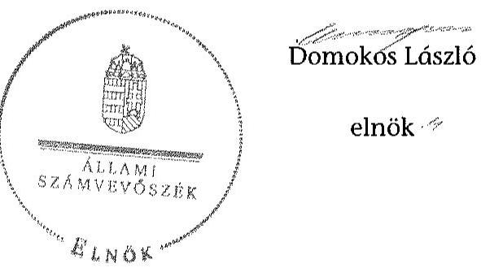

# ÁLLAMI   SZÁMVEVŐSZÉK 

## JELENTÉS

a helyi nemzetiségi önkormányzatok gazdálkodásának ellenőrzéséről
Kistolmács Roma Nemzetiségi Önkormányzata

---

# Állami Számvevőszék 

Iktatószám: V-0705-059/2015.
Témaszám: 1739
Vizsgálat-azonosító szám: V067614

## Az ellenőrzést felügyelte:

## Brebán Andrea

felügyeleti vezető
2015. július 21. napjától

## Horváthné Herbáth Mária

felügyeleti vezető
2015. július 20. napjáig

## Az ellenőrzést vezette és az ellenőrzés végrehajtásáért felelős:

Zakar László
ellenőrzésvezető

## A számvevőszéki jelentést készítették:

Zakar László
ellenőrzésvezető

## Pappné dr. Szamosi Éva

számvevő főtanácsos

## Dr. Ernst László

számvevő főtanácsos

## Az ellenőrzést végezték:

Pappné dr. Szamosi Éva
számvevő főtanácsos

Dr. Ernst László
számvevő főtanácsos

---

# TARTALOMJEGYZÉK 

BEVEZETÉS ..... 3
I. ÖSSZEGZŐ MEGÁLLAPÍTÁSOK, KÖVETKEZTETÉSEK, JAVASLATOK ..... 6
II. RÉSZLETES MEGÁLLAPÍTÁSOK ..... 11

1. A Nemzetiségi Önkormányzat és a Települési Önkormányzat együttműködésének szabályozása, a működési feltételek biztosítása ..... 11
2. A gazdálkodási feladatok ellátásának szabályszerűsége ..... 12
2.1. A költségvetésre és a zárszámadásra, valamint a kincstári adatszolgáltatás rendjére vonatkozó jogszabályi előírások betartása ..... 12
2.2. A Nemzetiségi Önkormányzat gazdálkodásának szabályozottsága ..... 13
2.3. Az operatív gazdálkodási jogkörök kialakítása, gyakorlása ..... 14
3. A Nemzetiségi Önkormányzattal összefüggő gazdálkodási feladatok belső ellenőrzése ..... 17

## MELLÉKLET

1. számú A Kistolmács Roma Nemzetiségi Önkormányzata 2013. évi gazdálkodási adatai

## FÜGGELÉKEK

1. számú Rövidítések jegyzéke
2. számú Értelmező szótár

---

.

---

# JELENTÉS 

## A helyi nemzetiségi önkormányzatok gazdálkodásának ellenőrzéséről Kistolmács Roma Nemzetiségi Önkormányzata

## BEVEZETÉS

A Nemzetiségi Önkormányzat a 2010. évben alakult, akkor megválasztott elnöke a 2014. évi helyhatósági választásokig látta el feladatát. A Nemzetiségi Önkormányzat intézményt, gazdasági társaságot és más szervezetet nem alapított, illetve társulásban nem vett részt. A négytagú Képviselő-testület a munkája segítésére bizottságot nem hozott létre. A Nemzetiségi Önkormányzat költségvetési beszámolója szerint a 2013. évben a módosított költségvetési bevételi előirányzat 1271,0 ezer Ft, a módosított költségvetési kiadási előirányzat 1272,0 ezer Ft, a teljesített költségvetési bevétel 1268,0 ezer Ft, a teljesített költségvetési kiadás 1299,0 ezer Ft volt. A finanszírozási célú kiadások és bevételek figyelembe vételével a tárgyévi bevételek és a tárgyévi kiadások 1269,0 ezer Ftot tettek ki. A Nemzetiségi Önkormányzat a 2013. évben 922,0 ezer Ft feladatalapú támogatásban részesült. A 2013. évi gazdálkodási adatokat részletesen az 1. számú mellékletben mutatjuk be.

Az Alaptörvény Szabadság és felelősség rész XXIX. cikk (1) bekezdése szerint a Magyarországon élő nemzetiségek államalkotó tényezők. Minden, valamely nemzetiséghez tartozó magyar állampolgárnak joga van önazonossága szabad vállalásához és megőrzéséhez. A hazánkban élő́ nemzetiségek helyi (települési és területi) valamint országos önkormányzatokat hozhatnak létre ${ }^{1}$. A helyi nemzetiségi önkormányzatok gazdálkodási feladatait jogszabályi előirás alapján a székhely szerinti helyi önkormányzat polgármesteri hivatala látja el.

A nemzetiségek helyzete, támogatása mind hazai, mind EU-s szinten kiemelt figyelmet kap napjainkban. A helyi nemzetiségi önkormányzatok gazdálkodására és támogatási rendszerére vonatkozó jogszabályok a 2010-2012. években jelentős változásokon mentek át. A helyi nemzetiségi önkormányzatok gazdálkodásának, a részükre juttatott költségvetési támogatások felhasználásának ellenőrzését az ÁSZ 2012-ben sorozatjellegű ellenőrzés keretében indította el.

[^0]
[^0]:    ${ }^{1}$ A 2010. évben megtartott nemzetiségi önkormányzati választásokat követően 2304 települési, 58 területi és 13 országos nemzetiségi önkormányzat alakult meg.

---

Az ellenőrzés célja annak értékelése volt, hogy a helyi nemzetiségi önkormányzat gazdálkodási kereteinek kialakítása, gazdálkodása megfelelt-e a jogszabályoknak.

Ennek keretében értékeltük, hogy:

- a helyi nemzetiségi önkormányzat és a helyi (települési) önkormányzat együttműködésének szabályozása, a működési feltételek biztosítása megfelel-e a jogszabályi előírásoknak;
- a felek együttműködése megfelelt-e a megállapodásban foglaltaknak a gazdálkodási feladatok szabályszerű ellátása során, betartották-e vonatkozó jogszabályi előírásokat;
- biztosított volt-e a helyi nemzetiségi önkormányzat gazdálkodásának belső ellenőrzése.

Az ellenőrzés várható hasznosulása: a nemzetiségi önkormányzatok testületi döntéseinek tapasztalatait összegezve következtetés vonható le a törvényalkotás számára a jogszabályi környezet esetleges módosításának indokoltságára vonatkozóan. Az ellenőrzés az ellenőrzött számára visszajelzést ad a rendezett gazdálkodási keretek kialakításáról, a működésbeli hiányosságokról. Az ellenőrzés megállapításai és javaslatai, a jó gyakorlat bemutatása tanulságul szolgálhatnak más nemzetiségi önkormányzatok, szervezetek számára a rendezett gazdálkodási keretek kialakításához. A társadalom számára jelzi, hogy közpénz nem maradhat ellenőrizetlenül, az ÁSZ értékteremtő rend kialakításához és megőrzéséhez hozzájáruló tevékenysége pozitív hatással lesz a szervezetről kialakított összkép formálásában. Az ÁSZ szervezetén belül lehetőség nyílik arra, hogy a megállapítások szintetizálásával az intézmény a hozzáadott értéket teremtő elemző tevékenységét és tanácsadó szerepét erősítse.

A helyi nemzetiségi önkormányzatok gazdálkodásának ellenőrzéséről szóló jelentés I. fejezetének összegző része az ellenőrzés céljára adott rövid, szintetizáló összefoglalót és következtetéseket tartalmazza a II. fejezet részletes megállapításain alapulóan. A jelentés intézkedést igénylő megállapításait és javaslatait az összegzőben foglaltak mellett - az ellenőrzés során feltárt, a jelentés II. fejezetében rögzített részletes megállapítások alapozzák meg, illetve támasztják alá.

Az ellenőrzés típusa: szabályszerűségi ellenőrzés.
Az ellenőrzött időszak: a Nemzetiségi Önkormányzat és a Települési Önkormányzat együttműködésének, valamint a Nemzetiségi Önkormányzat gazdálkodásának szabályozása megfelelőségét a 2013. évre vonatkozóan (a 2013. december 31-i állapotnak megfelelően), a Nemzetiségi Önkormányzat gazdálkodásának szabályszerűségét, a működési feltételek, valamint a belső ellenőrzés biztosítását a 2013. január 1. - december 31-e közötti időszakot figyelembe véve értékeltük.

Ellenőrzött szervezet: a Kistolmács Roma Nemzetiségi Önkormányzata és a gazdálkodási feladatait ellátó Letenyei Közös Önkormányzati Hivatal.

---

Az ellenőrzés szakmai módszertana az ÁSZ hivatalos honlapján (www.asz.hu) közzétett szakmai szabályokon alapult, amely a Legfőbb Ellenőrző Intézmények Nemzetközi Szervezete (INTOSAI) által kiadott nemzetközi standardok (ISSAI) figyelembevételével készült.

A gazdálkodás folyamatában kulcsszerepet betöltő két kulcskontroll - teljesítésigazolás, érvényesítés - múködésének megfelelőségét teljes körűen, azaz minden, a személyi juttatásokkal, a dologi és felhalmozási kiadásokkal, múködési és felhalmozási célú pénzeszköz átadásokkal, ellátottak pénzbeli juttatásaival kapcsolatos kifizetések esetében ellenőriztük. „Megfelelőnek" értékeltük a gazdálkodási jogkörök gyakorlását, amennyiben a hibaarány legfeljebb 10\%, „részben megfelelőnek" értékeltük, ha a hibaarány 10-30\% között volt, „nem megfelelőnek" pedig akkor, ha az eredmények alapján a hibaarány meghaladta a $30 \%$-ot.

Az ellenőrzés végrehajtásának jogszabályi alapját az ÁSZ tv. 5. § (2)-(3) és (6) bekezdéseiben foglaltak képezik.

Az ÁSZ tv. 29. § (1) bekezdése szerint megküldtük egyeztetésre a jegyzőnek és a Nemzetiségi Önkormányzat elnökének. Az ellenőrzött szervezetek vezetői az ÁSZ tv. 29. § (2) bekezdésében foglalt észrevételezési jogukkal nem éltek, a jelentéstervezetre nem tettek észrevételt.

---

# I. ÖSSZEGZŐ MEGÁLLAPÍTÁSOK, KÖVETKEZTETÉSEK, JAVASLATOK 

Az ellenőrzött időszakban a Nemzetiségi Önkormányzat és a Települési Önkormányzat együttmúködését - a Nek. tv. előírásának megfelelően - megállapodás szabályozta. Az együttmúködés szabályozása a tartalmi hiányosságok ellenére megfelelt a jogszabályi előírásoknak. A megállapodás nem tartalmazta az Áht.-ban foglaltak ellenére a Nemzetiségi Önkormányzat bevételeivel és kiadásaival kapcsolatban az ellenőrzési feladatok ellátásának részletes szabályait. A szabályozás hiánya hozzájárult ahhoz, hogy a Nemzetiségi Önkormányzat gazdálkodásával összefüggő végrehajtási feladatokra vonatkozóan a 2013. évben nem terveztek és nem hajtottak végre belső ellenőrzést. A Települési Önkormányzat a 2013. évben biztosította a Nemzetiségi Önkormányzat részére a múködéssel kapcsolatos feladatok ellátása érdekében előírt személyi és tárgyi feltételeket.

A Nemzetiségi Önkormányzat 2013. évi költségvetésének és zárszámadásának tartalma, jóváhagyása, valamint a kapcsolódó adatszolgáltatás megfelelit a jogszabályi előírásoknak.

A Nemzetiségi Önkormányzat gazdálkodásának szabályozottsága az ellenőrzött időszakban részben felelt meg a jogszabályi előírásoknak és az együttmúködési megállapodásban foglaltaknak. A gazdálkodási feladatok végrehajtását ellátó Polgármesteri Hivatal a Számv. tv. által előírt számviteli szabályzatokkal rendelkezett, azonban a jegyző a Számv. tv.-ben előírtak ellenére nem gondoskodott a számlarend folyamatos aktualizálásáról. A jegyző nem készítette el az Áht.-ban előírtak ellenére a Polgármesteri Hivatal SZMSZ-ét, a Bkr.-ben előírt ellenőrzési nyomvonalat és a szabálytalanságok kezelésének eljárásrendjét és nem biztosította minden tevékenységre a folyamatba épített, előzetes, utólagos és vezetői ellenőrzést. A Nemzetiségi Önkormányzat gazdálkodása tekintetében az operatív gazdálkodási jogkörök kialakítása a 2013. évben nem felelt meg a jogszabályi előírásoknak, valamint az együttmúködési megállapodásban foglaltaknak. A jegyző az Ávr.-ben foglaltak ellenére nem jelölt ki írásban a Polgármesteri Hivatal állományába tartozó, előírt végzettséggel rendelkező köztisztviselőt a pénzügyi ellenjegyzés gyakorlására, valamint 2013. január 1-je és február 28-a között érvényesítés gyakorlására. A kiadások teljesítése során az operatív gazdálkodási jogkörökön belül kulcsszerepet betöltő teljesítésigazolás és érvényesítés belső kontrollokat nem a jogszabályi előírásoknak megfelelően múködtették, aminek következtében nem volt biztosított a hibák megelőzése, feltárása és kijavítása. A teljesítésigazolást az Ávr. előirása ellenére több esetben szabályszerű kijelölés hiányában nem az arra jogosult végezte, valamint előfordult, hogy a teljesítésigazoló az összeférhetetlenségi követelményt nem tartotta be és a teljesítésigazolást a maga javára látta el. Továbbá több esetben elmaradt a teljesítés tényére történő utalás és a teljesítésigazolás dátumának rögzítése a teljesítésigazolás dokumentumán. Az érvényesítés gyakorlata szabálytalan volt, mert több esetben az Ávr.-ben foglaltak ellenére kijelölés hiányában nem az arra jogosult látta el a feladatot, illetve előfordult, hogy az érvényesítést nem végezték el. Az érvényesítő több

---

esetben - az Ávr. előírása ellenére - nem jelezte az utalványozónak, hogy a megelőző ügymenetben a teljesítésigazolás nem volt szabályszerű, továbbá, hogy az Áht.-ban és az Ávr.-ben foglaltak ellenére kötelezettségvállalásra pénzügyi ellenjegyzés nélkül került sor, illetve a kötelezettségvállalás pénzügyi ellenjegyzését kijelölés hiányában nem az arra jogosult végezte. A nem megfelelően működtetett belső kontrollok korrupciós kockázatot hordoztak.

Az ÁSZ tv. 33. § (1) bekezdésében foglaltak értelmében a jelentésben foglalt megállapításokhoz kapcsolódó intézkedési tervet köteles az ellenőrzött szervezet vezetője összeállítani, és azt a jelentés kézhezvételétől számított 30 napon belül az ÁSZ részére megküldeni. Amennyiben az intézkedési tervet határidőben nem küldi meg a szervezet, vagy az nem elfogadható, az ÁSZ elnöke a hivatkozott törvény 33. § (3) bekezdés a)-b) pontjaiban foglaltakat érvényesítheti.

A helyszíni ellenőrzés megállapításainak hasznosítása mellett javasoljuk:

# a jegyzönek 

1. Az együttműködés szabályozásával kapcsolatban

A Nemzetiségi Önkormányzat és a Települési Önkormányzat együttműködésének szabályozása - a tartalmi hiányosságok ellenére - megfelelt a jogszabályi előírásoknak. Az együttműködési megállapodás - a Nek. tv. 80. § (3) bekezdés a) pontjának előírása ellenére - nem tartalmazta a helyi nemzetiségi önkormányzat részére önálló fizetési számla nyitásával, törzskönyvi nyilvántartásba vételével és adószám igénylésével kapcsolatos határidőket.

Javaslat
Az együttműködés szabályszerűsége érdekében készítse elő az együttműködési megállapodás módosítását, amely teljes körűen megfelel a Nek. tv. előírásainak, és kezdeményezze annak a Települési Önkormányzat Képviselő-testülete elé terjesztését.
2. A költségvetés és zárszámadás szabályszerűségével kapcsolatban

A 2013. évi zárszámadási határozat-tervezet előterjesztésekor a Képviselő-testület ré-szére- az Áht. 91. § (2) bekezdés a) pontjának előírása ellenére - nem mutatták be a pénzeszközök változását.

Javaslat
Intézkedjen annak érdekében, hogy a zárszámadási határozat-tervezet előterjesztésekor a Képviselő-testület részére tájékoztatásul teljes körűen bemutatásra kerüljenek a jogszabályban előírt mérlegek, kimutatások.
3. A gazdálkodási feladatok szabályozottságával kapcsolatban

A jegyző - a Számv. tv. 161. § (4) bekezdésében, előírtak ellenére - nem gondoskodott a számlarend folyamatos karbantartásáról.

---

A jegyző nem készítette el 2013. december 31-ig.- az Áht. 9. § (1) bekezdés a) pontjában előírtak ellenére - a Polgármesteri Hivatal SZMSZ-ét.

A jegyző a Bkr. 6. § (3) bekezdésében előírt ellenőrzési nyomvonalat és a Bkr. 6. § (4) bekezdésében előírt szabálytalanságok kezelésének eljárásrendjét a Polgármesteri Hivatal múködési folyamataira vonatkozóan nem készítette el. A jegyző a Bkr. 8. § (2) bekezdés előírásától eltérően nem biztosította a Polgármesteri Hivatalban a kontrolltevékenység részeként minden tevékenységre vonatkozóan a folyamatba épített, előzetes, utólagos és vezetői ellenőrzést.

Javaslat
a) Intézkedjen a számlarend folyamatos karbantartásáról.
b) Készítse el a Polgármesteri Hivatal jogszabályi előírásoknak megfelelő SZMSZ-ét, és kezdeményezze annak a Települési Önkormányzat Képviselő-testülete elé terjesztését.
c) Készítse el a Polgármesteri Hivatal múködési folyamataira vonatkozó ellenőrzési nyomvonalat, továbbá a szabálytalanságok kezelésének eljárásrendjét.
d) Biztosítsa a Polgármesteri Hivatal által ellátott minden tevékenységre vonatkozóan a folyamatba épített, előzetes, utólagos és vezetői ellenőrzést.
4. Az operatív gazdálkodás jogkörök kialakításával, gyakorlásával kapcsolatban

A pénzkezelési szabályzat lehetővé tette a 100 ezer Ft alatti kifizetések előzetes írásbeli kötelezettségvállalás nélküli teljesítését, azonban - az Ávr. 53. § (2) bekezdésében foglaltakat figyelmen kívül hagyva - nem határozták meg az előzetes írásbeli kötelezettségvállalást nem igénylő kifizetések rendjét.

A jegyző a Nemzetiségi Önkormányzat kiadási előirányzatai terhére vállalt kötelezettség esetére - az Ávr. 55. § (2) bekezdés g) pontjában, az együttműködési megállapodásban és a pénzkezelési szabályzatban foglaltak ellenére - nem jelölt ki írásban a gazdasági szervezettel nem rendelkező Polgármesteri Hivatal állományába tartozó, előírt végzettséggel rendelkező köztisztviselőt a pénzügyi ellenjegyzés gyakorlására.

A teljesítésigazolást több kifizetésnél az Ávr. 57. § (4) bekezdésében foglaltak ellenére kijelölés hiányában nem az arra jogosult végezte, ezen túl az Ávr. 57. § (3) bekezdésében foglaltak ellenére nem tartalmazta a teljesítés tényére történő utalást, illetve az igazolás dátumát. Továbbá a Nemzetiségi Önkormányzat elnöke, mint teljesítésigazoló az Ávr. 60. § (2) bekezdésében előírtak ellenére a teljesítésigazolást a maga javára látta el. A teljesítésigazoló - az Ávr. 57. § (1) bekezdésében és a pénzkezelési szabályzatban foglaltak ellenére - nem ellenőrizte a kifizetés összegszerűségét az üzemanyag költség elszámolása során.

Az érvényesítést az Ávr. 58. § (1) bekezdésében foglaltak ellenére a kifizetéseket megelőzően nem végezték el. Ezen túl az érvényesítést az Ávr. 58. § (4) bekezdésében előírtak ellenére több esetben kijelölés hiányában nem az arra jogosult végezte. Az érvényesítő több esetben az Ávr. 58. § (2) bekezdésében foglaltak ellenére nem jelezte az utalványozónak, hogy a megelőző ügymenetben a teljesítésigazolást nem

---

az arra jogosult végezte, és a megelőző ügymenetben a teljesítés igazolást az Ávr. előírásait megsértve végezték el.

Javaslat
Az operatív gazdálkodás működési hibáinak megelőzése, feltárása és kijavítása érdekében intézkedjen:
a) az írásbeli kötelezettségvállalást nem igénylő kifizetések rendjének belső szabályzatokban történő rögzítéséről;
b) a Nemzetiségi Önkormányzat kiadási előirányzatai terhére vállalt kötelezettség pénzügyi ellenjegyzésének gyakorlására a Polgármesteri Hivatal állományába tartozó, előírt végzettséggel rendelkező köztisztviselő írásbeli kijelöléséről;
c) a teljesítésigazolás jogszabályi előírásoknak megfelelő elvégzéséről;
d) az érvényesítéshez kapcsolódó ellenőrzési és jelzési feladatok szabályszerű ellátásáról.
5. A belső ellenőrzéssel kapcsolatban

A 2013. évben a Nemzetiségi Önkormányzat gazdálkodásával összefüggő feladatokra vonatkozó belső ellenőrzés nem volt megfelelő. Az együttmúködési megállapodás - az Áht. 27. § (2) bekezdésében foglaltak ellenére - nem tartalmazta a Nemzetiségi Önkormányzat bevételeivel és kiadásaival kapcsolatban az ellenőrzési feladat ellátásának részletes szabályait, azon belül a belső ellenőrzés ellátására vonatkozó rendelkezéseket.

Javaslat
Az együttműködési megállapodás módosításának előkészítése során kezdeményezze annak kiegészítését a belső ellenőrzés ellátására vonatkozó részletszabályok meghatározásával.

# a Nemzetiségi Önkormányzat elnökének 

1. Az együttműködési megállapodás - a Nek. tv. 80. § (3) bekezdés a) pontjának előírása ellenére - nem tartalmazta a helyi nemzetiségi önkormányzat részére önálló fizetési számla nyitásával, törzskönyvi nyilvántartásba vételével és adószám igénylésével kapcsolatos határidőket.

A 2013. évben a Nemzetiségi Önkormányzat gazdálkodásával összefüggő feladatokra vonatkozó belső ellenőrzés nem volt megfelelő. Az együttműködési megállapodás - az Áht. 27. § (2) bekezdésében foglaltak ellenére - nem tartalmazta a Nemzetiségi Önkormányzat bevételeivel és kiadásaival kapcsolatban az ellenőrzési feladat ellátásának részletes szabályait, azon belül a belső ellenőrzés ellátására vonatkozó rendelkezéseket.

---

Javaslat
a) Terjessze a Képviselő-testület elé jóváhagyásra a jegyző által a jogszabályi előírásokban foglaltaknak megfelelően előkészített együttműködési megállapodás módosítását.
b) Intézkedjék annak érdekében, hogy az együttmüködési megállapodásban rendelkezzenek a belső ellenőrzés ellátására vonatkozó részletszabályok meghatározásáról.
2. A 2013. évi zárszámadási határozat-tervezet előterjesztésekor a Képviselő-testület részére nem mutatták be - az Áht. 91. § (2) bekezdés a) pontjának előirása ellenére a pénzeszközök változását.

Javaslat
Intézkedjen, hogy a Képviselő-testülete részére a zárszámadási határozat-tervezet előterjesztésekor tájékoztatásul szöveges indoklással együtt bemutatásra kerüljön a jogszabályban előírt valamennyi mérleg és kimutatás.
3. A Nemzetiségi Önkormányzat elnöke, mint teljesítésigazoló az Ávr. 60. § (2) bekezdésében előírtak ellenére a teljesítésigazolást a maga javára látta el.

Javaslat
Összeférhetetlenség fennállása esetén Jelöljön ki írásban további teljesítés igazolására a jogosult személyt.

---

# II. RÉSZLETES MEGÁLLAPÍTÁSOK 

## 1. A Nemzetiségi Önkormányzat És a Telepúlési ÖnkormányZAT EGYÜTTMŰKÖDÉSÉNEK SZABÁLYOZÁSA, A MÜKÖDÉSI FELTÉTELEK BIZTOSÍTÁSA

A Nemzetiségi Önkormányzat és a Települési Önkormányzat együttmúködésének szabályozása - a tartalmi hiányosságok ellenére - megfelelt a jogszabályi előírásoknak.

A Nemzetiségi Önkormányzat rendelkezett a 2013. évben a Nek. tv.-ben előírt, a Települési Önkormányzattal történő együttműködésre vonatkozó megállapodással, melyet a Nemzetiségi Önkormányzat és a Települési Önkormányzat Képviselő-testületei határozattal jóváhagytak ${ }^{2}$ és az arra jogosult személyek aláírták. A Nek. tv. 80. § (2) bekezdése alapján 2013. január 31-éig elvégezték a megállapodás felülvizsgálatát ${ }^{3}$.

Az együttműködési megállapodás szerinti működési feltételeket - a Nek. tv. 80. § (2) bekezdésében foglaltak ellenére - az együttműködési megállapodás megkötését követő harminc napon túl rögzítették a Nemzetiségi Önkormányzat SZMSZ-ében ${ }^{4}$ és a Települési Önkormányzat SZMSZ-ében ${ }^{5}$.

Az együttműködési megállapodás az Áht. 27. § (2) bekezdésében és a Nek. tv. 80. § (3) bekezdésében előírt tartalmi előírásokat teljes körűen nem tartalmazta:

- az együttműködési megállapodás - az Áht. 27. § (2) bekezdésében foglaltak ellenére - nem tartalmazta a Nemzetiségi Önkormányzat bevételeivel és kiadásaival kapcsolatban az ellenőrzési feladatok ellátásának részletes szabályait;
- az együttműködési megállapodás - Nek. tv. 80. § (3) bekezdés a) pontjának előírása ellenére - nem tartalmazta a Nemzetiségi Önkormányzat részére

[^0]
[^0]:    ${ }^{2}$ Az együttműködési megállapodást a Települési Önkormányzat a 18/2012. (V. 29.) számú, a Nemzetiségi Önkormányzat a 40/2012. (V. 29.) számú határozatával hagyta jóvá.
    ${ }^{3}$ Az együttműködési megállapodás felülvizsgálatát a Települési Önkormányzat Képvi-selő-testülete az 1/2013. (I. 30.) számú határozatával, a Nemzetiségi Önkormányzata Képviselő-testülete a 6/2013. (I. 31.) számú határozatával hagyta jóvá.
    ${ }^{4}$ A Nemzetiségi Önkormányzat a 44/2012. (VII. 02.) számú határozatával 2012. július 3 -ai hatállyal módosította az SZMSZ-ét. Az SZMSZ-ben foglaltak alapján előterjesztést tehet az elnök, az elnökhelyettes, bármely nemzetiségi önkormányzati képviselő, felkért személy, vagy szervezet.
    ${ }^{5}$ A Települési Önkormányzat a 8/2012. (VIII. 15.) számú rendeletével módosította az SZMSZ-t.

---

önálló fizetési számla nyitásával, törzskönyvi nyilvántartásba vételével és adószám igénylésével kapcsolatos határidőket.

A Települési Önkormányzat a 2013. évben biztosította a Nemzetiségi Önkormányzat részére a múködéssel kapcsolatos feladatok ellátása érdekében előírt személyi és tárgyi feltételeket.

# 2. A GAZDÁLKODÁSI FELADATOK ELLÁTÁSÁNAK SZABÁLYSZERŰSÉGE 

### 2.1. A költségvetésre és a zárszámadásra, valamint a kincstári adatszolgáltatás rendjére vonatkozó jogszabályi előírások betartása

A Nemzetiségi Önkormányzat 2013. évi költségvetésének és zárszámadásának tartalma, jóváhagyása, valamint a kapcsolódó adatszolgáltatás megfelelt a jogszabályi előírásoknak.

A Nemzetiségi Önkormányzat elnöke az Áht. 26. § (1) bekezdése alapján, az Áht. 24. § (1) bekezdésében előírtaknak megfelelően november 30-ig benyújtotta a Nemzetiségi Önkormányzat Képviselő-testülete részére a jegyző által előkészített, az ellenőrzött évre vonatkozó költségvetési koncepciót ${ }^{6}$.

A Nemzetiségi Önkormányzat elnöke az Áht. 26. § (1) bekezdése alapján, az Áht. 24. § (2) bekezdésében ${ }^{7}$ előírtaknak megfelelően a központi költségvetésről szóló törvény hatályba lépését követő 45. napig benyújtotta a Képviselő-testület részére a jegyző által előkészített 2013. évi költségvetési határozat-tervezetet. A Nemzetiségi Önkormányzat Képviselő-testülete a 11/2013. (II. 15.) számú határozatával elfogadta azt. A 2013. évi költségvetési határozat-tervezet előterjesztésekor a Képviselő-testület részére az Áht. 24. § (4) bekezdés a) pont előírásának megfelelően tájékoztatásul bemutatták szöveges indokolással a Nemzetiségi Önkormányzat költségvetési mérlegét közgazdasági tagolásban és az előirányzat felhasználási tervet. A 2013. évi költségvetés tartalmazta az Áht. 26. § (1) bekezdésében foglalt előírás alapján az Áht. 23. § (2) bekezdés a), c), d) és h) pontja szerinti tartalmi elemeket.

A jegyző az Áht. 91. § (1) bekezdésében előírt határidő előtt elkészítette a Nemzetiségi Önkormányzat 2013. évi zárszámadási határozat-tervezetét, amelyet a Nemzetiségi Önkormányzat elnöke határidőben terjesztett a Nemzetiségi Önkormányzat Képviselő-testülete elé elfogadásra. A zárszámadási hatá-rozat-tervezet előterjesztésekor a Nemzetiségi Önkormányzat Képviselő-testület részére az Áht. 24. § (4) bekezdés a) pontja és az Áht. 91. § (2) bekezdés a), c) pontjaiban és (3) bekezdésében foglaltaknak megfelelően - egy kivétellel tájékoztatásul bemutatták szöveges indoklással az előírt mérlegeket és kimutatásokat. Nem mutatták be - az Áht. 91. § (2) bekezdés a) pontjának előírása ellenére - a pénzeszközök változását. A Nemzetiségi Önkormányzat 2013. év so-

[^0]
[^0]:    ${ }^{6}$ A 2013. évi költségvetési koncepció elfogadása a Nemzetiségi Önkormányzat 109/2012. (XI. 02.) számú határozatával történt.
    ${ }^{7}$ 2013. december 21-étől az Áht. 24. § (3) bekezdése írja elő.

---

rán több éves kihatással járó pénzügyi döntést nem hozott, közvetett támogatásokat nem nyújtott. A Nemzetiségi Önkormányzat Képviselő-testülete a 2013. évi záiszámadási határozat-tervezetet a 10/2014. (IV. 29) számú határozatával hagyta jóvá. A Nemzetiségi Önkormányzat a záiszámadásról alkotott határozatában valamennyi bevételről és kiadásról elszámolt, összehasonlíthatósága az elfogadott költségvetéssel biztosított volt.

Az együttmúködési megállapodás 5. pontjában a Polgármesteri Hivatal Pénzügyi Osztályának vezetője kapott feladat és hatáskört a kincstári adatszolgáltatás elkészítésére és továbbítására. A Polgármesteri Hivatal Pénzügyi Osztályának vezetője a 2013. évben -egy eset kivételével - az előírt határidőben tett eleget a Nemzetiségi Önkormányzat részére előírt kincstári adatszolgáltatásnak.

A Pénzügyi Osztály vezetője a Nemzetiségi Önkormányzat első negyedévi költségvetési jelentését az Ávr. 169. § (2) bekezdése szerinti április 20-ai határidőt követően ${ }^{8}$ küldte meg a Kincstár Zala Megyei Igazgatóságának.

# 2.2. A Nemzetiségi Önkormányzat gazdálkodásának szabályozottsága 

A Nemzetiségi Önkormányzat gazdálkodásának szabályozottsága az ellenőrzött időszakban részben felelt meg a jogszabályi előírásoknak és az együttműködési megállapodásban foglaltaknak.

A gazdálkodási feladatok végrehajtását ellátó Polgármesteri Hivatal a 2013. évben a Számv. tv. 14. § (3)-(5) bekezdéseiben és a 161. § (1)-(2) bekezdéseiben előírt számviteli szabályzatok közül valamennyi szabályzattal rendelkezett, amelyek hatálya a Nemzetiségi Önkormányzat gazdálkodási feladataira kiterjedt és e szabályzatokat a 2013. évre - a számlarend ${ }^{9}$ kivételével - aktualizálták. A jegyző - a Számv. tv. 161. § (4) bekezdésében előírtak ellenére - nem gondoskodott a számlarend folyamatos aktualizálásáról.

A jegyző nem készítette el 2013. december 31-ig ${ }^{10}$.- az Áht. 9. § (1) bekezdés a) pontjában előírtak ellenére - a Polgármesteri Hivatal SZMSZ-ét.

A Polgármesteri Hivatalnál 2013. december 31-én a gazdálkodási feladatokat ellátó köztisztviselők munkaköri leírásai tartalmazták a Nemzetiségi Önkormányzat gazdálkodásával kapcsolatos feladatokat és a helyettesítéseket.

Az együttműködési megállapodásban rögzítették, hogy a Polgármesteri Hivatal látja el a Nemzetiségi Önkormányzat gazdálkodásának végrehajtásával kapcsolatos feladatokat. Az együttműködési megállapodásban, a Polgármesteri

[^0]
[^0]:    ${ }^{8}$ 2013. április 23-án
    ${ }^{9}$ hatályos 2009. április 20-ától
    ${ }^{10}$ A 2013. február 28-án megszűnt Letenye Város Polgármesteri Hivatalának SZMSZ-ét nem vizsgálták felül, továbbá nem rendelkeztek arról, hogy a korábbi SZMSZ-t, akár átmeneti ideig is (az új, vagy felülvizsgált SZMSZ megalkotásáig) alkalmazni kell.

---

Hivatal pénzkezelési szabályzatában és a Nemzetiségi Önkormányzat SZMSZében szabályozták a Nemzetiségi Önkormányzat gazdálkodásával kapcsolatosan - az Ávr. 13. § (2) bekezdés a) pontjában foglaltak szerint - a tervezéssel, gazdálkodással, így különösen a kötelezettségvállalás, a pénzügyi ellenjegyzés, a teljesítés igazolás, az érvényesítés, az utalványozás gyakorlásának módjával, eljárási és dokumentációs részletszabályaival, valamint az ezeket végző személyek kijelölésének rendjével kapcsolatos belső előírásokat.

A jegyző a Bkr. 6. § (3) bekezdésében előírt ellenőrzési nyomvonalat és a Bkr. 6. § (4) bekezdésében előírt szabálytalanságok kezelésének eljárásrendjét a Polgármesteri Hivatal múködési folyamataira vonatkozóan nem készítette el. A jegyző a Bkr. 8. § (2) bekezdés előírásától eltérően nem biztosította a Polgármesteri Hivatalban a kontrolltevékenység részeként minden tevékenységre vonatkozóan a folyamatba épített, előzetes, utólagos és vezetői ellenőrzést.

# 2.3. Az operatív gazdálkodási jogkörök kialakítása, gyakorlása 

A Nemzetiségi Önkormányzat gazdálkodása tekintetében az operatív gazdálkodási jogkörök kialakítása nem felelt meg a jogszabályi előírásoknak, valamint az együttmúködési megállapodásban foglaltaknak.

A jegyző a pénzkezelési szabályzatban lehetővé tette a 100 ezer Ft alatti kifizetések előzetes írásbeli kötelezettségvállalás nélküli teljesítését, de - az Ávr. 53. § (2) bekezdésében foglaltakat figyelmen kívül hagyva - nem határozta meg az előzetes írásbeli kötelezettségvállalást nem igénylő kifizetések rendjét.

A jegyző az Ávr. 57. § (4) bekezdésében, az együttműködési megállapodásban és a Nemzetiségi Önkormányzat SZMSZ-ének 4. számú mellékletében előírtak ellenére - a pénzkezelési szabályzatban - jogosulatlanul jelölte ki a Nemzetiségi Önkormányzat kötelezettségvállalásaihoz kapcsolódóan a teljesítés igazolására jogosult személyeket.

Az együttműködési megállapodás és a Nemzetiségi Önkormányzat SZMSZ-ének 4. számú mellékletében foglaltak szerint a Nemzetiségi Önkormányzat elnöke volt a teljesítésigazoló, távolléte, akadályoztatása esetén teljesítésigazolásra az elnökhelyettes, mindkettőjük távolléte, akadályoztatása, vagy összeférhetetlensége esetén a Nemzetiségi Önkormányzat SZMSZ-ében megjelölt képviselő volt jogosult. A szabályozás ellenére a Nemzetiségi Önkormányzat elnöke nem jelölt ki írásban teljesítésigazolásra más személyeket.

A jegyző a Nemzetiségi Önkormányzat kiadási előirányzatai terhére vállalt kötelezettség esetére - az Ávr. 55. § (2) bekezdés g) pontjában, az együttműködési megállapodásban és a pénzkezelési szabályzatban foglaltak ellenére - nem jelölt ki írásban a gazdasági szervezettel nem rendelkező Polgármesteri Hivatal állományába tartozó, előírt végzettséggel rendelkező köztisztviselőt a pénzügyi ellenjegyzés gyakorlására.

A jegyző a Nemzetiségi Önkormányzat kiadási előirányzatai terhére vállalt kötelezettség esetére - az Ávr. 55. § (2) bekezdés g) pontjában és az Ávr. 58. § (4) bekezdésében foglaltak ellenére - nem jelölt ki írásban 2013. január 1-je és

---

február 28-a között a gazdasági szervezettel nem rendelkező Polgármesteri Hi vatal állományába tartozó, előírt végzettséggel rendelkező köztisztviselőt az érvényesítés gyakorlására.

A Nemzetiségi Önkormányzatnak a 2013. évben a személyi juttatásokkal és a dologi kiadásokkal kapcsolatos kifizetései voltak. A Nemzetiségi Önkormányzatnál a 2013. évben a személyi juttatásokkal és a dologi kiadásokkal kapcsolatos kifizetéseknél az operatív gazdálkodási jogkörökön belül kulcsszerepet betöltő teljesítésigazolás és érvényesítés belső kontrollokat - az ellenőrzött összes kifizetésre együttesen értékelve - nem a jogszabályi előírásoknak megfelelően múködtették.

A személyi juttatásokkal kapcsolatos kifizetéseknél a 2013. évben a teljesítésigazolás kulcskontroll múködtetésével kapcsolatban az alábbi hiányosságok, szabálytalanságok fordultak elő:

- a teljesítésigazolást az ellenőrzött összes kifizetést megelőzően- az Ávr. 57. § (4) bekezdésében foglaltak ellenére - szabályszerű kijelölés hiányában nem az arra jogosult végezte;
- a teljesítésigazolás több esetben nem szabályszerűen történt, mert a teljesítésigazoló a teljesítésigazolás bizonylatán - az Ávr. 57. § (3) bekezdésében előírtak ellenére - nem rögzítette a teljesítésigazolás dátumát;
- a teljesítésigazoló - az Ávr. 57. § (1) bekezdésében és a pénzkezelési szabályzatban foglaltak ellenére - nem ellenőrizte a kifizetés összegszerűségét, mert az üzemanyag költség elszámolása $8,6 \mathrm{l} / 100 \mathrm{~km}$ alapnorma átalánnyal történt a $9,5 \mathrm{l} / 100 \mathrm{~km}$ alapnorma átalánnyal szemben.

A személyi juttatásokkal kapcsolatos kifizetéseknél a 2013. évben az érvényesítés kulcskontroll múködtetésével kapcsolatban az alábbi hiányosságok, szabálytalanságok fordultak elő:

- előfordult, hogy az érvényesítést - az Ávr. 58. § (1) bekezdésében foglaltak ellenére - a kifizetéseket megelőzően nem végezték el, nem ellenőrizték a kiadások teljesítésének jogosságát és összegszerűségét;
- az érvényesítést - Ávr. 58. § (4) bekezdésében előírtak ellenére - több esetben kijelölés hiányában nem az arra jogosult végezte;
- az érvényesítés - Ávr. 58. § (1) bekezdésében előírtak ellenére - nem volt szabályszerű, mivel az összegszerűség ellenőrzése az üzemanyag költség elszámolásánál elmaradt;
- az érvényesítő több esetben - az Ávr. 58. § (2) bekezdésében foglaltak ellenére - nem jelezte az utalványozónak, hogy a megelőző ügymenetben a teljesítésigazolást nem az arra jogosult végezte és nem szabályszerűen történt, valamint az utalvány rendeletek - az Ávr. 59. § (3) bekezdés f) pontjában előírtak ellenére - nem tartalmazták a kötelezettségvállalás nyilvántartási számát. Nem jelezte továbbá, hogy az Áhsz. 9. számú mellékletének 9. c) pontjában foglaltak ellenére a kiküldetések elszámolásával kapcsolatos költségeket helytelenül személyi juttatásként számolták el dologi kiadás helyett.

---

A dologi kiadásokkal kapcsolatos kifizetéseknél a 2013. évben a teljesítésigazolás kulcskontroll múködtetésével kapcsolatban az alábbi hiányosságok, szabálytalanságok fordultak elő:

- a teljesítésigazolást a kifizetéseket megelőzően - az Ávr. 57. § (4) bekezdésében foglaltak ellenére - több esetben szabályszerű kijelölés hiányában nem az arra jogosult végezte;
- előfordult, hogy a Nemzetiségi Önkormányzat elnöke, mint teljesítésigazoló a teljesítésigazolást - az Ávr. 60. § (2) bekezdésében előírtak ellenére - a maga javára látta el, ezzel az összeférhetetlenség követelményét nem tartotta be;
- a teljesítésigazolás - az Ávr. 57. § (3) bekezdésében foglaltak ellenére - nem tartalmazta a teljesítés tényére történő utalást és a teljesítésigazolás dokumentumán nem rögzítették a teljesítésigazolás dátumát.

A dologi kiadásokkal kapcsolatos kifizetéseknél a 2013. évben az érvényesítés kulcskontroll múködtetésével kapcsolatban az alábbi hiányosságok, szabálytalanságok fordultak elő:

- az érvényesítő több esetben - az Ávr. 58. § (2) bekezdésében foglaltak ellenére - nem jelezte az utalványozónak, hogy a megelőző ügymenetben a teljesítésigazolást szabályszerű kijelölés hiányában nem az arra jogosult végezte, vagy nem szabályszerűen történt, valamint az összeférhetetlenségi szabályt nem tartotta be. Nem jelezte, hogy az utalvány rendeletek - az Ávr. 59. § (3) bekezdés f) pontjában előírtak ellenére - nem tartalmazták a kötelezettségvállalás nyilvántartási számát. Nem jelezte továbbá, hogy kötelezettségvállalásra - az Áht. 37. § (1) bekezdésében és az Ávr. 55. § (1) bekezdésében foglaltak ellenére - pénzügyi ellenjegyzés nélkül került sor, és a kötelezettségvállalás pénzügyi ellenjegyzését - az Ávr. 55. § (2) bekezdés g) pontjában előírtak ellenére - kijelölés hiányában nem az arra jogosult végezte.

A Nemzetiségi Önkormányzatnál a 2013. évben a kulcskontrollokat nem megfelelően múködtették és e miatt nem volt biztosított a hibák megelőzése, feltárása és kijavítása. A nem megfelelően működtetett belső kontrollok korrupciós kockázatot hordoztak.

Az integritás szemlélet érvényesülésének ellenőrzéséhez a Nemzetiségi Önkormányzat tanúsítványon szolgáltatott adatokat. Ezen adatok értékelése alapján az eredendő veszélyeztetettségi szint és a kockázatokat növelő tényező szintje is alacsony. Emellett a szervezetnél kiépült, kockázatok kezelésére hivatott kontrollok szintje is alacsony volt.

A kockázatok és a kontrollok szintje alapján megállapítható, hogy a szervezetnél jelenlévő eredendő korrupciós kockázatok, valamint a kockázatokat növelő tényezők szintje nem haladja meg az azok kezelésére kiépült kontrollok szintjét.

Ugyanakkor az operatív gazdálkodási jogkörök szabályozása és gyakorlása területén feltárt hiányosságok és hibák arra utalnak, hogy a Nemzetiségi Önkormányzatnak még lépéseket kell tennie az integritás szemlélet érvényesülésében.

---

# 3. A Nemzetiségi Önkormányzattal összefüggő gazdálkodÁSI FELADATOK BELSŐ ELLENŐRZÉSE 

A 2013. évben a Nemzetiségi Önkormányzat gazdálkodásával összefüggő végrehajtási feladatokra vonatkozó belsö ellenőrzés nem volt megfelelő.

Az együttmúködési megállapodás - az Áht. 27. § (2) bekezdésében foglaltak ellenére - nem tartalmazta a Nemzetiségi Önkormányzat bevételeivel és kiadásaival kapcsolatban az ellenőrzési feladat ellátásának részletes szabályait, azon belül a belső ellenőrzés ellátására vonatkozó rendelkezéseket sem.

A Nemzetiségi Önkormányzat gazdálkodására vonatkozóan 2013. évben belső ellenőrzést nem terveztek és nem végeztek.

Budapest, 2015. 10 hónap 06. nap

Melléklet: 1 db
Függelék: 2 db

---

.

---

# A Kistolmács Roma Nemzetiségi Önkormányzata 2013. évi gazdálkodási adatai 

A) Bevételek

| Megnevezés | Eredeti | Módosított | Teljesités |  |
| :--: | :--: | :--: | :--: | :--: |
|  | elöirányzat |  |  |  |
|  | ezer Ft |  |  | megoszlás |
| Intézményi múködési bevételek | 3,0 | 3,0 | 0,0 | $0,0 \%$ |
| Általános múködési támogatás | 221,0 | 226,0 | 225,0 | $17,7 \%$ |
| Feladatalapú támogatás | 0,0 | 922,0 | 922,0 | $72,7 \%$ |
| Múködési célú átvett pénzeszközök | 0,0 | 0,0 | 1,0 | $0,1 \%$ |
| EMMI által nyújtott támogatás | 0,0 | 120,0 | 120,0 | $9,5 \%$ |
| Múködési bevétel | 224,0 | 1271,0 | 1268,0 | 99,9\% |
| Felhalmozási bevétel | 0,0 | 0,0 | 0,0 | $0,0 \%$ |
| Költségvetési bevételek összesen | 224,0 | 1271,0 | 1268,0 | 99,9\% |
| Előző évi pénzmaradvány felhasználás | 1,0 | 1,0 | 1,0 | $0,1 \%$ |
| Tárgyévi bevételek összesen | 225,0 | 1272,0 | 1269,0 | 100,0\% |

B) Kiadások

| Megnevezés | Eredeti | Módosított | Teljesités |
| :--: | :--: | :--: | :--: |
|  | elöirányzat |  |  |
|  |  | ezer Ft |  |
| Személyi juttatások | 25,0 | 585,0 | 586,0 |
| Dologi kiadások | 200,0 | 687,0 | 713,0 |
| Támogatásértékủ múködési kiadások | 0,0 | 0,0 | 0,0 |
| Múködési célú pénzeszközátadások államháztartáson kívülre | 0,0 | 0,0 | 0,0 |
| Múködési kiadások összesen | 225,0 | 1272,0 | 1299,0 |
| Felhalmozási kiadások | 0,0 | 0,0 | 0,0 |
| Költségvetési kiadások összesen | 225,0 | 1272,0 | 1299,0 |
| Finanszirozási kiadások (átfutó kiadás) | 0,0 | 0,0 | $-30,0$ |
| Tárgyévi kiadások összesen | 225,0 | 1272,0 | 1269,0 |

---

.

---

# RÖVIDÍTÉSEK JEGYZÉKE 

## Törvények

Áht.
Alaptörvény
ÁSZ tv.
Nek. tv.
Számv. tv.

## Rendeletek

Áhsz.

Ávr.
Bkr.

## Szórövidítések

Alapító okirat

ÁSZ
belső ellenőrzési kézikönyv
együttmúködési megállapodás/megállapodás

## EMMI

EU
helyi nemzetiségi önkormányzat
jegyzö

Képviselő-testület

Kincstár
központi költségvetésről szóló törvény
Nemzetiségi Önkormányzat
Nemzetiségi Önkormányzat elnöke
Polgármesteri Hivatal
Polgármesteri Hivatal
Pénzügyi Osztálya
az államháztartásról szóló 2011. évi CXCV. törvény Magyarország Alaptörvénye
az Állami Számvevőszékről szóló 2011. évi LXVI. törvény a nemzetiségek jogairól szóló 2011. évi CLXXIX. törvény, a számvitelről szóló 2000 . évi C. törvény
az államháztartás szervezeti beszámolási és könyvvezetési kötelezettségének sajátosságairól szóló 249/2000. (XII. 24.) Korm. rendelet
az államháztartási törvény végrehajtásáról szóló 368/2011. (XII. 31.) Korm. rendelet
a költségvetési szervek belső kontrollrendszeréről és belső ellenőrzéséről szóló 370/2011. (XII. 31.) Korm. rendelet

Letenye Közös Önkormányzati Hivatal alapító okirata (hatályos 2013. március 1-jétől)
Állami Számvevőszék
Dél-Zala Murahíd Letenye Térségi Társulás Belső Ellenőrzési Kézikönyve (hatályos 2013. március 1-jétől)
Kistolmács Roma Nemzetiségi Önkormányzat és Kistolmács Község Önkormányzata között kötött együttmüködési megállapodás
Emberi Erőforrások Minisztériuma
Európai Unió
települési és területi nemzetiségi önkormányzat a 2012. január 1-től
Letenye Város Polgármesteri Hivatalának jegyzője 2011. május 1-jétől 2013. február 28-ág, jegyzője Letenyei Közös Önkormányzati Hivatalnak 2013. március 1-jétől
Kistolmács Roma Nemzetiségi Önkormányzat Képviselőtestülete
Magyar Államkincstár
Magyarország 2013. évi központi költségvetéséről szóló 2012. évi CCIV. törvény

Kistolmács Roma Nemzetiségi Önkormányzata
Kistolmács Roma Nemzetiségi Önkormányzat elnöke
Letenyei Közös Önkormányzati Hivatal (2013. március 1jétől)
Letenyei Közös Önkormányzati Hivatal Pénzügyi Osztálya

---

| számlarend | Polgármesteri Hivatal Számlarendje (hatályos 2009. április 20-ától) |
| :-- | :-- |
| SZMSZ | szervezeti és múködési szabályzat |
| Települési Önkormány- | Kistolmács Község Önkormányzata |
| zat |  |

---

# ÉRTELMEZŐ SZÓTÁR 

belső ellenőrzés
belső kontrollrendszer
együttmúködési megállapodás
integritás

A Bkr. 2. § b) pont meghatározásában független, tárgyilagos bizonyosságot adó és tanácsadó tevékenység, amelynek célja, hogy az ellenőrzött szervezet múködését fejlessze és eredményességét növelje, az ellenőrzött szervezet céljai elérése érdekében rendszerszemléletű megközelítéssel és módszeresen értékeli, illetve fejleszti az ellenőrzött szervezet irányítási és belső kontrollrendszerének hatékonyságát.
A Bkr. 2. § d) pont és az Áht. 69. § (1) bekezdése alapján a belső kontrollrendszer a kockázatok kezelése és tárgyilagos bizonyosság megszerzése érdekében kialakított folyamatrendszer, amely azt a célt szolgálja, hogy a múködés és gazdálkodás során a tevékenységeket szabályszerűen, gazdaságosan, hatékonyan, eredményesen hajtsák végre, az elszámolási kötelezettségeket teljesítsék, megvédjék az erőforrásokat a veszteségektől, károktól és nem rendeltetésszerű használattól.
Az Áht. 27. § (2) bekezdése és Nek tv. 80. § (1) bekezdése értelmében a helyi önkormányzat a helyi nemzetiségi önkormányzat részére - annak székhelyén - biztosítja az önkormányzati múködés személyi és tárgyi feltételeit, továbbá gondoskodik a múködéssel kapcsolatos végrehajtási feladatok ellátásáról. Az Nek tv. 80. § (2) bekezdés szerinti a fenti kötelezettségének teljesítése érdekében a helyi önkormányzat harminc napon belül biztosítja a rendeltetésszerű helyiséghasználatot, valamint a helyiséghasználatra, a további feltételek biztosítására és a feladatok ellátására vonatkozóan megállapodást köt a helyi nemzetiségi önkormányzattal. A megállapodást minden év január 31. napjáig, általános vagy időközi választás esetén az alakuló ülést követő harminc napon belül felül kell vizsgálni. A helyi önkormányzat és a nemzetiségi önkormányzat szervezeti és múködési szabályzatában rögzíti a megállapodás szerinti múködési feltételeket, a megállapodás megkötését, módosítását követő harminc napon belül. Az Nek tv. 80. § (3) bekezdés írja elő a megállapodásban rögzítendőket.

Az integritás elvek, értékek, cselekvések, módszerek, intézkedések konzisztenciáját jelenti: olyan magatartásmódot, amely meghatározott értékeknek felel meg. Az integritás a közszféra esetében a társadalom által elvárt nyilvánossági, átláthatósági, illetve jogi/etikai normáknak történő megfelelést jelenti.
(Forrás: a http://integritas.asz.hu honlapon közzétett „A 2012. évi integritás felmérés eredményeinek összefoglalója" dokumentum 3. oldal 1. bekezdése)

---

költségvetési szerv vezetője
korrupció
kulcskontroll
lényegesség
nemzetiség
nemzetiségi önkormányzat
operatív gazdálkodási jogkör

A Bkr. 2. § nd) pont meghatározásában a helyi önkormányzat, helyi nemzetiségi önkormányzat, illetve a fővárosi kerületi önkormányzat esetén a jegyző, körjegyző, főjegyzö.
Azok a cselekmények, amelyek során a köz érdekében való eljárással megbízott és döntéshozatali felelősséggel felruházott személy a köz érdeke helyett önös vagy részérdekeket követve, mástól jogtalan vagy etikátlan előnyt elfogadva és őt jogtalan vagy etikátlan előnyhöz juttatva jár el, illetve amikor valaki a köz érdekében való eljárással megbízott és döntéshozatali felelősséggel felruházott személynek jogtalan vagy etikátlan előnyt nyújtva vagy felajánlva jogtalan vagy etikátlan előnyt kér. (Forrás: A Kormány korrupció megelőzési programja 2012-2014.)
Az azonosított kockázatok mérséklése érdekében kialakított kontrollok közül azok, amelyek elégtelen múködése esetén a szervezetet jelentős veszteség érheti, vagy a múködésükben bekövetkező hiba/hiányosság más kontrollok eredményességét csökkenti. Ezek ellenőrzése, értékelése elegendő bizonyítékot szolgáltat adott területen a kontrollrendszer értékeléséhez. Az önkormányzatok kontrollrendszere kialakításának ellenőrzése során a pénzügyi folyamatokban kulcsszerepet betöltő belső kontrollok a teljesítésigazolás és érvényesítés.
Egy információ akkor lényeges, ha hiánya vagy téves állítása befolyásolhatja ezen információkat felhasználók döntéseit, véleményét. Az ellenőrzés során a lényegesség három szempontból értelmezhető: érték, jelleg és összefüggés szerint.
A Nek tv. 1. § (1) bekezdése alapján nemzetiség minden olyan Magyarország területén legalább egy évszázada honos népcsoport, amely az állam lakossága körében számszerú kisebbségben van, tagjai magyar állampolgárok és a lakosság többi részétől saját nyelve és kultúrája, hagyományai különböztetik meg, egyben olyan összetartozástudatról tesz bizonyságot, amely mindezek megőrzésére, történelmileg kialakult közösségeik érdekeinek kifejezésére és védelmére irányul.
Az Nek tv. 2. § 2. pontja szerint törvényben meghatározott nemzetiségi közszolgáltatási feladatokat ellátó, testületi formában múködő, jogi személyiséggel rendelkező, demokratikus választások útján e törvény alapján létrehozott szervezet, amely a nemzetiségi közösséget megillető jogosultságok érvényesítésére, a nemzetiségek érdekeinek védelmére és képviseletére, a feladat- és hatáskörébe tartozó nemzetiségi közügyek települési, területi vagy országos szinten történő önálló intézésére jön létre.
kötelezettségvállalás, pénzügyi ellenjegyzés, utalványozás, érvényesítés, teljesítésigazolás jogkör