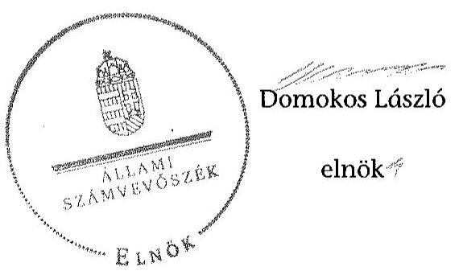

# ÁLLAMI   SZÁMVEVŐSZÉK 

## JELENTÉS

a helyi nemzetiségi önkormányzatok gazdálkodásának ellenőrzéséről
Cigány Nemzetiségi Önkormányzat Lovászpatona

---

# Állami Számvevőszék 

Iktatószám: V-0708-065/2015.
Témaszám: 1742
Vizsgálat-azonosító szám: V067617

## Az ellenőrzést felügyelte:

## Brebán Andrea

felügyeleti vezető
2015. július 21. napjától

## Horváthné Herbáth Mária

felügyeleti vezető
2015. július 20. napjáig

## Az ellenőrzést vezette és az ellenőrzés végrehajtásáért felelős:

## Zakar László

ellenőrzésvezető

## A számvevőszéki jelentést készítették:

## Zakar László

ellenőrzésvezető

## Bodonyi Miklós

számvevő főtanácsos

## Az ellenőrzést végezték:

Dr. Baloghné Sebestyén Éva számvevő

Bodonyi Miklós
számvevő főtanácsos

---

# TARTALOMJEGYZÉK 

BEVEZETÉS ..... 3
I. ÖSSZEGZŐ MEGÁLLAPÍTÁSOK, KÖVETKEZTETÉSEK, JAVASLATOK ..... 6
II. RÉSZLETES MEGÁLLAPÍTÁSOK ..... 10

1. A Nemzetiségi Önkormányzat és a Települési Önkormányzat együttműködésének szabályozása, a működési feltételek biztosítása ..... 10
2. A gazdálkodási feladatok ellátásának szabályszerűsége ..... 11
2.1. A költségvetésre és a zárszámadásra, valamint a kincstári adatszolgáltatás rendjére vonatkozó jogszabályi előírások betartása ..... 11
2.2. A Nemzetiségi Önkormányzat gazdálkodásának szabályozottsága ..... 12
2.3. Az operatív gazdálkodási jogkörök kialakítása, gyakorlása ..... 13
3. A Nemzetiségi Önkormányzattal összefüggő gazdálkodási feladatok belső ellenőrzése ..... 15

## MELLÉKLET

1. számú A Cigány Nemzetiségi Önkormányzat Lovászpatona 2013. évi gazdálkodási adatai

## FÜGGELÉKEK

1. számú Rövidítések jegyzéke
2. számú Értelmező szótár

---

.

---

# JELENTÉS 

## A helyi nemzetiségi önkormányzatok gazdálkodásának ellenőrzéséről Cigány Nemzetiségi Önkormányzat Lovászpatona

## BEVEZETÉS

A Nemzetiségi Önkormányzat az 1998. évben alakult. A 2013. évben hivatalban levő elnök a 2010. évi választásokat követően, egy cikluson keresztül látta el az elnöki feladatokat. A Nemzetiségi Önkormányzat intézményt, gazdasági társaságot és más szervezetet nem alapított, illetve társulásban nem vett részt. A háromtagú Képviselő-testület a munkája segítésére bizottságot nem hozott létre. A Nemzetiségi Önkormányzat költségvetési beszámolója szerint a 2013. évben a módosított költségvetési bevételi előirányzat 371,0 ezer Ft és a módosított költségvetési kiadási előirányzat 451,0 ezer Ft, a teljesített költségvetési bevétel 372,0 ezer Ft, a teljesített költségvetési kiadás 227,0 ezer Ft volt. A Nemzetiségi Önkormányzat a 2013. évben 146,0 ezer Ft feladatalapú támogatásban részesült. A 2013. évi gazdálkodási adatokat részletesen az 1. számú mellékletben mutatjuk be.

Az Alaptörvény Szabadság és felelősség rész XXIX. cikk (1) bekezdése szerint a Magyarországon élő nemzetiségek államalkotó tényezők. Minden, valamely nemzetiséghez tartozó magyar állampolgárnak joga van önazonossága szabad vállalásához és megőrzéséhez. A hazánkban élő nemzetiségek helyi (települési és területi) valamint országos önkormányzatokat hozhatnak létre ${ }^{1}$. A helyi nemzetiségi önkormányzatok gazdálkodási feladatait jogszabályi előírás alapján a székhely szerinti helyi önkormányzat polgármesteri hivatala látja el.

A nemzetiségek helyzete, támogatása mind hazai, mind EU-s szinten kiemelt figyelmet kap napjainkban. A helyi nemzetiségi önkormányzatok gazdálkodására és támogatási rendszerére vonatkozó jogszabályok a 2010-2012. években jelentős változásokon mentek át. A helyi nemzetiségi önkormányzatok gazdálkodásának, a részükre juttatott költségvetési támogatások felhasználásának ellenőrzését az ÁSZ 2012-ben sorozatjellegű ellenőrzés keretében indította el.

Az ellenőrzés célja annak értékelése volt, hogy a helyi nemzetiségi önkormányzat gazdálkodási kereteinek kialakítása, gazdálkodása megfelelt-e a jogszabályoknak.

[^0]
[^0]:    ${ }^{1}$ A 2010. évben megtartott nemzetiségi önkormányzati választásokat követően 2304 települési, 58 területi és 13 országos nemzetiségi önkormányzat alakult meg.

---

Ennek keretében értékeltük, hogy:

- a helyi nemzetiségi önkormányzat és a helyi (települési) önkormányzat együttműködésének szabályozása, a működési feltételek biztosítása megfelelt-e a jogszabályi előírásoknak;
- a felek együttműködése megfelelt-e a megállapodásban foglaltaknak a gazdálkodási feladatok szabályszerű ellátása során, betartották-e a vonatkozó jogszabályi előírásokat;
- biztosított volt-e a helyi nemzetiségi önkormányzat gazdálkodásának belső ellenőrzése.

Az ellenőrzés várható hasznosulása: a nemzetiségi önkormányzatok testületi döntéseinek tapasztalatait összegezve következtetés vonható le a törvényalkotás számára a jogszabályi környezet esetleges módosításának indokoltságára vonatkozóan. Az ellenőrzés az ellenőrzött számára visszajelzést ad a rendezett gazdálkodási keretek kialakításáról, a működésbeli hiányosságokról. Az ellenőrzés megállapításai és javaslatai, a jó gyakorlat bemutatása tanulságul szolgálhatnak más nemzetiségi önkormányzatok, szervezetek számára a rendezett gazdálkodási keretek kialakításához. A társadalom számára jelzi, hogy közpénz nem maradhat ellenőrizetlenül, az ÁSZ értékteremtő rend kialakításához és megőrzéséhez hozzájáruló tevékenysége pozitív hatással lesz a szervezetről kialakított összkép formálásában. Az ÁSZ szervezetén belül lehetőség nyílik arra, hogy a megállapítások szintetizálásával az intézmény a hozzáadott értéket teremtő elemző tevékenységét és tanácsadó szerepét erősítse.

A helyi nemzetiségi önkormányzatok gazdálkodásának ellenőrzéséről szóló jelentés I. fejezetének összegző része az ellenőrzés céljára adott rövid, szintetizáló összefoglalót és következtetéseket tartalmazza a II. fejezet részletes megállapításain alapulóan. A jelentés intézkedést igénylő megállapításait és javaslatait az összegzőben foglaltak mellett - az ellenőrzés során feltárt, a jelentés II. fejezetében rögzített részletes megállapítások alapozzák meg, illetve támasztják alá.

Az ellenőrzés típusa: szabályszerűségi ellenőrzés.
Az ellenőrzött időszak: a helyi nemzetiségi önkormányzat és a települési önkormányzat együttműködésének, valamint a helyi nemzetiségi önkormányzat gazdálkodásának szabályozása megfelelőségét a 2013. évre vonatkozóan (a 2013. december 31-i állapotnak megfelelően), a helyi nemzetiségi önkormányzat gazdálkodásának szabályszerűségét, a működési feltételek, valamint a belső ellenőrzés biztosítását a 2013. január 1. - december 31-e közötti időszakot figyelembe véve értékeltük.

Ellenőrzött szervezet: a Cigány Nemzetiségi Önkormányzat Lovászpatona és a gazdálkodási feladatait ellátó Ugodi Közös Önkormányzati Hivatal.

Az ellenőrzés szakmai módszertana az ÁSZ hivatalos honlapján (www.asz.hu) közzétett szakmai szabályokon alapult, amely a Legfőbb Ellenőrző Intézmények Nemzetközi Szervezete (INTOSAI) által kiadott nemzetközi standardok (ISSAI) figyelembevételével készült.

---

A gazdálkodás folyamatában kulcsszerepet betöltő két kulcskontroll - teljesítésigazolás, érvényesítés - működésének megfelelőségét teljes körűen, azaz minden, a személyi juttatásokkal, a dologi és a felhalmozási kiadásokkal, a működési és felhalmozási célú pénzeszköz átadásokkal, az ellátottak pénzbeli juttatásaival kapcsolatos kifizetések esetében ellenőriztük. „Megfelelőnek" értékeltük a gazdálkodási jogkörök gyakorlását, amennyiben a hibaarány legfeljebb 10\%, „részben megfelelőnek" értékeltük, ha a hibaarány 10-30\% között volt, „nem megfelelőnek" pedig akkor, ha az eredmények alapján a hibaarány meghaladta a 30\%-ot.

Az ellenőrzés végrehajtásának jogszabályi alapját az ÁSZ tv. 5. § (2)-(3) és (6) bekezdéseiben foglaltak képezik.

Az ÁSZ tv. 29. § (1) bekezdése szerint megküldtük egyeztetésre a jegyzőnek és a Nemzetiségi Önkormányzat elnökének. Az ellenőrzött szervezetek vezetői az ÁSZ tv. 29. § (2) bekezdésében foglalt észrevételezési jogukkal nem éltek, a jelentéstervezetre nem tettek észrevételt.

---

# I. ÖSSZEGZŐ MEGÁLLAPÍTÁSOK, KÖVETKEZTETÉSEK, JAVASLATOK 

Az ellenőrzött időszakban a Nemzetiségi Önkormányzat és a Települési Önkormányzat együttműködését - a Nek. tv. előírásának megfelelően - megállapodás szabályozta. Az együttműködés szabályozása a tartalmi hiányosságok ellenére megfelelt a jogszabályi előírásoknak. A 2013. december 31-én hatályos együttműködési megállapodás tartalmazta az Áht.-ban foglaltaknak megfelelően a Nemzetiségi Önkormányzat bevételeivel és kiadásaival kapcsolatban a tervezési, gazdálkodási, finanszírozási, adatszolgáltatási és beszámolási feladatok ellátásának részletes szabályait. Az együttműködési megállapodás a Nek. tv.-ben foglaltak ellenére nem tartalmazta a Nemzetiségi Önkormányzat SZMSZ-ében meghatározott, a kötelezettségvállalás nyilvántartására vonatkozó szabályokat, továbbá az Áht. előírása ellenére a Nemzetiségi Önkormányzat bevételeivel és kiadásaival kapcsolatban az ellenőrzési feladatok ellátásának részletes szabályait. A szabályozás hiánya hozzájárult ahhoz, hogy a Nemzetiségi Önkormányzat gazdálkodásával összefüggő végrehajtási feladatokra vonatkozóan a 2013. évben nem terveztek és nem hajtottak végre belső ellenőrzést. A Települési Önkormányzat a 2013. évben biztosította a Nemzetiségi Önkormányzat működéséhez szükséges személyi és tárgyi feltételeket.

A Nemzetiségi Önkormányzat 2013. évi költségvetésének és zárszámadásának tartalma, jóváhagyása, valamint a kapcsolódó adatszolgáltatás részben felelt meg a jogszabályi előírásoknak. A jegyző nevében eljáró aljegyző az Áht. előírása ellenére nem készítette elő a költségvetési koncepciót és a költségvetési határozat-tervezetet nem az Áht.-ban előírtaknak megfelelő tartalommal állította össze. A Nemzetiségi Önkormányzat Képviselő-testülete által elfogadott 2013. évi költségvetési határozat az Áht.-ban előírtak ellenére nem tartalmazta a költségvetési bevételeket és kiadásokat kötelező és önként vállalt feladatok szerinti bontásban. A jegyző nevében eljáró aljegyző a jogszabályokban előírt határidőkben teljesítette a Nemzetiségi Önkormányzat részére előírt kincstári adatszolgáltatásokat.

A Nemzetiségi Önkormányzat gazdálkodásának szabályozottsága megfelelt a jogszabályi előírásoknak. A gazdálkodási feladatok végrehajtását ellátó Ugodi Közös Önkormányzati Hivatal rendelkezett a Számv. tv. által előírt szabályzatokkal. A jegyző a Bkr. 6. § (3) bekezdésében előírt ellenőrzési nyomvonalat az Ugodi Közös Önkormányzati Hivatalra vonatkozóan nem készítette el.

A Nemzetiségi Önkormányzat gazdálkodása tekintetében az operatív gazdálkodási jogkörök kialakítása megfelelt a jogszabályi előírásoknak és az együttműködési megállapodásban foglaltaknak. A kiadások teljesítése során az operatív gazdálkodási jogkörökön belül kulcsszerepet betöltő teljesítésigazolás és érvényesítés belső kontrollokat nem a jogszabályi előírásoknak megfelelően működtették, aminek következtében nem volt biztosított a hibák megelőzése, feltárása és kijavítása. A teljesítésigazolást a kifizetéseket megelőzően több esetben nem szabályszerűen végezték, mert a teljesítésigazolás dátumának rögzítése az Ávr.-ben előírtak ellenére a teljesítésigazolás

---

dokumentumán elmaradt. Az érvényesítő az Ávr.-ben foglaltak ellenére több esetben nem jelezte az utalványozónak, hogy a megelőző ügymenetben a teljesítésigazolás nem szabályszerűen történt, valamint azt, hogy az utalványrendeletek az Ávr.-ben előírtak ellenére nem tartalmazták a kötelezettségvállalás nyilvántartási számát. A nem megfelelően működtetett belső kontrollok korrupciós kockázatot hordoztak.

Az ÁSZ tv. 33. § (1) bekezdésében foglaltak értelmében a jelentésben foglalt megállapításokhoz kapcsolódó intézkedési tervet köteles az ellenőrzött szervezet vezetője összeállítani, és azt a jelentés kézhezvételétől számított 30 napon belül az ÁSZ részére megküldeni. Amennyiben az intézkedési tervet határidőben nem küldi meg a szervezet, vagy az nem elfogadható, az ÁSZ elnöke a hivatkozott törvény 33. § (3) bekezdés a)-b) pontjaiban foglaltakat érvényesítheti.

A helyszíni ellenőrzés megállapításainak hasznosítása mellett javasoljuk:

# a jegyzőnek 

1. Az együttműködés szabályozásával kapcsolatban

A Nemzetiségi Önkormányzat és a Települési Önkormányzat együttműködését meghatározó együttműködési megállapodásban a jogszabályi előírások nem érvényesültek maradéktalanul, mivel a megállapodás nem tartalmazta a Nek.tv. 80. § (3) bekezdés c) pontjában előírtakat.

A Nemzetiségi Önkormányzat SZMSZ-e a Nek. tv. 80. § (2) bekezdésében előírt határidőre és azt követően sem tartalmazta - a működési feltételek közül - a Nek. tv. 80. § (1) bekezdés c) pont előírása ellenére a testületi ülések előkészítésének feladatát (előterjesztések, hivatalos levelezés előkészítését).

Javaslat
a) Az együttműködés szabályszerűsége érdekében készítse elő az együttműködési megállapodás módosítását, amely teljes körűen megfelel a Nek. tv. előírásainak, és kezdeményezze annak a Települési Önkormányzat Képviselő-testülete elé terjesztését.
b) Készítse elő a Nemzetiségi Önkormányzat SZMSZ-ének kiegészítését a Nek. tv-ben foglalt előírás alapján.
2. A költségvetés szabályszerűségével kapcsolatban

A 2013. évi költségvetési határozat az Áht. 23. § (2) bekezdés a) pontjától eltérően nem tartalmazta a Nemzetiségi Önkormányzat költségvetési bevételeit és kiadásait kötelező és önként vállalt feladatok szerinti bontásban. A költségvetési határozattervezet előterjesztésekor a Képviselő-testület részére tájékoztatásul nem mutatták be az Áht. 24. § (4) bekezdés a) pontjában előírtak ellenére szöveges indokolással együtt a Nemzetiségi Önkormányzat költségvetési mérlegét közgazdasági tagolásban és előirányzat-felhasználási tervét.

Javaslat

---

Intézkedjen arról, hogy a jövőben
a) a költségvetési határozat tartalmilag teljes körűen feleljen meg a hatályos jogszabályi előírásoknak;
b) a költségvetési határozat-tervezet előterjesztésekor a Képviselő-testület részére tájékoztatásul teljes körűen, a jogszabályi előírásoknak megfelelően, szöveges indoklással együtt kerüljenek bemutatásra a mérlegek és kimutatások.
3. A gazdálkodási feladatok szabályozottságával kapcsolatban

A jegyző a Bkr. 6. § (3) bekezdésében előírt ellenőrzési nyomvonalat az Ugodi Közös Önkormányzati Hivatal működési folyamataira vonatkozóan nem készítette el.

Javaslat
Készítse el az
 Önkormányzati Hivatal működési folyamatainak egészére kiterjedően az ellenőrzési nyomvonalat.
4. A kulcskontrollok működésével kapcsolatban

A 2013. évi kifizetések teljesítése során az operatív gazdálkodási jogkörökön belül kulcsszerepet betöltő teljesítésigazolás és érvényesítés belső kontrollokat nem a jogszabályi előírásoknak megfelelően működtették. A teljesítésigazolás - az Ávr. 57. § (3) bekezdésében foglaltak ellenére - több esetben nem tartalmazta az igazolás dátumát. Az érvényesítő nem tartotta be az Ávr. 58. § (2) bekezdésében foglaltakat, nem jelezte az utalványozónak a megelőző ügymenetre vonatkozóan a jogszabályi előírások megsértését. A kulcskontrollok ellenőrzése során feltárt további hiányosság, hogy a 2013. évben a Nemzetiségi Önkormányzat kötelezettségvállalásairól nem vezetett az Ávr. 56. § (1) bekezdésében előírt nyilvántartást.

Javaslat
Az operatív gazdálkodás működési hibáinak megelőzése, feltárása és kijavítása érdekében intézkedjen:
a) a teljesítésigazolás jogszabályi előírásoknak megfelelő elvégzéséről;
b) az érvényesítéshez kapcsolódó jelzési feladatok szabályszerű ellátásáról;
c) a kötelezettségvállalás nyilvántartásának folyamatos vezetéséről.
5. A belső ellenőrzéssel kapcsolatban

A 2013. évben a Nemzetiségi Önkormányzat gazdálkodásával összefüggő feladatokra vonatkozó belső ellenőrzés nem volt megfelelő. Az együttműködési megállapodás - az Áht. 27. § (2) bekezdésében foglaltak ellenére - nem tartalmazta a Nemzetiségi Önkormányzat bevételeivel és kiadásaival kapcsolatban az ellenőrzési feladat ellátásának részletes szabályait, azon belül a belső ellenőrzés ellátására vonatkozó rendelkezéseket.

Javaslat

---

Az együttműködési megállapodás módosításának előkészítése során kezdeményezze annak kiegészítését a belső ellenőrzés ellátására vonatkozó részletszabályok meghatározásával.

# a Nemzetiségi Önkormányzat elnökének 

1. A Nemzetiségi Önkormányzat és a Települési Önkormányzat együttműködését meghatározó együttműködési megállapodásban a jogszabályi előírások nem érvényesültek maradéktalanul, mivel a megállapodás nem tartalmazta a Nek.tv. 80. § (3) bekezdés c) pontjában előírtakat.

Az együttműködési megállapodás - az Áht. 27. § (2) bekezdésében foglaltak ellenére - nem tartalmazta a Nemzetiségi Önkormányzat bevételeivel és kiadásaival kapcsolatban az ellenőrzési feladat ellátásának részletes szabályait, azon belül a belső ellenőrzés ellátására vonatkozó rendelkezéseket.

A Nemzetiségi Önkormányzat SZMSZ-e a Nek. tv. 80. § (2) bekezdésében előírt határidőre és azt követően sem tartalmazta - a működési feltételek közül - a Nek. tv. 80. § (1) bekezdés c) pont előírása ellenére a testületi ülések előkészítésének feladatát (előterjesztések, hivatalos levelezés előkészítését).

Javaslat
a) Terjessze a Képviselő-testület elé jóváhagyásra a jegyző által a Nek. tv-ben foglaltaknak megfelelően előkészített együttműködési megállapodás módosítását.
b) Intézkedjék annak érdekében, hogy az együttműködési megállapodásban rendelkezzenek a belső ellenőrzés ellátására vonatkozó részletszabályok meghatározásáról.
c) Terjessze a Képviselő-testület elé jóváhagyásra a jegyző által előkészített Nemzetiségi Önkormányzati SZMSZ kiegészítést.
2. A 2013. évi költségvetési határozat az Áht. 23. § (2) bekezdés a) pontjától eltérően nem tartalmazta a Nemzetiségi Önkormányzat költségvetési bevételeit és kiadásait kötelező és önként vállalt feladatok szerinti bontásban. A költségvetési határozattervezet előterjesztésekor a Képviselő-testület részére tájékoztatásul nem mutatták be az Áht. 24. § (4) bekezdés a) pontjában előírtak ellenére szöveges indokolással együtt a Nemzetiségi Önkormányzat költségvetési mérlegét közgazdasági tagolásban és előirányzat-felhasználási tervét.

Javaslat:
Intézkedjen, hogy a jövőben
a) az elfogadott költségvetési határozat tartalmilag teljes körűen feleljen meg a jogszabályi előírásoknak,
b) a Képviselő-testület részére a költségvetési határozat-tervezet előterjesztésekor tájékoztatásul szöveges indoklással együtt bemutatásra kerüljön a jogszabályban előírt valamennyi mérleg és kimutatás.

---

# II. RÉSZLETES MEGÁLLAPÍTÁSOK 

## 1. A Nemzetiségi Önkormányzat És a Települési Önkormányzat Együttműködésének Szabályozása, a Működési Feltételek Biztosítása

A Nemzetiségi Önkormányzat és a Települési Önkormányzat együttműködésének szabályozása - a tartalmi hiányosságok ellenére - megfelelő a jogszabályi előírásoknak.

A Nemzetiségi Önkormányzat rendelkezett a 2013. évben hatályban lévő, a Települési Önkormányzattal történő együttműködésre vonatkozó megállapodással. A megállapodást a Nemzetiségi Önkormányzat és a Települési Önkormányzat Képviselő-testületei határozattal jóváhagyták ${ }^{2}$ és az arra jogosult személyek aláírták. A Nek. tv. 80. § (2) bekezdés előírásának megfelelően 2013. január 31-éig elvégezték a megállapodás felülvizsgálatát. A Nemzetiségi Önkormányzat 2013. január 31-ei Képviselő-testületi üléséről készült jegyzőkönyv szerint a jegyző, a polgármester és a Nemzetiségi Önkormányzat elnöke az együttműködési megállapodás módosítását nem tartotta szükségesnek.

A 2013. december 31-én hatályos együttműködési megállapodás tartalmazta az Áht. 27. § (2) bekezdésében foglaltaknak megfelelően a Nemzetiségi Önkormányzat bevételeivel és kiadásaival kapcsolatban a tervezési, gazdálkodási, finanszírozási, adatszolgáltatási és beszámolási feladatok ellátásának részletes szabályait. Az együttműködési megállapodásban rögzítették a Nek. tv. 80. § (3) bekezdés a), b) és d) pontjaiban, valamint a (4) bekezdésében előírt tartalmi elemeket.

Az együttműködési megállapodás az Áht. 27. § (2) bekezdésében és a Nek. tv. 80. § (3) bekezdésében előírt tartalmi elemek közül nem tartalmazta:

- az Áht. 27. § (2) bekezdésében előírt, a Nemzetiségi Önkormányzat bevételeivel és kiadásaival kapcsolatban az ellenőrzési feladatok ellátásának részletes szabályait;
- az együttműködési megállapodás -a Nek. tv. 80. § (3) bekezdés c) pontjában foglaltak ellenére - nem tartalmazta a Nemzetiségi Önkormányzat SZMSZ-ében meghatározott, a kötelezettségvállalás nyilvántartására vonatkozó szabályokat.

A megállapodás szerinti működési feltételeket a megállapodás megkötését követő harminc napon belül a Nek. tv. 80. § (2) bekezdésében foglaltak szerint a

[^0]
[^0]:    ${ }^{2}$ Az együttműködési megállapodást a Települési Önkormányzat a 3/2012. (I. 30.) számú, a Nemzetiségi Önkormányzat az 1/2012. (I. 30.) számú határozatával hagyta jóvá.

---

Települési Önkormányzat SZMSZ-ében rögzítették ${ }^{3}$. A Nemzetiségi Önkormányzat SZMSZ-e a Nek. tv. 80. § (2) bekezdésében előírt határidőre és azt követően sem tartalmazta - a működési feltételek közül - a Nek. tv. 80. § (1) bekezdés c) pont előírása ellenére a testületi ülések előkészítésének feladatát (előterjesztések, hivatalos levelezés előkészítését).

A Települési Önkormányzat - az együttműködési megállapodás tartalmi hiányosságai ellenére - a 2013. évben biztosította a Nemzetiségi Önkormányzat működéséhez szükséges személyi és tárgyi feltételeket.

# 2. A Gazdálkodási Feladatok Ellátásának Szabályszerűsége 

### 2.1. A költségvetésre és a zárszámadásra, valamint a kincstári adatszolgáltatás rendjére vonatkozó jogszabályi előírások betartása

A Nemzetiségi Önkormányzat 2013. évi költségvetésének és zárszámadásának tartalma, jóváhagyása, valamint a kapcsolódó adatszolgáltatás részben felelt meg a jogszabályi előírásoknak.

Az Áht. 26. § (1) bekezdésben és az Áht. 24. § (1) bekezdésében előírtaktól eltérően a Települési Önkormányzat aljegyzője ${ }^{4}$ nem készítette elő, és emiatt a Nemzetiségi Önkormányzat elnöke november 30-ig nem nyújtotta be a Nemzetiségi Önkormányzat Képviselő-testülete részére az ellenőrzött évre vonatkozó költségvetési koncepciót.

A Nemzetiségi Önkormányzat elnöke az Áht. 26. § (1) bekezdése alapján, az Áht. 24. § (2) bekezdésében ${ }^{5}$ előírtaknak megfelelően a központi költségvetésről szóló törvény hatálybalépését követő 45 napig benyújtotta a Nemzetiségi Önkormányzat Képviselő-testülete részére a költségvetési határozattervezetét, amelyet a Képviselő-testület az 1/2013. (I. 31.) határozatával elfogadott. A 2013. évi költségvetési határozat-tervezet előterjesztésekor a Nemzetiségi Önkormányzat Képviselő-testülete részére az Áht. 24. § (4) bekezdés a) pontja előírásától eltérően tájékoztatásul nem mutatták be szöveges indokolással együtt a Nemzetiségi Önkormányzat előirányzat-felhasználási tervét és költségvetési mérlegét közgazdasági tagolásban. A 2013. évi költségvetési határozat az Áht. 23. § (2) bekezdés a) pontja előírásának megfelelően tartalmazta a Nemzetiségi Önkormányzat költségvetési bevételeit és költségvetési kiadásait előirányzat-csoportok szerinti bontásban. A költségvetési határozat nem tartalmazta - az Áht. 23. § (2) bekezdés a) pontjában előírtak ellenére - a költség-

[^0]
[^0]:    ${ }^{3}$ A Nemzetiségi Önkormányzat SZMSZ-ének módosítását a 3/2012. (I. 30.) CNÖ határozattal, a Települési Önkormányzat SZMSZ-ének módosítását az 5/2012. (II. 17.) önkormányzati rendelettel fogadták el.
    ${ }^{4}$ Az aljegyző 2013. január 3-án aláírt munkaköri leírásában szerepelt, hogy feladata az Ugodi Közös Önkormányzati Hivatal Lovászpatonai Kirendeltségén a körjegyző feladat- és hatásköreinek ellátása, ennek során a kirendeltség irányítása, a Nemzetiségi Önkormányzat döntéseinek előkészítése, végrehajtása.
    ${ }^{5}$ 2013. december 21-étől az Áht. 24. § (3) bekezdése írja elő

---

vetési bevételeket és kiadásokat kötelező és önként vállalt feladatok szerinti bontásban.

A jegyző nevében eljáró aljegyző az Áht. 91. § (1) bekezdésében előírt határidőre elkészítette a Nemzetiségi Önkormányzat 2013. évi zárszámadási határozat-tervezetét, amelyet a Nemzetiségi Önkormányzat elnöke határidőben terjesztett a Képviselő-testület elé. A zárszámadási határozat-tervezet előterjesztésekor a Nemzetiségi Önkormányzat Képviselő-testülete részére tájékoztatásul bemutatták az Áht. 91. § (2) bekezdés a), c) pontja szerinti és 24. § (4) bekezdés a) pontja szerinti mérlegeket és kimutatásokat. A Nemzetiségi Önkormányzat a 2013. év során több éves kihatással járó döntést nem hozott, közvetett támogatásokat nem nyújtott és abban nem részesült. A Nemzetiségi Önkormányzat az 5/2014. (IV. 29.) számon a zárszámadásról határozatot hozott. A határozatában valamennyi bevételről és kiadásról elszámoltak, a zárszámadás összehasonlíthatóságát az elfogadott költségvetéssel biztosították.

A Kormányhivatal 2013. június 26-án törvényességi felhívást tett a Nemzetiségi Önkormányzat 2012. évi zárszámadási határozata megküldésének elmulasztása miatt. A törvényességi felhívásra a Nemzetiségi Önkormányzat Képviselőtestülete a 2012. évi zárszámadást 2013. július 4-én fogadta el, és az azt tartalmazó Képviselő-testületi ülés jegyzőkönyvét megküldte a Kormányhivatalnak. A jegyzőkönyv megküldését követően újabb felügyeleti eljárás keretében a Kormányhivatal javaslattal élt az Áht. 91. § (1) és (3) bekezdéseiben előírt, a zárszámadási határozat-tervezet előterjesztésére vonatkozó határidő jövőbeni pontos betartására. A Képviselő-testület a Kormányhivatal javaslatát az 5/2013. (IX. 1.) CNÖ határozatában elfogadta.

Az együttműködési megállapodás 4.3. és 5. pontjában a Lovászpatona Község Önkormányzata körjegyzője kapott feladat- és hatáskört az adatszolgáltatásra. Az aljegyző 2013. január 3-án aláírt munkaköri leírásában szerepelt, hogy feladata az Ugodi Közös Önkormányzati Hivatal Lovászpatonai Kirendeltségén a körjegyző feladat- és hatásköreinek ellátása, ennek során a kirendeltség irányítása, a Nemzetiségi Önkormányzat döntéseinek előkészítése, végrehajtása. Az aljegyző a 2013. évben a jogszabályokban előírt határidőben teljesítette a Nemzetiségi Önkormányzatra vonatkozó kincstári adatszolgáltatásokat:

- a 2013. évi elemi költségvetést az Ávr. 33. § (2) bekezdése, a negyedéves és éves időközi költségvetési jelentéseket az Ávr. 169. § (2) bekezdése szerinti;
- az időközi mérlegjelentéseket az Ávr. 170. § (5) bekezdése szerinti;
- a 2013. év I. féléves és éves elemi költségvetési beszámolót az Áhsz. 10. § (5a) bekezdés szerinti határidőre megküldte a Kincstár területileg illetékes szervezetének.

# 2.2. A Nemzetiségi Önkormányzat gazdálkodásának szabályozottsága 

A Nemzetiségi Önkormányzat gazdálkodásának szabályozottsága az ellenőrzött időszakban megfelelt a jogszabályi előírásoknak.

---

A gazdálkodási feladatok végrehajtását - a Lovászpatonai Kirendeltség útján ellátó Ugodi Közös Önkormányzati Hivatal 2013. december 31-én rendelkezett - a Számv. tv. 14. § (3)-(5) bekezdéseiben és a 161. § (1)-(2) bekezdéseiben előírt - számviteli szabályzatokkal ${ }^{6}$, amelyek hatálya kiterjedt a Nemzetiségi Önkormányzat gazdálkodási feladataira is.

Az Ugodi Közös Önkormányzati Hivatal jegyzője az 1/2013. (I. 3.) jegyzői intézkedésben hatályban tartotta az érintett (közöttük a lovászpatonai) önkormányzatok belső szabályzatait, amíg a közös szabályzatok - 2013. augusztus 1-én hatályba nem léptek.

Az Ugodi Közös Önkormányzati Hivatal SZMSZ-e az Ávr. 13. § (1) bekezdés g) pontjában előírtaknak megfelelően tartalmazta a nevesített munkakörökhöz tartozó feladat- és hatásköröket, a helyettesítés rendjét, az ezekhez kapcsolódó felelősségi szabályokat, de a hatáskörök gyakorlásának módját nem határozták meg. A Nemzetiségi Önkormányzat gazdálkodása végrehajtásához kapcsolódó feladat- és hatásköröket - az Ugodi

 Közös Önkormányzati Hivatal SZMSZ-ének felhatalmazása alapján - a jegyző a gazdálkodási ügyrendben és a számviteli politika keretében elkészített szabályzatokban meghatározta.

Az Ugodi Közös Önkormányzati Hivatal Lovászpatonai Kirendeltségén a gazdálkodási feladatokat ellátó köztisztviselők munkaköri leírásai tartalmazták a Nemzetiségi Önkormányzattal kapcsolatos feladatok ellátásának kötelezettségét.

Az együttműködési megállapodásban, az Ugodi Közös Önkormányzati Hivatal SZMSZ-ében, a gazdasági ügyrendben és a pénzkezelési-, és gazdálkodási jogkörök szabályzataiban rögzítették a Nemzetiségi Önkormányzatra vonatkozóan - az Ávr. 13. § (2) bekezdés a) pontban foglaltak szerint - a tervezéssel, a gazdálkodással, így különösen a kötelezettségvállalás, a pénzügyi ellenjegyzés, a teljesítésigazolás, az érvényesítés, az utalványozás gyakorlásának módjával, eljárási és dokumentációs részletszabályaival, valamint az ezeket végző személyek kijelölésének rendjével és az adatszolgáltatási feladatok teljesítésével kapcsolatos belső előírásokat, feltételeket.

A jegyző a Bkr. 6. § (3) bekezdésében előírt ellenőrzési nyomvonalat az Ugodi Közös Önkormányzati Hivatal működési folyamataira vonatkozóan nem készítette el. A jegyző a Bkr. 6. § (4) bekezdés előírásának megfelelően szabályozta a szabálytalanságok kezelésének - a Nemzetiségi Önkormányzatra is hatályos - eljárásrendjét.

# 2.3. Az operatív gazdálkodási jogkörök kialakítása, gyakorlása 

A Nemzetiségi Önkormányzat gazdálkodása tekintetében az operatív gazdálkodási jogkörök kialakítása megfelelt a jogszabályi előírásoknak, valamint az együttműködési megállapodásban foglaltaknak.

[^0]
[^0]:    ${ }^{6}$ Számviteli politika, valamint annak keretében elkészített eszközök és források értékelési szabályzata, az eszközök és források leltározási és leltárkészítési szabályzata és a pénzkezelési szabályzat, továbbá a számlarend.

---

A jegyző a pénzgazdálkodási kötelezettségvállalási szabályzatban lehetővé tette a 100,0 ezer Ft alatti kifizetések előzetes írásbeli kötelezettségvállalás nélküli teljesítését és meghatározta az írásbeli kötelezettségvállalást nem igénylő kifizetések rendjét.

A Nemzetiségi Önkormányzat elnöke, mint kötelezettségvállaló, utalványozó és teljesítésigazoló nem hatalmazott fel írásban más személyt jogkörei gyakorlására. A felhatalmazás hiánya a 2013. évben nem okozott összeférhetetlenséget.

A jegyző a gazdasági szervezettel nem rendelkező Ugodi Közös Önkormányzati Hivatalban az Ávr. 55. § (2) bekezdés g) pontja és 58. § (4) bekezdése előírásainak megfelelően írásban kijelölte a pénzügyi ellenjegyzésre és az érvényesítésre jogosult köztisztviselőket. A pénzügyi ellenjegyző az Ávr. 55. § (3) bekezdésében, valamint az érvényesítő az Ávr. 58. § (4) bekezdésében előírt pénzügyiszámviteli képesítéssel rendelkezett.

A Nemzetiségi Önkormányzatnak a 2013. évben dologi kiadása és működési célú pénzeszköz átadása volt. A 2013. évi kifizetések teljesítése során az operatív gazdálkodási jogkörökön belül kulcsszerepet betöltő teljesítésigazolás és érvényesítés belső kontrollokat - az ellenőrzött összes kifizetésre együttesen értékelve - nem a jogszabályi előírásoknak megfelelően működtették.

A dologi kiadásokkal kapcsolatos kifizetéseknél a 2013. évben a teljesítésigazolás és érvényesítés kulcskontrollok működtetésével kapcsolatban az alábbi hiányosságok, szabálytalanságok fordultak elő:

- a teljesítésigazolást több esetben - az Ávr. 57. § (3) bekezdésében foglaltak ellenére - nem szabályszerűen végezték, mert a teljesítésigazoló a teljesítésigazolás dokumentumán nem rögzítette a teljesítésigazolás dátumát;
- az érvényesítő több esetben - az Ávr. 58. § (2) bekezdésében foglaltak ellenére - nem jelezte az utalványozónak, hogy a megelőző ügymenetben a teljesítésigazolás nem szabályszerűen történt, valamint az utalványrendeletek - az Ávr. 59. § (3) bekezdés f) pontjában előírtak ellenére - nem tartalmazták a kötelezettségvállalás nyilvántartási számát.

A kulcskontrollok ellenőrzése során feltárt további szabálytalanság volt, hogy a 2013. évben a Nemzetiségi Önkormányzat kötelezettségvállalásairól - az Ávr. 56. § (1) bekezdésében foglaltak ellenére - nyilvántartást nem vezettek.

A Nemzetiségi Önkormányzatnál a 2013. évben a kulcskontrollokat nem megfelelően működtették és emiatt nem volt biztosított a hibák megelőzése, feltárása és kijavítása. A nem megfelelően működtetett belső kontrollok korrupciós kockázatot hordoztak.

Az integritás szemlélet érvényesülésének ellenőrzéséhez az Önkormányzat tanúsítványon szolgáltatott adatokat. Ezen adatok értékelése alapján az eredendő veszélyeztetettségi szint és a kockázatokat növelő tényezők szintje is alacsony. Emellett a szervezetnél kiépült, a kockázatok kezelésére hivatott kontrollok szintje is alacsony.

---

A kockázatok és a kontrollok szintje alapján megállapítható, hogy a szervezetnél jelenlévő eredendő korrupciós kockázatok, valamint a kockázatokat növelő tényezők szintje nem haladja meg az azok kezelésére kiépült kontrollok szintjét.

Ugyanakkor az operatív gazdálkodási jogkörök gyakorlása területén feltárt hiányosságok és hibák arra utalnak, hogy a Nemzetiségi Önkormányzatnak még lépéseket kell tennie az integritás szemlélet érvényesülésében.

# 3. A Nemzetiségi Önkormányzattal összefüggő gazdálkodási feladatok belső ellenőrzése 

A 2013. évben a Nemzetiségi Önkormányzat gazdálkodásával összefüggő végrehajtási feladatokra vonatkozó belső ellenőrzés nem volt megfelelő.

Az együttműködési megállapodás - az Áht. 27. § (2) bekezdésében foglaltak ellenére - nem tartalmazta a Nemzetiségi Önkormányzat bevételeivel és kiadásaival kapcsolatban az ellenőrzési feladat ellátásának részletes szabályait, azon belül a belső ellenőrzés ellátására vonatkozó rendelkezéseket sem. A Nemzetiségi Önkormányzat gazdálkodására vonatkozóan 2013. évben belső ellenőrzést nem terveztek és nem végeztek.

Budapest, 2015. /10. hónap 06. nap

Melléklet: 1 db
Függelék: 2 db

---

.

---

# A Cigány Nemzetiségi Önkormányzat Lovászpatona 2013. évi gazdálkodási adatai 

A) Bevételek

| Megnevezés | Eredeti | Módosított | Teljesítés |  |
| :--: | :--: | :--: | :--: | :--: |
|  | előirányzat |  |  |  |
|  | ezer Ft |  |  | megoszlás |
| Intézményi működési bevételek | 0,0 | 0,0 | 1,0 | $0,3 \%$ |
| Általános működési támogatás | 222,0 | 225,0 | 225,0 | $60,5 \%$ |
| Feladatalapú támogatás | 0,0 | 146,0 | 146,0 | $39,2 \%$ |
| Települési Önkormányzat által nyújtott támogatás | 0,0 | 0,0 | 0,0 | $0,0 \%$ |
| Megyei Nemzetiségi Alapítványtól támogatás | 0,0 | 0,0 | 0,0 | $0,0 \%$ |
| Működési bevétel | 222,0 | 371,0 | 372,0 | 100,0\% |
| Felhalmozási bevétel | 0,0 | 0,0 | 0,0 | $0,0 \%$ |
| Költségvetési bevételek összesen | 222,0 | 371,0 | 372,0 |  |
| Előző évi pénzmaradvány felhasználás | 0,0 | 80,0 | 0,0 | $0,0 \%$ |
| Tárgyévi bevételek összesen | 222,0 | 451,0 | 372,0 | 100,0\% |

B) Kiadások

| Megnevezés | Eredeti | Módosított | Teljesítés |
| :--: | :--: | :--: | :--: |
|  | előirányzat |  |  |
|  |  | ezer Ft |  |
| Dologi kiadások | 222,0 | 218,0 | 223,0 |
| Támogatásértékű működési kiadások | 0,0 | 0,0 | 0,0 |
| Működési célú pénzeszközátadások államháztartáson kívülre | 0,0 | 4,0 | 4,0 |
| Tartalékok | 0,0 | 229,0 | 0,0 |
| Működési kiadások összesen | 222,0 | 451,0 | 227,0 |
| Felhalmozási kiadások | 0,0 | 0,0 | 0,0 |
| Költségvetési kiadások összesen | 222,0 | 451,0 | 227,0 |
| Finanszírozási kiadások (átfutó kiadás) | 0,0 | 0,0 | 0,0 |
| Tárgyévi kiadások összesen | 222,0 | 451,0 | 227,0 | 100,0\% |

---

.

---

# RÖVIDÍTÉSEK JEGYZÉKE 

## Törvények

Áht.
ÁSZ
ÁSZ tv.
Nek tv.
Számv. tv.

## Rendeletek

Áhsz.

Ávr.
Bkr.
Települési Önkormányzat SZMSZ

5/2012. (II. 17.) önkormányzati rendelet

## Szórövidítések

aljegyző
EU
értékelési szabályzat
FEUVE és kockázatkezelési szabályzat
gazdasági ügyrend
jegyző
Kincstár
Kormányhivatal
központi költségvetésről szóló törvény
leltározási szabályzat

Nemzetiségi Önkormányzat
az államháztartásról szóló 2011. évi CXCV. törvény
Állami Számvevőszék
az Állami Számvevőszékről szóló 2011. évi LXVI. törvény
a nemzetiségek jogairól szóló 2011. évi CLXXIX. törvény,
a számvitelről szóló 2000. évi C. törvény
az államháztartás szervezetei beszámolási és könyvvezetési kötelezettségének sajátosságairól szóló 249/2000. (XII. 24.) Korm. rendelet
az államháztartási törvény végrehajtásáról szóló 368/2011. (XII. 31.) Korm. rendelet
a költségvetési szervek belső kontrollrendszeréről és belső ellenőrzéséről szóló 370/2011. (XII. 31.) Korm. rendelet
Lovászpatona község Önkormányzata Képviselő-testülete többször módosított - 6/1995. (VI. 15.) önkormányzati rendelete Lovászpatona község Önkormányzata Szervezeti és Működési Szabályzatáról
A Lovászpatona község Önkormányzata Szervezeti és Működési Szabályzatáról szóló 6/1995. (VI. 15.) önkormányzati rendelet módosításáról

Ugodi Közös Önkormányzati Hivatal Lovászpatonai Kirendeltségének vezetője
Európai Unió
Ugodi Közös Önkormányzati Hivatal eszközeinek és forrásainak értékelési szabályzata (hatályos 2013. augusztus 1-jétől)
Ugodi Közös Önkormányzati Hivatal folyamatba épített, előzetes, utólagos és vezetői ellenőrzés, valamint kockázatkezelési szabályzata (hatályos 2013. augusztus 1-jétől)
Ugodi Közös Önkormányzati Hivatal gazdálkodási ügyrendje (hatályos 2013. augusztus 1-jétől)
az Ugodi Közös Önkormányzati Hivatal jegyzője
Magyar Államkincstár
Veszprém Megyei Kormányhivatal
Magyarország 2013. évi központi költségvetéséről szóló 2012. évi CCIV. törvény
az Ugodi Közös Önkormányzati Hivatal Eszközök és források leltárkészítési és leltározási szabályzata (hatályos 2013. augusztus 1-jétől)
Cigány Nemzetiségi Önkormányzat Lovászpatona

---

Nemzetiségi Önkormányzat SZMSZ
pénzgazdálkodási kötelezettségvállalási szabályzat
szabálytalanságkezelés eljárásrendje
számlarend
számviteli politika
SZMSZ
Települési Önkormányzat
Ugodi Közös Önkormányzati Hivatal

Ugodi Közös Önkormányzati Hivatal SZMSZ

Cigány Nemzetiségi Önkormányzat Lovászpatona Képviselőtestülete 3/2012. (I. 30.) határozatával egységes szerkezetben jóváhagyott Szervezeti és Működési Szabályzata
Ugodi Közös Önkormányzati Hivatal Pénzgazdálkodási kötelezettségvállalási szabályzat (hatályos 2013. augusztus 1-jétől)

Ugodi Közös Önkormányzati Hivatal Szabálytalanságok kezelésének eljárásrendje (hatályos 2013. augusztus 1-jétől)
az Ugodi Közös Önkormányzati Hivatal számlarendje (hatályos 2013. augusztus 1-jétől)
Ugodi Közös Önkormányzati Hivatal számviteli politikája (hatályos 2013. augusztus 1-jétől)
szervezeti és működési szabályzat
Lovászpatona Község Önkormányzata
Ugodi Közös Önkormányzati Hivatal (2013. január 1-jétől, alapították Bakonykoppány, Bakonyság, Bakonyszücs, Béb, Lovászpatona, Nagytevel és Ugod települési önkormányzatok képviselő-testületei)
Ugodi Közös Önkormányzati Hivatal - Bakonykoppány, Bakonyság, Bakonyszücs, Béb, Lovászpatona, Nagytevel és Ugod települési önkormányzatok képviselő-testületi határozataival elfogadott - Szervezeti és Működési Szabályzata (hatályos 2013. január 1-jétől)

---

# ÉRTELMEZŐ SZÓTÁR 

belső ellenőrzés
belső kontrollrendszer
együttműködési megállapodás
integritás

A Bkr. 2. § b) pont meghatározásában független, tárgyilagos bizonyosságot adó és tanácsadó tevékenység, amelynek célja, hogy az ellenőrzött szervezet működését fejlessze és eredményességét növelje, az ellenőrzött szervezet céljai elérése érdekében rendszerszemléletű megközelítéssel és módszeresen értékeli, illetve fejleszti az ellenőrzött szervezet irányítási és belső kontrollrendszerének hatékonyságát.
A Bkr. 2. § d) pont és az Áht. 69. § (1) bekezdése alapján a belső kontrollrendszer a kockázatok kezelése és tárgyilagos bizonyosság megszerzése érdekében kialakított folyamatrendszer, amely azt a célt szolgálja, hogy a működés és gazdálkodás során a tevékenységeket szabályszerűen, gazdaságosan, hatékonyan, eredményesen hajtsák végre, az elszámolási kötelezettségeket teljesítsék, megvédjék az erőforrásokat a veszteségektől, károktól és nem rendeltetésszerű használattól.
Az Áht. 27. § (2) bekezdése és Nek tv. 80. § (1) bekezdése értelmében a helyi önkormányzat a helyi nemzetiségi önkormányzat részére - annak székhelyén - biztosítja az önkormányzati működés személyi és tárgyi feltételeit, továbbá gondoskodik a működéssel kapcsolatos végrehajtási feladatok ellátásáról. Az Nek tv. 80. § (2) bekezdés szerinti a fenti kötelezettségének teljesítése érdekében a helyi önkormányzat harminc napon belül biztosítja a rendeltetésszerű helyiséghasználatot, valamint a helyiséghasználatra, a további feltételek biztosítására és a feladatok ellátására vonatkozóan megállapodást köt a helyi nemzetiségi önkormányzattal. A megállapodást minden év január 31. napjáig, általános vagy időközi választás esetén az alakuló ülést követő harminc napon belül felül kell vizsgálni. A helyi önkormányzat és a nemzetiségi önkormányzat szervezeti és működési szabályzatában rögzíti a megállapodás szerinti működési feltételeket, a megállapodás megkötését, módosítását követő harminc napon belül. Az Nek tv. 80. § (3) bekezdés írja elő a megállapodásban rögzítendőket.

Az integritás elvek, értékek, cselekvések, módszerek, intézkedések konzisztenciáját jelenti: olyan magatartásmódot, amely meghatározott értékeknek felel meg. Az integritás a közszféra esetében a társadalom által elvárt nyilvánossági, átláthatósági, illetve jogi/etikai normáknak történő megfelelést jelenti.
(Forrás:
 a http://integritas.asz.hu honlapon közzétett „A 2012. évi integritás felmérés eredményeinek összefoglalója" dokumentum 3. oldal 1. bekezdése)

---

költségvetési szerv vezetője
korrupció
kulcskontroll
lényegesség
nemzetiség
nemzetiségi önkormányzat

A Bkr. 2. § nd) pont meghatározásában a helyi önkormányzat, helyi nemzetiségi önkormányzat, illetve a fővárosi kerületi önkormányzat esetén a jegyző, körjegyző, főjegyző.
Azok a cselekmények, amelyek során a köz érdekében való eljárással megbízott és döntéshozatali felelősséggel felruházott személy a köz érdeke helyett önös vagy részérdekeket követve, mástól jogtalan vagy etikátlan előnyt elfogadva és őt jogtalan vagy etikátlan előnyhöz juttatva jár el, illetve amikor valaki a köz érdekében való eljárással megbízott és döntéshozatali felelősséggel felruházott személynek jogtalan vagy etikátlan előnyt nyújtva vagy felajánlva jogtalan vagy etikátlan előnyt kér. (Forrás: A Kormány korrupció megelőzési programja 2012-2014.)
Az azonosított kockázatok mérséklése érdekében kialakított kontrollok közül azok, amelyek elégtelen működése esetén a szervezetet jelentős veszteség érheti, vagy a működésükben bekövetkező hiba/hiányosság más kontrollok eredményességét csökkenti. Ezek ellenőrzése, értékelése elegendő bizonyítékot szolgáltat adott területen a kontrollrendszer értékeléséhez. Az önkormányzatok kontrollrendszere kialakításának ellenőrzése során a pénzügyi folyamatokban kulcsszerepet betöltő belső kontrollok a teljesítésigazolás és érvényesítés.
Egy információ akkor lényeges, ha hiánya vagy téves állítása befolyásolhatja ezen információkat felhasználók döntéseit, véleményét. Az ellenőrzés során a lényegesség három szempontból értelmezhető: érték, jelleg és összefüggés szerint.
A Nek tv. 1. § (1) bekezdése alapján nemzetiség minden olyan Magyarország területén legalább egy évszázada honos népcsoport, amely az állam lakossága körében számszerű kisebbségben van, tagjai magyar állampolgárok és a lakosság többi részétől saját nyelve és kultúrája, hagyományai különböztetik meg, egyben olyan összetartozástudatról tesz bizonyságot, amely mindezek megőrzésére, történelmileg kialakult közösségeik érdekeinek kifejezésére és védelmére irányul.
Az Nek tv. 2. § 2. pontja szerint törvényben meghatározott nemzetiségi közszolgáltatási feladatokat ellátó, testületi formában működő, jogi személyiséggel rendelkező, demokratikus választások útján e törvény alapján létrehozott szervezet, amely a nemzetiségi közösséget megillető jogosultságok érvényesítésére, a nemzetiségek érdekeinek védelmére és képviseletére, a feladat- és hatáskörébe tartozó nemzetiségi közügyek települési, területi vagy országos szinten történő önálló intézésére jön létre.

---

operatív gazdálkodási jogkör
kötelezettségvállalás, pénzügyi ellenjegyzés, utalványozás, érvényesítés, teljesítésigazolás jogkör
