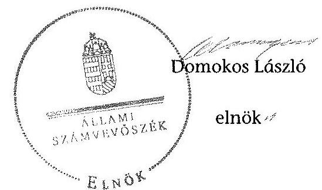

# ÁLLAMI   SZÁMVEVŐSZÉK 

## JELENTÉS

a helyi nemzetiségi önkormányzatok gazdálkodásának ellenőrzéséről
Pusztamagyaród Roma Nemzetiségi Önkormányzat

---

# Állami Számvevőszék 

Iktatószám: V-0711-068/2015.
Témaszám: 1745
Vizsgálat-azonosító szám: V067620

## Az ellenőrzést felügyelte:

## Brebán Andrea

felügyeleti vezető
2015. július 21. napjától

## Horváthné Herbáth Mária

felügyeleti vezető
2015. július 20. napjáig

## Az ellenőrzést vezette és az ellenőrzés végrehajtásáért felelős:

## Zakar László

ellenőrzésvezető

## A számvevőszéki jelentést készítették:

## Zakar László

ellenőrzésvezető

## Gölöncsér Péter

számvevő

## Kántor Ilona

számvevő főtanácsos

## Pappné dr. Szamosi Éva

számvevő főtanácsos

## Az ellenőrzést végezték:

## Gölöncsér Péter

számvevő

## Kántor Ilona

számvevő főtanácsos

---

# TARTALOMJEGYZÉK 

BEVEZETÉS ..... 3
I. ÖSSZEGZŐ MEGÁLLAPÍTÁSOK, KÖVETKEZTETÉSEK, JAVASLATOK ..... 6
II. RÉSZLETES MEGÁLLAPÍTÁSOK ..... 11

1. A Nemzetiségi Önkormányzat és a Települési Önkormányzat együttműködésének szabályozása, a működési feltételek biztosítása ..... 11
2. A gazdálkodási feladatok ellátásának szabályszerűsége ..... 12
2.1. A költségvetésre és a zárszámadásra, valamint a kincstári adatszolgáltatás rendjére vonatkozó jogszabályi előírások betartása ..... 12
2.2. A Nemzetiségi Önkormányzat gazdálkodásának szabályozottsága ..... 13
2.3. Az operatív gazdálkodási jogkörök kialakítása, gyakorlása ..... 14
3. A Nemzetiségi Önkormányzattal összefüggő gazdálkodási feladatok belső ellenőrzése ..... 16

## MELLÉKLET

1. számú Pusztamagyaród Roma Nemzetiségi Önkormányzat 2013. évi gazdálkodási adatai

## FÜGGELÉKEK

1. számú Rövidítések jegyzéke
2. számú Értelmező szótár

---

.

---

# JELENTÉS 

## A helyi nemzetiségi önkormányzatok gazdálkodásának ellenőrzéséről Pusztamagyaród Roma Nemzetiségi Önkormányzat

## BEVEZETÉS

A Nemzetiségi Önkormányzat a 2002. évben alakult. Az ellenőrzött időszakban a Nemzetiségi Önkormányzat elnöke a 2010. évi helyhatósági választások óta, a 2014. évi helyhatósági választásokig látta el feladatát. A Nemzetiségi Önkormányzat intézményt, gazdasági társaságot és más szervezetet nem alapított, illetve társulásban nem vett részt. A háromtagú Képviselő-testület bizottságot nem hozott létre. A Nemzetiségi Önkormányzat költségvetési beszámolója szerint a 2013. évben a módosított költségvetési bevételi előirányzat 638,0 ezer Ftot, a módosított költségvetési kiadási előirányzat 658,0 ezer Ft-ot tett ki, a teljesített költségvetési bevétel 638,0 ezer Ft, a teljesített költségvetési kiadás 657,0 ezer Ft volt. A Nemzetiségi Önkormányzat a 2013. évben 658,0 ezer Ft tárgyévi bevételt és 637,0 ezer Ft tárgyévi kiadást realizált. A Nemzetiségi Önkormányzat a 2013. évben 416,0 ezer Ft feladatalapú támogatásban részesült. A 2013. évi gazdálkodási adatokat részletesen az 1. számú mellékletben mutatjuk be.

Az Alaptörvény Szabadság és felelősség rész XXIX. cikk (1) bekezdése szerint a Magyarországon élő nemzetiségek államalkotó tényezők. Minden, valamely nemzetiséghez tartozó magyar állampolgárnak joga van önazonossága szabad vállalásához és megőrzéséhez. A hazánkban élő nemzetiségek helyi (települési és területi) valamint országos önkormányzatokat hozhatnak létre ${ }^{1}$. A helyi nemzetiségi önkormányzatok gazdálkodási feladatait jogszabályi előírás alapján a székhely szerinti helyi önkormányzat polgármesteri hivatala látja el.

A nemzetiségek helyzete, támogatása mind hazai, mind EU-s szinten kiemelt figyelmet kap napjainkban. A helyi nemzetiségi önkormányzatok gazdálkodására és támogatási rendszerére vonatkozó jogszabályok a 2010-2012. években jelentős változásokon mentek át. A helyi nemzetiségi önkormányzatok gazdálkodásának, a részükre juttatott költségvetési támogatások felhasználásának ellenőrzését az ÁSZ 2012-ben sorozatjellegű ellenőrzés keretében indította el.

[^0]
[^0]:    ${ }^{1}$ A 2010. évben megtartott nemzetiségi önkormányzati választásokat követően 2304 települési, 58 területi és 13 országos nemzetiségi önkormányzat alakult meg.

---

Az ellenőrzés célja annak értékelése volt, hogy a helyi nemzetiségi önkormányzat gazdálkodási kereteinek kialakítása, gazdálkodása megfelelt-e a jogszabályoknak.

Ennek keretében értékeltük, hogy:

- a helyi nemzetiségi önkormányzat és a helyi (települési) önkormányzat együttműködésének szabályozása, a működési feltételek biztosítása megfelel-e a jogszabályi előírásoknak;
- a felek együttműködése megfelelt-e a megállapodásban foglaltaknak a gazdálkodási feladatok szabályszerű ellátása során, betartották-e vonatkozó jogszabályi előírásokat;
- biztosított volt-e a helyi nemzetiségi önkormányzat gazdálkodásának belső ellenőrzése.

Az ellenőrzés várható hasznosulása: a nemzetiségi önkormányzatok testületi döntéseinek tapasztalatait összegezve következtetést vonható le a törvényalkotás számára a jogszabályi környezet esetleges módosításának indokoltságára vonatkozóan. Az ellenőrzés az ellenőrzött számára visszajelzést ad a rendezett gazdálkodási keretek kialakításáról, a működésbeli hiányosságokról. Az ellenőrzés megállapításai és javaslatai, a jó gyakorlat bemutatása tanulságul szolgálhatnak más nemzetiségi önkormányzatok, szervezetek számára a rendezett gazdálkodási keretek kialakításához. A társadalom számára jelzi, hogy közpénz nem maradhat ellenőrizetlenül, az ÁSZ értékteremtő rend kialakításához és megőrzéséhez hozzájáruló tevékenysége pozitív hatással lesz a szervezetről kialakított összkép formálásában. Az ÁSZ szervezetén belül lehetőség nyílik arra, hogy a megállapítások szintetizálásával az intézmény a hozzáadott értéket teremtő elemző tevékenységét és tanácsadó szerepét erősítse.

A helyi nemzetiségi önkormányzatok gazdálkodásának ellenőrzéséről szóló jelentés I. fejezetének összegző része az ellenőrzés céljára adott rövid, szintetizáló összefoglalót és következtetéseket tartalmazza a II. fejezet részletes megállapításain alapulóan. A jelentés intézkedést igénylő megállapításait és javaslatait az összegzőben foglaltak mellett - az ellenőrzés során feltárt, a jelentés II. fejezetében rögzített részletes megállapítások alapozzák meg, illetve támasztják alá.

Az ellenőrzés típusa: szabályszerűségi ellenőrzés.
Az ellenőrzött időszak: a Nemzetiségi Önkormányzat és a Települési Önkormányzat együttműködésének, valamint a Nemzetiségi Önkormányzat gazdálkodásának szabályozása megfelelőségét a 2013. évre vonatkozóan (a 2013. december 31-i állapotnak megfelelően), a Nemzetiségi Önkormányzat gazdálkodásának szabályszerűségét, a működési feltételek, valamint a belső ellenőrzés biztosítását a 2013. január 1. - december 31-e közötti időszakot figyelembe véve értékeltük.

Ellenőrzött szervezet: a Pusztamagyaród Roma Nemzetiségi Önkormányzat és a gazdálkodási feladatait ellátó Bánokszentgyörgyi Közös Önkormányzati Hivatal.

---

Az ellenőrzés szakmai módszertana az ÁSZ hivatalos honlapján (www.asz.hu) közzétett szakmai szabályokon alapult, amely a Legfőbb Ellenőrző Intézmények Nemzetközi Szervezete (INTOSAI) által kiadott nemzetközi standardok (ISSAI) figyelembevételével készült.

A gazdálkodás folyamatában kulcsszerepet betöltő két kulcskontroll - teljesítésigazolás, érvényesítés - múködésének megfelelőségét teljes körűen, azaz minden, a személyi juttatásokkal, a dologi és felhalmozási kiadásokkal, múködési és felhalmozási célú pénzeszköz átadásokkal, ellátottak pénzbeli juttatásaival kapcsolatos kifizetések esetében ellenőriztük. „Megfelelőnek" értékeltük a gazdálkodási jogkörök gyakorlását, amennyiben a hibaarány legfeljebb 10\%, „részben megfelelőnek" értékeltük, ha a hibaarány 10-30\% között volt, „nem megfelelőnek" pedig akkor, ha az eredmények alapján a hibaarány meghaladta a $30 \%$-ot.

Az ellenőrzés végrehajtásának jogszabályi alapját az ÁSZ tv. 5. § (2)-(3) és (6) bekezdéseiben foglaltak képezik.

Az ÁSZ tv. 29. § (1) bekezdése szerint megküldtük egyeztetésre a jegyzőnek és a Nemzetiségi Önkormányzat elnökének. Az ellenőrzött szervezetek vezetői az ÁSZ tv. 29. § (2) bekezdésében foglalt észrevételezési jogukkal nem éltek, a jelentéstervezetre nem tettek észrevételt.

---

# I. ÖSSZEGZŐ MEGÁLLAPÍTÁSOK, KÖVETKEZTETÉSEK, JAVASLATOK 

Az ellenőrzött időszakban a Nemzetiségi Önkormányzat és a Települési Önkormányzat együttmúködését - a Nek. tv. előírásának megfelelően - megállapodás szabályozta. Az együttmúködés szabályozása részben felelt meg a jogszabályi előírásoknak. Az együttműködési megállapodás a Nek. tv. előírásától eltérően nem rögzítette a költségvetéssel összefüggő adatszolgáltatási kötelezettség teljesítésével összefüggő határidőket, valamint nem tartalmazta az Áht.-ban foglaltak ellenére a Nemzetiségi Önkormányzat bevételeivel és kiadásaival kapcsolatban az ellenőrzési feladatok ellátásának részletes szabályait. A szabályozás hiánya hozzájárult ahhoz, hogy a Nemzetiségi Önkormányzat gazdálkodásával összefüggő végrehajtási feladatokra vonatkozóan a 2013. évben nem terveztek és nem hajtottak végre belső ellenőrzést. A Települési Önkormányzat a 2013. évben biztosította a Nemzetiségi Önkormányzat müködéséhez szükséges személyi és tárgyi feltételeket.

A Nemzetiségi Önkormányzat 2013. évi költségvetésének és zárszámadásának tartalma, jóváhagyása, valamint a kapcsolódó adatszolgáltatás megfelelit a jogszabályi előírásoknak.

A Nemzetiségi Önkormányzat gazdálkodásának szabályozottsága a 2013. évben részben felelt meg a jogszabályi előírásoknak, valamint az együttműködési megállapodásban foglaltaknak. A Nemzetiségi Önkormányzat 2013. évben a Számv. tv.-ben előírt szabályzatokkal rendelkezett. A Közös Önkormányzati Hivatal SZMSZ-e az Ávr.-ben előírtak ellenére nem tartalmazta teljes körűen a Közös Önkormányzati Hivatal nevesített munkakörökhöz tartozó feladat és hatásköröket, ezek gyakorlásának módját, a helyettesítés rendjét, az ezekhez kapcsolódó felelősségi szabályokat. A jegyző nem készítette el a Bkr.-ben előírt ellenőrzési nyomvonalat és a szabálytalanságok kezelésének eljárásrendjét a Közös Önkormányzati Hivatalra vonatkozóan és nem biztosította minden tevékenységre a folyamatba épített, előzetes, utólagos és vezetői ellenőrzést.

A Nemzetiségi Önkormányzat gazdálkodása tekintetében az operatív gazdálkodási jogkörök kialakítása a 2013. évben részben felelt meg a jogszabályi előírásoknak, valamint az együttműködési megállapodásban foglaltaknak. A jegyző 2013. január 1. helyett 2013. március 1-től szabályozta a kötelezettségvállalás pénzügyi ellenjegyzésének és az érvényesítés gyakorlásának módjával, eljárási és dokumentációs részletszabályaival, valamint az ezeket végző személyek kijelölésének rendjével kapcsolatos belső előírásokat, feltételeket. A kiadások teljesítése során az operatív gazdálkodási jogkörökön belül kulcsszerepet betöltő teljesítésigazolás és érvényesítés belső kontrollokat nem a jogszabályi előírásoknak megfelelően müködtették, aminek következtében nem volt biztosított a hibák megelőzése, feltárása és kijavítása. A teljesítésigazolást rendszeresen az Áht.-ban és az Ávr.-ben foglaltak ellenére nem végezték el, valamint több kifizetésnél a teljesítésigazolást kijelölés nélkül végezték el. A teljesítésigazolás során több esetben elmaradt a teljesítés tényére történő

---

utalás és a teljesítésigazolás dátumának rögzítése a teljesítésigazolás dokumentumán. Az érvényesítő rendszeresen az Ávr.-ben foglaltak ellenére nem jelezte az utalványozónak, hogy a megelőző ügymenetben a teljesítésigazolást nem végezték el, vagy nem az arra jogosult végezte, vagy nem szabályszerűen történt a teljesítésigazolás. A nem megfelelően müködtetett belső kontrollok korrupciós kockázatot hordoztak.

Az ÁSZ tv. 33. § (1) bekezdésében foglaltak értelmében a jelentésben foglalt megállapításokhoz kapcsolódó intézkedési tervet köteles az ellenőrzött szervezet vezetője összeállítani, és azt a jelentés kézhezvételétől számított 30 napon belül az ÁSZ részére megküldeni. Amennyiben az intézkedési tervet határidőben nem küldi meg a szervezet, vagy az nem elfogadható, az ÁSZ elnöke a hivatkozott törvény 33. § (3) bekezdés a)-b) pontjaiban foglaltakat érvényesítheti.

A helyszíni ellenőrzés megállapításainak hasznosítása mellett javasoljuk:

# a jegyzönek 

1. Az együttműködés szabályozásával kapcsolatban

A Nemzetiségi Önkormányzat és a Települési Önkormányzat együttműködését meghatározó együttműködési megállapodás tartalma részben felelt meg a jogszabályi előírásoknak, mivel a Nek. tv. 80. § (3) bekezdés a), c), d) pontjaiban foglaltakat nem, vagy nem teljes részletezettséggel tartalmazta. Az együttműködési megállapodásban az Ávr. 57. § (1) bekezdésében előírtakkal ellentétesen írták elő, hogy a Kincstár által számfejtett személyi jellegű juttatások kifizetését megelőzően a teljesítésigazolást nem kell elvégezni.

Javaslat
Az együttműködés szabályszerűsége érdekében készítse elő az együttműködési megállapodás módosítását, amely teljes körűen megfelel a jogszabályi előírásoknak és kezdeményezze annak a Települési Önkormányzat Képviselő-testülete elé terjesztését.
2. A költségvetés és zárszámadás szabályszerűségével kapcsolatban

A 2013. évi költségvetési határozat-tervezet - az Áht. 23. § (2) bekezdés a), c), h) pontjaiban foglaltak ellenére - nem tartalmazta a Nemzetiségi Önkormányzat költségvetési bevételeit és kiadásait kötelező és önként vállalt feladatok szerinti bontásban, a költségvetési egyenleg összegét működési és felhalmozási cél szerinti bontásban, valamint a költségvetés végrehajtásával kapcsolatos hatásköröket.

A 2013. évi zárszámadási határozat-tervezet előterjesztésekor - az Áht. 91. § (2) bekezdés a) pontjában foglaltaktól eltérően - nem mutatták be a Nemzetiségi Önkormányzat Képviselő-testülete részére tájékoztatásul szöveges indoklással együtt a Nemzetiségi Önkormányzat költségvetési mérlegét közgazdasági tagolásban, valamint a pénzeszközök változását.

---

Javaslat
Intézkedjen arról, hogy a jövőben
a) a költségvetési határozat-tervezet teljes körűen tartalmazza a jogszabályban előírt tartalmi elemeket;
b) a zárszámadási határozat-tervezet előterjesztésekor a Nemzetiségi Önkormányzat Képviselő-testülete részére tájékoztatásul teljes körűen, a jogszabályi előírásoknak megfelelően, szöveges indoklással együtt kerüljenek bemutatásra a mérlegek és kimutatások.
3. A gazdálkodási feladatok szabályozottságával kapcsolatban

A Közös Önkormányzati Hivatal SZMSZ-e az Ávr. 13. § (1) bekezdés g) pontjában előírtak ellenére nem tartalmazta teljes körűen a nevesített munkakörökhöz tartozó feladat és hatásköröket, ezek gyakorlásának módját, a helyettesítés rendjét, az ezekhez kapcsolódó felelősségi szabályokat.

A jegyző a Bkr. 6. § (3) bekezdésében előírt ellenőrzési nyomvonalat és a 6. § (4) bekezdésében előírt szabálytalanságok kezelésének eljárásrendjét nem készítette el a Közös Önkormányzati Hivatal múködési folyamataira. A jegyző a Bkr. 8. § (2) bekezdés előírásától eltérően nem biztosította a kontrolltevékenység részeként minden tevékenységre vonatkozóan a folyamatba épített, előzetes, utólagos és vezetői ellenőrzést.

Javaslat
A Nemzetiségi Önkormányzat gazdálkodásának végrehajtásával kapcsolatos feladatkörében eljárva:
a) készítse el a Közös Önkormányzati Hivatal SZMSZ-ének módosítását, hogy az teljes körűen feleljen meg a jogszabályi előírásnak és kezdeményezze annak képviselő testületi előterjesztését;
b) készítse el a Közös Önkormányzati Hivatal múködési folyamataira vonatkozó ellenőrzési nyomvonalat, továbbá a szabálytalanságok kezelésének eljárásrendjét;
c) biztosítsa a Közös Önkormányzati Hivatal által ellátott minden tevékenységre vonatkozóan a folyamatba épített, előzetes, utólagos és vezetői ellenőrzést.
4. A kulcskontrollok múködésével kapcsolatban

A teljesítésigazolást - az Áht. 38. § (1) bekezdésében és az Ávr. 57. § (1) bekezdésében foglaltak ellenére - több esetben nem végezték el, illetve nem szabályszerűen végezték el. A teljesítésigazolást több kifizetésnél az Ávr. 57. § (4) bekezdésében foglaltak ellenére kijelölés nélkül végezték el, ezen túl az Ávr. 57. § (3) bekezdésében foglaltak ellenére nem tartalmazta a teljesítés tényére történő utalást, illetve az igazolás dátumát.

Az érvényesítő - az Ávr. 58. § (2) bekezdésében foglaltak ellenére - nem jelezte az utalványozónak, hogy a megelőző ügymenetben a teljesítésigazolást nem végezték

---

el, vagy nem az arra jogosult végezte, továbbá a teljesítésigazolás nem szabályszerűen történt. Nem észrevételezte, hogy az utalvány rendeletek az Ávr. 59. § (3) bekezdés f) pontjában előírtak ellenére nem tartalmazták a kötelezettségvállalás nyilvántartási számát.

Javaslat
Az operatív gazdálkodás működési hibáinak megelőzése, feltárása és kijavítása érdekében intézkedjen:
a) a teljesítésigazolás jogszabályi előírásoknak megfelelő elvégzéséről;
b) az érvényesítéshez kapcsolódó jelzési feladatok szabályszerű ellátásáról.
5. A Nemzetiségi Önkormányzat gazdálkodásának belső ellenőrzésével kapcsolatban

A 2013. évben a Nemzetiségi Önkormányzat gazdálkodásával összefüggő feladatokra vonatkozó belső ellenőrzés nem volt megfelelő. Az együttműködési megállapodás - az Áht. 27. § (2) bekezdésében foglaltak ellenére - nem tartalmazta a Nemzetiségi Önkormányzat bevételeivel és kiadásaival kapcsolatban az ellenőrzési feladat ellátásának részletes szabályait, azon belül a belső ellenőrzés ellátására vonatkozó rendelkezéseket.

Javaslat
Az együttműködési megállapodás módosításának előkészítése során kezdeményezze annak kiegészítését a belső ellenőrzés ellátására vonatkozó részletszabályok meghatározásával.

# a Nemzetiségi Önkormányzat elnökének 

1. A Nemzetiségi Önkormányzat és a Települési Önkormányzat együttműködését meghatározó együttműködési megállapodás tartalma részben felelt meg a jogszabályi előírásoknak, mivel a Nek. tv. 80. § (3) bekezdés a), c), d) pontjaiban foglaltakat nem, vagy nem teljes részletezettséggel tartalmazta. Az együttműködési megállapodásban az Ávr. 57. § (1) bekezdésében előírtakkal ellentétesen írták elő, hogy a Kincstár által számfejtett személyi jellegű juttatások kifizetését megelőzően a teljesítésigazolást nem kell elvégezni.

A 2013. évben a Nemzetiségi Önkormányzat gazdálkodásával összefüggő feladatokra vonatkozó belső ellenőrzés nem volt megfelelő. Az együttműködési megállapodás - az Áht. 27. § (2) bekezdésében foglaltak ellenére - nem tartalmazta a Nemzetiségi Önkormányzat bevételeivel és kiadásaival kapcsolatban az ellenőrzési feladat ellátásának részletes szabályait, azon belül a belső ellenőrzés ellátására vonatkozó rendelkezéseket.

Javaslat
a) Terjessze a Képviselő-testület elé jóváhagyásra a jegyző által a Nek. tv-ben foglaltaknak megfelelően előkészített együttműködési megállapodás módosítását.

---

b) Intézkedjék annak érdekében, hogy az együttmúködési megállapodásban rendelkezzenek a belső ellenőrzés ellátására vonatkozó részletszabályok meghatározásáról.
2. A 2013. évi költségvetési határozat-tervezet - az Áht. 23. § (2) bekezdés a), c), h) pontjaiban foglaltak ellenére - nem tartalmazta a Nemzetiségi Önkormányzat költségvetési bevételeit és kiadásait kötelező és önként vállalt feladatok szerinti bontásban, a költségvetési egyenleg összegét működési és felhalmozási cél szerinti bontásban, valamint a költségvetés végrehajtásával kapcsolatos hatásköröket.

A 2013. évi zárszámadási határozat-tervezet előterjesztésekor - az Áht. 91. § (2) bekezdés a) pontjában foglaltaktól eltérően - nem mutatták be a Nemzetiségi Önkormányzat Képviselő-testülete részére tájékoztatásul szöveges indoklással együtt a Nemzetiségi Önkormányzat költségvetési mérlegét közgazdasági tagolásban, valamint a pénzeszközök változását.

Javaslat
Intézkedjen, hogy a jövőben
a) az elfogadott költségvetési határozat-tervezet tartalmilag teljes körűen feleljen meg a jogszabályi előírásoknak,
b) a Nemzetiségi Önkormányzat Képviselő-testülete részére a zárszámadási határozattervezet előterjesztésekor tájékoztatásul szöveges indoklással együtt bemutatásra kerüljön a jogszabályban előírt valamennyi mérleg és kimutatás.

---

# II. RÉSZLETES MEGÁLLAPÍTÁSOK 

## 1. A Nemzetiségi Önkormányzat és a Települési ÖnkormányZAT EGYÜTTMŰKÖDÉSÉNEK SZABÁLYOZÁSA, A MÜKÖDÉSI FELTÉTELEK BIZTOSÍTÁSA

A Nemzetiségi Önkormányzat és a Települési Önkormányzat együttmúködésének szabályozása részben felelt meg a jogszabályi előírásoknak.

A Nemzetiségi Önkormányzat az ellenőrzött időszakban rendelkezett a Települési Önkormányzattal kötött, a Nek. tv. 80. § (2) bekezdésben előírt együttmúködési megállapodással, amelyet a Nemzetiségi Önkormányzat és a Települési Önkormányzat képviselő-testületei határozattal² jóváhagytak és az arra jogosult személyek aláírták. Az együttműködési megállapodás felülvizsgálata a Nek. tv. 80. § (2) bekezdésében előírt határidőre megtörtént ${ }^{3}$.

A 2013. december 31 -én hatályos együttműködési megállapodásban rögzítették, hogy - az Áht. 27.§ (1) bekezdése alapján - a Nemzetiségi Önkormányzat bevételeivel és kiadásaival kapcsolatban a tervezési, a gazdálkodási, az ellenőrzési, a finanszírozási, az adatszolgáltatási és a beszámolási feladatokat a Közös Önkormányzati Hivatal látja el. Az együttmúködési megállapodás a Nek. tv. 80. § (4) bekezdésének megfelelően tartalmazta a jegyző számára a Nemzetiségi Önkormányzat ülésein részvételi, törvénysértés észlelése esetén az ülésen történő jelzési feladatát.

A jogszabályi előírások nem érvényesültek maradéktalanul, mivel az együttmúködési megállapodás az Áht. 27. § (2) bekezdésében és a Nek. tv. 80. § (3) bekezdésében előírt tartalmi elemek közül nem tartalmazta:

- az Áht. 27. § (2) bekezdésében előírtak ellenére a Nemzetiségi Önkormányzat bevételeivel és kiadásaival kapcsolatban az ellenőrzési feladatok ellátásának részletes szabályait;
- a Nek. tv. 80. § (3) bekezdés a) pontjában foglaltak ellenére a költségvetés előkészítésével, megalkotásával, valamint a költségvetéssel összefüggő adatszolgáltatási kötelezettség teljesítésével kapcsolatos határidőket, továbbá az

[^0]
[^0]:    ${ }^{2}$ A 2013. évben hatályos együttműködési megállapodást a Nemzetiségi Önkormányzat Képviselő-testülete a K15/2012. (V. 22.) számú határozatával, a Települési Önkormányzat Képviselő-testülete a 40/2012. (V. 22.) számú határozatával fogadta el. A Nemzetiségi Önkormányzat SZMSZ-e alapján előterjesztést tehet az elnök és az elnökhelyettes, bármely nemzetiségi önkormányzati képviselő, felkért személy vagy szervezet.
    ${ }^{3}$ A felülvizsgálatot követően az együttműködési megállapodást a Települési Önkormányzat Képviselő-testülete a 3/2013. (I. 29.) számú határozatával, a Nemzetiségi Önkormányzat a K1/2013. (I. 28.) számú határozatával hagyta jóvá.

---

önálló fizetési számla nyitásával, törzskönyvi nyilvántartásba vételével és az adószám igénylésével kapcsolatos feladatok konkrét felelőseit, határidőit;

- a Nek. tv. 80. § (3) bekezdés c) pontjában foglaltakkal ellentétesen a Nemzetiségi Önkormányzat kötelezettségvállalásának az SZMSZ-ben meghatározott szabályait, különösen a nyilvántartási kötelezettségeket;
- a Nek. tv. 80. § (3) bekezdés d) pontjában előírtak ellenére a Nemzetiségi Önkormányzat múködési feltételeinek és gazdálkodásának eljárási és dokumentációs részletszabályait.

Az együttműködési megállapodásban az Ávr. 57. § (1) bekezdésében előírtakkal ellentétesen, helytelenül írták elő, hogy a Kincstár által számfejtett személyi jellegű juttatások kifizetését megelőzően a teljesítésigazolást nem kell elvégezni.

Az együttműködési megállapodás szerinti müködési feltételeket a Nek. tv. 80. § (2)-(3) bekezdésében foglaltaknak megfelelően a Nemzetiségi Önkormányzat SZMSZ-ében rögzítették.

A Települési Önkormányzat - az együttmüködési megállapodás tartalmi hiányosságai ellenére - a 2013. évben biztosította a Nemzetiségi Önkormányzat müködéséhez szükséges személyi és tárgyi feltételeket.

# 2. A GAZDÁLKODÁSI FELADATOK ELLÁTÁSÁNAK SZABÁLYSZERŰSÉGE 

### 2.1. A költségvetésre és a zárszámadásra, valamint a kincstári adatszolgáltatás rendjére vonatkozó jogszabályi előirások betartása

A Nemzetiségi Önkormányzat 2013. évi költségvetésének és zárszámadásának tartalma, jóváhagyása, valamint a kapcsolódó adatszolgáltatás - a feltárt hiányosságok ellenére - megfelelt a jogszabályi előírásoknak.

A Nemzetiségi Önkormányzat elnöke a jegyző által előkészített 2013. évi költségvetési koncepciót ${ }^{4}$ az Áht. 26. § (1) bekezdésében, valamint az Áht. 24. § (1) bekezdésében előírtaknak megfelelően határidőben nyújtotta be a Képvise-lő-testület részére.

A Nemzetiségi Önkormányzat elnök az Áht. 26. § (1) bekezdése alapján az Áht. 24. § (2) bekezdésében ${ }^{5}$ előírt határidőre benyújtotta a Nemzetiségi Önkormányzat Képviselő-testülete részére a jegyző által előkészített 2013. évi költségvetési határozat-tervezetet, amelyet a Képviselő-testület a 2/2013. (II. 14.) számú határozatával jóváhagyott. A 2013. évi költségvetési határozattervezet - Áht. 23. § (2) bekezdés a), d) pontjában és 24. § (4) bekezdés a) pontjában foglaltaknak megfelelően - tartalmazta a Nemzetiségi Önkormányzat költségvetési bevételeit és költségvetési kiadásait előirányzat-csoportok és ki-

[^0]
[^0]:    ${ }^{4}$ K32/2012. (XI. 12.) számú határozat
    ${ }^{5}$ 2013. december 21-étől az Áht. 24. § (3) bekezdése írja elő.

---

emelt előirányzatok szerinti bontásban, az előző évek költségvetési maradványának igénybevételét, a költségvetési mérleget közgazdasági tagolásban, valamint az előirányzat felhasználási tervet. A 2013. évi költségvetési határozattervezet nem tartalmazta az Áht. 23. § (2) bekezdés a), c), h) pontjaiban foglaltak ellenére a költségvetési bevételeket és kiadásokat kötelező és önként vállalt feladatok szerinti bontásban, a költségvetési egyenleg összegét működési és felhalmozási cél szerinti bontásban, valamint a költségvetés végrehajtásával kapcsolatos hatásköröket.

A jegyző a 2013. évi zárszámadási határozat-tervezetet az Áht. 91. § (1) és (3) bekezdésében előírt határidőben ${ }^{6}$ elkészítette, a Nemzetiségi Önkormányzat elnöke határidőben terjesztette be a Nemzetiségi Önkormányzat Képviselőtestülete elé elfogadásra, amelyet a Képviselő-testület a 2/2014. (IV. 13.) számú határozatával fogadott el. A zárszámadási határozat-tervezet előterjesztésekor az Áht. 91. § (2) bekezdés a) pontjában foglaltaktól eltérően - nem mutatták be a Képviselő-testület részére tájékoztatásul szöveges indokolással együtt az Áht. 24. § (4) bekezdés a) pont előírása ellenére a Nemzetiségi Önkormányzat költségvetési mérlegét közgazdasági tagolásban, valamint pénzeszközeinek változását. A Nemzetiségi Önkormányzatnak a 2013. évben, valamint azt megelőzően az ellenőrzött év előirányzataira hatást gyakorló többéves kihatással járó döntése nem volt, közvetett támogatást nem nyújtott. A 2013. évi költségvetési és zárszámadási határozatok - az Áht. 89. § (1) bekezdésében előírt - öszszehasonlíthatósága az Áht. 24. § (4) bekezdés a) pontjában előírt mérleg és kimutatás hiánya miatt nem volt biztosított. A Nemzetiségi Önkormányzat a 2013. évi zárszámadási határozatban az Áht. 89. §-ának megfelelően a valamennyi bevételéről és kiadásáról elszámolt.

A jegyző a 2013. évben egy kivétellel az előírt határidőre teljesítette a Nemzetiségi Önkormányzat részére az Ávr. 169. § (2), az Ávr. 170. § (5) és az Áhsz ${ }_{1} 10 . \S$ (5a) ${ }^{7}$ bekezdéseiben előírt kincstári adatszolgáltatási kötelezettséget. A jegyző az Ávr. 169. § (2) bekezdése szerinti határidőt követően küldte meg a Kincstár illetékes szervének ${ }^{8}$. az időközi éves költségvetési jelentést.

# 2.2. A Nemzetiségi Önkormányzat gazdálkodásának szabályozottsága 

A Nemzetiségi Önkormányzat gazdálkodásának szabályozottsága a 2013. évben részben felelt meg a jogszabályi előírásoknak, valamint az együttmúködési megállapodásban foglaltaknak.

A Nemzetiségi Önkormányzat 2013. december 31-én rendelkezett a Számv. tv. 14. § (3)-(5) bekezdéseiben és a Számv. tv. 161. § (1) bekezdésében előírt szabályzatokkal.

[^0]
[^0]:    ${ }^{6}$ A költségvetési évet követő negyedik hónap utolsó napjáig kell elkészíteni és előterjeszteni.
    ${ }^{7}$ 2014. január 1-jétől szabályozza az Áhsz 32. § (4) bekezdés
    ${ }^{8}$ 2014. január 20-a helyett 2014. február 3-án

---

A jegyző a Nemzetiségi Önkormányzatra vonatkozóan önálló szabályzatként helyezte hatályba a számlarendet, a számviteli politikát, az eszközök és források értékelési szabályzatát, valamint a leltárkészítési és leltározási szabályzatot. A Közös Önkormányzati Hivatal pénzkezelési szabályzata előírta a Nemzetiségi Önkormányzat gazdálkodásának végrehajtásával összefüggő sajátos szabályokat.

A Közös Önkormányzati Hivatal SZMSZ-e az Ávr. 13. § (1) bekezdés g) pontjában előírtak ellenére nem tartalmazta teljes körűen a Közös Önkormányzati Hivatal nevesített munkakörökhöz tartozó feladat és hatásköröket, ezek gyakorlásának módját, a helyettesítés rendjét, az ezekhez kapcsolódó felelősségi szabályokat ${ }^{9}$.

Az együttműködési megállapodás és a pénzkezelési szabályzat együttesen tartalmazta a Nemzetiségi Önkormányzatra vonatkozóan - az Áht. 10. § (5) bekezdésében és az Ávr. 13. § (2) bekezdés a) pontjában foglaltaknak megfelelően - a tervezéssel, gazdálkodással, így különösen a kötelezettségvállalás, az ellenjegyzés, az érvényesítés, az utalványozás gyakorlásának módjával, eljárási és dokumentációs részletszabályaival, valamint az ezeket végző személyek kijelölésének rendjével és az ellenőrzési, adatszolgáltatási feladatok teljesítésével kapcsolatos belső előírásokat, feltételeket.

A jegyző a Bkr. 6. § (3) bekezdésében előírt ellenőrzési nyomvonalat és a 6. § (4) bekezdésében előírt szabálytalanságok kezelésének eljárásrendjét nem készítette el a Közös Önkormányzati Hivatalra. A jegyző a Bkr. 8. § (2) bekezdés előírásától eltérően nem biztosította a kontrolltevékenység részeként minden tevékenységre vonatkozóan a folyamatba épített, előzetes, utólagos és vezetői ellenőrzést.

# 2.3. Az operatív gazdálkodási jogkörök kialakítása, gyakorlása 

Az ellenőrzött időszakban a Nemzetiségi Önkormányzat gazdálkodása során az operatív gazdálkodási jogkörök kialakítása részben felelt meg a jogszabályi előírásoknak, valamint az együttmúködési megállapodásban foglaltaknak.

A jegyző 2013. január 1. helyett ${ }^{10}$ 2013. március 1-től szabályozta az Ávr. 13. § (2) bekezdés a) pontjában előírtakat, a kötelezettségvállalás pénzügyi ellenjegyzésének és az érvényesítés gyakorlásának módjával, eljárási és dokumentációs részletszabályaival, valamint az ezeket végző személyek kijelölésének rendjével kapcsolatos belső előírásokat, feltételeket. Továbbá 2013. január 1. helyett 2013. március 1-től jelölte ki írásban - az Ávr. 55. § (2) bekezdés g) pontjában és 58. § (4) bekezdése alapján - a pénzügyi ellenjegyzésre és az érvényesítésre jogosult személyeket.

[^0]
[^0]:    ${ }^{9}$ A Nemzetiségi Önkormányzat gazdálkodásával kapcsolatos feladatokat ellátó köztisztviselők munkaköri leírásai tartalmazták a Nemzetiségi Önkormányzattal kapcsolatos feladatokat.
    ${ }^{10}$ A Közös Önkormányzati Hivatal 2013. január 1-én alakult meg.

---

A jegyző a pénzkezelési szabályzatban lehetővé tette a 100,0 ezer Ft alatti kifizetések előzetes írásbeli kötelezettségvállalás nélküli teljesítését, de - az Ávr. 53. § (2) bekezdésében foglaltakat figyelmen kívül hagyva - nem határozta meg belső szabályzatban az előzetes írásbeli kötelezettségvállalást nem igénylő kifizetések rendjét.

A Nemzetiségi Önkormányzatnak a 2013. évben személyi juttatással és dologi kiadásokkal kapcsolatos kifizetési voltak. Az operatív gazdálkodási jogkörökön belül kulcsszerepet betöltő teljesítésigazolás és érvényesítés belső kontrollokat - az ellenőrzött összes kifizetésre együttesen értékelve - nem a jogszabályi előírásoknak megfelelően müködtették.

Az egy személyi juttatással kapcsolatos kifizetésnél a teljesítésigazolás és érvényesítés kulcskontrollok múködtetésével kapcsolatban az alábbi hiányosságok, szabálytalanságok fordultak elő:

- a teljesítésigazolás nem szabályszerűen történt, mert - az Ávr. 57. § (3) bekezdésében foglaltak ellenére - a teljesítésigazolás dokumentuma nem tartalmazta a teljesítés tényére történő utalást és az igazolás dátumát;
- az érvényesítő- az Ávr. 58. § (2) bekezdésében foglaltak ellenére - nem jelezte az utalványozónak, hogy a megelőző ügymenetben a teljesítésigazoló feladatát nem szabályszerűen végezte el.

A dologi kiadásokkal kapcsolatos kifizetéseknél a 2013. évben a teljesítésigazolás kulcskontroll múködtetésével kapcsolatban az alábbi hiányosságok, szabálytalanságok fordultak elő:

- a teljesítésigazolást rendszeresen - az Áht. 38. § (1) bekezdésében és az Ávr. 57. § (1) bekezdésében foglaltak ellenére - nem végezték el;
- teljesítésigazolást több kifizetésnél - az Ávr. 57. § (4) bekezdésében foglaltak ellenére - kijelölés nélkül végezték el;
- a teljesítésigazolás nem szabályszerűen történt, mert - az Ávr. 57. § (3) bekezdésében foglaltak ellenére - több kifizetésnél a teljesítésigazolás nem tartalmazta a teljesítés tényére történő utalást és a teljesítésigazolás dokumentumán nem rögzítették a teljesítésigazolás dátumát.

A dologi kiadásokkal kapcsolatos kifizetéseknél a 2013. évben az érvényesítés kulcskontroll múködtetésével kapcsolatban az alábbi hiányosságok, szabálytalanságok fordultak elő:

- az érvényesítő rendszeresen - az Ávr. 58. § (2) bekezdésében foglaltak ellenére - nem jelezte az utalványozónak, hogy a megelőző ügymenetben a teljesítésigazolást nem végezték el, vagy nem az arra jogosult végezte, vagy a teljesítésigazolás nem szabályszerűen történt;
- nem észrevételezte, hogy az utalvány rendeletek az Ávr. 59. § (3) bekezdés f) pontjában előírtak ellenére nem tartalmazták a kötelezettségvállalás nyilvántartási számát.

---

A Nemzetiségi Önkormányzatnál a 2013. évben a kulcskontrollokat nem megfelelően müködtették és emiatt nem volt biztosított a hibák megelőzése, feltárása és kijavítása. A nem megfelelően müködtetett belső kontrollok korrupciós kockázatot hordoztak.

Az integritás szemlélet érvényesülésének ellenőrzéséhez a Nemzetiségi Önkormányzat tanúsítványon szolgáltatott adatokat. Ezen adatok értékelése alapján az eredendő veszélyeztetettségi szint és a kockázatokat növelő tényező szintje is alacsony. Emellett a szervezetnél kiépült, a kockázatok kezelésére hivatott kontrollok szintje is alacsony volt.

A kockázatok és a kontrollok szintje alapján megállapítható, hogy a szervezetnél jelenlévő eredendő korrupciós kockázatok, valamint a kockázatokat növelő tényezők szintjén nem haladja meg az azok kezelésére kiépült kontrollok szintjét.

Ugyanakkor az operatív gazdálkodási jogkörök szabályozása és gyakorlása területén feltárt hiányosságok és hibák arra utalnak, hogy a Nemzetiségi Önkormányzatnak még lépéseket kell tennie az integritás szemlélet érvényesülésében.

# 3. A Nemzetiségi Önkormányzattal összefüggö gazdálkodÁsi feladatok belsö ellenörzése 

A 2013. évben a Nemzetiségi Önkormányzat gazdálkodásával összefüggő végrehajtási feladatokra vonatkozó belső ellenőrzés nem volt megfelelő. Az együttműködési megállapodás - az Áht. 27. § (2) bekezdésében foglaltak ellenére - nem tartalmazta a Nemzetiségi Önkormányzat bevételeivel és kiadásaival kapcsolatban az ellenőrzési feladat ellátásának részletes szabályait, azon belül a belső ellenőrzés ellátására vonatkozó rendelkezéseket sem. A Nemzetiségi Önkormányzat gazdálkodására vonatkozóan 2013. évben belső ellenőrzést nem terveztek és nem végeztek.

Budapest, 2015. 10 hónap 06. nap

Melléklet: 1 db
Függelék: $\quad 2 \mathrm{db}$

---

# Pusztamagyaród Roma Nemzetiségi Önkormányzat 2013. évi gazdálkodási adatai 

A) Bevételek

| Megnevezés | Eredeti | Módosított | Teljesítés |
| :--: | :--: | :--: | :--: |
|  | elöirányzat |  |  |
|  | ezer Ft |  | megoszlás |
| Intézményi múködési bevételek | 0,0 | 0,0 | 0,0 |
| Általános múködési támogatás | 222,0 | 222,0 | 222,0 |
| Feladatalapú támogatás | 0,0 | 416,0 | 416,0 |
| Települési Önkormányzat által nyújtott támogatás | 0,0 | 0,0 | 0,0 |
| Megyei Nemzetiségi Alapítványtól támogatás | 0,0 | 0,0 | 0,0 |
| Müködési bevétel | 222,0 | 638,0 | 638,0 |
| Felhalmozási bevétel | 0,0 | 0,0 | 0,0 |
| Költségvetési bevételek összesen | 222,0 | 638,0 | 638,0 |
| Előző évi pénzmaradvány felhasználás | 20,0 | 20,0 | 20,0 |
| Tárgyévi bevételek összesen | 242,0 | 658,0 | 658,0 |

B) Kiadások

| Megnevezés | Eredeti | Módosított | Teljesítés |
| :--: | :--: | :--: | :--: |
|  | elöirányzat |  |  |
|  |  | ezer Ft |  |
| Személyi juttatások | 20,0 | 20,0 | 20,0 |
| Munkaadót terhelő járulékok és szociális hozzájárulási adó összesen | 6,0 | 6,0 | 6,0 |
| Dologi kiadások | 216,0 | 632,0 | 631,0 |
| Müködési kiadások összesen | 242,0 | 658,0 | 657,0 |
| Felhalmozási kiadások | 0,0 | 0,0 | 0,0 |
| Költségvetési kiadások összesen | 242,0 | 658,0 | 657,0 |
| Átfutó kiadások | 0,0 | 0,0 | $-20,0$ |
| Tárgyévi kiadások összesen | 242,0 | 658,0 | 637,0 |

---

.

---

# RÖVIDÍTÉSEK JEGYZÉKE 

## Törvények

Alaptörvény
Áht.
ÁSZ tv.
Nek. tv.
Számv. tv.

## Rendeletek

Áhsz $_{1}$
Áhsz $_{2}$
Ávr.
Bkr.
Települési Önkormányzat SZMSZ

## Határozat

Nemzetiségi Önkormányzat SZMSZ-e

## Szórövidítések

ÁSZ
együttmúködési megállapodás
eszközök és források értékelési szabályzat

EU
jegyzó
Kincstár
Körjegyzőség
leltárkészítési és leltározási szabályzat

Nemzetiségi Önkormányzat

Magyarország Alaptörvénye
az államháztartásról szóló 2011. évi CXCV. törvény az Állami Számvevőszékről szóló 2011. évi LXVI. törvény a nemzetiségek jogairól szóló 2011. évi CLXXIX. törvény, a számvitelről szóló 2000. évi C. törvény
az államháztartás szervezetei beszámolási és könyvvezetési kötelezettségének sajátosságairól szóló 249/2000. (XII. 24.) Korm. rendelet
az államháztartás számviteléről szóló 4/2013. (I. 11.) Korm. rendelet, hatályos 2014. január 1-jétől
az államháztartási törvény végrehajtásáról szóló 368/2011. (XII. 31.) Korm. rendelet
a költségvetési szervek belső kontrollrendszeréről és belső ellenőrzéséről szóló 370/2011. (XII. 31.) Korm. rendelet
Pusztamagyaród Község Önkormányzat Képviselốtestületének 4/2013. (IV. 29.) önkormányzati rendelete Pusztamagyaród Község Önkormányzatának Szervezeti és Múködési Szabályzatáról (hatályos 2013. április 30-tól)

Pusztamagyaród Roma Nemzetiségi Önkormányzat Képvise-lő-testületének K17/2012. (VI. 18.) számú határozata a Szervezeti és Müködési Szabályzatáról (hatályos 2012. június 18tól)

Állami Számvevőszék
Pusztamagyaród Község Önkormányzata és Pusztamagyaród Roma Nemzetiségi Önkormányzat között létrejött együttmúködési megállapodás, hatályos 2012. május 22-től
Pusztamagyaród Roma Nemzetiségi Önkormányzat Eszközök és Források Értékelési Szabályzata (hatályos 2013. január 15.-étől)
Európai Unió
Bánokszentgyörgyi Közös Önkormányzati Hivatal jegyzője Magyar Államkincstár
Bucsuta, Pusztamagyaród, Szentliszló Községek Körjegyzősége 2012. december 31-éig
Pusztamagyaród Roma Nemzetiségi Önkormányzat Leltárkészítési és Leltározási szabályzata (hatályos 2013. január 15.-étől)
Pusztamagyaród Roma Nemzetiségi Önkormányzat

---

Nemzetiségi Önkormányzat elnöke
Nemzetiségi Önkormányzat Képviselötestülete
Nemzetiségi Önkormányzat SZMSZ

Közös Önkormányzati Hivatal
pénzkezelési szabályzat
polgármester
számlarend
számviteli politika
SZMSZ
Települési Önkormányzat
Települési Önkormányzat Képviselőtestülete
Települési Önkormányzat SZMSZ ${ }_{1}$

Települési Önkormányzat SZMSZ ${ }_{2}$

Pusztamagyaród Roma Nemzetiségi Önkormányzat elnöke
Pusztamagyaród Roma Nemzetiségi Önkormányzat Képvise-lö-testülete

Pusztamagyaród Roma Nemzetiségi Önkormányzat Képvise-lö-testületének a K17/2012. (VI. 18.) számú határozatával elfogadott Pusztamagyaród Roma Nemzetiségi Önkormányzat Szervezeti és Müködési Szabályzata (hatályos 2012. június 18 -ától)
Bánokszentgyörgyi Közös Önkormányzati Hivatal (Bánokszentgyörgy, Bucsuta, Oltác, Pusztamagyaród, Szentliszó, Várfölde települési önkormányzatok képviselő-testületei által alapított Polgármesteri Hivatal 2013. január 1-jétől)
Bánokszentgyörgyi Közös Önkormányzati Hivatal Pénzkezelési Szabályzata (hatályos 2013. március 1-jétől)
Pusztamagyaród Község Önkormányzat polgármestere
Pusztamagyaród Roma Nemzetiségi Önkormányzat Számlarendje (hatályos 2013. január 1-jétől)
Pusztamagyaród Roma Nemzetiségi Önkormányzat Számviteli Politikája (hatályos 2013. március 1-jétől)
szervezeti és müködési szabályzat
Pusztamagyaród Község Önkormányzata
Pusztamagyaród Község Önkormányzatának Képviselőtestülete

Pusztamagyaród Község Önkormányzata Képviselőtestületének 7/2012. (VI. 19.) számú önkormányzati rendelete Pusztamagyaród Község Önkormányzatának Szervezeti és Müködési Szabályzatáról (hatályos 2013. április 29.-éig)
Pusztamagyaród Község Önkormányzata Képviselőtestületének 4/2013. (IV. 29.) számú önkormányzati rendelete Pusztamagyaród Község Önkormányzatának Szervezeti és Müködési Szabályzatáról (hatályos 2013. április 30-ától)

---

# ÉRTELMEZŐ SZÓTÁR 

belső ellenőrzés
belső kontrollrendszer
együttmúködési megállapodás
integritás

A Bkr. 2. § b) pont meghatározásában független, tárgyilagos bizonyosságot adó és tanácsadó tevékenység, amelynek célja, hogy az ellenőrzött szervezet múködését fejlessze és eredményességét növelje, az ellenőrzött szervezet céljai elérése érdekében rendszerszemléletű megközelítéssel és módszeresen értékeli, illetve fejleszti az ellenőrzött szervezet irányítási és belső kontrollrendszerének hatékonyságát.
A Bkr. 2. § d) pont és az Áht. 69. § (1) bekezdése alapján a belső kontrollrendszer a kockázatok kezelése és tárgyilagos bizonyosság megszerzése érdekében kialakított folyamatrendszer, amely azt a célt szolgálja, hogy a múködés és gazdálkodás során a tevékenységeket szabályszerűen, gazdaságosan, hatékonyan, eredményesen hajtsák végre, az elszámolási kötelezettségeket teljesítsék, megvédjék az erőforrásokat a veszteségektől, károktól és nem rendeltetésszerű használattól.
Az Áht. 27. § (2) bekezdése és Nek tv. 80. § (1) bekezdése értelmében a helyi önkormányzat a helyi nemzetiségi önkormányzat részére - annak székhelyén - biztosítja az önkormányzati múködés személyi és tárgyi feltételeit, továbbá gondoskodik a múködéssel kapcsolatos végrehajtási feladatok ellátásáról. Az Nek tv. 80. § (2) bekezdés szerinti a fenti kötelezettségének teljesítése érdekében a helyi önkormányzat harminc napon belül biztosítja a rendeltetésszerű helyiséghasználatot, valamint a helyiséghasználatra, a további feltételek biztosítására és a feladatok ellátására vonatkozóan megállapodást köt a helyi nemzetiségi önkormányzattal. A megállapodást minden év január 31. napjáig, általános vagy időközi választás esetén az alakuló ülést követő harminc napon belül felül kell vizsgálni. A helyi önkormányzat és a nemzetiségi önkormányzat szervezeti és múködési szabályzatában rögzíti a megállapodás szerinti múködési feltételeket, a megállapodás megkötését, módosítását követő harminc napon belül. Az Nek tv. 80. § (3) bekezdés írja elő a megállapodásban rögzítendőket.

Az integritás elvek, értékek, cselekvések, módszerek, intézkedések konzisztenciáját jelenti: olyan magatartásmódot, amely meghatározott értékeknek felel meg. Az integritás a közszféra esetében a társadalom által elvárt nyilvánossági, átláthatósági, illetve jogi/etikai normáknak történő megfelelést jelenti.
(Forrás: a http://integritas.asz.hu honlapon közzétett „A 2012. évi integritás felmérés eredményeinek összefoglalója" dokumentum 3. oldal 1. bekezdése)

---

költségvetési szerv vezetője
korrupció
kulcskontroll
lényegesség
nemzetiség
nemzetiségi önkormányzat

A Bkr. 2. § nd) pont meghatározásában a helyi önkormányzat, helyi nemzetiségi önkormányzat, illetve a fővárosi kerületi önkormányzat esetén a jegyző, körjegyző, főjegyző.
Azok a cselekmények, amelyek során a köz érdekében való eljárással megbízott és döntéshozatali felelősséggel felruházott személy a köz érdeke helyett önös vagy részérdekeket követve, mástól jogtalan vagy etikátlan előnyt elfogadva és őt jogtalan vagy etikátlan előnyhöz juttatva jár el, illetve amikor valaki a köz érdekében való eljárással megbízott és döntéshozatali felelősséggel felruházott személynek jogtalan vagy etikátlan előnyt nyújtva vagy felajánlva jogtalan vagy etikátlan előnyt kér. (Forrás: A Kormány korrupció megelőzési programja 2012-2014.)
Az azonosított kockázatok mérséklése érdekében kialakított kontrollok közül azok, amelyek elégtelen múködése esetén a szervezetet jelentős veszteség érheti, vagy a múködésükben bekövetkező hiba/hiányosság más kontrollok eredményességét csökkenti. Ezek ellenőrzése, értékelése elegendő bizonyítékot szolgáltat adott területen a kontrollrendszer értékeléséhez. Az önkormányzatok kontrollrendszere kialakításának ellenőrzése során a pénzügyi folyamatokban kulcsszerepet betöltő belső kontrollok a teljesítésigazolás és érvényesítés.
Egy információ akkor lényeges, ha hiánya vagy téves állítása befolyásolhatja ezen információkat felhasználók döntéseit, véleményét. Az ellenőrzés során a lényegesség három szempontból értelmezhető: érték, jelleg és összefüggés szerint.
A Nek tv. 1. § (1) bekezdése alapján nemzetiség minden olyan Magyarország területén legalább egy évszázada honos népcsoport, amely az állam lakossága körében számszerú kisebbségben van, tagjai magyar állampolgárok és a lakosság többi részétől saját nyelve és kultúrája, hagyományai különböztetik meg, egyben olyan összetartozástudatról tesz bizonyságot, amely mindezek megőrzésére, történelmileg kialakult közösségeik érdekeinek kifejezésére és védelmére irányul.
Az Nek tv. 2. § 2. pontja szerint törvényben meghatározott nemzetiségi közszolgáltatási feladatokat ellátó, testületi formában múködő, jogi személyiséggel rendelkező, demokratikus választások útján e törvény alapján létrehozott szervezet, amely a nemzetiségi közösséget megillető jogosultságok érvényesítésére, a nemzetiségek érdekeinek védelmére és képviseletére, a feladat- és hatáskörébe tartozó nemzetiségi közügyek települési, területi vagy országos szinten történő önálló intézésére jön létre.