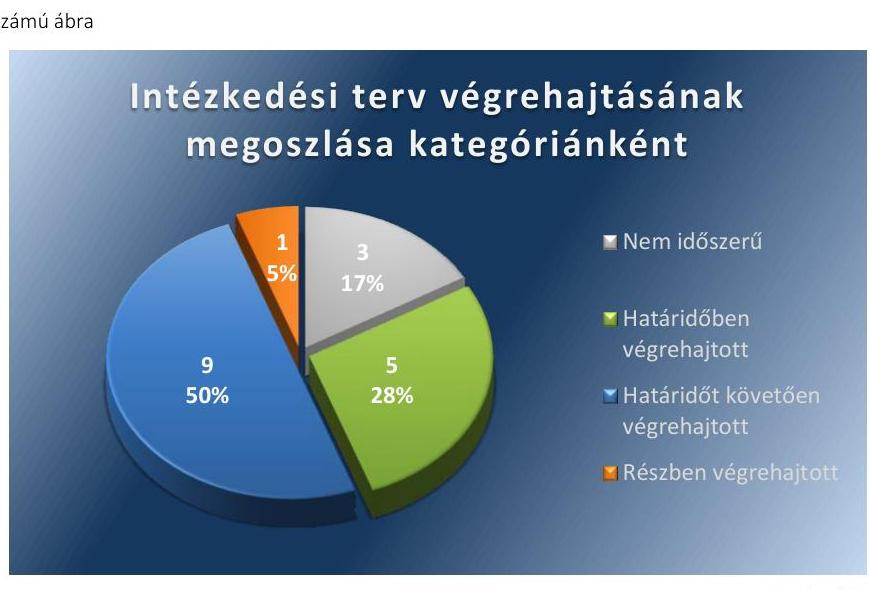

# Jelenetés 

## Utóellenőrzés

Nagymányok Város Önkormányzata pénzügyi gazdálkodási helyzetének, szabályszerűségének utóellenőrzése

15181
www.asz.hu

---

.

---

# J elentés 

## Utóellenőrzés

Nagymányok Város Önkormányzata pénzügyi gazdálkodási helyzetének, szabályszerűségének utóellenőrzése

15181
www.asz.hu

---

# AZ ELLENŐRZÉST FELÜGYELTE: 

HOLMAN MAGDOLNA JULIANNA felügyeleti vezető

## AZ ELLENŐRZÉST VEZETTE ÉS A VÉGREHAJTÁSÁÉRT FELELŐS:

BÍRÓ ZSOLT ellenőrzésvezető

## A PROGRAM ÖSSZEÁLLÍTÁSÁÉRT FELELŐS:

LAJTERNÉ HUDÁK MAGDOLNA osztályvezető

## A TÉMÁHOZ KAPCSOLÓDÓ KORÁBBI SZÁMVEVŐSZÉKI JELENTÉS:

- címe: Jelentés Nagymányok Város Önkormányzata pénzügyi gazdálkodási helyzetének, szabályosságának ellenőrzéséről
- sorszáma: 13058

Jelentéseink az Országgyúlés számítógépes hálózatán és az Interneten a www.asz.hu címen is olvashatóak.

IKTATÓSZÁM: V-0621-032/2015
TÉMASZÁM: 1655
ELLENŐRZÉS-AZONOSÍTÓ SZÁM: V069321

---

# TARTALOMJEGYZÉK 

■ ÖSSZEGZÉS ..... 5
■ AZ ELLENŐRZÉS CÉLJA ..... 6
■ AZ ELLENŐRZÉS TERÜLETE ..... 7
■ AZ ELLENŐRZÉS HÁTTERE, INDOKOLTSÁGA ..... 8
■ FÓKUSZKÉRDÉSEK ..... 9
■ ELLENŐRZÉS HATÓKÖRE ÉS MÓDSZEREI ..... 10
■ MEGÁLLAPÍTÁSOK ..... 12
■ MELLÉKLETEK ..... 17
I. Sz. melléklet: Az ÁSZ 13058 számú jelentéséhez kapcsolódó intézkedési terv végrehajtása ..... 17
■ FÜGGELÉK: ÉSZREVÉTELEK ..... 23
■ RÖVIDÍTÉSEK JEGYZÉKE ..... 25

---

.

---

# ÖSSZEGZÉS 

Az Állami Számvevőszék Nagymányok Város Önkormányzata pénzügyi gazdálkodási helyzetének, szabályszerűségének utóellenőrzését a 2013. augusztus 16. és 2015. április 29. közötti időszakra végezte el. Az Önkormányzat pénzügyi gazdálkodási helyzetének, szabályosságának ellenőrzéséről készült ÁSZ jelentés intézkedést igénylő megállapításai és javaslatai hasznosítására elfogadott intézkedések végrehajtásának késedelme és elmaradása magas szintű kockázatot jelez a pénzügyi gazdálkodásra és annak szabályszerűségére.

## Az ellenőrzés társadalmi indokoltsága

Az ÁSZ stratégiájában célként tűzte ki, hogy a számvevőszéki munka eredménye jobban hasznosuljon, segítse az elszámoltatható közpénzfelhasználás megteremtését, ehhez az intézkedési tervekben vállalt feladatok végrehajtásának ellenőrzése, valamint a célzott utóellenőrzések rendszerének kialakítása is hozzájárul. Az ÁSZ a tavalyi évben lezárta a megújult jogszabályi környezetben lefolytatott első önálló utóellenőrzés-sorozatát. Ezzel teljesen kiépítetté vált a rendszer, amely biztosítja az Országgyűlés azon szándékának teljes körű érvényesülését, hogy felszámolásra kerüljön a következmények nélküli számvevőszéki ellenőrzések korszaka.

## Főbb megállapítások, következtetések, javaslatok

A Képviselő-testület által elfogadott javított, kiegészített intézkedési tervet határidőben megküldték az ÁSZ részére. Az ÁSZ által elfogadott kiegészített intézkedési tervben foglaltak végrehajtásáról teljes körűen nem gondoskodtak. Az intézkedési tervben előírt feladatok végrehajtásának értékelése magas szintű kockázatot jelez a pénzügyi gazdálkodásra és annak szabályszerűségére.

---

# **AZ ELLENŐRZÉS CÉLJA**

## **Nagymányok Város Önkormányzata pénzügyi gazdálkodási helyzetének, szabályszerűségének utóellenőrzése**

Az ellenőrzés célja annak megállapítása volt, hogy az Önkormányzat pénzügyi gazdálkodási helyzetének, szabályszerűségének ellenőrzéséről készült ÁSZ jelentésben foglalt intézkedést igénylő megállapításokra és javaslatokra az ellenőrzött által összeállított, ÁSZ által elfogadott intézkedési tervben meghatározott feladatokat végrehajtották-e.

Ennek keretében ellenőriztük, hogy a polgármester az ÁSZ törvény értelmében az intézkedési tervet határidőben megküldte-e az ÁSZ részére, szükség volt-e az elfogadást megelőzően kiegészítésre, azt az előírt póthatáridőn belül megtették-e, a Képviselő-testület a kiegészített intézkedési tervet elfogadta-e. Értékeltük, hogy az Önkormányzat az elfogadott (kiegészített) intézkedési tervében foglaltak megtételéről, az abban előírt határidők betartásával gondoskodott-e, valamint hogy az elfogadott intézkedések esetleges késedelme, végrehajtásának elmaradása milyen szintű kockázatot jelez a pénzügyi gazdálkodásra és annak szabályszerűségére.

---

# AZ ELLENŐRZÉS TERÜLETE 

## Nagymányok Város Önkormányzata

Nagymányok város Tolna megyében fekszik, népességszáma 2014. január 1-jén 2280 fő* volt. Az Önkormányzat ${ }^{1}$ pénzügyi helyzetének ellenőrzését az ÁSZ ${ }^{2}$ a 2009. január 1. - 2012. szeptember 30. közötti időszakra végezte el, amelynek eredményeként megállapította, hogy az Önkormányzat pénzügyi egyensúlya középtávon nem volt biztosított. Az utóellenőrzés - a 2015. április 29-ig végrehajtott intézkedéseket figyelembe véve - az Önkormányzat pénzügyi gazdálkodási helyzetének, szabályosságának ellenőrzéséről készült ÁSZ jelentés ${ }^{4}$ intézkedést igénylő megállapításai és javaslatai hasznosítására elfogadott intézkedési tervben ${ }^{1}$ foglalt feladatok végrehajtására irányult. Az ÁSZ jelentés a Polgármesternek ${ }^{3}$ hét, a Jegyzőnek ${ }^{4}$ tíz javaslatot tartalmazott.

[^0]
[^0]:    * A Központi Statisztikai Hivatal tájékoztatási adatbázisa alapján
    ${ }^{1}$ Az ÁSZ 13058 számú jelentése. Az elkészített jelentés az interneten, a www.asz.hu címen olvasható (továbbiakban ÁSZ jelentés).
    ${ }^{2}$ A Képviselő-testület az intézkedési tervet a 130/2013. (IX. 12.) számú határozatával fogadta el.

---

# AZ ELLENŐRZÉS HÁTTERE, INDOKOLTSÁGA 

AZ ÁSZ STRATÉGIÁJA a helyi önkormányzatok ellenőrzésében a pénzügyi-gazdasági helyzete értékelésére, kockázatai feltárására helyezte a fő hangsúlyt. A 2011-2013. években az ÁSZ által ellenőrzött önkormányzatok esetében a múködési, beruházási és a hosszú lejáratú pénzintézeti kötelezettségeinek teljesítésével kapcsolatos pénzügyi kockázatokat mutattuk be. Az ÁSZ megállapította, hogy az önkormányzatok pénzügyi egyensúlyi helyzete az ellenőrzött időszakban romlott, a pénzügyi kockázatok fokozódtak, a pénzügyi egyensúlyi helyzetet jellemző mutatószámok kedvezőtlenül változtak. Az önkormányzati alrendszerben 2012. év végétől 2014. évelejéig lezajlott adósságkonszolidáció és feladat-ellátási-, finanszi-rozási-rendszer változtatás következtében a települési önkormányzatok pénzügyi helyzete jelentős mértékben megváltozott, amely a jóváhagyott intézkedési tervek végrehajtását is befolyásolta.

Az ellenőrzött szervezet vezetője az ÁSZ tv. ${ }^{5}$ 33. § (1)-(2) bekezdésében foglaltak alapján a jelentések intézkedést igénylő megállapításaihoz kapcsolódóan köteles intézkedési tervet benyújtani, amelyet az ÁSZ-nak kell elfogadni. Amennyiben az ellenőrzött által vállalt intézkedések hiányosak, vagy más okból nem elfogadhatók az ÁSZ indoklással és póthatáridő tűzésével visszaküldi azt kijavításra, kiegészítésre. Az elfogadásról szóló tájékoztatásban az ÁSZ elnöke valamennyi ellenőrzött szervezet vezetőjének figyelmét felhívta arra, hogy az intézkedési tervben foglaltak megvalósítását - az ÁSZ tv. 33. § (7) bekezdésében foglaltak alapján - utóellenőrzés keretében ellenőrizheti.

## AZ UTÓELLENŐRZÉS VÁRHATÓ HASZNOSULÁSA:

az ellenőrzés megállapításai segítséget nyújthatnak a közpénzügyi helyzet javításához. Az adósságkonszolidációt követően az önkormányzati alrendszerben kiemelt jelentőségű feladat az adósságállomány újratermelődésének megakadályozása. Az utóellenőrzés, jellegéből adódóan fokozza közbizalmat, fegyelmet, a társadalom, az ellenőrzöttek, a helyi döntéshozók vonatkozásában erősíti az ÁSZ tekintélyét és igazolja, hogy lejárt a következmények nélküli ellenőrzések időszaka. A jóváhagyott intézkedési tervek megvalósításának utóellenőrzése révén megállapítható, hogy az önkormányzatok megtették-e a szükséges intézkedéseket a pénzügyi stabilitás elérése és megőrzése, illetve a pénzügyi kockázataik csökkentése érdekében.

---

# FÓKUSZKÉRDÉSEK 

1. A Képviselő-testület által elfogadott intézkedési tervet, szükség esetén annak javítását, kiegészítését határidőben megküldték-e az ÁSZ részére?
2. Az ÁSZ által elfogadott intézkedési tervben foglaltak végrehajtásáról az abban előírt határidők betartásával gondoskodtak-e?

---

# ELLENŐRZÉS HATÓKÖRE ÉS MÓDSZEREI 

## Az ellenőrzés típusa

Szabályszerűségi ellenőrzés

## Az ellenőrzött időszak

Az intézkedési terv ÁSZ-nak történő benyújtásától (2013. augusztus 16.) az utóellenőrzés megkezdéséig (2015. április 29.) tartó időszak volt.

## Az ellenőrzés tárgya

Az Önkormányzat intézkedési tervében foglaltak betartásának ellenőrzése.

## Az ellenőrzött szervezet

Nagymányok Város Önkormányzata

## Az ellenőrzés jogalapja

Az ellenőrzés végrehajtásának jogszabályi alapját az ÁSZ tv. 1. § (3) bekezdése, az 5. § (2) és (6) bekezdései, a 33. § (7) bekezdése, valamint az Áht. 61. § (2) bekezdésének előírásai képezték.

## Az ellenőrzés módszerei

Az ÁSZ által elfogadott intézkedési tervben előírt feladatok végrehajtásának értékelése során alkalmazott besorolási kategóriák:
$\longrightarrow$ okafogyottá vált feladat: ha végrehajtására - meghatározott esemény bekövetkezése, továbbá külső körülmény, a müködést érintő feltétel változása miatt - már nincs szükség, illetve lehetőség, és egyértelműen megállapítható, hogy az intézkedést szükségessé tevő körülmény a jövőben nem fordulhat elő;
$\longrightarrow$ nem időszerű (nem esedékes) feladat: amelynek ellenőrzési időszakon belüli végrehajtására azért nem került (kerülhetett) sor, mert az intézkedés alapjául szolgáló esemény nem következett be, de annak jövőbeni előfordulása lehetséges;
$\longrightarrow$ határidőben végrehajtott feladat: ha teljesítése dokumentáltan az intézkedési tervben előírt határidőben és tartalommal, módon megtörtént;

---

- határidőn túl végrehajtott feladat: ha annak teljesítése az intézkedési tervben meghatározott módon, de az előírt határidőn túl történt meg;
—_ részben végrehajtott feladat: amelynek végrehajtása teljes körűen az intézkedési tervben előírt tartalommal/módon nem történt meg, vagy a feladatot nem az előírt gyakorisággal hajtották végre;
—_ végre nem hajtott feladat: ha a végrehajtásért felelősként megjelölt személy(ek)nek felróhatóan a teljesítés elmaradt, vagy a teljesítést nem dokumentálták.
Az intézkedési tervben előírt feladatok végrehajtásának részletes bemutatását, valamint a teljesítés minősítését az I. számú melléklet tartalmazza.

Elfogadott intézkedések esetleges késedelme, végrehajtásának elmaradása a pénzügyi gazdálkodásra és annak szabályszerűségére kockázatot jelez. A kockázati arányszám kiszámítása során az összes kategória súlyozott értékének összegéhez viszonyítottuk a határidőn túl, a részben és a nem végrehajtott intézkedési kategóriák súlyozott pontszámát. A súlyozott érték megállapítása az egyes kategóriákhoz rendelt pontszámok alapján történt. A pénzügyi gazdálkodásra és annak szabályszerűségére ható, az intézkedési terv végrehajtásának elmaradásából eredő kockázat „magas", ha az elért pontszám és az elérhető pontszám százalékban kifejezett hányadosa elérte a $71 \%$-ot, „közepes", ha 51 és $70 \%$ közé esett és „alacsony" ha nem haladta meg az 50\%-ot.

Az ellenőrzésre az Önkormányzat elektronikus adatszolgáltatása alapján került sor, helyszínen ellenőrzést nem végeztünk. A megállapítások rögzítése az Önkormányzat által rendelkezésre bocsátott dokumentumok, tanúsítványok alapján történt, melyek valódiságát és teljes körűségét a polgármester, valamint a jegyző teljességi nyilatkozata igazolta.

---

# MEGÁLLAPÍTÁSOK 

## 1. A Képviselő-testület által elfogadott intézkedési tervet, szükség esetén annak javítását, kiegészítését határidőben megküldték-e az ÁSZ részére?

Összegző megállapítás

A Képviselő-testület ${ }^{6}$ által elfogadott javított, kiegészített intézkedési tervet határidőben megküldték az ÁSZ részére.

A Polgármester a Képviselő-testületet tájékoztatta az ÁSZ jelentéséről. A jelentésben foglalt intézkedést igénylő megállapításokra és javaslatokra készített intézkedési tervet az ÁSZ tv. 33. § (1) bekezdésében foglalt határidőre megküldték az ÁSZ részére, amelyet az ÁSZ nem fogadott el.

Az ÁSZ az intézkedési terv kiegészítését kérte, amelyet az Önkormányzat határidőben végrehajtott.

Az ÁSZ által elfogadott intézkedési tervben meghatározott feladatokat, az ÁSZ jelentés javaslatainak címzettjét és a feladatok végrehajtását az I. számú melléklet mutatja be.

Az ÁSZ jelentés a Polgármester részére hét, a Jegyző részére tíz javaslatot fogalmazott meg, melynek hasznosítására az Önkormányzat az intézkedési tervben 18 feladatot határozott meg, felelősként a Jegyzőt és a Polgármestert megjelölve.

## 2. Az ÁSZ által elfogadott intézkedési tervben foglaltak végrehajtásáról az abban előírt határidők betartásával gondoskodtak-e?

Összegző megállapítás

Az ÁSZ által elfogadott kiegészített intézkedési tervben foglaltak végrehajtásáról teljes körűen nem gondoskodtak.

Az intézkedések végrehajtási kategóriánkénti megoszlását az 1. számú ábra szemlélteti.

---

Fonás: ÁsZ

# NEM IDŐSZERŰ feladatok: 

1. Jogszerű biztosíték, illetve fedezet felajánlásra nem került sor, mivel az intézkedési terv elfogadását és jóváhagyását követően hitelfelvétel, kötvénykibocsátás az Önkormányzat részéről nem történt.
2. Nem volt időszerű az intézkedés arról, hogy a költségvetési támogatások folyósítására szolgáló bankszámláról hiteltörlesztés nem történhet, mivel az intézkedési terv elfogadását és jóváhagyását követően hitelfelvétel, kötvénykibocsátás az Önkormányzat részéről nem történt.
3. A pénzintézeti kötelezettségvállalások kockázatainak előkészítő szakaszában a kockázatokat és a futamidő egyes éveit terhelő kötelezettségek költségvetési egyensúlyra gyakorolt hatását pénzintézeti kötelezettségvállalás hiányában nem mérték fel.

## HATÁRIDŐBEN VÉGREHAJTOTT feladatok:

4. A bevételek növelését és a kiadások csökkentését célzó javaslatotokat elkészítették.
5. Elkészítették a közbeszerzési szabályzatot, amely a Kbt. ${ }^{7}$ hatálya alá tartozó pénzügyi szolgáltatások igénybevétele esetében az előírások betartását biztosítja.
6. A behajthatatlannak minősített követelések elengedéséről a vagyongazdálkodásról szóló 13/2012. (X. 12.) önkormányzati rendelet 14. § (1) bekezdés j) pontjában előírtaknak megfelelően a döntési jogkört a Képviselő-testület gyakorolta.
7. Az Önkormányzat belső kontrollrendszerét felülvizsgálták, kiegészítették, hogy a pénzügyi egyensúlyt befolyásoló kockázatok kezelésére is alkalmas legyen. A belső kontrollrendszer biztosítja a pénzügyi gazdálkodási folyamatok ellenőrzésének folyamatát, a pénzügyi egyensúlyi helyzet alakulását befolyásoló döntések kockázatainak kezelését.

---

8. Intézkedtek arról, hogy a 2014. évi éves belső ellenőrzési terv tartalmazza a pénzügyi egyensúlyi helyzetet befolyásoló döntésekkel kapcsolatos feltárt kockázati tényezők ellenőrzését valamint, hogy az ellenőrzési tervet végrehajtsák. Az intézkedés folyamatos végrehajtásáról gondoskodtak.

# HATÁRIDŐT KÖVETŐEN VÉGREHAJTOTT feladatok: 

9. A feladatellátásra vonatkozó döntések előkészítése során a vállalt 2013. december 31-ei határidőt követően 2014. szeptember 1-én írták elő a kötelező és önként vállalt feladatok arányának és annak pénzügyi egyensúlyi helyzetre gyakorolt hatásának vizsgálatát. A feladat-ellátási szerződések minimum tartalmi elemeit határidőben meghatározták.
10. A feladat-ellátási rendszerhez kapcsolódó támogatási rendszer feltételeit a vállalt 2013. november 1-ei határidőt követően 2014. szeptember 1-én szabályozták. A feladat-ellátási szerződések minimum tartalmi követelményeinek meghatározására a Képviselőtestület részére az előterjesztést határidőben elkészítették.
11. A feladat-ellátási szerződések teljesítésére vonatkozó beszámolási kötelezettséggel kapcsolatos kontroll tevékenységeket a vállalt 2013. december 31-ét követően 2014. szeptember 1-én írták elő.
12. Az Önkormányzat gazdasági helyzetének elemzésén alapuló hoszszú távú stabilizációs programot a vállalt 2013. december 31-ei határidőt követően 2014. július 4-én készítették el.
13. A korábban feltárt közbeszerzési szabálytalanságot nem a vállalt 2013. október 30-ai határidőben vizsgálták ki, az eredményről a Képviselő-testületet 2014. július 4-én tájékoztatták.
14. Az új kockázatkezelési szabályzatot a vállalt 2013. október 1-ei határidő helyett 2013. november 29-én adták ki.
15. A fejlesztési döntések előkészítése során az előkészítés, lebonyolítás és a működés kockázatainak megállapítását követően azok kezeléséről a vállalt 2013. december 31-ei határidőt követően 2014. augusztus 31-én intézkedtek.
16. A közbeszerzési értékhatár alatti esetekben a pályáztatási kötelezettséggel kapcsolatos kontrolltevékenységet a vállalt 2013. december 31-ei határidőt követően 2014. szeptember 1-én alakították ki.
17. A fejlesztésekhez kapcsolódód külső források, támogatások figyelési rendszerével, a pályázatkészítés feltételeivel összefüggő kontrolltevékenységeket a vállalt 2013. december 31-ei határidőt követően 2014. szeptember 1-én alakították ki.

## RÉSZBEN VÉGREHAJTOTT feladat:

18. A fejlesztések döntés-előkészítési folyamatában a lebonyolítás és a működtetés kockázatai feltárásának kötelezettségét meghatározták és előírták a pénzintézeti kötelezettségvállalások kockázatainak előkészítő szakaszban történő feltárását, a futamidő költségvetési egyensúlyra gyakorolt hatásának vizsgálatát. Az Önkor-

---

mányzat fizetőképességének és eladósodásának kezelése, valamint a pénzügyi kötelezettségek teljesítése szabályairól azonban nem készítettek szabályzatot.

MAGAS SZINTŨ KOCKÁZATOT JELEZ a pénzügyi gazdálkodásra és annak szabályszerűségére az elfogadott intézkedések késedelme, végrehajtásának elmaradása.

---

.

---

# MELLÉKLETEK

■ I. SZ. MELLÉKLET: AZ ÁSZ 13058 SZÁMÚ JELENTÉSÉHEZ KAPCSOLÓDÓ INTÉZKEDÉSI TERV VÉGREHAJTÁSA

|  Sorszám | Intézkedési terv alapján elvégzendő feladat | Az intézkedési tervben meghatározott határidő | Az ÁSZ 13058. sz. jelentése javaslatának címzettie | Az intézkedés végrehajtása  |
| --- | --- | --- | --- | --- |
|   | 1. | 2. | 3. | 4.  |
|   |  |  | Nem időszerű (nem esedékes) intézkedések |   |
|  1. | Intézkedjen, hogy a jövőben pénzintézeti hitelfelvétel esetén jogszerű biztosíték, illetve fedezet felajánlás történjen az önkormányzat részéről. | 2013. október 1., illetve folyamatos | Polgármester | Az ellenőrzött időszakban pénzintézeti hitelfelvétel nem történt.  |
|  2. | Költségvetési támogatások folyósítására szolgáló bankszámláról hiteltörlesztés nem történhet. | 2013. október 1., illetve folyamatos | Polgármester | Az ellenőrzött időszakban költségvetési támogatások folyósítására szolgáló bankszámláról hiteltörlesztés nem történ történt.  |
|  3. | A pénzintézeti kötelezettségvállalások kockázatainak előkészítő szakaszban fel kell tárni a kockázatokat, valamint a futamidő egyes éveit terhelő kötelezettségek költségvetési egyensúlyra gyakorolt hatását. | 2013. október 1., illetve folyamatos | Jegyző | Pénzintézeti kötelezettségvállalás az utóellenőrzéssel érintett időszakban nem történt.  |

---

|  5. | Intézkedési terv alapján elvégzendő feladat | Az intézkedési tervben meghatározott határidő | Az ÁSZ 13058. sz. jelentése javaslatának címzettje | Az intézkedés végrehajtása  |
| --- | --- | --- | --- | --- |
|  1. |  | 2. | 3. | 4.  |
|  Határidőben végrehajtott intézkedések |  |  |  |   |
|  4. | Biztosítsa, hogy a költségvetési rendelettervezet és évközi módosítás előterjesztése előtt a bevételek növelését és a kiadások csökkentését célzó javaslat elkészüljön. | 2013. október 1., illetve folyamatos | Polgármester | A 2014. évi költségvetési koncepcióval - amely 2013. április 17-ei dátummal készült - a vállalt határidőnek megfelelően biztosították, hogy a költségvetési rendelettervezet és évközi módosítás előterjesztése előtt a bevételek növelését és a kiadások csökkentését célzó javaslat elkészüljön. A koncepciót a Képviselő-testület 2013. évben két alkalommal tárgyalta, felülvizsgálat után a 139/2013. (X.30.) sz. határozattal hagyta jóvá. A folyamatos teljesítést igazolja az Önkormányzat Pénzügyi Gazdasági Bizottságának a 2015. évi költségvetéshez kapcsolódó 15/2015. (I.28.) számú határozata és annak előterjesztése, amely tartalmazta a 2015. évi költségvetésbe beépítésre kerülő bevételnövelő és kiadáscsökkentő javaslatokat.  |
|  5. | Biztosítsa, hogy jövőben a közbeszerzési törvény hatálya alá tartozó pénzügyi szolgáltatások igénybevétele esetében a Kbt. rendelkezéseit betartsák. | 2013. október 1., illetve folyamatos | Polgármester | Az Önkormányzat Képviselő-testülete az új Közbeszerzési szabályzatot határidőben, 124/2013. (IX.12.) számú határozatával elfogadta. Pénzügyi szolgáltatás igénybevételére az utóellenőrzés időszakában nem került sor.  |
|  6. | Biztosítsa, hogy behajthatatlannak minősített követelések elengedése esetén a vagyongazdálkodásról szóló 13/2012. (X. 12.) önkormányzati rendelet 14. § (1) bekezdés j) pontjában előírt döntési jogkört a Képviselő-testület gyakorolja. | 2013. október 1., | Polgármester | A Képviselő-testület 16/2013. (IX.17.) számú rendeletével a vállalt határidőnek megfelelően döntött a behajthatatlan követelések előzetes felülvizsgálatáról. A 167/2013. (XII.12.) és a 174/2014. (XII.16.) sz. testületi határozatok egyes behajthatatlan követelésekkel, illetve követelés-behajtással kapcsolatos döntéseket hoztak.  |

---

|  E
D
E
S
A | Intézkedési terv alapján elvégzendő feladat | Az intézkedési tervben meghatározott határidő | Az ÁSZ 13058. sz. jelentése javaslatának címzettje | Az intézkedés végrehajtása  |
| --- | --- | --- | --- | --- |
|   | 1. | 2. | 3. | 4.  |
|  7. | Az önkormányzat belső kontrollrendszerét felül kell vizsgálni és azt ki kell egészíteni, hogy a pénzügyi egyensúlyt befolyásoló kockázatok kezelésére is alkalmas legyen. A belső kontrollrendszernek biztosítani kell a pénzügyi gazdálkodási folyamatok ellenőrzésének folyamatát, a pénzügyi egyensúlyi helyzet alakulását befolyásoló döntések kockázatainak kezelését. | 2013. december 31., illetve folyamatos | Jegyző | A belső kontrollrendszer felülvizsgálatának eredményeként a jegyző 2/2013. (XI. 29.) számú a Nagymányoki Polgármesteri Hivatal Belső Kontrollrendszeréről szóló és a 3/2013. (XI.29.) számú a Nagymányoki Polgármesteri Hivatal Ellenőrzési Nyomvonaláról szóló utasításokat adta ki. A pénzügyi egyensúlyt befolyásoló kockázatok kezelésére alkalmas kockázatkezelési rendszer kialakításáról a jegyző 1/2013. (XI.29.) számú utasításával a Nagymányoki Polgármesteri Hivatal kockázatkezelési szabályzatáról a vállalt határidőnek megfelelően intézkedett.  |
|  8. | Intézkedni kell, hogy az éves belső ellenőrzési tervek tartalmazzák a pénzügyi egyensúlyi helyzetet befolyásoló döntésekkel kapcsolatos feltárt kockázati tényezők ellenőrzését, a továbbiakban biztosítani kell az ellenőrzési tervek végrehajtását. | 2013. december 31., illetve folyamatos | Jegyző | A feladat végrehajtását az Önkormányzat a 141/2013. (X.30.) sz. határozat, a kapcsolódó előterjesztéssel, belső ellenőrzési tervvel, kockázatelemzéssel támasztotta alá. A 2014. évi belső ellenőrzési terv tartalmazta a pénzügyi egyensúlyi helyzetet befolyásoló döntésekkel kapcsolatos feltárt kockázati tényezők ellenőrzését Az Önkormányzat a folyamatos teljesítés és a végrehajtás biztosítása érdekében a vállalt intézkedésről a Bonyhádi Közös Önkormányzati Hivatal Belső Ellenőrzési Csoportját - mint a belső ellenőrzési feladatokat társulási megállapodás alapján ellátót - tájékoztatták. A belső ellenőrzési beszámoló előterjesztésének határideje a 2014. évi zárszámadás előterjesztésével megegyező, és a beterjesztés határideje 2015. május 30. volt. Az utóellenőrzéssel érintett időszak 2015. április 29. napjával lezárult.  |

---

|  8
10 | Intézkedési terv alapján elvégzendő feladat | Az intézkedési tervben meghatározott határidő | Az ÁSZ 13058. sz. jelentése javaslatának címzettje | Az intézkedés végrehajtása  |
| --- | --- | --- | --- | --- |
|   | 1. | 2. | 3. | 4.  |
|  Határidőt követően végrehajtott intézkedések |  |  |  |   |
|  9. | A feladatellátásra vonatkozó döntések előkészítése során meg kell határozni a kötelező és önként vállalt feladatok arányát és annak pénzügyi egyensúlyi helyzetre gyakorolt hatását, meg kell határozni a feladatellátás szerződés minimum tartalmi elemeit. | 2013. december 31., illetve folyamatos | Jegyző | A Képviselő-testület 2013. október 30-ai ülésére készített előterjesztés alapján, a 140/2013. (X.30.) sz. határozattal döntött a feladat-ellátási szerződések tartalmi követelményeinek meghatározásáról. A feladatellátásra vonatkozó döntések előkészítése során a kötelező és önként vállalt feladatok arányának és annak pénzügyi egyensúlyi helyzetre gyakorolt hatásának meghatározására a vállalt határidőt követően a 13/2014. (IX.1.) számú a polgármester és a jegyző a Döntés-előkészítés és kontrolltevékenységek eljárási rendjéről szóló együttes utasításában került sor.  |
|  10. | Szabályozza a feladat-ellátási rendszerhez kapcsolódó támogatási rendszer feltételeit. Készítsen előterjesztést a képviselő testület részére a feladatellátási szerződések minimum tartalmi követelményeinek meghatározására. | 2013. november 1. | Jegyző | A Képviselő-testület 2013. október 30-ai ülésére készített előterjesztés alapján, a 140/2013. (X.30.) sz. határozattal döntött a feladat-ellátási szerződések tartalmi követelményeinek meghatározásáról. A polgármester és a jegyző 13/2014. (IX. 1.) együttes utasítása a döntés-előkészítés és kontrolltevékenységek eljárásrendjéről szabályozta a feladat-ellátási rendszerhez kapcsolódó támogatási rendszer feltételeit, az utasítás a vállalt határidőt követően 2014. szeptember 1-én lépett hatályba.  |
|  11. | Határozza meg a feladat-ellátási szerződések teljesítésére vonatkozó beszámolási kötelezettséggel kapcsolatos kontroll tevékenységeket. | 2013. december 31., illetve folyamatos | Jegyző | A polgármester és a jegyző 13/2014. (IX. 1.) együttes utasítása a döntés-előkészítés és kontrolltevékenységek eljárásrendjéről meghatározta a feladat-ellátási szerződések teljesítésére vonatkozó beszámolási kötelezettséggel kapcsolatos kontroll tevékenységeket, az utasítás a vállalt határidőt követően 2014. szeptember 1-én lépett hatályba.  |
|  12. | Készüljön előterjesztés az önkormányzat gazdasági helyzetének elemzésén alapuló hosszú távú stabilizációs programról. | 2013. december 31. | Polgármester | A stabilizációs program a 2014. július 4-ei testületi ülésre készült el (1. napi-rendi pont), melyet a Képviselő-testület 98/2014. (VII.4.) számú határozatával hagyott jóvá.  |

---

|  1. | 2. | 3. | 4.  |
| --- | --- | --- | --- |
|  13. Vizsgálja ki és tájékoztassa a Képviselő-testületet, hogy a közbeszerzési szabálytalanság tekintetében kit terhel munkajogi felelősség. | 2013. október 30. | Polgármester | A munkajogi felelősség megállapítása tárgyában készített előterjesztést a Képviselő-testület 2014. július 4-ei ülésén tárgyalta, arról 99/2014. (VII.4.) számon hozott határozatot A képviselő-testületi határozatban rögzítésre került, hogy munkajogi felelősség megállapítására -elévülés miatt - nem volt lehetőség.  |
|  14. A kockázatkezelési rendszer működése érdekében készítsen új kockázatkezelési szabályzatot és gondoskodjon annak betartásáról. | 2013. október 1., illetve folyamatos | Jegyző | A Jegyző 1/2013. (XI.29.) számú utasításával, 2013. november 29-én kiadta a Nagymányoki Polgármesteri Hivatal Kockázatkezelési Szabályzatát.  |
|  15. A fejlesztési döntések előkészítése során az előkészítés-lebonyolítás - működési kockázatok megállapítását követően annak kezeléséről intézkedik. | 2013. december 31., illetve folyamatos | Jegyző | 2014. augusztus 31-ei dátummal adták ki a polgármester és a jegyző 13/2014. (IX.1.) sz. együttes utasítását a Döntés-előkészítés és Kontroll-tevékenységek eljárásrendjéről, amely tartalmazta a fejlesztési döntések előkészítése során alkalmazandó eljárásrendet biztosítva a kockázatok kezelését.  |
|  16. Határozza meg a közbeszerzési értékhatár alatti esetekben a pályáztatási kötelezettséggel kapcsolatos kontrolltevékenységet. | 2013. december 31., illetve folyamatos | Jegyző | 11/2014. (IX.1.) számmal a polgármester és a jegyző együttes utasítást adott ki a közbeszerzési értékhatár hatálya alá nem tartozó beszerzések lebonyolításáról, amely meghatározta a közbeszerzési értékhatár alatti esetekben a pályáztatási kötelezettséggel kapcsolatos kontrolltevékenységet.  |
|  17. Határozza meg a fejlesztésekhez kapcsolódód külső források, támogatások figyelési rendszerével, a pályázatkészítés feltételeivel összefüggő kontrolltevékenységeket. | 2013. december 31., illetve folyamatos | Jegyző | A 13/2014. (IX.1.) polgármester és jegyző a Döntés-előkészítés és kontrolltevékenységek eljárási rendjéről szóló együttes utasítását 2014. szeptember 1. napjával adták ki, amely meghatározta a fejlesztésekhez kapcsolódód külső források, támogatások figyelési rendszerével, a pályázatkészítés feltételeivel összefüggő kontrolltevékenységeket.  |

---

|  1. | 2. | 3. | 4.  |
| --- | --- | --- | --- |
|  18. | Meg kell határozni a fejlesztések döntés-előkészítés folyamatában a lebonyolítás és a működtetés kockázatai feltárásának kötelezettségét. Elő kell írni a pénzintézeti kötelezettségvállalások kockázatainak előkészítő szakaszban történő feltárását, a futamidő költségvetési egyensúlyra gyakorolt hatásának vizsgálatát. Szabályzatot kell készíteni az Önkormányzat fizetőképességének és eladósodásának kezelésére valamint a pénzügyi kötelezettségek teljesítésének szabályaira. | 2013. december 31., illetve folyamatos | Jegyző  |

*Fővonal:* 2014. augusztus 31-ei dátummal adták ki a polgármester és a jegyző 13/2014. (IX.1.) sz. együttes utasítását a Döntés-előkészítés és Kontroll-tevékenységek eljárásrendjéről, amely tartalmazta a fejlesztési döntések előkészítése során alkalmazandó eljárásrendet meghatározta a fejlesztések döntés-előkészítés folyamatában a lebonyolítás és a működtetés kockázatai feltárásának kötelezettségét. Ugyan ezen eljárásrendben előírták a pénzintézeti kötelezettségvállalások kockázatainak előkészítő szakaszban történő feltárását, a futamidő költségvetési egyensúlyra gyakorolt hatásának vizsgálatát Az Önkormányzat fizetőképességének és eladósodásának kezelésére valamint a pénzügyi kötelezettségek teljesítésének szabályaira vonatkozó szabályzatot nem készítettek, így a feladat összességében részben került végrehajtásra.

---

# FÜGGELÉK: ÉSZREVÉTELEK 

A jelentéstervezetet a Számvevőszék 15 napos észrevételezésre megküldte az ellenőrzött szervezet vezetőjének az ÁSZ tv. 29. §§ (1) bekezdése előírásának megfelelően.
A polgármester az ÁSZ tv. 29. § (2) bekezdésében foglalt észrevételezési jogával nem élt, a jelentéstervezetre észrevételt nem tett.

[^0]
[^0]:    § 29. § (1) Az Állami Számvevőszék az ellenőrzési megállapításait megküldi az ellenőrzött szervezet vezetőjének vagy az általa megbízott személynek, és annak, akinek személyes felelősségét állapította meg.
    (2) Az ellenőrzött szervezet vezetője és a felelősként megjelölt személy az ellenőrzés megállapításaira tizenöt napon belül írásban észrevételt tehet.
    (3) Az Állami Számvevőszék az észrevételre a beérkezésétől számított harminc napon belül írásban válaszol. A figyelembe nem vett észrevételeket köteles a jelentésben feltüntetni, és megindokolni, hogy azokat miért nem fogadta el.

---

.

---

# RÖVIDÍTÉSEK JEGYZÉKE 

${ }^{1}$ Önkormányzat
${ }^{2}$ ÁSZ
${ }^{3}$ Polgármester
${ }^{4}$ Jegyző
${ }^{5}$ ÁSZ tv.
${ }^{6}$ Képviselő-testület
${ }^{7}$ Kbt.

Nagymányok Város Önkormányzata
Állami Számvevőszék
Nagymányok Város Önkormányzatának polgármestere
Nagymányok Város Önkormányzatának jegyzője
2011. évi LXVI. törvény az Állami Számvevőszékről (hatályos 2011. július 1-jétől)
Nagymányok Város Képviselő-testülete
A közbeszerzésekről szóló 2011. évi CVIII. törvény (hatályos 2011. augusztus 21.)

---

.

---

.

---

# ÁLLAMI SZÁMVEVŐSZÉK 

1052 Budapest, Apáczai Csere János utca 10.
Levélcím: 1364 Budapest 4. Pf. 54
Telefon: +36 14849100 Telefax: +36 14849200
www.asz.hu