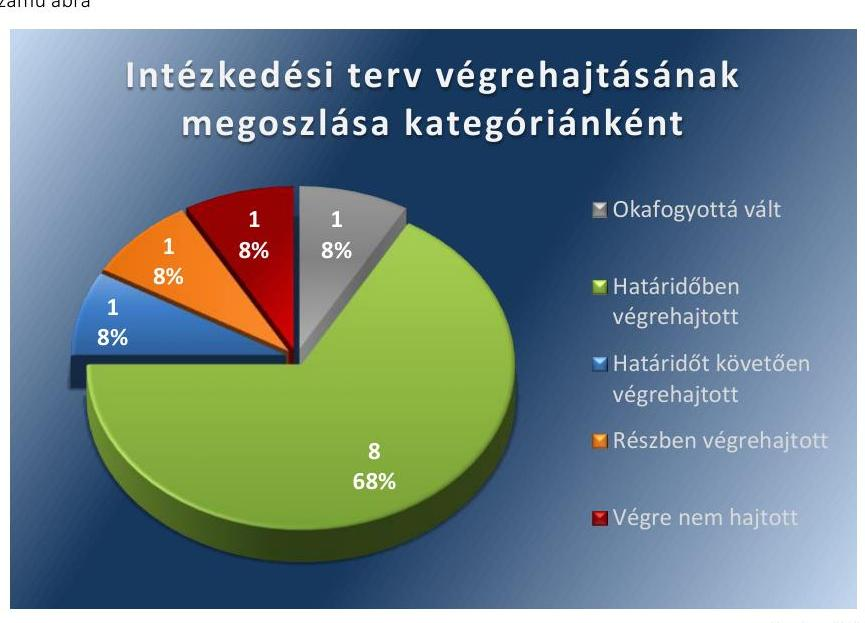

# Jelenetés 

## Utóellenőrzés

Nagyatád Város Önkormányzata pénzügyi gazdálkodási helyzetének, szabályszerűségének utóellenőrzése

15182
www.asz.hu

---

.

---

# Jelentés 

## Utóellenőrzés

Nagyatád Város Önkormányzata pénzügyi gazdálkodási helyzetének, szabályszerűségének utóellenőrzése

---

# AZ ELLENŐRZÉST FELÜGYELTE: 

HOLMAN MAGDOLNA JULIANNA felügyeleti vezető

## AZ ELLENŐRZÉST VEZETTE ÉS A VÉGREHAJTÁSÁÉRT FELELŐS:

BÍRÓ ZSOLT ellenőrzésvezető

## A PROGRAM ÖSSZEÁLLÍTÁSÁÉRT FELELŐS:

LAJTERNÉ HUDÁK MAGDOLNA osztályvezető

## A TÉMÁHOZ KAPCSOLÓDÓ KORÁBBI SZÁMVEVŐSZÉKI JELENTÉS:

- címe: Jelentés Nagyatád Város Önkormányzata pénzügyi gazdálkodási helyzetének, szabályosságának ellenőrzéséről
- sorszáma: 13030

IKTATÓSZÁM: V-0614-033/2015
TÉMASZÁM: 1648
ELLENŐRZÉS-AZONOSÍTÓ SZÁM: V069314

---

# TARTALOMJEGYZÉK 

■ ÖSSZEGZÉS ..... 5
■ AZ ELLENŐRZÉS CÉLJA ..... 6
■ AZ ELLENŐRZÉS TERÜLETE ..... 7
■ AZ ELLENŐRZÉS HÁTTERE, INDOKOLTSÁGA ..... 8
■ FÓKUSZKÉRDÉSEK ..... 9
■ ELLENŐRZÉS HATÓKÖRE ÉS MÓDSZEREI ..... 10
■ MEGÁLLAPÍTÁSOK ..... 12
■ MELLÉKLETEK ..... 15
I. Sz. melléklet: Az ÁSZ 13030 számú jelentéséhez kapcsolódó intézkedési terv végrehajtása ..... 15
■ FÜGGELÉK: ÉSZREVÉTELEK ..... 23
■ RÖVIDÍTÉSEK JEGYZÉKE ..... 25

---

.

---

# ÖSSZEGZÉS 

Az Állami Számvevőszék Nagyatád Város Önkormányzata pénzügyi gazdálkodási helyzetének, szabályszerűségének utóellenőrzését a 2013. június 21. és 2015. április 29. közötti időszakra végezte el. Az Önkormányzat pénzügyi gazdálkodási helyzetének, szabályszerűségének ellenőrzéséről készült ÁSZ jelentés intézkedést igénylő megállapításai és javaslatai hasznosítására végrehajtott

intézkedések hozzájárultak a pénzügyi stabilitás kialakulásának és fenntartásának feltételeinek javulásához, az elfogadott intézkedések végrehajtásának késedelme és elmaradása alacsony szintű kockázatot jelez a pénzügyi gazdálkodásra és annak szabályszerűségére.

## Az ellenőrzés társadalmi indokoltsága

Az ÁSZ stratégiájában célként tűzte ki, hogy a számvevőszéki munka eredménye jobban hasznosuljon, segítse az elszámoltatható közpénzfelhasználás megteremtését, ehhez az intézkedési tervekben vállalt feladatok végrehajtásának ellenőrzése, valamint a célzott utóellenőrzések rendszerének kialakítása is hozzájárul. Az ÁSZ a tavalyi évben lezárta a megújult jogszabályi környezetben lefolytatott első önálló utóellenőrzés-sorozatát. Ezzel teljesen kiépítetté vált a rendszer, amely biztosítja az Országgyűlés azon szándékának teljes körű érvényesülését, hogy felszámolásra kerüljön a következmények nélküli számvevőszéki ellenőrzések korszaka.

## Főbb megállapítások, következtetések, javaslatok

A Képviselő-testület által elfogadott intézkedési tervet határidőben megküldték az ÁSZ részére. Az ÁSZ által elfogadott intézkedési tervben foglaltak végrehajtásáról teljes körűen nem gondoskodtak. Az intézkedési tervben előírt feladatok végrehajtásának értékelése alacsony szintű kockázatot jelez a pénzügyi gazdálkodásra és annak szabályszerűségére. Az intézkedések végrehajtása hozzájárult a pénzügyi stabilitás kialakulásának és fenntartásának feltételeinek javulásához.

---

# AZ ELLENŐRZÉS CÉLJA 

## Nagyatád Város Önkormányzata pénzügyi gazdálkodási helyzetének, szabályszerűségének utóellenőrzése

Az ellenőrzés célja annak megállapítása volt, hogy az Önkormányzat pénzügyi gazdálkodási helyzetének, szabályszerűségének ellenőrzéséről készült ÁSZ jelentésben foglalt intézkedést igénylő megállapításokra és javaslatokra az ellenőrzött által összeállított, ÁSZ által elfogadott intézkedési tervben meghatározott feladatokat végrehajtották-e.

Ennek keretében ellenőriztük, hogy a polgármester az ÁSZ törvény értelmében az intézkedési tervet határidőben megküldte-e az ÁSZ részére, szükség volt-e az elfogadást megelőzően kiegészítésre, azt az előírt póthatáridőn belül megtették-e, a Képviselő-testület a kiegészített intézkedési tervet elfogadta-e. Értékeltük, hogy az Önkormányzat az elfogadott (kiegészített) intézkedési tervében foglaltak megtételéről, az abban előírt határidők betartásával gondoskodott-e, valamint hogy az elfogadott intézkedések esetleges késedelme, végrehajtásának elmaradása milyen szintű kockázatot jelez a pénzügyi gazdálkodásra és annak szabályszerűségére.

---

# AZ ELLENŐRZÉS TERÜLETE

## Nagyatád Város Önkormányzata

Nagyatád város Somogy megyében fekszik, népességszáma 2014. január 1-jén 10 761 fő* volt. Az Önkormányzat1 pénzügyi helyzetének ellenőrzését az ÁSZ2 a 2009. január 1. – 2012. június 30. közötti időszakra végezte el, amelynek eredményeként megállapította, hogy az Önkormányzat pénzügyi egyensúlya rövidtávon nem volt biztosított. Az utóellenőrzés – a 2015. április 29-ig végrehajtott intézkedéseket figyelembe véve – az Önkormányzat pénzügyi gazdálkodási helyzetének, szabályszerűségének ellenőrzéséről készült ÁSZ jelentés3 intézkedést igénylő megállapításai és javaslatai hasznosítására elfogadott intézkedési tervben1 foglalt feladatok végrehajtására irányult. Az ÁSZ jelentés a polgármesternek3 és a jegyzőnek4 hat-hat javaslatot tartalmazott.

\* A Központi Statisztikai Hivatal tájékoztatási adatbázisa alapján

1 Az ÁSZ 13030 számú jelentése. Az elkészített jelentés az interneten, a www.asz.hu címen olvasható (továbbiakban ÁSZ jelentés).

2 A Képviselő-testület az intézkedési tervet a 176/2013. (VI. 20.) számú határozatával fogadta el.

---

# AZ ELLENŐRZÉS HÁTTERE, INDOKOLTSÁGA 

AZ ÁSZ STRATÉGIÁJA a helyi önkormányzatok ellenőrzésében a pénzügyi-gazdasági helyzet értékelésére, kockázatainak feltárására helyezte a fő hangsúlyt. A 2011-2013. években az ÁSZ által ellenőrzött önkormányzatok esetében a működési, beruházási és a hosszú lejáratú pénzintézeti kötelezettségeinek teljesítésével kapcsolatos pénzügyi kockázatokat mutattuk be. Az ÁSZ megállapította, hogy az önkormányzatok pénzügyi egyensúlyi helyzete az ellenőrzött időszakban romlott, a pénzügyi kockázatok fokozódtak, a pénzügyi egyensúlyi helyzetet jellemző mutatószámok kedvezőtlenül változtak. Az önkormányzati alrendszerben 2012. év végétől 2014. évelejéig lezajlott adósságkonszolidáció és feladat-ellátási-, finanszírozási-rendszer változás következtében a települési önkormányzatok pénzügyi helyzete jelentős mértékben megváltozott, amely a jóváhagyott intézkedési tervek végrehajtását is befolyásolta.

Az ellenőrzött szervezet vezetője az ÁSZ tv. ${ }^{5}$ 33. § (1)-(2) bekezdésében foglaltak alapján a jelentések intézkedést igénylő megállapításaihoz kapcsolódóan köteles intézkedési tervet benyújtani, amelyet az ÁSZ-nak kell elfogadni. Amennyiben az ellenőrzött által vállalt intézkedések hiányosak, vagy más okból nem elfogadhatók az ÁSZ indoklással és póthatáridő tűzésével visszaküldi azt kijavításra, kiegészítésre. Az elfogadásról szóló tájékoztatásban az ÁSZ elnöke valamennyi ellenőrzött szervezet vezetőjének figyelmét felhívta arra, hogy az intézkedési tervben foglaltak megvalósítását - az ÁSZ tv. 33. § (7) bekezdésében foglaltak alapján - utóellenőrzés keretében ellenőrizheti.

## AZ UTÓELLENŐRZÉS VÁRHATÓ HASZNOSULÁSA:

az ellenőrzés megállapításai segítséget nyújthatnak a közpénzügyi helyzet javításához. Az adósságkonszolidációt követően az önkormányzati alrendszerben kiemelt jelentőségű feladat az adósságállomány újratermelődésének megakadályozása. Az utóellenőrzés, jellegéből adódóan fokozza a közbizalmat, fegyelmet, a társadalom, az ellenőrzöttek, a helyi döntéshozók vonatkozásában erősíti az ÁSZ tekintélyét és igazolja, hogy lejárt a következmények nélküli ellenőrzések időszaka. A jóváhagyott intézkedési tervek megvalósításának utóellenőrzése révén megállapítható, hogy az önkormányzatok megtették-e a szükséges intézkedéseket a pénzügyi stabilitás elérése és megőrzése, illetve a pénzügyi kockázataik csökkentése érdekében.

---

# FÓKUSZKÉRDÉSEK 

1. A Képviselő-testület által elfogadott intézkedési tervet, szükség esetén annak javítását, kiegészítését határidőben megküldték-e az ÁSZ részére?
2. Az ÁSZ által elfogadott intézkedési tervben foglaltak végrehajtásáról az abban előírt határidők betartásával gondoskodtak-e?

---

# ELLENŐRZÉS HATÓKÖRE ÉS MÓDSZEREI 

## Az ellenőrzés típusa

Szabályszerűségi ellenőrzés

## Az ellenőrzött időszak

Az intézkedési terv ÁSZ-nak történő benyújtásától (2013. június 21.) az utóellenőrzés megkezdéséig (2015. április 29.) tartó időszak volt.

## Az ellenőrzés tárgya

Az Önkormányzat intézkedési tervében foglaltak betartásának ellenőrzése.

## Az ellenőrzött szervezet

Nagyatád Város Önkormányzata

## Az ellenőrzés jogalapja

Az ellenőrzés végrehajtásának jogszabályi alapját az ÁSZ tv. 1. § (3) bekezdése, az 5. § (2) és (6) bekezdései, a 33. § (7) bekezdése, valamint az Áht. 61. § (2) bekezdésének előírásai képezték.

## Az ellenőrzés módszerei

Az ÁSZ által elfogadott intézkedési tervben előírt feladatok végrehajtásának értékelése során alkalmazott besorolási kategóriák:
$\longrightarrow$ okafogyottá vált feladat: ha végrehajtására - meghatározott esemény bekövetkezése, továbbá külső körülmény, a működést érintő feltétel változása miatt - már nincs szükség, illetve lehetőség, és egyértelműen megállapítható, hogy az intézkedést szükségessé tevő körülmény a jövőben nem fordulhat elő;
$\longrightarrow$ nem időszerű (nem esedékes) feladat: amelynek ellenőrzési időszakon belüli végrehajtására azért nem került (kerülhetett) sor, mert az intézkedés alapjául szolgáló esemény nem következett be, de annak jövőbeni előfordulása lehetséges;
$\longrightarrow$ határidőben végrehajtott feladat: ha teljesítése dokumentáltan az intézkedési tervben előírt határidőben és tartalommal, módon megtörtént;

---

- határidőn túl végrehajtott feladat: ha annak teljesítése az intézkedési tervben meghatározott módon, de az előírt határidőn túl történt meg;
- részben végrehajtott feladat: amelynek végrehajtása teljes körűen az intézkedési tervben előírt tartalommal/módon nem történt meg, vagy a feladatot nem az előírt gyakorisággal hajtották végre;
- végre nem hajtott feladat: ha a végrehajtásért felelősként megjelölt személy(ek)nek felróhatóan a teljesítés elmaradt, vagy a teljesítést nem dokumentálták.
Az intézkedési tervben előírt feladatok végrehajtásának részletes bemutatását, valamint a teljesítés minősítését az I. számú melléklet tartalmazza.

Elfogadott intézkedések esetleges késedelme, végrehajtásának elmaradása a pénzügyi gazdálkodásra és annak szabályszerűségére kockázatot jelez. A kockázati arányszám kiszámítása során az összes kategória súlyozott értékének összegéhez viszonyítottuk a határidőn túl, a részben és a nem végrehajtott intézkedési kategóriák súlyozott pontszámát. A súlyozott érték megállapítása az egyes kategóriákhoz rendelt pontszámok alapján történt. A pénzügyi gazdálkodásra és annak szabályszerűségére ható, az intézkedési terv végrehajtásának elmaradásából eredő kockázat „magas", ha az elért pontszám és az elérhető pontszám százalékban kifejezett hányadosa elérte a 71%-ot, „közepes", ha 51 és 70% közé esett és „alacsony" ha nem haladta meg az 50%-ot.

Az ellenőrzésre az Önkormányzat elektronikus adatszolgáltatása alapján került sor, helyszínen ellenőrzést nem végeztünk. A megállapítások rögzítése az Önkormányzat által rendelkezésre bocsátott dokumentumok, tanúsítványok alapján történt, melyek valódiságát és teljes körűségét a polgármester, valamint a jegyző teljességi nyilatkozata igazolta.

---

# MEGÁLLAPÍTÁSOK 

## 1. A Képviselő-testület által elfogadott intézkedési tervet, szükség esetén annak javítását, kiegészítését határidőben megküldték-e az ÁSZ részére?

Összegző megállapítás

A Képviselő-testület által elfogadott intézkedési tervet határidőben megküldték az ÁSZ részére.

A polgármester a Képviselő-testületet tájékoztatta az ÁSZ jelentéséről. A jelentésben foglalt intézkedést igénylő megállapításokra és javaslatokra készített intézkedési tervet az ÁSZ tv. 33. § (1) bekezdésében foglalt határidőre megküldték az ÁSZ részére, amelyet az ÁSZ elfogadott.

Az ÁSZ által elfogadott intézkedési tervben meghatározott feladatokat, az ÁSZ jelentés javaslatainak címzettjét és a feladatok végrehajtását az I. számú melléklet mutatja be.

Az ÁSZ jelentés a polgármester részére hat, a jegyző részére hat javaslatot fogalmazott meg, melynek hasznosítására az Önkormányzat az intézkedési tervében tizenkét feladatot határozott meg, felelősként a jegyzőt és a polgármestert megjelölve.

## 2. Az ÁSZ által elfogadott intézkedési tervben foglaltak végrehajtásáról az abban előírt határidők betartásával gondoskodtak-e?

Összegző megállapítás

Az ÁSZ által elfogadott intézkedési tervben foglaltak végrehajtásáról teljes körűen nem gondoskodtak.

Az intézkedések végrehajtási kategóriánkénti megoszlását az 1. számú ábra szemlélteti.

---

1. számú ábra

Forrás: ÁSZ

# OKAFOGYOTTÁ VÁLT feladat: 

1. Az adósságkonszolidációt követően fennmaradó kötelezettségek tekintetében egyensúlyi (elkülönített) tartalék képzését előíró intézkedésre nem volt szükség, mivel az adósságkonszolidáció során az Önkormányzat adósságát az állam teljes körűen átvállalta.

## HATÁRIDŐBEN VÉGREHAJTOTT feladatok:

2. A további bevételszerző, kiadáscsökkentő lehetőségek felmérésére vonatkozó és a bevételek növelését, a kiadások csökkentését célzó intézkedések bevezetéséhez szükséges döntési javaslatot a Képviselő-testület elé terjesztették.
3. Az önként vállalt feladatok finanszírozhatóságát felülvizsgálták, valamint a feladatellátás racionalizálására vonatkozó javaslatot tettek.
4. A folyamatban lévő beruházások teljes körű felülvizsgálatát, illetve a befejezéshez szükséges saját forrásokat biztosító intézkedésekre vonatkozó javaslatot a Képviselő-testület elé terjesztették.
5. A könyvviteli elszámolások során a bruttó elszámolás elvének érvényesítését, ennek keretében az adott költségvetési év valamennyi, eszközökre, forrásokra és a pénzmaradvány alakulására hatást gyakorló gazdasági eseményének elszámolását, a beszámolóban történő bemutatását, illetve a könyvviteli nyilvántartásokban a bevételek és kiadások egymással szembeni elszámolásának elkerülését biztosították.
6. A fejlesztések döntés-előkészítési folyamatában a lebonyolítás és a működtetés kockázataira vonatkozóan feltárási és kezelési kötelezettséget meghatároztak.
7. A pénzintézeti kötelezettségvállalások kockázatainak döntés-előkészítő szakaszban történő feltárását, a futamidő egyes éveit terhelő kötelezettségek költségvetési egyensúlyra gyakorolt hatásának vizsgálatát előírták.

---

8. Az Önkormányzat fizetőképességének és eladósodásának kezelésére, valamint a pénzügyi kötelezettségek teljesítésére, a szállítói tartozások
 és az egyéb kiadáselmaradások rendezésének helyi szabályaira vonatkozó szabályzatot elkészítették.
9. A gazdálkodásban rejlő kockázatok belső ellenőrzés általi feltárását, a pénzügyi egyensúlyi helyzetet befolyásoló döntésekkel kapcsolatos kockázati tényezők ellenőrzését, a belső ellenőrzési tervek végrehajtását biztosították.

# HATÁRIDŐT KÖVETŐEN VÉGREHAJTOTT feladat: 

10. A lejárt szállítói állomány alakulásáról a Képviselő-testületnek a vállalt 2013. november 30-ai határidőt követően a 2014. április 17-én számolt be, a lejárt szállító tartozások átütemezéséről a 2013. év második felében és a 2014. évben intézkedtek.

## RÉSZBEN VÉGREHAJTOTT feladat:

11. Az Önkormányzat belső kontrollrendszerének szabályozását felülvizsgálták és kiegészítették, azonban a pénzügyi egyensúlyi helyzetre kiható kockázatok feltárása, beazonosítása, értékelése és ezáltal a kockázatok kezelése az ellenőrzési nyomvonalban foglaltak szerint nem történt meg.

## VÉGRE NEM HAJTOTT feladat:

12. Nem készítettek az Önkormányzat gazdasági helyzetének elemzésén alapuló, a pénzügyi egyensúlyi helyzet gyors helyreállítását, hosszú távú fenntartását, valamint az adósságállomány újratermelődésének elkerülését biztosító intézkedéseket tartalmazó reorganizációs programot.

ALACSONY SZINTŰ KOCKÁZATOT JELEZ a pénzügyi gazdálkodásra és annak szabályszerűségére az elfogadott intézkedések végrehajtásának késedelme, elmaradása.

---

# MELLÉKLETEK

- I. SZ. MELLÉKLET: AZ ÁSZ 13030 SZÁMÚ JELENTÉSÉHEZ KAPCSOLÓDÓ INTÉZKEDÉSI TERV VÉGREHAJTÁSA

|  1. | 2. | 3. | 4.  |
| --- | --- | --- | --- |
|  1. | Az adósságkonszolidációt követően fennmaradó kötelezettségei tekintetében a Képviselőtestület elé olyan egyensúlyi (elkülönített) tartalék képzésére vonatkozó - a Htv. ${ }^{7} .140 . \S$ (1) bekezdés a) pontja alapján a jegyző által elkészített - döntési javaslatot kell terjeszteni, amelyben a Képviselő-testület meghatározza annak összegét, és kötelezettséget vállal arra, hogy a törlesztési időszak alatt ezt a tartalékot a költségvetési rendeleteiben minden évben betervezi az adósságszolgálat teljesítésére. | 2013. november 30. | polgármester  |

---

|  Sorszám | Intézkedési terv alapján elvégzendő feladat | Az intézkedési tervben meghatározott határidő | Az ASZ 13030. sz. jelentése javaslatának címzettje | Az intézkedés végrehajtása  |
| --- | --- | --- | --- | --- |
|   | 1. | 2. | 3. | 4.  |
|   |  |  | Határidőben végrehajtott intézkedések |   |
|  2. | A költségvetési rendelettervezet, valamint annak évközi módosítása előterjesztését megelőzően fel kell mérni a bevételszerző, kiadáscsökkentő lehetőségeket, és a Képviselő-testület elé kell terjeszteni a bevételek növelését, a kiadások csökkentését célzó intézkedések bevezetéséhez szükséges - a Htv. 140. § (1) bekezdés a) pontja alapján a jegyző által elkészített döntési javaslatot. | 2013. november 30. | polgármester | A bevételszerző, kiadáscsökkentő lehetőségek felmérésére és a bevételek növelését, a kiadások csökkentését célzó intézkedések bevezetéséhez szükséges - a Htv. 140. § (1) bekezdés a) pontja alapján a jegyző által elkészített - döntési javaslat Képviselő-testület elé terjesztése 2013. november 28-án megtörtént. A Képviselő-testület a 293/2013. (XI. 28.) számú határozatában kiadáscsökkentő döntéseket hozott.  |
|  3. | Felül kell vizsgálni az önként vállalt feladatok finanszírozhatóságát, a kötelező feladatellátás elsődlegességének biztosítása érdekében, és ennek függvényében javaslatot kell tenni a Képviselő-testületnek a feladatellátás racionalizálására. | 2013. november 30. | polgármester | Az ÖNK/1-25/2013. számú tájékoztató az önként vállalt feladatok vonatkozásában a felülvizsgálat eredményét tartalmazta, valamint létszám-csökkentési javaslatot fogalmazott meg a polgármester, amelyet a Képviselő-testület a 293/2013. (XI. 28.) számú határozatában jóváhagyott.  |

---

|  4. | Teljes körűen felül kell vizsgálni a folyamatban lévő beruházásokat a megvalósításhoz szükséges saját források rendelkezésre állása tekintetében, ennek eredményeként javaslatot kell terjeszteni a Képviselő-testület elé a beruházások befejezéséhez szükséges saját források biztosításához szükséges intézkedésekről. | 2013. november 30. | polgármester | A beruházások befejezéséhez szükséges saját forrás biztosításához szükséges intézkedésként a polgármester a hosszú lejáratú fejlesztési hitel felvételt - amelyhez a közbeszerzési eljárás 2013. november 30-án folyamatban volt -, illetve vagyonértékesítésből származó felhalmozási célú bevételt jelölt meg, amelyet a Képviselő-testület a 293/2013. (XI. 28.) számú határozatában jóváhagyott.  |
| --- | --- | --- | --- | --- |
|  5. | A könyvviteli elszámolások során biztosítani kell a Számv. tv. ${ }^{9}$ 15. § (2) bekezdésében foglalt teljesség és a 15. § (9) bekezdésében foglalt bruttó elszámolás elvének érvényesítését, ennek keretében az adott költségvetés év valamennyi, eszközökre, forrásokra és a pénzmaradvány alakulására hatást gyakorló gazdasági eseményét el kell számolni, és a beszámolóban be kell mutatni, a könyvviteli nyilvántartásokban a bevételek és kiadások egymással szembeni elszámolására nem kerülhet sor. | 2013. december 31. | jegyző | A 2013. évben valamennyi, eszközökre, forrásokra és a pénzmaradvány alakulására hatást gyakorló gazdasági eseményét elszámolták a könyvviteli nyilvántartásokban, valamint a 2013. évi költségvetési beszámolóban bemutatták. A bevételek és kiadások egymással szembeni elszámolására nem került sor.  |

---

|  5 |  |  |  | Az intézkedés végrehajtása  |
| --- | --- | --- | --- | --- |
|   |  |  |  | 4.  |
|  6. | Meg kell határozni a fejlesztések döntés-előkészítés folyamatában a lebonyolítás és a működtetés kockázatai feltárásának és kezelésének kötelezettségét. | 2013. december 31. | jegyző | A 332/2013. (XII. 19.) számú határozattal elfogadott, az egyes önkormányzati kötelezettségvállalások előkészítésének és a szállítói tartozások kezelésének rendjéről szóló szabályzatban ${ }^{10}$ meghatározták a fejlesztések döntés-előkészítés folyamatában a lebonyolítás és a működtetés kockázatai feltárásának és kezelésének kötelezettségét.  |
|  7. | Elő kell írni a pénzintézeti kötelezettségvállalások kockázatainak döntés-előkészítő szakaszban történő feltárását, a futamidő egyes éveit terhelő kötelezettségek költségvetési egyensúlyra gyakorolt hatásának vizsgálatát. | 2013. december 31. | jegyző | A Képviselő-testület a 332/2013. (XII. 19.) számú határozatával elfogadott, az egyes önkormányzati kötelezettségvállalások előkészítésének és a szállítói tartozások kezelésének rendjéről szóló szabályzatban előírták a pénzintézeti kötelezettségvállalások kockázatainak döntés-előkészítő szakaszban történő feltárását, a futamidő egyes éveit terhelő kötelezettségek költségvetési egyensúlyra gyakorolt hatásának vizsgálatát.  |

---

|  8. | Szabályzatot kell készíteni az Önkormányzat fizetőképességének és eladósodásának kezelésére, valamint a pénzügyi kötelezettségek teljesítése, a szállítói tartozások és az egyéb kiadáselmaradások rendezésének helyi szabályaira. | 2013. december 31. | jegyző | Az egyes önkormányzati kötelezettségvállalások előkészítésének és a szállítói tartozások kezelésének rendjéről szóló, a Képviselő-testület a 332/2013. (XII. 19.) számú határozatával elfogadott szabályzatban meghatározták az Önkormányzat fizetőképességének és eladósodásának kezelésére, valamint a pénzügyi kötelezettségek teljesítése, a szállítói tartozások és az egyéb kiadáselmaradások rendezésének helyi szabályait.  |
| --- | --- | --- | --- | --- |
|  9. | Intézkedni kell, hogy az Áht.11 70. § (1) bekezdésében, továbbá a Bkr.12 29. § (1) bekezdésében és a 31. § (2) bekezdésében és a (4) bekezdés a) pontjában foglalt előírások szerint az éves belső ellenőrzési tervek tartalmazzák a pénzügyi egyensúlyi helyzetet befolyásoló döntésekkel kapcsolatos feltárt kockázati tényezők ellenőrzését, a továbbiakban biztosítani kell az ellenőrzési tervek végrehajtását. | 2013. december 31. | jegyző | A 2013. december 19-én előterjesztett és a Képviselő-testület 331/2013. (XII. 19.) számú határozatával elfogadott 2014. évi ellenőrzési terv tartalmazta a pénzügyi egyensúlyi helyzetet befolyásoló döntésekkel kapcsolatos feltárt kockázati tényezők ellenőrzését. Az ellenőrzési tervben foglaltak végrehajtását biztosították.  |

---

|  1. | 2. | 3. | 4.  |
| --- | --- | --- | --- |
|  **Határidőt követően végrehajtott intézkedés** |  |  |   |
|  10. | Meghatározott gyakorisággal be kell számolni a Képviselő-testületnek az Önkormányzat lejárt szállítói állománya alakulásáról. Intézkedni kell a szállítói számlák esedékesség szerinti kiegyenlítéséről vagy a lejárt tartozások átütemezéséről. | 2013. november 30. | polgármester  |
|  11. | Az ÖNK/1-25/2013. számú tájékoztató 7. oldal 3) pontban és a 293/2013. (XI. 28.) számú határozat 6. pontban a lejárt szállítói állományról nincs adat. Az Önkormányzat lejárt szállítói tartozása 2013. december 31-én 211 090 ezer Ft volt. Az intézkedési tervben meghatározott időpontot követő időpontra halasztották a Képviselő-testület felé történő beszámolási kötelezettséget a lejárt szállító állomány alakulásáról, amit az előírásoknak megfelelően a jegyző a 2013. évi költségvetés végrehajtásáról szóló rendelet 2014. április 17-i képviselő-testületi ülésre való előterjesztésében teljesített. A lejárt szállító tartozások átütemezése a 2013. év második felében és a 2014. évben megtörtént. |  |   |
|  **Részben végrehajtott intézkedés** |  |  |   |
|  11. | Az Önkormányzat belső kontrollrendszerének szabályozását felül kell vizsgálni, és ki kell azt egészíteni az Áht. 69. § (2) bekezdésében, továbbá a Bkr. 7. § (1)-(2) bekezdéseiben foglalt előírásoknak megfelelő, a pénzügyi egyensúlyt befolyásoló kockázatok kezelésére alkalmas kockázatkezelési rendszerre. A kockázatkezelési rendszer működtetéséről gondoskodni kell. | 2013. december 31. | jegyző  |

---

|  Sorszám | Intézkedési terv alapján elvégzendő feladat | Az intézkedési tervben meghatározott határidő | Az ÁSZ 13030. sz. jelentése javaslatának címzettje | Az intézkedés végrehajtása  |
| --- | --- | --- | --- | --- |
|   | 1. | 2. | 3. | 4.  |
|  Végre nem hajtott intézkedés |  |  |  |   |
|  12. | A Képviselő-testület elé jóváhagyásra be kell terjeszteni a - a Htv. 140. § (1) bekezdés a) pontja alapján a jegyző által elkészített - az Önkormányzat gazdasági helyzetének elemzésén alapuló, a pénzügyi egyensúlyi helyzet gyors helyreállítását, hosszú távú fenntartását, valamint az adósságállomány újratermelődésének elkerülését biztosító intézkedéseket tartalmazó reorganizációs programot. | 2013. november 30. | polgármester | Az ÖNK/1-25/2013. számú tájékoztató 5. oldal b) pont utolsó mondata alapján a polgármester nem látta szükségesnek a reorganizációs program készítését az intézkedési tervben előírt határidőig. A 293/2013. (XI. 28.) számú határozat 7. pontja alapján a Képviselőtestület 2014. október 30-ai határidőben szabta meg az új reorganizációs program elkészítésére vonatkozó feladat végrehajtását a jegyző részére, ami nem került végrehajtásra.  |

---

.

---

# FÜGGELÉK: ÉSZREVÉTELEK 

A jelentéstervezetet a Számvevőszék 15 napos észrevételezésre megküldte az ellenőrzött szervezet vezetőjének az ÁSZ tv. 29. §§ (1) bekezdése előírásának megfelelően.
A polgármester az ÁSZ tv. 29. § (2) bekezdésében foglalt észrevételezési jogával nem élt, a jelentéstervezetre észrevételt nem tett

§ 29. § (1) Az Állami Számvevőszék az ellenőrzési megállapításait megküldi az ellenőrzött szervezet vezetőjének vagy az általa megbízott személynek, és annak, akinek személyes felelősségét állapította meg.
(2) Az ellenőrzött szervezet vezetője és a felelősként megjelölt személy az ellenőrzés megállapításaira tizenöt napon belül írásban észrevételt tehet.
(3) Az Állami Számvevőszék az észrevételre a beérkezésétől

 számított harminc napon belül írásban válaszol. A figyelembe nem vett észrevételeket köteles a jelentésben feltüntetni, és megindokolni, hogy azokat miért nem fogadta el.

---

.

---

# RÖVIDÍTÉSEK JEGYZÉKE 

${ }^{1}$ Önkormányzat
${ }^{2}$ ÁSZ
${ }^{3}$ polgármester
${ }^{4}$ jegyző
${ }^{5}$ ÁSZ tv.
${ }^{6}$ Képviselő-testület
${ }^{7}$ Htv.
${ }^{8}$ ÖNK/1-25/2013. számú tájékoztató
${ }^{9}$ Számv. tv.
${ }^{10}$ egyes önkormányzati
kötelezettségvállalások előkészítésének és a szállítói tartozások kezelésének rendjéről szóló szabályzat
${ }^{11}$ Áht.
${ }^{12}$ Bkr.
${ }^{13}$ ÖNK/1-28/2013. számú tájékoztató

Nagyatád Város Önkormányzata
Állami Számvevőszék
Nagyatád Város Önkormányzatának polgármestere
Nagyatád Város Önkormányzatának jegyzője
2011. évi LXVI. törvény az Állami Számvevőszékről (hatályos 2011. július 1-jétől)

Nagyatád Város Képviselő-testülete
1991. évi XX. törvény a helyi önkormányzatok és szerveik, a köztársasági megbízottak, valamint egyes centrális alárendeltségű szervek feladat- és hatásköreiről (hatályos 1991. július 23-ától)
Tájékoztató Nagyatád Város Önkormányzata Képviselő-testületének 2013. november 28-i ülésére az Állami Számvevőszék vizsgálata alapján készített intézkedési terv végrehajtásáról
a számvitelről szóló 2000. évi C. törvény (hatályos 2001. január 1-jétől)
Nagyatád Város Képviselő-testülete által a 332/2013. (XII. 19) számú határozat 2. pontjában elfogadott Szabályzat az egyes önkormányzati kötelezettségvállalások előkészítésének és a szállítói tartozások kezelésének rendjéről (hatályos 2014. január 1-jétől)
az államháztartásról szóló 2011. évi CXCV. törvény (hatályos 2011. december 31-étől)
a költségvetési szervek belső kontrollrendszeréről és belső ellenőrzésről szóló 370/2011. (XII. 31.) Korm. rendelet (hatályos 2012. január 1-jétől)
Tájékoztató Nagyatád Város Önkormányzata Képviselő-testületének 2013. december 19-i ülésére az Állami Számvevőszék vizsgálata alapján készített intézkedési terv végrehajtásáról

---

.

---

.

---

# ÁLLAMI SZÁMVEVŐSZÉK 

1052 Budapest, Apáczai Csere János utca 10.
Levélcím: 1364 Budapest 4. Pf. 54
Telefon: +36 14849100 Telefax: +36 14849200
www.asz.hu
