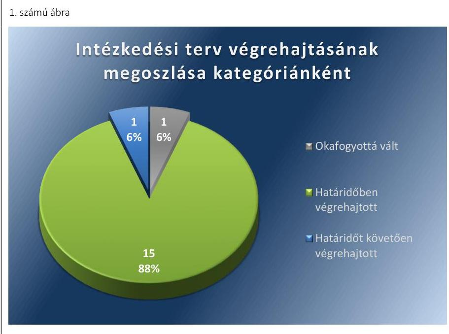
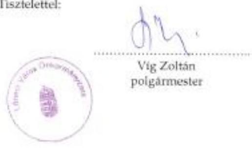
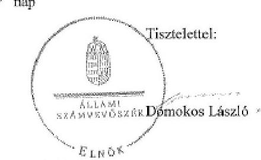

# Jelenetés 

## Utóellenőrzés

Lőrinci Város Önkormányzata pénzügyi gazdálkodási helyzetének, szabályszerűségének utóellenőrzése

15183
www.asz.hu

---

# Jelentés 

## Utóellenőrzés

Lőrinci Város Önkormányzata pénzügyi gazdálkodási helyzetének, szabályszerűségének utóellenőrzése

15183
www.asz.hu

---

# AZ ELLENŐRZÉST FELÜGYELTE: 

HOLMAN MAGDOLNA JULIANNA felügyeleti vezető

## AZ ELLENŐRZÉST VEZETTE ÉS A VÉGREHAJTÁSÁÉRT FELELŐS:

BÍRÓ ZSOLT ellenőrzésvezető

## A PROGRAM ÖSSZEÁLLÍTÁSÁÉRT FELELŐS:

LAJTERNÉ HUDÁK MAGDOLNA osztályvezető

## A TÉMÁHOZ KAPCSOLÓDÓ KORÁBBI SZÁMVEVŐSZÉKI JELENTÉS:

- címe: Jelentés az önkormányzatok pénzügyi gazdálkodási helyzetének, szabályszerűségének ellenőrzéséről Lőrinci
- sorszáma: 13094

IKTATÓSZÁM: V-0613-040/2015
TÉMASZÁM: 1647
ELLENŐRZÉS-AZONOSÍTÓ SZÁM: V069313

---

# TARTALOMJEGYZÉK 

■ ÖSSZEGZÉS ..... 5
■ AZ ELLENŐRZÉS CÉLJA ..... 6
■ AZ ELLENŐRZÉS TERÜLETE ..... 7
■ AZ ELLENŐRZÉS HÁTTERE, INDOKOLTSÁGA ..... 8
■ FÓKUSZKÉRDÉSEK ..... 9
■ ELLENŐRZÉS HATÓKÖRE ÉS MÓDSZEREI ..... 10
■ MEGÁLLAPÍTÁSOK ..... 12
■ MELLÉKLETEK ..... 15
I. Sz. melléklet: Az ÁSZ 13094 számú jelentéséhez kapcsolódó intézkedési terv végrehajtása ..... 15
■ FÜGGELÉK: ÉSZREVÉTELEK ..... 21
■ RÖVIDÍTÉSEK JEGYZÉKE ..... 27

---

# ÖSSZEGZÉS 

Az Állami Számvevőszék Lőrinci Város Önkormányzata pénzügyi gazdálkodási helyzetének, szabályszerűségének utóellenőrzését a 2013. október 7. és 2015. április 29. közötti időszakra végezte el. Az Önkormányzat pénzügyi gazdálkodási helyzetének, szabályszerűségének ellenőrzéséről készült ÁSZ jelentés intézkedést

igénylő megállapításai és javaslatai hasznosítására végrehajtott intézkedések hozzájárultak a pénzügyi stabilitás kialakulásának és fenntartásának feltételeinek javulásához, az elfogadott intézkedések végrehajtásának késedelme alacsony szintű kockázatot jelez a pénzügyi gazdálkodásra és annak szabályszerűségére.

## Az ellenőrzés társadalmi indokoltsága

Az ÁSZ stratégiájában célként tűzte ki, hogy a számvevőszéki munka eredménye jobban hasznosuljon, segítse az elszámoltatható közpénzfelhasználás megteremtését, ehhez az intézkedési tervekben vállalt feladatok végrehajtásának ellenőrzése, valamint a célzott utóellenőrzések rendszerének kialakítása is hozzájárul. Az ÁSZ a tavalyi évben lezárta a megújult jogszabályi környezetben lefolytatott első önálló utóellenőrzés-sorozatát. Ezzel teljesen kiépítetté vált a rendszer, amely biztosítja az Országgyűlés azon szándékának teljes körű érvényesülését, hogy felszámolásra kerüljön a következmények nélküli számvevőszéki ellenőrzések korszaka.

## Főbb megállapítások, következtetések, javaslatok

A Képviselő-testület által elfogadott intézkedési tervet határidőben megküldték az ÁSZ részére. Az ÁSZ által elfogadott intézkedési tervben foglaltak végrehajtásáról, egy kivételével az abban előírt határidők betartásával gondoskodtak. Az intézkedési tervben előírt feladatok végrehajtásának értékelése alacsony szintű kockázatot jelez a pénzügyi gazdálkodásra és annak szabályszerűségére. Az intézkedések végrehajtása hozzájárult a pénzügyi stabilitás kialakulásának és fenntartásának feltételeinek javulásához.

---

# AZ ELLENŐRZÉS CÉLJA 

## Lőrinci Város Önkormányzata pénzügyi gazdálkodási helyzetének, szabályszerűségének utóellenőrzése

Az ellenőrzés célja annak megállapítása volt, hogy az Önkormányzat pénzügyi gazdálkodási helyzetének, szabályszerűségének ellenőrzéséről készült ÁSZ jelentésben foglalt intézkedést igénylő megállapításokra és javaslatokra az ellenőrzött által összeállított, ÁSZ által elfogadott intézkedési tervben meghatározott feladatokat végrehajtották-e.

Ennek keretében ellenőriztük, hogy a polgármester az ÁSZ törvény értelmében az intézkedési tervet határidőben megküldte-e az ÁSZ részére, szükség volt-e az elfogadást megelőzően kiegészítésre, azt az előírt póthatáridőn belül megtették-e, a Képviselő-testület a kiegészített intézkedési tervet elfogadta-e. Értékeltük, hogy az Önkormányzat az elfogadott (kiegészített) intézkedési tervében foglaltak megtételéről, az abban előírt határidők betartásával gondoskodott-e, valamint hogy az elfogadott intézkedések esetleges késedelme, végrehajtásának elmaradása milyen szintű kockázatot jelez a pénzügyi gazdálkodásra és annak szabályszerűségére.

---

# AZ ELLENŐRZÉS TERÜLETE 

## Lőrinci Város Önkormányzata

Lőrinci város Heves megyében fekszik, népességszáma 2014. január 1-jén 5652 fő* volt. Az Önkormányzat¹ pénzügyi helyzetének ellenőrzését az ÁSZ² a 2009. január 1. - 2012. december 31. közötti időszakra végezte el, amelynek eredményeként megállapította, hogy az Önkormányzat pénzügyi egyensúlya rövidtávon nem volt biztosított. Az utóellenőrzés - a 2015. április 29-ig végrehajtott intézkedéseket figyelembe véve - az Önkormányzat pénzügyi gazdálkodási helyzetének, szabályszerűségének ellenőrzéséről készült ÁSZ jelentés ${ }^{1}$ intézkedést igénylő megállapításai és javaslatai hasznosítására elfogadott intézkedési tervben² foglalt feladatok végrehajtására irányult. Az ÁSZ jelentés a polgármesternek ${ }^{3}$ hat, a jegyzőnek ${ }^{4}$ tizenegy javaslatot tartalmazott.

[^0]
[^0]:    * A Központi Statisztikai Hivatal tájékoztatási adatbázisa alapján
    ${ }^{1}$ Az ÁSZ 13094 számú jelentése. Az elkészített jelentés az interneten, a www.asz.hu címen olvasható (továbbiakban ÁSZ jelentés).
    ${ }^{2}$ A Képviselő-testület az intézkedési tervet a 164/2013. (IX. 26.) számú határozatával fogadta el.

---

# AZ ELLENŐRZÉS HÁTTERE, INDOKOLTSÁGA 

AZ ÁSZ STRATÉGIÁJA a helyi önkormányzatok ellenőrzésében a pénzügyi-gazdasági helyzet értékelésére, kockázatainak feltárására helyezte a fő hangsúlyt. A 2011-2013. években az ÁSZ által ellenőrzött önkormányzatok esetében a működési, beruházási és a hosszú lejáratú pénzintézeti kötelezettségeinek teljesítésével kapcsolatos pénzügyi kockázatokat mutattuk be. Az ÁSZ megállapította, hogy az önkormányzatok pénzügyi egyensúlyi helyzete az ellenőrzött időszakban romlott, a pénzügyi kockázatok fokozódtak, a pénzügyi egyensúlyi helyzetet jellemző mutatószámok kedvezőtlenül változtak. Az önkormányzati alrendszerben 2012. év végétől 2014. évelejéig lezajlott adósságkonszolidáció és feladat-ellátási-, finanszírozási-rendszer változás következtében a települési önkormányzatok pénzügyi helyzete jelentős mértékben megváltozott, amely a jóváhagyott intézkedési tervek végrehajtását is befolyásolta.

Az ellenőrzött szervezet vezetője az ÁSZ tv. ${ }^{5}$ 33. § (1)-(2) bekezdésében foglaltak alapján a jelentések intézkedést igénylő megállapításaihoz kapcsolódóan köteles intézkedési tervet benyújtani, amelyet az ÁSZ-nak kell elfogadni. Amennyiben az ellenőrzött által vállalt intézkedések hiányosak, vagy más okból nem elfogadhatók az ÁSZ indoklással és póthatáridő tűzésével visszaküldi azt kijavításra, kiegészítésre. Az elfogadásról szóló tájékoztatásban az ÁSZ elnöke valamennyi ellenőrzött szervezet vezetőjének figyelmét felhívta arra, hogy az intézkedési tervben foglaltak megvalósítását - az ÁSZ tv. 33. § (7) bekezdésében foglaltak alapján - utóellenőrzés keretében ellenőrizheti.

## AZ UTÓELLENŐRZÉS VÁRHATÓ HASZNOSULÁSA:

az ellenőrzés megállapításai segítséget nyújthatnak a közpénzügyi helyzet javításához. Az adósságkonszolidációt követően az önkormányzati alrendszerben kiemelt jelentőségű feladat az adósságállomány újratermelődésének megakadályozása. Az utóellenőrzés, jellegéből adódóan fokozza a közbizalmat, fegyelmet, a társadalom, az ellenőrzöttek, a helyi döntéshozók vonatkozásában erősíti az ÁSZ tekintélyét és igazolja, hogy lejárt a következmények nélküli ellenőrzések időszaka. A jóváhagyott intézkedési tervek megvalósításának utóellenőrzése révén megállapítható, hogy az önkormányzatok megtették-e a szükséges intézkedéseket a pénzügyi stabilitás elérése és megőrzése, illetve a pénzügyi kockázataik csökkentése érdekében.

---

# FÓKUSZKÉRDÉSEK 

1. A Képviselő-testület által elfogadott intézkedési tervet, szükség esetén annak javítását, kiegészítését határidőben megküldték-e az ÁSZ részére?
2. Az ÁSZ által elfogadott intézkedési tervben foglaltak végrehajtásáról az abban előírt határidők betartásával gondoskodtak-e?

---

# ELLENŐRZÉS HATÓKÖRE ÉS MÓDSZEREI 

## Az ellenőrzés típusa

Szabályszerűségi ellenőrzés

## Az ellenőrzött időszak

Az intézkedési terv ÁSZ-nak történő benyújtásától (2013. október 7.) az utóellenőrzés megkezdéséig (2015. április 29.) tartó időszak volt.

## Az ellenőrzés tárgya

Az Önkormányzat intézkedési tervében foglaltak betartásának ellenőrzése.

## Az ellenőrzött szervezet

Lőrinci Város Önkormányzata

## Az ellenőrzés jogalapja

Az ellenőrzés végrehajtásának jogszabályi alapját az ÁSZ tv. 1. § (3) bekezdése, az 5. § (2) és (6) bekezdései, a 33. § (7) bekezdése, valamint az Áht. 61. § (2) bekezdésének előírásai képezték.

## Az ellenőrzés módszerei

Az ÁSZ által elfogadott intézkedési tervben előírt feladatok végrehajtásának értékelése során alkalmazott besorolási kategóriák:
$\longrightarrow$ okafogyottá vált feladat: ha végrehajtására - meghatározott esemény bekövetkezése, továbbá külső körülmény, a működést érintő feltétel változása miatt - már nincs szükség, illetve lehetőség, és egyértelműen megállapítható, hogy az intézkedést szükségessé tevő körülmény a jövőben nem fordulhat elő;
$\longrightarrow$ nem időszerű (nem esedékes) feladat: amelynek ellenőrzési időszakon belüli végrehajtására azért nem került (kerülhetett) sor, mert az intézkedés alapjául szolgáló esemény nem következett be, de annak jövőbeni előfordulása lehetséges;
$\longrightarrow$ határidőben végrehajtott feladat: ha teljesítése dokumentáltan az intézkedési tervben előírt határidőben és tartalommal, módon megtörtént;

---

- határidőn túl végrehajtott feladat: ha annak teljesítése az intézkedési tervben meghatározott módon, de az előírt határidőn túl történt meg;
- részben végrehajtott feladat: amelynek végrehajtása teljes körűen az intézkedési tervben előírt tartalommal/módon nem történt meg, vagy a feladatot nem az előírt gyakorisággal hajtották végre;
- végre nem hajtott feladat: ha a végrehajtásért felelősként megjelölt személy(ek)nek felróhatóan a teljesítés elmaradt, vagy a teljesítést nem dokumentálták.
Az intézkedési tervben előírt feladatok végrehajtásának részletes bemutatását, valamint a teljesítés minősítését az I. számú melléklet tartalmazza.

Elfogadott intézkedések esetleges késedelme, végrehajtásának elmaradása a pénzügyi gazdálkodásra és annak szabályszerűségére kockázatot jelez. A kockázati arányszám kiszámítása során az összes kategória súlyozott értékének összegéhez viszonyítottuk a határidőn túl, a részben és a nem végrehajtott intézkedési kategóriák súlyozott pontszámát. A súlyozott érték megállapítása az egyes kategóriákhoz rendelt pontszámok alapján történt. A pénzügyi gazdálkodásra és annak szabályszerűségére ható, az intézkedési terv végrehajtásának elmaradásából eredő kockázat „magas", ha az elért pontszám és az elérhető pontszám százalékban kifejezett hányadosa elérte a 71%-ot, „közepes", ha 51 és 70% közé esett és „alacsony" ha nem haladta meg az 50%-ot.

Az ellenőrzésre az Önkormányzat elektronikus adatszolgáltatása alapján került sor, helyszínen ellenőrzést nem végeztünk. A megállapítások rögzítése az Önkormányzat által rendelkezésre bocsátott dokumentumok, tanúsítványok alapján történt, melyek valódiságát és teljes körűségét a polgármester, valamint a jegyző teljességi nyilatkozata igazolta.

---

# MEGÁLLAPÍTÁSOK 

## 1. A Képviselő-testület által elfogadott intézkedési tervet, szükség esetén annak javítását, kiegészítését határidőben megküldték-e az ÁSZ részére?

Összegző megállapítás

A Képviselő-testület ${ }^{6}$ által elfogadott intézkedési tervet határidőben megküldték az ÁSZ részére.

A polgármester a Képviselő-testületet tájékoztatta az ÁSZ jelentéséről. A jelentésben foglalt intézkedést igénylő megállapításokhoz kapcsolódó intézkedési tervet az ÁSZ tv. 33. § (1) bekezdésében foglalt határidőben megküldték az ÁSZ részére, amelyet az ÁSZ elfogadott.

Az ÁSZ által elfogadott intézkedési tervben meghatározott feladatokat, az ÁSZ jelentés javaslatainak címzettjét és a feladatok végrehajtását az I. számú melléklet mutatja be.

Az ÁSZ jelentés a polgármester részére hat, a jegyző részére tizenegy javaslatot fogalmazott meg, melynek hasznosítására az Önkormányzat az intézkedési tervében tizenhét feladatot határozott meg, felelősként a jegyzőt és a polgármestert megjelölve.

## 2. Az ÁSZ által elfogadott intézkedési tervben foglaltak végrehajtásáról az abban előírt határidők betartásával gondoskodtak-e?

Összegző megállapítás

Az ÁSZ által elfogadott intézkedési tervben foglaltak végrehajtásáról egy kivételével az abban előírt határidők betartásával gondoskodtak.

Az intézkedések végrehajtási kategóriánkénti megoszlását az 1. számú ábra szemlélteti.

---

Forrás: ÁSZ

# OKAFOGYOTTÁ VÁLT feladat: 

1. Az Önkormányzat kizárólagos tulajdonú gazdasági társasága pénzügyi helyzetének stabilizálása érdekében nem volt szükséges intézkedési terv elkészítése, mivel a stabilizálás egyéb intézkedések hatására megtörtént.

## HATÁRIDŐBEN VÉGREHAJTOTT feladatok:

2. A bevételszerző, kiadáscsökkentő lehetőségeket felmérték, és az ezeket célzó intézkedéseket a Képviselő-testület elé terjesztették.
3. A pénzügyi egyensúlyi helyzet helyreállítását célzó intézkedéseket tartalmazó reorganizációs programot előterjesztették a Képviselő-testület számára.
4. Kötelezettségvállalásra vonatkozó javaslatot terjesztettek elő, mely szerint a realizált többletbevételeket, tartalékokat az Önkormányzat mindaddig a kötelezettségek rendezésére fordítja, amíg az Önkormányzat és a kizárólagos tulajdonában álló gazdasági társaság ${ }^{7}$ pénzügyi egyensúlya rövidtávon veszélyeztetett.
5. Előírták az Önkormányzat kizárólagos tulajdonú gazdasági társasága számára a beszámolási kötelezettséget.
6. Végrehajtották a költségvetési bevételek és kiadások Áht. ${ }^{8}$ szerinti kimutatását a költségvetési és zárszámadási rendeletben.
7. A pénzügyi egyensúlyt befolyásoló kockázatok kezelésére alkalmas kockázatkezelési rendszert működtettek.
8. Előírták a feladat átadás-átvételre vonatkozó döntések előkészítése során a döntés kötelező és önként vállalt feladatok arányára, ezáltal a pénzügyi egyensúlyi helyzetre gyakorolt hatásának vizsgálatát.
9. Előírták az önkormányzati feladatellátáshoz kapcsolódó támogatási rendszer feltételeit, valamint a szerződések
 minimum tartalmi

---

követelményeinek meghatározásával összefüggő kontrolltevékenységeket.
10. Meghatározták a feladat-ellátási szerződések teljesítésére vonatkozó beszámolási kötelezettséggel kapcsolatos kontrolltevékenységeket.
11. Meghatározták a fejlesztések döntés-előkészítési folyamatában a lebonyolítás és a működtetés kockázatai feltárásának kötelezettségét.
12. Meghatározták a fejlesztésekkel kapcsolatosan a közbeszerzési értékhatár alatti esetekben a pályáztatási kötelezettséggel kapcsolatos kontrolltevékenységeket.
13. Meghatározták a fejlesztésekhez kapcsolódó külső források, támogatások figyelési rendszerével, a pályázat készítés feltételeivel összefüggő kontrolltevékenységeket.
14. Előírták a pénzintézeti kötelezettségvállalások kockázatainak döntés-előkészítő szakaszban történő feltárását, a futamidő egyes éveit terhelő kötelezettségek költségvetési egyensúlyra gyakorolt hatásának vizsgálatát.
15. Meghatározták a pénzintézeti szolgáltatások igénybevételével kapcsolatosan a közbeszerzési értékhatár alatti esetekben a pályáztatási vagy több ajánlatkérési kötelezettséggel kapcsolatos kontrolltevékenységeket.
16. Intézkedtek a belső ellenőrzési feladatokat ellátó felé, hogy mérjék fel a gazdálkodásban rejlő kockázatokat, illetve az éves belső ellenőrzési tervek tartalmazzák a pénzügyi egyensúlyi helyzetet befolyásoló döntésekkel kapcsolatos kockázati tényezők ellenőrzését, és biztosították a belső ellenőrzési tervek végrehajtását.

# HATÁRIDŐT KÖVETŐEN VÉGREHAJTOTT feladat: 

17. A feladatellátás racionalizálására vonatkozó javaslat képviselő-testületi előterjesztését a vállalt 2013. december 30-i határidőhöz képest 2014. március 5-én készítették el.

ALACSONY SZINTŰ KOCKÁZATOT JELEZ a pénzügyi gazdálkodásra és annak szabályszerűségére az elfogadott intézkedések késedelme. Az intézkedések végrehajtása hozzájárult a pénzügyi stabilitás kialakulásához és fenntartása feltételeinek javulásához.

---

# MELLÉKLETEK

- I. SZ. MELLÉKLET: AZ ÁSZ 13094 SZÁMÚ JELENTÉSÉHEZ KAPCSOLÓDÓ INTÉZKEDÉSI TERV VÉGREHAJTÁSA

|  1. | Intézkedési terv alapján elvégzendő feladat | Az intézkedési tervben meghatározott határidő | Az ÁSZ 13094 sz. jelentése javaslatának címzettje | Az intézkedés végrehajtása  |
| --- | --- | --- | --- | --- |
|   | 1. | 2. | 3. | 4.  |
|  Okafogyottá vált intézkedések |  |  |  |   |
|  1. | A jegyző közreműködésével elkészített intézkedési tervet terjeszt elő a Képviselőtestület elé jóváhagyásra, az Önkormányzat kizárólagos tulajdonú gazdasági társasága pénzügyi helyzetének stabilizálása érdekében. | 2013.12.30. | polgármester | Az Önkormányzat 2013. év folyamán - az ÁSZ jelentésének megismerése előtt - több intézkedést is tett a kizárólagos tulajdonában álló gazdasági társaság pénzügyi helyzetének stabilizálása érdekében. Így a 108/2013.(V.30.) KT határozat szerint az Önkormányzat lemondott 30,81 M Ft-os tagi kölcsön követeléséről és döntött a társaság vagyonába apportálásáról valamint 10 M Ft tőkeemelésről. A 112/2013.(VI.13.) és a 127/2013.(VII.4.) KT határozat szerint a társaság a céltartalék terhére 6 hónapon át havi 2.274.712 Ft működési támogatást kapott. Tekintettel az év közben tett intézkedésekre a Képviselő-testület - a polgármester előterjesztésére - a 193/2013.(X.31.) határozata szerint a stabilizálást végrehajtottnak tekintette, a 2012. évi 23 M Ft veszteség konszolidálva lett.  |
|  2. | Az önkormányzati költségvetési rendelettervezetben, valamint annak évközi módosítása előterjesztését megelőzően felmérésre kerülnek a bevételszerző, kiadáscsökkentő lehetőségek, és az ezeket célzó intézkedéshez szükséges döntési javaslatok a Képviselő-testület számára előterjesztésre kerülnek. | 2014.02.15 | polgármester | A 2014. évi költségvetési rendelettervezet 2014. január 31-én készült előterjesztése alapján a Képviselő-testület a 2014. február 14-i ülésén integrált módon döntött a bevételnövelő és kiadáscsökkentő javaslatokról.  |

---

|  1. | 2. | 3. | 4.  |
| --- | --- | --- | --- |
|  3. A jegyző által elkészített az Önkormányzat gazdasági helyzetének elemzésén alapuló, a pénzügyi egyensúlyi helyzet gyors helyreállítását, hosszú távú fenntartását, valamint az adósságállomány újratermelődésének elkerülését biztosító intézkedéseket tartalmazó reorganizációs programot terjeszt elő a Képviselő-testület számára jóváhagyásra. | 2013.12.30. | polgármester | Az Önkormányzat Képviselő-testülete a 213/2013. (XI. 28.) határozatával elfogadta a polgármester által előterjesztett reorganizációs programot.  |
|  4. Az adósságkonszolidációt követően fennmaradó kötelezettségek jövőbeni teljesítése, a fizetőképesség megőrzése érdekében a jegyző által elkészített döntési javaslatot terjeszt a Képviselő-testület elé, amelyben a Képviselő-testület kötelezettséget vállal arra, hogy előre meghatározott összegben és módon a realizált többletbevételeket, a meglévő és a jövőben képződő tartalékokat mindaddig a kötelezettségek rendezésére fordítja, azt nem használja más célra, amíg az Önkormányzat és annak kizárólagos tulajdonú gazdasági társasága pénzügyi egyensúlya rövid távon veszélyeztetett. | 2013.11.30. | polgármester | Az Önkormányzat Képviselő-testülete a 192/2013. (X. 31.) határozatával – a polgármester előterjesztésére – elfogadta, hogy 2014. évtől a mindenkori költségvetésbe tervezett helyi adóbevétel 1%-át meghaladó realizált többletbevételt és a jövőben képződő tartalékokat a pénzügyi egyensúly helyreállásáig a kötelezettségek rendezésére fordítja.  |

---

|  5. | Intézkedés, hogy előírásra kerüljön az Önkormányzat kizárólagos tulajdonú gazdasági társasága beszámolási kötelezettsége a pénzügyi helyzete alakulásáról. | 2013.12.30. | polgármester | A 194/2013.(X.31.) Képviselő-testületi határozat minden negyedéves könyvviteli zárást követő ülésre előírta a beszámolási kötelezettséget.  |
| --- | --- | --- | --- | --- |
|  6. | Intézkedik, hogy az Önkormányzat költségvetési és zárszámadási rendeleteiben - az Áht. 5. § (1)-(2) bekezdéseiben foglalt előírások szerint - mutassák ki a költségvetési bevételek és kiadások összegét, azok finanszírozási bevételeket és kiadásokat ne tartalmazzanak. | 2014.02.15. | jegyző | A 2014. évi költségvetésről szóló 2/2014.(II.14.) rendelet, a 2013. évi zárszámadásról szóló 10/2014.(V.5.) rendelet, a 2015. évi költségvetésről szóló 1/2015.(II.16.) rendelet, valamint a 2014. évi zárszámadásról szóló 10/2015.(IV.30.) rendelet a költségvetési bevételeket és kiadásokat az Áht. 5. § (1)-(2) bekezdésében előírtaknak megfelelően tartalmazza. A költségvetési és zárszámadási rendeletek - az intézkedési tervben foglaltaknak megfelelően - finanszírozási bevételeket és kiadásokat nem tartalmaznak.  |
|  7. | Működteti a Bkr. ${ }^{9}$ 7. § (1)-(2) bekezdéseiben foglalt előírásoknak megfelelő, a pénzügyi egyensúlyt befolyásoló kockázatok kezelésére alkalmas kockázatkezelési rendszert. | 2014.01.30. | jegyző | A Képviselő-testület 2013. november 28-i ülésén megismerte és 214/2013. (XI.28.) számú határozatával elfogadta a Bkr. 7. § (1)-(2) bekezdéseinek megfelelő Kockázatkezelési szabályzatot ${ }^{10}$. A Kockázatkezelési szabályzat tartalmazza a kormányrendelet által meghatározott, a költségvetési szerv tevékenységében, gazdálkodásában rejlő kockázatok felmérésére és megállapítására vonatkozó szabályokat.
A kockázatkezelési rendszer folyamatos működtetéseként a szabályzattal egy időben elkészítették a Polgármesteri Hivatal kockázatainak elemzését. Ennek során kockázati tényezőnként több szempontból (pénzügyi szabálytalanságok valószínűsége, előirányzaton belüli gazdálkodás, legutóbbi ellenőrzés óta eltelt idő, munkatársak végzettsége/tapasztalata, adott szakterületre vonatkozó helyi szabályozás, külső hatások) értékelték a lehetséges kockázatokat, illetve kijelölték a kockázatok kezeléséért felelős személyeket. Ezen kívül a 2014. és 2015. évi belső ellenőrzési tervet is kockázatelemzés alapozta meg. A 2014. évi belső ellenőrzési tevékenységről szóló éves összefoglaló jelentés tanúsága szerint a belső ellenőrzés során tett értékelések és javaslatok hozzájárultak az önkormányzat kockázatkezelési eljárásainak fejlesztéséhez.  |

---

|  1. | 2. | 3. | 4.  |
| --- | --- | --- | --- |
|  Kialakítja az Bkr. 8. § (1)-(2) bekezdései alapján azokat a belső kontrolltevékenységeket, amelyek biztosítják a pénzügyi-gazdálkodási folyamatok szabályosságát, a pénzügyi egyensúlyi helyzet alakulását befolyásoló döntések kockázatainak kezelését. Ennek keretében: |  |  | A Képviselő-testület 2013. december 19-i ülésén megismerte és tudomásul vette a Polgármesteri Hivatal által elkészített, a Bkr. 8. § (1)-(2) bekezdéseinek megfelelő FEUVE szabályzatot, amely megalapozza a pénzügyi egyensúlyra vonatkozó szabálytalanságok kiszűrését.  |
|  8. előírja a feladat átadás-átvételre vonatkozó döntések előkészítése során a döntés kötelező és önként vállalt feladatok arányára, ezáltal a pénzügyi egyensúlyi helyzetre gyakorolt hatásának vizsgálatát; | 2014.01.30. | jegyző | A FEUVE szabályzat^{11} 2. melléklete a kötelező és önként vállalt feladatok átadása-átvétele címszó alatt, az előzetes vezetői ellenőrzés keretei között – a jegyző és a polgármester felelősségi körébe utalva – előírta az átadás-átvétel pénzügyi egyensúlyi helyzetre gyakorolt hatásának vizsgálatát.  |
|  9. előírja az önkormányzati feladatellátáshoz kapcsolódó támogatási rendszer feltételeit, valamint a szerződések minimum tartalmi követelményeinek meghatározásával összefüggő kontrolltevékenységeket; | 2014.01.30. | jegyző | A FEUVE szabályzat az ellenőrzési nyomvonalak fejezeten belül a végrehajtással kapcsolatos ellenőrzési folyamatok alapkövetelményei között a bevételek beszedésének tárgykörében meghatározta, hogy az állami támogatásoknál a jogosulatlan igénybevétel megakadályozása érdekében folyamatos ellenőrzés, adatbekérés és közvetlen tájékozódás szükséges. Ennek keretében előírta a feladatellátáshoz kapcsolódó támogatási feltételek valamint a szerződések minimum tartalmi követelményeit.  |
|  10. meghatározza a feladat-ellátási szerződések teljesítésére vonatkozó beszámolási kötelezettséggel kapcsolatos kontrolltevékenységeket; | 2014.01.30. | jegyző | A FEUVE szabályzat 2. melléklete a kötelező és önként vállalt feladatok átadása-átvétele címszó alatt – a jegyző és a polgármester felelősségi körébe utalva – meghatározta a feladat-ellátási szerződések teljesítésére vonatkozó kontrolltevékenységek módját, eszközét és határidejét.  |

---

|  1. | 2. | 3. | 4.  |
| --- | --- | --- | --- |
|  11. | meghatározza a fejlesztések döntés-előkészítési folyamatában a lebonyolítás és a működtetés kockázatai feltárásának kötelezettségét; | 2014. 01.30. | jegyző  |
|  12. | meghatározza a fejlesztésekkel kapcsolatosan a közbeszerzési értékhatár alatti esetekben a pályáztatási kötelezettséggel kapcsolatos kontrolltevékenységeket; | 2014. 01.30. | jegyző  |
|  13. | meghatározza a fejlesztésekhez kapcsolódó külső források, támogatások figyelési rendszerével, a pályázat készítés feltételeivel összefüggő kontrolltevékenységeket; | 2014. 01.30. | jegyző  |
|  14. | előírja a pénzintézeti kötelezettségvállalások kockázatainak döntés-előkészítő szakaszban történő feltárását, a futamidő egyes éveit terhelő kötelezettségek költségvetési egyensúlyra gyakorolt hatásának vizsgálatát; | 2014. 01.30. | jegyző  |
|  15. | meghatározza a pénzintézeti szolgáltatások igénybevételével kapcsolatosan a közbeszerzési értékhatár alatti esetekben a pályáztatási vagy több ajánlatkérési kötelezettséggel kapcsolatos kontrolltevékenységeket. | 2014. 01.30. | jegyző  |

---

|  Sorszám | Intézkedési terv alapján elvégzendő feladat | Az intézkedési tervben meghatározott határidő | Az ÁSZ 13094 sz. jelentése javaslatának címzettje | Az intézkedés végrehajtása  |
| --- | --- | --- | --- | --- |
|   | 1. | 2. | 3. | 4.  |
|  16. | Intézkedik belső ellenőrzési feladatokat ellátó felé, hogy a Bkr. 7. § (2) bekezdésében foglaltak szerint mérjék fel a gazdálkodásban rejlő kockázatokat, a 29. § (1) bekezdésében és a 31. § (2)-(4) bekezdéseiben foglalt előírások szerint az éves belső ellenőrzési tervek tartalmazzák a pénzügyi egyensúlyi helyzetet befolyásoló döntésekkel kapcsolatos feltárt kockázati tényezők ellenőrzését, valamint biztosítsa az ellenőrzési tervek végrehajtását. | 2014. 01.30. | jegyző | A Képviselő-testület 2013. november 28-án a 216/2013. (XI. 28.) számú határozatával elfogadta az előzetes kockázatelemzésen alapuló, 2014-re vonatkozó belső ellenőrzési tervet. A 2014. évi belső ellenőrzési terv megvalósítása során a gazdálkodás esetleges szabályszerűtlenségével összefüggő kockázati tényezők értékelése alapján elvégezték a Lőrinci Város Kft működésével, gazdálkodásával és szabályozottságával kapcsolatos ellenőrzést. Ezen kívül ellenőrizték az Önkormányzat 2014. évi költségvetésével összefüggésben a tervezés szabályszerűségét, a jogszabályoknak, tervezési koncepciónak és az önkormányzati döntéseknek való
 megfelelését, továbbá ellenőrizték a közfoglalkoztatás nyilvántartásainak szabályszerűségét.
A 2014. évi belső ellenőrzési terv végrehajtásáról szóló éves összefoglaló jelentést a Képviselő-testület a zárszámadásról szóló rendelettel együtt tárgyalta és fogadta el.  |
|   |  | Határidőt követően végrehajtott intézkedések |  |   |
|  17. | Felülvizsgálatról intézkedik az önként vállalt feladatok finanszírozhatósága és a kötelező feladatellátás elsődlegességének biztosítása érdekében, és ennek függvényében javaslatot terjeszt elő a Képviselő-testületnek a feladatellátás racionalizálására. | 2013.12.30. | polgármester | Az 57/2014.(III.27.) Képviselő-testületi határozat tartalmazza az Önkormányzat feladatellátásának racionalizálásával kapcsolatos feladatokat, felelősöket és határidőket. A Képviselő-testület az intézkedési tervben foglalt határidőt követően, 2014. március 27-én fogadta el a szintén határidőt követően (2014. március 5-én) előkészített előterjesztést.  |

---

# FÜGGELÉK: ÉSZREVÉTELEK 

A jelentéstervezetet a Számvevőszék 15 napos észrevételezésre megküldte az ellenőrzött szervezet vezetőjének az ÁSZ tv. 29. § (1) bekezdése előírásának megfelelően.
A függelék tartalmazza az ellenőrzött észrevételeit, illetve az el nem fogadott észrevételek elutasításának indoklását.

- Lőrinci Város Önkormányzata Polgármesterének 4854-16/2015. iktatószámú észrevétele
- Tájékoztatás az el nem fogadott észrevételekről (V-0613-037/2015.)

- 29. § (1) Az Állami Számvevőszék az ellenőrzési megállapításait megküldi az ellenőrzött szervezet vezetőjének vagy az általa megbízott személynek, és annak, akinek személyes felelősségét állapította meg.
(2) Az ellenőrzött szervezet vezetője és a felelősként megjelölt személy az ellenőrzés megállapításaira tizenöt napon belül írásban észrevételt tehet.
(3) Az Állami Számvevőszék az észrevételre a beérkezésétől számított harminc napon belül írásban válaszol. A figyelembe nem vett észrevételeket köteles a jelentésben feltüntetni, és megindokolni, hogy azokat miért nem fogadta el.

---

# LŐRINCI VÁROS ÖNKORMÁNYZATA

## POLGÁRMESTER

3021 LŐRINCI, SZABADSÁG TÉR 26.
TEL.: (37) 388-155 FAX: (37) 388-464
E-mail: polgarmester@lorinci.hu

Iktatószám: 4854-16/2015.

Tárgy: észrevétel

ÁLLAMI SZÁMVEVŐSZÉK
DOMOKOS LÁSZLÓ ELNÖK
1052 BUDAPEST
APÁCZAI CSERE JÁNOS U. 10.

Tisztelt Első Úr!

Iktatószám: 4854-16/2015.

Tárgy: észrevétel

ÁLLAMI SZÁMVEVŐSZÉK
69016/2015
Érkezés: 2015. AUG. 20.

Melléklet:

Hivatkozva a V-0613-031/2015. számú utóellenőrzés Lőrinci Város Önkormányzata pénzügyi gazdálkodási helyzetének, szabályszerűségének utóellenőrzése című számvevőszéki jelentéstervezetére, az alábbi észrevételt kívánom tenni.

A jelentéstervezet megállapításait a lentiek szerint kérném módosítani, illetve pontosítani.

1.) A jelentéstervezet 5. oldal *Főbb megállapítások, következtetések, javaslatok* szakasz második mondatát „Az ÁSZ által elfogadott intézkedési tervben foglaltak végrehajtásáról, egy kivételével az abban előírt határidők betartásával gondoskodtak, megállapítást kérném módosítani „Az ÁSZ által elfogadott intézkedési tervben foglaltak végrehajtásáról hiánytalanul gondoskodtak.” megállapításra.

2.) A jelentéstervezet 14. oldal *Határidőt követően végrehajtott feladat* szakaszában foglalt (17. pont) „A feladatellátás racionalizálására vonatkozó javaslat képviselő-testületi előterjesztését a vállalt 2013. december 30-i határidőhöz képest 2014. március 5-én készítették el, megállapítást kérném módosítani „A feladatellátás racionalizálására vonatkozó javaslat képviselő-testületi előterjesztését a tervezett 2013. december 30-i határidőhöz képest a tárgyévi költségvetés megalkotásának figyelembe vételének szükségszerűsége miatt 2014. március 5-én készítették el.”

Indokaink:

Önkormányzatunk álláspontja szerint a megállapítások eredeti fogalmazása Önkormányzatunk felelős magatartását alaptalanul hátrányosan tükrözi fel és sérti a jó hírnevét, ugyanis az eredeti határidőt intézkedési terv állapította meg, és mint terv az abban foglaltaktól indokolt esetben el lehet, sőt el is kell térni. Azaz megengedett a tervezett határidőtől való eltérés, az nem mulasztás, jogsértés esetünkben, ahogy azt a jelentéstervezet eredeti megállapításából következtetni lehet.

---

A tervezett határidőtől való eltérés oka önkormányzatunk esetében, hogy az intézkedés végrehajtásának feltétele volt az intézkedés tervezett határidejét követő egy hónappal később elfogadott tárgyévi költségvetés és annak adatainak megismerése, így csak az azt követő képviselő-testületi ülésen tárgyalhatta a javasolt intézkedést a képviselő-testület.

Tekintve az intézkedés hivatkozott körülményeire és a tervezett és végrehajtási időpontok közötti rövid időre, a határidő módosításának kezdeményezése indokolatlan volt, ugyanakkor a Képviselő-testület az intézkedés végrehajtásakor a határidő túllépését tudomásul vette.

Megjegyezni kívánjuk, hogy javaslataink a jelentéstervezet eredeti megállapításaiban szereplő tényeken nem változtatnak, azok változatlanul, de nem hátrányosan tükrözik fel önkormányzatunkat.

Közreműködésüket köszönjük!
Lőrinci, 2015. augusztus 18.
Tisztelettel:

---

ELNÖK

SZÁMVEVŐSZÉK

Ikt.szám: V-0613-037/2015.

Víg Zoltán úr
polgármester
Lőrinci Város Önkormányzata

Lőrinci

Tisztelt Polgármester Úr!

Az Utóellenőrzés - Lőrinci Város Önkormányzata pénzügyi gazdálkodási helyzetének, szabályszerűségének utóellenőrzése című számvevőszéki jelentéstervezetre tett észrevételeit köszönettel megkaptam.

Az Állami Számvevőszék Észrevételekre vonatkozó álláspontjáról a felügyeleti vezető által készített részletes tájékoztatást csatoltan megküldöm.

Tájékoztatom Polgármester urat, hogy a jelentésben - az Állami Számvevőszékről szóló 2011. évi LXVI. törvény 29. § (3) bekezdése alapján - az el nem fogadott észrevételeket szerepeltetjük az elutasítás indokának feltüntetésével együtt.

Budapest, 2015.

Melléklet: Tájékoztatás az el nem fogadott észrevételekről

1052 BUDAPEST, APÁCZAI CSERE JÁNOS UTCA 10. 1364 Budapest 4. Pf. 94 telefon: 484 9101 fax: 484 9281

---

# Tájékoztatás az el nem fogadott észrevételekről 

Az Utóellenőrzés - Lőrinci Város Önkormányzata pénzügyi gazdálkodási helyzetének, szabályszerűségének utóellenőrzése című számvevőszéki jelentéstervezetre a 4854-16/2015. iktatószámú levelében tett észrevételét áttekintettük, annak kezeléséről az alábbi tájékoztatást adom.

Nem fogadtuk el az 1. és 2. számú észrevételét. Az Állami Számvevőszék (ÁSZ) ellenőrzésében az ÁSZ 13094 számú jelentésében szereplő intézkedést igénylő megállapítások és javaslatok végrehajtására Önök által készített intézkedési tervben meghatározott, és az ÁSZ által elfogadott intézkedéseket, feladatokat és határidőket vette figyelembe. Az államháztartásról szóló 2011. évi CXCV. törvény 23. § (2) bekezdése szerint a helyi önkormányzat költségvetése a helyi önkormányzat bevételi és kiadási előirányzatait kötelező feladatok, önként vállalt feladatok és államigazgatási feladatok bontásban tartalmazza. Ennek elkészítéséhez szükséges mindazon feladatok számbavétele is, amelyet az intézkedési tervükben is meghatároztak, így a kötelező feladatellátás elsődlegességének biztosítása érdekében a feladatellátás racionalizálására készített előterjesztés.

Budapest, 2015. C. 5. hó 81. nap

Holman Magdolna
felügyeleti vezető

---

.

---

# RÖVIDÍTÉSEK JEGYZÉKE 

${ }^{1}$ Önkormányzat
${ }^{2}$ ÁSZ
${ }^{3}$ polgármester
${ }^{4}$ jegyző
${ }^{5}$ ÁSZ tv.
${ }^{6}$ Képviselő-testület
${ }^{7}$ kizárólagos tulajdonú gazdasági társaság
${ }^{8}$ Áht.
${ }^{9}$ Bkr.
${ }^{10}$ Kockázatkezelési szabályzat
${ }^{11}$ FEUVE szabályzat

Lőrinci Város Önkormányzata
Állami Számvevőszék
Lőrinci Város Önkormányzatának polgármestere
Lőrinci Város Önkormányzatának jegyzője
2011. évi LXVI. törvény az Állami Számvevőszékről (hatályos 2011. július 1-jétől)
Lőrinci Város Képviselő-testülete
Lőrinci Város Kft.
2011. évi CXCV. törvény az államháztartásról (hatályos 2012. január 1-jétől)

A költségvetési szervek belső kontrollrendszeréről és belső ellenőrzéséről szóló 370/2011.(XII.31.) Korm. rendelet (hatályos 2012. január 1-jétől)
Lőrinci Város Önkormányzat Képviselő-testülete 214/2013.(XI.28.) önkormányzati határozata Lőrinci Polgármesteri Hivatal Kockázatkezelési szabályzatáról (hatályos 2013. november 28-ától)
Lőrinci Polgármesteri Hivatalának Folyamatba épített, előzetes, utólagos és vezetői ellenőrzés szabályzata (hatályos 2013. december 19-étől)

---

.

---

.

---

# ÁLLAMI SZÁMVEVŐSZÉK 

1052 Budapest, Apáczai Csere János utca 10.
Levélcím: 1364 Budapest 4. Pf. 54
Telefon: +36 1 484 9100 Telefax: +36 1 484 9200
www.asz.hu

