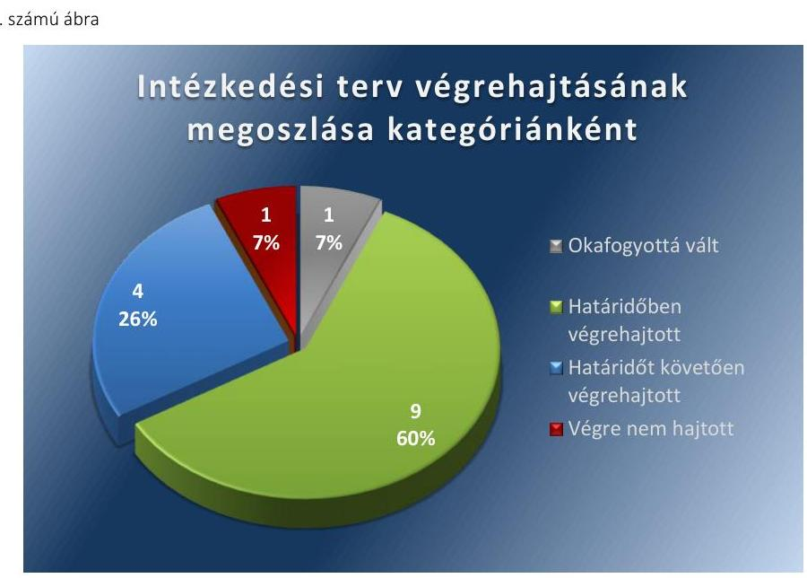

# Jelenetés 

## Utóellenőrzés

Tiszacsege Város Önkormányzata pénzügyi gazdálkodási helyzetének, szabályszerűségének utóellenőrzése

15184
www.asz.hu

---

# Jelenetés 

## Utóellenőrzés

Tiszacsege Város Önkormányzata pénzügyi gazdálkodási helyzetének, szabályszerűségének utóellenőrzése

15184
www.asz.hu

---

# AZ ELLENŐRZÉST FELÜGYELTE:

- **HOLMAN MAGDOLNA JULIANNA** felügyeleti vezető
- **AZ ELLENŐRZÉST VEZETTE ÉS A VÉGREHAJTÁSÁÉRT FELELŐS:**
- **BÍRÓ ZSOLT** ellenőrzésvezető
- **A PROGRAM ÖSSZEÁLLÍTÁSÁÉRT FELELŐS:**
- **LAJTERNÉ HUDÁK MAGDOLNA** osztályvezető
- **A TÉMÁHOZ KAPCSOLÓDÓ KORÁBBI SZÁMVEVŐSZÉKI JELENTÉS:**
  - címe: **Jelentés Tiszacsege Város Önkormányzata pénzügyi gazdálkodási helyzetének, szabályosságának ellenőrzéséről**
  - sorszáma: **13029**

**Jelentéseink az Országgyűlés számítógépes hálózatán és az Interneten a www.asz.hu címen is olvashatóak.**

**IKTATÓSZÁM: V-0616-031/2015**

**TÉMASZÁM: 1650**

**ELLENŐRZÉS-AZONOSÍTÓ SZÁM: V069316**

---

# TARTALOMJEGYZÉK 

ÖSSZEGZÉS ..... 5
AZ ELLENŐRZÉS CÉLJA ..... 6
AZ ELLENŐRZÉS TERÜLETE ..... 7
AZ ELLENŐRZÉS HÁTTERE, INDOKOLTSÁGA ..... 8
FÓKUSZKÉRDÉSEK ..... 9
ELLENŐRZÉS HATÓKÖRE ÉS MÓDSZEREI ..... 10
MEGÁLLAPÍTÁSOK ..... 12
MELLÉKLETEK ..... 15
I. Sz. melléklet: Az ÁSZ 13029 számú jelentéséhez kapcsolódó intézkedési terv végrehajtása ..... 15
FÜGGELÉK: ÉSZREVÉTELEK ..... 23
RÖVIDÍTÉSEK JEGYZÉKE ..... 25

---

# ÖSSZEGZÉS 

Az Állami Számvevőszék Tiszacsege Város Önkormányzata pénzügyi gazdálkodási helyzetének, szabályszerűségének utóellenőrzését a 2013. július 21. és 2015. április 30. közötti időszakra végezte el. Az Önkormányzat pénzügyi gazdálkodási helyzetének, szabályszerűségének ellenőrzéséről készült ÁSZ jelentés intézkedést igénylő megállapításai és javaslatai hasznosítására végrehajtott intézkedések hozzájárultak a pénzügyi stabilitás kialakulása és fenntartása feltételeinek javulásához, az elfogadott intézkedések végrehajtásának késedelme és elmaradása alacsony szintű kockázatot jelez a pénzügyi gazdálkodásra és annak szabályszerűségére.

## Az ellenőrzés társadalmi indokoltsága

Az ÁSZ stratégiájában célként tűzte ki, hogy a számvevőszéki munka eredménye jobban hasznosuljon, segítse az elszámoltatható közpénzfelhasználás megteremtését, ehhez az intézkedési tervekben vállalt feladatok végrehajtásának ellenőrzése, valamint a célzott utóellenőrzések rendszerének kialakítása is hozzájárul. Az ÁSZ a tavalyi évben lezárta a megújult jogszabályi környezetben lefolytatott első önálló utóellenőrzés-sorozatát. Ezzel teljesen kiépítetté vált a rendszer, amely biztosítja az Országgyűlés azon szándékának teljes körű érvényesülését, hogy felszámolásra kerüljön a következmények nélküli számvevőszéki ellenőrzések korszaka.

## Főbb megállapítások, következtetések, javaslatok

A Képviselő-testület által elfogadott intézkedési tervet határidőben megküldték az ÁSZ részére. Az ÁSZ által elfogadott intézkedési tervben foglaltak végrehajtásáról teljes körűen nem gondoskodtak. Az intézkedési tervben előírt feladatok végrehajtásának értékelése alacsony szintű kockázatot jelez a pénzügyi gazdálkodásra és annak szabályszerűségére. Az intézkedések végrehajtása hozzájárult a pénzügyi stabilitás kialakulása és fenntartása feltételeinek javulásához.

---

# AZ ELLENŐRZÉS CÉLJA 

## Tiszacsege Város Önkormányzata pénzügyi gazdálkodási helyzetének, szabályszerűségének utóellenőrzése

Az ellenőrzés célja annak megállapítása volt, hogy az Önkormányzat pénzügyi gazdálkodási helyzetének, szabályszerűségének ellenőrzéséről készült ÁSZ jelentésben foglalt intézkedést igénylő megállapításokra és javaslatokra az ellenőrzött által összeállított, ÁSZ által elfogadott intézkedési tervben meghatározott feladatokat végrehajtották-e.

Ennek keretében ellenőriztük, hogy a polgármester az ÁSZ törvény értelmében az intézkedési tervet határidőben megküldte-e az ÁSZ részére, szükség volt-e az elfogadást megelőzően kiegészítésre, azt az előírt póthatáridőn belül megtették-e, a Képviselő-testület a kiegészített intézkedési tervet elfogadta-e. Értékeltük, hogy az Önkormányzat az elfogadott (kiegészített) intézkedési tervében foglaltak megtételéről, az abban előírt határidők betartásával gondoskodott-e, valamint hogy az elfogadott intézkedések esetleges késedelme, végrehajtásának elmaradása milyen szintű kockázatot jelez a pénzügyi gazdálkodásra és annak szabályszerűségére.

---

# AZ ELLENŐRZÉS TERÜLETE 

## Tiszacsege Város Önkormányzata

Tiszacsege város Hajdú-Bihar megyében fekszik, népességszáma 2014. január 1-jén 4741 fő* volt. Az Önkormányzat pénzügyi helyzetének ellenőrzését az ÁSZ a 2009. január 1. - 2012. június 30. közötti időszakra végezte el, amelynek eredményeként megállapította, hogy az Önkormányzat pénzügyi egyensúlyi helyzete rövid távon nem volt biztosított. Az utóellenőrzés - a 2015. április 30-ig végrehajtott intézkedéseket figyelembe véve - az Önkormányzat pénzügyi gazdálkodási helyzetének, szabályszerűségének ellenőrzéséről készült ÁSZ jelentés intézkedést igénylő megállapításai és javaslatai hasznosítására elfogadott intézkedési tervben foglalt feladatok végrehajtására irányult. Az ÁSZ jelentés a polgármesternek hét, a jegyzőnek nyolc javaslatot tartalmazott.

[^0]
[^0]:    * A Központi Statisztikai Hivatal tájékoztatási adatbázisa alapján
    Az ÁSZ 13029 számú jelentése. Az elkészített jelentés az interneten, a www.asz.hu címen olvasható (továbbiakban ÁSZ jelentés).
    A Képviselő-testület az intézkedési tervet a 100/2013. (VI. 20.) számú határozatával fogadta el.

---

# AZ ELLENŐRZÉS HÁTTERE, INDOKOLTSÁGA 

AZ ÁSZ STRATÉGIÁJA a helyi önkormányzatok ellenőrzésében a pénzügyi-gazdasági helyzete értékelésére, kockázatai feltárására helyezte a fő hangsúlyt. A 2011-2013. években az ÁSZ által ellenőrzött önkormányzatok esetében a működési, beruházási és a hosszú lejáratú pénzintézeti kötelezettségeinek teljesítésével kapcsolatos pénzügyi kockázatokat mutattuk be. Az ÁSZ megállapította, hogy az önkormányzatok pénzügyi egyensúlyi helyzete az ellenőrzött időszakban romlott, a pénzügyi kockázatok fokozódtak, a pénzügyi egyensúlyi helyzetet jellemző mutatószámok kedvezőtlenül változtak. Az önkormányzati alrendszerben 2012. év végétől 2014. évelejéig lezajlott adósságkonszolidáció és feladat-ellátási-, finanszirozási-rendszer változtatás következtében a települési önkormányzatok pénzügyi helyzete jelentős mértékben megváltozott, amely a jóváhagyott intézkedési tervek végrehajtását is befolyásolta.

Az ellenőrzött szervezet vezetője az ÁSZ tv. 33. § (1)-(2) bekezdésében foglaltak alapján a jelentések intézkedést igénylő megállapításaihoz kapcsolódóan köteles intézkedési tervet benyújtani, amelyet az ÁSZ-nak kell elfogadni. Amennyiben az ellenőrzött által vállalt intézkedések hiányosak, vagy más okból nem elfogadhatók az ÁSZ indoklással és póthatáridő tűzésével visszaküldi azt kijavításra, kiegészítésre. Az elfogadásról szóló tájékoztatásban az ÁSZ elnöke valamennyi ellenőrzött szervezet vezetőjének figyelmét felhívta arra, hogy az intézkedési tervben foglaltak megvalósítását - az ÁSZ tv. 33. § (7) bekezdésében foglaltak alapján - utóellenőrzés keretében ellenőrizheti.

## AZ UTÓELLENŐRZÉS VÁRHATÓ HASZNOSULÁSA:

az ellenőrzés megállapításai segítséget nyújthatnak a közpénzügyi helyzet javításához. Az adósságkonszolidációt követően az önkormányzati alrendszerben kiemelt jelentőségű feladat az adósságállomány újratermelődésének megakadályozása. Az utóellenőrzés, jellegéből adódóan fokozza közbizalmat, fegyelmet, a társadalom, az ellenőrzöttek, a helyi döntéshozók vonatkozásában erősíti az ÁSZ tekintélyét és igazolja, hogy lejárt a következmények nélküli ellenőrzések időszaka. A jóváhagyott intézkedési tervek megvalósításának utóellenőrzése révén megállapítható, hogy az önkormányzatok megtették-e a szükséges intézkedéseket a pénzügyi stabilitás elérése és megőrzése, illetve a pénzügyi kockázataik csökkentése érdekében.

---

# FÓKUSZKÉRDÉSEK 

1. A Képviselő-testület által elfogadott intézkedési tervet, szükség esetén annak javítását, kiegészítését határidőben megküldték-e az ÁSZ részére?
2. Az ÁSZ által elfogadott intézkedési tervben foglaltak végrehajtásáról az abban előírt határidők betartásával gondoskodtak-e?

---

# ELLENŐRZÉS HATÓKÖRE ÉS MÓDSZEREI 

## Az ellenőrzés típusa

Szabályszerűségi ellenőrzés

## Az ellenőrzött időszak

Az intézkedési terv ÁSZ-nak történő benyújtásától (2013. július 21.) az utóellenőrzés megkezdéséig (2015. április 30.) tartó időszak volt.

## Az ellenőrzés tárgya

Az Önkormányzat intézkedési tervében foglaltak betartásának ellenőrzése.

## Az ellenőrzött szervezet

Tiszacsege Város Önkormányzata

## Az ellenőrzés jogalapja

Az ellenőrzés végrehajtásának jogszabályi alapját az ÁSZ tv. 1. § (3) bekezdése, az 5. § (2) és (6) bekezdései, a 33. § (7) bekezdése, valamint az Áht. 61. § (2) bekezdésének előírásai képezték.

## Az ellenőrzés módszerei

Az ÁSZ által elfogadott intézkedési tervben előírt feladatok végrehajtásának értékelése során alkalmazott besorolási kategóriák:
$\longrightarrow$ okafogyottá vált feladat: ha végrehajtására - meghatározott esemény bekövetkezése, továbbá külső körülmény, a működést érintő feltétel változása miatt - már nincs szükség, illetve lehetőség, és egyértelműen megállapítható, hogy az intézkedést szükségessé tevő körülmény a jövőben nem fordulhat elő;
$\longrightarrow$ nem időszerű (nem esedékes) feladat: amelynek ellenőrzési időszakon belüli végrehajtására azért nem került (kerülhetett) sor, mert az intézkedés alapjául szolgáló esemény nem következett be, de annak jövőbeni előfordulása lehetséges;
$\longrightarrow$ határidőben végrehajtott feladat: ha teljesítése dokumentáltan az intézkedési tervben előírt határidőben és tartalommal, módon megtörtént;

---

- határidőn túl végrehajtott feladat: ha annak teljesítése az intézkedési tervben meghatározott módon, de az előírt határidőn túl történt meg;
- részben végrehajtott feladat: amelynek végrehajtása teljes körűen az intézkedési tervben előírt tartalommal/módon nem történt meg, vagy a feladatot nem az előírt gyakorisággal hajtották végre;
- végre nem hajtott feladat: ha a végrehajtásért felelősként megjelölt személy(ek)nek felróhatóan a teljesítés elmaradt, vagy a teljesítést nem dokumentálták.
Az intézkedési tervben előírt feladatok végrehajtásának részletes bemutatását, valamint a teljesítés minősítését az I. számú melléklet tartalmazza.

Elfogadott intézkedések esetleges késedelme, végrehajtásának elmaradása a pénzügyi gazdálkodásra és annak szabályszerűségére kockázatot jelez. A kockázati arányszám kiszámítása során az összes kategória súlyozott értékének összegéhez viszonyítottuk a határidőn túl, a részben és a nem végrehajtott intézkedési kategóriák súlyozott pontszámát. A súlyozott érték megállapítása az egyes kategóriákhoz rendelt pontszámok alapján történt. A pénzügyi gazdálkodásra és annak szabályszerűségére ható, az intézkedési terv végrehajtásának elmaradásából eredő kockázat „magas", ha az elért pontszám és az elérhető pontszám százalékban kifejezett hányadosa elérte a 71%-ot, „közepes", ha 51 és 70% közé esett és „alacsony" ha nem haladta meg az 50%-ot.

Az ellenőrzésre az Önkormányzat elektronikus adatszolgáltatása alapján került sor, helyszínen ellenőrzést nem végeztünk. A megállapítások rögzítése az Önkormányzat által rendelkezésre bocsátott dokumentumok, tanúsítványok alapján történt, melyek valódiságát és teljes körűségét a polgármester, valamint a jegyző teljességi nyilatkozata igazolta.

---

# MEGÁLLAPÍTÁSOK 

## 1. A Képviselő-testület által elfogadott intézkedési tervet, szükség esetén annak javítását, kiegészítését határidőben megküldték-e az ÁSZ részére?

Összegző megállapítás

A Képviselő-testület által elfogadott intézkedési tervet határidőben megküldték az ÁSZ részére.

A polgármester a Képviselő-testületet tájékoztatta az ÁSZ jelentéséről. A jelentésben foglalt intézkedést igénylő megállapításokra és javaslatokra készített intézkedési tervet az ÁSZ tv. 33. § (1) bekezdésében foglalt határidőre megküldték az ÁSZ részére, amelyet az ÁSZ elfogadott.

Az ÁSZ által elfogadott intézkedési tervben meghatározott feladatokat, az ÁSZ jelentés javaslatainak címzettjét és a feladatok végrehajtását az I. számú melléklet mutatja be.

Az ÁSZ jelentés a polgármester részére hét, a jegyző részére nyolc javaslatot fogalmazott meg, melynek hasznosítására az Önkormányzat az intézkedési tervében tizenöt feladatot határozott meg, felelősként a polgármestert, a jegyzőt és az Önkormányzathoz tartozó három intézmény vezetőjét megjelölve.

## 2. Az ÁSZ által elfogadott intézkedési tervben foglaltak végrehajtásáról az abban előírt határidők betartásával gondoskodtak-e?

## Összegző megállapítás

Az ÁSZ által elfogadott intézkedési tervben foglaltak végrehajtásáról teljes körűen nem gondoskodtak.

Az intézkedések végrehajtási kategóriánkénti megoszlását az 1. számú ábra szemlélteti.

${ }^{5}$ Tiszacsege Kommunális Szolgáltató Szervezet, Dr. Papp József Városi Könyvtár és Művelődési Otthon, Tiszacsegei Városi Óvoda és Bölcsőde

---

Fonrás: ÁSZ által készített felmérés

# OKAFOGYOTTÁ VÁLT feladat: 

1. A korábban feltárt közbeszerzési szabálytalanság miatti munkajogi intézkedések végrehajtása nem volt lehetséges, mivel az érintett munkavállalók az ellenőrzés időszakában már nem álltak munkajogi jogviszonyban az Önkormányzattal.

## HATÁRIDŐBEN VÉGREHAJTOTT feladatok:

2. A bevételnövelő és kiadáscsökkentő intézkedésekre vonatkozó javaslatokat kidolgozták az intézményvezetők közreműködésével.
3. A reorganizációs program tervezetét az intézményvezetők közreműködésével elkészítették.
4. A Kbt. szabályainak érvényesüléséről utasítás formájában gondoskodtak.
5. Az Áhsz. rendelkezéseinek maradéktalan betartásáról utasítás formájában gondoskodtak.
6. A fejlesztések döntés-előkészítő folyamatában a lebonyolítás és a működtetés kockázatai feltárásának és kezelésének kötelezettségét szabályzat formájában meghatározták.
7. A pénzintézeti kötelezettségvállalások kockázatainak döntés-előkészítő szakaszban történő feltárását, a futamidő egyes éveit terhelő kötelezettségek költségvetési egyensúlyra gyakorolt hatásának vizsgálatát szabályzat formájában előírták.
8. Az Önkormányzat fizetőképességének és eladósodásának, a pénzügyi kötelezettségek

 teljesítésének, a szállítói tartozások és az egyéb kiadáselmaradások kezelésére vonatkozó szabályzatot elkészítették.
9. Az intézményvezetők ${ }^{9}$ az intézmények költségvetési igényeinek alátámasztására vonatkozó elemzéseket elvégezték és átadták a jegyző részére.

---

10. A pénzmaradvány folyamatba épített, előzetes, utólagos és vezetői ellenőrzésről szóló szabályzat alapján történő megállapítására a jegyző utasítás formájában felhívta a pénzügyi vezető figyelmét.

HATÁRIDŐT KÖVETŐEN VÉGREHAJTOTT feladatok:
11. A szállítói állomány kimutatását tartalmazó előterjesztések soros testületi üléseket megelőző összevont bizottsági ülésekre történő előterjesztését feladatként a pénzügyi vezető munkaköri leírásában a vállalt 2013. július 31-ei határidőhöz képest 2014. február 17-én írták elő.
12. A pénzügyi vezető munkaköri leírásában a megjelölt 2013. július 31-ei határidőt követően 2014. február 17-én került feladatként rögzítésre az adósságot keletkeztető kötelezettségvállalás saját bevételhez viszonyított szintjének folyamatos figyelemmel követése és szükség esetén intézkedés kezdeményezése.
13. A pénzügyi vezető munkaköri leírásában a megjelölt 2013. július 31-ei határidőt követően 2014. február 17-én került feladatként rögzítésre a hitelfelvételek során fedezetként megjelölt elemek egyeztetése a hatályos jogszabályokkal.
14. Új kockázatkezelési szabályzat kiadására a megjelölt 2013. szeptember 30-ai határidőt követően 2014. január 2-án került sor, a szabályzat 2014. január 3-án lépett hatályba.

VÉGRE NEM HAJTOTT feladat:
15. A pénzügyi egyensúlyi helyzetet befolyásoló döntésekkel kapcsolatban feltárt kockázati tényezők ellenőrzését nem írták elő a 2014-2015. évi belső ellenőrzési tervekben.

ALACSONY SZINTŰ KOCKÁZATOT JELEZ a pénzügyi gazdálkodásra és annak szabályszerűségére az elfogadott intézkedések késedelme, végrehajtásának elmaradása. Az intézkedések végrehajtásának hatására a pénzügyi stabilitás kialakulásának, fenntartásának feltételei javultak.

---

# MELLÉKLETEK

- I. SZ. MELLÉKLET: AZ ÁSZ 13029 SZÁMÚ JELENTÉSÉHEZ KAPCSOLÓDÓ INTÉZKEDÉSI TERV VÉGREHAJTÁSA

|  1. | Intézkedési terv alapján elvégzendő feladat | Az intézkedési tervben meghatározott határidő | Az intézkedési tervben meghatározott határidő | Az intézkedés végrehajtása  |
| --- | --- | --- | --- | --- |
|   | 1. | 2. | 3. | 4.  |
|  Oksfogyottá vált intézkedés |  |  |  |   |
|  1. | Intézkedésre nincs lehetőség, a Városi Óvoda és Bölcsőde építése során a projektben résztvevő, illetve a támogatás megelőlegező hitel igénybevételénél közreműködő munkavállalók már nincsenek munkajogi jogviszonyban az Önkormányzattal, illetve költségvetési szerveivel. | intézkedésre nincs lehetőség | polgármester | Az Önkormányzat részéről az intézkedési tervben jelezték, hogy az érintett munkavállalók már nincsenek munkajogi jogviszonyban az Önkormányzattal.  |
|  2. | A polgármester kötelezi a jegyzőt, hogy dolgozzon ki bevételnövelő és kiadáscsökkentő intézkedésekre javaslatokat és egyúttal utasítja az intézményvezetőket, hogy az intézkedések kidolgozásában a jegyző irányítása szerint vegyenek részt. | 2013. szeptember 30. | polgármester | Az elfogadott intézkedési tervben meghatározott, az Önkormányzat működőképességének biztosítása érdekében kidolgozott bevételnövelő és kiadáscsökkentő intézkedésekre vonatkozó javaslatokat 2014. évre - a Képviselő-testület részére szóló előterjesztés alapján - az intézkedési tervben foglalt határidőn belül, 2013. szeptember 24-ére készítették el és terjesztették elő a Képviselő-testület 2013. október 2-i ülésére.
A Képviselő-testület a javaslatot 2013. október 2-i ülésén 152/2013. (X. 02.) számú határozatával fogadta el.  |

---

|  1. | 2. | 3. | 4.  |
| --- | --- | --- | --- |
|  3. A polgármester reorganizációs program tervezetének elkészítésére kötelezi a jegyzőt és egyúttal utasítja az intézményvezetőket, hogy a program készítésében, a jegyző irányítása szerint vegyenek részt. | 2013. szeptember 30. | polgármester | Az elfogadott intézkedési tervben meghatározott, a kedvezőtlen pénzügyi folyamatok feltárására és kezelésére vonatkozó reorganizációs programot - a Képviselő-testület részére szóló előterjesztés alapján - az intézkedési tervben foglalt határidőn belül, 2013. szeptember 24-ére elkészítették, és előterjesztették a Képviselő-testület 2013. szeptember 25-i ülésére.
A Képviselő-testület az előterjesztést 2013. október 2-i ülésén 153/2013. (X. 02.) számú határozatával fogadta el.  |
|  4. A polgármester utasítja a jegyzőt, hogy gondoskodjon a közbeszerzési törvény szabályainak maradéktalan érvényesüléséről az önkormányzat beszerzései során. | 2013. július 31., alkalmazása folyamatos | polgármester | Az elfogadott intézkedés alapján a polgármester a kijelölt határidőn belül, 2013. július 29-én utasítást adott ki a jegyző részére a közbeszerzési törvény szabályainak maradéktalan betartására az Önkormányzat folyamatban lévő, illetve a későbbiekben lefolytatandó közbeszerzési eljárásaihoz kapcsolódóan.
A 2646-6/2013. számú polgármesteri utasítás a Kbt. rendelkezéseinek maradéktalan betartása mellett a 3. pontban - összhangban az ÁSZ vonatkozó javaslatával - kiemelte és felhívta a figyelmet a pénzügyi szolgáltatások igénybevétele esetén a Kbt. 119. §-a szerinti eljárás alkalmazására is.  |
|  5. A jegyző írásbeli utasítást ad a pénzügyi vezetőnek, hogy gondoskodjon a 249/2000. (XII. 24.) Korm. rendeletben foglaltak maradéktalan betartásáról. | 2013. július 31., alkalmazása folyamatos | jegyző | Az elfogadott intézkedés alapján a jegyző a kijelölt határidőn belül, 2013. július 29-én utasítást adott ki a pénzügyi vezető részére a pénzmaradvány helyességének megállapítására, illetve a kötelezettségek mérlegbeli kimutatására vonatkozóan.
A 2646-5/2013. számú jegyzői utasítás 3. pontja az Áhsz. rendelkezéseinek maradéktalan betartása mellett - összhangban az ÁSZ vonatkozó javaslatával - kiemelten előírta az Áhsz. 26. § (3) bekezdés d) pontjában, illetve a 26. § (5) bekezdés a) pontjában foglalt előírások alkalmazását a kötelezettségek könyvviteli mérlegben történő kimutatásához kapcsolódóan.  |

---

|  6. | A jegyző kialakítja az Áht. 69. § (2) bekezdésében, továbbá a Bkr. 8. § (1)-(2) bekezdései alapján azokat a belső kontrolltevékenységeket, amelyek biztosítják a pénzügyi gazdálkodási folyamatok szabályosságát, a pénzügyi egyensúlyi helyzet alakulását befolyásoló döntések kockázatainak kezelését. Ennek keretében a jegyző meghatározza a fejlesztések döntés-előkészítés folyamatában a lebonyolítás és a működtetés kockázatai feltárásának és kezelésének a kötelezettségét. | 2013. szeptember 30., folyamatos | jegyző | A fejlesztések döntés-előkészítés folyamatában a lebonyolítás és a működtetés kockázatai feltárásának és kezelésének kötelezettségére vonatkozó előterjesztést a kijelölt határidőn belül, 2013. szeptember 24-én terjesztették elő a Képviselő-testület 2013. október 2-i ülésére. Az előterjesztést – az egyes önkormányzati kötelezettségvállalások előkészítésének és a szállítói tartozások kezelésének rendjéről szóló szabályzatot – a Képviselő-testület 2013. október 2-i ülésén 151/2013. (X. 02.) számú határozatával fogadta el. A szabályzat 3. pontja rendelkezett a fejlesztések döntés-előkészítés folyamatában a lebonyolítás és a működtetés kockázatai feltárásáról, a kockázatok kezelését a rendelkezés által biztosították.  |
| --- | --- | --- | --- | --- |
|  7. | A jegyző szabályzatban előírja a pénzügyi vezető számára a pénzintézeti kötelezettségvállalások kockázatainak döntés-előkészítő szakaszban történő feltárását, a futamidő egyes éveit terhelő kötelezettségek költségvetési egyensúlyra gyakorolt hatásának a vizsgálatát. | 2013. szeptember 30. | jegyző | Az elfogadott intézkedési tervben a pénzintézeti kötelezettségvállalások kockázatainak döntés-előkészítő szakaszban történő feltárására, a futamidő egyes éveit terhelő kötelezettségek költségvetési egyensúlyra gyakorolt hatásának a vizsgálatára vonatkozó rendelkezéseket tartalmazó szabályzatot a kijelölt határidőn belül, 2013. szeptember 24-én terjesztették elő a Képviselő-testület 2013. október 2-i ülésére. Az egyes önkormányzati kötelezettségvállalások előkészítésének és a szállítói tartozások kezelésének rendjéről szóló szabályzatot a Képviselő-testület 151/2013. (X. 02.) számú határozatával fogadta el. A pénzintézeti kötelezettségvállalások kockázatainak döntés-előkészítő szakaszban történő feltárásáról a szabályzat 2. pontja rendelkezett.  |

---

|  8. | A jegyző belső szabályzatot készít az Önkormányzat fizetőképességének és eladósodásának, pénzügyi kötelezettségek teljesítésének, a szállítói tartozások és az egyéb kiadáselmaradások kezelésére. | 2013. szeptember 30. | jegyző | Az elfogadott intézkedési tervben az Önkormányzat fizetőképességére és eladósodására, a pénzügyi kötelezettségek teljesítésére, a szállítói tartozások és az egyéb kiadás elmaradások kezelésére vonatkozó rendelkezéseket tartalmazó szabályzatot a kijelölt határidőn belül, 2013. szeptember 24-én terjesztették elő a Képviselő-testület 2013. október 2-i ülésére. Az egyes önkormányzati kötelezettségvállalások előkészítésének és a szállítói tartozások kezelésének rendjéről szóló szabályzatot a Képviselő-testület 151/2013. (X. 02.) számú határozatával fogadta el. A vonatkozó rendelkezéseket a szabályzat 1. és 4. pontja tartalmazta.  |
| --- | --- | --- | --- | --- |
|  9. | A jegyző felkéri az intézményvezetőket, hogy költségvetési igényeik alátámasztására az adott intézményre vonatkozó elemzéseket végezzenek, ezen elemzést a költségvetési tárgyalások megkezdése előtt adják át a jegyző részére, aki ezután az Önkormányzat folyamatba épített, előzetes és vezetői ellenőrzési rendszerében foglaltak szerint lefolytatja az egyeztető tárgyalásokat. | folyamatos | jegyző | A feladat határidőben megtörtént végrehajtását és folyamatos ellátását a rendelkezésre bocsátott dokumentumok, az önkormányzati intézmények vezetői (könyvtár és művelődési otthon, óvoda és bölcsőde, valamint kommunális szolgáltató) által készített 2014. és 2015. januári elemzések, jegyzőkönyvek alátámasztották, igazolták.  |

---

|  Sorszám | Intézkedési terv alapján elvégzendő feladat | Az intézkedési tervben meghatározott határidő | Az ASZ 13029. sz. jelentése javaslatának címzettje | Az intézkedés végrehajtása  |
| --- | --- | --- | --- | --- |
|   | 1. | 2. | 3. | 4.  |
|  10. | A jegyző írásban felhívja a pénzügyi vezető figyelmét, hogy a beszámoló készítésének időszakában a pénzmaradvány helyességének megállapítását a folyamatba épített, előzetes, utólagos és vezető ellenőrzéséről szóló szabályzat alapján végezze el. | 2013. július 31., folyamatos | jegyző | Az elfogadott intézkedés alapján a jegyző a kijelölt határidőn belül, 2013. július 29-én utasítást adott ki a pénzügyi vezető részére a pénzmaradvány helyességének megállapítására vonatkozóan.
A 2646-5/2013. jegyzői utasítás 1. pontja a pénzügyi vezető részére előírja, hogy a beszámoló készítésének időszakában a pénzmaradvány helyességének megállapítását a Tiszacsege Város Önkormányzata Polgármesteri Hivatala Szervezeti és Működési Szabályzata (továbbiakban: SZMSZ) 1. számú mellékletének 19. pontja alapján végezze el. Az SZMSZ10 hivatkozott rendelkezése az ellenőrzési nyomvonalról szóló 2893-4/2012. számú jegyzői utasítás 1. számú, az ellenőrzési folyamatok ellenőrzési nyomvonalát tartalmazó melléklete 2. számú táblázatának 19. pontja, a zárszámadási rendelet elkészítésével kapcsolatos tevékenységekre vonatkozik.  |
|   |  | Határidőt követően végrehajtott intézkedések |  |   |
|  11. | A polgármester utasítja a jegyzőt, intézkedjen annak érdekében, hogy a pénzügyi vezető munkaköri leírásában feladatként szerepeljen a szállítói állomány kimutatását tartalmazó előterjesztés előkészítése a soros testületi üléseket megelőző összevont bizottsági ülésekre. | 2013. július 31., alkalmazása folyamatos | polgármester | Az intézkedési tervben elfogadott feladatot a kijelölt határidőt követően hajtották végre, mivel a pénzügyi vezető 564-3/2014. iktatószámú munkaköri leírása a megjelölt feladatot 2014. február 17-étől tartalmazta.
A dokumentumok (előterjesztések és határozatok) alapján a szállítói állomány kimutatások előterjesztésével kapcsolatos intézkedés alkalmazása folyamatos volt, az előterjesztések a munkaköri leírás kiegészítését megelőzően is havi rendszerességgel megtörténtek, azonban az első kimutatás előterjesztésére a megadott határidőt követően (2013 szeptemberében) került sor.
Az összevont bizottsági ülésekre külön előterjesztések nem készültek, a Képviselő-testület előterjesztései kerültek megtárgyalásra.  |

---

|  Sorszám | Intézkedési terv
 alapján elvégzendő feladat | Az intézkedési tervben meghatározott határidő | Az ÁSZ 13029. sz. jelentése javaslatának címzettje | Az intézkedés végrehajtása  |
| --- | --- | --- | --- | --- |
|   | 1. | 2. | 3. | 4.  |
|  12. | A polgármester utasítja a jegyzőt, intézkedjen annak érdekében, hogy a pénzügyi vezető munkaköri leírásában feladatként szerepeljen az adósságot keletkeztető kötelezettségvállalás saját bevételhez viszonyított szintjének folyamatos figyelemmel követése és szükség esetén intézkedés kezdeményezése. | 2013. július 31., alkalmazása folyamatos | polgármester | Az intézkedési tervben elfogadott feladatot a kijelölt határidőt követően hajtották végre, mivel a pénzügyi vezető 564-3/2014. iktatószámú munkaköri leírása a megjelölt feladatot 2014. február 17-étől tartalmazta.  |
|  13. | A polgármester utasítja a jegyzőt, intézkedjen annak érdekében, hogy a pénzügyi vezető munkaköri leírásában feladatként szerepeljen a hitelfelvételek során a fedezetként megjelölt elemek egyeztetése a hatályos jogszabályokkal. | 2013. július 31., alkalmazása folyamatos | polgármester | Az intézkedési tervben elfogadott feladatot a kijelölt határidőt követően hajtották végre, mivel a pénzügyi vezető 564-3/2014. iktatószámú munkaköri leírása a megjelölt feladatot 2014. február 17-étől tartalmazta.  |
|  14. | A jegyző gondoskodik a kockázatkezelési rendszer folyamatos felülvizsgálatáról és szükség esetén módosításáról, mely megfelel az államháztartásért felelős miniszter által közzétett módszertani útmutatóknak, illetve az Állami Számvevőszék javaslatának. | 2013. szeptember 30., folyamatos | jegyző | A jegyző – a preambulumában az Áht. 11. § 69. §-ára, továbbá a Bkr. 12. § (1) bekezdésére hivatkozó – új kockázatkezelési szabályzatot az intézkedési tervben meghatározott határidőt követően, 2014. január 2-án adott ki.
A Tiszacsege Város Önkormányzata Polgármesteri Hivatala Kockázatkezelési szabályzatáról szóló 1/2014. számú jegyzői utasítás (iktatószáma: 4165-1/2014.) 2014. január 3-án lépett hatályba, egyúttal hatályon kívül helyezte a Tiszacsege Város Polgármesteri Hivatala Szervezeti és Működési Szabályzata mellékleteként kezelt korábbi kockázatkezelési szabályzatot (2893-5/2012. számú jegyzői utasítás).
A kockázatkezelés felülvizsgálatát az új szabályzat 6. pontjának rendelkezése alapján legalább évente kell elvégezni.
Az új szabályzattal létrehozott kockázatkezelési munkacsoport – a rendelkezésre álló dokumentumok alapján – 2014. évben megkezdte munkáját.  |

---

|  1. | 2. | 3. | 4.  |
| --- | --- | --- | --- |
|  Végre nem hajtott intézkedés |  |  |   |
|  15. A jegyző gondoskodik arról, hogy a jövőben a belső ellenőrzési tervekbe bekerüljön a pénzügyi egyensúlyi helyzetet befolyásoló döntésekkel kapcsolatos feltárt kockázati tényezők ellenőrzése. | 2013. október 15., majd folyamatos | jegyző | A 2014. évi belső ellenőrzési terv jóváhagyásáról szóló 186/2013. (XI. 27.) Képviselő-testületi határozat melléklete (éves belső ellenőrzési terv, 2013. október 1.) nem tartalmazta a pénzügyi egyensúlyi helyzetet befolyásoló döntésekkel kapcsolatos feltárt kockázati tényezők ellenőrzését. Az Önkormányzat a kockázati tényezők értékelését dokumentumokkal nem támasztotta alá. A feladat 2015. évi tervezésre vonatkozó végrehajtását az Önkormányzat nem igazolta.  |

*Forrás: ÁSZ által készített táblázat*

---

.

---

# FÜGGELÉK: ÉSZREVÉTELEK 

A jelentéstervezetet a Számvevőszék 15 napos észrevételezésre megküldte az ellenőrzött szervezet vezetőjének az ÁSZ tv. 29. § (1) bekezdése előírásának megfelelően.
A polgármester az ÁSZ tv. 29. § (2) bekezdésében foglalt észrevételezési jogával nem élt, a jelentéstervezetre észrevételt nem tett.

[^0]
[^0]:    ** 29. § (1) Az Állami Számvevőszék az ellenőrzési megállapításait megküldi az ellenőrzött szervezet vezetőjének vagy az általa megbízott személynek, és annak, akinek személyes felelősségét állapította meg.
    (2) Az ellenőrzött szervezet vezetője és a felelősként megjelölt személy az ellenőrzés megállapításaira tizenöt napon belül írásban észrevételt tehet.
    (3) Az Állami Számvevőszék az észrevételre a beérkezésétől számított harminc napon belül írásban válaszol. A figyelembe nem vett észrevételeket köteles a jelentésben feltüntetni, és megindokolni, hogy azokat miért nem fogadta el.

---

.

---

# RÖVIDÍTÉSEK JEGYZÉKE 

${ }^{1}$ Önkormányzat
${ }^{2}$ ÁSZ
${ }^{3}$ polgármester
${ }^{4}$ jegyző
${ }^{5}$ ÁSZ tv.
${ }^{6}$ Képviselő-testület
${ }^{7}$ Kbt.
${ }^{8}$ Áhsz.

9 intézményvezető

10 SZMSZ

11 Áht.
${ }^{12}$ Bkr.

Tiszacsege Város Önkormányzata
Állami Számvevőszék
Tiszacsege Város Önkormányzatának polgármestere
Tiszacsege Város Önkormányzatának jegyzője
2011. évi LXVI. törvény az Állami Számvevőszékről (hatályos 2011. július 1-jétől)

Tiszacsege Város Képviselő-testülete
2011. évi CVIII. törvény a közbeszerzésekről (hatályos: 2011. augusztus 21-től)

249/2000. (XII. 24.) Kormányrendelet az államháztartás szervezetei beszámolási és könyvvezetési kötelezettségének sajátosságairól (hatálytalan: 2014. január 1-jétől)
a Tiszacsege Város Önkormányzatához tartozó intézmények vezetői (Tiszacsege Kommunális Szolgáltató Szervezet, Dr. Papp József Városi Könyvtár és Művelődési Otthon, Tiszacsegei Városi Óvoda és Bölcsőde)
Tiszacsege Város Polgármesteri Hivatalának a Képviselő-testület 75/2012. (IV. 26.) határozatával jóváhagyott Szervezeti és Működési Szabályzata (hatályos: 2012. május 1-jétől)
2011. évi CXCV. törvény az államháztartásról (hatályos: 2012. január 1-jétől)

370/2011. (XII. 31.) számú Kormányrendelet a költségvetési szervek belső kontrollrendszeréről és a belső ellenőrzésről (hatályos 2012. január 1-jétől)

---

.

---

.

---

# ÁLLAMI SZÁMVEVŐSZÉK 

1052 Budapest, Apáczai Csere János utca 10.
Levélcím: 1364 Budapest 4. Pf. 54
Telefon: +36 1 4849100 Telefax: +36 1 4849200
www.asz.hu

