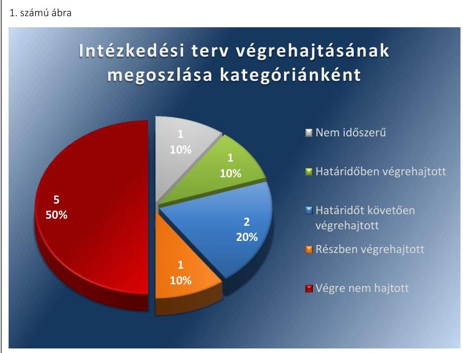

# Jelenetés 

## Utóellenőrzés

Gávavencsellő Nagyközség Önkormányzata pénzügyi gazdálkodási helyzetének, szabályszerűségének utóellenőrzése

15185
www.asz.hu

---

.

---

# Jelentés 

## Utóellenőrzés

Gávavencsellő Nagyközség Önkormányzata pénzügyi gazdálkodási helyzetének, szabályszerűségének utóellenőrzése

---

# AZ ELLENŐRZÉST FELÜGYELTE: 

HOLMAN MAGDOLNA JULIANNA felügyeleti vezető

## AZ ELLENŐRZÉST VEZETTE ÉS A VÉGREHAJTÁSÁÉRT FELELŐS:

BÍRÓ ZSOLT ellenőrzésvezető

## A PROGRAM ÖSSZEÁLLÍTÁSÁÉRT FELELŐS:

LAJTERNÉ HUDÁK MAGDOLNA osztályvezető

## A TÉMÁHOZ KAPCSOLÓDÓ KORÁBBI SZÁMVEVŐSZÉKI JELENTÉS:

- címe: Jelentés Gávavencsellő Nagyközség Önkormányzata pénzügyi gazdálkodási helyzetének, szabályosságának ellenőrzéséről
- sorszáma: 13033

IKTATÓSZÁM: V-0611-037/2015
TÉMASZÁM: 1645
ELLENŐRZÉS-AZONOSÍTÓ SZÁM: V069311

---

# TARTALOMJEGYZÉK 

■ ÖSSZEGZÉS ..... 5
■ AZ ELLENŐRZÉS CÉLJA ..... 6
■ AZ ELLENŐRZÉS TERÜLETE ..... 7
■ AZ ELLENŐRZÉS HÁTTERE, INDOKOLTSÁGA ..... 8
■ FÓKUSZKÉRDÉSEK ..... 9
■ ELLENŐRZÉS HATÓKÖRE ÉS MÓDSZEREI ..... 10
■ MEGÁLLAPÍTÁSOK ..... 12
■ MELLÉKLETEK ..... 15
I. Sz. melléklet: Az ÁSZ 13033 számú jelentéséhez kapcsolódó intézkedési terv végrehajtása ..... 15
■ FÜGGELÉK: ÉSZREVÉTELEK ..... 19
■ RÖVIDÍTÉSEK JEGYZÉKE ..... 21

---

.

---

# ÖSSZEGZÉS 

Az Állami Számvevőszék Gávavencsellő Nagyközség Önkormányzata pénzügyi gazdálkodási helyzetének, szabályszerűségének utóellenőrzését a 2013. július 2. és 2015. április 29. közötti időszakra végezte el. Az Önkormányzat pénzügyi gazdálkodási helyzetének, szabályszerűségének ellenőrzéséről készült ÁSZ jelentés intézkedést igénylő megállapításai és javaslatai hasznosítására elfogadott intézkedések végrehajtásának késedelme és elmaradása magas szintű kockázatot jelez a pénzügyi gazdálkodásra és annak szabályszerűségére.

## Az ellenőrzés társadalmi indokoltsága

Az ÁSZ stratégiájában célként tűzte ki, hogy a számvevőszéki munka eredménye jobban hasznosuljon, segítse az elszámoltatható közpénzfelhasználás megteremtését, ehhez az intézkedési tervekben vállalt feladatok végrehajtásának ellenőrzése, valamint a célzott utóellenőrzések rendszerének kialakítása is hozzájárul. Az ÁSZ a tavalyi évben lezárta a megújult jogszabályi környezetben lefolytatott első önálló utóellenőrzés-sorozatát. Ezzel teljesen kiépítetté vált a rendszer, amely biztosítja az Országgyűlés azon szándékának teljes körű érvényesülését, hogy felszámolásra kerüljön a következmények nélküli számvevőszéki ellenőrzések korszaka.

## Főbb megállapítások, következtetések, javaslatok

A Képviselő-testület által elfogadott javított, kiegészített intézkedési tervet határidőben megküldték az ÁSZ részére. Az Önkormányzat az ÁSZ által elfogadott intézkedési tervben foglalt feladatokat, egy kivételével nem, illetve nem az abban előírt határidőben hajtotta végre. Az intézkedési tervben előírt feladatok végrehajtásának értékelése magas szintű kockázatot jelez a pénzügyi gazdálkodásra és annak szabályszerűségére.

---

# AZ ELLENŐRZÉS CÉLJA 

## Gávavencsellő Nagyközség Önkormányzata pénzügyi gazdálkodási helyzetének, szabályszerűségének utóellenőrzése

Az ellenőrzés célja annak megállapítása volt, hogy az Önkormányzat pénzügyi gazdálkodási helyzetének, szabályszerűségének ellenőrzéséről készült ÁSZ jelentésben foglalt intézkedést igénylő megállapításokra és javaslatokra az ellenőrzött által összeállított, ÁSZ által elfogadott intézkedési tervben meghatározott feladatokat végrehajtották-e.

Ennek keretében ellenőriztük, hogy a polgármester az ÁSZ törvény értelmében az intézkedési tervet határidőben megküldte-e az ÁSZ részére, szükség volt-e az elfogadást megelőzően kiegészítésre, azt az előírt póthatáridőn belül megtették-e, a Képviselő-testület a kiegészített intézkedési tervet elfogadta-e. Értékeltük, hogy az Önkormányzat az elfogadott (kiegészített) intézkedési tervében foglaltak megtételéről, az abban előírt határidők betartásával gondoskodott-e, valamint hogy az elfogadott intézkedések esetleges késedelme, végrehajtásának elmaradása milyen szintű kockázatot jelez a pénzügyi gazdálkodásra és annak szabályszerűségére.

---

# AZ ELLENŐRZÉS TERÜLETE

## Gávavencsellő Nagyközség Önkormányzata

Gávavencsellő nagyközség Szabolcs-Szatmár-Bereg megyében fekszik, népességszáma 2014. január 1-jén 3514 fő* volt. Az Önkormányzat1 pénzügyi helyzetének ellenőrzését az ÁSZ2 a 2009. január 1. – 2012. június 30. közötti időszakra végezte el, amelynek eredményeként megállapította, hogy az Önkormányzat pénzügyi egyensúlya rövidtávon nem volt biztosított. Az utóellenőrzés – a 2015. április 29-ig végrehajtott intézkedéseket figyelembe véve – az Önkormányzat pénzügyi gazdálkodási helyzetének, szabályszerűségének ellenőrzéséről készült ÁSZ jelentés3 intézkedést igénylő megállapításai és javaslatai hasznosítására elfogadott intézkedési tervben4 foglalt feladatok végrehajtására irányult. Az ÁSZ jelentés a polgármesternek5 hat, a jegyzőnek6 öt javaslatot tartalmazott.

- A Központi Statisztikai Hivatal tájékoztatási adatbázisa alapján
- Az ÁSZ 13033 számú jelentése. Az elkészített jelentés az interneten, a www.asz.hu címen olvasható (a továbbiakban: ÁSZ jelentés)
- Gávavencsellő Nagyközség Önkormányzata intézkedési terve; a Képviselő-testület 164/2013. (IX.5.) számú határozatával módosított 125/2013. (VI.26.) számú határozata

---

# AZ ELLENŐRZÉS HÁTTERE, INDOKOLTSÁGA 

AZ ÁSZ STRATÉGIÁJA a helyi önkormányzatok ellenőrzésében a pénzügyi-gazdasági helyzet értékelésére, kockázatai feltárására helyezte a fő hangsúlyt. A 2011-2013. években az ÁSZ által ellenőrzött önkormányzatok esetében a működési, beruházási és a hosszú lejáratú pénzintézeti kötelezettségeinek teljesítésével kapcsolatos pénzügyi kockázatokat mutattuk be. Az ÁSZ megállapította, hogy az önkormányzatok pénzügyi egyensúlyi helyzete az ellenőrzött időszakban romlott, a pénzügyi kockázatok fokozódtak, a pénzügyi egyensúlyi helyzetet jellemző mutatószámok kedvezőtlenül változtak. Az önkormányzati alrendszerben 2012. év végétől 2014. évelejéig lezajlott adósságkonszolidáció és feladat-ellátási-, finanszirozási-rendszer változás következtében a települési önkormányzatok pénzügyi helyzete jelentős mértékben megváltozott, amely a jóváhagyott intézkedési tervek végrehajtását is befolyásolta.

Az ellenőrzött szervezet vezetője az ÁSZ tv. ${ }^{5}$ 33. § (1)-(2) bekezdésében foglaltak alapján a jelentések intézkedést igénylő megállapításaihoz kapcsolódóan köteles intézkedési tervet benyújtani, amelyet az ÁSZ-nak kell elfogadni. Amennyiben az ellenőrzött által vállalt intézkedések hiányosak, vagy más okból nem elfogadhatók az ÁSZ indoklással és póthatáridő tűzésével visszaküldi azt kijavításra, kiegészítésre. Az elfogadásról szóló tájékoztatásban az ÁSZ elnöke valamennyi ellenőrzött szervezet vezetőjének figyelmét felhívta arra, hogy az intézkedési tervben foglaltak megvalósítását - az ÁSZ tv. 33. § (7) bekezdésében foglaltak alapján - utóellenőrzés keretében ellenőrizheti.

## AZ UTÓELLENŐRZÉS VÁRHATÓ HASZNOSULÁSA:

az ellenőrzés megállapításai segítséget nyújthatnak a közpénzügyi helyzet javításához. Az adósságkonszolidációt követően az önkormányzati alrendszerben kiemelt jelentőségű feladat az adósságállomány újratermelődésének megakadályozása. Az utóellenőrzés, jellegéből adódóan fokozza közbizalmat, fegyelmet, a társadalom, az ellenőrzöttek, a helyi döntéshozók vonatkozásában erősíti az ÁSZ tekintélyét és igazolja, hogy lejárt a következmények nélküli ellenőrzések időszaka. A jóváhagyott intézkedési tervek megvalósításának utóellenőrzése révén megállapítható, hogy az önkormányzatok megtették-e a szükséges intézkedéseket a pénzügyi stabilitás elérése és megőrzése, illetve a pénzügyi kockázataik csökkentése érdekében.

---

# FÓKUSZKÉRDÉSEK 

1. A Képviselő-testület által elfogadott intézkedési tervet, szükség esetén annak javítását, kiegészítését határidőben megküldték-e az ÁSZ részére?
2. Az ÁSZ által elfogadott intézkedési tervben foglaltak végrehajtásáról az abban előírt határidők betartásával gondoskodtak-e?

---

# ELLENŐRZÉS HATÓKÖRE ÉS MÓDSZEREI 

## Az ellenőrzés típusa

Szabályszerűségi ellenőrzés

## Az ellenőrzött időszak

Az intézkedési terv ÁSZ-nak történő benyújtásától (2013. július 2.) az utóellenőrzés megkezdéséig (2015. április 29.) tartó időszak volt.

## Az ellenőrzés tárgya

Az Önkormányzat intézkedési tervében foglaltak betartásának ellenőrzése.

## Az ellenőrzött szervezet

Gávavencsellő Nagyközség Önkormányzata

## Az ellenőrzés jogalapja

Az ellenőrzés végrehajtásának jogszabályi alapját az ÁSZ tv. 1. § (3) bekezdése, az 5. § (2) és (6) bekezdései, a 33. § (7) bekezdése, valamint az Áht. 61. § (2) bekezdésének előírásai képezték.

## Az ellenőrzés módszerei

Az ÁSZ által elfogadott intézkedési tervben előírt feladatok végrehajtásának értékelése során alkalmazott besorolási kategóriák:
$\longrightarrow$ okafogyottá vált feladat: ha végrehajtására - meghatározott esemény bekövetkezése, továbbá külső körülmény, a működést érintő feltétel változása miatt - már nincs szükség, illetve lehetőség, és egyértelműen megállapítható, hogy az intézkedést szükségessé tevő körülmény a jövőben nem fordulhat elő;
$\longrightarrow$ nem időszerű (nem esedékes) feladat: amelynek ellenőrzési időszakon belüli végrehajtására azért nem került (kerülhetett) sor, mert az intézkedés alapjául szolgáló esemény nem következett be, de annak jövőbeni előfordulása lehetséges;
$\longrightarrow$ határidőben végrehajtott feladat: ha teljesítése dokumentáltan az intézkedési tervben előírt határidőben és tartalommal, módon megtörtént;

---

- határidőn túl végrehajtott feladat: ha annak teljesítése az intézkedési tervben meghatározott módon, de az előírt határidőn túl történt meg;
- részben végrehajtott feladat: amelynek végrehajtása teljes körűen az intézkedési tervben előírt tartalommal/módon nem történt meg, vagy a feladatot nem az előírt gyakorisággal hajtották végre;
- végre nem hajtott feladat: ha a végrehajtásért felelősként megjelölt személy(ek)nek felróhatóan a teljesítés elmaradt, vagy a teljesítést nem dokumentálták.
Az intézkedési tervben előírt feladatok végrehajtásának részletes bemutatását, valamint a teljesítés minősítését az I. számú melléklet tartalmazza.

Elfogadott intézkedések esetleges késedelme, végrehajtásának elmaradása a pénzügyi gazdálkodásra és annak szabályszerűségére kockázatot jelez. A kockázati arányszám kiszámítása során az összes kategória súlyozott értékének összegéhez viszonyítottuk a határidőn túl, a részben és a nem végrehajtott intézkedési kategóriák súlyozott pontszámát. A súlyozott érték megállapítása az egyes kategóriákhoz rendelt pontszámok alapján történt. A pénzügyi gazdálkodásra és annak szabályszerűségére ható, az intézkedési terv végrehajtásának elmaradásából eredő kockázat „magas", ha az elért pontszám és az elérhető pontszám százalékban kifejezett hányadosa elérte a 71%-ot, „közepes", ha 51 és 70% közé esett és „alacsony" ha nem haladta meg az 50%-ot.

Az ellenőrzésre az Önkormányzat elektronikus adatszolgáltatása alapján került sor, helyszínen ellenőrzést nem végeztünk. A megállapítások rögzítése az Önkormányzat által rendelkezésre bocsátott dokumentumok, tanúsítványok alapján történt, melyek valódiságát és teljes körűségét a polgármester, valamint a jegyző teljességi nyilatkozata igazolta.

---

# MEGÁLLAPÍTÁSOK 

## 1. A Képviselő-testület által elfogadott intézkedési tervet, szükség esetén annak javítását, kiegészítését határidőben megküldték-e az ÁSZ részére?

Összegző megállapítás

A Képviselő-testület által elfogadott javított, kiegészített intézkedési tervet határidőben megküldték az ÁSZ részére.

A polgármester a Képviselő-testületet tájékoztatta az ÁSZ jelentéséről. A jelentésben foglalt intézkedést igénylő megállapításokra és javaslatokra készített intézkedési tervet az ÁSZ tv. 33. § (1) bekezdésében foglalt határidőt követően küldték meg az ÁSZ részére, amelyet az ÁSZ nem fogadott el.

Az ÁSZ az intézkedési terv kiegészítését kérte, amelyet az Önkormányzat határidőben végrehajtott.

Az ÁSZ által elfogadott intézkedési tervben meghatározott feladatokat, az ÁSZ jelentés javaslatainak címzettjét és a feladatok végrehajtását az I. számú melléklet mutatja be.

Az ÁSZ jelentés a polgármester részére hat, a jegyző részére öt javaslatot fogalmazott meg, melynek hasznosítására az Önkormányzat az intézkedési tervében tíz feladatot határozott meg, felelősként a jegyzőt, a polgármestert, a vagyongazdálkodási csoportvezetőt, az intézményvezetőket és a belső ellenőrt megjelölve.

## 2. Az ÁSZ által elfogadott intézkedési tervben foglaltak végrehajtásáról az abban előírt határidők betartásával gondoskodtak-e?

Összegző megállapítás

Az Önkormányzat az ÁSZ által elfogadott, kiegészített intézkedési tervben foglalt feladatokat, egy kivételével nem, illetve nem az abban előírt határidőben hajtotta végre.

Az intézkedések végrehajtási kategóriánkénti megoszlását az 1. számú ábra szemlélteti.

---

Forrás: ÁSZ
NEM IDŐSZERŰ feladat:

1. A 2013-2014. évi mérlegkészítés időpontjáig történő értékelési kötelezettsége az Önkormányzatnak a devizában fennálló kötelezettségeire vonatkozóan az adósságkonszolidáció következtében nem keletkezett.

# HATÁRIDŐBEN VÉGREHAJTOTT feladatok 

2. A felvett hitelek fedezeteként nem használtak fel az Önkormányzat törzsvagyonába tartozó ingatlant.

## HATÁRIDŐT KÖVETŐEN VÉGREHAJTOTT feladatok:

3. A bevételszerző és kiadáscsökkentő lehetőségek felmérését a vállalt 2013. szeptember 30-ai határidőt követően a 2014. február 11-én készült 2014. évi költségvetés előterjesztése tartalmazza.
4. A kockázatkezelési szabályzatot a vállalt 2013. augusztus 31-ei határidőt követően 2015. január 1-én készítették el, és csak ezt követően működtették a kockázatkezelési rendszert.

## RÉSZBEN VÉGREHAJTOTT feladat:

5. A lejárt szállítói állomány alakulásáról nem a vállalt gyakorisággal számoltak be a Képviselő-testületnek.

## VÉGRE NEM HAJTOTT feladatok:

6. A 2014. évi éves belső ellenőrzési terv alapján a pénzügyi egyensúlyi helyzetet befolyásoló döntésekkel kapcsolatos kockázati tényezők feltárását és ellenőrzését nem biztosították.
7. A reorganizációs programot nem készítették el.

---

8. Nem biztosították, hogy kötelezettségvállalásra kizárólag szabad kiadási előirányzat mértékéig kerüljön sor, továbbá a korábbi ellenőrzésben feltárt hiányosság tekintetében a
 mulasztás okait nem tárták fel és nem került sor felelősségre vonás kezdeményezésére.
9. Nem írták elő a pénzintézeti kötelezettségvállalások kockázatainak döntés-előkészítő szakaszban történő feltárását és a futamidő egyes éveit terhelő kötelezettségek költségvetési egyensúlyra gyakorolt hatásának vizsgálatát.
10. Nem határozták meg a pénzintézeti szolgáltatások igénybevétele esetén a pályáztatási, ajánlatkérési kötelezettségre, valamint a pénzügyi kötelezettségek teljesítésére vonatkozó helyi szabályokat.

MAGAS SZINTŰ KOCKÁZATOT JELEZ a pénzügyi gazdálkodásra és annak szabályszerűségére az elfogadott intézkedések késedelme, végrehajtásának elmaradása.

---

# MELLÉKLETEK

- I. SZ. MELLÉKLET: AZ ÁSZ 13033 SZÁMÚ JELENTÉSÉHEZ KAPCSOLÓDÓ INTÉZKEDÉSI TERV VÉGREHAJTÁSA

|  Sorszám | Intézkedési terv alapján elvégzendő feladat | Az intézkedési tervben meghatározott határidő | Az ÁSZ 13033 sz. jelentése javaslatának címzettje | Az intézkedés végrehajtása  |
| --- | --- | --- | --- | --- |
|   | 1. | 2. | 3. | 4.  |
|  Nem időszerű intézkedés |  |  |  |   |
|  1. | A devizában fennálló kötelezettségek év végi értékelését és az árfolyam különbözet elszámolását a jogszabályi előírásoknak megfelelően végezzék el. | mérlegkészítés időpontja | jegyző | Az Önkormányzat az adósságkonszolidációt követően a 2013. évi és a 2014. évi mérlegkészítés időszakában devizában fennálló kötelezettséggel nem rendelkezett.  |
|  Határidőben végrehajtott intézkedések |  |  |  |   |
|  2. | A jövőbeni hitelfelvétel és kötvénykibocsátás fedezeteként az Önkormányzat törzsvagyonába tartozó ingatlant ne használjanak fel. | hitelfelvétel esedékessége | polgármester | Az ellenőrzött időszakban két hitel felvételére került sor. A 2014. évben felvett hitel esetében a Képviselő-testület 14/2014. (I.29.) számú határozatában bankbetétet jelölt meg fedezetként. A 2015. évben felvett hitel esetében a Képviselő-testület 25/2015. (III.04.) számú határozatában olyan ingatlanokat jelölt meg fedezetként, melyek nem képezik a törzsvagyon részét.  |
|  Határidőt követően végrehajtott intézkedések |  |  |  |   |
|  3. | A költségvetési rendelet-tervezet, valamint annak módosítása előterjesztését megelőzően mérjék fel a bevételszerző és kiadáscsökkentő lehetőségeket. | 2013. szeptember 30. | polgármester | Első alkalommal a 2014. évi költségvetés előterjesztésében - amely 2014.02.11-én készült - került sor a bevételszerző és a kiadáscsökkentő lehetőségek felmérésére.  |

---

|  Sorszám | Intézkedési terv alapján elvégzendő feladat | Az intézkedési tervben meghatározott határidő | Az ASZ 13033 sz. jelentése javaslatának címzettje | Az intézkedés végrehajtása  |
| --- | --- | --- | --- | --- |
|   | 1. | 2. | 3. | 4.  |
|  4. | Működtessen a pénzügyi egyensúlyt befolyásoló kockázatok kezelésére alkalmas kockázatkezelési rendszert, ennek keretében készítsen kockázatkezelési szabályzatot. | szabályzat elkészítése 2013. augusztus 31. | jegyző | A Kockázatkezelési Szabályzatot az előírt határidő helyett csak 2015. január 1-n léptették hatályba.  |
|   |  |  | Részben végrehajtott intézkedés |   |
|  5. | A szállítói kitettség és a helyi önkormányzatok adósságrendezési eljárásáról szóló 1996. évi XXV. törvény 4-9. §-aiban szabályozott adósságrendezési eljárás megindításának elkerülése érdekében meghatározott gyakorisággal számoljon be a Képviselő-testületnek az Önkormányzat lejárt szállítói állományának alakulásáról. | minden negyedévet követő hó 20. napja | polgármester | Nem az előírt, negyedévenkénti rendszerességgel került sor a lejárt szállítói állomány alakulásáról való beszámolásra, mivel az az ellenőrzött időszakban két alkalommal történt meg, a 2013. évi zárszámadási rendelet és a 2015. évi rendkívüli támogatás iránti pályázat képviselő-testületi előterjesztése során.  |

---

|  Sorszám | Intézkedési terv alapján elvégzendő feladat | Az intézkedési tervben meghatározott határidő | Az ASZ 13033 sz. jelentése javaslatának címzettje | Az intézkedés végrehajtása  |
| --- | --- | --- | --- | --- |
|   | 1. | 2. | 3. | 4.  |
|   |  |  | Végre nem hajtott intézkedések |   |
|  6. | Intézkedjen, hogy a Bkr. ${ }^{10} 29$. § (1) bekezdésében, a 31. § (2) bekezdésében és a (4) bekezdés a) pontjában foglalt előírások szerint az éves belső ellenőrzési tervek tartalmazzák a pénzügyi egyensúlyi helyzetet befolyásoló döntésekkel kapcsolatos feltárt kockázati tényezők ellenőrzését, biztosítsa az ellenőrzési tervek végrehajtását. | 2013. október 31. | jegyző | A 2014. évi belső ellenőrzési tervet 2013. október 29-én terjesztették elő. Az előterjesztést a Képviselő-testület 198/2013 (XI.6.) számú határozatával hagyta jóvá. Az Önkormányzat nem támasztotta alá dokumentumokkal a pénzügyi egyensúlyi helyzetet befolyásoló döntésekkel kapcsolatos kockázati tényezők feltárását és nem szerepeltette a belső ellenőrzési tervében a kockázati tényezők ellenőrzését.  |
|  7. | Terjesszen a Képviselő-testület elé a pénzügyi egyensúlyi helyzet gyors helyreállítását, hosszú távú fenntartását, valamint az adósságállomány újratermelődése elkerülését biztosító reorganizációs programot. | 2013. július 31. | polgármester | A reorganizációs programot nem készítették el.  |
|  8. | Biztosítsa, hogy a kötelezettségvállalásra kizárólag szabad kiadási előirányzat mértékéig kerüljön sor, továbbá a korábbi ellenőrzésben feltárt hiányosság tekintetében kerüljön sor a mulasztás okainak feltárására és szükség esetén a felelősségre vonás kezdeményezésére. | folyamatos, felelősséget tisztázó eljárás tekintetében 2013. december 31 | polgármester | Az Önkormányzat éves beszámolói alapján megállapítható, hogy a 2013. évben a teljesített kiadások 10,7%-kal haladják meg a módosított kiadási előirányzatokat. Az Önkormányzat a korábbi ellenőrzésben feltárt mulasztás okait nem tárta fel, ezért nem állapította meg, hogy felelősségre vonás kezdeményezésére szükség volt-e.  |

---

|  9. | Alakítsa ki a Bkr. 8. § (1) - (2) bekezdései alapján azokat a belső kontrolltevékenységeket, amelyek biztosítják a pénzügyi egyensúlyi helyzet alakulását befolyásoló döntések kockázatainak kezelését; ennek keretében írja elő a pénzintézeti kötelezettségvállalások kockázatainak döntés-előkészítő szakaszban történő feltárását és a futamidő egyes éveit terhelő kötelezettségek költségvetési egyensúlyra gyakorolt hatásának vizsgálatát. | 2013. szeptember 30. | jegyző | Az Önkormányzat az intézkedés végrehajtásának dokumentumaként a 2012. január 1-től érvényes, Gávavencsellő Nagyközség Polgármesteri Hivatalára vonatkozó „Belső kontrollrendszer" kézikönyv III., 'Kontrolltevékenységek' fejezetét jelölte meg, amely a pénzügyi egyensúlyt befolyásoló döntések kockázatainak kezelésére, pénzintézeti kötelezettségvállalások kockázatfeltárására vonatkozó iránymutatást nem tartalmaz.  |
| --- | --- | --- | --- | --- |
|  10. | Határozza meg a pénzintézeti szolgáltatások igénybevétele esetén a pályáztatási, ajánlatkérési kötelezettségre, valamint a pénzügyi kötelezettségek teljesítésére vonatkozó helyi szabályokat. | 2013. szeptember 30. | jegyző | Az Önkormányzat az intézkedés végrehajtásának dokumentumaként a 2012. január 1-től érvényes, Gávavencsellő Nagyközség Polgármesteri Hivatalára vonatkozó „Belső kontrollrendszer" kézikönyv III., 'Kontrolltevékenységek' fejezetét jelölte meg, amely a pénzintézetek pályáztatására, az ajánlatkérési kötelezettségre, továbbá a pénzügyi kötelezettségek teljesítésére vonatkozó szabályozást nem tartalmaz.  |

Forrás: ÁSZ által készített táblázat

---

# FÜGGELÉK: ÉSZREVÉTELEK 

A jelentéstervezetet a Számvevőszék 15 napos észrevételezésre megküldte az ellenőrzött szervezet vezetőjének az ÁSZ tv. 29. § (1) bekezdése előírásának megfelelően.
A polgármester az ÁSZ tv. 29. § (2) bekezdésében foglalt észrevételezési jogával nem élt, a jelentéstervezetre észrevételt nem tett.

[^0]
[^0]:    § 29. § (1) Az Állami Számvevőszék az ellenőrzési megállapításait megküldi az ellenőrzött szervezet vezetőjének vagy az általa megbízott személynek, és annak, akinek személyes felelősségét állapította meg.
    (2) Az ellenőrzött szervezet vezetője és a felelősként megjelölt személy az ellenőrzés megállapításaira tizenöt napon belül írásban észrevételt tehet.
    (3) Az Állami Számvevőszék az észrevételre a beérkezésétől számított harminc napon belül írásban válaszol. A figyelembe nem vett észrevételeket köteles a jelentésben feltüntetni, és megindokolni, hogy azokat miért nem fogadta el.

---

.

---

# RÖVIDÍTÉSEK JEGYZÉKE 

${ }^{1}$ Önkormányzat
${ }^{2}$ ÁSZ
${ }^{3}$ polgármester
${ }^{4}$ jegyző
${ }^{5}$ ÁSZ tv.
${ }^{6}$ Képviselő-testület
${ }^{7}$ vagyongazdálkodási csoportvezető
${ }^{8}$ intézményvezetők
${ }^{9}$ belső ellenőr
${ }^{10}$ Bkr.

Gávavencsellő Nagyközség Önkormányzata
Állami Számvevőszék
Gávavencsellő Nagyközség Önkormányzatának polgármestere
Gávavencsellő Nagyközség Önkormányzatának jegyzője
2011. évi LXVI. törvény az Állami Számvevőszékről (hatályos 2011. július 1-jétől)

Gávavencsellő Nagyközség Képviselő-testülete
Gávavencsellő Nagyközség Önkormányzat Polgármesteri Hivatalának Vagyongazdálkodási Csoportvezetője
Gávavencsellő Nagyközség Önkormányzat irányítása és felügyelete alá tartozó intézmények vezetői
Gávavencsellő Nagyközség Önkormányzat Polgármesteri Hivatalának belső ellenőre
A költségvetési szervek belső kontrollrendszeréről és belső ellenőrzéséről szóló 370/2011. (XII. 31.) Korm.rendelet (hatályos 2012. január 1-jétől)

---

.

---

.

---

# ÁLLAMI SZÁMVEVŐSZÉK 

1052 Budapest, Apáczai Csere János utca 10.
Levélcím: 1364 Budapest 4. Pf. 54
Telefon: +36 14849100 Telefax: +36 14849200
www.asz.hu

