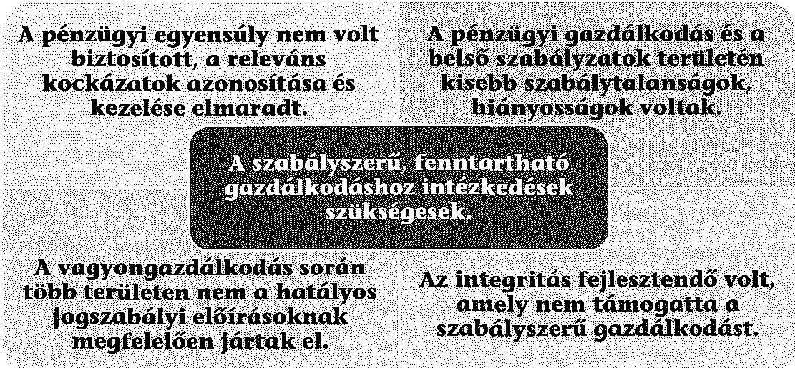
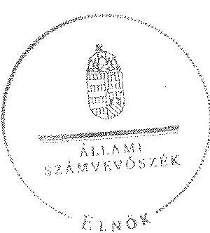

# ÁLLAMI   SZÁMVEVŐSZÉK 

## JELENTÉS

az önkormányzatok pénzügyi és vagyongazdálkodása szabályszerűségének ellenőrzéséről

Ajka

---

# Állami Számvevőszék 

Iktatószám: V-0651-295/2015.
Témaszám: 17
Vizsgálat-azonosító szám: V069103

## Az ellenőrzést felügyelte:

## Renkó Zsuzsanna

felügyeleti vezető
Az ellenőrzés végrehajtásáért felelős és az ellenőrzést vezette:
Görgényi Gábor
ellenőrzésvezető
A számvevőszéki jelentés összeállításában közremúködött:
dr. Mezei Imréné
számvevő főtanácsos
Szudi Ferencné
számvevő főtanácsos
Az ellenőrzést végezték:
dr. Elek László
Nagy Csilla Erzsébet
számvevő
Pályi Katalin Ágnes
számvevő
Szarvas Szilárd
számvevő
dr. Vass Gábor
számvevő tanácsos

---

# TARTALOMJEGYZÉK 

BEVEZETÉS ..... 3
I. ÖSSZEGZŐ MEGÁLLAPÍTÁSOK, KÖVETKEZTETÉSEK, JAVASLATOK ..... 6
II. RÉSZLETES MEGÁLLAPÍTÁSOK ..... 12

1. Az erőforrásokkal való szabályszerű és hatékony gazdálkodáshoz szükséges követelmények kialakítása, számonkérése, ellenőrzése ..... 12
1.1. Az előirányzatokkal, a létszámmal, a vagyonnal való gazdálkodás szabályainak, követelményeinek kialakítása ..... 12
1.2. Az erőforrásokkal való szabályszerű, hatékony gazdálkodás követelményeinek számonkérése, ellenőrzése ..... 13
2. A pénzügyi gazdálkodás szabályszerűsége, a pénzügyi egyensúly biztosítottsága ..... 14
2.1. A költségvetési tervezés és az éves költségvetési beszámolás szabályossága ..... 14
2.2. Az önkormányzat fizetőképességének folyamatos fenntartása, a pénzügyi egyensúly biztosítása ..... 15
3. A vagyongazdálkodási tevékenység szabályossága ..... 19
3.1. A vagyongazdálkodási tevékenység kereteinek kialakítása ..... 19
3.2. A vagyonnyilvántartás szabályossága ..... 20
3.3. A vagyon leltározása ..... 21
3.4. A vagyonváltozásokat eredményező döntések szabályszerűsége ..... 22
3.5. Az önkormányzati tulajdonosi jog gyakorlása ..... 28
3.6. Integritás érvényesülése ..... 30
MELLÉKLETEK
4. számú Ajka Város Önkormányzata feladatellátásában résztvevő intézmények és azok változása a 2011-2013. években
5. számú Ajka Város Önkormányzata bevételei, kiadásai, valamint adósságszolgálata a 2011-2013. években
6. számú Ajka Város Önkormányzata mérlegadatai a 2011-2013. években
7. számú Ajka Város Önkormányzata tartós részesedéseinek alakulása a 2011-2013. években

## FÜGGELÉKEK

1. számú Fogalomtár
2. számú Rövidítések jegyzéke

---

.

---

# JELENTÉS 

## az önkormányzatok pénzügyi és vagyongazdálkodása szabályszerűségének ellenőrzéséről Ajka

## BEVEZETÉS

Az ÁSZ stratégiai célkitűzése, hogy ellenőrzéseivel mind jobban segítse az átláthatóságot, az elszámoltathatóságot és elszámoltatást a közpénzekkel és a közvagyonnal való gazdálkodásban. Magyarország Alaptörvénye rögzíti, hogy az állam és a helyi önkormányzat tulajdona a nemzeti vagyon része. Az önkormányzati vagyon alapvető funkciója, hogy a közérdeket és egyúttal az önkormányzati célok - elsősorban a kötelezően ellátandó feladatok, és emellett a lehetőségek mértékéig az önként vállalt feladatok - megvalósítását szolgálja.

Az államháztartás önkormányzati alrendszerének közpénz felhasználása, az önkormányzatok által ellátott közfeladatok és önként vállalt feladatok sokrétűsége, valamint a feladatellátásához rendelt vagyon nagyságrendje indokolja, hogy az ÁSZ ellenőrzéseket folytasson a pénzügyi és vagyongazdálkodás területén. Az ÁSZ az önkormányzatok ellenőrzését a pénzügyi helyzet megítélésével indította el 2011-ben és a nagy vagyonnal rendelkező, magas kockázatú önkormányzatok esetében a vagyongazdálkodás ellenőrzésével folytatta. Az elmúlt három év ellenőrzéseinek tapasztalatai megmutatták, hogy indokolt az egyrészt elemző, értékelő, a pénzügyi helyzet kockázatát is minősítő, másrészt a pénzügyi és vagyongazdálkodási tevékenység szabályszerűségét komplexen értékelő ÁSZ ellenőrzések folytatása.

Az ellenőrzés célja annak megállapítása volt, hogy kialakította-e az önkormányzat az erőforrásokkal való szabályszerű és hatékony gazdálkodáshoz szükséges követelményeket, megvalósította-e azok számon kérését, ellenőrzését; az önkormányzat pénzügyi és vagyoni helyzetének, a gazdálkodás szabályosságának megítélése a költségvetési tervezés, a pénzügyi egyensúly megteremtése, az éves költségvetési beszámolás, a vagyongazdálkodás, a vagyon számbavétele, a gazdasági események elszámolása és a pénzgazdálkodás szabályszerűsége alapján.

Ennek keretében értékeltük, hogy az önkormányzat:

- pénzügyi gazdálkodása megfelelt-e a jogszabályokban és a belső szabályzataiban meghatározottaknak, biztosított volt-e a pénzügyi egyensúly;
- biztosította-e a vagyongazdálkodás szabályszerűségét, a vagyonváltozást eredményező döntéseket szabályszerűen hajtotta-e végre, gondoskodott-e a tulajdonosi jogok gyakorlásáról;

---

- a gazdálkodása során biztosította-e az átláthatóság és az integritás érvényesülését.

Az ellenőrzés várható hasznosulása: az ellenőrzés várhatóan hozzájárul az önkormányzatok pénzügyi helyzetének pontosabb megítéléséhez azáltal, hogy a pénzügyi és vagyoni helyzetet együtt értékeli. Bemutatja az adósságkonszolidáció önkormányzat általi végrehajtásának szabályszerűségét. Feltárja az önkormányzati gazdálkodást meghatározó szabályozások összhangjának esetleges hiányosságait, a szabályozással nem érintett gazdálkodási területeket, és a vagyongazdálkodási tevékenység gyakorlásának szabálytalanságait. A jó gyakorlat kialakításán és terjesztésén keresztül az ellenőrzések elősegithetik az önkormányzati gazdálkodás szabályszerűségének javítását.

Az ellenőrzés típusa: szabályszerűségi ellenőrzés
Az ellenőrzött időszak: 2011. január 1-jétől 2013. december 31-ig. A pénzintézetekkel szembeni kötelezettségek állományának vizsgálatakor az ellenőrzött időszakban fennálló kötelezettségeket vettük figyelembe. A vagyonnyilvántartások egyezőségét, a leltározás, selejtezés folyamatát a 2013. évre vonatkozóan értékeltük.

# Ellenőrzött szervezet: Ajka Város Önkormányzata 

Az ellenőrzés végrehajtásának jogszabályi alapját az ÁSZ tv. 1. § (3) bekezdése, az 5. § (2)-(6) bekezdései, valamint az Áht. 2 61. § (2) bekezdésének előírásai képezik.

Az ellenőrzés szakmai módszertana az ÁSZ hivatalos honlapján közzétett szakmai szabályokon alapult, amely a Legfőbb Ellenőrző Intézmények Nemzetközi Szervezete (INTOSAI) által kiadott nemzetközi standardok (ISSAI) figyelembevételével készült.

Az alkalmazott egyes fogalmak magyarázatát az 1. számú függelék, a rövidítések jegyzékét a 2. számú függelék tartalmazza.

Az ellenőrzést az ÁSZ hatályos szervezeti szabályai és az ellenőrzési programban foglalt értékelési szempontok szerint folytattuk le. Megállapításainkat a helyszíni ellenőrzés tapasztalataira, az ellenőrzött szervezettől bekért dokumentumokra, a kitöltött tanúsítványok elemzésére, az adott időszakban hatályos jogszabályok és belső szabályzatok előírásaira alapoztuk.

Az önkormányzat vagyonváltozását eredményező döntések és azok végrehajtásának ellenőrzése, szabályszerűségének megítélése kockázatalapú mintavételen, valamint tételes ellenőrzésen keresztül történt. Tételesen ellenőriztük a részesedések értékelését. Kockázatalapú mintavétel alapján (évente a 2-4 legnagyobb értékű tételek kerültek kiválasztásra) ellenőriztük a vagyonkezelői jog alapítását és a vagyon üzemeltetésre történő átadását, a térítés nélküli-tulajdonjog átruházását, a beruházásokat, felújításokat, a vagyonértékesítéseket, a vagyonhasznosítást, a követelések elengedését és a behajthatatlan követelések leírását.

Ajka város lakosainak száma 2013. január 1-jén 29678 fő volt. A 15 tagú Képvi-selő-testület munkáját három állandó bizottság segítette. A polgármester a 2002.

---

évi önkormányzati választás óta tölti be tisztségét, a jegyző 2000. február 15-től látja el feladatait. A Polgármesteri Hivatal négy szervezeti egységre tagolódott, elkülönített gazdasági szervezettel rendelkezett. A pénzügyi gazdálkodási feladatokat a Pénzügyi Iroda látta el. A foglalkoztatott köztisztviselők száma 2013. december 31 -én 58 fó volt.

Az ellenőrzött időszakban az Önkormányzat által ellátott feladatok, valamint a feladatellátásban részt vevő intézmények és gazdasági társaságok körében jelentős változások történtek. A 2011. év elején tíz önállóan múködő és gazdálkodó költségvetési szerv, három minősített többségi befolyás alatt álló gazdasági társaság és két alapítvány vett részt a feladatellátásban. Az ellenőrzött időszakban három középiskolát átvett, továbbá két költségvetési szervet és három gazdasági társaságot alapított az Önkormányzat. Az ellátott feladatokat és az intézmények számát csökkentette két középiskola összevonása és egyházi szervezetnek történő átadása, valamint a tűzoltóság, az egészségügyi és köznevelési intézmények állami fenntartásba kerülése. A járási hivatalok 2013. évi megalakulásával csökkentek az egyes támogatások, járadékok és díjak nyújtásával kapcsolatos hatósági feladatok. Az Önkormányzat a 2013. évben az önállóan múködő és gazdálkodó Polgármesteri Hivatalon felül hat önállóan múködő és gazdálkodó költségvetési szervvel látta el a feladatát. Az Önkormányzatnak 2013-ban négy kizárólagos tulajdonú és öt többségi tulajdonában lévő gazdasági társasága volt, valamint két kizárólagos tulajdonú alapítvánnyal rendelkezett. Az ellenőrzött időszakban az Önkormányzat irányítása alatt múködő költségvetési szerveket az 1. számú melléklet mutatja be.

Az Önkormányzat könyvviteli mérleg szerinti vagyona 2013. december 31-én 33 063,6 M Ft volt, 4586,6 M Ft-tal, 12,2\%-kal csökkent az ellenőrzött időszakban. Az adósságállomány értéke 2011. január 1-jén 4310,8 M Ft volt, amely a törlesztések és a 2047,2 M Ft összegű részbeni adósság átvállalás eredményeként 2013 végére 2743,5 M Ft-ra csökkent. A pénzügyi helyzet ennek következtében javult, de a még mindig magas tartozás állomány miatt a tartós egyensúly feltételei továbbra sem voltak biztosítottak. Az Önkormányzat a 2013. évi költségvetési beszámolója szerint 4899,2 M Ft költségvetési bevételt ért el és 4526,4 M Ft költségvetési kiadást teljesített. A felhalmozási célú kiadások összege 2013-ban 759,3 M Ft volt, melyből felújításokra és beruházásokra 487,7 M Ft-ot fordítottak.

Az ÁSZ tv. 29. § (1) bekezdése szerint a jelentéstervezetet észrevételezésre megküldtük az Önkormányzat polgármesterének, aki az ÁSZ tv. 29. § (2) bekezdésében foglalt észrevételezési jogával nem élt, a jelentéstervezetre észrevételt nem tett.

---

# 1. ÖSSZEGZŐ MEGÁLLAPÍTÁSOK, KÖVETKEZTETÉSEK, JAVASLATOK 

Az Önkormányzat pénzügyi egyensúlya a 2011-2013. években nem volt biztosított, de a pénzügyi helyzet a 2013-ban megkezdett állami adósságkonszolidáció következtében az ellenőrzött időszak végére javult. A fizetőképességet csak magas folyószámlahitel állománnyal, eseti támogatásokkal, valamint a kötelezettségek határidőn túli teljesítésével tudták fenntartani. Az egyensúly elérését nehezítette az önként vállalt feladatok kiadásainak növekvő aránya, valamint a releváns gazdálkodási kockázatok azonosításának és mérséklésének elmaradása. Az Önkormányzat vagyona az ellenőrzött időszakban 12,2\%-kal csökkent főként a vagyonátadások, a részesedések értékvesztése és a követelések csökkenése miatt. A vagyont érintő döntések közül kiemelendő az Ajkai Szakképző Iskola és Kollégium fenntartói és vagyonkezelői jogának egyház részére történő a jogszabályi előírásokat figyelmen kívül hagyó - átadása, továbbá az ingatlan-vagyon-kataszter teljes körű vezetésének elmulasztása.

## Az ellenőrzés megállapításainak összegzése:

A pénzügyi és vagyongazdálkodás belső szabályzatait az Önkormányzat elkészítette, amelyek részben feleltek meg a jogszabályi előírásoknak. Nem tartalmazták a vagyonelemek minősítésének, értékelésének szempontjait, illetve nem szabályozták a közbeszerzési értékhatár alatti beszerzések, valamint a vagyonkezelői jog egyes kérdéseit és az ingyenes átengedés szabályait. Az Önkormányzat rendelkezett Gazdasági Programmal, amelyben meghatározták a feladatokhoz kapcsolódó fejlesztési elgondolásokat, azonban 2013 júniusáig nem készítettek közép- és hosszú távú vagyongazdálkodási tervet.

A pénzügyi gazdálkodás során a tárgyévi fizetési kötelezettségeket a jóváhagyott kiadási előirányzatok mértékéig vállaltak, a jellemzően alulteljesülő bevételi előirányzatokat azonban a jogszabályi előírások ellenére 2012-2013-ban nem csökkentették, továbbá a jóváhagyott létszám előirányzatoi 2013-ban 2,2\%-kal (9 fő)

---

túllépték. A zárszámadási rendelettervezetek az elfogadott költségvetésekkel összehasonlítható módon, az év utolsó napján érvényes szervezeti és besorolási rendnek megfelelően készültek.

Az erőforrásokkal való szabályszerű, hatékony gazdálkodáshoz szükséges követelmények kialakítása érdekében a Képviselő-testület tervezési és végrehajtási irányelveket fogadott el a bevételek és kiadások különbségének csökkentésére, a bevételi lehetőségek feltárására, az alapfeladat-ellátás elsődlegessége biztosítására, de az irányelvek gyakorlati megvalósítása nem volt maradéktalan. Kiadáscsökkentő intézkedések nem történtek, a megtett bevételnövelő intézkedések pedig érdemben nem javították a pénzügyi helyzetet. Ezzel szemben az önként vállalt feladatok kiadásainak aránya az összes kiadás 6,1\%-áról 17,3\%-ára nőtt az ellenőrzött években. Az Önkormányzat pénzügyi egyensúlya 2011-2013ban nem volt biztosított, a fizetőképességet csak folyószámlahitellel, eseti támogatásokkal, valamint a szállítói kötelezettségek határidőn túli rendezésével tudták fenntartani. A likviditási mutatók alapján a forgóeszközök és a pénzeszközök állománya nem nyújtott fedezetet a rövid lejáratú kötelezettségek teljesítésére. A fizetőképességet veszélyeztető pénzügyi helyzethez az is hozzájárult, hogy a kockázatkezelési rendszer nem terjedt ki teljes körűen a pénzügyi egyensúlyt befolyásoló kockázatok mérséklésére, amely elsősorban a bevételi kitettséggel, a kezességvállalásokkal és visszterhes kötelezettségekkel, valamint a gazdasági társaságokkal kapcsolatos kockázatoknál jelentkezett. A pénzügyi helyzet a 2013ban megkezdett állami adósságkonszolidáció következtében 2013 végére javult.

Az Önkormányzat vagyona az ellenőrzött években 37 650,1 M Ft-ról 33 063,6 M Ft-ra csökkent, javarészt a Kórház és a Tủzoltóság térítésmentes átadása, a részesedések értékvesztése, továbbá a hosszúlejáratú követelések és a forgóeszközök csökkenése miatt. A vagyongazdálkodást érintő döntések közül meghatározó volt a 478,4 M Ft értéken nyilvántartott Iskola 2012. év végi egyházi fenntartásba történő átadása, amelynek során nem vették figyelembe, hogy a Köznev. tv. szerint fenntartói jogot tanév közben átadni nem lehet. A fenntartói jog átadásához kapcsolódva 2013-ban a vagyonkezelői jog is átadásra került. Az Iskola fenntartói és vagyonkezelői joga azonban 2013. január 1-jével a törvény erejénél fogva az államot, illetve a nevében eljáró állami intézményfenntartó központot illette volna meg, így az Önkormányzatnak már nem lett volna rendelkezési jogosultsága vagyonkezelési szerződés megkötésére.

Az Önkormányzat a vagyonkezelésbe adott, 1545,3 M Ft értéken nyilvántartott víziközmű-vagyon esetében a jogszabályi előírások ellenére nem végezte el a kataszteri nyilvántartás módosítását, a beszerzésekkel, fejlesztésekkel összefüggő közzétételi kötelezettségeinek pedig csak részben tett eleget. A térítésmentes vagyon átadás-átvételek, a vagyon egyéb hasznosítása, illetve a beruházások, felújítások szabályszerűen történtek. Az Önkormányzat a gazdasági társaságainál eleget tett a tulajdonosi kötelezettségeinek, a minősített többségi befolyás alatt álló társaságok adóssága azonban 476,9 M Ft-ról 527,9 M Ft-ra növekedett az ellenőrzött időszakban, amelyet érdemi intézkedések nem követtek.

Az Önkormányzatnál az integritási tevékenység fejlesztendő, mivel a fennálló kockázatok szintje meghaladta a kezelésükre kiépített, alkalmazott kontrollok szintjét.

---

Az ÁSZ tv. 33. § (1) bekezdésében foglaltak értelmében az ellenőrzött szervezet vezetője köteles a jelentésben foglalt megállapításokhoz kapcsolódó intézkedési tervet összeállítani, és azt a jelentés kézhezvételétől számított harminc napon belül az ÁSZ részére megküldeni. Amennyiben az intézkedési tervet határidőn belül nem küldi meg a szervezet vezetője, vagy az továbbra sem elfogadható, az ÁSZ elnöke a hivatkozott törvény 33. § (3) bekezdés a-b) pontjaiban foglaltakat érvényesítheti.

# Az ellenőrzés intézkedést igénylő megállapításai és javaslatai: 

## a polgármesternek

1. Az Önkormányzat fizetőképessége az ellenőrzött időszakban kiegészítő állami támogatásokkal, rendszeresen megújított folyószámla-hitellel és a szállítói finanszírozás folyamatos igénybevételével volt biztosítható. A folyószámla-hitel év-végi állománya az adósságkonszolidáció, valamint a kiegészítő támogatás ellenére - a 2013. év végén meghaladta a 625 millió Ft-ot. A 2013. év végén fennálló - 30 napon belüli esedékességű - szállítói tartozások állománya 239,2 millió Ft volt. Az önként vállalt feladatok kiadásainak aránya az ellenőrzött időszakban az összes kiadás 6,1\%-áról 17,3\%-ára (805,7 millió Ft-ra) nőtt. A Képviselő-testület az ellenőrzött időszakban gazdasági társaságainak tőkeemelésére és pótbefizetési kötelezettségeinek teljesítésére 318 millió Ft-ot fordított, amelynek $83 \%$-a a Kristályfürdő Kft.-hez kapcsolódott. Két gazdasági társaság részére 12,8 millió Ft tagi kölcsönt biztosítottak, de a társaságok a szerződésben vállalt visszafizetési kötelezettségüknek nem tettek eleget. Az Önkormányzat a gazdasági társaságaiban lévő 937,2 M Ft névértékű részesedéseinek könyv szerinti értéke az elszámolt értékvesztés következtében a 2013. év végére 275,1 millió Ft-tal, 662,1 M Ft-ra csökkent. Az ellenőrzött időszakban növekedett az Önkormányzat minősített befolyása alatt álló gazdasági társaságok kötelezettségállománya is, a 2013. év végére elérte az 527,9 millió Ft-ot.

Javaslat:
Terjesszen a Képviselő-testület elé az Önkormányzat aktuális pénzügyi egyensúlyi helyzetére, ezen belül gazdasági társágainak gazdálkodási körülményeire, kötelezettségállományának elemzésére vonatkozó helyzetelemzést és döntési javaslatot a müködési egyensúly megteremtését biztosító intézkedések érdekében.
2. Az Önkormányzat Vagyongazdálkodási rendelete az ellenőrzött időszakban részben felelt meg a jogszabályi előírásoknak, mert 2011-ben az Ötv. 80/B §-ában, illetve 2012. január 1-től az Mötv. 109. § (4) bekezdésében foglaltak ellenére nem szabályozták a vagyonkezelői jog megszerzésének, gyakorlásának részletes szabályait, valamint a vagyonkezelői jog ellenértékét és az ingyenes átengedés szabályait.

Javaslat:
Gondoskodjon arról, hogy az Önkormányzat vagyongazdálkodási rendelete feleljen meg az Mótv. előírásainak.
3. Az Önkormányzat a tulajdonába került víziközmű-vagyonelemek vonatkozásában megsértette a 147/1992. (XI. 6.) Korm. rendelet 1. § (1) és 4. § (1) bekezdésében foglaltakat, mert nem történt meg a vagyonelemek előírt 90 napon belüli átvezetése

---

a vagyonkataszteri nyilvántartásban. Az önkormányzati vagyonnyilvántartás (vagyonkataszter) folyamatos vezetéséért, az adatok hitelességéért az Mótv. 110. § (1) bekezdésében foglaltak alapján a jegyző felelős.

Javaslat:
Intézkedjen a feltárt hiányosság és szabálytalanság tekintetében a munkajogi felelősség kivizsgálására irányuló eljárás megindítása iránt, és az eljárás eredményének ismeretében tegye meg a szükséges intézkedéseket.

# a jegyzőnek 

1. Az Önkormányzatnál az ellenőrzött időszakban az elkészült belső szabályzatok közül az értékelési szabályzat csak részben felelt meg a jogszabályi előírásoknak, mert az Áhsz. 8/A. §-ban (2014. január 1-től a 4/2013. (I. 11) Korm. rendelet 50. § 2. bekezdés d.) pontjában) foglaltak ellenére nem rögzítették a vagyonkezelésbe adott eszközök vagyonértékelése során alkalmazott értékelési eljárás elveit, módszerét, dokumentálásának szabályait, felelőseit.

Javaslat:
Gondoskodjék arról, hogy az Értékelési szabályzat feleljen meg a hatályos jogszabályi előírásoknak.
2. Az Önkormányzatnál 2011-ben az Ámr. 20. § (3) bekezdésének b) és c), valamint 2012-január 1-től az Ávr. 13. § (2) bekezdésének b) és c) pontjaiban foglalt előírások ellenére nem rendezték belső szabályzatban a beszerzések lebonyolításával kapcsolatos eljárásrendet, valamint a belföldi kiküldetések elrendelésével és lebonyolításával, elszámolásával kapcsolatos kérdéseket.

Javaslat:
Intézkedjen a beszerzések lebonyolításával kapcsolatos eljárásrend valamint a belföldi kiküldetések elrendelésével és lebonyolításával, elszámolásával kapcsolatos kérdések belső szabályzatban történő rendezéséről.
3. A 2013. évi költségvetési rendelet az Áht. 23. § (2) bekezdésének a) ab), illetve b) bb) pontjaiban foglalt előírások ellenére nem tartalmazta az Önkormányzat és az általa irányított költségvetési szervek előirányzatait kötelező feladatok, önként vállalt feladatok és államigazgatási feladatok szerinti bontásban.

Javaslat:
Intézkedjen arról, hogy a költségvetési rendelet összeállításakor az Önkormányzat és az általa irányított költségvetési szervek előirányzatainak tagolása a hatályos jogszabályi előírásoknak megfelelően történjék.
4. Az Önkormányzatnál 2011-ben az Áht. 121. § (2) bekezdésében, az Ámr. 157. § (2)(3) bekezdésében, valamint 2012. január 1-től a Bkr. 7. § (2) bekezdésében foglalt előírások ellenére nem alakítottak ki és nem müködtettek a szervezet minden szintjén érvényesülő megfelelő kockázatkezelési rendszert. Nem mérték fel a tevékenységben és gazdálkodásában rejlő bevételi kitettséggel, a garancia- és kezességvállalásokkal, az

---

egyéb visszterhes kötelezettségekkel, valamint a minősített befolyás alatt álló gazdasági társaságokkal kapcsolatos kockázatokat és nem határozták meg a kockázatokkal kapcsolatos intézkedéseket.

Javaslat:
Működtessen a jogszabályi előírásoknak megfelelő, a pénzügyi egyensúlyt befolyásoló kockázatok kezelésére alkalmas kockázatkezelési rendszert.
5. Az Önkormányzat a tulajdonába került víziközmű-vagyonelemek vonatkozásában megsértette a Mötv. 110. § (1) bekezdésében, valamint a 147/1992. (XI. 6.) Korm. rendelet 1. § (1) és 4. § (1) bekezdésében foglaltakat, mert nem történt meg a vagyonelemek előírt 90 napon belüli átvezetése a vagyonkataszteri nyilvántartásban, Az önkormányzati vagyonnyilvántartás (vagyonkataszter) folyamatos vezetéséért, az adatok hitelességéért a jegyző a felelős.

Javaslat:
Gondoskodjék az Önkormányzat vagyon-kataszter nyilvántartásának jogszabályban előírt folyamatos vezetéséről.
6. A Vagyongazdálkodási rendelet és a számlarend előírásainak megfelelően vezetett vagyonnyilvántartás alapján az éves zárszámadásokhoz kapcsolódóan elkészítették a vagyonkimutatást, amelynek tartalma és szerkezete részben felelt meg az Áhsz. 44/A § (1)-(3) bekezdése előírásainak.
a) Az Áhsz. 44/A. § (1) bekezdése ellenére a 2013. évi vagyonkimutatás az Önkormányzat és intézményei saját vagyonának adatait nem mutatta be pontosan, mert az immateriális javak, az ingatlanok, a gépek-berendezések és a járművek nettó értéke összesen 319,9 M Ft-tal (1\%-kal) magasabb volt a 2013. évi főkönyvi nyilvántartással alátámasztott mérleg megfelelő sorainál kimutatott értékeknél.
b) A 2011-2013. évi vagyonkimutatások a vagyonelemeket forgalomképesség szerint elkülönítetten tartalmazták, de az Áhsz. 44/A. § (2) bekezdése ellenére 2012-2013-ban a forgalomképtelen törzsvagyon elemeinél az Önkormányzat nem alkalmazta a kizárólagos, illetve a nemzet-gazdasági szempontból kiemelt jelentőségű vagyon besorolási kategóriákat, továbbá az „üzleti vagyon" helyett „törzsvagyonon kívüli egyéb vagyon" megnevezés szerepelt.
c) Az Áhsz. 44/A. § (3) bekezdése ellenére a vagyonkimutatás az ellenőrzött időszak egyik évében sem tartalmazta a nullára leírt eszközök valamint az Önkormányzat tulajdonában lévő, a jogszabály alapján érték nélkül nyilvántartott eszközök (képzőművészeti alkotások) állományát, valamint a 2011-2012. években nem tartalmazta a mérlegben értékkel nem szereplő, kezességvállalással kapcsolatos függő kötelezettségeket.

Javaslat:
Intézkedjen, hogy a vagyonkimutatás tartalma és szerkezete feleljen meg a hatályos jogszabályi előírásoknak.

---

7. Az Önkormányzat 2011-ben a 0,2 M Ft és 2013-ban a 47,8 E Ft értékben végrehajtott kis összegű behajthatatlan követelések leírása során csak részben tartotta be a Vagyongazdálkodási rendeletében foglalt előírásokat. A leírt behajthatatlan követelések mindegyike a rendelet 16. § (1) bekezdésének megfelelően öt éven túli, az aktuális költségvetési törvényben megállapított értékhatárt el nem érő kisösszegű követelés volt, azonban a 16. § (2) bekezdés a) pontjában foglalt előírások ellenére a lemondásról nem a polgármester, hanem a Pénzügyi Iroda vezetője, a Szociális és Igazgatási Iroda vezetője, illetve a jegyző döntött.

Javaslat:
Gondoskodjék arról, hogy a behajthatatlan kis összegű követelések leírása esetén az Önkormányzat Vagyongazdálkodási rendeletében foglalt szabályozás szerint járjanak el.

---

# II. RÉSZLETES MEGÁLLAPÍTÁSOK 

## 1. AZ ERŐFORRÁSOKKAL VALÓ SZABÁLYSZERŰ ÉS HATÉKONY GAZDÁLKODÁSHOZ SZÜKSÉGES KÖVETELMÉNYEK KIALAKÍTÁSA, SZÁMONKÉRÉSE, ELLENŐRZÉSE

### 1.1. Az előirányzatokkal, a létszámmal, a vagyonnal való gazdálkodás szabályainak, követelményeinek kialakítása

A Képviselő-testület és a Polgármesteri hivatal az ellenőrzött időszakban rendelkeztek a feladataik ellátásának részletes belső rendjét és módját meghatározó SZMSZ $_{1 ; 2}$-szel, illetve hivatali SZMSZ-szel.

A gazdasági szervezet tevékenységét ellátó Pénzügyi Iroda munkafolyamatainak leírását, feladat- és hatásköreit, a külső és belső kapcsolattartás módját a Gazdasági Úgyrend tartalmazta. A Gazdasági Úgyrend mellékleteként kidolgozták az Önkormányzat pénzügyi és vagyongazdálkodásával kapcsolatos belső szabályzatokat. Ennek keretében elkészítették és rendszeresen aktualizálták a Számviteli politikát, a Pénzkezelési szabályzatot, az Értékelési szabályzatot a Selejtezési szabályzatot, illetve az operatív gazdálkodásra vonatkozó további belső szabályzatokat. A gazdálkodási jogkörök gyakorlásának részletes szabályait a Gazdálkodási jogkörök szabályzata rögzítette, az abban foglalt összeférhetetlenségi követelményeket betartották. Az elkészült belső szabályzatok közül csak részben feleltek meg a jogszabályi előírásoknak az alábbiak:

- A Számviteli politikában meghatározták, hogy mi minősül jelentős összegű hibának, azonban a szabályzat az Áhsz. 8. § (5) bekezdés a) pontjában foglalt előírás ellenére nem tartalmazta, hogy mi tekintendő figyelembe veendő szempontnak a kis értékű tárgyi eszközök, a vagyoni értékű jogok és szellemi termékek minősítésénél.
- Az Értékelési szabályzatban az Áhsz. 8/A. §-ban foglaltak ellenére nem rögzítették a vagyonkezelésbe adott eszközök vagyonértékelése során alkalmazott értékelési eljárás elveit, módszerét, dokumentálásának szabályait, felelőseit.

Az Önkormányzatnál a jogszabályi előírások ellenére a 2011-2013. években nem, illetve nem az ellenőrzött időszak egészére vonatkozóan szabályozták a pénzügyi és vagyongazdálkodás következő területeit:

- Az ellenőrzött időszakban az Ámr. 20. § (3) bekezdésének b) és c), valamint az Ávr. 13. § (2) bekezdésének b) és c) pontjaiban foglalt előírások ellenére nem rendezték belső szabályzatban - a közbeszerzési értékhatárt el nem érő beszerzések vonatkozásában - a beszerzések lebonyolításával kapcsolatos eljárásrendet, valamint a belföldi kiküldetések elrendelésével és lebonyolításával, elszámolásával kapcsolatos kérdéseket.

---

- 2012 márciusáig nem rendezték belső szabályzatban a vezetékes és rádiótelefonok használatát, illetve 2013 szeptemberéig a közérdekú adatok megismerésére irányuló kérelmek intézésének rendjét az Ámr. 20. § (3) bekezdésének h) és i) és az Ávr. 13. § (2) bekezdésének g) és h) pontjaiban foglaltak ellenére.

# 1.2. Az erőforrásokkal való szabályszerű, hatékony gazdálkodás követelményeinek számonkérése, ellenőrzése 

Az előirányzatokkal, a létszámokkal és a vagyonnal való hatékony gazdálkodás érdekében a Képviselő-testület tervezési és végrehajtási irányelveket fogadott el, de azok gyakorlati megvalósítása nem volt maradéktalan. Az irányelvek a költségvetési koncepciókról, illetve a költségvetési rendeletek első félévi és háromnegyedévi teljesítéséről készült előterjesztések elfogadásához kapcsolódtak. Az általános jellegű célkitűzések a működési bevételek és kiadások különbségének csökkentésére, a bevételi lehetőségek mind teljesebb feltárására és reális tervezésére, az alapfeladat-ellátás elsődlegességének biztosítására irányultak. További igényként fogalmazódott meg a személyi juttatásokat érintő megtakarítási lehetőségek kihasználása, a dologi kiadások esetében a feladatok takarékos és hatékony ellátásának tervezése. Az irányelvek kitértek az áthúzódó felhalmozási kötelezettségekre, az ágazati feladatok szerkezetének és nagyságrendjének felülvizsgálatára, valamint a felesleges vagyonelemek értékesítési lehetőségeire. A Képviselő-testület meghatározta továbbá a kiemelt egyesületek és a két nemzetiségi önkormányzat támogatására, továbbá a 2011. évi felhalmozási célú hitel felhasználására vonatkozó elvárásokat.

Az Önkormányzat az erőforrásokkal való szabályszerű, hatékony gazdálkodás követelményeinek és irányelveinek betartását a költségvetési rendeletek időszaki végrehajtásához és a zárszámadási rendeletek megalkotásához kapcsolódó előterjesztések elfogadása során kérte számon. A rendelettervezetek a szervezeti egységek és az intézmények beszámolóira alapozva tartalmazták a tervezett, illetve teljesített előirányzatokkal, a létszám és a vagyon alakulásával kapcsolatos részletes kimutatásokat és szöveges indokolásokat. Ágazatonként, intézményenként és feladatonként bemutatták az előirányzatok és a létszám megalapozottságát, évközi alakulását, a tervezett és teljesített adatok eltérésének okait. Részletesen ismertették a folyamatban lévő és befejezett fejlesztéseket, továbbá az Önkormányzat vagyonában bekövetkezett változásokat.

Az ellenőrzött években végzett belső ellenőrzések csak közvetve kapcsolódtak a feladatellátás és az erőforrásokkal való hatékony gazdálkodás követelményeinek érvényre juttatásának betartására. Az ellenőrzések döntően az egyesületek és civil szervezetek részére nyújtott támogatások felhasználására, a munkáltatói kölcsönökre, a képviselői tiszteletdíjak elszámolására, a közbeszerzési tevékenységre, az uniós pályázati forrásból végzett fejlesztésre és az alapítványi feladatellátásra irányultak.

---

# 2. A PÉNZÜGYI GAZDÁLKODÁS SZABÁLYSZERŰSÉGE, A PÉNZÜGYI EGYENSÚLY BIZTOSÍTOTTSÁGA 

### 2.1. A költségvetési tervezés és az éves költségvetési beszámolás szabályossága

Az Önkormányzatnál a költségvetési tervezés és beszámolás során - a 2013. évi előirányzatok feladatellátás módja szerinti elkülönítésének kivételével - betartották a jogszabályokban és a belső szabályzatokban foglalt előírásokat.

A költségvetési koncepciók, valamint a költségvetési rendelettervezetek készítése és előterjesztése szabályszerűen történt. A 2013. évi jóváhagyott költségvetési rendeletben ugyanakkor az Önkormányzat költségvetése az Áht. 2 23. § (2) bekezdésének a) ab), illetve b) bb) pontjaiban foglaltak ellenére nem tartalmazta a helyi önkormányzat és az általa irányított költségvetési szervek előirányzatait kötelező feladatok, önként vállalt feladatok és államigazgatási feladatok szerinti bontásban.

A költségvetési koncepciók alátámasztásához elkészítették a részletes háttérszámításokat, figyelembe vették a következő évi feladatokat, a várható bevételi forrásokat, a kötelezettségvállalásokat és az egyéb fizetési kötelezettségeket. A mellékszámításokkal megalapozott költségvetési rendelettervezetek megfelelő szerkezetben és tartalommal készültek, az előterjesztésekhez szöveges indokolással együtt csatolták az előírt tájékoztató mérlegeket és kimutatásokat.

Az Önkormányzat és az általa irányított költségvetési szervek által készített elemi költségvetések, valamint a költségvetési rendeletek kiemelt előirányzatai között fennállt az egyezőség. A polgármester által jóváhagyott elemi költségvetéseket az előírt határidőben megküldték a Kincstár részére.

A Képviselő-testület a 2011. és 2012. években öt-öt alkalommal, a 2013. évben hat alkalommal módosította az éves költségvetési rendeletet. Az előirányzatmódosítások szabályszerűen, irányítószervi hatáskörben, Képviselő-testületi döntés alapján történtek. A költségvetési rendeletek módosítását negyedévente, illetve utolsó alkalommal a költségvetési beszámoló készítésének határidejét megelőzően hajtották végre. Az előirányzat módosítások nyilvántartásba vétele és elszámolása megfelelt az előírásoknak, a beszámolókban szereplő előirányzat módosítások megegyeztek az analitikus és főkönyvi nyilvántartásokkal.

Az Önkormányzatnál az ellenőrzött időszakban tárgyévi fizetési kötelezettségeket a jóváhagyott kiadási előirányzatok mértékéig vállaltak, illetve a költségvetési kiadásokat - egy kivétellel - az eredeti, vagy a módosított kiadási előirányzatok mértékéig teljesítették. A 2011. évi költségvetés végrehajtása során az ellátottak pénzbeli juttatásainak előirányzata esetében az elrendelt kifizetések az Áht. 12/A. § (1) bekezdésének előírásait megsértve 0,7 M Ft-tal meghaladták a jóváhagyott (módosított) kiadási előirányzatot az átvett szakképző iskolákat érintő ösztöndíj kifizetések miatt. A módosított bevételi előirányzatok az ellenőrzött időszakban jellemzően alulteljesültek, azonban a jogszabályi változásokhoz igazodva, az Áht. 2 30. § (3) bekezdésében foglalt előírások ellenére 2012ben és 2013-ban azokat nem csökkentették. A bevételek teljesítése 2011-ben

---

18,0\%-kal (2195,6 M Ft), 2012-ben 16,3\%-kal (1278,7 M Ft), 2013-ban pedig $7,2 \%$-kal ( $379,3 \mathrm{MFt}$ ) maradt el a módosított előirányzatoktól.

A költségvetési rendeletekben jóváhagyott eredeti létszám elöirányzatokat betartották, azok túllépésére egyik évben sem került sor. A 2011. évi eredeti 1336 fős létszámkeret 2013-ra 429 főre, majd a módosítások következtében év végére 411 fơre csökkent. A foglalkoztatottak statisztikai létszáma azonban a 30/2013. (XII.16.) Kt. rendelettel módosított 1/2013. (II.14.) Kt. rendeletben szereplő 411 fős módosított előirányzatot 2013 végén 2,2\%-kal ( 9 fő) meghaladta a VIMSZ és a Gondozási Központ létszámkeretének túllépése miatt.

A polgármester az Önkormányzat első félévi gazdálkodási helyzetéről évente szeptember 15-éig, a háromnegyed éves gazdálkodás helyzetéről a következő évi költségvetési koncepció előterjesztésekor tájékoztatta a Képviselő-testületet. Az Önkormányzat és költségvetési szervei - az elemi költségvetések adataival összehasonlítható módon - elkészítették a költségvetési beszámolókat és megküldték a Kincstár részére. A polgármester és a jegyző a költségvetési évet követő négy hónapon belül évente gondoskodott a zárszámadás tervezetének elkészítéséről és Képviselő-testület elé terjesztéséről. A zárszámadási rendelettervezetek az elfogadott költségvetésekkel összehasonlítható módon, az év utolsó napján érvényes szervezeti és besorolási rendnek megfelelően készültek. Az előterjesztések során a Képviselő-testület részére szöveges indoklással együtt csatolták és bemutatták az előírt tájékoztató mérlegeket, kimutatásokat.

# 2.2. Az önkormányzat fizetőképességének folyamatos fenntartása, a pénzügyi egyensúly biztosítása 

Az Önkormányzat pénzügyi egyensúlya a 2011-2013. években nem volt biztosított, de a pénzügyi helyzet a 2013. évben megkezdett állami adósságkonszolidáció következtében az ellenőrzött időszak végére javult. A fizetőképességet csak a rendszeresen megújított folyószámlahitellel, eseti támogatásokkal, valamint a szállítói kötelezettségek határidőn túli teljesítésével tudták fenntartani. Az Önkormányzat a pénzügyi egyensúlyi helyzet javítása érdekében kiadáscsökkentő intézkedéseket nem tett, a megtett bevételnövelő intézkedések pedig érdemben nem javították a pénzügyi helyzetet. A tartós egyensúlyi helyzet elérését egyebek mellett az is nehezítette, hogy az önként vállalt feladatokhoz kapcsolódó kiadások aránya folyamatosan emelkedett az ellenőrzött időszakban. Az Önkormányzat számításai szerint 2011-ben és 2012-ben a költségvetési kiadások $6,1 \%$-át, illetve $7,4 \%$-át fordították az önként vállalt feladatok finanszírozására, amely 2013-ban már 17,3\%-ot ( $805,7 \mathrm{M}$ Ft-ot) tett ki.

Az ellenőrzött időszakban a jegyző az Ávr. és az éves költségvetési rendeletek előírásainak megfelelően likviditási terveket készített, amely havi ütemezéssel tartalmazta a teljesíthető kiadásokat. A likviditási tervek felülvizsgálatát havonta elvégezték.

A likviditási mutató és a pénzeszköz likviditási mutató értéke az ellenőrzött időszak egyik évében sem érte el a szakmailag elvárt l-es értéket, vagyis a forgóeszközök, illetve a pénzeszközök év végi állománya nem nyújtott fedezetet a rövid lejáratú kötelezettségek teljesítésére. A likviditási mutató 2011. év eleji 0,5 értéke, valamint a pénzeszköz likviditási mutató 0,1 értéke 2012 végéig nem

---

változott, így a 2011-2012. években a forgóeszközök a rövid lejáratú kötelezettségek felére, míg a pénzeszközök ugyanezen kötelezettségek mindössze tizedére nyújtottak fedezetet. A 2013. év végére a rövid lejáratú kötelezettségek csökkenésének, illetve a pénzeszközök növekedésének együttes hatására a likviditási mutató értéke 0,8 -re, a pénzügyi likviditási mutató értéke pedig 0,4-re emelkedett. A rövid lejáratú kötelezettségek csökkenését alapvetően a szállítói tartozások, valamint a folyószámlahitel állomány adósságátvállalásnak köszönhető csökkenése, továbbá az éven belüli beruházási hiteltörlesztések megszűnése eredményezte, a pénzeszközök növekedéséhez pedig elsősorban a müködőképesség megőrzését szolgáló 400,0 M Ft összegű kiegészítő támogatás járult hozzá.

Az Önkormányzat 2011-2013. évekre vonatkozó pénzügyi helyzetét a CLF módszer segítségével elemeztük (2. számú melléklet), amelynek eredményét összefoglalóan az 1. számú táblázat szemlélteti.

1. számú táblázat:

Az Önkormányzat pénzügyi helyzetének CLF módszer szerinti levezetése ${ }^{1}$

| Megnevezés | 2011 | 2012 | 2013 |
| :--: | :--: | :--: | :--: |
| Folyó bevételek | 8245,5 | 5978,3 | 4480,6 |
| Folyó kiadások | 8214,7 | 6301,0 | 3767,1 |
| Folyó költségvetés egyenlege, múködési jövedelem | 30,8 | $-322,6$ | 713,6 |
| Folyó költségvetés egyenlege múködőképesség megőrzését szolgáló kiegészitő támogatások nélkül | $-125,4$ | $-322,6$ | 313,6 |
| Felhalmozási bevételek | 8245,5 | 5978,3 | 4480,6 |
| Felhalmozási kiadások | 8214,7 | 6301,0 | 3767,1 |
| Felhalmozási költségvetés egyenlege | $-488,0$ | $-147,6$ | $-340,8$ |
| Finanszírozási múveletek nélküli (GFS) pozíció | $-457,2$ | $-470,2$ | 372,8 |
| Hitelfelvétel, forgatási és befektetési célú értékpapír kibocsátása | 413,5 | 341,0 | 48,4 |
| Hiteltörlesztés, értékpapír beváltás | 73,4 | 50,0 | 121,8 |
| Finanszírozási műveletek egyenlege | 515,9 | 302,1 | $-63,7$ |
| Tárgyévi pénzügyi pozíció | 58,6 | $-168,1$ | 309,1 |
| Nettó müködési jövedelem | $-42,6$ | $-372,6$ | 591,7 |

[^0]
[^0]:    ${ }^{1}$ A táblázatban szereplő adatokat a 2013-ban megkezdett adósságkonszolidáció nem befolyásolta, mert az adósságállomány közvetlen átvállalása nem érintette az Önkormányzat pénzforgalmi bevételeit és kiadásait.

---

Az Önkormányzat múködési jövedelme a 2012. év kivételével pozitív volt, amely egyedi tényezőknek köszönhető. A múködési jövedelem 2011. évi 30,8 M Ft-os pozitív értékét 156,2 M Ft hiteltörlesztésre fordítható működőképesség megőrzését szolgáló költségvetési támogatás biztosította, amely nélkül 125,4 M Ft hiány keletkezett volna. A 2012. évben a feladatellátás változásaival összefüggő 2267,2 M Ft bevételkiesés, valamint a múködési kiadások ennél kisebb mértékű 1913,8 M Ft-os csökkenése következtében 322,6 M Ft müködési hiány keletkezett. A 2013. évi 713,6 M Ft összegű működési jövedelmet több körülmény együttes hatása eredményezte. A költségvetési támogatások, az átengedett és támogatásértékű bevételek 2146,6 M Ft-tal, az egyéb bevételek 9,9 M Ft-tal csökkentek az előző évhez képest a feladatellátás és a finanszírozás változásaihoz kapcsolódóan. A bevételek kiesését ellensúlyozta a 400,0 M Ft összegű müködőképesség megőrzését szolgáló kiegészítő támogatás és a folyó kiadások 2533,9 M Ft-os csökkenése. Ez utóbbit azonban nem kiadáscsökkentő intézkedések, hanem a feladat átadások eredményezték.

Az ellenőrzött időszakban a bevételnövelő intézkedések részeként a helyi adónemek mindegyikét bevezették, azok mértéke megközelítette a törvényben megállapított felső határt, illetve az iparűzési adó esetében elérte azt. A helyi adóbevételek döntő része két jogcímhez kapcsolódott, amelynek 71,4\%-a (4471,9 M Ft) iparűzési adóból, $24,1 \%$-a (1506,0 M Ft) építményadóból folyt be az ellenőrzött években. A helyi adók és bírságok aránya a bevételek között folyamatosan emelkedett, 2011-ben 23,4\% (1933,5 M Ft), 2012-ben 34,7\% (2074,3 M Ft), 2013-ban pedig 50,3\% (2254,0 M Ft) volt. A bevételek növelése érdekében 2013-ban az építményadó és a telekadó emeléséről döntött a Képvi-selő-testület, amelynek hatására 264,1 M Ft többletbevétel keletkezett.

A felhalmozási költségvetés egyenlege az ellenőrzött időszakban hullámzó tendenciát mutatva negatív volt, 2013 végén a hiány 340,8 M Ft volt. A megkezdett beruházások és felújítások, a pénzeszköz átadások, a kamatkiadások és a nyújtott tagi kölcsönök forrásigénye meghaladta a rendelkezésre álló felhalmozási bevételeket. Az ellenőrzött időszakban fennálló felhalmozási hiányt az ellenőrzött időszakot megelőzően keletkezett finanszírozásba bevonható tartalékból, a 2011-2012. években felvett beruházási hitelből, valamint a 2013. évi múködési többletből finanszírozta az Önkormányzat.

A nettó múködési jövedelem 2011-2012. évi negatív értéke pénzügyi kapacitáshiányt jelzett, a müködési jövedelem nem biztosította az adósságszolgálat finanszírozását. A müködőképesség megőrzését szolgáló 400,0 M Ft összegű kiegészítő támogatás nélkül számított müködési jövedelem 2013-ban 313,6 M Ft volt, amely fedezetet nyújtott a hosszú lejáratú hitelek tőketörlesztéseire.

Az Önkormányzat a rövid lejáratú kötelezettségei között folyószámlahitelt, szállítói tartozásokat, helyi adó túlfizetés, vagy támogatási előleg miatti visszafizetési kötelezettséget, egyéb kötelezettségeket és a beruházási hitelek következő évi tőketörlesztését mutatta ki. A likviditási helyzet biztosítása érdekében felvett folyószámlahitel az ellenőrzött időszak éveiben tartósan fennállt, a napi átlagos állománya 952,1 M Ft-ról 1101,8 M Ft-ra emelkedett. A folyószámlahitel mérleg szerinti állománya 2011 elején 940,9 M Ft volt, amely 2013 végére 625,8 M Ft-ra csökkent az állami adósság átvállalásnak köszönhetően.

---

A rövid lejáratú kötelezettségek további meghatározó hányadát a szállítói tartozások állománya tette ki, amelynek aránya 39,7\%-ról ( $739,3 \mathrm{M} \mathrm{Ft}$ ) 27,6\%-ra ( $265,8 \mathrm{M} \mathrm{Ft}$ ) csökkent az ellenőrzött időszakban. A lejárt szállítói tartozások aránya az összes szállítói kötelezettségen belül 2011 végén 25,9\% (191,7 M Ft), 2012ben $43,3 \%(149,8 \mathrm{MFt})$ volt, amely 2013 végére $9,7 \%$-ra ( $25,8 \mathrm{MFt}$ ) csökkent. A fizetési késedelem a 2011-2012. évek végén nem haladta meg a 90 napot, a 2013 végén kimutatott lejárt szállítói kötelezettség - 239,2 M Ft összege - pedig 30 napon belüli volt. Az Önkormányzatnak szerződésen és jogszabályon alapuló egyéb fizetési kötelezettségei tekintetében nem volt elmaradása, a beruházási hitelekből és a kötvénykibocsátásból eredő törlesztő részleteket határidőben teljesítette.

A követelések állománya a 2011-2013. években 807,1 M Ft-ról 348,2 M Ft-ra csökkent, azonban a határidőn túli vevőkövetelések aránya folyamatosan nőtt. A követelések behajtása érdekében kiküldték az egyenlegközlő és fizetési felszólító leveleket, jegyzőkönyvekben rögzítették a fizetési hajlandósággal kapcsolatos egyeztetéseket, illetve a jogszabályi lehetőségek figyelembe vételével intézkedtek az adók módjára történő behajtásról.

Az Önkormányzat előzőekben bemutatott, a fizetőképességet veszélyeztető pénzügyi helyzetéhez az is hozzájárult, hogy a kockázatkezelési rendszere nem terjedt ki teljes körűen a gazdálkodással összefüggő, a pénzügyi egyensúlyt befolyásoló kockázatok mérséklésére, mert az Áht.; 121. § (2) bekezdésében foglalt előírások ellenére 2011-ben nem alakítottak ki és nem működtettek - a szervezet minden szintjén érvényesülő - megfelelő kockázatkezelési rendszert, továbbá 2011-ben az Ámr. 157. § (2)-(3) bekezdéseiben, illetve 2012-2013-ban a Bkr. 7. § (2) bekezdésében foglalt előírások ellenére a kockázatelemzés során nem mérték fel az Önkormányzat tevékenységében, gazdálkodásában rejlő kockázatokat és nem határozták meg a kockázatokkal kapcsolatos intézkedéseket. A hiányosság elsősorban a bevételi kitettséggel, a garancia- és kezességvállalásokkal, az egyéb visszterhes kötelezettségekkel, valamint a minősített többségi befolyás alatt álló gazdasági társaságokkal kapcsolatos kockázatoknál jelentkezett.

Bevételi kitettséget jelentett, hogy 2011-ben a müködési költségvetés többletét csak a hiteltörlesztésre fordítható költségvetési támogatás, 2013-ban pedig a müködőképesség megőrzését szolgáló kiegészítő költségvetési támogatás, valamint az állami adósságkonszolidáció tette lehetővé. A helyi adóknak és kapcsolódó bírságoknak meghatározó szerepe volt a költségvetésben, de azokhoz nem kapcsolódott bevételi kitettség miatti kockázat. A helyi adóbevételek döntő részét képező iparüzési adó jelentős hányada diverzifikáltan több adóalanytól származott, 2013-ban 40 gazdálkodó fizetett 5,0 M Ft feletti iparúzési adót.

Az Önkormányzat az ellenőrzött időszakot megelőzően (2006-ban) tulajdonosi részesedésének arányában készízető kezességet vállalt az Ajkai Üzletek Kft. által felvett devizaalapú hitel $23,3 \%$-ának erejéig. A hitelfelvevő gazdasági társaság az árfolyam emelkedése miatt nem tett eleget törlesztési kötelezettségeinek, ezért a folyósító pénzintézet kezdeményezte a kezességvállalás beváltását. A kezességi szerződés alapján az Önkormányzat az ellenőrzött években 73,2 M Ft tőkét és kamatot fizetett ki a kezességvállalásból eredő kötelezettsége teljesítésére, ezzel a pénzintézet követeléseit maradéktalanul teljesítette. A kezességvállalásból eredő kockázatokat az Önkormányzat az ellenőrzött években nem mérte fel, de azok mérséklése érdekében az éves költségvetési rendeletekben eredeti előirányzatként megtervezték a kötelezettség teljesítését.

---

A Képviselő-testület döntése alapján az Önkormányzat különböző jogcímeken, összesen 61,0 M Ft értékben nyújtott visszafizetési kötelezettséggel terhelt támogatást három gazdasági társasága részére. Az Újélet 8. Kft. részére 2011-ben 0,8 M Ft, míg a Nagytóberek Kft. részére 2012-ben 12,0 M Ft kifizetése történt. A Kristályfürdő Kft. részére 2013-ban 48,2 M Ft került átutalásra, amelyet a társaságnak tíz éven belül egy összegben vagy részletekben kell visszafizetnie. A Nagytóberek Kft.-nek és a Kristályfürdő Kft.-nek nyújtott támogatások megtérülése a társaságok jövedelemtermelő képességének és pénzügyi helyzetének változatlansága esetén kockázatot hordoz, amelyet alátámaszt az Önkormányzat által a társasági részesedések teljes értékére elszámolt értékvesztések nagysága is.

Az Önkormányzat a négy minősített többségi befolyása alatt álló gazdasági társasága kötelezettség állományának értéke az ellenőrzött időszakban 476,9 M Ft-ról 527,9 M Ft-ra növekedett, amely az alapítól kötelezettségekből eredően kockázatot jelentett az Önkormányzat pénzügyi helyzetének alakulására. A 2013. év végi kötelezettség $60,4 \%-\mathrm{a}(318,8 \mathrm{M} \mathrm{Ft})$ szállítól állományból, $21,3 \%-\mathrm{a}$ (112,7 M Ft) pénzintézeti tartozásból, $18,3 \%-\mathrm{a}(96,4 \mathrm{M} \mathrm{Ft})$ pedig egyéb kötelezettségből származott.

Az Önkormányzatnál a költségvetési kiadások fedezetéül szolgáló adósságot keletkeztető ügyletnek minősült a Stabilitási tv. hatályba lépése előtt, 2011 júniusában szabályszerűen felvett 600,0 M Ft fejlesztési hitel. További adósságot keletkeztető ügylet vállalására az ellenőrzött időszakban nem került sor.

A 2013. évben megkezdett állami adósságkonszolidációt megelőzően az Önkormányzat 2012. december 31-én fennálló adósságállományának összege 5184,9 M Ft volt, amely 900,0 M Ft beruházási hitelből, 1095,2 M Ft folyószámlahitelből, valamint 3189,7 M Ft devizaalapú kötvénykibocsátásból tevődött ki. Az állam 2013-ban átvállalta az egészségügyi fejlesztésekhez kapcsolódó tartozásokat ( 343,4 M Ft), valamint a folyószámlahitelből, a devizaalapú kötvénykibocsátásból és az egyéb beruházási hitelekből származó adósság $42 \%$-át (2033,5 M Ft), összesen 2376,9 M Ft összegben. A kapcsolódó kamatok és járulékok összege 13,7 M Ft volt. Az Önkormányzat 2013. december 31-én fennálló, 2743,5 M Ft összegű adósságállománya 1793,4 M Ft kötvénytartozásból, 324,3 M Ft beruházási hitelből és 625,8 M Ft folyószámlahitelből állt. Az államháztartásért felelős miniszter az ÁKK Zrt. útján közvetlenül gondoskodott az adósság átvállalásáról, amely az Önkormányzat pénzforgalmi bevételeit és kiadásait nem érintette. Az adatszolgáltatás és az adósságelemek besorolásának helyességét a Kincstár a 2013. évi Kvtv. előírásai szerint, az ÁKK. Zrt. pedig utóellenőrzés keretében ellenőrizte, jogosulatlan igénybevételt nem tártak fel.

# 3. A VAGYONGAZDÁLKODÁSI TEVÉKENYSÉG SZABÁLYOSSÁGA 

### 3.1. A vagyongazdálkodási tevékenység kereteinek kialakítása

Az ellenőrzött időszakban az Önkormányzat rendelkezett a választási ciklus idejére szóló Gazdasági Programmal, amelyet a Képviselő-testület az Ötv. 91. § (7) bekezdésében foglaltaktól eltérően a 2010. október 15-ei alakuló ülését követő hat hónapon túl fogadta el, 2011. április 27 -én. A programban meghatározták az Önkormányzatnak az országos és a regionális programokhoz kapcsolódó feladatait, valamint a 2008. évben az elfogadott IVS-sel összhang-

---

ban álló tematikus célokat és az önkormányzati feladatokhoz kapcsolódó fejlesztési elgondolásokat. Az egyes években megvalósult fejlesztéseket az adott évi költségvetési koncepcióban a Képviselő-testület határozta meg az Önkormányzat pénzügyi lehetőségei függvényében.

Az Önkormányzat az Nvtv. 9. § (1) bekezdésében foglaltak ellenére 2012. január 1-jétől 2013 júniusáig nem rendelkezett közép- és hosszú távú vagyongazdálkodási tervvel. A 123/2013. (VI.26.) Kt. határozattal elfogadott vagyongazdálkodási tervben rögzítették a feladatellátáshoz kapcsolódó vagyonelemek fejlesztésével, állagmegóvásával, hasznosításával, a lakás-, és bérlő mobilitást elősegítő lakbérrendszer átalakításával kapcsolatos feladatokat.

Az Önkormányzat Vagyongazdálkodási rendelete részben felelt meg a jogszabályi előírásoknak, mert abban az Ötv. 80/B §-ában, illetve az Mötv. 109. § (4) bekezdésében foglaltak ellenére nem szabályozták a vagyonkezelői jog megszerzésének, gyakorlásának részletes szabályait, valamint a vagyonkezelői jog ellenértékét és az ingyenes átengedés szabályait. A jogszabályokban előírt egyéb kérdéseket a Vagyongazdálkodási rendeletben szabályozták.

Szabályozták a vagyonkezelés ellenőrzésének szabályait, az Önkormányzat tulajdonában lévő vagyon térítésmentes átadás-átvételének, valamint a követelésekről való lemondás eljárási szabályait. Meghatározták a feladatellátást biztosító törzsvagyon körét, ezen belül elkülönítetten a forgalomképtelen és korlátozottan forgalomképes, valamint a forgalomképes egyéb (üzleti) vagyonelemeket. A Képviselőtestület a tulajdonosi jogkörök és vagyongazdálkodási hatáskörök gyakorlása tekintetében a polgármesterre, a Gazdasági és Városfejlesztési Bizottságra, valamint a Pénzügyi Bizottságra ruházott át döntési hatásköröket, a beszámolási kötelezettséget a polgármester részére írta elő.

A Képviselő-testület az Nvtv.-ben meghatározott jogával élve a forgalomképtelen törzsvagyon köréből az Önkormányzatnak a kizárólagos önkormányzati tulajdonú "PRIMER" Kft.-ben, valamint az AVAR AJKA Kft.-ben, az Ajkait Kft.-ben és az Ajkai Temető Kft.-ben fennálló részesedését minősítette nemzetgazdasági szempontból kiemelt jelentőségű vagyonelemmé.

# 3.2. A vagyonnyilvántartás szabályossága 

Az Önkormányzat vagyona az ellenőrzött időszakban 37 650,1 M Ft-ról 33 063,6 M Ft-ra csökkent, amelyhez elsősorban a tárgyi eszközök 3052,0 M Ftos csökkenése járult hozzá. A tárgyi eszközök csökkenését az ingatlanok állományának csökkenése okozta összefüggésben a térítésmentes vagyonátadásokkal. A tárgyi eszközök használhatósági foka eközben romlott, az elhasználódási szint 15,5\%-ról 19,1\%-ra emelkedett. A befektetett pénzügyi eszközök állománya $38 \%$-kal ( $450,5 \mathrm{M}$ Ft-tal) csökkent a tartós részesedések értékvesztése, valamint az egyéb hosszúlejáratú követelések állományának csökkenése következtében. A forgóeszközök állománya $45 \%$-kal ( $605,5 \mathrm{M}$ Ft-tal) esett vissza a készletek és a követelések csökkenése, valamint a pénzeszközök növekedésének egyenlegeként. Az Önkormányzat vagyonának változását részletesen a 3. számú melléklet tartalmazza.

---

A Vagyongazdálkodási rendelet és a Számlarend előírásainak megfelelően vezetett vagyonnyilvántartás alapján az éves zárszámadásokhoz kapcsolódóan elkészítették a vagyonkimutatást, amelynek tartalma és szerkezete részben felelt meg az Áhsz. 44/A. § (1)-(3) bekezdése előírásainak.

Az Áhsz. 44/A. § (1) bekezdése ellenére a 2013. évi vagyonkimutatás az Önkormányzat és intézményei saját vagyonának adatait nem mutatta be pontosan, mert az immateriális javak, az ingatlanok, a gépek-berendezések és a járművek nettó értéke összesen 319,9 M Ft-tal ( $1 \%$-kal) magasabb volt a 2013. évi fôkönvvi nyilvántartással alátámasztott mérleg megfelelő sorainál kimutatott értékeknél.

A 2011-2013. évi vagyonkimutatások a vagyonelemeket forgalomképesség szerint elkülönítetten tartalmazták, de az Áhsz. 44/A. § (2) bekezdése ellenére 2012-2013ban a forgalomképtelen törzsvagyon elemeinél az Önkormányzat nem alkalmazta a kizárólagos, illetve a nemzet-gazdasági szempontból kiemelt jelentőségű vagyon besorolási kategóriákat, továbbá az „üzleti vagyon" helyett „törzsvagyonon kivüli egyéb vagyon" megnevezés szerepelt.

Az Áhsz. 44/A. § (3) bekezdése ellenére a vagyonkimutatás az ellenőrzött időszak egyik évében sem tartalmazta a nullára leírt eszközök valamint az Önkormányzat tulajdonában lévő, a jogszabály alapján érték nélkül nyilvántartott eszközök (képzöművészeti alkotások) állományát, valamint a 2011-2012. években nem tartalmazta a mérlegben értékkel nem szereplő, kezességvállalással kapcsolatos függő kötelezettségeket.

Az Önkormányzat a tulajdonában lévő ingatlanokról és a bekövetkező változásokról vezetett ingatlanvagyon-kataszterben biztosította a törzsvagyon, ezen belül a forgalomképtelen, és korlátozottan forgalomképes, illetve az üzleti (forgalomképes) vagyon elkülönített nyilvántartását, azonban a Mötv. 110. § (1) bekezdése, valamint a 147/1992 (XI. 6.) Korm. rendelet 1. § (1) bekezdése alapján a kataszter folyamatos vezetési kötelezettségnek részben tett eleget a Bakonykarszt Zrt.-től átháramló víziközmű-vagyon határidőben történő átvezetésének elmaradása miatt.

Az ingatlanvagyon tulajdont érintő további változásokat az illetékes földhivatali határozat-szemle, vagy végzés alapján a megfelelő kataszteri betétlapokon átvezették, illetve szükség szerint a földhivatalnál módosítást kezdeményeztek, amely biztosította a nyilvántartások egyezőségét. A vagyonelemek változásait a számviteli nyilvántartásokban minden esetben átvezették.

# 3.3. A vagyon leltározása 

Az Önkormányzat az éves költségvetési beszámolójának könyvviteli mérlegében kimutatott vagyonelemet az ellenőrzött időszakban szabályszerűen összeállított leltárakkal alátámasztotta.

A jegyző és az intézményvezetők a 2013. évi mérlegek leltárral történő alátámasztása érdekében a Vagyongazdálkodási rendelet alapján teljes körű leltározást hajtottak végre, amélyet az eredményszemléletű számvitelre történő áttérés indokolt. A leltározást a jogszabályok és a Leltározási szabályzat előírásait betartva hajtották végre, eszközök selejtezésére 2013-ban nem került sor.

---

A Polgármesteri hivatal által végzett 2013. évi leltározást megelőzően a jegyző a Leltározási szabályzatnak megfelelően elkészítette a leltározási utasítást és ütemtervet, majd írásban kijelölte a leltárkörzeteket és a leltározásban résztvevőket. Az ingatlanok, gépek, berendezések és járművek esetében mennyiségi felvétellel, a többi eszköz, illetve a források vonatkozásában egyeztetéssel történt a leltározás. Az üzemeltetésre, vagyonkezelésre átadott eszközök mennyiségi és értékadatait az üzemeltetést, kezelést végző szervek által megküldött, hitelesített leltározási dokumentációk alapján vették fel. A kiértékelések során leltározási különbözetet nem mutattak ki, a leltározás eredményét a megbízott személyek aláírásával ellátott leltárjegyzökönyvekben rögzítették.

Az Önkormányzat a 2013. évi mérlegtételek értékelése során betartotta az Áhsz. és az Értékelési szabályzat eszközök és a források mérlegszerinti értékének megállapítására vonatkozó előírásait.

A helyi adókkal kapcsolatos követeléseket csoportos értékelési eljárással, a vevők, az adósok és egyéb követelések értékének meghatározását egyedi minősítő lapok kiállításával végezték. Az Önkormányzat nem élt a piaci értékelés és ezen alapuló értékhelyesbítés elszámolásának lehetőségével.

Az eredményszemléletú számvitel bevezetésével kapcsolatos 2013. év végi feladatokat végrehajtották. A Polgármesteri hivatalban és az intézményekben elkészítették a rendezőmérleget, leltározták a kötelezettségvállalásokat, azonosították a pénzügyileg nem rendezhető függő, átfutó és kiegyenlítő tételeket, majd a bevételek és kiadások között kimutatták. Az egyenleggel rendelkező főkönyvi számlák esetében elvégezték a rendező technikai tételek elszámolását.

# 3.4. A vagyonváltozásokat eredményező döntések szabályszerűsége 

Az ellenőrzött időszakban az Önkormányzat által megkötött vagyonkezelési szerződések közül meghatározó jelentőségű volt az, amely az Ajkai Szakképző Iskola és Kollégium (továbbiakban: Iskola) fenntartói jogának Hit Gyülekezete egyház (továbbiakban: egyház) részére történő átadásához kapcsolódott.

A Képviselő-testület a 87/2012. (V.31.) Kt. határozatban döntött az Iskola fenntartói jogának 2012. augusztus 31 -ei átadásáról az egyház részére, amelynek mellékletét képezte az arról szóló közoktatási megállapodás. Ezt követően a 103/2012. (VI.12.) Kt. határozatban döntöttek az Iskola, mint költségvetési szerv 2012. augusztus 31-ei megszüntetéséről. A Kormányhivatal a Mötv. 132. § (1) bekezdés a) pontja szerinti törvényességi felhívással élt mindkét Kt. határozattal kapcsolatban, de az abban foglaltakkal az Önkormányzat nem értett egyet, és a Kt. határozatokat hatályban tartotta.

A Kormányhivatal ezért felülvizsgálat iránti kérelmet nyújtott be a Veszprémi Törvényszékhez annak megállapítását kérve, hogy az Iskola fenntartói jogának átadására vonatkozó döntések jogsértőek. A Veszprémi Törvényszék a 2012. augusztus 30-i ítéletében a keresettel támadott határozatokat hatályon kívül helyezte, ezért az Önkormányzat felülvizsgálati kérelmet nyújtott be a Kúriához. A Kúria a 2012. november 27 -ei ítéletében a Veszprémi Törvényszék ítéletét hatályon kívül helyezte. A Kúria megállapította, hogy az Önkormányzat a megtá-

---

madott Képviselő-testületi határozatok meghozatalának időpontjában a hatályos jogszabályoknak megfelelően járt el, az Iskola egyházi fenntartásába adására vonatkozó érintett Képviselő-testületi határozatok hatályban maradtak.

A polgármester a Kúria jogerős ítélete birtokában 2012. december 14-ei levelében kezdeményezte a Magyar Államkincstár Veszprém Megyei Igazgatóságánál, hogy az Iskolát, mint költségvetési szervet 2012. december 30. napjával töröljék a törzskönyvi nyilvántartásból, tekintettel arra, hogy az egyház az Iskola fenntartását 2012. december 31. napjától vállalta. Ezzel egyidőben a Kormányhivatal 2012. december 14-én múködési engedélyt adott az Iskola új fenntartóval történő működtetéséhez azzal, hogy annak kezdőnapja a költségvetési szervként történő működés megszüntetését követő nap, így az Iskola új, egyházi fenntartóval történő működésének kezdőnapja 2012. december 31. lett.

Az Iskola fenntartói jogának 2012. december 31-ével történő átadása során azonban az Önkormányzat figyelmen kívül hagyta, hogy a Köznev. tv. 84. § (3) bekezdés a) pontja szerint iskolát megszüntetni és fenntartói jogot átadni tanítási évben nem lehet.

A fenntartói jog 2012. év végi átadásával kapcsolatban további lényeges körülmény, hogy a köznevelési feladatot ellátó egyes önkormányzati fenntartású intézmények állami fenntartásba vételéről szóló 2012. évi CLXXXVIII. törvény 2012. december 8-tól hatályos 4. §-a alapján az önkormányzati fenntartású köznevelési intézmények 2013. január 1-jétől az állami intézményfenntartó központba történő beolvadással állami fenntartásba kerültek. Annak ellenére, hogy a Kúria ítélete alapján hatályos volt az Iskola fenntartói jogának egyház részére történő átadásáról szóló döntés, a 2012. évi CLXXXVIII. tv. hatályba lépése napján az Iskola még az Önkormányzat fenntartásában volt, a fenntartói jog át-adás-átvétele nem valósult meg határidőben, mert közoktatási megállapodásban kikötött - a fenntartói jog átadás-átvételéhez, és a közoktatási megállapodás hatályba lépéséhez előírt - együttes feltételek még nem valósultak meg. Az Iskola önkormányzati fenntartású költségvetési szervként múködött, az egyházi fenntartó részére szóló müködési engedélyt még nem adta ki a Kormányhivatal, így a közoktatási megállapodás sem lépett még hatályba. Az Önkormányzatnak ezért az állami fenntartó részére történő átadás előkészítése érdekében a 2012. évi CLXXXVIII. tv. 2. § (1)-(3) bekezdéseiben foglaltak szerint kellett volna eljárnia az Iskola tekintetében.

Az Iskola fenntartói joga 2013. január 1-jével a törvény erejénél fogva az államot, illetve a nevében eljáró Klebelsberg Intézményfenntartó Központot illette volna meg, amelynek érdekében az Önkormányzatnak a Köznev. tv. 84. § (3) bekezdés a) pontjában foglaltak betartása mellett a 2012. évi CLXXXVIII. tv. 2. § (1)-(3) bekezdésének előírásai szerint kellett volna eljárnia.

Az Iskola fenntartói jogának átadásáról rendelkező közoktatási megállapodás alapján az ingó és ingatlan vagyon átadásának feltételeit a feleknek külön szerződésben kellett volna szabályozni a megállapodás aláírásával egyidejűleg. Az Önkormányzat és az egyház csak 2013. március 26-án kötött vagyonkezelési szerződést, amely szerint az Iskola által használt ingatlanok vagyonkezelői jogát az egyház - visszamenőlegesen - 2012. december 31. napjától 10 évre ellenérték nélkül átveszi az Önkormányzattól. Az Önkormányzatnak ugyanakkor 2013-

---

ban már nem lett volna rendelkezési jogosultsága vagyonkezelési szerződés megkötésére az egyházzal, mert a 2012. évi CLXXXVIII. tv. 8. § (1) bekezdése és annak a)-b) pontjai alapján az Iskola feladatellátását biztosító ingó és ingatlan vagyonnak - a múködtető személyétől függően - az állami intézményfenntartó központ ingyenes használatába, vagy ingyenes vagyonkezelésébe kellett volna kerülnie 2013. január 1-jén. Az Önkormányzatnak a vagyonelemek tekintetében is a 2012. évi CLXXXVIII. tv. előírásai szerint, annak 13. § (1)-(2), illetve a 14. § (1)-(2) bekezdéseiben foglaltaknak megfelelően kellett volna eljárnia.

A jegyző az Ötv. 36. § (3) bekezdésében, illetve (2013. január 1-től) a Mötv. 81. § (3) bekezdésében, illetve annak e) pontjában foglalt kötelezettségének nem tett eleget, nem jelezte a polgármesternek, illetve a Képviselő-testületnek, hogy az Iskola költségvetési szervként történő megszüntetésére, a fenntartói jog tanév közben történő átadására, valamint a vagyonkezelői jog átadására vonatkozó döntéseik - az eljárások elhúzódása során megváltozott körülmények miatt jogszabályt sértőek.

Az egyház az idegen vagyon kezeléséhez kapcsolódó, Mötv. 109. § (6) bekezdésében foglalt jogszabályi kötelezettségének 2013-ban eleget tett. Az Iskola épületein az értékcsökkenést meghaladó mértékű, közel 51,0 M Ft bruttó értékű beruházást hajtott végre, amelyhez az Önkormányzat hozzájárult. A beruházás öszszege jelentősen meghaladta az Iskolán a korábbi években a zárszámadási rendeletek szerint végrehajtott beruházások, felújítások értékét is.

Az Önkormányzatnak az ellenőrzött időszakban négy üzemeltetési szerződése volt hatályban. Ezek közül meghatározó jelentőségű volt, amelyet a Bakonykarszt Zrt.-vel 2012. március 29 -én kötöttek a városi és városkörnyéki vízi-közmű hálózat müködtetésére a korábbi üzemeltetési szerződést felváltva. Az üzemeltetési szerződés a megváltozott jogszabályi környezethez igazodva tartalmazta mindazon feltételeket, amelyek az Önkormányzat kötelező feladatellátásának biztosításához szükségesek, illetve előírta a Vksztv., az Nvtv. és a Mötv. rendelkezéseinek betartását.

A Vksztv. 2012. július 15 -től fokozatosan hatályba lépő rendelkezései új alapokra helyezték a víziközművek tulajdonlásának kérdését, megerősítve az állam, illetve a települési önkormányzatok szerepét a víziközmü-vagyon ingyenes átháramlása (tulajdonjog átadása) alapján. Az Önkormányzat - a Vksztv. víziközmü-vagyon önkormányzati tulajdonba történő átháramlására vonatkozó előírásaival összhangban - a Bakonykarszt Zrt.-vel 2012. december 14-én Egyetértési nyilatkozatot fogadott el, illetve aláírta a 2012. március 29 -ei üzemeltetési szerződéshez kapcsolódó üzemeltetési szerződés kiegészítését a 179/2012. (XII.13) Kt. határozat alapján.

Az Egyetértési nyilatkozatban a felek rögzítették, hogy a Bakonykarszt Zrt. a számviteli nyilvántartásaiból 2013. január 1. napjával kivezeti és részletes vagyonleltár alapján átadja a korábban apportált vagyonelemeket az Önkormányzat részére. Ezzel egyidejűleg az Önkormányzat a tulajdonába került víziközmü-vagyont nyilvántartásba veszi és a Bakonykarszt Zrt. vagyonkezelésébe adja. Az üzemeltetési szerződés kiegészítése - az Egyetértési Nyilatkozatban foglaltaknak megfelelően - a tartalma alapján 2013. január 1-től vagyonkezelési szerződésnek minősült.

---

Az Önkormányzat a tulajdonába került víziközmű-vagyonelemek vonatkozásában megsértette a Mötv. 110. § (1) bekezdésében, valamint a 147/1992. (XI. 6.) Korm. rendelet 1. § (1) és 4. § (1) bekezdésében foglaltakat, mert a vagyonelemeket az előírt 90 napon belül nem vezette át a kataszteri nyilvántartásban, így nem tett eleget az ingatlanvagyon-kataszter folyamatos vezetési kötelezettségének.

A vagyonkezelő Bakonykarszt Zrt. a Mötv. előírásainak megfelelően a vagyonkezelt eszközökre elszámolt értékcsökkentést meghaladó mértékű beruházásokat, illetve felújításokat végzett 2013-ban az éves beszámolója alapján.

Az Önkormányzat az egyház, valamint a Bakonykarszt Zrt. vagyonkezelésbe adott eszközöket a 2013. évi könyvviteli mérlegében az Áhsz. 20. § (1) bekezdésének megfelelően a „IV. Üzemeltetésre, kezelésre átadott, koncesszióba, vagyonkezelésbe adott, illetve vagyonkezelésbe vett eszközök" mérlegsoron 478,4 M Ft, illetve 1545,3 M Ft összegben kimutatta, de a mérlegsor megbontásán belül nem a „29. Vagyonkezelésbe adott eszközök", hanem az „27. Üzemeltetésre, kezelésre átadott eszközök mérlegsoron". A besorolás a mérleg valódiságát nem befolyásolta, de a 2013. évi költségvetési beszámoló nem felelt meg az Áhsz. 10. § (3) bekezdésében foglaltaknak, mert nem az NGM honlapján közzétett Módszertani Útmutató szerinti tartalommal készült.

A Módszertani Útmutató szerint a vagyonkezelésbe adott önkormányzati vagyon esetében a 29. mérlegsoron kell a vagyonkezelésbe adott eszközöket szerepeltetni.

Az ellenőrzött időszakban az Önkormányzatnak további három üzemeltetési szerződése volt hatályban, amelyeket egyedi jellegű, speciális kompetenciákat igénylő üzemeltetési feladatok ellátására kötöttek. Az üzemeltetési szerződések alapján ellátott feladatok közhasznú célt szolgáltak ezért a megállapodások megkötése a Vagyongazdálkodási rendelet 15. § (4) bekezdés g) pontja alapján pályázati kiírások nélkül történt. Az üzemeltetők által ellátandó önkormányzati közfeladatokat a szerződések tartalmazták. Az üzemeltetésre átadott eszközök minden esetben szerepeltek az önkormányzati vagyonkataszterben és a számviteli nyilvántartásokban. Az átadott vagyon állagának és értékének megőrzésére vonatkozó előírásokat a szerződésekben foglaltak alapján betartották.

Az Önkormányzat a törvényi előírások alapján 2012-ben két esetben hajtott végre térítésmentes vagyonátadást. Az átadott vagyon számviteli nyilvántartásokból és az ingatlanvagyon-kataszterből történő kivezetését szabályszerűen elvégezték, a vagyonátadás közzététele az átvevők honlapján megtörtént.

A települési önkormányzatok fekvőbeteg-szakellátó intézményeinek átvételéről szóló 2012. évi XXXVIII. törvény alapján az 1563,9 M Ft nettó értéken nyilvántartott Kórház 2012. május 1-én átadásra került a GYEMSZI részére. A katasztrófavédelemről és a hozzá kapcsolódó egyes törvények módosításáról szóló 2011. évi CXXVIII. törvény alapján a 329,9 M Ft nettó értéken nyilvántartott Tűzoltóság pedig 2012. január 1-én került átadásra a BM Országos Katasztrófavédelmi Fölgazgatósága részére.

Az Önkormányzat a kerékpárutak kiépítésére vonatkozó döntései alapján szabályszerűen hajtotta végre a beruházással érintett földterületek állami tulajdonból történő térítésmentes átvételét $375,3 \mathrm{M}$ Ft, illetve átadását $0,7 \mathrm{M}$ Ft értékben. A földrészlet cseréket az Új Széchenyi Terv Közép-Dunántúli Operatív

---

Program keretében megvalósult kerékpárút nyomvonalához szükséges telekhatár rendezés miatt hajtották végre. Az Önkormányzat az átadás-átvételeket a számviteli nyilvántartásain átvezette, és intézkedett az átvett földterületek forgalomképtelen vagyonelemmé nyilvánításáról, amelyet a Vagyongazdálkodási rendelet 13/2011. (V.17.) Kt. rendelettel történő módosításával alapozott meg.

Az ellenőrzött beruházások és felújítások összhangban voltak az Önkormányzat hosszú távú fejlesztési elképzeléseivel, azokat a Településfejlesztési koncepció, az IVS, valamint a Gazdasági Program minden esetben tartalmazta. A feladatellátás teljesítése érdekében a fenntartható múködtetés feltételeinek biztosításához szükséges forrásokat az Önkormányzat az éves költségvetéseiben megtervezte. A fejlesztések finanszírozásához szükséges pénzügyi források felhasználását, illetve bevonását a beruházási döntéseket megalapozó előterjesztések alapján - a saját, a pályázati és szükség esetén a hitel lehetőségek figyelembe vételével - a Képviselő-testület hagyta jóvá. Az előterjesztéseket a tervezett fejlesztések megvalósíthatósági tanulmányai alapozták meg, amelyeket az Önkormányzat illetékes bizottságai véleményeztek. Az ellenőrzött időszakban PPP konstrukcióban megvalósított beruházás nem történt.

Az Önkormányzat az éves költségvetéseiben tervezett közbeszerzéseiről az éves közbeszerzési tervet 2011-ben határidőben, míg 2012-ben és 2013-ban a Kbt. 2 33. § (1) bekezdésében foglalt március 31-i határidőt túllépve mindkét évben április 11-én készítette el.

A beruházásokkal és felújításokkal kapcsolatban megkötött tervezési és kivitelezési szerződésekben az Önkormányzat érdekelt védő garanciális elemek érvényesítésre kerültek. A fejlesztések során az Önkormányzat a kötelezettségvállalásokat, illetve azok ellenjegyzését, a teljesítések igazolását, az érvényesítést, az utalványozást, illetve az utalványok ellenjegyzését szabályszerűen végezte el. A megvalósult beruházások és felújítások múszaki átadás-átvételt követő üzembe helyezése, számviteli aktiválása a jogszabályokban és a belső szabályzatokban előírtaknak megfelelően történt. Ingatlan vásárlása, felújítása esetén az ingatlan-vagyon-kataszteri átvezetést elvégezték, szükség esetén kezdeményezték a földhivatali nyilvántartás módosítását.

Az Önkormányzat a beszerzésekkel, fejlesztésekkel összefüggően a jogszabályokban meghatározott közzétételi kötelezettségeinek az ellenőrzött időszakban csak részben tett eleget. Az Áht. ${ }_{1}$, illetve az Info tv. vonatkozó előírásainak megfelelően 2011-2013-ban közétette a (nettó) ötmillió forintot elérő, vagy azt meghaladó értékủ szerződések meghatározott adatait, valamint azok változásaít, ugyanakkor a Kbt. 2 31. § (1) bekezdése és annak g) pontja ellenére 2012ben és 2013-ban az Önkormányzat nem tette közzé saját honlapján a 2011. és a 2012. évi beszerzéseiről az éves statisztikai összegezést, amelyeknek a honlapon a Kbt. 2 31. § (4) bekezdése alapján 5 évig elérhetőnek kell lenniük.

A vagyonértékesítések esetében az Önkormányzat - két értékbecslés elmaradása kivételével - betartotta jogszabályokban és a belső szabályzatokban foglalt előírásokat. Az értékesítések dokumentumokkal alátámasztott megfelelő döntések alapján, szabályszerűen történtek. Az értékesített tárgyi eszközök számviteli nyilvántartásból kivezetését szabályszerűen elvégezte az Önkormányzat. Az ellenőrzött időszakban összesen 44 db önkormányzati ingatlan értékesítésére került sor 202,4 M Ft értékben, az ingatlanok könyv szerinti értéke 124,0 M Ft volt.

---

Az Önkormányzat két külterületi ingatlan értékesítése esetében a Vagyongazdálkodási rendelet 17. § (4.1) bekezdés b) pontjában foglaltak ellenére nem készített értékbecslést, amelyek esetében a nyilvántartási bruttó érték és a tervezett árbevétel értéke közötti különbözet az előírt 25\%-ot meghaladta. A különbözet ugyanakkor pozitív volt, mert a 12,7 M Ft-ért, illetve 15,9 M Ft-ért értékesített ingatlanok nyilvántartási értéke $6,7 \mathrm{M} \mathrm{Ft}$, illetve $7,5 \mathrm{M}$ Ft volt, így az értékesítések nem okoztak vagyoni hátrányt az Önkormányzat részére.

A Képviselő-testület az önkormányzati tulajdonú bérlakások üzemeltetésével, karbantartásával, felújításával és értékesítésével az ellenőrzött időszakban is hatályos 147/2008. (IX.26.) Kt. határozattal az Önkormányzat többségi tulajdonában lévő Ajkait Kft.-t bízta meg. A társasággal kötött, az ellenőrzött időszakban többször módosított, illetve újrakötött megbízási szerződésekben a társaság lakásértékesítésre vonatkozó feladatai összhangban voltak Vagyongazdálkodási rendeletben foglaltakkal. Az értékesített lakások vonatkozásában a társaság a megbízási szerződésben foglaltaknak megfelelően gondoskodott az adás-vételi szerződések megkötéséről, a vételárak beszedéséről és a tulajdonjog ingatlannyilvántartásban történő bejegyeztetéséről. Az elővásárlási joggal nem érintett lakásokat nyilvános eljárás (hirdetés) alapján értékesítették.

A vagyon egyéb hasznosításával összefüggő többéves bérleti szerződések esetében az Önkormányzat betartotta a jogszabályok és a belső szabályzatok előírásait. A bérleti díjakat a szerződések alapján minden esetben kiszámlázták, a befizetések a megfelelő összegben realizálódtak. A nem lakás célú ingatlanok bérletére vonatkozóan megkötött szerződésekben rögzítették az Önkormányzat érdekeit védő garanciális elemeket.

Az ellenőrzött időszakban megkötött, vagy módosított kis értékű - garázsokra, illetve az árusító pavilon alatti földterületrészre vonatkozó - bérleti szerződések esetén pályáztatásra a belső szabályzatok előírása, illetve a pavilon esetében a bérlő névváltozásából eredő szerződésmódosítás miatt nem volt szükség.

A vagyongazdálkodással összefüggésben az ellenőrzött időszakban önkormányzati követelés elengedésére nem került sor. Kis összegű behajthatatlan követelések leírása 2011-ben és 2013-ban történt, összesen 164,8 E Ft, illetve 47,8 E Ft értékben, amely csak részben felelt meg a Vagyongazdálkodási rendelet előírásainak. A leírt behajthatatlan követelések mindegyike a rendelet 16. § (1) bekezdésének megfelelően öt éven túli, az aktuális költségvetési törvényben megállapított értékhatárt el nem érő kisösszegű követelés volt, azonban a 16. § (2) bekezdés a) pontjában foglalt előírások ellenére a lemondásról nem a polgármester, hanem a Pénzügyi Iroda vezetője, a Szociális és Igazgatási Iroda vezetője, illetve a jegyző döntött.

Az Önkormányzat 2011-2012. évi költségvetési beszámolóinak 53. Tájékozató adatokat tartalmazó űrlapja a behajthatatlan követelésként leírt összeget, valamint a tárgyévben elengedett követelésként leírt összeget helytelenül tartalmazta, amely sérti a Számv. tv. 15. § (3) bekezdésében foglalt valódiság elvét. A számszaki eltérés 2011-ben 45,1 M Ft, míg 2012-ben 0,2 M Ft volt.

---

A 2011. évi és a 2012. évi beszámoló helytelenül 45258 E Ft, illetve 133 E Ft behajthatatlan követelésként leírt összeget tartalmazott 165 E Ft , illetve 0 E Ft helyett, továbbá a 2012. évi beszámoló helytelenül 32 E Ft elengedett követelésként leírt összeget tartalmazott 0 E Ft helyett.

# 3.5. Az önkormányzati tulajdonosi jog gyakorlása 

Az Önkormányzat tulajdonában lévő tartós részesedések portfóliójába (4 . számú melléklet) 2011. év elején 12 gazdasági társaság és 2 alapítvány tartozott. A gazdasági társaságok közül három kizárólagos, három többségi és hat kisebbségi tulajdonosi részesedést képezett. Az Önkormányzat gazdasági társaságokban való részesedései 2011. évben egy kizárólagos, 2013. évben két többségi tulajdonú gazdasági társasággal bővült, így 2013. év végére a portfolióba 17 tulajdonosi érdekeltség tartozott.

A tartós részesedések értékvesztésének elszámolását, illetve visszaírását a változásnak megfelelő előjellel, a saját tőkét csökkentő, illetve növelő tételként szabályszerűen számolták el, amelynek szükségességét az Értékelési szabályzatban előírt módon - a gazdasági társaságok saját tőke és jegyzett tőkéje arányában határozták meg. Az Önkormányzat a tartós részesedései vonatkozásában nem élt a piaci értékelés és az ezen alapuló értékhelyesbítés elszámolásának lehetőségével.

A tartós részesedések könyv szerinti értéke a 2011. év eleji 803,5 M Ft-ról a 2013. év végére $662,1 \mathrm{M}$ Ft-ra csökkent, amely döntő részben az $1,7 \mathrm{M}$ Ft visszaírással korrigált 323,7 M Ft összegű értékvesztés következménye. Az értékvesztés által meghatározott vagyoncsökkenést az időszakban végrehajtott 182,4 M Ft összegű tőkeemelés és alapítás csak részben ellensúlyozta. Az elszámolt értékvesztések 87,9\%ban az Önkormányzat kizárólagos tulajdonában lévő, veszteségesen gazdálkodó társaságaihoz - a Kristályfürdő Kft.-hez, az Ajkai Média Nonprofit Kft.-hez és az Újélet 8 Kft.-hez - kapcsolódtak. Ezen kívül az Önkormányzat egy többségi, kettő kisebbségi tulajdonú gazdasági társasága, valamint a közalapítványa esetében számolt el további 39,1 M Ft értékvesztést. Az Önkormányzat részesedéseinek névértéke 2013. december 31 -én $937,2 \mathrm{M}$ Ft volt, amelynek könyv szerinti értéke 275,1 M Ft-tal, 662,1 M Ft-ra csökkent. A változásokat a 2. számú táblázat szemlélteti.
2. számú táblázat

Részesedések nyilvántartási értékének alakulása

|  |  |  |  | (adatok M Ft-ban) |
| :-- | --: | --: | --: | :--: |
| Megnevezés | $\mathbf{2 0 1 1}$. évi | $\mathbf{2 0 1 1}$. évi | $\mathbf{2 0 1 2}$. évi | $\mathbf{2 0 1 3}$. évi |
|  | nyitó | záró | záró | záró |
| Részesedések nyilvántar- | 803,5 | 882,5 | 666,2 | 662,1 |
| tási értéke |  |  |  |  |
| Elszámolt nettó értékvesz- | 0,0 | $-59,7$ | $-230,4$ | $-33,6$ |
| tés |  |  |  |  |
| Tőkeemelés, alapítás | 0,0 | 138,7 | 14,1 | 29,6 |

---

Az Önkormányzat az ellenőrzött időszakban biztosította a gazdasági társaságainak tulajdonosi felügyeletét. A kizárólagos és a többségi tulajdonában lévő gazdasági társaságok, valamint az alapítványok feladatait a társasági szerződésekben, illetve alapító okiratokban határozta meg. A Képviselő-testület határozatokban döntött a gazdasági társaságok vezetőinek és felügyelő bizottságai elnökének, illetve tagjainak, valamint az alapítványok kuratóriumai elnökének és tagjainak kinevezéséről, illetve a visszahívásáról.

A tulajdonosi joggyakorló Önkormányzat felé történő beszámolás részeként a gazdasági társaságok első számú vezetői a Képviselő-testület elé terjesztették üzleti tervüket és beszámolóikat, amelyeket a Képviselő-testület elfogadott. A két alapítvány beszámolási, közhasznúsági jelentés készítési szabályait az Önkormányzat az alapító okiratokban határozta meg, amelyben a közhasznúsági jelentés elfogadását a kuratóriumok kizárólagos hatáskörébe helyezte. Az ellenőrzött időszakban az alapítványok éves közhasznúsági jelentéseit a Képviselő-testület által kinevezett taggal múködő kuratóriumok jóváhagyták és megküldték az Önkormányzat részére.

Az Önkormányzatnak a távhőszolgáltatási tevékenységet folytató "PRIMER" Kft. 2011. évi nyereséges múködése alapján származott osztalék bevétele $90,0 \mathrm{M} \mathrm{Ft}$ értékben, amelyből 70,0 M Ft-ot osztalékelőleg formájában 2011. december 31ig, a fennmaradó 20,0 M Ft-ot pedig a 2012-ben fizetett ki a társaság a Képviselőtestület döntései alapján.

A Képviselő-testület az ellenőrzött időszakban több, a gazdasági társaságok feladatát, gazdálkodását befolyásoló döntést hozott, de azok az Önkormányzat tulajdonosi részarányaiban nem okoztak változást. Az "AVAR AJKA" Kft. esetében az átalakításról, míg az Ajkai Média Nonprofit Kft. és a Kristályfürdő Kft. esetében - a veszteséges gazdálkodás miatt - tőkeemelésről, illetve pótbefizetésről döntöttek.

Az 51\%-os önkormányzati tulajdonban lévő, a települési hulladékkal kapcsolatos önkormányzati feladatot ellátó "AVAR AJKA" Kft. átalakításáról 2013 áprilisában született döntés a hatékonyabb feladatellátás érdekében. A társaság közszolgáltatási tevékenységi körén kívül eső feladatait az $51 \%$-os önkormányzati tulajdoni arányban kiválással létrehozott AJKA-ÖKO Kft. vette át. Az átalakulás keretében végrehajtott kiválás vagyonmegosztáson alapult, ami az Önkormányzat részére nem jelentett tőkebefektetést. A társaságok gazdálkodása nyereséges volt.

A 2011-ben 1,0 M Ft törzstőkével alapított Ajkai Média Nonprofit Kft. esetében a veszteséges múködés miatt a Képviselő-testület már az alapítás évében 10,9 M Ft tőkeemelést hajtott végre, ezt követően 2012-ben és 2013-ban további 14,1 M Ft, illetve 28,0 M Ft értékben döntöttek tőkeemelésről. Az Önkormányzat a társaságnál az ellenőrzött időszakban az Értékelési szabályzatban meghatározott módon összesen 27,1 M Ft értékvesztést számolt el a saját tőkének a jegyzett tőkéhez viszonyított csökkenő aránya alapján.

A Kristályfürdő Kft.-az ellenőrzött időszak minden évében jelentős veszteséggel múködött. A mérleg szerinti veszteség 2011. évben 142,6 M Ft, 2012. évben 87,2 M Ft, 2013-ban 64,8 M Ft volt. A Képviselő-testület 2011-ben 125,8 M Ft tőkeemelésről, 2012-ben pedig 91,0 M Ft pótbefizetésről döntött, amelyből 21,7 M Ft kifizetése áthúzódott 2013-ra. A társaság könyvvizsgálói vezetői levelében foglaltak figyelembe vételével 2013-ban a jegyzett tőke 75,0 M Ft-ra történő leszállításáról, továbbá 48,2 M Ft - tíz éven belül visszafizetendő - újabb pótbefizetésről döntöttek.

---

Az Önkormányzat az ellenőrzött időszakban az Értékelési szabályzat előírásának megfelelően a társaság 194,6 M Ft jegyzett tőkéjével azonos összegű értékvesztést számolt el.

Az Önkormányzat 100\%-os tulajdonában lévő Újélet 8 Kft. egymást követő két teljes üzleti évben (2011-2012) nem rendelkezett a társasági formára kötelezően előírt jegyzett tőkének megfelelő összegű saját tőkével, de az Önkormányzat a Gt. 51. § (1) bekezdésével összhangban nem gondoskodott a társaság 2012. évi beszámolójának elfogadásától számított három hónapon belül a szükséges saját tőke biztosításáról. A társaság e határidő lejártát követő hatvan napon belül a Gt. 51. § (1) bekezdése előírásai ellenére nem határozott más gazdasági társasággá való átalakulásról és nem döntött jogutód nélküli megszűnésről. Az Önkormányzat a társaságban lévő részesedése után az Értékelési szabályzat előírásnak megfelelően összesen 63,0 M Ft összegű értékvesztést számolt el.

Az ellenőrzött időszakban az Önkormányzat két társasága részére nyújtott tagi kölcsönt. Az Újélet 8 Kft. a múködési feltételek biztosítására kapott 0,8 M Ft tagi kölcsönt, míg a Nagytóberek Kft. esetében a lejárt kölcsöntartozáshoz kapcsolódó kamatok finanszírozása érdekében döntött a Képviselő-testület 12,0 M Ft tagi kölcsön folyósításáról. A kölcsönszerződések szerint az Újélet 8 Kft. 2011. december 31-ei a Nagytóberek Kft. pedig 2013. december 31-ei, visszafizetési határidővel kapta a kölcsönt, de a szerződésben vállalt visszafizetési kötelezettségüknek az ellenőrzött időszak végéig nem tettek eleget.

Az Önkormányzat az ellenőrzött időszakban a társaságai kötelezettségvállalásaihoz kapcsolódóan nem vállalt készfizető kezességet. Ugyanakkor az Újélet 8 Kft.-n keresztül fennállt 23,3\%-os közvetett tulajdonrész arányában az Ajkai Üzletek Kft. devizaalapú hitelére az ellenőrzött időszakot megelőzően vállalt készfizető kezesség esetében az Önkormányzat 2011-2012-ben az összes kezesi kötelezettség 90,6\%-át kitevő, 73,2 M Ft összegű tőkét és kamatot fizetett meg a hitelező bank felé, amellyel a kezesi kötelezettsége megszűnt. A pénzintézet azért kezdeményezte a kezességvállalás beváltását, mert az Ajkai Üzletek Kft. a devizaárfolyam emelkedése miatt nem tudott eleget tenni törlesztési kötelezettségeinek.

Az átlátható szervezetre vonatkozó törvényi előírások betartása érdekében az Önkormányzat a gazdasági társaságai esetében az Nvtv. 18. § (4) bekezdésében foglaltak ellenére nem végezte el 2012. december 31-éig a társasági szerződések felülvizsgálatát, amennyiben a társaság vagy valamely tagja nem felelt meg a törvény átlátható szervezetre vonatkozó előírásainak. A felülvizsgálatra az ellenőrzött időszak végéig nem került sor.

# 3.6. Integritás érvényesülése 

Az integritáskontrollok kiépítését és múködését öt területen ellenőriztük. Az öszszeférhetetlenség, az etikai elvárások, valamint a vagyon megvédésére tett intézkedések esetében az integritás kontrollok megfeleltek a követelményeknek; de a humánerőforrás-gazdálkodás, a nemkívánatos dolgozói magatartással szembeni intézkedések, valamint a kockázatelemzések alkalmazása területén tapasztalt hiányosságok miatt az Önkormányzat integritása fejlesztendő.

---

Az összeférhetetlenség fennállása esetén követendő eljárásrendet, valamit a munkavégzésre vonatkozó etikai elvárásokat meghatározták. A munkatársak nyilatkoztak gazdasági érdekeltségeikről és az egyéb releváns összeférhetetlenségi körülményekről. Nem szabályozták ugyanakkor a különféle ajándékok, meghívások, utaztatás elfogadásának feltételeit.

A vagyon megvédésére tett intézkedések keretében meghatározták a munkáltató tulajdonában lévő eszközök használatának szabályait, intézkedtek a dokumentumok, pénzeszközök és kulcsok biztonságos tárolása, valamint az információ biztonság érdekében. A pénzügyi gazdálkodási érintő folyamatok vonatkozásában alkalmazták a „négy szem elvét", ugyanakkor nem szabályozták a külső személyekkel való kapcsolattartás módját.

A humánerőforrás gazdálkodás területén minden alkalmazott rendelkezett munkaköri leírással, a vezetői megbízások esetében gondoskodtak a megfelelő felkészültségű szakemberek kiválasztására szolgáló objektív módszerek alkalmazásáról. Nem szabályozták a humánpolitikai tevékenységet, nem minden esetben írtak ki álláspályázatot, továbbá nem minden jelöltnél alkalmazták az új munkatársak kiválasztására szolgáló eljárást.

Az Önkormányzat rendelkezett a nemkívánatos dolgozói magatartás kezelésére vonatkozó eljárásrenddel, ennek ellenére nem határozták meg a szervezeten belülről érkező közérdekủ bejelentések eljárásrendjét, nem alakították ki a bejelentést tévő személyek megfelelő védelmének szabályait. Az integritás fontosságának tudatosítása megvalósult a mindennapi tevékenység során, az Önkormányzatnál nem indult kötelezettségszegési eljárás, fegyelmi vagy büntető ügy.

A belső ellenőrzési terveket kockázatelemzéssel megalapozták, de nem végeztek rendszeres korrupciós kockázatelemzést, továbbá nem szabályozták, illetve nem hívták fel a korrupciós szempontból veszélyeztetett beosztásokban dolgozók figyelmét a jellemző kockázatokra és a kockázatokat megelőző intézkedésekre.

Budapest, 2015. 10 hónap 16. nap

Melléklet: 4 db
Függelék: $\quad 2 \mathrm{db}$

Comokos László
elnök

---

.

---

1. SZÁMÚ MELLEKLET A V-0651-295/2015. SZÁMÚ JELENTÉSHEZ

Ajka Város Önkormányzata feladatellátásában résztvevő intézmények és azok változása a 2011-2013. években

|   | 2011. év | Változás | 2013. év  |
| --- | --- | --- | --- |
|  Igazgatás | Polgármesteri Hivatal | 2013. január 1.
(Ajka, Halimba, Öcs) | Közös Önkormányzati Hivatal  |
|   | Ajka Városi Óvoda |  | Ajka Városi Óvoda  |
|  Óvodai nevelés |  | 2013. január 1.
intézmény alapítás | Regenbogen Német Nemzetiségi Óvoda és
Művelődési Ház  |
|  Alapfokú
oktatás | Simon István Általános Műv. Központ | 2013. január 1.
átadás a KLIK
részére |   |
|   | Bozsos Miklós Általános Iskola |  |   |
|   | Fekete L.- Vörösmarty M. Ált. Iskola, Ginn. és
Szakközépisk. |  |   |
|  Középfokú
oktatás | 2011-ben
átvétel | Bródy Imre Gimnázium és AMI* | 2011-ben összevonás,
majd 2013. január 1-jén átadás egyház fenntartásba  |
|   |  | Bánki Donát Szakképző Iskola* | 2013. január 1.
intézmény alapítás  |
|  Közművelődés és
sport | Nagy László Városi Könyvtár és Szabadidő
Központ |  |   |
|   | Városi Bölcsőde |  | Városi Intézmények Működtető Szervezete  |
|  Szociális ellátás | Térségi Családsegítő
és Gondozási Központ | 2013. január 1.
intézmény átszervezés |   |
|   | Mogyor Imre Kórház | 2012. május 1.
átadás a GYEMSZI-nek |   |
|  Tűzvédelem | Tárkányi Károly Hiv. Önkormányzati
Tűzoltóság | 2012. január 1.
átadás a Katasztrófavédelemnek |   |

- korúbbon megyei fenntartású intézmények, amelyeket a Képviselő-testület döntése eredményeképp a 2011. évben vett át az Önkormányzat a Bánki D. Szokáskala és a Bercsényi M. Szakáskala összevonásával 2011-ben létrejött az Ajkai Szakképző Iskola és Kolágyum

---

# Ajka Város Önkormányzata bevételét, kiadásai, valamint adószágezolgálata a 2011-2013. években

|  Megnevezés | 2011. év | 2012. év | 2013. év | Adószáge
konsorciósítás
támogatás nélkül | Különbség (millió fő) | Hányodra (%)  |
| --- | --- | --- | --- | --- | --- | --- |
|   |  |  |  | 2012. év 1. 2013. év 1. 2013. évi 2013. évi 2012. évi 2012. |  | 2013/2012  |
|  1. | 2. | 3. | 4. | 5. | 6. | 7.  |
|  1.1. SZÓ KÖLTÉGYETÉS |  |  |  |  |  |   |
|  1.1.1. SZÓ KÖLTÉGYETÉS | 2 281,8 | 2 433,8 | 2 781,6 | 2 523,8 | 2 781,6 | -59,0  |
|  1.1.2. Kölcségcélú támogatások a működőképesség megfizetési szolgáltáigazgatási kármazítások nélkül | 1 777,8 | 1 727,1 | 1 098,6 | 1 727,1 | 1 098,6 | -50,7  |
|  1.1.3. Kormadott bevételét | 215,2 | 222,7 | 63,1 | 222,7 | 63,1 | -53,8  |
|  1.1.4. Kormányzata nem működő képesé kármazítások | 2 080,4 | 1 155,7 | 1 050,0 | 1 155,7 | 1 050,0 | -1 524,8  |
|  1.1.5. Kő cél és különböző képesé bevételét | 0,0 | 1,4 | 0,0 | 1,4 | 0,0 | 1,4  |
|  1.1.6. Hisszámolcsófűszó kiválód képesé bevételét | 18,0 | 6,8 | 4,1 | 6,8 | 4,1 | -0,0  |
|  1.1.7. Hisszám és konsulttevélcélú | 3,1 | 6,8 | 3,1 | 6,8 | 3,1 | 1,7  |
|  1.1.8. Különbség kármazítások, ügynökezésre | 0,0 | 0,0 | 0,0 | 0,0 | 0,0 | 0,0  |
|  1.1.9. Gőző ési szinancsodévény elvétel | 0,0 | 0,0 | 0,0 | 0,0 | 0,0 | -4,8  |
|  1.1.10. A működőképesség megfizetési szolgáltáigazgatási kármazítások | 156,2 | 0,0 | 400,0 | 0,0 | 400,0 | -156,2  |
|  1.1.11. Gőző bevételét | 2 242,2 | 2 273,3 | 2 480,6 | 2 273,3 | 2 480,6 | 2 267,3  |
|  1.2.1. Működési kérdések kamarkindások nélkül | 7 541,0 | 7 428,6 | 7 140,7 | 6 656,0 | 7 140,7 | -2 723,0  |
|  1.2.2. Hisszámolcsófűszó felnőtt átadott pénzeszközök | 3,2 | 35,6 | 39,3 | 38,3 | 34,3 | 42,3  |
|  1.2.2.1. Váltohisszámbont | 22,8 | 157,3 | 62,1 | 157,3 | 62,1 | 22,7  |
|  1.2.2.2. Hisszék, illetve külföldre | 0,0 | 2,1 | 0,0 | 2,1 | 0,0 | 1,9  |
|  1.2.2.3. Hisszámosodévénnél | 255,0 | 240,0 | 158,3 | 240,0 | 158,3 | 15,4  |
|  1.2.2.4. Kormadott szervezeténnél | 16,3 | 69,7 | 138,9 | 66,3 | 138,9 | 10,0  |
|  1.2.3. Támutásfőszéknek | 423,7 | 486,9 | 100,0 | 486,9 | 423,7 | 23,1  |
|  1.2.4. Támutásfőszéknek | 167,0 | 153,0 | 73,9 | 153,0 | 73,9 | -4,0  |
|  1.2.5. Kővalósító szobáma, fűtőszobás | 0,0 | 12,0 | 44,2 | 12,0 | 44,2 | 12,0  |
|  1.2.6. Hőző ési szinancsodévény elvétel | 4,6 | 182,3 | 0,0 | 182,3 | 0,0 | 175,0  |
|  1.3. Feltes kiadások | 8 215,7 | 6 301,0 | 5 757,7 | 6 301,0 | 5 757,7 | -1 913,8  |
|  1.3. Gőző kölcsönvétes egyelege, működési bevételem (1.1. - 1.5.) | 90,8 | -222,8 | 713,6 | 522,6 | 713,6 | -322,4  |
|  2. FEJEZLÁMOSZÁSI KÖLTÉGYETÉS |  |  |  |  |  |   |
|  2.1.1. Gőző Működésének | 226,6 | 182,9 | 80,3 | 182,9 | 80,3 | 186,3  |
|  2.1.2. Kölcségcélú támogatások | 1,7 | 1,3 | 2,0 | 1,3 | 2,0 | 0,4  |
|  2.1.3. Kőműködéselésre működő képesé kármazítások | 1 204,0 | 208,6 | 230,0 | 208,6 | 230,0 | -208,6  |
|  2.1.4. Kővég és külföldi fő kapott támogatások | 0,0 | 0,0 | 0,0 | 0,0 | 0,0 | 0,0  |
|  2.1.5. Kőműködéselésre kívülről kapott bevételét | 73,0 | 56,0 | 58,2 | 56,0 | 58,2 | 11,0  |
|  2.1.6. Hisszék és kormalkovítások | 0,4 | 0,1 | 1,4 | 0,1 | 1,4 | 0,2  |
|  2.1.7. Kővalósító kormalkotása, ügynökezésre | 71,4 | 80,9 | 27,3 | 40,9 | 27,3 | 31,1  |
|  2.1.8. Kővég ési szinancsodévény elvétel | 0,0 | 0,0 | 0,0 | 0,0 | 0,0 | 0,0  |
|  2.1. Felkullamását bevételét | 1 742,0 | 272,0 | 418,9 | 272,0 | 418,9 | -1 145,1  |
|  2.2.1. Gőző bevételéről kiadás állami | 1 542,6 | 305,8 | 481,7 | 305,8 | 481,7 | -1 408,1  |
|  2.2.2. Gőző külföldi kiadás állami | 40,4 | 203,8 | 26,0 | 203,8 | 26,0 | 183,4  |
|  2.2.3. Kőműködéselésre belülre átadott pénzeszközök | 32,9 | 0,0 | 7,7 | 0,0 | 7,7 | 40,4  |
|  2.2.4. Fő-mét és külföldnek adott pénzeszközök | 0,0 | 0,0 | 0,0 | 0,0 | 0,0 | 0,0  |
|  2.2.5. Kőműködéselésre kerülte adott pénzeszközök | 183,4 | 94,9 | 29,2 | 94,9 | 29,2 | 46,3  |
|  2.2.6. Felkészlet célú pénzeszközt vásárlása | 137,7 | 14,1 | 25,5 | 14,1 | 25,5 | -123,7  |
|  2.2.7. Kormalkozások | 72,8 | 110,9 | 78,1 | 110,9 | 78,1 | 37,0  |
|  2.2.8. Kővalósító szobáma, fűtőszobás | 14,4 | 63,1 | 2,4 | 63,1 | 2,4 | 88,7  |
|  2.2.9. Gőző ési szinancsodévény elvétel | 0,0 | 0,0 | 0,0 | 0,0 | 0,0 | 0,0  |
|  2.3.10. ÁFA felhívásak | 53,7 | 13,9 | 64,8 | 13,9 | 64,8 | 42,8  |
|  2.3.2. Felkullamását kiadások | 2 232,0 | 726,4 | 726,4 | 726,4 | 726,4 | -1 306,1  |
|  2.3.3. Felkullamását kővépesítés rajzstánaa (2.1. - 2.2.) | 448,0 | -147,0 | 340,8 | -147,0 | 340,8 | 180,4  |
|  3. HISZÁMOSZÁSI MÖVELTÉK NELÉG (12%) |  |  |  |  |  |   |
|  FOSZTÁVILÁ (5.5.) | -457,2 | -470,2 | 371,8 | -470,2 | 371,8 | -13,0  |
|  3. HISZMÚTÉGYÉSI MÖVELTÉK |  |  |  |  |  |   |
|  4.1. Hisszámvétel | 213,3 | 241,0 | 48,4 | 241,0 | 48,4 | -72,5  |
|  4.2. Hisszámvétel | 73,4 | 50,0 | 59,5 | 50,0 | 59,5 | 33,4  |
|  4.3. Forgalitás és kulokvitási célú értékpapírok kővonalátra | 0,0 | 0,0 | 0,0 | 0,0 | 0,0 | 0,0  |
|  4.4. Forgalitás és kulokvitási célú értékpapírok bevélétára | 0,0 | 0,0 | 62,3 | 0,0 | 62,3 | 0,0  |
|  4.5. Forgalitás és kulokvitási célú értékpapírok kővonalátra | 0,0 | 0,0 | 0,0 | 0,0 | 0,0 | 0,0  |
|  4.6. Forgalitás és kulokvitási célú értékpapírok vásárlása | 0,0 | 0,0 | 0,0 | 0,0 | 0,0 | 0,0  |
|  4.7. Egyéb finanszírozási bevételsé (függő, állatú, kiegészülő) | -14,7 | -64,4 | -22,8 | -64,4 | -22,8 | -69,7  |
|  4.8. Egyéb finanszírozási kiadások (függő, állatú, kiegészülő) | -190,4 | -73,5 | -62,5 | -73,5 | -62,5 | 112,0  |
|  4.9. Finanszírozási műkeletévé egyelege (1.1. - 1.2.-1.3.- 4.4.-4.5.-4.6.-4.7.-4.8.) | 215,9 | 302,1 | 63,7 | 302,1 | 63,7 | -213,9  |
|  5. TÁRÓFÉS VÉKÜKÖT ÉVÉKÖT (1.2.1.2.2.-4.5.) | 58,6 | -158,1 | 305,1 | -158,1 | 305,1 | -226,8  |
|  6. NETTŐ MŰGÖDÉSI JÖVÉDELEM-működési |  |  |  |  |  |   |
|  Hisszám (1.2.). - Hisszámosodés (4.2.-4.4) | 42,4 | 373,6 | 331,7 | 373,6 | 331,7 | -200,0  |
|  7. HISZÁMOSZÁSI KÖLTÉGYÉSE | 0,0 | 0,0 | 0,0 | 0,0 | 0,0 | 0,0  |
|  Összes kötvészítések | 2 503,8 | 2 359,0 | 2 080,4 | 2 359,0 | 2 080,4 | 222,7  |
|  1. Hisszámvétel | 1 862,8 | 1 620,4 | 1 017,7 | 1 620,4 | 1 017,7 | -223,4  |
|  Összes működő kötvészítések | 736,3 | 346,0 | 202,8 | 346,0 | 202,8 | -242,0  |
|  Hisszámvétel | 170,7 | 119,8 | 22,2 | 119,8 | 22,2 | -42,9  |
|  Főgy és tábajóval kötvészítések (működő) | 2 060,6 | 2 166,0 | 2 753,3 | 2 166,0 | 2 753,3 | 94,4  |
|  1. Hisszámvétel | 1 500,9 | 1 216,0 | 825,8 | 1 216,0 | 825,8 | 146,7  |
|  Hisszámvétel | 50,0 | 170,7 | 0,0 | 170,7 | 0,0 | 71,1  |
|  Főgy szendékben állomágy jelentéktéve (hisszámvétel) | 0,0 | 0,0 | 0,0 | 0,0 | 0,0 | 0,0  |
|  1. Hisszámvétel | 1 001,6 | 1 359,0 | 1 017,7 | 1 001,6 | 1 017,7 | 1 017,7  |
|  Hisszámvétel | 58,6 | 1 017,7 | 58,1 | 1 017,7 | 58,1 | 1 017,7  |
|  2. Hisszámvétel | 2 503,8 | 2 359,0 | 2 080,4 | 2 359,0 | 2 080,4 | 222,7  |
|  1. Hisszámvétel | 1 862,8 | 1 620,4 | 1 017,7 | 1 620,4 | 1 017,7 | -223,4  |
|  Összes működő kötvészítések | 736,3 | 346,0 | 202,8 | 346,0 | 202,8 | -242,0  |
|  Hisszámvétel | 170,7 | 119,8 | 22,2 | 119,8 | 22,2 | -42,9  |
|  Főgy és tábajóval kötvészítések (működő) | 2 060,6 | 2 166,0 | 2 753,3 | 2 166,0 | 2 753,3 | 94,4  |
|  1. Hisszámvétel | 1 500,9 | 1 216,0 | 825,8 | 1 216,0 | 825,8 | 146,7  |
|  Hisszámvétel | 50,0 | 170,7 | 0,0 | 170,7 | 0,0 | 71,1  |
|  Főgy szendékben állomágy jelentéktéve (hisszámvétel) | 0,0 | 0,0 | 0,0 | 0,0 | 0,0 | 0,0  |
|  1. Hisszámvétel | 1 001,6 | 1 359,0 | 1 017,7 | 1 001,6 | 1 017,7 | 1 017,7  |
|  Hisszámvétel | 58,6 | 1 017,7 | 58,1 | 1 017,7 | 58,1 | 1 017,7  |
|  2. Hisszámvétel | 2 503,8 | 2 359,0 | 2 080,4 | 2 359,0 | 2 080,4 | 222,7  |
|  1. Hisszámvétel | 1 862,8 | 1 620,4 | 1 017,7 | 1 620,4 | 1 017,7 | -223,4  |
|  Összes működő kötvészítések | 736,3 | 346,0 | 202,8 | 346,0 | 202,8 | -242,0  |
|  Hisszámvétel | 170,7 | 119,8 | 22,2 | 119,8 | 22,2 | -42,9  |
|  Főgy és tábajóval kötvészítések (működő) | 2 060,6 | 2 166,0 | 2 753,3 | 2 166,0 | 2 753,3 | 94,4  |
|  1. Hisszámvétel | 1 500,9 | 1 216,0 | 825,8 | 1 216,0 | 825,8 | 146,7  |
|  Hisszámvétel | 50,0 | 170,7 | 0,0 | 170,7 | 0,0 | 71,1  |
|  Főgy szendékben állomágy jelentéktéve (hisszámvétel) | 0,0 | 0,0 | 0,0 | 0,0 | 0,0 | 0,0  |
|  1. Hisszámvétel | 1 001,6 | 1 359,0 | 1 017,7 | 1 001,6 | 1 017,7 | 1 017,7  |
|  Hisszámvétel | 58,6 | 1 017,7 | 58,1 | 1 017,7 | 58,1 | 1 017,7  |
|  2. Hisszámvétel | 2 503,8 | 2 359,0 | 2 080,4 | 2 359,0 | 2 080,4 | 222,7  |
|  1. Hisszámvétel | 1 862,8 | 1 620,4 | 1 017,7 | 1 620,4 | 1 017,7 | -223,4  |
|  Összes működő kötvészítések | 736,3 | 346,0 | 202,8 | 346,0 | 202,8 | -242,0  |
|  Hisszámvétel | 170,7 | 119,8 | 22,2 | 119,8 | 22,2 | -42,9  |
|  Főgy és tábajóval kötvészítések (működő) | 2 060,6 | 2 166,0 | 2 753,3 | 2 166,0 | 2 753,3 | 94,4  |
|  1. Hisszámvétel | 1 500,9 | 1 216,0 | 825,8 | 1 216,0 | 825,8 | 146,7  |
|  Hisszámvétel | 50,0 | 170,7 | 0,0 | 170,7 | 0,0 | 71,1  |
|  Főgy szendékben állomágy jelentéktéve (hisszámvétel) | 0,0 | 0,0 | 0,0 | 0,0 | 0,0 | 0,0  |
|  1. Hisszámvétel | 1 001,6 | 1 359,0 | 1 017,7 | 1 001,6 | 1 017,7 | -223,4  |
|  Hisszámvétel | 58,6 | 1 017,7 | 58,1 | 1 017,7 | 58,1 | 1 017,7  |
|  Főgy szendékben állomágy jelentéktéve (hisszámvétel) | 0,0 | 0,0 | 0,0 | 0,0 | 0,0 | 0,0  |
|  1. Hisszámvétel | 1 001,6 | 1 359,0 | 1 017,7 | 1 001,6 | 1 017,7 | -223,4  |
|  Hisszámvétel | 58,6 | 1 017,7 | 58,1 | 1 017,7 | 58,1 | 1 017,7  |
|  Főgy szendékben állomágy jelentéktéve (hisszámvétel) | 0,0 | 0,0 | 0,0 | 0,0 | 0,0 | 0,0  |
|  1. Hisszámvétel | 1 001,6 | 1 359,0 | 1 017,7 | 1 001,6 | 1 017,7 | -223,4  |
|  Hisszámvétel | 58,6 | 1 017,7 | 58,1 | 1 017,7 | 58,1 | 1 017,7  |
|  Főgy szendékben állomágy jelentéktéve (hisszámvétel) | 0,0 | 0,0 | 0,0 | 0,0 | 0,0 | 0,0  |
|  1. Hisszámvétel | 1 001,6 | 1 359,0 | 1 017,7 | 1 001,6 | 1 017,7 | -223,4  |
|  Hisszámvétel | 58,6 | 1 017,7 | 58,1 | 1 017,7 | 58,1 | 1 017,7  |
|  Főgy szendékben állomágy jelentéktéve (hisszámvétel) | 0,0 | 0,0 | 0,0 | 0,0 | 0,0 | 0,0  |
|  1. Hisszámvétel | 1 001,6 | 1 359,0 | 1 017,7 | 1 001,6 | 1 017,7 | -223,4  |
|  Hisszámvétel | 58,6 | 1 017,7 | 58,1 | 1 017,7 | 58,1 | 1 017,7  |
|  Főgy szendékben állomágy jelentéktéve (hisszámvétel) | 0,0 | 0,0 | 0,0 | 0,0 | 0,0 | 0,0  |
|  1. Hisszámvétel | 1 001,6 | 1 359,0 | 1 017,7 | 1 001,6 | 1 017,7 | -223,4  |
|  Hisszámvétel | 58,6 | 1 017,7 | 58,1 | 1 017,7 | 58,1 | 1 017,7  |
|  Főgy szendékben állomágy jelentéktéve (hisszámvétel) | 0,0 | 0,0 | 0,0 | 0,0 | 0,0 | 0,0  |
|  1. Hisszámvétel | 1 001,6 | 1 359,0 | 1 017,7 | 1 001,6 | 1 017,7 | -223,4  |
|  Hisszámvétel | 58,6 | 1 017,7 | 58,1 | 1 017,7 | 58,1 | 1 017,7  |
|  Főgy szendékben állomágy jelentéktéve (hisszámvétel) | 0,0 | 0,0 | 0,0 | 0,0 | 0,0 | 0,0  |
|  1. Hisszámvétel | 1 001,6 | 1 359,0 | 1 017,7 | 1 001,6 | 1 017,7 | -223,4  |
|  Hisszámvétel | 58,6 | 1 017,7 | 58,1 | 1 017,7 | 58,1 | 1 017,7  |
|  Főgy szendékben állomágy jelentéktéve (hisszámvétel) | 0,0 | 0,0 | 0,0 | 0,0 | 0,0 | 0,0  |
|  1. Hisszámvétel | 1 001,6 | 1 359,0 | 1 017,7 | 1 001,6 | 1 017,7 | -223,4  |
|  Hisszámvétel | 58,6 | 1 017,7 | 58,1 | 1 017,7 | 58,1 | 1 017,7  |
|  Főgy szendékben állomágy jelentéktéve (hisszámvétel) | 0,0 | 0,0 | 0,0 | 0,0 | 0,0 | 0,0  |
|  1. Hisszámvétel | 1 001,6 | 1 359,0 | 1 017,7 | 1 001,6 | 1 017,7 | -223,4  |
|  Hisszámvétel | 58,6 | 1 017,7 | 58,1 | 1 017,7 | 58,1 | 1 017,7  |
|  Főgy szendékben állomágy jelentéktéve (hisszámvétel) | 0,0 | 0,0 | 0,0 | 0,0 | 0,0 | 0,0  |
|  1. Hisszámvétel | 1 001,6 | 1 359,0 | 1 017,7 | 1 001,6 | 1 017,7 | -223,4  |
|  Hisszámvétel | 58,6 | 1 017,7 | 58,1 | 1 017,7 | 58,1 | 1 017,7  |
|  Főgy szendékben állomágy jelentéktéve (hisszámvétel) | 0,0 | 0,0 | 0,0 | 0,0 | 0,0 | 0,0  |
|  1. Hisszámvétel | 1 001,6 | 1 359,0 | 1 017,7 | 1 001,6 | 1 017,7 | -223,4  |
|  Hisszámvétel | 58,6 | 1 017,7 | 58,1 | 1 017,7 | 58,1 | 1 017,7  |
|  Főgy szendékben állomágy jelentéktéve (hisszámvétel) | 0,0 | 0,0 | 0,0 | 0,0 | 0,0 | 0,0  |
|  1. Hisszámvétel | 1 001,6 | 1 359,0 | 1 017,7 | 1 001,6 | 1 017,7 | -223,4  |
|  Hisszámvétel | 58,6 | 1 017,7 | 58,1 | 1 017,7 | 58,1 | 1 017,7  |
|  Főgy szendékben állomágy jelentéktéve (hisszámvétel) | 0,0 | 0,0 | 0,0 | 0,0 | 0,0 | 0,0  |
|  1. Hisszámvétel | 1 001,6 | 1 359,0 | 1 017,7 | 1 001,6 | 1 017,7 | -223,4  |
|  Hisszámvétel | 58,6 | 1 017,7 | 58,1 | 1 017,7 | 58,1 | 1 017,7  |
|  Főgy szendékben állomágy jelentéktéve (hisszámvétel) | 0,0 | 0,0 | 0,0 | 0,0 | 0,0 | 0,0  |
|  1. Hisszámvétel | 1 001,6 | 1 359,0 | 1 017,7 | 1 001,6 | 1 017,7 | -223,4  |
|  Hisszámvétel | 58,6 | 1 017,7 | 58,1 | 1 017,7 | 58,1 | 1 017,7  |
|  Főgy szendékben állomágy jelentéktéve (hisszámvétel) | 0,0 | 0,0 | 0,0 | 0,0 | 0,0 | 0,0  |
|  1. Hisszámvétel | 1 001,6 | 1 359,0 | 1 017,7 | 1 001,6 | 1 017,7 | -223,4  |
|  Hisszámvétel | 58,6 | 1 017,7 | 58,1 | 1 017,7 | 58,1 | 1 017,7  |
|  Főgy szendékben állomágy jelentéktéve (hisszámvétel) | 0,0 | 0,0 | 0,0 | 0,0 | 0,0 | 0,0  |
|  1. Hisszámvétel | 1 001,6 | 1 359,0 | 1 017,7 | 1 001,6 | 1 017,7 | -223,4  |
|  Hisszámvétel | 58,6 | 1 017,7 | 58,1 | 1 017,7 | 58,1 | 1 017,7  |
|  Főgy szendékben állomágy jelentéktéve (hisszámvétel) | 0,0 | 0,0 | 0,0 | 0,0 | 0,0 | 0,0  |
|  1. Hisszámvétel | 1 001,6 | 1 359,0 | 1 017,7 | 1 001,6 | 1 017,7 | -223,4  |
|  Hisszámvétel | 58,6 | 1 017,7 | 58,1 | 1 017,7 | 58,1 | 1 017,7  |
|  Főgy szendékben állomágy jelentéktéve (hisszámvétel) | 0,0 | 0,0 | 0,0 | 0,0 | 0,0 | 0,0  |
|  1. Hisszámvétel | 1 001,6 | 1 359,0 | 1 017,7 | 1 001,6 | 1 017,7  |
|  Főgy szendékben állomágy jelentéktéve (hisszámvétel) | 0,0 | 0,0 | 0,0 | 0,0 | 0,0 | 0,0  |
|  1. Hisszámvétel | 1 001,6 | 1 359,0 | 1 017,7 | 1 001,6 | 1 017,7 | 1 001,6  |

---

### 3. SZÁMÚ MELLÉKLET A V-0651-295/2015. SZÁMÚ JELENTÉSHEZ

|  Mégnevezés | 2011. év
nyitó | 2011. év | 2012. év | 2013. év | Index
(2013./2011.
év nyitó)  |
| --- | --- | --- | --- | --- | --- |
|  **IMMATERIÁLIS JAVAK** | 28.4 | 22.3 | 14.8 | 14.3 | 0.51  |
|  Vagyoni értékű jogok | 15.5 | 12.4 | 9.9 | 12.9 | 0.83  |
|  Szellemi termékek | 12.8 | 20.1 | 5.0 | 1.4 | 0.11  |
|  **TÁRGYI ESZKÖZÖK** | 30252.9 | 30242.0 | 27422.1 | 27201.1 | 0.90  |
|  Impallások és kapcsolódó vagyonértékű jogok | 29560.3 | 29442.4 | 27169.6 | 27005.8 | 0.91  |
|  Gépok, berendezések, felszerelések | 327.9 | 441.4 | 239.6 | 151.6 | 0.46  |
|  Járművek | 108.9 | 223.9 | 2.5 | 1.8 | 0.02  |
|  Beredelzések, felújítások | 255.6 | 134.3 | 10.3 | 41.0 | 0.16  |
|  Beredelzések adott előlegek | 0.0 | 0.0 | 0.0 | 0.8 | 0.00  |
|  **BEIERETETET PÉNZÜGYI ESZKÖZÖK** | 1191.9 | 1112.4 | 725.8 | 741.4 | 0.62  |
|  Törös elszámolás | 803.5 | 883.6 | 666.3 | 662.3 | 0.82  |
|  Töröses adott kölcsön | 73.1 | 46.3 | 0.0 | 0.0 | 0.00  |
|  Egyéb hosszú lejáratú követelés | 315.3 | 183.5 | 59.6 | 79.3 | 0.25  |
|  **ÜZEMELTETÉSRE KEZELŐSRE ÁTADOTT VAGYONKEZELŐSRE VETT ESZKÖZÖK** | 4827.6 | 4864.2 | 4493.2 | 4362.0 | 0.90  |
|  **BEIERETETET ESZKÖZÖK ÖSSZESEN** | 36300.9 | 36241.1 | 32645.9 | 32219.9 | 0.89  |
|  **KÉSZLETÉK** | 26.2 | 27.9 | 3.8 | 2.3 | 0.09  |
|  Anyogok | 26.2 | 27.9 | 3.8 | 2.3 | 0.09  |
|  **KÖVETELÉSEK** | 807.1 | 445.8 | 561.9 | 348.3 | 0.43  |
|  Követelések áruszállításból és szolgáltatásból | 37.5 | 24.0 | 10.9 | 9.2 | 0.25  |
|  Adások | 698.3 | 351.1 | 296.9 | 162.4 | 0.23  |
|  Rövid lejáratú adott kölcsönök | 2.4 | 12.4 | 30.8 | 21.5 | 9.07  |
|  Egyéb követelések | 68.9 | 58.2 | 223.3 | 133.1 | 2.25  |
|  **ÉRTÉKPAPÍROK** | 0.0 | 0.0 | 0.0 | 0.0 | 0.00  |
|  **PÉNZESZKÖZÖK** | 187.6 | 264.8 | 96.7 | 391.5 | 2.09  |
|  Pénztőnek, csekélek, betékkönyvek | 1.0 | 0.9 | 0.6 | 0.6 | 0.59  |
|  Költségvetési pénzfrequími számúak | 164.9 | 223.7 | 55.8 | 350.2 | 2.12  |
|  Idegen pénzeszközök | 21.7 | 40.2 | 40.2 | 40.7 | 1.88  |
|  **EGYÉN AKTÍV PÉNZÜGYI ELSZÁMOLÁSOK** | 328.4 | 149.8 | 73.2 | 1.7 | 0.01  |
|  **HORGÖVSZKÖZÖK ÖSSZESEN** | 1349.2 | 888.3 | 735.5 | 743.7 | 0.55  |
|  **ESZKÖZÖK ÖSSZESEN** | 37650.1 | 37139.4 | 33391.5 | 33063.6 | 0.88  |
|  **SAJÁT TŐKE** | 32213.2 | 30792.0 | 27622.6 | 29590.0 | 0.92  |
|  Törös tőke | 32266.3 | 32559.7 | 31066.6 | 30935.5 | 0.96  |
|  Tőkeváltozások | -53.3 | -1547.6 | -3444.0 | -1345.5 | 25.25  |
|  Értékelési tartalék | 0.0 | 0.0 | 0.0 | 0.0 | 0.00  |
|  **TARTALÉKOK** | -383.6 | 249.9 | 69.6 | 350.6 | -0.60  |
|  Költségvetési tartalékok | -383.6 | 249.9 | 69.6 | 350.6 | -0.60  |
|  Vállalkozási tartalékok | 0.0 | 0.0 | 0.0 | 0.0 | 0.00  |
|  **KÖTELEZETTŐSZER** | 5861.7 | 5932.8 | 5599.1 | 3080.4 | 0.53  |
|  Hosszú lejáratú kötelezettségek | 3296.5 | 4069.9 | 3968.6 | 2117.6 | 0.64  |
|  *ebből kötvény* | 2946.5 | 3386.2 | 3128.5 | 1793.4 | 0.61  |
|  *ebből hitel* | 350.0 | 683.7 | 840.5 | 524.2 | 0.93  |
|  Rövid lejáratú kötelezettségek | 2565.2 | 1862.8 | 1630.4 | 962.7 | 0.38  |
|  Kötelezettségek áruszáll.,szolg. (szállítók) | 1441.1 | 739.3 | 546.3 | 265.8 | 0.18  |
|  Egyéb kötelezettségek | 1124.1 | 1123.5 | 1284.3 | 697.0 | 0.62  |
|  **EGYÉN PASSZÍV PÉNZÜGYI ELSZÁMOLÁSOK** | 160.7 | 164.6 | 100.2 | 42.7 | 0.27  |
|  **FORRÁSOK ÖSSZESEN** | 37650.1 | 37139.4 | 33391.5 | 33063.6 | 0.88  |

---

4. SZÁMÓ MELÉKLET A V-0651-295/2015. SZÁMÓ JELENTÉSHEZ

AJka Város Önkormányzata tartós részesedéseinek alakulása a 2011-2013. években

|  |   |   |   |   |   |   |   |   |   |   |   |   |   |   |   |   |   |   |   |   |   |   |   |   |   |   |   |   |   |   |   |   |   |   |   |   |   |   |   |   |   |   |   |   |   |   |   |   |   |   |   |   |   |   |   |   |   |   |   |   |   |   |   |   |   |   |   |   |   |   |   |   |   |   |   |   |   |   |   |   |   |   |   |   |   |   |   |   |   |   |   |   |   |   |   |   |   |   |   |  

---

# FOGALOMTÁR 

adósságszolgálat
átlátható szervezet
beruházás
bevételi kitettség

CLF módszer
fejlesztés
felújítás
használhatósági fok
hasznosítás

Az adósság tőkerészének és az esedékes kamat együttes összegének törlesztése.
Államigazgatási, egyházi, köztestületi, önkormányzati, nemzetközi szervezet vagy gazdálkodó szervezet, amely a törvényben meghatározott feltételek szerinti tulajdonosi szerkezettel rendelkezik, illetve azon civil szervezet vagy vízi társulat, amelynek a törvényben meghatározott feltételek szerint vezető tisztségviselői megismerhetők. (Forrás: Nvtv. 3. § (1) bekezdés 1. pontja)

A tárgyi eszköz beszerzése, létesítése, saját vállalkozásban történő előállítása, a beszerzett tárgyi eszköz üzembe helyezése. A beruházás a meglévő tárgyi eszköz bővítését, rendeltetésének megváltoztatását, átalakítását, élettartamának, teljesítőképességének közvetlen növelését eredményező tevékenység. (Forrás: Számv. tv. 3. § (4) bekezdés 7. pontja)
Olyan függőségi viszony, ahol egy szervezet pénzügyi helyzetét meghatározó bevételek nagysága külső körülmények hatására azonnal és kedvezőtlen irányba változhat.
Az önkormányzatok költségvetése elemzésének módszere, amely a pénzügyi kapacitás (nettó múködési jövedelem) fogalmát helyezi a középpontba. A módszer következetesen elkülöníti a folyó és a felhalmozási költségvetés bevételeit és kiadásait, azok költségvetési egyenlegeit. Bizonyos mértékig a vállalati gazdálkodás logikai elemeit érvényesíti az önkormányzatok pénzügyi, jövedelmi helyzetének vizsgálata során.
Alapvetően felhalmozási kiadásokban megtestesülő tevékenység, amely új, vagy a korábbinál múszaki, technikai szempontból korszerűbb tárgyi eszköz létrehozására irányul, illetve meglévő tárgyi eszköz múszaki, technikai paramétereinek korszerűsítését valósítja meg. (Forrás: Ávr. 1. § b) pontja)
Az elhasználódott tárgyi eszköz eredeti állaga (kapacitása, pontossága) helyreállítását szolgáló időszakonként visszatérő olyan tevékenység, melynek során az eszköz élettartama megnövekszik, minősége, használata jelentősen javul, így a pótlólagos ráfordításból a jövőben gazdasági előnyök származnak. (Forrás: Számv. tv. 3. § (4) bekezdés 8. pontja)
A tárgyi eszközállomány állagának elemzéséhez használt mutató, amely megmutatja, hogy a le nem írt (nettó) érték milyen hányadát képezi az aktiválási (bekerülési) értéknek. Számításakor a tárgyi eszköz könyv szerinti nettó értékét viszonyítják a tárgyi eszköz bruttó (beszerzési/létesítési) értékéhez.
A nemzeti vagyon birtoklásának, használatának, hasznok szedése jogának bármely - a tulajdonjog átruházását nem eredményező - jogcímen történő átengedése, ide nem értve a vagyonkezelésbe adást, valamint a haszonélvezeti jog alapítását. (Forrás: Nvtv. 3. § (1) bekezdés 4. pontja)

---

integritás
kezességvállalás
készfizető kezesség
kötvény
közfeladat
likviditási mutató
nettó múködési jövedelem
önkormányzat felhalmozási bevétele önkormányzat felhalmozási kiadása önkormányzat folyó bevétele önkormányzat folyó kiadása

Az „integritás" - egyik gyakran használt jelentése szerint - az elvek, értékek, cselekvések, módszerek, intézkedések konzisztenciáját jelenti, vagyis olyan magatartásmódot, amely meghatározott értékeknek megfelel. Integritás-irányitási rendszer bevezetése a szervezetben a szervezethez rendelt közfeladatok integritás szempontú ellátását, az érték alapú müködéssel (integritással) összefüggő szervezeti követelmények következetes érvényesítését jelenti. (Forrás: „Magyarországi államháztartási belső kontroll standardok Útmutató", kiadta az NGM 2012. decemberében)
Szerződésben vállalt olyan kötelezettség, amelyben a kezes arra vállal kötelezettséget, hogy ha a szerződés kötelezettje nem teljesít a kezes maga fog helyette teljesíteni a jogosultnak. (Forrás: Ptk. 272. §).
Olyan kezességtípus, amelynél a szerződés kötelezettje nemfizetése esetén a hitelezố közvetlenül a kezeshez fordulhat a hitel törlesztése érdekében.
Hosszabb lejáratra szóló, hitelviszonyt megtestesítő kamatozó értékpapír. A kötvényben a kibocsátó arra kötelezi magát, hogy a kötvényben megjelölt pénzösszegnek az elốre meghatározott kamatát vagy egyéb jutalékait, továbbá az adott pénzösszeget a kötvény mindenkori tulajdonosának, illetve jogosultjának a megjelölt időben és módon megfizeti.
Jogszabályban meghatározott állami vagy önkormányzati feladat, amit az arra kötelezett közérdekből, a jogszabályban meghatározott követelményeknek és feltételeknek megfelelve végez, ideértve a lakossági közszolgáltatásokkal való ellátását, továbbá az állam nemzetközi szerződésekben vállalt kötelezettségeiből adódó közérdekú feladatokkal, valamint e feladatok ellátásakor szükséges infrastruktúra biztosítását is. (Forrás: Nvtv. 3. § (1) bekezdés 7. pontja)
A likviditási mutató kifejezi, hogy a rövid lejáratú fizetési kötelezettségek kiegyenlítéséhez a forgóeszközök milyen arányban nyújtanak fedezetet.
A nettó müködési jövedelem a jövedelemtermelő képességet méri. Megmutatja a müködési bevételekből a müködési kiadások és a hitelek tőketörlesztésének kifizetése után fennmaradó jövedelmet.
Az önkormányzatok tárgyévi felhalmozási célú költségvetési bevételei.
Az önkormányzatok tárgyévi felhalmozási célú költségvetési kiadásai.
Az önkormányzatok tárgyévi müködési célú költségvetési bevételei.
Az önkormányzatok tárgyévi müködési célú költségvetési kiadásai.

---

önkormányzat folyó költségvetés egyenlege
önkormányzat többségi tulajdonában lévő gazdasági társaságok
pénzeszköz likviditási mutató
pénzügyi kapacitás

PPP (Public Private
Partnership)
törzsvagyon

A folyó költségvetés egyenlege, azaz a múködési jövedelem megmutatja, hogy az Önkormányzat éves folyó bevétele fedezetet biztosít-e a kötelező és önként vállalt feladatellátáshoz kapcsolódó éves folyó kiadására. A múködési jövedelem negatív értéke pénzügyileg fenntarthatatlan helyzetet jelez. A mutató pozitív értéke megtakarítást mutat, amely forrásul szolgálhat az Önkormányzat fennálló kötelezettségei megfizetéséhez, valamint fejlesztéseihez.
Azok a gazdasági társaságok, amelyekben az önkormányzat a szavazatok több mint ötven százalékával vagy a Ptk. 685/B. § (2)-(3) bekezdéseiben rögzített meghatározó befolyással rendelkezik. A befolyással rendelkező akkor rendelkezik egy jogi személyben meghatározó befolyással, ha annak tagja, illetve részvényese és jogosult e jogi személy vezető tisztségviselői vagy felügyelő-bizottsága tagjai többségének megválasztására, illetve visszahívására, vagy a jogi személy más tagjaival, illetve részvényeseivel kötött megállapodás alapján egyedül rendelkezik a szavazatok több mint ötven százalékával. A meghatározó befolyás akkor is fennáll, ha a befolyással rendelkező számára e jogosultságok közvetett módon (köztes vállalkozásain keresztül) biztosítottak.
[Forrás: Ptk. 685/B. § (2)-(4) bekezdései]
A pénzeszköz likviditási mutató kifejezi, hogy a pénzeszközök év végi állománya milyen arányban nyújt fedezetet a rövid lejáratú fizetési kötelezettségekre.
A pénzügyi kapacitás az adósok hitelfelvételi képességének azon mértéke, ahol még növelni tudják az adósságot anélkül, hogy a fizetőképtelenség elkerülése érdekében csökkenteniük kellene akár az aktuális, akár a jövőben esedékes kiadásaikat. A köz- és a magánszféra együttmúködésén alapuló fejlesztési konstrukció. A PPP keretében a közcél a magánszféra jelentős mértékű közreműködésével valósul meg. Az állam (önkormányzat) a közszolgáltatások létrehozását a tradicionálisnál komplexebb módon bízza a magánszférára. Az együttmúködés hosszú távra szól. A magán partner felelőssége az infrastruktúra tervezésére, megépítésére, múködtetésére és legalább részben a projekt finanszírozására terjed ki. Az állam (önkormányzat) és/vagy a szolgáltatások igénybe vevője szolgáltatási díjat fizet.
A törzsvagyon körébe tartozó tulajdon vagy forgalomképtelen, vagy korlátozottan forgalomképes. (Forrás: Ötv. 78. § és 79. §ai)

A helyi önkormányzat tulajdonában lévő azon vagyon, amely közvetlenül a kötelezö önkormányzati feladatkör ellátását vagy hatáskör gyakorlását szolgálja, és amelyet
a) az Nvtv. kizárólagos önkormányzati tulajdonban álló vagyonnak minősít;

---

tulajdonosi joggyakorló
üzemeltetésre átadott eszközök az önkormányzatnál
üzleti vagyon
vagyongazdálkodás
vagyonkezelői jog
b) törvény vagy a helyi önkormányzat rendelete nemzetgazdasági szempontból kiemelt jelentőségű nemzeti vagyonnak minősít;
c) törvény vagy a helyi önkormányzat rendelete korlátozottan forgalomképes vagyonelemként állapít meg. (Forrás: Nvtv. 5. § (2) bekezdése)
Aki a nemzeti vagyon felett az államot vagy a helyi önkormányzatot megillető tulajdonosi jogok és kötelezettségek öszszességének gyakorlására jogosult. (Forrás: Nvtv. 3. § (1) bekezdés 17. pontja)
Az önkormányzat tulajdonában lévő azon eszközök, amelyeket nem saját maga, vagy felügyelete alatt álló költségvetési szervei üzemeltetnek, hanem az üzemeltetését, müködtetését más szervekre bízta. Az önkormányzat számviteli nyilvántartásában elkülönítetten kell nyilvántartani ezen eszközök bruttó értékét és értékcsökkenését.
A nemzeti vagyon azon része, amely nem tartozik az önkormányzati vagyon esetén a törzsvagyonba. (Forrás: Nvtv. 3. § (1) bekezdés 18. pontja)

A nemzeti vagyongazdálkodás feladata a nemzeti vagyon rendeltetésének megfelelő, az állam, az önkormányzat mindenkori teherbíró képességéhez igazodó, elsődlegesen a közfeladatok ellátásához és a mindenkori társadalmi szükségletek kielégítéséhez szükséges, egységes elveken alapuló, átlátható, hatékony és költségtakarékos müködtetése, értékének megőrzése, állagának védelme, értéknövelő használata, hasznosítása, gyarapítása, továbbá az állam vagy a helyi önkormányzat feladatának ellátása szempontjából feleslegessé váló vagyontárgyak elidegenítése. (Forrás: Nvtv. 7. § (2) bekezdése)
A vagyonkezelői szerződés alapján a vagyonkezelő jogosult meghatározott szervezeti tulajdonába tartozó dolog birtoklására és hasznai szedésére. A vagyonkezelő köteles a vagyontárgy értékét megőrizni, állagának megóvásáról, karbantartásáról, működtetéséről gondoskodni, továbbá díjat fizetni vagy a szerződésben előírt kötelezettséget teljesíteni.

---

# RÖVIDÍTÉSEK JEGYZÉKE 

## Törvények

Áht. 1
Áht. 2
ÁSZ tv.
Gt.
Info tv.

Kbt. 2
Köznev. tv.
Mötv.

Nvtv.
Ötv.
Ptk.
Stabilitási tv.
Számv. tv.
Vksztv.

## Rendeletek

Áhsz.

Ámr.
Ávr.
Bkr.
hivatali SZMSZ

SZMSZ $_{1}$

1992. évi XXXVIII. törvény az államháztartásról
1993. évi CXCV. törvény az államháztartásról
1994. évi LXVI. törvény az Állami Számvevőszékről
1995. évi IV. törvény a gazdasági társaságokról (hatálytalan 2014. március 15 -től)
1996. év CXII. törvény az információs önrendelkezési jogról és az információszabadságról (hatályos: 2012. január 1-jétől
1997. évi CVIII. törvény a közbeszerzésekről
1998. évi CXC. törvény a nemzeti köznevelésről
1999. évi CLXXXIX. törvény Magyarország helyi önkormányzatairól
2000. évi CXCVI. törvény a nemzeti vagyonról
2001. évi LXV. törvény a helyi önkormányzatokról
2002. évi IV. törvény a Polgári Törvénykönyvröl
2003. évi CXCIV. törvény Magyarország gazdasági stabilitásáról
2004. évi C. törvény a számvitelről
205. évi CCIX. törvény a víziközmü-szolgáltatásról

249/2000. (XII. 24.) Korm. rendelet az államháztartás szervezetei beszámolási és könyvvezetési kötelezettségének sajátosságairól (hatálytalan 2014. január 1-jétől)
292/2009. (XII. 19.) Korm. rendelet az államháztartás múködési rendjéről (hatálytalan: 2012. január 1-jétől)
368/2011. (XII. 31.) Korm. rendelet az államháztartásról szóló törvény végrehajtásáról
370/2011. (XII. 31.) Korm. rendelet a költségvetési szervek belső kontrollrendszeréről és belső ellenőrzéséről (hatályos 2012. január 1-jétől)
az Önkormányzat többször módosított 19/1995. (VI.29.) számú rendeletének 16. számú függeléke a Polgármesteri hivatal múködési szabályzatáról (ügyrendjéről) (hatálytalan 2013. július 1-jétől)
az Önkormányzat 15/2013. (VI.27.) számú rendeletének 10. számú függeléke az Ajkai Közös Önkormányzati Hivatal müködési szabályzatáról (hatályos 2013. július 1jétől)
Ajka Város Önkormányzata Képviselő-testületének többször módosított 19/1995. (VI.29.) önkormányzati rendelete az Önkormányzat Szervezeti és Müködési Szabályzatáról (hatálytalan 2013. július 1-jétől)

---

SZMSZ $_{2}$

Vagyongazdálkodási rendelet

1/2013. (II.14.) Kt. rendelet

147/1992. (XI. 6.) Korm. rendelet

## Szórövidítések

ÁKK Zrt.
ÁSZ
BM
Értékelési szabályzat

Gazdasági Program

Gazdasági Úgyrend

Gondozási Központ
GYEMSZI
Iskola
IVS
jegyzó
Képviselő-testület
Kincstár
Kórház
Kormányhivatal

Ajka Város Önkormányzata Képviselö-testületének 15/2013.(V.27.) önkormányzati rendelete az Önkormányzat Szervezeti és Müködési Szabályzatáról (hatályos 2013. július 1-jétől)
Ajka Város Önkormányzatának többször módosított 43/2005.(XI.2.) önkormányzati rendelete az önkormányzat vagyonáról és a vagyonnal való gazdálkodás szabályairól
Ajka Város Önkormányzata Képviselő-testületének 1/2013. (II.14.) rendelete az Önkormányzat 2013. évi költségvetéséről
az önkormányzatok tulajdonában lévő ingatlanvagyon nyilvántartási és adatszolgáltatási rendjéről

Államadósság Kezelő Központ Zártkörűen Müködő Részvénytársaság
Állami Számvevőszék
Belügyminisztérium
Ajka Város Önkormányzatának 03/00507-8/2009 számú, Eszközök és Források Értékelési Szabályzata és módosításai (hatályos: 2009. április 1-től 2011. március 30-ig)
Ajka Város Önkormányzatának 03/00202-007/2011 számú, Eszközök és Források Értékelési Szabályzata és módosításai (hatályos: 2011. április 1-től)
Ajka Város Önkormányzata Képviselő-testületének 89/2011. (IV. 27.) számú határozatával elfogadott Gazdasági Program 2011-2014. évre
Ajka Város Önkormányzata Polgármesteri Hivatalának 03/00137-006/2007 számú Gazdasági Úgyrendje és módosítása (hatályos 2006. július 1-től 2011. április 30-ig) Ajka Város Önkormányzata Polgármesteri Hivatalának 03/00202-004/2011 számú Gazdasági Úgyrendje (hatályos 2011. május 1-től 2012. március 31-ig)
Ajka Város Önkormányzata Polgármesteri Hivatalának 03/00202-004/2011 számú Gazdasági Úgyrendje (hatályos 2012. április 1-től)
Szociális Szolgáltató és Gondozási Központ
Gyógyszerészeti és Egészségügyi Minőség- és Szervezetfejlesztési Intézet
Ajkai Szakképző Iskola és Kollégium
Integrált Városfejlesztési Stratégia
Ajka Város Önkormányzatának jegyzője
Ajka Város Önkormányzatának Képviselő-testülete
Magyar Államkincstár
Magyar Imre Kórház
Veszprém Megyei Kormányhivatal

---

| Leltározási szabályzat | Ajka Város Önkormányzatának 03/00507-006/2009 számú, Eszközök és források leltározási és leltárkészitési szabályzata és módosításai (hatályos 2009. április 1-jétől 2013. június 30-ig)   Ajka Város Önkormányzatának 03/00150-037/2013 számú, Eszközök és források leltározási és leltárkészitési szabályzata (hatályos 2013. július 1-jétől) |
| :--: | :--: |
| Módszertani Útmutató | Módszertani útmutató az államháztartás szervezetei 2013. évi éves elemi költségvetési beszámoló összeállítására szolgáló A) Éves elemi költségvetési beszámoló ÖA) Összevont éves költségvetési beszámoló elnevezésű beszá-moló-garnitúra összeállításához |
| Önkormányzat | Ajka Város Önkormányzata |
| Pénzkezelési szabályzat | Ajka Város Önkormányzatának 03/00385-1/2010 számú Pénz- és Értékkezelési szabályzata (hatályos 2009. március 30 -tól 2011. március 29 -ig)   Ajka Város Önkormányzatának 03/202-1/2011 számú Pénz- és Értékkezelési szabályzata (hatályos 2011. március 30 -tól 2012. március 25 -ig)   Ajka Város Önkormányzatának 03/00150-038/2013 számú Pénz- és Értékkezelési szabályzata (hatályos 2012. március 26 -tól) |
| Pénzügyi Bizottság | Ajka Város Önkormányzata Pénzügyi és Úgyrendi Bizottsága |
| Polgármesteri hivatal | Ajka Város Önkormányzatának Polgármesteri hivatala, 2013. január 1-jétől jogutódként Halimba és Öcs községekkel közösen alapított Ajkai Közös Önkormányzati Hivatal |
| Selejtezési szabályzat | Ajka Város Önkormányzatának 03/00233-7/2008 számú, A feleslegessé vált vagyontárgyak hasznosításának, selejtezésének szabályzata és módosításai (hatályos 2008. április 1-jétől 2013. június 30-ig)   Ajka Közös Önkormányzati Hivatalának 03/00150036/2013 számú, A feleslegessé vált vagyontárgyak hasznosításának, selejtezésének szabályzata és módosításai (hatályos 2013. július 1-jétől |
| Számlarend | Ajka Város Önkormányzata Polgármesteri Hivatalának 3/00507-9/2010. iktatószámú Számlarendje (hatályos 2010. január 1-jétől 2011. március 31-ig)   Ajka Város Önkormányzata Polgármesteri Hivatalának 3/202-5/2011. iktatószámú Számlarendje (hatályos 2011. április 1-jétől 2012. december 31-ig)   Ajka Város Önkormányzata Polgármesteri Hivatalának 3/189-1/2012. iktatószámú Számlarendje és módosításai (hatályos 2012. január 1-jétől) |

---

| Számviteli politika | Ajka Város Önkormányzata Polgármesteri Hivatalának 03/507-7/2009. iktatószámú Számviteli Politikája és kiegészítése (hatályos 2009. április 1-jétől 2011. március 31ig) |
| :--: | :--: |
|  | Ajka Város Önkormányzata Polgármesteri Hivatalának 03/202/2011. iktatószámú Számviteli Politikája (hatályos 2011. április 1-jétől 2012. március 31-ig) |
|  | Ajka Város Önkormányzata Polgármesteri Hivatalának 03/189-18/2012. iktatószámú Számviteli Politikája (hatályos 2012. április 1-jétől) |
| Tűzoltóság | Tárkányi Károly Hivatásos Önkormányzati Tűzoltóság |
| VIMSZ | Városi Intézmények Müködtető Szervezete |