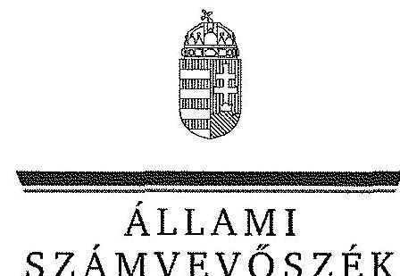
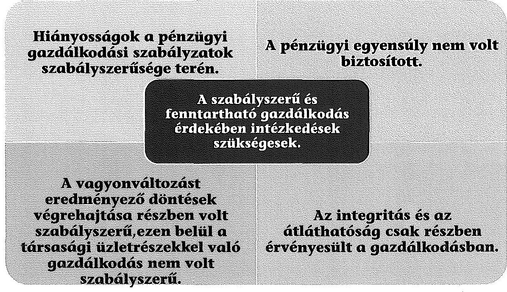
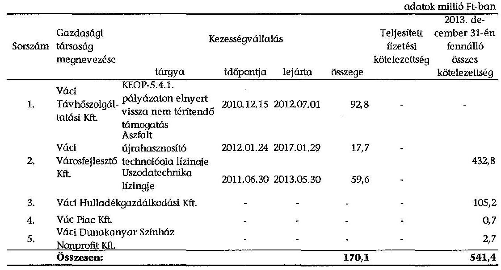
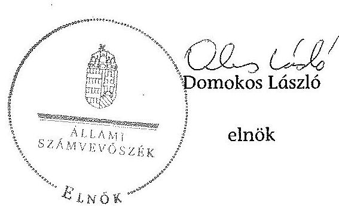
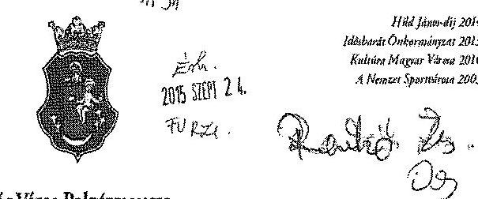
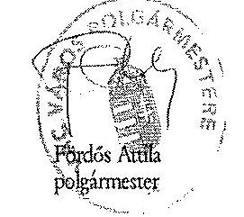
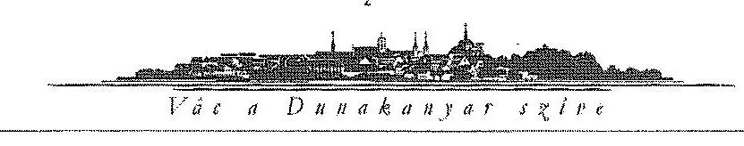
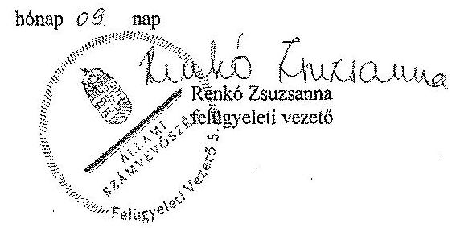

ÁLLAMI
SZÁMVEVŐSZÉK

# JELENTÉS 

az önkormányzatok pénzügyi és vagyongazdálkodása szabályszerűségének ellenőrzéséről

Vác

---

# Állami Számvevőszék 

Iktatószám: V-0649-145/2015.
Témaszám: 17
Vizsgálat-azonosító szám: V069101

## Az ellenőrzést felügyelte:

## Renkó Zsuzsanna

felügyeleti vezető
Az ellenőrzés végrehajtásáért felelős és az ellenőrzést vezette:
Dér Lívia
ellenőrzésvezető
A számvevőszéki jelentés összeállításában közremúködött:
Szudi Ferencné
számvevő
Az ellenőrzést végezték:

Farkas László
számvevő tanácsos
Unger Ferenc
számvevő
Zachár Péterné
számvevő tanácsos

Dr. Podonyi László
számvevő főtanácsos
Winter Zsuzsa
számvevő főtanácsos

---

# TARTALOMJEGYZÉK 

BEVEZETÉS ..... 3
I. ÖSSZEGZŐ MEGÁLLAPÍTÁSOK, KÖVETKEZTETÉSEK, JAVASLATOK ..... 6
II. RÉSZLETES MEGÁLLAPÍTÁSOK ..... 14

1. Az erőforrásokkal való szabályszerű és hatékony gazdálkodáshoz szükséges követelmények kialakítása, számonkérése, ellenőrzése ..... 14
1.1. Az előirányzatokkal, a létszámmal, a vagyonnal való gazdálkodás szabályainak, követelményeinek kialakítása ..... 14
1.2. Az erőforrásokkal való szabályszerű, hatékony gazdálkodás követelményeinek számonkérése, ellenőrzése ..... 16
2. A pénzügyi gazdálkodás szabályszerűsége, a pénzügyi egyensúly biztosítottsága ..... 16
2.1. A költségvetési tervezés és az éves költségvetési beszámolás szabályszerűsége ..... 16
2.2. Az Önkormányzat fizetőképességének fenntartása, a pénzügyi egyensúly biztosítása ..... 17
3. A vagyongazdálkodási tevékenység szabályossága ..... 22
3.1. A vagyongazdálkodási tevékenység kereteinek kialakítása ..... 22
3.2. A vagyonnyilvántartás szabályszerűsége ..... 24
3.3. A vagyon leltározása ..... 25
3.4. A vagyonváltozásokat eredményező döntések szabályszerűsége ..... 25
3.5. A tartós részesedésekkel való gazdálkodás, az önkormányzati tulajdonosi jog gyakorlása ..... 28
4. Integritás érvényesülése ..... 31

## MELLÉKLETEK

1. számú Vác Város Önkormányzata feladatellátásában résztvevő intézmények és azok változása az ellenőrzött időszakban
2. számú Vác Város Önkormányzata bevételei, kiadásai, valamint adósságszolgálata a 2011-2013. években
3. számú Vác Város Önkormányzata mérlegadatai a 2011-2013. években
4. számú Vác Város Önkormányzata tartós részesedéseinek portfóliója a 2011-2013. években
5. számú Vác Város Önkormányzata polgármesterének a jelentéstervezet megállapításaira tett észrevétele
6. számú Az ÁSZ válasza Vác Város Önkormányzata polgármesterének a jelentéstervezet megállapításaira tett észrevételére

---

# FÜGGELÉKEK 

1. számú Fogalomtár
2. számú Rövidítések jegyzéke

---

# JELENTÉS 

## az önkormányzatok pénzügyi és vagyongazdálkodása szabályszerűségének ellenőrzéséről Vác

## BEVEZETÉS

Az ÁSZ stratégiai célkitűzése, hogy ellenőrzéseivel mind jobban segítse az átláthatóságot, az elszámoltathatóságot és elszámoltatást a közpénzekkel és a közvagyonnal való gazdálkodásban. Magyarország Alaptörvénye rögzíti, hogy az állam és a helyi önkormányzat tulajdona a nemzeti vagyon része. Az önkormányzati vagyon alapvető funkciója, hogy a közérdeket és egyúttal az önkormányzati célok - elsősorban a kötelezően ellátandó feladatok, és emellett a lehetőségek mértékéig az önként vállalt feladatok - megvalósítását szolgálja.

Az államháztartás önkormányzati alrendszerének közpénz felhasználása, az önkormányzatok által ellátott közfeladatok és önként vállalt feladatok sokrétűsége, valamint a feladatellátásához rendelt vagyon nagyságrendje indokolja, hogy az ÁSZ ellenőrzéseket folytasson a pénzügyi és vagyongazdálkodás területén. Az ÁSZ az önkormányzatok ellenőrzését a pénzügyi helyzet megítélésével indította el 2011-ben és a nagy vagyonnal rendelkező, magas kockázatú önkormányzatok esetében a vagyongazdálkodás ellenőrzésével folytatta. Az elmúlt három év ellenőrzéseinek tapasztalatai megmutatták, hogy indokolt az egyrészt elemző, értékelő, a pénzügyi helyzet kockázatát is minősítő, másrészt a pénzügyi és vagyongazdálkodási tevékenység szabályszerűségét komplexen értékelő ÁSZ ellenőrzések folytatása.

Az ellenőrzés célja annak megállapítása volt, hogy kialakított-e az önkormányzat az erőforrásokkal való szabályszerű és hatékony gazdálkodáshoz szükséges követelményeket, megvalósította-e azok számon kérését, ellenőrzését; az önkormányzat pénzügyi és vagyoni helyzetének, a gazdálkodás szabályosságának megítélése a költségvetési tervezés, a pénzügyi egyensúly megteremtése, az éves költségvetési beszámolás, a vagyongazdálkodás, a vagyon számbavétele, és a gazdasági események elszámolása és a pénzgazdálkodás szabályszerűsége alapján.

Ennek keretében értékeltük, hogy az önkormányzat:

- pénzügyi gazdálkodása megfelelt-e a jogszabályokban és a belső szabályzataiban meghatározottaknak, biztosított volt-e a pénzügyi egyensúly;
- biztosította-e a vagyongazdálkodás szabályszerűségét, a vagyonváltozást eredményező döntéseket szabályszerűen hajtotta-e végre, gondoskodott-e a tulajdonosi jogok gyakorlásáról;

---

- a gazdálkodása során biztosította-e az átláthatóság és az integritás érvényesülését.

Az ellenőrzés várható hasznosulása: az ellenőrzés várhatóan hozzájárul az önkormányzatok pénzügyi helyzetének pontosabb megítéléséhez azáltal, hogy a pénzügyi és vagyoni helyzetet együtt értékeli. Bemutatja az adósságkonszolidáció önkormányzat általi végrehajtásának szabályszerűségét. Feltárja az önkormányzati gazdálkodást meghatározó szabályozások összhangjának esetleges hiányosságait, a szabályozással nem érintett gazdálkodási területeket, és a vagyongazdálkodási tevékenység gyakorlásának szabálytalanságait. A jó gyakorlat kialakításán és terjesztésén keresztül az ellenőrzések elősegíthetik az önkormányzati gazdálkodás szabályszerűségének javítását.

Az ellenőrzés típusa: szabályszerűségi ellenőrzés
Az ellenőrzött időszak: 2011. január 1-jétől 2013. december 31-ig. A pénzintézetekkel szembeni kötelezettségek állományának vizsgálatakor az ellenőrzött időszakban fennálló kötelezettségeket vettük figyelembe. A vagyonnyilvántartások egyezőségét, a leltározás, selejtezés folyamatát a 2013. évre vonatkozóan értékeltük.

# Ellenőrzött szervezet: Vác Város Önkormányzata 

Az ellenőrzés végrehajtásának jogszabályi alapját az ÁSZ tv. 1. § (3) bekezdése, az 5. § (2)-(6) bekezdései, valamint az Áht. 2 61. § (2) bekezdésének előírásai képezik.

Az ellenőrzés szakmai módszertana az ÁSZ hivatalos honlapján közzétett szakmai szabályokon alapult, amely a Legfőbb Ellenőrző Intézmények Nemzetközi Szervezete (INTOSAI) által kiadott nemzetközi standardok (ISSAI) figyelembevételével készült.

Az alkalmazott egyes fogalmak magyarázatát az 1. számú függelék, a rövidítések jegyzékét a 2. számú függelék tartalmazza.

Az ellenőrzést az ÁSZ hatályos szervezeti szabályai és az ellenőrzési programban foglalt értékelési szempontok szerint folytattuk le. Megállapításainkat a helyszíni ellenőrzés tapasztalataira, az ellenőrzött szervezettől bekért dokumentumokra, a kitöltött tanúsítványok elemzésére, az adott időszakban hatályos jogszabályok és belső szabályzatok előírásaira alapoztuk.

Az Önkormányzat vagyonváltozását eredményező döntések és azok végrehajtásának ellenőrzése, szabályszerűségének megítélése kockázatalapú mintavételen, valamint tételes ellenőrzésen keresztül történt. Tételesen ellenőriztük a részesedések értékelését és az előirányzatok módosítását. Kockázatalapú mintavétel alapján (évente a 2-4 legnagyobb értékű tétel került kiválasztásra) ellenőriztük a térítés nélküli tulajdonjog átruházását, a beruházásokat, felújításokat, a vagyonértékesítéseket, a vagyonhasznosítást, a követelések elengedését és a behajthatatlan követelések leírását és egy vagyonkezelői jog alapítását.

Vác város lakosainak száma 2013. január 1-jén 34876 fő volt. A 15 tagú Képvi-selő-testület munkáját 5 állandó bizottság segítette. A polgármester a 2010. évi

---

önkormányzati választás óta tölti be tisztségét, a jegyző 2013. március 1-jétől látja el feladatait. A Polgármesteri hivatal 8 szervezeti egységre tagolódott, elkülönített gazdasági szervezettel 2013. október 18-ától rendelkezett. A pénzügyigazdálkodási feladatokat a Pénzügyi és Adó Osztály látta el. A foglalkoztatott köztisztviselők száma 2013. december 31-én 75 fő volt.

Az ellenőrzött időszakban az Önkormányzat által ellátott feladatok, valamint a feladatellátásban részt vevő intézmények és gazdasági társaságok körében jelentős mértékű változások történtek. A 2011. év elején a Polgármesteri hivatal mellett tizennégy önállóan múködő és gazdálkodó és tizenkét önállóan múködő költségvetési szerv volt. Az Önkormányzat két társulásban vett részt, hét gazdasági társaságban rendelkezett üzletrésszel, továbbá három gazdasági társaság részvényeivel rendelkezett.

Az ellenőrzött időszakban a költségvetési szervek száma az átszervezések, megszüntetések, állami és egyházi fenntartásba adás miatt tizenkettőre, a társulások száma egyre csökkent. A gazdasági társaságok összetétele az értékesítés, átszervezés, alapítás miatt változott, számukban azonban változás nem történt. Az Önkormányzatnak 2013. év végén három gazdasági társaságban kizárólagos, egy gazdasági társaságban többségi tulajdona volt, három gazdasági társaságban kisebbségi részesedéssel, továbbá két gazdasági társaság részvényeivel rendelkezett.

Az ellenőrzött időszakban az Önkormányzat feladatellátásában résztvevő költségvetési szerveket és azok változását a jelentéstervezet 1. számú melléklete mutatja be.

Az Önkormányzat könyvviteli mérleg szerinti vagyona 2013. december 31-én 21220,8 millió Ft volt, 3097,3 millió Ft-tal 12,7 \%-kal csökkent az ellenőrzött időszakban. Az adósságállomány értéke 2011. január 1-jén 9,5 millió Ft volt. Az adósságállomány 2012. december 31-ére 1571,9 millió Ft-ra nőtt, amelyből az adósságkonszolidáció két ütemében 1561,0 millió Ft adósságállomány került átvállalásra. Az Önkormányzat a 2013. évi költségvetési beszámolója szerint 5670,5 millió Ft költségvetési bevételt ért el és 5534,7 millió Ft költségvetési kiadást teljesített. A felhalmozási célú kiadások összege 2013-ban 204,7 millió Ft volt, melyből felújításokra és beruházásokra 189,4 millió Ft-ot fordítottak.

Az ÁSZ tv. 29. § (1) bekezdése szerint a jelentéstervezetet megküldtük a polgármester részére, aki az ÁSZ tv. 29. § (2) bekezdésében foglalt észrevételezési jogával élt, a jelentéstervezet megállapításaira észrevételt tett.

---

# I. ÖSSZEGZŐ MEGÁLLAPÍTÁSOK, KÖVETKEZTETÉSEK, JAVASLATOK 

Az Önkormányzat folyó költségvetése a múködőképesség megőrzését szolgáló kiegészítő támogatásokkal együtt sem volt egyensúlyban, a müködési kiadások fedezetét áthidaló hitel, folyószámlahitel, illetve adósságmegújító hitel igénybevételével biztosították. A müködési jövedelem folyamatos hiányt mutatott, amely nem fedezte a 2011-2013. években az adósságszolgálat finanszírozását. Az Önkormányzat vagyona a három év alatt 3097,3 millió Ft-tal ( $12,7 \%$-kal) csökkent az állami feladatátadásokkal kapcsolatos eszközátadások következtében, mivel a végrehajtott fejlesztések összege kevesebb volt az eszközátadásoknál. Kiemelten kockázatos volt az Önkormányzat vagyonváltozást - ezen belül a tartós részesedések értékesítését - érintő döntéseinek szabályszerűsége, a gazdálkodásra vonatkozó szabályzatok hiányosságai és a törvényi előírások megsértése miatt.

## Az ÁSZ ellenőrzés megállapításainak összegzése:

Az erőforrásokkal való szabályszerú és hatékony gazdálkodás kereteinek kialakítása nem történt meg teljes körűen, mivel érvényes hivatali SZMSZ-el, gazdálkodási jogkörök gyakorlásának rendjét rögzítő szabályzattal, számviteli politikával, értékelési, leltározási, és pénzkezelési szabályzatokkal az ellenőrzött időszak egy részében nem rendelkeztek, a gazdasági szervezet ügyrendjét nem készítették el. Nem szabályozták a belföldi és külföldi kiküldetések elrendelésével és lebonyolításával, elszámolásával kapcsolatos kérdéseket, az anyag- és eszközgazdálkodás számviteli politikában nem szabályozott kérdéseit, a reprezentációs kiadások felosztását, azok teljesítésének és elszámolásának szabályait, a vezetékes és rádiótelefonok használatát. Az ellenőrzési nyomvonal rendszeres aktualizálásáról nem gondoskodtak. A hatékony gazdálkodás érdekében a gazdasági programban és az éves költségvetéseket megalapozó tervezési folyamatban a

---

Képviselő-testület célokat határozott meg, amelyek teljesítéséről a költségvetések féléves és háromnegyed éves végrehajtásáról, továbbá a zárszámadási rendeletek megalkotásához kapcsolódó előterjesztésekben számoltak be. A belső ellenőrzés 2011-2013. években ellenőrizte az erőforrásokkal való szabályszerű és hatékony gazdálkodás követelményeinek érvényre jutását.

A pénzügyi gazdálkodás során a költségvetési kiadásokat a költségvetésben megállapított kiemelt kiadási előirányzatok mértékéig teljesítették, a költségvetés tervezése és az előirányzat módosítás szabályszerű volt.

Az Önkormányzat pénzügyi egyensúlya a 2011-2013. években a saját hatáskörben megtett bevételnövelő és kiadáscsökkentő intézkedések, valamint a feladatellátásban bekövetkezett változások pozitív hatása ellenére nem volt biztosított. A fizetőképességét folyamatos folyószámlahitel igénybe vételével biztosította. A működőképességének megőrzéséhez 2011-2013. között összesen 960,5 millió Ft vissza nem térítendő támogatásban részesült. A kiegészítő támogatástól való függés a pénzügyi stabilitás hiányát jelzi, a likvid hitelek tartóssá válása miatt fennáll az adósságállomány újratermelődésének kockázata. Az adósságkonszolidáció I. ütemében az állam 857,9 millió Ft adósságot vállalt át. Az Önkormányzat lejárt szállítói állománya az ellenőrzött időszakban folyamatosan csökkent, 60 napon túl lejárt szállítói tartozás a 2012. és a 2013. év végén nem volt. A követelések behajtására intézkedéseket tettek, azonban a lejárt vevőkövetelések állománya az ellenőrzött időszakban jelentősen, 96,9\%-kal emelkedett, a 2013. év végén 187,1 millió Ft volt. Az Önkormányzatnál a pénzügyi egyensúlyt befolyásoló kockázatok beazonosítása, felmérése elmaradt, azok mérséklésére nem intézkedtek.

A vagyongazdálkodás szabályozási kereteinek kialakítása a jogszabályi előírásoknak részben felelt meg. Az Önkormányzat vagyonával való gazdálkodásra vonatkozó előírásokat, feladat- és hatásköröket vagyonrendeletben szabályozták. Nem határozták meg azonban az ingyenes átengedés és a vagyonkezelői jog létesítésének, ellenértékének és a vagyonkezelés ellenőrzésének részletes szabályait.

A számviteli nyilvántartás szerinti ingatlanvagyon, az ingatlanvagyon kataszter és a földhivatali ingatlan-nyilvántartás egyezőségét biztosították. A költségvetési beszámolóban kimutatott eszközöket és forrásokat - a 2013. évben egy intézmény kivételével - leltárral alátámasztották, az elmaradt leltár miatt azonban az eredményszemléletű számvitel bevezetéséhez kapcsolódó feladatok végrehajtása nem volt teljes körű. A vagyonváltozásokat eredményező döntések szabályszerűsége részben volt biztosított, nem tettek eleget az üzemeltetési szerződések jogszabályban meghatározott közzétételi kötelezettségnek, továbbá az ellenőrzött fejlesztésekhez kapcsolódó kiadások teljesítése során hét fejlesztésnél a teljesítés igazolás és érvényesítés kulcskontrollok múködésében hiányosságok fordultak elő. Az Önkormányzat egyes vagyonhasznosításhoz és a tartós részesedések értékesítéséhez kapcsolódó döntései - három gazdasági társaság üzletrészeinek 1 Ft-os értéken való értékesítései - során nem tartotta be a jogszabályi előírásokat, az adásvételi szerződéseket versenyeztetés nélkül kötötték meg.

Az Önkormányzat gazdasági társaságait - a településüzemeltetési feladatok hatékonyabb ellátásának szándékával - 2011-ben elismert vállalatcsoportba

---

szervezte. A tulajdonosi joggyakorlása, tulajdonosi felügyelete, képviselete és beszámoltatása az átalakulást követően szabályszerű volt.

Az Önkormányzat gazdálkodása során nem biztosította maradéktalanul az átláthatóság és az integritás érvényesülését.

Az ÁSZ tv. 33. § (1) bekezdésében foglaltak értelmében az ellenőrzött szervezet vezetője köteles a jelentésben foglalt megállapításokhoz kapcsolódó intézkedési tervet összeállítani, és azt a jelentés kézhezvételétől számított harminc napon belül az ÁSZ részére megküldeni. Amennyiben az intézkedési tervet határidőn belül nem küldi meg a szervezet vezetője, vagy az továbbra sem elfogadható, az ÁSZ elnöke a hivatkozott törvény 33. § (3) bekezdés a-b) pontjaiban foglaltakat érvényesítheti.

# Az ellenőrzés intézkedést igénylő megállapításai és javaslatai: 

## a polgármesternek

1. A 2011-2013. években a folyó költségvetés a működőképesség megőrzését szolgáló támogatások és a saját hatáskörben megtett bevételnövelő és kiadáscsökkentő intézkedések révén sem volt egyensúlyban, a fizetőképesség a kiegészítő támogatások mellett áthidaló, folyószámla és adósságmegújító hitelekkel volt biztosítható. Az adósságkonszolidációs támogatás ellenére a nettó működési jövedelme az ellenőrzött időszak egészében negatív volt. Az Önkormányzat gazdasági társaságainak kötelezettségei növekedtek. A működési hiány tartóssá válása esetén fennáll a likvid hitelállomány újratermelődésének veszélye. A kiegészítő támogatások, a szállítói állomány, a gazdasági társaságok kötelezettségei miatti kockázat továbbra is fennáll, a pénzügyi egyensúlyra gyakorolt hatásuk miatti kockázat jelentős.

Javaslat:
Terjessze a Képviselő-testület elé az Önkormányzat aktuális pénzügyi egyensúlyi helyzetének elemzésén alapuló döntési javaslatát a működési egyensúly megteremtését biztosító további intézkedések bevezetéséről.
2. Az Önkormányzatnál az ellenőrzött időszakban a vagyonrendeletet érintően több szabályozásbeli hiányosságot állapított meg az ellenőrzés.
a) A képviselő-testület az ellenőrzött időszakban az Ötv. 80/B. §-ában és a Mötv. 109. § (4) bekezdésben foglalt előírás ellenére nem határozta meg a vagyonkezelés ellenőrzésének részletes szabályait, továbbá a Mötv. 109. § (4) bekezdésben foglalt előírás ellenére a vagyonkezelői jog ellenértékét. 2012. január 1-jétől a Mötv. 143. § (4) bekezdés i) pontjában foglalt felhatalmazással nem élt és rendeletben nem határozta meg azon vagyonelemeket, amelyekre vagyonkezelői jog létesíthető.

Javaslat:
Terjessze a Képviselő-testület elé a - jegyző által elkészített - rendelet tervezetét, amelyben meghatározzák azt a vagyoni kört, amelyre vagyonkezelői jog létesíthető, továbbá a vagyonkezelői jog ellenértékének és a vagyonkezelés ellenőrzésének részletes szabályait.

---

b) A Képviselő-testület az ellenőrzött időszakban a vagyonrendeletében az Áht. 108. § (2) bekezdésében és a Mötv. 109. § (4) bekezdésében foglaltakat figyelmen kívül hagyva nem határozta meg az ingyenes átengedés szabályait.

Javaslat:
Terjessze a Képviselő-testület elé a - jegyző által elkészített - jogszabályi előírásoknak megfelelő rendelet tervezetét, amely tartalmazza a vagyon ingyenes átengedésére vonatkozó előírások meghatározását.
3. Az ÁSZ ellenőrzés - figyelemmel a jegyzőnek tett javaslatokra - a vagyonnal való gazdálkodásra vonatkozó önkormányzati rendeletben foglalt előírások megfelelősége, a jogszabályban előírt belső szabályzatok kialakítása, a kockázatkezelési rendszer müködtetése és az ellenőrzési nyomvonal aktualizálása, a számviteli és a vagyonnal kapcsolatos nyilvántartási kötelezettségek teljesítése, a vagyonkimutatás megfelelősége, a vagyongazdálkodás szabályszerűsége, valamint a közzétételi kötelezettség tekintetében hiányosságokat, illetve az előírásoknak nem megfelelő gyakorlatot tárt fel.

Javaslat:
Intézkedjen a feltárt hiányosságok és szabálytalanságok tekintetében a munkajogi felelősség kivizsgálására irányuló eljárás megindítása iránt, és az eljárás eredményének ismeretében tegye meg a szükséges intézkedéseket.

# a jegyzőnek 

1. Az Önkormányzatnál az ellenőrzött időszakban a vagyonrendeletet érintően több szabályozásbeli hiányosságot állapított meg az ellenőrzés.
a) A képviselő-testület az ellenőrzött időszakban az Ötv. 80/B. §-ában és a Mötv. 109. § (4) bekezdésben foglalt előírás ellenére nem határozta meg a vagyonkezelés ellenőrzésének részletes szabályait, továbbá a Mötv. 109. § (4) bekezdésben foglalt előírás ellenére a vagyonkezelői jog ellenértékét. 2012. január 1-jétől a Mötv. 143. § (4) bekezdés i) pontjában foglalt felhatalmazással nem élt és rendeletben nem határozta meg azon vagyonelemeket, amelyekre vagyonkezelői jog létesíthető.

Javaslat:
Készítse elő a rendelet tervezetét, amelyben meghatározzák azt a vagyoni kört, amelyre vagyonkezelői jog létesíthető, továbbá a vagyonkezelői jog ellenértékének és a vagyonkezelés ellenőrzésének részletes szabályait.
b) A Képviselő-testület az ellenőrzött időszakban a vagyonrendeletében az Áht. 108. § (2) bekezdésében és a Mötv. 109. § (4) bekezdésében foglaltakat figyelmen kívül hagyva nem határozta meg az ingyenes átengedés szabályait.

Javaslat:
Készítse elő a jogszabályi előírásoknak megfelelő rendelet tervezetét, amely tartalmazza a vagyon ingyenes átengedésére vonatkozó előírások meghatározását.

---

2. A Polgármesteri hivatalnál a 2013. október 18-tól hatályos hivatali SZMSZ-ben a költségvetési szervezet gazdasági szervezeteként a Pénzügyi és Adó Osztályt jelölték ki, azonban az Ávr. 9. § (5) bekezdésében foglaltak ellenére a gazdasági szervezet nem rendelkezett ügyrenddel.

Javaslat:
Intézkedjen, hogy a gazdasági szervezet feladatait ellátó szervezeti egység rendelkezzen a jogszabályi előírásoknak megfelelően ügyrenddel.
3. A Polgármesteri Hivatalnál az ellenőrzött időszakban több pénzügyi-gazdálkodási területet érintő szabályozásbeli hiányosságot állapított meg az ellenőrzés.
a) A jegyző az ellenőrzött időszakban a Htv. 140. § (1) bekezdés c) pontjában foglaltak ellenére nem alakította ki az Önkormányzat költségvetési intézményeinek számviteli rendjét.

Javaslat:
Intézkedjen - a jogszabályban foglalt előírásra figyelemmel - az Önkormányzat intézményei számviteli rendjének kialakításáról.
b) Nem szabályozták a belföldi és külföldi kiküldetések elrendelésével és lebonyolításával, elszámolásával kapcsolatos kérdéseket, az anyag- és eszközgazdálkodás számviteli politikában nem szabályozott kérdéseit, a reprezentációs kiadások felosztását, azok teljesítésének és elszámolásának szabályait, a vezetékes és rádiótelefonok használatát. Ezzel nem tartották be az Ámr. 20. § (3) bekezdés c-d), f), h), valamint az Ávr. 13. § (2) bekezdés (c), (d),(e), (g) pontjait.

Javaslat:
Intézkedjen a jogszabályi előírásoknak megfelelően a belföldi és külföldi kiküldetések elrendelésével és lebonyolításával, elszámolásával kapcsolatos kérdéseinek, az anyagés eszközgazdálkodás számviteli politikában nem szabályozott területeinek, a reprezentációs kiadások felosztásának, azok teljesítésének és elszámolásának, a vezetékes és rádiótelefonok használatának szabályozásáról.
4. A Polgármesteri Hivatalnál a számviteli politikát, ennek keretében az értékelési szabályzatot, a pénzkezelési szabályzatot, a leltározási szabályzatot az Áhsz. 1 8. § (12) bekezdésében foglaltak ellenére nem a jegyző, mint a költségvetési szerv vezetője, hanem a polgármester hagyta jóvá. Az önkormányzat és költségvetési szervei beszerzéseivel kapcsolatos eljárásrendet az Áht. 1 121/A. § (1) bekezdése, illetve az Ávr. 13. § (2) bekezdés b.) pontja előírása ellenére szintén nem a jegyző, hanem a polgármester írta alá.

Javaslat:
Biztosítsa, hogy a számviteli politika, az értékelési szabályzat, a pénzkezelési szabályzat, a leltározási szabályzat, az önkormányzat és költségvetési szervei beszerzéseivel kapcsolatos eljárásrend szabályozása a jogszabályi előírásoknak megfelelően történjen, azok kiadmányozásáról, mint a költségvetési szerv vezetője intézkedjen.

---

5. A Polgármesteri Hivatalnál kialakították - az ellenőrzés időszakában - a költségvetési tervezés nyomvonalát. A jegyző - az Ámr. 156. § (2) bekezdésében, illetve a Bkr. 6. § (3) bekezdésében foglaltak ellenére - a Polgármesteri hivatal ellenőrzési nyomvonalának rendszeres aktualizálásáról azonban nem gondoskodott.

Javaslat:
Intézkedjen - a jogszabályban előírtaknak megfelelően - a Polgármesteri hivatal ellenőrzési nyomvonalának rendszeres aktualizálásáról.
6. A kockázatkezelési rendszer keretében - a 2011. évben az Áht ${ }_{1} 121 . \S$ (2) bekezdés b.) pontjában, Ámr. 157. § (1)-(3) bekezdéseiben, a 2012-2013. években a Bkr. 7. § (1)(2) bekezdéseiben foglaltak ellenére - elmaradt a pénzügyi egyensúlyt befolyásoló kockázatok felmérése, a kockázatok mérséklése érdekében nem határozták meg a szükséges intézkedéseket.

Javaslat:
Működtessen a jogszabályi előírásoknak megfelelő, a pénzügyi egyensúlyt befolyásoló kockázatok kezelésére alkalmas kockázatkezelési rendszert.
7. A Polgármesteri hivatalnál az ellenőrzött időszakban figyelmen kívül hagyták a vagyonrendelet 23/A. § (5) bekezdésében foglaltakat, mert a követelésről való lemondás tárgyában tett intézkedésekről a Képviselő-testületnek az éves pénzügyi beszámolóval egy időben előírt beszámolási kötelezettség teljesítését elmulasztották.

Javaslat:
Intézkedjen arról, hogy a követelésről való lemondás tárgykörében meghozott intézkedésekről a vagyonrendeletben előírtaknak megfelelően történjék meg a beszámolási kötelezettség teljesítése.
8. Az Áhsz. 38. § (6) bekezdése n) pontjában foglalt előírás ellenére a 2011-2013. évi költségvetési beszámoló tájékoztató adatai között - az 53. űrlapon - nem mutatták be a behajthatatlan követelésként leírt összegeket.

Javaslat:
Intézkedjen arról, hogy a behajthatatlan követelésként leírt összegek a költségvetési beszámoló tájékoztató adatai között a jogszabályi előírásoknak megfelelően kimutatásra kerüljenek.
9. A Polgármesteri hivatalnál az ellenőrzött időszakban a vagyonkimutatás készítésének kötelezettségét érintően hiányosságokat állapított meg az ellenőrzés.
a) A 2011-2013. évi vagyonkimutatások - az Áhsz. 44/A. § (3) bekezdésében foglaltak ellenére - nem tartalmazták a 0 -ra leírt eszközök részletezését a használatban, illetve használaton kívül lévő vagyonelemekre, továbbá elmaradt az Önkormányzat tulajdonában lévő, a jogszabály alapján érték nélkül nyilvántartott eszközök állományának 2011-2013. évi vagyonkimutatásokban történő szerepeltetése.

---

Javaslat:
Intézkedjen a vagyonkimutatás jogszabályi előírás szerinti részletezésnek megfelelő elkészítéséről.
b) A 2012-2013. évi vagyonkimutatások tagolása nem felelt meg az Áhsz 44/A. § (2) bekezdésében, valamint a vagyonrendelet 1. számú melléklete által előírt szerkezeti tagolásnak, mert nem tartalmazták a forgalomképtelen vagyon kizárólagos Önkormányzati tulajdonban álló vagyon és a nemzetgazdasági szempontból kiemelt jelentőségű vagyon szerinti elkülönítését. A vagyonrendelet 1. számú melléklete az egyéb tartós részesedések bemutatására a kizárólagos és nem kizárólagos Önkormányzati tulajdonban levő kategóriák szerinti elkülönítést írta elő, ezzel szemben a 2012-2013 évi vagyonkimutatások üzletrészek és részvények szerinti bontást tartalmaztak.

Javaslat
Intézkedjen arról, hogy a vagyonkimutatás feleljen meg a jogszabálynak, valamint a vagyonrendelet 1. számú melléklete által előírt szerkezeti tagolásnak.
10. A Polgármesteri hivatalnál az ellenőrzött időszakban a vagyonnyilvántartással összefüggő számviteli hiányosságokat is megállapított az ellenőrzés.
a) A Polgármesteri hivatalnál a 2013. évben az összevont önkormányzati beszámoló mérlegében az eszközök és források leltárral való alátámasztása az Áhsz. 1 37. § (1)(2) bekezdésben előírtak ellenére nem volt teljes körű, mert a Múzeumnál elmaradt az év végi leltározás. Ennek következtében nem volt biztosított az eredményszemléletű számvitel bevezetéséhez kapcsolódó, a 36/2013.(IX.13.) NGM rendelet 2. § (1) bekezdésében foglalt feladatok maradéktalan végrehajtása sem.

Javaslat:
Intézkedjen az éves beszámolók könyvviteli mérlegeiben kimutatott eszközök és források valódiságának december 31-i fordulónappal készült teljes körű, a jogszabályi előírásoknak megfelelő leltárral történő alátámasztásáról.
b) A Polgármesteri hivatalnál a végelszámolás alá került Naszály-Galga Nonprofit Kft.nél 2012. évtől, a tartósan negatív saját tőkeérték ellenére nem számolta el értékvesztésként az 1,0 millió Ft értékű üzletrészét, amely nem felelt meg a Számv. tv. 54. § (1) bekezdése és (2) bekezdés b) pontja, az Áhsz. 27. § (2) bekezdése és 31. § (1) bekezdés előírásainak.

Javaslat:
Intézkedjen a mérlegben kimutatott részesedések jogszabályi előírások szerinti értékeléséről, az értékelés eredményének számviteli nyilvántartásokban való elszámolásáról.
c) A három közvilágításhoz kapcsolódó térítésmentes vagyonátadásról - mint gazdasági műveletről - a Számv. tv. 165. § (1) bekezdésekben megfogalmazottak ellenére bizonylatot nem állítottak ki.

---

Javaslat:
Intézkedjen arról, hogy minden gazdasági múveletről, amely az eszközök, illetve az eszközök forrásának állományát vagy összetételét megváltoztatja a jogszabályi előírásoknak megfelelő bizonylat készüljön.
11. A Polgármesteri hivatalnál az ellenőrzött időszakban két üzemeltetési szerződést kötöttek vízgazdálkodási célú ingatlanok és gyepmesteri telep üzemeltetése vonatkozásában, amelyekkel kapcsolatban az Önkormányzat közzétételi kötelezettségének - a 2011. évben az Áht. 105/B. § (1) bekezdésében, valamint az Eisztv. 6. § (1) bekezdésében és mellékletének III/4. pontjában, a 2012-2013. években az Info tv. 37. § (1) bekezdésében és 1. számú mellékletének III/4. pontjában foglaltakat megsértve - nem tett eleget.

Javaslat:
Biztosítsa, hogy az Önkormányzat jogszabályban előírt közzétételi kötelezettségének maradéktalanul tegyenek eleget.

---

# II. RÉSZLETES MEGÁLLAPÍTÁSOK 

## 1. AZ ERŐFORRÁSOKKAL VALÓ SZABÁLYSZERŰ ÉS HATÉKONY GAZDÁLKODÁSHOZ SZÜKSÉGES KÖVETELMÉNYEK KIALAKÍTÁSA, SZÁMONKÉRÉSE, ELLENŐRZÉSE

### 1.1. Az előirányzatokkal, a létszámmal, a vagyonnal való gazdálkodás szabályainak, követelményeinek kialakítása

Az Önkormányzat a 2011-2013. években az erőforrásokkal való szabályszerű és hatékony gazdálkodáshoz szükséges követelményeket nem alakította ki teljes körüen. A Képviselő-testület múködésének részletes szabályait az ellenőrzött időszakban az önkormányzati SZMSZ-ben határozta meg. Az önkormányzati SZMSZ a sajátosságokat figyelembe véve tartalmazta az előirányzatokkal és vagyongazdálkodással kapcsolatos előírásokat. Az önkormányzati SZMSZ rögzítette, hogy a szakmai bizottságok költségvetési kihatású döntéseihez és javaslataihoz megelőzően kötelesek a PÜB, az önkormányzati vagyont érintő kérdésben a GVVB véleményét megkérni. A PÜB és a GVVB részletes feladatait az önkormányzati SZMSZ tartalmazta.

A Polgármesteri hivatal 2011. január 1-je és 2013. október 17-e között az Áht. 91. § (2) bekezdésében, az Áht. 93. § (1) bekezdés a) pontjában, az Áht. 2 9. § (1) bekezdés a) pontjában, továbbá az Áht. 2 10. § (5) bekezdésében foglaltak ellenére nem rendelkezett a feladatainak részletes belső rendjét és módját megállapító, irányító szerv által jóváhagyott szervezeti és múködési szabályzattal. A Polgármesteri hivatal feladatai ellátásának belső rendjét és módját 2011. január 1-je és 2013. október 17-e között a polgármester és a jegyző együttes szabályzatban írták elő, 2013. október 18-ától a Képviselő-testület által jóváhagyott hivatali SZMSZ-ben állapították meg. A hivatali SZMSZ-ben a Polgármesteri hivatal gazdasági szervezeteként a Pénzügyi és Adó Osztályt jelölték ki, azonban a gazdasági szervezet az Ávr. 9. § (5), illetve 13. § (5) bekezdésében foglaltak ellenére nem rendelkezett ügyrenddel.

Az egységes, a Polgármesteri hivatalra és az intézményekre is kiterjedő számviteli rend kialakítása - Htv. 140. § (1) bekezdés c) pontjában foglaltakat figyelmen kívül hagyva - nem történt meg, ezért a jegyző nem biztosított megfelelő keretet az egységes számviteli elvek szerinti beszámoló készítéséhez.

A Polgármesteri hivatal 2012. január 1-től nem rendelkezett érvényes számviteli politikával, értékelési, pénzkezelési és leltározási szabályzatokkal, mivel azokat az Áhsz., 8. § (12) bekezdésében ${ }^{1}$ foglaltak ellenére nem a jegyző, hanem a polgármester hagyta jóvá. Az Önkormányzat és költségvetési szervei beszerzéseivel

[^0]
[^0]:    ${ }^{1}$ 2014. január 1-jétől az Áhsz. 2 31. § (1) és az 50. § (1) bekezdései

---

kapcsolatos eljárásrendet Áht. 121/A. § (1) bekezdés, illetve az Ávr. 13. § (2) bekezdés b) pontja előírása ellenére nem a költségvetési szerv vezetője, a jegyző, hanem a polgármester írta alá.

A Polgármesteri hivatal 2011. január 1-je és 2013. május 31-e között nem rendelkezett érvényes, az operatív gazdálkodási jogkörök (kötelezettségvállalás, utalványozás, teljesítésigazolás, érvényesítés és ellenjegyzés) gyakorlásának rendjét rögzítő szabályzattal, mivel azt nem a jegyző, hanem a polgármester adta ki, ezáltal nem voltak figyelemmel az Áht. 121/A. § (1) bekezdésében és az Ávr. 13. § (2) bekezdés a) pontjában foglaltakra. A szabályzat mellékleteiben a polgármester kijelölte a kötelezettségvállalásra, az ellenjegyzésre, a szakmai teljesítés igazolására, az érvényesítésre és az utalványozásra jogosult személyeket. A szabályzat mellékletében felsorolt személyek vonatkozásában a kijelölések nem feleltek meg a jogszabályban előírt írásbeli kijelölésre vonatkozó feltételeknek. Nem tartalmazták a gazdálkodási jogkörök gyakorlására kijelölt személyek elfogadó nyilatkozatát arról, hogy a jogkör gyakorlására vonatkozó kijelölést tudomásul vették, illetőleg az arra vonatkozó feladatokat és felelősséget megismerték Emiatt a kötelezettségvállalók kijelölései nem tekinthetőek az Ámr. 72. § (8) bekezdésében, az Ávr. 52. § (6) bekezdésében foglalt, az utalványozók kijelölései nem tekinthetők az Ámr. 78. § (1) bekezdésében, az Ávr. 59. § (1) bekezdésében foglalt polgármester általi írásbeli felhatalmazásnak. A kötelezettségvállalás ellenjegyzésére, pénzügyi ellenjegyzésre kijelöltek az Ámr. 74. § (2) bekezdés f) pontjában, az Ávr. 55. § (2) bekezdés f) pontjában foglaltak ellenére, az utalvány ellenjegyzésére kijelölt személyek a 2011. évben az Ámr. 79. § (1) bekezdésében foglaltak ellenére, az érvényesítők az Ámr. 77. § (4) bekezdésében, az Ávr. 58. § (4) bekezdésében foglaltak ellenére nem rendelkeztek a jegyző írásbeli kijelölésével. A teljesítés igazolására jogosultak az Ámr. 76. § (5) bekezdésében, az Ávr. 57. § (4) bekezdésében foglaltak ellenére nem rendelkeztek a jegyző, illetve a kötelezettségvállaló írásbeli kijelölésével. A jegyző és a polgármester a 2013. június 1-jétől hatályos kötelezettségvállalási szabályzatban rögzítette a kötelezettségvállalás, pénzügyi ellenjegyzés, teljesítés igazolása, érvényesítés és utalványozás előírásait. A szabályzat tartalmazta a gazdálkodási jogkörök gyakorlására jogosultak aláírás mintáit és a jogkörök gyakorlására vonatkozó felhatalmazásokat, amelyek átvételét a felhatalmazottak aláírásukkal igazoltak.

A jegyző az ellenőrzött időszakban nem szabályozta a belföldi és külföldi kiküldetések elrendelésével és lebonyolításával, elszámolásával kapcsolatos kérdéseket, az anyag- és eszközgazdálkodás számviteli politikában nem szabályozott kérdéseit, a reprezentációs kiadások felosztását, azok teljesítésének és elszámolásának szabályait, a vezetékes és rádiótelefonok használatát, ezáltal nem volt figyelemmel az Ámr. 20. § (3) bekezdés c-d), f), h), valamint az Ávr. 13. § (2) bekezdés c-d),e), g) pontjaira.

A jegyző elkészítette a gazdálkodás egyes folyamatainak nyomon követhetősége érdekében az ellenőrzési nyomvonalát, de annak rendszeres aktualizálásáról az Ámr. 156. § (2) bekezdésében, illetve a Bkr. 6. § (3) bekezdésében foglaltak ellenére nem gondoskodott.

---

Az Önkormányzat a gazdasági programban rögzítette az önkormányzati feladatellátással kapcsolatos 2011-2014. évekre vonatkozó elképzeléseket, fő irányokat, amelyeket az erőforrásokkal való hatékony gazdálkodás követelményeinek figyelembe vételével állítottak össze. Az éves célkitűzéseket a 2011-2013. évi költségvetési koncepciók, költségvetési rendelettervezetek jóváhagyása során alakították ki. Követelményként az önkormányzati kiadások csökkentését, a bevételek növelését, a racionális, eredményes gazdálkodás és feladatellátás megvalósítását írták elő. A Képviselő-testület a hatékony létszámgazdálkodás megvalósítása érdekében az éves költségvetésekben meghatározta az engedélyezett létszámkereteket.

# 1.2. Az erőforrásokkal való szabályszerű, hatékony gazdálkodás követelményeinek számonkérése, ellenőrzése 

Az erőforrásokkal való hatékony gazdálkodás követelményeinek teljesítéséről a költségvetési rendeletek féléves és háromnegyed éves végrehajtásáról, továbbá a zárszámadási rendeletek megalkotásához kapcsolódó előterjesztések elfogadásakor számoltak be. A 2011-2013. évi zárszámadási rendelet-tervezetek tartalmazták a tervezett, illetve a teljesített előirányzatokkal, a létszám alakulásával kapcsolatos adatokat és szöveges indoklásokat. A rendelet-tervezetek kimutatásai költségvetési szervenként, illetve feladatonként tartalmazták a bevételek és kiadások teljesítését, a létszám alakulását, a tervezett előirányzatok és teljesítések eltérésének okait. Bemutatták a jóváhagyott beruházási és felújítási feladatok kiadásainak alakulását, továbbá az Önkormányzat vagyonában bekövetkezett változásokat.

A jegyző a 2011-2013. években belső ellenőrzési szervezeti egység útján gondoskodott a belső ellenőrzés múködtetéséről. A belső ellenőrzés a Képviselő-testület által elfogadott, kockázatelemzéssel alátámasztott éves ellenőrzési tervek alapján az ellenőrzött időszakban összesen 135 belső ellenőrzést hajtott végre, amelyből 23 vizsgálta az erőforrásokkal való szabályszerű és hatékony gazdálkodás követelményeinek érvényre jutását.

Az Önkormányzat adatszolgáltatása alapján az ellenőrzött időszakban a külső szervek a fejlesztések támogatásával, a központi költségvetésből származó támogatások, hozzájárulások elszámolásával kapcsolatban végeztek ellenőrzéseket. Az Önkormányzat kijavította a megállapított hiányosságokat.

## 2. A PÉNZÜGYI GAZDÁLKODÁS SZABÁLYSZERŰSÉGE, A PÉNZÜGYI EGYENSÚLY BIZTOSÍTOTTSÁGA

### 2.1. A költségvetési tervezés és az éves költségvetési beszámolás szabályszerűsége

Az Önkormányzatnál a költségvetési tervezése az ellenőrzött időszakban - a 2011. évi költségvetési koncepció Képviselő-testület elé terjesztése kivételével szabályszerű volt. A 2011. évi költségvetési koncepcióról az Ámr. 35. § (3) bekezdése előirása ellenére, - mely szerint ahol pénzügyi bizottság múködik, annak a költségvetési koncepció egészéről kell véleményt alkotnia - a PÜB nem alkotott véleményt, így azt a polgármester a koncepció tervezetéhez nem csatolta. A

---

2011-2013. évi költségvetési rendelettervezetek megfelelő szerkezetben és tartalommal készültek, az előterjesztésekhez szöveges indoklással együtt csatolták az előírt tájékoztató mérlegeket és kimutatásokat. Az Önkormányzat és a költségvetési intézmények elemi költségvetéseit az éves költségvetési rendeletek alapján, a kiemelt előirányzati adatok egyezőségét biztosítva készítették el.

A Képviselő-testület az ellenőrzött évekre vonatkozóan 30 alkalommal módosította a költségvetési rendeleteit, a módosítások megfeleltek a jogszabályi előírásoknak. Az előirányzat módosításokat jellemzően az állami és a pályázati támogatások évközi változásai, valamint az önkormányzati feladatok ellátásának változásai indokolták. A rendeletmódosítások során átvezették az intézmények megszűnése, illetve a feladatátadások miatti előirányzat változásokat. Az előirányzatoknál az analitikus és főkönyvi nyilvántartások, valamint a beszámoló egyezősége biztosított volt.

Az Önkormányzatnál 2011-2013. években a költségvetési kiadásokat a költségvetésben megállapított kiemelt kiadási előirányzatok mértékéig teljesítették. A Képviselő-testület által engedélyezett létszámkeretet betartották.

Az ellenőrzött időszakban az Önkormányzatnál a zárszámadást az elfogadott költségvetéssel összehasonlítható módon, az év utolsó napján érvényes szerkezeti, besorolási rendnek megfelelően készítették el. Az éves zárszámadások és a költségvetések adatainak összehasonlíthatóságát biztosították. A polgármester a jogszabályoknak megfelelően az Önkormányzat gazdálkodásának első félévi helyzetéről szeptember 15-éig, háromnegyed éves helyzetéről a költségvetési koncepció ismertetésekor írásban tájékoztatta a Képviselő-testületet.

# 2.2. Az Önkormányzat fizetőképességének fenntartása, a pénzügyi egyensúly biztosítása 

Az Önkormányzat költségvetésének elemzését a CLF módszer szerint végeztük el, amelynek adatait a 2. számú melléklet tartalmazza. A 2013. évi valós jövedelemtermelő képesség bemutatása érdekében az elemzés során nem vettük figyelembe az adósságkonszolidációhoz kapcsolódó bevételeket és kiadásokat. A CLF módszer szerinti 2011-2013. évi főbb önkormányzati adatokat az 1. számú táblázat mutatja be.

---

1. számú táblázat

# Az Önkormányzat pénzügyi egyensúlyi helyzetének főbb adatai 2011-2013. években

|  | Adatok millió Ft-ban |  |  |
| :--: | :--: | :--: | :--: |
| Megnevezés | 2011. év | 2012. év | 2013. év |
| Folyó bevételek | 11929,1 | 8264,4 | 5274,4 |
| Folyó kiadások | 12492,7 | 8765,0 | 5330,0 |
| Folyó költségvetés egyenlege, múködési jövedelem | $-563,6$ | $-500,6$ | $-55,6$ |
| Folyó költségvetés egyenlege múködőképesség megőrzését szolgáló kiegészitő támogatások nélkül | $-606,3$ | $-718,4$ | $-755,6$ |
| Felhalmozási bevételek | 505,3 | 2023,9 | 396,1 |
| Felhalmozási kiadások | 721,4 | 2309,1 | 204,7 |
| Felhalmozási költségvetés egyenlege | $-216,1$ | $-285,2$ | 191,4 |
| Finanszírozási múveletek nélküli (GFS) pozíció | $-779,7$ | $-785,8$ | 135,8 |
| Hitelfelvétel, forgatási és befektetési célú értékpapír kibocsátása, egyéb finanszírozási bevételek | 1584,3 | 1461,2 | 1198,4 |
| Hiteltörlesztés, értékpapír beváltás, egyéb finanszírozási kiadások | 673,9 | 719,0 | 1277,2 |
| Finanszírozási múveletek egyenlege | 910,4 | 742,2 | $-78,8$ |
| Tárgyévi pénzügyi pozíció | 130,7 | $-43,6$ | 57,0 |
| Nettó múködési jövedelem | $-1081,6$ | $-1495,4$ | $-1269,1$ |

A folyó költségvetésének egyenlege (működési jövedelem) az ellenőrzött időszak minden évében negatív volt, a folyó bevételek egyik évben sem fedezték a folyó kiadásokat, a 2011-2013. években összesen 1119,8 millió Ft múködési hiány keletkezett. Az Önkormányzat a 2011-2013. években múködőképességének megőrzésére összesen 960,5 millió Ft vissza nem térítendő támogatásban, ezen belül 217,8 millió Ft ÖNHIKI és 700,0 millió Ft múködő képesség megőrzését szolgáló kiegészítő támogatásban részesült, ezen túlmenően a 2011. évben a 60/2011. (XII. 23.) BM rendelet alapján 42,7 millió Ft hiteltörlesztésre folyósított támogatást kapott. A folyó költségvetésekben a múködőképesség megőrzését szolgáló kiegészítő támogatások nélkül a múködési jövedelem hiánya összesen 2080,3 millió Ft lett volna.

Az Önkormányzat - adatszolgáltatása alapján - az ellenőrzött időszakban a pénzügyi egyensúly biztosítása érdekében bevételnövelő és kiadáscsökkentő intézkedéseket tett. A bevételnövelő intézkedések (idegenforgalmi adó és szemétszállítási díj bevezetése) az ellenőrzött években összesen 94,8 millió Ft bevételnövelést eredményeztek. A kiadáscsökkentő intézkedések (személyi jel-

---

legű kiadáscsökkentés, hulladékgazdálkodási kiadások csökkentése, civil szervezetek részére átadott pénzeszközök csökkentése) hatására 1327,1 millió Ft megtakarítást értek el.

A folyó bevételek és a folyó kiadások 2011-2013 között folyamatosan csökkentek a tűzvédelmi, a fekvő- és járóbeteg-ellátás, továbbá a köznevelési feladatok állami átvétele, és a feladatváltozások következtében. A feladatellátásban bekövetkezett változások pozitív hatása, valamint a saját hatáskörű intézkedések és a kiegészítő támogatások kedvező hatása ellenére a folyó költségvetés egyensúlya az ellenőrzött időszakban nem volt biztosított.

A felhalmozási költségvetés egyenlege a 2011-2012. években negatív volt, a felhalmozási bevételek nem nyújtottak fedezetet a felhalmozási kiadásokra. A felhalmozási hiány összegének változását a felmerült kiadások és a pályázati támogatások ütemkülönbsége alakította. A 2013. évben a felhalmozási költségvetés egyenlege felhalmozási többletet mutatott. A 2011-2012. évi felhalmozási hiányt folyószámlahitellel és kötvény kibocsátásával finanszírozták.

A nettó múködési jövedelem összege az ellenőrzött időszak mindhárom évében negatív volt. A nettó működési jövedelem változását a folyó költségvetés egyenlegének alakulása, valamint a hiteltörlesztés összegének változása befolyásolta. Az Önkormányzat fizetőképességének biztosítása csak folyamatos folyószámlahitel igénybevétellel volt fenntartható. Az Önkormányzat által tartósan - 2011. évben 259 nap, napi átlagos összege 414,4 millió Ft, 2012. évben 363 nap, napi átlagos összege 868,5 millió Ft, 2013. évben 252 nap, napi átlagos összege 747,7 millió Ft - igénybevett folyószámlahitel a banki kitettség kockázatát jelentette. A folyószámla hitelállományt 2013. szeptember 20-án adósságmegújító hitellel váltották ki 604,3 millió Ft összegben. A likviditási problémák megoldására 2011-ben 465,8 millió Ft összegben áthidaló hitelt vettek igénybe.

Az Önkormányzat 2011-2013 között csak egyes időszakokra vonatkozóan rendelkezett likviditási tervvel. A jegyző a 2011. január 1-je és 2011. szeptember 18a közötti időszak pénzállománya alakulásáról az Ámr. 201. § (1) bekezdés előírása, valamint a 2012. január 1-je és 2012. április 11-e, illetve 2013. január 1je és 2013. április 29-e között az Áht. 78. § (2) bekezdés, valamint az Ávr. 122. § (2) bekezdés előírásai ellenére nem készített likviditási tervet, és az elkészített likviditási terveket az Ávr. 122. § (3) bekezdése ellenére nem vizsgálta felül. Az elkészült likviditási tervek havi negatív záró egyenlegei jelezték, hogy nem biztosított a szerződésen és jogszabályon alapuló fizetési kötelezettségek határidőben történő teljesítése.

Az Önkormányzat rövidlejáratú kötelezettségeit a pénzintézeti hitelállomány, a kötvények tárgyévet követő évet érintő törlesztő részletei, a szállítók, és az egyéb rövidlejáratú kötelezettségek jelentették. A rövidlejáratú kötelezettségek az ellenőrzött időszakban - 1893,1 millió Ft-ról 802,5 millió Ft-ra - csökkentek, amelyre hatással volt a Kórház átadásához kapcsolódó szállítói állomány átadás, az adósságkonszolidáció, valamint a rövid lejáratú likvid hitel állomány adósságmegújító hitelre történő átváltása.

Az ellenőrzött időszakban annak ellenére, hogy a forgóeszközök és a rövid-lejáratú kötelezettségek aránya, továbbá a pénzeszközök és a rövidlejáratú kötelezettségek aránya javult, a forgóeszközök, és a pénzeszközök állománya nem

---

nyújtott fedezetet a rövid lejáratú kötelezettségekre, az Önkormányzat és intézményei nem tudtak folyamatosan, határidőben eleget tenni rövidlejáratú fizetési kötelezettségeiknek. A mérleg szerinti szállítói kötelezettség év végi állományán belül 2011-ben 61,0\%-ot, 2012-ben 61,2\%-ot, 2013-ben 26,4\%-ot tettek ki a lejárt szállítói kötelezettségek. E kötelezettségek év végi állománya az ellenőrzött időszakban folyamatosan, a 2011. év végi 1281,6 millió Ft-ról a 2012. év végére 107,2 millió Ft-ra, majd a 2013. év végére 63,8 millió Ft-ra csökkent. A 2011. év végén fennálló lejárt szállítói állomány 95,3\%-a (1221,1 millió Ft) a Kórház lejárt szállítói tartozása volt. Az Önkormányzat 2011. december 31-én 965,1 millió Ft 60 napon túli lejárt szállító tartozással rendelkezett, amelyből 964,3 millió Ft-ot tett ki a Kórház 60 napon túli lejárt szállítói tartozása. A 2012. és a 2013. év végén nem volt 60 napon túli lejárt szállítói tartozás.

Az Önkormányzatnak 2011. év végén 118,9 millió Ft, 2012 év végén 671,2 millió Ft, 2013 év végén 413,2 millió Ft bevételi visszafizetési, visszatérítési kötelezettsége volt, amely a 2011. évet kivéve helyi adó visszafizetési kötelezettségből adódott. A 2011. évben a helyi adó visszafizetési kötelezettség 94,4 millió Ft-ot tett ki. A 2012. évre az előző évhez viszonyítva a helyi adó visszatérítési kötelezettség 576,8 millió Ft összegű növekedése döntően egy adóalany 528,3 millió Ft összegű iparűzési adó túlfizetése miatt keletkezett, amely túlfizetésből a 2013. évben az Önkormányzat 305,2 millió Ft-ot térített vissza.

A követelések behajtására intézkedéseket tettek, de ennek ellenére a határidőn túli vevőkövetelések állományának nagyságrendje és tartóssága növekedett az ellenőrzött időszakban. Az Önkormányzatnál a határidőn túli vevőkövetelések állománya a 2011. január 1. - 2013. december 31. közötti időszakban 95,0 millió Ft-ról 187,1 millió Ft-ra ( $96,9 \%$-kal) emelkedett.

Az Önkormányzatnál a kockázatkezelési rendszer keretében a 2011. évben - az Áht. 121. § (2) bekezdés b) pontjában, az Ámr. 157. § (1)-(3) bekezdésében, a 2012-2013. években a Bkr. 7. § (1)-(2) bekezdésében előírtak ellenére - a pénzügyi egyensúlyt befolyásoló kockázatok beazonosítása, felmérése elmaradt, ezentúl a kockázatok mérséklése érdekében nem határozták meg a szükséges intézkedéseket. A kockázatkezelési rendszer nem terjedt ki a múködési jövedelemtermelő képességgel, a garancia- és kezességvállalásokkal, valamint a többségi tulajdonú gazdasági társaságokkal kapcsolatos, pénzügyi egyensúlyt befolyásoló kockázati tényezőkre.

A nettó múködési jövedelem 2011-2013. évi negatív értéke pénzügyi kapacitáshiányt jelez, a múködési jövedelem nem biztosította az adósságszolgálat finanszírozását. Müködési jövedelemtermelő képesség miatti kockázatot mutatott a működőképesség megőrzését szolgáló kiegészítő támogatások nélküli működési jövedelem ellenőrzött időszaki negatív összege és évenkénti csökkenése.

Az Önkormányzat adatszolgáltatása szerint a 2011. év végén 1210,0 millió Ft, a 2012. év végén 226,1 millió Ft, a 2013. év végén 25,2 millió Ft kezességvállalással ${ }^{2}$ rendelkezett. A kezességvállalás év végi állományából 2011-ben 92,8 millió Ft-ot, 2012-ben 170,1 millió Ft-ot, 2013-ban17,7 millió Ft-ot tett ki a több-

[^0]
[^0]:    ${ }^{2}$ Az adatok a kezességvállalás dokumentumában lévő összegeket tartalmazzák.

---

ségi befolyása alatt álló gazdasági társaságok részére vállalt kezesség. A kezességvállalás 2011. év végi állományának legnagyobb része 997,0 millió Ft a Kórházhoz kapcsolódott, melynek tárgya a Kórház esedékesség előtti (faktor) követeléseinek visszavásárlása volt. A Kórház GYEMSZI-nek történő átadásával az Önkormányzat a hozzá tartozó kötelezettségtől, illetve pénzügyi kockázattól mentesült a 2012. évben. Kezesség beváltása miatt az Önkormányzatnak két kezességvállalással összefüggésben a 2011. és a 2012. években keletkezett fizetési kötelezettsége összesen 75,9 millió Ft összegben, melyből megtérülés nem volt.

Az Önkormányzat a többségi befolyása alatt álló gazdasági társaságai részére finanszírozási problémáinak kezelésére pótlólagos forrást nem juttatott. A gazdasági társaságokkal kapcsolatos kezességvállalásokat két társaságnak három esetben vállalt. Az Önkormányzat többségi befolyása alatt álló gazdasági társaságai részére a 2011-2013. években vállalt garancia- és kezességvállalásokat és a gazdasági társaságok 2013. december 31-én fennálló összes kötelezettségét a 2. számú táblázat mutatja be.
2. számú táblázat

Az Önkormányzat többségi befolyása alatt álló gazdasági társaságok részére a 2011-2013. években vállalt kezességvállalásokról és a gazdasági társaságok 2013. december 31-én fennálló egyéb kötelezettségeiről

Az Önkormányzat többségi tulajdonú gazdasági társaságai kötelezettség állománya az ellenőrzött időszakban 204,1 millió Ft-ról 541,4 millió Ft-ra növekedett, amely alapítói kötelezettségből eredő kockázatot jelentett az Önkormányzat pénzügyi helyzetének alakulására. A Váci Városfejlesztő Kft. 2013. december 31-én fennállt 432,8 millió Ft kötelezettségből 339,7 millió Ft a szállítói tartozás volt. A Váci Hulladékgazdálkodási Kft. év végi kötelezettsége 105,2 millió Ft, melyből a szállítói tartozás 48,8 millió Ft-ot tett ki. Az Önkormányzat a gazdasági társaságai folyamatos beszámoltatására intézkedéseket tett. Az elismert vállalatcsoport uralkodó tagját a 2012. évtől minden Képviselő-testületi ülésen beszámoltatták a csoport, így az alárendelt társaságok által elvégzett feladatokról és a pénzügyi helyzetéről.

---

Az Önkormányzatnál a Stabilitási tv. szerint került sor a költségvetési kiadások fedezetéül szolgáló adósságot keletkeztető ügyletek vállalására. Az Önkormányzat 2012. évben 363,2 millió Ft értékben bocsátott ki kötvényt a megnyert európai uniós támogatás önrészének finanszírozásához, így ahhoz a Stabilitási tv. 10. § (2 bekezdés a) pontja alapján nem kellett a Kormány előzetes hozzájárulását kérni.

A Képviselő-testület 2013-ban 604,3 millió Ft összegű adósságmegújító hitel felvételét határozta el ${ }^{3}$. Az Önkormányzat a 353/2011. (XII. 30.) Korm. rendeletben foglaltak alapján kérelmet nyújtott be a Kincstárhoz az adósságot keletkeztető ügylet engedélyezésére. A Kormány az adósságot keletkeztető ügylethez történő előzetes hozzájárulást a 1486/2013. (VII. 26.) Korm. határozatában adta meg. A 2013. szeptember 20-án kötött szerződés alapján folyósított adósságmegújító hitel a folyószámlahitel egyszeri hosszú lejáratú hitellé való kiváltását célozta.

A 2013. év végén a mélygarázs megvásárlására benyújtott 1600,0 millió Ft és a hozzá tartozó ÁFA összegre benyújtott kérelmet a Kormány nem hagyta jóvá.

Az Önkormányzat adósságkonszolidációja a Kincstár ellenőrzése és az útmutatók szerint szabályosan történt. A Kincstár 2013. október 24-én ellenőrizte az adósságkonszolidációra vonatkozó, Önkormányzat által szolgáltatott adatokat, téves besorolás miatt jogtalan igénylést nem állapított meg. Az Önkormányzat 2012. december 31-én fennálló adósságállományának összege 1571,9 millió Ft volt, melyből az adósságkonszolidáció I. ütemében, 2013-ban 857,9 millió Ft adósságállomány és járuléka, ezen belül a fekvőbeteg szakellátó intézményének múködéséhez és fejlesztéséhez kötődő 143,8 millió Ft adósságállomány és járulékai átvállalására került sor. A Magyar Állam az átvállalt adósságot közvetlenül a pénzintézetnek törlesztette. Az Önkormányzat 2013. december 31-én fennálló adósságállománya 709,3 millió Ft volt, melyből a Magyar Állam az adósságkonszolidáció II. ütemében 703,1 millió Ft-ot vállalt át. Az Önkormányzat pénzügyi egyensúlyi helyzetét jelentősen javította az adósságkonszolidáció, ezáltal összességében 1561,0 millió Ft adósságállománya szűnt meg.

# 3. A VAGYONGAZDÁLKODÁSI TEVÉKENYSÉG SZABÁLYOSSÁGA 

### 3.1. A vagyongazdálkodási tevékenység kereteinek kialakítása

Az Önkormányzat vagyongazdálkodási tevékenysége kereteinek kialakítása részben történt szabályszerűen.

Az Önkormányzat a vagyongazdálkodással kapcsolatos terveket, célkitűzéseket, feladatokat a 2011-2014 közötti időszakra gazdasági programban, valamint a közép- és hosszú távú vagyongazdálkodási tervben határozta meg.

Az Önkormányzat vagyonával való gazdálkodásra vonatkozó előírásokat, fel-adat- és hatásköröket a vagyonrendeletben szabályozták. A lakás és nem lakáscélú helyiségekkel való gazdálkodás szabályai a lakásgazdálkodási rendeletben, a közterületek vagyonhasznosítási célú igénybevételére vonatkozó rendelkezések

[^0]
[^0]:    ${ }^{3}$ a Képviselő-testület 156/2013. (VI. 20.) számú határozatában

---

a közterületek használatáról szóló rendeletben, a vagyon értékesítése, hasznosítása során alkalmazandó versenyeztetési szabályok a versenyeztetési rendeletben jelentek meg. A vagyongazdálkodási tevékenységekkel kapcsolatos döntéselőkészítés folyamatát a közbeszerzési szabályzat, a közbeszerzési értékhatárt el nem érő beszerzések esetében a beszerzési szabályzat tartalmazták.

A 2005. évtől hatályos - az ellenőrzött időszakban négyszer, utoljára 2013. június 21-én módosított - vagyonrendeletben meghatározták a törzsvagyon körét, továbbá elkülönítve a forgalomképtelen és a korlátozottan forgalomképes vagyonelemeket. A Képviselő-testület döntött az egyes önkormányzati vagyonelemek forgalomképesség szerinti besorolása megváltoztatásának módjáról. Az Önkormányzat a 2012. évben a törvényes határidők figyelembevételével meghatározta a nemzetgazdasági szempontból kiemelt jelentőségű nemzeti vagyonként forgalomképtelen törzsvagyonnak minősített vagyonelemeit (Diadalív, az 1848as honvéd emlékmű, Vörösház, csapadék és vegyes rendeltetésű csatornahálózat, köztemetők, Váci Városfejlesztő Korlátolt Felelősségű Társaság önkormányzati tulajdonú üzletrésze, Városháza, természetvédelmi területek), továbbá felülvizsgálta vagyonát, korlátozottan forgalomképes törzsvagyonát. A hasznosításra szánt vagyon értékének megállapítása érdekében az értékbecslés készítésének kötelezettségét a vagyonrendeletben előírták.

Az Önkormányzat vagyonrendeletében meghatározta a vagyonkezelői jog megszerzésének és gyakorlásának, a vagyon használatba adásának szabályait, valamint a követelésről lemondás eseteit, módját. Az Önkormányzat az ellenőrzött időszakban nem határozta meg az Áht. 108. § (2) bekezdésében, a Mötv. 109. § (4) bekezdésében foglaltakat figyelmen kívül hagyva az ingyenes átengedés, illetve az Ötv. 80/B. §-ában és a Mötv. 109. § (4) bekezdésben foglalt előírás ellenére a vagyonkezelés ellenőrzésének részletes szabályait, továbbá a Mötv. 109. § (4) bekezdésében foglaltak ellenére a vagyonkezelői jog ellenértékét. A Képviselő-testület az ellenőrzött időszakban 2012. január 1-jétől a Mötv. 143. § (4) bekezdés i) pontjában foglalt felhatalmazással nem élt és rendeletben nem határozta meg azon vagyonelemeket, amelyekre vagyonkezelői jog létesíthető.

A Képviselő-testület a vagyongazdálkodási feladatokhoz kapcsolódóan a GVVBnek és a polgármesternek adott át hatáskört a vagyonrendelet szabályozása alapján. A GVVB átruházott hatáskör alapján határozta meg a földterületek, beépítetlen ingatlanok haszonbérbe adásának és bérbeadásának feltételeit. Ingatlan értékesítésnél a 10 millió Ft nettó forgalmi értéket meghaladó, de a 20 millió Ft nettó forgalmi értéket el nem érő ingatlan esetében a nyilvános versenyeztetésen alapuló pályázat kiírásáról és a pályázati feltételek meghatározásáról átruházott hatáskörben a GVVB dönthetett. A közfeladatot ellátó közhasznú tevékenységet folytató szerv részére kezdeményezett térítésmentes átadás engedélyezésére átruházott hatáskörben szintén a GVVB volt jogosult. A polgármester átruházott hatáskörben dönthetett a Polgármesteri hivatal vagyonát képező ingóságok, eszközök értékesítése tekintetében. Emellett az intézményvezetők intézményi vagyon tekintetében gyakorolt gazdálkodási jogait tévesen a vagyonrendelet 3. §-ában, az átruházott hatáskörök között sorolták fel.

---

# 3.2. A vagyonnyilvántartás szabályszerűsége 

Az Önkormányzatnál 2011-2013. évek között évenként elkészítették és - 7. számú mellékletként - a zárszámadási rendeletekhez csatolták a vagyonkimutatásokat, melyek részben feleltek meg a jogszabályi előírásokban és a vagyonrendeletben foglaltaknak.

A 2011-2013. évi vagyonkimutatások tartalmazták az Önkormányzat és intézményei saját vagyonát tételesen törzsvagyon, valamint törzsvagyonon kívüli vagyon részletezésben. A 2011-2013. évekre elkészített vagyonkimutatások megfelelő tagolásban és megnevezésekkel tartalmazták az önkormányzati vagyont, azokban rögzítették a kezességvállalásokat, mint az Önkormányzat mérlegében értékben nem szereplő kötelezettségeket.

Az Áhsz. ${ }_{1}$ 44/A. § (3) bekezdésében ${ }^{4}$ foglaltakkal szemben a 2011-2013. évi vagyonkimutatások nem tartalmazták a 0 -ra leírt eszközök részletezését a használatban, illetve használaton kívül lévő vagyonelemekre, továbbá elmaradt az Önkormányzat tulajdonában lévő, a jogszabály alapján érték nélkül nyilvántartott eszközök állományának 2011-2013. évi vagyonkimutatásokban történő szerepeltetése.

A 2012-2013. években az Áhsz. ${ }_{1} \S 44 /$ A. § (2) bekezdése ${ }^{5}$ és a vagyonrendelet 1. számú mellékletében meghatározott vagyontárgyak körére vonatkozó szabályozástól a vagyonkimutatások szerkezete eltért, mert azok nem tartalmazták a forgalomképtelen vagyon kizárólagos önkormányzati tulajdonban álló vagyon és a nemzetgazdasági szempontból kiemelt jelentőségi vagyon szerinti elkülönítését. További eltérést jelentett, hogy amíg a vagyonrendelet 1. számú melléklete az egyéb tartós részesedések bemutatására a kizárólagos és nem kizárólagos önkormányzati tulajdonban levő kategóriák szerinti elkülönítést írta elő, ezzel szemben a vagyonkimutatások üzletrészek és részvények szerinti bontást tartalmaztak.

A számviteli nyilvántartások vezetése során a főkönyvi számlák alábontásával és részletező nyilvántartásokkal biztosították a törzsvagyon, ezen belül a forgalomképtelen és korlátozottan forgalomképes, illetve az üzleti vagyon nyilvántartását. A főkönyvi számlákhoz analitikus nyilvántartás kapcsolódott az ingatlanok, a részesedések, az értékpapírok, az üzemeltetésre, kezelésre átadott eszközök, a rövid- és hosszú lejáratú követelések és kötelezettségek, valamint a pénzeszközök esetében.

Az Önkormányzat a 2013. évben a számviteli nyilvántartás szerinti ingatlanvagyon, az ingatlanvagyon kataszter, valamint a földhivatali ingatlan-nyilvántartás adatainak egyezőségét biztosította. A könyvvizsgáló évente ellenőrizte a költségvetési beszámoló, az ingatlanvagyon-kataszter, illetve a zárszámadáshoz készített vagyonkimutatás egyezőségét, a kiadott véleményében eltérést nem álla-

[^0]
[^0]:    ${ }^{4}$ 2014. január 1-jétől az Áhsz. ${ }_{2}$ 30. § (3) bekezdés
    ${ }^{5}$ 2014. január 1-jétől az Áhsz. ${ }_{2}$ 30. § (2) bekezdés

---

pított meg. Az Önkormányzat intézkedett az ingatlanok jelzáloggal, elidegenítési és terhelési tilalommal való megterhelésének változása esetén a nyilvántartások valós állapotnak megfelelő módosításáról.

# 3.3. A vagyon leltározása 

Az Önkormányzat és intézményei a 2011-2013. évi költségvetési beszámolóiban kimutatott eszközöket és forrásokat - a 2013. évben a Múzeum kivételével - leltárral alátámasztotta. Mivel a Múzeumnál nem történt meg a 2013. évi leltározás, így a 2013. évi az összevont beszámoló mérlegében az eszközök és források leltárral való alátámasztása a Számv. tv. 15. § (2)-(3) bekezdésében foglalt teljesség és valódiság számviteli alapelveket megsértve, illetve az Áhsz. ${ }_{1}$ 37. § (1)(2) bekezdésben ${ }^{6}$ előírtak ellenére nem volt teljes körű.

A leltározási szabályzat előírásainak megfelelően - a 2011. évben és a 2013. évben - mennyiségi felvétellel, 2012. évben pedig egyeztetéssel leltároztak. A vagyonrendelet 23. § (3) bekezdésében a Képviselő-testület a kétéves leltározást a PÜB határozatához kötötte. A kétévenkénti leltározásra vonatkozó önkormányzati rendeleti szabályozás megfelelt az Áhsz. ${ }_{1} 37$. § (7) bekezdésében foglaltaknak.

A 2013. évi leltározást megelőzően a feleslegessé, használhatatlanná vált eszközöket feltárták és a selejtezési javaslatok alapján a selejtezést a szabályzatokban foglaltaknak megfelelően végrehajtották.

Az Önkormányzat végrehajtotta az eredményszemléletű államháztartási számviteli információs rendszer bevezetésével kapcsolatos feladatokat. A rendező mérleg elkészítését megelőzően - a Múzeum kivételével - valamennyi eszközre és forrásra kiterjedően teljes körű leltározást végeztek. A Múzeumnál az NGM rendelet 2. § (1) bekezdésében foglaltakat megsértve elmaradt az az eredményszemléletű számvitel bevezetéséhez kapcsolódó leltározás végrehajtása. A jogszabály által előírt feladatokat elvégezték, a függő, átfutó kiadásokat és bevételeket azonosították, a rendező- és technikai tételeket elszámolták. A rendezőmérleget az NGM rendeletnek megfelelő formában elkészítették.

### 3.4. A vagyonváltozásokat eredményező döntések szabályszerűsége

Az Önkormányzat könyvviteli mérleg szerinti vagyona a 2011. évi 24318,1 millió Ft-os nyitó értékről 2013. év végére 21220,8 millió Ft-ra, 12,7\%-kal csökkent, ezen belül a befektetett eszközök 3247,6 millió Ft-tal csökkentek, a forgóeszközök 150,2 millió Ft-tal emelkedtek. A vagyoncsökkenésben meghatározó volt, hogy a Kórház és a Tüzoltóság állami fenntartásba került az ellenőrzött időszakban. Az Önkormányzat vagyona változásának alakulását a jelentéstervezet 3. számú melléklete mutatja be.

Az ellenőrzött időszakban két üzemeltetési szerződés volt érvényben, amelyet vízgazdálkodási célú ingatlanok és a gyepmesteri telep üzemeltetésére kötöttek. Az

[^0]
[^0]:    ${ }^{6}$ 2014. január 1-jétől az Áhsz. ${ }_{2}$ 22. § (1)-(2) bekezdései

---

Önkormányzat az üzemeltetési szerződések közzétételére vonatkozó kötelezettségét a 2011. évben az Eisztv. 6. § (1) bekezdésében és az Eisztv. mellékletének III/4. pontjában, az Áht. ${ }_{1}$ 15/B. § (1) bekezdésében, a 2012-2013. években az Info tv. 37. § (1) bekezdésében és az Info tv. 1. sz. melléklet III/4. pontjában foglaltak ellenére nem teljesítette.

Az Önkormányzat a KLIK-kel kötött vagyonkezelői szerződést a szakképző iskolák feladat ellátását szolgáló vagyon kezelésbe adásáról. A vagyonkezelői szerződés előkészítése és megkötése során a felek a köznevelési feladatot ellátó egyes önkormányzati fenntartású intézmények állami fenntartásba vételéről szóló 2012. évi CLXXXVIII. törvény előírásai szerint jártak el.

Az Önkormányzatnál az ellenőrzött időszak alatt három közvilágításhoz kapcsolódó térítésmentes vagyonátadásra került sor, államháztartáson kívülre, az ELMÚ ÉMÁSZ Hálózati Szolgáltató Kft. részére. A térítésmentes vagyonátadás a Vtv. 119. §-ában foglaltaknak megfelelően történt, amely alapján kép-viselő-testületi döntésre nem került sor. Az átadott eszközök (Csillag utcában 1 db oszlop és lámpatest felszerelése, Cserje utcában közvilágítási hálózat bővítése, Kertvárosi utca 3. szám alatt légkábel hálózat kiépítése) bruttó értéke összesen 5,6 millió Ft volt. Az Önkormányzat a térítésmentes vagyonátadásokról - mint gazdasági műveletről - a Számv. tv. 165. § (1) bekezdésekben megfogalmazottak ellenére bizonylatot nem állított ki. A térítésmentes átadásról kétoldalúan aláírt átadás-átvételi bizonylat hiányában, a könyvelés és az analitikus nyilvántartásba vétel alapját az elkészült beruházás üzembe helyezési okmánya képezte. A beruházás üzembe helyezési okmánya azonban nem felelt meg a Számv. tv. 167. § (1) bekezdés e) pontja szerint a könyvviteli elszámolást közvetlenül alátámasztó bizonylat általános alaki és tartalmi kellékeinek, mivel nem tartalmazta a (megtörtént) gazdasági művelet tartalmának leírását, a gazdasági művelet okozta változások mennyiségi, értékbeni adatait.

Államháztartáson belüli ingyenes vagyonátadásra - a közfeladat ellátás változásával összhangban - törvényi rendelkezések alapján a Kórház és a Tűzoltóság esetében került sor a 2012. évben, az átadott eszközök bruttó értéke 4449,9 millió Ft, az elszámolt értékcsökkenés összege 2688,8 millió Ft volt, amelyeket a nyilvántartásokból kivezettek.

Az ellenőrzött időszakban az Önkormányzat 26 vagyonelemet vett át térítésmentesen mindösszesen bruttó 38,7 millió Ft összegben. Az átvett vagyontárgyak nyilvántartásba vétele megtörtént.

Az ellenőrzött beruházások és felájitások az Önkormányzat gazdasági programjában meghatározott céljainak megvalósítását szolgálták. A fejlesztések közfeladat ellátását célozták. A fejlesztések megvalósítására vonatkozó döntéseket az arra jogosultak hozták meg. Az ellenőrzött beszerzések esetében a szükséges közbeszerzési eljárásokat lefolytatták, melyek típusát a becsült közbeszerzési érték alapján megalapozottan választották ki. Az Önkormányzat által kiadott pályázati felhívás minden lényeges körülményt tartalmazott. Az Önkormányzat közzétételi kötelezettségének - egy eset kivételével (Kórház: PACS rendszer) - az ellenőrzött fejlesztésekre vonatkozóan Vác Város Önkormányzat honlapján eleget tett. Az Önkormányzat a Kórházi PACS rendszer beszerzése szerződés közzétételi kötelezettségét a 2011. évben az Áht. 15/B. § (1) bekezdésében, valamint

---

az Eisztv. 6. § (1) bekezdésében és a mellékletének III/4. pontjában foglaltak ellenére nem teljesítette. Az ellenőrzött felújítások és beruházások esetében valamennyi rendelkezésre álló szerződésben rögzítették az Önkormányzat érdekeit védő garanciális elemeket, érvényesítésükre egy esetben került sor. Az üzembe helyezést és a számviteli nyilvántartások rendezését szabályszerűen kiállított bizonylatok alapján végrehajtották, a vagyonkatasztert módosították, továbbá a szükséges esetekben kezdeményezték a földhivatali nyilvántartás módosítását. Az ellenőrzött fejlesztésekkel létrehozott létesítmények múködtetéséhez, üzemeltetéséhez szükséges forrásokat az éves költségvetési rendeletekben tervezték.

A fejlesztésekhez kapcsolódó kiadások során a gazdálkodási jogkörök gyakorlása (a teljesítésigazolás és érvényesítés kontrollok múködése) az ellenőrzött 12 fejlesztés közül ötnél szabályszerű volt, hétnél nem felelt meg a jogszabályi előírásoknak az alábbi hiányosságok miatt:

- a Tabán utca 46. számú ingatlan vásárlás 2013. június havi kifizetésénél a teljesítésigazoló nem látta el az Ávr. 57. § (1) bekezdésében foglalt feladatát, a kiadások jogossága, összegszerűsége, valamint az ellenszolgáltatás teljesítése ellenőrzését, igazolását. A teljesítésigazolás hiányában az érvényesítő nem az Ávr. 58. § (1)-(2) bekezdéseiben előírtak szerint végezte el ellenőrzési és jelzési feladatát, a megelőző ügymenetben a gazdálkodási szabályok betartásának ellenőrzését, mivel az utalványozó felé nem jelezte az Ávr. előírásainak megsértését;
- a 2011-2012. években megvalósított hat fejlesztésnél a 2011. évi szakmai teljesítésigazolást az Ámr. 76. § (5) bekezdésében, az érvényesítést az Ámr. 74. § (2) bekezdés f) pontjában és az Ámr. 77. § (4) bekezdésében, illetve az Ávr. 58. § (4) bekezdésében előírtak ellenére a jegyző által, a 2012. évi teljesítésigazolást az Ávr. 57. § (4) bekezdésében foglaltak ellenére a kötelezettségvállaló által írásbeli kijelöléssel nem rendelkezők végezték.

Az Önkormányzat a 2011-2013. évek között 17 db ingatlant értékesített összesen 165,0 millió Ft értékben, továbbá kisajátítási eljárás során öt ingatlan után részesült 14,2 millió Ft kártalanításban.

Az Önkormányzat az öt ellenőrzött értékesítésből négy esetben nem biztosította a vagyongazdálkodás szabályszerűségét a vagyonváltozást eredményező meghatározó jelentőségű döntések végrehajtásánál. Az Önkormányzat az ellenőrzött időszakban az Áht. 108. § (1) és az Nvtv. 13. § (1) bekezdése alapján a vagyongazdálkodási rendelet 16. §-ában, illetve a versenyeztetési rendelet 3. §-ában előírta, hogy a vevőt nyilvános pályázat keretében kell kiválasztani. Az Önkormányzat azonban a helyi védettség alá eső ingatlan tetőtér 7,8 millió Ft összegű értékesítése során nem járt el szabályszerűen, mivel a vagyonrendelet 16. § (2) bekezdésében foglaltak ellenére az értékesítésről szóló döntést nem a Képviselőtestület, hanem a GVVB hozta meg, illetve a vagyonrendelet 16. § -ában és a versenyeztetési rendelet 3. §-ában előírtak ellenére a vevőt - erre vonatkozó Kép-viselő-testületi döntés hiányában - nem nyilvános pályázat keretében választották ki és nem készült értékbecslés. Az Önkormányzat a vagyonrendelet 16. §ában előírtakat, mely szerint ingatlan tulajdonjogát elidegeníteni csak a forgalmi érték alapján meghirdetett pályázat alapján lehet további három értékesítésnél ( 10,6 millió Ft, 1,3 millió Ft, 09, millió Ft eladási áru ingatlanok) sem tartotta be, mivel értékbecslés nélkül az árat a GVVB határozta meg és ebből két

---

esetben ( 0,9 millió Ft, 19,5 millió Ft) eladási áru ingatlanok), amikor a vételt a bérlő kezdeményezte, a vevőt nem nyilvános pályázat útján választották ki. A mintavétel alapján kiválasztott egy beépítetlen terület kisajátítása a jogszabályi előírásoknak megfelelően történt.

Az egyéb vagyonhasznosítás (üzlethelyiség, terem bérlet, használat) során az Önkormányzatnál 2011. évben 146 helyiséget hasznosítottak, számuk 2013. évre 133 db-ra mérséklődött, míg az éves bevételek ebben az időszakban 146,1 millió Ft-ról 160,2 millió Ft-ra emelkedtek. Az önkormányzati tulajdonú vagyon bérbeadás útján történő hasznosítása az ellenőrzött bérleti szerződések esetében szabályos volt. A pályázatokról az arra jogosult döntött, a szerződések tartalmazták az Önkormányzat érdekeit védő garanciális elemeket.

Szabályszerűen, és megfelelő döntésekkel alátámasztottan történt az önkormányzati követelések elengedése, leírása. Az ellenőrzött 3 évben összesen 10,7 millió Ft követelést engedett el az Önkormányzat, 192 esetben méltányossági alapon. A követelés elengedések a vagyongazdálkodási rendeletben meghatározott módon és esetekben történtek, a döntést a hatáskörrel rendelkező hozta meg. Az Önkormányzatnál az ellenőrzött időszakban figyelmen kívül hagyták a vagyonrendelet 23/A. § (5) bekezdésében foglaltakat, mert a követelésről való lemondás tárgyában tett intézkedésekről a Képviselő-testület részére az éves pénzügyi beszámolóval egy időben előírt beszámolási kötelezettség teljesítését elmulasztották.

Behajthatatlanság miatti követelés leírására 2011-2013. év között 124,4 millió Ft összegben, és összesen 1757 esetben került sor. A követelések behajthatatlanná minősítése minden ellenőrzött esetben dokumentumokkal alátámasztva történt. A behajthatatlanság ténye jogszabályban foglaltak alapján fennállt. Az Áhsz., 38. § (6) bekezdése n) pontjában ${ }^{7}$ foglalt előírás ellenére a 2011-2013. évi költségvetési beszámoló tájékoztató adatai között - az 53. úrlapon - nem mutatták be a behajthatatlan követelésként leírt összegeket.

# 3.5. A tartós részesedésekkel való gazdálkodás, az önkormányzati tulajdonosi jog gyakorlása 

Az Önkormányzat tulajdonában álló tartós részesedések könyv szerinti értéke a 2013. január 1-jei 281,7 millió Ft-ról 2013. december 31-ére 4,9 millió Ftra csökkent. Az állományváltozást három gazdasági társaságban való részesedés, továbbá részvényértékesítés és gazdasági társaságalapítás együttesen eredményezte.

Az Önkormányzatnak 2011. január 1-jén négy gazdasági társaságban (Vác Város Településszolgáltató Nkft., Váci Távhőszolgáltatási Kft., Elektro-Szignál Kft., Váci Városfejlesztő Kft.) kizárólagos, egy gazdasági társaságban (Vác Piac Kft.) többségi tulajdona volt, két gazdasági társaságban kisebbségi részesedéssel, továbbá három gazdasági társaság részvényeivel rendelkezett.Az Önkormányzat 2011-ben a Vác és Környéke TDM Nkft-ben 24\%-os tulajdoni részesedést szerzett,

[^0]
[^0]:    ${ }^{7}$ 2014. január 1-jétől az Áhsz. 2 10. melléklet Kiegészítő tájékozató adatok 10.pont

---

a Váci Dunakanyar Színház Nonprofit Kft.-t és a Váci Hulladékgazdálkodási Kft.t 2012-ben kizárólagos tulajdonú társaságként alapította.

Az Önkormányzat tartós részesedéseinek portfólióját a 2011-2013. években a jelentéstervezet 4 . számú melléklete tartalmazza.

Az Önkormányzat 2011. évben elismert vállalatcsoportba szervezte át a kizárólagos tulajdonú gazdasági társaságait. Az "Elismert vállalatcsoport létrehozása" című napirendi ponthoz készült előterjesztés alapján a Képviselő-testület a 11/2011. (I. 10.) számú határozatában $3 \mathrm{db} 100 \%$-os tulajdonában lévő Kft. értékesítéséről döntött egy $100 \%$-os tulajdonában lévő Kft.-je részére. Az Önkormányzat a Vác Város Település-szolgáltatási Nonprofit Kft., a Váci Távhőszolgáltatási Kft. és az Elektro-Szignál Kft.-nél fennállt üzletrészeit a Váci Városfejlesztő Kft.-re ruházta át üzletrészenként 1 Ft-os értéken. A PÜB az 1/2011. (1.10.) határozatában az Elismert vállalatcsoport létrehozása tárgyú előterjesztést nem javasolta a Képviselő-testület elé terjeszteni. A Képviselő-testület az értékesítések során nem hozott szabályszerű döntéseket, az Áht.; 108. § (1) bekezdése előírásainak nem tett eleget az Elektro-Szignál Kft. (részesedés 105,0 millió Ft), a Váci Távhőszolgáltatási Kft., (részesedésének értéke 114,4 millió Ft) és a Vác Város Településszolgáltató Nonprofit Kft. (3,0 millió Ft) értékesítésénél. Az üzletrészek értékesítése ugyanis az Áht.; 108. § (1) bekezdése ellenére nem nyilvános (indokolt esetben zártkörű) versenyeztetés útján történt. Az Áht.; 108. § (1) bekezdés a-c) pontjaiban rögzített versenyeztetés alóli kivételek az üzletrész átruházásra nem vonatkoztathatóak, a Képviselő-testület 11/2011. (I. 10.) számú határozata sem hivatkozott a kivételek egyikére sem. A vagyonrendelet 21. §-a rendelkezett ugyan az önkormányzati érdekek képviseletéről a gazdasági társaságokban, rögzítve, hogy az üzletrész elidegenítése a Képviselő-testület kizárólagos jogosítványa, ugyanakkor az üzletrész elidegenítésének feltételeiről, az eljárásról nem tartalmazott előírást. A polgármester és a vevő Váci Városfejlesztő Kft. ügyvezetője 2011. év február 24-én írta alá az üzletrész átruházási szerződéseket. Az értékesítés előtt az Áht.; 108. § (1) bekezdése ellenére versenyeztetés nem volt, az értékesített részesedés ellenértékét részesedésenként 1-1 Ft-ban állapították meg. Az Önkormányzat az 1 Ft-os ellenérték meghatározásának indoklására dokumentumot nem tudott bemutatni. Az értékesítés következtében az Önkormányzatnál kimutatott vagyon (tartós részesedések) értéke 222,4 millió Ft-tal csökkent.

Az Önkormányzat a 2012. évben 55,9 millió Ft könyv szerinti értékű, TIGÁZ Zrt. részvényt értékesített. Az értékesítési ár 42,0 millió Ft volt, melyet a vevő egy öszszegben megfizetett. Az értékesítést az Önkormányzat likviditási helyzete indokolta. A részvények értékesítésével kapcsolatosan az Nvtv. 13. § (1) bekezdésében előírt versenyeztetés alóli törvényi kivételnek értelmezhetőek a befektetési vállalkozásokról és az árutőzsdei szolgáltatókról, valamint az általuk végezhető tevékenységek szabályairól szóló 2007. évi CXXXVIII. törvény 62. § (1)-(2), illetve 64. § (3) bekezdése rendelkezései, így a részvények értékesítése szabályszerűen történt.

A tartós részesedések év végi egyedi értékelése részben történt szabályosan. Az üzletrészeknél értévesztést nem számoltak el, a részvények esetében értékvesztés elszámolására többségében az ellenőrzött időszakot megelőzően került sor. Az Önkormányzat a végelszámolás alá került Naszály-Galga Nonprofit Kft.-nél 2012. évtől, a tartósan negatív saját tőkeérték ellenére nem számolta el

---

értékvesztésként az 1,0 millió Ft értékű üzletrészét, ami nem felelt meg a Számv. tv. 54. § (1) bekezdése és (2) bekezdés b) pontja, az Áhsz. 27. § (2) bekezdése ${ }^{8}$ és 31. § (1) bekezdés előírásainak. Az Önkormányzat megvizsgálta a részvényeknél a korábban elszámolt értékvesztés visszaírásának szükségességét, amelyet nem tartott indokoltnak.

Az Önkormányzat biztosította gazdasági társaságai tulajdonosi felügyeletét, az alapító okiratokban, társasági szerződésekben, a társaságokkal kötött feladat ellátási (közszolgáltatási/üzemeltetési) szerződésekben határozta meg a gazdasági társaságok kötelezően ellátandó és az ellátható feladatait. Az Önkormányzat 2011-ben feladatátadási megállapodást kötött a Váci Városfejlesztő Kft.-vel, mint az elismert vállalatcsoport uralkodó tagjával az Önkormányzat által meghatározott feladatok ellátására. A megállapodás részletesen tartalmazta az átadandó feladatokat (sport, kultúra, ingatlan üzemeltetés, díjbeszedés, karbantartás stb.), a feladat-ellátási kötelezettség időtartamát, a feladatellátáshoz kapcsolódó fedezet biztosítását, az ellenőrzést, az átvevő kötelezettségeit, az átadó jogait és kötelezettség vállalásait.

A Képviselő-testület meghatározta a gazdasági társaságai igazgatóságában, és felügyelő bizottságában való képviseletét, kialakította a gazdasági érdekeltségeinek tulajdonosi felügyelete, továbbá beszámoltatása rendjét. A Képviselő-testület meghatározta a delegált képviselők képviseleti, döntéshozatali hatáskörét és az erről történő beszámoltatásuk módját. A társaságok közgyűléseiben az Önkormányzatot a polgármester képviselte, akinek a következő Képviselő-testületi ülésen beszámolási kötelezettsége volt. Az elismert vállalatcsoport létrehozása után, 2011. év február 18-ától az Felügyelő bizottság a csoport keretén belül múködött.

A Képviselő-testület beszámoltatta az igazgatósági tagokat, illetve a képviseleti joggal rendelkezőt, továbbá a felügyelő bizottságot a tulajdonosi érdekek érvényesítéséről. Az ellenőrzött időszakban minden esetben a leánytársaságokra vonatkozóan is megtárgyalta és elfogadta az Önkormányzat kizárólagos, vagy többségi tulajdonában lévő gazdasági társaságok esetében az éves beszámolót és a közhasznúsági jelentést. Az Önkormányzat egy esetben vett fel osztalékot a 2013. évben a Váci Piac Kft.-től 1,1 millió Ft összegben, a többi esetben az adózott eredményt az eredménytartalékba helyezték, illetve a társaságok egy része nonprofit jellegű volt.

Az Önkormányzat az ellenőrzött időszakban - adatszolgáltatása szerint - nem nyújtott az önkormányzati feladatot ellátó gazdasági társaságok részére felhalmozási és múködési célú tagi kölcsönt.

A gazdasági társaságok által felvett hitelhez kapcsolódó önkormányzati kezességvállalás esetén betartották a jogszabályok és a belső szabályzatok előírásait. Az Önkormányzat az ellenőrzött években két kizárólagos gazdasági társasága részére (Váci Távhőszolgáltatási Kft. és a Vác Városfejlesztő Kft.) három alkalommal összesen 170,1 millió Ft összegben vállalt kezességet. Az Önkormányzat a

[^0]
[^0]:    ${ }^{8}$ 2014. január 1-jétől az Áhsz-2 18. § (1)-(2) bekezdései

---

minősített befolyása alatt álló gazdasági társaságai részére finanszírozási problémáinak kezelésére pótlólagos forrást (eseti pénzeszköz átadás, tőkejuttatás, kölcsön) nem nyújtott.

Az önkormányzati tulajdoni részesedéssel múködő gazdasági társaságok társasági szerződéseinek, illetve a tulajdonosi joggyakorlásra vonatkozó szerződések felülvizsgálata megtörtént. A felülvizsgálat alapján nem volt szükség a gazdálkodó szervezet tulajdonosi szerkezetének, illetve a tulajdonosi joggyakorlásra vonatkozó szerződéseknek az átlátható szervezetekre vonatkozó törvényi előírásnak megfelelő átalakítása/módosítása. Az Önkormányzat gazdasági társaságai az átláthatóságra vonatkozó nyilatkozattételi kötelezettségüknek késve az Nvtv. 3. § (2) bekezdése és a 18. § (2) bekezdése előírásaitól eltérően a 2012. év december 31-ei határidő helyett az ellenőrzött időszakon túl - 2013. december 31-ét követően - tettek eleget.

# 4. INTEGRITÁS ÉRVÉNYESÜLÉSE 

Az Önkormányzat a 2013. évben önkéntesen csatlakozott az ÁSZ integritás projektjéhez és kitöltötte a felmérés kérdőívét, ezért az integritás szemlélet érvényesüléséhez jelen ellenőrzés keretében az egyszerúsített tanúsítványon szolgáltatott adatokat.

A szolgáltatott adatok alapján, öt területen ellenőriztük az intézményi kontrollrendszer kiépítését. A kiértékelés alapján az összeférhetetlenség és etikai elvárások, a szervezet vagyonának megvédésére tett intézkedések, a nemkívánatos dolgozói magatartással szembeni intézkedések és azok érvényesülése, valamint a kockázatelemzések alkalmazásának területe megfelelő, míg a humánerőforrásgazdálkodásának területe fejlesztendő. Az értékelés alapján az integritás kontrollrendszerének kiépítettsége összességében megfelelő volt.

Az ellenőrzés az integritás kiépítettségének megfelelőségét nem támasztotta alá. Az Önkormányzatnál nem rögzítették a munkavégzésre vonatkozó etikai elvárásokat, nem rendelkeztek a nemkívánatos dolgozói magatartás kezelésére vonatkozó, továbbá a bejelentők védelmét szolgáló eljárásrenddel. Az Önkormányzat nem szabályozta a humánpolitikai tevékenységet, nem minden esetben alkalmazta az új munkatársak kiválasztására szolgáló eljárást, és nem minden esetben írt ki álláspályázatot.

Budapest, 2015. 10. hónap 21. nap

Melléklet: 6 db
Függelék: 2 db

---

# **Chemistry**

## **Chemical Reactions**

### **Balancing Chemical Equations**

1. **Write the unbalanced equation:**
   - Example: $$C_3H_8 + O_2 \rightarrow CO_2 + H_2O$$

2. **Balance the equation:**
   - Balance carbon atoms first.
   - Then balance hydrogen atoms.
   - Finally, balance oxygen atoms.
   - Balanced equation: $$C_3H_8 + 7O_2 \rightarrow 3CO_2 + 4H_2O$$

3. **Balance the equation:**
   - Balance oxygen atoms.
   - Finally, balance oxygen oxygen.
   - Balanced equation: $$C_3H_8 + 7O_2 \rightarrow 3CO_2 + 4H_2O$$

### **Types of Chemical Reactions**

1. **Combination Reaction:**
   - Example: $$2H_2 + O_2 \rightarrow 2H_2O$$

2. **Decomposition Reaction:**
   - Example: $$2H_2O_2 \rightarrow 2H_2O + O_2$$

3. **Single Displacement Reaction:**
   - Example: $$Zn + 2HCl \rightarrow ZnCl_2 + H_2$$

4. **Double Displacement Reaction:**
   - Example: $$AgNO_3 + NaCl \rightarrow AgCl + NaNO_3$$

5. **Combustion Reaction:**
   - Example: $$CH_4 + 2O_2 \rightarrow CO_2 + 2H_2O$$

## **Stoichiometry**

### **Mole Concept**

- **Mole (mol):** The amount of substance containing as many particles (atoms, molecules, ions) as there are atoms in exactly 12 grams of carbon-12.
- **Avogadro's Number:** $$6.022 \times 10^{23}$$ particles per mole.

### **Molar Mass**

- **Molar Mass:** The mass of one mole of a substance.
- Example: The molar mass of water ($$H_2O$$) is 18.015 g/mol.

### **Calculations**

1. **Moles to Mass:**
   - Formula: $$n = \frac{m}{M}$$
   - Example: Calculate the number of moles of $$H_2O$$ in 18 grams of water.
     - $$n = \frac{18.015 \, \text{g}}{18.015 \, \text{g/mol}} = 2 \, \text{mol}$$

2. **Mass to Moles:**
   - Formula: $$m = n \times M$$
   - Example: Calculate the mass of 18.015 g of 18 grams of water.
     - $$m = 18.015 \, \text{g/mol} = 2 \, \text{mol}$$

## **Gas Laws**

### **Ideal Gas Law**

- **Equation:** $$PV = nRT$$
- **Variables:**
  - $$P$$ = Pressure (atm)
  - $$V$$ = Volume (L)
  - $$n$$ = Moles of gas

### **Boyle's Law**

- **Equation:** $$P_1V_1 = P_2V_2$$
- **Variables:**
  - P₁ = Pressure (atm)
  - P₂ = Volume (L)
  - P₃ = Moles of gas (L)
  - $$P_1V_1 = P_2V_2$$
  - **Equation:** $$P_2V_2 = P_3V_3$$

### **Charles's Law**

- **Equation:** $$\frac{V_1}{T_1} = \frac{V_2}{T_2}$$
- **Variables:**
  - $$T_1$$ = Temperature (atm)
  - $$T_2$$ = Volume (L)
  - $$T_1$$ = Temperature (K)
  - $$T_2$$ = Volume (L)
  - $$T_3$$ = Temperature (K)

### **Boyle's Law**

- **Equation:** $$\frac{V_1}{T_1} = \frac{V_2}{T_2}$$
- **Variables:**
  - $$T_1$$ = Temperature (atm)
  - $$T_2$$ = Volume (L)
  - $$T_1$$ = Temperature (K)
  - $$T_2$$ = Volume (L)
  - $$T_3$$ = Temperature (K)

## **Thermochemistry**

### **Enthalpy (H)**

- **Definition:** The heat content of a system at constant pressure.
- **Change in Enthalpy (ΔH):** $$ΔH = q_p$$
- **Change in Enthalpy (ΔH2):** $$ΔH2 = q_p - q_0$$
- **Change in Enthalpy (ΔH2'):** $$ΔH2' = q_0 - q_1$$
- **Enthalpy Change (ΔH2'2'):** $$ΔH2'2' = q_0 - q_1$$
- **Enthalpy Change (ΔH2'2'2'):** $$ΔH2'2'2' = q_0 - q_1$$
- **Enthalpy Change (ΔH2'2'):** $$ΔH2'2'2' = q_0 - q_1$$
- **Enthalpy Change (ΔH2'2'):** $$ΔH2'2'2' = q_0 - q_1$$
- **Enthalpy Change (ΔH2'2'):** $$ΔH2'2'2' = q_0 - q_1$$
- **Enthalpy Change (ΔH2'2'):** $$ΔH2'2'2' = q_0 - q_1$$
- **Enthalpy Change (ΔH2'2'):** $$ΔH2'2'2' = q_0 - q_1$$
- **Enthalpy Change (ΔH2'2'):** $$ΔH2'2'2' = q_0 - q_1$$
- **Enthalpy Change (ΔH2'2'):** $$ΔH2'2'2' = q_0 - q_1$$
- **Enthalpy Change (ΔH2'2'):** $$ΔH2'2'2' = q_0 - q_1$$
- **Enthalpy Change (ΔH2'2'):** $$ΔH2'2'2' = q_0 - q_1$$
- **Enthalpy Change (ΔH2'2'):** $$ΔH2'2'2' = q_0 - q_1$$
- **Enthalpy Change (ΔH2'2'):** $$ΔH2'2'2' = q_0 - q_1$$
- **Enthalpy Change (ΔH2'2'):** $$ΔH2'2'2' = q_0 - q_1$$
- **Enthalpy Change (ΔH2'2'):** $$ΔH2'2'2' = q_0 - q_1$$
- **Enthalpy Change (ΔH2'2'):** $$ΔH2'2'2' = q_0 - q_1$$
- **Enthalpy Change (ΔH2'2'):** $$ΔH2'2'2' = q_0 - q_1$$
- **Enthalpy Change (ΔH2'2'):** $$ΔH2'2'2' = q_0 - q_1$$
- **Enthalpy Change (ΔH2'2'):** $$ΔH2'2'2' = q_0 - q_1$$
- **Enthalpy Change (ΔH2'2'):** $$ΔH2'2'2' = q_0 - q_1$$
- **Enthalpy Change (ΔH2'2'):** $$ΔH2'2'2' = q_0 - q_1$$
- **Enthalpy Change (ΔH2'2'):** $$ΔH2'2'2' = q_0 - q_1$$
- **Enthalpy Change (ΔH2'2'):** $$ΔH2'2'2' = q_0 - q_1$$
- **Enthalpy Change (ΔH2'2'):** $$ΔH2'2'2' = q_0 - q_1$$
- **Enthalpy Change (ΔH2'2'):** $$ΔH2'2'2' = q_0 - q_1$$
- **Enthalpy Change (ΔH2'2'):** $$ΔH2'2'2' = q_0 - q_1$$
- **Enthalpy Change (ΔH2'2'):** $$ΔH2'2'2' = q_0 - q_1$$
- **Enthalpy Change (ΔH2'2'):** $$ΔH2'2'2' = q_0 - q_1$$
- **Enthalpy Change (ΔH2'2'):** $$ΔH2'2'2' = q_0 - q_1$$
- **Enthalpy Change (ΔH2'2'):** $$ΔH2'2'2' = q_0 - q_1$$
- **Enthalpy Change (ΔH2'2'):** $$ΔH2'2'2' = q_0 - q_1$$
- **Enthalpy Change (ΔH2'2'):** $$ΔH2'2'2' = q_0 - q_1$$
- **Enthalpy Change (ΔH2'2'):** $$ΔH2'2'2' = q_0 - q_1$$

---

Vác Város Önkormányzata feladatellátásában résztvevő intézmények és azok változása az ellenőrzött időszakban

|   | 2011. év | Változás | 2013. év  |
| --- | --- | --- | --- |
|  Igazgatós | Polgármesteri Hivatal |  | Polgármesteri Hivatal  |
|   | Vác Város Önkormányzat Gazdasági Hivatzás |  | Vác Város Önkormányzat Gazdasági Hivatzás  |
|  Óvodai nevelés | Aladvánat Óvoda |  | Aladvánat Óvoda  |
|   | Deákvárt Óvoda |  | Deákvárt Óvoda  |
|   | Káván-Középvárosi Óvoda |  | Káván-Középvárosi Óvoda  |
|   | Alapfokú Oktádai Instansénvek Gazdasági és Szolgáltató Szervezeti | 2011-ben megadott |   |
|  Alapfokú oktatás | Árpád Fejedelem Általános Iskola |  | 2012-ben ötszöző ELIT  |
|   | Főzsvály Károly Általános Iskola |  |   |
|   | Juhász Gyula Általános Iskola |  |   |
|   | Petőfi Sándor Általános Iskola |  |   |
|   | Radnófi Miklós Általános Iskola |  |   |
|   | Bartók Béla Zezetiskola |  |   |
|  Középfokú oktatás | Bernóth Kálmán Kereskedelmi és Vendéglátlípari Szakképző Iskola |  | 2012-ben ötszöző eljárási fenntartásba  |
|   | Madách Imre Gimmácium |  |   |
|   | Boronkay György Műszaki Középiskola, Gimmácium és Kollégium |  | 2012-ben ötszöző ELIT  |
|   | L Géza Király Közgazdasági Szakközépiskola és Kuncsi Tesfa Kollégium |  |   |
|  Közművelődés és sport | Vác Város Sportintézményei | 2011-ben megadott |   |
|   | Váci Értéztár Köztételekű Műszaki Győjtemény | 2012-ben megadott |   |
|   |  | A valamény fér. | Tiszon Igrán Márcsati  |
|   | Madách Imre Művejlődés Központ |  | Madách Imre Művejlődés Központ  |
|   | Vác Város Levéltárs |  | Vác Város Levéltárs  |
|   | Katona Lajos Városi Könyvtár |  | Katona Lajos Városi Könyvtár  |
|  Szociális ellátás | Bölcsődés és Fegyetékosok Intézménye |  | Bölcsődés és Fegyetékosok Intézménye  |
|   | Szociális Szolgáltatóosok Háza |  | Szociális Szolgáltatóosok Háza  |
|   | Idősek Otthona és Klubja |  | Idősek Otthona és Klubja  |
|  KÜ | Jóvonsky Ödön Városi Kizhda | 2012-ben ötszöző GYIMAT |   |
|  Tüzvédelem | Vác Város Önkormányzata Hivatásos Tüzsötésága | 2012-ben ötszöző |   |
|  Egyéb | Tiszintform VÁC | 2011-ben megadott |   |

---

# Vác Város Önkormányzata bevételei, kiadásai, valamint adószágszolgálata a 2011-2013. években

(Az önkormányzat pénzügyi egyensúlyi helyzetének CLF módszer szerinti levezetése)

|  MEGNEVEZÉS | 2011. év | 2012. év | 2013. év | adószág
kompatibiláció
támogatás
nélkül*  |
| --- | --- | --- | --- | --- |
|   |  |  |  | 2013. év  |
|  1. | 2 | 3 | 4 | 5  |
|  1.1.1. Saját müködési bevételek | 3712,7 | 2282,1 | 2861,1 | 2981,1  |
|  1.1.2. Költségvetési támogatások a müködőképesség megőrzését szolgáló
kiegészítő támogatások nélkül | 2671,8 | 2296,1 | 1175,5 | 1175,5  |
|  1.1.3. Átvegedett bevételek | 722,5 | 676,6 | 104,4 | 104,4  |
|  1.1.4. Állambázhatáson belülről kapott támogatások | 4215,4 | 1566,7 | 202,0 | 202,0  |
|  1.1.5. EU-áll és külföldből kapott bevételek | 26,8 | 2,5 | 0,0 | 0,0  |
|  1.1.6. Állambázhatáson kívülről kapott bevételek | 20,8 | 17,3 | 7,0 | 7,0  |
|  1.1.7. Husom- és komatbevételek | 14,5 | 8,7 | 2,8 | 2,9  |
|  1.1.8. Külcsinók visszatérülése, igénybevétele | 1,1 | 5,3 | 3,6 | 3,6  |
|  1.1.9. Előző évt pénzmanadvány átvétel | 500,8 | 210,5 | 222,5 | 222,5  |
|  1.1.10. A müködőképesség megőrzését szolgáló kiegészítő támogatások | 42,7 | 217,8 | 700,0 | 700,0  |
|  1.1. Folyó bevételek | 11829,1 | 8264,4 | 5274,4 | 5274,4  |
|  1.2.1. Müködési kiadások komatkiadások nélkül | 11351,5 | 7924,8 | 4622,2 | 4622,2  |
|  1.2.2. Állambázhatáson belülre átadott pénzeszközök | 35,3 | 12,4 | 6,5 | 6,5  |
|  1.2.3. Troncsőrrkiadások | 550,1 | 460,1 | 373,6 | 373,6  |
|  1.2.4. Komatkiadások | 73,4 | 132,5 | 104,8 | 104,8  |
|  1.2.5. Kölcsiönök nyújtása, törlesztése | 0,0 | 0,0 | 0,0 | 0,0  |
|  1.2.6. Előző évt pénzmanadvány átadás | 482,0 | 235,2 | 222,9 | 222,9  |
|  1.2. Folyó kiadások | 12692,7 | 8165,0 | 5230,0 | 5230,0  |
|  1.3. Folyó költségvetés egyenlege, müködési jövedelem (1.1.-1.2.) | -563,6 | -500,6 | -55,6 | -55,6  |
|  2. FELHÁLMOZÁSI KÖLTSÉGVETÉS |  |  |  |   |
|  2.1.1. Saját ülkebevételek | 85,1 | 428,9 | 159,4 | 159,4  |
|  2.1.2. Költségvetési támogatások | 17,3 | 0,0 | 207,3 | 207,3  |
|  2.1.3. Állambázhatáson belülről kapott támogatások | 362,3 | 1590,4 | 4,5 | 4,5  |
|  2.1.5. Állambázhatáson kívülről kapott bevételek | 8,6 | 8,5 | 16,0 | 16,0  |
|  2.1.7. Kölcsiönök visszatérülése, igénybevétele | 12,0 | 6,1 | 8,9 | 8,9  |
|  2.1. Felhalmozási bevételek | 500,3 | 2023,9 | 306,1 | 306,1  |
|  2.2.1. Saját beruházási kiadás áldául | 630,4 | 1669,9 | 162,6 | 162,6  |
|  2.2.2. Saját felújítási kiadás áldául | 55,5 | 2,3 | 26,8 | 26,8  |
|  2.2.5. Állambázhatáson kívülre adott pénzeszközök | 22,2 | 5,2 | 7,6 | 7,6  |
|  2.2.6. Befektetési célú részesedések vásitítása | 0,2 | 1,0 | 0,3 | 0,3  |
|  2.2.8. Kölcsiönök nyújtása, törlesztése | 11,0 | 30,5 | 0,7 | 0,7  |
|  2.2.10. ÁFA befizetések | 2,1 | 280,2 | 6,7 | 6,7  |
|  2.2. Felhalmozási kiadások | 721,4 | 2355,1 | 204,7 | 204,7  |
|  2.3. Felhalmozási költségvetés egyenlege (2.1.-2.2.) | -216,1 | -285,2 | 191,4 | 191,4  |
|  3. FINANZÍROZÁSI MÜVELETEK NÉLKÜLI (GPS) POZÍCIÓ(1.3.+2.3.) | -776,7 | -785,6 | 135,8 | 135,8  |
|  4. FINANZÍROZÁSI MÜVELETEK |  |  |  |   |
|  4.1. Hitelölvétel | 1503,3 | 1208,7 | 1208,7 | 1208,7  |
|  4.2. Hitelölvlesztés | 518,0 | 994,8 | 1208,7 | 1208,7  |
|  4.3. Forgatóid és befektetési célú értékpapírok kibocsátása | 0,0 | 363,2 | 0,0 | 0,0  |
|  4.4. Forgatóid és befektetési célú értékpapírok beváltása | 0,0 | 0,0 | 4,8 | 4,8  |
|  4.5. Forgatóid és befektetési célú értékpapírok értékesítése | 13,9 | 0,0 | 0,0 | 0,0  |
|  4.7. Egyéb finanszírozási bevételek (függő, átható, kiegyenlítő) | 67,1 | -110,7 | -10,3 | -10,3  |
|  4.8. Egyéb finanszírozási kiadások (függő, átható, kiegyenlítő) | 155,9 | -275,8 | 63,7 | 63,7  |
|  4.9. Finanszírozási műveletek egyenlege (4.1.-4.2.+4.3.-4.4.+4.5.-
4.6.+4.7.-4.8.) | 910,4 | 742,2 | -78,8 | -78,8  |
|  5. TÁRCITVI PÉNZÜGYI POZÍCIÓ (1.3.+2.3.+4.9.) | 130,7 | -43,6 | 57,0 | 57,0  |
|  6. NETTÓ MÜKÖDÉSI JÖVEDELEM-müködési jövedelem (1.3.) -
ülkettőzlesztés (4.2-4.4) | -1081,6 | -1495,4 | -1269,1 | -1269,1  |
|  TÁJEKÖZTÁTÓ ÁDÁTÓK |  |  |  |   |
|  Összes kötelezettség | 5292,2 | 2564,6 | 1525,1 | 1525,1  |
|  ebből rövid lejáratú | 4495,8 | 2137,4 | 802,5 | 802,5  |
|  Összes szállítás kötelezettség | 2101,0 | 175,2 | 241,8 | 241,8  |
|  ebből lejárt (tornásítványból) | 1281,8 | 107,2 | 63,8 | 63,8  |
|  Pénz és tőkepizzi kötelezettség (adáság) | 994,8 | 1571,0 | 759,2 | 759,2  |
|  ebből rövid lejáratú | 994,8 | 1225,2 | 70,0 | 70,0  |
|  ebből hosszú lejáratú kötelezettségek következő évet terhelő törlesztő részletei | 0,0 | 16,5 | 70,0 | 70,0  |
|  Bolyószámla-, likvid- és munkabérlítési napi átlagos állománya
(tornásítványból) | 414,4 | 868,0 | 747,7 | 747,7  |
|  Érzesség és genomzavállalások (tornásítványból)** | 1210,0 | 226,1 | 25,2 | 25,2  |
|  Jogerős bírósági ítéletekből adódó kötelezettségek (tornásítványból) | 0,0 | 0,0 | 0,0 | 0,0  |
|  Finanszírozásba bevonható ezeközök: | 136,0 | 92,0 | 149,0 | 149,0  |
|  Récemeközök (idegen nélkül) | 136,0 | 92,9 | 149,9 | 149,9  |
|  Forgóeszközök összesen | 956,5 | 523,3 | 659,1 | 659,1  |

- Megjegyzés: Az állam által közvetlenül átvállalt adósságrész a pénzforgalmi könyvviteli adatok között nem került kimutatásra. **A tárgyév december 31-ére vonatkozó állományi adatok.

---

|  Megnevezés | 2011. év nyitó | 2011. év | 2012. év | 2013. év | Index (2013/2011. nyitó)  |
| --- | --- | --- | --- | --- | --- |
|  1. | 2. | 3. | 4. | 5. | 6.  |
|  IMMATERIÁLIS JAVAK | 33,4 | 22,7 | 5,3 | 1,3 | 3,6%  |
|  Vagyoni értékű jogok | 23,7 | 12,0 | 0,6 | 0,0 | 0,3%  |
|  Szélteni tereséket | 11,7 | 10,7 | 4,7 | 1,3 | 10,7%  |
|  TÁRGYI ESZKÖZÖK | 23385,5 | 23241,5 | 21097,5 | 18857,1 | 80,8%  |
|  Jogutlanok és kapcsolódó vagyonértékű jogok | 21871,3 | 21448,6 | 20060,3 | 18180,7 | 83,1%  |
|  Gépek, beretelenségek, felcserélések | 895,9 | 725,8 | 443,5 | 369,0 | 41,2%  |
|  Jórművek | 68,2 | 41,7 | 9,2 | 4,1 | 6,0%  |
|  Beruházások, felülölések | 306,6 | 830,8 | 286,7 | 302,3 | 29,7%  |
|  Beruházásra adott előlepek | 2,5 | 194,4 | 1,0 | 1,0 | 40,0%  |
|  BEFEKTETETT PÉNZÜGYI ESZKÖZÖK | 363,8 | 116,3 | 82,8 | 63,4 | 18,0%  |
|  Tartós részesedés | 281,7 | 39,6 | 4,8 | 4,9 | 1,7%  |
|  Tartósan adott kóinata | 46,3 | 37,7 | 31,1 | 46,5 | 100,5%  |
|  Egyéb hozasi lejárati követelés | 35,8 | 19,0 | 17,1 | 14,0 | 35,3%  |
|  ÜZEMELTEYÉSRE, KEZELÉSRE ÁTADOTT, VAGYONKEZELÉSRE VETT ESZKÖZÖK | 65,6 | 10,4 | 10,1 | 1627,9 | 2497,1%  |
|  BEFEKTETETT ESZKÖZÖK ÖSSZESEN | 23809,3 | 23390,7 | 21195,7 | 20561,7 | 86,4%  |
|  KÉSZLETEK | 48,4 | 33,2 | 16,3 | 11,8 | 24,3%  |
|  Áttingék | 37,7 | 34,5 | 7,4 | 7,5 | 19,3%  |
|  Áték, göngyölégek, közvetített szolgáltatások | 10,7 | 8,7 | 8,9 | 4,5 | 41,8%  |
|  KÖVETELÉSEK | 298,6 | 363,0 | 379,0 | 388,0 | 129,9%  |
|  Követelések úrusszülődésű és szolgáltatások | 95,4 | 136,5 | 130,9 | 190,4 | 199,7%  |
|  Adóunk | 186,7 | 207,8 | 233,2 | 192,9 | 98,0%  |
|  Egyéb követelések | 16,6 | 16,7 | 2,1 | 1,9 | 11,3%  |
|  Egyéb követelés | 2,4 | 2,9 | 1,6 | 1,8 | 19,3%  |
|  PÉNZESZKÖZÖK | 5,9 | 140,7 | 95,2 | 163,0 | 2757,2%  |
|  Pénztárok, csekélek, betöltésnyvek | 3,0 | 5,6 | 0,4 | 1,5 | 43,3%  |
|  Költségvetési pénzforgalmi számítók | 2,9 | 133,0 | 92,5 | 145,0 | 2135,7%  |
|  EGYÉR AKTÍV PÉNZÜGYI ELSZÁMOLÁSOK | 186,6 | 311,8 | 32,8 | 56,3 | 61,8%  |
|  FORGÓESZKÖZÖK ÖSSZESEN | 508,9 | 850,5 | 523,3 | 659,1 | 129,5%  |
|  ESZKÖZÖK ÖSSZESEN | 24318,1 | 24241,2 | 21719,0 | 21220,8 | 87,3%  |
|  SAJÁT TŐKE | 20528,6 | 18496,7 | 19026,4 | 19441,4 | 94,7%  |
|  Tartós ülke | 1241,9 | 20387,3 | 19329,0 | 19800,2 | 1570,3%  |
|  Tőkevőhszások | 19288,7 | -1890,5 | -302,7 | -58,8 | -0,3%  |
|  TARTÁLÉKOK | 86,4 | 315,4 | 103,7 | 234,6 | 271,7%  |
|  Költségvetési tartalékok | 86,4 | 315,4 | 103,7 | 234,6 | 271,7%  |
|  KÖTELEZETTSÉGEK | 3703,1 | 5429,1 | 3588,9 | 1544,8 | 43,7%  |
|  Hozzai lejátszó kötelezettségek | 1744,1 | 801,4 | 437,2 | 717,8 | 41,1%  |
|  Előző kékény | 0,0 | 0,0 | 346,7 | 95,4 |   |
|  Előző késze | 0,0 | 0,0 | 0,0 | 343,9 |   |
|  Rövid lejátszó kötelezettségek | 1893,1 | 4490,9 | 2127,4 | 802,5 | 42,4%  |
|  Kötelezettségek órusmű, szolg. (szülődés) | 1124,9 | 2101,0 | 176,2 | 241,9 | 21,3%  |
|  Egyéb kötelezettségek | 768,5 | 2389,8 | 1932,2 | 240,7 | 73,0%  |
|  EGYÉR PASSZÍV PÉNZÜGYI ELSZÁMOLÁSOK | 86,0 | 136,8 | 24,5 | 24,7 | 37,4%  |
|  FORRÁSOK ÖSSZESEN | 24318,1 | 24241,2 | 21719,0 | 21220,8 | 87,3%  |

---

Vác Város Önkormányzata tartós részesedéseinek portfóliója a 2011 - 2013. években

|   |  |  |  |  |  |  |  |  |  |  |  |  |  |  |  |  |  |  | Adatok: millió Ft-ban  |
| --- | --- | --- | --- | --- | --- | --- | --- | --- | --- | --- | --- | --- | --- | --- | --- | --- | --- | --- | --- |
|   |  |  |  |  |  |  |  | 2011. december 31. |  |  |  |  |  |  |  |  |  |  |   |
|   |  |  |  |  |  |  |  | 2012. december 31. |  |  |  |  |  |  |  |  |  |  |   |
|   |  |  |  |  |  |  |  | Átáraság
yapd
tő
b |  |  |  |  |  |  |  |  |  |  |   |
|   | Megnevezés | Alapítás | Tulajdon
rész
rény |  |  |  |  |  |  |  |  |  |  |  |  |  |  |  |   |
|   |  |  |  |  |  |  |  |  |  |  |  |  |  |  |  |  |  |  |   |
|  1. | 2. | 3. | 4. | 5. | 6. | 7. | 8. | 9. | 10. | 11. | 12. | 13. | 14. | 15. | 16. | 17. | 18. | 19. | 20.  |
|   | Vác Város
Településszolgáltató
Nonprofit Kft.* | 2011. előtt | _ | 3,0 | 14,3 | 3,0 | 3,0 | _ | _ | _ | _ | _ | _ | _ | _ | _ | _ | _ | _  |
|   | Váci
Távhőszolgáltatási
Kft.* | 2011. előtt | _ | 114,4 | 282,5 | 114,4 | 114,4 | _ | _ | _ | _ | _ | _ | _ | _ | _ | _ | _ | _  |
|   | Elektro-Szignál Kft.* | 2011. előtt | _ | 105,0 | 24,5 | 28,0 | 105,0 | _ | _ | _ | _ | _ | _ | _ | _ | _ | _ | _ | _  |
|  4. | Váci Városfejlesztő Kft. | 2011. előtt | 100,0 | 0,5 | 8,6 | 0,5 | 0,5 | 0,5 | 20,4 | 0,5 | 0,5 | 0,5 | 27,5 | 0,5 | 0,5 | 0,5 | 39,5 | 0,5 | 0,5  |
|  5. | Vác Péc Kft. | 2011. előtt | 68,3 | 1,8 | 2,5 | 3,0 | 1,8 | 1,8 | 2,4 | 3,0 | 1,8 | 1,8 | 3,0 | 3,0 | 1,8 | 2,1 | 4,0 | 3,0 | 2,1  |
|  6. | Naszály-Galga
Nonprofit Közhasznú
Kft. "v.p" | 2011. előtt | 33,3 | 1,0 | 6,9 | 3,0 | 1,0 | 1,0 | -32,6 | 3,0 | 1,0 | 1,0 | -100,4 | 3,0 | 1,0 | 1,0 | n.a. | 3,0 | 1,0  |
|  7. | Centroszet Nonprofit
Kft. | 2011. előtt | 10,0 | 0,1 | 1,6 | 1,0 | 0,1 | 0,1 | 1,7 | 1,0 | 0,1 | 0,1 | 1,8 | 1,0 | 0,1 | 0,1 | 1,9 | 1,0 | 0,1  |
|  8. | TIGAZ Rt.
Törzsrészvény | 2011. előtt | _ | 55,9 | 145 077,0 | 17 000,0 | 55,9 | 55,9 | 138 083,0 | 17 000,0 | 55,9 | _ | _ | _ | _ | _ | _ | _ | _  |
|  9. | Híradástechnikai
Anyagok Győre névre
szőlő részvény (f.a.)** | 2011. előtt | _ | 0,0 | n.a. | n.a. | 0,0 | 0,0 | n.a. | n.a. | 0,0 | 0,0 | n.a. | n.a. | 0,0 | 0,0 | n.a. | n.a. | 0,0  |
|  10. | Ergonett Rt. névre
szőlő részvény** | 2011. előtt | 0,0 | 0,0 | 79,4 | 68,0 | 0,0 | 0,0 | 81,6 | 68,0 | 0,0 | 0,0 | 83,2 | 68,0 | 0,0 | 0,0 | 83,7 | 68,0 | 0,0  |
|  11. | Vác és Kömyéke TOM
Nonprofit Kft. | 2011. | 24,0 | _ | _ | _ | _ | 0,2 | 1,8 | 0,5 | 0,2 | 0,2 | 2,0 | 0,5 | 0,2 | 0,2 | 2,9 | 1,0 | 0,2  |
|  12. | Váci Dunakanyar
Színház Nonprofit Kft. | 2012. | 100,0 | _ | _ | _ | _ | _ | _ | _ | _ | _ | 0,5 | 0,5 | 0,5 | 0,5 | 0,5 | 0,5 | 0,5  |
|  13. | Váci
Hulladékgazdálkodási
Kft. | 2012. | 100,0 | _ | _ | _ | _ | _ | _ | _ | _ | 0,5 | -2,0 | 0,5 | 0,5 | 0,5 | 2,3 | 0,5 | 0,5  |
|   |  |  |  | 281,7 | 145 494,3 | 17 218,9 | 281,7 | 59,6 | 138 158,2 | 17 076,0 | 59,6 | 4,6 | 15,6 | 77,0 | 4,6 | 4,9 | 134,8 | 77,6 | 4,9  |
|   | *2011-ben eladásra került |  |  |  |  |  |  |  |  |  |  |  |  |  |  |  |  |  |   |

*Könyv szerinti értéke az értékvesztés elszámolása miatt 0.

---

Vác Város Polgármestere

Iktatószám: 11/1-16/2015.
Hiv. szám: V-0649-134/2015.
Előadó: Kökény Szabolcs osztályvezető
Előadó telefonszám: 27/515-449

Domokos László út
elnök
ÁLLAMI SZÁMVEVŐSZÉK

1364 Budapest 4.
Pf. 54.

Tárgy: Észereéné jelentéstervezetre
Melléklet: 2/2014. (09. 17.) jogszól utaltát

ÁLLAMI SZÁMVEVŐSZÉK
7640/2015.
Érkezni: 2015 SZPI 2 4.
Iktatószám: V-0649-134/2015.
Melléklet: 2/2014. (09. 17.)

Tisztelt Elnök Út!

Köszönettel vettük a V-0649-134/2015. szám alatt megküldött, „Az önkormányzatok pénzügyi és nagyengazdálkodása szabályozáróághaté elmérezettük – Vác” című jelentéstervezetet.

Előbíróban kérem, engedje meg, hogy köszönetemet fejezzem ki ellenőrzést végző kollégáinak a helyszíni ellenőrzés során végzett korrekt és alapos munkájukért.

A jelentéstervezetben szereplő megállapítások helytállóságát, tényszerűségét alapvetően nem vitatva az alábbi kiegészítések megtételét javasolom:

1) A jelentéstervezet Bevezetés részének utolsó bekezdése (4. o.) leírja, hogy: „A Polgármesteri hivatal 8 szervezeti egységre tagutódott, elkülönített gazdasági szervezettel 2013. október 18-ától rendelkezett. A pénzügyi-gazdálkodási feladatokat a Pénzügyi és Adó Osztály látta el.”

Álláspontom szerint a 368/2011. (XII. 31.) Korm. rendelet 9. §-ban, korábban a 292/2009. (XII. 19.) Korm. rendelet 15. §-ában szereplő elkülönített gazdasági szervezettel a Polgármesteri Hivatal rendelkezett, igaz ebben a formában nem kerülte behó szabályzatban rögzítésre, csak a jelentéstervezetben is hivatkozott, 2013. október 18-ától hatályba lépő Szervezeti és működési Szabályzatban kerül sor az Osztály gazdasági szervezetként történő nevesítésére.

Jelenni szeretném, hogy a pénzügyi-gazdálkodási feladatokat a Polgármesteri Hivatalnál az ellenőrzött időszakot megelőzően is a Pénzügyi és Adó Osztály (korábbi elnevezéseiben: Költségvetési és Adó Osztály, Költségvetési Kabinet) látta el. Feladatait a vonatkozó jogszabályok (államháztartási törvény, végrehajtási rendeletek) alapján, és Vác város polgármesterének és jogszőjének a Polgármesteri Hivatal ügyrendjéről szóló 1/2009. (02. 02.) tíz szabályzatában foglaltak szerint végezte.

2) A jelentéstervezet Összegző megállapítások, következtetések, javaslatok részénél (10. o.) a jegyzőnek címzett 2. sz. javaslat szerint: „Letézkedjen, hogy a gazdasági szervezet feladatait előtti szervezeti egység rendelkezzük a jogszabályi aláírásoknak megfelelően ügyenedöd.”

Vác a Dánnákanyárszírs

2600 Vác, Mácsius 15. tőr 11.
Tel: 27/515-534
Fax: 27/515-537
polgarmester@vanshaza.vac.hu
www.vac.hu

---

Tájékoztatást szeretnék nyújtani arról, hogy 2015. január 1. napján lépett hatályba Vác város jogszefjének 2/2014. (09. 17.) jegyzői utasítása a Váci Polgármesteri Hivatal gazdasági szervszétének igyerendjéről, melyet hitelezített másolatban mellékelten megküldök. Így bár az ellenőrzött időszak vonatkozásában a megállapítás helytálló, azonban az ehhez kapcsolódóan megfogalmazott javaslat már realizálódott.
3) A jelentéstervezet 3.2 pont 4. bekezdésében (23. o.) található megállapítás szerint: „Torából eltérési jelentett, hogy amíg a vagyonrendelét 1. számú melléklete az egyéb tartós részvonalának bemutatására a kizárólagos és nem kizárólagos önkormányzati tulajdonban lévő hatagötták szerinti elkülönített írta elé, ezzel szemben a vagyonkismutatások üzletérészek és részvények szerinti bontást tartalmazzath."

A vagyonkimutatásban az egyéb tartós részesedések bemutatása üzletérészek és részvények bontásban történt, a vagyonrendelet 1. számú melléklete szerint előírt tagolást a zárszámadási rendelet 8 . sz. melléklete tartalmazza.
4) A jelentéstervezet 3.3. pont 2. bekezdésében (24. o.) található megállapítás szerint: „Szer a polgármester által aláirt leltárnyáai szabályzat, sem a PÜB határozzata az Absz., 37. § (7) bekezdésében foglaltak szerint nem minősïlt olyan jogborároak (önkormányzati rendeletnek, határozzatnak), amely szabályozása alapján a leltárnyást elegendő volna két évneként végrehajtani."

Véleményünk szerint az ellenőrzött időszakban hatályos vagyonrendelet (Vác Város Önkormányzat Képviselő-testülete 29/2005. (X. 17.) rendelete az önkormányzat vagyonáról és a vagyonnal való gazdálkodás egyes szabályairól) 23. §-a - ahogyan az a jelentéstervezetben is szerepel - önkormányzati rendeleti szinten szabályozta a leltározás két évneként történő végrehajtásának lehetőségét és feltételeit az Ábsz., 37. § (7) bekezdésében foglalt előírás alapján. A vagyonrendelet 23. §-a szerint a Pénzügyi-Úgyrendi Bizottság átruházott hatáskörben járhatott el.

Kérem fentiek szíves figyelembe vételét a végleges jelentés elkészítése során.

Vác, 2015. szeptember 22.
Tisztelettel:

2

2000 Vác, Másómi 15. tér 11.
Tel: 27/315-534
Fax: 27/315-537
polgarmester@varoshazz.rac.hu
www.vac.hu

---

# 6. SZÁMÚ MELLÉKLET A V-0649-145/2015. SZÁMÚ JELENTÉSHEZ 

## Fördös József Attila úr   polgármester

Vác Város Önkormányzat

## Vác

## Tisztelt Polgármester Úr!

Köszönettel megkaptam „Az önkormányzatok pénzügyi és vagyongazdálkodása szabályszerüségének ellenôrzésérôl - Vác" címú jelentéstervezet megállapításaira tett észrevételét.

Az ellenőrzési megállapításokra vonatkozó észrevételét az Állami Számvevőszékről szóló 2011. évi LXVI. törvény 29. § (2) bekezdésében meghatározott tizenöt napos határidőn belül küldte meg. Az Állami Számvevőszék észrevétellel kapcsolatos álláspontját a mellékletként csatolt, a felügyeleti vezető által készített indokolás tartalmazza.

Budapest, 2015. 10. hónap 09. nap

Tisztelettel:

Melléklet: Észrevételre adott válasz

## 02   Domokos László

---

# „Az önkormányzatok pénzügyi és vagyongazdálkodása szabályszerűségének ellenörzéséről - Vác" című jelentéstervezetre tett észrevételre adott válasz 

Észrevétel: A jelentéstervezet Bevezetés részének utolsó bekezdése (4. o.) leirja, hogy „A Polgármesteri hivatal 8 szervezeti egységre tagolódott, elkülönített gazdasági szervezettel 2013. október 18-ától rendelkezett. A pénzügyi-gazdálkodási feladatokat a Pénzügyi és Adó Osztály látta el."
Álláspontjuk szerint a 368/2011. (XII. 31.) Korm. rendelet 9. §-ban, korábban a 292/2009. (XII. 19.) Korm. rendelet 15. §-ában szereplő elkülönített gazdasági szervezettel a Polgármesteri hivatal rendelkezett, igaz ebben a formában nem került belső szabályzatban rögzítésre, csak a jelentéstervezetben is hivatkozott, 2013. október 18-ától hatályba lépő Szervezeti és Müködési Szabályzatban került sor az Osztály gazdasági szervezetként történő nevesítésére. Jelezték továbbá, hogy a pénz-ügyi-gazdálkodási feladatokat a Polgármesteri hivatalnál az ellenőrzött időszakot megelőzően is a Pénzügyi és Adó Osztály látta el.

| Válasz: | Az Állami Számvevőszék az észrevételt nem fogadja el. |
| :--: | :--: |
| Indoklás: | A polgármesteri észrevétel nem alapozza meg a jelentés módosítását. Az Ámr. 20. § (2) bekezdés e) pontja, valamint az Ávr. 13. § (1) bekezdés e) pontja alapján a költségvetési szerv szervezeti és müködési szabályzatának kell tartalmaznia a gazdasági szervezet megnevezését. Az ellenőrzött időszakban a gazdasági szervezet megnevezését a 2013. október 18-ától hatályos hivatali SZMSZ tartalmazza. |
| Észrevétel: | A jelentéstervezet Összegző megállapítások, következtetések, javaslatok részénél (10. o.) a jegyzőnek címzett 2. sz. javaslat szerint: „Intézkedjen, hogy a gazdasági szervezet feladatait ellátó szervezeti egység rendelkezzen a jogszabályt elöírásoknak megfelelően ügyrenddel."
Tájékoztatásuk szerint 2015. január 1. napján lépett hatályba Vác város jegyzőjének 2/2014. (09. 17.) jegyzői utasítása a Váci Polgármesteri Hivatal gazdasági szervezetének ügyrendjéről, melyet hitelesített másolatban az észrevételhez csatoltak. Észrevételük szerint az ellenőrzött időszak vonatkozásában a megállapítás helytálló, azonban az ehhez kapcsolódóan megfogalmazott javaslat már realizálódott. |
| Válasz: | Az Állami Számvevőszék az észrevételt nem fogadja el. |
| Indoklás: | Az ellenőrzött időszak vonatkozásában a megállapítás és ehhez kapcsolódóan megfogalmazott javaslat megalapozott. |
| Észrevétel: | A jelentéstervezet 3.2 pont 4. bekezdésében (23. o.) található megállapítás szerint: „További eltérést jelentett, hogy amíg a vagyonrendelet 1. számú melléklete az egyéb tartós részesedések bemutatására a kizárólagos és nem kizárólagos önkormányzati tulajdonban levő kategóriák szerinti elkülönítést írta elő, ezzel szemben a vagyonkimutatások üzletrészek és részvények szerinti bontást tartalmaztak."
Észrevételük szerint a vagyonkimutatásban az egyéb tartós részesedések bemutatása üzletrészek és részvények bontásban történt, a vagyonrendelet 1. számú melléklete szerint előírt tagolást a zárszámadási rendelet 8. sz. melléklete tartalmazta. |
| Válasz: | Az Állami Számvevőszék az észrevételt nem fogadja el. |
| Indoklás: | Az észrevételben a zárszámadási rendelet 8. sz. mellékletére hivatkoznak („Kimutatás az Önkormányzat részesedéseiről"), amelyet a zárszámadási rendelettervezet |

---

|  | előterjesztésekor az Áht. 91 . § (2) bekezdés d) pontja alapján kötelező bemutatni, az nem azonos az Áht. 91 . § (2) bekezdés c) pontjában elöírt vagyonkimutatással. Az ÁSZ megállapítás a vagyonrendeletben elöirt, az önkormányzati vagyon szerkezeti felépítéstől eltérő vagyonkimutatásról szólt. |
| :--: | :--: |
| Észrevétel: | A jelentéstervezet 3.3 pont 2. bekezdésében (24. o.) található megállapítás szerint: „Sem a polgármester által aláírt leltározási szabályzat, sem a PÜB határozata az Áhsz, 37. § (7) bekezdésében foglaltak szerint nem minösült olyan jogforrásnak (önkormányzati rendeletnek, határozatnak), amely szabályozása alapján a leltározást elegendő volna két évenként végrehajtani."   Véleményük szerint az ellenőrzött időszakban hatályos vagyonrendelet 23. §-a ahogyan az a jelentéstervezetben is szerepel - önkormányzati rendeleti szinten szabályozza a leltározás két évenként történő végrehajtásának lehetőségét és feltételeit az Áhszı 37. § (7) bekezdésében foglalt előírás alapján. A vagyonrendelet 23. §-a szerint a Pénzügyi-Úgyrendi Bizottság átruházott hatáskörben járhatott el. |
| Válasz: | Az Állami Számvevőszék az észrevételt elfogadja. |
| Indoklás: | Az Áhszı 37. § (7) bekezdése alapján, az otl meghatározott feltételekkel lehet elfogadni a kétévente történő leltározást, nevezetesen ha a tulajdon védelme megfelelően biztosított és ellenőrzött, továbbá az állambáztartás szervezete az eszközökröl és azok állományában bekövetkezett változásokról folyamatosan részletező nyilvántartást vezet mennyiségben és értékben. Az Áhszı 37. § (7) bekezdése a kétévente történő leltározás végrehajtására az önkormányzati rendelet szabályozását írta elő. A fenti három feltétel együttes fennállása esetén van arra lehetöség, hogy a leltározást az ellenőrzött szerv kétévente hajthassa végre. A vagyonrendelet 23. §. (3) bekezdésében azt határozták meg, hogy a költségvetési szerv részére „a szabályozás bemutatása alapján - kérelmére - a Pénzügyi-Úgyrendi Bizottság hozzájárulást adhat a leltározás kétévenkénti végrehajtására". Az Önkormányzat Képviselő-testülete az Áhszı 37. § (7) bekezdésével összhangban szabályozta a szóban forgó eljárást. |

Tájékoztatom Polgármester urat, hogy az Állami Számvevőszékről szóló 2011. évi LXVI. törvény 29. § (3) bekezdése alapján az Állami Számvevőszék a figyelembe nem vett észrevételeket köteles a jelentésben feltüntetni, és megindokolni, hogy azokat miért nem fogadta el.

Budapest, 2015.

---

.

---

# FOGALOMTÁR 

adósságszolgálat
beruházás

CLF módszer
elismert vállaltcsoport
fejlesztés
felújítás
garanciavállalás
hasznosítás

Az adósság tőkerészének és az esedékes kamat együttes összegének törlesztése.
A tárgyi eszköz beszerzése, létesítése, saját vállalkozásban történő előállítása, a beszerzett tárgyi eszköz üzembe helyezése. A beruházás a meglévő tárgyi eszköz bővítését, rendeltetésének megváltoztatását, átalakítását, élettartamának, teljesítőképességének közvetlen növelését eredményező tevékenység (Forrás: Számv. tv. 3. § (4) bekezdés 7. pontja).
Az önkormányzatok költségvetése elemzésének módszere, amely a pénzügyi kapacitás (nettó múködési jövedelem) fogalmát helyezi a középpontba. A módszer következetesen elkülöníti a folyó és a felhalmozási költségvetés bevételeit és kiadásait, azok költségvetési egyenlegeit. Bizonyos mértékig a vállalati gazdálkodás logikai elemeit érvényesíti az önkormányzatok pénzügyi, jövedelmi helyzetének vizsgálata során.
A számviteli törvényben foglaltak szerint összevont (konszolidált) éves beszámoló készítésére köteles gazdasági társaság (uralkodó tag) és az a részvénytársaság, illetve korlátolt felelősségű társaság, amely felett az uralkodó tag a számviteli törvény alapján meghatározó befolyással rendelkezik (ellenőrzött társaság), egységes üzleti céljaik megvalósítására uralmi szerződés kötése útján elismert vállalatcsoportként történő müködésükről határozhatnak. (forrás: Gt. 55. § (1) bekezdés)
Alapvetően felhalmozási kiadásokban megtestesülő tevékenység, amely új, vagy a korábbinál műszaki, technikai szempontból korszerűbb tárgyi eszköz létrehozására irányul, illetve meglévő tárgyi eszköz műszaki, technikai paramétereinek korszerűsítését valósítja meg (Forrás: Ávr. 1. § b) pontja).
Az elhasználódott tárgyi eszköz eredeti állaga (kapacitása, pontossága) helyreállítását szolgáló időszakonként visszatérő olyan tevékenység, melynek során az eszköz élettartama megnövekszik, minősége, használata jelentősen javul, így a pótlólagos ráfordításból a jövőben gazdasági előnyök származnak (Forrás: Számv. tv. 3. § (4) bekezdés 8. pontja).
Olyan kötelezettségvállalás, ahol a garanciát vállaló valamely jövőbeni esemény bekövetkezésekor, a szerződésben meghatározott feltételek beálltakor a garancia kedvezményezettje számára meghatározott összegig, meghatározott időpontig, felszólításra azonnal fizet.
A nemzeti vagyon birtoklásának, használatának, hasznok szedése jogának bármely - a tulajdonjog átruházását nem eredményező - jogcímen történő átengedése, ide nem értve a vagyonkezelésbe adást, valamint a haszonélvezeti jog alapítását (Forrás: Nvtv. 3. § (1) bekezdés 4. pontja).

---

integritás
koncesszió
kötvény
közfeladat
nettó múködési jövedelem

ÖNHIKI támogatás
önkormányzat felhalmozási bevétele
önkormányzat felhalmozási kiadásai
önkormányzat folyó bevétele
önkormányzat folyó kiadása
önkormányzat folyó költségvetés egyenlege

Az „integritás" - egyik gyakran használt jelentése szerint - az elvek, értékek, cselekvések, módszerek, intézkedések konzisztenciáját jelenti, vagyis olyan magatartásmódot, amely meghatározott értékeknek megfelel. Integritás-irányitási rendszer bevezetése a szervezetben a szervezethez rendelt közfeladatok integritás szempontú ellátását, az érték alapú múködéssel (integritással) összefüggő szervezeti követelmények következetes érvényesítését jelenti (Forrás: „Magyarországi államháztartási belső kontroll standardok Útmutató", kiadta az NGM 2012 decemberében).
Az állam, illetőleg az önkormányzat (önkormányzati társulás) kizárólagos tulajdonában lévő vagyontárgyak birtoklásának, használatának és hasznosításának, valamint a koncesszió-köteles tevékenységek gyakorlásának jogát, visszterhes szerződéssel, időlegesen úgy engedi át, hogy a jogosultnak részleges piaci monopóliumot biztosít.
Hosszabb lejáratra szóló, hitelviszonyt megtestesítő kamatozó értékpapír. A kötvényben a kibocsátó arra kötelezi magát, hogy a kötvényben megjelölt pénzösszegnek az elốre meghatározott kamatát vagy egyéb jutalékait, továbbá az adott pénzösszeget a kötvény mindenkori tulajdonosának, illetve jogosultjának a megjelölt időben és módon megfizeti.
Jogszabályban meghatározott állami vagy önkormányzati feladat, amit az arra kötelezett közérdekből, a jogszabályban meghatározott követelményeknek és feltételeknek megfeleive végez, ideértve a lakossági közszolgáltatásokkal való ellátását, továbbá az állam nemzetközi szerződésekben vállalt kötelezettségeiből adódó közérdekű feladatokkal, valamint e feladatok ellátásakor szükséges infrastruktúra biztosítását is (Forrás: Nvtv. 3. § (1) bekezdés 7. pontja).
A nettó múködési jövedelem a jövedelemtermelő képességet méri. Megmutatja a múködési bevételekből a múködési kiadások és a hitelek tőketörlesztésének kifizetése után fennmaradó jövedelmet.
Az önkormányzatok múködőképességét szolgáló, önhibájukon kívül hátrányos helyzetben levő települési önkormányzatok támogatása.
Az önkormányzatok tárgyévi felhalmozási célú költségvetési bevételei.
Az önkormányzatok tárgyévi felhalmozási célú költségvetési kiadásai.
Az önkormányzatok tárgyévi múködési célú költségvetési bevételei.
Az önkormányzatok tárgyévi múködési célú költségvetési kiadásai.
A folyó költségvetés egyenlege, azaz a múködési jövedelem megmutatja, hogy az Önkormányzat éves folyó bevétele fedezetet biztosít-e a kötelezö és önként vállalt feladatellátáshoz

---

önkormányzat gazdasági társasága miatti kockázatot jelentő tényezők
önkormányzat korlátlan felelősségének értelmezése
kapcsolódó éves folyó kiadására. A múködési jövedelem negatív értéke pénzügyileg fenntarthatatlan helyzetet jelez. A mutató pozitív értéke megtakarítást mutat, amely forrásul szolgálhat az Önkormányzat fennálló kötelezettségei megfizetéséhez, valamint fejlesztéseihez.
Az önkormányzat gazdasági társaságának kedvezőtlen pénzügyi döntései következtében az önkormányzat pénzügyi egyensúlyi helyzetét veszélyeztető tényezők:
az önkormányzat az önként vállalt és/vagy a kötelező feladatot ellátó társaságának a tevékenység ellátásához pénzeszközt ad át;
az önkormányzat nem vizsgálja a feladatellátás választott szervezeti megoldásának hatékonyságát;
a kötelező feladatellátást biztosító gazdasági társaság tevékenységének ágazati szabályozása változik (vizi közmúvagyon üzemeltetése);
a kizárólagos vagy többségi tulajdonú társaságok pénzügyi helyzete nem stabil, amely az alapítóra kötelezettségeket háríthat;
az önkormányzat a társaságok tevékenységét nem kísérte figyelemmel, nem élt az alapítói (irányítói) jogok gyakorlásával, a társaságok gazdálkodásának önkormányzati szintű konszolidálása nem biztosított;
az önkormányzat garanciát, vagy kezességet vállal a gazdasági társaság kötelezettségeire;
a társaságoknak átadott pénzeszköz uniós elvárásoknak megfelelő kezelése.
Az önkormányzat korlátlan felelősséggel tartozik felszámolás esetén a Gt. 54. § (2) bekezdése alapján a minősített többségi befolyással rendelkező, illetve a Csődtv. 63. § (2) bekezdése alapján a kizárólagos önkormányzati tulajdonú gazdasági társaság minden olyan kötelezettségéért, amelynek kielégítését a felszámolási eljárás során az adós vagyona nem fedez, ha a hitelezőinek a felszámolási eljárás során vagy annak lezárását követő 90 napos jogvesztő határidőn belül benyújtott keresete alapján a bíróság - az adós társaság felé érvényesített tartósan hátrányos üzletpolitikájára figyelemmel - megállapítja az önkormányzat korlátlan és teljes felelősségét a társaság tartozásaiért.
A Csődtv. 63. § (2) bekezdése 2012. március 1-jétő előírja, hogy: A minősített többséget biztosító befolyás alatt álló, valamint egyszemélyes gazdaság, továbbá az egyéni cég felszámolása esetében a befolyással rendelkező, illetve az egyedüli tag (részvényes) korlátlan felelősséggel tartozik a társaság minden olyan kötelezettségéért, amelynek kielégítését a felszámolási eljárás során az adós vagyona nem fedezi, ha a hitelezőnek a felszámolási eljárás során, vagy annak lezárását követő 90 napos jogvesztő határidőn belül benyújtott keresete alapján a bí-

---

önkormányzat többségi tulajdonában lévő gazdasági társaságok
pénzügyi kapacitás
pénzügyi kockázat
törzsvagyon
róság megállapítja e tagnak (részvényesnek) - az adós társaság felé érvényesített tartósan hátrányos üzletpolitikájára figyelemmel - korlátlan és teljes felelősségét a társaság tartozásaiért. A felszámoló a keresetindítást megalapozó körülményekről és információkról köteles a hitelezői választmányt, a hitelezői képviselőt vagy a hozzá forduló hitelezőket tájékoztatni.
(Forrás: GT 54. § (2) bekezdés, Csődtv. 63. § (2) bekezdés)
Azok a gazdasági társaságok, amelyekben az önkormányzat a szavazatok több mint ötven százalékával vagy a Ptk. 685/B. § (2)-(3) bekezdéseiben rögzített meghatározó befolyással rendelkezik. A befolyással rendelkező akkor rendelkezik egy jogi személyben meghatározó befolyással, ha annak tagja, illetve részvényese és jogosult e jogi személy vezető tisztségviselői vagy felügyelő-bizottsága tagjai többségének megválasztására, illetve visszahívására, vagy a jogi személy más tagjaival, illetve részvényeseivel kötött megállapodás alapján egyedül rendelkezik a szavazatok több mint ötven százalékával. A meghatározó befolyás akkor is fennáll, ha a befolyással rendelkező számára e jogosultságok közvetett módon (köztes vállalkozásain keresztül) biztosítottak [Forrás: Ptk. 685/B. § (2)-(4) bekezdései].
A pénzügyi kapacitás az adósok hitelfelvételi képességének azon mértéke, ahol még növelni tudják az adósságot anélkül, hogy a fizetőképtelenség elkerülése érdekében csökkenteniük kellene akár az aktuális, akár a jövőben esedékes kiadásaikat. A pénzügyi kockázat magában foglalja mindazon kockázatokat, amelyek a szervezet pénzügyi helyzetére hatással vannak. Pl.: az adósságszolgálat miatti kockázatot, árfolyamkockázatot, felhalmozási kockázatot, fizetőképességi kockázatot, jövőbeni kötelezettségek kifizethetőségének kockázatát, kamatkockázatot, kezességvállalás kockázatát, likviditási kockázat, mérlegen kívüli tételek kockázata, nemfizetési kockázat stb.
A törzsvagyon körébe tartozó tulajdon vagy forgalomképtelen, vagy korlátozottan forgalomképes (Forrás: Ötv. 78. § és 79. §ai).
A helyi önkormányzat tulajdonában lévő azon vagyon, amely közvetlenül a kötelező önkormányzati feladatkör ellátását vagy hatáskör gyakorlását szolgálja, és amelyet
a) az Nvtv. kizárólagos önkormányzati tulajdonban álló vagyonnak minősít;
b) törvény vagy a helyi önkormányzat rendelete nemzetgazdasági szempontból kiemelt jelentőségű nemzeti vagyonnak minősít;
c) törvény vagy a helyi önkormányzat rendelete korlátozottan forgalomképes vagyonelemként állapít meg (Forrás: Nvtv. 5. § (2) bekezdése).

---

tulajdonosi joggyakorló
üzemeltetésre átadott eszközök az önkormányzatnál
üzleti vagyon
vagyongazdálkodás
vagyonkezelői jog

Aki a nemzeti vagyon felett az államot vagy a helyi önkormányzatot megillető tulajdonosi jogok és kötelezettségek öszszességének gyakorlására jogosult (Forrás: Nvtv. 3. § (1) bekezdés 17. pontja).
Az önkormányzat tulajdonában lévő azon eszközök, amelyeket nem saját maga, vagy felügyelete alatt álló költségvetési szervei üzemeltetnek, hanem az üzemeltetését, müködtetését más szervekre bízta. Az önkormányzat számviteli nyilvántartásában elkülönítetten kell nyilvántartani ezen eszközök bruttó értékét és értékcsökkenését.
A nemzeti vagyon azon része, amely nem tartozik az önkormányzati vagyon esetén a törzsvagyonba (Forrás: Nvtv. 3. § (1) bekezdés 18. pontja).

A nemzeti vagyongazdálkodás feladata a nemzeti vagyon rendeltetésének megfelelő, az állam, az önkormányzat mindenkori teherbíró képességéhez igazodó, elsődlegesen a közfeladatok ellátásához és a mindenkori társadalmi szükségletek kielégítéséhez szükséges, egységes elveken alapuló, átlátható, hatékony és költségtakarékos müködtetése, értékének megőrzése, állagának védelme, értéknövelő használata, hasznosítása, gyarapítása, továbbá az állam vagy a helyi önkormányzat feladatának ellátása szempontjából feleslegessé váló vagyontárgyak elidegenítése (Forrás: Nvtv. 7. § (2) bekezdése).
A vagyonkezelői szerződés alapján a vagyonkezelő jogosult meghatározott szervezeti tulajdonába tartozó dolog birtoklására és hasznai szedésére. A vagyonkezelő köteles a vagyontárgy értékét megőrizni, állagának megóvásáról, karbantartásáról, működtetéséről gondoskodni, továbbá díjat fizetni vagy a szerződésben előírt kötelezettséget teljesíteni.

---

# **Chemistry**

## **Chemical Reactions**

### **Balancing Chemical Equations**

1. **Write the unbalanced equation:**
   - Example: $$C_3H_8 + O_2 \rightarrow CO_2 + H_2O$$

2. **Balance the equation:**
   - Balance carbon atoms first.
   - Then balance hydrogen atoms.
   - Finally, balance oxygen atoms.
   - Balanced equation: $$C_3H_8 + 7O_2 \rightarrow 3CO_2 + 4H_2O$$

3. **Balance the equation:**
   - Balance oxygen atoms.
   - Finally, balance oxygen atoms.
   - Balanced equation: $$C_3H_8 + 7O_2 \rightarrow 3CO_2 + 4H_2O$$

### **Types of Reactions**

1. **Combination Reaction:**
   - Example: $$2H_2 + O_2 \rightarrow 2H_2O$$

2. **Decomposition Reaction:**
   - Example: $$2H_2O_2 \rightarrow 2H_2O + O_2$$

3. **Single Displacement Reaction:**
   - Example: $$Zn + 2HCl \rightarrow ZnCl_2 + H_2$$

4. **Double Displacement Reaction:**
   - Example: $$AgNO_3 + NaCl \rightarrow AgCl + NaNO_3$$

5. **Combustion Reaction:**
   - Example: $$CH_4 + 2O_2 \rightarrow CO_2 + 2H_2O$$

## **Stoichiometry**

### **Mole Concept**

- **Mole (mol):** The amount of substance containing as many particles (atoms, molecules, ions) as there are atoms in exactly 12 grams of carbon-12.
- **Avogadro's Number:** $$6.022 \times 10^{23}$$ particles per mole.

### **Molar Mass**

- **Molar Mass:** The mass of one mole of a substance.
- Example: The molar mass of water ($$H_2O$$) is 18.015 g/mol.

### **Calculations**

1. **Moles to Mass:**
   - Formula: $$n = \frac{m}{M}$$
   - Example: Calculate the number of moles of $$H_2O$$ in 18 grams of water.
     - $$n = \frac{18.015 \, \text{g}}{18.015 \, \text{g/mol}} = 18.015 \, \text{g/mol}$$

2. **Moles to Mass:**
   - Formula: $$m = n \times M$$
   - Example: Calculate the mass of 18.015 g of water.
     - $$m = 18.015 \, \text{g/mol} = 18.015 \, \text{g/mol}$$

## **Gas Laws**

### **Ideal Gas Law**

- **Equation:** $$PV = nRT$$
- **Variables:**
  - $$P$$ = Pressure (atm)
  - $$V$$ = Volume (L)
  - $$n$$ = Moles of gas

### **Boyle's Law**

- **Equation:** $$P_1V_1 = P_2V_2$$
- **Variables:**
  - P₁ = Pressure (atm)
  - P₂ = Volume (L)
  - P₃ = Moles of gas
  - $$P_1V_1 = P_2V_2$$
- **Equation:** $$P_2V_2 = P_3V_3$$

### **Charles's Law**

- **Equation:** $$\frac{V_1}{T_1} = \frac{V_2}{T_2}$$
- **Variables:**
  - $$T_1$$ = Temperature (atm)
  - $$T_2$$ = Volume (L)
  - $$T_1$$ = Temperature (atm)
  - $$T_2$$ = Volume (L)

### **Boyle's Law**

- **Equation:** $$\frac{V_1}{T_1} = \frac{V_2}{T_2}$$
- **Variables:**
  - $$T_1$$ = Temperature (atm)
  - $$T_2$$ = Volume (L)
  - $$T_1$$ = Temperature (atm)
  - $$T_2$$ = Volume (L)

## **Thermochemistry**

### **Enthalpy Change (ΔH)**

- **Definition:** The heat content of a system at constant pressure.
- **Equation:** $$\Delta H = q_p$$
- **Variables:**
  - $$q_p$$ = Heat transferred at constant pressure.
  - $$q_p$$ = Heat transferred at constant pressure.

### **Hess's Law**

- **Statement:** The enthalpy change for a reaction is the same whether it occurs in one step or multiple steps.
- **Equation:** $$\Delta H_{\text{reaction}} = \Delta H - Q_p$$
- **Variables:**
  - $$\Delta H$$ = Heat transferred at constant pressure.
  - $$\Delta H$$ = Heat transferred at constant pressure.

## **Electrochemistry**

### **Oxidation and Reduction**

- **Oxidation:** Loss of electrons.
- **Reduction:** Gain of electrons.

### **Galvanic Cells**

- **Definition:** A cell that converts chemical energy into electrical energy.
- **Components:**
  - Anode: Oxidation occurs.
  - Cathode: Reduction occurs.
  - Salt Bridge: Connects the two half-cells.

### **Nernst Equation**

- **Equation:** $$E = E^\circ - \frac{RT}{nF} \ln Q$$
- **Variables:**
  - $$E$$ = Energy (K)
  - $$E$$ = Heat (J)
  - $$E$$ = Oxidation (O)
  - $$R$$ = Ideal gas constant (0.0821 L·atm/mol·K)
  - $$T$$ = Temperature (K)
  - $$n$$ = Number of moles of electrons transferred
  - $$F$$ = Faraday constant (96,485 C/mol)
  - $$Q$$ = Reaction quotient

---

# RÖVIDÍTÉSEK JEGYZÉKE 

## Törvények

Áht. 1
Áht. 2
ÁSZ tv.
Elsztv.
Htv.

Info tv.

Mötv.

Nvtv.

Ötv.
Stabilitási tv.
Számv. tv.
Vtv.

## Rendeletek és határozatok

Áhsz. 1

Áhsz. 2
Ámr.
1992. évi XXXVIII. törvény az államháztartásról (hatálytalan 2012. január 1-jétől)
2011. évi CXCV. törvény az államháztartásról (hatályos 2012. január 1-jétől)
2011. évi LXVI. törvény az Állami Számvevőszékről (hatályos 2011. július 1-jétől)
az elektronikus információszabadságról szóló 2005. évi XC. törvény (hatálytalan 2012. január 1-jétől)
a helyi önkormányzatok és szerveik, a köztársasági megbízottak, valamint egyes centrális alárendeltségủ szervek feladat- és hatásköreiről szóló 1991. évi XX. törvény (hatályos 1991. július 23-ától)
az információs önrendelkezési jogról és az információszabadságról szóló 2011. év CXII. törvény (hatályos 2012. január 1-jétől)
Magyarország helyi önkormányzatairól szóló 2011. évi CLXXXIX. törvény (hatályos 2012. január 1-jétől, kivéve a 144. § (2)-(5) bekezdéseiben meghatározott paragrafusok egyes bekezdéseit, pontjait, amelyek 2013. január 1jén, illetve a 2014. évi általános önkormányzati választások napján lépnek hatályba)
A nemzeti vagyonról szóló 2011. évi CXCVI. törvény (hatályos 2011. december 31-től, kivéve a 20. § (2)-(3) bekezdéseiben meghatározott paragrafusokat)
a helyi önkormányzatokról szóló 1990. évi LXV. törvény (hatálytalan 2014. október 12-étől)
Magyarország gazdasági stabilitásáról szóló 2011. évi CXCIV. törvény (hatályos 2011. december 31-jétől)
2000. évi C. törvény a számvitelről (hatályos 2001. január 1-jétől)
2007. évi LXXXVI. törvény a villamos energiáról (hatályos 2007. október 15-étől)

249/2000. (XII. 24.) Korm. rendelet az államháztartás szervezetei beszámolási és könyvvezetési kötelezettségének sajátosságairól (hatálytalan 2014. január 1-jétől)
4/2013. (I. 11.) Korm. rendelet az államháztartás számviteléről (hatályos 2014. január 1-jétől)
292/2009. (XII. 19.) Korm. rendelet az államháztartás múködési rendjéről (hatálytalan 2012. január 1-jétől)

---

Ávr.
Bkr.

60/2011. (XII. 23.) BM rendelet
353/2011. (XII. 30.)
Korm. rendelet
1486/2013. (VII. 26.)
Korm. határozat
költségvetési rendelet
közterületek használatáról szóló rendelet
lakásgazdálkodási rendelet

NGM rendelet
önkormányzati SZMSZ
vagyonrendelet
versenyeztetési rendelet

368/2011. (XII. 31.) Korm. rendelet az államháztartásról szóló törvény végrehajtásáról (hatályos 2012. január 1jétől)
a költségvetési szervek belső kontrollrendszeréről és belső ellenőrzéséről szóló 370/2011. (XII. 31.) Korm. rendelet (hatályos 2012. január 1-jétől)
a helyi önkormányzatok rövid lejáratú hiteltörlesztési támogatásáról szóló 60/2011. (XII. 23.) BM rendelet
az adósságot keletkeztető ügyletekhez történő hozzájárulás részletes szabályairól szóló 353/2011. (XII. 30.) Korm. rendelet
a helyi önkormányzatok adósságot keletkeztető, valamint kezesség-, illetve garanciavállalásra vonatkozó ügyleteihez történő 2013. júliusi előzetes kormányzati hozzájárulásról szóló 1486/2013. (VII. 26.) Korm. határozat Vác Város Önkormányzat 7/2011. (II.17.) sz. rendelete Vác Város Önkormányzat 2011. évi költségvetéséről Vác Város Önkormányzat 6/2012. (II.17.) sz. rendelete Vác Város Önkormányzat 2012. évi költségvetéséről Vác Város Önkormányzat 12/2013. (II.22.) sz. rendelete Vác Város Önkormányzat 2013. évi költségvetéséről Vác Város Önkormányzat 22/1994. (VI.13.) sz. rendelete a közterületek használatáról.
Vác Város Önkormányzat 17/1996. (V.14.) sz. rendelete az önkormányzat tulajdonában álló lakások és helyiségek bérletére, valamint elidegenítésükre vonatkozó szabályokról
az államháztartás számvitelének 2014. évi megváltozásával kapcsolatos feladatokról szóló 36/2013. (IX. 13.) NGM rendelet (hatályon kívül helyezte a 37/2014. (XII. 10.) számú NGM rendelet 2015. január 1-jétől)
Vác Város Önkormányzat Képviselő-testületének 9/1995. (V. 08.) számú rendelete az Önkormányzat Szervezeti és Múködési Szabályzatáról (hatályos 2011. január 1-jétől)
Vác Város Önkormányzat Képviselö-testületének 9/2012. (III. 22.) számú rendelete az Önkormányzat Szervezeti és Müködési Szabályzatáról (hatályos 2012. április 1-jétől)
Vác Város Önkormányzat Képviselö-testülete 29/2005. (X.17.) számú rendelete
az önkormányzat vagyonáról és a vagyonnal való gazdálkodás egyes szabályairól
Vác Város Önkormányzat 38/1996.(XI.26.) sz. rendelete Az önkormányzat vagyonának értékesítése, hasznosítása során alkalmazandó versenyeztetési szabályokról

---

zárszámadási rendelet

## Egyéb rövidítések

ÁFA
ÁSZ
BM
értékelési szabályzat

Ft
gazdasági program

GVVB

GYEMSZI
hivatali SZMSZ
jegyzö

Képviselő-testület
Kincstár
KLIK
Kórház
Kormányhivatal

Vác Város Önkormányzat 16/2012. (IV.27.) sz. rendelete a 2011. évi költségvetés végrehajtásáról
Vác Város Önkormányzat 21/2013. (IV.26.) sz. rendelete a 2012. évi költségvetés végrehajtásáról
Vác Város Önkormányzat 13/2014. (IV.25.) sz. rendelete a 2013. évi költségvetés végrehajtásáról
általános forgalmi adó
Állami Számvevőszék
Belügyminisztérium
Vác Város Polgármesteri Hivatalának Számviteli rendje tartalmazta, amelyet a jegyzó hagyott jóvá (hatályos 2011. január 1-jétől)

Vác Város Önkormányzat és Vác Város Polgármesteri Hivatal Eszközök és Források Értékelési szabályzata (hatályos 2012. január 1-jétől)
forint
Vác Város Önkormányzata Képviselö-testületének 279/2011. (IX. 22.) számú határozatával a 2011-2014. évekre elfogadott gazdasági programja
Vác Város Önkormányzata Képviselő-testületének Gazda-sági-Városüzemeltetési és Vagyongazdálkodási Bizottsága
Gyógyszerészeti és Egészségügyi Minőség- és Szervezetfejlesztési Intézet
A Váci Polgármesteri Hivatal Szervezeti és Múködési Szabályzata, amelyet a Képviselö-testület a 266/2013. (X. 17.) számú határozatával hagyott jóvá (hatályos 2013. október 18-ától)
Vác Város Önkormányzatának jegyzője (2011. január 1jétől)
Vác Város Önkormányzatának jegyzője (2011. március 17 -ig)
Vác Város Önkormányzatának jegyzője (2011. május 18ig)
Vác Város Önkormányzatának jegyzője (2012. december 31-ig)
Vác Város Önkormányzatának jegyzője (2013. február 28-ig)
Vác Város Önkormányzatának jegyzője (2013. március 1től)
Vác Város Önkormányzatának Képviselő-testülete Magyar Államkincstár
Klebelsberg Intézményfenntartó Központ
Jávorszky Ödön Kórház
Pest Megyei Kormányhivatal

---

| kötelezettségvállalási szabályzat | Vác Város Önkormányzat Polgármesteri Hivatala Kötelezettségvállalás, Utalványozás és Ellenjegyzés, valamint Érvényesítés rendje (hatályos 2010. november 3-ától 2013. június 1-éig)   Vác Város Önkormányzat Polgármesteri Hivatala Gazdálkodási jogkörök szabályzata, iktatószám: 11-781/2013 (hatályos 2013. június 1-jétől) |
| :--: | :--: |
| leltározási szabályzat | Vác Város Polgármesteri Hivatalának Számviteli rendje tartalmazta, Leltárkészítési és leltározási szabályzat (hatályos 2011. január 1-jétől)   Vác Város Önkormányzat és Vác Város Polgármesteri Hivatal Leltárkészítési és Leltározási szabályzata (hatályos 2012. január 1-jétől) |
| Múzeum | Tragor Ignác Múzeum |
| ÖNHIKI | önhibáján kívül hátrányos helyzetben lévő önkormányzatok támogatása |
| Önkormányzat | Vác Város Önkormányzata |
| PACS rendszer (upgrade) | Syngo Imagins xs software upgrade |
| pénzkezelési szabályzat | Vác Város Polgármesteri Hivatalának Számviteli rendje tartalmazta, amelyet a jegyző hagyott jóvá (hatályos 2011. január 1-jétől)   Vác Város Önkormányzatának Polgármesteri hivatala Pénz-és Értékelési Szabályzata (hatályos 2012. január 1jétől) |
| PÜB | Vác Város Önkormányzata Képviselő-testületének Pénz-ügyi-Úgyrendi Bizottsága |
| polgármester | Vác Város Önkormányzatának polgármestere |
| Polgármesteri hivatal számviteli politika | Vác Város Önkormányzatának Polgármesteri Hivatala Vác Város Polgármesteri Hivatalának Számviteli rendje tartalmazta, amelyet a jegyző hagyott jóvá (hatályos 2011. január 1-jétől)   Vác Város Önkormányzat és Polgármesteri Hivatal Számviteli Politika és Számlarend (hatályos 2012. január 1jétől) |
| számviteli rend | Vác Város Polgármesteri Hivatalának Számviteli rendje, a jegyző 2002. március 29 -én hagyta jóvá (hatálytalan 2012. január 1-jétől) |
| Tűzoltóság | Vác Város Önkormányzata Hivatásos Tűzoltósága |