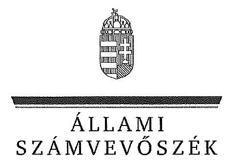

# JELENTÉS 

Az állami tulajdonban álló erdőgazdasági társaságok vagyongazdálkodási tevékenységének ellenőrzése IPOLY ERDŐ Zrt.

---

# Állami Számvevőszék 

Iktatószám: V-0749-162/2015
Témaszám: 1783
Vizsgálat-azonosító szám: V070601

## Az ellenőrzést felügyelte:

## Makkai Mária

felügyeleti vezető
Az ellenőrzést vezette és az ellenőrzés végrehajtásáért felelős:
Dr. Schreiber Judit Zsuzsanna
ellenőrzésvezető
A számvevőszéki jelentés összeállításában közreműködött:
Igar Tamás
számvevő főtanácsos
Az ellenőrzést végezték:

| Gergely Tilda | Igar Tamás |
| :-- | :-- |
| számvevő | számvevő főtanácsos |

---

# TARTALOMJEGYZÉK 

BEVEZETÉS ..... 3
I. ÖSSZEGZŐ MEGÁLLAPÍTÁSOK, KÖVETKEZTETÉSEK, JAVASLATOK ..... 7
II. RÉSZLETES MEGÁLLAPÍTÁSOK ..... 14

1. Az IPOLY ERDŐ Zrt. vagyongazdálkodása ..... 14
1.1. A vagyon értékének megőrzése, gyarapítása ..... 14
1.2. A vagyonkezelői kötelezettség teljesítése ..... 16
2. Az IPOLY ERDŐ Zrt. vagyonkezelési szerződése és a vagyonnyilvántartása ..... 17
2.1. A vagyonkezelési szerződés megfelelősége ..... 17
2.2. Az IPOLY ERDŐ Zrt. vagyonnyilvántartása ..... 19
3. Az IPOLY ERDŐ Zrt. tervezési feladatainak ellátása, az ágazati jogszabályok érvényesülése ..... 20
3.1. Az üzleti tervek vagyonmegőrzésre, vagyongyarapításra vonatkozó elemei ..... 20
3.2. A tervekben megfogalmazott előírások érvényesülése ..... 20
3.3. Az ágazati szabályok érvényesülése ..... 21
4. Kontroll- és monitoring rendszer kialakítása és működtetése ..... 22
4.1. A kontrollrendszer kialakítása és működtetése ..... 22
4.2. Az információáramlási és monitoring rendszer kialakítása és működtetése ..... 23
5. A tulajdonosi joggyakorlóknak az IPOLY ERDŐ Zrt. vagyongazdálkodási feladataira vonatkozó döntései, intézkedései megfelelősége ..... 24

---

# MELLÉKLETEK 

1. számú Rövidítések jegyzéke
2. számú Fogalomtár
3. számú Az IPOLY ERDŐ Zrt. vagyonának alakulása a 2009-2014. I. félév közötti időszakban
4. számú Az IPOLY ERDŐ Zrt. immateriális javainak és tárgyi eszköz állományának megoszlása a 2013. évre vonatkozóan
5. számú Az IPOLY ERDŐ Zrt. befektetett eszköz állományának alakulása a 2009-2014. I. félév közötti időszakban
6. számú Az IPOLY ERDŐ Zrt. saját tőke változása a 2013. évre vonatkozóan
7. számú Az IPOLY ERDŐ Zrt. beruházásainak, felújításainak forrása a 2009-2014. I. félév közötti időszakban
8. számú Az IPOLY ERDŐ Zrt. vezérigazgatójának észrevétele
9. számú Az IPOLY ERDŐ Zrt. vezérigazgatójának észrevételére adott válasz
10. számú Az MNV Zrt. vezérigazgatójának észrevétele
11. számú Az MNV Zrt. vezérigazgatójának észrevételére adott válasz
12. számú Az MFB Zrt. vezérigazgatójának észrevétele
13. számú Az MFB Zrt. vezérigazgatójának észrevételére adott válasz
14. számú Az NFA elnökének észrevétele
15. számú Az NFA elnökének észrevételére adott válasz

---

# JELENTÉS 

## Az állami tulajdonban álló erdőgazdasági társaságok vagyongazdálkodási tevékenységének ellenőrzése IPOLY ERDŐ Zrt.

## BEVEZETÉS

Hazánk területének több mint 20\%-át erdő borítja. Az erdők fenntartása és védelme az egész társadalom érdeke, ezért az erdőkkel csak a közérdekkel összhangban lehet gazdálkodni.

Az Alaptörvény 38. cikke és az Nvtv. alapján az állam tulajdona a nemzeti vagyon részét képezi. Az Nvtv. alapján nemzetgazdasági szempontból kiemelt jelentőségű nemzeti vagyonban tartandó vagyonelemnek minősül a 100\%-ban az állam tulajdonában álló védelmi és közjóléti elsődleges rendeltetésű erdő, a gazdasági elsődleges rendeltetésű természetes erdő, természetszerű erdő és származékerdő természetességi állapotú öt hektárnál nagyobb, természetben összefüggő erdő. Az erdőgazdasági társaságok vagyongazdálkodása szempontjából a Vtv., illetve az Nvtv. és az Nfatv., valamint a kapcsolódó kormány- és miniszteri rendeletek mellett kiemelkedő szerepe van a különböző ágazati jogszabályoknak. A vagyonkezelési tevékenység végrehajtása során figyelemmel kell lenni az Evt.-ben foglaltakra, mely alapján a nemzeti vagyonról szóló törvényben nemzetgazdasági szempontból kiemelt jelentőségű nemzeti vagyonként meghatározott védelmi és közjóléti elsődleges rendeltetésű, az állam tulajdonában álló erdő a kincstári vagyon részét képezi. Az erdőgazdasági társaságoknak az általuk kezelt vagyonelemek sajátosságára tekintettel kell a vagyongazdálkodási tevékenységüket kialakítaniuk, gondoskodniuk kell a közérdek és az Evt.-ben foglaltak érvényesülését biztosító vagyongazdálkodásról.

Az Evt. előírásai alapján az állam 100\%-os tulajdonában álló erdőt és erdőgazdálkodási tevékenységet közvetlenül szolgáló földterületet csak vagyonkezelés formájában lehet hasznosításra átengedni, és az állam tulajdonában álló erdő és erdőgazdálkodási tevékenységet közvetlenül szolgáló földterület vagyonkezelését csak költségvetési szerv vagy kizárólagos állami tulajdonú gazdálkodó szervezet végezheti.

A Vtv. szerint az erdőgazdasági társaságok és a társaságok kezelésében lévő vagyon feletti tulajdonosi jogokat a 2010. évig a Magyar Állam nevében az MNV Zrt. gyakorolta. A 2010. évi törvényi változások (Vtv., Mfbtv., Nfatv.) következtében 2010. június 17. napjától az erdőgazdasági társaságok állami tulajdonú részesedése tekintetében a tulajdonosi jogokat az állami vagyonért felelős miniszter az MFB Zrt. útján látta el. Az Nfatv. 2010. évi hatálybalépését követően a társaságok által kezelt, a Nemzeti Földalapba tartozó földterületek

---

vonatkozásában a tulajdonosi jogokat az NFA, míg egyéb ingatlanok és vagyonelemek tekintetében a tulajdonosi jogokat az MNV Zrt. gyakorolja. 2014. július 16-tól az erdőgazdasági társaságok feletti tulajdonosi jogokat az erdőgazdálkodásért felelős miniszter gyakorolja.

A Nemzeti Földalapba tartozó 1772 980,17 ha földterületből a 2012. év végén a 100%-os állami tulajdonú 19 erdőgazdasági társaság kezelésében összesen 913664,3681 ha földterület volt, ebből 879254,1595 ha erdő, a többi egyéb művelési ágba tartozik. A kezelt földterületek erdőgazdasági társaságonkénti megoszlása eltérő.

Az erdőgazdasági társaságok az Alaptörvény és az Nvtv. előírása szerint önállóan és felelősen gazdálkodnak a törvényesség, a célszerűség és az eredményesség követelményei szerint. Az állami vagyonnal való gazdálkodás alapvető feladata a vagyon rendeltetésszerű, hatékony és felelős felhasználásának biztosítása az állami vagyon értékének megőrzése, gyarapítása érdekében. Az IPOLY ERDŐ Zrt. jelen ellenőrzése az állami vagyonnal való gazdálkodásra és a törvényesség betartására irányult.

Az IPOLY ERDŐ Zrt. az ellenőrzött időszakban, Nógrád megyében és Pest megye északi részén, a Cserhát és a Börzsöny hegység állami erdőterületeinek kezelését végezte, székhelye Balassagyarmat. A Társaság 2013. évi beszámolója szerint 2751,7 M Ft nettó árbevétel mellett 109,2 M Ft mérleg szerinti eredményt ért el, a mérlegfőösszeg 6207,3 M Ft volt. Az erdőgazdasági társaság 63697 ha erdőterületen és 1735 ha egyéb művelési ágú földterületen gazdálkodott, az éves átlaglétszám 166 fő volt.

Az ellenőrzés célja annak értékelése, hogy az IPOLY ERDŐ Zrt. vagyongazdálkodása, vagyonérték-megőrző és vagyongyarapítási tevékenysége, valamint ennek szervezeti keretei megfeleltek-e a jogszabályok és belső szabályzatok előírásainak, valamint a kezelt vagyonelemek sajátosságaiból adódó követelményeknek.

Ennek keretében ellenőriztük és értékeltük, hogy:

- a vagyongazdálkodás során betartották-e az Nvtv. 7. §-ában megállapított vagyongazdálkodási alapelveket, valamint az ágazati jogszabályok vagyongazdálkodáshoz kapcsolódó előírásait;
- a Társaság a saját és a kezelt vagyonnal való gazdálkodásra vonatkozó éves tervezési feladatait a jogszabályi előírásoknak megfelelően látta-e el, a Társaság üzleti tervei a kezelésbe vett vagyonra vonatkozó, a Vtv. 2. § (1) és a 27. § (7) bekezdésében előírt vagyon megőrzésére, gyarapítására vonatkozó elemeket tartalmazták-e és azokat a vagyongazdálkodás során érvényesítették-e;
- a vagyonkezelési szerződések és a vagyon-nyilvántartás megfeleltek-e a szabályszerűségi követelményeknek, elősegítették-e az állami vagyonnal való szabályszerű gazdálkodást;
- a Társaságnál kialakították és működtették-e a szabályszerű feladatellátást támogató kontrollrendszert. Ezen belül elkészítették és aktualizálták-e a Tár-

---

saság feladatellátási-folyamatainak szabályzatait, a kockázatok kezelésének rendszerét, az információs és a kontrolling-monitoring rendszert, valamint a vagyongazdálkodás területén azokat az eljárásokat, amelyek elősegítik a szervezeti célok végrehajtását;

- a tulajdonosi joggyakorlóknak a Társaság vagyongazdálkodási feladataira vonatkozó döntései, intézkedései előkészítése és megalapozottsága a jogszabályoknak és a belső szabályozásnak megfelelt-e, a tulajdonosi joggyakorlók e minőségben végzett tevékenysége támogatta-e a felelős vagyongazdálkodás megvalósulását.

Az ellenőrzés típusa: szabályszerűségi ellenőrzés.
Az ellenőrzött időszak: 2009. január 1. napjától 2014. június 30. napjáig, kitekintéssel a helyszíni ellenőrzés végéig tartó releváns folyamatokra, intézkedésekre.

Az ellenőrzés várható hasznosulása: Az IPOLY ERDŐ Zrt. és a tulajdonosi joggyakorlók fenti szempontú ellenőrzése az állami tulajdonban álló vagyon kezelésére, a vagyonnal való gazdálkodásra vonatkozó, kötelezően végrehajtandó éves ÁSZ ellenőrzést szélesebb körűvé teszi.

Az ellenőrzés várható hasznosulásaként biztosíthatja a társadalom részéről kiemelt érdeklődéssel kísért téma objektív bemutatását. Az ÁSZ jelentéséből a média és az állampolgárok átfogó képet kaphatnak a Magyarország állami tulajdonban lévő erdőivel való gazdálkodásról, a gazdálkodást, vagyonkezelést végző szervezeti rendszerről, az állami tulajdonban álló erdőgazdasági társaságok feladatellátásához kapcsolódóan feltárt problémákról.

Az ellenőrzés jól hasznosítható - többek közt - az állami vagyonnal kapcsolatos országgyűlési törvényhozói munkában is, továbbá hozzájárulhat a tulajdonosi joggyakorlás javításával a „jó kormányzás" gyakorlatának erősítéséhez.

Az ellenőrzéssel érintett szervezetek: Az IPOLY ERDŐ Zrt., a Társaság kezelésében lévő állami vagyon feletti tulajdonosi jogokat gyakorló szervezetek, valamint a Társaság állami tulajdonú részesedése feletti tulajdonosi joggyakorlók (MFB Zrt., MNV Zrt., NFA).

Az ellenőrzés végrehajtásának jogszabályi alapját az ÁSZ tv. 5. § (4)(5) bekezdéseiben foglaltak képezik.

Az ellenőrzés szakmai módszertana az ÁSZ hivatalos honlapján közzétett szakmai szabályokon alapult, amely a Legfőbb Ellenőrző Intézmények Nemzetközi Szervezete (INTOSAI) által kiadott nemzetközi standardok (ISSAI) figyelembevételével készült.

Az IPOLY ERDŐ Zrt. az ellenőrzés lefolytatásához tanúsítványok kitöltésével, valamint dokumentumok elektronikus megküldésével szolgáltatott adatokat. Az így rendelkezésre bocsátott adatok és információk kontrollja a helyszíni ellenőrzés keretében történt. A vagyonváltozást eredményező döntések megalapozottságát, továbbá a vagyonérték-megőrző és vagyongyarapító tevékenység szabályszerűségét a számviteli nyilvántartásokból, valamint kockázat alapú és

---

véletlenszerű mintavétellel kiválasztott tételek ellenőrzésével értékeltük. A kezelt vagyont érintően a beruházások, felújítások pénzforgalmi kiadási területet arányos rétegzéssel összesen 30 elemű véletlen minta ellenőrzésével minősítettük. A sokaságból tételes ellenőrzésre kiemeltük évente a 2009-2013. évek 33 legnagyobb összegű tételét, 2014. első félévében a két legnagyobb összegű tételt. A kivett minta alapján végeztük a kezelt vagyonon megvalósított beruházások, felújítások szabályszerűségének (üzembe helyezés, nyilvántartás, értékcsökkenés elszámolása) ellenőrzését. A vagyonhasznosítási bevételeken belül az immateriális szolgáltatásokhoz kapcsolódó tételek képezték az alapsokaságot, melyet ellenőriztünk.

Az ÁSZ a 2011. évi LXVI. törvény 29. §-a szerint a jelentéstervezetet megküldte az IPOLY ERDŐ Zrt. vezérigazgatójának, a Magyar Nemzeti Vagyonkezelő Zrt. vezérigazgatójának, a Magyar Fejlesztési Bank Zrt. vezérigazgatójának és a Nemzeti Földalapkezelő Szervezet elnökének egyeztetésre. Az IPOLY ERDŐ Zrt. vezérigazgatójának észrevételét és az arra adott választ a 8-9. számú melléklet, a Magyar Nemzeti Vagyonkezelő Zrt. vezérigazgatójának észrevételét és az arra adott választ a 10-11. számú melléklet, a Magyar Fejlesztési Bank Zrt. vezérigazgatójának észrevételét és az arra adott választ a 12-13. számú melléklet, a Nemzeti Földalapkezelő Szervezet elnökének észrevételét és az arra adott választ a 14-15. számú melléklet tartalmazza.

---

# I. ÖSSZEGZŐ MEGÁLLAPÍTÁSOK, KÖVETKEZTETÉSEK, JAVASLATOK 

Az IPOLY ERDŐ Zrt. vagyongazdálkodása az ellenőrzött években a saját vagyonára és négy vagyonkezelési szerződéssel vagyonkezelésbe vett állami és önkormányzati vagyonra terjedt ki. A Társaság mérleg szerinti vagyona a saját vagyonából és a VSZ2,3-ban értékkel kezelésbe kapott állami és önkormányzati vagyonból állt, amely a 2009. évi 4266,9 M Ft-os nyitó értékről 2013. év végére 6207,3 M Ft-ra a mérlegben kimutatott saját tőke 3830,1 M Ft-ra emelkedett.

A Társaság éves mérlegei nem a valós állapotot tükrözték, a Számv. tv. előírása ellenére nem tartalmazták a VSZ1-ben vagyonkezelésbe kapott állami erdők és azzal szerves egységet képező egyéb földterületek értékét, valamint a VSZ2 alapján vagyonkezelt, a Magyar Államot megillető 74,1%-os társasági érdekeltség értékét. A Társaság a Számv. tv.-ben foglaltak ellenére a vagyonkezelésbe vett eszközöket mérlegtétel szerinti megbontásban nem mutatta be a kiegészítő mellékletben.

A VSZ3 alapján
 vagyonkezelésbe vett Szénpataki turistaház és a VSZ ${ }_{4}$ alapján vagyonkezelt Önkormányzati tulajdonú erdő értékét a Számv. tv. előírásának megfelelően a Társaság a mérlegeiben szerepeltette.

A Társaság által a VSZ ${ }_{1}$ alapján kezelt állami erdő és egyéb vagyonról vezetett nyilvántartás nem felelt meg a Vhr.-ben foglaltaknak, mert tételesen nem tartalmazta a vagyonkezelt eszközök könyv szerinti bruttó és nettó értékét, valamint az értékben bekövetkezett egyéb változásokat. Ezért a nyilvántartás nem biztosította az átláthatóságot és az elszámoltathatóságot.

A VSZ ${ }_{1}$ alapján kezelt állami erdő és egyéb vagyonról tételes mennyiségi kimutatást vezettek, a forint érték feltüntetése nélkül, ami megfelelt a $\mathrm{VSZ}_{1}$ 2.4. pontja szerinti naturáliákban történő nyilvántartás vezetési előírásnak, azonban nem felelt meg a Számv. tv.-ben a kezelt vagyon nyilvántartására vonatkozó szabálynak. A Számv. tv.-ben foglaltak betartása érdekében a vagyonkezelt eszközök forint értékének meghatározását a Társaság sem az MNV Zrt.-nél, sem pedig az NFA-nál nem kezdeményezte.

A Társaság nem rendelkezett az állami erdő és egyéb kezelt vagyonról vezetett nyilvántartás kiinduló adatait tartalmazó $\mathrm{VSZ}_{1}$ eredeti, hiteles, a vagyonkezelt eszközök felsorolását tartalmazó 1-4. mellékleteivel. A Társaság nem teljes körűen rendelkezett a kezelt vagyon tekintetében pontos és naprakész információval a tulajdonosi jogokat gyakorlóról, így a Társaság által vezetett nyilvántartás nem biztosította a Vhr.-ben foglalt, az adatszolgáltatás pontosságára vonatkozó követelményt.

A tulajdonosi joggyakorlók tisztázásával és a kezelt vagyonelemek nyilvántartása egyezőségének biztosításával kapcsolatos adategyeztetés az ellenőrzés befejezéséig nem került lezárásra, így nem állt rendelkezésre a kezelt vagyonra és

---

annak nagyságára vonatkozó, a Társaság, az MNV Zrt. és az NFA nyilvántartásában szereplő, egyező adat.

A VSZ ${ }_{2,4}$ alapján vagyonkezelésbe vett Szénpataki turistaház és Önkormányzati tulajdonú erdő tekintetében a vezetett nyilvántartás megfelelt az előírásoknak.

A Társaság az ellenőrzött időszak alatt négy vagyonkezelési szerződéssel rendelkezett.

A VSZ ${ }_{1}$-et a Társaság a Magyar Állam tulajdonában álló erdővagyon és egyéb művelési ágú termőföld ingatlanok kezelésére a KVI-vel 1996. november 1-jén kötötte. A Társaság, mint vagyonkezelő és a KVI között létrejött szerződéses jogviszony kereteit a VSZ-ben foglalt jogok és kötelezettségek töltötték ki. A VSZ ${ }_{1}$ nem támogatta a Vhr.-ben előírt, a vagyongazdálkodási feladatok átlátható módon történő végrehajtását, valamint nem támogatta a szabályszerű vagyongazdálkodást.

Az állami erdő és egyéb vagyon kezelésére vonatkozó $\mathrm{VSZ}_{1}$ 3.3.2. pontjában foglaltak ellenére a felek a szerződést évente nem vizsgálták felül, a VSZ ${ }_{1}$ az ellenőrzött időszakban nem felelt meg a hatályos rendelkezéseknek, hatályon kívül helyezett jogszabályi hivatkozásokat tartalmazott, illetve nem tartalmazott minden szükséges előírást.

A felek nem tettek eleget a Vhr. előírásának sem, mert a Vhr. hatálybalépést követő hat hónapon belül nem kezdeményezték a Nemzeti Földalapba tartozó ingatlanokra vonatkozóan a $\mathrm{VSZ}_{1}$ megszüntetését és a jogszabályoknak megfelelő szerződés megkötését.

A Társaság által kezelt állami erdő és egyéb vagyonelemek többszöri változása ellenére a felek nem tartották be a Vhr.-ben előírt, a VSZ ${ }_{1}$ 60 napon belüli egységes szerkezetbe foglalására vonatkozó rendelkezést.

Az állami erdő és egyéb vagyonelem kezelésére kötött VSZ ${ }_{1}$ 3.2.3. pontja rendelkezett a vagyonkezelői jog harmadik személynek történő átengedésének feltételeiről, azonban ez 2012-től nem felelt meg az Nvtv.-ben foglaltaknak, amely tiltja a vagyonkezelői jog harmadik személynek való átengedést.

A VSZ ${ }_{1}$ nem rögzítette a Vhr.-ben 2011. január 1-jétől előírt, az érintett vagyonelem esetleges védettségét, illetve Natura 2000 területnek minősítését, és a Vhr.-ben foglalt elismerő nyilatkozatot az MNV Zrt. vagyon-nyilvántartási szabályzatának megismerésére és kötelező elismerésére vonatkozóan.

Az állami tulajdonosi érdekeltség vagyonkezelésbe vételére kötött VSZ ${ }_{2}$, a Szénpataki turistaház vagyonkezelésére kötött VSZ ${ }_{3}$ és a Balassagyarmat Város Önkormányzat tulajdonban lévő erdőterületek vagyonkezelésére kötött VSZ ${ }_{4}$ megfelelt a hatályos jogszabályi előírásoknak.

A felek az állami erdő és egyéb vagyon kezelésére vonatkozó VSZ ${ }_{1}$-ben rögzítették a vagyonkezelési díjat, azonban a VSZ ${ }_{1}$ 3.3.2. pontjában foglaltak ellenére azt évente nem vizsgálták felül, erről történő megállapodás megkötésére nem került sor.

---

Az állami erdő és egyéb vagyon kezelésére kötött VSZ 3.3.3. pontjában foglalt, a vagyonkezelési díj számlázására vonatkozó kötelezettségnek az NFA - az MNV Zrt.-vel kötött megállapodás alapján - az ellenőrzött időszakra vonatkozóan eleget tett, azonban a számlák kiállítása a $\mathrm{VSZ}_{1}$ 3.3.3. pontban előírt határidőtől eltérően történt. Az NFA a számlákon a vagyonkezelési díjat egy összegként szerepeltette, azokon nem tüntette fel a számlázás alapját képező földterület nagyságát, így nem volt megállapítható a számlák tartalmi megfelelősége.

A VSZ $_{2}$-ben foglaltak ellenére a tulajdonosi érdekeltség vagyonkezeléséhez kapcsolódó vagyonkezelői díjat számla hiányában a Társaság nem fizetett.

A VSZ $_{3}$ alapján kezelt Szénpataki turistaház vagyonkezelési díját a Társaság az elvégzett beruházásokkal, felújításokkal szemben kompenzálással rendezte, amely megfelelt a $\mathrm{VSZ}_{2}$-ben foglaltaknak.

A VSZ $_{4}$ ben az Önkormányzat a tulajdonában álló erdőket ingyenesen adta vagyonkezelésbe, így ehhez kapcsolódóan vagyonkezelési díjra vonatkozó fizetési kötelezettsége a Társaságnak nem állt fenn.

A Társaság az ellenőrzött időszakban a vagyongazdálkodás során a kezelt vagyonelemek, valamint a saját eszközeinek karbantartási, állagmegóvási feladatait a Vtv., a Vhr. és az Nfatv. előírásai alapján ellátta.

A 2009-2013. években a Társaság beruházásokra és felújításokra összesen 2393,8 M Ft-ot fordított. A beruházások, felújítások és a karbantartások költségeit az üzleti tervek tartalmazták. Az éves tervezési feladatokat az előírásoknak megfelelően végezték, az üzleti tervek tartalmaztak a vagyongazdálkodásra, a vagyon megőrzésére vonatkozó elemeket. A Társaság az állami vagyonnal való gazdálkodás során érvényesítette a tervekben megfogalmazott előírásokat.

A Társaság a feladatellátása során az Evt. ${ }_{1,2}$ szerinti bejelentési, engedélyeztetési kötelezettségeknek eleget tett, valamint betartotta a vagyongazdálkodási alapelveket. A Társaság által kezelt vagyon elidegenítésére, megterhelésére az ellenőrzött időszakban nem került sor, erdő használatát, hasznosítását, illetve a vagyonkezelői jogot harmadik személynek nem engedték át. A Társaság az Erdészeti hatóság által jóváhagyott erdőgazdálkodási és Vadászati hatóság által jóváhagyott vadgazdálkodási tervekkel rendelkezett. A Társaság az ellenőrzött időszakban az ágazati szabályokat nem teljes körűen tartotta be, a 2009-2013. években az Evt. ${ }_{2}$ szabályok megsértése miatt több esetben került sor bírság kiszabására az erdősítési határidők túllépése, valamint a fakitermeléssel érintett erdőrészlet határvonalának téves kijelölése és engedély nélküli kitermelése miatt.

A Társaság kialakította és működtette a feladatellátást támogató kontrollrendszert. A belső ellenőrzés az ellenőrzött időszakban a tevékenységét a Társaság vezérigazgatójának felügyelete és ellenőrzése mellett, az FB irányítása alatt végezte. A belső ellenőr az FB által jóváhagyott éves munkaterv alapján látta el feladatát, a vagyongazdálkodására vonatkozó és a Társaság tevékenységhez kapcsolódóan végzett ellenőrzéseket.

---

A Társaság a Számv. tv. és az Alapító Okirat szerint, a tulajdonosi joggyakorló${ }_{1,2}$ által kijelölt könyvvizsgálót alkalmazott. A könyvvizsgáló minden ellenőrzött évben záradékkal ellátott könyvvizsgálói jelentést adott ki, figyelemfelhívó megjegyzést nem tett. A könyvvizsgáló az ellenőrzött időszakban nem kifogásolta, hogy a mérlegben a Társaság nem szerepeltette a VSZ ${ }_{1}$ és a VSZ ${ }_{2}$ alapján vagyonkezelt eszközöket. A Társaságnál az Alapító Okirat alapján működő FB a Gt.-ben és az éves munkatervében előírt ellenőrzési feladatait ellátta, a Társaság éves beszámolóiról a véleményét a könyvvizsgálói jelentés figyelembe vételével alakította ki, írásbeli jelentését a tulajdonosi joggyakorló felé elkészítette.

A Társaság éves beszámolóit a Társaság feletti tulajdonosi joggyakorló ${ }_{1,2}$ - az FB és a könyvvizsgálói jelentésének figyelembe vételével - határozattal jóváhagyta.

A Társaság kialakította az információáramlási és monitoring rendszert, biztosította annak szabályzatok szerinti működését. A Társaság az ellenőrzött években teljesítette a Vhr.-ben és a vagyonkezelési szerződésekben előírt adatszolgáltatási kötelezettségét. Az állami erdő és egyéb vagyon kezelésére kötött $\mathrm{VSZ}_{1}$ alapján végzett vagyonkezelési tevékenységgel kapcsolatos bevételekről és költségekről az ágazati lapokon számoltak be. A Társaság az éves beszámolókat a társaság feletti tulajdonosi joggyakorló ${ }_{1,2}$-nak, valamint a vagyonkezelt eszközök feletti tulajdonosi jogokat gyakorlóknak megküldte. Az erdőgazdálkodási tervek, egyéb erdőgazdálkodási tevékenységek és az éves vadgazdálkodási tervek teljesítéséről az éves üzleti jelentésekben és a kontrolling adatszolgáltatás keretein belül számoltak be.

A Társaság az állami erdő és egyéb vagyon kezelésére kötött VSZ ${ }_{1}$ 3.10. pontjában foglaltak ellenére a kezelt vagyon feletti tulajdonosi jogokat gyakorló MNV Zrt. és NFA felé az erdővagyonról és annak változásairól a 2009-2011. évek vonatkozásában nem készített írásos beszámolót. A 2012. és a 2013. években az adatszolgáltatás megtörtént.

Az ellenőrzött időszakban a Társaság az Avtv., illetve az Infotv. szerinti, a közérdekű adatok megismerésére irányuló igények teljesítésének rendjét rögzítő szabályzattal nem rendelkezett. A Társaság a saját honlapján a közérdekű adatok közzététele során a közbeszerzési adatokat és a feladatellátásra vonatkozó adatokat közzétette, azonban a közérdekű adatok megismerésére vonatkozó igények intézésének rendje nem került közzétételre.

A társaság feletti tulajdonosi joggyakorló ${ }_{1,2}$ a Társaság vagyongazdálkodási feladataira vonatkozó döntései, intézkedéseinek előkészítése összhangban volt a belső szabályzatokkal, a vagyonváltozást eredményező döntések végrehajtását a beszámolók, az üzleti tervek, üzleti jelentések és a kontrolling jelentések megtárgyalásával és jóváhagyásával ellenőrizték. A társaság feletti tulajdonosi joggyakorló a Társaságnál a 2010. évben külső szakértővel átvilágítást végeztetett, a megtett intézkedések megvalósulását nyomon követték és az eredményekről az érintetteket beszámoltatták.

A VSZ ${ }_{1}$ alapján vagyonkezelésbe adott állami erdő és egyéb vagyon tekintetében a tulajdonosi jogokat gyakorló MNV Zrt. és NFA tevékenysége az ellenőrzött időszakban nem támogatta teljes körűen a felelős vagyongazdálkodás megvalósulását. Az állami erdő és egyéb vagyon kezelésére kötött VSZ ${ }_{1}$-el kapcsolatban feltárt hiányosságokat nem szüntette meg, a hatályos jogszabályoknak a szerződést nem feleltette meg, nem éltek a Vhr.-ben és a 262/2010. (XI.17.) Korm. rend. 47. § (1)-(2) bekezdéseiben foglalt, a kezelt vagyon használatára vonatkozó ellenőrzési jogukkal, valamint nem végeztek a vagyonnyilvántartás hitelességére, helyességére és teljességére vonatkozó ellenőrzést a Társaságnál.

A Magyar Államot megillető tulajdonosi érdekeltség vagyonkezeléséhez kapcsolódóan az MNV Zrt. nem élt a VSZ ${ }_{3}$ 6. pontjában foglalt, a vagyonkezelőnél történő tulajdonosi ellenőrzés lehetőségével.

A VSZ ${ }_{3}$ alapján kezelt Szénpataki turistaház vagyonkezeléséhez kapcsolódóan az MNV Zrt. két alkalommal végzett - a felújításhoz kapcsolódóan - tulajdonosi ellenőrzést.

Az Állami Számvevőszékről szóló 2011. évi LXVI. törvény 33. § (1) bekezdésében foglaltak értelmében a jelentésben foglalt megállapításokhoz kapcsolódó intézkedési tervet köteles az ellenőrzött szervezet vezetője összeállítani, és azt a jelentés kézhezvételétől számított 30 napon belül az ÁSZ részére megküldeni. Amennyiben az intézkedési tervet határidőben nem küldi meg a szervezet, vagy az nem elfogadható, az ÁSZ elnöke a hivatkozott törvény 33. § (3) bekezdésében foglaltakat érvényesítheti.

Az ellenőrzés intézkedést igénylő megállapításai és javaslatai:

# MNV Zrt. vezérigazgatójának, az NFA elnökének 

Az IPOLY ERDŐ Zrt. a Magyar Állam tulajdonában álló erdővagyon és egyéb művelési ágú termőföld ingatlanok kezelését a KVI-vel 1996. november 1-jén kötött VSZ ${ }_{1}$ alapján végezte. A Társaság, mint vagyonkezelő és a KVI között
 létrejött szerződéses jogviszony kereteit a VSZ₁-ben foglalt jogok és kötelezettségek töltötték ki. A VSZ₁ nem támogatta a Vhr. 3. § (1) bekezdésében foglalt, a vagyongazdálkodási feladatok átlátható módon történő végrehajtását, valamint nem támogatta a szabályszerű vagyongazdálkodást. A VSZ₁ 3.3.2. pontjában foglaltak ellenére a felek a szerződést évente nem vizsgálták felül, a VSZ₁ az ellenőrzött időszakban nem felelt meg a hatályos rendelkezéseknek, hatályon kívül helyezett jogszabályi hivatkozásokat tartalmazott, illetve nem tartalmazott minden szükséges előírást. A VSZ₁ vagyonkezelői jog átengedésére vonatkozó 3.2.3. pontja 2012-től nem felelt meg az Nvtv.-ben foglaltaknak, amely tiltja a vagyonkezelői jog harmadik személynek való átengedését. A VSZ₁ nem rögzítette a Vhr. 9. § (8) bekezdésében 2011. január 1-jétől előírt, az érintett vagyonelem esetleges védettségét, illetve Natura 2000 területnek minősítését. A felek nem tettek eleget a Vhr. 54. § (7)¹ bekezdés előírásának, mert a Vhr. hatálybalépést követő hat hónapon belül nem kezdeményezték a Nemzeti Földalapba tartozó ingatlanokra vonatkozóan a VSZ₁ megszüntetését és a jogszabályoknak megfelelő szerződés megkötését.

[^0]
[^0]:    ¹ Vhr. 54. § (7) bekezdés (hatályos 2010. december 31-éig)

---

A vagyonkezelésbe adott állami vagyon tekintetében tulajdonosi jogokat gyakorló MNV Zrt. és NFA nem végeztek a Vhr. 20. § (1)-(2) bekezdéseiben és a Nemzeti Földalapba tartozó földrészletek hasznosításának részletes szabályairól szóló 262/2010. (XI. 17.) Korm. rendelet 47. § (1)-(2) bekezdéseiben foglalt, a vagyonnyilvántartás hitelességére, teljességére és helyességére vonatkozó ellenőrzést a Társaságnál.

Javaslat:

# az MNV Zrt. vezérigazgatójának 

a) Tegyen intézkedéseket az erdőgazdasági társaság közreműködésével a tényleges állapotot rögzítő és a hatályos jogszabályi előírásoknak megfelelő vagyonkezelési szerződés megkötésére.
b) Tegyen intézkedéseket a vagyonkezelési szerződés felülvizsgálatának elmaradásával, valamint a Nemzeti Földalapba tartozó ingatlanokra vonatkozó VSZ megszüntetésével összefüggésben feltárt szabálytalanságok tekintetében a felelősség tisztázása érdekében, és szükség szerint intézkedjen a felelősség érvényesítéséről.
c) Intézkedjen az IPOLY ERDŐ Zrt. vagyonnyilvántartása hitelességének, teljességének és helyességének jogszabályban foglaltak szerinti ellenőrzéséről.

## az NFA elnökének

a) Tegyen intézkedéseket az erdőgazdasági társaság közreműködésével a tényleges állapotot rögzítő és a hatályos jogszabályi előírásoknak megfelelő vagyonkezelési szerződés megkötésére.
b) Intézkedjen a vagyonkezelési szerződés felülvizsgálatának elmaradásával összefüggésben feltárt szabálytalanságok tekintetében a munkajogi felelősség tisztázására irányuló eljárás megindításáról, és ennek eredménye ismeretében tegye meg a szükséges intézkedéseket.
c) Intézkedjen az IPOLY ERDŐ Zrt. vagyonnyilvántartása hitelességének, teljességének és helyességének jogszabályban foglaltak szerinti ellenőrzéséről.

## az IPOLY ERDŐ Zrt. vezérigazgatójának:

1. Az IPOLY ERDŐ Zrt. és a KVI által 1996-ban megkötött VSZ nem támogatta a Vhr. 3. § (1) bekezdésében foglaltak ellenére a vagyongazdálkodási feladatok átlátható módon történő végrehajtását, valamint nem támogatta a szabályszerű vagyongazdálkodást. A VSZ₁ 3.3.2. pontjában foglaltak ellenére a felek a szerződést évente nem vizsgálták felül, a VSZ₁ az ellenőrzött időszakban nem felelt meg a hatályos rendelkezéseknek, hatályon kívül helyezett jogszabályi hivatkozásokat tartalmazott, illetve nem tartalmazott minden szükséges előírást. A VSZ₁ vagyonkezelői jog átengedésére vonatkozó 3.2.3. pontja 2012-től nem felelt meg az Nvtv.-ben foglaltaknak, amely tiltja a vagyonkezelői jog harmadik személynek való átengedését. A VSZ₁

---

nem rögzítette a Vhr. 9. § (8) bekezdésében 2011. január 1-jétől előírt, az érintett vagyonelem esetleges védettségét, illetve Natura 2000 területnek minősítését.

Javaslat:
a) Tegyen intézkedéseket a tulajdonosi joggyakorlókkal közreműködve a tényleges állapotnak és a hatályos jogszabályi előírásoknak megfelelő vagyonkezelési szerződés megkötése érdekében.
b) Intézkedjen a vagyonkezelési szerződés felülvizsgálatának elmaradásával feltárt szabálytalanságok tekintetében a felelősség tisztázása érdekében, és szükség szerint intézkedjen a felelősség érvényesítéséről.
2. A Társaság a Számv. tv. 23. § (2) bekezdésben foglaltak ellenére a VSZ₁ alapján kezelt erdővagyont és a VSZ₂ alapján kezelt állami tulajdonú társasági részesedést a mérlegben nem mutatta ki, azok mérlegtétel szerinti megbontásban nem kerültek bemutatásra a kiegészítő mellékletben.

Javaslat:
a) Intézkedjen a kezelt vagyon mérlegben eszközként való kimutatásáról, továbbá ezen eszközöknek a kiegészítő mellékletben - legalább mérlegtételek szerinti megbontásban - külön történő bemutatásáról.
b) Intézkedjen a kezelt vagyon mérlegben eszközként történő kimutatásának elmaradásával kapcsolatban feltárt szabálytalanság tekintetében a felelősség tisztázása érdekében, és szükség szerint intézkedjen a felelősség érvényesítéséről.
3. Az ellenőrzött időszakban a Társaság nem tett eleget az Avtv. 20. § (8) bekezdése, illetve az Infotv. 30. § (6) bekezdése szerinti, a közérdekű adatok megismerésére irányuló igények teljesítésének rendjét rögzítő szabályzat-készítési kötelezettségnek, a közérdekű adatok megismerésére irányuló igények teljesítésének rendjét rögzítő szabályzattal nem rendelkezett.

Javaslat:
Intézkedjen a jogszabályi előírásoknak megfelelően a közérdekű adatok megismerésére irányuló igények teljesítése rendjének szabályozásáról.

---

# II. RÉSZLETES MEGÁLLAPÍTÁSOK 

## 1. Az IPOLY ERDŐ ZRT. VAGYONGAZDÁLKODÁSA

### 1.1. A vagyon értékének megőrzése, gyarapítása

A Társaság vagyongazdálkodása a saját vagyonára és négy vagyonkezelési szerződéssel vagyonkezelésbe vett állami és önkormányzati vagyonra terjedt ki.

A Társaság mérleg szerinti vagyona a saját vagyonából, valamint a VSZ₂,₄-ben értékkel kezelésbe kapott állami és önkormányzati vagyonból állt. A Társaság éves mérlegei nem a valós állapotot tükrözték, mert a Számv. tv. 23. § (2) bekezdésben foglalt előírás ellenére nem tartalmazták VSZ₁-ben vagyonkezelésbe kapott állami erdők és azzal szerves egységet képező egyéb földterületek értékét, valamint a VSZ₂ alapján vagyonkezelt, a Magyar Államot megillető 74,1%-os társasági érdekeltség értékét. A Társaság a Számv. tv. 23. § (2) bekezdés rendelkezése ellenére a vagyonkezelésbe vett eszközöket mérleg szerinti megbontásban nem mutatta be a kiegészítő mellékletben.

A mérleg szerint kimutatott vagyon a 2009. évi 4266,9 M Ft-os nyitó értékről 2013. év végére 6207,3 M Ft-ra emelkedett, amelyből a VSZ₅-ben vagyonkezelésbe kapott önkormányzati erdő és a VSZ₄ alapján kezelt turistaház értéke 43,1 M Ft-ot, a mérlegfőösszeg 0,7%-át tették ki. A társasági vagyon 45,5%-os növekedéshez a Társaság feletti tulajdonosi joggyakorló₁,₂-től kapott 306,7 M Ft tőkeemelés, a 2009-2013. időszakban elért 483,1 M Ft összegű mérleg szerinti eredmény, valamint az EU-s pályázatokon elnyert támogatások járultak hozzá. Az elnyert EU-s támogatásokból az ellenőrzött időszakban mintegy 494,6 M Ft-ot egyéb bevételként, további 746,7 M Ft-ot az eredmény terhére csak később elszámolandó, a 2009. és 2013. években kimutatott halasztott bevételek növekményeként számoltak el.

A Társaság a 2009-2013. években a kezelt vagyon hasznosításából 12 200,1 M Ft bevételt realizált és 9114,4 M Ft költséget számolt el. A kezelt vagyonhoz kapcsolódó bevételeket és költségeket a főkönyvi könyvelésben a vállalkozási bevételektől és költségektől elkülönítve mutatták ki.

A befektetett eszközök részaránya a 2009. év 72,9%-os nyitó állományáról 2013. év végére 77,2%-ra, a befektetett pénzügyi eszközök állománya a 310,3 M Ft-os nyitó állományhoz képest 528,6 M Ft-tal (170,4%) emelkedett, amelyet a hosszú lejáratú állampapírban tartott megtakarítások növekedése okozott. A megnövekedett állampapír állomány célja az volt, hogy igazolható fedezetként szolgáljon a folyamatban lévő EU-s pályázatok megvalósítási és fenntartási időszakának kiadásaira. A Társaság eszközeinek 62,6 - 65,1%-át a tárgyi eszközök alkották, amelyek állománya a teljes ellenőrzési időszakban növekvő tendenciát mutatott, öt év alatt 1110,3 M Ft-tal (40,0%) bővült.

Az ellenőrzött időszakban a Társaság két gazdasági társaságnál, illetve két nonprofit szervezetnél szerzett tulajdonosi részesedést, amelyeknek az értékelése

---

megfelelt a Számv. tv. 57. § (1) bekezdés előírásainak. A Novohrad-Nógrád Geopark Nonprofit Kft. közhasznú tevékenységet folytatott a kulturális örökség megóvása, a műemlékvédelem, az ökoturisztika és a természetvédelem érdekében. A Kft. 2009-2010. évi mérleg szerinti eredménye negatív előjelű volt, a saját tőke a jegyzett tőke értéke alá került, így a Társaság 2011. évben a Kft.-ben lévő részesedésre 0,2 M Ft értékvesztést számolt el, amely megfelelt a Számv. tv. 54. § (1) bekezdésben foglaltaknak.

A VSZ₁, hatálya alá tartozó állami erdő és egyéb vagyon, valamint a VSZ₂ alapján kezelt állami tulajdonú részesedést a Társaság nem értékelte, mivel a vagyonkezelésbe vett eszközöket nem szerepeltette a mérlegében. A saját vagyonként nyilvántartott eszközök és források értékelését a Számv. tv. 46. § (3) bekezdésben foglaltaknak megfelelően évente elvégezték, amelynek során a Számv. tv. 46. § (4) bekezdés, valamint a Számviteli politika₁,₂-ban foglalt előírások szerint jártak el.

A Társaság vagyonának alakulása a 2009-2013. években:

| Sorszám | Megnevezés | 2009.01.01 |  | 2013.12.31 |  | Változás 2013.12.31/ 2009.01.01. (%) |
| :--: | :--: | :--: | :--: | :--: | :--: | :--: |
|  |  | Érték M Ft-ban | % | Érték M Ft-ban | % |  |
| 1. | Befektetett eszközök összesen | 3111,6 | 72,9 | 4793,2 | 77,2 | 154,0 |
| 2. | Ebből: Immateriális javak | 22,9 | 0,5 | 65,6 | 1,1 | 286,5 |
| 3. | Tárgyi eszközök | 2778,4 | 65,1 | 3888,7 | 62,6 | 140,0 |
| 4. | Befektetett pénzügyi eszközök | 310,3 | 7,3 | 838,9 | 13,5 | 270,4 |
| 5. | Forgóeszközök | 1124,1 | 26,4 | 1278,0 | 20,6 | 113,7 |
| 6. | Aktív időbeli elhatárolások | 31,2 | 0,7 | 136,1 | 2,2 | 436,2 |
| 7. | Eszközök összesen | 4266,9 | 100,0 | 6207,3 | 100,0 | 145,5 |
| 8. | Saját tőke | 3040,6 | 71,3 | 3830,1 | 61,7 | 126,0 |
| 9. | Ebből: Jegyzett tőke | 1284,5 | 30,1 | 1591,2 | 25,6 | 123,9 |
| 10. | Tőketartalék | 906,6 | 21,2 | 906,6 | 14,6 | 100,0 |
| 11. | Eredménytartalék | 723,2 | 17,0 | 1161,4 | 18,7 | 160,6 |
| 12. | Lekötött tartalék | 49,4 | 1,2 | 61,7 | 1,0 | 124,9 |
| 13. | Mérleg szerinti eredmény | 76,9 | 1,8 | 109,2 | 1,8 | 142,0 |
| 14. | Céltartalékok | 20,9 | 0,5 | 183,8 | 3,0 | 879,4 |
| 15. | Kötelezettségek | 661,3 | 15,5 | 1013,4 | 16,3 | 153,2 |
| 16. | Passzív időbeli elhatárolások | 544,1 | 12,7 | 1180,0 | 19,0 | 216,9 |
| 17. | Források összesen | 4266,9 | 100,0 | 6207,3 | 100,0 | 145,5 |

A Társaság saját tőke/jegyzett tőke mutatója a 2009. évi nyitó értékek alapján számított 236,7%-os értékről 2013. év végére 240,7%-ra emelkedett. A Társaság feletti tulajdonosi joggyakorló₁,₂ által 2009-2013. évben két ízben került sor jegyzett tőke emelésére összesen 306,7 M Ft összegben.

A Társaság eredményességének alakulása a 2009-2013. években:

| Megnevezés | 2009. év   nyitó | 2009. év | 2010. év | 2011. év | 2012. év | 2013. év |
| :--: | :--: |

 :--: | :--: | :--: | :--: | :--: |
| ST / JT   aránya | $236,7 \%$ | $231,6 \%$ | $238,1 \%$ | $246,9 \%$ | $252,0 \%$ | $240,7 \%$ |
| MSZE / ST   aránya |  | $2,7 \%$ | $2,7 \%$ | $3,6 \%$ | $2,0 \%$ | $2,9 \%$ |

---

A Társaság beszámolójában és a számviteli nyilvántartásokban lévő vagyontárgyak állományát szabályszerűen - a Leltározási Szabályzat ${ }_{1,2}$-ben foglaltak alapján - elkészített leltárral alátámasztották.

A Társaság a 2009-2013. években 2393,8 M Ft beruházást végzett a teljes eszközvagyona vonatkozásában, amelynek forrását 973,5 M Ft összegben pályázatokra kapott EU-s támogatás, 76,4 M Ft összegben tőkeemelés vagy egyéb belföldről kapott támogatás, 1343,9 M Ft összegben pedig saját forrás képezte. A VSZ ${ }_{1}$ alapján kezelt erdő és egyéb vagyonhoz, valamint a VSZ ${ }_{3}$ alapján kezelt Szénpataki turistaházhoz kapcsolódó beruházásokat a Számv. tv.-nek megfelelően a könyvekben szerepeltették.

A Társaság a beruházási tevékenységét a Számviteli politika ${ }_{1,2}$ 3.1.5. és 3.1.6. pontjaiban foglalt előírásnak és - két beruházás engedélyeztetésének elmaradása kivételével - a Vhr. ${ }^{2}$ rendelkezéseinek megfelelően végezte. A Diósjenő 0158/1 hrsz.-ú vagyonkezelt földterületen és Szokolya 0449/4 hrsz.-ú saját tulajdonú ingatlanon, de vagyonkezelt földterületen a Társaság az MNV Zrt.-től, illetve az NFA-tól a Vhr. 9. § (6) bekezdését megsértve a felújítások, beruházások előtt írásbeli engedélyt nem kért.

A Társaság az ellenőrzött időszakban a vagyongazdálkodás során a kezelt vagyonelemek, valamint a saját eszközeinek karbantartási, állagmegóvási feladatait a Vtv. ${ }^{3}$, a Vhr. ${ }^{4}$ és az Nfatv. ${ }^{5}$ előírásai alapján ellátta. A saját tulajdonú tárgyi eszközök javítására, karbantartására összesen 345,2 M Ft-ot, erdőfelújítására és erdőtelepítésre összesen 1663,3 M Ft-ot fordítottak. A vagyoni eszközök vonatkozásában rendszeres időközönként állapotfelmérést végeztek, az üzleti terv készítése során tervezték meg a tárgyi eszközök karbantartására, állagmegóvására és az erdők gondozására, védelmére fordítandó kiadásokat.

A Társaság betartotta a Számv. tv. 52. § (5) bekezdés értékcsökkenés elszámolására vonatkozó előírásait, a földterületek és az erdők értéke után értékcsökkenést nem számoltak el. A VSZ ${ }_{3}$ alapján vagyonkezelésbe vett és a mérlegében értékkel szereplő Szénpataki turistaház után a Számv. tv. 52. § előírásainak megfelelően 0,2 M Ft értékcsökkenési leírást számoltak el, amellyel szemben 6,4 M Ft összegű beruházást és felújítást végeztek.

# 1.2. A vagyonkezelői kötelezettség teljesítése 

A Társaság a 2012. január 1-től hatályos Nvtv. 7. §-ban foglalt vagyongazdálkodási alapelveket betartotta. A Vtv. 33. § (1) bekezdés, az Nvtv. 6. § (1) bekezdést betartva kezelt vagyont és az állam kizárólagos tulajdonában álló nemzeti

[^0]
[^0]:    ${ }^{2}$ Vhr. 10. § (2) bekezdés és Vhr. 9. § (6) (2011. január 1-jétől)
    ${ }^{3}$ Vtv. 23. § (2) bekezdése és 27. § (2) bekezdése
    ${ }^{4}$ Vhr. 10. § (1) bekezdés (hatályos: 2010. december 31-éig) a Vhr. 9. § (6) bekezdése (hatályos: 2011. január 1-jétől)
    ${ }^{5}$ Nfatv. 20. § (1) bekezdés (hatályos 2011. július 31-ig), Nfatv. 20. § (4) bekezdés (hatályos 2011. augusztus 1-től 2012. december 31-ig), Nfatv. 19/A (3) bekezdés (hatályos 2013. január 1-től)

---

vagyont nem idegenített el, nem terhelt meg, biztosítékul nem adta, illetve azokon osztott tulajdont nem létesített. A Társaság az Nfatv. ${ }^{6}$-ben foglaltakat betartva a vagyonkezelői jogát nem adta tovább és nem terhelte meg, valamint az Evt. ${ }_{2}$ 9. § (3) ${ }^{7}$ bekezdés előírását betartva erdő használatát, hasznosítását harmadik személynek nem engedte át.

A Társaság az Nfatv. ${ }^{8}$ vonatkozó részének 2011. augusztus 1-jei hatályba lépését követően a Magyar Állam tulajdonába tartozó erdő vagy erdőgazdálkodási tevékenységet közvetlenül szolgáló földterület vagyonkezelésbe vételére vonatkozó szerződést nem kötött, így ehhez kapcsolódóan azt nem kellett az Erdészeti Hatósághoz jóváhagyásra benyújtania.

# 2. Az IPOLY ERDŐ ZRT. VAGYONKEZELÉSI SZERZŐDÉSE ÉS A VAGYONNYILVÁNTARTÁSA 

### 2.1. A vagyonkezelési szerződés megfelelősége

A Társaság az ellenőrzött időszakban négy vagyonkezelési szerződéssel rendelkezett.

A Társaság a Magyar Állam tulajdonában álló erdővagyon és egyéb művelési ágú termőföld ingatlanok kezelését a KVI-vel 1996. november 1-jén kötött VSZ ${ }_{1}$ alapján végezte. A Társaság, mint vagyonkezelő és a KVI között létrejött szerződéses jogviszony kereteit a VSZ ${ }_{1}$-ben foglalt jogok és kötelezettségek töltötték ki. A VSZ ${ }_{1}$ nem támogatta a Vhr. 3. § (1) bekezdésében foglalt, a vagyongazdálkodási feladatok átlátható módon történő végrehajtását, valamint nem támogatta a szabályszerű vagyongazdálkodást.

Az erdő és egyéb vagyon kezelésére kötött VSZ ${ }_{1}$ 3.3.2. pontjában foglaltak ellenére a felek a szerződést évente nem vizsgálták felül, a VSZ ${ }_{1}$ az ellenőrzött időszakban nem felelt meg a hatályos rendelkezéseknek, hatályon kívül helyezett jogszabályi hivatkozásokat tartalmazott, illetve nem tartalmazott minden szükséges előírást.

A felek nem tettek eleget a Vhr. előírásának sem, mert a Vhr. hatálybalépést követő hat hónapon belül nem kezdeményezték a Nemzeti Földalapba tartozó ingatlanokra vonatkozóan a VSZ ${ }_{1}$ megszüntetését és a jogszabályoknak megfelelő szerződés megkötését.

A Társaság által a VSZ ${ }_{1}$ alapján kezelt állami erdő és egyéb vagyonelemek többszöri változása ellenére a felek nem tartották be a Vhr.-ben előírt, a VSZ ${ }_{1}$ 60 napon belüli egységes szerkezetbe foglalására vonatkozó rendelkezést.

[^0]
[^0]:    ${ }^{6}$ Nfatv. 20 § (3) bekezdése (hatályos: 2011. július 31-éig), Nfatv. 20 § (8) bekezdése (hatályos: 2011. augusztus 1-jétől 2012. december 31-éig), Nfatv. 19/A. § (4) bekezdése (hatályos: 2013. január 1-jétől)
    ${ }^{7}$ Evt. 2 9. § (3) bekezdés (hatályos: 2009. július 10-től)
    ${ }^{8}$ Nfatv. 20. § (7) bekezdés (hatályos: 2011. augusztus 1-től)

---

Az állami erdő és egyéb vagyon kezelésére kötött VSZ ${ }_{1}$ 3.2.3. pontja a vagyonkezelői jog harmadik személynek történő átengedésének feltételeiről rendelkezett, azonban ez 2012-től nem felelt meg az Nvtv. 11. § (8) bekezdésben foglaltaknak, amely tiltja a vagyonkezelői jog harmadik személynek való átengedését.

Az erdő és egyéb vagyon kezelésére kötött VSZ ${ }_{1}$ nem rögzítette a Vhr.-ben 2011. január 1-jétől előírt, az érintett vagyonelem esetleges védettségét, illetve Natura 2000 területnek minősítését, és a Vhr.-ben foglalt elismerő nyilatkozatot az MNV Zrt. vagyon-nyilvántartási szabályzatának megismerésére és kötelező elismerésére vonatkozóan.

A Társaság a VSZ ${ }_{2}$-t 2008. július 17-én az MNV Zrt.-vel a Mosonpatak Erdőbirtokossági Termelő és Szolgáltató Társulat 74,1%-os Magyar Államot megillető tulajdonosi érdekeltségének vagyonkezelésbe vételére, a VSZ ${ }_{2}$-t, a Balassagyarmat Város Önkormányzatával 2012. február 27-én az önkormányzati tulajdonban lévő erdőterületek ingyenes vagyonkezelésére, a VSZ ${ }_{4}$-t a Szénpataki turistaház vagyonkezelésére az MNV Zrt.-vel 2011. július 13-án kötötte. A VSZ ${ }_{2}$, a VSZ ${ }_{3}$ és a VSZ ${ }_{4}$ megfelelt a hatályos jogszabályi előírásoknak.

Az állami erdő és egyéb vagyon kezelésére kötött VSZ ${ }_{1}$ 3.3.2. pontja előírta a vagyonkezelési díj - külön megállapodás keretében a tárgyévet megelőző év november 30-ig történő - felülvizsgálatát, azonban a díjat a felek évente nem vizsgálták felül, erről történő megállapodás megkötésére nem került sor.

Az állami erdő és egyéb vagyon kezelésére kötött VSZ ${ }_{1}$ 3.3.3. pontjában foglalt, a vagyonkezelési díj számlázására vonatkozó kötelezettségnek az NFA - az MNV Zrt.-vel kötött megállapodás alapján - eleget tett, azonban a számlák kiállítása a VSZ ${ }_{1}$ 3.3.3. pontjában előírt határidőtől eltérően történt. Az NFA a számlákban nem szerepeltette a vagyonkezelői jog gyakorlásának alapját képező vagyonkezelt földterület naturáliában meghatározott mennyiségét és annak egységárát, a vagyonkezelési díjat egy összegben szerepeltette, így nem volt megállapítható a számlák tartalmi megfelelősége.

A VSZ ${ }_{2}$ 3. pontja értelmében az állami tulajdonosi érdekeltség vagyonkezelése után a Társaságnak a vagyonkezelésbe adó számlája alapján minden év december 31-éig vagyonkezelési díjat kellett fizetnie. A Társaság vagyonkezelői díjat számla hiányában nem fizetett.

A Szénpataki turistaház vagyonkezelési díját a felek a VSZ ${ }_{3}$ 4.2. pontjában évi 100 E Ft+ÁFA összegben rögzítették, amelynek évi emelkedését a KSH által kimutatott fogyasztói árindex változásához kötötték. A VSZ ${ }_{3}$ 12.7.1. és 12.7.3. pontja a vagyonkezelt ingatlanon végzett, az elszámolt értékcsökkenés összegének megfelelő visszapótlási kötelezettség összegét meghaladó beruházás elvégzése esetén megengedte a többletráfordítás összegének esedékes vagyonkezelési díjban történő beszámítását, kompenzációját. A 2011. évi törtidőszakra a 2011. szeptember 21-én kelt számlával kiszámlázott összeg rendezése banki átutalással megtörtént. A Társaság a 2012-2014. évek vagyonkezelési díját a MNV Zrt. egyidejű tájékoztatása mellett a VSZ ${ }_{3}$ 12.7.1. pontjában engedélyezett kompenzációval rendezte.

---

A Balassagyarmat Város Önkormányzat tulajdonában lévő erdőterületek ingyenes vagyonkezelésére vonatkozó VSZ ${ }_{4}$ alapján a Társaságnak fizetési kötelezettsége nem keletkezett.

# 2.2. Az IPOLY ERDŐ Zrt. vagyonnyilvántartása 

A Társaság által a VSZ ${ }_{1}$ alapján kezelt állami erdő és egyéb vagyonról vezetett nyilvántartás nem felelt meg a Vhr. 17. § (1) bekezdésében foglalt azon rendelkezésnek, amely szerint a nyilvántartásnak tételesen tartalmaznia kell a vagyonkezelt eszközök könyv szerinti bruttó és nettó értékét, valamint az értékben bekövetkezett egyéb változásokat. Ezért a nyilvántartás nem biztosította az átláthatóságot és az elszámoltathatóságot.

A Társaság az állami erdő és egyéb kezelt vagyonról tételes analitikus nyilvántartást vezetett a forint érték feltüntetése nélkül, amely megfelelt a VSZ ${ }_{1}$ 2.4. pontja szerinti naturáliákban történő nyilvántartás vezetési előírásnak, azonban nem felelt meg a Számv. tv. 23. §-ban foglalt, a kezelt vagyon nyilvántartására vonatkozó szabálynak. A vagyonkezelt eszközök forint érték meghatározását a Társaság sem az MNV Zrt.-nél, sem az NFA-nál nem kezdeményezte, hogy eleget tegyen a Számv. tv. előírásának. Az elkülönített nyilvántartás helyrajzi számonként és a területmérték feltüntetésével tartalmazta a kincstári vagyoni körbe tartozó földterületek felsorolását és azok jellemzőit, azonban a Társaság nem rendelkezett a VSZ ${ }_{1}$ hiteles mellékleteivel, amelyek a kezelésbe vett vagyonelemek, így a kezelt vagyonról vezetett nyilvántartás kiinduló adatait tartalmazták. A Társaság nem teljes körűen rendelkezett a kezelt vagyon tekintetében pontos és naprakész információval a tulajdonosi jogokat gyakorlóról, így a Társaság által vezetett nyilvántartás nem biztosította a Vhr. 14. § (1) bekezdésben foglalt, az adatszolgáltatás pontosságára vonatkozó követelményt.

A tulajdonosi joggyakorló tisztázásával és a kezelt vagyonelemekről vezetett nyilvántartások egyezőségének biztosításával kapcsolatos adategyeztetés az ellenőrzés befejezéséig nem került lezárásra, így nem állt rendelkezésre a Társaság által kezelt vagyonra és annak nagyságára vonatkozó, a Társaság, az MNV Zrt. és az NFA nyilvántartásában szereplő, egyező adat.

A Mosonpatak Erdőbirtokossági Termelő és Szolgáltató Társulatban a Magyar Államot megillető, 74,1%-os társasági érdekeltség vagyonkezelésére kötött VSZ ${ }_{2}$-ben a felek a Vhr. 14. § (2) bekezdése ellenére nem határozták meg a részesedés nyilvántartási értékét, azt a Társaság a könyveiben értékkel nem szerepeltette.

Az VSZ ${ }_{3}$ alapján vagyonkezelésbe vett Szénpataki turistaház, valamint a VSZ ${ }_{4}$ alapján vagyonkezelt,
 a Balassagyarmat Város Önkormányzata 100%-os tulajdonában lévő erdőterületekre vonatkozó nyilvántartás megfelelt a Vhr. ${ }^{9}$ és a Számv. tv. 23. § (2) bekezdése előírásainak, ezen eszközöket a mérlegben kimutat-

[^0]
[^0]:    ${ }^{9}$ Vhr. 9. § (9) bekezdés a) pont (hatályos 2011. január 1-jétől), Vhr. 17. § (1) bekezdés

---

ták, a tárgyi eszköz-nyilvántartásban szerepeltették, a működési és üzemeltetési költségeket elkülönítve tartották nyilván.

# 3. Az IPOLY ERDŐ ZRT. TERVEZÉSI FELADATAINAK ELLÁTÁSA, AZ ÁGAZATI JOGSZABÁLYOK ÉRVÉNYESÜLÉSE 

### 3.1. Az üzleti tervek vagyonmegőrzésre, vagyongyarapítására vonatkozó elemei

A Társaság a saját és kezelt vagyonnal való gazdálkodás során az éves tervezési feladatait ellátta, az üzleti tervei tartalmazták a vagyon megőrzésére, gyarapítására vonatkozó elemeket.

A Társaság Alapító okirata és az SZMSZ ${ }_{1,2}$ előírta az üzleti tervek készítési kötelezettségét. A Társaság feletti tulajdonosi joggyakorló ${ }_{1,2}$ az ellenőrzött időszak minden évében az üzleti terv szerkezetére tervezési útmutató keretében előírásokat fogalmazott meg. A Társaság minden évre elkészítette a tervezési útmutatóban foglalt előírások szerint az éves üzleti tervét. A Társaság vagyongazdálkodási stratégiai alapelveit, a vagyongazdálkodási tevékenységét, az elvégzendő feladatokat és az elérendő célokat az éves üzleti tervek tartalmazták. Az üzleti terveket a Társaság feletti tulajdonosi joggyakorló ${ }_{1,2}$ az Alapító okirat 12. pontjában foglaltaknak megfelelően Alapító Határozattal elfogadta.

A 2009-2014. évekre vonatkozó üzleti tervek tartalmaztak a vagyonkezelésbe kapott állami és önkormányzati vagyon, valamint a Társaság saját vagyona megőrzésére és gyarapítására vonatkozó elemeket. Az üzleti tervek évközi módosítására nem került sor.

### 3.2. A tervekben megfogalmazott előírások érvényesülése

A Társaság a vagyonnal való gazdálkodás során érvényesítette a tervekben megfogalmazott előírásokat.

Az éves üzleti jelentések az erdő- és vadgazdálkodási tevékenység mennyiségi, illetve az egyes ágazatok gazdasági és pénzügyi mutatóinak teljesítési adatait tartalmazták. Az üzleti tervek mellékleteit képezték az ágazati tervek, ágazati lapok. Az ágazati lapokon a vagyonkezelt területek működésével kapcsolatos feladatok elkülönültek a vállalkozói tevékenység keretében végzett tevékenységtől. A feladatokat négy fő területre bontották. Az ágazati lapok tartalmazták a vagyonkezelt terület működtetésére vonatkozó, az ágazati tervek terv és tény adatainak teljesülését. A Társaság a tervekben megfogalmazott vagyon megőrzésére, gyarapítására vonatkozó előírásokat teljesítette.

A Társaság az erdőgazdálkodási és vadgazdálkodási tevékenységéről a Társaság feletti tulajdonosi joggyakorló ${ }_{1,2}$-nek az éves üzleti jelentéseiben és az ágazati lapokon beszámolt. Az ellenőrzött időszakban a Társaság feletti tulajdonosi joggyakorló ${ }_{1,2}$ a beszámolókra észrevételt nem tett.

---

# 3.3. Az ágazati szabályok érvényesülése 

A Társaság az ellenőrzött időszakban a vagyongazdálkodási tevékenysége során az Evt. ${ }_{2}$ előírásait nem teljes körűen tartotta be.

A Társaság a tervezett erdészeti tevékenységek megkezdése előtt az Evt. 2 41. § (1) ${ }^{10}$ bekezdés szerinti bejelentési kötelezettségének eleget tett. Amennyiben nem érkezett az Erdészeti hatóságtól korlátozást, tiltást tartalmazó határozat, megkezdték, illetve elvégezték a bejelentésnek megfelelő erdészeti tevékenységet.

A Társaság az Evt. 2 42. § (1) bekezdés szerint az erdőtelepítés első kivitelének, az erdőfelújítás sikeres első erdősítésének és egyéb tevékenységek elvégzését határidőre bejelentette. A bejelentéseket az Evt. 2 42. § (2) bekezdésben foglaltak szerint az erdészeti szakszemélyzet ellenjegyezte. Az erdészeti létesítmények bővítéséhez, felújításához, helyreállításához, korszerűsítéséhez, lebontásához, elmozdításához, illetve használatbavételéhez, a fennmaradásához vagy a rendeltetésének megváltoztatásához az Evt. 2 15. § (2) bekezdés előírását betartva az Erdészeti hatóságtól engedélyt kértek. Az erdőtelepítési-kivitelezési tervek elkészítése előtt kérelmezték az MNV Zrt. hozzájárulását a terület művelési ágának megváltoztatásához. Az MNV Zrt. az engedélyt megadta, az erdőtelepítési kivitelezési terveket az Erdészeti hatóság határozatban jóváhagyta.

A Társaság erdőgazdálkodási tevékenységét az ellenőrzött időszakban az Evt. 2 44. $\S^{11}$ előírásának megfelelően az Erdészeti hatóság által jóváhagyott erdőtelepítési kiviteli tervek és az egyéb erdőgazdálkodási tevékenységekre vonatkozó tervek alapján végezte.

Az ellenőrzött időszakban egy esetben került sor az Evt. 2 81. § (1) bekezdése szerinti erdővédelmi járulék kiszabására, amelyet a Társaság határidőben megfizetett. A 2010. évben a Társaság erdőgazdasági tevékenységének Evt. 2 41. § (4) bekezdés szerinti, konkrét területhez kapcsolódó erdőgazdasági munka elvégzését az Erdészeti hatóság időlegesen korlátozta, azonban a Társaság fellebbezésének a másodfokú eljárásban helyt adtak és az elsőfokú határozatok megsemmisítésre kerültek. Az Erdészeti hatóság az ellenőrzött időszak alatt kilenc alkalommal szabott ki erdőgazdálkodási és egy alkalommal erdővédelmi bírságot. A bírság kiszabására erdősítési határidők túllépése, valamint a fakitermeléssel érintett erdőrészlet határvonalának téves kijelölése és engedély nélküli kitermelés következtében került sor.

[^0]
[^0]:    ${ }^{10}$ Evt. 1 39. § (1) bekezdés (hatályos 2009. július 9-ig), Evt. 2 41. § (1) bekezdés (hatályos 2009. július 10-től)
    ${ }^{11}$ Evt. 1 23. § (1) bekezdés (hatályos 2009. július 9-ig), Evt. 2 44. § (hatályos 2009. július 10-től)

---

Az ellenőrzött időszak alatt a Társaság kilenc vadászterületet üzemeltetett, amelyen a földtulajdonosi közösség döntésének megfelelően a tulajdonosok társult vadászati jogukat a Társaságot megbízva gyakorolták. A Társaság a vadászterületekre vonatkozóan a Vadvédelmi tv. 44. § (1) bekezdés előírásainak megfelelően 10 éves vadgazdálkodási üzemtervet készített, amelyeket a Vadászati hatóság jóváhagyott. A Társaság a vadászterületekre elkészítette a Vadvédelmi tv. 47. § (1) bekezdés előírásainak megfelelő éves vadgazdálkodási terveket, azokat a Vadászati hatóság jóváhagyta. A Társaság a vadgazdálkodási tevékenységét a vadgazdálkodási üzemtervek alapján elkészített éves vadgazdálkodási tervek alapján végezte. A Társaság a tervek teljesítéséről szóló vadgazdálkodási jelentését a vadászati hatóságnak megküldte.

# 4. Kontroll- És MONITORING RENDSZER KIALAKÍTÁSA ÉS MŰKÖDTETÉSE 

### 4.1. A kontrollrendszer kialakítása és működtetése

A Társaság kialakította és működtette a feladatellátását támogató kontrollrendszert.

Az ellenőrzött időszak alatt a Társaság rendelkezett Számviteli Politikával ${ }_{1,2}$, Számlarenddel ${ }_{1,4}$, Ellenőrzési szabályzattal ${ }_{1,2}$ és Önköltség-számítási Szabályzattal ${ }_{1,2}$, amiket aktualizáltak.

A belső ellenőrzés az ellenőrzött időszakban a tevékenységét a Társaság vezérigazgatójának felügyelete és ellenőrzése mellett, az FB irányítása alatt végezte. Az ellenőrzésekhez az éves munkaterveket elkészítették, azok jóváhagyása megtörtént. A belső ellenőrzés a Társaság vagyongazdálkodására vonatkozó és a tevékenységhez kapcsolódó ellenőrzéseket, valamint a Társaság egységeinek ellenőrzését végezte, a tevékenységéről minden évben írásban beszámolt.

A tulajdonosi joggyakorló ${ }_{1,2}$ az Alapító okiratban FB létrehozásáról rendelkezett. Az FB maga állapította meg a működésének szabályait, amelyet a Társaság feletti tulajdonosi joggyakorló ${ }_{1,2}$ alapítói határozattal jóváhagyott. Az FB a feladatait az éves munkaterv alapján látta el. Az éves munkatervek tartalmazták a Társaság éves gazdálkodásáról készített jelentések, üzleti jelentések megtárgyalásának és elfogadásának feladatait, valamint az elfogadásról szóló jelentések Társaság feletti tulajdonosi joggyakorló ${ }_{1,2}$ felé történő megküldésének rendjét. Az FB az ellenőrzési kötelezettségének eleget tett, a Társaság beszámolóját a Gt. ${ }^{12}$ és az új Ptk. ${ }^{13}$ előírásainak megfelelően megtárgyalta, a véleményét a könyvvizsgálói jelentés figyelembe vételével alakította ki, írásbeli jelentését a tulajdonosi joggyakorló felé elkészítette. Az FB az ellenőrzött időszakban nem tartotta indokoltnak a Gt. ${ }^{14}$ és az új Ptk. ${ }^{15}$ szerinti, a Társaság legfőbb szer-

[^0]
[^0]:    ${ }^{12}$ Gt. 35. § (3) bekezdés (hatályos 2014. március 14-éig)
    ${ }^{13}$ új Ptk. 3:27. § (hatályos 2014. március 15-től)
    ${ }^{14}$ Gt. 35. § (4) bekezdés (hatályos 2014. március 14-éig)
    ${ }^{15}$ új Ptk. 3:120. § (3) bekezdés (hatályos 2014. március 15-étől)

---

vének összehívását, és nem tett olyan megállapítást, miszerint az ügyvezetés tevékenysége jogszabályba, alapszabályba, illetve határozataiba ütközött volna.

A Társaság az ellenőrzött időszakban a Számv. tv. 155. § (2) bekezdés alapján könyvvizsgálatra volt kötelezett, könyvvizsgáló alkalmazását az Alapító Okirat is előírta számára. A könyvvizsgáló kijelöléséről a Társaság feletti tulajdonosi joggyakorló ${ }_{1,2}$ Alapítói határozatban a Számv. tv. 155. § (6) bekezdés szerint az előző üzleti év beszámolójának elfogadásakor döntött.

Az ellenőrzött időszakban a könyvvizsgáló gondoskodott a könyvvizsgálat elvégzéséről, elkészítette a Számv. tv. 156. § (4) bekezdésben előírt könyvvizsgálói jelentését, amely tartalmazta a könyvvizsgálói záradékot. A könyvvizsgáló a Számv. tv. 156. § (5) bekezdés g) pont szerinti figyelemfelhívó megjegyzést nem tett. Az ellenőrzött időszakban a könyvvizsgáló nem kifogásolta, hogy a Társaság éves mérlegeiben nem kerültek rögzítésre a VSZ${ }_{1}$ alapján kezelt állami erdő és egyéb kezelt vagyon, valamint a VSZ${ }_{2}$ alapján vagyonkezelt állami tulajdonú részesedés, továbbá a kiegészítő mellékletben - legalább mérlegtétel szerinti megbontásban - azok nem kerültek bemutatásra.

Az ellenőrzött időszakban a Társaság feletti tulajdonosi joggyakorló ${ }_{1,2}$ az FB és a könyvvizsgáló írásbeli jelentésének birtokában határozott az éves beszámolók jóváhagyásáról. A Társaság az éves beszámolókat közzétette.

# 4.2. Az információáramlási és monitoring rendszer kialakítása és működtetése 

A Társaság kialakította az információáramlási és monitoring rendszert, biztosította annak szabályzatok szerinti működését.

A Társaság az ellenőrzött években teljesítette a Vhr. ${ }^{16}$-ben és a vagyonkezelési szerződésekben előírt adatszolgáltatási kötelezettségét. A Társaság az Alapító okirata és az SZMSZ ${ }_{1,2}$ által előírt üzleti terv és éves beszámoló készítési, valamint annak FB felé történő megküldési kötelezettségének eleget tett.

A tulajdonosi joggyakorló ${ }_{1,2}$ rendelkezett a közfeladat ellátással és vagyongazdálkodással kapcsolatosan havi és negyedéves gyakoriságú kontrolling adatszolgáltatás megküldéséről. A VSZ ${ }_{1}$ alapján végzett, az állami erdő és egyéb vagyon vagyonkezelési tevékenységével kapcsolatos bevételekről és költségekről az ágazati lapokon számoltak be. A Társaság az éves beszámolókat a társaság feletti tulajdonosi joggyakorló ${ }_{1,2}$-nak, valamint a vagyonkezelt eszközök feletti tulajdonosi jogokat gyakorlóknak megküldte.

[^0]
[^0]:    ${ }^{16}$ Vhr. 9. §. (4) bekezdése (hatályos: 2010. december 31-ig), Vhr. 9. § (3) bekezdés (hatályos: 2011. január 1-jétől)

---

Az erdőgazdálkodási tervek, egyéb erdőgazdálkodási tevékenységek és az éves vadgazdálkodási tervek teljesítéséről az éves üzleti jelentésekben és a kontrolling adatszolgáltatás keretein belül számoltak be. A Társaság feletti tulajdonosi joggyakorló ${ }_{1,2}$ a beszámolókra észrevételt nem tett.

A Társaság az állami erdő és egyéb vagyon kezelésére kötött VSZ ${ }_{1}$ 3.10. pontjában foglaltak ellenére a tárgyévet követő május 30-ig a kezelt vagyon feletti tulajdonosi jogokat gyakorló MNV Zrt. és NFA felé az erdővagyonról és annak változásairól a 2009-2011. évek vonatkozásában nem készített írásos beszámolót. A 2012. és a 2013. évekre vonatkozóan az adatszolgáltatás megtörtént.

A Társaság a VSZ ${ }_{3}$-ban előírt, az értéknövelő beruházások elvégzésével kapcsolatos beszámolási kötelezettségét teljesítette. A VSZ ${ }_{2}$ 4.3.3. pontjaiban előírt Beruházási terveket az adott év október 15-ig az MNV Zrt. részére jóváhagyásra benyújtották, a turistaházon elvégzett beruházásokról, felújításokról és az értékcsökkenés visszapótlási kötelezettségének teljesítéséről beszámoltak.

Az ellenőrzött időszakban a Társaság nem tett eleget az Avtv. 20. § (8) bekezdése, illetve az Infotv. 30. § (6) bekezdése szerinti, a közérdekű adatok megismerésére irányuló igények teljesítésének rendjét rögzítő szabályzat-készítési kötelezettségnek. A Társaság a saját honlapján a közérdekű adatok közzététele
 során a közbeszerzési adatokat és a feladatellátására vonatkozó adatokat közzé tette, azonban az Infotv. 37. § (1) bekezdésében foglaltak ellenére a közérdekű adatok megismerésére vonatkozó igények intézésének rendje nem került közzétételre.

# 5. A TULAJDONOSI JOGGYAKORLÓKNAK AZ IPOLY ERDŐ ZRT. VAGYONGAZDÁLKODÁSI FELADATAIRA VONATKOZÓ DÖNTÉSEI, INTÉZKEDÉSEI MEGFELELŐSÉGE

A Vtv. 3. § szerint a Társaság társasági részesedése felett és a kezelésében lévő állami vagyon feletti a tulajdonosi jogokat a 2010. évig a Magyar Állam nevében az MNV Zrt. gyakorolta. A 2010. évtől a társasági részesedések feletti tulajdonosi joggyakorlás elvált a vagyonkezelésben lévő vagyonelemek feletti tulajdonosi joggyakorlásától. A Vtv. módosításával 2010. június 17-től a Társaság részesedése feletti tulajdonosi joggyakorló az MFB Zrt. lett, a vagyonkezelésben lévő állami vagyon felett a tulajdonosi jogokat továbbra is az MNV Zrt. gyakorolta. Az Nfatv. 2010. évi hatálybalépését követően a Társaság által kezelt, a Nemzeti Földalapba tartozó földterületek vonatkozásában a tulajdonosi jogok az MNV Zrt.-től átkerültek az NFA hatáskörébe, míg az egyéb ingatlanok és vagyonelemek tekintetében a tulajdonosi jogokat továbbra is az MNV Zrt. gyakorolta.

A Társaság vagyongazdálkodási feladataira vonatkozó döntések, intézkedések előkészítése a társaság feletti tulajdonosi joggyakorló ${ }_{1,2}$-nál megfelelő volt, összhangban volt a belső szabályzatokkal, a vagyongazdálkodással kapcsolatos döntések előkészítését és a döntési jogköröket részletesen szabályozták. A tulajdonosi joggyakorló ${ }_{1-2}$ a Társaságot érintő döntések meghozatalánál a vonatkozó jogszabályokat és belső szabályzatokat betartotta. A tulajdonosi joggyakorló ${ }_{1,2}$ a különböző döntéshozó testületei véleményezési vagy jóváhagyási jogkörében írásbeli engedélyt, hozzájárulást a Társaság részére megadta, elutasításról szóló döntést nem hozott.

A Társaság feletti tulajdonosi joggyakorló által 2009-ben informatikai fejlesztés támogatására, illetve az Egységes Erdészeti Vállalatirányítási Rendszer bevezetésére 116,7 M Ft összegű forrást biztosított, továbbá 19,0 M Ft osztalék kifizetését engedélyezte. A 2009-2010. években az állami vagyon állagának megóvása, megőrzése, gyarapítása és a közjóléti tevékenység támogatása céljából a közmunka-programokra 109,9 M Ft, egyéb címen közjóléti és erdőtelepítési feladatokra és természeti károk kezelésére összesen 92,7 M Ft támogatást nyújtottak. A támogatásokról hozott döntések megfeleltek az Áht. ${ }^{17}$ és a Vtv. ${ }^{18}$ előírásainak.

A 2011. évben a Társaság feletti tulajdonosi joggyakorló ${ }_{2}$ miniszteri engedély alapján a természeti károk enyhítése érdekében és a közfeladatok ellátásához 55,0 M Ft vissza nem térítendő tulajdonosi támogatást nyújtott.

A Társaság feletti tulajdonosi joggyakorló ${ }_{2}$ 2012-ben a Társaság fejlesztési feladataira új részvények zártkörű forgalomba hozatala útján történő tőkeemelésről döntött. A 190 millió Ft összegű tőkeemelés a „Turistaház-fejlesztési projekt -Menedékház-hálózat kiépítése az Országos Kék Túra mentén" program keretében elvégzendő fejlesztések megvalósítását szolgálta. A tőkeemelések a Gt. ${ }^{19}$ és az Áht. ${ }^{20}$, az egyéb tulajdonosi döntésre a Társaság feletti tulajdonosi joggyakorló ${ }_{2}$ belső szabályozásának megfelelően került sor.

A Társaság feletti tulajdonosi joggyakorló ${ }_{1,2}$ a Társaság vagyonváltozását eredményező döntések végrehajtását és a vagyonnal való gazdálkodást a beszámolók, az üzleti tervek, az üzleti jelentések és a kontrolling jelentések megtárgyalásával és jóváhagyásával ellenőrizte.

A Társaság feletti tulajdonosi joggyakorló a Társaságnál a 2010. évben külső szakértővel átvilágítást végeztetett jogi, gazdasági, informatikai területen. Az átvilágítás alapján tett javaslatok megvalósulását nyomon követték, a megtett intézkedésekről, illetve az elért eredményekről az érintetteket beszámoltatták.

A vagyonkezelésbe adott állami vagyon tekintetében tulajdonosi jogokat gyakorló MNV Zrt. és NFA tevékenysége az ellenőrzött időszakban nem támogatta teljes körűen a felelős vagyongazdálkodás megvalósulását, a VSZ${ }_{1,2}$ kapcsán feltárt hiányosságokat nem szüntette meg, a hatályos jogszabályoknak a szerződést nem feleltette meg, nem éltek a Vhr. 9. §-ban ${ }^{21}$ foglalt, a kezelt vagyon használatára vonatkozó ellenőrzési jogukkal, valamint nem végeztek a Vhr. 20. § (1)-(2) bekezdésben és a 262/2010. (XI.17.) Korm. rend. 47. § (1)-(2) bekezdéseiben foglalt, a vagyonnyilvántartás hitelességére, helyességére és teljességére vonatkozó ellenőrzést a Társaságnál.

Budapest, 2015. AA hónap 13. nap

Melléklet:  15 db
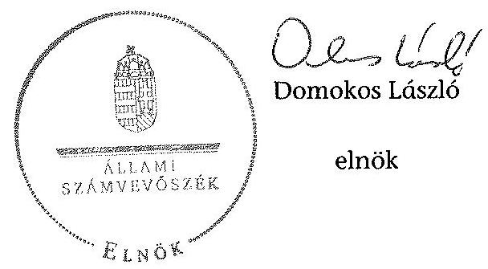
${ }^{21}$ Vhr. 9. § (3) bekezdés (hatályos 2010. december 31-ig), Vhr. 9. § (5) bekezdés (hatályos 2011. január 1-től)

# RÖVIDÍTÉSEK JEGYZÉKE 

| Jogszabályok |  |
| :--: | :--: |
| Alaptörvény | Magyarország Alaptörvénye (2011. április 25.) (hatályos: 2012. január 1-jétől) |
| Áht. 1 | Az államháztartásról szóló 1992. évi XXXVIII. törvény (hatálytalan: 2012. január 1-jétől) |
| Áht. 2 | Az államháztartásról szóló 2011. évi CXCV. törvény (hatályos: 2011. december 31-étől) |
| ÁSZ tv. | Az Állami Számvevőszékről szóló 2011. évi LXVI. törvény (hatályos: 2011. július 1-jétől) |
| Avtv. | A személyes adatok védelméről és a közérdekű adatok nyilvánosságáról szóló 1992. évi LXIII. törvény (hatálytalan: 2012. január 1-jétől) |
| Evt. $_{1}$ | Az erdőről és az erdő védelméről szóló 1996. évi LIV. törvény (hatálytalan: 2009. július 10-től) |
| Evt. $_{2}$ | Az erdőről, az erdő védelméről és az erdőgazdálkodásról szóló 2009. évi XXXVII. törvény (hatályos: 2009. július 10-étől) |
| Gt. | A gazdasági társaságokról szóló 2006. évi IV. törvény (hatálytalan: 2014. március 15-étől) |
| Infotv. | Az információs önrendelkezési jogról és az információszabadságról szóló 2011. évi CXII. törvény (hatályos: 2011. július 27-étől) |
| Mfbtv. | A Magyar Fejlesztési Bankról szóló 2001. évi XX. törvény |
| Nfatv. | A Nemzeti Földalapról szóló 2010. évi LXXXVII. törvény (hatályos: 2010. szeptember 1-jétől) |
| Nvtv. | A nemzeti vagyonról szóló 2011. évi CXCVI. törvény (hatályos: 2011. december 31-étől) |
| Számv. tv. | A számvitelről szóló 2000. évi C. törvény |
| régi Ptk. | A Polgári Törvénykönyvről szóló 1959. évi IV. törvény (hatálytalan: 2014. március 15-étől) |
| új Ptk. | A Polgári Törvénykönyvről szóló 2013. évi V. törvény (hatályos: 2014. március 15-étől) |
| Vadvédelmi tv. | A vad védelméről, a vadgazdálkodásról, valamint a vadászatról szóló 1996. évi LV. törvény |
| Vtv. | Az állami vagyonról szóló 2007. évi CVI. törvény |
| Vhr. | Az állami vagyonnal való gazdálkodásról szóló törvény végrehajtásáról szóló 254/2007. (X. 4.) Korm. rendelet |
| Egyéb rövidítések |  |
| Alapító okirat | IPOLY ERDŐ Zrt. Alapító okirata (hatályos: 2008. május 22-étől) |
| ÁFA | általános forgalmi adó |
| ÁSZ | Állami Számvevőszék |
| Belső Ellenőrzési Kézikönyv | IPOLY ERDŐ Zrt. Belső Ellenőrzési Kézikönyve (hatályos: 2009. május 20-tól) |

| Beruházási szabályzat ${ }_{1}$ | IPOLY ERDŐ Zrt. Beruházási szabályzata (hatályos: 2006. május 18-ától) |
| :--: | :--: |
| Beruházási szabályzat ${ }_{2}$ | IPOLY ERDŐ Zrt. Beruházási szabályzata (hatályos: 2013. május 1-jétől) |
| EEVR | Egységes Erdészeti Vállalatirányítási Rendszer |
| Ellenőrzési szabályzat ${ }_{1}$ | Az IPOLY ERDŐ Zrt. Ellenőrzési Szabályzata (hatályos: 1999. szeptember 1-jétől) |
| Ellenőrzési szabályzat ${ }_{2}$ | Az IPOLY ERDŐ Zrt. Ellenőrzési Szabályzata (hatályos: 2011. január 1-jétől) |
| Erdészeti hatóság | Heves Megyei Mezőgazdasági Szakigazgatási Hivatal Erdészeti Igazgatóság 2010. december 31-éig és a Heves Megyei Kormányhivatal Erdészeti Igazgatóság 2011. január 1-jétől |
| EU | Európai Unió |
| FB | IPOLY ERDŐ Zrt. Felügyelő Bizottsága |
| FB Ügyrendje ${ }_{1}$ | IPOLY ERDŐ Zrt. Felügyelő Bizottsága Ügyrendje (hatálytalan: 2010. május 20-ától) |
| FB Ügyrendje ${ }_{2}$ | IPOLY ERDŐ Zrt. Felügyelő Bizottsága Ügyrendje (hatályos: 2010. május 20-ától) |
| ha | hektár |
| HM | Honvédelmi Minisztérium |
| hrsz. | helyrajzi szám |
| INTOSAI | Legfőbb Ellenőrző Intézmények Nemzetközi Szervezete |
| IPOLY ERDŐ Zrt., Társaság | IPOLY ERDŐ Zártkörűen Működő Részvénytársaság |
| ISSAI | nemzetközi standardok |
| KVI | Kincstári Vagyoni Igazgatóság |
| Leltározási szabályzat ${ }_{1}$ | Az IPOLY ERDŐ Zrt. Leltározási Szabályzat (hatályos: 2007. január 1-jétől) |
| Leltározási szabályzat ${ }_{2}$ | Az IPOLY ERDŐ Zrt. Leltározási Szabályzat (hatályos: 2012. január 1-jétől) |
| MFB Zrt. | Magyar Fejlesztési Bank Zártkörűen Működő Részvénytársaság |
| MNV Zrt. | Magyar Nemzeti Vagyonkezelő Zrt., amely 2010. szeptember 1-jétől a Nemzeti Földalapba nem tartozó állami vagyon feletti tulajdonosi joggyakorló |
| NFA | Nemzeti Földalapkezelő Szervezet, amely 2010. szeptember 1-jétől az Nfatv.-ben meghatározott, a Nemzeti Földalapba tartozó földterületek feletti tulajdonosi joggyakorló |
| NFM | Nemzeti Fejlesztési Minisztérium |
| Önköltség-számítási szabályzat ${ }_{1}$ | IPOLY ERDŐ Zrt. Önköltség-számítási szabályzata (hatályos: 2002. november 30-ától) |
| Önköltség-számítási szabályzat ${ }_{2}$ | IPOLY ERDŐ Zrt. Önköltség-számítási szabályzata (hatályos: 2010. január 1-jétől) |
| Számlarend $_{1}$ | IPOLY ERDŐ Zrt. Számlarendje (hatályos: 2001. január 1-jétől) |

| Számlarend $_{2}$ | IPOLY ERDŐ Zrt. Számlarendje (hatályos: 2010. január 1-jétől) |
| :--: | :--: |
| Számlarend $_{3}$ | IPOLY ERDŐ Zrt. Számlarendje (hatályos: 2011. január 1-jétől) |
| Számlarend $_{4}$ | IPOLY ERDŐ Zrt. Számlarendje (hatályos: 2012. január 1-jétől) |
| Számviteli politika $_{1}$ | IPOLY ERDŐ Zrt. Számviteli politikája (hatályos: 2001. január 1-jétől) |
| Számviteli politika $_{2}$ | IPOLY ERDŐ Zrt. Számviteli politikája (hatályos: 2010. január 1-jétől) |
| SZMSZ $_{1}$ | IPOLY ERDŐ Zrt. Szervezeti és Működési Szabályzata (hatályos: 2004. március 26-ától) |
| SZMSZ $_{2}$ | IPOLY ERDŐ Zrt. Szervezeti és Működési Szabályzata (hatályos: 2010. október 28-ától) |
| ST | saját tőke |
| Társaság feletti tulajdonosi joggyakorló ${ }_{1}$ | a társaságok állami tulajdonú részesedése feletti tulajdonosi jogokat gyakorló Magyar Nemzeti Vagyonkezelő Zrt. (2009. január 1-jétől 2010. június 16-áig) |
| Társaság feletti tulajdonosi joggyakorló ${ }_{2}$ | a társaságok állami tulajdonú részesedése feletti tulajdonosi jogokat gyakorló Magyar Fejlesztési Bank Zrt. (2010. június 17-étől 2014. július 15-éig) |
| $\mathrm{VSZ}_{1}$ | KVI-vel 1996. november 1-én kötött ideiglenes Vagyonkezelési szerződés (azonosítója: 01840-96-02059) |
| $\mathrm{VSZ}_{2}$ | MNV Zrt.-vel 2008. július 17-én kötött Vagyonkezelési szerződés (azonosítója: SZT-28949) a Mosonpatak Erdőbirtokossági Termelő és Szolgáltató Társulat állami tulajdonú társulati érdekeltsége vagyonkezelésére |
| $\mathrm{VSZ}_{3}$ | MNV Zrt.-vel 2011. július 13-án kötött Vagyonkezelési szerződés (azonosító: SZT-36241) a Diósjenő külterületén lévő turistaház vagyonkezelésére |
| $\mathrm{VSZ}_{4}$ | Balassagyarmat Város Önkormányzatával 2012. február 27-én kötött Vagyonkezelési szerződés (azonosító: 44/2012) az Önkormányzat 100%-os tulajdonában álló erdőterületre |

# **Chemistry**

## **Chemical Reactions**

### **Balancing Chemical Equations**

1. **Write the unbalanced equation:**
   - Example: $$C_3H_8 + O_2 \rightarrow CO_2 + H_2O$$

2. **Balance the equation:**
   - Example: $$2C_3H_8 + 7O_2 \rightarrow 6CO_2 + 8H_2O$$

3. **Balance the equation:**
   - Example:

 $$2C_3H_8 + 7O_2 \rightarrow 6CO_2 + 8H_2O$$

### **Types of Reactions**

1. **Combination Reaction:**
   - Example: $$2H_2 + O_2 \rightarrow 2H_2O$$

2. **Decomposition Reaction:**
   - Example: $$2H_2O_2 \rightarrow 2H_2O + O_2$$

3. **Single Displacement Reaction:**
   - Example: $$Zn + 2HCl \rightarrow ZnCl_2 + H_2$$

4. **Double Displacement Reaction:**
   - Example: $$AgNO_3 + NaCl \rightarrow AgCl + NaNO_3$$

5. **Combustion Reaction:**
   - Example: $$CH_4 + 2O_2 \rightarrow CO_2 + 2H_2O$$

## **Stoichiometry**

### **Mole Concept**

- **Mole (mol):** The amount of substance containing as many particles (atoms, molecules, ions) as there are atoms in exactly 12 grams of carbon-12.
- **Avogadro's Number:** $$6.022 \times 10^{23}$$ particles per mole.

### **Molar Mass**

- **Molar Mass:** The mass of one mole of a substance.
- Example: The molar mass of water ($$H_2O$$) is 18.015 g/mol.

### **Calculations**

1. **Moles to Mass:**
   - Formula: $$n = \frac{m}{M}$$
   - Example: Calculate the number of moles of $$H_2O$$ in 18 grams of water.
     - $$n = \frac{18 \, \text{g}}{18.015 \, \text{g/mol}} \approx 0.999 \, \text{mol}$$

2. **Moles to Mass:**
   - Formula: $$m = n \times M$$
   - Example: Calculate the mass of 1 mole of water.
     - $$m = 1 \, \text{mol} \times 18.015 \, \text{g/mol} = 18.015 \, \text{g}$$

## **Gas Laws**

### **Ideal Gas Law**

- **Equation:** $$PV = nRT$$
- **Variables:**
  - $$P$$: Pressure (atm)
  - $$V$$: Volume (L)
  - $$n$$: Number of moles (mol)
  - $$R$$: Ideal gas constant (0.0821 L·atm/mol·K)
  - $$T$$: Temperature (K)

### **Boyle's Law**

- **Equation:** $$P_1V_1 = P_2V_2$$
- **Variables:**
  - $$P_1$$: Pressure (atm)
  - $$V_1$$: Volume (L)
  - $$P_2$$: Pressure (atm)
  - $$V_2$$: Volume (L)

### **Boyle's Law (Corrected)**

- **Equation:** $$\frac{P_1V_1}{T_1} = \frac{P_2V_2}{T_2}$$
- **Variables:**
  - $$P_1$$: Pressure (atm)
  - $$V_1$$: Volume (L)
  - $$T_1$$: Temperature (K)
  - $$P_2$$: Pressure (atm)
  - $$V_2$$: Volume (L)
  - $$T_2$$: Temperature (K)

## **Thermochemistry**

### **Enthalpy (H)**

- **Definition:** The heat content of a system at constant pressure.
- **Change in Enthalpy (ΔH):** $$ΔH = q_p$$
- **Change in Enthalpy (ΔH):**  The provided equations for ΔH1 and ΔH2 appear to be incorrectly formulated and are removed to avoid propagating errors.

### **Hess's Law**

- **Statement:** The enthalpy change for a reaction is the same whether it occurs in one step or multiple steps.
- **Equation:** The provided equation for ΔH is removed to avoid propagating errors.
- **Statement:** The enthalpy change for a reaction is the same whether it occurs in one step or multiple steps.

### **Calculations**

1. **Moles to Mass:**
   - Formula: $$m = n \times M$$
   - Example: Calculate the moles of $$H_2O$$ in 18 grams of water.
     - $$n = \frac{18 \, \text{g}}{18.015 \, \text{g/mol}} \approx 0.999 \, \text{mol}$$

2. **Moles to Mass:**
   - Formula: $$m = n \times M$$
   - Example: Calculate the mass of 1 mole of water.
     - $$m = 1 \, \text{mol} \times 18.015 \, \text{g/mol} = 18.015 \, \text{g}$$

## **Electrochemistry**

### **Oxidation and Reduction**

- **Oxidation:** Loss of electrons.
- **Reduction:** Gain of electrons.

### **Galvanic Cells**

- **Definition:** A cell that converts chemical energy into electrical energy.
- **Components:**
  - Anode: Oxidation occurs.
  - Cathode: Reduction occurs.
  - Salt Bridge: Connects the two half-cells.

### **Nernst Equation**

- **Equation:** $$E = E^\circ - \frac{RT}{nF} \ln Q$$
- **Variables:**
  - $$E$$: Cell potential
  - $$R$$: Ideal gas constant
  - $$T$$: Temperature (K)
  - $$n$$: Number of electrons transferred
  - $$F$$: Faraday constant
  - $$Q$$: Reaction quotient

---

# FOGALOMTÁR 

állami vagyon
a) az állam tulajdonában lévő dolog, valamint dolog módjára hasznosítható természeti erő;
b) az a) pont hatálya alá tartozó mindazon vagyon, amely vonatkozásában törvény az állam kizárólagos tulajdonjogát nevesíti;
c) az állam tulajdonában lévő tagsági jogviszonyt megtestesítő értékpapír, illetve az államot megillető egyéb társasági részesedés;
d) az államot megillető olyan immateriális, vagyoni értékkel rendelkező jogosultság, amelyet jogszabály vagyoni értékű jogként nevesít;
e) az állam tulajdonában lévő pénzügyi eszközök.
állami vagyon használója
állami szervezet Átlátható szervezet a Nvtv. 3. § (1) bekezdés 1. pontjában felsorolt, a meghatározott követelményeknek megfelelő szervezet.
földbirtok-politikai irányelvek
hasznosítás
immateriális szolgáltatásából származó bevétel
információs és kommunikációs rendszer
kockázatkezelés

Az állami vagyon használója az a természetes vagy jogi személy, jogi személyiséggel nem rendelkező szervezet, aki, vagy amely törvény vagy szerződés alapján, bármely jogcímen (bérlet, haszonbérlet, használat stb.) állami vagyont birtokol, használ, szedi annak hasznait. (Ide nem értve a haszonélvezőt, a vagyonkezelőt és a tulajdonosi jogok gyakorlóját.)
Átlátható szervezet a Nvtv. 3. § (1) bekezdés 1. pontjában felsorolt, a meghatározott követelményeknek megfelelő szervezet.
Az Nfatv. 15. § (3) bekezdés a)-s) pontjaiban meghatározott, a Nemzeti Földalapba tartozó földrészletek hasznosítására vonatkozó irányelvek.
Hasznosítás a tulajdonosi joggyakorló vagy a nemzeti vagyon használója által a nemzeti vagyon birtoklásának, használatának, hasznok szedése jogának bármely - a tulajdonjog átruházását nem eredményező - jogcímen történő átengedése, ide nem értve a vagyonkezelésbe adást, valamint a haszonélvezeti jog alapítását.
Immateriális szolgáltatásból származó bevételek azok a nem anyagjellegű szolgáltatásokból származó állami bevételek, amelyeket az Evt. 3. § (1) bekezdése szerint, a külön jogszabályban meghatározott részletes feltételek szerint, az erdők fenntartására, gyarapítására és védelmére kell fordítani.
Az információs és kommunikációs rendszer biztosítja, hogy az információk eljussanak az illetékes szervezethez, szervezeti egységhez, illetve személyhez.
A kockázatkezelés a szervezet céljai elérésével kapcsolatos kockázatok azonosításának és elemzésének, valamint a megfelelő válaszok meghatározásának folyamata.

---

kockázatkezelési rendszer
kontrolling
kontrollkörnyezet
kontrolltevékenységek
közfeladat

A kockázatkezelési rendszer működtetése során fel kell mérni és meg kell állapítani a szervezet tevékenységében, gazdálkodásában rejlő kockázatokat, valamint meg kell határozni az egyes kockázatokkal kapcsolatban szükséges intézkedéseket, valamint azok teljesítésének folyamatos nyomon követésének módját.
A kockázatkezelési rendszer olyan irányítási eszközök és módszerek összessége, amelynek elemei a szervezeti célok elérését veszélyeztető tényezők (kockázatok) azonosítása, elemzése, nyomon követése, valamint szükség esetén a kockázati kitettség mérséklése.
Az a vezetéstámogató rendszer, amely a vezetői tervezést, ellenőrzést, valamint információ-ellátást koordinálja célorientáltan a környezeti változásokhoz igazodva.
A kontroll környezet elemei: a szervezeti struktúra, a felelősségi, hatásköri viszonyok és feladatok, a szervezet minden szintjén meghatározott etikai elvárások, a humánerőforráskezelés. A kontrollkörnyezet alapozza meg a belső kontroll összes többi elemét a fegyelem és a struktúra biztosítása által.
A kontrollrendszer a kockázatok kezelése és tárgyilagos bizonyosság megszerzése érdekében kialakított folyamatrendszer, amely azt a célt szolgálja, hogy megvalósuljanak a következő célok:
a) a működés és a gazdálkodás során a tevékenységeket szabályszerűen, gazdaságosan, hatékonyan, eredményesen hajtsák végre,
b) az elszámolási kötelezettségeket teljesítsék, és
c) megvédjék az erőforrásokat a veszteségektől, károktól és nem rendeltetésszerű használattól.
A kontrolltevékenységek azok az elvek (politikák) és eljárások, amelyeket a kockázatok meghatározása és a szervezet céljainak elérése érdekében alakítanak ki.
A közfeladat jogszabályban meghatározott állami vagy önkormányzati feladat, amit az arra kötelezett közérdekből, jogszabályban meghatározott követelményeknek és feltételeknek megfelelve végez, ideértve a lakosság közszolgáltatásokkal való ellátását, továbbá az állam nemzetközi szerződésekben vállalt kötelezettségeiből adódó közérdekű feladatokat, valamint e feladatok ellátásához szükséges infrastruktúra biztosítását is.
Az Evt. 2. § (2) bekezdése szerint a fenntartható erdőgazdálkodás során a legfontosabb közérdekű feladat az erdők változatosságának megőrzése, az erdők fenntartása, felújítása és a védelmi, valamint közjóléti szolgáltatások biztosítása, melyek elvégzését az állam megfelelő eszközökkel biztosítja.

---

monitoring

Nemzeti Földalap
nemzeti vagyon használója
rábízott állami vagyon
társasági portfólió
tulajdonosi ellenőrzés
tulajdonosi joggyakorló

A szervezet tevékenységének, a célok megvalósításának nyomon követését biztosító rendszer, amely az operatív tevékenységek keretében megvalósuló folyamatos és eseti nyomon követésből, valamint az operatív tevékenységektől függetlenül működő belső ellenőrzésből áll.
A monitoring a projektek és programok végrehajtásának nyomon követése, mely a támogató és a kedvezményezett közti megállapodásban foglalt eljárások követését, az előrehaladás ellenőrzését és a lehetséges problémák időben történő azonosítását szolgálja.
A Nemzeti Földalap a kincstári vagyon része, amelybe beletartoznak az állam tulajdonában és az ingatlan-nyilvántartásban levő, az Nfatv. 1. § (1)-(2) bekezdéseiben felsorolt területek, földrészletek és az azokhoz kapcsolódó vagyoni értékű jogok.
A nemzeti vagyon használója az a természetes személy, jogi személy vagy jogi személyiséggel nem rendelkező szervezet, aki, vagy amely állami vagyon tekintetében törvény vagy szerződés alapján, a helyi önkormányzat vagyona tekintetében törvény, a helyi önkormányzat rendelete vagy szerződés alapján bármely jogcímen nemzeti vagyont birtokol, használ, szedi annak hasznait, kivéve a tulajdonosi joggyakorló (az Nvtv. 3. § (1) bekezdés 11. pontja alapján).
Rábízott állami vagyon az a Vtv. alkalmazásában állami vagyonnak minősülő vagyon, amit az MNV - a saját vagyonától elkülönítetten - kezel és nyilvántart.
Az Mfbtv. 3. § (9) bekezdése szerint rábízott állami vagyon az a vagyon, amely felett az Mfbtv. erejénél fogva a Magyar Állam nevében az MFB gyakorolja a tulajdonosi jogokat.
Az Nfatv. 1. § (1) bekezdésében foglaltak alapján az NFA-hoz tartozó rábízott vagyon a törvényben meghatározott, a Nemzeti Földalapba tartozó vagyon.
Társasági portfólió az MNV, illetve az MFB rábízott vagyonába tartozó állami tulajdonú társasági részesedések.
A tulajdonosi joggyakorló által végzett ellenőrzés, amelynek célja az állami vagyonnal való gazdálkodás vizsgálata, ennek keretében a rendeltetésellenes, jogszerűtlen, szerződésellenes, vagy a tulajdonos érdekeit sértő, illetve a központi költségvetést hátrányosan érintő vagyongazdálkodási intézkedések feltárása és a jogszerű állapot helyreállítása, továbbá a vagyonnyilvántartás hitelességének, teljességének és helyességének biztosítása.
Tulajdonosi joggyakorló az, aki az állami, illetve a nemzeti vagyon felett az államot megillető tulajdonosi jogok és kötelezettségek gyakorlására jogosult.

---

tulajdonosi joggyakorlás módja
vagyongazdálkodás feladata
vagyonkezelői jog

Az állami vagyon felett a Magyar Államot megillető tulajdonosi jogoknak (és kötelezettségeknek) az összességét az állami vagyon felügyeletéért felelős miniszter gyakorolja, aki e feladatát az MNV, az MFB, illetve egyéb tulajdonosi joggyakorló szervezet (pl. központi költségvetési szervek, 100%-ban állami tulajdonban álló gazdasági társaságok) útján látja el. Azon állami tulajdonban álló ingatlanok felett, amelyek egy része a Nemzeti Földalapba tartozik, a tulajdonosi jogokat a miniszter az agrárpolitikáért felelős miniszterrel közösen gyakorolja.
A Nemzeti Földalap felett a Magyar Állam nevében a tulajdonosi jogokat és kötelezettségeket az agrárpolitikáért felelős miniszter a Nemzeti Földalapkezelő Szervezet útján gyakorolja.
Az állami vagyon rendeltetésének megfelelő - az állami feladatok ellátásához, a társadalmi szükségletek kielégítéséhez, valamint a Kormány gazdaságpolitikája megvalósításának elősegítéséhez szükséges, egységes elveken alapuló, önálló ágazatként megjelenő - hatékony, költségtakarékos, értékmegőrző, értéknövelő felhasználásának biztosítása, beleértve a vagyoni kör változását eredményező értékesítést, valamint az állami vagyon gyarapítása is.
Vagyonkezelési szerződés alapján a vagyonkezelő jogosult meghatározott, állami tulajdonba tartozó dolog birtoklására, használatára és hasznai szedésére.
A Vtv. alapján
 a vagyonkezelői jog az állami vagyon hasznosítására az MNV-vel kötött vagyonkezelési szerződéssel jön létre. A vagyonkezelési szerződés alapján a vagyonkezelő jogosult meghatározott, állami tulajdonba tartozó dolog birtoklására, használatára és hasznai szedésére.
Az Nftv. alapján a vagyonkezelői jog az erre irányuló (NFA-val kötött) szerződéssel jön létre. A vagyonkezelői szerződés alapján a vagyonkezelő jogosult meghatározott földrészlet birtoklására, használatára és hasznai szedésére. A vagyonkezelő köteles a földrészlet értékét megőrizni, állagának megóvásáról, jó karban tartásáról gondoskodni, továbbá - az Nftv.-ben meghatározott esetek kivételével - díjat fizetni vagy a szerződésben előírt más kötelezettséget teljesíteni.

---

Az IPOLY ERDŐ Zrt. vagyonának alakulása a 2009-2014. I. félév közötti időszakban

|  Sorszám | Megnevezés | 2009.01.01 | 2009.12.31 | 2010.12.31 | 2011.12.31 | 2012.12.31 | 2013.12.31 | 2014.06.30 | Változás 2013.12.31/2009.12.31 (%) |
|---|---|---|---|---|---|---|---|---|
| 1. | Eszközök |  |  |  |  |  |  |  |  |
| 2. | Befektetett eszközök összesen | 3111622 | 3370867 | 3464918 | 4056278 | 4398117 | 4793213 | 4993853 | 142% |
| 3. | Ebből: Immateriális javak | 22934 | 30125 | 25920 | 18620 | 14795 | 65623 | 58766 | 218% |
| 4. | Tárgyi eszközök | 2778439 | 2843152 | 3418385 | 3564218 | 3949909 | 3888670 | 4096329 | 137% |
| 5. | Befektetett pénzügyi eszközök | 310249 | 497590 | 20610 | 473440 | 433413 | 838920 | 838758 | 169% |
| 6. | Forgóeszközök | 1124134 | 1029113 | 1418441 | 1363986 | 1744902 | 1278057 | 1305377 | 134% |
| 7. | Ebből: Készletek | 344118 | 261177 | 213016 | 299066 | 285156 | 340348 | 322396 | 130% |
| 8. | Követelések | 234263 | 371621 | 206375 | 196119 | 187218 | 213941 | 159396 | 58% |
| 9. | Értékpapírok | 495114 | 81464 | 567692 | 533463 | 562839 | 27280 | 120571 | 53% |
| 10. | Pénzeszközök | 50639 | 314851 | 431358 | 333338 | 709689 | 696488 | 713014 | 221% |
| 11. | Aktív időbeli elhatárolások | 31160 | 106363 | 164632 | 133759 | 136749 | 136067 | 64684 | 128% |
| 12. | Eszközök összesen | 4266916 | 4506343 | 5047988 | 5554023 | 6279768 | 6207337 | 6363914 | 138% |
| 13. | Források |  |  |  |  |  |  |  |  |
| 14. | Saját tőke | 3040635 | 3245693 | 3336179 | 3459837 | 3530920 | 3830083 | 4278877 | 118% |
| 15. | Ebből: Jegyzett tőke | 1284480 | 1401190 | 1401190 | 1401190 | 1401190 | 1591190 | 1591190 | 114% |
| 16. | Tőketartalék | 906578 | 906578 | 906578 | 906578 | 906578 | 906578 | 906578 | 100% |
| 17. | Termeléstartalék | 723207 | 837160 | 937925 | 958983 | 1106779 | 1161456 | 1270619 | 139% |
| 18. | Lekötött tartalék | 49430 | 12417 | 0 | 69426 | 44927 | 61696 | 61696 | 497% |
| 19. | Értékelési tartalék | 0 | 0 | 0 | 0 | 0 | 0 | 0 | 0% |
| 20. | Még le nem szedett eredmény | 76920 | 88348 | 90486 | 123658 | 71446 | 109163 | 448794 | 124% |
| 21. | Kötelezettségek | 20909 | 101620 | 131681 | 85842 | 201131 | 183817 | 178689 | 181% |
| 22. | Kötelezettségek | 661335 | 681780 | 939940 | 885234 | 1330248 | 1013385 | 681522 | 149% |
| 23. | Ebből: Hátrasorolt kötelezettségek | 0 | 0 | 0 | 0 | 0 | 0 | 0 | 0% |
| 24. | Hosszú lejáratú kötelezettségek | 21724 | 17379 | 15033 | 8688 | 397517 | 58314 | 58426 | 222% |
| 25. | Rövid lejáratú kötelezettségek | 639611 | 664361 | 926907 | 876546 | 932711 | 974871 | 643096 | 147% |
| 26. | Passzív időbeli elhatárolások | 544037 | 477480 | 640188 | 1133110 | 1217469 | 1180052 | 1225026 | 247% |
| 27. | Források összesen | 4266916 | 4506343 | 5047988 | 5554023 | 6279768 | 6207337 | 6363914 | 138% |

---

# Az IPOLY ERDŐ Zrt.

immateriális javainak és tárgyi eszközállományának megoszlása a 2013. évre vonatkozóan adatok ezer Ft-ban

| Sorszám | Megnevezés | Immateriális javak | Ingatlanok | Műszaki berendezések | Egyéb berendezések | Beruházás a beruházásra adott előleggel együtt | Tárgyi eszközök összesen |
|---|---|---|---|---|---|---|---|
| 1. | Bruttó érték január 1-jén | 99133,0 | 4172109,0 | 865746,0 | 600756,0 | 95078,0 | 5734803,0 |
| 2. | -ebből: állami vagyon | 0,0 | 393213,0 | 0,0 | 0,0 | 0,0 | 393213,0 |
| 3. | -ebből: saját vagyon | 99133,0 | 3778896,0 | 865746,0 | 600756,0 | 95078,0 | 5341590,0 |
| 4. | Növekedés (+) | 61718,0 | 118655,0 | 66666,0 | 53756,0 | 634374,0 | 874873,0 |
| 5. | -ebből: állami vagyon | 0,0 | 399,0 | 0,0 | 0,0 | 4625,0 | 5024,0 |
| 6. | -ebből: saját vagyon | 61718,0 | 118256,0 | 66666,0 | 53756,0 | 629749,0 | 869849,0 |
| 7. | Csökkenés (-) | -293,0 | -355032,0 | -45090,0 | -18973,0 | -304086,0 | -723241,0 |
| 8. | -ebből: állami vagyon | 0,0 | -355032,0 | 0,0 | 0,0 | 0,0 | -355032,0 |
| 9. | -ebből: saját vagyon | -293,0 | 0,0 | -45090,0 | -18973,0 | -304086,0 | -368209,0 |
| 10. | Bruttó érték december 31-én | 160558,0 | 3935732,0 | 887322,0 | 635539,0 | 425366,0 | 5886435,0 |
| 11. | -ebből: állami vagyon | 0,0 | 38580,0 | 0,0 | 0,0 | 4625,0 | 43205,0 |
| 12. | -ebből: saját vagyon | 160558,0 | 3897152,0 | 887322,0 | 635539,0 | 420741,0 | 5843230,0 |
| 13. | Halmozott értékcsökkenés január 1-jén | 84338,0 | 805183,0 | 537320,0 | 441665,0 | 0,0 | 1784894,0 |
| 14. | -ebből: állami vagyon | 0,0 | 67,0 | 0,0 | 0,0 | 0,0 | 67,0 |
| 15. | -ebből: saját vagyon | 84338,0 | 805116,0 | 537320,0 | 441665,0 | 0,0 | 1784827,0 |
| 16. | Értékcsökkenés növekedése (+) (költségként elszámolt) | 10890,0 | 116891,0 | 53382,0 | 50755,0 | 0,0 | 222013,0 |
| 17. | -ebből: állami vagyon | 0,0 | 89,0 | 0,0 | 0,0 | 0,0 | 89,0 |
| 18. | -ebből: saját vagyon | 10890,0 | 116802,0 | 53382,0 | 50755,0 | 0,0 | 221924,0 |
| 22. | Értékcsökkenés egyéb ráfordításként elszámolva (z) | 0,0 | 0,0 | 22292,0 | 7288,0 | 0,0 | 29580,0 |
| 23. | -ebből: állami vagyon | 0,0 | 0,0 | 0,0 | 0,0 | 0,0 | 0,0 |
| 24. | -ebből: saját vagyon | 0,0 | 0,0 | 22292,0 | 7288,0 | 0,0 | 29580,0 |
| 25. | Egyéb változás az értékcsökkenésben (z) | -293,0 | 0,0 | -24543,0 | -14119,0 | 0,0 | -38722,0 |
| 26. | -ebből: állami vagyon | 0,0 | 0,0 | 0,0 | 0,0 | 0,0 | 0,0 |
| 27. | -ebből: saját vagyon | -293,0 | 0,0 | -24543,0 | -14119,0 | 0,0 | -38722,0 |
| 28. | Halmozott értékcsökkenés december 31-én: | 94935,0 | 922074,0 | 588451,0 | 485589,0 | 0,0 | 1997765,0 |
| 29. | -ebből: állami vagyon | 0,0 | 156,0 | 0,0 | 0,0 | 0,0 | 156,0 |
| 30. | -ebből: saját vagyon | 94935,0 | 921918,0 | 588451,0 | 485589,0 | 0,0 | 1997659,0 |
| 31. | Nettó érték december 31-én: | 65623,0 | 3013658,0 | 298871,0 | 149950,0 | 425366,0 | 3888670,0 |
| 32. | -ebből: állami vagyon | 0,0 | 38424,0 | 0,0 | 0,0 | 4625,0 | 43049,0 |
| 33. | -ebből:saját vagyon | 65623,0 | 2975234,0 | 298871,0 | 149950,0 | 420741,0 | 3845621,0 |

---

| SZÁMÚ MELLÉKLET | A V-0749-162/2015. SZÁMÚ JELENTÉS |
|---|---|
|  |  |

| SZÁMÚ MELLÉKLET | A V-0749-162/2015. SZÁMÚ JELENTÉS |  |  |  |  |  |  |  |  |  |  |  |  |  |  |  |  |  |  |  |  |  |  |  |
|---|---|---|---|---|---|---|---|---|---|---|---|---|---|---|---|---|---|---|---|---|---|---|---|---|
 | --- |
| 50-01-2015 |  |  |  |  |  |  |  |  |  |  |  |  |  |  |  |  |  |  |  |  |  |  |  |  |   |
| Statutárium |  |  |  |  |  |  |  |  |  |  |  |  |  |  |  |  |  |  |  |  |  |  |  |  |   |
| Ár |  |  |  |  |  |  |  |  |  |  |  |  |  |  |  |  |  |  |  |  |  |  |  |  |   |
| 1. |  |  |  |  |  |  |  |  |  |  |  |  |  |  |  |  |  |  |  |  |  |  |  |  |   |
| 2. |  |  |  |  |  |  |  |  |  |  |  |  |  |  |  |  |  |  |  |  |  |  |  |  |   |
| 3. |  |  |  |  |  |  |  |  |  |  |  |  |  |  |  |  |  |  |  |  |  |  |  |  |   |
| 4. |  |  |  |  |  |  |  |  |  |  |  |  |  |  |  |  |  |  |  |  |  |  |  |  |   |
| 5. |  |  |  |  |  |  |  |  |  |  |  |  |  |  |  |  |  |  |  |  |  |  |  |  |   |
| 6. |  |  |  |  |  |  |  |  |  |  |  |  |  |  |  |  |  |  |  |  |  |  |  |  |   |
| 7. |  |  |  |  |  |  |  |  |  |  |  |  |  |  |  |  |  |  |  |  |  |  |  |  |   |
| 8. |  |  |  |  |  |  |  |  |  |  |  |  |  |  |  |  |  |  |  |  |  |  |  |  |   |
| 9. |  |  |  |  |  |  |  |  |  |  |  |  |  |  |  |  |  |  |  |  |  |  |  |  |   |
| 10. |  |  |  |  |  |  |  |  |  |  |  |  |  |  |  |  |  |  |  |  |  |  |  |  |   |
| 11. |  |  |  |  |  |  |  |  |  |  |  |  |  |  |  |  |  |  |  |  |  |  |  |  |   |
| 12. |  |  |  |  |  |  |  |  |  |  |  |  |  |  |  |  |  |  |  |  |  |  |  |  |   |
| 13. |  |  |  |  |  |  |  |  |  |  |  |  |  |  |  |  |  |  |  |  |  |  |  |  |   |
| 14. |  |  |  |  |  |  |  |  |  |  |  |  |  |  |  |  |  |  |  |  |  |  |  |  |   |
| 15. |  |  |  |  |  |  |  |  |  |  |  |  |  |  |  |  |  |  |  |  |  |  |  |  |   |
| 16. |  |  |  |  |  |  |  |  |  |  |  |  |  |  |  |  |  |  |  |  |  |  |  |  |   |
| 17. |  |  |  |  |  |  |  |  |  |  |  |  |  |  |  |  |  |  |  |  |  |  |  |  |   |
| 18. |  |  |  |  |  |  |  |  |  |  |  |  |  |  |  |  |  |  |  |  |  |  |  |  |   |
| 19. |  |  |  |  |  |  |  |  |  |  |  |  |  |  |  |  |  |  |  |  |  |  |  |  |   |
| 20. |  |  |  |  |  |  |  |  |  |  |  |  |  |  |  |  |  |  |  |  |  |  |  |  |   |
| 21. |  |  |  |  |  |  |  |  |  |  |  |  |  |  |  |  |  |  |  |  |  |  |  |  |   |
| 22. |  |  |  |  |  |  |  |  |  |  |  |  |  |  |  |  |  |  |  |  |  |  |  |  |   |
| 23. |  |  |  |  |  |  |  |  |  |  |  |  |  |  |  |  |  |  |  |  |  |  |  |  |   |
| 24. |  |  |  |  |  |  |  |  |  |  |  |  |  |  |  |  |  |  |  |  |  |  |  |  |   |
| 25. |  |  |  |  |  |  |  |  |  |  |  |  |  |  |  |  |  |  |  |  |  |  |  |  |   |
| 26. |  |  |  |  |  |  |  |  |  |  |  |  |  |  |  |  |  |  |  |  |  |  |  |  |   |
| 27. |  |  |  |  |  |  |  |  |  |  |  |  |  |  |

  |  |  |  |  |  |  |  |  |  |   |
|  28. |  |  |  |  |  |  |  |  |  |  |  |  |  |  |  |  |  |  |  |  |  |  |  |  |   |
|  29. |  |  |  |  |  |  |  |  |  |  |  |  |  |  |  |  |  |  |  |  |  |  |  |  |   |
|  30. |  |  |  |  |  |  |  |  |  |  |  |  |  |  |  |  |  |  |  |  |  |  |  |  |   |
|  31. |  |  |  |  |  |  |  |  |  |  |  |  |  |  |  |  |  |  |  |  |  |  |  |  |   |
|  32. |  |  |  |  |  |  |  |  |  |  |  |  |  |  |  |  |  |  |  |  |  |  |  |  |   |
|  33. |  |  |  |  |  |  |  |  |  |  |  |  |  |  |  |  |  |  |  |  |  |  |  |  |   |
|  34. |  |  |  |  |  |  |  |  |  |  |  |  |  |  |  |  |  |  |  |  |  |  |  |  |   |
|  35. |  |  |  |  |  |  |  |  |  |  |  |  |  |  |  |  |  |  |  |  |  |  |  |  |   |
|  36. |  |  |  |  |  |  |  |  |  |  |  |  |  |  |  |  |  |  |  |  |  |  |  |  |   |
|  37. |  |  |  |  |  |  |  |  |  |  |  |  |  |  |  |  |  |  |  |  |  |  |  |  |   |
|  38. |  |  |  |  |  |  |  |  |  |  |  |  |  |  |  |  |  |  |  |  |  |  |  |  |   |
|  39. |  |  |  |  |  |  |  |  |  |  |  |  |  |  |  |  |  |  |  |  |  |  |  |  |   |
|  40. |  |  |  |  |  |  |  |  |  |  |  |  |  |  |  |  |  |  |  |  |  |  |  |  |   |
|  41. |  |  |  |  |  |  |  |  |  |  |  |  |  |  |  |  |  |  |  |  |  |  |  |  |   |
|  42. |  |  |  |  |  |  |  |  |  |  |  |  |  |  |  |  |  |  |  |  |  |  |  |  |   |
|  43. |  |  |  |  |  |  |  |  |  |  |  |  |  |  |  |  |  |  |  |  |  |  |  |  |   |
|  44. |  |  |  |  |  |  |  |  |  |  |  |  |  |  |  |  |  |  |  |  |  |  |  |  |   |
|  45. |  |  |  |  |  |  |  |  |  |  |  |  |  |  |  |  |  |  |  |  |  |  |  |  |   |
|  46. |  |  |  |  |  |  |  |  |  |  |  |  |  |  |  |  |  |  |  |  |  |  |  |  |   |
|  47. |  |  |  |  |  |  |  |  |  |  |  |  |  |  |  |  |  |  |  |  |  |  |  |  |   |
|  48. |  |  |  |  |  |  |  |  |  |  |  |  |  |  |  |  |  |  |  |  |  |  |  |  |   |
|  49. |  |  |  |  |  |  |  |  |  |  |  |  |  |  |  |  |  |  |  |  |  |  |  |  |   |
|  50. |  |  |  |  |  |  |  |  |  |  |  |  |  |  |  |  |  |  |  |  |  |  |  |  |   |
|  51. |  |  |  |  |  |  |  |  |  |  |  |  |  |  |  |  |  |  |  |  |  |  |  |  |   |
|  52. |  |  |  |  |  |  |  |  |  |  |  |  |  |  |  |  |  |  |  |  |  |  |  |  |   |
|  53. |  |  |  |  |  |  |  |  |  |  |  |  |  |  |  |  |  |  |  |  |  |  |  |  |   |
|  54. |  |  |  |  |  |  |  |  |  |  |  |  |  |  |  |  |  |  |  |  |  |  |  |  |   |
|  55. |  |  |  |  |  |  |  |  |  |  |  |  |  |  |  |  |  |  |  |  |  |  |  |  |   |
|  56. |  |  |  |  |  |  |  |  |  |  |  |  |  |  |  |  |  |  |  |  |  |  |  |  |   |
|  57. |  |  |  |  |

  |  |  |  |  |  |  |  |  |  |  |  |  |  |  |  |  |  |  |  |   |
|  58. |  |  |  |  |  |  |  |  |  |  |  |  |  |  |  |  |  |  |  |  |  |  |  |  |   |
|  59. |  |  |  |  |  |  |  |  |  |  |  |  |  |  |  |  |  |  |  |  |  |  |  |  |   |
|  60. |  |  |  |  |  |  |  |  |  |  |  |  |  |  |  |  |  |  |  |  |  |  |  |  |   |
|  61. |  |  |  |  |  |  |  |  |  |  |  |  |  |  |  |  |  |  |  |  |  |  |  |  |   |
|  62. |  |  |  |  |  |  |  |  |  |  |  |  |  |  |  |  |  |  |  |  |  |  |  |  |   |
|  63. |  |  |  |  |  |  |  |  |  |  |  |  |  |  |  |  |  |  |  |  |  |  |  |  |   |
|  64. |  |  |  |  |  |  |  |  |  |  |  |  |  |  |  |  |  |  |  |  |  |  |  |  |   |
|  65. |  |  |  |  |  |  |  |  |  |  |  |  |  |  |  |  |  |  |  |  |  |  |  |  |   |
|  66. |  |  |  |  |  |  |  |  |  |  |  |  |  |  |  |  |  |  |  |  |  |  |  |  |   |
|  67. |  |  |  |  |  |  |  |  |  |  |  |  |  |  |  |  |  |  |  |  |  |  |  |  |   |
|  68. |  |  |  |  |  |  |  |  |  |  |  |  |  |  |  |  |  |  |  |  |  |  |  |  |   |
|  69. |  |  |  |  |  |  |  |  |  |  |  |  |  |  |  |  |  |  |  |  |  |  |  |  |   |
|  70. |  |  |  |  |  |  |  |  |  |  |  |  |  |  |  |  |  |  |  |  |  |  |  |  |   |
|  71. |  |  |  |  |  |  |  |  |  |  |  |  |  |  |  |  |  |  |  |  |  |  |  |  |   |
|  72. |  |  |  |  |  |  |  |  |  |  |  |  |  |  |  |  |  |  |  |  |  |  |  |  |   |
|  73. |  |  |  |  |  |  |  |  |  |  |  |  |  |  |  |  |  |  |  |  |  |  |  |  |   |
|  74. |  |  |  |  |  |  |  |  |  |  |  |  |  |  |  |  |  |  |  |  |  |  |  |  |   |
|  75. |  |  |  |  |  |  |  |  |  |  |  |  |  |  |  |  |  |  |  |  |  |  |  |  |   |
|  76. |  |  |  |  |  |  |  |  |  |  |  |  |  |  |  |  |  |  |  |  |  |  |  |  |   |
|  77. |  |  |  |  |  |  |  |  |  |  |  |  |  |  |  |  |  |  |  |  |  |  |  |  |   |
|  78. |  |  |  |  |  |  |  |  |  |  |  |  |  |  |  |  |  |  |  |  |  |  |  |  |   |
|  79. |  |  |  |  |  |  |  |  |  |  |  |  |  |  |  |  |  |  |  |  |  |  |  |  |   |
|  80. |  |  |  |  |  |  |  |  |  |  |  |  |  |  |  |  |  |  |  |  |  |  |  |  |   |
|  81. |  |  |  |  |  |  |  |  |  |  |  |  |  |  |  |  |  |  |  |  |  |  |  |  |   |
|  82. |  |  |  |  |  |  |  |  |  |  |  |  |  |  |  |  |  |  |  |  |  |  |  |  |   |
|  83. |  |  |  |  |  |  |  |  |  |  |  |  |  |  |  |  |  |  |  |  |  |  |  |  |   |
|  84. |  |  |  |  |  |  |  |  |  |  |  |  |  |  |  |  |  |  |  |  |  |  |  |  |   |
|  85. |  |  |  |  |  |  |  |  |  |  |  |  |  |  |  |  |  |  |  |  |  |  |  |  |   |
|  86. |  |  |  |  |  |  |  |  |  |  |  |  |  |  |  |  |  |  |  |  |  |

  |  |  |   |
|  87. |  |  |  |  |  |  |  |  |  |  |  |  |  |  |  |  |  |  |  |  |  |  |  |  |   |
|  88. |  |  |  |  |  |  |  |  |  |  |  |  |  |  |  |  |  |  |  |  |  |  |  |  |   |
|  89. |  |  |  |  |  |  |  |  |  |  |  |  |  |  |  |  |  |  |  |  |  |  |  |  |   |
|  90. |  |  |  |  |  |  |  |  |  |  |  |  |  |  |  |  |  |  |  |  |  |  |  |  |   |
|  91. |  |  |  |  |  |  |  |  |  |  |  |  |  |  |  |  |  |  |  |  |  |  |  |  |   |
|  92. |  |  |  |  |  |  |  |  |  |  |  |  |  |  |  |  |  |  |  |  |  |  |  |  |   |
|  93. |  |  |  |  |  |  |  |  |  |  |  |  |  |  |  |  |  |  |  |  |  |  |  |  |   |
|  94. |  |  |  |  |  |  |  |  |  |  |  |  |  |  |  |  |  |  |  |  |  |  |  |  |   |
|  95. |  |  |  |  |  |  |  |  |  |  |  |  |  |  |  |  |  |  |  |  |  |  |  |  |   |
|  96. |  |  |  |  |  |  |  |  |  |  |  |  |  |  |  |  |  |  |  |  |  |  |  |  |   |
|  97. |  |  |  |  |  |  |  |  |  |  |  |  |  |  |  |  |  |  |  |  |  |  |  |  |   |
|  98. |  |  |  |  |  |  |  |  |  |  |  |  |  |  |  |  |  |  |  |  |  |  |  |  |   |
|  99. |  |  |  |  |  |  |  |  |  |  |  |  |  |  |  |  |  |  |  |  |  |  |  |  |   |
|  100. |  |  |  |  |  |  |  |  |  |  |  |  |  |  |  |  |  |  |  |  |  |  |  |  |   |
|  101. |  |  |  |  |  |  |  |  |  |  |  |  |  |  |  |  |  |  |  |  |  |  |  |  |   |
|  102. |  |  |  |  |  |  |  |  |  |  |  |  |  |  |  |  |  |  |  |  |  |  |  |  |   |
|  103. |  |  |  |  |  |  |  |  |  |  |  |  |  |  |  |  |  |  |  |  |  |  |  |  |   |
|  104. |  |  |  |  |  |  |  |  |  |  |  |  |  |  |  |  |  |  |  |  |  |  |  |  |   |
|  105. |  |  |  |  |  |  |  |  |  |  |  |  |  |  |  |  |  |  |  |  |  |  |  |  |   |
|  106. |  |  |  |  |  |  |  |  |  |  |  |  |  |  |  |  |  |  |  |  |  |  |  |  |   |
|  107. |  |  |  |  |  |  |  |  |  |  |  |  |  |  |  |  |  |  |  |  |  |  |  |  |   |
|  108. |  |  |  |  |  |  |  |  |  |  |  |  |  |  |  |  |  |  |  |  |  |  |  |  |   |
|  109. |  |  |  |  |  |  |  |  |  |  |  |  |  |  |  |  |  |  |  |  |  |  |  |  |   |
|  110. |  |  |  |  |  |  |  |  |  |  |  |  |  |  |  |  |  |  |  |  |  |  |  |  |   |
|  111. |  |  |  |  |  |  |  |  |  |  |  |  |  |  |  |  |  |  |  |  |  |  |  |  |   |
|  112. |  |  |  |  |  |  |  |  |  |  |  |  |  |  |  |  |  |  |  |  |  |  |  |  |   |
|  113. |  |  |  |  |  |  |  |  |  |  |  |  |  |  |  |  |  |  |  |  |  |  |  |  |  |   |
|  114. |  |  |  |  |  |  |  |  |  |  |  |  |  |  |  |  |  |  |  |  |  |  |  |  |  |   |
|  115. |  |  |  |  |  |  |  |  |  |  |  |  |  |  |  |  |  |  |  |  |  |  |  |  |  |  |   |
|  116. |  |  |  |  |  |  |  |

  |  |  |  |  |  |  |  |  |  |  |  |  |  |  |  |  |  |  |   |
|  117. |  |  |  |  |  |  |  |  |  |  |  |  |  |  |  |  |  |  |  |  |  |  |  |  |  |  |  |   |
|  118. |  |  |  |  |  |  |  |  |  |  |  |  |  |  |  |  |  |  |  |  |  |  |  |  |  |  |  |   |
|  119. |  |  |  |  |  |  |  |  |  |  |  |  |  |  |  |  |  |  |  |  |  |  |  |  |  |  |  |   |
|  120. |  |  |  |  |  |  |  |  |  |  |  |  |  |  |  |  |  |  |  |  |  |  |  |  |  |  |  |   |
|  121. |  |  |  |  |  |  |  |  |  |  |  |  |  |  |  |  |  |  |  |  |  |  |  |  |  |  |  |   |
|  122. |  |  |  |  |  |  |  |  |  |  |  |  |  |  |  |  |  |  |  |  |  |  |  |  |  |  |  |   |
|  123. |  |  |  |  |  |  |  |  |  |  |  |  |  |  |  |  |  |  |  |  |  |  |  |  |  |  |  |   |
|  124. |  |  |  |  |  |  |  |  |  |  |  |  |  |  |  |  |  |  |  |  |  |  |  |  |  |  |  |   |
|  125. |  |  |  |  |  |  |  |  |  |  |  |  |  |  |  |  |  |  |  |  |  |  |  |  |  |  |  |   |
|  126. |  |  |  |  |  |  |  |  |  |  |  |  |  |  |  |  |  |  |  |  |  |  |  |  |  |  |  |   |
|  127. |  |  |  |  |  |  |  |  |  |  |  |  |  |  |  |  |  |  |  |  |  |  |  |  |  |  |  |   |
|  128. |  |  |  |  |  |  |  |  |  |  |  |  |  |  |  |  |  |  |  |  |  |  |  |  |  |  |  |   |
|  129. |  |  |  |  |  |  |  |  |  |  |  |  |  |  |  |  |  |  |  |  |  |  |  |  |  |  |  |   |
|  130. |  |  |  |  |  |  |  |  |  |  |  |  |  |  |  |  |  |  |  |  |  |  |  |  |  |  |  |   |
|  131. |  |  |  |  |  |  |  |  |  |  |  |  |  |  |  |  |  |  |  |  |  |  |  |  |  |  |  |   |
|  132. |  |  |  |  |  |  |  |  |  |  |  |  |  |  |  |  |  |  |  |  |  |  |  |  |  |  |  |   |
|  133. |  |  |  |  |  |  |  |  |  |  |  |  |  |  |  |  |  |  |  |  |  |  |  |  |  |  |  |   |
|  134. |  |  |  |  |  |  |  |  |  |  |  |  |  |  |  |  |  |  |  |  |  |  |  |  |  |  |  |   |
|  135. |  |  |  |  |  |  |  |  |  |  |  |  |  |  |  |  |  |  |  |  |  |  |  |  |  |  |  |   |
|  136. |  |  |  |  |  |  |  |  |  |  |  |  |  |  |  |  |  |  |  |  |  |  |  |  |  |  |  |   |
|  137. |  |  |  |  |  |  |  |  |  |  |  |  |  |  |  |  |  |  |  |  |  |  |  |  |  |  |  |   |
|  138. |  |  |  |  |  |  |  |  |  |  |  |  |  |  |  |  |  |  |  |  |  |  |  |  |  |  |  |   |
|  139. |  |  |  |  |  |  |  |  |  |  |  |  |  |  |  |  |  |  |  |  |  |  |  |  |  |  |  |   |
|  140. |  |  |  |  |  |  |  |  |  |  |  |  |  |  |  |  |

  |  |  |  |  |  |  |  |  |  |  |  |  |  |  |  |  |  |  |   |
|  141. |  |  |  |  |  |  |  |  |  |  |  |  |  |  |  |  |  |  |  |  |  |  |  |  |  |  |  |  |  |  |  |  |  |  |  |  |   |
|  142. |  |  |  |  |  |  |  |  |  |  |  |  |  |  |  |  |  |  |  |  |  |  |  |  |  |  |  |  |  |  |  |  |  |  |  |  |   |
|  143. |  |  |  |  |  |  |  |  |  |  |  |  |  |  |  |  |  |  |  |  |  |  |  |  |  |  |  |  |  |  |  |  |  |  |  |  |   |
|  144. |  |  |  |  |  |  |  |  |  |  |  |  |  |  |  |  |  |  |  |  |  |  |  |  |  |  |  |  |  |  |  |  |  |  |  |  |   |
|  145. |  |  |  |  |  |  |  |  |  |  |  |  |  |  |  |  |  |  |  |  |  |  |  |  |  |  |  |  |  |  |  |  |  |  |  |  |   |
|  146. |  |  |  |  |  |  |  |  |  |  |  |  |  |  |  |  |  |  |  |  |  |  |  |  |  |  |  |  |  |  |  |  |  |  |  |  |   |
|  147. |  |  |  |  |  |  |  |  |  |  |  |  |  |  |  |  |  |  |  |  |  |  |  |  |  |  |  |  |  |  |  |  |  |  |  |  |  |   |
|  148. |  |  |  |  |  |  |  |  |  |  |  |  |  |  |  |  |  |  |  |  |  |  |  |  |  |  |  |  |  |  |  |  |  |  |  |  |  |   |
|  149. |  |  |  |  |  |  |  |  |  |  |  |  |  |  |  |  |  |  |  |  |  |  |  |  |  |  |  |  |  |  |  |  |  |  |  |  |  |   |
|  150. |  |  |  |  |  |  |  |  |  |  |  |  |  |  |  |  |  |  |  |  |  |  |  |  |  |  |  |  |  |  |  |  |  |  |  |  |  |   |
|  151. |  |  |  |  |  |  |  |  |  |  |  |  |  |  |  |  |  |  |  |  |  |  |  |  |  |  |  |  |  |  |  |  |  |  |  |  |  |   |
|  152. |  |  |  |  |  |  |  |  |  |  |  |  |  |  |  |  |  |  |  |  |  |  |  |  |  |  |  |  |  |  |  |  |  |  |  |  |  |   |
|  153. |  |  |  |  |  |  |  |  |  |  |  |  |  |  |  |  |  |  |  |  |  |  |  |  |  |  |  |  |  |  |  |  |  |  |  |  |  |   |
|  154. |  |  |  |  |  |  |  |  |  |  |  |  |  |  |  |  |  |  |  |  |  |  |  |  |  |  |  |  |  |  |  |  |  |  |  |  |   |
|  155. |  |  |  |  |  |  |  |  |  |  |  |  |  |  |  |  |  |  |  |  |  |  |  |  |  |  |  |  |  |  |  |  |  |  |  |   |
|  156. |  |  |  |  |  |  |  |  |  |  |  |  |  |  |  |  |  |  |  |  |  |  |  |  |  |  |  |  |  |  |  |  |  |  |   |
|  157. |  |  |  |  |  |  |  |  |  |  |  |  |  |  |  |  |  |  |  |  |  |  |  |  |  |  |  |  |  |  |  |  |  |  |   |
|  158. |  |  |  |  |  |  |  |  |  |  |  |  |  |  |  |  |  |  |  |  |  |  |  |  |  |  |  |  |  |  |  |  |  |  |   |
|  159. |  |  |  |  |  |  |  |  |  |  |  |  |  |

 |  |  |  |  |  |  |  |  |  |  |  |  |  |  |  |  |  |  |  |  |  |   |
|  160. |  |  |  |  |  |  |  |  |  |  |  |  |  |  |  |  |  |  |  |  |  |  |  |  |  |  |  |  |  |  |  |  |  |  |   |
|  161. |  |  |  |  |  |  |  |  |  |  |  |  |  |  |  |  |  |  |  |  |  |  |  |  |  |  |  |  |  |  |  |  |  |   |
|  162. |  |  |  |  |  |  |  |  |  |  |  |  |  |  |  |  |  |  |  |  |  |  |  |  |  |  |  |  |  |  |  |  |  |   |
|  163. |  |  |  |  |  |  |  |  |  |  |  |  |  |  |  |  |  |  |  |  |  |  |  |  |  |  |  |  |  |  |  |  |  |   |
|  164. |  |  |  |  |  |  |  |  |  |  |  |  |  |  |  |  |  |  |  |  |  |  |  |  |  |  |  |  |  |   |
|  165. |  |  |  |  |  |  |  |  |  |  |  |  |  |  |  |  |  |  |  |  |  |  |  |  |  |  |  |  |  |  |  |  |   |
|  166. |  |  |  |  |  |  |  |  |  |  |  |  |  |  |  |  |  |  |  |  |  |  |  |  |  |  |  |  |   |
|  167. |  |  |  |  |  |  |  |  |  |  |  |  |  |  |  |  |  |  |  |  |  |  |  |  |  |  |  |  |  |  |  |   |
|  168. |  |  |  |  |  |  |  |  |  |  |  |  |  |  |  |  |  |  |  |  |  |  |  |  |  |  |  |  |  |   |
|  169. |  |  |  |  |  |  |  |  |  |  |  |  |  |  |  |  |  |  |  |  |  |  |  |  |  |  |  |  |  |   |
|  170. |  |  |  |  |  |  |  |  |  |  |  |  |  |  |  |  |  |  |  |  |  |  |  |  |  |  |  |  |   |
|  171. |  |  |  |  |  |  |  |  |  |  |  |  |  |  |  |  |  |  |  |  |  |  |  |  |  |  |  |   |
|  172. |  |  |  |  |  |  |  |  |  |  |  |  |  |  |  |  |  |  |  |  |  |  |  |  |  |  |  |  |  |   |
|  173. |  |  |  |  |  |  |  |  |  |  |  |  |  |  |  |  |  |  |  |  |  |  |  |  |  |  |  |  |  |   |
|  174. |  |  |  |  |  |  |  |  |  |  |  |  |  |  |  |  |  |  |  |  |  |  |  |  |  |  |  |  |  |  |  |   |
|  175. |  |  |  |  |  |  |  |  |  |  |  |  |  |  |  |  |  |  |  |  |  |  |  |  |  |  |  |  |   |
|  176. |  |  |  |  |  |  |  |  |  |  |  |  |  |  |  |  |  |  |  |  |  |  |  |  |  |  |  |  |  |  |  |  |  |  |  |  |  |   |
|  177. |  |  |  |  |  |  |  |  |  |  |  |  |  |  |  |  |  |  |  |  |  |  |  |  |  |  |  |  |  |  |  |  |  |  |  |  |   |
|  178. |  |  |  |  |  |  |  |  |  |  |  |  |  |  |  |  |  |  |  |  |  |  |  |  |  |  |  |  |  |  |  |  |  |  |  |  |  |  |  |  |  |  |  |  |  |  |  |  |  |  |  |  |  |  |  |  |  |  |  |  |  |  |  |  |  |  |  |  |  |  |  |  |  |  |  |  |  |  |  |  |  |  |  |  |  |  |  |  |  |  |  |  |  |  |  |  |  |  |  | 

---

Az IPOLY ERDŐ Zrt. saját tőke változása a 2013. évre vonatkozóan

|  Sor-
szám | Megnevezés | Saját tőke | Jegyzett tőke | Jegyzett, de be nem fizetett tőke | Tőketartalék | Eredménytartalék | Lekötött tartalék | Értékelési tartalék | Mérleg szerinti eredmény  |
| --- | --- | --- | --- | --- | --- | --- | --- | --- | --- |
|   | 1. | 2. | 3. | 4. | 5. | 6. | 7. | 8. | 9.  |
|  1. | A saját tőke nyitóállománya az év elején | 3530920,0 | 1401190,0 |  | 906578,0 | 1106779,0 | 44927,0 | 0,0 | 71446,0  |
|  2. | A saját tőke elemeinek egymás közötti mozgása |  |  |  | 
 |  |  |  |   |
|  3. | Gőzö évi eredmény átvezetése eredménytartalékba |  |  |  |  | 71446,0 |  |  | $-71446,0$  |
|  4. | Jegyzett tőke emelés eredménytartalékból vagy tőketartalékból |  |  |  |  |  |  |  |   |
|  5. | Átvezetés eredménytartalék és tőketartalék között |  |  |  |  |  |  |  |   |
|  6. | Átvezetés eredménytartalék és lekötött tartalék között |  |  |  |  | $-16769,0$ | 16769,0 |  |   |
|  7. | Átvezetés tőketartalék és lekötött tartalék között |  |  |  |  |  |  |  |   |
|  8. | Mérleg szerinti eredmény | 109163,0 |  |  |  |  |  |  | 109163,0  |
|  9. | Egyéb mozgások (matalék stb.): |  |  |  |  |  |  |  |   |
|  10. | Összesen | 109163,0 | 0,0 | 0,0 | 0,0 | 54677,0 | 16769,0 | 0,0 | 37717,0  |
|  11. | A saját tőke változása |  |  |  |  |  |  |  |   |
|  12. | Jegyzett tőke emelés vagy csökkentés | 190000,0 | 190000,0 |  |  |  |  |  |   |
|  13. | Befizetés eredmény-, tőke- vagy lekötött tartalékba |  |  |  |  |  |  |  |   |
|  14. | Tőketartalék vagy eredménytartalék átadás |  |  |  |  |  |  |  |   |
|  15. | Tőketartalék vagy eredménytartalék átvétel |  |  |  |  |  |  |  |   |
|  16. | Egyéb jogcímek: |  |  |  |  |  |  |  |   |
|  17. | Összesen | 190000,0 | 190000,0 | 0,0 | 0,0 | 0,0 | 0,0 | 0,0 | 0,0  |
|  18. | Záróállomány az év végén | 3830083,0 | 1591190,0 | 0,0 | 906578,0 | 1161456,0 | 61696,0 | 0,0 | 109163,0  |
|  19. | A saját tőke jegyzett tőke arány (\%) |  |  |  | 241\% |  |  |  |   |
|  20. | A saját tőke és az összes forrás aránya (\%) |  |  |  | 62\% |  |  |  |   |

---

Az IPOLY ERDŐ Zrt. beruházásainak, felújításainak forrása a 2009-2014. I. félév közötti időszakban

|  Sor-
szám | Megnevezés | 2009. év | 2010. év | 2011. év | 2012. év | 2013. év | 2014.06.30 | Megjegyzés  |
| --- | --- | --- | --- | --- | --- | --- | --- | --- |
|   | 1. | 2. | 3. | 4. | 5. | 6. | 7. | 8.  |
|  1. | Amortizáció - állami vagyon után |  |  | 19 | 48 | 89 | 47 |   |
|  2. | Amortizáció - saját vagyon után | 213781 | 219738 | 245995 | 233284 | 262394 | 122250 |   |
|  3. | Amortizációs forrás (visszapótlási kötelezettség)** |  |  | 19 | 48 | 89 | 47 |   |
|  4. | Hozal/központi forrás | 25107 | 14260 | 14361 | 1973 | 20744 | 56557 | $\begin{aligned} & \text { Tőlezetesés = MSW tủm., = } \ & \text { PPM(I)v(10n.10m.), = 10m.10m., = } \ & \text { I40e-v(1L-10) kaputt tủm. (VERGA } \ & \text { ZRT) } \end{aligned}$  |
|  5. | Pályázati forrás (EU-s) | 92820 | 615347 | 157926 | 31048 | 76354 | 78814 |   |
|  6. | Eszközeladás | 62087 | 43613 | 819 | 2291 | 14136 | 28181 |   |
|  7. | Egyéb forrás*** | 159352 | 172534 | 209543 | 208771 | 470563 | 213996 | Sejtit  |
|  8. | Források összesen | 339366 | 845754 | 382668 | 244131 | 581886 | 377595 |   |
|   | * = Iromat. beruházás (2009-ben az adatok nem tartalmazzák) : | 15598 |  |  |  |  |  |   |

[^0] [^0]: ** Amortizációs forrás A kezelt állami vagyonon elszámolt terv szerinti és terven felüli értékcsökkenési leírás összegének megfelelő összegű beruházási, felújítási és karbantartási kötelezettség. *** A Megjegyzés sazlopban meg kell nevezni a forrást.

---

$\cdot$
$\cdot$
$\cdot$
$\cdot$
$\cdot$
$\cdot$
$\cdot$
$\cdot$
$\cdot$
$\cdot$
$\cdot$
$\cdot$
$\cdot$
$\cdot$
$\cdot$
$\cdot$
$\cdot$
$\cdot$
$\cdot$
$\cdot$
$\cdot$
$\cdot$
$\cdot$
$\cdot$
$\cdot$
$\cdot$
$\cdot$
$\cdot$
$\cdot$
$\cdot$
$\cdot$
$\cdot$
$\cdot$
$\cdot$
$\cdot$
$\cdot$
$\cdot$
$\cdot$
$\cdot$
$\cdot$
$\cdot$
$\cdot$
$\cdot$
$\cdot$
$\cdot$
$\cdot$
$\cdot$
$\cdot$
$\cdot$
$\cdot$
$\cdot$
$\cdot$
$\cdot$
$\cdot$
$\cdot$
$\cdot$
$\cdot$
$\cdot$
$\cdot$
$\cdot$
$\cdot$
$\cdot$
$\cdot$
$\cdot$
$\cdot$
$\cdot$
$\cdot$
$\cdot$
$\cdot$
$\

---

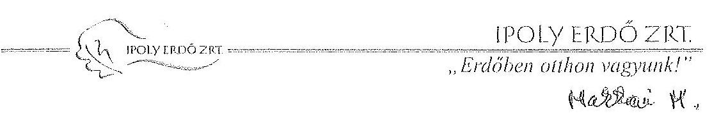

Állami Számvevőszék
Domokos László elnök Úr részére
1364 Budapest
Pf. 54.

Tárgy: Észrevételek ÁSZ jelentés tervezethez

Tisztelt Elnök Úr!
„Az állami tulajdonban álló erdőgazdasági társaságok vagyongazdálkodási tevékenységének ellenőrzése - IPOLY ERDŐ Zrt." címmel készített számvevőszéki jelentés tervezetet megkaptuk. A jelentés tervezetet áttanulmányoztuk, az abban foglaltakkal egyetértve jelen levél mellékleteként csatolt észrevételeket tesszük.

A jelentés tervezetben feltárt hiányosságokat részben pótolva mellékeljük, továbbá a társaság „A közérdekű adatok igénylésének és közzétételének szabályzata" c. dokumentumot (2. sz. melléklet) és a társaság vagyonkezelésbe adó felé tett 2011. évi jelentését (3. sz. melléklet).

Balassagyarmat, 2015. október

Tisztelettel:

Kiss László
vezérigazgató

# Mellékletek: 

1. sz. melléklet - Észrevételek

- 2. sz. melléklet - A közérdekű adatok igénylésének és közzétételének szabályzata
- 3. sz. melléklet - A társaság vagyonkezelésébe adó felé tett 2011. évi jelentés

Nyilvántartó Cégbíróság neve: Nógrád Megyei Bíróság
Cégjegyzék szám: 12-10-001520
HE 2660 Balassagyarmat, Bajcsy-Zs. u. 10.
Tel.: (36) 35/300-769, fax: (36) 35/301-424
e-mail: titkarsag@ipolyerdo.hu www.ipolyerdo.hu

---

# Észrevételek az Állami Számvevőszék „Az állami tulajdonban álló erdőgazdasági társaságok vagyongazdálkodási tevékenységének ellenőrzése IPOLY ERDŐ Zrt." tárgyú jelentés tervezethez 

1. A társaság vagyonkezelői szerződéseivel kapcsolatos megállapítások
„A Társaság éves mérlegei nem a valós állapotokat tükrözték, a Számv. tv. előírása ellenére nem tartalmazzák a VSZ1-ben vagyonkezelésbe kapott állami erdők és azzal szerves egységet képező egyéb földterületek értékék." ÖSSZEGZŐ MEGÁLLAPÍTÁSOK 6. oldal

Véleményünk szerint a vagyonkezelésbe vett eszközök mérlegben szerepeltetése (mind az eszközök, mind a hosszú lejáratú kötelezettségek között), még ha a Társaság ennek a törvényi előírásnak meg is kíván felelni, nulla értéken nem lehetséges. Ugyanakkor a jelentés is megállapítja, hogy a kezelt vagyonnal kapcsolatos események (erdőfelújítás, -telepítés) elszámolása a Számv. tv. előírásai szerint történt, vagyis a Társaság jövedelmi, vagyoni helyzetéről alkotott kép a valós helyzetet tükrözi. Az érték nélkül szereplő eszközök bemutatása a beszámoló felhasználói számára nem bír lényeges információval, hiszen az egyébként - egyéb szabályozásból - mindenki számára ismert tény, hogy az állami erdőgazdaságok állami tulajdonú erdőket kezelnek.
A kiegészítő melléklet tartalmazza azt, hogy a Társaság mekkora területen végez vagyonkezelést, az üzleti jelentés pedig minden évben tartalmazza a beszámolót a kezelt vagyonnal folytatott gazdálkodásról, mely az érdekeltek számára ugyancsak megismerhető volt.

Ezért a jelentés tervezetben a „nem a valós állapotokat tükrözik" kifejezést a társaság mérlegeinek vonatkozásában túlzónak találjuk. Helyesnek tartanánk, ha csak az kerülne megállapításra, hogy a társaság a vizsgált időszakban nem felelt meg minden tekintetben a Számv. tv. előírásainak, mert nem szerepeltette mérlegében az eszközök és a források között a vagyonkezelésbe kapott területeket, melynek az volt az oka, hogy ezek az eszközök a vagyonkezelési szerződés mellékleteiben érték nélkül, csupán naturáliában kerültek átadásra, további nyilvántartásuk is csak naturáliában történt.

Ezen észrevételt azzal kívánjuk alátámasztani - részben a jelentés tervezet megállapításaira alapozva - hogy a VSZ3 és VSZ4 esetében, ahol a vagyonkezelésbe adó értékkel adta át az eszközöket, a társaság helyesen szerepeltette mérlegében azokat.
„A VSZ1 3.3.2 pontjában foglaltak ellenére a felek a szerződést nem vizsgálták felül, a VSZ1 az ellenőrzött időszakban a felek a szerződést évente nem vizsgálták felül, a VSZ1 az ellenőrzött időszakban nem felelt meg a hatályos rendelkezéseknek, hatályon kívül helyezett jogszabályi hivatkozásokat tartalmazott, illetve nem tartalmazott minden szükséges előírást" ÖSSZEGZŐ MEGÁLLAPÍTÁSOK 7.11 oldal

A megállapítás alapvetően helytálló, ám azt meg kívánjuk jegyezni, hogy megítélésünk szerint a VSZ1 módosítása, aktualizálása nem az egyes erdészeti társaságok kompetencia körébe tartozó kérdés.

---

A vizsgált időszakban - és azt megelőzően is - a módosításra irányuló intézkedések a föld tulajdonosi joggyakorló (vagyonkezelésbe adó) kezdeményezésével és az erdészeti társaságok fölötti tulajdonosi joggyakorló szervezet koordinálása mellett folytak le. A társaság Alapító Okiratának 12.2.bb) pontja rendelkezett a vagyonkezelői szerződés módosításának tekintetében, hatáskört delegálva a tulajdonosi joggyakorló szervenek.

Társaságunk munkatársai a vizsgált időszakban hét alkalommal vettek részt vagyonkezelési szerződés megkötését, módosítását, aktualizálását célzó megbeszéléseken, tagjai voltak a vagyonkezelői szerződést előkészítő munkacsoportnak. Fenti megállapítást javasoljuk azzal kiegészíteni, hogy a társaság az alapító okirata szerinti hatáskörének mértékéig együttműködést tanúsított a vagyonkezelői szerződés módosításának, aktualizálásának kérdései tisztázásában.
„A felek az állami erdő és egyéb vagyonkezelésére vonatkozó VSZ1-ben rögzítették a vagyonkezelői díjat, azonban a VSZ1 3.3.2 pontjában foglaltak ellenére azt évente nem vizsgálták felül, erről történő megállapodás megkötésére nem került sor." ÖSSZEGZŐ MEGÁLLAPÍTÁSOK 7. oldal

A megállapítás helytálló, azonban ahogy azt az előző bekezdésben is megjegyeztük, a vagyonkezelési szerződés aktualizálásának, módosításának előkészítésében társaságunk tevékenyen részt vett, ennek a munkának része volt a vagyonkezelői díj felülvizsgálata is. A társaság a szerződés alapján kiállított számlákat a vagyonkezelésbe adónak a vizsgált időszakban a nyitva álló határidőn belül megfizette.
„A Társaság nem teljes körűen rendelkezett a kezelt vagyon tekintetében pontos és naprakész információval a tulajdonosi jogokat gyakorlóról, így a társaság által vezetett nyilvántartás nem biztosította a Vhr-ben foglalt, az adatszolgáltatás pontosságára vonatkozó követelményt." ÖSSZEGZŐ MEGÁLLAPÍTÁSOK 6. oldal.

A megállapítással egyetértünk, de megjegyezzük, hogy az MNV Zrt. és az NFA illetékességi körébe tartozó ingatlanok köréről a két szervezet között zajló tulajdonosi jogkör átadás-átvételi folyamat miatt nem rendelkezhetünk naprakész ingatlan listával. Az ingatlanlista adatok a - MNV Zrt. adatközlése alapján több körben zajló átadás-átvételi folyamat már lezárult egyes részéről (jád átadás átvétel I. II.) álltak rendelkezésre.
„A Társaság az állami erdő és egyéb vagyon
 kezelésére kötött VSZ1 3.10. pontjában foglaltak ellenére a kezelt vagyon feletti jogokat gyakorló MNV Zrt. és NFA felé az erdővagyonról és annak változásairól a 2009-2011. évek vonatkozásában nem készített írásos beszámolót. A 2012. és 2013. években az adatszolgáltatás megtörtént. ÖSSZEGZŐ MEGÁLLAPÍTÁSOK 9. oldal

A megállapítást részben elfogadjuk és az alábbiakat fűzzük hozzá:
Az állami vagyonról szóló 2007. évi CVI. törvény 61. § (1) bekezdése kimondja, hogy „a Kincstári Vagyoni Igazgatóság 2007. december 31-i hatállyal megszűnik, jogai és kötelezettségei ezen időponttól az MNV Zrt.-re szállnak. A jogok és a kötelezettségek átszállása nem minősül a KVI által kötött szerződések módosításának.”
A társaság 2007. december 19-én kelt Alapító Okiratában a tulajdonosi joggyakorló MNV Zrt. a társaság részére - az Igazgatóságon keresztül - jelentési kötelezettségeket írt elő. Az Alapító Okirat 13.i. pontja kimondja, hogy az Igazgatóság „jelentést készít a társaság ügyvezetéséről, vagyoni helyzetéről és üzletpolitikájáról az egyedüli részvényes részére - a számviteli törvény szerinti éves beszámoló mellékleteként - évente egyszer”.
A 2009. évi - a tulajdonosi joggyakorló és egyben ideiglenes vagyonkezelésbe adó MNV Zrt. részére benyújtott - Igazgatósági jelentésben társaságunk írásban részletesen beszámolt a vagyonkezelésbe vett erdővagyonról és annak változásairól, külön írásos beszámoló készítésére ezért nem került sor.

Oldal: $2 / 4$

---

A 2010. évi LII. törvény rendelkezésének értelmében az Ipoly Erdő Zrt. állami tulajdonú társaság részesedése tekintetében 2010. június 17. napjától az MFB Magyar Fejlesztési Bank Zrt. vált jogosulttá a tulajdonos jogok gyakorlására. A 6/2010 Alapítói Határozat mellékletét képező Alapító Okirat 21.1 pontja rendelkezett az éves beszámolási kötelezettségről. Az éves beszámoló az MFB Zrt. részére benyújtásra került, más írásos beszámoló az MNV Zrt. részére nem készült.

Az Állami Számvevőszék helyszíni ellenőrzésének folyamán a társaság elmulasztotta az ellenőrzést végzőknek bemutatni a 2011. évtől készített beszámolót, melynek vagyonkezelésbe adó részére történő benyújtására 2012. augusztus 15-én került sor. A beszámolót jelen észrevételeink mellékleteként csatoljuk. A társaság 2010, 2011, 2012, 2013, 2014 évi üzleti jelentéseit, melyek tartalmazzák az erdővagyon kezelésére vonatkozó számszerű adatokat és szöveges elemzéseket, a tulajdonosi joggyakorló NFA felé 2015-ben megküldtük.
„Az ellenőrzött időszakban a Társaság az AvTv., illetve az Infotv. szerinti a közérdekű adatok megismerésére irányuló igények teljesítésének rendjét rögzítő szabályzattal nem rendelkezett.”

A társaság ügyvezetése időközben a feltárt mulasztását pótolta, a szabályzatot levelünk mellékleteként csatoljuk. Kérjük, hogy végleges jelentésüket ezzel a megjegyzéssel szíveskedjenek kiegészíteni.
„A Társaság az ellenőrzött időszakban az ágazati szabályokat nem teljes körűen tartotta be, a 2009-2013. években az Evt. szabályok megsértése miatt több esetben került sor bírság kiszabására az erdősítési határidők túllépése, valamint a fakitermeléssel érintett erdőrészlet határvonalának téves kijelölése és engedély nélküli fakitermelés miatt.”
„Az erdészeti hatóság az ellenőrzött időszak alatt kilenc alkalommal szabott ki erdőgazdálkodási és egy alkalommal erdővédelmi bírságot az Evt. szabályainak megsértéséért. Bírság kiszabására az erdősítési határidők túllépése, valamint a fakitermeléssel érintett erdőrészlet határvonalának téves kijelölése és engedély nélküli fakitermelés miatt került sor.” ÖSSZEGZŐ MEGÁLLAPÍTÁSOK 8. oldal, 3.3 FEJEZET 20. oldal

Társaságunk a vizsgált időszakban mintegy 4100 ha folyamatban lévő erdőfelújítást kezelt, amelyből évente 500-600 ha az új belépő első erdősítés, és hasonló nagyságrendű a kötelezettségből kilépő befejezett erdősítés mértéke.
Az erdősítésekre vonatkozó szakmai elmarasztalások a vizsgált öt gazdasági évben első erdősítéssel, vagy tervezett befejezéssel érintett erdőfelújítások területének kevesebb, mint 1%-át érintették.
A társaság szakmai vezetése ezt a problémát is határozott intézkedésekkel igyekszik tovább mérsékelni.

Az egy esetben kiszabott erdővédelmi bírság 0,3 ha tévesen kijelölt területen, 22 m³ fa kitermelésére vonatkozott. A hibát az illetékes erdészet maga tárta fel, jelentette az erdőfelügyelőnek, mértékét a saját geodéziai mérésével pontosította, az érintett szomszéd tulajdonossal azonnal és vita nélkül elszámolt, a kitermelt faanyagot hiánytalanul átadta neki.

A jelentésben tett megállapítások helytállóak, ám megítélésünk szerint,- különösen az ÖSSZEGZŐ MEGÁLLAPÍTÁS munkarészben - fenti arányokra való utalás nélkül a valóságosnál rosszabb képet mutatnak be a társaság jogszabályokban foglalt erdővagyon kezelési feladatainak teljesítéséről.

---

„A Diósjenő 0158/1 hrsz-ú vagyonkezelt területen és Szokolya 0449/4 hrsz-ú saját tulajdonú ingatlanon, de vagyonkezelt területen a Társaság az MNV Zrt.-től, illetve az NFA-tól a Vhr. 9.§ (6) bekezdését megsértve a felújítások, beruházások előtt írásbeli engedélyt nem kért.” 1.1 FEJEZET 15. oldal

Diósjenő 0158/1. Az ideiglenes vagyonkezelési szerződés 3.12.1 pontja rendelkezik a birtokiügyek esetében előírt eljárásról és rögzíti, hogy a vagyonkezelésbe adott területeket érintő birtokiügyekben előzetes egyeztetésre, tulajdonosi hozzájárulásra van szükség.
Az ideiglenes vagyonkezelési szerződés 3.12.2 pontban részletezi a birtokiügyeket. Ezek között egyebek mellett az ingatlan megosztása, erdőterület termelésből történő kivonása szerepel. Az érintett terület vonatkozásában erdőterület termelésből történő kivonásának, művelési ág változásának nem kellett eleget tennünk, így tulajdonosi hozzájárulás beszerzésére nem került sor.
A Szokolya Tövik Vadászház esetében építési engedély alapján végzett beruházás került megvalósításra. Az érintett Szokolya 0449/4/A helyrajzi számú önálló ingatlan az Ipoly Erdő Zrt. kizárólagos tulajdonában van, a Szokolya 0449/4 helyrajzi számú ingatlanra vonatkozóan pedig a társaság földhasználati joggal rendelkezik. Az Ipoly Erdő Zrt. tulajdonjoga a földhivatali ingatlan nyilvántartásba bejegyzésre került, így saját tulajdonon végzett építési tevékenységre került sor.

Balassagyarmat, 2015. október „JÖ”
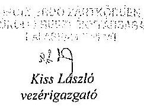

---

.

---

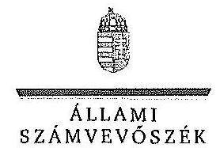

ELRők

Ikt.szám: V-0749-159/2015.

Kiss László úr
vezérigazgató
IPOLY ERDŐ Zrt.

Balassagyarmat

Tisztelt Vezérigazgató Úr!

A „Jelentéstervezet az állami tulajdonban álló erdőgazdasági társaságok vagyongazdálkodási tevékenységének ellenőrzése – IPOLY ERDŐ Zrt.” címmel készített számvevőszéki jelentéstervezetre tett észrevételeit köszönettel megkaptam.

Az Állami Számvevőszék észrevételekre vonatkozó álláspontjáról a felügyeleti vezető által készített részletes tájékoztatást csatoltan megküldöm.

Tájékoztatom Vezérigazgató urat, hogy a számvevőszéki jelentésben – az Állami Számvevőszékről szóló 2011. évi LXVI. törvény 29. § (3) bekezdése alapján – a figyelembe nem vett észrevételeket szerepeltetjük az elutasítás indokának feltüntetésével.

Budapest, 2015. 11. hó 1. nap

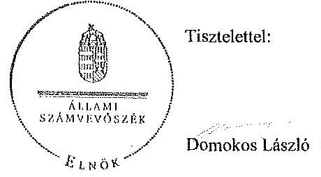

Melléklet: Tájékoztatás az elfogadott és az el nem fogadott észrevételekről

1952 BUDAPEST, AFRIZAI CSERE JÁNOS UTCA 10. 1264 Budapest 4. Pl. 54 telefon. 484 9101 fax. 484 9201

---

# Tájékoztatás   az elfogadott és az el nem fogadott észrevételekről 

A „Jelentéstervezet az állami tulajdonban álló erdőgazdasági társaságok vagyongazdálkodási tevékenységének ellenőrzése - IPOLY ERDŐ Zrt.” címü jelentéstervezetre 2015. október 19-én érkezett észrevételeit áttekintettük, azok kezelésével kapcsolatban a következő tájékoztatást adom.

1. „A Társaság éves mérlegei nem a valós állapotot tükrözték, a Számv. tv. előírása ellenére nem tartalmazták a VSZ1-ben vagyonkezelésbe kapott állami erdők és azzal szerves egységet képező egyéb földterületek értékét.” Összegző megállapítások 6. oldal

Az állami vagyonnal való gazdálkodásról szóló 254/2007. (X. 4.) Korm. rendelet (továbbiakban: Vhr.) 9. § (9) bekezdés a) pontja alapján a vagyonkezelő köteles a vagyonkezelésbe vett eszközöket a számviteli törvény szerint a hosszú lejáratú kötelezettségekkel szemben a vagyonkezelési szerződésben rögzített értéken állományba venni. A számvitelről szóló 2000. évi C. törvény (továbbiakban: Számv. tv.) 23. § (2) bekezdése alapján a vagyonkezelőnél a mérlegben eszközként kell kimutatni a törvényi rendelkezés, illetve felhatalmazás alapján - kezelésbe vett, az állami vagy önkormányzati vagyon részét képező eszközöket is. Az ideiglenes vagyonkezelési szerződésben (továbbiakban: VSZ) a vagyonkezelésbe adott vagyon értékét nem rögzítették, továbbá a szerződés azt sem tartalmazta, hogy a vagyonkezelt eszközök értéke nulla. A Társaság a Számv. tv. 23. § (2) bekezdésében és a Vhr. 9. § (9) bekezdés a) pontjában foglalt előírások betartása céljából nem tett lépéseket annak érdekében, hogy a vagyonkezelt eszközök értéke a VSZ-ben rögzítésre kerüljön. Megállapításunk helytálló, módosítása nem indokolt.
2. „A VSZ, 3.3.2. pontjában foglaltak ellenére a felek a szerződést évente nem vizsgálták felül, a VSZ, az ellenőrzött időszakban nem felelt meg a hatályos rendelkezéseknek, hatályon kívül helyezett jogszabályi hivatkozásokat tartalmazott, illetve nem tartalmazott minden szükséges előírást.” Összegző megállapítások 7. és 11. oldal

Az észrevételben a megállapítás helytállóságát nem vitatják. A VSZ 3.3.2. pontja szerint a VSZ-t a felek a tárgyévet megelőző év november 30-ig felülvizsgálják. A dokumentumok ismételt áttekintését követően, valamint az egyértelműség érdekében a jelentéstervezet 7. oldal 6. bekezdés 2. mondatát és a 16. oldal 7. bekezdés 2. mondatát töröltük.

---

3. „A felek az állami erdő és egyéb vagyon kezelésére vonatkozó VSZ-ben rögzítették a vagyonkezelési díjat, azonban a VSZ 3.3.2. pontjában foglaltak ellenére azt évente nem vizsgálták felül, erről történő megállapodás megkötésére nem került sor.” Összegző megállapítások 7. oldal
A vagyonkezelési díjjal kapcsolatban adott tájékoztatásukat köszönjük. Az észrevétel a jelentéstervezet megállapítását nem kifogásolja, helytállónak tartja. A megállapítás módosítása nem szükséges.
4. „A Társaság nem teljes körűen rendelkezett a kezelt vagyon tekintetében pontos és naprakész információval a tulajdonosi jogokat gyakorlóról, így a Társaság által vezetett nyilvántartás nem biztosította a Vhr.-ben foglalt, az adatszolgáltatás pontosságára vonatkozó követelményt.” Összegző megállapítások 7. oldal

A kezelt vagyonról adott tájékoztatást köszönettel vettük. Az észrevétel a megállapítást nem vitatja, annak módosítása nem indokolt.
5. „A Társaság az állami erdő és egyéb vagyon kezelésére kötött VSZ 3.10. pontjában foglaltak ellenére a kezelt vagyon feletti tulajdonosi jogokat gyakorló MNV Zrt. és NFA felé az erdővagyonról és annak változásairól a 2009-2011. évek vonatkozásában nem készített írásos beszámolót. A 2012. és a 2013. években az adatszolgáltatás megtörtént.” Összegző megállapítások 9. oldal

A 2011. évtől készített beszámolót az IPOLY ERDŐ Zrt. nem bocsátotta az ellenőrzés rendelkezésére, annak valódiságáról az ellenőrzés meggyőződni nem tudott. A megállapítás módosítása nem indokolt.
6. „Az ellenőrzött időszakban a Társaság az Avtv., illetve az Infotv. szerinti, a közérdekű adatok megismerésére irányuló igények teljesítésének rendjét rögzítő szabályzattal nem rendelkezett.” Összegző megállapítások 9. oldal
Köszönjük, hogy az észrevétel mellékleteként megküldték „A közérdekű adatok igénylésének és közzétételének szabályzata” címü dokumentumot. A szabályzatot 2015. október 12-én, az ellenőrzött időszakot követően helyezték hatályba, ezért megállapításunk módosítása nem indokolt.
7. „A Társaság az ellenőrzött időszakban az ágazati szabályokat nem teljes körűen tartotta be, a 2009-2013. években az Evt. szabályok megsértése miatt több esetben került sor bírság kiszabására az erdősítési határidők túllépése, valamint a fakitermeléssel érintett erdőrészlet határvonalának téves kijelölése és engedély nélküli kitermelése miatt.” „Az Erdészeti hatóság az ellenőrzött időszak alatt kilenc alkalommal szabott ki erdőgazdálkodási és egy alkalommal erdővédelmi bírságot. A bírság kiszabására erdősítési határidők túllépése, valamint a fakitermeléssel érintett erdőrészlet határvonalának téves kijelölése és engedély nélküli kitermelés következtében került sor.” Összegző megállapítások 8. oldal, 3.3. FEJEZET
Az erdőgazdálkodási és erdővédelmi bírsággal kapcsolatos tájékoztatást köszönjük. Az észrevétel a megállapítást nem kifogásolja, ezért annak módosítása nem szükséges.

---

8. „A Diósjenő 0158/1 hrsz.-ú vagyonkezelt földterületen és Szokolya 0449/4 hrsz.-ú saját tulajdonú ingatlanon, de vagyonkezelt földterületen a Társaság az MNV Zrt.-től, illetve az NFA-tól a Vhr. 9. § (6) bekezdését megsértve a felújítások, beruházások előtt írásbeli engedélyt nem kért.” 1.1. FEJEZET 15. oldal

A Vhr. 9. § (6) bekezdése szerint a központi költségvetési szervnek nem minősülő vagyonkezelő, ha jogszabály vagy a vagyonkezelési szerződés másként
 nem rendelkezik, a tulajdonosi joggyakorló előzetes, írásbeli engedélyét köteles kérni a vagyonkezelt eszközön elszámolt, bármely a számvitelről szóló törvény szerinti beruházáshoz, felújításhoz. A Diósjenő 0158/1. hrsz-ú ingatlan a Társaság vagyonkezelésében volt, a Szokolya 0449/4 hrsz-ú ingatlan a Társaság vagyonkezelésében lévő földterületen állt, ezért a felújítás, beruházás előtt a tulajdonosi joggyakorlótól írásbeli engedélyt kellett volna kérni. A fentiek alapján megállapításunk helytálló, módosítása nem indokolt.

Budapest, 2015. // hó 7. nap

Makkai Mária
felügyeleti vezető

---

# 10. SZÁMÚ MELLÉKLET A V-0749-162/2015. SZÁMÚ JELENTÉSHEZ 

## 11-09-13-152/2015

## MNV| Magyar Nemzeti Vagyonkezelő Zrt.

Vezérigazgató

## Állami Számvevőszék

## Domokos László

elnök

1052 Budapest
Apáczai Cs. J. u. 10.

$$
\begin{aligned}
& \text { Ikt. sz.: MNV/01/48882/ / /2015. } \\
& \text { Hiv. sz.: V-0749-147/2015. }
\end{aligned}
$$

Tisztelt Elnök Úr!
A 2015. október 2. napján „Az állami tulajdonban álló erdőgazdasági társaságok vagyongazdálkodási tevékenységének ellenőrzése - IPOLY ERDŐ Zrt." tárgyában kézhez vett, V-0749-147/2015. ikt. sz. Jelentéstervezetre az alábbi észrevételeket kívánom tenni.
I. fejezet / 9. old. hetedik bekezdés, 10. old. első-negyedik bekezdés, II.5. fejezet / 24. old. negyedik bekezdés és 10-11. old. Javaslat az MNV Zrt. vezérigazgatójának (a-c) pontok
„A VSZ alapján vagyonkezelésbe adott állami erdő és egyéb vagyon tekintetében a tulajdonosi jogokat gyakorló MNV Zrt. és NFA tevékenysége az ellenőrzött időszakban nem támogatta teljes körűen a felelős vagyongazdálkodás megvalósulását. Az állami erdő és egyéb vagyon kezelésére kötött VSZ-el kapcsolatban feltárt hiányosságok megszüntetésére és a hatályos jogszabályoknak való megfeleltetésére vonatkozóan nem kezdeményeztek intézkedéseket, nem éltek a Vhr.-ben és a 262/2010. (XI.17.) Korm. rend. 47. § (1)-(2) bekezdésében foglalt, a kezelt vagyon használatára vonatkozó ellenőrzési jogukkal, valamint nem végeztek a vagyonnyilvántartás hitelességére, helyességére és teljességére vonatkozó ellenőrzést a Társaságnál.

A Magyar Államot megillető tulajdonosi érdekeltség vagyonkezeléséhez kapcsolódóan az MNV Zrt. nem élt a VSZ 6. pontjában foglalt, a vagyonkezelőnél történő tulajdonosi ellenőrzés lehetőségével.

A VSZ alapján kezelt Szénpataki turistaház vagyonkezeléséhez kapcsolódóan az MNV Zrt. két alkalommal végzett a felújításhoz kapcsolódóan tulajdonosi ellenőrzést.

Az IPOLY ERDŐ Zrt. a Magyar Állam tulajdonában álló erdővagyon és egyéb művelési ágú termőföld ingatlanok kezelését a KVI-vel 1996. november 1-jén kötött VSZ alapján végezte. A Társaság, mint vagyonkezelő és KVI között létrejött szerződéses jogviszony kereteit a VSZ-ben foglalt jogok és kötelezettségek töltötték ki. A VSZ nem támogatta a Vhr. 3. § (1) bekezdésében foglalt, a vagyongazdálkodási feladatok átlátható módon történő végrehajtását, valamint nem támogatta a szabályszerű vagyongazdálkodást. A VSZ 3.3.2. pontjában foglaltak ellenére a felek a szerződést évente nem vizsgálták felül, a VSZ az ellenőrzött időszakban nem felelt meg a hatályos rendelkezéseknek, hatályon kívül helyezett jogszabályi hivatkozásokat tartalmazott, illetve nem tartalmazott minden szükséges előírást. A VSZ vagyonkezelői jog átengedésére vonatkozó 3.2.3. pontja 2012-től nem felelt meg az Nvtv.-ben foglaltaknak, amely tiltja a vagyonkezelői jog harmadik személynek való átengedését. A VSZ nem rögzítette a Vhr. 9. § (8) bekezdésében 2011. január 1-jétől előírt, az érintett vagyonelem esetleges védettségét, illetve Natura 2000 területnek minősítését. A felek nem tettek eleget a Vhr. 54. § (7) bekezdés előírásának, mert a Vhr. hatálybalépését követő hat hónapon belül nem kezdeményezték a Nemzeti Földalapba tartozó ingatlanokra vonatkozóan a VSZ megszüntetését és a jogszabályoknak megfelelő szerződés megkötését.

---

A vagyonkezelésbe adott állami vagyon tekintetében tulajdonosi jogokat gyakorló MNV Zrt. és NFA nem végeztek a Vhr. 20. § (1)-(2) bekezdéseiben és a Nemzeti Földalapba tartozó földrészletek hasznosításának részletes szabályairól szóló 262/2010. (XI.17.) Korm. rendelet 47. § (1)-(2) bekezdéseiben foglalt, a vagyonnyilvántartás hitelességére, teljességére és helyességére vonatkozó ellenőrzést a Társaságnál.

# Javaslat az MNV Zrt. vezérigazgatójának 

a) Tegyen intézkedéseket az erdőgazdasági társaság közreműködésével a tényleges állapotot rögzítő és a hatályos jogszabályi előírásoknak megfelelő vagyonkezelési szerződés megkötésére.
b) Tegyen intézkedéseket a vagyonkezelési szerződés felülvizsgálatának elmaradásával, valamint a Nemzeti Földalapba tartozó ingatlanokra vonatkozó VSZ megszüntetésével összefüggésben feltárt szabálytalanságok tekintetében a felelősség tisztázása érdekében, és szükség szerint intézkedjen a felelősség érvényesítéséről.
c) Intézkedjen az IPOLY ERDŐ Zrt. vagyonnyilvántartása hitelességének, teljességének és helyességének jogszabályban foglaltak szerinti ellenőrzéséről.

Sajnálattal állapítottuk meg, hogy a Jelentés-tervezet egyáltalán nem veszi figyelembe a vizsgált időszakban megindított és több eljárási cselekményt is magába foglaló intézkedés-sorozatunkat, amelynek a célja a Jelentéstervezetben egyébiránt joggal kifogásolt hiányosságok megszüntetése, az erdőgazdasági társaságok működésének jogszabályi megfelelőségének biztosítása volt. Ezzel a Jelentés-tervezet azt sugallja, hogy a tulajdonosi joggyakorlók részéről egyáltalán nem volt szándék az erdőgazdasági társaságok működésének, illetve a vagyonkezelés körülményeinek hatályos jogszabályok szerinti szabályozására, amely egyébiránt nem felel meg a valóságnak és az adatszolgáltatásunk során sem erről tájékoztattuk Önöket.
Mindamellett elismerjük, hogy a probléma a kezelt vagyonelemek nagy száma, ebből kifolyólag a szabályozást igénylő körülmények nagy száma és sokrétűsége miatt nehezen átlátható, ezért kérjük, engedjék meg, hogy a munkájukat segítő szándékkal korábbi tájékoztatásunkat ismételten megerősítsük, azzal a kifejezett kéréssel, hogy a Jelentésükben az általunk vitatott megállapítást szíveskedjenek módosítani, és az MNV Zrt által a megoldás irányába megtett intézkedéseket feltüntetni.
Az ideiglenes vagyonkezelési szerződéseken alapuló kezelői jogviszony újraszabályozása, az ideiglenes vagyonkezelési szerződések megszüntetése és végleges vagyonkezelési szerződések megkötése érdekében az intézkedéseink már 2011. évben megkezdődtek, párhuzamosan a Nemzeti Földalapról szóló 2010. évi LXXXVII. tv. 34. § (3) bekezdés c) pontja szerinti feladat- illetve vagyonátadással.

Az intézkedéseink alapja a 2011. évben, MNV/01/29518/2011. szám alatt szakterületünk által bekért, az erdőgazdasági társaságok 2010. december 31-i, illetve 2011. július 31-i fordulónapra vonatkozó leltárjelentése volt, amelyet elsődlegesen az NFA tv. szerint előírt vagyonátadás elvégzése céljából kértünk meg az erdőgazdasági társaságoktól. Ugyanakkor a leltárjelentéshez benyújtott földrészlet-nyilvántartások voltak az első olyan kimutatások, amelyek a kezelt vagyon elemeit a FÖMI adatházisán alapuló (az aktuális ingatlan-nyilvántartási állapotnak megfelelően) részletes bontásban tartalmazták.

## A vizsgált időszakban megindított és lefolytatott intézkedéseink a következők:

1. Az erdőgazdasági társaságok által kezelt vagyonelemek tulajdonosi joggyakorlók szerinti elhatárolása, NFA átadás előkészítése, az erdőgazdasági társaságok bevonásával. A Nemzeti Földalapba tartozó vagyonelemek NFA átadása 2012-2013. években megtörtént, majd a visszamaradt vagyonelemek - többségében kivett megnevezésben nyilvántartott földrészletek - elhatárolását is elvégeztük. A feladat végrehajtása 2014. május 31-ig teljesült.
Az intézkedéssel az MNV Zrt tulajdonosi joggyakorlása alá tartozó vagyonelemek körét - a közös tulajdonosi joggyakorlás alatt álló ingatlanok kivételével -, azaz a végleges vagyonkezelési szerződések ingatlanlistáit meghatároztuk.
Meg kívánjuk jegyezni, hogy az erdőgazdasági társaságok a 2011. évi leltárjelentéseikhez minden esetben csatolták a jelentés tartalmára vonatkozó teljességi nyilatkozatukat is, így azok tartalmát mint teljes körű adatszolgáltatást kezeltük.

---

A hivatkozott iratokat az eljárás során a Tisztelt Állami Számvevőszék rendelkezésére bocsátottuk.
2. Az erdőgazdasági társaságok által kezelt vagyon értékelését 2014. május 31-ig elvégeztük, részben külső piaci szereplő által megállapított vagyonértékelési adatok (az IFUA értékbecslési adatai), részben belső szakértők és a kontrolling szakterület által az MNV Zrt hatályos értékelési szabályzata által megállapított értékadatok figyelembe vételével.
3. Az MNV Zrt. Igazgatósága 511/2012. (X. 08.) IG sz., valamint 717/2013. (IX. 23.) IG sz. határozataiban Intézkedési terveket fogadott el „a 28/2012. (IX. 24.) sz. RJGY határozatában előírt, valamint az MNV Zrt. rábízott vagyon 2012. évi beszámolója könyvvizsgálói minősítésének megtartásához szükséges és egyéb feladatokról". Az Intézkedési tervek magukban foglalták az erdőgazdasági társaságok által kezelt vagyon analitikájának előállítását, illetve az erdőtársaságokkal végleges (nem ideiglenes) vagyonkezelői szerződések megkötését. A 717/2013. (IX. 23.) IG sz. határozat melléklete tartalmazza a feladat végrehajtása érdekében már megtett intézkedéseket (pl. „Megtörtént az erdőgazdaságok által kezelt vagyon listáinak vagyonkezelői jelentésekkel való egyeztetése; a vagyonkezelési szerződés tartalmi kérdéseinek, az erdőgazdaságok véleményének feldolgozása, MFB Munkacsoport egyeztetések történtek stb.), valamint rögzíti a még elvégzendő feladatokat. Ennek megfelelően az MNV Zrt-nél 2012-től folyamatban van az erdőgazdasági társaságok vagyonanalitikájának előállítása és vagyonkezelési szerződései tárgyú projekt.
A hatályos jogszabályoknak megfelelő vagyonkezelési szerződés tervezetét a vizsgálati időszak során az MNV Zrt belső szakterületi egyeztetést követően előkészítettük, és a 2014. március 18-án megtartott Munkacsoport értekezleten az erdőgazdaság képviselőivel, továbbá a tulajdonosi joggyakorlók (NFA, illetve akkor még Magyar Fejlesztési Bank Zrt.) képviselőivel ismertettük annak tartalmát. A szerződés szövegtervezetének véleményezése ekkor megkezdődött, ugyanakkor elismerjük, hogy a végleges szerződésváltozat már az Önök által vizsgált időszakot követően került elfogadásra. Ugyancsak a 2014. március 18-án megtartott Munkacsoport értekezleten tettünk javaslatot a vagyonkezelési dí alapjának és mértékének meghatározására.
4. Az erdőgazdasági társaságok által kezelt és a saját vagyonának vagyonelemenkénti, valamint a kezelt vagyonelemek tulajdonosi joggyakorlók szerinti elhatárolására vonatkozó intézkedésünket a vizsgált időszakban előkészítettük.

Tájékoztatjuk továbbá Elnök Urat az alábbiakról:
A Nemzeti Fejlesztési Minisztérium KGTF/377-6/2014-NFM, valamint KGTF/377-7/2014. számok alatt adott utasításokat a fenti feladatok elvégzésére. Ezekről, illetve az utasításokra adott jelentésünkről a korábbi adatszolgáltatásunk keretében szintén kitértünk.

A vagyonkezelési szerződés vizsgált időszakot követően elfogadott tervezetének mellékletét képezik az MNV Zrt azon szabályzatai is, amelyek a kezelt vagyon nyilvántartását, a beruházások nyilvántartását és az azzal kapcsolatos elszámolásokat, illetve a tulajdonosi ellenőrzéssel kapcsolatos, a jelenlegi jogszabályi környezetnek megfelelő szabályokat tartalmazzák:

- Az állami tulajdonon, egyéb vagyonkezelők által vagyonkezelt eszközön megvalósítandó beruházások, felújítások előzetes engedélyezésének és elszámolásának eljárásrendjéről szóló 35/2014. számú vezérigazgatói utasítás,
- A Magyar Nemzeti Vagyonkezelő Zrt. Tulajdonosi Ellenőrzési Szabályzata - a 39/2014. számú vezérigazgatói utasítás, továbbá
- A Magyar Nemzeti Vagyonkezelő Zrt. állami vagyon vagyonkezelőire, az állami vagyont használókra és a társasági részesedések esetében az MNV Zrt. tulajdonosi joggyakorlását megbízottként ellátókra vonatkozó Vagyon-nyilvántartási Szabályzatáról szóló 12/2014. számú vezérigazgatói utasítás.

Fentiek mellett megemlíthető az MNV Zrt. folyamatba épített, illetve vagyon nyilvántartás vezetését támogató ellenőrzési módszertanról szóló 11/2014. számú vezérigazgatói utasítás.
Egyeztetéseink során az erdőgazdasági társaságok tájékoztatást kaptak a szabályzataink tartalmára vonatkozóan.

---

A Jelentés-tervezet 10. oldalán található, az MNV Zrt. vezérigazgatójára vonatkozó, a) pont alatti, vagyonkezelési szerződés megkötésére irányuló javaslathoz kapcsolódóan felhívjuk a Tisztelt Állami Számvevőszék figyelmét arra, hogy a Nemzeti Fejlesztési Minisztérium ÁVF/21310/2015-NFM számú tájékoztató levele szerint Miniszter Úr vagyongazdálkodási szempontból nem támogatja az erdőgazdasági társaságok ideiglenes vagyonkezelési szerződések kiváltó vagyonkezelési szerződések megkötését, ideértve az MNV Zrt. vagyonkezelési szerződésekkel kapcsolatos jóváhagyó döntéseit is.

Az MNV Zrt-re vonatkozóan hivatkozott jogszabály, a Vhr. 20. § (1)-(2) bekezdése 2014. március 14-ig - csaknem az ellenőrzött időszak végéig - a következőképpen rendelkezett:
„(1) Az állami vagyon kezelőjét, használóját megillető jogok gyakorlását, annak szabályszerűségét, célszerűségét a Vtv. 17. §-ának d) pontja alapján az MNV Zrt. - szükség szerint a területi szervei útján - ellenőrzi. Ennek érdekében a vagyon kezelésére, hasznosítására kötött szerződésben rögzíteni kell, hogy a tulajdonosi ellenőrzés eljárásrendjét, a felek jogait, kötelezettségeit a felek a szerződés részének tekintik.
(2) A tulajdonosi ellenőrzés célja az állami vagyonnal való gazdálkodás vizsgálata, ennek keretében a rendeltetésellenes, jogszerűtlen, szerződésellenes, vagy a tulajdonos érdekeit sértő, illetve a központi költségvetést hátrányosan érintő vagyongazdálkodási intézkedések feltárása és a jogszerű állapot
 helyreállítása, továbbá a vagyonnyilvántartás hitelességének, teljességének és helyességének biztosítása."

A tulajdonosi ellenőrzés alatt a Területi Irodák által folytatott ellenőrzést is értette a jogszabály, amiből egyenesen következik a szakterületi munkafolyamba épített ellenőrzési kötelezettség figyelembe vételének a lehetősége.

Fentiekre tekintettel kérjük a Jelentés-tervezet 9-10., illetve 24. oldalán található azon megállapítások törlését, hogy az MNV Zrt. nem kezdeményezett intézkedéseket, és nem végzett a Vhr. 20. § (1)-(2) bekezdésében és a Nemzeti Földalapba tartozó földrészletek hasznosításának részletes szabályairól szóló 262/2010. (XI.17.) Korm. rendelet 47. § (1)-(2) bekezdésében foglalt, a vagyonnyilvántartás hitelességére és teljességére vonatkozó ellenőrzést a Társaságnál, kérjük a megtett intézkedések feltüntetését, és a Jelentés-tervezet 10-11. oldalán található, az MNV Zrt. vezérigazgatójára vonatkozó b) pontot a megtett intézkedések folyamatosságára tekintettel törölni, a c) pont alatti javaslatot szövegszerűen ekként módosítani:

# Javaslat az MNV Zrt. vezérigazgatójának 

c) Az MNV Zrt. tulajdonosi joggyakorlása alá tartozó (az Erdőgazdasági Társaságok által az MNV Zrt. részére jelentett) vagyonelemek tekintetében intézkedjen a Társaság vagyonnyilvántartása hitelességének, teljességének és helyességének jogszabályban foglaltak szerinti ellenőrzéseinek erősítéséről.

Kérem Elnök Urat, hogy a Jelentés véglegesítése során jelen észrevételeinket szíveskedjenek figyelembe venni.

Budapest, 2015. október 19.
Üdvözlettel:
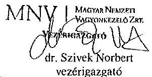

---

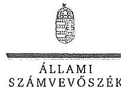

# Dr. Szivek Norbert úr 

vezérigazgató
Magyar Nemzeti Vagyonkezelő Zrt.

## Budapest

## Tisztelt Vezérigazgató Úr!

A ,,Jelentéstervezet az állami tulajdonban álló erdőgazdasági társaságok vagyongazdálkodási tevékenységének ellenőrzése - IPOLY ERDŐ Zrt." címmel készített számvevőszéki jelentéstervezetre tett észrevételeit köszönettel megkaptam.

Az Állami Számvevőszék észrevételekre vonatkozó álláspontjáról a felügyeleti vezető által készített részletes tájékoztatást csatoltan megküldöm.

Tájékoztatom Vezérigazgató urat, hogy a számvevőszéki jelentésben - az Állami Számvevőszékről szóló 2011. évi LXVI. törvény 29. § (3) bekezdése alapján - a figyelembe nem vett észrevételeket szerepeltetjük az elutasítás indokának feltüntetésével.

Budapest, 2015. 14. hó 05. nap
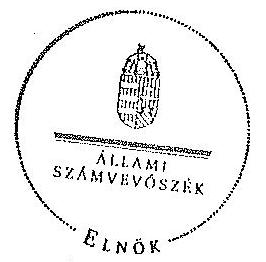

Tisztelettel:

Domokos László

Melléklet: Tájékoztatás az elfogadott és az el nem fogadott észrevételekről

---

# Tájékoztatás   az elfogadott és az el nem fogadott észrevételekről 

A „Jelentéstervezet az állami tulajdonban álló erdőgazdasági társaságok vagyongazdálkodási tevékenységének ellenőrzése - IPOLY ERDŐ Zrt." címü jelentéstervezetre 2015. október 16-án érkezett észrevételeit áttekintettük, azok kezelésével kapcsolatban a következő tájékoztatást adom.

1. A vagyonkezelési szerződéshez kapcsolódó megállapításokra tett észrevétel (I. fejezet / 9. oldal 7. bekezdés, 10. oldal 3. bekezdés, II. 5. fejezet / 24. oldal 4. bekezdés, 10. oldal javaslat az MNV Zrt. vezérigazgatójának a)-b) pontok)

A jelentéstervezet vagyonkezelési szerződéshez kapcsolódó megállapításai helytállóak. Az erdőgazdasági társaság működése jogszabályi megfelelőségének biztosításának érdekében tett kezdeményezésekről adott tájékoztatásukat köszönettel vettük, azonban azok nem eredményezték az ideiglenes vagyonkezelési szerződés olyan módosítását, vagy olyan új vagyonkezelési szerződés megkötését, amely biztosította volna a VSZ hiányosságainak megszüntetését, illetve a hatályos jogszabályoknak való megfelelőségét. Ezért az MNV Zrt. vezérigazgatójának és az NFA elnökének megfogalmazott intézkedést igénylő megállapítás, valamint az MNV Zrt. vezérigazgatójának megfogalmazott javaslat a) és b) pontjának módosítása nem indokolt. Az egyértelműség érdekében a 9. oldal 7. bekezdés 2. mondatát és a 24. oldal 4. bekezdés 1. mondatát az alábbiak szerint pontosítjuk:
„... a $VSZ_{1}$-szel kapcsolatban feltárt hiányosságokat nem szüntette meg, a hatályos jogszabályoknak a szerződést nem feleltette meg, ..."
„... a $VSZ_{1,2}$ kapcsán feltárt hiányosságokat nem szüntette meg, a hatályos jogszabályoknak a szerződést nem feleltette meg, ..."
2. Az MNV Zrt. ellenőrzési kötelezettségének elmulasztására vonatkozó megállapításokra tett észrevétel (I. fejezet 10. oldal 1-2., és 4. bekezdés, II. 5. fejezet / 24. oldal 4. bekezdés és 11. oldal javaslat az MNV Zrt. vezérigazgatójának c) pont)

Az MNV Zrt. nem bocsátott az ÁSZ ellenőrzés rendelkezésére az MNV Zrt., vagy Területi Irodái által a Vhr. 20. § (1)-(2) bekezdései szerint végzett ellenőrzésekről dokumentumokat. A jelentéstervezet megállapításai és a javaslat helytállóak, módosításuk nem indokolt.

Budapest, 2015. 02. nap

Makkai Mária
felügyeleti vezető

---

# 12. SZÁMÚ MELLÉKLET A V-0749-162/2015. SZÁMÚ JELENTÉSHEZ 

## MFB

Domokos László úr
elnök részére
Állami Számvevőszék

Budapest

Tisztelt Elnök Úr!
2015. szeptember 28-án köszönettel kézhez vettük az Állami Számvevőszék „Az állami tulajdonban álló erdőgazdasági társaságok vagyongazdálkodási tevékenységének ellenőrzéséről" szóló jelentéstervezeteket az alábbiakra:

- Eszakerdő Erdőgazdasági Zrt.
- EGERERDŐ Erdészeti Zrt.
- Gemenci Erdő- és Vadgazdaság Zrt.
- Ipoly erdő Zrt.
- KEEAG Kiskunsági Erdészeti és Faipari Zrt
- Kisalföldi Erdőgazdaság Zrt
- SEFAG Erdészeti és Faipari Zrt
- Szombathelyi Erdészeti Zrt.
- VADEX Mezőföldi Erdő-és Vadgazdálkodási Zrt. (Ikt.szám: V-0765-044/2015.)
- Zalai Erdészeti Zrt.
(Ikt.szám: V-0760-075/2015.)

Az MFB Zrt. a jelentéstervezetekkel kapcsolatosan 2 fő szempontból kíván észrevételt tenni:

1. A jelentésekben megfogalmazott központi probléma
2. Egyedi esetek

---

# 12. SZÁMÚ MELLÉKLET A V-0749-162/2015. SZÁMÚ JELENTÉSHEZ 

## 1. A jelentésekben megfogalmazott központi probléma

Az ÁSZ az egyedi jelentésekben az erdőgazdasági társaságokat, valamint a vagyonkezelésbe adott állami vagyon tekintetében tulajdonosi joggyakorló MNV Zrt. és Nemzeti Földalapkezelő (továbbiakban: NFA) tevékenységét maradtak el.

Alapvető problémaként jelent meg, hogy az erdők által kezelt eszközök - az NFA-val, a Kincstári Vagyon Igazgatósággal, és az MNV Zrt-val kötött vagyonkezelési megállapodásban tőkeként szerepelnek - nem szerepelnek a Társaságok könyveiben.
Az MFB Zrt. tudatában volt a problémának (azt az ÁSZ jelentésben is említett, 2010. évben végzett átvilágítási jelentés is tartalmazza, melynek nyomon követése, beszámoltatása megtörtént) és folyamatosan egyeztetett az MNV Zrt-val és az NFA-val a rendezés ügyében. Az ideiglenes vagyonkezelési szerződés módosítására, véglegesítésére a vagyonkezelésbe adónak (MNV, NFA) van lehetősége, a Társaságok szerződő partnerként észrevételeket, javaslatokat tehetnek. A szerződés véglegesítése érdekében a Társaságok és az MFB Zrt. képviselői minden olyan egyeztetésen (pl.: az MNV Zrt. által létrehozott bizottság) részt vettek, amelyre meghívást kaptak, illetve azokon érdemi javaslatokat tettek.
Ahogy a jelentés is megjegyzi, az egyeztetések az ellenőrzés befejezésig nem kerültek lezárásra, így a Társaságoknál nem áll rendelkezésre a vagyonkezelésben lévő állami vagyon és annak nagyságára vonatkozó, az MNV Zrt. és az NFA nyilvántartásával egyező adat.

Az ÁSZ 2013. évi „Az állami vagyon feletti kontroll - Az állami vagyon feletti tulajdonosi joggyakorlással kapcsolatos tevékenységek ellenőrzéséről" szóló jelentése alapján a Nemzeti Fejlesztési Minisztérium - az ÁSZ-szal egyeztetett - alábbi főbb pontokat tartalmazó intézkedési tervet (1. sz. melléklet) állított össze, melyet a 2014. április 25-én kelt levelében küldött meg az MFB Zrt. részére:

- a Társaságok által kezelt állami ingatlanok és egyéb vagyon elemek értéken történő nyilvántartása,
- a vagyonkezelési díjak egyértelmű és tulajdonosi joggyakorló szervezetenkénti meghatározása,
- az új vagyonkezelési szerződés megkötése,
- a Társaságok kezelt és saját vagyonának vagyon elemekenkénti, valamint a kezelt vagyon elemek tulajdonosi joggyakorló szerinti elkülönítése.

Az MFB törvény módosításának 2014. július 16-i hatályba lépésével az MFB Zrt. állami erdőgazdaságok feletti tulajdonosi joggyakorlása megszűnt, az a Földművelésügyi Minisztériumhoz került át, így az intézkedési tervben való közreműködésre, illetve a végrehajtás nyomon követésére az MFB Zrt-nek nem volt lehetősége.

A jelentések az MNV Zrt. vezérigazgatójának, az NFA elnökének és az erdészeti társaságok vezérigazgatóinak fogalmaznak meg intézkedési javaslatokat.

---

# 12. SZÁMÚ MELLÉKLET A V-0749-162/2015. SZÁMÚ JELENTÉSHEZ

## 2. Egyedi esetek:

### KEEAG Kiskunsági Erdészeti és Faipari Zrt.

A jelentéstervezet többször hibásan hivatkozik az MFB Zrt.-re, amikor az állami vagyonról szóló 2007. évi CVI. törvény (a továbbiakban: Vtv.) 17. § (1) bekezdés d) pontja szerinti rendszeres ellenőrzés elmaradására mutat rá. A Vtv. hivatkozott bekezdése alapján az ellenőrzés az **MNV Zrt. feladata**. Kérjük a társaság feletti tulajdonosi joggyakorló hivatkozások törlését (8. oldal 7. bekezdés és 32. oldal 6. bekezdés).

### Kisalföldi Erdőgazdaság Zrt.

A jelentéstervezet hibásan hivatkozik az MFB Zrt.-re, amikor a Vtv. 17. § (1) bekezdés d) pontja szerinti rendszeres ellenőrzés elmaradására mutat rá. A Vtv. hivatkozott bekezdése alapján az ellenőrzés az **MNV Zrt. feladata**. Kérjük a társaság feletti tulajdonosi joggyakorló hivatkozások törlését (29. oldal 4. bekezdés).

### Szombathelyi Erdészeti Zrt.

A jelentéstervezet hibásan hivatkozik az MFB Zrt.-re, amikor a Vtv. 17. § (1) bekezdés d) pontja szerinti rendszeres ellenőrzési elmaradására mutat rá. A Vtv. hivatkozott bekezdése alapján az ellenőrzés az **MNV Zrt. feladata**. Kérjük a társaság feletti tulajdonosi joggyakorló hivatkozás törlését (32. oldal 5. bekezdés).

Budapest, 2015. október 12.

Tisztelettel:

**MARIÁN JENNIFER HUZELSZTÁG**

Sziládi-Lesteiner Décs

1001 Budapest, Víziváros 21/11.

Kocsia Péter

osztályvezető

### Melléklet:

NFM levele (Ikt.szám: KGTF/377-7/2014-NFM)

---

# 12. SZÁMÚ MELLÉKLET A V-0749-162/2015. SZÁMÚ JELENTÉSHEZ

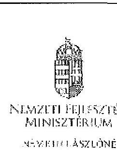

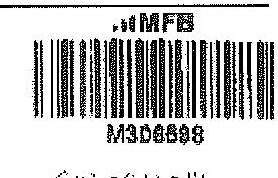

NEMZETI FEJLESZTÉSI
MINISZTÉRIUM

SZERVEZETI ÉS ÁSZLÓNÉ
MŰKÖDÉSI

Iktatószám: KGIV/ 171 - 1 /2014-NFM

Ügyintéző: dr. Kustár Mónika
Telefonszám: 793-1917
E-mail: monika.kustar@nfm.gov.hu

Nagy Csaba úr részére
vezérigazgató

Magyar Fejlesztési Bank Zrt.
Budapest

Tárgy: „Az állami vagyon feletti kontroll – Az állami vagyon feletti tulajdonosi joggyakorlással kapcsolatos tevékenységek ellenőrzéséről“ szóló 13/93 sz. ÁSZ jelentés alapján összeállított NFM intézkedési terv módosítása, az abban foglalt feladatok végrehajtása

Tisztelt Vezérigazgató Úr!

Az Állami Számvevőszék (a továbbiakban: ÁSZ) tárgyban megjelölt jelentésével összefüggésben 2014. január 27-én intézkedési tervet hagytam jóvá, amelyben foglalt feladatok végrehajtása érdekében 2014. január 30-i keltezésű levélben fordultam (Önhöz) és a Magyar Nemzeti Vagyonkezelő Zrt. vezérigazgatójához, Márton Péter úrhoz.

Az ÁSZ az intézkedési tervvel kapcsolatban küldött, 2014. március 25-i keltezésű levelében az intézkedési terv kiegészítését, módosítását kérte. A módosított intézkedési tervet jóváhagytam.

A módosított intézkedési terv alapján a következő feladatok végrehajtása szükséges az alábbiak szerint:

1./ a társaságok által kezelt állami ingatlanok és egyéb vagyon elemek értéken történő nyilvántartása:

Felelős: MNV Zrt.,
Határidő:

- földterületek esetében legkésőbb 2014. május 31-ig
- felépítmények esetében 2014. december 31. (A felépítmények esetében az MNV Zrt. a vagyonkezelési szerződés megkötését az év második felére tervezi, látja megvalósíthatónak.)

2./ a vagyonkezelési díjak egyértelmű és tulajdonosi joggyakorló szervezetenkénti meghatározása:

Címzett: 1346 Budapest, Pf. 1 Telefon: 100 3793 6668 E-mail: mivisznag@mugav.hu

---

# 12. SZÁMÚ MELLÉKLET A V-0749-162/2015. SZÁMÚ JELENTÉSHEZ 

Felelős: MNV Zrt.,
Határidő: 2014. május 31-ét követően folyamatosan (2014. december 31-ig)
E pontban foglalt feladathoz kapcsolatosan az ÁSZ részére az alábbi tájékoztatást adom:
„Az ÁSZ által meghatározott feladatok végrehajtására irányuló munkafolyamat során a végrehajtásban érintett szervezetek, társaságok között kialakult az az álláspont, hogy mivel az erdőgazdasági társaságok alapfeladatként közfeladat ellátást is végeznek, azt a vagyonkezelési díj mértékének meghatározásakor az MNV Zrt. figyelembe veszi, valamint megállapításra került az az elv is, hogy a vagyonkezelési díj irányadó mértéke az adott erdőgazdasági társaság által kezelt ingatlanvagyon bruttó nyilvántartási értékének 2%-a.

A vagyonkezelési díj alapja a kezelt vagyon bruttó nyilvántartási értéke, ezért annak meghatározására erdőgazdaság társaságonként kerül sor a 4./ pontban meghatározott önálló „végleges ingatlanlista" alapján. A végleges ingatlanlista kizárólag vagyonkezelésbe adott ingatlan vagyonelemeket tartalmaz, az erdőgazdasági társaság saját vagyonában nyilvántartott vagyonelemeket nem, ezért az MNV Zrt.-nek és az erdőgazdasági társaságoknak a szerződés megkötését megelőzően el kell határolnia egymástól a saját vagyonba és a kezelt vagyonba tartozó ingatlan vagyonelemeket (4.b./ pontban foglalt feladat).

A feleknek a vagyonkezelési díj mértékében a vagyonkezelési szerződés megkötését megelőzően kell megállapodniuk az irányadó vagyonkezelési díj mértéket alapul véve."

## 3./ az új vagyonkezelési szerződések megkötése:

A vagyonkezelési szerződés tervezete az MNV Zrt. érintett szakterületei álláspontjának figyelembe vételével elkészült, az MNV Zrt. és a MFB Zrt. által létrehozott Munkacsoport (tagjai: MFB Zrt., MNV Zrt., NFA és egyes erdőgazdasági társaságok) véleménye alapján átdolgozásra
 került. A szerződés tervezetnek az erdőgazdasági társaságok részére történő megkötése 2014. április 15. napjával megtörtént.

Felelős: MNV Zrt., az MFB Zrt. közreműködésével
Határidő:

- felülvizsgálati területek esetében: 2014. május 31-ét követően folyamatosan (2014. december 31-ig)
- felépítmények esetében 2014. II. félév folyamán

4./ a társaságok kezelt és saját vagyonának vagyonelemenkénti, valamint a kezelt vagyonelemek tulajdonosi joggyakorló szerinti alhatárolása:

Az erdőgazdasági társaságok által az MNV Zrt. rendelkezésére bocsátott feltárjelentések alapján

- a jogszabályi rendelkezés szerint az NFA tulajdonosi joggyakorlása alá tartozó ingatlan vagyonelemek nagyobb része már átadásra került az NFA részére,
- a kisebb részt képező vagyonelemek tekintetében pedig folyamatban van az átadás az MNV Zrt. és az NFA között.

---

# 12. SZÁMÚ MELLÉKLET A V-0749-162/2015. SZÁMÚ JELENTÉSHEZ

a./ Az ún. „végleges ingatlanlista” (az MNV Zrt. tulajdonosi joggyakorlása alatt lévő, maradó vagyonelem listája) MNV Zrt. és az NFA közötti leegyeztetése, közös áttekintése

Felelős: MNV Zrt.

Határidő: a lista MNV Zrt. és NFA közötti leegyeztetése, közös áttekintése folyamatban van, lezárása legkésőbb 2014. május 31-ig megtörténik

b./ Az a./ pontban foglaltak szerint leegyeztetett ún. „végleges ingatlanlista” MNV Zrt. és az egyes erdőgazdasági társaságok közötti áttekintése azzal a céllal, hogy a vagyonkezelésben lévő vagyoni elemeket tartalmazó ún. „végleges ingatlanlista” ne tartalmazzon az erdőgazdasági társaság saját vagyonában nyilvántartott vagyoni elemet (saját vagyon - vagyonkezelési vagyon elhatárolása).

Felelős: MNV Zrt., az MFB Zrt. közreműködésével
Határidő: 2014. május 31-ig

Éppenben foglalt feladatokkal kapcsolatosan az ÁSZ részére az alábbi tájékoztatást adtam:

„Szükséges megjegyezni, hogy ingatlanlista, mint állandó „végleges ingatlanlista” ilyen formában nem létezik, mert mindkét tulajdonosi joggyakorló tekintetében az állami vagyonelemek halmaza mind mennyiségben, mind pedig összetételben folyamatosan változik.

Az erdőgazdasági társaságok által kezelt ingatlanvagyon adatai – mindkét tulajdonosi joggyakorló tekintetében – az évközi változások (megnevezések, területváltozások, művelési ág változások, stb.) miatt folyamatosan változnak, ezért az adatartalmában „végleges ingatlanlista” mindig egy adott konkrét időpont vonatkozásában adható meg.

Jelen intézkedési tervben az ún. „végleges ingatlanlista” meghatározás alatt az erdőgazdasági társaságok vagyonkezelésében lévő ingatlanvagyon MNV Zrt. tulajdonosi joggyakorlása alatt álló részét kell tekinteni. E „végleges ingatlanlista” kialakítására az erdőgazdasági társaságok által az MNV Zrt. részére átadott feltárjelentések alapján került sor úgy, hogy az MNV Zrt. a Nemzeti Földalapba tartozó vagyonelemeket kiválogatta, s azokat a Nemzeti Földalapkezelő Szervezet részére – átadás-átvételi jegyzőkönyv alapján – átadta.

Lényeges körülmény, hogy a vagyonkezelőknek – jelen esetben az erdőgazdasági társaságoknak – minden év május 31. napjáig vagyonkezelői jelentést kell benyújtaniuk a tulajdonosi joggyakorlók, így az MNV Zrt. részére is. Az aktuális vagyonkezelői jelentéseket – melynek része a feltárjelentés is - a 2013. december 31-i állapotnak megfelelően kell összeállítani, ebből következtében a fent említett ún. „végleges ingatlanlista” is a 2013. december 31-i állapotot tükrözi.

Ugyanakkor – főként a kivett megnevezésben nyilvántartott földterületek esetében – a még át nem adott Nemzeti Földalapba tartozó vagyonelemek egyeztetése a két tulajdonosi joggyakorló között jelenleg is folyamatosan van.

Posta: 1440 Budapest, Pf. 12. z. 006 11 795 6665 E-mail: m.niezer@afor.gov.hu

---

# 12. SZÁMÚ MELLÉKLET A V-0749-162/2015. SZÁMÚ JELENTÉSHEZ 

Az egyes erdőgazdasági társaságok vagyonkezelésében lévő vagyon elemek az adott társasággal megkötendő - a jelenlegi ideiglenes vagyonkezelési szerződés helyébe lépő vagyonkezelési szerződés mellékletét fogják képezni. Az MNV Zrt. szándéka szerint az egyes erdőgazdasági társaságokkal azonnal megkötik a vagyonkezelési szerződéseket, ahogyan a megkötés feltételei bekövetkeznek (pl. megállapodnak a vagyonkezelési díjban, véglegesítik a vagyonkezelési szerződés tartalmát), azok a vagyon elemek, amelyeket e pont a./ és b./ pontjában foglaltak szerint átvizsgáltunk, a vagyonkezelési szerződés megkötésével egyidejűleg a szerződés mellékletébe kerülnek, amely melléklet folyamatosan bővítve kerül újabb, e pont a./ és b./ pontjában foglaltak szerint átvizsgált, tisztázott vagyon elemekkel. ..

Tájékoztatom, hogy az NFA feletti tulajdonosi jogok gyakorlója, Dr. Fazekas Sándor miniszter úr időközben már jóváhagyta azt az intézkedési tervet, amely az NFA részére meghatározott feladatokat és azok végrehajtási határidejét tartalmazza.

Az MFB Zrt. közreműködése az 1./ és 2./ pontban meghatározott feladatok végrehajtásában is szükséges lehet, ezért kérem a fent meghatározott feladatok határidőben történő végrehajtása érdekében az MFB Zrt. változatlan együttműködését az érintett szervezetekkel és amennyiben szükséges, úgy az erdőgazdasági társaságok bevonása lehetőségét is szíveskedjen intézkedni.

Budapest, 2014. .. 2. .. 21

## Üdvözlettel:

Németh Lórántné

---

$\square$
$\square$
$\square$
$\square$
$\square$
$\square$
$\square$
$\square$
$\square$
$\square$
$\square$
$\square$
$\square$
$\square$
$\square$
$\square$
$\square$
$\square$
$\square$
$\square$
$\square$
$\square$
$\square$
$\square$
$\square$
$\square$
$\square$
$\square$
$\square$
$\square$
$\square$
$\square$
$\square$
$\square$
$\square$
$\square$
$\square$
$\square$
$\square$
$\square$
$\square$
$\square$
$\square$
$\square$
$\square$
$\square$
$\square$
$\square$
$\square$
$\square$
$\square$
$\square$
$\square$
$\square$
$\square$
$\square$
$\square$
$\square$
$\square$
$\square$
$\square$
$\square$
$\square$
$\square$
$\square$
$\square$
$\square$
$\square$
$\square$

---

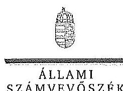

ELNÖK

SZÁMVEVŐSZÉK

Ikt.szám: V-0754-104/2015.

Nagy Csaba úr
vezérigazgató

Magyar Fejlesztési Bank Zrt.

Budapest

Tisztelt Vezérigazgató Úr!

Az „Az állami tulajdonban álló erdőgazdasági társaságok vagyongazdálkodási tevékenységének ellenőrzése" című ellenőrzés tekintetében 10 társaság jelentéstervezetére tett észrevételeiket köszönettel megkaptam.

Az Állami Számvevőszék észrevételekre vonatkozó álláspontjáról a felügyeleti vezető által készített részletes tájékoztatást csatoltan megküldöm.

Tájékoztatom Vezérigazgató urat, hogy a számvevőszéki jelentésben – az Állami Számvevőszékről szóló 2011. évi LXVI. törvény 29. § (3) bekezdése alapján – a figyelembe nem vett észrevételeket szerepeltetjük az elutasítás indokának feltüntetésével.

Budapest, 2015.

16. hó 20. nap

Tisztelettel:

Domokos László

Melléklet: Tájékoztatás az elfogadott és az el nem fogadott észrevételekről

1052 BUDAPEST, APÓCZI CSERE, JÁNOS UTCA 10. 1364 Budapest 4. Pf. 54 telefon: 4849101 fax: 4849201

---

# Tájékoztatás   az elfogadott és az el nem fogadott észrevételekről 

„Az állami tulajdonban álló erdőgazdasági társaságok vagyongazdálkodási tevékenységének ellenőrzése" című ellenőrzés tekintetében az Északerdő Erdőgazdasági Zrt., az EGERERDŐ Erdészeti Zrt., a Gemenci Erdő- és Vadgazdaság Zrt., az IPOLY ERDŐ Zrt., a KEFAG Kiskunsági Erdészeti és Faipari Zrt., a Kisalföldi Erdőgazdasági Zrt., a SEFAG Erdészeti és Faipari Zrt., a Szombathelyi Erdészeti Zrt., a VADEX Mezőföldi Erdő- és Vadgazdálkodási Zrt., illetve a Zalaerdő Erdészeti Zrt. társaságok jelentéstervezetére 2015. október 13-án érkezett észrevételeket áttekintettük, azok kezelésével kapcsolatban a következő tájékoztatást adom.

1. A jelentésekben megfogalmazott központi problémával kapcsolatban tett észrevételek A jelentésekben megfogalmazott központi problémával kapcsolatban adott tájékoztatásukat köszönettel vettük, azonban azok alapján a jelentéstervezet módosítása nem indokolt.

## 2. Egyedi esetekkel kapcsolatban tett észrevételek

A KEFAG Kiskunsági Erdészeti és Faipari Zrt. jelentéstervezetének 8. oldal 7. bekezdésére, valamint 32. oldal 6. bekezdésére tett észrevétel
A rendelkezésre álló dokumentumok ismételt áttekintését követően a jelentéstervezet 8. oldal 7. bekezdésében, valamint 32. oldal 6. bekezdésében töröljük a tulajdonosi joggyakorló 2 számú alsóindexszel jelölt hivatkozását.

A Kisalföldi Erdőgazdasági Zrt. jelentéstervezetének 29. oldal 4. bekezdésére tett észrevétel
A rendelkezésre álló dokumentumok ismételt áttekintését követően a jelentéstervezet 29. oldal 4. bekezdésében töröljük a tulajdonosi joggyakorló 2 számú alsóindexszel jelölt hivatkozását.

A Szombathelyi Erdészeti Zrt. jelentéstervezetének 32. oldal 5. bekezdésére tett észrevétel
A rendelkezésre álló dokumentumok ismételt áttekintését követően a jelentéstervezet 32. oldal 5. bekezdésében töröljük a tulajdonosi joggyakorló 2 számú alsóindexszel jelölt hivatkozását.

Budapest, 2015. év 11. hó 0. nap

Makkai Mária
felügyeleti vezető

---

# 14. SZÁMÚ MELLÉKLET A V-0749-162/2015. SZÁMÚ JELENTÉSHEZ 

## Nemzeti Földalapkezelő

Szervezet
Székhely: 1149 Budapest, Illemnok tér 5.
Törzskönyvi szám: 775766
Iktatószáma: NFA-002589/017/2015
Hiv. szám: ÁSZ-V-0599/2014-2015
Érintett ÁSZ Iktatószámok: V-0749-148/2015, V-0750-174/2015, V-0751-121/2015, V-0752-091/2015, V-0753-098/2015, V-754-088/2015, V-0755-124/2015, V-0757-062/2015, V-0758-058/2015, V-0760-077/2015, V-0764-056/2015, V-0765-046/2015, V-0766-140/2015, V-0767-056/2015.

## Domokos László

## Elnök

Állami Számvevőszék

## 1052 Budapest

Apóczy Csere János utca 10

Tárgy: Észrevétel megküldése „Az állami tulajdonban álló erdőgazdasági társaságok vagyongazdálkodási tevékenységének ellenőrzését" készített jelentés tervezeteire.

## Tisztelt Elnök Úr:

Az Állami Számvevőszék 2014. novemberében megkezdte „Az állami tulajdonban álló erdőgazdasági társaságok vagyongazdálkodási tevékenységének ellenőrzését", amelyről 2015. októberétől érintettség okán az NFA részére az elkészített munkanyag tervezeteit vizsgált erdőgazdaságonként, megküldte Szervezetünk részére véleményezésre.
A munkanyag valamennyi tervezete egységesen, az NFA Elnöke részére feladatokat tartalmaz, melyhez az alábbi észrevételeket tesszük:

A jelentéstervezetekben tett megállapítások helytállóságát nem vitatjuk, azonban szükségesnek látjuk az NFA elnökének tett javaslatokkal a), b) és c) kapcsolatban a következő tájékoztatást megadni.

---

# 14. SZÁMÚ MELLÉKLET A V-0749-162/2015. SZÁMÚ JELENTÉSHEZ

a) „Tegyen intézkedéseket az erdőgazdasági társaságok közreműködésével a tényleges állapotot rögzítő és a hatályos jogszabályi előírásoknak megfelelő vagyonkezelési szerződés megkötésére.”

Tájékoztatjuk, hogy a hatályos jogszabályi előírásoknak megfelelő vagyonkezelési szerződések megkötése érdekében több intézkedés történt, jelenleg is folyamatosan van a szerződések előkészítése és a vagyonkezelésben minősülő, illetve kikerülő földrészletek adatainak egyeztetése.

Előzményként fontos kiemelni, hogy a Nemzeti Földalapkezelő Szervezet 2010. szeptember 1. napjával történt létrehozását követően (2012. évben) sor került a vagyonkezelésben lévő földrészletek MNV Zrt. részéről történő átadására. Az átadási dokumentumok alapján Szervezetünk gondoskodott a közhírségnézetek felületcélázásától. Az erdőgazdasági esetében ez 2012. év végéig, illetve 2013. év elején megtörtént, ennek az ingatlan-nyilvántartásban történő átvezetése is.

Megjegyezzük, hogy az MNV Zrt. részéről történő átadás kizárólag a - több évtizede kötött, és azóta többször módosított - vagyonkezelési szerződések és a földrészletek fizető táblázatban történő átadását jelentette, tehát nem egy naprakész vagyonnyilvántartást tartalmazott. Ennek következtében szükségszerűvé válik a Nemzeti Földalapkezelő Szervezetnek egy saját nyilvántartás felépítése, illetve a szerződések tartalmának feldolgozása.

A számvevőszéki ellenőrzéssel érintett időszakban, illetve még jelenleg is lezáratlan az MNV Zrt. és NFA közötti átadás-átvételi folyamat. Az MNV Zrt. további földrészletek átadását készíti elő, ugyanis az MNV Zrt. vagyoni körébe tartozó földrészletekre szintén tervezi a vagyonkezelői szerződés megkötését, és ennek a folyamatnak a részeként a még át nem adott földrészletek átadása is most történik. Természetesen az NFA is folyamatosan biztosítja a különböző hasznosítási, illetve hatósági eljárások során az erdőgazdaságok vagyonkezelésében lévő földrészletek tulajdonosi joggyakorlójának rendezését az MNV Zrt. megkeresésével, közös minősítési eljárás lefolytatásával. A Nemzeti Földalapkezelő Szervezet által megbízott ügyvédi iroda jelentést készített a szerződés és a tárgyat képező földrészletek jogi helyzetének tisztázására.

Időközben az erdőgazdaságok, mint társaságok felett tulajdonosi joggyakorló személyében is változás történt. Így új alapokon indulhatott meg a vagyonkezelői szerződés előkészítése. Ennek a folyamatnak részeként, az NFA megbízott egy Ügyvédi Konzernumot, továbbá Szervezetünknél külön Erdészeti munkacsoport alakult 2015. májusában és azt követően a következő intézkedések történtek:

Az erdőgazdaságok részére vagyonkezelésbe adásra tervezett ingatlanok felülvizsgálata folyamatban van az Ügyvédi Konzernum által. A felülvizsgálat tárgyát képező ingatlanok köre három részből tevődik össze:

- az erdőgazdaságok ideiglenes vagyonkezelési szerződésének tárgyát képező ingatlanok,

---

- azon ingatlanok, amelyeket az erdőgazdaságok az ideiglenes vagyonkezelési szerződésükben szereplő ingatlanokon felül kértek vagyonkezelésbe,
- valamint azok az ingatlanok, amelyeket az NFA kíván az erdőgazdaságok vagyonkezelésébe adni.

A rendelkezésre álló dokumentumokban szereplő ingatlanokból erdőgazdaságonként egy egységes, az összes vagyonkezelésbe adandó ingatlant tartalmazó táblázat készült, amely tartalmazza az ingatlanok vagyonkezelésbe adás szempontjából releváns adatait, bejegyzett jogokat, feljegyzett tényeket. A táblázat adatai összevetésre kerültek a közhiteles ingatlannyilvántartásban szereplő adatokkal, feltárva ezáltal, hogy mely ingatlanok adhatóak vagyonkezelésbe és melyek azok, amelyeknél valamilyen előzetes intézkedés megtétele szükséges.

Az Nfatv. 8. §-a alapján a Birtokpolitikai Tanács dönt erdőgazdaságonként az erdőgazdaságok vagyonkezelési szerződésének megkötéséről.

Zárójelben jegyezzük meg, hogy például a TARG Zrt. esetében elkészült a fentebb részletezett táblázat, amely alapján összeállítása került azon ingatlanok listája, amelyre elindítható a vagyonkezelésbe adási eljárás. Megközelítőleg 18.000 ha nagyságú területet tervez Szervezetünk a TARG Zrt. részére történő vagyonkezelésbe adását, ebből 15.308.3880 ha terület az, amelyre elindította a vagyonkezelésbe adást. Az alábbi jogszabályhelyek alapján Szervezetünk megkereste a Földművelésügyi Minisztériumot az egyetértő nyilatkozatok, valamint az alapító
 határozat kiadása érdekében, valamint a NÉBIH-et, mint erdészeti hatóságot a vagyonkezelő erdőgazdálkodói alkalmazáságát megállapító jóváhagyásának megkérése végett.

Az Nfatv. 20. § (7) bekezdése alapján „Az állam 100%-os tulajdonában álló erdő és erdőgazdálkodási tevékenységet közvetlenül szolgáló földterületet érintő vagyonkezelési szerződés létrejöttéhez az erdészeti hatóságnak - a vagyonkezelő erdőgazdálkodói alkalmazáságát megállapító - jóváhagyása szükséges".

Az Nfatv. 23. § (2) bekezdése alapján a Nemzeti Földalapba tartozó védett természeti területek és a Natura 2000 területek vagyonkezelésbe adására, tulajdonjogának bármely jogütem történő átruházására csak a természetvédelemért felelős miniszter egyetértése esetén kerülhet sor. Az állam 100%-os tulajdonában álló erdő, továbbá erdőgazdálkodási tevékenységet közvetlenül szolgáló földterület vagyonkezelésbe adásához az erdőgazdálkodásért felelős miniszter egyetértése szükséges.

Magyar Állam tulajdonában álló ingatlanokat érintő jogügyletekkel kapcsolatos előzetes miniszteri nyilatkozatok és a miniszter tulajdonosi joggyakorlása alá tartozó gazdasági társaságok ingatlanügyletekkel kapcsolatos miniszteri nyilatkozatok, alapítói határozatok kiadásának rendjétől szóló 8/2014. (XI. 28.) PM utasítás 3. § (4) bekezdése értelmében a miniszter tulajdonosi joggyakorlása alá tartozó állami tulajdonú gazdasági társaságoknak az

---

# 14. SZÁMÚ MELLÉKLET A V-0749-162/2015. SZÁMÚ JELENTÉSHEZ

NFA-val történő vagyonkezelési szerződés kötéséhez elengedhetetlen a jogszabály vagy Társaság alapszabálya vagy alapító okirat alapján a Társaság tulajdonosi jogait gyakorló miniszter alapítói határozatának kiadása.

Az Erőszent Mihálycsoport a kialakult szempontok alapján tartja a kapcsolatot a Konkordáttal a szerződés tárgyát képező földrészletek jogi, nyilvántartási, bejárási, térképi ellenőrzés tárgyában annak érdekében, hogy naprakész adatok alapján történjen a szerződéskötés.

b) **Intézkedjen a vagyonkezelési szerződések felülvizsgálatának elmaradásával összefüggésben feltételezett szabálytalanságok tekintetében a munkajogi felelősség tisztázására irányuló eljárás megindításáról, és ennek eredménye lezárultában tegye meg a szükséges intézkedéseket.**

A fent leírt folyamat időbeli áttekintése és a vagyonkezelési szerződés előkészítésének jelenlegi helyzetét tekintve a Nemzeti Földalapkezelő Szervezet egységei, munkatársai a rendelkezésükre álló eszközök alapján megtették a szükséges intézkedéseket az elégtartásának vagyonkezelési szerződésének megfelelő érdekében.

c) Az NFA elnöke felé tett javaslattal kapcsolatban, miszerint intézkedjen a Társaságok vagyon-nyilvántartása hitelességének, teljességének és helyességének jogszabályban foglaltak szerinti ellenőrzéséről.

Az NFA 2015. év márciusában megkezdte az Erőszent Zrt.-k dokumentális ellenőrzését, amely ellenőrzés keretében bekerült a Társaságok kapcsolatában álló vagyonelemekről és az erőforrás-állományról vezetői (nyilvántartások) aktualizált nyilvántartása is.

Budapest, 2015. október 13.

Tisztelettel:

*Nagy Földi*

NFA Címz.

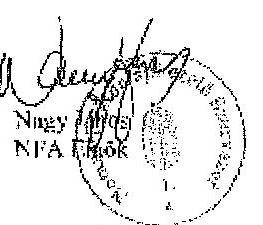

---

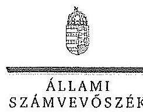

ELNÖK

SZÁMVEVŐSZÉK

Ikt.szám: V-0749-154/2015.

Nagy János úr
elnök

Nemzeti Földalapkezelő Szervezet

Budapest

Tisztelt Elnök Úr!

Az „Az állami tulajdonban álló erdőgazdasági társaságok vagyongazdálkodási tevékenységének ellenőrzése" című ellenőrzés tekintetében 14 társaság jelentéstervezetére tett észrevételeiket köszönettel megkaptam.

Az Állami Számvevőszék észrevételekre vonatkozó álláspontjáról a felügyeleti vezető által készített részletes tájékoztatást csatoltan megküldöm.

Tájékoztatom Elnök urat, hogy a számvevőszéki jelentésben – az Állami Számvevőszékről szóló 2011. évi LXVI. törvény 29. § (3) bekezdése alapján – a figyelembe nem vett észrevételeket szerepeltetjük az elutasítás indokának feltüntetésével.

Budapest, 2015. 11. hó 02. nap

Tisztelettel:

Domokos László

Melléklet: Tájékoztatás az észrevételek kezeléséről

1052 BUDAPEST, AFRIKAI CSERE JANUS UTCA 10. 1364 Budapest 4. Pf. 54 telefon: 484 8101 fax: 484 8201

---

# Tájékoztatás   az észrevételek kezeléséről 

„Az állami tulajdonban álló erdőgazdasági társaságok vagyongazdálkodási tevékenységének ellenőrzése" című ellenőrzés tekintetében az IPOLY ERDŐ Zrt., az EGERERDŐ Erdészeti Zrt., a Mecsekerdő Zrt., a SEFAG Erdészeti és Faipari Zrt., a Gemenci Erdő- és Vadgazdaság Zrt., az Északerdő Erdőgazdasági Zrt., a Pilisi Parkerdő Zrt., a Szombathelyi Erdészeti Zrt., a Kisalföldi Erdőgazdasági Zrt., a Zalaerdő Erdészeti Zrt., a KEFAG Kiskunsági Erdészeti és Faipari Zrt., a VADEX Mezőföldi Erdő- és Vadgazdálkodási Zrt., a Gyulaj Erdészeti és Vadászati Zrt., illetve a TAEG Tanulmányi Erdőgazdaság Zrt. társaságok jelentéstervezetére 2015. október 16-án érkezett észrevételeket áttekintettük, azok kezelésével kapcsolatban a következő tájékoztatást adom.

Az észrevételek szerint a jelentéstervezetben tett megállapítások helytállóak, azokat nem vitatják. Az NFA elnökének tett javaslatokhoz kapcsolódó tájékoztatást köszönjük. Mindezek miatt, valamint arra tekintettel, hogy nem jött létre olyan vagyonkezelési szerződés, amely biztosítja az ideiglenes vagyonkezelési szerződés hiányosságainak a megszüntetését, illetve a hatályos jogszabályoknak való megfeleltetést, a megállapítások és a javaslatok módosítása nem indokolt.

Budapest, 2015. év $\quad 11/12$ hó 12. nap
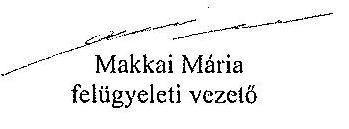
