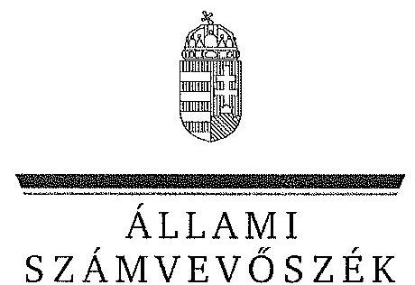

ÁLLAMI
SZÁMVEVŐSZÉK

# JELENTÉS 

Az állami tulajdonban álló erdőgazdasági társaságok vagyongazdálkodási tevékenységének ellenőrzése

EGERERDŐ Erdészeti Zrt.

---

# Állami Számvevőszék 

Iktatószám: V-0750-188/2015
Témaszám: 1784
Vizsgálat-azonosító szám: V070602

## Az ellenőrzést felügyelte:

## Makkai Mária

felügyeleti vezető
Az ellenőrzést vezette és az ellenőrzés végrehajtásáért felelős:
Dr. Schreiber Judit Zsuzsanna
ellenőrzésvezető
A számvevőszéki jelentés összeállításában közremúködött:
Szarka Péterné
számvevő vezető főtanácsos
Az ellenőrzést végezték:

| Berki László | Szarka Péterné |
| :-- | :-- |
| számvevő | számvevő vezető főtanácsos |

---

# TARTALOMJEGYZÉK 

BEVEZETÉS ..... 3
I. ÖSSZEGZŐ MEGÁLLAPÍTÁSOK, KÖVETKEZTETÉSEK, JAVASLATOK ..... 7
II. RÉSZLETES MEGÁLLAPÍTÁSOK ..... 13

1. Az EGERERDŐ Zrt. vagyongazdálkodása ..... 13
1.1. A vagyon értékének megőrzése, gyarapítása ..... 13
1.2. A vagyonkezelői kötelezettség teljesítése ..... 15
2. Az EGERERDŐ Zrt. vagyonkezelési szerződése és a vagyonnyilvántartása ..... 16
2.1. A vagyonkezelési szerződés megfelelősége ..... 16
2.2. Az EGERERDŐ Zrt. vagyonnyilvántartása ..... 17
3. Az EGERERDŐ Zrt. éves tervezési feladatainak ellátása, az ágazati jogszabályok érvényesülése ..... 18
3.1. Az üzleti tervek vagyonmegőrzésre, vagyongyarapítására vonatkozó elemei ..... 18
3.2. A tervekben megfogalmazott előírások érvényesülése ..... 18
3.3. Ágazati szabályok érvényesülése ..... 19
4. A kontroll- és monitoring rendszer kialakítása és múködtetése ..... 20
4.1. A kontrollrendszer kialakítása és múködtetése ..... 20
4.2. Az információáramlási és monitoring rendszer kialakítása és múködtetése ..... 21
5. A tulajdonosi joggyakorlóknak az EGERERDŐ Zrt. vagyongazdálkodási feladataira vonatkozó döntései, intézkedései megfelelősége ..... 22
MELLÉKLETEK
6. számú Rövidítések jegyzéke
7. számú Fogalomtár
8. számú Az EGERERDŐ Zrt. vagyonának alakulása a 2009-2014. I. félév közötti időszakban
9. számú Az EGERERDŐ Zrt. immateriális javainak és tárgyi eszköz állományának megoszlása a 2013. évre vonatkozóan
10. számú Az EGERERDŐ Zrt. befektetett eszköz állományának alakulása a 2009-2014. I. félév közötti időszakban
11. számú Az EGERERDŐ Zrt. saját tőke változása a 2013. évre vonatkozóan

---

7. számú Az EGERERDŐ Zrt. beruházásainak, felújításainak forrása a 2009-2014. I. félév közötti időszakban
8. számú Az EGERERDŐ Zrt. vezérigazgatójának észrevétele
9. számú Az EGERERDŐ Zrt. vezérigazgatójának észrevételére adott válasz
10. számú A Magyar Nemzeti Vagyonkezelő Zrt. vezérigazgatójának észrevétele
11. számú A Magyar Nemzeti Vagyonkezelő Zrt. vezérigazgatójának észrevételére adott válasz
12. számú A Magyar Fejlesztési Bank Zrt. vezérigazgatójának észrevétele
13. számú A Magyar Fejlesztési Bank Zrt. vezérigazgatójának észrevételére adott válasz
14. számú A Nemzeti Földalapkezelő Szervezet elnökének észrevétele
15. számú A Nemzeti Földalapkezelő Szervezet elnökének észrevételére adott válasz

---

# JELENTÉS 

## Az állami tulajdonban álló erdőgazdasági társaságok vagyongazdálkodási tevékenységének ellenőrzése EGERERDŐ Erdészeti Zrt.

## BEVEZETÉS

Hazánk területének több mint 20\%-át erdő borítja. Az erdők fenntartása és védelme az egész társadalom érdeke, ezért az erdőkkel csak a közérdekkel összhangban lehet gazdálkodni.

Az Alaptörvény 38. cikke és az Nvtv. alapján az állam tulajdona a nemzeti vagyon részét képezi. Az Nvtv. alapján nemzetgazdasági szempontból kiemelt jelentőségű nemzeti vagyonban tartandó vagyonelemnek minősül a 100\%-ban az állam tulajdonában álló védelmi és közjóléti elsődleges rendeltetésű erdő, a gazdasági elsődleges rendeltetésű természetes erdő, természetszerű erdő és származék erdő természetességi állapotú öt hektárnál nagyobb, természetben összefüggő erdő. Az erdőgazdasági társaságok vagyongazdálkodása szempontjából a Vtv., illetve az Nvtv. és az Nfatv., valamint a kapcsolódó kormány- és miniszteri rendeletek mellett kiemelkedő szerepe van a különböző ágazati jogszabályoknak. A vagyonkezelési tevékenység végrehajtása során figyelemmel kell lenni az Evt.-ben foglaltakra, mely alapján a nemzeti vagyonról szóló törvényben nemzetgazdasági szempontból kiemelt jelentőségű nemzeti vagyonként meghatározott védelmi és közjóléti elsődleges rendeltetésű, az állam tulajdonában álló erdő a kincstári vagyon részét képezi. Az erdőgazdasági társaságoknak az általuk kezelt vagyonelemek sajátosságára tekintettel kell a vagyongazdálkodási tevékenységüket kialakítaniuk, gondoskodniuk kell a közérdek és az Evt.-ben foglaltak érvényesülését biztosító vagyongazdálkodásról.

Az Evt. előírásai alapján az állam 100\%-os tulajdonában álló erdőt és erdőgazdálkodási tevékenységet közvetlenül szolgáló földterületet csak vagyonkezelés formájában lehet hasznosításra átengedni, és az állam tulajdonában álló erdő és erdőgazdálkodási tevékenységet közvetlenül szolgáló földterület vagyonkezelését csak költségvetési szerv vagy kizárólagos állami tulajdonú gazdálkodó szervezet végezheti.

A Vtv. szerint az erdőgazdasági társaságok és a társaságok kezelésében lévő állami vagyon feletti tulajdonosi jogokat a 2010. évig a Magyar Állam nevében az MNV Zrt. gyakorolta. A 2010. évi törvényi változások (Vtv., Mfbtv., Nfatv.) következtében 2010. június 17. napjától az erdőgazdasági társaságok állami tulajdonú részesedése tekintetében a tulajdonosi jogokat az állami vagyonért fele-

---

lős miniszter az MFB Zrt. útján látta el. Az Nfatv. 2010. évi hatálybalépését követően a társaságok által kezelt, a Nemzeti Földalapba tartozó földterületek vonatkozásában a tulajdonosi jogokat az NFA, míg egyéb ingatlanok és vagyonelemek tekintetében a tulajdonosi jogokat az MNV Zrt. gyakorolja. 2014. július 16-tól az erdőgazdasági társaságok feletti tulajdonosi jogokat az erdőgazdálkodásért felelős miniszter gyakorolja.

A Nemzeti Földalapba tartozó 1772 980,17 ha földterületből a 2012. év végén a 100\%-os állami tulajdonú 19 erdőgazdasági társaság kezelésében összesen 913664,3681 ha földterület volt, ebből 879254,1595 ha erdő, a többi egyéb művelési ágba tartozik. A kezelt földterületek erdőgazdasági társaságonkénti megoszlása eltérő.

Az erdőgazdasági társaságok az Alaptörvény és az Nvtv. előírása szerint önállóan és felelősen gazdálkodnak a törvényesség, a célszerűség és az eredményesség követelményei szerint. Az állami vagyonnal való gazdálkodás alapvető feladata a vagyon rendeltetésszerű, hatékony és felelős felhasználásának biztosítása az állami vagyon értékének megőrzése, gyarapítása érdekében. Az EGERERDŐ Zrt. jelen ellenőrzése az állami vagyonnal gazdálkodás során a törvényesség betartására irányult.

Az EGERERDŐ Zrt. Magyarország legnagyobb összefüggő erdővel borított hegyvidéki tájának, az Északi-középhegységnek három egymástól eltérő arculatú területén: a Mátrában, a Bükk nyugati részén és a Heves-Borsodi-dombvidék területén gazdálkodik. A Társaság 2013. évi éves beszámolója szerint 4276,5 M Ft nettó ábevétel mellett 47,6 M Ft mérleg szerinti eredményt ért el, a mérlegfőöszszeg 6152,4 M Ft volt. Az erdőgazdasági társaság 71704 ha erdőterületen és 2478 ha egyéb művelési ágú földterületen gazdálkodott, az éves átlaglétszám 325 fő volt.

Az ellenőrzés célja annak értékelése, hogy az EGERERDŐ Zrt. vagyongazdálkodása, vagyonérték-megőrző és vagyongyarapítási tevékenysége, valamint ennek szervezeti keretei megfeleltek-e a jogszabályok és belső szabályzatok előírásainak, valamint a kezelt vagyonelemek sajátosságaiból adódó követelményeknek.

Ennek keretében ellenőriztük és értékeltük, hogy:

- a vagyongazdálkodás során betartották-e az Nvtv. 7. §-ában megállapított vagyongazdálkodási alapelveket, valamint az ágazati jogszabályok vagyongazdálkodáshoz kapcsolódó előírásait;
- a Társaság a saját és a kezelt vagyonnal való gazdálkodásra vonatkozó éves tervezési feladatait a jogszabályi előírásoknak megfelelően látta-e el, a Társaság üzleti tervei a kezelésbe vett vagyonra vonatkozó, a Vtv. 2. § (1) és a 27. § (7) bekezdésekben előírt vagyon megőrzésére, gyarapítására vonatkozó elemeket tartalmaztak-e és azokat a vagyongazdálkodás során érvényesítettéke;
- a vagyonkezelési szerződések és a vagyon-nyilvántartás megfeleltek-e a szabályszerűségi követelményeknek, elősegítették-e az állami vagyonnal való szabályszerű gazdálkodást;

---

- a Társaságnál kialakították és működtették-e a szabályszerű feladatellátást támogató kontrollrendszert. Ezen belül elkészítették és aktualizálták-e a társaság feladatellátási-folyamatainak szabályzatait, a kockázatok kezelésének rendszerét, az információs és a kontrolling-monitoring rendszert, valamint a vagyongazdálkodás területén azokat az eljárásokat, amelyek elősegítik a szervezeti célok végrehajtását;
- a tulajdonosi joggyakorlóknak az EGERERDŐ Zrt. vagyongazdálkodási feladataira vonatkozó döntései, intézkedései előkészítése és megalapozottsága a jogszabályoknak és a belső szabályozásnak megfelelt-e, a tulajdonosi joggyakorlók e minőségben végzett tevékenysége támogatta-e a felelős vagyongazdálkodás megvalósulását.

Az ellenőrzés típusa: szabályszerűségi ellenőrzés.
Az ellenőrzött időszak: 2009. január 1. napjától 2014. június 30. napjáig, kitekintéssel a helyszíni ellenőrzés végéig tartó releváns folyamatokra, intézkedésekre.

Az ellenőrzés várható hasznosulása: A Társaság és a tulajdonosi joggyakorlók fenti szempontú ellenőrzése az állami tulajdonban álló vagyon kezelésére, a vagyonnal való gazdálkodásra vonatkozó, kötelezően végrehajtandó éves ÁSZ ellenőrzést szélesebb körűvé teszi.

Az ellenőrzés várható hasznosulásaként biztosíthatja a társadalom részéről kiemelt érdeklődéssel kísért téma objektív bemutatását. Az ÁSZ jelentéséből a média és az állampolgárok átfogó képet kaphatnak a Magyarország állami tulajdonban lévő erdőivel való gazdálkodásról, a gazdálkodást, vagyonkezelést végző szervezeti rendszerről, az állami tulajdonban álló erdőgazdasági társaságok feladatellátásához kapcsolódóan feltárt problémákról.

Az ellenőrzés jól hasznosítható - többek közt - az állami vagyonnal kapcsolatos országgyűlési törvényhozói munkában is, továbbá hozzájárulhat a tulajdonosi joggyakorlás javításával a „jó kormányzás" gyakorlatának erősítéséhez.

Az ellenőrzéssel érintett szervezetek: AZ EGERERDŐ Zrt., a Társaság kezelésében lévő állami vagyon feletti tulajdonosi jogokat gyakorló szervezetek, valamint a Társaság állami tulajdonú részesedése feletti tulajdonosi joggyakorlók (MFB Zrt., MNV Zrt., NFA).

Az ellenőrzés végrehajtásának jogszabályi alapját az ÁSZ tv. 5. § (4)-(5) bekezdéseiben foglaltak képezik.

Az ellenőrzés szakmai módszertana az ÁSZ hivatalos honlapján közzétett szakmai szabályokon alapult, amely a Legfőbb Ellenőrző Intézmények Nemzetközi Szervezete (INTOSAI) által kiadott nemzetközi standardok (ISSAI) figyelembevételével készült.

Az EGERERDŐ Zrt. az ellenőrzés lefolytatásához tanúsítványok kitöltésével, valamint dokumentumok elektronikus megküldésével szolgáltatott adatokat. Az így rendelkezésre bocsátott adatok és információk kontrollja a helyszíni ellenőr-

---

zés keretében történt. A vagyonváltozást eredményező döntések megalapozottságát, továbbá a vagyonérték-megőrző és vagyongyarapító tevékenység szabályszerűségét a számviteli nyilvántartásokból, valamint kockázat alapú és véletlenszerű mintavétellel kiválasztott tételek ellenőrzésével értékeltük. A kezelt vagyont érintően a beruházások, felújítások pénzforgalmi kiadási területet arányos rétegzéssel összesen 30 elemú véletlen minta ellenőrzésével minősítettük.

A sokaságból tételes ellenőrzésre kiemeltük évente a 2009-2013.évek 3-3 legnagyobb összegű tételét, 2014. első félévében a kettő legnagyobb összegű tételt.

A kivett minta alapján végeztük a kezelt vagyonon megvalósított beruházások, felújítások szabályszerűségének (üzembe helyezés, nyilvántartás, értékcsökkenés elszámolása) ellenőrzését.

Az ÁSZ a 2011. évi LXVI. törvény 29. §-a szerint a jelentéstervezetet megküldte az EGERERDŐ Erdészeti Zrt., a Magyar Nemzeti Vagyonkezelő Zrt. és a Magyar Fejlesztési Bank Zrt. vezérigazgatójának, valamint a Nemzeti Földalapkezelő Szervezet elnökének egyeztetésre. Az EGERERDŐ Erdészeti Zrt. vezérigazgatójának észrevételét és az arra adott választ a 8-9. számú melléklet, a Magyar Nemzeti Vagyonkezelő Zrt. vezérigazgatójának észrevételét és az arra adott válaszunkat a 10-11. számú melléklet, a Magyar Fejlesztési Bank Zrt. vezérigazgatójának észrevételét és az arra adott válaszunkat a 12-13. számú melléklet tartalmazza. A Nemzeti Földalapkezelő Szervezet elnökének észrevételét és az arra adott választ a 14-15. számú melléklet tartalmazza.

---

# I. ÖSSZEGZŐ MEGÁLLAPÍTÁSOK, KÖVETKEZTETÉSEK, JAVASLATOK 

Az EGERERDŐ Zrt. vagyongazdálkodása az ellenőrzött években a saját vagyonára és a vagyonkezelésében lévő állami vagyonra terjedt ki. A Társaság mérleg szerinti vagyona a saját vagyonából állt, amely a 2009. évi nyitó 5558,3 M Ftról a 2013. év végére 6152,4 M Ft-ra nőtt.

A Társaság a vagyonkezelt vagyonelemekre vonatkozóan nem tett eleget a Számv. tv.-ben foglaltaknak, mivel a Társaság mérleg szerinti vagyona nem tartalmazta a vagyonkezelésében lévő állami erdők és azzal szerves egységet képező egyéb földterületek, valamint az egyéb kezelt vagyon értékét, ezáltal a mérleg nem a valós állapotot tükrözte. A Számv. tv.-ben foglaltak ellenére a vagyonkezelésbe vett eszközöket mérlegtétel szerinti megbontásban nem mutatták be a kiegészítő mellékletben.

A Társaság által kezelt vagyonról vezetett nyilvántartás nem felelt meg a Vhr.ben foglaltaknak, mert tételesen nem tartalmazta a vagyonkezelt eszközök könyv szerinti bruttó és nettó értékét, valamint az értékben bekövetkezett egyéb változásokat. Ezért a vezetett nyilvántartás nem biztosította az átláthatóságot és az elszámoltathatóságot. A kezelt ingatlanokról tételes mennyiségi kimutatást vezettek, a forint érték feltüntetése nélkül, ami megfelelt a VSZ 2.4. pontja szerinti naturáliákban történő nyilvántartás vezetési előírásnak, azonban nem felelt meg Számv.tv.-ben a kezelt vagyon nyilvántartására vonatkozó szabálynak. A vagyonkezelt eszközök forint értékének meghatározását a Társaság sem az MNV Zrt.-nél, sem pedig az NFA-nál nem kezdeményezte annak érdekében, hogy eleget tegyen a Számv. tv. előírásainak.

A Társaság nem rendelkezett a VSZ eredeti, hiteles, a vagyonkezelt eszközök felsorolását tartalmazó 1-4. mellékleteivel. A Társaság nem teljes körűen rendelkezett a kezelt vagyon tekintetében pontos és naprakész információval a tulajdonosi jogokat gyakorlóról, így a Társaság által vezetett nyilvántartás nem biztosította a Vhr.-ben foglalt, az adatszolgáltatás pontosságára vonatkozó követelményt.

A tulajdonosi joggyakorlók tisztázásával és a kezelt vagyonelemek nyilvántartása egyezőségének biztosításával kapcsolatos adategyezetés az ellenőrzés befejezéséig nem került lezárásra, így nem állt rendelkezésre a Társaság által kezelt vagyonra és annak nagyságára vonatkozó, a Társaság, az MNV Zrt. és az NFA nyilvántartásában szereplő, egyező adat.

A Társaság a Magyar Állam tulajdonában álló erdővagyon és egyéb művelési ágú termőföld ingatlanok kezelését a KVI-vel 1996. november 1-én kötött vagyonkezelési szerződést alapján végezte. A Társaság, mint vagyonkezelő és a KVI között létrejött szerződéses jogviszony kereteit a VSZ-ben foglalt jogok és kö-

---

telezettségek töltötték ki. A VSZ nem támogatta a Vhr.-ben előírt, a vagyongazdálkodási feladatok átlátható módon történő végrehajtását, valamint nem támogatta a szabályszerű vagyongazdálkodást.

A VSZ 3.3.2. pontjában foglaltak ellenére a VSZ-t a felek évente nem vizsgálták felül. A felek nem tettek eleget a Vhr.-ben foglalt rendelkezésnek és a Vhr. hatálybalépését követő hat hónapon belül nem kezdeményezték a Nemzeti Földalapba tartozó ingatlanokra vonatkozóan a VSZ megszüntetését és a Vtv., illetve Vhr. szabályainak megfelelő szerződés megkötését, így a VSZ nem tartalmazta a 2007-ben hatályba lépett Vtv. és Vhr. előírásait.

A Társaság által kezelt vagyonelemek többszöri változása ellenére a felek nem tartották be a Vhr.-ben előírt, a VSZ 60 napon belüli egységes szerkezetbe foglalására vonatkozó rendelkezést. A VSZ módosításokkal történő egységes szerkezetbe foglalását sem a Társaság, sem a tulajdonosi jogokat gyakorló MNV Zrt, illetve NFA nem kezdeményezte.

A VSZ vagyonkezelői jog átengedésére vonatkozó 3.2.3. pontja 2012-től nem felelt meg az Nvtv.-ben foglaltaknak, amely szerint a vagyonkezelői jog harmadik személynek nem engedhető át.

A VSZ nem rögzítette a Vhr.-ben 2011. január 1-jétől előírt, az érintett vagyonelem esetleges védettségét, illetve Natura 2000 területnek minősítését, és a Vhr.ben foglalt elismerő nyilatkozatot az MNV Zrt. vagyon-nyilvántartási szabályzatának megismerésére és kötelező elismerésére vonatkozóan.

A felek a VSZ 3.3.2. pontjában foglaltak ellenére a vagyonkezelési díjat évente nem vizsgálták felül, erről történő megállapodás megkötésére nem került sor.

Az NFA - az MNV Zrt.-vel kötött megállapodás alapján - a 2009-2013. évekre vonatkozó vagyonkezelési díjakat leszámlázta, azonban a számlázás a VSZ 3.3.3. pontjában foglalt határidőtől eltérő időben történt. Az NFA a számlákon a vagyonkezelési díjat egy összegben szerepeltette, azokon nem tüntette fel a számlázás alapját képező földterület nagyságát, így nem volt megállapítható a számlák tartalmi megfelelősége.

A Társaság az ellenőrzött időszakban a vagyongazdálkodás során a kezelt vagyonelemek, valamint a saját eszközeinek karbantartási, állagmegóvási feladatait a Vtv., a Vhr. és az Nfatv. előírásai alapján ellátta.

A tárgyi eszközök körében rendszeresen végeztek állapotfelméréseket, az éves tervezési feladatokat az előírásoknak megfelelően végezték, az üzleti tervek tartalmaztak a vagyongazdálkodásra, a vagyon megőrzésére vonatkozó elemeket. Az üzleti tervekben foglaltakat betartották, annak megvalósításáról minden évben beszámoltak.

A Társaság a feladatellátása során az Evt. szerinti bejelentési, engedélyeztetési kötelezettségeknek eleget tett, valamint betartotta a vagyongazdálkodási alapelveket. A Társaság kezelésében lévő vagyon elidegenítésére, megterhelésére nem került sor, a vagyonkezelői jogot harmadik személynek nem engedték át, nem terhelték meg.

---

A Társaság az Erdészeti hatóság által jóváhagyott erdőgazdálkodási és Vadászati hatóság által jóváhagyott vadgazdálkodási tervekkel rendelkezett. Az ellenőrzött időszakban az ágazati szabályokat nem teljes körűen tartották be, a 2009-2013. években az Evt. megsértése - az erdőterület igénybevétele, vadkár, erdő felújítására megállapított határidő túllépése - miatt került sor bírság kiszabására.

A Társaság kialakította és múködtette a feladatellátást támogató kontrollrendszert. A Társaság az éves beszámolóit elkészítette, azokat az FB és a könyvvizsgáló jelentésének figyelembe vételével a Társaság feletti tulajdonosi joggyakorló ${ }_{1,2}$ határozattal jóváhagyta. A Társaságnál múködő FB az ellenőrzött időszakban eleget tett az Alapító okiratban előírt ellenőrzési feladatainak.

A Társaság minden évben a Számv. tv. és az Alapító Okirat szerint, a tulajdonosi joggyakorló által kijelölt könyvvizsgálót alkalmazott. A könyvvizsgáló minden évben hitelesítő záradékkal adta ki könyvvizsgálói jelentését. A könyvvizsgáló az ellenőrzött időszakban nem kifogásolta a beszámolóval kapcsolatosan az ÁSZ által feltárt hiányosságokat.

A Társaság kialakította és az előírásoknak megfelelően működtette a belső ellenőrzést. A 2012-2013. években a belső ellenőrzés a vagyongazdálkodás területén is végzett ellenőrzést. Az ellenőrzésekhez kapcsolódóan intézkedési tervkészítési kötelezettséget írtak elő, az intézkedéseket végrehajtották, utóellenőrzés keretében ellenőrizték.

A Társaságnál kialakították az információáramlási és monitoring rendszert, biztosították annak szabályzatok szerinti múködését.

Az ellenőrzött években teljesítették a Vhr.-ben és a VSZ-ben előírt, a vagyonkezelésben lévő állami vagyonnal kapcsolatos adatszolgáltatási kötelezettséget. Az ágazati lapok szerinti, a vagyonkezelési tevékenységével kapcsolatos bevételekről és költségekről a beszámolókat elkészítették és az éves beszámolókkal együtt a társaság feletti tulajdonosi joggyakorló ${ }_{1,2}$-nak megküldték. Az erdőgazdálkodási tervek, egyéb erdőgazdálkodási tevékenységek és az éves vadgazdálkodási tervek teljesítéséről az éves üzleti jelentésekben és a kontrolling adatszolgáltatás keretein belül számoltak be.

A Társaság rendelkezett Leltározási szabályzattal, azonban az 2012. január 1jétől egyes tárgyi eszközök tekintetében nem felelt meg a Számv. tv.-ben foglaltaknak, mert ötévenkénti mennyiségi leltár felvételt írt elő a három évenkénti szabállyal szemben.

A 2013. év végétől rendelkeztek Informatikai Biztonsági Szabályzattal, azonban a közérdekú adatok nyilvánosságra hozatalának szabályozottsága nem volt megfelelő, mert az Avtv., illetve az Info. tv. előírása szerinti, a közérdekú adatok megismerésére irányuló igények teljesítésének rendjét rögzítő szabályzatkészítési kötelezettségnek nem tettek eleget. A Társaság saját honlapján közzétett dokumentumok köre nem felelt meg az általános közzétételi listában meghatározottaknak, nem került közzétételre az SZMSZ, a közérdekű adatok megismerésére vonatkozó igények intézésének rendje, a felügyeleti szervek adatai, valamint a közbeszerzési információk.

---

A Társaság vagyongazdálkodási feladataira vonatkozó döntések, intézkedések előkészítése a tulajdonosi joggyakorló ${ }_{1-2}$-nél megfelelő volt, a belső szabályzatok egymással összhangban voltak és részletesen szabályozták a döntési jogköröket, valamint a vagyongazdálkodással kapcsolatos döntések előkészítését.

A társaság feletti tulajdonosi joggyakorló ${ }_{1,3}$ a vagyonváltozást eredményező döntések végrehajtását a beszámolók, az üzleti tervek, üzleti jelentések és a kontrolling jelentések megtárgyalásával és jóváhagyásával ellenőrizte. A társaság feletti tulajdonosi joggyakorló a Társaságnál a 2010. évben külső szakértővel átvilágítást végeztetett, a tett javaslatok megvalósulását nyomon követték és az eredményekről az érintetteket beszámoltatták.

A vagyonkezelésbe adott állami vagyon tekintetében tulajdonosi jogokat gyakorló MNV Zrt. és NFA tevékenysége az ellenőrzött időszakban nem támogatta teljes körűen a felelős vagyongazdálkodás megvalósulását, a VSZ-szel kapcsolatban feltárt hiányosságok megszüntetése és a hatályos jogszabályoknak való megfeleltetése nem történt meg. A vagyonkezelésbe adott állami vagyon tekintetében tulajdonosi jogokat gyakorló MNV Zrt. és NFA nem végeztek a Vhr.ben és a Nemzeti Földalapba tartozó földrészletek hasznosításának részletes szabályairól szóló 262/2010. (XI. 17.) Korm. rendeletben foglalt, a vagyonnyilvántartás hitelességére, teljességére és helyességére vonatkozó ellenőrzést a Társaságnál.

Az Állami Számvevőszékről szóló 2011. évi LXVI. törvény 33. § (1) bekezdésében foglaltak értelmében a jelentésben foglalt megállapításokhoz kapcsolódó intézkedési tervet köteles az ellenőrzött szervezet vezetője összeállítani, és azt a jelentés kézhezvételétől számított 30 napon belül az ÁSZ részére megküldeni. Amenynyiben az intézkedési tervet határidőben nem küldi meg a szervezet, vagy az nem elfogadható, az ÁSZ elnöke a hivatkozott törvény 33. § (3) bekezdésében foglaltakat érvényesítheti.

Az ellenőrzés intézkedést igénylő megállapításai és javaslatai:

# MNV Zrt. vezérigazgatójának, az NFA elnökének 

Az EGERERDŐ Zrt. a KVI-vel 1996. november 1-én kötött vagyonkezelési szerződés alapján végezte a Magyar Állam tulajdonában álló erdővagyon és egyéb művelési ágú termőföld ingatlanok kezelését. A Társaság, mint vagyonkezelő és a KVI között létrejött szerződéses jogviszony kereteit az VSZ-ben foglalt jogok és kötelezettségek töltötték ki. A VSZ nem támogatta a Vhr. 3. § (1) bekezdésében foglalt, a vagyongazdálkodási feladatok átlátható módon történő végrehajtását, valamint nem támogatta a szabályszerű vagyongazdálkodást. Az ellenőrzött időszakban a VSZ nem felelt meg a jogszabályi rendelkezéseknek, hatályon kívül helyezett jogszabályi hivatkozásokat tartalmazott az Áht ${ }_{1}$ 109/B. §, 109/G. §, a Vadvédelmi tv. 98. § rendelkezései vonatkozásában. A VSZ vagyonkezelői jog átengedésére vonatkozó 3.2.3. pontja 2012-től nem felelt meg az Nvtv. 11. § (8) ${ }^{1}$ bekezdésében foglaltaknak, amely szerint a Társaság a

[^0]
[^0]:    ${ }^{1}$ Nvtv. 11. § (8) bekezdés (hatályos 2012. VI. 29-ig), Nvtv. 11. § (8) bekezdés d) pont (hatályos 2012. VI. 30-tól)

---

vagyonkezelői jogát harmadik személyre nem ruházhatta át. A VSZ 3.3.2. pontjában foglaltak ellenére a VSZ-t a felek évente nem vizsgálták felül. A felek nem tettek eleget a Vhr. 54. § (7) ${ }^{2}$ bekezdésében foglalt rendelkezésnek és a Vhr. hatálybalépését követő hat hónapon belül nem kezdeményezték a Nemzeti Földalapba tartozó ingatlanokra vonatkozóan a VSZ megszüntetését és a Vtv., illetve Vhr. szabályainak megfelelő szerződés megkötését, így a VSZ nem tartalmazta a 2007-ben hatályba lépett Vtv. és Vhr. előírásait.

A vagyonkezelésbe adott állami vagyon tekintetében tulajdonosi jogokat gyakorló MNV Zrt. és NFA nem végeztek a Vhr. 20. § (1)-(2) bekezdéseiben és a Nemzeti Földalapba tartozó földrészletek hasznosításának részletes szabályairól szóló 262/2010. (XI. 17.) Korm. rendelet 47. § (1)-(2) bekezdéseiben foglalt, a vagyonnyilvántartás hitelességére, teljességére és helyességére vonatkozó ellenőrzést a Társaságnál.

Javaslat:

# az MNV Zrt. vezérigazgatójának 

a) Tegyen intézkedéseket az erdőgazdasági társaság közreműködésével a tényleges állapotot rögzítő és a hatályos jogszabályi előírásoknak megfelelő vagyonkezelési szerződés megkötésére.
b) Tegyen intézkedéseket a vagyonkezelési szerződés felülvizsgálatának elmaradásával, valamint a Nemzeti Földalapba tartozó ingatlanokra vonatkozó VSZ megszüntetésével összefüggésben feltárt szabálytalanságok tekintetében a felelősség tisztázása érdekében, és szükség szerint intézkedjen a felelősség érvényesítéséről.
c) Intézkedjen a Társaság vagyonnyilvántartása hitelességének, teljességének és helyességének jogszabályban foglaltak szerinti ellenőrzéséről.

## az NFA elnökének

a) Tegyen intézkedéseket az erdőgazdasági társaság közreműködésével a tényleges állapotot rögzítő és a hatályos jogszabályi előírásoknak megfelelő vagyonkezelési szerződés megkötésére.
b) Intézkedjen a vagyonkezelési szerződés felülvizsgálatának elmaradásával összefüggésben feltárt szabálytalanságok tekintetében a munkajogi felelősség tisztázására irányuló eljárás megindításáról, és ennek eredménye ismeretében tegye meg a szükséges intézkedéseket.
c) Intézkedjen a Társaság vagyonnyilvántartása hitelességének, teljességének és helyességének jogszabályban foglaltak szerinti ellenőrzéséről.

## az EGERERDŐ Zrt. vezérigazgatójának:

1. Az EGERERDŐ Zrt. és a KVI között 1996. november 1-jén kötött vagyonkezelési szerződés nem támogatta a Vhr. 3. § (1) bekezdésében foglalt, a vagyongazdálkodási
[^0]
[^0]:    ${ }^{2}$ Vhr. 54. § (7) bekezdés (hatályos 2010. december 31-élg)

---

feladatok átlátható módon történő végrehajtását, valamint nem támogatta a szabályszerű vagyongazdálkodást. Az ellenőrzött időszakban a VSZ nem felelt meg a jogszabályi rendelkezéseknek, hatályon kívül helyezett jogszabályi hivatkozásokat tartalmazott az Áht, 109/B. §, 109/G. §, a Vadvédelmi tv. 98. § rendelkezései vonatkozásában. A VSZ vagyonkezelői jog átengedésére vonatkozó 3.2.3. pontja 2012-től nem felelt meg az Nvtv. 11. § (8) bekezdésében foglaltaknak, amely szerint a Társaság a vagyonkezelői jogát harmadik személyre nem ruházhatta át. A VSZ 3.3.2. pontjában foglaltak ellenére a VSZ-t a felek évente nem vizsgálták felül.
Javaslat:
a) Tegyen intézkedéseket a tulajdonosi joggyakorlókkal közreműködve a tényleges állapotnak és a hatályos jogszabályi előírásoknak megfelelő vagyonkezelési szerződés megkötése érdekében.
b) Intézkedjen a vagyonkezelési szerződés felülvizsgálatának elmaradásával feltárt szabálytalanságok tekintetében a felelősség tisztázása érdekében, és szükség szerint intézkedjen a felelősség érvényesítéséről.
2. A Társaság a Számv. tv. 23. § (2) bekezdésben foglaltak ellenére a kezelt vagyont a mérlegben nem mutatta ki, továbbá ezen eszközöket - legalább mérlegtétel szerinti megbontásban - a kiegészítő mellékletben nem mutatta be.
Javaslat:
a) Intézkedjen a kezelt vagyon mérlegben eszközként való kimutatásáról, továbbá ezen eszközöknek a kiegészítő mellékletben - legalább mérlegtételek szerinti megbontásban - külön történő bemutatásáról.
b) Intézkedjen a kezelt vagyon mérlegben eszközként történő kimutatásának elmaradásával kapcsolatban feltárt szabálytalanság tekintetében a felelősség tisztázása érdekében, és szükség szerint intézkedjen a felelősség érvényesítéséről.
3. A Társaság elkészítette a leltározásra vonatkozó Leltározási Szabályzatot, azonban a Leltározási Szabályzat előírása 2012. január 1-jétől nem felel meg a Számv. tv. 69. § (3) bekezdésében foglaltaknak, mert ötévenkénti mennyiségi felvételt írt elő, a három évenkénti szabállyal szemben.

Javaslat:
Intézkedjen a leltározási szabályzat módosításáról annak érdekében, hogy a mennyiségi felvétellel történő leltározás szabályozása megfeleljen a jogszabályi előírásoknak.
4. A Társaság az Avtv. 20. § (8) bekezdésében, illetve az Info tv. 30. § (6) bekezdésében rögzített, a közérdekű adatok megismerésére irányuló igények teljesítésének rendjét nem szabályozta.
Javaslat:
Intézkedjen a jogszabályi előírásoknak megfelelően a közérdekű adatok megismerésére irányuló igények teljesítése rendjének szabályozásáról.

---

# II. RÉSZLETES MEGÁLLAPÍTÁSOK 

## 1. Az EGERERDŐ ZRT. VAGYONGAZDÁlKODÁSA

### 1.1. A vagyon értékének megőrzése, gyarapítása

Az EGERERDŐ Zrt. vagyongazdálkodása a saját vagyonára és a vagyonkezelésében lévő vagyonra terjedt ki. A Társaság mérleg szerinti vagyona a saját vagyonból állt, azonban a Számv. tv. 23. § (2) bekezdésben foglaltak ellenére a kezelt vagyont a mérlegben nem mutatták ki, azok mérlegtétel szerinti megbontásban nem kerültek bemutatásra a kiegészítő mellékletben, ezáltal a Társaság mérlege nem a valós állapotot tükrözte.

A Társaság saját vagyona a 2009. évi 5558,3 M Ft nyitó állományról 2013. év végére $6152,4 \mathrm{M}$ Ft-ra ( $10,7 \%$-kal) nőtt. A Társaság mérleg szerinti eredménye az ellenőrzött időszakban - a 2010. év kivételével - minden évben pozitív, összességében $126,5 \mathrm{M}$ Ft volt. A 2010 . évi $298,5 \mathrm{M}$ Ft vesztesége a parkettagyártás vállalkozási tevékenységből származott. A nyereséges évek eredményét a tulajdonosi joggyakorló ${ }_{1-2}$ döntése alapján eredménytartalékba helyezték, az ellenőrzött időszakban osztalék kifizetésére nem került sor.

A Társaság a 2009-2013. években a kezelt vagyon hasznosításából $15311,3 \mathrm{M}$ Ft bevételt realizált és $13238,9 \mathrm{M}$ Ft költséget számolt el. A kezelt vagyonhoz kapcsolódó bevételeket és költségeket a VSZ 3.2.2. pontja szerint a főkönyvi könyvelésben a vállalkozási bevételektől és költségektől elkülönítve mutatták ki.

A Társaság mérlegeiben az eszközökön belül a legnagyobb részarányt a befektetett eszközök tették ki. A befektetett pénzügyi eszközök állománya 6,0 M Ft-tal ( $25,8 \%$-kal) csökkent, többek között az Észak-magyarországi Biomassza Energia Klaszter Kft.-ben lévő üzletrész 2010. és 2011. években elszámolt értékvesztése miatt, azonban a befektetett eszközök aránya az összes eszközhöz viszonyítva a 2009. január 1.-2013. december 31. közötti időszakban nem változott (61,6\%). A befektetett eszközökön belül az immateriális javak és a tárgyi eszközök állománya a beruházások és felújítások következtében - az elszámolt értékcsökkenés ellenére - növekedett.

A mérleg szerinti eszközök 38,0\%-át a múködést rövidtávon szolgáló forgóeszközök tették ki. A forgóeszközök összes eszközhöz viszonyított aránya az ellenőrzött időszakban nem változott, a forgatási célú értékpapírok és a pénzeszközök 485,9 M Ft-tal ( $105,0 \%$-kal) növekedtek. Az eszközállomány változása a befektetett eszközök 360,6 M Ft-os (10,5\%), a forgóeszközök 221,7 M Ft-os (10,5\%) és az aktív időbeli elhatárolások 11,8 M Ft-os (103,2\%) emelkedése miatt következett be.

---

A Társaság az éves beszámolók kiegészítő mellékleteiben a vevőkkel szemben fennálló követeléseiről a Számv. tv.- ben foglaltaknak megfelelően lejárat szerint kimutatást készített, az elvégzett minősités alapján elszámolt értékvesztés alakulását bemutatta.

A VSZ hatálya alá tartozó eszközöket a Társaság nem értékelte tekintettel arra, hogy a vagyonkezelésbe vett eszközöket nem szerepeltette a mérlegében. A saját vagyonként nyilvántartott eszközök és források értékelését a Számv. tv. 46 § (3) bekezdésben foglaltaknak megfelelően évente elvégezték, amelynek során a Számv. tv. 46 § (4) bekezdés, valamint a Számviteli politikában foglalt előírások szerint jártak el.

A Társaság vagyonának alakulását a 2009. január 1. - 2013. december 31. közötti időszakban

| $\begin{gathered} \text { Sor- } \\ \text { szám } \end{gathered}$ | Megnevezés | 2009.01.01 |  | 2013.12.31 |  | Változás 2013.12.31/ 2009.12.31. (\%) |
| :--: | :--: | :--: | :--: | :--: | :--: | :--: |
|  |  | Érték M Ft ban | \% | Érték M Ft ban | \% |  |
| 1. | Befektetett eszközök összesen | 3427,9 | 61,7 | 3788,5 | 61,6 | 110,5\% |
| 2. | Ebből: Immateriális javak | 31,1 |  | 54,4 |  | 174,9\% |
| 3. | Tárgyi eszközök | 3373,5 |  | 3716,8 |  | 110,2\% |
| 4. | Befektetett pénzügyi eszközök | 23,3 |  | 17,3 |  | 74,2\% |
| 5. | Forgóeszközök | 2118,9 | 38,1 | 2340,6 | 38,0 | 110,5\% |
| 6. | Aktív időbeli elhatárolások | 11,5 | 0,2 | 23,3 | 0,4 | 202,6\% |
| 7. | Eszközök összesen | 5558,3 | 100,0 | 6152,4 | 100,0 | 110,7\% |
| 8. | Saját tőke | 3573,4 | 64,3 | 3841,5 | 62,4 | 107,5\% |
| 9. | Ebből: Jegyzett tőke | 1374,4 |  | 1814,6 |  | 132,0\% |
| 10. | Tóketartalék | 1695,8 |  | 1695,8 |  | 100,0\% |
| 11. | Eredménytartalék | 481,8 |  | 258,5 |  | 53,7\% |
| 12. | Lekötött tartalék | 10,2 |  | 25,0 |  | 245,1\% |
| 13. | Mérleg szerinti eredmény | 11,2 |  | 47,6 |  | 425,0\% |
| 14. | Céltartalékok | 0 |  | 42,1 | 0,7 |  |
| 15. | Kötelezettségek | 712,7 | 12,8 | 688,0 | 11,2 | 96,5\% |
| 16. | Passzív időbeli elhatárolások | 1272,2 | 22,9 | 1580,8 | 25,7 | 124,3\% |
| 17. | Források összesen | 5558,3 | 100,0 | 6152,4 | 100,0 | 110,7\% |

A Társaság saját tőkéje az ellenőrzött időszakban 3567,2 M Ft és 3865,8 M Ft között mozgott. A saját tőke változására a jegyzett tőke emelése, a mérleg szerinti eredmény eredménytartalékba helyezése és a kutatás-fejlesztés elszámolása gyakorolt hatást. A 2009-2014. I. félév közötti időszakban a saját tőke/jegyzett tőke és saját tőke/összes forrás aránya csökkenést mutatott. A saját tőke az ellenőrzött években több mint kétszerese volt a jegyzett tőkének és az összes forráshoz viszonyított aránya 60-70\% között mozgott.

---

A 2009-2014. I. félév közötti időszakban a Társaság saját tőke/jegyzett tőke és saját tőke/összes forrás arányának alakulása (\%)

|  | 2009. év | 2010. év | 2011. év | 2012. év | 2013. év | 2014. I. félév |
| :-- | :--: | :--: | :--: | :--: | :--: | :--: |
| saját tőke/jegy-   zett tőke | 232 | 214 | 217 | 219 | 212 | 224 |
| saját tőke/ösz-   szes forrás | 70 | 67 | 68 | 63 | 62 | 65 |

A 2009-2013. években a vagyonváltozás főbb elemeit - az eszköz és forrásoldalon mérlegsoronként - a kiegészítő mellékletekben részletesen bemutatták, szöveges indoklásként kimutatták az előző év adataitól való eltérést.

A Társaság a beruházásokra vonatkozó terveket az üzleti terv részeként készítette el. A beruházások elvégzése előtt megkérték a tulajdonosi joggyakorló ${ }_{1-2}$ engedélyét. A Társaság az ellenőrzött időszakban 32,5\%-kal magasabb összegben (2281,2 M Ft) hajtott végre beruházást, mint az elszámolt (1720,7 M Ft) amortizáció összege volt. A földterületek és erdők értéke után a Számv. tv. 52. § (5) bekezdés előírásainak megfelelően nem számoltak el értékcsökkenést.

A Társaság évenként elszámolta az értékcsökkenést, azonban a Számv. tv. 14. § (4) bekezdés előírása ellenére a Számviteli politika keretében nem határozta meg az összes leírási kulcsot, amelyeket az elszámolás során alkalmaz, így a teljesítményarányos leírást a Számviteli politika nem tartalmazta.

A beszámolókban és a számviteli nyilvántartásokban lévő vagyontárgyak állományát leltárral alátámasztották, a leltáreltéréseket kidolgozták és elszámolták.

A Társaság az ellenőrzött időszakban a vagyongazdálkodás során a kezelt vagyonelemek, valamint a saját eszközeinek karbantartási, állagmegóvási feladatait a Vtv. ${ }^{3}$, a Vhr. ${ }^{4}$ és az Nfatv. ${ }^{5}$ előírásai alapján ellátta. A Társaság 20092014. évekre vonatkozó üzleti tervei tartalmazták az erdőműveléssel, állagmegóvással és a karbantartással kapcsolatos kiadásokat.

# 1.2. A vagyonkezelői kötelezettség teljesítése 

A Társaság a 2012. január 1-től hatályos Nvtv. 7. §-ban foglalt vagyongazdálkodási alapelveket. A Vtv. 33.§ (1) bekezdés, az Nvtv. 6. § (1) bekezdés és a VSZ előírásait betartva a kezelt vagyont nem idegenítette el, nem terhelte meg, biztosítékul nem adta, illetve azokon osztott tulajdont nem létesített. A Társaság az

[^0]
[^0]:    ${ }^{3}$ Vtv. 23. § (2) bekezdése és 27. § (2) bekezdése
    ${ }^{4}$ Vhr. 10. § (1) bekezdés (hatályos: 2010. december 31-éig) a Vhr. 9. § (6) bekezdése (hatályos: 2011. január 1-jétől)
    ${ }^{5}$ Nfatv. 20. § (1) bekezdés (hatályos 2011. július 31-ig), Nfatv. 20. § (4) bekezdés (hatályos 2011. augusztus 1-től 2012. december 31-ig), Nfatv. 19/A (3) bekezdés (hatályos 2013. január 1-től)

---

Nfatv. ${ }^{6}$-ben foglaltak szerint a vagyonkezelői jogát nem adta tovább és nem terhelte meg, valamint az Evt. 2 9. § (3) ${ }^{7}$ bekezdés előírását betartva erdő használatát, hasznosítását harmadik személynek nem engedte át. A Társaság az Nfatv. ${ }^{8}$ vonatkozó részének 2011. augusztus 1-jei hatályba lépését követően a Magyar Állam tulajdonába tartozó erdő vagy erdőgazdálkodási tevékenységet közvetlenül szolgáló földterület vagyonkezelésbe vételére vonatkozó szerződést nem kötött, így ehhez kapcsolódóan azt nem kellett az Erdészeti Hatósághoz jóváhagyásra benyújtania.

# 2. Az EGERERDŐ ZRT. VAGYONKEZELÉSI SZERZŐDÉSE ÉS A VAGYONNYILVÁNTARTÁSA 

### 2.1. A vagyonkezelési szerződés megfelelősége

A Társaság a KVI-vel 1996. november 1-én kötött vagyonkezelési szerződést alapján végezte a Magyar Állam tulajdonában álló erdővagyon és egyéb művelési ágú termőföld ingatlanok kezelését. A Társaság, mint vagyonkezelő és a KVI között létrejött szerződéses jogviszony kereteit az VSZ-ben foglalt jogok és kötelezettségek töltötték ki. A VSZ nem támogatta a Vhr. 3. § (1) bekezdésében foglalt, a vagyongazdálkodási feladatok átlátható módon történő végrehajtását, valamint nem támogatta a szabályszerű vagyongazdálkodást.

Az ellenőrzött időszakban a VSZ nem felelt meg a jogszabályi rendelkezéseknek, hatályon kívül helyezett jogszabályi hivatkozásokat tartalmazott az Áht ${ }_{1} 109 / \mathrm{B}$. $\S^{9}, 109 / \mathrm{G} . \S^{10}$, a Vadvédelmi tv. 98. $\S^{11}$ rendelkezései vonatkozásában. A VSZ 3.3.2. pontjában foglaltak ellenére a VSZ-t a felek évente nem vizsgálták felül.

A felek nem tettek eleget a Vhr. 54. § (7) ${ }^{12}$ bekezdésében foglalt rendelkezésnek és a Vhr. hatálybalépését követő hat hónapon belül nem kezdeményezték a Nemzeti Földalapba tartozó ingatlanokra vonatkozóan a VSZ megszüntetését és a Vtv., illetve Vhr. szabályainak megfelelő szerződés megkötését, így a VSZ nem tartalmazta a 2007-ben hatályba lépett Vtv. és Vhr. előírásait.

Az évente történő felülvizsgálat elmaradása miatt a szerződés nem a 2009-ben hatályba lépett Evt. ${ }_{2}$ és a 2012-től alkalmazandó Nvtv. megfelelő előírásaira való hivatkozásokat tartalmazott, nem tartalmazta a Vhr. 9. § (8) bekezdésében 2011. január 1-jétől előírt, az érintett vagyonelem esetleges védettségét, illetve Natura

[^0]
[^0]:    ${ }^{6}$ Nfatv. 20 § (3) bekezdése (hatályos: 2011. július 31-éig), Nfatv. 20 § (8) bekezdése (hatályos: 2011. augusztus 1-jétől 2012. december 31-éig), Nfatv. 19/A. § (4) bekezdése (hatályos: 2013. január 1-jétől)
    ${ }^{7}$ Evt. 2 9. § (3) bekezdés (hatályos: 2009. július 10-től)
    ${ }^{8}$ Nfatv. 20. § (7) bekezdés (hatályos: 2011. augusztus 1-től)
    ${ }^{9}$ Áht. ${ }_{1} .109 / \mathrm{B}$ § (hatálytalan 2012. január 1-től)
    ${ }^{10}$ Áht. ${ }_{1} .109 / \mathrm{G}$ § (hatálytalan 2007. szeptember 25-től)
    ${ }^{11}$ Vadvédelmi tv. 98. § (hatálytalan 2007. április 14-től)
    ${ }^{12}$ Vhr. 54. § (7) bekezdés (hatályos 2010. december 31-éig)

---

2000 területnek minősítését, valamint nem tartalmazta a Vhr. 14. § (3) bekezdésben foglalt elismerő nyilatkozatot az MNV Zrt. vagyon-nyilvántartási szabályzatának megismerésére és kötelező elismerésére vonatkozóan.

A Társaság által kezelt vagyonelemek többszöri változása ellenére a felek nem kezdeményezték a Vhr. 8. § (2) bekezdésében előírt 60 napon belüli egységes szerkezetbe foglalást. A VSZ módosításokkal történő egységes szerkezetbe foglalását sem a Társaság, sem a tulajdonosi jogokat gyakorló MNV Zrt, illetve NFA nem kezdeményezte.

A VSZ vonatkozó 3.2.3. pontja 2012-től nem felelt meg az Nvtv. 11. § (8) ${ }^{13}$ bekezdésében foglaltaknak, amely szerint a Társaság a vagyonkezelői jogát harmadik személyre nem ruházhatta át.

A VSZ 3.3.2. pontja előírta a vagyonkezelési díj - külön megállapodás keretében a tárgyévet megelőző év november 30-ig történő - felülvizsgálatát, azonban a díjat a felek évente nem vizsgálták felül, erről történő megállapodásra megkötésére nem került sor. Az NFA - az MNV Zrt.-vel kötött megállapodás alapján - a 2009-2013. évekre vonatkozó vagyonkezelési díjakat leszámlázta, azonban a számlázás a VSZ 3.3.3. pontjában foglalt határidőtől eltérő időben történt. Az NFA a számlákon a vagyonkezelési díjat egy összegben szerepeltette, azokon nem tüntette fel a számlázás alapját képező földterület nagyságát, így nem volt megállapítható a számlák tartalmi megfelelősége.

# 2.2. Az EGERERDŐ Zrt. vagyonnyilvántartása 

A Társaság által kezelt vagyonról vezetett nyilvántartás nem felelt meg a Vhr. 17. § (1) bekezdésében foglalt azon rendelkezésnek, amely szerint a nyilvántartásnak tételesen tartalmaznia kell a vagyonkezelt eszközök könyv szerinti bruttó és nettó értékét, valamint az értékben bekövetkezett egyéb változásokat. Ezért a nyilvántartás nem biztosította az átláthatóságot és az elszámoltathatóságot.

A Társaság a kezelt ingatlanokról tételes analitikus nyilvántartás vezetett, a forint érték feltüntetése nélkül, amely megfelelt a VSZ 2.4. pontja szerinti naturáliákban történő nyilvántartás vezetési előírásnak, azonban nem felelt meg Számv.tv. 23. § (2) bekezdés szerinti, a kezelt vagyon nyilvántartására vonatkozó előírásnak. A vagyonkezelt eszközök forint érték meghatározását a Társaság sem az MNV Zrt.-nél sem az NFA-nál nem kezdeményezte.

A Társaság által vezetett nyilvántartás helyrajzi számonként és a területmérték feltüntetésével tartalmazta a kincstári vagyoni körbe tartozó földterületek felsorolását és azok jellemzőit, azonban a Társaság nem rendelkezett a VSZ eredeti, hiteles, a vagyonkezelt eszközök felsorolását tartalmazó 1-4. mellékleteivel. A Társaság nem teljes körűen rendelkezett a kezelt vagyon tekintetében pontos és naprakész információval a tulajdonosi jogokat gyakorlóról, így a Társaság által vezetett nyilvántartás nem biztosította a Vhr. 14. § (1) bekezdésben foglalt, az adatszolgáltatás pontosságára vonatkozó követelményt.

[^0]
[^0]:    ${ }^{13}$ Nvtv. 11. § (8) bekezdés (hatályos 2012. VI. 29-ig), Nvtv. 11. § (8) bekezdés d) pont (hatályos 2012. VI. 30-tól)

---

A Társaság nyilvántartása alapján a kezelt vagyon alakulása az ellenőrzött időszak beszámolóval lezárt éveiben

| Időpont | Tulajdonosi joggyakorló |  | Összes terület (ha) |
| :--: | :--: | :--: | :--: |
|  | MNV | NFA |  |
| 2009. január 1. | 74993,4738 | - | 74993,4738 |
| 2009. december 31. | 75028,9046 | - | 75028,9046 |
| 2010. december 31. | 75027,5172 | - | 75027,5172 |
| 2011. december 31. | 74991,1398 | - | 74991,1398 |
| 2012. december 31. | 1320,8413 | 73728,2090 | 75049,0503 |
| 2013. december 31. | 1320,8413 | 73728,2090 | 75049,0503 |

# 3. Az EGERERDŐ ZRT. ÉVES TERVEZÉSI FELADATAINAK ELLÁTÁSA, AZ ÁGAZATI JOGSZABÁLYOK ÉRVÉNYESÜLÉSE 

### 3.1. Az üzleti tervek vagyonmegőrzésre, vagyongyarapítására vonatkozó elemei

A Társaság az állami vagyonnal való gazdálkodás során az éves tervezési feladatait ellátta, az üzleti tervek tartalmaztak a vagyon megőrzésére, gyarapítására vonatkozó elemeket.

A tulajdonosi joggyakorló ${ }_{1-2}$ a Társaság részére az Alapító Okiratban üzleti terv készítésének kötelezettséget írt elő, valamint részletes utasításban fogalmazta meg elvárásait az üzleti terv elkészítésével kapcsolatosan. Az utasítások tartalmazták az üzleti tervek elkészítésének alapelveit, követelményeit, és az üzleti tervben bemutatandó területeket, valamint az üzleti tervek benyújtásának határidejét. A Társaság az elvárásoknak megfelelően állította össze és terjesztette az FB elé az ellenőrzött évek üzleti terveit, ami tartalmazta a vagyongazdálkodási stratégiai alapelveket, a saját és a kezelt vagyonra vonatkozó vagyongazdálkodási tevékenységet, az elvégzendő feladatokat és az elérendő célokat, valamint a kezelt vagyon megőrzésére, gyarapítására vonatkozó elemeket, továbbá a beruházások, felújítások és karbantartások terveit és költségeit. Az üzleti tervben szerepeltek az ágazati tervek és ágazatra nem osztható tervek, valamint az EU-s támogatások felhasználása. Az ágazati tervek ágazatonkénti bontásban mutatták be a vagyonkezelt területekkel való gazdálkodást. Az üzleti terveket az Alapító Okiratban foglaltakkal összhangban a tulajdonosi joggyakorló ${ }_{1,2}$ határozattal jóváhagyta.

### 3.2. A tervekben megfogalmazott elöírások érvényesülése

A Társaság a vagyonnal való gazdálkodás során érvényesítette a tervekben megfogalmazott, előírásokat.

---

A Társaság az erdőgazdálkodási tervek és egyéb erdőgazdálkodási tevékenységek teljesüléséről a tulajdonosi joggyakorló ${ }_{1,2}$-nak az éves üzleti jelentésben beszámolt. Az üzleti jelentésekben a Társaság a tevékenységét két csoportba sorolta, egyfelől a kezelt vagyonnal történő erdőgazdálkodási, magtermelési, vadgazdálkodási, mezőgazdálkodási és közcélú feladatokkal kapcsolatos tevékenységekre, másrészt a vállalkozói, fafeldolgozási, szolgáltatási és egyéb tevékenységekre. Az üzleti jelentések az erdő- és vadgazdálkodási tevékenység mennyiségi, illetve az egyes ágazatok gazdasági pénzügyi mutatóinak teljesítési adatait, valamint a teljesítés kiértékelését tartalmazták.

A Társaság által készített üzleti tervek mellékleteit képezték az ágazati tervek, valamint az ágazati lapok. Az ágazati lapok tartalmazták a vagyonkezelt terület müködtetésére vonatkozó, az ágazati tervek terv és tény adatainak teljesülését.

# 3.3. Ágazati szabályok érvényesülése 

A Társaság az ellenőrzött időszakban a vagyongazdálkodási tevékenysége során az Evt. ${ }_{2}$ előírásait nem teljes körűen tartotta be.

A Társaság eleget tett az Evt. 2 41. § (1) bekezdés előírása szerinti, az erdő fenntartására, védelmére, valamint az erdei haszonvételek gyakorlására irányuló Erdészeti Hatósághoz történt előzetes bejelentési kötelezettségének. Az Erdészeti Hatóságnak az Evt. 2 42. § (1) bekezdése a-c) pontjában foglalt előírás szerint bejelentették az erdőtelepítés első kivitelét, az erdőfelújítás sikeres első erdősítését, illetve az egyéb tevékenységek elvégzését. A bejelentéseket a jogosult erdészeti szakszemélyzet az Evt. 2 42. § (2) bekezdés előírása szerint ellenjegyezte. Az Erdészeti Hatóság nem kötötte feltételhez, nem korlátozta, és nem tiltotta meg a Társaság erdőgazdálkodási tevékenységét. Az erdőgazdálkodási tevékenységet az Erdészeti Hatóság által jóváhagyott erdőtelepítési kiviteli tervek alapján végezték. Az ellenőrzött időszakban a Társaság nem fizetett az erdő igénybevétele esetén erdővédelmi járulékot, mert az erdő igénybevétele az Evt. 2 41. § (4) bekezdésének a-c.) pontjaiban foglalt járulékfizetés mentes feltételek szerint történt.
Az Erdészeti Hatóság 10 esetben, 7,9 M Ft összegben szabott ki erdővédelmi, illetve erdőgazdálkodási bírságot a Társaság részére. A bírság kiszabására öt esetben az erdőterület igénybevételével, szabálytalan fakitermeléssel, erdősítések műszaki átvételekor rögzített vadkárokkal, erdősítések átvétele során 30\%-ot meghaladó vadkárosítás észlelésével, erdő felújítására megállapított határidő túllépésével függött össze, öt esetben pedig az erdőfelújítás befejezetté nyilvánításának feltételei nem álltak fenn a befejezésre megállapított határidőig. A Társaság a bírságokat határidőre megfizette.

A Társaság vadászati jog haszonbérbe adására szerződést, megállapodást nem kötött. A Társaság elkészítette mindhárom vadgazdálkodási egységére - ÉszakDombvidék, Bükk, Mátra - a Vadvédelmi tv. 44. § (1) bekezdése és a 47. § (1) bekezdése előírásai szerinti, tíz évre szóló vadgazdálkodási üzemtervét és az éves vadgazdálkodási terveket. A vadászati hatóság a vadgazdálkodási üzemterveket a szakhatóságok észrevételei alapján jóváhagyta.

---

A Társaság vadgazdálkodási tevékenységét a vadgazdálkodási üzemtervek alapján elkészített, a Vadászati hatóság által jóváhagyott éves vadgazdálkodási tervek alapján végezte, az éves vadgazdálkodási tervek teljesítéséről a tulajdonosi joggyakorló ${ }_{1-2}$-nak az éves üzleti jelentésben beszámolt.

# 4. A KONTROLL- ÉS MONITORING RENDSZER KIALAKÍTÁSA ÉS MÜKÖDTETÉSE 

### 4.1. A kontrollrendszer kialakítása és múködtetése

A Társaság kialakította és múködtette a feladatellátást támogató kontrollrendszert.

A tulajdonosi joggyakorló ${ }_{1-2}$ az Alapító Okiratban FB létrehozásáról rendelkezett. Az FB eleget tett az Alapító Okiratban előírt ellenőrzési feladatainak, amin felül kiemelt ellenőrzési feladatokat is végrehajtott. Az FB 2009-ben a Mátrai Turisztikai Fejlesztési Projekt III. befejező szakasza végrehajtását és az erdőtelepítési támogatás felhasználását ellenőrizte. A 2010. évben az FB a Társaság veszteséges gazdálkodása miatt szükségessé vált intézkedések jóváhagyását és több területre kiterjedő komplex átvilágítását, 2011. évben az intézkedések végrehajtásának értékelését, míg a 2012-2013. években a Társaság gazdálkodásának és pénzügyi likviditási helyzetének folyamatos figyelemmel kísérését végezte.

Az ellenőrzött időszak minden évében a Társaság az éves beszámolóit elkészítette, amit az FB a Gt. 35. § (3) bekezdés ${ }^{14}$ és az új Ptk. 3:27. § ${ }^{15}$ előírásainak megfelelően megtárgyalt és jóváhagyott. Az FB az ellenőrzött időszakban nem tartotta indokoltnak a Társaság legfőbb szervének összehívását, és nem tett olyan megállapítást, miszerint az ügyvezetés tevékenysége jogszabályba, alapszabályba, illetve határozataiba ütközött volna.

A Társaság a Számv. tv. 155. § (2)-(3) bekezdésének kötelező könyvvizsgálat igénybevételéről szóló előírása, valamint az Alapító Okiratában foglaltak alapján könyvvizsgálói szolgáltatást vett igénybe. Az ellenőrzött időszakban a könyvvizsgáló az éves beszámoló valódiságának és szabályszerűségének felülvizsgálatát elvégezte, ennek megfelelően elkészítette a Számv. tv. 156. § (4) bekezdésében előírt, könyvvizsgálói záradékot tartalmazó jelentést. Az ellenőrzött időszakban a könyvvizsgáló a beszámolót hitelesítő záradékkal látta el. A könyvvizsgálói jelentések rendelkeztek a Számv. tv. 156. § (5) bekezdésében meghatározott tartalmi elemekkel. Az ellenőrzött időszakban a könyvvizsgáló a Társaságra bízott közvagyon védelme érdekében a tulajdonosi joggyakorló ${ }_{1,2}$ legfőbb döntést hozó szervének összehívását nem kezdeményezte, mert az éves beszámoló auditálásakor olyan megállapítást nem tett, miszerint a Társaság vagyonának jelentős csökkenése lenne várható. A könyvvizsgáló az ellenőrzött időszakban nem kifogásolta a beszámolóval kapcsolatosan az ÁSZ által feltárt hiányosságokat.

[^0]
[^0]:    ${ }^{14}$ Gt. 35. § (3) bekezdés (hatályos 2014. március 14-éig)
    ${ }^{15}$ új Ptk. 3:27. § (hatályos 2014. március 15-étől)

---

A Társaságnál a belső ellenőrzés az előírásoknak megfelelően múködött, azonban a Társaság vezetése a belső ellenőrzés megerősítését tartotta indokoltnak, ezért 2012. évben új belső ellenőr kiválasztásáról döntött. A Társaság feletti tulajdonosi joggyakorló ${ }_{1,2}$ az ellenőrzési feladatokhoz és a kockázatkezelés rendszerének kialakításához előírásokat fogalmazott meg, amelyben rendelkezett az éves ellenőrzési tervek megalapozását biztosító kockázatelemzésről.

A Társaságnál a Belső Ellenőrzési Szabályzat ${ }_{2}$ 2012-től tartalmazta a kockázatkezelésének rendszerét, az ellenőrzéseket ezek alapján tervezték meg. A 20122013. években a belső ellenőrzés 18 db ellenőrzést hajtott végre, amiből öt érintette a vagyongazdálkodás területét. Az ellenőrzésekhez kapcsolódóan intézkedési tervkészítési kötelezettséget írtak elő, az intézkedéseket végrehajtották és utóellenőrzés keretében ellenőrizték.

# 4.2. Az információáramlási és monitoring rendszer kialakítása és múködtetése 

A Társaságnál kialakították az információáramlási és monitoring rendszert, biztosították annak szabályzatok szerinti múködését.

A tulajdonosi joggyakorló ${ }_{1,2}$ rendelkezett a közfeladat ellátással és vagyongazdálkodással kapcsolatosan havi és negyedéves gyakoriságú kontrolling adatszolgáltatás megküldéséről. A Társaság beszámoltatási rendszerét az Alapító Okiratban, az SZMSZ ${ }_{1-3}$-ben, a Belső Ellenőrzési Szabályzat ${ }_{2}$-ban, a Számviteli Politikában szabályozta. Az SZMSZ ${ }_{1-2}$ IX. fejezet 3. számú pontja tartalmazta a döntésihatásköri táblázatokat, a munkakörökhöz kapcsolódó utasítási, ellenőrzési feladatokat, a beszámoltatás rendjét, valamint az előkészítő és a döntéshozó személyét.

A Társaság a Vhr. ${ }^{16}$-ben foglalt adatszolgáltatási kötelezettségének az éves beszámolók tulajdonosi joggyakorló ${ }_{1-2}$ részére történő megküldésével, az erdőgazdálkodási és vadgazdálkodási tevékenységégéről az éves üzleti jelentések megküldésével tett eleget. A Társaság a Vhr. 9. § (4) bekezdés előírásait betartotta, a vagyont fenyegető veszélyről és a beállt kárról értesíttette a tulajdonosi joggya-korló ${ }_{1,2}$-t. Az ellenőrzött időszakban összesen 159 káresemény jelentése történt.

A Társaság rendelkezett Adatvédelmi Szabályzat elnevezésű dokumentummal, ami azonban kizárólag a vagyonnyilatkozat tételi kötelezettség előírásaira terjedt ki. A Társaság elkészítette a leltározásra vonatkozó Leltározási Szabályzatot, azonban a Leltározási Szabályzat előírása 2012. január 1-jétől nem felel meg a Számv. tv. 69. § (3) bekezdésében foglaltaknak, mert ötévenkénti mennyiségi felvételt írt elő, a három évenkénti szabállyal szemben.

A Társaság 2013. december 30-ától rendelkezett Informatikai Biztonsági Szabályzattal, azonban nem tettek eleget az Avtv. 20. § (8) bekezdése, illetve az

[^0]
[^0]:    ${ }^{16}$ Vhr. 9. §. (4) bekezdése (hatályos: 2010. december 31-ig), Vhr. 9. § (3) bekezdés (hatályos: 2011. január 1-jétől)

---

Infotv. 30. § (6) bekezdése szerinti, a közérdekű adatok megismerésére irányuló igények teljesítésének rendjét rögzítő szabályzat-készítési kötelezettségnek.

A Társaság saját honlapján közzétett dokumentumok köre nem felelt meg teljes körűen az 1. melléklet szerinti általános közzétételi listában meghatározottaknak, mert nem került közzétételre a közérdekű adatok megismerésére vonatkozó igények intézésének rendje, valamint a közbeszerzési információk.

# 5. A TULAJDONOSI JOGGYAKORLÓKNAK AZ EGERERDŐ ZRT. VA- 

GYONGAZDÁLKODÁSI FELADATAIRA VONATKOZÓ DÖNTÉSEI, INTÉZKEDÉSEI MEGFELELŐSÉGE

Az ellenőrzött időszakban a Vtv. 3. $\S^{17}$ szerint a Társaság társasági részesedése felett és a kezelt vagyon feletti a tulajdonosi jogokat a 2010. évig a Magyar Állam nevében az MNV Zrt. gyakorolta. A 2010. évtől a társasági részesedések feletti tulajdonosi joggyakorlás elvált a vagyonkezelésben lévő vagyonelemek feletti tulajdonosi joggyakorlásától. A Vtv. 2010. június 17 -ei módosításával a Társaság részesedése feletti tulajdonosi joggyakorló az MFB Zrt. lett, a kezelt vagyon felett a tulajdonosi jogokat továbbra is az MNV Zrt. gyakorolta. Az Nfatv. 2010. évi hatálybalépését követően a Társaság által kezelt, a Nemzeti Földalapba tartozó földterületek vonatkozásában a tulajdonosi jogok az MNV Zrt.től átkerültek az NFA hatáskörébe, míg az egyéb ingatlanok és vagyonelemek tekintetében a tulajdonosi jogokat továbbra is az MNV Zrt. gyakorolta.

A Társaság vagyongazdálkodási feladataira vonatkozó döntések, intézkedések előkészítése a társaság feletti tulajdonosi joggyakorló ${ }_{1,2}$-nál megfelelő volt, összhangban volt a belső szabályzatokkal, a vagyongazdálkodással kapcsolatos döntések előkészítését és a döntési jogköröket részletesen szabályozták.

A tulajdonosi joggyakorló ${ }_{1}$ 2009. évben a Társaság alaptőkéjének 200,0 M Ft-os felemeléséről a tulajdonosi joggyakorló ${ }_{2} 2012$-ben 150 M Ft új részvények zártkörű forgalomba hozatala útján történő tőkeemelésről döntött. A tőkeemelésre a Gt. ${ }^{18}$. és az Áht. ${ }_{2} 45$. § (2) bekezdése, valamint a tulajdonosi joggyakorló belső szabályozásának megfelelően került sor.

A tulajdonosi joggyakorló ${ }_{1}$ 2009-ben a Társaságnak egy alkalommal, a készletek finanszírozásához szükséges likvid pénzeszközök biztosítása érdekében 100,0 M Ft tulajdonosi kölcsönt nyújtott, amelyhez megkérték a pénzügyminiszter engedélyét. A szerződés biztosítékául a Társaság három ingatlanára jelzálogjog került bejegyzésre. A kölcsön nyújtása megfelelt az Áht. ${ }_{1}$ és a Vtv. ${ }^{19}$ előírásainak.

A tulajdonosi joggyakorló ${ }_{1}$ az állami vagyon állagának megóvása, megőrzése, gyarapítása és a közjóléti tevékenység támogatása céljából a Társaság részére a

[^0]
[^0]:    ${ }^{17}$ Vtv. 3. § (hatályos 2010. június 16-ig)
    ${ }^{18}$ Gt. 248. § (1) bekezdés a) pontja, a 254. § (1) bekezdése és a 255 § (1) bekezdése
    ${ }^{19}$ Vtv. 6. § (2) o) pontja (hatálytalan 2010. július 17-étől), 20. § (4) bekezdése i) pontja (hatályos 2010. július 17-étől 2013.június 30 -áig), az Áht ${ }_{1} 109$. § (8) bekezdése (hatályos 2011. január 1-jétől)

---

2009. évben a közmunka-programhoz 55,2 M Ft-ot, egyéb címen összesen 22,4 M Ft támogatást adott, amelyből az erdészeti károk kezelésére $15,8 \mathrm{M}$ Ft-ot, a közjólét és erdőművelés címen erdőtelepítési célra 6,7 M Ft-t fordítottak. A 2010. évben közmunkaprogramokra 38,3 M Ft egyéb támogatásra 70,0 M Ft támogatást kapott a Társaság. A tulajdonosi joggyakorló ${ }_{2}$ a 2011. évben 54,5 M Ft vissza nem térítendő tulajdonosi támogatást nyújtott.

A Társaság feletti tulajdonosi joggyakorló ${ }_{1,2}$ a Társaság vagyonváltozását eredményező döntések végrehajtását, és a vagyonnal való gazdálkodást a beszámolók, az üzleti tervek, üzleti jelentések és a kontrolling jelentések megtárgyalásával és jóváhagyásával ellenőrizte. A Társaság feletti tulajdonosi joggyakorló ${ }_{2}$ a Társaságnál a 2010. évben külső szakértővel átvilágítást végeztetett, jogi, gazdasági, informatikai területen. Az átvilágítás alapján tett javaslatok megvalósulását nyomon követték, és a megtett intézkedésekről, illetve az elért eredményekről az érintetteket beszámoltatták.

A vagyonkezelésbe adott állami vagyon tekintetében tulajdonosi jogokat gyakorló MNV Zrt. és NFA tevékenysége az ellenőrzött időszakban nem támogatta teljes körűen a felelős vagyongazdálkodás megvalósulását, a VSZ-szel kapcsolatban feltárt hiányosságok megszüntetése és a hatályos jogszabályoknak való megfeleltetése nem történt meg. A vagyonkezelésbe adott állami vagyon tekintetében tulajdonosi jogokat gyakorló MNV Zrt. és NFA nem végeztek a Vhr. 20. § (1)-(2) bekezdéseiben és a Nemzeti Földalapba tartozó földrészletek hasznosításának részletes szabályairól szóló 262/2010. (XI. 17.) Korm. rendelet 47. § (1)-(2) bekezdéseiben foglalt, a vagyonnyilvántartás hitelességére, teljességére és helyességére vonatkozó ellenőrzést a Társaságnál.

Budapest, 2015. /1/ hónap 17. nap

Melléklet: 15 db
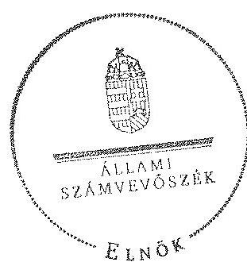

Domokos László
elnök

---

.

---

# RÖVIDÍTÉSEK JEGYZÉKE 

## Jogszabályok

Alaptörvény
Áht. 1
Áht. 2
ÁSZ tv.
Avtv.
Evt. 1
Evt. 2

Gt.
Infotv.

Infotv.

Infotv.

Magyarország Alaptörvénye (2011. április 25.) (hatályos: 2012. január 1-jétől)

Az államháztartásról szóló 1992. évi XXXVIII. törvény (hatálytalan: 2012. január 1-jétől)
Az államháztartásról szóló 2011. évi CXCV. örvény (hatályos: 2012. január 1-jétől)
Az Állami Számvevőszékről szóló 2011. évi LXVI. törvény (hatályos: 2011. július 1-jétől)
A személyes adatok védelméről és a közérdekú adatok nyilvánosságáról szóló 1992. évi LXIII. törvény
Az erdőről és az erdő védelméről szóló 1996. évi LIV. törvény (hatálytalan: 2009. július 10-től)
Az erdőről, az erdő védelméről és az erdőgazdálkodásról szóló 2009. évi XXXVII. törvény (hatályos: 2009. július 10étől)
A gazdasági társaságokról szóló 2006. évi IV. törvény (hatálytalan: 2014. március 15 -étől)
Az információs önrendelkezési jogról és az információszabadságról szóló 2011. évi CXII. törvény (hatályos: 2011. július 27 -étől, kivéve a 1-37. §, a 38. § (1)-(3) bekezdése, a 38. § (4) bekezdés a)-f) pontja, a 38. § (5) bekezdése, a 39. §, a 41-68. §, a 70-72. §, a 75-77. § és a 79-88. §, valamint az 1. melléklet, ami 2012. január 1-jén lépett hatályba és a 38. § (4) bekezdés g) és h) pontja, valamint a 69. §, ami 2013. január 1-jén lépett hatályba)
Inytv. Az ingatlan-nyilvántartásról szóló 1997. évi CXLI. törvény
Nfatv. A Nemzeti Földalapról szóló 2010. évi LXXXVII. törvény (hatályos: 2010. szeptember 1-jétől)
Nvtv. A nemzeti vagyonról szóló 2011. évi CXCVI. törvény (hatályos: 2011. december 31-étől, kivéve a 20. § (2) bekezdésben meghatározott paragrafusok, amelyek 2012. január 1jétől, a (3) bekezdésben meghatározott paragrafusok 2013. január 1-jétől, a (4) bekezdésben meghatározott paragrafus 2012. március 2-ától léptek hatályba)
Mfbtv. A Magyar Fejlesztési Bank Részvénytársaságról szóló 2001. évi XX. törvény
új Ptk. A Polgári Törvénykönyvről szóló 2013. évi V. törvény (hatályos: 2014. március 15-étől)
Számv. tv. A számvitelről szóló 2000. évi C. törvény
Vadvédelmi. tv. A vad védelméről, a vadgazdálkodásról, valamint a vadászatról szóló 1996. évi LV. törvény
Vtv. Az állami vagyonról szóló 2007. évi CVI. törvény

---

Vhr.

## Egyéb rövidítések

Adatvédelmi Szabályzat

ÁSZ
áfa
Belső Ellenőrzési Szabályzat ${ }_{1}$

Belső Ellenőrzési Szabályzat ${ }_{2}$

EGERERDŐ Zrt., Társaság
Erdészeti Hatóság

EU
Értékelési Szabályzat

FB
ha
VSZ
Informatikai Biztonsági Szabályzat

INTOSAI
ISSAI
KVI
könyvvizsgáló ${ }_{1}$
könyvvizsgáló ${ }_{2}$
könyvvizsgáló ${ }_{3}$

Az állami vagyonnal való gazdálkodásról 254/2007. (X. 4.) Korm. rendelet

EGERERDŐ Erdészeti Zártkörűen Müködő Részvénytársaság Adatvédelmi Szabályzata (hatályos: 2003. október 7jétől)
Állami Számvevőszék
általános forgalmi adó
EGERERDŐ Erdészeti Zártkörűen Müködő Részvénytársaság Belső Ellenőrzési Szabályzata (hatályos: 2001. június 30-ától)
EGERERDŐ Erdészeti Zártkörűen Müködő Részvénytársaság Belső Ellenőrzési Szabályzata (hatályos: 2012. január 1-jétől)
EGERERDŐ Erdészeti Zártkörűen Müködő Részvénytársaság
Heves Megyei Mezőgazdasági Szakigazgatási Hivatal Erdészeti Igazgatóság 2010. december 31-éig és a Heves Megyei Kormányhivatal Erdészeti Igazgatóság 2011. január 1-jétől
Európai Unió
az EGERERDŐ Erdészeti Zártkörűen Müködő Részvénytársaság Eszközök és források értékelési szabályzata (hatályos: 2000-től, pontos dátum nem található)
az EGERERDŐ Erdészeti Zártkörűen Müködő Részvénytársaság Felügyelő Bizottsága
hektár
01840-96-02061 számú Ideiglenes Vagyonkezelési Szerződés
az EGERERDŐ Erdészeti Zártkörűen Müködő Részvénytársaság BSZ17 számú Informatikai Biztonsági Szabályzata (hatályos: 2014. január 1-jétől)
Legfőbb Ellenőrző Intézmények Nemzetközi Szervezete nemzetközi standardok
Kincstári Vagyoni Igazgatóság
az EGERERDŐ Erdészeti Zártkörűen Müködő Részvénytársaság könyvvizsgálója a 2009-2010. évek beszámolói tekintetében
az EGERERDŐ Erdészeti Zártkörűen Müködő Részvénytársaság könyvvizsgálója a 2011-2012. évek beszámolói tekintetében
az EGERERDŐ Erdészeti Zártkörűen Müködő Részvénytársaság könyvvizsgálója a 2013-2014. évek beszámolói tekintetében

---

| Leltározási Szabályzat | az EGERERDŐ Erdészeti Zártkörűen Müködő Részvénytársaság Eszközök és források leltárkészítési és leltározási szabályzata (hatályos: 2000. évtől, pontos dátum nem található) |
| :--: | :--: |
| MFB Zrt. | Magyar Fejlesztési Bank Zártkörűen Müködő Részvénytársaság |
| MNV Zrt. | Magyar Nemzeti Vagyonkezelő Zártkörűen Müködő Részvénytársaság (2010. június 16 -áig az állami vagyon feletti tulajdonosi joggyakorló, 2010. június 17 -től az NFA tv. hatálya alá nem tartozó állami vagyon feletti tulajdonosi joggyakorló és az EGERERDŐ Erdészeti Zártkörűen Müködő Részvénytársaság feletti tulajdonosi joggyakorló 2010. június 16 -áig) |
| NFM | Nemzeti Fejlesztési Minisztérium |
| NFA | Nemzeti Földalapkezelő Szervezet (az Nfatv. hatálya alá tartozó földterületek feletti tulajdonosi joggyakorló 2010. június 17 -étől) |
| Számviteli Politika | az EGERERDŐ Erdészeti Zártkörűen Müködő Részvénytársaság Számviteli Politika (hatályos: 2009. január 1-jétől) |
| SZMSZ $_{1}$ | EGERERDŐ Erdészeti Zártkörűen Müködő Részvénytársaság Szervezeti- és múködési szabályzata (hatályos: 2003. februárról 2010. júniusig) |
| SZMSZ $_{2}$ | EGERERDŐ Erdészeti Zártkörűen Müködő Részvénytársaság Szervezeti- és múködési szabályzata (hatályos: 2010. júliustól 2012. júniusig) |
| SZMSZ $_{3}$ | EGERERDŐ Erdészeti Zártkörűen Müködő Részvénytársaság. Szervezeti- és múködési szabályzata (hatályos: 2012. júliustól) |
| tulajdonosi joggyakorló ${ }_{1}$ | a társaságok állami tulajdonú részesedése feletti tulajdonosi jogokat gyakorló Magyar Nemzeti Vagyonkezelő Zrt. (2009. január 1-jétől 2010. június 16 -áig) |
| tulajdonosi joggyakorló ${ }_{2}$ | a társaságok állami tulajdonú részesedése feletti tulajdonosi jogokat gyakorló Magyar Fejlesztési Bank Zrt. (2010. június 17 -étől 2014. július 15 -éig) |
| vezérigazgató | az EGERERDŐ Zártkörűen Müködő Részvénytársaság vezérigazgatója |

---

.

---

# FOGALOMTÁR 

állami vagyon
állami vagyon
használója
átlátható szervezet
földbirtok-politikai irányelvek
hasznosítás
immateriális szolgáltatásából származó bevétel
információs és kommunikációs rendszer
kockázatkezelés
kockázatkezelési rendszer

Állami vagyon:
a) az állam tulajdonában lévő dolog, valamint dolog módjára hasznosítható természeti erő;
b) az a) pont hatálya alá tartozó mindazon vagyon, amely vonatkozásában törvény az állam kizárólagos tulajdonjogát nevesíti;
c) az állam tulajdonában lévő tagsági jogviszonyt megtestesítő értékpapír, illetve az államot megillető egyéb társasági részesedés;
d) az államot megillető olyan immateriális, vagyoni értékkel rendelkező jogosultság, amelyet jogszabály vagyoni értékű jogként nevesít;
e) az állam tulajdonában lévő pénzügyi eszközök.
Az állami vagyon használója az a természetes vagy jogi személy, jogi személyiséggel nem rendelkező szervezet, aki, vagy amely törvény vagy szerződés alapján, bármely jogcímen (bérlet, haszonbérlet, használat stb.) állami vagyont birtokol, használ, szedi annak hasznait. (Ide nem értve a haszonélvezőt, a vagyonkezelőt és a tulajdonosi jogok gyakorlóját.)
Átlátható szervezet a Nvtv. 3. § (1) bekezdés 1. pontjában felsorolt, a meghatározott követelményeknek megfelelő szervezet.
Az Nfatv. 15. § (3) bekezdés a)-s) pontjaiban meghatározott, a Nemzeti Földalapba tartozó földrészletek hasznosítására vonatkozó irányelvek.
Hasznosítás a tulajdonosi joggyakorló vagy a nemzeti vagyon használója által a nemzeti vagyon birtoklásának, használatának, hasznok szedése jogának bármely - a tulajdonjog átruházását nem eredményező - jogcímen történő átengedése, ide nem értve a vagyonkezelésbe adást, valamint a haszonélvezeti jog alapítását.
Immateriális szolgáltatásból származó bevételek azok a nem anyagjellegű szolgáltatásokból származó állami bevételek, amelyeket az Evt. 3. § (1) bekezdése szerint, a külön jogszabályban meghatározott részletes feltételek szerint, az erdők fenntartására, gyarapítására és védelmére kell fordítani.
Az információs és kommunikációs rendszer biztosítja, hogy az információk eljussanak az illetékes szervezethez, szervezeti egységhez, illetve személyhez.
A kockázatkezelés a szervezet céljai elérésével kapcsolatos kockázatok azonosításának és elemzésének, valamint a megfelelő válaszok meghatározásának folyamata.
A kockázatkezelési rendszer múködtetése során fel kell mérni és meg kell állapítani a szervezet tevékenységében, gazdálkodásában rejlő kockázatokat, valamint meg kell határozni az egyes kockázatokkal kapcsolatban szükséges intézkedéseket,

---

|  | valamint azok teljesítésének folyamatos nyomon követésének módját.   A kockázatkezelési rendszer olyan irányítási eszközök és módszerek összessége, amelynek elemei a szervezeti célok elérését veszélyeztető tényezők (kockázatok) azonosítása, elemzése, nyomon követése, valamint szükség esetén a kockázati kitettség mérséklése. |
| :--: | :--: |
| kontrolling | Az a vezetéstámogató rendszer, amely a vezetői tervezést, ellenőrzést, valamint információ-ellátást koordinálja célorientáltan a környezeti változásokhoz igazodva. |
| kontrollkörnyezet | A kontroll környezet elemei: a szervezeti struktúra, a felelősségi, hatásköri viszonyok és feladatok, a szervezet minden szintjén meghatározott etikai elvárások, a humánerőforráskezelés. A kontrollkörnyezet alapozza meg a belső kontroll összes többi elemét a fegyelem és a struktúra biztosítása által. |
| kontrollrendszer | A kontrollrendszer a kockázatok kezelése és tárgyilagos bizonyosság megszerzése érdekében kialakított folyamatrendszer, amely azt a célt szolgálja, hogy megvalósuljanak a következő célok: $\square$   a) a múködés és a gazdálkodás során a tevékenységeket szabályszerűen, gazdaságosan, hatékonyan, eredményesen hajtsák végre,   b) az elszámolási kötelezettségeket teljesítsék, és   c) megvédjék az erőforrásokat a veszteségektől, károktól és nem rendeltetésszerú használattól. |
| kontrolltevékenységek | A kontrolltevékenységek azok az elvek (politikák) és eljárások, amelyeket a kockázatok meghatározása és a szervezet céljainak elérése érdekében alakítanak ki. |
| közfeladat | A közfeladat jogszabályban meghatározott állami vagy önkormányzati feladat, amit az arra kötelezett közérdekből, jogszabályban meghatározott követelményeknek és feltételeknek megfelelve végez, ideértve a lakosság közszolgáltatásokkal való ellátását, továbbá az állam nemzetközi szerződésekben vállalt kötelezettségeiből adódó közérdekú feladatokat, valamint e feladatok ellátásához szükséges infrastruktúra biztosítását is.   Az Evt. 2. § (2) bekezdése szerint a fenntartható erdőgazdálkodás során a legfontosabb közérdekú feladat az erdők változatosságának megőrzése, az erdők fenntartása, felújítása és a védelmi, valamint közjóléti szolgáltatások biztosítása, melyek elvégzését az állam megfelelő eszközökkel biztosítja. |
| monitoring | A szervezet tevékenységének, a célok megvalósításának nyomon követését biztosító rendszer, amely az operatív tevékenységek keretében megvalósuló folyamatos és eseti nyomon követésből, valamint az operatív tevékenységektől függetlenül múködő belső ellenőrzésből áll.   A monitoring a projektek és programok végrehajtásának nyomon követése, mely a támogató és a kedvezményezett |

---

Nemzeti Földalap
nemzeti vagyon használója
rábízott állami vagyon
társasági portfólió
tulajdonosi ellenőrzés
tulajdonosi joggyakorló
tulajdonosi joggyakorlás módja
közti megállapodásban foglalt eljárások követését, az előrehaladás ellenőrzését és a lehetséges problémák időben történő azonosítását szolgálja.
A Nemzeti Földalap a kincstári vagyon része, amelybe beletartoznak az állam tulajdonában és az ingatlan-nyilvántartásban levő, az Nfatv. 1. § (1)-(2) bekezdéseiben felsorolt területek, földrészletek és az azokhoz kapcsolódó vagyoni értékủ jogok.
A nemzeti vagyon használója az a természetes személy, jogi személy vagy jogi személyiséggel nem rendelkező szervezet, aki, vagy amely állami vagyon tekintetében törvény vagy szerződés alapján, a helyi önkormányzat vagyona tekintetében törvény, a helyi önkormányzat rendelete vagy szerződés alapján bármely jogcímen nemzeti vagyont birtokol, használ, szedi annak hasznait, kivéve a tulajdonosi joggyakorló (az Nvtv. 3. § (1) bekezdés 11. pontja alapján).
Rábízott állami vagyon az a Vtv. alkalmazásában állami vagyonnak minősülő vagyon, amit az MNV- a saját vagyonától elkülönítetten - kezel és nyilvántart.
Az Mfbtv. 3. § (9) bekezdése szerint rábízott állami vagyon az a vagyon, amely felett az Mfbtv. erejénél fogva a Magyar Állam nevében az MFB gyakorolja a tulajdonosi jogokat.
Az Nfatv. 1. § (1) bekezdésében foglaltak alapján az NFA-hoz tartozó rábízott vagyon a törvényben meghatározott, a Nemzeti Földalapba tartozó vagyon.
Társasági portfólió az MNV, illetve az MFB rábízott vagyonába tartozó állami tulajdonú társasági részesedések.
A tulajdonosi joggyakorló által végzett ellenőrzés, amelynek célja az állami vagyonnal való gazdálkodás vizsgálata, ennek keretében a rendeltetésellenes, jogszerűtlen, szerződésellenes, vagy a tulajdonos érdekeit sértő, illetve a központi költségvetést hátrányosan érintő vagyongazdálkodási intézkedések feltárása és a jogszerű állapot helyreállítása, továbbá a vagyonnyilvántartás hitelességének, teljességének és helyességének biztosítása.
Tulajdonosi joggyakorló az, aki az állami, illetve a nemzeti vagyon felett az államot megillető tulajdonosi jogok és kötelezettségek gyakorlására jogosult.
Az állami vagyon felett a Magyar Államot megillető tulajdonosi jogoknak (és kötelezettségeknek) az összességét az állami vagyon felügyeletéért felelős miniszter gyakorolja, aki e feladatát az MNV, az MFB, illetve egyéb tulajdonosi joggyakorló szervezet (pl. központi költségvetési szervek, 100\%-ban állami tulajdonban álló gazdasági társaságok) útján látja el. Azon állami tulajdonban álló ingatlanok felett, amelyek egy része a Nemzeti Földalapba tartozik, a tulajdonosi jogokat a miniszter az agrárpolitikáért felelős miniszterrel közösen gyakorolja.

---

vagyongazdálkodás feladata
vagyonkezelői jog

A Nemzeti Földalap felett a Magyar Állam nevében a tulajdonosi jogokat és kötelezettségeket az agrárpolitikáért felelős miniszter a Nemzeti Földalapkezelő Szervezet útján gyakorolja.
Az állami vagyon rendeltetésének megfelelő - az állami feladatok ellátásához, a társadalmi szükségletek kielégítéséhez, valamint a Kormány gazdaságpolitikája megvalósításának elősegittéséhez szükséges, egységes elveken alapuló, önálló ágazatként megjelenő - hatékony, költségtakarékos, értékmegőrző, értéknövelő felhasználásának biztosítása, beleértve a vagyoni kör változását eredményező értékesítést, valamint az állami vagyon gyarapítása is.
Vagyonkezelési szerződés alapján a vagyonkezelő jogosult meghatározott, állami tulajdonba tartozó dolog birtoklására, használatára és hasznai szedésére.
A Vtv. alapján a vagyonkezelői jog az állami vagyon hasznosítására az MNV-vel kötött vagyonkezelési szerződéssel jön létre. A vagyonkezelési szerződés alapján a vagyonkezelő jogosult meghatározott, állami tulajdonba tartozó dolog birtoklására, használatára és hasznai szedésére.
Az Nfatv. alapján a vagyonkezelői jog az erre irányuló (NFAval kötött) szerződéssel jön létre. A vagyonkezelői szerződés alapján a vagyonkezelő jogosult meghatározott földrészlet birtoklására, használatára és hasznai szedésére. A vagyonkezelő köteles a földrészlet értékét megőrizni, állagának megóvásáról, jó karban tartásáról gondoskodni, továbbá - az Nfatv.-ben meghatározott esetek kivételével dijat - fizetni vagy a szerződésben előírt más kötelezettséget teljesíteni.

---

Az EGERERDŐ Zrt. vagyonának alakulása a 2009-2014. 1. félév közötti időszakban

|  Sor-szám | Megnevezés | 2009.01.01 | 2009.12.31 | 2010.12.31 | 2011.12.31 | 2012.12.31 | 2013.12.31 | 2014.06.30 | Váltusús 2013.12.31/2009.12.31. (\%)  |
| --- | --- | --- | --- | --- | --- | --- | --- | --- | --- |
|   | 1. | 2. | 3. | 4. | 5. | 6. | 7. | 8. | 9.  |
|  1. | Eszközök |  |  |  |  |  |  |  |   |
|  2. | Befektetett eszközök összesen | 3427923 | 3545428 | 3483559 | 3487450 | 3699391 | 3788508 | 3871669 | 107\%  |
|  3. | Ebből: Immateriális javuk | 51123 | 62874 | 54498 | 51529 | 54883 | 54598 | 48904 | 87\%  |
|  4. | Tárgyi eszközök | 3375531 | 3460509 | 3408091 | 3418445 | 3628780 | 3716775 | 3805442 | 107\%  |
|  5. | Befektetett pénzügyi eszközök | 23269 | 22045 | 19970 | 17478 | 15726 | 17235 | 17555 | 79\%  |
|  6. | Forgóeszközök | 2118882 | 1962927 | 1828257 | 1804002 | 1987657 | 2340558 | 2390438 | 119\%  |
|  7. | Ebből: Készletek | 1317561 | 1341518 | 907859 | 999144 | 1008796 | 909427 | 1195944 | 67\%  |
|  8. | Követelések | 338977 | 469150 | 441045 | 523212 | 378110 | 482930 | 336148 | 103\%  |
|  9. | Értékpapírok | 0 | 0 | 0 | 0 | 0 | 0 | 0 |   |
|  10. | Pénzeszközök | 462344 | 132259 | 479213 | 281646 | 600751 | 948201 | 860346 | 717\%  |
|  11. | Aktív időbeli elhatárolások | 11471 | 2972 | 1741 | 13430 | 56098 | 23307 | 35 | 788\%  |
|  12. | Eszközök összesen | 5558276 | 5511327 | 5313557 | 5304882 | 5743146 | 6152373 | 6262142 | 112\%  |
|  13. | Források |  |  |  |  |  |  |  |   |
|  14. | Saját tőke | 3573381 | 3865765 | 3567226 | 3614683 | 3643893 | 3841509 | 4072944 | 99\%  |
|  15. | Ebből: Jegysett tőke | 1574380 | 1664560 | 1664560 | 1664560 | 1664560 | 1814560 | 1814560 | 109\%  |
|  16. | Tőketartalék | 1695778 | 1695778 | 1695778 | 1695778 | 1695778 | 1695778 | 1695778 | 100\%  |
|  17. | Eredménytartalék | 481853 | 493023 | 505427 | 206888 | 254345 | 258555 | 306171 | 55\%  |
|  18. | Lekötött tartalék | 10200 | 10200 | 0 | 0 | 0 | 25000 | 25000 | 245\%  |
|  19. | Értékelőtt tartalék | 0 | 0 | 0 | 0 | 0 | 0 | 0 | 0  |
|  20. | Méjégy szerinti eredmény | 11171 | 2204 | $-298539$ | 47457 | 29210 | 47616 | 231435 | 2160\%  |
|  21. | Cálhatalékok | 0 | 0 | 0 | 27139 | 33006 | 42033 | 43033 |   |
|  22. | Kötelezettségek | 712745 | 551652 | 714782 | 617050 | 927996 | 688001 | 614438 | 125\%  |
|  23. | Ebből: Hátrasorolt kötelezettségek | 0 | 0 | 0 | 0 | 0 | 0 | 0 |   |
|  24. | Hozzai lejáratú kötelezettségek | 69265 | 156600 | 266600 | 100000 | 0 | 0 | 0 | 0\%  |
|  25. | Rövid lejáratú kötelezettségek | 643480 | 425052 | 448182 | 517050 | 927990 | 688001 | 614438 | 163\%  |
|  26. | Puszitv időbeli elhatárolások | 1272150 | 1093910 | 1031549 | 1046010 | 1138263 | 1580830 | 1532727 | 145\%  |
|  27. | Források összesen | 5558276 | 5511327 | 5313557 | 5304882 | 5743146 | 6152373 | 6262142 | 112\%  |

---

Az EGERERDŐ Zrt. immateriális javainak és tárgyi eszköz állományának megoszlása a 2013. évre vonatkozóan adatok ezer Fi-ban

|  Sorszám | Megnevezés | Immateriális javak | Ingatlanok | Müszaki berendezések | Egyéb berendezések | Beruházás a beruházásra adott előleggel együtt | Tárgyi eszközök összesen  |
| --- | --- | --- | --- | --- | --- | --- | --- |
|   | 1. | 2. | 3. | 4. | 5. | 6. | 7.  |
|  1. | Bruttó érték január 1-jén | 149597,0 | 3986277,0 | 1409711,0 | 328982,0 | 142676,0 | 5867646,0  |
|  2. | -ebből: állami vagyon |  |  |  |  |  |   |
|  3. | -ebből: saját vagyon | 149597,0 | 3986277,0 | 1409711,0 | 328982,0 | 142676,0 | 5867646,0  |
|  4. | Növekedés (+) | 87130,0 | 451322,0 | 375079,0 | 70332,0 | 482930,0 | 1379663,0  |
|  5. | -ebből: állami vagyon |  |  |  |  |  |   |
|  6. | -ebből: saját vagyon | 87130,0 | 451322,0 | 375079,0 | 70332,0 | 482930,0 | 1379663,0  |
|  7. | Csökkenés (-) | $-80908,0$ | $-349345,0$ | $-236319,0$ | $-35994,0$ | $-545663,0$ | $-1167323,0$  |
|  8. | -ebből: állami vagyon |  |  |  |  |  |   |
|  9. | -ebből: saját vagyon | $-80908,0$ | $-349345,0$ | $-236319,0$ | $-35994,0$ | $-545663,0$ | $-1167323,0$  |
|  10. | Bruttó érték december 31-én | 155819,0 | 4088254,0 | 1548471,0 | 363320,0 | 79941,0 | 6079986,0  |
|  11. | -ebből: állami vagyon | 0,0 | 0,0 | 0,0 | 0,0 | 0,0 | 0,0  |
|  12. | -ebből: saját vagyon | 155819,0 | 4088254,0 | 1548471,0 | 363320,0 | 79941,0 | 6079986,0  |
|  13. | Halmozott értékcsökkenés január 1-jén | 94712,0 | 1209271,0 | 787808,0 | 241787,0 |  | 2238866,0  |
|  14. | -ebből: állami vagyon |  |  |  |  |  |   |
|  15. | -ebből: saját vagyon | 94712,0 | 1209271,0 | 787808,0 | 241787,0 |  | 2238866,0  |
|  16. | Értékcsökkenés növekedése (+) (költségként elszámolt) | 15729,0 | 164310,0 | 115980,0 | 55480,0 |  | 335770,0  |
|  17. | -ebből: állami vagyon |  |  |  |  |  |   |
|  18. | -ebből: saját vagyon | 15729,0 | 164310,0 | 115980,0 | 55480,0 |  | 335770,0  |
|  22. | Értékcsökkenés egyéb ráfordításként elszámolva (2) | $-9020,0$ | $-52144,0$ | $-127996,0$ | $-31285,0$ |  | $-211425,0$  |
|  23. | -ebből: állami vagyon |  |  |  |  |  |   |
|  24. | -ebből: saját vagyon | $-9020,0$ | $-52144,0$ | $-127996,0$ | $-31285,0$ |  | $-211425,0$  |
|  25. | Egyéb változás az értékcsökkenésben (2) |  |  |  |  |  |   |
|  26. | -ebből: állami vagyon |  |  |  |  |  |   |
|  27. | -ebből: saját vagyon |  |  |  |  |  |   |
|  28. | Halmozott értékcsökkenés december 31-én: | 101421,0 | 1321437,0 | 775792,0 | 265982,0 | 0,0 | 2363211,0  |
|  29. | -ebből: állami vagyon | 0,0 | 0,0 | 0,0 | 0,0 | 0,0 | 0,0  |
|  30. | -ebből: saját vagyon | 101421,0 | 1321437,0 | 775792,0 | 265982,0 | 0,0 | 2363211,0  |
|  31. | Nettó érték december 31-én: | 54398,0 | 2766817,0 | 772679,0 | 97338,0 | 79941,0 | 3716775,0  |
|  32. | -ebből: állami vagyon | 0,0 | 0,0 | 0,0 | 0,0 | 0,0 | 0,0  |
|  33. | -ebből: saját vagyon | 54398,0 | 2766817,0 | 772679,0 | 97338,0 | 79941,0 | 3716775,0  |

---

|  5. SZÁMÓ MELLÉKLET |  |  |  |  |  |  |  |  |  |  |  |  |  |  |  |  |  |  |  |  |  |   |
| --- | --- | --- | --- | --- | --- | --- | --- | --- | --- | --- | --- | --- | --- | --- | --- | --- | --- | --- | --- | --- | --- | --- |
|  4. SZÁMÓ MELLÉKLET |  |  |  |  |  |  |  |  |  |  |  |  |  |  |  |  |  |  |  |  |  |   |
|  5. SZÁMÓ MELLÉKLET |  |  |  |  |  |  |  |  |  |  |  |  |  |  |  |  |  |  |  |  |  |   |
|  6. SZÁMÓ MELLÉKLET |  |  |  |  |  |  |  |  |  |  |  |  |  |  |  |  |  |  |  |  |  |   |
|  7. A VÁS |  |  |  |  |  |  |  |  |  |  |  |  |  |  |  |  |  |  |  |  |  |   |
|  8. 5. SZÁMÓ MELLÉKLET |  |  |  |  |  |  |  |  |  |  |  |  |  |  |  |  |  |  |  |  |  |   |
|  9. 5. SZÁMÓ MELLÉKLET |  |  |  |  |  |  |  |  |  |  |  |  |  |  |  |  |  |  |  |  |  |   |
|  10. 5. SZÁMÓ MELLÉKLET |  |  |  |  |  |  |  |  |  |  |  |  |  |  |  |  |  |  |  |  |  |   |
|  11. 5. SZÁMÓ MELLÉKLET |  |  |  |  |  |  |  |  |  |  |  |  |  |  |  |  |  |  |  |  |  |   |
|  12. 5. SZÁMÓ MELLÉKLET |  |  |  |  |  |  |  |  |  |  |  |  |  |  |  |  |  |  |  |  |  |   |
|  13. 5. SZÁMÓ MELLÉKLET |  |  |  |  |  |  |  |  |  |  |  |  |  |  |  |  |  |  |  |  |  |   |
|  14. 5. SZÁMÓ MELLÉKLET |  |  |  |  |  |  |  |  |  |  |  |  |  |  |  |  |  |  |  |  |  |   |
|  15. 5. SZÁMÓ MELLÉKLET |  |  |  |  |  |  |  |  |  |  |  |  |  |  |  |  |  |  |  |  |  |   |
|  16. 5. SZÁMÓ MELLÉKLET |  |  |  |  |  |  |  |  |  |  |  |  |  |  |  |  |  |  |  |  |  |   |
|  17. 5. SZÁMÓ MELLÉKLET |  |  |  |  |  |  |  |  |  |  |  |  |  |  |  |  |  |  |  |  |  |   |
|  18. 5. SZÁMÓ MELLÉKLET |  |  |  |  |  |  |  |  |  |  |  |  |  |  |  |  |  |  |  |  |  |   |
|  19. 5. SZÁMÓ MELLÉKLET |  |  |  |  |  |  |  |  |  |  |  |  |  |  |  |  |  |  |  |  |  |   |
|  20. 5. SZÁMÓ MELLÉKLET |  |  |  |  |  |  |  |  |  |  |  |  |  |  |  |  |  |  |  |  |  |   |
|  21. 5. SZÁMÓ MELLÉKLET |  |  |  |  |  |  |  |  |  |  |  |  |  |  |  |  |  |  |  |  |  |   |
|  22. 5. SZÁMÓ MELLÉKLET |  |  |  |  |  |  |  |  |  |  |  |  |  |  |  |  |  |  |  |  |  |   |
|  23. 5. SZÁMÓ MELLÉKLET |  |  |  |  |  |  |  |  |  |  |  |  |  |  |  |  |  |  |  |  |  |   |
|  24. 5. SZÁMÓ MELLÉKLET |  |  |  |  |  |  |  |  |  |  |  |  |  |  |  |  |  |  |  |  |  |   |
|  25. 5. SZÁMÓ MELLÉKLET |  |  |  |  |  |  |  |  |  |  |  |  |  |  |  |  |  |  |  |  |  |   |
|  26. 5. SZÁMÓ MELLÉKLET |  |  |  |  |  |  |  |  |  |  |  |  |  |  |  |  |  |  |  |  |  |   |
|  27. 5. SZÁMÓ MELLÉKLET |  |  |  |  |  |  |  |  |  |  |  |  |  |  |  |  |  |  |  |  |  |   |
|  28. 5. SZÁMÓ MELLÉKLET |  |  |  |  |  |  |  |  |  |  |  |  |  |  |  |  |  |  |  |  |  |   |
|  29. 5. SZÁMÓ MELLÉKLET |  |  |  |  |  |  |  |  |  |  |  |  |  |  |  |  |  |  |  |  |  |   |
|  30. 5. SZÁMÓ MELLÉKLET |  |  |  |  |  |  |  |  |  |  |  |  |  |  |  |  |  |  |  |  |  |   |
|  31. 5. SZÁMÓ MELLÉKLET |  |  |  |  |  |  |  |  |  |  |  |  |  |  |  |  |  |  |  |  |  |   |
|  32. 5. SZÁMÓ MELLÉKLET |  |  |  |  |  |  |  |  |  |  |  |  |  |  |  |  |  |  |  |  |  |   |
|  33. 5. SZÁMÓ MELLÉKLET |  |  |  |  |  |  |  |  |  |  |  |  |  |  |  |  |  |  |  |  |  |   |
|  34. 5. SZÁMÓ MELLÉKLET |  |  |  |  |  |  |  |  |  |  |  |  |  |  |  |  |  |  |  |  |  |   |
|  35. 5. SZÁMÓ MELLÉKLET |  |  |  |  |  |  |  |  |  |  |  |  |  |  |  |  |  |  |  |  |  |   |
|  36. 5. SZÁMÓ MELLÉKLET |  |  |  |  |  |  |  |  |  |  |  |  |  |  |  |  |  |  |  |  |  |   |
|  37. 5. SZÁMÓ MELLÉKLET |  |  |  |  |  |  |  |  |  |  |  |  |  |  |  |  |  |  |  |  |  |   |
|  38. 5. SZÁMÓ MELLÉKLET |  |  |  |  |  |  |  |  |  |  |  |  |  |  |  |  |  |  |  |  |  |   |
|  39. 5. SZÁMÓ MELLÉKLET |  |  |  |  |  |  |  |  |  |  |  |  |  |  |  |  |  |  |  |  |  |   |
|  40. 5. SZÁMÓ MELLÉKLET |  |  |  |  |  |  |  |  |  |  |  |  |  |  |  |  |  |  |  |  |  |   |
|  41. 5. SZÁMÓ MELLÉKLET |  |  |  |  |  |  |  |  |  |  |  |  |  |  |  |  |  |  |  |  |  |   |
|  42. 5. SZÁMÓ MELLÉKLET |  |  |  |  |  |  |  |  |  |  |  |  |  |  |  |  |  |  |  |  |  |   |
|  43. 5. SZÁMÓ MELLÉKLET |  |  |  |  |  |  |  |  |  |  |  |  |  |  |  |  |  |  |  |  |  |   |
|  44. 5. SZÁMÓ MELLÉKLET |  |  |  |  |  |  |  |  |  |  |  |  |  |  |  |  |  |  |  |  |  |   |
|  45. 5. SZÁMÓ MELLÉKLET |  |  |  |  |  |  |  |  |  |  |  |  |  |  |  |  |  |  |  |  |  |   |
|  46. 5. SZÁMÓ MELLÉKLET |  |  |  |  |  |  |  |  |  |  |  |  |  |  |  |  |  |  |  |  |  |   |
|  47. 5. SZÁMÓ MELLÉKLET |  |  |  |  |  |  |  |  |  |  |  |  |  |  |  |  |  |  |  |  |  |   |
|  48. 5. SZÁMÓ MELLÉKLET |  |  |  |  |  |  |  |  |  |  |  |  |  |  |  |  |  |  |  |  |  |   |
|  49. 5. SZÁMÓ MELLÉKLET |  |  |  |  |  |  |  |  |  |  |  |  |  |  |  |  |  |  |  |  |  |   |
|  50. 5. SZÁMÓ MELLÉKLET |  |  |  |  |  |  |  |  |  |  |  |  |  |  |  |  |  |  |  |  |  |   |
|  51. 5. SZÁMÓ MELLÉKLET |  |  |  |  |  |  |  |  |  |  |  |  |  |  |  |  |  |  |  |  |  |   |
|  52. 5. SZÁMÓ MELLÉKLET |  |  |  |  |  |  |  |  |  |  |  |  |  |  |  |  |  |  |  |  |  |   |
|  53. 5. SZÁMÓ MELLÉKLET |  |  |  |  |  |  |  |  |  |  |  |  |  |  |  |  |  |  |  |  |  |   |
|  54. 5. SZÁMÓ MELLÉKLET |  |  |  |  |  |  |  |  |  |  |  |  |  |  |  |  |  |  |  |  |  |   |
|  55. 5. SZÁMÓ MELLÉKLET |  |  |  |  |  |  |  |  |  |  |  |  |  |  |  |  |  |  |  |  |  |   |
|  56. 5. SZÁMÓ MELLÉKLET |  |  |  |  |  |  |  |  |  |  |  |  |  |  |  |  |  |  |  |  |  |   |
|  57. 5. SZÁMÓ MELLÉKLET |  |  |  |  |  |  |  |  |  |  |  |  |  |  |  |  |  |  |  |  |  |   |
|  58. 5. SZÁMÓ MELLÉKLET |  |  |  |  |  |  |  |  |  |  |  |  |  |  |  |  |  |  |  |  |  |   |
|  59. 5. SZÁMÓ MELLÉKLET |  |  |  |  |  |  |  |  |  |  |  |  |  |  |  |  |  |  |  |  |  |   |
|  60. 5. SZÁMÓ MELLÉKLET |  |  |  |  |  |  |  |  |  |  |  |  |  |  |  |  |  |  |  |  |  |   |
|  61. 5. SZÁMÓ MELLÉKLET |  |  |  |  |  |  |  |  |  |  |  |  |  |  |  |  |  |  |  |  |  |   |
|  62. 5. SZÁMÓ MELLÉKLET |  |  |  |  |  |  |  |  |  |  |  |  |  |  |  |  |  |  |  |  |  |   |
|  63. 5. SZÁMÓ MELLÉKLET |  |  |  |  |  |  |  |  |  |  |  |  |  |  |  |  |  |  |  |  |  |   |
|  64. 5. SZÁMÓ MELLÉKLET |  |  |  |  |  |  |  |  |  |  |  |  |  |  |  |  |  |  |  |  |  |   |
|  65. 5. SZÁMÓ MELLÉKLET |  |  |  |  |  |  |  |  |  |  |  |  |  |  |  |  |  |  |  |  |  |   |
|  66. 5. SZÁMÓ MELLÉKLET |  |  |  |  |  |  |  |  |  |  |  |  |  |  |  |  |  |  |  |  |  |   |
|  67. 5. SZÁMÓ MELLÉKLET |  |  |  |  |  |  |  |  |  |  |  |  |  |  |  |  |  |  |  |  |  |   |
|  68. 5. SZÁMÓ MELLÉKLET |  |  |  |  |  |  |  |  |  |  |  |  |  |  |  |  |  |  |  |  |  |   |
|  69. 5. SZÁMÓ MELLÉKLET |  |  |  |  |  |  |  |  |  |  |  |  |  |  |  |  |  |  |  |  |  |   |
|  70. 5. SZÁMÓ MELLÉKLET |  |  |  |  |  |  |  |  |  |  |  |  |  |  |  |  |  |  |  |  |  |   |
|  71. 5. SZÁMÓ MELLÉKLET |  |  |  |  |  |  |  |  |  |  |  |  |  |  |  |  |  |  |  |  |  |   |
|  72. 5. SZÁMÓ MELLÉKLET |  |  |  |  |  |  |  |  |  |  |  |  |  |  |  |  |  |  |  |  |  |   |
|  73. 5. SZÁMÓ MELLÉKLET |  |  |  |  |  |  |  |  |  |  |  |  |  |  |  |  |  |  |  |  |  |   |
|  74. 5. SZÁMÓ MELLÉKLET |  |  |  |  |  |  |  |  |  |  |  |  |  |  |  |  |  |  |  |  |  |   |
|  75. 5. SZÁMÓ MELLÉKLET |  |  |  |  |  |  |  |  |  |  |  |  |  |  |  |  |  |  |  |  |  |   |
|  76. 5. SZÁMÓ MELLÉKLET |  |  |  |  |  |  |  |  |  |  |  |  |  |  |  |  |  |  |  |  |  |   |
|  77. 5. SZÁMÓ MELLÉKLET |  |  |  |  |  |  |  |  |  |  |  |  |  |  |  |  |  |  |  |  |  |   |
|  78. 5. SZÁMÓ MELLÉKLET |  |  |  |  |  |  |  |  |  |  |  |  |  |  |  |  |  |  |  |  |  |   |
|  79. 5. SZÁMÓ MELLÉKLET |  |  |  |  |  |  |  |  |  |  |  |  |  |  |  |  |  |  |  |  |  |   |
|  80. 5. SZÁMÓ MELLÉKLET |  |  |  |  |  |  |  |  |  |  |  |  |  |  |  |  |  |  |  |  |  |   |
|  81. 5. SZÁMÓ MELLÉKLET |  |  |  |  |  |  |  |  |  |  |  |  |  |  |  |  |  |  |  |  |  |   |
|  82. 5. SZÁMÓ MELLÉKLET |  |  |  |  |  |  |  |  |  |  |  |  |  |  |  |  |  |  |  |  |  |   |
|  83. 5. SZÁMÓ MELLÉKLET |  |  |  |  |  |  |  |  |  |  |  |  |  |  |  |  |  |  |  |  |  |   |
|  84. 5. SZÁMÓ MELLÉKLET |  |  |  |  |  |  |  |  |  |  |  |  |  |  |  |  |  |  |  |  |  |   |
|  85. 5. SZÁMÓ MELLÉKLET |  |  |  |  |  |  |  |  |  |  |  |  |  |  |  |  |  |  |  |  |  |   |
|  86. 5. SZÁMÓ MELLÉKLET |  |  |  |  |  |  |  |  |  |  |  |  |  |  |  |  |  |  |  |  |  |   |
|  87. 5. SZÁMÓ MELLÉKLET |  |  |  |  |  |  |  |  |  |  |  |  |  |  |  |  |  |  |  |  |  |   |
|  88. 5. SZÁMÓ MELLÉKLET |  |  |  |  |  |  |  |  |  |  |  |  |  |  |  |  |  |  |  |  |  |   |
|  89. 5. SZÁMÓ MELLÉKLET |  |  |  |  |  |  |  |  |  |  |  |  |  |  |  |  |  |  |  |  |  |   |
|  90. 5. SZÁMÓ MELLÉKLET |  |  |  |  |  |  |  |  |  |  |  |  |  |  |  |  |  |  |  |  |  |   |
|  91. 5. SZÁMÓ MELLÉKLET |  |  |  |  |  |  |  |  |  |  |  |  |  |  |  |  |  |  |  |  |  |   |
|  92. 5. SZÁMÓ MELLÉKLET |  |  |  |  |  |  |  |  |  |  |  |  |  |  |  |  |  |  |  |  |  |   |
|  93. 5. SZÁMÓ MELLÉKLET |  |  |  |  |  |  |  |  |  |  |  |  |  |  |  |  |  |  |  |  |  |   |
|  94. 5. SZÁMÓ MELLÉKLET |  |  |  |  |  |  |  |  |  |  |  |  |  |  |  |  |  |  |  |  |  |   |
|  95. 5. SZÁMÓ MELLÉKLET |  |  |  |  |  |  |  |  |  |  |  |  |  |  |  |  |  |  |  |  |  |   |
|  96. 5. SZÁMÓ MELLÉKLET |  |  |  |  |  |  |  |  |  |  |  |  |  |  |  |  |  |  |  |  |  |   |
|  97. 5. SZÁMÓ MELLÉKLET |  |  |  |  |  |  |  |  |  |  |  |  |  |  |  |  |  |  |  |  |  |   |
|  98. 5. SZÁMÓ MELLÉKLET |  |  |  |  |  |  |  |  |  |  |  |  |  |  |  |  |  |  |  |  |  |   |
|  99. 5. SZÁMÓ MELLÉKLET |  |  |  |  |  |  |  |  |  |  |  |  |  |  |  |  |  |  |  |  |  |   |
|  100. 5. SZÁMÓ MELLÉKLET |  |  |  |  |  |  |  |  |  |  |  |  |  |  |  |  |  |  |  |  |  |   |
|  101. 5. SZÁMÓ MELLÉKLET |  |  |  |  |  |  |  |  |  |  |  |  |  |  |  |  |  |  |  |  |  |   |
|  102. 5. SZÁMÓ MELLÉKLET |  |  |  |  |  |  |  |  |  |  |  |  |  |  |  |  |  |  |  |  |  |   |
|  103. 5. SZÁMÓ MELLÉKLET |  |  |  |  |  |  |  |  |  |  |  |  |  |  |  |  |  |  |  |  |  |   |
|  104. 5. SZÁMÓ MELLÉKLET |  |  |  |  |  |  |  |  |  |  |  |  |  |  |  |  |  |  |  |  |  |   |
|  105. 5. SZÁMÓ MELLÉKLET |  |  |  |  |  |  |  |  |  |  |  |  |  |  |  |  |  |  |  |  |  |   |
|  106. 5. SZÁMÓ MELLÉKLET |  |  |  |  |  |  |  |  |  |  |  |  |  |  |  |  |  |  |  |  |  |   |
|  107. 5. SZÁMÓ MELLÉKLET |  |  |  |  |  |  |  |  |  |  |  |  |  |  |  |  |  |  |  |  |  |   |
|  108. 5. SZÁMÓ MELLÉKLET |  |  |  |  |  |  |  |  |  |  |  |  |  |  |  |  |  |  |  |  |  |   |
|  109. 5. SZÁMÓ MELLÉKLET |  |  |  |  |  |  |  |  |  |  |  |  |  |  |  |  |  |  |  |  |  |  |   |
|  110. 5. SZÁMÓ MELLÉKLET |  |  |  |  |  |  |  |  |  |  |  |  |  |  |  |  |  |  |  |  |  |  |   |
|  111. 5. SZÁMÓ MELLÉKLET |  |  |  |  |  |  |  |  |  |  |  |  |  |  |  |  |  |  |  |  |  |  |   |
|  112. 5. SZÁMÓ MELLÉKLET |  |  |  |  |  |  |  |  |  |  |  |  |  |  |  |  |  |  |  |  |  |  |  |   |
|  113. 5. SZÁMÓ MELLÉKLET |  |  |  |  |  |  |  |  |  |  |  |  |  |  |  |  |  |  |  |  |  |  |  |   |
|  114. 5. SZÁMÓ MELLÉKLET |  |  |  |  |  |  |  |  |  |  |  |  |  |  |  |  |  |  |  |  |  |  |  |   |
|  115. 5. SZÁMÓ MELLÉKLET |  |  |  |  |  |  |  |  |  |  |  |  |  |  |  |  |  |  |  |  |  |  |  |   |
|  116. 5. SZÁMÓ MELLÉKLET |  |  |  |  |  |  |  |  |  |  |  |  |  |  |  |  |  |  |  |  |  |  |  |   |
|  117. 5. SZÁMÓ MELLÉKLET |  |  |  |  |  |  |  |  |  |  |  |  |  |  |  |  |  |  |  |  |  |  |  |   |
|  118. 5. SZÁMÓ MELLÉKLET |  |  |  |  |  |  |  |  |  |  |  |  |  |  |  |  |  |  |  |  |  |  |  |  |   |
|  119. 5. SZÁMÓ MELLÉKLET |  |  |  |  |  |  |  |  |  |  |  |  |  |  |  |  |  |  |  |  |  |  |  |  |   |
|  120. 5. SZÁMÓ MELLÉKLET |  |  |  |  |  |  |  |  |  |  |  |  |  |  |  |  |  |  |  |  |  |  |  |  |  |   |
|  121. 5. SZÁMÓ MELLÉKLET |  |  |  |  |  |  |  |  |  |  |  |  |  |  |  |  |  |  |  |  |  |  |  |  |  |   |
|  122. 5. SZÁMÓ MELLÉKLET |  |  |  |  |  |  |  |  |  |  |  |  |  |  |  |  |  |  |  |  |  |  |  |  |  |  |   |
|  123. 5. SZÁMÓ MELLÉKLET |  |  |  |  |  |  |  |  |  |  |  |  |  |  |  |  |  |  |  |  |  |  |  |  |  |  |  |   |
|  124. 5. SZÁMÓ MELLÉKLET |  |  |  |  |  |  |  |  |  |  |  |  |  |  |  |  |  |  |  |  |  |  |  |  |  |  |  |   |
|  125. 5. SZÁMÓ MELLÉKLET |  |  |  |  |  |  |  |  |  |  |  |  |  |  |  |  |  |  |  |  |  |  |  |  |  |  |  |   |
|  126. 5. SZÁMÓ MELLÉKLET |  |  |  |  |  |  |  |  |  |  |  |  |  |  |  |  |  |  |  |  |  |  |  |  |  |  |  |   |
|  127. 5. SZÁMÓ MELLÉKLET |  |  |  |  |  |  |  |  |  |  |  |  |  |  |  |  |  |  |  |  |  |  |  |  |  |  |  |  |   |
|  128. 5. SZÁMÓ MELLÉKLET |  |  |  |  |  |  |  |  |  |  |  |  |  |  |  |  |  |  |  |  |  |  |  |  |  |  |  |  |   |
|  129. 5. SZÁMÓ MELLÉKLET |  |  |  |  |  |  |  |  |  |  |  |  |  |  |  |  |  |  |  |  |  |  |  |  |  |  |  |  |   |
|  130. 5. SZÁMÓ MELLÉKLET |  |  |  |  |  |  |  |  |  |  |  |  |  |  |  |  |  |  |  |  |  |  |  |  |  |  |  |  |  |   |
|  131. 5. SZÁMÓ MELLÉKLET |  |  |  |  |  |  |  |  |  |  |  |  |  |  |  |  |  |  |  |  |  |  |  |  |  |  |  |  |  |   |
|  132. 5. SZÁMÓ MELLÉKLET |  |  |  |  |  |  |  |  |  |  |  |  |  |  |  |  |  |  |  |  |  |  |  |  |  |  |  |  |  |   |
|  133. 5. SZÁMÓ MELLÉKLET |  |  |  |  |  |  |  |  |  |  |  |  |  |  |  |  |  |  |  |  |  |  |  |  |  |  |  |  |  |  |   |
|  134. 5. SZÁMÓ MELLÉKLET |  |  |  |  |  |  |  |  |  |  |  |  |  |  |  |  |  |  |  |  |  |  |  |  |  |  |  |  |  |  |   |
|  135. 5. SZÁMÓ MELLÉKLET |  |  |  |  |  |  |  |  |  |  |  |  |  |  |  |  |  |  |  |  |  |  |  |  |  |  |  |  |  |  |  |   |
|  136. 5. SZÁMÓ MELLÉKLET |  |  |  |  |  |  |  |  |  |  |  |  |  |  |  |  |  |  |  |  |  |  |  |  |  |  |  |  |  |  |  |   |
|  137. 5. SZÁMÓ MELLÉKLET |  |  |  |  |  |  |  |  |  |  |  |  |  |  |  |  |  |  |  |  |  |  |  |  |  |  |  |  |  |  |  |   |
|  138. 5. SZÁMÓ MELLÉKLET |  |  |  |  |  |  |  |  |  |  |  |  |  |  |  |  |  |  |  |  |  |  |  |  |  |  |  |  |  |  |  |   |
|  139. 5. SZÁMÓ MELLÉKLET |  |  |  |  |  |  |  |  |  |  |  |  |  |  |  |  |  |  |  |  |  |  |  |  |  |  |  |  |  |  |  |  |   |
|  140. 5. SZÁMÓ MELLÉKLET |  |  |  |  |  |  |  |  |  |  |  |  |  |  |  |  |  |  |  |  |  |  |  |  |  |  |  |  |  |  |  |  |   |
|  141. 5. SZÁMÓ MELLÉKLET |  |  |  |  |  |  |  |  |  |  |  |  |  |  |  |  |  |  |  |  |  |  |  |  |  |  |  |  |  |  |  |  |  |   |
|  142. 5. SZÁMÓ MELLÉKLET |  |  |  |  |  |  |  |  |  |  |  |  |  |  |  |  |  |  |  |  |  |  |  |  |  |  |  |  |  |  |  |  |   |
|  143. 5. SZÁMÓ MELLÉKLET |  |  |  |  |  |  |  |  |  |  |  |  |  |  |  |  |  |  |  |  |  |  |  |  |  |  |  |  |  |  |  |  |  |   |
|  144. 5. SZÁMÓ MELLÉKLET |  |  |  |  |  |  |  |  |  |  |  |  |  |  |  |  |  |  |  |  |  |  |  |  |  |  |  |  |  |  |  |  |  |  |   |
|  145. 5. SZÁMÓ MELLÉKLET |  |  |  |  |  |  |  |  |  |  |  |  |  |  |  |  |  |  |  |  |  |  |  |  |  |  |  |  |  |  |  |  |  |   |
| 146. 5. SZÁMÓ MELLÉKLET |  |  |  |  |  |  |  |  |  |  |  |  |  |  |  |  |  |  |  |  |  |  |  |  |  |  |  |  |  |  |  |  |   |
| 147. 5. SZÁMÓ MELLÉKLET |  |  |  |  |  |  |  |  |  |  |  |  |  |  |  |  |  |  |  |  |  |  |  |  |  |  |  |  |   |
| 148. 5. SZÁMÓ MELLÉKLET |  |  |  |  |  |  |  |  |  |  |  |  |  |  |  |  |  |  |  |  |  |  |  |  |  |  |  |  |  |   |
| 149. 5. SZÁMÓ MELLÉKLET |  |  |  |  |  |  |  |  |  |  |  |  |  |  |  |  |  |  |  |  |  |  |  |  |  |  |   |
| 150. 5. SZÁMÓ MELLÉKLET |  |  |  |  |  |  |  |  |  |  |  |  |  |  |  |  |  |  |  |  |  |  |  |  |  |  |   |
| 151. 5. SZÁMÓ MELLÉKLET |  |  |  |  |  |  |  |  |  |  |  |  |  |  |  |  |  |  |  |  |  |  |  |  |  |  |   |
| 152. 5. SZÁMÓ MELLÉKLET |  |  |  |  |  |  |  |  |  |  |  |  |  |  |  |  |  |  |  |  |  |  |  |  |  |  |  |   |
| 153. 5. SZÁMÓ MELLÉKLET |  |  |  |  |  |  |  |  |  |  |  |  |  |  |  |  |  |  |  |  |  |  |  |  |  |  |  |   |
| 154. 5. SZÁMÓ MELLÉKLET |  |  |  |  |  |  |  |  |  |  |  |  |  |  |  |  |  |  |  |  |  |  |  |  |  |  |   |
| 155. 5. SZÁMÓ MELLÉKLET |  |  |  |  |  |  |  |  |  |  |  |  |  |  |  |  |  |  |  |  |  |  |  |  |   |
| 156. 5. SZÁMÓ MELLÉKLET |  |  |  |  |  |  |  |  |  |  |  |  |  |  |  |  |  |  |  |  |  |  |  |  |  |   |
| 157. 5. SZÁMÓ MELLÉKLET |  |  |  |  |  |  |  |  |  |  |  |  |  |  |  |  |  |  |  |  |  |  |  |  |  |   |
| 158. 5. SZÁMÓ MELLÉKLET |  |  |  |  |  |  |  |  |  |  |  |  |  |  |  |  |  |  |  |  |  |  |  |   |
| 159. 5. SZÁMÓ MELLÉKLET |  |  |  |  |  |  |  |  |  |  |  |  |  |  |  |  |  |  |  |  |  |  |  |  |   |
| 160. 5. SZÁMÓ MELLÉKLET |  |  |  |  |  |  |  |  |  |  |  |  |  |  |  |  |  |  |  |  |  |  |   |
| 161. 5. SZÁMÓ MELLÉKLET |  |  |  |  |  |  |  |  |  |  |  |  |  |  |  |  |  |  |  |  |  |  |  |   |
| 162. 5. SZÁMÓ MELLÉKLET |  |  |  |  |  |  |  |  |  |  |  |  |  |  |  |  |  |  |  |  |  |  |   |
| 163. 5. SZÁMÓ MELLÉKLET |  |  |  |  |  |  |  |  |  |  |  |  |  |  |  |  |  |  |  |  |  |  |   |
| 164. 5. SZÁMÓ MELLÉKLET |  |  |  |  |  |  |  |  |  |  |  |  |  |  |  |  |  |  |  |  |  |   |
| 165. 5. SZÁMÓ MELLÉKLET |  |  |  |  |  |  |  |  |  |  |  |  |  |  |  |  |  |  |  |  |   |
| 166. 5. SZÁMÓ MELLÉKLET |  |  |  |  |  |  |  |  |  |  |  |  |  |  |  |  |  |  |  |   |
| 167. 5. SZÁMÓ MELLÉKLET |  |  |  |  |  |  |  |  |  |  |  |  |  |  |  |  |  |  |  |  |  |   |
| 168. 5. SZÁMÓ MELLÉKLET |  |  |  |  |  |  |  |  |  |  |  |  |  |  |  |  |  |  |  |  |   |
| 169. 5. SZÁMÓ MELLÉKLET |  |  |  |  |  |  |  |  |  |  |  |  |  |  |  |  |  |  |  |  |   |
| 170. 5. SZÁMÓ MELLÉKLET |  |  |  |  |  |  |  |  |  |  |  |  |  |  |  |  |  |  |  |  |   |
| 171. 5. SZÁMÓ MELLÉKLET |  |  |  |  |  |  |  |  |  |  |  |  |  |  |  |  |  |  |  |  |  |   |
| 172. 5. SZÁMÓ MELLÉKLET |  |  |  |  |  |  |  |  |  |  |  |  |  |  |  |  |  |  |  |  |  |   |
| 173. 5. SZÁMÓ MELLÉKLET |  |  |  |  |  |  |  |  |  |  |  |  |  |  |  |  |  |  |  |  |   |
| 174. 5. SZÁMÓ MELLÉKLET |  |  |  |  |  |  |  |  |  |  |  |  |  |  |  |  |  |  |  |  |  |   |
| 175. 5. SZÁMÓ MELLÉKLET |  |  |  |  |  |  |  |  |  |  |  |  |  |  |  |  |  |  |  |  |  |  |   |
| 176. 5. SZÁMÓ MELLÉKLET |  |  |  |  |  |  |  |  |  |  |  |  |  |  |  |  |  |  |  |  |  |   |
| 177. 5. SZÁMÓ MELLÉKLET |  |  |  |  |  |  |  |  |  |  |  |  |  |  |  |  |  |  |  |  |  |   |
| 178. 5. SZÁMÓ MELLÉKLET |  |  |  |  |  |  |  |  |  |  |  |  |  |  |  |  |  |  |  |  |  |  |  |  |  |  |  |  |   |
| 179. 5. SZÁMÓ MELLÉKLET |  |  |  |  |  |  |  |  |  |  |  |  |  |  |  |  |  |  |  |  |  |  |  |  |  |  |  |  |  |  |  |  |  |  |  |  |  |  |  |  |  |  |  |  |  |  |  |  |  |  |  |  |  |  |  |  |  |  |  |  |  |  |  |  |  |  |  |  |  |  |  |  |  |  |  |  |  |  |  |  |  |  |  |  |  |  |  |  |  |  |  |  |  |  |  |  |  |  |  |  | 

---

Az EGERERDŐ Zrt. saját tőke változása a 2013. évre vonatkozóan

|  Sze-
szám | Megnevezés | Saját tőke | Jegyzett tőke | Jegyzett, de be nem fizetett tőke | Tőketartalék | Eredmény-
tartalék | Lekötött
tartalék | Értékelési
tartalék | Mézleg szerinti
eredmény  |
| --- | --- | --- | --- | --- | --- | --- | --- | --- | --- |
|   | 1. | 2. | 3. | 4. | 5. | 6. | 7. | 8. | 9.  |
|  1. | A saját tőke nyitódítománya az év elején | 3643893,0 | 1664560,0 | 0,0 | 1695778,0 | 254345,0 | 0,0 | 0,0 | 29210,0  |
|  2. | A saját tőke elemeinek egymás közötti mozgása |  |  |  |  |  |  |  |   |
|  3. | Előző évi eredmény átvezetése eredménytartalékba | 0,0 |  |  |  | 29210,0 |  |  | -29210,0  |
|  4. | Jegyzett tőke emelés eredménytartalékból vagy
tőketartalékból | 0,0 |  |  |  |  |  |  |   |
|  5. | Átvezetés eredménytartalék és tőketartalék között | 0,0 |  |  |  |  |  |  |   |
|  6. | Átvezetés eredménytartalék és lekötött tartalék között | 0,0 |  |  |  | -25000,0 | 25000,0 |  |   |
|  7. | Átvezetés tőketartalék és lekötött tartalék között | 0,0 |  |  |  |  |  |  |   |
|  8. | Mérleg szerinti eredmény | 47616,0 |  |  |  |  |  |  | 47616,0  |
|  9. | Egyéb mozgások (sortalék stb.): | 0,0 |  |  |  |  |  |  |   |
|  10. | Összesen | 47616,0 | 0,0 | 0,0 | 0,0 | 4210,0 | 25000,0 | 0,0 | 18406,0  |
|  11. | A saját tőke változása |  |  |  |  |  |  |  |   |
|  12. | Jegyzett tőke emelés vagy csökkentés | 150000,0 | 150000,0 |  |  |  |  |  |   |
|  13. | Belizetés eredmény-, tőke- vagy lekötött tartalékba | 0,0 |  |  |  |  |  |  |   |
|  14. | Tőketartalék vagy eredménytartalék átadás | 0,0 |  |  |  |  |  |  |   |
|  15. | Tőketartalék vagy eredménytartalék átvészi | 0,0 |  |  |  |  |  |  |   |
|  16. | Egyéb jogcímek: | 0,0 |  |  |  |  |  |  |   |
|  17. | Összesen | 150000,0 | 150000,0 | 0,0 | 0,0 | 0,0 | 0,0 | 0,0 | 0,0  |
|  18. | Záródítomány az év végén | 3841509,0 | 1814580,0 | 0,0 | 1695778,0 | 258555,0 | 25000,0 | 0,0 | 47616,0  |
|  19. | A saját tőke jegyzett tőke arány (\%) |  |  |  | 212\% |  |  |  |   |
|  20. | A saját tőke és az összes forrás aránya (\%) |  |  |  | 62\% |  |  |  |   |

---

Az EGERERDŐ Zrt. beruházásainak, felújításainak forrása a 2009-2014. I. félév közötti időszakban

|  Sorszám | Megnevezés | 2009. év | 2010. év | 2011. év | 2012. év | 2013. év | 2014.06.30 | Megjegyzés  |
| --- | --- | --- | --- | --- | --- | --- | --- | --- |
|   | 1. | 2. | 3. | 4. | 5. | 6. | 7. | 8.  |
|  1. | Amortizáció - állami vagyon után |  |  |  |  |  |  |   |
|  2. | Amortizáció - saját vagyon után | 165383,0 | 149380,0 | 241912,0 | 282852,0 | 292689,0 | 102926,0 |   |
|  3. | Amortizációs forrás (visszapótlási kötelezettség)** |  |  |  |  |  |  |   |
|  4. | Hazai/központi forrás | 211021,0 | 9447,0 |  | 26277,0 | 44423,0 | 75962,0 |   |
|  5. | Pályázati forrás (EU-s) |  | 87060,0 | 106286,0 | 293553,0 | 62291,0 | 16788,0 |   |
|  6. | Eszközeladás |  |  | 2435,0 | 6978,0 | 58491,0 |  |   |
|  7. | Egyéb forrás*** |  |  |  | 3353,0 | 31138,0 | 15026,0 | mérleg szerinti eredmény, pénzeszköz átadás  |
|  8. | Források összesen | 376404,0 | 245887,0 | 350633,0 | 613013,0 | 489032,0 | 210702,0 |   |

[^0] [^0]: ** Amortizációs forrás: A kezelt állami vagyonon elszámolt terv szerinti és terven felüli értékcsökkenési leírás összegének megfelelő összegű beruházási, felújítási és karbantartási kötelezettség. *** A Megjegyzés oszlopban meg kell nevezni a forrást.

---

# 9202 

## EGERERdó ErdésZeti ZRT.

## 3300 Eger, Kosmth u. 18. 0636 801-500 0636 801-502 egererdo@egererdo.hu, www.egererdo.hu

Állami Számvevőszék Elnöke Domokos László részére

Budapest
Apáczai Csere János u. 10. 1052

Tisztelt Elnök Úrl

Ikt.sz: B. 11-2/2015
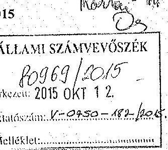

Az ÁSZ tv. 29.§ (2) bekezdése szerint „, Az állami tulajdonban álló erdőgazdasági társaságok vagyongazdálkodási tevékenységének ellenőrzése - EGERERDŐ Erdészeti Zrt." címmel készített számvevőszéki jelentéstervezethez az alábbi pontositásokat és kiegészítéseket tesszük:

- 4.oldalon a mérlegfőösszeg helyesen $6152,4 \mathrm{M}$ Ft a 7.oldalon szereplő adattal egyezően
- 7.oldalon az első bekezdésben a 2009.évi vagyon meghatározásánál a „nyitó" szöveg kiegészítés hiányzik
- 8.oldal utolsó előtti sorában helyesen: „vadkár" (ugyanez az elírás a 19.oldal közepén)
- a 14.oldal táblázatának első oszlopában a mérlegfőösszeg nem egyezik, javítás után a Passzív időbeli elhatárolások 1 272,2 és a Források összesen 5 558,3
- a 19.oldal 4.bekezdéséhez az alábbi megjegyzéseket tesszük:
- a 10 eset a vizsgált időszak alatt összességében történt
- figyelembe véve a társaság által kezelt erdőterület nagyságát, a fenti esetszám nem kiugró
- a vizsgált időszakban és azt megelőzően is, a független állami szervként működő erdészet hatóság a társaság szakmai tevékenységét jónak minősítette
- a 21. oldal 4.bekezdéséhez az alábbi megjegyzést tesszük:
- a Szabályzatban helytelenül szereplő, ötévenkénti leltárfelvétel csak a tárgyi eszközök egy szűk csoportjára (föld alatti kábelek, alagutak, csővezetékek, légvezetékek) vonatkozott

Köszönjük felkészült kollégáik ellenőrzés során tanúsított korrekt együttműködését

Eger. 2015. október 8.

Üdvözlettel

EGERERdÓ Zrt.
3300 Eger, Kosmth L. út 18.
Dr. Jung László
vezérigazgató

Az EGERERDŐ Zrt. újrahasznosított papír felhasználásával is óvja és védi a kezelésére bízott erdőállományokat.

---

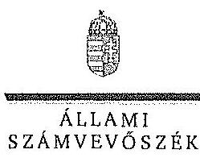

ELHök

Ikt.szám: V-0750-186/2015.

Dr. Jung László úr
vezérigazgató
EGERERDŐ Zrt.

# Eger 

## Tisztelt Vezérigazgató Úr!

A ,,Jelentéstervezet az állami tulajdonban álló erdőgazdasági társaságok vagyongazdálkodási tevékenységének ellenörzése - EGERERDŐ Erdészeti Zrt." címmel készített számvevőszéki jelentéstervezetre tett észrevételeit köszönettel megkaptam.

Az Állami Számvevőszék észrevételekre vonatkozó álláspontjáról a felügyeleti vezető által készített részletes tájékoztatást csatoltan megküldöm.

Tájékoztatom Vezérigazgató urat, hogy a számvevőszéki jelentésben - az Állami Számvevőszékről szóló 2011. évi LXVI. törvény 29. § (3) bekezdése alapján - a figyelembe nem vett észrevételeket szerepeltetjük az elutasítás indokának feltüntetésével.

Budapest, 2015. 11. hó 02 .nap
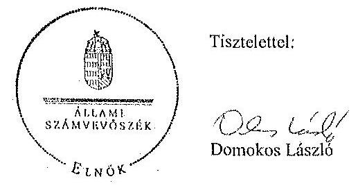

Melléklet: Tájékoztatás az elfogadott és el nem fogadott észrevételekről

---

# Tájékoztatás   az elfogadott és az el nem fogadott észrevételekról 

A ,, Jelentéstervezet az állami tulajdonban álló erdőgazdasági társaságok vagyongazdálkodási tevékenységének ellenőrzése - EGERERDŐ Erdészeti Zrt." címü jelentéstervezetre 2015. október 12 -én érkezett észrevételeit áttekintettük, azok kezelésével kapcsolatban a következő tájékoztatást adom.

1. A jelentéstervezet 4. oldal 3. bekezdésére (Bevezetés) tett első észrevétel

A dokumentumok ismételt áttekintése alapján a mérlegfőösszegét 6152,3 M Ft-ról 6152,4 M Ft-ra pontosítjuk, összhangban a 7. oldal 1. bekezdésében és a 14. oldal táblázatában szerepelő adattal.
2. A jelentéstervezet 7. oldal 1. bekezdésére tett észrevétel

A vonatkozó bekezdésben a 2009. évi adatot az egyértelműség érdekében a „nyitó" szóval kiegészítjük.
3. A jelentéstervezet 8. oldal utolsó előtti sorára és a 19. oldal 4. bekezdésére tett észrevétel

Az elírást helyesbítjük „vadkár"-ra.
4. A jelentéstervezet 14. oldal táblázatára tett észrevétel

A dokumentumok ismételt áttekintése alapján a táblázat 16. és 17. sorait pontosítjuk.
5. A jelentéstervezet 19. oldal 4. bekezdésére tett észrevétel

Az észrevételben leírt megjegyzések nem cáfolják a bírságok kiszabására vonatkozó tényszerű megállapítást, ezért annak módosítása nem indokolt.
6. A jelentéstervezet 21. oldal 4. bekezdésére tett észrevétel

Az észrevételben a leltárfelvétel szabályozására vonatkozó megjegyzés a megállapítás helytállóságát nem vitatja, ezért annak módosítása nem indokolt.

Budapest, 2015. 4. hó 22 nap

Makkai Mária
felügyeleti vezető

---

# 10. SZÁMÚ MELLÉKLET A V-0750-188/2015. SZÁMÚ JELENTÉSHEZ 

## $V-0750-188 / 2015$.

## MNV   Macyar Nemzeti   Vagvankzitiozit   V1/18K:32G310

## Állami Számvevőszék

## Domokos László

elnök

1052 Budapest
Apáczai Cs. J. u. 10.

$$
\begin{aligned}
& \text { Ikt. sz.: MNV/01/47959/ / /2015. } \\
& \text { His. sz.: V-0750-173/2015. }
\end{aligned}
$$

Tisztelt Elnök Úr!
A 2015. szeptember 28. napjáo „Az állami tulajdonban álló erdőgazdasági társaságok vagyongazdálkodási tevékenységének ellenörzése - EGERERDŐ Erdészeti Zrt." tárgyában kézhez vett, V-0750-173/2015. ikt. sz. Jelentés-tervezetre az alábbi észrevételeket kívánom tenni.
I. fejezet / 10. old. második-negyedik bekezdés, II.5. fejezet / 23. old. első bekezdés és 11. old. Javaslat az MNV Zrt. vezérigazgatójának, a)-c) pontok
...A vagyonkezelésbe adott állami vagyon tekintetében tulajdonosi jogokat gyakorló MNV Zrt. és NFA tevékenysége az ellenőrzött időszakban nem támogatta teljes körüen a felelős vagyongazdálkodás megvalósulását, a VSZ-szel kapcsolatban felüirt hiányosságok megszüntetésére és a hatályos jogszabályoknak való megfeleltetésre vonatkozóan nem kezdeményeztek intézkedéseket. A vagyonkezelésbe adott állami vagyon tekintetében tulajdonosi jogokat gyakorló MNV Zrt. és NFA nem végeztek a Vhr.-ben és a Nemzeti Földalapba tartozó földrészletek hasznosításának részletes szabályairól szóló 262/2010. (XI.17.) Korm. rendeletben foglalt, a vagyonnyilvántartás hitelességére, teljességére és helyességére vonatkozó ellenőrzést a Társaságnál.

Az EGERERDŐ Zrt. a KVI-vel 1996. november 1-jén kötött vagyonkezelési szerződés alapján végezte a Magyar Állam tulajdonában álló erdővagyon és egyéb müvelési ágú termöföld ingatlanok kezelését. A Társaság, mint vagyonkezelő és a KVI között létrejött szerzödéses jogviszony keretelt a VSZ-ben foglalt jogok és kötelezettségek töltötték ki. A VSZ nem támogatta a Vhr. 3. § (1) bekezdésében foglalt, a vagyongazdálkodási feladatok átlátható módon történő végrehajtását, valamint nem támogatta szabályszerű vagyongazdálkodást. Az ellenőrzött időszakban a VSZ nem felelt meg a jogszabályi rendelkezéseknek, hatályon kívül helyezett jogszabályi távatkozásokat tartalmazott az ÁltL., 109/B. §, 109/G. §, a Vadvédelmi tv. 98. § rendelkezései vonatkozásában. VSZ vagyonkezelői jog átengedésére vonatkozó 3.2.3. pontja 2012-től nem felelt meg az Nvtv. 11. § (8) bekezdésében foglaltaknak, amely szerint a Társaság a vagyonkezelői jogát harmadik személyre nem ruházhatta át, a VSZ 3.3.2. pontjában foglaltak ellenére a VSZ-t a felek évente nem vizsgálták felül. A felek nem tettek eleget a Vhr. 54. § (7) bekezdésében foglalt rendelkezésnek és a Vhr. hatálybalépését követő hat hónapon belül nem kezdeményezték a Nemzeti Földalapba tartozó ingatlanokra vonatkozóan a VSZ megszüntetését és a Vtv., illetve Vhr. szabályainak megfelelő szerződés megkötését, így a VSZ nem tartalmazta a 2007-ben hatályba lépett Vtv. és Vhr. elölrásait.

A vagyonkezelésbe adott állami vagyon tekintetében tulajdonosi jogokat gyakorló MNV Zrt. és NFA nem végeztek a Vhr. 20. § (1)-(2) bekezdéseiben és a Nemzeti Földalapba tartozó földrészletek hasznosításának részletes szabályairól szóló 262/2010. (XI.17.) Korm. rendelet 47. § (1)-(2) bekezdéseiben foglalt, a vagyonnyilvántartás hitelességére és teljességére vonatkozó ellenőrzést a Társaságnál.

---

# Jossóotaz MNV Zrt. vezérigazgatójának 

a) Tegyen intézkedéseket az erdőgazdasági társaság közremüködésével a tényleges állapotot rögzitő és a hatályos jogszabályi elöírásoknak megfelelő vagyonkezelési szerzödés megkötésére.
b) Tegyen intézkedéseket a vagyonkezelési szerzödés felülvizsgálatának elmaradásával, valamint a Nemzeti Földalapba tartozó ingatlanokra vonatkozó VSZ megszüntetésével összefüggésben feltárt szabálytalanságok tekintetében a felelősség tisztázása érdekében, és szükség szerint intézkedjen a felelősség érvényesitéséről.
c) Intézkedjen a Társaság vagyonnyilvántartása hitelességének, teljességének és helyességének jogszabályban foglaltak szerinti ellenörzéséről."

Sajnálattal állapítottuk meg, hogy a Jelentés-tervezet egyáltalán nem veszi figyelembe a vizsgált időszakban megindított és több eljárási cselekményt is magába foglaló intézkedés-sorozatunkat, amelynek a célja a Jelentéstervezetben egyébiránt joggal kifogásolt hiányosságok megszüntetése, az erdőgazdasági társaságok müködésének jogszabályi megfelelőségének biztosítása volt. Ezzel a Jelentés-tervezet azt sugallja, hogy a tulajdonosi joggyakorlók részéről egyáltalán nem volt szándék az erdőgazdasági társaságok müködésének, illetve a vagyonkezelés körülményeinek hatályos jogszabályok szerinti szabályozására, amely egyébiránt nem felel meg a valóságnak és az adatszolgáltatásunk során sem erről tájékoztattuk Önöket.
Mindamellett elismerjük, hogy a probléma a kezelt vagyonelemek nagy száma, ebből kifolyólag a szabályozást igénylő körülmények nagy száma és sokrétüsége miatt nehezen átlátható, ezért kérjük, engedjék meg, hogy a munkájukat segítő szándékkal korábbi tájékoztatásunkat ismételten megerősítsük, azzal a kifejezett kéréssel, hogy a Jelentésükben az általunk vitatott megállapítást szíveskedjenek módosítani, és az MNV Zrt. által a megoldás irányába megtett intézkedéseket feltüntetni.
Az ideiglenes vagyonkezelési szerződéseken alapuló kezelői jogviszony újraszabályozása, az ideiglenes vagyonkezelési szerződések megszüntetése és végleges vagyonkezelési szerződések megkötése érdekében az intézkedéseink már 2011. évben megkezdődtek, párhuzamosan a Nemzeti Földalapról szóló 2010. évi LXXXVII. tv. 34. § (3) bekezdés c) pontja szerinti feladat- illetve vagyonátadással.

Az intézkedéseink alapja a 2011. évben, MNV/01/29518/2011. szám alatt szakterületünk által bekért, az erdőgazdasági társaságok 2010. december 31-i, illetve 2011. július 31-i fordulónapra vonatkozó leltárjelentése volt, amelyet elsődlegesen az NFA tv. szerint előírt vagyonátadás elvégzése céljából kértünk meg az erdőgazdasági társaságoktól. Ugyanakkor a leltárjelentéshez benyújtott földrészlet listák voltak az első olyan kimutatások, amelyek a kezelt vagyon elemeit a FÖMI adatbázisán alapuló (az aktuális ingatlan-nyilvántartási állapotnak megfelelően) alrészletes bontásban tartalmazták.

## A vizsgált idöszakban megindított és lefolytatott intézkedéseink a következők:

1. Az erdőgazdasági társaságok által kezelt vagyonelemek tulajdonosi joggyakorlók szerinti elhatárolása, NFA átadás előkészítése, az erdőgazdasági társaságok bevonásával. A Nemzeti Földalapba tartozó vagyonelemek NFA átadása 2012-2013. években megtörtént, majd a visszamaradt vagyonelemek - többségében kivett megnevezésben nyilvántartott földrészletek - elhatárolását is elvégeztük. A feladat végrehajtása 2014. május 31-ig teljesült.
Az intézkedéssel az MNV Zrt. tulajdonosi joggyakorlása alá tartozó vagyonelemek körét - a közös tulajdonosi joggyakorlás alatt álló ingatlanok kivételével -, azaz a végleges vagyonkezelési szerződések ingatlanlistáit meghatároztuk.
Meg kívánjuk jegyezni, hogy az erdőgazdasági társaságok a 2011. évi leltárjelentéseikhez minden esetben csatolták a jelentés tartalmára vonatkozó teljességi nyilatkozatukat is, így azok tartalmát mint teljes körű adatszolgáltatást kezeltük.
A hivatkozott iratokat az eljárás során a Tisztelt Állami Számvevőszék rendelkezésére bocsátottuk.
2. Az erdőgazdasági társaságok által kezelt vagyon értékelését 2014. május 31-ig elvégeztük, részben külső piaci szereplő által megállapított vagyonértékelési adatok (az IFUA értékbecslési adatai), részben belső szakértők és a kontrolling szakterület által az MNV Zrt. hatályos értékelési szabályzata által megállapított értékadatok figyelembe vételével.

---

3. Az MNV Zrt. Igazgatósága 511/2012. (X. 08.) IG sz., valamint 717/2013. (IX. 23.) IG sz. határozataiban Intézkedési terveket fogadott el „a 28/2012. (IX. 24.) sz. RJGY határozatában előírt, valamint az MNV Zrt. rábízott vagyon 2012. évi beszámolója könyvvizsgálói minősitésének megtartásához szükséges és egyéb feladatokról". Az Intézkedési tervek magukban foglalták az erdőgazdasági társaságok által kezelt vagyon analitikájának előállítását, illetve az erdőtársaságokkal végleges (nem ideiglenes) vagyonkezelői szerződések megkötését. A 717/2013. (IX. 23.) IG sz. határozat melléklete tartalmazza a feladat végrehajtása érdekében már megtett intézkedéseket (pl. „Megtörtént az erdőgazdaságok által kezelt vagyon listáinak vagyonkezelői jelentésekkel való egyeztetése; a vagyonkezelési szerződés tartalmi kérdéseinek, az erdőgazdaságok véleményének feldolgozása, MFB Munkacsoport egyeztetések történtek stb.), valamint rögzíti a még elvégzendő feladatokat. Ennek megfelelően az MNV Zrt-nél 2012-tól folyamatban van az erdőgazdasági társaságok vagyonanalitikájának előállítása és vagyonkezelési szerződései tárgyú projekt.
A hatályos jogszabályoknak megfelelő vagyonkezelési szerződés tervezetét a vizsgálati időszak során az MNV Zrt. belső szakterületi egyeztetést követően előkészítettük, és a 2014. március 18-án megtartott Munkacsoport értekezleten az erdőgazdaság képviselőivel, továbbá a tulajdonosi joggyakorlók (NFA, illetve akkor még Magyar Fejlesztési Bank Zrt.) képviselöivel ismertettük annak tartalmát. A szerződés szövegtervezetének véleményezése ekkor megkezdődött, ugyanakkor elismerjük, hogy a végleges szerződésváltozat már az Önök által vizsgált időszakot követően került elfogadásra. Ugyancsak a 2014. március 18-án megtartott Munkacsoport értekezleten tettünk javaslatot a vagyonkezelési díj alapjának és mértékének meghatározására.
4. Az erdőgazdasági társaságok által kezelt és a saját vagyonuk vagyonelemenkénti, valamint a kezelt vagyonelemek tulajdonosi joggyakorlók szerinti elhatárolására vonatkozó intézkedésünket a vizsgált időszakban előkészítettük.

Tájékoztatjuk továbbá Elnök Urat az alábbiakról:
A Jelentés-tervezet 11. oldalán található, az MNV Zrt. vezérigazgatójára vonatkozó, a) pont alatti, vagyonkezelési szerződés megkötésére irányuló javaslathoz kapcsolódóan felhívjuk a Tisztelt Állami Számvevőszék figyelmét arra, hogy a Nemzeti Fejlesztési Minisztérium KGTF/377-6/2014-NFM, valamint KGTF/377-7/2014. számok alatt adott utasításokat a fenti feladatok elvégzésére. Ezekről, illetve az utasításokra adott jelentésünkről a korábbi adatszolgáltatásunk keretében szintén kitértünk.

A vagyonkezelési szerződés vizsgált időszakot követően elfogadott tervezetének mellékletét képezik az MNV Zrt. azon szabályzatai is, amelyek a kezelt vagyon nyilvántartását, a beruházások nyilvántartását és az azzal kapcsolatos elszámolásokat, illetve a tulajdonosi ellenőrzéssel kapcsolatos, a jelenlegi jogszabályi környezetnek megfelelő szabályokat tartalmazzák:

- Az állami tulajdonon, egyéb vagyonkezelők által vagyonkezelt eszközön megvalósítandó beruházások, felújítások előzetes engedélyezésének és elszámolásának eljárásrendjéről szóló 35/2014. számú vezérigazgatói utasítás,
- A Magyar Nemzeti Vagyonkezelő Zrt. Tulajdonosi Ellenőrzési Szabályzata - a 39/2014. számú vezérigazgatói utasítás, továbbá
- A Magyar Nemzeti Vagyonkezelő Zrt. állami vagyon vagyonkezelőire, az állami vagyont használókra és a társasági részesedések esetében az MNV Zrt. tulajdonosi joggyakorlását megbízottként ellátókra vonatkozó Vagyon-nyilvántartási Szabályzatáról szóló 12/2014. számú vezérigazgatói utasítás.

Fentiek mellett megemlíthető az MNV Zrt. folyamatba épített, illetve vagyon nyilvántartás vezetést támogató ellenőrzési módszertanról szóló 11/2014. számú vezérigazgatói utasítás.
Egycztetéseink során az erdőgazdasági társaságok tájékoztatást kaplak a szabályzataink tartalmára vonatkozóan.
A Nemzeti Fejlesztési Minisztérium ÁVF/21310/2015-NFM számú tájékoztató levele szerint Miniszter Úr vagyongazdálkodási szempontból nem támogatja az erdőgazdasági társaságok ideiglenes vagyonkezelési szerződéseit kiváltó vagyonkezelési szerződések megkötését, ideértve az MNV Zrt. vagyonkezelési szerződésekkel kapcsolatos jóváhagyó döntéseit is.

---

Az MNV Zrt-re vonatkozóan hivatkozott jogszabály, a Vhr. 20. § (1)-(2) bekezdése 2014. március 14-ig - csaknem az ellenőrzött időszak végéig - a következőképpen rendelkezett:
„(1) Az állami vagyon kezelőjét, használóját megillető jogok gyakorlását, annak szabályszerűségét, célszerűségét a Vtv. 17. §-ának d) pontja alapján az MNV Zrt. - szükség szerint a területi szervet útján ellenőrzi. Ennek érdekében a vagyon kezelésére, hasznosítására kötött szerződésben rögzíteni kell, hogy a tulajdonosi ellenőrzés eljárásrendjét, a felek jogait, kötelezettségeit a felek a szerződés részének tekintik.
(2) A tulajdonosi ellenőrzés célja az állami vagyonnal való gazdálkodás vizsgálata, ennek keretében a rendeltetésellenes, jogszerütlen, szerzödésellenes, vagy a tulajdonos érdekeit sértő, illetve a központi költségvetést hátrányosan érintő vagyongazdálkodási intézkedések feltárása és a jogszerü állapot helyreállitása, továbbá a vagyonnyilvántartás hitelességének, teljességének és helyességének biztositása."

A tulajdonosi ellenőrzés alatt a Területi Irodák által folytatott ellenőrzést is értette a jogszabály, amiből egyenesen következik a szakterületi munkafolyamatba épített ellenőrzési kötelezettség figyelembe vételének a lehetősége.

Fentiekre tekintettel kérjük a Jelentés-tervezet 10., illetve 23. oldalán található azon megállapítások törlését, hogy az MNV Zrt. nem kezdeményezett intézkedéseket, és nem végzett a Vhr. 20. § (1)-(2) bekezdéseiben és a Nemzeti Földalapba tartozó földrészletek hasznosításának részletes szabályairól szóló 262/2010. (XI.17.) Korm. rendelet 47. § (1)-(2) bekezdéseiben foglalt, a vagyonnyilvántartás hiteleességére és teljességére vonatkozó ellenőrzést a Társaságnál, kérjük a megtett intézkedések feltüntetését, és a Jelentés-tervezet 11. oldalán található, az MNV Zrt. vezérigazgatójára vonatkozó h) pontot a megtett intézkedések folyamatosságára tekintettel törölni, a c) pont alatti javaslatot szövegszerüen ekként módosítani:

# Javaslat az MNV Zrt. vezérigazgatójának 

c) Az MNV Zrt. tulajdonosi joggyakorlása alá tartozó (az Erdőgazdasági Társaságok által az MNV Zrt. részére jelentett) vagyonelemek tekintetében intézkedjen a Társaság vagyonnyilvántartása hiteleességének, teljességének és helyességének jogszabályban foglaltuk szerinti ellenőrzéseinek erösitéséről.

Kérem Elnök Urat, hogy a Jelentés véglegesítése során jelen észrevételeinket szíveskedjenek figyelembe venni.

Budapest, 2015. október ,(1),
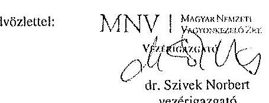

---

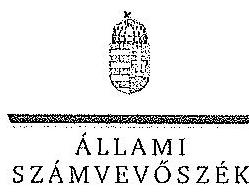

ELKÖK

Ikt.szám: V-0750-184/2015.

Dr. Szívek Norbert úr
vezérigazgató
Magyar Nemzeti Vagyonkezelő Zrt.

Budapest

Tisztelt Vezérigazgató Úr!

A „Jelentéstervezet az állami tulajdonban álló erdőgazdasági társaságok vagyongazdálkodási tevékenységének ellenőrzése - EGERERDŐ Erdészeti Zrt.” címmel készített számvevőszéki jelentéstervezetre tett észrevételeit köszönettel megkaptam.

Az Állami Számvevőszék észrevételekre vonatkozó álláspontjáról a felügyeleti vezető által készített részletes tájékoztatást csatoltan megküldöm.

Tájékoztatom Vezérigazgató urat, hogy a számvevőszéki jelentésben - az Állami Számvevőszékről szóló 2011. évi LXVI. törvény 29. § (3) bekezdése alapján - a figyelembe nem vett észrevételeket szerepeltetjük az elutasítás indokának feltüntetésével.

Budapest, 2015. 11. hó 05. nap

Tisztelettel:

Dómokos László

Melléklet: Tájékoztatás az elfogadott és az el nem fogadott észrevételekről

1952 BIRMPEST, JIPIKON GSORE JÁNOS UYCA 30. 1364 Budapest 4, Pl. 54 telefon. 484 8781 fax: 484 8291

---

# Tájékoztatás   az elfogadott és az el nem fogadott észrevételekről 

A ,, Jelentéstervezet az óllami tulajdonban álló erdőgazdasági társaságok vagyongazdálkodási tevékenységének ellenörzése - EGERERDŐ Erdészeti Zrt." címü jelentéstervezetre 2015. október 13-án érkezett észrevételeit áttekintettük, azok kezelésével kapcsolatban a következő tájékoztatást adom.

1. A vagyonkezelési szerződéshez kapcsolódó megállapításokra tett észrevétel (I. fejezet / 10. oldal 2-3. bekezdés, II. 5. fejezet / 23. oldal 1. bekezdés, 11. oldal javaslat az MNV Zrt. vezérigazgatójának a)-b) pontok)

A jelentéstervezet vagyonkezelési szerződéshez kapcsolódó megállapításai helytállóak. Az erdőgazdasági társaság müködése jogszabályi megfelelősége biztosításának érdekében tett kezdeményezésekről adott tájékoztatásukat köszönettel vettük, azonban azok nem eredményezték az ideiglenes vagyonkezelési szerződés olyan módosítását, vagy olyan új vagyonkezelési szerződés megkötését, amely biztosította volna a VSZ hiányosságainak megszüntetését, illetve a hatályos jogszabályoknak való megfelelőségét. Ezért az MNV Zrt. vezérigazgatójának és az NFA elnökének megfogalmazott intézkedést igénylő megállapítás, valamint az MNV Zrt. vezérigazgatójának megfogalmazott javaslat a) és b) pontjának módosítása nem indokolt. Az egyértelműség érdekében a 10. oldal 2. bekezdés 1. mondatát és a 23. oldal 1. bekezdés 1. mondatát az alábbiak szerint pontosítjuk:
„... a VIZ-szel kapcsolatban feltárt hiányosságok megszüntetése és a hatályos jogszabályoknak való megfeleltetése nem történt meg."
2. Az MNV Zrt. ellenőrzési kötelezettségének elmulasztására vonatkozó megállapításokra tett észrevétel (I. fejezet 10. oldal 4. bekezdés, II. 5. fejezet / 23. oldal 1. bekezdés és 11. oldal javaslat az MNV Zrt. vezérigazgatójának c) pont)

Az MNV Zrt. nem bocsátott az ÁSZ ellenőrzés rendelkezésére az MNV Zrt., vagy Területi Irodái által a Vhr. 20. § (1)-(2) bekezdései szerint végzett ellenőrzésekről dokumentumokat. A jelentéstervezet megállapításai és a javaslat helytállóak, módosításuk nem indokolt.

Budapest, 2015. //. hó $\sim$ nap

Makkai Mária
felügyeleti vezető

---

# MFB 

Domokos László úr
elnök részére
Állami Számvevőszék

Budapest

Tisztelt Elnök Úr!
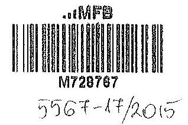

ÁLLAMI SZÁMVEVŐSZÉK
11.017/2015.

Érkezés: 2015 OKT 13.
Iktatószám: $V-0757-036505$
Melléklet:
Mazai M.
E2s
2015. szeptember 28-án köszönettel kézhez vettük az Állami Számvevőszék „Az állami tulajdonban álló erdőgazdasági társaságok vagyongazdálkodási tevékenységének ellenőrzéséről" szóló jelentéstervezeteket az alábbi cégekre:

- Északerdő Erdőgazdasági Zrt.
- EGERERDŐ Erdészeti Zrt.
- Gemenci Erdő- és Vadgazdaság Zrt.
- Ipoly erdő Zrt.
- KEFAG Kiskunsági Erdészeti és Faipari Zrt
- Kisalföldi Erdőgazdaság Zrt
- SEFAG Erdészeti és Faipari Zrt
- Szombathelyi Erdészeti Zrt.
- VADEX Mezöföldi Erdő-és Vadgazdálkodási Zrt. (Ikt.szám: V-0765-044/2015.)
- Zalaerdő Erdészeti Zrt.
(Ikt.szám: V-0754-086/2015.)
(Ikt.szám: V-0750-172/2015.)
(Ikt.szám: V-0753-096/2015.)
(Ikt.szám: V-0749-146/2015.)
(Ikt.szám: V-0764-054/2015.)
(Ikt.szám: V-0758-056/2015.)
(Ikt.szám: V-0752-089/2015.)
(Ikt.szám: V-0757-060/2015.)
(Ikt.szám: V-0765-044/2015.)
(Ikt.szám: V-0760-075/2015.)

Az MFB Zrt. a jelentéstervezetekkel kapcsolatosan 2 féle szempontból kíván észrevételt tenni:

1. A jelentésekben megfogalmazott központi probléma
2. Egyedi esetek

---

# 1. A jelentésekben megfogalmazott központi probléma 

Az ÁSZ az egyedi jelentésciben az erdőgazdasági társaságokat, valamint a vagyonkezelésbe adott állami vagyon tekintetében tulajdonosi joggyakorló MNV Zrt. és Nemzeti Földalapkezelő (továbbiakban: NFA) tevékenyégét marasztalta el.
Alapvető problémaként jelenik meg, hogy az erdők által kezelt eszközök - az NFA-val, a Kincstári Vagyon Igazgatósággal, és az MNV Zrt-vel kötött vagyonkezelési megállapodásban rögzitett - értéken nem szerepelnek a Társaságok könyveiben.
Az MFB Zrt. tudatában volt a problémának (azt az ÁSZ jelentésben is említett, 2010. évben végzett átvilágitási jelentés is tartalmazta, melynek nyomon követése, beszámoltatása megtörtént) és folyamatosan egyeztetett az MNV Zrt-vel és az NFA-val a rendezés ügyében. Az ideiglenes vagyonkezelési szerződés módosítására, véglegesitésére a vagyonkezelésbe adónak (MNV, NFA) van lehetősége, a Társaságok szerződő partnerként észrevételeket, javaslatokat tehetnek. A szerződés véglegesitése érdekében a Társaságok és az MFB Zrt. képviselöi minden olyan egyeztetésen (pl.: az MNV Zrt. által létrehozott bizottság) részt vettek, amelyre meghívást kaptak, illetve azokon érdemi javaslatokat tettek.
Ahogy a jelentés is megjegyzi, az egyeztetések az ellenőrzés befejezésig nem kerültek lezárásra, így a Társaságoknál nem áll rendelkezésre a vagyonkezelésben lévő állami vagyonra és annak nagyságára vonatkozó, az MNV Zrt. és az NFA nyilvántartásával egyező adat.

Az ÁSZ 2013. évi „Az állami vagyon feletti kontroll - Az állami vagyon feletti tulajdonosi joggyakorlással kapcsolatos tevékenységek ellenörzéséröl" szóló jelentése alapján a Nemzeti Fejlesztési Minisztérium - az ÁSZ-szal egyeztetett - alábbi föbb pontokat tartalmazó intézkedési tervet (1. sz. melléklet) állított össze, melyet a 2014. április 25-én kelt levelében küldött meg az MFB Zrt. részére:

- a Társaságok által kezelt állami ingatlanok és egyéb vagyonelemek értéken történő nyilvántartása,
- a vagyonkezelési díjak egyértelmủ és tulajdonosi joggyakorló szervezetenkénti meghatározása,
- az új vagyonkezelési szerződés megkötése,
- a Társaságok kezelt és saját vagyonának vagyonelemenkénti, valamint a kezelt vagyonelemek tulajdonosi joggyakorló szerinti elhatárolása.

Az MFB törvény módosításának 2014. július 16-i hatályba lépésével az MFB Zrt. állami erdőgazdaságok feletti tulajdonosi joggyakorlása megszűnt, az a Földművelésügyi Minisztériumhoz került át, így az intézkedési tervben való közreműködésre, illetve a végrehajtás nyomon követésére az MFB Zrt-nek nem volt lehetősége.

A jelentések az MNV Zrt. vezérigazgatójának, az NFA elnökének és az erdészeti társaságok vezérigazgatóinak fogalmaztak meg intézkedési javaslatokat.

---

# 2. Egyedi esetek: 

## KEFAG Kiskunsági Erdészeti és Faipari Zrt.

A jelentéstervezet többször hibásan hivatkozik az MFB Zrt.-re, amikor az állami vagyonról szóló 2007. évi CVL törvény (a továbbiakban: Vtv.) 17. § (1) bekezdés d) pontja szerinti rendszeres ellenôrzés elmaradására mutat rá. A Vtv. hivatkozott bekezdése alapján az ellenőrzés az MNV Zrt. feladata. Kérjük a társaság feletti tulajdonosi joggyakorló2 hivatkozások törlését (8. oldal 7. bekezdés és 32. oldal 6. bekezdés)

## Kisalföldi Erdőgazdaság Zrt.

A jelentéstervezet hibásan hivatkozik az MFB Zrt.-re, amikor a Vtv. 17. § (1) bekezdés d) pontja szerinti rendszeres ellenőrzés elmaradására mutat rá. A Vtv. hivatkozott bekezdése alapján az ellenőrzés az MNV Zrt. feladata. Kérjük a társaság feletti tulajdonosi joggyakorló2 hivatkozások törlését (29. oldal 4. bekezdés)

## Szombathelyi Erdészeti Zrt.

A jelentéstervezet hibásan hivatkozik az MFB Zrt.-re, amikor a Vtv. 17 § (1) bekezdés d) pontja szerinti rendszeres ellenőrzési elmaradására mutat rá. A Vtv. hivatkozott bekezdése alapján az ellenőrzés az MNV Zrt. feladata. Kérjük a társaság feletti tulajdonosi joggyakorló2 hivatkozás törlését. (32. oldal 5. bekezdés).

Budapest, 2015. október 12.
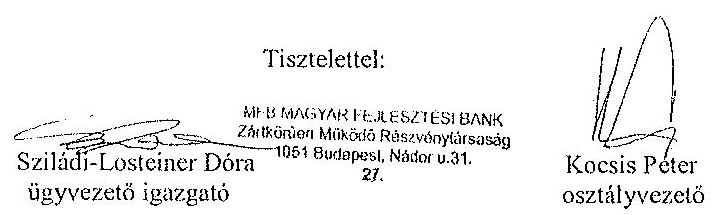

## Melléklet:

NFM levél (Ikt.szám: KGTF/377-7/2014-NFM)

---

$\cdot$
$\cdot$
$\cdot$
$\cdot$
$\cdot$
$\cdot$
$\cdot$
$\cdot$
$\cdot$
$\cdot$
$\cdot$
$\cdot$
$\cdot$
$\cdot$
$\cdot$
$\cdot$
$\cdot$
$\cdot$
$\cdot$
$\cdot$
$\cdot$
$\cdot$
$\cdot$
$\cdot$
$\cdot$
$\cdot$
$\cdot$
$\cdot$
$\cdot$
$\cdot$
$\cdot$
$\cdot$
$\cdot$
$\cdot$
$\cdot$
$\cdot$
$\cdot$
$\cdot$
$\cdot$
$\cdot$
$\cdot$
$\cdot$
$\cdot$
$\cdot$
$\cdot$
$\cdot$
$\cdot$
$\cdot$
$\cdot$
$\cdot$
$\cdot$
$\cdot$
$\cdot$
$\cdot$
$\cdot$
$\cdot$
$\cdot$
$\cdot$
$\cdot$
$\cdot$
$\cdot$
$\cdot$
$\cdot$
$\cdot$
$\cdot$
$\cdot$
$\cdot$
$\cdot$
$\cdot$
$\

---

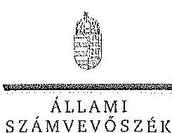

ELKÖK

# Nagy Csaba úr 

vezérigazgató
Magyar Fejlesztési Bank Zrt.

## Budapest

## Tisztelt Vezérigazgató Úr!

Az „Az állami tulajdonban álló erdőgazdasági társaságok vagyongazdálkodási tevékenységének ellenőrzése" címủ ellenőrzés tekintetében 10 társaság jelentéstervezetére tett észrevételüket köszönettel megkaptam.

Az Állami Számvevőszék észrevételekre vonatkozó álláspontjáról a felügyeleti vezető által készített részletes tájékoztatást csatoltan megküldöm.

Tájékoztatom Vezérigazgató urat, hogy a számvevőszéki jelentésben - az Állami Számvevőszékről szóló 2011. évi LXVI. törvény 29. § (3) bekezdése alapján - a figyelembe nem vett észrevételeket szerepelhetjük az elutasítás indokának feltüntetésével.

Budapest, 2015.
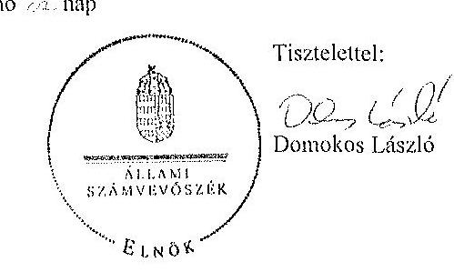

Melléklet: Tájékoztatás az elfogadott és az el nem fogadott észrevételekről

---

# Tájékoztatás   az elfogadott és az el nem fogadott észrevételekről 

„Az állami tulajdonban álló erdőgazdasági társaságok vagyongazdálkodási tevékenységének ellenörzése" címủ ellenőrzés tekintetében az Északerdő Erdőgazdasági Zrt., az EGERERDŐ Erdészeti Zrt., a Gemenci Erdő- és Vadgazdaság Zrt., az IPOLY ERDŐ Zrt., a KEFAG Kiskunsági Erdészeti és Faipari Zrt., a Kisalföldi Erdőgazdasági Zrt., a SEFAG Erdészeti és Faipari Zrt., a Szombathelyi Erdészeti Zrt., a VADEX Mezöföldi Erdő- és Vadgazdálkodási Zrt., illetve a Zalaerdő Erdészeti Zrt. társaságok jelentéstervezetére 2015. október 13-án érkezett észrevételeket áttekintettük, azok kezelésével kapcsolatban a következő tájékoztatást adom.

1. A jelentésekben megfogalmazott központi problémával kapcsolatban tett észrevételek A jelentésekben megfogalmazott központi problémával kapcsolatban adott tájékoztatásukat köszönettel vettük, azonban azok alapján a jelentéstervezet módosítása nem indokolt.
2. Egyedi esetekkel kapcsolatban tett észrevételek

A KEFAG Kiskunsági Erdészeti és Faipari Zrt. jelentéstervezetének 8. oldal 7. bekezdésére, valamint 32. oldal 6. bekezdésére tett észrevétel
A rendelkezésre álló dokumentumok ismételt áttekintését követően a jelentéstervezet 8. oldal 7. bekezdésében, valamint 32 . oldal 6 . bekezdésében töröljük a tulajdonosi joggyakorló 2 számú alsóindexszel jelölt hivatkozását.

A Kisalföldi Erdőgazdasági Zrt. jelentéstervezetének 29. oldal 4. bekezdésére tett észrevétel
A rendelkezésre álló dokumentumok ismételt áttekintését követően a jelentéstervezet 29. oldal 4. bekezdésében töröljük a tulajdonosi joggyakorló 2 számú alsóindexszel jelölt hivatkozását.

A Szombathelyi Erdészeti Zrt. jelentéstervezetének 32. oldal 5. bekezdésére tett észrevétel
A rendelkezésre álló dokumentumok ismételt áttekintését követően a jelentéstervezet 32. oldal 5. bekezdésében töröljük a tulajdonosi joggyakorló 2 számú alsóindexszel jelölt hivatkozását.

Budapest, 2015. év $\quad 11$ hó ơ nap

Makkai Mária
felügyeleti vezető

---

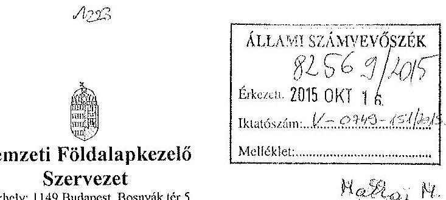

Iktatószám: NFA-002589/017/2015

Hiv. szám: ÁSZ-V-0599/2014-2015

Érintett ÁSZ iktatószámok: V-0749-148/2015, V-0750-174/2015, V-0751-121/2015, V-0752-091/2015, V-0753-098/2015, V-754-088/2015, V-0755-124/2015, V-0757-062/2015, V-0758-058/2015, V-0760-077/2015, V-0764-056/2015, V-0765-046/2015, V-0766-140/2015, V-0767-056/2015.

Domokos László
Elnök

Állami Számvevőszék

1052 Budapest

Apáczai Csere János utca 10

Tárgy: Észrevétel megküldése „Az állami tulajdonban álló erdőgazdasági társaságok vagyongazdálkodási tevékenységének ellenőrzéséről” készített jelentés tervezeteire.

Tisztelt Elnök Úr!

Az Állami Számvevőszék 2014 novemberében megkezdte „Az állami tulajdonban álló erdőgazdasági társaságok vagyongazdálkodási tevékenységének ellenőrzését” amelyről 2015 októberétől érintettség okán az NFA részére az elkészített munkaanyag tervezeteit vizsgált erdőgazdaságonként, megküldte Szervezetünk részére véleményezésre.

A munkaanyag valamennyi tervezte egységesen, az NFA Elnöke részére feladatszabást tartalmaz, melyhez az alábbi észrevételeket tesszük:

A jelentéstervezetekben tett megállapítások helytállóságát nem vitatjuk, azonban szükségesnek látjuk az NFA elnökének tett javaslatokkal a), b) és c) kapcsolatban a következő tájékoztatást megadni.

---

# a) „Tegyen intézkedéseket az erdögazdasági társaságok közremüködésével a tényleges állapotot rögzitő és a hatályos jogszabályt elöírásoknak megfelelő vagyonkezelési szerzödés megkötésére." 

Tájékoztatjuk, hogy a hatályos jogszabályi előírásoknak megfelelő vagyonkezelési szerződések megkötése érdekében több intézkedés történt, jelenleg is folyamatban van a szerződések előkészítése és a vagyonkezelésben maradó, illetve kikerülő földrészletek adatainak egyeztetése.

Előzményként fontos kiemelni, hogy a Nemzeti Földalapkezelő Szervezet 2010. szeptember 1. napjával történt létrehozását követően (2012. évben) került sor a vagyonkezelésben lévő földrészletek MNV Zrt. részéről történő átadására. Az átadási dokumentumok alapján Szervezetünk gondoskodott a közhiteles nyilvántartásokban a megváltozott tulajdonosi joggyakorlás feltüntetéséről. Az erdőgazdaságok esetében ez 2012. év végéig, illetve 2013. év elején megtörtént ennek az ingatlan-nyilvántartásban történő átvezetése is.

Megjegyezzük, hogy az MNV Zrt. részéről történő átadás kizárólag a - több évtizede kötött, és azóta többször módosított - vagyonkezelési szerződések és a földrészletek Excel táblázatban történő átadását jelentette, tehát nem egy naprakész vagyonnyilvántartást tartalmazott. Ennek következtében szükségszerűvé vált a Nemzeti Földalapkezelő Szervezetnek egy saját nyilvántartás felépítése, illetve a szerződések tartalmának feldolgozása.

A számvevőszéki ellenőrzéssel érintett időszakban, illetve még jelenleg is lezáratlan az MNV Zrt. és NFA közötti átadás-átvételi folyamat. Az MNV Zrt. további földrészletek átadását készíti elő, ugyanis az MNV Zrt. vagyoni körébe tartozó földrészletekre szintén tervezi a vagyonkezelői szerződés megkötését, és ennek a folyamatnak a részeként a még át nem adott földrészletek átadása is most történik. Természetesen az NFA is folyamatosan biztosítja a különböző hasznosítási, illetve hatósági eljárások során az erdőgazdaságok vagyonkezelésében lévő földrészletek tulajdonosi joggyakorlójának rendezését az MNV Zrt megkeresésével, közös minősítési eljárás lefolytatásával. A Nemzeti Földalapkezelő Szervezet által megbízott ügyvédi iroda, jelentést készített a szerződés és a tárgyát képező földrészletek jogi helyzetének tisztázására.

Időközben az erdőgazdaságok, mint társaságok feletti tulajdonosi joggyakorló személyében is változás történt. Így új alapokon indulhatott meg a vagyonkezelői szerződés előkészítése. Ennek a folyamatnak részeként, az NFA megbízott egy Ügyvédi Konzorciumot, továbbá Szervezetünknél külön Erdészeti munkacsoport alakult 2015 májusában és azt követően a következő intézkedések történtek:

Az Erdőgazdaságok részére vagyonkezelésbe adásra tervezett ingatlanok felülvizsgálata folyamatban van az Ügyvédi Konzorcium által. A felülvizsgálat tárgyát képező ingatlanok köre három részből tevődik össze:

- az erdőgazdaságok ideiglenes vagyonkezelési szerződésének tárgyát képező ingatlanok,

---

- azon ingatlanok, amelyeket az erdőgazdaságok az ideiglenes vagyonkezelési szerződésükben szereplő ingatlanokon felül kértek vagyonkezelésbe,
- valamint azok az ingatlanok, amelyeket az NFA kíván az erdőgazdaságok vagyonkezelésébe adni.
A rendelkezésre álló dokumentumokban szereplő ingatlanokból erdőgazdaságonként egy egységes, az összes vagyonkezelésbe adandó ingatlant tartalmazó táblázat készült, amely tartalmazza az ingatlanok vagyonkezelésbe adás szempontjából releváns adatait, bejegyzett jogokat, feljegyzett tényeket. A táblázat adatai összevetésre kerültek a közhiteles ingatlannyilvántartásban szereplő adatokkal, feltárva ezáltal, hogy mely ingatlanok adhatóak vagyonkezelésbe és melyek azok, amelyeknél valamilyen előzetes intézkedés megtétele szükséges.

Az Nfatv. 8. §-a alapján a Birtokpolitikai Tanács dönt erdőgazdaságonként az erdőgazdaságok vagyonkezelési szerződésének megkötéséről.

Zárójelben jegyezzük meg, hogy például a TAEG Zrt. esetében elkészült a fentebb részletezett táblázat, amely alapján összeállításra került azon ingatlanok listája, amelyre elindítható a vagyonkezelésbe adási eljárás. Megközelítőleg 18000 ha nagyságú területnek tervezi Szervezetünk a TAEG Zrt. részére történő vagyonkezelésbe adását, ebből $15.308,3880$ ha terület az, amelyre elindította a vagyonkezelésbe adást. Az alábbi jogszabályhelyek alapján Szervezetünk megkereste az Földművelésügyi Minisztériumot az egyetértő nyilatkozatok, valamint az alapító határozat kiadása érdekében, valamint a NÉBIHet, mint erdészeti hatóságot a vagyonkezelő erdőgazdálkodói alkalmasságát megállapító jóváhagyásának megkérése végett.

Az Nfatv. 20. § (7) bekezdése alapján „Az állam 100\%-os tulajdonában álló erdő és erdőgazdálkodási tevékenységet közvetlenül szolgáló földterületet érintő vagyonkezelési szerződés létrejöttéhez az erdészeti hatóságnak - a vagyonkezelő erdőgazdálkodói alkalmasságát megállapító - jóváhagyása szükséges".

Az Nfatv. 23. § (2) bekezdése alapján a Nemzeti Földalapba tartozó védett természeti területek és a Natura 2000 területek vagyonkezelésbe adására, tulajdonjogának bármely jogcímen történő átruházására csak a természetvédelemért felelős miniszter egyetértése esetén kerülhet sor. Az állam $100 \%$-os tulajdonában álló erdő, továbbá erdőgazdálkodási tevékenységet közvetlenül szolgáló földterület vagyonkezelésbe adásához az erdőgazdálkodásért felelős miniszter egyetértése szükséges.

Magyar Állam tulajdonában álló ingatlanokat érintő jogügyletekkel kapcsolatos előzetes miniszteri nyilatkozatok és a miniszter tulajdonosi joggyakorlása alá tartozó gazdasági társaságok ingatlanügyleteivel kapcsolatos miniszteri nyilatkozatok, alapítói határozatok kiadásának rendjéről szóló 8/2014. (XI. 28.) FM utasítás 3. § (4) bekezdése értelmében a miniszter tulajdonosi joggyakorlása alá tartozó állami tulajdonú gazdasági társaságoknak az

---

NFA-val történő vagyonkezelési szerződés kötéséhez elengedhetetlen a jogszabály vagy Társasági alapszabály vagy alapító okirat alapján a Társaság tulajdonosi jogait gyakorló miniszter alapítói határozatának kiadása.

Az Erdészeti Munkacsoport a kialakított szempontok alapján tartja a kapcsolatot a Konzorciummal a szerződés tárgyát képező földrészletek jogi, nyilvántartási, helyszíni, térképi ellenőrzés tárgyában annak érdekében, hogy naprakész adatok alapján történjen a szerződéskötés.
b) „Intézkedjen a vagyonkezelési szerzödések felülvizsgálatának elmaradásával összefüggésben feltárt szabálytalanságok tekintetében a munkajogi felelösség tisztázására irányuló eljárás megindításáról, és ennek eredménye ismeretében tegye meg a szükséges intézkedéseket.

A fent leírt folyamat időbeli áttekintése és a vagyonkezelési szerződés előkészítésének jelenlegi helyzetét tekintve a Nemzeti Földalapkezelő Szervezet egységei, munkatársai a rendelkezésükre álló eszközök alapján megtették a szükséges intézkedéseket az erdőgazdaságok vagyonkezelői szerződésének megkötése érdekében.
c) Az NFA elnöke felé tett javaslattal kapcsolatban, miszerint intézkedjen a Társaságok vagyon-nyilvántartása hitelességének, teljességének és helyességének jogszabályban foglaltak szerinti ellenőrzéséről.

Az NFA 2015. év márciusában megkezdte az Erdészeti Zrt.-ték dokumentális ellenőrzését, amely ellenőrzés keretén belül bekérésre került a Társaságok használatában álló vagyonelemekről és az erdővagyon állományról vezetett (nyilvántartások) aktualizált nyilvántartás is.

Budapest, 2015.október 13.
Tisztelettel:
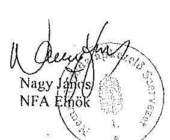

---

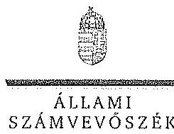

ELNÖK

Ikt.szám: V-0749-154/2015.

Nagy János úr
elnök
Nemzeti Földalapkezelő Szervezet
Budapest

Tisztelt Elnök Úr!

Az „Az állami tulajdonban álló erdőgazdasági társaságok vagyongazdálkodási tevékenységének ellenőrzése" című ellenőrzés tekintetében 14 társaság jelentéstervezetére tett észrevételüket köszönettel megkaptam.

Az Állami Számvevőszék észrevételekre vonatkozó álláspontjáról a felügyeleti vezető által készített részletes tájékoztatást csatoltan megküldöm.

Tájékoztatom Elnök urat, hogy a számvevőszéki jelentésben – az Állami Számvevőszékről szóló 2011. évi LXVI. törvény 29. § (3) bekezdése alapján – a figyelembe nem vett észrevételeket szerepelhetjük az elutasítás indokának feltüntetésével.

Budapest, 2015. 14. hó 02. nap

Tisztelettel:

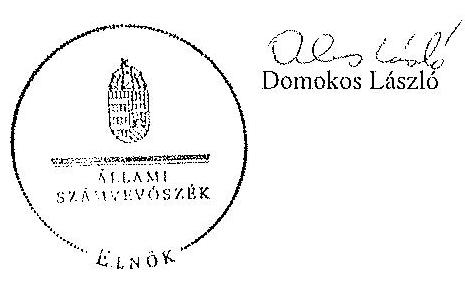

Melléklet: Tájékoztatás az észrevételek kezeléséről

1952 SORAPEST, AFRICAN CSEHE JÁNOS SITZA 13. 1264 Budapest 4. Pf. 54 Intelen. 484 9101 fax: 484 9201

---

# Tájékoztatás   az észrevételek kezeléséről 

„Az állami tulajdonban álló erdögazdasági társaságok vagyongazdálkodási tevékenységének ellenörzése" címủ ellenörzés tekintetében az IPOLY ERDŐ Zrt., az EGERERDŐ Erdészeti Zrt., a Mecsekerdő Zrt., a SEFAG Erdészeti és Faipari Zrt., a Gemenci Erdő- és Vadgazdaság Zrt., az Észokerdő Erdögazdasági Zrt., a Pilisi Parkerdő Zrt., a Szombathelyi Erdészeti Zrt., a Kisalföldi Erdögazdasági Zrt., a Zaloerdő Erdészeti Zrt., a KEFAG Kiskunsági Erdészeti és Faipari Zrt., a VADEX Mezöföldi Erdő- és Vadgazdálkodási Zrt., a Gyulaj Erdészeti és Vadászati Zrt., illetve a TAEG Tanulmányi Erdögazdaság Zrt. társaságok jelentéstervezetére 2015. október 16-án érkezett észrevételeket áttekintettük, azok kezelésével kapcsolatban a következő tájékoztatást adom.

Az észrevétel szerint a jelentéstervezetben tett megállapítások helytállóak, azokat nem vitatják. Az NFA elnökének tett javaslatokhoz kapcsolódó tájékoztatást köszönjük. Mindezek miatt, valamint arra tekintettel, hogy nem jött létre olyan vagyonkezelési szerződés, amely biztosítja az ideiglenes vagyonkezelési szerződés hiányosságainak a megszüntetését, illetve a hatályos jogszabályoknak való megfeleltetést, a megállapítások és a javaslatok módosítása nem indokolt.

Budapest, 2015. év $\quad / \quad$ hó 02. nap
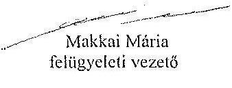