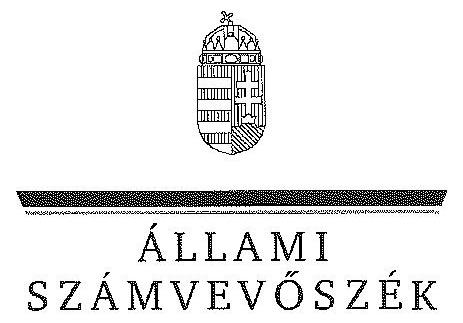

ÁLLAMI
SZÁMVEVÔSZÉK

# JELENTÉS 

Az állami tulajdonban álló erdőgazdasági társaságok vagyongazdálkodási tevékenységének ellenőrzése Mecsekerdő Zrt.

---

# Állami Számvevőszék 

Iktatószám: V-0751-133/2015.
Témaszám: 1785
Vizsgálat-azonosító szám: V070603

## Az ellenőrzést felügyelte:

## Makkai Mária

felügyeleti vezető
Az ellenőrzést vezette és az ellenőrzés végrehajtásáért felelős:
Dr. Schreiber Judit Zsuzsanna
ellenőrzésvezető
A számvevői jelentés összeállításában közremüködött:
Bretus Zoltán János
számvevő
Az ellenőrzést végezték:
Bretus Zoltán János Kupcsik Éva
számvevő számvevő

---

# TARTALOMJEGYZÉK 

BEVEZETÉS ..... 3
I. ÖSSZEGZŐ MEGÁLLAPÍTÁSOK, KÖVETKEZTETÉSEK, JAVASLATOK ..... 7
II. RÉSZLETES MEGÁLLAPÍTÁSOK ..... 13

1. A Mecsekerdő Zrt. vagyongazdálkodása ..... 13
1.1. A vagyon értékének megőrzése, gyarapítása ..... 13
1.2. A vagyonkezelői kötelezettség teljesítése ..... 16
2. A Mecsekerdő Zrt. vagyonkezelési szerződése és a vagyonnyilvántartása ..... 17
2.1. A vagyonkezelési szerződés megfelelősége ..... 17
2.2. A Mecsek Zrt. vagyonnyilvántartása ..... 18
3. A Mecsekerdő Zrt. éves tervezési feladatainak ellátása, az ágazati jogszabályok érvényesülése ..... 19
3.1. Az üzleti tervek vagyonmegőrzésre, vagyongyarapításra vonatkozó elemei ..... 19
3.2. A tervekben megfogalmazott előírások érvényesülése ..... 20
3.3. Ágazati szabályok érvényesülése ..... 20
4. A kontroll- és a monitoring rendszer kialakítása és működtetése ..... 21
4.1. A kontrollrendszer kialakítása és múködtetése ..... 21
4.2. Az információáramlási és a monitoring rendszer kialakítása és múködtetése ..... 22
5. A tulajdonosi joggyakorlóknak a Mecsekerdő Zrt. vagyongazdálkodási feladataira vonatkozó döntései, intézkedései megfelelősége ..... 23

---

# MELLÉKLETEK 

1. számú Rövidítések jegyzéke
2. számú Fogalomtár
3. számú A Mecsekerdő Zrt. vagyonának alakulása 2009-2014. I. félévében
4. számú Az immateriális javak és tárgyi eszközök állományának megoszlása a 2013. évre vonatkozóan
5. számú A befektetett eszközök állományának alakulásáról
6. számú A saját tőke változása a 2013. évre vonatkozóan
7. számú A beruházások, felújítások forrásáról
8. számú A Mecsekerdő Zrt. vezérigazgatójának észrevétele
9. számú A Mecsekerdő Zrt. vezérigazgatójának észrevételére adott válasz
10. számú Az MNV Zrt. vezérigazgatójának észrevétele
11. számú Az MNV Zrt. vezérigazgatójának észrevételére adott válasz
12. számú Az MFB Zrt. vezérigazgatójának észrevétele
13. számú Az MFB Zrt. vezérigazgatójának észrevételére adott válasz
14. számú Az NFA elnökének észrevétele
15. számú Az NFA elnökének észrevételére adott válasz

---

# JELENTÉS 

## Az állami tulajdonban álló erdőgazdasági társaságok vagyongazdálkodási tevékenységének ellenőrzése Mecsekerdő Zrt.

## BEVEZETÉS

Hazánk területének több mint 20\%-át erdő borítja. Az erdők fenntartása és védelme az egész társadalom érdeke, ezért az erdőkkel csak a közérdekkel összhangban lehet gazdálkodni.

Az Alaptörvény 38. cikke és az Nvtv. alapján az állam tulajdona a nemzeti vagyon részét képezi. Az Nvtv. alapján nemzetgazdasági szempontból kiemelt jelentőségű nemzeti vagyonban tartandó vagyonelemnek minősül a 100\%-ban az állam tulajdonában álló védelmi és közjóléti elsődleges rendeltetésű erdő, a gazdasági elsődleges rendeltetésű természetes erdő, természetszerű erdő és származékerdő természetességi állapotú öt hektárnál nagyobb, természetben összefüggő erdő. Az erdőgazdasági társaságok vagyongazdálkodása szempontjából a Vtv., illetve az Nvtv. és az Nfatv., valamint a kapcsolódó kormány- és miniszteri rendeletek mellett kiemelkedő szerepe van a különböző ágazati jogszabályoknak. A vagyonkezelési tevékenység végrehajtása során figyelemmel kell lenni az Evt.-ben foglaltakra, mely alapján a nemzeti vagyonról szóló törvényben nemzetgazdasági szempontból kiemelt jelentőségű nemzeti vagyonként meghatározott védelmi és közjóléti elsődleges rendeltetésű, az állam tulajdonában álló erdő a kincstári vagyon részét képezi. az erdőgazdasági társaságoknak az általuk kezelt vagyonelemek sajátosságára tekintettel kell a vagyongazdálkodási tevékenységüket kialakítaniuk, gondoskodniuk kell a közérdek és az Evt.-ben foglaltak érvényesülését biztosító vagyongazdálkodásról.

Az Evt. előírásai alapján az állam 100\%-os tulajdonában álló erdőt és erdőgazdálkodási tevékenységet közvetlenül szolgáló földterületet csak vagyonkezelés formájában lehet hasznosításra átengedni, és az állam tulajdonában álló erdő és erdőgazdálkodási tevékenységet közvetlenül szolgáló földterület vagyonkezelését csak költségvetési szerv vagy kizárólagos állami tulajdonú gazdálkodó szervezet végezheti.

A Vtv. szerint az erdőgazdasági társaságok és a társaságok kezelésében lévő állami vagyon feletti tulajdonosi jogokat a 2010. évig a Magyar Állam nevében az MNV Zrt. gyakorolta. A 2010. évi törvényi változások (Vtv., Mfbtv., Nfatv.) következtében 2010. június 17. napjától az erdőgazdasági társaságok állami tulajdonú részesedése tekintetében a tulajdonosi jogokat az állami vagyonért felelős miniszter az MFB Zrt. útján látta el. Az Nfatv. 2010. évi hatálybalépését követően a társaságok által kezelt, a Nemzeti Földalapba tartozó földterületek

---

vonatkozásában a tulajdonosi jogokat az NFA, míg egyéb ingatlanok és vagyonelemek tekintetében a tulajdonosi jogokat az MNV Zrt. gyakorolja. 2014. július 16 -tól az erdőgazdasági társaságok feletti tulajdonosi jogokat az erdőgazdálkodásért felelős miniszter gyakorolja.

A Nemzeti Földalapba tartozó 1772 980,17 ha földterületből a 2012. év végén a $100 \%$-os állami tulajdonú 19 erdőgazdasági társaság kezelésében összesen 913664,3681 ha földterület volt, ebből 879254,1595 ha erdő, a többi egyéb művelési ágba tartozik. A kezelt földterületek erdőgazdasági társaságonkénti megoszlása eltérő.

Az erdőgazdasági társaságok az Alaptörvény és az Nvtv. előírása szerint önállóan és felelősen gazdálkodnak a törvényesség, a célszerűség és az eredményesség követelményei szerint. Az állami vagyonnal való gazdálkodás alapvető feladata a vagyon rendeltetésszerű, hatékony és felelős felhasználásának biztosítása az állami vagyon értékének megőrzése, gyarapítása érdekében. Az erdőgazdasági társaságok jelen ellenőrzése az állami vagyonnal gazdálkodás során a törvényesség betartására irányult.

A Mecsekerdő Zrt. Baranya megye erdőterületeinek a felén, a Dráva folyó, a Zselic és a Mecsek-hegység területein gazdálkodik, központja Pécs. A Társaság 2013. évi beszámolója szerint 3955,3 M Ft nettó árbevétel mellett $96,1 \mathrm{MFt}$ mérleg szerinti eredményt ért el, a mérlegfőösszeg 4233,9 M Ft volt. Az erdőgazdasági társaság 52470 ha erdőterületen és 2235 ha egyéb művelési ágú földterületen gazdálkodott, az éves átlaglétszám 298 fő volt.

Az ellenőrzés célja annak értékelése, hogy a Mecsekerdő Zrt. vagyongazdálkodása, vagyonérték-megőrző és vagyongyarapítási tevékenysége, valamint ennek szervezeti keretei megfeleltek-e a jogszabályok és belső szabályzatok előírásainak, valamint a kezelt vagyonelemek sajátosságaiból adódó követelményeknek.

Ennek keretében ellenőriztük és értékeltük, hogy:

- a vagyongazdálkodás során betartották-e az Nvtv. 7. §-ában megállapított vagyongazdálkodási alapelveket, valamint az ágazati jogszabályok vagyongazdálkodáshoz kapcsolódó előírásait;
- a Társaság a saját és a kezelt vagyonnal való gazdálkodásra vonatkozó éves tervezési feladataikat a jogszabályi előírásoknak megfelelően látták-e el, a társaságok üzleti tervei a kezelésbe vett vagyonra vonatkozó, a Vtv. 2. § (1), és a 27. § (7) bekezdésében előírt vagyon megőrzésére, gyarapítására vonatkozó elemeket tartalmazták-e és azokat a vagyongazdálkodás során érvé-nyesítették-e;
- a vagyonkezelési szerződések és a vagyon-nyilvántartás megfeleltek-e a szabályszerűségi követelményeknek, elősegítették-e az állami vagyonnal való szabályszerű gazdálkodást;
- a Társaság kialakította és múködtette-e a szabályszerű feladatellátást támogató kontrollrendszert. Ezen belül elkészítették és aktualizálták-e a társaság feladatellátási-folyamatainak szabályzatait, a kockázatok kezelésének rend-

---

szerét, a vagyongazdálkodás területén azokat az eljárásokat, amelyek elősegítik a szervezeti célok végrehajtását, az információs és a kontrollingmonitoring rendszert;

- a tulajdonosi joggyakorlóknak a Mecsekerdő Zrt. vagyongazdálkodási feladataira vonatkozó döntései, intézkedései előkészítése és megalapozottsága a jogszabályoknak és a belső szabályozásnak megfelelt-e, a tulajdonosi joggyakorlók e minőségben végzett tevékenysége támogatta-e a felelős vagyongazdálkodás megvalósulását.

Az ellenőrzés típusa: szabályszerűségi ellenőrzés.
Az ellenőrzött időszak: 2009. január 1. napjától 2014. június 30. napjáig, kitekintéssel a helyszíni ellenőrzés végéig tartó releváns folyamatokra, intézkedésekre.

Az ellenőrzés várható hasznosulása: A Társaság és a tulajdonosi joggyakorlók fenti szempontú ellenőrzése az állami tulajdonban álló vagyon kezelésére, a vagyonnal való gazdálkodásra vonatkozó, kötelezően végrehajtandó éves ÁSZ ellenőrzést szélesebb körűvé teszi.

Az ellenőrzés várható hasznosulásaként biztosíthatja a társadalom részéről kiemelt érdeklődéssel kísért téma objektív bemutatását. Az ÁSZ jelentéséből a média és az állampolgárok átfogó képet kaphatnak a Magyarország állami tulajdonban lévő erdőivel való gazdálkodásról, a gazdálkodást, vagyonkezelést végző szervezeti rendszerről, az állami tulajdonban álló erdőgazdasági társaságok feladatellátásához kapcsolódóan feltárt problémákról.

Az ellenőrzés jól hasznosítható - többek közt - az állami vagyonnal kapcsolatos országgyűlési törvényhozói munkában is, továbbá hozzájárulhat a tulajdonosi joggyakorlás javításával a „jó kormányzás" gyakorlatának erősítéséhez.

Az ellenőrzéssel érintett szervezetek: A Mecsekerdő Zrt., a Társaság kezelésében lévő állami vagyon feletti tulajdonosi jogokat gyakorló szervezetek, valamint a Társaság állami tulajdonú részesedése feletti tulajdonosi joggyakorlók (MFB Zrt., MNV Zrt., NFA).

Az ellenőrzés végrehajtásának jogszabályi alapját az ÁSZ tv. 5. § (4)-(5) bekezdéseiben foglaltak képezik.

Az ellenőrzés szakmai módszertana az ÁSZ hivatalos honlapján közzétett szakmai szabályokon alapult, amely a Legfőbb Ellenőrző Intézmények Nemzetközi Szervezete (INTOSÁI) által kiadott nemzetközi standardok (ISSAI) figyelembevételével készült.

A Mecsekerdő Zrt. az ellenőrzés lefolytatásához tanúsítványok kitöltésével, valamint dokumentumok elektronikus megküldésével szolgáltatott adatokat. Az így rendelkezésre bocsátott adatok és információk kontrollja a helyszíni ellenőrzés keretében történt. A vagyonváltozást eredményező döntések megalapozottságát, továbbá a vagyonérték-megőrző és vagyongyarapító tevékenység szabályszerűségét a számviteli nyilvántartásokból, valamint kockázat alapú és véletlenszerű mintavétellel kiválasztott tételek ellenőrzésével értékeltük. A ke-

---

zelt vagyont érintően a beruházások, felújítások pénzforgalmi kiadási területet arányos rétegzéssel összesen 30 elemú véletlen minta ellenőrzésével minősítettük. A sokaságból tételes ellenőrzésre kiemeltük évente a 2009-2013.évek 3-3 legnagyobb összegű tételét, 2014. első félévében a kettő legnagyobb összegű tételt. A kivett minta alapján végeztük a kezelt vagyonon megvalósított beruházások, felújítások szabályszerűségének (üzembe helyezés, nyilvántartás, értékcsökkenés elszámolása) ellenőrzését. A vagyonhasznosítási bevételeken belül az immateriális szolgáltatásokhoz kapcsolódó tételek képezték az alapsokaságot, melyet tételesen ellenőriztünk.

Az ÁSZ a 2011. évi LXVI. törvény 29. §-a szerint a jelentéstervezetet megküldte a Mecsekerdő Zrt. vezérigazgatójának, a Magyar Nemzeti Vagyonkezelő Zrt. vezérigazgatójának, a Magyar Fejlesztési Bank Zrt. vezérigazgatójának és a Nemzeti Földalapkezelő Szervezet elnökének egyeztetésre. A Mecsekerdő Zrt. vezérigazgatójának észrevételét és az arra adott választ a 8-9. számú melléklet, a Magyar Nemzeti Vagyonkezelő Zrt. vezérigazgatójának észrevételét és az arra adott választ a 10-11. számú melléklet, a Magyar Fejlesztési Bank Zrt. vezérigazgatójának észrevételét és az arra adott választ a 12-13. számú melléklet, a Nemzeti Földalapkezelő Szervezet elnökének észrevételét és az arra adott választ a 14-15. számú melléklet tartalmazza.

---

# I. ÖSSZEGZŐ MEGÁLLAPÍTÁSOK, KÖVETKEZTETÉSEK, JAVASLATOK 

A Mecsekerdő Zrt. vagyongazdálkodása az ellenőrzött években a saját vagyonára és a vagyonkezelésében lévő állami vagyonra terjedt ki. A Társaság mérleg szerinti vagyona a 2009. évi 4227,6 M Ft nyitó értékről 2013. év végére 4233,9 M Ft-ra ( $0,1 \%$ ) növekedett, a saját tőke 3468,9 M Ft-ról 3165,7 M Ft-ra csökkent.

A Társaság éves mérlegei nem a valós állapotot tükrözték, a Számv. tv. előírása ellenére nem tartalmazták a vagyonkezelésben lévő állami erdők és azzal szerves egységet képező egyéb földterületek értékét. A Számv. tv.-ben foglaltak ellenére a vagyonkezelésbe vett eszközöket mérlegtételek szerinti megbontásban nem mutatták be a kiegészítő mellékletben.

A Társaság által kezelt vagyonról vezetett nyilvántartás nem felelt meg a Vhr.-ben foglaltaknak, mert tételesen nem tartalmazta a vagyonkezelt eszközök könyv szerinti bruttó és nettó értékét, valamint az értékben bekövetkezett egyéb változásokat. Ezért a nyilvántartás nem biztosította az átláthatóságot és az elszámoltathatóságot. A kezelt ingatlanokról tételes mennyiségi kimutatást vezettek a forint érték feltüntetése nélkül, ami megfelelt a VSZ 2.4. pontja szerinti naturáliákban történő nyilvántartás vezetési előírásnak, azonban nem felelt meg a Számv. tv.-ben a kezelt vagyon nyilvántartására vonatkozó szabálynak. A vagyonkezelt eszközök forint értékének meghatározását a Társaság sem az MNV Zrt-nél, sem pedig az NFA-nál nem kezdeményezte annak érdekében, hogy eleget tegyen a Számv. tv. előírásainak.

A Társaság nem rendelkezett a kezelt vagyonról vezetett nyilvántartás kiinduló adatait tartalmazó, a vagyonkezelési szerződés eredeti, hiteles, a vagyonkezelt eszközök felsorolását tartalmazó 1-4. mellékleteivel. A Társaság nem teljes körűen rendelkezett a kezelt vagyon tekintetében pontos és naprakész információval a tulajdonosi jogokat gyakorlóról, így a Társaság által vezetett nyilvántartás nem biztosította a Vhr.-ben foglalt, az adatszolgáltatás pontosságára vonatkozó követelményt.

A tulajdonosi joggyakorlók tisztázásával és a kezelt vagyonelemek nyilvántartása egyezőségének biztosításával kapcsolatos adategyeztetés az ellenőrzés befejezéséig nem került lezárásra, így nem állt rendelkezésre a kezelt vagyonra és annak nagyságára vonatkozó, a Társaság, az MNV Zrt. és az NFA nyilvántartásában szereplő, egyező adat.

A Társaság a Magyar Állam tulajdonában álló erdővagyon és egyéb művelési ágú termőföld ingatlanok kezelését a KVI-vel 1996. október 16-án kötött vagyonkezelési szerződés alapján végezte. A Társaság, mint vagyonkezelő és a KVI között létrejött szerződéses jogviszony kereteit a VSZ-ben foglalt jogok és kötelezettségek töltötték ki. A VSZ nem támogatta a Vhr.-ben előírt, a vagyongaz-

---

dálkodási feladatok átlátható módon történő végrehajtását, valamint nem támogatta a szabályszerű vagyongazdálkodást.

A VSZ 3.3.2. pontjában foglaltak ellenére a felek a szerződést évente nem vizsgálták felül, a VSZ az ellenőrzött időszakban nem felelt meg a hatályos rendelkezéseknek, hatályon kívül helyezett jogszabályi hivatkozásokat tartalmazott, illetve nem tartalmazott minden szükséges előírást. A felek nem tettek eleget a Vhr. előírásának sem, mert a Vhr. hatálybalépést követő hat hónapon belül nem kezdeményezték a Nemzeti Földalapba tartozó ingatlanokra vonatkozóan a VSZ megszüntetését és a jogszabályoknak megfelelő szerződés megkötését.

A Társaság által kezelt vagyonelemek többszöri változása ellenére a felek nem tartották be a Vhr.-ben előírt, a VSZ 60 napon belüli egységes szerkezetbe foglalására vonatkozó rendelkezést. A VSZ módosításokkal történő egységes szerkezetbe foglalását sem a Társaság, sem a tulajdonosi jogokat gyakorló MNV Zrt, illetve NFA nem kezdeményezte.

A VSZ 3.2.3. pontja rendelkezett a vagyonkezelői jog harmadik személynek történő átengedésének feltételeiről, azonban ez 2012-től ellentétes az Nvtv.-ben foglaltakkal, amely tiltja a vagyonkezelői jog harmadik személynek való átengedését.

A VSZ nem rögzítette a Vhr.-ben 2011. január 1-jétől előírt, az érintett vagyonelem esetleges védettségét, illetve Natura 2000 területnek minősítését, és a Vhr.ben foglalt elismerő nyilatkozatot az MNV Zrt. vagyon-nyilvántartási szabályzatának megismerésére és kötelező elismerésére vonatkozóan.

A VSZ 3.3.2. pontjában foglaltak ellenére a vagyonkezelési díjat a felek évente nem vizsgálták felül, erről történő megállapodás megkötésére nem került sor. Az NFA - az MNV Zrt.-vel kötött megállapodás alapján - a vagyonkezelési díakat leszámlázta, azonban a számlázás a VSZ 3.3.3. pontjában foglalt határidőtől eltérő időben történt. Az NFA a számlákon a vagyonkezelési díjat egy összegben szerepeltette, azokon nem tüntette fel a számlázás alapját képező földterület nagyságát, így nem volt megállapítható a számlák tartalmi megfelelősége. A Társaság a kiszámlázott vagyonkezelési díjat pénzügyileg rendezte.

A Társaság az ellenőrzött időszakban a vagyongazdálkodás során a kezelt vagyonelemek, valamint a saját eszközeinek karbantartási, állagmegóvási feladatait a Vtv., a Vhr. és az Nfatv. előírásai alapján ellátta. A Társaság a 2012. január 1-től hatályos Nvtv. 7. §-ban foglalt vagyongazdálkodási alapelveket betartotta. A kezelésre átvett állami erdővagyon fenntartására és felújítására évente átlagosan 432,1 M Ft-ot, beruházásra 1400,4 M Ft-ot fordítottak. A beruházások, felújítások és a karbantartások költségeit az üzleti tervek tartalmazták. Az éves tervezési feladatokat az előírásoknak megfelelően végezték, az üzleti tervek tartalmaztak a vagyongazdálkodásra, a vagyon megőrzésére vonatkozó elemeket. A Társaság az állami vagyonnal való gazdálkodás során érvényesítette a tervekben megfogalmazott előírásokat.

A Társaság a feladatellátása során az Evt. ${ }_{1,2}$ szerinti bejelentési, engedélyeztetési kötelezettségeknek eleget tett. A Társaság által kezelt vagyon elidegenítésére

---

az ellenőrzött időszakban nem került sor, erdő használatát, hasznosítását, illetve a vagyonkezelői jogot harmadik személynek nem engedték át. A Társaság az Erdészeti hatóság által jóváhagyott erdőgazdálkodási és a Vadászati hatóság által jóváhagyott vadgazdálkodási tervekkel rendelkezett. A Társaság az ellenőrzött időszakban az ágazati szabályokat nem teljes körűen tartotta be, a 20092013. években a vadászható vadfajok által az erdősítések sikeres felújítása területén okozott vadkár miatt került sor bírság kiszabására.

A Társaság a saját vagyonnal való gazdálkodás során a 2009-2010. évek között két alkalommal nem tartotta be az Alapító Okiratban foglalt, az egyedüli részvényes kizárólagos határkörébe tartozó döntésekre vonatkozó előírást, mert a társasági vagyont a tulajdonosi joggyakorló ${ }_{1}$ döntése nélkül terhelte meg.

A Társaság kialakította múködtette a feladatellátást támogató kontrollrendszert. A Társaság a belső ellenőrzés rendszerét kialakította, azonban az a 2009-2010. években előzetesen kidolgozott és jóváhagyott ellenőrzési programok nélkül múködött, ami nem felelt meg az SZMSZ előírásának. A 2011. évtől múködő belső ellenőrzés a kockázatelemzés alapján készített, az FB által jóváhagyott éves munkaterv alapján látta el feladatát. A belső ellenőrzés megállapításaira intézkedési terveket készítettek, az abban megfogalmazottak teljesítetését nyomon követték. A 2011. évben a belső ellenőrzés vizsgálatot folytatott többek között az APEH által feltárt ügyletekre vonatkozóan, amelyről összefoglaló jelentést készítettek az FB és a vállalat vezetése részére.

A Társaság a Számv. tv. és az Alapító Okirat szerint, a tulajdonosi joggyakor$1_{1,2}$ által kijelölt könyvvizsgálót alkalmazott. A könyvvizsgáló minden ellenőrzött évben hitelesítő záradékkal ellátott könyvvizsgálói jelentés adott ki, figyelemfelhívó megjegyzést nem tett. A könyvvizsgáló az ellenőrzött időszakban nem kifogásolta, hogy a mérlegben a Társaság nem szerepeltette a vagyonkezelt eszközöket.

A Társaságnál az Alapító Okirat alapján FB múködött. Az FB a Gt.-ben és az éves munkatervében előírt ellenőrzési feladatokat ellátta, a Társaság éves beszámolóiról a véleményét a könyvvizsgálói jelentés figyelembe vételével alakította ki.

A Társaság feletti tulajdonosi joggyakorló ${ }_{1,2}$ az éves beszámolókat az FB és a könyvvizsgáló jelentésének figyelembe vételével határozattal hagyta jóvá.

A Társaságnál kialakították az információáramlási és monitoring rendszert, biztosították annak szabályzatok szerinti múködését. Az ellenőrzött években teljesítették a Vhr.-ben és a VSZ-ben előírt, a vagyonkezelésben lévő állami vagyonnal kapcsolatos adatszolgáltatási kötelezettséget. Az ágazati lapok szerinti, a vagyonkezelési tevékenységgel kapcsolatos bevételekről és költségekről a beszámolókat elkészítették és az éves beszámolókkal együtt a társaság feletti tulajdonosi joggyakorló ${ }_{1,2}$-nak megküldték. Az erdőgazdálkodási tervek, egyéb erdőgazdálkodási tevékenységek és az éves vadgazdálkodási tervek teljesítéséről az éves üzleti jelentésekben és a kontrolling adatszolgáltatás keretein belül számoltak be.

---

A Társaság 2013 szeptemberétől kezdődően rendelkezett a közérdekű adatok közzétételére vonatkozó szabályzattal, azonban az Avtv., illetve az Infotv. szerinti, a közérdekű adatok megismerésére irányuló igények teljesítésének rendjét rögzítő szabályzat-készítési kötelezettségnek nem tettek eleget.

A társaság feletti tulajdonosi joggyakorló ${ }_{1,2}$ a Társaság vagyongazdálkodási feladataira vonatkozó döntései, intézkedéseinek előkészítése összhangban volt a belső szabályzatokkal, a vagyonváltozást eredményező döntések végrehajtását a beszámolók, az üzleti tervek, üzleti jelentések és a kontrolling jelentések megtárgyalásával és jóváhagyásával ellenőrizték. A társaság feletti tulajdonosi joggyakorló ${ }_{2}$ a Társaságnál a 2010. évben külső szakértővel átvilágítást végeztetett, valamint ellenőrzést végzett az irányítási és ellenőrzési rendszer felméréséhez, a vagyonkezelési feladatok teljesítésének értékeléséhez, a Társaság peres ügyeinek és a peres ügyekhez tartozó céltartalék képzéséhez kapcsolódóan. A Társaság által az ellenőrzés alapján megtett intézkedések megvalósulását nyomon követték, az eredményekről az érintetteket beszámoltatták.

A vagyonkezelésbe adott állami vagyon tekintetében tulajdonosi jogokat gyakorló MNV Zrt. és NFA tevékenysége az ellenőrzött időszakban nem támogatta teljes körűen a felelős vagyongazdálkodás megvalósulását, a VSZszel kapcsolatban feltárt hiányosságokat nem szüntette meg, a hatályos jogszabályoknak a szerződést nem feleltette meg, nem éltek a Vhr.-ben és a 262/2010. (XI.17.) Korm. rend. 47. § (1)-(2) bekezdéseiben foglalt, a kezelt vagyon használatára vonatkozó ellenőrzési jogukkal, valamint nem ellenőrizték a vagyonnyilvántartás hitelességét, helyességét és teljességét.

Az Állami Számvevőszékről szóló 2011. évi LXVI. törvény 33. § (1) bekezdésében foglaltak értelmében a jelentésben foglalt megállapításokhoz kapcsolódó intézkedési tervet köteles az ellenőrzött szervezet vezetője összeállítani, és azt a jelentés kézhezvételétől számított 30 napon belül az ÁSZ részére megküldeni. Amennyiben az intézkedési tervet határidőben nem küldi meg a szervezet, vagy az nem elfogadható, az ÁSZ elnöke a hivatkozott törvény 33. § (3) bekezdésében foglaltakat érvényesítheti.

Az ellenőrzés intézkedést igénylő megállapításai és javaslatai:

# az MNV Zrt. vezérigazgatójának, az NFA elnökének 

A Mecsekerdő Zrt. a KVI-vel 1996. október 16-án kötött vagyonkezelési szerződés alapján végezte a Magyar Állam tulajdonában álló erdővagyon és egyéb művelési ágú termőföld ingatlanok kezelését. A Társaság, mint vagyonkezelő és a KVI között létrejött szerződéses jogviszony kereteit a VSZ-ben foglalt jogok és kötelezettségek töltötték ki. A VSZ nem támogatta a Vhr. 3. § (1) bekezdésében foglalt, a vagyongazdálkodási feladatok átlátható módon történő végrehajtását, valamint nem támogatta a szabályszerű vagyongazdálkodást. A VSZ 3.3.2. pontjában foglaltak ellenére a felek a szerződést évente nem vizsgálták felül, így az az ellenőrzött időszakban nem felelt meg a hatályos rendelkezéseknek, hatályon kívül helyezett jogszabályi hivatkozásokat tartalmazott az Áht: 109/B. §, 109/G. §, a Vadvédelmi tv. 98. § rendelkezései vonatkozásában. Nem tartalmazta a Vhr. 9. § (8) bekezdésében 2011. január 1-jétől előírt, az érintett vagyonelem esetleges védettségét, illetve Natura 2000 terü-

---

letnek minősítését. A VSZ vagyonkezelői jog átengedésére vonatkozó 3.2.3. pontja 2012-tői nem felelt meg az Nvtv. 11. § (8) bekezdésében foglaltaknak, amely szerint a Társaság a vagyonkezelői jogát harmadik személyre nem ruházhatta át. A felek nem tettek eleget a Vhr. 54. § (7) ${ }^{1}$ bekezdésében foglalt rendelkezésnek és a Vhr. hatálybalépését követő hat hónapon belül nem kezdeményezték a Nemzeti Földalapba tartozó ingatlanokra vonatkozóan a VSZ megszüntetését és a Vtv., illetve Vhr. szabályainak megfelelő szerződés megkötését.

A vagyonkezelésbe adott állami vagyon tekintetében tulajdonosi jogokat gyakorló MNV Zrt. és NFA nem végeztek a Vhr. 20. § (1)-(2) bekezdéseiben és a Nemzeti Földalapba tartozó földrészletek hasznosításának részletes szabályairól szóló 262/2010. (XI. 17.) Korm. rendelet 47. § (1)-(2) bekezdéseiben foglalt, a vagyonnyilvántartás hitelességére, teljességére és helyességére vonatkozó ellenőrzést a Társaságnál.

Javaslat:

# az MNV Zrt. vezérigazgatójának 

a) Tegyen intézkedéseket az erdőgazdasági társaság közreműködésével a tényleges állapotot rögzítő és a hatályos jogszabályi előírásoknak megfelelő vagyonkezelési szerződés megkötésére.
b) Tegyen intézkedéseket a vagyonkezelési szerződés felülvizsgálatának elmaradásával, valamint a Nemzeti Földalapba tartozó ingatlanokra vonatkozó VSZ megszüntetésével összefüggésben feltárt szabálytalanságok tekintetében a felelősség tisztázása érdekében, és szükség szerint intézkedjen a felelősség érvényesítéséről.
c) Intézkedjen a Társaság vagyonnyilvántartása hitelességének, teljességének és helyességének jogszabályban foglaltak szerinti ellenőrzéséről.

## az NFA elnökének

a) Tegyen intézkedéseket az erdőgazdasági társaság közreműködésével a tényleges állapotot rögzítő és a hatályos jogszabályi előírásoknak megfelelő vagyonkezelési szerződés megkötésére.
b) Intézkedjen a vagyonkezelési szerződés felülvizsgálatának elmaradásával összefüggésben feltárt szabálytalanságok tekintetében a munkajogi felelősség tisztázására irányuló eljárás megindításáról, és ennek eredménye ismeretében tegye meg a szükséges intézkedéseket.
c) Intézkedjen a Társaság vagyonnyilvántartása hitelességének, teljességének és helyességének jogszabályban foglaltak szerinti ellenőrzéséről.

[^0]
[^0]:    ${ }^{1}$ Vhr. 54. § (7) bekezdés (hatályos 2010. december 31-élg)

---

# a Mecsekerdő Zrt. vezérigazgatójának 

1. A Mecsekerdő Zrt. és a KVI által 1996. október 16-án kötött vagyonkezelési szerződés nem támogatta a Vhr. 3. § (1) bekezdésében foglaltak ellenére a vagyongazdálkodási feladatok átlátható módon történő végrehajtását, valamint nem támogatta a szabályszerű vagyongazdálkodást. A VSZ 3.3.2. pontjában foglaltak ellenére a felek a szerződést évente nem vizsgálták felül, így az az ellenőrzött időszakban nem felelt meg a hatályos rendelkezéseknek, hatályon kívül helyezett jogszabályi hivatkozásokat tartalmazott az Áht ${ }_{1}$ 109/B. §, 109/G. §, a Vadvédelmi tv. 98. § rendelkezései vonatkozásában. Nem tartalmazta a Vhr. 9. § (8) bekezdésében 2011. január 1-jétől előírt, az érintett vagyonelem esetleges védettségét, illetve Natura 2000 területnek minősítését. A VSZ vagyonkezelői jog átengedésére vonatkozó 3.2.3. pontja 2012től nem felelt meg az Nvtv. 11. § (8) bekezdésében foglaltaknak, amely szerint a Társaság a vagyonkezelői jogát harmadik személyre nem ruházhatta át.

Javaslat:
a) Tegyen intézkedéseket a tulajdonosi joggyakorlókkal közreműködve a tényleges állapotnak és a hatályos jogszabályi előírásoknak megfelelő vagyonkezelési szerződés megkötése érdekében.
b) Intézkedjen a vagyonkezelési szerződés felülvizsgálatának elmaradásával feltárt szabálytalanságok tekintetében a felelősség tisztázása érdekében, és szükség szerint intézkedjen a felelősség érvényesítéséről.
2. A Társaság a Számv. tv. 23. § (2) bekezdésben foglaltak ellenére a kezelt vagyont a mérlegben nem mutatta ki, azok mérlegtétel szerinti megbontásban nem kerültek bemutatásra a kiegészítő mellékletben.

Javaslat:
a) Intézkedjen a kezelt vagyon mérlegben eszközként való kimutatásáról, továbbá ezen eszközöknek a kiegészítő mellékletben - legalább mérlegtételek szerinti megbontásban - külön történő bemutatásáról.
b) Intézkedjen a kezelt vagyon mérlegben eszközként történő kimutatásának elmaradásával kapcsolatban feltárt szabálytalanság tekintetében a felelősség tisztázása érdekében, és szükség szerint intézkedjen a felelősség érvényesítéséről.
3. A Társaság nem tett eleget az Avtv. 20. § (8) bekezdése, illetve az Infotv. 30. § (6) bekezdése szerinti, a közérdekű adatok megismerésére irányuló igények teljesítésének rendjét rögzítő szabályzat-készítési kötelezettségnek, a közérdekű adatok megismerésére irányuló igények teljesítésének rendjét rögzítő szabályzattal nem rendelkezett.

Javaslat:
Intézkedjen a jogszabályi előírásoknak megfelelően a közérdekű adatok megismerésére irányuló igények teljesítése rendjének szabályozásáról.

---

# II. RÉSZLETES MEGÁLLAPÍTÁSOK 

## 1. A Mecsekerdő ZRT. VAGYONGAZDÁlKODÁSA

### 1.1. A vagyon értékének megőrzése, gyarapítása

A Mecsekerdő Zrt. vagyongazdálkodása a saját vagyonára és a vagyonkezelésében lévő vagyonra terjedt ki. A Társaság éves mérlegei nem a valós állapotot tükrözték, a Számv. tv. 23. § (2) bekezdésben foglalt előírás ellenére nem tartalmazták a vagyonkezelésben lévő állami erdők és azzal szerves egységet képező egyéb földterületek értékét. A Számv. tv. 23. § (2) bekezdésében foglaltak ellenére a vagyonkezelésbe vett eszközöket mérlegtételek szerinti megbontásban nem mutatták be a kiegészítő mellékletben.

A Társaság mérleg szerinti vagyona a 2009. évi 4227,6 M Ft nyitó értékről 2013. év végére $4233,9 \mathrm{M}$ Ft-ra ( $0,1 \%$ ) növekedett, a saját tőke $3468,9 \mathrm{M}$ Ft-ról 3165,7 M Ft-ra csökkent. A Társaság a 2009-2013. években a kezelt vagyon hasznosításából $18025,3 \mathrm{M}$ Ft bevételt realizált és $14328,9 \mathrm{M}$ Ft költséget számolt el. A kezelt vagyonból származó bevételeket és költségeket a VSZ 3.2.2. pontja szerint a főkönyvi könyvelésben a vállalkozási bevételektől és költségektől elkülönítve mutatták ki.

A Társaság a 2009. és 2010. évi beszámolóit módosította a tulajdonosi joggyakorló által elvégeztetett átvilágítás, a 2010. évben kinevezett új vezetés által feltárt kockázatos ügyletek, az export árbevétel elszámolásának felülvizsgálata miatt. A 2009. évben a mérleg szerinti eredmény 75,9 M Ft összeggel csökkent a rövid lejáratú kötelezettségek összegének $75,1 \mathrm{M}$ Ft növekedése miatt, ezáltal az eredeti 2009. évi mérleg szerinti $62,5 \mathrm{M}$ Ft eredményt $13,5 \mathrm{M}$ Ft veszteségre módosította. A 2010. évet érintő, az export árbevétel felülvizsgálata és ennek vonzataként az eladott áruk beszerzési értékének módosítása - a kapcsolódó költségelszámolások helyesbítésével - az eredményt 303,1 M Ft-tal csökkentette, ami a 2010. évi mérleg szerinti veszteség $416,7 \mathrm{M}$ Ft-ra történő emelkedését okozta. A korrekciók a saját tőke állományát 303,2 M Ft-tal ( $8,7 \%$ ) csökkentették.

A Társaság a 2009-2010. évekre vonatkozó helyesbítést a Számviteli politika ${ }_{3}$ alapján szabályszerűen minősítette jelentős hibának és eleget tett a Számv. tv. 19. § (3) bekezdésében foglalt, a mérlegben és eredmény-kimutatásban történő elkülönített bemutatásra vonatkozó előírásnak. A 2009-2010. évi beszámoló módosításai a mérlegben a befektetett eszközök, forgóeszközök állományát nem érintették. A befektetett eszközök állománya $11,8 \mathrm{M}$ Ft-tal ( $0,4 \%$ ), a mérlegfőösszeg több mint negyedét kitevő forgóeszközök állománya 50,3 M Ft-tal $(0,4 \%)$ nőtt.

A Társaságnál a 2009-2012. években jelentős volt a céltartalék képzés. A 2010. évben a nyújtott kölcsön és a kezességvállalás érvényesítése miatt

---

216 M Ft, a 2010-től folyamatban lévő APEH ${ }^{2}$ ellenőrzéshez kapcsolódóan 2011. évben 166,6 M Ft, 2012. évben további 91,9 M Ft összegű céltartalékot képeztek. A céltartalék képzés a Számv. tv. 15. § (8) bekezdésében foglalt óvatosság elve alapján szabályszerűen történt.

Az immateriális javak állománya az informatikai rendszerfejlesztések és licenc beszerzések következtében 46,4 M Ft-tal ( $70,8 \%$ ) növekedett. A tárgyi eszközök értéke minimálisan 13,8 M Ft-tal ( $0,5 \%$ ) nőtt. A befektetett pénzügyi eszközök értéke $48,4 \mathrm{M}$ Ft-tal ( $51,1 \%$ ), a követelések állománya $185,4 \mathrm{M}$ Ft-tal ( $24,0 \%$ ), az aktív időbeli elhatárolások állománya $55,8 \mathrm{M}$ Ft-tal ( $81,7 \%$ ) csökkent. A tárgyi eszközök használhatósági foka az ellenőrzött időszakban 9,5\%-os csökkenést mutatott annak ellenére, hogy a Társaság 15,2 M Ft-tal ( $1,8 \%$ ) magasabb összegben ( $861,0 \mathrm{M} \mathrm{Ft}$ ) hajtott végre beruházást, mint a $845,8 \mathrm{M} \mathrm{Ft}$ elszámolt amortizáció összege volt.

A Társaság vagyonának alakulása 2009. január 1-jétől 2013. december 31-éig terjedő időszakban az alábbi volt:

| Sorszám | Megnevezés | adatok M Ft-ban |  |  |
| :--: | :--: | :--: | :--: | :--: |
|  |  | 2009.01.01 | 2013.12.31 | Változás 2013.12.31/ 2009.01.01. (\%) |
| 1. | Befektetett eszközök összesen | 3038,8 | 3050,6 | 100,4 |
| 2. | Ebből: Immateriális javak | 65,6 | 112,0 | 170,8 |
| 3. | Tárgyi eszközök | 2878,5 | 2892,3 | 100,5 |
| 4. | Befektetett pénzügyi eszközök | 94,7 | 46,3 | 48,9 |
| 5. | Forgóeszközök | 1120,5 | 1170,8 | 104,5 |
| 6. | Aktív időbeli elhatárolások | 68,3 | 12,5 | 18,3 |
| 7. | Eszközök összesen | 4227,6 | 4233,9 | 100,1 |
| 8. | Saját tőke | 3468,9 | 3165,7 | 91,3 |
| 9. | Ebből: Jegyzett tőke | 1622,0 | 1768,0 | 109,0 |
| 10. | Tőketartalék | 869,7 | 869,7 | 100,0 |
| 11. | Eredménytartalék | 812,6 | 431,9 | 53,2 |
| 12. | Lekötött tartalék | 76,3 | 0,0 | - |
| 13. | Mérleg szerinti eredmény | 88,3 | 96,1 | 108,8 |
| 14. | Céltartalékok | 0,0 | 292,6 |  |
| 15. | Kötelezettségek | 579,9 | 498,6 | 86,0 |
| 16. | Fossziv idöbeli elhatárolások | 178,8 | 277,0 | 155,0 |
| 17. | Források összesen | 4227,6 | 4233,9 | 100,1 |

A saját tőke összes forráshoz viszonyított aránya 2013. év végére 10,7\% ponttal romlott. A $416,7 \mathrm{M} \mathrm{Ft}$ mérleg szerinti veszteség és a $379,1 \mathrm{M} \mathrm{Ft}$ önellenőrzés a saját tőke/jegyzett tőke arányát a 2011. év végéig $40,3 \%$ ponttal, az eredménytartalékot pedig $380,7 \mathrm{M}$ Ft-tal ( $46,8 \%$ ) csökkentette. A jegyzett tőke 2013. év végére $9,0 \%$-ot emelkedett, ami a tulajdonosi joggyakorló ${ }_{1}$ által biztosított $146,1 \mathrm{M}$ Ft-os tőkeemelése miatt következett be.

[^0]
[^0]:    ${ }^{2}$ APEH 2010. december 31-ig, NAV 2011. január 1-től

---

A 2009-2013. években a Társaság vagyoni helyzetének főbb mutatószámai az alábbiak voltak:

| Megnevezés | 2009. | 2010. | 2011. | 2012. | 2013. |
| :-- | :--: | :--: | :--: | :--: | :--: |
| Saját tőke/összes forrás ará-   nya | $85,5 \%$ | $80,0 \%$ | $76,8 \%$ | $76,6 \%$ | $74,8 \%$ |
| Saját tőke/jegyzett tőke ará-   nya | $210,5 \%$ | $184,4 \%$ | $170,2 \%$ | $173,6 \%$ | $179,1 \%$ |
| Kötelezettségek aránya (köte-   lezettségek/összes forrás) | $10,8 \%$ | $10,8 \%$ | $11,8 \%$ | $9,9 \%$ | $11,8 \%$ |
| Befektetett eszközök fedezete   (saját tőke/befektetett eszkö-   zök) | $123,2 \%$ | $115,7 \%$ | $106,6 \%$ | $104,8 \%$ | $103,8 \%$ |
| Tárgyi eszközök aránya (tár-   gyi eszközök/összes eszköz) | $65,5 \%$ | $67,3 \%$ | $69,7 \%$ | $70,2 \%$ | $68,3 \%$ |
| Tárgyi eszközök használha-   tósági foka (nettó ér-   ték/bruttó érték) | $68,1 \%$ | $64,3 \%$ | $62,2 \%$ | $60,2 \%$ | $58,6 \%$ |
| Eszköz igényesség (összes   eszköz/ saját tőke) | $117,0 \%$ | $124,9 \%$ | $130,2 \%$ | $130,6 \%$ | $133,7 \%$ |
| Saját tőke növekedésének   mértéke (mérleg szerinti   eredmény/jegyzett tőke) | $3,6 \%$ | $-23,6 \%$ | $7,2 \%$ | $3,4 \%$ | $5,4 \%$ |

A 2009-2013. években a Társaság összesen 1400,4 M Ft-ot fordított beruházási kiadásokra. A beruházásokhoz kapcsolódóan az üzembe helyezés dokumentáltsága nem felelt meg teljes körűen az előírásoknak. A 2009. évben a speciális erdei tanósvény, a 2010. évben a Véménd vadkerítés építése és a Sásvölgy Erdő háza, valamint egy szerver beszerzés elszámolása során nem tettek eleget a Számv. tv. 52. § (2) bekezdésében, a Bizonylati szabályzat ${ }_{1,2}$-ban, valamint a Beruházási szabályzatban előírt üzembe helyezési bizonylat-készítési kötelezettségnek, mert a beruházások üzembe helyezését hitelt érdemlően nem dokumentálták. A beruházásokhoz kapcsolódóan a nagy értékű gépek, informatikai hardverek és szoftverek beszerzéséhez az Alapító Okirat előírásainak megfelelően megkérték a tulajdonosi joggyakorló ${ }_{1,2}$ engedélyét.

A Társaság a VSZ hatálya alá tartozó eszközöket nem értékelte, tekintettel arra, hogy a vagyonkezelésbe vett eszközöket nem szerepeltette a mérlegében. A saját vagyonként nyilvántartott eszközök és források értékelését a Számv. tv. 46. § (3) bekezdésben foglaltaknak megfelelően évente elvégezték.

A Társaság az ellenőrzött években értékvesztést számolt el többek között a nyújtott kölcsönökre és kamataira, a készfizető kezességvállalás pénzintézet által történt beváltására, a kezességvállaláshoz kapcsolódó jelzálog fedezetére, va-

---

lamint a 2010. évben kezdődött APEH $^{3}$ vizsgálathoz kapcsolódó ügyletekre. Az értékvesztés elszámolása a Számv. tv. 15. § (8) bekezdés alapján szabályosan történt.

A Társaság betartotta a Számv. tv. 52. § (5) bekezdés értékcsökkenés elszámolására vonatkozó előírásait, a földterületek és az erdők értéke után értékcsökkenést nem számoltak el. Az éves beszámolókban és a számviteli nyilvántartásokban lévő vagyontárgyak év végi állományát leltárral alátámasztották.

A Társaság az ellenőrzött időszakban a vagyongazdálkodás során a kezelt vagyonelemek, valamint a saját eszközeinek karbantartási, állagmegóvási feladatait a Vtv. ${ }^{4}$, a Vhr. ${ }^{5}$ és az Nfatv. ${ }^{6}$ előírásai alapján ellátta. A kezelésre átvett állami erdővagyon fenntartására és felújítására évente átlagosan 432,1 M Ft-ot fordítottak, amely az erdősítések pótlását, a vadkár elleni védekezést, a talajelőkészítést, az erdősítés első kivitelére fordított költségeket tartalmazta. A vagyoni eszközök vonatkozásában rendszeres időközönként állapotfelmérést végeztek, az üzleti terv készítése során tervezték meg a tárgyi eszközök karbantartására, állagmegóvására és az erdők gondozására, védelmére fordítandó kiadásokat.

A Társaság a saját vagyonnal való gazdálkodás során a 2009-2010. években nem tartotta be a Vtv. 6. § (2) bekezdés c) pontjában foglaltakat és az Alapító Okirat 12.2. pontjában foglalt, az egyedüli részvényes kizárólagos határkörébe tartozó döntésekre vonatkozó előírását, amikor a társasági vagyont a tulajdonosi joggyakorló; döntése nélkül két alkalommal megterhelte. A Társaság a 2009. évben egy Kft. hitelintézeti kölcsönéhez 142,1 M Ft összegben készfizető kezességet vállalt, a 2010. évben pedig a Társaság résztulajdonában lévő Kft. részére 53,0 M Ft kölcsönt nyújtott. Az ügyletek megkötése előtt előzetesen nem kérték meg a tulajdonosi joggyakorló; előzetes hozzájárulását a vagyon megterheléséhez. Ezzel nem tartották be az Alapító Okirat 12.2. u) pontjában foglaltakat, amely szerint a társaság vagyonának 50 M Ft-ot meghaladó megterhelése a tulajdonosi joggyakorló; kizárólagos hatáskörébe tartozik. Az ügyletek a Társaság vagyonának csökkenését eredményezték, mert a vállalt kezességhez kapcsolódóan 142,1 M Ft összegben a készfizető kezességet a hitelintézet lehívta, a kölcsön visszafizetése nem történt meg.

# 1.2. A vagyonkezelői kötelezettség teljesítése 

A Vtv. 33. § (1) bekezdés, az Nvtv. 6. § (1) bekezdés előírásait betartva a kezelt vagyont nem idegenítettek el, azonban az Alapító okirat 12.2. u) pontjában

[^0]
[^0]:    ${ }^{3}$ APEH 2010. december 31-ig, NAV 2011. január 1-től
    ${ }^{4}$ Vtv. 23. § (2) bekezdése és 27. § (2) bekezdése
    ${ }^{5}$ Vhr. 10. § (1) bekezdés (hatályos: 2010. december 31-éig) a Vhr. 9. § (6) bekezdése (hatályos: 2011. január 1-jétől)
    ${ }^{6}$ Nfatv. 20. § (1) bekezdés (hatályos 2011. július 31-ig), Nfatv. 20. § (4) bekezdés (hatályos 2011. augusztus 1-től 2012. december 31-ig), Nfatv. 19/A (3) bekezdés (hatályos 2013. január 1-től)

---

foglaltak ellenére a 2009-2010. évek között két esetben a társasági vagyont megterhelték. A Társaság a 2012. január 1-től hatályos Nvtv. 7. §-ban foglalt vagyongazdálkodási alapelveket betartotta.

A Társaság az Nfatv. ${ }^{7}$-ben foglaltak szerint a vagyonkezelői jogát nem adta tovább és nem terhelte meg, valamint a VSZ 3.2.1. pontját betartva nem idegenített el vagyonkezelésében lévő erdőt. Az Evt. ${ }_{2} 9 . \S(3)^{8}$ bekezdés előírását betartva erdő használatát, hasznosítását harmadik személynek nem engedték át.

A Társaság az Nfatv. ${ }^{9}$ vonatkozó részének 2011. augusztus 1-jei hatályba lépését követően a Magyar Állam tulajdonába tartozó erdő vagy erdőgazdálkodási tevékenységet közvetlenül szolgáló földterület vagyonkezelésbe vételére vonatkozó szerződést nem kötött, így ehhez kapcsolódóan azt nem kellett az Erdészeti Hatósághoz jóváhagyásra benyújtania.

# 2. A Mecsekerdő ZRT. VAGYONKEZELÉsi szerzödése és a vaGYONNYILVÁNTARTÁSA 

### 2.1. A vagyonkezelési szerződés megfelelősége

A Társaság a KVI-vel 1996. október 16-án kötött vagyonkezelési szerződés alapján végezte a Magyar Állam tulajdonában álló erdővagyon és egyéb múvelési ágú termőföld ingatlanok kezelését. A Társaság, mint vagyonkezelő és a KVI között létrejött szerződéses jogviszony kereteit a VSZ-ben foglalt jogok és kötelezettségek töltötték ki. A VSZ nem támogatta a Vhr. 3. § (1) bekezdésében foglalt, a vagyongazdálkodási feladatok átlátható módon történő végrehajtását, valamint nem támogatta a szabályszerű vagyongazdálkodást.

A VSZ 3.3.2. pontjában foglaltak ellenére a felek a szerződést évente nem vizsgálták felül, így az az ellenőrzött időszakban nem felelt meg a hatályos rendelkezéseknek, hatályon kívül helyezett jogszabályi hivatkozásokat tartalmazott az Áht ${ }_{1}$ 109/B. $\S^{10}$, 109/G. $\S^{11}$, a Vadvédelmi tv. 98. $\S^{12}$ rendelkezései vonatkozásában.

A felek nem tettek eleget a Vhr. 54. § (7) ${ }^{13}$ bekezdésében foglalt rendelkezésnek és a Vhr. hatálybalépését követő hat hónapon belül nem kezdeményezték a Nemzeti Földalapba tartozó ingatlanokra vonatkozóan a VSZ megszüntetését

[^0]
[^0]:    ${ }^{7}$ Nfatv. 20 § (3) bekezdése (hatályos: 2011. július 31-éig), Nfatv. 20 § (8) bekezdése (hatályos: 2011. augusztus 1-jétől 2012. december 31-éig), Nfatv. 19/A. § (4) bekezdése (hatályos: 2013. január 1-jétől)
    ${ }^{8}$ Evt. 9. § (3) bekezdés (hatályos: 2009. július 10-től)
    ${ }^{9}$ Nfatv. 20. § (7) bekezdés (hatályos: 2011. augusztus 1-től)
    ${ }^{10}$ Áht. ${ }_{11}$. 109/B § (hatálytalan 2012. január 1-től)
    ${ }^{11}$ Áht. ${ }_{11}$. 109/G § (hatálytalan 2007. szeptember 25-től)
    ${ }^{12}$ Vadvédelmi tv. 98. § (hatálytalan 2007. április 14-től)
    ${ }^{13}$ Vhr. 54. § (7) bekezdés (hatályos 2010. december 31-éig)

---

és a Vtv., illetve Vhr. szabályainak megfelelő szerződés megkötését, így a VSZ nem tartalmazta a 2007-ben hatályba lépett Vtv. és Vhr. előírásait.

Az évente történő felülvizsgálat elmaradása miatt a szerződés nem a 2009-ben hatályba lépett Evt. ${ }_{2}$ és a 2012-től alkalmazandó Nvtv. megfelelő előírásaira való hivatkozásokat tartalmazott, nem tartalmazta a Vhr. 9. § (8) bekezdésében 2011. január 1-jétől előírt, az érintett vagyonelem esetleges védettségét, illetve Natura 2000 területnek minősítését, valamint nem tartalmazta a Vhr. 14. § (3) bekezdésben foglalt elismerő nyilatkozatot az MNV Zrt. vagyonnyilvántartási szabályzatának megismerésére és kötelező elismerésére vonatkozóan.

A Társaság által kezelt vagyonelemek többszöri változása ellenére a felek nem kezdeményezték a Vhr. 8. § (2) bekezdésében előírt 60 napon belüli egységes szerkezetbe foglalását. A VSZ módosításokkal történő egységes szerkezetbe foglalását sem a Társaság, sem a tulajdonosi jogokat gyakorló MNV Zrt. ${ }^{14}$, illetve $\mathrm{NFA}^{15}$ nem kezdeményezte.

A VSZ 3.2.3. pontja rendelkezett a vagyonkezelői jog harmadik személynek történő átengedésének feltételeiről, azonban ez 2012-től nem felelt meg az Nvtv. 11. § (8) bekezdésében foglaltaknak, amely tiltja a vagyonkezelői jog harmadik személynek való átengedést.

A VSZ 3.3.2. pontja előírta a vagyonkezelési díj - külön megállapodás keretében a tárgyévet megelőző év november 30-ig történő - felülvizsgálatát, azonban a díjat a felek évente nem vizsgálták felül, erről történő megállapodás megkötésére nem került sor.

Az NFA - az MNV Zrt.-vel kötött megállapodás alapján - a vagyonkezelési díjakat leszámlázta, azonban a számlázás a VSZ 3.3.3. pontjában foglalt határidőtől eltérő időben történt. Az NFA a számlákon a vagyonkezelési díjat egy összegben szerepeltette, azokon nem tüntette fel a számlázás alapját képező földterület nagyságát, így nem volt megállapítható a számlák tartalmi megfelelősége. A Társaság a kiszámlázott vagyonkezelési díjat pénzügyileg rendezte.

# 2.2. A Mecsek Zrt. vagyonnyilvántartása 

A Társaság által kezelt vagyonról vezetett nyilvántartás nem felelt meg a Vhr. 17. § (1) bekezdésében foglalt azon rendelkezésnek, amely szerint a nyilvántartásnak tételesen tartalmaznia kell a vagyonkezelt eszközök könyv szerinti bruttó és nettó értékét, valamint az értékben bekövetkezett egyéb változásokat. Ezért a nyilvántartás nem biztosította az átláthatóságot és elszámoltathatóságot.

A Társaság a vagyonkezelt ingatlanokról tételes analitikus nyilvántartás vezetett a forint érték feltüntetése nélkül, amely megfelelt a VSZ 2.4. pontja szerinti naturáliákban történő nyilvántartás vezetési előírásnak, azonban nem felelt

[^0]
[^0]:    ${ }^{14}$ Vtv. 61. § (1) bekezdés
    ${ }^{15}$ Nfatv. 34. § (2) bekezdés

---

meg a Számv. tv. 23. § (2) bekezdésében a kezelt vagyon nyilvántartására vonatkozó szabálynak. A vagyonkezelt eszközök forint érték meghatározását a Társaság sem az MNV Zrt.-nél sem az NFA-nál nem kezdeményezte annak érdekében, hogy eleget tegyen a Számv. tv. előírásainak.

A Társaság által vezetett nyilvántartás helyrajzi számonként és a területmérték feltüntetésével tartalmazta a kincstári vagyoni körbe tartozó földterületek felsorolását és azok jellemzőit, azonban a Társaság nem rendelkezett a VSZ hiteles mellékleteivel, amelyek a kezelésbe vett vagyonelemek, így a kezelt vagyonról vezetett nyilvántartás kiinduló adatait tartalmazták. A Társaság nem teljes körűen rendelkezett a kezelt vagyon tekintetében pontos és naprakész információval a tulajdonosi jogokat gyakorlóról, így a Társaság által vezetett nyilvántartás nem biztosította a Vhr. 14. § (1) bekezdésben foglalt, az adatszolgáltatás pontosságára vonatkozó követelményt.

A tulajdonosi joggyakorló tisztázásával és a kezelt vagyonelemekről vezetett nyilvántartások egyezőségének biztosításával kapcsolatos adategyeztetés az ellenőrzés befejezéséig nem került lezárásra, így nem állt rendelkezésre a Társaság által kezelt vagyonra és annak nagyságára vonatkozó, a Társaság, az MNV Zrt. és az NFA nyilvántartásában szereplő, egyező adat.

A Társaság vagyonkezelői jogának ingatlan-nyilvántartási bejegyzésének jogi rendezetlensége kedvezőtlenül hatott a Társaság által vagyonkezelt állami vagyonhoz kapcsolódó átláthatóságra.

# 3. A MecSEKerdő ZRT. ÉVES TERVEZÉSI FELAdATAINAK ELLÁTÁSA, AZ ÁGAZATI JOGSZABÁLYOK ÉRVÉNYESÜLÉSE 

### 3.1. Az üzleti tervek vagyonmegőrzésre, vagyongyarapításra vonatkozó elemei

A Társaság a saját és kezelt vagyonnal való gazdálkodás során az éves tervezési feladatait ellátta, az üzleti tervei tartalmazták a vagyon megőrzésére, gyarapítására vonatkozó elemeket.

A Társaság részére az Alapító Okirat üzleti terv készítésének kötelezettségét írta elő, amelynek szerkezetére vonatkozóan a tulajdonosi joggyakorló ${ }_{1,2}$ előírást adott ki. Az utasítások tartalmazták az üzleti tervek elkészítésének alapelveit, követelményeit és az üzleti tervekben bemutatandó területeket, valamint az üzleti tervek benyújtásának határidejét.

A Társaság az előre megadott formában készítette el az üzleti terveit, amiket az Alapító Okiratban foglaltakkal összhangban az FB és a tulajdonosi joggyakor$1_{1,2}$ Alapító határozattal hagyott jóvá. A 2009-2014. évekre elkészített üzleti tervek a Vtv. 2. § (1) bekezdés előírásaival összhangban minden ellenőrzött évben tartalmaztak a Társaság saját vagyonának és a vagyonkezelésében lévő állami vagyonnak megőrzésére, gyarapítására vonatkozó elemeket. Az üzleti tervekben egységes keretbe foglalva, komplex módon bemutatásra került a Társaság tevékenysége, küldetése, a tervezés főbb szempontjai, az összefoglaló elemzések és az üzletpolitikai stratégia. Az üzleti tervekben szerepeltek az ágazati

---

tervek és az ágazatra nem osztható tervek, valamint az EU-s támogatások felhasználása. Az ágazati tervek ágazatonkénti bontásban mutatták be a vagyonkezelt területekkel való gazdálkodást. Az ágazatra nem osztható tervek az ellenőrzött időszak minden évére tartalmaztak műszaki fejlesztési, beruházási és felújítás tervet és azok költségeit.

# 3.2. A tervekben megfogalmazott elöírások érvényesülése 

A Társaság az üzleti tervekben megfogalmazottakat érvényesítette. A Társaság az erdőgazdálkodási tervek, egyéb erdőgazdálkodási tevékenységek és az éves vadgazdálkodási tervek teljesítéséről a Társaság feletti tulajdonosi joggyakor-ló ${ }_{1,2}$-nak az éves üzleti jelentésben számolt be, amik az erdő- és vadgazdálkodási tevékenység mennyiségi, illetve az egyes ágazatok gazdasági pénzügyi mutatóinak teljesítési adatait is tartalmazták. A Társaság az MNV Zrt., illetve az NFA részére is megküldte a vagyonkezelési tevékenységről szóló éves jelentéseket és ágazati lapokat. Az ágazati lapok tartalmazták a vagyonkezelt terület múködtetésére vonatkozó, az ágazati tervek terv és tény adatainak teljesülését.

### 3.3. Ágazati szabályok érvényesülése

A Társaság a vagyongazdálkodási tevékenysége során az erdőgazdálkodásra vonatkozó speciális szakmai jogszabályi normákat nem teljes körűen tartotta be.

A Társaság eleget tett az Evt. 2 41. § (1) ${ }^{16}$ bekezdés szerinti bejelentési kötelezettségének és a tervezett erdészeti tevékenységek megkezdése előtt 30 nappal megtette a bejelentést. A 30 nap elteltét követően - amennyiben nem érkezett az Erdészeti hatóságtól korlátozást, tiltást tartalmazó határozat - megkezdték, illetve elvégezték a bejelentésnek megfelelő erdészeti tevékenységet. Az erdészeti létesítmények létesítéséhez, bővítéséhez, felújításához, használatbavételéhez, illetve a rendeltetésének megváltoztatásához az Erdészeti hatóságtól engedélyt kértek. A bejelentéseket az Evt. 2 42. § (2) bekezdésében foglaltak szerint az erdészeti szakszemélyzet ellenjegyezte.

Az Erdészeti Hatóság nem kötötte feltételhez, nem korlátozta és nem tiltotta meg a Társaság erdőgazdálkodási tevékenységét, mert nem álltak fenn az Evt. 2 41. § (4) bekezdésben meghatározott feltételek. Az ellenőrzött időszakban a Társaságnak nem kellett erdővédelmi járulékot fizetnie, mert az erdő igénybevétele az Evt. 2 82. § (3) bekezdésében foglalt járulékfizetés mentes feltételek szerint történt.

Az Erdészeti Hatóság az ellenőrzött időszakban erdővédelmi és erdőgazdálkodási bírság címén 13 esetben, összesen 3,3 M Ft bírságot szabott ki. Az erdővédelmi bírságokat a vadászható vadfajok által az erdősítések sikeres felújítása területén okozott vadkár miatt állapították meg, az erdőgazdálkodási bírságok kiszabására azért került sor, mert az erdők felújítására megadott határidőig

[^0]
[^0]:    ${ }^{16}$ Evt. 1 39. § (1) bekezdés (hatályos 2009. július 9-ig), Evt. 2 41. § (1) bekezdés (hatályos 2009. július 10 -től)

---

nem álltak fenn az erdőfelújítás befejezetté nyilvánításának feltételei. A Társaság a bírságokat határidőre megfizette.

A Társaság az ellenőrzött időszakban rendelkezett vadgazdálkodási szabályzattal, amelyben meghatározta a vadászterületek működésének kereteit, elszámolási szabályait, a szakmai jelentések és adatszolgáltatások rendjét. A vadgazdálkodási tevékenységet a Vadvédelmi tv. 44. § (1) bekezdése alapján elkészített 10 évre szóló vadgazdálkodási üzemtervek alapján elkészített, a vadászati hatóság által a Vadvédelmi tv. 47. § (3) bekezdés alapján jóváhagyott éves vadgazdálkodási tervek alapján végezték, a teljesítésről a vadgazdálkodási jelentésekben beszámoltak.

# 4. A KONTROLL- ÉS A MONITORING RENDSZER KIALAKÍTÁSA ÉS MÜKÖDTETÉSE 

### 4.1. A kontrollrendszer kialakítása és múködtetése

A Társaság a szabályszerű feladatellátását támogató kontrollrendszert kialakította és müködtette.

A Társaság a beszámoltatási rendszerét az Alapító Okiratban, az SZMSZ ${ }_{1-8^{-}}$ ben, a Belső Ellenőrzési Szabályzat ${ }_{1-2}$-ban és a Számviteli Politika ${ }_{1-4}$-ban szabályozta. A Társaság a kockázatok kezelésének rendszerét 2011. évtől a tulajdonosi joggyakorló ${ }_{2}$ javaslatára a Belső Ellenőrzési Szabályzatba építette be. Az SZMSZ ${ }_{1-8} 15$. pontja táblázat formájában tartalmazta a döntési hatásköröket, a munkakörökhöz kapcsolódó utasítási, ellenőrzési feladatokat, a beszámoltatás rendjét, a Társaság által elvégzett tevékenységeket, valamint az előkészítő és a döntéshozó személyét.

A Társaság a belső ellenőrzést kialakította, azonban annak múködtetése a 2009-2010. években nem felelt meg az SZMSZ előírásának. A 2009-2010 közötti időszakban az ellenőrzésekre az FB által jóváhagyott negyedéves ütemtervek alapján, de előzetesen kidolgozott és jóváhagyott ellenőrzési programok nélkül került sor. A Társaság 2011-ben elkészítette a Belső Ellenőrzési Szabályzatot, amelynek során figyelembe vették a társaság feletti tulajdonosi joggyakorló ${ }_{2}$ iránymutatásait és előírásait. A belső ellenőrzések megtervezéséhez kapcsolódóan kockázatelemzést végeztek, meghatározták a belső ellenőrzések prioritásait és a kockázati térkép alapján határozták meg a belső ellenőrzéseket. A 2011. évtől a belső ellenőrzési feladatok elvégzését önálló szervezeti egység végezte, amelynek tevékenységét, feladatai elvégzésének módját, a kapcsolattartás rendjét és a szervezeti egység vezetőjének felelősségi körét a Belső Ellenőrzési szabályzatban szintén meghatározták. A belső ellenőrzés által elvégzett ellenőrzések megállapításaira a javaslatok alapján intézkedési terveket készítettek, amelyek végrehajtását utóellenőrzések keretében ellenőrizték. A 2011. évben a belső ellenőrzés kiterjedt az APEH által feltárt ügyletekre, amelyről összefoglaló jelentést készítettek az FB és a vállalat vezetése részére.

A Társaság az Alapító Okirat és a Számv. tv. 155. § (2) bekezdés előírása alapján könyvvizsgálót alkalmazott. A könyvvizsgáló minden ellenőrzött évben hitelesítő záradékkal ellátott könyvvizsgálói jelentés adott ki, figyelemfelhívó

---

megjegyzést nem tett. A könyvvizsgáló az ellenőrzött időszakban nem kifogásolta, hogy a mérlegben a Társaság nem szerepeltette a vagyonkezelt eszközöket.

A tulajdonosi joggyakorló ${ }_{1,2}$ az Alapító Okiratban FB létrehozásáról döntött az ellenőrzési feladatok ellátására, azonban az FB ügyrenddel csak 2011. november 22 -től rendelkezett. Az FB az ülésein minden évben megtárgyalta az éves üzleti terveket, az üzleti jelentéseket, a Társaság éves beszámolóit és minden olyan előterjesztést, amely a tulajdonosi joggyakorló ${ }_{1,2}$ számára készült, azonban a 2009., illetve 2010. évi beszámoló megtárgyalásakor az Unic-Fagus Kft. részére 53 millió Ft értékben történt kölcsön nyújtása és a Szigetvári Takarékszövetkezettel, illetve az Invest-Trade Kft.-vel kötött két szerződéshez kapcsolódó összesen 94,7 millió Ft, illetve 47,4 millió Ft értékű készfizető kezességvállalás kapcsán nem észrevételezték, hogy a jogügyletre vonatkozó döntések az Alapító Okirat 12.2. u), illetve 13.3. s) pontjába ütköznek és a Gt. 35. § (4) bekezdésében foglaltak szerint a Társaság legfőbb szervének összehívását nem kezdeményezték. Az FB a Társaság éves beszámolóiról a véleményét a könyvvizsgálói jelentés figyelembe vételével alakította ki.

# 4.2. Az információáramlási és a monitoring rendszer kialakítása és múködtetése 

A Társaságnál kialakították az információáramlási és monitoring rendszert, biztosították annak szabályzatok szerinti múködését.

A Társaságnál az információs rendszerek keretében múködtetett beszámolási eljárásokban meghatározták a beszámolási szinteket, a határidőket és a beszámolások módját. A Társaság az adatszolgáltatási kötelezettségét a tulajdonosi joggyakorló ${ }_{1,2}$ felé az éves beszámolók és üzleti jelentések, valamint a kontrolling adatszolgáltatás keretében teljesítette. A VSZ 3.9. pontja alapján a Társaság a tárgyévet követő május 30 -ig az erdővagyonnal való gazdálkodásáról az Agazati lapok beküldésével 2010. évig az MNV Zrt., 2010. év után az NFA-t tájékoztatta.

A Társaság az információáramlás és monitoring tevékenységet az Alapító Okiratban, az SZMSZ ${ }_{1-8}$-ban és a Társaság egyes szervezeti egységeinek ügyrendjeiben szabályozta. Az informatikai rendszerek biztonsága érdekében 2000. évtől Számítástechnikai Védelmi Szabályzatot, majd 2011. évtől Információ Biztonsági Szabályzat ${ }_{1,2}$-ot adtak ki. A Társaság a külső adatkérés esetén alkalmazandó eljárást külön vezérigazgatói utasításban szabályozta, az Avtv. 20. § (8) bekezdése, illetve az Infotv. 30. § (6) bekezdése szerinti, a közérdekú adatok megismerésére irányuló igények teljesítésének rendjét rögzítő szabályzattal azonban nem rendelkeztek. A Társaság 2013. szeptember 10-től rendelkezett a közérdekű adatok közzétételére vonatkozó szabályzattal. A Társaság a közérdekú adatokat közzétette, azonban nem került sor az Avtv., illetve az Info. tv. 1. mellékletében előírt, a közérdekű adatok megismerésére irányuló igények teljesítésének rendjének közzétételére.

---

# 5. A TULAJDONOSI JOGGYAKORLÓKNAK A MECSEKERDŐ ZRT. VA GYONGAZDÁLKODÁSI FELADATAIRA VONATKOZÓ DÖNTÉSEI, INTÉZKEDÉSEI MEGFELELŐSÉGE 

Az ellenőrzött időszakban a Vtv. 3. § ${ }^{17}$ előirása szerint a Társaság társasági részesedése felett és a kezelésében lévő állami vagyon feletti a tulajdonosi jogokat a 2010. évig a Magyar Állam nevében az MNV Zrt. gyakorolta. A 2010. évtől a társasági részesedések feletti tulajdonosi joggyakorlás elvált a vagyonkezelésben lévő vagyonelemek feletti tulajdonosi joggyakorlásától. A Vtv. módosításával 2010. június 17-től a Társaság részesedése feletti tulajdonosi joggyakorló az MFB Zrt. lett, a vagyonkezelésben lévő állami vagyon felett a tulajdonosi jogokat továbbra is az MNV Zrt. gyakorolta. Az Nfatv. 2010. évi hatálybalépését követően a Társaság által kezelt, a Nemzeti Földalapba tartozó földterületek vonatkozásában a tulajdonosi jogok az MNV Zrt.-től átkerültek az NFA hatáskörébe, míg az egyéb ingatlanok és vagyonelemek tekintetében a tulajdonosi jogokat továbbra is az MNV Zrt. gyakorolta.

A Társaság vagyongazdálkodási feladataira vonatkozó döntések, intézkedések előkészítése a társaság feletti tulajdonosi joggyakorló ${ }_{1,2}$-nál megfelelő volt, összhangban volt a belső szabályzatokkal, a vagyongazdálkodással kapcsolatos döntések előkészítését és a döntési jogköröket részletesen szabályozták. A tulajdonosi joggyakorló ${ }_{1,2}$ az Alapító Okiratban értékhatárokhoz kötötten, az ügyletek típusai szerint határozta meg az alapító, az FB és a vezérigazgató jogosultsági köreit. Az Alapító Okirat 2012. novemberi módosításakor a vezérigazgató önálló döntési jogosultságát szűkítették, míg az FB jóváhagyásához kötött vezérigazgatói döntésekhez rendelt értékhatárokat növelték. Ezzel egyidejűleg előírták az FB által kiadott határozat és a vezérigazgató támogató nyilatkozatának csatolási kötelezettségét az előterjesztésekhez.

A tulajdonosi joggyakorló ${ }_{1}$ 2009. évben a Társaság alaptőkéjének 40,0 M Ft-tal történő felemeléséről döntött. A tőkeemelésre a $\mathrm{Gt}^{18}$. előírásainak megfelelően került sor. A Társaság 2009. évben a közmunka-programhoz 55,2 M Ft, egyéb címen összesen 14,5 M Ft, 2010. évben közmunkaprogramokra 46,2 M Ft támogatást kapott. A támogatásokról hozott döntések megfeleltek az Áht. ${ }_{1}$ 109. § (9) bekezdés és az Áht. ${ }_{2}$ 45. § (1)-(2) bekezdés vonatkozó előírásainak.

A Társaság feletti tulajdonosi joggyakorló ${ }_{1,2}$ a Társaság vagyonváltozását eredményező döntések végrehajtását, és a vagyonnal való gazdálkodást a beszámolók, az üzleti tervek, üzleti jelentések és a kontrolling jelentések megtárgyalásával és jóváhagyásával ellenőrizte. A tulajdonosi joggyakorló ${ }_{2}$ 2010. évben külső szakértővel átvilágítást végeztetett jogi, gazdasági, informatikai területen. Az átvilágítás alapján tett javaslatok megvalósulását nyomon követték, és a megtett intézkedésekről, illetve az elért eredményekről az érintetteket beszámoltatták. Ezen túl a tulajdonosi joggyakorló ${ }_{2}$ által a társaságot érintően három ellenőrzés lefolytatására került sor. Az ellenőrzések az irányítási és ellenőrzési rendszer felmérésére, a vagyonkezelési feladatok teljesítésének értékelésére,

[^0]
[^0]:    ${ }^{17}$ Vtv. 3. § (hatályos: 2010. június 16-ig)
    ${ }^{18}$ Gt. 248. § (1) bekezdés a) pontja, a 254. § (1) bekezdése és a 255 § (1) bekezdése

---

a Társaság peres ügyeinek és a peres ügyekhez tartozó céltartalék képzésének ellenőrzésére irányult.

A vagyonkezelésbe adott állami vagyon tekintetében tulajdonosi jogokat gyakorló MNV Zrt. és NFA tevékenysége az ellenőrzött időszakban nem támogatta teljes körűen a felelős vagyongazdálkodás megvalósulását, a VSZ-szel kapcsolatban feltárt hiányosságokat nem szüntette meg, a hatályos jogszabályoknak a szerződést nem feleltette meg, nem éltek a Vhr. 9. §-ban ${ }^{19}$ foglalt, a kezelt vagyon használatára vonatkozó ellenőrzési jogukkal, valamint nem végeztek a Vhr. 20. § (1)-(2) bekezdésben és a 262/2010. (XI.17.) Korm. rend. 47. § (1)(2) bekezdéseiben foglalt, a vagyonnyilvántartás hitelességére, helyességére és teljességére vonatkozó ellenőrzést a Társaságnál.

Budapest, 2015. $\quad \Lambda \Lambda . \quad$ hónap $\quad \Lambda \mathrm{G}$. nap

Melléklet: $\quad 15 \mathrm{db}$
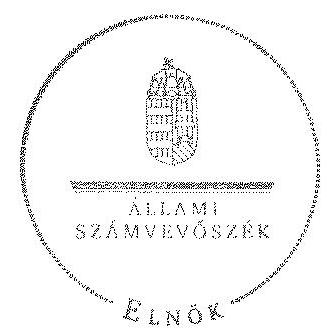

Domokos László
elnök

[^0]
[^0]:    ${ }^{19}$ Vhr. 9. § (3) bekezdés (hatályos 2010. december 31-ig), Vhr. 9. § (5) bekezdés (hatályos 2011. január 1-től)

---

# RÖVIDÍTÉSEK JEGYZÉKE 

| Jogszabályok |  |
| :--: | :--: |
| Alaptörvény | Magyarország Alaptörvénye (2011. április 25.) (hatályos: 2012. január 1-jétől) |
| Áfa tv. | Az általános forgalmi adóról szóló 2007. évi CXXVI. törvény |
| Áht $_{1}$ | Az államháztartásról szóló 1992. évi XXXVIII. törvény (hatálytalan: 2012. január 1-jétől) |
| Áht $_{2}$ | Az államháztartásról 2011. évi CXCV. törvény (hatályos: 2012. január 1-jétől)   (hatályos: 2012. január 1-jétől) |
| ÁSZ tv. | Az Állami Számvevőszékről szóló 2011. évi LXVI. törvény (hatályos: 2011. július 1-jétől) |
| Avtv. | A személyes adatok védelméről és a közérdekú adatok nyilvánosságáról szóló 1992. évi LXIII. törvény |
| Evt $_{1}$ | Az erdőről és az erdő védelméről szóló 1996. évi LIV. törvény (hatálytalan: 2009. július 10-től) |
| Evt. $_{2}$ | Az erdőről, az erdő védelméről és az erdőgazdálkodásról szóló 2009. évi XXXVII. törvény (hatályos: 2009. július 10étől) |
| Gt. | A gazdasági társaságokról szóló 2006. évi IV. törvény (hatálytalan: 2014. március 15-étől) |
| Infotv. | Az információs önrendelkezési jogról és az információszabadságról szóló 2011. évi CXII. törvény (hatályos: 2011. július 27-étől, kivéve a 1-37. §, a 38. § (1)-(3) bekezdése, a 38. § (4) bekezdés a)-f) pontja, a 38. § (5) bekezdése, a 39. §, a 41-68. §, a 70-72. §, a 75-77. § és a 79-88. §, valamint az 1. melléklet, ami 2012. január 1-jén lépett hatályba és a 38. § (4) bekezdés g) és h) pontja, valamint a 69. §, ami 2013. január 1-jén lépett hatályba) |
| Nfatv. | A Nemzeti Földalapról szóló 2010. évi LXXXVII. törvény (hatályos: 2010. szeptember 1-jétől) |
| Nvtv. | A nemzeti vagyonról szóló 2011. évi CXCVI. törvény (hatályos: 2011. december 31-étől, kivéve a 20. § (2) bekezdésben meghatározott paragrafusok, amelyek 2012. január 1jétől, a (3) bekezdésben meghatározott paragrafusok 2013. január 1-jétől, a (4) bekezdésben meghatározott paragrafus 2012. március 2-ától léptek hatályba) |
| Számv. tv. | 2000. évi C. törvény a számvitelről |
| új Ptk. | A Polgári Törvénykönyvről szóló 2013. évi V. törvény (hatályos: 2014. március 15-étől) |
| Vadvédelmi. tv. | A vad védelméről, a vadgazdálkodásról, valamint a vadászatról szóló 1996. évi LV. törvény |
| Vtv. | Az állami vagyonról szóló 2007. évi CVI. törvény |
| Vhr. | Az állami vagyonnal való gazdálkodásról szóló törvény végrehajtásáról szóló 254/2007. (X. 4.) Korm. rendelet |

---

| Egyéb rövidítések |  |
| :--: | :--: |
| áfa | általános forgalmi adó |
| ÁSZ | Állami Számvevőszék |
| APEH | Adó- és Pénzügyi Ellenőrzési Hivatal |
| ÁPV Zrt. | Állami Privatizációs és Vagyonkezelő Zrt. |
| $\mathrm{BESZ}_{1}$ | Mecsekerdő Zrt. Belső ellenőrzési szabályzata (hatályos: 2011. október 21-étől 2014. március 18 -áig) |
| $\mathrm{BESZ}_{2}$ | Mecsekerdő Zrt. Belső ellenőrzési szabályzata (hatályos: 2014. március 19-étől) |
| EEVR rendszer | Egységes Erdészeti Vezetésirányító Rendszer, LIBRA3s verzió, a Mecsekerdő Zrt. ügyviteli rendszere az ÁSZ ellenőrzés időszakában |
| Erdészeti Hatóság | Baranya Megyei Mezőgazdasági Szakigazgatási Hivatal Erdészeti Igazgatóság 2010. december 31-éig, Baranya Megyei Kormányhivatal Erdészeti Igazgatóság 2011. január 1-jétől |
| EU | Európai Unió |
| Értékelési szabályzat ${ }_{1}$ | Mecseki Erdészeti Zrt. Értékelési szabályzat (hatályos: 2010. január 1-jétől 2010. december 31-éig) |
| Értékelési szabályzat ${ }_{2}$ | Mecsekerdő Zrt. Értékelési szabályzat (hatályos: 2011. január 1-jétől 2012. szeptember 13-áig |
| Értékelési szabályzat ${ }_{3}$ | Mecsekerdő Zrt. Értékelési szabályzat (hatályos: 2012. szeptember 14-étől) |
| FB | A Mecsekerdő Zrt. tulajdonosi joggyakorló1-2 által kinevezett Felügyelő Bizottságai az ellenőrzött időszakban |
| FTK | Földtulajdonosok közössége |
| $\mathrm{IBSZ}_{1}$ | Mecsekerdő Zrt. Informatikai Biztonsági szabályzata (hatályos: 2011. október 26-ától 2014. január 12-éig) |
| $\mathrm{IBSZ}_{2}$ | Mecsekerdő Zrt. Informatikai Biztonsági szabályzata (hatályos: 2014. január 13-ától) |
| VSZ | A KVI és a Mecsekerdő Zrt. között 1996. október 16-án létrejött 01840-96-02054 számú Ideiglenes Vagyonkezelői Szerződés |
| Iratkezelési szabályzat | Mecseki Erdészeti Zrt. Iratkezelési szabályzatai (hatályos: 2006. január 2-ától 2014. július 24-éig) |
| hrsz. | helyrajzi szám |
| KVI | Kincstári Vagyonigazgatóság |
| Leltározási szabályzat ${ }_{1}$ | Mecseki Erdészeti Zrt. Leltározási és leltárkészítési szabályzata (hatályos: 2006. január 2-ától 2011. május 31-éig) |
| Leltározási szabályzat ${ }_{2}$ | Mecsekerdő Zrt. Leltározási és leltárkészítési szabályzata (hatályos: 2011. június 1-jétől) |
| Mecsekerdő Zrt., Társaság | Mecseki Erdészeti Zártkörűen Működő Részvénytársaság |
| MFB Zrt. | Magyar Fejlesztési Bank Zrt. |
| MNV Zrt. | Magyar Nemzeti Vagyonkezelő Zrt. |

---

| NFA | az Nfatv. szerinti Nemzeti Földalapkezelő Szervezet, amely útján az agrárpolitikáért felelős miniszter a Nemzet Földalap felett a Magyar Állam nevében a tulajdonosi jogokat és kötelezettségeket gyakorolja (2010. szeptember 1-jétől) |
| :--: | :--: |
| Selejtezési Szabályzat ${ }_{1}$ | Mecseki Erdészeti Zrt. Selejtezési Szabályzata (hatályos: 2006. január 2-ától 2011. május 14-éig) |
| Selejtezési Szabályzat ${ }_{2}$ | Mecsekerdő Zrt. Selejtezési Szabályzata (hatályos: 2011. május 15-étől) |
| Számítástechnikai és vé- | Mecseki Erdészeti Zrt. Számítástechnikai védelmi szabály- |
|  | zata (hatályos: 2006. január 2-ától 2011. október 25-éig) |
| Számviteli Politika $_{1}$ | Mecseki Erdészeti Zrt. Számviteli politikája (hatályos: 2009. január 2-ától 2009. december 16-áig) |
| Számviteli Politika $_{2}$ | Mecseki Erdészeti Zrt. Számviteli politikája (hatályos 2009. december 17-étől 2011. június 21-éig) |
| Számviteli Politika $_{3}$ | Mecsekerdő Zrt. Számviteli politikája (hatályos: 2011. június 22-étől 2013. március 21-éig) |
| Számviteli Politika $_{4}$ | Mecsekerdő Zrt. Számviteli politikája (hatályos: 2013. április 1-jétől) |
| SZMSZ $_{1}$ | Mecseki Erdészeti Rt Szervezeti és Müködési Szabályzata (hatályos: 2008. november 4-étől 2009. szeptember 28-éig) |
| SZMSZ $_{2}$ | Mecseki Erdészeti Zrt. Szervezeti és Müködési Szabályzata (hatályos: 2009. szeptember 29-étől 2010. október 10-éig) |
| SZMSZ $_{3}$ | Mecseki Erdészeti Zrt. Szervezeti és Müködési Szabályzata (hatályos: 2010. november 11-étől 2011. március 8-áig) |
| SZMSZ $_{4}$ | Mecseki Erdészeti Zrt. szervezeti és Müködési Szabályzata (hatályos: 2011. március 9-étől 2012. július 3-áig) |
| SZMSZ $_{5}$ | Mecsekerdő Zrt Szervezeti és müködési Szabályzata (hatályos: 2012. július 4-étől 2012. december 31-éig) |
| SZMSZ $_{6}$ | Mecsekerdő Zrt. Szervezeti és Müködési Szabályzata (hatályos: 2013. január 1-jétől 2013. február 9-éig) |
| SZMSZ $_{7}$ | Mecsekerdő Zrt. Szervezeti és Müködési Szabályzata (hatályos: 2013. február 10-étől) |
| tulajdonosi joggyakorló | a társaságok állami tulajdonú részesedése feletti tulajdonosi jogokat gyakorló Magyar Nemzeti Vagyonkezelő Zrt. (2009. január 1-jétől 2010. június 16-áig) |
| tulajdonosi joggyakorló | a társaságok állami tulajdonú részesedése feletti tulajdonosi jogokat gyakorló Magyar Fejlesztési Bank Zrt. (2010. június 17-étől 2014. július 15-éig) |
| Vadászati Hatóság | Baranya Megyei Mezőgazdasági Szakigazgatási Hivatal 2010. december 31-ig, Baranya Megyei Kormányhivatal Földművelésügyi Igazgatósága 2011. január 1-jétől |
| korábbi vezérigazgató | Mecsekerdő Zrt. vezérigazgatója 2009. január 1-jétől 2010. július 12-éig |
| jelenlegi vezérigazgató | Mecsekerdő Zrt. vezérigazgatója 2010. július 13-ától |

---

.

---

# FOGALOMTÁR 

állami vagyon
állami vagyon
használója
átlátható szervezet
földbirtok-politikai irányelvek
hasznosítás
immateriális szolgáltatásból származó bevétel
információs és kommunikációs rendszer
kockázatkezelés

Állami vagyon:
a) az állam tulajdonában lévő dolog, valamint dolog módjára hasznosítható természeti erő;
b) az a) pont hatálya alá tartozó mindazon vagyon, amely vonatkozásában törvény az állam kizárólagos tulajdonjogát nevesíti;
c) az állam tulajdonában lévő tagsági jogviszonyt megtestesítő értékpapír, illetve az államot megillető egyéb társasági részesedés;
d) az államot megillető olyan immateriális, vagyoni értékkel rendelkező jogosultság, amelyet jogszabály vagyoni értékű jogként nevesít;
e) az állam tulajdonában lévő pénzügyi eszközök.
Az állami vagyon használója az a természetes vagy jogi személy, jogi személyiséggel nem rendelkező szervezet, aki, vagy amely törvény vagy szerződés alapján, bármely jogcímen (bérlet, haszonbérlet, használat stb.) állami vagyont birtokol, használ, szedi annak hasznait. (Ide nem értve a haszonélvezőt, a vagyonkezelőt és a tulajdonosi jogok gyakorlóját.)
Átlátható szervezet a Nvtv. 3. § (1) bekezdés 1. pontjában felsorolt, a meghatározott követelményeknek megfelelő szervezet.
Az Nfatv. 15. § (3) bekezdés a)-s) pontjaiban meghatározott, a Nemzeti Földalapba tartozó földrészletek hasznosítására vonatkozó irányelvek.
Hasznosítás a tulajdonosi joggyakorló vagy a nemzeti vagyon használója által a nemzeti vagyon birtoklásának, használatának, hasznok szedése jogának bármely - a tulajdonjog átruházását nem eredményező - jogcímen történő átengedése, ide nem értve a vagyonkezelésbe adást, valamint a haszonélvezeti jog alapítását.
Immateriális szolgáltatásból származó bevételek azok a nem anyagjellegű szolgáltatásokból származó állami bevételek, amelyeket az Evt. 2 3. § (1) bekezdése szerint, a külön jogszabályban meghatározott részletes feltételek szerint, az erdők fenntartására, gyarapítására és védelmére kell fordítani.
Az információs és kommunikációs rendszer biztosítja, hogy az információk eljussanak az illetékes szervezethez, szervezeti egységhez, illetve személyhez.
A kockázatkezelés a szervezet céljai elérésével kapcsolatos kockázatok azonosításának és elemzésének, valamint a megfelelő válaszok meghatározásának folyamata.

---

kockázatkezelési rendszer
kontrolling
kontrollkörnyezet
kontrolltevékenységek
közfeladat

A kockázatkezelési rendszer múködtetése során fel kell mérni és meg kell állapítani a szervezet tevékenységében, gazdálkodásában rejlő kockázatokat, valamint meg kell határozni az egyes kockázatokkal kapcsolatban szükséges intézkedéseket, valamint azok teljesítésének folyamatos nyomon követésének módját.
A kockázatkezelési rendszer olyan irányítási eszközök és módszerek összessége, amelynek elemei a szervezeti célok elérését veszélyeztető tényezők (kockázatok) azonosítása, elemzése, nyomon követése, valamint szükség esetén a kockázati kitettség mérséklése.
Az a vezetéstámogató rendszer, amely a vezetői tervezést, ellenőrzést, valamint információ-ellátást koordinálja célorientáltan a környezeti változásokhoz igazodva.
A kontroll környezet elemei: a szervezeti struktúra, a felelősségi, hatásköri viszonyok és feladatok, a szervezet minden szintjén meghatározott etikai elvárások, a humánerőforráskezelés. A kontrollkörnyezet alapozza meg a belső kontroll összes többi elemét a fegyelem és a struktúra biztosítása által.
A kontrollrendszer a kockázatok kezelése és tárgyilagos bizonyosság megszerzése érdekében kialakított folyamatrendszer, amely azt a célt szolgálja, hogy megvalósuljanak a következő célok:
a) a múködés és a gazdálkodás során a tevékenységeket szabályszerűen, gazdaságosan, hatékonyan, eredményesen hajtsák végre,
b) az elszámolási kötelezettségeket teljesítsék, és
c) megvédjék az erőforrásokat a veszteségektől, károktól és nem rendeltetésszerű használattól.
A kontrolltevékenységek azok az elvek (politikák) és eljárások, amelyeket a kockázatok meghatározása és a szervezet céljainak elérése érdekében alakítanak ki.
A közfeladat jogszabályban meghatározott állami vagy önkormányzati feladat, amit az arra kötelezett közérdekből, jogszabályban meghatározott követelményeknek és feltételeknek megfelelve végez, ideértve a lakosság közszolgáltatásokkal való ellátását, továbbá az állam nemzetközi szerződésekben vállalt kötelezettségeiből adódó közérdekű feladatokat, valamint e feladatok ellátásához szükséges infrastruktúra biztosítását is.
Az Etv. 2. § (2) bekezdése szerint a fenntartható erdőgazdálkodás során a legfontosabb közérdekű feladat az erdők változatosságának megőrzése, az erdők fenntartása, felújítása és a védelmi, valamint közjóléti szolgáltatások biztosítása, melyek elvégzését az állam megfelelő eszközökkel biztosítja.

---

monitoring

Nemzeti Földalap
nemzeti vagyon használója
rábízott állami vagyon
társasági portfólió
tulajdonosi ellenörzés
tulajdonosi joggyakorló

A szervezet tevékenységének, a célok megvalósításának nyomon követését biztosító rendszer, amely az operatív tevékenységek keretében megvalósuló folyamatos és eseti nyomon követésből, valamint az operatív tevékenységektől függetlenül múködő belső ellenőrzésből áll.
A monitoring a projektek és programok végrehajtásának nyomon követése, mely a támogató és a kedvezményezett közti megállapodásban foglalt eljárások követését, az előrehaladás ellenőrzését és a lehetséges problémák időben történő azonosítását szolgálja.
A Nemzeti Földalap a kincstári vagyon része, amelybe beletartoznak az állam tulajdonában és az ingatlan-nyilvántartásban levő, az Nfatv. 1. § (1)-(2) bekezdéseiben felsorolt területek, földrészletek és az azokhoz kapcsolódó vagyoni értékű jogok.
A nemzeti vagyon használója az a természetes személy, jogi személy vagy jogi személyiséggel nem rendelkező szervezet, aki, vagy amely állami vagyon tekintetében törvény vagy szerződés alapján, a helyi önkormányzat vagyona tekintetében törvény, a helyi önkormányzat rendelete vagy szerződés alapján bármely jogcímen nemzeti vagyont birtokol, használ, szedi annak hasznait, kivéve a tulajdonosi joggyakorló (az Nvtv. 3. § (1) bekezdés 11. pontja alapján).
Rábízott állami vagyon az a Vtv. alkalmazásában állami vagyonnak minősülő vagyon, amit az MNV- a saját vagyonától elkülönítetten - kezel és nyilvántart.
Az Mfbtv. 3. § (9) bekezdése szerint rábízott állami vagyon az a vagyon, amely felett az Mfbtv. erejénél fogva a Magyar Állam nevében az MFB gyakorolja a tulajdonosi jogokat.
Az Nfatv. 1. § (1) bekezdésében foglaltak alapján az NFA-hoz tartozó rábízott vagyon a törvényben meghatározott, a Nemzeti Földalapba tartozó vagyon.
Társasági portfólió az MNV, illetve az MFB rábízott vagyonába tartozó állami tulajdonú társasági részesedések.
A tulajdonosi joggyakorló által végzett ellenőrzés, amelynek célja az állami vagyonnal való gazdálkodás vizsgálata, ennek keretében a rendeltetésellenes, jogszerütlen, szerződésellenes, vagy a tulajdonos érdekeit sértő, illetve a központi költségvetést hátrányosan érintő vagyongazdálkodási intézkedések feltárása és a jogszerú állapot helyreállítása, továbbá a vagyonnyilvántartás hitelességének, teljességének és helyességének biztosítása.
Tulajdonosi joggyakorló az, aki az állami, illetve a nemzeti vagyon felett az államot megillető tulajdonosi jogok és kötelezettségek gyakorlására jogosult.

---

tulajdonosi joggyakorlás módja
vagyongazdálkodás feladata
vagyonkezelői jog

Az állami vagyon felett a Magyar Államot megillető tulajdonosi jogoknak (és kötelezettségeknek) az összességét az állami vagyon felügyeletéért felelős miniszter gyakorolja, aki e feladatát az MNV, az MFB, illetve egyéb tulajdonosi joggyakorló szervezet (pl. központi költségvetési szervek, 100\%-ban állami tulajdonban álló gazdasági társaságok) útján látja el. Azon állami tulajdonban álló ingatlanok felett, amelyek egy része a Nemzeti Földalapba tartozik, a tulajdonosi jogokat a miniszter az agrárpolitikáért felelős miniszterrel közösen gyakorolja.
A Nemzeti Földalap felett a Magyar Állam nevében a tulajdonosi jogokat és kötelezettségeket az agrárpolitikáért felelős miniszter a Nemzeti Földalapkezelő Szervezet útján gyakorolja.
Az állami vagyon rendeltetésének megfelelő - az állami feladatok ellátásához, a társadalmi szükségletek kielégítéséhez, valamint a Kormány gazdaságpolitikája megvalósításának elősegittéséhez szükséges, egységes elveken alapuló, önálló ágazatként megjelenő - hatékony, költségtakarékos, értékmegőrző, értéknövelő felhasználásának biztosítása, beleértve a vagyoni kör változását eredményező értékesítést, valamint az állami vagyon gyarapítása is.
Vagyonkezelési szerződés alapján a vagyonkezelő jogosult meghatározott, állami tulajdonba tartozó dolog birtoklására, használatára és hasznai szedésére.
A Vtv. alapján a vagyonkezelői jog az állami vagyon hasznosítására az MNV-vel kötött vagyonkezelési szerződéssel jön létre. A vagyonkezelési szerződés alapján a vagyonkezelő jogosult meghatározott, állami tulajdonba tartozó dolog birtoklására, használatára és hasznai szedésére.
Az Nfatv. alapján a vagyonkezelői jog az erre irányuló (NFAval kötött) szerződéssel jön létre. A vagyonkezelői szerződés alapján a vagyonkezelő jogosult meghatározott földrészlet birtoklására, használatára és hasznai szedésére. A vagyonkezelő köteles a földrészlet értékét megőrizni, állagának megóvásáról, jó karban tartásáról gondoskodni, továbbá - az Nfatv.-ben meghatározott esetek kivételével díjat - fizetni vagy a szerződésben előírt más kötelezettséget teljesíteni.

---

### a Mecsekerdő Zrt. vagyonának alakulása 2009-2014. I. félévében

|  Sor-
szám | Megnevezés | 2009.01.01 | 2009.12.31 | 2010.12.31 | 2011.12.31 | 2012.12.31 | 2013.12.31 | 2014.06.30 | Váltusás
2013.12.31/2009.12.31.
(%)  |
| --- | --- | --- | --- | --- | --- | --- | --- | --- | --- |
|   |  | 1. | 2. | 3. | 4. | 5. | 6. | 7. | 8.  |
|  1. | Eszközök |  |  |  |  |  |  |  |   |
|  2. | Befektetett eszközök összesen | 3 038 819 | 2 951 629 | 2 817 771 | 2 822 807 | 2 928 387 | 3 050 603 | 3 038 957 | 103%  |
|  3. | Ebből: Immateriális javok | 65 573 | 71 474 | 51 143 | 56 991 | 70 847 | 111 912 | 100 390 | 157%  |
|  4. | Tárgyi eszközök | 2 878 531 | 2 789 942 | 2 740 312 | 2 729 766 | 2 816 242 | 2 893 768 | 2 892 266 | 104%  |
|  5. | Befektetett pénzügyi eszközök | 94 715 | 90 213 | 26 316 | 36 050 | 41 298 | 44 923 | 46 301 | 50%  |
|  6. | Forgóeszközök | 1 120 473 | 1 288 050 | 1 237 251 | 1 084 606 | 1 068 904 | 1 170 783 | 1 596 977 | 91%  |
|  7. | Ebből: Köszletek | 245 846 | 369 883 | 233 405 | 220 807 | 282 452 | 307 442 | 327 726 | 83%  |
|  8. | Követelések | 774 017 | 391 819 | 574 734 | 392 087 | 517 468 | 588 568 | 507 567 | 150%  |
|  9. | Értékpapírok | 0 | 0 | 0 | 0 | 0 | 0 | 0 | 0  |
|  10. | Pénzeszközök | 100 610 | 526 348 | 428 912 | 471 712 | 268 984 | 274 773 | 761 684 | 52%  |
|  11. | Azzív időbeli elbattárolások | 68 308 | 17 127 | 18 971 | 10 780 | 12 217 | 12 511 | 2 270 | 73%  |
|  12. | Eszközök összesen | 4 227 596 | 4 256 806 | 4 073 993 | 3 918 193 | 4 009 508 | 4 233 897 | 4 638 204 | 99%  |
|  13. | Források |  |  |  |  |  |  |  |   |
|  14. | Saját tőke | 3 468 893 | 3 637 484 | 3 260 766 | 3 009 100 | 3 069 635 | 3 165 728 | 3 218 230 | 87%  |
|  15. | Ebből: Jegyzett tőke | 1 621 870 | 1 727 990 | 1 767 990 | 1 767 990 | 1 767 990 | 1 767 990 | 1 767 990 | 102%  |
|  16. | Tőketartalék | 869 716 | 869 716 | 869 716 | 869 716 | 869 716 | 869 716 | 869 716 | 100%  |
|  17. | Ondanásgyurtozék | 812 638 | 926 826 | 1 039 778 | 182 878 | 371 394 | 431 919 | 528 023 | 47%  |
|  18. | Lekötött tartalék | 76 335 | 50 481 | 0 | 61 086 | 0 | 0 | 0 | 0%  |
|  19. | Értékelést tartalék | 0 | 0 | 0 | 0 | 0 | 0 | 0 | 0  |
|  20. | Mérleg szertati eredménye | 88 337 | 62 471 | -416 718 | 127 430 | 60 525 | 96 103 | 52 501 | 154%  |
|  21. | Céltartalékok | 0 | 6 459 | 225 075 | 247 668 | 337 604 | 292 601 | 292 601 | 4530%  |
|  22. | Kötelezettségek | 579 938 | 461 165 | 440 915 | 460 595 | 395 077 | 498 644 | 436 563 | 108%  |
|  23. | Ebből: Hátraszmét kötelezettségek | 0 | 0 | 0 | 0 | 0 | 0 | 0 | 0  |
|  24. | Hosszú lejáratú kötelezettségek | 110 000 | 85 000 | 60 000 | 35 000 | 10 000 | 0 | 0 | 0%  |
|  25. | Nivel lejáratú kötelezettségek | 469 938 | 376 165 | 380 915 | 425 595 | 385 077 | 498 644 | 436 563 | 133%  |
|  26. | Panszív időbeli elhalároklás | 178 765 | 151 698 | 147 237 | 200 830 | 207 202 | 276 924 | 690 810 | 183%  |
|  27. | Források összesen | 4 227 596 | 4 256 806 | 4 073 993 | 3 918 193 | 4 009 508 | 4 233 897 | 4 638 204 | 99%  |

---

az immateriális javak és tárgyi eszközök állományának megoszlása a 2013. évre vonatkozóan adatok ezer Ft-ban

|  Sorszám | Megnevezés | Immateriális javak | Ingatlanok | Műszaki berendezések | Egyéb berendezések | Beruházás a beruházásra adott előleggel együtt | Tárgyi eszközök összesen  |
| --- | --- | --- | --- | --- | --- | --- | --- |
|  1. | 2. | 3. | 4. | 5. | 6. | 7. |   |
|  1. | Bruttó érték január 1-jén | 234735 | 3406222 | 775566 | 341000 | 155678 | 4678466  |
|  2. | -ebből: állami vagyon |  |  |  |  |  | 0  |
|  3. | -ebből: saját vagyon | 234735 | 3406222 | 775566 | 341000 | 155678 | 4678466  |
|  4. | Növekedés (+) | 61693 | 161707 | 17945 | 66653 | 412639 | 658944  |
|  5. | -ebből: állami vagyon |  |  |  |  |  | 0  |
|  6. | -ebből: saját vagyon | 61693 | 161707 | 17945 | 66653 | 412639 | 658944  |
|  7. | Csökkenés (-) | $-3890$ | $-95591$ | $-13087$ | $-14935$ | $-275567$ | $-399180$  |
|  8. | -ebből: állami vagyon |  |  |  |  |  | 0  |
|  9. | -ebből: saját vagyon | $-3890$ | $-95591$ | $-13087$ | $-14935$ | $-275567$ | $-399180$  |
|  10. | Bruttó érték december 31-én | 292538 | 3472338 | 780424 | 392718 | 292750 | 4938230  |
|  11. | -ebből: állami vagyon | 0 | 0 | 0 | 0 | 0 | 0  |
|  12. | -ebből: saját vagyon | 292538 | 3472338 | 780424 | 392718 | 292750 | 4938230  |
|  13. | Halmozott értékcsökkenés január 1-jén | 163888 | 1092000 | 486907 | 240467 | 42850 | 1862224  |
|  14. | -ebből: állami vagyon |  |  |  |  |  | 0  |
|  15. | -ebből: saját vagyon | 163888 | 1092000 | 486907 | 240467 | 42850 | 1862224  |
|  16. | Értékcsökkenés növekedése (+) (költségként elszámolt) | 18717 | 110258 | 74349 | 43156 | 0 | 227763  |
|  17. | -ebből: állami vagyon |  |  |  |  |  | 0  |
|  18. | -ebből: saját vagyon | 18717 | 110258 | 74349 | 43156 |  | 227763  |
|  22. | Értékcsökkenés egyéb ráfordításként elszámolva ( $\pm$ ) | $-1979$ | $-17675$ | $-12947$ | $-14903$ | 0 | $-45525$  |
|  23. | -ebből: állami vagyon |  |  |  |  |  | 0  |
|  24. | -ebből: saját vagyon | $-1979$ | $-17675$ | $-12947$ | $-14903$ |  | $-45525$  |
|  25. | Egyéb változás az értékcsökkenésben ( $\pm$ ) | 0 | 0 | 0 | 0 | 0 | 0  |
|  26. | -ebből: állami vagyon |  |  |  |  |  | 0  |
|  27. | -ebből: saját vagyon |  |  |  |  |  | 0  |
|  28. | Halmozott értékcsökkenés december 31-én: | 180626 | 1184583 | 548309 | 268720 | 42850 | 2044462  |
|  29. | -ebből: állami vagyon | 0 | 0 | 0 | 0 | 0 | 0  |
|  30. | -ebből: saját vagyon | 180626 | 1184583 | 548309 | 268720 | 42850 | 2044462  |
|  31. | Nettó érték december 31-én: | 111912 | 2287755 | 232115 | 123998 | 249900 | 2893768  |
|  32. | -ebből: állami vagyon | 0 | 0 | 0 | 0 | 0 | 0  |
|  33. | -ebből:saját vagyon | 111912 | 2287755 | 232115 | 123998 | 249900 | 2893768  |

---

5. SZÁMÚ MELLÉKLET A V-0751-133/2015. SZÁMÚ JELENTÉSHEZ

a befektetett eszközök állományának alakulásáról adatok ezer Ft-ban

|  No | MEGHÜVEZÉS | 2009. év | 2010. év | 2011. év | 2012. év | 2013. év  |
| --- | --- | --- | --- | --- | --- | --- |
|   |  | Összesen | Állami vagyon | Saját vagyon | Összesen | Állami vagyon  |
|  1. |  | 2 | 3 | 4 | 5 | 6  |
|  1. |  | 3 038 819 |  |  |  |   |
|  2. |  | 3 038 819 |  |  |  |   |
|  3. |  | 3 038 819 |  |  |  |   |
|  4. |  | 3 038 819 |  |  |  |   |
|  5. |  | 3 038 819 |  |  |  |   |
|  6. |  | 3 038 819 |  |  |  |   |
|  7. |  | 3 038 819 |  |  |  |   |
|  8. |  | 3 038 819 |  |  |  |   |
|  9. |  | 3 038 819 |  |  |  |   |
|  10. |  | 387 523 |  |  |  |   |
|  11. |  | 387 523 |  |  |  |   |
|  12. |  | 387 523 |  |  |  |   |
|  13. |  | 387 523 |  |  |  |   |
|  14. |  | 387 523 |  |  |  |   |
|  15. |  | 387 523 |  |  |  |   |
|  16. |  | 387 523 |  |  |  |   |
|  17. |  | 387 523 |  |  |  |   |
|  18. |  | 387 523 |  |  |  |   |
|  19. |  | 387 523 |  |  |  |   |
|  20. |  | 387 523 |  |  |  |   |
|  21. |  | 387 523 |  |  |  |   |
|  22. |  | 387 523 |  |  |  |   |
|  23. |  | 387 523 |  |  |  |   |
|  24. |  | 387 523 |  |  |  |   |
|  25. |  | 387 523 |  |  |  |   |
|  26. |  | 387 523 |  |  |  |   |
|  27. |  | 387 523 |  |  |  |   |
|  28. |  | 387 523 |  |  |  |   |
|  29. |  | 387 523 |  |  |  |   |
|  30. |  | 387 523 |  |  |  |   |
|  31. |  | 387 523 |  |  |  |   |
|  32. |  | 387 523 |  |  |  |   |
|  33. |  | 387 523 |  |  |  |   |
|  34. |  | 387 523 |  |  |  |   |
|  35. |  | 387 523 |  |  |  |   |
|  36. |  | 387 523 |  |  |  |   |
|  37. |  | 387 523 |  |  |  |   |
|  38. |  | 387 523 |  |  |  |   |
|  39. |  | 387 523 |  |  |  |   |
|  40. |  | 387 523 |  |  |  |   |
|  41. |  | 387 523 |  |  |  |   |
|  42. |  | 387 523 |  |  |  |   |
|  43. |  | 387 523 |  |  |  |   |
|  44. |  | 387 523 |  |  |  |   |
|  45. |  | 387 523 |  |  |  |   |
|  46. |  | 387 523 |  |  |  |   |
|  47. |  | 387 523 |  |  |  |   |
|  48. |  | 387 523 |  |  |  |   |
|  49. |  | 387 523 |  |  |  |   |
|  50. |  | 387 523 |  |  |  |   |
|  51. |  | 387 523 |  |  |  |   |
|  52. |  | 387 523 |  |  |  |   |
|  53. |  | 387 523 |  |  |  |   |
|  54. |  | 387 523 |  |  |  |   |
|  55. |  | 387 523 |  |  |  |   |
|  56. |  | 387 523 |  |  |  |   |
|  57. |  | 387 523 |  |  |  |   |
|  58. |  | 387 523 |  |  |  |   |
|  59. |  | 387 523 |  |  |  |   |
|  60. |  | 387 523 |  |  |  |   |
|  61. |  | 387 523 |  |  |  |   |
|  62. |  | 387 523 |  |  |  |   |
|  63. |  | 387 523 |  |  |  |   |
|  64. |  | 387 523 |  |  |  |   |
|  65. |  | 387 523 |  |  |  |   |
|  66. |  | 387 523 |  |  |  |   |
|  67. |  | 387 523 |  |  |  |   |
|  68. |  | 387 523 |  |  |  |   |
|  69. |  | 387 523 |  |  |  |   |
|  70. |  | 387 523 |  |  |  |   |
|  71. |  | 387 523 |  |  |  |   |
|  72. |  | 387 523 |  |  |  |   |
|  73. |  | 387 523 |  |  |  |   |
|  74. |  | 387 523 |  |  |  |   |
|  75. |  | 387 523 |  |  |  |   |
|  76. |  | 387 523 |  |  |  |   |
|  77. |  | 387 523 |  |  |  |   |
|  78. |  | 387 523 |  |  |  |   |
|  79. |  | 387 523 |  |  |  |   |
|  80. |  | 387 523 |  |  |  |   |
|  81. |  | 387 523 |  |  |  |   |
|  82. |  | 387 523 |  |  |  |   |
|  83. |  | 387 523 |  |  |  |   |
|  84. |  | 387 523 |  |  |  |   |
|  85. |  | 387 523 |  |  |  |   |
|  86. |  | 387 523 |  |  |  |   |
|  87. |  | 387 523 |  |  |  |   |
|  88. |  | 387 523 |  |  |  |   |
|  89. |  | 387 523 |  |  |  |   |
|  90. |  | 387 523 |  |  |  |   |
|  91. |  | 387 523 |  |  |  |   |
|  92. |  | 387 523 |  |  |  |   |
|  93. |  | 387 523 |  |  |  |   |
|  94. |  | 387 523 |  |  |  |   |
|  95. |  | 387 523 |  |  |  |   |
|  96. |  | 387 523 |  |  |  |   |
|  97. |  | 387 523 |  |  |  |   |
|  98. |  | 387 523 |  |  |  |   |
|  99. |  | 387 523 |  |  |  |   |
|  100. |  | 387 523 |  |  |  |   |
|  101. |  | 387 523 |  |  |  |   |
|  102. |  | 387 523 |  |  |  |   |
|  103. |  | 387 523 |  |  |  |   |
|  104. |  | 387 523 |  |  |  |   |
|  105. |  | 387 523 |  |  |  |   |
|  106. |  | 387 523 |  |  |  |   |
|  107. |  | 387 523 |  |  |  |   |
|  108. |  | 387 523 |  |  |  |   |
|  109. |  | 387 523 |  |  |  |   |
|  110. |  | 387 523 |  |  |  |   |
|  111. |  | 387 523 |  |  |  |   |
|  112. |  | 387 523 |  |  |  |   |
|  113. |  | 387 523 |  |  |  |   |
|  114. |  | 387 523 |  |  |  |   |
|  115. |  | 387 523 |  |  |  |   |
|  116. |  | 387 523 |  |  |  |   |
|  117. |  | 387 523 |  |  |  |   |
|  118. |  | 387 523 |  |  |  |   |
|  119. |  | 387 523 |  |  |  |   |
|  120. |  | 387 523 |  |  |  |   |
|  121. |  | 387 523 |  |  |  |   |
|  122. |  | 387 523 |  |  |  |   |
|  123. |  | 387 523 |  |  |  |   |
|  124. |  | 387 523 |  |  |  |   |
|  125. |  | 387 523 |  |  |  |   |
|  126. |  | 387 523 |  |  |  |   |
|  127. |  | 387 523 |  |  |  |   |
|  128. |  | 387 523 |  |  |  |   |
|  129. |  | 387 523 |  |  |  |   |
|  130. |  | 387 523 |  |  |  |   |
|  131. |  | 387 523 |  |  |  |   |
|  132. |  | 387 523 |  |  |  |   |
|  133. |  | 387 523 |  |  |  |   |
|  134. |  | 387 523 |  |  |  |   |
|  135. |  | 387 523 |  |  |  |   |
|  136. |  | 387 523 |  |  |  |   |
|  137. |  | 387 523 |  |  |  |   |
|  138. |  | 387 523 |  |  |  |   |
|  139. |  | 387 523 |  |  |  |   |
|  140. |  | 387 523 |  |  |  |   |
|  141. |  | 387 523 |  |  |  |   |
|  142. |  | 387 523 |  |  |  |   |
|  143. |  | 387 523 |  |  |  |   |
|  144. |  | 387 523 |  |  |  |   |
|  145. |  | 387 523 |  |  |  |   |
|  146. |  | 387 523 |  |  |  |   |
|  147. |  | 387 523 |  |  |  |   |
|  148. |  | 387 523 |  |  |  |   |
|  149. |  | 387 523 |  |  |  |   |
|  150. |  | 387 523 |  |  |  |   |
|  151. |  | 387 523 |  |  |  |   |
|  152. |  | 387 523 |  |  |  |   |
|  153. |  | 387 523 |  |  |  |   |
|  154. |  | 387 523 |  |  |  |   |
|  155. |  | 387 523 |  |  |  |   |
|  156. |  | 387 523 |  |  |  |   |
|  157. |  | 387 523 |  |  |  |   |
|  158. |  | 387 523 |  |  |  |   |
|  159. |  | 387 523 |  |  |  |   |
|  160. |  | 387 523 |  |  |  |   |
|  161. |  | 387 523 |  |  |  |   |
|  162. |  | 387 523 |  |  |  |   |
|  163. |  | 387 523 |  |  |  |   |
|  164. |  | 387 523 |  |  |  |   |
|  165. |  | 387 523 |  |  |  |   |
|  166. |  | 387 523 |  |  |  |   |
|  167. |  | 387 523 |  |  |  |   |
|  168. |  | 387 523 |  |  |  |   |
|  169. |  | 387 523 |  |  |  |   |
|  170. |  | 387 523 |  |  |  |   |
|  171. |  | 387 523 |  |  |  |   |
|  172. |  | 387 523 |  |  |  |   |
|  173. |  | 387 523 |  |  |  |   |
|  174. |  | 387 523 |  |  |  |   |
|  175. |  | 387 523 |  |  |  |   |
|  176. |  | 387 523 |  |  |  |   |
|  177. |  | 387 523 |  |  |  |   |
|  178. |  | 387 523 |  |  |  |   |
|  179. |  | 387 523 |  |  |  |   |
|  180. |  | 387 523 |  |  |  |   |
|  181. |  | 387 523 |  |  |  |   |
|  182. |  | 387 523 |  |  |  |   |
|  183. |  | 387 523 |  |  |  |   |
|  184. |  | 387 523 |  |  |  |   |
|  185. |  | 387 523 |  |  |  |   |
|  186. |  | 387 523 |  |  |  |   |
|  187. |  | 387 523 |  |  |  |   |
|  188. |  | 387 523 |  |  |  |   |
|  189. |  | 387 523 |  |  |  |   |
|  190. |  | 387 523 |  |  |  |   |
|  191. |  | 387 523 |  |  |  |   |
|  192. |  | 387 523 |  |  |  |   |
|  193. |  | 387 523 |  |  |  |   |
|  194. |  | 387 523 |  |  |  |   |
|  195. |  | 387 523 |  |  |  |   |
|  196. |  | 387 523 |  |  |  |   |
|  197. |  | 387 523 |  |  |  |   |
|  198. |  | 387 523 |  |  |  |   |
|  199. |  | 387 523 |  |  |  |   |
|  200. |  | 387 523 |  |  |  |   |
|  201. |  | 387 523 |  |  |  |   |
|  202. |  | 387 523 |  |  |  |   |
|  203. |  | 387 523 |  |  |  |   |
|  204. |  | 387 523 |  |  |  |   |
|  205. |  | 387 523 |  |  |  |   |
|  206. |  | 387 523 |  |  |  |   |
|  207. |  | 387 523 |  |  |  |   |
|  208. |  | 387 523 |  |  |  |   |
|  209. |  | 387 523 |  |  |  |   |
|  210. |  | 387 523 |  |  |  |   |
|  211. |  | 387 523 |  |  |  |   |
|  212. |  | 387 523 |  |  |  |   |
|  213. |  | 387 523 |  |  |  |   |
|  214. |  | 387 523 |  |  |  |   |
|  215. |  | 387 523 |  |  |  |   |
|  216. |  | 387 523 |  |  |  |   |
|  217. |  | 387 523 |  |  |  |   |
|  218. |  | 387 523 |  |  |  |   |
|  219. |  | 387 523 |  |  |  |   |
|  220. |  | 387 523 |  |  |  |   |
|  221. |  | 387 523 |  |  |  |   |
|  222. |  | 387 523 |  |  |  |   |
|  223. |  | 387 523 |  |  |  |   |
|  224. |  | 387 523 |  |  |  |   |
|  225. |  | 387 523 |  |  |  |   |
|  226. |  | 387 523 |  |  |  |   |
|  227. |  | 387 523 |  |  |  |   |
|  228. |  | 387 523 |  |  |  |   |
|  229. |  | 387 523 |  |  |  |   |
|  230. |  | 387 523 |  |  |  |   |
|  231. |  | 387 523 |  |  |  |   |
|  232. |  | 387 523 |  |  |  |   |
|  233. |  | 387 523 |  |  |  |   |
|  234. |  | 387 523 |  |  |  |   |
|  235. |  | 387 523 |  |  |  |   |
|  236. |  | 387 523 |  |  |  |   |
|  237. |  | 387 523 |  |  |  |   |
|  238. |  | 387 523 |  |  |  |   |
|  239. |  | 387 523 |  |  |  |   |
|  240. |  | 387 523 |  |  |  |   |
|  241. |  | 387 523 |  |  |  |   |
|  242. |  | 387 523 |  |  |  |   |
|  243. |  | 387 523 |  |  |  |   |
|  244. |  | 387 523 |  |  |  |   |
|  245. |  | 387 523 |  |  |  |   |
|  246. |  | 387 523 |  |  |  |   |
|  247. |  | 387 523 |  |  |  |   |
|  248. |  | 387 523 |  |  |  |   |
|  249. |  | 387 523 |  |  |  |   |
|  250. |  | 387 523 |  |  |  |   |
|  251. |  | 387 523 |  |  |  |   |
|  252. |  | 387 523 |  |  |  |   |
|  253. |  | 387 523 |  |  |  |   |
|  254. |  | 387 523 |  |  |  |   |
|  255. |  | 387 523 |  |  |  |   |
|  256. |  | 387 523 |  |  |  |   |
|  257. |  | 387 523 |  |  |  |   |
|  258. |  | 387 523 |  |  |  |   |
|  259. |  | 387 523 |  |  |  |   |
|  260. |  | 387 523 |  |  |  |   |
|  261. |  | 387 523 |  |  |  |   |
|  262. |  | 387 523 |  |  |  |   |
|  263. |  | 387 523 |  |  |  |   |
|  264. |  | 387 523 |  |  |  |   |
|  265. |  | 387 523 |  |  |  |   |
|  266. |  | 387 523 |  |  |  |   |
|  267. |  | 387 523 |  |  |  |   |
|  268. |  | 387 523 |  |  |  |   |
|  269. |  | 387 523 |  |  |  |   |
|  270. |  | 387 523 |  |  |  |   |
|  271. |  | 387 523 |  |  |  |   |
|  272. |  | 387 523 |  |  |  |   |
|  273. |  | 387 523 |  |  |  |   |
|  274. |  | 387 523 |  |  |  |   |
|  275. |  | 387 523 |  |  |  |   |
|  276. |  | 387 523 |  |  |  |   |
|  277. |  | 387 523 |  |  |  |   |
|  278. |  | 387 523 |  |  |  |   |
|  279. |  | 387 523 |  |  |  |   |
|  280. |  | 387 523 |  |  |  |   |
|  281. |  | 387 523 |  |  |  |   |
|  282. |  | 387 523 |  |  |  |   |
|  283. |  | 387 523 |  |  |  |   |
|  284. |  | 387 523 |  |  |  |   |
|  285. |  | 387 523 |  |  |  |   |
|  286. |  | 387 523 |  |  |  |   |
|  287. |  | 387 523 |  |  |  |   |
|  288. |  | 387 523 |  |  |  |   |
|  289. |  | 387 523 |  |  |  |   |
|  290. |  | 387 523 |  |  |  |   |
|  291. |  | 387 523 |  |  |  |   |
|  292. |  | 387 523 |  |  |  |   |
|  293. |  | 387 523 |  |  |  |   |
|  294. |  | 387 523 |  |  |  |   |
|  295. |  | 387 523 |  |  |  |   |
|  296. |  | 387 523 |  |  |  |   |
|  297. |  | 387 523 |  |  |  |   |
|  298. |  | 387 523 |  |  |  |   |
|  299. |  | 387 523 |  |  |  |   |
|  300. |  | 387 523 |  |  |  |   |
|  301. |  | 387 523 |  |  |  |   |
|  302. |  | 387 523 |  |  |  |   |
|  303. |  | 387 523 |  |  |  |   |
|  304. |  | 387 523 |  |  |  |   |
|  305. |  | 387 523 |  |  |  |   |
|  306. |  | 387 523 |  |  |  |   |
|  307. |  | 387 523 |  |  |  |   |
|  308. |  | 387 523 |  |  |  |   |
|  309. |  | 387 523 |  |  |  |   |
|  310. |  | 387 523 |  |  |  |   |
|  311. |  | 387 523 |  |  |  |   |
|  312. |  | 387 523 |  |  |  |   |
|  313. |  | 387 523 |  |  |  |   |
|  314. |  | 387 523 |  |  |  |   |
|  315. |  | 387 523 |  |  |  |   |
|  316. |  | 387 523 |  |  |  |   |
|  317. |  | 387 523 |  |  |  |   |
|  318. |  | 387 523 |  |  |  |   |
|  319. |  | 387 523 |  |  |  |   |
|  320. |  | 387 523 |  |  |  |   |
|  321. |  | 387 523 |  |  |  |   |
|  322. |  | 387 523 |  |  |  |   |
|  323. |  | 387 523 |  |  |  |   |
|  324. |  | 387 523 |  |  |  |   |
|  325. |  | 387 523 |  |  |  |   |
|  326. |  | 387 523 |  |  |  |   |
|  327. |  | 387 523 |  |  |  |   |
|  328. |  | 387 523 |  |  |  |   |
|  329. |  | 387 523 |  |  |  |   |
|  330. |  | 387 523 |  |  |  |   |
|  329. |  | 387 523 |  |  |  |   |
|  331. |  | 387 523 |  |  |  |   |
|  332. |  | 387 523 |  |  |  |   |
|  333. |  | 387 523 |  |  |  |   |
|  334. |  | 387 523 |  |  |  |   |
|  335. |  | 387 523 |  |  |  |   |
|  335. |  | 387 523 |  |  |  |   |
|  336. |  | 387 523 |  |  |  |   |
|  337. |  | 387 523 |  |  |  |   |
|  338. |  | 387 523 |  |  |  |   |
|  339. |  | 387 523 |  |  |  |   |
|  339. |  | 387 523 |  |  |  |   |
|  340. |  | 387 523 |  |  |  |   |
|  341. |  | 387 523 |  |  |  |   |
|  342. |  | 387 523 |  |  |  |   |
|  342. |  | 387 523 |  |  |  |   |
|  343. |  | 387 523 |  |  |  |   |
|  343. |  | 387 523 |  |  |  |   |
|  344. |  | 387 523 |  |  |  |   |
|  344. |  | 387 523 |  |  |  |   |
|  345. |  | 387 523 |  |  |  |   |
|  345. |  | 387 523 |  |  |  |   |
|  346. |  | 387 523 |  |  |  |   |
|  346. |  | 387 523 |  |  |  |   |
|  347. |  | 387 523 |  |  |  |   |
|  348. |  | 387 523 |  |  |  |   |
|  348. |  | 387 523 |  |  |  |   |
|  349. |  | 387 523 |  |  |  |   |
|  350. |  | 387 523 |  |  |  |   |
|  349. |  | 387 523 |  |  |  |   |
|  351. |  | 387 523 |  |  |  |   |
|  352. |  | 387 523 |  |  |  |   |
|  353. |  | 387 523 |  |  |  |   |
|  353. |  | 387 523 |  |  |  |   |
|  353. |  | 387 523 |  |  |  |   |
|  354. |  | 387 523 |  |  |  |   |
|  355. |  | 387 523 |  |  |  |   |
|  356. |  | 387 523 |  |  |  |   |
|  356. |  | 387 523 |  |  |   |
|  357. |  | 387 523 |  |  |   |
|  358. |  | 387 523 |  |  |   |
|  358. |  | 387 523 |  |  |   |
|  359. |  | 387 523 |  |  |   |
|  360. |  | 387 523 |  |  |   |
|  359. |  | 387 523 |  |   |
|  361. |  | 387 523 |  |  |   |
|  362. |  | 387 523 |  |  |   |
|  363. |  | 387 523 |  |  |   |
|  362. |  | 387 523 |  |  |   |
|  363. |  | 387 523 |  |  |   |
|  364. |  | 387 523 |  |  |   |
|  365. |  | 387 523 |  |  |   |
|  365. |  | 387 523 |  |  |   |
|  366. |  | 387 523 |  |  |   |
|  367. |  | 387 523 |  |  |   |
|  368. |  | 387 523 |  |  |   |
|  369. |  | 387 523 |  |   |
|  370. |  | 387 523 |  |  |   |
|  369. |  | 387 523 |  |  |   |
|  371. |  | 387 523 |  |  |   |
|  372. |  | 387 523 |  |  |   |
|  373. |  | 387 523 |  |  |   |
|  373. |  | 387 523 |  |  |   |
|  374. |  | 387 523 |  |  |   |
|  375. |  | 387 523 |  |  |   |
|  376. |  | 387 523 |  |  |   |
|  376. |  | 387 523 |  |  |   |
|  377. |  | 387 523 |  |  |   |
|  378. |  | 387 523 |  |  |   |
|  379. |  | 387 523 |  |   |
|  380. |  | 387 523 |  |  |   |
|  379. |  | 387 523 |  |  |   |
|  381. |  | 387 523 |  |  |   |
|  382. |  | 387 523 |  |  |   |
|  383. |  | 387 523 |  |  |   |
|  383. |  | 387 523 |  |  |   |
|  384. |  | 387 523 |  |  |   |
|  384. |  | 387 523 |  |  |   |
|  385. |  | 387 523 |  |  |   |
|  385. |  | 387 523 |  |   |
|  386. |  | 387 523 |  |  |   |
|  387. |  | 387 523 |  |  |   |
|  387. |  | 387 523 |  |   |
|  388. |  | 387 523 |  |   |
|  388. |  | 387 523 |  |   |
|  389. |  | 387 523 |  |   |
|  389. |  | 387 523 |  |   |
|  39. |  | 387 523 |  |   |
|  390. |  | 387 523 |  |   |
|  3810. |  | 387 523 |  |   |
|  3811. |  | 387 523 |  |   |
|  382. |  | 387 523 |  |   |
|  382. |  | 387 523 |  |   |
|  382. |  | 387 523 |  |   |
|  383. |  | 387 523 |  |   |
|  383. |  | 387 523 |  |   |
|  383. |  | 387 523 |  |   |
|  383. |  | 387 523 |  |   |
|  383. |  | 387 523 |  |   |
|  384. |  | 387 523 |  |   |
|  385. |  | 387 523 |  |   |
|  388. |  | 387 523 |  |   |
|  388. |  | 387 523 |  |   |
|  388. |  | 387 523 |  |   |
|  389. |  | 387 523 |  |   |
|  389. |  | 387 523 |  |   |
|  389. |  | 388. |  | 388. |  |   |
|  389. |  | 388. |  |  |   |
|  389. |  | 388. |  |   |
|  3812. |  |  |   |
|  3812. |  | 388. |  |   |
|  389. |  | 389. |  |   |
|  389. |  | 389. |  |   |
|  3813 |  |   |
|  3813 |  |  |   |
|  3813 |  |  |   |
|  3813 |  | 389. |  |   |
|  3813 |  |   |
|  3813 |  | 3813 |  |   |
|  3814. |  | 3814. |  |   |
|  3814. |  | 3815. |  |   |
|  3815. |  |   |
|  3815. |  | 3815. |  |   |
|  3815. |  | 3815. |  |   |
|  3816. |  | 3816. |  |   |
|  3816. |  |   |
|  3817. |  | 3817. |  |   |
|  3817. |  | 3817. |  |   |
|  3817. |  | 3817. |  |   |
|  3818. |  | 3818. |  |   |
|  3818. |  | 3818. |  |   |
|  3818. |  |  |   |
|  3819. |  | 3818. |  |   |
|  3819. |  |  |   |
|  3819. |  |  |   |
|  3819. |  | 3819. |  |   |
|  3819. |  | 3819. |  |   |
|  |   |
|  | 3819. |  | 3819. |  |   |
|  3820. |  |   |
|  |   |
|  | 3819. |  |  |   |
|  3820. |  |   |
|  |   |
|  | 3819. |  | 3819. |  |   |
|  |   |
|  | 3819. |  | 3819. |  |   |
|  |   |
|  | 3819. |  |   |
|  |   |
|  | 3819. |  |   |
|  |   |
|  | 3819. |  |   |
|  |   |
|  | 3819. |  |   |
|  |   |
|  | 3819. |  |   |
|  |   |
|  |   |
|  |  | 3819. |  |   |
|  |   |
|  |   |
|  |   |
|  | 3820. |  |   |
|  |   |
|  |   |
|  | 3820. |  |   |
|  |   |
|  |   |
|  |   |
|  |  | 3819. |  |   |
|  |   |
|  |   |
|  |   |
|  |   |
|  |  |  |   |
|  |   |
|  |   |
|  |   |
|  |   |
|  |   |
|  |   |
|  |   |
|  |   |
|  |   |
|  |   |
|  |   |
|  |   |
|  |   |
|  |   |
|  |   |
|  |   |
|  |   |
|  |   |
|  |   |
|  |   |
|  |   |
|  |   |
|  |   |
|  |   |
|  |   |
|  |   |
|  |   |
|  |   |
|  |   |
|  |   |
|  |   |
|  |   |
|  |   |
|  |   |
|  |   |
|  |   |
|  |   |
|  |   |
|  |   |
|  |   |
|  |

---

a saját tőke változása a 2013. évre vonatkozóan

|  Sor-
szám | Megnevezés | Saját tőke | Jegyzett tőke | Jegyzett, de be nem fizetett tőke | Tőketartalék | Eredmény-
tartalék | Lekötött
tartalék | Értékelési
tartalék | Mérleg szerinti
eredmény  |
| --- | --- | --- | --- | --- | --- | --- | --- | --- | --- |
|   | 1. | 2. | 3. | 4. | 5. | 6. | 7. | 8. | 9.  |
|  1. | A saját tőke nyitóállománya az év elején | 3069625 | 1767990 |  | 869716 | 371394 | 0 | 0 | 60525  |
|  2. | A saját tőke elemeinek egymás közötti mozgása |  |  |  |  |  |  |  |   |
|  3. | Előző évi eredmény átvezetése eredménytartalékba | 0 |  |  |  | 60525 |  |  | -60525  |
|  4. | Jegyzett tőke emelés eredménytartalékból vagy
tőketartalékból | 0 |  |  |  |  |  |  |   |
|  5. | Átvezetés eredménytartalék és tőketartalék között | 0 |  |  |  |  |  |  |   |
|  6. | Átvezetés eredménytartalék és lekötött tartalék között | 0 |  |  |  |  |  |  |   |
|  7. | Átvezetés tőketartalék és lekötött tartalék között | 0 |  |  |  |  |  |  |   |
|  8. | Mérleg szerinti eredmény | 96103 |  |  |  |  |  |  | 96103  |
|  9. | Egyéb mozgások (outalék stb.): | 0 |  |  |  |  |  |  |   |
|  10. | Összesen | 96103 | 0 | 0 | 0 | 60525 | 0 | 0 | 35578  |
|  11. | A saját tőke változása |  |  |  |  |  |  |  |   |
|  12. | Jegyzett tőke emelés vagy csökkentés | 0 |  |  |  |  |  |  |   |
|  13. | Befizetés eredmény-, tőke- vagy lekötött tartalékba | 0 |  |  |  |  |  |  |   |
|  14. | Tőketartalék vagy eredménytartalék átadás | 0 |  |  |  |  |  |  |   |
|  15. | Tőketartalék vagy eredménytartalék átvétel | 0 |  |  |  |  |  |  |   |
|  16. | Egyéb jogcímek: | 0 |  |  |  |  |  |  |   |
|  17. | Összesen | 0 | 0 | 0 | 0 | 0 | 0 | 0 | 0  |
|  18. | Záróállomány az év végén | 3165728 | 1767990 | 0 | 869716 | 431919 | 0 | 0 | 96103  |
|  19. | A saját tőke jegyzett tőke arány (\%) |  |  |  | $179 \%$ |  |  |  |   |
|  20. | A saját tőke és az összes forrás aránya (\%) |  |  |  | $83 \%$ |  |  |  |   |

---

a beruházások, felújítások forrásáról adatok ezer $P_{i}$-ban

|  Sorszám | Megnevezés | 2009. év | 2010. év | 2011. év | 2012. év | 2013. év | Megjegyzés  |
| --- | --- | --- | --- | --- | --- | --- | --- |
|   | 1. | 2. | 3. | 4. | 5. | 6. | 7.  |
|  1. | Amortizáció - állami vagyon után |  |  |  |  |  |   |
|  2. | Amortizáció - saját vagyon után | 152436 | 194690 | 208711 | 318936 | 323296 | saját forrás (écs+adózott eredmény)  |
|  3. | Amortizációs forrás (visszapótlási kötelezettség)** |  |  |  |  |  |   |
|  4. | Hazai/központi forrás | 21598 | 37214 | 20839 | 30408 | 80379 | állami és tulajdonosi támogatás  |
|  5. | Pályázati forrás (EU-s) |  |  | 2500 | 750 |  |   |
|  6. | Eszközeladás |  |  |  |  |  |   |
|  7. | Egyéb forrás*** |  |  |  |  | 56183 | tulajdonosi tőkeemelés  |
|  8. | Források összesen | 174034 | 231904 | 232050 | 350094 | 459858 |   |

[^0] [^0]: ** Amortizációs forrás: A kezelt állami vagyonon elszámolt terv szerinti és terven felüli értékcsökkenési leírás összegének megfelelő összegű beruházási, felújítási és karbantartási kötelezettség. *** A Megjegyzés oszlopban meg kell nevezni a forrást.

---

.

---

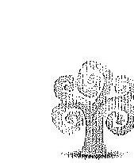

Messelerdő Zrt.
7623 Fécs, Bét u. 8. telefon: +36 72508200 fax: +36 72508201 e-mail: info@mecselerdoc.bu www.mecsekerdoc.bu adószám: 11009429-2-02

Állami Számvevőszék
1052 Budapest, Apázzai Csere János utca 10
1364 Budapest 4 pf. 54
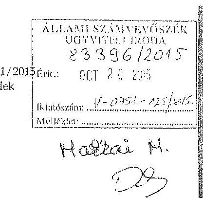

Domokos László elnök részére

# Tisztelt Elnök Úr! 

Hivatkozva folyó a hó 02-án kézhez vett V-0751-118/2015. iktatószámú, „Az állami tulajdonban álló erdőgazdasági társaságok vagyongazdálkodási tevékenységének ellenőrzése - Mecsekeriő Zrt." című számvevőszéki jelentéstervezetre, az alábbi észrevételeket teszi a Társaság:

## 1. észrevétel - formal (5. oldal/ 5. bekezdés)

A mondat eleje lemaradt: „ályzatanörzés várható hasznosulásékként ..."
2. észrevétel - érdemi (7. oldal/ 2-3. bekezdés)

A megállapítás szerint: „A Társaság éves mérlegei nem a valós állapotot tükrösték, a Számv. tv. elöirása ellenére nem tartalmazták a vagyonkezelésben lévő állami erdők és azzal szerves egységet képező egyéb földterületek értékét." Továbbá: „A Társaság által kezelt vagyonról vezetett nyilvántartás nem felelt meg a Vhr.-ben foglaltaknak, mert nem tartalmazta a vagyonkezelt eszközök könyv szerinti bruttó és nettó értékét..."

A Társaság álláspontja szerint a megállapítás helytelen.
Egyrészt az Nvtv. 10. § (1) szerint: „A nemzeti vagyont, annak értékét és változásait a tulajdonosi joggyakorló nyilvántartja. Az érték nyilvántartásától, el lehet tekinteni, ha az adott vagyontárgy értéke természeténél, jellegénél fogva nem állapítható meg."

Másrészt a Pénzügyminisztérium 9806/1997 (NG-1129/97.) számú „A kincstári vagyon számviteli elszámolása a vagyonkezelőnél" tárgyú, 1997.11.25. napon kelt állásfoglalása (lásd 1. számú melléklet, 2. oldal) alapján: „A számviteli törvény 21. §-ának /3/ bekezdésében megfogalmazott elöirás feltételezi, hogy a kezelt kincstári vagyon megfelelő módon, dokumentálton értékelésre kerül, hiszen csak ez esetben lehet azt az eszközök és a kötelezettségek között értékkel kimutatni. Ebböl - természetesen - az is következik, amíg megfelelő értékelés nem áll rendelkezésre, vagy az adott kincstári vagyont nem lehet - természeténél fogva - értékelni, addig /és akkor/ nem lehet /nem tudjuk/ alkalmazni a törvény hivatkozott 21. §/3/ bekezdésének rendelkezését sem."

HarmaJrészt pedig a vagyonkezelt terület nagysága (cca. 34 ezer hektár, cca. 13 ezer erdőrészlet, cca. 4 ezer helyrajzi szám) és változatossága (fafaj, terep-, talaj-, illetve klimatikus viszonyok, stb.) miatt a tényleges érték meghatározása és annak folyamatos (akár évenkénti aktualizálással való) nyilvántartása ellentétes a Szv. tv. költség-haszon összevetésének elvével. Nem keletkezik akkora haszon a „pontos" értékbeli nyilvántartással, mint amennyibe kerülne ennek a nyilvántartásnak az összeállítása, illetve folyamatos nyomon követése.

Továbbá megemlítendő, hogy a Társaság az éves beszámolók kiegészítő mellékleteiben folyamatosan tájékoztatta az érdekelteket a kezelt állami vagyonról. Az általános rész „A

---

Társaság adottságainak, piaci helyzetének rövid bemutatása" címú fejezete naturálisan mutatja be a kezelt állami vagyon nagyságát. Ezenkívül a mérleghez kapcsolódó kiegészítéseket tartalmazó fejezet szöveges része „A vagyonkezelésbe vett állami vagyonról" bekezdéssel kezdődik, mely kitér az értékbeli bemutatás hiányának okaira.

# 3. észrevétel - érdemi (7. oldal/ 4. bekezdés) 

A jelenvés szerint: „A Társaság nem rendelkezett a kezelt vagyonról vezetett nyilvántartás kiinduló adatait tartalmazó, a vagyonkezelési szerzödés eredeti, hiteles, a vagyonkezelt eszközök felsorolását tartalmazó 1-4. mellékleteivel."

A Társaság nem vitatja a megállapítást, azonban kéri figyelembe venni a következőket. Az 1996-ban megkötött VSZ létrejöttének körülményeit a Társaság 2015-ben már sem az irattár adataiból, sem egyéb módon nem tudja felderíteni. Arra nézve, hogy miért nem történt meg az aláirt szerződés valamennyi mellékletének megküldése a tulajdonosi joggyakorló KVI részéről, nem állnak rendelkezésre információk. Az időközben a tulajdonosi joggyakorló személyében bekövetkezett változások ezen eredeti mellékletek beszerzését nem tették lehetővé.

## 4. észrevétel - érdemi (8. oldal/ 2. bekezdés)

A megállapítás szerint: „A VSZ 3.3.2. pontjában foglaltak ellenére a felek a szerzödést évente nem vizsgálták felül, a VSZ az ellenörzött időszakban nem felelt meg a hatályos rendelkezéseknek, hatályon kivül helyezett jogszabályi hivatkozásokat tartalmazott, illetve nem tartalmazott minden szükséges elööríst. A felek nem tettek eleget a Vhr. előírásának sem, mert a Vhr. hatályba lépését követő hat hónapon belül nem kezdeményezték a Nemzeti Földalapba tartozó ingatlanokra vonatkozóan a VSZ megszüntetését és a jogszabályoknak megfelelő szerződés megkötését."

A Társaság álláspontja szerint a megállapítás így nem a valós képet tükrözi.
Az Alapitó Okirat 12.2. zs) pontja [későbbiekben a 12.2. bb) pont] alapján az egyedüli részvényes kizárólagos hatáskörébe tartozik az állami erdőterületek kezelésére vonatkozó vagyonkezelési szerződés megkötése. A Társaság ennek megfelelően folyamatosan tájékoztatta az aktuális tulajdonosi joggyakorlót a szerződéssel kapcsolatos anomáliákról. A fentiek alátámasztására csak néhány kiemelt adat a tulajdonosi joggyakorló felé benyújtott beszámolókból:

- 2011. I-III. negyedéves beszámoló
(küldve: 2011.10.17.)
„1.6. Alapitói/felügyelőbizottsági döntést igénylő kérdések (8. old.)
Tulajdonosi jogokat gyakorló döntését igényli az új vállalatirányitási rendszer mielőbbi kiválasztása és a végleges vagyonkezelői szerzödés megkötése."
- 2014. I-III. negyedéves beszámoló
(küldve: 2014.10.29.)
„X. Feszültségpontok
Tulajdonosi, felügyelőbizottsági döntést igénylő kérdések (19. old.)
A Magyar Állam tulajdonában álló ingatlanokra vonatkozó végleges vagyonkezelési szerzödés megkötése még várat magára. Tulajdonosi joggyakorló döntési hatáskörébe tartozik."

5. észrevétel - érdemi (8. oldal/ 2-3. bekezdés)

A jelentés szerint: „... a felek a szerzödést nem vizsgálták felül, a VSz az ellenörzött időszakban nem felelt meg a hatályos rendelkezéseknek." Továbbá: „A Társaság által kezelt vagyonelemek több-

---

szári változása ellenére nem tartották be a Vhr-ben elöírt, a VSz 60 napon belüli egységes szerkezetbe foglalására vonatkozó rendelkezést."

A Társaság megítélése szerint a VSZ évente történő felülvizsgálata a tulajdonosi joggyakorló döntési kompetenciájába tartozó kérdés (részletesen kifejtve a 4. észrevétel alatt). A Társaság a saját oldaláról a vagyonkezelt ingatlanállományra vonatkozóan a felülvizsgálatnak eleget tett, hiszen az évközi változásokat folyamatosan felvitte a nyilvántartásba, és a tárgyévet követő év május 30 -ig jelentette a tulajdonosi joggyakorlónak.

Emedett a jogszabályok attól függetlenül kötelező erővel bírnak, hogy szerepelnek-e nevesítve és hatályos hivatkozásokkal a VSZ-ben.

A Vhr-ben nevesített kötelezettség - miszerint „a Vhr. hatályba lépésétől számított hat hónapon belül a Nemzeti Földalapba tartozó ingatlanok kapcsán kezdeményezni kell a vagyonkezelési szerzödés megszüntetését és a Vhr-nek meghaló új szerzödés köteését"- a Társaság megítélése szerint a tulajdonosi joggyakorló (jelen esetben az NFA) kompetenciájába tartozó kérdés, mivel az összes állami tulajdonban lévő erdőgazdaság érintett e körben.

A VSZ körébe tartozó ingatlanok változása esetén a Vhr. 8. § (2) bekezdése elơírja, hogy ebben az esetben a VSZ-t a változásokkal egységes szerkezetbe kell foglalni. A tulajdonosi joggyakorlóval ilyen tárgyban kötött ügyleteknél a tulajdonosi joggyakorló egyedi szerződéseket készített elő a Társaság számára, a VSZ egységes szerkezetbe foglalására nem került sor. A VSZ és annak módosításai azonban így is jól áttekinthetők, így az állami vagyonnal való megfelelő gazdálkodás érdeke nem sérült. Megjegyzés: a hivatkozott jogszabályhelyet 2015. szeptember 09-i hatállyal a jogalkotó hatályon kívül helyezte.

# 6. észrevétel - formai (8. oldal/ 4. bekezdés) 

A jelentés szerint: „A VSZ 3.2.3. pontja rendelkezett a vagyonkezelői jog harmadik személynek történő átengedésének feltételeiről, azonban ez 2012-től ellentétes a Notv.-ben foglaltakkal, amely tiltja a vagyonkezelői jog harmadik személynek való átengedését.".

A Társaság álláspontja szerint a megállapítás ugyan igaz, de úgy mutatja be mintha a Társaság élt volna a vagyonkezelői jog átengedésével. A 9. oldal tetején már egyértelműen fogalmaz a jelentés ezzel kapcsolatosan („a vagyonkezelői jogot harmadik személynek nem engedték át"). A Társaság szerint nyomatékosítani kellene, hogy ez csak a szerződéssel, és nem a Társaság magatartásával kapcsolatos kifogásként jelenik meg a jelentésben.

## 7. észrevétel - érdemi (9. oldal/ 4. bekezdés)

A megállapítás szerint: „A könyovizsgáló az ellenőrzött időszakban nem kifogásolta, hogy a mérlegben a Társaság nem szerepeitette a vagyonkezelt eszközöket.".

A Társaság álláspontja szerint a megállapítás nem helytálló.
A Társaság a kiegészítő mellékletben mind természetes mértékegységben, mind értékben (nulla értékkel) bemutatta a vagyonkezelt eszközöket (részletesen kifejtve a 2. észrevétel alatt).

## 8. észrevétel - érdemi (10. oldal/ 1. bekezdés)

A jelentés szerint: „A Társaság... a közérdekú adatok megismerésére irányuló igények teljesitésének rendjét rögzitő szabályzat-készittési kötelezettségének nem tett eleget."

A Társaság szerint a megállapítás alaptalan. Az Infotv. 30. § (6) bekezdése a közfeladatot ellátó szerv számára előírja a szabályzatkészítést a közérdekú adatigénylésekkel kapcsolatban. A Társaság a tárgyban belső szabályozással (8/2013. (XI. 13.) sz. vezérigazgatói utasítás, lásd 11. számú melléklet) rendelkezik. A „szabályzat" vagy „utasítás" megnevezésnek ebben

---

a körben a Társaság nem tulajdonít jelentőséget, hiszen a törvény által megkivánt belső normával rendelkezik.

# 9. észrevétel - érdemi (13. oldal/ 4. bekezdés) 

A megállapítás szerint: „... a kiegészitő mellékletben az önellenőrzéssel módosított adatok nem a Számv. tv. 88. § (5) bekezdésében foglaltak szerint, az eredményre, az eszközök és források állományára gyakorolt hatások évenkénti bontásában kerültek bemutatásra."

A Társaság álláspontja szerint a megállapítás valótlan.
A 2011. évi éves beszámoló részét képező kiegészítő melléklet (lásd 2. számú melléklet) 23. oldalán található táblázat mérleg, illetve eredmény-kimutatás sorosan és éves bontásban mutatja be a 2009-2010. évekre vonatkozóan feltárt lényeges hibás állítások tételeit.

## 10. észrevétel - érdemi (15. oldal/ 1. bekezdés)

A jelentés szerint: „A 2009. évben a speciális erdei tanösvény, a 2010. évben a Véménd vadkerités épitése és a Sásvölgy Erdő háza, valamint egy szerver beszerzés elszámolása során nem tettek eleget a Számv. tv. 52. § (2) bekezdésében, a Bizonylati szabályzat-ban, valamint a Beruházási szabályzatban elöirt üzembe helyezési bizonylat-készitési kötelezettségnek, mert a beruházások üzembe helyezését hitelt érdemlő́en nem dokumentálták."

A Társaság álláspontja szerint a megállapítás helytelen, a Mozgássérült tanösvény, a Véménd vadkerítés, a Sásvölgy Erdő Háza, valamint a 2012. évi szerver beszerzés üzembe helyezési bizonylatainak másolatát a 7-10. számú mellékletek tartalmazzák.

## 11. észrevétel - érdemi (15. oldal/ 1. bekezdés)

A jelentés szerint: „A Sasrét Vadászház és a Köveslető vadászház aktiválása esetében a maradványérték meghatározása nem felelt meg az Értékelési szabályzat 3.1.2 Tárgyi eszközök e) pontjában meghatározott elöirásnak, amely szerint az ingatlan bekerülési értékének 20\%-dig lehetett a maradványértéket megállapítani."

A Társaság álláspontja szerint a megállapítás téves. Az Értékelési Szabályzat irányadó maradványértéket és leírási kulcsot határoz meg, melyet a Számviteli törvény 16. § (1) bekezdésében foglalt egyedi értékelés elvének szem előtt tartásával kell alkalmazni.

## 12. észrevétel - érdemi (18. oldal/ 5. bekezdés)

A jelentés szerint: „Az NFA a számlákon a vagyonkezelési alijat egy összeghen szerepeltette, azokon nem tüntette fel a számlázás alapját képező földterület nagyságát, igy nem volt megállapítható a számlák tartalmi megfelelösége."

A Társaság álláspontja szerint a megállapítás nem teljeskörü. Az NFA a számlákon a vagyonkezelési díj részletezését (földterületek nagyságát) annak ellenére nem tüntette fel, hogy azt a Társaság több ízben kérte (3-4. számú melléklet). Végül a hiányzó adatok pótlására a Társaság a saját nyilvántartása szerinti ingatlanlistát (5. számú melléklet) csatolta a beérkezett számlához mellékletként, melyet az NFA részére is megküldött. A társaság nyilvántartása szerinti ingatlanlista alapján ellenőrizhető volt a kiszámlázott vagyonkezelői dí alapjául szolgáló földterület nagysága, így a számlák tartalmi megfelelősége igazolt.

## 13. észrevétel - érdemi (19. oldal/ 1. bekezdés)

A jelentés szerint: „A Társaság nem teljes körüen rendelkezett a kezelt vagyon tekintetében pontos és naprakész információnal a tulajdonosi jogokat gyakorlóröl, igy a Társaság által vezetett nyilván-

---

tartás nem biztosította a Vhr. 14. § (1) bekezdésében foglalt, az adatszolgáltatás pontosságára vonatkozó követelményt."

A Társaság álláspontja szerint a megállapítás nem fedi a valóságot. A kezelt vagyonra vonatkozó nyílvántartást a Társaság a Kincstári Vagyonhataszteri Programban vezeti, teljeskörűen. A Társaság ebben a nyilvántartási rendszerben változtatást földhivatali határozat alapján végez. A nyilvántartásból így kétséget kizáróan kiderülnek az adott ingatlan egyes paraméterei (terület nagysága, fekvés, művelési ág, tulajdonosi joggyakorló, stb.). Emiatt a nyilvántartás alkalmas a vagyonkezelt ingatlanok teljes és pontos nyilvántartására.
14. észrevétel - érdemi (20. oldal/ 3.3. fejezet)

A jelentés szerint: „A Társaság a vagyongazdálkodási tevékenysége során az erdőgazdálkodásra vonatkozó speciális szakmai jogszabályi normákat nem teljes körüen tartotta be." Továbbá: „Az Erdészeti Hatóság az ellenörzött időszakban erö̈védeimi és erdőgazdálkodási birság címén 13 esetben, öszszesen 3,3 M Ft birságet szabott ki. Az erdővédeimi birságokat a vadászható vadfajok által az erdőeitések sikeres felújitása területén okozott vadkár miatt állapították meg..."

A Társaság álláspontja szerint a megállapítás ugyan valós, de a bírságoknak csekély súlya van a teljes gazdálkodásra, illetve az ideiglenes kezelt terület nagyságához viszonyítva. A Társaság éves szinten átlagosan $3900-4000$ ha folyamatos erdőfelújítást végez. A leadott dokumentumok alapján a Társaság területén éves szinten a bírságok az alábbi területnagyságokat érintették:

| Év | Károsított terület (ha) | Bírság (Ft) |
| :--: | :--: | :--: |
| 2009 | 1,90 | 305900 |
| 2010 | 1,71 | 76780 |
| 2011 | 13,48 | 1480350 |
| 2012 | 9,20 | 770200 |
| 2013 | 7,36 | 404300 |
| Végösszeg | $\mathbf{3 3 , 6 5}$ | $\mathbf{3 0 3 7 5 3 0}$ |

A Társaság a vadkár elleni védekezésre minden rendelkezésére álló lehetőséget felhasznál. A megelőzés főbb módjai: villanypásztor, vadkárelháritó kerítés, egyedi törzsvédelem, örzés, riasztás, vadkárelháritó vadászat. A folyamatos kármegelőzés és védekezés ellenére is bekövetkezhet az erdősítésben $30 \%$-ot meghaladó vadkár. A károsított területek nagysága igen kis mértékủ a folyamatos erdőfelújítások területéhez képest. Ki kell emelni, hogy a károsított erdőfelújításokban végzetes kár nem keletkezett, ezekből az erdőrészletekből is jó minőségủ erdő lesz a jövőben.

Az érintett erdőrészletek kapcsán meg kell említeni, hogy a komolyabb vadkár elleni vé-dekezés - mint például a kerítés létesítése - jóval nagyobb költséget jelentett volna a bírságok összegénél.

# 15. észrevétel - érdemi (22. oldal/ 1. bekezdés) 

A jelentés szerint: „... a 2010. évi beszámoló megtárgyalásakor a hitel nyúijása és a kezességvállalás kapcsán nem észrevételezték, hogy a jogügyletre vonatkozó döntések az Alapitó Okirat 12.2 pontjába ütköznek..."

A Társaság véleménye szerint:
a) A jelentés szövegéből nem derül ki pontosan, hogy mely hitelügyletről van szó. Csak valószintúsíthető, hogy a megállapítás az Unic-Fagus Kft-hez kapcsolódik.

---

A Társaság nem hitelt, hanem kölcsönt nyújtott 2010.01.07-én. A kölcsön nyújtása nem volt ellentétes az Alapitó Okirat (lásd 6. számú melléklet) 12.2. pontjának egyetlen bekezdésével sem.
b) A két készfizető kezességi szerződés 2009.12.15-én jött létre:

- a HC/09/18201361/2 sz. készfizető kezességi szerződés a Szigetvár és

Vidéke Takarékszövetkezet mint hitelezö és a Mecsekerdő Zrt. mint készfizető kezes között a HC/09/18201361 sz. kölcsönszerződéshez kapcsolódóan, 94.757 .000 Ft értékben és

- a HC/09/18211362/2 sz. készfizető kezességi szerződés a Mecsekerdő

Zrt. mint készfizető kezes és a Szigetvár és Vidéke Takarékszövetkezet között a
$\mathrm{HC} / 09 / 18211362$ sz. kölcsönszerződéshez kapcsolódóan, 47.378 .000 Ft értékben.
A fenti kezességvállalások nem ütköznek az Alapitó Okirat 12.2. pontjának egyetlen bekezdésével sem. Az m) pont kifejezetten meghatározza, hogy az egyedüli részvényes kizárólagos hatáskörébe tartozik a „döntés minden olyan jogügyletről, amely által a társaság az alapilke $50 \%$-át meghaladó mértékben vállalna garanciát, kezességet vagy hasonló kötelezettséget." A kifogásolt tцуlet nem haladta meg ezt az értékhatárt.
c) A kezességvállalásra 2009. évben került sor, így a 2010. évi beszámoló tárgyalásakor már nem lehetett releváns ennek tárgyalása.

A jelentés tervezetben több helyen ismétlődnek a megállapítások. A Társaság csak az egyik helyre hivatkozik. A további helyeken előforduló - ismételt - megállapításokra való hivatkozástól a Társaság eltekintett.

Pécs, 2015.10.15.

Mellékletek:

1. számú melléklet - PM állásfoglalás
2. számú melléklet - 2011. évi beszámoló kiegészitő melléklete
3. számú melléklet - NFA részére küldött egyeztető levél
4. számú melléklet - NFA részére küldött egyeztető levél
5. számú melléklet - Számla melléklet
6. számú melléklet - Alapitó okirat 2010.07.13.
7. számú melléklet - Lapis szerver aktiválási jkv
8. számú melléklet - Mozgásérült tanósvény aktiválási jkv
9. számú melléklet - Sásvölgy Erdő Háza aktiválási jkv
10. számú melléklet - Véménd vadkerítés aktiválási jkv
11. számú melléklet - 8_2013_XI_13_vig_ut_közérdekú_adatigénylés_2013_11_13

---

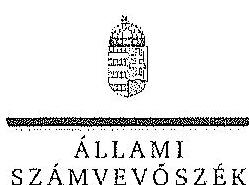

ELNÖK

Iktazám: V-0751-131/2015.

Keszi László úr
vezérigazgató
Mecsekerdő Zrt.

Péés

Tisztelt Vezérigazgató Úr!

A „Jelentéstervezet az állami tulajdonban álló erdőgazdasági társaságok vagyongazdálkodási tevékenységének ellenőrzése - Mecsekerdő Zrt.” címmel készített számvevőszéki jelentéstervezetre tett észrevételeit köszönettel megkaptam.

Az Állami Számvevőszék észrevételekre vonatkozó álláspontjáról a felügyeleti vezető által készített részletes tájékoztatást csatoltan megküldöm.

Tájékoztatom Vezérigazgató urat, hogy a számvevőszéki jelentésben - az Állami Számvevőszékről szóló 2011. évi LXVI. törvény 29. § (3) bekezdése alapján - a figyelembe nem vett észrevételeket szerepeltetjük az elutasítás indokának feltüntetésével.

Budapest, 2015.

hó nap

Tisztelettel:

Domokos László

Melléklet: Tájékoztatás az elfogadott és az el nem fogadott észrevételekről

1052 BUDAPEST, APÁGZAI CSERE JÁNOS UTCA 10. 1384 Budapest 4. Pf. 54 telefon: 484 9101 fax: 484 9201

---

# Tájékoztatás   az elfogadott és az el nem fogadott észrevételekröl 

A „Jelentéstervezet az állami tulajdonban álló erdőgazdasági társaságok vagyongazdálkadási tevékenységének ellenörzése - Mecsekerdő Zrt." címü jelentéstervezetre 2015. október 20-án érkezett észrevételeit áttekintettük, azok kezelésével kapcsolatban a következő tájékoztatást adom.

## 1. észrevétel - formai (5. oldal/ 5. bekezdés)

A formai hibát az ÁSZ másolati példányán nem tudtuk azonosítani, elnézést kérünk a formai hiba okozta esetleges kellemetlenségért.

## 2. észrevétel - érdemi (7. oldal/ 2-3. bekezdés)

Az állami vagyonnal való gazdálkodásról szóló 254/2007. (X. 4.) Korm. rendelet (továbbiakban: Vhr.) 9. § (9) bekezdés a) pontja alapján a vagyonkezelő köteles a vagyonkezelésbe vett eszközöket a számviteli törvény szerint a hosszú lejáratú kötelezettségekkel szemben a vagyonkezelési szerződésben rögzített értéken állományba venni. A számvitelről szóló 2000 . évi C. törvény (továbbiakban: Számv. tv.) 23. § (2) bekezdése alapján a vagyonkezelőnél a mérlegben eszközként kell kimutatni a törvényi rendelkezés, illetve felhatalmazás alapján - kezelésbe vett, az állami vagy önkormányzati vagyon részét képező eszközöket is. Az ideiglenes vagyonkezelési szerződésben (továbbiakban: VSZ) a vagyonkezelésbe adott vagyon értékét nem rögzítették, továbbá a szerződés azt sem tartalmazta, hogy a vagyonkezelt eszközök értéke nulla. A Társaság a Számv. tv. 23. § (2) bekezdésében és a Vhr. 9. § (9) bekezdés a) pontjában foglalt előírások betartása céljából nem tett lépéseket annak érdekében, hogy a vagyonkezelt eszközök értéke a VSZ-ben rögzítésre kerüljön. Megállapításunk helytálló, módosítása nem indokolt.

## 3. észrevétel - érdemi (7. oldal/ 4. bekezdés)

Az észrevétel a megállapítás helytállóságát nem vitatja, a megállapítás módosítása nem szükséges.
4. észrevétel - érdemi (8. oldal/ 2. bekezdés)

A VSZ 3.3.2. pontja szerint a VSZ-t a felek a tárgyévet megelőző év november 30-ig felülvizsgálják. A VSZ évente előírt felülvizsgálata nem történt meg, azt az észrevétel sem vitatja. Az észrevételezett megállapítás a VSZ jogszabályi előírásoknak való

---

megfelelőségét kifogásolja, az Alapító Okirat 12.2. zs), illetve 12.2. bb) pontja a vagyonkezelési szerződés megkötésére vonatkozik. Megállapításunk helytálló, módosítása nem indokolt.

# 5. észrevétel - érdemi (8. oldal / 2-3. bekezdés) 

A Vhr. 8. § (2) bekezdése előírja, hogy amennyiben a felek ugyanabban a szerződésben több állami tulajdonba tartozó vagyonelem vagyonkezeléséről rendelkeztek, a szerződés hatálya alá tartozó vagyontárgyak körének változása esetén kötelesek a szerződést hatvan napon belül a módosításokkal egységes szerkezetbe foglalni. A VSZ 3.3.2. pontja szerint a VSZ-t a felek a tárgyévet megelőző év november 30-ig felülvizsgálják.

A Vhr. 1. § (1) bekezdése szerint a rendelet hatálya az állami vagyonnal kapcsolatos eljárásokra, jogügyletekre, jogviszonyokra, valamint az azokban részt vevő természetes és jogi személyekre (jogi személyiséggel nem rendelkező gazdálkodó szervezetekre) terjed ki, így a Vhr. rendelkezései vonatkoznak a Társaságra. A Vhr. 54. § (7) bekezdése nem nevesíti, hogy kinek kell kezdeményezni a Vhr. hatályba lépését követő hat hónapon belül a VSZ megszüntetését, és a Vtv., illetve a Vhr. szabályainak megfelelő szerződés megkötését. A VSZ szerint az egyik szerződő fél (vagyonkezelő) a Mecsekerdő Zrt.. Ezért a megállapítások módosítása nem indokolt.

## 6. észrevétel - formai (8. oldal/ 4. bekezdés)

A megállapítás helytállóságát az észrevétel nem vitatja. A megállapítás egyértelműen tartalmazza, hogy a VSZ 3.2.3. pontjára vonatkozik, ezért pontosítása nem indokolt.

## 7. észrevétel - érdemi (9. oldal/ 4. bekezdés

A Számv. tv. 23. § (2) bekezdés alapján a vagyonkezelőnél a mérlegben eszközként kell kimutatni a - törvényi rendelkezés, illetve felhatalmazás alapján - kezelésbe vett, az állami vagy önkormányzati vagyon részét képező eszközöket is. A Társaság mérlege nem tartalmazta a vagyonkezelt eszközök értékét, és ezt a könyvvizsgáló nem kifogásolta. Megállapításunk helytálló, módosítása nem indokolt.
8. észrevétel - érdemi (10. oldal/ 1. bekezdés)

A rendelkezésre bocsátott vezérigazgatói utasítás nem tekinthető a közérdekủ adatok megismerésére irányuló igények teljesítése rendjének, mert nem tartalmazza a közérdekủ adatot igényló személynek az eljárás során végrehajtandó feladatait és jogait. A megállapítás módosítása nem indokolt.
9. észrevétel - érdemi (13. oldal/ 4. bekezdés)

A dokumentumok ismételt áttekintését követően a jelentéstervezet 13. oldal 4. bekezdés 1. mondatának utolsó - a kiegészítő mellékletre vonatkozó - részét töröljük.

---

# 10. észrevétel - érdemi (15. oldal/ 1. bekezdés) 

A speciális enlei tanösvény, Véménd vaskerítés építése, Sásvölgy Erdő háza, valamint a szerver beszerzéshez kapcsolódóan az üzembe helyezést hitelt érdemlően igazoló dokumentumokat - a teljességi nyilatkozatban szereplő dokumentumok között, annak aláírásáig - a Mecsekerdő Zrt. nem bocsátotta az ellenőrzés rendelkezésére, azok valódiságáról az ellenőrzés meggyőződni nem tudott. Ezért a megállapítás módosítása nem szükséges.

## 11. észrevétel - érdemi (15. oldal/ 1.bekezdés)

A dokumentumok ismételt áttekintését követően a jelentéstervezet 15 . oldal 1 . bekezdés 4. mondatát töröljük.

## 12. észrevétel - érdemi (18. oldal/ 5. bekezdés)

Az NFA által kibocsátott számlákon a számlázás alapját képező földterület nagyságát nem tüntették fel, ezért a számlák tartalmi megfelelősége az azokon feltüntetett adatok alapján nem volt megállapítható, továbbá az NFA a számlákhoz az ellenőrizhetőséget biztosító mellékletet sem készített. Megállapításunk helytálló, módosítása nem indokolt.

## 13. észrevétel - érdemi (19. oldal/ 1. bekezdés)

A Társaság nem rendelkezett a VSZ hiteles mellékleteivel, amelyek a kezelésbe vett vagyonelemek, így a kezelt vagyonról vezetett nyilvántartás kiinduló adatait tartalmazták, továbbá a Társaság nem teljes körűen rendelkezett a kezelt vagyon tekintetében pontos és naprakész információval a tulajdonosi joggyakorlóról. Az MNV Zrt., az NFA és a Társaság az ellenőrzött időszakban több alkalommal adategyeztetést kezdeményezett a tulajdonosi joggyakorló tisztázására és a kezelt vagyonelemekről vezetett nyilvántartások egyezőségének biztosítására. Az egyeztetés az ellenőrzés befejezéséig nem záródott le. Ezért a Társaság által vezetett nyilvántartás nem a pontos, naprakész, egyeztetett adatokat tartalmazta, tehát nem biztosította az adatszolgáltatás pontoságára vonatkozó követelményt. Megállapításunk helytálló, módosítása nem indokolt.

## 14. észrevétel - érdemi (20. oldal/ 3.3. fejezet)

Az erdőgazdálkodási és erdővédelmi bírságokkal kapcsolatos tájékoztatásukat köszönjük. Az észrevétel a megállapítást nem vitatja, ezért annak módosítása nem szükséges.

## 15. észrevétel - érdemi (22. oldal/ 1. bekezdés)

Az Alapító Okirat 12.2. u) pontja arról rendelkezik, hogy a Társaság vagyonának 50 millió forintot meghaladó mértékủ megterhelése az egyedüli részvényes, az MNV Zrt. kizárólagos hatáskörébe tartozik. A 13. 3. s) pontja előírja, hogy a Társaság vagyonának 20 millió forintot meghaladó, de 50 millió forintot el nem érő mértékủ megterhelése az Igazgatóság hatáskörébe tartozik. A rendelkezésre álló dokumentumok ismételt

---

áttekintését követően a jelentéstervezet 22. oldal 1. bekezdés 2. mondatát az aláhbiak szerint pontosítjuk:
..Az FB az ülésein minden évben megtárgyalta az éves üzleti terveket, az üzleti jelentéseket, a Társaság éves beszámolóit és minden olyan elöterjesztést, amely a tulajdonosi joggyakorlóı2 számára készült, azonban a 2009., illetve 2010. évi beszámoló megtárgyalásakor az Unic-Fagus Kft. részére 53 millió Ft értékben történt kölcsön nyújtása és a Szigetvári Takarékszövetkezettel, illetve az Invest-Trade Kft.vel kötött két szerzödéshez kapcsolódóan 94,7 millió Ft, illetve 47,4 millió Ft értékủ készfizetü kezességvállalás kapcsán nem észrevételezték, hogy a jogügyletre vonatkozó döntések az Alapító Okirat 12.2. u), illetve 13.3. s) pontjába ütköznek és a Gt. 35. § (4) bekezdésében foglaltak szerint a Társaság legföbb szervének összehívását nem kezdeményezték."

Budapest, 2015. 4 hó 35 nap
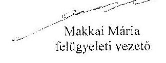

---

.

---

# 10. SZÁMÚ MELLÉKLET A V-0751-133/2015. SZÁMÚ JELENTÉSHEZ 

## 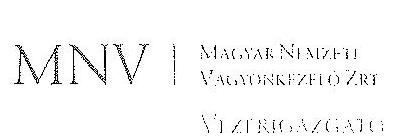

Állami Számvevőszék

## Domokos László

elnök

1052 Budapest
Apáczai Cs. J. u. 10.

Ikt. sz.: MNV/01/49024/ f /2015.
Hiv. sz.: V-0751-120/2015.

Tisztelt Elnök Úr!
A 2015. október 5. napján „Az állami tulajdonban álló erdőgazdasági társaságok vagyongazdálkodási tevékenységének ellenörzése - Mecsekerdö Zrt." tárgyában kézhez vett V-0751-120/2015. ikt. sz. Jelentéstervezetre az alábbi észrevételeket kívánom tenni.

L. fejezet / 10. old. harmadik-negvedik bekezdés, 11. old. ebö-második bekezdés, 11.5. fejezet / 24. old. második bekezdés és 11. old. Javaslat az MNV Zrt. vezérigazgatójának a)-c) postok
„A vagyonkezelésbe adott állami vagyon tekintetében tulajdonosi jogokat gyakorló MNV Zrt. és NFA tevékenysége az ellenörzött idöszakban nem támogatta teljes körüen a felelös vagyongazdálkodás megvalósulását, a VSZ-szel kapcsolatban feltárt hiányosságok megszüntetésére és a hatályos jogszabályoknak való megfeleltetésse vonatkozóan nem kezdeményeztek intézkedéseket, nem éltek a Vhr.-ben és a 262/2010. (XI.17.) Korm. rend. 47. § (1)-(2) bekezdéseiben foglalt, a kezelt vagyon használatára vonatkozó ellenörzési jogukkal, valamint nem ellenörïzték a vagyonnyilvántartás hitelességét, helyességét és teljességét.

A Mecsekerdö Zrt. a KVI-vel 1996. október 16-án kötött vagyonkezelési szerzödés alapján végezte a Magyar Állami tulajdonában álló erdővagyon és egyéb múoriési ágú termöföld ingatlanok kezelését. A Társaság, mint vagyonkezelö és a KVI között létrejött szerzödéses jogviszony kereteit a VSZ-ben foglalt jogok és kötelezettségeket töltötték ki. A VSZ nem támogatta a Vhr. 3. § (1) bekezdésében foglalt, a vagyongazdálkodási feladatok átlátható módon történő végrehajtását, valamint nem támogatta a szabályszerű vagyongazdálkodást. A VSZ 3.3.2. pontjában foglaltak ellenére a felek a szerzödést évente nem vizsgálták felül, így az az ellenőrzött idöszakban nem felelt meg a hatályos rendelkezéseknek, hatályon kívül helyezett jogszabályi hivatkozásokat tartalmazott az Áht. 109/B. §. 109/G. §, a Vadvédelmi iv. 98. § rendelkezései vonatkozásában. Nem tartalmazza a Vhr. 9. § (8) bekezdésében 2011. január 1-jétől elöírt, az érintett vagyonvédelem esetleges védettségét, illetve Natura 2000 területek minösitését. A VSZ vagyonkezelöi jog átengedésére vonatkozó 3.2.3. pontja 2012-iöl nem felelt meg az Nvtr. 11. § (8) bekezdésében foglaltaknak, amely szerint a Társaság a vagyonkezelöi jogát harmadik személyre nem ruházhatta át, a felek nem tettek eleget a Vhr. 54. § (7) bekezdésében foglalta rendelkezéseik és a Vhr. hatálybalépését követő hat hónapon belül nem kezdeményezték a Nemzeti Földalapba tartozó ingatlanokra vonatkozóan a VSZ megszüntetését és a Vtv., illetve Vhr. szabályainak megfelelő szerzödés megkötését.

A vagyonkezelésbe adott állami vagyon tekintetében tulajdonosi jogokat gyakorló MNV Zrt. és NFA nem végeztek a Vhr. 20. § (1)-(2) bekezdéseiben és a Nemzeti Földalapba tartozó földrészletek hasznosításának részletes szabályairól szóló 262/2010. (XI.17.) Korm. rendelet 47. §(1)-(2) bekezdéseiben foglalt, a vagyonnyilvántartás hitelességére, teljességére és helyességére vonatkozó ellenörzést a Társaságnál.

---

# Jonsika az MNV Zrt. vezérigazgatójának 

a) Tegyen intézkedéseket az erdőgazdasági társaság közremüködésével a tényleges állapotot rögzitő és a hatályos jogszabályi elöírásoknak megfelelő vagyonkezelési szerzödés megkötésére.
b) Tegyen intézkedéseket a vagyonkezelési szerzödés felülvizsgálatának elmaradásával, valamint a Nemzeti Földalapba tartozó ingatlanokra vonatkozó VSZ megszüntetésével összefüggésben feltárt szabálytalanságok tekintetében a felelősség tisztázása érdekében, és szükség szerint intézkedjen a felelősség érvényesitéséröl.
c) Intézkedjen a Társaság vagyonnyilvántartása hitelességének, teljességének és helyességének jogszabályban foglaltak szerinti ellenörzéséről."

Sajnálattal állapítottuk meg, hogy a Jelentés-tervezet egyáltalán nem veszi figyelembe a vizsgált időszakban megindított és több eljárási cselekményt is magába foglaló intézkedés-sorozatunkat, amelynek a célja a Jelentéstervezetben egyébiránt joggal kifogásolt hiányosságok megszüntetése, az erdőgazdasági társaságok müködésének jogszabályi megfelelőségének biztosítása volt. Ezzel a Jelentés-tervezet azt sugallja, hogy a tulajdonosi joggyakorlók részéről egyáltalán nem volt szándék az erdőgazdasági társaságok müködésének, illetve a vagyonkezelés körülményeinek hatályos jogszabályok szerinti szabályozására, amely egyébiránt nem felel meg a valóságnak és az adatszolgáltatásunk során sem erről tájékoztattuk Önöket.
Mindamellett elismerjük, hogy a probléma a kezelt vagyonelemek nagy száma, ebből kifolyólag a szabályozást igénylő körülmények nagy száma és sokrétüsége miatt nehezen átlátható, ezért kérjük, engedjék meg, hogy a munkájukat segitỏ szándékkal korábbi tájékoztatásunkat ismételten megerősítsük, azzal a kifejezett kéréssel, hogy a Jelentésükben az általunk vitalott megállapítást szíveskedjenek módosítani, és az MNV Zrt. által a megoldás irányába meglelt intézkedéseket feltüntetni.
Az ideiglenes vagyonkezelési szerződéseken alapuló kezelői jogviszony újraszabályozása, az ideiglenes vagyonkezelési szerződések megszüntetése és végleges vagyonkezelési szerződések megkötése érdekében az intézkedéseink már 2011. évben megkezdődtek, párhuzamosan a Nemzeti Földalapról szóló 2010. évi LXXXVII. tv. 34. § (3) bekezdés c) pontja szerinti feladat- illetve vagyonátadásral.

Az intézkedéseink alapja a 2011. évben, MNV/01/29518/2011. szám alatt szakterületünk által bekért, az erdőgazdasági társaságok 2010. december 31-i, illetve 2011. július 31-i fordulónapra vonatkozó leltárjelentése volt, amelyet elsődlegesen az NFA tv. szerint elöírt vagyonátadás elvégzése céljából kértünk meg az erdőgazdasági társaságoktól. Ugyanakkor a leltárjelentéshez benyújtott földrészlet listák voltak az első olyan kimutatások, amelyek a kezelt vagyon elemeit a FÖMI adatbázisán alapuló (az aktuális ingatlan-nyilvántartási állapotnak megfelelően) alrészletes bontásban tartalmazták.

## A vizsgált időszakban megindított és lefolytatott intézkedéseink a következők:

1. Az erdőgazdasági társaságok által kezelt vagyonelemek tulajdonosi joggyakorlók szerinti elhatárolása, NFA átadás előkészítése, az erdőgazdasági társaságok bevonásával. A Nemzeti Földalapba tartozó vagyonelemek NFA átadása 2012-2013. években megtartént, majd a visszamaradt vagyonelemek - többségében kivett megnevezésben nyilvántartott földrészletek - elhatárolását is elvégeztük. A feladat végrehajtása 2014. május 31-ig teljesült.
Az intézkedéssel az MNV Zrt. tulajdonosi joggyakorlása alá tartozó vagyonelemek körét - a közös tulajdonosi joggyakorlás alatt álló ingatlanok kivételével -, azaz a végleges vagyonkezelési szerződések ingatlanlistáit meghatározttuk.
Meg kívánjuk jegyezni, hogy az erdőgazdasági társaságok a 2011. évi leltárjelentéseikhez minden esetben csatolták a jelentés tartalmára vonatkozó teljességi nyilatkozatukat is, így azok tartalmát mint teljes körű adatszolgáltatást kezeltük.
A hivatkozott iratokat az eljárás során a Tisztelt Állami Számvevőszék rendelkezésére bocsátottuk.
2. Az erdőgazdasági társaságok által kezelt vagyon értékelését 2014. május 31 -ig elvégeztük, részben külső piaci szereplő által megállapított vagyonértékelési adatok (az IFUA értékbecslési adatai), részben belső szakértők és a kontrolling szakterület által az MNV Zrt hatályos értékelési szabályzata által megállapított értékadatok figyelembe vételével.

---

3. Az MNV Zrt. Igazgatósága 511/2012. (X. 08.) IG sz., valamint 717/2013. (IX. 23.) IG sz. határozataiban Intézkedési terveket fogadott el „a 28/2012. (IX. 24.) sz. RJGY határozatában előirt, valamint az MNV Zrt. rábízot vagyon 2012. évi beszámolója könyvvizsgálói minősitésének megtartásához szükséges és egyéb feladatokról". Az Intézkedési tervek magukban foglalták az erdőgazdasági társaságok által kezelt vagyon analitikájának előállítását, illetve az erdőtársaságokkal végleges (nem ideiglenes) vagyonkezelői szerződések megkötését. A 717/2013. (IX. 23.) IG sz. határozat melléklete tartalmazza a feladat végrehajtása érdekében már megtett intézkedéseket (pl. „Megtörtént az erdőgazdaságok által kezelt vagyon listáinak vagyonkezelői jelentésekkel való egyeztetése; a vagyonkezelési szerződés tartalmi kérdéseinek, az erdőgazdaságok véleményének feldolgozása, MFB Munkacsoport egyeztetések történtek stb.), valamint rögzíti a még elvégzendő feladatokat. Ennek megfelelően az MNV Zrt-nél 2012-tól folyamatban van az erdőgazdasági társaságok vagyonanalitikájának előállítása és vagyonkezelési szerződései tárgyú projekt.
A hatályos jogszabályoknak megfelelő vagyonkezelési szerződés tervezetét a vizsgálati időszak során az MNV Zrt belső szakterületi egyeztetést követően előkészítettük, és a 2014. március 18-án megtartott Munkacsoport értekezleten az erdőgazdaság képviselőivel, továbbá a tulajdonosi joggyakorlók (NFA, illetve akkor még Magyar Fejlesztési Bank Zrt.) képviselöivel ismertettük annak tartalmát. A szerződés szövegtervezetésnek véleményezése ekkor megkezdődött, ugyanakkor elismerjük, hogy a végleges szerződésváltozat már az Önök által vizsgált időszakot követően került elfogadásra. Ugyancsak a 2014. március 18-án megtartott Munkacsoport értekezleten tettünk javaslatot a vagyonkezelési díj alapjának és mértékének meghatározására.
4. Az erdőgazdasági társaságok által kezelt és a saját vagyonának vagyonelemenkénti, valamint a kezelt vagyonelemek tulajdonosi joggyakorlók szerinti elhatárolására vonatkozó intézkedésünket a vizsgált időszakban előkészítettük.

Tájékoztatjuk továbbá Elnök Urat az alábbiakról:
A Nemzeti Fejlesztési Minisztérium KGTF/377-6/2014-NFM, valamint KGTF/377-7/2014. számok alatt adott utasításokat a fenti feladatok elvégzésére. Ezekröl, illetve az utasításokra adott jelentésünkről a korábbi adatszolgáltatásunk keretében szintén kitértük.

A vagyonkezelési szerződés vizsgált időszakot követően elfogadott tervezetének mellékletét képezik az MNV Zrt azon szabályzatai is, amelyek a kezelt vagyon nyilvántartását, a beruházások nyilvántartását és az azzal kapcsolatos elszámolásokat, illetve a tulajdonosi ellenőrzéssel kapcsolatos, a jelenlegi jogszabályi környezetnek megfelelő szabályokat tartalmazzák:

- Az állami tulajdonon, egyéb vagyonkezelők által vagyonkezelt eszközön megvalósítandó beruházások, felújítások előzetes engedélyezésének és elszámolásának eljárásrendjéről szóló 35/2014. számú vezérigazgatói utasítás.
- A Magyar Nemzeti Vagyonkezelő Zrt. Tulajdonosi Ellenőrzési Szabályzata - a 39/2014. számú vezérigazgatói utasítás, továbbá
- A Magyar Nemzeti Vagyonkezelő Zrt. állami vagyon vagyonkezelőire, az állami vagyont használókra és a társasági részesedések esetében az MNV Zrt. tulajdonosi joggyakorlását megbízottként ellátókra vonatkozó Vagyon-nyilvántartási Szabályzatáról szóló 12/2014. számú vezérigazgatói utasítás.

Fentiek mellett megemlíthető az MNV Zrt. folyamatba épített, illetve vagyon nyilvántartás vezetést támogató ellenőrzési módszertauról szóló 11/2014. számú vezérigazgatói utasítás.
Egycztetéseink során az erdőgazdasági társaságok tájékoztatást kaptak a szabályzataink tartalmára vonatkozóan.
A Jelentés-tervezet 11. oldalán található, az MNV Zrt. vezérigazgatójára vonatkozó, a) pont alatti, vagyonkezelési szerződés megkötésére irányuló javaslathoz kapcsolódóan felhívjuk a Tisztelt Állami Számvevőszék figyelmét arra, hogy a Nemzeti Fejlesztési Minisztérium ÁVF/21310/2015-NFM számú tájékoztató levele szerint Miniszter Úr vagyongazdálkodási szemponthól nem támogatja az erdőgazdasági társaságok ideiglenes vagyonkezelési szerződéseit kiváltó vagyonkezelési szerződések megkötését, ideértve az MNV Zrt. vagyonkezelési szerződésekkel kapcsolatos jóváhagyó döntéseit is.

---

Az MNV Zrt-re vonatkozóan hivatkozott jogszabály, a Vhr. 20. § (1)-(2) bekezdése 2014. március 14-ig - csaknem az ellenőrzött időszak végéig - a következőképpen rendelkezett:
„(1) Az állami vagyon kezelőjét, használóját megillető jogok gyakorlását, annak szabályszorúségét, célszerüségét a Viv. 17. §-ának d) pontja alapján az MNV Zrt. - szükség szerint a területi szervei útján ellenőrzi. Ennek érdekében a vagyon kezelésére, hasznosítására kötött szerződésben rögzíteni kell, hogy a tulajdonosi ellenőrzés eljárásrendjét, a felek jogait, kötelezettségeit a felek a szerződés részének tekintik.
(2) A tulajdonosi ellenőrzés célja az állami vagyonnal való gazdálkodás vizsgálata, ennek keretében a rendeltetésellenes, jogszerü̈tlen, szerződésellenes, vagy a tulajdonos érdekeit sérıő, illetve a központi költségvetést hátrányosan érintő vagyongazdálkodási intézkedések feltárása és a jogszerü állapot helyreállítása, továbbá a vagyonnyilvántartás hitelességének, teljességének és helyességének biztosítása."

A tulajdonosi ellenőrzés alatt a Területi Irodák által folytatott ellenőrzést is értette a jogszabály, amiből egyenesen következik a szakterületi munkafolyamatba épített ellenőrzési kötelezettség figyelembe vételének a lehetősége.

Fentiekre tekintettel kérjük a Jelentés-tervezet 10-11., illetve 24. oldalán található azon megállapítások törlésé, hogy az MNV Zrt. nem kezdeményezett intézkedéseket, és nem végzett a Vhr. 20. § (1)-(2) bekezdéseiben és a Nemzeti Földalapba tartozó földrészletek hasznosításának részletes szabályairól szóló 262/2010. (XI.17.) Korm. rendelet 47. § (1)-(2) bekezdéseiben foglalt, a vagyonnyilvántartás hitelességére és teljességére vonatkozó ellenőrzést a Társaságnál, kérjük a megtett intézkedések feltüntetését, és a Jelentés-tervezet 11. oldalán található, az MNV Zrt. vezérigazgatójára vonatkozó b) pontot a megtett intézkedések folyamatosságára tekintettel törölni, a c) pont alatti javaslatot szövegszerüen ekként módosítani.

# Javaska az MNV Zrt. vezérigazgatójának 

c) Az MNV Zrt. tulajdonosi joggyakorlása alá tartozó (az Erdőgazdasági Társaságok által az MNV Zrt. részére jelentett) vagyonelemek tekintetében intézkedjen a Társaság vagyonnyilvántartása hitelességének, teljességének és helyességének jogszabályban foglaltak szerinti ellenőrzéseinek erösitéséről.

Kérem Elnök Urat, hogy a Jelentés véglegesítése során jelen észrevételeinket szíveskedjenek figyelembe venni.

Budapest, 2015. október . $/ \Omega$
Üdvözlettel:
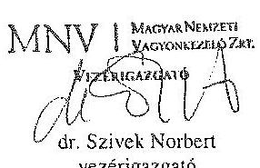

---

# 11. SZÁMÚ MELLÉKLET A V-0751-133/2015. SZÁMÚ JELENTÉSHEZ 

## Dr. Szivek Norbert úr

vezérigazgató
Magyar Nemzeti Vagyonkezelő Zrt.

## Budapest

## Tisztelt Vezérigazgató Úr!

A „Jelentéstervezet az állami tulajdonban álló erdőgazdasági társaságok vagyongazdálkodási tevékenységének ellenőrzése - Mecsekerdő Zrt." címmel készített számvevőszéki jelentéstervezetre tett észrevételeit köszönettel megkaptam.

Az Állami Számvevőszék észrevételekre vonatkozó álláspontjáról a felügyeleti vezető által készített részletes tájékoztatást csatoltan megküldöm.

Tájékoztatom Vezérigazgató urat, hogy a számvevőszéki jelentésben - az Állami Számvevőszékről szóló 2011. évi LXVI. törvény 29. § (3) bekezdése alapján - a figyelembe nem vett észrevételeket szerepeltetjük az elutasítás indokának feltüntetésével.

Budapest, 2015. hó nap
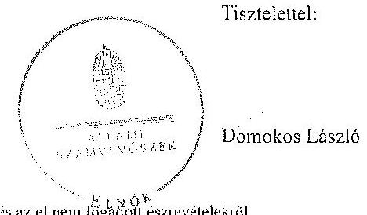

Melléklet: Tájékoztatás az elfogadott és az el nem tagadott észrevételekről

---

# Tájékoztatás   az elfogadott és az el nem fogadott észrevételekröl 

A , Jelentéstervezet az állami tulajdonban álló erdőgazdasági társaságok vagyongazdálkodási tevékenységének ellenörzése - Mecsekerdő Zrt." címü jelentéstervezetre 2015. október 19-én érkezett észrevételeit áttekintettük, azok kezelésével kapcsolatban a következő tájékoztatást adom.

1. A vagyonkezelési szerződéshez kapcsolódó megállapításokra tett észrevétel (I. fejezet / 10. oldal 3-4. bekezdés, 11. oldal 1. bekezdés, II. 5. fejezet / 24. oldal 2. bekezdés, 11. oldal javaslat az MNV Zrt. vezérigazgatójának a)-b) pontok)

A jelentéstervezet vagyonkezelési szerződéshez kapcsolódó megállapításai helytállóak. Az erdőgazdasági társaság müködése jogszabályi megfelelősége biztosításának érdekében tett kezdeményezésekről adott tájékoztatásukat köszönettel vettük, azonban azok nem credményezték az ideiglenes vagyonkezelési szerződés olyan módosítását, vagy olyan új vagyonkezelési szerződés megkötését, amely biztosította volna a VSZ hiányosságainak megszüntetését, illetve a hatályos jogszabályoknak való megfelelőségét. Ezért az MNV Zrt. vezérigazgatójának és az NFA elnökének megfogalmazott intézkedést igénylő megállapítás, valamint az MNV Zrt. vezérigazgatójának megfogalmazott javaslat a) és b) pontjának módosítása nem indokolt. Az egyértelműség érdekében a 10. oldal 3. bekezdés 1. mondatát és a 24. oldal 2. bekezdés 1. mondatát az alábbiak szerint pontosítjuk:
„... a VSZ-szel kapcsolatban feltárt hiányosságokat nem sziintette meg, a hatályos jogszabályoknak a szerzödést nem feleltette meg. ..."
2. Az MNV Zrt. ellenőrzési kötelezettségének elmulasztására vonatkozó megállapításokra tett észrevétel (I. fejezet 11. oldal 2. bekezdés, II. 5. fejezet / 24. oldal 2. bekezdés és 11. oldal javaslat az MNV Zrt. vezérigazgatójának c) pont)

Az MNV Zrt. nem bocsátott az ÁSZ ellenőrzés rendelkezésére az MNV Zrt., vagy Területi Irodái által a Vhr. 20. § (1)-(2) bekezdései szerint végzett ellenőrzésekről dokumentumokat. A jelentéstervezet megállapításai és a javaslat helytállóak, módosításuk nem indokolt.

Budapest, 2015. 4. hó 9. nap

Makkai Mária
felügyeleti vezető

---

Domokos László úr
clnők részére
Állami Számvevőszék

Budapest

Tisztelt Elnők Úr!
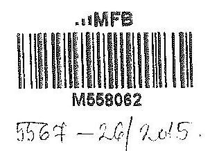

ÁLLAMI SZÁMVEVÓSZÉK
85258/2015
Érkezt: 2015 OKT 20.
Iktutóscim: 20.0320 - 26.0420
Melléklet: $\qquad$
Haßas M.
26

2015. október 5 -én köszönettel kézhez vettük az Állami Számvevőszék „Az állami tulajdonban álló erdőgazdasági társaságok vagyongazdálkodási tevékenységének ellenőrzéséről" szóló jelentéstervezeteket az alábbi cégekre:

- Mecsekerdő Zrt.
(1kt.szám: V-0751-119/2015.)
- Pilisi Parkerdő Zrt.
(Ikt.szám: V-0755-122/2015.)
Az MFB Zrt. a jelentéstervezetek mindegyikéhez egy központi problémát kíván észrevételként tenni.

Az ÁSZ az egyedi jelentéseiben az erdőgazdasági társaságokat, valamint a vagyonkezelésbe adott állami vagyon tekintetében tulajdonosi joggyakorló MNV Zrt. és Nemzeti Földalapkezelő (továbbiakban: NFA) tevékenyėgét marasztalta el.

Alapvető problémaként jelenik meg, hogy az erdők által kezelt eszközök - az NFA-val, a Kincstári Vagyon Igazgatósággal, és az MNV Zrt-vel kötött vagyonkezelési megállapodásban rögzített - értéken nem szerepelnek a Társaságok könyveiben.

Az MFB Zrt. tudatában volt a problémának (azt az ÁSZ jelentésben is említett, 2010. évben végzett átvilágitási jelentés is tartalmazta, melynek nyomon követése, beszámoltatása megtörtént) és folyamatosan egyeztetett az MNV Zrt-vel és az NFA-val a rendezés ügyében. Az ideiglenes vagyonkezelési szerződés módosítására, véglegesítésére a vagyonkezelésbe adónak (MNV, NFA) van lehetősége, a Társaságok szerződő partnerként észrevételeket, javaslatokat tehetnek. A szerződés véglegesítése érdekében a Társaságok és az MFB Zrt. képviselöi minden olyan egyeztetésen (pl.: az MNV Zrt. által létrehozott bizottság) részt vettck, amelyre meghívást kaptak, illetve azokon érdemi javaslatokat tettek.

Ahogy a jelentés is megjegyzi, az egyeztetések az ellenőrzés befejezésig nem kerültek lezárásra, így a Társaságoknál nem áll rendelkezésre a vagyonkezelésben lévő állami vagyonra és annak nagyságára vonatkozó, az MNV Zrt. és az NFA nyilvántartásával egyező adat.

---

Az ÁSZ 2013. évi „Az állami vagyon feletti kontroll - Az állami vagyon feletti tutojdonosi joggyakorlással kapcsolatos tevékenységek ellenörzéséről" szóló jelentése alapján a Nemzeti Fejlesztési Minisztérium - az ÁSZ-szal egyeztetett - alábbi fóbb pontokat tartalmazó intézkedési tervet (1. sz. melléklet) állított össze, melyet a 2014. április 25-én kelt levelében küldött meg az MFB Zrt. részére:

- a Társaságok által kezelt állami ingatlanok és egyéb vagyonelemek értéken történő nyilvántartása,
- a vagyonkezelési díjak egyértelmủ és tulajdonosi joggyakorló szervezetenkénti meghatározása,
- az új vagyonkezelési szerződés megkötése,
- a Társaságok kezelt és saját vagyonának vagyonelemenkénti, valamint a kezelt vagyonelemek tulajdonosi joggyakorló szerinti elhatárolása.

Az MFB törvény módosításának 2014. július 16-i hatályba lépésével az MFB Zrt. állami erő́gazdaságok feletti tulajdonosi joggyakorlása megszünt, az a Földművelésügyi Minisztériumhoz került át, így az intézkedési tervben való közremüködésre, illetve a végrehajtás nyomon követésére az MFB Zrt-nek nem volt lehetősége.

A jelentések az MNV Zrt. vezérigazgatójának, az NFA elnökének és az erdészeti társaságok vezérigazgatóinak fogalmaztak meg intézkedési javaslatokat.

Budapest, 2015. október 16.
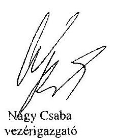

Tisztelettel:
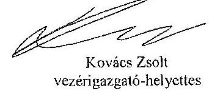

Kovács Zsolt
vezérigazgató-helyettes

Melléklet: NFM levél (lkt.szám: KGTF/377-7/2014-NFM)

---

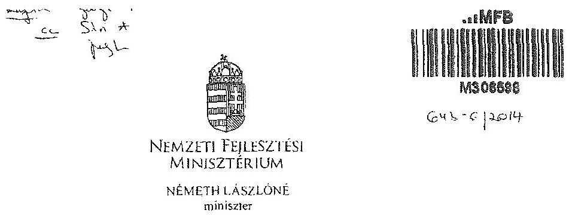

# Iktatószám: KGTF/ !.T: 5 /2014-NFM 

Ugyintézo: dr. Kaszás Mónika Telefonszám: 795-1917 e-mail:monika.kaszas@afm.gov.hu

## Nagy Csaba úr részére

vezérigazgató

## Magyar Fejlesztési Bank Zrt.

Budapest
Tárgy: ,,Az állami vagyon feletti kontroll - Az állami vagyon feletti tulajdonosi joggyakorlással kapcsolatos tevékenységek ellenôrzéséröl" szóló 13193 sz. ÁSZ jelentés alapján összeállitott NFM intézkedési terv módosítása, az abban foglalt feladatok végrehajtása

## Tisztelt Vezérigazgató Úr!

Az Állami Számvevőszék (a továbbiakban: ÁSZ) tárgyban megjelölt jelentésével összefüggésben 2014. január 27-én intézkedési tervet hagytam jóvá, amelyben foglalt feladatok végrehajtása érdekében 2014. január 30-i keltezésű levélben fordultam Önhöz és a Magyar Nemzeti Vagyonkezelő Zrt. vezérigazgatójához, Márton Péter úrhoz.

Az ÁSZ az intézkedési tervvel kapcsolatban küldött, 2014. március 25-i keltü levelében az intézkedési terv kiegészítését, módosítását kérte. A módosított intézkedési tervet jóváhagytam.

A módosított intézkedési terv alapján a következő feladatok végrehajtása szükséges az alábbiak szerint:
1./ a társaságok által kezelt állami ingatlanok és egyéb vagyonelemek értéken történő nyilvántartása:

Felelős: MNV Zrt.,
Határidő:

- földterületek esetében legkésőbb 2014. május 31-ig
- felépítmények esetében 2014. december 31. (A felépítmények esetében az MNV Zrt. a vagyonkezelési szerződés megkötését az év második felére tervezi, látja megvalósíthatónak.)

2./ a vagyonkezelési díjak egyértelmú és tulajdonosi joggyakorló szervezetenkénti meghatározása:

---

Felelős: MNV Zrt.,
Határidő: 2014. május 31-ét követően folyamatosan (2014. december 31-ig)
E pontban foglalt feladattal kapcsolatosan az ÁSZ részére az alábbi tájékoztatást adtam:
„Az ÁSZ által meghatározott feladatok végrehajtására irányuló munkafolyamat során a végrehajtásban érintett szervezetek, társaságok között kialakult az az álláspont, hogy mivel az erdőgazdasági társaságok alapfeladatként közfeladat ellátást is végeznek, azt a vagyonkezelési dij mértékének meghatározásakor az MNV Zrt. figyelembe veszi, valamint megállapításra került az az elv is, hogy a vagyonkezelési dij irányadó mértéke az adott erdőgazdasági társaság által kezelt ingatlanvagyon bruttó nyilvántartási értékének 2\%-a.

A vagyonkezelési dij alapja a kezelt vagyon bruttó nyilvántartási értéke, ezért annak meghatározására erdőgazdaság társaságonként kerül sor a 4./ pontban meghatározott ún. „végleges ingatlanlista" alapján. A végleges ingatlanlista kizárólag vagyonkezelésbe adott ingatlan vagyonelemet tartalmaz, az erdőgazdasági társaság saját vagyonában nyilvántartott vagyonelemet nem, ezért az MNV Zrt.-nek és az erdőgazdasági társaságoknak a szerződés megkötését megelőzően el kell határolnia egymástól a saját vagyonba és a kezelt vagyonba tartozó ingatlan vagyonelemeket (4.b./ pontban foglalt feladat).

A feleknek a vagyonkezelési dij mértékében a vagyonkezelési szerződés megkötését megelőzően kell megállapodniuk az irányadó vagyonkezelési dij mértéket alapul véve."

# 3./ az új vagyonkezelési szerződések megkötése: 

A vagyonkezelési szerződés tervezet az MNV Zrt. érintett szakterületei álláspontjának figyelembe vételével elkészült, az MNV Zrt. és a MFB Zrt. által létrehozott Munkacsoport (tagjai: MFB Zrt., MNV Zrt., NFA és egyes erdőgazdasági társaságok) véleménye alapján átdolgozásra került. A szerződés tervezetnek az erdőgazdasági társaságok részére történő megküldése 2014. április 15. napjával megtörtént.

Felelős: MNV Zrt., az MFB Zrt. közreműködésével
Határidő:

- földterületek esetében: 2014. május 31-ét követően folyamatosan (2014. december 31-ig)
- felépítmények esetében 2014. II. félév folyamán
4./ a társaságok kezelt és saját vagyonának vagyonelemenkénti, valamint a kezelt vagyonelemek tulajdonosi joggyakorló szerinti elhatárolása:

Az erdőgazdasági társaságok által az MNV Zrt. rendelkezésére bocsátott leltárjelentések alapján

- a jogszabályi rendelkezések szerint az NFA tulajdonosi joggyakorlása alá tartozó ingatlan vagyonelemek nagyobb része már átadásra került az NFA részére,
- a kisebb részt képező vagyonelemek tekintetében pedig folyamatban van az átadás az MNV Zrt. és az NFA között.

---

a./ Az ún. „végleges ingatlanlista" (az MNV Zrt. tulajdonosi joggyakorlása alatt lévô, maradó vagyonelem listája) MNV Zrt. és az NFA közötti leegyeztetése, közös áttekintése

Felelős: MNV Zrt.
Határidő: a lista MNV Zrt. és NFA közötti leegyeztetése, közös áttekintése folyamatban van, lezárása legkésôbb 2014. május 31 -ig megtörténik
b./ Az a./ pontban foglaltak szerint leegyeztetett ún. „,égleges ingatlanlista" MNV Zrt. és az egyes erdőgazdasági társaságok általi áttekintése azzal a céllal, hogy a vagyonkezelésben lévő vagyoni elemeket tartalmazó ún. „végleges ingatlanlista" ne tartalmazzon az erdőgazdasági társaság saját vagyonában nyilvántartott vagyoni elemet (saját vagyon - vagyonkezelt vagyon elhatárolása).

Felelős: MNV Zrt., az MFB Zrt. közremüködésével
Határidő: 2014. május 31 -ig
E pontban foglalt feladatokkal kapcsolatosan az ÁSZ részére az alábbi tájékoztatást adtam:
„Szükséges megjegyezni, hogy ingatlanlista, mint állandó „,égleges ingatlanlista" ilyen formában nem létezik, mert mindkét tulajdonosi joggyakorló tekintetében az állami vagyonelemek halmaza mind mennyiségben, mind pedig összetételben folyamatosan változik.

Az erdőgazdasági társaságok által kezelt ingatlanvagyon adatai - mindkét tulajdonosi joggyakorló tekintetében - az évközi változások (megosztások, területváltozások, művelési ág változások, stb.) miatt folyamatosan változnak, ezért az adattartalmában „,égleges ingatlanlista" mindig egy adott konkrét időpont vonatkozásában adható meg.

Jelen intézkedési tervben az ún. „,égleges ingatlanlista" meghatározás alatt az erdőgazdasági társaságok vagyonkezelésében lévő ingatlanvagyon MNV Zrt tulajdonosi joggyakorlása alatt álló részét kell tekinteni. E „,égleges ingatlanlista" kialakítására az erdőgazdasági társaságok által az MNV Zrt. részére átadott leltárjelentések alapján került sor úgy, hogy az MNV Zrt. a Nemzeti Földalapba tartozó vagyonelemeket kiválogatta, s azokat a Nemzeti Földalapkezelő Szervezet részére - átadás-átvételi jegyzőkönyv alapján - átadta.

Lényeges körülmény, hogy a vagyonkezelőknek - jelen esetben az erdőgazdasági társaságoknak - minden év május 31. napjáig vagyonkezelői jelentést kell benyújtaniuk a tulajdonosi joggyakorlók, így az MNV Zrt. részére is. Az aktuális vagyonkezelői jelentéseket - melynek része a leltárjeientés is - a 2013. december 31-i állapotnak megfelelően kell összeállítani, ebből következöen a fent említett ún. „,égleges ingatlanlista" is a 2013. december 31-i állapotot tükrözi.

Ugyanakkor - fôként a kivett megnevezésben nyilvántartott földterületek esetében - a még át nem adott Nemzeti Földalapba tartozó vagyonelemek egyeztetése a két tulajdonosi joggyakorló között jelenleg is folyamatban van.

---

Az egyes erdőgazdasági társaságok vagyonkezelésében lévő vagyonelemek az adott társasággal megkötendő - a jelenlegi ideiglenes vagyonkezelési szerződés helyébe lépő - vagyonkezelési szerződés mellékletét fogják képezni. Az MNV Zrt. szándékai szerint az egyes erdőgazdasági társaságokkal azonnal megkötik a vagyonkezelési szerződéseket, ahogyan a megkötés feltételei bekövetkeznek (pl. megállapodnak a vagyonkezelési dijban, véglegesítik a vagyonkezelési szerzödés tartalmát), azok a vagyonelemek, amelyeket e pont a./ és b./ pontjában foglaltak szerint már átvizsgáltak, a vagyonkezelési szerződés megkötésével egyidejüleg a szerződés mellékletébe kerülnek, amely melléklet folyamatosan bővitésre kerül újabb, e pont a./ és b./ pontjában foglaltak szerint átvizsgált, tisztázott vagyonelemekkel. „

Tájékoztatom, hogy az NFA feletti tulajdonosi jogok gyakorlója, Dr. Fazekas Sándor miniszter úr időközben már jóváhagyta azt az intézkedési tervet, amely az NFA részére meghatározott feladatokat és azok végrehajtási határidejét tartalmazza.

Az MFB Zrt. közremüködése az 1./ és 2./ pontban meghatározott feladatok végrehajtásban is szükséges lehet, ezért kérem a fent meghatározott feladatok határidőben történő végrehajtása érdekében az MFB Zrt. változatlan együttmüködését az érintett a szervezetekkel és amennyiben szükséges, úgy az erdőgazdasági társaságok bevonása iránt is intézkedni szíveskedjen.

Budapest, 2014. „djmié. d" „

# Üdvözlettel: 

Németh Lászlóné

---

# 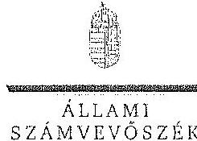 

KLAMI
SZAMVEVÓSZÉK

## Nagy Csaba úr

vezérigazgató
Magyar Fejlesztési Bank Zrt.

## Budapest

## Tisztelt Vezérigazgató Úr!

Az „Az állami tuluplonban álló erdőgazdasági társaságok vagyongazdálkodási tevékenységének ellenörzése" címú ellenörzés tekintetében a Mecsekerdő Zrt., illetve a Pillai Parkerdő Zrt. társaságok jelentéstervezetére tett észrevételüket köszönettel megkaptam.

Az Állami Számvevőszék észrevétclekre vonatkozó álláspontjáról a felügyeleti vezető által készített részletes tájékoztatást csatoltan megküldöm.

Tájékoztatom Vezérigazgató urat, hogy a számvevőszéki jelentésben - az Állami Számvevőszékről szóló 2011. évi LXVI. törvény 29. § (3) bekezdése alapján - a figyelembe nem vett észrevételeket szerepeltetjük az elutasítás indokának feltüntetésével.

Budapest, 2015. /1/ hó 93 nap
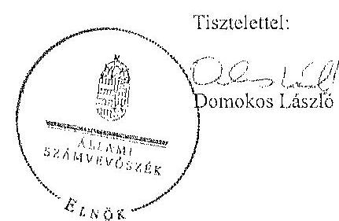

Melléklet: Tájékoztatás az észrevétzlek kezeléséről

---

# Tájékoztatás   az észrevétclek kezeléséröl 

„Az öllami tulaidunban álló erdőgazdasági társaságok vagyongazdálkodási tevékenységének ellenörzése" cimú ellenörzés tekintetében a Mecsekerdő Zrt., illetve a Pilisi Parkerdő Zrt. társaságok jelentéstervezetére 2015. október 20-án érkezett észrevételeket áttekintettük, azok kezelésével kapcsolatban a következő tájékoztatást adom.

A jelentésekben megfogalmazott központi problémával kapcsolatban adott tájékoztatásukat köszönettel vettük, azonban azok alapján a jelentéstervezet módosítása nem indokolt.

Budapest, 2015. év 21. hó 0.5 nap
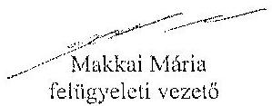

---

# 14. SZÁMÚ MELLÉKLET A V-0751-133/2015. SZÁMÚ JELENTÉSHEZ

|  ÁLLAMI SZÁMVEVÖSZÉK | |
| --- | --- |
|  8256 9/2015 | |
|  Érintett 2015 OKT YR | |
|  Számlatár: 16-0751-133/2015 | |
|  Melléklet: | |
|  |

## Nemzeti Földalapkezelő Szervezet

**Vethélő:** 11-0 Budapest, távcsyék 122 5. Házakosnyi azadnálótazást: 775766

**Hoznám:** NFA-002589/017/2015

**Hiv. szám:** ÁSZ-V-0599/2014-2015

**Érintett ÁSZ fűtartószámok:** V-0749-148/2015, V-0750-174/2015, V-0751-121/2015, V-0752-091/2015, V-0753-098/2015, V-0754-088/2015, V-0755-124/2015, V-0757-062/2015, V-0758-058/2015, V-0760-077/2015, V-0764-056/2015, V-0765-046/2015, V-0766-146/2015, V-0767-056/2015

**Donokos László**

**Főnök**

**Állami Számvevőszék**

**1052 Budapest**

**Apáczai Csere János utca 10**

**Tárgy:** Észrevétel megküldése "Az állami tulajdonban álló erdőgazdasági társaságok vagyongazdálkodási tevékenységének ellenőrzését" késztető jelentés tervezeteire.

## Tisztelt Elnök Úr!

Az Állami Számvevőszék 2014 novemberében megkondit "Az állami tulajdonban álló erdőgazdasági társaságok vagyongazdálkodási tevékenységének ellenőrzését" amellyel, 2015 októberétől érintettség okán az NFA részére az elkészített munkannyag tervezeteit vizsgált erdőgazdaságunként, megküldte Szervczetünk részére véleményezésre.

A munkannyag valamennyi tervezte egységesen, az NFA Elnöke részére feladatukát tartalmaz, melyhez az alábbi eszvevőfeleket teszünk:

A jelentéstervezetekben tett megállapítások helytállóságát nem vitatjuk, azonban szükségesnek látjuk az NFA elnökének tett javaslatokkal (tj. b) és c) kapcsolatban a következő tájékoztatást megadni.

---

# 14. SZÁMÚ MELLÉKLET A V-0751-133/2015. SZÁMÚ JELENTÉSHEZ

a) „Tegyén intézkedéseket az erőfizetésűenő társaságok közreműködésével a tényleges állapotot rögzítő és a hatályos jogszabályi előírásoknak megfelelő vagyonkezelési szerződés megkötésére.”

Tájékoztatjuk, hogy a hatályos jogszabályi előírásoknak megfelelő vagyonkezelési szerződések megkötése érdekében több intézkedés történt, jelenleg is folyamatban van a szerződések előkészítése és a vagyonkezelésben maradó, illetve kisztráló földrészletek adatainak egyeztetése.

Előzményként fontos kiemelni, hogy a Nemzeti Földalapkezelő Szervezet 2010. szeptember 1. napjával történt létrehozását követően (2012. évben) került sor a vagyonkezelésben lévő földrészletek MNV Zrt. részéről történő átadására. Az átadási dokumentumok alapján Szervezetünk gondosítását a kiállítását nyílvántartásakban a megvalósított tulajdonosi joggyakorlás feltüntetéséről. Az erőfizetésűenő esetében ez 2012. év végéig, illetve 2013. év elején megtörtént ennek az ingatlan-nyílvántartásban történő átvezetése is.

Megjegyzésük, hogy az MNV Zrt. részéről történő átadás kizárólag a - több értételek kötött, és azóta többször módosított - vagyonkezelési szerződések és a földrészletek Excel táblázatban történő átadását jelentette, tehát nem egy naprakész vagyonnyilvántartást tartalmazott. Ennek következtében szükségszerűvé vált a Nemzeti Földalapkezelő Szervezetnek egy saját nyilvántartás felépítése, illetve a szerződések tartalmának feldolgozása.

A számverőszaki ellenőrzéssel érintett időszakban, illetve még jelenleg is lezáratlan az MNV Zrt. és NFA közötti átadásátvételi folyamat. Az MNV Zrt. további földrészletek átadását készült elő, ugyanis az MNV Zrt. vagyoni körébe tartozó földrészletekre színtén terzeni a vagyonkezelési szerződés megkötését, és ennek a folyamatnak a részeként a még öt nem adott földrészletek átadása is most történik. Természetesen az NFA is folyamatosan biztosítja a különböző havznosítási, illetve hatósági eljárások során az erőfizetésűenőben lévő földrészletek tulajdonosi joggyakorlójának rendezését az MNV Zrt. megkeresésével, közös mindattest eljárás lefolytatásával. A Nemzeti Földalapkezelő Szervezet által meghívott ügyvédi iróda, jelentést készített a szerződés és a tárgyát képező földrészletek jogi helyzetének tisztázására.

Időközben az erőfizetésűenő, mint társaságok felett tulajdonosi joggyakorló személyében is változás történt. Így új alapokon indakinnát meg a vagyonkezelési szerződés előkészítése. Ennek a folyamatnak részeként, az NFA megkötött egy Ügyvédi Konzorolumot, további Szervezetünknél külön Erőészen munkavaporít átsörít 2015. májusában és azt követően a következő intézkedések történtek:

Az Erőfizetésűenő részére vagyonkezelésbe adásra tervezett ingatlanok felülvizsgálata folyamatban van az Ügyvédi Konzorolum által. A felülvizsgálat tárgyát képező ingatlanok köré három részéről levődik össze:

- az erőfizetésűenő ideiglenes vagyonkezelési szerződésének tárgyát képező ingatlanok.

---

- azon ingatlanok, amelyeket az erőfjázoláságok az ideiglenes vagyonkezelési szerződésükben szereplő ingatlanokot, felül kértek vagyonkezelésbe.
- valamint azok az ingatlanok, amelyeket az NFA kíván az erőfjázoláságok vagyonkezelésébe adni.

A rendelkezésre álló dokumentumokban szereplő ingatlanokból erőfjázoláságonként egy egységes, az összes vagyonkezelésbe adandó ingatlant tartalmazó táblázat készült, amely tartalmazza az ingatlanok vagyonkezelésbe adás szempontjából releváns adatait, bejegyzett jogokat, feljegyzett tényeket. A táblázat zárati összevetésre kerültek a közhitetes ingatlannyilvántartásban szereplő adatokkal, feltarva ezáltal, hogy mely ingatlanok suhatóak vagyonkezelésbe és melyek azok, amelyeknél valamilyen előzetes intézkedés megtétele szükséges.

Az Nfatv. 8. 8-a alapján a Birtokpolitikai Tanács dönt erőfjázoláságonként az erőfjázoláságok vagyonkezelési szerződésének megkötéséről.

Zárójelben jegyezzük meg, hogy például a TAFG 7-1. esetében elkészült a fentebb részletezett táblázat, amely alapján összeállítása került azon ingatlanok listája, amelyre elindítható a vagyonkezelésbe adási eljárás. Megközelítőleg 18.000 ha ragyságú területeek tervezí Szetvezertünk a TAFG 7-1. részére történő vagyonkezelésbe adását, ebből 15.308 .1880 ha terület az, amelyre elindította a vagyonkezelésbe adást. Az alábbi jogszabályhelyek alapján Szetvezertünk megkereste az Földmüvetésügyi Minisztériumot az egyetétől nyilatkozatok, valamint az alapító határozat kiszámú érdekében, valamint a NFRHet, mint erdészeti hatóságot a vagyonkezelő erőfjázolálkodói alkalmazáságú megállapító jóváhagyásának megkötése végett.

Az Nfatv. 20. § (7) bekezdése alapján „Az állam 100\%-os tulajdonában álló ervő és erőfjázolálkodási tevékenységet közvetlenül szolgáló földterületet érintő vagyonkezelési szerződés létrejöttéhez az erdészeti hatóságnak - a vagyonkezelő erőfjázolálkodói alkalmazáságát megállapító - jóváhagyása szükséges".

Az Nfatv. 23. § (2) bekezdése alapján a Nemzeti Földalapba tartozó védett természeti területek és a Natura 2000 területek vagyonkezelésbe adására, tulajdonjogának bármely jogcímen történő átruházására csak a természetvédelemén felelős miniszter egyetértése esetén kerülhet sor. Az állam 100\%-os tulajdonában álló ervő, továbbá erőfjázolálkodási tevékenységet közvetlenül szolgáló földterület vagyonkezelésbe adásához az erőfjázolálkodásért felelős miniszter egyetértése szükséges.

Magyar Állam tulajdonában álló ingatlanokat érintő jogügyletekkel kapcsolatos előzetes miniszter nyilatkozatok és a miniszter tulajdonosi joggyakorlása alá tartozó gazdasági társaságok ingatlanügyletével kapcsolatos miniszteri nyilatkozatok, alapítói határozatok kiadásának rendjéről szóló 8/2014. (XI. 28.) PM utasítás 3. § (4) bekezdése értelmében a miniszter tulajdonosi joggyakorlása alá tartozó állami tulajdonú gazdasági társaságoknak az

---

# 14. SZÁMÚ MELLEKLET A V-0751-133/2015. SZÁMÚ JELENTÉSHEZ

NFA val történő vagyonkezelési szerződés kötelekező elegethetetlen a jogszabály vagy Társaság alapító okirat alapján a Társaság tulajdonosi jogait gyakorló miniszter alapító halászatának kiadása.

Az Érészett Mucságszoport a kiadásától szempontok alapján tartja a kapcsolatát a Koncoraimattal a szerződés távosát képező földrészések jogi, nyilvántartási, helyszíni, térképi ellenőrző távszábon annak érdekében, hogy rájövésé a státok alapján tizenöt szentédekötés.

b) "Intézkedjen a vagyonkezelési szerződések felülvizsgálatának elmaradásával összefüggésben feltárt szabálytalanulások tekintetében a munkájogi felelősség tisztázására irányuló eljárás megindításáról, és ennek eredmények büntetésében tegye meg a szükséges intézkedéseket."

A fent két folyamat időbeli áttekintése és a vagyonkezelési szerződés előkészítésének jelenlegi helyzetei tekintve a Nemzeti Földelapkezelő Szervezet egységei, munkatársai a rendelkezésükre álló eszközök alapján megfelelő a szükséges intézkedéseket az elégszabályok vagyonkezelési szerződésének megfelelő.

c) Az NFA elnöke felé tett javaslattal kapcsolatban, miszerint intézkedjei a Társaságok vagyon-nyilvántartása hiteleségének, teljességének és helyességének jogszabályban foglaltak szerinti ellenőrzéséről.

Az NFA 2015. év márciusában megkezdte az Érdészeti Zrt. ték dokumentális ellenőrzését, amely ellenőrzés keretén belül bekeresse került a Társaságok használatában álló vagyonelesetést és az erősságyon állományról vezetői (nyilvántartások) aktualizált nyilvántartás is.

Budapest, 2015. október 13.

Tiszmétezi:

*Vagy Pirota*

NFA Érészett Mucságszoport

---

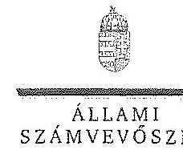

ELHök

Ikt.szám: V-0749-154/2015.

Nagy János úr
elnök
Nemzeti Földalapkezelő Szervezet
Budapest

Tisztelt Elnök Úr!

Az „Az állami tulajdonban álló erdőgazdasági társaságok vagyongazdálkodási tevékenységének ellenőrzése" című ellenőrzés tekintetében 14 társaság jelentéstervezetére tett észrevéteclűket köszönettel megkaptam.

Az Állami Számvevőszék észrevételekre vonatkozó álláspontjáról a felügyeleti vezető által készített részletes tájékoztatást csatoltan megküldöm.

Tájékoztatom Elnök utat, hogy a számvevőszéki jelentésben – az Állami Számvevőszékről szóló 2011. évi LXVI. törvény 29. § (3) bekezdése alapján – a figyelembe nem vett észrevételeket szerepeltetjük az elutasítás indokának feltüntetésével.

Budapest, 2015. / ho nap

Tisztelettel:

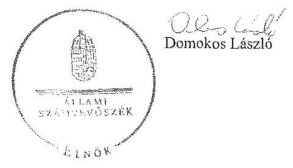

Melléklet: Tájékoztatás az észrevételek kezeléséről

1052 BUDAPEST, APÁCZAI CSZRE JÓNOS UTCA 10. 1364 Budapest 4. Pl. 54 telefon. 484 9701 fax 484 9701

---

# Tájékoztatás   az észrevételek kezeléséről 

„Az állami tulajdonban álló erdőgazdasági társaságok vagyongazdálkodási tevékenységének ellenörzése" címủ ellenőrzés tekintetében az IPOLY ERDŐ Zrt., az EGERERDŐ Erdészeti Zrt., a Mecsekerdő Zrt., a SEFAG Erdészeti és Faipari Zrt., a Gemenci Erdő- és Vadgazdaság Zrt., az Északerdő Erdőgazdasági Zrt., a Pílisi Parkerdő Zrt., a Szombathelyi Erdészeti Zrt., a Kisolföldi Erdőgazdasági Zrt., a Zalaerdő Erdészeti Zrt., a KEFAG Kiskunsági Erdészeti és Faipari Zrt., a VADEX Mezöföldi Erdő- és Vadgazdálkodási Zrt., a Gyulaj Erdészeti és Vadászati Zrt., illetve a TAEG Tanulmányi Erdőgazdaság Zrt. társaságok jelentéstervezetére 2015. október 16-án érkezett észrevételeket áttekintettük, azok kezelésével kapcsolatban a következő tájékoztatást adom.

Az észrevétel szerint a jelentéstervezetben tett megállapítások helytállóak, azokat nem vitatják. Az NFA elnökének tett javaslatokhoz kapcsolódó tájékoztatást köszönjük. Mindezek miatt, valamint arra tekintettel, hogy nem jött létre olyan vagyonkezelési szerződés, amely biztosítja az ideiglenes vagyonkezelési szerződés hiányosságainak a megszüntetését, illetve a hatályos jogszabályoknak való megfelelletést, a megállapítások és a javaslatok módosítása nem indokolt.

Budapest, 2015. év $\quad / 1$ hó 0. nap

Makkai Mária
felügyeleti vezető