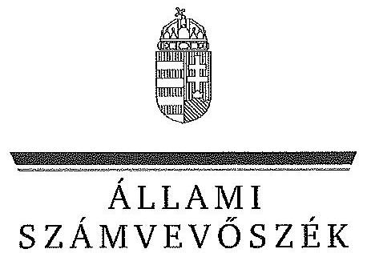

ÁLLAMI
SZÁMVEVŐSZÉK

# JELENTÉS 

Az állami tulajdonban álló erdőgazdasági társaságok vagyongazdálkodási tevékenységének ellenőrzése SEFAG Erdészeti és Faipari Zrt.

---

Állami Számvevőszék
Iktatószám: V-0752-101/2015
Témaszám: 1786
Vizsgálat-azonosító szám: V070604

# Az ellenőrzést felügyelte: 

Makkai Mária
felügyeleti vezető
Az ellenőrzést vezette és az ellenőrzés végrehajtásáért felelős:
Dr. Schreiber Judit Zsuzsanna
ellenőrzésvezető
A számvevőszéki jelentés összeállításában közreműködött:
Szabó Leonóra Ildikó
számvevő főtanácsos
Az ellenőrzést végezték:
Jenei Zsuzsanna Szabó Leonóra Ildikó
számvevő tanácsos számvevő főtanácsos

---

# TARTALOMJEGYZÉK 

BEVEZETÉS ..... 3
I. ÖSSZEGZŐ MEGÁLLAPÍTÁSOK, KÖVETKEZTETÉSEK, JAVASLATOK ..... 7
II. RÉSZLETES MEGÁLLAPÍTÁSOK ..... 13

1. A SEFAG Zrt. vagyongazdálkodása ..... 13
1.1. A vagyon értékének megőrzése, gyarapítása ..... 13
1.2. A vagyonkezelői kötelezettség teljesítése ..... 15
2. A SEFAG Zrt. vagyonkezelési szerződése és a vagyonnyilvántartása ..... 16
2.1. A vagyonkezelési szerződés megfelelősége ..... 16
2.2. A SEFAG Zrt. vagyonnyilvántartása ..... 17
3. A SEFAG Zrt. tervezési feladatainak ellátása, az ágazati jogszabályok érvényesülése ..... 18
3.1. Az üzleti tervek vagyonmegőrzésre, vagyongyarapítására vonatkozó elemei ..... 18
3.2. A tervekben megfogalmazott előírások érvényesülése ..... 19
3.3. Az ágazati szabályok érvényesülése ..... 19
4. Kontroll- és monitoring rendszer kialakítása és működtetése ..... 20
4.1. A kontrollrendszer kialakítása és működtetése ..... 20
4.2. Az információáramlási és monitoring rendszer kialakítása és működtetése ..... 21
5. A tulajdonosi joggyakorlóknak a SEFAG Zrt. vagyongazdálkodási feladataira vonatkozó döntései, intézkedései megfelelősége ..... 22

---

# MELLÉKLETEK 

1. számú Rövidítések jegyzéke
2. számú Fogalomtár
3. számú a SEFAG Zrt. vagyonának alakulása a 2009-2014. I. félévében
4. számú Az immateriális javak és tárgyi eszközök állományának megoszlása a 2013. évre vonatkozóan
5. számú A befektetett eszközök állományának alakulása a 2009-2014. I. félév közötti időszakban
6. számú A SEFAG Zrt. saját tőke változása a 2013. évre vonatkozóan
7. számú A SEFAG Zrt. beruházásainak, felújításainak forrása a 2009-2014. I. félév közötti időszakban
8. számú a SEFAG Zrt. vezérigazgatójának észrevétele
9. számú a SEFAG Zrt. vezérigazgatójának észrevételére adott válasz
10. számú a Magyar Nemzeti Vagyonkezelő Zrt. vezérigazgatójának észrevétele
11. számú a Magyar Nemzeti Vagyonkezelő Zrt. vezérigazgatójának észrevételére adott válasz
12. számú a Magyar Fejlesztési Bank Zrt. vezérigazgatójának észrevétele
13. számú a Magyar Fejlesztési Bank Zrt. vezérigazgatójának észrevételére adott válasz
14. számú a Nemzeti Földalapkezelő Szervezet elnökének észrevétele
15. számú a Nemzeti Földalapkezelő Szervezet elnökének észrevételére adott válasz

---

# JELENTÉS 

## Az állami tulajdonban álló erdőgazdasági társaságok vagyongazdálkodási tevékenységének ellenőrzése SEFAG Erdészeti és Faipari Zrt

## BEVEZETÉS

Hazánk területének több mint 20\%-át erdő borítja. Az erdők fenntartása és védelme az egész társadalom érdeke, ezért az erdőkkel csak a közérdekkel összhangban lehet gazdálkodni.

Az Alaptörvény 38. cikke és az Nvtv. alapján az állam tulajdona a nemzeti vagyon részét képezi. Az Nvtv. alapján nemzetgazdasági szempontból kiemelt jelentőségű nemzeti vagyonban tartandó vagyonelemnek minősül a 100\%-ban az állam tulajdonában álló védelmi és közjóléti elsődleges rendeltetésű erdő, a gazdasági elsődleges rendeltetésű természetes erdő, természetszerű erdő és származék erdő természetességi állapotú öt hektárnál nagyobb, természetben összefüggő erdő. Az erdőgazdasági társaságok vagyongazdálkodása szempontjából a Vtv., illetve az Nvtv. és az Nfatv., valamint a kapcsolódó kormány- és miniszteri rendeletek mellett kiemelkedő szerepe van a különböző ágazati jogszabályoknak. A vagyonkezelési tevékenység végrehajtása során figyelemmel kell lenni az Evt.-ben foglaltakra, mely alapján a nemzeti vagyonról szóló törvényben nemzetgazdasági szempontból kiemelt jelentőségű nemzeti vagyonként meghatározott védelmi és közjóléti elsődleges rendeltetésű, az állam tulajdonában álló erdő a kincstári vagyon részét képezi. Az erdőgazdasági társaságoknak az általuk kezelt vagyonelemek sajátosságára tekintettel kell a vagyongazdálkodási tevékenységüket kialakítaniuk, gondoskodniuk kell a közérdek és az Evt.-ben foglaltak érvényesülését biztosító vagyongazdálkodásról.

Az Evt. előírásai alapján az állam 100\%-os tulajdonában álló erdőt és erdőgazdálkodási tevékenységet közvetlenül szolgáló földterületet csak vagyonkezelés formájában lehet hasznosításra átengedni, és az állam tulajdonában álló erdő és erdőgazdálkodási tevékenységet közvetlenül szolgáló földterület vagyonkezelését csak költségvetési szerv vagy kizárólagos állami tulajdonú gazdálkodó szervezet végezheti.

A Vtv. szerint az erdőgazdasági társaságok és a társaságok kezelésében lévő állami vagyon feletti tulajdonosi jogokat a 2010. évig a Magyar Állam nevében az MNV Zrt. gyakorolta. A 2010. évi törvényi változások (Vtv., Mfbtv., Nfatv.) következtében 2010. június 17. napjától az erdőgazdasági társaságok állami tulajdonú részesedése tekintetében a tulajdonosi jogokat az állami vagyonért felelős miniszter az MFB Zrt. útján látta el. Az Nfatv. 2010. évi hatálybalépését követően a társaságok által kezelt, a Nemzeti Földalapba tartozó földterületek vonatkozásában a tulajdonosi jogokat az NFA, míg egyéb ingatlanok és vagyonelemek tekintetében a tulajdonosi jogokat az MNV Zrt. gyakorolja. 2014. július 16-tól az erdőgazdasági társaságok feletti tulajdonosi jogokat az erdőgazdálkodásért felelős miniszter gyakorolja.

A Nemzeti Földalapba tartozó 1772 980,17 ha földterületből a 2012. év végén a 100\%-os állami tulajdonú 19 erdőgazdasági társaság kezelésében összesen 913664,3681 ha földterület volt, ebből 879254,1595 ha erdő, a többi egyéb művelési ágba tartozik. A kezelt földterületek erdőgazdasági társaságonkénti megoszlása eltérő.

Az erdőgazdasági társaságok az Alaptörvény és az Nvtv. előírása szerint önállóan és felelősen gazdálkodnak a törvényesség, a célszerűség és az eredményesség követelményei szerint. Az állami vagyonnal való gazdálkodás alapvető feladata a vagyon rendeltetésszerű, hatékony és felelős felhasználásának biztosítása az állami vagyon értékének megőrzése, gyarapítása érdekében. A SEFAG Zrt. jelen ellenőrzése az állami vagyonnal való gazdálkodásra és a törvényesség betartására irányult.

A SEFAG Zrt. a Balaton, a Sió csatorna és a Kapos által határolt külső-Somogyban, valamint a Zalai-dombság és Zselic határolta belső-Somogy területén gazdálkodik, központja Kaposvár. A Társaság 2013. évi beszámolója szerint 8001,7 M Ft nettó árbevétel mellett 170,5 M Ft mérleg szerinti eredményt ért el, a mérlegfőösszeg 9620,0 M Ft volt. Az erdőgazdasági társaság 76 905,0730 ha erdőterületen és 5296,5286 ha egyéb művelési ágú földterületen gazdálkodott, az éves átlaglétszám 476 fő volt.

Az ellenőrzés célja annak értékelése, hogy a SEFAG Zrt. vagyongazdálkodása, vagyonérték-megőrző és vagyongyarapítási tevékenysége, valamint ennek szervezeti keretei megfeleltek-e a jogszabályok és belső szabályzatok előírásainak, valamint a kezelt vagyonelemek sajátosságaiból adódó követelményeknek.

Ennek keretében ellenőriztük és értékeltük, hogy:

- a vagyongazdálkodás során betartották-e az Nvtv. 7. §-ában megállapított vagyongazdálkodási alapelveket, valamint az ágazati jogszabályok vagyongazdálkodáshoz kapcsolódó előírásait;
- a Társaság a saját és a kezelt vagyonnal való gazdálkodásra vonatkozó éves tervezési feladatait a jogszabályi előírásoknak megfelelően látta-e el, a Társaság üzleti tervei a kezelésbe vett vagyonra vonatkozó, a Vtv. 2. § (1) és a 27. § (7) bekezdésében előírt vagyon megőrzésére, gyarapítására vonatkozó elemeket tartalmazták-e és azokat a vagyongazdálkodás során érvényesítették-e;
- a vagyonkezelési szerződések és a vagyon-nyilvántartás megfeleltek-e a szabályszerűségi követelményeknek, elősegítették-e az állami vagyonnal való szabályszerű gazdálkodást;
- a Társaság kialakította és működtette-e a szabályszerű feladatellátást támogató kontrollrendszert. Ezen belül elkészítették és aktualizálták-e a Társaság feladatellátási-folyamatainak szabályzatait, a kockázatok kezelésének rendszerét, az információs és a kontrolling-monitoring rendszert, a vagyongazdálkodás területén azokat az eljárásokat, amelyek elősegítik a szervezeti célok végrehajtását;

- a tulajdonosi joggyakorlóknak a SEFAG Zrt. vagyongazdálkodási feladataira vonatkozó döntései, intézkedései előkészítése és megalapozottsága a jogszabályoknak és a belső szabályozásnak megfelelt-e, a tulajdonosi joggyakorlók e minőségben végzett tevékenysége támogatta-e a felelős vagyongazdálkodás megvalósulását.

Az ellenőrzés típusa: szabályszerűségi ellenőrzés.
Az ellenőrzött időszak: 2009. január 1. napjától 2014. június 30. napjáig, kitekintéssel a helyszíni ellenőrzés végéig tartó releváns folyamatokra, intézkedésekre.

Az ellenőrzés várható hasznosulása: A SEFAG Zrt. és a tulajdonosi joggyakorlók fenti szempontú ellenőrzése az állami tulajdonban álló vagyon kezelésére, a vagyonnal való gazdálkodásra vonatkozó, kötelezően végrehajtandó éves ÁSZ ellenőrzést szélesebb körűvé teszi.

Az ellenőrzés várható hasznosulásaként biztosíthatja a társadalom részéről kiemelt érdeklődéssel kísért téma objektív bemutatását. Az ÁSZ jelentéséből a média és az állampolgárok átfogó képet kaphatnak a Magyarország állami tulajdonban lévő erdőivel való gazdálkodásról, a gazdálkodást, vagyonkezelést végző szervezeti rendszerről, az állami tulajdonban álló erdőgazdasági társaságok feladatellátásához kapcsolódóan feltárt problémákról.

Az ellenőrzés jól hasznosítható - többek közt - az állami vagyonnal kapcsolatos országgyűlési törvényhozói munkában is, továbbá hozzájárulhat a tulajdonosi joggyakorlás javításával a „jó kormányzás" gyakorlatának erősítéséhez.

Az ellenőrzéssel érintett szervezetek: A SEFAG Zrt., a Társaság kezelésében lévő állami vagyon feletti tulajdonosi jogokat gyakorló szervezetek, valamint a Társaság állami tulajdonú részesedése feletti tulajdonosi joggyakorlók (MFB Zrt., MNV Zrt., NFA).

Az ellenőrzés végrehajtásának jogszabályi alapját az ÁSZ tv. 5. § (4)-(5) bekezdéseiben foglaltak képezik.

Az ellenőrzés szakmai módszertana az ÁSZ hivatalos honlapján közzétett szakmai szabályokon alapult, amely a Legfőbb Ellenőrző Intézmények Nemzetközi Szervezete (INTOSAI) által kiadott nemzetközi standardok (ISSAI) figyelembevételével készült.

A SEFAG Zrt. az ellenőrzés lefolytatásához tanúsítványok kitöltésével, valamint dokumentumok elektronikus megküldésével szolgáltatott adatokat. Az így rendelkezésre bocsátott adatok és információk kontrollja a helyszíni ellenőrzés keretében történt. A vagyonváltozást eredményező döntések megalapozottságát, továbbá a vagyonérték-megőrző és vagyongyarapító tevékenység szabályszerűségét a számviteli nyilvántartásokból, valamint kockázat alapú és véletlenszerű mintavétellel kiválasztott tételek ellenőrzésével értékeltük. A kezelt vagyont érintően a beruházások, felújítások pénzforgalmi kiadási területet arányos rétegzéssel összesen 30 elemű véletlen minta ellenőrzésével minősítettük. A sokaságból tételes ellenőrzésre kiemeltük évente a 2009-2013. évek 3-3 legnagyobb összegű tételét, 2014. első félévében a kettő legnagyobb összegű tételt. A kivett minta alapján végeztük a kezelt vagyonon megvalósított beruházások, felújítások szabályszerűségének (üzembe helyezés, nyilvántartás, értékcsökkenés elszámolása) ellenőrzését.

Az ÁSZ a 2011. évi LXVI. törvény 29. §-a szerint a jelentéstervezetet megküldte a SEFAG Erdészeti és Faipari Zrt., a Magyar Nemzeti Vagyonkezelő Zrt. és a Magyar Fejlesztési Bank Zrt. vezérigazgatójának, valamint a Nemzeti Földalapkezelő Szervezet elnökének egyeztetésre. Az SEFAG Erdészeti és Faipari Zrt. vezérigazgatójának észrevételét és az arra adott választ a 8-9. számú melléklet, a Magyar Nemzeti Vagyonkezelő Zrt. vezérigazgatójának észrevételét és az arra adott válaszunkat a 10-11. számú melléklet, a Magyar Fejlesztési Bank Zrt. vezérigazgatójának észrevételét és az arra adott válaszunkat a 12-13. számú melléklet tartalmazza. A Nemzeti Földalapkezelő Szervezet elnökének észrevételét és az arra adott választ a 14-15. számú melléklet tartalmazza.

---

# I. ÖSSZEGZŐ MEGÁLLAPÍTÁSOK, KÖVETKEZTETÉSEK, JAVASLATOK 

A SEFAG Zrt. vagyongazdálkodása az ellenőrzött években a saját vagyonára és a vagyonkezelésében lévő állami vagyonra terjedt ki. A Társaság mérleg szerinti vagyona a 2009. évi 7965,0 M Ft nyitó értékről 2013. év végére 9620,0 M Ft-ra (20,8\%), a saját tőke 6289,9 M Ft-ról 7492,3 M Ft-ra növekedett.

A Társaság éves mérlegei nem a valós állapotot tükrözték, mert a vagyonkezelt eszközöket a Számv. tv. előírása ellenére a mérlegeiben nem szerepeltette. A Társaság mérleg szerinti vagyona nem tartalmazta a vagyonkezelésében lévő állami erdők és azzal szerves egységet képező egyéb földterületek értékét, a Számv. tv.-ben foglaltak ellenére a vagyonkezelésbe vett eszközöket mérleg szerinti megbontásban nem mutatták be a kiegészítő mellékletben.

A Társaság által kezelt vagyonról vezetett nyilvántartás nem felelt meg a Vhr.ben foglaltaknak, mert tételesen nem tartalmazta a vagyonkezelt eszközök könyv szerinti bruttó és nettó értékét, valamint az értékben bekövetkezett egyéb változásokat. Ezért a vezetett nyilvántartás nem biztosította az átláthatóságot és az elszámoltathatóságot. A kezelt ingatlanokról tételes mennyiségi kimutatást vezettek a forint érték
 feltüntetése nélkül, ami megfelelt a VSZ 2.4. pontja szerinti naturáliákban történő nyilvántartás vezetési előírásnak, azonban nem felelt meg a Számv. tv.-ben a kezelt vagyon nyilvántartására vonatkozó szabálynak. A vagyonkezelt eszközök forint értékének meghatározását a Társaság sem az MNV Zrt-nél, sem pedig az NFA-nál nem kezdeményezte annak érdekében, hogy eleget tegyen a Számv. tv. előírásainak.

A Társaság nem rendelkezett a kezelt vagyonról vezetett nyilvántartás kiinduló adatait tartalmazó, a vagyonkezelési szerződés eredeti, hiteles, a vagyonkezelt eszközök felsorolását tartalmazó 1-4. mellékleteivel. A Társaság nem teljes körűen rendelkezett a kezelt vagyon tekintetében pontos és naprakész információval a tulajdonosi jogokat gyakorlóról, így a Társaság által vezetett nyilvántartás nem biztosította a Vhr.-ben foglalt, az adatszolgáltatás pontosságára vonatkozó követelményt.

A tulajdonosi joggyakorlók tisztázásával és a kezelt vagyonelemek nyilvántartása egyezőségének biztosításával kapcsolatos adategyezetés az ellenőrzés befejezéséig nem került lezárásra, így nem állt rendelkezésre a Társaság által kezelt vagyonra és annak nagyságára vonatkozó, a Társaság, az MNV Zrt. és az NFA nyilvántartásában szereplő, egyező adat.

A Társaság a Magyar Állam tulajdonában álló erdővagyon és egyéb művelési ágú termőföld ingatlanok kezelését a KVI-vel 1996. november 1-én kötött vagyonkezelési szerződés alapján végezte. A Társaság, mint vagyonkezelő és a KVI között létrejött szerződéses jogviszony kereteit a VSZ-ben foglalt jogok és kötelezettségek töltötték ki. A VSZ nem támogatta a Vhr.-ben előírt, a vagyongazdálkodási feladatok átlátható módon történő végrehajtását, valamint nem támogatta a szabályszerű vagyongazdálkodást.

---

A VSZ 3.3.2. pontjában foglaltak ellenére a felek a szerződést évente nem vizsgálták felül, a VSZ az ellenőrzött időszakban nem felelt meg a hatályos rendelkezéseknek, hatályon kívül helyezett jogszabályi hivatkozásokat tartalmazott, illetve nem tartalmazott minden szükséges előírást.

A felek nem tettek eleget a Vhr. előírásának sem, mert a Vhr. hatálybalépést követő hat hónapon belül nem kezdeményezték a Nemzeti Földalapba tartozó ingatlanokra vonatkozóan a VSZ megszüntetését és a jogszabályoknak megfelelő szerződés megkötését.

A Társaság által kezelt vagyonelemek többszöri változása ellenére a felek nem tartották be a Vhr.-ben előírt, a VSZ 60 napon belüli egységes szerkezetbe foglalására vonatkozó rendelkezést. A VSZ módosításokkal történő egységes szerkezetbe foglalását sem a Társaság, sem a tulajdonosi jogokat gyakorló MNV Zrt, illetve NFA nem kezdeményezte.

A VSZ 3.2.3. pontja rendelkezett a vagyonkezelői jog harmadik személynek történő átengedésének feltételeiről, azonban ez 2012-től ellentétes az Nvtv.-ben foglaltakkal, amely tiltja a vagyonkezelői jog harmadik személynek való átengedést.

A VSZ nem rögzítette a Vhr.-ben 2011. január 1-jétől előírt, az érintett vagyonelem esetleges védettségét, illetve Natura 2000 területnek minősítését, és a Vhr.ben foglalt elismerő nyilatkozatot az MNV Zrt. vagyon-nyilvántartási szabályzatának megismerésére és kötelező elismerésére vonatkozóan.

A Társaság az ellenőrzött időszakban egy mezőgazdasági földhaszonbérleti szerződéssel rendelkezett, ami hatályon kívül helyezett jogszabályi hivatkozásokat tartalmazott, illetve nem tartalmazott minden kötelező előírást. A felek a haszonbérleti díjat az ellenőrzött időszakban módosították, azonban a változást a szerződésben nem rögzítették.

A felek a VSZ 3.3.2. pontjában foglaltak ellenére a vagyonkezelési díjat évente nem vizsgálták felül, erről történő megállapodás megkötésére nem került sor.

Az NFA - az MNV Zrt.-vel kötött megállapodás alapján - a vagyonkezelési díjakat leszámlázta, azonban a számlázás a VSZ 3.3.3. pontjában foglalt határidőtől eltérő időben történt. Az NFA a számlákon a vagyonkezelési díjat egy összegben szerepeltette, azokon nem tüntette fel a számlázás alapját képező földterület nagyságát, így nem volt megállapítható a számlák tartalmi megfelelősége. A Társaság a vagyonkezelési díjat a számlák alapján megfizette.

A Társaság az ellenőrzött időszakban a vagyongazdálkodás során a kezelt vagyonelemek, valamint a saját eszközeinek karbantartási, állagmegóvási feladatait a Vtv., a Vhr. és az Nfatv. előírásai alapján ellátta, az Nvtv. 7. §-ban foglalt vagyongazdálkodási alapelveket betartották.

A 2009-2013. években a Társaság összesen 2570,1 M Ft M Ft-ot fordított beruházási és 255,7 M Ft-ot karbantartási kiadásokra. Az éves tervezési feladatokat az előírásoknak megfelelően végezték, minden évre elkészítették az üzleti tervet, amelyek a kezelt vagyonra és a vállalkozási tevékenységre vonatkozóan is tartalmaztak a vagyon megőrzésére, gyarapítására vonatkozó elemeket. Az üzleti

---

tervekben foglaltakat betartották, annak megvalósításáról minden évben beszámoltak.

A Társaság a feladatellátása során az Evt. ${ }_{1,2}$ szerinti bejelentési, engedélyeztetési kötelezettségeknek eleget tett. A Társaság által kezelt vagyon elidegenítésére, megterhelésére az ellenőrzött időszakban nem került sor, erdő használatát, hasznosítását, illetve a vagyonkezelői jogot harmadik személynek nem engedték át. A Társaság az Erdészeti hatóság által jóváhagyott erdőgazdálkodási és Vadászati hatóság által jóváhagyott vadgazdálkodási tervekkel rendelkezett. A Társaság az ellenőrzött időszakban az ágazati szabályokat nem teljes körűen tartotta be. A 2009-2013. években az Evt. ${ }_{2}$ szabályok megsértése miatt több esetben került sor bírság kiszabására az erdőfelújítások befejezésére megállapított határidők túllépése, a fakitermelésére vonatkozó előírások megsértése, valamint az erdősítések sikeresen felújított területein a vadászható vadfajok okozta károsítások miatt.

A Társaság kialakította és működtette a feladatellátást támogató kontrollrendszert. A belső ellenőrzés az ellenőrzött időszakban a tevékenységét a Társaság vezérigazgatójának felügyelete és ellenőrzése mellett, az FB irányítása alatt végezte. A belső ellenőr az FB által jóváhagyott éves munkaterv alapján látta el feladatát. A belső ellenőrzési jelentések javaslatai alapján külön intézkedési terv készítésére nem került sor, az intézkedések szóban, vezetői értekezleteken hangzottak el, illetve a belső szabályzatok, utasítások módosításával kerültek végrehajtásra. A belső ellenőr a vagyongazdálkodás keretében végzett ellenőrzésekhez kapcsolódóan évenként az FB-nek beszámolt.

A Társaság a Számv. tv. és az Alapító Okirat szerint, a tulajdonosi joggyakorló ${ }_{1,2}$ által kijelölt könyvvizsgálót alkalmazott. A könyvvizsgáló minden ellenőrzött évben hitelesítő záradékkal ellátott könyvvizsgálói jelentést adott ki, figyelemfelhívó megjegyzést nem tett. A könyvvizsgáló az ellenőrzött időszakban nem kifogásolta a beszámolóval kapcsolatosan a feltárt hiányosságokat.

A Társaságnál az Alapító Okirat alapján működő FB a GL-ben és az éves munkatervében előírt ellenőrzési feladatait ellátta, a Társaság éves beszámolóiról a véleményét a könyvvizsgálói jelentés figyelembe vételével alakította ki, írásbeli jelentését a tulajdonosi joggyakorló felé elkészítette.

A Társaság az éves beszámolóit elkészítette, azokat az FB és a könyvvizsgáló jelentésének figyelembe vételével a Társaság feletti tulajdonosi joggyakorló ${ }_{1,2}$ határozattal jóváhagyta.

A Társaság kialakította az információáramlási és monitoring rendszert, biztosította annak szabályzatok szerinti működését. Teljesítették a Vhr.-ben és a VSZ-ben előírt, a vagyonkezelésben lévő állami vagyonnal kapcsolatos adatszolgáltatási kötelezettséget, az ágazati lapok szerinti, a vagyonkezelési tevékenységével kapcsolatos bevételekről és költségekről a beszámolókat elkészítették és az éves beszámolókkal együtt a társaság feletti tulajdonosi joggyakorló ${ }_{1,2}$-nak megküldték. Az erdőgazdálkodási tervek, egyéb erdőgazdálkodási tevékenységek és az éves vadgazdálkodási tervek teljesítéséről az éves üzleti jelentésekben és a kontrolling adatszolgáltatás keretein belül számoltak be. A Társaság az Avtv. illetve az Infotv. szerinti, a közérdekű adatok megismerésére irányuló igények teljesítésének rendjét rögzítő szabályzattal nem rendelkezett.

---

A társaság feletti tulajdonosi joggyakorló ${ }_{1,2}$ a Társaság vagyongazdálkodási feladataira vonatkozó döntései, intézkedéseinek előkészítése összhangban volt a belső szabályzatokkal, a vagyonváltozást eredményező döntések végrehajtását a beszámolók, az üzleti tervek, üzleti jelentések és a kontrolling jelentések megtárgyalásával és jóváhagyásával ellenőrizték.

A vagyonkezelésbe adott állami vagyon tekintetében a tulajdonosi jogokat gyakorló MNV Zrt. és NFA tevékenysége az ellenőrzött időszakban nem támogatta teljes körűen a felelős vagyongazdálkodás megvalósulását. A VSZ-szel kapcsolatban feltárt hiányosságokat nem szüntette meg, a hatályos jogszabályoknak a szerződést nem feleltette meg, nem éltek a Vhr.-ben és a 262/2010. (XI.17.) Korm. rend. 47. § (1)-(2) bekezdéseiben foglalt, a kezelt vagyon használatára vonatkozó ellenőrzési jogukkal, valamint nem végeztek a vagyonnyilvántartás hitelességére, helyességére és teljességére vonatkozó ellenőrzést a Társaságnál.

Az Állami Számvevőszékről szóló 2011. évi LXVI. törvény 33. § (1) bekezdésében foglaltak értelmében a jelentésben foglalt megállapításokhoz kapcsolódó intézkedési tervet köteles az ellenőrzött szervezet vezetője összeállítani, és azt a jelentés kézhezvételétől számított 30 napon belül az ÁSZ részére megküldeni. Amennyiben az intézkedési tervet határidőben nem küldi meg a szervezet, vagy az nem elfogadható, az ÁSZ elnöke a hivatkozott törvény 33. § (3) bekezdésében foglaltakat érvényesítheti.

Az ellenőrzés intézkedést igénylő megállapításai és javaslatai:

# MNV Zrt. vezérigazgatójának, az NFA elnökének 

A SEFAG Zrt. a Magyar Állam tulajdonában álló erdővagyon és egyéb művelési ágú termőföld ingatlanok kezelését a KVI-vel 1996. október 9-én kötött vagyonkezelési szerződést alapján végezte. A Társaság, mint vagyonkezelő és a KVI között létrejött szerződéses jogviszony kereteit a VSZ-ben foglalt jogok és kötelezettségek töltötték ki. A VSZ nem támogatta a Vhr. 3. § (1) bekezdésében foglalt, a vagyongazdálkodási feladatok átlátható módon történő végrehajtását, valamint nem támogatta a szabályszerű vagyongazdálkodást. A VSZ 3.3.2. pontjában foglaltak ellenére a felek a szerződést évente nem vizsgálták felül, az nem felelt meg a hatályos rendelkezéseknek, hatályon kívül helyezett jogszabályi hivatkozásokat tartalmazott az Áht; 109/B. §, 109/G. §, a Vadvédelmi tv. 98. § előírásai vonatkozásában. A VSZ 3.2.3. pontjában foglalt, a vagyonkezelői jog átruházására vonatkozó rendelkezés 2012. január 1-től nem felelt meg az Nvtv. 11. § (8) bekezdésében foglaltaknak, amely tiltja a vagyonkezelői jog harmadik személyre történő átruházást. A VSZ nem rögzítette a Vhr. 9. § (8) bekezdésében 2011. január 1-jétől előírt, az érintett vagyonelem esetleges védettségét, illetve Natura 2000 területnek minősítését. A felek nem tettek eleget a Vhr. 54. § (7) ${ }^{1}$ bekezdés előírásának, mert a Vhr. hatálybalépést követő hat hónapon belül nem kezdeményezték a Nemzeti Földalapba tartozó ingatlanokra vonatkozóan a VSZ megszüntetését és a jogszabályoknak megfelelő szerződés megkötését.

A vagyonkezelésbe adott állami vagyon tekintetében tulajdonosi jogokat gyakorló MNV Zrt. és NFA nem végeztek a Vhr. 20. § (1)-(2) bekezdéseiben és a Nemzeti Földalapba tartozó földrészletek hasznosításának részletes szabályairól szóló 262/2010.

[^0]
[^0]:    ${ }^{1}$ Vhr. 54. § (7) bekezdés (hatályos 2010. december 31-éig)

---

(XI. 17.) Korm. rendelet 47. § (1)-(2) bekezdéseiben foglalt, a vagyonnyilvántartás hitelességére, teljességére és helyességére vonatkozó ellenőrzést a Társaságnál.

Javaslat:

# az MNV Zrt. vezérigazgatójának 

a) Tegyen intézkedéseket az erdőgazdasági társaság közreműködésével a tényleges állapotot rögzítő és a hatályos jogszabályi előírásoknak megfelelő vagyonkezelési szerződés megkötésére.
b) Tegyen intézkedéseket a vagyonkezelési szerződés felülvizsgálatának elmaradásával, valamint a Nemzeti Földalapba tartozó ingatlanokra vonatkozó VSZ megszüntetésével összefüggésben feltárt szabálytalanságok tekintetében a felelősség tisztázása érdekében, és szükség szerint intézkedjen a felelősség érvényesítéséről.
c) Intézkedjen a SEFAG Zrt. vagyonnyilvántartása hitelességének, teljességének és helyességének jogszabályban foglaltak szerinti ellenőrzéséről.

## az NFA elnökének

a) Tegyen intézkedéseket az erdőgazdasági társaság közreműködésével a tényleges állapotot rögzítő és a hatályos jogszabályi előírásoknak megfelelő vagyonkezelési szerződés megkötésére.
b) Intézkedjen a vagyonkezelési szerződés felülvizsgálatának elmaradásával összefüggésben feltárt szabálytalanságok tekintetében a munkajogi felelősség tisztázására irányuló eljárás megindításáról, és ennek eredménye ismeretében tegye meg a szükséges intézkedéseket.
c) Intézkedjen SEFAG Zrt. vagyonnyilvántartása hitelességének, teljességének és helyességének jogszabályban foglaltak szerinti ellenőrzéséről.

## a SEFAG Zrt. vezérigazgatójának:

1. A SEFAG Zrt.
 és a KVI által 1996. október 9-én kötött VSZ nem támogatta a Vhr. 3. § (1) bekezdésében foglaltak ellenére a vagyongazdálkodási feladatok átlátható módon történő végrehajtását, valamint nem támogatta a szabályszerű vagyongazdálkodást. A VSZ 3.3.2. pontjában foglaltak ellenére a felek a szerződést évente nem vizsgálták felül, az nem felelt meg a hatályos rendelkezéseknek, hatályon kívül helyezett jogszabályi hivatkozásokat tartalmazott az Áht ¹ 109/B. §, 109/G. §, a Vadvédelmi tv. 98. § előírásai vonatkozásában. A VSZ 3.2.3. pontjában foglalt, a vagyonkezelői jog átruházására vonatkozó rendelkezés 2012. január 1-től nem felelt meg az Nvtv. 11. § (8) bekezdésében foglaltaknak, amely tiltja a vagyonkezelői jog harmadik személyre történő átruházást. A VSZ nem rögzítette a Vhr. 9. § (8) bekezdésében 2011. január 1-jétől előírt, az érintett vagyonelem esetleges védettségét, illetve Natura 2000 területnek minősítését.

Javaslat:
a) Tegyen intézkedéseket a tulajdonosi joggyakorlókkal közreműködve a tényleges állapotnak és a hatályos jogszabályi előírásoknak megfelelő vagyonkezelési szerződés megkötése érdekében.

---

b) Intézkedjen a vagyonkezelési szerződés felülvizsgálatának elmaradásával feltárt szabálytalanságok tekintetében a felelősség tisztázása érdekében, és szükség szerint intézkedjen a felelősség érvényesítéséről.
2. A Társaság a Számv. tv. 23. § (2) bekezdésében foglalt előírások ellenére a kezelt vagyont a mérlegben nem mutatta ki, azok mérlegtétel szerinti megbontásban nem kerültek bemutatásra a kiegészítő mellékletben.

Javaslat:
a) Intézkedjen a kezelt vagyon mérlegben eszközként való kimutatásáról, továbbá ezen eszközöknek a kiegészítő mellékletben - legalább mérlegtételek szerinti megbontásban - külön történő bemutatásáról.
b) Intézkedjen a kezelt vagyon mérlegben eszközként történő kimutatásának elmaradásával kapcsolatban feltárt szabálytalanság tekintetében a felelősség tisztázása érdekében, és szükség szerint intézkedjen a felelősség érvényesítéséről.
3. A Társaság nem tett eleget az Avtv. 20. § (8) bekezdés, illetve az Infotv. 30. § (6) bekezdés szerinti, a közérdekű adatok megismerésére irányuló igények teljesítésének rendjét rögzítő szabályzat-készítési kötelezettségnek, a közérdekű adatok megismerésére irányuló igények teljesítésének rendjét rögzítő szabályzattal nem rendelkezett.

Javaslat:
Intézkedjen a jogszabályi előírásoknak megfelelően a közérdekű adatok megismerésére irányuló igények teljesítése rendjének szabályozásáról.

---

# II. RÉSZLETES MEGÁLLAPÍTÁSOK 

## 1. A SEFAG ZRT. VAGYONGAZDÁLKODÁSA

### 1.1. A vagyon értékének megőrzése, gyarapítása

A Társaság vagyongazdálkodása a saját vagyonára és a vagyonkezelésében lévő vagyonra terjedt ki. A Társaság éves mérlegei nem a valós állapotot tükrözték, mert a vagyonkezelt eszközöket a Számv. tv. 23. § (2) bekezdésben foglalt előírás ellenére a mérlegeiben nem szerepeltette. A Társaság mérleg szerinti vagyona nem tartalmazta a vagyonkezelésében lévő állami erdők és azzal szerves egységet képező egyéb földterületek értékét, a vagyonkezelésbe vett eszközöket mérleg szerinti megbontásban nem mutatták be a kiegészítő mellékletben.

A Társaság mérleg szerinti vagyona a 2009. évi 7965,0 M Ft-os nyitó értékről 2013. év végére 9620,0 M Ft-ra, 1655,0 M Ft-tal (20,8%) növekedett. A változáshoz a befektetett eszközök 560,1 M Ft-os (11,0%) és a forgóeszközök 1120,1 M Ft-os (39,5%) emelkedése járult hozzá.

Az eszközökön belül a legnagyobb részarányt a befektetett eszközök tették ki. A befektetett eszközök aránya az összes eszközhöz viszonyítva a 2009. január 1-jei 64,0%-ról 2013. december 31-re 58,8%-ra csökkent, az értéke azonban 2013. december 31-re 560,1 M Ft-tal (11,1%) növekedett. A befektetett eszközökön belül az immateriális javak és a tárgyi eszközök állománya a beruházások és felújítások következtében az előző évhez viszonyítva - az elszámolt értékcsökkenés ellenére - évről évre folyamatosan növekedett. Az immateriális javak és a tárgyi eszközök állományának értéke 2009. január 31-éről 2013. december 31-ére 1853,1 M Ft-tal (52,9%) nőtt. A befektetett pénzügyi eszközök állománya 1293,0 M Ft-tal (81,1%) csökkent, mivel a 2009-2011. években közel 340,0 M Ft-ot számoltak el a Csurgói Faipari Kft. üzletrész értékvesztéseként, valamint 2012-ben ugyanezen Kft. beolvadt az anyavállalatába, ami 892,4 M Ft üzletrész értékkivezetéssel járt.

A mérleg szerinti eszközök 35,6-41,2%-át a működést rövidtávon szolgáló forgóeszközök tették ki. A forgóeszközök aránya az összes eszközhöz viszonyítva a 2009. január 1-jei 35,6%-ról 2013. december 31-re 41,2%-ra emelkedett, ami értékben 1120,1 M Ft növekedést jelentett. A forgatási célú értékpapírok és a pénzeszközök 2009. január 1-jéről 2013. december 31-ére összesen 860,3 M Ft-tal (89,0%) növekedtek. A pénzeszközök részaránya a forgóeszközök összes értékéhez viszonyítva 2012. december 31-én volt a legmagasabb, 43,0%, amelynek oka, hogy a Társaság a szabad pénzeszközeit bankbetétben tartotta. A készletek 454,1 M Ft-tal (44,8%) emelkedtek, a követelések 194,3 M Ft-tal (12,5%) csökkentek.

A Társaság mérleg szerinti eredményének kedvező hatása volt a saját tőke változására, az eredmény tartalék és a lekötött tartalék összegére és arányára a forrásokon belül.

---

A Társaság vagyonának alakulását a 2009. január 1. - 2013. december 31. közötti időszakban a következő táblázat tartalmazza:

| Sze-   szám | Megnevezés | 2009.01.01 |  | 2013.12.31 |  | Változás   2013.12.31/   2009.01.01.   (%) |
| :--: | :--: | :--: | :--: | :--: | :--: | :--: |
|  |  | Érték M Ft-ban | % | Érték M Ft-ban | % |  |
| 1. | Befektetett eszközök összesen | 5096,0 | 64,0 | 5656,1 | 58,8 | 111,0 |
| 2. | Ebből: Immateriális javak | 2,0 | 0,0 | 99,9 | 1,8 | 4995,0 |
| 3. | Tárgyi eszközök | 3498,7 | 68,7 | 5253,9 | 92,9 | 150,2 |
| 4. | Befektetett pénzügyi eszközök | 1595,3 | 31,3 | 302,3 | 5,3 | 18,9 |
| 5. | Forgóeszközök | 2839,2 | 35,6 | 3959,3 | 41,2 | 139,5 |
| 6. | Aktív időbeli elhatárolások | 29,8 | 0,4 | 4,6 | 0,0 | 15,4 |
| 7. | Eszközök összesen | 7965,0 | 100,0 | 9620,0 | 100,0 | 120,8 |
| 8. | Saját tőke | 6289,9 | 79,0 | 7492,3 | 77,9 | 119,1 |
| 9. | Ebből: Jegyzett tőke | 2417,1 | 38,5 | 2507,8 | 33,5 | 103,8 |
| 10. | Tőketartalék | 2392,4 | 38,0 | 2471,7 | 33,0 | 103,3 |
| 11. | Eredménytartalék | 1193,8 | 19,0 | 2070,3 | 27,6 | 173,4 |
| 12. | Lekötött tartalék | 120,0 | 1,9 | 272,0 | 3,6 | 226,7 |
| 13. | Mérleg szerinti eredmény | 166,6 | 2,6 | 170,5 | 2,3 | 102,3 |
| 14. | Céltartalékok | 52,7 | 0,7 | 90,4 | 0,9 | 171,5 |
| 15. | Kötelezettségek | 1337,1 | 16,7 | 1072,7 | 11,2 | 80,2 |
| 16. | Passzív időbeli elhatárolások | 285,3 | 3,6 | 964,6 | 10,0 | 338,1 |
| 17. | Források összesen | 7965,0 | 100,0 | 9620,0 | 100,0 | 120,8 |

A 2009-2013. években a saját tőke/jegyzett tőke aránya - a 2009. év kivételével - folyamatosan nőtt. A növekedésből 90,7 M Ft (7,5%) a jegyzett tőke, 1107,8 M Ft (92,1%) a tartalékok és 3,9 M Ft (0,3%) a pozitív szerinti mérleg eredményből adódott. A mérleg szerinti eredmény összege a 2009-2012. években az előző évhez viszonyítva évről évre nőtt, majd 2013. év végére csökkent, de még így is 51,3 M Ft-tal (43%) meghaladta a 2009. évi eredményt.

A Társaság 2009-2013. évi mérlegadataiból számított mutatószámainak alakulását a következő tábla tartalmazza:

|  |  |  |  |  |  |  | Adatok %-ban |  |
| :--: | :--: | :--: | :--: | :--: | :--: | :--: | :--: | :--: |
| Sze-   szám | Megnevezés | 2009.01.01 | 2009. | 2010. | 2011. | 2012. | 2013. | Változás   2013/2009.   01.01. |
| 1. | Saját tőke/jegyzett tőke aránya | 260,2 | 259,3 | 267,5 | 278,0 | 289,2 | 298,8 | 114,8 |
| 2. | Saját tőke/összes forrás aránya | 79,0 | 85,8 | 86,3 | 84,1 | 80,7 | 77,9 | 98,6 |
| 3. | Kötelezettségek aránya (kötelezettségek/források) | 16,8 | 8,5 | 7,7 | 8,1 | 8,6 | 11,2 | 66,7 |
| 4. | Befektetett eszközök fedezete (saját tőke/befektetett eszközök) | 122,4 | 133,0 | 140,5 | 146,5 | 142,2 | 152,5 | 107,4 |

A saját tőke/összes forrás aránya a 2009-2012. években szintén növekedett, majd 2013. év végére 1,1 százalékponttal csökkent a 2009. január 1-jei arányhoz viszonyítva. A vagyonváltozás főbb elemeit az ellenőrzött években a kiegészítő mellékletekben részletesen bemutatták. A vagyon változásait mérlegsoronként táblázatba foglalták, és szövegesen indokolták az előző év adataitól való eltérés okait.

A Társaság a 2009-2013. években beruházási kiadásokra összesen 2570,1 M Ft-ot fordított, a befejezett erdőtelepítések 2014. I. félév végén összesen 294,4 M Ft volt. A beruházások műszaki tartalmuk alapján erdőtelepítések, vadvédelmi kerítések, ingatlanok és útburkolat építések, gépek- berendezések, felszerelések és járművek beszerzése, informatikai fejlesztések és egyéb beruházások voltak.

---

Amennyiben a Társaság vagyonkezelésében lévő ingatlanon történt a beruházás, úgy minden esetben megkérték a Vhr. ²-ben foglaltaknak megfelelően az MNV. Zrt., vagy az NFA előzetes írásbeli engedélyét. A Társaság az elszámolt értékcsökkenést meghaladóan gondoskodott a visszapótlási kötelezettségének teljesítéséről. A vagyonkezelésben lévő állami földterületek és az erdők értéke után a Számv. tv. 52. § (5) bekezdés előírásai szerint nem számoltak el értékcsökkenést. A Társaság az éves beszámolókban és a számviteli nyilvántartásokban lévő vagyontárgyak év végi állományát leltárral alátámasztotta.

A Társaság az ellenőrzött időszakban a vagyongazdálkodás során a kezelt vagyonelemek, valamint a saját eszközeinek karbantartási, állagmegóvási feladatait a Vtv. ³, a Vhr. ⁴ és az Nfatv. ⁵ előírásai alapján ellátta. A Társaság 2009-2014. évekre vonatkozó üzleti tervei tartalmazták az erdőműveléssel, állagmegóvással és a karbantartással kapcsolatos kiadásokat. A külső szolgáltatókkal végeztetett karbantartásokra az ellenőrzött időszakban 255,7 M Ft-ot fordítottak. A karbantartási tevékenység kiterjedt az ingatlanok, gépek, berendezések, járműveken túl az erdőművelésen belül az erdő állagának megőrzésére, értékőrző gyarapítására.

# 1.2. A vagyonkezelői kötelezettség teljesítése 

A Társaság a 2012. január 1-től hatályos Nvtv. 7. §-ban foglalt vagyongazdálkodási alapelveket betartotta. A Vtv. 33. § (1) bekezdés, az Nvtv. 6. § (1) bekezdés és a VSZ 3.2.1. pont előírásait betartva, a kezelt vagyont nem idegenítette el, nem terhelte meg, biztosítékul nem adta, illetve azokon osztott tulajdont nem létesített. A Társaság az Nfatv. ⁶-ben foglaltak szerint a vagyonkezelői jogát nem adta tovább és nem terhelte meg, valamint a VSZ 3.2.1. pontját betartva nem idegenített el vagyonkezelésében lévő erdőt. Az Evt. ² 9. § (3) ⁷ bekezdés előírását betartva erdő használatát, hasznosítását harmadik
 személynek nem engedték át.

A Társaság 2011. augusztus 1-jét követően vagyonkezelési szerződést nem kötött, így az Nfatv. ${ }^{8}$ előírása szerinti, az erdő- és erdőgazdálkodási tevékenységet közvetlenül szolgáló földterületet érintő vagyonkezelési szerződés létrejöttéhez az Erdészeti hatóság - a vagyonkezelő erdőgazdálkodói alkalmasságát megállapító jóváhagyására nem volt szükség.

[^0]
[^0]:    ${ }^{2}$ Vhr. 10. § (2) bekezdés (hatályos 2010. december 31-ig) Vhr. 9. § (6) bekezdés (hatályos 2011. január 1-től)
    ${ }^{3}$ Vtv. 23. § (2) bekezdése és 27. § (2) bekezdése
    ${ }^{4}$ Vhr. 10. § (1) bekezdés (hatályos: 2010. december 31-éig) a Vhr. 9. § (6) bekezdése (hatályos: 2011. január 1-jétől)
    ${ }^{5}$ Nfatv. 20. § (1) bekezdés (hatályos 2011. július 31-ig), Nfatv. 20. § (4) bekezdés (hatályos 2011. augusztus 1-től 2012. december 31-ig), Nfatv. 19/A (3) bekezdés (hatályos 2013. január 1-től)
    ${ }^{6}$ Nfatv. 20 § (3) bekezdése (hatályos: 2011. július 31-éig), Nfatv. 20 § (8) bekezdése (hatályos: 2011. augusztus 1-jétől 2012. december 31-éig), Nfatv. 19/A. § (4) bekezdése (hatályos: 2013. január 1-jétől)
    ${ }^{7}$ Evt. 2 9. § (3) bekezdés (hatályos: 2009. július 10-től)
    ${ }^{8}$ Nfatv. 20. § (7) bekezdése (hatályos: 2011. augusztus 1-jétől)

---

# 2. A SEFAG ZRT. VAGYONKEZELÉSI SZERZŐDÉSE ÉS A VAGYONNYILVÁNTARTÁSA 

### 2.1. A vagyonkezelési szerződés megfelelősége

A Társaság a Magyar Állam tulajdonában álló erdővagyon és egyéb művelési ágú termőföld ingatlanok kezelését a KVI-vel 1996. október 9-én kötött vagyonkezelési szerződést alapján végezte. A Társaság, mint vagyonkezelő és a KVI között létrejött szerződéses jogviszony kereteit a VSZ-ben foglalt jogok és kötelezettségek töltötték ki. A VSZ nem támogatta a Vhr. 3. § (1) bekezdésében foglalt, a vagyongazdálkodási feladatok átlátható módon történő végrehajtását, valamint nem támogatta a szabályszerű vagyongazdálkodást.

A VSZ 3.3.2. pontjában foglaltak ellenére a felek a VSZ-t évente nem vizsgálták felül, az az ellenőrzött időszakban nem felelt meg a hatályos rendelkezéseknek, hatályon kívül helyezett jogszabályi hivatkozásokat tartalmazott az Áht: 109/B. $\S^{9}$, 109/G. $\S^{10}$, a Vadvédelmi tv. 98. $\S^{11}$ előírásai vonatkozásában.

A felek nem tettek eleget a Vhr. 54. § (7) ${ }^{12}$ bekezdésében foglalt rendelkezésnek és a Vhr. hatálybalépést követő hat hónapon belül nem kezdeményezték a Nemzeti Földalapba tartozó ingatlanokra vonatkozóan a VSZ megszüntetését és a Vtv., illetve Vhr. szabályainak megfelelő szerződés megkötését, így a VSZ nem tartalmazta a 2007-ben hatályba lépett Vtv. és Vhr. előírásait.

Az évente történő felülvizsgálat elmaradása miatt a szerződés nem a 2009-ben hatályba lépett Evt. és a 2012-től alkalmazandó Nvtv. megfelelő előírásaira való hivatkozásokat tartalmazott, nem tartalmazta a Vhr. 9. § (8) bekezdésében 2011. január 1-jétől előírt, az érintett vagyonelem esetleges védettségét, illetve Natura 2000 területnek minősítését, valamint nem tartalmazta a Vhr. 14. § (3) bekezdésben foglalt elismerő nyilatkozatot az MNV Zrt. vagyon-nyilvántartási szabályzatának megismerésére és kötelező elismerésére vonatkozóan.

A Társaság által kezelt vagyonelemek többszöri változása ellenére a felek nem tartották be a Vhr. 8. § (2) bekezdésében előírt, a VSZ 60 napon belüli egységes szerkezetbe foglalására vonatkozó rendelkezést. A VSZ módosításokkal történő egységes szerkezetbe foglalását sem a Társaság, sem a tulajdonosi jogokat gyakorló MNV Zrt ${ }^{13}$, illetve NFA ${ }^{14}$ nem kezdeményezte.

A VSZ 3.2.3. pontja rendelkezett a vagyonkezelői jog harmadik személynek történő átengedésének feltételeiről, azonban ez 2012-től nem felelt meg az Nvtv. 11.§ (8) bekezdésében foglaltaknak, amely tiltja a vagyonkezelői jog harmadik személynek való átengedést.

[^0]
[^0]:    ${ }^{9}$ Áht. 109/B § (hatálytalan 2012. január 1-től)
    ${ }^{10}$ Áht. 109/G § (hatálytalan 2007. szeptember 25-től)
    ${ }^{11}$ Vadvédelmi tv. 98. § (hatálytalan 2007. április 14-től)
    ${ }^{12}$ Vhr. 54. § (7) bekezdés (hatályos 2010. december 31-éig)
    ${ }^{13}$ Vtv. 61. § (1) bekezdés
    ${ }^{14}$ Nfatv. 34. § (2) bekezdés

---

A Társaság az ellenőrzött időszakban az NFA-val határozott időre szóló mezőgazdasági földhaszonbérleti szerződéssel rendelkezett, ami a 2009. július 10-től hatályon kívül helyezett Evt. ${ }_{1}$-re, a 2014. május 1-jétől hatályon kívül helyezett Termőföld. tv.-re vonatkozó hivatkozásokat tartalmazott. A szerződés 2.1. pontja szerint a felek minden év november 1. napjáig a magyarországi termőföld- és haszonbérleti piac változásait figyelembe véve együttesen áttekintik a haszonbérleti díj megállapításának módját és annak szükség szerinti módosításáról közös megegyezéssel állapodnak meg. A haszonbérleti szerződés felülvizsgálatára, módosítására az ellenőrzött időszakban nem került sor.

A VSZ 3.3.2. pontja előírta a vagyonkezelési díj - külön megállapodás keretében a tárgyévet megelőző év november 30-ig történő - felülvizsgálatát, azonban a felek a díjat évente nem vizsgálták felül, erről történő megállapodás megkötésére nem került sor.

Az NFA - az MNV Zrt.-vel kötött megállapodás alapján - a vagyonkezelési díjra vonatkozó számlázási kötelezettségének eleget tett, azonban a számlák kiállítása a VSZ. 3.3.3. pontjában foglalt határidőtől eltérően történt. Az NFA a számlákban nem szerepeltette a vagyonkezelői jog gyakorlásának alapját képező vagyonkezelt földterület naturáliában meghatározott mennyiségét és annak egységárát. Az NFA a számlákon a vagyonkezelési díjat egy összegként szerepeltette, így nem volt megállapítható a számlák tartalmi megfelelősége.

A mezőgazdasági földhaszonbérleti szerződés díjáról szóló számlát az MNV Zrt. majd az NFA kiállította, azokat a Társaság pénzügyileg rendezte.

# 2.2. A SEFAG Zrt. vagyonnyilvántartása 

A Társaság által kezelt vagyonról vezetett nyilvántartás nem felelt meg a Vhr. 17. § (1) bekezdésében foglalt azon rendelkezésnek, amely szerint a nyilvántartásnak tételesen tartalmaznia kell a vagyonkezelt eszközök könyv szerinti bruttó és nettó értékét, valamint az értékben bekövetkezett egyéb változásokat. Ezért a vezetett nyilvántartás nem biztosította az átláthatóságot és az elszámoltathatóságot.

A Társaság a vagyonkezelt eszközökről tételes analitikus nyilvántartást vezetett a forint érték feltüntetése nélkül, amely megfelelt a VSZ 2.4. pontja szerinti naturáliákban történő nyilvántartás vezetési előírásnak, azonban nem felelt meg a Számv. tv. 23. § (2) bekezdésében a kezelt vagyon nyilvántartására vonatkozó szabálynak. A vagyonkezelt eszközök forint érték meghatározását a Társaság sem az MNV Zrt.-nél sem az NFA-nál nem kezdeményezte annak érdekében, hogy eleget tegyen a Számv. tv. előírásainak. Az elkülönített nyilvántartás helyrajzi számonként és a területmérték feltüntetésével tartalmazta a kincstári vagyoni körbe tartozó földterületek felsorolását és azok jellemzőit, azonban a Társaság nem rendelkezett a VSZ hiteles mellékleteivel, amelyek a kezelésbe vett vagyonelemek, így a kezelt vagyonról vezetett nyilvántartás kiinduló adatait tartalmazták.

A Társaság nem teljes körűen rendelkezett a kezelt vagyon tekintetében pontos és naprakész információval a tulajdonosi jogokat gyakorlóról, így a Társaság

---

által vezetett nyilvántartás nem biztosította a Vhr. 14. § (1) bekezdésben foglalt, az adatszolgáltatás pontosságára vonatkozó követelményt.

Az ellenőrzött időszakban a tulajdonosi joggyakorló tisztázásával és a kezelt vagyonelemekről vezetett nyilvántartások egyezőségének biztosításával kapcsolatos adategyezetés az ellenőrzés befejezéséig nem került lezárásra, így nem állt rendelkezésre a Társaság által kezelt vagyonra és annak nagyságára vonatkozó, a Társaság, az MNV Zrt. és az NFA nyilvántartásában szereplő, egyező adat.

# 3. A SEFAG ZRT. TERVEZÉSI FELADATAINAK ELLÁTÁSA, AZ ÁGAZATI JOGSZABÁLYOK ÉRVÉNYESÜLÉSE 

### 3.1. Az üzleti tervek vagyonmegőrzésre, vagyongyarapítására vonatkozó elemei

A Társaság a saját és kezelt vagyonnal való gazdálkodás során az éves tervezési feladatait ellátta, az üzleti tervei tartalmazták a vagyon megőrzésére, gyarapítására vonatkozó elemeket.

A Társaság vagyongazdálkodási stratégiai alapelveit, a vagyongazdálkodási tevékenységét, az elvégzendő feladatokat és az elérendő célokat az éves üzleti tervek tartalmazták. A társaság feletti tulajdonosi joggyakorló ${ }_{1,2}$ részletes utasításban fogalmazta meg elvárásait az üzleti terv elkészítésével kapcsolatosan. Az utasítások tartalmazták az üzleti tervek elkészítésének alapelveit, követelményeit, az üzleti tervekben bemutatandó területeket, valamint az üzleti tervek benyújtásának határidejét.

Az üzleti tervek tartalmazták az ágazati terveket és ágazatra nem osztható terveket. Az ágazati tervek ágazatonkénti bontásban mutatták be a vagyonkezelt területek tervezett működtetését, az ágazatra nem osztható tervek tartalmazták az ellenőrzött időszak minden évére a műszaki fejlesztés, beruházás, felújítás terveit.

A Társaság 2009-2014. évre vonatkozó üzleti tervei tartalmaztak a vagyonkezelésében lévő állami vagyon és a saját vagyon megőrzésére, gyarapítására vonatkozó elemeket. Az ágazatra nem osztható tevékenységként az egyes eszközcsoportokra tervezett beruházások, ezen belül az erdőtelepítés értékét is megtervezték. Az összes beruházásra tervezett összeg - a 2009. év kivételével - minden évben meghaladta az előző évre tervezett összeget. Az üzleti tervek az erdőgazdálkodási és vadgazdálkodási tevékenység elérendő céljait naturális mutatókkal is meghatározták. A Társaság feletti tulajdonosi joggyakorló ${ }_{1-2}$ a Társaság 2009-2014. évekre készített üzleti tervéről Alapítói Határozattal döntött, ami tartalmazta az adott évi üzleti terv főbb tervszámainak jóváhagyását, elfogadását. Az éves üzleti tervet egy alkalommal, 2012. évben, a Társaság 100%-os tulajdonában álló Csurgói Faipari Kft-nek a Társaságba történő beolvadása miatt módosították. A 2012. évi üzleti terv módosításának jóváhagyásáról a Társaság feletti tulajdonosi joggyakorló ${ }_{2}$ Alapítói Határozatot adott ki.

---

# 3.2. A tervekben megfogalmazott előírások érvényesülése 

A Társaság a vagyonkezelésében lévő állami vagyonnal való gazdálkodás során a tervekben megfogalmazott, a vagyon megőrzésére, gyarapítására vonatkozó előírásokat érvényesítette.

A Társaság az erdőgazdálkodási tervek, egyéb erdőgazdálkodási tevékenységek és az éves vadgazdálkodási tervek teljesítéséről a társaság feletti tulajdonosi joggyakorló ${ }_{1,2}$-nak az éves üzleti jelentésekben és az ágazati lapokon számolt be. Az éves üzleti jelentések az erdő- és vadgazdálkodási tevékenység mennyiségi, illetve az egyes ágazatok gazdasági és pénzügyi mutatóinak teljesítési adatait tartalmazták. A Társaság által készített üzleti tervek mellékleteit képezték az ágazati tervek, valamint az ágazati lapok. Az ágazati lapok tartalmazták a vagyonkezelt területek működtetésére vonatkozó, az ágazati tervek terv és tény adatainak teljesülését. Az üzleti tervek és a tervek teljesítéséről készített üzleti jelentések tartalmaztak a saját vagyonra és a vagyonkezelésbe vett állami vagyonra vonatkozó adatokat. A Társaság a 2009-2013. években a beruházásait összességében az üzleti tervben előirányzott összeg alatt valósította meg, azonban a teljesítés minden évben meghaladta az előző év beruházásának összegét.

### 3.3. Az ágazati szabályok érvényesülése

A Társaság az ellenőrzött időszakban a vagyongazdálkodási tevékenysége során az Evt. ${ }_{1,2}$ előírásait nem teljes körűen tartotta be.

A Társaság a tervezett erdészeti tevékenységek megkezdése előtt az Evt. ${ }_{2}$ 41. § (1) ${ }^{15}$ bekezdés szerinti bejelentési kötelezettségének eleget tett. Amennyiben nem érkezett az Erdészeti hatóságtól korlátozást, tiltást tartalmazó határozat, megkezdték, illetve elvégezték a bejelentésnek megfelelő erdészeti tevékenységet. Az erdészeti létesítmények bővítéséhez, felújításához, helyreállításához, korszerűsítéséhez, lebontásához, elmozdításához, illetve használatbavételéhez, a fennmaradásához vagy a rendeltetésének megváltoztatásához az Evt. ${ }_{2}$ 15. § (1) bekezdés szerint az Erdészeti hatóságtól engedélyt kértek. A
 bejelentéseket az Evt. ${ }_{2} 42 . \S$ (2) bekezdésben foglaltak szerint az erdészeti szakszemélyzet ellenjegyezte.

Az Erdészeti Hatóság nem kötötte feltételhez, nem korlátozta, és nem tiltotta meg a Társaság erdőgazdálkodási tevékenységét, mert nem álltak fenn az Evt. ${ }_{2} 41 . \S$ (4) bekezdés a-c.) pontjaiban meghatározott feltételek.

A Társaság az ellenőrzött időszakban hét erdőtelepítési kiviteli tervet készített, amiket az Erdészeti hatóság határozattal jóváhagyott. A hét erdőtelepítési kiviteli tervben összesen 616,6 ha mezőgazdasági terület erdősítését tervezték. A Társaság feletti tulajdonosi joggyakorló ${ }_{1-2}$ az erdőtelepítési program keretein belül megvalósítandó erdőtelepítésekhez szükséges hatósági engedélyek beszerzéséhez, az erdőtelepítési tervek elkészítéséhez és az erdőtelepítések megkezdéséhez a tulajdonosi hozzájárulást - egy esetet kivéve - megkérték.

[^0]
[^0]:    ${ }^{15}$ Evt. ${ }_{1}$ 39. § (1) bekezdés (hatályos 2009. július 9-ig), Evt. ${ }_{2}$ 41. § (1) bekezdés (hatályos 2009. július 10-től)

---

A Társaság a 2009. évben az Erdészeti hatóság előzetes engedélyét kérte az erdőterület igénybevételére, azonban azt a tulajdonosi hozzájárulás hiányára hivatkozva elutasították. A Társaság az elutasítás ellenére 2009. október hónapban a Bőszénfa erdőterületből 0,6 ha-t fahasználati tanpálya céljára igénybe vett és a tanpályát megépítette, így az Evt. ${ }_{2}$ 81. § (1) bekezdésében előírtak alapján $0,1 \mathrm{M}$ Ft erdővédelmi járulékot kellett megfizetnie.

Az Erdészeti hatóság a Társaság részére az ellenőrzött időszakban 11 esetben rótt ki erdőgazdálkodási bírságot. Tíz esetben összesen 1,9 M Ft összegű bírság kiszabására az erdőfelújítások befejezésére megállapított határidők túllépése miatt, egy esetben $0,4 \mathrm{M}$ Ft összegben az ötéves felülvizsgálat során megállapított, a befejezett erdősítés természetességi állapotának romlása miatt került sor. A 2011-2014. év I. félév közötti időszakban egy esetben 1,4 M Ft értékben a fakitermelésére vonatkozó előírások megsértése miatt, 21 esetben összesen 21,4 M Ft értékben az erdősítések sikeresen felújított területein a vadászható vadfajok okozta károsítások miatt került sor a bírság kiszabására.

A Társaság vagyonkezelésében lévő területen a 2009. évben hét, a 2010. évtől kezdődően nyolc vadászterület volt. A vadgazdálkodási tevékenységet a vadgazdálkodási üzemtervek alapján elkészített, a vadászati hatóság által a Vadvédelmi tv. 47. § szerint jóváhagyott éves vadgazdálkodási tervek alapján végezték, a teljesítésről a vadgazdálkodási jelentésekben beszámoltak.

# 4. Kontroll- és MONITORING RENDSZER KIALAKÍTÁSA ÉS MŰKÖDTETÉSE 

### 4.1. A kontrollrendszer kialakítása és működtetése

A Társaság kialakította és működtette a feladatellátását támogató kontrollrendszert.

A Társaság a beszámoltatási rendszerét az SZMSZ ${ }_{1-3}$-ben, az Aláirási Szabályzat ${ }_{1,2}$-ban, a Belső Ellenőrzési Szabályzat ${ }_{1,2}$-ban és a Számviteli Politiká ${ }_{1,2}$-ban szabályozta. Meghatározták az egyes szervezeti egységek és a vezetők feladatát, hatáskörét, felelősségét, a vezetői szintekhez kapcsolódó fórumokat és a hatáskörök gyakorlására vonatkozó részletes szabályokat.

A Társaság kialakította és a Belső Ellenőrzési Szabályzat ${ }_{1,2}$ szerint működtette a belső ellenőrzési rendszert, ami két ellenőrzési munkaszervezetet határozott meg. Az átfogó belső ellenőrzési feladatokat a vezérigazgató és az FB szakmai irányítása alatt működő központi ellenőrzési vezető, a vezetői ellenőrzési feladatok ellátását pedig a vezérigazgató irányítása alatt álló központi szakmai és pénzügyi szervezet segítette. Az ellenőrzési vezető függetlenített belső ellenőrként az FB által jóváhagyott éves munkaterv alapján végezte tevékenységét. A belső ellenőrzési jelentések javaslatai alapján külön intézkedési terv készítésére nem került sor, az intézkedések szóban, vezetői értekezleteken hangzottak el, illetve a belső szabályzatok, utasítások módosításával kerültek végrehajtásra. A belső ellenőr a vagyongazdálkodás keretében végzett ellenőrzésekhez kapcsolódóan évenként az FB-nek beszámolt.

---

A Társaság a Számv. tv. 155. § (2) bekezdésben előírt könyvvizsgálati kötelezettségre és az Alapítói Okiratban 15. pontjában foglaltakra tekintettel könyvvizsgálót alkalmazott. A Társaság feletti tulajdonosi joggyakorló ${ }_{2}$ 2011. június 1-jétől új könyvvizsgálót választott, a bekövetkezett változást az Alapító Okiraton átvezették, azonban a Társaság feletti tulajdonosi joggyakorló ${ }_{1,2}$ a Gt. 41. § (1) bekezdésében foglaltaktól eltérően nem határozta meg a könyvvizsgálóval kötendő szerződés lényeges tartalmi elemeit. A könyvvizsgáló minden ellenőrzött évben hitelesítő záradékkal ellátott könyvvizsgálói jelentést adott ki, figyelemfelhívó megjegyzést nem tett. A könyvvizsgáló az ellenőrzött időszakban nem kifogásolta a beszámolóval kapcsolatosan feltárt hiányosságokat.

A Társaság feletti tulajdonosi joggyakorló ${ }_{1,2}$ FB létrehozásáról rendelkezett. Az FB évenkénti munkaterv alapján működött, az ellenőrzési kötelezettségének eleget tett, a Társaság beszámolóját a Gt. ${ }^{16}$ és az új Ptk. ${ }^{17}$ előírásainak megfelelően megtárgyalta, a véleményét a könyvvizsgálói jelentés figyelembe vételével alakította ki, írásbeli jelentését a tulajdonosi joggyakorló felé elkészítette. Az FB az ellenőrzött években nem tett olyan megállapítást, amely szerint az ügyvezetés tevékenysége jogszabályba, alapszabályba, illetve a társaság feletti tulajdonosi joggyakorló ${ }_{1,2}$ határozataiba ütközött volna, vagy egyébként sértette a gazdasági társaság, illetve a tagok érdekeit, így nem volt szükség a vagyon védelme érdekében döntés kezdeményezésére a társaság feletti tulajdonosi joggyakorló ${ }_{1,2}$ felé.

A Társaság éves beszámolóit a Társaság feletti tulajdonosi joggyakorló ${ }_{1,2}$ az FB és a könyvvizsgáló jelentésének figyelembe vételével határozattal jóváhagyta.

# 4.2. Az információáramlási és monitoring rendszer kialakítása és működtetése 

A Társaságnál kialakították az információáramlási és monitoring rendszert, biztosították annak szabályzatok szerinti működését, valamint teljesítették a Vhr. ${ }^{18}$ ben és a VSZ-ben előírt, a vagyonkezelésben lévő állami vagyonnal kapcsolatos adatszolgáltatási kötelezettséget.

A Társaság a VSZ 3.9. pontban foglalt előírásnak megfelelően az ágazati lapok szerinti, a vagyonkezelési tevékenységével kapcsolatos bevételeiről és költségeiről a beszámolókat elkészítette és az éves beszámolókkal együtt a társaság feletti tulajdonosi joggyakorló ${ }_{1,2}$-nak megküldte. A Társaság az ellenőrzött időszakban a kezelt vagyonról rendszeresen kimutatást készített és az MNV Zrt. és az NFA felé megküldte.

Az erdőgazdálkodási tervek, egyéb erdőgazdálkodási tevékenységek és az éves vadgazdálkodási tervek teljesítéséről az éves üzleti jelentésekben és a kontrolling adatszolgáltatás keretein belül számoltak be. A Társaság 2011. január 1-jétől tett eleget a Vhr. ${ }^{19}$-ben előírt, a vagyont fenyegető veszélyről és a beállt kárról szóló

[^0]
[^0]:    ${ }^{16}$ Gt. 35. § (3) bekezdés (hatályos 2014. március 14-éig)
    ${ }^{17}$ új Ptk. 3:27. § (hatályos 2014. március 15-től)
    ${ }^{18}$ Vhr. 9. §. (4) bekezdése (hatályos: 2010. december 31-ig), Vhr. 9. § (3) bekezdés (hatályos: 2011. január 1-jétől)
    ${ }^{19}$ Vhr. 9. § (4) bekezdése (hatályos: 2011. január 1-jétől)

---

értesítési kötelezettségének. Az ellenőrzött években négy alkalommal került sor árvíz kár miatti kárról történő értesítésre.

A Társaság az ellenőrzött időszakban rendelkezett Iratkezelési szabályzattal, valamint Számítástechnikai védelmi szabályzattal, azonban azt a 1998. július 1-jei hatálybalépését követően nem módosították, így az elavult szabályozást tartalmazott. A Társaság nem tett eleget az Avtv. 20. § (8) bekezdés, illetve az Infotv. 30. § (6) bekezdés szerinti, a közérdekű adatok megismerésére irányuló igények teljesítésének rendjét rögzítő szabályzat-készítési kötelezettségnek. A Társaság a honlapján a közérdekű adatokat közzétette, azonban nem került közzétételre az 1. melléklet szerinti általános közzétételi listában meghatározott, a közérdekű adatok megismerésére vonatkozó igények intézésének rendje.

# 5. A TULAJDONOSI JOGGYAKORLÓKNAK A SEFAG ZRT. VAGYONGAZDÁLKODÁSI FELADATAIRA VONATKOZÓ DÖNTÉSEI, INTÉZKEDÉSEI MEGFELELŐSÉGE 

Az ellenőrzött időszakban a Vtv. 3. $\S^{20}$ előírása szerint a Társaság társasági részesedése felett és a kezelésében lévő állami vagyon felett a tulajdonosi jogokat a 2010. évig a Magyar Állam nevében az MNV Zrt. gyakorolta. A 2010. évtől a társasági részesedések feletti tulajdonosi joggyakorlás elvált a vagyonkezelésben lévő vagyonelemek feletti tulajdonosi joggyakorlásától. A Vtv. módosításával 2010. június 17-től a Társaság részesedése feletti tulajdonosi joggyakorló az MFB Zrt. lett, a vagyonkezelésben lévő állami vagyon felett a tulajdonosi jogokat továbbra is az MNV Zrt. gyakorolta. Az Nfatv. 2010. évi hatálybalépését követően a Társaság által kezelt, a Nemzeti Földalapba tartozó földterületek vonatkozásában a tulajdonosi jogok az MNV Zrt.-től átkerültek az NFA hatáskörébe, míg az egyéb ingatlanok és vagyonelemek tekintetében a tulajdonosi jogokat továbbra is az MNV Zrt. gyakorolta.

A Társaság vagyongazdálkodási feladataira vonatkozó döntések, intézkedések előkészítése a társaság feletti tulajdonosi joggyakorló ${ }_{1,2}$-nál megfelelő volt, összhangban volt a belső szabályzatokkal, a vagyongazdálkodással kapcsolatos döntések előkészítését és a döntési jogköröket részletesen szabályozták.

A Társaság feletti tulajdonosi joggyakorló ${ }_{1}$ az állami vagyon állagának megóvása, gyarapítása és a közjóléti tevékenység támogatása céljából a közmunkaprogramhoz $66,3 \mathrm{M} \mathrm{Ft}$, a természeti károk kezelésére összesen $80,3 \mathrm{M} \mathrm{Ft}$, a közmunkaprogramokra $41,8 \mathrm{M} \mathrm{Ft}$, egyéb támogatás címen $23,2 \mathrm{M} \mathrm{Ft}$ támogatásról, és $69,0 \mathrm{M}$ Ft osztalék kifizetéséről hozott döntést. A támogatásokról hozott döntések megfeleltek az Áht. ${ }^{21}$ és a Vtv. ${ }^{22}$ vonatkozó előírásainak.

[^0]
[^0]:    ${ }^{20}$ Vtv. 3. § (hatályos: 2010. június 16-ig)
    ${ }^{21}$ Áht. ${ }_{1}$ 109. § (9) bekezdés (hatályos 2010. január 1-jétől 2011. december 31-éig)
    ${ }^{22}$ Vtv. 3. § (hatályos 2010. június 17-étől)

---

A Társaság feletti tulajdonosi joggyakorló ${ }_{1,2}$ a Társaság vagyonváltozását eredményező döntések végrehajtását, és a vagyonnal való gazdálkodást a beszámolók, az üzleti tervek, üzleti jelentések és a kontrolling jelentések megtárgyalásával és jóváhagyásával ellenőrizte.

A Társaság feletti tulajdonosi joggyakorló a Társaságnál a 2010. évben külső szakértővel átvilágítást végeztetett jogi, gazdasági, informatikai területen. Az átvilágítás alapján tett javaslatok megvalósulását nyomon követték, és a megtett intézkedésekről, illetve az elért eredményekről az érintetteket beszámoltatták.

A vagyonkezelésbe adott állami vagyon tekintetében tulajdonosi jogokat gyakorló MNV Zrt. és NFA tevékenysége az ellenőrzött időszakban nem támogatta teljes körűen a felelős vagyongazdálkodás megvalósulását, a VSZ-szel kapcsolatban feltárt hiányosságokat nem szüntette meg, a hatályos jogszabályoknak a szerződések nem feleltek meg, nem éltek a Vhr. 9. §-ban ${ }^{23}$ foglalt, a kezelt vagyon használatára vonatkozó ellenőrzési jogukkal, valamint nem végeztek a Vhr. 20. § (1)-(2) bekezdésben és a 262/2010. (XI.17.) Korm. rend. 47. § (1)-(2) bekezdéseiben foglalt, a vagyonnyilvántartás hitelességére, helyességére és teljességére vonatkozó ellenőrzést a Társaságnál.

Budapest, 2015.
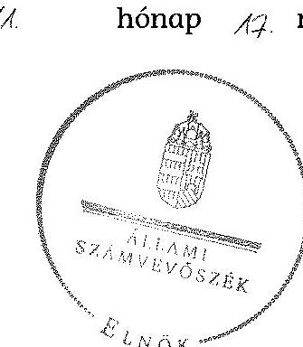

Melléklet: $\quad 15 \mathrm{db}$
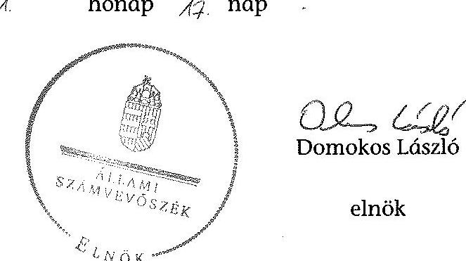
${ }^{23}$ Vhr. 9. § (3) bekezdés (hatályos 2010. december 31-ig), Vhr. 9. § (5) bekezdés (hatályos 2011. január 1-től)

---

.

---

# RÖVIDÍTÉSEK JEGYZÉKE 

## Jogszabályok

Alaptörvény
Avtv.
ÁSZ tv.
Evt. 1
Evt. 2

Gt.
Infotv.

Irattári tv.
Mfbtv.
Nfatv.
Nvtv.
régi Ptk.
új Ptk.
Számv. tv.
Vadvédelmi tv.
Vtv.
Vhr.

## Egyéb rövidítések

Alapító Okirat
Aláirási szabályzat ${ }_{1}$

Aláirási szabályzat ${ }_{2}$

Alapító okirat

Magyarország Alaptörvénye (2011. április 25.) (hatályos: 2012. január 1-jétől)

A személyes adatok védelméről és a közérdekű adatok nyilvánosságáról szóló 1992. évi LXIII. törvény
Az Állami Számvevőszékről szóló 2011. évi LXVI. törvény
Az erdőről és az erdő védelméről szóló 1996. évi LIV. törvény (hatálytalan: 2009. július 10-től)
Az erdőről, az erdő védelméről és az erdőgazdálkodásról szóló 2009. évi XXXVII. törvény (hatályos: 2009. július 10-től)
A gazdasági társaságokról szóló 2006. évi IV. törvény (hatálytalan: 2014. márc. 15-től)
Az információs önrendelkezési jogról és az információszabadságról
 szóló 2011. évi CXII. törvény (hatályos: 2011. július 27-étől)
A köziratokról, a közlevéltárakról és a magánlevéltári anyag védelméről szóló 1995. évi LXVI. törvény
A Magyar Fejlesztési Bankról szóló 2001. évi XX. törvény
A Nemzeti Földalapról szóló 2010. évi LXXXVII. törvény (hatályos: 2010. szeptember 1-jétől)
A nemzeti vagyonról szóló 2011. évi CXCVI. törvény (hatályos: 2011. december 31-étől)
A Polgári Törvénykönyvről szóló 1959. évi IV. törvény (hatálytalan: 2014. márc. 15-étől)
A Polgári Törvénykönyvről szóló 2013. évi V. törvény (hatályos: 2014. március 15-étől)
A számvitelről szóló 2000. évi C. törvény
A vad védelméről, a vadgazdálkodásról, valamint a vadászatról szóló 1996. évi LV. tv.
Az állami vagyonról szóló 2007. évi CVI. törvény
Az állami vagyonnal való gazdálkodásról 254/2007. (X. 4.) Korm. rendelet

SEFAG Zrt. mindenkor hatályos alapító okirata
SEFAG Zrt. Szabályzata az aláírások gyakorlására, a cégbélyegzők használatára és az utalványozási jogosultság megadására (hatályos: 2004. március 1-jétől)
SEFAG Zrt. Szabályzata az aláírások gyakorlásáról és a cégbélyegzők használatáról (hatályos: 2013. augusztus 15-étől)
Az Északerdő Zrt. alapító okirata

---

| ÁSZ | Állami Számvevőszék |
| :--: | :--: |
| Belső ellenőrzési sza-   bályzat ${ }_{1}$ | SEFAG Zrt. Belső ellenőrzési szabályzata (hatályos: 2000.   január 2-ától) |
| Belső ellenőrzési sza-   bályzat ${ }_{2}$ | SEFAG Zrt. Belső ellenőrzési szabályzata (hatályos: 2010.   november 1-jétől) |
| Beruházási szabályzat | SEFAG Zrt. Beruházási szabályzata (hatályos: 2011. április   15-étől) |
| Bizonylati Rend | SEFAG Zrt. Bizonylati rendje (hatályos: 1995. január 1-   jétől) |
| Bizonylati Album | SEFAG Zrt. Bizonylati albuma (hatályos: 2000. június 30-   ától) |
| Erdészeti Hatóság | Somogy Megyei Mezőgazdasági Szakigazgatási Hivatal Erdészeti Igazgatósága 2010. december 31-ig, Somogy Megyei   Kormányhivatal Erdészeti Igazgatósága 2011. január 1-   jétől |
| Értékelési szabályzat | SEFAG Zrt. Értékelési Szabályzata (hatályos: 2009. január   1-jétől) |
| FB | SEFAG Zrt. Felügyelő bizottsága |
| VSZ | SEFAG Erdészeti és Faipari Zrt. 01840-96-02055. számon a   tulajdonosi joggyakorlóval kötött ideiglenes vagyonkezelési szerződése (hatályos: 1996. október 9-től) |
| INTOSAI | Legfőbb Ellenőrző Intézmények Nemzetközi Szervezete |
| Iratkezelési szabályzat ${ }_{1}$ | SEFAG Zrt. Iratkezelési Szabályzata (hatályos: 2004. április   1-jétől) |
| Iratkezelési szabályzat ${ }_{2}$ | SEFAG Zrt. Iratkezelési Szabályzata (hatályos: 2010. január   1-jétől) |
| Iratkezelési szabályzat ${ }_{3}$ | SEFAG Zrt. Iratkezelési Szabályzata (hatályos: 2014. január   1-jétől) |
| ISSAI | nemzetközi standardok |
| KVI | Kincstári Vagyonigazgatóság |
| Leltárszabályzat ${ }_{1}$ | SEFAG Zrt. Leltárszabályzata (hatályos: 2009. január 1-   jétől) |
| Leltárszabályzat ${ }_{2}$ | SEFAG Zrt. Leltárszabályzata (hatályos: 2010. január 1-   jétől) |
| MFB Zrt. | Magyar Fejlesztési Bank Zártkörűen Működő Részvénytársaság |
| MNV Zrt. | Magyar Nemzeti Vagyonkezelő Zrt., amely 2010. szeptember 1-jétől a Nemzeti Földalapba nem tartozó állami va-   gyon feletti tulajdonosi joggyakorló |
| NFA | Nemzeti Földalapkezelő Szervezet |
| NFM | Nemzeti Fejlesztési Minisztérium |
| Önkormányzat | Kaposvár Megyei Jogú Város Önkormányzata |
| SEFAG Zrt., Társaság | SEFAG Erdészeti és Faipari Zártkörűen Működő Részvénytársaság |
| Számítástechnikai vé-   delmi szabályzat | SEFAG Zrt. Számítástechnikai védelmi szabályzata (hatályos 1998. július 1-jétől) |

---

| Számlarend | SEFAG Zrt. Számlarendje (hatályos: 2009. január 1-jétől) |
| :--: | :--: |
| Számviteli Politika $_{1}$ | SEFAG Zrt. Számviteli politikája (hatályos: 2009. január 1-jétől) |
| Számviteli Politika $_{2}$ | SEFAG Zrt. Számviteli politikája (hatályos: 2014. január 1-jétől) |
| SZMSZ $_{1}$ | SEFAG Zrt. Szervezeti és Működési Szabályzata (hatályos: 2008. november 27-étől) |
| SZMSZ $_{2}$ | SEFAG Erdészeti és Faipari Zrt. Szervezeti és Működési Szabályzata (hatályos: 2010. január 1-jétől) |
| SZMSZ $_{3}$ | SEFAG Erdészeti és Faipari Zrt. Szervezeti és Működési Szabályzata (hatályos: 2011. július 1-jétől) |
| Társaság feletti tulajdonosi joggyakorló ${ }_{1}$ | a társaságok állami tulajdonú részesedése feletti tulajdonosi jogokat gyakorló Magyar Nemzeti Vagyonkezelő Zrt. (2009. január 1-jétől 2010. június 16-áig) |
| Társaság feletti tulajdonosi joggyakorló $_{2}$ | a társaságok állami tulajdonú részesedése feletti tulajdonosi jogokat gyakorló Magyar Fejlesztési Bank Zrt. (2010. június 17-étől 2014. július 15-éig) |
| Vagyonvédelmi szabály-   zat | SEFAG Zrt. Vagyonvédelmi szabályzata (hatályos: 2006. április 1-jétől) |

---

.

---

# FOGALOMTÁR 

állami vagyon
állami vagyon használója
átlátható szervezet
földbirtok-politikai irányelvek
hasznosítás
immateriális szolgáltatásából származó bevétel
információs és kommunikációs rendszer
kockázatkezelés
kockázatkezelési rendszer

Állami vagyon:
a) az állam tulajdonában lévő dolog, valamint dolog módjára hasznosítható természeti erő;
b) az a) pont hatálya alá tartozó mindazon vagyon, amely vonatkozásában törvény az állam kizárólagos tulajdonjogát nevesíti;
c) az állam tulajdonában lévő tagsági jogviszonyt megtestesítő értékpapír, illetve az államot megillető egyéb társasági részesedés;
d) az államot megillető olyan immateriális, vagyoni értékkel rendelkező jogosultság, amelyet jogszabály vagyoni értékű jogként nevesít;
e) az állam tulajdonában lévő pénzügyi eszközök.
Az állami vagyon használója az a természetes vagy jogi személy, jogi személyiséggel nem rendelkező szervezet, aki, vagy amely törvény vagy szerződés alapján, bármely jogcímen (bérlet, haszonbérlet, használat stb.) állami vagyont birtokol, használ, szedi annak hasznait. (Ide nem értve a haszonélvezőt, a vagyonkezelőt és a tulajdonosi jogok gyakorlóját.)
Átlátható szervezet a Nvtv. 3. § (1) bekezdés 1. pontjában felsorolt, a meghatározott követelményeknek megfelelő szervezet.
Az Nfatv. 15. § (3) bekezdés a)-s) pontjaiban meghatározott, a Nemzeti Földalapba tartozó földrészletek hasznosítására vonatkozó irányelvek.
Hasznosítás a tulajdonosi joggyakorló vagy a nemzeti vagyon használója által a nemzeti vagyon birtoklásának, használatának, hasznok szedése jogának bármely - a tulajdonjog átruházását nem eredményező - jogcímen történő átengedése, ide nem értve a vagyonkezelésbe adást, valamint a haszonélvezeti jog alapítását.
Immateriális szolgáltatásból származó bevételek azok a nem anyagjellegű szolgáltatásokból származó állami bevételek, amelyeket az Evt. 3. § (1) bekezdése szerint, a külön jogszabályban meghatározott részletes feltételek szerint, az erdők fenntartására, gyarapítására és védelmére kell fordítani.
Az információs és kommunikációs rendszer biztosítja, hogy az információk eljussanak az illetékes szervezethez, szervezeti egységhez, illetve személyhez.
A kockázatkezelés a szervezet céljai elérésével kapcsolatos kockázatok azonosításának és elemzésének, valamint a megfelelő válaszok meghatározásának folyamata.
A kockázatkezelési rendszer működtetése során fel kell mérni és meg kell állapítani a szervezet tevékenységében, gazdálkodásában rejlő kockázatokat, valamint meg kell határozni az egyes kockázatokkal kapcsolatban szükséges intézkedéseket,

---

valamint azok teljesítésének folyamatos nyomon követésének módját.

A kockázatkezelési rendszer olyan irányítási eszközök és módszerek összessége, amelynek elemei a szervezeti célok elérését veszélyeztető tényezők (kockázatok) azonosítása, elemzése, nyomon követése, valamint szükség esetén a kockázati kitettség mérséklése.
kontrolling Az a vezetéstámogató rendszer, amely a vezetői tervezést, ellenőrzést, valamint információ-ellátást koordinálja célorientáltan a környezeti változásokhoz igazodva.
kontrollkörnyezet A kontroll környezet elemei: a szervezeti struktúra, a felelősségi, hatásköri viszonyok és feladatok, a szervezet minden szintjén meghatározott etikai elvárások, a humánerőforráskezelés. A kontrollkörnyezet alapozza meg a belső kontroll összes többi elemét a fegyelem és a struktúra biztosítása által.
kontrollrendszer A kontrollrendszer a kockázatok kezelése és tárgyilagos bizonyosság megszerzése érdekében kialakított folyamatrendszer, amely azt a célt szolgálja, hogy megvalósuljanak a következő célok:
a) a működés és a gazdálkodás során a tevékenységeket szabályszerűen, gazdaságosan, hatékonyan, eredményesen hajtsák végre,
b) az elszámolási kötelezettségeket teljesítsék, és
c) megvédjék az erőforrásokat a veszteségektől, károktól és nem rendeltetésszerű használattól.
kontrolltevékenységek
közfeladat
A kontrolltevékenységek azok az elvek (politikák) és eljárások, amelyeket a kockázatok meghatározása és a szervezet céljainak elérése érdekében alakítanak ki.
A közfeladat jogszabályban meghatározott állami vagy önkormányzati feladat, amit az arra kötelezett közérdekből, jogszabályban meghatározott követelményeknek és feltételeknek megfelelve végez, ideértve a lakosság közszolgáltatásokkal való ellátását, továbbá az állam nemzetközi szerződésekben vállalt kötelezettségeiből adódó közérdekű feladatokat, valamint e feladatok ellátásához szükséges infrastruktúra biztosítását is.

Az Evt. 2. § (2) bekezdése szerint a fenntartható erdőgazdálkodás során a legfontosabb közérdekű feladat az erdők változatosságának megőrzése, az erdők fenntartása, felújítása és a védelmi, valamint közjóléti szolgáltatások biztosítása, melyek elvégzését az állam megfelelő eszközökkel biztosítja.
monitoring A szervezet tevékenységének, a célok megvalósításának nyomon követését biztosító rendszer, amely az operatív tevékenységek keretében megvalósuló folyamatos és eseti nyomon követésből, valamint az operatív tevékenységektől függetlenül működő belső ellenőrzésből áll.

---

Nemzeti Földalap
nemzeti vagyon használója
rábízott állami vagyon
társasági portfólió
tulajdonosi ellenőrzés
tulajdonosi joggyakorló
tulajdonosi joggyakorlás módja

A monitoring a projektek és programok végrehajtásának nyomon követése, mely a támogató és a kedvezményezett közti megállapodásban foglalt eljárások követését, az előrehaladás ellenőrzését és a lehetséges problémák időben történő azonosítását szolgálja.
A Nemzeti Földalap a kincstári vagyon része, amelybe beletartoznak az állam tulajdonában és az ingatlan-nyilvántartásban levő, az Nfatv. 1. § (1)-(2) bekezdéseiben felsorolt területek, földrészletek és az azokhoz kapcsolódó vagyoni értékű jogok.
A nemzeti vagyon használója az a természetes személy, jogi személy vagy jogi személyiséggel nem rendelkező szervezet, aki, vagy amely állami vagyon tekintetében törvény vagy szerződés alapján, a helyi önkormányzat vagyona tekintetében törvény, a helyi önkormányzat rendelete vagy szerződés alapján bármely jogcímen nemzeti vagyont birtokol, használ, szedi annak hasznait, kivéve a tulajdonosi joggyakorló (az Nvtv. 3. § (1) bekezdés 11. pontja alapján).
Rábízott állami vagyon az a Vtv. alkalmazásában állami vagyonnak minősülő vagyon, amit az MNV - a saját vagyonától elkülönítetten - kezel és nyilvántart.

Az Mfbtv. 3. § (9) bekezdése szerint rábízott állami vagyon az a vagyon, amely felett az Mfbtv. erejénél fogva a Magyar Állam nevében az MFB gyakorolja a tulajdonosi jogokat.

Az Nfatv. 1. § (1) bekezdésében foglaltak alapján az NFA-hoz tartozó rábízott vagyon a törvényben meghatározott, a Nemzeti Földalapba tartozó vagyon.
Társasági portfólió az MNV, illetve az MFB rábízott vagyonába tartozó állami tulajdonú társasági részesedések.
A tulajdonosi joggyakorló által végzett ellenőrzés, amelynek célja az állami vagyonnal való gazdálkodás vizsgálata, ennek keretében a rendeltetésellenes, jogszerűtlen, szerződésellenes, vagy a tulajdonos érdekeit sértő, illetve a központi költségvetést hátrányosan érintő vagyongazdálkodási intézkedések feltárása és a jogszerű állapot helyreállítása, továbbá a vagyonnyilvántartás hitelességének, teljességének és helyességének biztosítása.
Tulajdonosi joggyakorló az, aki az állami, illetve a nemzeti vagyon felett az államot megillető tulajdonosi jogok és kötelezettségek gyakorlására jogosult.
Az állami vagyon felett a Magyar Államot megillető tulajdonosi jogoknak (és kötelezettségeknek) az összességét az állami vagyon felügyeletéért felelős miniszter gyakorolja, aki e feladatát az MNV, az MFB, illetve egyéb tulajdonosi joggyakorló szervezet (pl. központi költségvetési szervek, 100%-ban állami tulajdonban álló gazdasági társaságok) útján látja el.

---

vagyongazdálkodás feladata
vagyonkezelői jog

Azon állami tulajdonban álló ingatlanok felett, amelyek egy része a Nemzeti Földalapba tartozik, a tulajdonosi jogokat a miniszter az agrárpolitikáért felelős miniszterrel közösen gyakorolja.

A Nemzeti Földalap felett a Magyar Állam nevében a tulajdonosi jogokat és kötelezettségeket az agrárpolitikáért felelős miniszter a Nemzeti Földalapkezelő Szervezet útján gyakorolja.
Az állami vagyon rendeltetésének megfelelő - az állami feladatok ellátásához, a társadalmi szükségletek kielégítéséhez, valamint a Kormány gazdaságpolitikája megvalósításának elősegítéséhez szükséges, egységes elveken alapuló, önálló ágazatként megjelenő - hatékony, költségtakarékos, értékmegőrző, értéknövelő felhasználásának biztosítása, beleértve a
 vagyoni kör változását eredményező értékesítést, valamint az állami vagyon gyarapítását is.
Vagyonkezelési szerződés alapján a vagyonkezelő jogosult meghatározott, állami tulajdonba tartozó dolog birtoklására, használatára és hasznainak szedésére.

A Vtv. alapján a vagyonkezelői jog az állami vagyon hasznosítására az MNV-vel kötött vagyonkezelési szerződéssel jön létre. A vagyonkezelési szerződés alapján a vagyonkezelő jogosult meghatározott, állami tulajdonba tartozó dolog birtoklására, használatára és hasznainak szedésére.

Az Nfatv. alapján a vagyonkezelői jog az erre irányuló (NF-val kötött) szerződéssel jön létre. A vagyonkezelői szerződés alapján a vagyonkezelő jogosult meghatározott földrészlet birtoklására, használatára és hasznainak szedésére. A vagyonkezelő köteles a földrészlet értékét megőrizni, állagának megóvásáról, jó karban tartásáról gondoskodni, továbbá - az Nfatv.-ben meghatározott esetek kivételével - díjat fizetni vagy a szerződésben előírt más kötelezettséget teljesíteni.

---

### a SEFAG Zrt. vagyonának alakulása a 2009-2014. I. félévében

|  Sor-
szám | Megnevezés | 2009.01.01 | 2009.12.31 | 2010.12.31 | 2011.12.31 | 2012.12.31 | 2013.12.31 | 2014.06.30 | Változás
2013.12.31/2009.12.31.
(%)  |
| --- | --- | --- | --- | --- | --- | --- | --- | --- | --- |
|   |  | 1. | 2. | 3. | 4. | 5. | 6. | 7. | 8.  |
|  1. | Eszközök |  |  |  |  |  |  |  |   |
|  2. | Befektetett eszközök összesen | 5 095 974 | 4 888 726 | 4 773 438 | 4 759 444 | 5 100 250 | 5 656 066 | 5 684 830 | 116%  |
|  3. | Ebből: Immateriális javak | 1 996 | 33 772 | 32 630 | 44 507 | 62 697 | 99 908 | 96 711 | 296%  |
|  4. | Tárgyi eszközök | 3 498 684 | 3 476 333 | 3 520 897 | 3 516 857 | 4 721 279 | 5 253 860 | 5 270 985 | 151%  |
|  5. | Befektetett pénzügyi eszközök | 1 595 294 | 1 378 601 | 1 219 911 | 1 198 080 | 316 274 | 302 298 | 317 134 | 22%  |
|  6. | Forgóeszközök | 2 839 190 | 2 665 449 | 2 983 405 | 3 507 296 | 3 874 690 | 3 959 334 | 3 956 848 | 149%  |
|  7. | Ebből: Készletek | 313 534 | 299 754 | 235 827 | 321 152 | 799 120 | 767 595 | 770 580 | 256%  |
|  8. | Követelések | 1 558 653 | 1 379 638 | 1 070 524 | 1 115 296 | 926 416 | 1 364 459 | 943 097 | 99%  |
|  9. | Értékpapírok | 343 409 | 298 553 | 688 553 | 510 460 | 482 989 | 485 235 | 392 602 | 162%  |
|  10. | Pénzeszközök | 623 594 | 687 504 | 988 501 | 1 560 388 | 1 666 165 | 1 344 045 | 1 850 569 | 195%  |
|  11. | Aktív időbeli elhatárolások | 29 847 | 28 917 | 15 851 | 23 282 | 7 125 | 4 608 | 78 | 16%  |
|  12. | Eszközök összesen | 7 965 011 | 7 583 092 | 7 772 694 | 8 290 022 | 8 982 065 | 9 620 008 | 9 641 756 | 127%  |
|  13. | Források |  |  |  |  |  |  |  |   |
|  14. | Saját tőke | 6 289 890 | 6 503 319 | 6 708 294 | 6 971 984 | 7 252 892 | 7 492 339 | 7 656 439 | 115%  |
|  15. | Ebből: Jegyzett tőke | 2 417 040 | 2 507 830 | 2 507 830 | 2 507 830 | 2 507 830 | 2 507 830 | 2 507 830 | 100%  |
|  16. | Tőketartalék | 2 392 458 | 2 395 860 | 2 400 775 | 2 402 731 | 2 402 731 | 2 471 663 | 2 471 663 | 103%  |
|  17. | Eredményartalék | 1 193 831 | 1 420 412 | 1 499 629 | 1 656 689 | 1 744 902 | 2 070 331 | 2 240 846 | 146%  |
|  18. | Lekötött tartalék | 120 000 | 60 000 | 100 000 | 145 000 | 298 000 | 272 000 | 272 000 | 453%  |
|  19. | Értékelési tartalék |  |  |  |  |  |  |  |   |
|  20. | Mérlegközi eredmény | 166 581 | 119 217 | 200 060 | 261 734 | 299 429 | 170 515 | 164 100 | 143%  |
|  21. | Célsartalékok | 52 692 | 70 986 | 41 066 | 45 856 | 144 336 | 90 351 | 90 351 | 127%  |
|  22. | Kötelezettségek | 1 337 138 | 641 877 | 593 343 | 669 413 | 768 979 | 1 072 704 | 766 169 | 167%  |
|  23. | Ebből: Hátrasorolt kötelezettségek |  |  |  |  |  |  |  |   |
|  24. | Hosszú lejáratú kötelezettségek | 90 301 | 105 260 | 88 535 | 45 041 | 39 979 | 14 681 | 17 724 | 14%  |
|  25. | Rövid lejáratú kötelezettségek | 1 246 837 | 536 617 | 506 808 | 624 372 | 729 000 | 1 058 023 | 748 445 | 197%  |
|  26. | Pénzügyi időbeli elhatárolások | 285 291 | 366 910 | 427 991 | 602 769 | 815 858 | 964 614 | 1 128 797 | 263%  |
|  27. | Források összesen | 7 965 011 | 7 583 092 | 7 772 694 | 8 290 022 | 8 982 065 | 9 620 008 | 9 641 756 | 127%  |

---

Az immateriális javak és tárgyi eszközök állományának megoszlása a 2013. évre vonatkozóan adatok ezer Ft-ban

|  Sorszám | Megnevezés | Immateriális javak | Ingatlanok | Mászaki berendezések | Egyéb berendezések | Beruházás a beruházásra adott előleggel együtt | Tárgyi eszközök összesen  |
| --- | --- | --- | --- | --- | --- | --- | --- |
|   | 1. | 2. | 3. | 4. | 5. | 6. | 7.  |
|  1. | Bruttó érték január 1-jén | 128081,0 | 5004298,0 | 2070301,0 | 977194,0 | 457713,0 | 8509506,0  |
|  2. | -ebből: állami vagyon |  |  |  |  |  | 0,0  |
|  3. | -ebből: saját vagyon | 128081,0 | 5004298,0 | 2070301,0 | 977194,0 | 457713,0 | 8509506,0  |
|  4. | Növekedés (+) | 57938,0 | 728989,0 | 22653,0 | 127885,0 | 1174959,0 | 2054486,0  |
|  5. | -ebből: állami vagyon |  |  |  |  |  | 0,0  |
|  6. | -ebből: saját vagyon | 57938,0 | 728989,0 | 22653,0 | 127885,0 | 1174959,0 | 2054486,0  |
|  7. | Csökkenés (-) |  | -29502,0 | -71093,0 | -13413,0 | -1026343,0 | -1140351,0  |
|  8. | -ebből: állami vagyon |  |  |  |  |  |   |
|  9. | -ebből: saját vagyon |  | -29502,0 | -71093,0 | -13413,0 | -1026343,0 | -1140351,0  |
|  10. | Bruttó érték december 31-én | 186019,0 | 5703785,0 | 2021861,0 | 1091666,0 | 606329,0 | 9423641,0  |
|  11. | -ebből: állami vagyon |  |  |  |  |  |   |
|  12. | -ebből: saját vagyon | 186019,0 | 5703785,0 | 2021861,0 | 1091666,0 | 606329,0 | 9423641,0  |
|  13. | Halmozott értékcsökkenés január 1-jén | 65384,0 | 1656099,0 | 1369103,0 | 763025,0 |  | 3788227,0  |
|  14. | -ebből: állami vagyon |  |  |  |  |  | 0,0  |
|  15. | -ebből: saját vagyon | 65384,0 | 1656099,0 | 1369103,0 | 763025,0 |  | 3788227,0  |
|  16. | Értékcsökkenés növekedése (+) (költségként elszámolt) | 20727,0 | 195723,0 | 145800,0 | 134967,0 |  | 476490,0  |
|  17. | -ebből: állami vagyon |  |  |  |  |  | 0,0  |
|  18. | -ebből: saját vagyon | 20727,0 | 195723,0 | 145800,0 | 134967,0 |  | 476490,0  |
|  22. | Értékcsökkenés egyéb ráfordításként elszámolva (z) |  | -16782,0 | -64898,0 | -13256,0 |  | -94936,0  |
|  23. | -ebből: állami vagyon |  |  |  |  |  | 0,0  |
|  24. | -ebből: saját vagyon |  | -16782,0 | -64898,0 | -13256,0 |  | -94936,0  |
|  25. | Egyéb változás az értékcsökkenésben (z) |  |  |  |  |  |   |
|  26. | -ebből: állami vagyon |  |  |  |  |  |   |
|  27. | -ebből: saját vagyon |  |  |  |  |  |  |

 |  |  |  |  |  |   |
|  28. | Halmozott értékcsökkenés december 31-én: | 86111,0 | 1835040,0 | 1450005,0 | 884736,0 | 0,0 | 4169781,0  |
|  29. | -ebből: állami vagyon |  |  |  |  |  |   |
|  30. | -ebből: saját vagyon | 86111,0 | 1835040,0 | 1450005,0 | 884736,0 | 0,0 | 4169781,0  |
|  31. | Nettó érték december 31-én: | 99908,0 | 3868745,0 | 571856,0 | 206930,0 | 606329,0 | 5253860,0  |
|  32. | -ebből: állami vagyon |  |  |  |  |  |   |
|  33. | -ebből: saját vagyon | 99908,0 | 3868745,0 | 571856,0 | 206930,0 | 606329,0 | 5253860,0  |

---

A befektetett eszközök állományának alakulása a 2009-2014. I. félév közötti időszakban

|  Szn. | MEGKOPISZÉS | 2009. AV |  | 2010. AV |  | 2011. AV |  | 2012. AV |  | 2013. AV |  | 2014. AV |  | 2015. AV |  | 2016. AV |   |
| --- | --- | --- | --- | --- | --- | --- | --- | --- | --- | --- | --- | --- | --- | --- | --- | --- | --- |
|   |  | Összesen |  |  |  | Összesen |  |  |  |  |  |  |  |  |  |  |   |
|   |  |  |  |  |  |  |  |  |  |  |  |  |  |  |  |  |   |
|  1. |  |  |  |  |  |  |  |  |  |  |  |  |  |  |  |  |   |
|  2. |  |  |  |  |  |  |  |  |  |  |  |  |  |  |  |  |   |
|  3. |  |  |  |  |  |  |  |  |  |  |  |  |  |  |  |  |   |
|  4. |  |  |  |  |  |  |  |  |  |  |  |  |  |  |  |  |   |
|  5. |  |  |  |  |  |  |  |  |  |  |  |  |  |  |  |  |   |
|  6. |  |  |  |  |  |  |  |  |  |  |  |  |  |  |  |  |   |
|  7. |  |  |  |  |  |  |  |  |  |  |  |  |  |  |  |  |   |
|  8. |  |  |  |  |  |  |  |  |  |  |  |  |  |  |  |  |   |
|  9. |  |  |  |  |  |  |  |  |  |  |  |  |  |  |  |  |   |
|  10. |  |  |  |  |  |  |  |  |  |  |  |  |  |  |  |  |   |
|  11. |  |  |  |  |  |  |  |  |  |  |  |  |  |  |  |  |   |
|  12. |  |  |  |  |  |  |  |  |  |  |  |  |  |  |  |  |   |
|  13. |  |  |  |  |  |  |  |  |  |  |  |  |  |  |  |  |   |
|  14. |  |  |  |  |  |  |  |  |  |  |  |  |  |  |  |  |   |
|  15. |  |  |  |  |  |  |  |  |  |  |  |  |  |  |  |  |   |
|  16. |  |  |  |  |  |  |  |  |  |  |  |  |  |  |  |  |   |
|  17. |  |  |  |  |  |  |  |  |  |  |  |  |  |  |  |  |   |
|  18. |  |  |  |  |  |  |  |  |  |  |  |  |  |  |  |  |   |
|  19. |  |  |  |  |  |  |  |  |  |  |  |  |  |  |  |  |   |
|  20. |  |  |  |  |  |  |  |  |  |  |  |  |  |  |  |  |   |
|  21. |  |  |  |  |  |  |  |  |  |  |  |  |  |  |  |  |   |
|  22. |  |  |  |  |  |  |  |  |  |  |  |  |  |  |  |  |   |
|  23. |  |  |  |  |  |  |  |  |  |  |  |  |  |  |  |  |   |
|  24. |  |  |  |  |  |  |  |  |  |  |  |  |  |  |  |  |   |
|  25. |  |  |  |  |  |  |  |  |  |  |  |  |  |  |  |  |   |
|  26. |  |  |  |  |  |  |  |  |  |  |  |  |  |  |  |  |   |
|  27. |  |  |  |  |  |  |  |  |  |  |  |  |  |  |  |  |   |
|  28. |  |  |  |  |  |  |  |  |  |  |  |  |  |  |  |  |   |
|  29. |  |  |  |  |  |  |  |  |  |  |  |  |  |  |  |  |   |
|  30. |  |  |  |  |  |  |  |  |  |  |  |  |  |  |  |  |   |
|  31. |  |  |  |  |  |  |  |  |  |  |  |  |  |  |  |  |   |
|  32. |  |  |  |  |  |  |  |  |  |  |  |  |  |  |  |  |   |
|  33. |  |  |  |  |  |  |  |  |  |  |  |  |  |  |  |  |   |
|  34. |  |  |  |  |  |  |  |  |  |  |  |  |  |  |  |  |   |
|  35. |  |

  |  |  |  |  |  |  |  |  |  |  |  |  |  |  |   |
|  36. |  |  |  |  |  |  |  |  |  |  |  |  |  |  |  |  |   |
|  37. |  |  |  |  |  |  |  |  |  |  |  |  |  |  |  |  |   |
|  38. |  |  |  |  |  |  |  |  |  |  |  |  |  |  |  |  |   |
|  39. |  |  |  |  |  |  |  |  |  |  |  |  |  |  |  |  |   |
|  40. |  |  |  |  |  |  |  |  |  |  |  |  |  |  |  |  |   |
|  41. |  |  |  |  |  |  |  |  |  |  |  |  |  |  |  |  |   |
|  42. |  |  |  |  |  |  |  |  |  |  |  |  |  |  |  |  |   |
|  43. |  |  |  |  |  |  |  |  |  |  |  |  |  |  |  |  |   |
|  44. |  |  |  |  |  |  |  |  |  |  |  |  |  |  |  |  |   |
|  45. |  |  |  |  |  |  |  |  |  |  |  |  |  |  |  |  |   |
|  46. |  |  |  |  |  |  |  |  |  |  |  |  |  |  |  |  |   |
|  47. |  |  |  |  |  |  |  |  |  |  |  |  |  |  |  |  |   |
|  48. |  |  |  |  |  |  |  |  |  |  |  |  |  |  |  |  |   |
|  49. |  |  |  |  |  |  |  |  |  |  |  |  |  |  |  |  |   |
|  50. |  |  |  |  |  |  |  |  |  |  |  |  |  |  |  |  |   |
|  51. |  |  |  |  |  |  |  |  |  |  |  |  |  |  |  |  |   |
|  52. |  |  |  |  |  |  |  |  |  |  |  |  |  |  |  |  |   |
|  53. |  |  |  |  |  |  |  |  |  |  |  |  |  |  |  |  |   |
|  54. |  |  |  |  |  |  |  |  |  |  |  |  |  |  |  |  |   |
|  55. |  |  |  |  |  |  |  |  |  |  |  |  |  |  |  |  |   |
|  56. |  |  |  |  |  |  |  |  |  |  |  |  |  |  |  |  |   |
|  57. |  |  |  |  |  |  |  |  |  |  |  |  |  |  |  |  |   |
|  58. |  |  |  |  |  |  |  |  |  |  |  |  |  |  |  |  |   |
|  59. |  |  |  |  |  |  |  |  |  |  |  |  |  |  |  |  |   |
|  60. |  |  |  |  |  |  |  |  |  |  |  |  |  |  |  |  |   |
|  61. |  |  |  |  |  |  |  |  |  |  |  |  |  |  |  |  |   |
|  62. |  |  |  |  |  |  |  |  |  |  |  |  |  |  |  |  |   |
|  63. |  |  |  |  |  |  |  |  |  |  |  |  |  |  |  |  |   |
|  64. |  |  |  |  |  |  |  |  |  |  |  |  |  |  |  |  |   |
|  65. |  |  |  |  |  |  |  |  |  |  |  |  |  |  |  |  |   |
|  66. |  |  |  |  |  |  |  |  |  |  |  |  |  |  |  |  |   |
|  67. |  |  |  |  |  |  |  |  |  |  |  |  |  |  |  |  |   |
|  68. |  |  |  |  |  |  |  |  |  |  |  |  |  |  |  |  |   |
|  69. |  |  |  |  |  |  |  |  |  |  |  |  |  |  |  |  |   |
|  70. |  |  |  |  |  |  |  |  |  |  |  |  |  |  |  |  |   |
|  71. |  |  |  |  |  |  |  |  |  |  |  |  |  |  |  |  |   |
|  72. |  |  |  |  |  |  |  |  |  |  |  |  |  |  |  |  |   |
|  73. |  |  |  |  |  |  |  |  |  |  |  |  |  |  |  |  |   |
|  74. |  |  |  |  |  |  |  |  |  |  |  |  |  |  |  |  |   |
|  75. |  |  |  |  |  |  |  |  |  |  |  |  |  |  |  |  |   |
|  76. |  |  |  |  |  |  |  |  |  |  |  |  |  |  |  |  |   |
|  77. |  |  |  |  |  |  |  |  |  |  |  |  |  |  |  |  |   |

  |  |  |  |  |  |  |  |  |  |  |  |  |   |
|  78. |  |  |  |  |  |  |  |  |  |  |  |  |  |  |  |  |   |
|  79. |  |  |  |  |  |  |  |  |  |  |  |  |  |  |  |  |   |
|  80. |  |  |  |  |  |  |  |  |  |  |  |  |  |  |  |  |   |
|  81. |  |  |  |  |  |  |  |  |  |  |  |  |  |  |  |  |   |
|  82. |  |  |  |  |  |  |  |  |  |  |  |  |  |  |  |  |   |
|  83. |  |  |  |  |  |  |  |  |  |  |  |  |  |  |  |  |   |
|  84. |  |  |  |  |  |  |  |  |  |  |  |  |  |  |  |  |   |
|  85. |  |  |  |  |  |  |  |  |  |  |  |  |  |  |  |  |   |
|  86. |  |  |  |  |  |  |  |  |  |  |  |  |  |  |  |  |   |
|  87. |  |  |  |  |  |  |  |  |  |  |  |  |  |  |  |  |   |
|  88. |  |  |  |  |  |  |  |  |  |  |  |  |  |  |  |  |   |
|  89. |  |  |  |  |  |  |  |  |  |  |  |  |  |  |  |  |   |
|  90. |  |  |  |  |  |  |  |  |  |  |  |  |  |  |  |  |   |
|  91. |  |  |  |  |  |  |  |  |  |  |  |  |  |  |  |  |   |
|  92. |  |  |  |  |  |  |  |  |  |  |  |  |  |  |  |  |   |
|  93. |  |  |  |  |  |  |  |  |  |  |  |  |  |  |  |  |   |
|  94. |  |  |  |  |  |  |  |  |  |  |  |  |  |  |  |  |   |
|  95. |  |  |  |  |  |  |  |  |  |  |  |  |  |  |  |  |   |
|  96. |  |  |  |  |  |  |  |  |  |  |  |  |  |  |  |  |   |
|  97. |  |  |  |  |  |  |  |  |  |  |  |  |  |  |  |  |   |
|  98. |  |  |  |  |  |  |  |  |  |  |  |  |  |  |  |  |   |
|  99. |  |  |  |  |  |  |  |  |  |  |  |  |  |  |  |  |   |
|  100. |  |  |  |  |  |  |  |  |  |  |  |  |  |  |  |  |   |
|  101. |  |  |  |  |  |  |  |  |  |  |  |  |  |  |  |  |   |
|  102. |  |  |  |  |  |  |  |  |  |  |  |  |  |  |  |  |   |
|  103. |  |  |  |  |  |  |  |  |  |  |  |  |  |  |  |  |   |
|  104. |  |  |  |  |  |  |  |  |  |  |  |  |  |  |  |  |   |
|  105. |  |  |  |  |  |  |  |  |  |  |  |  |  |  |  |  |   |
|  106. |  |  |  |  |  |  |  |  |  |  |  |  |  |  |  |  |   |
|  107. |  |  |  |  |  |  |  |  |  |  |  |  |  |  |  |  |   |
|  108. |  |  |  |  |  |  |  |  |  |  |  |  |  |  |  |  |   |
|  109. |  |  |  |  |  |  |  |  |  |  |  |  |  |  |  |  |   |
|  110. |  |  |  |  |  |  |  |  |  |  |  |  |  |  |  |  |   |
|  111. |  |  |  |  |  |  |  |  |  |  |  |  |  |  |  |  |   |
|  112. |  |  |  |  |  |  |  |  |  |  |  |  |  |  |  |  |   |
|  113. |  |  |  |  |  |  |  |  |  |  |  |  |  |  |  |  |   |
|  114. |  |  |  |  |  |  |  |  |  |  |  |  |  |  |  |  |   |
|  115. |  |  |  |  |  |  |  |  |  |  |  |  |  |  |  |  |   |
|  116. |  |  |  |  |  |  |  |  |  |  |  |  |  |  |  |  |   |
|  117. |  |  |  |  |  |  |  |  |  |  |  |  |  |  |  |  |   |
|  118. |  |  |  |  |  |  |  |  |  |  |  |  |  |  |  |  |   |
|  119. |  |  |  |  |  |

  |  |  |  |  |  |  |  |  |  |  |   |
|  120. |  |  |  |  |  |  |  |  |  |  |  |  |  |  |  |  |   |
|  121. |  |  |  |  |  |  |  |  |  |  |  |  |  |  |  |  |   |
|  122. |  |  |  |  |  |  |  |  |  |  |  |  |  |  |  |  |   |
|  123. |  |  |  |  |  |  |  |  |  |  |  |  |  |  |  |  |   |
|  124. |  |  |  |  |  |  |  |  |  |  |  |  |  |  |  |  |   |
|  125. |  |  |  |  |  |  |  |  |  |  |  |  |  |  |  |  |   |
|  126. |  |  |  |  |  |  |  |  |  |  |  |  |  |  |  |  |   |
|  127. |  |  |  |  |  |  |  |  |  |  |  |  |  |  |  |  |   |
|  128. |  |  |  |  |  |  |  |  |  |  |  |  |  |  |  |  |   |
|  129. |  |  |  |  |  |  |  |  |  |  |  |  |  |  |  |  |   |
|  130. |  |  |  |  |  |  |  |  |  |  |  |  |  |  |  |  |   |
|  131. |  |  |  |  |  |  |  |  |  |  |  |  |  |  |  |  |   |
|  132. |  |  |  |  |  |  |  |  |  |  |  |  |  |  |  |  |   |
|  133. |  |  |  |  |  |  |  |  |  |  |  |  |  |  |  |  |   |
|  134. |  |  |  |  |  |  |  |  |  |  |  |  |  |  |  |  |   |
|  135. |  |  |  |  |  |  |  |  |  |  |  |  |  |  |  |  |   |
|  136. |  |  |  |  |  |  |  |  |  |  |  |  |  |  |  |  |   |
|  137. |  |  |  |  |  |  |  |  |  |  |  |  |  |  |  |  |   |
|  138. |  |  |  |  |  |  |  |  |  |  |  |  |  |  |  |  |   |
|  139. |  |  |  |  |  |  |  |  |  |  |  |  |  |  |  |  |   |
|  140. |  |  |  |  |  |  |  |  |  |  |  |  |  |  |  |  |   |
|  141. |  |  |  |  |  |  |  |  |  |  |  |  |  |  |  |  |   |
|  142. |  |  |  |  |  |  |  |  |  |  |  |  |  |  |  |  |   |
|  143. |  |  |  |  |  |  |  |  |  |  |  |  |  |  |  |  |   |
|  144. |  |  |  |  |  |  |  |  |  |  |  |  |  |  |  |  |   |
|  145. |  |  |  |  |  |  |  |  |  |  |  |  |  |  |  |  |   |
|  146. |  |  |  |  |  |  |  |  |  |  |  |  |  |  |  |  |   |
|  147. |  |  |  |  |  |  |  |  |  |  |  |  |  |  |  |  |   |
|  148. |  |  |  |  |  |  |  |  |  |  |  |  |  |  |  |  |   |
|  149. |  |  |  |  |  |  |  |  |  |  |  |  |  |  |  |  |   |
|  150. |  |  |  |  |  |  |  |  |  |  |  |  |  |  |  |  |   |
|  151. |  |  |  |  |  |  |  |  |  |  |  |  |  |  |  |  |   |
|  152. |  |  |  |  |  |  |  |  |  |  |  |  |  |  |  |  |   |
|  153. |  |  |  |  |  |  |  |  |  |  |  |  |  |  |  |  |   |
|  154. |  |  |  |  |  |  |  |  |  |  |  |  |  |  |  |  |   |
|  155. |  |  |  |  |  |  |  |  |  |  |  |  |  |  |  |  |   |
|  156. |  |  |  |  |  |  |  |  |  |  |  |  |  |  |  |  |   |
|  157. |  |  |  |  |  |  |  |  |  |  |  |  |  |  |  |  |   |
|  158. |  |  |  |  |  |  |  |  |  |  |  |  |  |  |  |  |   |
|  159. |  |  |  |  |  |  |  |  |  |  |  |  |  |  |  |  |  |   |
|  160. |  |  |  |  |  |  |  |  |  |  |  |  |  |  |  |  |  |   |
|  161. |  |  |  |  |  |

  |  |  |  |  |  |  |  |  |  |  |  |   |
|  162. |  |  |  |  |  |  |  |  |  |  |  |  |  |  |  |  |  |   |
|  163. |  |  |  |  |  |  |  |  |  |  |  |  |  |  |  |  |  |   |
|  164. |  |  |  |  |  |  |  |  |  |  |  |  |  |  |  |  |  |   |
|  165. |  |  |  |  |  |  |  |  |  |  |  |  |  |  |  |  |  |   |
|  166. |  |  |  |  |  |  |  |  |  |  |  |  |  |  |  |  |  |   |
|  167. |  |  |  |  |  |  |  |  |  |  |  |  |  |  |  |  |  |   |
|  168. |  |  |  |  |  |  |  |  |  |  |  |  |  |  |  |  |  |   |
|  169. |  |  |  |  |  |  |  |  |  |  |  |  |  |  |  |  |  |   |
|  170. |  |  |  |  |  |  |  |  |  |  |  |  |  |  |  |  |  |   |
|  171. |  |  |  |  |  |  |  |  |  |  |  |  |  |  |  |  |  |   |
|  172. |  |  |  |  |  |  |  |  |  |  |  |  |  |  |  |  |  |  |   |
|  173. |  |  |  |  |  |  |  |  |  |  |  |  |  |  |  |  |  |  |   |
|  174. |  |  |  |  |  |  |  |  |  |  |  |  |  |  |  |  |  |  |   |
|  175. |  |  |  |  |  |  |  |  |  |  |  |  |  |  |  |  |  |  |   |
|  176. |  |  |  |  |  |  |  |  |  |  |  |  |  |  |  |  |  |  |  |   |
|  177. |  |  |  |  |  |  |  |  |  |  |  |  |  |  |  |  |  |  |  |   |
|  178. |  |  |  |  |  |  |  |  |  |  |  |  |  |  |  |  |  |  |  |   |
|  179. |  |  |  |  |  |  |  |  |  |  |  |  |  |  |  |  |  |  |  |  |   |
|  180. |  |  |  |  |  |  |  |  |  |  |  |  |  |  |  |  |  |  |  |  |   |
|  181. |  |  |  |  |  |  |  |  |  |  |  |  |  |  |  |  |  |  |  |  |   |
|  182. |  |  |  |  |  |  |  |  |  |  |  |  |  |  |  |  |  |  |  |  |   |
|  183. |  |  |  |  |  |  |  |  |  |  |  |  |  |  |  |  |  |  |  |  |   |
|  184. |  |  |  |  |  |  |  |  |  |  |  |  |  |  |  |  |  |  |  |  |  |   |
|  185. |  |  |  |  |  |  |  |  |  |  |  |  |  |  |  |  |  |  |  |  |  |   |
|  186. |  |  |  |  |  |  |  |  |  |  |  |  |  |  |  |  |  |  |  |  |  |   |
|  187. |  |  |  |  |  |  |  |  |  |  |  |  |  |  |  |  |  |  |  |  |  |   |
|  188. |  |  |  |  |  |  |  |  |  |  |  |  |  |  |  |  |  |  |  |  |  |  |   |
|  189. |  |  |  |  |  |  |  |  |  |  |  |  |  |  |  |  |  |  |  |  |  |  |   |
|  190. |  |  |  |  |  |  |  |  |  |  |  |  |  |  |  |  |  |  |  |  |  |  |   |
|  191. |  |  |  |  |  |  |  |  |  |  |  |  |  |  |  |  |  |  |  |  |  |  |   |
|  192. |  |  |  |  |  |  |  |  |  |  |  |  |  |  |  |  |  |  |  |  |  |  |   |
|  193. |  |  |  |  |  |  |  |  |  |  |  |  |  |  |  |  |  |  |  |  |  |  |   |
|  194. |  |  |  |  |  |  |  |  |  |  |  |  |  |  |  |  |  |  |  |  |  |  |  |   |
|  195. |  |  |  |  |  |  |  |  |  |  |  |  |  |  |  |  |  |  |  |  |  |  |  |   |
|  196. |  |  |  |  |  |  |  |  |  |  |  |  |  |  |  |  |  |  |  |  |  |  |

  |   |
|  197. |  |  |  |  |  |  |  |  |  |  |  |  |  |  |  |  |  |  |  |  |  |  |  |  |   |
|  198. |  |  |  |  |  |  |  |  |  |  |  |  |  |  |  |  |  |  |  |  |  |  |  |  |   |
|  199. |  |  |  |  |  |  |  |  |  |  |  |  |  |  |  |  |  |  |  |  |  |  |  |  |  |   |
|  200. |  |  |  |  |  |  |  |  |  |  |  |  |  |  |  |  |  |  |  |  |  |  |  |  |  |   |
|  201. |  |  |  |  |  |  |  |  |  |  |  |  |  |  |  |  |  |  |  |  |  |  |  |  |  |   |
|  202. |  |  |  |  |  |  |  |  |  |  |  |  |  |  |  |  |  |  |  |  |  |  |  |  |  |  |   |
|  203. |  |  |  |  |  |  |  |  |  |  |  |  |  |  |  |  |  |  |  |  |  |  |  |  |  |  |   |
|  204. |  |  |  |  |  |  |  |  |  |  |  |  |  |  |  |  |  |  |  |  |  |  |  |  |  |  |   |
|  205. |  |  |  |  |  |  |  |  |  |  |  |  |  |  |  |  |  |  |  |  |  |  |  |  |  |  |   |
|  206. |  |  |  |  |  |  |  |  |  |  |  |  |  |  |  |  |  |  |  |  |  |  |  |  |  |  |  |   |
|  207. |  |  |  |  |  |  |  |  |  |  |  |  |  |  |  |  |  |  |  |  |  |  |  |  |  |  |  |   |
|  208. |  |  |  |  |  |  |  |  |  |  |  |  |  |  |  |  |  |  |  |  |  |  |  |  |  |  |  |  |   |
|  209. |  |  |  |  |  |  |  |  |  |  |  |  |  |  |  |  |  |  |  |  |  |  |  |  |  |  |  |  |   |
|  210. |  |  |  |  |  |  |  |  |  |  |  |  |  |  |  |  |  |  |  |  |  |  |  |  |  |  |  |  |  |   |
|  211. |  |  |  |  |  |  |  |  |  |  |  |  |  |  |  |  |  |  |  |  |  |  |  |  |  |  |  |  |  |  |   |
|  212. |  |  |  |  |  |  |  |  |  |  |  |  |  |  |  |  |  |  |  |  |  |  |  |  |  |  |  |  |  |   |
|  213. |  |  |  |  |  |  |  |  |  |  |  |  |  |  |  |  |  |  |  |  |  |  |  |  |  |  |  |  |  |   |
|  214. |  |  |  |  |  |  |  |  |  |  |  |  |  |  |  |  |  |  |  |  |  |  |  |  |  |  |  |  |  |   |
|  215. |  |  |  |  |  |  |  |  |  |  |  |  |  |  |  |  |  |  |  |  |  |  |  |  |  |  |  |  |  |   |
|  216. |  |  |  |  |  |  |  |  |  |  |  |  |  |  |  |  |  |  |  |  |  |  |  |  |  |  |  |   |
|  217. |  |  |  |  |  |  |  |  |  |  |  |  |  |  |  |  |  |  |  |  |  |  |  |  |  |  |  |   |
|  218. |  |  |  |  |  |  |  |  |  |  |  |  |  |  |  |  |  |  |  |  |  |  |  |  |  |  |   |
|  219. |  |  |  |  |  |  |  |  |  |  |  |  |  |  |  |  |  |  |  |  |  |  |  |  |   |
|  220. |  |  |  |  |  |  |  |  |  |  |  |  |  |  |  |  |  |  |  |  |  |  |  |   |
|  221. |  |  |  |  |  |  |  |  |  |  |  |  |  |  |  |  |  |  |  |  |  |  |  |   |
|  222. |  |  |  |  |  |  |  |  |  |  |  |  |  |  |  |  |  |  |  |  |  |  |   |
|  222. |  |  |  |  |  |  |  |  |  |  |  |  |  |  |  |  |  |  |  |  |  |  |  |   |
|  223. |  |  |  |  |  |  |  |  |

 |  Sorszám | Megnevezés | Saját tőke | Jegyzett tőke | Jegyzett, de be nem fizetett tőke | Tőketartalék | Eredmény-tartalék | Lekötött tartalék | Értékelési tartalék | Mérleg szerinti eredmény  |
| --- | --- | --- | --- | --- | --- | --- | --- | --- | --- |
|   |  | 1. | 2. | 3. | 4. | 5. | 6. | 7. | 8.  |
|  1. | A saját tőke nyitóállománya az év elején | 7 352 892 | 2 507 830 |  |  | 2 402 731 | 1 744 902 | 298 000 |   |
|  2. | A saját tőke elemeinek egymás közötti mozgása |  |  |  |  |  |  |  |   |
|  3. | Után évi eredmény átvezetése eredménytartalékba |  |  |  |  |  | 299 429 |  |   |
|  4. | Jegyzett tőke emelés eredménytartalékból vagy tőketartalékból |  |  |  |  |  |  |  |

   |
|  5. | Átvezetés eredménytartalék és tőketartalék között |  |  |  |  |  |  |  |   |
|  6. | Átvezetés eredménytartalék és lekötött tartalék között |  |  |  |  |  | 26 000 | -26 000 |   |
|  7. | Átvezetés tőketartalék és lekötött tartalék között |  |  |  |  |  |  |  |   |
|  8. | Mérleg szerinti eredmény |  |  |  |  |  |  |  | 170 515  |
|  9. | Egyéb mozgások (tartalék stb.): |  |  |  |  | 68 932 |  |  |   |
|  10. | Összesen | 239 447 | 0 |  |  | 68 932 | 325 429 | -26 000 | 0  |
|  11. | A saját tőke változása |  |  |  |  |  |  |  |   |
|  12. | Jegyzett tőke emelés vagy csökkentés |  |  |  |  |  |  |  |   |
|  13. | Befizetés eredmény-, tőke- vagy lekötött tartalékba |  |  |  |  |  |  |  |   |
|  14. | Tőketartalék vagy eredménytartalék átadás |  |  |  |  |  |  |  |   |
|  15. | Tőketartalék vagy eredménytartalék átvétel |  |  |  |  |  |  |  |   |
|  16. | Egyéb jogcímek: |  |  |  |  |  |  |  |   |
|  17. | Összesen | 0 | 0 |  |  | 0 | 0 | 0 | 0  |
|  18. | Elérhetőtőke az év végén | 7 492 339 | 2 507 830 |  |  | 2 471 663 | 2 070 331 | 272 000 | 0  |
|  19. | A saját tőke jegyzett tőke aránya (%) |  |  |  |  | 299% |  |  |   |
|  20. | A saját tőke és az összes forrás aránya (%) |  |  |  |  | 78% |  |  |   |

---

A SEFAG Zrt. beruházásainak, felújításainak forrása a 2009-2014. I. félév közötti időszakban adatok ezer Ft-ban

|  Sorszám | Megnevezés | 2009. év | 2010. év | 2011. év | 2012. év | 2013. év | 2014.06.30 | Megjegyzés  |
| --- | --- | --- | --- | --- | --- | --- | --- | --- |
|   | 1. | 2. | 3. | 4. | 5. | 6. | 7. | 8.  |
|  1. | Amortizáció - állami vagyon után |  |  |  |  |  |  |   |
|  2. | Amortizáció - saját vagyon után | 363510 | 342388 | 329148 | 312405 | 496693 | 243451 |   |
|  3. | Amortizációs forrás (visszapótlási kötelezettség)** |  |  |  |  |  |  |   |
|  4. | Helyi/központi forrás | 56721 | 22958 | 11833 |  |  |  |   |
|  5. | Pályázati forrás (EU-s) | 6000 | 97365 | 100751 | 68699 | 214643 |  |   |
|  6. | Eszközadás | 15308 | 12177 | 13334 | 19068 | 9509 | 23213 |   |
|  7. | Egyéb forrás |  |  |  |  |  |  |   |
|  8. | Források összesen | 441539 | 474888 | 455066 | 400172 | 720845 | 266664 |   |

[^0] [^0]: ** Amortizációs forrás: A kezelt állami vagyonon elszámolt terv szerinti és terven felüli értékcsökkenési leírás összegének megfelelő összegű beruházási, felújítási és karbantartási kötelezettség.

---

.

---

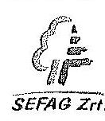

Ügyiratszám: SEFAG/1966-1/2015.

Állami Számvevőszék
elnöke
Domokos László úr részére
Budapest

Tisztelt Elnök Úr!

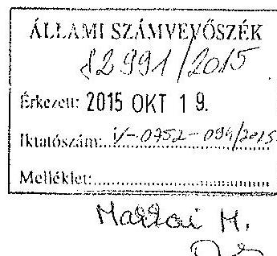

Hivatkozva f. év szeptember 30.-án kelt levelében foglaltakra, mellékelten megküldöm „Az állami tulajdonban álló erdőgazdasági társaságok vagyongazdálkodási tevékenységének ellenőrzése - SEFAG Erdészeti és Faipari Zrt.,, címmel összeállított számvevőszéki jelentés-tervezettel kapcsolatban megfogalmazott észrevételeinket, szíves megfontolásra és esetleges felhasználásra.

Egyidejűleg megköszönöm Elnök Úrnak, hogy lehetőséget biztosított Társaságunk számára az ellenőrzést lezáró jelentés-tervezet áttanulmányozására, és észrevételeink kifejtésére.

Kaposvár, 2015. október 13.

Tisztelettel:
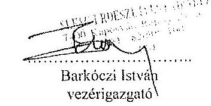

---

# ÉSZREVÉTELEK 

## „Az állami tulajdonban álló erdőgazdasági társaságok vagyongazdálkodási tevékenységének ellenőrzése - SEFAG Erdészeti és Faipari Zrt"   című számvevőszéki jelentéstervezethez

Általános megjegyzésünk: a megállapítások jellemzően a jelentéstervezet több helyén (az egyes fejezeteknél, illetve az összefoglalóban bizonyosan) szerepelnek. Ésrevételünket a magunk részéről mindig egyetlen, a leginkább releváns logikai kapcsolatukat hordozó említéshez kötődően tesszük meg, kérjük azonban, hogy amennyiben azok hatására a szövegtervezet módosításra kerül, azt az egyéb - itt nem hivatkozott - szövegi megjelenések viszonylatában is szíveskedjenek elvégezni.
1.) a jelentéstervezet 6. oldalán szerepel a következő megállapítás:

A Társaság nem rendelkezett a kezelt vagyonról vezetett nyilvántartás kiinduló adatait tartalmazó, a vagyonkezelési szerződés eredeti, hiteles, a vagyonkezelt eszközök felsorolását tartalmazó 1-4. mellékleteivel.

A megállapítással kapcsolatos észrevételünk:
A megállapítás pontatlan, a Zrt. a vizsgálatot végzők részére rendelkezésre bocsátotta a VSZ hiteles 1. és 4. számú mellékleteit. A 2. és 3. melléklettel kapcsolatban tájékoztattuk a vizsgálatot végzőket, hogy azok azért nem állnak rendelkezésre, mert a társaság sem a VSZ aláírásakor, sem a későbbiekben nem rendelkezett a VSZ-ben definiált olyan anyagi és nem anyagi eszközökkel, illetve egyéb vagyoni értékű jogokkal, amelyre a VSZ, pontosabban annak 2., illetve 3. mellékletének hatálya kiterjedt volna. Azaz a SEFAG Rt (később: Zrt) a vagyonkezelésbe adás(ok) során nem kapott a VSZ 2. és 3. mellékletében felsorolandó anyagi vagy más jellegű vagyont (csak különféle művelési ágú termőföldeket) - ebből adódóan a VSZ-hez eredendően nem került csatolásra 2. és 3. melléklet.
2.) a jelentéstervezet 11. oldalán szerepel a következő megállapítás:

A Társaság nem tett eleget az Avtv. 20. § (8) bekezdése, ill. az Infotv. 30. § (6) bekezdése szerinti, a közérdekű adatok megismerésére irányuló igények teljesítésének rendjét rögzítő szabályzat-készítési kötelezettségnek, a közérdekű adatok megismerésére irányuló igények teljesítésének rendjét rögzítő szabályzattal nem rendelkezett.

A megállapítással kapcsolatos észrevételünk:
Véleményünk szerint - mellőzve a teljes körű jogi érvelést -, legalábbis vitatható, hogy a társaságnak, mint állami tulajdonban álló gazdasági társaságnak fennáll-e a megjelölt szabályzat-készítési kötelezettsége. Az Avtv., illetve az Infotv. hivatkozott rendelkezése azt írja elő, hogy közfeladatot ellátó szervnek áll fenn a szabályzat-készítési kötelezettsége. A közfeladat fogalmát a nemzeti vagyonról szóló 2011. évi CXCVI. törvény a következőképpen határozta meg: „jogszabályban meghatározott állami vagy önkormányzati feladat, amit az arra kötelezett közérdekből, jogszabályban meghatározott követelményeknek és feltételeknek megfelelve végez, ideértve a lakosság közszolgáltatásokkal való ellátását, továbbá az állam nemzetközi szerződésekben vállalt kötelezettségeiből adódó közérdekű feladatokat, valamint e feladatok ellátásához szükséges infrastruktúra biztosítását is". Megítélésünk szerint a definíció alapján a SEFAG Zrt nem lát el közfeladatot.
A nómenklatúra bizonyos fokú hasonlósága miatt indokolt megvizsgálni a kérdéskört illetően az erdőőről, az erdő védelméről és az erdőgazdálkodásról szóló 2009. évi XXXVII. törvény (a továbbiakban Etv.) 2. § (2) bekezdésének rendelkezését, miszerint: „a fenntartható

---

erdőgazdálkodás során a legfontosabb közérdekű feladat az erdők változatosságának megőrzése, az erdők fenntartása, felújítása és a védelmi, valamint közjóléti szolgáltatások biztosítása, melyek elvégzését az állam megfelelő eszközökkel biztosítja."
Ez a megfogalmazás az ún. tartamos erdőgazdálkodás követelménye (amit tartalmilag egyébként az Etv. 2. § (1) bekezdése definiál), az Etv. elvi jellegű, a jogalkotó általános célját deklaráló előírása, mely nyilvánvalóan vonatkozik nemcsak a vagyonkezelt állami erdőkre, hanem a hazai erdőállományok több mint 40%-át kitevő magántulajdonban álló erdőkre is. Hivatkozva arra is, hogy a magánerdő gazdálkodás viszonylatában igen nehezen lenne levezethető a közfeladat ellátása, megítélésünk szerint általánosságban, és az állami erdőgazdálkodók viszonylatában sem igazolható, hogy az Etv. szerinti közérdekű feladat ellátása azonosítható lenne a nemzeti vagyonról szóló tv. szerinti közcélú (állami vagy önkormányzati) feladatellátással, vagyis a közfeladat fogalmával. Itt jegyezzük meg: az Etv. besorolása szerint egyébként az erdőállományok számottevő része gazdasági elsődleges rendeltetésűnek minősül, magán, vagy állami tulajdonlás esetén egyaránt.
3.) a jelentéstervezet 16. oldalán szerepel a következő megállapítás:

A Társaság a vagyonkezelt eszközökről tételes analitikus nyilvántartást vezetett a forint érték feltüntetése nélkül, amely megfelel a VSZ 2. pontja szerinti naturáliákban történő nyilvántartás-vezetési előírásnak, azonban nem felelt meg a Számv. Tv. 23. § (2) bekezdésében a kezelt vagyon nyilvántartására vonatkozó szabálynak. A vagyonkezelt eszközök forint érték meghatározását a Társaság sem az MNV Zrt.-nél, sem az NFA-nál nem kezdeményezte annak érdekében, hogy eleget tegyen a Számv. Tv. előírásainak. Az elkülönített nyilvántartás helyrajzi számonként és a területmérték feltüntetésével tartalmazta a kincstári vagyoni körbe tartozó földterületek felsorolását és azok jellemzőit, azonban a Társaság nem rendelkezett a VSZ hiteles mellékleteivel, amelyek a kezelésbe vett vagyonelemek, így a kezelt vagyonról vezetett nyilvántartás kiinduló adatait tartalmazták.

# A megállapítással kapcsolatos észrevételünk: 

A megállapítás pontatlan, azt a következtetést sugallja, mintha a vagyonkezelt eszközök értékbeli nyilvántartásának elmaradása arra lenne visszavezethető, hogy a társaság nem rendelkezett a VSZ mellékleteivel. Amint másutt rávilágítottunk, a társaság rendelkezett mindazon mellékletekkel, melyekkel kapcsolatban a VSZ rendelkezéseket fogalmazott meg, és azok egyebekben tényszerűen a társaság viszonylatában relevánsak, alkalmazandóak voltak. Más kérdés az, hogy a VSZ-nek kellett volna-e rendelkeznie olyan melléklettel (avagy a megfelelő mellékletek adattartalmát olyképpen kellett volna-e definiálni), amely meghatározza a vagyonkezelésbe adott eszközök könyv szerinti értékét. Azt gondoljuk, hogy ez a kérdéskör azonban a - hangsúlyozottan ideiglenes - vagyonkezelő állami erdőgazdaságok kompetenciáján kívül esik.
Nem vitatható, hogy a társaság nem tett eleget a Számv. tv. 23. § (2) bekezdésében definiált szabálynak, egyszerűen megállapítható azonban, hogy az értékbeli nyilvántartási kötelezettség teljesítésének elmaradása arra a tényre vezethető vissza, hogy a vagyonkezelésbe adó a vagyonkezelésbe adáskor (és később sem) nem közölte a társasággal a vagyonkezelésbe
 kerülő vagyontárgyak könyv szerinti értékét. Azt gondoljuk, hogy alapvetően a mindenkori vagyonkezelésbe adó állami szerv felelősségi körébe rendelendő az a kérdés, hogy az általa vagyonkezelésbe adandó vagyontárgyaknak meghatározta-e a könyv szerinti értékét.
Elméletileg felróható a társaságnak, hogy nem kezdeményezte a vagyonkezelésbe adónál a vagyonkezelt eszközök forint értékének meghatározását, e vonatkozásban is hangsúlyozni szükséges azonban, hogy az erdészeti társaságok 1996-ban ideiglenes VSZ-t írtak alá, és a szerződés ideiglenes jellege mind a mai napig fennmaradt. Ebből adódóan, a felek mindkét

---

oldalról tisztában voltak/vannak azzal, hogy a VSZ nem teljes körűen elégíti ki a vonatkozó törvényi rendelkezéseket. Az ügy hátteréhez tartozik, de fontos körülmény, hogy éppen ebből adódóan 1996-tól lényegében folyamatosan napirenden volt az ideiglenes szerződés véglegesítése, a végrehajtáshoz azonban (vagy akár a VSZ bizonyos - akár törvényi rendelkezésen alapuló - tartalmi módosításához) a vagyonkezelésbe adó mozgástere mindannyiszor kevésnek bizonyult. Effektív - hivatalos iratként értékelhető - kezdeményezés valóban nem dokumentálható a társaság részéről, mindazonáltal egyszerűen bizonyítható, hogy az elmúlt közel két évtizedben számtalan véglegesnek tekintett VSZ tervezet látott napvilágot, az állami erdőgazdaságok tucatnyi VSZ véglegesítési fórumon vettek részt, a helyzet azonban semmit sem változott.
Az elektronikus levelezési archívumból visszaigazolható, hogy az erdészeti társaságok (köztük a SEFAG Zrt) - amennyiben erre lehetőséget kaptak - mindannyiszor éltek a különféle véglegesnek tekintett VSZ tervezetek véleményezésének lehetőségével.
Hangsúlyozni szükséges - különösen ezen legutóbbi megjegyzéshez kötődően - azt is, hogy az erdészeti társaságcsoport (így a SEFAG Zrt) VSZ-hez kapcsolódó kompetenciája úgy jogilag, de még inkább a jogértelmezést (és legfőképpen a gyakorlatban is érvényesíthető jogosítványokat) illetően a vizsgált időszakban (de azt megelőzően is) erőteljesen korlátozott volt. E viszonylatban elsőként arra kell utalni, hogy a SEFAG Zrt (és a többi állami erdőgazdaság) 2009. 01. 01-től hatályos Alapító Okiratának 12.2. zs) pontja szerint "az egyedüli részvényes kizárólagos hatáskörébe tartozik: az állami erdőterületek kezelésére vonatkozó vagyonkezelési szerződés megkötése". A mindenkori részvényesi joggyakorló e rendelkezés értelmezését illetően mindannyiszor olyképpen (szűkítően) foglalt állást (pontosabban élt az Alapító Okirat azon rendelkezésével, miszerint az alapító bármely kérdés tekintetében magához vonhatja a döntési jogkört), hogy a VSZ-nek nem csak a megkötése, hanem annak bármely tartalmi vagy formai (beleértve a mellékleteket) módosítása is csak és kizárólag egyedüli részvényesi (alapítói) jogkörben gyakorolható. Tekintettel arra, hogy a tárgyalt általános jellegű kérdéskör viszonylatában a mindenkori egyedüli részvényes a hozzá tartozó 19 állami erdészeti társaság viszonylatában azonos módon kívánt eljárni, a gyakorlatban az egyedi kezdeményezésekre nem volt lehetőség. A SEFAG Zrt Alapító Okirata és az ahhoz kapcsolódóan az egyedüli részvényes által kialakított döntési hierarchia egyáltalán nem tette lehetővé, hogy a VSZ-t érintő ügyekben a társaság - bármely vetületben közvetlenül a vagyonkezelésbe adóhoz forduljon.
Különösen árnyalja a társaság kérdéskört illető elmarasztalhatóságát még egy, igen lényeges körülmény, előrebocsátva, hogy a számviteli törvény már a VSZ megkötése idején rendelkezett arról, hogy a vagyonkezelő eszközei között ki kell mutatni a vagyonkezelésbe vett eszközöket. A nyilvántartási kötelezettség okán már 1996-97-ben élénk diskurzus alakult ki a témában kompetens államigazgatási szereplők között. A Pénzügyminisztérium korabeli állásfoglalása szerint a nyilvántartási kötelezettség teljesítésének feltétele, hogy a vagyonkezelt vagyon megfelelő módon értékelésre kerüljön. Amíg megfelelő értékelés nem áll rendelkezésre, nem lehet végrehajtani a számviteli tv. hivatkozott rendelkezését. Értelmezésünk szerint - figyelemmel arra, hogy az erdőértékelésnek több, eltérő értékeket eredményező módszere ismeretes -, jogszabályi rendelkezésnek kellett volna, illetve kellene rendeznie az erdők könyv szerinti értéke meghatározásának módszerét. Ennek kapcsán az a szakmai konszenzus alakult ki, hogy mindazon időpontig, amíg nem születik meg az erdőértékeléssel kapcsolatos jogszabály (ez a helyzet tehát a mai napig fennáll), nem sértenek törvényt az állami erdőgazdaságok (így a SEFAG Zrt) azzal, hogy eszközeik között nem mutatják ki a vagyonkezelt erdőket. A magunk részéről úgy gondoljuk, hogy a jogszabályi hézag túlmutat a SEFAG Zrt felelősségi körén, de még a vagyonkezelésbe adó felelőssége is csak korlátozottan vethető fel e vonatkozásban.

---

4.) a jelentéstervezet 19. oldalán szerepel a következő megállapítás:

Az erdészcti hatóság a Társaság részére az ellenőrzött időszakban 11 esetben rótt ki erdőgazdálkodási bírságot. Tíz esetben összesen 1,9 M Ft összegű bírság kiszabására az erdőfelújítások befejezésére megállapított határidők túllépése miatt, egy esetben 0,4 M Ft összegben az ötéves felülvizsgálat során megállapított, a befejezett erdősítés természetességi állapotának romlása miatt került sor. A 2011-2014. I. félév közötti időszakban egy esetben 1,4 M Ft értékben a fakitermelésére vonatkozó előírások megsértése miatt, 21 esetben összesen 21,4 M Ft értékben az erdősítések sikeresen felújított területein a vadászható vadfajok okozta károsítások miatt került sor a bírság kiszabására.

A megállapítással kapcsolatos észrevételünk:
A megállapítás kapcsán, az önmagában magasnak tűnő összegek okán, felmerülhet, hogy a társaság nem kellő szakszerűséggel végzi alaptevékenységeit. Ehhez előjáróban le kell szögezni, hogy a Zrt hatalmas területeken, évente több száz, csentenként rendkívül eltérő környezeti hatásoknak kitett erdőrészleten végez különféle erdőgazdálkodási tevékenységeket. Ebben a léptékben törvényszerű, hogy előfordulnak bírságra okot adó gazdálkodói hibák is, látható, hogy az éves szintű esetszám viszont alig e körül mozog. A SEFAG Zrt átlagos, éves szintű költségfelhasználása erdőgazdálkodási munkákra, eléri a 3.200-3.500 M Ft-ot, e mellett az éves szinten átlagosan jellemző mintegy 4,5 M Ft összegű bírság - véleményünk szerint - elhanyagolható mértékű, tized százalékban mérhető szankció.

Kaposvár, 2015. október 13.

---

.

---

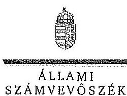

ELHök

Ikt.szám: V-0752-099/2015.

# Barkóczi István úr 

vezérigazgató
SEFAG Erdészeti és Faipari Zrt.

## Kaposvár

## Tisztelt Vezérigazgató Úr!

A „Jelentéstervezet az állami tulajdonban álló erdőgazdasági társaságok vagyongazdálkodási tevékenységének ellenőrzése - SEFAG Erdészeti és Faipari Zrt." címmel készített számvevőszéki jelentéstervezetre tett észrevételeit köszönettel megkaptam.

Az Állami Számvevőszék észrevételekre vonatkozó álláspontjáról a felügyeleti vezető által készített részletes tájékoztatást csatoltan megküldöm.

Tájékoztatom Vezérigazgató urat, hogy a számvevőszéki jelentésben - az Állami Számvevőszékről szóló 2011. évi LXVI. törvény 29. § (3) bekezdése alapján - a figyelembe nem vett észrevételeket szerepeltetjük az elutasítás indokának feltüntetésével.

Budapest, 2015. 11. hó 03. nap
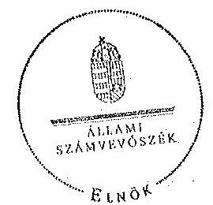

Tisztelettel:

Dombos László

Melléklet: Tájékoztatás az el nem fogadott észrevételekről

---

# Tájékoztatás   az el nem fogadott észrevételekről 

A ,, Jelentéstervezet az állami tulajdonban álló erdőgazdasági társaságok vagyongazdálkodási tevékenységének ellenőrzése - SEFAG Erdészeti és Faipari Zrt," címü jelentéstervezetre 2015. október 19-én érkezett észrevételeit áttekintettük, azok kezelésével kapcsolatban a következő tájékoztatást adom.

## 1. A jelentéstervezet 6. oldal 4. bekezdésére tett észrevétel

A Vagyonkezelési Szerződés (a továbbiakban: VSZ) 1-4. mellékleteivel kapcsolatos észrevételük alapján a dokumentumokat ismételten áttekintettük és a szerződés 9. oldalán található szövegrész tartalmazza, hogy a szerződés szerves részét képezi többek között az 1-4. számú mellékletek. Ezért a megállapításunk helytálló, annak módosítása nem indokolt.

## 2. A jelentéstervezet 11. oldal 4. bekezdésére - intézkedést igénylő megállapítás - tett észrevétel

Az Avtv. 20. § (8) bekezdésében, illetve az Infotv. 30. § (6) bekezdésében foglaltak alapján a közfeladatot ellátó szervnek a közérdekű adatok megismerésére irányuló igények teljesítésének rendjét rögzítő szabályzatot kell készítenie. Az állami vagyonról szóló 2007. évi CVI. törvény 5. § (2) bekezdése szerint az állami vagyonnal gazdálkodó vagy azzal rendelkező szerv vagy személy a közérdekű adatok nyilvánosságáról szóló törvény szerinti közfeladatot ellátó szervnek vagy személynek minősül. A SEFAG Erdészeti és Faipari Zrt. állami vagyonnal gazdálkodik, ezért közfeladatot ellátó szervnek minősül, tehát el kell készítenie a közérdekű adatok megismerésére irányuló igények teljesítésének rendjét rögzítő szabályzatot. Megállapításunk helytálló, módosítása nem indokolt.

## 3. A jelentéstervezet 16. oldal 6. bekezdésére tett észrevétel

Az észrevételben leírtak a Társaság mérlegeivel kapcsolatosan tett megállapítást nem cáfolják, A Társaság, mint vagyonkezelő a Vhr. 9. § (9) bekezdésében előírt kötelezettségét nem teljesítette, mert a Számv. tv. 23. § (2) bekezdése szerint a mérlegében eszközként nem mutatta ki a kezelésbe vett, az állami vagyon részét képező eszközöket, és ezen eszközöket a kiegészítő mellékletben - legalább mérlegtételek szerinti megbontásban - külön nem mutatta be. A Társaság a Vhr. és a Számv. tv. előírásainak betartása érdekében - dokumentumokkal alátámasztottan - nem tett lépéseket annak érdekében, hogy a vagyonkezelt eszközök értéke a VSZ-ben rögzítésre kerüljön. A fentiek alapján megállapításunk helytálló, módosítása nem indokolt.

---

# 4. A jelentéstervezet 19. oldal 2. bekezdésére tett észrevétel 

Az észrevételükben leírtak nem cáfolják az Erdészeti hatóság által kiszabott bírságokkal kapcsolatos megállapítást, ezért a jelentéstervezet módosítása nem indokolt.

Budapest, 2015. 4. hó 03. nap

Makkai Mária
felügyeleti vezető

---

.

---

# 10. SZÁMÚ MELLÉKLET A V-0752-101/2015. SZÁMÚ JELENTÉSHEZ

(232

MNV | Magyar Nemzeti Vagyonkezelő Zrt. Vízirigazgatóság

Állami Számvevőszék

Domokos László

elnök

1052 Budapest

Apáczai Cs. J. u. 10.

Ikt. sz.: MNV/01/49023/ 4 /2015. Hiv. sz.: V-0752-090/2015.

Tisztelt Elnök Úr!

A 2015. október 5. napján „Az állami tulajdonban álló erdőgazdasági társaságok vagyongazdálkodási tevékenységének ellenőrzése – SEFAG Erdészeti és Faipari Zrt.” tárgyában kézhez vett, V-0752-090/2015. ikt. sz. Jelentés-tervezetre az alábbi észrevételeket kívánom tenni.

I. fejezet / 9. old. első-harmadik bekezdés, II.5. fejezet / 22. old. második bekezdés és 10. old. Javadat az MNV Zrt. vezérigazgatójának sírú pontjai

„A vagyonkezelésbe adott állami vagyon tekintetében a tulajdonosi jogokat gyakorló MNV Zrt. és NFA tevékenysége az ellenőrzött időszakban nem támogatta teljes körűen a felelős vagyongazdálkodás megvalósítását. A VSZ-szel kapcsolatban feltárt hiányosságok megszüntetésére és a hatályos jogszabályoknak való megfeleltetésére vonatkozóan nem kezdeményeztek intézkedéseket, nem éltek a Vhr.-ben és a 262/2010. (XI.17.) Korm. rend. 47. § (1)-(2) bekezdésében foglalt a kezelt vagyon használatára vonatkozó ellenőrzési jogukkal, valamint nem végeztek a vagyonnyilvántartás hitelességére, helyességére és teljességére vonatkozó ellenőrzést a Társaságnál.

A SEFAG Zrt. a Magyar Állam tulajdonában álló erdővagyon és egyéb művelési ágú termőföld ingatlanok kezelését a KVI-vel 1996. október 9-én kötött vagyonkezelési szerződést alapján végezte. a Társaság, mint vagyonkezelő és a KVI között létrejött szerződéses jogviszony kereteit a VSZ-ben foglalt jogok és kötelezettségek töltötték ki. A VSZ nem támogatta a Vhr. 3. § (1) bekezdésében foglalt, a vagyongazdálkodási feladatok szabályszerű módon történő végrehajtását, valamint nem támogatta a szabályszerű vagyongazdálkodást. A VSZ 3.3.2. pontjában foglaltak ellenére a felek a szerződést évente nem vizsgálták felül, az nem felelt meg a hatályos rendelkezéseknek, hatályon kívül helyezett jogszabályi hivatkozásokat tartalmazott az Ált 109/B. §. 109/G. §, a Vadvédelemi tr. 98. § előírásai vonatkozásában. A VSZ 3.2.3. pontjában foglalt, a vagyonkezelői jog átruházására vonatkozó rendelkezése 2012. január 1-től nem felelt meg az Nvtr. 11. § (8) bekezdésében foglaltaknak, amely tiltja a vagyonkezelői jog harmadik személyre történő átruházást. A VSZ nem rögzítette a Vhr. 9. § (8) bekezdésében 2011. január 1-jéről előírt, az érintett vagyonelem esetleges védettségét, illetve Natura 2000 területek határát. A felek nem tettek eleget a Vhr. 54. § (7) bekezdés előírásának, mert a Vhr. hatálybalépést követő hat hónapon belül nem kezdeményezték
 a Nemzeti Földalapba tartozó ingatlanokra vonatkozóan a VSZ megszüntetését és a jogszabályoknak megfelelő szerződés megkötését.

A vagyonkezelésbe adott állami vagyon tekintetében tulajdonosi jogokat gyakorló MNV Zrt. és NFA nem végeztek a Vhr. 20. § (1)-(2) bekezdésében és a Nemzeti Földalapba tartozó földrészletek hasznosításának részletes szabályairól szóló 262/2010. (XI.17.) Korm. rendelet 47. § (1)-(2) bekezdésében foglalt, a vagyonnyilvántartás hitelességére, teljességére és helyességére vonatkozó ellenőrzést a Társaságnál.

---

# Javaslat az MNV Zrt. vezérigazgatójának 

a) Tegyen intézkedéseket az erdőgazdasági társaság közreműködésével a tényleges állapotot rögzítő és a hatályos jogszabályi előírásoknak megfelelő vagyonkezelési szerződés megkötésére.
b) Tegyen intézkedéseket a vagyonkezelési szerződés felülvizsgálatának elmaradásával, valamint a Nemzeti Földalapba tartozó ingatlanokra vonatkozó VSZ megszüntetésével összefüggésben feltárt szabálytalanságok tekintetében a felelősség tisztázása érdekében, és szükség szerint intézkedjen a felelősség érvényesítéséről.
c) Intézkedjen a SEFAG Zrt. vagyonnyilvántartása hitelességének, teljességének és helyességének jogszabályban foglaltak szerinti ellenőrzéséről.

Sajnálattal állapítottuk meg, hogy a Jelentés-tervezet egyáltalán nem veszi figyelembe a vizsgált időszakban megindított és több eljárási cselekményt is magába foglaló intézkedés-sorozatunkat, amelynek a célja a Jelentéstervezetben egyébiránt joggal kifogásolt hiányosságok megszüntetése, az erdőgazdasági társaságok működésének jogszabályi megfelelőségének biztosítása volt. Ezzel a Jelentés-tervezet azt sugallja, hogy a tulajdonosi joggyakorlók részéről egyáltalán nem volt szándék az erdőgazdasági társaságok működésének, illetve a vagyonkezelés körülményeinek hatályos jogszabályok szerinti szabályozására, amely egyébiránt nem felel meg a valóságnak és az adatszolgáltatásunk során sem erről tájékoztattuk Önöket.
Mindamellett elismerjük, hogy a probléma a kezelt vagyonelemek nagy száma, ebből kifolyólag a szabályozást igénylő körülmények nagy száma és sokrétűsége miatt nehezen átlátható, ezért kérjük, engedjék meg, hogy a munkájukat segítő szándékkal korábbi tájékoztatásunkat ismételten megerősítsük, azzal a kifejezett kéréssel, hogy a Jelentésükben az általunk vitatott megállapítást szíveskedjenek módosítani, és az MNV Zrt. által a megoldás irányába megtett intézkedéseket feltüntetni.
Az ideiglenes vagyonkezelési szerződéseken alapuló kezelői jogviszony újraszabályozása, az ideiglenes vagyonkezelési szerződések megszüntetése és végleges vagyonkezelési szerződések megkötése érdekében az intézkedéseink már 2011. évben megkezdődtek, párhuzamosan a Nemzeti Földalapról szóló 2010. évi LXXXVII. tv. 34. § (3) bekezdés c) pontja szerinti feladat- illetve vagyonátadással.

Az intézkedéseink alapja a 2011. évben, MNV/01/29518/2011. szám alatt szakterületünk által bekért, az erdőgazdasági társaságok 2010. december 31-i, illetve 2011. július 31-i fordulónapra vonatkozó leltárjelentése volt, amelyet elsődlegesen az NFA tv. szerint előírt vagyonátadás elvégzése céljából kértünk meg az erdőgazdasági társaságoktól. Ugyanakkor a leltárjelentéshez benyújtott földrészlet listák voltak az első olyan kimutatások, amelyek a kezelt vagyon elemeit a FÖMI adatbázisán alapuló (az aktuális ingatlan-nyilvántartási állapotnak megfelelően) alrészletes bontásban tartalmazták.

## A vizsgált időszakban megindított és lefolytatott intézkedéseink a következők:

1. Az erdőgazdasági társaságok által kezelt vagyonelemek tulajdonosi joggyakorlók szerinti elhatárolása, NFA átadás előkészítése, az erdőgazdasági társaságok bevonásával. A Nemzeti Földalapba tartozó vagyonelemek NFA átadása 2012-2013. években megtörtént, majd a visszamaradt vagyonelemek - többségében kivett megnevezésben nyilvántartott földrészletek - elhatárolását is elvégeztük. A feladat végrehajtása 2014. május 31-ig teljesült.
Az intézkedéssel az MNV Zrt. tulajdonosi joggyakorlása alá tartozó vagyonelemek körét - a közös tulajdonosi joggyakorlás alatt álló ingatlanok kivételével -, azaz a végleges vagyonkezelési szerződések ingatlanlistáit meghatároztuk.
Meg kívánjuk jegyezni, hogy az erdőgazdasági társaságok a 2011. évi leltárjelentéseikhez minden esetben csatolták a jelentés tartalmára vonatkozó teljességi nyilatkozatukat is, így azok tartalmát mint teljes körű adatszolgáltatást kezeltük.
A hivatkozott iratokat az eljárás során a Tisztelt Állami Számvevőszék rendelkezésére bocsátottuk.
2. Az erdőgazdasági társaságok által kezelt vagyon értékelését 2014. május 31-ig elvégeztük, részben külső piaci szereplő által megállapított vagyonértékelési adatok (az IFUA értékbecslési adatai), részben belső szakértők és a kontrolling szakterület által az MNV Zrt hatályos értékelési szabályzata által megállapított értékadatok figyelembe vételével.

---

3. Az MNV Zrt. Igazgatósága 511/2012. (X. 08.) IG sz., valamint 717/2013. (IX. 23.) IG sz. határozataiban intézkedési terveket fogadott el „a 28/2012. (IX. 24.) sz. RIGY határozatában előírt, valamint az MNV Zrt. rábízott vagyon 2012. évi beszámolója könyvvizsgálói minősítésének megtartásához szükséges és egyéb feladatokról”. Az Intézkedési tervek magukban foglalták az erdőgazdasági társaságok által kezelt vagyon analitikájának előállítását, illetve az erdőtársaságokkal végleges (nem ideiglenes) vagyonkezelői szerződések megkötését. A 717/2013. (IX. 23.) IG sz. határozat melléklete tartalmazza a feladat végrehajtása érdekében már megtett intézkedéseket (pl. „Megtörtént az erdőgazdaságok által kezelt vagyon listáinak vagyonkezelői jelentésekkel való egyeztetése; a vagyonkezelési szerződés tartalmi kérdéseinek, az erdőgazdaságok véleményének feldolgozása, MFB Munkacsoport egyeztetések történtek stb.), valamint rögzíti a még elvégzendő feladatokat. Ennek megfelelően az MNV Zrt-nél 2012-től folyamatosan van az erdőgazdasági társaságok vagyonanalitikájának előállítása és vagyonkezelési szerződései tárgyú projekt.
A hatályos jogszabályoknak megfelelő vagyonkezelési szerződés tervezetét a vizsgálati időszak során az MNV Zrt belső szakterületi egyeztetést követően előkészítettük, és a 2014. március 18-án megtartott Munkacsoport értekezleten az erdőgazdaság képviselőivel, továbbá a tulajdonosi joggyakorlók (NFA, illetve akkor még Magyar Fejlesztési Bank Zrt.) képviselőivel ismertettük annak tartalmát. A szerződés szövegtervezetének véleményezése ekkor megkezdődött, ugyanakkor elismerjük, hogy a végleges szerződésváltozat már az Önök által vizsgált időszakot követően került elfogadásra. Ugyancsak a 2014. március 18-án megtartott Munkacsoport értekezleten tettünk javaslatot a vagyonkezelési díj alapjának és mértékének meghatározására.
4. Az erdőgazdasági társaságok által kezelt és a saját vagyonának vagyonelemenkénti, valamint a kezelt vagyonelemek tulajdonosi joggyakorlók szerinti elhatárolására vonatkozó intézkedésünket a vizsgált időszakban előkészítettük.

Tájékoztatjuk továbbá Elnök Urat az alábbiakról:
A Nemzeti Fejlesztési Minisztérium KGTF/377-6/2014-NFM, valamint KGTF/377-7/2014. számok alatt adott utasításokat a fenti feladatok elvégzésére. Ezekről, illetve az utasításokra adott jelentésünkről a korábbi adatszolgáltatásunk keretében szintén kitértünk.

A vagyonkezelési szerződés vizsgált időszakot követően elfogadott tervezetének mellékletét képezik az MNV Zrt azon szabályzatai is, amelyek a kezelt vagyon nyilvántartását, a beruházások nyilvántartását és az azzal kapcsolatos elszámolásokat, illetve a tulajdonosi ellenőrzéssel kapcsolatos, a jelenlegi jogszabályi környezetnek megfelelő szabályokat tartalmazzák:

- Az állami tulajdonon, egyéb vagyonkezelők által vagyonkezelt eszközön megvalósítandó beruházások, felújítások előzetes engedélyezésének és elszámolásának eljárásrendjéről szóló 35/2014. számú vezérigazgatói utasítás,
- A Magyar Nemzeti Vagyonkezelő Zrt. Tulajdonosi Ellenőrzési Szabályzata - a 39/2014. számú vezérigazgatói utasítás, továbbá
- A Magyar Nemzeti Vagyonkezelő Zrt. állami vagyon vagyonkezelőire, az állami vagyont használókra és a társasági részesedések esetében az MNV Zrt. tulajdonosi joggyakorlását megbízottként ellátókra vonatkozó Vagyon-nyilvántartási Szabályzatáról szóló 12/2014. számú vezérigazgatói utasítás.

Fentiek mellett megemlíthető az MNV Zrt. folyamatba épített, illetve vagyon nyilvántartás vezetést támogató ellenőrzési módszertanról szóló 11/2014. számú vezérigazgatói utasítás.
Egyeztetéseink során az erdőgazdasági társaságok tájékoztatást kaptak a szabályzataink tartalmára vonatkozóan.
A Jelentés-tervezet 10. oldalán található, az MNV Zrt. vezérigazgatójára vonatkozó, a) pont alatti, vagyonkezelési szerződés megkötésére irányuló javaslathoz kapcsolódóan felhívjuk a Tisztelt Állami Számvevőszék figyelmét arra, hogy a Nemzeti Fejlesztési Minisztérium ÁVF/21310/2015-NFM számú tájékoztató levele szerint Miniszter Úr vagyongazdálkodási szemponthól nem támogatja az erdőgazdasági társaságok ideiglenes vagyonkezelési szerződéseit kiváltó vagyonkezelési szerződések megkötését, ideértve az MNV Zrt. vagyonkezelési szerződésekkel kapcsolatos jóváhagyó döntéseit is.

---

Az MNV Zrt-re vonatkozóan hivatkozott jogszabály, a Vhr. 20. § (1)-(2) bekezdése 2014. március 14-ig - csaknem az ellenőrzött időszak végéig - a következőképpen rendelkezett:
„(1) Az állami vagyon kezelőjét, használóját megillető jogok gyakorlását, annak szabályszerűségét, célszerűségét a Vtv. 17. §-ának d) pontja alapján az MNV Zrt. - szükség szerint a területi szervei útján ellenőrzi. Ennek érdekében a vagyon kezelésére, hasznosítására kötött szerződésben rögzíteni kell, hogy a tulajdonosi ellenőrzés eljárásrendjét, a felek jogait, kötelezettségeit a felek a szerződés részének tekintik.
(2) A tulajdonosi ellenőrzés célja az állami vagyonnal való gazdálkodás vizsgálata, ennek keretében a rendeltetésellenes, jogszerűtlen, szerződésellenes, vagy a tulajdonos érdekeit sértő, illetve a központi költségvetést hátrányosan érintő vagyongazdálkodási intézkedések feltárása és a jogszerű állapot helyreállítása, továbbá a vagyonnyilvántartás hitelességének, teljességének és helyességének biztosítása.”

A tulajdonosi ellenőrzés alatt a Területi Irodák által folytatott ellenőrzést is értette a jogszabály, amiből egyenesen következik a szakterületi munkafolyamatba épített ellenőrzési kötelezettség figyelembe vételének a lehetősége.

Fentiekre tekintettel kérjük a Jelentés-tervezet 9., illetve 22. oldalán található azon megállapítások törlését, hogy az MNV Zrt. nem kezdeményezett intézkedéseket, és nem végzett a Vhr. 20. § (1)-(2) bekezdéseiben és a Nemzeti Földalapba tartozó földrészletek hasznosításának részletes szabályairól szóló 262/2010. (XI.17.) Korm. rendelet 47. § (1)-(2) bekezdéseiben foglalt, a vagyonnyilvántartás hitelességére és teljességére vonatkozó ellenőrzést a Társaságnál, kérjük a megtett intézkedések feltüntetését, és a Jelentés-tervezet 10. oldalán található, az MNV Zrt. vezérigazgatójára vonatkozó b) pontot a megtett intézkedések folyamatosságára tekintettel törölni, a c) pont alatti javaslatot szövegszerűen ekként módosítani:

# Javaslat az MNV Zrt. vezérigazgatójának 

c) Az MNV Zrt. tulajdonosi joggyakorlása alá tartozó (az Erdőgazdasági Társaságok által az MNV Zrt. részére jelentett) vagyonelemek tekintetében intézkedjen a Társaság vagyonnyilvántartása hitelességének, teljességének és helyességének jogszabályban foglaltak szerinti ellenőrzéseinek erősítéséről.

Kérem Elnök Urat, hogy a Jelentés véglegesítése során jelen észrevételeinket szíveskedjenek figyelembe venni.

Budapest, 2015. október 19.
Üdvözlettel:
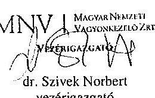

---

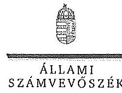

ELNÖK

Ikt.szám: V-0752-096/2015.

Dr. Szívek Norbert úr
vezérigazgató
Magyar Nemzeti Vagyonkezelő Zrt.

Budapest

Tisztelt Vezérigazgató Úr!

A „Jelentéstervezet az állami tulajdonban álló erdőgazdasági társaságok vagyongazdálkodási tevékenységének ellenőrzése - SEFAG Erdészeti és Faipari Zrt.” címmel készített számvevőszéki jelentéstervezetre tett észrevételeit köszönettel megkaptam.

Az Állami Számvevőszék észrevételekre vonatkozó álláspontjáról a felügyeleti vezető által készített részletes tájékoztatást csatoltan megküldöm.

Tájékoztatom Vezérigazgató urat, hogy a számvevőszéki jelentésben - az Állami Számvevőszékről szóló 2011. évi LXVI. törvény 29. § (3) bekezdése alapján - a figyelembe nem vett észrevételeket szerepeltetjük az elutasítás indokának feltüntetésével.

Budapest, 2015. 11. hó 01. nap

Tisztelettel:

Domokos László

Melléklet: Tájékoztatás az elfogadott és az el nem fogadott észrevételekről

1052 BUDAPEST, APÁCZAI CSERJÉP UTCA 10. 1364 Budapest 4, PL 54 telefon. 484 9101 fax. 484 9201

---

# Tájékoztatás   az elfogadott és az el nem fogadott észrevételekről 

A „Jelentéstervezet az állami tulajdonban álló erdőgazdasági társaságok vagyongazdálkodási tevékenységének ellenőrzése - SEFAG Erdészeti és Faipari Zrt." címü jelentéstervezetre 2015. október 19-án érkezett észrevételeit áttekintettük, azok kezelésével kapcsolatban a következő tájékoztatást adom.

1. A vagyonkezelési szerződéshez kapcsolódó megállapításokra tett észrevétel (I. fejezet / 9. oldal 2-3. bekezdés, II. 5. fejezet / 22. oldal 2. bekezdés, 10. oldal javaslat az MNV Zrt. vezérigazgatójának a)-b) pontok)

A jelentéstervezet vagyonkezelési szerződéshez kapcsolódó megállapításai helytállóak. Az erdőgazdasági társaság működése jogszabályi megfelelősége biztosításának érdekében tett kezdeményezésekről adott tájékoztatásukat köszönettel vettük, azonban azok nem eredményezték az ideiglenes vagyonkezelési szerződés olyan módosítását, vagy olyan új vagyonkezelési szerződés megkötését, amely biztosította volna a VSZ hiányosságainak megszüntetését, illetve a hatályos jogszabályoknak való megfelelőségét. Ezért az MNV Zrt. vezérigazgatójának és az NFA elnökének megfogalmazott intézkedést igénylő megállapítás, valamint az MNV Zrt. vezérigazgatójának megfogalmazott javaslat a) és b) pontjának módosítása nem indokolt. Az egyértelműség érdekében a 9. oldal 2. bekezdés 1. mondatát és a 22. oldal 2. bekezdés 1. mondatát az alábbiak szerint pontosítjuk:
„A VSZ-szel kapcsolatban feltárt hiányosságokat nem szüntette meg, a hatályos jogszabályoknak a szerződést nem feleltette
 meg, ..."
2. Az MNV Zrt. ellenőrzési kötelezettségének elmulasztására vonatkozó megállapításokra tett észrevétel (I. fejezet 9. oldal 4. bekezdés, II. 5. fejezet / 22. oldal 2. bekezdés és 10. oldal javaslat az MNV Zrt. vezérigazgatójának c) pont)

Az MNV Zrt. nem bocsátott az ÁSZ ellenőrzés rendelkezésére az MNV Zrt., vagy Területi Irodái által a Vhr. 20. § (1)-(2) bekezdései szerint végzett ellenőrzésekről dokumentumokat. A jelentéstervezet megállapításai és a javaslat helytállóak, módosításuk nem indokolt.

Budapest, 2015. Al. hó 02. nap

Makkai Mária
felügyeleti vezető

---

# 11 MFB 

## Domokos László úr

elnök részére

## Állami Számvevőszék

Budapest

Tisztelt Elnök Úr!
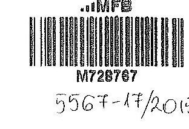

ÁLLAMI SZÁMVEVŐSZÉK
$11 / 2015$
Érkeze: 2015. OKT. 13.
Iktatószám: $V-0959-030 / 200$
Melléklet: $\qquad$
Hazkii H.
Cez
2015. szeptember 28-án köszönettel kézhez vettük az Állami Számvevőszék „Az állami tulajdonban álló erdőgazdasági társaságok vagyongazdálkodási tevékenységének ellenőrzéséről" szóló jelentéstervezeteket az alábbi cégekre:

- Északerdő Erdőgazdasági Zrt.
- EGERERDŐ Erdészeti Zrt.
- Gemenci Erdő- és Vadgazdaság Zrt.
- Ipoly erdő Zrt.
- KEFAG Kiskunsági Erdészeti és Faipari Zrt
- Kisalföldi Erdőgazdaság Zrt
- SEFAG Erdészeti és Faipari Zrt
- Szombathelyi Erdészeti Zrt.
- VADEX Mezőföldi Erdő-és Vadgazdálkodási Zrt. (Ikt.szám: V-0765-044/2015.)
- Zalaerdő Erdészeti Zrt.
(ikt.szám: V-0754-086/2015.)
(ikt.szám: V-0750-172/2015.)
(ikt.szám: V-0753-096/2015.)
(ikt.szám: V-0749-146/2015.)
(ikt.szám: V-0764-054/2015.)
(ikt.szám: V-0758-056/2015.)
(ikt.szám: V-0752-089/2015.)
(ikt.szám: V-0757-060/2015.)
(ikt.szám: V-0765-044/2015.)
(ikt.szám: V-0760-075/2015.)

Az MFB Zrt. a jelentéstervezetekkel kapcsolatosan 2 féle szempontból kíván észrevételt tenni:

1. A jelentésekben megfogalmazott központi probléma
2. Egyedi esetek

---

# 12. SZÁMÚ MELLÉKLET A V-0752-101/2015. SZÁMÚ JELENTÉSHEZ 

## 1. A jelentésekben megfogalmazott központi probléma

Az ÁSZ az egyedi jelentéseiben az erdőgazdasági társaságokat, valamint a vagyonkezelésbe adott állami vagyon tekintetében tulajdonosi joggyakorló MNV Zrt. és Nemzeti Földalapkezelő (továbbiakban: NFA) tevékenységét marasztalta el.
Alapvető problémaként jelenik meg, hogy az erdők által kezelt eszközök - az NFA-val, a Kincstári Vagyon Igazgatósággal, és az MNV Zrt-vel kötött vagyonkezelési megállapodásban rögzített - értéken nem szerepelnek a Társaságok könyveiben.
Az MFB Zrt. tudatában volt a problémának (azt az ÁSZ jelentésben is említett, 2010. évben végzett átvilágítási jelentés is tartalmazta, melynek nyomon követése, beszámoltatása megtörtént) és folyamatosan egyeztetett az MNV Zrt-vel és az NFA-val a rendezés ügyében. Az ideiglenes vagyonkezelési szerződés módosítására, véglegesítésére a vagyonkezelésbe adónak (MNV, NFA) van lehetősége, a Társaságok szerződő partnerként észrevételeket, javaslatokat tehetnek. A szerződés véglegesítése érdekében a Társaságok és az MFB Zrt. képviselői minden olyan egyeztetésen (pl.: az MNV Zrt. által létrehozott bizottság) részt vettek, amelyre meghívást kaptak, illetve azokon érdemi javaslatokat tettek. Ahogy a jelentés is megjegyzi, az egyeztetések az ellenőrzés befejezésig nem kerültek lezárásra, így a Társaságoknál nem áll rendelkezésre a vagyonkezelésben lévő állami vagyonra és annak nagyságára vonatkozó, az MNV Zrt. és az NFA nyilvántartásával egyező adat.
Az ÁSZ 2013. évi „Az állami vagyon feletti kontroll - Az állami vagyon feletti tulajdonosi joggyakorlással kapcsolatos tevékenységek ellenőrzéséről" szóló jelentése alapján a Nemzeti Fejlesztési Minisztérium - az ÁSZ-szal egyeztetett - alábbi főbb pontokat tartalmazó intézkedési tervet (1. sz. melléklet) állított össze, melyet a 2014. április 25-én kelt levelében küldött meg az MFB Zrt. részére:

- a Társaságok által kezelt állami ingatlanok és egyéb vagyonelemek értéken történő nyilvántartása,
- a vagyonkezelési díjak egyértelmű és tulajdonosi joggyakorló szervezetenkénti meghatározása,
- az új vagyonkezelési szerződés megkötése,
- a Társaságok kezelt és saját vagyonának vagyonelemenkénti, valamint a kezelt vagyonelemek tulajdonosi joggyakorló szerinti elhatárolása.

Az MFB törvény módosításának 2014. július 16-i hatályba lépésével az MFB Zrt. állami erdőgazdaságok feletti tulajdonosi joggyakorlása megszűnt, az a Földművelésügyi Minisztériumhoz került át, így az intézkedési tervben való közreműködésre, illetve a végrehajtás nyomon követésére az MFB Zrt-nek nem volt lehetősége.

A jelentések az MNV Zrt. vezérigazgatójának, az NFA elnökének és az erdészeti társaságok vezérigazgatóinak fogalmaztak meg intézkedési javaslatokat.

---

# 2. Egyedi esetek: 

## KEFAG Kiskunsági Erdészeti és Faipari Zrt.

A jelentéstervezet többször hibásan hivatkozik az MFB Zrt.-re, amikor az állami vagyonról szóló 2007. évi CVI. törvény (a továbbiakban: Vtv.) 17. § (1) bekezdés d) pontja szerinti rendszeres ellenőrzés elmaradására mutat rá. A Vtv. hivatkozott bekezdése alapján az ellenőrzés az MNV Zrt. feladata. Kérjük a társaság feletti tulajdonosi joggyakorló hivatkozások törlését (8. oldal 7. bekezdés és 32. oldal 6. bekezdés).

## Kisalföldi Erdőgazdaság Zrt.

A jelentéstervezet hibásan hivatkozik az MFB Zrt.-re, amikor a Vtv. 17. § (1) bekezdés d) pontja szerinti rendszeres ellenőrzés elmaradására mutat rá. A Vtv. hivatkozott bekezdése alapján az ellenőrzés az MNV Zrt. feladata. Kérjük a társaság feletti tulajdonosi joggyakorló hivatkozások törlését (29. oldal 4. bekezdés).

## Szombathelyi Erdészeti Zrt.

A jelentéstervezet hibásan hivatkozik az MFB Zrt.-re, amikor a Vtv. 17. § (1) bekezdés d) pontja szerinti rendszeres ellenőrzési elmaradására mutat rá. A Vtv. hivatkozott bekezdése alapján az ellenőrzés az MNV Zrt. feladata. Kérjük a társaság feletti tulajdonosi joggyakorló hivatkozás törlését (32. oldal 5. bekezdés).

Budapest, 2015. október 12.
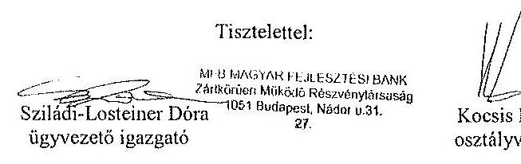

## Melléklet:

NFM levél (Ikt.szám: KGTF/377-7/2014-NFM)

---

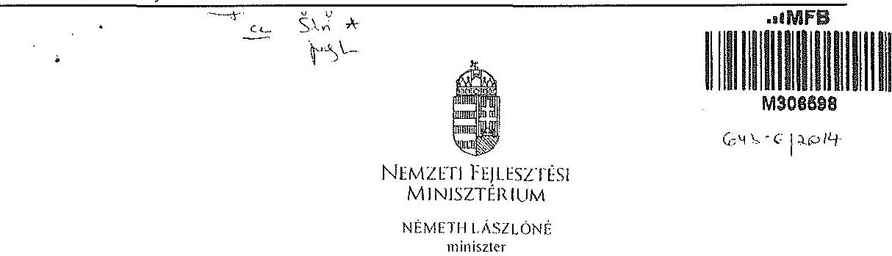

Iktatószám: KGTF/ 2773 /2014-NFM
Ügyintéző: dr. Kaszát Mónika
Telefonszám: 795-1917
e-mail:monika.kaszat@nfm.gov.hu
Nagy Csaba úr részére
vezérigazgató
Magyar Fejlesztési Bank Zrt.
Budapest
Tárgy: „Az állami vagyon feletti kontroll - Az állami vagyon feletti tulajdonosi joggyakorlással kapcsolatos tevékenységek ellenőrzéséről" szóló 13193 sz. ÁSZ jelentés alapján összeállított NFM intézkedési terv módosítása, az abban foglalt feladatok végrehajtása

# Tisztelt Vezérigazgató Úr! 

Az Állami Számvevőszék (a továbbiakban: ÁSZ) tárgyban megjelölt jelentésével összefüggésben 2014. január 27-én intézkedési tervet hagytam jóvá, amelyben foglalt feladatok végrehajtása érdekében 2014. január 30-i keltezésű levélben fordultam Önhöz és a Magyar Nemzeti Vagyonkezelő Zrt. vezérigazgatójához, Márton Péter úrhoz.

Az ÁSZ az intézkedési tervvel kapcsolatban küldött, 2014. március 25-i keltű levelében az intézkedési terv kiegészítését, módosítását kérte. A módosított intézkedési tervet jóváhagytam.

A módosított intézkedési terv alapján a következő feladatok végrehajtása szükséges az alábbiak szerint:
1./ a társaságok által kezelt állami ingatlanok és egyéb vagyonelemek értéken történő nyilvántartása:

Felelős: MNV Zrt.,
Határidő:

- földterületek esetében legkésőbb 2014. május 31-ig
- felépítmények esetében 2014. december 31. (A felépítmények esetében az MNV Zrt. a vagyonkezelési szerződés megkötését az év második felére tervezi, látja megvalósíthatónak.)
2./ a vagyonkezelési díjak egyértelmű és tulajdonosi joggyakorló szervezetenkénti meghatározása:

---

Felelős: MNV Zrt.,
Határidő: 2014. május 31-ét követően folyamatosan (2014. december 31-ig)
E pontban foglalt feladattal kapcsolatosan az ÁSZ részére az alábbi tájékoztatást adtam:
„Az ÁSZ által meghatározott feladatok végrehajtására irányuló munkafolyamat során a végrehajtásban érintett szervezetek, társaságok között kialakult az az álláspont, hogy mivel az erdőgazdasági társaságok alapfeladatként közfeladat ellátást is végeznek, azt a vagyonkezelési díj mértékének meghatározásakor az MNV Zrt. figyelembe veszi, valamint megállapításra került az az elv is, hogy a vagyonkezelési díj irányadó mértéke az adott erdőgazdasági társaság által kezelt ingatlanvagyon bruttó nyilvántartási értékének 2\%-a.

A vagyonkezelési díj alapja a kezelt vagyon bruttó nyilvántartási értéke, ezért annak meghatározására erdőgazdaság társaságonként kerül sor a 4./ pontban meghatározott ún. „végleges ingatlanlista" alapján. A végleges ingatlanlista kizárólag vagyonkezelésbe adott ingatlan vagyonelemet tartalmaz, az erdőgazdasági társaság saját vagyonában nyilvántartott vagyonelemet nem, ezért az MNV Zrt.-nek és az erdőgazdasági társaságoknak a szerződés megkötését megelőzően el kell határolnia egymástól a saját vagyonba és a kezelt vagyonba tartozó ingatlan vagyonelemeket (4.b./ pontban foglalt feladat).

A feleknek a vagyonkezelési díj mértékében a vagyonkezelési szerződés megkötését megelőzően kell megállapodniuk az irányadó vagyonkezelési díj mértéket alapul véve."

# 3./ az új vagyonkezelési szerződések megkötése: 

A vagyonkezelési szerződés tervezet az MNV Zrt. érintett szakterületei álláspontjának figyelembe vételével elkészült, az MNV Zrt. és a MFB Zrt. által létrehozott Munkacsoport (tagjai: MFB Zrt., MNV Zrt., NFA és egyes erdőgazdasági társaságok) véleménye alapján átdolgozásra került. A szerződés tervezetnek az erdőgazdasági társaságok részére történő megküldése 2014. április 15. napjával megtörtént.

Felelős: MNV Zrt., az MFB Zrt. közreműködésével
Határidő:

- földterületek esetében: 2014. május 31-ét követően folyamatosan (2014. december 31-ig)
- felépítmények esetében 2014. II. félév folyamán

## 4./ a társaságok kezelt és saját vagyonának vagyonelemenkénti, valamint a kezelt vagyonelemek tulajdonosi joggyakorló szerinti elhatárolása:

Az erdőgazdasági társaságok által az MNV Zrt. rendelkezésére bocsátott leltárjelentések alapján

- a jogszabályi rendelkezések szerint az NFA tulajdonosi joggyakorlása alá tartozó ingatlan vagyonelemek nagyobb része már átadásra került az NFA részére,
- a kisebb részt képező vagyonelemek tekintetében pedig folyamatban van az átadás az MNV Zrt. és az NFA között.

---

a./ Az ún. „végleges ingatlanlista" (az MNV Zrt. tulajdonosi joggyakorlása alatt lévő, maradó vagyonelem listája) MNV Zrt. és az NFA közötti leegyeztetése, közös áttekintése

Felelős: MNV Zrt.
Határidő: a lista MNV Zrt. és NFA közötti leegyeztetése, közös áttekintése folyamatban van, lezárása legkésőbb 2014. május 31-ig megtörténik
b./ Az a./ pontban foglaltak szerint leegyeztetett ún. „végleges ingatlanlista" MNV Zrt. és az egyes erdőgazdasági társaságok általi áttekintése azzal a céllal, hogy a vagyonkezelésben lévő vagyoni elemeket tartalmazó ún. „végleges ingatlanlista" ne tartalmazzon az erdőgazdasági társaság saját vagyonában nyilvántartott vagyoni elemet (saját vagyon - vagyonkezelt vagyon elhatárolása).

Felelős: MNV Zrt., az MFB Zrt. közreműködésével
Határidő: 2014. május 31-ig
E pontban foglalt feladatokkal kapcsolatosan az ÁSZ részére az alábbi tájékoztatást adtam:
„Szükséges megjegyezni, hogy ingatlanlista, mint állandó „végleges ingatlanlista" ilyen formában nem létezik, mert mindkét tulajdonosi joggyakorló tekintetében az állami vagyonelemek halmaza mind mennyiségben, mind pedig összetételben folyamatosan változik.

Az erdőgazdasági társaságok által kezelt ingatlanvagyon adatai - mindkét tulajdonosi joggyakorló tekintetében - az évközi változások (megosztások, területváltozások, művelési ág változások, stb.) miatt folyamatosan változnak, ezért az adattartalmában „végleges ingatlanlista" mindig egy adott konkrét időpont vonatkozásában adható meg.

Jelen intézkedési tervben az ún. „végleges ingatlanlista" meghatározás alatt az erdőgazdasági társaságok vagyonkezelésében lévő ingatlanvagyon MNV Zrt. tulajdonosi joggyakorlása alatt álló részét kell tekinteni. E „végleges ingatlanlista" kialakítására az erdőgazdasági társaságok által az MNV Zrt. részére átadott leltárjelentések alapján került sor úgy, hogy az MNV Zrt. a Nemzeti Földalapba tartozó vagyonelemeket kiválogatta, s azokat a Nemzeti Földalapkezelő Szervezet részére - átadás-átvételi jegyzőkönyv alapján - átadta.

Lényeges körülmény, hogy a vagyonkezelőknek - jelen esetben az erdőgazdasági társaságoknak - minden év május 31. napjáig vagyonkezelői jelentést kell benyújtaniuk a tulajdonosi joggyakorlók, így az MNV Zrt. részére is. Az aktuális vagyonkezelői jelentéseket - melynek része a leltárjelentés is - a 2013. december 31-i állapotnak megfelelően kell összeállítani, ebből következően a fent említett ún. „végleges ingatlanlista" is a 2013. december 31-i állapotot tükrözi.

Ugyanakkor - főként a kivett megnevezésben nyilvántartott földterületek esetében - a még át nem adott Nemzeti Földalapba tartozó vagyonelemek egyeztetése a két tulajdonosi joggyakorló között jelenleg is folyamatban van.

---

Az egyes erdőgazdasági társaságok vagyonkezelésében lévő vagyon elemek az adott társasággal megkötendő - a jelenlegi ideiglenes vagyonkezelési szerződés helyébe lépő - vagyonkezelési szerződés mellékletét fogják képezni. Az MNV Zrt. szándékai szerint az egyes erdőgazdasági társaságokkal azonnal megkötik a vagyonkezelési szerződéseket, ahogyan a megkötés feltételei bekövetkeznek (pl. megállapodnak a vagyonkezelési díjban, véglegesítik a vagyonkezelési szerződés tartalmát), azok a vagyonelemek, amelyeket e pont a./ és b./ pontjában foglaltak szerint már átvizsgáltak, a vagyonkezelési szerződés megkötésével egyidejűleg a
 szerződés mellékletébe kerülnek, amely melléklet folyamatosan bővítésre kerül újabb, e pont a./ és b./ pontjában foglaltak szerint átvizsgált, tisztázott vagyonelemekkel. ,,

Tájékoztatom, hogy az NFA feletti tulajdonosi jogok gyakorlója, Dr. Fazekas Sándor miniszter úr időközben már jóváhagyta azt az intézkedési tervet, amely az NFA részére meghatározott feladatokat és azok végrehajtási határidejét tartalmazza.

Az MFB Zrt. közreműködése az 1./ és 2./ pontban meghatározott feladatok végrehajtásban is szükséges lehet, ezért kérem a fent meghatározott feladatok határidőben történő végrehajtása érdekében az MFB Zrt. változatlan együttműködését az érintett szervezetekkel és amennyiben szükséges, úgy az erdőgazdasági társaságok bevonása iránt is intézkedni szíveskedjen.

Budapest, 2014. „ $\varepsilon^{\prime} \mu \iota^{\prime} \dot{\varepsilon} \cdot \Delta \delta^{\prime}$

# Üdvözlettel: 

## Németh Lászlóné

---

.

---

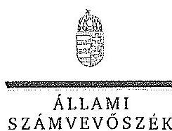

# ELNÖK 

## Nagy Csaba úr

vezérigazgató
Magyar Fejlesztési Bank Zrt.

## Budapest

## Tisztelt Vezérigazgató Úr!

Az „Az állami tulajdonban álló erdőgazdasági társaságok vagyongazdálkodási tevékenységének ellenőrzése" címü ellenőrzés tekintetében 10 társaság jelentéstervezetére tett észrevételüket köszönettel megkaptam.

Az Állami Számvevőszék észrevételekre vonatkozó álláspontjáról a felügyeleti vezető által készített részletes tájékoztatást csatoltan megküldöm.

Tájékoztatom Vezérigazgató urat, hogy a számvevőszéki jelentésben - az Állami Számvevőszékről szóló 2011. évi LXVI. törvény 29. § (3) bekezdése alapján - a figyelembe nem vett észrevételeket szerepeltetjük az elutasítás indokának feltüntetésével.

Budapest, 2015. 16. hó c.s. nap
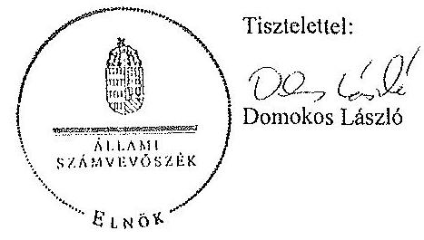

Melléklet: Tájékoztatás az elfogadott és az el nem fogadott észrevételekről

---

# Tájékoztatás   az elfogadott és az el nem fogadott észrevételekről 

„Az állami tulajdonban álló erdőgazdasági társaságok vagyongazdálkodási tevékenységének ellenőrzése" címü ellenőrzés tekintetében az Északerdő Erdőgazdasági Zrt., az EGERERDŐ Erdészeti Zrt., a Gemenci Erdő- és Vadgazdaság Zrt., az IPOLY ERDŐ Zrt., a KEFAG Kiskunsági Erdészeti és Faipari Zrt., a Kisalföldi Erdőgazdasági Zrt., a SEFAG Erdészeti és Faipari Zrt., a Szombathelyi Erdészeti Zrt., a VADEX Mezöföldi Erdő- és Vadgazdálkodási Zrt., illetve a Zalaerdő Erdészeti Zrt. társaságok jelentéstervezetére 2015. október 13-án érkezett észrevételeket áttekintettük, azok kezelésével kapcsolatban a következő tájékoztatást adom.

1. A jelentésekben megfogalmazott központi problémával kapcsolatban tett észrevételek A jelentésekben megfogalmazott központi problémával kapcsolatban adott tájékoztatásukat köszönettel vettük, azonban azok alapján a jelentéstervezet módosítása nem indokolt.

## 2. Egyedi esetekkel kapcsolatban tett észrevételek

A KEFAG Kiskunsági Erdészeti és Faipari Zrt. jelentéstervezetének 8. oldal 7. bekezdésére, valamint 32. oldal 6. bekezdésére tett észrevétel
A rendelkezésre álló dokumentumok ismételt áttekintését követően a jelentéstervezet 8. oldal 7. bekezdésében, valamint 32. oldal 6. bekezdésében töröljük a tulajdonosi joggyakorló 2 számú alsóindexszel jelölt hivatkozását.

A Kisalföldi Erdőgazdasági Zrt. jelentéstervezetének 29. oldal 4. bekezdésére tett észrevétel
A rendelkezésre álló dokumentumok ismételt áttekintését követően a jelentéstervezet 29. oldal 4. bekezdésében töröljük a tulajdonosi joggyakorló 2 számú alsóindexszel jelölt hivatkozását.

A Szombathelyi Erdészeti Zrt. jelentéstervezetének 32. oldal 5. bekezdésére tett észrevétel
A rendelkezésre álló dokumentumok ismételt áttekintését követően a jelentéstervezet 32. oldal 5. bekezdésében töröljük a tulajdonosi joggyakorló 2 számú alsóindexszel jelölt hivatkozását.

Budapest, 2015. év 11. hó 0. nap

Makkai Mária
felügyeleti vezető

---

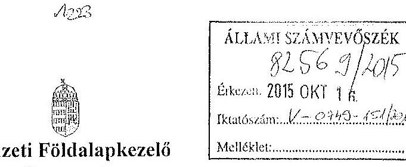

Iktatószám: NFA-002589/017/2015
Hiv. szám: ÁSZ-V-0599/2014-2015
Érintett ÁSZ iktatószámok: V-0749-148/2015, V-0750-174/2015, V-0751-121/2015,
V-0752-091/2015, V-0753-098/2015, V-754-088/2015, V-0755-124/2015, V-0757-062/2015,
V-0758-058/2015, V-0760-077/2015, V-0764-056/2015, V-0765-046/2015,
V-0766-140/2015, V-0767-056/2015.

Domokos László
Elnök

Állami Számvevőszék

1052 Budapest

Apáczai Csere János utca 10

Tárgy: Észrevétel megküldése „Az állami tulajdonban álló erdőgazdasági társaságok vagyongazdálkodási tevékenységének ellenőrzéséről" készített jelentés tervezeteire.

Tisztelt Elnök Úr!

Az Állami Számvevőszék 2014 novemberében megkezdte „Az állami tulajdonban álló erdőgazdasági társaságok vagyongazdálkodási tevékenységének ellenőrzését" amelyről 2015 októberétől érintettség okán az NFA részére az elkészített munkaanyag tervezeteit vizsgált erdőgazdaságonként, megküldte Szervezetünk részére véleményezésre.

A munkaanyag valamennyi tervezett egységesen, az NFA Elnöke részére feladatszabást tartalmaz, melyhez az alábbi észrevételeket tesszük:

A jelentéstervezetekben tett megállapítások helytállóságát nem vitatjuk, azonban szükségesnek látjuk az NFA elnökének tett javaslatokkal a), b) és c) kapcsolatban a következő tájékoztatást megadni.

---

# a) „Tegyen intézkedéseket az erdőgazdasági társaságok közreműködésével a tényleges állapotot rögzítő és a hatályos jogszabályi előírásoknak megfelelő vagyonkezelési szerződés megkötésére." 

Tájékoztatjuk, hogy a hatályos jogszabályi előírásoknak megfelelő vagyonkezelési szerződések megkötése érdekében több intézkedés történt, jelenleg is folyamatban van a szerződések előkészítése és a vagyonkezelésben maradó, illetve kikerülő földrészletek adatainak egyeztetése.

Előzményként fontos kiemelni, hogy a Nemzeti Földalapkezelő Szervezet 2010. szeptember 1. napjával történt létrehozását követően (2012. évben) került sor a vagyonkezelésben lévő földrészletek MNV Zrt. részéről történő átadására. Az átadási dokumentumok alapján Szervezetünk gondoskodott a közhitetes nyilvántartásokban a megváltozott tulajdonosi joggyakorlás feltüntetéséről. Az erdőgazdaságok esetében ez 2012. év végéig, illetve 2013. év elején megtörtént, ennek az ingatlan-nyilvántartásban történő átvezetése is.

Megjegyezzük, hogy az MNV Zrt. részéről történő átadás kizárólag a - több évtizede kötött, és azóta többször módosított - vagyonkezelési szerződések és a földrészletek Excel táblázatban történő átadását jelentette, tehát nem egy naprakész vagyonnyilvántartást tartalmazott. Ennek következtében szükségszerűvé vált a Nemzeti Földalapkezelő Szervezetnek egy saját nyilvántartás felépítése, illetve a szerződések tartalmának feldolgozása.

A számvevőszéki ellenőrzéssel érintett időszakban, illetve még jelenleg is lezáratlan az MNV Zrt. és NFA közötti átadás-átvételi folyamat. Az MNV Zrt. további földrészletek átadását készíti elő, ugyanis az MNV Zrt. vagyoni körébe tartozó földrészletekre szintén tervezi a vagyonkezelői szerződés megkötését, és ennek a folyamatnak a részeként a még át nem adott földrészletek átadása is most történik. Természetesen az NFA is folyamatosan biztosítja a különböző hasznosítási, illetve hatósági eljárások során az erdőgazdaságok vagyonkezelésében lévő földrészletek tulajdonosi joggyakorlójának rendezését az MNV Zrt megkeresésével, közös minősítési eljárás lefolytatásával. A Nemzeti Földalapkezelő Szervezet által megbízott ügyvédi iroda, jelentést készített a szerződés és a tárgyát képező földrészletek jogi helyzetének tisztázására.

Időközben az erdőgazdaságok, mint társaságok feletti tulajdonosi joggyakorló személyében is változás történt. Így új alapokon indulhatott meg a vagyonkezelői szerződés előkészítése. Ennek a folyamatnak részeként, az NFA megbízott egy Ügyvédi Konzorciumot, továbbá Szervezetünknél külön Erdészeti munkacsoport alakult 2015 májusában és azt követően a következő intézkedések történtek:

Az Erdőgazdaságok részére vagyonkezelésbe adásra tervezett ingatlanok felülvizsgálata folyamatban van az Ügyvédi Konzorcium által. A felülvizsgálat tárgyát képező ingatlanok köre három részből tevődik össze:

- az erdőgazdaságok ideiglenes vagyonkezelési szerződésének tárgyát képező ingatlanok,

---

- azon ingatlanok, amelyeket az erdőgazdaságok az ideiglenes vagyonkezelési szerződésükben szereplő ingatlanokon felül kértek vagyonkezelésbe,
- valamint azok az ingatlanok, amelyeket az NFA kíván az erdőgazdaságok vagyonkezelésébe adni.
A rendelkezésre álló dokumentumokban szereplő ingatlanokból erdőgazdaságonként egy egységes, az összes vagyonkezelésbe adandó ingatlant tartalmazó táblázat készült, amely tartalmazza az ingatlanok vagyonkezelésbe adás szempontjából releváns adatait, bejegyzett jogokat, feljegyzett tényeket. A táblázat adatai összevetésre kerültek a közhiteles ingatlannyilvántartásban szereplő adatokkal, feltárva ezáltal, hogy mely ingatlanok adhatóak vagyonkezelésbe és melyek azok, amelyeknél valamilyen előzetes intézkedés megtétele szükséges.

Az Nfatv. 8. §-a alapján a Birtokpolitikai Tanács dönt erdőgazdaságonként az erdőgazdaságok vagyonkezelési szerződésének megkötéséről.

Zárójelben jegyezzük meg, hogy például a TAEG Zrt. esetében elkészült a fentebb részletezett táblázat, amely alapján összeállításra került azon ingatlanok listája, amelyre elindítható a vagyonkezelésbe adási eljárás. Megközelítőleg 18000 ha nagyságú területnek tervezi Szervezetünk a TAEG Zrt. részére történő vagyonkezelésbe adását, ebből 15.308,3880 ha terület az, amelyre elindította a vagyonkezelésbe adást. Az alábbi jogszabályhelyek alapján Szervezetünk megkereste az Földművelésügyi Minisztériumot az egyetértő nyilatkozatok, valamint az alapító határozat kiadása érdekében, valamint a NÉBIHet, mint erdészeti hatóságot a vagyonkezelő erdőgazdálkodói alkalmasságát megállapító jóváhagyásának megkérése végett.

Az Nfatv. 20. § (7) bekezdése alapján „Az állam 100%-os tulajdonában álló erdő és erdőgazdálkodási tevékenységet közvetlenül szolgáló földterületet érintő vagyonkezelési szerződés létrejöttéhez az erdészeti hatóságnak - a vagyonkezelő erdőgazdálkodói alkalmasságát megállapító - jóváhagyása szükséges".

Az Nfatv. 23. § (2) bekezdése alapján a Nemzeti Földalapba tartozó védett természeti területek és a Natura 2000 területek vagyonkezelésbe adására, tulajdonjogának bármely jogcímen történő átruházására csak a természetvédelemért felelős miniszter egyetértése esetén kerülhet sor. Az állam 100%-os tulajdonában álló erdő, továbbá erdőgazdálkodási tevékenységet közvetlenül szolgáló földterület vagyonkezelésbe adásához az erdőgazdálkodásért felelős miniszter egyetértése szükséges.

Magyar Állam tulajdonában álló ingatlanokat érintő jogügyletekkel kapcsolatos előzetes miniszteri nyilatkozatok és a miniszter tulajdonosi joggyakorlása alá tartozó gazdasági társaságok ingatlanügyleteivel kapcsolatos miniszteri nyilatkozatok, alapítói határozatok kiadásának rendjéről szóló 8/2014. (XI. 28.) FM utasítás 3. § (4) bekezdése értelmében a miniszter tulajdonosi joggyakorlása alá tartozó állami tulajdonú gazdasági társaságoknak az

---

NFA-val történő vagyonkezelési szerződés kötéséhez elengedhetetlen a jogszabály vagy Társasági alapszabály vagy alapító okirat alapján a Társaság tulajdonosi jogait gyakorló miniszter alapítói határozatának kiadása.

Az Erdészeti Munkacsoport a kialakított szempontok alapján tartja a kapcsolatot a Konzorciummal a szerződés tárgyát képező földrészletek jogi, nyilvántartási, helyszíni, térképi ellenőrzés tárgyában annak érdekében, hogy naprakész adatok alapján történjen a szerződéskötés.
b) „Intézkedjen a vagyonkezelési szerződések felülvizsgálatának elmaradásával összefüggésben feltárt szabálytalanságok tekintetében a munkajogi felelősség tisztázására irányuló eljárás megindításáról, és ennek eredménye ismeretében tegye meg a szükséges intézkedéseket.

A fent leírt folyamat időbeli áttekintése és a vagyonkezelési szerződés előkészítésének jelenlegi helyzetét tekintve a Nemzeti Földalapkezelő Szervezet egységei, munkatársai a rendelkezésükre álló eszközök alapján megtették a szükséges intézkedéseket az erdőgazdaságok vagyonkezelői szerződésének megkötése érdekében.
c) Az NFA elnöke felé tett javaslattal kapcsolatban, miszerint intézkedjen a Társaságok vagyon-nyilvántartása hitelességének, teljességének és helyességének jogszabályban foglaltak szerinti ellenőrzéséről.

Az NFA 2015. év márciusában megkezdte az Erdészeti Zrt.-k dokumentális ellenőrzését, amely ellenőrzés keretén belül bekérésre került a Társaságok használatában álló vagyonelemekről és az erdővagyon állományról vezetett (nyilvántartások) aktualizált nyilvántartás is.

Budapest, 2015. október 13.
Tisztelettel:
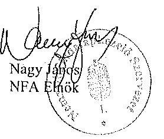

---

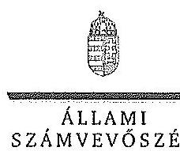

# Elnök

Ikt.szám: V-0749-154/2015.

Nagy János úr
elnök
Nemzeti Földalapkezelő Szervezet
Budapest

## Tisztelt Elnök Úr!

Az „Az állami tulajdonban álló erdőgazdasági társaságok vagyongazdálkodási tevékenységének ellenőrzése" címü ellenőrzés tekintetében 14 társaság jelentéstervezetére tett észrevételüket köszönettel megkaptam.

Az Állami Számvevőszék észrevételekre vonatkozó álláspontjáról a felügyeleti vezető által készített részletes tájékoztatást csatoltan megküldöm.

Tájékoztatom Elnök urat, hogy a számvevőszéki jelentésben - az Állami Számvevőszékről szóló 2011. évi LXVI. törvény 29. § (3) bekezdése alapján - a figyelembe nem vett észrevételeket szerepeltetjük az elutasítás indokának feltüntetésével.

Budapest, 2015. 11. hó 02. nap
Tisztelettel:
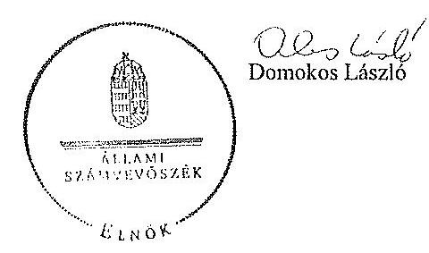

Melléklet: Tájékoztatás az észrevételek kezeléséről

---

# Tájékoztatás   az észrevételek kezeléséről 

„Az állami tulajdonban álló erdőgazdasági társaságok vagyongazdálkodási tevékenységének ellenőrzése" címü ellenőrzés tekintetében az IPOLY ERDŐ Zrt., az EGERERDŐ Erdészeti Zrt., a Mecsekerdő Zrt., a SEFAG Erdészeti és Faipari Zrt., a Gemenci Erdő- és Vadgazdaság Zrt., az Északerdő Erdőgazdasági Zrt., a Pilisi Parkerdő Zrt., a Szombathelyi Erdészeti Zrt., a Kisalföldi Erdőgazdasági Zrt., a Zalaerdő Erdészeti Zrt., a KEFAG Kiskunsági Erdészeti és Faipari Zrt., a VADEX Mezöföldi Erdő- és Vadgazdálkodási Zrt., a Gyulaj Erdészeti és Vadászati Zrt., illetve a TAEG Tanulmányi Erdőgazdaság Zrt. társaságok jelentéstervezetére 2015. október 16-án érkezett észrevételeket áttekintettük, azok kezelésével kapcsolatban a következő tájékoztatást adom.

Az észrevétel szerint a jelentéstervezetben tett megállapítások helytállóak, azokat nem vitatják. Az NFA elnökének tett javaslatokhoz kapcsolódó tájékoztatást köszönjük. Mindezek miatt, valamint arra tekintettel, hogy nem jött létre olyan vagyonkezelési szerződés, amely biztosítja az ideiglenes vagyonkezelési szerződés hiányosságainak a megszüntetését, illetve a hatályos jogszabályoknak való megfeleltetést, a megállapítások és a javaslatok
 módosítása nem indokolt.

Budapest, 2015. év 11. hó 12. nap

Makkai Mária
felügyeleti vezető
