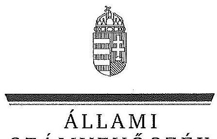

ÁLLAMI
SZÁMVEVŐSZÉK

# JELENTÉS 

Az állami tulajdonban álló erdőgazdasági társaságok vagyongazdálkodási tevékenységének ellenőrzése Gemenci Erdő- és Vadgazdaság Zrt.

---

# Állami Számvevőszék 

Iktatószám: V-0753-114/2015.
Témaszám: 1787
Vizsgálat-azonosító szám: V070605

## Az ellenőrzést felügyelte:

## Makkai Mária

felügyeleti vezető
Az ellenőrzést vezette és az ellenőrzés végrehajtásáért felelős:
Dr. Schreiber Judit Zsuzsanna
ellenőrzésvezető
A számvevőszéki jelentés összeállításában közreműködött:
Vida László
számvevő tanácsos
Az ellenőrzést végezték:
Szabó Leonóra Ildikó Vida László
számvevő főtanácsos számvevő tanácsos

---

# TARTALOMJEGYZÉK 

BEVEZETÉS ..... 3
I. ÖSSZEGZŐ MEGÁLLAPÍTÁSOK, KÖVETKEZTETÉSEK, JAVASLATOK ..... 7
II. RÉSZLETES MEGÁLLAPÍTÁSOK ..... 13

1. A Gemenc Zrt. vagyongazdálkodása ..... 13
1.1. A vagyon értékének megőrzése, gyarapítása ..... 13
1.2. A vagyonkezelői kötelezettség teljesítése ..... 15
2. A Gemenc Zrt. vagyonkezelési szerződése és a vagyonnyilvántartása ..... 16
2.1. A vagyonkezelési szerződés megfelelősége ..... 16
2.2. A Gemenc Zrt. vagyonnyilvántartása ..... 17
3. A Gemenc Zrt. éves tervezési feladatainak ellátása, az ágazati jogszabályok érvényesülése ..... 18
3.1. Az üzleti tervek vagyonmegőrzésre, vagyongyarapítására vonatkozó elemei ..... 18
3.2. A tervekben megfogalmazott előírások érvényesülése ..... 19
3.3. Az ágazati szabályok érvényesülése ..... 19
4. Kontroll- és monitoring rendszer kialakítása és működtetése ..... 21
4.1. A kontrollrendszer kialakítása és működtetése ..... 21
4.2. Az információáramlási és monitoring rendszer kialakítása és működtetése ..... 23
5. A tulajdonosi joggyakorlóknak a Gemenc Zrt. vagyongazdálkodási feladataira vonatkozó döntései, intézkedései megfelelősége ..... 24

---

# MELLÉKLETEK 

1. számú Rövidítések jegyzéke
2. számú Fogalomtár
3. számú A Gemenc Zrt. vagyonának alakulása a 2009-2014. I. félév közötti időszakban
4. számú A Gemenc Zrt. immateriális javainak és tárgyi eszköz állományának megoszlása a 2013. évre vonatkozóan
5. számú A Gemenc Zrt. befektetett eszköz állományának alakulása a 2009-2014. I. félév közötti időszakban
6. számú A Gemenc Zrt. saját tőke változása a 2013. évre vonatkozóan
7. számú A Gemenc Zrt. beruházásainak, felújításainak forrása a 2009-2014. I. félév közötti időszakban
8. számú A Gemenc Zrt. vezérigazgatójának észrevétele
9. számú A Gemenc Zrt. vezérigazgatójának észrevételére adott válasz
10. számú Az MNV Zrt. vezérigazgatójának észrevétele
11. számú Az MNV Zrt. vezérigazgatójának észrevételére adott válasz
12. számú Az MFB Zrt. vezérigazgatójának észrevétele
13. számú Az MFB Zrt. vezérigazgatójának észrevételére adott válasz
14. számú Az NFA elnökének észrevétele
15. számú Az NFA elnökének észrevételére adott válasz

---

# JELENTÉS 

## Az állami tulajdonban álló erdőgazdasági társaságok vagyongazdálkodási tevékenységének ellenőrzése Gemenci Erdő- és Vadgazdaság Zrt.

## BEVEZETÉS

Hazánk területének több mint 20\%-át erdő borítja. Az erdők fenntartása és védelme az egész társadalom érdeke, ezért az erdőkkel csak a közérdekkel összhangban lehet gazdálkodni.

Az Alaptörvény 38. cikke és az Nvtv. alapján az állam tulajdona a nemzeti vagyon részét képezi. Az Nvtv. alapján nemzetgazdasági szempontból kiemelt jelentőségű nemzeti vagyonban tartandó vagyonelemnek minősül a 100\%-ban az állam tulajdonában álló védelmi és közjóléti elsődleges rendeltetésű erdő, a gazdasági elsődleges rendeltetésű természetes erdő, természetszerű erdő és származékerdő természetességi állapotú öt hektárnál nagyobb, természetben összefüggő erdő. Az erdőgazdasági társaságok vagyongazdálkodása szempontjából a Vtv., illetve az Nvtv. és az Nfatv., valamint a kapcsolódó kormány- és miniszteri rendeletek mellett kiemelkedő szerepe van a különböző ágazati jogszabályoknak. A vagyonkezelési tevékenység végrehajtása során figyelemmel kell lenni az Evt.-ben foglaltakra, mely alapján a nemzeti vagyonról szóló törvényben nemzetgazdasági szempontból kiemelt jelentőségű nemzeti vagyonként meghatározott védelmi és közjóléti elsődleges rendeltetésű, az állam tulajdonában álló erdő a kincstári vagyon részét képezi. Az erdőgazdasági társaságoknak az általuk kezelt vagyonelemek sajátosságára tekintettel kell a vagyongazdálkodási tevékenységüket kialakítaniuk, gondoskodniuk kell a közérdek és az Evt.-ben foglaltak érvényesülését biztosító vagyongazdálkodásról.

Az Evt. előírásai alapján az állam 100\%-os tulajdonában álló erdőt és erdőgazdálkodási tevékenységet közvetlenül szolgáló földterületet csak vagyonkezelés formájában lehet hasznosításra átengedni, és az állam tulajdonában álló erdő és erdőgazdálkodási tevékenységet közvetlenül szolgáló földterület vagyonkezelését csak költségvetési szerv vagy kizárólagos állami tulajdonú gazdálkodó szervezet végezheti.

A Vtv. szerint az erdőgazdasági társaságok és a társaságok kezelésében lévő állami vagyon feletti tulajdonosi jogokat a 2010. évig a Magyar Állam nevében az MNV Zrt. gyakorolta. A 2010. évi törvényi változások (Vtv., Mfbtv., Nfatv.) következtében 2010. június 17. napjától az erdőgazdasági társaságok állami tulajdonú részesedése tekintetében a tulajdonosi jogokat az állami vagyonért felelős miniszter az MFB Zrt. útján látta el. Az Nfatv. 2010. évi hatálybalépését követően a társaságok által kezelt, a Nemzeti Földalapba tartozó földterületek

---

vonatkozásában a tulajdonosi jogokat az NFA, míg egyéb ingatlanok és vagyonelemek tekintetében a tulajdonosi jogokat az MNV Zrt. gyakorolja. 2014. július 16-tól az erdőgazdasági társaságok feletti tulajdonosi jogokat az erdőgazdálkodásért felelős miniszter gyakorolja.

A Nemzeti Földalapba tartozó 1772 980,17 ha földterületből a 2012. év végén a 100\%-os állami tulajdonú 19 erdőgazdasági társaság kezelésében összesen 913664,3681 ha földterület volt, ebből 879254,1595 ha erdő, a többi egyéb művelési ágba tartozik. A kezelt földterületek erdőgazdasági társaságonkénti megoszlása eltérő.

Az erdőgazdasági társaságok az Alaptörvény és az Nvtv. előírása szerint önállóan és felelősen gazdálkodnak a törvényesség, a célszerűség és az eredményesség követelményei szerint. Az állami vagyonnal való gazdálkodás alapvető feladata a vagyon rendeltetésszerű, hatékony és felelős felhasználásának biztosítása az állami vagyon értékének megőrzése, gyarapítása érdekében. A Gemenc Zrt. jelen ellenőrzése az állami vagyonnal gazdálkodás során a törvényesség betartására irányult.

A Gemenc Zrt. Európában a legnagyobb kiterjedésű ártéri jellegű területen gazdálkodik. Az ártéri területek alkotják a Duna-Dráva Nemzeti Park dunai szakaszát. Az erdőterület Szekszárd - Kalocsa vonalától délre, egészen az országhatárig húzódik a Duna jobb és bal partján, oldalsó határai Mőcsény, illetve Hajós községek. A Társaság 2013. évi éves beszámolója szerint 3079,5 M Ft nettó árbevétel mellett 11,2 M Ft mérleg szerinti eredményt ért el, a mérlegfőösszeg 3896,4 M Ft, a munkavállalók éves átlaglétszáma 237 fő, a közfoglalkoztatottak éves átlaglétszáma 232 fő volt. Az erdőgazdasági társaság 34159 ha erdőterületen és 3551 ha egyéb művelési ágú földterületen gazdálkodott.

Az ellenőrzés célja annak értékelése, hogy a Gemenc Zrt. vagyongazdálkodása, vagyonérték-megőrző és vagyongyarapítási tevékenysége, valamint ennek szervezeti keretei megfeleltek-e a jogszabályok és belső szabályzatok előírásainak, valamint a kezelt vagyonelemek sajátosságaiból adódó követelményeknek.

Ennek keretében ellenőriztük és értékeltük, hogy:

- a vagyongazdálkodás során betartották-e az Nvtv. 7. §-ában megállapított vagyongazdálkodási alapelveket, valamint az ágazati jogszabályok vagyongazdálkodáshoz kapcsolódó előírásait;
- a Társaság a saját és a kezelt vagyonnal való gazdálkodásra vonatkozó éves tervezési feladatait a jogszabályi előírásoknak megfelelően látta-e el, a Társaság üzleti tervei a kezelésbe vett vagyonra vonatkozó, a Vtv. 2. § (1) és a 27. § (7) bekezdésében előírt vagyon megőrzésére, gyarapítására vonatkozó elemeket tartalmaztak-e és azokat a vagyongazdálkodás során érvényesítették-e;
- a vagyonkezelési szerződések és a vagyon-nyilvántartás megfeleltek-e a szabályszerűségi követelményeknek, elősegítették-e az állami vagyonnal való szabályszerű gazdálkodást;

---

- a Társaság kialakította és működtette-e a szabályszerű feladatellátást támogató kontrollrendszert. Ezen belül elkészítették és aktualizálták-e a társaság feladatellátási-folyamatainak szabályzatait, az információs és a kontrolling-monitoring rendszert, a kockázatok kezelésének rendszerét, a vagyongazdálkodás területén azokat az eljárásokat, amelyek elősegítik a szervezeti célok végrehajtását;
- a tulajdonosi joggyakorlóknak a Gemenc Zrt. vagyongazdálkodási feladataira vonatkozó döntései, intézkedései előkészítése és megalapozottsága a jogszabályoknak és a belső szabályozásnak megfelelt-e, a tulajdonosi joggyakorlók e minőségben végzett tevékenysége támogatta-e a felelős vagyongazdálkodás megvalósulását.

Az ellenőrzés típusa: szabályszerűségi ellenőrzés.
Az ellenőrzött időszak: 2009. január 1. napjától 2014. június 30. napjáig, kitekintéssel a helyszíni ellenőrzés végéig tartó releváns folyamatokra, intézkedésekre.

Az ellenőrzés várható hasznosulása: A Gemenc Zrt. és a tulajdonosi joggyakorlók fenti szempontú ellenőrzése az állami tulajdonban álló vagyon kezelésére, a vagyonnal való gazdálkodásra vonatkozó, kötelezően végrehajtandó éves ÁSZ ellenőrzést szélesebb körűvé teszi.

Az ellenőrzés várható hasznosulásaként biztosíthatja a társadalom részéről kiemelt érdeklődéssel kísért téma objektív bemutatását. Az ÁSZ jelentéséből a média és az állampolgárok átfogó képet kaphatnak a Magyarország állami tulajdonban lévő erdőivel való gazdálkodásról, a gazdálkodást, vagyonkezelést végző szervezeti rendszerről, az állami tulajdonban álló erdőgazdasági társaságok feladatellátásához kapcsolódóan feltárt problémákról.

Az ellenőrzés jól hasznosítható - többek közt - az állami vagyonnal kapcsolatos országgyűlési törvényhozói munkában is, továbbá hozzájárulhat a tulajdonosi joggyakorlás javításával a „jó kormányzás" gyakorlatának erősítéséhez.

Az ellenőrzéssel érintett szervezetek: A Gemenc Zrt., a Társaság kezelésében lévő állami vagyon feletti tulajdonosi jogokat gyakorló szervezetek, valamint a Társaság állami tulajdonú részesedése feletti tulajdonosi joggyakorlók (MFB Zrt., MNV Zrt., NFA).

Az ellenőrzés végrehajtásának jogszabályi alapját az ÁSZ tv. 5. § (4)(5) bekezdéseiben foglaltak képezik.

Az ellenőrzés szakmai módszertana az ÁSZ hivatalos honlapján közzétett szakmai szabályokon alapult, amely a Legfőbb Ellenőrző Intézmények Nemzetközi Szervezete (INTOSAI) által kiadott nemzetközi standardok (ISSAI) figyelembevételével készült.

A Gemenc Zrt. az ellenőrzés lefolytatásához tanúsítványok kitöltésével, valamint dokumentumok elektronikus megküldésével szolgáltatott adatokat. Az így rendelkezésre bocsátott adatok és információk kontrollja a helyszíni ellenőrzés keretében történt. A vagyonváltozást eredményező döntések megalapozottsá-

---

gát, továbbá a vagyonérték-megőrző és vagyongyarapító tevékenység szabályszerűségét a számviteli nyilvántartásokból, valamint kockázat alapú és véletlenszerű mintavétellel kiválasztott tételek ellenőrzésével értékeltük. A kezelt vagyont érintően a beruházások, felújítások pénzforgalmi kiadási területet arányos rétegzéssel összesen 30 elemű véletlen minta ellenőrzésével minősítettük. A sokaságból tételes ellenőrzésre kiemeltük évente a 2009-2013. évek 3-3 legnagyobb összegű tételét, 2014. első félévében a kettő legnagyobb összegű tételt. A kivett minta alapján végeztük a kezelt vagyonon megvalósított beruházások, felújítások szabályszerűségének (üzembe helyezés, nyilvántartás, értékcsökkenés elszámolása) ellenőrzését. A vagyonhasznosítási bevételeken belül az immateriális szolgáltatásokhoz kapcsolódó tételek képezték az alapsokaságot, melyből öt és fél évre összesen 50 elemű mintát vettünk évek szerinti elemszámmal arányos rétegzéssel.

Az ÁSZ a 2011. évi LXVI. törvény 29. §-a szerint a jelentéstervezetet megküldte a Gemenc Zrt. vezérigazgatójának, a Magyar Nemzeti Vagyonkezelő Zrt. vezérigazgatójának, a Magyar Fejlesztési Bank Zrt. vezérigazgatójának és a Nemzeti Földalapkezelő Szervezet elnökének egyeztetésre. A Gemenc Zrt. vezérigazgatójának észrevételét és az arra adott választ a 8-9. számú melléklet, a Magyar Nemzeti Vagyonkezelő Zrt. vezérigazgatójának észrevételét és az arra adott választ a 10-11. számú melléklet, a Magyar Fejlesztési Bank Zrt. vezérigazgatójának észrevételét és az arra adott választ a 12-13. számú melléklet, a Nemzeti Földalapkezelő Szervezet elnökének észrevételét és az arra adott választ a 14-15. számú melléklet tartalmazza.

---

# I. ÖSSZEGZŐ MEGÁLLAPÍTÁSOK, KÖVETKEZTETÉSEK, JAVASLATOK 

A Gemenc Zrt. vagyongazdálkodása az ellenőrzött években a saját vagyonára és a vagyonkezelésében lévő állami vagyonra terjedt ki. A Társaság mérleg szerinti vagyona a saját vagyonából állt, amely a 2009. évi 3463,2 M Ft-os nyitó értékről 2013. év végére 3896,4 M Ft-ra (12,5\%), a mérlegben kimutatott saját tőke 185,6 M Ft-tal (7,7\%) emelkedett.

A Társaság a vagyonkezelt vagyonelemekre vonatkozóan nem tett eleget a Számv. tv.-ben foglaltaknak, mivel a Társaság mérleg szerinti vagyona nem tartalmazta a vagyonkezelésében lévő állami erdők és azzal szerves egységet képező egyéb földterületek, valamint az egyéb kezelt vagyon értékét, ezáltal a mérleg nem a valós állapotot tükrözte. A Számv. tv.-ben foglaltak ellenére a vagyonkezelésbe vett eszközöket mérlegtétel szerinti megbontásban nem mutatták be a kiegészítő
 mellékletben.

A Társaság által kezelt vagyonról vezetett nyilvántartás nem felelt meg a Vhr.-ben foglaltaknak, mert tételesen nem tartalmazta a vagyonkezelt eszközök könyv szerinti bruttó és nettó értékét, valamint az értékben bekövetkezett egyéb változásokat. Ezért a vezetett nyilvántartás nem biztosította az átláthatóságot és az elszámoltathatóságot. A Társaság az ellenőrzött időszakban nem rendelkezett a kezelésbe vett vagyonelemek felsorolását tartalmazó VSZ 14. mellékleteivel, valamint nem rendelkeztek a kezelt vagyonelemek feletti tulajdonosi joggyakorlók által elfogadott, egyeztetett nyilvántartással.

A kezelt ingatlanokról tételes mennyiségi kimutatást vezettek, a forint érték feltüntetése nélkül, ami megfelelt a VSZ 2.4. pontja szerinti naturáliákban történő nyilvántartás vezetési előírásnak, azonban nem felelt meg a Számv.tv.-ben a kezelt vagyon nyilvántartására vonatkozó szabálynak. A vagyonkezelt eszközök forint értékének meghatározását a Társaság sem az MNV Zrt.-nél, sem pedig az NFA-nál nem kezdeményezte annak érdekében, hogy eleget tegyen a Számv. tv. előírásainak.

A tulajdonosi joggyakorlók tisztázásával és a kezelt vagyonelemek nyilvántartása egyezőségének biztosításával kapcsolatos adategyeztetés az ellenőrzés befejezéséig nem került lezárásra, így nem állt rendelkezésre a kezelt vagyonra és annak nagyságára vonatkozó, a Társaság, az MNV Zrt. és az NFA nyilvántartásában szereplő, egyező adat.

A Társaság a saját és a kezelt vagyon tekintetében a VSZ-ben foglalt, az elkülönített nyilvántartásra vonatkozó előírást betartotta.

A Társaság a Magyar Állam tulajdonában álló erdővagyon és egyéb művelési ágú termőföld ingatlanok kezelését a KVI-vel 1996. november 1-én kötött vagyonkezelési szerződés alapján végezte. A Társaság, mint vagyonkezelő és a KVI között létrejött szerződéses jogviszony kereteit a VSZ-ben foglalt jogok és kötelezettségek töltötték ki. A VSZ nem támogatta a Vhr.-ben előírt, a vagyongazdál-

---

kodási feladatok átlátható módon történő végrehajtását, valamint nem támogatta a szabályszerű vagyongazdálkodást.

A VSZ 3.3.2. pontjában foglaltak ellenére a felek a szerződést évente nem vizsgálták felül, a VSZ az ellenőrzött időszakban nem felelt meg a hatályos rendelkezéseknek, hatályon kívül helyezett jogszabályi hivatkozásokat tartalmazott, illetve nem tartalmazott minden szükséges előírást.

A felek nem tettek eleget a Vhr.-ben foglalt rendelkezésnek, mert a Vhr. hatálybalépését követő hat hónapon belül nem kezdeményezték a Nemzeti Földalapba tartozó ingatlanokra vonatkozóan a VSZ megszüntetését és a Vtv., illetve Vhr. szabályainak megfelelő szerződés megkötését.

A Társaság által kezelt vagyonelemek többszöri változása ellenére a felek nem tartották be a Vhr.-ben előírt, a VSZ 60 napon belüli egységes szerkezetbe foglalására vonatkozó rendelkezést. A VSZ módosításokkal történő egységes szerkezetbe foglalását sem a Társaság, sem a tulajdonosi jogokat gyakorló MNV Zrt., illetve NFA nem kezdeményezte.

A VSZ vagyonkezelői jog átengedésére vonatkozó 3.2.3. pontja 2012-től nem felelt meg az Nvtv.-ben foglaltaknak, amely szerint a vagyonkezelői jog harmadik személynek nem engedhető át.

A VSZ-ben a felek nem rögzítették a Vhr.-ben 2011. január 1-jétől előírt, az érintett vagyonelem esetleges védettségét, illetve Natura 2000 területnek minősítését, és a Vhr.-ben foglalt elismerő nyilatkozatot az MNV Zrt. vagyonnyilvántartási szabályzatának megismerésére és kötelező elismerésére vonatkozóan.

A felek a VSZ-ben rögzítették a vagyonkezelési díjat, azonban a VSZ 3.3.2. pontjában foglaltak ellenére a díjat évente nem vizsgálták felül, erről történő megállapodás megkötésére nem került sor.

Az NFA – az MNV Zrt.-vel kötött megállapodás alapján – a 2009-2013. évekre vonatkozó vagyonkezelési díjakat leszámlázta, azonban a számlázás a VSZ 3.3.3. pontjában foglalt határidőtől eltérő időben történt. Az NFA a számlákon a vagyonkezelési díjat egy összegben szerepeltette, azokon nem tüntette fel a számlázás alapját képező földterület nagyságát, így nem volt megállapítható a számlák tartalmi megfelelősége.

A Társaság az ellenőrzött időszakban a vagyongazdálkodás során a kezelt vagyonelemek, valamint a saját eszközeinek karbantartási, állagmegóvási feladatait a Vtv., a Vhr. és az Nfatv. előírásai alapján ellátta.

A 2009-2013. években a Társaság összesen 1240,3 M Ft-ot fordított beruházási és 421,2 M Ft-ot karbantartási kiadásokra. A Társaság minden évre elkészítette az üzleti tervét, amelyek a kezelt vagyonra és a vállalkozási tevékenységre vonatkozóan is tartalmaztak a vagyon megőrzésére, gyarapítására vonatkozó elemeket. Az üzleti tervekben foglaltakat betartották, annak megvalósításáról minden évben beszámoltak.

---

A Társaság a feladatellátása során az Evt. ${ }_{1,2}$ szerinti bejelentési, engedélyeztetési kötelezettségeknek eleget tett, valamint betartotta a vagyongazdálkodási alapelveket. A Társaság által kezelt vagyon elidegenítésére, megterhelésére az ellenőrzött időszakban nem került sor, erdő használatát, hasznosítását, illetve a vagyonkezelői jogot harmadik személynek nem engedték át. A Társaság az Erdészeti hatóság által jóváhagyott erdőgazdálkodási és Vadászati hatóság által jóváhagyott vadgazdálkodási tervekkel rendelkezett. A Társaság az ellenőrzött időszakban az ágazati szabályokat nem teljes körűen tartotta be, a 2009-2013. években az Evt. ${ }_{2}$ és a vadgazdálkodási szabályok megsértése miatt több esetben került sor bírság kiszabására.

A Társaság kialakította és működtette a feladatellátást támogató kontrollrendszert. A Társaság az éves beszámolóit elkészítette, azokat az FB és a könyvvizsgáló jelentésének figyelembe vételével a Társaság feletti tulajdonosi joggyakorló ${ }_{1,2}$ határozattal jóváhagyta. A Társaságnál működő FB az ellenőrzött időszakban eleget tett az Alapító okiratban előírt ellenőrzési feladatainak. A Társaság könyvvizsgálója minden ellenőrzött évben hitelesítő záradékkal látta el az éves számviteli beszámolót, figyelemfelhívó vezetői levelet nem adott ki. A könyvvizsgáló az ellenőrzött időszakban nem kifogásolta a beszámolóval kapcsolatosan az ÁSZ által feltárt hiányosságokat.

A Társaság kialakította és az előírásoknak megfelelően működtette a belső ellenőrzést. A belső ellenőr az FB által jóváhagyott éves munkaterv alapján látta el feladatát. A belső ellenőrzés megállapításaira intézkedési terveket készítettek, az abban megfogalmazottak teljesítését nyomon követték.

A Társaság kialakította az információáramlási és monitoring rendszert, biztosította annak szabályzatok szerinti működését.

Az ellenőrzött években teljesítették a Vhr.-ben és a VSZ-ben előírt, a vagyonkezelésben lévő állami vagyonnal kapcsolatos adatszolgáltatási kötelezettséget, az ágazati lapok szerinti, a vagyonkezelési tevékenységgel kapcsolatos bevételekről és költségekről a beszámolókat elkészítették és az éves beszámolókkal együtt a társaság feletti tulajdonosi joggyakorló ${ }_{1,2}$-nak megküldték. Az erdőgazdálkodási tervek, egyéb erdőgazdálkodási tevékenységek és az éves vadgazdálkodási tervek teljesítéséről az éves üzleti jelentésekben és a kontrolling adatszolgáltatás keretein belül számoltak be.

A Társaság az ellenőrzött időszakban a leltározási szabályzatban rendelkezett a leltározás folyamatáról, azonban az 2012. január 1-jétől nem felelt meg a Számv. tv. előírásának, mert ötévenkénti mennyiségi felvételt írt elő.

A Társaság rendelkezett Iratkezelési szabályzattal és Számítástechnikai védelmi szabályzattal, azonban nem tett eleget az Avtv. illetve az Infotv. szerinti, a közérdekű adatok megismerésére irányuló igények teljesítésének rendjét rögzítő szabályzatkészítési kötelezettségnek. A közzétételi kötelezettség nem felelt meg az általános közzétételi listában meghatározottaknak, nem került közzétételre a közérdekű adatok megismerésére vonatkozó igények intézésének rendje, valamint a közbeszerzési információk.

---

A társaság feletti tulajdonosi joggyakorló ${ }_{1,2}$ a Társaság vagyongazdálkodási feladataira vonatkozó döntései, intézkedéseinek előkészítése összhangban volt a belső szabályzatokkal, a vagyonváltozást eredményező döntések végrehajtását a beszámolók, az üzleti tervek, üzleti jelentések és a kontrolling jelentések megtárgyalásával és jóváhagyásával ellenőrizték.

A vagyonkezelésbe adott állami vagyon tekintetében a tulajdonosi jogokat gyakorló MNV Zrt. és NFA tevékenysége az ellenőrzött időszakban nem támogatta teljes körűen a felelős vagyongazdálkodás megvalósulását. A VSZ-szel kapcsolatban feltárt hiányosságok megszüntetése és a hatályos jogszabályoknak való megfeleltetése nem történt meg. A vagyonkezelésbe adott állami vagyon tekintetében tulajdonosi jogokat gyakorló MNV Zrt. és NFA nem végeztek a Vhr.-ben és a Nemzeti Földalapba tartozó földrészletek hasznosításának részletes szabályairól szóló 262/2010. (XI. 17.) Korm. rendeletben foglalt, a vagyonnyilvántartás hitelességére, teljességére és helyességére vonatkozó ellenőrzést a Társaságnál.

Az Állami Számvevőszékről szóló 2011. évi LXVI. törvény 33. § (1) bekezdésében foglaltak értelmében a jelentésben foglalt megállapításokhoz kapcsolódó intézkedési tervet köteles az ellenőrzött szervezet vezetője összeállítani, és azt a jelentés kézhezvételétől számított 30 napon belül az ÁSZ részére megküldeni. Amennyiben az intézkedési tervet határidőben nem küldi meg a szervezet, vagy az nem elfogadható, az ÁSZ elnöke a hivatkozott törvény 33. § (3) bekezdésében foglaltakat érvényesítheti.

Az ellenőrzés intézkedést igénylő megállapításai és javaslatai:

# MNV Zrt. vezérigazgatójának, az NFA elnökének 

A Gemenc Zrt. a Magyar Állam tulajdonában álló erdővagyon és egyéb művelési ágú termőföld ingatlanok kezelését a KVI-vel 1996. november 1-jén kötött vagyonkezelési szerződés alapján végezte. A Társaság, mint vagyonkezelő és a KVI között létrejött szerződéses jogviszony kereteit a VSZ-ben foglalt jogok és kötelezettségek töltötték ki. A VSZ nem támogatta a Vhr.-ben előírt, a vagyongazdálkodási feladatok átlátható módon történő végrehajtását, valamint nem támogatta a szabályszerű vagyongazdálkodást. A VSZ az ellenőrzött időszakban hatályon kívül helyezett jogszabályi hivatkozásokat tartalmazott az Áht ${ }_{1}$ 109/B. §, 109/G. §, a Vadvédelmi tv. 98. § rendelkezései vonatkozásában és nem tartalmazta az Evt., az Nvtv. előírásaira történő hivatkozást, valamint a Vhr. 9. § (8) bekezdésében 2011. január 1-jétől előírt, az érintett vagyonelem esetleges védettségét, illetve Natura 2000 területnek minősítését. Továbbá a vagyonkezelői jog átengedésére vonatkozóan a VSZ 2009. július 10-étől nem felelt meg az Evt. 9. § (3) bekezdésében foglaltaknak, mert nem tartalmazta, hogy az erdők hasznosítását a vagyonkezelő harmadik személynek nem engedheti át. A VSZ 3.3.2. pontjában foglaltak ellenére a szerződést évente nem vizsgálták felül, azt a felek nem kezdeményezték. A felek nem tettek eleget a Vhr. 54. § (7) ${ }^{1}$ bekezdésében foglalt rendelkezésnek és a Vhr. hatálybalépését követő hat hónapon belül nem kezdeményezték a Nemzeti Földalapba tartozó ingatlanokra

[^0]
[^0]:    ${ }^{1}$ Vhr. 54. § (7) bekezdés (hatályos 2010. december 31-éig)

---

vonatkozóan a VSZ megszüntetését és a Vtv., illetve Vhr. szabályainak megfelelő szerződés megkötését.

A vagyonkezelésbe adott állami vagyon tekintetében tulajdonosi jogokat gyakorló MNV Zrt. és NFA nem végeztek a Vhr. 20. § (1)-(2) bekezdéseiben és a Nemzeti Földalapba tartozó földrészletek hasznosításának részletes szabályairól szóló 262/2010. (XI. 17.) Korm. rendelet 47. § (1)-(2) bekezdéseiben foglalt, a vagyonnyilvántartás hitelességére, teljességére és helyességére vonatkozó ellenőrzést a Társaságnál.

Javaslat:

# az MNV Zrt. vezérigazgatójának 

a) Tegyen intézkedéseket az erdőgazdasági társaság közreműködésével a tényleges állapotot rögzítő és a hatályos jogszabályi előírásoknak megfelelő vagyonkezelési szerződés megkötésére.
b) Tegyen intézkedéseket a vagyonkezelési szerződés felülvizsgálatának elmaradásával, valamint a Nemzeti Földalapba tartozó ingatlanokra vonatkozó VSZ megszüntetésével összefüggésben feltárt szabálytalanságok tekintetében a felelősség tisztázása érdekében, és szükség szerint intézkedjen a felelősség érvényesítéséről.
c) Intézkedjen a Gemenc Zrt. vagyonnyilvántartása hitelességének, teljességének és helyességének jogszabályban foglaltak szerinti ellenőrzéséről.

## az NFA elnökének

a) Tegyen intézkedéseket az erdőgazdasági társaság közreműködésével a tényleges állapotot rögzítő és a hatályos jogszabályi előírásoknak megfelelő vagyonkezelési szerződés megkötésére.
b) Intézkedjen a vagyonkezelési szerződés felülvizsgálatának elmaradásával összefüggésben feltárt szabálytalanságok tekintetében a munkajogi felelősség tisztázására irányuló eljárás megindításáról, és ennek eredménye ismeretében tegye meg a szükséges intézkedéseket.
c) Intézkedjen a Gemenc Zrt. vagyonnyilvántartása hitelességének, teljességének és helyességének jogszabályban foglaltak szerinti ellenőrzéséről.

## a Gemenc Zrt. vezérigazgatójának:

1. A Gemenc Zrt. és a KVI által 1996-ban megkötött VSZ nem biztosította a Vhr. 3. § (1)
 bekezdésében foglaltak szerinti, a tulajdonosi joggyakorlás és a vagyongazdálkodási feladatok átlátható módon történő végrehajtását, valamint nem támogatta a szabályszerű vagyongazdálkodást. A VSZ az ellenőrzött időszakban hatályon kívül helyezett jogszabályi hivatkozásokat tartalmazott az Áht ${ }_{1}$ 109/B. §, 109/G. §, a Vadvédelmi tv. 98. § rendelkezései vonatkozásában és nem tartalmazta az Evt., az Nvtv. előírásaira történő hivatkozást, valamint a Vhr. 9. § (8) bekezdésében 2011. január 1-jétől előírt, az érintett vagyonelem esetleges védettségét, illetve Natura 2000 területnek minősítését. Továbbá a vagyonkezelői jog átengedésére vonatkozóan a VSZ 2009. július 10-étől nem felelt meg az Evt. 9. § (3) bekezdésében foglaltaknak, mert nem tartalmazta, hogy az erdők hasznosítását a vagyonkezelő harmadik személynek nem engedheti át. A VSZ 3.3.2. pontjában foglaltak ellenére a szerződést évente nem vizsgálták felül, azt a felek nem kezdeményezték.

Javaslat:
a) Tegyen intézkedéseket a tulajdonosi joggyakorlókkal közreműködve a tényleges állapotnak és a hatályos jogszabályi előírásoknak megfelelő vagyonkezelési szerződés megkötése érdekében.
b) Intézkedjen a vagyonkezelési szerződés felülvizsgálatának elmaradásával feltárt szabálytalanságok tekintetében a felelősség tisztázása érdekében, és szükség szerint intézkedjen a felelősség érvényesítéséről.
2. A Társaság kezelt vagyonhoz kapcsolódó számviteli nyilvántartása nem felelt meg a Számv. tv. 23. § (2) bekezdésében foglaltaknak, mert a mérlegben eszközként nem mutatta ki a kezelt vagyont, továbbá ezen eszközöket a kiegészítő mellékletben - legalább mérlegtételek szerinti megbontásban - külön nem mutatta be.

Javaslat:
a) Intézkedjen a kezelt vagyon mérlegben eszközként való kimutatásáról, továbbá ezen eszközöknek a kiegészítő mellékletben - legalább mérlegtételek szerinti megbontásban - külön történő bemutatásáról.
b) Intézkedjen a kezelt vagyon mérlegben eszközként történő kimutatásának elmaradásával kapcsolatban feltárt szabálytalanság tekintetében a felelősség tisztázása érdekében, és szükség szerint intézkedjen a felelősség érvényesítéséről.
3. A leltározási szabályzat az ellenőrzött időszakban nem került aktualizálásra, így az 2012. január 1-jétől nem felelt meg a Számv. tv. 69. § (3) bekezdés előírásának, - a leltározási szabályzatban meghatározott időszakonként, de legalább háromévente mennyiségi felvétellel történő leltározási kötelezettségnek - mert ötévenkénti mennyiségi felvétellel történő leltározási kötelezettséget írt elő.

Javaslat:
Intézkedjen a leltározási szabályzat módosításáról annak érdekében, hogy a mennyiségi felvétellel történő leltározás szabályozása megfeleljen a jogszabályi előírásoknak.
4. A Gemenc Zrt. az ellenőrzött időszakban az Avtv. 20. § (8) bekezdése, illetve az Infotv. 30. § (6) bekezdése szerinti, a közérdekű adatok megismerésére irányuló igények teljesítésének rendjét nem szabályozta.

Javaslat:
Intézkedjen a jogszabályi előírásoknak megfelelően a közérdekű adatok megismerésére irányuló igények teljesítése rendjének szabályozásáról.

---

# II. RÉSZLETES MEGÁLLAPÍTÁSOK 

## 1. A GEMENC ZRT. VAGYONGAZDÁLKODÁSA

### 1.1. A vagyon értékének megőrzése, gyarapítása

A Gemenc Zrt. vagyongazdálkodása a saját vagyonára és a vagyonkezelésében lévő vagyonra terjedt ki. A Társaság mérleg szerinti vagyona a saját vagyonból állt, azonban a Számv. tv. 23. § (2) bekezdésben foglaltak ellenére a kezelt vagyont a mérlegben nem mutatták ki, azok mérlegtétel szerinti megbontásban nem kerültek bemutatásra a kiegészítő mellékletben, ezáltal a Társaság mérlege nem a valós állapotot tükrözte.

A Társaság mérleg szerinti vagyona a 2009. évi 3463,2 M Ft-os nyitó értékről 2013. év végére 3896,4 M Ft-ra (12,5\%) növekedett. A változás a befektetett eszközök 115,7 M Ft-os (4,5\%) és a forgóeszközök 323,0 M Ft-os (36,7\%) emelkedése és az aktív időbeli elhatárolások 5,5 M Ft (62,5\%) csökkenése miatt következett be. A Társaság a 2009-2013. években a kezelt vagyon hasznosításából 14 189,3 M Ft bevételt realizált és 12599,9 M Ft költséget számolt el. A kezelt vagyonból származó bevételeket és költségeket a VSZ 3.2.2. pontja szerint a főkönyvi könyvelésben a vállalkozási bevételektől és költségektől elkülönítve mutatták ki.

A befektetett eszközök aránya az összes eszközhöz viszonyítva a 2009. január 1-jei 74,3 %-ról 2013. december 31-re 69,0%-ra csökkent. A befektetett eszközökön belül az immateriális javak és a tárgyi eszközök állománya a beruházások és felújítások következtében az előző évhez viszonyítva - az elszámolt értékcsökkenés ellenére - az ellenőrzött időszakban évről évre folyamatosan növekedett. Az immateriális javak és a tárgyi eszközök nettó értéke a 2013. év végére 116,8 M Ft-tal (4,6\%-kal) nőtt a 2009. január 1-jei mérleg szerinti értékhez viszonyítva.

A Társaság a befektetett pénzügyi eszközök között egyéb tartós részesedést, valamint egyéb tartósan adott kölcsönt mutatott ki. A befektetett pénzügyi eszközök állománya az ellenőrzött években 1,1 M Ft-tal (2,3\%-kal) csökkent. A 2009. évben a Társaság a tulajdonában lévő 255 db, egyenként 0,01 M Ft névértékű Forst Hungária Zrt-ben lévő részvényeit értékesítette. A részvényekért kapott ellenérték 2,8 M Ft, a nyilvántartott könyv szerinti érték 2,6 M Ft, míg a tulajdoni hányad 12,8 % volt. A 2013. évben a Társaság emelte tulajdoni hányadát az Erdészeti Üdülő Közös Vállalatban, amely 6,0%-ról 7,3%-ra növekedett. A tőkeemelésből a Társaságra jutó összeg 2,0 M Ft volt.

A Társaság rendelkezett Értékelési szabályzattal, amely tartalmazta a befektetett eszközök értékelésének, valamint az értékvesztés elszámolásának szabályait. A befektetett pénzügyi eszközök értékelésénél a szabályzat és a Számv. tv. 57. § (1) bekezdés előírásait betartották.

---

A VSZ hatálya alá tartozó eszközöket a Társaság nem értékelte, mivel a vagyonkezelésbe vett eszközöket nem szerepeltette a mérlegében. A saját vagyonként nyilvántartott eszközök és források értékelését a Számv. tv. 46. § (3) bekezdésben foglaltaknak megfelelően évente elvégezték, amelynek során a Számv. tv. 46. § (4) bekezdés, valamint a Számviteli politika ${ }_{1,2}$-ban foglalt előírások szerint jártak el.

A Társaság vagyonának alakulása 2009-2013. évek között:

| Sorszám | Megnevezés | 2009.01.01 |  | 2013.12.31 |  | Változás 2013.12.31/ 2009.01.01. (%) |
| :--: | :--: | :--: | :--: | :--: | :--: | :--: |
|  |  | Érték M Ft-ban | $\%$ | Érték M Ft-ban | $\%$ |  |
| 1. | Befektetett eszközök összesen | 2574,4 | 74,3 | 2690,1 | 69,0 | 104,5 |
| 2. | Ebből: Immatertális javak | 15,3 | 0,6 | 64,0 | 2,4 | 418,3 |
| 3. | Tárgyi eszközök | 2510,3 | 97,5 | 2578,4 | 95,8 | 102,7 |
| 4. | Befektetett pénzügyi eszközök | 48,8 | 1,9 | 47,7 | 1,8 | 97,7 |
| 5. | Forgóeszközök | 880,0 | 25,4 | 1203,0 | 30,9 | 136,7 |
| 6. | Aktív időbeli elhatárolások | 8,8 | 0,3 | 3,3 | 0,1 | 37,5 |
| 7. | Eszközök összesen | 3463,2 | 100,0 | 3896,4 | 100,0 | 112,5 |
| 8. | Saját tőke | 2403,6 | 69,4 | 2589,2 | 66,5 | 107,7 |
| 9. | Ebből: Jegyzett tőke | 1222,4 | 50,9 | 1307,1 | 50,5 | 106,9 |
| 10. | Tőketartalék | 786,2 | 32,7 | 783,7 | 30,3 | 99,7 |
| 11. | Eredménytartalék | 314,5 | 13,0 | 487,2 | 18,8 | 154,9 |
| 12. | Lekötött tartalék | 23,5 | 1,0 | - | - | - |
| 13. | Mérleg szerinti eredmény | 57,0 | 2,4 | 11,2 | 0,4 | 19,6 |
| 14. | Céltartalékok | - | - | - | - | - |
| 15. | Kötelezettségek | 558,6 | 16,1 | 717,7 | 18,4 | 128,5 |
| 16. | Passzív időbeli elhatárolások | 501,0 | 14,5 | 589,5 | 15,1 | 117,7 |
| 17. | Források összesen | 3463,2 | 100,0 | 3896,4 | 100,0 | 112,5 |

A Társaság mérlegében kimutatott saját tőke 185,6 M Ft-tal (7,7\%) emelkedett. A saját tőke/összes tőke aránya a 2010. év végéig szintén növekedett, majd 2013. év végére 2,9 százalék ponttal csökkent a 2009. január 1-jei arányhoz viszonyítva.

A 2009-2013. években a Társaság tevékenységének főbb mutatószámai az alábbiak szerint alakultak:

|  |  |  |  |  |  | Adatok %-ban |  |
| :--: | :--: | :--: | :--: | :--: | :--: | :--: | :--: |
| Sorszám | Megnevezés | 2009.01.01 | 2009. | 2010. | 2011. | 2012. | 2013. | Változás 2013/2009. 01.01. |
| 1. | Tőkeerősség (saját tőke/összes tőke) | 69,4 | 74,6 | 77,1 | 76,9 | 76,6 | 66,5 | 95,8 |
| 2. | Saját tőke/jegyzett tőke aránya | 196,6 | 190,7 | 192,0 | 194,3 | 197,2 | 198,1 | 100,8 |
|  | Kötelezettségek aránya   (kötelezettségek/források) | 16,1 | 10,4 | 8,4 | 9,9 | 11,0 | 18,4 | 114,3 |
| 3. | Befektetett eszközök fedezete (saját tőke/befektetett eszközök) | 93,4 | 99,9 | 99,9 | 99,8 | 100,8 | 96,3 | 103,1 |

A vagyonváltozás főbb elemeit az ellenőrzött években a kiegészítő mellékletekben részletesen bemutatták. A vagyon változásait mérlegsoronként táblázatba foglalták, és szövegesen indokolták az előző év adataitól való eltérés okait.

A 2009-2013. években a Társaság összesen 1240,3 M Ft-ot fordított beruházási kiadásokra. A beruházások műszaki tartalmuk alapján erdőtelepítések, vadvédelmi kerítések, ingatlanok és útburkolat építések, gépek, berendezések, felszerelések és járművek beszerzése, informatikai fejlesztések, valamint egyéb beruházások voltak. A beruházások elszámolása megfelelt a Számlarend ${ }_{1.2}$-ben előírtaknak. Az üzembe helyezésről, állományba vételről bizonylatot állítottak ki, az eszközök bekerülési értékének meghatározása a Számviteli Politika ${ }_{1.2}$-ban előírtaknak megfelelően történt.

A befejezett erdőtelepítések egyenlege 2014. I. félév végén összesen 62,1 M Ft, a befejezetlen erdőtelepítések állománya pedig 14,1 M Ft volt. A Társaságnál 2009-2013. években 28,4 M Ft-tal emelkedett a befejezett erdőtelepítések állománya. A Társaság betartotta a Számv. tv. 52. § (5) bekezdés értékcsökkenés elszámolására vonatkozó előírásait, a földterületek és az erdők értéke után értékcsökkenést nem számoltak el. Az éves beszámolókban és a számviteli nyilvántartásokban lévő vagyontárgyak év végi állományát leltárral alátámasztották.

A Társaság az ellenőrzött időszakban a vagyongazdálkodás során a kezelt vagyonelemek, valamint a saját eszközeinek karbantartási, állagmegóvási feladatait a Vtv. ${ }^{2}$, a Vhr. ${ }^{3}$ és az Nfatv. ${ }^{4}$ előírásai alapján ellátta. A Társaság 2009-2014. évekre vonatkozó üzleti tervei tartalmazták az erdőműveléssel, állagmegóvással és a karbantartással kapcsolatos kiadásokat. A külső szolgáltatókkal végeztetett karbantartásokra az ellenőrzött időszakban 421,2 M Ft-ot fordítottak. A karbantartási költségek 40%-a (166,6 M Ft) útjavítással kapcsolatos kiadás volt. Az ellenőrzött időszakban a főkönyvi könyvelésben elkülönítetten 3175,2 M Ft-ot számoltak el az erdőkezelésre, amelyek az erdészet működési költségeivel, a természeti csapások elleni védekezéssel, az erdőkezelés költségeivel, az erdő állagmegóvásával és karbantartásával kapcsolatosan merültek fel. A Társaság karbantartási tevékenysége kiterjedt az ingatlanok, gépek, berendezések, járműveken túl az erdőművelésen belül az erdő állagának megőrzésére, értékőrző gyarapítására.

# 1.2. A vagyonkezelői kötelezettség teljesítése 
A Társaság
 a 2012. január 1-től hatályos Nvtv. 7. §-ban foglalt vagyongazdálkodási alapelveket betartotta. A Vtv. 33. § (1) bekezdés, az Nvtv. 6. § (1) bekezdés és a VSZ 3.2.1. pontja előírásait betartva a kezelt vagyont nem idegenítette el, nem terhelte meg, biztosítékul nem adta, illetve azokon osztott tulajdont nem létesített. A Társaság az Nfatv. ${ }^{5}$-ben foglaltak szerint a vagyonkezelői jogát nem adta tovább és nem terhelte meg, valamint a VSZ 3.2.1. pontját betartva nem idegenített el vagyonkezelésében lévő erdőt. Az Evt. ${ }_{2}$ 9. § (3) ${ }^{6}$ bekezdés előírását betartva erdő használatát, hasznosítását harmadik személynek nem engedték át.

[^0]
[^0]:    ${ }^{2}$ Vtv. 23. § (2) bekezdése és 27. § (2) bekezdése
    ${ }^{3}$ Vhr. 10. § (1) bekezdés (hatályos: 2010. december 31-éig) a Vhr. 9. § (6) bekezdése (hatályos: 2011. január 1-jétől)
    ${ }^{4}$ Nfatv. 20. § (1) bekezdés (hatályos 2011. július 31-ig), Nfatv. 20. § (4) bekezdés (hatályos 2011. augusztus 1-től 2012. december 31-ig), Nfatv. 19/A (3) bekezdés (hatályos 2013. január 1-től)
    ${ }^{5}$ Nfatv. 20 § (3) bekezdése (hatályos: 2011. július 31-éig), Nfatv. 20 § (8) bekezdése (hatályos: 2011. augusztus 1-jétől 2012. december 31-éig), Nfatv. 19/A. § (4) bekezdése (hatályos: 2013. január 1-jétől)
    ${ }^{6}$ Evt. 2 9. § (3) bekezdés (hatályos: 2009. július 10-től)

---

A Társaság az ellenőrzött időszakban egy esetben, az MNV Zrt. megbízásából eljáró NIF Zrt.-vel 2009. novemberében kötött telek átalakítási eljárásban megosztásra kerülő 2,53 ha területű ingatlanhoz kapcsolódóan, a szabályoknak megfelelően mondott le vagyonkezelői jogáról.

A Társaság 2011. augusztus 1-jét követően vagyonkezelési szerződést nem kötött, így az Nfatv. ${ }^{7}$ előírása szerinti, az erdő- és erdőgazdálkodási tevékenységet közvetlenül szolgáló földterületet érintő vagyonkezelési szerződés létrejöttéhez az Erdészeti hatóság - a vagyonkezelő erdőgazdálkodói alkalmasságát megállapító - jóváhagyására nem volt szükség.

# 2. A GEMENC ZRT. VAGYONKEZELÉSI SZERZŐDÉSE ÉS A VAGYONNYILVÁNTARTÁSA 

### 2.1. A vagyonkezelési szerződés megfelelősége

A Társaság a Magyar Állam tulajdonában álló erdővagyon és egyéb művelési ágú termőföld ingatlanok kezelését a KVI-vel 1996. november 1-én kötött vagyonkezelési szerződést alapján végezte. A Társaság, mint vagyonkezelő és a KVI között létrejött szerződéses jogviszony kereteit a VSZ-ben foglalt jogok és kötelezettségek töltötték ki. A VSZ nem támogatta a Vhr. 3. § (1) bekezdésében foglalt, a vagyongazdálkodási feladatok átlátható módon történő végrehajtását, valamint nem támogatta a szabályszerű vagyongazdálkodást.

A VSZ 3.3.2. pontjában foglaltak ellenére a felek a szerződést évente nem vizsgálták felül, az ellenőrzött időszakban az nem felelt meg a hatályos rendelkezéseknek, hatályon kívül helyezett jogszabályi hivatkozásokat tartalmazott az Áht 109/B. $\S^{8}$, 109/G. $\S^{9}$, a Vadvédelmi tv. 98. $\S^{10}$ előírásai vonatkozásában.

A felek nem tettek eleget a Vhr. 54. § (7) ${ }^{11}$ bekezdésében foglalt rendelkezésnek és a Vhr. hatálybalépést követő hat hónapon belül nem kezdeményezték a Nemzeti Földalapba tartozó ingatlanokra vonatkozóan a VSZ megszüntetését és a Vtv., illetve Vhr. szabályainak megfelelő szerződés megkötését.

Az évente történő felülvizsgálat elmaradása miatt a szerződés nem a 2009-ben hatályba lépett Evt. ${ }_{2}$ és a 2012-től alkalmazandó Nvtv. megfelelő előírásaira való hivatkozásokat tartalmazott, nem tartalmazta a Vhr. 9. § (8) bekezdésében 2011. január 1-jétől előírt, az érintett vagyonelem esetleges védettségét, illetve Natura 2000 területnek minősítését, valamint nem tartalmazta a Vhr.

[^0]
[^0]:    ${ }^{7}$ Nfatv. 20. § (7) bekezdése (hatályos: 2011. augusztus 1-jétől)
    ${ }^{8}$ Áht. ${ }_{1}$. 109/B § (hatálytalan 2012. január 1-től)
    ${ }^{9}$ Áht. ${ }_{1}$. 109/G § (hatálytalan 2007. szeptember 25-től)
    ${ }^{10}$ Vadvédelmi tv. 98. § (hatálytalan 2007. április 14-től)
    ${ }^{11}$ Vhr. 54. § (7) bekezdés (hatályos 2010. december 31-éig)

---

14. § (3) bekezdésben foglalt elismerő nyilatkozatot az MNV Zrt. vagyonnyilvántartási szabályzatának megismerésére és kötelező elismerésére vonatkozóan.

A Társaság által kezelt vagyonelemek többszöri változása ellenére a felek nem tartották be a Vhr. 8. § (2) bekezdésében előírt, a VSZ 60 napon belüli egységes szerkezetbe foglalására vonatkozó rendelkezést. A VSZ módosításokkal történő egységes szerkezetbe foglalását sem a Társaság, sem a tulajdonosi jogokat gyakorló MNV Zrt ${ }^{12}$, illetve NFA ${ }^{13}$ nem kezdeményezte.

A VSZ vagyonkezelői jog átengedésére vonatkozó 3.2.3. pontja 2012-től nem felelt meg az Nvtv.-ben foglaltaknak, amely szerint a vagyonkezelői jog harmadik személynek nem engedhető át.

A felek a VSZ 3.3.1. pontjában rögzítették a vagyonkezelési díjat. A VSZ 3.3.2. pontja előírta a vagyonkezelési díj - külön megállapodás keretében a tárgyévet megelőző év november 30-ig történő - felülvizsgálatát, azonban a felek a díjat évente nem vizsgálták felül, erről történő megállapodás megkötésére nem került sor.

Az NFA - az MNV Zrt.-vel kötött megállapodás alapján - a 2009-2013. évekre vonatkozó vagyonkezelési díjakat leszámlázta, azonban a számlázás a VSZ 3.3.3. pontjában foglalt határidőtől eltérő időben történt. Az NFA a számlákon a vagyonkezelési díjat egy összegben szerepeltette, azokon nem tüntette fel a számlázás alapját képező földterület nagyságát, így nem volt megállapítható a számlák tartalmi megfelelősége.

# 2.2. A Gemenc Zrt. vagyonnyilvántartása 

A Társaság által kezelt vagyonról vezetett nyilvántartás nem felelt meg a Vhr. 17. § (1) bekezdésében foglalt azon rendelkezésnek, amely szerint a nyilvántartásnak tételesen tartalmaznia kell a vagyonkezelt eszközök könyv szerinti bruttó és nettó értékét, valamint az értékben bekövetkezett egyéb változásokat. Ezért a vezetett nyilvántartás nem biztosította az átláthatóságot és az elszámoltathatóságot.

A kezelt ingatlanokról tételes analitikus nyilvántartás vezettek, a forint érték feltüntetése nélkül, amely megfelelt a VSZ 2.4. pontja szerinti naturáliákban történő nyilvántartás vezetési előírásnak, azonban nem felelt meg Számv.tv. 23. §-ban foglalt, a kezelt vagyon nyilvántartására vonatkozó szabálynak. A vagyonkezelt eszközök forint érték meghatározását a Társaság sem az MNV Zrt.-nél sem az NFA-nál nem kezdeményezte, hogy eleget tegyen a Számv. tv. előírásának.

A Társaság által vezetett nyilvántartás helyrajzi számonként és a területmérték feltüntetésével tartalmazta a kincstári vagyoni körbe tartozó földterületek felsorolását, azonban nem rendelkeztek a kezelésbe vett vagyonelemek felsorolását

[^0]
[^0]:    ${ }^{12}$ Vtv. 61. § (1) bekezdés
    ${ }^{13}$ Nfatv. 34. § (2) bekezdés

---

tartalmazó VSZ 1-4. mellékleteivel, valamint a kezelt vagyon feletti tulajdonosi joggyakorlók által elfogadott, egyeztetett nyilvántartással.

A Társaság nem teljes körűen rendelkezett a kezelt vagyon tekintetében pontos és naprakész információval a tulajdonosi jogokat gyakorlóról, így a Társaság által vezetett nyilvántartás nem biztosította a Vhr. 14. § (1) bekezdésben foglalt, az adatszolgáltatás pontosságára vonatkozó követelményt.

A tulajdonosi joggyakorló tisztázásával és a kezelt vagyonelemekről vezetett nyilvántartások egyezőségének biztosításával kapcsolatos adategyeztetés az ellenőrzés befejezéséig nem került lezárásra, így nem állt rendelkezésre a Társaság által kezelt vagyonra és annak nagyságára vonatkozó, a Társaság, az MNV Zrt. és az NFA nyilvántartásában szereplő, egyező adat.

A Társaság a saját és a kezelt vagyon könyvekben történő elkülönítetését a VSZ-ben foglaltak szerint biztosította.

A Társaság vagyonkezelői jogának ingatlan-nyilvántartásba történő bejegyzésének jogi rendezetlensége kedvezőtlenül hatott a Társaság által vagyonkezelt állami vagyonhoz kapcsolódó átláthatóságra.

# 3. A Gemenc Zrt. ÉVES TERVEZÉSI FELADATAINAK ELLÁTÁSA, AZ ÁGAZATI JOGSZABÁLYOK ÉRVÉNYESÜLÉSE 

### 3.1. Az üzleti tervek vagyonmegőrzésre, vagyongyarapításra vonatkozó elemei

A Társaság a saját és kezelt vagyonnal való gazdálkodás során az éves tervezési feladatait ellátta, az üzleti tervei tartalmazták a vagyon megőrzésére, gyarapítására vonatkozó elemeket.

A Társaság vagyongazdálkodási stratégiai alapelveit, a vagyongazdálkodási tevékenységét, az elvégzendő feladatokat és az elérendő célokat az éves üzleti tervek tartalmazták. A társaság feletti tulajdonosi joggyakorló ${ }_{1,2}$ részletes utasításban fogalmazta meg elvárásait az üzleti terv elkészítésével kapcsolatosan. Az utasítások tartalmazták az üzleti tervek elkészítésének alapelveit, követelményeit, és az üzleti tervekben bemutatandó területeket, valamint az üzleti tervek benyújtásának határidejét.

A Társaság a társaság feletti tulajdonosi joggyakorló ${ }_{1,2}$ előírásainak megfelelően állította össze és terjesztette az FB elé az ellenőrzött évek üzleti terveit, amelyek tartalmazták a tervezési utasításban részletesen meghatározott elemeket. A 2011. évtől kezdődően az üzleti tervek a Társaság tevékenységének bemutatásán túl tartalmazták a jövedelmezőség, a létszám- és a költséggazdálkodás, a tőkehelyzet, a likviditás és a beruházások részletezését.

Az ágazatra nem osztható üzleti tervek tartalmazták a műszaki fejlesztés, beruházás és felújítás terveit, az ágazatra osztható tervek között kerültek bemutatásra a tervezett erőforrások, ágazati hozamok, ráfordítások, eredmények adott

---

évi várható és következő évi tervezett összegei. Az üzleti tervek tartalmazták az egyes eszközcsoportokra tervezett beruházások, ezen belül erdőtelepítések értékét is. Az üzleti terveket a társaság feletti tulajdonosi joggyakorló ${ }_{1,2}$ alapítói határozattal hagyta jóvá. Az ellenőrzött időszakban az üzleti terv módosításra egyszer, a 2013. évben került sor a társaság feletti tulajdonosi joggyakorló ${ }_{2}$ alapítói határozatban megfogalmazott üzletpolitikai irányelve alapján.

# 3.2. A tervekben megfogalmazott előírások érvényesülése 

A Társaság a vagyonnal való gazdálkodás során érvényesítette a tervekben megfogalmazott előírásokat.

A Társaság az erdőgazdálkodási tervek, egyéb erdőgazdálkodási tevékenységek és az éves vadgazdálkodási tervek teljesítéséről a társaság feletti tulajdonosi joggyakorló ${ }_{1,2}$-nek az éves üzleti jelentésben és az ágazati lapokon számolt be. Az éves üzleti jelentések az erdő- és vadgazdálkodási tevékenység mennyiségi, illetve az egyes ágazatok gazdasági és pénzügyi mutatóinak teljesítési adatait tartalmazta. A Társaság által készített üzleti tervek mellékleteit képezték az ágazati tervek, valamint az ágazati lapok. Az ágazati lapok tartalmazták a vagyonkezelt terület működtetésére vonatkozó, az ágazati tervek terv és tény adatainak teljesülését.

A Társaság ágazati terveinek előirányzatai - a 2009. évet kivéve - teljesültek. A 2009. évben a vagyonkezelt terület működtetésére vonatkozóan az üzemi eredmény 47,6%-ra (178,3 M Ft) teljesült, amelyet többek között a világgazdasági válság, valamint a vagyonkezelésben lévő állami vagyont ért jelentős természeti károk okoztak. A tavaszi és nyári rendkívüli dunai árvíz, valamint az infrastrukturális károkozás szintén jelentős eredménycsökkentő hatással bírt. Ebből adódóan a Társaság 2009. évi realizált árbevétele elmaradt a tervezettől, így az üzemi eredmény sem érte el a tervezett értéket. A 2010-2013. évek között a Társaság üzemi eredménye 316,9 M Ft és 403,5 M Ft között mozgott.

A Társaság a 2009-2013. években a beruházásait összességében - a 2010. év kivételével - az üzleti tervben előirányzott összeg alatt valósította meg. A 2010. évben a teljesítés 19,4%-kal (32,0 M Ft-tal) haladta meg a tervezett összeget, míg a többi ellenőrzött évben a tervadatok teljesülése 82,0-98,5% között változott. A teljesítési adatok az ellenőrzött évek mindegyikében folyamatosan nőttek, a 2009. évi 137,1 M Ft-ról a 2013. évi 378,0 M Ft-ra, amely 175,7%-os növekedésnek
 felelt meg.

### 3.3. Az ágazati szabályok érvényesülése

A Társaság az ellenőrzött időszakban a vagyongazdálkodási tevékenysége során az Evt. ${ }_{2}$ és a Vadvédelmi tv. előírásait nem teljes körűen tartotta be.

A Társaság a tervezett erdészeti tevékenységek megkezdése előtt az Evt. ${ }_{2}$ 41. § (1) ${ }^{14}$ bekezdés szerinti bejelentési kötelezettségének eleget tett. Amennyiben

[^0]
[^0]:    ${ }^{14}$ Evt. 1 39. § (1) bekezdés (hatályos 2009. július 9-ig), Evt. 2 41. § (1) bekezdés (hatályos 2009. július 10-től)

---

nem érkezett az Erdészeti hatóságtól korlátozást, tiltást tartalmazó határozat, megkezdték, illetve elvégezték a bejelentésnek megfelelő erdészeti tevékenységet. Az erdészeti létesítmények bővítéséhez, felújításához, helyreállításához, korszerűsítéséhez, lebontásához, elmozdításához, illetve használatbavételéhez, a fennmaradásához vagy a rendeltetésének megváltoztatásához az Erdészeti hatóságtól engedélyt kértek. A bejelentéseket az Evt. 2 42. § (2) bekezdésben foglaltak szerint az erdészeti szakszemélyzet ellenjegyezte.

Az erdőterület igénybevételére a Társaság minden esetben az Erdészeti hatóság előzetes engedélyét megkérte, azonban a 2009. évben az erdész téves erdőrészlet határkijelölése miatt a fakitermelés kiterjedt az engedéllyel nem rendelkező területre is. Az Erdészeti hatóság eljárást kezdeményezett az engedély nélküli fakitermelésre vonatkozóan és az erdő engedély nélküli igénybevétele miatt 0,3 M Ft eljárási bírság megfizetésére kötelezte a Társaságot.

A Társaság az ellenőrzött időszakban hét erdőtelepítési-kivitelezési tervet készített és nyújtott be az Erdészeti hatósághoz jóváhagyásra, amelyben összesen 111,61 ha mezőgazdasági terület erdősítését tervezték. A társaság feletti tulajdonosi joggyakorló ${ }_{1}$ a Társaság vagyonkezelésében levő ingatlanok vonatkozásában az erdőtelepítési program keretein belül megvalósítandó erdőtelepítésekhez a szükséges hatósági engedélyek beszerzéséhez, az erdőtelepítési tervek elkészítéséhez és az erdőtelepítések megkezdéséhez a tulajdonosi hozzájárulását nyilatkozat formájában megadta. Az Erdészeti hatóság a kiviteli terveket határozattal jóváhagyta. Az Erdészeti Hatóság nem kötötte feltételhez, nem korlátozta, és nem tiltotta meg a Társaság erdőgazdálkodási tevékenységét, mert nem álltak fenn az Evt. 2 41. § (4) bekezdésének a-c.) pontjaiban meghatározott feltételek.

Az Erdészeti hatóság a Társaság részére a 2009-2013. években hét esetben rótt ki erdővédelmi bírságot, amelynek összege 1,4 M Ft volt. Az erdővédelmi bírság kiszabására az Evt. 2 108. § (3) bekezdés a) pontja alapján a vadászható vadfajok okozta károsítások miatt került sor.

A Vadászati hatóság a 2009. évben a Vadvédelmi tv. 83. § (1) bekezdés g) pontjában foglalt, a vadgazdálkodási szabályok megsértése miatt 0,5 M Ft vadgazdálkodási bírságot szabott ki az engedélyezett vadgazdálkodási terv és a tényleges terítékre hozott darabszámok, továbbá a korosztályi viszonyok közötti eltérések miatt.

A Társaság területén a 2009. évben három, majd a 2010. évtől kezdődően négy vadászterület volt. Valamennyi vadászterület esetében a Vadvédelmi tv. 44. § (1) bekezdés előírásának megfelelően vadgazdálkodási üzemtervet készítettek. A vadgazdálkodási üzemtervek tartalmazták a vadászterület azonosító adatait, a vadászterületen található vadállomány jellemzőit, az élőhely általános jellemzőit, a vadak takarmányozására vonatkozó előírásokat, a vad és élőhelyének védelmével, továbbá a természet- és tájvédelemmel kapcsolatos kötelezettségeket. A vadgazdálkodási üzemterveket, és azok módosításait a Vadvédelmi tv. 45. § (2) bekezdés előírásának megfelelően a Vadászati hatóság jóváhagyta.

---

A Társaság a vadászterületeire vonatkozóan a 2009-2014. években elkészítette a Vadvédelmi tv. 47. § (1) bekezdés előírása alapján az éves vadgazdálkodási terveket, amelyeket minden év február 15-ig benyújtottak a Vadászati hatósághoz jóváhagyás végett. A vadgazdálkodási terveket a Vadászati hatóság évenként és vadászterületenként határozattal jóváhagyta.

A Társaságnak a 2013. évben 29 vadászati közösséggel, vadásztársasággal volt a vadászati jog haszonbérbe adásra vonatkozó haszonbérleti szerződése. A haszonbérleti szerződések a Vadvédelmi tv. 17. § (3) bekezdés előírásának megfelelően, a vadászterületre vonatkozó vadgazdálkodási üzemterv időtartamára kerültek megkötésre. A Társaság a vadászati jog haszonbérbe adásából a 2009-2013. években 15,5 M Ft árbevételt számolt el.

# 4. Kontroll- És MONITORING RENDSZER KIALAKÍTÁSA ÉS MŰKÖD-

TETÉSE

### 4.1. A kontrollrendszer kialakítása és működtetése

A Társaság kialakította és működtette a feladatellátását támogató kontrollrendszert. Az ellenőrzött években szabályozták a beszámoltatási, ellenőrzési feladatokat, valamint a 2013. évtől kezdődően kiépítették a kockázatok kezelésének rendszerét.

A Társaság az ellenőrzés éveiben rendelkezett SZMSZ ${ }_{1-4}$-szel, amelynek módosításait az FB minden esetben határozattal jóváhagyta. Az SZMSZ ${ }_{1-4}$ 1. számú melléklete tartalmazta a döntési-hatásköri táblát, amely a munkakörökhöz kapcsolódóan határozta meg a beszámolási, beszámoltatási és ellenőrzési feladatokat, továbbá részletesen felsorolta a társaság által végzett tevékenységeket, valamint az előkészítő, véleményező, egyetértő, valamint a döntéshozó személyét.

A Társaság az ellenőrzött időszakban rendelkezett leltározási szabályzattal, amelynek a tárgyi eszközök leltározására vonatkozó III. fejezete eszközcsoportonként nevesítette a leltározás időszakait. A leltározási szabályzat az ellenőrzött időszakban nem került aktualizálásra, így az 2012. január 1-jétől nem felelt meg a Számv. tv. 69. § (3) bekezdés előírásának, mert ötévenkénti mennyiségi felvétellel történő leltározási kötelezettséget írt elő.

A Társaság szervezeti felépítését az SZMSZ ${ }_{1-4}$ határozta meg, amely alapján a belső ellenőrzés az FB irányítása alatt végezte tevékenységét. Az ellenőrzött években rendelkeztek Belső ellenőrzési szabályzat ${ }_{1-2}$-tal, amely részletesen tartalmazta a belső ellenőrzés célját, az elvégzendő részletes feladatokat, valamint az ellenőrzések lefolytatásának rendjét.

A belső ellenőr évente elkészítette a munkatervét, melyet a FB minden esetben határozattal jóváhagyott. A belső ellenőr a FB felé rendszeresen beszámolt az elvégzett belső ellenőrzésekről, amit az FB minden esetben megtárgyalt. Az ellenőrzött időszakban a belső ellenőrzés nem tárt fel olyan jellegű hiányosságokat, amelyek intézkedési terv megtételét igényelték volna.

---

A társaság feletti tulajdonosi joggyakorló a 2012. évben vizsgálta a Társaság belső ellenőrzési tevékenységét, és a belső ellenőrzési munkaterv összeállításához javasolta a minden tevékenységre kiterjedő, részletes kockázatfelmérés elkészítését, valamint a kockázatfelmérés eredményeinek következetesebb, a kockázatos területekre koncentráló felhasználását. A Belső ellenőrzési szabályzat ${ }_{2}$ -ot 2013. január 1-től módosították, amely során figyelembe vették a társaság feletti tulajdonosi joggyakorló ${ }_{2}$ iránymutatásait és előírásait, valamint kockázatelemzést végezve, kockázati térkép alapján határozták meg a belső ellenőrzések prioritásait. A belső ellenőrzési munkatervek a 2009-2013. közötti időszak alatt a kezelt vagyonnal való gazdálkodás ellenőrzését nem tartalmazták. A belső ellenőrzés minden évben ellenőrizte az éves leltározások szervezésének, lebonyolításának az ellenőrzését. A belső ellenőr a leltározások időtartama alatt ellenőrizte a szabályszerű munkavégzést, a felvételek, egyeztetések, összesítések, eltérések megállapításának folyamatát, valamint azok elszámolását.

A társaság feletti tulajdonosi joggyakorló ${ }_{1,2}$ FB létrehozásáról rendelkezett. Az FB az ellenőrzött években az SZMSZ ${ }_{1-4}$-ben és az Alapító okiratban előírt ellenőrzési feladatainak eleget tett. A Társaság által a gazdálkodásról készített jelentéseket véleményezte, azokat minden esetben változtatás nélkül elfogadta, valamint a Gt. ${ }^{15}$, illetve az új Ptk. 3:27. § ${ }^{16}$ előírásai szerint az éves beszámolóról elkészítette az írásbeli jelentését. Az FB az ellenőrzött években nem tett olyan megállapítást, amely szerint az ügyvezetés tevékenysége jogszabályba, alapszabályba, illetve a társaság feletti tulajdonosi joggyakorló ${ }_{1,2}$ határozataiba ütközött volna, vagy egyébként sértette a gazdasági társaság, illetve a tagok érdekeit, így nem volt szükség a vagyon védelme érdekében döntés kezdeményezésére a társaság feletti tulajdonosi joggyakorló ${ }_{1,2}$ felé.

A Társaság az ellenőrzött időszakban a Számv. tv. 155. § (2) bekezdés előírása alapján könyvvizsgálatra volt kötelezett, a könyvvizsgáló alkalmazását az Alapító Okirat is előírta számára. A Társaság Alapító Okirata részletesen szabályozta a könyvvizsgáló megválasztásának módját, az elvégzendő feladatait, valamint a jogait és kötelezettségeit. Az Alapító Okiratban foglaltaknak megfelelően a könyvvizsgáló szervezetre, illetve a könyvvizsgáló személyére, díjazásának megállapítására a Társaság vezérigazgatója az FB egyetértésével tett javaslatot a társaság feletti tulajdonosi joggyakorló ${ }_{1,2}$ felé. A könyvvizsgáló a Társaság 2009-2013. évi éves beszámolójának könyvvizsgálatát elvégezte, a könyvvizsgálói jelentéseket hitelesítő záradékkal látta el. A könyvvizsgáló az ellenőrzött időszakban nem kifogásolta a beszámolóval kapcsolatosan az ÁSZ által feltárt hiányosságokat.

[^0]
[^0]:    ${ }^{15}$ Gt. 35. § (3) bekezdés (hatálytalan 2014. március 15-től)
    ${ }^{16}$ új Ptk. 3:27. § (hatályos 2014. március 15-től)

---

# 4.2. Az információáramlási és monitoring rendszer kialakítása és működtetése 

A Társaságnál kialakították az információáramlási és monitoring rendszert, biztosították annak szabályzatok szerinti működését. A Társaság az ellenőrzött években teljesítette a Vhr. ${ }^{17}$-ben és a VSZ-ben előírt, a vagyonkezelésében lévő állami vagyonnal kapcsolatos adatszolgáltatási kötelezettségét.

A Társaság az éves beszámolási kötelezettségének az ellenőrzött évekre vonatkozóan eleget tett. A beszámoló elfogadásáról a társaság feletti tulajdonosi joggyakorló ${ }_{1,2}$ minden évben a Gt. ${ }^{18}$-ban foglalt előírásnak megfelelően az FB és a könyvvizsgáló véleménye ismeretében határozott. A Társaság az éves beszámolóit a Számv. tv. 154. § (1) bekezdésben előírtaknak megfelelően, a könyvvizsgálói jelentéssel együtt, a Számv. tv. 154/B § (2) bekezdésében foglaltak alapján közzétette, ezzel a Számv. tv. 153. § (1) bekezdés szerinti letétbe helyezési kötelezettségét teljesítette.

A Társaság a VSZ 3.9. pontban foglalt előírásnak megfelelően az ágazati lapok szerinti, a vagyonkezelési tevékenységével kapcsolatos bevételeiről és költségeiről a beszámolókat elkészítette és az éves beszámolókkal együtt a társaság feletti tulajdonosi joggyakorló ${ }_{1,2}$-nak megküldte. A Társaság az ellenőrzött időszakban a kezelt vagyonról rendszeresen részletes kimutatást készített és az MNV Zrt. és az NFA felé megküldte.

Az erdőgazdálkodási tervek, egyéb erdőgazdálkodási tevékenységek és az éves vadgazdálkodási tervek teljesítéséről az éves üzleti jelentésekben és a kontrolling adatszolgáltatás keretein belül számoltak be. A Társaság 2011. január 1-jétől tett eleget a Vhr. ${ }^{19}$-ben előírt, a vagyont fenyegető veszélyről és a beállt kárról szóló értesítési kötelezettségének. Az ellenőrzött években négy alkalommal került sor - árvízkár miatti - kárról történő értesítésre.

A Társaság az ellenőrzött időszakban rendelkezett Iratkezelési szabályzattal és Számítástechnikai védelmi szabályzattal, azonban nem tettek eleget az Avtv. 20. § (8) bekezdés, illetve az Infotv. 30. § (6) bekezdés szerinti, a közérdekű adatok megismerésére irányuló igények teljesítésének rendjét rögzítő szabályzat-készítési kötelezettségnek.

A Társaság az ellenőrzött években az Avtv. 19. § (2) bekezdésében, illetve az Infotv. 37. § (1) bekezdésében előírt közzétételi kötelezettségét nem az 1. melléklet szerinti általános közzétételi listában meghatározottak szerint teljesítette. Nem került közzétételre a közérdekű adatok megismerésére vonatkozó igények intézésének rendje, valamint a közbeszerzési információk.

[^0]
[^0]:    ${ }^{17}$ Vhr. 9. §. (4) bekezdés (hatályos: 2010. december 31-ig), Vhr. 9. § (3) bekezdés (hatályos: 2011. január 1-jétől)
    ${ }^{18}$ Gt. 35. § (3) bekezdés (hatálytalan 2014. március 15-től)
    ${ }^{19}$ Vhr. 9. § (4) bekezdés (hatályos: 2011. január 1-jétől)

---

# 5. A TULAJDONOSI JOGGYAKORLÓKNAK A GEMENC ZRT. VAGYONGAZDÁLKODÁSI FELADATAIRA VONATKOZÓ DÖNTÉSEI, INTÉZKEDÉSEI MEGFELELŐSÉGE 

Az ellenőrzött időszakban a Vtv. 3. $\S^{20}$ szerint a Társaság társasági részesedése felett és a kezelt vagyon feletti tulajdonosi jogokat a 2010. évig a Magyar Állam nevében az MNV Zrt. gyakorolta. A 2010. évtől a társasági részesedések feletti tulajdonosi joggyakorlás elvált a
 vagyonkezelésben lévő vagyonelemek feletti tulajdonosi joggyakorlásától. A Vtv. 3. § módosításával 2010. június 17-től a Társaság részesedése feletti tulajdonosi joggyakorló az MFB Zrt. lett, a kezelt vagyon felett a tulajdonosi jogokat továbbra is az MNV Zrt. gyakorolta. Az Nfatv. 2010. évi hatálybalépését követően a Társaság által kezelt, a Nemzeti Földalapba tartozó földterületek vonatkozásában a tulajdonosi jogok az MNV Zrt.-től átkerültek az NFA hatáskörébe, míg az egyéb ingatlanok és vagyonelemek tekintetében a tulajdonosi jogokat továbbra is az MNV Zrt. gyakorolta.

A Társaság vagyongazdálkodási feladataira vonatkozó döntések, intézkedések előkészítése a társaság feletti tulajdonosi joggyakorló ${ }_{1,2}$-nál megfelelő volt, összhangban volt a belső szabályzatokkal, a vagyongazdálkodással kapcsolatos döntések előkészítését és a döntési jogköröket részletesen szabályozták.

A társaság feletti tulajdonosi joggyakorló, külön vezérigazgatói utasításban szabályozta az előterjesztések formai és tartalmi követelményeit és az iratok kezelésének eljárásrendjét. Az állami vagyon állagának megóvása, megőrzése, gyarapítása és a közjóléti tevékenység támogatása céljából a tulajdonosi joggyakorló ${ }_{1}$ a 2009. évben közmunka-programhoz 70,0 M Ft, közjóléti és erdőtelepítési feladatokra és természeti károk kezelésére összesen 88,4 M Ft támogatásról hozott döntést. A 2010-ben a közmunkaprogramokra 55,8 M Ft, egyéb támogatás címén 37,4 M Ft támogatásról döntött. A 2009-ben a vagyonkezelési tervek teljesítése alapján 10 M Ft osztalék kifizetését engedélyezték. A társaság feletti tulajdonosi joggyakorló a 2011. évben a természeti károk enyhítése érdekében, valamint a közfeladatok ellátásához 50,5 M Ft vissza nem térítendő támogatást nyújtott a Társaságnak.

A Társaság feletti tulajdonosi joggyakorló ${ }_{1,2}$ a Társaság vagyonváltozását eredményező döntések végrehajtását, és a vagyonnal való gazdálkodást a beszámolók, az üzleti tervek, üzleti jelentések és a kontrolling jelentések megtárgyalásával és jóváhagyásával ellenőrizte.

A Társaság feletti tulajdonosi joggyakorló a Társaságnál a 2010. évben külső szakértővel átvilágítást végeztetett, jogi, gazdasági, informatikai területen. Az átvilágítás alapján tett javaslatok megvalósulását nyomon követték, és a megtett intézkedésekről, illetve az elért eredményekről az érintetteket beszámoltatták.

A vagyonkezelésbe adott állami vagyon tekintetében a tulajdonosi jogokat gyakorló MNV Zrt. és NFA tevékenysége az ellenőrzött időszakban nem támogatta teljes körűen a felelős vagyongazdálkodás megvalósulását, a VSZ-szel

[^0]
[^0]:    ${ }^{20}$ Vtv. 3. § (hatályos: 2010. június 16-ig)

---

kapcsolatban feltárt hiányosságok megszüntetése és a hatályos jogszabályoknak való megfeleltetése nem történt meg, nem éltek a Vhr. 9. §-ban ${ }^{21}$ foglalt, a kezelt vagyon használatára vonatkozó ellenőrzési jogukkal. A vagyonkezelésbe adott állami vagyon tekintetében tulajdonosi jogokat gyakorló MNV Zrt. és NFA nem végeztek a Vhr. 20. § (1)-(2) bekezdéseiben és a Nemzeti Földalapba tartozó földrészletek hasznosításának részletes szabályairól szóló 262/2010. (XI. 17.) Korm. rendelet 47. § (1)-(2) bekezdéseiben foglalt, a vagyonnyilvántartás hitelességére, teljességére és helyességére vonatkozó ellenőrzést a Társaságnál.

Budapest, 2015. 11. hónap 17. nap

Melléklet: $\quad 15 \mathrm{db}$
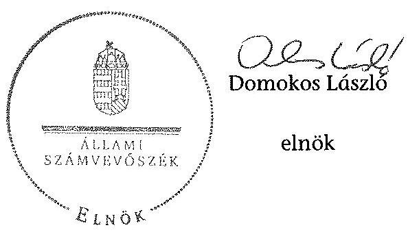

[^0]
[^0]:    ${ }^{21}$ Vhr. 9. § (3) bekezdés (hatályos 2010. december 31-ig), Vhr. 9. § (5) bekezdés (hatályos 2011. január 1-től)

---

.

---

# RÖVIDÍTÉSEK JEGYZÉKE 

## Jogszabályok

Alaptörvény
Áht. 1
Áht. 2
ÁSZ tv.
Avtv.
Evt. 1
Evt. 2

Gt.
Infotv.

Infotv.

Inytv.
Kisajátítási tv.
Nfatv.
Nvtv.

Számv. tv.
új Ptk.
Vadvédelmi. tv.
Vtv.
Vhr.

Magyarország Alaptörvénye (2011. április 25.) (hatályos: 2012. január 1-jétől)

Az államháztartásról szóló 1992. évi XXXVIII. törvény (hatálytalan: 2012. január 1-jétől)
Az államháztartásról szóló 2011. évi CXCV. törvény (hatályos: 2012. január 1-jétől)
Az Állami Számvevőszékről szóló 2011. évi LXVI. törvény (hatályos: 2011. július 1-jétől)
A személyes adatok védelméről és a közérdekű adatok nyilvánosságáról szóló 1992. évi LXIII. törvény
Az erdőről és az erdő védelméről szóló 1996. évi LIV. törvény (hatálytalan: 2009. július 10-től)
Az erdőről, az erdő védelméről és az erdőgazdálkodásról szóló 2009. évi XXXVII. törvény (hatályos: 2009. július 10-étől)
A gazdasági társaságokról szóló 2006. évi IV. törvény (hatálytalan: 2014. március 15-étől)
Az információs önrendelkezési jogról és az információszabadságról szóló 2011. évi CXII. törvény (hatályos: 2011. július 27-étől, kivéve a 1-37. §, a 38. § (1)-(3) bekezdése, a 38. § (4) bekezdés a)-f) pontja, a 38. § (5) bekezdése, a 39. §, a 41-68. §, a 70-72. §, a 75-77. § és a 79-88. §, valamint az 1. melléklet, ami 2012. január 1-jén lépett hatályba és a 38. § (4) bekezdés g) és h) pontja, valamint a 69. §, ami 2013. január 1-jén lépett hatályba)
Az ingatlan-nyilvántartásról szóló 1997. évi CXLI. törvény
A kisajátításról szóló 2007. évi CXXIII. törvény
A Nemzeti Földalapról szóló 2010. évi LXXXVII. törvény (hatályos: 2010. szeptember 1-jétől)
A nemzeti vagyonról szóló 2011. évi CXCVI. törvény (hatályos: 2011. december 31-étől, kivéve a 20. § (2) bekezdésben meghatározott paragrafusok, amelyek 2012. január 1-jétől, a (3) bekezdésben meghatározott paragrafusok 2013. január 1-jétől, a (4) bekezdésben meghatározott paragrafus 2012. március 2-ától léptek hatályba)
A számvitelről szóló 2000. évi C. törvény
A Polgári Törvénykönyvről szóló 2013. évi V. törvény (hatályos: 2014. március 15-étől)
A vad védelméről, a vadgazdálkodásról, valamint a vadászatról szóló 1996. évi LV. törvény.
Az állami vagyonról szóló 2007. évi CVI. törvény
Az állami vagyonnal való gazdálkodásról 254/2007. (X. 4.) Korm. rendelet

---

## Egyéb rövidítések

Alapító okirat ${ }_{1-14}$
ÁSZ
Belső ellenőrzési szabályzat ${ }_{1}$
Belső ellenőrzési szabályzat ${ }_{2}$
Erdészeti hatóság

FB
ha
Gemenc Zrt., Társaság
Értékelési szabályzat
VSZ

INTOSAI
Iratkezelési szabályzat
ISSAI
kezelt vagyon
KVI
Leltározási szabályzat
MFB Zrt.
MNV Zrt.

NFA

Számítástechnikai védelmi szabályzat
Számlarend ${ }_{1}$
Számlarend ${ }_{2}$

Gemenc Zrt. mindenkor hatályos alapító okirata
Állami Számvevőszék
Gemenc Zrt. Belső ellenőrzési szabályzata (hatályos: 2000. január 1-jétől)
Gemenc Zrt. Belső ellenőrzési szabályzata (hatályos: 2013. január 1-jétől)
Baranya Megyei Mezőgazdasági Szakigazgatási Hivatal Erdészeti Igazgatóság 2010. december 31-ig, Baranya Megyei Kormányhivatal Erdészeti Igazgatósága 2011. január 1-jétől
Gemenc Zrt. Felügyelő Bizottsága
hektár
Gemenci Erdő és Vadgazdaság Zártkörűen Működő Részvénytársaság
Gemenc Zrt. Értékelési Szabályzata (hatályos: 2001. január 1-jétől)
A Gemenci Erdő és Vadgazdaság Részvénytársaság 01840-96-02070. számon a Kincstári Vagyoni Igazgatósággal kötött ideiglenes vagyonkezelési szerződése (hatályos: 1996. október 21-étől)
Legfőbb Ellenőrző Intézmények Nemzetközi Szervezete
Gemenc Zrt. Iratkezelési Szabályzata (hatályos: 2003. augusztus 1-től)
nemzetközi standardok
Gemenc Zrt. vagyonkezelésében lévő állami vagyon
Kincstári Vagyonigazgatóság
Gemenc Zrt. Leltározási szabályzata (hatályos 1997. július 1-jétől)
Magyar Fejlesztési Bank Zártkörűen Működő Részvénytársaság
Magyar Nemzeti Vagyonkezelő Zrt., amely útján az állami vagyon felügyeletéért felelős miniszter 2010. augusztus 31-éig a Magyar Államot megillető tulajdonosi jogokat és kötelezettségeket gyakorolta, 2010. szeptember 1-jétől az a Magyar Államot megillető az Nfatv. hatálya alá nem tartozó tulajdonosi jogokat és kötelezettségeket gyakorolja
az Nfatv. szerinti Nemzeti Földalapkezelő Szervezet, amely útján az agrárpolitikáért felelős miniszter a Nemzet Földalap felett a Magyar Állam nevében a tulajdonosi jogokat és kötelezettségeket gyakorolja (2010. szeptember 1-jétől)
Gemenc Zrt. Számítástechnikai védelmi szabályzata (hatályos: 2000. április 3-ától)
Gemenc Zrt. Számlarendje (hatályos: 2009. január 1-jétől 2009. december 31-éig)
Gemenc Zrt. Számlarendje (hatályos: 2010. január 1-jétől)

---

| Számviteli Politika $_{1}$ | Gemenc Zrt. Számviteli politikája (hatályos: 2009. január 1-jétől 2010. december 31-éig) |
| :--: | :--: |
| Számviteli Politika $_{2}$ | Gemenc Zrt. Számviteli politikája (hatályos: 2011. január 1-jétől) |
| SZMSZ $_{1}$ | Gemenc Zrt. Szervezeti és Működési Szabályzata (hatályos: 1999. július 30-tól) |
| SZMSZ $_{2}$ | Gemenc Zrt. Szervezeti és Működési Szabályzata (hatályos: 2011. május 1-jétől) |
| SZMSZ $_{3}$ | Gemenc Zrt. Szervezeti és Működési Szabályzata (hatályos: 2011. augusztus 22-étől) |
| SZMSZ $_{4}$ | Gemenc Zrt. Szervezeti és Működési Szabályzata (hatályos: 2013. február 5-étől) |
| társaság feletti tulajdonosi joggyakorló ${ }_{1}$ | a társaságok állami tulajdonú részesedése feletti tulajdonosi jogokat gyakorló Magyar Nemzeti Vagyonkezelő Zrt. (2009. január 1-jétől 2010. június 16-áig) |
| társaság feletti tulajdonosi joggyakorló $_{2}$ | a társaságok állami tulajdonú részesedése feletti tulajdonosi jogokat gyakorló Magyar Fejlesztési Bank Zrt. (2010. június 17-étől 2014. július 15-éig) |
| Vadászati hatóság | Bács-Kiskun Megyei Mezőgazdasági Szakigazgatási Hivatal 2010. december 31-ig, Bács-Kiskun Megyei Kormányhivatal Földművelésügyi Igazgatósága 2011. január 1-jétől |

---

.

---

# FOGALOMTÁR 

állami vagyon
a) az állam tulajdonában lévő dolog, valamint dolog módjára hasznosítható természeti erő;
b) az a) pont hatálya alá tartozó mindazon vagyon, amely vonatkozásában törvény az állam kizárólagos tulajdonjogát nevesíti;
c) az állam tulajdonában lévő tagsági jogviszonyt megtestesítő értékpapír, illetve az államot megillető egyéb társasági részesedés;
d) az államot megillető olyan immateriális, vagyoni értékkel rendelkező jogosultság, amelyet jogszabály vagyoni értékű jogként nevesít;
e) az állam tulajdonában lévő pénzügyi eszközök.
állami vagyon
használója
állami szervezet
földbirtok-politikai irányelvek
hasznosítás
immateriális szolgáltatásából származó bevétel
információs és kommunikációs rendszer
kockázatkezelés

Állami vagyon:
a) az állam tulajdonában lévő dolog, valamint dolog módjára hasznosítható természeti erő;
b) az a) pont hatálya alá tartozó mindazon vagyon, amely vonatkozásában törvény az állam kizárólagos tulajdonjogát nevesíti;
c) az állam tulajdonában lévő tagsági jogviszonyt megtestesítő értékpapír, illetve az államot megillető egyéb társasági részesedés;
d) az államot megillető olyan immateriális, vagyoni értékkel rendelkező jogosultság, amelyet jogszabály vagyoni értékű jogként nevesít;
e) az állam tulajdonában lévő pénzügyi eszközök.

Az állami vagyon használója az a természetes vagy jogi személy, jogi személyiséggel nem rendelkező szervezet, aki, vagy amely törvény vagy szerződés alapján, bármely jogcímen (bérlet, haszonbérlet, használat stb.) állami vagyont birtokol, használ, szedi annak hasznait. (Ide nem értve a haszonélvezőt, a vagyonkezelőt és a tulajdonosi jogok gyakorlóját.)
Átlátható szervezet a Nvtv. 3. § (1) bekezdés 1. pontjában felsorolt, a meghatározott követelményeknek megfelelő szervezet.
Az Nfatv. 15. § (3) bekezdés a)-s) pontjaiban meghatározott, a Nemzeti Földalapba tartozó földrészletek hasznosítására vonatkozó irányelvek.
Hasznosítás a tulajdonosi joggyakorló vagy a nemzeti vagyon használója által a nemzeti vagyon birtoklásának, használatának, hasznok szedése jogának bármely - a tulajdonjog átruházását nem eredményező - jogcímen történő átengedése, ide nem értve a vagyonkezelésbe adást, valamint a haszonélvezeti jog alapítását.
Immateriális szolgáltatásból származó bevételek azok a nem anyagjellegű szolgáltatásokból származó állami bevételek, amelyeket az Evt. 3. § (1) bekezdése szerint, a külön jogszabályban meghatározott részletes feltételek szerint, az erdők fenntartására, gyarapítására és védelmére kell fordítani.
Az információs és kommunikációs rendszer biztosítja, hogy az információk eljussanak az illetékes szervezethez, szervezeti egységhez, illetve személyhez.
A kockázatkezelés a szervezet céljai elérésével kapcsolatos kockázatok azonosításának és elemzésének, valamint a megfelelő válaszok meghatározásának folyamata.

---

kockázatkezelési rendszer
kockázatkezelési rendszer működtetése során fel kell mérni és meg kell állapítani a szervezet tevékenységében, gazdálkodásában rejlő kockázatokat, valamint meg kell határozni az egyes kockázatokkal kapcsolatban szükséges intézkedéseket, valamint azok teljesítésének folyamatos nyomon követésének módját.
A kockázatkezelési rendszer olyan irányítási eszközök és módszerek összessége, amelynek elemei a szervezeti célok elérését veszélyeztető tényezők (kockázatok) azonosítása, elemzése, nyomon követése, valamint szükség esetén a kockázati kitettség mérséklése.
kontrolling Az a vezetéstámogató rendszer, amely a vezetői tervezést, ellenőrzést, valamint információ-ellátást koordinálja célorientáltan a környezeti változásokhoz igazodva.
kontrollkörnyezet A kontroll környezet elemei: a szervezeti struktúra, a felelősségi, hatásköri viszonyok és feladatok, a szervezet minden szintjén meghatározott etikai elvárások, a humánerőforráskezelés. A kontrollkörnyezet alapozza meg a belső kontroll összes többi elemét a fegyelem és a struktúra biztosítása által.
kontrollrendszer A kontrollrendszer a kockázatok kezelése és tárgyilagos bizonyosság megszerzése érdekében kialakított folyamatrendszer, amely azt a célt szolgálja, hogy megvalósuljanak a következő célok:
a) a működés és a gazdálkodás során a tevékenységeket szabályszerűen, gazdaságosan, hatékonyan, eredményesen

 hajtsák végre,
b) az elszámolási kötelezettségeket teljesítsék, és
c) megvédjék az erőforrásokat a veszteségektől, károktól és nem rendeltetésszerű használattól.
kontrolltevékenységek
közfeladat

A kontrolltevékenységek azok az elvek (politikák) és eljárások, amelyeket a kockázatok meghatározása és a szervezet céljainak elérése érdekében alakítanak ki.
A közfeladat jogszabályban meghatározott állami vagy önkormányzati feladat, amit az arra kötelezett közérdekből, jogszabályban meghatározott követelményeknek és feltételeknek megfelelve végez, ideértve a lakosság közszolgáltatásokkal való ellátását, továbbá az állam nemzetközi szerződésekben vállalt kötelezettségeiből adódó közérdekű feladatokat, valamint e feladatok ellátásához szükséges infrastruktúra biztosítását is.
Az Evt. 2. § (2) bekezdése szerint a fenntartható erdőgazdálkodás során a legfontosabb közérdekű feladat az erdők változatosságának megőrzése, az erdők fenntartása, felújítása és a védelmi, valamint közjóléti szolgáltatások biztosítása, melyek elvégzését az állam megfelelő eszközökkel biztosítja.

---

monitoring

Nemzeti Földalap
nemzeti vagyon használója
rábízott állami vagyon
társasági portfólió
tulajdonosi ellenőrzés
tulajdonosi joggyakorló

A szervezet tevékenységének, a célok megvalósításának nyomon követését biztosító rendszer, amely az operatív tevékenységek keretében megvalósuló folyamatos és eseti nyomon követésből, valamint az operatív tevékenységektől függetlenül működő belső ellenőrzésből áll.
A monitoring a projektek és programok végrehajtásának nyomon követése, mely a támogató és a kedvezményezett közti megállapodásban foglalt eljárások követését, az előrehaladás ellenőrzését és a lehetséges problémák időben történő azonosítását szolgálja.
A Nemzeti Földalap a kincstári vagyon része, amelybe beletartoznak az állam tulajdonában és az ingatlan-nyilvántartásban levő, az Nfatv. 1. § (1)-(2) bekezdéseiben felsorolt területek, földrészletek és az azokhoz kapcsolódó vagyoni értékű jogok.
A nemzeti vagyon használója az a természetes személy, jogi személy vagy jogi személyiséggel nem rendelkező szervezet, aki, vagy amely állami vagyon tekintetében törvény vagy szerződés alapján, a helyi önkormányzat vagyona tekintetében törvény, a helyi önkormányzat rendelete vagy szerződés alapján bármely jogcímen nemzeti vagyont birtokol, használ, szedi annak hasznait, kivéve a tulajdonosi joggyakorló (az Nvtv. 3. § (1) bekezdés 11. pontja alapján).
Rábízott állami vagyon az a Vtv. alkalmazásában állami vagyonnak minősülő vagyon, amit az MNV - a saját vagyonától elkülönítetten - kezel és nyilvántart.
Az Mfbtv. 3. § (9) bekezdése szerint rábízott állami vagyon az a vagyon, amely felett az Mfbtv. erejénél fogva a Magyar Állam nevében az MFB gyakorolja a tulajdonosi jogokat.
Az Nfatv. 1. § (1) bekezdésében foglaltak alapján az NFA-hoz tartozó rábízott vagyon a törvényben meghatározott, a Nemzeti Földalapba tartozó vagyon.
Társasági portfólió az MNV, illetve az MFB rábízott vagyonába tartozó állami tulajdonú társasági részesedések.
A tulajdonosi joggyakorló által végzett ellenőrzés, amelynek célja az állami vagyonnal való gazdálkodás vizsgálata, ennek keretében a rendeltetésellenes, jogszerűtlen, szerződésellenes, vagy a tulajdonos érdekeit sértő, illetve a központi költségvetést hátrányosan érintő vagyongazdálkodási intézkedések feltárása és a jogszerű állapot helyreállítása, továbbá a vagyonnyilvántartás hitelességének, teljességének és helyességének biztosítása.
Tulajdonosi joggyakorló az, aki az állami, illetve a nemzeti vagyon felett az államot megillető tulajdonosi jogok és kötelezettségek gyakorlására jogosult.

---

tulajdonosi joggyakorlás módja
vagyongazdálkodás feladata
vagyonkezelői jog

Az állami vagyon felett a Magyar Államot megillető tulajdonosi jogoknak (és kötelezettségeknek) az összességét az állami vagyon felügyeletéért felelős miniszter gyakorolja, aki e feladatát az MNV, az MFB, illetve egyéb tulajdonosi joggyakorló szervezet (pl. központi költségvetési szervek, 100%-ban állami tulajdonban álló gazdasági társaságok) útján látja el. Azon állami tulajdonban álló ingatlanok felett, amelyek egy része a Nemzeti Földalapba tartozik, a tulajdonosi jogokat a miniszter az agrárpolitikáért felelős miniszterrel közösen gyakorolja.
A Nemzeti Földalap felett a Magyar Állam nevében a tulajdonosi jogokat és kötelezettségeket az agrárpolitikáért felelős miniszter a Nemzeti Földalapkezelő Szervezet útján gyakorolja.
Az állami vagyon rendeltetésének megfelelő - az állami feladatok ellátásához, a társadalmi szükségletek kielégítéséhez, valamint a Kormány gazdaságpolitikája megvalósításának elősegítéséhez szükséges, egységes elveken alapuló, önálló ágazatként megjelenő - hatékony, költségtakarékos, értékmegőrző, értéknövelő felhasználásának biztosítása, beleértve a vagyoni kör változását eredményező értékesítést, valamint az állami vagyon gyarapítása is.
Vagyonkezelési szerződés alapján a vagyonkezelő jogosult meghatározott, állami tulajdonba tartozó dolog birtoklására, használatára és hasznai szedésére.
A Vtv. alapján a vagyonkezelői jog az állami vagyon hasznosítására az MNV-vel kötött vagyonkezelési szerződéssel jön létre. A vagyonkezelési szerződés alapján a vagyonkezelő jogosult meghatározott, állami tulajdonba tartozó dolog birtoklására, használatára és hasznai szedésére.
Az Nfatv. alapján a vagyonkezelői jog az erre irányuló (NFA-val kötött) szerződéssel jön létre. A vagyonkezelői szerződés alapján a vagyonkezelő jogosult meghatározott földrészlet birtoklására, használatára és hasznai szedésére. A vagyonkezelő köteles a földrészlet értékét megőrizni, állagának megóvásáról, jó karban tartásáról gondoskodni, továbbá - az Nfatv.-ben meghatározott esetek kivételével - díjat fizetni vagy a szerződésben előírt más kötelezettséget teljesíteni.

---

### A Gemenc Zrt. vagyonának alakulása a 2009-2014. I. félév közötti időszakban

|  Sorszám | Megnevezés | 2009.01.01 | 2009.12.31 | 2010.12.31 | 2011.12.31 | 2012.12.31 | 2013.12.31 | 2014.06.30 | Változás 2013.12.31/2009.12.31, (%)  |
|---|---|---|---|---|---|---|---|---|---|
|  1. Eszközök |  |  |  |  |  |  |  |  |   |
|  2. Befektetett eszközök összesen |  | 2 574 386 | 2 495 667 | 2 512 546 | 2 544 230 | 2 556 840 | 2 690 071 | 2 815 451 | 100%  |
|  3. Előzőből: Immateriális javak |  | 15 317 | 41 234 | 38 505 | 31 486 | 30 473 | 63 999 | 56 057 | 155%  |
|  4. Tárgyi eszközök |  | 2 510 325 | 2 409 174 | 2 428 177 | 2 473 166 | 2 490 462 | 2 578 371 | 2 705 890 | 107%  |
|  5. Befektetett pénzügyi eszközök |  | 48 744 | 45 259 | 45 864 | 39 578 | 35 905 | 47 701 | 53 504 | 103%  |
|  6. Forgóeszközök |  | 879 988 | 843 655 | 741 697 | 757 075 | 805 717 | 1 203 029 | 1 046 599 | 143%  |
|  7. Előzőből: Készletek |  | 231 774 | 199 497 | 219 117 | 217 147 | 235 526 | 229 792 | 243 135 | 115%  |
|  8. Követelések |  | 378 671 | 428 131 | 385 429 | 386 082 | 503 160 | 669 068 | 405 277 | 156%  |
|  9. Értékpapírok |  | 93 100 | 0 | 0 | 0 | 0 | 0 | 0 | 0  |
|  10. Pénzeszközök |  | 176 443 | 216 027 | 137 151 | 153 846 | 67 031 | 304 169 | 398 187 | 141%  |
|  11. Aktív időbeli elhatárolások |  | 8 811 | 1 701 | 2 011 | 2 299 | 3 036 | 3 295 | 4 395 | 194%  |
|  12. Eszközök összesen |  | 3 463 185 | 3 341 023 | 3 256 254 | 3 303 604 | 3 365 593 | 3 896 395 | 3 866 445 | 117%  |
|  13. Források |  |  |  |  |  |  |  |  |   |
|  14. Saját tőke |  | 2 403 539 | 2 492 470 | 2 509 512 | 2 539 987 | 2 577 950 | 2 589 223 | 2 605 392 | 104%  |
|  15. Előzőből: Jegyzett tőke |  | 1 222 370 | 1 307 060 | 1 307 060 | 1 307 060 | 1 307 060 | 1 307 060 | 1 307 060 | 100%  |
|  16. Tőketartalék |  | 786 168 | 784 520 | 783 675 | 783 675 | 783 675 | 783 675 | 783 675 | 100%  |
|  17. Eredménytartalék |  | 314 463 | 371 494 | 375 735 | 418 777 | 449 252 | 487 215 | 498 488 | 131%  |
|  18. Lekötött tartalék |  | 23 507 | 25 155 | 26 000 | 0 | 0 | 0 | 0 | 0%  |
|  19. Értékelés előtti tartalék |  |  |  | 0 | 0 | 0 | 0 | 0 | 0  |
|  20. Mérleg szerinti eredmény |  | 57 031 | 4 241 | 17 042 | 30 475 | 37 963 | 11 273 | 16 169 | 266%  |
|  21. Céltartalékok |  |  | 0 | 0 | 0 | 0 | 0 | 0 | 0  |
|  22. Kötelezettségek |  | 558 604 | 348 990 | 272 785 | 326 820 | 369 703 | 717 785 | 666 705 | 206%  |
|  23. Előzőből: Hátrasorolt kötelezettségek |  |  |  | 0 | 0 | 0 | 0 | 0 | 0  |
|  24. Hosszú lejáratú kötelezettségek |  |  |  |  | 0 | 0 | 0 | 0 | 0  |
|  25. Rövid lejáratú kötelezettségek |  | 558 604 | 348 990 | 272 785 | 326 820 | 369 703 | 717 705 | 666 705 | 206%  |
|  26. Passzív időbeli elhatárolások |  | 501 042 | 499 563 | 473 957 | 436 797 | 417 940 | 589 470 | 594 348 | 118%  |
|  27. Források összesen |  | 3 463 185 | 3 341 023 | 3 256 254 | 3 303 604 | 3 365 593 | 3 896 395 | 3 866 445 | 117%  |

---

A Gemenc Zrt. immateriális javainak és tárgyi eszközállományának megoszlása a 2013. évre vonatkozóan adatok ezer Ft-ban

|  Sorszám | Megnevezés | Immateriális javak | Ingatlanok | Műszaki berendezések | Egyéb |
 berendezések | Beruházás a beruházásra adott előleggel együtt | Tárgyi eszközök összesen  |
| --- | --- | --- | --- | --- | --- | --- | --- |
|   | 1. | 2. | 3. | 4. | 5. | 6. | 7.  |
|  1. | Bruttó érték január 1-jén | 75192 | 2817354 | 384306 | 587575 | 30343 | 3819578  |
|  2. | -ebből: állami vagyon |  |  |  |  |  | 0  |
|  3. | -ebből: saját vagyon | 75192 | 2817354 | 384306 | 587575 | 30343 | 3819578  |
|  4. | Növekedés (+) | 47797 | 216914 | 9404 | 41641 | 378564 | 646523  |
|  5. | -ebből: állami vagyon |  |  |  |  |  | 0  |
|  6. | -ebből: saját vagyon | 47797 | 216914 | 9404 | 41641 | 378564 | 646523  |
|  7. | Csökkenés (-) | -2708 | -84281 | -15311 | -26219 | -303693 | -429504  |
|  8. | -ebből: állami vagyon |  |  |  |  |  | 0  |
|  9. | -ebből: saját vagyon | -2708 | -84281 | -15311 | -26219 | -303693 | -429504  |
|  10. | Bruttó érték december 31-én | 120281 | 2949987 | 378399 | 602997 | 105214 | 4036597  |
|  11. | -ebből: állami vagyon | 0 | 0 | 0 | 0 | 0 | 0  |
|  12. | -ebből: saját vagyon | 120281 | 2949987 | 378399 | 602997 | 105214 | 4036597  |
|  13. | Halmozott értékcsökkenés január 1-jén | 44719 | 555357 | 325779 | 447980 |  | 1329116  |
|  14. | -ebből: állami vagyon |  |  |  |  |  | 0  |
|  15. | -ebből: saját vagyon | 44719 | 555357 | 325779 | 447980 |  | 1329116  |
|  16. | Értékcsökkenés növekedése (+) (költségként elszámolt) | 14271 | 107434 | 19306 | 54633 | 0 | 181373  |
|  17. | -ebből: állami vagyon |  |  |  |  |  | 0  |
|  18. | -ebből: saját vagyon | 14271 | 107434 | 19306 | 54633 |  | 181373  |
|  22. | Értékcsökkenés egyéb ráfordításként elszámolva (z) | -2708 | -19200 | -11435 | -21628 | 0 | -52263  |
|  23. | -ebből: állami vagyon |  |  |  |  |  | 0  |
|  24. | -ebből: saját vagyon | -2708 | -19200 | -11435 | -21628 |  | -52263  |
|  25. | Egyéb változás az értékcsökkenésben (z) | 0 |  |  |  |  | 0  |
|  26. | -ebből: állami vagyon |  |  |  |  |  | 0  |
|  27. | -ebből: saját vagyon | 0 |  |  |  |  | 0  |
|  28. | Halmozott értékcsökkenés december 31-én: | 56282 | 643591 | 333650 | 480985 | 0 | 1458226  |
|  29. | -ebből: állami vagyon | 0 | 0 | 0 | 0 | 0 | 0  |
|  30. | -ebből: saját vagyon | 56282 | 643591 | 333650 | 480985 | 0 | 1458226  |
|  31. | Nettó érték december 31-én: | 63999 | 2306396 | 44749 | 122012 | 105214 | 2578371  |
|  32. | -ebből: állami vagyon | 0 | 0 | 0 | 0 | 0 | 0  |
|  33. | -ebből:saját vagyon | 63999 | 2306396 | 44749 | 122012 | 105214 | 2578371  |

---

5. SZÁMÚ MELLÉKLET A V-0753-114/2015. SZÁMÚ JELENTÉSHEZ

A Gensner Zrt. nyilatkozatát oszloposan állítjuk számadásunk adatainak a 2009-2016. 1. (tűzvédelmi) időszakra vonatkozó*

|  SZÁMÚ
MELLÉKLET |  |  |  |  |  |  |  |  |  |  |  |  |  |  |  |  |  |  |  |  |  |  |  |  |  |  |  |  |  |  |   |
| --- | --- | --- | --- | --- | --- | --- | --- | --- | --- | --- | --- | --- | --- | --- | --- | --- | --- | --- | --- | --- | --- | --- | --- | --- | --- | --- | --- | --- | --- | --- | --- |
|  SZÁMÚ
MELLÉKLET |  |  |  |  |  |  |  |  |  |  |  |  |  |  |  |  |  |  |  |  |  |  |  |  |  |  |  |  |  |  |   |
|  SZÁMÚ
MELLÉKLET |  |  |  |  |  |  |  |  |  |  |  |  |  |  |  |  |  |  |  |  |  |  |  |  |  |  |  |  |  |  |   |
|  1. |  |  |  |  |  |  |  |  |  |  |  |  |  |  |  |  |  |  |  |  |  |  |  |  |  |  |  |  |  |  |   |
|  2. |  |  |  |  |  |  |  |  |  |  |  |  |  |  |  |  |  |  |  |  |  |  |  |  |  |  |  |  |  |  |   |
|  3. |  |  |  |  |  |  |  |  |  |  |  |  |  |  |  |  |  |  |  |  |  |  |  |  |  |  |  |  |  |  |   |
|  4. |  |  |  |  |  |  |  |  |  |  |  |  |  |  |  |  |  |  |  |  |  |  |  |  |  |  |  |  |  |  |   |
|  5. |  |  |  |  |  |  |  |  |  |  |  |  |  |  |  |  |  |  |  |  |  |  |  |  |  |  |  |  |  |  |   |
|  6. |  |  |  |  |  |  |  |  |  |  |  |  |  |  |  |  |  |  |  |  |  |  |  |  |  |  |  |  |  |  |   |
|  7. |  |  |  |  |  |  |  |  |  |  |  |  |  |  |  |  |  |  |  |  |  |  |  |  |  |  |  |  |  |  |   |
|  8. |  |  |  |  |  |  |  |  |  |  |  |  |  |  |  |  |  |  |  |  |  |  |  |  |  |  |  |  |  |  |   |
|  9. |  |  |  |  |  |  |  |  |  |  |  |  |  |  |  |  |  |  |  |  |  |  |  |  |  |  |  |  |  |  |   |
|  10. |  |  |  |  |  |  |  |  |  |  |  |  |  |  |  |  |  |  |  |  |  |  |  |  |  |  |  |  |  |  |   |
|  11. | 

 |  |  |  |  |  |  |  |  |  |  |  |  |  |  |  |  |  |  |  |  |  |  |  |  |  |  |  |  |  |  |  |   |
|  12. |  |  |  |  |  |  |  |  |  |  |  |  |  |  |  |  |  |  |  |  |  |  |  |  |  |  |  |  |  |  |   |
|  13. |  |  |  |  |  |  |  |  |  |  |  |  |  |  |  |  |  |  |  |  |  |  |  |  |  |  |  |  |  |  |   |
|  14. |  |  |  |  |  |  |  |  |  |  |  |  |  |  |  |  |  |  |  |  |  |  |  |  |  |  |  |  |  |  |   |
|  15. |  |  |  |  |  |  |  |  |  |  |  |  |  |  |  |  |  |  |  |  |  |  |  |  |  |  |  |  |  |  |   |
|  16. |  |  |  |  |  |  |  |  |  |  |  |  |  |  |  |  |  |  |  |  |  |  |  |  |  |  |  |  |  |  |   |
|  17. |  |  |  |  |  |  |  |  |  |  |  |  |  |  |  |  |  |  |  |  |  |  |  |  |  |  |  |  |  |  |   |
|  18. |  |  |  |  |  |  |  |  |  |  |  |  |  |  |  |  |  |  |  |  |  |  |  |  |  |  |  |  |  |  |   |
|  19. |  |  |  |  |  |  |  |  |  |  |  |  |  |  |  |  |  |  |  |  |  |  |  |  |  |  |  |  |  |  |   |
|  20. |  |  |  |  |  |  |  |  |  |  |  |  |  |  |  |  |  |  |  |  |  |  |  |  |  |  |  |  |  |  |   |
|  21. |  |  |  |  |  |  |  |  |  |  |  |  |  |  |  |  |  |  |  |  |  |  |  |  |  |  |  |  |  |  |   |
|  22. |  |  |  |  |  |  |  |  |  |  |  |  |  |  |  |  |  |  |  |  |  |  |  |  |  |  |  |  |  |  |   |
|  23. |  |  |  |  |  |  |  |  |  |  |  |  |  |  |  |  |  |  |  |  |  |  |  |  |  |  |  |  |  |  |   |
|  24. |  |  |  |  |  |  |  |  |  |  |  |  |  |  |  |  |  |  |  |  |  |  |  |  |  |  |  |  |  |  |   |
|  25. |  |  |  |  |  |  |  |  |  |  |  |  |  |  |  |  |  |  |  |  |  |  |  |  |  |  |  |  |  |  |   |
|  26. |  |  |  |  |  |  |  |  |  |  |  |  |  |  |  |  |  |  |  |  |  |  |  |  |  |  |  |  |  |  |   |
|  27. |  |  |  |  |  |  |  |  |  |  |  |  |  |  |  |  |  |  |  |  |  |  |  |  |  |  |  |  |  |  |   |
|  28. |  |  |  |  |  |  |  |  |  |  |  |  |  |  |  |  |  |  |  |  |  |  |  |  |  |  |  |  |  |  |   |
|  29. |  |  |  |  |  |  |  |  |  |  |  |  |  |  |  |  |  |  |  |  |  |  |  |  |  |  |  |  |  |  |   |
|  30. |  |  |  |  |  |  |  |  |  |  |  |  |  |  |  |  |  |  |  |  |  |  |  |  |  |  |  |  |  |  |   |
|  31. |  |  |  |  |  |  |  |  |  |  |  |  |  |  |  |  |  |  |  |  |  |  |  |  |  |  |  |  |  |  |   |
|  32. |  |  |  |  |  |  |  |  |  |  |  |  |  |  |  |  |  |  |  |  |  |  |  |  |  |  |  |  |  |  |   |
|  33. |  |  |  |  |  |  |  |  |  |  |  |  |  |  |  |  |  |  |  |  |  |  |  |  |  |  |  |  |  |  |   |
|  34. |  |  |  |  |  |  |  |  |  |  |  |  |  |  |  |  |  |  |  |  |  |  |  |  |  |  |  |  |  |  |   |
|  35. |  |  |  |  |  |  |  |  |  |  |  |  |  |  |  |  |  |  |  |  |  |  |  |  |  |  |  |  |  |  |   |

 |  |  |  |  |  |  |  |  |  |  |  |  |  |  |  |  |  |  |  |  |  |   |
|  36. |  |  |  |  |  |  |  |  |  |  |  |  |  |  |  |  |  |  |  |  |  |  |  |  |  |  |  |  |  |  |   |
|  37. |  |  |  |  |  |  |  |  |  |  |  |  |  |  |  |  |  |  |  |  |  |  |  |  |  |  |  |  |  |  |   |
|  38. |  |  |  |  |  |  |  |  |  |  |  |  |  |  |  |  |  |  |  |  |  |  |  |  |  |  |  |  |  |  |   |
|  39. |  |  |  |  |  |  |  |  |  |  |  |  |  |  |  |  |  |  |  |  |  |  |  |  |  |  |  |  |  |  |   |
|  40. |  |  |  |  |  |  |  |  |  |  |  |  |  |  |  |  |  |  |  |  |  |  |  |  |  |  |  |  |  |  |   |
|  41. |  |  |  |  |  |  |  |  |  |  |  |  |  |  |  |  |  |  |  |  |  |  |  |  |  |  |  |  |  |  |   |
|  42. |  |  |  |  |  |  |  |  |  |  |  |  |  |  |  |  |  |  |  |  |  |  |  |  |  |  |  |  |  |  |   |
|  43. |  |  |  |  |  |  |  |  |  |  |  |  |  |  |  |  |  |  |  |  |  |  |  |  |  |  |  |  |  |  |   |
|  44. |  |  |  |  |  |  |  |  |  |  |  |  |  |  |  |  |  |  |  |  |  |  |  |  |  |  |  |  |  |  |   |
|  45. |  |  |  |  |  |  |  |  |  |  |  |  |  |  |  |  |  |  |  |  |  |  |  |  |  |  |  |  |  |  |   |
|  46. |  |  |  |  |  |  |  |  |  |  |  |  |  |  |  |  |  |  |  |  |  |  |  |  |  |  |  |  |  |  |   |
|  47. |  |  |  |  |  |  |  |  |  |  |  |  |  |  |  |  |  |  |  |  |  |  |  |  |  |  |  |  |  |  |   |
|  48. |  |  |  |  |  |  |  |  |  |  |  |  |  |  |  |  |  |  |  |  |  |  |  |  |  |  |  |  |  |  |   |
|  49. |  |  |  |  |  |  |  |  |  |  |  |  |  |  |  |  |  |  |  |  |  |  |  |  |  |  |  |  |  |  |   |
|  50. |  |  |  |  |  |  |  |  |  |  |  |  |  |  |  |  |  |  |  |  |  |  |  |  |  |  |  |  |  |  |   |
|  51. |  |  |  |  |  |  |  |  |  |  |  |  |  |  |  |  |  |  |  |  |  |  |  |  |  |  |  |  |  |  |   |
|  52. |  |  |  |  |  |  |  |  |  |  |  |  |  |  |  |  |  |  |  |  |  |  |  |  |  |  |  |  |  |  |   |
|  53. |  |  |  |  |  |  |  |  |  |  |  |  |  |  |  |  |  |  |  |  |  |  |  |  |  |  |  |  |  |  |   |
|  54. |  |  |  |  |  |  |  |  |  |  |  |  |  |  |  |  |  |  |  |  |  |  |  |  |  |  |  |  |  |  |   |
|  55. |  |  |  |  |  |  |  |  |  |  |  |  |  |  |  |  |  |  |  |  |  |  |  |  |  |  |  |  |  |  |   |
|  56. |  |  |  |  |  |  |  |  |  |  |  |  |  |  |  |  |  |  |  |  |  |  |  |  |  |  |  |  |  |  |   |
|  57. |  |  |  |  |  |  |  |  |  |  |  |  |  |  |  |  |  |  |  |  |  |  |  |  |  |  |  |  |  |  |   |
|  58. |  |  |  |  |  |  |  |  |  |  |  |  |  |  |  |  |  |  |  |  |  |  |  |  |  |  |  |  |  |  |   |
|  59. |  |  |  |  |  |  |  |  |  |  |  |  |  |  |  |  |

 |  |  |  |  |  |  |  |  |  |  |  |  |  |   |
|  60. |  |  |  |  |  |  |  |  |  |  |  |  |  |  |  |  |  |  |  |  |  |  |  |  |  |  |  |  |  |  |   |
|  61. |  |  |  |  |  |  |  |  |  |  |  |  |  |  |  |  |  |  |  |  |  |  |  |  |  |  |  |  |  |  |   |
|  62. |  |  |  |  |  |  |  |  |  |  |  |  |  |  |  |  |  |  |  |  |  |  |  |  |  |  |  |  |  |  |   |
|  63. |  |  |  |  |  |  |  |  |  |  |  |  |  |  |  |  |  |  |  |  |  |  |  |  |  |  |  |  |  |  |   |
|  64. |  |  |  |  |  |  |  |  |  |  |  |  |  |  |  |  |  |  |  |  |  |  |  |  |  |  |  |  |  |  |   |
|  65. |  |  |  |  |  |  |  |  |  |  |  |  |  |  |  |  |  |  |  |  |  |  |  |  |  |  |  |  |  |  |   |
|  66. |  |  |  |  |  |  |  |  |  |  |  |  |  |  |  |  |  |  |  |  |  |  |  |  |  |  |  |  |  |  |   |
|  67. |  |  |  |  |  |  |  |  |  |  |  |  |  |  |  |  |  |  |  |  |  |  |  |  |  |  |  |  |  |  |   |
|  68. |  |  |  |  |  |  |  |  |  |  |  |  |  |  |  |  |  |  |  |  |  |  |  |  |  |  |  |  |  |  |   |
|  69. |  |  |  |  |  |  |  |  |  |  |  |  |  |  |  |  |  |  |  |  |  |  |  |  |  |  |  |  |  |  |   |
|  70. |  |  |  |  |  |  |  |  |  |  |  |  |  |  |  |  |  |  |  |  |  |  |  |  |  |  |  |  |  |  |   |
|  71. |  |  |  |  |  |  |  |  |  |  |  |  |  |  |  |  |  |  |  |  |  |  |  |  |  |  |  |  |  |  |   |
|  72. |  |  |  |  |  |  |  |  |  |  |  |  |  |  |  |  |  |  |  |  |  |  |  |  |  |  |  |  |  |  |   |
|  73. |  |  |  |  |  |  |  |  |  |  |  |  |  |  |  |  |  |  |  |  |  |  |  |  |  |  |  |  |  |  |   |
|  74. |  |  |  |  |  |  |  |  |  |  |  |  |  |  |  |  |  |  |  |  |  |  |  |  |  |  |  |  |  |  |   |
|  75. |  |  |  |  |  |  |  |  |  |  |  |  |  |  |  |  |  |  |  |  |  |  |  |  |  |  |  |  |  |  |   |
|  76. |  |  |  |  |  |  |  |  |  |  |  |  |  |  |  |  |  |  |  |  |  |  |  |  |  |  |  |  |  |  |   |
|  77. |  |  |  |  |  |  |  |  |  |  |  |  |  |  |  |  |  |  |  |  |  |  |  |  |  |  |  |  |  |  |   |
|  78. |  |  |  |  |  |  |  |  |  |  |  |  |  |  |  |  |  |  |  |  |  |  |  |  |  |  |  |  |  |  |   |
|  79. |  |  |  |  |  |  |  |  |  |  |  |  |  |  |  |  |  |  |  |  |  |  |  |  |  |  |  |  |  |  |   |
|  80. |  |  |  |  |  |  |  |  |  |  |  |  |  |  |  |  |  |  |  |  |  |  |  |  |  |  |  |  |  |  |   |
|  81. |  |  |  |  |  |  |  |  |  |  |  |  |  |  |  |  |  |  |  |  |  |  |  |  |  |  |  |  |  |  |   |
|  82. |  |  |  |  |  |  |  |  |  |  |  |  |  |  |  |  |  |  |  |  |  |  |  |  |  |  |  |  |  |  |   |
|  83. |  |  |  |  |  |  |  |  |  |  |  |  |  |  |  |  |  |  |  |  |  |  |  |  | 

 |  |  |  |  |  |   |
|  84. |  |  |  |  |  |  |  |  |  |  |  |  |  |  |  |  |  |  |  |  |  |  |  |  |  |  |  |  |  |  |   |
|  85. |  |  |  |  |  |  |  |  |  |  |  |  |  |  |  |  |  |  |  |  |  |  |  |  |  |  |  |  |  |  |   |
|  86. |  |  |  |  |  |  |  |  |  |  |  |  |  |  |  |  |  |  |  |  |  |  |  |  |  |  |  |  |  |  |   |
|  87. |  |  |  |  |  |  |  |  |  |  |  |  |  |  |  |  |  |  |  |  |  |  |  |  |  |  |  |  |  |  |   |
|  88. |  |  |  |  |  |  |  |  |  |  |  |  |  |  |  |  |  |  |  |  |  |  |  |  |  |  |  |  |  |  |   |
|  89. |  |  |  |  |  |  |  |  |  |  |  |  |  |  |  |  |  |  |  |  |  |  |  |  |  |  |  |  |  |  |   |
|  90. |  |  |  |  |  |  |  |  |  |  |  |  |  |  |  |  |  |  |  |  |  |  |  |  |  |  |  |  |  |  |   |
|  91. |  |  |  |  |  |  |  |  |  |  |  |  |  |  |  |  |  |  |  |  |  |  |  |  |  |  |  |  |  |  |   |
|  92. |  |  |  |  |  |  |  |  |  |  |  |  |  |  |  |  |  |  |  |  |  |  |  |  |  |  |  |  |  |  |   |
|  93. |  |  |  |  |  |  |  |  |  |  |  |  |  |  |  |  |  |  |  |  |  |  |  |  |  |  |  |  |  |  |   |
|  94. |  |  |  |  |  |  |  |  |  |  |  |  |  |  |  |  |  |  |  |  |  |  |  |  |  |  |  |  |  |  |   |
|  95. |  |  |  |  |  |  |  |  |  |  |  |  |  |  |  |  |  |  |  |  |  |  |  |  |  |  |  |  |  |  |   |
|  96. |  |  |  |  |  |  |  |  |  |  |  |  |  |  |  |  |  |  |  |  |  |  |  |  |  |  |  |  |  |  |  |   |
|  97. |  |  |  |  |  |  |  |  |  |  |  |  |  |  |  |  |  |  |  |  |  |  |  |  |  |  |  |  |  |  |  |   |
|  98. |  |  |  |  |  |  |  |  |  |  |  |  |  |  |  |  |  |  |  |  |  |  |  |  |  |  |  |  |  |  |  |   |
|  99. |  |  |  |  |  |  |  |  |  |  |  |  |  |  |  |  |  |  |  |  |  |  |  |  |  |  |  |  |  |  |  |   |
|  100. |  |  |  |  |  |  |  |  |  |  |  |  |  |  |  |  |  |  |  |  |  |  |  |  |  |  |  |  |  |  |  |   |
|  101. |  |  |  |  |  |  |  |  |  |  |  |  |  |  |  |  |  |  |  |  |  |  |  |  |  |  |  |  |  |  |  |   |
|  102. |  |  |  |  |  |  |  |  |  |  |  |  |  |  |  |  |  |  |  |  |  |  |  |  |  |  |  |  |  |  |  |   |
|  103. |  |  |  |  |  |  |  |  |  |  |  |  |  |  |  |  |  |  |  |  |  |  |  |  |  |  |  |  |  |  |  |   |
|  104. |  |  |  |  |  |  |  |  |  |  |  |  |  |  |  |  |  |  |  |  |  |  |  |  |  |  |  |  |  |  |  |   |
|  105. |  |  |  |  |  |  |  |  |  |  |  |  |  |  |  |  |  |  |  |  |  |  |  |  |  |  |  |  |  |  |  |   |
|  106. |  |  |  |  |  |  |  |  |  |  |  |  |  |  |  |  |  |  |  |  |  |  |  |  | 

 |  |  |  |  |  |  |  |  |  |  |  |  |  |   |
|  107. |  |  |  |  |  |  |  |  |  |  |  |  |  |  |  |  |  |  |  |  |  |  |  |  |  |  |  |  |  |  |  |  |  |  |  |  |  |  |   |
|  108. |  |  |  |  |  |  |  |  |  |  |  |  |  |  |  |  |  |  |  |  |  |  |  |  |  |  |  |  |  |  |  |  |  |  |  |  |  |  |   |
|  109. |  |  |  |  |  |  |  |  |  |  |  |  |  |  |  |  |  |  |  |  |  |  |  |  |  |  |  |  |  |  |  |  |  |  |  |  |  |  |   |
|  110. |  |  |  |  |  |  |  |  |  |  |  |  |  |  |  |  |  |  |  |  |  |  |  |  |  |  |  |  |  |  |  |  |  |  |  |  |  |  |   |
|  111. |  |  |  |  |  |  |  |  |  |  |  |  |  |  |  |  |  |  |  |  |  |  |  |  |  |  |  |  |  |  |  |  |  |  |  |  |  |  |   |
|  112. |  |  |  |  |  |  |  |  |  |  |  |  |  |  |  |  |  |  |  |  |  |  |  |  |  |  |  |  |  |  |  |  |  |  |  |  |  |  |   |
|  113. |  |  |  |  |  |  |  |  |  |  |  |  |  |  |  |  |  |  |  |  |  |  |  |  |  |  |  |  |  |  |  |  |  |  |  |  |  |  |   |
|  114. |  |  |  |  |  |  |  |  |  |  |  |  |  |  |  |  |  |  |  |  |  |  |  |  |  |  |  |  |  |  |  |  |  |  |  |  |  |  |   |
|  115. |  |  |  |  |  |  |  |  |  |  |  |  |  |  |  |  |  |  |  |  |  |  |  |  |  |  |  |  |  |  |  |  |  |  |  |  |  |  |   |
|  116. |  |  |  |  |  |  |  |  |  |  |  |  |  |  |  |  |  |  |  |  |  |  |  |  |  |  |  |  |  |  |  |  |  |  |  |  |  |  |   |
|  117. |  |  |  |  |  |  |  |  |  |  |  |  |  |  |  |  |  |  |  |  |  |  |  |  |  |  |  |  |  |  |  |  |  |  |  |  |  |  |   |
|  118. |  |  |  |  |  |  |  |  |  |  |  |  |  |  |  |  |  |  |  |  |  |  |  |  |  |  |  |  |  |  |  |  |  |  |  |  |  |  |   |
|  119. |  |  |  |  |  |  |  |  |  |  |  |  |  |  |  |  |  |  |  |  |  |  |  |  |  |  |  |  |  |  |  |  |  |  |  |  |  |  |   |
|  120. |  |  |  |  |  |  |  |  |  |  |  |  |  |  |  |  |  |  |  |  |  |  |  |  |  |  |  |  |  |  |  |  |  |  |  |  |  |  |   |
|  121. |  |  |  |  |  |  |  |  |  |  |  |  |  |  |  |  |  |  |  |  |  |  |  |  |  |  |  |  |  |  |  |  |  |  |  |  |  |  |   |
|  122. |  |  |  |  |  |  |  |  |  |  |  |  |  |  |  |  |  |  |  |  |  |  |  |  |  |  |  |  |  |  |  |  |  |  |  |  |  |  |   |
|  123. |  |  |  |  |  |  |  |  |  |  |  |  |  |  |  |  |  |  |  |  |  |  |  |  |  |  |  |  |  |  |  |  |  |  |  |  |  |  |   |

 |  |  |  |  |  |  |  |  |  |  |  |   |
|  124. |  |  |  |  |  |  |  |  |  |  |  |  |  |  |  |  |  |  |  |  |  |  |  |  |  |  |  |  |  |  |  |  |  |  |  |  |  |  |  |  |  |  |  |  |  |  |  |  |  |  |  |  |  |  |  |  |  |  |  |  |   |
|  125. |  |  |  |  |  |  |  |  |  |  |  |  |  |  |  |  |  |  |  |  |  |  |  |  |  |  |  |  |  |  |  |  |  |  |  |  |  |  |  |  |  |  |  |  |  |  |  |  |  |  |  |  |  |  |  |  |  |   |
|  126. |  |  |  |  |  |  |  |  |  |  |  |  |  |  |  |  |  |  |  |  |  |  |  |  |  |  |  |  |  |  |  |  |  |  |  |  |  |  |  |  |  |  |  |  |  |  |  |  |  |  |  |  |  |  |  |  |  |   |
|  127. |  |  |  |  |  |  |  |  |  |  |  |  |  |  |  |  |  |  |  |  |  |  |  |  |  |  |  |  |  |  |  |  |  |  |  |  |  |  |  |  |  |  |  |  |  |  |  |  |  |  |  |  |  |   |
|  128. |  |  |  |  |  |  |  |  |  |  |  |  |  |  |  |  |  |  |  |  |  |  |  |  |  |  |  |  |  |  |  |  |  |  |  |  |  |  |  |  |  |  |  |  |  |  |  |  |  |  |  |  |   |
|  129. |  |  |  |  |  |  |  |  |  |  |  |  |  |  |  |  |  |  |  |  |  |  |  |  |  |  |  |  |  |  |  |  |  |  |  |  |  |  |  |  |  |  |   |
|  130. |  |  |  |  |  |  |  |  |  |  |  |  |  |  |  |  |  |  |  |  |  |  |  |  |  |  |  |  |  |  |  |  |  |  |  |  |  |  |  |  |  |  |  |  |  |  |  |   |
|  131. |  |  |  |  |  |  |  |  |  |  |  |  |  |  |  |  |  |  |  |  |  |  |  |  |  |  |  |  |  |  |  |  |  |  |  |  |  |  |  |  |  |  |  |  |   |
|  132. |  |  |  |  |  |  |  |  |  |  |  |  |  |  |  |  |  |  |  |  |  |  |  |  |  |  |  |  |  |  |  |  |  |  |  |  |  |  |  |  |  |  |  |  |  |  |  |  |  |  |  |   |
|  133. |  |  |  |  |  |  |  |  |  |  |  |  |  |  |  |  |  |  |  |  |  |  |  |  |  |  |  |  |  |  |  |  |  |  |  |  |  |  |  |  |  |  |  |  |  |  |  |   |
|  134. |  |  |  |  |  |  |  |  |  |  |  |  |  |  |  |  |  |  |  |  |  |  |  |  |  |  |  |  |  |  |  |  |  |  |  |  |  |  |  |  |  |  |   |
|  135. |  |  |  |  |  |  |  |  |  |  |  |  |  |  |  |  |  |  |  |  |  |  |  |  |  |  |  |  |  |  |  |  |  |  |  |  |  |  |  |  |  |   |
|  136. |  |  |  |  |  |  |  |  |  |  |  |  |  |  |  |  |  |  |  |  |  |  |  |  |  |  |  |  |  |  |  |  |  |  |  |  |  |  |  |  |  |  |  |  |  |  |  |   |
|  137. |  |  |  |  |  |  |  |  |  |  |  |  |  |  |  |  |  |  |  |  |  |  |  |  |  |  |  |  |  |  |  |  |  |  |  |  |  |  |  |  |  |  |   |
|  138. |  |  |  |  |  |  |  |  |  |  |  |  |  |  |  |  |  |  |  |  |  |  |  |  |  |  |  |  |  |  |  |  |  |  |  |  |  |  |  |  |  | 

 |  |  |  |  |  |  |  |   |
|  139. |  |  |  |  |  |  |  |  |  |  |  |  |  |  |  |  |  |  |  |  |  |  |  |  |  |  |  |  |  |  |  |  |  |  |  |  |  |  |  |  |  |  |  |  |  |  |  |  |  |  |  |  |  |  |  |  |  |  |  |  |  |   |
|  140. |  |  |  |  |  |  |  |  |  |  |  |  |  |  |  |  |  |  |  |  |  |  |  |  |  |  |  |  |  |  |  |  |  |  |  |  |  |  |  |  |  |  |  |  |  |  |  |  |  |  |  |  |  |  |  |  |  |  |  |  |  |  |  |  |  |   |
|  141. |  |  |  |  |  |  |  |  |  |  |  |  |  |  |  |  |  |  |  |  |  |  |  |  |  |  |  |  |  |  |  |  |  |  |  |  |  |  |  |  |  |  |  |  |  |  |  |  |  |  |  |  |  |  |  |  |  |  |  |  |  |  |  |  |  |  |  |  |  |  |  |  |  |  |  |  |  |  |  |  |  |  |  |  |  |  |  |  |  |  |  |  |  |  |  |  |  |  |  |  |  

---

### A Gemenc Zrt. saját tőke változása a 2013. évre vonatkozóan

|  Sorszám | Megnevezés | Saját tőke | Jegyzett tőke | Jegyzett, de be nem fizetett tőke | Tőketartalék | Eredmény-
tartalék | Lekötött
tartalék | Értékelési
tartalék | Mérleg szerinti
eredmény  |
| --- | --- | --- | --- | --- | --- | --- | --- | --- | --- |
|   | 1. | 2. | 3. | 4. | 5. | 6. | 7. | 8. | 9.  |
|  1. | A saját tőke nyitóállománya az év elején | 2 577 950,0 | 1 307 060,0 |  | 783 675,0 | 449 252,0 |  |  | 37 963,0  |
|  2. | A saját tőke elemeinek egymás közötti mozgása |  |  |  |  |  |  |  |   |
|  3. | Gőző évi eredmény átvezetése eredménytartalékba |  |  |  |  | 37 963,0 |  |  | -37 963,0  |
|  4. | Jegyzett tőke emelés eredménytartalékból vagy
tőketartalékból |  |  |  |  |  |  |  |   |
|  5. | Átvezetés eredménytartalék és tőketartalék között |  |  |  |  |  |  |  |   |
|  6. | Átvezetés eredménytartalék és lekötött tartalék között |  |  |  |  |  |  |  |   |
|  7. | Átvezetés tőketartalék és lekötött tartalék között |  |  |  |  |  |  |  |   |
|  8. | Mérleg szerinti eredmény | 11 273,0 |  |  |  |  |  |  | 11 273,0  |
|  9. | Egyéb mozgások (osztalék stb.): |  |  |  |  |  |  |  |   |
|  10. | Összesen |  |  |  |  |  |  |  |   |
|  11. | A saját tőke változása |  |  |  |  |  |  |  |   |
|  12. | Jegyzett tőke emelés vagy csökkentés |  |  |  |  |  |  |  |   |
|  13. | Befizetés eredmény-, tőke- vagy lekötött tartalékba |  |  |  |  |  |  |  |   |
|  14. | Tőketartalék vagy eredménytartalék átadás |  |  |  |  |  |  |  |   |
|  15. | Tőketartalék vagy eredménytartalék átvétel |  |  |  |  |  |  |  |   |
|  16. | Egyéb jogcímek: |  |  |  |  |  |  |  |   |
|  17. | Összesen |  |  |  |  |  |  |  |   |
|  18. | Záróállomány az év végén | 2 589 223,0 | 1 307 060,0 |  | 783 675,0 | 487 215,0 |  |  | 11 273,0  |
|  19. | A saját tőke jegyzett tőke arány (%) |  |  |  | 198% |  |  |  |   |
|  20. | A saját tőke és az összes forrás aránya (%) |  |  |  | 66% |  |  |  |   |

---

A Gemenc Zrt. beruházásainak, felújításainak forrása a 2009-2014. I. félév közötti időszakban adatok ezer Ft-ban

|  Sorszám | Megnevezés | 2009. év | 2010. év | 2011. év | 2012. év | 2013. év | 2014.06.30 | Megjegyzés  |
| --- | --- | --- | --- | --- | --- | --- | --- | --- |
|   | 1. | 2. | 3. | 4. | 5. | 6. | 7. | 8.  |
|  1. | Amortizáció - állami vagyon után | 0,0 | 0,0 | 0,0 | 0,0 | 0,0 | 0,0 | Az állami, vagyonkezelő eszközök földszinteket  |
|  2. | Amortizáció - saját vagyon után | 209890,0 | 175948,0 | 207908,0 | 258132,0 | 252879,0 | 124061,0 |   |
|  3. | Amortizációs forrás (visszapótlási kötelezettség)** | 0,0 | 0,0 | 0,0 | 0,0 | 0,0 | 0,0 | Az állami, vagyonkezelő eszközök földszinteket  |
|  4. | Hazai/központi forrás | 36474,0 | 35297,0 | 23547,0 | 59303,0 | 102250,0 | 10728,0 |   |
|  5. | Pályázati forrás (EU-s) | 0,0 | 0,0 |  | 0,0 | 47750,0 | 97192,0 |   |
|  6. | Eszközeladás | 2518,0 | 2441,0 | 2593,0 | 3467,0 | 4249,0 | 0,0 |   |
|  7. | Egyéb forrás*** | 4241,0 | 17042,0 | 30475,0 | 37963,0 | 11273,0 | 16169,0 | Mérleg szerinti eredményt  |
|  8. | Források összesen | 253123 | 230728 | 264523 | 358865 | 418401 | 248150 |   |

[^0] [^0]: ** Amortizációs forrás: A kezelt állami vagyonon elszámolt terv szerinti és terven felüli értékcsökkenési leírás összegének megfelelő összegű beruházási, felújítási és karbantartási kötelezettség. *** A megjegyzés oszlopban meg kell nevezni a forrást.

---

.

---

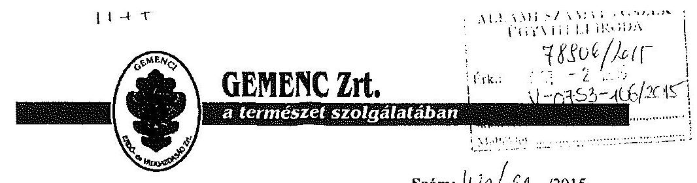

Szám: $16 / 2 \pi / 2015$.
Hiv.sz.: V-0753-095/2015
Tárgy: Jelentéstervezet
Mell.: -
Dátum: 2015. szeptember 30.

Állami Számvevőszék

# Domokos László 

## elnök

Budapest
Apáczai Csere János u. 10.
1052

Tisztelt Elnök Úr!
Az 1787 témaszámú, V070605 vizsgálat-azonosító számú ellenőrzés jelentéstervezetével kapcsolatosan az alábbi észrevételeket teszem:
> 4. oldal 3. bekezdés „Az ártéri területek alkotják a Duna-Dráva Nemzeti Park dunai szakaszát". A terület a DDNP illetékességi területe természetvédelmi szempontból. A teljes ártéri területen az erdőgazdálkodási, vadgazdálkodási, halászati feladatokat társaságunk gyakorolja. A DDNP a 10 éves Erdőterv részeként meghatározza a természetvédelmi kezelési tervet, de annak megvalósítása, gyakorlati végrehajtása is a Gemenc Zrt. feladata.
$>$ A társaság saját dolgozóinak átlaglétszáma 237. Emellett még foglalkoztattunk 2013-ban éves átlagban 232 fő közfoglalkoztatottat is.
> 6. oldal 2-3. bekezdés „A mérleg nem a valós állapotot tükrözte" A társaság eszközei és forrásai között szerepel nulla értékkel a vagyonkezelt vagyon az ideiglenes vagyonkezelési szerződésben rögzítetteknek megfelelően. Ha egy eszköznek nulla a bruttó értéke, nulla a nettó értéke is. Az analitikus nyilvántartást naprakészen vezeti a társaság (kb. 2500 tétel). Bár nem tünteti fel a bruttó és a nettó értéket. A Gemenc Zrt. minden év május 31-ig a vagyonkezelt föld és erdőterületekről megküldi a tételes leltárt az aktuális vagyonkezelésbe adónak (NFA, MNV Zrt.). Mivel a leltárral kapcsolatosan a vagyonkezelésbe adó kifogást nem emelt, azt elfogadottnak, egyezőnek tekintettük.

---

> 7. oldal

 2-4. bekezdés - A vagyonkezelési szerződés megkötésével, így módosításával kapcsolatos jogosítványok a társaság tulajdonosi joggyakorlóját illetik meg.
> 8. oldal 2. bekezdés - A könyvvizsgáló a rendelkezésre álló szerződések, ügyiratok szerint járt el. Az ideiglenes vagyonkezelési szerződés nulla értéket tartalmaz, ez szerepel az eszközök és források között.
> 8. oldal 7. bekezdés „... nem került közzétételre a közérdekű adatok ... intézésének rendje ..." A Gemenc Zrt. csak az aktuális társasági vagyon feletti tulajdonosi joggyakorlón keresztül adhat ki adatokat, a megkereséseket is oda továbbítjuk.

A Gemenc Zrt. Felügyelő Bizottsága 2010. november 16-i ülésén tárgyalta és 68/2010 (XI.16.) sz. határozatával jelezte a társaság tulajdonosi joggyakorlója felé a végleges vagyonkezelési szerződés megkötésének szükségességét.
2011-ben társaságunk képviselője is tagja volt a végleges vagyonkezelői szerződést előkészítő bizottságnak.
2014-ben véleményeztük az NFA által megküldött végleges vagyonkezelői szerződéstervezetet.
2014. április-június hónapokban az NFA „Vagyonkezelői szerződésekkel kapcsolatos feladatok ellátásának ellenőrzése - az állami tulajdonú erdőgazdaságok esetén" címmel ellenőrzést tartott (NFA Belső Ellenőrzési Osztály - NFA 008242/011/2015. számon).
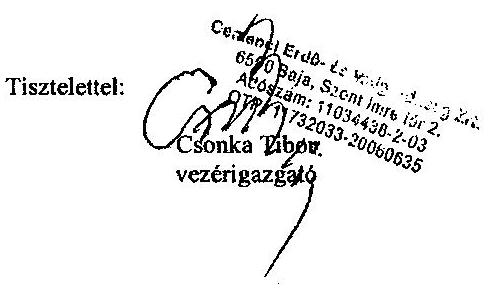

---

# 9. SZÁMÚ MELLÉKLET A V-0753-114/2015. SZÁMÚ JELENTÉSHEZ 

## Csonka Tibor úr

vezérigazgató
Gemenci Erdő- és Vadgazdaság Zrt.

## Baja

## Tisztelt Vezérigazgató Úr!

A ,,Jelentéstervezet az állami tulajdonban álló erdőgazdasági társaságok vagyongazdálkodási tevékenységének ellenőrzése - Gemenci Erdő- és Vadgazdaság Zrt." címmel készített számvevőszéki jelentéstervezetre tett észrevételeit köszönettel megkaptam.

Az Állami Számvevőszék észrevételekre vonatkozó álláspontjáról a felügyeleti vezető által készített részletes tájékoztatást csatoltan megküldöm.

Tájékoztatom Vezérigazgató urat, hogy a számvevőszéki jelentésben - az Állami Számvevőszékről szóló 2011. évi LXVI. törvény 29. § (3) bekezdése alapján - a figyelembe nem vett észrevételeket szerepeltetjük az elutasítás indokának feltüntetésével.

Budapest, 2015. 10. hó 3. nap
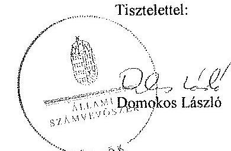

Melléklet: Tájékoztatás az elfogadott és az el nem fogadott észrevételekről

---

# Tájékoztatás   az elfogadott és az el nem fogadott észrevételekről 

A „Jelentéstervezet az állami tulajdonban álló erdőgazdasági társaságok vagyongazdálkodási tevékenységének ellenőrzése - Gemenci Erdő- és Vadgazdaság Zrt." címü jelentéstervezetre 2015. október 2-án érkezett észrevételeit áttekintettük, azok kezelésével kapcsolatban a következő tájékoztatást adom.

1. A jelentéstervezet 4. oldal 3. bekezdésére tett első észrevétel

A jelentéstervezethez adott tájékoztatásukat köszönettel vettük, azonban az észrevételben leírtak nem mondanak ellent a bevezetésben megfogalmazott állításnak, ezért a módosítás nem indokolt.

## 2. A jelentéstervezet 4. oldal 3. bekezdésére tett második észrevétel

A rendelkezésre álló dokumentumok ismételt áttekintését követően a jelentéstervezet 4. oldal 3. bekezdését az alábbiak szerint pontosítottuk:
„A Társaság 2013. évi éves beszámolója szerint 3079,5 M Ft nettó áthelyezés mellett 11,2 M Ft mérleg szerinti eredményt ért el, a mérlegfőösszeg 3896,4 M Ft volt, a munkavállalók éves átlaglétszáma 237 fő, a közfoglalkoztatottak éves átlaglétszáma 232 fő volt. Az erdőgazdasági társaság 34159 ha erdőterületen és 3551 ha egyéb művelési ágú földterületen gazdálkodott."

## 3. A jelentéstervezet 6. oldal 2-3. bekezdésére tett észrevétel

Az állami vagyonnal való gazdálkodásról szóló 254/2007. (X. 4.) Korm. rendelet (továbbiakban: Vhr.) 9. § (9) bekezdés a) pontja alapján a vagyonkezelő köteles a vagyonkezelésbe vett eszközöket a számviteli törvény szerint a hosszú lejáratú kötelezettségekkel szemben a vagyonkezelési szerződésben rögzített értéken állományba venni. Az ideiglenes vagyonkezelési szerződésben (továbbiakban: VSZ) a vagyonkezelésbe adott vagyon értékét nem rögzítették, továbbá a szerződés azt sem tartalmazta, hogy a vagyonkezelt eszközök értéke nulla, a VSZ-nek a vagyonkezelt eszközök értékét tartalmazó konkrét pontjára az észrevételben sem hivatkoznak. A számvevőszéki ellenőrzés megállapította, hogy a Társaság a VSZ 1-4. számú mellékleteivel, az ingatlanjegyzékkel, az anyagi és nem anyagi eszközök leltárával, az egyéb vagyoni értékű jogok felsorolásával, valamint a tételes vagyonleltárral nem rendelkezett, erre a megállapításra észrevétel nem érkezett. A Társaság a számvitelről szóló 2000. évi C. törvény 23. § (2) bekezdésében és a Vhr. 9. § (9) bekezdés a) pontjában

---

foglalt előírások betartása céljából nem tett lépéseket annak érdekében, hogy a vagyonkezelt eszközök értéke a VSZ-ben rögzítésre kerüljön. A fentiek alapján megállapításunk helytálló, módosítása nem indokolt.

# 4. A jelentéstervezet 7. oldal 2-4. bekezdésére tett észrevétel 

A VSZ 3.3.2. pontja alapján a szerződést kötő felek kötelezettsége a tárgyévet megelőző év november 30-ig felülvizsgálni a szerződést. A VSZ szerint az egyik fél (vagyonkezelő) a Gemenci Erdő- és Vadgazdaság Zrt. (továbbiakban: Gemenc Zrt.). Ezért a megállapítás módosítása nem indokolt.

## 5. A jelentéstervezet 8. oldal 2. bekezdésére tett észrevétel

Az észrevételt nem fogadjuk el, mivel a VSZ nem tartalmazta azt, hogy a vagyonkezelésbe vett eszközök értéke nulla, a VSZ-nek a vagyonkezelt eszközök értékét tartalmazó konkrét pontjára az észrevételben sem hivatkoznak. A számvevőszéki ellenőrzés megállapította, hogy a Társaság a VSZ 1-4. számú mellékleteivel, az ingatlanjegyzékkel, az anyagi és nem anyagi eszközök leltárával, az egyéb vagyoni értékű jogok felsorolásával, valamint a tételes vagyonleltárral nem rendelkezett, erre a megállapításra észrevétel nem érkezett.

## 6. A jelentéstervezet 8. oldal 7. bekezdésére tett észrevétel

A személyes adatok védelméről és a közérdekű adatok nyilvánosságáról szóló 1992. évi LXIII. törvény 20. § (8) bekezdésében, illetve az információs önrendelkezési jogról és az információszabadságról szóló 2011. évi CXII. törvény 30. § (6) bekezdésében foglaltak alapján a közfeladatot ellátó szervnek a közérdekű adatok megismerésére irányuló igények teljesítésének rendjét rögzítő szabályzatot kell készítenie. Az állami vagyonról szóló 2007. évi CVI. törvény 5. § (2) bekezdése szerint az állami vagyonnal gazdálkodó vagy azzal rendelkező szerv vagy személy a közérdekű adatok nyilvánosságáról szóló törvény szerinti közfeladatot ellátó szervnek vagy személynek minősül. A Gemenc Zrt. állami vagyonnal gazdálkodik, ezért közfeladatot ellátó szervnek minősül, tehát el kell készítenie a közérdekű adatok megismerésére irányuló igények teljesítésének rendjét. Megállapításunk helytálló, módosítása nem indokolt.

Budapest, 2015. 10. hó 25. nap
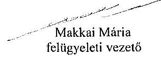

---

.

---

# 10. SZÁMÚ MELLÉKLET A V-0753-114/2015. SZÁMÚ JELENTÉSHEZ 

## 1242

## Állami Számvevőszék

## Domokos László

## elnök

1052 Budapest
Apáczai Cs. J. u. 10.

Ikt. sz.: MNV/01/47949/4/2015.
Hiv. sz.: V-0753-097/2015.

Tisztelt Elnök Úr!
A 2015. szeptember 28. napján „Az állami tulajdonban álló erdőgazdasági társaságok vagyongazdálkodási tevékenységének ellenőrzése - Gemenci Erdő- és Vadgazdaság Zrt." tárgyában kézhez vett, V-0753-097/2015. ikt. sz. Jelentés-tervezetre az alábbi észrevételeket kívánom tenni.
I. fejezet / 8. old. kilencedik bekezdés, 9. old. első-harmadik bekezdés, 11.5. fejezet / 23. old. harmadik bekezdés és 10. old. Javaslat az MNV Zrt. vezérigazgatójának a)-c) pontok
„A vagyonkezelésbe adott állami vagyon tekintetében a tulajdonosi jogokat gyakorló MNV Zrt. és NFA tevékenysége az ellenőrzött időszakban nem támogatta teljes körűen a felelős vagyongazdálkodás megvalósulását. A VSZ-szerű kapcsolatban feltárt hiányosságok megszüntetésére és a hatályos jogszabályoknak való megfeleltetésére vonatkozóan nem kezdeményeztek intézkedéseket. A vagyonkezelésbe adott állami vagyon tekintetében tulajdonosi jogokat gyakorló MNV Zrt. és NFA nem végeztek a Vhr.-ben és a Nemzeti Földalapba tartozó földrészletek hasznosításának részletes szabályairól szóló 262/2010. (XI.17.) Korm. rendeletben foglalt, a vagyonnyilvántartás hitelességére, teljességére és helyességére vonatkozó ellenőrzést a Társaságnál.

A Gemenc Zrt. a Magyar Állam tulajdonában álló erdővagyon és egyéb művelési ágú termőföld ingatlanok kezelését a KVI-vel 1996. november 1-jén kötött vagyonkezelési szerződés alapján végezte. A Társaság, mint vagyonkezelő és a KVI között létrejött szerződéses jogviszony kereteit a VSZ-ben foglalt jogok és kötelezettségek töltötték ki. A VSZ nem támogatta a Vhr.-ben előírt, a vagyongazdálkodási feladatok átlátható módon történő végrehajtását, valamint nem támogatta a szabályszerű vagyongazdálkodást. Az VSZ az ellenőrzött időszakban hatályon kívül helyezett jogszabályi hivatkozásokat tartalmazott az Áht., 109/B. §, 109/G. §, a Vadvédelmi tr. 98. § rendelkezései vonatkozásában és nem tartalmazta az Evt., az Nvtv. előírásaira történő hivatkozást, valamint a Vhr. 9. § (8) bekezdésében 2011. január 1-jétől előírt, az érintett vagyonelem esetleges védettségét, illetve Natura 2000 területnek minősítését. Továbbá a vagyonkezelői jog átengedésére vonatkozóan a VSZ 2009. július 10-étől nem felelt meg az Evt. 9. § (3) bekezdésében foglaltaknak, mert nem tartalmazta, hogy az erdők hasznosítását a vagyonkezelő harmadik személynek nem engedheti át. A VSZ 3.3.2. pontjában foglaltak ellenére a szerződést évente nem vizsgálták felül, azt a felek nem kezdeményezték. A felek nem tettek eleget a Vhr. 54. § (7) bekezdésében foglalt rendelkezéseinek és a Vhr. hatálybalépést követő hat hónapon belül nem kezdeményezték a Nemzeti Földalapba tartozó ingatlanokra vonatkozóan a VSZ megszüntetését és a Vtv., illetve Vhr. szabályainak megfelelő szerződés megkötését.

---

A vagyonkezelésbe adott állami vagyon tekintetében tulajdonosi jogokat gyakorló MNV Zrt. és NFA nem végeztek a Vkr. 20. § (1)-(2) bekezdéseiben és a Nemzeti Földalapba tartozó földrészletek hasznosításának részletes szabályairól szóló 262/2010. (XI.17.) Korm. rendelet 47. § (1)-(2) bekezdéseiben foglalt, a vagyonnyilvántartás hitelességére, teljességére és hitelességére vonatkozó ellenőrzést a Társaságnál.

# Javaslat az MNV Zrt. vezérigazgatójának 

a) Tegyen intézkedéseket az erdőgazdasági társaság közreműködésével a tényleges állapotot rögzítő és a hatályos jogszabályi előírásoknak megfelelő vagyonkezelési szerződés megkötésére.
b) Tegyen intézkedéseket a vagyonkezelési szerződés felülvizsgálatának elmaradásával, valamint a Nemzeti Földalapba tartozó ingatlanokra vonatkozó VSZ megszüntetésével összefüggésben feltárt szabálytalanságok tekintetében a felelősség tisztázása érdekében, és szükség szerint intézkedjen a felelősség érvényesítéséről.
c) Intézkedjen a Társaság vagyonnyilvántartása hitelességének, teljességének és helyességének jogszabályban foglaltak szerinti ellenőrzéséről."

Sajnálattal állapítottuk meg, hogy a Jelentés-tervezet egyáltalán nem veszi figyelembe a vizsgált időszakban megindított és több eljárási cselekményt is magába foglaló intézkedés-sorozatunkat, amelynek a célja a Jelentéstervezetben egyébiránt joggal kifogásolt hiányosságok megszüntetése, az erdőgazdasági társaságok működésének jogszabályi megfelelőségének biztosítása volt. Ezzel a Jelentés-tervezet azt sugallja, hogy a tulajdonosi joggyakorlók részéről egyáltalán nem volt szándék az erdőgazdasági társaságok működésének, illetve a vagyonkezelés körülményeinek hatályos jogszabályok szerinti szabályozására, amely egyébiránt nem felel meg a valóságnak és az adatszolgáltatásunk során sem erről tájékoztattuk Önöket.
Mindamellett elismerjük, hogy a probléma a kezelt vagyonelemek nagy száma, ebből kifolyólag a szabályozást igénylő körülmények nagy száma és sokrétűsége miatt nehezen átlátható, ezért kérjük, engedjék meg, hogy a munkájukat segítő szándékkal korábbi tájékoztatásunkat ismételten megerősítsük, azzal a kifejezett kéréssel, hogy a Jelentésükben az általunk vitatott megállapítást szíveskedjenek módosítani, és az MNV Zrt. által a megoldás irányába megtett intézkedéseket feltüntetni.
Az ideiglenes vagyonkezelési szerződéseken alapuló kezelői jogviszony újraszabályozása, az ideiglenes vagyonkezelési szerződések megszüntetése és végleges vagyonkezelési szerződések megkötése érdekében az intézkedéseink már 2011. évben megkezdődtek, párhuzamosan a Nemzeti Földalapról szóló 2010. évi LXXXVII. tv. 34. § (3) bekezdés c) pontja szerinti feladat- illetve vagyonátadással.

Az intézkedéseink alapja a 2011. évben, MNV/01/29518/2011. szám alatt szakterületünk által bekért, az erdőgazdasági társaságok 2010. december 31-i, illetve 2011. július 31-i fordulónapra vonatkozó leltárjelentése volt, amelyet elsődlegesen az NFA tv. szerint előírt vagyonátadás elvégzése céljából kértünk meg az erdőgazdasági társaságoktól. Ugyanakkor a leltárjelentéshez benyújtott földrészlet listák voltak az első olyan kimutatások, amelyek a kezelt vagyon elemeit a FÖMI adatbázisán alapuló (az aktuális ingatlan-nyilvántartási állapotnak megfelelően) részletesebb bontásban tartalmazták.

## A vizsgált időszakban megindított és lefolytatott intézkedéseink a következők:

1. Az erdőgazdasági
 társaságok által kezelt vagyonelemek tulajdonosi joggyakorlók szerinti elhatárolása, NFA átadás előkészítése, az erdőgazdasági társaságok bevonásával. A Nemzeti Földalapba tartozó vagyonelemek NFA átadása 2012-2013. években megtörtént, majd a visszamaradt vagyonelemek - többségében kivett megnevezésben nyilvántartott földrészletek - elhatárolását is elvégeztük. A feladat végrehajtása 2014. május 31-ig teljesült.
Az intézkedéssel az MNV Zrt. tulajdonosi joggyakorlása alá tartozó vagyonelemek körét - a közös tulajdonosi joggyakorlás alatt álló ingatlanok kivételével -, azaz a végleges vagyonkezelési szerződések ingatlanlistáit meghatároztuk.
Meg kívánjuk jegyezni, hogy az erdőgazdasági társaságok a 2011. évi leltárjelentéseikhez minden esetben csatolták a jelentés tartalmára vonatkozó teljességi nyilatkozatukat is, így azok tartalmát mint teljes körű adatszolgáltatást kezeltük.

---

A hivatkozott íratokat az eljárás során a Tisztelt Állami Számvevőszék rendelkezésére bocsátottuk.
2. Az erdőgazdasági társaságok által kezelt vagyon értékelését 2014. május 31-ig elvégeztük, részben külső piaci szereplő által megállapított vagyonértékelési adatok (az IFUA értékbecslési adatai), részben belső szakértők és a kontrolling szakterület által az MNV Zrt. hatályos értékelési szabályzata által megállapított értékadatok figyelembe vételével.
3. Az MNV Zrt. Igazgatósága 511/2012. (X. 08.) IG sz., valamint 717/2013. (IX. 23.) IG sz. határozataiban Intézkedési terveket fogadott el „a 28/2012. (IX. 24.) sz. RJGY határozatában előírt, valamint az MNV Zrt. rábízott vagyon 2012. évi beszámolója könyvvizsgálói minősítésének megtartásához szükséges és egyéb feladatokról". Az Intézkedési tervek magukban foglalták az erdőgazdasági társaságok által kezelt vagyon analitikájának előállítását, illetve az erdőtársaságokkal végleges (nem ideiglenes) vagyonkezelői szerződések megkötését. A 717/2013. (IX. 23.) IG sz. határozat melléklete tartalmazza a feladat végrehajtása érdekében már megtett intézkedéseket (pl. „Megtörtént az erdőgazdaságok által kezelt vagyon listáinak vagyonkezelői jelentésekkel való egyeztetése; a vagyonkezelési szerződés tartalmú kérdéseinek, az erdőgazdaságok véleményének feldolgozása, MFB Munkacsoport egyeztetések történtek stb.), valamint rögzíti a még elvégzendő feladatokat. Ennek megfelelően az MNV Zrt-nél 2012-tól folyamatban van az erdőgazdasági társaságok vagyonanalitikájának előállítása és vagyonkezelési szerződései tárgyú projekt.
A hatályos jogszabályoknak megfelelő vagyonkezelési szerződés tervezetét a vizsgálati időszak során az MNV Zrt. belső szakterületi egyeztetést követően előkészítettük, és a 2014. március 18-án megtartott Munkacsoport értekezleten az erdőgazdaság képviselőivel, továbbá a tulajdonosi joggyakorlók (NFA, illetve akkor még Magyar Fejlesztési Bank Zrt.) képviselőivel ismertettük annak tartalmát. A szerződés szövegtervezetének véleményezése ekkor megkezdődött, ugyanakkor elismerjük, hogy a végleges szerződésváltozat már az Önök által vizsgált időszakot követően került elfogadásra. Ugyancsak a 2014. március 18-án megtartott Munkacsoport értekezleten tettünk javaslatot a vagyonkezelési dí alapjának és mértékének meghatározására.
4. Az erdőgazdasági társaságok által kezelt és a saját vagyonuk vagyonelemenkénti, valamint a kezelt vagyonelemek tulajdonosi joggyakorlók szerinti elhatárolására vonatkozó intézkedésünket a vizsgált időszakban előkészítettük.

Tájékoztatjuk továbbá Elnök Urat az alábbiakról:
A Nemzeti Fejlesztési Minisztérium KGTF/377-6/2014-NFM, valamint KGTF/377-7/2014. számok alatt adott utasításokat a fenti feladatok elvégzésére. Ezekről, illetve az utasításokra adott jelentésünkről a korábbi adatszolgáltatásunk keretében szintén kitértünk.

A vagyonkezelési szerződés vizsgált időszakot követően elfogadott tervezetének mellékletét képezik az MNV Zrt. azon szabályzatai is, amelyek a kezelt vagyon nyilvántartását, a beruházások nyilvántartását és az azzal kapcsolatos elszámolásokat, illetve a tulajdonosi ellenőrzéssel kapcsolatos, a jelenlegi jogszabályi környezetnek megfelelő szabályokat tartalmazzák:

- Az állami tulajdonon, egyéb vagyonkezelők által vagyonkezelt eszközön megvalósítandó beruházások, felújítások előzetes engedélyezésének és elszámolásának eljárásrendjéről szóló 35/2014. számú vezérigazgatói utasítás,
- A Magyar Nemzeti Vagyonkezelő Zrt. Tulajdonosi Ellenőrzési Szabályzata - a 39/2014. számú vezérigazgatói utasítás, továbbá
- A Magyar Nemzeti Vagyonkezelő Zrt. állami vagyon vagyonkezelőire, az állami vagyont használókra és a társasági részesedések esetében az MNV Zrt. tulajdonosi joggyakorlását megbízottként ellátókra vonatkozó Vagyon-nyilvántartási Szabályzatáról szóló 12/2014. számú vezérigazgatói utasítás.

Fentiek mellett megemlíthető az MNV Zrt. folyamatba épített, illetve vagyon nyilvántartás vezetését támogató ellenőrzési módszertanról szóló 11/2014. számú vezérigazgatói utasítás.
Egyeztetéseink során az erdőgazdasági társaságok tájékoztatást kaptak a szabályzataink tartalmára vonatkozóan.

---

A Jelentés-tervezet 9. oldalán található, az MNV Zrt. vezérigazgatójára vonatkozó, a) pont alatti, vagyonkezelési szerződés megkötésére irányuló javaslathoz kapcsolódóan felhívjuk a Tisztelt Állami Számvevőszék figyelmét arra, hogy a Nemzeti Fejlesztési Minisztérium ÁVF/21310/2015-NFM számú tájékoztató levele szerint Miniszter Úr vagyongazdálkodási szempontból nem támogatja az erdőgazdasági társaságok ideiglenes vagyonkezelési szerződéseit kiváltó vagyonkezelési szerződések megkötését, ideértve az MNV Zrt. vagyonkezelési szerződésekkel kapcsolatos jóváhagyó döntéseit is.

Az MNV Zrt-re vonatkozóan hivatkozott jogszabály, a Vhr. 20. § (1)-(2) bekezdése 2014. március 14-ig - csaknem az ellenőrzött időszak végéig - a következőképpen rendelkezett:
„(1) Az állami vagyon kezelőjét, használóját megillető jogok gyakorlását, annak szabályszerűségét, célszerűségét a Vtv. 17. §-ának d) pontja alapján az MNV Zrt. - szükség szerint a területi szervet útján - ellenőrzi. Ennek érdekében a vagyon kezelésére, hasznosítására kötött szerződésben rögzíteni kell, hogy a tulajdonosi ellenőrzés eljárásrendjét, a felek jogait, kötelezettségeit a felek a szerződés részének tekintik.
(2) A tulajdonosi ellenőrzés célja az állami vagyonnal való gazdálkodás vizsgálata, ennek keretében a rendeltetésellenes, jogszerűtlen, szerződésellenes, vagy a tulajdonos érdekeit sértő, illetve a központi költségvetést hátrányosan érintő vagyongazdálkodási intézkedések feltárása és a jogszerű állapot helyreállítása, továbbá a vagyonnyilvántartás hitelességének, teljességének és helyességének biztosítása."

A tulajdonosi ellenőrzés alatt a Területi Irodák által folytatott ellenőrzést is értette a jogszabály, amiből egyenesen következik a szakterületi munkafolyamatba épített ellenőrzési kötelezettség figyelembe vételének a lehetősége.

Fentiekre tekintettel kérjük a Jelentés-tervezet 8-9., illetve 23. oldalán található azon megállapítások törlését, hogy az MNV Zrt. nem kezdeményezett intézkedéseket, és nem végzett a Vhr. 20. § (1)-(2) bekezdéseiben és a Nemzeti Földalapba tartozó földrészletek hasznosításának részletes szabályairól szóló 262/2010. (XI.17.) Korm. rendelet 47. § (1)-(2) bekezdéseiben foglalt, a vagyonnyilvántartás hitelességére és teljességére vonatkozó ellenőrzést a Társaságnál, kérjük a megtett intézkedések feltüntetését, és a Jelentés-tervezet 9-10. oldalán található, az MNV Zrt. vezérigazgatójára vonatkozó, b) pontot a megtett intézkedések folyamatosságára tekintettel törölni és a c) pont alatti javaslatot szövegszerűen ekként módosítani:

# Javaslat az MNV Zrt. vezérigazgatójának 

c) Az MNV Zrt. tulajdonosi joggyakorlása alá tartozó (az Erdőgazdasági Társaságok által az MNV Zrt. részére jelentett) vagyonelemek tekintetében intézkedjen a Társaság vagyonnyilvántartása hitelességének, teljességének és helyességének jogszabályban foglaltak szerinti ellenőrzéseinek erősítéséről.

Kérem Elnök Urat, hogy a Jelentés véglegesítése során jelen észrevételeinket szíveskedjenek figyelembe venni.

Budapest, 2015. október $f 0 . .$.

Üdvözlettel:
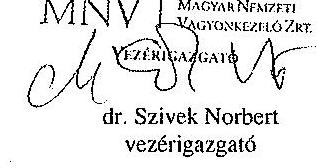

---

# 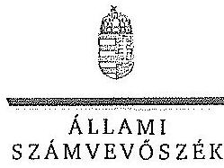   Ikt.szám: V-0753-110/2015. 

## Dr. Szivek Norbert úr

vezérigazgató
Magyar Nemzeti Vagyonkezelő Zrt.

## Budapest

## Tisztelt Vezérigazgató Úr!

A „Jelentéstervezet az állami tulajdonban álló erdőgazdasági társaságok vagyongazdálkodási tevékenységének ellenőrzése - Gemenci Erdő- és Vadgazdaság Zrt." címmel készített számvevőszéki jelentéstervezetre tett észrevételeit köszönettel megkaptam.

Az Állami Számvevőszék észrevételekre vonatkozó álláspontjáról a felügyeleti vezető által készített részletes tájékoztatást csatoltan megküldöm.

Tájékoztatom Vezérigazgató urat, hogy a számvevőszéki jelentésben - az Állami Számvevőszékről szóló 2011. évi LXVI. törvény 29. § (3) bekezdése alapján - a figyelembe nem vett észrevételeket szerepeltetjük az elutasítás indokának feltüntetésével.

Budapest, 2015. 10. hó 20. nap

Tisztelettel:
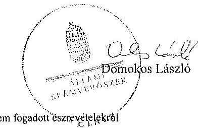

Melléklet: Tájékoztatás az elfogadott és az el nem fogadott észrevételekről

---

# Tájékoztatás   az elfogadott és az el nem fogadott észrevételekről 

A „Jelentéstervezet az állami tulajdonban álló erdőgazdasági társaságok vagyongazdálkodási tevékenységének ellenőrzése - Gemenci Erdő- és Vadgazdaság Zrt." címü jelentéstervezetre 2015. október 13-án érkezett észrevételeit áttekintettük, azok kezelésével kapcsolatban a következő tájékoztatást adom.

1. A vagyonkezelési szerződéshez kapcsolódó megállapításokra tett észrevétel (I. fejezet / 8. oldal 9. bekezdés, 9. oldal 1. és 2. bekezdés, 23. oldal 3. bekezdés, 9-10. oldal javaslat az MNV Zrt. vezérigazgatójának a)-b) pontok)

A jelentéstervezet vagyonkezelési szerződéshez kapcsolódó megállapításai helytállóak. Az erdőgazdasági társaság működése jogszabályi megfelelőségének biztosításának érdekében tett kezdeményezésekről adott tájékoztatásukat köszönettel vettük, azonban azok nem eredményezték az ideiglenes vagyonkezelési szerződés olyan módosítását, vagy olyan új vagyonkezelési szerződés megkötését, amely biztosította volna a VSZ hiányosságainak megszüntetését, illetve a hatályos jogszabályoknak való megfelelőségét. Ezért az MNV Zrt. vezérigazgatójának és az NFA elnökének megfogalmazott intézkedést igénylő megállapítás, valamint az MNV Zrt. vezérigazgatójának megfogalmazott javaslat a) és b) pontjának módosítása nem indokolt. Az egyértelműség érdekében a 8. oldal 9. bekezdés második mondatát és a 23. oldal 3. bekezdés 1. mondatának vonatkozó részét az alábbiak szerint pontosítjuk:
„A VSZ-szel kapcsolatban feltárt hiányosságok megszüntetése és a hatályos jogszabályoknak megfeleltetése nem történt meg."
2. Az MNV Zrt. ellenőrzési kötelezettségének elmulasztására vonatkozó megállapításokra tett észrevétel (I. fejezet 9. oldal 3. bekezdés, II. 5. fejezet / 23. oldal 3. bekezdés és 9-10. oldal javaslat az MNV Zrt. vezérigazgatójának c) pont)

Az MNV Zrt. nem bocsátott az ÁSZ ellenőrzés rendelkezésére az MNV Zrt., vagy Területi Irodái által a Vhr. 20. § (1)-(2) bekezdései szerint végzett ellenőrzésekről dokumentumokat. A jelentéstervezet megállapításai és a javaslat helytállóak, módosításuk nem indokolt.

Budapest, 2015. 1. hó 23. nap

Makkai Mária
felügyeleti vezető

---

# 12. SZÁMÚ MELLÉKLET A V-0753-114/2015. SZÁMÚ JELENTÉSHEZ 

## 1. MFB

## Domokos László úr

## elnök részére

## Állami Számvevőszék

Budapest

Tisztelt Elnök Úr!
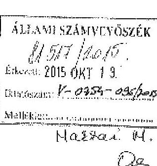

2015. szeptember 28-án köszönettel kézhez vettük az Állami Számvevőszék „Az állami tulajdonban álló erdőgazdasági társaságok vagyongazdálkodási tevékenységének ellenőrzéséről" szóló jelentéstervezeteket az alábbi cégekre:

- Északerdő Erdőgazdasági Zrt.
- EGYERERDŐ Erdészeti Zrt.
- Gemenci Erdő- és Vadgazdaság Zrt.
- Ipoly erdő Zrt.
- KEFAG Kiskunsági Erdészeti és Faipari Zrt
- Kisalföldi Erdőgazdaság Zrt
- SEFAG Erdészeti és Faipari Zrt
- Szombathelyi Erdészeti Zrt.
- VADEX Mezőföldi Erdő-és Vadgazdálkodási Zrt. (Ikt.szám: V-0765-044/2015.)
- Zalserdő Erdészeti Zrt.
(Ikt.szám: V-0754-086/2015.)
(Ikt.szám: V-0750-172/2015.)
(Ikt.szám: V-0753-096/2015.)
(Ikt.szám: V-0749-146/2015.)
(Ikt.szám: V-0764-054/2015.)
(Ikt.szám: V-0758-056/2015.)
(Ikt.szám: V-0752-089/2015.)
(Ikt.szám: V-0757-060/2015.)
(Ikt.szám: V-0757-060/2015.)
(Ikt.szám: V-0760-075/2015.)

Az MFB Zrt. a jelentéstervezetekkel kapcsolatosan 2 fő szempontból kíván észrevételt tenni:

1. A jelentésekben megfogalmazott központi probléma
2. Egyedi esetek

---

# 12. SZÁMÚ MELLÉKLET A V-0753-114/2015. SZÁMÚ JELENTÉSHEZ 

## 1. A jelentésekben megfogalmazott központi probléma

Az ÁSZ az egyedi jelentéseiben az erdőgazdasági társaságokat, valamint a vagyonkezelésbe adott állami vagyon tekintetében tulajdonosi joggyakorló MNV Zrt. és Nemzeti Földalapkezelő (továbbiakban: NFA) tevékenységét marcalalta el.
Alapvető problémaként jelent meg, hogy az erdők által kezelt eszközök - az NFA-val, a Kincstári Vagyon Igazgatósággal, és az MNV Zrt-vel kötött vagyonkezelési megállapodásban rögzített - értéken nem szerepelnek a Társaságok könyveiben.
Az MFB Zrt. tudatában volt a problémának (azt az ÁSZ jelentésben is említett, 2010. évben végzett átvilágítási jelentés is tartalmazta, melynek nyomon követése, beszámoltatása megtörtént) és folyamatosan egyeztetett az MNV Zrt-vel és az NFA-val a rendezés ügyében. Az ideiglenes vagyonkezelési szerződés módosítására, véglegesítésére a vagyonkezelésbe adónak (MNV, NFA) van lehetősége, a Társaságok szerződő partnerként észrevételeket, javaslatokat tehetnek. A szerződés véglegesítése érdekében a Társaságok és az MFB Zrt. képviselői minden olyan egyeztetésen (pl.: az MNV Zrt. által létrehozott bizottság) részt vettek, amelyre megbízást kaptak, illetve azokon érdemi javaslatokat tettek.
Ahogy a jelentés is megjegyzi, az egyeztetések az ellenőrzés befejezésig nem kerültek lezárásra, így a Társaságokkal nem áll rendelkezésre a vagyonkezelésben lévő állami vagyon és annak nagyságára vonatkozó, az MNV Zrt. és az NFA nyilvántartásával egyező adat.

Az ÁSZ 2013. évi „Az állami vagyon feletti kontroll - Az állami vagyon feletti tulajdonosi joggyakorlással kapcsolatos tevékenységek ellenőrzéséről"
 szóló jelentése alapján a Nemzeti Fejlesztési Minisztérium – az ÁSZ-szal egyeztetett – alábbi főbb pontokat tartalmazó intézkedési tervet (1. sz. melléklet) állított össze, melyet a 2014. április 25-én kelt levelében küldött meg az MFB Zrt. részére:

- a Társaságok által kezelt állami ingatlanok és egyéb vagyonelemek értéken történő nyilvántartása,
- a vagyonkezelési díjak egyértelmű és tulajdonosi joggyakorló szervezetkénti meghatározása,
- az új vagyonkezelési szerződés megkötése,
- a Társaságok kezelt és saját vagyonának vagyonelemkénti, valamint a kezelt vagyonelemek tulajdonosi joggyakorló szerinti elszámolása.

Az MFB törvény módosításának 2014. július 16-i hatályba lépésével az MFB Zrt. állami erőforrásokon feletti tulajdonosi joggyakorlása megszűnt, az a Földművelésügyi Minisztériumhoz került át, így az intézkedési tervben való közreműködésre, illetve a végrehajtás nyomon követésére az MFB Zrt.-nek nem volt lehetősége.

A jelentések az MNV Zrt. vezérigazgatójának, az NFA elnökének és az erdészeti társaságok vezérigazgatóinak fogalmaznak meg intézkedési javaslatokat.

---

# 12. SZÁMÚ MELLÉKLET A V-0753-114/2015. SZÁMÚ JELENTÉSHEZ 

## 2. Egyedi esetek:

## KEFAG Kiskunági Erdészeti és Faipari Zrt.

A jelentéstervezet többször hibásan hivatkozik az MFB Zrt.-re, amikor az állami vagyonról szóló 2007. évi CVI. törvény (a továbbiakban: Vtv.) 17. § (1) bekezdés d) pontja szerinti rendszeres ellenőrzés elmaradására mutat rá. A Vtv. hivatkozott bekezdése alapján az ellenőrzés az MNV Zrt. feladata. Kérjük a társaság felett tulajdonosi joggyakorló; hivatkozások törlését (8. oldal 7. bekezdés és 32. oldal 6. bekezdés).

## Kisafföldi Erdőgazdaság Zrt.

A jelentéstervezet hibásan hivatkozik az MFB Zrt.-re, amikor a Vtv. 17. § (1) bekezdés d) pontja szerinti rendszeres ellenőrzés elmaradására mutat rá. A Vtv. hivatkozott bekezdése alapján az ellenőrzés az MNV Zrt. feladata. Kérjük a társaság felett tulajdonosi joggyakorló; hivatkozások törlését (29. oldal 4. bekezdés).

## Szombathelyi Erdészeti Zrt.

A jelentéstervezet hibásan hivatkozik az MFB Zrt.-re, amikor a Vtv. 17. § (1) bekezdés d) pontja szerinti rendszeres ellenőrzési elmaradására mutat rá. A Vtv. hivatkozott bekezdése alapján az ellenőrzés az MNV Zrt. feladata. Kérjük a társaság felett tulajdonosi joggyakorló; hivatkozás törlését. (32. oldal 5. bekezdés).

Budapest, 2015. október 12.

Tisztelettel:
MFFI (1) 21.7.19. 17. 17. 17. 17. 17. 17. 17. 17. 17. 17. 17. 17. 17. 17. 17. 17. 17. 17. 17. 17. 17. 17. 17. 17. 17. 17. 17. 17. 17. 17. 17. 17. 17. 17. 17. 17. 17. 17. 17. 17. 17. 17. 17. 17. 17. 17. 17. 17. 17. 17

---

# 12. SZÁMÚ MELLÉKLET A V-0753-114/2015. SZÁMÚ JELENTÉSHEZ

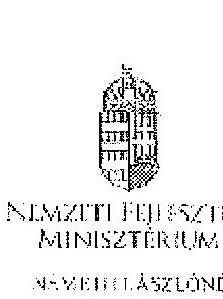

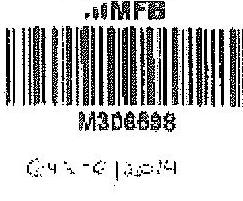

M306696

C:41-C 132074

NEMZETI FEJLESZTÉSI MINISZTÉRIUM

SEVERITIÁSZLÓNÉ

BUDAPEST

Iktatószám: KGTV/ 371 5 /2014-NFM

Ügyintéző: dr. Kézetis Mónika Telefonszám: 795-1917

1040 Budapest, Jószefvárosi, gov.hu

Nagy Csaba úr részére

vezérigazgató

Magyar Fejlesztési Bank Zrt.

Tárgy: „Az állami vagyon feletti kontroll – Az állami
 vagyon feletti tulajdonosi joggyakorlással kapcsolatos tevékenységek ellenőrzéséről szóló 13193. sz. ÁSZ jelentés alapján összefüggésben a Magyar Nemzeti Vagyonkezelő Zrt. vezérigazgatójához, Márton Péter úrhoz.

Az ÁSZ az intézkedési tervvel kapcsolatban küldött, 2014. március 25-én kelt levelében az intézkedési terv kiegészítését, módosítását kérte. A módosított intézkedési tervet jóváhagytam.

A módosított intézkedési terv alapján a következő feladatok végrehajtása szükséges az alábbiak szerint:

1. A társaságok által kezelt állami ingatlanok és egyéb vagyonelemek értéken történő nyilvántartása:

Feltéve: MNV Zrt.,
Határidő:

- földterületek esetében legkésőbb 2014. május 31-ig
- felépítmények esetében 2014. december 31. (A felépítmények esetében az MNV Zrt. a vagyonkezelési szerződés megkötését az év második felére tervezi, illetve megvalósítását látja.)

2. A vagyonkezelési díjak egyértelmű és tulajdonosi joggyakorló szervezetenkénti meghatározása:
 13193 13193 13193 13193 13193 13193 13193 13193 13193 13193 13193 13193 13193 13193 13193 13193 13193 13193 13193 13193 13193 13193 13193 13193 13193 13193 13193 13193 13193 13193 13193 13193 13193 13193 13193 13193 13193 13193 13193 13193 13193 13193 13193 13193 13193 13193 13193 13193 13193 13193 13193 13193 13193 13193 13193 13193 13193 13193 13193 13193 13193 13193 13193 13193 13193 13193 13193 13193 13193 13193 13193 13193 13193 13193 13193 13193 13193 13193 13193 13193 13193 13193 13193 13193 13193 13193 13193 13193 13193 13193 13193 13193 13193 13193 13193 13193 13193 13193 13193 13193 13193 13193 13193 13193 13193 13193 13193 13193 13193 13193 13193 13193 13193 13193 13193 13193 13193 13193 13193 13193 13193 13193 13193 13193 13193 13193 13193 13193 13193 13193 13193 13193 13193 13193 13193 13193 13193 13193 13193 13193 13193 13193 13193 13193 13193 13193 13193 13193 13193 13193 13193 13193 13193 13193 13193 13193 13193 13193 13193 13193 13193 13193 13193 13193 13193 13193 13193 13193 13193 13193 13193 13193 13193 13193 13193 13193 13193 13193 13193 13193 13193 13193 13193 13193 13193 13193 13193 13193 13193 13193 13193 13193 13193 13193 13193 13193 13193 13193 13193 13193 13193 13193 13193 13193 13193 13193 13193 13193 13193 13193 13193 13193 13193 13193 13193 13193 13193 13193 13193 13193 13193 13193 13193 13193 13193 13193 13193 13193 13193 13193 13193 13193 13193 13193 13193 13193 13193 13193 13193 13193 13193 13193 13193 13193 13193 13193 13193 13193 13193 13193 13193 13193 13193 13193 13193 13193 13193 13193 13193 13193 13193 13193 13193 13193 13193 13193 13193 13193 13193 13193 13193 13193 13193 13193 13193 13193 13193 13193 13193 13193 13193 13193 13193 13193 13193 13193 13193 13193 13193 13193 13193 13193 13193 13193 13193 13193 13193 13193 13193 13193 13193 13193 13193 13193 13193 13193 13193 13193 13193 13193 13193 13193 13193 13193 13193 13193 13193 13193 13193 13193 13193 13193 13193 13193 13193 13193 13193 13193 13193 13193 13193 13193 13193 13193 13193 13193 13193 13193 13193 13193 13193 13193 13193 13193 13193 13193 13193 13193 13193 13193 13193 13193 13193 13193 13193 13193 13193 13193 13193 13193 13193 13193 13193 13193 13193 13193 13193 13193 13193 13193 13193 13193 13193 13193 13193 13193 13193 13193 13193 13193 13193 13 193 13 193 13193 13193 13193 13 13193 13 13193 13 193 13 193 13 193 13 193 13 193 13 193 13 193 13 193 13 193 13 193 13 193 13 193 13 13 193 13 193 13 193 13 193 13 193 13 193 13 193 13 193 13 193 13 193 13 193 13 193 13 193 13 193 13 193 13 193 193 193 193 193 193 193 193 193 193 193 193 193 193 193 193 193 193 193 193 193 193 193 193 193 193 193 193 193 193 193 193 193 193 193 193 193 193 193 193 193 193 193 193 193 193 193 193 193 193

---

# 12. SZÁMÚ MELLÉKLET A V-0753-114/2015. SZÁMÚ JELENTÉSHEZ 

Felelős: MNV Zrt.,
Határidő: 2014. május 31-ét követően folyamatosan (2014. december 31-ig)
E pontban foglalt feladatokkal kapcsolatosan az ÁSZ részére az alábbi tájékoztatást adom:
„Az ÁSZ által meghatározott feladatok végrehajtására irányuló munkafolyamat során a végrehajtásban érintett szervezetek, társaságok között kialakult az az álláspont, hogy mivel az erdőgazdasági társaságok alapfeladatként közfeladat-ellátást is végeznek, azt a vagyonkezelési díj mértékének meghatározásakor az MNV Zrt. figyelembe veszi, valamint megállapításra került az az elv is, hogy a vagyonkezelési díj irányadó mértéke az adott erdőgazdasági társaság által kezelt ingatlanvagyon bruttó nyilvántartási értékének 2%-a.

A vagyonkezelési díj alapja a kezelt vagyon bruttó nyilvántartási értéke, ezért annak meghatározására erdőgazdasági társaságonként kerül sor a 4./ pontban meghatározott ún. „végleges ingatlanlista" alapján. A végleges ingatlanlista kizárólag vagyonkezelésbe adott ingatlan vagyonelemeket tartalmaz, az erdőgazdasági társaság saját vagyonában nyilvántartott vagyonelemeket nem, ezért az MNV Zrt.-nek és az erdőgazdasági társaságoknak a szerződés megkötését megelőzően el kell határolnia egymástól a saját vagyonba és a kezelt vagyonba tartozó ingatlan vagyonelemeket (4.b./ pontban foglalt feladat).

A feleknek a vagyonkezelési díj mértékében a vagyonkezelési szerződés megkötését megelőzően kell megállapodniuk az irányadó vagyonkezelési díj mértéket alapul véve."

## 3./ az új vagyonkezelési szerződések megkötése:

A vagyonkezelési szerződés tervezete az MNV Zrt. érintett szakterületei álláspontjának figyelembe vételével elkészült, az MNV Zrt. és a MFB Zrt. által létrehozott Munkacsoport (tagjai: MFB Zrt., MNV Zrt., NFA és ugyanezen erdőgazdasági társaságok) véleménye alapján átdolgozásra került. A szerződés tervezetének az erdőgazdasági társaságok részére történő megküldése 2014. április 15. napjával megtörtént.

Felelős: MNV Zrt., az MFB Zrt. közreműködésével
Határidő:

- földterületek esetében: 2014. május 31-ét követően folyamatosan (2014. december 31-ig)
- felépítmények esetében: 2014. II. félév folyamán

## 4./ a társaságok kezelt és saját vagyonának vagyonelemenkénti, valamint a kezelt vagyonelemek tulajdonosi joggyakorló szerinti elhatárolása:

Az erdőgazdasági társaságok által az MNV Zrt. rendelkezésére bocsátott feltáró jelentések alapján

- a jogszabályi rendelkezések szerint az NFA tulajdonosi joggyakorlása alá tartozó ingatlan vagyonelemek nagyobb része már átadásra került az NFA részére,
- a kisebb részt képező vagyonelemek tekintetében pedig folyamatban van az átadás az MNV Zrt. és az NFA között.

---

# 12. SZÁMÚ MELLÉKLET A V-0753-114/2015. SZÁMÚ JELENTÉSHEZ

a./ Az ún. "végleges ingatlanlista" (az MNV Zrt. tulajdonosi joggyakorlása alatt lévő, maradó vagyonelemek listája) MNV Zrt. és az NFA közötti leegyeztetése, közös áttekintése

Felelős: MNV Zrt.

Határidő: a lista MNV Zrt. és NFA közötti leegyeztetése, közös áttekintése folyamatban van, kivárása legkésőbb 2014. május 31-ig megtörténik

b./ Az a./ pontban foglaltak szerint leegyeztetett ún. "végleges ingatlanlista" MNV Zrt. és az egyes erdőgazdasági társaságok általi áttekintése azzal a céllal, hogy a vagyonkezelésben lévő vagyoni elemeket tartalmazó ún. "végleges ingatlanlista" ne tartalmazzon az erdőgazdasági társaság saját vagyonában nyilvántartott vagyoni elemet (saját vagyon - vagyonkezelő vagyon elhatárolása).

Felelős: MNV Zrt., az MFB Zrt. közreműködésével

Határidő: 2014. május 31-ig

E pontban foglalt feladatokkal kapcsolatosan az ÁSZ részére az alábbi tájékoztatást adtam:

"Szükséges megjegyezni, hogy ingatlanlista, mint állandó "végleges ingatlanlista" ilyen formában nem létezik, mert mindkét tulajdonosi joggyakorló tekintetében az állami vagyonelemek halmaza mind mennyiségben, mind pedig összetételben folyamatosan változik."

Az erdőgazdasági társaságok által kezelt ingatlanvagyon adatai - mindkét tulajdonosi joggyakorló tekintetében - az évközi változások (megengedett hasznosítás, területváltozások, művelési ág változások, stb.) miatt folyamatosan változnak, ezért az adatartalmában "végleges ingatlanlista" mindig egy adott konkrét időpont vonatkozásában adható meg.

Jelen intézkedési tervben az ún. "végleges ingatlanlista" meghatározás alatt az erdőgazdasági társaságok vagyonkezelésében lévő ingatlanvagyon MNV Zrt. tulajdonosi joggyakorlása alatt álló részét kell tekinteni. E "végleges ingatlanlista" kialakítására az erdőgazdasági társaságok által az MNV Zrt. részére átadott leltárjelentések alapján került sor úgy, hogy az MNV Zrt. a Nemzeti Földalapba tartozó vagyonlemekeket kiválogatta, s azokat a Nemzeti Földalapkezelő Szervezet részére - átadás-átvételi jegyzőkönyv alapján - átadta.

Lényeges körülmény, hogy a vagyonkezelőknek - jelen esetben az erdőgazdasági társaságoknak - minden év május 31. napjáig vagyonkezelői jelentést kell benyújtaniuk a tulajdonosi joggyakorlóknak, így az MNV Zrt. részére is. Az aktuális vagyonkezelői jelentéseket - melynek része a leltárjelentés is - a 2013. december 31-i állapotnak megfelelően kell összeállítani, ebből következően a fent említett ún. "végleges ingatlanlista" is a 2013. december 31-i állapotot tükrözi.

Ugyanakkor - főként a kivett megnevezésben nyilvántartott földterületek esetében - a még át nem adott Nemzeti Földalapba tartozó vagyonlemekek egyeztetése a két tulajdonosi joggyakorló között jelenleg is folyamatosan van.

Postacím: 1440 Budapest, Pf. 12. c.r.: 006-11795-6665 E-mail: asziszer@szamv.gov.hu

---

# 12. SZÁMÚ MELLÉKLET A V-0753-114/2015. SZÁMÚ JELENTÉSHEZ 

Az egyes erdőgazdasági társaságok vagyonkezelésében lévő vagyonelemek az adott társaságokkal megkötendő - a jelenlegi ideiglenes vagyonkezelési szerződés helyébe lépő - vagyonkezelési szerződés mellékletét fogják képezni. Az MNV Zrt. szándéka szerint az egyes erdőgazdasági társaságokkal azonnal megkötik a vagyonkezelési szerződéseket, amint a megkötés feltételei bekövetkeztek (pl. megállapodnak a vagyonkezelési díjban, véglegesítik a vagyonkezelési szerződés tartalmát), azok a vagyonelemek, amelyeket e pont a./ és b./ pontjában foglaltak szerint már átvizsgáltak, a vagyonkezelési szerződés megkötésével egyidejűleg a szerződés mellékletei kerülnek, amely melléklet folyamatosan bővítésre kerül újabb, e pont a./ és b./ pontjában foglaltak szerint átvizsgált, tisztázott vagyonelemekkel. „

Tájékoztatom, hogy az NFA feletti tulajdonosi jogok gyakorlója, Dr. Fazekas Sándor miniszter úr időközben már jóváhagyta azt az intézkedési tervet, amely az NFA részére meghatározott feladatokat és azok végrehajtási határidejét tartalmazza.

Az MFB Zrt. közreműködése az 1./ és 2./ pontban meghatározott feladatok végrehajtásában is szükséges lehet, ezért kérem a fent meghatározott feladatok határidőben történő végrehajtása érdekében az MFB Zrt. változatlan együttműködését az érintett szervezetekkel és amennyiben szükséges, úgy az erdőgazdasági társaságok bevonása iránt is intézkedni szíveskedjen.

Budapest, 2014. ... 2. 2

## Üdvözlettel:

Németh László né

---

.

---

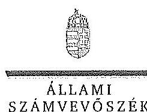

# ELNÖK 

## Nagy Csaba úr

vezérigazgató
Magyar Fejlesztési Bank Zrt.

## Budapest

## Tisztelt Vezérigazgató Úr!

Az „Az állami tulajdonban álló erdőgazdasági társaságok vagyongazdálkodási tevékenységének ellenőrzése" című ellenőrzés tekintetében 10 társaság jelentéstervezetére tett észrevételeiket köszönettel megkaptam.

Az Állami Számvevőszék észrevételekre vonatkozó álláspontjáról a felügyeleti vezető által készített részletes tájékoztatást csatoltként megküldöm.

Tájékoztatom Vezérigazgató urat, hogy a számvevőszéki jelentésben - az Állami Számvevőszékről szóló 2011. évi LXVI. törvény 29. § (3) bekezdése alapján - a figyelembe nem vett észrevételeket szerepeltetjük az elutasítás indokának feltüntetésével.

Budapest, 2015. 14. hó c.s. nap
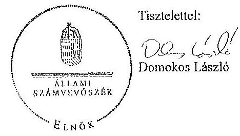

Melléklet: Tájékoztatás az elfogadott és az el nem fogadott észrevételekről

---

# Tájékoztatás   az elfogadott és az el nem fogadott észrevételekről 

„Az
 állami tulajdonban álló erdőgazdasági társaságok vagyongazdálkodási tevékenységének ellenőrzése" című ellenőrzés tekintetében az Északerdő Erdőgazdasági Zrt., az EGERERDŐ Erdészeti Zrt., a Gemenci Erdő- és Vadgazdaság Zrt., az IPOLY ERDŐ Zrt., a KEFAG Kiskunsági Erdészeti és Faipari Zrt., a Kisalföldi Erdőgazdasági Zrt., a SEFAG Erdészeti és Faipari Zrt., a Szombathelyi Erdészeti Zrt., a VADEX Mezöföldi Erdő- és Vadgazdálkodási Zrt., illetve a Zalaerdő Erdészeti Zrt. társaságok jelentéstervezetére 2015. október 13-án érkezett észrevételeket áttekintettük, azok kezelésével kapcsolatban a következő tájékoztatást adom.

1. A jelentésekben megfogalmazott központi problémával kapcsolatban tett észrevételek A jelentésekben megfogalmazott központi problémával kapcsolatban adott tájékoztatásukat köszönettel vettük, azonban azok alapján a jelentéstervezet módosítása nem indokolt.

## 2. Egyedi esetekkel kapcsolatban tett észrevételek

A KEFAG Kiskunsági Erdészeti és Faipari Zrt. jelentéstervezetének 8. oldal 7. bekezdésére, valamint 32. oldal 6. bekezdésére tett észrevétel
A rendelkezésre álló dokumentumok ismételt áttekintését követően a jelentéstervezet 8. oldal 7. bekezdésében, valamint 32. oldal 6. bekezdésében töröljük a tulajdonosi joggyakorló 2 számú alsóindexszel jelölt hivatkozását.

A Kisalföldi Erdőgazdasági Zrt. jelentéstervezetének 29. oldal 4. bekezdésére tett észrevétel
A rendelkezésre álló dokumentumok ismételt áttekintését követően a jelentéstervezet 29. oldal 4. bekezdésében töröljük a tulajdonosi joggyakorló 2 számú alsóindexszel jelölt hivatkozását.

A Szombathelyi Erdészeti Zrt. jelentéstervezetének 32. oldal 5. bekezdésére tett észrevétel
A rendelkezésre álló dokumentumok ismételt áttekintését követően a jelentéstervezet 32. oldal 5. bekezdésében töröljük a tulajdonosi joggyakorló 2 számú alsóindexszel jelölt hivatkozását.

Budapest, 2015. év $\quad 11$ hó 05 nap

Makkai Mária
felügyeleti vezető

---

# 14. SZÁMÚ MELLÉKLET A V-0753-114/2015. SZÁMÚ JELENTÉSHEZ 

## Nemzeti Földalapkezelő Szervezet

Székhely: 1109 Budapest, Tüzér utca 5.
Törzskönyvi szám: 775706
Iktatószám: NFA-002589/017/2015
Hiv. szám: ÁSZ-V-0599/2014-2015
Érintett ÁSZ létatószámok: V-0749-148/2015, V-0750-174/2015, V-0751-121/2015, V-0752-091/2015, V-0753-098/2015, V-0754-088/2015, V-0755-124/2015, V-0757-062/2015, V-0758-058/2015, V-0760-077/2015, V-0764-056/2015, V-0765-046/2015, V-0766-140/2015, V-0767-056/2015.

## Domokos László

## Elnök

## Állami Számvevőszék

## 1052 Budapest

Apáczai Csere János utca 10

Tárgy: Ésrevétel megküldése „Az állami tulajdonban álló erdőgazdasági társaságok vagyongazdálkodási tevékenységének ellenőrzéséről" készített jelentés tervezeteire.

## Tisztelt Elnök Úr!

Az Állami Számvevőszék 2014. novemberében megkezdte „Az állami tulajdonban álló erdőgazdasági társaságok vagyongazdálkodási tevékenységének ellenőrzését", amelyről 2015. októbert érintettség okán az NFA részére az elkészített munkaanyag tervezeteit vizsgált erdőgazdaságonként, megküldte Szervezetünk részére véleményezésre.
A munkaanyag valamennyi tervezete egységesen, az NFA Elnöke részére feladatszűkítést tartalmaz, melyhez az alábbi észrevételeket tesszük:

A jelentéstervezetekben tett megállapítások helytállóságát nem vitatjuk, azonban szükségesnek látjuk az NFA elnökének a) b) és c) kapcsolatban a következő tájékoztatást megadni.

---

# 14. SZÁMÚ MELLÉKLET A V-0753-114/2015. SZÁMÚ JELENTÉSHEZ 

a) „Tegyen intézkedéseket az erdőgazdasági társaságok közreműködésével a tényleges állapotot rögzítő és a hatályos jogszabályi előírásoknak megfelelő vagyonkezelési szerződés megkötésére."

Tájékoztatjuk, hogy a hatályos jogszabályi előírásoknak megfelelő vagyonkezelési szerződések megkötése érdekében több intézkedés történt, jelenleg is folyamatban van a szerződések előkészítése és a vagyonkezelésben maradó, illetve kikerülő földrészletek adatainak egyeztetése.

Előzményként fontos kiemelni, hogy a Nemzeti Földalapkezelő Szervezet 2010. szeptember 1. napjával történt létrehozása követően (2012. évben) került sor a vagyonkezelésben lévő földrészletek MNV Zrt. részéről történő átadására. Az átadási dokumentumok alapján Szervezetünk gondoskodott a közhiteles nyilvántartásokban a megváltozott tulajdonosi joggyakorlás feltüntetéséről. Az erdőgazdaságok esetében az 2012. év végéig, illetve 2013. év elején megtörtént ennek az ingatlan-nyilvántartásban történő átvezetése is.

Megjegyezzük, hogy az MNV Zrt. részéről történő átadás kizárólag a - több értesítőt kötött, és azóta többször módosított - vagyonkezelési szerződések és a földrészletek Excel táblázatban történő átadását jelentette, tehát nem egy naprakész vagyonnyilvántartást tartalmazott. Ennek következtében szükségszerűvé vált a Nemzeti Földalapkezelő Szervezetnek egy saját nyilvántartás felépítése, illetve a szerződések tartalmának feldolgozása.

A számvevőszéki ellenőrzéssel érintett időszakban, illetve még jelenleg is lezáratlan az MNV Zrt. és NFA közötti átadás-átvételi folyamat. Az MNV Zrt. további földrészletek átadását készíti elő, ugyanis az MNV Zrt. vagyoni körébe tartozó földrészletekre szintén tervezi a vagyonkezelői szerződés megkötését, és ennek a folyamatnak a részeként a még át nem adott földrészletek átadása is most történik. Természetesen az NFA is folyamatosan biztosítja a különböző hasznosítási, illetve hatósági eljárások során az erdőgazdaságok vagyonkezelésében lévő földrészletek tulajdonosi joggyakorlójának rendezését az MNV Zrt. megkeresésével, közös minősítési eljárás lefolytatásával. A Nemzeti Földalapkezelő Szervezet által megbízott ügyvédi iroda jelentést készített a szerződés és a tárgyát képező földrészletek jogi helyzetének tisztázására.

Időközben az erdőgazdaságok, mint társaságok feletti tulajdonosi joggyakorló személyében is változás történt. Így új alapokon indulhatott meg a vagyonkezelői szerződés előkészítése. Ennek a folyamatnak részeként, az NFA megbízott egy Ügyvédi Konzorciumot, továbbá Szervezetünktől külön Erdészeti munkacsoport alakult 2015. májusában és azt követően a következő intézkedések történtek:

Az Erdőgazdaságok részére vagyonkezelésbe adásra tervezett ingatlanok felülvizsgálata folyamatban van az Ügyvédi Konzorcium által. A felülvizsgálat tárgyát képező ingatlanok köre három részből tevődik össze:

- az erdőgazdaságok ideiglenes vagyonkezelési szerződésének tárgyát képező ingatlanok,

---

- azon ingatlanok, amelyeket az erdőgazdaságok az ideiglenes vagyonkezelési szerződésükben szereplő ingatlanokon felül kértek vagyonkezelésbe.
- valamint azok az ingatlanok, amelyeket az NFA kíván az erdőgazdaságok vagyonkezelésébe adni.

A rendelkezésre álló dokumentumokban szereplő ingatlanokból erdőgazdaságonként egy egységes, az összes vagyonkezelésbe adandó ingatlant tartalmazó táblázat készült, amely tartalmazza az ingatlanok vagyonkezelésbe adás szempontjából releváns adatait, bejegyzett jogokat, feljegyzett tényeket. A táblázat adatai összevetésre kerültek a közhiteles ingatlannyilvántartásban szereplő adatokkal, feltárva ezáltal, hogy mely ingatlanok adhatóak vagyonkezelésbe és melyek azok, amelyeknél valamilyen előzetes intézkedés megtétele szükséges.

Az Nfatv. 8. §-a alapján a Birtokpolitikai Tanács dönt erdőgazdaságonként az erdőgazdaságok vagyonkezelési szerződésének megkötéséről.

Zárójelben jegyezzük meg, hogy például a TARG Zrt. esetében elkészült a fentebb részletezett táblázat, amely alapján összeállítása került azon ingatlanok listája, amelyre elindítható a vagyonkezelésbe adási eljárás. Megközelítőleg 18000 ha nagyságú területet tervez Szervezetünk a TARG Zrt. részére történő vagyonkezelésbe adását, ebből 15.308.3880 ha terület az, amelyre elindította a vagyonkezelésbe adást. Az alábbi jogszabályhelyek alapján Szervezetünk megkereste a Földművelésügyi Minisztériumot az egyetértő nyilatkozatok, valamint az alapító határozat kiadása érdekében, valamint a NERI-t, mint erdészeti hatóságot a vagyonkezelő erdőgazdálkodói alkalmazhatóságát megállapító jóváhagyásának megkérése végett.

Az Nfatv. 20. § (7) bekezdése alapján „Az állam 100%-os tulajdonában álló erdő és erdőgazdálkodási tevékenységet közvetlenül szolgáló földterületet érintő vagyonkezelési szerződés létrejöttéhez az erdészeti hatóságnak - a vagyonkezelő erdőgazdálkodói alkalmazhatóságát megállapító - jóváhagyása szükséges".

Az Nfatv. 23. § (2) bekezdése alapján a Nemzeti Földalapba tartozó védett természeti területek és a Natura 2000 területek vagyonkezelésbe adására, tulajdonjogának bármely jogcímen történő átruházására csak a természetvédelemért felelős miniszter egyetértése esetén kerülhet sor. Az állam 100%-os tulajdonában álló erdő, továbbá erdőgazdálkodási tevékenységet közvetlenül szolgáló földterület vagyonkezelésbe adásához az erdőgazdálkodásért felelős miniszter egyetértése szükséges.

Magyar Állam tulajdonában álló ingatlanokat érintő jogügyletekkel kapcsolatos előzetes miniszteri nyilatkozatok és a miniszter tulajdonosi joggyakorlása alá tartozó gazdasági társaságok ingatlantügyletével kapcsolatos miniszteri nyilatkozatok, alapítói határozatok kiadásának rendjéről szóló 8/2014. (XI. 28.) FM utasítás 3. § (4) bekezdése értelmében a miniszter tulajdonosi joggyakorlása alá tartozó állami tulajdonú gazdasági társaságoknak az

---

NFA-val történő vagyonkezelési szerződés kötéséhez elengedhetetlen a jogszabály vagy Társaság alapszabálya vagy alapító okirata alapján a Társaság tulajdonosi jogait gyakorló miniszter alapító határozatának kiadása.

Az Erdészeti Munkacsoport a kialakított ütemterv alapján tartja a kapcsolatot a Kommerciummal a szerződés tárgyát képező földrészletek jogi, nyilvántartási, helyszíni, térképi ellenőrzése tekintetében annak érdekében, hogy naprakész adatok alapján történjen a szerződéskötés.

b) "Intézkedjen a vagyonkezelési szerződések felülvizsgálatának elmaradásával összefüggésben feltűnt szabálytalanságok tekintetében a munkajogi felelősség tisztázására irányuló eljárás megindításáról, és ennek eredménye ismeretében tegye meg a szükséges intézkedéseket.

A fent leírt folyamat időbeli áttekintése és a vagyonkezelési szerződés előkészítésének jelenlegi helyzetét tekintve a Nemzeti Földalapkezelő Szervezet egységei, munkatársai a rendelkezésükre álló eszközök alapján megtették a szükséges intézkedéseket az erdőgazdasági vagyonkezelői szerződésének megkötése érdekében.

c) Az NFA elnöke felé tett javaslattal kapcsolatban, miszerint intézkedjen a Társaságok vagyon-nyilvántartása kötelességének, teljességének és helyességének jogszabályban foglaltak szerinti ellenőrzéséről.

Az NFA 2015. év márciusában megkezdte az Erdőgazdasági Zrt-k dokumentális ellenőrzését, amely ellenőrzés keretében bekérésre került a Társaságnak használatában álló vagyonrészről és az erdővagyon állományról vezetett (nyilvántartások) aktualizált nyilvántartása is.

Budapest, 2015. október 13.

Tisztelettel:

Nagy Földi
NFA 14. október 13.

---

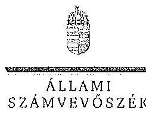

ELNÖK

Ikt.szám: V-0749-154/2015.

Nagy János úr
elnök
Nemzeti Földalapkezelő Szervezet
Budapest

Tisztelt Elnök Úr!

Az „Az állami tulajdonban álló erdőgazdasági társaságok vagyongazdálkodási tevékenységének ellenőrzése" című ellenőrzés tekintetében 14 társaság jelentéstervezetére tett észrevételüket köszönettel megkaptam.

Az Állami Számvevőszék észrevételekre vonatkozó álláspontjáról a felügyeleti vezető által készített részletes tájékoztatást csatoltan megküldöm.

Tájékoztatom Elnök urat, hogy a számvevőszéki jelentésben - az Állami Számvevőszékről szóló 2011. évi LXVI. törvény 29. § (3) bekezdése alapján - a figyelembe nem vett észrevételeket szerepeltetjük az elutasítás indokának feltüntetésével.

Budapest, 2015. 11. hó 02. nap

Tisztelettel:

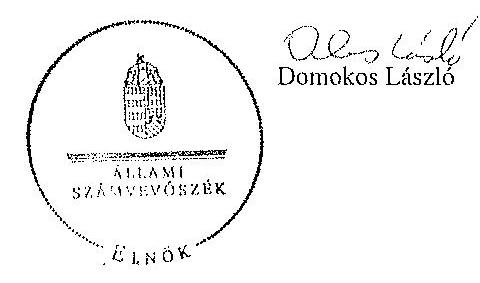

Melléklet: Tájékoztatás az észrevételek kezeléséről

VRIE BUDAPEST, APÁCZAI CSERE JÁNOS ÚT 10. 1052 Budapest. Pf. 54. Tel. 484 9101 fax. 484 5201

---

# Tájékoztatás   az észrevételek kezeléséről 

„Az állami tulajdonban álló erdőgazdasági társaságok vagyongazdálkodási tevékenységének ellenőrzése" című ellenőrzés tekintetében az IPOLY ERDŐ Zrt., az EGERERDŐ Erdészeti Zrt., a Mecsekerdő Zrt., a SEFAG Erdészeti és Faipari Zrt., a Gemenci Erdő- és Vadgazdaság Zrt., az Északerdő Erdőgazdasági Zrt., a Pilisi Parkerdő Zrt., a Szombathelyi Erdészeti Zrt., a Kisalföldi Erdőgazdasági Zrt., a Zalaerdő Erdészeti Zrt., a KEFAG Kiskunsági Erdészeti és Faipari Zrt., a VADEX Mezöföldi Erdő- és Vadgazdálkodási Zrt., a Győri Erdészeti és Vadászati Zrt., illetve a TAEG Tanulmányi Erdőgazdaság Zrt. társaságok jelentéstervezetére 2015. október 16-án érkezett észrevételeket áttekintettük, azok kezelésével kapcsolatban a következő tájékoztatást adom.

Az észrevétel szerint a jelentéstervezetben tett megállapítások helytállóak, azokat nem vitatják. Az NFA elnökének tett javaslatokhoz kapcsolódó tájékoztatást köszönjük. Mindezek miatt, valamint arra tekintettel, hogy nem jött létre olyan vagyonkezelési szerződés, amely biztosítja az ideiglenes vagyonkezelési szerződés hiányosságainak a megszüntetését, illetve a hatályos jogszabályoknak való megfeleltetést, a megállapítások és a javaslatok módosítása nem indokolt.

Budapest, 2015. év $\quad 11$ hó 27. nap
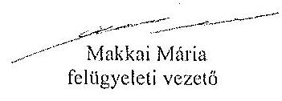
