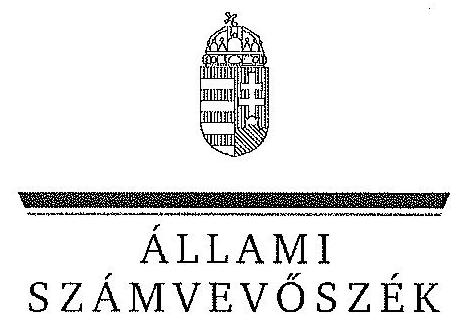

ÁLLAMI
SZÁMVEVŐSZÉK

# JELENTÉS 

Az állami tulajdonban álló erdőgazdasági társaságok vagyongazdálkodási tevékenységének ellenőrzése

ÉSZAKERDŐ Erdőgazdasági Zrt.

---

# Állami Számvevőszék 

Iktatószám: V-0754-111/2015
Témaszám: 1788
Vizsgálat-azonosító szám: V070606

## Az ellenőrzést felügyelte:

## Makkai Mária

felügyeleti vezető
Az ellenőrzést vezette és az ellenőrzés végrehajtásáért felelős:
Dr. Schreiber Judit Zsuzsanna
ellenőrzésvezető
A számvevőszéki jelentés összeállításában közreműködött:
Luhály Matild
számvevő
Az ellenőrzést végezték:
Luhály Matild
Mokánszkiné Mengyi Andrea
számvevő
főtanácsos

---

# TARTALOMJEGYZÉK 

BEVEZETÉS ..... 3
I. ÖSSZEGZŐ MEGÁLLAPÍTÁSOK, KÖVETKEZTETÉSEK, JAVASLATOK ..... 7
II. RÉSZLETES MEGÁLLAPÍTÁSOK ..... 13

1. Az ÉSZAKERDŐ Zrt. vagyongazdálkodása ..... 13
1.1. A vagyon értékének megőrzése, gyarapítása ..... 13
1.2. A vagyonkezelői kötelezettség teljesítése ..... 15
2. Az ÉSZAKERDŐ Zrt. vagyonkezelési szerződése és a vagyonnyilvántartása ..... 16
2.1. A vagyonkezelési szerződés megfelelősége ..... 16
2.2. Az ÉSZAKERDŐ Zrt. vagyonnyilvántartása ..... 17
3. Az ÉSZAKERDŐ Zrt. éves tervezési feladatainak ellátása, az ágazati jogszabályok érvényesülése ..... 18
3.1. Az üzleti tervek vagyonmegőrzésre, vagyongyarapításra vonatkozó elemei ..... 18
3.2. A tervekben megfogalmazott előírások érvényesülése ..... 19
3.3. Az ágazati szabályok érvényesülése ..... 19
4. A kontroll- és a monitoring rendszer kialakítása és működtetése ..... 21
4.1. A kontrollrendszer kialakítása és működtetése ..... 21
4.2. Az információáramlási és a monitoring rendszer kialakítása és működtetése ..... 22
5. A tulajdonosi joggyakorlóknak az ÉSZAKERDŐ Zrt. vagyongazdálkodási feladataira vonatkozó döntései, intézkedései megfelelősége ..... 23

---

# MELLÉKLETEK 

1. számú Rövidítések jegyzéke
2. számú Fogalomtár
3. számú Az erdőgazdasági társaság vagyonának alakulásáról a 2009-2013. években
4. számú Az immateriális javak és tárgyi eszközök állományának megoszlása a 2013. évre vonatkozóan
5. számú A befektetett eszközök állományának alakulásáról
6. számú A saját tőke változása a 2013. évre vonatkozóan
7. számú A beruházások, felújítások forrásáról
8. számú Az ÉSZAKERDŐ Zrt. vezérigazgatójának észrevétele
9. számú Az ÉSZAKERDŐ Zrt. vezérigazgatójának észrevételére adott válasz
10. számú A Magyar Nemzeti Vagyonkezelő Zrt. vezérigazgatójának észrevétele
11. számú A Magyar Nemzeti Vagyonkezelő Zrt. vezérigazgatójának észrevételére adott válasz
12. számú A Magyar Fejlesztési Bank Zrt. vezérigazgatójának észrevétele
13. számú A Magyar Fejlesztési Bank Zrt. vezérigazgatójának észrevételére adott válasz
14. számú A Nemzeti Földalapkezelő Szervezet elnökének észrevétele
15. számú A Nemzeti Földalapkezelő Szervezet elnökének észrevételére adott válasz

---

# JELENTÉS 

## Az állami tulajdonban álló erdőgazdasági társaságok vagyongazdálkodási tevékenységének ellenőrzése ÉSZAKERDŐ Erdőgazdasági Zrt.

## BEVEZETÉS

Hazánk területének több mint 20\%-át erdő borítja. Az erdők fenntartása és védelme az egész társadalom érdeke, ezért az erdőkkel csak a közérdekkel összhangban lehet gazdálkodni.

Az Alaptörvény 38. cikke és az Nvtv. alapján az állam tulajdona a nemzeti vagyon részét képezi. Az Nvtv. alapján nemzetgazdasági szempontból kiemelt jelentőségű nemzeti vagyonban tartandó vagyonelemnek minősül a 100\%-ban az állam tulajdonában álló védelmi és közjóléti elsődleges rendeltetésű erdő, a gazdasági elsődleges rendeltetésű természetes erdő, természetszerű erdő és származék erdő természetességi állapotú öt hektárnál nagyobb, természetben összefüggő erdő. Az erdőgazdasági társaságok vagyongazdálkodása szempontjából a Vtv., illetve az Nvtv. és az Nfatv., valamint a kapcsolódó kormány- és miniszteri rendeletek mellett kiemelkedő szerepe van a különböző ágazati jogszabályoknak. A vagyonkezelési tevékenység végrehajtása során figyelemmel kell lenni az Evt.-ben foglaltakra, mely alapján a nemzeti vagyonról szóló törvényben nemzetgazdasági szempontból kiemelt jelentőségű nemzeti vagyonként meghatározott védelmi és közjóléti elsődleges rendeltetésű, az állam tulajdonában álló erdő a kincstári vagyon részét képezi. Az erdőgazdasági társaságoknak az általuk kezelt vagyonelemek sajátosságára tekintettel kell a vagyongazdálkodási tevékenységüket kialakítaniuk, gondoskodniuk kell a közérdek és az Evt.-ben foglaltak érvényesülését biztosító vagyongazdálkodásról.

Az Evt. előírásai alapján az állam 100\%-os tulajdonában álló erdőt és erdőgazdálkodási tevékenységet közvetlenül szolgáló földterületet csak vagyonkezelés formájában lehet hasznosításra átengedni, és az állam tulajdonában álló erdő és erdőgazdálkodási tevékenységet közvetlenül szolgáló földterület vagyonkezelését csak költségvetési szerv vagy kizárólagos állami tulajdonú gazdálkodó szervezet végezheti.

A Vtv. szerint az erdőgazdasági társaságok és a társaságok kezelésében lévő állami vagyon feletti tulajdonosi jogokat a 2010. évig a Magyar Állam nevében az MNV Zrt. gyakorolta. A 2010. évi törvényi változások (Vtv., Mfbtv., Nfatv.) következtében 2010. június 17. napjától az erdőgazdasági társaságok állami tulajdonú részesedése tekintetében a tulajdonosi jogokat az állami vagyonért felelős miniszter az MFB Zrt. útján látta el. Az Nfatv. 2010. évi hatálybalépését követően a társaságok által kezelt, a Nemzeti Földalapba tartozó földterületek

---

vonatkozásában a tulajdonosi jogokat az NFA, míg egyéb ingatlanok és vagyonelemek tekintetében a tulajdonosi jogokat az MNV Zrt. gyakorolja. 2014. július 16-tól az erdőgazdasági társaságok feletti tulajdonosi jogokat az erdőgazdálkodásért felelős miniszter gyakorolja.

A Nemzeti Földalapba tartozó 1772 980,17 ha földterületből a 2012. év végén a 100\%-os állami tulajdonú 19 erdőgazdasági társaság kezelésében összesen 913664,3681 ha földterület volt, ebből 879254,1595 ha erdő, a többi egyéb művelési ágba tartozik. A kezelt földterületek erdőgazdasági társaságonkénti megoszlása eltérő.

Az erdőgazdasági társaságok az Alaptörvény és az Nvtv. előírása szerint önállóan és felelősen gazdálkodnak a törvényesség, a célszerűség és az eredményesség követelményei szerint. Az állami vagyonnal való gazdálkodás alapvető feladata a vagyon rendeltetésszerű, hatékony és felelős felhasználásának biztosítása az állami vagyon értékének megőrzése, gyarapítása érdekében. Az erdőgazdasági társaságok jelen ellenőrzése az állami vagyonnal gazdálkodás során a törvényesség betartására irányult.

Az ÉSZAKERDŐ Zrt. az ország északkeleti részén, Borsod-Abaúj-Zemplén megyében az Északi Középhegység keleti felén gazdálkodik, a központja Miskolc. A Társaság 2013. évi éves beszámolója szerint 3948,0 M Ft nettó árbevétel mellett 228,8 M Ft mérleg szerinti eredményt ért el, a mérlegfőösszeg 6416 M Ft volt. Az erdőgazdasági társaság 103 ezer ha erdőterületen és 4 ezer ha egyéb művelési ágú földterületen gazdálkodott, az éves átlaglétszám 738 fő volt.

Az ellenőrzés célja annak értékelése, hogy az ÉSZAKERDŐ Zrt. vagyongazdálkodása, vagyonérték-megőrző és vagyongyarapítási tevékenysége, valamint ennek szervezeti keretei megfeleltek-e a jogszabályok és belső szabályzatok előírásainak, valamint a kezelt vagyonelemek sajátosságaiból adódó követelményeknek.

Ennek keretében ellenőriztük és értékeltük, hogy:

- a vagyongazdálkodás során betartották-e az Nvtv. 7. §-ában megállapított vagyongazdálkodási alapelveket, valamint az ágazati jogszabályok vagyongazdálkodáshoz kapcsolódó előírásait;
- a Társaság a saját és a kezelt vagyonnal való gazdálkodásra vonatkozó éves tervezési feladatait a jogszabályi előírásoknak megfelelően látta-e el, a Társaság üzleti tervei a kezelésbe vett vagyonra vonatkozó, a Vtv. 2. § (1) és a 27. § (7) bekezdésében előírt vagyon megőrzésére, gyarapítására vonatkozó elemeket tartalmazták-e és azokat a vagyongazdálkodás során érvényesítették-e;
- a vagyonkezelési szerződések és a vagyon-nyilvántartás megfeleltek-e a szabályszerűségi követelményeknek, elősegítették-e az állami vagyonnal való szabályszerű gazdálkodást;
- a Társaság kialakította és működtette-e a szabályszerű feladatellátást támogató kontrollrendszert. Ezen belül elkészítették és aktualizálták-e a társaság feladatellátási-folyamatainak szabályzatait, az információs és a kontrolling-

---

monitoring rendszert, a kockázatok kezelésének rendszerét, valamint a vagyongazdálkodás területén azokat az eljárásokat, amelyek elősegítik a szervezeti célok végrehajtását;

- a tulajdonosi joggyakorlóknak az ÉSZAKERDŐ Zrt. vagyongazdálkodási feladataira vonatkozó döntései, intézkedései előkészítése és megalapozottsága a jogszabályoknak és a belső szabályozásnak megfelelte-e, a tulajdonosi joggyakorlók e minőségben végzett tevékenysége támogatta-e a felelős vagyongazdálkodás megvalósulását.

Az ellenőrzés típusa: szabályszerűségi ellenőrzés.
Az ellenőrzött időszak: 2009. január 1. napjától 2014. június 30. napjáig, kitekintéssel a helyszíni ellenőrzés végéig tartó releváns folyamatokra, intézkedésekre.

Az ellenőrzés várható hasznosulása: A Társaság és a tulajdonosi joggyakorlók fenti szempontú ellenőrzése az állami tulajdonban álló vagyon kezelésére, a vagyonnal való gazdálkodásra vonatkozó, kötelezően végrehajtandó éves ÁSZ ellenőrzést szélesebb körűvé teszi.

Az ellenőrzés várható hasznosulásaként biztosíthatja a társadalom részéről kiemelt érdeklődéssel kísért téma objektív bemutatását. Az ÁSZ jelentéséből a média és az állampolgárok átfogó képet kaphatnak a Magyarország állami tulajdonban lévő erdőivel való gazdálkodásról, a gazdálkodást, vagyonkezelést végző szervezeti rendszerről, az állami tulajdonban álló erdőgazdasági társaságok feladatellátásához kapcsolódóan feltárt problémákról.

Az ellenőrzés jól hasznosítható - többek közt - az állami vagyonnal kapcsolatos országgyűlési törvényhozó munkában is, továbbá hozzájárulhat a tulajdonosi joggyakorlás javításával a „jó kormányzás" gyakorlatának erősítéséhez.

Az ellenőrzéssel érintett szervezetek: Az ÉSZAKERDŐ Zrt., a Társaság kezelésében lévő állami vagyon feletti tulajdonosi jogokat gyakorló szervezetek, valamint a Társaság állami tulajdonú részesedése feletti tulajdonosi joggyakorlók (MFB Zrt., MNV Zrt., NFA).

Az ellenőrzés végrehajtásának jogszabályi alapját az ÁSZ tv. 5. § (4)-(5) bekezdéseiben foglaltak képezik.

Az ellenőrzés szakmai módszertana az ÁSZ hivatalos honlapján közzétett szakmai szabályokon alapult, amely a Legfőbb Ellenőrző Intézmények Nemzetközi Szervezete (INTOSAI) által kiadott nemzetközi standardok (ISSAI) figyelembevételével készült.

Az ÉSZAKERDŐ Zrt. az ellenőrzés lefolytatásához tanúsítványok kitöltésével, valamint dokumentumok elektronikus megküldésével szolgáltatott adatokat. Az így rendelkezésre bocsátott adatok és információk kontrollja a helyszíni ellenőrzés keretében történt. A vagyonváltozást eredményező döntések megalapozottságát, továbbá a vagyonérték-megőrző és vagyongyarapító tevékenység szabályszerűségét a számviteli nyilvántartásokból, valamint kockázat alapú és véletlenszerű mintavétellel kiválasztott tételek ellenőrzésével értékeltük. A ke-

---

zelt vagyont érintően a beruházások, felújítások pénzforgalmi kiadási területet arányos rétegzéssel összesen 30 elemű véletlen minta ellenőrzésével minősítettük. A sokaságból tételes ellenőrzésre kiemeltük évente a 2009-2013. évek 3-3 legnagyobb összegű tételét, 2014. első félévében a kettő legnagyobb összegű tételt. A kivett minta alapján végeztük a kezelt vagyonon megvalósított beruházások, felújítások szabályszerűségének (üzembe helyezés, nyilvántartás, értékcsökkenés elszámolása) ellenőrzését. A vagyonhasznosítási bevételeken belül az immateriális szolgáltatásokhoz kapcsolódó tételek képezték az alapsokaságot, melyet ellenőriztünk.

Az ÁSZ a 2011. évi LXVI. törvény 29. §-a szerint a jelentéstervezetet megküldte az ÉSZAKERDŐ Erdőgazdasági Zrt., a Magyar Nemzeti Vagyonkezelő Zrt. és a Magyar Fejlesztési Bank Zrt. vezérigazgatójának, valamint a Nemzeti Földalapkezelő Szervezet elnökének egyeztetésre. Az ÉSZAKERDŐ Erdőgazdasági Zrt. vezérigazgatójának észrevételét és az arra adott választ a 8-9. számú melléklet, a Magyar Nemzeti Vagyonkezelő Zrt. vezérigazgatójának észrevételét és az arra adott válaszunkat a 10-11. számú melléklet, a Magyar Fejlesztési Bank Zrt. vezérigazgatójának észrevételét és az arra adott válaszunkat a 12-13. számú melléklet tartalmazza. A Nemzeti Földalapkezelő Szervezet elnökének észrevételét és az arra adott választ a 14-15. számú melléklet tartalmazza.

---

# I. ÖSSZEGZŐ MEGÁLLAPÍTÁSOK, KÖVETKEZTETÉSEK, JAVASLATOK 

Az ÉSZAKERDŐ Zrt. vagyongazdálkodása az ellenőrzött években a saját vagyonára és a vagyonkezelésében lévő állami vagyonra terjedt ki. A Társaság mérleg szerinti vagyona a saját vagyonából állt, amely a 2009. évi 4859,5 M Ft nyitó állományról 2013. év végére 6416,1 M Ft-ra (32\%-kal), a saját tőke összege 3935,5 M Ft-ról 5027,8 M Ft-ra (27,8\%) növekedett. A Társaság mérleg szerinti eredménye a 2009-2013. években pozitív, összesen 1001,7 M Ft volt.

A Társaság a vagyonkezelt vagyonelemekre vonatkozóan nem tett eleget a Számv. tv.-ben foglaltaknak, mivel a Társaság mérleg szerinti vagyona nem tartalmazta a vagyonkezelésében lévő állami erdők és azzal szerves egységet képező egyéb földterületek, valamint az egyéb kezelt vagyon értékét, ezáltal a mérleg nem a valós állapotot tükrözte. A Számv. tv.-ben foglaltak ellenére a vagyonkezelésbe vett eszközöket mérlegtétel szerinti megbontásban nem mutatták be a kiegészítő mellékletben.

A Társaság által kezelt vagyonról vezetett nyilvántartás nem felelt meg a Vhr.-ben foglaltaknak, mert tételesen nem tartalmazta a vagyonkezelt eszközök könyv szerinti bruttó és nettó értékét, valamint az értékben bekövetkezett egyéb változásokat. Ezért a vezetett nyilvántartás nem biztosította
 az átláthatóságot és az elszámoltathatóságot. A kezelt ingatlanokról tételes mennyiségi kimutatást vezettek, a forint érték feltüntetése nélkül, ami megfelelt a VSZ 2.4. pontja szerinti naturáliákban történő nyilvántartás vezetési előírásnak, azonban nem felelt meg a Számv.tv.-ben a kezelt vagyon nyilvántartására vonatkozó szabálynak. A vagyonkezelt eszközök forint értékének meghatározását a Társaság sem az MNV Zrt.-nél, sem pedig az NFA-nál nem kezdeményezte annak érdekében, hogy eleget tegyen a Számv. tv. előírásainak.

A Társaság nem rendelkezett a VSZ eredeti, hiteles, a vagyonkezelt eszközök felsorolását tartalmazó 1-4. mellékleteivel. A Társaság nem teljes körűen rendelkezett a kezelt vagyon tekintetében pontos és naprakész információval a tulajdonosi jogokat gyakorlóról, így a Társaság által vezetett nyilvántartás nem biztosította a Vhr.-ben foglalt, az adatszolgáltatás pontosságára vonatkozó követelményt.

A tulajdonosi joggyakorlók tisztázásával és a kezelt vagyonelemek nyilvántartása egyezőségének biztosításával kapcsolatos adategyeztetés az ellenőrzés befejezéséig nem került lezárásra, így nem állt rendelkezésre a Társaság által kezelt vagyonra és annak nagyságára vonatkozó, a Társaság, az MNV Zrt. és az NFA nyilvántartásában szereplő, egyező adat.

A Társaság a Magyar Állam tulajdonában álló erdővagyon és egyéb művelési ágú termőföld ingatlanok kezelését a KVI-vel 1996. október 16-án kötött vagyonkezelési szerződés alapján végezte. A Társaság mint vagyonkezelő és a KVI között létrejött szerződéses jogviszony kereteit a VSZ-ben foglalt jogok és kötelezettségek töltötték ki. A VSZ nem támogatta a Vhr.-ben előírt, a vagyongaz-

---

dálkodási feladatok átlátható módon történő végrehajtását, valamint nem támogatta a szabályszerű vagyongazdálkodást.

A VSZ 3.3.2. pontjában foglaltak ellenére a VSZ-t a felek évente nem vizsgálták felül. A felek nem tettek eleget a Vhr.-ben foglalt rendelkezésnek és a Vhr. hatálybalépését követő hat hónapon belül nem kezdeményezték a Nemzeti Földalapba tartozó ingatlanokra vonatkozóan a VSZ megszüntetését és a Vtv., illetve Vhr. szabályainak megfelelő szerződés megkötését.

A Társaság által kezelt vagyonelemek többszöri változása ellenére a felek nem tartották be a Vhr.-ben előírt, a VSZ 60 napon belüli egységes szerkezetbe foglalására vonatkozó rendelkezést. A VSZ módosításokkal történő egységes szerkezetbe foglalását sem a Társaság, sem a tulajdonosi jogokat gyakorló MNV Zrt., illetve NFA nem kezdeményezte.

A VSZ vagyonkezelői jog átengedésére vonatkozó 3.2.3. pontja 2012-től nem felelt meg az Nvtv.-ben foglaltaknak, amely szerint a vagyonkezelői jog harmadik személynek nem engedhető át.

A VSZ-ben a felek nem rögzítették a Vhr.-ben 2011. január 1-jétől előírt, az érintett vagyonelem esetleges védettségét, illetve Natura 2000 területnek minősítését, és a Vhr.-ben foglalt elismerő nyilatkozatot az MNV Zrt. vagyonnyilvántartási szabályzatának megismerésére és kötelező elismerésére vonatkozóan.

A felek a VSZ-ben nem rögzítették egyértelműen, hogy a vagyonkezelési díjat nettó vagy bruttó értékben határozták-e meg. A VSZ 3.3.2. pontjában foglaltak ellenére a díjat a felek évente nem vizsgálták felül, erről történő megállapodásra megkötésére nem került sor.

Az NFA - az MNV Zrt.-vel kötött megállapodás alapján - a 2009-2013. évekre vonatkozó vagyonkezelési díjakat leszámlázta, azonban a számlázás a VSZ 3.3.3. pontjában foglalt határidőtől eltérő időben történt. Az NFA a számlákon a vagyonkezelési díjat egy összegben szerepeltette, azokon nem tüntette fel a számlázás alapját képező földterület nagyságát, így nem volt megállapítható a számlák tartalmi megfelelősége.

A Társaság az ellenőrzött időszakban a vagyongazdálkodás során a kezelt vagyonelemek, valamint a saját eszközeinek karbantartási, állagmegóvási feladatait a Vtv., a Vhr. és az Nfatv. előírásai alapján ellátta.

A 2009-2013. években a Társaság beruházásokra és felújításokra összesen 1320,3 M Ft-ot fordított. A beruházások, felújítások és a karbantartások költségeit az üzleti tervek tartalmazták. Az éves tervezési feladatokat az előírásoknak megfelelően végezték, az üzleti tervek tartalmaztak a vagyongazdálkodásra, a vagyon megőrzésére vonatkozó elemeket. A Társaság az állami vagyonnal való gazdálkodás során érvényesítette a tervekben megfogalmazott előírásokat.

A Társaság a feladatellátása során az Evt. ${ }_{1,2}$ szerinti bejelentési, engedélyeztetési kötelezettségeknek eleget tett, valamint betartotta a vagyongazdálkodási alapelveket. A Társaság által kezelt vagyon elidegenítésére, megterhelésére az ellenőrzött időszakban nem került sor, erdő használatát, hasznosítását, illetve a

---

vagyonkezelői jogot harmadik személynek nem engedték át. A Társaság az Erdészeti hatóság által jóváhagyott erdőgazdálkodási és Vadászati hatóság által jóváhagyott vadgazdálkodási tervekkel rendelkezett. A Társaság az ellenőrzött időszakban az ágazati szabályokat nem teljes körűen tartotta be, a 2009-2013. években az Evt. ${ }_{2}$ szabályok megsértése, jogosulatlan fakitermelés miatt került sor bírság kiszabására.

A Társaság kialakította és működtette a feladatellátást támogató kontrollrendszert. A Társaság az éves beszámolóit elkészítette, azokat az FB és a könyvvizsgáló jelentésének figyelembe vételével a Társaság feletti tulajdonosi joggyakorló ${ }_{1,2}$ határozattal jóváhagyta. A Társaságnál működő FB az ellenőrzött időszakban eleget tett az Alapító okiratban előírt ellenőrzési feladatainak.

A Társaság minden évben a Számv. tv. és az Alapító Okirat szerint, a tulajdonosi joggyakorló ${ }_{1,2}$ által kijelölt könyvvizsgálót alkalmazott. A könyvvizsgáló minden ellenőrzött évben hitelesítő záradékkal látta el az éves számviteli beszámolót, figyelemfelhívó levelet nem adott ki. A könyvvizsgáló az ellenőrzött időszakban nem kifogásolta a beszámolóval kapcsolatosan az ÁSZ által feltárt hiányosságokat.

A Társaság kialakította és folyamatosan működtette a belső ellenőrzést. A belső ellenőr az FB által jóváhagyott éves munkaterv alapján látta el feladatát. A belső ellenőrzés megállapításaira intézkedési terveket készítettek, az abban megfogalmazottak teljesítetését nyomon követték.

A Társaságnál kialakították az információáramlási és monitoring rendszert, biztosították annak szabályzatok szerinti működését. Az ellenőrzött években teljesítették a Vhr.-ben és a VSZ-ben előírt, a vagyonkezelésében lévő állami vagyonnal kapcsolatos adatszolgáltatási kötelezettséget. Az ágazati lapok szerinti, a vagyonkezelési tevékenységgel kapcsolatos bevételekről és költségekről a beszámolókat elkészítették és az éves beszámolókkal együtt a társaság feletti tulajdonosi joggyakorló ${ }_{1,2}$-nak megküldték. Az erdőgazdálkodási tervek, egyéb erdőgazdálkodási tevékenységek és az éves vadgazdálkodási tervek teljesítéséről az éves üzleti jelentésekben és a kontrolling adatszolgáltatás keretein belül számoltak be.

Az ellenőrzött időszakban a Társaság az Avtv., illetve az Infotv. szerinti, a közérdekű adatok megismerésére irányuló igények teljesítésének rendjét rögzítő szabályzattal nem rendelkezett, a közérdekű adatok közzétételére vonatkozó szabályozásnak egy vezérigazgatói utasítás kiadásával tettek eleget. A Társaság a saját honlapján a közérdekű adatokat közzétette, azonban nem került közzétételre a közérdekű adatok megismerésére vonatkozó igények intézésének rendje.

A társaság feletti tulajdonosi joggyakorló ${ }_{1,2}$ a Társaság vagyongazdálkodási feladataira vonatkozó döntései, intézkedéseinek előkészítése összhangban volt a belső szabályzatokkal, a vagyonváltozást eredményező döntések végrehajtását a beszámolók, az üzleti tervek, üzleti jelentések és a kontrolling jelentések megtárgyalásával és jóváhagyásával ellenőrizték. A társaság feletti tulajdonosi joggyakorló ${ }_{2}$ a Társaságnál a 2010. évben külső szakértővel átvilágítást

---

végeztetett, a megtett intézkedések megvalósulását nyomon követték és az eredményekről az érintetteket beszámoltatták.

A vagyonkezelésbe adott állami vagyon tekintetében tulajdonosi jogokat gyakorló MNV Zrt. és NFA tevékenysége az ellenőrzött időszakban nem támogatta teljes körűen a felelős vagyongazdálkodás megvalósulását, a VSZszel kapcsolatban feltárt hiányosságok megszüntetése és a hatályos jogszabályoknak való megfeleltetése nem történt meg. A vagyonkezelésbe adott állami vagyon tekintetében tulajdonosi jogokat gyakorló MNV Zrt. és NFA nem végeztek a Vhr.-ben és a Nemzeti Földalapba tartozó földrészletek hasznosításának részletes szabályairól szóló 262/2010. (XI. 17.) Korm. rendeletben foglalt, a vagyonnyilvántartás hitelességére, teljességére és helyességére vonatkozó ellenőrzést a Társaságnál.

Az Állami Számvevőszékről szóló 2011. évi LXVI. törvény 33. § (1) bekezdésében foglaltak értelmében a jelentésben foglalt megállapításokhoz kapcsolódó intézkedési tervet köteles az ellenőrzött szervezet vezetője összeállítani, és azt a jelentés kézhezvételétől számított 30 napon belül az ÁSZ részére megküldeni. Amennyiben az intézkedési tervet határidőben nem küldi meg a szervezet, vagy az nem elfogadható, az ÁSZ elnöke a hivatkozott törvény 33. § (3) bekezdésében foglaltakat érvényesítheti.

Az ellenőrzés intézkedést igénylő megállapításai és javaslatai:

# MNV Zrt. vezérigazgatójának, az NFA elnökének 

Az ÉSZAKERDŐ Zrt. a KVI-vel 1996. október 16-án kötött vagyonkezelési szerződés alapján végezte a Magyar Állam tulajdonában álló erdővagyon és egyéb művelési ágú termőföld ingatlanok kezelését. A Társaság, mint vagyonkezelő és a KVI között létrejött szerződéses jogviszony kereteit a VSZ-ben foglalt jogok és kötelezettségek töltötték ki. A VSZ nem támogatta a Vhr. 3. § (1) bekezdésében foglalt, a vagyongazdálkodási feladatok átlátható módon történő végrehajtását, valamint nem támogatta a szabályszerű vagyongazdálkodást. Az ellenőrzött időszakban a VSZ nem felelt meg a jogszabályi rendelkezéseknek, hatályon kívül helyezett jogszabályi hivatkozásokat tartalmazott az Áht1 109/B. §, 109/G. §, a Vadvédelmi tv. 98. § rendelkezései vonatkozásában. A VSZ 3.2.3. pontja megengedte a vagyonkezelői jog átruházását, azonban a rendelkezés 2012. január 1-től nem felelt meg az Nvtv. 11. § (8) bekezdésében foglaltaknak, amely tiltja a vagyonkezelői jog harmadik személyre történő átruházást. A VSZ 3.3.2. pontjában foglaltak ellenére a VSZ-t a felek évente nem vizsgálták felül. A felek nem tettek eleget a Vhr. 54. § (7) 1. bekezdésében foglalt rendelkezésnek és a Vhr. hatálybalépését követő hat hónapon belül nem kezdeményezték a Nemzeti Földalapba tartozó ingatlanokra vonatkozóan a VSZ megszüntetését és a Vtv., illetve Vhr. szabályainak megfelelő szerződés megkötését.

A vagyonkezelésbe adott állami vagyon tekintetében tulajdonosi jogokat gyakorló MNV Zrt. és NFA nem végeztek a Vhr. 20. § (1)-(2) bekezdéseiben és a Nemzeti

[^0]
[^0]:    ${ }^{1}$ Vhr. 54. § (7) bekezdés (hatályos 2010. december 31-éig)

---

Földalapba tartozó földrészletek hasznosításának részletes szabályairól szóló 262/2010. (XI. 17.) Korm. rendelet 47. § (1)-(2) bekezdéseiben foglalt, a vagyonnyilvántartás hitelességére, teljességére és helyességére vonatkozó ellenőrzést a Társaságnál.

Javaslat:

# az MNV Zrt. vezérigazgatójának 

a) Tegyen intézkedéseket az erdőgazdasági társaság közreműködésével a tényleges állapotot rögzítő és a hatályos jogszabályi előírásoknak megfelelő vagyonkezelési szerződés megkötésére.
b) Tegyen intézkedéseket a vagyonkezelési szerződés felülvizsgálatának elmaradásával, valamint a Nemzeti Földalapba tartozó ingatlanokra vonatkozó VSZ megszüntetésével összefüggésben feltárt szabálytalanságok tekintetében a felelősség tisztázása érdekében, és szükség szerint intézkedjen a felelősség érvényesítéséről.
c) Intézkedjen a Társaság vagyonnyilvántartása hitelességének, teljességének és helyességének jogszabályban foglaltak szerinti ellenőrzéséről.

## az NFA elnökének

a) Tegyen intézkedéseket az erdőgazdasági társaság közreműködésével a tényleges állapotot rögzítő és a hatályos jogszabályi előírásoknak megfelelő vagyonkezelési szerződés megkötésére.
b) Intézkedjen a vagyonkezelési szerződés felülvizsgálatának elmaradásával összefüggésben feltárt szabálytalanságok tekintetében a munkajogi felelősség tisztázására irányuló eljárás megindításáról, és ennek eredménye ismeretében tegye meg a szükséges intézkedéseket.
c) Intézkedjen a Társaság vagyonnyilvántartása hitelességének, teljességének és helyességének jogszabályban foglaltak szerinti ellenőrzéséről.

## az ÉSZAKERDŐ Erdőgazdasági Zrt. vezérigazgatójának:

1. Az ÉSZAKERDŐ Zrt. és a KVI között 1996. október 16-án kötött vagyonkezelési szerződés nem támogatta a Vhr. 3. § (1) bekezdésében foglalt, a vagyongazdálkodási feladatok átlátható módon történő végrehajtását, valamint nem támogatta a szabályszerű vagyongazdálkodást. Az ellenőrzött időszakban a VSZ nem felelt meg a jogszabályi rendelkezéseknek, hatályon kívül helyezett jogszabályi hivatkozásokat tartalmazott az Áht1 109/B. §, 109/G. §, a Vadvédelmi tv. 98. § rendelkezései vonatkozásában. A VSZ 3.2.3. pontja megengedte a vagyonkezelői jog átruházását, azonban a rendelkezés
 2012. január 1-től nem felelt meg az Nvtv. 11. § (8) bekezdésében foglaltaknak, amely tiltja a vagyonkezelői jog harmadik személyre történő átruházást. A VSZ 3.3.2. pontjában foglaltak ellenére a VSZ-t a felek évente nem vizsgálták felül.

---

Javaslat:
a) Tegyen intézkedéseket a tulajdonosi joggyakorlókkal közreműködve a tényleges állapotnak és a hatályos jogszabályi előírásoknak megfelelő vagyonkezelési szerződés megkötése érdekében.
b) Intézkedjen a vagyonkezelési szerződés felülvizsgálatának elmaradásával feltárt szabálytalanságok tekintetében a felelősség tisztázása érdekében, és szükség szerint intézkedjen a felelősség érvényesítéséről.
2. A Társaság a Számv. tv. 23. § (2) bekezdésben foglaltak ellenére a kezelt vagyont a mérlegben nem mutatta ki, továbbá ezen eszközöket - legalább mérlegtétel szerinti megbontásban - a kiegészítő mellékletében nem mutatta be.

Javaslat:
a) Intézkedjen a kezelt vagyon mérlegben eszközként való kimutatásáról, továbbá ezen eszközöknek a kiegészítő mellékletben - legalább mérlegtételek szerinti megbontásban - külön történő bemutatásáról.
b) Intézkedjen a kezelt vagyon mérlegben eszközként történő kimutatásának elmaradásával kapcsolatban feltárt szabálytalanság tekintetében a felelősség tisztázása érdekében, és szükség szerint intézkedjen a felelősség érvényesítéséről.
3. A Társaság az Avtv. 20. § (8) bekezdésében, illetve az Info tv. 30. § (6) bekezdésében rögzített, a közérdekű adatok megismerésére irányuló igények teljesítésének rendjét nem szabályozta.

Javaslat:
Intézkedjen a jogszabályi előírásoknak megfelelően a közérdekű adatok megismerésére irányuló igények teljesítése rendjének szabályozásáról.

---

# II. RÉSZLETES MEGÁLLAPÍTÁSOK 

## 1. Az ÉSZAKERDŐ ZRT. VAGYONGAZDÁLKODÁSA

### 1.1. A vagyon értékének megőrzése, gyarapítása

Az ÉSZAKERDŐ Zrt. vagyongazdálkodása a saját vagyonára és a vagyonkezelésében lévő vagyonra terjedt ki. A Társaság mérleg szerinti vagyona a saját vagyonból állt, azonban a Számv. tv. 23. § (2) bekezdésben foglaltak ellenére a kezelt vagyont a mérlegben nem mutatták ki, azok mérlegtétel szerinti megbontásban nem kerültek bemutatásra a kiegészítő mellékletben, ezáltal a Társaság mérlege nem a valós állapotot tükrözte.

A Társaság mérleg szerinti vagyona a 2009. január 1-jei 4859,5 M Ft-ról 2013. december 31-re 6416,1 M Ft-ra (32,0%) emelkedett. A vagyon növekedése évente átlagosan 311,3 M Ft (6,4%) volt. A mérleg szerinti eredménye a 2009-2013. években pozitív, összesen 1001,7 M Ft volt. A Társaság mérleg szerinti eredményét befolyásoló összes bevétel 18,5%-kal emelkedett összességében a 2009. évről a 2013. évre. A változásokat jellemzően az egyéb bevételek és a pénzügyi műveletek bevételeinek változásai eredményezték.

A Társaság a 2009-2013. években a kezelt vagyon hasznosításából 18 212,9 M Ft bevételt realizált és 16336,2 M Ft költséget számolt el. A kezelt vagyonból származó bevételeket és költségeket a VSZ 3.2.2. pontja szerint a főkönyvi könyvelésben a vállalkozási bevételektől és költségektől elkülönítve mutatták ki.

Társaság befektetett eszközeinek értéke - a 2010. év kivételével - folyamatosan növekedett az előző évhez viszonyítva. A növekedés mértéke 2013. december 31-én a 2009. január 1-jei 2052,9 M Ft-hoz viszonyítva 36,1%-os volt. A befektetett eszközök mérleg szerinti értékének változását a terv szerinti értékcsökkenési leírás elszámolásán kívül az immateriális javak esetében használhatatlannak minősített vagyoni értékű jogok és szoftverek selejtezése, új szoftverek beszerzése, valamint a megvalósított informatikai fejlesztés értékének növekedése befolyásolta.

A tárgyi eszközök nettó értéke 2013. december 31-re 5,3%-kal (104,1 M Ft), a forgóeszközök mérleg szerinti értéke 27,1%-kal (752,3 M Ft) növekedett a 2009. január 1-jei nettó értékéhez viszonyítva. A forgóeszközökön belül a készletek értékének alakulását befolyásolta a nehezen értékesíthető késztermékek után elszámolt értékvesztés összege, a termelő tevékenység során létrehozott befejezetlen és félkész termékek, valamint a késztermékek állományának változásai.

Az ellenőrzött időszak alatt a befektetett pénzügyi eszközök mérleg szerinti értéke nőtt, amit elsősorban a tartós hitelviszonyt megtestesítő éven túli értékpapírok 2013. évi 626,5 M Ft értékű beszerzése eredményezett. A befektetett pénzügyi eszközök között került kimutatásra a dolgozóknak nyújtott lakásépítési és lakáskorszerűsítési kölcsön, valamint az egyéb tartós részesedések.

---

A Társaságnak a 2009. év végén öt gazdasági társaságban összesen 22,5 M Ft könyv szerinti értéken, a 2013. év végén pedig négy gazdasági társaságban összesen 31,5 M Ft könyv szerinti értéken volt egyéb tartós részesedése. A részesedések könyv szerinti értékének változását egy gazdasági társaság megszűnése, illetve részesedések vásárlása okozta. Az ellenőrzött időszakban a Társaság az Erdészeti Üdülő Közös Vállalatban lévő részesedését növelte az Alapító okiratban rögzített felhatalmazás alapján. A vásárolt részesedés könyv szerinti értéke összesen 10,0 M Ft volt.

A Társaság a Számv. tv. 41. § (1) bekezdésében és a Számviteli politika 2,3 10. pontjában foglaltaknak megfelelően garanciális és egyéb kötelezettségeire, valamint a jövőbeni költségekre céltartalékot képzett. A vevőkkel szemben fennálló követelésekről a lejárat szerint kimutatást készítettek, a Számv. tv. 55. § (1) bekezdés szerint az elvégzett minősítés alapján értékvesztést számoltak el. A céltartalék felhasználását, valamint az értékvesztés alakulását az éves beszámolók kiegészítő mellékleteiben bemutatták.

A VSZ hatálya alá tartozó eszközöket a Társaság a Számv. tv. 46 § (3) bekezdésben foglaltak ellenére nem értékelte, mivel a vagyonkezelésbe vett eszközöket nem szerepeltette a könyveiben és a mérlegeiben. A saját vagyonként nyilvántartott eszközök és források értékelését a Számv. tv. 46 § (3) bekezdésben foglaltaknak megfelelően évente elvégezte, amelynek során a Számv. tv. 46 § (4) bekezdés, valamint a számviteli politikában foglalt előírások szerint járt el.

A Társaság vagyonának alakulását a 2009-2013. években a következő táblázat tartalmazza.

| Sorszám | Megnevezés | 2009.01.01 |  | 2013.12.31 |  | Változás 2013.12.31/ 2009.01.01. (%) |
| :--: | :--: | :--: | :--: | :--: | :--: | :--: |
|  |  | Érték M Ft-ban | % | Érték M Ft-ban | % |  |
| 1. | Befektetett eszközök összesen | 2052,9 | 42,2 | 2795,0 | 43,6 | 136,1 |
| 2. | Ebből: Immateriális javak | 55,1 | 2,7 | 50,6 | 1,8 | 91,8 |
| 3. | Tárgyi eszközök | 1971,2 | 96,0 | 2075,3 | 74,3 | 105,3 |
| 4. | Befektetett pénzügyi eszközök | 26,6 | 1,3 | 669,1 | 23,9 | 2515,4 |
| 5. | Forgóeszközök | 2775,4 | 57,2 | 3527,7 | 55,0 | 127,1 |
| 6. | Aktív időbeli elhatárolások | 31,2 | 0,6 | 93,4 | 1,4 | 299,4 |
| 7. | Eszközök összesen | 4859,5 | 100,0 | 6416,1 | 100,0 | 132,0 |
| 8. | Saját tőke | 3935,5 | 81,0 | 5027,8 | 78,4 | 127,8 |
| 9. | Ebből: Jegyzett tőke | 1188,1 | 38,5 | 1278,7 | 25,4 | 107,6 |
| 10. | Tőketartalék | 1529,3 | 38,9 | 1529,2 | 30,4 | 100,0 |
| 11. | Eredménytartalék | 1045,6 | 26,6 | 1991,1 | 39,6 | 190,4 |
| 12. | Lekötött tartalék | 16,4 | 0,4 | - | - | - |
| 13. | Mérleg szerinti eredmény | 156,1 | 4,0 | 228,8 | 4,6 | 146,6 |
| 14. | Céltartalékok | 4,5 | 0,1 | 260,7 | 4,0 | 5793,3 |
| 15. | Kötelezettségek | 558,2 | 16,7 | 569,7 | 8,9 | 102,1 |
| 16. | Passzív időbeli elhatárolások | 361,3 | 7,4 | 557,9 | 8,7 | 154,4 |
| 17. | Források összesen | 4859,5 | 100,0 | 6416,1 | 100,0 | 132,0 |

A Társaság saját tőkéje a 2009-2013. években a mérlegfőösszeg 78,4-81,1%-a között mozgott. A saját tőke összege a 2009. január 1-jei 3935,5 M Ft-ról 2013. december 31-ére 5027,8 M Ft-ra (27,8%) növekedett. A saját tőke emelkedését az egyes években elért mérleg szerinti eredménynek az eredménytartalékba való helyezése, valamint a 2009. évi 90,6 M Ft-os tulajdonosi tőkeemelés eredményezte.

---

A 2009-2013. években a Társaság saját tőke növekedési mutatójának alakulása

| Megnevezés | 2009. nyi   tőke | 2009. év | 2010. év | 2011. év | 2012. év | 2013. év |
| :-- | :--: | :--: | :--: | :--: | :--: | :--: |
| Saját tőke (M Ft) | 3935,5 | 4219,0 | 4343,8 | 4530,3 | 4799,0 | 5027,8 |
| Jegyzett tőke (M   Ft) |  |  |  |  |  |  |
| Saját tőke-   növekedési mu-   tató % | 1188,1 | 1278,7 | 1278,4 | 1278,4 | 1278,4 | 1278,7 |
|  | - | 7,2 | 3,0 | 4,3 | 5,9 | 4,8 |

A Társaság az ellenőrzött években a beszámolóban és a számviteli nyilvántartásokban lévő vagyontárgyak állományát leltárral alátámasztotta. A leltározás elvégzését követően megtörténtek a leltárkiértékelések, a fellelt többletekről, illetve a hiányzó eszközökről elkészítették a jegyzőkönyveket.

A Társaság az ellenőrzött időszakban a vagyongazdálkodás során a kezelt vagyonelemek, valamint a saját eszközeinek karbantartási, állagmegóvási feladatait a Vtv.², a Vhr.³ és az Nfatv.⁴ előírásai alapján ellátta.

A 2009-2013. években a Társaság beruházásokra és felújításokra összesen 1320,3 M Ft-ot fordított, a kezelt erdők tekintetében az erdők fenntartására, gyarapítására és védelmére összesen 13 529,1 M Ft-ot számoltak el költségként a Számviteli politikában foglaltaknak megfelelően. A vagyoni eszközök vonatkozásában rendszeres időközönként állapotfelmérést végeztek, az üzleti terv készítése során tervezték meg a tárgyi eszközök karbantartására, állagmegóvására és az erdők gondozására, védelmére fordítandó kiadásokat. A felújítások és a karbantartások megvalósulásáról minden ellenőrzött évben az üzleti jelentésekben beszámoltak. A beruházások elvégzése előtt megkérték a Társaság feletti tulajdonosi joggyakorló¹,² engedélyét. Az értékcsökkenési leírás elszámolása a Számv. tv. 52. § (1) bekezdés előírásának megfelelt. A Társaságnál kezelésben lévő földterületek és az aktivált erdőtelepítések után értékcsökkenés elszámolására a Számv. tv. 52. § (5) bekezdésben foglaltak szerint nem került sor.

# 1.2. A vagyonkezelői kötelezettség teljesítése 

A Társaság a 2012. január 1-től hatályos az Nvtv. 7. §-ban foglalt vagyongazdálkodási alapelveket betartotta. A Vtv.⁵, az Nvtv.⁶ és a VSZ előírásait betartva, kezelt vagyont és az állam kizárólagos tulajdonában álló nemzeti vagyont nem idegenítettek el, nem terheltek meg, biztosítékul nem adták, illetve azokon

[^0]
[^0]:    ² Vtv. 23. § (2) bekezdése és 27. § (2) bekezdése
    ³ Vhr. 10. § (1) bekezdés (hatályos: 2010. december 31-éig) a Vhr. 9. § (6) bekezdése (hatályos: 2011. január 1-jétől)
    ⁴ Nfatv. 20. § (1) bekezdés (hatályos 2011. július 31-ig), Nfatv. 20. § (4) bekezdés (hatályos 2011. augusztus 1-től 2012. december 31-ig), Nfatv. 19/A (3) bekezdés (hatályos 2013. január 1-től)
    ⁵ Vtv. 33. § (1) bekezdés
    ⁶ Nvtv. 6. § (1) bekezdése (hatályos: 2012. január 1-től)

---

osztott tulajdont nem létesítettek. A Társaság
 az Nfatv. ${ }^{7}$-ben foglaltakat betartva a vagyonkezelői jogát nem adta tovább és nem terhelte meg, valamint az Evt. ${ }_{2}$ 9. § (3)${ }^{8}$ bekezdés előírását betartva erdő használatát, hasznosítását harmadik személynek nem engedte át.

A Társaság az Nfatv. ${ }^{9}$ vonatkozó részének 2011. augusztus 1-jei hatályba lépését követően a Magyar Állam tulajdonába tartozó erdő vagy erdőgazdálkodási tevékenységet közvetlenül szolgáló földterület vagyonkezelésbe vételére vonatkozó szerződést nem kötött, így ehhez kapcsolódóan azt nem kellett az Erdészeti Hatósághoz jóváhagyásra benyújtania.

# 2. Az ÉSZAKERDŐ ZRT. VAGYONKEZELÉSI SZERZŐDÉSE ÉS A VAGYONNYILVÁNTARTÁSA 

### 2.1. A vagyonkezelési szerződés megfelelősége

A Társaság a KVI-vel 1996. október 16-án kötött vagyonkezelési szerződést alapján végezte a Magyar Állam tulajdonában álló erdővagyon és egyéb művelési ágú termőföld ingatlanok kezelését. A Társaság, mint vagyonkezelő és a KVI között létrejött szerződéses jogviszony kereteit a VSZ-ben foglalt jogok és kötelezettségek töltötték ki. A VSZ nem támogatta a Vhr. 3. § (1) bekezdésében foglalt, a vagyongazdálkodási feladatok átlátható módon történő végrehajtását, valamint nem támogatta a szabályszerű vagyongazdálkodást.

Az ellenőrzött időszakban a VSZ nem felelt meg a jogszabályi rendelkezéseknek, hatályon kívül helyezett jogszabályi hivatkozásokat tartalmazott az Áht ${ }_{1}$ 109/B. §${ }^{10}$, 109/G. §${ }^{11}$, a Vadvédelmi tv. 98. §${ }^{12}$ rendelkezései vonatkozásában. A VSZ 3.3.2. pontjában foglaltak ellenére a VSZ-t a felek évente nem vizsgálták felül.

A felek nem tettek eleget a Vhr. 54. § (7)${ }^{13}$ bekezdésében foglalt rendelkezésnek és a Vhr. hatálybalépését követő hat hónapon belül nem kezdeményezték a Nemzeti Földalapba tartozó ingatlanokra vonatkozóan a VSZ megszüntetését és a Vtv., illetve Vhr. szabályainak megfelelő szerződés megkötését, így a VSZ nem tartalmazta a 2007-ben hatályba lépett Vtv. és Vhr. előírásait.

Az évente történő felülvizsgálat elmaradása miatt a szerződés nem a 2009-ben hatályba lépett Evt. ${ }_{2}$ és a 2012-től alkalmazandó Nvtv. megfelelő előírásaira

[^0]
[^0]:    ${ }^{7}$ Nfatv. 20 § (3) bekezdése (hatályos: 2011. július 31-éig), Nfatv. 20 § (8) bekezdése (hatályos: 2011. augusztus 1-jétől 2012. december 31-éig), Nfatv. 19/A. § (4) bekezdése (hatályos: 2013. január 1-jétől)
    ${ }^{8}$ Evt. 2 9. § (3) bekezdés (hatályos: 2009. július 10-től)
    ${ }^{9}$ Nfatv. 20. § (7) bekezdés (hatályos: 2011. augusztus 1-től)
    ${ }^{10}$ Áht. ${ }_{11} 109/B § (hatálytalan 2012. január 1-től)
    ${ }^{11}$ Áht. ${ }_{11} 109/G § (hatálytalan 2007. szeptember 25-től)
    ${ }^{12}$ Vadvédelmi tv. 98. § (hatálytalan 2007. április 14-től)
    ${ }^{13}$ Vhr. 54. § (7) bekezdés (hatályos 2010. december 31-éig)

---

való hivatkozásokat tartalmazott, nem tartalmazta a Vhr. 9. § (8) bekezdésében 2011. január 1-jétől előírt, az érintett vagyonelem esetleges védettségét, illetve Natura 2000 területnek minősítését, valamint nem tartalmazta a Vhr. 14. § (3) bekezdésben foglalt elismerő nyilatkozatot az MNV Zrt. vagyonnyilvántartási szabályzatának megismerésére és kötelező elismerésére vonatkozóan.

A Társaság által kezelt vagyonelemek többszöri változása ellenére a felek nem kezdeményezték a Vhr. 8. § (2) bekezdésében előírt 60 napon belüli egységes szerkezetbe foglalást. A VSZ módosításokkal történő egységes szerkezetbe foglalását sem a Társaság, sem a tulajdonosi jogokat gyakorló MNV Zrt, illetve NFA nem kezdeményezte.

A VSZ 3.2.3. pontja megengedte a vagyonkezelői jog átruházását, azonban ezen rendelkezés 2012. január 1-től nem felelt meg az Nvtv. 11. § (8) bekezdésében foglaltaknak, amely tiltja a vagyonkezelői jog harmadik személyre történő átruházást.

A felek a VSZ 3.3.1. pontjában a vagyonkezelési díjat 70 Ft/ha összegben állapították meg, azonban a felek nem rögzítették egyértelműen, hogy a vagyonkezelési díjat nettó vagy bruttó értékben határozták-e meg. A VSZ 3.3.2. pontja előírta a vagyonkezelési díj - külön megállapodás keretében a tárgyévet megelőző év november 30-ig történő - felülvizsgálatát, azonban a díjat a felek évente nem vizsgálták felül, erről történő megállapodásra megkötésére nem került sor.

Az NFA - az MNV Zrt.-vel kötött megállapodás alapján - a 2009-2013. évekre vonatkozó vagyonkezelési díjakat leszámlázta, azonban a számlázás a VSZ 3.3.3. pontjában foglalt határidőtől eltérő időben történt. Az NFA a számlákon a vagyonkezelési díjat egy összegben szerepeltette, azokon nem tüntette fel a számlázás alapját képező földterület nagyságát, így nem volt megállapítható a számlák tartalmi megfelelősége.

# 2.2. Az ÉSZAKERDŐ Zrt. vagyonnyilvántartása 

A Társaság által kezelt vagyonról vezetett nyilvántartás nem felelt meg a Vhr. 17. § (1) bekezdésében foglalt azon rendelkezésnek, amely szerint a nyilvántartásnak tételesen tartalmaznia kell a vagyonkezelt eszközök könyv szerinti bruttó és nettó értékét, valamint az értékben bekövetkezett egyéb változásokat. Ezért a vezetett nyilvántartás nem biztosította az átláthatóságot és az elszámoltathatóságot.

A Társaság a kezelt ingatlanokról tételes analitikus nyilvántartást vezetett, a forint érték feltüntetése nélkül, amely megfelelt a VSZ 2.4. pontja szerinti naturáliákban történő nyilvántartás vezetési előírásnak, azonban nem felelt meg Számv.tv. 23. § (2) bekezdés szerinti, a kezelt vagyon nyilvántartására vonatkozó előírásnak. A vagyonkezelt eszközök forint érték meghatározását a Társaság sem az MNV Zrt.-nél sem az NFA-nál nem kezdeményezte.

A Társaság által vezetett nyilvántartás helyrajzi számonként és a területmérték feltüntetésével tartalmazta a kincstári vagyoni körbe tartozó földterületek felsoro-

---

lását és azok jellemzőit, azonban a Társaság nem rendelkezett a VSZ hiteles mellékleteivel, amelyek a kezelésbe vett vagyonelemek, így a kezelt vagyonról vezetett nyilvántartás kiinduló adatait tartalmazták. A Társaság nem teljes körűen rendelkezett a kezelt vagyon tekintetében pontos és naprakész információval a tulajdonosi jogokat gyakorlóról, így a Társaság által vezetett nyilvántartás nem biztosította a Vhr. 14. § (1) bekezdésben foglalt, az adatszolgáltatás pontosságára vonatkozó követelményt.

Az ellenőrzött időszakban a tulajdonosi joggyakorló tisztázásával és a kezelt vagyonelemekről vezetett nyilvántartások egyezőségének biztosításával kapcsolatos adategyezetés az ellenőrzés befejezéséig nem került lezárásra, így nem állt rendelkezésre a Társaság által kezelt vagyonra és annak nagyságára vonatkozó, a Társaság, az MNV Zrt. és az NFA nyilvántartásában szereplő, egyező adat.

A Társaság vagyonkezelői jogának ingatlan-nyilvántartási bejegyzésének jogi rendezetlensége kedvezőtlenül hatott a Társaság által vagyonkezelt állami vagyonhoz kapcsolódó átláthatóságra.

# 3. Az ÉSZAKERDŐ ZRT. ÉVES TERVEZÉSI FELADATAINAK ELLÁTÁSA, AZ ÁGAZATI JOGSZABÁLYOK ÉRVÉNYESÜLÉSE 

### 3.1. Az üzleti tervek vagyonmegőrzésre, vagyongyarapításra vonatkozó elemei

A Társaság a saját és kezelt vagyonnal való gazdálkodás során az éves tervezési feladatait ellátta, az üzleti tervei tartalmazták a vagyon megőrzésére, gyarapítására vonatkozó elemeket.

A Társaság feletti tulajdonosi joggyakorló ${ }_{1,2}$ az éves üzleti tervek készítéséhez minden évben előzetesen megküldte a Társaság számára a tervezési irányelveket. Az irányelvek tartalmazták többek között a minimális tőkehatékonysági elvárásokat, a keresetszabályozás kereteit és a működésre vonatkozó egyéb szempontokat, valamint előírták a tervkészítés tartalmi és formai követelményeit. A Társaság feletti tulajdonosi joggyakorló ${ }_{3}$ a tervezési irányelvekben előírta, hogy a számszaki részt negyedéves bontásban kell elkészíteni, ami alapul szolgált a negyedéves üzleti jelentések készítésének is.

Az üzleti tervekben egységes keretbe foglalva, komplex módon bemutatásra került a Társaság tevékenysége, a küldetése, a tervezés főbb szempontjai, az összefoglaló elemzések, az ágazati tervek, valamint a beruházási és üzletpolitikai stratégia. Az üzleti tervek minden ellenőrzött évben tartalmazták a saját vagyon megőrzésére, gyarapítására vonatkozó elemeket, a beruházási tervet, a felújítások és karbantartások költségeit. Az üzleti tervben szerepeltek az ágazati tervek és ágazatra nem osztható tervek, valamint az EU-s támogatások felhasználása. Az ágazati tervekben ágazatonkénti bontásban mutatták be a kezelésben lévő területekkel való gazdálkodást.

---

A Társaság az elkészített éves üzleti terveket az FB véleményével és határozatával kiegészítve terjesztette a Társaság feletti tulajdonosi joggyakorló ${ }_{1,2}$ elé elfogadásra.

# 3.2. A tervekben megfogalmazott előírások érvényesülése 

A Társaság a kezelésbe vett vagyonnal való gazdálkodás során érvényesítette a tervekben megfogalmazott előírásokat.

A Társaság az erdőgazdálkodási tervek, egyéb erdőgazdálkodási tevékenységek és az éves vadgazdálkodási tervek teljesítéséről a Társaság feletti tulajdonosi joggyakorló ${ }_{1,2}$-nak az éves üzleti jelentésben számolt be, amik az erdő- és vadgazdálkodási tevékenység mennyiségi, illetve az egyes ágazatok gazdasági pénzügyi mutatóinak teljesítési adatait is tartalmazták. A Társaság az MNV Zrt., illetve az NFA részére is megküldte a vagyonkezelési tevékenységről szóló éves jelentéseket, és ágazati lapokat. Az ágazati lapok tartalmazták a vagyonkezelt terület működtetésére vonatkozó, az ágazati tervek terv és tény adatainak teljesülését.

### 3.3. Az ágazati szabályok érvényesülése

A Társaság a vagyongazdálkodási tevékenysége során az erdőgazdálkodásra vonatkozó speciális szakmai jogszabályi normákat nem teljes körűen tartotta be.

A Társaság eleget tett az Evt. 2 41. § (1) bekezdés szerinti bejelentési kötelezettségének és a tervezett erdészeti tevékenységek megkezdése előtt 30 nappal megtette a bejelentést. A 30 nap elteltét követően - amennyiben nem érkezett az Erdészeti hatóságtól korlátozást, tiltást tartalmazó határozat - megkezdték, illetve elvégezték a bejelentésnek megfelelő erdészeti tevékenységet. Az erdészeti létesítmények bővítéséhez, felújításához, használatbavételéhez, illetve a rendeltetésének megváltoztatásához az Erdészeti hatóságtól engedélyt kértek. A bejelentéseket az Evt. 2 42. § (2) bekezdésben foglaltak szerint az erdészeti szakszemélyzet ellenjegyezte.

Az erdő igénybevételével járó tevékenységek esetében az erdő igénybevételére vonatkozó Evt. 2 78. § (2) bekezdésben előírt előírásokat betartották. A Társaság nem fizetett az erdő igénybevétele esetén erdővédelmi járulékot, mert az erdő igénybevétele az Evt. 2 82. § (3) bekezdésben foglalt járulékfizetés mentes feltételek szerint történt.

A 2009. évben az „Erdőtelepítési közmunkaprogram előkészítésének támogatása” erdőtelepítési programba 411 ha - nem a Társaság kezelésében lévő - hasznosítatlan állami terület, valamint 38 ha a Társaság kezelésében lévő szántó és legelő került bevonásra. A Társaság feletti tulajdonosi joggyakorló ${ }_{1}$ 17,5 M Ft támogatásban részesítette a Társaságot a termőhely-feltárás, kiviteli tervek készítése és engedélyezése, valamint a geodéziai munkák, a terület- és tereprendezéssel kapcsolatos munkák elvégzése érdekében. Az erdőtelepítésre alkalmasnak talált 449 ha hasznosítatlan földterületből 336 hektárra vonatkozóan voltak elkészíthetők az erdőtelepítési kiviteli tervek, amelyeket az Erdészeti hatóság jóváhagyott. Az erdőtelepítéshez a Társaság feletti tulajdonosi joggyakorló ${ }_{1}$ hozzájárulását megkérték.

A jóváhagyott erdőtelepítési kiviteli tervekből - pénzügyi források hiányában - csak három kiviteli terv megvalósítására került sor. Az Erdészeti hatóság a meghozott határozataiban az Evt. 41. § (4) bekezdés a) pontja alapján a tervezett tevékenységet egyes erdőrészletek esetében részben feltételhez kötötte, korlátozta, egyes esetekben megtiltotta, mivel az erdőgazdálkodási tevékenység tervezése eltért az adott erdőrészletre vonatkozó erdőterv előírásaitól.

Az Erdészeti hatóság a Társaság erdőtervének módosítását 23 alkalommal rendelte el az ellenőrzött években, az erdő állapotában korábban előre nem látható esemény, illetve a védett természeti területen a védelmi célok megváltozását eredményező, illetve azokat veszélyeztető, korábban nem látható esemény bekövetkezése, valamint több erdőrészlet vonatkozásában a fokozottan védett madár fészkelése miatt.

Az Erdészeti hatóság az Evt. 113. § (15) bekezdés
 alapján a 2010. évben öt, a 2011. évben 14, Natura 2000 területen lévő erdőrészlet erdőtervének módosítására hozott határozatot. A 2010. évi határozatokat a Társaság minden esetben megfellebbezte, amire tekintettel az Erdészeti hatóság az eljárásokat megszüntette. A 2011. évi határozatok esetében a Társaság 12 határozat ellen nyújtott be fellebbezést, amelyből 10 határozat a hatóság részéről módosításra került, két esetben az eredeti határozatot helyben hagyták.

Az Erdészeti hatóság az ellenőrzött időszakban három alkalommal kötelezte a Társaságot jogosulatlan fakitermelés miatt erdőgazdálkodási bírság megfizetésére. A kirótt és megfizetett erdőgazdasági bírság összesen 6,5 M Ft volt.

A Társaság az ellenőrzött időszakban két vadásztársasággal kötött haszonbérleti szerződést két vadászterületéhez kapcsolódó vadászati jog haszonbérbe adásáról, a Vadvédelmi tv. 17. § (3) bekezdésben előírt, a vadgazdálkodási üzemterv időtartamára. A vadászati jog haszonbérbe adása jogcímen a Társaság a 2009-2013. években összesen bruttó $55,3 \mathrm{M}$ Ft összeget számlázott ki a vadásztársaságok részére, a haszonbérleti szerződésekben foglaltaknak megfelelően.

A Társaság kezelésében az ellenőrzött időszakban nyolc vadászterület volt. Valamennyi vadászterület esetében 10 évre szóló vadgazdálkodási üzemtervet készítettek. A vadgazdálkodási üzemterveket a Vadvédelmi tv. 45. § (2) bekezdésben foglaltaknak megfelelően a Vadászati hatóság jóváhagyta. A Társaság hét vadászterület esetében 2017. február 28-ig, míg egy vadászterület esetében 2020. február 28-ig rendelkezett hatályos vadgazdálkodási üzemtervvel.

A Társaság az ellenőrzött időszak minden évében a vadgazdálkodási üzemterv alapján a Vadvédelmi tv. 47. § (1) bekezdésnek megfelelően, valamennyi vadászati területére elkészítette az éves vadgazdálkodási tervét.

---

# 4. A KONTROLL- ÉS A MONITORING RENDSZER KIALAKÍTÁSA ÉS MÜKÖDTETÉSE 

### 4.1. A kontrollrendszer kialakítása és működtetése

A Társaság a szabályszerű feladatellátását támogató kontrollrendszert kialakította és működtette.

A Társaságnál az ellenőrzött években az SZMSZ$_{1-4}$, az Ügyrend, valamint a Belső Ellenőrzési Szabályzat írta elő a beszámoltatási, ellenőrzési feladatokat. A Társaság a kockázatok kezelésének rendszerét a 2012. évtől kezdődően kialakította.

A Társaság feletti tulajdonosi joggyakorló$_{1,2}$ az Alapító okiratban rendelkezett a Társaság működésének alapvető szabályairól, az FB és a könyvvizsgáló feladatairól, jogairól és kötelességeiről.

Az ellenőrzött időszakban a Társaságnál az FB a vagyongazdálkodás ellenőrzésével kapcsolatos, az éves munkatervben meghatározott feladatait ellátta a Gt.$^{14}$-ben, az Alapító okiratban, az SZMSZ$_{1-4}$-ben és az Ügyrend$_{1-3}$-ben foglaltaknak megfelelően. Ülésein minden évben megtárgyalta az elkészített üzleti terveket, az üzleti jelentéseket és minden olyan előterjesztést, amely a Társaság feletti tulajdonosi joggyakorló$_{1,2}$ számára készült. Az SZMSZ$_{1-4}$-ben rögzített felhatalmazás alapján az FB elfogadta a Társaság éves belső ellenőrzési terveit, megtárgyalta a belső ellenőr jelentéseit, értékelte azok hasznosulását és a belső ellenőri tervek teljesülését. Az FB évenként ellenőrizte, illetve a belső ellenőrrel ellenőriztette a Társaság leltározási tevékenységét, az éves pénzügyi beszámoló megalapozottságát, valamint a Társaság Evt.$_{2}$-ben meghatározott feladatai ellátásának szabályszerűségét.

A Társaság az éves beszámolóját és az ahhoz kapcsolódó üzleti jelentést minden évben elkészítette. Az éves beszámolókat a Társaság feletti tulajdonosi joggyakorló$_{1,2}$ határozattal elfogadta.

Az ellenőrzött időszakban a Számv. tv. 155. § (2) bekezdés előírása alapján a Társaság könyvvizsgálatra volt kötelezve. Az Ügyvezetés az Alapító okiratban foglaltakkal összhangban, a könyvvizsgáló szervezetre, illetve a könyvvizsgáló személyére az FB egyetértésével tett javaslatot a Társaság feletti tulajdonosi joggyakorló$_{1,2}$ felé. A könyvvizsgálattal kapcsolatos jogok és kötelezettségek az Alapító okiratban rögzítésre kerültek, a megbízási szerződések az elvégzendő feladatokat pontosan meghatározták.

A könyvvizsgáló az éves beszámoló valódiságának és szabályszerűségének felülvizsgálatát elvégezte, ennek megfelelően elkészítette a Számv. tv. 156. § (4) bekezdésében előírt, könyvvizsgálói záradékot tartalmazó jelentést. Az ellenőrzött időszakban a könyvvizsgáló a beszámolókat hitelesítő záradékkal látta el, figyelemfelhívó levelet nem adott ki. A könyvvizsgáló az ellenőrzött időszakban

[^0]
[^0]:    $^{14}$ Gt. 35. § (3) bekezdés (hatálytalan 2014. március 15-től)

---

nem kifogásolta a beszámolóval kapcsolatosan az ÁSZ által feltárt hiányosságokat.

A könyvvizsgálói jelentések rendelkeztek a Számv. tv. 156. § (5) bekezdésében meghatározott tartalmi elemekkel. A könyvvizsgáló a Társaságra bízott közvagyon védelme érdekében a tulajdonosi joggyakorló$_{1,2}$ legfőbb döntést hozó szervének összehívását nem kezdeményezte. Az éves beszámoló auditálásakor olyan megállapítást nem tett, miszerint a vagyon jelentős csökkenése lenne várható.

Az ellenőrzött időszakban egy esetben, 2010-ben adtak külön megbízást könyvvizsgálónak pályázati forrás segítségével megvalósuló projekt, a „Lillafüredi Állami Erdei Vasutak ökoturisztikai fejlesztése" megnevezésű program auditálására. A könyvvizsgáló a megbízási szerződésekben foglaltakat végrehajtotta, jelentéseit a Társaság feletti tulajdonosi joggyakorlónak átadta, valamint az FB-nek, illetve az Ügyvezetésnek is a rendelkezésére bocsátotta.

A Társaság az SZMSZ$_{2-4}$ szabályozásának megfelelően a 2010. évben kialakította és folyamatosan működtette a belső ellenőrzést. A belső ellenőr a Vezérigazgató közvetlen hivatali szervezetén belül, de az FB szakmai irányítása alatt, önállóan végezte a belső ellenőri feladatokat az FB által jóváhagyott éves munkatervek alapján. A munkatervek minden évben tartalmazták az éves beszámolót alátámasztó tételek ellenőrzését, valamint az intézkedést igénylő javaslattal lezárult ellenőrzések utóellenőrzését. A belső ellenőr munkatervben előírt feladata volt az éves leltár végzésének koordinálása és felügyelete.

A 2012. évtől kezdődően a belső ellenőrzési tervek a Társaság feletti tulajdonosi joggyakorló$_{2}$ által - a belső ellenőrzési tervek összeállítása vonatkozó - a Társaság működési kockázatainak kezelése érdekében kiadott körlevél előírásai és a Kockázat felmérési módszertan alapján készültek. A Társaság feletti tulajdonosi joggyakorló$_{2}$ elvárása szerint a kockázatelemzés alapján olyan ellenőrzési feladatok meghatározására került sor, amelyek végrehajtásával a Társaság működési kockázatának minimalizálása volt valószínűsíthető. A munkaterveket a Társaság feletti tulajdonosi joggyakorló felülvizsgálta. A kockázatelemzésen alapuló ellenőrzéseket végrehajtották. A belső ellenőrzés jelentős, illetve lényeges hibát nem tárt fel, a hiányosságok megszüntetésére tett intézkedéseket utóellenőrzések keretében kísérték figyelemmel.

# 4.2. Az információáramlási és a monitoring rendszer kialakítása és működtetése 

A Társaságnál kialakították az információáramlási és monitoring rendszert, biztosították annak szabályzatok szerinti működését.

A Társaság a vagyonkezelést érintő kapcsolattartás és adatszolgáltatás során a Vhr.$^{15}$ előírásait betartotta, az adatszolgáltatási kötelezettséget a VSZ-ben meghatározott formában teljesítette, a kontrolling adatszolgáltatásokat, valamint

[^0]
[^0]:    $^{15}$ Vhr. 9. §. (4) bekezdése (hatályos: 2010. december 31-ig), Vhr. 9. § (3) bekezdés (hatályos: 2011. január 1-jétől)

---

az éves beszámolókat az időszaki és éves üzleti jelentéseket az FB írásos véleményével együtt a Társaság feletti tulajdonosi joggyakorló$_{1,2}$ felé megküldte. A Társaság a VSZ 3.9. pontjának megfelelően minden év május 31-éig az Ágazati lapok beküldésével tájékoztatta az MNV Zrt.-t, illetve az NFA-t az erdővagyonnal való gazdálkodásról. Az erdőgazdálkodási tervek, egyéb erdőgazdálkodási tevékenységek és az éves vadgazdálkodási tervek teljesítéséről az éves üzleti jelentésekben és a kontrolling adatszolgáltatás keretein belül számoltak be.

A vagyont fenyegető veszélyről és a bekövetkezett kárról a Társaság a Vhr.$^{16}$-ben foglalt előírásoknak megfelelően haladéktalanul, írásban értesítette a Társaság feletti tulajdonosi joggyakorló$_{1,2}$-t. A bekövetkezett károkat, a kárfelszámolás tervezett idejét a negyedéves és éves üzleti jelentések mellékletei tartalmazták.

A Társaság az ellenőrzött időszakban az adatok védelme biztosított volt. Rendelkeztek Iratkezelési Szabályzattal, Adatvédelmi Szabályzattal és Informatikai Biztonsági Szabályzattal.

A Társaság az ellenőrzött időszakban az Avtv. 20. § (8) bekezdése, illetve az Infotv. 30. § (6) bekezdése szerinti, a közérdekű adatok megismerésére irányuló igények teljesítésének rendjét rögzítő szabályzattal nem rendelkezett, a közérdekű adatok közzétételére vonatkozó szabályozásnak egy vezérigazgatói utasítás kiadásával tettek eleget.

A Társaság a saját honlapján közzé tette az éves beszámolókat, a közbeszerzéseket, a pályázati forrás segítségével megvalósuló projekteket és egyéb közjóléti híreket, azonban a közzététel nem felelt meg teljes körűen az Avtv., illetve az Infotv. 1. sz. mellékletében, az általános közzétételi listában meghatározottaknak, mert nem került közzétételre a közérdekű adatok megismerésére vonatkozó igények intézésének rendje.

# 5. A TULAJDONOSI JOGGYAKORLÓKNAK AZ ÉSZAKERDŐ ZRT. VAGYONGAZDÁLKODÁSI FELADATAIRA VONATKOZÓ DÖNTÉSEI, INTÉZKEDÉSEI MEGFELELŐSÉGE 

Az ellenőrzött időszakban Vtv. 3. § szerint a Társaság társasági részesedése felett és a kezelésében lévő vagyon feletti tulajdonosi jogokat a 2010. évig a Magyar Állam nevében az MNV Zrt. gyakorolta. A 2010. évtől a társasági részesedések feletti tulajdonosi joggyakorlás elvált a vagyonkezelésben lévő vagyonelemek feletti tulajdonosi joggyakorlástól. A Vtv. módosításával 2010. június 17-től a Társaság részesedése feletti tulajdonosi joggyakorló az MFB Zrt. lett, a kezelésében lévő vagyon felett a tulajdonosi jogokat továbbra is az MNV Zrt. gyakorolta. Az Nfatv. 2010. évi hatálybalépését követően a Társaság által kezelt, a Nemzeti Földalapba tartozó földterületek vonatkozásában a tulajdonosi jogok az MNV Zrt.-től átkerültek az NFA hatáskörébe, míg az egyéb ingatlanok és vagyonelemek tekintetében a tulajdonosi jogokat továbbra is az MNV Zrt. gyakorolta.

[^0]
[^0]:    $^{16}$ Vhr. 9. § (4) bekezdése (hatályos 2011. január 1-jétől)

---

A Társaság vagyongazdálkodási feladataira vonatkozó döntések, intézkedések előkészítése a társaság feletti tulajdonosi joggyakorló$_{1,2}$-nál megfelelő volt, összhangban volt a belső szabályzatokkal, a vagyongazdálkodással kapcsolatos döntések előkészítését és a döntési jogköröket részletesen szabályozták.

A Társaság feletti tulajdonosi joggyakorló$_{1}$ az állami vagyon állagának megóvása, megőrzése, gyarapítása és a közjóléti tevékenység támogatása céljából a közmunka-programhoz 104,6 M Ft, a közjóléti tevékenységhez 59,5 M Ft és az erdőtelepítési feladatokhoz 41,4 M Ft támogatásban részesítette a Társaságot. A Társaság feletti tulajdonosi joggyakorló$_{1}$ a 2009. évben a vagyonkezelési tervek teljesítése alapján 62,0 M Ft osztalék kifizetését engedélyezte. A Társaság feletti tulajdonosi joggyakorló$_{2}$ a 2013. évben jóváhagyta az Erdészeti Üdülő Közös Vállalatban a Társaság részesedésének változását, amely során 1,0 M Ft kiegészítő pénzbeli hozzájárulást fizettek meg.

A Társaság feletti tulajdonosi joggyakorló$_{1,2}$ a Társaság vagyonváltozását eredményező döntések végrehajtását, és a vagyonnal való gazdálkodást a beszámolók, az üzleti tervek, üzleti jelentések és a kontrolling jelentések megtárgyalásával és jóváhagyásával ellenőrizte.

A Társaság feletti tulajdonosi joggyakorló$_{2}$ a Társaságnál a 2010. évben külső szakértővel átvilágítást végeztetett, jogi, gazdasági, informatikai területen. Az átvilágítás alapján tett javaslatok megvalósulását nyomon követték, és a megtett intézkedésekről, illetve az elért eredményekről az érintetteket beszámoltatták.

A vagyonkezelésbe adott állami vagyon tekintetében tulajdonosi jogokat gyakorló MNV Zrt. és NFA tevékenysége az ellenőrzött időszakban nem támogatta teljes körűen a felelős vagyongazdálkodás megvalósulását, a VSZ-szel kapcsolatban feltárt hiányosságok megszüntetése és a hatályos jogszabályoknak való megfeleltetése nem történt meg. A vagyonkezelésbe adott állami vagyon tekintetében tulajdonosi jogokat gyakorló MNV Zrt. és NFA nem végeztek a Vhr. 20. § (1)-(2) bekezdéseiben és a Nemzeti Földalapba tartozó földrészletek hasznosításának részletes szabályairól szóló 262/2010. (XI. 17.) Korm. rendelet 47. § (1)(2) bekezdéseiben foglalt, a vagyonnyilvántartás hitelességére, teljességére és helyességére vonatkozó ellenőrzést a Társaságnál.

Budapest, 2015. AA. hónap AA. nap

Melléklet: 15 db
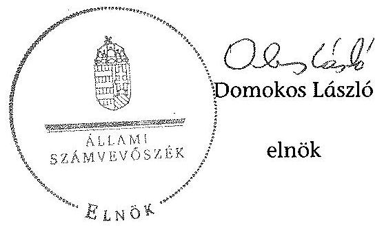

---

# RÖVIDÍTÉSEK JEGYZÉKE 

## Jogszabályok

| Alaptörvény | Magyarország Alaptörvénye (2011. április 25.) (hatályos: 2012. január 1-jétől) |
|---|---|

 :--: | :--: |
| Áht. $_{1}$ | Az államháztartásról szóló 1992. évi XXXVIII. törvény (hatálytalan: 2012.01.01-től) |
| Áht. $_{2}$ | Az államháztartásról szóló 2011. évi CXCV. törvény (hatályos: 2012. január 1-jétől) |
| ÁSZ tv. | Az Állami Számvevőszékről szóló 2011. évi LXVI. törvény (hatályos: 2011. július 1-jétől) |
| Avtv. | A személyes adatok védelméről és a közérdekű adatok nyilvánosságáról szóló 1992. évi LXIII. törvény |
| Evt. $_{1}$ | Az erdőről és az erdő védelméről szóló 1996. évi LIV. törvény (hatálytalan: 2009. július 10-től) |
| Evt. $_{2}$ | Az erdőről, az erdő védelméről és az erdőgazdálkodásról szóló 2009. évi XXXVII. törvény (hatályos: 2009. július 10-étől) |
| Evr. | Az erdőről, az erdő védelméről és az erdőgazdálkodásról szóló 2009. évi XXXVII. törvény végrehajtásáról szóló 153/2009. (XI. 13.) FVM rendelet (hatályos: 2009. november 21-étől) |
| Gt. | A gazdasági társaságokról szóló 2006. évi IV. törvény (hatálytalan: 2014. március 15-étől) |
| Infotv. | Az információs önrendelkezési jogról és az információszabadságról szóló 2011. évi CXII. törvény (hatályos: 2011. július 27-étől, kivéve a 1-37. §, a 38. § (1)-(3) bekezdése, a 38. § (4) bekezdés a)-f) pontja, a 38. § (5) bekezdése, a 39. §, a 41-68. §, a 70-72. §, a 75-77. § és a 79-88. §, valamint az 1. melléklet, ami 2012. január 1-jén lépett hatályba és a 38. § (4) bekezdés g) és h) pontja, valamint a 69. §, ami 2013. január 1-jén lépett hatályba) |
| Mfbtv. | A Magyar Fejlesztési Bank Részvénytársaságról szóló 2001. évi XX. törvény |
| Nfatv. | A Nemzeti Földalapról szóló 2010. évi LXXXVII. törvény (hatályos: 2010. szeptember 1-jétől) |
| Nvtv. | A nemzeti vagyonról szóló 2011. évi CXCVI. törvény (hatályos: 2011. december 31-étől, kivéve a 20. § (2) bekezdésben meghatározott paragrafusok, amelyek 2012. január 1-jétől, a (3) bekezdésben meghatározott paragrafusok 2013. január 1-jétől, a (4) bekezdésben meghatározott paragrafus 2012. március 2-ától léptek hatályba) |
| Számv. tv. új Ptk. | A számvitelről szóló 2000. évi C. törvény   A Polgári Törvénykönyvről szóló 2013. évi V. törvény (hatályos 2014. március 15-től) |

---

Vadgazd. tv.
Vtv.
Vhr.

## Egyéb rövidítések

Adatvédelmi Szabályzat

Alapító okirat ÁSZ

Belső Ellenőrzési Szabályzat

Északerdő Zrt., Társaság FB
FB ügyrendje ${ }_{1}$

FB ügyrendje ${ }_{2}$

FB ügyrendje ${ }_{3}$

Igazgatóság
Igazgatóság ügyrendje

Informatikai Biztonsági Szabályzat
Iratkezelési Szabályzat

KVI
Leltározási Szabályzat

MFB Zrt.
MNV Zrt.
NFA
Ügyvezetés

A vad védelméről, a vadgazdálkodásról, valamint a vadászatról szóló 1996. évi LV. törvény
Az állami vagyonról szóló 2007. évi CVI. törvény
Az állami vagyonnal való gazdálkodásról szóló 254/2007. (X. 4.) Korm. rendelet

Az Északerdő Zrt. alapító okirata
Állami Számvevőszék
Az Északerdő Zrt. belső ellenőrzési szabályzata (Hatályos 2006. 09. 15-től, kiadásra került a 14-13/2006. számú Vezérigazgatói utasítással)
ÉSZAKERDŐ Erdőgazdasági Zrt.
Az Északerdő Zrt. Felügyelő bizottsága
Az Északerdő Zrt. Felügyelő bizottságának ügyrendje (A 34/2005. (III. 10.) sz. Alapítói határozat melléklete, hatályos 2005. III. 10-től 2010. V. 19-ig)
Az Északerdő Zrt. Felügyelő bizottságának ügyrendje (A 255/2010. (V. 19.) sz. Alapítói határozat melléklete, hatályos 2010. V. 19-től)
Az Északerdő Zrt. Felügyelő bizottságának ügyrendje (a 11/2011. (IX. 21.) sz. Alapítói határozat melléklete, hatályos 2011. IX. 21-től)
Az Északerdő Zrt. Igazgatósága
Az Északerdő Zrt. Igazgatóságának ügyrendje (Az Igazgatóság 106/2002. sz. határozatával elfogadva, hatályos 2002. XI. 29-től 2010. VII. 12-ig)

Az Északerdő Zrt. informatikai biztonsági szabályzata (Hatályos 2004. május 1-jétől, Vezérigazgatói jóváhagyással)
Az Északerdő Zrt. iratkezelési szabályzata (A Főn: 1094/1999. sz. vezérigazgatói utasítással kiadott módosítással hatályos 2000. január 1-től)
Kincstári Vagyoni Igazgatóság
Az Északerdő Zrt. leltározási szabályzata (A Főn: 148/2006. sz. vezérig. utasítással kiadva, hatályos 2006. 07. 24-től, módosítva a Főn: 14-15/2011. sz. vezérig. utasítással, hatályos 2011. 07. 01-től)
Magyar Fejlesztési Bank Zrt.
Magyar Nemzeti Vagyonkezelő Zrt.
Nemzeti Földalapkezelő Szervezet
Az Északerdő Zrt. ügyvezetése, feladatát 2010. 07. 12-ig az Igazgatóság, 2010. 07.13-tól az önálló cégjegyzésre jogosult Vezérigazgató látta el

---

saját vagyona
Számviteli politika $_{1}$
Számviteli politika $_{2}$

Számviteli politika $_{3}$

Számlarend $_{1}$
Számlarend $_{2}$
SZMSZ

Társaság feletti tulajdonosi joggyakorló ${ }_{1}$

Társaság feletti tulajdonosi joggyakorló ${ }_{2}$

Vezérigazgató
VSZ

Az Északerdő Zrt. tulajdonában lévő állami vagyon
Az Északerdő Zrt. számviteli politikája (hatályos 2001. 01. 01-től)
Az Északerdő Zrt. számviteli politikája (a Főn: 14-10/2009. sz. vezérigazgatói utasítással jóváhagyva, hatályos 2010. 01. 01-től)

Az Északerdő Zrt. számviteli politikája (a Főn: 14-14/2011. sz. vezérigazgatói utasítással jóváhagyva, hatályos 2011. 01. 01-től)

Az Északerdő Zrt. számlarendje, a Számviteli politika ${ }_{1}$ melléklete
Az Északerdő Zrt. számlarendje, a Számviteli politika ${ }_{2,3}$ melléklete
Az Északerdő Zrt. Szervezeti és Működési Szabályzata (Az Igazgatóság 18/1994. (1994. 06. 13.) sz. és az FB 3/1994. (1994. 07. 28.) sz. határozatával jóváhagyva, hatályos 1994. 08. 15-től, kiadva a mindenkori módosítással egységes szerkezetbe foglalt szöveggel)
a társaságok állami tulajdonú részesedése feletti tulajdonosi jogokat gyakorló Magyar Nemzeti Vagyonkezelő Zrt. (2010. június 16-áig)
a társaságok állami tulajdonú részesedése feletti tulajdonosi jogokat gyakorló Magyar Fejlesztési Bank Zrt. (2010. június 17-étől 2014. július 15-éig)
Az Északerdő Zrt. vezérigazgatója
01840-96-02062 számú ideiglenes vagyonkezelői szerződés (hatályos 1996. október 16-tól)

---

.

---

# FOGALOMTÁR 

állami vagyon
állami vagyon
használója
átlátható szervezet
földbirtok-politikai irányelvek
hasznosítás
immateriális szolgáltatásából származó bevétel
információs és kommunikációs rendszer
kockázatkezelés
kockázatkezelési rendszer

Állami vagyon:
a) az állam tulajdonában lévő dolog, valamint dolog módjára hasznosítható természeti erő;
b) az a) pont hatálya alá tartozó mindazon vagyon, amely vonatkozásában törvény az állam kizárólagos tulajdonjogát nevesíti;
c) az állam tulajdonában lévő tagsági jogviszonyt megtestesítő értékpapír, illetve az államot megillető egyéb társasági részesedés;
d) az államot megillető olyan immateriális, vagyoni értékkel rendelkező jogosultság, amelyet jogszabály vagyoni értékű jogként nevesít;
e) az állam tulajdonában lévő pénzügyi eszközök.
Az állami vagyon használója az a természetes vagy jogi személy, jogi személyiséggel nem rendelkező szervezet, aki, vagy amely törvény vagy szerződés alapján, bármely jogcímen (bérlet, haszonbérlet, használat stb.) állami vagyont birtokol, használ, szedi annak hasznait. (Ide nem értve a haszonélvezőt, a vagyonkezelőt és a tulajdonosi jogok gyakorlóját.)
Átlátható szervezet a Nvtv. 3. § (1) bekezdés 1. pontjában felsorolt, a meghatározott követelményeknek megfelelő szervezet.
Az Nfatv. 15. § (3) bekezdés a)-s) pontjaiban meghatározott, a Nemzeti Földalapba tartozó földrészletek hasznosítására vonatkozó irányelvek.
Hasznosítás a tulajdonosi joggyakorló vagy a nemzeti vagyon használója által a nemzeti vagyon birtoklásának, használatának, hasznok szedése jogának bármely - a tulajdonjog átruházását nem eredményező - jogcímen történő átengedése, ide nem értve a vagyonkezelésbe adást, valamint a haszonélvezeti jog alapítását.
Immateriális szolgáltatásból származó bevételek azok a nem anyagjellegű szolgáltatásokból származó állami bevételek, amelyeket az Evt. 3. § (1) bekezdése szerint, a külön jogszabályban meghatározott részletes feltételek szerint, az erdők fenntartására, gyarapítására és védelmére kell fordítani.
Az információs és kommunikációs rendszer biztosítja, hogy az információk eljussanak az illetékes szervezethez, szervezeti egységhez, illetve személyhez.
A kockázatkezelés a szervezet céljai elérésével kapcsolatos kockázatok azonosításának és elemzésének, valamint a megfelelő válaszok meghatározásának folyamata.
A kockázatkezelési rendszer működtetése során fel kell mérni és meg kell állapítani a szervezet tevékenységében, gazdálkodásában rejlő kockázatokat, valamint meg kell határozni az egyes kockázatokkal kapcsolatban szükséges intézkedéseket,

---

valamint azok teljesítésének folyamatos nyomon követésének módját.

A kockázatkezelési rendszer olyan irányítási eszközök és módszerek összessége, amelynek elemei a szervezeti célok elérését veszélyeztető tényezők (kockázatok) azonosítása, elemzése, nyomon követése, valamint szükség esetén a kockázati kitettség mérséklése.
kontrolling Az a vezetéstámogató rendszer, amely a vezetői tervezést, ellenőrzést, valamint információ-ellátást koordinálja célorientáltan a környezeti változásokhoz igazodva.
kontrollkörnyezet A kontroll környezet elemei: a szervezeti struktúra, a felelősségi, hatásköri viszonyok és feladatok, a szervezet minden szintjén meghatározott etikai elvárások, a humánerőforráskezelés. A kontrollkörnyezet alapozza meg a belső kontroll összes többi elemét a fegyelem és a struktúra biztosítása által.
kontrollrendszer A kontrollrendszer a kockázatok kezelése és tárgyilagos bizonyosság megszerzése érdekében kialakított folyamatrendszer, amely azt a célt szolgálja, hogy megvalósuljanak a következő célok:
a) a működés és a gazdálkodás során a tevékenységeket szabályszerűen, gazdaságosan, hatékonyan, eredményesen hajtsák végre,
b) az elszámolási kötelezettségeket teljesítsék, és
c) megvédjék az erőforrásokat a veszteségektől, károktól és nem rendeltetésszerű használattól.
kontrolltevékenységek
közfeladat

A kontrolltevékenységek azok az elvek (politikák) és eljárások, amelyeket a kockázatok meghatározása és a szervezet céljainak elérése érdekében alakítanak ki.
A közfeladat jogszabályban meghatározott állami vagy önkormányzati feladat, amit az arra kötelezett közérdekből, jogszabályban meghatározott követelményeknek és feltételeknek megfelelve végez, ideértve a lakosság közszolgáltatásokkal való ellátását, továbbá az állam nemzetközi szerződésekben vállalt kötelezettségeiből adódó közérdekű feladatokat, valamint e feladatok ellátásához szükséges infrastruktúra biztosítását is.

Az Etv. 2. § (2) bekezdése szerint a fenntartható erdőgazdálkodás során a legfontosabb közérdekű feladat az erdők változatosságának megőrzése, az erdők fenntartása, felújítása és a védelmi, valamint közjóléti szolgáltatások biztosítása, melyek elvégzését az állam megfelelő eszközökkel biztosítja.
monitoring A szervezet tevékenységének, a célok megvalósításának nyomon követését biztosító rendszer, amely az operatív tevékenységek keretében megvalósuló folyamatos és eseti nyomon követésből, valamint az operatív tevékenységektől függetlenül működő belső ellenőrzésből áll.

---

Nemzeti Földalap
nemzeti vagyon használója
rábízott állami vagyon
társasági portfólió
tulajdonosi ellenőrzés
tulajdonosi joggyakorló
tulajdonosi joggyakorlás módja

A monitoring a projektek és programok végrehajtásának nyomon követése, mely a támogató és a kedvezményezett közti megállapodásban foglalt eljárások követését, az előrehaladás ellenőrzését és a lehetséges problémák időben történő azonosítását szolgálja.
A Nemzeti Földalap a kincstári vagyon része, amelybe beletartoznak az állam tulajdonában és az ingatlan-nyilvántartásban levő, az Nfatv. 1. § (1)-(2) bekezdéseiben felsorolt területek, földrészletek és az azokhoz kapcsolódó vagyoni értékű jogok.
A nemzeti vagyon használója az a természetes személy, jogi személy vagy jogi személyiséggel nem rendelkező szervezet, aki, vagy amely állami vagyon tekintetében törvény vagy szerződés alapján, a helyi önkormányzat vagyona tekintetében törvény, a helyi önkormányzat rendelete vagy szerződés alapján bármely jogcímen nemzeti vagyont birtokol, használ, szedi annak hasznait, kivéve a tulajdonosi joggyakorló (az Nvtv. 3. § (1) bekezdés 11. pontja alapján).
Rábízott állami vagyon az a Vtv. alkalmazásában állami vagyonnak minősülő vagyon, amit az MNV - a saját vagyonától elkülönítetten - kezel és nyilvántart.

Az Mfbtv. 3. § (9) bekezdése szerint rábízott állami vagyon az a vagyon, amely felett az Mfbtv. erejénél fogva a Magyar Állam nevében az MFB gyakorolja a tulajdonosi jogokat.

Az Nfatv. 1. § (1) bekezdésében foglaltak alapján az NFA-hoz tartozó rábízott vagyon a törvényben meghatározott, a Nemzeti Földalapba tartozó vagyon.
Társasági portfólió az MNV, illetve az MFB rábízott vagyonába tartozó állami tulajdonú társasági részesedések.
A tulajdonosi joggyakorló által végzett ellenőrzés, amelynek célja az állami vagyonnal való gazdálkodás vizsgálata, ennek keretében a rendeltetésellenes, jogszerűtlen, szerződésellenes, vagy a tulajdonos érdekeit sértő, illetve a központi költségvetést hátrányosan érintő vagyongazdálkodási intézkedések feltárása és a jogszerű állapot helyreállítása, továbbá a vagyonnyilvántartás hitelességének, teljességének és helyességének biztosítása.
Tulajdonosi joggyakorló az, aki az állami, illetve a nemzeti vagyon felett az államot megillető tulajdonosi jogok és kötelezettségek gyakorlására jogosult.
Az állami vagyon felett a Magyar Államot megillető tulajdonosi jogoknak (és kötelezettségeknek) az összességét az állami vagyon felügyeletéért felelős miniszter gyakorolja, aki e feladatát az MNV, az MFB, illetve egyéb tulajdonosi joggyakorló
 szervezet (pl. központi költségvetési szervek, 100%-ban állami tulajdonban álló gazdasági társaságok) útján látja el.

---

vagyongazdálkodás feladata
vagyonkezelői jog

Azon állami tulajdonban álló ingatlanok felett, amelyek egy része a Nemzeti Földalapba tartozik, a tulajdonosi jogokat a miniszter az agrárpolitikáért felelős miniszterrel közösen gyakorolja.

A Nemzeti Földalap felett a Magyar Állam nevében a tulajdonosi jogokat és kötelezettségeket az agrárpolitikáért felelős miniszter a Nemzeti Földalapkezelő Szervezet útján gyakorolja.
Az állami vagyon rendeltetésének megfelelő - az állami feladatok ellátásához, a társadalmi szükségletek kielégítéséhez, valamint a Kormány gazdaságpolitikája megvalósításának elősegítéséhez szükséges, egységes elveken alapuló, önálló ágazatként megjelenő - hatékony, költségtakarékos, értékmegőrző, értéknövelő felhasználásának biztosítása, beleértve a vagyoni kör változását eredményező értékesítést, valamint az állami vagyon gyarapítása is.
Vagyonkezelési szerződés alapján a vagyonkezelő jogosult meghatározott, állami tulajdonba tartozó dolog birtoklására, használatára és hasznai szedésére.

A Vtv. alapján a vagyonkezelői jog az állami vagyon hasznosítására az MNV-vel kötött vagyonkezelési szerződéssel jön létre. A vagyonkezelési szerződés alapján a vagyonkezelő jogosult meghatározott, állami tulajdonba tartozó dolog birtoklására, használatára és hasznai szedésére.

Az Nfatv. alapján a vagyonkezelői jog az erre irányuló (NFA-val kötött) szerződéssel jön létre. A vagyonkezelői szerződés alapján a vagyonkezelő jogosult meghatározott földrészlet birtoklására, használatára és hasznai szedésére. A vagyonkezelő köteles a földrészlet értékét megőrizni, állagának megóvásáról, jó karban tartásáról gondoskodni, továbbá - az Nfatv.-ben meghatározott esetek kivételével - díjat fizetni vagy a szerződésben előírt más kötelezettséget teljesíteni.

---

# 1. SZÁMÚ TANÚSÍTVÁNY

az erdőgazdasági társaság vagyonának alakulásáról a 2009-2013. években

|  Sorszám | Megnevezés | 2009.01.01 | 2009.12.31 | 2010.12.31 | 2011.12.31 | 2012.12.31 | 2013.12.31 | Változás 2013.12.31/2009.12.31 (%) |
|---|---|---|---|---|---|---|---|---|
| 1. | Eszközök |  |  |  |  |  |  |  |
| 2. | Befektetett eszközök összesen | 2052919 | 2065431 | 2036402 | 2055257 | 2081341 | 2794979 | 135% |
| 3. | Ebből: Immateriális javak | 55146 | 43848 | 7394 | 7540 | 10362 | 50599 | 92% |
| 4. | Tárgyi eszközök | 1971190 | 1996465 | 2004767 | 2016526 | 2032898 | 2075320 | 105% |
| 5. | Befektetett pénzügyi eszközök | 26583 | 25118 | 24241 | 31191 | 38081 | 669060 | 2664% |
| 6. | Forgóeszközök | 2775437 | 2911995 | 3320648 | 3677250 | 3873604 | 3527692 | 121% |
| 7. | Ebből: Készletek | 406037 | 187887 | 132165 | 171877 | 163592 | 211270 | 52% |
| 8. | Követelések | 276550 | 367928 | 428297 | 327385 | 200205 | 205991 | 56% |
| 9. | Értékpapírok | 1338135 | 1502581 | 1390522 | 0 | 600000 | 1640000 | 109% |
| 10. | Pénzeszközök | 754715 | 853599 | 1369664 | 3177988 | 2909807 | 1470431 | 172% |
| 11. | Aktív időbeli elhatárolások | 31148 | 21549 | 32752 | 31589 | 46384 | 93394 | 300% |
| 12. | Eszközök összesen | 4859504 | 4998975 | 5389802 | 5764096 | 6001329 | 6416065 | 128% |
| 13. | Források |  |  |  |  |  |  |  |
| 14. | Saját tőke | 3935445 | 4218983 | 4343751 | 4530302 | 4798989 | 5027764 | 120% |
| 15. | Ebből: Jegyzett tőke | 1188090 | 1278670 | 1278670 | 1278670 | 1278670 | 1278670 | 107% |
| 16. | Tőketartalék | 1529250 | 1529250 | 1529250 | 1529251 | 1529251 | 1529251 | 100% |
| 17. | Eredménytartalék | 1045559 | 1218106 | 1411063 | 1535830 | 1722381 | 1991069 | 190% |
| 18. | Lekötött tartalék | 16452 |  |  |  |  |  |  |
| 19. | Értékelési tartalék |  |  |  |  |  |  |  |
| 20. | Mérleg szerinti eredmény | 156094 | 192957 | 124768 | 186551 | 268687 | 228774 | 147% |
| 21. | Céltartalékok | 4531 | 3525 | 272032 | 231961 | 300171 | 260724 | 5760% |
| 22. | Kötelezettségek | 558197 | 385800 | 305643 | 399033 | 342333 | 569690 | 154% |
| 23. | Ebből: Hátrasorolt kötelezettségek |  |  |  |  |  |  |  |
| 24. | Hosszú lejáratú kötelezettségek | 8763 | 8763 | 8763 | 8763 | 8763 | 8763 | 100% |
| 25. | Rövid lejáratú kötelezettségek | 349434 | 377037 | 296880 | 390290 | 333570 | 560927 | 160% |
| 26. | Passzív időbeli elhatárolások | 361331 | 390667 | 468576 | 602780 | 559836 | 557887 | 154% |
| 27. | Források összesen | 4859504 | 4998975 | 5389802 | 5764096 | 6001329 | 6416065 | 128% |

---

# 2. SZÁMÚ TANÚSÍTVÁNY

az immateriális javak és tárgyi eszközök állományának megoszlása a 2013. évre vonatkozóan adatok ezer Ft-ban

| Sorszám | Megnevezés | Immateriális javak | Ingatlanok | Műszaki berendezések | Egyéb berendezések | Beruházás a beruházásra adott előleggel együtt | Tárgyi eszközök összesen |
|---|---|---|---|---|---|---|---|
| 1. | Bruttó érték január 1-jén | 124 407,0 | 2734 881,0 | 1145 421,0 | 519 787,0 | 58 062,0 | 4458 151,0 |
| 2. | -ebből: állami vagyon | 0,0 | 0,0 | 0,0 | 0,0 | 0,0 | 0,0 |
| 3. | -ebből: saját vagyon | 124 407,0 | 2734 881,0 | 1145 421,0 | 519 787,0 | 58 062,0 | 4458 151,0 |
| 4. | Növekedés (+) | 55 167,0 | 168 884,0 | 111 348,0 | 103 888,0 | 301 131,0 | 685 251,0 |
| 5. | -ebből: állami vagyon | 0,0 | 0,0 | 0,0 | 0,0 | 0,0 | 0,0 |
| 6. | -ebből: saját vagyon | 55 167,0 | 168 884,0 | 111 348,0 | 103 888,0 | 301 131,0 | 685 251,0 |
| 7. | Csökkenés (-) | -12363,0 | -96020,0 | -74339,0 | -68663,0 | -233856,0 | -472878,0 |
| 8. | -ebből: állami vagyon | 0,0 | 0,0 | 0,0 | 0,0 | 0,0 | 0,0 |
| 9. | -ebből: saját vagyon | -12363,0 | -96020,0 | -74339,0 | -68663,0 | -233856,0 | -472878,0 |
| 10. | Bruttó érték december 31-én | 167 211,0 | 2807 745,0 | 1182 430,0 | 555 012,0 | 125 337,0 | 4670 524,0 |
| 11. | -ebből: állami vagyon | 0,0 | 0,0 | 0,0 | 0,0 | 0,0 | 0,0 |
| 12. | -ebből: saját vagyon | 167 211,0 | 2807 745,0 | 1182 430,0 | 555 012,0 | 125 337,0 | 4670 524,0 |
| 13. | Halmozott értékcsökkenés január 1-jén | 114 045,0 | 1115 305,0 | 927 566,0 | 382 382,0 | 0,0 | 2425 253,0 |
| 14. | -ebből: állami vagyon | 0,0 | 0,0 | 0,0 | 0,0 | 0,0 | 0,0 |
| 15. | -ebből: saját vagyon | 114 045,0 | 1115 305,0 | 927 566,0 | 382 382,0 | 0,0 | 2425 253,0 |
| 16. | Értékcsökkenés növekedése (+) (költségként elszámolt) | 14 612,0 | 88 975,0 | 86 731,0 | 71 225,0 | 0,0 | 246 931,0 |
| 17. | -ebből: állami vagyon | 0,0 | 0,0 | 0,0 | 0,0 | 0,0 | 0,0 |
| 18. | -ebből: saját vagyon | 14 612,0 | 88 975,0 | 86 731,0 | 71 225,0 | 0,0 | 246 931,0 |
| 22. | Értékcsökkenés egyéb ráfordításként elszámolva (±) | 0,0 | 0,0 | 0,0 | 0,0 | 0,0 | 0,0 |
| 23. | -ebből: állami vagyon | 0,0 | 0,0 | 0,0 | 0,0 | 0,0 | 0,0 |
| 24. | -ebből: saját vagyon | 0,0 | 0,0 | 0,0 | 0,0 | 0,0 | 0,0 |
| 25. | Egyéb változás az értékcsökkenésben (±) | -12045,0 | -7567,0 | -37053,0 | -32360,0 | 0,0 | -76980,0 |
| 26. | -ebből: állami vagyon | 0,0 | 0,0 | 0,0 | 0,0 | 0,0 | 0,0 |
| 27. | -ebből: saját vagyon | -12045,0 | -7567,0 | -37053,0 | -32360,0 | 0,0 | -76980,0 |
| 28. | Halmozott értékcsökkenés december 31-én: | 116 612,0 | 1196 713,0 | 977 244,0 | 421 247,0 | 0,0 | 2595 204,0 |
| 29. | -ebből: állami vagyon | 0,0 | 0,0 | 0,0 | 0,0 | 0,0 | 0,0 |
| 30. | -ebből: saját vagyon | 116 612,0 | 1196 713,0 | 977 244,0 | 421 247,0 | 0,0 | 2595 204,0 |
| 31. | Nettó érték december 31-én: | 50 599,0 | 1611 032,0 | 205 186,0 | 133 765,0 | 125 337,0 | 2075 320,0 |
| 32. | -ebből: állami vagyon | 0,0 | 0,0 | 0,0 | 0,0 | 0,0 | 0,0 |
| 33. | -ebből:saját vagyon | 50 599,0 | 1611 032,0 | 205 186,0 | 133 765,0 | 125 337,0 | 2075 320,0 |

 599,0 | 1611 032,0 | 205 186,0 | 133 765,0 | 125 337,0 | 2075 320,0  |

---

5. SZÁMÚ MELLÉKLET A V-0754-111/2015. SZÁMÚ JELENTÉSHEZ

a. SZÁMÚ TANÚSÍTVÁNY a befektetett eszközök állományának alakulásáról adatok eszt IV.hatt

|  Sor-
száma | MEGNEVEZÉS | 2005. év |  |  | 2010. év |  |  | 2011. év |  |  | 2012. év |  |  | 2013. év |  |   |
| --- | --- | --- | --- | --- | --- | --- | --- | --- | --- | --- | --- | --- | --- | --- | --- | --- |
|   |  | Összesen | Állandó vagyon | Forgó vagyon | Összesen | Állandó vagyon | Forgó. vagyon | Összesen | Állandó vagyon | Forgó. vagyon | Összesen | Állandó vagyon | Forgó. vagyon | Összesen | Állandó vagyon | Forgó. vagyon  |
|   | 1. | 2. | 3. | 4. | 5. | 6. | 7. | 8. | 9. | 10. | 11. | 12. | 13. | 14. | 15. | 16.  |
|  1. | Nyitó állomány | 2 036 336 |  | 2 026 326 | 2 080 313 |  | 2 040 313 | 2 012 161 |  | 2 012 161 | 2 024 006 |  | 2 024 066 | 2 043 360 |  | 2 043 360  |
|  2. | Terv szerinti értékcsökkenés | 234 802 |  | 234 802 | 208 472 |  | 208 472 | 222 990 |  | 222 990 | 229 883 |  | 229 883 | 261 343 |  | 261 343  |
|  3. | Terven felüli értékcsökkenés | 0 |  |  | 0 |  |  | 23 784 |  | 23 784 | 2 447 |  | 2 447 | 0 |  |   |
|  4. | Értékváltozás elszámolása | 0 |  |  | 0 |  |  | 0 |  |  | 0 |  |  | 0 |  |   |
|  5. | Értékadás | 71 263 |  | 71 263 | 18 263 |  | 18 263 | 693 |  | 693 | 7 727 |  | 7 727 | 10 378 |  | 10 378  |
|  6. | Isújítás | 794 |  | 794 | 43 363 |  | 43 363 | 1 443 |  | 1 443 | 7 020 |  | 7 020 | 2 023 |  | 2 023  |
|  7. | Általánulás | 0 |  |  | 0 |  |  | 0 |  |  | 0 |  |  | 0 |  |   |
|  8. | Ingyenes átadás | 0 |  |  | 0 |  |  | 0 |  |  | 0 |  |  | 0 |  |   |
|  9. | Egyéb | 207 |  | 207 | 36 561 |  | 36 561 | 2 830 |  | 2 810 | 243 |  | 243 | 1 194 |  | 1 194  |
|  10. | Csökkenés összesen | 307 068 | 0 | 307 068 | 206 661 | 0 | 206 661 | 251 525 | 0 | 251 525 | 247 352 | 0 | 247 352 | 275 128 | 0 | 275 128  |
|  11. | Terv szerinti beruházás | 117 747 |  | 117 747 | 62 081 |  | 62 081 | 134 332 |  | 134 332 | 184 460 |  | 184 460 | 238 972 |  | 238 972  |
|  12. | Terv szerinti felújítás | 118 911 |  | 118 911 | 216 041 |  | 216 041 | 125 498 |  | 125 498 | 79 107 |  | 79 107 | 117 303 |  | 117 303  |
|  13. | Terv szerinti növekedés | 236 638 | 0 | 236 638 | 278 132 | 0 | 278 132 | 260 030 | 0 | 260 030 | 263 569 | 0 | 263 569 | 356 288 | 0 | 356 288  |
|  14. | Egyéb beruházás | 0 |  |  | 0 |  |  | 0 |  |  | 0 |  |  | 0 |  |   |
|  15. | Egyéb felújítás | 0 |  |  | 0 |  |  | 0 |  |  | 0 |  |  | 0 |  |   |
|  16. | Általánulás | 0 |  |  | 0 |  |  | 2 900 |  | 2 900 | 0 |  |  | 0 |  |   |
|  17. | Átvétel | 0 |  |  | 0 |  |  | 0 |  |  | 0 |  |  | 0 |  |   |
|  18. | Értékváltozás vízszerelés | 0 |  |  | 0 |  |  | 0 |  |  | 0 |  |  | 0 |  |   |
|  19. | Értékcsökkenés vízszerelés | 21 273 |  | 21 273 | 0 |  |  | 0 |  |  | 0 |  |  | 0 |  |   |
|  20. | Egyéb | 62 814 |  | 62 814 | 277 |  | 277 | 308 |  | 308 | 2 977 |  | 2 977 | 1 217 |  | 1 217  |
|  21. | Terven felüli növekedés | 84 387 | 0 | 84 387 | 277 | 0 | 277 | 3 409 | 0 | 3 409 | 2 977 | 0 | 2 977 | 1 217 | 0 | 1 217  |
|  22. | Növekedés összesen | 321 043 | 0 | 321 043 | 278 309 | 0 | 278 309 | 263 439 | 0 | 263 439 | 266 546 | 0 | 266 546 | 357 797 | 0 | 357 797  |
|  23. | Záró állomány | 2 040 313 | 0 | 2 040 313 | 2 012 161 | 0 | 2 012 161 | 2 024 066 | 0 | 2 024 066 | 2 043 260 | 0 | 2 043 260 | 2 135 919 | 0 | 2 135 919  |

---

# 4. SZÁMÚ TANÚSÍTVÁNY

A saját tőke változása a 2013. évre vonatkozóan

|  Sorszám | Megnevezés | Saját tőke | Jegyzett tőke | Jegyzett, de be nem fizetett tőke | Tőketartalék | Eredmény-
tartalék | Lekötött
tartalék | Értékelési
tartalék | Mérleg szerinti
eredmény  |
| --- | --- | --- | --- | --- | --- | --- | --- | --- | --- |
|   | 1. | 2. | 3. | 4. | 5. | 6. | 7. | 8. | 9.  |
|  1. | A saját tőke nyitóállománya az év elején | 4798989,0 | 1278670,0 |  | 1529251,0 | 1722381,0 |  |  | 268687,0  |
|  2. | A saját tőke elemeinek egymás közötti mozgása |  |  |  |  |  |  |  |   |
|  3. | Előző évi eredmény átvezetése eredménytartalékba |  |  |  |  | 268687,0 |  |  | -268687,0  |
|  4. | Jegyzett tőke emelés eredménytartalékból vagy
tőketartalékból |  |  |  |  |  |  |  |   |
|  5. | Átvezetés eredménytartalék és tőketartalék között |  |  |  |  |  |  |  |   |
|  6. | Átvezetés eredménytartalék és lekötött tartalék között |  |  |  |  |  |  |  |   |
|  7. | Átvezetés tőketartalék és lekötött tartalék között |  |  |  |  |  |  |  |   |
|  8. | Mérleg szerinti eredmény |  |  |  |  |  |  |  | 228774,0  |
|  9. | Egyéb mozgások (osztalék stb.): |  |  |  |  |  |  |  |   |
|  10. | Összesen |  |  |  |  | 268687,0 |  |  | -39912,0  |
|  11. | A saját tőke változása |  |  |  |  |  |  |  |   |
|  12. | Jegyzett tőke emelés vagy csökkentés |  |  |  |  |  |  |  |   |
|  13. | Befizetés eredmény-, tőke- vagy lekötött tartalékba |  |  |  |  |  |  |  | 

 |   |
|  14. | Tőketartalék vagy eredménytartalék átadás |  |  |  |  |  |  |  |   |
|  15. | Tőketartalék vagy eredménytartalék átvétel |  |  |  |  |  |  |  |   |
|  16. | Egyéb jogcímek: |  |  |  |  |  |  |  |   |
|  17. | Összesen |  |  |  |  |  |  |  |   |
|  18. | Záróállomány az év végén | 5027764,0 | 1278670,0 | 0,0 | 1529251,0 | 1991069,0 | 0,0 | 0,0 | 228774,0  |
|  19. | A saját tőke jegyzett tőke arány (\%) |  |  |  | 393,20 % |  |  |  |   |
|  20. | A saját tőke és az összes forrás aránya (\%) |  |  |  | 78,36 % |  |  |  |   |

---

# 5. SZÁMÚ TANÚSÍTVÁNY

a beruházások, felújítások forrásáról adatok ezer $\mathrm{H}-$ ban

|  Sorszám | Megnevezés | 2009. év | 2010. év | 2011. év | 2012. év | 2013. év | Megjegyzés  |
| --- | --- | --- | --- | --- | --- | --- | --- |
|   | 1. | 2. | 3. | 4. | 5. | 6. | 7.  |
|  1. | Amortizáció - állami vagyon után |  |  |  |  |  |   |
|  2. | Amortizáció - saját vagyon után | 234802 | 208472 | 222995 | 229885 | 261543 |   |
|  3. | Amortizációs forrás (visszapótlási kötelezettség)** |  |  |  |  |  |   |
|  4. | Hazai/központi forrás |  |  |  | 5167 | 3842 | Közfoglalkoztatási pályázat keretében gépbeszerzés  |
|  5. | Pályázati forrás (EU-s) |  |  |  |  |  |   |
|  6. | Eszközeladás |  |  |  |  |  |   |
|  7. | Egyéb forrás: | 25720 | 2216 | 3256 | 2288 | 1776 | erdőtelepítésre való előkészítésre az EU adományokból MNV Zrt  |
|   | Egyéb forrás*** | 422 |  |  | 2299 | 2675 | gazdálkodó szervezet pénzeszköz átadása  |
|   | Egyéb forrás*** |  |  | 1105 | 2259 | 45363 | Tőkeemelés (MNV Zrt)  |
|   | Egyéb forrás*** |  | 204728 |  |  |  | ÉMOP-2.1.1/B-Zf-2009-0012  |
|   | Egyéb forrás*** |  | 4606 | 60248 |  |  | KEOP-3.3.0/09-2009-0010  |
|   | Egyéb forrás*** |  |  |  | 9208 | 2792 | KEOP-7.3.1.3/09-2010-0021  |
|   | Egyéb forrás*** |  |  |  |  | 1376 | KEOP-3-1-3/2F/09-11-2012-0018  |
|  8. | Források összesen | 26142 | 211550 | 64609 | 21221 | 57826 |   |

[^0] [^0]: ** Amortizációs forrás: A kezelt állami vagyonon elszámolt terv szerinti és terven felüli értékcsökkenési leírás összegének megfelelő összegű beruházási, felújítási és karbantartási kötelezettség. *** A megjegyzés oszlopban meg kell nevezni a forrást.

---

.

---

# 8. SZÁMÚ MELLÉKLET A V-0754-111/2015. SZÁMÚ JELENTÉSHEZ

## ÉSZAKERDŐ Erdőgazdasági Zártkörűen Működő Részvénytársaság

### Állami Számvevőszék

**Domokos László úr**

*elnök*

**Budapest**

Apáczai Csere János utca 10. 1052

**Tárgy:** Jelentéstervezet észrevételezése

**Tisztelt Elnök Úr!**

Miskolc, 2015. október 09.
Ügyszám: ad 2074/2015.
Hiv.sz.: V-0754-085/2015.
„RTV”

---

### ÁLLAMI SZÁMVEVŐSZÉK

**Érkezés:** 2015. OKT 14.
**Iktatószám:** V-0754-085/2015.
**Melléklet:** ______________________________

„Az állami tulajdonban álló Erdőgazdasági Társaságok vagyongazdálkodási tevékenységének ellenőrzése ÉSZAKERDŐ Erdőgazdasági Zrt. 2015.” című, az Állami Számvevőszék által készített jelentéstervezethez az ÁSZ tv. 29.§ (2) bekezdése alapján a törvényes határidőn belül az alábbi észrevételeket tesszük.

**Iktatószám:** V-0754-095/2015
**Témaszám:** 1788
**Vizsgálat-azonosító szám:** V070606

---

### Bevezetés:

Az Alaptörvény 38. cikk (1) Az állam és a helyi önkormányzatok tulajdona nemzeti vagyon. A nemzeti vagyon kezelésének és védelmének célja a közérdek szolgálata, a közös szükséglet kielégítése és a természeti erőforrások megóvása ....”

Az Nvtv. 4. § (2) Nemzetgazdasági szempontból kiemelt jelentőségű nemzeti vagyonnak minősül az ÉSZAKERDŐ Zrt., mint társaság, valamint a 100%-ban az állam tulajdonában álló védelmi és közjóléti elsődleges rendeltetésű erdő, és a gazdasági elsődleges rendeltetésű természetes erdő, természetszerű erdő és származékerdő természetességi állapotú 5 hektárnál nagyobb, természetben összefüggő erdő.

Helytelen a bevezetésben szereplő azon megállapítás a fentiek értelmében, hogy „Az Nvtv az erdőket az állami tulajdon körébe sorolja....” (a magántulajdonban lévő erdőkre ez nem vonatkozhat)

---

H-3525 Miskolc, Deák tér 1. Levelezési cím: H-3501 Miskolc, Pl.: 2., Tel.: +36-46-501-001, Fax: +36-46-501-505
E-mail: info@eszakerdo.hu, Web: www.eszakerdo.hu, K & H Bank Zrt. 10200139-27012196-00000000, Adószám: 11071596-2-05

---

I. Összegző megállapítások, következtetések, javaslatok:

A fejezet nem tükrözi vissza megfelelően a jelentés tartalmát.
A II. részben foglaltak szerint az ÉSZAKERDŐ Zrt. betartotta a hatályos törvényeket, még akkor is, ha a Vagyonkezelési Szerződésben nem voltak, nincsenek átvezetve a törvényi változások. (Jelentéstervezet 1.2. pont 14. oldal)) Véleményünk szerint amennyiben törvényi változás van, az felülírja bármilyen szerződésben rögzített, már elavult törvénypontokat akkor is, ha a szerződésben nem kerülnek átvezetésre a változások.
Az összegzés három elmarasztaló elemet domborít ki (többször egymást követően ugyanazokat), ami után a megfelelő gazdálkodás, vagyonkezelés megállapításai már el is sikkadnak:

1. Sömörrésen megállapítja, mindjárt az első bekezdésben vastagon szedve, hogy az ÉSZAKERDŐ Zrt. mérlegei nem a valós állapotot tükrözték, mert nem szerepeltette a kezelt vagyon értékét, valamint nem mutatta be a Kiegészítő mellékleteiben mérleg soronkénti bontásban a kezelt vagyont. Ebből következően a kezelt vagyonra vonatkozó nyilvántartása sem felel meg Vhr. előírásainak, mivel azok sem tartalmaznak értéket.
Az ÉSZAKERDŐ Zrt. a vagyonkezelési szerződésben rögzítettek szerint mutatta ki a kezelt vagyont a mérlegeiben, naturáliákban a '0' számlaosztályban. A vizsgált időszak Kiegészítő mellékleteiben az alábbiak szerint mutatta be a kezelt vagyont:

KIEGÉSZÍTŐ MELLÉKLET 2009. (Miskolc, 2010.03.16.) 20. oldal:
„A Társaság, mint vagyonkezelő, a vagyonkezelési szerződésben meghatározott értéken mutatja ki mérlegében az eszközök között a - törvényi rendelkezés, illetve felhatalmazás alapján - kezelésbe vett, az állami vagy az önkormányzati vagyon részét képező eszközöket is. Ezen eszközöket a kiegészítő mellékletben - legalább mérlegtételek szerinti megbontásban - ki kell mutatni.
A kezelt erdőterület a vagyonkezelési szerződésben naturáliákban (területi adatok) szerepel, így ugyancsak ezen mennyiségi adatok alapján kerül kimutatásra a nullás számlaosztályban."

KIEGÉSZÍTŐ MELLÉKLET 2010. (Miskolc, 2011.03.16.) 19. oldal:
„A Társaság, mint vagyonkezelő, a vagyonkezelési szerződésben meghatározott értéken mutatja ki mérlegében az eszközök között a - törvényi rendelkezés, illetve felhatalmazás alapján - kezelésbe vett, az állami vagy az önkormányzati vagyon részét képező eszközöket is. A kezelt erdőterület a vagyonkezelési szerződésben naturáliákban (területi adatok) szerepel, így ugyancsak ezen mennyiségi adatok alapján kerül kimutatásra a nullás számlaosztályban."

KIEGÉSZÍTŐ MELLÉKLET 2011. (Miskolc, 2012.03.19.) 19. oldal:
„A Társaság, mint vagyonkezelő, a vagyonkezelési szerződésben meghatározott értéken mutatja ki mérlegében az eszközök között a - törvényi rendelkezés, illetve felhatalmazás alapján - kezelésbe vett, az állami vagy az önkormányzati vagyon részét képező eszközöket is. A kezelt erdőterület a vagyonkezelési szerződésben naturáliákban (területi adatok) szerepel, így ugyancsak ezen mennyiségi adatok alapján kerül kimutatásra a nullás számlaosztályban."

---

KIEGÉSZÍTŐ MELLÉKLET 2012. (Miskolc, 2013.03.18.) 16. oldal
„A Társaság, mint vagyonkezelő, a vagyonkezelési szerződésben meghatározott értéken mutatja ki mérlegében az eszközök között a - törvényi rendelkezés, illetve felhatalmazás alapján - kezelésbe vett, az állami vagy az önkormányzati vagyon részét képező eszközöket is. A kezelt erdőterület a vagyonkezelési szerződésben naturáliákban (területi adatok) szerepel 2012. évben, így ugyancsak ezen mennyiségi adatok alapján kerül kimutatásra a nullás számlaosztályban."

KIEGÉSZÍTŐ MELLÉKLET 2013. (Miskolc, 2014.03.18.) 16. oldal
„A Társaság, mint vagyonkezelő, a vagyonkezelési szerződésben meghatározott értéken mutatja ki mérlegében az eszközök között a - törvényi rendelkezés, illetve felhatalmazás alapján - kezelésbe vett, az állami vagy az önkormányzati vagyon részét képező eszközöket is. A kezelt erdőterület a vagyonkezelési szerződésben naturáliákban (területi adatok) szerepel 2013. évben, így ugyancsak ezen mennyiségi adatok alapján kerül kimutatásra a nullás számlaosztályban."

KIEGÉSZÍTŐ MELLÉKLET 2014. (Miskolc, 2015.03.16.) 16. oldal
„A Társaság, mint vagyonkezelő, a vagyonkezelési szerződésben meghatározott értéken mutatja ki mérlegében az eszközök között a - törvényi rendelkezés, illetve felhatalmazás alapján - kezelésbe vett, az állami vagy az önkormányzati vagyon részét képező eszközöket is. A kezelt erdőterület a vagyonkezelési szerződésben naturáliákban (területi adatok) szerepel 2014. évben, így ugyancsak ezen mennyiségi adatok alapján kerül kimutatásra a nullás számlaosztályban."

Az erdők értékmeghatározásának hiánya már fennáll az 1996. évi Sztv. hatálybalépése óta. A társaság akkori tulajdonosi joggyakorlója (ÁPV Rt.) a Pénzügyminisztériumhoz fordult a kérdés tisztázása érdekében. A PM 9806/1997. ügyszámú válaszában rögzíti: A számviteli törvényben „megfogalmazott előírás feltételezi, hogy a kezelt kincstári vagyon megfelelő módon, dokumentáltan értékelésre kerül, hiszen csak ez esetben lehet azt az eszközök és kötelezettségek között értékkel kimutatni. Ebből - természetesen - az is következik, amíg megfelelő értékelés nem áll rendelkezésre, vagy az adott kincstári vagyont nem lehet természeténél fogva értékelni, addig/ és akkor nem lehet / nem tudják alkalmazni a törvény hivatkozott ..... rendelkezését sem."

Nincs tudomása a társaságnak arról, hogy az állami tulajdonú erdők értékelése megtörtént volna, így a társaság nem tudja alkalmazni az értéken történő szerepeltetést.

A társaság megtette azt, ami hatáskörébe tartozik, a kezelt vagyont szerepeltette a kimutatásaiban naturáliákban és azt bemutatta a kiegészítő mellékleteiben.

A jelenlegi ellentmondásos helyzet feloldása érdekében célszerű lenne megvizsgálni a Számviteli törvény, illetve a Vhr. módosítását az erdők vagyonkezelése tekintetében az alábbiak miatt:

Az állam tulajdonában lévő erdők nem forgalomképesek a törvényi rendelkezések értelmében, ez is nehezíti az értékmeghatározást.
A 19 erdészeti társaság vagyonkezelésében lévő közel 880 ezer hektár erdőterület értékelésének és az értékváltozás követésének módszere kidolgozatlan, teljesen bizonytalan, és rendkívül költségigényes, ami ellentmond a legalapvetőbb számviteli alapelvnek: „A beszámolóban (a mérlegben, az eredmény-kimutatásban,

---

a kiegészítő mellékletben) nyilvánosságra hozott információk hasznosíthatósága (hasznossága) álljon arányban az információk előállításának költségeivel (a költség-haszon összevetésének elve)." (Számv. tv 16.§(5)).

Az erdészeti társaságok vagyonkezelésében lévő ingatlan állomány több ezer helyrajzi számból áll. A vizsgált időszakban bekövetkezett változások miatt esetenként az egységes szerkezetbe foglalás indokoltsága megkérdőjelezhető (Egyébként a Vhr. 8.§. (2)
 bekezdését 2015. 09. 09. napjával hatályon kívül is helyezték.) Egyebekben a változásokról az ÉSZAKERDŐ Zrt. minden évben megtette a jelentését a VSZ előírása szerint. 2. Az 1996-ban kötött vagyonkezelési szerződés módosításának és felülvizsgálatának hiánya. A társaság hibájaként rója fel a jelentéstervezet, hogy nem tett indítvány(oka)t a vagyonkezelési szerződés módosítására, illetve a szerződésben rögzített (a vagyonkezelői díjra vonatkozó) éves felülvizsgálatokra. A vagyonkezelési szerződés módosításának indítványozása véleményünk szerint a kezelésbe adó jogköre, ami az alábbiak szerint történt:

Vagyonkezelési szerződéstervezetek tartalmának felülvizsgálata a társaság részéről:

|   | Megkereső szerv | Megkeresés ideje | Határidő | ÉSZAKERDŐ Zrt. teljesítés ideje  |
|---|---|---|---|---|
|  1. | ÁPV Rt. | 2000. 07. 03 | 2000. 07. 05 | 2000. 07. 05  |
|  2. | KVI | 2001. 06. 21 | postafordultával | 2001. 07. 18  |
|  3. | ÁPV - KVI | 2002. 05. 28 |  | 2002. 05. 29  |
|  4. | ÁPV Rt. | 2004. 06. 10 | 2004. 06. 16 | 2004. 06. 29  |
|  5. | ÁPV Zrt. | 2006. 10. 12 | 2006. 10. 20 | 2006. 10. 19  |
|  6. | MNV Zrt. | 2008. 12. 01 |  | 2008. 12. 12  |
|  7. | MNV Zrt. (szerződésmódosítások bekérése) | 2012. 08. 29 | 2012. 09. 10 | 2012. 09. 03  |
|  8. | MFB | 2014. 04. 16 | 2014. 05. 09 | 2014. 05. 08  |
|  9. | FM | 2014. 10. 07 | 2014. 10. 08 | 2014. 10. 09  |

A vagyonkezelési szerződés módosítása, az előzőekben hivatkozottak ellenére nem került véglegesítésre, amiben talán közrejátszott az, hogy az állami földterületek tulajdonosi joggyakorló szervezeteiben többször történt változás. Mire a szerződésmódosítás létrejöhetett volna, már új szervezet volt, így mindig, minden kezdődött elölről. Erre nem tér ki a jelentéstervezet.

Az, hogy nem változott a vagyonkezelői díj a szerződéskötés óta, még nem jelenti azt, hogy nem történtek ezzel kapcsolatban tárgyalások. Több ízben történt tárgyalás a vagyonkezelői díj mértékéről is, a felek a tárgyalások eredményeként változásban nem egyeztek meg, így maradt az eredeti vagyonkezelési díj. Például a 2004. évi vagyonkezelési szerződésmódosítás tervezet tartalmazott vagyonkezelői díjra vonatkozó részeket is.

---

Az észrevétel elején már utaltunk arra, hogy ugyan nincsenek átvezetve a törvényváltozások a vagyonkezelési szerződésen, de az ÉSZAKERDŐ Zrt. betartotta a mindenkor hatályos törvényeket, amit a jelentéstervezet rögzít is.
3. A közzétételi kötelezettségek, illetve a közérdekű adatok megismerésének rendjére vonatkozó nem szabályozottság.

Az ÉSZAKERDŐ Zrt. eleget tett és tesz a 2009. évi CXXII. tv. szerinti közzétételi kötelezettségének, mint ahogy azt a jelentéstervezet is megállapítja. A törvény végrehajtásának módja szabályozva is van vezérigazgatói utasítás formájában.

A jelentéstervezet az Avtv, illetve az Infotv szerinti szabályzatot hiányolja.
A hivatkozott törvények azt mondják ki, hogy „A közfeladatot ellátó szervnek a közérdekű adatok megismerésére irányuló igények teljesítésének rendjét rögzítő szabályzatot kell készíteni." (Infotv 30. § (6)). Az ÉSZAKERDŐ Zrt. nem kezel közérdekű adatokat (nem lát el közfeladatot), így véleményünk szerint ilyen szabályzatnak nincs indokoltsága.

# II. Készletes megállapítások: 

1.1. A vagyonérték megőrzése, gyarapítása:

Az első bekezdés megállapításával, mely szerint a Társaság mérlegei nem a valós állapotot tükrözték, nem értünk egyet az előzőekben részletezettek értelmében.
A 2009-2013. években a Társaság saját tőke növekedési mutatójának alakulása táblázatban a „Saját tőke növekedési mutató" számok helyesen:
2009. nyitó: viszonyítási alap
2009. év: $\quad 7,2$
2010. év: $\quad 3,0$
2011. év: $\quad 4,3$
2012. év: $\quad 5,9$
2013. év: $\quad 4,8$

Az utolsó bekezdésben szereplő, a kezelt erdők tekintetében az erdők fenntartására, gyarapítására és védelmére elszámolt költség 2009-2013. években összesen 15536 MFt. (A tervezetben nagyságrendi eltérés van: 1553,6 MFt)
2.1. A vagyonkezelési szerződés megfelelőségével kapcsolatos véleményünket az „Összegzésnél" kifejtettük.
2.2. A vagyonnyilvántartással kapcsolatosan meg kell jegyeznünk, hogy a VSZ mellékletét képező (ugyan nem hiteles, de ilyen ismereteink szerint nem is volt) ingatlan listával rendelkezik a társaság, azonban a leghitelesebb nyilvántartás a földhivatali nyilvántartás, mivel már a VSZ megkötése előtt is kezelőként a társaság jogelődje be volt jegyezve az ingatlan-nyilvántartásban. Azzal kapcsolatban, hogy a tulajdonosi joggyakorlóknak milyen kimutatásuk volt, nem rendelkezünk információval, viszont a társaság minden évben eleget tett a változás-jelentési kötelezettségének.
3.3 Az ágazati szabályok érvényesülésénél megállapítja a jelentéstervezet, hogy a társaság nem teljes körűen tartotta be a szakmai jogszabályi normákat, mert három alkalommal engedély nélküli fakitermelés miatt „erdőgazdálkodási

---

bírság" megfizetésére kötelezték 6,5 MFt értékben. Valóban ennyi volt a bírság, de az arányok mutatják meg ennek nagyságát. A vizsgált időszak nettó fakitermelése összesen 1.254 ezer m3 volt, a bírság alapja 326 m3, ami 0,026 %. Véleményünk szerint hibahatáron belüli a bírságalap, ami emberi figyelmetlenségből következett be.
Az ötödik bekezdés első mondata tartalmilag az előző, erdőtelepítésről szóló bekezdéshez tartozik.
A jelentéstervezet 18. oldal 6. bekezdésében említett erdőterv-módosítások az Evt. 113.§. (15) bekezdése alapján történtek, nem a hivatkozott Evt. 41. § (5) bekezdése alapján.
4.2. Az információáramlási és monitoring rendszer kialakítása

Utolsó két bekezdésnél leírt megállapításra már az összefoglalónál reagáltunk. Az Nvtv 7.§ (1) bekezdésre hivatkozik a tervezet már a bevezetőnél is és visszafelé általánosít abból, hogy a nemzeti vagyon alapvető rendeltetése a közfeladatok ellátásának biztosítása. Ez igaz, azonban a közfeladatok külön törvényekben kerülnek meghatározásra: pl. az önkormányzati törvény előírja, hogy az önkormányzatnak milyen közfeladatot kell ellátni, egészségügyi ellátás, az oktatás stb., de az önkormányzati vagyon sem kizárólag közfeladat ellátását szolgálja. Az állami tulajdonú erdők, a nemzeti vagyon részét képezik. Az Alaptörvény (38. cikk (1)) szerint a kezelésének és védelmének célja a közérdek szolgálata, a közös szükséglet kielégítése. Ennek eleget is tesz a társaság a közjóléti feladatainak elvégzésén keresztül. Ezek azonban nem „közfeladatok", hanem közérdekű, közcélú, közjóléti feladatok.
5. A tulajdonosi joggyakorlónak az ÉSZAKERDŐ Zrt. vagyongazdálkodási feladataira vonatkozó döntései, intézkedései megfelelősége
A negyedik bekezdésben szereplő adatok helyesen:
A Társaság feletti tulajdonosi joggyakorló; az állami vagyon állagának megóvása, megőrzése, gyarapítása és a közjóléti tevékenység támogatása céljából a közmunkaprogramokhoz 104,6 M Ft, a közjóléti tevékenységhez 59,5 M Ft, az erdőtelepítési feladatokhoz 41,4 M Ft támogatásban részesítette a Társaságot.

Kérjük észrevételeink figyelembevételét a végleges jelentés kialakításánál.

Miskolc, 2015. 10. 09.

Üdvözlettel:
$\square$

---

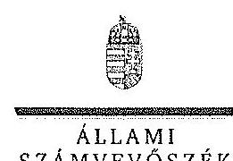

Ikt.szám: V-0754-107/2015.

# Zay Adorján úr 

vezérigazgató
ÉSZAKERDŐ Zrt.

## Miskolc

## Tisztelt Vezérigazgató Úr!

A ,,Jelentéstervezet az állami tulajdonban álló erdőgazdasági társaságok vagyongazdálkodási tevékenységének ellenőrzése - ÉSZAKERDŐ Erdőgazdasági Zrt" címmel készített számvevőszéki jelentéstervezetre tett észrevételeit köszönettel megkaptam.

Az Állami Számvevőszék észrevételekre vonatkozó álláspontjáról a felügyeleti vezető által készített részletes tájékoztatást csatoltan megküldöm.

Tájékoztatom Vezérigazgató urat, hogy a számvevőszéki jelentésben - az Állami Számvevőszékről szóló 2011. évi LXVI. törvény 29. § (3) bekezdése alapján - a figyelembe nem vett észrevételeket szerepeltetjük az elutasítás indokának feltüntetésével.

Budapest, 2015. 11. 02.
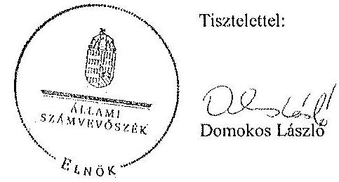

Melléklet: Tájékoztatás az elfogadott és el nem fogadott észrevételekről

---

# Tájékoztatás   az elfogadott és az el nem fogadott észrevételekről 

A „Jelentéstervezet az állami tulajdonban álló erdőgazdasági társaságok vagyongazdálkodási tevékenységének ellenőrzése - ÉSZAKERDŐ Erdőgazdasági Zrt." címü jelentéstervezetre 2015. október 14-én érkezett észrevételeit áttekintettük, azok kezelésével kapcsolatban - az észrevételek sorrendiségét követve - a következő tájékoztatást adom.

## 1. A jelentéstervezet 3. oldal 2. bekezdésére (Bevezetés) tett észrevétel

Az egyértelműség érdekében a vonatkozó jogszabály alapján a 2. mondatot pontosítjuk a következők szerint: „Az Nvtv. alapján nemzetgazdasági szempontból kiemelt jelentőségű nemzeti vagyonban tartandó vagyonelemnek minősül a 100%-ban az állam tulajdonában álló védelmi és közjóléti elsődleges rendeltetésű erdő, a gazdasági elsődleges rendeltetésű természetes erdő, természetszerű erdő és származék erdő természetességi állapotú öt hektárnál nagyobb, természetben összefüggő erdő."

## 2. A jelentéstervezet 6. oldal 2. bekezdésére tett L/1. észrevétel

Az észrevételben leírtak a Társaság mérlegeivel kapcsolatosan tett megállapítást nem cáfolják, és a kiegészítő mellékletre vonatkozó információk sem indokolják a megállapítás módosítását. A Társaság, mint vagyonkezelő a Vhr. 9. § (9) bekezdésében előírt kötelezettségét nem teljesítette, mert a Számv. tv. 23. § (2) bekezdése szerint a mérlegében eszközként nem mutatta ki a kezelésbe vett, az állami vagyon részét képező eszközöket, és ezen eszközöket a kiegészítő mellékletben - legalább mérlegtételek szerinti megbontásban - külön nem mutatta be. A Társaság a Vhr. és a Számv. tv. előírásainak betartása céljából nem tett lépéseket annak érdekében, hogy a vagyonkezelt eszközök értéke a VSZ-ben rögzítésre kerüljön. A fentiek alapján megállapításunk helytálló, módosítása nem indokolt.

## 3. A jelentéstervezet 7. oldal 3. és 6. bekezdésére tett L/2. észrevétel

Az észrevételben leírtak nem vitatják a VSZ módosításának hiányára és a vagyonkezelési díj felülvizsgálatának elmaradására vonatkozó megállapításainkat, ezért azok módosítása nem indokolt.

## 4. A jelentéstervezet 8. oldal 6. bekezdésére tett L/3. észrevétel

Az Avtv. 20. § (8) bekezdésében, illetve az Infotv. 30. § (6) bekezdésében foglaltak alapján a közfeladatot ellátó szervnek a közérdekű adatok megismerésére irányuló igények teljesítésének rendjét rögzítő szabályzatot kell készítenie. Az állami vagyonról szóló 2007. évi CVL törvény 5. § (2) bekezdése szerint az állami vagyonnal gazdálkodó vagy azzal rendelkező szerv vagy személy a közérdekű adatok nyilvánosságáról szóló törvény szerinti közfeladatot ellátó szervnek vagy személynek minősül. Az ÉSZAKERDŐ Erdőgazdasági Zrt. állami vagyonnal

---

gazdálkodik, ezért közfeladatot ellátó szervnek minősül, tehát el kell készítenie a közérdekű adatok megismerésére irányuló igények teljesítésének rendjét. Megállapításunk helytálló, módosítása nem indokolt.

# 5. A jelentéstervezet 12. oldal 1. bekezdésére, a 13. oldal utolsó táblázatára, valamint a 14. oldal 3. bekezdésére tett II./1.1. észrevétel 

A Társaság mérlegeire tett észrevételre adott válaszunk megegyezik a 2. pontban leírtakkal. „A 2009-2013. években a Társaság saját tőke növekedési mutatójának alakulása" elnevezésű táblázat észrevétele alapján a dokumentumokat ismételten áttekintettük és a táblázat „Saját tőke növekedési mutató" adatait a jelentés véglegesítésekor pontosítjuk a következőkre: 2009. nyitó oszlop adata törölve, 2009. év 7,2%; 2010. év 3,0%; 2011. év 4,3%; 2012. év 5,9%; 2013. év 4,8%.

A Társaságnál a kezelt erdők tekintetében az erdők fenntartására, gyarapítására és védelmére elszámolt költségekre tett észrevétel alapján a dokumentumokat ismételten áttekintettük és a 2009-2013. években az éves beszámolók adatainak összesítése alapján nem 15536 M Ft-ot, hanem 13529,1 M Ft-ot fordítottak az előzőekben leírt feladatokra. Ezért a jelentés véglegesítésekor a 2009-2013. években az erdők fenntartására, gyarapítására és védelmére elszámolt költségek összegét 13529,1 M Ft-ra módosítjuk.

## 6. A jelentéstervezet 15. oldal 3. bekezdésére tett II./2.1. észrevétel

Az észrevételben leírtak nem cáfolják a jelentéstervezet azon megállapítását, hogy „Az ellenőrzött időszakban a VSZ nem felelt meg a jogszabályi rendelkezéseknek, hatályon kívül helyezett jogszabályi hivatkozásokat tartalmazott... " Ezért a jelentéstervezetben a megállapítás módosítása nem indokolt.

## 7. A jelentéstervezet 16. oldal 5. bekezdésére tett
 II./2.2. észrevétel

Az észrevételben leírtak is alátámasztják a VSZ mellékleteivel kapcsolatos megállapításunkat, mely szerint a mellékletek nem hitelesek, ezért a megállapítás módosítása nem indokolt.

## 8. A jelentéstervezet 17. utolsó, valamint a 18. oldal 6. és utolsó bekezdéseire tett II./3.3. észrevétel

Az észrevételben leírtak nem cáfolják a bírsággal kapcsolatos megállapításunkat, ezért annak módosítása nem indokolt. Az erdőterv módosítására hozott határozatokkal kapcsolatos megállapítás esetében hivatkozott jogszabályhelyet a jelentés véglegesítésekor pontosítjuk Evt.: 113. § (15) bekezdésre.

## 9. A jelentéstervezet 21. oldal 5. bekezdésére tett II./4.2. észrevétel

Az észrevételre adott el nem fogadott válasz megegyezik a 4. pontban részletezett válasszal.

---

# 10. A jelentéstervezet 22. oldal 3. bekezdésére tett II./5. észrevétel 

Az észrevételben leírtak alapján a tulajdonosi joggyakorló által nyújtott támogatásokkal kapcsolatos dokumentumokat ismételten áttekintettük és a jelentés véglegesítésekor a támogatások összegeit a következők szerint pontosítjuk:
„A Társaság feletti tulajdonosi joggyakorló, az állami vagyon állagának megóvása, megőrzése, gyarapítása és a közjóléti tevékenység támogatása céljából a közmunka-programhoz 104,6 M Ft, a közjóléti tevékenységhez 39,5 M Ft és az erdőtelepítési feladatokhoz 41,4 M Ft támogatásban részesítette a Társaságot."

Budapest, 2015. 11. hó 06. nap

Makkai Mária
felügyeleti vezető

---

# 10. SZÁMÚ MELLÉKLET A V-0754-111/2015. SZÁMÚ JELENTÉSHEZ 

$V-0924-0771/2015$

## Állami Számvevőszék

## Domokos László

## elnök

1052 Budapest
Apáczai Cs. J. u. 10.
Ikt. sz.: MNV/01/47957/1/2015.
Hiv. sz.: V-0754-087/2015.

Tisztelt Elnök Úr!
A 2015. szeptember 28. napján „Az állami tulajdonban álló erdőgazdasági társaságok vagyongazdálkodási tevékenységének ellenőrzése - ÉSZAKERDŐ Erdőgazdasági Zrt. " tárgyában kézhez vett, V-0754-087/2015. ikt. sz. Jelentés-tervezetre az alábbi észrevételeket kívánom tenni.
I. fejezet / 9. oldal első-harmadik bekezdés, II.5. fejezet / 22. oldal hatodik bekezdés és 9-10. oldal Javaslat az MNV Zrt. vezérigazgatójának a)-e) pontok
„A vagyonkezelésbe adott állami vagyon tekintetében tulajdonosi jogokat gyakorló MNV Zrt. és NFA tevékenysége az ellenőrzött időszakban nem támogatta teljes körűen a felelős vagyongazdálkodás megvalósulását, a VSZ-szel kapcsolatban felért hiányosságok megszüntetésére és a hatályos jogszabályoknak való megfeleltetésre vonatkozóan nem kezdeményeztek intézkedéseket. A vagyonkezelésbe adott állami vagyon tekintetében tulajdonosi jogokat gyakorló MNV Zrt. és NFA nem végeztek a Vhr.-ben és a Nemzeti Földalapba tartozó földrészletek hasznosításának részletes szabályairól szóló 262/2010. (XI.17.) Korm. rendeletben foglalt, a vagyonnyilvántartás hitelességére, teljességére és helyességére vonatkozó ellenőrzést a Társaságnál.

Az ÉSZAKERDŐ Zrt. a KVI-vel 1996. október 16-án kötött vagyonkezelési szerződés alapján végezte a Magyar Állam tulajdonában álló erdővagyon és egyéb művelési ágú termelőföld ingatlanok kezelését. A Társaság, mint vagyonkezelő és a KVI között létrejött szerződéses jogviszony kereteit a VSZ-ben foglalt jogok és kötelezettségek töltötték ki. A VSZ nem támogatta a Vhr. 3. § (1) bekezdésében foglalt, a vagyongazdálkodási feladatok szabályszerű módon történő végrehajtását, valamint nem támogatta a szabályszerű vagyongazdálkodást. Az ellenőrzött időszakban a VSZ nem felelt meg a jogszabályi rendelkezéseknek, hatályon kívül helyezett jogszabályi hivatkozásokat tartalmazott az Aht. 109/B. §, 109/G. §, a vadvédelmi tv. 98. § rendelkezései vonatkozásában. A VSZ 3.2.3. pontja megengedte a vagyonkezelői jog átruházását, azonban a rendelkezés 2012. január 1-től nem felelt meg az Nets. 11. § (8) bekezdésében foglaltaknak, amely tiltja a vagyonkezelői jog harmadik személyre történő átruházást. A VSZ 3.3.2. pontjában foglaltak ellenére a VSZ-t a felek évente nem vizsgálták felül. A felek nem tettek eleget a Vhr. 54. § (7) bekezdésében foglalt rendelkezésnek és a Vhr. hatálybalépését követő hat hónapon belül nem kezdeményezték a Nemzeti Földalapba tartozó ingatlanokra vonatkozóan a VSZ megszüntetését és a Vtv., illetve Vhr. szabályainak megfelelő szerződés megkötését.

A vagyonkezelésbe adott állami vagyon tekintetében tulajdonosi jogokat gyakorló MNV Zrt. és NFA nem végeztek a Vhr. 20. § (1)-(2) bekezdéseiben és a Nemzeti Földalapba tartozó földrészletek hasznosításának részletes szabályairól szóló 262/2010. (XI.17.) Korm. rendelet 47. § (1)-(2) bekezdéseiben foglalt, a vagyonnyilvántartás hitelességére és teljességére vonatkozó ellenőrzést a Társaságnál.

---

# Javaslat az MNV Zrt. vezérigazgatójának 

a) Tegyen intézkedéseket az erdőgazdasági társaság közreműködésével a tényleges állapotot rögzítő és a hatályos jogszabályi előírásoknak megfelelő vagyonkezelési szerződés megkötésére.
b) Tegyen intézkedéseket a vagyonkezelési szerződés felülvizsgálatának elmaradásával, valamint a Nemzeti Földalapba tartozó ingatlanokra vonatkozó VSZ megszüntetésével összefüggésben feltárt szabálytalanságok tekintetében a felelősség tisztázása érdekében, és szükség szerint intézkedjen a felelősség érvényesítéséről.
c) Intézkedjen a Társaság vagyonnyilvántartása hitelességének, teljességének és helyességének jogszabályban foglaltak szerinti ellenőrzéséről.

Sajnálattal állapítottuk meg, hogy a Jelentés-tervezet egyáltalán nem veszi figyelembe a vizsgált időszakban megindított és több eljárási cselekményt is magába foglaló intézkedés-sorozatunkat, amelynek a célja a Jelentéstervezetben egyébiránt joggal kifogásolt hiányosságok megszüntetése, az erdőgazdasági társaságok működésének jogszabályi megfelelőségének biztosítása volt. Ezzel a Jelentés-tervezet azt sugallja, hogy a tulajdonosi joggyakorlók részéről egyáltalán nem volt szándék az erdőgazdasági társaságok működésének, illetve a vagyonkezelés körülményeinek hatályos jogszabályok szerinti szabályozására, amely egyébiránt nem felel meg a valóságnak és az adatszolgáltatásunk során sem erről tájékoztattuk Önöket.
Mindamellett elismerjük, hogy a probléma a kezelt vagyonelemek nagy száma, ebből kifolyólag a szabályozást igénylő körülmények nagy száma és sokrétűsége miatt nehezen átlátható, ezért kérjük, engedjék meg, hogy a munkájukat segítő szándékkal korábbi tájékoztatásunkat ismételten megerősítsük, azzal a kifejezett kéréssel, hogy a Jelentésükben az általunk vitatott megállapítást szíveskedjenek módosítani, és az MNV Zrt. által a megoldás irányába megtett intézkedéseket feltüntetni.
Az ideiglenes vagyonkezelési szerződéseken alapuló kezelői jogviszony újszabályozása, az ideiglenes vagyonkezelési szerződések megszüntetése és végleges vagyonkezelési szerződések megkötése érdekében az intézkedéseink már 2011. évben megkezdődtek, párhuzamosan a Nemzeti Földalapról szóló 2010. évi LXXXVII. tv. 34. § (3) bekezdés c) pontja szerinti feladat- illetve vagyonátadással.

Az intézkedéseink alapja a 2011. évben, MNV/01/29518/2011. szám alatt szakterületünk által bekért, az erdőgazdasági társaságok 2010. december 31-i, illetve 2011. július 31-i fordulónapra vonatkozó leltárjelentése volt, amelyet elsődlegesen az NFA tv. szerint előírt vagyonátadás elvégzése céljából kértünk meg az erdőgazdasági társaságoktól. Ugyanakkor a leltárjelentéshez benyújtott földrészlet listák voltak az első olyan kimutatások, amelyek a kezelt vagyon elemeit a FÖMI adatbázisán alapuló (az aktuális ingatlan-nyilvántartási állapotnak megfelelően) részletesebb bontásban tartalmazták.

## A vizsgált időszakban megindított és lefolytatott intézkedéseink a következők:

1. Az erdőgazdasági társaságok által kezelt vagyonelemek tulajdonosi joggyakorlók szerinti elhatárolása, NFA átadás előkészítése, az erdőgazdasági társaságok bevonásával. A Nemzeti Földalapba tartozó vagyonelemek NFA átadása 2012-2013. években megtörtént, majd a visszamaradt vagyonelemek - többségében kivett megnevezésben nyilvántartott földrészletek - elhatárolását is elvégeztük. A feladat végrehajtása 2014. május 31-ig teljesült.
Az intézkedéssel az MNV Zrt. tulajdonosi joggyakorlása alá tartozó vagyonelemek körét - a közös tulajdonosi joggyakorlás alatt álló ingatlanok kivételével -, azaz a végleges vagyonkezelési szerződések ingatlanlistáit meghatározzuk.
Meg kívánjuk jegyezni, hogy az erdőgazdasági társaságok a 2011. évi leltárjelentéseikhez minden esetben csatolták a jelentés tartalmára vonatkozó teljességi nyilatkozatukat is, így azok tartalmát mint teljes körű adatszolgáltatást kezeltük.
A hivatkozott iratokat az eljárás során a Tisztelt Állami Számvevőszék rendelkezésére bocsátottuk.
2. Az erdőgazdasági társaságok által kezelt vagyon értékelését 2014. május 31-ig elvégeztük, részben külső piaci szereplő által megállapított vagyonértékelési adatok (az IFUA értékbecslési adatai), részben belső szakértők és a

---

kontrolling szakterület által az MNV Zrt. hatályos értékelési szabályzata által megállapított értékadatok figyelembe vételével.
3. Az MNV Zrt. Igazgatósága 511/2012. (X. 08.) IG sz., valamint 717/2013. (IX. 23.) IG sz. határozataiban Intézkedési terveket fogadott el „a 28/2012. (IX. 24.) sz. RJGY határozatában előírt, valamint az MNV Zrt. rábízott vagyon 2012. évi beszámolója könyvvizsgálói minősítésének megtartásához szükséges és egyéb feladatokról". Az Intézkedési tervek magukban foglalták az erdőgazdasági társaságok által kezelt vagyon analitikájának előállítását, illetve az erdőtársaságokkal végleges (nem ideiglenes) vagyonkezelői szerződések megkötését. A 717/2013. (IX. 23.) IG sz. határozat melléklete tartalmazza a feladat végrehajtása érdekében már megtett intézkedéseket (pl. „Megtörtént az erdőgazdaságok által kezelt vagyon listáinak vagyonkezelői jelentésekkel való egyeztetése; a vagyonkezelési szerződés tartalmi kérdéseinek, az erdőgazdaságok véleményének feldolgozása, MFB Munkacsoport egyeztetések történtek stb.), valamint rögzíti a még elvégzendő feladatokat. Ennek megfelelően az MNV Zrt-nél 2012-től folyamatban van az erdőgazdasági társaságok vagyonanalitikájának előállítása és vagyonkezelési szerződései tárgyú projekt.
A hatályos jogszabályoknak megfelelő vagyonkezelési szerződés tervezetét a vizsgálati időszak során az MNV Zrt. belső szakterületi egyeztetést követően előkészítettük, és a 2014. március 18-án megtartott Munkacsoport értekezleten az erdőgazdaság képviselőivel, továbbá a tulajdonosi joggyakorlók (NFA, illetve akkor még Magyar Fejlesztési Bank Zrt.) képviselőivel ismertettük annak tartalmát. A szerződés szövegtervezetének véleményezése ekkor megkezdődött, ugyanakkor elismerjük, hogy a végleges szerződésváltozat már az Önök által vizsgált időszakot követően került elfogadásra. Ugyancsak a 2014. március 18-án megtartott Munkacsoport értekezleten tettünk javaslatot a vagyonkezelési díj alapjának és mértékének meghatározására.
4. Az erdőgazdasági társaságok által kezelt és a saját vagyonuk vagyonelemenkénti, valamint a kezelt vagyonelemek tulajdonosi joggyakorlók szerinti elhatárolására vonatkozó intézkedésünket a vizsgált időszakban előkészítettük.

Tájékoztatjuk továbbá Elnök Urat az alábbiakról:
A Nemzeti Fejlesztési Minisztérium KGTF/377-6/2014-NFM, valamint KGTF/377-7/2014. számok alatt adott utasításokat a fenti feladatok elvégzésére. Ezekről, illetve az utasításokra adott jelentésünkről a korábbi adatszolgáltatásunk keretében szintén kitértünk.

A vagyonkezelési szerződés vizsgált időszakot követően elfogadott tervezetének mellékletét képezik az MNV Zrt. azon szabályzatai is, amelyek a kezelt vagyon nyilvántartását, a beruházások nyilvántartását és az azzal kapcsolatos elszámolásokat, illetve a tulajdonosi ellenőrzéssel kapcsolatos, a jelenlegi jogszabályi környezetnek megfelelő szabályokat tartalmazzák:

- Az állami tulajdonon, egyéb vagyonkezelők által vagyonkezelt eszközön megvalósítandó beruházások, felújítások előzetes engedélyezésének és elszámolásának eljárásrendjéről szóló 35/2014. számú vezérigazgatói utasítás.
- A Magyar Nemzeti Vagyonkezelő Zrt. Tulajdonosi Ellenőrzési Szabályzata - a 39/2014. számú vezérigazgatói utasítás, továbbá
- A Magyar Nemzeti Vagyonkezelő Zrt. állami vagyon vagyonkezelőire, az állami vagyont használókra és a társasági részesedések esetében az MNV Zrt. tulajdonosi joggyakorlását megbízottként ellátókra vonatkozó Vagyon-nyilvántartási Szabályzatáról szóló 12/2014. számú vezérigazgatói utasítás.

Fentiek mellett megemlíthető az MNV Zrt. folyamatba épített, illetve vagyon nyilvántartás vezetését támogató ellenőrzési módszertanról szóló 11/2014. számú vezérigazgatói utasítás.
Egyeztetéseink során az erdőgazdasági társaságok tájékoztatást kaptak a szabályzataink tartalmára vonatkozóan.
A Jelentés-tervezet 9. oldalán található, az MNV Zrt. vezérigazgatójára vonatkozó, a) pont alatti, vagyonkezelési szerződés megkötésére irányuló javaslathoz kapcsolódóan felhívjuk a Tisztelt Állami Számvevőszék figyelmét arra, hogy a Nemzeti Fejlesztési Minisztérium ÁVF/21310/2015-NFM számú tájékoztató levele szerint Miniszter Úr vagyongazdálkodási szempontból nem támogatja az erdőgazdasági társaságok ideiglenes vagyonkezelési

---

szerződéseit kiváltó vagyonkezelési szerződések megkötését, ideértve az MNV Zrt. vagyonkezelési szerződésekkel kapcsolatos jóváhagyó döntéseit is.

Az MNV Zrt-re vonatkozóan hivatkozott jogszabály, a Vhr. 20. § (1)-(2) bekezdése 2014. március 14-ig - csaknem az ellenőrzött időszak végéig - a következőképpen rendelkezett:
„(1) Az állami vagyon kezelőjét, használóját megillető jogok gyakorlását, annak szabályszerűségét, célszerűségét a Vtr. 17. §-ának d) pontja alapján az MNV Zrt. - szükség szerint a területi szervei útján - ellenőrzi. Ennek érdekében a vagyon kezelésére, hasznosítására kötött szerződésben rögzíteni kell, hogy a tulajdonosi ellenőrzés eljárásrendjét, a felek jogait, kötelezettségeit a felek a szerződés részének tekintik.
(2) A tulajdonosi ellenőrzés
 célja az állami vagyonnal való gazdálkodás vizsgálata, ennek keretében a rendeltetésellenes, jogszerűtlen, szerződésellenes, vagy a tulajdonos érdekeit sértő, illetve a központi költségvetést hátrányosan érintő vagyongazdálkodási intézkedések feltárása és a jogszerű állapot helyreállítása, továbbá a vagyonnyilvántartás hitelességének, teljességének és helyességének biztosítása."

A tulajdonosi ellenőrzés alatt a Területi Irodák által folytatott ellenőrzést is értette a jogszabály, amiből egyenesen következik a szakterületi munkafolyamatba épített ellenőrzési kötelezettség figyelembe vételének a lehetősége.

Fentiekre tekintettel kérjük a Jelentés-tervezet 9., illetve 22. oldalán található azon megállapítások törlését, hogy az MNV Zrt. nem kezdeményezett intézkedéseket, és nem végzett a Vhr. 20. § (1)-(2) bekezdéseiben és a Nemzeti Földalapba tartozó földrészletek hasznosításának részletes szabályairól szóló 262/2010. (XI.17.) Korm. rendelet 47. § (1)-(2) bekezdéseiben foglalt, a vagyonnyilvántartás hitelességére és teljességére vonatkozó ellenőrzést a Társaságnál, kérjük a megtett intézkedések feltüntetését, és a Jelentés-tervezet 10. oldalán található, az MNV Zrt. vezérigazgatójára vonatkozó, b) pontot a megtett intézkedések folyamatosságára tekintettel törölni és a c) pont alatti javaslatot szövegszerűen ekként módosítani:

# Javaslat az MNV Zrt. vezérigazgatójának 

c) Az MNV Zrt tulajdonosi joggyakorlása alá tartozó (az Erdőgazdasági Társaságok által az MNV Zrt. részére jelentett) vagyonelnek tekintetében intézkedjen a Társaság vagyonnyilvántartása hitelességének, teljességének és helyességének jogszabályban foglaltak szerinti ellenőrzéseinek erősítéséről.

Kérem Elnök Urat, hogy a Jelentés véglegesítése során jelen észrevételeinket szíveskedjenek figyelembe venni.

Budapest, 2015. október , $f^{2}$.
Üdvözlettel:
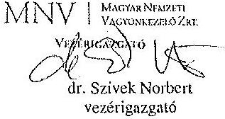

---

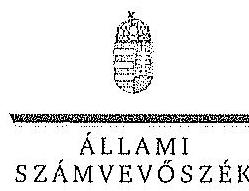

ELNÖK

Ikt.szám: V-0754-102/2015.

Dr. Szivek Norbert úr
vezérigazgató
Magyar Nemzeti Vagyonkezelő Zrt.

Budapest

Tisztelt Vezérigazgató Úr!

A „Jelentéstervezet az állami tulajdonban álló erdőgazdasági társaságok vagyongazdálkodási tevékenységének ellenőrzése – ÉSZAKERDŐ Erdőgazdasági Zrt.” címmel készített számvevőszéki jelentéstervezetre tett észrevételeit köszönettel megkaptam.

Az Állami Számvevőszék észrevételekre vonatkozó álláspontjáról a felügyeleti vezető által készített részletes tájékoztatást csatoltan megküldöm.

Tájékoztatom Vezérigazgató urat, hogy a számvevőszéki jelentésben – az Állami Számvevőszékről szóló 2011. évi LXVI. törvény 29. § (3) bekezdése alapján – a figyelembe nem vett észrevételeket szerepeltetjük az elutasítás indokának feltüntetésével.

Budapest, 2015. 10. hó 29. nap

Tisztelettel:

Melléklet: Tájékoztatás az elfogadott és az el nem fogadott észrevételekről

1052 BUDAPEST, APÁCZAI CSERJÉP JÁNOS UTCA 10. 1364 Budapest 4. Pl. 54 telefon: 484 8181 fax: 484 8281

---

# Tájékoztatás   az elfogadott és az el nem fogadott észrevételekről 

A „Jelentéstervezet az állami tulajdonban álló erdőgazdasági társaságok vagyongazdálkodási tevékenységének ellenőrzése - ÉSZAKERDŐ Erdőgazdasági Zrt." címû jelentéstervezetre 2015. október 13-án érkezett észrevételeit áttekintettük, azok kezelésével kapcsolatban a következő tájékoztatást adom.

1. A vagyonkezelési szerződéshez kapcsolódó megállapításokra tett észrevétel (I. fejezet / 9. oldal 1-2. bekezdés, II. 5. fejezet / 22. oldal 6. bekezdés, 9-10. oldal javaslat az MNV Zrt. vezérigazgatójának a)-b) pontok)

A jelentéstervezet vagyonkezelési szerződéshez kapcsolódó megállapításai helytállóak. Az erdőgazdasági társaság működése jogszabályi megfelelősége biztosításának érdekében tett kezdeményezésekről adott tájékoztatásukat köszönettel vettük, azonban azok nem eredményezték az ideiglenes vagyonkezelési szerződés olyan módosítását, vagy olyan új vagyonkezelési szerződés megkötését, amely biztosította volna a VSZ hiányosságainak megszüntetését, illetve a hatályos jogszabályoknak való megfelelőségét. Ezért az MNV Zrt. vezérigazgatójának és az NFA elnökének megfogalmazott intézkedést igénylő megállapítás, valamint az MNV Zrt. vezérigazgatójának megfogalmazott javaslat a) és b) pontjának módosítása nem indokolt. Az egyértelműség érdekében a 9. oldal 1. bekezdés második mondatát és a 22. oldal 6. bekezdés 1. mondatát az alábbiak szerint pontosítjuk:
„A VSZ-szel kapcsolatban feltárt hiányosságok megszüntetése és a hatályos jogszabályoknak megfeleltetése nem történt meg."
2. Az MNV Zrt. ellenőrzési kötelezettségének elmulasztására vonatkozó megállapításokra tett észrevétel (I. fejezet 9. oldal 3. bekezdés, II. 5. fejezet / 22. oldal 6. bekezdés és 9-10. oldal javaslat az MNV Zrt. vezérigazgatójának c) pont)

Az MNV Zrt. nem bocsátott az ÁSZ ellenőrzés rendelkezésére az MNV Zrt., vagy Területi Irodái által a Vhe. 20. § (1)-(2) bekezdései szerint végzett ellenőrzésekről dokumentumokat. A jelentéstervezet megállapításai és a javaslat helytállóak, módosításuk nem indokolt.

Budapest, 2015. 10. hó 20. nap
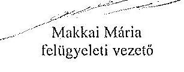

---

# 12. SZÁMÚ MELLÉKLET A V-0754-111/2015. SZÁMÚ JELENTÉSHEZ 

## 11. MFB

Domokos László úr
elnök részére
Állami Számvevőszék

Budapest

Tisztelt Elnök Úr!
2015. szeptember 28-án köszönettel kézhez vettük az Állami Számvevőszék „Az állami tulajdonban álló erdőgazdasági társaságok vagyongazdálkodási tevékenységének ellenőrzéséről" szóló jelentéstervezeteket az alábbi cégekre:

- Északerdő Erdőgazdasági Zrt.
- EGERERDŐ Erdészeti Zrt.
- Gemenci Erdő- és Vadgazdaság Zrt.
- Ipoly Erdő Zrt.
- KEFAG Kiskunsági Erdészeti és Faipari Zrt
- Kisalföldi Erdőgazdaság Zrt
- SEFAG Erdészeti és Faipari Zrt
- Szombathelyi Erdészeti Zrt.
- VADEX Mezőföldi Erdő-és Vadgazdálkodási Zrt. (Ikt.szám: V-0765-044/2015.)
- Zalaerdő Erdészeti Zrt.
(ikt.szám: V-0754-086/2015.)
(ikt.szám: V-0750-172/2015.)
(ikt.szám: V-0753-096/2015.)
(ikt.szám: V-0749-146/2015.)
(ikt.szám: V-0764-054/2015.)
(ikt.szám: V-0758-056/2015.)
(ikt.szám: V-0752-089/2015.)
(ikt.szám: V-0757-060/2015.)
(ikt.szám: V-0765-044/2015.)
(ikt.szám: V-0760-075/2015.)

Az MFB Zrt. a jelentéstervezetekkel kapcsolatosan 2 fő szempontból kíván észrevételt tenni:

1. A jelentésekben megfogalmazott központi probléma
2. Egyedi esetek

---

# 1. A jelentésekben megfogalmazott központi probléma 

Az ÁSZ az egyedi jelentéseiben az erdőgazdasági társaságokat, valamint a vagyonkezelésbe adott állami vagyon tekintetében tulajdonosi joggyakorló MNV Zrt. és Nemzeti Földalapkezelő (továbbiakban: NFA) tevékenységét marasztalta el.
Alapvető problémaként jelenik meg, hogy az erdők által kezelt eszközök - az NFA-val, a Kincstári Vagyon Igazgatósággal, és az MNV Zrt-vel kötött vagyonkezelési megállapodásban rögzített - értéken nem szerepelnek a Társaságok könyveiben.
Az MFB Zrt. tudatában volt a problémának (azt az ÁSZ jelentésben is említett, 2010. évben végzett átvilágítási jelentés is tartalmazta, melynek nyomon követése, beszámoltatása megtörtént) és folyamatosan egyeztetett az MNV Zrt-vel és az NFA-val a rendezés ügyében. Az ideiglenes vagyonkezelési szerződés módosítására, véglegesítésére a vagyonkezelésbe adónak (MNV, NFA) van lehetősége, a Társaságok szerződő partnerként észrevételeket, javaslatokat tehetnek. A szerződés véglegesítése érdekében a Társaságok és az MFB Zrt. képviselői minden olyan egyeztetésen (pl.: az MNV Zrt. által létrehozott bizottság) részt vettek, amelyre meghívást kaptak, illetve azokon érdemi javaslatokat tettek.
Ahogy a jelentés is megjegyzi, az egyeztetések az ellenőrzés befejezésig nem kerültek lezárásra, így a Társaságoknál nem áll rendelkezésre a vagyonkezelésben lévő állami vagyonra és annak nagyságára vonatkozó, az MNV Zrt. és az NFA nyilvántartásával egyező adat.

Az ÁSZ 2013. évi „Az állami vagyon feletti kontroll - Az állami vagyon feletti tulajdonosi joggyakorlással kapcsolatos tevékenységek ellenőrzéséről" szóló jelentése alapján a Nemzeti Fejlesztési Minisztérium - az ÁSZ-szal egyeztetett - alábbi főbb pontokat tartalmazó intézkedési tervet (1. sz. melléklet) állított össze, melyet a 2014. április 25-én kelt levelében küldött meg az MFB Zrt. részére:

- a Társaságok által kezelt állami ingatlanok és egyéb vagyonelemek értéken történő nyilvántartása,
- a vagyonkezelési díjak egyértelmű és tulajdonosi joggyakorló szervezetenkénti meghatározása,
- az új vagyonkezelési szerződés megkötése,
- a Társaságok kezelt és saját vagyonának vagyonelemenkénti, valamint a kezelt vagyonelemek tulajdonosi joggyakorló szerinti elhatárolása.

Az MFB törvény módosításának 2014. július 16-i hatályba lépésével az MFB Zrt. állami erdőgazdaságok feletti tulajdonosi joggyakorlása megszűnt, az a Földművelésügyi Minisztériumhoz került át, így az intézkedési tervben való közreműködésre, illetve a végrehajtás nyomon követésére az MFB Zrt-nek nem volt lehetősége.

A jelentések az MNV Zrt. vezérigazgatójának, az NFA elnökének és az erdészeti társaságok vezérigazgatóinak fogalmaztak meg intézkedési javaslatokat.

---

# 2. Egyedi esetek: 

## KEFAG Kiskunsági Erdészeti és Faipari Zrt.

A jelentéstervezet többször hibásan hivatkozik az MFB Zrt.-re, amikor az állami vagyonról szóló 2007. évi CVI. törvény (a továbbiakban: Vtv.) 17. § (1) bekezdés d) pontja szerinti rendszeres ellenőrzés elmaradására mutat rá. A Vtv. hivatkozott bekezdése alapján az ellenőrzés az MNV Zrt. feladata. Kérjük a társaság feletti tulajdonosi joggyakorló hivatkozások törlését (8. oldal 7. bekezdés és 32. oldal 6. bekezdés).

## Kisalföldi Erdőgazdaság Zrt.

A jelentéstervezet hibásan hivatkozik az MFB Zrt.-re, amikor a Vtv. 17. § (1) bekezdés d) pontja szerinti rendszeres ellenőrzés elmaradására mutat rá. A Vtv. hivatkozott bekezdése alapján az ellenőrzés az MNV Zrt. feladata. Kérjük a társaság feletti tulajdonosi joggyakorló hivatkozások törlését (29. oldal 4. bekezdés).

## Szombathelyi Erdészeti Zrt.

A jelentéstervezet hibásan hivatkozik az MFB Zrt.-re, amikor a Vtv. 17. § (1) bekezdés d) pontja szerinti rendszeres ellenőrzési elmaradására mutat rá. A Vtv. hivatkozott bekezdése alapján az ellenőrzés az MNV Zrt. feladata. Kérjük a társaság feletti tulajdonosi joggyakorló hivatkozás törlését (32. oldal 5. bekezdés).

Budapest, 2015. október 12.
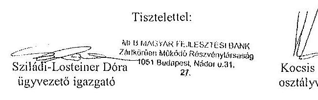

## Melléklet:

NFM levél (Ikt.szám: KGTF/377-7/2014-NFM)

---

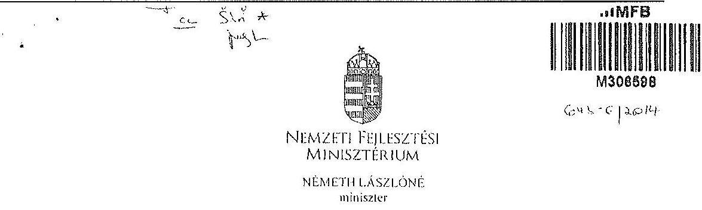

Iktatószám: KGTF/ 7773 /2014-NFM
Ügyintéző: dr. Kaszás Mónika
Telefonszám: 795-1917
e-mail:monika.kaszas@nfm.gov.hu
Nagy Csaba úr részére
vezérigazgató
Magyar Fejlesztési Bank Zrt.
Budapest
Tárgy: „Az állami vagyon feletti kontroll - Az állami vagyon feletti tulajdonosi joggyakorlással kapcsolatos tevékenységek ellenőrzéséről" szóló 13193 sz. ÁSZ jelentés alapján összeállított NFM intézkedési terv módosítása, az abban foglalt feladatok végrehajtása

# Tisztelt Vezérigazgató Úr! 

Az Állami Számvevőszék (a továbbiakban: ÁSZ) tárgyban megjelölt jelentésével összefüggésben 2014. január 27-én intézkedési tervet hagytam jóvá, amelyben foglalt feladatok végrehajtása érdekében 2014. január 30-i keltezésű levélben fordultam Önhöz és a Magyar Nemzeti Vagyonkezelő Zrt. vezérigazgatójához, Márton Péter úrhoz.

Az ÁSZ az intézkedési tervvel kapcsolatban küldött, 2014. március 25-i keltu levelében az intézkedési terv kiegészítését, módosítását kérte. A módosított intézkedési tervet jóváhagytam.

A módosított intézkedési terv alapján a következő feladatok végrehajtása szükséges az alábbiak szerint:

1./ a társaságok által kezelt állami ingatlanok és egyéb vagyonelemek értéken történő nyilvántartása:

Felelős: MNV Zrt.,
Határidő:

- földterületek esetében legkésőbb 2014. május 31-ig
- felépítmények esetében 2014. december 31. (A felépítmények esetében az MNV Zrt. a vagyonkezelési szerződés megkötését az év második felére tervezi, látja megvalósíthatónak.)

2./ a vagyonkezelési díjak egyértelmű és tulajdonosi joggyakorló szervezetenkénti meghatározása:

---

# Felelős: MNV Zrt., 

Határidő: 2014. május 31-ét követően folyamatosan (2014. december 31-ig)
E pontban foglalt feladattal kapcsolatosan az ÁSZ részére az alábbi tájékoztatást adtam:
„Az ÁSZ által meghatározott feladatok végrehajtására irányuló munkafolyamat során a végrehajtásban érintett szervezetek, társaságok között kialakult az az álláspont, hogy mivel az erdőgazdasági társaságok alapfeladatként közfeladat ellátást is végeznek, azt a vagyonkezelési díj mértékének meghatározásakor az MNV Zrt. figyelembe veszi, valamint megállapításra került az az elv is, hogy a vagyonkezelési díj irányadó mértéke az adott erdőgazdasági társaság által kezelt ingatlanvagyon bruttó nyilvántartási értékének 2\%-a.

A vagyonkezelési díj alapja a kezelt vagyon bruttó nyilvántartási értéke, ezért annak meghatározására erdőgazdaság társaságonként kerül sor a 4./ pontban meghatározott ún. „végleges ingatlanlista" alapján. A végleges ingatlanlista kizárólag vagyonkezelésbe adott ingatlan vagyonelemet tartalmaz, az erdőgazdasági társaság saját vagyonában nyilvántartott vagyonelemet nem, ezért az MNV Zrt.-nek és az erdőgazdasági társaságoknak a szerződés megkötését megelőzően el kell határolnia egymástól a saját vagyonba és a kezelt vagyonba tartozó ingatlan vagyonelemeket (4.b./ pontban foglalt feladat).

A feleknek a vagyonkezelési díj mértékében a vagyonkezelési szerződés megkötését megelőzően kell megállapodniuk az irányadó vagyonkezelési díj mértéket alapul véve."

## 3./ az új vagyonkezelési szerződések megkötése:

A vagyonkezelési szerződés tervezet az MNV Zrt. érintett szakterületei álláspontjának figyelembe vételével elkészült, az MNV Zrt. és a MFB Zrt. által létrehozott Munkacsoport (tagjai: MFB Zrt., MNV Zrt., NFA és egyes erdőgazdasági társaságok) véleménye alapján átdolgozásra került. A szerződés tervezetnek az erdőgazdasági társaságok részére történő megküldése 2014. április 15. napjával megtörtént.

Felelős: MNV Zrt., az MFB Zrt. közreműködésével
Határidő:

- földterületek esetében: 2014. május

 31-ét követően folyamatosan (2014. december 31-ig)
- felépítmények esetében 2014. II. félév folyamán
4./ a társaságok kezelt és saját vagyonának vagyonelemenkénti, valamint a kezelt vagyonelemek tulajdonosi joggyakorló szerinti elhatárolása:

Az erdőgazdasági társaságok által az MNV Zrt. rendelkezésére bocsátott leltárjelentések alapján

- a jogszabályi rendelkezések szerint az NFA tulajdonosi joggyakorlása alá tartozó ingatlan vagyonelemek nagyobb része már átadásra került az NFA részére,
- a kisebb részt képező vagyonelemek tekintetében pedig folyamatban van az átadás az MNV Zrt. és az NFA között.

---

a./ Az ún. „végleges ingatlanlista" (az MNV Zrt. tulajdonosi joggyakorlása alatt lévő, maradó vagyonelem listája) MNV Zrt. és az NFA közötti leegyeztetése, közös áttekintése

Felelős: MNV Zrt.
Határidő: a lista MNV Zrt. és NFA közötti leegyeztetése, közös áttekintése folyamatban van, lezárása legkésőbb 2014. május 31-ig megtörténik
b./ Az a./ pontban foglaltak szerint leegyeztetett ún. „végleges ingatlanlista" MNV Zrt. és az egyes erdőgazdasági társaságok általi áttekintése azzal a céllal, hogy a vagyonkezelésben lévő vagyoni elemeket tartalmazó ún. „végleges ingatlanlista" ne tartalmazzon az erdőgazdasági társaság saját vagyonában nyilvántartott vagyoni elemet (saját vagyon - vagyonkezelt vagyon elhatárolása).

Felelős: MNV Zrt., az MFB Zrt. közreműködésével
Határidő: 2014. május 31-ig
E pontban foglalt feladatokkal kapcsolatosan az ÁSZ részére az alábbi tájékoztatást adtam:
„Szükséges megjegyezni, hogy ingatlanlista, mint állandó „végleges ingatlanlista" ilyen formában nem létezik, mert mindkét tulajdonosi joggyakorló tekintetében az állami vagyonelemek halmaza mind mennyiségben, mind pedig összetételben folyamatosan változik.

Az erdőgazdasági társaságok által kezelt ingatlanvagyon adatai - mindkét tulajdonosi joggyakorló tekintetében - az évközi változások (megosztások, területváltozások, művelési ág változások, stb.) miatt folyamatosan változnak, ezért az adattartalmában „végleges ingatlanlista" mindig egy adott konkrét időpont vonatkozásában adható meg.

Jelen intézkedési tervben az ún. „végleges ingatlanlista" meghatározás alatt az erdőgazdasági társaságok vagyonkezelésében lévő ingatlanvagyon MNV Zrt tulajdonosi joggyakorlása alatt álló részét kell tekinteni. E „végleges ingatlanlista" kialakítására az erdőgazdasági társaságok által az MNV Zrt. részére átadott leltárjelentések alapján került sor úgy, hogy az MNV Zrt. a Nemzeti Földalapba tartozó vagyonlemeket kiválogatta, s azokat a Nemzeti Földalapkezelő Szervezet részére - átadás-átvételi jegyzőkönyv alapján - átadta.

Lényeges körülmény, hogy a vagyonkezelőknek - jelen esetben az erdőgazdasági társaságoknak - minden év május 31. napjáig vagyonkezelői jelentést kell benyújtaniuk a tulajdonosi joggyakorlók, így az MNV Zrt. részére is. Az aktuális vagyonkezelői jelentéseket - melynek része a leltárjelentés is - a 2013. december 31-i állapotnak megfelelően kell összeállítani, ebből következően a fent említett ún. „végleges ingatlanlista" is a 2013. december 31-i állapotot tükrözi.

Ugyanakkor - főként a kivett megnevezésben nyilvántartott földterületek esetében - a még át nem adott Nemzeti Földalapba tartozó vagyonelemek egyeztetése a két tulajdonosi joggyakorló között jelenleg is folyamatban van.

---

Az egyes erdőgazdasági társaságok vagyonkezelésében lévő vagyonelemek az adott társasággal megkötendő - a jelenlegi ideiglenes vagyonkezelési szerződés helyébe lépő - vagyonkezelési szerződés mellékletét fogják képezni. Az MNV Zrt. szándékai szerint az egyes erdőgazdasági társaságokkal azonnal megkötik a vagyonkezelési szerződéseket, ahogyan a megkötés feltételei bekövetkeznek (pl. megállapodnak a vagyonkezelési díjban, véglegesítik a vagyonkezelési szerződés tartalmát), azok a vagyonelemek, amelyeket e pont a./ és b./ pontjában foglaltak szerint már átvizsgáltak, a vagyonkezelési szerződés megkötésével egyidejűleg a szerződés mellékletébe kerülnek, amely melléklet folyamatosan bővítésre kerül újabb, e pont a./ és b./ pontjában foglaltak szerint átvizsgált, tisztázott vagyonelemekkel. „

Tájékoztatom, hogy az NFA feletti tulajdonosi jogok gyakorlója, Dr. Fazekas Sándor miniszter úr időközben már jóváhagyta azt az intézkedési tervet, amely az NFA részére meghatározott feladatokat és azok végrehajtási határidejét tartalmazza.

Az MFB Zrt. közreműködése az 1./ és 2./ pontban meghatározott feladatok végrehajtásban is szükséges lehet, ezért kérem a fent meghatározott feladatok határidőben történő végrehajtása érdekében az MFB Zrt. változatlan együttműködését az érintett szervezetekkel és amennyiben szükséges, úgy az erdőgazdasági társaságok bevonása iránt is intézkedni szíveskedjen.

Budapest, 2014. „djniec. Jf „

# Üdvözlettel: 

Németh Lászlóné

---

.

---

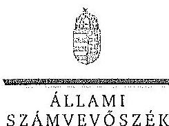

# ELNÖK 

## ÁLLAMI

SZÁMVEVŐSZÉK

Ikt.szám: V-0754-104/2015.

## Nagy Csaba úr

vezérigazgató
Magyar Fejlesztési Bank Zrt.

## Budapest

## Tisztelt Vezérigazgató Úr!

Az „Az állami tulajdonban álló erdőgazdasági társaságok vagyongazdálkodási tevékenységének ellenőrzése" című ellenőrzés tekintetében 10 társaság jelentéstervezetére tett észrevételüket köszönettel megkaptam.

Az Állami Számvevőszék észrevételekre vonatkozó álláspontjáról a felügyeleti vezető által készített részletes tájékoztatást csatoltan megküldöm.

Tájékoztatom Vezérigazgató urat, hogy a számvevőszéki jelentésben - az Állami Számvevőszékről szóló 2011. évi LXVI. törvény 29. § (3) bekezdése alapján - a figyelembe nem vett észrevételeket szerepeltetjük az elutasítás indokának feltüntetésével.

Budapest, 2015.
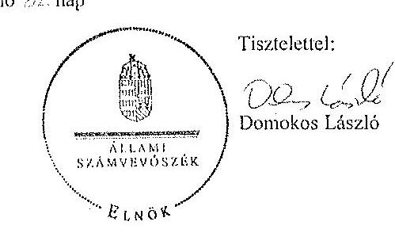

Melléklet: Tájékoztatás az elfogadott és az el nem fogadott észrevételekről

---

# Tájékoztatás   az elfogadott és az el nem fogadott észrevételekről 

„Az állami tulajdonban álló erdőgazdasági társaságok vagyongazdálkodási tevékenységének ellenőrzése" című ellenőrzés tekintetében az Északerdő Erdőgazdasági Zrt., az EGERERDŐ Erdészeti Zrt., a Gemenci Erdő- és Vadgazdaság Zrt., az IPOLY ERDŐ Zrt., a KEFAG Kiskunsági Erdészeti és Faipari Zrt., a Kisalföldi Erdőgazdasági Zrt., a SEFAG Erdészeti és Faipari Zrt., a Szombathelyi Erdészeti Zrt., a YADEX Mezöföldi Erdő- és Vadgazdálkodási Zrt., illetve a Zaloerdő Erdészeti Zrt. társaságok jelentéstervezetére 2015. október 13-án érkezett észrevételeket áttekintettük, azok kezelésével kapcsolatban a következő tájékoztatást adom.

1. A jelentésekben megfogalmazott központi problémával kapcsolatban tett észrevételek A jelentésekben megfogalmazott központi problémával kapcsolatban adott tájékoztatásukat köszönettel vettük, azonban azok alapján a jelentéstervezet módosítása nem indokolt.

## 2. Egyedi esetekkel kapcsolatban tett észrevételek

A KEFAG Kiskunsági Erdészeti és Faipari Zrt. jelentéstervezetének 8. oldal 7. bekezdésére, valamint 32. oldal 6. bekezdésére tett észrevétel
A rendelkezésre álló dokumentumok ismételt áttekintését követően a jelentéstervezet 8. oldal 7. bekezdésében, valamint 32. oldal 6. bekezdésében töröljük a tulajdonosi joggyakorló 2 számú alsóindexszel jelölt hivatkozását.

A Kisalföldi Erdőgazdasági Zrt. jelentéstervezetének 29. oldal 4. bekezdésére tett észrevétel
A rendelkezésre álló dokumentumok ismételt áttekintését követően a jelentéstervezet 29. oldal 4. bekezdésében töröljük a tulajdonosi joggyakorló 2 számú alsóindexszel jelölt hivatkozását.

A Szombathelyi Erdészeti Zrt. jelentéstervezetének 32. oldal 5. bekezdésére tett észrevétel
A rendelkezésre álló dokumentumok ismételt áttekintését követően a jelentéstervezet 32. oldal 5. bekezdésében töröljük a tulajdonosi joggyakorló 2 számú alsóindexszel jelölt hivatkozását.

Budapest, 2015. év $\quad 1 / \quad$ hó 07 nap

Makkai Mária
felügyeleti vezető

---

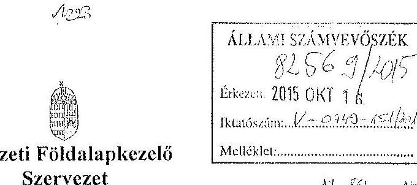

Iktatószám: NFA-002589/017/2015
Hív. szám: ÁSZ-V-0599/2014-2015
Érintett ÁSZ iktatószámok: V-0749-148/2015, V-0750-174/2015, V-0751-121/2015,
V-0752-091/2015, V-0753-098/2015, V-754-088/2015, V-0755-124/2015, V-0757-062/2015,
V-0758-058/2015, V-0760-077/2015, V-0764-056/2015, V-0765-046/2015,
V-0766-140/2015, V-0767-056/2015.

Domokos László
Elnök

Állami Számvevőszék

1052 Budapest

Apáczai Csere János utca 10

Tárgy: Észrevétel megküldése „Az állami tulajdonban álló erdőgazdasági társaságok vagyongazdálkodási tevékenységének ellenőrzéséről" készített jelentés tervezeteire.

Tisztelt Elnök Úr!

Az Állami Számvevőszék 2014 novemberében megkezdte „Az állami tulajdonban álló erdőgazdasági társaságok vagyongazdálkodási tevékenységének ellenőrzését" amelyről 2015 októberétől érintettség okán az NFA részére az elkészített munkaanyag tervezeteit vizsgált erdőgazdaságonként, megküldte Szervezetünk részére véleményezésre.

A munkaanyag valamennyi tervezete egységesen, az NFA Elnöke részére feladatszabást tartalmaz, melyhez az alábbi észrevételeket tesszük:

A jelentéstervezetekben tett megállapítások helytállóságát nem vitatjuk, azonban szükségesnek látjuk az NFA elnökének tett javaslatokkal a), b) és c) kapcsolatban a következő tájékoztatást megadni.

---

# a) „Tegyen intézkedéseket az erdőgazdasági társaságok közreműködésével a tényleges állapotot rögzítő és a hatályos jogszabályi előírásoknak megfelelő vagyonkezelési szerződés megkötésére."

Tájékoztatjuk, hogy a hatályos jogszabályi előírásoknak megfelelő vagyonkezelési szerződések megkötése érdekében több intézkedés történt, jelenleg is folyamatban van a szerződések előkészítése és a vagyonkezelésben maradó, illetve kikerülő földrészletek adatainak egyeztetése.

Előzményként fontos kiemelni, hogy a Nemzeti Földalapkezelő Szervezet 2010. szeptember 1. napjával történt létrehozását követően (2012. évben) került sor a vagyonkezelésben lévő földrészletek MNV Zrt. részéről történő átadására. Az átadási dokumentumok alapján Szervezetünk gondoskodott a közhitetes nyilvántartásokban a megváltozott tulajdonosi joggyakorlás feltüntetéséről. Az erdőgazdaságok esetében ez 2012. év végéig, illetve 2013. év elején megtörtént, ennek az ingatlan-nyilvántartásban történő átvezetése is.

Megjegyezzük, hogy az MNV Zrt. részéről történő átadás kizárólag a - több évtizede kötött, és azóta többször módosított - vagyonkezelési szerződések és a földrészletek Excel táblázatban történő átadását jelentette, tehát nem egy naprakész vagyonnyilvántartást tartalmazott. Ennek következtében szükségszerűvé vált a Nemzeti Földalapkezelő Szervezetnek egy saját nyilvántartás felépítése, illetve a szerződések tartalmának feldolgozása.

A számvevőszéki ellenőrzéssel érintett időszakban, illetve még jelenleg is lezáratlan az MNV Zrt. és NFA közötti átadás-átvételi folyamat. Az MNV Zrt. további földrészletek átadását készíti elő, ugyanis az MNV Zrt. vagyoni körébe tartozó földrészletekre szintén tervezi a vagyonkezelői szerződés megkötését, és ennek a folyamatnak a részeként a még át nem adott földrészletek átadása is most történik. Természetesen az NFA is folyamatosan biztosítja a különböző hasznosítási, illetve hatósági eljárások során az erdőgazdaságok vagyonkezelésében lévő földrészletek tulajdonosi joggyakorlójának rendezését az MNV Zrt. megkeresésével, közös minősítési eljárás lefolytatásával. A Nemzeti Földalapkezelő Szervezet által megbízott ügyvédi iroda, jelentést készített a szerződés és a tárgyát képező földrészletek jogi helyzetének tisztázására.

Időközben az erdőgazdaságok, mint társaságok feletti tulajdonosi joggyakorló személyében is változás történt. Így új alapokon indulhatott meg a vagyonkezelői szerződés előkészítése. Ennek a folyamatnak részeként, az NFA megbízott egy Ügyvédi Konzorciumot, továbbá Szervezetünknél külön Erdészeti munkacsoport alakult 2015 májusában és azt követően a következő intézkedések történtek:

Az Erdőgazdaságok részére vagyonkezelésbe adásra tervezett ingatlanok felülvizsgálata folyamatban van az Ügyvédi Konzorcium által. A felülvizsgálat tárgyát képező ingatlanok köre három részből tevődik össze:

- az erdőgazdaságok ideiglenes vagyonkezelési szerződésének tárgyát képező ingatlanok,

---

- azon ingatlanok, amelyeket az erdőgazdaságok az ideiglenes vagyonkezelési szerződéseikben szereplő ingatlanokon felül kértek vagyonkezelésbe,
- valamint azok az ingatlanok, amelyeket az NFA kíván az erdőgazdaságok vagyonkezelésébe adni.
A rendelkezésre álló dokumentumokban szereplő ingatlanokból erdőgazdaságonként egy egységes, az összes vagyonkezelésbe adandó ingatlant tartalmazó táblázat készült, amely tartalmazza az ingatlanok vagyonkezelésbe adás szempontjából releváns adatait, bejegyzett jogokat, feljegyzett tényeket. A táblázat adatai összevetésre kerültek a közhiteles ingatlannyilvántartásban szereplő adatokkal, feltárva ezáltal, hogy mely ingatlanok adhatóak vagyonkezelésbe és melyek azok, amelyeknél valamilyen előzetes intézkedés megtétele szükséges.

Az Nfatv. 8. §-a alapján a Birtokpolitikai Tanács dönt erdőgazdaságonként az erdőgazdaságok vagyonkezelési szerződésének megkötéséről.

Zárójelben jegyezzük meg, hogy például a TAEG Zrt. esetében elkészült a fentebb részletezett táblázat, amely alapján összeállításra került azon ingatlanok listája, amelyre elindítható a vagyonkezelésbe adási eljárás. Megközelítőleg 18000 ha nagyságú területnek tervezi Szervezetünk a TAEG Zrt. részére történő vagyonkezelésbe adását, ebből 15.308,3880 ha terület az, amelyre elindította a vagyonkezelésbe adást. Az alábbi jogszabályhelyek alapján Szervezetünk megkereste az Földművelésügyi Minisztériumot az egyetértő nyilatkozatok, valamint az alapító határozat kiadása érdekében, valamint a NÉBIHet, mint erdészeti hatóságot a vagyonkezelő erdőgazdálkodói alkalmasságát megállapító jóváhagyásának megkérése végett.

Az Nfatv. 20. § (7) bekezdése alapján „Az állam 100%-os tulajdonában álló erdő és erdőgazdálkodási tevékenységet közvetlenül szolgáló földterületet érintő vagyonkezelési szerződés létrejöttéhez az erdészeti hatóságnak - a vagyonkezelő erdőgazdálkodói alkalmasságát megállapító - jóváhagyása szükséges".

Az Nfatv. 23. § (2) bekezdése alapján a Nemzeti Földalapba tartozó védett természeti területek és a Natura 2000 területek vagyonkezelésbe adására, tulajdonjogának bármely jogcímen történő átruházására csak a természetvédelemért felelős miniszter egyetértése esetén kerülhet sor. Az állam
 100%-os tulajdonában álló erdő, továbbá erdőgazdálkodási tevékenységet közvetlenül szolgáló földterület vagyonkezelésbe adásához az erdőgazdálkodásért felelős miniszter egyetértése szükséges.

Magyar Állam tulajdonában álló ingatlanokat érintő jogügyletekkel kapcsolatos előzetes miniszteri nyilatkozatok és a miniszter tulajdonosi joggyakorlása alá tartozó gazdasági társaságok ingatlanügyleteivel kapcsolatos miniszteri nyilatkozatok, alapítói határozatok kiadásának rendjéről szóló 8/2014. (XI. 28.) FM utasítás 3. § (4) bekezdése értelmében a miniszter tulajdonosi joggyakorlása alá tartozó állami tulajdonú gazdasági társaságoknak az

---

NFA-val történő vagyonkezelési szerződés kötéséhez elengedhetetlen a jogszabály vagy Társasági alapszabály vagy alapító okirat alapján a Társaság tulajdonosi jogait gyakorló miniszter alapítói határozatának kiadása.

Az Erdészeti Munkacsoport a kialakított szempontok alapján tartja a kapcsolatot a Konzorciummal a szerződés tárgyát képező földrészletek jogi, nyilvántartási, helyszíni, térképi ellenőrzés tárgyában annak érdekében, hogy naprakész adatok alapján történjen a szerződéskötés.
b) „Intézkedjen a vagyonkezelési szerződések felülvizsgálatának elmaradásával összefüggésben feltárt szabálytalanságok tekintetében a munkajogi felelősség tisztázására irányuló eljárás megindításáról, és ennek eredménye ismeretében tegye meg a szükséges intézkedéseket.

A fent leírt folyamat időbeli áttekintése és a vagyonkezelési szerződés előkészítésének jelenlegi helyzetét tekintve a Nemzeti Földalapkezelő Szervezet egységei, munkatársai a rendelkezésükre álló eszközök alapján megtették a szükséges intézkedéseket az erdőgazdaságok vagyonkezelői szerződésének megkötése érdekében.
c) Az NFA elnöke felé tett javaslattal kapcsolatban, miszerint intézkedjen a Társaságok vagyon-nyilvántartása hitelességének, teljességének és helyességének jogszabályban foglaltak szerinti ellenőrzéséről.

Az NFA 2015. év márciusában megkezdte az Erdészeti Zrt.-k dokumentális ellenőrzését, amely ellenőrzés keretében bekerült a Társaságok használatában álló vagyonelemekről és az erdővagyon állományról vezetett (nyilvántartások) aktualizált nyilvántartás is.

Budapest, 2015. október 13.
Tisztelettel:
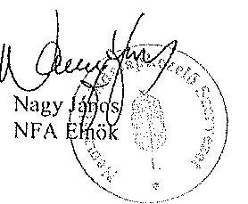

---

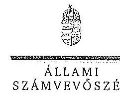

ELHÖK

Ikt.szám: V-0749-154/2015.

Nagy János úr
elnök

Nemzeti Földalapkezelő Szervezet

Budapest

Tisztelt Elnök Úr!

Az „Az állami tulajdonban álló erdőgazdasági társaságok vagyongazdálkodási tevékenységének ellenőrzése” című ellenőrzés tekintetében 14 társaság jelentéstervezetére tett észrevételüket köszönettel megkaptam.

Az Állami Számvevőszék észrevételekre vonatkozó álláspontjáról a felügyeleti vezető által készített részletes tájékoztatást csatoltan megküldöm.

Tájékoztatom Elnök urat, hogy a számvevőszéki jelentésben – az Állami Számvevőszékről szóló 2011. évi LXVI. törvény 29. § (3) bekezdése alapján – a figyelembe nem vett észrevételeket szerepeltetjük az elutasítás indokának feltüntetésével.

Budapest, 2015. 11. hó 02. nap

Tisztelettel:

Domokos László

Melléklet: Tájékoztatás az észrevételek kezeléséről

1017 BUDAPEST, AFRIKAI CSERE. HOROS STEA 10. 1354 Budapest 4. Pl. 54 telefon: 484 0101 fax: 484 8201

---

# Tájékoztatás   az észrevételek kezeléséről 

„Az állami tulajdonban álló erdőgazdasági társaságok vagyongazdálkodási tevékenységének ellenőrzése" című ellenőrzés tekintetében az IPOLY ERDŐ Zrt., az EGERERDŐ Erdészeti Zrt., a Mecsekerdő Zrt., a SEFAG Erdészeti és Faipari Zrt., a Gemenci Erdő- és Vadgazdaság Zrt., az Északerdő Erdőgazdasági Zrt., a Fülöpi Parkerdő Zrt., a Szombathelyi Erdészeti Zrt., a Kisalföldi Erdőgazdasági Zrt., a Zalaerdő Erdészeti Zrt., a KEFAG Kiskunsági Erdészeti és Faipari Zrt., a VADEX Mezőföldi Erdő- és Vadgazdálkodási Zrt., a Gyulaj Erdészeti és Vadászati Zrt., illetve a TAEG Tanulmányi Erdőgazdaság Zrt. társaságok jelentéstervezetére 2015. október 16-án érkezett észrevételeket áttekintettük, azok kezelésével kapcsolatban a következő tájékoztatást adom.

Az észrevétel szerint a jelentéstervezetben tett megállapítások helytállóak, azokat nem vitatják. Az NFA elnökének tett javaslatokhoz kapcsolódó tájékoztatást köszönjük. Mindezek miatt, valamint arra tekintettel, hogy nem jött létre olyan vagyonkezelési szerződés, amely biztosítja az ideiglenes vagyonkezelési szerződés hiányosságainak a megszüntetését, illetve a hatályos jogszabályoknak való megfeleltetést, a megállapítások és a javaslatok módosítása nem indokolt.

Budapest, 2015. év 11. hó 02. nap

Makkai Mária
felügyeleti vezető

---

# **Chemistry**

## **Chemical Reactions**

### **Balancing Chemical Equations**

1. **Write the unbalanced equation:**
   - Example: $$C_3H_8 + O_2 \rightarrow CO_2 + H_2O$$

2. **Balance the equation:**
   - Example: $$2C_3H_8 + 7O_2 \rightarrow 6CO_2 + 8H_2O$$

3. **Balance the equation:**
   - Example: $$2C_3H_8 + 7O_2 \rightarrow 6CO_2 + 8H_2O$$

### **Types of Reactions**

1. **Combination Reaction:**
   - Example: $$2H_2 + O_2 \rightarrow 2H_2O$$

2. **Decomposition Reaction:**
   - Example: $$2H_2O_2 \rightarrow 2H_2O + O_2$$

3. **Single Displacement Reaction:**
   - Example: $$Zn + 2HCl \rightarrow ZnCl_2 + H_2$$

4. **Double Displacement Reaction:**
   - Example: $$AgNO_3 + NaCl \rightarrow AgCl + NaNO_3$$

5. **Combustion Reaction:**
   - Example: $$CH_4 + 2O_2 \rightarrow CO_2 + 2H_2O$$

## **Stoichiometry**

### **Mole Concept**

- **Mole (mol):** The amount of substance containing as many particles (atoms, molecules, ions) as there are atoms in exactly 12 grams of carbon-12.
- **Avogadro's Number:** $$6.022 \times 10^{23}$$ particles per mole.

### **Molar Mass**

- **Molar Mass:** The mass of one mole of a substance.
- Example: The molar mass of water ($$H_2O$$) is 18.015 g/mol.

### **Calculations**

1. **Moles to Mass:**
   - Formula: $$n = \frac{m}{M}$$
   - Example: Calculate the number of moles of $$H_2O$$ in 18 grams of water.
     - $$n = \frac{18 \, \text{g}}{18.015 \, \text{g/mol}} \approx 0.999 \, \text{mol}$$

2. **Moles to Mass:**
   - Formula: $$m = n \times M$$
   - Example: Calculate the mass of 1 mole of water.
     - $$m = 1 \, \text{mol} \times 18.015 \, \text{g/mol} = 18.015 \, \text{g}$$

## **Gas Laws**

### **Ideal Gas Law**

- **Equation:** $$PV = nRT$$
- **Variables:**
  - $$P$$: Pressure (atm)
  - $$V$$: Volume (L)
  - $$n$$: Number of moles (mol)
  - $$R$$: Ideal gas constant (0.0821 L·atm/mol·K)
  - $$T$$: Temperature (K)

### **Boyle's Law**

- **Equation:** $$P_1V_1 = P_2V_2$$
- **Variables:**
  - $$P_1$$: Initial pressure (atm)
  - $$V_1$$: Initial volume (L)
  - $$P_2$$: Final pressure (atm)
  - $$V_2$$: Final volume (L)

### **Boyle's Law (Boyle's Law)**

- **Equation:** The equation is already correct: $$P_1V_1 = P_2V_2$$

## **Thermochemistry**

### **Enthalpy (H)**

- **Definition:** The heat content of a system at constant pressure.
- **Equation:** $$\Delta H = q_p$$
- **Variables:**
  - $$\Delta H$$: Change in enthalpy (J or kJ)
  - $$q_p$$: Heat transferred at constant pressure (J or kJ)

### **Hess's Law**

- **Statement:** The enthalpy change for a reaction is the same whether it occurs in one step or multiple steps.
- **Equation:** The equation is incorrect.  Hess's Law doesn't have a single equation, it's a principle.  The enthalpy change of a reaction is the sum of the enthalpy changes of the individual steps.

### **Hess's Law (Hess's Law)**

- **Statement:** The enthalpy change for a reaction is the same whether it occurs in one step or multiple steps.
- **Equation:**  No single equation represents Hess's Law.

## **Electrochemistry**

### **Oxidation and Reduction**

- **Oxidation:** Loss of electrons.
- **Reduction:** Gain of electrons.

### **Galvanic Cells**

- **Definition:** A cell that converts chemical energy into electrical energy.
- **Components:**
  - Anode: Oxidation occurs.
  - Cathode: Reduction occurs.
  - Salt Bridge: Connects the two half-cells.

### **Nernst Equation**

- **Equation:** $$E = E^\circ - \frac{RT}{nF} \ln Q$$
- **Variables:**
  - $$E$$: Cell potential (V)
  - $$E^\circ$$: Standard cell potential (V)
  - $$R$$: Ideal gas constant (8.314 J/mol·K)
  - $$T$$: Temperature (K)
  - $$n$$: Number of electrons transferred
  - $$F$$: Faraday constant (96485 C/mol)
  - $$Q$$: Reaction quotient

