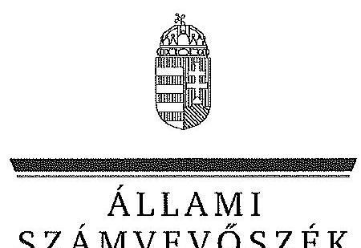

ÁLLAMI
SZÁMVEVŐSZÉK

# JELENTÉS 

Az állami tulajdonban álló erdőgazdasági társaságok vagyongazdálkodási tevékenységének ellenőrzése Pilisi Parkerdő Zrt.

---

# Állami Számvevőszék 

Iktatószám: V-0755-135/2015
Témaszám: 1789
Vizsgálat-azonosító szám: V070607

## Az ellenőrzést felügyelte:

## Makkai Mária

felügyeleti vezető
Az ellenőrzést vezette és az ellenőrzés végrehajtásáért felelős:
Dr. Schreiber Judit Zsuzsanna
ellenőrzésvezető
A számvevői jelentés összeállításában közremüködött:
Szeibel Gáborné
számvevő tanácsos
Az ellenőrzést végezték:

| Szabó Zsuzsanna | Szeibel Gáborné |
| :-- | :-- |
| számvevő | számvevő tanácsos |

---

# TARTALOMJEGYZÉK 

BEVEZETÉS ..... 3
I. ÖSSZEGZŐ MEGÁLLAPÍTÁSOK, KÖVETKEZTETÉSEK, JAVASLATOK ..... 7
II. RÉSZLETES MEGÁLLAPÍTÁSOK ..... 13

1. A Pilisi Parkerdő Zrt. vagyongazdálkodása ..... 13
1.1. A vagyon értékének megőrzése, gyarapítása ..... 13
1.2. A vagyonkezelői kötelezettség teljesítése ..... 15
2. A Pilisi Parkerdő Zrt. vagyonkezelési szerződése és a vagyonnyilvántartása ..... 16
2.1. A vagyonkezelési szerződés megfelelősége ..... 16
2.2. A Pilisi Parkerdő Zrt. vagyonnyilvántartása ..... 17
3. A Pilisi Parkerdő Zrt. éves tervezési feladatainak ellátása, az ágazati jogszabályok érvényesülése ..... 18
3.1. Az üzleti tervek vagyonmegőrzésre, vagyongyarapításra vonatkozó elemei ..... 18
3.2. A tervekben megfogalmazott előírások érvényesülése ..... 19
3.3. Ágazati szabályok érvényesülése ..... 19
4. A kontroll- és a monitoring rendszer kialakítása és múködtetése ..... 20
4.1. A kontrollrendszer kialakítása és múködtetése ..... 20
4.2. Az információáramlási és monitoring rendszer kialakítása és múködtetése ..... 21
5. A tulajdonosi joggyakorlóknak a Pilisi Parkerdő Zrt. vagyongazdálkodási feladataira vonatkozó döntései, intézkedései megfelelősége ..... 22
MELLÉKLETEK
6. számú Rövidítések jegyzéke
7. számú Fogalomtár
8. számú a Pilisi Parkerdő Zrt. vagyonának alakulása 2009-2014. I. félévében
9. számú az immateriális javak és tárgyi eszközök állományának megoszlása a 2013. évre vonatkozóan
10. számú a befektetett eszközök állományának alakulásáról
11. számú a saját tőke változása a 2013. évre vonatkozóan
12. számú a beruházások, felújítások forrásáról
13. számú a Pilisi Parkerdő Zrt. vezérigazgatójának észrevétele
14. számú a Pilisi Parkerdő Zrt. vezérigazgatójának észrevételére adott válasz
15. számú a Magyar Nemzeti Vagyonkezelő Zrt. vezérigazgatójának észrevétele
16. számú a Magyar Nemzeti Vagyonkezelő Zrt. vezérigazgatójának észrevételére adott válasz

---

12. számú a Magyar Fejlesztési Bank Zrt. vezérigazgatójának észrevétele
13. számú a Magyar Fejlesztési Bank Zrt. vezérigazgatójának észrevételére adott válasz
14. számú a Nemzeti Földalapkezelő Szervezet elnökének észrevétele
15. számú a Nemzeti Földalapkezelő Szervezet elnökének észrevételére adott válasz

---

# JELENTÉS 

## Az állami tulajdonban álló erdőgazdasági társaságok vagyongazdálkodási tevékenységének ellenőrzése Pilisi Parkerdő Zrt.

## BEVEZETÉS

Hazánk területének több mint 20\%-át erdő borítja. Az erdők fenntartása és védelme az egész társadalom érdeke, ezért az erdőkkel csak a közérdekkel összhangban lehet gazdálkodni.

Az Alaptörvény 38. cikke és az Nvtv. alapján az állam tulajdona a nemzeti vagyon részét képezi. Az Nvtv. alapján nemzetgazdasági szempontból kiemelt jelentőségű nemzeti vagyonban tartandó vagyonelemnek minősül a 100\%-ban az állam tulajdonában álló védelmi és közjóléti elsődleges rendeltetésű erdő, a gazdasági elsődleges rendeltetésű természetes erdő, természetszerű erdő és származék erdő természetességi állapotú öt hektárnál nagyobb, természetben összefüggő erdő. Az erdőgazdasági társaságok vagyongazdálkodása szempontjából a Vtv., illetve az Nvtv. és az Nfatv., valamint a kapcsolódó kormány- és miniszteri rendeletek mellett kiemelkedő szerepe van a különböző ágazati jogszabályoknak. A vagyonkezelési tevékenység végrehajtása során figyelemmel kell lenni az Evt.-ben foglaltakra, mely alapján a nemzeti vagyonról szóló törvényben nemzetgazdasági szempontból kiemelt jelentőségű nemzeti vagyonként meghatározott védelmi és közjóléti elsődleges rendeltetésű, az állam tulajdonában álló erdő a kincstári vagyon részét képezi. Az erdőgazdasági társaságoknak az általuk kezelt vagyonelemek sajátosságára tekintettel kell a vagyongazdálkodási tevékenységüket kialakítaniuk, gondoskodniuk kell a közérdek és az Evt.-ben foglaltak érvényesülését biztosító vagyongazdálkodásról.

Az Evt. előírásai alapján az állam 100\%-os tulajdonában álló erdőt és erdőgazdálkodási tevékenységet közvetlenül szolgáló földterületet csak vagyonkezelés formájában lehet hasznosításra átengedni, és az állam tulajdonában álló erdő és erdőgazdálkodási tevékenységet közvetlenül szolgáló földterület vagyonkezelését csak költségvetési szerv vagy kizárólagos állami tulajdonú gazdálkodó szervezet végezheti.

A Vtv. szerint az erdőgazdasági társaságok és a társaságok kezelésében lévő állami vagyon feletti tulajdonosi jogokat a 2010. évig a Magyar Állam nevében az MNV Zrt. gyakorolta. A 2010. évi törvényi változások (Vtv., Mfbtv., Nfatv.) következtében 2010. június 17. napjától az erdőgazdasági társaságok állami tulajdonú részesedése tekintetében a tulajdonosi jogokat az állami vagyonért felelős miniszter az MFB Zrt. útján látta el. Az Nfatv. 2010. évi hatálybalépését követően a társaságok által kezelt, a Nemzeti Földalapba tartozó földterületek vo-

---

natkozásában a tulajdonosi jogokat az NFA, míg egyéb ingatlanok és vagyonelemek tekintetében a tulajdonosi jogokat az MNV Zrt. gyakorolja. 2014. július 16-tól az erdőgazdasági társaságok feletti tulajdonosi jogokat az erdőgazdálkodásért felelős miniszter gyakorolja.

A Nemzeti Földalapba tartozó 1772 980,17 ha földterületből a 2012. év végén a 100\%-os állami tulajdonú 19 erdőgazdasági társaság kezelésében összesen 913664,3681 ha földterület volt, ebből 879254,1595 ha erdő, a többi egyéb művelési ágba tartozik. A kezelt földterületek erdőgazdasági társaságonkénti megoszlása eltérő.

Az erdőgazdasági társaságok az Alaptörvény és az Nvtv. előírása szerint önállóan és felelősen gazdálkodnak a törvényesség, a célszerűség és az eredményesség követelményei szerint. Az állami vagyonnal való gazdálkodás alapvető feladata a vagyon rendeltetésszerú, hatékony és felelős felhasználásának biztosítása az állami vagyon értékének megőrzése, gyarapítása érdekében. Az erdőgazdasági társaságok jelen ellenőrzése az állami vagyonnal gazdálkodás során a törvényesség betartására irányult.

A Pilisi Parkerdő Zrt. vagyonkezelésébe tartozik a Pilisi, Visegrádi-, Budai-hegység és Gödöllői-dombság nagy összefüggő erdőtömbjei, a Pesti- és Csepeli-síkság valamint a Gerecse keleti oldalának területei. A Társaság központja Visegrád. A Társaság 2013. évi beszámolója szerint $4369,0 \mathrm{M} F \mathrm{Ft}$ nettó árbevétel mellett 45,8 M Ft mérleg szerinti eredményt ért el, a mérlegfőösszeg 8450,6 M Ft volt. A Társaság 59 331,6 ha erdőterületen és 5159,3 ha egyéb művelési ágú földterületen gazdálkodott, az éves átlaglétszám 295 fő volt.

Az ellenőrzés célja annak értékelése, hogy a Pilisi Parkerdő Zrt. vagyongazdálkodása, vagyonérték-megőrző és vagyongyarapítási tevékenysége, valamint ennek szervezeti keretei megfeleltek-e a jogszabályok és belső szabályzatok előírásainak, valamint a kezelt vagyonelemek sajátosságaiból adódó követelményeknek.

Ennek keretében ellenőriztük és értékeltük, hogy:

- a vagyongazdálkodás során betartották-e az Nvtv. 7. §-ában megállapított vagyongazdálkodási alapelveket, valamint az ágazati jogszabályok vagyongazdálkodáshoz kapcsolódó előírásait;
- a Társaság a saját és a kezelt vagyonnal való gazdálkodásra vonatkozó éves tervezési feladatait a jogszabályi előírásoknak megfelelően látta-e el, a Társaság üzleti tervei a kezelésbe vett vagyonra vonatkozó, a Vtv. 2. § (1) és a 27. § (7) bekezdésében előírt vagyon megőrzésére, gyarapítására vonatkozó elemeket tartalmaztak-e és azokat a vagyongazdálkodás során érvényesítette-e;
- a vagyonkezelési szerződés és a vagyon-nyilvántartás megfelelt-e a szabályszerűségi követelményeknek, elősegítették-e az állami vagyonnal való szabályszerű gazdálkodást;
- a Társaság kialakította és működtette-e a szabályszerű feladatellátást támogató kontrollrendszert. Ezen belül elkészítették és aktualizálták-e a Társaság

---

feladatellátási-folyamatainak szabályzatait, a kockázatok kezelésének rendszerét, az információs és a kontrolling-monitoring rendszert, valamint a vagyongazdálkodás területén azokat az eljárásokat, amelyek elősegítik a szervezeti célok végrehajtását;

- a tulajdonosi joggyakorlóknak a Pilisi Parkerdő Zrt. vagyongazdálkodási feladataira vonatkozó döntései, intézkedései előkészítése és megalapozottsága a jogszabályoknak és a belső szabályozásnak megfelelt-e, a tulajdonosi joggyakorlók e minőségben végzett tevékenysége támogatta-e a felelős vagyongazdálkodás megvalósulását.

Az ellenőrzés típusa: szabályszerűségi ellenőrzés.
Az ellenőrzött időszak: 2009. január 1. napjától 2014. június 30. napjáig, kitekintéssel a helyszíni ellenőrzés végéig tartó releváns folyamatokra, intézkedésekre.

Az ellenőrzés várható hasznosulása: A társaságok és a tulajdonosi joggyakorlók fenti szempontú ellenőrzése az állami tulajdonban álló vagyon kezelésére, a vagyonnal való gazdálkodásra vonatkozó, kötelezően végrehajtandó éves ÁSZ ellenőrzést szélesebb körűvé teszi.

Az ellenőrzés várható hasznosulásaként biztosíthatja a társadalom részéről kiemelt érdeklődéssel kísért téma objektív bemutatását. Az ÁSZ jelentéséből a média és az állampolgárok átfogó képet kaphatnak a Magyarország állami tulajdonban lévő erdőivel való gazdálkodásról, a gazdálkodást, vagyonkezelést végző szervezeti rendszerről, az állami tulajdonban álló erdőgazdasági társaságok feladatellátásához kapcsolódóan feltárt problémákról.

Az ellenőrzés jól hasznosítható - többek közt - az állami vagyonnal kapcsolatos országgyűlési törvényhozói munkában is, továbbá hozzájárulhat a tulajdonosi joggyakorlás javításával a „jó kormányzás" gyakorlatának erősítéséhez.

Az ellenőrzéssel érintett szervezetek: A Pilisi Parkerdő Zrt., a Társaság kezelésében lévő állami vagyon feletti tulajdonosi jogokat gyakorló szervezetek, valamint a Társaság állami tulajdonú részesedése feletti tulajdonosi joggyakorlók (MFB Zrt., MNV Zrt., NFA).

Az ellenőrzés végrehajtásának jogszabályi alapját az ÁSZ tv. 5. § (4)-(5) bekezdéseiben foglaltak képezik.

Az ellenőrzés szakmai módszertana az ÁSZ hivatalos honlapján közzétett szakmai szabályokon alapult, amely a Legfőbb Ellenőrző Intézmények Nemzetközi Szervezete (INTOSAI) által kiadott nemzetközi standardok (ISSAI) figyelembevételével készült.

A Pilisi Parkerdő Zrt. az ellenőrzés lefolytatásához tanúsítványok kitöltésével, valamint dokumentumok elektronikus megküldésével szolgáltatott adatokat. Az így rendelkezésre bocsátott adatok és információk kontrollja a helyszíni ellenőrzés keretében történt. A vagyonváltozást eredményező döntések megalapozottságát, továbbá a vagyonérték-megőrző és vagyongyarapító tevékenység sza-

---

bályszerűségét a számviteli nyilvántartásokból, valamint kockázatalapú és véletlenszerű mintavétellel kiválasztott tételek ellenőrzésével értékeltük. A kezelt vagyont érintően a beruházások, felújítások pénzforgalmi kiadási területet arányos rétegzéssel összesen 30 elemú véletlen minta ellenőrzésével minősítettük. A sokaságból tételes ellenőrzésre kiemeltük évente a 2009-2013. évek 3-3 legnagyobb összegű tételét, 2014. első félévében a kettő legnagyobb összegű tételt. A kivett minta alapján végeztük a kezelt vagyonon megvalósított beruházások, felújítások szabályszerűségének (üzembe helyezés, nyilvántartás, értékcsökkenés elszámolása) ellenőrzését.

Az ÁSZ a 2011. évi LXVI. törvény 29. §-a szerint a jelentéstervezetet megküldte a Pilisi Parkerdő Zrt., a Magyar Nemzeti Vagyonkezelő Zrt. és a Magyar Fejlesztési Bank Zrt. vezérigazgatójának, valamint a Nemzeti Földalapkezelő Szervezet elnökének egyeztetésre. A Pilisi Parkerdő Zrt. vezérigazgatójának észrevételét és az arra adott választ a 8-9. számú melléklet, a Magyar Nemzeti Vagyonkezelő Zrt. vezérigazgatójának észrevételét és az arra adott válaszunkat a 10-11. számú melléklet, a Magyar Fejlesztési Bank Zrt. vezérigazgatójának észrevételét és az arra adott válaszunkat a 12-13. számú melléklet tartalmazza. A Nemzeti Földalapkezelő Szervezet elnökének észrevételét és az arra adott választ a 14-15. számú melléklet tartalmazza.

---

# I. ÖSSZEGZŐ MEGÁLLAPÍTÁSOK, KÖVETKEZTETÉSEK, JAVASLATOK 

A Pilisi Parkerdő Zrt. vagyongazdálkodása az ellenőrzött években a saját vagyonára, a kezelt múemlékvagyonra és a vagyonkezelésében lévő állami vagyonra terjedt ki. A Társaság mérleg szerinti vagyona a 2009. évi 9241,5M Ft-os értékről a 2013. év végére 8450,6 M Ft-ra csökkent, amely a készletek, követelések, értékpapírok, valamint a pénzeszközök állományának csökkenéséből adódott. A saját tőke 5359,8 M Ft-ról 6000,7 M Ft-ra nőtt, amelyet a mérleg szerinti eredmény, valamint a Társaság feletti tulajdonosi joggyakorló ${ }_{1,2}$ általi jegyzett tőkeemelés eredményezett.

A Társaság éves mérlegei nem a valós állapotot tükrözték, mert a vagyonkezelt eszközöket a Számv. tv. előírása ellenére a mérlegeiben nem szerepeltette. A Társaság mérleg szerinti vagyona nem tartalmazta a vagyonkezelésében lévő állami erdők és azzal szerves egységet képező egyéb földterületek értékét, a Számv. tv.-ben foglaltak ellenére a vagyonkezelésbe vett eszközöket mérleg szerinti megbontásban nem mutatták be a kiegészítő mellékletben.

A Társaság a múemléki vagyont a főkönyvi nyilvántartásokban elkülönítetten tartotta nyilván, a kiegészítő mellékletben minden évben tételesen bemutatta.

A Társaság által a VSZ alapján kezelt vagyonról vezetett nyilvántartás nem felelt meg a Vhr.-ben foglaltaknak, mert tételesen nem tartalmazta a vagyonkezelt eszközök könyv szerinti bruttó és nettó értékét, valamint az értékben bekövetkezett egyéb változásokat. Ezért a vezetett nyilvántartás nem biztosította az átláthatóságot és az elszámoltathatóságot. A VSZ alapján kezelt ingatlanokról tételes mennyiségi kimutatást vezettek a forint érték feltüntetése nélkül, ami megfelelt a VSZ 2.4. pontja szerinti naturáliákban történő nyilvántartás vezetési előírásnak, azonban nem felelt meg a Számv. tv.-ben a kezelt vagyon nyilvántartására vonatkozó szabálynak. A vagyonkezelt eszközök forint értékének meghatározását a Társaság sem az MNV Zrt-nél, sem pedig az NFA-nál nem kezdeményezte annak érdekében, hogy eleget tegyen a Számv. tv. előírásainak.

A Társaság nem rendelkezett a kezelt vagyonról vezetett nyilvántartás kiinduló adatait tartalmazó VSZ eredeti, hiteles, a vagyonkezelt eszközök felsorolását tartalmazó 1-4. mellékleteivel. A Társaság nem teljes körűen rendelkezett a kezelt vagyon tekintetében pontos és naprakész információval a tulajdonosi jogokat gyakorlóról, így a Társaság által vezetett nyilvántartás nem biztosította a Vhr.ben foglalt, az adatszolgáltatás pontosságára vonatkozó követelményt.

Az ellenőrzött időszakban a tulajdonosi joggyakorlók tisztázásával és a kezelt vagyonelemek nyilvántartása egyezőségének biztosításával kapcsolatos adategyezetés az ellenőrzés befejezéséig nem került lezárásra, így nem állt rendelkezésre a Társaság által kezelt vagyonra és annak nagyságára vonatkozó, a Társaság, az MNV Zrt. és az NFA nyilvántartásában szereplő, egyező adat.

---

A Társaság a Magyar Állam tulajdonában álló erdővagyon és egyéb művelési ágú termőföld ingatlanok kezelését a KVI-vel 1996. október 9-én kötött vagyonkezelési szerződés alapján végezte. A Társaság, mint vagyonkezelő és a KVI között létrejött szerződéses jogviszony kereteit a VSZ-ben foglalt jogok és kötelezettségek töltötték ki. A VSZ nem támogatta a Vhr.-ben előírt, a vagyongazdálkodási feladatok átlátható módon történő végrehajtását, valamint nem támogatta a szabályszerű vagyongazdálkodást.

A VSZ 3.3.2. pontjában foglaltak ellenére a felek a szerződést évente nem vizsgálták felül, a VSZ az ellenőrzött időszakban nem felelt meg a hatályos rendelkezéseknek, hatályon kívül helyezett jogszabályi hivatkozásokat tartalmazott, illetve nem tartalmazott minden szükséges előírást.

A felek nem tettek eleget a Vhr. előírásának sem, mert a Vhr. hatálybalépést követő hat hónapon belül nem kezdeményezték a Nemzeti Földalapba tartozó ingatlanokra vonatkozóan a VSZ megszüntetését és a jogszabályoknak megfelelő szerződés megkötését.

A Társaság által kezelt vagyonelemek többszöri változása ellenére a felek nem tartották be a Vhr.-ben előírt, a VSZ 60 napon belüli egységes szerkezetbe foglalására vonatkozó rendelkezést. A VSZ módosításokkal történő egységes szerkezetbe foglalását sem a Társaság, sem a tulajdonosi jogokat gyakorló MNV Zrt, illetve NFA nem kezdeményezte.

A VSZ 3.2.3. pontja rendelkezett a vagyonkezelői jog harmadik személynek történő átengedésének feltételeiről, azonban ez 2012-től nem felelt meg az Nvtv.ben foglaltaknak, amely tiltja a vagyonkezelői jog harmadik személynek való átengedést.

A VSZ nem rögzítette a Vhr.-ben 2011. január 1-jétől előírt, az érintett vagyonelem esetleges védettségét, illetve Natura 2000 területnek minősítését, és a Vhr.ben foglalt elismerő nyilatkozatot az MNV Zrt. vagyon-nyilvántartási szabályzatának megismerésére és kötelező elismerésére vonatkozóan.

A Társaság 119,2 M Ft értékű műemlékvagyont kezelt az ellenőrzött időszakban, azonban a Vtv. 23. § (1) bekezdés ellenére vagyonkezelésre vonatkozó szerződéssel nem rendelkeztek.

A VSZ 3.3.2. pontjában foglaltak ellenére a vagyonkezelési díjat a felek évente nem vizsgálták felül, erről történő megállapodás megkötésére nem került sor. Az NFA - az MNV Zrt.-vel kötött megállapodás alapján - a vagyonkezelési díj számlázására vonatkozó kötelezettségnek eleget tett, azonban a számlák kiállítása a VSZ 3.3.3. pontban előírt határidőtől eltérően történt. Az NFA a számlákon a vagyonkezelési díjat egy összegként szerepeltette, azokon nem tüntette fel a számlázás alapját képező földterület nagyságát, így nem volt megállapítható a számlák tartalmi megfelelősége. A Társaság a vagyonkezelési díjat a számlák alapján megfizette.

A Társaság az ellenőrzött időszakban a vagyongazdálkodás során a kezelt vagyonelemek, valamint a saját eszközeinek karbantartási, állagmegóvási feladatait a Vtv., a Vhr. és az Nfatv. előírásai alapján ellátta. A Társaság a 20092013. években összesen 2588,6 M Ft-ot fordított beruházási, felújítási kiadásokra.

---

A beruházások, felújítások és a karbantartások költségeit az üzleti tervek tartalmazták. Az éves tervezési feladatokat az előírásoknak megfelelően végezték, az üzleti tervek tartalmaztak a vagyongazdálkodásra, a vagyon megőrzésére vonatkozó elemeket. A Társaság az állami vagyonnal való gazdálkodás során öszszességében érvényesítette a tervekben megfogalmazott előírásokat, valamint a 2012. január 1-től hatályos Nvtv. 7. §-ban foglalt vagyongazdálkodási alapelveket betartotta.

A Társaság a feladatellátása során az Evt. ${ }_{1,2}$ szerinti bejelentési, engedélyeztetési kötelezettségeknek eleget tett. A Társaság által kezelt vagyon elidegenítésére, megterhelésére az ellenőrzött időszakban nem került sor, erdő használatát, hasznosítását, illetve a vagyonkezelői jogot harmadik személynek nem engedték át. A Társaság az Erdészeti hatóság által jóváhagyott erdőgazdálkodási és Vadászati hatóság által jóváhagyott vadgazdálkodási tervekkel rendelkezett. A Társaság az ellenőrzött időszakban az ágazati szabályokat nem teljes körűen tartotta be, a 2009-2013. években az Evt. ${ }_{2}$ szabályok megsértése, a fafaj összetétel kedvezőtlen változása, erdőtelepítés és erdőfelújítás határidőn túli befejezése miatt került sor bírság kiszabására.

A Társaság kialakította és múködtette a feladatellátást támogató kontrollrendszert. A Társaság kialakította a belső ellenőrzést, Belső Ellenőrzési szabályzattal 2013. évtől rendelkeztek. A belső ellenőr 2013. évtől kezdődően kockázati térkép alapján készítette el a munkaterveket, amit az FB minden évben jóváhagyott. A belső ellenőrzés megállapításaira intézkedési terveket készítettek, az abban megfogalmazottak teljesítetését nyomon követték.

A könyvvizsgáló a 2009-2013. évi beszámolókat hitelesítő záradékkal látta el, a 2010. évben a záradékot figyelemhívással, a 2012. évben a könyvvizsgálói jelentést nyilatkozattal egészítette ki. A könyvvizsgáló az ellenőrzött időszakban nem kifogásolta a beszámolóval kapcsolatosan az ÁSZ által feltárt hiányosságokat.

A Társaságnál az Alapító Okirat alapján múködő FB a Gt.-ben és az éves munkatervében előírt ellenőrzési feladatait ellátta, a Társaság éves beszámolóiról a véleményét a könyvvizsgálói jelentés figyelembe vételével alakította ki, írásbeli jelentését a tulajdonosi joggyakorló felé elkészítette.

A Társaság feletti tulajdonosi joggyakorló ${ }_{1,2}$ a Társaság éves beszámolóit az FB írásos véleménye és a könyvvizsgáló jelentésének figyelembe vételével, határozattal hagyta jóvá.

A Társaságnál kialakították az információáramlási és monitoring rendszert, biztosították annak szabályzatok szerinti múködését.

Az ellenőrzött években teljesítették a Vhr.-ben és a VSZ-ben előírt, a vagyonkezelésében lévő állami vagyonnal kapcsolatos adatszolgáltatási kötelezettséget. Az erdőgazdálkodási tervek, egyéb erdőgazdálkodási tevékenységek és az éves vadgazdálkodási tervek teljesítéséről az éves üzleti jelentésekben és a kontrolling adatszolgáltatás keretein belül számoltak be.

Az ellenőrzött időszakban a Társaság az Avtv., illetve az Infotv. szerinti, a közérdekú adatok megismerésére irányuló igények teljesítésének rendjét rögzítő szabályzattal nem rendelkezett. A Társaság a saját honlapján a közérdekű adatokat

---

közzé tette, azonban nem került közzétételre a közérdekű adatok megismerésére vonatkozó igények intézésének rendje.

A társaság feletti tulajdonosi joggyakorló ${ }_{1,2}$ a Társaság vagyongazdálkodási feladataira vonatkozó döntései, intézkedéseinek előkészítése összhangban volt a belső szabályzatokkal, a vagyonváltozást eredményező döntések végrehajtását a beszámolók, az üzleti tervek, üzleti jelentések és a kontrolling jelentések megtárgyalásával és jóváhagyásával ellenőrizték. A társaság feletti tulajdonosi joggyakorló ${ }_{2}$ a Társaságnál a 2010. évben külső szakértővel átvilágítást végeztetett, a megtett intézkedések megvalósulását nyomon követték és az eredményekről az érintetteket beszámoltatták.

A vagyonkezelésbe adott állami vagyon tekintetében tulajdonosi jogokat gyakorló MNV Zrt. és NFA tevékenysége az ellenőrzött időszakban nem támogatta teljes körűen a felelős vagyongazdálkodás megvalósulását, a VSZ-szel kapcsolatban feltárt hiányosságokat nem szüntette meg, a hatályos jogszabályoknak a szerződést nem feleltette meg, nem éltek a Vhr.-ben és a 262/2010. (XI.17.) Korm. rend. 47. § (1)-(2) bekezdéseiben foglalt, a kezelt vagyon használatára vonatkozó ellenőrzési jogukkal, valamint nem ellenőrizték a vagyonnyilvántartás hitelességét, helyességét és teljességét.

Az Állami Számvevőszékről szóló 2011. évi LXVI. törvény 33. § (1) bekezdésében foglaltak értelmében a jelentésben foglalt megállapításokhoz kapcsolódó intézkedési tervet köteles az ellenőrzött szervezet vezetője összeállítani, és azt a jelentés kézhezvételétől számított 30 napon belül az ÁSZ részére megküldeni. Amenynyiben az intézkedési tervet határidőben nem küldi meg a szervezet, vagy az nem elfogadható, az ÁSZ elnöke a hivatkozott törvény 33. § (3) bekezdésében foglaltakat érvényesítheti.

Az ellenőrzés intézkedést igénylő megállapításai és javaslatai:

# az MNV Zrt. vezérigazgatójának, az NFA elnökének 

A Pilisi Parkerdő Zrt. a KVI-vel 1996. október 9-én kötött vagyonkezelési szerződés alapján végezte a Magyar Állam tulajdonában álló erdővagyon és egyéb művelési ágú termőföld ingatlanok kezelését. A Társaság, mint vagyonkezelő és a KVI között létrejött szerződéses jogviszony kereteit a VSZ-ben foglalt jogok és kötelezettségek töltötték ki. A VSZ nem támogatta a Vhr. 3. § (1) bekezdésében foglalt, a vagyongazdálkodási feladatok átlátható módon történő végrehajtását, valamint nem támogatta a szabályszerű vagyongazdálkodást. A VSZ 3.3.2. pontjában foglaltak ellenére a felek a szerződést évente nem vizsgálták felül, az nem felelt meg a hatályos rendelkezéseknek, hatályon kívül helyezett jogszabályi hivatkozásokat tartalmazott az Áht; 109/B. §, 109/G. §, a Vadvédelmi tv. 98. § előírásai vonatkozásában. A VSZ 3.2.3. pontjában foglalt, a vagyonkezelői jog átruházására vonatkozó rendelkezés 2012. január 1-től nem felelt meg az Nvtv. 11. § (8) bekezdésében foglaltaknak, amely tiltja a vagyonkezelői jog harmadik személyre történő átruházást. A VSZ nem rögzítette a Vhr. 9. § (8) bekezdésében 2011. január 1-jétől előírt, az érintett vagyonelem esetleges védettségét, illetve Natura 2000 területnek minősítését. A felek nem tettek eleget

---

a Vhr. 54. § (7) ${ }^{1}$ bekezdés előírásának, mert a Vhr. hatálybalépést követő hat hónapon belül nem kezdeményezték a Nemzeti Földalapba tartozó ingatlanokra vonatkozóan a VSZ megszüntetését és a jogszabályoknak megfelelő szerződés megkötését.

A vagyonkezelésbe adott állami vagyon tekintetében tulajdonosi jogokat gyakorló MNV Zrt. és NFA nem végeztek a Vhr. 20. § (1)-(2) bekezdéseiben és a Nemzeti Földalapba tartozó földrészletek hasznosításának részletes szabályairól szóló 262/2010. (XI. 17.) Korm. rendelet 47. § (1)-(2) bekezdéseiben foglalt, a vagyonnyilvántartás hitelességére, teljességére és helyességére vonatkozó ellenőrzést a Társaságnál.

Javaslat:

# az MNV Zrt. vezérigazgatójának 

a) Tegyen intézkedéseket az erdőgazdasági társaság közreműködésével a tényleges állapotot rögzítő és a hatályos jogszabályi előírásoknak megfelelő vagyonkezelési szerződés megkötésére.
b) Tegyen intézkedéseket a vagyonkezelési szerződés felülvizsgálatának elmaradásával, valamint a Nemzeti Földalapba tartozó ingatlanokra vonatkozó VSZ megszüntetésével összefüggésben feltárt szabálytalanságok tekintetében a felelősség tisztázása érdekében, és szükség szerint intézkedjen a felelősség érvényesítéséről.
c) Intézkedjen Pilisi Parkerdő Zrt. vagyonnyilvántartása hitelességének, teljességének és helyességének jogszabályban foglaltak szerinti ellenőrzéséről.

## az NFA elnökének

a) Tegyen intézkedéseket az erdőgazdasági társaság közreműködésével a tényleges állapotot rögzítő és a hatályos jogszabályi előírásoknak megfelelő vagyonkezelési szerződés megkötésére.
b) Intézkedjen a vagyonkezelési szerződés felülvizsgálatának elmaradásával összefüggésben feltárt szabálytalanságok tekintetében a munkajogi felelősség tisztázására irányuló eljárás megindításáról, és ennek eredménye ismeretében tegye meg a szükséges intézkedéseket.
c) Intézkedjen a Pilisi Parkerdő Zrt. vagyonnyilvántartása hitelességének, teljességének és helyességének jogszabályban foglaltak szerinti ellenőrzéséről.

## a Pilisi Parkerdő Zrt. vezérigazgatójának:

1. A Pilisi Parkerdő Zrt. és a KVI által 1996-ban megkötött VSZ. nem támogatta a Vhr. 3. § (1) bekezdésében foglaltak ellenére a vagyongazdálkodási feladatok átlátható módon történő végrehajtását, valamint nem támogatta a szabályszerű vagyongazdálkodást. A VSZ 3.3.2. pontjában foglaltak ellenére a felek a szerződést évente nem vizsgálták felül, az nem felelt meg a hatályos rendelkezéseknek, hatályon kívül
[^0]
[^0]:    ${ }^{1}$ Vhr. 54. § (7) bekezdés (hatályos 2010. december 31-éig)

---

helyezett jogszabályi hivatkozásokat tartalmazott az Áht, 109/B. §, 109/G. §, a Vadvédelmi tv. 98. § előírásai vonatkozásában. A VSZ 3.2.3. pontjában foglalt, a vagyonkezelői jog átruházására vonatkozó rendelkezés 2012. január 1-től nem felelt meg az Nvtv. 11. § (8) bekezdésében foglaltaknak, amely tiltja a vagyonkezelői jog harmadik személyre történő átruházást. A VSZ nem rögzítette a Vhr. 9. § (8) bekezdésében 2011. január 1-jétől előírt, az érintett vagyonelem esetleges védettségét, illetve Natura 2000 területnek minősítését.

Javaslat:
a) Tegyen intézkedéseket a tulajdonosi joggyakorlókkal közreműködve a tényleges állapotnak és a hatályos jogszabályi előírásoknak megfelelő vagyonkezelési szerződés megkötése érdekében.
b) Intézkedjen a vagyonkezelési szerződés felülvizsgálatának elmaradásával feltárt szabálytalanságok tekintetében a felelősség tisztázása érdekében, és szükség szerint intézkedjen a felelősség érvényesítéséről.
2. A Társaság a Számv. tv. 23. § (2) bekezdésében foglalt előírás ellenére a kezelt vagyont a mérlegben nem mutatta ki, azok mérlegtétel szerinti megbontásban nem kerültek bemutatásra a kiegészítő mellékletben.

Javaslat:
a) Intézkedjen a kezelt vagyon mérlegben eszközként való kimutatásáról, továbbá ezen eszközöknek a kiegészítő mellékletben - legalább mérlegtételek szerinti megbontásban - külön történő bemutatásáról.
b) Intézkedjen a kezelt vagyon mérlegben eszközként történő kimutatásának elmaradásával kapcsolatban feltárt szabálytalanság tekintetében a felelősség tisztázása érdekében, és szükség szerint intézkedjen a felelősség érvényesítéséről.
3. A Társaság nem tett eleget az Avtv. 20. § (8) bekezdése, illetve az Infotv. 30. § (6) bekezdése szerinti, a közérdekű adatok megismerésére irányuló igények teljesítésének rendjét rögzítő szabályzat-készítési kötelezettségnek, a közérdekű adatok megismerésére irányuló igények teljesítésének rendjét rögzítő szabályzattal nem rendelkezett.

Javaslat:
Intézkedjen a jogszabályi előírásoknak megfelelően a közérdekű adatok megismerésére irányuló igények teljesítése rendjének szabályozásáról.

---

# II. RÉSZLETES MEGÁLLAPÍTÁSOK 

## 1. A Pilisi Parkerdő Zrt. VAGYONGAZDÁlKODÁSA

### 1.1. A vagyon értékének megőrzése, gyarapítása

A Pilisi Parkerdő Zrt. vagyongazdálkodása az ellenőrzött években a saját vagyonára, a kezelt múemlékvagyonra és a vagyonkezelésében lévő állami vagyonra terjedt ki. A Társaság mérleg szerinti vagyona a saját vagyonából és a múemléki vagyonból állt. A Társaság mérlegei nem a valós állapotot tükrözték, mert az éves mérlegek összeállításánál a Számv. tv. 23. § (2) bekezdésben foglaltak ellenére a VSZ alapján vagyonkezelt eszközöket a mérlegben nem mutatták ki, azok mérlegtétel szerinti megbontásban nem kerültek bemutatásra a kiegészítő mellékletekben.

A Társaság mérleg szerinti vagyona a 2009. évi 9241,5M Ft-os értékről a 2013. év végére 8450,6 M Ft-ra csökkent, amelynek oka a forgóeszközök állományának a változása. A forgóeszközök állománya 2013. év végére 1806,2 M Ft-tal (46,2\%) csökkent, ami a készletek, követelések, értékpapírok, valamint a pénzeszközök állományának csökkenéséből adódott. A Társaság a 2009-2013. években a kezelt vagyon hasznosításából 17 919,9 M Ft bevételt realizált és 16 614,7 M Ft költséget számolt el. A Társaság mérleg szerinti eredményének összege évről évre csökkent, a 2009. évi 144,5 M Ft-ról a 2013. évre 45,8 M Ft-ra mérséklődött.

A Társaság mérlegeiben az eszközökön belül a legnagyobb részarányt a befektetett eszközök tették ki, amelynek állománya 899,9 M Ft-tal (17,2\%) emelkedett, ezen belül a tárgyi eszközök értéke 2009. évi nyitó értékről a 2013. év végére, 844,7 M Ft-tal ( $16,3 \%$ ) növekedett elsősorban az ingatlanokhoz kapcsolódó beruházások és fejlesztések miatt.

A kötelezettségek állománya a 2009. évi nyitó állományról 393,9 M Ft-tal (31,9\%) csökkent. A hosszúlejáratú kötelezettségek állománya a 2013. évre 13,3 M Ft-tal ( $8,6 \%$ ) emelkedett. A rövidlejáratú kötelezettségek állománya évről évre mérséklődött, a 2009. évi nyitó állományról 403,0 M Ft-tal (36,3\%) csökkent. A rövidlejáratú kötelezettségek állománya a vevőktől kapott előlegekből, a szállítói állományból és az egyéb rövidlejáratú kötelezettségekből állt. Az egyéb rövidlejáratú kötelezettségek között a munkavállalókkal, adókkal, EU-s pályázatok előlegével, valamint egyéb költségvetési befizetési kötelezettségekkel kapcsolatos kötelezettségeket tartottak nyilván.

A passzív időbeli elhatárolások összege 1132,6 M Ft-tal (45,7\%) csökkent. A paszszív időbeli elhatárolások között tartották nyilván az árbevétel elhatárolásából, a hulladék lerakóhely bővítése miatti területhasználati díj fel nem használt részéből, a korábban kiszámlázott árbevétel több éves elhatárolásából, valamint a halasztott bevételekből származó összegeket. A passzív időbeli elhatárolások összegének változása a következő évekre áthúzódó megbízásos munkák költségeinek fedezetére szolgáló, korábbi években kiszámlázott árbevétel, valamint a halasztott árbevételek (támogatások) csökkenésével volt indokolható.

---

A Társaság mérleg szerinti forrásai 2009. január 1-jéről 2013. december 31-ére 790,9 M Ft-tal (8,6\%) csökkentek, a céltartalékok a 2013. év végére 94,7 M Ft-tal $(55,2 \%)$ nőttek.

A VSZ hatálya alá tartozó eszközöket a Társaság a Számv. tv. 46. § (3) bekezdésben foglaltak ellenére nem értékelte, mivel a VSZ alapján vagyonkezelésbe vett eszközöket nem szerepeltette a mérlegében. A könyvekben nyilvántartott eszközök és források értékelését a Számv. tv. 46. § (3) bekezdésben foglaltaknak megfelelően évente elvégezték, amelynek során a Számv. tv. 46. § (4) bekezdés, valamint a Számviteli politika ${ }_{1,2}$-ban foglalt előírások szerint jártak el.

A Társaság vagyonának alakulása 2009. január 1-jétől 2013. december 31-éig terjedő időszakban az alábbi volt:

|  |  | adatok M Ft-ban |  |  |
| :--: | :--: | :--: | :--: | :--: |
| Sor-   szám | Megnevezés | 2009.01.01 | 2013.12.31 | Változás 2013.12.31/ 2009.01.01. (\%) |
| 1. | Befektetett eszközök összesen | 5244,1 | 6144,0 | 117,2 |
| 2. | Ebből: Immateriális javak | 49,9 | 83,1 | 166,5 |
| 3. | Tárgyi eszközök | 5181,0 | 6025,7 | 116,3 |
| 4. | Befektetett pénztigyi eszközök | 13,2 | 35,2 | 266,7 |
| 5. | Forgóeszközök | 3912,5 | 2106,3 | 53,8 |
| 6. | Aktiv időbeli elhatárolások | 84,9 | 200,3 | 235,9 |
| 7. | Eszközök összesen | 9241,5 | 8450,6 | 91,4 |
| 8. | Saját tőke | 5359,8 | 6000,7 | 112,0 |
| 9. | Ebből: Jegyzett tőke | 2273,5 | 2514,8 | 110,6 |
| 10. | Tőketartalék | 2390,0 | 2390,1 | 100,0 |
| 11. | Eredménytartalék | 575,4 | 1025,0 | 178,1 |
| 12. | Lekölött tartalék | 47,2 | 25,0 | 53,0 |
| 13. | Mérleg szerinti eredmény | 73,7 | 45,8 | 62,1 |
| 14. | Céltartalékok | 171,7 | 266,4 | 155,2 |
| 15. | Kötelezettségek | 1234,2 | 840,3 | 68,1 |
| 16. | Passzív időbeli elhatárolások | 2475,8 | 1343,2 | 54,3 |
| 17. | Források összesen | 9241,5 | 8450,6 | 91,4 |

A saját tőke állománya 640,9 M Ft-tal (12\%), ezen belül a jegyzett tőke 241,3 M Ft-tal (10,6\%), az eredménytartalék 449,6 M Ft-tal (78,1\%) nőtt. A saját tőke változására kedvező hatással volt az évenként változó összegű, pozitív előjelű mérleg szerinti eredmény, valamint a Társaság feletti tulajdonosi joggyakorló ${ }_{1,2}$ általi, a 2009. évben 81,3 M Ft, a 2013. évben 160,0 M Ft jegyzett tőkeemelés.

A 2009-2013. években a Társaság tevékenységének főbb mutatószámai az alábbiak voltak:

| Megnevezés | 2009. | 2010. | 2011. | 2012. | 2013. |
| :--: | :--: | :--: | :--: | :--: | :--: |
| Tőkeerősség (saját tőke/források) | 64,0\% | 65,5\% | 68,7\% | 69,2\% | 71,0\% |
| Saját tőke/jegyzett tőke aránya | 235,8\% | 237,2\% | 240,5\% | 243,2\% | 238,6\% |
| Kötelezettségek aránya (kötelezettségek/források) | $12,1 \%$ | $11,1 \%$ | $9,3 \%$ | $11,0 \%$ | $9,9 \%$ |
| Befektetett eszközök fedezete (saját tőke/befektetett eszközök) | 101,7\% | 100,7\% | 100,2\% | 99,6\% | 97,7\% |
| Tárgyi eszközök aránya (tárgyi eszközök/eszközök) | $62,1 \%$ | $64,1 \%$ | $67,6 \%$ | $68,3 \%$ | $71,3 \%$ |
| Tárgyi eszközök használhatósági foka (nettó érték/bruttó érték) | $76,8 \%$ | $74,8 \%$ | $73,2 \%$ | $71,4 \%$ | $70,1 \%$ |

---

A 2009-2013. években a vagyonváltozás főbb elemeit a kiegészítő mellékletekben részletesen bemutatták, szöveges indoklással kimutatták az előző év adataitól való eltérést.

A Társaság a 2009-2013. években a könyveiben múemléki vagyonként bruttó 119,2 millió Ft ingatlanvagyont, valamint 88,5 M Ft értékű, a Kulturális Örökségvédelmi Hivataltól térítés nélkül átvett, a Visegrádi Fellegvárral kapcsolatos állagmegóvó beruházást mutatott ki. A múemléki vagyont a Számv. tv. 23. § (2) bekezdés előírásainak megfelelően, a főkönyvi nyilvántartásokban elkülönítetten tartották nyilván, a kiegészítő mellékletben tételesen bemutatták. A Társaság a nyilvántartásában lévő múemléki vagyonhoz kapcsolódóan a Számv. tv. 52. § előírásait betartva, évenként elszámolta az értékcsökkenést, azonban a felújítások aktivált értékét saját vagyonként mutatta ki, amivel megsértette a Számv. tv. 48. § (1) bekezdésében foglaltakat, amely szerint a tárgyi eszközök felújítására fordított tételeket értéket növelő bekerülési értékként kell figyelembe venni.

A Társaság az ellenőrzött időszakban a vagyongazdálkodás során a kezelt vagyonelemek, valamint a saját eszközeinek karbantartási, állagmegóvási feladatait a Vtv. ${ }^{2}$, a Vhr. ${ }^{3}$ és az Nfatv. ${ }^{4}$ előírásai alapján ellátta. A Társaság a 20092013. években összesen 2588,6 M Ft-ot fordított beruházási, felújítási kiadásokra, melyek műszaki tartalmuk alapján épületekkel, gépekkel, járművekkel, utakkal, vadvédelmi kerítés építésével, erdőtelepítéssel, informatikai fejlesztéssel voltak kapcsolatosak. A 2009-2013. években a felújítások forrásaiból a saját forrás $74,1 \%$-os, a tulajdonosi támogatás $11,6 \%$-os, az EU-s pályázatok $7,2 \%$-os, az egyéb forrás $7,1 \%$-os részarányt képviselt. A Társaság az ellenőrzött időszakban az elszámolt értékcsökkenést meghaladóan gondoskodott a visszapótlási kötelezettségének teljesítéséről, mivel a beruházásra, felújításra fordított kiadás $65,4 \%$-kal, 1023,1 M Ft-tal túlhaladta az elszámolt értékcsökkenés összegét, amely $1565,5 \mathrm{M}$ Ft volt.

# 1.2. A vagyonkezelői kötelezettség teljesítése 

A Társaság a 2012. január 1-től hatályos Nvtv. 7. §-ban foglalt vagyongazdálkodási alapelveket betartotta. A Vtv. 33. § (1) bekezdés, az Nvtv. 6. § (1) bekezdés és a VSZ 3.2.1. pont előírásait betartva kezelt vagyont és az állam kizárólagos tulajdonában álló nemzeti vagyont nem idegenített el, nem terhelt meg, biztosítékul nem adta, illetve azokon osztott tulajdont nem létesített. A Társaság az Nfatv. ${ }^{5}$ ben foglaltakat betartva a vagyonkezelői jogát nem adta tovább és nem

[^0]
[^0]:    ${ }^{2}$ Vtv. 23. § (2) bekezdése és 27. § (2) bekezdése
    ${ }^{3}$ Vhr. 10. § (1) bekezdés (hatályos: 2010. december 31-éig) a Vhr. 9. § (6) bekezdése (hatályos: 2011. január 1-jétől)
    ${ }^{4}$ Nfatv. 20. § (1) bekezdés (hatályos 2011. július 31-ig), Nfatv. 20. § (4) bekezdés (hatályos 2011. augusztus 1-től 2012. december 31-ig), Nfatv. 19/A (3) bekezdés (hatályos 2013. január 1-től)
    ${ }^{5}$ Nfatv. 20 § (3) bekezdése (hatályos: 2011. július 31-éig), Nfatv. 20 § (8) bekezdése (hatályos: 2011. augusztus 1-jétől 2012. december 31-éig), Nfatv. 19/A. § (4) bekezdése (hatályos: 2013. január 1-jétől)

---

terhelte meg, valamint az Evt. 9. § (3) ${ }^{6}$ bekezdés előírása szerint erdő használatát, hasznosítását harmadik személynek nem engedte át.

A Társaság az Nfatv. ${ }^{7}$ vonatkozó részének 2011. augusztus 1-jei hatályba lépését követően a Magyar Állam tulajdonába tartozó erdő vagy erdőgazdálkodási tevékenységet közvetlenül szolgáló földterület vagyonkezelésbe vételére vonatkozó szerződést nem kötött, így ehhez kapcsolódóan azt nem kellett az Erdészeti Hatósághoz jóváhagyásra benyújtania.

# 2. A Pilisi Parkerdő Zrt. VAGYONKEZElési szerzödése és a vaGYONNVILVÁNTARTÁSA 

### 2.1. A vagyonkezelési szerződés megfelelősége

A Társaság a KVI-vel 1996. október 9-én kötött vagyonkezelési szerződést alapján végezte a Magyar Állam tulajdonában álló erdővagyon és egyéb művelési ágú termőföld ingatlanok kezelését. A Társaság, mint vagyonkezelő és a KVI között létrejött szerződéses jogviszony kereteit a VSZ-ben foglalt jogok és kötelezettségek töltötték ki. A VSZ nem támogatta a Vhr. 3. § (1) bekezdésében foglalt, a vagyongazdálkodási feladatok átlátható módon történő végrehajtását, valamint nem támogatta a szabályszerű vagyongazdálkodást.

A VSZ 3.3.2. pontjában foglaltak ellenére a felek a szerződést évente nem vizsgálták felül, az ellenőrzött időszakban az nem felelt meg a hatályos rendelkezéseknek, hatályon kívül helyezett jogszabályi hivatkozásokat tartalmazott az Áht ${ }_{1}$ 109/B. $\S^{8} 109 /$ G. $\S^{5}$ a Vadvédelmi tv. 98. $\S^{10}$ elöírásai vonatkozásában.

A felek nem tettek eleget a Vhr. 54. § (7) ${ }^{11}$ bekezdésében foglalt rendelkezésnek és a Vhr. hatálybalépését követő hat hónapon belül nem kezdeményezték a Nemzeti Földalapba tartozó ingatlanokra vonatkozóan a VSZ megszüntetését és a Vtv., illetve Vhr. szabályainak megfelelő szerződés megkötését, így a VSZ nem tartalmazta a 2007-ben hatályba lépett Vtv. és Vhr. előírásait.

Az évente történő felülvizsgálat elmaradása miatt a szerződés nem a 2009-ben hatályba lépett Evt. és a 2012-től alkalmazandó Nvtv. megfelelő előírásaira való hivatkozásokat tartalmazott, nem tartalmazta a Vhr. 9. § (8) bekezdésében 2011. január 1-jétől előírt, az érintett vagyonelem esetleges védettségét, illetve Natura 2000 területnek minősítését, valamint nem tartalmazta a Vhr. 14. § (3) bekezdésben foglalt elismerő nyilatkozatot az MNV Zrt. vagyon-nyilvántartási szabályzatának megismerésére és kötelező elismerésére vonatkozóan.

[^0]
[^0]:    ${ }^{6}$ Evt. 9. § (3) bekezdés (hatályos: 2009. július 10-től)
    ${ }^{7}$ Nfatv. 20. § (7) bekezdés (hatályos: 2011. augusztus 1-től)
    ${ }^{8}$ Áht. 1 . 109/B § (hatálytalan 2012. január 1-től)
    ${ }^{9}$ Áht. 1 . 109/G § (hatálytalan 2007. szeptember 25-től)
    ${ }^{10}$ Vadvédelmi tv. 98. § (hatálytalan 2007. április 14-től)
    ${ }^{11}$ Vhr. 54. § (7) bekezdés (hatályos 2010. december 31-élg)

---

A Társaság által kezelt vagyonelemek többszöri változása ellenére a felek nem tartották be a Vhr. 8. § (2) bekezdésében előírt, a VSZ 60 napon belüli egységes szerkezetbe foglalására vonatkozó rendelkezést. A VSZ módosításokkal történő egységes szerkezetbe foglalását sem a Társaság, sem a tulajdonosi jogokat gyakorló MNV Zrt ${ }^{12}$, illetve NFA ${ }^{13}$ nem kezdeményezte.

A VSZ 3.2.3. pontja rendelkezett a vagyonkezelői jog harmadik személynek történő átengedésének feltételeiről, azonban ez 2012-től nem felelt meg az Nvtv. 11. § (8) bekezdésben foglaltaknak, amely tiltja a vagyonkezelői jog harmadik személynek való átengedést.

A Társaság a mérlegében 119,2 M Ft értéken kimutatott műemlékvagyont kezelt, azonban a Vtv. 23. § (1) bekezdés ellenére vagyonkezelésére vonatkozó szerződéssel nem rendelkezett.

A VSZ 3.3.2. pontja előírta a vagyonkezelési díj - külön megállapodás keretében a tárgyévet megelőző év november 30-ig történő - felülvizsgálatát, azonban a díjat a felek évente nem vizsgálták felül, erről történő megállapodás megkötésére nem került sor.

Az NFA - az MNV Zrt.-vel kötött megállapodás alapján - a vagyonkezelési díjra vonatkozó számlázási kötelezettségének eleget tett, azonban a számlázás a VSZ. 3.3.3. pontjában foglalt határidőtől eltérően történt. Az NFA a számlában nem szerepeltette a vagyonkezelői jog gyakorlásának alapját képező vagyonkezelt földterület naturáliában meghatározott mennyiségét és annak egységárát. Az NFA a számlákon a vagyonkezelési díjat egy összegként szerepeltette, így nem volt megállapítható a számlák tartalmi megfelelősége. A Társaság a vagyonkezelési díjat a számlák alapján megfizette.

# 2.2. A Pilisi Parkerdő Zrt. vagyonnyilvántartása 

A Társaság a VSZ alapján kezelt vagyonról vezetett nyilvántartása nem felelt meg a Vhr. 17. § (1) bekezdésében foglalt azon rendelkezésnek, amely szerint a nyilvántartásnak tételesen tartalmaznia kell a vagyonkezelt eszközök könyv szerinti bruttó és nettó értékét, valamint az értékben bekövetkezett egyéb változásokat. Ezért a vezetett nyilvántartás nem biztosította az átláthatóságot és az elszámoltathatóságot.

A Társaság a vagyonkezelt eszközökről tételes analitikus nyilvántartás vezetett a forint érték feltüntetése nélkül, amely megfelelt a VSZ 2.4. pontja szerinti naturáliákban történő nyilvántartás vezetési előírásnak, azonban nem felelt meg a Számv. tv. 23. § (2) bekezdésében a kezelt vagyon nyilvántartására vonatkozó szabálynak. A vagyonkezelt eszközök forint érték meghatározását a Társaság sem az MNV Zrt.-nél sem az NFA-nál nem kezdeményezte annak érdekében, hogy eleget tegyen a Számv. tv. előírásainak. Az elkülönített nyilvántartás helyrajzi számonként és a területmérték feltüntetésével tartalmazta a kincstári va-

[^0]
[^0]:    ${ }^{12}$ Vtv. 61. § (1) bekezdés
    ${ }^{13}$ Nfatv. 34. § (2) bekezdés

---

gyoni körbe tartozó földterületek felsorolását és azok jellemzőit, azonban a Társaság nem rendelkezett a VSZ hiteles mellékleteivel, amelyek a kezelésbe vett vagyonelemek, így a kezelt vagyonról vezetett nyilvántartás kiinduló adatait tartalmazták.

A 2009-2013. években a Társaság nyilvántartása szerint a területek nagysága és megoszlása:

| Évek | Kezelt terület | Saját terület | Összesen: |
| :-- | :--: | :--: | :--: |
| 2009. | $63578,0$ | $1527,3$ | $65105,3$ |
| 2010. | $63578,8$ | $1520,9$ | $65099,7$ |
| 2011. | $62876,3$ | $1617,4$ | $64493,7$ |
| 2012. | $62874,9$ | $1617,0$ | $64491,9$ |
| 2013. | $62873,9$ | $1617,0$ | $64490,9$ |
| Változás, ha-ban 2013-2009. | $-704,1$ | 89,7 | $-614,4$ |
| Változás, 2013/2009. | $98,9 \%$ | $105,9 \%$ | $99,1 \%$ |

A Társaság nem teljes körűen rendelkezett a kezelt vagyon tekintetében pontos és naprakész információval a tulajdonosi jogokat gyakorlóról, így a Társaság által vezetett nyilvántartás nem biztosította a Vhr. 14. § (1) bekezdésben foglalt, az adatszolgáltatás pontosságára vonatkozó követelményt.

Az ellenőrzött időszakban a tulajdonosi joggyakorló tisztázásával és a kezelt vagyonelemekről vezetett nyilvántartások egyezőségének biztosításával kapcsolatos adategyezetés az ellenőrzés befejezéséig nem került lezárásra, így nem állt rendelkezésre a Társaság által kezelt vagyonra és annak nagyságára vonatkozó, a Társaság, az MNV Zrt. és az NFA nyilvántartásában szereplő, egyező adat.

# 3. A Pilisi Parkerdő Zrt. Éves tervezési feladatainak ellÁTÁSA, AZ ÁGAZATI JOGSZABÁLYOK ÉRVÉNYESÜLÉSE 

### 3.1. Az üzleti tervek vagyonmegőrzésre, vagyongyarapításra vonatkozó elemei

A Társaság a saját és kezelt vagyonnal való gazdálkodás során az éves tervezési feladatait ellátta, az üzleti tervei tartalmazták a vagyon megőrzésére, gyarapítására vonatkozó elemeket.

A Társaság az ellenőrzött időszak minden évére vonatkozóan készített üzleti tervet, amelyek tartalmaztak a saját vagyon és a kezelésében lévő állami vagyon megőrzésére és gyarapítására vonatkozó elemeket. Az üzleti tervekben bemutatásra került a Társaság tevékenysége, küldetése, a tervezés főbb szempontjai, az összefoglaló elemzés, az ágazati tervek, beruházási és keresetfejlesztési stratégia. Az üzleti tervek ágazatonkénti bontásban tartalmazták a vagyonkezelt területek tervezett működtetését, a tervezett erőforrások, ágazati hozamok, ráfordítások, eredmények várható és következő évi tervezett összegeit. Az üzleti terveket a Társaság feletti tulajdonosi joggyakorló ${ }_{1,2}$ Alapítói Határozatban hagyta jóvá.

---

# 3.2. A tervekben megfogalmazott előírások érvényesülése 

A Társaság a kezelésbe vett vagyonnal való gazdálkodás során összességében érvényesítette a tervekben megfogalmazott előírásokat.

A Társaság az erdőgazdálkodási tervek, egyéb erdőgazdálkodási tevékenységek és az éves vadgazdálkodási tervek teljesítéséről a Társaság feletti tulajdonosi joggyakorló ${ }_{1,2}$-nak az éves üzleti jelentésben számolt be. Az üzleti jelentések az erdőés vadgazdálkodási tevékenység mennyiségi, illetve az egyes ágazatok gazdasági pénzügyi mutatóinak teljesítési adatait is tartalmazták.

Az ágazati gazdálkodásra vonatkozó szakmai követelményeknek összességében eleget tettek. A Társaság az MNV Zrt., illetve az NFA részére is megküldte a vagyonkezelési tevékenységről szóló éves jelentéseket és ágazati lapokat. Az ágazati lapok tartalmazták a vagyonkezelt terület múködtetésére vonatkozó, az ágazati tervek terv és tény adatainak teljesülését.

### 3.3. Ágazati szabályok érvényesülése

A Társaság a vagyongazdálkodási tevékenysége során az erdőgazdálkodásra vonatkozó speciális szakmai jogszabályi normákat nem teljes körűen tartotta be.

A Társaság eleget tett az Evt. 2 41. § (1) ${ }^{14}$ bekezdés szerinti bejelentési kötelezettségének és a tervezett erdészeti tevékenységek megkezdése előtt 30 nappal megtette a bejelentést. A 30 nap elteltét követően - amennyiben nem érkezett az Erdészeti hatóságtól korlátozást, tiltást tartalmazó határozat - megkezdték, illetve elvégezték a bejelentésnek megfelelő erdészeti tevékenységet. Az erdészeti létesítmények létesítéséhez, bővítéséhez, felújításához, használatbavételéhez, illetve a rendeltetésének megváltoztatásához az Erdészeti hatóságtól engedélyt kértek. A bejelentéseket az Evt. 2 42. § (2) bekezdésben foglaltak szerint az erdészeti szakszemélyzet ellenjegyezte.

Az erdő igénybevételével járó tevékenységek esetében az erdő igénybevételére vonatkozó Evt. 2 78. § (2) bekezdésében előírt előírásokat betartották. A Társaság nem fizetett az erdő igénybevétele esetén erdővédelmi járulékot, mert az erdő igénybevétele az Evt. 2 82. § (3) bekezdésben foglalt járulékfizetés mentes feltételek szerint történt.

A 2009-2014. év I. félév között az Erdészeti Hatóság 23 esetben, 2,7 M Ft összegben szabott ki erdővédelmi, illetve erdőgazdálkodási bírságot. A bírságok kiszabására a fafaj összetétel kedvezőtlen változása, erdőtelepítés és erdőfelújítás határidőn túli befejezése miatt került sor. Az Erdészeti Hatóság az Evt. 2 41. § (4) bekezdése alapján az erdő tervezett tisztítását egy esetben védett növény fajvédelme miatt korlátozta, három alkalommal a fakitermelés elvégzését, egy esetben az erdőrészletben tervezett fokozatos felújító-vágás végvágását megtiltotta.

[^0]
[^0]:    ${ }^{14}$ Evt. 1 39. § (1) bekezdés (hatályos 2009. július 9-ig), Evt. 2 41. § (1) bekezdés (hatályos 2009. július 10-től)

---

A Társaság vagyonkezelésében őt vadászterület volt. A vadgazdálkodási tevékenységet a vadgazdálkodási üzemtervek alapján elkészített, a vadászati hatóság által a Vadvédelmi tv. 47. § szerint jóváhagyott éves vadgazdálkodási tervek alapján végezték, a teljesítésről a vadgazdálkodási jelentésekben beszámoltak.

# 4. A KONTROLL- ÉS A MONITORING RENDSZER KIALAKÍTÁSA ÉS MÜKÖDTETÉSE 

### 4.1. A kontrollrendszer kialakítása és múködtetése

A Társaság kialakította és működtette a feladatellátást támogató kontrollrendszert, a kockázatok kezelésének rendszerét 2011. március 1-jétől vezették be.

A Társaság rendelkezett SZMSZ-el, amelyben meghatározták az ellenőrzési rendszer felépítését, a fő működési folyamatokat, a hatásköröket, a felelős vezetők és szervezeti egységek kijelölését, a feladatok jellegét és az együttmúködés módját.

A Társaság rendelkezett Ellenőrzési Szabályzat ${ }_{1,2}$-tal, amely tartalmazta a belső ellenőrzés rendszerét. A függetlenített belső ellenőrzés működésének szabályait tartalmazó Belső Ellenőrzési Kézikönyv 2013. január 1-jétől volt hatályos. A Belső Ellenőrzési Kézikönyv tartalmazta a kockázatalapú éves munkaterv készítésének, hozzá kapcsolódóan a kockázati térkép elkészítésének kötelezettségét, valamint az ellenőrzések nyilvántartásának előírását. A belső ellenőr 2013. évtől kezdődően kockázati térkép alapján készítette el a munkaterveket, amelyeket az FB határozattal jóváhagyott. A belső ellenőr a 2009-2013 években öt vagyongazdálkodásra vonatkozó javaslatot tett, amire intézkedési terv nem készült, azonban a javaslatokra intézkedéseket hoztak és azokat - a Beruházási Szabályzat aktualizálása kivételével - végrehajtották. A Társaság a szabályzat átdolgozását nem tartotta indokoltnak.

A Társaság feletti tulajdonosi joggyakorló ${ }_{1,2}$ a Gt. ${ }^{15}$-ben előírtak szerint megválasztotta a Társaság könyvvizsgálóját. A könyvvizsgáló a Társaság 2009-2013. évi éves beszámolóját hitelesítő záradékkal látta el, a 2010. és 2012 évben korlátozás nélküli figyelemhívással egészítette ki, amely a Számv. tv. 4. § (4) bekezdés adta lehetőséggel élve - megbízható és valós kép biztosítása érdekében - a költségek ellentételezésére járó, vissza nem igazolt, mérlegkészítésig pénzügyileg nem rendezett támogatások összegét egyéb bevételként történő elszámolásra vonatkozott. Ezen túlmenően a könyvvizsgáló egyik évben sem kifogásolta, hogy a Társaság éves mérlegeiben nem kerültek rögzítésre a VSZ alapján vagyonkezelt eszközök, továbbá a kiegészítő mellékletekben - legalább mérlegtétel szerinti megbontásban - nem kerültek bemutatásra.

A társaság feletti tulajdonosi joggyakorló ${ }_{1,2}$ FB létrehozásáról rendelkezett. Az FB az ellenőrzés időszakában az SZMSZ ${ }_{1-4}$-ben és az Alapító okiratban előírt ellen-

[^0]
[^0]:    ${ }^{15}$ Gt. 41. § (1) bekezdés (hatálytalan 2014. március 15-től)

---

őrzési ellenőrzési feladatainak eleget tett. A Társaság által a gazdálkodásról készített jelentéseket a könyvvizsgálói jelentés ismeretében megtárgyalta, véleményezte, azokat elfogadta, valamint a Gt. ${ }^{16}$ illetve az új Ptk. 3:27. § ${ }^{17}$ elöírásai szerint az éves beszámolóról elkészítette az írásbeli jelentését. Az FB az ellenőrzött években nem tett olyan megállapítást, amely szerint az ügyvezetés tevékenysége jogszabályba, alapszabályba, illetve a társaság feletti tulajdonosi joggyakorló ${ }_{1,2}$ határozataiba ütközött volna, vagy egyébként sértette a gazdasági társaság, illetve a tagok érdekeit, így nem volt szükség a vagyon védelme érdekében döntés kezdeményezésére a társaság feletti tulajdonosi joggyakorló ${ }_{1,2}$ felé.

A Társaság beszámolóinak elfogadásáról a Társaság feletti tulajdonosi joggyakorló ${ }_{1,2}$ minden évben a Gt. ${ }^{18}$-ben foglalt előírásnak megfelelően, az FB írásos véleménye és a könyvvizsgálói jelentés ismeretében Alapítói Határozatot hozott, mely kiterjedt az éves üzleti jelentés elfogadására is.

# 4.2. Az információáramlási és monitoring rendszer kialakítása és múködtetése 

A Társaságnál kialakították az információáramlási és monitoring rendszert, biztosították annak szabályzatok szerinti müködését.

A Társaság a 2009-2010. évekre Ügyirat kezelési Szabályzattal, 2011. január 1jétől Iratkezelési Szabályzattal rendelkezett, az SZMSZ pedig tartalmazta az információszolgáltatás szabályait, a külső és belső információk áramlásának útját.

A vagyonkezelést érintő kapcsolattartás és adatszolgáltatás során a Vhr. ${ }^{19}$ előírásait betartották, az adatszolgáltatási kötelezettséget a VSZ-ben meghatározott formában teljesítették, a kontrolling adatszolgáltatásokat, valamint az éves beszámolókat, az időszaki és éves üzleti jelentéseket az FB írásos véleményével együtt a Társaság feletti tulajdonosi joggyakorló1,2 felé megküldték. A Társaság a VSZ 3.9. pontjának megfelelően minden év május 31-éig az Ágazati lapok beküldésével tájékoztatta az MNV Zrt.-t, illetve az NFA-t az erdővagyonnal való gazdálkodásról.

A Társaságnál az adatok védelme az ellenőrzött időszakban biztosított volt, 2003. január 1-jétől rendelkeztek Informatikai adatvédelmi szabályzattal 2010. július 1-jétől Informatika üzemeltetési, Informatikai eszközhasználati, email és internet használati Szabályzattal, 2013. augusztus 1-jétől pedig Informatikai Fejlesztési Szabályzattal.

A Társaság az ellenőrzött időszakban az Avtv. 20. § (8) bekezdése, illetve az Infotv. 30. § (6) bekezdése szerinti, a közérdekú adatok megismerésére irányuló igények teljesítésének rendjét rögzítő szabályzattal nem rendelkezett. Az

[^0]
[^0]:    ${ }^{16}$ Gt. 35. § (3) bekezdés (hatálytalan 2014. március 15-től)
    ${ }^{17}$ új Ptk. 3:27. § (hatályos 24. március 15 -től)
    ${ }^{18}$ Gt. 35. § (3) bekezdés (hatálytalan 2014. március 15 -től)
    ${ }^{19}$ Vhr. 9. §. (4) bekezdése (hatályos: 2010. december 31-ig), Vhr. 9. § (3) bekezdés (hatályos: 2011. január 1-jétől)

---

Infotv. 37. § (1) bekezdés alapján közzétették a 2009-2013. évre vonatkozó szerződéseket, a gazdálkodás főbb mutatóit, létszámadatokat, a vezető tisztségviselők és az FB tagok adatait, azonban nem került közzétételre a közérdekű adatok megismerésére vonatkozó igények intézésének rendje.

# 5. A tULAJDONOSI JOGGYAKORLÓKNAK A PILISI PARKERDŐ ZRT. VA- 

GYONGAZDÁLKODÁSI FELADATAIRA VONATKOZÓ DÖNTÉSEI, INTÉZKEDÉSEI MEGFELELŐSÉGE

A Vtv. 3. § szerint a Társaság társasági részesedése felett és a kezelésében lévő állami vagyon feletti tulajdonosi jogokat a 2010. évig a Magyar Állam nevében az MNV Zrt. gyakorolta. A 2010. évtől a társasági részesedések feletti tulajdonosi joggyakorlás elvált a vagyonkezelésben lévő vagyonelemek feletti tulajdonosi joggyakorlásától. A Vtv. módosításával 2010. június 17-től a Társaság feletti tulajdonosi joggyakorló az MFB Zrt. lett, a vagyonkezelésben lévő állami vagyon felett a tulajdonosi jogokat továbbra is az MNV Zrt. gyakorolta. Az Nfatv. 2010. évi hatálybalépését követően a Társaság által kezelt, a Nemzeti Földalapba tartozó földterületek vonatkozásában a tulajdonosi jogok az MNV Zrt.-től átkerültek az NFA hatáskörébe, míg az egyéb ingatlanok és vagyonelemek tekintetében a tulajdonosi jogokat továbbra is az MNV Zrt. gyakorolta.

A Társaság vagyongazdálkodási feladataira vonatkozó döntések, intézkedések előkészítése a társaság feletti tulajdonosi joggyakorló ${ }_{1,2}$-nál megfelelő volt, összhangban volt a belső szabályzatokkal, a vagyongazdálkodással kapcsolatos döntések előkészítését és a döntési jogköröket részletesen szabályozták.

A Társaság feletti tulajdonosi joggyakorló ${ }_{1}$ az állami vagyon állagának megóvása, megőrzése, gyarapítása és a közjóléti tevékenység támogatása céljából a 2009. évben a közmunka-programhoz $20,3 \mathrm{M} \mathrm{Ft}$, természeti károk kezelésére 51,1 M Ft, a 2010. évben közmunkaprogramokra 16,0 M Ft természeti károk kezelésére 3,0 M Ft támogatást adott. A támogatásokról hozott döntések megfeleltek az Áht. ${ }_{1}$ 109. (9) bekezdés és a Áht. ${ }_{2}$ 45. § (1)-(2) bekezdés vonatkozó előírásainak.

A Társaság feletti tulajdonosi joggyakorló a 2012-ben a Társaság fejlesztési feladatainak megoldása érdekében új részvények zártkörű forgalomba hozatala útján történő $160,0 \mathrm{M}$ Ft összegű tőkeemelésről döntött. A nemzeti fejlesztési miniszter a tőkeemelést jóváhagyta. A tőkeemelésekre a Gt. ${ }^{20}$ és az Áht. ${ }_{2}$ 45. § (2) bekezdés szabályozásának megfelelően került sor.

A Társaság feletti tulajdonosi joggyakorló ${ }_{1,2}$ a Társaság vagyonváltozását eredményező döntések végrehajtását, és a vagyonnal való gazdálkodást a beszámolók, az üzleti tervek, üzleti jelentések és a kontrolling jelentések megtárgyalásával és jóváhagyásával ellenőrizte. A Társaság feletti tulajdonosi joggyakorló a Társaságnál a 2010. évben külső szakértővel átvilágítást végeztetett, jogi, gazda-

[^0]
[^0]:    ${ }^{20}$ Gt. 248. § (1) bekezdés a) pontja, Gt. 254. § (1) bekezdés és a 255 § (1) bekezdés

---

sági informatikai területen. Az átvilágítás alapján tett javaslatok megvalósulását nyomon követték, és a megtett intézkedésekről, illetve az elért eredményekről az érintetteket beszámoltatták.

A vagyonkezelésbe adott állami vagyon tekintetében tulajdonosi jogokat gyakorló MNV Zrt. és NFA tevékenysége az ellenőrzött időszakban nem támogatta teljes körűen a felelős vagyongazdálkodás megvalósulását, a VSZ-szel kapcsolatban feltárt hiányosságokat nem szüntette meg, a hatályos jogszabályoknak a szerződést nem feleltette meg, nem éltek a Vhr. 9. §-ban ${ }^{21}$ foglalt, a kezelt vagyon használatára vonatkozó ellenőrzési jogukkal, valamint nem végeztek a Vhr. 20. § (1)-(2) bekezdésben és a 262/2010. (XI.17.) Korm. rend. 47. § (1)-(2) bekezdéseiben foglalt, a vagyonnyilvántartás hitelességére, helyességére és teljességére vonatkozó ellenőrzést a Társaságnál.

Budapest, 2015. AA hónap AA. nap

Melléklet: 15 db
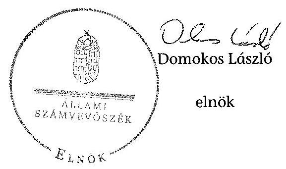

[^0]
[^0]:    ${ }^{21}$ Vhr. 9. § (3) bekezdés (hatályos 2010. december 31-ig), Vhr. 9. § (5) bekezdés (hatályos 2011. január 1-től)

---

# RÖVIDÍTÉSEK JEGYZÉKE 

## Jogszabályok

Alaptörvény
Áht. 1
Áht. 2
ÁSZ tv.
Avtv.
Evt. 1
Evt. 2

Gt.
Infotv.

Magyarország Alaptörvénye (2011. április 25.) (hatályos: 2012. január 1-jétől)

Az államháztartásról szóló 1992. évi XXXVIII. törvény (hatálytalan: 2012. január 1-jétől)
Az államháztartásról szóló 2011. évi CXCV. örvény (hatályos: 2012. január 1-jétől)
Az Állami Számvevőszékről szóló 2011. évi LXVI. törvény (hatályos: 2011. július 1-jétől)
A személyes adatok védelméről és a közérdekú adatok nyilvánosságáról szóló 1992. évi LXIII. törvény
Az erdőről és az erdő védelméről szóló 1996. évi LIV. törvény (hatálytalan: 2009. július 10-től)
Az erdőről, az erdő védelméről és az erdőgazdálkodásról szóló 2009. évi XXXVII. törvény (hatályos: 2009. július 10étől)
A gazdasági társaságokról szóló 2006. évi IV. törvény (hatálytalan: 2014. március 15-étől)
Az információs önrendelkezési jogról és az információszabadságról szóló 2011. évi CXII. törvény (hatályos: 2011. július 27 -étől, kivéve a 1-37. §, a 38. § (1)-(3) bekezdése, a 38. § (4) bekezdés a)-f) pontja, a 38. § (5) bekezdése, a 39. §, a 41-68. §, a 70-72. §, a 75-77. § és a 79-88. §, valamint az 1. melléklet, ami 2012. január 1-jén lépett hatályba és a 38. § (4) bekezdés g) és h) pontja, valamint a 69. §, ami 2013. január 1-jén lépett hatályba)
Mfbtv. A Magyar Fejlesztési Bank Részvénytársaságról szóló 2001. évi XX. törvény
Nfatv. A Nemzeti Földalapról szóló 2010. évi LXXXVII. törvény (hatályos: 2010. szeptember 1-jétől)
Nvtv. A nemzeti vagyonról szóló 2011. évi CXCVI. törvény (hatályos: 2011. december 31-étől, kivéve a 20. § (2) bekezdésben meghatározott paragrafusok, amelyek 2012. január 1jétől, a (3) bekezdésben meghatározott paragrafusok 2013. január 1-jétől, a (4) bekezdésben meghatározott paragrafus 2012. március 2-ától léptek hatályba)
Ptk. A Polgári Törvénykönyvről szóló 1959. évi IV. törvény (hatálytalan: 2014. március 15 -től)
Számv. tv. A számvitelről szóló 2000. évi C. törvény
új Ptk. A Polgári Törvénykönyvről szóló 2013. évi V. törvény (hatályos: 2014. március 15-étől)
Vadvédelmi. tv. A vad védelméről, a vadgazdálkodásról, valamint a vadászatról szóló 1996. évi LV. törvény
Vtv. Az állami vagyonról szóló 2007. évi CVI. törvény

---

Vhr.

## Egyéb rövidítések

Alapító Okirat
ÁPV Rt.
ÁSZ
Belső Ellenőrzési Kézikönyv
Ellenőrzési Szabályzat

Erdészetek

Értékelési Szabályzat
Erdészeti Hatóság

EU
FB
FM
ha
VSZ

Informatikai Adatvédelmi Szabályzat
Informatikai Fejlesztési Szabályzat
Informatikai üzemeltetési, Informatikai eszközhasználati és email és internet használati Szabályzat
INTOSAI
Iratkezelési Szabályzat

ISSAI
Kockázatkezelési Szabályzat
KVI
Leltározási Szabályzat

Az állami vagyonnal való gazdálkodásról 254/2007. (X. 4.) Korm. rendelet

A Pilisi Parkerdő Zrt. mindenkor hatályos alapító okirata Állami Privatizációs és Vagyonkezelő Zrt.
Állami Számvevőszék
a Pilis Parkerdő Zrt. belső ellenőrzési kézikönyve (hatályos: 2013. január 1-jétől)
a Pilis Parkerdő Zrt. ellenőrzési szabályzata (hatályos: 2006. június 19-étől)
a Pilisi Parkerdő Zrt. Erdészetei (Bajna, Budakeszi, Budapest, Gödöllő, Pilismarót, Pilisszentkereszt, Ráckeve, Szentendre, Visegrád, Valkó)
a Pilis Parkerdő Zrt. eszközök és források értékelési szabályzata (hatályos: minden év január 1-jétől)
Pest Megyei Mezőgazdasági Szakigazgatási Hivatal Erdészeti Igazgatósága 2010. december 31-ig, Pest Megyei Kormányhivatal Erdészeti Igazgatósága 2011. január 1-jétől
Európai Unió
Pilisi Parkerdő Zrt. Felügyelő Bizottsága
Földművelésügyi Minisztérium
hektár
a Pilisi Parkerdő Zrt. 01840-96-02067 számon a tulajdonosi joggyakorlóval kötött ideiglenes vagyonkezelési szerződése (hatályos: 1996. október 9-jétől)
a Pilisi Parkerdő Zrt. informatikai adatvédelmi szabályzat (hatályos: 2003. január 1-jétől)
a Pilisi Parkerdő Zrt. informatikai fejlesztési szabályzat (hatályos: 2013. augusztus 1-jétől)
a Pilisi Parkerdő Zrt. Informatikai üzemeltetési, Informatikai eszközhasználati és email és internet használati Szabályzata (hatályos: 2010. július 1-jétől)

Legfőbb Ellenőrző Intézmények Nemzetközi Szervezete
a Pilisi Parkerdő Zrt. iratkezelési szabályzata (hatályos: 2011. január 1-jétől)
nemzetközi standardok
a Pilisi Parkerdő Zrt. kockázatkezelési szabályzata (hatályos: 2011. március 1-től)
Kincstári Vagyoni Igazgatóság
a Pilisi Parkerdő Zrt. leltározási szabályzata (hatályos: 2001. január 1-től)

---

| MFB Zrt. | Magyar Fejlesztési Bank Zártkörűen Müködő Részvénytársaság |
| :--: | :--: |
| MNV Zrt. | Magyar Nemzeti Vagyonkezelő Zrt., amely útján az állami vagyon felügyeletéért felelős miniszter 2010. augusztus 31ig a Magyar Âllamot megillető tulajdonosi jogokat és kötelezettségeket gyakorolta, 2010. szeptember 1-jétől az a Magyar Âllamot megillető az Nfatv. hatálya alá nem tartozó tulajdonosi jogokat és kötelezettségeket gyakorolja |
| NEFAG | NEFAG Nagykunsági Erdészeti és Faipari Zrt. |
| NFA | az Nfatv. szerinti Nemzeti Földalapkezelő Szervezet, amely útján 2010. szeptember 1-jétől az agrárpolitikáért felelős miniszter a Nemzet Földalap felett a Magyar Állam nevében a tulajdonosi jogokat és kötelezettségeket gyakorolja |
| NFM | Nemzeti Fejlesztési Minisztérium |
| Pilisi Parkerdő Zrt., Társaság | Pilisi Parkerdő Zártkörűen Müködő Részvénytársaság |
| Számviteli Politika | a Pilisi Parkerdő Zrt. számviteli politikája (hatályos: 2008. január 1-jétől) |
| Számlarend | a Pilisi Parkerdő Zrt. számlarendje (hatályos: 2006. június 1-jétől) |
| SZMSZ | Szervezeti és Müködési Szabályzat (hatályos: 2007. március 26 -ától 2010. szeptember 14-éig, és 2010 . szeptember 15étől) |
| Társaság feletti tulajdonosi joggyakorló ${ }_{1}$ | a Társaság állami tulajdonú részesedése feletti tulajdonosi jogokat gyakorló Magyar Nemzeti Vagyonkezelő Zrt. (2009. január 1-jétől 2010. június 16-áig) |
| Társaság feletti tulajdonosi joggyakorló ${ }_{2}$ | a Társaság állami tulajdonú részesedése feletti tulajdonosi jogokat gyakorló Magyar Fejlesztési Bank Zrt. (2010. június 17-étől 2014. július 15-éig) |
| Ügyirat kezelési Szabályzat | Pilisi Parkerdő Zrt. ügyirat kezelési szabályzata |
| vezérigazgató | Pilisi Parkerdő Zrt. vezérigazgatója |

---

.

---

# FOGALOMTÁR 

állami vagyon
állami vagyon
használója
átlátható szervezet
földbirtok-politikai irányelvek
hasznosítás
immateriális szolgáltatásából származó bevétel
információs és kommunikációs rendszer
kockázatkezelés
kockázatkezelési rendszer

Állami vagyon:
a) az állam tulajdonában lévő dolog, valamint dolog módjára hasznosítható természeti erő;
b) az a) pont hatálya alá tartozó mindazon vagyon, amely vonatkozásában törvény az állam kizárólagos tulajdonjogát nevesíti;
c) az állam tulajdonában lévő tagsági jogviszonyt megtestesítő értékpapír, illetve az államot megillető egyéb társasági részesedés;
d) az államot megillető olyan immateriális, vagyoni értékkel rendelkező jogosultság, amelyet jogszabály vagyoni értékű jogként nevesít;
e) az állam tulajdonában lévő pénzügyi eszközök.
Az állami vagyon használója az a természetes vagy jogi személy, jogi személyiséggel nem rendelkező szervezet, aki, vagy amely törvény vagy szerződés alapján, bármely jogcímen (bérlet, haszonbérlet, használat stb.) állami vagyont birtokol, használ, szedi annak hasznait. (Ide nem értve a haszonélvezőt, a vagyonkezelőt és a tulajdonosi jogok gyakorlóját.)
Átlátható szervezet a Nvtv. 3. § (1) bekezdés 1. pontjában felsorolt, a meghatározott követelményeknek megfelelő szervezet.
Az Nfatv. 15. § (3) bekezdés a)-s) pontjaiban meghatározott, a Nemzeti Földalapba tartozó földrészletek hasznosítására vonatkozó irányelvek.
Hasznosítás a tulajdonosi joggyakorló vagy a nemzeti vagyon használója által a nemzeti vagyon birtoklásának, használatának, hasznok szedése jogának bármely - a tulajdonjog átruházását nem eredményező - jogcímen történő átengedése, ide nem értve a vagyonkezelésbe adást, valamint a haszonélvezeti jog alapítását.
Immateriális szolgáltatásból származó bevételek azok a nem anyagjellegű szolgáltatásokból származó állami bevételek, amelyeket az Evt. 2 3. § (1) bekezdése szerint, a külön jogszabályban meghatározott részletes feltételek szerint, az erdők fenntartására, gyarapítására és védelmére kell fordítani.
Az információs és kommunikációs rendszer biztosítja, hogy az információk eljussanak az illetékes szervezethez, szervezeti egységhez, illetve személyhez.
A kockázatkezelés a szervezet céljai elérésével kapcsolatos kockázatok azonosításának és elemzésének, valamint a megfelelő válaszok meghatározásának folyamata.
A kockázatkezelési rendszer múködtetése során fel kell mérni és meg kell állapítani a szervezet tevékenységében, gazdálkodásában rejlő kockázatokat, valamint meg kell határozni az egyes kockázatokkal kapcsolatban szükséges intézkedéseket,

---

|  | valamint azok teljesítésének folyamatos nyomon követésének módját.   A kockázatkezelési rendszer olyan irányítási eszközök és módszerek összessége, amelynek elemei a szervezeti célok elérését veszélyeztető tényezők (kockázatok) azonosítása, elemzése, nyomon követése, valamint szükség esetén a kockázati kitettség mérséklése. |
| :--: | :--: |
| kontrolling | Az a vezetéstámogató rendszer, amely a vezetői tervezést, ellenőrzést, valamint információ-ellátást koordinálja célorientáltan a környezeti változásokhoz igazodva. |
| kontrollkörnyezet | A kontroll környezet elemei: a szervezeti struktúra, a felelősségi, hatásköri viszonyok és feladatok, a szervezet minden szintjén meghatározott etikai elvárások, a humánerőforráskezelés. A kontrollkörnyezet alapozza meg a belső kontroll összes többi elemét a fegyelem és a struktúra biztosítása által. |
| kontrollrendszer | A kontrollrendszer a kockázatok kezelése és tárgyilagos bizonyosság megszerzése érdekében kialakított folyamatrendszer, amely azt a célt szolgálja, hogy megvalósuljanak a következő célok:   a) a múködés és a gazdálkodás során a tevékenységeket szabályszerűen, gazdaságosan, hatékonyan, eredményesen hajtsák végre,   b) az elszámolási kötelezettségeket teljesítsék, és   c) megvédjék az erőforrásokat a veszteségektől, károktól és nem rendeltetésszerú használattól. |
| kontrolltevékenységek | A kontrolltevékenységek azok az elvek (politikák) és eljárások, amelyeket a kockázatok meghatározása és a szervezet céljainak elérése érdekében alakítanak ki. |
| közfeladat | A közfeladat jogszabályban meghatározott állami vagy önkormányzati feladat, amit az arra kötelezett közérdekből, jogszabályban meghatározott követelményeknek és feltételeknek megfelelve végez, ideértve a lakosság közszolgáltatásokkal való ellátását, továbbá az állam nemzetközi szerződésekben vállalt kötelezettségeiből adódó közérdekű feladatokat, valamint e feladatok ellátásához szükséges infrastruktúra biztosítását is.   Az Etv. 2. § (2) bekezdése szerint a fenntartható erdőgazdálkodás során a legfontosabb közérdekű feladat az erdők változatosságának megőrzése, az erdők fenntartása, felújítása és a védelmi, valamint közjóléti szolgáltatások biztosítása, melyek elvégzését az állam megfelelő eszközökkel biztosítja. |
| monitoring | A szervezet tevékenységének, a célok megvalósításának nyomon követését biztosító rendszer, amely az operatív tevékenységek keretében megvalósuló folyamatos és eseti nyomon követésből, valamint az operatív tevékenységektől függetlenül múködő belső ellenőrzésből áll.   A monitoring a projektek és programok végrehajtásának nyomon követése, mely a támogató és a kedvezményezett |

---

Nemzeti Földalap
nemzeti vagyon használója
rábízott állami vagyon
társasági portfólió
tulajdonosi ellenőrzés
tulajdonosi joggyakorló
tulajdonosi joggyakorlás módja
közti megállapodásban foglalt eljárások követését, az előrehaladás ellenőrzését és a lehetséges problémák időben történő azonosítását szolgálja.
A Nemzeti Földalap a kincstári vagyon része, amelybe beletartoznak az állam tulajdonában és az ingatlan-nyilvántartásban levő, az Nfatv. 1. § (1)-(2) bekezdéseiben felsorolt területek, földrészletek és az azokhoz kapcsolódó vagyoni értékű jogok.
A nemzeti vagyon használója az a természetes személy, jogi személy vagy jogi személyiséggel nem rendelkező szervezet, aki, vagy amely állami vagyon tekintetében törvény vagy szerződés alapján, a helyi önkormányzat vagyona tekintetében törvény, a helyi önkormányzat rendelete vagy szerződés alapján bármely jogcímen nemzeti vagyont birtokol, használ, szedi annak hasznait, kivéve a tulajdonosi joggyakorló (az Nvtv. 3. § (1) bekezdés 11. pontja alapján).
Rábízott állami vagyon az a Vtv. alkalmazásában állami vagyonnak minősülő vagyon, amit az MNV- a saját vagyonától elkülönítetten - kezel és nyilvántart.
Az Mfbtv. 3. § (9) bekezdése szerint rábízott állami vagyon az a vagyon, amely felett az Mfbtv. erejénél fogva a Magyar Állam nevében az MFB gyakorolja a tulajdonosi jogokat.
Az Nfatv. 1. § (1) bekezdésében foglaltak alapján az NFA-hoz tartozó rábízott vagyon a törvényben meghatározott, a Nemzeti Földalapba tartozó vagyon.
Társasági portfólió az MNV, illetve az MFB rábízott vagyonába tartozó állami tulajdonú társasági részesedések.
A tulajdonosi joggyakorló által végzett ellenőrzés, amelynek célja az állami vagyonnal való gazdálkodás vizsgálata, ennek keretében a rendeltetésellenes, jogszerütlen, szerződésellenes, vagy a tulajdonos érdekeit sértő, illetve a központi költségvetést hátrányosan érintő vagyongazdálkodási intézkedések feltárása és a jogszerű állapot helyreállítása, továbbá a vagyonnyilvántartás hitelességének, teljességének és helyességének biztosítása.
Tulajdonosi joggyakorló az, aki az állami, illetve a nemzeti vagyon felett az államot megillető tulajdonosi jogok és kötelezettségek gyakorlására jogosult.
Az állami vagyon felett a Magyar Államot megillető tulajdonosi jogoknak (és kötelezettségeknek) az összességét az állami vagyon felügyeletéért felelős miniszter gyakorolja, aki e feladatát az MNV, az MFB, illetve egyéb tulajdonosi joggyakorló szervezet (pl. központi költségvetési szervek, 100\%-ban állami tulajdonban álló gazdasági társaságok) útján látja el. Azon állami tulajdonban álló ingatlanok felett, amelyek egy része a Nemzeti Földalapba tartozik, a tulajdonosi jogokat a miniszter az agrárpolitikáért felelős miniszterrel közösen gyakorolja.

---

vagyongazdálkodás feladata
vagyonkezelői jog

A Nemzeti Földalap felett a Magyar Állam nevében a tulajdonosi jogokat és kötelezettségeket az agrárpolitikáért felelős miniszter a Nemzeti Földalapkezelő Szervezet útján gyakorolja.
Az állami vagyon rendeltetésének megfelelő - az állami feladatok ellátásához, a társadalmi szükségletek kielégítéséhez, valamint a Kormány gazdaságpolitikája megvalósításának elősegítéséhez szükséges, egységes elveken alapuló, önálló ágazatként megjelenő - hatékony, költségtakarékos, értékmegőrző, értéknövelő felhasználásának biztosítása, beleértve a vagyoni kör változását eredményező értékesítést, valamint az állami vagyon gyarapítása is.
Vagyonkezelési szerződés alapján a vagyonkezelő jogosult meghatározott, állami tulajdonba tartozó dolog birtoklására, használatára és hasznai szedésére.
A Vtv. alapján a vagyonkezelői jog az állami vagyon hasznosítására az MNV-vel kötött vagyonkezelési szerződéssel jön létre. A vagyonkezelési szerződés alapján a vagyonkezelő jogosult meghatározott, állami tulajdonba tartozó dolog birtoklására, használatára és hasznai szedésére.
Az Nfatv. alapján a vagyonkezelői jog az erre irányuló (NFAval kötött) szerződéssel jön létre. A vagyonkezelői szerződés alapján a vagyonkezelő jogosult meghatározott földrészlet birtoklására, használatára és hasznai szedésére. A vagyonkezelő köteles a földrészlet értékét megőrizni, állagának megóvásáról, jó karban tartásáról gondoskodni, továbbá - az Nfatv.-ben meghatározott esetek kivételével díjat - fizetni vagy a szerződésben előírt más kötelezettséget teljesíteni.

---

### a Pilisi Parkerdő Zrt. vagyonának alakulása 2009-2014. I. félévében

|  Sor-
szám | Megnevezés | 2009.01.01 | 2009.12.31 | 2010.12.31 | 2011.12.31 | 2012.12.31 | 2013.12.31 | 2014.06.30 | Változás
2013.12.31/2009.12.31.
(%)  |
| --- | --- | --- | --- | --- | --- | --- | --- | --- | --- |
|   |  | 1 | 2 | 3 | 4 | 5 | 6 | 7 | 8  |
|  1. | Eszközök |  |  |  |  |  |  |  |   |
|  2. | Befektetett eszközök összesen | 5 244 130 | 5 494 085 | 5 624 307 | 5 714 100 | 5 815 443 | 6 143 983 | 6 102 227 | 112%  |
|  3. | Elődő: Immateriális javak | 49 937 | 53 287 | 64 561 | 53 029 | 50 882 | 83 103 | 73 893 | 131%  |
|  4. | Tárgyi eszközök | 5 180 967 | 5 414 786 | 5 543 021 | 5 642 120 | 5 725 817 | 6 025 636 | 5 988 020 | 111%  |
|  5. | Befektetett pénzügyi eszközök | 13 226 | 16 012 | 16 723 | 16 951 | 38 744 | 35 229 | 40 308 | 220%  |
|  6. | Forgiaszközök | 3 912 454 | 3 054 520 | 2 917 979 | 2 513 208 | 2 469 027 | 2 106 272 | 1 962 294 | 69%  |
|  7. | Elődő: Késületek | 538 662 | 623 861 | 492 650 | 425 514 | 400 713 | 415 813 | 451 709 | 67%  |
|  8. | Követelések | 1 564 279 | 1 044 812 | 928 899 | 772 680 | 716 731 | 689 684 | 725 953 | 66%  |
|  9. | Értékpapírok | 393 838 |  |  |  |  |  |  |   |
|  10. | Pénzeszközök | 1 415 370 | 1 385 844 | 1 496 430 | 1 315 034 | 1 551 583 | 1 000 773 | 784 622 | 72%  |
|  11. | Aktív időbeli elhatárolások | 84 917 | 172 560 | 106 120 | 114 719 | 93 560 | 200 388 | 209 696 | 116%  |
|  12. | Eszközök összesen | 9 241 501 | 8 721 165 | 8 648 406 | 8 342 027 | 8 378 030 | 8 450 642 | 8 274 217 | 97%  |
|  13. | Források |  |  |  |  |  |  |  |   |
|  14. | Saját tőke | 5 359 763 | 5 585 629 | 5 662 766 | 5 727 814 | 5 794 814 | 6 000 652 | 6 020 382 | 107%  |
|  15. | Elődő: Jegyzett tőke | 2 275 460 | 2 354 810 | 2 354 810 | 2 354 810 | 2 354 810 | 2 514 810 | 2 514 810 | 107%  |
|  16. | Tőketartalék | 2 390 049 | 2 390 049 | 2 390 049 | 2 390 049 | 2 390 049 | 2 390 049 | 2 390 049 | 100%  |
|  17. | Eredménytartalék | 575 400 | 476 107 | 800 665 | 887 842 | 941 930 | 1 024 955 | 1 070 793 | 152%  |
|  18. | Lekötött tartalék | 47 183 | 20 145 | 40 105 | 30 065 | 41 025 | 25 000 | 25 000 | 134%  |
|  19. | Értékelési tartalék |  |  |  |  |  |  |  |   |
|  20. | Mérleg szerinti eredmény | 73 667 | 144 518 | 77 137 | 65 048 | 67 000 | 45 838 | 19 730 | 32%  |
|  21. | Céltartalékok | 171 792 | 207 764 | 125 210 | 170 997 | 214 284 | 266 446 | 217 980 |   |
|  22. | Kötelezettségek | 1 234 193 | 1 053 109 | 961 424 | 776 439 | 921 475 | 840 347 | 743 966 | 80%  |
|  23. | Elődő: Hátrasonlít kötelezettségek |  |  |  |  |  |  |  |   |
|  24. | Hosszú lejáratú kötelezettségek | 123 362 | 119 365 | 119 190 | 119 190 | 119 190 | 132 536 | 133 955 |   |
|  25. | Rövid lejáratú kötelezettségek | 1 110 829 | 833 844 | 842 254 | 657 249 | 802 285 | 707 811 | 610 011 | 76%  |
|  26. | Pozzáv időbeli elhatárolások | 2 475 757 | 1 874 663 | 1 899 006 | 1 666 777 | 1 447 457 | 1 345 197 | 1 291 889 | 72%  |
|  27. | Források összesen | 9 241 501 | 8 721 165 | 8 648 406 | 8 342 027 | 8 378 030 | 8 450 642 | 8 274 217 | 97%  |

---

az immateriális javak és tárgyi eszközök állományának megoszlása a 2013. évre vonatkozóan adatok ezer Ft-ban

|  Sor-
szám | Megnevezés | Immateriális javak | Ingatlanok | Műszaki berendezések | Egyéb berendezések | Tenyészállatok | Beruházás a beruházásra adott előleggel együtt | Tárgyi eszközök összesen  |
| --- | --- | --- | --- | --- | --- | --- | --- | --- |
|   | 1. | 2. | 3. | 4. | 5. | 6. | 7. | 8.  |
|  1. | Bruttó érték január 1-jén | 251 436,0 | 6613 299,0 | 833 357,0 | 381 218,0 | 3513,0 | 191003,0 | 8022390,0  |
|  2. | -ebből: állami vagyon |  | 207645,0 |  |  |  |  | 207645,0  |
|  3. | -ebből: saját vagyon | 251 436,0 | 6405 654,0 | 833 357,0 | 381 218,0 | 3513,0 | 191003,0 | 7814745,0  |
|  4. | Növekedés ( + ) | 51053,0 | 451 378,0 | 110 603,0 | 88 403,0 | 0,0 | 699067,0 | 1349451,0  |
|  5. | -ebből: állami vagyon |  |  |  |  |  |  | 0,0  |
|  6. | -ebből: saját vagyon | 51053,0 | 451 378,0 | 110 603,0 | 88 403,0 |  | 699067,0 | 1349451,0  |
|  7. | Csökkenés (-) | $-765,0$ | $-16348,0$ | $-20235,0$ | $-34696,0$ | 0,0 | $-707174,0$ | $-778453,0$  |
|  8. | -ebből: állami vagyon |  |  |  |  |  |  | 0,0  |
|  9. | -ebből: saját vagyon | $-765,0$ | $-16348,0$ | $-20235,0$ | $-34696,0$ |  | $-707174,0$ | $-778453,0$  |
|  10. | Bruttó érték december 31-én | 301724,0 | 7048 329,0 | 923725,0 | 434 925,0 | 3513,0 | 182896,0 | 8593388,0  |
|  11. | -ebből: állami vagyon | 0,0 | 207645,0 | 0,0 | 0,0 | 0,0 | 0,0 | 207645,0  |
|  12. | -ebből: saját vagyon | 301724,0 | 6840 684,0 | 923725,0 | 434 925,0 | 3513,0 | 182896,0 | 8583745,0  |
|  13. | Halmozott értékcsökkenés január 1-jén | 200 554,0 | 1569 644,0 | 493 382,0 | 232 738,0 | 808,0 | 0,0 | 2296572,0  |
|  14. | -ebből: állami vagyon |  | 13553,0 |  |  |  |  | 13553,0  |
|  15. | -ebből: saját vagyon | 200 554,0 | 1556 091,0 | 493 382,0 | 232 738,0 | 808,0 |  | 2283019,0  |
|  16. | Értékcsökkenés növekedése (+) (kültségként elszámolt) | 18832,0 | 186067,0 | 80 389,0 | 54 387,0 | 129,0 | 0,0 | 320972,0  |
|  17. | -ebből: állami vagyon |  | 369,0 |  |  |  |  | 369,0  |
|  18. | -ebből: saját vagyon | 18832,0 | 185698,0 | 80 389,0 | 54 387,0 | 129,0 |  | 320603,0  |
|  22. | Értékcsökkenés egyéb ráfordításként elszámolva (z) | 0,0 | 0,0 | 0,0 | 0,0 | 0,0 | 0,0 | 0,0  |
|  23. | -ebből: állami vagyon |  |  |  |  |  |  | 0,0  |
|  24. | -ebből: saját vagyon |  |  |  |  |  |  | 0,0  |
|  25. | Egyéb változás az értékcsökkenésben (z) | $-765,0$ | $-187,0$ | $-16492,0$ | $-33127,0$ | 0,0 | 0,0 | $-49806,0$  |
|  26. | -ebből: állami vagyon |  |  |  |  |  |  | 0,0  |
|  27. | -ebből: saját vagyon | $-765,0$ | $-187,0$ | $-16492,0$ | $-33127,0$ |  |  | $-49806,0$  |
|  28. | Halmozott értékcsökkenés december 31-én: | 218621,0 | 1755 524,0 | 557 279,0 | 253 998,0 | 937,0 | 0,0 | 2567738,0  |
|  29. | -ebből: állami vagyon | 0,0 | 13922,0 | 0,0 | 0,0 | 0,0 | 0,0 | 13922,0  |
|  30. | -ebből: saját vagyon | 218621,0 | 1741602,0 | 557 279,0 | 253 998,0 | 937,0 | 0,0 | 2553816,0  |
|  31. | Nettó érték december 31-én: | 83103,0 | 5292 805,0 | 366 446,0 | 180 927,0 | 2576,0 | 182896,0 | 6025650,0  |
|  32. | -ebből: állami vagyon | 0,0 | 193722,0 | 0,0 | 0,0 | 0,0 | 0,0 | 193723,0  |
|  33. | -ebből: saját vagyon | 83103,0 | 5099 082,0 | 366 446,0 | 180 927,0 | 2576,0 | 182896,0 | 5831927,0  |

---

### a befektetett eszközök állományának alakulásáról

|  Sze- | MEGNEVEZÉS | 2009. év |  |  | 2010. év |  |  | 2011. év |  |  | 2012. év |  |  | 2013. év |  |   |
| --- | --- | --- | --- | --- | --- | --- | --- | --- | --- | --- | --- | --- | --- | --- | --- | --- |
|   |  | Összesen | Állami vegyen | Szüét vegyen | Összesen | Állami vegyen | Szüét vegyen | Összesen | Állami vegyen | Szüét vegyen | Összesen | Állami vegyen | Szüét vegyen | Összesen | Állami vegyen | Szüét vegyen  |
|   |  |  |  |  |  |  |  |  |  |  |  |  |  |  |  |   |
|  1. |  | 5 | 5 | 5 | 5 | 5 | 5 | 5 | 5 | 10 | 11 | 10 | 10 | 10 | 10 | 10  |
|  1. | Nyitó állomány | 5 201 851,0 | 195 580,0 | 5 010 571,0 | 5 478 075,0 | 195 506,0 | 5 282 867,0 | 5 607 582,0 | 194 823,0 | 5 412 749,0 | 5 697 149,0 | 194 463,0 | 5 502 686,0 | 5 776 699,0 | 194 093,0 | 5 003 607,0  |
|  2. | Terv szerinti értékesílékezés | 267 206,0 | 374,0 | 286 832,0 | 283 790,0 | 373,0 | 282 417,0 | 285 838,0 | 370,0 | 285 688,0 | 300 500,0 | 371,0 | 300 129,0 | 319 804,0 | 369,0 | 339 610,0  |
|  3. | Terven feltölt értékesílékezés | 0,0 |  |  | 0,0 |  |  | 0,0 |  |  | 5 631,0 |  | 5 631,0 | 0,0 |  |   |
|  4. | Értékvesítés elszámolása | 0,0 |  |  | 0,0 |  |  | 0,0 |  |  | 0,0 |  |  | 0,0 |  |   |
|  5. | Értékesítés | 7,0 |  | 7,0 | 8 304,0 |  | 8 304,0 | 17 316,0 |  | 17 316,0 | 15 228,0 |  | 11 228,0 | 4 310,0 |  | 4 310,0  |
|  6. | Szárjuszás | 1 192,0 |  | 1 192,0 | 18 902,0 |  | 18 902,0 | 6 884,0 |  | 6 884,0 | 10 568,0 |  | 10 568,0 | 1 570,0 |  | 1 570,0  |
|  7. | Átmunkítás | 0,0 |  |  | 0,0 |  |  | 12 258,0 |  | 12 258,0 | 0,0 |  |  | 15 583,0 |  | 15 583,0  |
|  8. | Ingrenss átadás | 0,0 |  |  | 0,0 |  |  | 0,0 |  |  | 0,0 |  |  | 0,0 |  |   |
|  9. | Egyéb | 0,0 |  |  | 0,0 |  |  | 0,0 |  |  | 2 468,0 |  | 2 468,0 | 0,0 |  |   |
|  10. | Csökkentés összesen | 248 485,0 | 374,0 | 268 051,0 | 312 996,0 | 373,0 | 312 625,0 | 332 216,0 | 370,0 | 321 946,0 | 330 395,0 | 371,0 | 330 024,0 | 361 276,0 | 369,0 | 360 907,0  |
|  11. | Terv szerinti beruházás | 540 627,0 |  | 540 627,0 | 442 500,0 |  | 442 500,0 | 411 883,0 |  | 411 883,0 | 409 945,0 |  | 409 945,0 | 693 330,0 |  | 692 330,0  |
|  12. | Terv szerinti felújítás | 0,0 |  |  | 0,0 |  |  | 0,0 |  |  | 0,0 |  |  | 0,0 |  |   |
|  13. | Terv szerinti növekedés | 540 627,0 | 0,0 | 540 627,0 | 442 505,0 | 0,0 | 442 505,0 | 411 883,0 | 0,0 | 411 883,0 | 409 945,0 | 0,0 | 409 945,0 | 693 330,0 | 0,0 | 692 330,0  |
|  14. | Egyéb beruházás | 0,0 |  |  | 0,0 |  |  | 0,0 |  |  | 0,0 |  |  | 0,0 |  |   |
|  15. | Egyéb felújítás | 0,0 |  |  | 0,0 |  |  | 0,0 |  |  | 0,0 |  |  | 0,0 |  |   |
|  16. | Átmunkítás | 0,0 |  |  | 0,0 |  |  | 0,0 |  |  | 0,0 |  |  | 0,0 |  |   |
|  17. | Átválul | 0,0 |  |  | 0,0 |  |  | 0,0 |  |  | 0,0 |  |  | 0,0 |  |   |
|  18. | Értékvesítés visszabítás | 0,0 |  |  | 0,0 |  |  | 0,0 |  |  | 0,0 |  |  | 0,0 |  |   |
|  19. | Értékesítéses és visszabítás | 0,0 |  |  | 0,0 |  |  | 0,0 |  |  | 0,0 |  |  | 0,0 |  |   |
|  20. | Egyéb | 0,0 |  |  | 0,0 |  |  | 0,0 |  |  | 0,0 |  |  | 0,0 |  |   |
|  21. | Terven feltölt növekedés | 0,0 | 0,0 | 0,0 | 0,0 | 0,0 | 0,0 | 0,0 | 0,0 | 0,0 | 0,0 | 0,0 | 0,0 | 0,0 | 0,0 | 0,0  |
|  22. | Növekedés összesen | 540 627,0 | 0,0 | 540 627,0 | 442 505,0 | 0,0 | 442 505,0 | 411 883,0 | 0,0 | 411 883,0 | 409 945,0 | 0,0 | 409 945,0 | 693 330,0 | 0,0 | 692 330,0  |
|  23. | Závó állomány | 5 978 073,0 | 195 206,0 | 5 282 867,0 | 5 607 582,0 | 194 823,0 | 5 412 749,0 | 5 697 149,0 | 194 463,0 | 5 502 686,0 | 5 776 699,0 | 194 093,0 | 5 582 687,0 | 6 108 753,0 | 193 723,0 | 5 915 030,0  |

---

### a saját tőke változása a 2013. évre vonatkozóan

|  Sor-
szám | Megnevezés | Saját tőke | Jegyzett tőke | Jegyzett, de be
nem fizetett tőke | Tőketartalék | Eredmény-
tartalék | Lekötött
tartalék | Értékelési
tartalék | Mérleg szerinti
eredmény  |
| --- | --- | --- | --- | --- | --- | --- | --- | --- | --- |
|   | 1. | 2. | 3. | 4. | 5. | 6. | 7. | 8. | 9.  |
|  1. | A saját tőke nyitóállománya az év elején | 5 794 814,0 | 2 354 810,0 |  | 2 390 049,0 | 941 930,0 | 41 025,0 | 0,0 | 67 000,0  |
|  2. | A saját tőke elemeinek egymás közötti mozgása |  |  |  |  |  |  |  |   |
|  3. | Tőző évt eredménytartalékba | 0,0 |  |  |  | 67 000,0 |  |  | -67 000,0  |
|  4. | Jegyzett tőke emelés eredménytartalékból vagy
tőketartalékból |  |  |  |  |  |  |  |   |
|  5. | Átvezetés eredménytartalék és tőketartalék között |  |  |  |  | 41 025,0 | -41 025,0 |  |   |
|  6. | Átvezetés eredménytartalék és lekötött tartalék között | 0,0 |  |  |  | -25 000,0 | 25 000,0 |  |   |
|  7. | Átvezetés tőketartalék és lekötött tartalék között |  |  |  |  |  |  |  |   |
|  8. | Mérleg szerinti eredmény | 45 838,0 |  |  |  |  |  |  | 45 838,0  |
|  9. | Egyéb mozgások (oztalék stb.): |  |  |  |  |  |  |  |   |
|  10. | Összesen | 45 838,0 | 0,0 | 0,0 | 0,0 | 83 025,0 | -16 025,0 | 0,0 | -21 162,0  |
|  11. | A saját tőke változása |  |  |  |  |  |  |  |   |
|  12. | Jegyzett tőke emelés vagy csökkentés | 160 000,0 | 160 000,0 |  |  |  |  |  |   |
|  13. | Sefizetés eredmény-, tőke- vagy lekötött tartalékba |  |  |  |  |  |  |  |   |
|  14. | Tőketartalék vagy eredménytartalék átadás |  |  |  |  |  |  |  |   |
|  15. | Tőketartalék vagy eredménytartalék átvétel |  |  |  |  |  |  |  |   |
|  16. | Egyéb jogcímek: |  |  |  |  |  |  |  |   |
|  17. | Összesen | 160 000,0 | 160 000,0 | 0,0 | 0,0 | 0,0 | 0,0 | 0,0 | 0,0  |
|  18. | Záróállomány az év végén | 6 000 652,0 | 2 514 810,0 | 0,0 | 2 390 049,0 | 1 024 955,0 | 25 000,0 | 0,0 | 45 838,0  |
|  19. | A saját tőke jegyzett tőke arány (%) |  |  |  | 239% |  |  |  |   |
|  20. | A saját tőke és az összes forrás aránya (%) |  |  |  | 71% |  |  |  |   |

---

# a beruházások, felújítások forrásáról

|  Sorszám | Megnevezés | 2009. év | 2010. év | 2011. év | 2012. év | 2013. év | 2014.06.30 | Megjegyzés  |
| --- | --- | --- | --- | --- | --- | --- | --- | --- |
|   | 1. | 2. | 3. | 4. | 5. | 6. | 7. | 8.  |
|  1. | Amortizáció - állami vagyon után | 374,0 | 373,0 | 370,0 | 371,0 | 369,0 | 183,0 |   |
|  2. | Amortizáció - saját vagyon után | 266 832,0 | 285 417,0 | 285 488,0 | 300 129,0 | 339 435,0 | 180 515,0 |   |
|  3. | Amortizációs forrás (visszapótlási kötelezettség)** | 374,0 | 373,0 | 370,0 | 371,0 | 369,0 | 183,0 |   |
|  4. | Hazai/központi forrás | 16 679,0 | 1 579,0 | 656,0 | 8 489,0 | 90,0 | 4 801,0 |   |
|  5. | Pályázati forrás (EU-s) | 48 167,0 | 141 522,0 | 13 749,0 | 28 534,0 | 94 271,0 |  |   |
|  6. | Eszközeladás | 468,0 | 14 878,0 | 38 272,0 | 13 586,0 | 10 104,0 | 9 510,0 |   |
|  7. | Egyéb forrás*** | 1 367,0 | 2 000,0 | 35 500,0 | 500,0 | 23 049,0 | 250,0 | MAVÍR, MFR, Csepel Önkorm. Opál Zrt., FVM, Bp.-l Önkorm.-ak  |
|  8. | Források összesen | 333 887,0 | 445 769,0 | 374 035,0 | 351 609,0 | 467 318,0 | 195 259,0 |   |

** Amortizációs forrás: A kezeit állami vagyonon elszámolt terv szerinti és terven felüli értékcsökkenési leírás összegének megfelelő összegű beruházási, felújítási és karbantartási kötelezettség.** *A Megjegyzés oszlopban meg kell nevezni a forrást.

---

.

---

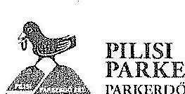

# PILISI PARKERDŐ ZRT PARKERDŐ AZ EMBERÉRT 

Állami Számvevőszék
Domokos László elnök

Budapest 4.
PL54.
1364

ÁLLAMI SZÁMVEVÔSZÉK
ÜGYVITELI IRODA
$8486612015^{\circ}$
Érk.: OCT 142015
Iktotószám: $16-0355-6-2015$
Visegrád, 2015. október
Ügyintszám: F/1-81/2015.
Úgyintéző: dr. Ilosvai/Liebhardt
Hiv. szám: V-0755-121/2015.
Tátgy: „Az állami tulajdonban álló
erdögazdasági társaságok
vagyongszdálkodási tevékenységének
ellenőrzése - Pilisi Parkerdő Zrt"
jelentéstervezetre - észrevétel tétele

Tisztelt Elnök Úr!

Köszönettel vettem a hivatkozott számú, Budapesten, 2015.09.29-én kelt - 2015. október 01-én kézhez vett - tájékoztató levelét, valamint a megküldött jelentéstervezetet.

A jelentéstervezetben foglalt megállapításokat kollegáimmal áttekintettem, mely megállapítások némelyikére a jelen levelem mellékleteként megküldött észrevételeket kivánom tenni.

Kérem, hogy a Társaság észrevételeit áttekinteni, és az Állami Számvevőszék Jelentését - az észrevételek elfogadása esetén - pontosítani szíveskedjen!

Engedje meg, hogy megköszönjem az ellenőrzésben részt vett kollégái munkáját, mellyel hozzájárultak a Pilisi Parkerdő Zrt. jövőbeni megfelelőbb müködésének elősegítéséhez!

Tisztelettel:

Zambó Péter
vezérigazgató

Kapja: Címzett tértivevénnyel, elsőbbséggel

---

# ÉSZREVÉTELEK 

a V-0755-120/2015. iktatószámú, V070607 vizsgálat-azonosító számú
Az állami tulajdonban álló erdőgazdasági társaságok vagyongazdálkodási tevékenységének ellenőrzése - Pílisi Parkerdő Zrt." címú számvevőszéki jelentéstervezethez

1. Összegző megállapítások, következtetések, javaslatok
„A Társaság éves mérlegci nem a valós állapotot tükrözték, mert a vagyonkezelt eszközöket a Számv. tv. előirása ellenére a mérlegeiben nem szerepeltette. A Társaság mérleg szerinti vagyona nem tartalmazza a vagyonkezelésében levő állami erdők és azzal szerves egységet képező egyéb földterületek értékét, a Számv. tv.-ben foglaltak ellenére a vagyonkezelésbe vett eszközöket mérleg szerinti megbontásban nem mutatták be a kiegészitő mellékletben." (Jelentéstervezet 6. oldal)

Észrevétel: A Kincstári Vagyoni Igazgatósággal 1996. október 9. napján kötött Ideiglenes Vagyonkezelési Szerződés (a továbbiakban: IVSZ) a vagyonkezelésében levő állami erdők és azzal szerves egységet képező egyéb földterületek értékét nem tartalmazza. A Társaság a tulajdonosi joggyakorlónál lévő nyilvántartásbeli értékről a szerződéses jogviszony ideje alatt tájékoztatást nem kapott. Az erdőérték kiszámítására jelenleg több tudományos módszer létezik. Az értékelési módszerek kiválasztásánál a meghatározó szempont, hogy a vagyonértékelés céljait a tulajdonos határozza meg, eltérő hangsúlyok esetén a módszertan is eltérhet. (Például a klímaváltozás erösödésével egyre hangsúlyosabb az erdők ökoszisztéma szolgáltatásainak értéke, amelyet általában eddig kevésbé vettek figyelembe.)
„A Társaság által a VSZ alapján kezelt vagyonról vezetett nyilvántartás nem felelt meg a Vhr.-ben foglaltaknak, mert tételesen nem tartalmazza a vagyonkezelt eszközök könyv szerinti bruttó és nettó értékét, valamint az értékben bekövetkezett egyéb változásokat. Ezért a vezetett nyilvántartás nem biztosította az átláthatóságot és az elszámoltathatóságot. (...) A vagyonkezelt eszközök forint értékének meghatározását a Társaság sem az MNV Zrt-nél sem az NFA-nál nem kezdeményezte annak érdekében, hogy eleget tegyen a Számv. tv. előírásainak. (Jelentéstervezet 6. oldal)
„A könyvvizsgáló a 2009-2013. évi beszámolókat hitelesítő záradékkal látta el, a 2010. évben a záradékot figyelemfelhívással, a 2012. évben a könyvvizsgálói jelentést nyilatkozattal egészítette ki. A könyvvizsgáló az ellenőrzött időszakban nem kifogásolta a beszámolóval kapcsolatosan az ÁSZ által feltárt hiányosságokat." (Jelentéstervezet 8. oldal)

Észrevétel: A Számv. tv. 23.§-a rögzíti, hogy a vagyonkezelésbe vett eszközöket eszközként kell kimutatni.
A Számv. tv. 165.§ (2) bekezdése tartalmazza azt a rendelkezést, hogy a számviteli (könyvviteli) nyilvántartásokba csak szabályszerűen kiállított bizonylat alapján szabad adatokat bejegyezni. Szabályszerű az a bizonylat, amely az adott gazdasági műveletre (eseményre) vonatkozóan a könyvvitelben rögzítendő és a más jogszabályban elöltt adatokat a valóságnak megfelelően, hiánytalanul tartalmazza, megfelel a bizonylat

---

általános alaki és tartalmi követelményeinek, és amelyet - hiba esetén - előírásszerűen javítottak."
A Vhr. 9.5 (9) a) pontja előírja, hogy a „vagyonkezelő a vagyonkezelésbe vett eszközöket a számvitelről szóló törvény clőírásai szerint a hosszú lejáratú kötelezettségekkel szemben a vagyonkezelési szerződésben rögzített értéken köteles állományba venni".
A Pilisi Parkerdő Zrt a fentiekben rögzített jogszabályi clőírások alapján mindaddig, ameddig nem rendelkezik olyan vagyonkezelési szerződéssel, mely a vagyonkezelésbe átadott eszközöket értékben tartalmazza, addig nem marasztalható el azért, mert mérlege nem tartalmazza értékben a vagyonkezelésre átvett eszközöket. Továbbá a Társaság betartja a jogszabályokban clőírt azon követelményeket azzal, hogy a vagyonkezelési szerződése alapján nem mutatja ki a vagyonkezelt eszközöket értékben és nem mutat ki könyvciben olyan vagyonkezelt eszköz értéket, amelyet a vagyonkezelési szerződése nem tartalmaz, így éves beszámolói a társaság vagyoni helyzetéről megbízható, valós képet adnak.
Az erdők számbavételénél figyelembe kell venni Számv. tv. azon clőírását, amely szerint az erdők után értékcsökkenés nem számolható el. Abban az esetben, ha vagyonkezelt erdők értékelése, érték megállapítása megtörténik, a jelenlegi számviteli clőírások szerint az erdő állománybavétele azt jelenti, hogy mindaddig, ameddig az adott terület erdőművelési ágba tartozik, annak könyvszerinti értéke, bruttó értéke nem változik. Nincs lehetőség az erdő értéknövelő felújításának, selejtezésének, értékcsökkenésének elszámolására. Az esetleges számviteli törvény módosítás esetén egy nagyon átgondolt, részletekbe menő szakmai szabályozásra lesz szükség, ami tisztázza a felújítás, selejtezés, esetleges értékcsökkenés elszámolásának lehetőségét. Pontos lesz az erdőállomány változásának számviteli szempontból történő tartalmi meghatározása és az állományváltozások érték megállapítási módszerének is a meghatározása. Az erdő, mint állandó mozgásban lévő "eszköz" nem klasszikus tárgyi eszköz, így speciális ágazati szabályozásra indokolt. Jelenlegi clőírások alapján minden erdő állomány-változás az első aktiválást, állományba vételt követően költségként kerül elszámolásra.
A vagyonkezelésre átvett erdővagyon értékmegőrzésének, a vagyongazdálkodásnak az "őre" az Erdészeti Hatóság. Az Erdészeti Hatóság felügyeli, hogy az erdőgazdálkodás jogszabályban előírt feladatait teljesíti-e a Társaság. Ezen feladat ellátását a könyvek a költségek, ráfordítások oldaláról tartalmazzák. A társaság ágazati eredmény kimutatásai, valamint a nyilvánosság számára megismerhető üzleti jelentései részletesen tartalmazzák a vagyonkezelt terület működtetéséből származó credményeket is, azaz a jövedelmi helyzet valós bemutatását.
A magyarországi erdővagyon értékelését az erdészeti hatóság naturális alapon végzi el. Mivel a folyónövedék minden évben meghaladja a fakitermelést és a természetes fapusztulást (mortalitást), az erdőállományok élőfakészlete, azaz az erdővagyon folyamatosan növekszik.
(https://www.nehih.gov.hu/szakteruletck/szakteruletck/erdeszeti igazgatosag/kozerd cku adatok/adatok).
Ez természetesen az állami erdészeti társaságok által kezelt erdőkre is igaz.
„A Társaság nem rendelkezett a kezelt vagyonról vezetett nyilvántartás kiinduló adatait tartalmazó VSZ eredeti, hiteles a vagyonkezelt eszközök felsorolását tartalmazó 1-4. mellékleteivel. A

---

Társaság nem teljes körűen rendelkezett a kezelt vagyon tekintetében pontos és naprakész információval a tulajdonosi jogokat gyakorlóról, igy a Társaság által vezetett nyilvántartás nem biztositotta a Vhr.-ben foglalt, az adatszolgáltatás pontosságára vonatkozó követelményt." (Jelentéstervezet 6. oldal)

Észrevétel: Az IVSZ mellékletei a felek által közösen megállapított, aláirt formában nem állnak a Társaság rendelkezésére, mivel tudomásunk szerint a mellékletek felek általi szignálására az IVSZ megkötésekor nem került sor. A Társaság által kezelt vagyontömeget (tételes ingatlanlistát) külön - a Tulajdonos által biztosított vagyonkezelői (KVK Forrás) programban vették fel, melyben a kezelt vagyon változásairól rendszeresen jelentett a Társaság a tulajdonosi joggyakorló felé, emellett egyéb adategyeztetéseket is folytatott a kezelt vagyon tekintetében.
„A VSZ 3.3.2. pontjában foglaltak ellenére a felek a szerződést évente nem vizsgálták felül, a VSZ az ellenőrzött időszakban nem felett meg a hatályos rendelkezésének, hatályon kivül helyezett jogszabályi hivatkozásokat tartalmazott, illetve nem tartalmazott minden szükséges clőirást. A felek nem tettek eleget a Vhr. clőirásainak sem, mert a Vhr. hatálybalépést követő hat hónapon belül nem kezdeményezték a Nemzeti Földalapba tartozó ingatlanokra vonatkozóan a VSZ megszüntetését és a jogszabályoknak megfelelő szerződés megkötését." (Jelentéstervezet 7. oldal)

Észrevétel: A vizsgált időszakban a Társaság Alapító Okirata (Alapszabálya) az Alapító kizárólagos hatáskörébe tartozóként nevesítette az állami erdőterületek kezelésére vonatkozó vagyonkezelési szerződés megkötéséről, módosításáról szóló döntés meghozatalát. A vagyonkezelési szerződéssel kapcsolatos ügymenetet, tárgyalásokat az Alapító magához vonta.
Az MNV Zrt. 2009.november 04-i dátummal végleges vagyonkezelési szerződés tervezetet juttatott el a Társasághoz, melyre a Pilisi Parkerdő Zrt. írásbeli javaslatot tett.
A Magyar Nemzeti Vagyonkezelő Zrt. 2010. márciusában Vagyonkezelési Szerződés Előkészítő Bizottság felállítását rendelte el, melybe az ÉSZAKERDŐ Zrt., a DALERD Zrt. és a Pilisi Parkerdő Zrt. delegálhatott 1-1 tagot.
AZ MFB Zrt-t a Társaság a vizsgált időszakban több alkalommal írásban tájékoztatta a „Tulajdonosi döntést igénylő kérdésekről", köztük a vagyonkezelési szerződés megkötésének szükségességéről.
A Magyar Fejlesztési Bank Zrt. az egyeztetések folytatására szintén felállított egy munkacsoportot, melyben az Ipoly Erdő Zrt., a Gemenci Erdő és Vadgazdaság Zrt., a NEFAG Zrt. és a Pilisi Parkerdő Zrt. képviselöje vett részt a Tulajdonos mellett.
A tagok delegálását követően az MFB Zrt. által felállított munkacsoportban 2014. júniusáig több ülésre került sor, melyekről emlékeztető is készült.
A vizsgált időszakban tehát folyamatosan napirenden volt a „végleges" vagyonkezelési szerződés" megkötése. Az e célból összclivott egyeztetéseken a Társaság megfelelő szinten képviscltette magát. A jelzett folyamat credményeként született meg a Földművelésügyi Minisztérium Földvagyon-gazdálkodási Főosztály Fgf-296/4/2015. számú, 2015. július 16-án kelt levele és nyilatkozata a vagyonkezelési szerződés megkötésének támogatásáról.

---

A Társaság - egyedi bírósági ügyben - a kezelői jog - vagyonkezelői jog kérdésének tisztázása érdekében 2012. szeptember 25-én az Alkotmánybíróságnál alkotmányjogi panasz indítvány benyújtásával élt. Az Alkotmánybíróság a Pilisi Parkerdő Zrt. alkotmányjogi panasz indítványát IV-3456-11/2012. számú végzésével visszautasította.
„A Társaság által kezelt vagyonelemek többszöri változása ellenére a felek nem tartották be a Vht.-ben elöírt, a VSZ 60 napon belüli egységes szerkezetbe foglalására vonatkozó rendelkezést. A VSZ módosításokkal történő egységes szerkezetbe foglalását sem a Társaság, sem a tulajdonosi jogokat gyakorló MNV Zrt, illetve NFA nem kezdeményezte." (Jelentéstervezet 7. oldal)

Észrevétel: A tulajdonosi joggyakorló mindenkori álláspontja az volt, hogy a „végleges" vagyonkezelési szerződés megkötésével rendezik az időközben felmerült, vagyonkezelési jogviszonnyal kapcsolatos - kérdéseket, így az IVSZ szövegszerü módosítására nem került sor.
„A VSZ 3.3.2. pontjában foglaltak ellenére a vagyonkezelési díjat a felek évente nem vizsgálták felül, erről történő megállapodás megkötésére nem került sor." (Jelentéstervezet 7. oldal)

Észrevétel: A vagyonkezelési díjtól a számlát a mindenkori tulajdonosi joggyakorló állította ki. A Társaság 2012. június 22-én kelt PÜ-118-1/2012. számú levelében a Nemzeti Földalapkezelő Szervezet által a vagyonkezelési díjról 2009-2011. évekre megküldött számlákat visszaküldte. A kísérőlevélben jelezte a tulajdonosi joggyakorlónak, hogy a számlában nem szerepel a vagyonkezelői díj alapját képező hektár adat, valamint a Nemzeti Földalapkezelő Szervezet tulajdonosi joggyakorlása alá eső területnagyság. A Magyar Fejlesztési Bank Zrt. egyeztetett a vagyonkezelői díj tekintetében a tulajdonosi joggyakorló szervezetekkel.
„A Társaság az ellenőrzött időszakban az ágazati szabályokat nem teljes körűen tartotta be, a 2009-2013. években az Evt. szabályok megsértése, a fafaj összetétel kedvezőtlen változása, erlötelepítés és erdőfelújítás határidőn túli befejezése miatt került sor bírság kiszabására. (Jelentéstervezet 8. oldal)

Észrevétel: Az erdőgazdálkodás során - hasonlóan más termelési folyamatokhoz eltérések, nem megfelelőségek előfordulhatnak. Más termelési folyamat során is keletkezik nem megfelelő minőségủ termék, amely sokszor egy mesterséges, zárt környezetben fordul elő (pl. gyártósor). Ennek okai lehet személyi, de pl. a szerszámok elhasználódása is. Az erdőgazdálkodást nem lehet a zárt termelőüzemi körülményekhez hasonlítani. Az ágazati előírások betartása némely területeken akár a klímaváltozás következtében is sérülhet. Véleményünk szerint ezen eltérések összes volumenhez viszonyított nagyságrendje különbözteti meg a gazdálkodás minőségét. Az erdőtelepítések és erdőfelújítások határidőn túli befejezése elsősorban a külső körülmények megváltozásának köszönhető. A Jelentéstervezet 3.3 fejezetének utolsó bekezdésében is nevesített, az elmúlt 5 évben megjelenített bírság összes volumene a kezelt terület nagyságrendjének és az elvégzett feladatok viszonylatában elhanyagolható. Az Evt. 41.§ (4) bekezdése alapján megjelenített korlátozások sem a hibás gyakorlathól,

---

hanem elsősorban „erdő állapotában korábban előre nem látható esemény" bekövetkezése kapcsán eredtek, ilyen például egy korábban nem észlelt védett természeti érték (fokozottan védett ragadozó madár, növény) megjelenése.
„A Társaság nem tett eleget az Avtv, 20.§ (8) bekezdése, illerve az Infotv. 30.§ (6) bekezdése szerinti, a közérdekủ adatok megismerésére irányuló igények teljesitésének rendjét rögzítő szabályzat-készítési kötelezettségnek, a közérdekủ adatok megismerésére irányuló igények teljesitésének rendjét rögzítő szabályzattal nem rendelkezett." (Jelentéstervezet 11. oldal)

Észrevétel: A Transparency International által 2015 júniusában közzétett, A magyar állami vállalatok átláthatósága és közzétételi gyakorlata c. tanulmánya figyelembevételével a Pilisi Parkerdő Zrt. honlapján közzétette többek között a közérdekú adatok megismerésére irányuló igény előterjesztésének módját és az igények teljesítésére vonatkozó főbb szabályokat és a jogorvoslati lehetőségeket.

Visegrád, 2015. október 13.

---

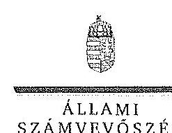

# Zambó Péter úr 

vezérigazgató
Pilisi Parkerdő Zrt.

## Visegrád

## Tisztelt Vezérigazgató Úr!

A ,,Jelentéstervezet az állami tulajdonban álló erdőgazdasági társaságok vagyongazdálkodási tevékenységének ellenőrzése - Pilisi Parkerdő Zrt." címmel készített számvevőszéki jelentéstervezetre tett észrevételeit köszönettel megkaptam.

Az Állami Számvevőszék észrevételekre vonatkozó álláspontjáról a felügyeleti vezető által készített részletes tájékoztatást csatoltan megküldöm.

Tájékoztatom Vezérigazgató urat, hogy a számvevőszéki jelentésben - az Állami Számvevőszékről szóló 2011. évi LXVI. törvény 29. § (3) bekezdése alapján - a figyelembe nem vett észrevételeket szerepeltetjük az elutasítás indokának feltüntetésével.

Budapest, 2015. 4. hó 12. nap
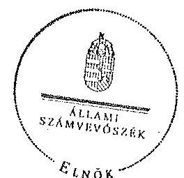

Tisztelettel:

Domokos László

Melléklet: Tájékoztatás az el nem fogadott észrevételekről

---

# Tájékoztatás   az el nem fogadott észrevételekről 

A „Jelentéstervezet az állami tulajdonban álló erdőgazdasági társaságok vagyongazdálkodási tevékenységének ellenörzése - Pilisi Parkerdő Zrt." című jelentéstervezetre 2015. október 14én érkezett észrevételeit áttekintettük, azok kezelésével kapcsolatban a következő tájékoztatást adom.

1. A jelentéstervezet 6. oldal 2. bekezdésére tett észrevétel

Az észrevételben leírtak a mérleggel kapcsolatos tényszerủ megállapítást nem cáfolják, illetve kiegészítő információt tartalmaz az erdőérték kiszámításának tudományos módszereinek létezésére vonatkozóan. A megállapítás módosítása nem indokolt.
2. A jelentéstervezet 6. oldal 4. bekezdésére, valamint a 8. oldal 4. bekezdésére tett észrevétel

A Vhr. 9. § alapján a vagyonkezelő köteles a vagyonkezelésbe vett eszközöket a Számv. tv. 23. § (2) bekezdése szerint a hosszú lejáratú kötelezettségekkel szemben a vagyonkezelési szerződésben rögzített értéken állományba venni. Az ideiglenes vagyonkezelési szerződésben a vagyonkezelésbe adott vagyon értékét nem rögzítették, továbbá a szerződés azt sem tartalmazta, hogy a vagyonkezelt eszközök értéke nulla. A Társaság a Számv. tv. és a Vhr. előírásainak betartása céljából nem tett lépéseket annak érdekében, hogy a vagyonkezelt eszközök értéke a VSZ-ben rögzítésre kerüljön. A fentiek alapján megállapításunk helytálló, módosítása nem indokolt.

## 3. A jelentéstervezet 6. oldal 5. bekezdésére tett észrevétel

Az észrevételben leírtak megerősítik azon megállapításunkat, hogy „a Társaság nem rendelkezett a kezelt vagyonról vezetett nyilvántartás kiinduló adatait tartalmazó VSZ eredeti, hiteles, a vagyonkezelt eszközök felsorolását tartalmazó 1-4. mellékleteivel." Ezért a jelentéstervezet módosítása nem indokolt.

## 4. A jelentéstervezet 7. oldal 2-3. bekezdéseire tett észrevétel

A VSZ 3.3.2. pontja alapján a szerződést kötő felek kötelezettsége a tárgyévet megelőző év november 30 -ig felülvizsgálni a szerződést. A VSZ szerint az egyik szerződő fél (vagyonkezelő) a Pilisi Parkerdő Zrt.. Az észrevételben részletes tájékoztatást adnak a „végleges" vagyonkezelési szerződés megkötése érdekében tett intézkedésekről, melyet köszönettel vettünk, azonban az nem befolyásolja az ellenőrzött időszakban a VSZ felülvizsgálatára vonatkozó megállapításunkat, ezért annak módosítása nem indokolt.

---

# 5. A jelentéstervezet 7. oldal 4. bekezdésére tett észrevétel 

Az észrevételben leírtakat nem fogadjuk el, mert „a tulajdonosi joggyakorló mindenkori álláspontja" nem lehet ellentétes a jogszabályi előirással, amely változás esetén a VSZ 60 napon belüli egységes szerkezetbe foglalást írta elő. A leírtak alapján a megállapítás módosítása nem indokolt.

## 6. A jelentéstervezet 7. oldal 8. bekezdés első mondatára tett észrevétel

Az észrevételben leírtak - amely a Társaság által a számlázással kapcsolatos intézkedésekre vonatkozott - nem befolyásolják azt a tényt, hogy a vagyonkezelési díjat a felek a VSZ 3.3.2. pontjában foglaltak ellenére nem vizsgálták felül. Ezért a vagyonkezelési díj felülvizsgálat elmaradására vonatkozó megállapítás módosítása nem indokolt.
7. A jelentéstervezet 8. oldal 2. bekezdés utolsó mondatára tett észrevétel

Az észrevételben leírtak nem cáfolják a bírságok kiszabására vonatkozó tényszerủ megállapítást, ezért annak módosítása nem indokolt.
8. A jelentéstervezet 11. oldal 3. számú intézkedést igénylő megállapításra tett észrevétel
Az Avtv. 20. § (8) bekezdésében, illetve az Infotv. 30. § (6) bekezdésében foglaltak alapján a közfeladatot ellátó szervnek a közérdekủ adatok megismerésére irányuló igények teljesítésének rendjét rögzítő szabályzatot kell készítenie. Az állami vagyonról szóló 2007. évi CVI. törvény 5. § (2) bekezdése szerint az állami vagyonnal gazdálkodó vagy azzal rendelkező szerv vagy személy a közérdekủ adatok nyilvánosságáról szóló törvény szerinti közfeladatot ellátó szervnek vagy személynek minősül. A Pilisi Parkerdő Zrt. állami vagyonnal gazdálkodik, ezért közfeladatot ellátó szervnek minősül, tehát el kell készítenie a közérdekủ adatok megismerésére irányuló igények teljesítésének rendjét rögzítő szabályzatot. Megállapításunk helytálló, módosítása nem indokolt.

Budapest, 2015. 11. hó 04. nap
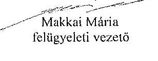

---

.

---

# 10. SZÁMÚ MELLÉKLET A V-0755-135/2015. SZÁMÚ JELENTÉSHEZ 

## 16.4

## 1

Állami Számvevőszék

## Domokos László

clnök

1052 Budapest
Apáczai Cs. J. u. 10.

Ikt. sz.: MNV/01/48881/ 4 /2015.
Hiv. sz.: V-0755-123/2015.

Tisztelt Elnök Úr!
A 2015. október 2. napján „Az állami tulajdonban álló erdőgazdasági társaságok vagyongazdálkodási tevékenységének ellenőrzése - Pilisi Parkerdő Zrt." tárgyában kézhez vett, V-0755-123/2015. ikt. sz. Jelenićstervezetre az alábbi észrevételeket kívánom tenni.
I. fejezet / 9. old. második-negyedik bekezdés, JI.5. fejezet / 22. old. első bekezdés és 10. old. Javaslat az MNV Zrt. vezérigazgatójának a)-c) pontok
„A vagyonkezelésbe adott állami vagyon tekintetében tulajdonssi jogokat gyakorló MNV Zrt. és NFA tevékenysége az ellenőrzött idöszakban nem támogatta teljes körüen a felelós vagyongazdálkodás megvalósulását, a VSZ-szel kapcsolatban feltárt hiányosságok megszüntetésére és a hatályos jogszabályoknak való megfeleltetésre vonatkozóan nem kezdeményezte intézkedéseket, nem éltek a Vhr.-ben és a 262/2010. (XI.17.) Korm. rend. 47. § (1)-(2) bekezdéseiben foglalt, a kezelt vagyon használatára vonatkozó ellenőrzési jogukkal, valamint nem ellenőrizték a vagyonnyilvántartás hitelességét, helyességét és teljességét.

A Pilisi Parkerdő Zrt. a KVI-vel 1996. október 9-én kötött vagyonkezelési szerződés alapján végezte a Magyar Állam tulajdonában álló erdővagyon és egyéb művelési ágú termálfőal ingatlanok kezelését. A Társaság, mint vagyonkezelő és a KVI között létrejött szerzödéses jogviszony kereteit a VSZ-ben foglalt jogok és kötelezettségek töltötték ki. A VSZ nem támogatta a Vhr. 3. § (1) bekezdésében foglalt, a vagyongazdálkodási feladatok átlátható módon történő végrehajtását, valamint nem támogatta a szabályszerű vagyongazdálkodást. A VSZ 3.3.2. pontjában foglaltuk ellenére a felek a szerzödést évente nem vizsgálják felül, az nem felelt meg a hatályos rendelkezéseknak, hatályon kívül helyezett jogszabályi hivatkozásokat tartalmazott az Ált 109/B. §, 109/G. §, a Vadvédelmi tv. 98. § elöírásai vonatkozásában. A VSZ 3.2.3. pontjában foglalt, a vagyonkezelői jog átruházására vonatkozó rendelkezés 2012. január 1-től nem felelt meg az Notv. 11. § (8) bekezdésében foglaltuknak, amely tilija a vagyonkezelői jog harmadik személyes történő átruházási. A VSZ nem rögzítette a Vhr. 9. § (8) bekezdésében 2011. január 1-jétől elöírt, az érintett vagyonelem esetleges védettségét, illetve Natura 2000 területnek minősitését. A felek nem tettek eleget a Vhr. 54. § (7) bekezdés elöírásának, mert a Vhr. hatálybalépést követő hat hónapon belül nem kezdeményezték a Nemzeti Földalapba tartozó ingatlanokra vonatkozóan a VSZ megszüntetését és a jogszabályoknak megfelelő szerződés megkötését.

A vagyonkezelésbe adott állami vagyon tekintetében tulajdonosi jogokat gyakorló MNV Zrt. és NFA nem végeztek a Vhr. 20. § (1)-(2) bekezdéseiben és a Nemzeti Földalapba tartozó földrészletek hasznosításának részletes szabályairól szóló 262/2010. (XI.17.) Korm. rendelet 47. § (1)-(2) bekezdéseiben foglalt, a vagyonnyilvántartás hitelességére, teljességére és helyességére vonatkozó ellenőrzést a Társaságnál.

---

# Jonsokaz MNV Zrt. vezérigazgatójának 

a) Tegyen intézkedéseket az erdőgazdasági társaság közremüködésével a tényleges állapotot rögzitő és a hatályos jogszabályi elöírásoknak megfelelő vagyonkezelési szerzödés megkötésére.
b) Tegyen intézkedéseket a vagyonkezelési szerzödés felülvizsgálatának elmaradásával, valamint a Nemzeti Földalapba tartozó ingatlanokra vonatkozó VSZ megszüntetésével összefüggésben feltárt szabálytalanságok tekintetében a felelősség tisztázása érdekében, és szükség szerint intézkedjen a felelősség érvényesitéséröl.
c) Intézkedjen a Pilisi Parkerdő Zrt. vagyonnyilvántartása hitelességének, teljességének és helyességének jogszabályban foglaltak szerinti ellenőrzéséről."

Sajnálattal állapítottuk meg, hogy a Jelentés-tervezet egyáltalán nem veszi figyelembe a vizsgált időszakban megindított, és több eljárási cselekményt is magába foglaló intézkedés-sorozotunkat, amelynek a célja a Jelentéstervezetben egyébiránt joggal kifogásolt hiányosságok megszüntetése, az erdőgazdasági társaságok müködésének jogszabályi megfelelőségének biztosítása volt. Ezzel a Jelentés-tervezet azt sugallja, hogy a tulajdonosi joggyakorlók részéről egyáltalán nem volt szándék az erdőgazdasági társaságok müködésének, illetve a vagyonkezelés körülményeinek hatályos jogszabályok szerinti szabályozására, amely egyébiránt nem felel meg a valóságnak és az adatszolgáltatásunk során sem erről tájékoztattuk Önöket.
Mindamellett elismerjük, hogy a probléma a kezelt vagyonelemek nagy száma, ebből kifolyólag a szabályozást igénylő körülmények nagy száma és sokrétűsége miatt nehezen átlátható, ezért kérjük, engedjék meg, hogy a munkájukat segítő szándékkal korábbi tájékoztatásunkat ismételten megerősítsük, azzal a kifejezett kéréssel, hogy a Jelentésükben az általunk vitatott megállapítást szíveskedjenek módosítani, és az MNV Zrt. által a megoldás irányába megtett intézkedéseket feltüntetni.
Az ideiglenes vagyonkezelési szerződéseken alapuló kezelői jogviszony újraszabályozása, az ideiglenes vagyonkezelési szerződések megszüntetése és végleges vagyonkezelési szerződések megkötése érdekében az intézkedéseink már 2011. évben megkezdődtek, párhuzamosan a Nemzeti Földalapról szóló 2010. évi LXXXVII. tv. 34. § (3) bekezdés c) pontja szerinti feladat- illetve vagyonátadással.

Az intézkedéseink alapja a 2011. évben, MNV/01/29518/2011. szám alatt szakterületünk által bekért, az erdőgazdasági társaságok 2010. december 31-i, illetve 2011. július 31-i fordulónapra vonatkozó leltárjelentése volt, amelyet elsődlegesen az NFA tv. szerint előírt vagyonátadás elvégzése céljából kértünk meg az erdőgazdasági társaságoktól. Ugyanakkor a leltárjelentéshez benyújtott földrészlet listák voltak az első olyan kimutatások, amelyek a kezelt vagyon elemeit a PÖMI adatbázisán alapuló (az aktuális ingatlan-nyilvántartási állapotnak megfelelően) alrészletes bontásban tartalmazták.

## A vizsgált időszakban megindított és lefolytatott intézkedéseink a következők:

1. Az erdőgazdasági társaságok által kezelt vagyonelemek tulajdonosi joggyakorlók szerinti elhatárolása, NFA átadás előkészítése, az erdőgazdasági társaságok bevonásával. A Nemzeti Földalapba tartozó vagyonelemek NFA átadása 2012-2013. években megtörtént, majd a visszamaradt vagyonelemek - többségében kivett megnevezésben nyilvántartott földrészletek - elhatárolását is elvégeztük. A feladat végrehajtása 2014. május 31-ig teljesült.
Az intézkedéssel az MNV Zrt. tulajdonosi joggyakorlása alá tartozó vagyonelemek körét - a közös tulajdonosi joggyakorlás alatt álló ingatlanok kivételével-, azaz a végleges vagyonkezelési szerződések ingatlanlistáit meghatároztok.
Meg kívánjuk jegyezni, hogy az erdőgazdasági társaságok a 2011. évi leltárjelentéseikhez minden esetben csatolták a jelentés tartalmára vonatkozó teljességi nyilatkozatukat is, így azok tartalmát mint teljes körű adatszolgáltatást kezeltük.
A hivatkozott iratokat az eljárás során a Tisztelt Állami Számvevőszék rendelkezésére bocsátottuk.
2. Az erdőgazdasági társaságok által kezelt vagyon értékelését 2014. május 31-ig elvégeztük, részben külső piaci szereplő által megállapított vagyonértékelési adatok (az IFUA értékbecslési adatai), részben belső szakértők és a kontrolling szakterület által az MNV Zrt. hatályos értékelési szabályzata által megállapított értékadatok figyelembe vételével.

---

3. Az MNV Zrt. Igazgatósága 511/2012. (X. 08.) IG sz., valamint 717/2013. (IX. 23.) IG sz. határozataiban Intézkedési terveket fogadott el „a 28/2012. (IX. 24.) sz. IGGY határozatában elöírt, valamint az MNV Zrt. rábízott vagyon 2012. évi beszámolója könyvvizsgálói minősitésének megtartásához szükséges és egyéb feladatokról". Az Intézkedési tervek magukban foglalták az erdőgazdasági társaságok által kezelt vagyon analitikájának előállitását, illetve az erdőtársaságokkal végleges (nem ideiglenes) vagyonkezelői szerződések megkötését. A 717/2013. (IX. 23.) IG sz. határozat melléklete tartalmazza a feladat végrehajtása érdekében már megtett intézkedéseket (pl. „Megtörtént az erdőgazdaságok által kezelt vagyon listáinak vagyonkezelői jelentésekkel való egyeztetése; a vagyonkezelési szerződés tartalmi kérdéseinek, az erdőgazdaságok véleményének feldolgozása, MFB Munkacsoport egyeztetések történtek stb.), valamint rögzíti a még elvégzendő feladatokat. Ennek megfelelően az MNV Zrt-nél 2012-tól folyamatban van az erdőgazdasági társaságok vagyonanalitikájának előállítása és vagyonkezelési szerződései tárgyú projekt.
A hatályos jogszabályoknak megfelelő vagyonkezelési szerződés tervezetét a vizsgálati időszak során az MNV Zrt. belső szakterületi egyeztetést követően előkészítettük, és a 2014. március 18-án megtartott Munkacsoport értekezleten az erdőgazdaság képviselőivel, továbbá a tulajdonosi joggyakorlók (NFA, illetve akkor még Magyar Fejlesztési Bank Zrt.) képviselőivel ismertetlük annak tartalmát. A szerződés szövegtervezetének véleményezése ekkor megkezdődött, ugyanakkor elismerjük, hogy a végleges szerződésváltozat már az Önök által vizsgált időszakot követően került elfogadásra. Ugyancsak a 2014. március 18-án megtartott Munkacsoport értekezleten tettünk javaslatot a vagyonkezelési díj alapjának és mértékének meghatározására.
4. Az erdőgazdasági társaságok által kezelt és a saját vagyonuk vagyonelemenkénti, valamint a kezelt vagyonelemek tulajdonosi joggyakorlók szerinti elhatárolására vonatkozó intézkedésünket a vizsgált időszakban előkészítettük.

Tájékoztatjuk továbbá Elnök Urat az alábbiakról:
A Nemzeti Fejlesztési Minisztérium KGTF/377-6/2014-NFM, valamint KGTF/377-7/2014. számok alatt adott utasításokat a fenti feladatok elvégzésére. Ezekről, illetve az utasításokra adott jelentésünkről a korábbi adatszolgáltatásunk keretében szintén kitértünk.

A vagyonkezelési szerződés vizsgált időszakot követően elfogadott tervezetének mellékletét képezik az MNV Zrt. azon szabályzatai is, amelyek a kezelt vagyon nyilvántartását, a beruházások nyilvántartását és az azzal kapcsolatos elszámolásokat, illetve a tulajdonosi ellenőrzéssel kapcsolatos, a jelenlegi jogszabályi környezetnek megfelelő szabályokat tartalmazzák:

- Az állami tulajdonon, egyéb vagyonkezelők által vagyonkezelt eszközön megvalósítandó beruházások, felújítások előzetes engedélyezésének és elszámolásának eljárásrendjéről szóló 35/2014. számú vezérigazgatói utasítás,
- A Magyar Nemzeti Vagyonkezelő Zrt. Tulajdonosi Ellenőrzési Szabályzata - a 39/2014. számú vezérigazgatói utasítás, továbbá
- A Magyar Nemzeti Vagyonkezelő Zrt. állami vagyon vagyonkezelőire, az állami vagyont használókn és a társasági részesedések esetében az MNV Zrt. tulajdonosi joggyakorlását megbízottként ellátókra vonatkozó Vagyon-nyilvántartási Szabályzatáról szóló 12/2014. számú vezérigazgatói utasítás.

Fentiek mellett megemlíthető az MNV Zrt. folyamatba épített, illetve vagyon nyilvántartás vezetést támogató ellenőrzési módszertanról szóló 11/2014. számú vezérigazgatói utasítás.
Egycztetéseink során az erdőgazdasági társaságok tájékoztatást kaptak a szabályzataink tartalmára vonatkozóan.
A Jelentés-tervezet 10. oldalán található, az MNV Zrt. vezérigazgatójára vonatkozó, a) pont alatti, vagyonkezelési szerződés megkötésére irányuló javaslathoz kapcsolódóan felhívjuk a Tisztelt Állami Számvevőszék figyelmét arra, hogy a Nemzeti Fejlesztési Minisztérium ÁVF/21310/2015-NFM számú tájékoztató levele szerint Minisztor Úr vagyongazdálkodási szempontból nem támogatja az erdőgazdasági társaságok ideiglenes vagyonkezelési szerződéscit kiváltó vagyonkezelési szerződések megkötését, ideértve az MNV Zrt. vagyonkezelési szerződésekkel kapcsolatos jóváhagyó döntéseit is.

---

Az MNV Zrt-re vonatkozóan hivatkozott jogszabály, a Vhr. 20. § (1)-(2) bekezdése 2014. március 14-ig - csaknem az ellenőrzöti időszak végéig - a következőképpen rendelkezett:
„(1) Az állami vagyon kezelöjét, használóját megillető jogok gyakorlását, annak szabályszerűségét, célszerüségét a Vtv. 17. §-ának d) pontja alapján az MNV Zrt. - szükség szerint a területi szervei útján ellenőrzi. Ennek érdekében a vagyon kezelésére, hasznosítására kötött szerzödésben rögzíteni kell, hogy a tulajdonosi ellenőrzés eljárásrendjét, a felek jogait, kötelezettségeit a felek a szerzödés részének tekintik.
(2) A tulajdonosi ellenőrzés célja az állami vagyonnal való gazdálkodás vizsgálata, ennek keretében a rendeltetésellenes, jogszerütlen, szerzödésellenes, vagy a tulajdonos érdekeit sértő, illetve a központi költségvetést hátrányosan érintő vagyongazdálkodási intézkedések feltárása és a jogszerü állapot helyreállitása, továbbá a vagyonnyilvántartás hitelességének, teljességének és helyességének biztosítása."

A tulajdonosi ellenőrzés alatt a Területi Irodák által folytatott ellenőrzést is értette a jogszabály, amiből egyenesen következik a szakterületi munkafolyamatha épített ellenőrzési kötelezettség figyelembe vételének a lehetősége.

Fentiekre tekintettel kérjük a Jelentés-tervezet 9., illetve 22. oldalán található azon megállapítások törlését, hogy az MNV Zrt. nem kezdeményezett intézkedéseket, és nem végzett a Vhr. 20. § (1)-(2) bekezdéseiben és a Nemzeti Földalapba tartozó földrészletek hasznosításának részletes szabályairól szóló 262/2010. (XI.17.) Korm. rendelet 47. § (1)-(2) bekezdéseiben foglalt, a vagyonnyilvántartás hitelességére és teljességére vonatkozó ellenőrzést a Társaságnál, kérjük a megtett intézkedések feltüntetését, a Jelentés-tervezet 10. oldalán található, az MNV Zrt. vezérigazgatójára vonatkozó b) pontot a megtett intézkedések folyamatosságára tekintettel törölni, és a c) pont alatti javaslatot szövegszerüen ekként módosítani:

# Javaslat az MNV Zrt. vezérigazgatójának 

c) Az MNV Zrt. tulajdonosi joggyakorlása alá tartozó (az Erdőgazdasági Társaságok által az MNV Zrt. részére jelentett) vagyonelernek tekintetében intézkedjen a Társaság vagyonnyilvántartása hitelességének, teljességének és helyességének jogszabályban foglaltak szerinti ellenőrzéseinek erősitéséről.

Kérem Elnök Urat, hogy a Jelentés véglegesítése során jelen észrevételeinket szíveskedjenek figyelembe venni.

Budapest, 2015. október 15 .
Üdvözlettel:
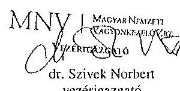

---

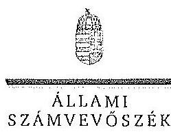

ELRÖK

Ikt.szám: V-0755-131/2015.

Dr. Szivek Norbert úr
vezérigazgató
Magyar Nemzeti Vagyonkezelő Zrt.

Budapest

Tisztelt Vezérigazgató Úr!

A „Jelentéstervezet az állami tulajdonban álló erdőgazdasági társaságok vagyongazdálkodási tevékenységének ellenőrzése - Pillai Parkerdő Zrt.” címmel készített számvevőszéki jelentéstervezetre tett észrevételeit köszönettel megkaptam.

Az Állami Számvevőszék észrevételekre vonatkozó álláspontjáról a felügyeleti vezető által készített részletes tájékoztatást csatoltan megküldöm.

Tájékoztatom Vezérigazgató urat, hogy a számvevőszéki jelentésben - az Állami Számvevőszékről szóló 2011. évi LXVI. törvény 29. § (3) bekezdése alapján - a figyelembe nem vett észrevételeket szerepeltetjük az elutasítás indokának feltüntetésével.

Budapest, 2015. 11. hó 25. nap

Tisztelettel:

Domokos László

Melléklet: Tájékoztatás az elfogadott és az el nem fogadott észrevételekről

1052 BODAPEST, APÁGZIN CSERE JÁROS UTCA 10. 1364 Budapest 4. Pl. 54 telefon: 434 9101 fax: 434 9291

---

# Tájékoztatás   az elfogadott és az el nem fogadott észrevételekről 

A „Jelentéstervezet az állami tulajdonban álló erdőgazdasági társaságok vagyongazdálkodási tevékenységének ellenörzése - Pilisi Parkerdő Zrt." címü jelentéstervezetre 2015. október 16án érkezett észrevétcleit áttekintettük, azok kezelésével kapcsolatban a következő tájékoztatást adom.

1. A vagyonkezelési szerződéshez kapcsolódó megállapításokra tett észrevétel (I. fejezet / 9. oldal 2-3. bekezdés, II. 5. fejezet / 22. oldal 1. bekezdés, 10. oldal javaslat az MNV Zrt. vezérigazgatójának a)-b) pontok)

A jelentéstervezet vagyonkezelési szerződéshez kapcsolódó megállapításai helytállóak. Az erdőgazdasági társaság müködése jogszabályi megfelelősége biztosításának érdekében tett kezdeményezésekről adott tájékoztatásukat köszönettel vettük, azonban azok nem eredményezték az ideiglenes vagyonkezelési szerződés olyan módosítását, vagy olyan új vagyonkezelési szerződés megkötését, amely biztosította volna a VSZ hiányosságainak megszüntetését, illetve a hatályos jogszabályoknak való megfelelőségét. Ezért az MNV Zrt. vezérigazgatójának és az NFA elnökének megfogalmazott intézkedést igénylő megállapítás, valamint az MNV Zrt. vezérigazgatójának megfogalmazott javaslat a) és b) pontjának módosítása nem indokolt. Az egyértelműség érdekében a 9. oldal 2. bekezdés 1. mondatát és a 22. oldal 1. bekezdés 1. mondatát az alábbiak szerint pontosítjuk:
„... a VSZ-szel kapcsolatban feltárt hiányosságokat nem szüntette meg, a hatályos jogszabályoknak a szerzödést nem feleltette meg, ..."
2. Az MNV Zrt. ellenőrzési kötelezettségének elmulasztására vonatkozó megállapításokra tett észrevétel (I. fejezet 9. oldal 4. bekezdés, II. 5. fejezet / 22. oldal 1. bekezdés és 10. oldal javaslat az MNV Zrt. vezérigazgatójának c) pont)

Az MNV Zrt. nem bocsátott az ÁSZ ellenőrzés rendelkezésére az MNV Zrt., vagy Területi Irodái által a Vhr. 20. § (1)-(2) bekezdései szerint végzett ellenőrzésekről dokumentumokat. A jelentéstervezet megállapításai és a javaslat helytállóak, módosításuk nem indokolt.

Budapest, 2015. 11. hó 12. nap

Makkai Mária
felügyeleti vezető

---

# MFB 

## Domokos László úr

elnök részére
Állami Számvevőszék

Budapest

Tisztelt Elnök Úr!
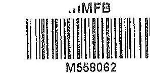

ÁLLAMLSZÁMVEYŐSZÉK
$13254 / 2015$
Érke:cti: 2015 OKT 20.
Iktutrizám: 16-0755-122/2015
Melléklet:
Ha83ai N.
D. 2

2015. október 5-én köszönettel kézhez vettük az Állami Számvevőszék „Az állami tulajdonban álló erdőgazdasági társaságok vagyongazdálkodási tevékenységének ellenőrzéséről" szóló jelentéstervezeteket az alábbi cégekre:

- Mecsekerdő Zrt.
- Pilisi Parkerdő Zrt.
(1kt.szám: V-0751-119/2015.)
(1kt.szám: V-0755-122/2015.)

Az MFB Zrt. a jelentéstervezetek mindegyikéhez egy központi problémát kiván észrevételként tenni.

Az ÁSZ az egyedi jelentéseiben az erdőgazdasági társaságokat, valamint a vagyonkezelésbe adott állami vagyon tekintetében tulajdonosi joggyakorló MNV Zrt. és Nemzeti Földalapkezelő (továbbiakban: NFA) tevékenyégét marasztalta el.

Alapvető problémaként jelenik meg, hogy az erdők által kezelt eszközök - az NFA-val, a Kincstári Vagyon Igazgatósággal, és az MNV Zrt-vel kötött vagyonkezelési megállapodásban rögzített - értéken nem szerepelnek a Társaságok könyveiben.

Az MFB Zrt. tudatában volt a problémának (azt az ÁSZ jelentésben is említett, 2010. évben végzett átvilágitási jelentés is tartalmazta, melynek nyomon követése, beszámoltatása megtörtént) és folyamatosan egyeztetett az MNV Zrt-vel és az NFA-val a rendezés ügyében. Az ideiglenes vagyonkezelési szerződés módosítására, véglegesítésére a vagyonkezelésbe adónak (MNV, NFA) van lehetősége, a Társaságok szerződő partnerként észrevételeket, javaslatokat tehetnek. A szerződés véglegesítése érdekében a Társaságok és az MFB Zrt. képviselői minden olyan egyeztetésen (pl.: az MNV Zrt. által létrehozott bizottság) részt vettek, amelyre meghívást kaptak, illetve azokon érdemi javaslatokat tettek.

Ahogy a jelentés is megjegyzi, az egyeztetések az ellenőrzés befejezésig nem kerültek lezárásra, így a Társaságoknál nem áll rendelkezésre a vagyonkezelésben lévő állami vagyonra és annak nagyságára vonatkozó, az MNV Zrt. és az NFA nyilvántartásával egyező adat.

---

Az ÁSZ 2013. évi ${ }_{n} A z$ állami vagyon feletti kontroll - Az állami vagyon feletti tutajdonosi joggyakorlással kapcsolatos tevékenységek ellenörzéséröl" szóló jelentése alapján a Nemzeti Fejlesztési Minisztérium - az ÁSZ-szal egyeztetett - alábbi fülb pontokat tartalmazó intézkedési tervet (1. sz. melléklet) állított össze, melyet a 2014. április 25 -én kelt levelében küldött meg az MFB Zrt. részére:

- a Társaságok által kezelt állami ingatlanok és egyéb vagyonclemek értéken történő nyilvántartása,
- a vagyonkezelési díjak egyértelmủ és tulajdonosi joggyakorló szervezetenkénti meghatározása,
- az új vagyonkezelési szerződés megkötése,
- a Társaságok kezelt és saját vagyonának vagyonclemenkénti, valamint a kezelt vagyonclemek tulajdonosi joggyakorló szerinti elhatárolása.

Az MFB törvény módosításának 2014. július 16-i hatályba lépésével az MFB Zrt. állami erdőgazdaságok feletti tulajdonosi joggyakorlása megszűnt, az a Földművelésügyi Minisztériumhoz került át, így az intézkedési tervben való közreműködésre, illetve a végrehajtás nyomon követésére az MFB Zrt-nck nem volt lehetősége.

A jelentések az MNV Zrt. vezérigazgatójának, az NFA elnökének és az erdészeti társaságok vezérigazgatóinak fogalmaztak meg intézkedési javaslatokat.

Budapest, 2015. október 16.
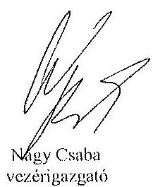

Tisztelettel:
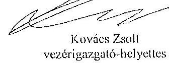

Melléklet: NFM levél (Ikt.szám: KGTF/377-7/2014-NFM)

---

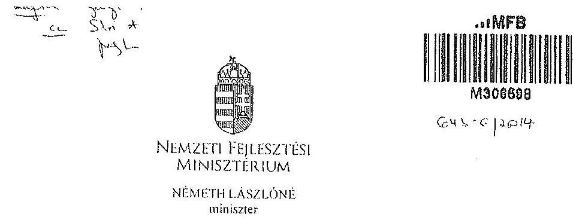

Iktatószám: KGTF/ 273 /2014-NFM
Ugyintéző: dr. Kaszás Mónika
Telefonszám: 795-1917
e-mail:monika.kaszas@nfm.gov.hu
Nagy Csaba úr részére
vezérigazgató
Magyar Fejlesztési Bank Zrt.
Budapest
Tárgy: „Az állami vagyon feletti kontroll - Az állami vagyon feletti tulajdonosi joggyakorlással kapcsolatos tevékenységek ellenőrzéséről" szóló 13193 sz. ÁSZ jelentés alapján összcállitott NFM intézkedési terv módositása, az abban foglalt feladatok végrehajtása

# Tisztelt Vezérigazgató Úr! 

Az Állami Számvevőszék (a továbbiakban: ÁSZ) tárgyban megjelölt jelentésével összefüggésben 2014. január 27-én intézkedési tervet hagytam jóvá, amelyben foglalt feladatok végrehajtása érdekében 2014. január 30-i keltezésű levélben fordultam Önhöz és a Magyar Nemzeti Vagyonkezelő Zrt. vezérigazgatójához, Márton Péter úrhoz.

Az ÁSZ az intézkedési teryvel kapcsolatban küldött, 2014. március 25-i keltü levelében az intézkedési terv kiegészitését, módosítását kérte. A módositott intézkedési tervet jóváhagytam.

A módositott intézkedési terv alapján a következő feladatok végrehajtása szükséges az alábbiak szerint:
1./ a társaságok által kezelt állami ingatlanok és egyéb vagyonelemek értéken történő nyilvántartása:

Felelős: MNV Zrt.,
Határidő:

- földterületek esetében legkésőbb 2014. május 31-ig
- felépítmények esetében 2014. december 31. (A felépítmények esetében az MNV Zrt. a vagyonkezelési szerződés megkötését az év második felére tervezi, látja megvalósíthatónak.)
2./ a vagyonkezelési díjak egyértelmü és tulajdonosi joggyakorló szervezetenkénti meghatározása:

---

# 12. SZÁMÚ MELLÉKLET A V-0755-135/2015. SZÁMÚ JELENTÉSHEZ 

Felelős: MNV Zrt.,
Határidő: 2014. május 31-ét követően folyamatosan (2014. december 31-ig)
E pontban foglalt feladattal kapcsolatosan az ÁSZ részére az alábbi tájékoztatást adtam:
„Az ÁSZ által meghatározott feladatok végrehajtására irányuló munkafolyamat során a végrehajtásban érintett szervezetek, társaságok között kialakult az az álláspont, hogy mivel az erdőgazdasági társaságoık alapfeladatként közfeladat ellátást is végeznek, azt a vagyonkezelési díj mértékének meghatározásakor az MNV Zrt. figyelembe veszi, valamint megállapításra került az az elv is, hogy a vagyonkezelési díj irányadó mértéke az adott erdőgazdasági társaság által kezelt ingatlanvagyon bruttó nyilvántartási értékének 2\%-a.

A vagyonkezelési díj alapja a kezelt vagyon bruttó nyilvántartási értéke, ezért annak meghatározására erdőgazdaság társaságonként kerül sor a 4./ pontban meghatározott ún. „végleges ingatlanlista" alapján. A végleges ingatlanlista kizárólag vagyonkezelésbe adott ingatlan vagyonelemet tartalmaz, az erdőgazdasági társaság saját vagyonában nyilvántartott vagyonelemet nem, ezért az MNV Zrt.-nek és az erdőgazdasági társaságoknak a szerződés megkötését megelőzően el kell határolnia egymástól a saját vagyonba és a kezelt vagyonba tartozó ingatlan vagyonelemeket (4.b./ pontban foglalt feladat).

A feleknek a vagyonkezelési díj mértékében a vagyonkezelési szerződés megkötését megelőzően kell megállapodniuk az irányadó vagyonkezelési díj mértéket alapul véve."

## 3./ az új vagyonkezelési szerződések megkötése:

A vagyonkezelési szerződés tervezet az MNV Zrt. érintett szakterületei álláspontjának figyelembe vételével elkészült, az MNV Zrt. és a MFB Zrt. által létrehozott Munkacsoport (tagjai: MFB Zrt., MNV Zrt., NFA és egyes erdőgazdasági társaságok) véleménye alapján átdolgozásra került. A szerződés tervezetnek az erdőgazdasági társaságok részére történő megküldése 2014. április 15. napjával megtörtént.

Felelős: MNV Zrt., az MFB Zrt. közreműködésével
Határidő:

- földterületek esetében: 2014. május 31-ét követően folyamatosan (2014. december 31-ig)
- felépítmények esetében 2014. II. félév folyamán

4./ a társaságok kezelt és saját vagyonának vagyonelemenkénti, valamint a kezelt vagyonelemek tulajdonosi joggyakorló szerinti elhatárolása:

Az erdőgazdasági társaságok által az MNV Zrt. rendelkezésére bocsátott leltárjelentések alapján

- a jogszabályi rendelkezések szerint az NFA tulajdonosi joggyakorlása alá tartozó ingatlan vagyonelemek nagyobb része már átadásra került az NFA részére,
- a kisebb részt képező vagyonelemek tekintetében pedig folyamatban van az átadás az MNV Zrt. és az NFA között.

---

a./ Az ún. „végleges ingatlanlista" (az MNV Zrt. tulajdonosi joggyakorlása alatt lévô, maradó vagyonelem listája) MNV Zrt. és az NFA közötti leegyeztetése, közös áttekintése

Felelős: MNV Zrt.
Határidő: a lista MNV Zrt. és NFA közötti leegyeztetése, közös áttekintése folyamatban van, lezárása legkésőbb 2014. május 31-ig megtörténik
b./ Az a./ pontban foglaltak szerint leegyeztetett ún. „végleges ingatlanlista" MNV Zrt. és az egyes erdőgazdasági társaságok általi áttekintése azzal a céllal, hogy a vagyonkezelésben lévő vagyoni elemeket tartalmazó ún. „végleges ingatlanlista" ne tartalmazzon az erdőgazdasági társaság saját vagyonában nyilvántartott vagyoni elemet (saját vagyon - vagyonkezelt vagyon elhatárolása).

Felelős: MNV Zrt., az MFB Zrt. közremüködésével
Határidő: 2014. május 31-ig
E pontban foglalt feladatokkal kapcsolatosan az ÁSZ részére az alábbi tájékoztatást adtam:
„Szükséges megjegyezni, hogy ingatlanlista, mint állandó „végleges ingatlanlista" ilyen formában nem létezik, mert mindkét tulajdonosi joggyakorló tekintetében az állami vagyonelemek halmaza mind mennyiségben, mind pedig összetételben folyamatosan változik.

Az erdőgazdasági társaságok által kezelt ingatlanvagyon adatai - mindkét tulajdonosi joggyakorló tekintetében - az évközi változások (megosztások, területváltozások, művelési ág változások, stb.) miatt folyamatosan változnak, ezért az adattartalmában „,végleges ingatlanlista" mindig egy adott konkrét időpont vonatkozásában adható meg.

Jelen intézkedési tervben az ún. „,égleges ingatlanlista" meghatározás alatt az erdőgazdasági társaságok vagyonkezelésében lévő ingatlanvagyon MNV Zrt tulajdonosi joggyakorlása alatt álló részét kell tekinteni. E „,végleges ingatlanlista" kialakítására az erdőgazdasági társaságok által az MNV Zrt. részére átadott leltárjelentések alapján került sor úgy, hogy az MNV Zrt. a Nemzeti Földalapba tartozó vagyonelemeket kiválogatta, s azokat a Nemzeti Földalapkezelő Szervezet részére - átadás-átvételi jegyzőkönyv alapján - átadta.

Lényeges körülmény, hogy a vagyonkezelőknek - jelen esetben az erdőgazdasági társaságoknak - minden év május 31. napjáig vagyonkezelői jelentést kell benyújtanjuk a tulajdonosi joggyakorlók, így az MNV Zrt. részére is. Az aktuális vagyonkezelői jelentéseket - melynek része a leltárjelentés is - a 2013. december 31-i állapotnak megfelelően kell összeállítani, ebből következöen a fent említett ún. „végleges ingatlanlista" is a 2013. december 31-i állapotot tükrözi.

Ugyanakkor - föként a kivett megnevezésben nyilvántartott földterületek esetében - a még át nem adott Nemzeti Földalapba tartozó vagyonelemek egyeztetése a két tulajdonosi joggyakorló között jelenleg is folyamatban van.

---

Az egyes erdőgazdasági társaságok vagyonkezelésében lévő vagyonelemek az adott társasággal megkötendő - a jelenlegi ideiglenes vagyonkezelési szerződés helyébe lépő - vagyonkezelési szerződés mellékletét fogják képezni. Az MNV Zrt. szándékai szerint az egyes erdőgazdasági társaságokkal azonnal megkötik a vagyonkezelési szerzödéseket, ahogyan a megkötés feltételei bekövetkeznek (pl. megállapodnak a vagyonkezelési díjban, véglegesítik a vagyonkezelési szerződés tartalmát), azok a vagyonelemek, amelyeket e pont a./ és b./ pontjában foglaltak szerint már átvizsgáltak, a vagyonkezelési szerződés megkötésével egyidejűleg a szerződés mellékletébe kerülnek, amely melléklet folyamatosan bővítésre kerül újabb, e pont a./ és b./ pontjában foglaltak szerint átvizsgált, tisztázott vagyonelemekkel. „

Tájékoztatom, hogy az NFA feletti tulajdonosi jogok gyakorlója, Dr. Fazekas Sándor miniszter úr időközben már jóváhagyta azt az intézkedési tervet, amely az NFA részére meghatározott feladatokat és azok végrehajtási határidejét tartalmazza.

Az MFB Zrt. közremüködése az 1./ és 2./ pontban meghatározott feladatok végrehajtásban is szükséges lehet, ezért kérem a fent meghatározott feladatok határidőben történő végrehajtása érdekében az MFB Zrt. változatlan együttmüködését az érintett a szervezetekkel és amennyiben szükséges, úgy az erdőgazdasági társaságok bevonása iránt is intézkedni szíveskedjen.

Budapest, 2014. „djmiin. 24 „

# Üdvözlettel: 

Németh Lászlóné

---

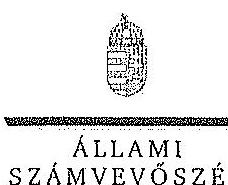

ELNÖK

Ikt.szám: V-0751-127/2015.

Nagy Csaba úr
vezérigazgató
Magyar Fejlesztési Bank Zrt.

Budapest

Tisztelt Vezérigazgató Úr!

Az „Az állami tulajdonban álló erdőgazdasági társaságok vagyongazdálkodási tevékenységének ellenőrzése" című ellenőrzés tekintetében a Mecsekerdő Zrt., illetve a Pilisi Porkerdő Zrt. társaságok jelentéstervezetére tett észrevételüket köszönettel megkaptam.

Az Állami Számvevőszék észrevételekre vonatkozó álláspontjáról a felügyeleti vezető által készített részletes tájékoztatást csatoltan megküldöm.

Tájékoztatom Vezérigazgató urat, hogy a számvevőszéki jelentésben – az Állami Számvevőszékről szóló 2011. évi LXVI. törvény 29. § (3) bekezdése alapján – a figyelembe nem vett észrevételeket szerepelhetjük az elutasítás indokának feltüntetésével.

Budapest, 2015. 11. hó 05 nap

Tisztelettel:

Dámokos László

Melléklet: Tájékoztatás az észrevételek kezeléséről

LUSZ SURHYEST, AFRICZIN CSERÉ JÁNOS UTGA 10. 1364 Budapest 4. Pl. 54 telefon: 484 9181 fax: 484 9201

---

# Tájékoztatás   az észrevételek kezeléséről 

„Az állami tulajdonban álló erdőgazdasági társaságok vagyongazdálkodási tevékenységének ellenörzése" címủ ellenőrzés tekintetében a Mecsekerdő Zrt., illetve a Pilisi Parkerdő Zrt. társaságok jelentéstervezetére 2015. október 20-án érkezett észrevételeket áttekintettük, azok kezelésével kapcsolatban a következő tájékoztatást adom.

A jelentésekben megfogalmazott központi problémával kapcsolatban adott tájékoztatásukat köszönettel vettük, azonban azok alapján a jelentéstervezet módosítása nem indokolt.

Budapest, 2015. év 11. hó 03 nap

Makkai Mária
felügyeleti vezető

---

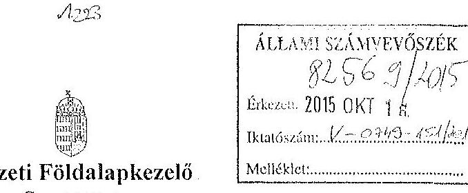

Iktatószám: NFA-002589/017/2015
Hiv. szám: ÁSZ-V-0599/2014-2015
Érintett ÁSZ iktatószámok: V-0749-148/2015, V-0750-174/2015, V-0751-121/2015,
V-0752-091/2015, V-0753-098/2015, V-754-088/2015, V-0755-124/2015, V-0757-062/2015,
V-0758-058/2015, V-0760-077/2015, V-0764-056/2015, V-0765-046/2015,
V-0766-140/2015, V-0767-056/2015.

Domokos László
Elnök

Állami Számvevőszék

1052 Budapest

Apáczai Cscre János utca 10

Tárgy: Észrevétel megküldése „Az állami tulajdonban álló erdőgazdasági társaságok vagyongazdálkodási tevékenységének ellenőrzéséről" készített jelentés tervezeteire.

Tisztelt Elnök Úr!

Az Állami Számvevőszék 2014 novemberében megkezdte „Az állami tulajdonban álló erdőgazdasági társaságok vagyongazdálkodási tevékenységének ellenőrzését" amelyről 2015 októberétől érintettség okán az NFA részére az elkészített munkaanyag tervezeteit vizsgált erdőgazdaságonként, megküldte Szervezetünk részére véleményezésre.

A munkaanyag valamennyi tervezte egységesen, az NFA Elnöke részére feladatszabást tartalmaz, melyhez az alábbi észrevételeket tesszük:

A jelentéstervezetekben tett megállapítások helytállóságát nem vitatjuk, azonban szükségesnek látjuk az NFA elnökének tett javaslatokkal a), b) és c) kapcsolatban a következő tájékoztatást megadni.

---

# a) „Tegyen intézkedéseket az erdőgazdasági társaságok közremüködésével a tényleges állapotot rögzitő és a hatályos jogszabályi előírásoknak megfelelő vagyonkezelési szerzödés megkötésére."

Tájékoztatjuk, hogy a hatályos jogszabályi előírásoknak megfelelő vagyonkezelési szerződések megkötése érdekében több intézkedés történt, jelenleg is folyamatban van a szerződések előkészítése és a vagyonkezelésben maradó, illetve kikerülő földrészletek adatainak egyeztetése.

Előzményként fontos kiemelni, hogy a Nemzeti Földalapkezelő Szervezet 2010. szeptember 1. napjával történt létrehozását követően (2012. évben) került sor a vagyonkezelésben lévő földrészletek MNV Zrt. részéről történő átadására. Az átadási dokumentumok alapján Szervezetünk gondoskodott a közhitetes nyilvántartásokban a megváltozott tulajdonosi joggyakorlás feltüntetéséről. Az erdőgazdaságok esetében ez 2012. év végéig, illetve 2013. év elején megtörtént ennek az ingatlan-nyilvántartásban történő átvezetése is.

Megjegyezzük, hogy az MNV Zrt. részéről történő átadás kizárólag a - több évtizede kötött, és azóta többször módosított - vagyonkezelési szerződések és a földrészletek Excel táblázatban történő átadását jelentette, tehát nem egy naprakész vagyonnyilvántartást tartalmazott. Ennek következtében szükségszerűvé vált a Nemzeti Földalapkezelő Szervezetnek egy saját nyilvántartás felépítése, illetve a szerződések tartalmának feldolgozása.

A számverőszéki ellenőrzéssel érintett időszakban, illetve még jelenleg is lezáratlan az MNV Zrt. és NFA közötti átadás-átvételi folyamat. Az MNV Zrt. további földrészletek átadását készíti elő, ugyanis az MNV Zrt. vagyoni körébe tartozó földrészletekre szintén tervezi a vagyonkezelői szerződés megkötését, és ennek a folyamatnak a részeként a még át nem adott földrészletek átadása is most történik. Természetesen az NFA is folyamatosan biztosítja a különböző hasznosítási, illetve hatósági eljárások során az erdőgazdaságok vagyonkezelésében lévő földrészletek tulajdonosi joggyakorlójának rendezését az MNV Zrt megkeresésével, közös minősítési eljárás lefolytatásával. A Nemzeti Földalapkezelő Szervezet által meghízott ügyvédi iroda, jelentést készített a szerződés és a tárgyát képező földrészletek jogi helyzetének tisztázására.

Időközben az erdőgazdaságok, mint társaságok feletti tulajdonosi joggyakorló személyében is változás történt. Így új alapokon indulhatott meg a vagyonkezelői szerződés előkészítése. Ennek a folyamatnak részeként, az NFA megbízott egy Ügyvédi Konzorciumot, továbbá Szervezetünknél külön Erdészeti munkacsoport alakult 2015 májusában és azt követően a következő intézkedések történtek:

Az Erdőgazdaságok részére vagyonkezelésbe adásra tervezett ingatlanok felülvizsgálata folyamatban van az Ügyvédi Konzorcium által. A felülvizsgálat tárgyát képező ingatlanok köre három részből tevődik össze:

- az erdőgazdaságok ideiglenes vagyonkezelési szerződésének tárgyát képező ingatlanok,

---

- azon ingatlanok, amelyeket az erdőgazdaságok az ideiglenes vagyonkezelési szerződéstikben szereplő ingatlanokon felül kértek vagyonkezelésbe,
- valamint azok az ingatlanok, amelyeket az NFA kíván az erdőgazdaságok vagyonkezelésébe adni.

A rendelkezésre álló dokumentumokban szereplő ingatlanokból erdőgazdaságonként egy egységes, az összes vagyonkezelésbe adandó ingatlant tartalmazó táblázat készült, amely tartalmazza az ingatlanok vagyonkezelésbe adás szempontjából releváns adatait, bejegyzett jogokat, feljegyzett tényeket. A táblázat adatai összevetésre kerültek a közhiteles ingatlannyilvántartásban szereplő adatokkal, feltárva ezáltal, hogy mely ingatlanok adhatóak vagyonkezelésbe és melyek azok, amelyeknél valamilyen előzetes intézkedés megtétele szükséges.

Az Nfatv. 8. §-a alapján a Birtokpolitikai Tanács dönt erdőgazdaságonként az erdőgazdaságok vagyonkezelési szerződésének megkötéséről.

Zárójelben jegyezzük meg, hogy például a TAEG Zrt. esetében elkészült a fentebb részletezett táblázat, amely alapján összeállításra került azon ingatlanok listája, amelyre elindítható a vagyonkezelésbe adási eljárás. Megközelítőleg 18000 ha nagyságú területnek tervezi Szervezetünk a TAEG Zrt. részére történő vagyonkezelésbe adását, ebből 15.308,3880 ha terület az, amelyre elindította a vagyonkezelésbe adást. Az alábbi jogszabályhelyek alapján Szervezetünk megkereste az Földművelésügyi Minisztériumot az egyetértő nyilatkozatok, valamint az alapító határozat kiadása érdekében, valamint a NÉBIHet, mint erdészeti hatóságot a vagyonkezelő erdőgazdálkodói alkalmasságát megállapító jóváhagyásának megkérése végett.

Az Nfatv. 20. § (7) bekezdése alapján „Az állam 100\%-os tulajdonában álló erdő és erdőgazdálkodási tevékenységet közvetlenül szolgáló földterületet érintő vagyonkezelési szerződés létrejöttéhez az erdészeti hatóságnak - a vagyonkezelő erdőgazdálkodói alkalmasságát megállapító - jóváhagyása szükséges".

Az Nfatv. 23. § (2) bekezdése alapján a Nemzeti Földalapba tartozó védett természeti területek és a Natura 2000 területek vagyonkezelésbe adására, tulajdonjogának bármely jogcímen történő átruházására csak a természetvédelemért felelős miniszter egyetértése esetén kerülhet sor. Az állam $100 \%$-os tulajdonában álló erdő, továbbá erdőgazdálkodási tevékenységet közvetlenül szolgáló földterület vagyonkezelésbe adásához az erdőgazdálkodásért felelős miniszter egyetértése szükséges.

Magyar Állam tulajdonában álló ingatlanokat érintő jogügyletekkel kapcsolatos előzetes miniszteri nyilatkozatok és a miniszter tulajdonosi joggyakorlása alá tartozó gazdasági társaságok ingatlanügyleteivel kapcsolatos miniszteri nyilatkozatok, alapítóí határozatok kiadásának rendjéről szóló 8/2014. (XI. 28.) FM utasítás 3. § (4) bekezdése értelmében a miniszter tulajdonosi joggyakorlása alá tartozó állami tulajdonú gazdasági társaságoknak az

---

NFA-val történő vagyonkezelési szerződés kötéséhez elengedhetetlen a jogszabály vagy Társasági alapszabály vagy alapító okirat alapján a Társaság tulajdonosi jogait gyakorló miniszter alapítói határozatának kiadása.

Az Erdészeti Munkacsoport a kialakított szempontok alapján tartja a kapcsolatot a Koncarcinommal a szerződés tárgyát képező földrészletek jogi, nyilvántartási, helyszíni, térképi ellenőrzés tárgyában annak érdekében, hogy naprakész adatok alapján történjen a szerződéskötés.
b) „Intézkedjen a vagyonkezelési szerzödések felülvizsgálatának elmaradásával összefüggésben feltárt szabálytalanságok tekintetében a munkajogi felelősség tisztázására irányuló eljárás megindításáról, és ennek eredménye ismeretében tegye meg a szükséges intézkedéseket.

A fent leírt folyamat időbeli áttekintése és a vagyonkezelési szerződés előkészítésének jelenlegi helyzetét tekintve a Nemzeti Földalapkezelő Szervezet egységei, munkatársai a rendelkezésükre álló eszközök alapján megtették a szükséges intézkedéseket az erdőgazdaságok vagyonkezelői szerződésének megkötése érdekében.
c) Az NFA elnöke felé tett javaslattal kapcsolatban, miszerint intézkedjen a Társaságok vagyon-nyilvántartása hitelességének, teljességének és helyességének jogszabályban foglaltak szerinti ellenőrzéséről.

Az NFA 2015. év márciusában megkezdte az Erdészeti Zrt.-ték dokumentális ellenőrzését, amely ellenőrzés keretén belül bekérésre került a Társaságok használatában álló vagyonelemekről és az erdővagyon állományról vezetett (nyilvántartások) aktualizált nyilvántartás is.

Budapest, 2015.október 13.
Tisztelettel:
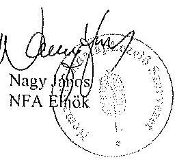

---

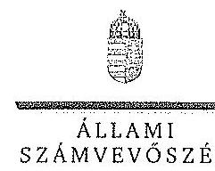

ELKÖK

Ikt.szám: V-0749-154/2015.

Nagy János úr
elnök
Nemzeti Földalapkezelő Szervezet
Budapest

Tisztelt Elnök Úr!

Az „Az állami tulajdonban álló erdőgazdasági társaságok vagyongazdálkodási tevékenységének ellenőrzése" című ellenőrzés tekintetében 14 társaság jelentéstervezetére tett észrevételüket köszönettel megkaptam.

Az Állami Számvevőszék észrevételekre vonatkozó álláspontjáról a felügyeleti vezető által készített részletes tájékoztatást csatoltan megküldöm.

Tájékoztatom Elnök urat, hogy a számvevőszéki jelentésben – az Állami Számvevőszékről szóló 2011. évi LXVI. törvény 29. § (3) bekezdése alapján – a figyelembe nem vett észrevételeket szerepeltetjük az elutasítás indokának feltüntetésével.

Budapest, 2015. 11. hó 02. nap

Tisztelettel:

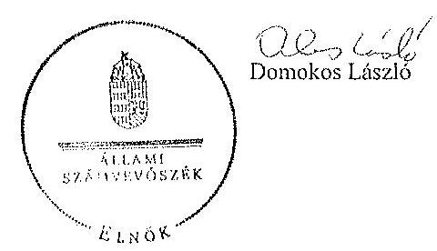

Melléklet: Tájékoztatás az észrevételek kezeléséről

1052 GODAPEST, AFRICIJA CSCHE JÁNOS OTCÁ 15: 1354 Budapest 4. Pl. 54 Istóran: 484 9101 Fax: 484 9201

---

# Tájékoztatás   az észrevételek kezeléséről 

„Az állami tulajdonban álló erdőgazdasági társaságok vagyongazdálkodási tevékenységének ellenörzése" címủ ellenörzés tekintetében az IPOLY ERDŐ Zrt., az EGERERDŐ Erdészeti Zrt., a Mecsekerdő Zrt., a SEFAG Erdészeti és Faipari Zrt., a Gemenci Erdő- és Vadgazdaság Zrt., az Északerdő Erdőgazdasági Zrt., a Pilisi Parkerdő Zrt., a Szombathelyi Erdészeti Zrt., a Kisolföldi Erdőgazdasági Zrt., a Zalaerdő Erdészeti Zrt., a KEFAG Kiskunsági Erdészeti és Faipari Zrt., a VADEX Mezöföldi Erdő- és Vadgazdálkodási Zrt., a Gyulaj Erdészeti és Vadászati Zrt., illetve a TAEG Tanulmányi Erdőgazdaság Zrt. társaságok jelentéstervezetére 2015. október 16-án érkezett észrevételeket áttekintettük, azok kezelésével kapcsolatban a következő tájékoztatást adom.

Az észrevétel szerint a jelentéstervezetben tett megállapítások helytállóak, azokat nem vitatják. Az NFA elnökének tett javaslatokhoz kapcsolódó tájékoztatást köszöoják. Mindezek miatt, valamint arra tekintettel, hogy nem jött létre olyan vagyonkezelési szerződés, amely biztosítja az ideiglenes vagyonkezelési szerződés hiányosságainak a megszüntetését, illetve a hatályos jogszabályoknak való megfeleltetést, a megállapítások és a javaslatok módosítása nem indokolt.

Budapest, 2015. év $\quad 1 / 2$ hó 02. nap

Makkai Mária
felügyeleti vezető