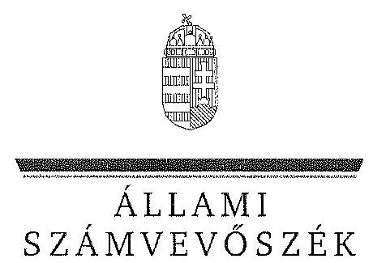

ÁLLAMI
SZÁMVEVŐSZÉK

# JELENTÉS 

Az állami tulajdonban álló erdőgazdasági társaságok vagyongazdálkodási tevékenységének ellenőrzése Szombathelyi Erdészeti Zrt.

---

# Állami Számvevőszék 

Iktatószám: V-0757-077/2015.
Témaszám: 1791
Vizsgálat-azonosító szám: V070609

## Az ellenőrzést felügyelte:

## Makkai Mária

felügyeleti vezető

## Az ellenőrzést vezette és az ellenőrzés végrehajtásáért felelős:

## Pencz Mária

ellenőrzésvezető

## A számvevőszéki jelentés összeállításában közreműködött:

## Horváth Tímea

számvevő

## Az ellenőrzést végezték:

## Horváth Tímea

számvevő

## Dr. Vass Gábor

számvevő tanácsos

---

# TARTALOMJEGYZÉK 

BEVEZETÉS ..... 3
I. ÖSSZEGZŐ MEGÁLLAPÍTÁSOK, KÖVETKEZTETÉSEK, JAVASLATOK ..... 7
II. RÉSZLETES MEGÁLLAPÍTÁSOK ..... 14

1. A Szombathelyi Erdészeti Zrt. vagyongazdálkodása ..... 14
1.1. A vagyon értékének megőrzése, gyarapítása ..... 14
1.2. A vagyonkezelői kötelezettség teljesítése ..... 18
2. A Szombathelyi Erdészeti Zrt. vagyonkezelési szerződése és a vagyonnyilvántartása ..... 20
2.1. A vagyonkezelési szerződés megfelelősége ..... 20
2.2. A Szombathelyi Erdészeti Zrt. vagyonnyilvántartása ..... 23
3. A Szombathelyi Erdészeti Zrt. éves tervezési feladatainak ellátása, az ágazati jogszabályok érvényesülése ..... 27
3.1. Az üzleti tervek vagyonmegőrzésre, vagyongyarapításra vonatkozó elemei ..... 27
3.2. A tervekben megfogalmazott előírások érvényesülése ..... 27
3.3. Az ágazati szabályok érvényesülése ..... 28
4. A kontroll-és monitoring rendszer kialakítása és működtetése ..... 30
4.1. A kontrollrendszer kialakítása és működtetése ..... 30
4.2. Az információáramlási és monitoring rendszer kialakítása és működtetése ..... 32
5. A tulajdonosi joggyakorlóknak a Szombathelyi Erdészeti Zrt. vagyongazdálkodási feladataira vonatkozó döntései, intézkedései megfelelősége ..... 34

---

# MELLÉKLETEK 

1. számú Rövidítések jegyzéke
2. számú Fogalomtár
3. számú A Szombathelyi Erdészeti Zrt. vagyonváltozásának alakulása a 2009-2013. évek közötti időszakban
4. számú A befektetett eszközök állományának alakulása
5. számú A Szombathelyi Erdészeti Zrt. vezérigazgatójának észrevétele
6. számú A Szombathelyi Erdészeti Zrt. vezérigazgatójának észrevételére adott válasz
7. számú Az MNV Zrt. vezérigazgatójának észrevétele
8. számú Az MNV Zrt. vezérigazgatójának észrevételére adott válasz
9. számú Az MFB Zrt. vezérigazgatójának észrevétele
10. számú Az MFB Zrt. vezérigazgatójának észrevételére adott válasz
11. számú Az NFA elnökének észrevétele
12. számú Az NFA elnökének észrevételére adott válasz

---

# JELENTÉS 

## Az állami tulajdonban álló erdőgazdasági társaságok vagyongazdálkodási tevékenységének ellenőrzése Szombathelyi Erdészeti Zrt.

## BEVEZETÉS

Hazánk területének több mint 20\%-át erdő borítja. Az erdők fenntartása és védelme az egész társadalom érdeke, ezért az erdőkkel csak a közérdekkel összhangban lehet gazdálkodni.

Az Alaptörvény 38. cikke és az Nvtv. alapján az állam tulajdona a nemzeti vagyon részét képezi. Az Nvtv. alapján nemzetgazdasági szempontból kiemelt jelentőségű nemzeti vagyonban tartandó vagyonelemnek minősül a 100\%-ban az állam tulajdonában álló védelmi és közjóléti elsődleges rendeltetésű erdő, a gazdasági elsődleges rendeltetésű természetes erdő, természetszerű erdő és származékerdő természetességi állapotú öt hektárnál nagyobb, természetben összefüggő erdő. A Társaságok vagyongazdálkodása szempontjából a Vtv., illetve az Nvtv. és az Nfatv., valamint a kapcsolódó kormány- és miniszteri rendeletek mellett kiemelkedő szerepe van a különböző ágazati jogszabályoknak. A vagyonkezelési tevékenység végrehajtása során figyelemmel kell lenni az Evt.-ben foglaltakra, mely alapján a nemzeti vagyonról szóló törvényben nemzetgazdasági szempontból kiemelt jelentőségű nemzeti vagyonként meghatározott védelmi és közjóléti elsődleges rendeltetésű, az állam tulajdonában álló erdő a kincstári vagyon részét képezi. A Társaságoknak az általuk kezelt vagyonelemek sajátosságára tekintettel kell a vagyongazdálkodási tevékenységüket kialakítaniuk, gondoskodniuk kell a közérdek és az Evt.-ben foglaltak érvényesülését biztosító vagyongazdálkodásról.

Az Evt. előírásai alapján az állam 100\%-os tulajdonában álló erdőt és erdőgazdálkodási tevékenységet közvetlenül szolgáló földterületet csak vagyonkezelés formájában lehet hasznosításra átengedni. A kizárólagos állami tulajdonban lévő erdő és erdőgazdálkodási tevékenységet közvetlenül szolgáló földterület vagyonkezelését csak költségvetési szerv vagy 100\%-os állami tulajdonú gazdálkodó szervezet végezheti.

A Vtv. szerint a Társaságok és a Társaságok kezelésében lévő állami vagyon feletti tulajdonosi jogokat a 2010. évig a Magyar Állam nevében az MNV Zrt. gyakorolta. A 2010. évi törvényi változások (Vtv., Mfbtv., Nfatv.) következtében 2010. június 17. napjától a Társaságok állami tulajdonú részesedése tekintetében a tulajdonosi jogokat az állami vagyonért felelős miniszter az MFB Zrt. útján látta el. Az Nfatv. 2010. évi hatálybalépését követően a Társaságok által kezelt, a Nemzeti Földalapba tartozó földterületek vonatkozásában a tulajdonosi jogokat az NFA, míg egyéb ingatlanok és vagyonelemek tekintetében a tulajdonosi jogokat az MNV Zrt. gyakorolja. 2014. július 16-tól a Társaságok feletti tulajdonosi jogokat az erdőgazdálkodásért felelős miniszter gyakorolja.

A Nemzeti Földalapba tartozó 1772 980,17 ha földterületből a 2012. év végén a 100\%-os állami tulajdonú 19 erdőgazdasági társaság kezelésében összesen 913664,3681 ha földterület volt, ebből 879254,1595 ha erdő, a többi egyéb művelési ágba tartozik. A kezelt földterületek erdőgazdasági társaságonkénti megoszlása eltérő.

A Társaságok az Alaptörvény és az Nvtv. előírása szerint önállóan és felelősen gazdálkodnak a törvényesség, a célszerűség és az eredményesség követelményei szerint. Az állami vagyonnal való gazdálkodás alapvető feladata a vagyon rendeltetésszerű, hatékony és felelős felhasználásának biztosítása az állami vagyon értékének megőrzése, gyarapítása érdekében. A Társaság jelen ellenőrzése az állami vagyonnal való gazdálkodásra és a törvényesség betartására irányult.

A Szombathelyi Erdészeti Zrt. az Örség, Vasi-Zalai hegyhát, Kemenesalja, Vas megyei dombvidék és az Írottkőalja erdőgazdasági területeken gazdálkodik. A Társaság 2013. évi éves beszámolója szerint 4272,1 M Ft nettó árbevétel mellett 205,6 M Ft mérleg szerinti eredményt ért el, a mérlegfőösszeg 4974,5 M Ft volt. A Társaság 45135,7 ha erdőterületen és 2187,3 ha egyéb művelési ágú földterületen gazdálkodott, az éves átlaglétszám 341 fő volt.

Az ellenőrzés célja annak értékelése, hogy a Társaság vagyongazdálkodása, vagyonérték-megőrző és vagyongyarapítási tevékenysége, valamint szervezeti keretei és kiépített kontrollrendszere megfeleltek-e a jogszabályok és belső szabályzatok előírásainak, valamint a kezelt vagyonelemek sajátosságaiból adódó követelményeknek.

Ennek keretében ellenőriztük és értékeltük, hogy:

- a vagyongazdálkodás során betartották-e az Nvtv. 7. §-ában megállapított vagyongazdálkodási alapelveket, valamint az ágazati jogszabályok vagyongazdálkodáshoz kapcsolódó előírásait;
- a Társaság a saját és a kezelt vagyonnal való gazdálkodásra vonatkozó éves tervezési feladatait a jogszabályi előírásoknak megfelelően látta-e el, a Társaság üzleti tervei a kezelésbe vett vagyonra vonatkozó, a Vtv. 2. § (1) és a 27. § (7) bekezdésében előírt vagyon megőrzésére, gyarapítására vonatkozó elemeket tartalmazták-e és azokat a vagyongazdálkodás során érvényesítették-e;
- a vagyonkezelési szerződések és a vagyon-nyilvántartás megfeleltek-e a szabályszerűségi követelményeknek, elősegítették-e az állami vagyonnal való szabályszerű gazdálkodást;
- a Társaságnál kialakították és működtették-e a szabályszerű feladatellátást támogató kontrollrendszert. Ezen belül a Társaság elkészítette-e és aktualizálta-e feladatellátási-folyamatainak szabályzatait, a kockázatok kezelésének rendszerét, az információs és a kontrolling-monitoring rendszert, valamint a vagyongazdálkodás területén azokat az eljárásokat, amelyek elősegítik a szervezeti célok végrehajtását;

- a tulajdonosi joggyakorlóknak a Társaság vagyongazdálkodási feladataira vonatkozó döntései, intézkedései előkészítése és megalapozottsága a jogszabályoknak és a belső szabályozásnak megfelelt-e, a tulajdonosi joggyakorlók e minőségben végzett tevékenysége támogatta-e a felelős vagyongazdálkodás megvalósulását.

Az ellenőrzés típusa: szabályszerűségi ellenőrzés.
Az ellenőrzött időszak: 2009. január 1. napjától 2014. június 30. napjáig, kitekintéssel a helyszíni ellenőrzés végéig tartó releváns folyamatokra, intézkedésekre.

Az ellenőrzés várható hasznosulása: A Társaság és a tulajdonosi joggyakorlók fenti szempontú ellenőrzése az állami tulajdonban álló vagyon kezelésére, a vagyonnal való gazdálkodásra vonatkozó, kötelezően végrehajtandó éves ÁSZ ellenőrzést szélesebb körűvé teszi.

Az ellenőrzés várható hasznosulásaként biztosíthatja a társadalom részéről kiemelt érdeklődéssel kísért téma objektív bemutatását. Az ÁSZ jelentéséből a média és az állampolgárok átfogó képet kaphatnak a Magyarország állami tulajdonban lévő erdőivel való gazdálkodásról, a gazdálkodást, vagyonkezelést végző szervezeti rendszerről, az állami tulajdonban álló erdőgazdasági társaságok feladatellátásához kapcsolódóan feltárt problémákról.

Az ellenőrzés jól hasznosítható - többek közt - az állami vagyonnal kapcsolatos országgyűlési törvényhozói munkában is, továbbá hozzájárulhat a tulajdonosi joggyakorlás javításával a „jó kormányzás" gyakorlatának erősítéséhez.

Az ellenőrzéssel érintett szervezetek: A Társaság a Társaság kezelésében lévő állami vagyon feletti tulajdonosi jogokat gyakorló szervezetek, valamint a Társaság állami tulajdonú részesedése feletti tulajdonosi joggyakorlók (MFB Zrt., MNV Zrt., NFA).

Az ellenőrzés végrehajtásának jogszabályi alapját az ÁSZ tv. 5. § (4)(5) bekezdéseiben foglaltak képezik.

Az ellenőrzés szakmai módszertana az ÁSZ hivatalos honlapján közzétett szakmai szabályokon alapult, amely a Legfőbb Ellenőrző Intézmények Nemzetközi Szervezete (INTOSAI) által kiadott nemzetközi standardok (ISSAI) figyelembevételével készült.

A Társaság az ellenőrzés lefolytatásához tanúsítványok kitöltésével, valamint dokumentumok elektronikus megküldésével szolgáltatott adatokat. Az így rendelkezésre bocsátott adatok és információk kontrollja a helyszíni ellenőrzés keretében történt. A vagyonváltozást eredményező döntések megalapozottságát, továbbá a vagyonérték-megőrző és vagyongyarapító tevékenység szabályszerűségét a számviteli nyilvántartásokból, valamint kockázatalapú és véletlenszerű mintavétellel kiválasztott tételek ellenőrzésével értékeltük.

---

Az ÁSZ a 2011. évi LXVI. törvény 29. §-a szerint a jelentéstervezetet megküldte a Szombathelyi Erdészeti Zrt. vezérigazgatójának, a Magyar Nemzeti Vagyonkezelő Zrt. vezérigazgatójának, a Magyar Fejlesztési Bank Zrt. vezérigazgatójának és a Nemzeti Földalapkezelő Szervezet elnökének egyeztetésre. A Szombathelyi Erdészeti Zrt. vezérigazgatójának észrevételét és az arra adott választ az 5. számú melléklet, a Magyar Nemzeti Vagyonkezelő Zrt. vezérigazgatójának észrevételét és az arra adott választ a 7-8. számú melléklet, a Magyar Fejlesztési Bank Zrt. vezérigazgatójának észrevételét és az arra adott választ a 9-10. számú melléklet, a Nemzeti Földalapkezelő Szervezet elnökének észrevételét és az arra adott választ a 11-12. számú melléklet tartalmazza.

---

# I. ÖSSZEGZŐ MEGÁLLAPÍTÁSOK, KÖVETKEZTETÉSEK, JAVASLATOK 

Az állami tulajdonú Társaság az ellenőrzött időszakban saját és kezelt vagyonnal gazdálkodott. A Társaság könyvviteli mérlegében kimutatott vagyona a 2009. évi 3519,5 M Ft nyitó értékről 2013. december 31-re 4974,5 M Ft-ra emelkedett, amely 41,3\%-os vagyongyarapodást eredményezett. A társaság saját tőke/jegyzett tőke aránya a 2009. évi 336,0\%-ról 2013. évre 447,8\%-ra nőtt. A Társaság a kezelt erdőket és földingatlanokat a Számv. tv. előírásai ellenére mérlegében az ellenőrzött időszakban nem szerepeltette, ezáltal a Társaság mérlege nem volt megbízható és valós. A Társaság a Számv. tv. előírásaival ellentétben a kezelt vagyont mérlegtétel szerinti bontásban a kiegészítő mellékletében nem mutatta be.

A Társaság által kezelt vagyonról vezetett nyilvántartás nem felelt meg a Vhr.-ben foglaltaknak, mert tételesen nem tartalmazta a vagyonkezelt eszközök könyv szerinti bruttó és nettó értékét, valamint az értékben bekövetkezett egyéb változásokat. Ezért a nyilvántartás nem volt átlátható, nem biztosította az elszámoltathatóságot. A Társaság a VSZ eredeti, hitelesként egyértelműen beazonosítható, a kezelt vagyon felsorolását tartalmazó 1-4. sz. mellékleteivel nem rendelkezett.

A kezelt ingatlanokról a Társaság kizárólag tételes mennyiségi kimutatást vezetett, Ft érték feltüntetése nélkül, ami megfelelt a VSZ 2.4. pontja szerinti naturáliában történő vezetési előírásnak, azonban nem felelt meg a kezelt vagyonra vonatkozó, a Számv. tv.-ben előírt nyilvántartási rendelkezésnek. A Társaság a kezelt vagyon Ft értékének meghatározását sem az MNV Zrt-nél, sem pedig az NFA-nál nem kezdeményezte. A kezelt vagyon nyilvántartása tekintetében a Társaság és a tulajdonosi joggyakorló MNV Zrt. és NFA közötti egyeztetések az ellenőrzés befejezéséig nem kerültek lezárásra, így nem állt rendelkezésre a Társaság vagyonkezelésében lévő valamennyi állami vagyonra, és annak nagyságára vonatkozó, a tulajdonosi joggyakorló MNV Zrt. és NFA nyilvántartásával egyező adat.

A kezelt vagyonról vezetett nyilvántartás - tekintettel a rendezetlen vagyonelemekre - nem felelt meg a Vhr.-ben foglaltaknak, mert nem biztosította az adatszolgáltatás pontosságát és
 ellenőrizhetőségét. A Társaság teljesítette a Vhr.-ben előírt adatszolgáltatási kötelezettségét az MNV Zrt. felé, azonban a 262/2010. (XI.17.) Korm. rendeletben foglaltakkal ellentétben az NFA felé adatszolgáltatás nem történt.

A Társaság a saját és kezelt vagyon Vhr.-ben előírt elkülönítését biztosította.
Az ellenőrzött időszakban a Társaság a Magyar Állam tulajdonában álló erdővagyon és egyéb művelési ágú termőföld ingatlanok kezelését a KVI-vel 1996. november 1-jén kötött vagyonkezelési szerződés alapján végezte. A Társaság, mint vagyonkezelő és a KVI között létrejött szerződéses jogviszony kereteit a VSZ-ben foglalt jogok és kötelezettségek töltötték ki. A vagyonkezelési

---

szerződés nem támogatta megfelelően és számon kérhető módon a Társaság állami vagyonnal való gazdálkodását.

A vagyoni kör, a tulajdonosi jogok gyakorlására felhatalmazott szervezetek változásai, valamint a társaság vagyonkezelésére vonatkozó jogszabályi rendelkezések változásai ellenére a VSZ-t az ellenőrzött időszakban nem aktualizálták. A VSZ felülvizsgálata, egységes szerkezetbe foglalása nem történt meg, annak módosításai csak a kezelésbe átadott vagyon változásait tartalmazták. Az ellenőrzött időszakban a VSZ rendelkezései nem határozták meg teljes körűen az állami vagyon kezeléséhez fűződő jogokat és kötelezettségeket, mivel a szerződés hatályon kívül helyezett jogszabályi hivatkozásokat tartalmazott. A VSZ-t az Nfatv. hatálybalépését követően nem módosították, továbbá nem kötöttek új vagyonkezelési szerződést az erdők, és az erdőgazdálkodási tevékenységet közvetlenül szolgáló földterületek tekintetében.

A felek nem tettek eleget a Vhr.-ben foglalt rendelkezésnek és a Vhr. hatálybalépését követő hat hónapon belül nem kezdeményezték a Nemzeti Földalapba tartozó ingatlanokra vonatkozóan a VSZ megszüntetését és a Vtv., illetve Vhr. szabályainak megfelelő szerződés megkötését.

A VSZ-ben rögzítettek ellenére a vagyonkezelési díjak éves felülvizsgálatára nem került sor. A tulajdonosi joggyakorló NFA több évre visszamenőlegesen állított ki számlát. A számlákon a vagyonkezelt földterület nagysága, valamint fajlagos egységára nem szerepelt, ezért a vagyonkezelési díjak szerződés szerinti jogossága nem volt ellenőrizhető. A Társaság a számlákat pénzügyileg rendezte.

A Társaság az ellenőrzött időszakban a Számv. tv. előírásainak megfelelően a fordulónapi leltározást elvégezte.

A Társaság vagyongazdálkodása során betartotta az Nvtv.-ben előírt vagyongazdálkodási alapelveket, mivel vagyonkezelésében álló vagyont nem idegenített el, illetve arra jelzálogjogot, haszonélvezeti jogot nem alapított. A Társaság az ellenőrzött időszakban három esetben megsértette az Evt. ${ }_{2}$ vonatkozó rendelkezéseit, mert az Evt. ${ }_{2}$ hatálybalépését követően érvényben volt olyan szerződése, amelyben erdő használatát vagy hasznosítását harmadik személynek engedte át.

A Társaság a saját és a kezelt vagyonnal való gazdálkodásra vonatkozó éves tervezési feladatait az Alapító Okiratban előírtak szerint megfelelően látta el, éves üzleti terveket készített. A Társaság az ágazati és üzleti tervekben megfogalmazott, az erdővagyonnal való gazdálkodás érdekében kifejtett erdőgazdálkodási és vadgazdálkodási tevékenységét az Evt. ${ }_{1,2}$, Evr. és Vadvédelmi tv.-ben foglaltaknak megfelelően végezte. Az éves gazdálkodásról az ellenőrzött években a Számv. tv. rendelkezéseinek megfelelő üzleti jelentést készített, amelyek a Társaság eredményének és jövedelmezőségének alakulásán kívül, a vagyonkezelt terület működtetését és az adott évi beruházásokat is tartalmazták.

A Társaság a Vtv.-ben, Nfatv.-ben és az ágazati tervekben megfogalmazott, a saját és kezelt vagyon állagának védelme és vagyona gyarapítása érdekében a felújításokat, beruházásokat és karbantartásokat évente üzemtervek és karban-

---

tartási tervek alapján végezte el. A Társaság beruházási és felújítási tevékenységét az ellenőrzött időszakban a Számv. tv. és a Vhr. rendelkezéseinek megfelelően végezte. A Társaság az erdőfelújításokat a Számv. tv.-ben előírtaknak megfelelően költségei között elszámolta, így a társaság mérleg szerinti eredménye tartalmazta a kezelt vagyon eredményét is. Az erdőtelepítéseket a Társaság a Számv. tv. előírásainak megfelelően könyveiben a befejezetlen beruházások között szerepeltette. A Társaság a vagyonkezelésében lévő erdők és földterületek után a Számv. tv. előírásainak megfelelően értékcsökkenést nem számolt el. A Társaság saját vagyona után az ellenőrzött időszakban elszámolt 1265,4 M Ft összegű értékcsökkenési leírásnál többet, 2468,5 M Ft-ot fordított eszközállományának pótlására.

A Társaságnál az ellenőrzött időszakban az ágazati jogszabályok vagyongazdálkodáshoz kapcsolódó előírásainak betartása - az erdő igénybevételének végrehajtásához szükséges bejelentésének elmulasztása, valamint az erdőgazdálkodási bírság kiszabása miatt - nem valósult meg teljes mértékben. A Társaság a vadgazdálkodásból származó bevételeket a Számv. tv. előírásainak megfelelően számolta el, az Evt. ${ }_{2}$-ben foglalt, az erdő fenntartására, védelmére, valamint az erdei haszonvételek gyakorlására irányuló erdőgazdálkodási tevékenységéhez kapcsolódó bejelentési és engedélykérelmi kötelezettségének határidőben eleget tett. A Társaság rendelkezett az Evt. ${ }_{1,2}$-ben meghatározott, 10 évre szóló erdőgazdálkodási üzemtervvel, az erdészeti hatóság által jóváhagyott, 5 évre szóló erdőtelepítési-kivitelezési tervek rendelkezésre álltak, azok tartalmazták az Evr. ${ }_{2}$-ben rögzített tartalmi elemeket. A Társaság a vadgazdálkodással érintett vadászterületre vonatkozó, a Vadvédelmi tv.-ben előírt, 10 évre szóló vadgazdálkodási üzemtervvel rendelkezett, az éves vadgazdálkodási terveket elkészítették, azokat a vadászati hatóság jóváhagyta.

A Társaság kialakította és működtette a szabályszerű feladatellátást támogató kontrollrendszert. Az ellenőrzött időszakban mind a belső ellenőrzés, mind az FB tevékenységét a jóváhagyott éves munkaterv alapján végezte. Az FB az ellenőrzött időszakban a Társaság működésével összefüggésben jogszabály, alapszabály, valamint az alapítói határozatokban foglaltak megsértésére vonatkozó megállapítást nem tett. A Társaság a Számv. tv.-ben, valamint az Alapító Okiratában foglaltaknak megfelelően az ellenőrzött időszakban könyvvizsgálati szolgáltatást vett igénybe. A könyvvizsgáló minden évben hitelesítő záradékkal látta el a Társaság éves beszámolóit annak ellenére, hogy a Társaság a kezelésében lévő vagyonelemeket a Számv. tv. rendelkezései ellenére a mérlegében nem szerepeltette, ezáltal az nem a valós képet mutatta.

A Társaságnál a szabályszerű működést támogató információáramlási és monitoring rendszer kialakítása és működtetése nem valósult meg teljes körűen. Az ellenőrzött időszakban a Társaság feletti tulajdonosi joggyakorló ${ }_{1,2}$ felé fennálló beszámolási kötelezettségeinek eleget tett, azonban az erdővagyonról és annak változásáról készített külön írásbeli beszámolók nem álltak rendelkezésre.

A Társaságnál az ellenőrzött időszakban az adatok védelme biztosított volt, azonban a közérdekű adatok nyilvánosságra hozatala - az Avtv.-ben, és az Info tv.-ben rögzített, a közérdekű adatok megismerésére irányuló igények teljesítésének rendjére vonatkozó szabályozás hiánya miatt - nem felelt meg teljes

---

mértékben a jogszabályi előírásoknak. A Társaságnál adatvédelemre vonatkozó külön szabályzat jogszabályi előírás hiányában az ellenőrzött időszakban nem készült, azonban a hatályos informatikai biztonsági szabályzatok az adatvédelemmel, adatbiztonsággal kapcsolatos szabályozást tartalmazták. A Társaság az Info. tv. szerinti közérdekű és közérdekből nyilvános adatok elektronikus közzétételét - a beszámolók, szerződések, gazdálkodásra vonatkozó adatok, nyilvános adatok hiánya miatt - nem teljes körűen és nem az Info. tv.-ben előírt struktúra szerint teljesítette.

A Társaság vagyongazdálkodási feladataira vonatkozó döntések, intézkedések előkészítése a társaság részesedései feletti tulajdonosi joggyakorló ${ }_{1,2}$-nél összhangban volt a vonatkozó jogszabályokkal és a belső szabályzatokkal. A tulajdonosi joggyakorló; a vagyonváltozását eredményező döntéseket egyedileg nem ellenőrizte, a vagyonváltozását eredményező döntések végrehajtását a beszámolók, az üzleti tervek, üzleti jelentések és a kontrolling jelentések megtárgyalásával és jóváhagyásával ellenőrizte. A Társaság feletti tulajdonosi joggyakorló ${ }_{2}$ az ellenőrzött időszakban a vagyongazdálkodás szabályozottságával, szabályszerűségével és a vagyonnyilvántartással kapcsolatos ellenőrzést nem végzett.

A vagyonkezelésbe adott állami vagyon tekintetében tulajdonosi jogokat gyakorló MNV Zrt. és NFA tevékenysége az ellenőrzött időszakban nem támogatta teljes körűen a felelős vagyongazdálkodás megvalósulását, a VSZ-szel kapcsolatban feltárt hiányosságok megszüntetése és a hatályos jogszabályoknak való megfeleltetése nem történt meg. A vagyonkezelésbe adott állami vagyon tekintetében tulajdonosi jogokat gyakorló MNV Zrt. és NFA nem végeztek a Vhr.-ben és a Nemzeti Földalapba tartozó földrészletek hasznosításának részletes szabályairól szóló 262/2010. (XI. 17.) Korm. rendelet 47. § (1)-(2) bekezdéseiben foglalt, a vagyonnyilvántartás hitelességére és teljességére vonatkozó ellenőrzést a Társaságnál.

Az Állami Számvevőszékről szóló 2011. évi LXVI. törvény 33. § (1) bekezdésében foglaltak értelmében a jelentésben foglalt megállapításokhoz kapcsolódó intézkedési tervet köteles az ellenőrzött szervezet vezetője összeállítani, és azt a jelentés kézhezvételétől számított 30 napon belül az ÁSZ részére megküldeni. Amennyiben az intézkedési tervet határidőben nem küldi meg a szervezet, vagy az nem elfogadható, az ÁSZ elnöke a hivatkozott törvény 33. § (3) bekezdésében foglaltakat érvényesítheti.

Az ellenőrzés intézkedést igénylő megállapításai és javaslatai:

# MNV Zrt. vezérigazgatójának, az NFA elnökének 

Az ellenőrzött időszakban a Szombathelyi Erdészeti Zrt. a Magyar Állam tulajdonában álló erdővagyon és egyéb művelési ágú termőföld ingatlanok kezelését a KVI-vel 1996. november 1-jén kötött vagyonkezelési szerződés alapján végezte. A Társaság, mint vagyonkezelő és a KVI között létrejött szerződéses jogviszony kereteit a VSZ-ben foglalt jogok és kötelezettségek töltötték ki. A VSZ nem támogatta megfelelően és számon kérhető módon az állami vagyonnal való szabályszerű gazdálkodást. A VSZ 2009. január 1-jén hatályon kívül helyezett jogszabályi hivatkozásokat tartalmaz-

---

zott az Áht. 109/B. §, az Áht. 109/G. § és a Vadvédelmi. tv. 98. § rendelkezései vonatkozásában és nem tartalmazta a Vtv., az Evt., a Nvtv. és az Nfatv. előírásaira történő hivatkozást. A VSZ 3.2.3. pontja lehetőséget biztosít a vagyonkezelőnek a vagyonkezelői jog átruházására, valamint a 3.12.2. pontja az erdő használati jogának átengedésére, azonban a rendelkezések ellentétesek az Evt. 2 9. § (3) bekezdésében, valamint az Nfatv. 19/A. § (4) bekezdésében foglaltakkal, melynek értelmében az erdő használata, hasznosítása, vagyonkezelői jog harmadik személynek nem engedhető át. A VSZ 3.3.2. pontjában foglaltak ellenére a szerződést évente nem vizsgálták felül, azt a felek nem kezdeményezték. A felek nem tettek eleget a Vhr. 54. § (7) ${ }^{1}$ bekezdésében foglalt rendelkezésnek és a Vhr. hatálybalépését követő hat hónapon belül nem kezdeményezték a Nemzeti Földalapba tartozó ingatlanokra vonatkozóan a VSZ megszüntetését és a Vtv., illetve Vhr. szabályainak megfelelő szerződés megkötését.

A vagyonkezelésbe adott állami vagyon tekintetében tulajdonosi jogokat gyakorló MNV Zrt. és NFA nem végeztek a Vhr. 20. § (1)-(2) bekezdéseiben és a Nemzeti Földalapba tartozó földrészletek hasznosításának részletes szabályairól szóló 262/2010. (XI. 17.) Korm. rendelet 47. § (1)-(2) bekezdéseiben foglalt, a vagyonnyilvántartás hitelességére és teljességére vonatkozó ellenőrzést a Társaságnál.

Javaslat:

# az MNV Zrt. vezérigazgatójának 

a) Tegyen intézkedéseket az erdőgazdasági társaság közreműködésével a tényleges állapotot rögzítő és a hatályos jogszabályi előírásoknak megfelelő vagyonkezelési szerződés megkötésére.
b) Tegyen intézkedéseket a vagyonkezelési szerződés felülvizsgálatának elmaradásával, valamint a Nemzeti Földalapba tartozó ingatlanokra vonatkozó VSZ megszüntetésével összefüggésben feltárt szabálytalanságok tekintetében a felelősség tisztázása érdekében, és szükség szerint intézkedjen a felelősség érvényesítéséről.
c) Intézkedjen a Szombathelyi Erdészeti Zrt. vagyonnyilvántartása hitelességének, teljességének és helyességének jogszabályban foglaltak szerinti ellenőrzéséről.

## az NFA elnökének

a) Tegyen intézkedéseket az erdőgazdasági társaság közreműködésével a tényleges állapotot rögzítő és a hatályos jogszabályi előírásoknak megfelelő vagyonkezelési szerződés megkötésére.
b) Intézkedjen a vagyonkezelési szerződés felülvizsgálatának elmaradásával összefüggésben feltárt szabálytalanságok tekintetében a munkajogi felelősség tisztázására irányuló eljárás megindításáról, és ennek eredménye ismeretében tegye meg a szükséges intézkedéseket.

[^0]
[^0]:    ${ }^{1}$ Vhr. 54. § (7) bekezdés (hatályos 2010. december 31-éig)

---

c) Intézkedjen a Szombathelyi Erdészeti Zrt. vagyonnyilvántartása hitelességének, teljességének és helyességének jogszabályban foglaltak szerinti ellenőrzéséről.

#
 a Szombathelyi Erdészeti Zrt. vezérigazgatójának: 

1. A Szombathelyi Erdészeti Zrt. és a KVI között 1996. november 1-jén kötött vagyonkezelési szerződés nem támogatta megfelelően és számon kérhető módon az állami vagyonnal való szabályszerű gazdálkodást. A VSZ 2009. január 1-jén hatályon kívül helyezett jogszabályi hivatkozásokat tartalmazott az Áht. 109/B. §, az Áht. 109/G. § és a Vadvédelmi tv. 98. § rendelkezései vonatkozásában és nem tartalmazta a Vtv., az Evt., a Nvtv. és az Nfatv. előírásaira történő hivatkozást. A VSZ 3.2.3. pontja lehetőséget biztosít a vagyonkezelőnek a vagyonkezelői jog átruházására, valamint a 3.12.2. pontja az erdő használati jogának átengedésére, azonban a rendelkezések ellentétesek az Evt. 9. § (3) bekezdésében, valamint az Nfatv. 19/A. § (4) bekezdésében foglaltakkal, melynek értelmében az erdő használata, hasznosítása, vagyonkezelői jog harmadik személynek nem engedhető át. A VSZ 3.3.2. pontjában foglaltak ellenére a szerződést évente nem vizsgálták felül, azt a felek nem kezdeményezték.

Javaslat:
a) Tegyen intézkedéseket a tulajdonosi joggyakorlókkal közreműködve a tényleges állapotnak és a hatályos jogszabályi előírásoknak megfelelő vagyonkezelési szerződés megkötése érdekében.
b) Intézkedjen a vagyonkezelési szerződés felülvizsgálatának elmaradásával feltárt szabálytalanságok tekintetében a felelősség tisztázása érdekében, és szükség szerint intézkedjen a felelősség érvényesítéséről.
2. A Társaság a kezelt erdőket és földingatlanokat a Számv. tv. 23. § (2) bekezdés előírásai ellenére mérlegében az ellenőrzött időszakban nem szerepeltette, továbbá ezen eszközöket legalább mérlegtétel szerinti bontásban a kiegészítő mellékletében nem mutatta be.

Javaslat:
a) Intézkedjen a kezelt vagyon mérlegben eszközként való kimutatásáról, továbbá ezen eszközöknek a kiegészítő mellékletben - legalább mérlegtételek szerinti megbontásban - külön történő bemutatásáról.
b) Intézkedjen a kezelt vagyon mérlegben eszközként történő kimutatásának elmaradásával kapcsolatban feltárt szabálytalanság tekintetében a felelősség tisztázása érdekében, és szükség szerint intézkedjen a felelősség érvényesítéséről.
3. A Társaság az Evt. 9. § (3), valamint az Nfatv. 20. § (7) bekezdésében foglalt előírás ellenére az állami tulajdonban álló és az erdőgazdasági társaság vagyonkezelésébe adott erdősített területek bérbeadására 2010-2011-2012. években évenként határozott idejű szerződést kötött. Ezzel az erdőgazdasági társaság három alkalommal sértette meg az Evt. 9. § (3), valamint az Nfatv. 20. § (7) bekezdésében foglalt előírásokat, miszerint a vagyonkezelő az erdő használatát, hasznosítását harmadik személynek nem engedheti át.

---

Javaslat:
a) Intézkedjen az erdő hasznosításának, használatának átengedésére irányuló szabálytalanság megszüntetéséről.
b) Intézkedjen az erdő hasznosításával, átengedésével kapcsolatos szabálytalanság tekintetében a felelősség tisztázása érdekében, és szükség szerint intézkedjen a felelősség érvényesítéséről.
4. A Társaság az Avtv. 20. § (8) bekezdésében, illetve az Info. tv. 30. § (6) bekezdésében rögzített, a közérdekű adatok megismerésére irányuló igények teljesítésének rendjét nem szabályozta.

Javaslat:
Intézkedjen a jogszabályi előírásoknak megfelelően a közérdekű adatok megismerésére irányuló igények teljesítése rendjének szabályozásáról.

---

# II. RÉSZLETES MEGÁLLAPÍTÁSOK 

## 1. A Szombathelyi Erdészeti Zrt. VAGYONGAZDÁLKODÁSA

### 1.1. A vagyon értékének megőrzése, gyarapítása

A Társaság vagyongazdálkodása során betartotta az Nvtv. 7. §-ban foglalt vagyongazdálkodási alapelveket, a vagyonnal felelős módon, rendeltetésszerűen gazdálkodott. Az ellenőrzött időszakban a Társaság vagyona gyarapodott. A vagyonváltozások hatására a vagyonszerkezet és a saját tőke/jegyzett tőke aránya is átrendeződött, amelyet a Társaság számviteli beszámolói és üzleti jelentései megfelelően bemutattak.

A Társaság mérleg szerinti vagyona a 2009. január 1-jén kimutatott 3519,5 M Ft. nyitó értékről 2013. december 31-re 4974,5 M Ft-ra emelkedett, amely 41,3%-os vagyongyarapodást eredményezett. A Társaság a saját vagyonát a mérlegben a Számv. tv. 23. § (1) bekezdésének megfelelően az eszközök között tartotta nyilván, míg a kezelésében lévő vagyonelemeket Számv. tv. 23. § (2) bekezdésének előírása ellenére a mérlegében nem szerepeltette az eszközök között, ezáltal a Társaság mérlege nem a valós állapotot tükrözte. A Társaság eszközeit a Számv. tv. 159. §-ban foglaltaknak, valamint a számviteli politikájában rögzített elveknek megfelelően vezette a nyilvántartásaiban. A Társaság vagyonának az ellenőrzött időszakban bekövetkezett 41,3%-os növekedése a vagyonszerkezet átrendeződését eredményezte, amelyben az ingatlanok 52,5%-os és a gépek berendezések, járművek állományának 63,8%-os növekedése meghatározó volt.

A társasági vagyon változása az ellenőrzött időszakban

| Megnevezés | 2009.01.01 | 2013.12.31. | Változás (%) |  |
| :-- | :--: | :--: | :--: | :--: |
| 1 | 2 | 3 | $4=3 / 2 * 100$ |  |
| A | Befektetett eszközök | 2319,0 | 3436,4 | 148,2 |
| I. | Immateriális javak | 5,0 | 99,3 | 1986,0 |
| II. | Tárgyi eszközök | 2243,2 | 3245,9 | 144,7 |
|  | - Ingatlanok | 1500,7 | 2288,6 | 152,5 |
|  | - Gépek berendezések, jármü- | 508,0 | 832,4 | 163,8 |
|  | vek | 234,5 | 124,8 | 53,2 |
|  | - Egyéb tárgyi eszközök | 70,8 | 91,20 | 128,89 |

[^0]
[^0]:    ${ }^{2}$ Hatályos: 2012. január 1-jétől

---

|  | Megnevezés | 2009.01.01 | 2013.12.31. | Változás (%) |
| :-- | :-- | --: | --: | --: |
| B | Forgdeszközök | 1196,5 | 1532,0 | 128,0 |
| I. | Készletek | 254,0 | 365,3 | 143,8 |
| II. | Követelések | 389,7 | 449,6 | 115,4 |
| III. | Értékpapírok | 0,0 | 0,0 | 0 |
| IV. | Pénzeszközök | 552,8 | 717,2 | 129,7 |
| C | Aktív idóbeli elhatárolások | 4,0 | 6,1 | 152,5 |
|  | Eszközök összesen | 3519,5 | 4974,5 | 141,3 |

A Társaság eszközeinek bővülését eredményező beruházások és felújítások értéke a 2009-2013. évek időszakában összesen 2468,5 M Ft volt. A fejlesztési források 37,4%-a (922,9 M Ft) az előző évek eredményéből, 51,3%-a (1265,4 M Ft) a tárgyévben elszámolt értékcsökkenésből, 8,5%-a (209,2 M Ft) támogatásból, további 2,8% egyéb forrásból származott.

Tömörd térségében új erdő telepítését valósítottak meg 2009. és 2010. években 28,1 M Ft hazai és 2,8 M Ft EMVA támogatásból. A Társaság 2010-2011. években támogatásból 192 M Ft-ot fordított a gazdasági és idegenforgalmi szempontból is kiemelkedő szerepet betöltő Velem-Hörmann-forrási út felújítására. A támogatások fennmaradó része a közmunkaprogramhoz kapott támogatásoknak a beruházásokhoz felhasználható részéből származott. Az új erdő telepítés költségeit év végén a Számv. tv. 47. § (1) bekezdésének megfelelően a befejezetlen beruházások között tartotta nyilván.

Az ellenőrzött időszak üzleti éveit a Társaság pozitív mérleg szerinti eredménynyel zárta, amelynek eredményeként a Társaság saját tőkéje a 2009. év elejei 2955,5 M Ft-ról 2013. évi végére 4197,5 M Ft-ra 42,0%-kal nőtt. Ennek következtében a saját tőke/jegyzett tőke aránya az ellenőrzött időszakban kedvezően változott, mivel a 2009. évi 336,0%-ról 2013-ban 447,8%-ra növekedett. A vagyonváltozás fő elemeit és okait a Társaság az éves beszámolóinak kiegészítő mellékletében bemutatta.

A Társaság jegyzett tőkéjét az ellenőrzött időszakban egy alkalommal az 584/2008. (XII. 20.) számú Alapítói Határozatával az MNV Zrt. 2009. év elején 96,2 M Ft-tal emelte meg az Egységes Erdészeti Vállalatirányítási Rendszer (EEVR) bevezetése érdekében. A rendszer 2013. évben került átadásra. E fejlesztések eredményeként az immateriális javak értéke az ellenőrzött időszakban 19,7-szeresére növekedett.

A 2009-2013. években a Társaság tevékenységének főbb mutatószámai az alábbiak voltak:

| Megnevezés | 2009. | 2010. | 2011. | 2012. | 2013. |
| :-- | :--: | :--: | :--: | :--: | :--: |
| Tőkeerősség (saját tő-   ke/források) | 87,0 | 85,3 | 86,7 | 86,3 | 84,4 |
| Saját tőke/jegyzett tőke   aránya | 336,0 | 358,3 | 398,8 | 425,9 | 447,8 |

---

| Megnevezés | $\mathbf{2 0 0 9 .}$ | $\mathbf{2 0 1 0 .}$ | $\mathbf{2 0 1 1 .}$ | $\mathbf{2 0 1 2 .}$ | $\mathbf{2 0 1 3 .}$ |
| :-- | --: | --: | --: | --: | --: |
| Kötelezettségek aránya   (kötelezettségek/források | 8,5 | 10,8 | 9,4 | 8,2 | 10,0 |
| Befektetett eszközök   fedezet (saját tő-   ke/befektetett eszközök) | 124,3 | 127,4 | 134,7 | 129,3 | 122,1 |
| Tárgyi eszközök aránya   (tárgyi eszkö-   zök/eszközök) | 66,9 | 64,1 | 61,7 | 63,5 | 65,3 |
| Tárgyi eszközök hasz-   nálhatósági foka (nettó   érték/bruttó érték) | 55,8 | 54,9 | 53,9 | 55,1 | 55,8 |

A Társaság a tulajdonosi joggyakorló  részére évenként „Ágazati lapon" mutatta be az adózás előtti eredményt a vagyonkezelt terület működtetésére, a vállalkozó tevékenységre, és a vállalatirányításra bontottan.

A Társaság az ellenőrzött időszakban az Nfatv. 20. § (4) , 19/A. § (3) , a Vtv. 23. § (2), valamint 27. § (2) bekezdésében előírt, a saját és kezelt vagyon állagának megóvásával, karbantartásával és a vagyon gyarapításával kapcsolatos feladatait évente állapotfelmérések alapján végezte el. A saját, illetve a kezelt vagyonnal kapcsolatos tervezés az erdőgazdálkodással kapcsolatos sajátosságok miatt eltérő módon történt.

A Társaságnak a vagyonkezelt területen folytatott erdőgazdálkodás vonatkozásában fennálló kötelezettségét az Evt. 2. § (2) bekezdésében rögzített alapelvek szerint az erdők változatosságának megőrzése, az erdők fenntartása, felújítása és a védelme, valamint a közjóléti szolgáltatások biztosítása képezte. Ennek megfelelően az erdők karbantartását, felújítását az éves üzemterveknek megfelelően az erdészeti hatóság engedélyei alapján látták el.

A Társaság az épületek, építmények, az erdészeti feltáró utak, valamint a közjóléti létesítmények felújítását, korszerűsítését, a vadkár elhárító kerítések építését az éves üzleti terv részét képező beruházások között tervezte és valósította meg. A Társaságnál üzemelő gépjárművek, munkagépek és emelőgépek műszaki állapotának folyamatos üzemképes állapotban tartását karbantartási tervek alapján végezte.

A Társaság a Vhr. 9. § (6) , (9) bekezdései rendelkezéseinek megfelelően az erdőtelepítési, erdő-felújítási és erdőfenntartási tevékenysége keretében a szükséges felújításokat elvégezte. A Társaság az erdőfelújításokat Számv. tv. 48. § (2) bekezdés előírásainak megfelelően könyveiben költségei között elszámolta, így a társaság mérleg szerinti eredménye tartalmazta a kezelt vagyon eredményét is.

A Vtv. 27. § (7) bekezdése a kezelt vagyonra vonatkozóan visszapótlási kötelezettséget ír elő, a visszapótlás összegét a vagyonkezelt eszközön elszámolt értékcsökkenési leírás összegében minimalizálta. A Társaság kezelésében nem volt olyan eszköz, melyre vonatkozóan visszapótlási kötelezettsége keletkezett volna.

A Társaság vagyonkezelésében a 2013. december 31-i állapot szerinti földterület 96,5%-a tartozott erdőművelési ágba. Ezen a 45,1 ezer hektáron a Társaság az állami erdővagyon kezelését
 jogszerűen, az erdészeti hatóság által jóváhagyott éves szakmai tervek szerint, a hosszú távú erdőgazdálkodás elvárásainak megfelelően folytatta. A Társaság az erdő felújítási kötelezettségének - az Evt. 2. 51. § (7) bekezdésében előírt két éven belül - az ellenőrzött időszak minden évében eleget tett. Az erdőfenntartás, az erdővédelem és a haszonvételek szakmai feladatait az erdészeti hatóság engedélyével és felügyelete mellett eredményesen látta el, mert az erdősítés befejezetté nyilvánítását követő öt év elteltével az erdészeti hatóság - az Evt. 2. 54. § (1) bekezdése szerinti felülvizsgálat során az ellenőrzött időszakban nem rendelte el az erdősítés - Evt. 254. § (2) bekezdése szerinti - megismétlését. Ennek megfelelően az Evt. 2. 107. § (1) bekezdés n) pontja szerinti erdőgazdálkodási bírság kiszabására nem került sor.

A vagyonkezelt területen végzett folyamatos erdő-felújítási tevékenységet az éves üzleti jelentések adatai alátámasztották. A Társaság a vagyonkezelt területen végzett erdő felújítási, erdőtelepítési, erdőápolási költségeket a számlarendjében foglaltaknak megfelelően, elkülönítetten számolta el. Az erdőgazdálkodási tevékenység árbevétele és adózás előtti eredménye az ellenőrzött időszakban növekvő tendenciájú volt.

A Társaság erdőgazdálkodáshoz kapcsolódó árbevételét és adózás előtti eredményét az alábbi táblázat szemlélteti:

| Megnevezés | $\mathbf{2 0 0 9 .}$ | $\mathbf{2 0 1 0 .}$ | $\mathbf{2 0 1 1 .}$ | $\mathbf{2 0 1 2 .}$ | $\mathbf{2 0 1 3 .}$ |
| :-- | :--: | :--: | :--: | :--: | :--: |
| Erdőgazdálkodás árbevétele   (Mrd Ft) | 3,3 | 3,3 | 3,5 | 3,7 | 3,8 |
| Erdőgazdálkodás adózás   előtti eredménye (Mrd Ft) | 1,6 | 1,8 | 1,9 | 2,0 | 2,1 |
| Erdő felújítási kötelezettség   a kezelt erdőterület ará-   nyában (\%) | 7,3 | 7,3 | 8 | 8,3 | 8,4 |

Az ellenőrzött időszakban a Társaság a vagyonkezelt területen lévő állami erdők felújítása mellett a társasági vagyon részét képező eszközeinek felújítására és pótlására is hangsúlyt helyezett. A Társaság a saját vagyonát képező ingó és ingatlan eszközök felújításait és beruházásait a társaság felett tulajdonosi joggyakorló ${ }_{1,2}$ az éves üzleti tervek részeként Alapítói határozatban hagyta jóvá.

[^0]
[^0]:    ${ }^{8}$ Hatályos:2013. június 28-tól

---

A Társaság a befektetett eszközök bekerülési értékét, valamint értékcsökkenését a számviteli politikában rögzített elvek szerint, az Eszközök és források értékelési szabályzatában foglaltaknak megfelelően, hitelt érdemlő bizonylatok alapján, a Számv. tv. 47-48. §, és 52. §-a, valamint a Vhr. 9. § (6a) ${ }^{9}$ bekezdés előírásainak figyelembevételével határozta meg, illetve számolta el.

A Társaság az ellenőrzött időszakban a saját befektetett eszközeire vonatkozóan 1265,4 M Ft értékcsökkenési leírást számolt el. A saját eszközök állagmegóvására és pótlására fordított beruházások, illetve felújítások értéke az elszámolt értékcsökkenés 2,0-szeresét, 2468,5 M Ft-ot tettek ki. A Társaság az erdő után a Számv. tv. 52. § (5) bekezdésének megfelelően értékcsökkenési leírást nem számolt el.

Az eszközállomány felújítására a Társaság a tárgyévben elszámolt értékcsökkenési leírást meghaladó forrást biztosított, amelynek összetételét az alábbi táblázat mutatja be.

| Megnevezés | 2009. | 2010. | 2011. | 2012. | 2013. |
| :-- | --: | --: | --: | --: | --: |
| Előző évi mérleg szerinti   eredmény | 134,9 | 97,5 | 145,1 | 291,2 | 254,2 |
| Tárgyévben elszámolt ér-   tékcsökkenés | 251,3 | 247,1 | 232,4 | 243,5 | 291,1 |
| Tulajdonosi támogatás | 25,1 | 72,0 | 23,5 | 5,8 | 82,8 |
| Előző években fel nem   használt   saját fejlesztési forrás | 36,3 | 4,0 | 0,0 | 0,0 | 0,0 |
| Forgótőke bevonás | 0,0 | 0,0 | 0,0 | 0,0 | 30,7 |
| Összesen: | $\mathbf{447,6}$ | $\mathbf{420,6}$ | $\mathbf{401,0}$ | $\mathbf{540,5}$ | $\mathbf{658,8}$ |
| Értékcsökkenés aránya | $56,1 \%$ | $58,7 \%$ | $58 \%$ | $45,1 \%$ | $44,2 \%$ |

# 1.2. A vagyonkezelői kötelezettség teljesítése 

A Társaság a vagyonkezelői kötelezettségeinek az ellenőrzött időszakban részben tett eleget, mivel az Evt. 2. 9. § (3) bekezdésében foglalt tiltás ellenére három alkalommal bérleti szerződést kötött erdőművelési ágba tartozó területre.

Az erdőgazdaság által kezelt vagyonelemek elidegenítésére, biztosítékul adására, azon osztott tulajdon létesítésére a Vtv. 33. § (1) bekezdésében, az Nvtv. 4. § és 6. §-aiban, a 262/2010. (XI. 17.) Korm. rendelet 40. § (1) bekez-

[^0]
[^0]:    ${ }^{9}$ Hatályos: 2014. március 15-től
    ${ }^{10}$ Hatályos 2009. július 10-től
    ${ }^{11}$ Hatályos 2013. június 28-tól
    ${ }^{12}$ Hatályos 2012. január 1-jétől
    ${ }^{13}$ Hatályos: 2010. december 2-től

---

désében, valamint 2. sz. mellékletében foglaltaknak megfelelően az ellenőrzött időszakban nem került sor.

A Társaságnak az Evt. hatálybalépésének időpontjában a rendelkezésre bocsátott vagyonhasznosítási szerződések listája alapján öt darab vagyonkezelésben lévő földterület bérbeadásáról szóló határozott idejű szerződése volt. Ezek közül az egyik szerződés szerint a Társaság a Csehimindszent külterületén lévő 0244 hrsz. alatti „kivett" területet 2020. december 31-ig adta bérbe a Magyar Telekom Nyrt. Mobil Szolgáltatások Üzletága részére rádiótelefon bázisállomás üzemeltetés céljára. A további négy határozott idejű bérleti szerződés az ellenőrzött időszakban lejárt.

Az Evt. 2. 113. § (14) bekezdése értelmében a határozott idejű szerződéssel hasznosított területek esetében az erdőhasznosítás harmadik személy részére történő átengedésének az Evt. 2. 9. § (3) bekezdés szerinti tilalmát a határozott idő lejártától kell alkalmazni.

A Társaság a lejárt szerződések közül a Koko-Pet Kft.-vel 2010-2011-2012. években évenként új szerződést kötött a Hosszúpereszteg 0465/21 hrsz.-ú - erdőművelési ágba tartozó - vagyonkezelt ingatlannak parkoló céljára történő bérbeadására. Ezzel a Társaság három alkalommal sértette meg az Evt. 2. 9. § (3), valamint az Nfatv. 20. § (7) bekezdésében foglalt előírásokat.

A Társaság 2010. szeptember 1-jén létrejött szerződésben a Swietelsky Vasúttechnika Kft. részére 2010. október 31-ig terjedő határozott időre bérbe adta a Csákánydoroszló 0150 hrsz. alatt lévő „kivett" besorolású faanyagrakodót. A szerződés „kivett" területre jött létre, ezért nem sértette meg az Evt. 2. 9. § (3), valamint az Nfatv. 20. § (7) bekezdésében foglalt előírásokat, mivel abban nem minden földterület - csak az erdő használatának, hasznosításának harmadik személy részére történő átengedésének tilalma szerepel.

A Társaság az Evt. 9. § (1)-(3) bekezdésében, valamint az Nfatv. 19/A. § (4) bekezdésében foglalt előírások hatályba lépését követően nem adta tovább a vagyonkezelői jogot.

A Társaság a vagyonkezelésében lévő vagyont, az állam kizárólagos tulajdonában álló vagyont, vagy nemzetgazdasági szempontból kiemelt jelentőségű nemzeti vagyont, az ellenőrzött időszak alatt nem idegenített el, nem terhelt meg, biztosítékul nem adott és rajtuk osztott tulajdont nem létesített, így a Vtv. 33. § (1) bekezdését, illetve az Nvtv. 6. § (1) és (4) bekezdéseit nem sértette meg.

[^0]
[^0]:    ${ }^{14}$ Hatályos: 2009. július 10-től
    ${ }^{15}$ Hatályos 2011. augusztus 1-jétől
    ${ }^{16}$ Hatályos 2011. augusztus 1-jétől
    ${ }^{17}$ Hatályos: 2013. január 1-jétől

---

# 2. A Szombathelyi Erdészeti Zrt. VAGYONKEZELÉSI szerződése ÉS A VAGYONNYILVÁNTARTÁSA 

### 2.1. A vagyonkezelési szerződés megfelelősége

A Társaság az ellenőrzött időszakban saját és kezelt vagyonnal rendelkezett. A kezelt vagyoni körbe tartozó vagyonelemek felett, valamint a Társaság részesedései felett a tulajdonosi joggyakorlás az ellenőrzött időszakban többször változott. A 2010. évtől a tulajdonosi jogok gyakorlása az egyes vagyoni körök tekintetében elkülönült, így a joggyakorlás megosztottá vált.

A 2009. január 1. és 2010. június 16. közötti időszakban a tulajdonosi jogok gyakorlója az MNV Zrt. volt. Az Mfbtv. 3. § (5) bekezdése értelmében 2010. június 17-étől a Társaság állami tulajdonú részesedése tekintetében a tulajdonos jogait az MFB Zrt. gyakorolta. A Társaság vagyonkezelésében lévő földterületek az Nfatv. 15. § (1), valamint 1. § (1) bekezdése értelmében 2010. szeptember 1-jétől a Nemzeti Földalapba tartoznak, azok felett a tulajdonos jogait az agrárpolitikáért felelős miniszter az NFA útján gyakorolja. A Nemzeti Földalapba nem tartozó egyéb ingatlanok feletti tulajdonosi joggyakorlás a Vtv. 3. § (1) bekezdése alapján az MNV Zrt. hatáskörében maradt.

Az ellenőrzött időszakban a Társaság a Magyar Állam tulajdonában álló erdővagyon és egyéb művelési ágú termőföld ingatlanok kezelését a KVI-vel 1996. november 1-jén kötött vagyonkezelési szerződés alapján végezte. A Társaság, mint vagyonkezelő és a KVI között létrejött szerződéses jogviszony kereteit a VSZ-ben foglalt jogok és kötelezettségek töltötték ki. A Társaságnak a KVI-vel kötött VSZ-e nem támogatta megfelelően és számon kérhető módon az állami vagyonnal való szabályszerű gazdálkodást.

A VSZ rendelkezései az ellenőrzött időszakban nem határozták meg teljes körűen az állami vagyon kezelésével kapcsolatos jogokat és kötelezettségeket, mert a vagyonkezelési szerződés elavult jogszabályi rendelkezéseket tartalmazott. A VSZ 2009. január 1-jén hatályon kívül helyezett jogszabályi hivatkozásokat tartalmazott az Áht. 109/B. §, az Áht. 109/G. § és a Vadvédelmi. tv. 98. § rendelkezései vonatkozásában és nem tartalmazta a Vtv., az Evt., a Nvtv. és az Nfatv. előírásaira történő hivatkozást.

A VSZ 3.2.3. pontja lehetőséget biztosít a vagyonkezelőnek a vagyonkezelői jog átruházására, valamint a 3.12.2. pontja az erdő használati jogának átengedé-

[^0]
[^0]:    ${ }^{18}$ Hatályos: 2010. június 17-től
    ${ }^{19}$ Hatályos: 2010. szeptember 1-2011. július 31.
    ${ }^{20}$ Hatályos: 2010. szeptember-jétől, módosítva: 2011. augusztus 1-jétől.
    ${ }^{21}$ Hatályos: 2010. június 17-től
    ${ }^{22}$ Vtv. 61. § (1) bekezdése alapján az MNV Zrt. a KVI jogutódja
    ${ }^{23}$ Hatályos: 2007. szeptember 24-ig
    ${ }^{24}$ Hatályos: 2007. szeptember 24-ig
    ${ }^{25}$ Hatályos: 2007. április 13-ig

---

sére, azonban a rendelkezések ellentétesek az Evt. 9. § (3) bekezdésében, valamint az Nfatv. 19/A. § (4) bekezdésében foglaltakkal, melynek értelmében az erdő használata, hasznosítása, vagyonkezelői jog harmadik személynek nem engedhető át.

A Társaságnál a VSZ-t több alkalommal módosították a kezelt vagyonban bekövetkezett változások miatt. A 2009, 2010, 2012. évi módosításokkal az állami tulajdonban álló földterületek egy része a Társaság vagyonkezeléséből a Nemzeti Infrastruktúra Fejlesztő Zrt. vagyonkezelésébe kerültek. A vagyonkezelői jogot megszüntető megállapodások megkötésére a 2009. és a 2010. években a tulajdonosi jogokat
 gyakorló MNV Zrt., a 2012. évben pedig az NFA írásbeli felhatalmazása alapján került sor. A kezelt vagyon felett tulajdonosi jogot gyakorolók, valamint a Társaság a Vhr. 8. § (2) bekezdésében foglalt rendelkezéseknek nem tettek eleget, mivel a szerződést 60 napon belül nem foglalták egységes szerkezetbe.

Az ellenőrzött időszakban a VSZ felülvizsgálatára, egységes szerkezetbe foglalására sem a szerződés hatálya alá tartozó vagyontárgyak körében bekövetkezett változása okán, sem a tulajdonosi joggyakorlók változásai, sem a hivatkozott jogszabályokban bekövetkezett változás miatt nem került sor. A VSZ-t az Nfatv. 20. § (7)$^{27}$ bekezdésének hatályba lépését követően nem módosították, illetve erdőre, és az erdőgazdálkodási tevékenységet közvetlenül szolgáló földterületre új vagyonkezelési szerződést sem kötöttek. A VSZ ellenőrzött időszakban történt módosításai a konkrétan meghatározott ingatlanokat érték nélkül, a helyrajzi számok, területmérték és területnagyság megadásával tartalmazták.

A VSZ nem biztosította teljes körűen a vagyonkezelői jog ingatlannyilvántartásba történő bejegyzését, a Vhr. 7. § rendelkezésének teljesítését. A VSZ ideiglenes jellegére tekintettel a 6.1. pontja kizárta az Áht ${ }_{1}$ 109/G. § (2)$^{28}$ bekezdésében foglaltak alkalmazását, így a VSZ alapján a Társaság vagyonkezelői joga a földhivatali ingatlan nyilvántartásban nem kerülhetett bejegyzésre, abban kezelői jogállással több esetben továbbra is a Társaság jogelődje a Szombathelyi Állami Erdőgazdaság rendelkezett. A VSZ és annak módosításai nem tartalmaztak rendelkezést - határidőt - az ideiglenes jelleg megszüntetésére, illetve végleges szerződés megkötésére vonatkozóan.

A felek nem tettek eleget a Vhr. 54. § (7)$^{29}$ bekezdésében foglalt rendelkezésnek és a Vhr. hatálybalépést követő hat hónapon belül nem kezdeményezték a Nemzeti Földalapba tartozó ingatlanokra vonatkozóan a VSZ megszüntetését és a Vtv., illetve Vhr. szabályainak megfelelő szerződés megkötését.

A VSZ 3.3.1. pontja rendelkezett a vagyonkezelési díjak mértékéről, a 3.3.2. pont értelmében a vagyonkezelői díjat évente kellett felülvizsgálni és az adott évre vonatkozó díjat külön megállapodásban rögzíteni. A VSZ 3.3.3. pontja alapján a vagyonkezelési díjakat évente két egyenlő részletben kell kiegyenlíteni. A vagyonkezelői díj mértékének évenkénti felülvizsgálatára, valamint a díjak külön megállapodásban történő rögzítésére az ellenőrzött időszakban nem került sor.

A Társaság a részére 2009., a 2010. és a 2011. évekre vonatkozóan kiállított számlákat két szempontból kifogásolta meg:

- A számlákban nem a vonatkozó időszakban hatályos 25%-os, hanem a 2012. január 1-jétől hatályos 27%-os Áfa adókulcsot alkalmazták.
- A VSZ 3.3.1. pontjában meghatározott vagyonkezelési díjat Áfa alapként vették figyelembe annak ellenére, hogy a VSZ az áfáról nem rendelkezett.

A 2009-2011. évek vagyonkezelési díjáról kiállított - kizárólag Áfa tekintetében helyesbített - számlákat a Társaság még további két alkalommal kifogásolta meg, mivel a vagyonkezelési díjat az NFA továbbra is Áfa alapként vette figyelembe.

Az NFA két alkalommal, több évre kiállított számlázásával sérültek a vagyonkezelési szerződések díjfizetéssel kapcsolatos előírásai (VSZ 3.3.1. és 3.3.3. pontjában foglaltak) és a Vhr. 11. § (1)-(2)$^{30}$ bekezdésében, illetve a Vhr. 10. § (1)-(2)$^{31}$ bekezdéseiben foglalt előírások.

A számlák nem tartalmazták a díjszámítás alapját (terület, ha), valamint az egységárat (Ft/ha), ezért a vagyonkezelési díj számításának szerződés szerinti jogossága egyértelműen nem volt megállapítható. A VSZ 3.3.1. pontjában a vagyonkezelői díj hektáronkénti összegét rögzítették, azonban abban a kiszámlázás alapját képező földterület nagyságát nem tüntették fel. A számlák szerinti összeg és az 1996. évben rögzített egységár alapján kiszámolt terület nem egyezett a Társaság által nyilvántartott, éves jelentésekben szereplő adatokkal.

A Társaság a 2012-2013. évek vagyonkezelési díjáról 2013. december 30-i keltezéssel kiállított számlákat az abban feltüntetett 2014. január 31-i fizetési határidőben egyenlítette ki. A 30 napos fizetési határidő eltért a VSZ 3.3.1. pontjában szereplő 15 banki napra vonatkozó előírástól. A tulajdonosi joggyakorló NFA vagyonkezelési szerződésben foglaltaktól eltérő eljárása miatt a Társaság a vagyonkezelésbe kapott vagyon után járó vagyonkezelési díjat a VSZ-ben foglaltaktól eltérően több évre visszamenőleg fizette ki.

[^0]
[^0]:    $^{26}$ Hatályos: 2013. január 1-jétől
    $^{27}$ Hatályos: 2011. augusztus 1-jétől
    $^{28}$ Hatályos: 2007. szeptember 24-ig
    $^{29}$ Vhr. 54. § (7) bekezdés (hatályos 2010. december 31-éig)

---

ni. A vagyonkezelői díj mértékének évenkénti felülvizsgálatára, valamint a díjak külön megállapodásban történő rögzítésére az ellenőrzött időszakban nem került sor.

A Társaság a részére 2009., 2010. és 2011. évekre vonatkozóan kiállított számlákat két szempontból kifogásolta meg:

- A számlákban nem a vonatkozó időszakban hatályos 25%-os, hanem a 2012. január 1-jétől hatályos 27%-os Áfa adókulcsot alkalmazták.
- A VSZ 3.3.1. pontjában meghatározott vagyonkezelési díjat Áfa alapként vették figyelembe annak ellenére, hogy a VSZ az áfáról nem rendelkezett.

A 2009-2011. évek vagyonkezelési díjáról kiállított - kizárólag Áfa tekintetében helyesbített - számlákat a Társaság még további két alkalommal kifogásolta meg, mivel a vagyonkezelési díjat az NFA továbbra is Áfa alapként vette figyelembe.

Az NFA két alkalommal, több évre kiállított számlázásával sérültek a vagyonkezelési szerződések díjfizetéssel kapcsolatos előírásai (VSZ 3.3.1. és 3.3.3. pontjában foglaltak) és a Vhr. 11. § (1)-(2)$^{30}$ bekezdésében, illetve a Vhr. 10. § (1)-(2)$^{31}$ bekezdéseiben foglalt előírások.

A számlák nem tartalmazták a díjszámítás alapját (terület, ha), valamint az egységárat (Ft/ha), ezért a vagyonkezelési díj számításának szerződés szerinti jogossága egyértelműen nem volt megállapítható. A VSZ 3.3.1. pontjában a vagyonkezelői díj hektáronkénti összegét rögzítették, azonban abban a kiszámlázás alapját képező földterület nagyságát nem tüntették fel. A számlák szerinti összeg és az 1996. évben rögzített egységár alapján kiszámolt terület nem egyezett a Társaság által nyilvántartott, éves jelentésekben szereplő adatokkal.

A Társaság a 2012-2013. évek vagyonkezelési díjáról 2013. december 30-i keltezéssel kiállított számlákat az abban feltüntetett 2014. január 31-i fizetési határidőben egyenlítette ki. A 30 napos fizetési határidő eltért a VSZ 3.3.1. pontjában szereplő 15 banki napra vonatkozó előírástól. A tulajdonosi joggyakorló NFA vagyonkezelési szerződésben foglaltaktól eltérő eljárása miatt a Társaság a vagyonkezelésbe kapott vagyon után járó vagyonkezelési díjat a VSZ-ben foglaltaktól eltérően több évre visszamenőleg fizette ki.

[^0]
[^0]:    $^{30}$ Hatályos: 2010. december 31-ig
    $^{31}$ Hatályos: 2011. január 1-jétől

---

| Számlázott   időszak | Az eredeti   kifogásolt   számla kelte | A befogadott   számla   kelte | Számla szerinti   fizetési   határidő | Díjfizetés   összege   Ft | Díjfizetés   kelte |
| :-- | :--: | :--: | :--: | :--: | :--: |
| 2009. I.   félév | 2012.06.14 | 2014.06.17 | 2014.06.30 | 2332160 | 2014.08.05 |
| 2009. II.   félév |  | 2014.06.17 | 2014.06.30 | 2332161 | 2014.08.05 |
| 2010. | 2012.06.14 | 2014.06.17 | 2014.06.30 | 4664321 | 2014.08.05 |
| 2011. | 2012.06.14 | 2014.06.17 | 2014.06.30 | 4664321 | 2014.08.05 |
| 2012. | - | 2013.12.30 | 2014.01.31 | 4664321 | 2014.01.31 |
| 2013. | - | 2013.12.30 | 2014.01.31 | 4664321 | 2014.01.31 |
|  |  |  |  | 23321 |  |
| Összesen |  |  |  | 605 |  |

# 2.2. A Szombathelyi Erdészeti Zrt. vagyonnyilvántartása 

Az ellenőrzött időszakban a Társaság kezelt vagyonra vonatkozó vagyonnyilvántartása teljes körűen nem felelt meg a hitelességi és megbízhatósági követelményeknek.

A Társaság a vagyonkezelésbe vett ingatlanokról a Vhr. 17. § (1) bekezdésének megfelelően elkülönített, naprakész mennyiségi nyilvántartást vezetett. A Társaság által vezetett nyilvántartás nem felelt meg a Vhr. 17. § (1) bekezdésében foglaltaknak, mert tételesen nem tartalmazta a vagyonkezelt eszközök könyv szerinti bruttó és nettó értékét, valamint az értékben bekövetkezett egyéb változásokat, ezért nem volt átlátható, nem biztosította az elszámoltathatóságot. A Társaság a VSZ eredeti, hitelesként egyértelműen beazonosítható, a kezelt vagyon felsorolását tartalmazó 1-4. sz. mellékleteivel nem rendelkezett.

A Társaság a kezelt vagyont naturáliában tartotta nyilván, ami megfelelt a VSZ 2.4. pontja szerinti naturáliában történő vezetési előírásnak. A Társaság a kezelt vagyon Ft értékének meghatározását sem az MNV Zrt.-nél, sem pedig az NFA-nál nem kezdeményezte.

A Társaság vagyonkezelt vagyonról vezetett nyilvántartása szerint a vagyonkezelt terület nagy része erdőművelési ágba tartozott, de azon kívül szántó, gyep és gyümölcsös művelési ágak, valamint kivett területek is a kezelt vagyon részét képezték az alábbi táblázat 2013. december 31-re vonatkozó adatai szerint.

---

| Művelési ág   megnevezése | Tulajdonosi joggyakorló |  | Összesen | Megoszlás   % |
| :-- | :--: | :--: | :--: | :--: |
|  | NFA | MNV Zrt. |  |  |
| Szántó | 246,18 | 0,00 | 246,18 | 0,5 % |
| Gyep (rét, legelő) | 388,91 | 0,00 | 388,91 | 0,8 % |
| Gyümölcsös | 50,28 | 0,00 | 50,28 | 0,1 % |
| Erdő | 45135,71 | 0,00 | 45135,71 | 96,5 % |
| Művelés alól   kivett terület | 899,86 | 63,11 | 962,98 | 2,1 % |
| Összesen: | $\mathbf{46720,94}$ | $\mathbf{63,11}$ | $\mathbf{46784,05}$ | $\mathbf{100,0 \%}$ |

A Társaság vagyonkezelésében az ellenőrzött időszakban összesen 2385 db vagyonelem volt, amelyből a tulajdonjogilag és a vagyonkezelői jog bejegyzésének hiánya miatt rendezetlen vagyonelemek száma az alábbiak szerint alakult.

| Megnevezés | Rendezetlen vagyonelem |  |
| :--: | :--: | :--: |
|  | darab | területe hektár |
| Az ingatlan-nyilvántartási bejegyzés jelenleg nem ismert. Valószínűsíthető, hogy az MNV Zrt., vagy az NFA a jogosult | 97 | 0,0 |
| A vagyonkezelői jog tulajdoni lapon történő bejegyzése, illetve átvezetése nem történt meg |  |  |
| A tulajdonosi joggyakorló NFA nem járult hozzá a bejegyzéshez | 18 | 188,4 |
| A jogelőd Szombathelyi Állami Erdőgazdaság kezelői joga van bejegyezve 7 db földrészleten, amelyhez 10 db alrészlet tartozik. A tulajdonosi joggyakorlók 4 db földrészletnél az MNV Zrt., 3 db-nál az NFA | 7 | 300,4 |
| Magyar Állam (vagyonkezelő nélkül) | 4 | 50,2 |
| Egyéb ok miatt jogilag rendezetlen épület vagyonelem | 3 | 0,0 |
| Összesen: | 129 | 539,0 |

Az egyéb ok miatt jogilag rendezetlen vagyonelem a kőszegi 0344 hrsz.-ú ingatlanon lévő Erdei Iskola és Múzeum, a Hosszúpereszteg 0365/121 hrsz.-ú ingatlanon lévő a Szakonyfalu 0112 hrsz.-ú ingatlanon lévő erdészház, amelyek a Társaság nyilvántartásában szerepeltek, de a tulajdonosi joggyakorló döntése ellenére a tulajdonjog rendezéséhez szükséges megállapodás nem került aláírásra.

A Társaságnál a kezelésbe vett földterület és ahhoz szorosan kapcsolódó erdő tulajdonosi joggyakorlók szerinti megbontása nem volt biztosított. Az egyeztetések az ellenőrzés befejezéséig nem kerültek lezárásra, ezért nem állt rendelkezésre valamennyi kezelt vagyonelem tekintetében a tulajdonosi joggyakorló MNV Zrt. és NFA nyilvántartásával egyező, elfogadott és visszaigazolt adat.

---

A Társaság által kezelt vagyon alakulása az ellenőrzött időszak beszámolóval lezárt éveiben az alábbi táblázat szerint alakult:

| Időpont | Tulajdonosi joggyakorló |  | Összes terület |
| :--: | :--: | :--: | :--: |
|  | MNV Zrt | NFA |  |
| 2009. január 1. | 46693,7537 | - | 46693,7537 |
| 2009. december 31. | 46819,5674 | - | 46819,5674 |
| 2010. december 31. | 46793,1857 | - | 46793,1857 |
| 2011. december 31. | 46833,2089 | - | 46833,2089 |
| 2012. december 31. | 63,1132 | 46720,9365 | 46784,0497 |
| 2013. december 31. | 63,1132 | 46720,9365 | 46784,0497 |

A VSZ nem tartalmazott ingatlan-nyilvántartási bejegyzéshez való hozzájárulást, így a vagyonkezelői jog bejegyzése nem minden vagyonelem tekintetében történt meg a közhiteles ingatlan nyilvántartásban. Az Nfatv. hatálya alá tartozó földterületekre vonatkozóan az NFA a vagyonnyilvántartásának szabályairól szóló 11/2011. (II. 22.) Korm. rendeletnek való megfelelés és a valós adatokon alapuló nyilvántartások megteremtése érdekében 2014. év márciusában, a vagyonkezelői jog rendezése érdekében adatállományok átadásával kezdeményezett egyeztetést a Társasággal, amelynek eredményét az alábbi táblázat foglalja össze.

# NFA vagyoni körébe tartozó földterületek egyeztetése a Szombathelyi Erdészeti Zrt. vagyonkezelésében lévő földterület nyilvántartással az NFA 005620/007/2014. iktatószámú intézkedése alapján 

hektár

| Művelési ág | NFA által egyeztetésre átadott adatállomány szerinti földterületek

 múvelési áganként | Szombathelyi Erdészeti Zrt. nyilvántartása szerint vagyonkezelt, NFA tulajdonosi jogkörébe tartozó területek |  | Eltérés |
| :--: | :--: | :--: | :--: | :--: |
| a | b | c |  | $d=c-b$ |
| Erdő | 45344,2970 |  | 45135,7148 | $-208,5822$ |
| Gyep | 6,4772 |  | 388,9124 | 382,4352 |
| Gyümölcsös | 1,7946 |  | 50,2792 | 48,4846 |
| Kivett | 971,1673 |  | 899,8513 | $-71,3160$ |
| Legelő | 76,1918 |  | 0,0000 | $-76,1918$ |
| Rét | 283,2319 |  | 0,0000 | $-283,2319$ |
| Szántó | 302,4714 |  | 246,1788 | $-56,2926$ |
| Összesen | 46985,6312 |  | 46720,9365 | $-264,6947$ |

A Társaság a számszaki egyeztetés megküldése során jelezte az NFA-nak, hogy a Társaság vagyonkezelési jogának földhivatali bejegyzésére, a VSZ-t módosító megállapodások megkötése során a tulajdonosi joggyakorló hozzájárulásának hiányában - az ellenőrzött időszakot megelőzően - 43 földrészletet érintően nem került sor, ezért a Társaság nyilvántartásában szereplő ingatlanok tulajdonlapjain jogosultként több esetben az MNV Zrt., illetve az NFA volt bejegyezve. A vagyonkezelői jog bejegyzésének elmaradása miatt, a Társasággal 1997. szeptember 30-án létrejött vagyonkezelői megállapodás alapján nyilvántartott

---

Nemeskocs 064 hrsz. számú ingatlan a tulajdonosi joggyakorlóval kötött megállapodás alapján 2012-ben az Örségi Nemzeti Park Igazgatóság vagyonkezelésébe került. A 2004. és 2007. években további három ingatlan került különböző önkormányzatok kezelésébe. A változásokról a Társaság utólagosan értesült.

A Társaság a vagyonkezelésbe vett ingatlanokat a tulajdonosi joggyakorló ${ }_{1}$-nél alkalmazott vagyon-kimutatási nyilvántartással megegyező Forrás SQL informatikai rendszerben rögzítette. A nyilvántartás a közhiteles földhivatali nyilvántartással összeegyeztethető módon településenként, helyrajzi számok és erdőrészletek szerint, területileg szakmai térképen beazonosítható módon, hektárban tartalmazta a vagyonelemeket.

A Társaság a kezelt földterületeket nyilvántartásában érték nélkül szerepeltette, mérlegében a Számv. tv. 23. § (2) bekezdésében foglalt előírások ellenére a kezelésbe vett földterületeket eszközként a hosszú lejáratú kötelezettségekkel szemben nem jelenítette meg, ezáltal a Társaság mérlege nem volt megbízható és valós. A Társaságnak, mint vagyonkezelőnek a Vhr. 9. § (9) bekezdés a) ${ }^{32}$ pontja szerint a vagyonkezelési szerződésben meghatározott értéken kell kimutatnia a mérlegében az eszközök között kezelésbe vett, az állami vagyon részét képező eszközöket a hosszú lejáratú kötelezettségekkel szemben. A Társaság a Számv. tv. 23. § (2) előírásaival ellentétben a kezelt vagyont mérlegtétel szerinti bontásban kiegészítő mellékletében nem mutatta be.

A tárgyév utolsó napján fennálló állapotról a Társaság a Vhr. 14. § (1) ${ }^{33}$ bekezdésében foglalt előírásoknak megfelelően adatszolgáltatást teljesített az MNV Zrt. felé. A 262/2010. (XI.17.) Korm. rendelet 50/A. § (2) ${ }^{34}$ bekezdésében foglalt előírás ellenére a Társaság az NFA részére az ellenőrzött időszakban adatszolgáltatást nem teljesített. A kezelt vagyonról vezetett nyilvántartás - tekintettel a rendezetlen vagyonelemekre - nem felelt meg a Vhr. 14. § (1) bekezdésében foglaltaknak, mert nem biztosította az adatszolgáltatás pontosságát és ellenőrizhetőségét.

A Társaság a VSZ. 3.9. pontjának megfelelően a vagyonkezelésével kapcsolatos bevételeit és költségeit a vállalkozási tevékenységétől elkülönítetten tartotta nyilván. A tevékenység sajátosságai alapján kialakított könyvvezetés alapján a Társaság az üzleti jelentésekben minden évben eleget tett a kezelt vagyonnal folytatott gazdálkodásra vonatkozó beszámolási kötelezettségének.

A Társaság a Számv. tv. 69. § (3) bekezdésében, valamint a számviteli politikában foglalt előírásoknak megfelelően valamennyi ellenőrzött évben a beszámolóban és a számviteli nyilvántartásokban lévő vagyontárgyak állományának fordulónapi leltározást elvégezte. Leltározási Szabályzatát a leltározás gyakoriságára vonatkozóan a Számv. tv. 69. § (3) bekezdésének megfelelően nem aktualizálta.

[^0]
[^0]:    ${ }^{32}$ Hatályos: 2011. január 1-jétől
    ${ }^{33}$ Hatályos: 2014. március 15-től.
    ${ }^{34}$ Hatályos: 2013. május 25-től

---

# 3. A Szombathelyi Erdészeti Zrt. Éves tervezési feladatainak ellátása, az ágazati jogszabályok érvényesülése 

### 3.1. Az üzleti tervek vagyonmegőrzésre, vagyongyarapításra vonatkozó elemei

A Társaság a saját és a kezelt vagyonnal való gazdálkodás során az éves tervezési feladatait az Alapító Okiratban és SZMSZ-ben meghatározottak szerint, megfelelően látta el, az ellenőrzött időszak minden évére elkészített üzleti tervei tartalmazták a vagyon megőrzésére, gyarapítására vonatkozó elemeket.

Az üzleti tervek 2010-2014. között elkülönítetten mutatták be ágazatonként a kezelt vagyonnal kapcsolatos bevételeket és költségeket, valamint a realizált eredményt, azonban a 2009. évi üzleti tervben a kezelt vagyonra vonatkozó előírások elkülönítetten nem jelentek meg. Az üzleti tervek magukban foglalták az erdőműveléssel, fakitermeléssel, vadgazdálkodással, fafeldolgozással, közjóléti tevékenységgel és beruházással kapcsolatos feladatokat. A tervezett beruházási tevékenységeket és azok forrásösszetételét az éves üzleti tervekben rögzítették. A Társaság az ellenőrzött időszak minden évére elkészítette az üzleti terv keretein belül a beruházási terveket, melyek a rendelkezésre álló saját források és a tervezett egyéb bevételek (támogatások, uniós források stb.) felhasználásával történő beruházási terveket tartalmazták. A tervezések minden esetben tartalmaztak a vagyon értékmegőrzésére, értéknövelésére, az állami vagyon gyarapítására irányuló fejlesztéseket (pl: közjóléti fejlesztések, erdőfeltáró utak).

A Vhr. 9. § (6) ${ }^{35}$ bekezdésének rendelkezéseit a Társaság betartotta, mert vagyonkezelőként az állami vagyon értékének megőrzéséről, állagának megóvásáról gondoskodott, továbbá a szükséges felújítási munkákat elvégezte. Az ellenőrzött időszak minden évében az üzleti jelentések és a beszámoló adatai alapján a Társaság az elszámolt amortizációját teljes mértékben beruházásokra fordította.

### 3.2. A tervekben megfogalmazott előírások érvényesülése

A Társaság az ágazati és üzleti tervekben megfogalmazott, az erdővagyonnal való gazdálkodás érdekében kifejtett erdőgazdálkodási és vadgazdálkodási tevékenységét megfelelően végezte.

A Társaság tevékenységét az ellenőrzött időszakban az Evt. 41. § (1), 42. § (1)(2), 44. §-ban az Evr. 23. § (1) és 24. §-ban előírtak szerint az erdészeti hatóság jóváhagyásával, az erdőgazdálkodási tevékenységre vonatkozó tervek alapján végezte. Az ellenőrzött időszakban az ágazati tervekben megfogalmazott, az állami vagyon megőrzésére, gyarapítására vonatkozó előírásokat az erdőgazdaság teljesítette. Az ágazati tervek tartalmazták az erdőtelepítési, erdő felújítási terveket és azok finanszírozási forrását. A bejelentett erdőművelési tevékenységek teljesítéséről szóló beszámolási kötelezettségét az ellenőrzött években az

[^0]
[^0]:    ${ }^{35}$ Hatályos: 2011. január 1-jétől, módosítva: 2014. március 15-től

---

Evr. 24. § (2) bekezdés által előírt tartalommal és a 24. § (1) bekezdés szerinti határidőben teljesítette. Az erdővagyon kezelését az éves szakmai tervek szerint, az erdőgazdálkodás elvárásainak megfelelően végezte. A Társaság vadgazdálkodási tevékenységét a vadgazdálkodási üzemtervek alapján elkészített, a vadászati hatóság által a Vadvédelmi. tv. 47. §-a szerint jóváhagyott éves vadgazdálkodási tervek alapján végezte. Az ellenőrzött időszakban készített éves vadgazdálkodási jelentések rendelkezésre álltak, a vadelhullások részletes adatait tartalmazó bejelentéseket megtették.

A Társaság az üzleti tervek teljesüléséről minden évben az éves beszámoló mellékletét képező, a Számv. tv. 95. §-ában nevesített üzleti jelentést készített. A Társaság eredményének és jövedelmezőségének alakulásán kívül az üzleti jelentés a vagyonkezelt terület működtetésének, az adott évi beruházásoknak a bemutatását is tartalmazta. Az éves üzleti jelentéseket az FB megtárgyalta, a Társaság feletti tulajdonosi joggyakorló ${ }_{1,2}$ Alapítói Határozattal elfogadta. Az éves üzleti jelentések tartalmazták az adott év üzleti tervében megfogalmazott feladatok teljesülésére vonatkozó fontosabb naturális és értékadatokat, valamint az erdészeti tevékenység átfogó értékelését. Az üzleti jelentésekben külön fejezetben került értékelésre a vagyonkezelt terület és a vállalkozói tevékenység területe. Az éves üzleti jelentések a vagyonkezelt területek működtetése tekintetében részletesen tartalmazták az erdőgazdálkodásra és a vadgazdálkodásra vonatkozó adatokat és azok szöveges értékeléseit, valamint az erdő- és vadgazdálkodási tevékenység gazdasági és pénzügyi mutatóinak teljesítési adatait. Az üzleti jelentések mellékletei voltak az „Ágazati lapok", amelyek tartalmazták az adott évre vonatkozó terv és tény adatokat. Az üzleti jelentések alapján a megvalósított beruházások valamennyi ellenőrzött évben meghaladták az elszámolt értékcsökkenés mértékét.

A Társaság ágazati területeinek összesített üzemi eredmény tervét és a tényadatokat a következő táblázat mutatja be (adatok M Ft-ban):

|  | Vagyonkezelt   terület működtetése |  | Vállalkozási   tevékenység |  | Egyéb (segéd-   üzem-ág, váll. irányítás) |  | Összesen |  | Változás (össz.) |
| :--: | :--: | :--: | :--: | :--: | :--: | :--: | :--: | :--: | :--: |
| év | terv | tény | terv | tény | terv | tény | terv | tény | terv/   tény   (\%) |
| 2009 | 554,3 | 594,9 | 78,2 | 61,1 | $-572,5$ | $-595,6$ | 60,0 | 60,4 | 100,7 |
| 2010 | 652,9 | 793,1 | 21,2 | $-18,8$ | $-571,1$ | $-582,5$ | 103 | 191,8 | 186,2 |
| 2011 | 660,2 | 871 | 15,8 | 32,5 | $-590,9$ | $-570,6$ | 85,1 | 337,9 | 397,1 |
| 2012 | 669,0 | 921,1 | 37,7 | 40,1 | $-607,6$ | $-655,3$ | 99,1 | 225,7 | 227,7 |
| 2013 | 732,4 | 764,6 | 17,9 | 70,3 | $-674,2$ | $-631,9$ | 76,0 | 203 | 267,1 |

# 3.3. Az ágazati szabályok érvényesülése 

A Társaságnál a vagyongazdálkodási tevékenysége során az erdőgazdálkodásra és vadgazdálkodásra vonatkozó speciális jogszabályi előírások betartása - az erdő igénybevételének végrehajtása bejelentésének elmulasztása, továbbá erdőgazdálkodási bírság kiszabása miatt - nem valósult meg teljes mértékben.

A Társaság vadgazdálkodásból származó bevételeinek elszámolása az ellenőrzött időszakban megfelelt a Számv. tv. 72. § (1) bekezdés a) pontjában foglaltaknak. A bevételek elszámolására a megfelelő számlacsoportban, szerződés, megállapodás, valamint a hatályos vadászati és vadhús árjegyzékek alapján, az abban rögzítetteknek megfelelően került sor.

A Társaság által kezelt, illetve hasznosított erdő az ellenőrzött időszakban nem került ki állami tulajdonból, így az Evt. 28. § (4)-(5) bekezdései rendelkezései sem sérültek.

A Társaság az ellenőrzött időszakban az erdő fenntartására, védelmére, valamint az erdei haszonvételek gyakorlására irányuló erdőgazdálkodási tevékenységét minden esetben az Evt. 41. § (1) bekezdésében foglaltaknak megfelelően, előzetesen bejelentette az erdészeti hatósághoz. Az Evt. 42. § (1) bekezdés előírása szerinti bejelentési kötelezettségének az erdőgazdaság az éves erdőgazdálkodási tervek keretén belül az Evr. 23-24. § által előírt formában és határidőben tett eleget. Ennek keretében minden esetben bejelentette az erdőtelepítés első kivitelét, az erdőfelújítás sikeres első erdősítését, valamint az Evt. 41. § (1) bekezdés szerinti egyéb tevékenységek elvégzését. A bejelentések minden esetben az Evt. 42. § (2) bekezdésben foglaltaknak megfelelően az arra jogosult erdészeti szakszemélyzet ellenjegyzésével történtek. A Társaság az Evt. 78. § (1)-(2) bekezdésében foglalt, az erdő közérdekkel összhangban történő igénybevétele az erdészeti hatóság előzetes engedélyével történt, azonban az Evt. 80. § (2) bekezdésében foglalt előírást
 figyelmen kívül hagyva az erdő igénybevételének végrehajtását, annak megkezdésétől számított 30 napon belül nem jelentette be az erdészeti hatóságnak. Az ellenőrzött időszakban az erdőgazdaság részéről évente több, az Evt. ${ }_{2} 15 . \S$ (2) bekezdésében nevesített erdészeti létesítmény építéséhez, bontásához szükséges engedély került benyújtásra az erdészeti hatósághoz. A Társaság az Evt. ${ }_{2} 15 . \S$ (2) bekezdésében szabályozott, az erdő rendeltetésének megváltoztatásához az erdészeti hatóság felé fennálló bejelentési és engedélykérelmi kötelezettségének az ellenőrzött időszakban eleget tett, azonban az Evt. ${ }_{2} 27 . \S$ (1) bekezdésében foglaltakat figyelmen kívül hagyva, az erdő rendeltetésének megváltoztatásához kapcsolódó kérelméhez nem kérte a tulajdonos hozzájárulását. Az erdő igénybevételével járó tevékenység engedélyezése kapcsán az erdészeti hatóság által hozott határozatban foglaltak alapján a Társaságot, mint kérelmezőt az Evt. ${ }_{2} 81 . \S$ (1) bekezdés szerinti erdővédelmi járulékfizetési kötelezettség nem terhelte, mert az igénybevétel célja minden esetben az Evt. ${ }_{2} 82 . \S$ (3) bekezdés b) pontja szerinti, erdészeti létesítmény elhelyezése volt.

Az ellenőrzött időszakban a Társaság rendelkezett az Evt. ${ }_{1} 26 . \S(1)^{36}$ bekezdésében, valamint az Evt. ${ }_{2} 40 . \S$ (1) bekezdésében meghatározott, 10 évre szóló erdőgazdálkodási üzemtervekkel. Az ellenőrzött időszakban a Társaság összesen öt esetben nyújtott be az Evt. ${ }_{2} 44 . \S$-ban nevesített erdőtelepítési-kivitelezési tervet az erdészeti hatósághoz. Az erdőtelepítési-kivitelezési tervek rendelkeztek

[^0]
[^0]:    ${ }^{36}$ Hatálytalan: 2009. július 10-től

---

az Evr. 2 25. § (1) bekezdésében meghatározott tartalmi elemekkel, azokat az erdészeti hatóság jóváhagyta. Az erdészeti hatóság által jóváhagyott erdőtelepítési-kivitelezési tervek az Evt. 2 45. § (3) bekezdés előírásának megfelelően 5 évre szóltak. Az Evt. 2 107. § (1) o) pontja alapján erdőgazdálkodási bírságot az erdészeti hatóság egy esetben szabott ki a faanyagmozgatásra vonatkozó időbeli korlátozást figyelmen kívül hagyása miatt. A bírságösszeg megállapítása a 143/2009. (VII.6.) Korm. rendelet 3. § (1) ${ }^{37}$ bekezdés o) pontjában foglaltak alapján történt.

A Társaság az ellenőrzött időszakban kilenc vadászterület vonatkozásában végzett vadgazdálkodást, valamennyi vadászterületen társult vadászati jog keretében bérvadászat, vendégvadászat és tulajdonosi vadászat formájában. A Társaság a Vadvédelmi tv. 44. § (1) bekezdés alapján, a 45. § (1) bekezdésében előírt tartalmi elemekkel 2007-ben valamennyi vadászterület vonatkozásában elkészítette vadgazdálkodási üzemtervét 10 éves időtartamra, melyet az illetékes vadászati hatóság a Vadvédelmi tv. 45. § (2) bekezdés értelmében minden esetben jóváhagyott. A vadgazdálkodási üzemterv elkészítése során a Vadvédelmi tv. 44. § (3)-(4) bekezdéseiben foglalt, a vadászterületen élő vadfajok genetikai értékének megőrzésére, a vadállomány túlszaporodásából eredő károk megelőzésére irányuló előírásokat betartotta. Az ellenőrzött időszakban az üzemtervekben módosítás nem történt. A Társaság kilenc vadászterület tekintetében a Vadvédelmi tv. 47. § (1) bekezdés előírásainak megfelelően tárgyév február 15. napjáig elkészítette a Vadvédelmi tv. 47. § (2) bekezdésében foglaltak szerinti tartalommal éves vadgazdálkodási tervét, melyeket a vadászati hatóság a Vadvédelmi tv. 47 § (3) bekezdésében foglaltaknak megfelelően jóváhagyott.

# 4. A Kontroll-ÉS MONITORING RENDSZER KIALAKÍTÁSA ÉS MŰKÖDTETÉSE 

### 4.1. A kontrollrendszer kialakítása és működtetése

A kontrollrendszert a Társaság az ellenőrzött időszakban megfelelően és szabályszerűen alakította ki és működtette.

A Társaság nem rendelkezett kockázatkezelési szabályzattal, azonban annak elkészítését jogszabály és a társaság feletti tulajdonosi jogokat gyakorló ${ }_{1,2}$ az Alapító Okiratokban nem írta elő. 2012. évtől a Társaság a kockázatok felmérésére, értékelésére és besorolására kidolgozott módszertani segédletet alkalmazott. A kockázatok felmérése alapján a 2012. évtől a belső ellenőrzési terv részét képezte az ellenőrizendő folyamatokra és szervezeti egységekre beazonosított kockázati tényezők nevesítése.

A Gt. 33. § (2) bekezdés c) ${ }^{38}$ pontja, valamint a köztulajdonban álló gazdasági társaságok takarékosabb működéséről szóló 2009. évi CXXII. törvény 4.§

[^0]
[^0]:    ${ }^{37}$ Hatályos: 2009. július 10-től
    ${ }^{38}$ Hatályos: 2014. március 14-ig

---

(1) ${ }^{39}$ bekezdés alapján a köztulajdonban álló gazdasági társaságnál felügyelőbizottság létrehozása kötelező. A Társaság FB-a maga állapította meg működésének szabályait, ügyrendjét, amelyet a tulajdonosi joggyakorló ${ }_{1,2}$ Alapítói Határozatban hagyott jóvá. A FB a Számv. tv. szerinti beszámolóról a Gt. 35. § (3) ${ }^{40}$ bekezdése szerint, valamint az új Ptk. 3:27. §41 előírásainak megfelelően elkészítette írásbeli jelentéseit. Az ellenőrzött időszakban az FB jelentései - a Gt. 35. § (4) ${ }^{42}$ bekezdése, illetve az új Ptk. 3:27. §43 előírása alapján - nem tartalmaztak megállapítást az ügyvezetés tevékenységére vonatkozóan, jelentéseiben jogsértést nem állapított meg. Az FB az Alapító okiratban előírt, a vagyongazdálkodással kapcsolatos ellenőrzési feladatait ellátta, a jelentéseiben nem tett olyan megállapítást, miszerint az ügyvezetés tevékenysége jogszabályba, Alapító okiratba, illetve a Társaság legfőbb szervének határozataiba ütközött volna. Az FB a Társaságra bízott állami közvagyon védelme érdekében - a Gt. 35. § (4) ${ }^{44}$ bekezdése, illetve az új Ptk. 3:27. § ${ }^{45}$ előírása alapján - nem kezdeményezte rendkívüli ülés összehívását a tulajdonosi joggyakorló ${ }_{1,2}$-nál.

Az ellenőrzött időszakban a Társaság feletti tulajdonosi joggyakorló ${ }_{1,2}$ a Számv. tv. 153. § (1) bekezdésében előírt határidőig, a Számv. tv. 158. § (6) bekezdése szerinti könyvvizsgálói jelentés és FB jelentés birtokában határozott az éves beszámolók jóváhagyásáról. A Társaság az éves beszámolóit a Számv. tv. 154. § (1) bekezdésének megfelelően a könyvvizsgálói záradékot is tartalmazó független könyvvizsgálói jelentéssel együtt közzétette. Ezzel a Számv. tv. 153. § (1) bekezdés szerinti letétbe helyezési kötelezettségét teljesítette.

A Társaság a Számv. tv. 155. § (2) bekezdése szerinti kötelező könyvvizsgálat igénybevételéről szóló előírása alapján és az Alapító Okiratában foglaltaknak megfelelően, könyvvizsgálói szolgáltatást vett igénybe. A könyvvizsgálót a tulajdonosi joggyakorló ${ }_{1,2}$ meghatározott időtartamra bízta meg és ezt Alapítói Okiratba foglalta. Az Alapító Okiratban meghatározásra kerültek a könyvvizsgáló feladatai is, ami tartalmazta a Gt. 41. § (1) ${ }^{46}$ bekezdésének megfelelően a könyvvizsgálóval kötendő szerződés lényeges tartalmi elemeit. Az ellenőrzött időszakban a könyvvizsgáló a Számv. tv. 156. § (1) bekezdése szerinti, az éves beszámoló valódiságának és szabályszerűségének felülvizsgálatát elvégezte, valamint elkészítette független könyvvizsgálói jelentését, amely tartalmazta a Számv. tv. 156. § (4) bekezdésben előírt könyvvizsgálói záradékot. Az ellenőrzött időszak éveiben a könyvvizsgáló a beszámolót hitelesítő záradékkal látta el annak ellenére, hogy a Társaság a kezelésében lévő vagyonelemeket a Számv. tv. rendelkezései ellenére a mérlegében nem szerepeltette, ezáltal az nem a va-

[^0]
[^0]:    ${ }^{39}$ Hatályos: 2010. január 1-jétől
    ${ }^{40}$ Hatályos: 2014. március 14-ig
    ${ }^{41}$ Hatályos: 2014. március 15-től
    ${ }^{42}$ Hatályos: 2014. március 14-ig
    ${ }^{43}$ Hatályos: 2014. március 15-től
    ${ }^{44}$ Hatályos: 2014. március 14-ig
    ${ }^{45}$ Hatályos: 2014. március 15-től
    ${ }^{46}$ Hatályos: 2014. március 14-ig

---

lós képet mutatta. Az ellenőrzött időszakban a könyvvizsgáló a Társaságra bízott közvagyon védelme érdekében rendkívüli ülés összehívását nem kezdeményezte a tulajdonosi joggyakorló ${ }_{1,2}$-nál.

A belső ellenőrzés jogállását és a feladatait a Társaság SZMSZ-e határozta meg, amely szerint a belső ellenőrzés szervezete az FB irányítása alatt állt, ugyanakkor a vezérigazgató közvetlen irányítása és ellenőrzése alatt működött. Az SZMSZ az ellenőrzött időszakra vonatkozóan a Társaság működési rendjét meghatározó főbb belső szabályzatok között sorolta fel a Belső Ellenőrzési Szabályzatot, melynek aktualizálására 2012. január 1-jén került sor. A belső ellenőrzés az FB által jóváhagyott, kockázatelemzésen alapuló éves munkaterv alapján folytatta tevékenységét. Az FB a belső ellenőrzést rendszeresen beszámoltatta az elvégzett munkájáról. A belső ellenőrzés a vagyongazdálkodás és a vagyonnyilvántartás ellenőrzésével kapcsolatosan a 2012. évben vizsgálta a vagyongazdálkodás egyes területeit, valamint a Társaság közjóléti objektumainak állapotfelmérését. A belső ellenőrzés a Társaság vagyongazdálkodást szakmai szempontok alapján vizsgálta, javaslatai szakmai megoldásokra irányultak. 2013-ban a belső ellenőrzés tárgyát képezte a fahasználat ellenőrzése a Szentgotthárdi Erdészeti Igazgatóságnál. A Társaságnál a 2013. évet megelőzően a belső ellenőrzési jelentések esetében összegző javaslatok készültek, míg 2013. évtől intézkedési tervek kapcsolódtak a jelentésekhez.

# 4.2. Az információáramlási és monitoring rendszer kialakítása és működtetése 

A Társaságnál a közfeladat-ellátást és vagyongazdálkodást érintő szabályszerű működést támogató információáramlási és monitoring rendszer kialakítása és működtetése nem valósult meg teljes körűen. Az információáramlási és monitoring rendszer belső szabályozási környezetének kialakítására nem került sor, azt jogszabály, illetve a tulajdonosi jogok gyakorlója nem írta elő.

A Társaság a Vhr. 14. § (1) bekezdésében, valamint az 262/2010. (XI. 17.) Korm. rendelet 50/A. § (1) ${ }^{47}$ bekezdésében foglalt, az állami vagyon hasznosítására kötött szerződés szerinti éves adatszolgáltatási kötelezettségét nem teljesítette teljes körűen. A Forrás-SQL rendszeren keresztül történő adatszolgáltatást határidőben teljesítette, a VSZ 3.9. pontjában rögzített „Ágazati lapokat" a Társaság minden évben, éves beszámolója mellékleteként elkészítette, azonban a VSZ 3.10. pontjában előírt, az ellenőrzött időszak éveiben az erdővagyonról és annak változásáról készített külön írásbeli beszámolók nem álltak rendelkezésre. A VSZ 3.5.4. pontjában előírt, a vadászati jog gyakorlásához kapcsolódó tájékoztatási kötelezettségének a Társaság éves üzleti jelentéseiben tett eleget.

Az ellenőrzött időszakban vagyon tulajdonjogának állam részére történő megszerzésére nem került sor, ezért a Vhr. 2. § (1) bekezdés szerinti tulajdonosi jogok gyakorlójának előzetes engedélyét nem kellett kérni.

[^0]
[^0]:    ${ }^{47}$ Hatályos: 2013. május 25-től

---

A Társaság a Vhr. 9. § (6a) ${ }^{48}$ bekezdés előírásai szerinti, a vagyonkezelésében lévő állami vagyon tekintetében elvégzett beruházások, felújítások értékének igazolását, valamint az arról történő beszámolási kötelezettségét a tulajdonosi joggyakorló felé az éves beszámoló és mellékletei megküldésével teljesítette.

Az ellenőrzött időszakban a Társaság a Vhr. 9. § (4) ${ }^{49}$ bekezdés előírásainak megfelelően a vagyonon beállt kárról értesítette a Társaság feletti tulajdoni joggyakorlót. Az ellenőrzött időszakban 2009. és 2012. éveket érintően történt természeti károkkal kapcsolatos jelentés, illetve a károk rendezésére támogatásigénylés a tulajdonosi joggyakorló ${ }_{1,2}$ felé.

A Társaság az ellenőrzött időszakban a kezelt vagyon tekintetében vagyonhasznosítási szerződésekkel rendelkezett. A megkötött szerződésekről a Társaság az NFA-t nem tájékoztatta. A 262/2010. (XI.17.) Korm. rendelet 50/A. § (5) ${ }^{50}$ bekezdése b) pontja szerint, ha a használó vagyonkezelő, 15 napon belül köteles tájékoztatni az NFA-t a földrészlet további használatára, hasznosítására létesített szerződésről, illetve annak megszűnéséről. Erre vonatkozóan - szintén ezen Korm. rendelet 50/A. § (2) ${ }^{51}$ bekezdés előírása alapján - a használó adatszolgáltatási kötelezettsége az NFA felé akkor is fennáll, ha az NFA-val vagy az NFA jogelődjével kötött szerződés az adatszolgáltatási kötelezettségről nem rendelkezik.

A Társaság az ellenőrzött időszakban a Számv. tv. 17. § (1) bekezdésében előírt éves beszámoló
 készítési kötelezettségének határidőben eleget tett. A beszámolók mellékletét képezték az „Ágazati lapok”, amelyek a vagyonkezelt terület működtetéséhez és a vállalkozói tevékenységhez kapcsolódó bevételi és kiadási, valamint eredményességi adatokat elkülönítetten tartalmazták. Az éves beszámolókat az ellenőrzött időszakban a tulajdonosi joggyakorló ${ }_{2}$ Alapítói Határozattal elfogadta. Az Alapítói Okirat 13.3. pont i) alpontjában rögzített, az Igazgatóság (2010. július 12-éig), illetve a vezérigazgató (2010. július 13-ától) FB részére történő beszámolási kötelezettségének teljesítése az ellenőrzött időszakban a tulajdonosi joggyakorló ${ }_{1,2}$ részére készített negyedéves beszámolók FB részére történő megküldésével valósult meg.

A Társaságnál az ellenőrzéssel érintett időszakban a közérdekű adatok nyilvánosságra hozatala, illetve az adatok védelme részben biztosított volt. A Társaság rendelkezett hatályos Iratkezelési szabályzattal, valamint Informatikai Biztonsági Szabályzattal. A Vtv. 5. § (2) bekezdésében foglaltak értelmében a közérdekű adatok nyilvánosságáról szóló törvény szerinti közfeladatot ellátó szervnek minősült, azonban az Avtv. 20. § (8) ${ }^{52}$ bekezdésében, valamint az Info. tv. 30. § (6) ${ }^{53}$ bekezdésében rögzített, a közérdekű adatok megismerésére irányuló igények teljesítésének rendjére vonatkozó szabályzatkészítési kötele-

[^0]
[^0]:    ${ }^{48}$ Hatályos: 2014. március 15-től
    ${ }^{49}$ Hatályos: 2011. január 1-jétől
    ${ }^{50}$ Hatályos: 2013. május 25-től
    ${ }^{51}$ Hatályos: 2013. május 25-től
    ${ }^{52}$ Hatályos 2011. december 31-ig
    ${ }^{53}$ Hatályos 2012. január 1-jétől

---

zettségét nem teljesítette. Jogszabályi előírás hiányában nem rendelkezett továbbá adatvédelmi és adatbiztonsági szabályzattal, azonban az adatvédelemre vonatkozó szabályozás biztosított volt, mert a Társaság az informatikai biztonsági szabályzatban rögzítette az adatvédelemre, adatbiztonságra vonatkozó előírásokat. A Társaság az Info. tv. 33. § (1)-(2) ${ }^{54}$ bekezdések előírása szerinti közérdekű és közérdekből nyilvános adatok elektronikus közzétételét - a beszámolók, szerződések, gazdálkodásra vonatkozó adatok, nyilvános adatok hiánya miatt - nem teljes körűen és nem az Info. tv. 37. § (1) ${ }^{55}$ bekezdés által előírt struktúra szerint teljesítette.

# 5. A TULAJDONOSI JOGGYAKORLÓKNAK A SZOMBATHELYI ERDÉSZETI ZRT. VAGYONGAZDÁLKODÁSI FELADATAIRA VONATKOZÓ DÖNTÉSEI, INTÉZKEDÉSEI MEGFELELŐSÉGE 

A Vtv. 3. $\S^{56}$ szerint a Társaság társasági részesedése felett és a kezelésében lévő állami vagyon feletti a tulajdonosi jogokat a 2010. évig a Magyar Állam nevében az MNV Zrt. gyakorolta. A 2010. évtől a társasági részesedések felett tulajdonosi joggyakorlás elvált a vagyonkezelésben lévő vagyonelemek feletti tulajdonosi joggyakorlásától. A Vtv. 3. $\S^{57}$ módosításával 2010. június 17-től a Társaság részesedése feletti tulajdonosi joggyakorló az MFB Zrt. lett, a vagyonkezelésben lévő állami vagyon felett a tulajdonosi jogokat továbbra is az MNV Zrt. gyakorolta. Az Nfatv. 2010. évi hatálybalépését követően a Társaság által kezelt, a Nemzeti Földalapba tartozó földterületek vonatkozásában a tulajdonosi jogok az MNV Zrt.-től átkerültek az NFA hatáskörébe, míg az egyéb ingatlanok és vagyonelemek tekintetében a tulajdonosi jogokat továbbra is az MNV Zrt. gyakorolta.

A Társaság vagyongazdálkodási feladataira vonatkozó döntések, intézkedések előkészítése a Társaság feletti tulajdonosi joggyakorló ${ }_{1,2}$-nél megfelelő volt, összhangban volt a vonatkozó jogszabályokkal ${ }^{58}$, és a belső szabályzatokkal, valamint részletesen szabályozták a döntési jogköröket és a vagyongazdálkodással kapcsolatos döntések előkészítését.

A Társaság feletti tulajdonosi joggyakorló ${ }_{1}$ külön vezérigazgatói utasításban szabályozta az előterjesztések formai és tartalmi követelményeit és az iratok kezelésének eljárásrendjét. A Társaság feletti tulajdonosi joggyakorló ${ }_{2}$ a vagyon változását eredményező döntésekkel kapcsolatos követelményeket belső szabályzatrendszerben határozta meg. A Társaság feletti tulajdonosi joggyakorló ${ }_{1}$ külön vezérigazgatói utasításban szabályozta az előterjesztések formai és tartalmi követelményeit és az iratok kezelésének eljárásrendjét. A Társaság feletti tulajdonosi joggyakorló ${ }_{2}$ a vagyon változását eredményező döntésekkel kapcsolatos követelményeket belső szabályzatrendszerben határozta meg.

[^0]
[^0]:    ${ }^{54}$ Hatályos: 2012. január 1-jétől
    ${ }^{55}$ Hatályos 2012. január 1-jétől
    ${ }^{56}$ Hatályos 2010. június 16-ig
    ${ }^{57}$ Hatályos 2010. június 17-től
    ${ }^{58}$ Áht. ${ }_{1}$, Áht. ${ }_{2}$, Vtv., Nvtv., Mfbtv., Etv.

---

A Társaság feletti tulajdonosi joggyakorló ${ }_{1,2}$ részéről a vagyon változását eredményező döntések előkészítésével kapcsolatos követelmények meghatározása megfelelő volt, aktualizálásuk megtörtént. A Társaság feletti tulajdonosi joggyakorló ${ }_{1,2}$ a Társaság saját vagyonának tulajdonjogát visszterhesen nem ruházta át és - a nyújtott támogatásokat kivéve - ingyenes átruházásra vonatkozó döntéseket sem hozott.

Az állami vagyon állagának megóvása, megőrzése, gyarapítása és a közjóléti tevékenység támogatása céljából a Társaság feletti tulajdonosi joggyakorló ${ }_{1}$ a 2009. évben a közmunka-programhoz 37,8 M Ft, továbbá a természeti károk kezelésére és erdőtelepítésre 99,4 M Ft támogatásról hozott döntést ${ }^{59}$. A 2010. évben a Társaság a közmunka-programhoz további 47,2 M Ft támogatást kapott ${ }^{60}$. A Társaság feletti tulajdonosi joggyakorló ${ }_{2}$ a 2011-ben ${ }^{61}$ a Társaság közjóléti fenntartásra 12,0 M Ft támogatásról döntött. A 2012. évben ${ }^{62}$ 8,0 M Ft tulajdonosi támogatásról döntött az erdőterületen bekövetkezett károk felszámolására. A támogatásokról hozott döntések megfeleltek az Áht. ${ }^{63}$ és a Vtv. ${ }^{64}$ a vonatkozó előírásainak.

A Társaság feletti tulajdonosi joggyakorló ${ }_{1,2}$ a Társaság tőkéjének emelésére, leszállítására, pótbefizetés elrendelésére és kölcsön nyújtására vonatkozó döntést nem hozott. A Nemzeti Vagyongazdálkodási Tanács 2009-ben a vagyonkezelési tervek teljesítése alapján a Társaság esetében 48,0 M Ft osztalék kifizetésére vonatkozó döntést ${ }^{65}$.

A Társaság feletti tulajdonosi joggyakorló ${ }_{1,2}$ nem hozott döntést az állami vagyonra vonatkozóan a Társaság részére apportként történő biztosítására. A Társaság feletti tulajdonosi joggyakorló ${ }_{2}$ Központi Cenzúra Bizottsága a 230/2013. (VIII. 28.) sz. határozatában jóváhagyta ${ }^{66}$ az Erdészeti Üdülő Közös Vállalat tulajdonában álló udvari kőépület felújításának finanszírozásával kapcsolatos részesedések változását az előterjesztésben foglaltak szerint. Jóváhagyta továbbá, hogy a Társaság 0,64 M Ft kiegészítő pénzbeli hozzájárulást fizessen meg a közösen megvalósuló beruházás finanszírozásához való hozzájárulásként.

A Társaság feletti tulajdonosi joggyakorló ${ }_{1}$ a tulajdonosi jogokat gyakorló jogkörében hozott, a Társaság vagyonváltozását eredményező döntéseket egyedileg nem ellenőrizte, de a vagyonváltozását eredményező döntések végrehajtá-

[^0]
[^0]:    ${ }^{59}$ 196/2009. (V. 1.) és a 909/2009. (XII.16.) NVT határozatokban
    ${ }^{60}$ 850/2009. (XII. 2.) számú NVT határozat alapján
    ${ }^{61}$ 368/2011. (XII. 5.) sz. Igazgatósági határozat, és az azt jóváhagyó 2011. dec. 29-én kiadott 40/2011. számú miniszteri Engedély alapján
    ${ }^{62}$ 383/2012. (XII. 21.) sz. Igazgatósági határozat
    ${ }^{63}$ Áht. 109. § (9) bekezdése,
    ${ }^{64}$ Vtv. 3. §
    ${ }^{65}$ 448-, 457-,442-,447-, 449-,456-, 444-, 452-, 441-, 453-, és a 451/2009. (V. 27.) NVT sz. határozata
    ${ }^{66}$ 21/2013. sz. Elnök-vezérigazgatói utasítás 4.2.1. pontja m) albekezdés 6. pontjában biztosított jogkörében eljárva

---

sát a beszámolók, az üzleti tervek, üzleti jelentések és a kontrolling jelentések megtárgyalásával és jóváhagyásával ellenőrizte. A tulajdonosi joggyakorló számára a Vtv. 17. § (1) bekezdés d) pontja rendszeres ellenőrzési kötelezettséget írt elő a vele szerződéses jogviszonyban levő személyek, szervezetek vagy más használók állami vagyonnal való gazdálkodása tekintetében, amelynek azonban nem tettek eleget.

A Társaság feletti tulajdonosi joggyakorló az ellenőrzött években a Társaság vagyongazdálkodásának szabályozottságával, szabályszerűségével és a vagyonnyilvántartásával kapcsolatban ellenőrzést nem végzett. A Társaság feletti tulajdonosi joggyakorló ${ }_{2}$ a Társaságnál a 2010. évben külső szakértővel átvilágítást végeztetett, jogi, gazdasági, informatikai területen. Az átvilágítás alapján tett javaslatok megvalósulását nyomon követték, és a megtett intézkedésekről, illetve az elért eredményekről az érintetteket beszámoltatták.

A vagyonkezelésbe adott állami vagyon tekintetében tulajdonosi jogokat gyakorló MNV Zrt. és NFA tevékenysége az ellenőrzött időszakban nem támogatta teljes körűen a felelős vagyongazdálkodás megvalósulását, a VSZ-szel kapcsolatban feltárt hiányosságok megszüntetése és a hatályos jogszabályoknak való megfeleltetése nem történt meg. Nem éltek a Vhr. 9. §-ban ${ }^{67}$ foglalt, a kezelt vagyon használatára vonatkozó ellenőrzési jogukkal. A vagyonkezelésbe adott állami vagyon tekintetében tulajdonosi jogokat gyakorló MNV Zrt. és NFA nem végeztek a Vhr. 20. § (1)-(2) bekezdéseiben és a Nemzeti Földalapba tartozó földrészletek hasznosításának részletes szabályairól szóló 262/2010. (XI. 17.) Korm. rendelet 47. § (1)-(2) bekezdéseiben foglalt, a vagyonnyilvántartás hitelességére és teljességére vonatkozó ellenőrzést a Társaságnál.

Budapest, 2015. M. hónap 17. nap
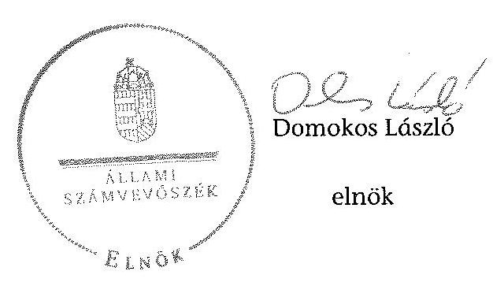

[^0]
[^0]:    ${ }^{67}$ Vhr. 9. § (3) bekezdés (hatályos 2010. december 31-ig), Vhr. 9. § (5) bekezdés (hatályos 2011. január 1-től)

---

# RÖVIDÍTÉSEK JEGYZÉKE 

| Jogszabályok |  |
| :--: | :--: |
| Áfa tv. | Az általános forgalmi adóról szóló 2007. évi CXXVII. törvény |
| Áht. 1 | Az államháztartásról szóló 1992. évi XXXVIII. törvény (hatálytalan: 2012. január 1-jétől) |
| Áht. 2 | Az államháztartásról szóló 2011. évi CXCV. törvény (hatályos: 2012. január 1-jétől) |
| Alaptörvény | Magyarország Alaptörvényéről szóló 2011. évi CCCCIIV. törvény (hatályos: 2012. január 1-jétől) |
| ÁSZ tv. | Az Állami Számvevőszékről szóló 2011. évi LXVI. törvény |
| Avtv. | A személyes adatok védelméről és a közérdekű adatok nyilvánosságáról szóló 1992. évi LXIII. törvény (hatálytalan 2012. január 1-jétől) |
| Evt. $_{1}$ | Az erdőről és az erdő védelméről szóló 1996. évi LIV. törvény (hatálytalan: 2009. július 10-től) |
| Evt. $_{2}$ | Az erdőről, az erdő védelméről és az erdőgazdálkodásról szóló 2009. évi XXXVII. törvény (hatályos: 2009. július 10-től) |
| Evr. $_{1}$ | Az erdőről és az erdő védelméről szóló 1996. évi LIV. törvény végrehajtásáról szóló 29/1997. (IV. 30.) FM rendelet (hatálytalan: 2009. november 21-től) |
| Evr. $_{2}$ | az erdőről, az erdő védelméről és az erdőgazdálkodásról szóló 2009. évi XXXVII. törvény végrehajtásáról szóló 153/2009. (XI. 13.) FVM rendelet (hatályos: 2009. november 21-től) |
| Gt. | A gazdasági társaságokról szóló 2006. évi IV. törvény |
| Info. tv. | Az információs önrendelkezési jogról és az információszabadságról szóló 2011. évi CXII. törvény (hatályos: 2011. november 21-től) |
| Mfbtv. | A Magyar Fejlesztési Bank Részvénytársaságról szóló 2001. évi XX. törvény |
| Nfatv. | A Nemzeti Földalapról szóló 2010. évi LXXXVII. törvény |
| Nvtv. | A nemzeti vagyonról szóló 2011. évi CXCVI. törvény |
| Ptk. | A Polgári Törvénykönyvről szóló 1959. évi IV. törvény |
| Számv. tv. | A számvitelről szóló 2000. évi C. törvény |
| új Ptk. | A Polgári Törvénykönyvről szóló 2013. évi V. törvény |
| Vadvédelmi tv. | A vad védelméről, a vadgazdálkodásról, valamint a vadászatról 1996. évi LV. törvény |
| Vtv. | Az állami vagyonról szóló 2007. évi CVI. törvény |
| Vhr. |

 Az állami vagyonnal való gazdálkodásról 254/2007. (X. 4.) Korm. rendelet |
| 143/2009. (VII. 6.) Korm. rendelet | Az erdőgazdálkodási és erdővédelmi bírság mértékéről és kiszámításának módjáról |

---

262/2010. (XI. 17.) Korm. A Nemzeti Földalapba tartozó földrészletek hasznosításá- rendelet 11/2011. (II. 22.) Korm. A Nemzeti Földalap vagyonnyilvántartásának szabályai- rendelet ról

Egyéb rövidítések

| AK érték | Aranykorona érték |
| :--: | :--: |
| Alapító | A Magyar Állam, akinek a nevében a társaság feletti tulajdoni joggyakorló jár el |
| Alapító Okirat | A Szombathelyi Erdészeti Zrt. mindenkori hatályos Alapító Okirata |
| Áfa | Általános forgalmi adó |
| ÁSZ | Állami Számvevőszék |
| Belső Ellenőrzési Szabályzat | A Szombathelyi Erdészeti Zrt. mindenkori Belső Ellenőrzési Szabályzata |
| Erdészeti hatóság | Vas Megyei Mezőgazdasági Szakigazgatási Hivatal Erdészeti Igazgatósága (2010. december 31-ig); Vas Megyei Kormányhivatal Erdészeti Igazgatósága (2011. január 1-jétől) |
| EEVR | Egységes Erdészeti Vállalatirányítási Rendszer |
| EMVA | Mezőgazdasági Vidékfejlesztési Alap |
| FB | Felügyelő bizottság |
| FB ügyrend | A Szombathelyi Erdészeti Zrt. Felügyelő bizottságának ügyrendje |
| Forrás-SQL rendszer | Az MNV. Zrt. által üzemeltetett, a vagyonnyilvántartásra vonatkozó informatikai rendszer, amelynek feladata volt a vagyonkezelők számára a vagyonkataszteri jelentés elkészítésének és adathordozón történő továbbításának biztosítása, valamint a tulajdonosi joggyakorló vagyonkezelésében lévő vagyonelemek elektronikus adatbázisban történő tételes nyilvántartása |
| Ft | forint |
| ha | hektár |
| kezelt vagyon feletti tulajdonosi joggyakorló ${ }_{1}$ | Magyar Nemzeti Vagyonkezelő Zrt. |
| IG | Igazgatóság |
| Igazgatóságok | Szombathelyi Erdészeti Igazgatóság   Szentgotthárdi Erdészeti Igazgatóság   Sárvári Erdészeti Igazgatóság   Vasvári Erdészeti Igazgatóság |
| Informatikai Biztonsági Szabályzat | A Szombathelyi Erdészeti Zrt. mindenkori informatikai biztonsági szabályzata |
| INTOSSAI | Legfőbb Ellenőrző Intézmények Nemzetközi Szervezete |
| Iratkezelési szabályzat | A Szombathelyi Erdészeti Zrt. mindenkori Iratkezelési Szabályzata |
| ISSAI | nemzetközi standardok |
| JI | jegyzett tőke |

---

| KVI | Kincstári Vagyon Igazgatóság |
| :--: | :--: |
| Leltározási Szabályzat | A Szombathelyi Erdészeti Zrt. mindenkori Leltározási Szabályzata |
| M Ft | millió forint |
| MFB Zrt. | Magyar Fejlesztési Bank Zártkörűen Működő Részvénytársaság |
| MNV Zrt. | Magyar Nemzeti Vagyonkezelő Zártkörűen Működő Részvénytársaság, amely 2010. szeptember 1-jétől a Nemzeti Földalapba nem tartozó állami vagyon feletti tulajdonosi joggyakorló |
| NFA | Nemzeti Földalapkezelő Szervezet |
| NVT | Nemzeti Vagyongazdálkodási Tanács |
| ST | Saját tőke |
| Számviteli Politika | A Szombathelyi Erdészeti Zrt. mindenkori Számviteli Politikája |
| SZMSZ | A Szombathelyi Erdészeti Zrt. mindenkori Szervezeti és Működési Szabályzata |
| Szombathelyi Erdészeti Zrt. | A Szombathelyi Erdészeti Zártkörűen Működő Részvénytársaság |
| Társaság | A Szombathelyi Erdészeti Zártkörűen Működő Részvénytársaság |
| Társaság felett tulajdonosi joggyakorló; | Magyar Nemzeti Vagyonkezelő Zrt., mint a társaság feletti tulajdonosi joggyakorló 2009. január 1-jétől 2010. június 16-áig |
| Társaság felett tulajdonosi joggyakorló ${ }_{2}$ | Magyar Fejlesztési Bank Zrt., mint a társaság feletti tulajdonosi joggyakorló 2010. június 17-étől 2014. július 15-éig |
| Vadászati hatóság | Vas Megyei Mezőgazdasági Szakigazgatási Hivatal Földművelésügyi Igazgatósága (2010. december 31-ig); a Vas Megyei Kormányhivatal Földművelésügyi Igazgatósága (2011. január 1-jétől) |
| Vezérigazgató   VSZ | a Szombathelyi Erdészeti Zrt. vezérigazgatója   a KVI-vel 1996. november 1-jén kötött ideiglenes vagyonkezelési szerződés |

---

.

---

# FOGALOMTÁR 

állami vagyon
a) az állam tulajdonában lévő dolog, valamint dolog módjára hasznosítható természeti erő;
b) az a) pont hatálya alá tartozó mindazon vagyon, amely vonatkozásában törvény az állam kizárólagos tulajdonjogát nevesíti;
c) az állam tulajdonában lévő tagsági jogviszonyt megtestesítő értékpapír, illetve az államot megillető egyéb társasági részesedés;
d) az államot megillető olyan immateriális, vagyoni értékkel rendelkező jogosultság, amelyet jogszabály vagyoni értékű jogként nevesít;
e) az állam tulajdonában lévő pénzügyi eszközök.
állami vagyon használója
átlátható szervezet
földbirtok-politikai irányelvek
hasznosítás
immateriális szolgáltatásából származó bevétel
információs és kommunikációs rendszer
Kincstári Vagyoni Igazgatóság

Az állami vagyon használója az a természetes vagy jogi személy, jogi személyiséggel nem rendelkező szervezet, aki, vagy amely törvény vagy szerződés alapján, bármely jogcímen (bérlet, haszonbérlet, használat stb.) állami vagyont birtokol, használ, szedi annak hasznait. (Ide nem értve a haszonélvezőt, a vagyonkezelőt és a tulajdonosi jogok gyakorlóját.)
Átlátható szervezet a Nvtv. 3. § (1) bekezdés 1. pontjában felsorolt, a meghatározott követelményeknek megfelelő szervezet.
Az Nfatv. 15. § (3) bekezdés a)-s) pontjaiban meghatározott, a Nemzeti Földalapba tartozó földrészletek hasznosítására vonatkozó irányelvek.
Hasznosítás a tulajdonosi joggyakorló vagy a nemzeti vagyon használója által a nemzeti vagyon birtoklásának, használatának, hasznok szedése jogának bármely - a tulajdonjog átruházását nem eredményező - jogcímen történő átengedése, ide nem értve a vagyonkezelésbe adást, valamint a haszonélvezeti jog alapítását.
Immateriális szolgáltatásból származó bevételek azok a nem anyagjellegű szolgáltatásokból származó állami bevételek, amelyeket az Evt. 3. § (1) bekezdése szerint, a külön jogszabályban meghatározott részletes feltételek szerint, az erdők fenntartására, gyarapítására és védelmére kell fordítani.
Az információs és kommunikációs rendszer biztosítja, hogy az információk eljussanak az illetékes szervezethez, szervezeti egységhez, illetve személyhez.
A Vtv. 61. § (1) bekezdése értelmében a Kincstári Vagyoni Igazgatóság (a továbbiakban: KVI) 2007. december 31-ei hatállyal megszűnt, jogai és kötelezettségei ezen időponttól - a 66. § (1) bekezdésében megjelölt feladat kivételével - az MNV Zrt.-re szálltak. A KVI 66. § (1) bekezdésben foglalt feladata a kincstárra szállt. A jogok és kötelezettségek átszállása nem minősült a KVI által kötött szerződések módosításának.

---

kockázatkezelés
kockázatkezelési rendszer
kontrolling
kontrollkörnyezet
kontrolltevékenységek
közfeladat

A kockázatkezelés a szervezet céljai elérésével kapcsolatos kockázatok azonosításának és elemzésének, valamint a megfelelő válaszok meghatározásának folyamata.
A kockázatkezelési rendszer működtetése során fel kell mérni és meg kell állapítani a szervezet tevékenységében, gazdálkodásában rejlő kockázatokat, valamint meg kell határozni az egyes kockázatokkal kapcsolatban szükséges intézkedéseket, valamint azok teljesítésének folyamatos nyomon követésének módját. A kockázatkezelési rendszer olyan irányítási eszközök és módszerek összessége, amelynek elemei a szervezeti célok elérését veszélyeztető tényezők (kockázatok) azonosítása, elemzése, nyomon követése, valamint szükség esetén a kockázati kitettség mérséklése.
Az a vezetéstámogató rendszer, amely a vezetői tervezést, ellenőrzést, valamint információ-ellátást koordinálja célorientáltan a környezeti változásokhoz igazodva.
A kontroll környezet elemei: a szervezeti struktúra, a felelősségi, hatásköri viszonyok és feladatok, a szervezet minden szintjén meghatározott etikai elvárások, a humánerőforráskezelés. A kontrollkörnyezet alapozza meg a belső kontroll összes többi elemét a fegyelem és a struktúra biztosítása által.
A kontrollrendszer a kockázatok kezelése és tárgyilagos bizonyosság megszerzése érdekében kialakított folyamatrendszer, amely azt a célt szolgálja, hogy megvalósuljanak a következő célok:
a) a működés és a gazdálkodás során a tevékenységeket szabályszerűen, gazdaságosan, hatékonyan, eredményesen hajtsák végre,
b) az elszámolási kötelezettségeket teljesítsék, és
c) megvédjék az erőforrásokat a veszteségektől, károktól és nem rendeltetésszerű használattól.
A kontrolltevékenységek azok az elvek (politikák) és eljárások, amelyeket a kockázatok meghatározása és a szervezet céljainak elérése érdekében alakítanak ki.
A közfeladat jogszabályban meghatározott állami vagy önkormányzati feladat, amit az arra kötelezett közérdekből, jogszabályban meghatározott követelményeknek és feltételeknek megfelelve végez, ideértve a lakosság közszolgáltatásokkal való ellátását, továbbá az állam nemzetközi szerződésekben vállalt kötelezettségeiből adódó közérdekű feladatokat, valamint e feladatok ellátásához szükséges infrastruktúra biztosítását is. Az Etv. 2. § (2) bekezdése szerint a fenntartható erdőgazdálkodás során a legfontosabb közérdekű feladat az erdők változatosságának megőrzése, az erdők fenntartása, felújítása és a védelmi, valamint közjóléti szolgáltatások biztosítása, melyek elvégzését az állam megfelelő eszközökkel biztosítja.

---

monitoring

Nemzeti Földalap
nemzeti vagyon használója
rábízott állami vagyon
társasági portfólió

A szervezet tevékenységének, a célok megvalósításának nyomon követését biztosító rendszer, amely az operatív tevékenységek keretében megvalósuló folyamatos és eseti nyomon követésből, valamint az operatív tevékenységektől függetlenül működő belső ellenőrzésből áll. A monitoring a projektek és programok végrehajtásának nyomon követése, mely a támogató és a kedvezményezett közti megállapodásban foglalt eljárások követését, az előrehaladás ellenőrzését és a lehetséges problémák időben történő azonosítását szolgálja.
A Nemzeti Földalap a kincstári vagyon része, amelybe beletartoznak az állam tulajdonában és az ingatlan-nyilvántartásban levő, az Nfatv. 1. § (1)-(2) bekezdéseiben felsorolt területek, földrészletek és az azokhoz kapcsolódó vagyoni értékű jogok.
Az Nfatv. 15. § (1) ${ }^{1}$, valamint 1. § (1) ${ }^{2}$ bekezdése értelmében 2010. szeptember 1-jétől az erdőgazdasági társaság vagyonkezelésében lévő földterületek a Nemzeti Földalapba tartoznak, azok felett a tulajdonos jogait az agrárpolitikáért felelős miniszter az NFA útján gyakorolja.
A nemzeti vagyon használója az a természetes személy, jogi személy vagy jogi személyiséggel nem rendelkező szervezet, aki, vagy amely állami vagyon tekintetében törvény vagy szerződés alapján, a helyi önkormányzat vagyona tekintetében törvény, a helyi önkormányzat rendelete vagy szerződés alapján bármely jogcímen nemzeti vagyont birtokol, használ, szedi annak hasznait, kivéve a tulajdonosi joggyakorló (az Nvtv. 3. § (1) bekezdés 11. pontja alapján).
Rábízott állami vagyon az a Vtv. alkalmazásában állami vagyonnak minősülő vagyon, amit az MNV - a saját vagyonától elkülönítetten - kezel és nyilvántart. Az Mfbtv. 3. § (9) bekezdése szerint rábízott állami vagyon az a vagyon, amely felett az Mfbtv. erejénél fogva a Magyar Állam nevében az MFB gyakorolja a tulajdonosi jogokat. Az Nfatv. 1. § (1) bekezdésében foglaltak alapján az NFA-hoz tartozó rábízott vagyon a törvényben meghatározott, a Nemzeti Földalapba tartozó vagyon.
Társasági portfólió az MNV, illetve az MFB rábízott vagyonába tartozó állami tulajdonú társasági részesedések.

[^0]
[^0]:    ${ }^{1}$ Hatályos: 2010. szeptember 1 - 2011. július 31.
    ${ }^{2}$ Hatályos: 2010. szeptember-jétől, módosítva: 2011. augusztus 1-jétől.

---

tulajdonosi ellenőrzés
tulajdonosi joggyakorló
tulajdonosi joggyakorlás módja
vagyongazdálkodás feladata
vagyonkezelői jog

Az MNV/MFB tulajdonosi joggyakorló által végzett ellenőrzés, amelynek célja az állami vagyonnal való gazdálkodás vizsgálata, ennek keretében a rendeltetésellenes, jogszerűtlen, szerződésellenes, vagy a tulajdonos érdekeit sértő, illetve a központi költségvetést hátrányosan érintő vagyongazdálkodási intézkedések feltárása és a jogszerű állapot helyreállítása, továbbá a vagyonnyilvántartás hitelességének, teljességének és helyességének biztosítása.
Tulajdonosi joggyakorló az, aki az állami, illetve a nemzeti vagyon felett az államot megillető tulajdonosi jogok és kötelezettségek gyakorlására jogosult.
Az állami vagyon felett a Magyar Államot megillető tulajdonosi jogoknak (és kötelezettségeknek) az összességét az állami vagyon felügyeletéért felelős miniszter gyakorolja, aki e feladatát az MNV, az MFB útján látja el. Azon állami tulajdonban álló ingatlanok felett, amelyek egy része a Nemzeti Földalapba tartozik, a tulajdonosi jogokat a miniszter az agrárpolitikáért felelős miniszterrel közösen gyakorolja. A Nemzeti Földalap felett a Magyar Állam nevében a tulajdonosi jogokat és kötelezettségeket az agrárpolitikáért felelős miniszter a Nemzeti Földalapkezelő Szervezet útján gyakorolja.
Az állami vagyon rendeltetésének megfelelő - az állami feladatok ellátásához, a társadalmi szükségletek kielégítéséhez, valamint a Kormány gazdaságpolitikája megvalósításának elősegítéséhez szükséges, egységes elveken alapuló, önálló ágazatként megjelenő - hatékony, költségtakarékos, értékmegőrző, értéknövelő felhasználásának biztosítása, beleértve a vagyoni kör változását eredményező értékesítést, valamint az állami vagyon gyarapítása is.
Vagyonkezelési szerződés alapján a vagyonkezelő jogosult meghatározott, állami tulajdonba tartozó dolog birtoklására, használatára
 és hasznai szedésére. A Vtv. alapján a vagyonkezelői jog az állami vagyon hasznosítására az MNV-vel kötött vagyonkezelési szerződéssel jön létre. A vagyonkezelési szerződés alapján a vagyonkezelő jogosult meghatározott, állami tulajdonba tartozó dolog birtoklására, használatára és hasznai szedésére. Az Nfatv. alapján a vagyonkezelői jog az erre irányuló (NFA-val kötött) szerződéssel jön létre. A vagyonkezelői szerződés alapján a vagyonkezelő jogosult meghatározott földrészlet birtoklására, használatára és hasznai szedésére. A vagyonkezelő köteles a földrészlet értékét megőrizni, állagának megóvásáról, jó karban tartásáról gondoskodni, továbbá - az Nfatv.-ben meghatározott esetek kivételével - díjat fizetni vagy a szerződésben előírt más kötelezettséget teljesíteni.

---

A Szombathelyi Erdészeti Zrt. vagyonváltozásának alakulása a 2009-2013. évek közötti időszakban - Eszközök (M ft)
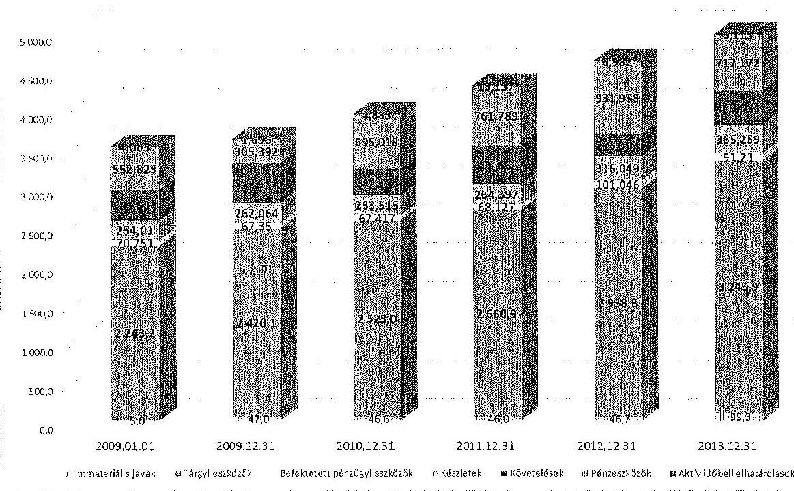

A Szombathelyi Erdészeti Zrt. vagyonváltozásának alakulása a 2009-2013. évek közötti időszakban - Források (M ft)
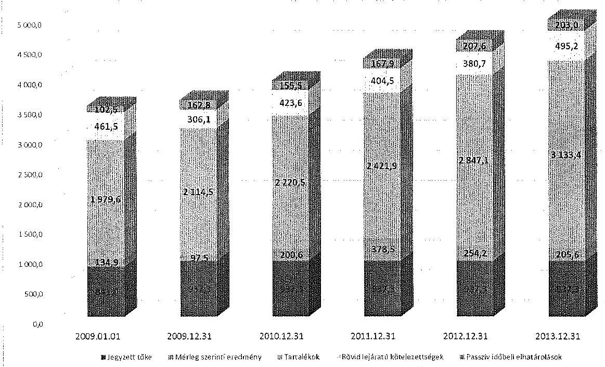

---

|  6.12.2017 40112012 15.04.2017 12:00 |  |  |  |  |  |  |  |  |  |  |  |  |  |  |  |  |  |   |
| --- | --- | --- | --- | --- | --- | --- | --- | --- | --- | --- | --- | --- | --- | --- | --- | --- | --- | --- | --- |
|  6.12.2017 40112012 15.04.2017 12:00 |  |  |  |  |  |  |  |  |  |  |  |  |  |  |  |  |  |  |   |
|  6.12.2017 40112012 15.04.2017 12:00 |  |  |  |  |  |  |  |  |  |  |  |  |  |  |  |  |  |  |   |
|  6.12.2017 40112012 15.04.2017 12:00 |  |  |  |  |  |  |  |  |  |  |  |  |  |  |  |  |  |  |   |
|  6.12.2017 40112012 15.04.2017 12:00 |  |  |  |  |  |  |  |  |  |  |  |  |  |  |  |  |  |  |   |
|  6.12.2017 40112012 15.04.2017 12:00 |  |  |  |  |  |  |  |  |  |  |  |  |  |  |  |  |  |  |   |
|  6.12.2017 40112012 15.04.2017 12:00 |  |  |  |  |  |  |  |  |  |  |  |  |  |  |  |  |  |  |   |
|  6.12.2017 40112012 15.04.2017 12:00 |  |  |  |  |  |  |  |  |  |  |  |  |  |  |  |  |  |  |   |
|  6.12.2017 40112012 15.04.2017 12:00 |  |  |  |  |  |  |  |  |  |  |  |  |  |  |  |  |  |  |   |
|  6.12.2017 40112012 15.04.2017 12:00 |  |  |  |  |  |  |  |  |  |  |  |  |  |  |  |  |  |  |   |
|  6.12.2017 40112012 15.04.2017 12:00 |  |  |  |  |  |  |  |  |  |  |  |  |  |  |  |  |  |  |   |
|  6.12.2017 40112012 15.04.2017 12:00 |  |  |  |  |  |  |  |  |  |  |  |  |  |  |  |  |  |  |   |
|  6.12.2017 40112012 15.04.2017 12:00 |  |  |  |  |  |  |  |  |  |  |  |  |  |  |  |  |  |  |   |
|  6.12.2017 40112012 15.04.2017 12:00 |  |  |  |  |  |  |  |  |  |  |  |  |  |  |  |  |  |  |   |
|  6.12.2017 40112012 15.04.2017 12:00 |  |  |  |  |  |  |  |  |  |  |  |  |  |  |  |  |  |  |   |
|  6.12.2017 40112012 15.04.2017 12:00 |  |  |  |  |  |  |  |  |  |  |  |  |  |  |  |  |  |  |   |
|  6.12.2017 40112012 15.04.2017 12:00 |  |  |  |  |  |  |  |  |  |  |  |  |  |  |  |  |  |  |   |
|  6.12.2017 40112012 15.04.2017 12:00 |  |  |  |  |  |  |  |  |  |  |  |  |  |  |  |  |  |  |   |
|  6.12.2017 40112012 15.04.2017 12:00 |  |  |  |  |  |  |  |  |  |  |  |  |  |  |  |  |  |  |   |
|  6.12.2017 40112012 15.04.2017 12:00 |  |  |  |  |  |  |  |  |  |  |  |  |  |  |  |  |  |  |   |
|  6.12.2017 40112012 15.04.2017 12:00 |  |  |  |  |  |  |  |  |  |  |  |  |  |  |  |  |  |  |   |
|  6.12.2017 40112012 15.04.2017 12:00 |  |  |  |  |  |  |  |  |  |  |  |  |  |  |  |  |  |  |   |
|  6.12.2017 40112012 15.04.2017 12:00 |  |  |  |  |  |  |  |  |  |  |  |  |  |  |  |  |  |  |   |
|  6.12.2017 40112012 15.04.2017 12:00 |  |  |  |  |  |  |  |  |  |  |  |  |  |  |  |  |  |  |   |
|  6.12.2017 40112012 15.04.2017 12:00 |  |  |  |  |  |  |  |  |  |  |  |  |  |  |  |  |  |  |   |
|  6.12.2017 40112012 15.04.2017 12:00 |  |  |  |  |  |  |  |  |  |  |  |  |  |  |  |  |  |  |   |
|  6.12.2017 40112012 15.04.2017 12:00 |  |  |  |  |  |  |  |  |  |  |  |  |  |  |  |  |  |  |   |
|  6.12.2017 40112012 15.04.2017 12:00 |  |  |  |  |  |  |  |  |  |  |  |  |  |  |  |  |  |  |   |
|  6.12.2017 40112012 15.04.2017 12:00 |  |  |  |  |  |  |  |  |  |  |  |  |  |  |  |  |  |  |   |
|  6.12.2017 40112012 15.04.2017 12:00 |  |  |  |  |  |  |  |  |  |  |  |  |  |  |  |  |  |  |   |
|  6.12.2017 40112012 15.04.2017 12:00 |  |  |  |  |  |  |  |  |  |  |  |  |  |  |  |  |  |  |   |

 |
|  

---

# SZOMBATHELYI ERDÉSZETI ZRT., H-9700 Szombathely, Saághy István u. 15. Levélcím: H-9704 Szombathely, Pf. 18

Az állami erdők nyitva állnak a természetszeretők előtt

Állami Számvevőszék Elnöke
Domokos László elnök úr részére
1364 Budapest IV.
Pf. 54.

Ügyszám: SZHE/107-36/2015. szám
Tárgy: Észrevétel az Állami Számvevőszék „Az állami tulajdonban álló erdőgazdasági társaságok vagyongazdálkodási tevékenységének ellenőrzése- Szombathelyi Erdészeti Zrt. „ című számvevőszéki jelentéstervezetére
Hivatkozási szám: V-0757-059/2015.

Tisztelt Elnök Úr!

A Szombathelyi Erdészeti Zrt. részéről az Állami Számvevőszékről szóló 2011. évi LXVI. törvény 29. § (2) bekezdésében biztosított lehetőségre tekintettel a tárgybani jelentéstervezet idézett megállapításaira az alábbi észrevételeket tesszük azzal, hogy az észrevételek a jelentéstervezet ugyanazon tárgykörben megfogalmazott témaköreire is vonatkoznak, az ellenőrzött időszakon túl hasonlóan a jelentéstervezethez, kitekintéssel a helyszíni ellenőrzés végéig tartó folyamatokra, intézkedésekre:

A jelentéstervezet megállapításait alapvetően befolyásolja az a tény, hogy jelenleg az 1996-ban kötött Ideiglenes vagyonkezelői szerződés szabályozza a kezelt vagyon tekintetében a tulajdonosi joggyakorló és a vagyonkezelő viszonyát.

Az ideiglenes vagyonkezelési szerződéssel Társaságunk az addig is általa kezelt termőföldeket, valamint az erdőállományt vette kezelésbe.

A jelentéstervezet megállapításait alapvetően befolyásolja az a tény, hogy jelenleg az 1996-ban kötött Ideiglenes vagyonkezelői szerződés szabályozza a kezelt vagyon tekintetében a tulajdonosi joggyakorló és a vagyonkezelő viszonyát.

Az ideiglenes vagyonkezelési szerződéssel Társaságunk az addig is általa kezelt termőföldeket, valamint az erdőállományt vette kezelésbe.

A jelentéstervezet megállapításait alapvetően befolyásolja az a tény, hogy jelenleg az 1996-ban kötött Ideiglenes vagyonkezelői szerződés szabályozza a kezelt vagyon tekintetében a tulajdonosi joggyakorló és a vagyonkezelő viszonyát.

Az ideiglenes vagyonkezelési szerződéssel Társaságunk az addig is általa kezelt termőföldeket, valamint az erdőállományt vette kezelésbe.

A jelentéstervezet megállapításait alapvetően befolyásolja az a tény, hogy jelenleg az 1996-ban kötött Ideiglenes vagyonkezelői szerződés szabályozza a kezelt vagyon tekintetében a tulajdonosi joggyakorló és a vagyonkezelő viszonyát.

Az ideiglenes vagyonkezelési szerződéssel Társaságunk az addig is általa kezelt termőföldeket, valamint az erdőállományt vette kezelésbe.

A jelentéstervezet megállapításait alapvetően befolyásolja az a tény, hogy jelenleg az 1996-ban kötött Ideiglenes vagyonkezelői szerződés szabályozza a kezelt vagyon tekintetében a tulajdonosi joggyakorló és a vagyonkezelő viszonyát.

Az ideiglenes vagyonkezelési szerződéssel Társaságunk az addig is általa kezelt termőföldeket, valamint az erdőállományt vette kezelésbe.

A jelentéstervezet megállapításait alapvetően befolyásolja az a tény, hogy jelenleg az 1996-ban kötött Ideiglenes vagyonkezelői szerződés szabályozza a kezelt vagyon tekintetében a tulajdonosi joggyakorló és a vagyonkezelő viszonyát.

Az ideiglenes vagyonkezelési szerződéssel Társaságunk az addig is általa kezelt termőföldeket, valamint az erdőállományt vette kezelésbe.

A jelentéstervezet megállapításait alapvetően befolyásolja az a tény, hogy jelenleg az 1996-ban kötött Ideiglenes vagyonkezelői szerződés szabályozza a kezelt vagyon tekintetében a tulajdonosi joggyakorló és a vagyonkezelő viszonyát.

Az ideiglenes vagyonkezelési szerződéssel Társaságunk az addig is általa kezelt termőföldeket, valamint az erdőállományt vette kezelésbe.

---

# SZOMBATHELYI ERDÉSZETI ZRT. 

H-9700 Szombathely, Saághy István u. 15. Levélcím: H-9704 Szombathely, Pf. 18

Az állami erdők nyitva állnak a természetszeretők előtt
2002-ben ismét módosításokkal egységes szerkezetbe foglalt vagyonkezelési szerződés tervezetet küldött meg Társaságunk részére a Kincstári Vagyoni Igazgatóság, melyet ezúttal a tulajdonosi joggyakorló már aláírt, Társaságunk vezérigazgatója szintén (a tervezetet csatoljuk, minden aláírt példányt megküldtük a tulajdonosi joggyakorlónak, így Társaságunk által aláírt példánnyal nem rendelkezünk). Ezen szerződés a Földművelésügyi és Vidékfejlesztési Miniszter, valamint a Környezetvédelmi Miniszter egyetértése hiányában nem jött létre.

2006-ban a Nemzeti Földalapkezelő Szervezet és a Kincstári Vagyoni Igazgatóság készített vagyonkezelési szerződés tervezetet a Magyar Állam tulajdonában lévő erdővagyon vagyonkezelői jogának megszerzésére és gyakorlásának feltételeinek rögzítésére. A szerződés Társaságunkon kívül álló okok miatt szintén nem jött létre.

2008-ban két vagyonkezelési szerződés tervezetet is kapott Társaságunk, melyek egyikének fejlécében látszik, hogy egységes elvek mentén, az erdőgazdaságok részére, mint egy adott vagyonkezelői kör részére egységesen került elkészítésre és megküldésre, mely tervezetek 50 évre adták volna az erdőgazdaságok vagyonkezelésébe az állami vagyont. Ezen első, júliusi tervezetet is véleményeztük - mellékelten csatoljuk - , majd ezt követően érkezett az októberi tervezet. A tervezet szerinti szerződések egyike sem került aláírásra, szintén Társaságunkon kívül álló ok miatt.

2009-ben az MNV Zrt. küldte meg a vagyonkezelési szerződés tervezetét, a tervezetet és annak véleményezését szintén mellékeljük. A vagyonkezelési szerződés szintén nem került aláírásra.

Az MNV Zrt. által 2014. áprilisban és októberben megküldött vagyonkezelési szerződés tervezetet és annak Társaságunk általi véleményezését az ÁSZ ellenőrzés során már rendelkezésre bocsátottuk.

Fentiek alapján folyamatosan megvalósult a végleges vagyonkezelési szerződés megkötésére irányuló szándék, a folyamatban Társaságunk konstruktívan részt vett, Társaságunknak nem róható fel a végleges vagyonkezelési szerződések megkötésének elmaradása.

1. „A Társaság a kezelt erdőket és földingatlanokat a Számv.tv. előírásai ellenére mérlegében az ellenőrzött időszakban nem szerepeltette, ezáltal a Társaság mérlege nem volt megbízható és valós. A Társaság a Számv.tv. előírásaival ellentétben a kezelt vagyont mérlegtételi szerinti bontásban a kiegészítő mellékletében nem mutatta be."
„A Társaság a kezelt földterületeket nyilvántartásában érték nélkül szerepeltette mérlegében", és azokat „mérlegtételi szerinti bontásban Kiegészítő mellékletében sem mutatta be", mivel ahogy ez a II. részletes megállapítások fejezet 23. oldal 3. bekezdésében is megfogalmazásra került: „A Társaságnak, mint vagyonkezelőnek a Vhr. 9. § (9) bekezdés a) pontja szerint a vagyonkezelési szerződésben meghatározott értéken kell kimutatni a mérlegében az eszközök között kezelésbe vett, az állami vagyon részét képező eszközöket a hosszú lejáratú kötelezettségekkel szemben."
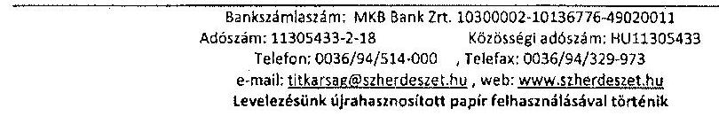

---

# SZOMBATHELYI ERDÉSZETI ZRT. 

H-9700 Szombathely, Saághy István u. 15. Levélcím: H-9704 Szombathely, Pf. 18

Az állami erdők nyitva állnak a természetszeretők előtt
Az 1996. évben kötött Ideiglenes vagyonkezelési szerződés és annak mellékletei sem határoztak meg a kezelt állami vagyon tekintetében értéket, így a fentiekben foglaltaknak Társaságunk nem tudott és nem tud eleget tenni.
Ezt támasztja alá a Szombathelyi Erdészeti Zrt. 2010-2014 évek közötti időszakra vonatkozó pénzügyi, gazdasági átvilágításáról az Universal-Saldo Könyvvizsgáló, Pénzügyi és Tanácsadó Kft. által készített jelentésben szereplő megállapítás, miszerint: „A társaság a vagyonkezelt területeket csak naturáliákban tartja nyilván, értékbeli nyilvántartást a könyveiben nem vezet. A valós vagyoni helyzet bemutatása érdekében maradéktalanul be kell tartani a Számvitelről szóló törvény előírásait. A Társaság a vagyonkezelésbe vett területeket rendezze a könyveiben, azokat tartsa nyilván az ingatlanok között a hosszú lejáratú kötelezettségekkel szemben. Ezen feladatnak a társaság természetesen csak akkor tud eleget tenni, ha az NFA a végleges vagyonkezelési szerződésben megadja a vagyonkezelésbe adott ingatlanok értékadatait is."
Ugyan a Számviteli törvény hivatkozott 23. § (2) bekezdése előírja, a kezelt földterületeket eszközként a hosszú lejáratú kötelezettségekkel szemben meg kell jeleníteni és mérleg szerinti bontásban Kiegészítő mellékletben be kell mutatni. De a Pénzügyminisztérium Számviteli Főosztálya 9806/1997 NG-1129/97. számú a "Kincstári vagyon számviteli elszámolása a vagyonkezelőnél" tárgyában, az Állami Privatizációs és Vagyonkezelő Rt. vezérigazgató-helyettesének, Dr. Kocsis István úrnak írt, 1997. november 25-én kelt levelének 2. oldal utolsó bekezdésében azt is megfogalmazta, hogy "A számviteli törvény 21.§-ának (3) bekezdésében megfogalmazott előírás feltételezi, hogy a kezelt kincstári vagyon megfelelő módon, dokumentáltan értékelésre kerül, hiszen csak ez esetben lehet azt az eszközök és a kötelezettségek között értékkel kimutatni. Ebből - természetesen - az is következik, amíg megfelelő értékelés nem áll rendelkezésre, vagy az adott kincstári vagyont nem lehet - természeténél fogva - értékelni, addig (és akkor) nem lehet/nem tudjuk/ alkalmazni a törvény hivatkozott 21. § (3) bekezdésének rendelkezését sem." (A hivatkozott levelet mellékeltük.)
Társaságunk, amennyiben a kezelt vagyon megfelelő módon, dokumentáltan értékelésre kerül, és az értékadatok a vagyonkezelési szerződésben, vagy annak mellékletében rögzítésre kerülnek, természetesen haladéktalanul eleget fog tenni a Számviteli törvény hivatkozott előírásainak.
A bevezetőben, valamint a fentiekben leírtak miatt, a felelősség tisztázása érdekében intézkedést nem tartom szükségesnek.
2. „A Társaság VSZ eredeti, hitelesként egyértelműen beazonosítható, a kezelt vagyon felsorolását tartalmazó 1-4.sz. mellékleteivel nem rendelkezett."
Az ideiglenes vagyonkezelési szerződést a Kincstári Vagyoni Igazgatóságtól kapta Társaságunk mellékletek nélkül. A tulajdonosi joggyakorlók részére ezt követően az általuk kért formátumban több alkalommal készítettünk kimutatást és küldtük meg részükre a kezelt vagyon vonatkozásában.

---

# SZOMBATHELYI ERDÉSZETI ZRT. 

H-9700 Szombathely, Saághy István u. 15. Levélcím: H-9704 Szombathely, Pf. 18

Az állami erdők nyitva állnak a természetszeretők előtt
3. „A kezelt vagyonról vezetett nyilvántartás - tekintettel a rendezetlen vagyonelemekre - nem felelt meg a Vhr. -ben foglaltaknak, mert nem biztosította az adatszolgáltatás pontosságát és ellenőrizhetőségét. A Társaság teljesítette a Vhr-ben előírt adatszolgáltatási kötelezettségét az MNV Zrt. felé, azonban a 262/2010.(XL.17.) Korm. rendeletben foglaltakkal ellentétben az NFA felé adatszolgáltatás nem történt."
A Nemzeti Földalapról szóló 2010. évi LXXXVII. tv. 2. §-a értelmében a Nemzeti Földalapba tartozó földrészlet hasznosítására és nyilvántartására, a Nemzeti Földalap feletti tulajdonosi jogok gyakorlására az e törvényben foglaltakat kell alkalmazni. Ezen törvény 7. § (1) bekezdés j./ pontja értelmében az NFA elnöke felelős a Nemzeti Földalapba tartozó földrészletek naprakész nyilvántartásáért, továbbá a 17. § (1) bekezdése értelmében a Nemzeti Földalapba tartozó földrészletekről és az azokon fennálló jogok jogosultjairól az NFA az e törvény végrehajtására kiadott jogszabályban meghatározottak szerint naprakész vagyonnyilvántartást vezet. A 32. § (1) bekezdés szerint, ezért felhatalmazást kapott a Kormány, hogy rendeletben állapítsa meg többek között a Nemzeti Földalap vagyonnyilvántartásának szabályait.
A Nemzeti Földalapba tartozó földrészletek hasznosításának részletes szabályairól szóló 262/2010. (XI. 17.) Korm. rendelet 47. § (1) bekezdése kimondja, hogy a vagyonkezelőt, haszonbérlőt, vagy az Nfatv. szerinti egyéb jogcímen alapuló szerződés szerinti használót megillető jogok gyakorlását, annak szabályszerűségét, célszerűségét az NFA ellenőrzi. Ennek érdekében a használó és az NFA közötti, a földrészlet használatára, hasznosítására létesített szerződésben rögzíteni kell, hogy a tulajdonosi ellenőrzés e rendelet szerinti eljárásrendjét, a felek jogait, kötelezettségeit a felek a szerződés részének tekintik.
(2) A tulajdonosi ellenőrzés célja a földrészlettel való gazdálkodás vizsgálata, ennek keretében a rendeltetésellenes, jogszerűtlen, szerződésellenes, vagy a tulajdonos érdekeit sértő intézkedések feltárása és a jogszerű állapot helyreállítása, továbbá a vagyonnyilvántartás hitelességének, teljességének és helyességének biztosítása.
A hivatkozott Kormányrendelet 50/A. § (1) bekezdése szerint a használót - a Nemzeti Földalap vagyon-nyilvántartásának naprakész vezetése és az NFA beszámoló-készítési kötelezettségének megalapozottsága érdekében
 - e rendelet, az NFA vagyon nyilvántartási szabályzata, valamint a szerződés szerinti adatszolgáltatási kötelezettség terheli a szerződés tartama alatt.
(2) A használó e rendelet szerinti adatszolgáltatási kötelezettsége az NFA felé akkor is fennáll, ha az NFA-val vagy az NFA jogelődjével kötött szerződés az adatszolgáltatási kötelezettségről nem rendelkezik.
50/B. § A Nemzeti Földalap vagyonnyilvántartásának naprakész vezetése és az NFA beszámoló-készítési kötelezettségének megalapozottsága érdekében a használó által az 50/A. §-ban meghatározottakon felül - a szerződés típusától függően szolgáltatandó egyéb adatok körét, továbbá az adatszolgáltatás gyakoriságát, részletes tartalmát, és módját az NFA a vagyon-nyilvántartási szabályzatában határozza meg. A szerződésben rögzíteni kell, hogy a használó az NFA vagyon nyilvántartási szabályzatát megismerte, és magára nézve kötelező érvényűnek ismeri el.

---

# SZOMBATHELYI ERDÉSZETI ZRT. 

H-9700 Szombathely, Saághy István u. 15. Levélcím: H-9704 Szombathely, Pf. 18

Az állami erdők nyitva állnak a természetszeretők előtt
A Nemzeti Földalap vagyonnyilvántartásának szabályairól szóló 11/2011. (II. 22.) Korm. rendelet 7. §-a rendelkezik arról, hogy a vagyonnyilvántartás vezetésének részletes szabályait az NFA - az agrárpolitikáért felelős miniszter által jóváhagyott szabályzatban határozza meg. A szabályzatot az NFA a honlapján közzéteszi.
Az NFA honlapján 2014. február 20-án kelt levéllel tették közzé a Nemzeti Földalapkezelő Szervezet vagyon nyilvántartási szabályzatáról szóló 10/2014 (IV.8.) NFA utasítást, mely 2014. április 9-én lépett hatályba. Társaságunk, mint a vagyonkezelők egyike a vagyon nyilvántartási szabályzat közzétételéről a tulajdonosi joggyakorlótól közvetlenül nem értesült.
A vagyon nyilvántartási szabályzat 4.2. pontja szerint az NFA vagyon nyilvántartási informatikai rendszere a Forrás SQL programon fut, a 6.1.1. pont értelmében az NFA vagyon- és földkönyvi nyilvántartását a Forrás SQL rendszer tartalmazza.
A vagyon nyilvántartási szabályzat 7.4.1. pontja szerint a vagyonkezelőt adatszolgáltatási kötelezettség terheli a szerződés tartama alatt. A 7.4.2. pont külön kiemeli, hogy a nyilvántartás egységessége, pontossága és az adatellenőrzések biztosítása érdekében az érintettek kötelesek az NFA-val mindenben együttműködni, míg a vagyon nyilvántartási szabályzat 7.2./c. pontja szerint a rendszer külső kapcsolatait (ideértve az adatszolgáltatásra kötelezetteket is) a VNYIG-vel együttműködve szakmailag meghatározza, rögzíti az adatcsere adattartalmát, az adatforgalmat felügyeli. A 7.4.5. pont a szabályzat mellékletét képező Adatlap alkalmazásával írja elő minden tárgyévet követő év január 15-ig az adatszolgáltatást.
Fentiek alapján ugyan a vagyonkezelőt akkor is adatszolgáltatási kötelezettség terheli az NFA felé, ha az NFA-val vagy az NFA jogelődjével kötött szerződés az adatszolgáltatási kötelezettségről nem rendelkezik, de az adatszolgáltatásnak egyrészt az NFA beszámoló-készítési kötelezettségéhez kell igazodnia, másrészt pedig az NFA által biztosított, működtetett Forrás SQL rendszerbe, ahhoz illeszkedő módon kell megvalósulnia. A vagyonkezelő részéről tehát egy strukturált adatszolgáltatást feltételez, melynek kereteit az NFA-nak kell meghatároznia, a vagyon nyilvántartási szabályzat pedig 2014. április 9-től volt alkalmazható. E strukturált adatszolgáltatáshoz szükséges útmutatás, rendszer az ÁSZ által ellenőrzött időszakban nem állt a vagyonkezelő rendelkezésére, a vagyon nyilvántartási szabályzat szerinti első adatszolgáltatási kötelezettség a vagyonkezelőt először 2015. évben kötelezte.
A 2012. december 31-i állapotnak megfelelő vagyonkezelői jelentést teljesítette Társaságunk az MNV Zrt. felé, mint ahogy ezt megelőző években is, az MNV Zrt. által biztosított informatikai rendszeren keresztül. Ezen jelentéssel egyidejűleg az MNV Zrt. útmutatása alapján kellett a nyilvántartásból kivezetni az NFA vagyonkörébe tartozó ingatlanokat, ugyanis mindaddig az MNV Zrt. felé teljesített adatszolgáltatásban mindkét tulajdonosi joggyakorlóhoz tartozó vagyonjelek az adatszolgáltatás tárgyát képezték. Ezt követően az NFA felé történő adatszolgáltatásra a 2014. április 9-én hatályba lépő, első ízben 2015-ben alkalmazandó NFA vagyon nyilvántartási szabályzat szerint járunk el.

---

# SZOMBATHELYI ERDÉSZETI ZRT. 

H-9700 Szombathely, Saághy István u. 15.
Levélcím: H-9704 Szombathely, Pf. 18
Az állami erdők nyitva állnak a természetszeretők előtt
4. „VSZ felülvizsgálata, egységes szerkezetbe foglalása nem történt meg, annak módosításai csak a kezelésbe átadott vagyon változásait tartalmazzák. A VSZ módosítását és annak módosításokkal történő egységes szerkezetbe foglalását sem a Társaság, sem a kezelt vagyoni kör felett tulajdonosi jogokat gyakorló MNV Zrt., illetve NFA nem kezdeményezte."
Az ideiglenes vagyonkezelési szerződés módosításait minden esetben a tulajdonosi joggyakorló az általa készített, illetve a megbízása alapján eljáró ügyvédi irodák által készített okiratokkal kezdeményezte, amely módosítás kezdeményezések minden esetben a VSZ mellékletének módosítására vonatkoztak és ingatlanonként külön szerződések voltak.
Az állami vagyonnal való gazdálkodásról szóló 254/2007. (X. 4.) Korm. rendelet módosításáról szóló 244/2015. (IX. 8.) Korm. rendelet időközben hatályon kívül helyezte a vizsgált időszakban még hatályos Vhr. 8.§ (2) bekezdését, azaz már nem szerepel a Vhr-ben az egységes szerkezetbe foglalási kötelezettség, amely abban az esetben állt fenn, ha a felek ugyanabban a szerződésben több állami tulajdonba tartozó vagyonelem vagyonkezeléséről rendelkeztek, s a szerződés hatálya alá tartozó vagyontárgyak köre változott.
5. „A felek ... nem kezdeményezték a Nemzeti Földalapba tartozó ingatlanokra vonatkozóan a VSZ megszüntetését és a Vtv., illetve Vhr. szabályainak megfelelő szerződés megkötését."
A kezdeményezett módosítások az előző pontban írtak szerint csak a VSZ mellékletére terjedtek ki, az időközben bekövetkezett jogszabályi változások miatt erre vonatkozó módosítást a tulajdonosi joggyakorló nem kezdeményezett, a jogszabályi változásokat is követő végleges vagyonkezelési szerződések pedig a bevezetőben írtak szerint nem jöttek létre. A jogszabályi változásokat ugyanakkor naprakészen nyomon követjük és Társaságunk a rábízott ingatlanok hasznosítását a szakági jogszabályok, szakmai előírások betartásával a jó gazda gondosságával az erdő állományának érdekében, a tulajdonosi elvárásoknak megfelelően végezte és végzi még akkor is, ha a VSZ nem került módosításra.
6. „Az ellenőrzött időszakban a Társaság feletti tulajdonosi joggyakorló felé fennálló beszámolási kötelezettségeinek eleget tett, azonban az erdővagyonról és annak változásáról készített külön írásbeli beszámolók nem álltak rendelkezésre."
A Nemzeti Földalapba tartozó földrészletek hasznosításának részletes szabályairól szóló 262/2010. (XI. 17.) Korm. rendelet 50/D.§ (2) bekezdése értelmében az erdészeti hatóság az állami erdők vagyonkezelőinek erdőgazdálkodási tevékenységéről szóló beszámolót a tárgyévet követő év július 15-ig megküldi az NFA részére. Tehát ezen kötelezettség nem Társaságunkat, mint vagyonkezelőt terheli.
Emellett az ÁSZ jelentés tervezet 23. oldalának utolsó bekezdése tartalmazza, hogy a Társaság a kezelt vagyonnal folytatott gazdálkodásra vonatkozó, szerződésből eredő beszámolási kötelezettségének eleget tett.

---

# SZOMBATHELYI ERDÉSZETI ZRT. 

H-9700 Szombathely, Saághy István u. 15. Levélcím: H-9704 Szombathely, Pf. 18

Az állami erdők nyitva állnak a természetszeretők előtt
7. „A Társaságnál az ellenőrzött időszakban az adatok védelme biztosított volt, azonban a közérdekű adatok nyilvánosságra hozatala - az Avtv-ben, és az Info tv.-ben rögzített, a közérdekű adatok megismerésére irányuló igények teljesítésének rendjére vonatkozó szabályozás hiánya miatt - nem felelt meg teljes mértékben a jogszabályi előírásoknak."
Társaságunk az Avtv-ben, majd az Info tv.-ben a közérdekű adatok megismerésére irányuló igények teljesítésének rendjére vonatkozó rendelkezéseket mindig maradéktalanul betartotta, annak a Társaságnál kialakult gyakorlata volt, amelyet a 2014. szeptember 1-én hatályba lépő BSZ-67. számú „A közérdekű adatok megismerésére irányuló igények teljesítésének rendjéről" szóló Szabályzatban írásban is rögzítettünk.
Az elutasított kérelmekről, valamint az elutasítások indokairól nyilvántartást vezetünk, az abban foglaltakról január 31-éig tájékoztattuk a Nemzeti Adatvédelmi és Információszabadság Hatóságot.
8. „Tegyen intézkedést a tulajdonosi joggyakorlókkal közreműködve a tényleges állapotnak és a hatályos jogszabályi előírásoknak megfelelő vagyonkezelési szerződés megkötése érdekében."
A vizsgált időszakban is, azt megelőzően is és azt követően is a tulajdonosi joggyakorló több alkalommal megkereste többek között Társaságunkat is, mint vagyonkezelőt végleges vagyonkezelési szerződés tervezettel, melyek elveinek egyeztetésében folyamatosan, a tulajdonosi joggyakorló által megadott határidőn belül együttműködően részt vettünk (lsd. részletesen jelen levelünk bevezetésében írtak és ennek alátámasztására csatolt mellékletek). Az ellenőrzési időszakban, 2014. áprilisában, majd azt követően 2014. októberében az MNV Zrt. által megküldött végleges vagyonkezelési szerződés tervezettel kapcsolatban megfogalmaztuk javaslatainkat. A Társaságunk Felügyelő Bizottságával véleményeztettük a végleges vagyonkezelési szerződés mellékletét képező vagyonlistát, amely vagyonlistát tulajdonosi joggyakorlónk, Földművelésügyi Miniszter Úr Alapító Határozatban ez alapján jóvá is hagyott, amelyet az MNV Zrt. vezérigazgatójához vagyonkezelői jogviszonyt létesítő vagyonkezelői szerződés elkészítésének kezdeményezésével megküldtünk.
Társaságunk szintjén további intézkedés megtétele nem lehetséges.
9. „Intézkedjen a vagyonkezelési szerződés felülvizsgálatának elmaradásával feltárt szabálytalanságok tekintetében a felelősség tisztázása érdekében, és szükség szerint intézkedjen a felelősség érvényesítéséről."
Az előzőekben részletesen bemutattuk Társaságunknak a tulajdonosi joggyakorló által koordinált részvételét a vagyonkezelési szerződés felülvizsgálatában, végleges vagyonkezelési szerződés megkötésében, valamint utalunk arra, hogy Társaságunknál folyamatosan, Társaságunk SZMSZ-e 5.2.3. a./ pontjában rögzített kötelezettségként figyeljük a jogszabályi változásokat. Így tevékenységünket mind a vagyongazdálkodásra vonatkozó jogszabályok, mind a kezelt vagyonra vonatkozó szakmai jogszabályok alapján végezzük. Ezen túlmenően, ami az adott helyzetben elvárható volt, azt mindig határidőben megtettük. A vagyonkezelési szerződés

[^0]
[^0]:    Bankszámlaszám: MKB Bank Zrt. 10300002-10186776-49020011 Adószám: 11305433-2-18 Kötősségi adószám: HU11305433 Telefon: 0036/94/514-000 , Telefax: 0036/94/329-973 e-mail: tshassaz@zrherdsz.nt.hu, web: www.zrherdsz.nt.hu
    Levelezésünk újrahasonosított papír felhasználásával történik

---

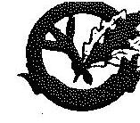

# SZOMBATHELYI ERDÉSZETI ZRT.

H-9700 Szombathely, Svághy István u. 15.
Levélcím: H-9704 Szombathely, Pf. 18

Az állami erdők nyitva állnak a természetszeretők előtt

ideiglenessége, a tulajdonosi joggyakorló által kezdeményezett módosításokkor, alkalmankénti felülvizsgálatának hiánya jogszabálysértéshez nem vezetett.

A fentiekben leírtak miatt, a felelősség tisztázása érdekében intézkedést nem tartunk szükségesnek.

## 10. "A Társaság a vagyonkezelői kötelezettségeinek az ellenőrzött időszakban részben tett eleget, mivel a Etv.: 9.§ (3) bekezdésében foglalt tiltás ellenére három alkalommal bérleti szerződést kötött erdőművelési ágba tartozó területre."

"A Társaságnak az Evt.: hatálybalépésének időpontjában a rendelkezésre bocsátott vagyonhasznosítási szerződések listája alapján öt darab vagyonkezelésben lévő földterület bérbeadásáról szóló határozott idejű szerződése volt. Ezek közül az egyik szerződés szerint a Társaság a Csehimindszent külterületen lévő 0244 hrsz. alatti kivett területet 2020.12.31-ig adta bérbe a Magyar Telekom Nyrt. Mobil Szolgáltatások Üzletága részére rádiótelefon bázisállomás üzemeltetése céljára."

A Hosszúpereszteg 0244 hrsz-ú ingatlan bérbe adásával érintett ingatlan nem erdő művelési ágú terület, így a bérbeadásával történő hasznosítás, illetve a bérleti szerződés meghosszabbítása sem sértette az Evt. előírásait. A bérelt területen lévő bázisállomásnak a térségében lévő települések mobilhálózatának működése érdekében a jövőben is jelentős szerepe van.

"A Társaság a lejárat szerződések közül a Koko-Pet Kft.-vel 2010-2011-2012. években évenként új szerződést kötött Hosszúpereszteg 0465/21 hrsz-ú erdőművelési ágba tartozó – vagyonkezelő ingatlannak parkoló céljára történő bérbeadására. Ezzel a Társaság három alkalommal sértette meg az Evt.: 9.§ (3), valamint az Nfatv. 20.§ (7) bekezdésében foglalt előírásokat."

A Koko-Pet Kft.-vel kötött szerződés a Hosszúpereszteg 0465/21 hrsz-ú ugyan erdő művelési ágú ingatlanon kialakított, de nyiladékként az erdészeti hatóság által jogerős határozattal jóváhagyottan üzemtervezett, nem erdőként üzemtervezett parkoló üzemeltetésére vonatkozott és nem volt hatással, nem érintette az erdő állományt és az erdőgazdálkodói jogosultságunkat sem, Társaságunk a szerződéskötések során jóhiszeműen járt el. A nyiladékként üzemtervezett parkoló funkciójában kapcsolódott az elsődleges rendeltetésében amúgy is parkerdőként, s nem gazdasági elsődleges rendeltetésű erdőként üzemtervezett területhez.

Társaságunkat az erdészeti hatóság közhiteles erdőgazdálkodói nyilvántartásba erdőgazdálkodóként nyilvántartásba vette, jelenleg is erdőgazdálkodóként szerepel négy erdőgazdálkodói kódon, erdészeti igazgatóságonként. Az erdőgazdálkodói
 jogosultságunk nem szűnt meg, nem változott, jelenleg is folyamatos, erdőgazdálkodói alkalmasságunk a közhiteles nyilvántartásba vétel óta folyamatosan fennáll. Ennek bizonyítására az ellenőrzés során csatoltuk a Vas Megyei Kormányhivatal Erdészeti Igazgatósága VAG/EI/1699-2/2015. számú hatósági bizonyítványát.

## 11. "A kőszegi 0344 hrsz-ú ingatlanon lévő Erdei Iskola és Múzeum, a Hosszúpereszteg 0365/121 hrsz-ú ingatlanon lévő, a Szakonyfalu 0112 hrsz-ú ingatlanon lévő erdészház, amelyek a Társaság nyilvántartásában szerepeltek, de a tulajdonosi joggyakorló döntése ellenére a tulajdonjog rendezéséhez szükséges megállapodás nem került aláírásra."

Bankszám: 11305433-2-18
Közösségi adószám: HU11305433
Telefon: 0036/94/514-000
Telefax: 0036/94/329-973
e-mail: tiskarsz@szherdessz.hu
e-mail: www.szherdessz.hu
Levélcímkék újrahasznosított papír felhasználásával történnek

---

# SZOMBATHELYI ERDÉSZETI ZRT. 

H-9700 Szombathely, Saághy István u. 15. Levélcím: H-9704 Szombathely, Pf. 18

Az állami erdők nyitva állnak a természetszeretők előtt
Ezen ingatlanok vonatkozásában Társaságunk a tulajdonosi joggyakorlóval történő előzetes egyeztetéseket követően elkészítette a tulajdonába kerüléshez a szükséges okiratokat, melyeket megküldött az MNV Zrt., mint tulajdonosi joggyakorló részére. Az MNV Zrt. nem írta alá a tulajdonjog rendezéséhez szükséges megállapodásokat, annak indokolása nélkül.
A vizsgált időszakot követően az MNV Zrt. és az NFA helyszíni egyeztetést követően az érintett ingatlanokat az NFA vagyonkörébe tartozónak nyilvánította, mint erdőgazdálkodási tevékenységet szolgáló létesítmények.

## Tisztelt Elnök Úr!

Kérjük, hogy „Az állami tulajdonban álló erdőgazdasági társaságok vagyongazdálkodási tevékenységének ellenőrzése - Szombathelyi Erdészeti Zrt.,, című számvevőszéki jelentésüket a Társaságunk által tett észrevételek figyelembe vételével szíveskedjenek megtenni.

Szombathely, 2015. október 6.

Tisztelettel,
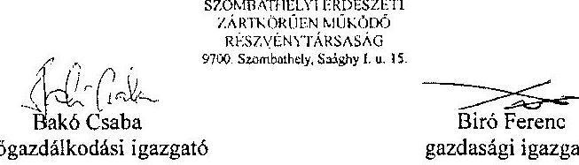

Mellékletek:

- Kincstári Vagyoni Igazgatóság Budapest, vagyonkezelési szerződés (módosításokkal egységes szerkezetben) 2001.; Vélemény a vagyonkezelői szerződéshez
- Kincstári Vagyoni Igazgatóság Budapest, vagyonkezelési szerződés (módosításokkal egységes szerkezetben) 2001., Társaságunk vezérigazgatója részéről aláírt
- Kincstári Vagyoni Igazgatóság Budapest, vagyonkezelési szerződés (módosításokkal egységes szerkezetben) 2002.
- Nemzeti Földalapkezelő Szervezet és a Kincstári Vagyoni Igazgatóság által készített vagyonkezelési szerződés tervezet a Magyar Állam tulajdonában lévő erdővagyon vagyonkezelői jogának megszerzésére és gyakorlása feltételeinek rögzítésére 2006.
- MNV Zrt. vagyonkezelési szerződés tervezet - belső munkaanyag 2008.; Vélemény a vagyonkezelési szerződés tervezethez
- MNV Zrt. vagyonkezelési szerződés tervezet - EG-ok részére 2008.10.22.
- MNV Zrt. vagyonkezelési szerződés tervezet 2009.11.04.; Vélemény a vagyonkezelői szerződéshez
- Pénzügyminisztérium Számviteli Főosztálya 9806/1997. NG-1129/97. számú a "Kincstári vagyon számviteli elszámolása a vagyonkezelőnél" tárgyú levele

---

.

---

# 6. SZÁMÚ MELLÉKLET A V-0757-077/2015. SZÁMÚ JELENTÉSHEZ 

## 6. SZÁMÚ

## ÉRKEZÉS

Jkt.szám: V-0757-075/2015.

## Bugán József úr

vezérigazgató
Szombathelyi Erdészeti Zrt.

## Szombathely

## Tisztelt Vezérigazgató Úr!

A „Jelentéstervezet az állami tulajdonban álló erdőgazdasági társaságok vagyongazdálkodási tevékenységének ellenőrzése - Szombathelyi Erdészeti Zrt." címmel készített számvevőszéki jelentéstervezetre tett észrevételeit köszönettel megkaptam.

Az Állami Számvevőszék észrevételekre vonatkozó álláspontjáról a felügyeleti vezető által készített részletes tájékoztatást csatoltan megküldöm.

Tájékoztatom Vezérigazgató urat, hogy a számvevőszéki jelentésben - az Állami Számvevőszékről szóló 2011. évi LXVI. törvény 29. § (3) bekezdése alapján - a figyelembe nem vett észrevételeket szerepeltetjük az elutasítás indokának feltüntetésével.

Budapest, 2015.
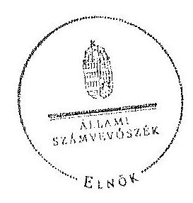

Tisztelettel:

## 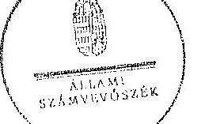

Domokos László

Melléklet: Tájékoztatás az elfogadott és az el nem fogadott észrevételekről

---

# Tájékoztatás   az elfogadott és az el nem fogadott észrevételekról 

A „Jelentéstervezet az állami tulajdonban álló erdőgazdasági társaságok vagyongazdálkodási tevékenységének ellenőrzése - Szombathelyi Erdészeti Zrt." címü jelentéstervezetre 2015. október 8-án érkezett észrevételeit áttekintettük, azok kezelésével kapcsolatban a következő tájékoztatást adom.

## 1. számú észrevételre adott válasz:

A Vhr. 9. § (9) bekezdés a) pontja alapján a vagyonkezelő köteles a vagyonkezelésbe vett eszközöket a Számv. tv. (23. § (2) bekezdése) szerint a hosszú lejáratú kötelezettségekkel szemben a vagyonkezelési szerződésben rögzített értéken állományba venni. Az ideiglenes vagyonkezelési szerződésben a vagyonkezelésbe adott vagyon értékét nem rögzítették, továbbá a szerződés azt sem tartalmazza, hogy a vagyonkezelt eszközök értéke nulla. A Társaság a Számv. tv. és a Vhr. előírásainak betartása céljából nem tett lépéseket annak érdekében, hogy a vagyonkezelt eszközök értéke a VSZ-ben rögzítésre kerüljön. A fentiek alapján a megállapítás és a javaslat helytálló, módosítása nem indokolt.

## 2. számú észrevételre adott válasz:

A VSZ mellékleteivel kapcsolatban adott tájékoztatást köszönjük. Az észrevételben leírtak megerősítik azt, hogy a Társaság nem rendelkezett a VSZ eredeti, hitelesként beazonosítható, a kezelt vagyon felsorolását tartalmazó 1-4. számú mellékleteivel, ezért a megállapítás módosítása nem indokolt.

## 3. számú észrevételre adott válasz:

Az NFA felé történő adatszolgáltatáshoz kapcsolódó tájékoztatást köszönettel vettük. Az észrevételben leírtak szerint a Szombathelyi Erdészeti Zrt. a 262/2010. (XI. 17) Korm. rendelet 50/A. § (2) bekezdésében előírtak ellenére az NFA részére az ellenőrzött időszakban adatszolgáltatást nem teljesített. A jelentéstervezet megállapítása helytálló, módosítása nem szükséges.

## 4. számú észrevételre adott válasz:

A rendelkezésre álló dokumentumok ismételt áttekintését követően a jelentéstervezet 7. oldal 1. bekezdés 3. mondatát, valamint 18. oldal 6. bekezdés 2. mondatát töröltük.

---

# 5. számú észrevételre adott válasz: 

Az észrevételben leírtak megerősítik, hogy a Nemzeti Földalapba tartozó ingatlanokra vonatkozóan a VSZ megszüntetését, és a Vtv. illetve Vhr. szabályainak megfelelő szerződés megkötését a Vhr. 54. § (7) bekezdésben foglaltak ellenére a felek nem kezdeményezték. Ezért megállapításunk helytálló, annak módosítása nem indokolt.

## 6. számú észrevételre adott válasz:

A VSZ 3.10. pontja szerint a vagyonkezelésbe adott erdővagyonról és annak változásairól a szerződés éves felülvizsgálata során, a tárgyévet követő év május 31-ig a KVI részére írásbeli beszámolót kell készítenie a Társaságnak. A jelentéstervezet 29. oldalán a VSZ 3.10. pontja szerinti beszámoló hiányát állapítjuk meg. A jelentéstervezet 23. oldalának megállapítása az üzleti jelentésekben található, a kezelt vagyonnal folytatott gazdálkodásról szóló beszámolásra vonatkozik. Az egyértelműség érdekében a jelentéstervezet 23. oldal utolsó bekezdés 2. mondatát az alábbiak szerint pontosítjuk:
„A tevékenység sajátosságai alapján kialakított könyvvezetés alapján a Társaság az üzleti jelentésekben minden évben eleget tett a kezelt vagyonnal folytatott gazdálkodásra vonatkozó beszámolási kötelezettségének."

## 7. számú észrevételre adott válasz:

„A közérdekű adatok megismerésére irányuló igények teljesítésének rendjéről" szóló szabályzat 2014. szeptember 1-jén történő hatálybaléptetéséről szóló tájékoztatásukat köszönjük. Az észrevétel nem érinti az ellenőrzött időszakot, ezért megállapításunk helytálló, annak módosítása nem indokolt.

## 8. számú észrevételre adott válasz:

A végleges vagyonkezelési szerződés megkötésére tett kezdeményezésekről adott tájékoztatásukat köszönettel vettük, azonban azok nem eredményezték az ideiglenes vagyonkezelési szerződés olyan módosítását, vagy olyan új vagyonkezelési szerződés megkötését, amely biztosította volna a VSZ hiányosságainak megszüntetését, illetve a hatályos jogszabályoknak való megfelelőségét. Ezért a javaslat módosítása nem indokolt.

## 9. számú észrevételre adott válasz:

A jelentéstervezet a VSZ felülvizsgálatának elmaradásával kapcsolatos megállapításai helytállóak, ezért a felelősség tisztázására és érvényesítésére vonatkozó javaslat törlése nem indokolt.

## 10. számú észrevételre adott válasz:

A megállapítás összhangban van az észrevételben leírtakkal, mert a Csehimindszent 0244 hrsz-ú területet, mint „kivett" területet nevesíti, valamint nem tartalmazza azt, hogy

---

a terület bérbe adása ellentétes volna az Evt. előírásaival, ezért módosítása nem szükséges.

A Koko-Pet Kft.-vel a 2010-2011-2012. években, évente határozott időre kötött bérbeadási szerződésekre vonatkozó megállapításunkat az észrevételben leírtak megerősítik, ezért annak módosítása nem indokolt.

# 11. számú észrevételre adott válasz: 

Köszönjük a kőszegi 0344 hrsz-ú ingatlanon lévő Erdei Iskola és Múzeum, a Hosszúpereszteg 0365/121 hrsz-ú ingatlanon lévő, a Szakonyfalu 0112 hrsz-ú ingatlanon lévő erdészház tulajdonjogának rendezéséről adott tájékoztatásukat. Mivel a tulajdonjog rendezése az ellenőrzött időszakot követően történt, megállapításunk módosítása nem indokolt.

Budapest, 2015. A hó 07. nap

Makkai Mária
felügyeleti vezető

---

# 7. SZÁMÚ MELLÉKLET A V-0757-077/2015. SZÁMÚ JELENTÉSHEZ 

## Állami Számvevőszék

## Domokos László

## elnök

1052 Budapest
Apáczai Cs. J. u. 10.

Ikt. sz.: MNV/01/47960/ /2015.
Hiv. sz.: V-0757-061/2015.

## Tisztelt Elnök Úr!

A 2015. szeptember 28. napján „Az állami tulajdonban álló erdőgazdasági társaságok vagyongazdálkodási tevékenységének ellenőrzése - Szombathelyi Erdészeti Zrt." tárgyában kézhez vett, V-0757-061/2015. ikt. sz. Jelentés-tervezetre az alábbi észrevételeket kívánom tenni.

1. fejezet / 7. old. első bekezdés, 9. old. harmadik-negyedik bekezdés, 10. old. első-második bekezdés, II.5. fejezet / 33. old. harmadik bekezdés és 10. old. Javaslat az MNV Zrt. vezérigazgatójának címpontok
„A vagyoni kör, a tulajdonosi jogok gyakorlására felhatalmazott szervezetek változásai, valamint a társaság vagyonkezelésére vonatkozó jogszabályi rendelkezések változásai ellenére a VSZ-t az ellenőrzött időszakban nem aktualizálták. A VSZ felülvizsgálata, egységes szerkezetbe foglalása nem történt meg, annak módosításai csak a kezelésbe átadott vagyon változásait tartalmazzák. A VSZ módosítását és annak módosításokkal történő egységes szerkezetbe foglalását sem a Társaság, sem a kezelt vagyoni kör felett tulajdonosi jogokat gyakorló MNV Zrt., illetve NFA nem kezdeményezte. Az ellenőrzött időszakban a VSZ rendelkezései nem határozták meg teljes körűen az állami vagyon kezeléséhez fűződő jogokat és kötelezettségeket, mivel a szerződés hatályon kívül helyezett jogszabályi hivatkozásokat tartalmazott. A VSZ-t az Nfatv. hatálybalépését követően nem módosították, továbbá nem kötöttek új vagyonkezelési szerződést az erdők, és az erdőgazdálkodási tevékenységet közvetlenül szolgáló földterületek tekintetében."
„A vagyonkezelésbe adott állami vagyon tekintetében tulajdonosi jogokat gyakorló MNV Zrt. és NFA tevékenysége az ellenőrzött időszakban nem támogatta teljes körűen a felelős vagyongazdálkodás megvalósulását, a VSZ-szel kapcsolatban feltárt hiányosságok megszüntetésére és a hatályos jogszabályoknak való megfeleltetésére vonatkozóan nem kezdeményezték intézkedéseket. A vagyonkezelésbe adott állami vagyon tekintetében tulajdonosi jogokat gyakorló MNV Zrt. és NFA nem végeztek a Vhr.-ben és a Nemzeti Földalapba tartozó földrészletek hasznosításának részletes szabályairól szóló 262/2010. (XI.17.) Korm. rendelet 47. § (1)-(2) bekezdésében foglalt, a vagyonnyilvántartás hitelességére és teljességére vonatkozó ellenőrzést a Társaságnál.

Az ellenőrzött időszakban a Szombathelyi Erdészeti Zrt. a Magyar Állam tulajdonában álló erdővagyon és egyéb művelési ágú termőföld ingatlanok kezelését a KVI-vel 1996. november 1-jén kötött vagyonkezelési szerződés alapján végezte. A Társaság, mint vagyonkezelő és a KVI között létrejött szerződéses jogviszony kereteit a VSZ-ben foglalt jogok és kötelezettségek kötötték ki. A VSZ nem támogatta megfelelően és kellőképpen az állami vagyonnal való szabályszerű gazdálkodást. A VSZ 2009. január 1-jén hatályon kívül helyezett jogszabályi hivatkozásokat tartalmazott az Áht. 109/B. §, az Áht. 109/G. § és a Vadvédelmi tv. 98. § rendelkezései vonatkozásában és nem tartalmazta a Vtv., az Evt., a Nvtv. és az Nfatv. előírásaira történő hivatkozást. A VSZ

---
 bekezdésében foglalt, a vagyonnyilvántartás hitelességére és teljességére vonatkozó ellenőrzést a Társaságnál.

# Javaslat az MNV Zrt. vezérigazgatójának 

a) Tegyen intézkedéseket az erdőgazdasági társaság közreműködésével a tényleges állapotot rögzítő és a hatályos jogszabályi előírásoknak megfelelő vagyonkezelési szerződés megkötésére.
b) Tegyen intézkedéseket a vagyonkezelési szerződés felülvizsgálatának elmaradásával, valamint a Nemzeti Földalapba tartozó ingatlanokra vonatkozó VSZ megszüntetésével összefüggésben feltárt szabálytalanságok tekintetében a felelősség tisztázása érdekében, és szükség szerint intézkedjen a felelősség érvényesítéséről.
c) Intézkedjen a Szombathelyi Erdészeti Zrt. vagyonnyilvántartása hitelességének, teljességének és helyességének jogszabályban foglaltak szerinti ellenőrzéséről.

Sajnálattal állapítottuk meg, hogy a Jelentés-tervezet egyáltalán nem veszi figyelembe a vizsgált időszakban megindított és több eljárási cselekményt is magába foglaló intézkedés-sorozatunkat, amelynek a célja a Jelentéstervezetben egyébiránt joggal kifogásolt hiányosságok megszüntetése, az erdőgazdasági társaságok működésének jogszabályi megfelelőségének biztosítása volt. Ezzel a Jelentés-tervezet azt sugallja, hogy a tulajdonosi joggyakorlók részéről egyáltalán nem volt szándék az erdőgazdasági társaságok működésének, illetve a vagyonkezelés körülményeinek hatályos jogszabályok szerinti szabályozására, amely egyébiránt nem felel meg a valóságnak és az adatszolgáltatásunk során sem erről tájékoztattuk Önöket.
Mindamellett elismerjük, hogy a probléma a kezelt vagyonelemek nagy száma, ebből kifolyólag a szabályozást igénylő körülmények nagy száma és sokrétűsége miatt nehezen átlátható, ezért kérjük, engedjék meg, hogy a munkájukat segítő szándékkal korábbi tájékoztatásunkat ismételten megerősítsük, azzal a kifejezett kéréssel, hogy a Jelentésükben az általunk vitatott megállapítást szíveskedjenek módosítani, és az MNV Zrt. által a megoldás irányába megtett intézkedéseket feltüntetni.
Az ideiglenes vagyonkezelési szerződéseken alapuló kezelői jogviszony újraszabályozása, az ideiglenes vagyonkezelési szerződések megszüntetése és végleges vagyonkezelési szerződések megkötése érdekében az intézkedéseink már 2011. évben megkezdődtek, párhuzamosan a Nemzeti Földalapról szóló 2010. évi LXXXVII. tv. 34. § (3) bekezdés c) pontja szerinti feladat- illetve vagyonátadással.

Az intézkedéseink alapja a 2011. évben, MNV/01/29518/2011. szám alatt szakterületünk által bekér, az erdőgazdasági társaságok 2010. december 31-i, illetve 2011. július 31-i fordulónapra vonatkozó leltárjelentése volt, amelyet elsődlegesen az NFA tv. szerint előírt vagyonátadás elvégzése céljából kértünk meg az erdőgazdasági társaságoktól. Ugyanakkor a leltárjelentéshez benyújtott földrészlet listák voltak az első olyan kimutatások, amelyek a kezelt vagyon elemeit a FÖMI adatbázisán alapuló (az aktuális ingatlan-nyilvántartási állapotnak megfelelően) alrészletes bontásban tartalmazták.

## A vizsgált időszakban megindított és lefolytatott intézkedéseink a következők:

1. Az erdőgazdasági társaságok által kezelt vagyonelemek tulajdonosi joggyakorlók szerinti elhatárolása, NFA átadás előkészítése, az erdőgazdasági társaságok bevonásával. A Nemzeti Földalapba tartozó vagyonelemek NFA

---

átadása 2012-2013. években megtörtént, majd a visszamaradt vagyonelemek - többségében kivett megnevezésben nyilvántartott földrészletek - elhatárolását is elvégeztük. A feladat végrehajtása 2014. május 31-ig teljesült.
Az intézkedéssel az MNV Zrt. tulajdonosi joggyakorlása alá tartozó vagyonelemek körét - a közös tulajdonosi joggyakorlás alatt álló ingatlanok kivételével-, azaz a végleges vagyonkezelési szerződések ingatlanlistáit meghatároztuk.
Meg kívánjuk jegyezni, hogy az erdőgazdasági társaságok a 2011. évi leltárjelentéseikhez minden esetben csatolták a jelentés tartalmazó vonatkozó teljességi nyilatkozatukat is, így azok tartalmát mint teljes körű adatszolgáltatást kezeltük.
A hivatkozott iratokat az eljárás során a Tisztelt Állami Számvevőszék rendelkezésére bocsátottuk.
2. Az erdőgazdasági társaságok által kezelt vagyon értékelését 2014. május 31-ig elvégeztük, részben külső piaci szereplő által megállapított vagyonértékelési adatok (az IFUA értékbecslési adatai), részben belső szakértők és a kontrolling szakterület által az MNV Zrt. hatályos értékelési szabályzata által megállapított értékadatok figyelembe vételével.
3. Az MNV Zrt. Igazgatósága 511/2012. (X. 08.) IG sz., valamint 717/2013. (IX. 23.) IG sz. határozataiban Intézkedési terveket fogadott el „a 28/2012. (IX. 24.) sz. RJGY határozatában előírt, valamint az MNV Zrt. rábízott vagyon 2012. évi beszámolója könyvvizsgálói minősítésének megtartásához szükséges és egyéb feladatokról”. Az Intézkedési tervek magukban foglalták az erdőgazdasági társaságok által kezelt vagyon analitikájának előállítását, illetve az erdőtársaságokkal végleges (nem ideiglenes) vagyonkezelői szerződések megkötését. A 717/2013. (IX. 23.) IG sz. határozat melléklete tartalmazza a feladat végrehajtása érdekében már megtett intézkedéseket (pl. „Megtörtént az erdőgazdaságok által kezelt vagyon iratok vagyonkezelői jelentésekkel való egyeztetése; a vagyonkezelési szerződés tartalmi kérdéseinek, az erdőgazdaságok véleményének feldolgozása, MFB Munkacsoport egyeztetések történtek stb.), valamint rögzíti a még elvégzendő feladatokat. Ennek megfelelően az MNV Zrt-nél 2012-től folyamatban van az erdőgazdasági társaságok vagyonanalitikájának előállítása és vagyonkezelési szerződései tárgyú projekt.
A hatályos jogszabályoknak megfelelő vagyonkezelési szerződés tervezetét a vizsgálati időszak során az MNV Zrt. belső szakterületi egyeztetést követően előkészítettük, és a 2014. március 18-án megtartott Munkacsoport értekezleten az erdőgazdaság képviselőivel, továbbá a tulajdonosi joggyakorlók (NFA, illetve akkor még Magyar Fejlesztési Bank Zrt.) képviselőivel ismertettük annak tartalmát. A szerződés szövegtervezetének véleményezése ekkor megkezdődött, ugyanakkor elismerjük, hogy a végleges szerződésváltozat már az Önök által vizsgált időszakot követően került elfogadásra. Ugyancsak a 2014. március 18-án megtartott Munkacsoport értekezleten tettünk javaslatot a vagyonkezelési díj alapjának és mértékének meghatározására.
4. Az erdőgazdasági társaságok által kezelt és a saját vagyonuk vagyonelemenkénti, valamint a kezelt vagyonelemek tulajdonosi joggyakorlók szerinti elhatárolására vonatkozó intézkedésünket a vizsgált időszakban előkészítettük.

Tájékoztatjuk továbbá Elnök Úrat az alábbiakról:
A Jelentés-tervezet 10. oldalán található, az MNV Zrt. vezérigazgatójára vonatkozó, a) pont alatti, vagyonkezelési szerződés megkötésére irányuló javaslathoz kapcsolódóan feltételezzük a Tisztelt Állami Számvevőszék figyelmét arra, hogy a Nemzeti Fejlesztési Minisztérium KGTF/377-6/2014-NFM, valamint KGTF/377-7/2014. számok alatt adott utasításokat a fenti feladatok elvégzésére. Ezekről, illetve az utasításokra adott jelentésünkről a korábbi adatszolgáltatásunk keretében szintén kitértünk.

A vagyonkezelési szerződés vizsgált időszakot követően elfogadott tervezetének mellékletét képezik az MNV Zrt. azon szabályzatai is, amelyek a kezelt vagyon nyilvántartását, a beruházások nyilvántartását és az azzal kapcsolatos elszámolásokat, illetve a tulajdonosi ellenőrzéssel kapcsolatos, a jelenlegi jogszabályi környezetnek megfelelő szabályokat tartalmazzák:

- Az állami tulajdonon, egyéb vagyonkezelők által vagyonkezelt eszközön megvalósítandó beruházások, felújítások előzetes engedélyezésének és elszámolásának eljárásrendjéről szóló 35/2014. számú vezérigazgatói utasítás,

---

- A Magyar Nemzeti Vagyonkezelő Zrt. Tulajdonosi Ellenőrzési Szabályzata - a 39/2014. számú vezérigazgatói utasítás, továbbá
- A Magyar Nemzeti Vagyonkezelő Zrt. állami vagyon vagyonkezelőire, az állami vagyont használókra és a társasági részesedések esetében az MNV Zrt. tulajdonosi joggyakorlását megbízottként ellátókra vonatkozó Vagyon-nyilvántartási Szabályzatáról szóló 12/2014. számú vezérigazgatói utasítás.

Fentiek mellett megemlíthető az MNV Zrt. folyamatba épített, illetve vagyon nyilvántartás vezetést támogató ellenőrzési módszertanról szóló 11/2014. számú vezérigazgatói utasítás.
Egyeztetéseink során az erdőgazdasági társaságok tájékoztatást kaptak a szabályzataink tartalmára vonatkozóan.
A Nemzeti Fejlesztési Minisztérium ÁVF/21310/2015-NFM számú tájékoztató levele szerint Miniszter Úr vagyongazdálkodási szempontból nem támogatja az erdőgazdasági társaságok ideiglenes vagyonkezelési szerződéseit kiváltó vagyonkezelési szerződések megkötését, ideértve az MNV Zrt. vagyonkezelési szerződésekkel kapcsolatos jóváhagyó döntéseit is.

Az MNV Zrt-re vonatkozóan hivatkozott jogszabály, a Vhr. 20. § (1)-(2) bekezdése 2014. március 14-ig - csaknem az ellenőrzött időszak végéig - a következőképpen rendelkezett:
„(1) Az állami vagyon kezelőjét, használóját megillető jogok gyakorlását, annak szabályszerűségét, célszerűségét a Vrv. 17. §-ának d) pontja alapján az MNV Zrt. - szükség szerint a területi szervvel együtt - ellenőrzi. Ennek érdekében a vagyon kezelésére, hasznosítására kötött szerződésben rögzíteni kell, hogy a tulajdonosi ellenőrzés eljárásrendjét, a felek jogait, kötelezettségeit a felek a szerződés részének tekintik.
(2) A tulajdonosi ellenőrzés célja az állami vagyonnal való gazdálkodás vizsgálata, ennek keretében a rendeltetésellenes, jogszerűtlen, szerződésellenes, vagy a tulajdonos érdekeit sértő, illetve a központi költségvetést hátrányosan érintő vagyongazdálkodási intézkedések feltárása és a jogszerű állapot helyreállítása, továbbá a vagyonnyilvántartás hitelességének, teljességének és helyességének biztosítása.”

A tulajdonosi ellenőrzés alatt a Területi Irodák által folytatott ellenőrzést is értette a jogszabály, amiből egyenesen következik a szakterületi munkafolyamatba épített ellenőrzési kötelezettség figyelembe vételének a lehetősége.

Fentiekre tekintettel kérjük a Jelentés-tervezet 9-10., illetve 33. oldalán található azon megállapítások törlését, hogy az MNV Zrt. nem kezdeményezett intézkedéseket, és nem végzett a Vhr. 20. § (1)-(2) bekezdéseiben és a Nemzeti Földalapba tartozó földrészletek hasznosításának részletes szabályairól szóló 262/2010. (XI.17.) Korm. rendelet 47. § (1)-(2) bekezdéseiben foglalt, a vagyonnyilvántartás hitelességére és teljességére vonatkozó ellenőrzést a Társaságnál, kérjük a megtett intézkedések feltüntetését, a Jelentés-tervezet 10. oldalán található, az MNV Zrt. vezérigazgatójára vonatkozó, b) pontot a megtett intézkedések folyamatosságára tekintettel törölni, és a c) pont alatti javaslatot szövegszerűen ekként módosítani:

# Javaslat az MNV Zrt. vezérigazgatójának 

c) Az MNV Zrt. tulajdonosi joggyakorlása alá tartozó (az Erdőgazdasági Társaságok által az MNV Zrt. részére jelentett) vagyonelemek tekintetében intézkedjen a Társaság vagyonnyilvántartása hitelességének, teljességének és helyességének jogszabályban foglaltak szerinti ellenőrzésének erősítéséről.

Kérem Elnök Úrat, hogy a Jelentés véglegesítése során jelen észrevételeinket szíveskedjenek figyelembe venni.
Budapest, 2015. október 4.
Üdvözlettel:
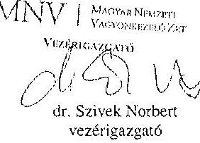

---

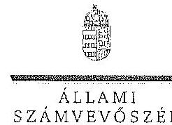

ELNÖK

Ikt.szám: V-0757-073/2015.

Dr. Szívek Norbert úr
vezérigazgató
Magyar Nemzeti Vagyonkezelő Zrt.

Budapest

Tisztelt Vezérigazgató Úr!

A „Jelentéstervezet az állami tulajdonban álló erdőgazdasági társaságok vagyongazdálkodási tevékenységének ellenőrzése - Szombathelyi Erdészeti Zrt.” címmel készített számvevőszéki jelentéstervezetre tett észrevételeit köszönettel megkaptam.

Az Állami Számvevőszék észrevételekre vonatkozó álláspontjáról a felügyeleti vezető által készített részletes tájékoztatást csatoltan megküldöm.

Tájékoztatom Vezérigazgató urat, hogy a számvevőszéki jelentésben - az Állami Számvevőszékről szóló 2011. évi LXVI. törvény 29. § (3) bekezdése alapján - a figyelembe nem vett észrevételeket szerepeltetjük az elutasítás indokának feltüntetésével.

Budapest, 2015. 10. 35. nap

Tisztelettel:

Domokos László

Melléklet: Tájékoztatás az elfogadott és az el nem fogadott észrevételekről

1032 BUDAPEST, APÁCZAI CSERE JÁNOS UTCA 10. 1364 Budapest 4. Pf. 54 telefon 484 9101 fax 484 9201

---

# Tájékoztatás 

az elfogadott és az el nem fogadott észrevételekről

A ,,Jelentéstervezet az állami tulajdonban álló erdőgazdasági társaságok vagyongazdálkodási tevékenységének ellenőrzése - Szombathelyi Erdészeti Zrt.” címû jelentéstervezetre 2015. október 13-án érkezett észrevételeit áttekintettük, azok kezelésével kapcsolatban a következő tájékoztatást adom.

1. A vagyonkezelési szerződéshez kapcsolódó megállapításokra tett észrevétel (I. fejezet / 7. oldal első bekezdés, 9. oldal 3. és 4. bekezdés, 10. oldal 1. bekezdés, II. 5. fejezet 33. oldal 3. bekezdés, 10. oldal javaslat az MNV Zrt. vezérigazgatójának a)-b) pontok)

A jelentéstervezet vagyonkezelési szerződéshez kapcsolódó megállapításai helytállóak. Az erdőgazdasági társaság működése jogszabályi megfelelősége biztosításának érdekében tett kezdeményezésekről adott tájékoztatásukat köszönettel vettük, azonban azok nem eredményezték az ideiglenes vagyonkezelési szerződés olyan módosítását, vagy olyan új vagyonkezelési szerződés megkötését, amely biztosította volna a VSZ hiányosságainak megszüntetését, illetve a hatályos jogszabályoknak való megfelelőségét. Ezért az MNV Zrt. vezérigazgatójának és az NFA elnökének megfogalmazott intézkedést igénylő megállapítás, valamint az MNV Zrt. vezérigazgatójának megfogalmazott javaslat a) és b) pontjának módosítása nem indokolt. Az egyértelműség érdekében a jelentéstervezet 7. oldal 1. bekezdés 3. mondatát töröltük, a 9. oldal 3. bekezdés vonatkozó részét az alábbiak szerint pontosítjuk:
„…, a VSZ-szel kapcsolatban feltárt hiányosságok megszüntetése és a hatályos jogszabályoknak való megfeleltetése nem történt meg.”
2. Az MNV Zrt. ellenőrzési kötelezettségének elmulasztására vonatkozó megállapításokra tett észrevétel (I. fejezet 9. oldal 3. bekezdés, 10. oldal 2. bekezdés, II. 5. fejezet / 33. oldal 3. bekezdés és 10. oldal javaslat az MNV Zrt. vezérigazgatójának c) pont)

Az MNV Zrt. nem bocsátott az ÁSZ ellenőrzés rendelkezésére az MNV Zrt., vagy
 Területi Irodái által a Vhr. 20. § (1)-(2) bekezdései szerint végzett ellenőrzésekről dokumentumokat. A jelentéstervezet megállapításai és a javaslat helytállóak, módosításuk nem indokolt.

Budapest, 2015. 4. hó 2. nap

Makkai Mária
felügyeleti vezető

---

# MFB 

## Domokos László úr

elnök részére

## Állami Számvevőszék

Budapest

Tisztelt Elnök Úr!
2015. szeptember 28-án köszönettel kézhez vettük az Állami Számvevőszék „Az állami tulajdonban álló erdőgazdasági társaságok vagyongazdálkodási tevékenységének ellenőrzéséről" szóló jelentéstervezeteket az alábbi cégekre:

- Északerdő Erdőgazdasági Zrt.
- EGERERDŐ Erdészeti Zrt.
- Gemenci Erdő- és Vadgazdaság Zrt.
- Ipoly erdő Zrt.
- KEFAG Kiskunsági Erdészeti és Faipari Zrt
- Kisalföldi Erdőgazdaság Zrt
- SEFAG Erdészeti és Faipari Zrt
- Szombathelyi Erdészeti Zrt.
- VADEX Mezőföldi Erdő-és Vadgazdálkodási Zrt.
- Zalaerdő Erdészeti Zrt.
(Íkt.szám: V-0754-086/2015.)
(Íkt.szám: V-0750-172/2015.)
(Íkt.szám: V-0753-096/2015.)
(Íkt.szám: V-0749-146/2015.)
(Íkt.szám: V-0764-054/2015.)
(Íkt.szám: V-0758-056/2015.)
(Íkt.szám: V-0752-089/2015.)
(Íkt.szám: V-0757-060/2015.)
(Íkt.szám: V-0765-044/2015.)
(Íkt.szám: V-0760-075/2015.)

Az MFB Zrt. a jelentéstervezetekkel kapcsolatosan 2 féle szempontból kíván észrevételt tenni:

1. A jelentésekben megfogalmazott központi probléma
2. Egyedi esetek

---

# 9. SZÁMÚ MELLÉKLET A V-0757-077/2015. SZÁMÚ JELENTÉSHEZ 

## 1. A jelentésekben megfogalmazott központi probléma

Az ÁSZ az egyedi jelentéseiben az erdőgazdasági társaságokat, valamint a vagyonkezelésbe adott állami vagyon tekintetében tulajdonosi joggyakorló MNV Zrt. és Nemzeti Földalapkezelő (továbbiakban: NFA) tevékenységét marasztalta el.
Alapvető problémaként jelent meg, hogy az erdők által kezelt eszközök - az NFA-val, a Kincstári Vagyon Igazgatósággal, és az MNV Zrt-vel kötött vagyonkezelési megállapodásban rögzített - értéken nem szerepelnek a Társaságok könyveiben.
Az MFB Zrt. tudatában volt a problémának (azt az ÁSZ jelentésben is említett, 2010. évben végzett átvilágítási jelentés is tartalmazta, melynek nyomon követése, beszámoltatása megtörtént) és folyamatosan egyeztetett az MNV Zrt-vel és az NFA-val a rendezés ügyében. Az ideiglenes vagyonkezelési szerződés módosítására, véglegesítésére a vagyonkezelésbe adónak (MNV, NFA) van lehetősége, a Társaságok szerződő partnerként észrevételeket, javaslatokat tehetnek. A szerződés véglegesítése érdekében a Társaságok és az MFB Zrt. képviselői minden olyan egyeztetésen (pl.: az MNV Zrt. által létrehozott bizottság) részt vettek, amelyre meghívást kaptak, illetve azokon érdemi javaslatokat tettek.  Abban a jelentés is megjegyzi, az egyeztetések az ellenőrzés befejezéséig nem kerültek lezárásra, így a Társaságoknál nem áll rendelkezésre a vagyonkezelésben lévő állami vagyonra és annak nagyságára vonatkozó, az MNV Zrt. és az NFA nyilvántartásával egyező adat.
Az ÁSZ 2013. évi „Az állami vagyon feletti kontroll - Az állami vagyon feletti tulajdonosi joggyakorlással kapcsolatos tevékenységek ellenőrzéséről" szóló jelentése alapján a Nemzeti Fejlesztési Minisztérium - az ÁSZ-szal egyeztetett - alábbi főbb pontokat tartalmazó intézkedési tervet (1. sz. melléklet) állított össze, melyet a 2014. április 25-én kelt levelében küldött meg az MFB Zrt. részére:

- a Társaságok által kezelt állami ingatlanok és egyéb vagyonelemek értéken történő nyilvántartása,
- a vagyonkezelési díjak egyértelmű és tulajdonosi joggyakorló szervezetenkénti meghatározása,
- az új vagyonkezelési szerződés megkötése,
- a Társaságok kezelt és saját vagyonának vagyonelemenkénti, valamint a kezelt vagyonelemek tulajdonosi joggyakorló szerinti alhatárolása.

Az MFB törvény módosításának 2014. július 16-i hatályba lépésével az MFB Zrt. állami erdőgazdaságok feletti tulajdonosi joggyakorlása megszűnt, az a Földművelésügyi Minisztériumhoz került át, így az intézkedési tervben való közreműködésre, illetve a végrehajtás nyomon követésére az MFB Zrt-nek nem volt lehetősége.

A jelentések az MNV Zrt. vezérigazgatójának, az NFA elnökének és az erdészeti társaságok vezérigazgatóinak fogalmaztak meg intézkedési javaslatokat.

---

# 2. Egyedi esetek: 

## KEFAG Kiskunsági Erdészeti és Faipari Zrt.

A jelentéstervezet többször hibásan hivatkozik az MFB Zrt-re, amikor az állami vagyonról szóló 2007. évi CVI. törvény (a továbbiakban: Vtv.) 17. § (1) bekezdés d) pontja szerinti rendszeres ellenőrzés elmaradására mutat rá. A Vtv. hivatkozott bekezdése alapján az ellenőrzés az MNV Zrt. feladata. Kérjük a társaság feletti tulajdonosi joggyakorló hivatkozásának törlését (8. oldal 7. bekezdés és 32. oldal 6. bekezdés).

## Kisalföldi Erdőgazdaság Zrt.

A jelentéstervezet hibásan hivatkozik az MFB Zrt-re, amikor a Vtv. 17. § (1) bekezdés d) pontja szerinti rendszeres ellenőrzés elmaradására mutat rá. A Vtv. hivatkozott bekezdése alapján az ellenőrzés az MNV Zrt. feladata. Kérjük a társaság feletti tulajdonosi joggyakorló hivatkozásának törlését (29. oldal 4. bekezdés).

## Szombathelyi Erdészeti Zrt.

A jelentéstervezet hibásan hivatkozik az MFB Zrt-re, amikor a Vtv. 17. § (1) bekezdés d) pontja szerinti rendszeres ellenőrzési elmaradására mutat rá. A Vtv. hivatkozott bekezdése alapján az ellenőrzés az MNV Zrt. feladata. Kérjük a társaság feletti tulajdonosi joggyakorló hivatkozásának törlését (32. oldal 5. bekezdés).

Budapest, 2015. október 12.
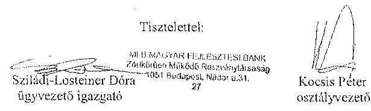

## Melléklet:

NFM levél (Ikt.szám: KGTF/377-7/2014-NFM)

---

.

---

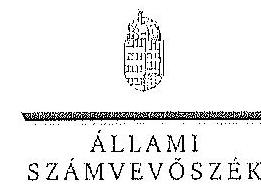

ELKÖK

ÁLLAMI
SZÁMVEVŐSZÉK

Ikt.szám: V-0754-104/2015.

Nagy Csaba úr
vezérigazgató
Magyar Fejlesztési Bank Zrt.

Budapest

Tisztelt Vezérigazgató Úr!

Az „Az állami tulajdonban álló erdőgazdasági társaságok vagyongazdálkodási tevékenységének ellenőrzése" című ellenőrzés tekintetében 10 társaság jelentéstervezetére tett észrevételeiket köszönettel megkaptam.

Az Állami Számvevőszék észrevételekre vonatkozó álláspontjáról a felügyeleti vezető által készített részletes tájékoztatást csatoltan megküldöm.

Tájékoztatom Vezérigazgató urat, hogy a számvevőszéki jelentésben – az Állami Számvevőszékről szóló 2011. évi LXVI. törvény 29. § (3) bekezdése alapján – a figyelembe nem vett észrevételeket szerepeltetjük az elutasítás indokának feltüntetésével.

Budapest, 2015.

hó nap

Tisztelettel:

Domokos László

Melléklet: Tájékoztatás az elfogadott és az el nem fogadott észrevételekről

1055 BUDAPEST, APÁCZAI CSERE JÁNOS UTCA 32. 1364 Budapest 4. Pf. 54 telefon: 484 8181 fax: 484 8201

---

# Tájékoztatás   az elfogadott és az el nem fogadott észrevételekről 

„Az állami tulajdonban álló erdőgazdasági társaságok vagyongazdálkodási tevékenységének ellenőrzése" című ellenőrzés tekintetében az Északerdő Erdőgazdasági Zrt., az EGERERDŐ Erdészeti Zrt., a Gemenci Erdő- és Vadgazdaság Zrt., az IPOLY ERDŐ Zrt., a KEFAG Kiskunsági Erdészeti és Faipari Zrt., a Kisalföldi Erdőgazdasági Zrt., a SEFAG Erdészeti és Faipari Zrt., a Szombathelyi Erdészeti Zrt., a VADEX Mezőföldi Erdő- és Vadgazdálkodási Zrt., illetve a Zalaerdő Erdészeti Zrt. társaságok jelentéstervezetére 2015. október 13-án érkezett észrevételeket áttekintettük, azok kezelésével kapcsolatban a következő tájékoztatást adom.

1. A jelentésekben megfogalmazott központi problémával kapcsolatban tett észrevételek A jelentésekben megfogalmazott központi problémával kapcsolatban adott tájékoztatásukat köszönettel vettük, azonban azok alapján a jelentéstervezet módosítása nem indokolt.

## 2. Egyedi esetekkel kapcsolatban tett észrevételek

A KEFAG Kiskunsági Erdészeti és Faipari Zrt. jelentéstervezetének 8. oldal 7. bekezdésére, valamint 32. oldal 6. bekezdésére tett észrevétel
A rendelkezésre álló dokumentumok ismételt áttekintését követően a jelentéstervezet 8. oldal 7. bekezdésében, valamint 32. oldal 6. bekezdésében töröljük a tulajdonosi joggyakorló 2 számú alsóindexszel jelölt hivatkozását.

A Kisalföldi Erdőgazdasági Zrt. jelentéstervezetének 29. oldal 4. bekezdésére tett észrevétel
A rendelkezésre álló dokumentumok ismételt áttekintését követően a jelentéstervezet 29. oldal 4. bekezdésében töröljük a tulajdonosi joggyakorló 2 számú alsóindexszel jelölt hivatkozását.

A Szombathelyi Erdészeti Zrt. jelentéstervezetének 32. oldal 5. bekezdésére tett észrevétel
A rendelkezésre álló dokumentumok ismételt áttekintését követően a jelentéstervezet 32. oldal 5. bekezdésében töröljük a tulajdonosi joggyakorló 2 számú alsóindexszel jelölt hivatkozását.

Budapest, 2015. év hó nap

Makkai Mária
felügyeleti vezető

---

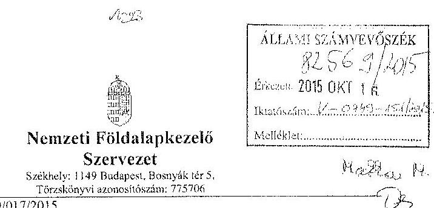

Iktatószám: NFA-002589/017/2015

Hiv. szám: ÁSZ-V-0599/2014-2015

Érintett ÁSZ iktatószámok: V-0749-148/2015, V-0750-174/2015, V-0751-121/2015, V-0752-091/2015, V-0753-098/2015, V-754-088/2015, V-0755-124/2015, V-0757-062/2015, V-0758-058/2015, V-0760-077/2015, V-0764-056/2015, V-0765-046/2015, V-0766-140/2015, V-0767-056/2015.

Domokos László
Elnök

Állami Számvevőszék

1052 Budapest

Apáczai Csere János utca 10

Tárgy: Észrevétel megküldése „Az állami tulajdonban álló erdőgazdasági társaságok vagyongazdálkodási tevékenységének ellenőrzéséről” készített jelentés tervezeteire.

Tisztelt Elnök Úr!

Az Állami Számvevőszék 2014 novemberében megkezdte „Az állami tulajdonban álló erdőgazdasági társaságok vagyongazdálkodási tevékenységének ellenőrzését”, amelyről 2015 októberétől érintettség okán az NFA részére az elkészített munkaanyag tervezeteit vizsgált erdőgazdaságokra, megküldte Szervezetünk részére véleményezésre.

A munkaanyag valamennyi tervezett egységesen, az NFA Elnöke részére feladatokat tartalmaz, melyhez az alábbi észrevételeket tesszük:

A jelentéstervezetekben tett megállapítások helytállóságát nem vitatjuk, azonban szükségesnek látjuk az NFA elnökének tett javaslatokkal a), b) és c) kapcsolatban a következő tájékoztatást megadni.

---

# a) „Tegyen intézkedéseket az erdőgazdasági társaságok közreműködésével a tényleges állapotot rögzítő és a hatályos jogszabályi előírásoknak megfelelő vagyonkezelési szerződés megkötésére." 

Tájékoztatjuk, hogy a hatályos jogszabályi előírásoknak megfelelő vagyonkezelési szerződések megkötése érdekében több intézkedés történt, jelenleg is folyamatban van a szerződések előkészítése és a vagyonkezelésben maradó, illetve kikerülő földrészek adatainak egyeztetése.

Előzményként fontos kiemelni, hogy a Nemzeti Földalapkezelő Szervezet 2010. szeptember 1. napjával történt létrehozását követően (2012. évben) került sor a vagyonkezelésben lévő földrészek MNV Zrt. részéről történő átadására. Az átadási dokumentumok alapján Szervezetünk gondoskodott a közhitetes nyilvántartásokban a megváltozott tulajdonosi joggyakorlás feltüntetéséről. Az erdőgazdaságok esetében ez 2012. év végéig, illetve 2013. év elején megtörtént, ennek az ingatlan-nyilvántartásban történő átvezetése is.

Megjegyezzük, hogy az MNV Zrt. részéről történő átadás kizárólag a - több évtizede kötött, és azóta többször módosított - vagyonkezelési szerződések és a földrészek Excel táblázatban történő átadását jelentette, tehát nem egy naprakész vagyonnyilvántartást tartalmazott. Ennek következtében szükségszerűvé vált a Nemzeti Földalapkezelő Szervezetnek egy saját nyilvántartás felépítése, illetve a szerződések tartalmának feldolgozása.

A számvevőszéki ellenőrzéssel érintett időszakban, illetve még jelenleg is lezáratlan az MNV Zrt. és NFA közötti átadás-átvételi folyamat. Az MNV Zrt. további földrészek átadását készíti elő, ugyanis az MNV Zrt. vagyoni körébe tartozó földrészekre szintén tervezi a vagyonkezelői szerződés megkötését, és ennek a folyamatnak a részeként a még át nem adott földrészek átadása is most történik. Természetesen az NFA is folyamatosan biztosítja a különböző hasznosítási, illetve hatósági eljárások során az erdőgazdaságok vagyonkezelésében lévő földrészek tulajdonosi joggyakorlójának rendezését az MNV Zrt. megkeresésével, közös minősítési eljárás lefolytatásával. A Nemzeti Földalapkezelő Szervezet által megbízott ügyvédi iroda jelentést készített a szerződés és a tárgyát képező földrészek jogi helyzetének tisztázására.

Időközben az erdőgazdaságok, mint társaságok feletti tulajdonosi joggyakorló személyében is változás történt. Így új alapokon indulhatott meg a vagyonkezelői szerződés előkészítése. Ennek a folyamatnak részeként, az NFA megbízott egy Ügyvédi Konzorciumot, továbbá Szervezetünknél külön Erdészeti munkacsoport alakult 2015 májusában és azt követően a következő intézkedések történtek:

Az Erdőgazdaságok részére vagyonkezelésbe adásra tervezett ingatlanok felülvizsgálata folyamatban van az Ügyvédi Konzorcium által. A felülvizsgálat tárgyát képező ingatlanok köre három részből tevődik össze:

- az erdőgazdaságok ideiglenes vagyonkezelési szerződésének tárgyát képező ingatlanok,

---

- azon ingatlanok, amelyeket az erdőgazdaságok az ideiglenes vagyonkezelési szerződésükben szereplő ingatlanokon felül kértek vagyonkezelésbe,
- valamint azok az ingatlanok, amelyeket az NFA kíván az erdőgazdaságok vagyonkezelésébe adni.
A rendelkezésre álló dokumentumokban szereplő ingatlanokból erdőgazdaságonként egy egységes, az összes vagyonkezelésbe adandó ingatlant tartalmazó táblázat készült, amely tartalmazza az ingatlanok vagyonkezelésbe adás szempontjából releváns adatait, bejegyzett jogokat, feljegyzett tényeket. A táblázat adatai összevetésre kerültek a közhiteles ingatlannyilvántartásban szereplő adatokkal, feltárva ezáltal, hogy mely ingatlanok adhatóak vagyonkezelésbe és melyek azok, amelyeknél valamilyen előzetes intézkedés megtétele szükséges.

Az Nfatv. 8. §-a alapján a Birtokpolitikai Tanács dönt erdőgazdaságonként az erdőgazdaságok vagyonkezelési szerződésének megkötéséről.

Zárójelben jegyezzük meg, hogy például a TAEG Zrt. esetében elkészült a fentebb részletezett táblázat, amely alapján összeállításra került azon ingatlanok listája, amelyre elindítható a vagyonkezelésbe adási eljárás. Megközelítőleg 18000 ha nagyságú területnek tervezi Szervezetünk a TAEG Zrt. részére történő vagyonkezelésbe adását, ebből 15.308.3880 ha terület az, amelyre elindította a vagyonkezelésbe adást. Az alábbi jogszabályhelyek alapján Szervezetünk megkereste az Földművelésügyi Minisztériumot az egyetértő nyilatkozatok, valamint az alapító határozat kiadása érdekében, valamint a NÉBIHet, mint
 erdészeti hatóságot a vagyonkezelő erdőgazdálkodói alkalmasságát megállapító jóváhagyásának megkérésére végett.

Az Nfatv. 20. § (7) bekezdése alapján „Az állam 100%-os tulajdonában álló erdő és erdőgazdálkodási tevékenységet közvetlenül szolgáló földterületet érintő vagyonkezelési szerződés létrejöttéhez az erdészeti hatóságnak - a vagyonkezelő erdőgazdálkodói alkalmasságát megállapító - jóváhagyása szükséges”.

Az Nfatv. 23. § (2) bekezdése alapján a Nemzeti Földalapba tartozó védett természeti területek és a Natura 2000 területek vagyonkezelésbe adására, tulajdonjogának bármely jogcímen történő átruházására csak a természetvédelemért felelős miniszter egyetértése esetén kerülhet sor. Az állam 100%-os tulajdonában álló erdő, továbbá erdőgazdálkodási tevékenységet közvetlenül szolgáló földterület vagyonkezelésbe adásához az erdőgazdálkodásért felelős miniszter egyetértése szükséges.

Magyar Állam tulajdonában álló ingatlanokat érintő jogügyletekkel kapcsolatos előzetes miniszteri nyilatkozatok és a miniszter tulajdonosi joggyakorlása alá tartozó gazdasági társaságok ingatlanügyleteivel kapcsolatos miniszteri nyilatkozatok, alapító határozatok kiadásának rendjéről szóló 8/2014. (XI. 28.) FM utasítás 3. § (4) bekezdése értelmében a miniszter tulajdonosi joggyakorlása alá tartozó állami tulajdonú gazdasági társaságoknak az

---

NFA-val történő vagyonkezelési szerződés kötéséhez elengedhetetlen a jogszabály vagy Társaság alapszabálya vagy alapító okirata alapján a Társaság tulajdonosi jogait gyakorló miniszter alapítói határozatának kiadása.

Az Erdészeti Munkacsoport a kialakított szempontok alapján tartja a kapcsolatot a Keresztelővel a szerződés tárgyát képező földterületek jogi, nyilvántartási, helyszíni, térképi ellenőrzés tárgyában annak érdekében, hogy naprakész adatok alapján történjen a szerződéskötés.
b) „Intézkedjen a vagyonkezelési szerződések felülvizsgálatának elmaradásával összefüggésben feltárt szabálytalanságok tekintetében a munkajogi felelősség tisztázására irányuló eljárás megindításáról, és ennek eredménye ismeretében tegye meg a szükséges intézkedéseket.

A fent leírt folyamat időbeli áttekintése és a vagyonkezelési szerződés előkészítésének jelenlegi helyzetét tekintve a Nemzeti Földalapkezelő Szervezet egységei, munkatársai a rendelkezésükre álló eszközök alapján megtették a szükséges intézkedéseket az erdőgazdaságok vagyonkezelői szerződésének megkötése érdekében.
c) Az NFA elnöke felé tett javaslattal kapcsolatban, miszerint intézkedjen a Társaságok vagyon-nyilvántartása kötelességének, teljességének és helyességének jogszabályban foglaltak szerinti ellenőrzéséről.

Az NFA 2015. év márciusában megkezdte az Erdészeti Zrt.-k dokumentális ellenőrzését, amely ellenőrzés keretében bekérésre került a Társaságok használatában álló vagyonelemekről és az erdővagyon állományról vezetett (nyilvántartások) aktualizált nyilvántartása is.

Budapest, 2015. október 13.
Tisztelettel:
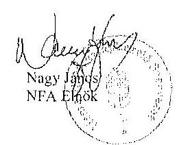

---

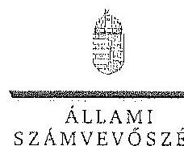

ELNÖK

Ikt.szám: V-0749-154/2015.

Nagy János úr
elnök
Nemzeti Földalapkezelő Szervezet
Budapest

# Tisztelt Elnök Úr! 

Az „Az állami tulajdonban álló erdőgazdasági társaságok vagyongazdálkodási tevékenységének ellenőrzése” című ellenőrzés tekintetében 14 társaság jelentéstervezetére tett észrevételeiket köszönettel megkaptam.

Az Állami Számvevőszék észrevételekre vonatkozó álláspontjáról a felügyeleti vezető által készített részletes tájékoztatást csatoltan megküldöm.

Tájékoztatom Elnök urat, hogy a számvevőszéki jelentésben - az Állami Számvevőszékről szóló 2011. évi LXVI. törvény 29. § (3) bekezdése alapján - a figyelembe nem vett észrevételeket szerepeltetjük az elutasítás indokának feltüntetésével.

Budapest, 2015. 14. hó 0. nap
Tisztelettel:
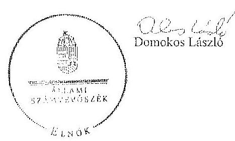

Melléklet: Tájékoztatás az észrevételek kezeléséről

---

# Tájékoztatás 

az észrevételek kezeléséről
„Az állami tulajdonban álló erdőgazdasági társaságok vagyongazdálkodási tevékenységének ellenőrzése” című ellenőrzés tekintetében az IPOLY ERDŐ Zrt., az ÉGERERDŐ Erdészeti Zrt., a Mecsekerdő Zrt., a SEFAG Erdészeti és Faipari Zrt., a Gemenci Erdő- és Vadgazdaság Zrt., az Északerdő Erdőgazdasági Zrt., a Pilisi Parkerdő Zrt., a Szombathelyi Erdészeti Zrt., a Kisalföldi Erdőgazdasági Zrt., a Zalaerdő Erdészeti Zrt., a KEFAG Kiskunsági Erdészeti és Faipari Zrt., a VADEX Mezőföldi Erdő- és Vadgazdálkodási Zrt., a Gyulaj Erdészeti és Vadászati Zrt., illetve a TAEG Tudományos Erdőgazdaság Zrt. társaságok jelentéstervezetére 2015. október 16-án érkezett észrevételeket áttekintették, azok kezelésével kapcsolatban a következő tájékoztatást adom.

Az észrevétel szerint a jelentéstervezetben tett megállapítások helytállóak, azokat nem vitatják. Az NFA elnökének tett javaslatokhoz kapcsolódó tájékoztatást köszönjük. Mindezek miatt, valamint arra tekintettel, hogy nem jött létre olyan vagyonkezelési szerződés, amely biztosítja az ideiglenes vagyonkezelési szerződés hiányosságainak a megszüntetését, illetve a hatályos jogszabályoknak való megfelelést, a megállapítások és a javaslatok módosítása nem indokolt.

Budapest, 2015. év,  hó 92. nap
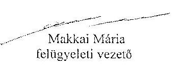
