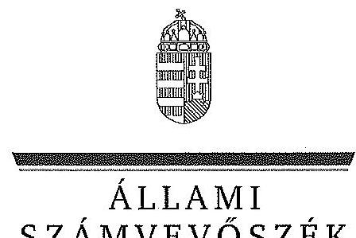

ÁLLAMI
SZÁMVEVŐSZÉK

# JELENTÉS 

Az állami tulajdonban álló erdőgazdasági társaságok vagyongazdálkodási tevékenységének ellenőrzése Kisalföldi Erdőgazdaság Zrt.

---

# Állami Számvevőszék 

Iktatószám: V-0758-072/2015.
Témaszám: 1792
Vizsgálat-azonosító szám: V070610

## Az ellenőrzést felügyelte:

## Makkai Mária

felügyeleti vezető

## Az ellenőrzést vezette és az ellenőrzés végrehajtásáért felelős:

## Pencz Mária

ellenőrzésvezető

## A számvevőszéki jelentés összeállításában közreműködött:

## Vacsora Erika

számvevő tanácsos

## Az ellenőrzést végezték:

## Vacsora Erika

számvevő tanácsos

Dr. Zsolnay András
számvevő

---

# TARTALOMJEGYZÉK 

BEVEZETÉS ..... 3
I. ÖSSZEGZŐ MEGÁLLAPÍTÁSOK, KÖVETKEZTETÉSEK, JAVASLATOK ..... 7
II. RÉSZLETES MEGÁLLAPÍTÁSOK ..... 14

1. A Kisalföldi Erdőgazdaság Zrt. vagyongazdálkodása ..... 14
1.1. A vagyon értékének megőrzése, gyarapítása ..... 14
1.2. A vagyonkezelői kötelezettség teljesítése ..... 17
2. A Kisalföldi Erdőgazdaság Zrt. vagyonkezelési szerződése és a vagyonnyilvántartása ..... 18
2.1. A vagyonkezelési szerződés megfelelősége ..... 18
2.2. A Kisalföldi Erdőgazdaság Zrt. vagyonnyilvántartása ..... 21
3. A Kisalföldi Erdőgazdaság Zrt. éves tervezési feladatainak ellátása, az ágazati jogszabályok érvényesülése ..... 23
3.1. Az üzleti tervek vagyonmegőrzésre, vagyongyarapításra vonatkozó elemei ..... 23
3.2. A tervekben megfogalmazott előírások érvényesülése ..... 24
3.3. Az ágazati szabályok érvényesülése ..... 25
4. A kontroll-és monitoring rendszer kialakítása és működtetése ..... 26
4.1. A kontrollrendszer kialakítása és működtetése ..... 26
4.2. Az információáramlási és monitoring rendszer kialakítása és működtetése ..... 28
5. A tulajdonosi joggyakorlóknak a Kisalföldi Erdőgazdaság Zrt. vagyongazdálkodási feladataira vonatkozó döntései, intézkedései megfelelősége ..... 30

---

# MELLÉKLETEK 

1. számú Rövidítések jegyzéke
2. számú Fogalomtár
3. számú A Kisalföldi Erdőgazdaság Zrt. vagyonváltozásának alakulása a 2009-2013. évek közötti időszakban
4. számú A befektetett eszközök állományának alakulása
5. számú A Kisalföldi Erdőgazdaság Zrt. vezérigazgatójának észrevétele
6. számú A Kisalföldi Erdőgazdaság Zrt. vezérigazgatójának észrevételére adott válasz
7. számú Az MNV Zrt. vezérigazgatójának észrevétele
8. számú Az MNV Zrt. vezérigazgatójának észrevételére adott válasz
9. számú Az MFB Zrt. vezérigazgatójának észrevétele
10. számú Az MFB Zrt. vezérigazgatójának észrevételére adott válasz
11. számú Az NFA elnökének észrevétele
12. számú Az NFA elnökének észrevételére adott válasz

---

# JELENTÉS 

## Az állami tulajdonban álló erdőgazdasági társaságok vagyongazdálkodási tevékenységének ellenőrzése Kisalföldi Erdőgazdaság Zrt.

## BEVEZETÉS

Hazánk területének több mint 20\%-át erdő borítja. Az erdők fenntartása és védelme az egész társadalom érdeke, ezért az erdőkkel csak a közérdekkel összhangban lehet gazdálkodni.

Az Alaptörvény 38. cikke és az Nvtv. alapján az állam tulajdona a nemzeti vagyon részét képezi. Az Nvtv. alapján nemzetgazdasági szempontból kiemelt jelentőségű nemzeti vagyonban tartandó vagyonelemnek minősül a 100\%-ban az állam tulajdonában álló védelmi és közjóléti elsődleges rendeltetésű erdő, a gazdasági elsődleges rendeltetésű természetes erdő, természetszerű erdő és származékerdő természetességi állapotú öt hektárnál nagyobb, természetben összefüggő erdő. A Társaságok vagyongazdálkodása szempontjából a Vtv., illetve az Nvtv. és az Nfatv., valamint a kapcsolódó kormány- és miniszteri rendeletek mellett kiemelkedő szerepe van a különböző ágazati jogszabályoknak. A vagyonkezelési tevékenység végrehajtása során figyelemmel kell lenni az Evt.-ben foglaltakra, mely alapján a nemzeti vagyonról szóló törvényben nemzetgazdasági szempontból kiemelt jelentőségű nemzeti vagyonként meghatározott védelmi és közjóléti elsődleges rendeltetésű, az állam tulajdonában álló erdő a kincstári vagyon részét képezi. A Társaságoknak az általuk kezelt vagyonelemek sajátosságára tekintettel kell a vagyongazdálkodási tevékenységüket kialakítaniuk, gondoskodniuk kell a közérdek és az Evt.-ben foglaltak érvényesülését biztosító vagyongazdálkodásról.

Az Evt. előírásai alapján az állam 100\%-os tulajdonában álló erdőt és erdőgazdálkodási tevékenységet közvetlenül szolgáló földterületet csak vagyonkezelés formájában lehet hasznosításra átengedni. A kizárólagos állami tulajdonban lévő erdő és erdőgazdálkodási tevékenységet közvetlenül szolgáló földterület vagyonkezelését csak költségvetési szerv vagy 100\%-os állami tulajdonú gazdálkodó szervezet végezheti.

A Vtv. szerint a Társaságok és a társaságok kezelésében lévő állami vagyon feletti tulajdonosi jogokat a 2010. évig a Magyar Állam nevében az MNV Zrt. gyakorolta. A 2010. évi törvényi változások (Vtv., Mfbtv., Nfatv.) következtében 2010. június 17. napjától a Társaságok állami tulajdonú részesedése tekintetében a tulajdonosi jogokat az állami vagyonért felelős miniszter az MFB Zrt. útján látta el. Az Nfatv. 2010. évi hatálybalépését követően a társaságok által kezelt, a Nemzeti Földalapba tartozó földterületek vonatkozásában a tulajdonosi jogokat az NFA, míg egyéb ingatlanok és vagyonelemek tekintetében a tulajdonosi jogokat az MNV Zrt. gyakorolja. 2014. július 16-tól a Társaságok feletti tulajdonosi jogokat az erdőgazdálkodásért felelős miniszter gyakorolja.

A Nemzeti Földalapba tartozó 1772 980,17 ha földterületből a 2012. év végén a 100\%-os állami tulajdonú 19 erdőgazdasági társaság kezelésében összesen 913 664,3681 ha földterület volt, ebből 879 254,1595 ha erdő, a többi egyéb művelési ágba tartozik. A kezelt földterületek erdőgazdasági társaságonkénti megoszlása eltérő.

A Társaságok az Alaptörvény és az Nvtv. előírása szerint önállóan és felelősen gazdálkodnak a törvényesség, a célszerűség és az eredményesség követelményei szerint. Az állami vagyonnal való gazdálkodás alapvető feladata a vagyon rendeltetésszerű, hatékony és felelős felhasználásának biztosítása az állami vagyon értékének megőrzése, gyarapítása érdekében. A Társaság jelen ellenőrzése az állami vagyonnal való gazdálkodásra és a törvényesség betartására irányult.

A Kisalföldi Erdőgazdaság Zrt. Győr-Moson-Sopron megye keleti határától a Fertőd-Fertőszentmiklós-Csapod községek határáig húzódó közigazgatási területeken gazdálkodik. A Társaság 2013. évi éves beszámolója szerint 2951,1 M Ft nettó árbevétel mellett 42,7 M Ft mérleg szerinti eredményt ért el, a mérlegfőösszeg 3211,6 M Ft volt. A Társaság mintegy 30 000 ha állami erdőterületen és 4565 ha egyéb művelési ágú földterületen gazdálkodott, az éves átlaglétszám 159 fő volt.

Az ellenőrzés célja annak értékelése, hogy a Társaság vagyongazdálkodása, vagyonérték-megőrző és vagyongyarapítási tevékenysége, valamint ennek szervezeti keretei megfeleltek-e a jogszabályok és belső szabályzatok előírásainak, valamint a kezelt vagyonelemek sajátosságaiból adódó követelményeknek.

Ennek keretében ellenőriztük és értékeltük, hogy:

- a vagyongazdálkodás során betartották-e az Nvtv. 7. §-ában megállapított vagyongazdálkodási alapelveket, valamint az ágazati jogszabályok vagyongazdálkodáshoz kapcsolódó előírásait;
- a Társaság a saját és a kezelt vagyonnal való gazdálkodásra vonatkozó éves tervezési feladatait a jogszabályi előírásoknak megfelelően látta-e el, a Társaság üzleti tervei a kezelésbe vett vagyonra vonatkozó, a Vtv. 2. § (1) és a 27. § (7) bekezdésében előírt vagyon megőrzésére, gyarapítására vonatkozó elemeket tartalmazták-e és azokat a vagyongazdálkodás során érvényesítették-e;
- a vagyonkezelési szerződések és a vagyon-nyilvántartás megfeleltek-e a szabályszerűségi követelményeknek, elősegítették-e az állami vagyonnal való szabályszerű gazdálkodást;
- a Társaságnál kialakították és működtették-e a szabályszerű feladatellátást támogató kontrollrendszert. Ezen belül elkészítették és aktualizálták-e a Társaság feladatellátási-folyamatainak szabályzatait, a kockázatok kezelésének rendszerét, az információs és a kontrolling-monitoring rendszert, valamint a vagyongazdálkodás területén azokat az eljárásokat, amelyek elősegítik a szervezeti célok végrehajtását;

- a tulajdonosi joggyakorlóknak a Társaság vagyongazdálkodási feladataira vonatkozó döntései, intézkedései előkészítése és megalapozottsága a jogszabályoknak és a belső szabályozásnak megfelelt-e, a tulajdonosi joggyakorlók e minőségben végzett tevékenysége támogatta-e a felelős vagyongazdálkodás megvalósulását.

Az ellenőrzés típusa: szabályszerűségi ellenőrzés.
Az ellenőrzött időszak: 2009. január 1. napjától 2014. június 30. napjáig, kitekintéssel a helyszíni ellenőrzés végéig tartó releváns folyamatokra, intézkedésekre.

Az ellenőrzés várható hasznosulása: A Társaság és a tulajdonosi joggyakorlók fenti szempontú ellenőrzése az állami tulajdonban álló vagyon kezelésére, a vagyonnal való gazdálkodásra vonatkozó, kötelezően végrehajtandó éves ÁSZ ellenőrzést szélesebb körűvé teszi.

Az ellenőrzés várható hasznosulásaként biztosíthatja a társadalom részéről kiemelt érdeklődéssel kísért téma objektív bemutatását. Az ÁSZ jelentéséből a média és az állampolgárok átfogó képet kaphatnak a Magyarország állami tulajdonban lévő erdőivel való gazdálkodásról, a gazdálkodást, vagyonkezelést végző szervezeti rendszerről, az állami tulajdonban álló erdőgazdasági társaságok feladatellátásához kapcsolódóan feltárt problémákról.

Az ellenőrzés jól hasznosítható - többek közt - az állami vagyonnal kapcsolatos országgyűlési törvényhozói munkában is, továbbá hozzájárulhat a tulajdonosi joggyakorlás javításával a „jó kormányzás" gyakorlatának erősítéséhez.

Az ellenőrzéssel érintett szervezetek: A Társaság, a Társaság kezelésében lévő állami vagyon feletti tulajdonosi jogokat gyakorló szervezetek, valamint a Társaság állami tulajdonú részesedése feletti tulajdonosi joggyakorlók (MFB Zrt., MNV Zrt., NFA).

Az ellenőrzés végrehajtásának jogszabályi alapját az ÁSZ tv. 5. § (4)(5) bekezdéseiben foglaltak képezik.

Az ellenőrzés szakmai módszertana az ÁSZ hivatalos honlapján közzétett szakmai szabályokon alapult, amely a Legfőbb Ellenőrző Intézmények Nemzetközi Szervezete (INTOSAI) által kiadott nemzetközi standardok (ISSAI) figyelembevételével készült.

A Társaság az ellenőrzés lefolytatásához tanúsítványok kitöltésével, valamint dokumentumok elektronikus megküldésével szolgáltatott adatokat. Az így rendelkezésre bocsátott adatok és információk kontrollja a helyszíni ellenőrzés keretében történt. A vagyonváltozást eredményező döntések megalapozottságát, továbbá a vagyonérték-megőrző és vagyongyarapító tevékenység szabályszerűségét a számviteli nyilvántartásokból, valamint kockázatalapú és véletlenszerű mintavétellel kiválasztott tételek ellenőrzésével értékeltük.

Az ÁSZ a 2011. évi LXVI. törvény 29. §-a szerint a jelentéstervezetet megküldte a Kisalföldi Erdőgazdaság Zrt. vezérigazgatójának, a Magyar Nemzeti Vagyonkezelő Zrt. vezérigazgatójának, a Magyar Fejlesztési Bank Zrt. vezérigazgatójának és a Nemzeti Földalapkezelő Szervezet elnökének egyeztetésre. A Kisalföldi Erdőgazdaság Zrt. vezérigazgatójának észrevételét és az arra adott választ a 5. számú melléklet, a Magyar Nemzeti Vagyonkezelő Zrt. vezérigazgatójának észrevételét és az arra adott választ a 7-8. számú melléklet, a Magyar Fejlesztési Bank Zrt. vezérigazgatójának észrevételét és az arra adott választ a 9-10. számú melléklet, a Nemzeti Földalapkezelő Szervezet elnökének észrevételét és az arra adott választ a 11-12. számú melléklet tartalmazza.

---

# I. ÖSSZEGZŐ MEGÁLLAPÍTÁSOK, KÖVETKEZTETÉSEK, JAVASLATOK 

Az állami tulajdonú Kisalföldi Erdőgazdaság Zrt. az ellenőrzött időszakban saját és kezelt vagyonnal gazdálkodott. A Társaság könyvviteli mérlegében kimutatott vagyona a 2009. évi 2923,3 M Ft. nyitó értékről 2013. december 31-re 3211,6 M Ft-ra emelkedett, amely 9,8\%-os vagyongyarapodást jelentett. A társaság saját tőke/jegyzett tőke aránya a 2009. évi 255,0\%-ról 2013. évre 268,6\%ra nőtt. A Társaság a kezelt erdőket és földingatlanokat a Számv. tv. előírásai ellenére mérlegében az ellenőrzött időszakban nem szerepeltette, ezáltal a Társaság mérlege nem volt megbízható és valós. A Társaság a Számv. tv. előírásaival ellentétben a kezelt vagyont mérlegtétel szerinti bontásban a kiegészítő mellékletében nem mutatta be.

A Társaság által kezelt vagyonról vezetett nyilvántartás nem felelt meg a Vhr.-ben foglaltaknak, mert tételesen nem tartalmazta a vagyonkezelt eszközök könyv szerinti bruttó és nettó értékét, valamint az értékben bekövetkezett egyéb változásokat. Ezért a nyilvántartás nem volt átlátható, nem biztosította az elszámoltathatóságot. A Társaság a VSZ eredeti, hitelesként egyértelműen beazonosítható, a kezelt vagyon felsorolását tartalmazó 1-4. sz. mellékleteivel nem rendelkezett.

A kezelt ingatlanokról a Társaság kizárólag tételes mennyiségi kimutatást vezetett, Ft érték feltüntetése nélkül, ami megfelelt a VSZ 2.4. pontja szerinti naturáliában történő vezetési előírásnak, azonban nem felelt meg a kezelt vagyonra vonatkozó, a Számv. tv.-ben előírt nyilvántartási rendelkezésnek. A Társaság a kezelt vagyon Ft. értékének meghatározását sem az MNV Zrt-nél, sem pedig az NFA-nál nem kezdeményezte. A kezelt vagyon nyilvántartása tekintetében a Társaság és a tulajdonosi joggyakorló MNV Zrt. és NFA közötti egyeztetések az ellenőrzés befejezéséig nem kerültek lezárásra, így nem állt rendelkezésre a Társaság vagyonkezelésében lévő valamennyi állami vagyonra, és annak nagyságára vonatkozó, a tulajdonosi joggyakorló MNV Zrt. és NFA nyilvántartásával egyező adat.

A kezelt vagyonról vezetett nyilvántartás - tekintettel a rendezetlen vagyonelemekre - nem felelt meg a Vhr.-ben foglaltaknak, mert nem biztosította az adatszolgáltatás pontosságát és ellenőrizhetőségét. A
 Társaság teljesítette a Vhr.-ben előírt adatszolgáltatási kötelezettségét az MNV Zrt. felé, azonban a 262/2010. (XI. 17.) Korm. rendeletben foglaltakkal ellentétben az NFA felé adatszolgáltatás nem történt.

A Társaság a saját és kezelt vagyon Vhr.-ben előírt elkülönítését biztosította.
Az ellenőrzött időszakban a Társaság a Magyar Állam tulajdonában álló erdővagyon és egyéb művelési ágú termőföld ingatlanok kezelését a KVI-vel 1996. november 1-jén kötött vagyonkezelési szerződést alapján végezte. A Társaság, mint vagyonkezelő és a KVI között létrejött szerződéses jogviszony kereteit a VSZ-ben foglalt jogok és kötelezettségek töltötték ki. A vagyonkezelési szer-

---

ződés nem támogatta megfelelően és számon kérhető módon a Társaság állami vagyonnal való gazdálkodását.

A vagyoni kör, a tulajdonosi jogok gyakorlására felhatalmazott szervezetek változásai, valamint a társaság vagyonkezelésére vonatkozó jogszabályi rendelkezések változásai ellenére a VSZ-t az ellenőrzött időszakban nem aktualizálták. A VSZ felülvizsgálata, egységes szerkezetbe foglalása nem történt meg, annak módosításai csak a kezelésbe átadott vagyon változásait tartalmazták. A VSZ módosítását és annak módosításokkal történő egységes szerkezetbe foglalását sem a Társaság, sem a kezelt vagyoni kör felett tulajdonosi jogokat gyakorló MNV Zrt, illetve NFA nem kezdeményezte. Az ellenőrzött időszakban a VSZ rendelkezései nem határozták meg teljes körűen az állami vagyon kezeléséhez fűződő jogokat és kötelezettségeket, mivel a szerződés hatályon kívül helyezett jogszabályi rendelkezéseket tartalmazott. A VSZ-t az Nfatv. hatálybalépését követően nem módosították, továbbá nem kötöttek új vagyonkezelési szerződést az erdők, és az erdőgazdálkodási tevékenységet közvetlenül szolgáló földterületek tekintetében. A felek nem tettek eleget a Vhr.-ben foglalt rendelkezésnek és a Vhr. hatálybalépését követő hat hónapon belül nem kezdeményezték a Nemzeti Földalapba tartozó ingatlanokra vonatkozóan a VSZ megszüntetését és a Vtv., illetve Vhr. szabályainak megfelelő szerződés megkötését.

A VSZ-ben rögzítettek ellenére a vagyonkezelési díjak éves felülvizsgálatára nem került sor. A tulajdonosi joggyakorló NFA több évre visszamenőlegesen állított ki számlát. A számlákon a vagyonkezelt földterület nagysága, valamint fajlagos egységára nem szerepelt, ezért a vagyonkezelési díjak szerződés szerinti jogossága nem volt ellenőrizhető. A Társaság a számlákat pénzügyileg rendezte.

A Társaság az ellenőrzött időszakban a Számv. tv. előírásainak megfelelően a fordulónapi leltározást elvégezte.

A Társaság vagyongazdálkodása során betartotta az Nvtv.-ben előírt vagyongazdálkodási alapelveket, mivel vagyonkezelésében álló vagyont nem idegenített el, illetve arra jelzálogjogot, haszonélvezeti jogot nem alapított. A Társaság az Evt₂ valamint Nfatv.-ben foglalt előírás ellenére összesen 64 esetben a vagyonkezelésébe adott erdősített területek használatát, hasznosítását jogellenesen harmadik személynek engedte át. A Társaság az Evt₂ hatályba lépése előtt határozatlan időre kötött négy szerződést az Evt₂ rendelkezéseinek ellenére 2010. december 31-éig nem bontotta fel.

A Társaság a saját és a kezelt vagyonnal való gazdálkodás során az éves tervezési feladatait a tulajdonosi joggyakorló₁₂ által előírt formai és tartalmi előírásoknak megfelelően látta el, az ellenőrzött időszak minden évére éves üzleti tervet készített. Az ágazati és üzleti tervekben megfogalmazott, az erdővagyonnal való gazdálkodás érdekében kifejtett erdőgazdálkodási és vadgazdálkodási tevékenységét az Evt₁,₂ Evr. és Vadvédelmi tv.-ben foglaltaknak megfelelően végezte. Az éves gazdálkodásról az ellenőrzött években a Számv. tv. rendelkezéseinek megfelelő üzleti jelentést készített, amelyek a Társaság eredményének és jövedelmezőségének alakulásán kívül, a vagyonkezelt terület működtetését és az adott évi beruházásokat is tartalmazták.

---

A Társaság a Vtv.-ben, Nfatv.-ben és az ágazati tervekben megfogalmazott, a saját és kezelt vagyon állagának védelme és vagyona gyarapítása érdekében a felújításokat, beruházásokat és karbantartásokat évente állapotfelmérések alapján végezte el. Az erdőgazdálkodással kapcsolatos értékmegőrzési és gyarapítási tevékenységüket az erdőtervekkel összhangban végezték. A kezelt vagyoni körbe tartozó földterületekre és erdőre vonatkozó állagmegóvási, felújítási és telepítési tevékenységét az erdészeti hatóság által összeállított erdőtervekben foglaltakkal összhangban a Számv. tv., és a Vhr. rendelkezéseinek megfelelően végezte. A Társaság az erdőfelújításokat a Számv. tv-ben előírtaknak megfelelően költségei között elszámolta, így a társaság mérleg szerinti eredménye tartalmazta a kezelt vagyon eredményét is. A Társaság a vagyonkezelésében lévő erdők és földterületek után a Számv. tv. előírásainak megfelelően értékcsökkenést nem számolt el. A Társaság az ellenőrzött időszakban összességében 814,1 M Ft összegben számolt el értékcsökkenést, kizárólag a saját vagyonára, és ezt meghaladó mértékben, 899,4 M Ft összegben valósított meg beruházásokat.

A Társaságnál az ellenőrzött időszakban az ágazati jogszabályok vagyongazdálkodáshoz kapcsolódó előírásainak betartása - az erdővédelmi és erdőgazdálkodási bírságok kiszabása miatt - nem valósult meg teljes mértékben. A Társaság a vadgazdálkodásból származó bevételeit a Számv. tv. előírásainak megfelelően számolta el. A Társaság az Evt₂-ben foglalt, az erdő fenntartására, védelmére, valamint az erdei haszonvételek gyakorlására irányuló erdőgazdálkodási tevékenységéhez kapcsolódó bejelentési kötelezettségének határidőben eleget tett. Az ellenőrzött időszakban rendelkezett az Evt₁,₂-ben meghatározott, 10 évre szóló erdőgazdálkodási üzemtervekkel, az erdészeti hatóság által jóváhagyott, 5 évre szóló, az Evr₂-ben rögzített tartalmi elemekkel rendelkező erdő-telepítési-kivitelezési tervek rendelkezésre álltak. A Társaság a kialakított vadászati területeken a Vadvédelmi tv.-ben előírt, 10 évre szóló vadgazdálkodási üzemtervvel rendelkezett, az éves vadgazdálkodási terveket az ellenőrzéssel érintett években elkészítették, azokat a vadászati hatóság jóváhagyta.

A Társaságnál a szabályszerű feladatellátást támogató kontrollrendszer kialakítása és működtetése az ellenőrzött időszakban megfelelő volt. Az ellenőrzött időszakban az FB éves munkatervek alapján látta el feladatait. A Társaság a Számv. tv.-ben, valamint az Alapító Okiratában foglaltaknak megfelelően az ellenőrzött időszakban könyvvizsgálati szolgáltatást vett igénybe. A könyvvizsgáló a Társaság éves beszámolóit minden évben hitelesítő záradékkal látta el annak ellenére, hogy a Társaság a kezelésében lévő vagyonelemeket a Számv. tv. rendelkezései ellenére a mérlegében nem szerepeltette, ezáltal az nem a valós képet mutatta. Az ellenőrzött időszakban a belső ellenőrzési tevékenység a vezérigazgató közvetlen irányítása alatt, jóváhagyott éves munkaterv alapján történt. A 2011. és 2013. évi, ingatlanok hasznosítására kiterjedő ellenőrzések nem tárták fel az állami tulajdonú és a Társaság vagyonkezelésbe adott erdősített területek használatának, hasznosításának az Evt₂-ben foglalt tiltás ellenére történő jogellenes használatba adását. A Társaság éves beszámolójának jóváhagyásáról a társaság feletti tulajdonosi joggyakorló az FB és a könyvvizsgáló írásbeli jelentésének birtokában határozott.

A Társaságnál a szabályszerű feladatellátást támogató információáramlási és monitoring rendszer kialakítása és működtetése részben volt megfelelő, mert a

---

VSZ-ben előírt, az ellenőrzött időszakban az erdővagyonról és annak változásáról készített külön írásbeli beszámolók nem álltak rendelkezésre, a vadászterületek kialakítása során kifejtett tevékenységéről a Társaság külön tájékoztatót nem készített a tulajdonosi joggyakorló részére. A Társaságnál az ellenőrzéssel érintett időszakban a közérdekű adatok nyilvánosságra hozatala, illetve az adatok védelme annak ellenére biztosított volt, hogy Avtv.-ben, valamint az Info. tv.-ben rögzített, a közérdekű adatok megismerésére irányuló igények teljesítésének rendjére vonatkozó szabályzatkészítési kötelezettségének nem tett eleget.

A Társaság vagyongazdálkodási feladataira vonatkozó döntések, intézkedések előkészítése a Társaság feletti tulajdonosi joggyakorló₁₂-nél megfelelő volt, összhangban volt a vonatkozó jogszabályokkal és a belső szabályzatokkal. A Társaság feletti tulajdonosi joggyakorló₁₂ részéről a vagyon változását eredményező döntések előkészítésével kapcsolatos követelmények meghatározása megfelelő volt, aktualizálásuk megtörtént. A tulajdonosi joggyakorló₁ a Társaság vagyonváltozását eredményező döntéseket egyedileg nem ellenőrizte, de a vagyonváltozását eredményező döntések végrehajtását a beszámolók, az üzleti tervek, üzleti jelentések és a kontrolling jelentések megtárgyalásával és jóváhagyásával ellenőrizte.

A vagyonkezelésbe adott állami vagyon tekintetében tulajdonosi jogokat gyakorló MNV Zrt. és NFA tevékenysége az ellenőrzött időszakban nem támogatta teljes körűen a felelős vagyongazdálkodás megvalósulását, a VSZ-szel kapcsolatban feltárt hiányosságok megszüntetése és a hatályos jogszabályoknak való megfeleltetése nem történt meg. A vagyonkezelésbe adott állami vagyon tekintetében tulajdonosi jogokat gyakorló MNV Zrt. és NFA nem végeztek a Vhr.-ben és a Nemzeti Földalapba tartozó földrészletek hasznosításának részletes szabályairól szóló 262/2010. (XI. 17.) Korm. rendeletben foglalt, a vagyonnyilvántartás hitelességére és teljességére vonatkozó ellenőrzést a Társaságnál.

Az Állami Számvevőszékről szóló 2011. évi LXVI. törvény 33. § (1) bekezdésében foglaltak értelmében a jelentésben foglalt megállapításokhoz kapcsolódó intézkedési tervet köteles az ellenőrzött szervezet vezetője összeállítani, és azt a jelentés kézhezvételétől számított 30 napon belül az ÁSZ részére megküldeni. Amennyiben az intézkedési tervet határidőben nem küldi meg a szervezet, vagy az nem elfogadható, az ÁSZ elnöke a hivatkozott törvény 33. § (3) bekezdésében foglaltakat érvényesítheti.

Az ellenőrzés intézkedést igénylő megállapításai és javaslatai:

# MNV Zrt. vezérigazgatójának, az NFA elnökének 

Az ellenőrzött időszakban a Kisalföldi Erdőgazdaság Zrt. a Magyar Állam tulajdonában álló erdővagyon és egyéb művelési ágú termőföld ingatlanok kezelését a KVI-vel 1996. november 1-jén kötött vagyonkezelési szerződés alapján végezte. A Társaság, mint vagyonkezelő és a KVI között létrejött szerződéses jogviszony kereteit a VSZ-ben foglalt jogok és kötelezettségek töltötték ki. A VSZ nem támogatta megfelelően és számon kérhető módon az állami vagyonnal való szabályszerű gazdálkodást. A VSZ 2009. január 1-jén hatályon kívül helyezett jogszabályi hivatkozásokat tartalmaz-

---

zott az Áht. 109/B. §, az Áht. 109/G. § és a Vadvédelmi. tv. 98. § rendelkezései vonatkozásában és nem tartalmazta a Vtv., az Evt., a Nvtv. és az Nfatv. előírásaira történő hivatkozást. A VSZ 3.2.3. pontja lehetőséget biztosít a vagyonkezelőnek a vagyonkezelői jog átruházására, valamint a 3.12.2. pontja az erdő használati jogának átengedésére, azonban a rendelkezések ellentétesek az Evt₂ 9. § (3) bekezdésében, valamint az Nfatv. 19/A. § (4) bekezdésében foglaltakkal, melynek értelmében az erdő használata, hasznosítása, vagyonkezelői jog harmadik személynek nem engedhető át. A VSZ 3.3.2. pontjában foglaltak ellenére a szerződést évente nem vizsgálták felül, azt a felek nem kezdeményezték. A felek nem tettek eleget a Vhr. 54. § (7)¹ bekezdésében foglalt rendelkezésnek és a Vhr. hatálybalépését követő hat hónapon belül nem kezdeményezték a Nemzeti Földalapba tartozó ingatlanokra vonatkozóan a VSZ megszüntetését és a Vtv., illetve Vhr. szabályainak megfelelő szerződés megkötését.

A vagyonkezelésbe adott állami vagyon tekintetében tulajdonosi jogokat gyakorló MNV Zrt. és NFA nem végeztek a Vhr. 20. § (1)-(2) bekezdéseiben és a Nemzeti Földalapba tartozó földrészletek hasznosításának részletes szabályairól szóló 262/2010. (XI. 17.) Korm. rendelet 47. § (1)-(2) bekezdéseiben foglalt, a vagyonnyilvántartás hitelességére és teljességére vonatkozó ellenőrzést a Társaságnál.

Javaslat:

# az MNV Zrt. vezérigazgatójának 

a) Tegyen intézkedéseket az erdőgazdasági társaság közreműködésével a tényleges állapotot rögzítő és a hatályos jogszabályi előírásoknak megfelelő vagyonkezelési szerződés megkötésére.
b) Tegyen intézkedéseket a vagyonkezelési szerződés felülvizsgálatának elmaradásával, valamint a Nemzeti Földalapba tartozó ingatlanokra vonatkozó VSZ megszüntetésével összefüggésben feltárt szabálytalanságok tekintetében a felelősség tisztázása érdekében, és szükség szerint intézkedjen a felelősség érvényesítéséről.
c) Intézkedjen a Társaság vagyonnyilvántartása hitelességének, teljességének és helyességének jogszabályban foglaltak szerinti ellenőrzéséről.

## az NFA elnökének

a) Tegyen intézkedéseket az erdőgazdasági társaság közreműködésével a tényleges állapotot rögzítő és a hatályos jogszabályi előírásoknak megfelelő vagyonkezelési szerződés megkötésére.
b) Intézkedjen a
 vagyonkezelési szerződés felülvizsgálatának elmaradásával összefüggésben feltárt szabálytalanságok tekintetében a munkajogi felelősség tisztázására irányuló eljárás megindításáról, és ennek eredménye ismeretében tegye meg a szükséges intézkedéseket.

[^0]
[^0]:    ${ }^{1}$ Vhr. 54. § (7) bekezdés (hatályos 2010. december 31-éig)

---

c) Intézkedjen a Társaság vagyonnyilvántartása hitelességének, teljességének és helyességének jogszabályban foglaltak szerinti ellenőrzéséről.

# a Kisalföldi Erdőgazdaság Zrt. vezérigazgatójának: 

1. A Kisalföldi Erdőgazdaság Zrt. és a KVI között 1996. november 1-jén kötött vagyonkezelési szerződés nem támogatta megfelelően és számon kérhető módon az állami vagyonnal való szabályszerű gazdálkodást. A VSZ 2009. január 1-jén hatályon kívül helyezett jogszabályi hivatkozásokat tartalmazott az Áht. 109/B. §, az Áht. 109/G. § és a Vadvédelmi tv. 98. § rendelkezései vonatkozásában és nem tartalmazta a Vtv., az Evt., a Nvtv. és az Nfatv. előírásaira történő hivatkozást. A VSZ 3.2.3. pontja lehetőséget biztosít a vagyonkezelőnek a vagyonkezelői jog átruházására, valamint a 3.12.2. pontja az erdő használati jogának átengedésére, azonban a rendelkezések ellentétesek az Evt. 9. § (3) bekezdésében, valamint az Nfatv. 19/A. § (4) bekezdésében foglaltakkal, melynek értelmében az erdő használata, hasznosítása, vagyonkezelői jog harmadik személynek nem engedhető át. A VSZ 3.3.2. pontjában foglaltak ellenére a szerződést évente nem vizsgálták felül, azt a felek nem kezdeményezték.

Javaslat:
a) Tegyen intézkedéseket a tulajdonosi joggyakorlókkal közreműködve a tényleges állapotnak és a hatályos jogszabályi előírásoknak megfelelő vagyonkezelési szerződés megkötése érdekében.
b) Intézkedjen a vagyonkezelési szerződés felülvizsgálatának elmaradásával feltárt szabálytalanságok tekintetében a felelősség tisztázása érdekében, és szükség szerint intézkedjen a felelősség érvényesítéséről.
2. A Társaság a kezelt erdőket és földingatlanokat a Számv. tv. 23. § (2) bekezdés előírása ellenére mérlegében az ellenőrzött időszakban nem szerepeltette, továbbá ezen eszközöket legalább mérlegtétel szerinti bontásban a kiegészítő mellékletében nem mutatta be.

Javaslat:
a) Intézkedjen a kezelt vagyon mérlegben eszközként való kimutatásáról, továbbá ezen eszközöknek a kiegészítő mellékletben - legalább mérlegtételek szerinti megbontásban - külön történő bemutatásáról.
b) Intézkedjen a kezelt vagyon mérlegben eszközként történő kimutatásának elmaradásával kapcsolatban feltárt szabálytalanság tekintetében a felelősség tisztázása érdekében, és szükség szerint intézkedjen a felelősség érvényesítéséről.
3. A Társaság az Evt. 9. § (3), valamint az Nfatv. 20. § (7) bekezdésében foglalt előírás ellenére összesen 64 esetben az állami tulajdonban álló és az erdőgazdasági társaság vagyonkezelésébe adott erdősített területek használatát, hasznosítását 2009. július 10-ét követően jogellenesen harmadik személynek átengedte. A Társaság az Evt. 2 hatályba lépése előtt határozatlan időre kötött négy szerződést az Evt. 2 113. § (14) bekezdésében foglalt rendelkezés ellenére 2010. december 31-éig nem bontotta fel.

---

Javaslat:
a) Intézkedjen az erdő hasznosításának, használatának átengedésére irányuló szabálytalanság megszüntetéséről.
b) Intézkedjen az erdő hasznosításával, átengedésével kapcsolatos szabálytalanság tekintetében a felelősség tisztázása érdekében, és szükség szerint intézkedjen a felelősség érvényesítéséről.
4. A Társaság az Avtv. 20. § (8) bekezdésében, illetve az Info tv. 30. § (6) bekezdésében rögzített, a közérdekű adatok megismerésére irányuló igények teljesítésének rendjét nem szabályozta.

Javaslat:
Intézkedjen a jogszabályi előírásoknak megfelelően a közérdekű adatok megismerésére irányuló igények teljesítése rendjének szabályozásáról.

---

# II. RÉSZLETES MEGÁLLAPÍTÁSOK 

## 1. A Kisalföldi ErdőGAZDASÁG ZRT. VAGYONGAZDÁlKODÁSA

### 1.1. A vagyon értékének megőrzése, gyarapítása

A Társaság vagyongazdálkodása során betartotta az Nvtv. 7. §-ban foglalt vagyongazdálkodási alapelveket, a vagyonnal felelős módon, rendeltetésszerűen gazdálkodott. Az ellenőrzött időszakban a Társaság a jogszabályi rendelkezések mellett a társaság belső szabályzataiban foglalt előírásoknak megfelelően gondoskodott a rábízott vagyon értékének megőrzéséről, állagának védelméről, értéknövelő használatáról, gyarapításáról.

Az ellenőrzött időszakban a Társaság vagyona gyarapodott. A Társaság eszközeiben 2009-2013. közötti években 9,8% vagyonnövekedés mutatható ki, az eszközök értéke a 2009. évi 2923,3 M Ft nyitó állományhoz képest 2013. év végére 288,3 M Ft-tal növekedett, 3211,6 M Ft lett. A Társaság a saját vagyonát a mérlegben a Számv. tv. 23. § (1) bekezdésének megfelelően az eszközök között tartotta nyilván, míg a kezelésében lévő vagyonelemeket Számv. tv. 23. § (2) bekezdésének előírása ellenére a mérlegében nem szerepeltette az eszközök között, ezáltal a Társaság mérlege nem a valós állapotot tükrözte. A Társaság saját eszközeit a Számv. tv. 159. §-ban foglaltaknak, valamint a számviteli politikájában rögzített elveknek megfelelően vezette a nyilvántartásaiban. A Társaság a vagyonváltozás főbb elemeit az ellenőrzött időszakban kiegészítő mellékleteiben szerepeltette.

## A társasági vagyon változása az ellenőrzött időszakban

|  |  |  |  | millió Ft |
| :--: | :--: | :--: | :--: | :--: |
|  | Megnevezés | 2009.01.01. | 2013.12.31. | Változás (\%) |
|  | 1 | 2 | 3 | $4-3 / 2 * 100$ |
| A | Befektetett eszközök | 2153,9 | 2071,0 | 96,2\% |
| I. | Immateriális javak | 17,4 | 25,7 | 147,7\% |
| II. | Tárgyi eszközök | 2088,9 | 1999,5 | 95,7\% |
|  | - Ingatlanok | 1662,7 | 1659,2 | 99,8\% |
|  | - Gépek berendezések, járművek | 164,9 | 73,8 | 44,8\% |
|  | - Egyéb tárgyi eszközök | 63,1 | 192,7 | 305,2\% |
| III. | Befektetett pénzügyi eszközök | 47,6 | 45,7 | 96,0\% |

---

|  | Megnevezés | 2009.01.01. | 2013.12.31. | Változás (\%) |
| :-- | :--: | :--: | :--: | :--: |
|  | 1 | 2 | 3 | $4=3 / 2 * 100$ |
| B | Forgóeszközök | 768,3 | 1124,1 | 146,3% |
| I. | Készletek | 165,8 | 141,0 | 85,0% |
| II. | Követelések | 308,0 | 395,0 | 128,3% |
| III. | Értékpapírok | 0,0 | 0,0 |  |
| IV. | Pénzeszközök | 294,5 | 588,1 | 199,7% |
| C | Aktív időbeli elhatárolások | 1,2 | 16,5 | 1401,9% |
|  | Eszközök összesen | 2923,3 | 3211,6 | 109,9% |

A befektetett eszközök értéke a 2009. évi nyitó 2154,6 M Ft-hoz képest 2013. év végére 2071,0 M Ft-ra csökkent, míg a forgó eszközök értéke jelentős mértékben nőtt, a 2009. évi nyitó 768,3 M Ft-ról a 2013. év végére 1124,1 M Ft-ra változott. A forgóeszközök összes eszközhöz viszonyított arányának növekedését elsősorban a követelések 87,0 M Ft-os, valamint a pénzeszközök állományának 293,6 M Ft-os emelkedése okozta.

A Társaság a vagyonszerkezet átrendeződését, a saját tőke/jegyzett tőke változását, a vagyonváltozás fő elemeit, okait beszámolóiban bemutatta. A vagyonváltozások hatására a vagyonszerkezet, valamint a saját tőkének a jegyzett tőkéhez viszonyított aránya szerény mértékben átrendeződött, a 2009. december 31-ei 255,0%-ról 2013. december 31-re 268,6%-ra növekedett. A Társaság saját tőkenövekedési mutatója kedvező, mivel a saját tőke minden évben meghaladta a jegyzett tőkét. A társaság tőkeerősségi mutatója a 2009. év végi 90,6%-ról 2013. év végére 83,5%-ra csökkent, elsősorban a kötelezettségállomány 7,2%-ról 12,6%-ra történő növekedése miatt.

A 2009-2013. években Társaság tevékenységének főbb mutatószámai az alábbiak voltak:
(adatok M Ft-ban, valamint %-ban)

| Megnevezés | 2009. év | 2010. év | 2011. év | 2012. év | 2013. év |
| :-- | :--: | :--: | :--: | :--: | :--: |
| Saját tőke (ST) | 2546,2 | 2557,1 | 2606,0 | 2639,0 | 2682,2 |
| Jegyzett tőke (JT) | 998,4 | 998,4 | 998,4 | 998,4 | 998,4 |
| ST / JT aránya | 255,0 | 256,1 | 261,0 | 264,3 | 268,6 |
| Tőkeerősség (ST aránya az összes forráshoz képest) | 90,6 | 90,7 | 86,5 | 85,9 | 83,5 |
| Kötelezettségek (arány az összes forráshoz képest) | 7,2 | 6,8 | 9,5 | 10,6 | 12,6 |
| Tárgyi eszközök (arány az összes eszközhöz képest) | 74,7 | 73,8 | 69,5 | 65,7 | 62,3 |
| Mérleg szerinti eredmény | 48,4 | 10,3 | 48,9 | 32,0 | 42,7 |

---

A Társaság a tulajdonosi joggyakorló ${ }_{1,2}$ részére évenként „Ágazati lapon" mutatta be az adózás előtti eredményt vagyonkezelt terület működtetésére, a vállalkozó tevékenységre, és a vállalatirányításra bontottan.

A Társaság az ellenőrzött időszakban az Nfatv. 20. § (4) ${ }^{2}$, 19/A. § (3) ${ }^{3}$, a Vtv. 23. § (2), valamint 27. § (2) ${ }^{4}$ bekezdésében foglaltaknak megfelelően a vagyontárgyak állagának megóvásával, karbantartásával és a vagyon gyarapításával kapcsolatos feladatait elvégezte. A Társaság a saját és a kezelt vagyon állagmegóvása, értékmegőrzése, gyarapítása érdekében szükséges felújításokat, beruházásokat és karbantartásokat az évente végzett állapotfelmérések alapján tervezte, ezáltal a Vtv. 2. § (1) előírásainak eleget tett.

A saját, illetve a kezelt vagyonnal kapcsolatos tervezés az erdőgazdálkodással kapcsolatos sajátosságok miatt eltérő módon történt. A vagyonelemek közül a legjelentősebb a kezelt vagyonba tartozó erdőterület fenntartása, állagmegóvása a társaság alapfeladata volt. Az erdők fenntartása, állagmegóvása az erdészeti hatóság által jóváhagyott körzeti erdőtervek alapján történt. A Társaságnak a vagyonkezelt területen folytatott erdőgazdálkodás vonatkozásában fennálló kötelezettségét az Evt. ${ }_{2}$ 2. § (2) bekezdésében rögzített alapelvek szerint az erdők változatosságának megőrzése, az erdők fenntartása, felújítása és védelme, valamint a közjóléti szolgáltatások biztosítása képezte.

A Társaság vagyonkezelésében lévő területek alakulása az ellenőrzött időszak beszámolóval lezárt éveiben:

| Időpont | Összes terület a beszámolók alapján (ha) |
| :--: | :--: |
| 2009. december 31. | 34547 |
| 2010. december 31. | 34547 |
| 2011. december 31. | 34565 |
| 2012. december 31. | 34565 |
| 2013. december 31. | 34565 |

A Társaság erdőfelújításra az ellenőrzött időszakban 1953,2 M Ft-ot fordított. A Társaság a karbantartási feladatokat a rendes üzemi tevékenység keretében, a fennmaradó egyéb állagmegóvási, felújítási, karbantartási feladatokat egyedi döntések alapján végezték állapotfelmérés alapján. A Társaság teljes tárgyi eszköz állománya tekintetében az ellenőrzött időszakban rendszeresen, eszközcsoportonként eltérő módszerrel történt az állapotfelmérés. Az épületek esetében az ingatlanleltár elkészítése során, az erdészeti feltáró utaknál, erdősítést védő kerítéseknél évente és folyamatba épített ellenőrzéssel folyamatosan, járműveknél a futásteljesítmény alapján a gépkönyvben előírt időszakonként, gépészeti, gépi eszközöknél jellemzően évente végeztek állapotfelmérést. A terve-

[^0]
[^0]:    ${ }^{2}$ Hatályos: 2011. augusztus 1-jétől 2012. december 31-ig
    ${ }^{3}$ Hatályos: 2013. január 1-jétől
    ${ }^{4}$ Hatályos: 2014. január 1-jétől

---

zett beruházásokat a tulajdonosi joggyakorló írásbeli hozzájárulásával végezték, azokat az erdészeti hatóság jóváhagyta.

A Társaság a Vhr. 9. § (6), (9) ${ }^{5}$ bekezdései rendelkezéseinek megfelelően az erdőtelepítési, erdő-felújítási és erdőfenntartási tevékenysége keretében a szükséges felújításokat elvégezte. A Társaság az erdőfelújításokat Számv. tv. 48. § (2) bekezdés előírásainak megfelelően könyveiben költségei között elszámolta, így a társaság mérleg

 szerinti eredménye tartalmazta a kezelt vagyon eredményét is.

A Vtv. 27. § (7) ${ }^{6}$ bekezdése a visszapótlás összegét a vagyonkezelt eszközökön elszámolt értékcsökkenési leírás összegében minimalizálta, azonban a Társaság által kezelésbe vett vagyonelemek legjelentősebb részét kitevő erdőkre a Számv. tv. 52. § (5) bekezdése szerint terv szerinti értékcsökkenés nem számolható el. A Társaság az ellenőrzött időszakban összességében 814,1 M Ft összegben számolt el értékcsökkenést, kizárólag a saját vagyonára, és ezt meghaladó mértékben, 899,4 M Ft összegben valósított meg beruházásokat. A beruházások forrását túlnyomórészt saját forrás képezte, ezek mellett a teljes időszakra vonatkozóan 77,0 M Ft-ot tett ki a hazai illetve uniós forrásból származó támogatások összege. A társaság tervezett beruházásait, fejlesztéseit az éves üzleti tervekbe foglaltan jelenítette meg, a társaság feletti tulajdonosi joggyakorló ${ }_{1,2}$ az éves üzleti terveket elfogadta és a Vhr. 9. § (6) bekezdésében foglaltaknak megfelelően a tervezett beruházásokat jóváhagyta.

# 1.2. A vagyonkezelői kötelezettség teljesítése 

A Társaság vagyonkezelői kötelezettségeinek az ellenőrzött időszakban részben tett eleget, mivel az Evt. ${ }_{2}$ 9. § (1)-(3) ${ }^{7}$, valamint Nfatv. 20. § (3) és (7) ${ }^{8}$ bekezdéseiben foglalt tiltás ellenére összesen 64 alkalommal földhaszonbérleti szerződést kötött erdőművelési ágba tartozó földterületek használatára és hasznosítására.

A Társaság az állami tulajdonban álló és a Társaság vagyonkezelésbe adott erdősített területek használatát, hasznosítását 2009. július 10-ét követően jogellenesen harmadik személynek átengedte. Az ellenőrzés alá vont szerződések alapján a szerződések tárgya az erdőgazdaság által kezelt állami vagyon körébe tartozó erdő, erdőrészlet, részben erdősített terület volt, amelyeknek jellemzően egy-egy kisebb részletét, főleg szabadidős célra adta bérbe a Társaság.

A Társaság az Evt. ${ }_{2}$ hatályba lépése előtt határozatlan időre kötött négy szerződést az Evt. 113. § (14) bekezdésében foglalt rendelkezés ellenére 2010. december 31-éig nem bontott fel. A Társaságnak az ellenőrzött időszakban a jogellenesen megkötött, illetve fel nem mondott szerződésekből összesen 2,7 M Ft bevétele keletkezett.

[^0]
[^0]:    ${ }^{5}$ Hatályos 2011. január 1-jétől
    ${ }^{6}$ Hatályos 2013. június 28-tól
    ${ }^{7}$ Hatályos: 2009. július 1-jétől
    ${ }^{8}$ Hatályos: 2011. augusztus 1-jétől

---

A Társaság az ellenőrzött időszakban vagyonkezelői jogot nem adott tovább harmadik személy részére és a vagyonkezelésbe kapott eszközök megterhelésére vonatkozó tilalmat betartotta, ezzel eleget tett az Evt. 2 9. § (3) bekezdésében és az Nfatv. 19/A. § (4) ${ }^{9}$ bekezdésében foglaltaknak.

A Társaság betartotta az államháztartás körébe tartozó vagyon elidegenítésére, illetve megterhelésére vonatkozó jogszabályokat. A Társaság tulajdonában és kezelésében nem volt az Nvtv. 4. § (1) ${ }^{10}$ bekezdése szerinti, az állam kizárólagos tulajdonában álló vagyon, valamint az Nvtv. 2. sz. mellékletében megjelölt nemzetgazdasági szempontból kiemelt jelentőségű nemzeti vagyon. Az ellenőrzött időszakban a Társaság vagyonkezelésbe kapott vagyont, és a Nvtv. 2. mellékletben megjelölt nemzetgazdasági szempontból kiemelt jelentőségű nemzeti vagyont nem idegenített el, nem terhelt meg, biztosítékul nem adta és rajtuk osztott tulajdont nem létesített, betartva ezzel a 262/2010. (XI. 17.) Korm. rendelet 40. § (1) ${ }^{11}$, az Nvtv. 6. § (4) ${ }^{12}$, és 2. sz. melléklet előírásait.

# 2. A Kisalföldi ErdőgazdASÁG ZRT. VAGYONKEZELÉSI SZERZŐDÉSE ÉS A VAGYONNYILVÁNTARTÁSA 

### 2.1. A vagyonkezelési szerződés megfelelősége

A Társaság az ellenőrzött időszakban saját és kezelt vagyonnal rendelkezett. A kezelt vagyoni körbe tartozó vagyonelemek felett, valamint a Társaság részesedései felett a tulajdonosi joggyakorlás az ellenőrzött időszakban többször változott. 2010. évtől a tulajdonosi jogok gyakorlása az egyes vagyoni körök tekintetében elkülönült, így a joggyakorlás megosztottá vált.

A 2009. január 1. és 2010. június 16. közötti időszakban a tulajdonosi jogok gyakorlója az MNV Zrt. volt. Az Mfbtv. 3. § (5) ${ }^{13}$ bekezdése értelmében 2010. június 17-étől a Társaság állami tulajdonú részesedése tekintetében a tulajdonos jogait az MFB Zrt. gyakorolta. A Társaság vagyonkezelésében lévő földterületek az Nfatv. 15. § (1) ${ }^{14}$, valamint 1. § (1) ${ }^{15}$ bekezdése értelmében 2010. szeptember 1-jétől a Nemzeti Földalapba tartoznak, azok felett a tulajdonos jogait az agrárpolitikáért felelős miniszter az NFA útján gyakorolja. A Nemzeti Földalapba nem tartozó egyéb ingatlanok feletti tulajdonosi joggyakorlás a Vtv. 3. § (1) ${ }^{16}$ bekezdése alapján az MNV Zrt. hatáskörében maradt.

Az ellenőrzött időszakban a Társaság a Magyar Állam tulajdonában álló erdővagyon és egyéb művelési ágú termőföld ingatlanok kezelését a KVI-vel

[^0]
[^0]:    ${ }^{9}$ Hatályos: 2013. január 1-jétől
    ${ }^{10}$ Hatályos: 2012. január 1-jétől
    ${ }^{11}$ Hatályos: 2010. december 2-től
    ${ }^{12}$ Hatályos: 2012. január 1-jétől
    ${ }^{13}$ Hatályos: 2010. június 17-től
    ${ }^{14}$ Hatályos: 2010. szeptember 1- 2011. július 31.
    ${ }^{15}$ Hatályos: 2010. szeptember 1-jétől, módosítva: 2011. augusztus 1-jétől
    ${ }^{16}$ Hatályos: 2010. június 17-től

---

1996. november 1-jén kötött vagyonkezelési szerződést alapján végezte. A Társaság, mint vagyonkezelő és a KVI között létrejött szerződéses jogviszony kereteit a VSZ-ben foglalt jogok és kötelezettségek töltötték ki. A Társaság -nek a $\mathrm{KVI}^{17}$-vel kötött VSZ-e nem támogatta megfelelően és számon kérhető módon az állami vagyonnal való szabályszerű gazdálkodást.

A VSZ rendelkezései az ellenőrzött időszakban nem határozták meg teljes körűen az állami vagyon kezelésével kapcsolatos jogokat és kötelezettségeket, mert a vagyonkezelési szerződés elavult jogszabályi rendelkezéseket tartalmazott. A VSZ 2009. január 1-jén hatályon kívül helyezett jogszabályi hivatkozásokat tartalmazott az Áht. ${ }_{1}$ 109/B. § ${ }^{18}$, az Áht. ${ }_{1}$ 109/G. § ${ }^{19}$ és a Vadvédelmi. tv. 98. § rendelkezései vonatkozásában és nem tartalmazta a Vtv., az Evt., a Nvtv. és az Nfatv. előírásaira történő hivatkozást.

A VSZ 3.2.3. pontja lehetőséget biztosít a vagyonkezelőnek a vagyonkezelői jog átruházására, valamint a 3.12.2. pontja az erdő használati jogának átengedésére, azonban a rendelkezések ellentétesek az Evt. ${ }_{2} 9 . \S$ (3) bekezdésében, valamint az Nfatv. 19/A. § (4) ${ }^{20}$ bekezdésében foglaltakkal, melynek értelmében az erdő használata, hasznosítása, vagyonkezelői jog harmadik személynek nem engedhető át.

A Társaságnál a VSZ-t összesen kilenc alkalommal módosították a kezelt vagyonelemek körében bekövetkezett változások miatt, azonban a felek a Vhr. 8. § (2) bekezdésében foglalt rendelkezéseknek nem tettek eleget, a szerződést 60 napon belül nem foglalták egységes szerkezetbe. Az ellenőrzött időszakban az utolsó IVSZ módosítására 2011. április 8-án került sor, amely tárgya a vagyonkezelésbe vett ingatlanok körében, és ennek kapcsán a vagyonkezelési díj mértékének megváltoztatására irányult, ennek ellenére elmaradt a szerződés egységes szerkezetbe foglalása.

Az ellenőrzött időszakban a VSZ felülvizsgálatára, egységes szerkezetbe foglalására sem a szerződés hatálya alá tartozó vagyontárgyak körében bekövetkezett változása okán, sem a tulajdonosi joggyakorlók változásai, sem a hivatkozott jogszabályokban bekövetkezett változás miatt nem került sor. A VSZ módosításokkal történő egységes szerkezetbe foglalását sem a tulajdonosi jogokat gyakorló MNV Zrt, illetve NFA, sem a vagyonkezelő nem kezdeményezte. A VSZ-t az Nfatv. 20. § (7) ${ }^{21}$ bekezdésének hatályba lépését követően nem módosították, illetve erdőre, és az erdőgazdálkodási tevékenységet közvetlenül szolgáló földterületre új vagyonkezelési szerződést sem kötöttek. A VSZ ellenőrzött időszakban történt módosításai a vagyonkezelésbe vett eszközöket érték nélkül, a helyrajzi számok, területmérték és területnagyság megadásával tartalmazta.

[^0]
[^0]:    ${ }^{17}$ Vtv. 61. § (1) bekezdése alapján az MNV Zrt. a KVI jogutódja
    ${ }^{18}$ Hatályos: 2007. szeptember 24-ig
    ${ }^{19}$ Hatályos: 2007. szeptember 24-ig
    ${ }^{20}$ Hatályos: 2013. január 1-jétől
    ${ }^{21}$ Hatályos: 2011. augusztus 1-jétől

---

A felek nem tettek eleget a Vhr. 54. § (7) ${ }^{22}$ bekezdésében foglalt rendelkezésnek és a Vhr. hatálybalépést követő hat hónapon belül nem kezdeményezték a Nemzeti Földalapba tartozó ingatlanokra vonatkozóan a VSZ megszüntetését és a Vtv., illetve Vhr. szabályainak megfelelő szerződés megkötését.

A VSZ nem biztosította teljes körűen a vagyonkezelői jog ingatlannyilvántartásba történő bejegyzését, a Vhr. 7. § (1) bekezdésének rendelkezésének teljesítését. A VSZ ideiglenes jellegére tekintettel a 6.1. pontja kizárta az Áht; 109/G. § (2) ${ }^{23}$ bekezdésében foglaltak alkalmazását, így a VSZ alapján a Társaság vagyonkezelői joga a földhivatali ingatlan nyilvántartásban nem kerülhetett bejegyzésre. A kezelt ingatlanok tulajdoni lapjain kezelői jogállással legtöbb esetben továbbra is a Társaság jogelődje van feltüntetve. A VSZ és annak módosításai nem tartalmaztak rendelkezést - határidőt - az ideiglenes jelleg megszűntetésére, illetve végleges szerződés megkötésére vonatkozóan.

A VSZ 3.3.1. pontja rendelkezett a vagyonkezelési díjak mértékéről, a 3.3.2 pont értelmében a vagyonkezelői díjat évente kellett felülvizsgálni és az adott évre vonatkozó díjat külön megállapodásban rögzíteni. A VSZ 3.3.3. pontja alapján a vagyonkezelési díjakat évente két egyenlő részletben kell kiegyenlíteni. A vagyonkezelői díj mértékének évenkénti felülvizsgálatára, valamint a díjak külön megállapodásban történő rögzítésére az ellenőrzött időszakban nem került sor.

Az ellenőrzött időszakra esedékes vagyonkezelési díjat a VSZ 3.3.3 pontjában foglaltak ellenére az NFA utólag, a 2012. és 2013. években számlázta ki. A tulajdonosi joggyakorló NFA a kiállított számlákon nem tüntette fel a vagyonkezelésben lévő földterület nagyságát és a fajlagos egységárat, a vagyonkezelési díj számításának szerződés szerinti jogossága nem volt egyértelműen megállapítható. A VSZ 3.3.1. pontjában a vagyonkezelői díj hektáronkénti összegét rögzítették, azonban abban a kiszámlázás alapját képező földterület nagyságát nem tüntették fel. A számlák szerinti összeg és az 1996. évben rögzített egységár alapján kiszámolt terület nem egyezett a Társaság által nyilvántartott, éves jelentésekben szereplő adataival.

A számlákon a 2009. január 1-je és a 2011. december 31-e közötti időszakra vonatkozóan a 2012. január 1-jétől hatályos 27%-os ÁFA adókulcsot alkalmazták az akkor hatályos 25%-os adókulcs helyett. A VSZ 3.3.1. pontjában meghatározott vagyonkezelési díjat ÁFA alapként vették figyelembe annak ellenére, hogy a díj ÁFA tartalmáról a VSZ nem tartalmazott rendelkezést.

[^0]
[^0]:    ${ }^{22}$ Vhr. 54. § (7) bekezdés (hatályos 2010. december 31-éig)
    ${ }^{23}$ Hatályos: 2007. szeptember 24-ig

---

Az NFA több évre kiállított számlázásával sérültek a vagyonkezelési szerződések díjfizetéssel kapcsolatos előírásai és a Vhr. 11. § (1)-(2) ${ }^{24}$ bekezdésében, illetve a Vhr. 10. § (1)-(2) ${ }^{25}$ bekezdéseiben foglalt előírások. A Társaság a számlákat befogadta, azokat pénzügyileg rendezte.

A Társaság a vagyonkezelési díjat a következők szerint fizetette meg:

| Időszak | Díjfizetés összege/M Ft-   ban díj (M Ft) | Számla kelte | Számla száma |
| :-- | :--: | :-- | :-- |
| 2009. I.

 félév | 1,5 | 2012. július 13. | VBVK-00163 |
| 2009. II. félév | 1,6 | 2012. július 13. | VBVK-00164 |
| 2010. | 3,2 | 2012. július 13. | VBVK-00165 |
| 2011. | 3,2 | 2012. július 13. | VBVK-00166 |
| 2012. | 2,6 | 2013. december 30. | VBVK-00232 |
| 2013. | 2,6 | 2013. december 30. | VBVK-00240 |

# 2.2. A Kisalföldi Erdőgazdaság Zrt. vagyonnyilvántartása 

Az ellenőrzött időszakban a Társaság kezelt vagyonra vonatkozó vagyonnyilvántartása teljes körűen nem felelt meg a hitelességi és megbízhatósági követelményeknek.

A Társaság a vagyonkezelésbe vett ingatlanokról a Vhr. 17. §. (1) bekezdésének megfelelően elkülönített, naprakész mennyiségi nyilvántartást vezetett. A Társaság által vezetett nyilvántartás nem felelt meg a Vhr. 17. § (1) bekezdésében foglaltaknak, mert tételesen nem tartalmazta a vagyonkezelt eszközök könyv szerinti bruttó és nettó értékét, valamint az értékben bekövetkezett egyéb változásokat, ezért nem volt átlátható, nem biztosította az elszámoltathatóságot. A Társaság a VSZ eredeti, hitelesként egyértelműen beazonosítható, a kezelt vagyon felsorolását tartalmazó 1-4. sz. mellékleteivel nem rendelkezett.

A Társaság a kezelt vagyont naturáliában tartotta nyilván, ami megfelelt a VSZ 2.4. pontja szerinti naturáliában történő vezetési előírásnak. A Társaság a kezelt vagyon Ft értékének meghatározását sem az MNV Zrt.-nél, sem pedig az NFA-nál nem kezdeményezte.

A Társaság a vagyonkezelésbe vett ingatlanokat a tulajdonosi joggyakorló ${ }_{1}$-nél alkalmazott vagyon-kimutatási nyilvántartással megegyező informatikai rendszerben rögzítette. Az analitikus nyilvántartás tételesen, helyrajzi számonként és a területmérték feltüntetésével tartalmazta a kincstári vagyoni körbe tartozó földterületek felsorolását és azok jellemzőit.

[^0]
[^0]:    ${ }^{24}$ Hatályos: 2010. december 31-ig
    ${ }^{25}$ Hatályos: 2011. január 1-jétől

---

A Társaság a kezelt földterületeket nyilvántartásában érték nélkül szerepeltette, mérlegében a Számv. tv. 23. § (2), valamint a Vhr. 9. § (9) bekezdés a) pontjában foglalt előírás ellenére a hozzá köthető érték hiánya miatt eszközként nem jelenítette meg, ezáltal a Társaság mérlege nem volt megbízható és valós. A Társaság a Számv. tv. 23. § (2) bekezdés előírásaival ellentétben a kezelt vagyont mérlegtétel szerinti bontásban kiegészítő mellékletében nem mutatta be.

A vagyoni helyzet átláthatóságára kedvezőtlenül hatott a Társaságnak a közhiteles ingatlan-nyilvántartásban vagyonkezelőként történő bejegyzésének a VSZ 6.1. pontjában foglalt rendelkezés miatt történő elmaradása is. Az ingatlan-nyilvántartásban a VSZ módosításokkal nem érintett ingatlanok esetében vagyonkezelői jogállással a Társaság 1993. június 1-jei hatállyal a cégjegyzékből törölt jogelődje, a KEFAG szerepel.

A Társaság által a helyszíni ellenőrzés időszakában átadott nyilatkozata szerint összesen 47 olyan ingatlanról volt tudomása, amelyek esetében a Társaság vagyonkezelőként nem került bejegyzésre az ingatlan-nyilvántartásba. Ezek közül - a nyilatkozat szerint - 29 ingatlan esetében az MNV Zrt, vagy NFA kezdeményezte vagyonkezelőként történő bejegyzését. 18 ingatlan a VSZ megkötését követő időpontokban került a Társaság vagyonkezelésébe, azonban a VSZ 6.1. pontjában foglalt bejegyzési tilalmat megfogalmazó rendelkezése miatt ezek vonatkozásában nem történt meg a Társaság vagyonkezelőként történő bejegyzése az ingatlan-nyilvántartásban. A hivatkozott 18 ingatlan közül azonban 5 esetében a 2011. április 8-án kelt IVSZ módosítás 3. pontja már felhatalmazta a Társaság-t, hogy a földhivatali bejegyzés érdekében járjon el.

A Társaság az ingatlanok vagyonkezelői jogának ingatlan-nyilvántartásba történő bejegyeztetéséről nem gondoskodott, annak ellenére, hogy a Vhr. 7. § (2) bekezdése előírta annak kötelezettségét a szerződés megkötésétől számított harminc napon belül. A Társaságnál a kezelésbe vett földterület és ahhoz szorosan kapcsolódó erdő tulajdonosi joggyakorlók szerinti megbontása nem volt biztosított, annak rendezése érdekében több alkalommal kezdeményezték egyeztetéseket a tulajdonosi joggyakorlókkal. Az egyeztetések az ellenőrzés befejezéséig nem kerültek lezárásra, ezért nem állt rendelkezésre valamennyi kezelt vagyonelem tekintetében a tulajdonosi joggyakorló MNV Zrt. és NFA nyilvántartásával egyező, elfogadott és visszaigazolt adattal.

A tárgyév utolsó napján fennálló állapotról a Társaság a Vhr. 14. § (1) ${ }^{26}$ bekezdésében foglalt előírásoknak megfelelően adatszolgáltatást teljesített az MNV Zrt., azonban a 262/2010. (XI. 17.) Korm. rendelet 50/A. § (2) ${ }^{27}$ bekezdésében foglaltakkal ellentétben az NFA felé adatszolgáltatás nem történt.

A Társaság a kezelt és a saját vagyonba tartozó vagyonelemeket elkülönítetten tartotta nyilván. A Társaság a vagyonkezelésbe vett ingatlanokról elkülönített, mennyiségi nyilvántartást vezetett. A kezelt vagyonról vezetett nyilvántartás tekintettel a rendezetlen vagyonelemekre - nem felelt meg a Vhr. 14. § (1) be-

[^0]
[^0]:    ${ }^{26}$ Hatályos: 2014. március 15-től
    ${ }^{27}$ Hatályos: 2013. május 25-től

---

kezdésében előírtaknak, mert nem biztosította az adatszolgáltatás pontosságát és ellenőrizhetőségét.

A Társaság a VSZ. 3.9. pontjának megfelelően a vagyonkezelésével kapcsolatos bevételeit és költségeit a vállalkozási tevékenységétől elkülönítetten tartotta nyilván. A tevékenység sajátosságai alapján kialakított könyvvezetés alapján a Társaság az üzleti jelentésekben minden évben eleget tett a kezelt vagyonnal folytatott gazdálkodásra vonatkozó, szerződésből eredő beszámolási kötelezettségének.

A VSZ hatálya alá tartozó eszközöket a Társaság nem értékelte, tekintettel arra, hogy a vagyonkezelésbe vett eszközöket nem szerepeltette a könyveiben és a mérlegelben. A saját vagyonként nyilvántartott eszközök és források értékelését a Számv. tv. 46 § (3) bekezdésben foglaltaknak megfelelően évente elvégezte, amelynek során a Számv. tv. 46 § (4) bekezdés, valamint a számviteli politikában foglalt előírások szerint járt el.

A Társaság a Számv. tv. 69. § (3) bekezdésében, valamint a számviteli politikában foglalt előírásoknak megfelelően valamennyi ellenőrzött évben elvégezte a beszámolóban és a számviteli nyilvántartásokban lévő vagyontárgyak állományának fordulónapi leltározását. A Társaság az ellenőrzött időszakban rendelkezett hatályos leltározási szabályzattal. A Társaság a számviteli alapelveknek megfelelő folyamatos mennyiségi nyilvántartást vezetett, 2012. január 1-jétől a számviteli törvény szerint eszközcsoportonként, legfeljebb háromévenkénti mennyiségi leltározást végzett.

# 3. A Kisalföldi Erdőgazdaság Zrt. éves tervezési feladatainak ellátása, az ágazati jogszabályok érvényesülése 

### 3.1. Az üzleti tervek vagyonmegőrzésre, vagyongyarapításra vonatkozó elemei

A saját és a kezelt vagyonnal való gazdálkodás során a Társaság éves tervezési feladatait a társaság feletti tulajdonosi joggyakorló ${ }_{1,2}$ előírásainak megfelelően látta el, az ellenőrzéssel érintett minden évben éves üzleti tervet készített. Az ellenőrzött időszakban a tulajdonosi jogokat gyakorló ${ }_{1,2}$ az éves üzleti tervek elkészítését tervezési paramétereket tartalmazó Segédlet megadásával támogatta. Az éves üzleti terveket a tulajdonosi joggyakorló ${ }_{1,2}$ minden évben alapítói határozattal hagyta jóvá.

A Társaságnak az ellenőrzött időszakban vagyongazdálkodási stratégia, illetve éves vagyongazdálkodási terv készítési kötelezettsége nem állt fenn, azt jogszabály és a tulajdonosi jogok gyakorlója ${ }_{1,2}$ nem írta elő, belső szabályzatban nem rögzítették.

Az ellenőrzött időszakban elkészített éves üzleti tervek a saját vagyon megőrzésére, gyarapítására vonatkozó elemeket tartalmazták, ennek megfelelően a Társaság a Vhr. 9. § (6) bekezdésében foglaltaknak eleget tett. A 2010-2014. közötti időszakban elkészített éves üzleti tervek a vállalkozói tevékenységgel és a

---

vagyonkezelt terület működtetésével kapcsolatos előírásokat elkülönítetten tartalmazták. A vagyon megőrzését biztosító éves karbantartási tervek nem készültek, de az üzleti tervek mellékleteit képező „Ágazati lapokon" a vagyonkezelt területek működtetésével kapcsolatos erdőgazdálkodási, vadgazdálkodási, erdőkezelési és közcélú feladatokat, azok bevételeit, kiadásait és üzemi eredményét a vállalkozói tevékenység keretében végzett tevékenységtől elkülönítetten mutatta ki.

A vagyonkezelésbe vett földingatlan felújításához kapcsolódó feladatokat és azok forrásösszetételét az üzleti tervek meghatározták. Az éves beruházási tervek a beruházásokat egyes eszközcsoportokra bontva tartalmazták, külön nevesítve az erdőtelepítés értékét. Az üzleti tervek a Vtv. 27. § (7) ${ }^{28}$ bekezdésében rögzített, a vagyonkezelésbe vett ingatlanhoz kapcsolódó visszapótlási kötelezettségre vonatkozó rendelkezést nem tartalmaztak, mert az ellenőrzött időszakban a VSZ szerinti vagyonkezelt vagyon után a Számv. tv. 52. § (5) bekezdésében foglaltaknak megfelelően értékcsökkenés nem számolható el.

# 3.2. A tervekben megfogalmazott előírások érvényesülése 

A Társaság az ágazati és éves üzleti tervekben megfogalmazott, az erdővagyonnal való gazdálkodás érdekében kifejtett erdőgazdálkodási és vadgazdálkodási tevékenységét megfelelően végezte.

A Társaság erdőgazdálkodási tevékenységét az ellenőrzött időszakban az Evt. 2 41. § (1) bekezdése, 42. § (1)-(2) bekezdései, Evt. 44. §-a és az Evr. 2 23. § (1)-(2) bekezdései, valamint 24. § (1) bekezdésében előírtak szerint az erdészeti hatóság jóváhagyásával, az erdőgazdálkodási tevékenységre vonatkozó tervek alapján végezte. A tevékenység teljesítését az erdészeti hatóságnak az Evt. 2 41. § (1)(3) bekezdései, valamint 42. §-a szerint bejelentette. Az ellenőrzött időszakban az ágazati tervekben megfogalmazott, az állami vagyon megőrzésére, gyarapítására vonatkozó előírásokat az erdőgazdaság teljesítette. Az ágazati tervek tartalmazták az erdőtelepítési, erdőfelújítási terveket és azok finanszírozási forrását.

A Társaság vadgazdálkodási tevékenységét a vadgazdálkodási üzemtervek alapján elkészített, a vadászati hatóság által a Vadvédelmi tv. 47. §-a szerint jóváhagyott éves vadgazdálkodási tervek alapján végezte, a teljesítésről a vadászati hatóság részére a vadgazdálkodási jelentést megküldte.

Az ágazati tervekben megfogalmazott, a vagyon megőrzésére, gyarapítására vonatkozó előírásokat betartotta. Az Evr. 2 24. §-ában rögzített, a bejelentett erdőművelési tevékenységek teljesítéséről szóló beszámolási kötelezettségét az ellenőrzött években határidőben teljesítette. Az ellenőrzött időszakban készített éves vadgazdálkodási jelentések rendelkezésre álltak. Az erdővagyon kezelését az éves szakmai tervek szerint, az erdőgazdálkodás elvárásainak megfelelve folytatta.

[^0]
[^0]:    ${ }^{28}$ Hatályos: 2013. június 28-tól

---

Az éves gazdálkodásról az ellenőrzött évek mindegyikében a Számv. tv. 95. §-ában nevesített üzleti jelentést készítettek. Az üzleti jelentések a Társaság eredményének és jövedelmezőségének alakulásán kívül, a vagyonkezelt terület működtetésének, az adott évi beruházásoknak a bemutatását is tartalmazták.

# 3.3. Az ágazati szabályok érvényesülése 

A Társaságnál az ellenőrzött időszakban az ágazatra vonatkozó jogszabályokban meghatározott speciális vagyongazdálkodási előírások betartása - az erdőgazdálkodási és erdővédelmi bírság kiszabása miatt, illetve a vadgazdálkodási tervtől 10%-os mértéket meghaladó elmaradás miatt - nem valósult meg teljes mértékben.

A Társaság vadgazdálkodásból származó bevételeinek elszámolása az ellenőrzött időszakban megfelelt a Számv. tv. 72. § (1) bekezdés a) pontjában foglaltaknak. A bevételek elszámolására a megfelelő számlacsoportban, szerződés, megállapodás, valamint a hatályos vadászati és vadhús árjegyzékek alapján, az abban rögzítetteknek megfelelően került sor.

Az ellenőrzött időszakban a Társaság által kezelt, illetve hasznosított erdő állami tulajdonból való kikerülésére nem került sor, ezért az Evt. 8. § (4)-(5) bekezdéseiben foglalt rendelkezések nem sérültek. A Társaság az Evt. 21. § (1) bekezdése, illetve az Evt. 27. § (1) bekezdése alapján az erdő rendeltetésének megváltoztatását az erdészeti hatóságtól nem kérelmezte.

A Társaság az Evt. 41. § (1) bekezdésében foglalt, az erdő fenntartására, védelmére, valamint az erdei haszonvételek gyakorlására irányuló erdőgazdálkodási tevékenységéhez kapcsolódó bejelentési kötelezettségének a 2009. július 10-2014. június 30. közötti időszakban minden esetben, határidőben eleget tett. Az Evt. 2 42. § (1) bekezdése alapján az erdőtelepítés első kivitelének, az erdőfelújítás sikeres első erdősítésének, valamint az Evt. 2 41. § (1) bekezdésében foglalt egyéb tevékenységek elvégzésének bejelentését az Evr. 2 23-24. §-aiban foglalt bejelentési szabályok és határidők figyelembe vételével teljesítette. A bejelentések minden esetben
 a jogosult erdészeti szakszemélyzet ellenjegyzésével, az Evt. 2. 42. § (2) bekezdésében rögzítetteknek megfelelően történtek. Az Evt. 2. 77. § d) pontja alapján megvalósult erdő igénybevétele az Evt. 2. 78. § (1)(2) bekezdéseiben foglaltaknak megfelelően, az erdészeti hatóság előzetes engedélyével történt. Az erdészeti létesítmény, jellemzően vadvédelmi kerítések létesítéséhez, lebontásához, használatbavételéhez, fennmaradásához szükséges, az Evt. 2. 15. § (2) bekezdésében rögzített erdészeti hatósági engedéllyel a Társaság rendelkezett. Az erdő igénybevételének végrehajtását az Evt. 2. 80. § (2) bekezdésben foglaltak ellenére, annak megkezdésétől számított 30 napon belül nem jelentette be az erdészeti hatóságnak. Erdővédelmi járulék megfizetésére egy esetben, az Evt. 2. 81. § (1) bekezdés b) pontja alapján, erdőterület végleges termelésből történő kivonása és mezőgazdasági művelésbe történő bevonása miatt került sor, „Magyalosi lőtér építése" céljából.

---

Az ellenőrzött időszakban a Társaság rendelkezett az Evt. 26. § (1) bekezdésében, valamint az Evt. 2. 40. § (1) bekezdésében meghatározott, 10 évre szóló erdőgazdálkodási üzemtervekkel. Az Evt. 35. § (1) bekezdésében, az Evt. 244. §, valamint 45. § (3) bekezdésében foglaltaknak megfelelően az erdészeti hatóság által jóváhagyott, 5 évre szóló, Evr. 2. 25. §-ában rögzített tartalmi elemekkel rendelkező erdőtelepítési-kivitelezési tervek rendelkezésre álltak.

Az ellenőrzéssel érintett időszakban az erdészeti hatóság a bejelentéseket és engedélykérelmeket - esetenként feltételhez kötéssel, illetve korlátozással - jóváhagyta. Két alkalommal az Evt. 2. 41. § (4) bekezdésében és a 73. § (5) bekezdésében erdő felújítására vonatkozó szabályok megsértése miatt erdőgazdálkodási bírság, illetve egy alkalommal az Evt. 2. 73. § (4) bekezdésében a hagyásfa csoportokra vonatkozó szabályok figyelmen kívül hagyása miatt erdővédelmi bírság kiszabására került sor, amit a határozattal kötelezett Társaság megfizetett. A bírságösszegek megállapítása a 143/2009. (VII. 6.) Korm. rendelet 3-4. §-aiban foglaltak alapján történt.

A Társaság a társult vadászati jog folytatásához szükséges, Vadvédelmi tv. 44. § (1) bekezdésében rögzített, 10 évre szóló vadgazdálkodási üzemtervvel rendelkezett, azt a vadászati hatóság a Vadvédelmi tv. 45. § (2) bekezdésében rögzítetteknek megfelelően jóváhagyta. A vadgazdálkodási üzemterv elkészítése során a Vadvédelmi tv. 44. § (3)-(4) bekezdéseiben foglalt, a vadászterületen élő vadfajok genetikai értékének megőrzésére, a vadállomány túlszaporodásából eredő károk megelőzésére irányuló előírások megtartásra kerültek. A Vadvédelmi tv. 45. § (1) bekezdésében rögzítetteknek megfelelően a vadgazdálkodási üzemterv elkészítéséről a körzeti vadgazdálkodási terv adott területre vonatkozó előírásai szerint gondoskodtak. A Vadvédelmi tv. 47. § (1) bekezdésének megfelelően a Társaság rendelkezett éves vadgazdálkodási tervekkel az ellenőrzött időszakban, azt a Társaság a vadászati hatósághoz jóváhagyás céljából benyújtotta. Az éves vadgazdálkodási tervek a Vadvédelmi tv. 47. § (2) bekezdésében rögzített tartalmi elemekkel rendelkeztek, azokat a vadászati hatóság a Vadvédelmi tv. 47. § (3) bekezdésében foglaltaknak megfelelően jóváhagyta.

# 4. A Kontroll-És Monitoring Rendszer Kialakítása és Működtetése 

### 4.1. A kontrollrendszer kialakítása és működtetése

A kontrollrendszer kialakítása és működtetése a Társaságnál az ellenőrzött időszakban megfelelő volt.

A Társaság rendelkezett működésének és gazdálkodásának alapvető rendjét szabályozó SZMSZ-szel. A Számv. tv. előírása alapján elkészített Számviteli politikáját, számlarendjét, pénzkezelési szabályzatát, leltározási szabályzatát, önköltség-számítási szabályzatát aktualizálta, beszerzési szabályzatát elkészítette. Kockázatkezelési szabályzatot nem készített, erre irányuló kötelezettséget belső szabályzat vagy jogszabály nem írt elő számára.

---

A Társaság hatályos Alapító Okirata értelmében az FB maga állapíthatta meg működésének szabályait, ügyrendjét, amit a tulajdonosi jogok gyakorlója ${ }_{1,2}$ alapítói határozattal hagyott jóvá. Az ellenőrzött időszakban feladatait éves munkatervek alapján látta el. Az éves munkatervek tartalmazták a vagyongazdálkodással és a közfeladat ellátásának ellenőrzésével kapcsolatos feladatait, amit szabályosan látott el. Az FB a Társaság éves beszámolóiról a Gt. 35. § (3) ${ }^{29}$ bekezdése, illetve az új Ptk. 3:27.§ ${ }^{30}$ előírásainak megfelelően elkészítette írásbeli jelentését. Jelentéseiben nem tett a Gt. 35. § (4) ${ }^{31}$ bekezdésében, illetve az új Ptk.3:27. §${ }^{32}$-ában megfogalmazott, olyan megállapítást, amely alapján a Társaság-re bízott közvagyon védelme érdekében a tulajdonosi jogokat gyakorló ${ }_{1,2}$ legfőbb döntéshozó szervének összehívását kellett volna kezdeményeznie.

A Társaság a Számv. tv. 155. § (2)-(3) bekezdésének kötelező könyvvizsgálat igénybevételéről szóló előírása, valamint az Alapító Okiratában foglaltak alapján könyvvizsgálói szolgáltatást vett igénybe. Az ellenőrzött időszakban a könyvvizsgáló az éves beszámoló valódiságának és szabályszerűségének felülvizsgálatát elvégezte, ennek megfelelően elkészítette a Számv. tv. 156. § (4) bekezdésében előírt, könyvvizsgálói záradékot tartalmazó jelentést. Az ellenőrzött időszakban a könyvvizsgáló a beszámolót hitelesítő záradékkal látta el annak ellenére, hogy a Társaság a kezelésében lévő vagyonelemeket a Számv. tv. rendelkezései ellenére a mérlegében nem szerepeltette, ezáltal az nem a valós képet mutatta. A könyvvizsgálói jelentések rendelkeztek a Számv. tv. 156. § (5) bekezdésében meghatározott tartalmi elemekkel. Az ellenőrzött időszakban a könyvvizsgáló a Társaságra bízott közvagyon védelme érdekében a tulajdonosi joggyakorló ${ }_{1,2}$ legfőbb döntést hozó szervének összehívását nem kezdeményezte. Az éves beszámoló auditálásakor olyan megállapítást nem tett, miszerint a Társaság vagyonának jelentős csökkenése lenne várható.

A belső ellenőrzés jogállását és a feladatait a Társaság SZMSZ-ében szabályozták. A belső ellenőrzés a vezérigazgató közvetlen irányítása és ellenőrzése alatt működött, az FB felé jelentéstételi kötelezettség terhelte, mely kötelezettségének a belső ellenőr minden évben eleget tett. A Társaság feletti tulajdonosi joggyakorló ${ }_{1,2}$ az ellenőrzési feladatokhoz és a kockázatkezelés rendszerének kialakításához előírásokat nem fogalmazott meg, szabályzatok elkészítését nem írta elő, azonban a Társaság Belső ellenőrzési szabályzatot készített, melyben rendelkezett az éves ellenőrzési tervek megalapozását biztosító kockázatelemzésről. A vagyongazdálkodás, vagyonnyilvántartás és a közfeladat ellátásának ellenőrzésével kapcsolatos feladatait megfelelően ellátta. Az ellenőrzés megállapításainak megfelelő intézkedéseket a Társaság végrehajtotta. Az FB felé előírt jelentéstételi kötelezettségének minden évben eleget tett. Éves tevékenységét a Belső Ellenőrzési szabályzat szerint tervezte meg, ellenőrzési terveit kockázatelemzésre alapozva és a soron kívüli ellenőrzések figyelembevételével állította össze. A 2011-2013. években tervezett, Társaság vagyongazdálkodását, vagyonnyilván-

[^0]
[^0]:    ${ }^{29}$ Hatályos: 2014. március 14-ig
    ${ }^{30}$ Hatályos: 2014. március 15-től
    ${ }^{31}$ Hatályos: 2014. március 14-ig
    ${ }^{32}$ Hatályos: 2014. március 15-től

---

tartását vagy közfeladat ellátását érintő ellenőrzések a társaság ingatlan bérbeadási gyakorlatára, a kezelt vagyonba tartozó erdőkben keletkezett természeti károk felszámolására, valamint a KEOP pályázatok megvalósítási munkálatainak ellenőrzésére, a 8/2011. és 7/2013. szám alatt végzett ellenőrzések a Társaság kezelésében lévő ingatlanok hasznosítására terjedtek ki. Mindezek ellenére nem tárták fel a Társaság által kezelt erdőkre vonatkozó hasznosítási szerződésekkel kapcsolatos hiányosságokat, az állami tulajdonban álló és a Társaság vagyonkezelésbe adott erdősített területek használatának, hasznosításának az Evt. 9. § (3) bekezdésében foglalt tiltás ellenére történő jogellenes használatba adását.

A Társaság beszámolással kapcsolatos kötelezettségeit - az éves beszámoló készítésének szabályait, a beszámoló elemeit, mellékleteit, a beszámoló készítés fordulónapját - a Számviteli politikája tartalmazta. Ennek megfelelően az ellenőrzött időszak minden évében elkészítette éves beszámolóját. Az éves beszámolók jóváhagyásáról a társaság feletti tulajdonosi joggyakorló ${ }_{1,2}$ a Számv. tv. 153. § (1) bekezdésében a letétbe helyezésre előírt határidőig, az FB és a könyvvizsgáló - Számv. tv. 158. § (6) bekezdése szerinti - írásbeli jelentésének birtokában határozott. A Társaság az éves beszámolóit a Számv. tv. 154. § (1) bekezdésben előírtaknak megfelelően, a könyvvizsgálói jelentéssel együtt, a Számv. tv. 154/B § (2) bekezdésében foglaltak alapján, a kormányzati portálon határidőben közzétette. Ezzel a Számv. tv. 153. § (1) bekezdés szerinti letétbe helyezési kötelezettségét teljesítette.

# 4.2. Az információáramlási és monitoring rendszer kialakítása és működtetése 

A Társaságnál a szabályszerű feladatellátást támogató információáramlási és monitoring rendszer kialakítása és működtetése nem valósult meg teljes körűen. Az információáramlási és monitoring rendszer belső szabályozási környezetének kialakítására nem került sor, azt jogszabály, illetve a tulajdonosi jogok gyakorlója nem írta elő.

A tárgyév utolsó napján fennálló állapotról a Társaság a Vhr. 14. § (1) ${ }^{33}$ bekezdésében foglalt előírásoknak megfelelően adatszolgáltatást teljesített az MNV Zrt., azonban a 262/2010. (XI.17.) Korm. rendelet 50/A. § (2) ${ }^{34}$ bekezdésében foglaltakkal ellentétben az NFA felé adatszolgáltatás nem történt.

A VSZ 3.5.1.-3.5.4. pontjai szerinti vadászterületek kijelölését és azokon társult vadászati jog kialakítását megvalósította, a kialakított vadászterületeken erdészeti hatóság által előírt kilövési tervszámok teljesítéséről a tulajdonosi joggyakorló ${ }_{1,2}$ felé beszámolt, a vadászterületek kialakítása során kifejtett tevékenységéről a Társaság külön tájékoztatót nem készített a tulajdonosi joggyakorló ${ }_{1,2}$ részére. A VSZ 3.9. pontjában rögzített „Ágazati lapokat" a Társaság minden évben, éves beszámolója mellékleteként elkészítette, azonban a VSZ 3.10. pontjában előírt, az ellenőrzött időszak éveiben az erdővagyonról és annak változásá-

[^0]
[^0]:    ${ }^{33}$ Hatályos: 2014. március 15-től
    ${ }^{34}$ Hatályos: 2013. május 25-től

---

ról készített külön írásbeli beszámolók nem álltak rendelkezésre, beszámolási kötelezettségét adatszolgáltatás formájában teljesítette. A VSZ 3.12.1. pontja alapján a kezelésbe kapott vagyont érintő - így többek között az erdő használati jogának átengedése - birtokügyekben előírt kötelezettségnek részben tett eleget, az állami vagyon hasznosításához szükséges tulajdonosi joggyakorló ${ }_{1,2}$ előzetes hozzájárulása nem állt rendelkezésre.

Az ellenőrzött időszakban a Társaság tervezett beruházásait, fejlesztéseit az éves üzleti tervekbe foglaltan jelenítette meg, a tulajdonosi joggyakorló ${ }_{1,2}$ az éves üzleti terveket elfogadta, ezzel a Vhr. 9. § (6) bekezdés b) pontjában foglaltaknak megfelelve a Társaság engedélykérelmi kötelezettségét teljesítette. A vagyon tulajdonjogának állam részére való megszerzésére az ellenőrzött időszakban nem került sor, ezért a Vhr. 2. § (1) ${ }^{35}$ bekezdés szerinti tulajdonosi jogok gyakorlójának engedélyét nem kellett kérni. Az Nvtv. 11. § (15) bekezdése szerinti előzetes engedélyt a tulajdonosi joggyakorló ${ }_{1,2}$ az éves üzleti tervek elfogadásával adta meg, ezzel a Vhr. 9. § (6) bekezdésében foglaltaknak megfelelően jóváhagyta a tervezett beruházásokat is.

A Vhr. 9. § (4) ${ }^{36}$ bekezdés előírásait betartotta, a vagyont fenyegető veszélyről és a beállt kárról értesíttette a tulajdonosi joggyakorló ${ }_{1,2}$-t, a károk enyhítéséhez vissza nem térítendő támogatásban részesültek. Az erdősítésben bekövetkezett károk tény adatait az éves üzleti jelentések kártípusok szerinti bontásban mutatta be. A Társaság az ellenőrzött időszak éveiben a Számv. tv. 17. § (1) bekezdésében előírt éves beszámoló készítési kötelezettségének határidőben eleget tett. A beszámolók mellékletét képező „Ágazati lapok" a vagyonkezelt terület működtetéséhez és a vállalkozói tevékenységhez kapcsolódó bevételi és kiadási, valamint eredményességi adatokat elkülönítetten tartalmazták. Az éves beszámolókat a tulajdonosi joggyakorló ${ }_{1,2}$ az ellenőrzött időszakban alapítói határozattal elfogadta. Az Alapító Okirat 13.3. pont i) alpontjában rögzített, az Igazgatóság, illetve a vezérigazgató FB részére történő beszámolási kötelezettségének teljesítése az ellenőrzött időszakban a tulajdonosi joggyakorló ${ }_{1,2}$ részére készített negyedéves beszámolók FB részére történő megküldésével valósult meg.

A tulajdonosi joggyakorló,
 illetve a Társaság a közérdekű adatok közzétételének szabályozására vonatkozó kötelezettséget nem írt elő. A Vtv. 5. § (2) bekezdésében foglaltak értelmében a közérdekű adatok nyilvánosságáról szóló törvény szerinti közfeladatot ellátó szervnek minősült, ennek ellenére az Avtv. 20. § (8) ${ }^{37}$ bekezdésében, valamint az Info. tv. 30. § (6) ${ }^{38}$ bekezdésében rögzített, a közérdekű adatok megismerésére irányuló igények teljesítésének rendjére vonatkozó szabályzatkészítési kötelezettségét nem teljesítette.

[^0]
[^0]:    ${ }^{35}$ Hatályos: 2013. május 25-től
    ${ }^{36}$ Hatályos: 2011. január 1-jétől, módosítva: 2012. január 1-jétől
    ${ }^{37}$ Hatályos: 2011. december 31-ig
    ${ }^{38}$ Hatályos: 2012. január 1-jétől

---

A közérdekű adatok nyilvánosságra hozatala biztosított volt. A nyilvánosságra hozatallal kapcsolatban megfogalmazott elvárásoknak az éves beszámolók nyilvánosságra hozatalával, letétbe helyezésével, illetve a honlapjának a működtetésével tett eleget. Az Info. tv. 32. $\S^{39}$-ában foglalt, a közvélemény pontos és gyors tájékoztatására irányuló kötelezettségének eleget tett. Az Info. tv. 33. § (1) ${ }^{40}$ bekezdésében foglalt elektronikus közzétételi kötelezettségét teljesítette.

Az ellenőrzött időszakban a Társaság az adatok védelmét biztosította. Adatvédelemmel kapcsolatos tevékenységének szabályozását és működtetését Belső Ellenőrzési-, Vagyonvédelmi-, Befektetési szabályzat támogatta, továbbá Iratkezelési szabályzatot adott ki. 2014. január 15-ig Adatvédelmi, azt követően Adatvédelmi és Informatikai Biztonsági szabályzat volt hatályban, ezzel eleget tett az Avtv. 31/A. § (3) ${ }^{41}$ bekezdésében, valamint az Info. tv. 24. § (3) ${ }^{42}$ bekezdésében foglaltaknak.

# 5. A TULAJDONOSI JOGGYAKORLÓKNAK A KISALFÖLDI ERDŐGAZDASÁG ZRT. VAGYONGAZDÁLKODÁSI FELADATAIRA VONATKOZÓ DÖNTÉSEI, INTÉZKEDÉSEI MEGFELELŐSÉGE 

A Vtv. ${ }^{43}$ szerint a Társaság társasági részesedése felett és a kezelésében lévő állami vagyon feletti a tulajdonosi jogokat a 2010. évig a Magyar Állam nevében az MNV Zrt. gyakorolta. A 2010. évtől a társasági részesedések felett tulajdonosi joggyakorlás elvált a vagyonkezelésben lévő vagyonelemek feletti tulajdonosi joggyakorlásától. A Vtv. ${ }^{44}$ módosításával 2010. június 17-től a Társaság részesedése feletti tulajdonosi joggyakorló az MFB Zrt. lett, a vagyonkezelésben lévő állami vagyon felett a tulajdonosi jogokat továbbra is az MNV Zrt. gyakorolta. Az Nfatv. 2010. évi hatálybalépését követően a Társaság által kezelt, a Nemzeti Földalapba tartozó földterületek vonatkozásában a tulajdonosi jogok az MNV Zrt.-től átkerültek az NFA hatáskörébe, míg az egyéb ingatlanok és vagyonelemek tekintetében a tulajdonosi jogokat továbbra is az MNV Zrt. gyakorolta.

A Társaság vagyongazdálkodási feladataira vonatkozó döntések, intézkedések előkészítése a Társaság feletti tulajdonosi joggyakorló ${ }_{1-2}$-nél megfelelő volt, összhangban volt a vonatkozó jogszabályokkal ${ }^{45}$, és a belső szabályzatokkal, valamint részletesen szabályozták a döntési jogköröket és a vagyongazdálkodással kapcsolatos döntések előkészítését.

[^0]
[^0]:    ${ }^{39}$ Hatályos: 2012. január 1-jétől
    ${ }^{40}$ Hatályos: 2012. január 1-jétől
    ${ }^{41}$ Hatályos: 2011. december 31-ig
    ${ }^{42}$ Hatályos: 2012. január 1-jétől
    ${ }^{43}$ Vtv. 3. § (hatályos 2010. június 16-ig)
    ${ }^{44}$ Vtv. 3. § (hatályos 2010. június 17-től)
    ${ }^{45}$ Áht. ${ }_{1}$, Áht. ${ }_{2}$, Vtv., Nvtv., Mfbtv., Etv.

---

A Társaság feletti tulajdonosi joggyakorló ${ }_{1}$ külön vezérigazgatói utasításban szabályozta az előterjesztések formai és tartalmi követelményeit és az iratok kezelésének eljárásrendjét. A Társaság feletti tulajdonosi joggyakorló ${ }_{2}$ a vagyon változását eredményező döntésekkel kapcsolatos követelményeket belső szabályzatrendszerben határozta meg.

A Társaság tulajdonosi joggyakorló ${ }_{1-2}$ részéről a vagyon változását eredményező döntések előkészítésével kapcsolatos követelmények meghatározása megfelelő volt, aktualizálásuk megtörtént.

A Társaság feletti tulajdonosi joggyakorló ${ }_{1-2}$ a Társaság saját vagyonának tulajdonjogát visszterhesen nem ruházta át és - a nyújtott támogatásokat kivéve - ingyenes átruházásra vonatkozó döntéseket sem hozott.

Az állami vagyon állagának megóvása, megőrzése, gyarapítása és a közjóléti tevékenység támogatása céljából a Társaság feletti tulajdonosi joggyakorló ${ }_{1}$ a 2009. évben a közmunka-programhoz 40,5 M Ft és a természeti károk kezelésére 19,6 M Ft támogatásról hozott döntést ${ }^{46}$. A 2010. évben a Társaság a közmunka-programhoz további 55,2 M Ft támogatást kapott ${ }^{47}$. A Társaság feletti tulajdonosi joggyakorló ${ }_{2}$ a 2011-ben ${ }^{48}$ a Társaságnak természeti károkra, faállományra és infrastruktúra karbantartására 40,5 M Ft támogatásról döntött. A 2012. évben ${ }^{49}$ 11,0 M Ft tulajdonosi támogatásról döntött az erdőterületen bekövetkezett károk felszámolására. A támogatásokról hozott döntések megfeleltek az Áht. ${ }^{50}$ és a Vtv. ${ }^{51}$ vonatkozó előírásainak.

A Társaság feletti tulajdonosi joggyakorló ${ }_{1,2}$ a Társaság tőkéjének emelésére, leszállítására, pótbefizetés elrendelésére, kölcsön nyújtására és osztalékfizetés engedélyezésére vonatkozó döntést nem hozott.

A Társaság feletti tulajdonosi joggyakorló ${ }_{1-2}$ nem hozott döntést az állami vagyonra vonatkozóan a Társaság részére apportként történő biztosítására, illetve a közfeladatok ellátása érdekében befektetések és részesedések megszerzésére vonatkozóan.

A 9/2013. (XI. 18.) sz. 2013. nov. 18-i alapítói határozat jóváhagyta ${ }^{52}$ a Társaság az ERDŐGÉP-Trans Kft.-ben levő 48,72%-os tulajdonrészének értékesítését a legkedvezőbb ajánlatot adó részére, azzal, hogy az értékesítési ár legalacsonyabb összege a részesedés névértékén, 1900 E Ft-ban határozható meg. Az értékesítést azzal indokolták, hogy az ERDŐGÉP-Trans Kft. nem tudott pozitívan

[^0]
[^0]:    ${ }^{46}$ 196/2009. (V. 1.) és a 909/2009. (XII.16.) NVT határozatokban
    ${ }^{47}$ 850/2009. (XII. 2.) számú NVT határozat alapján
    ${ }^{48}$ 368/2011. (XII. 5.) sz. Igazgatósági határozat, és az azt jóváhagyó 2011. dec. 29-én kiadott 40/2011. számú miniszteri Engedély alapján
    ${ }^{49}$ 383/2012. (XII. 21.) sz. Igazgatósági határozat
    ${ }^{50}$ Áht. ${ }_{1}$ 109. § (9) bekezdése,
    ${ }^{51}$ Vtv. 3. §
    ${ }^{52}$ Gt. 2 19. § (5) bekezdés és a 284. § (2) bekezdésben foglaltak alapján

---

hozzájárulni a Társaság eredményéhez. A belső egyeztetésben az érintettek nem tettek észrevételt az értékesítésre.

A Társaság feletti tulajdonosi joggyakorló; a tulajdonosi jogokat gyakorló jogkörében hozott, a Társaság vagyonváltozását eredményező döntéseket egyedileg nem ellenőrizte, de a vagyonváltozását eredményező döntések végrehajtását a beszámolók, az üzleti tervek, üzleti jelentések és a kontrolling jelentések megtárgyalásával és jóváhagyásával ellenőrizte.

A tulajdonosi joggyakorló ${ }_{1}$-nél a Társaságok vagyongazdálkodása szabályozottságával, szabályszerűségével és a vagyonnyilvántartásukkal kapcsolatban a Társaságnál, a tulajdonosi jogkört gyakorló a belső ellenőrzés által, valamint igazságügyi szakértőknek adott megbízás alapján a devizaügyleteket ellenőrizte. Mind a tulajdonosi, mind a külső szakértői ellenőrzések megállapították, hogy az akkor hivatalban levő vezérigazgató, illetve a menedzsment az alapító okiratban biztosított hatáskörét túllépve kötött befektetési szerződéseket, amelyek a Társaságnál szerződés alapján 1,7 M Ft veszteséget eredményezett.

Az ellenőrzések alapján a vezérigazgatónak és Igazgatóságnak összesen négy javaslatot tettek, amelyek elsősorban a belső szabályozások és a belső ellenőrzés szigorítására és a károk enyhítésére, valamint a szankcionálására vonatkoztak, azonban intézkedési terv bekérésére nem került sor. Az ellenőrzés utóellenőrzésére, a tett intézkedések nyomon követésére az MNV Zrt.-nél nem került sor. A tulajdonosi joggyakorló ${ }_{1}$ számára a Vtv. 17. § (1) bekezdés d) pontja rendszeres ellenőrzési kötelezettséget írt elő a vele szerződéses jogviszonyban levő személyek, szervezetek vagy más használók állami vagyonnal való gazdálkodása tekintetében, amelynek azonban nem tett eleget.

A Társaság feletti tulajdonosi joggyakorló ${ }_{2}$ az ellenőrzött években a Társaság vagyongazdálkodásának szabályozottságával, szabályszerűségével és a vagyonnyilvántartásával kapcsolatban ellenőrzést nem végzett. A Társaság feletti tulajdonosi joggyakorló ${ }_{2}$ a Társaságnál a belső ellenőrzés működését, a belső ellenőri tevékenység tervezésének és javaslatai hasznosulásának, valamint a peres ügyekhez tartozó céltartalék képzéssel kapcsolatos javaslatok utóellenőrzését végezte el. A stratégiai csoport a Társaság a peres ügyekhez tartozó céltartalék képzését vizsgálta.

A Társaság feletti tulajdonosi joggyakorló ${ }_{2}$ a Társaságnál a 2010. évben külső szakértővel átvilágítást végeztetett, jogi, gazdasági, informatikai területen. Az átvilágítás alapján tett javaslatok megvalósulását nyomon követték, és a megtett intézkedésekről, illetve az elért eredményekről az érintetteket beszámoltatták.

A vagyonkezelésbe adott állami vagyon tekintetében tulajdonosi jogokat gyakorló MNV Zrt. és NFA tevékenysége az ellenőrzött időszakban nem támogatta teljes körűen a felelős vagyongazdálkodás megvalósulását, a VSZ-szel kapcsolatban feltárt hiányosságok megszüntetése és a hatályos jogszabályoknak való megfeleltetése nem történt meg. Nem éltek a Vhr. 9. §-ban ${ }^{53}$ foglalt, a kezelt

[^0]
[^0]:    ${ }^{53}$ Vhr. 9. § (3) bekezdés (hatályos 2010. december 31-ig), Vhr. 9. § (5) bekezdés (hatályos 2011. január 1-től)

---

vagyon használatára vonatkozó ellenőrzési jogukkal. A vagyonkezelésbe adott állami vagyon tekintetében tulajdonosi jogokat gyakorló MNV Zrt. és NFA nem végeztek a Vhr. 20. § (1)-(2) bekezdéseiben és a Nemzeti Földalapba tartozó földrészletek hasznosításának részletes szabályairól szóló 262/2010. (XI. 17.) Korm. rendelet 47. § (1)-(2) bekezdéseiben foglalt, a vagyonnyilvántartás hitelességére és teljességére vonatkozó ellenőrzést a Társaságnál.

Budapest, 2015. 11. hónap 17. nap

Melléklet: $\quad 12 \mathrm{db}$
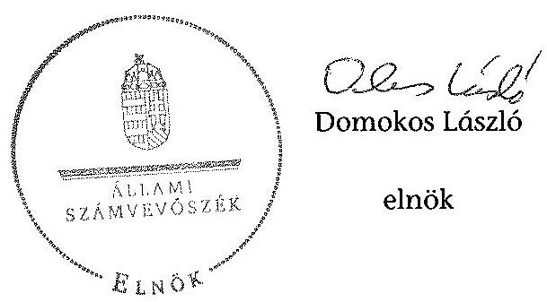

---

.

---

# RÖVIDÍTÉSEK JEGYZÉKE 

| Jogszabályok |  |
| :--: | :--: |
| Áfa tv. | Az általános forgalmi adóról szóló 2007. évi CXXVII. törvény |
| Áht. $_{1}$ | Az államháztartásról szóló 1992. évi XXXVIII. törvény (hatálytalan: 2012.01.01-től) |
| Áht. $_{2}$ | Az államháztartásról szóló 2011. évi CXCV. törvény (hatályos: 2012. 01. 01-től) |
| Alaptörvény | Magyarország Alaptörvényéről szóló 2011. évi CCCCIIV. törvény (hatályos: 2012. január 1-jétől) |
| ÁSZ tv. | Az Állami Számvevőszékről szóló 2011. évi LXVI. törvény |
| Avtv. | A személyes adatok védelméről és a közérdekű adatok nyilvánosságáról szóló 1992. évi LXIII. törvény (hatálytalan: 2012. január 1-jétől) |
| Evt. $_{1}$ | Az erdőről és az erdő védelméről szóló 1996. évi LIV. törvény (hatálytalan: 2009. július 10-től) |
| Evt. $_{2}$ | Az erdőről, az erdő védelméről és az erdőgazdálkodásról szóló 2009. évi XXXVII. törvény (hatályos: 2009. július 10-től) |
| Evr. $_{1}$ | Az erdőről és az erdő védelméről szóló 1996. évi LIV. törvény végrehajtásáról szóló 29/1997. (IV. 30.) FM rendelet (hatálytalan: 2009. november 21-től) |
| Evr. $_{2}$ | az erdőről, az erdő védelméről és az erdőgazdálkodásról szóló 2009. évi XXXVII. törvény végrehajtásáról szóló 153/2009. (XI. 13.) FVM rendelet (hatályos: 2009. november 21-től) |
| Gt. | A gazdasági társaságokról szóló 2006. évi IV. törvény |
| Info. tv. | Az információs önrendelkezési jogról és az információszabadságról szóló 2011. évi CXII. törvény (hatályos: 2009. november 21-től) |
| Mfbtv. | A Magyar Fejlesztési Bank Részvénytársaságról szóló 2001. évi XX. törvény |
| Nfatv. | A Nemzeti Földalapról szóló 2010. évi LXXXVII. törvény (hatályos: 2010. szeptember 1-jétől) |
| Nvtv. | A nemzeti vagyonról szóló 2011. évi CXCVI. törvény |
| Ptk. | A Polgári Törvénykönyvről szóló 1959. évi IV. törvény |
| Számv. tv. | A számvitelről szóló
 szóló 2000. évi C. törvény |
| új Ptk. | A Polgári Törvénykönyvről szóló 2013. évi V. törvény |
| Vadvédelmi tv. | A vad védelméről, a vadgazdálkodásról, valamint a vadászatról 1996. évi LV. törvény |
| Vtv. | Az állami vagyonról szóló 2007. évi CVI. törvény |
| Vhr. | Az állami vagyonnal való gazdálkodásról szóló 254/2007. (X. 4.) Korm. rendelet |
| 143/2009. (VII. 6.) Korm. rendelet | Az erdőgazdálkodási és erdővédelmi bírság mértékéről és kiszámításának módjáról |

---

262/2010. (XI.17.) Korm. A Nemzeti Földalapba tartozó földrészletek hasznosításáról szóló Korm. rendelet 11/2011. (II.22.) Korm. A Nemzeti Földalap vagyonnyilvántartásának szabályairól szóló Korm. rendelet
Egyéb rövidítések

Adatvédelmi és Informatikai Biztonsági szabályzat
AK érték
Alapító

Alapító Okirat

ÁSZ
Belső Ellenőrzési Szabályzat
Kisalföldi Erdőgazdaság Zrt.
Kisalföldi Erdőgazdaság Zrt. jogelődje
KEFAG

Erdészeti hatóság

FB
FB ügyrend
Forrás-SQL rendszer

Ft
ha
IG
INTOSAI
Iratkezelési szabályzat
ISSAI
JT
KVI
M Ft
nak részletes szabályairól szóló Korm. rendelet
A Nemzeti Földalap vagyonnyilvántartásának szabályairól

A Kisalföldi Erdőgazdaság Zrt. 2014. január 15-től hatályos adatvédelmi és informatikai biztonsági szabályzata

Aranykorona érték
A Magyar Állam, akinek a nevében a társaság feletti tulajdoni joggyakorló jár el
A Kisalföldi Erdőgazdaság Zrt. mindenkori hatályos Alapító Okirata
Állami Számvevőszék
A Kisalföldi Erdőgazdaság Zrt. mindenkori belső ellenőrzési szabályzata
A Kisalföldi Erdőgazdaság Zártkörűen Működő Részvénytársaság
A KEFAG- Kisalföldi Erdő- és Fafeldolgozó Gazdaság
Kisalföldi Erdő- és Fafeldolgozó Gazdaság, a Kisalföldi Erdőgazdaság Zrt. 1993. június 1-jével megszűnt jogelődje
Vas Megyei Mezőgazdasági Szakigazgatási Hivatal Erdészeti Igazgatósága 2010. december 31-ig, Vas Megyei Kormányhivatal Erdészeti Igazgatósága 2011. január 1-jétől Felügyelő bizottság
A Felügyelő bizottság ügyrendje
Az MNV. Zrt. által üzemeltetett, a vagyonnyilvántartásra vonatkozó informatikai rendszer, amelynek feladata volt a vagyonkezelők számára a vagyonkataszteri jelentés elkészítésének és adathordozón történő továbbításának biztosítása, valamint a tulajdonosi joggyakorló vagyonkezelésében lévő vagyonelemek elektronikus adatbázisban történő tételes nyilvántartása
forint
hektár
Igazgatóság
Legfőbb Ellenőrző Intézmények Nemzetközi Szervezete
A Kisalföldi Erdőgazdaság Zrt. mindenkori Iratkezelési Szabályzata
nemzetközi standardok
jegyzett tőke
Kincstári Vagyon Igazgatóság
millió forint

---

| MFB Zrt. | Magyar Fejlesztési Bank Zártkörűen Működő Részvénytársaság |
| :--: | :--: |
| MNV Zrt. | Magyar Nemzeti Vagyonkezelő Zártkörűen Működő Részvénytársaság, amely 2010. szeptember 1-jétől a Nemzeti Földalapba nem tartozó állami vagyon feletti tulajdonosi joggyakorló |
| NFA | Nemzeti Földalapkezelő Szervezet |
| NVT | Nemzeti Vagyongazdálkodási Tanács |
| ST | Saját tőke |
| Számviteli Politika | A Kisalföldi Erdőgazdaság Zrt. Számviteli Politikája |
| SZMSZ | A Kisalföldi Erdőgazdaság Zrt. Szervezeti és Működési Szabályzata |
| Társaság | A Kisalföldi Erdőgazdaság Zártkörűen Működő Részvénytársaság |
| Társaság felett tulajdonosi joggyakorló ${ }_{1}$ | Magyar Nemzeti Vagyonkezelő Zrt., mint a társaság feletti tulajdonosi joggyakorló 2009. január 1-jétől 2010. június 16-áig |
| Társaság felett tulajdonosi joggyakorló ${ }_{2}$ | Magyar Fejlesztési Bank Zrt., mint a társaság feletti tulajdonosi joggyakorló 2010. június 17-étől 2014. július 15-éig |
| Vadászati hatóság | Győr-Moson-Sopron Megyei Mezőgazdasági Szakigazgatási Hivatal Földművelésügyi Igazgatóság Vadászati és Halászati Osztály 2010. december 31-ig, Győr-Moson-Sopron Megyei Kormányhivatal Földművelésügyi Igazgatósága 2011. január 1-jétől, |
| Vadgazdálkodási szabályzat | A Kisalföldi Erdőgazdaság Zrt. Vadgazdálkodási Szabályzata |
| Vezérigazgató   VSZ | a Kisalföldi Erdőgazdaság Zrt. vezérigazgatója   a KVI-vel 1996. november 1-jén kötött ideiglenes vagyonkezelési szerződés |

---

.

---

# FOGALOMTÁR 

állami vagyon
a) az állam tulajdonában lévő dolog, valamint dolog módjára hasznosítható természeti erő;
b) az a) pont hatálya alá tartozó mindazon vagyon, amely vonatkozásában törvény az állam kizárólagos tulajdonjogát nevesíti;
c) az állam tulajdonában lévő tagsági jogviszonyt megtestesítő értékpapír, illetve az államot megillető egyéb társasági részesedés;
d) az államot megillető olyan immateriális, vagyoni értékkel rendelkező jogosultság, amelyet jogszabály vagyoni értékű jogként nevesít;
e) az állam tulajdonában lévő pénzügyi eszközök.
állami vagyon
használója
átlátható szervezet
földbirtok-politikai irányelvek
hasznosítás
immateriális szolgáltatásából származó bevétel
információs és kommunikációs rendszer

Az állami vagyon használója az a természetes vagy jogi személy, jogi személyiséggel nem rendelkező szervezet, aki, vagy amely törvény vagy szerződés alapján, bármely jogcímen (bérlet, haszonbérlet, használat stb.) állami vagyont birtokol, használ, szedi annak hasznait. (Ide nem értve a haszonélvezőt, a vagyonkezelőt és a tulajdonosi jogok gyakorlóját.)
Átlátható szervezet a Nvtv. 3. § (1) bekezdés 1. pontjában felsorolt, a meghatározott követelményeknek megfelelő szervezet.
Az Nfatv. 15. § (3) bekezdés a)-s) pontjaiban meghatározott, a Nemzeti Földalapba tartozó földrészletek hasznosítására vonatkozó irányelvek.
Hasznosítás a tulajdonosi joggyakorló vagy a nemzeti vagyon használója által a nemzeti vagyon birtoklásának, használatának, hasznok szedése jogának bármely - a tulajdonjog átruházását nem eredményező - jogcímen történő átengedése, ide nem értve a vagyonkezelésbe adást, valamint a haszonélvezeti jog alapítását.
Immateriális szolgáltatásból származó bevételek azok a nem anyagjellegű szolgáltatásokból származó állami bevételek, amelyeket az Evt. 3. § (1) bekezdése szerint, a külön jogszabályban meghatározott részletes feltételek szerint, az erdők fenntartására, gyarapítására és védelmére kell fordítani.
Az információs és kommunikációs rendszer biztosítja, hogy az információk eljussanak az illetékes szervezethez, szervezeti egységhez, illetve személyhez.

---

| Kincstári Vagyoni Igazgatóság | A Vtv. 61. § (1) bekezdése értelmében a Kincstári Vagyoni Igazgatóság (a továbbiakban: KVI) 2007. december 31-ei hatállyal megszűnt, jogai és kötelezettségei ezen időponttól - a 66. § (1) bekezdésében megjelölt feladat kivételével - az MNV Zrt.-re szálltak. A KVI 66. § (1) bekezdésben foglalt feladata a kincstárra szállt. A jogok és kötelezettségek átszállása nem minősült a KVI által kötött szerződések módosításának. |
| :--: | :--: |
| kockázatkezelés | A kockázatkezelés a szervezet céljai elérésével kapcsolatos kockázatok azonosításának és elemzésének, valamint a megfelelő válaszok meghatározásának folyamata. |
| kockázatkezelési rendszer | A kockázatkezelési rendszer működtetése során fel kell mérni és meg kell állapítani a szervezet tevékenységében, gazdálkodásában rejlő kockázatokat, valamint meg kell határozni az egyes kockázatokkal kapcsolatban szükséges intézkedéseket, valamint azok teljesítésének folyamatos nyomon követésének módját. A kockázatkezelési rendszer olyan irányítási eszközök és módszerek összessége, amelynek elemei a szervezeti célok elérését veszélyeztető tényezők (kockázatok) azonosítása, elemzése, nyomon követése, valamint szükség esetén a kockázati kitettség mérséklése. |
| kontrolling | Az a vezetéstámogató rendszer, amely a vezetői tervezést, ellenőrzést, valamint információ-ellátást koordinálja célorientáltan a környezeti változásokhoz igazodva. |
| kontrollkörnyezet | A kontroll környezet elemei: a szervezeti struktúra, a felelősségi, hatásköri viszonyok és feladatok, a szervezet minden szintjén meghatározott etikai elvárások, a humánerőforráskezelés. A kontrollkörnyezet alapozza meg a belső kontroll összes többi elemét a fegyelem és a struktúra biztosítása által. |
| kontrollrendszer | A kontrollrendszer a kockázatok kezelése és tárgyilagos bizonyosság megszerzése érdekében kialakított folyamatrendszer, amely azt a célt szolgálja, hogy megvalósuljanak a következő célok: $\square$   a) a működés és a gazdálkodás során a tevékenységeket szabályszerűen, gazdaságosan, hatékonyan, eredményesen hajtsák végre,   b) az elszámolási kötelezettségeket teljesítsék, és   c) megvédjék az erőforrásokat a veszteségektől, károktól és nem rendeltetésszerű használattól. |
| kontrolltevékenységek | A kontrolltevékenységek azok az elvek (politikák) és eljárások, amelyeket a kockázatok meghatározása és a szervezet céljainak elérése érdekében alakítanak ki. |

---

közfeladat

A közfeladat jogszabályban meghatározott állami vagy önkormányzati feladat, amit az arra kötelezett közérdekből, jogszabályban meghatározott követelményeknek és feltételeknek megfelelve végez, ideértve a lakosság közszolgáltatásokkal való ellátását, továbbá az állam nemzetközi szerződésekben vállalt kötelezettségeiből adódó közérdekű feladatokat, valamint e feladatok ellátásához szükséges infrastruktúra biztosítását is. Az Etv. 2. § (2) bekezdése szerint a fenntartható erdőgazdálkodás során a legfontosabb közérdekű feladat az erdők változatosságának megőrzése, az erdők fenntartása, felújítása és a védelmi, valamint közjóléti szolgáltatások biztosítása, melyek elvégzését az állam megfelelő eszközökkel biztosítja.
monitoring
Nemzeti Földalap
nemzeti vagyon használója

A szervezet tevékenységének, a célok megvalósításának nyomon követését biztosító rendszer, amely az operatív tevékenységek keretében megvalósuló folyamatos és eseti nyomon követésből, valamint az operatív tevékenységektől függetlenül működő belső ellenőrzésből áll. A monitoring a projektek és programok végrehajtásának nyomon követése, mely a támogató és a kedvezményezett közti megállapodásban foglalt eljárások követését, az előrehaladás ellenőrzését és a lehetséges problémák időben történő azonosítását szolgálja.
A Nemzeti Földalap a kincstári vagyon része, amelybe beletartoznak az állam tulajdonában és az ingatlan-nyilvántartásban levő, az Nfatv. 1. § (1)-(2) bekezdéseiben felsorolt területek, földrészletek és az azokhoz kapcsolódó vagyoni értékű jogok.
Az Nfatv. 15. § (1)${ }^{1}$, valamint 1. § (1)${ }^{2}$ bekezdése értelmében 2010. szeptember 1-jétől az erdőgazdasági társaság vagyonkezelésében lévő földterületek a Nemzeti Földalapba tartoznak, azok felett a tulajdonos jogait az agrárpolitikáért felelős miniszter az NFA útján gyakorolja.
A nemzeti vagyon használója az a természetes személy, jogi személy vagy jogi személyiséggel nem rendelkező szervezet, aki, vagy amely állami vagyon tekintetében törvény vagy szerződés alapján, a helyi önkormányzat vagyona tekintetében törvény, a helyi önkormányzat rendelete vagy szerződés alapján bármely jogcímen nemzeti vagyont birtokol, használ, szedi annak hasznait, kivéve a tulajdonosi joggyakorló (az Nvtv. 3. § (1) bekezdés 11. pontja alapján).

[^0]
[^0]:    ${ }^{1}$ Hatályos: 2010. szeptember 1. - 2011. július 31.
    ${ }^{2}$ Hatályos: 2010. szeptember-jétől, módosítva: 2011. augusztus 1-jétől.

---

rábízott állami vagyon
társasági portfólió
tulajdonosi ellenőrzés
tulajdonosi joggyakorló
tulajdonosi joggyakorlás módja
vagyongazdálkodás feladata

Rábízott állami vagyon az a Vtv. alkalmazásában állami vagyonnak minősülő vagyon, amit az MNV - a saját vagyonától elkülönítetten - kezel és nyilvántart. Az Mfbtv. 3. § (9) bekezdése szerint rábízott állami vagyon az a vagyon, amely felett az Mfbtv. erejénél fogva a Magyar Állam nevében az MFB gyakorolja a tulajdonosi jogokat. Az Nfatv. 1. § (1) bekezdésében foglaltak alapján az NFA-hoz tartozó rábízott vagyon a törvényben meghatározott, a Nemzeti Földalapba tartozó vagyon.
Társasági portfólió az MNV, illetve az MFB rábízott vagyonába tartozó állami tulajdonú társasági részesedések.
Az MNV/MFB tulajdonosi joggyakorló által végzett ellenőrzés, amelynek célja az állami vagyonnal való gazdálkodás vizsgálata, ennek keretében a rendeltetésellenes, jogszerűtlen, szerződésellenes, vagy a tulajdonos érdekeit sértő, illetve a központi költségvetést hátrányosan érintő vagyongazdálkodási intézkedések feltárása és a jogszerű állapot helyreállítása, továbbá a vagyonnyilvántartás hitelességének, teljességének és helyességének biztosítása.
Tulajdonosi joggyakorló az, aki az állami, illetve a nemzeti vagyon felett az államot megillető tulajdonosi jogok és kötelezettségek gyakorlására jogosult.
Az állami vagyon felett a Magyar Államot megillető tulajdonosi jogoknak (és kötelezettségeknek) az összességét az állami vagyon felügyeletéért felelős miniszter gyakorolja, aki e feladatát az MNV, az MFB útján látja el. Azon állami tulajdonban álló ingatlanok felett, amelyek egy része a Nemzeti Földalapba tartozik, a tulajdonosi jogokat a miniszter az agrárpolitikáért felelős miniszterrel közösen gyakorolja. A Nemzeti Földalap felett a Magyar Állam nevében a tulajdonosi jogokat és kötelezettségeket az agrárpolitikáért felelős miniszter a Nemzeti Földalapkezelő Szervezet útján gyakorolja.
Az állami vagyon rendeltetésének megfelelő - az állami feladatok ellátásához, a társadalmi szükségletek kielégítéséhez, valamint a Kormány gazdaságpolitikája megvalósításának elősegítéséhez szükséges, egységes elveken alapuló, önálló ágazatként megjelenő - hatékony, költségtakarékos, értékmegőrző, értéknövelő felhasználásának biztosítása, beleértve a vagyoni kör változását eredményező értékesítést, valamint az állami vagyon gyarapítása is.

---

vagyonkezelői jog Vagyonkezelési szerződés alapján a vagyonkezelő jogosult meghatározott, állami tulajdonba tartozó dolog birtoklására, használatára és hasznai szedésére. A Vtv. alapján a vagyonkezelői jog az
 állami vagyon hasznosítására az MNV-vel kötött vagyonkezelési szerződéssel jön létre. A vagyonkezelési szerződés alapján a vagyonkezelő jogosult meghatározott, állami tulajdonba tartozó dolog birtoklására, használatára és hasznai szedésére. Az Nfatv. alapján a vagyonkezelői jog az erre irányuló (NFA-val kötött) szerződéssel jön létre. A vagyonkezelői szerződés alapján a vagyonkezelő jogosult meghatározott földrészlet birtoklására, használatára és hasznai szedésére. A vagyonkezelő köteles a földrészlet értékét megőrizni, állagának megóvásáról, jó karban tartásáról gondoskodni, továbbá - az Nfatv.-ben meghatározott esetek kivételével - díjat fizetni vagy a szerződésben előírt más kötelezettséget teljesíteni.

---

# **Chemistry**

## **Chemical Reactions**

### **Balancing Chemical Equations**

1. **Write the unbalanced equation:**
   - Example: $$C_3H_8 + O_2 \rightarrow CO_2 + H_2O$$

2. **Balance the equation:**
   - Example: $$2C_3H_8 + 7O_2 \rightarrow 6CO_2 + 8H_2O$$

3. **Balance the equation:**
   - Example: $$2C_3H_8 + 7O_2 \rightarrow 6CO_2 + 8H_2O$$

### **Types of Reactions**

1. **Combination Reaction:**
   - Example: $$2H_2 + O_2 \rightarrow 2H_2O$$

2. **Decomposition Reaction:**
   - Example: $$2H_2O_2 \rightarrow 2H_2O + O_2$$

3. **Single Displacement Reaction:**
   - Example: $$Zn + 2HCl \rightarrow ZnCl_2 + H_2$$

4. **Double Displacement Reaction:**
   - Example: $$AgNO_3 + NaCl \rightarrow AgCl + NaNO_3$$

5. **Combustion Reaction:**
   - Example: $$CH_4 + 2O_2 \rightarrow CO_2 + 2H_2O$$

## **Stoichiometry**

### **Mole Concept**

- **Mole (mol):** The amount of substance containing as many particles (atoms, molecules, ions) as there are atoms in exactly 12 grams of carbon-12.
- **Avogadro's Number:** $$6.022 \times 10^{23}$$ particles per mole.

### **Molar Mass**

- **Molar Mass:** The mass of one mole of a substance.
- Example: The molar mass of water ($$H_2O$$) is 18.015 g/mol.

### **Calculations**

1. **Moles to Mass:**
   - Formula: $$n = \frac{m}{M}$$
   - Example: Calculate the number of moles of $$H_2O$$ in 18 grams of water.
     - $$n = \frac{18 \, \text{g}}{18.015 \, \text{g/mol}} \approx 0.999 \, \text{mol}$$

2. **Moles to Mass:**
   - Formula: $$m = n \times M$$
   - Example: Calculate the mass of 1 mole of water.
     - $$m = 1 \, \text{mol} \times 18.015 \, \text{g/mol} = 18.015 \, \text{g}$$

## **Gas Laws**

### **Ideal Gas Law**

- **Equation:** $$PV = nRT$$
- **Variables:**
  - $$P$$: Pressure (atm)
  - $$V$$: Volume (L)
  - $$n$$: Number of moles (mol)
  - $$R$$: Ideal gas constant (0.0821 L·atm/mol·K)
  - $$T$$: Temperature (K)

### **Boyle's Law**

- **Equation:** $$P_1V_1 = P_2V_2$$
- **Variables:**
  - $$P_1$$: Pressure (atm)
  - $$V_1$$: Volume (L)
  - $$P_2$$: Pressure (atm)
  - $$V_2$$: Volume (L)

### **Boyle's Law (Boyle's Law)**

- **Equation:** $$\frac{P_1V_1}{P_2V_2} = \frac{P_1}{V_1}$$

## **Thermochemistry**

### **Enthalpy (H)**

- **Definition:** The heat content of a system at constant pressure.
- **Equation:** $$\Delta H = q_p$$
- **Variables:**
  - $$q_p$$: Heat transferred at constant pressure.

### **Hess's Law**

- **Statement:** The enthalpy change for a reaction is the same whether it occurs in one step or multiple steps.
- **Equation:** $$\Delta H_{rxn} = \sum \Delta H_f (\text{products}) - \sum \Delta H_f (\text{reactants})$$
- **Variables:**
  - $$\Delta H_{rxn}$$: Enthalpy change of reaction
  - $$\Delta H_f$$: Standard enthalpy of formation

## **Electrochemistry**

### **Oxidation and Reduction**

- **Oxidation:** Loss of electrons.
- **Reduction:** Gain of electrons.

### **Galvanic Cells**

- **Definition:** A cell that converts chemical energy into electrical energy.
- **Components:**
  - Anode: Oxidation occurs.
  - Cathode: Reduction occurs.
  - Salt Bridge: Connects the two half-cells.

### **Nernst Equation**

- **Equation:** $$E = E^\circ - \frac{RT}{nF} \ln Q$$
- **Variables:**
  - $$E$$: Cell potential (V)
  - $$E^\circ$$: Standard cell potential (V)
  - $$R$$: Ideal gas constant (8.314 J/mol·K)
  - $$T$$: Temperature (K)
  - $$n$$: Number of electrons transferred
  - $$F$$: Faraday constant (96485 C/mol)
  - $$Q$$: Reaction quotient

---

A Kisalföldi Erdőgazdaság Zrt. vagyonváltozásának alakulása a 2009-2013. évekközötti időszakban - Eszközök (M ft)
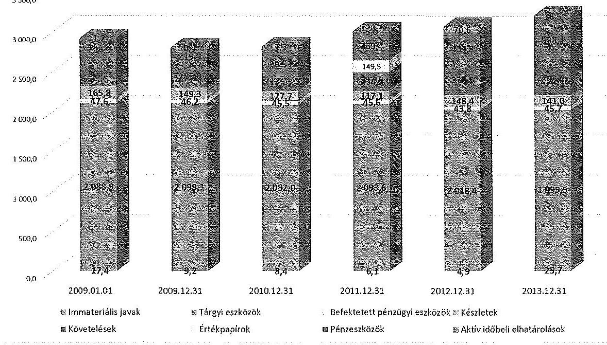

A Kisalföldi Erdőgazdaság Zrt. vagyonváltozásának alakulása a 2009-2013. évekközötti időszakban - Források (M ft)
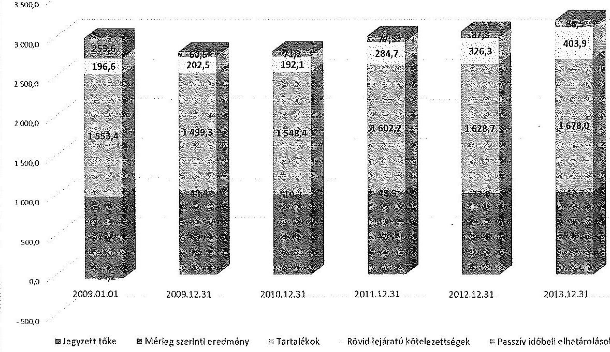

---

|  2018 |  |  |  |  |  |  |  |  |  |  |  |  |  |  |  |  |  |  |   |
| --- | --- | --- | --- | --- | --- | --- | --- | --- | --- | --- | --- | --- | --- | --- | --- | --- | --- | --- | --- |
|  2019 |  |  |  |  |  |  |  |  |  |  |  |  |  |  |  |  |  |  |   |
|  2020 |  |  |  |  |  |  |  |  |  |  |  |  |  |  |  |  |  |  |   |
|  2021 |  |  |  |  |  |  |  |  |  |  |  |  |  |  |  |  |  |  |   |
|  2022 |  |  |  |  |  |  |  |  |  |  |  |  |  |  |  |  |  |  |   |
|  2023 |  |  |  |  |  |  |  |  |  |  |  |  |  |  |  |  |  |  |   |
|  2024 |  |  |  |  |  |  |  |  |  |  |  |  |  |  |  |  |  |  |   |
|  2025 |  |  |  |  |  |  |  |  |  |  |  |  |  |  |  |  |  |  |   |
|  2026 |  |  |  |  |  |  |  |  |  |  |  |  |  |  |  |  |  |  |   |
|  2027 |  |  |  |  |  |  |  |  |  |  |  |  |  |  |  |  |  |  |   |
|  2028 |  |  |  |  |  |  |  |  |  |  |  |  |  |  |  |  |  |  |   |
|  2029 |  |  |  |  |  |  |  |  |  |  |  |  |  |  |  |  |  |  |   |
|  2030 |  |  |  |  |  |  |  |  |  |  |  |  |  |  |  |  |  |  |   |
|  2031 |  |  |  |  |  |  |  |  |  |  |  |  |  |  |  |  |  |  |   |
|  2032 |  |  |  |  |  |  |  |  |  |  |  |  |  |  |  |  |  |  |   |
|  2033 |  |  |  |  |  |  |  |  |  |  |  |  |  |  |  |  |  |  |   |
|  2034 |  |  |  |  |  |  |  |  |  |  |  |  |  |  |  |  |  |  |   |
|  2035 |  |  |  |  |  |  |  |  |  |  |  |  |  |  |  |  |  |  |   |
|  2036 |  |  |  |  |  |  |  |  |  |  |  |  |  |  |  |  |  |  |   |
|  2037 |  |  |  |  |  |  |  |  |  |  |  |  |  |  |  |  |  |  |   |
|  2038 |  |  |  |  |  |  |  |  |  |  |  |  |  |  |  |  |  |  |   |
|  2039 |  |  |  |  |  |  |  |  |  |  |  |  |  |  |  |  |  |  |   |
|  2040 |  |  |

  |  |  |  |  |  |  |  |  |  |  |  |  |  |  |  |   |
|  2041 |  |  |  |  |  |  |  |  |  |  |  |  |  |  |  |  |  |  |   |
|  2042 |  |  |  |  |  |  |  |  |  |  |  |  |  |  |  |  |  |  |   |
|  2043 |  |  |  |  |  |  |  |  |  |  |  |  |  |  |  |  |  |  |   |
|  2044 |  |  |  |  |  |  |  |  |  |  |  |  |  |  |  |  |  |  |   |
|  2045 |  |  |  |  |  |  |  |  |  |  |  |  |  |  |  |  |  |  |   |
|  2046 |  |  |  |  |  |  |  |  |  |  |  |  |  |  |  |  |  |  |   |
|  2047 |  |  |  |  |  |  |  |  |  |  |  |  |  |  |  |  |  |  |   |
|  2048 |  |  |  |  |  |  |  |  |  |  |  |  |  |  |  |  |  |  |   |
|  2049 |  |  |  |  |  |  |  |  |  |  |  |  |  |  |  |  |  |  |   |
|  2050 |  |  |  |  |  |  |  |  |  |  |  |  |  |  |  |  |  |  |   |
|  2051 |  |  |  |  |  |  |  |  |  |  |  |  |  |  |  |  |  |  |   |
|  2052 |  |  |  |  |  |  |  |  |  |  |  |  |  |  |  |  |  |  |   |
|  2053 |  |  |  |  |  |  |  |  |  |  |  |  |  |  |  |  |  |  |   |
|  2054 |  |  |  |  |  |  |  |  |  |  |  |  |  |  |  |  |  |  |   |
|  2055 |  |  |  |  |  |  |  |  |  |  |  |  |  |  |  |  |  |  |   |
|  2056 |  |  |  |  |  |  |  |  |  |  |  |  |  |  |  |  |  |  |   |
|  2057 |  |  |  |  |  |  |  |  |  |  |  |  |  |  |  |  |  |  |   |
|  2058 |  |  |  |  |  |  |  |  |  |  |  |  |  |  |  |  |  |  |   |
|  2059 |  |  |  |  |  |  |  |  |  |  |  |  |  |  |  |  |  |  |   |
|  2060 |  |  |  |  |  |  |  |  |  |  |  |  |  |  |  |  |  |  |   |
|  2061 |  |  |  |  |  |  |  |  |  |  |  |  |  |  |  |  |  |  |   |
|  2062 |  |  |  |  |  |  |  |  |  |  |  |  |  |  |  |  |  |  |   |
|  2063 |  |  |  |  |  |  |  |  |  |  |  |  |  |  |  |  |  |  |   |
|  2064 |  |  |  |  |  |  |  |  |  |  |  |  |  |  |  |  |  |  |   |
|  2065 |  |  |  |  |  |  |  |  |  |  |  |  |  |  |  |  |  |  |   |
|  2066 |  |  |  |  |  |  |  |  |  |  |  |  |  |  |  |  |  |  |   |
|  2067 |  |  |  |  |  |  |  |  |  |  |  |  |  |  |  |  |  |  |   |
|  2068 |  |  |  |  |  |  |  |  |  |  |  |  |  |  |  |  |  |  |   |
|  2069 |  |  |  |  |  |  |  |  |  |  |  |  |  |  |  |  |  |  |   |
|  2070 |  |  |  |  |  |  |  |  |  |  |  |  |  |  |  |  |  |  |   |
|  2071 |  |  |  |  |  |  |  |  |  |  |  |  |  |  |  |  |  |  |   |
|  2072 |  |  |  |  |  |  |  |  |  |  |  |  |  |  |  |  |  |  |   |
|  2073 |  |  |  |  |  |  |  |  |  |  |  |  |  |  |  |  |  |  |   |
|  2074 |  |  |  |  |  |  |  |  |  |  |  |  |  |  |  |  |  |  |   |
|  2075 |  |  |  |  |  |  |  |  |  |  |  |  |  |  |  |  |  |  |   |
|  2076 |  |  |  |  |  |  |  |  |  |  |  |  |  |  |  |  |  |  |   |
|  2077 |  |  |  |  |  |  |  |  |  |  |  |  |  |  |  |  |  |  |   |
|  2078 |  |  |  |  |

  |  |  |  |  |  |  |  |  |  |  |  |  |  |   |
|  2079 |  |  |  |  |  |  |  |  |  |  |  |  |  |  |  |  |  |  |   |
|  2080 |  |  |  |  |  |  |  |  |  |  |  |  |  |  |  |  |  |  |   |
|  2081 |  |  |  |  |  |  |  |  |  |  |  |  |  |  |  |  |  |  |   |
|  2082 |  |  |  |  |  |  |  |  |  |  |  |  |  |  |  |  |  |  |   |
|  2083 |  |  |  |  |  |  |  |  |  |  |  |  |  |  |  |  |  |  |   |
|  2084 |  |  |  |  |  |  |  |  |  |  |  |  |  |  |  |  |  |  |   |
|  2085 |  |  |  |  |  |  |  |  |  |  |  |  |  |  |  |  |  |  |   |
|  2086 |  |  |  |  |  |  |  |  |  |  |  |  |  |  |  |  |  |  |   |
|  2087 |  |  |  |  |  |  |  |  |  |  |  |  |  |  |  |  |  |  |   |
|  2088 |  |  |  |  |  |  |  |  |  |  |  |  |  |  |  |  |  |  |   |
|  2089 |  |  |  |  |  |  |  |  |  |  |  |  |  |  |  |  |  |  |   |
|  2090 |  |  |  |  |  |  |  |  |  |  |  |  |  |  |  |  |  |  |   |
|  2091 |  |  |  |  |  |  |  |  |  |  |  |  |  |  |  |  |  |  |   |
|  2092 |  |  |  |  |  |  |  |  |  |  |  |  |  |  |  |  |  |  |   |
|  2093 |  |  |  |  |  |  |  |  |  |  |  |  |  |  |  |  |  |  |   |
|  2094 |  |  |  |  |  |  |  |  |  |  |  |  |  |  |  |  |  |  |   |
|  2095 |  |  |  |  |  |  |  |  |  |  |  |  |  |  |  |  |  |  |   |
|  2096 |  |  |  |  |  |  |  |  |  |  |  |  |  |  |  |  |  |  |   |
|  2097 |  |  |  |  |  |  |  |  |  |  |  |  |  |  |  |  |  |  |   |
|  2098 |  |  |  |  |  |  |  |  |  |  |  |  |  |  |  |  |  |  |   |
|  2099 |  |  |  |  |  |  |  |  |  |  |  |  |  |  |  |  |  |  |   |
|  209A |  |  |  |  |  |  |  |  |  |  |  |  |  |  |  |  |  |  |   |
|  209B |  |  |  |  |  |  |  |  |  |  |  |  |  |  |  |  |  |  |   |
|  209C |  |  |  |  |  |  |  |  |  |  |  |  |  |  |  |  |  |  |   |
|  209D |  |  |  |  |  |  |  |  |  |  |  |  |  |  |  |  |  |  |   |
|  209E |  |  |  |  |  |  |  |  |  |  |  |  |  |  |  |  |  |  |   |
|  209F |  |  |  |  |  |  |  |  |  |  |  |  |  |  |  |  |  |  |   |
|  209G |  |  |  |  |  |  |  |  |  |  |  |  |  |  |  |  |  |  |   |
|  209H |  |  |  |  |  |  |  |  |  |  |  |  |  |  |  |  |  |  |   |
|  209I |  |  |  |  |  |  |  |  |  |  |  |  |  |  |  |  |  |  |   |
|  209J |  |  |  |  |  |  |  |  |  |  |  |  |  |  |  |  |  |  |   |
|  209K |  |  |  |  |  |  |  |  |  |  |  |  |  |  |  |  |  |  |   |
|  209L |  |  |  |  |  |  |  |  |  |  |  |  |  |  |  |  |  |  |   |
|  209M |  |  |  |  |  |  |  |  |  |  |  |  |  |  |  |  |  |  |   |
|  209N |  |  |  |  |  |  |  |  |  |  |  |  |  |  |  |  |  |  |   |
|  209O |  |  |  |  |  |  |  |  |  |  |  |  |  |  |  |  |  |  |   |
|  209P |  |  |  |  |  |  |  |  |  |  |  |  |  |  |  |  |  |  |   |
|  209Q |  |  |  |  |  |  |

  |  |  |  |  |  |  |  |  |  |  |  |   |
|  209R |  |  |  |  |  |  |  |  |  |  |  |  |  |  |  |  |  |  |   |
|  209S |  |  |  |  |  |  |  |  |  |  |  |  |  |  |  |  |  |  |   |
|  209T |  |  |  |  |  |  |  |  |  |  |  |  |  |  |  |  |  |  |   |
|  209U |  |  |  |  |  |  |  |  |  |  |  |  |  |  |  |  |  |  |   |
|  209U |  |  |  |  |  |  |  |  |  |  |  |  |  |  |  |  |  |  |   |
|  209V |  |  |  |  |  |  |  |  |  |  |  |  |  |  |  |  |  |  |   |
|  209W |  |  |  |  |  |  |  |  |  |  |  |  |  |  |  |  |  |  |   |
|  209X |  |  |  |  |  |  |  |  |  |  |  |  |  |  |  |  |  |  |   |
|  209X |  |  |  |  |  |  |  |  |  |  |  |  |  |  |  |  |  |  |   |
|  209X |  |  |  |  |  |  |  |  |  |  |  |  |  |  |  |  |  |  |   |
|  209X |  |  |  |  |  |  |  |  |  |  |  |  |  |  |  |  |  |  |   |
|  209X |  |  |  |  |  |  |  |  |  |  |  |  |  |  |  |  |  |  |   |
|  209X |  |  |  |  |  |  |  |  |  |  |  |  |  |  |  |  |  |  |   |
|  209X |  |  |  |  |  |  |  |  |  |  |  |  |  |  |  |  |  |  |   |
|  209X |  |  |  |  |  |  |  |  |  |  |  |  |  |  |  |  |  |  |   |
|  209X |  |  |  |  |  |  |  |  |  |  |  |  |  |  |  |  |  |  |   |
|  209X |  |  |  |  |  |  |  |  |  |  |  |  |  |  |  |  |  |  |   |
|  209X |  |  |  |  |  |  |  |  |  |  |  |  |  |  |  |  |  |  |   |
|  209X |  |  |  |  |  |  |  |  |  |  |  |  |  |  |  |  |  |  |   |
|  209X |  |  |  |  |  |  |  |  |  |  |  |  |  |  |  |  |  |  |   |
|  209X |  |  |  |  |  |  |  |  |  |  |  |  |  |  |  |  |  |  |   |
|  209X |  |  |  |  |  |  |  |  |  |  |  |  |  |  |  |  |  |  |   |
|  209X |  |  |  |  |  |  |  |  |  |  |  |  |  |  |  |  |  |  |   |
|  209X |  |  |  |  |  |  |  |  |  |  |  |  |  |  |  |  |  |  |   |
|  209X |  |  |  |  |  |  |  |  |  |  |  |  |  |  |  |  |  |  |   |
|  209X |  |  |  |  |  |  |  |  |  |  |  |  |  |  |  |  |  |  |   |
|  209X |  |  |  |  |  |  |  |  |  |  |  |  |  |  |  |  |  |  |   |
|  209X |  |  |  |  |  |  |  |  |  |  |  |  |  |  |  |  |  |  |   |
|  209X |  |  |  |  |  |  |  |  |  |  |  |  |  |  |  |  |  |  |   |
|  209X |  |  |  |  |  |  |  |  |  |  |  |  |  |  |  |  |  |  |   |
|  209X |  |  |  |  |  |  |  |  |  |  |  |  |  |  |  |  |  |  |   |
|  209X |  |  |  |  |  |  |  |  |  |  |  |  |  |  |  |  |  |  |   |
|  209X |  |  |  |  |  |  |  |  |  |  |  |  |  |  |  |  |  |  |   |
|  209X |  |  |  |  |  |  |  |  |  |  |  |  |  |  |  |  |  |  |   |
|  209X |  |  |  |  |  |  |  |  |  |  |  |  |  |  |  |  |  |  |   |
|  209X |  |  |  |  |  |  |  |  |

  |  |  |  |  |  |  |  |  |  |   |
|  

---

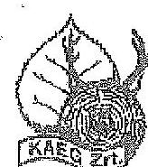

Kisalföldi Erdőgazdaság Zrt.
9023 Győr, Carvin u. 9.
Levelezési cím: 9002 Győr, Pf. 13.
tel.: +36 96 529 450 fax: +36 96 526 586
Email: k.sparth@karstp.2tu
Internet: http://www.karst.2tu

Bil. szám: 2015/01/03 10:15

Tárgy: észrevételek

Melléklet: Léb

A Kisalföldi Erdőgazdaság Zrt. észrevételezni az állami tulajdonban álló erdőgazdasági társaságok
vagyongazdálkodási tevékenységének ellenőrzése tárgyban készített jelentés tervezetéhez.

Az összegző megállapításokat áttekintve a következő megállapításokat tesszük:

1. „A Társaság által kezelt vagyonról vezetett nyilvántartás nem felelt meg a Vhr-ben
foglaltaknak"

Véleményünk szerint a fenti megállapítás azért nem felel meg a valóságnak, mert a Társaság a
kezelésében lévő vagyonelemeket (erdő) a Számviteli tv. rendelkezése alapján a mérlegben
szerepeltette a „0"-ás számlacsoportban.

1997-ben az Állami Privatizációs és Vagyonkezelő Rt., állásfoglalást kért a Pénzügyminisztériumból -
kincstári vagyon számviteli elszámolása a vagyonkezelőnél - címmel. A Pénzügyminisztérium
számviteli főosztály 9806/1997. N6-1129/97 számon a következő állásfoglalást adta ki.

A számviteli törvény 21. §/3/bekezdésében megfogalmazott előírás feltételezi, hogy a kezelt vagyon
megfelelő módon, dokumentáltan értékelésre kerül, amíg megfelelő értékelés nem áll rendelkezésre,
vagy az adott kincstári vagyont nem lehet - természeténél fogva - értékelni, addig nem lehet
alkalmazni a törvényi hivatkozott 21. §/3/bekezdésének rendelkezését sem.

A Társaság a PM. által kiadott állásfoglalás szerint járt el.

Észrevételünkben nem kívánjuk részletezni egyébként az erdő vagyon értékelés gyakorlati
problémáiból adódó számviteli eltéréseket. Csatoljuk viszont a Társaság megválasztott
könyvvizsgálójának (Szálinger Ferenc, adószám: 001502) véleményét a kezelt vagyon
nyilvántartásáról. Hozzáteszzük azonban, hogy abban az esetben, amikor tárgyi eszközként
nyilvántartásunkba kerül értéken a kezelt erdő, a különböző termelési folyamatok során gondot
okozna a tényleges érték, ezáltal a kezelési díj megállapítása.

„...a tulajdonosi jogok gyakorlására felhatalmazott szervezetek változása, valamint a társaság
vagyonkezelésére vonatkozó jogszabályi rendelkezések változásai ellenére a VSZ-t az ellenőrzött
időszakban nem aktualizálták.":

A KVI-vel 1996. évben kötött ideiglenes vagyonkezelői szerződés (továbbiakban: ívsz) van a mai napig
hatályban, ennek felhatalmazása alapján kezeli Társaságunk a cikkizett állami vagyont. 1996. évtől
sem a szerződés korszerűsítése, sem a szerződés véglegesítése nem volt elérhető közelségben, noha
az ívsz is több technikai hiányosságtól szenved. (például az ingatlan jegyzék hiánya)

A Társaság jelenlegi vezetése abban az időben, amikor még az MNV Zrt., majd amikor a MFB Zrt.
gyakorolta a tulajdonosi jogokat az informális megbeszélések és formális levelezés során is
napirenden tartotta a vagyonkezelői szerződés kérdését. A vizsgálat során rendelkezésre bocsátottuk
azokat az elektronikus leveleket, amit a tárgyban folytattunk.

ÁLLAMI SZÁMVEVŐSZÉK
10974/2015

Fókszer: 2015 OKT 1 2.

Bil. szám: 2015/01/03 10:15

Melléklet:

---

# 5. SZÁMÚ MELLÉKLET A V-0758-072/2015. SZÁMÚ JELENTÉSHEZ 

Ténykérdés, hogy követelés szintjén nem terjesztette elő a Vezérigazgató a tulajdonosi joggyakorlóval szemben a vagyonkezelési szerződés megkötésének igényét. Ennek oka az, hogy az elmúlt években folyamatosan napirenden volt a Magyar Állam képviseletében eljáró szervek előtt a szerződés előkészítése és megkötése. Nyilván nem kell részletezni azt, hogy portfólió szinten, minden erdőgazdasággal egyszerre kívánt az Állam szerződést kötni, ezért az egyes vezérigazgatók ez irányú követelései csak az ágazati pozíciók erodálását okozhatták volna.

A megfogalmazott tulajdonosi jogokat gyakorlók és törvényi feltételek változását azonban az Alapító Okiratban, Alapszabályban átvezette a Társaság és a mindenkori érvényben levő jogszabályi kereteket betartva végezte vagyonkezelési tevékenységét. Az érvényben levő Alapszabály, Alapító Okirat értelmében azonban a kezelői jogokban bekövetkezett bárminemű változtatás, kizárólagosan alapítói hatáskörként volt feltüntetve, így a változtatásokat mindeddig az alapító tudtával és engedélyének birtokában végezhette Társaságunk.
„A társaság az Evt${ }_{2}$, valamint Nfatv.-ben foglalt előírás ellenére összesen 64 esetben a vagyonkezelésbe adott erdősített területek használatát, hasznosítását jogellenesen harmadik személynek engedte át. A társaság az Evt${ }_{1}$ hatályba lépése előtt határozatlan időre kötött négy szerződést az Evt${ }_{3}$ rendelkezésének ellenére 201. december 31-éig nem bontotta fel.".

Ez a megállapítás a jelentésben több helyen is előfordul.
Társaságunknál 64 olyan szerződést nem találtunk, amelyben erdősített területek használatát, hasznosítását harmadik személynek átadtuk volna. Társaságunk erdőgazdálkodást senkinek, így harmadik személynek soha nem adta át, sem korábban, sem azóta. A fenti ilyen tartalmú megállapítást nem tudjuk elfogadni.

Az állami erdő esetleges másodlagos vagy többedleges hasznosításait azonban több szerződésben átengedte Társaságunk, sajnos néhány esetben jogtechnikailag pontatlan formában (bérletként fogalmaz a szerződés), azonban joggyakorlás tényleges tartalma minden esetben beazonosítható az alábbiak szerint több csoportba sorolva.

- Területen való tartózkodás, átjárás. (Vízpartok esetében ilyen például a horgászat. Nem feltétlenül meg, hogy a területen áthaladjon, ott tartózkodjon. Ilyen igény a rendszerváltás előtt is volt. Számunkra az erdővédelem szempontjából is elfogadható, hiszen ténylegesen is tudjuk ki az a személy, aki ott tartózkodik. Ezek az emberek odafigyelnek és jelentenek bármi nem odaillót tapasztalva, és a szerződés alapján, számon kérhetők.)
- Sport tevékenység űzése (kalandpark, rekreáció, sátortáborozó hely, sportverseny stb. Az erdőhasználatának kiszélesítése ellenőrizhető formában. Itt is nyilvánvalóan az erdőgazdálkodás figyelembevételével történhet csak meg az engedélyezett tevékenység)
- Erdő művelési-ágú, de nem erdővel borított területek (TI tisztás, VF vadföld; TN terméketlen terület) hasznosítása. Erdőgazdálkodásunkat nem akadályozza, itt az ingatlan-nyilvántartási elnevezés elválik a tényleges erdőtervi funkciótól.
- Véghasználat és első kivitel közötti időszakban mezőgazdasági tevékenység engedélyezése. (Ebben az időszakban a területen nem található erdő, az erdőfelújítás előtti állapotot jelenti. A társaság számára a talaj-előkészítés költségeinek megtakarítását jelenti.)
- Nem mezőgazdasági célú egyéb használat (reklámtábla elhelyezése)
- Saját tulajdonú terület bérbeadása (ezek nem vagyonkezelt területek, hanem a KAEG Zrt. tulajdonában álló területek, ahol a bérbeadás nem tiltott, egyébként valamely okból praktikus)

A fentiek alapján látható, hogy tényleges erdészeti alhaszonbérletről nem beszélhetünk, ezért nem tartjuk a jelentés szerinti formális és tartalmi törvénysértésnek a társaság gyakorlatát.

---

# 5. SZÁMÚ MELLÉKLET A V-0758-072/2015. SZÁMÚ JELENTÉSHEZ 

... az Infotv.-ben rögzített, a közérdekű adatok megismerésére irányuló igények teljesítésének rendjére vonatkozó szabályzat készítési kötelezettségének nem tett eleget.";

Értelmezésünk szerint Társaságunk közérdekű adatok nyilvánossá tételére kötelezett, de nem közfeladatot, vagy állami feladatot ellátó szervezet. Ennél fogva az Autv. 20 § (B), valamint az Infotv. 30.§ (6) bekezdését sem tartottuk kötelező érvényűnek. Természetesen a közérdekű adatok nyilvánossá tételével kapcsolatos törvényi közzétételi kötelezettségeinek eleget tett a Társaság.

Míg a vizsgált időszakban a közérdekű adatok megismerésére irányuló igények teljesítésének rendjének szabályzata nem állt rendelkezésre, 2015. évben a Társaság menedzsmentje 2015. július 1-től hatályos Adatvédelmi szabályzatot léptetett életbe, amely tartalmazza a kifogásolt hiányosság előírás szerinti végrehajtásának rendjét, lehetőségeit.

Az intézkedést igénylő megállapítások közül a Kisalföldi Erdőgazdaság Zrt. vezérigazgatójának címzett feladatok közül:

- kérem, a 2. pontban megfogalmazott intézkedésre a vagyonkezelői szerződés módosítás időpontjára utalni, mivel vagyonkezelői szerződés jelenleg nem tartalmazza a kezelt terület értékét.
- kérem a 3. pontot átfogalmazni. A Társaság nem engedte át jogellenesen harmadik személynek a vagyonkezelői jogot. A hibás, jogtechnikailag pontatlan szerződéseket Társaságunk felülvizsgálta és kezdeményezzük módosításukat.
- a fentiekben leírtak alapján a felmerült problémát Társaságunk kezelte és elkészítette a jogszabálynak mindenben megfelelő szabályzatát, igaz a vizsgált időszakot követő gazdasági évben.

A fenti indoklásunk figyelembe vételével kérem, szíveskedjenek az összefoglaló megállapításokat és következtetéseket javítani.

Győr, 2015. október 09.
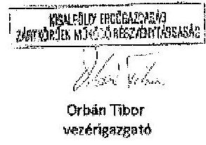

---

# Kisalföldi Erdőgazdaság Zrt. 

Orbán Tibor út
vezérigazgató részére

## Győr

Tárgy: Észrevétel az Állami Számvevőszék ellenőrzési jegyzőkönyv tervezetére

Tisztelt Vezérigazgató Úr!
A Kisalföldi Erdőgazdaság Zrt. az Állami Számvevőszéknek a Részvénytársaság vagyongazdálkodásának ellenőrzéséről készült jegyzőkönyv-tervezet 1. Összegző megállapítások, következtetések, javaslatok részében foglaltak könyvvizsgálatra vonatkozó részéről a következők szerint tájékoztatott:
„A társaság a Számv. tv-ben, valamint az Alapító Okiratban foglaltaknak megfelelően az ellenőrzött időszakban könyvvizsgálati szolgáltatást vett igénybe. A könyvvizsgáló a társaság éves beszámolóját minden évben hitelesítő záradékkal látta el annak ellenére, hogy a társaság a kezelésében levő vagyonokat a Számv. tv. rendelkezései ellenére a mérlegében nem szerepeltette, ezáltal az nem a valós képet mutatta."

A Részvénytársaság vagyongazdálkodásának számvevőszaki ellenőrzés jegyzőkönyvi megállapításaira észrevételeink a következők:

1. 

A Társaság a Kincstári Vagyoni Igazgatósággal 1996. november 1-én Ideiglenes Vagyonkezelői Szerződést kötött, amelyben a Társaság részére vagyonkezelésbe adott eszközök (állami erdők) érték nélkül szerepelnek.
2.

A számviteli törvény 23. § (2) bekezdése előírja „A vagyonkezelőnél a mérlegben eszközként kell kimutatni - a törvényi rendelkezés, illetve felhatalmazás alapján - kezelésbe vett az állami ...... vagyon részét képező eszközöket is. Ezen eszközöket a  beszolgáltató mellékletben - legalább mérlegtételek szerinti bontásban - be kell mutatni."
3.
A számviteli törvény 42. § (1) bekezdése előírja „Kötelezettségek azok a ...... egyéb szerződésekből eredő pénzértékben kifejezett, ellenszolgáltatás tartozások, amelyek ..... valamint az állami és önkormányzati vagyon részét képező eszközök - törvényi rendelkezés és felhatalmazás alapján történő - kezelésbevételében kapcsolódnak."
4.
A Részvénytársaság az Ideiglenes Vagyonkezelői Szerződésben érték nélküli vagyonkezelésbe vett eszközöket a számviteli törvény 23. § (2) bekezdés szerint eszközként, illetve a 42. § (1) bekezdés alapján kötelezettségként az éves beszámolóban, a mérlegben kimutatni nem tudta.

---

5. 

A számviteli törvény 155. § (1) alapján a könyvvizsgálat célja annak megállapítása, hogy az éves beszámoló a számviteli törvény előírásai szerint készült el, a Részvénytársaság vagyoni és pénzügyi helyzetéről, a működés eredményéről megbízható és valós képet mutat.
6.

Az a könyvvizsgálói véleményem, hogy az ideiglenes Vagyonkezelési Szerződés szerint a Részvénytársaság a vagyonkezelésbe vett érték nélküli eszközöket a számviteli törvény előírásai szerint mutatta ki. Ezt a véleményemet alátámasztja a PM Számviteli Főosztályának 9806/1997. számú, 1997. november 25-i szakmai iránymutatásában foglaltak is, amelyet mellékelten csatolok.
7.

A független könyvvizsgálói jelentésem szerinti véleményemet (záradékot) fenntartom. Az a véleményem, hogy a Részvénytársaság éves beszámolói a vagyoni és pénzügyi helyzetről, a működés eredményéről megbízható és valós képet mutatnak.

A Részvénytársaság vagyongazdálkodási tevékenységének számvevőszaki ellenőrzéséről készült jegyzőkönyv tervezet megállapításához megjegyzem, hogy a tulajdonos nevében eljáró szervezet az ideiglenes Vagyonkezelői Szerződés megbízásakor, az eszközök érték nélküli vagyonkezelésbe adásánál vélelmezhetően mérlegelte az erőfeszítés szakmai sajátosságait, az eszközök és a kötelezettségek értéken történő kimutatásából eredő „torz" üzleti megítélést, az ebből eredő kedvezőtlen vagyoni és jövedelmezőségi következtetések levonását, az erdővagyon - az élőállomány - értékének folyamatos változását, valamint a számviteli törvény tartalom elsődlegességét a forma felett, a költség-haszon összevetésének, valamint a világosság számviteli elveinek a betartását.

Kérem a Részvénytársaság vagyongazdálkodási tevékenységének számvevőszaki ellenőrzés jegyzőkönyv tervezet megállapításaira tett észrevételeim szíves tudomásulvételét.

Győr, 2015. október 8.

Tisztelettel:
$\mathrm{Ni}_{1} \quad \mathrm{~T}$.
Szálinger Ferenc
könyvvizsgáló
MKVK-001502

---

.

---

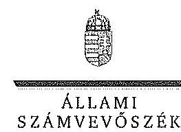

ELRÜK

Ikt.szám: V-0758-070/2015.

# Orbán Tibor úr 

vezérigazgató
Kisalföldi Erdőgazdaság Zrt.

Győr

## Tisztelt Vezérigazgató Úr!

A ,,Jelentéstervezet az állami tulajdonban álló erdőgazdasági társaságok vagyongazdálkodási tevékenységének ellenőrzése - Kisalföldi Erdőgazdaság Zrt." címmel készített számvevőszéki jelentéstervezetre tett észrevételeit köszönettel megkaptam.

Az Állami Számvevőszék észrevételekre vonatkozó álláspontjáról a felügyeleti vezető által készített részletes tájékoztatást csatoltán megküldöm.

Tájékoztatom Vezérigazgató urat, hogy a számvevőszéki jelentésben - az Állami Számvevőszékről szóló 2011. évi LXVI. törvény 29. § (3) bekezdése alapján - a figyelembe nem vett észrevételeket szerepeltetjük az elutasítás indokának feltüntetésével.

Budapest, 2015. október 0. nap
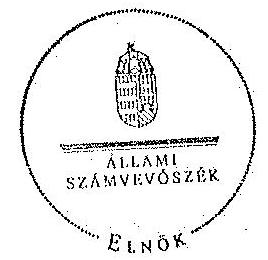

Tisztelettel:

## Domokos László

Melléklet: Tájékoztatás az el nem fogadott észrevételekről

---

# Tájékoztatás   az el nem fogadott észrevételekről 

A „Jelentéstervezet az állami tulajdonban álló erdőgazdasági társaságok vagyongazdálkodási tevékenységének

 ellenőrzése - Kisalföldi Erdőgazdaság Zrt." című jelentéstervezetre 2015. október 12-én érkezett észrevételeit áttekintettük, azok kezelésével kapcsolatban a következő tájékoztatást adom.

1. „A Társaság által kezelt vagyonról vezetett nyilvántartás nem felelt meg a Vhr.-ben foglaltaknak"

A Vhr. 9. § alapján a vagyonkezelő köteles a vagyonkezelésbe vett eszközöket a Számv. tv. szerint a hosszú lejáratú kötelezettségekkel szemben a vagyonkezelési szerződésben rögzített értéken állományba venni. A Számv. tv. 23. § (2) bekezdés előírja, hogy a vagyonkezelőnél a mérlegben eszközként kell kimutatni a - törvényi rendelkezés, illetve felhatalmazás alapján - kezelésbe vett, az állami vagy önkormányzati vagyon részét képező eszközöket is. Ezen eszközöket a kiegészítő mellékletben - legalább mérlegtételek szerinti megbontásban - külön be kell mutatni. Az ideiglenes vagyonkezelési szerződésben a vagyonkezelésbe adott vagyon értékét nem rögzítették, továbbá a szerződés azt sem tartalmazta, hogy a vagyonkezelt eszközök értéke nulla. A Társaság a Számv. tv. és a Vhr. előírásainak betartása céljából nem tett lépéseket annak érdekében, hogy a vagyonkezelt eszközök értéke a VSZ-ben rögzítésre kerüljön. A fentiek alapján a megállapítás módosítása nem indokolt.
2. ,...a tulajdonosi jogok gyakorlására felhatalmazott szervezetek változásai, valamint a társaság vagyonkezelésére vonatkozó jogszabályi rendelkezések változásai ellenére a VSZ-t az ellenőrzött időszakban nem aktualizálták."

A vagyonkezelési szerződés aktualizálásának elmaradásával kapcsolatos tájékoztatásukat köszönjük. Az észrevételben leírtak megerősítik azt a megállapításunkat, hogy az ellenőrzött időszakban nem történt meg az ideiglenes vagyonkezelési szerződés olyan módosítása, vagy olyan új vagyonkezelési szerződés megkötése, amely biztosította volna a VSZ hiányosságainak megszüntetését, illetve a hatályos jogszabályoknak való megfelelőségét. Ezért a megállapítás helytálló, módosítása nem indokolt.

---

3. „A társaság az Evt. 3, valamint Nfatv.-ben foglalt előírás ellenére összesen 64 esetben a vagyonkezelésbe adott erdősített területek használatát, hasznosítását jogellenesen harmadik személynek engedte át. A társaság az Evt. 3 hatályba lépése előtt határozatlan időre kötött négy szerződést az Evt. 3 rendelkezései ellenére 2010. december 31-éig nem bontotta fel."

Az Evt. 3 9. § (3) bekezdése szerint a vagyonkezelő az erdő használatát, hasznosítását harmadik személynek nem engedheti át. Az Evt. 113. § (14) bekezdése értelmében a törvény hatályba lépésekor fennálló, határozott idejű szerződések lejáratuk időpontjáig hatályban maradnak, a határozatlan időre kötött szerződéseket pedig legkésőbb 2010. december 31-éig meg kell szüntetni. Az Nfatv. 20. § (7) bekezdése szerint a vagyonkezelő az erdő használatát, hasznosítását harmadik személynek nem engedheti át.

Az ellenőrzés rendelkezésére bocsátott dokumentumok szerint a Kisalföldi Erdőgazdaság Zrt. az Evt. 2009. július 10-ei hatályba lépését követően olyan szerződéseket kötött, amelyek tárgya a szerződéseken megjelöltek szerint a Magyar Állam tulajdonában, a Kisalföldi Erdőgazdaság Zrt. vagyonkezelésében álló „erdő" művelési ágba tartozó ingatlan, vagy annak részlete, vagy több ingatlan, amelyek között erdő is található. A szerződések összesen 64 területet érintenek. A szerződések elnevezése változatos („megállapodás", „használati szerződés", „bérleti szerződés", „területhasznosítási szerződés", „éves földhaszonbérleti szerződés", stb.), a tartalmuk alapján azonban bérleti, földhaszonbérleti szerződések. Tehát megállapításunk helytálló, módosítása nem indokolt.
4. ,... az Info. tv.-ben rögzített, a közérdekű adatok megismerésére irányuló igények teljesítésének rendjére vonatkozó szabályzatkészítési kötelezettségnek nem tett eleget."

Az Avtv. 20. § (8) bekezdésében, illetve az Infotv. 30. § (6) bekezdésében foglaltak alapján a közfeladatot ellátó szervnek a közérdekű adatok megismerésére irányuló igények teljesítésének rendjét rögzítő szabályzatot kell készítenie. Az állami vagyonról szóló 2007. évi CVI. törvény 5. § (2) bekezdése szerint az állami vagyonnal gazdálkodó vagy azzal rendelkező szerv vagy személy a közérdekű adatok nyilvánosságáról szóló törvény szerinti közfeladatot ellátó szervnek vagy személynek minősül. Tájékoztatásukat a 2015. július 1-től hatályba léptetett szabályozásról köszönjük, azonban az nem érinti az ellenőrzött időszakra vonatkozóan megfogalmazott megállapítást, ezért annak módosítása nem indokolt.
5. A Kisalföldi Erdőgazdaság Zrt. vezérigazgatójának címzett intézkedést igénylő megállapításokra és javaslatokra tett észrevételek

- A Kisalföldi Erdőgazdaság Zrt. vezérigazgatójának címzett 2. a) számú javaslat kiegészítése a vagyonkezelői szerződés módosításának időpontjára történő utalással nem indokolt, mert a Társaságnak az éves beszámolóját a jogszabályi előírásoknak megfelelően kellett volna az ellenőrzött időszakban is elkészítenie.

---

- Jelen dokumentum 3. pontjában adott tájékoztatás alapján a Kisalföldi Erdőgazdasági Zrt. vezérigazgatójának címzett 3. számú intézkedést igénylő megállapítás módosítása nem indokolt.
- A Kisalföldi Erdőgazdasági Zrt. vezérigazgatójának címzett 4. számú intézkedést igénylő megállapítás módosítása nem szükséges a jelen tájékoztatás 4. pontjában szereplő indoklás alapján.

Budapest, 2015. 11. hó 02. nap

Makkai Mária
felügyeleti vezető

---

# 7. SZÁMÚ MELLÉKLET A V-0758-072/2015. SZÁMÚ JELENTÉSHEZ 

## 7. SZÁMÚ-064/2015.

## Állami Számvevőszék

## Domokos László

## elnök

1052 Budapest
Apáczai Cs. J. u. 10.
Ikt. sz.: MNV/01/4795.V / 2015.
Hiv. sz.: V-0758-057/2015.

Tisztelt Elnök Úr!
A 2015. szeptember 28. napján „Az állami tulajdonban álló erdőgazdasági társaságok vagyongazdálkodási tevékenységének ellenőrzése - Kisalföldi Erdőgazdasági Zrt." tárgyában kézhez vett, V-0758-057/2015. ikt. sz. Jelentés-tervezetre az alábbi észrevételeket kívánom tenni,
I. fejezet / 9. old. harmadik-negyedik bekezdés, 10. old. első-második bekezdés, II.5. fejezet / 30. old. első bekezdés és 10. old. Javaslat az MNV Zrt. vezérigazgatójának a)-c) pontok
„A vagyonkezelésbe adott állami vagyon tekintetében tulajdonosi jogokat gyakorló MNV Zrt. és NFA tevékenysége az ellenőrzött időszakban nem támogatta teljes körűen a felelős vagyongazdálkodás megvalósulását, a VSZ-szel kapcsolatban felhívott hiányosságok megszüntetésére és a hatályos jogszabályoknak való megfeleltetésére vonatkozóan nem kezdeményeztek intézkedéseket. A Vagyonkezelésbe adott állami vagyon tekintetében tulajdonosi jogokat gyakorló MNV Zrt. és NFA nem végeztek a Vhr.-ben és a Nemzeti Földalapba tartozó földrészletek hasznosításának részletes szabályairól szóló 262/2010. (XI.17.) Korm. rendeletben foglalt, a vagyonnyilvántartás hitelességére és teljességére vonatkozó ellenőrzést a Társaságnál.

Az ellenőrzött időszakban a Kisalföldi Erdőgazdaság Zrt. a Magyar Állam tulajdonában álló erdővagyon és egyéb művelési ágú termőföld ingatlanok kezelését a KVI-vel 1996. november 1-jén kötött vagyonkezelési szerződés alapján végezte. A Társaság, mint vagyonkezelő és a KVI között létrejött szerződéses jogviszony kereteit a VSZ-ben foglalt jogok és kötelezettségek töltötték ki. A VSZ nem támogatta megfelelően és számukra kérhető módon az állami vagyonnal való szabályszerű gazdálkodást. A VSZ 2009. január 1-jén hatályon kívül helyezett jogszabályi hivatkozásokat tartalmazott az Áht., 109/B. §, az Áht., 109/G. § és a Vadvédelmi. tv. 98. § rendelkezései vonatkozásában és nem tartalmazza a Vtv., az Evt., a Nvtv. és az Nfatv. előírásaira történő hivatkozást. A VSZ 3.2.3. pontja lehetőséget biztosít a vagyonkezelőnek a vagyonkezelői jog átruházására, valamint a 3.12.2 pontja az erdő használati jogának átengedésére, azonban a rendelkezések ellentétesek az Evt., 9. § (3) bekezdésében, valamint az Nfatv. 19/A. § (4) bekezdésében foglaltakkal, melynek értelmében az erdő használata, hasznosítása, vagyonkezelői jog harmadik személynek nem engedhető át. A VSZ 3.3.2. pontjában foglaltak ellenére a szerződést évente nem vizsgálták felül, azt a felek nem kezdeményezték. A felek nem tettek eleget a Vhr. 54. § (7) bekezdésében foglalt rendelkezésnek és a Vhr. hatálybalépését követő hat hónapon belül nem kezdeményezték a Nemzeti Földalapba tartozó ingatlanokra vonatkozóan a VSZ megszüntetését és a Vtv., illetve Vhr. szabályainak megfelelő szerződés megkötését.

---

A vagyonkezelésbe adott állami vagyon tekintetében tulajdonosi jogokat gyakorló MNV Zrt. és NFA nem végeztek a Vör. 20. § (1)-(2) bekezdéseiben és a Nemzeti Földalapba tartozó földrészletek hasznosításának részletes szabályairól szóló 262/2010. (XI.17.) Korm. rendelet 47. § (1)-(2) bekezdéseiben foglalt, a vagyonnyilvántartás hitelességére és teljességére vonatkozó ellenőrzést a Társaságnál.

# Javaslat az MNV Zrt. vezérigazgatójának 

a) Tegyen intézkedéseket az erdőgazdasági társaság közreműködésével a tényleges állapotot rögzítő és a hatályos jogszabályi előírásoknak megfelelő vagyonkezelési szerződés megkötésére.
b) Tegyen intézkedéseket a vagyonkezelési szerződés felülvizsgálatának elmaradásával, valamint a Nemzeti Földalapba tartozó ingatlanokra vonatkozó VSZ megszüntetésével összefüggésben feltárt szabálytalanságok tekintetében a felelősség tisztázása érdekében, és szükség szerint intézkedjen a felelősség érvényesítéséről.
c) Intézkedjen a Társaság vagyonnyilvántartása hitelességének, teljességének és helyességének jogszabályban foglaltak szerinti ellenőrzéséről."

Sajnálattal állapítottuk meg, hogy a Jelentés-tervezet egyáltalán nem veszi figyelembe a vizsgált időszakban megindított és több eljárási cselekményt is magába foglaló intézkedés-sorozatunkat, amelynek a célja a Jelentéstervezetben egyébiránt joggal kifogásolt hiányosságok megszüntetése, az erdőgazdasági társaságok működésének jogszabályi megfelelőségének biztosítása volt. Ezzel a Jelentés-tervezet azt sugallja, hogy a tulajdonosi joggyakorlók részéről egyáltalán nem volt szándék az erdőgazdasági társaságok működésének, illetve a vagyonkezelés körülményeinek hatályos jogszabályok szerinti szabályozására, amely egyébiránt nem felel meg a valóságnak és az adatszolgáltatásunk során sem erről tájékoztattuk Önöket.
Mindamellett elismerjük, hogy a probléma a kezelt vagyonelemek nagy száma, ebből kifolyólag a szabályozást igénylő körülmények nagy száma és sokrétűsége miatt nehezen átlátható, ezért kérjük, engedjék meg, hogy a munkájukat segítő szándékkal korábbi tájékoztatásunkat ismételten megerősítsük, azzal a kifejezett kéréssel, hogy a Jelentésükben az általunk vitatott megállapítást szíveskedjenek módosítani, és az MNV Zrt. által a megoldás irányába megtett intézkedéseket feltüntetni.
Az ideiglenes vagyonkezelési szerződéseken alapuló kezelői jogviszony újraszabályozása, az ideiglenes vagyonkezelési szerződések megszüntetése és végleges vagyonkezelési szerződések megkötése érdekében az intézkedéseink már 2011. évben megkezdődtek, párhuzamosan a Nemzeti Földalapról szóló 2010. évi LXXXVII. tv. 34. § (3) bekezdés c) pontja szerinti feladat- illetve vagyonátadással.

Az intézkedéseink alapja a 2011. évben, MNV/01/29518/2011. szám alatt szakterületünk által bekért, az erdőgazdasági társaságok 2010. december 31-i, illetve 2011. július 31-i fordulónapra vonatkozó leltárjelentése volt, amelyet elsődlegesen az NPA tv. szerint előírt vagyonátadás elvégzése céljából kértünk meg az erdőgazdasági társaságoktól. Ugyanakkor a leltárjelentéshez benyújtott földrészlet listák voltak az első olyan kimutatások, amelyek a kezelt vagyon elemeit a PÓMI adatbázisán alapuló (az aktuális ingatlan-nyilvántartási állapotnak megfelelően) alrészletes bontásban tartalmazták.

## A vizsgált időszakban megindított és lefolytatott intézkedéseink a következők:

1. Az erdőgazdasági társaságok által kezelt vagyonelemek tulajdonosi joggyakorlók szerinti elhatárolása, NFA átadás előkészítése, az erdőgazdasági társaságok bevonásával. A Nemzeti Földalapba tartozó vagyonelemek NFA átadása 2012-2013. években megtörtént, majd a visszamaradt vagyonelemek - többségében kivett megnevezésben nyilvántartott földrészletek - elhatárolását is elvégeztük. A feladat végrehajtása 2014. május 31-ig teljesült.
Az intézkedéssel az MNV Zrt. tulajdonosi joggyakorlása alá tartozó vagyonelemek körét - a közös tulajdonosi joggyakorlás alatt álló ingatlanok kivételével -, azaz a végleges vagyonkezelési szerződések ingatlanlistáit meghatározttuk.
Meg kívánjuk jegyezni, hogy az erdőgazdasági társaságok a 2011. évi leltárjelentéseikhez minden esetben csatolták a jelentés tartalmára vonatkozó teljességi nyilatkozatukat is, így azok tartalmát mint teljes körű adatszolgáltatást kezeltük.
A hivatkozott iratokat az eljárás során a Tisztelt Állami Számvevőszék rendelkezésére bocsátottuk.

---

2. Az erdőgazdasági társaságok által kezelt vagyon értékelését 2014. május 31-ig elvégeztük, részben külső piaci szereplő által megállapított vagyonértékelési adatok (az IFUA értékbecslési adatai), részben belső szakértők és a kontrolling szakterület által az MNV Zrt. hatályos értékelési szabályzata által megállapított értékadatok figyelembe vételével.
3. Az MNV Zrt. Igazgatósága 511/2012. (X. 08.) IG sz., valamint 717/2013. (IX. 23.) IG sz. határozataiban Intézkedési terveket fogadott el „a 28/2012. (IX. 24.) sz. IUGY határozatában előírt, valamint az MNV Zrt.
 rábízott vagyon 2012. évi beszámolója könyvvizsgálói minősítésének megtartásához szükséges és egyéb feladatokról". Az Intézkedési tervek magukban foglalták az erdőgazdasági társaságok által kezelt vagyon analitikájának előállítását, illetve az erdőtársaságokkal végleges (nem ideiglenes) vagyonkezelői szerződések megkötését. A 717/2013. (IX. 23.) IG sz. határozat melléklete tartalmazza a feladat végrehajtása érdekében már megtett intézkedéseket (pl. „Megtörtént az erdőgazdaságok által kezelt vagyon listáinak vagyonkezelői jelentésekkel való egyeztetése; a vagyonkezelési szerződés tartalmi kérdéseinek, az erdőgazdaságok véleményének feldolgozása, MFB Munkacsoport egyeztetések történtek stb.), valamint rögzíti a még elvégzendő feladatokat. Ennek megfelelően az MNV Zrt-nél 2012-től folyamatban van az erdőgazdasági társaságok vagyonanalitikájának előállítása és vagyonkezelési szerződései tárgyú projekt.
A hatályos jogszabályoknak megfelelő vagyonkezelési szerződés tervezetét a vizsgálati időszak során az MNV Zrt. belső szakterületi egyeztetést követően előkészítettük, és a 2014. március 18-án megtartott Munkacsoport értekezleten az erdőgazdaság képviselőivel, továbbá a tulajdonosi joggyakorlók (NFA, illetve akkor még Magyar Fejlesztési Bank Zrt.) képviselőivel ismertettük annak tartalmát. A szerződés szövegtervezetének véleményezése ekkor megkezdődött, ugyanakkor elismerjük, hogy a végleges szerződésváltozat már az Önök által vizsgált időszakot követően került elfogadásra. Ugyancsak a 2014. március 18-án megtartott Munkacsoport értekezleten tettünk javaslatot a vagyonkezelési dí alapjának és mértékének meghatározására.
4. Az erdőgazdasági társaságok által kezelt és a saját vagyonuk vagyonelemenkénti, valamint a kezelt vagyonelemek tulajdonosi joggyakorlók szerinti elhatárolására vonatkozó intézkedésünket a vizsgált időszakban előkészítettük.

Tájékoztatjuk továbbá Elnök Urat az alábbiakról:
A Nemzeti Fejlesztési Minisztérium KGTF/377-6/2014-NFM, valamint KGTF/377-7/2014. számok alatt adott utasításokat a fenti feladatok elvégzésére. Ezekről, illetve az utasításokra adott jelentésünkről a korábbi adatszolgáltatásunk keretében szintén kitértünk.

A vagyonkezelési szerződés vizsgált időszakot követően elfogadott tervezetének mellékletét képezik az MNV Zrt. azon szabályzatai is, amelyek a kezelt vagyon nyilvántartását, a beruházások nyilvántartását és az azzal kapcsolatos elszámolásokat, illetve a tulajdonosi ellenőrzéssel kapcsolatos, a jelenlegi jogszabályi környezetnek megfelelő szabályokat tartalmazzák:

- Az állami tulajdonon, egyéb vagyonkezelők által vagyonkezelt eszközön megvalósítandó beruházások, felújítások előzetes engedélyezésének és elszámolásának eljárásrendjéről szóló 35/2014. számú vezérigazgatói utasítás,
- A Magyar Nemzeti Vagyonkezelő Zrt. Tulajdonosi Ellenőrzési Szabályzata - a 39/2014. számú vezérigazgatói utasítás, továbbá
- A Magyar Nemzeti Vagyonkezelő Zrt. állami vagyon vagyonkezelőire, az állami vagyont használókra és a társasági részesedések esetében az MNV Zrt. tulajdonosi joggyakorlását megbízottként ellátókra vonatkozó Vagyon-nyilvántartási Szabályzatáról szóló 12/2014. számú vezérigazgatói utasítás.

Fentiek mellett megemlíthető az MNV Zrt. folyamatba épített, illetve vagyon nyilvántartás vezetést támogató ellenőrzési módszertanról szóló 11/2014. számú vezérigazgatói utasítás.
Egyeztetéseink során az erdőgazdasági társaságok tájékoztatást kaptak a szabályzataink tartalmára vonatkozóan.
A Jelentés-tervezet 10. oldalán található, az MNV Zrt. vezérigazgatójára vonatkozó, a) pont alatti, vagyonkezelési szerződés megkötésére irányuló javaslathoz kapcsolódóan felhívjuk a Tisztelt Állami Számvevőszék figyelmét arra, hogy a Nemzeti Fejlesztési Minisztérium ÁVF/21310/2015-NFM számú tájékoztató levele szerint Miniszter Úr vagyongazdálkodási szempontból nem támogatja az erdőgazdasági társaságok ideiglenes vagyonkezelési szerződéseit kiváltó vagyonkezelési szerződések megkötését, ideértve az MNV Zrt. vagyonkezelési szerződésekkel kapcsolatos jóváhagyó döntéseit is.

Az MNV Zrt-re vonatkozóan hivatkozott jogszabály, a Vhr. 20. § (1)-(2) bekezdése 2014. március 14-ig - csaknem az ellenőrzött időszak végéig - a következőképpen rendelkezett:
„(1) Az állami vagyon kezelőjét, használóját megillető jogok gyakorlását, annak szabályszerűségét, célszerűségét a Vtv. 17. §-ának d) pontja alapján az MNV Zrt. - szükség szerint a területi szervvel átján ellenőrzi. Ennek érdekében a vagyon kezelésére, hasznosítására kötött szerződésben rögzíteni kell, hogy a tulajdonosi ellenőrzés eljárásrendjét, a felek jogait, kötelezettségeit a felek a szerződés részének tekintik.
(2) A tulajdonosi ellenőrzés célja az állami vagyonnal való gazdálkodás vizsgálata, ennek keretében a rendeltetésellenes, jogszertelen, szerződésellenes, vagy a tulajdonos érdekeit sértő, illetve a központi költségvetést hátrányosan érintő vagyongazdálkodási intézkedések feltárása és a jogszerű állapot helyreállítása, továbbá a vagyonnyilvántartás hitelességének, teljességének és helyességének biztosítása."

A tulajdonosi ellenőrzés alatt a Területi Irodák által folytatott ellenőrzést is értette a jogszabály, amiből egyenesen következik a szakterületi munkafolyamatba épített ellenőrzési kötelezettség figyelembe vételének a lehetősége.

Fentiekre tekintettel kérjük a Jelentés-tervezet 9-10., illetve 29-30. oldalán található azon megállapítások törlését, hogy az MNV Zrt. nem kezdeményezett intézkedéseket, nem végzett a Vhr. 20. § (1)-(2) bekezdéseiben és a Nemzeti Földalapba tartozó földrészletek hasznosításának részletes szabályairól szóló 262/2010. (XI.17.) Korm. rendelet 47. § (1)-(2) bekezdéseiben foglalt, a vagyonnyilvántartás hitelességére és teljességére vonatkozó ellenőrzést a Társaságnál, kérjük a megtett intézkedések feltüntetését, és a Jelentés-tervezet 10. oldalán található, az MNV Zrt. vezérigazgatójára vonatkozó, b) pontot a megtett intézkedések folyamatosságára tekintettel törölni, és a c) pont alatti javaslatot szövegszerűen ekként módosítani:

# Javaslat az MNV Zrt. vezérigazgatójának 

c) Az MNV Zrt. tulajdonosi joggyakorlása alá tartozó (az Erdőgazdasági Társaságok által az MNV Zrt. részére jelentett) vagyonelemek tekintetében intézkedjen a Társaság vagyonnyilvántartása hitelességének, teljességének és helyességének jogszabályban foglaltak szerinti ellenőrzéseinek erősítéséről.

## II.5. fejezet / 29. old. harmadik-negyedik bekezdés

,...Mind a tulajdonosi, mind a külső szakértői ellenőrzések megállapították, hogy az akkor hivatalban levő vezérigazgató, illetve a menedzsment az alapító okiratban biztosított hatáskörét túllépve kötött befektetési szerződéseket, amelyek a Társaságnál szerződés alapján 1,7 M Ft veszteséget eredményezett.

Az ellenőrzések alapján a vezérigazgatónak és Igazgatóságnak összesen négy javaslatot tettek, amelyek elsősorban a belső szabályozások és a belső ellenőrzés szigorítására és a károk enyhítésére, valamint a szankcionálására vonatkoztak, azonban intézkedési terv bekérésére nem került sor. Az ellenőrzés utóellenőrzésére, a tett intézkedések nyomon követésére az MNV Zrt-nél nem került sor. A tulajdonosi joggyakorló számára a Vtv. 17. § (1) bekezdés d) pontja rendszeres ellenőrzési kötelezettséget írt elő a vele szerződéses jogviszonyban levő személyek, szervezetek vagy más használók állami vagyonnal való gazdálkodása tekintetében, amelynek azonban nem tett eleget."

Tájékoztatjuk Elnök Urat, hogy a vezérigazgató 2009. június 1-tól visszahívásra került, egy évvel később az erdőgazdaságok az MFB-hez kerültek, így az utóvizsgálatra az MNV Zrt. részéről nem is kerülhetett sor.

Kérem Elnök Urat, hogy a Jelentés véglegesítése során jelen észrevételeinket szíveskedjenek figyelembe venni.
Budapest, 2015. október „/2.
Üdvözlettel:
MNV 1. 1
mardy
dr. Szívek Norbert
vezérigazgató

---

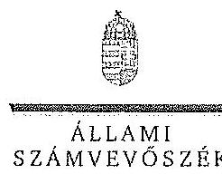

ELHOK

Ikt.szám: V-0758-068/2015.

Dr. Szívek Norbert úr
vezérigazgató
Magyar Nemzeti Vagyonkezelő Zrt.

Budapest

Tisztelt Vezérigazgató Úr!

A „Jelentéstervezet az állami tulajdonban álló erdőgazdasági társaságok vagyongazdálkodási tevékenységének ellenőrzése - Kisafföldi Erdőgazdaság Zrt. " címmel készített számvevőszéki jelentéstervezetre tett észrevételeit köszönettel megkaptam.

Az Állami Számvevőszék észrevételekre vonatkozó álláspontjáról a felügyeleti vezető által készített részletes tájékoztatást csatoltan megküldöm.

Tájékoztatom Vezérigazgató urat, hogy a számvevőszéki jelentésben - az Állami Számvevőszékről szóló 2011. évi LXVI. törvény 29. § (3) bekezdése alapján - a figyelembe nem vett észrevételeket szerepeltetjük az elutasítás indokának feltüntetésével.

Budapest, 2015. 44. hó 32 nap

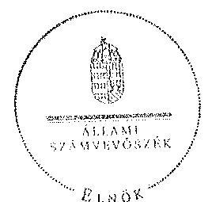

Tisztelettel:

Domokos László

Melléklet: Tájékoztatás az elfogadott és az el nem fogadott észrevételekről

1052 BUDAPEST, APÁCZAI CSERE JÁNOS UTCA 10. 1364 Budapest 4. Pl. 54 telefon: 484 9101 fax: 484 9201

---

# Tájékoztatás   az elfogadott és az el nem fogadott észrevételekről 

A „Jelentéstervezet az állami tulajdonban álló erdőgazdasági társaságok vagyongazdálkodási tevékenységének ellenőrzése - Kisalföldi Erdőgazdaság Zrt." címû jelentéstervezetre 2015. október 13-án érkezett észrevételeit áttekintettük, azok kezelésével kapcsolatban a következő tájékoztatást adom.

1. A vagyonkezelési szerződéshez kapcsolódó megállapításokra tett észrevétel (I. fejezet / 9. oldal 3-4. bekezdés, 10. oldal 1. bekezdés, II. 5. fejezet / 30. oldal 1. bekezdés, 10. oldal javaslat az MNV Zrt. vezérigazgatójának a)-b) pontok)

A jelentéstervezet vagyonkezelési szerződéshez kapcsolódó megállapításai helytállóak. Az erdőgazdasági társaság működése jogszabályi megfelelősége biztosításának érdekében tett kezdeményezésekről adott tájékoztatásukat köszönettel vettük, azonban azok nem eredményezték az ideiglenes vagyonkezelési szerződés olyan módosítását, vagy olyan új vagyonkezelési szerződés megkötését, amely biztosította volna a VSZ hiányosságainak megszüntetését, illetve a hatályos jogszabályoknak való megfelelőségét. Ezért az MNV Zrt. vezérigazgatójának és az NFA elnökének megfogalmazott intézkedést igénylő megállapítás, valamint az MNV Zrt. vezérigazgatójának megfogalmazott javaslat a) és b) pontjának módosítása nem indokolt. Az egyértelműség érdekében a 9. oldal 3. bekezdés 1. mondatát és a 30. oldal 1. bekezdés 1. mondatát az alábbiak szerint pontosítjuk:
„... a VSZ-szel kapcsolatban feltárt hiányosságok megszüntetése és a hatályos jogszabályoknak való megfeleltetése nem történt meg."
2. Az MNV Zrt. ellenőrzési kötelezettségének elmulasztására vonatkozó megállapításokra tett észrevétel (I. fejezet 10. oldal 2. bekezdés, II. 5. fejezet / 30. oldal 1. bekezdés és 10. oldal javaslat az MNV Zrt. vezérigazgatójának c) pont)

Az MNV Zrt. nem bocsátott az ÁSZ ellenőrzés rendelkezésére az MNV Zrt., vagy Területi Irodái által a Vhr. 20. § (1)-(2) bekezdései szerint végzett ellenőrzésekről dokumentumokat. A jelentéstervezet megállapításai és a javaslat helytállóak, módosításuk nem indokolt.

Budapest, 2015. 11. hó 12. nap

Makkai Mária
felügyeleti vezető

---

# 9. SZÁMÚ MELLÉKLET A V-0758-072/2015. SZÁMÚ JELENTÉSHEZ 

## 9.1 MFB

## Domokos László úr

## elnök részére

Állami Számvevőszék

Budapest

Tisztelt Elnök Úr!
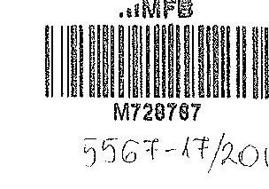

ÁLLAMI SZÁMVEVŐSZÉK
$11.577 / 2015$
Érkezés: 2015 OKT 13
Iktatószám: V-0955-09/2015
Melléklet:
Házsz. at.
Dez

2015. szeptember 28-án köszönettel kézhez vettük az Állami Számvevőszék „Az állami tulajdonban álló erdőgazdasági társaságok vagyongazdálkodási tevékenységének ellenőrzéséről" szóló jelentéstervezeteket az alábbi cégekre:

- Északerdő Erdőgazdasági Zrt.
- EGERERDŐ Erdészeti Zrt.
- Gemenci Erdő- és Vadgazdaság Zrt.
- Ipoly erdő Zrt.
- KEFAG Kiskunsági Erdészeti és Faipari Zrt
- Kisalföldi Erdőgazdaság Zrt
- SEFAG Erdészeti és Faipari Zrt
- Szombathelyi Erdészeti Zrt.
- VADEX Mezőföldi Erdő-és Vadgazdálkodási Zrt. (Ikt.szám: V-0765-044/2015.)
- Zalacrdő Erdészeti Zrt.
(Ikt.szám: V-0754-086/2015.)
(Ikt.szám: V-0750-172/2015.)
(Ikt.szám: V-0753-096/2015.)
(Ikt.szám: V-0749-146/2015.)
(Ikt.szám: V-0764-054/2015.)
(Ikt.szám: V-0758-056/2015.)
(Ikt.szám: V-0752-089/2015.)
(Ikt.szám: V-0757-060/2015.)
- VADEX Mezőföldi Erdő-és Vadgazdálkodási Zrt. (Ikt.szám: V-0765-044/2015.)
- Zalacrdő Erdészeti Zrt.
(Ikt.szám: V-0760-075/2015.)

Az MFB Zrt. a jelentéstervezetekkel kapcsolatosan 2 féle szempontból kíván észrevételt tenni:

1. A jelentésekben megfogalmazott központi probléma
2. Egyedi esetek

---

# 9. SZÁMÚ MELLÉKLET A V-0758-072/2015. SZÁMÚ JELENTÉSHEZ 

## 1. A jelentésekben megfogalmazott központi probléma

Az ÁSZ az egyedi jelentéseiben az erdőgazdasági társaságokat, valamint a vagyonkezelésbe adott állami vagyon tekintetében tulajdonosi joggyakorló MNV Zrt. és Nemzeti Földalapkezelő (továbbiakban: NFA) tevékenységét marasztalta el.

Alapvető problémaként jelenik meg, hogy az erdők által kezelt eszközök - az NFA-val, a Kincstári Vagyon Igazgatósággal, és az MNV Zrt-vel kötött vagyonkezelési megállapodásban rögzített - értéken nem szerepelnek a Társaságok könyveiben.

Az MFB Zrt. tudatában volt a problémának (azt az ÁSZ jelentésben is említett, 2010. évben végzett átvilágítási jelentés is tartalmazta, melynek nyomon követése, beszámoltatása megtörtént) és folyamatosan egyeztetett az MNV Zrt-vel és az NFA-val a rendezés ügyében. Az ideiglenes vagyonkezelési szerződés módosítására, véglegesítésére a vagyonkezelésbe adónak (MNV, NFA) van lehetősége, a Társaságok szerződő partnerként észrevételeket, javaslatokat tehetnek. A szerződés véglegesítése érdekében a Társaságok és az MFB Zrt. képviselői minden olyan egyeztetésen (pl.: az MNV Zrt. által létrehozott bizottság) részt vettek, amelyre meghívást kaptak, illetve azokon érdemi javaslatokat tettek.

Ahogy a jelentés is megjegyzi, az egyeztetések az ellenőrzés befejezésig nem kerültek lezárásra, így a Társaságoknál nem áll rendelkezésre a vagyonkezelésben lévő állami vagyonra és annak nagyságára vonatkozó, az MNV Zrt. és az NFA nyilvántartásával egyező adat.

Az ÁSZ 2013. évi „Az állami vagyon feletti kontroll - Az állami vagyon feletti tulajdonosi joggyakorlással kapcsolatos tevékenységek ellenőrzéséről" szóló jelentése alapján a Nemzeti
 Fejlesztési Minisztérium - az ÁSZ-szal egyeztetett - alábbi főbb pontokat tartalmazó intézkedési tervet (1. sz. melléklet) állított össze, melyet a 2014. április 25-én kelt levelében küldött meg az MFB Zrt. részére:

- a Társaságok által kezelt állami ingatlanok és egyéb vagyonelemek értéken történő nyilvántartása,
- a vagyonkezelési díjak egyértelmű és tulajdonosi joggyakorló szervezetenkénti meghatározása,
- az új vagyonkezelési szerződés megkötése,
- a Társaságok kezelt és saját vagyonának vagyonelemenkénti, valamint a kezelt vagyonelemek tulajdonosi joggyakorló szerinti elhatárolása.

Az MFB törvény módosításának 2014. július 16-i hatálybalépésével az MFB Zrt. állami erdőgazdaságok feletti tulajdonosi joggyakorlása megszűnt, az a Földművelésügyi Minisztériumhoz került át, így az intézkedési tervben való közreműködésre, illetve a végrehajtás nyomon követésére az MFB Zrt-nek nem volt lehetősége.

A jelentések az MNV Zrt. vezérigazgatójának, az NFA elnökének és az erdészeti társaságok vezérigazgatóinak fogalmaztak meg intézkedési javaslatokat.

---

# 2. Egyedi esetek: 

## KEFAG Kiskunsági Erdészeti és Faipari Zrt.

A jelentéstervezet többször hibásan hivatkozik az MFB Zrt.-re, amikor az állami vagyonról szóló 2007. évi CVL törvény (a továbbiakban: Vtv.) 17. § (1) bekezdés d) pontja szerinti rendszeres ellenőrzés elmaradására mutat rá. A Vtv. hivatkozott bekezdése alapján az ellenőrzés az MNV Zrt. feladata. Kérjük a társaság feletti tulajdonosi joggyakorló2 hivatkozások törlését (8. oldal 7. bekezdés és 32. oldal 6. bekezdés).

## Kisalföldi Erdőgazdaság Zrt.

A jelentéstervezet hibásan hivatkozik az MFB Zrt.-re, amikor a Vtv. 17. § (1) bekezdés d) pontja szerinti rendszeres ellenőrzés elmaradására mutat rá. A Vtv. hivatkozott bekezdése alapján az ellenőrzés az MNV Zrt. feladata. Kérjük a társaság feletti tulajdonosi joggyakorló2 hivatkozások törlését (29. oldal 4. bekezdés).

## Szombathelyi Erdészeti Zrt.

A jelentéstervezet hibásan hivatkozik az MFB Zrt.-re, amikor a Vtv. 17. § (1) bekezdés d) pontja szerinti rendszeres ellenőrzés elmaradására mutat rá. A Vtv. hivatkozott bekezdése alapján az ellenőrzés az MNV Zrt. feladata. Kérjük a társaság feletti tulajdonosi joggyakorló2 hivatkozás törlését (32. oldal 5. bekezdés).

Budapest, 2015. október 12.
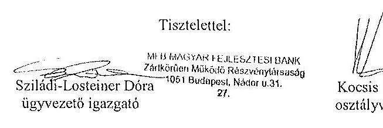

## Melléklet:

NFM levél (Ikt.szám: KGTF/377-7/2014-NFM)

---

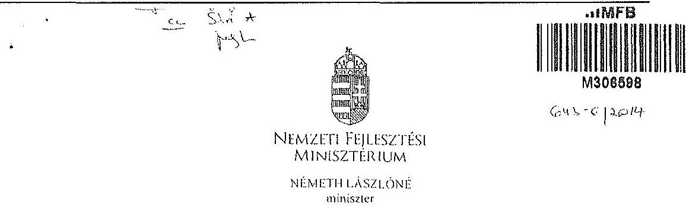

Iktatószám: KGTF/ 1773 /2014-NFM
Úgyintéző: dr. Kaszát Mónika
Telefonszám: 795-1917
e-mail:monika.kaszas@nfm.gov.hu
Nagy Csaba úr részére
vezérigazgató
Magyar Fejlesztési Bank Zrt.
Budapest
Tárgy: ,,Az állami vagyon feletti kontroll - Az állami vagyon feletti tulajdonosi joggyakorlással kapcsolatos tevékenységek ellenőrzéséről" szóló 13193 sz. ÁSZ jelentés alapján összeállított NFM intézkedési terv módosítása, az abban foglalt feladatok végrehajtása

# Tisztelt Vezérigazgató Úr! 

Az Állami Számvevőszék (a továbbiakban: ÁSZ) tárgyban megjelölt jelentésével összefüggésben 2014. január 27-én intézkedési tervet hagytam jóvá, amelyben foglalt feladatok végrehajtása érdekében 2014. január 30-i keltezésű levélben fordultam Önhöz és a Magyar Nemzeti Vagyonkezelő Zrt. vezérigazgatójához, Márton Péter úrhoz.

Az ÁSZ az intézkedési tervvel kapcsolatban küldött, 2014. március 25-i kelt levelében az intézkedési terv kiegészítését, módosítását kérte. A módosított intézkedési tervet jóváhagytam.

A módosított intézkedési terv alapján a következő feladatok végrehajtása szükséges az alábbiak szerint:
1./ a társaságok által kezelt állami ingatlanok és egyéb vagyonelemek értéken történő nyilvántartása:

Felelős: MNV Zrt.,
Határidő:

- földterületek esetében legkésőbb 2014. május 31-ig
- felépítmények esetében 2014. december 31. (A felépítmények esetében az MNV Zrt. a vagyonkezelési szerződés megkötését az év második felére tervezi, látja megvalósíthatónak.)
2./ a vagyonkezelési díjak egyértelmű és tulajdonosi joggyakorló szervezetenkénti meghatározása:

---

# Felelős: MNV Zrt., 

Határidő: 2014. május 31-ét követően folyamatosan (2014. december 31-ig)
E pontban foglalt feladattal kapcsolatosan az ÁSZ részére az alábbi tájékoztatást adtam:
„Az ÁSZ által meghatározott feladatok végrehajtására irányuló munkafolyamat során a végrehajtásban érintett szervezetek, társaságok között kialakult az az álláspont, hogy mivel az erdőgazdasági társaságok alapfeladatként közfeladat ellátást is végeznek, azt a vagyonkezelési díj mértékének meghatározásakor az MNV Zrt. figyelembe veszi, valamint megállapításra került az az elv is, hogy a vagyonkezelési díj irányadó mértéke az adott erdőgazdasági társaság által kezelt ingatlanvagyon bruttó nyilvántartási értékének 2\%-a.

A vagyonkezelési díj alapja a kezelt vagyon bruttó nyilvántartási értéke, ezért annak meghatározására erdőgazdaság társaságonként kerül sor a 4./ pontban meghatározott ún. „végleges ingatlanlista" alapján. A végleges ingatlanlista kizárólag vagyonkezelésbe adott ingatlan vagyonelemet tartalmaz, az erdőgazdasági társaság saját vagyonában nyilvántartott vagyonelemet nem, ezért az MNV Zrt.-nek és az erdőgazdasági társaságoknak a szerződés megkötését megelőzően el kell határolnia egymástól a saját vagyonba és a kezelt vagyonba tartozó ingatlan vagyonelemeket (4.b./ pontban foglalt feladat).

A feleknek a vagyonkezelési díj mértékében a vagyonkezelési szerződés megkötését megelőzően kell megállapodniuk az irányadó vagyonkezelési díj mértéket alapul véve."

## 3./ az új vagyonkezelési szerződések megkötése:

A vagyonkezelési szerződés tervezet az MNV Zrt. érintett szakterületei álláspontjának figyelembe vételével elkészült, az MNV Zrt. és a MFB Zrt. által létrehozott Munkacsoport (tagjai: MFB Zrt., MNV Zrt., NFA és egyes erdőgazdasági társaságok) véleménye alapján átdolgozásra került. A szerződés tervezetnek az erdőgazdasági társaságok részére történő megküldése 2014. április 15. napjával megtörtént.

Felelős: MNV Zrt., az MFB Zrt. közreműködésével
Határidő:

- földterületek esetében: 2014. május 31-ét követően folyamatosan (2014. december 31-ig)
- felépítmények esetében 2014. II. félév folyamán
4./ a társaságok kezelt és saját vagyonának vagyonelemenkénti, valamint a kezelt vagyonelemek tulajdonosi joggyakorló szerinti elhatárolása:

Az erdőgazdasági társaságok által az MNV Zrt. rendelkezésére bocsátott leltárjelentések alapján

- a jogszabályi rendelkezések szerint az NFA tulajdonosi joggyakorlása alá tartozó ingatlan vagyonelemek nagyobb része már átadásra került az NFA részére,
- a kisebb részt képező vagyonelemek tekintetében pedig folyamatban van az átadás az MNV Zrt. és az NFA között.

---

a./ Az ún. „végleges ingatlanlista" (az MNV Zrt. tulajdonosi joggyakorlása alatt lévő, maradó vagyonelem listája) MNV Zrt. és az NFA közötti leegyeztetése, közös áttekintése

Felelős: MNV Zrt.
Határidő: a lista MNV Zrt. és NFA közötti leegyeztetése, közös áttekintése folyamatban van, lezárása legkésőbb 2014. május 31-ig megtörténik
b./ Az a./ pontban foglaltak szerint leegyeztetett ún. „végleges ingatlanlista" MNV Zrt. és az egyes erdőgazdasági társaságok általi áttekintése azzal a céllal, hogy a vagyonkezelésben lévő vagyoni elemeket tartalmazó ún. „végleges ingatlanlista" ne tartalmazzon az erdőgazdasági társaság saját vagyonában nyilvántartott vagyoni elemet (saját vagyon - vagyonkezelt vagyon elhatárolása).

Felelős: MNV Zrt., az MFB Zrt. közreműködésével
Határidő: 2014. május 31-ig
E pontban foglalt feladatokkal kapcsolatosan az ÁSZ részére az alábbi tájékoztatást adtam:
„Szükséges megjegyezni, hogy ingatlanlista, mint állandó „végleges ingatlanlista" ilyen formában nem létezik, mert mindkét tulajdonosi joggyakorló tekintetében az állami vagyonelemek halmaza mind mennyiségben, mind pedig összetételben folyamatosan változik.

Az erdőgazdasági társaságok által kezelt ingatlanvagyon adatai - mindkét tulajdonosi joggyakorló tekintetében - az évközi változások (megosztások, területváltozások, művelési ág változások, stb.) miatt folyamatosan változnak, ezért az adattartalmában „végleges ingatlanlista" mindig egy adott konkrét időpont vonatkozásában adható meg.

Jelen intézkedési tervben az ún. „végleges ingatlanlista" meghatározás alatt az erdőgazdasági társaságok vagyonkezelésében lévő ingatlanvagyon MNV Zrt tulajdonosi joggyakorlása alatt álló részét kell tekinteni. E „végleges ingatlanlista" kialakítására az erdőgazdasági társaságok által az MNV Zrt. részére átadott leltárjelentések alapján került sor úgy, hogy az MNV Zrt. a Nemzeti Földalapba tartozó vagyonelemeket kiválogatta, s azokat a Nemzeti Földalapkezelő Szervezet részére - átadás-átvételi jegyzőkönyv alapján - átadta.

Lényeges körülmény, hogy a vagyonkezelőknek - jelen esetben az erdőgazdasági társaságoknak - minden év május 31. napjáig vagyonkezelői jelentést kell benyújtanunk a tulajdonosi joggyakorlók, így az MNV Zrt. részére is. Az aktuális vagyonkezelői jelentéseket - melynek része a leltárjelentés is - a 2013. december 31-i állapotnak megfelelően kell összeállítani, ebből következően a fent említett ún. „végleges ingatlanlista" is a 2013. december 31-i állapotot tükrözi.

Ugyanakkor - főként a kivett megnevezésben nyilvántartott földterületek esetében - a még át nem adott Nemzeti Földalapba tartozó vagyonelemek egyeztetése a két tulajdonosi joggyakorló között jelenleg is folyamatban van.

---

Az egyes erdőgazdasági társaságok vagyonkezelésében lévő vagyonelemek az adott társasággal megkötendő - a jelenlegi ideiglenes vagyonkezelési szerződés helyébe lépő - vagyonkezelési szerződés mellékletét fogják képezni. Az MNV Zrt. szándékai szerint az egyes erdőgazdasági társaságokkal azonnal megkötik a vagyonkezelési szerződéseket, ahogyan a megkötés feltételei bekövetkeznek (pl. megállapodnak a vagyonkezelési díjban, véglegesítik a vagyonkezelési szerződés tartalmát), azok a vagyonelemek, amelyeket e pont a./ és b./ pontjában foglaltak szerint már átvizsgáltak, a vagyonkezelési szerződés megkötésével egyidejűleg a szerződés mellékletébe kerülnek, amely melléklet folyamatosan bővítésre kerül újabb, e pont a./ és b./ pontjában foglaltak szerint átvizsgált, tisztázott vagyonelemekkel. ,,

Tájékoztatom, hogy az NFA feletti tulajdonosi jogok gyakorlója, Dr. Fazekas Sándor miniszter úr időközben már jóváhagyta azt az intézkedési tervet, amely az NFA részére meghatározott feladatokat és azok végrehajtási határidejét tartalmazza.

Az MFB Zrt. közreműködése az 1./ és 2./ pontban meghatározott feladatok végrehajtásban is szükséges lehet, ezért kérem a fent meghatározott feladatok határidőben történő végrehajtása érdekében az MFB Zrt. változatlan együttműködését az érintett szervezetekkel és amennyiben szükséges, úgy az erdőgazdasági társaságok bevonása iránt is intézkedni szíveskedjen.

Budapest, 2014. „djnoü. Jf „

# Üdvözlettel: 

## Vémeth Lászlóné

---

.

---

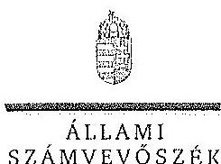

# ELKÖK 

## Nagy Csaba úr

vezérigazgató
Magyar Fejlesztési Bank Zrt.

## Budapest

## Tisztelt Vezérigazgató Úr!

Az „Az állami tulajdonban álló erdőgazdasági társaságok vagyongazdálkodási tevékenységének ellenőrzése" című ellenőrzés tekintetében 10 társaság jelentéstervezetére tett észrevételeiket köszönettel megkaptam.

Az Állami Számvevőszék észrevételekre vonatkozó álláspontjáról a felügyeleti vezető által készített részletes tájékoztatást csatoltan megküldöm.

Tájékoztatom Vezérigazgató urat, hogy a számvevőszéki jelentésben - az Állami Számvevőszékről szóló 2011. évi LXVI. törvény 29. § (3) bekezdése alapján - a figyelembe nem vett észrevételeket szerepeltetjük az elutasítás indokának feltüntetésével.

Budapest, 2015.
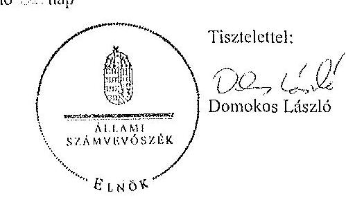

Melléklet: Tájékoztatás az elfogadott és az el nem fogadott észrevételekről

---

# Tájékoztatás   az elfogadott és az el nem fogadott észrevételekről 

„Az állami tulajdonban álló erdőgazdasági társaságok vagyongazdálkodási tevékenységének ellenőrzése" című ellenőrzés tekintetében az Északerdő Erdőgazdasági Zrt., az EGERERDŐ Erdészeti Zrt., a Gemenci Erdő- és Vadgazdaság Zrt., az IPOLY ERDŐ Zrt., a KEFAG Kiskunsági Erdészeti és Faipari Zrt., a Kisalföldi Erdőgazdasági Zrt., a SEFAG Erdészeti és Faipari Zrt., a Szombathelyi Erdészeti Zrt., a VADEX Mezöföldi Erdő- és Vadgazdálkodási Zrt., illetve a Zaloerdő Erdészeti Zrt. társaságok jelentéstervezetére 2015. október 13-án érkezett észrevételeket áttekintettük, azok kezelésével kapcsolatban a következő tájékoztatást adom.

1. A jelentésekben megfogalmazott központi problémával kapcsolatban tett észrevételek A jelentésekben megfogalmazott központi problémával kapcsolatban adott tájékoztatásukat köszönettel vettük, azonban azok alapján a jelentéstervezet módosítása nem indokolt.
2. Egyedi esetekkel kapcsolatban tett észrevételek

A KEFAG Kiskunsági Erdészeti és Faipari Zrt. jelentéstervezetének 8. oldal 7. bekezdésére, valamint 32. oldal 6. bekezdésére tett észrevétel
A rendelkezésre álló dokumentumok ismételt áttekintését követően a jelentéstervezet 8. oldal 7. bekezdésében, valamint 32. oldal 6. bekezdésében töröljük a tulajdonosi joggyakorló2 számú alsóindexszel jelölt hivatkozását.

A Kisalföldi Erdőgazdasági Zrt. jelentéstervezetének 29. oldal 4. bekezdésére tett észrevétel
A rendelkezésre álló dokumentumok ismételt áttekintését követően a jelentéstervezet 29. oldal 4. bekezdésében töröljük a tulajdonosi joggyakorló2 számú alsóindexszel jelölt hivatkozását.

A Szombathelyi Erdészeti Zrt. jelentéstervezetének 32. oldal 5. bekezdésére tett észrevétel
A rendelkezésre álló dokumentumok ismételt áttekintését követően a jelentéstervezet 32.
 oldal 5. bekezdésében töröljük a tulajdonosi joggyakorló 2 számú alsóindexszel jelölt hivatkozását.

Budapest, 2015. év $\quad / / \quad$ hó :77. nap

Makkai Mária
felügyeleti vezető

---

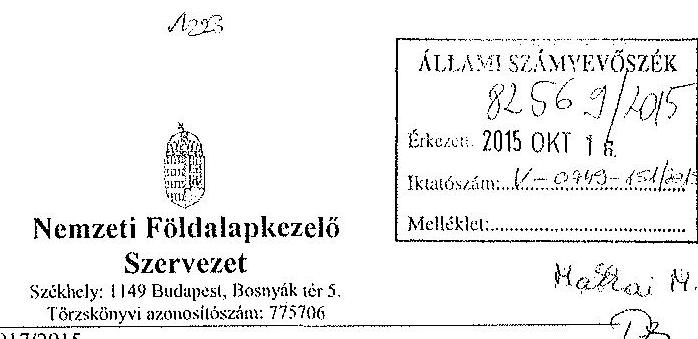

Iktatószám: NFA-002589/017/2015
Hiv. szám: ÁSZ-V-0599/2014-2015
Érintett ÁSZ iktatószámok: V-0749-148/2015, V-0750-174/2015, V-0751-121/2015,
V-0752-091/2015, V-0753-098/2015, V-0754-088/2015, V-0755-124/2015, V-0757-062/2015,
V-0758-058/2015, V-0760-077/2015, V-0764-056/2015, V-0765-046/2015,
V-0766-140/2015, V-0767-056/2015.

Domokos László
Elnök

Állami Számvevőszék

1052 Budapest

Apáczai Csere János utca 10

Tárgy: Észrevétel megküldése „Az állami tulajdonban álló erdőgazdasági társaságok
vagyongazdálkodási tevékenységének ellenőrzéséről" készített jelentés tervezeteire.

Tisztelt Elnök Úr!

Az Állami Számvevőszék 2014. novemberében megkezdte „Az állami tulajdonban álló
erdőgazdasági társaságok vagyongazdálkodási tevékenységének ellenőrzését", amelyről
2015. októberétől érintettség okán az NFA részére az elkészített munkannyag tervezeteit
vizsgált erdőgazdaságonként, megküldte Szervezetünk részére véleményezésre.

A munkannyag valamennyi tervezete egységesen, az NFA Elnöke részére feladatszabást
tartalmaz, melyhez az alábbi észrevételeket tesszük:

A jelentéstervezetekben tett megállapítások helytállóságát nem vitatjuk, azonban
szükségesnek látjuk az NFA elnökének tett javaslatokkal a), b) és c) kapcsolatban a következő
tájékoztatást megadni.

---

# 11. SZÁMÚ MELLÉKLET A V-0758-072/2015. SZÁMÚ JELENTÉSHEZ 

a) „Tegyen intézkedéseket az erdőgazdasági társaságok közreműködésével a tényleges állapotot rögzítő és a hatályos jogszabályi előírásoknak megfelelő vagyonkezelési szerződés megkötésére."

Tájékoztatjuk, hogy a hatályos jogszabályi előírásoknak megfelelő vagyonkezelési szerződések megkötése érdekében több intézkedés történt, jelenleg is folyamatban van a szerződések előkészítése és a vagyonkezelésben maradó, illetve kikerülő földrészletek adatainak egyeztetése.

Előzményként fontos kiemelni, hogy a Nemzeti Földalapkezelő Szervezet 2010. szeptember 1. napjával történt létrehozását követően (2012. évben) került sor a vagyonkezelésben lévő földrészletek MNV Zrt. részéről történő átadására. Az átadási dokumentumok alapján Szervezetünk gondoskodott a közhiteles nyilvántartásokban a megváltozott tulajdonosi joggyakorlás feltüntetéséről. Az erdőgazdaságok esetében ez 2012. év végéig, illetve 2013. év elején megtörtént, ennek az ingatlan-nyilvántartásban történő átvezetése is.

Megjegyezzük, hogy az MNV Zrt. részéről történő átadás kizárólag a - több évtizede között, és azóta többször módosított - vagyonkezelési szerződések és a földrészletek Excel táblázatban történő átadását jelentette, tehát nem egy naprakész vagyonnyilvántartást tartalmazott. Ennek következtében szükségszerűvé vált a Nemzeti Földalapkezelő Szervezetnek egy saját nyilvántartás felépítése, illetve a szerződések tartalmának feldolgozása.

A számvevőszéki ellenőrzések érintett időszakban, illetve még jelenleg is lezáratlan az MNV Zrt. és NFA közötti átadás-átvételi folyamat. Az MNV Zrt. további földrészletek átadását készíti elő, ugyanis az MNV Zrt. vagyoni körébe tartozó földrészletekre szintén tervezi a vagyonkezelői szerződés megkötését, és ennek a folyamatnak a részeként a még nem átadott földrészletek átadása is most történik. Természetesen az NFA is folyamatosan biztosítja a különböző hasznosítási, illetve hatósági eljárások során az erdőgazdaságok vagyonkezelésében lévő földrészletek tulajdonosi joggyakorlójának rendezését az MNV Zrt. megkeresésével, közös minősítési eljárás lefolytatásával. A Nemzeti Földalapkezelő Szervezet által megbízott ügyvédi iroda jelentést készített a szerződés és a tárgyát képező földrészletek jogi helyzetének tisztázására.

Időközben az erdőgazdaságok, mint társaságok feletti tulajdonosi joggyakorló személyében is változás történt. Így új alapokon indulhatott meg a vagyonkezelői szerződés előkészítése. Ennek a folyamatnak részeként, az NFA megbízott egy Ügyvédi Konzorciumot, továbbá Szervezetünknél külön Erdészeti munkacsoport alakult 2015. májusában és azt követően a következő intézkedések történtek:

Az Erdőgazdaságok részére vagyonkezelésbe adásra tervezett ingatlanok felülvizsgálata folyamatban van az Ügyvédi Konzorcium által. A felülvizsgálat tárgyát képező ingatlanok köre három részből tevődik össze:

- az erdőgazdaságok ideiglenes vagyonkezelési szerződésének tárgyát képező ingatlanok,

---

- azon ingatlanok, amelyeket az erdőgazdaságok az ideiglenes vagyonkezelési szerződésükben szereplő ingatlanokon felül kérték vagyonkezelésbe,
- valamint azok az ingatlanok, amelyeket az NFA kíván az erdőgazdaságok vagyonkezelésébe adni.

A rendelkezésre álló dokumentumokban szereplő ingatlanokból erdőgazdaságonként egy egységes, az összes vagyonkezelésbe adandó ingatlant tartalmazó táblázat készült, amely tartalmazza az ingatlanok vagyonkezelésbe adás szempontjából releváns adatait, bejegyzett jogokat, feljegyzett tényeket. A táblázat adatai összevetésre kerültek a közhiteles ingatlannyilvántartásban szereplő adatokkal, feltárva ezáltal, hogy mely ingatlanok adhatóak vagyonkezelésbe és melyek azok, amelyeknél valamilyen előzetes intézkedés megtétele szükséges.

Az Nfatv. 8. §-a alapján a Birtokpolitikai Tanács dönt erdőgazdaságonként az erdőgazdaságok vagyonkezelési szerződésének megkötéséről.

Zárójelben jegyezzük meg, hogy például a TAEG Zrt. esetében elkészült a fentebb részletezett táblázat, amely alapján összeállításra került azon ingatlanok listája, amelyre elindítható a vagyonkezelésbe adási eljárás. Megközelítőleg 18000 ha nagyságú területnek tervezi Szervezetünk a TAEG Zrt. részére történő vagyonkezelésbe adását, ebből 15.308.3880 ha terület az, amelyre elindította a vagyonkezelésbe adást. Az alábbi jogszabályhelyek alapján Szervezetünk megkereste a Földművelésügyi Minisztériumot az egyetértő nyilatkozatok, valamint az alapító határozat kiadása érdekében, valamint a NÉBIH-et, mint erdészeti hatóságot a vagyonkezelő erdőgazdálkodói alkalmasságát megállapító jóváhagyásának megkérése végett.

Az Nfatv. 20. § (7) bekezdése alapján „Az állam 100%-os tulajdonában álló erdő és erdőgazdálkodási tevékenységet közvetlenül szolgáló földterület érintő vagyonkezelési szerződés létrejöttéhez az erdészeti hatóságnak - a vagyonkezelő erdőgazdálkodói alkalmasságát megállapító - jóváhagyása szükséges".

Az Nfatv. 23. § (2) bekezdése alapján a Nemzeti Földalapba tartozó védett természeti területek és a Natura 2000 területek vagyonkezelésbe adására, tulajdonjogának bármely jogcímen történő átruházására csak a természetvédelemért felelős miniszter egyetértése esetén kerülhet sor. Az állam 100%-os tulajdonában álló erdő, továbbá erdőgazdálkodási tevékenységet közvetlenül szolgáló földterület vagyonkezelésbe adásához az erdőgazdálkodásért felelős miniszter egyetértése szükséges.

Magyar Állam tulajdonában álló ingatlanokat érintő jogügyletekkel kapcsolatos előzetes miniszteri nyilatkozatok és a miniszter tulajdonosi joggyakorlása alá tartozó gazdasági társaságok ingatlanügyleteivel kapcsolatos miniszteri nyilatkozatok, alapítói határozatok kiadásának rendjéről szóló 8/2014. (XI. 28.) FM utasítás 3. § (4) bekezdése értelmében a miniszter tulajdonosi joggyakorlása alá tartozó állami tulajdonú gazdasági társaságoknak az

---

NFA-val történő vagyonkezelési szerződés kötéséhez elengedhetetlen a jogszabály vagy Társasági alapszabály vagy alapító okirat alapján a Társaság tulajdonosi jogait gyakorló miniszter alapítói határozatának kiadása.

Az Erdészeti Munkacsoport a kialakított szempontok alapján tartja a kapcsolatot a Konzorciummal a szerződés tárgyát képező földrészletek jogi, nyilvántartási, helyszíni, térképezési ellenőrzés tárgyában annak érdekében, hogy naprakész adatok alapján történjen a szerződéskötés.
b) „Intézkedjen a vagyonkezelési szerződések felülvizsgálatának elmaradásával összefüggésben feltárt szabálytalanságok tekintetében a munkajogi felelősség tisztázására irányuló eljárás megindításáról, és ennek eredménye ismeretében tegye meg a szükséges intézkedéseket."

A fent leírt folyamat időbeli áttekintése és a vagyonkezelési szerződés előkészítésének jelenlegi helyzetét tekintve a Nemzeti Földalapkezelő Szervezet egységei, munkatársai a rendelkezésükre álló eszközök alapján megtették a szükséges intézkedéseket az erdőgazdaságok vagyonkezelői szerződésének megkötése érdekében.
c) Az NFA elnöke felé tett javaslattal kapcsolatban, miszerint intézkedjen a Társaságok vagyon-nyilvántartása hitelességének, teljességének és helyességének jogszabályban foglaltak szerinti ellenőrzéséről.

Az NFA 2015. év márciusában megkezdte az Erdészeti Zrt.-k dokumentális ellenőrzését, amely ellenőrzés keretében bekerült a Társaságok használatában álló vagyonelemekről és az erdővagyon állományról vezetett (nyilvántartások) aktualizált nyilvántartása is.

Budapest, 2015. október 13.
Tisztelettel:
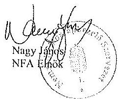

---

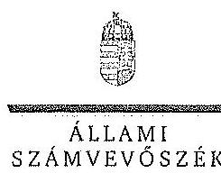

ELNÖK

ÁLLAMI
SZÁMVEVŐSZÉK

Ikt.szám: V-0749-154/2015.

Nagy János úr
elnök

Nemzeti Földalapkezelő Szervezet

Budapest

Tisztelt Elnök Úr!

Az „Az állami tulajdonban álló erdőgazdasági társaságok vagyongazdálkodási tevékenységének ellenőrzése” című ellenőrzés tekintetében 14 társaság jelentéstervezetére tett észrevételüket köszönettel megkaptam.

Az Állami Számvevőszék észrevételekre vonatkozó álláspontjáról a felügyeleti vezető által készített részletes tájékoztatást csatoltan megküldöm.

Tájékoztatom Elnök urat, hogy a számvevőszéki jelentésben – az Állami Számvevőszékről szóló 2011. évi LXVI. törvény 29. § (3) bekezdése alapján – a figyelembe nem vett észrevételeket szerepeltetjük az elutasítás indokának feltüntetésével.

Budapest, 2015. /4 hó /72 nap

Tisztelettel:

Domokos László

Melléklet: Tájékoztatás az észrevételek kezeléséről

1952 BUDAPEST, APÁCZAI CSERE JÁNOS UTCA 10. 1264 Budapest 4. P. 54 telefon: 484 8101 fax: 484 8201

---

# Tájékoztatás   az észrevételek kezeléséről 

„Az állami tulajdonban álló erdőgazdasági társaságok vagyongazdálkodási tevékenységének ellenőrzése" című ellenőrzés tekintetében az IPOLY ERDŐ Zrt., az EGERERDŐ Erdészeti Zrt., a Mecsekerdő Zrt., a SEFAG Erdészeti és Faipari Zrt., a Gemenci Erdő- és Vadgazdaság Zrt., az Északerdő Erdőgazdasági Zrt., a Pilisi Parkerdő Zrt., a Szombathelyi Erdészeti Zrt., a Kisalföldi Erdőgazdasági Zrt., a Zalaerdő Erdészeti Zrt., a KEFAG Kiskunsági Erdészeti és Faipari Zrt., a VADEX Mezőföldi Erdő- és Vadgazdálkodási Zrt., a Gyulaj Erdészeti és Vadászati Zrt., illetve a TAEG Tanulmányi Erdőgazdaság Zrt. társaságok jelentéstervezetére 2015. október 16-án érkezett észrevételeket áttekintettük, azok kezelésével kapcsolatban a következő tájékoztatást adom.

Az észrevétel szerint a jelentéstervezetben tett megállapítások helytállóak, azokat nem vitatják. Az NFA elnökének tett javaslatokhoz kapcsolódó tájékoztatást köszönjük. Mindezek miatt, valamint arra tekintettel, hogy nem jött létre olyan vagyonkezelési szerződés, amely biztosítja az ideiglenes vagyonkezelési szerződés hiányosságainak a megszüntetését, illetve a hatályos jogszabályoknak való megfeleltetést, a megállapítások és a javaslatok módosítása nem indokolt.

Budapest, 2015. év $\quad /1$ hó 92 . nap
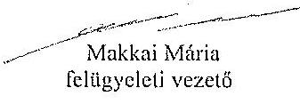

