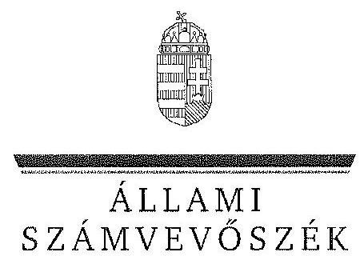

ÁLLAMI
SZÁMVEVŐSZÉK

# JELENTÉS 

Az állami tulajdonban álló erdőgazdasági társaságok vagyongazdálkodási tevékenységének ellenőrzése Zalaerdő Erdészeti Zrt.

---

# Állami Számvevőszék 

Iktatószám: V-0760-093/2015.
Témaszám: 1794
Vizsgálat-azonosító szám: V070612
Az ellenőrzést felügyelte:
Makkai Mária
felügyeleti vezető
Az ellenőrzést vezette és az ellenőrzés végrehajtásáért felelős:
Pencz Mária
ellenőrzésvezető
A számvevőszéki jelentés összeállításában közremúködött:
Vörösné Lakatos Zsuzsanna
számvevő
Az ellenőrzést végezték:
Gelencsér Zoltán
Vörösné Lakatos Zsuzsanna
számvevő tanácsos
számvevő

---

# TARTALOMJEGYZÉK 

BEVEZETÉS ..... 3
I. ÖSSZEGZŐ MEGÁLLAPÍTÁSOK, KÖVETKEZTETÉSEK, JAVASLATOK ..... 7
II. RÉSZLETES MEGÁLLAPÍTÁSOK ..... 14

1. A Zalaerdő Zrt. vagyongazdálkodása ..... 14
1.1. A vagyon értékének megőrzése, gyarapítása ..... 14
1.2. A vagyonkezelői kötelezettség teljesítése ..... 17
2. A Zalaerdő Zrt. vagyonkezelési szerződése és a vagyonnyilvántartása ..... 18
2.1. A vagyonkezelési szerződés megfelelősége ..... 18
2.2. A Zalaerdő Zrt. vagyonnyilvántartása ..... 20
3. A Zalaerdő Zrt. éves tervezési feladatainak ellátása, az ágazati jogszabályok érvényesülése ..... 23
3.1. Az üzleti tervek vagyonmegőrzésre, vagyongyarapításra vonatkozó elemei ..... 23
3.2. A tervekben megfogalmazott előírások érvényesülése ..... 24
3.3. Az ágazati szabályok érvényesülése ..... 25
4. A kontroll-és monitoring rendszer kialakítása és múködtetése ..... 26
4.1. A kontrollrendszer kialakítása és múködtetése ..... 26
4.2. Az információáramlási és monitoring rendszer kialakítása és múködtetése ..... 28
5. A tulajdonosi joggyakorlóknak a Zalaerdő Zrt. vagyongazdálkodási feladataira vonatkozó döntései, intézkedései megfelelősége ..... 30

---

# MELLÉKLETEK 

1. számú Rövidítések jegyzéke
2. számú Fogalomtár
3. számú A Zalaerdő Zrt. vagyonváltozásának alakulása a 2009-2013. évek közötti időszakban
4. számú A befektetett eszközök állományának alakulása
5. számú A Zalaerdő Zrt. vezérigazgatójának észrevétele
6. számú A Zalaerdő Zrt. vezérigazgatójának észrevételére adott válasz
7. számú Az MNV Zrt. vezérigazgatójának észrevétele
8. számú Az MNV Zrt. vezérigazgatójának észrevételére adott válasz
9. számú Az MFB Zrt. vezérigazgatójának észrevétele
10. számú Az MFB Zrt. vezérigazgatójának észrevételére adott válasz
11. számú Az NFA elnökének észrevétele
12. számú Az NFA elnökének észrevételére adott válasz

---

# JELENTÉS 

## Az állami tulajdonban álló erdőgazdasági társaságok vagyongazdálkodási tevékenységének ellenőrzése Zalaerdő Zrt.

## BEVEZETÉS

Hazánk területének több mint 20\%-át erdő borítja. Az erdők fenntartása és védelme az egész társadalom érdeke, ezért az erdőkkel csak a közérdekkel összhangban lehet gazdálkodni.

Az Alaptörvény 38. cikke és az Nvtv. alapján az állam tulajdona a nemzeti vagyon részét képezi. Az Nvtv. alapján nemzetgazdasági szempontból kiemelt jelentőségű nemzeti vagyonban tartandó vagyonelemnek minősül a 100\%-ban az állam tulajdonában álló védelmi és közjóléti elsődleges rendeltetésű erdő, a gazdasági elsődleges rendeltetésű természetes erdő, természetszerű erdő és származékerdő természetességi állapotú öt hektárnál nagyobb, természetben összefüggő erdő. A Társaságok vagyongazdálkodása szempontjából a Vtv, illetve az Nvtv. és az Nfatv., valamint a kapcsolódó kormány- és miniszteri rendeletek mellett kiemelkedő szerepe van a különböző ágazati jogszabályoknak. A vagyonkezelési tevékenység végrehajtása során figyelemmel kell lenni az Evt.-ben foglaltakra, mely alapján a nemzeti vagyonról szóló törvényben nemzetgazdasági szempontból kiemelt jelentőségű nemzeti vagyonként meghatározott védelmi és közjóléti elsődleges rendeltetésű, az állam tulajdonában álló erdő a kincstári vagyon részét képezi. A Társaságoknak az általuk kezelt vagyonelemek sajátosságára tekintettel kell a vagyongazdálkodási tevékenységüket kialakítaniuk, gondoskodniuk kell a közérdek és az Evt.-ben foglaltak érvényesülését biztosító vagyongazdálkodásról.

Az Evt. előírásai alapján az állam 100\%-os tulajdonában álló erdőt és erdőgazdálkodási tevékenységet közvetlenül szolgáló földterületet csak vagyonkezelés formájában lehet hasznosításra átengedni. A kizárólagos állami tulajdonban lévő erdő és erdőgazdálkodási tevékenységet közvetlenül szolgáló földterület vagyonkezelését csak költségvetési szerv vagy 100\%-os állami tulajdonú gazdálkodó szervezet végezheti.

A Vtv. szerint a Társaságok és az általuk kezelt állami vagyon feletti tulajdonosi jogokat a 2010. évig a Magyar Állam nevében az MNV Zrt. gyakorolta. A 2010. évi törvényi változások (Vtv., Mfbtv., Nfatv.) következtében 2010. június 17. napjától a Társaságok állami tulajdonú részesedése tekintetében a tulajdonosi jogokat az állami vagyonért felelős miniszter az MFB Zrt. útján látta el. Az Nfatv. 2010. évi hatálybalépését követően a Társaságok által kezelt, a Nemzeti Földalapba tartozó földterületek vonatkozásában a tulajdonosi jogokat az

---

NFA, míg egyéb ingatlanok és vagyonelemek tekintetében a tulajdonosi jogokat az MNV Zrt. gyakorolja. 2014. július 16-tól a Társaságok feletti tulajdonosi jogokat az erdőgazdálkodásért felelős miniszter gyakorolja.

A Nemzeti Földalapba tartozó 1772 980,17 ha földterületből a 2012. év végén a 100\%-os állami tulajdonú 19 erdőgazdasági társaság kezelésében összesen 913664,3681 ha földterület volt, ebből 879254,1595 ha erdő, a többi egyéb művelési ágba tartozik. A kezelt földterületek erdőgazdasági társaságonkénti megoszlása eltérő.

A Társaságok az Alaptörvény és az Nvtv. előírása szerint önállóan és felelősen gazdálkodnak a törvényesség, a célszerűség és az eredményesség követelményei szerint. Az állami vagyonnal való gazdálkodás alapvető feladata a vagyon rendeltetésszerú, hatékony és felelős felhasználásának biztosítása az állami vagyon értékének megőrzése, gyarapítása érdekében. A Társaság jelen ellenőrzése az állami vagyonnal való gazdálkodásra és a törvényesség betartására irányult.

A Zalaerdő Zrt. földrajzilag Magyarország délnyugati részén, közigazgatásilag Zala megyében az Örség, Göcsej, Kelet-Zalai-dombság, Kemeneshát, Marcalmedence és Belső-Somogy területeken gazdálkodik. A Társaság 2013. évi éves beszámolója szerint 8061,6 M Ft nettó árbevétel mellett 527,4 M Ft mérleg szerinti eredményt ért el, a mérlegfőösszeg 10431,4 M Ft volt. A Társaság 54139 ha erdőterületen és 2099 ha egyéb művelési ágú földterületen gazdálkodott, az éves átlaglétszám 420 fő volt.

Az ellenőrzés célja annak értékelése, hogy a Társaság vagyongazdálkodása, vagyonérték-megőrző és vagyongyarapítási tevékenysége, valamint szervezeti keretei és kiépített kontrollrendszere megfeleltek-e a jogszabályok és belső szabályzatok előírásainak, valamint a kezelt vagyonelemek sajátosságaiból adódó követelményeknek.

Ennek keretében ellenőriztük és értékeltük, hogy:

- a vagyongazdálkodás során betartották-e az Nvtv. 7. §-ában megállapított vagyongazdálkodási alapelveket, valamint az ágazati jogszabályok vagyongazdálkodáshoz kapcsolódó előírásait;
- a Társaság a saját és a kezelt vagyonnal való gazdálkodásra vonatkozó éves tervezési feladatait a jogszabályi előírásoknak megfelelően látta-e el, a Társaság üzleti tervei a kezelésbe vett vagyonra vonatkozó, a Vtv. 2. § (1) és a 27. § (7) bekezdésében előírt vagyon megőrzésére, gyarapítására vonatkozó elemeket tartalmazták-e és azokat a vagyongazdálkodás során érvényesített-ék-e;
- a vagyonkezelési szerződések és a vagyon-nyilvántartás megfeleltek-e a szabályszerűségi követelményeknek, elősegítették-e az állami vagyonnal való szabályszerű gazdálkodást;
- a Társaságnál kialakították és múködtették-e a szabályszerű feladatellátást támogató kontrollrendszert. Ezen belül a Társaság elkészítette-e és aktuali-zálta-e feladatellátási-folyamatainak szabályzatait, a kockázatok kezelésé-

---

nek rendszerét, az információs és a kontrolling-monitoring rendszert, valamint a vagyongazdálkodás területén azokat az eljárásokat, amelyek elősegítik a szervezeti célok végrehajtását;

- a tulajdonosi joggyakorlóknak a Társaság vagyongazdálkodási feladataira vonatkozó döntései, intézkedései előkészítése és megalapozottsága a jogszabályoknak és a belső szabályozásnak megfelelte, a tulajdonosi joggyakorlók e minőségben végzett tevékenysége támogatta-e a felelős vagyongazdálkodás megvalósulását.

Az ellenőrzés típusa: szabályszerűségi ellenőrzés.
Az ellenőrzött időszak: 2009. január 1. napjától 2014. június 30. napjáig, kitekintéssel a helyszíni ellenőrzés végéig tartó releváns folyamatokra, intézkedésekre.

Az ellenőrzés várható hasznosulása: A Társaság és a tulajdonosi joggyakorlók fenti szempontú ellenőrzése az állami tulajdonban álló vagyon kezelésére, a vagyonnal való gazdálkodásra vonatkozó, kötelezően végrehajtandó éves ÁSZ ellenőrzést szélesebb körűvé teszi.

Az ellenőrzés várható hasznosulásaként biztosíthatja a társadalom részéről kiemelt érdeklődéssel kísért téma objektív bemutatását. Az ÁSZ jelentéséből a média és az állampolgárok átfogó képet kaphatnak a Magyarország állami tulajdonban lévő erdőivel való gazdálkodásról, a gazdálkodást, vagyonkezelést végző szervezeti rendszerről, az állami tulajdonban álló erdőgazdasági társaságok feladatellátásához kapcsolódóan feltárt problémákról.

Az ellenőrzés jól hasznosítható - többek közt - az állami vagyonnal kapcsolatos országgyűlési törvényhozói munkában is, továbbá hozzájárulhat a tulajdonosi joggyakorlás javításával a „jó kormányzás" gyakorlatának erősítéséhez.

Az ellenőrzéssel érintett szervezetek: A Társaság, a Társaság kezelésében lévő állami vagyon feletti tulajdonosi jogokat gyakorló szervezetek, valamint a Társaság állami tulajdonú részesedése feletti tulajdonosi joggyakorlók (MFB Zrt., MNV Zrt., NFA).

Az ellenőrzés végrehajtásának jogszabályi alapját az ÁSZ tv. 5. § (4)(5) bekezdéseiben foglaltak képezik.

Az ellenőrzés szakmai módszertana az ÁSZ hivatalos honlapján közzétett szakmai szabályokon alapult, amely a Legfőbb Ellenőrző Intézmények Nemzetközi Szervezete (INTOSAI) által kiadott nemzetközi standardok (ISSAI) figyelembevételével készült.

A Társaság az ellenőrzés lefolytatásához tanúsítványok kitöltésével, valamint dokumentumok elektronikus megküldésével szolgáltatott adatokat. Az így rendelkezésre bocsátott adatok és információk kontrollja a helyszíni ellenőrzés keretében történt. A vagyonváltozást eredményező döntések megalapozottságát, továbbá a vagyonérték-megőrző és vagyongyarapító tevékenység szabályszerűségét a számviteli nyilvántartásokból, valamint kockázatalapú és véletlenszerű mintavétellel kiválasztott tételek ellenőrzésével értékeltük.

---

Az ÁSZ a 2011. évi LXVI. törvény 29. §-a szerint a jelentéstervezetet megküldte a Zalaerdő Zrt. vezérigazgatójának, a Magyar Nemzeti Vagyonkezelő Zrt. vezérigazgatójának, a Magyar Fejlesztési Bank Zrt. vezérigazgatójának és a Nemzeti Földalapkezelő Szervezet elnökének egyeztetésre. A Zalaerdő Zrt. vezérigazgatójának észrevételét és az arra adott választ az 5-6. számú melléklet, a Magyar Nemzeti Vagyonkezelő Zrt. vezérigazgatójának észrevételét és az arra adott választ a 7-8. számú melléklet, a Magyar Fejlesztési Bank Zrt. vezérigazgatójának észrevételét és az arra adott választ a 9-10. számú melléklet, a Nemzeti Földalapkezelő Szervezet elnökének észrevételét és az arra adott választ a 11-12. számú melléklet tartalmazza.

---

# I. ÖSSZEGZŐ MEGÁLLAPÍTÁSOK, KÖVETKEZTETÉSEK, JAVASLATOK 

Az állami tulajdonú Zalaerdő Zrt. az ellenőrzött időszakban saját és kezelt vagyonnal gazdálkodott. A Társaság vagyona az ellenőrzött időszakban gyarapodott. A Társaság könyvviteli mérlegében kimutatott vagyona a 2009. évi 7459,7 M Ft nyitó értékről 2013. december 31-re 10 431,4 M Ft-ra emelkedett, amely $39,8 \%$-os vagyongyarapodást jelentett. A vagyon bővülését az ellenőrzött időszakban a végrehajtott beruházások, valamint a Társaság Kerka Menti Fűrész Kft. leányvállalatába történő beolvadása miatt bekövetkező vagyonnövekedés eredményezte. A társaság saját tőke/jegyzett tőke aránya a 2009. évi $429,7 \%$-ról 2013. évre $599,4 \%$-ra nőtt. A Társaság a kezelt erdőket és földingatlanokat a Számv. tv. előírásai ellenére mérlegében az ellenőrzött időszakban nem szerepeltette, ezáltal a Társaság mérlege nem volt megbízható és valós. A Társaság a Számv. tv. előírásaival ellentétben a kezelt vagyont mérlegtétel szerinti bontásban kiegészítő mellékletében nem mutatta be.

A Társaság által kezelt vagyonról vezetett nyilvántartás nem felelt meg a Vhr.-ben foglaltaknak, mert tételesen nem tartalmazta a vagyonkezelt eszközök könyv szerinti bruttó és nettó értékét, valamint az értékben bekövetkezett egyéb változásokat. Ezért a nyilvántartás nem volt átlátható, nem biztosította az elszámoltathatóságot. A Társaság a VSZ eredeti, hitelesként egyértelmúen beazonosítható, a kezelt vagyon felsorolását tartalmazó 1-4. sz. mellékleteivel nem rendelkezett.

A kezelt ingatlanokról a Társaság kizárólag tételes mennyiségi kimutatást vezetett, Ft érték feltüntetése nélkül, ami megfelelt a VSZ 2.4. pontja szerinti naturáliában történő vezetési előírásnak, azonban nem felelt meg a kezelt vagyonra vonatkozó, a Számv. tv.-ben előírt nyilvántartási rendelkezésnek. A Társaság a kezelt vagyon Ft értékének meghatározását sem az MNV Zrt-nél, sem pedig az NFA-nál nem kezdeményezte. A kezelt vagyon nyilvántartása tekintetében a Társaság és a tulajdonosi joggyakorló MNV Zrt. és NFA közötti egyeztetések az ellenőrzés befejezéséig nem kerültek lezárásra, így nem állt rendelkezésre a Társaság vagyonkezelésében lévő valamennyi állami vagyonra, és annak nagyságára vonatkozó, a tulajdonosi joggyakorló MNV Zrt. és NFA nyilvántartásával egyező adat.

A kezelt vagyonról vezetett nyilvántartás - tekintettel a rendezetlen vagyonelemekre - nem felelt meg a Vhr.-ben foglaltaknak, mert nem biztosította az adatszolgáltatás pontosságát és ellenőrizhetőségét. A Társaság teljesítette a Vhr.-ben előírt adatszolgáltatási kötelezettségét az MNV Zrt. felé, azonban a 262/2010. (XI.17.) Korm. rendeletben foglaltakkal ellentétben az NFA felé adatszolgáltatás nem történt.

A Társaság a saját és kezelt vagyon Vhr.-ben előírt elkülönítését biztosította.
Az ellenőrzött időszakban a Társaság a Magyar Állam tulajdonában álló erdővagyon és egyéb művelési ágú termőföld ingatlanok kezelését a KVI-vel

---

1996. november 1-jén kötött vagyonkezelési szerződést alapján végezte. A Társaság, mint vagyonkezelő és a KVI között létrejött szerződéses jogviszony kereteit a VSZ-ben foglalt jogok és kötelezettségek töltötték ki. A vagyonkezelési szerződés nem támogatta megfelelően és számon kérhető módon a Társaság állami vagyonnal való gazdálkodását.

A vagyoni kör, a tulajdonosi jogok gyakorlására felhatalmazott szervezetek változásai, valamint a társaság vagyonkezelésére vonatkozó jogszabályi rendelkezések változásai ellenére a VSZ-t az ellenőrzött időszakban nem aktualizálták. A VSZ felülvizsgálata, egységes szerkezetbe foglalása nem történt meg, annak módosításai csak a kezelésbe átadott vagyon változásait tartalmazták. Az ellenőrzött időszakban a VSZ rendelkezései nem határozták meg teljes körűen az állami vagyon kezeléséhez fűződő jogokat és kötelezettségeket, mivel a szerződés hatályon kívül helyezett jogszabályi hivatkozásokat tartalmazott. A VSZ-t az Nfatv. hatálybalépését követően nem módosították, továbbá nem kötöttek új vagyonkezelési szerződést az erdők, és az erdőgazdálkodási tevékenységet közvetlenül szolgáló földterületek tekintetében.

A felek nem tettek eleget a Vhr.-ben foglalt rendelkezésnek és a Vhr. hatálybalépését követő hat hónapon belül nem kezdeményezték a Nemzeti Földalapba tartozó ingatlanokra vonatkozóan a VSZ megszüntetését és a Vtv., illetve Vhr. szabályainak megfelelő szerződés megkötését.

A VSZ-ben rögzítettek ellenére a vagyonkezelési díjak éves felülvizsgálatára nem került sor. A tulajdonosi joggyakorló NFA több évre visszamenőlegesen állított ki számlát. A számlákon a vagyonkezelt földterület nagysága, valamint fajlagos egységára nem szerepelt, ezért a vagyonkezelési díjak szerződés szerinti jogossága nem volt ellenőrizhető. A Társaság a számlákat pénzügyileg rendezte.

A Társaság az ellenőrzött időszakban a Számv. tv. előírásainak megfelelően a fordulónapi leltározást elvégezte.

A Társaság vagyongazdálkodása során betartotta az Nvtv.-ben előírt vagyongazdálkodási alapelveket, mivel vagyonkezelésében álló vagyont nem idegenített el, illetve arra jelzálogjogot, haszonélvezeti jogot nem alapított.

A Társaság a saját és a kezelt vagyonnal való gazdálkodás során éves tervezési feladatait a tulajdonosi joggyakorló ${ }_{1,2}$ által előírt formai és tartalmi előírásoknak megfelelően látta el, az ellenőrzött időszak minden évére éves üzleti tervet készített. Az ágazati és üzleti tervekben megfogalmazott, az erdővagyonnal való gazdálkodás érdekében kifejtett erdőgazdálkodási és vadgazdálkodási tevékenységét az Evt. ${ }_{1,2}$, Evr. és Vadvédelmi tv.-ben foglaltaknak megfelelően végezte. Az éves gazdálkodásról az ellenőrzött években a Számv. tv. rendelkezéseinek megfelelő üzleti jelentést készítettek. Az üzleti jelentések a Társaság eredményének és jövedelmezőségének alakulásán kívül, a vagyonkezelt terület múködtetését és az adott évi beruházásokat is tartalmazták.

---

A Társaság a Vtv.-ben, Nfatv.-ben és az ágazati tervekben megfogalmazott, a saját és kezelt vagyon állagának védelme és vagyona gyarapítása érdekében a felújításokat, beruházásokat és karbantartásokat évente állapotfelmérések alapján végezte. A kezelt vagyoni körbe tartozó földterületekre és erdőre vonatkozó állagmegóvási, felújítási és telepítési tevékenységét az erdészeti hatóság által összeállított erdőtervekben foglaltakkal összhangban a Számv. tv., és a Vhr. rendelkezéseinek megfelelően végezte. A Társaság az erdőfelújításokat a Számv. tv-ben előírtaknak megfelelően költségei között elszámolta, így a társaság mérleg szerinti eredménye tartalmazta a kezelt vagyon eredményét is. Az erdőtelepítéseket a Társaság a Számv. tv. előírásainak megfelelően könyveiben a befejezetlen beruházások között szerepeltette. A Társaság a vagyonkezelésében lévő erdők és földterületek után a Számv. tv. előírásainak megfelelően értékcsökkenést nem számolt el. A Társaság az ellenőrzött időszakban az elszámolt értékcsökkenési leírást meghaladóan beruházási és felújítási célokra 3977,3 M Ft-ot fordított, amelyből az erdőtelepítési beruházás összege 78,2 M Ft volt, erdőfelújításra további 3062,2 M Ft-ot fordított. A Társaság által elszámolt 1051,0 M Ft összegű értékcsökkenési leírásnál többet, 1057,3 M Ft-ot fordított eszközállományának pótlására.

A Társaságnál az ellenőrzött időszakban az ágazatra vonatkozó jogszabályokban meghatározott speciális vagyongazdálkodási előírások betartása - az erdőgazdálkodási és erdővédelmi bírság kiszabása miatt - részben volt megfelelő. A Társaság a vadgazdálkodásból származó bevételeket a Számv. tv. előírásainak megfelelően számolta el. A Társaság az Evt. ${ }_{2}$-ben foglalt, az erdő fenntartására, védelmére, valamint az erdei haszonvételek gyakorlására irányuló erdőgazdálkodási tevékenységéhez kapcsolódó bejelentési és engedélykérelmi kötelezettségének határidőben eleget tett. Az ellenőrzött időszakban rendelkezett az Evt. ${ }_{1,2}$-ben meghatározott, 10 évre szóló erdőgazdálkodási üzemtervvel, az erdészeti hatóság által jóváhagyott, 5 évre szóló erdőtelepítési-kivitelezési tervek rendelkezésre álltak, melyek tartalmazták az Evr. ${ }_{2}$-ben rögzített tartalmi elemeket. A Társaság a vadgazdálkodással érintett vadászterületre vonatkozó, a Vadvédelmi tv.-ben előírt, 10 évre szóló vadgazdálkodási üzemtervvel rendelkezett, az éves vadgazdálkodási terveket az ellenőrzéssel érintett években elkészítette, azokat a vadászati hatóság jóváhagyta.

A Társaság szabályszerű feladatellátását biztosító kontrollrendszerének kialakítása és múködtetése megfelelő volt. Az ellenőrzött időszakban mind a belső ellenőrzés, mind az FB tevékenységét a jóváhagyott éves munkatervében foglaltaknak megfelelően végezte. Az FB az ellenőrzött időszakban a Társaság múködésével összefüggésben jogszabály, alapszabály, valamint az alapítói határozatokban foglaltak megsértésére vonatkozó megállapítást nem tett. A belső ellenőrzés a vagyongazdálkodás ellenőrzésével kapcsolatos feladatait ellátta, azonban a vagyonnyilvántartás szabályozottságát nem ellenőrizte. A tulajdonosi joggyakorló ${ }_{1,2}$ a Számv. tv-ben előírt határidőig az FB és a könyvvizsgáló írásbeli jelentésének birtokában határozott az éves beszámolók jóváhagyásáról. A könyvvizsgáló minden évben hitelesítő záradékkal látta el a Társaság éves beszámolóit annak ellenére, hogy a Társaság a kezelésében lévő vagyonelemeket a Számv. tv. rendelkezései ellenére a mérlegében nem szerepeltette, ezáltal az nem a valós képet mutatta.

---

A Társaságnál a szabályszerű feladatellátást támogató információáramlási és monitoring rendszer kialakítása és múködtetése részben volt megfelelő, mert a VSZ-ben előírt, az erdővagyonról és annak változásáról készített beszámoló az ellenőrzött időszakban nem állt rendelkezésre. A Társaság iratkezelési, valamint az informatikai biztonsági és az adatvédelmi, adatbiztonsági szabályozást tartalmazó számítástechnikai fejlesztési és védelmi szabályzattal, továbbá a közérdekú adatok közzétételére vonatkozó szabályozással rendelkezett. A Társaság a közérdekú adatok megismerésére irányuló igények teljesítésének rendjét az Info tv.-ben előírtak ellenére belső szabályzatban nem rögzítette, azonban eleget tett a közérdekú adatok közzétételi kötelezettségének. A gazdálkodásához kapcsolódó közérdekű adatokat internetes honlapján, digitális formában hozzáférhetővé tette.

A Társaság vagyongazdálkodási feladataira vonatkozó döntések, intézkedések előkészítése a Társaság feletti tulajdonosi joggyakorló ${ }_{1,2}$-nél megfelelő volt, összhangban volt a vonatkozó jogszabályokkal és a belső szabályzatokkal. A Társaság feletti tulajdonosi joggyakorló ${ }_{1}$ a Társaság vagyonváltozását eredményező döntéseket egyedileg nem ellenőrizte, de a vagyonváltozását eredményező döntések végrehajtását a beszámolók, az üzleti tervek, üzleti jelentések és a kontrolling jelentések megtárgyalásával és jóváhagyásával ellenőrizte. Az erdőgazdasági társaság feletti tulajdonosi joggyakorló ${ }_{2}$ az ellenőrzött években a Társaság vagyongazdálkodásának szabályozottságával, szabályszerűségével és a vagyonnyilvántartásával kapcsolatban ellenőrzést nem végzett.

A vagyonkezelésbe adott állami vagyon tekintetében tulajdonosi jogokat gyakorló MNV Zrt. és NFA tevékenysége az ellenőrzött időszakban nem támogatta teljes körűen a felelős vagyongazdálkodás megvalósulását, a VSZ-szel kapcsolatban feltárt hiányosságok megszüntetése és a hatályos jogszabályoknak való megfeleltetése nem történt meg. A vagyonkezelésbe adott állami vagyon tekintetében tulajdonosi jogokat gyakorló MNV Zrt. és NFA nem végeztek a Vhr.-ben és a Nemzeti Földalapba tartozó földrészletek hasznosításának részletes szabályairól szóló 262/2010. (XI. 17.) Korm. rendeletben foglalt, a vagyonnyilvántartás hitelességére és teljességére vonatkozó ellenőrzést a Társaságnál.

Az Állami Számvevőszékről szóló 2011. évi LXVI. törvény 33. § (1) bekezdésében foglaltak értelmében a jelentésben foglalt megállapításokhoz kapcsolódó intézkedési tervet köteles az ellenőrzött szervezet vezetője összeállítani, és azt a jelentés kézhezvételétől számított 30 napon belül az ÁSZ részére megküldeni. Amennyiben az intézkedési tervet határidőben nem küldi meg a szervezet, vagy az nem elfogadható, az ÁSZ elnöke a hivatkozott törvény 33. § (3) bekezdésében foglaltakat érvényesítheti.

Az ellenőrzés intézkedést igénylő megállapításai és javaslatai:

# MNV Zrt. vezérigazgatójának, az NFA elnökének 

Az ellenőrzött időszakban a Zalaerdő Zrt. a Magyar Állam tulajdonában álló erdővagyon és egyéb múvelési ágú termőföld ingatlanok kezelését a KVI-vel 1996. november 1-jén kötött vagyonkezelési szerződést alapján végezte. A Társaság, mint va-

---

gyonkezelő és a KVI között létrejött szerződéses jogviszony kereteit a VSZ-ben foglalt jogok és kötelezettségek töltötték ki. A VSZ nem támogatta megfelelően és számon kérhető módon az állami vagyonnal való szabályszerű gazdálkodást. A VSZ 2009. január 1-jén hatályon kívül helyezett jogszabályi hivatkozásokat tartalmazott az Áht.: 109/B. §, az Áht.: 109/G. § és a Vadvédelmi. tv. 98. § rendelkezései vonatkozásában és nem tartalmazta a Vtv., az Evt., a Nvtv. és az Nfatv. előírásaira történő hivatkozást. A VSZ 3.2.3. pontja lehetőséget biztosít a vagyonkezelőnek a vagyonkezelői jog átruházására, valamint a 3.12.2. pontja az erdő használati jogának átengedésére, azonban a rendelkezések ellentétesek az Evt. 9. § (3) bekezdésében, valamint az Nfatv. 19/A. § (4) bekezdésében foglaltakkal, melynek értelmében az erdő használata, hasznosítása, vagyonkezelői jog harmadik személynek nem engedhető át. A VSZ 3.3.2. pontjában foglaltak ellenére a szerződést évente nem vizsgálták felül, azt a felek nem kezdeményezték. A felek nem tettek eleget a Vhr. 54. § (7) ${ }^{1}$ bekezdésében foglalt rendelkezésnek és a Vhr. hatálybalépést követő hat hónapon belül nem kezdeményezték a Nemzeti Földalapba tartozó ingatlanokra vonatkozóan a VSZ megszüntetését és a Vtv., illetve Vhr. szabályainak megfelelő szerződés megkötését.

A vagyonkezelésbe adott állami vagyon tekintetében tulajdonosi jogokat gyakorló MNV Zrt. és NFA nem végeztek a Vhr. 20. § (1)-(2) bekezdéseiben és a Nemzeti Földalapba tartozó földrészletek hasznosításának részletes szabályairól szóló 262/2010. (XI. 17.) Korm. rendelet 47. § (1)-(2) bekezdéseiben foglalt, a vagyonnyilvántartás hitelességére és teljességére vonatkozó ellenőrzést a Társaságnál.

Javaslat:

# az MNV Zrt. vezérigazgatójának 

a) Tegyen intézkedéseket az erdőgazdasági társaság közreműködésével a tényleges állapotot rögzítő és a hatályos jogszabályi előírásoknak megfelelő vagyonkezelési szerződés megkötésére.
b) Tegyen intézkedéseket a vagyonkezelési szerződés felülvizsgálatának elmaradásával, valamint a Nemzeti Földalapba tartozó ingatlanokra vonatkozó VSZ megszüntetésével összefüggésben feltárt szabálytalanságok tekintetében a felelősség tisztázása érdekében, és szükség szerint intézkedjen a felelősség érvényesítéséről.
c) Intézkedjen a Társaság vagyonnyilvántartása hitelességének, teljességének és helyességének jogszabályban foglaltak szerinti ellenőrzéséről.

## az NFA elnökének

a) Tegyen intézkedéseket az erdőgazdasági társaság közreműködésével a tényleges állapotot rögzítő és a hatályos jogszabályi előírásoknak megfelelő vagyonkezelési szerződés megkötésére.

[^0]
[^0]:    ${ }^{1}$ Vhr. 54. § (7) bekezdés (hatályos 2010. december 31-élg)

---

b) Intézkedjen a vagyonkezelési szerződés felülvizsgálatának elmaradásával összefüggésben feltárt szabálytalanságok tekintetében a munkajogi felelősség tisztázására irányuló eljárás megindításáról, és ennek eredménye ismeretében tegye meg a szükséges intézkedéseket.
c) Intézkedjen a Társaság vagyonnyilvántartása hitelességének, teljességének és helyességének jogszabályban foglaltak szerinti ellenőrzéséről.

# a Zalaerdő Zrt. vezérigazgatójának: 

1. A Zalaerdő Zrt. és a KVI között 1996. november 1-jén kötött vagyonkezelési szerződés nem támogatta megfelelően és számon kérhető módon az állami vagyonnal való szabályszerű gazdálkodást. A VSZ 2009. január 1-jén hatályon kívül helyezett jogszabályi hivatkozásokat tartalmazott az Áht. 109/B. §, az Áht. 109/G. § és a Vadvédelmi. tv. 98. § rendelkezései vonatkozásában és nem tartalmazta a Vtv., az Evt., az Nvtv. és az Nfatv. előírásaira történő hivatkozást. A VSZ 3.2.3. pontja lehetőséget biztosít a vagyonkezelőnek a vagyonkezelői jog átruházására, valamint a 3.12.2. pontja az erdő használati jogának átengedésére, azonban a rendelkezések ellentétesek az Evt. 9. § (3) bekezdésében, valamint az Nfatv. 19/A. § (4) bekezdésében foglaltakkal, melynek értelmében az erdő használata, hasznosítása, vagyonkezelői jog harmadik személynek nem engedhető át. A VSZ 3.3.2. pontjában foglaltak ellenére a szerződést évente nem vizsgálták felül, azt a felek nem kezdeményezték

Javaslat:
a) Tegyen intézkedéseket a tulajdonosi joggyakorlókkal közreműködve a tényleges állapotnak és a hatályos jogszabályi előírásoknak megfelelő vagyonkezelési szerződés megkötése érdekében.
b) Intézkedjen a vagyonkezelési szerződés felülvizsgálatának elmaradásával feltárt szabálytalanságok tekintetében a felelősség tisztázása érdekében, és szükség szerint intézkedjen a felelősség érvényesítéséről.
2. A Társaság kezelésében lévő vagyonelemeket a Számv. tv. 23. § (2) bekezdésének előírása ellenére a mérlegében nem szerepeltette az eszközök között, továbbá ezen eszközöket legalább mérlegtétel szerinti bontásban a kiegészítő mellékletében nem mutatta be.

Javaslat:
a) Intézkedjen a kezelt vagyon mérlegben eszközként való kimutatásáról, továbbá ezen eszközöknek a kiegészítő mellékletben - legalább mérlegtételek szerinti megbontásban - külön történő bemutatásáról.
b) Intézkedjen a kezelt vagyon mérlegben eszközként történő kimutatásának elmaradásával kapcsolatban feltárt szabálytalanság tekintetében a felelősség tisztázása érdekében, és szükség szerint intézkedjen a felelősség érvényesítéséről.

---

3. A Társaság az Avtv. 20. § (8) bekezdésében, illetve az Info tv. 30. § (6) bekezdésében rögzített, a közérdekű adatok megismerésére irányuló igények teljesítésének rendjét nem szabályozta.

Javaslat:
Intézkedjen a jogszabályi előírásoknak megfelelően a közérdekű adatok megismerésére irányuló igények teljesítése rendjének szabályozásáról.

---

# II. RÉSZLETES MEGÁLLAPÍTÁSOK 

## 1. A ZALAERDŐ ZRT. VAGYONGAZDÁlKODÁSA

### 1.1. A vagyon értékének megőrzése, gyarapítása

A Társaság vagyongazdálkodása során betartotta az Nvtv. 7. §²-ban foglalt vagyongazdálkodási alapelveket, a vagyonnal felelős módon, rendeltetésszerüen gazdálkodott.

Az ellenőrzött időszakban a Társaság vagyona gyarapodott. A vagyonváltozások hatására a vagyonszerkezet és a saját tőke/jegyzett tőke aránya is átrendeződött, amelyet a Társaság számviteli beszámolói és üzleti jelentései bemutattak.

A Társaság mérleg szerinti vagyona a 2009. január 1-jén kimutatott 7459,7 M Ft nyitó értékről 2013. december 31-re 10 431,4 M Ft-ra növekedett, mely $39,8 \%$-os vagyongyarapodást eredményezett. A Társaság a saját vagyonát a mérlegben a Számv. tv. 23. § (1) bekezdésének megfelelően az eszközök között tartotta nyilván, míg a kezelésében lévő vagyonelemeket Számv. tv. 23. § (2) bekezdésének előirása ellenére a mérlegében nem szerepeltette az eszközök között, ezáltal a Társaság mérlege nem a valós állapotot tükrözte. A Társaság saját eszközeit a Számv. tv. 159. §-ban foglaltaknak, valamint a számviteli politikájában rögzített elveknek megfelelően vezette a nyilvántartásaiban. A Társaság a vagyonváltozás főbb elemeit az ellenőrzött időszakban kiegészítő mellékleteiben szerepeltette.

## A társasági vagyon változása az ellenőrzött időszakban

|  |  |  |  | millió Ft |
| :--: | :--: | :--: | :--: | :--: |
|  | Megnevezés | 2009.01.01. | 2013.12.31. | Változás (\%) |
|  | 1 | 2 | 3 | $4-3 / 2$ |
| A | Befektetett eszközök | 4250,4 | 5673,9 | $133,5 \%$ |
| I. | Immateriális javak | 58,2 | 92,6 | $159,1 \%$ |
| II. | Tárgyi eszközök | 3858,0 | 5445,0 | $141,1 \%$ |
|  | - Ingatlanok | 2475,9 | 3239,4 | $130,8 \%$ |
|  | - Gépek berendezések, jármúvek | 660,3 | 1340,5 | 203,0\% |
|  | - Egyéb tárgyi eszközök | 132,7 | 308,8 | 232,7\% |
| III. | Befektetett pénzügyi eszközök | 334,3 | 136,3 | $40,8 \%$ |

[^0]
[^0]:    ${ }^{2}$ Hatályos: 2012. január 1-jétől

---

|  | Megnevezés | 2009.01.01. | 2013.12.31. | Változás (\%) |
| :-- | :--: | :--: | :--: | :--: |
|  | 1 | 2 | 3 | $4-3 / 2$ |
| B | Forgóeszközök | 3197,1 | 4733,9 | $148,1 \%$ |
| I. | Készletek | 709,7 | 790,9 | $111,4 \%$ |
| II. | Követelések | 1082,4 | 986,4 | $91,1 \%$ |
| III. | Értékpapírok | 0,0 | 0,0 |  |
| IV. | Pénzeszközök | 1405,0 | 2956,6 | $210,4 \%$ |
| C | Aktív időbeli elhatárolások | 12,2 | 23,6 | $193,4 \%$ |
|  | Eszközök összesen | $\mathbf{7 4 5 9 , 7}$ | $\mathbf{1 0 4 3 1 , 4}$ | $\mathbf{1 3 9 , 8}$ |

A befektetett eszközök értéke az ellenőrzött időszakban 33,5\%-kal, míg a forgóeszközök értéke 1536,8 M Ft-tal, 48,1\%-kal növekedett. A vagyon bővülését az ellenőrzött időszakban döntően a végrehajtott beruházások és felújítások, valamint a Társaság Kerka Menti Fűrész Kft. leányvállalatába történő beolvadása miatt bekövetkező vagyonnövekedések eredményezték.

Az ellenőrzött időszakban a Társaság vagyonszerkezete változott, a módosulást alapvetően a tárgyi eszközök állományértékének összes eszköz növekedésénél kisebb mértékű növekedési üteme, valamint az ellenőrzött időszakban bekövetkező jelentős pénzeszköz növekedés okozta. A pénzeszközök értéke folyamatosan nőtt, a 2009. évi 1405,0 M Ft-ról 2013. évre 2956,6 M Ft-ra, részaránya az összes eszközértékhez viszonyítva $18,8 \%$-ról $28,3 \%$-ra növekedett.

A Társaság saját tőke/jegyzett tőke mutatója a 2009. évi 429,7\%-ról 2013. év végére $599,4 \%$-ra, a mérleg szerinti eredmény összege 466,5 M Ft-ról 527,4 M Ft-ra, 13\%-kal emelkedett, amely a társaság nyereséges müködését jelentette. Az ellenőrzött időszakban egy esetben, 2009. évben került sor 118,7 M Ft összegben a jegyzett tőke tulajdonosi joggyakorló ${ }_{1}$ általi emelésére. A tőkeemelés bejegyzésére 2009. március 3-án, az 588/2008. (XII. 20.) alapítói határozat szerint került sor informatikai fejlesztés támogatása, illetve az EEVR bevezetése érdekében. A saját tőke és a mérleg szerinti eredmény változásának fő okait az éves beszámolók kiegészítő mellékletében bemutatták.

A Társaság jegyzett és saját tőkéjét, mérleg szerinti eredményének alakulását, továbbá a saját tőke/jegyzett tőke arányának változását az alábbi táblázat szemlélteti:

|  |  |  |  | adatok millió Ft-ban |  |  |
| :-- | :--: | :--: | :--: | :--: | :--: | :--: |
| Megnevezés | $\mathbf{2 0 0 9}$. év | $\mathbf{2 0 1 0}$. év | $\mathbf{2 0 1 1}$. év | $\mathbf{2 0 1 2}$. év | $\mathbf{2 0 1 3}$. év |  |
| Jegyzett tőke (JT) | 1534,5 | 1534,5 | 1534,5 | 1534,5 | 1534,5 |  |
| Saját tőke (ST) | 6593,1 | 7046,5 | 8019,5 | 8668,1 | 9197,9 |  |
| Mérleg szerinti ered-   mény | 466,5 | 451,6 | 850,1 | 618,1 | 527,4 |  |
| ST / JT aránya (\%) | 429,7 | 459,2 | 522,6 | 564,9 | 599,4 |  |

---

A Társaság a tulajdonosi joggyakorló ${ }_{1,2}$ részére évenként „Ágazati lapon" mutatta be az adózás előtti eredményt vagyonkezelt terület múködtetésére, a vállalkozó tevékenységre, és a vállalatirányításra bontottan.

A Társaság az ellenőrzött időszakban az Nfatv. 20. § (4) ${ }^{3}$, 19/A. § (3) ${ }^{4}$, a Vtv. 23. § (2), valamint 27. § (2) ${ }^{5}$ bekezdésében előírt, a saját és kezelt vagyon állagának megóvásával, karbantartásával és a vagyon gyarapításával kapcsolatos feladatait évente állapotfelmérések alapján végezte el. A saját, illetve a kezelt vagyonnal kapcsolatos tervezés az erdőgazdálkodással kapcsolatos sajátosságok miatt eltérő módon történt. Az ellenőrzött időszakban a Társaság kezelt vagyoni körét földterületek és erdők képezték. A kezelt vagyoni körbe tartozó földterületekre és erdőre vonatkozó állagmegóvási, felújítási és telepítési tevékenységre vonatkozóan az erdészeti hatóság által összeállított erdőtervekben foglaltak voltak irányadóak.

A Társaság teljes tárgyi eszköz állománya tekintetében az ellenőrzött időszakban karbantartási tervet nem készített, évente a műszaki állapotnak megfelelően rangsorolták a karbantartási, javítási igényeket. A műszaki állapot alapján erdészetenként kimutatott igényeket beépítették az éves üzleti tervekbe. A járműveknél a futásteljesítmény alapján a gépkönyvben előírt időszakonként, épületgépészeti eszközöknél és az egyéb gépi eszközöknél a tűzvédelmi és munkavédelmi célú vizsgálatok keretében végezték az állapotfelméréseket. Az üzleti jelentések adatai szerint 2009-2013. években összesen 1838,9 M Ft-ot számoltak el javítási, karbantartási feladatokra.

A Vhr. 9. § (6) ${ }^{6}$ és (9) ${ }^{7}$ bekezdés rendelkezései szerint a Társaság az erdőtelepítési, erdő-felújítási és erdőfenntartási tevékenysége keretében a szükséges felújítási munkákat elvégezte. A Társaság az erdőfelújításokat Számv. tv. 48. § (2) bekezdés előírásainak megfelelően könyveiben költségei között elszámolta, így a társaság mérleg szerinti eredménye tartalmazta a kezelt vagyon eredményét is.

A Vtv. 27. § (7) ${ }^{8}$ bekezdése a kezelt vagyonra vonatkozóan visszapótlási kötelezettséget ír elő, a visszapótlás összegét a vagyonkezelt eszközön elszámolt értékcsökkenési leírás összegében minimalizálta. A Társaság kezelésében nem volt olyan eszköz, melyre vonatkozóan visszapótlási kötelezettsége keletkezett volna.

A Társaság az erdő után a Számv. tv. 52. § (5) bekezdésének megfelelően értékcsökkenési leírást nem számolt el. A Társaság az ellenőrzött időszakban a 2312,6 M Ft elszámolt kizárólag saját vagyon értékcsökkenésével szemben beruházási és felújítási célokra 3977,3 M Ft-ot fordított, amelyből az erdőtelepítési

[^0]
[^0]:    ${ }^{3}$ Hatályos: 2011. augusztus 1-jétől 2012. december 31-ig
    ${ }^{4}$ Hatályos: 2013. január 1-jétől
    ${ }^{5}$ Hatályos: 2014. január 1-jétől
    ${ }^{6}$ Hatályos 2011. január 1-jétől
    ${ }^{7}$ Hatályos 2011. január 1-jétől
    ${ }^{8}$ Hatályos 2013. június 28-tól

---

beruházás összege 78,2 M Ft volt. A beruházásokat és a felújításokat 97,6\%ban saját forrásokból, 2,4\%-ban hazai, központi forrásokból finanszírozták. Erdőfelújításokra további 3062,2 M Ft-ot fordítottak.

A Társaság kezelt vagyonnal közvetlenül összefüggő beruházási, felújítási tevékenysége az erdőtelepítésre és a rendelkezésre álló erdővagyon felújítására terjedt ki. Az erdővel összefüggő telepítési és felújítási feladatokat az erdészeti hatóság által előírt erdőtelepítési tervek és az évenként a Társaság feletti tulajdonosi joggyakorló ${ }_{1,2}$ által jóváhagyott üzleti tervek tartalmazták.

Az erdőtelepítések és erdőfelújítások szerződések alapján, az azokban meghatározott feltételeknek megfelelően valósultak meg, a szerződésben foglalt feladatok ellátását minden esetben igazolták, a számla szerinti érték pénzügyi teljesítése, számviteli nyilvántartása megfelelt a társaság számlarendjében foglaltaknak. Az erdőtelepítések esetében a beruházási teljesítményérték befejezetlen beruházásként nyilvántartásba vételre kerültek a Számv. tv. 47. § (1) bekezdésének megfelelően, rendeltetésszerű használatba vételére, aktiválására az erdő termőre fordulásakor az erdészeti hatóság határozata alapján került sor.

# 1.2. A vagyonkezelői kötelezettség teljesítése 

A Társaság az ellenőrzött időszakban vagyonkezelői kötelezettségének eleget tett.

A Társaság az Evt ${ }_{2} .9 . \S$ (1)-(3) ${ }^{9}$ bekezdéseiben, valamint az Nfatv. 19/A. § (4) ${ }^{10}$ bekezdésében foglalt előírások hatályba lépését követően nem adta tovább a vagyonkezelői jogot. Az erdőgazdaság által kezelt vagyonelemek elidegenítésére, biztosítékul adására, azon osztott tulajdon létesítésére a Vtv. 33. § (1) ${ }^{11}$ bekezdésében, az Nvtv. 4. § és 6 . §-aiban ${ }^{12}$, a 262/2010. (XI. 17.) Korm. rendelet 40. § (1) ${ }^{13}$ bekezdésében, valamint 2. sz. mellékletében foglaltaknak megfelelően az ellenőrzött időszakban nem került sor.

A Társaság az Evt ${ }_{2} .9 . \S(3)^{14}$, valamint az Nfatv. 20. § (3) és (7) ${ }^{15}$ bekezdésében foglalt előírások hatályba lépését követően nem engedte át az erdő használatát, hasznosítását harmadik fél számára.

[^0]
[^0]:    ${ }^{9}$ Hatályos: 2009. július 1-jétől
    ${ }^{10}$ Hatályos: 2013. január 1-jétől
    ${ }^{11}$ Hatályos 2013. június 28-tól
    ${ }^{12}$ Hatályos 2012. január 1-jétől
    ${ }^{13}$ Hatályos: 2010. december 2-től
    ${ }^{14}$ Hatályos 2009. július 10-től
    ${ }^{15}$ Hatályos 2011. augusztus 1-jétől

---

# 2. A ZALAERDŐ ZRT. VAGYONKEZELÉSI SZERZŐDÉSE ÉS A VAGYONNYILVÁNTARTÁSA 

### 2.1. A vagyonkezelési szerződés megfelelősége

A Társaság az ellenőrzött időszakban saját és kezelt vagyonnal rendelkezett. A kezelt vagyoni körbe tartozó vagyonelemek felett, valamint a Társaság részesedései felett a tulajdonosi joggyakorlás az ellenőrzött időszakban többször változott. A 2010. évtől a tulajdonosi jogok gyakorlása az egyes vagyoni körök tekintetében elkülönült, így a joggyakorlás megosztottá vált.

A 2009. január 1. és 2010. június 16. közötti időszakban a tulajdonosi jogok gyakorlója az MNV Zrt. volt. Az Mfbtv. 3. § (5) ${ }^{16}$ bekezdése értelmében 2010. június 17-étől a Társaság állami tulajdonú részesedése tekintetében a tulajdonos jogait az MFB Zrt. gyakorolta. A Társaság vagyonkezelésében lévő földterületek az Nfatv. 15. § (1) ${ }^{17}$, valamint 1. § (1) ${ }^{18}$ bekezdése értelmében 2010. szeptember 1-jétől a Nemzeti Földalapba tartoznak, azok felett a tulajdonos jogait az agrárpolitikáért felelős miniszter az NFA útján gyakorolja. A Nemzeti Földalapba nem tartozó egyéb ingatlanok feletti tulajdonosi joggyakorlás a Vtv. 3. § (1) ${ }^{19}$ bekezdése alapján az MNV Zrt. hatáskörében maradt.

Az ellenőrzött időszakban a Társaság a Magyar Állam tulajdonában álló erdővagyon és egyéb művelési ágú termőföld ingatlanok kezelését a KVI-vel 1996. november 1-jén kötött vagyonkezelési szerződést alapján végezte. A Társaság, mint vagyonkezelő és a KVI között létrejött szerződéses jogviszony kereteit a VSZ-ben foglalt jogok és kötelezettségek töltötték ki. A Társaságnak a KVI ${ }^{20}$ vel kötött VSZ-e nem támogatta megfelelően és számon kérhető módon az állami vagyonnal való szabályszerű gazdálkodást.

A VSZ rendelkezései az ellenőrzött időszakban nem határozták meg teljes körűen az állami vagyon kezelésével kapcsolatos jogokat és kötelezettségeket, mert a vagyonkezelési szerződés elavult jogszabályi rendelkezéseket tartalmazott. A VSZ 2009. január 1-jén hatályon kívül helyezett jogszabályi hivatkozásokat tartalmazott az Áht. ${ }_{1}$ 109/B. $\S^{21}$, az Áht. ${ }_{1}$ 109/G. $\S^{22}$ és a Vadvédelmi. tv. 98. § ${ }^{23}$ rendelkezései vonatkozásában és nem tartalmazta a Vtv., az Evt., a Nvtv. és az Nfatv. előírásaira történő hivatkozást.

A VSZ 3.2.3. pontja lehetőséget biztosít a vagyonkezelőnek a vagyonkezelői jog átruházására, valamint a 3.12.2. pontja az erdő használati jogának átengedé-

[^0]
[^0]:    ${ }^{16}$ Hatályos: 2010. június 17-tól
    ${ }^{17}$ Hatályos: 2010. szeptember 1-jétől 2011. július 31-ig
    ${ }^{18}$ Hatályos: 2011. augusztus 1-jétől
    ${ }^{19}$ Hatályos: 2010. június 17-tól
    ${ }^{20}$ Vtv. 61. § (1) bekezdése alapján az MNV Zrt. a KVI jogutódja
    ${ }^{21}$ Hatályos: 2007. szeptember 24-ig
    ${ }^{22}$ Hatályos: 2007. szeptember 24-ig
    ${ }^{23}$ Hatályos: 2007. április 13-ig

---

sére, azonban a rendelkezések ellentétesek az Evt. 9. § (3) bekezdésében , valamint az Nfatv. 19/A. § (4) ${ }^{24}$ bekezdésében foglaltakkal, melynek értelmében az erdő használata, hasznosítása, vagyonkezelői jog harmadik személynek nem engedhető át.

A Társaságnál a VSZ-t több alkalommal módosították a kezelt vagyonelemek körében bekövetkezett változás miatt, azonban a felek a Vhr. 8. § (2) bekezdésében foglalt rendelkezéseknek nem tettek eleget, a szerződést 60 napon belül nem foglalták egységes szerkezetbe. Az ellenőrzött időszakban a VSZ felülvizsgálatára sem a szerződés hatálya alá tartozó vagyontárgyak körében bekövetkezett változása okán, sem a tulajdonosi joggyakorlók változásai, sem a hivatkozott jogszabályokban bekövetkezett változás miatt nem került sor. A VSZ-t az Nfatv. 20. § $(7)^{25}$ bekezdésének hatályba lépését követően nem módosították, illetve erdőre, és az erdőgazdálkodási tevékenységet közvetlenül szolgáló földterületre új vagyonkezelési szerződést sem kötöttek. A VSZ ellenőrzött időszakban történt konkrétan megjelölt ingatlanra vonatkozó módosításai a vagyonkezelésbe vett eszközöket érték nélkül, a helyrajzi számok, területmérték és területnagyság megadásával tartalmazta.

A felek nem tettek eleget a Vhr. 54. § (7) ${ }^{26}$ bekezdésében foglalt rendelkezésnek és a Vhr. hatálybalépést követő hat hónapon belül nem kezdeményezték a Nemzeti Földalapba tartozó ingatlanokra vonatkozóan a VSZ megszüntetését és a Vtv., illetve Vhr. szabályainak megfelelő szerződés megkötését.

A VSZ nem biztosította a vagyonkezelői jog ingatlan-nyilvántartásba történő bejegyzését, a Vhr. 7. § (1) bekezdésének rendelkezésének teljesítését. A VSZ ideiglenes jellegére tekintettel a 6.1. pontja kizárta az Áht, 109/G § (2) ${ }^{27}$ bekezdésében foglaltak alkalmazását, így a VSZ alapján a kezelt ingatlanok tulajdoni lapjain kezelői jogállással továbbra is több esetben a Társaság jogelődje van feltüntetve. A VSZ és annak módosításai nem tartalmaztak rendelkezést - határidőt - az ideiglenes jelleg megszűntetésére, illetve végleges szerződés megkötésére vonatkozóan.

A VSZ 3.3.1. pontja rendelkezett a vagyonkezelési díjak mértékéről, a 3.3.2 pont értelmében a vagyonkezelői díjat évente kellett felülvizsgálni és az adott évre vonatkozó díjat külön megállapodásban rögzíteni. A VSZ 3.3.3. pontja alapján a vagyonkezelési díjakat évente két egyenlő részletben kell kiegyenlíteni. A vagyonkezelői díj mértékének évenkénti felülvizsgálatára, valamint a díjak külön megállapodásban történő rögzítésére az ellenőrzött időszakban nem került sor. A VSZ 3.3.1. pontjában a vagyonkezelői díj hektáronkénti összegét rögzítették, azonban abban a kiszámlázás alapját képező földterület nagyságát nem tüntették fel.

Az NFA két alkalommal, több évre visszamenőlegesen állított ki számlákat a Társaságnak, ezáltal sérültek a vagyonkezelési szerződések díjfizetéssel kapcso-

[^0]
[^0]:    ${ }^{24}$ Hatályos: 2013. január 1-jétől
    ${ }^{25}$ Hatályos: 2011. augusztus 1-jétől
    ${ }^{26}$ Vhr. 54. § (7) bekezdés (hatályos 2010. december 31-éig)
    ${ }^{27}$ Hatályos: 2007. szeptember 24-ig

---

latos előírásai (VSZ 3.3.1 és 3.3.3 pontjában foglaltak) és a Vhr. 11. § (1)(2) ${ }^{28}$ bekezdésében, illetve a Vhr. 10. § (1)-(2) ${ }^{29}$ bekezdéseiben foglalt előírások.

A számlákból nem állapítható meg sem a díjszámítás alapja (terület, ha), sem pedig az egységár ( $\mathrm{Ft} / \mathrm{ha}$ ), ezért a vagyonkezelési díj számításának szerződés szerinti jogossága egyértelműen nem volt megállapítható. A számlák szerinti összeg és az 1996. évben rögzített egységár alapján kiszámolt terület nem egyezett a Társaság által nyilvántartott, éves jelentésekben szereplő adataival.

A VSZ nem tartalmazott rendelkezést a vagyonkezelési díjak Áfa tartalmát illetően, azonban a tulajdonosi joggyakorló NFA által kiállított számlák tartalmaztak Áfát. A számlákat a Társaság az Áfa összegének számítási módja miatt megkifogásolta, mert az NFA a vagyonkezelési díjat Áfa alapként vette figyelembe annak ellenére, hogy a VSZ az Áfáról nem rendelkezett. Az NFA a 20092011. évek vagyonkezelési díjáról - Áfa tekintetében helyesbített - számlákat az ellenőrzött időszakot követően 2014. július 17 -én állította ki. A tulajdonosi joggyakorló NFA vagyonkezelési szerződésben foglaltaktól eltérő eljárása miatt a Társaság a vagyonkezelésbe kapott vagyon után járó vagyonkezelési díjat a VSZ-ben foglaltaktól eltérően több évre visszamenőleg rendezte.

A Társaság által kezelésbe vett földterületek után 2009-2013 évekre vonatkozóan fizetett vagyonkezelési díjak a következők szerint alakultak:

| Megnevezés | Számla összege   (nettó) | Számla összege   (bruttó) | Számla kiállí-   tásának ideje | Pénzügyi ren-   dezés |
| :--: | :--: | :--: | :--: | :--: |
| 2009. | 4341913 | 5427391 | 2014.07 .17 | 2014.08 .04 |
| 2010. | 4341913 | 5427391 | 2014.07 .17 | 2014.08 .04 |
| 2011. | 4341913 | 5427391 | 2014.07 .17 | 2014.08 .04 |
| 2012. | 4273536 | 5427391 | 2013.12 .30 | 2014.01 .31 |
| 2013. | 4273536 | 5427391 | 2013.12 .30 | 2014.01 .31 |

# 2.2. A Zalaerdő Zrt. vagyonnyilvántartása 

Az ellenőrzött időszakban a Társaságnak a kezelt vagyonra vonatkozó vagyonnyilvántartása teljes körűen nem felelt meg a hitelességi és megbízhatósági követelményeknek.

A Társaság a vagyonkezelésbe vett ingatlanokról a Vhr. 17. § (1) bekezdésének megfelelően elkülönített, naprakész mennyiségi nyilvántartást vezetett. A Társaság által vezetett nyilvántartás nem felelt meg a Vhr. 17. § (1) bekezdésében foglaltaknak, mert tételesen nem tartalmazta a vagyonkezelt eszközök könyv szerinti bruttó és nettó értékét, valamint az értékben bekövetkezett egyéb változásokat, ezért nem volt átlátható, nem biztosította az elszámoltatha-

[^0]
[^0]:    ${ }^{28}$ Hatályos: 2010. december 31-ig
    ${ }^{29}$ Hatályos: 2011. január 1-jétől

---

tóságot. A Társaság a VSZ eredeti, hitelesként egyértelműen beazonosítható, a kezelt vagyon felsorolását tartalmazó 1-4. sz. mellékleteivel nem rendelkezett.

A Társaság a kezelt vagyont naturáliában tartotta nyilván, ami megfelelt a VSZ 2.4. pontja szerinti naturáliában történő vezetési előírásnak. A Társaság a kezelt vagyon Ft. értékének meghatározását sem az MNV Zrt-nél, sem pedig az NFA-nál nem kezdeményezte.

A Társaság vagyonnyilvántartásában az ellenőrzött időszakban 56300 ha földingatlan szerepelt. A vagyonkezelői jogosultsága ebből 55765 ha területre terjedt ki. A vagyonkezelésben lévő ingatlanokból az erdőterületek nagysága 53970 ha, a fennmaradó 1795 ha terület egyéb művelési ágú termőföld (szántó, rét, legelő), és kivett ingatlanok (út, mocsár, víztározó). A vagyonkezelt ingatlanok körében a földterületeken kívül egyéb vagyontárgyat nem tartottak nyilván. Az ingatlanvagyon nyilvántartását és az ingatlanvagyonnal kapcsolatos változások vezetését a DiGi Terra MAP programmal, valamint KVI által az erdőgazdaságok részére átadott Forrás SQL program által működtetett vagyonnyilvántartási rendszerben végezték. A DigiTerra adatbázisa mind a társasági, mind pedig a vagyonkezelt állami tulajdonú ingatlanok teljes körét elkülönítve tartalmazta. A Forrás SQL vagyonnyilvántartó rendszerben az állami tulajdonban álló ingatlanok adataiban bekövetkezett változásokat vezették.

A Forrás SQL program adatbázisa 2010. évben még a teljes vagyonkezelési körbe tartozó vagyont tartalmazta, azonban 2012. évtől - a kezelt vagyon feletti tulajdonosi joggyakorló változása miatt - az MNV Zrt. által rendelkezésre bocsátott kimutatás alapján kivezették az adatbázisból az NFA tulajdonosi joggyakorlása alá tartozó ingatlanokat. A kivezetett vagyoni kört érintően további egyeztetések voltak folyamatban. Az egyeztetések az ellenőrzés befejezéséig nem kerültek lezárásra, így nem állt rendelkezésre a Társaság által kezelt valamennyi vagyonelem tekintetében a tulajdonosi joggyakorló MNV Zrt. és NFA által nyilvántartásával egyező adat.

A Társaság által kezelt vagyon alakulása az ellenőrzött időszak beszámolóval lezárt éveiben az alábbi táblázat szerint alakult:

| Megnevezés | Tulajdonosi joggyakorló |  | Összes terület (ha) |
| :--: | :--: | :--: | :--: |
|  | MNV Zrt. | NFA |  |
| 2009. január 1. | 55705 | - | 55705 |
| 2009. december 31. | 55736 | - | 55736 |
| 2010. december 31. | 55816 | - | 55816 |
| 2011. december 31. | 55809 | - | 55809 |
| 2012. december 31. | 27 | 55780 | 55807 |
| 2013. december 31. | 27 | 55781 | 55808 |

---

A kezelt vagyonról vezetett nyilvántartás - tekintettel a rendezetlen vagyonelemekre - nem felelt meg a Vhr. 14. § (1) ${ }^{30}$ bekezdésében előírtaknak, mert nem biztosította az adatszolgáltatás pontosságát és ellenőrizhetőségét. Az ellenőrzött időszakban a kezelt vagyon területe a kezelt vagyon feletti tulajdonosi joggyakorló MNV Zrt által kezdeményezetten 88,9 hektárral növekedett, amelylyel a VSZ-t 2009. május 29 -én módosították. A földterület a Társaság részére történő vagyonkezelésbe adása a Nemzeti Vagyongazdálkodási Tanács „Erdőtelepítési közmunkaprogram előkészitésének támogatása" tárgyban hozott 806/2008.(XII. 17.) NVT számú és „Erdőtelepítési Projekt indításával kapcsolatos feladatok" tárgyban hozott 94/2009. (II. 18.) határozataiban foglalt célkitűzések megvalósítása érdekében történt. A VSZ módosítással vagyonkezelésbe vett földterületet érték nélkül nyilvántartásba vették.

A Társaság a kezelt földterületeket nyilvántartásában érték nélkül szerepeltette, mérlegében a Számv. tv. 23. § (2) bekezdésében foglalt előírás ellenére a kezelésbe vett földterületeket nem jelenítette meg, ezáltal a Társaság mérlege nem volt megbízható és valós. A Társaságnak, mint vagyonkezelőnek a Vhr. 9. § (9) bekezdés a) ${ }^{31}$ pontja szerint a vagyonkezelési szerződésben meghatározott értéken kell kimutatnia a mérlegében az eszközök között kezelésbe vett, az állami vagyon részét képező eszközöket a hosszú lejáratú kötelezettségekkel szemben. A Társaság a Számv. tv. 23. § (2) előírásaival ellentétben a kezelt vagyont mérlegtétel szerinti bontásban kiegészítő mellékletében nem mutatta be.

A tárgyév utolsó napján fennálló állapotról a Társaság a Vhr. 14. § (1) bekezdésében foglalt adatszolgáltatási kötelezettségét a Vhr. 14. § (3) bekezdésében meghatározott tartalommal teljesítette az MNV Zrt. felé. A 262/2010. (XI.17.) Korm. rendelet 50/A. § (1)-(2) ${ }^{32}$ bekezdésében foglalt előírás ellenére a Társaság az NFA körbe tartozó kezelt vagyonról az NFA részére az ellenőrzött időszakban adatszolgáltatást nem teljesített.

A Társaság a VSZ. 3.9. pontjának megfelelően a vagyonkezelésével kapcsolatos bevételeit és költségeit a vállalkozási tevékenységétől elkülönítetten tartotta nyilván. A Társaság a Számv. tv. 69. § (3) bekezdésében, valamint a Leltározási Szabályzatban foglaltaknak megfelelően valamennyi ellenőrzött évben a beszámolóban és a számviteli nyilvántartásokban lévő vagyontárgyak állományának fordulónapi leltározását elvégezte. Leltározási Szabályzatát a leltározás gyakoriságára vonatkozóan a Számv. tv. 69. § (3) bekezdésének megfelelően aktualizálta. Az ellenőrzött időszakban a leltározás a leltározási ütemtervek szerint történt. A tárgyi eszközöket, kis értékű tárgyi eszközöket, készleteket mennyiségi felvétellel, az értékben nyilvántartott eszközvagyont egyeztetéssel leltározták. A leltározások végrehajtását és dokumentálását a belső ellenőrzés és a beszámoló éves könyvvizsgálata során ellenőrizték.

[^0]
[^0]:    ${ }^{30}$ Hatályos: 2014. március 15 -től.
    ${ }^{31}$ Hatályos: 2011. január 1-jétől
    ${ }^{32}$ Hatályos: 2013. május 25 -től

---

# 3. A ZALAERDŐ ZRT. ÉVES TERVEZÉSI FELADATAINAK ELLÁTÁSA, AZ ÁGAZATI JOGSZABÁLYOK ÉRVÉNYESÜLÉSE 

### 3.1. Az üzleti tervek vagyonmegőrzésre, vagyongyarapításra vonatkozó elemei

Az ellenőrzött időszakban a Társaság a kezelt és saját vagyonnal való gazdálkodás során az éves tervezési feladatait megfelelően látta el, a társaság feletti tulajdonosi joggyakorló ${ }_{1,2}$ által közölt formai és tartalmi előírások alapján minden évben elkészítette az üzleti tervet. Az egyes ágazatokra lebontva meghatározta az adott évre tervezett feladatokat, és a megvalósításukhoz tervezett összeget.

A Társaság önálló vagyongazdálkodási stratégiával, stratégiát jóváhagyó tulajdonosi határozattal, éves vagyongazdálkodási tervekkel és azokat jóváhagyó tulajdonosi határozatokkal nem rendelkezett, annak elkészítését a tulajdonosi joggyakorló ${ }_{1,2}$ és jogszabály sem írta elő. Stratégiai célokat a Vezérigazgató által 2010. szeptember 6-án jóváhagyott „A Zalaerdő Zrt. stratégiája, küldetése" című terv „4.7 Eszközellátottság, beruházás" fejezete tartalmazott. A vagyongazdálkodással kapcsolatos éves terveket a tulajdonosi joggyakorló ${ }_{1,2}$ által jóváhagyott éves üzleti tervek tartalmazták.

A tulajdonosi joggyakorló ${ }_{1,2}$ az ellenőrzött időszakban a Vtv. 2. § (1) bekezdésben foglaltak alapján, a vagyonnal való tervszerű gazdálkodás érdekében az üzleti terv készítéséhez megküldte a tartalmi és formai követelményeket tartalmazó tervezési irányelveket.

A Társaság az ellenőrzött időszakban elkészítette éves üzleti tervét, az üzleti tervek módosítására nem került sor. Az éves üzleti terveket a 2009-2010. évek vonatkozásában az IG, a 2011-2014. évek vonatkozásában az FB megtárgyalta, elfogadásra javasolta a tulajdonosi joggyakorló ${ }_{1,2}$ részére. Az üzleti tervek jóváhagyására az Alapító Okirat 12.2 pontjában foglaltaknak megfelelően Alapítói Határozattal került sor. A 2009-2014. években készített éves üzleti tervek a saját és kezelt vagyon megőrzésére, gyarapítására vonatkozó elemeket tartalmazták. A Társaság éves üzleti tervei meghatározták a tervezés főbb szempontjait, a tervezési kereteket és rögzítették a tervezett eredményt befolyásoló körülményeket, várható eredményeket. A tevékenységek részletes bemutatását mellékletek támogatták.

Az ellenőrzött időszakban a Társaság üzleti tervei tartalmazták a Vhr. 9. § (6) ${ }^{33}$ bekezdésében nevesített, az állami vagyon megőrzésére, felújítására, gyarapítására vonatkozó feladatokat. Az üzleti tervek részletesen bemutatták az erdőgazdálkodás - ezen belül a mag- és csemetetermesztés, az erdőfelújítási-, az er-dőtelepítési- és a fakitermelés ágazat - a vadgazdálkodás, és a közjóléti feladatok adott évre tervezett feladatait, a megvalósításukhoz tervezett összegeket. A Vtv. 27. § (7) ${ }^{34}$ bekezdése értelmében a vagyonkezelő - a központi költségve-

[^0]
[^0]:    ${ }^{33}$ Hatályos: 2011. január 1-jétől, módosítva: 2014. március 15-tó
    ${ }^{34}$ Hatályos: 2013. június 28-tól

---

tési szervek kivételével- a vagyonkezelt eszközök értékének megőrzéséről legalább a vagyonkezelt eszközök elszámolt értékcsökkenésének megfelelő mértékben köteles gondoskodni (visszapótlási kötelezettség). A Társaság az ellenőrzött időszakban a VSZ szerinti vagyonkezelt vagyon - erdő, gyep, szőlő, gyümölcsös, szántó - után a Számv. tv. 52. § (5) bekezdésében foglaltaknak megfelelően értékcsökkenést nem számolt el, ezért a Vhr. 9. § (9) bekezdés d) ${ }^{35}$ pontja szerinti visszapótlási kötelezettsége nem keletkezett.

# 3.2. A tervekben megfogalmazott elöírások érvényesülése 

A Társaságnál az ágazati és üzleti tervekben megfogalmazott, az erdővagyonnal való gazdálkodás érdekében kifejtett erdőgazdálkodási és vadgazdálkodási tevékenységét megfelelően végezte.

A Társaság erdőgazdálkodási tevékenységét az ellenőrzött időszakban az Evt. 2 41. § (1), 42. § (1)-(2), Evt. 2 44. §-a és az Evr. 2 23. § (1)-(2) bekezdései, valamint 24. § (1) bekezdésében előírtak szerint az erdészeti hatóság jóváhagyásával, az erdőgazdálkodási tevékenységre vonatkozó tervek alapján végezte. A tevékenység teljesítését az erdészeti hatóságnak az Evt. 2 41. § (1)-(3) bekezdései, valamint 42. §-a szerint bejelentette. Az ellenőrzött időszakban az ágazati tervekben megfogalmazott, az állami vagyon megőrzésére, gyarapítására vonatkozó előírásokat az erdőgazdaság teljesítette. Az ágazati tervek tartalmazták az erdőtelepítési, erdőfelújítási terveket és azok finanszírozási forrását.

A Társaság vadgazdálkodási tevékenységét a vadgazdálkodási üzemtervek alapján elkészített, a vadászati hatóság által a Vadvédelmi tv. 47. §-a szerint jóváhagyott éves vadgazdálkodási tervek alapján végezte, a teljesítésről a vadászati hatóság részére a vadgazdálkodási jelentést megküldte.

Az ellenőrzött időszakban a Társaság az éves gazdálkodásról a Számv. tv. 95. §-ában nevesített üzleti jelentést elkészítette, melynek mellékleteit képezték az „Ágazati lapok". Az „Ágazati lapokon" a vagyonkezelt területek müködésével kapcsolatos tevékenységek - erdő-, vadgazdálkodás, közcélú feladatok, erdőkezelés - eredménye elkülönült a vállalkozói tevékenység keretében végzett - fafeldolgozás, pelletgyártás, fakitermelés, erdőgazdasági szolgáltatás, kereskedelmi - tevékenységektől. A Társaság az erdőgazdálkodási tervek és az éves vadgazdálkodási tervek teljesítéséről a tulajdonosi joggyakorló ${ }_{1,2}$-nek az éves üzleti jelentésben számolt be. A jelentések az erdő- és vadgazdálkodási tevékenység mennyiségi, illetve az egyes ágazatok gazdasági pénzügyi mutatóinak teljesítési adatait tartalmazták. Az üzleti jelentések alapján az ágazatok gazdálkodása az elvárásoknak, a szakmai követelményeknek megfelelően alakult. A Társaság a VSZ 3.9. pontjában foglalt előírásnak megfelelően az „Ágazati lapok" szerinti, a vagyonkezelési tevékenységével kapcsolatos bevételeiről és költségeiről a beszámolókat elkészítette és az éves beszámolókkal együtt az MNV Zrt., illetve 2010. évtől az NFA részére megküldte. A beszámolókra az MNV Zrt., illetve az NFA észrevételt nem tett.

[^0]
[^0]:    ${ }^{35}$ Hatályos: 2011. január 1-jétől

---

Az ellenőrzött évek üzleti jelentései szerint a megfogalmazott céloknak megfelelően a befektetett eszközök nyitó állományának értékét az éves záró állomány értéke a saját vagyon vonatkozásában meghaladta. A terveknek megfelelően valamennyi évre vonatkozóan a beruházások állománya meghaladta a terv szerinti és a terven felüli értékcsökkenés együttes összegét. A vagyonkezelésbe vett állami vagyonhoz köthető erdőtelepítési beruházás 2009-2013. években 78,1 M Ft összegben valósult meg. A Társaság a 2009-2013. években jelentős, $39,1 \%$-os vagyonnövekedést ért el.

# 3.3. Az ágazati szabályok érvényesülése 

A Társaságnál a vagyongazdálkodási tevékenysége során az erdőgazdálkodásra és vadgazdálkodásra vonatkozó speciális jogszabályi előírások betartása - erdőgazdálkodási és erdővédelmi bírság kiszabása miatt - nem valósult meg teljes mértékben.

A Társaság vadgazdálkodásból származó bevételeinek elszámolása az ellenőrzött időszakban megfelelt a Számv. tv. 72. § (1) bekezdés a) pontjában foglaltaknak. A bevételek elszámolására a megfelelő számlacsoportban, szerződés, megállapodás, valamint a hatályos vadászati és vadhús árjegyzékek alapján, az abban rögzítetteknek megfelelően került sor.

A Társaság az ellenőrzött időszakban az erdő fenntartására, védelmére, valamint az erdei haszonvételek gyakorlására irányuló erdőgazdálkodási tevékenységét minden esetben az Evt. 41. § (1) bekezdésében foglaltaknak megfelelően, előzetesen bejelentette az erdészeti hatósághoz. Összhangban az Evt. 2 42. § (1) bekezdés a-c) pontjaiban rögzített előírásokkal, 2009. január 1-je és 2014. június 30-a között az Evr. 2 23-24. § által előírt formában és határidőben bejelentette az erdészeti hatóság részére az erdőtelepítés első kivitelét, az erdőfelújítás sikeres első erdősítését, illetve az Evt. 2 41. § (1) bekezdés szerinti egyéb tevékenységek elvégzését. A jogosult erdészeti szakszemélyzet a bejelentéseket az Evt. 2 42. § (2) bekezdése előírása szerint ellenjegyezte. Az Evt. 2 15. § (2) bekezdésében foglaltaknak megfelelően a Társaság minden erdészeti létesítmény létesítéséhez, bővítéséhez, felújításához, helyreállításához, korszerűsítéséhez, lebontásához, elmozdításához, illetve használatbavételéhez, fennmaradásához engedélyt kért az erdészeti hatóságtól. A Társaság a 2009. január 01. - 2014. június 30. közötti időszakban az erdő rendeltetésének megváltoztatását egy alkalommal kérelmezte az erdészeti hatóságtól. Az Evt. 2 27. § (1) bekezdés szerinti tulajdonosi joggyakorló hozzájárulását külön nem kérelmezték. Az Evt. 2 77. § b) és d) pontok szerinti erdő igénybevétel hat esetben történt az ellenőrzött időszakban. Az erdő igénybevételhez az Evt. 2 78. § (2) bekezdés szerinti előzetes engedélyt megkérték az erdészeti hatóságtól, az erdő igénybevételének végrehajtását, annak megkezdésétől számított harminc napon belül az Evt. 2 80. § (2) bekezdésének megfelelően bejelentették. Az erdő igénybevételével járó tevékenység engedélyezése kapcsán az erdészeti hatóság által hozott határozatban foglaltak alapján a Társaságot, mint kérelmezőt az Evt. 2 81. § (1) bekezdés szerinti erdővédelmi járulékfizetési kötelezettség nem terhelte, mert az ellenőrzött időszakban az igénybevétel célja minden esetben az Evt. 2 82. § (3) bekezdés b) pontja szerinti, erdészeti létesítmény elhelyezése volt.

---

Az ellenőrzött időszakban a Társaság rendelkezett az Evt. 26. § (1) ${ }^{36}$ bekezdésében, valamint az Evt. 2 40. § (1) bekezdésében meghatározott, 10 évre szóló erdőgazdálkodási üzemtervekkel. A Társaság az ellenőrzött időszak tekintetében az Evt. 2 44. §-ban nevesített erdőtelepítési-kivitelezési tervet 11 esetben készített és nyújtott be az erdészeti hatósághoz. A kezelt vagyon feletti tulajdonosi joggyakorló ${ }_{1,2}$ a Társaság vagyonkezelésében levő ingatlanok vonatkozásában az erdőtelepítésekhez szükséges hatósági engedélyek beszerzéséhez, az erdőtelepítési tervek elkészítéshez és az erdőtelepítések megkezdéséhez a tulajdonosi hozzájárulást nyilatkozat formájában megadta. A tervek jóváhagyása az Evt. ${ }_{1} 35 . \S^{37}$-a és az Evt. 2 44.-45. §-ai alapján határozat formájában megtörtént. Az elkészített erdőtelepítési-kivitelezési tervek a tartalmi elemek vonatkozásában megfelelttek az Evr. ${ }_{1} 51 . \S$ (2) bekezdés és az Evr. 2 25. § (1) bekezdés előírásainak. Az Evt. 2 45. § (3) bekezdése alapján az erdészeti hatóság által jóváhagyott erdőtelepítési-kivitelezési tervek 5 évre vonatkoztak.

A Társaság-re az ellenőrzött időszakban az Evt. 2 107. § (1) bekezdés 1) pontja alapján kettő esetben, összesen $0,4 \mathrm{M}$ Ft összegben szabtak ki erdőgazdálkodási bírságot. Az Evt. 2 108. § (1) bekezdés m) és d), valamint a 108. § (3) bekezdés a) és c) pontjai alapján 11 esetben, összesen 17,3 M Ft összegben erdővédelmi bírságot állapítottak meg. A bírság kiszabása az erdőgazdálkodási és az erdővédelmi bírság mértékéről és kiszámításának módjáról szóló 143/2009. (VII.6.) Korm. rendelet 3-4. § ${ }^{38}$-aival összhangban történt.

Az ellenőrzött időszakban a Társaság négy vadászterületet üzemeltetett, melyekre a Vadvédelmi tv. 44. § (1) bekezdése alapján a 45. § (1) bekezdésében előírt tartalmi elemekkel rendelkező 10 éves vadgazdálkodási üzemtervel rendelkezett, és azokat a vadászati hatóság a Vadvédelmi tv. 45. § (2) bekezdésében rögzítetteknek megfelelően jóváhagyta. A Társaságnál az éves vadgazdálkodási tervek elkészültek, azok vadászati hatósághoz történő benyújtására a Vadvédelmi tv. 47. § (1) bekezdésében foglaltaknak megfelelően, a tárgyév február hónapjának 15. napjáig került sor. Az éves vadgazdálkodási tervek a Vadvédelmi tv. 47. § (2) bekezdése szerinti tartalmi elemeket tartalmazták. A terveket a vadászati hatóság a Vadvédelmi tv. 47. § (3) bekezdésében foglaltaknak megfelelően jóváhagyta.

# 4. A Kontroll-És MONITORING RENDSZER KIALAKÍTÁSA ÉS MÜKÖDTETÉSE 

### 4.1. A kontrollrendszer kialakítása és müködtetése

A Társaság szabályszerű feladatellátását biztosító kontrollrendszerének kialakítása és müködtetése megfelelő volt.

A Társaság az SZMSZ-ében írta elő a müködést szabályozó dokumentumok elkészítését, ennek megfelelően az ellenőrzött időszakban rendelkezett a

[^0]
[^0]:    ${ }^{36}$ Hatálytalan: 2009. július 10-től
    ${ }^{37}$ Hatálytalan: 2009. július 10-től
    ${ }^{38}$ Hatályos: 2009. július 10-től

---

Számv. tv. 14. § (4)-(5) bekezdésében előírt számviteli politika és értékelési szabályzattal, számlarenddel, leltározási és selejtezési szabályzattal, bizonylati szabályzattal, pénz és értékkezelési szabályzattal, továbbá elkészítették a vagyongazdálkodási és vagyonvédelmi szabályzatot. A társaság belső ellenőrzési feladatellátását belső ellenőrzési szabályzatban rögzítették. Az ellenőrzött időszakban a szabályzatokat aktualizálták. A Társaság a kockázatok kezelésének rendszerét az ellenőrzött időszakban nem szabályozta, arra jogszabályi kötelezettsége és tulajdonosi joggyakorlói előírás nem volt.

Az FB múködését Ügyrendben szabályozta, amelyet a tulajdonosi joggyakorló ${ }_{1,2}$ a 270/2010. (V. 19.) és 10/2011. (IX. 21.) Alapítói Határozattal hagyott jóvá. Az ellenőrzött időszakban az FB az éves munkatervében foglaltaknak megfelelően ellátta a vagyongazdálkodással és a közfeladat ellátásának ellenőrzésével kapcsolatos feladatait. A munkatervekben foglaltaknak megfelelően tárgyalták és jelentéseket készítettek a társaság éves beszámolójáról és az üzleti tervekről. Az FB a Társaság éves beszámolójáról a Gt. 35. § (3) ${ }^{39}$ bekezdése, illetve az új Ptk. 3:27. $\S^{40}$ előírásainak megfelelően elkészítette írásbeli jelentését. Jelentéseiben nem tett olyan megállapítást, miszerint a Gt. 35. § (4) ${ }^{41}$ bekezdése, illetve az új Ptk. 3:27. $\S^{42}$ alapján a tulajdonosi joggyakorló összehívását kellett volna kezdeményeznie, az ügyvezetés tevékenysége jogszabályba, alapszabályba, illetve a társaság legfőbb szervének határozataiba ütközött volna. Jelentéseiket megküldték a tulajdonosi joggyakorló ${ }_{1,2}$-nak, amely az FB írásbeli jelentésének birtokában határozott a Társaság éves beszámolóinak jóváhagyásáról.

Az ellenőrzött időszakban a Társaság a Számv. tv. 8. § (2) bekezdése a) pontja szerinti éves beszámolóját elkészítette. A tulajdonosi joggyakorló ${ }_{1,2}$ a Számv. tv. 153. § (1) bekezdésben a letétbe helyezésre előírt határidőre hagyta jóvá az éves beszámolókat. A beszámolókat jóváhagyó döntéseit a Gt. 35. § (3) ${ }^{43}$ bekezdése, illetve az új Ptk. 3:27. §44-a alapján az FB és a Számv. tv. 158. § (6) bekezdése szerint a könyvvizsgáló írásbeli jelentésének birtokában hozta meg. Az éves beszámolók letétbe helyezését/közzétételét a Számv. tv. 154. § (1) bekezdésében előírtaknak megfelelően teljesítették.

Az ellenőrzött időszakban a Társaság a Számv. tv. 155. § (2)-(3) bekezdéseiben foglalt kötelező könyvvizsgálat igénybevételére évenként megbízási szerződést kötött a tulajdonosi joggyakorló ${ }_{1,2}$ által kijelölt, Alapító okiratban meghatározott könyvvizsgálóval. A tulajdonosi joggyakorló ${ }_{1,2}$ az Alapító Okiratban határozta meg a könyvvizsgálóval kötendő szerződés lényeges tartalmi elemeit, betartva a Gt. 41. § (1) ${ }^{45}$ bekezdésében leírtakat. Az ellenőrzött időszakban a könyvvizsgáló gondoskodott az éves beszámoló valódiságának és szabályszerűségének felülvizsgálatáról, ennek megfelelően a könyvvizsgálat elvégzéséről, és

[^0]
[^0]:    ${ }^{39}$ Hatályos: 2014. március 14-ig
    ${ }^{40}$ Hatályos: 2014. március 15 -től
    ${ }^{41}$ Hatályos: 2014. március 14 -ig
    ${ }^{42}$ Hatályos: 2014. március 15 -től
    ${ }^{43}$ Hatályos: 2014. március 14 -ig
    ${ }^{44}$ Hatályos: 2014. március 15 -től
    ${ }^{45}$ Hatályos: 2014. március 14 -ig

---

elkészítette a Számv. tv. 156. § (4) bekezdésében előírt, könyvvizsgálói záradékot tartalmazó jelentést. Az ellenőrzött időszakban a könyvvizsgáló a beszámolókat hitelesítő záradékkal látta el annak ellenére, hogy a Társaság a kezelésében lévő vagyonelemeket a Számv. tv. rendelkezései ellenére a mérlegében nem szerepeltette, ezáltal az nem a valós képet mutatta. A társaság vagyona az ellenőrzött időszak éveiben nem csökkent, ezért a könyvvizsgáló nem kezdeményezte a tulajdonosi joggyakorló ${ }_{1,2}$ szervének összehívását.

Az ellenőrzött időszakban a belső ellenőrzési tevékenységet önálló szervezeti egységként az FB irányítása alatt az Ellenőrzési Osztály látta el. Ellenőrzési tevékenységét az FB által jóváhagyott éves munkaterv alapján végezte, amelyről az FB-nek rendszeresen beszámolt. Az ellenőrzött időszakban végrehajtott ellenőrzések esetében 17 alkalommal írtak elő intézkedési tervkészítési kötelezettséget. Az ellenőrzöttek az intézkedési tervekben foglaltakat határidőben végrehajtották. Az ellenőrzések során egy esetben rendőrségi feljelentést kezdeményeztek a faanyag készletek hiánya miatt. Az ellenőrzött időszakban ellátták a vagyongazdálkodás, és a közfeladat ellátásának ellenőrzésével kapcsolatos feladataikat, a vagyonnyilvántartás szabályozottságát azonban nem ellenőrizték.

# 4.2. Az információáramlási és monitoring rendszer kialakítása és müködtetése 

A közfeladat-ellátást és vagyongazdálkodást érintő szabályszerű múködést támogató információáramlási és monitoring rendszer kialakítása és müködtetése a Társaságnál az ellenőrzött időszakban nem valósult meg teljes körűen. A Társaság részére az ellenőrzött időszak alatt jogszabály, vagy a tulajdonosi joggyakorló ${ }_{1,2}$ szabályzatok készítését nem írta elő a közfeladat-ellátást és a vagyongazdálkodást érintő információáramlási és monitoring rendszerre vonatkozóan.

A Társaság kapcsolattartási, elszámolási, valamint a Vhr. 9. § (3) bekezdésében, a 14. § (1) bekezdésében és a 262/2010. (XI. 17.) Korm. rendelet 50/A. § (1) ${ }^{46}$ bekezdésében rögzített adatszolgáltatási kötelezettség teljesítése az ellenőrzött időszakban részben felelt meg a jogszabályokban és a VSZ-ben foglalt előírásoknak. A 262/2010. (XI.17.) Korm. rendelet 50/A. § (1)-(2) ${ }^{47}$ bekezdésében foglalt előírás ellenére a Társaság az NFA körbe tartozó kezelt vagyonról az NFA részére az ellenőrzött időszakban adatszolgáltatást nem teljesített.

A VSZ 3.9. pontjában rögzített „Ágazati lapokat" a Társaság minden évben, éves beszámolója mellékleteként elkészítette, azonban a VSZ 3.10. pontjában előírt, az erdővagyonról és annak változásáról készített jelentés - az NFA vagyoni körbe tartozó ingatlanok adatbázisból történő kivezetését követően - nem állt rendelkezésre az ellenőrzött időszakban. A tulajdonosi joggyakorló ${ }_{1,2}$ a feladatellátással és vagyongazdálkodással kapcsolatosan havi, negyedéves és éves rendszerességgel történő adatszolgáltatási kötelezettséget írt elő a Társaság részére. A Társaság szöveges kifejtéssel, számszaki adatok bemutatásával nyújtott

[^0]
[^0]:    ${ }^{46}$ Hatályos: 2013. május 25 -től
    ${ }^{47}$ Hatályos: 2013. május 25 -től

---

tájékoztatást a gazdálkodásról, létszám és kereseti adatokról, rendkívüli eseményekről.

A vagyon tulajdonjogának állam részére való megszerzésére az ellenőrzött időszakban nem került sor, ezért a Vhr. 2. § (1) ${ }^{48}$ bekezdés szerinti tulajdonosi jogok gyakorlójának engedélyét nem kellett kérni. A Társaság az erdőgazdálkodási és vadgazdálkodási tevékenységéről a tulajdonosi joggyakorlónak ${ }_{1,2}$ a havi, negyedéves beszámolóiban és az éves üzleti jelentéseiben számolt be. A tulajdonosi joggyakorló ${ }_{1,2}$ a beszámolókat elfogadta. A Társaság a Vhr. 9. § (6a) ${ }^{49}$ bekezdés előírásai szerinti, a vagyonkezelésében lévő állami vagyon tekintetében elvégzett beruházások, felújítások értékének igazolását, valamint az arról történő beszámolási kötelezettségét a tulajdonosi joggyakorló ${ }_{1,2}$ felé az éves beszámoló és mellékletei megküldésével teljesítette. A Társaság a Vhr. 9. § (4) ${ }^{50}$ bekezdés előírásainak megfelelően a vagyont fenyegető veszélyről és a beállt kárról értesítette a tulajdoni joggyakorló ${ }_{1,2}$-t.

A Társaságnál az ellenőrzéssel érintett időszakban a közérdekú adatok nyilvánosságra hozatala, illetve az adatok védelme részben biztosított volt. A Vtv. 5. § (2) bekezdésében foglaltak értelmében az állami vagyonnal gazdálkodó a közérdekú adatok nyilvánosságáról szóló törvény szerinti közfeladatot ellátó szervnek minősül, azonban az Avtv. 20. § (8) ${ }^{51}$ bekezdésében, valamint az Info tv. 30. § (6) ${ }^{52}$ bekezdésében rögzített, a közérdekú adatok megismerésére irányuló igények teljesítésének rendjére vonatkozó szabályzatkészitési kötelezettségét a Társaság nem teljesítette.

Az ellenőrzött időszak alatt a tulajdonosi joggyakorló ${ }_{1,2}$ a Társaság felé nem írta elő az iratkezelési, az adatvédelmi- és adatbiztonsági és az informatikai biztonsági szabályzat elkészítését. Ennek ellenére a Társaság Iratkezelési szabályzattal, valamint Számítástechnikai Védelmi Szabályzattal és Számítástechnikai fejlesztési és védelmi szabályzattal rendelkezett, melyek tartalmazták az informatikai biztonsági és az adatvédelmi és adatbiztonsági szabályozást is. A Vezérigazgatói utasítással jóváhagyott közérdekú adatok közzétételére vonatkozó szabályozással 2010. február 1-jétől rendelkezett, azonban jogszabályban rögzített kötelezettsége ellenére a közérdekú adatok megismerésére irányuló igények teljesítésének rendjét belső szabályzatban nem rögzítette. Ennek ellenére a közérdekú adatok nyilvánosságra hozatala, illetve az adatok védelme a Társaságnál biztosított volt, mivel az ellenőrzött időszakban az Info. tv. 32. §53-ában foglalt, a közvélemény pontos és gyors tájékoztatására irányuló kötelezettségének eleget téve az Info. tv. 33. § (1) bekezdésében foglalt elektronikus közzétételi kötelezettségét teljesítette. A gazdálkodásához kapcsolódó közérdekú adatokat internetes honlapján, digitális formában tette hozzáférhetővé.

[^0]
[^0]:    ${ }^{48}$ Hatályos: 2013. május 25 -től
    ${ }^{49}$ Hatályos: 2014. március 15 -től
    ${ }^{50}$ Hatályos 2011. január 1-jétől
    ${ }^{51}$ Hatályos 2011. december 31-ig
    ${ }^{52}$ Hatályos 2012. január 1-jétől
    ${ }^{53}$ Hatályos: 2012. január 1-jétől

---

# 5. A tULAJDONOSI JOGGYAKORLÓKNAK a ZALAERDŐ ZRT. VAGYONGAZDÁLKODÁSI FELADATAIRA VONATKOZÓ DÖNTÉSEI, INTÉZKEDÉSEI MEGFELELŐSÉGE 

A Vtv. 3. $\S^{54}$-a szerint a Társaság társasági részesedése felett és a kezelésében lévő állami vagyon feletti a tulajdonosi jogokat a 2010. évig a Magyar Állam nevében az MNV Zrt. gyakorolta. A 2010. évtől a társasági részesedések felett tulajdonosi joggyakorlás elvált a vagyonkezelésben lévő vagyonelemek feletti tulajdonosi joggyakorlásától. A Vtv. 3. §-ának módosításával 2010. június 17étől a Társaság részesedése feletti tulajdonosi joggyakorló az MFB Zrt. lett, a vagyonkezelésben lévő állami vagyon felett a tulajdonosi jogokat továbbra is az MNV Zrt. gyakorolta. Az Nfatv. 2010. évi hatálybalépését követően a Társaság által kezelt, a Nemzeti Földalapba tartozó földterületek vonatkozásában a tulajdonosi jogok az MNV Zrt.-től átkerültek az NFA hatáskörébe, míg az egyéb ingatlanok és vagyonelemek tekintetében a tulajdonosi jogokat továbbra is az MNV Zrt. gyakorolta.

A Társaság vagyongazdálkodási feladataira vonatkozó döntések, intézkedések előkészítése a Társaság feletti tulajdonosi joggyakorló ${ }_{1,2}$-nél megfelelő volt, összhangban volt az Áht. ${ }_{1}$, Áht. ${ }_{2}$, Vtv., Nvtv., Mfbtv., Evt. ${ }_{1,2}$ elöírásaival, és a belső szabályzatokkal, valamint részletesen szabályozták a döntési jogköröket és a vagyongazdálkodással kapcsolatos döntések előkészítését.

A Társaság feletti tulajdonosi joggyakorló ${ }_{1}$ külön vezérigazgatói utasításban szabályozta az előterjesztések formai és tartalmi követelményeit és az iratok kezelésének eljárásrendjét. A Társaság feletti tulajdonosi joggyakorló ${ }_{2}$ a vagyon változását eredményező döntésekkel kapcsolatos követelményeket belső szabályzatrendszerben határozta meg. A Társaság feletti tulajdonosi joggyakorló ${ }_{1,2}$ részéről a vagyon változását eredményező döntések előkészítésével kapcsolatos követelmények meghatározása megfelelő volt, aktualizálásuk megtörtént. A Társaság feletti tulajdonosi joggyakorló ${ }_{1,2}$ a Társaság saját vagyonának tulajdonjogát visszterhesen nem ruházta át és - a nyújtott támogatásokat kivéve ingyenes átruházásra vonatkozó döntéseket sem hozott.

Az állami vagyon állagának megóvása, megőrzése, gyarapítása és a közjóléti tevékenység támogatása céljából a Társaság feletti tulajdonosi joggyakorló ${ }_{1}$ a 2009. évben a közmunka-programhoz $23,9 \mathrm{M}$ Ft és erdőtelepítésre $17,7 \mathrm{M} \mathrm{Ft}$ támogatásról hozott döntést a 196/2009. (V. 1.) és a 909/2009. (XII.16.) NVT határozatokban. A 2010. évben a Társaság a közmunka-programhoz további 20,7 M Ft támogatást kapott a 850/2009. (XII. 2.) számú NVT határozat alapján. A Társaság feletti tulajdonosi joggyakorló ${ }_{2}$ a 368/2011. (XII. 5.) sz. Igazgatósági határozat, és az azt jóváhagyó 2011. december 29-én kiadott 40/2011. számú miniszteri Engedély alapján a Társaságnak természeti károk helyreállításán belül faállomány pótlására $22,5 \mathrm{M}$ Ft és a vasút múködtetésére $35,0 \mathrm{M} \mathrm{Ft}$ támogatásról döntött. A támogatásokról hozott döntések megfeleltek az Áht. ${ }_{1}$ 109. § (9) bekezdése és a Vtv. 3. §-a előírásainak.

[^0]
[^0]:    ${ }^{54}$ Hatályos: 2010. június 16-ig

---

A Társaság feletti tulajdonosi joggyakorló ${ }_{1,2}$ a Társaság tőkéjének emelésére, leszállítására, pótbefizetés elrendelésére, kölcsön nyújtására és osztalékfizetés engedélyezésére, állami vagyon Társaság részére apportként történő biztosítására vonatkozó döntést nem hozott. A Társaság feletti tulajdonosi joggyakorló ${ }_{2}$ Központi Cenzúra Bizottsága a 230/2013. (VIII. 28.) sz. határozatában a 21/2013. sz. Elnök-vezérigazgatói utasítás 4.2.1. pontja m) albekezdés 6. pontjában biztosított jogkörében eljárva jóváhagyta az Erdészeti Üdülő Közös Vállalat tulajdonában álló udvari kőépület felújításának finanszírozásával kapcsolatos részesedések változását az előterjesztésben foglaltak szerint. Jóváhagyta továbbá, hogy a Társaság 2,87 M Ft kiegészítő pénzbeli hozzájárulást fizessem meg a közösen megvalósuló beruházás finanszírozásához való hozzájárulásként.

A Társaság feletti tulajdonosi joggyakorló ${ }_{1}$ a tulajdonosi jogokat gyakorló jogkörében hozott, a Társaság vagyonváltozását eredményező döntéseket egyedileg nem ellenőrizte, de a vagyonváltozását eredményező döntések végrehajtását a beszámolók, az üzleti tervek, üzleti jelentések és a kontrolling jelentések megtárgyalásával és jóváhagyásával ellenőrizte. A tulajdonosi joggyakorló ${ }_{1}$ a belső ellenőrzés által, valamint igazságügyi szakértőnek adott megbízás alapján a Társaság devizaügyleteit, az ügyletekre vonatkozó keretszerződéseket, a kapcsolódó kötelezettségvállalásokat és döntéseket ellenőrizte. Mind a tulajdonosi, mind a külső szakértői ellenőrzések megállapították, hogy az akkor hivatalban levő vezérigazgató, illetve a menedzsment az alapító okiratban biztosított hatáskörét túllépve kötött keretszerződéseket. A Társaságnak a szabálytalanul megkötött keretszerződésekhez kapcsolódó befektetései alapján 30,3 M Ft nyeresége keletkezett. Az ellenőrzések alapján a Társaság vezérigazgatójának és az Igazgatóságnak összesen négy javaslatot tettek, amelyek elsősorban a belső szabályozások és a belső ellenőrzés szigorítására vonatkoztak, azonban intézkedési terv bekérésére nem került sor. Az ellenőrzés utóellenőrzésére, a tett intézkedések nyomon követésére az MNV Zrt.-nél nem került sor.

Az MNV Zrt. számára a Vtv. 17. § (1) bekezdés d) pontja rendszeres ellenőrzési kötelezettséget írt elő a vele szerződéses jogviszonyban levő személyek, szervezetek vagy más használók állami vagyonnal való gazdálkodása tekintetében, amelynek azonban nem tettek eleget.

A Társaság feletti tulajdonosi joggyakorló ${ }_{2}$ az ellenőrzött években a Társaság vagyongazdálkodásának szabályozottságával, szabályszerűségével és a vagyonnyilvántartásával kapcsolatban ellenőrzést nem végzett. A Társaság feletti tulajdonosi joggyakorló ${ }_{2}$ a Társaságnál a belső ellenőrzés múködését ellenőrizte, a stratégiai csoport pedig a peres ügyekhez tartozó céltartalék képzését vizsgálta. A Társaság feletti tulajdonosi joggyakorló ${ }_{2}$ a Társaságnál a 2010. évben külső szakértővel átvilágítást végeztetett, jogi, gazdasági, informatikai területen. Az átvilágítás alapján tett javaslatok megvalósulását nyomon követték, és a megtett intézkedésekről, illetve az elért eredményekről az érintetteket beszámoltatták.

A vagyonkezelésbe adott állami vagyon tekintetében tulajdonosi jogokat gyakorló MNV Zrt. és NFA tevékenysége az ellenőrzött időszakban nem támogatta teljes körűen a felelős vagyongazdálkodás megvalósulását, a VSZ-szel kapcsolatban feltárt hiányosságok megszüntetése és a hatályos jogszabályok-

---

nak való megfeleltetése nem történt meg. A vagyonkezelésbe adott állami vagyon tekintetében tulajdonosi jogokat gyakorló MNV Zrt. és NFA nem végeztek a Vhr. 20. § (1)-(2) bekezdéseiben és a Nemzeti Földalapba tartozó földrészletek hasznosításának részletes szabályairól szóló 262/2010. (XI. 17.) Korm. rendelet 47. § (1)-(2) bekezdéselben foglalt, a vagyonnyilvántartás hitelességére és teljességére vonatkozó ellenőrzést a Társaságnál.

Budapest, 2015. M hónap 17. nap

Melléklet: $\quad 12 \mathrm{db}$
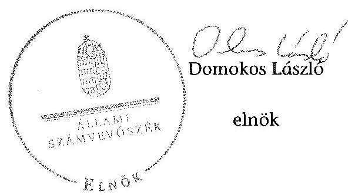

---

# RÖVIDÍTÉSEK JEGYZÉKE 

## Jogszabályok

Áfa tv.
Áht. 1
Áht. 2
Alaptörvény
ÁSZ tv.
Avtv.

Evt. $_{1}$
Evt. 2

Evr. $_{1}$

Evr. 2

Ft
Gt.
Info. tv.

Mfbtv.
Nfatv.

Nvtv.

Ptk
Számv. tv.
új Ptk.
Vadvédelmi tv.
Vtv.

Az általános forgalmi adóról szóló 2007. évi CXXVII. törvény
Az államháztartásról szóló 1992. évi XXXVIII. törvény (hatálytalan: 2012. január 1-jétől)
Az államháztartásról szóló 2011. évi CXCV. Törvény (hatályos: 2011. december 31-étől)
Magyarország Alaptörvényéről szóló 2011. évi CCCCIIV. törvény (hatályos: 2012. január 1-jétől)
Az Állami Számvevőszékről szóló 2011. évi LXVI. törvény
A személyes adatok védelméről és a közérdekú adatok nyilvánosságáról szóló 1992. évi LXIII. törvény (hatálytalan: 2012. január 1-jétől)

Az erdőről és az erdő védelméről szóló 1996. évi LIV. törvény (hatálytalan: 2009. július 10-től)
Az erdőről, az erdő védelméről és az erdőgazdálkodásról szóló 2009. évi XXXVII. törvény (hatályos: 2009. július 10étől)
Az erdőről és az erdő védelméről szóló 1996. évi LIV. törvény végrehajtásáról szóló 29/1997. (IV. 30.) FM rendelet (hatályos: 1997. április 30-ától 2009. november 20-áig)
Az erdőről, az erdő védelméről és az erdőgazdálkodásról szóló 2009. évi XXXVII. törvény végrehajtásáról szóló 153/2009. (XI. 13.) FVM rendelet (hatályos: 2009. november 21-étől)
forint
A gazdasági társaságokról szóló 2006. évi IV. törvény (hatálytalan: 2014. március 15-étől)
Az információs önrendelkezési jogról és az információszabadságról szóló 2011. évi CXII. Törvény (hatályos: 2011. július 27 -étől)
A Magyar Fejlesztési Bank Részvénytársaságról szóló 2001. évi XX. törvény
A Nemzeti Földalapról szóló 2010. évi LXXXVII. törvény (hatályos: 2010. szeptember 1-jétől)
A nemzeti vagyonról szóló 2011. évi CXCVI. törvény (hatályos: 2011. december 31-étől)
A Polgári Törvénykönyvről szóló 1959. évi IV. törvény
A számvitelről szóló 2000 . évi C. törvény
A Polgári Törvénykönyvről szóló 2013. évi V. törvény
A vad védelméről, a vadgazdálkodásról, valamint a vadászatról szóló 1996. évi LV. törvény
Az állami vagyonról szóló 2007. évi CVI. törvény

---

Vhr.

143/2009. (VII.6.) Korm. rendelet
262/2010. (XI.17.) Korm. rendelet
11/2011. (II.22.) Korm. rendelet

## Egyéb rövidítések

| AK érték | Aranykorona érték |
| :-- | :-- |
| Alapító Okirat | A Zalaerdő Zrt. Alapító Okirata |
| Áfa | Általános forgalmi adó |
| ÁSZ | Állami Számvevőszék |
| Belső ellenőrzési sza- | A Zalaerdő Zrt. mindenkori belső ellenőrzési szabályzata |
| bályzat |  |
| Erdészetek | Bánokszentgyörgyi Erdészet, Lenti Erdészet, Letenyei Erdé- |
|  | szet, Nagykanizsai Erdészet, Zalaegerszegi Erdészet |
| Erdészeti Hatóság | Zala Megyei Mezőgazdasági Szakigazgatási Hivatal Erdé- |
| EEVR | szeti Igazgatóság 2010. december 31-éig és a Zala Megyei |
| FB | Kormányhivatal Erdészeti Igazgatóság 2011. január 1-jétől |
| FB Ügyrend1 | Egységes Erdészeti Vállalatirányítási Rendszer |
| Forrás-SQL rendszer | Zalaerdő Zrt. Felügyelő Bizottsága |
|  | A Zalaerdő Zrt. Felügyelő Bizottságának Ügyrendje |
| ha | Az MNV. Zrt. által üzemeltetett, a vagyonnyilvántartásra |
| IG | vonatkozó informatikai rendszer, amelynek feladata volt a |
| INTOSAI | vagyonkezelők számára a vagyonkataszteri jelentés elké- |
| Iratkezelési Szabályzat | szítésének és adathordozón történő továbbításának biztosítása, valamint a tulajdonosi joggyakorló vagyonkezelésé- |
| ISSAI | ben lévő vagyonelemek elektronikus adatbázisban történő |
| JT | tételes nyilvántartása |
| kezelt vagyon feletti tu- | hektár |
| lajdonosi joggyakorló1 | A Zalaerdő Zrt. Igazgatóság (2010. július 12-éig múködött) |
| KVI | Legfőbb Ellenőrző Intézmények Nemzetközi Szervezete |
| Leltározási Szabályzat | A Zalaerdő Zrt. mindenkori Iratkezelési Szabályzata |
| M Ft | mellió forint |
| MFB Zrt. | Magyar Fejlesztési Bank Zártkörűen Működő Részvénytár- |
|  | saság |

---

MNV Zrt.

NVT
NFA
Számítástechnikai Védelmi Szabályzat
Számítástechnikai Fejlesztési és Védelmi Szabályzat
Számviteli politika és értékelési szabályzat
SZMSZ
ST
Társaság/Zalaerdő Zrt. Társaság felett tulajdonosi joggyakorló:

Társaság felett tulajdonosi joggyakorló ${ }_{2}$
Ügyvezetés

Vadászati Hatóság

Vezérigazgató
VSZ

Magyar Nemzeti Vagyonkezelő Zártkörűen Müködő Részvénytársaság, amely 2010. szeptember 1-jétől a Nemzeti Földalapba nem tartozó állami vagyon feletti tulajdonosi joggyakorló
Nemzeti Vagyongazdálkodási Tanács
Nemzeti Földalapkezelő Szervezet
A Zalaerdő Zrt. mindenkori Számítástechnikai Védelmi Szabályzata
A Zalaerdő Zrt. mindenkori Számítástechnikai Fejlesztési és Védelmi Szabályzata

A Zalaerdő Zrt. mindenkori Számviteli politikája és értékelési szabályzata
Zalaerdő Zrt. Szervezeti és Müködési Szabályzata
Saját tőke
A Zalaerdő Zártkörűen Müködő Részvénytársaság
Magyar Nemzeti Vagyonkezelő Zrt., mint a társaság feletti tulajdonosi joggyakorló 2009. január 1-jétől 2010. június 16 -áig
Magyar Fejlesztési Bank Zrt., mint a társaság feletti tulajdonosi joggyakorló 2010. június 17-étől 2014. július 15-éig
A Zalaerdő Zrt. ügyvezetése, feladatát 2010. július 12-éig az Igazgatóság, 2010. július 13-ától az önálló cégjegyzésre jogosult Vezérigazgató látta el
Zala Megyei Mezőgazdasági Szakigazgatási Hivatal Földművelésügyi Igazgatóság 2010. december 31-éig és a Zala Megyei Kormányhivatal Földművelésügyi Igazgatóság 2011. január 1-jétől
A Zalaerdő Zrt. vezérigazgatója
KVI-vel 1996. október 14-én kötött ideiglenes Vagyonkezelési szerződés

---

# **Chemistry**

## **Chemical Reactions**

### **Balancing Chemical Equations**

1. **Write the unbalanced equation:**
   - Example: $$C_3H_8 + O_2 \rightarrow CO_2 + H_2O$$

2. **Balance the equation:**
   - Example: $$2C_3H_8 + 7O_2 \rightarrow 6CO_2 + 8H_2O$$

3. **Balance the equation:**
   - Example: $$2C_3H_8 + 7O_2 \rightarrow 6CO_2 + 8H_2O$$

### **Types of Reactions**

1. **Combination Reaction:**
   - Example: $$2H_2 + O_2 \rightarrow 2H_2O$$

2. **Decomposition Reaction:**
   - Example: $$2H_2O_2 \rightarrow 2H_2O + O_2$$

3. **Single Displacement Reaction:**
   - Example: $$Zn + 2HCl \rightarrow ZnCl_2 + H_2$$

4. **Double Displacement Reaction:**
   - Example: $$AgNO_3 + NaCl \rightarrow AgCl + NaNO_3$$

5. **Combustion Reaction:**
   - Example: $$CH_4 + 2O_2 \rightarrow CO_2 + 2H_2O$$

## **Stoichiometry**

### **Mole Concept**

- **Mole (mol):** The amount of substance containing as many particles (atoms, molecules, ions) as there are atoms in exactly 12 grams of carbon-12.
- **Avogadro's Number:** $$6.022 \times 10^{23}$$ particles per mole.

### **Molar Mass**

- **Molar Mass:** The mass of one mole of a substance.
- Example: The molar mass of water ($$H_2O$$) is 18.015 g/mol.

### **Calculations**

1. **Moles to Mass:**
   - Formula: $$n = \frac{m}{M}$$
   - Example: Calculate the number of moles of $$H_2O$$ in 18 grams of water.
     - $$n = \frac{18.015 \, \text{g}}{18.015 \, \text{g/mol}} = 18.015 \, \text{g/mol}$$

2. **Moles to Mass:**
   - Formula: $$m = n \times M$$
   - Example: Calculate the mass of 18.015 g of water.
     - $$m = 18.015 \, \text{g/mol} = 18.015 \, \text{g/mol}$$

## **Gas Laws**

### **Ideal Gas Law**

- **Equation:** $$PV = nRT$$
- **Variables:**
  - $$P$$: Pressure (atm)
  - $$V$$: Volume (L)
  - $$n$$: Number of moles (mol)
  - $$R$$: Ideal gas constant (0.0821 L·atm/mol·K)
  - $$T$$: Temperature (K)

### **Boyle's Law**

- **Equation:** $$P_1V_1 = P_2V_2$$
- **Variables:**
  - P₁: Pressure (atm)
  - P₂: Volume (L)
  - P₃: Temperature (K)
  - P₁: Pressure (atm)
  - P₂: Volume (L)
  - P₃: Temperature (K)
  - P₁: Pressure (atm)

### **Boyle's Law (Boyle's Law)**

- **Equation:** $$\frac{P_1V_1}{P_2V_2} = \frac{P_2V_2}{T_1} = \frac{P_1}{T_2}$$

## **Thermochemistry**

### **Enthalpy (H)**

- **Definition:** The heat content of a system at constant pressure.
- **Equation:** $$\Delta H = q_p$$
- **Variables:**
  - $$q_p$$: Heat transferred at constant pressure.
  - $$q_p$$: Heat transferred at constant pressure.

### **Hess's Law**

- **Statement:** The enthalpy change for a reaction is the same whether it occurs in one step or multiple steps.
- **Equation:** $$\Delta H = q_p + \Delta H_0$$
- **Variables:**
  - $$q_p$$: Heat transferred at constant pressure.
  - $$q_p$$: Heat transferred at constant pressure.

## **Electrochemistry**

### **Oxidation and Reduction**

- **Oxidation:** Loss of electrons.
- **Reduction:** Gain of electrons.

### **Galvanic Cells**

- **Definition:** A cell that converts chemical energy into electrical energy.
- **Components:**
  - Anode: Oxidation occurs.
  - Cathode: Reduction occurs.
  - Salt Bridge: Connects the two half-cells.

### **Nernst Equation**

- **Equation:** $$E = E^\circ - \frac{RT}{nF} \ln Q$$
- **Variables:**
  - $$E$$: Energy (K)
  - $$E^\circ$$: Standard deviation (M)
  - $$E$$: Number of electrons transferred (R)
  - $$E$$: Energy (K)
  - $$E$$: Number of electron pairs (E)
  - $$E$$: Energy (K)
  - $$E$$: Number of electrons transferred (R)
  - $$E$$: Energy (K)
  - $$E$$: Number of electrons transferred (R)
  - $$E$$: Number of electrons transferred (R)
  - $$E$$: Number of electrons transferred (R)
  - $$E$$: Number of electrons transferred (R)
  - $$E$$: Number of electrons transferred (R)
  - $$E$$: Number of electrons transferred (R)
  - $$E$$: Number of electrons transferred (R)
  - $$E$$: Number of electrons transferred (R)
  - $$E$$: Number of electrons transferred (R)
  - $$E$$: Number of electrons transferred (R)
  - $$E$$: Number of electrons transferred (R)
  - $$E$$: Number of electrons transferred (R)
  - $$E$$: Number of electrons transferred (R)
  - $$E$$: Number of electrons transferred (R)
  - $$E$$: Number of electrons transferred (R)
  - $$E$$: Number of electrons transferred (R)
  - $$E$$: Number of electrons transferred (R)
  - $$E$$: Number of electrons transferred (R)
  - $$E$$: Number of electrons transferred (R)
  - $$E$$: Number of electrons transferred (R)
  - $$E$$: Number of electrons transferred (R)
  - $$E$$: Number of electrons transferred (R)
  - $$E$$: Number of electrons transferred (R)
  - $$E$$: Number of electrons transferred (R)
  - $$E$$: Number of electrons transferred (R)
  - $$E$$: Number of electrons transferred (R)
  - $$E$$: Number of electrons transferred (R)
  - $$E$$: Number of electrons transferred (R)
  - $$E$$: Number of electrons transferred (R)
  - $$E$$: Number of electrons transferred (R)

---

# FOGALOMTÁR 

állami vagyon
állami vagyon
használója
átlátható szervezet
földbirtok-politikai irányelvek
hasznosítás
immateriális szolgáltatásából származó bevétel
információs és kommunikációs rendszer
Kincstári Vagyoni Igazgatóság

Állami vagyon:
a) az állam tulajdonában lévő dolog, valamint dolog módjára hasznosítható természeti erő;
b) az a) pont hatálya alá tartozó mindazon vagyon, amely vonatkozásában törvény az állam kizárólagos tulajdonjogát nevesíti;
c) az állam tulajdonában lévő tagsági jogviszonyt megtestesítő értékpapír, illetve az államot megillető egyéb társasági részesedés;
d) az államot megillető olyan immateriális, vagyoni értékkel rendelkező jogosultság, amelyet jogszabály vagyoni értékű jogként nevesít;
e) az állam tulajdonában lévő pénzügyi eszközök.
Az állami vagyon használója az a természetes vagy jogi személy, jogi személyiséggel nem rendelkező szervezet, aki, vagy amely törvény vagy szerződés alapján, bármely jogcímen (bérlet, haszonbérlet, használat stb.) állami vagyont birtokol, használ, szedi annak hasznait. (Ide nem értve a haszonélvezőt, a vagyonkezelőt és a tulajdonosi jogok gyakorlóját.)
Átlátható szervezet a Nvtv. 3. § (1) bekezdés 1. pontjában felsorolt, a meghatározott követelményeknek megfelelő szervezet.
Az Nfatv. 15. § (3) bekezdés a)-s) pontjaiban meghatározott, a Nemzeti Földalapba tartozó földrészletek hasznosítására vonatkozó irányelvek.
Hasznosítás a tulajdonosi joggyakorló vagy a nemzeti vagyon használója által a nemzeti vagyon birtoklásának, használatának, hasznok szedése jogának bármely - a tulajdonjog átruházását nem eredményező - jogcímen történő átengedése, ide nem értve a vagyonkezelésbe adást, valamint a haszonélvezeti jog alapítását.
Immateriális szolgáltatásból származó bevételek azok a nem anyagjellegű szolgáltatásokból származó állami bevételek, amelyeket az Evt. 3. § (1) bekezdése szerint, a külön jogszabályban meghatározott részletes feltételek szerint, az erdők fenntartására, gyarapítására és védelmére kell fordítani.
Az információs és kommunikációs rendszer biztosítja, hogy az információk eljussanak az illetékes szervezethez, szervezeti egységhez, illetve személyhez.
A Vtv. 61. § (1) bekezdése értelmében a Kincstári Vagyoni Igazgatóság (a továbbiakban: KVI) 2007. december 31-ei hatállyal megszűnt, jogai és kötelezettségei ezen időponttól - a 66. § (1) bekezdésében megjelölt feladat kivételével - az MNV Zrt.-re szálltak. A KVI 66. § (1) bekezdésben foglalt feladata a kincstárra szállt. A jogok és kötelezettségek átszállása nem minősült a KVI által kötött szerződések módosításának.

---

kockázatkezelés
kockázatkezelési rendszer
kontrolling
kontrollkörnyezet
kontrolltevékenységek
közfeladat

A kockázatkezelés a szervezet céljai elérésével kapcsolatos kockázatok azonosításának és elemzésének, valamint a megfelelő válaszok meghatározásának folyamata.
A kockázatkezelési rendszer múködtetése során fel kell mérni és meg kell állapítani a szervezet tevékenységében, gazdálkodásában rejlő kockázatokat, valamint meg kell határozni az egyes kockázatokkal kapcsolatban szükséges intézkedéseket, valamint azok teljesítésének folyamatos nyomon követésének módját. A kockázatkezelési rendszer olyan irányítási eszközök és módszerek összessége, amelynek elemei a szervezeti célok elérését veszélyeztető tényezők (kockázatok) azonosítása, elemzése, nyomon követése, valamint szükség esetén a kockázati kitettség mérséklése.
Az a vezetéstámogató rendszer, amely a vezetői tervezést, ellenőrzést, valamint információ-ellátást koordinálja célorientáltan a környezeti változásokhoz igazodva.
A kontroll környezet elemei: a szervezeti struktúra, a felelősségi, hatásköri viszonyok és feladatok, a szervezet minden szintjén meghatározott etikai elvárások, a humánerőforráskezelés. A kontrollkörnyezet alapozza meg a belső kontroll összes többi elemét a fegyelem és a struktúra biztosítása által.
A kontrollrendszer a kockázatok kezelése és tárgyilagos bizonyosság megszerzése érdekében kialakított folyamatrendszer, amely azt a célt szolgálja, hogy megvalósuljanak a következő célok:
a) a múködés és a gazdálkodás során a tevékenységeket szabályszerűen, gazdaságosan, hatékonyan, eredményesen hajtsák végre,
b) az elszámolási kötelezettségeket teljesítsék, és
c) megvédjék az erőforrásokat a veszteségektől, károktól és nem rendeltetésszerú használattól.
A kontrolltevékenységek azok az elvek (politikák) és eljárások, amelyeket a kockázatok meghatározása és a szervezet céljainak elérése érdekében alakítanak ki.
A közfeladat jogszabályban meghatározott állami vagy önkormányzati feladat, amit az arra kötelezett közérdekből, jogszabályban meghatározott követelményeknek és feltételeknek megfelelve végez, ideértve a lakosság közszolgáltatásokkal való ellátását, továbbá az állam nemzetközi szerződésekben vállalt kötelezettségeiből adódó közérdekű feladatokat, valamint e feladatok ellátásához szükséges infrastruktúra biztosítását is. Az Etv. 2. § (2) bekezdése szerint a fenntartható erdőgazdálkodás során a legfontosabb közérdekű feladat az erdők változatosságának megőrzése, az erdők fenntartása, felújítása és a védelmi, valamint közjóléti szolgáltatások biztosítása, melyek elvégzését az állam megfelelő eszközökkel biztosítja.

---

monitoring

Nemzeti Földalap
nemzeti vagyon használója
rábízott állami vagyon
társasági portfólió

A szervezet tevékenységének, a célok megvalósításának nyomon követését biztosító rendszer, amely az operatív tevékenységek keretében megvalósuló folyamatos és eseti nyomon követésből, valamint az operatív tevékenységektől függetlenül múködő belső ellenőrzésből áll. A monitoring a projektek és programok végrehajtásának nyomon követése, mely a támogató és a kedvezményezett közti megállapodásban foglalt eljárások követését, az előrehaladás ellenőrzését és a lehetséges problémák időben történő azonosítását szolgálja.
A Nemzeti Földalap a kincstári vagyon része, amelybe beletartoznak az állam tulajdonában és az ingatlan-nyilvántartásban levő, az Nfatv. 1. § (1)-(2) bekezdéseiben felsorolt területek, földrészletek és az azokhoz kapcsolódó vagyoni értékủ jogok.
Az Nfatv. 15. § (1) ${ }^{1}$, valamint 1. § (1) ${ }^{2}$ bekezdése értelmében 2010. szeptember 1-jétől az erdőgazdasági társaság vagyonkezelésében lévő földterületek a Nemzeti Földalapba tartoznak, azok felett a tulajdonos jogait az agrárpolitikáért felelős miniszter az NFA útján gyakorolja.
A nemzeti vagyon használója az a természetes személy, jogi személy vagy jogi személyiséggel nem rendelkező szervezet, aki, vagy amely állami vagyon tekintetében törvény vagy szerződés alapján, a helyi önkormányzat vagyona tekintetében törvény, a helyi önkormányzat rendelete vagy szerződés alapján bármely jogcímen nemzeti vagyont birtokol, használ, szedi annak hasznait, kivéve a tulajdonosi joggyakorló (az Nvtv. 3. § (1) bekezdés 11. pontja alapján).
Rábízott állami vagyon az a Vtv. alkalmazásában állami vagyonnak minősülő vagyon, amit az MNV- a saját vagyonától elkülönítetten - kezel és nyilvántart. Az Mfbtv. 3. § (9) bekezdése szerint rábízott állami vagyon az a vagyon, amely felett az Mfbtv. erejénél fogva a Magyar Állam nevében az MFB gyakorolja a tulajdonosi jogokat. Az Nfatv. 1. § (1) bekezdésében foglaltak alapján az NFA-hoz tartozó rábízott vagyon a törvényben meghatározott, a Nemzeti Földalapba tartozó vagyon.
Társasági portfólió az MNV, illetve az MFB rábízott vagyonába tartozó állami tulajdonú társasági részesedések.

[^0]
[^0]:    ${ }^{1}$ Hatályos: 2010. szeptember 1 - 2011. július 31.
    ${ }^{2}$ Hatályos: 2010. szeptember -jétől, módosítva: 2011. augusztus 1-jétől.

---

tulajdonosi ellenőrzés
tulajdonosi joggyakorló
tulajdonosi joggyakorlás módja
vagyongazdálkodás feladata
vagyonkezelői jog

Az MNV/MFB tulajdonosi joggyakorló által végzett ellenőrzés, amelynek célja az állami vagyonnal való gazdálkodás vizsgálata, ennek keretében a rendeltetésellenes, jogszerútlen, szerződésellenes, vagy a tulajdonos érdekeit sértő, illetve a központi költségvetést hátrányosan érintő vagyongazdálkodási intézkedések feltárása és a jogszerű állapot helyreállítása, továbbá a vagyonnyilvántartás hitelességének, teljességének és helyességének biztosítása.
Tulajdonosi joggyakorló az, aki az állami, illetve a nemzeti vagyon felett az államot megillető tulajdonosi jogok és kötelezettségek gyakorlására jogosult.
Az állami vagyon felett a Magyar Államot megillető tulajdonosi jogoknak (és kötelezettségeknek) az összességét az állami vagyon felügyeletéért felelős miniszter gyakorolja, aki e feladatát az MNV, az MFB útján látja el. Azon állami tulajdonban álló ingatlanok felett, amelyek egy része a Nemzeti Földalapba tartozik, a tulajdonosi jogokat a miniszter az agrárpolitikáért felelős miniszterrel közösen gyakorolja. A Nemzeti Földalap felett a Magyar Állam nevében a tulajdonosi jogokat és kötelezettségeket az agrárpolitikáért felelős miniszter a Nemzeti Földalapkezelő Szervezet útján gyakorolja.
Az állami vagyon rendeltetésének megfelelő - az állami feladatok ellátásához, a társadalmi szükségletek kielégítéséhez, valamint a Kormány gazdaságpolitikája megvalósításának elősegítéséhez szükséges, egységes elveken alapuló, önálló ágazatként megjelenő - hatékony, költségtakarékos, értékmegőrző, értéknövelő felhasználásának biztosítása, beleértve a vagyoni kör változását eredményező értékesítést, valamint az állami vagyon gyarapítása is.
Vagyonkezelési szerződés alapján a vagyonkezelő jogosult meghatározott, állami tulajdonba tartozó dolog birtoklására, használatára és hasznai szedésére. A Vtv. alapján a vagyonkezelői jog az állami vagyon hasznosítására az MNVvel kötött vagyonkezelési szerződéssel jön létre. A vagyonkezelési szerződés alapján a vagyonkezelő jogosult meghatározott, állami tulajdonba tartozó dolog birtoklására, használatára és hasznai szedésére. Az Nfatv. alapján a vagyonkezelői jog az erre irányuló (NFA-val kötött) szerződéssel jön létre. A vagyonkezelői szerződés alapján a vagyonkezelő jogosult meghatározott földrészlet birtoklására, használatára és hasznai szedésére. A vagyonkezelő köteles a földrészlet értékét megőrizni, állagának megóvásáról, jó karban tartásáról gondoskodni, továbbá - az Nfatv.-ben meghatározott esetek kivételével díjat - fizetni vagy a szerződésben előírt más kötelezettséget teljesíteni.

---

Zalaerdő Zrt. vagyonváltozásának alakulása a 2009-2013. évek közötti időszakban - Eszközök (M ft)
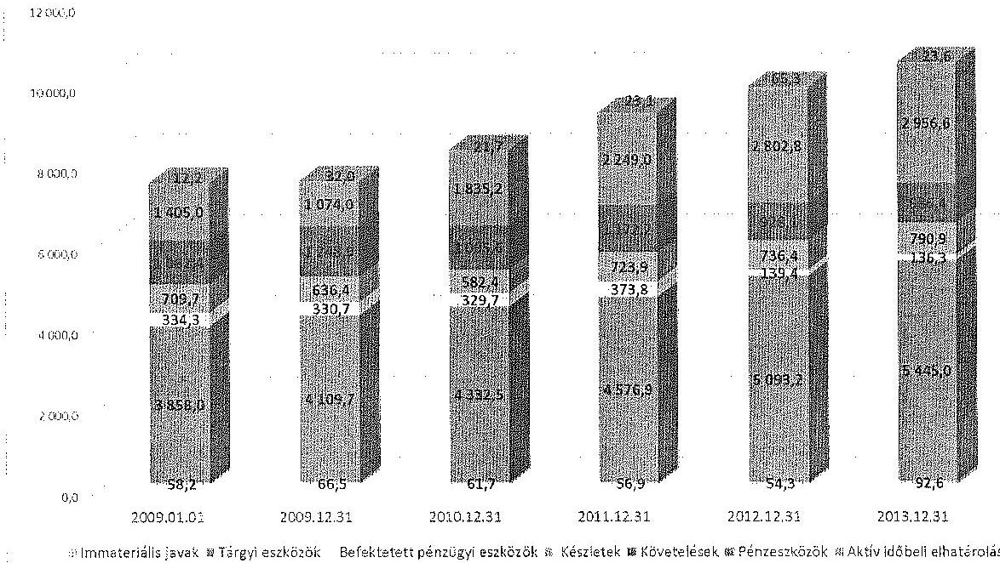

Zalaerdő Zrt. vagyonváltozásának alakulása a 2009-2013. évek közötti időszakban - Források (M ft)
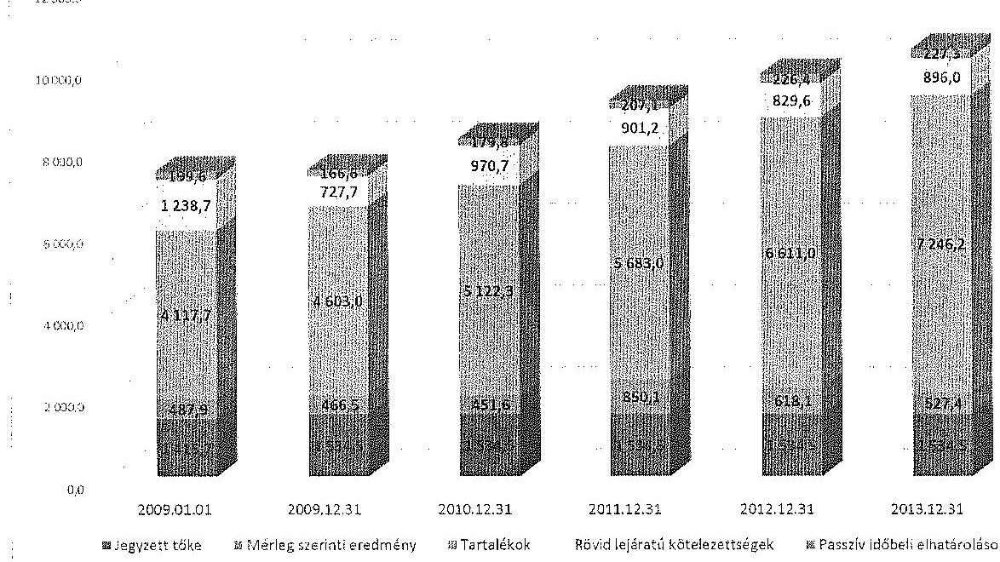

---

A befehterett exekutiv átlományának obvladása

|  Kód | MEGGYEZÉS | 2000. év |  |  | 2010. év |  |  | 2011. év |  |  | 2012. év |  |  | 2013. év |  |  | 2014. év |  |  | 2015. év |  |   |
| --- | --- | --- | --- | --- | --- | --- | --- | --- | --- | --- | --- | --- | --- | --- | --- | --- | --- | --- | --- | --- | --- | --- |
|   |  | Összesen | Élőmet vagyon | Intétt vagyon | Összesen | Élőmet vagyon | Intétt vagyon | Összesen | Élőmet vagyon | Intétt vagyon | Összesen | Élőmet vagyon | Intétt vagyon | Összesen | Élőmet vagyon | Intétt vagyon | Összesen | Élőmet vagyon | Intétt vagyon | Összesen | Élőmet vagyon | Intétt vagyon  |
|   |  | 1. | 2. | 3. | 4. | 5. | 6. | 7. | 8. | 9. | 10. | 11. | 12. | 13. | 14. | 15. | 16. | 17. | 18. | 19. | 20. | 21.  |
|  1. | Nytté állomány | 4 230 438 | 0 | 4 230 438 | 4 106 963 | 0 | 4 106 963 | 4 723 927 | 0 | 4 723 927 | 5 007 648 | 0 | 5 007 648 | 5 286 913 | 0 | 5 286 913 | 5 673 907 | 0 | 5 673 907 |  |  |   |
|  2. | Terv szerinti értékelékosító | 436 838 | 0 | 436 838 | 456 369 | 0 | 456 369 | 440 141 | 0 | 440 141 | 432 078 | 0 | 432 078 | 334 211 | 0 | 334 211 | 277 559 | 0 | 277 559 |  |  |   |
|  3. | Terven felüli értékelékosító | 0 | 0 | 0 | 0 | 0 | 0 | 0 | 0 | 0 | 0 | 0 | 0 | 0 | 0 | 0 | 0 | 0 | 0 | 0 | 0 |   |
|  4. | Széltesetés ráadásához | 0 | 0 | 0 | 0 | 0 | 0 | 0 | 0 | 0 | 0 | 0 | 0 | 0 | 0 | 0 | 0 | 0 | 0 | 0 | 0 |   |
|  5. | Széltesítés | 48 260 | 0 | 48 260 | 25 547 | 0 | 25 547 | 4 874 | 0 | 4 874 | 8 559 | 0 | 8 559 | 16 079 | 0 | 16 079 | 211 | 0 | 211 |  |  |   |
|  6. | Széltesés | 60 205 | 0 | 60 205 | 5 982 | 0 | 5 982 | 4 035 | 0 | 4 035 | 4 574 | 0 | 4 574 | 5 170 | 0 | 5 170 | 428 | 0 | 428 |  |  |   |
|  7. | Átmilódítás | 0 | 0 | 0 | 0 | 0 | 0 | 0 | 0 | 0 | 0 | 0 | 0 | 0 | 0 | 0 | 0 | 0 | 0 | 0 | 0 |   |
|  8. | Segyeses átadás | 0 | 0 | 0 | 0 | 0 | 0 | 0 | 0 | 0 | 0 | 0 | 0 | 0 | 0 | 0 | 0 | 0 | 0 | 0 | 0 |   |
|  9. | Egyéb | 4 435 | 0 | 4 435 | 990 | 0 | 990 | 0 | 0 | 0 | 426 034 | 0 | 426 034 | 5 561 | 0 | 5 561 | 11 318 | 0 | 11 318 |  |  |   |
|  10. | Csehkészítő összesen | 319 766 | 0 | 319 766 | 407 972 | 0 | 407 972 | 411 615 | 0 | 411 615 | 896 015 | 0 | 896 015 | 661 457 | 0 | 661 457 | 209 218 | 0 | 209 218 |  |  |   |
|  11. | Terv szerinti feladrása | 680 739 | 0 | 680 739 | 485 350 | 0 | 485 350 | 679 025 | 0 | 679 025 | 426 320 | 0 | 426 320 | 640 525 | 0 | 640 525 | 79 473 | 0 | 79 473 |  |  |   |
|  12. | Terv szerinti felajátás | 155 540 | 0 | 155 540 | 213 861 | 0 | 213 861 | 191 818 | 0 | 191 818 | 243 400 | 0 | 243 400 | 280 865 | 0 | 280 865 | 60 870 | 0 | 60 870 |  |  |   |
|  13. | Terv szerinti növekedés | 816 277 | 0 | 816 277 | 690 065 | 0 | 690 065 | 670 025 | 0 | 670 025 | 869 010 | 0 | 869 010 | 921 390 | 0 | 921 390 | 140 342 | 0 | 140 342 |  |  |   |
|  14. | Egyéb beruházás | 0 | 0 | 0 | 0 | 0 | 0 | 0 | 0 | 0 | 0 | 0 | 0 | 0 | 0 | 0 | 0 | 0 | 0 | 0 | 0 |   |
|  15. | Egyéb felajátás | 0 | 0 | 0 | 0 | 0 | 0 | 0 | 0 | 0 | 0 | 0 | 0 | 0 | 0 | 0 | 0 | 0 | 0 | 0 | 0 |   |
|  16. | Átmilódítás | 0 | 0 | 0 | 0 | 0 | 0 | 0 | 0 | 0 | 0 | 0 | 0 | 0 | 0 | 0 | 0 | 0 | 0 | 0 | 0 |   |
|  17. | Átmiló | 0 | 0 | 0 | 0 | 0 | 0 | 0 | 0 | 0 | 0 | 0 | 0 | 0 | 0 | 0 | 0 | 0 | 0 | 0 | 0 |   |
|  18. | Széltesetés ráadásához | 0 | 0 | 0 | 0 | 0 | 0 | 0 | 0 | 0 | 0 | 0 | 0 | 0 | 0 | 0 | 0 | 0 | 0 | 0 | 0 |   |
|  19. | Széltesékosító ráadásához | 0 | 0 | 0 | 0 | 0 | 0 | 0 | 0 | 0 | 0 | 0 | 0 | 0 | 0 | 0 | 0 | 0 | 0 | 0 | 0 |   |
|  20. | Egyéb | 0 | 0 | 0 | 2 971 | 0 | 2 971 | 64 510 | 0 | 64 510 | 305 461 | 0 | 305 461 | 27 002 | 0 | 27 002 | 5 284 | 0 | 5 284 |  |  |   |
|  21. | Terven felüli növekedés | 0 | 0 | 0 | 5 971 | 0 | 5 971 | 64 510 | 0 | 64 510 | 305 461 | 0 | 305 461 | 27 065 | 0 | 27 065 | 5 284 | 0 | 5 284 |  |  |   |
|  22. | Növekedés összesen | 816 277 | 0 | 816 277 | 798 936 | 0 | 798 936 | 725 262 | 0 | 725 262 | 1 173 279 | 0 | 1 173 279 | 960 451 | 0 | 960 451 | 146 626 | 0 | 146 626 |  |  |   |
|  23. | Zérő állomány | 4 306 963 | 0 | 4 306 963 | 4 723 927 | 0 | 4 723 927 | 5 067 648 | 0 | 5 067 648 | 5 286 913 | 0 | 5 286 913 | 5 673 907 | 0 | 5 673 907 | 5 525 019 | 0 | 5 525 019 |  |  |   |

---

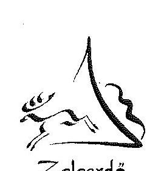

# ZALAERDŐ ZRT. 

ZALAERDŐ ERDÉSZETI ZÁRTKÖRÜEN MÜKÖDŐ RESZVEH
H. 8800 Magykonitsa, Mázsum 49-6. (PC: 201)
Zala Megyei Rémég, Cégbérkag: Cg : 20-10-000075
Telefon: +36 93500209 Fax: +36 93500251 E-mail: zalaerdofzalaerds@t.hu
ZALAERDŐ gAG Zalaerdő gex Erreszete Aktuongeséltschelt for Erszturitschelt
ZALAERDŐ LTD Zalaerdő Foreslty Estéslet Cumpanty

Ügyrinté:Vi.124-18/2015.
Oszóly:
Uslaki: Dr. Nádor László / ME-né
Magykonitsa 2015. október 07.

## Domokos László úr   elnök

## ÁLLAMI SZÁMVEVŐSZÉK

## BUDAPEST

Apáczai Csere János utca 10. 1364

## Tisztelt Elnök Úr!

Az ikt. szám: V-0760-074/2015. számú „Az állami tulajdonban álló erdőgazdasági társaságok vagyongazdálkodási tevékenységének ellenőrzése - Zalaerdő Erdészeti Zrt." címủ számvevőszéki jelentéstervezetre, a ZALAERDŐ Zrt. képviseletében az alábbi észrevételeket teszem.

## - 6. oldal 1. bekezdéshez

Az Ideiglenes Vagyonkezelési Szerződés a vagyonkezelt ingatlanokra vonatkozóan értéket nem tartalmaz, ebből következően a mérlegben sem az eszközök közötti értékkel való szerepeltetésük, sem a források közötti hosszú lejáratú kötelezettségként történő előírás nem lehetséges.
Álláspontunk szerint a vagyonkezelt ingatlanok értékének megállapítása nem a vagyonkezelő kötelezettsége.

## -6. oldal 2. bekezdéshez

Társaságunk az Ideiglenes Vagyonkezelési Szerződés hat mellékletéből hárommal rendelkezik.

- A Vi.109-2/1996. számú ügyirat tanusága szerint a 2-es és 4-es számú melléklet el sem készült. A kezelt vagyon felsorolását tartalmazó 1. sz. melléklet - az 1996. október 14-i állapotú ingatlanjegyzék - rendelkezésünkre áll.

## -6. oldal 4. bekezdéshez

A jogszabály által előírt ingatlan-nyilvántartási adatok változásáról szóló jelentést a ZALAERDŐ Zrt. a tulajdonosi joggyakorló általat előírt módon a FORRÁS Sql. programban teljesítette. Az MNV Zrt. kérésére 2011. évvel az NFA és az MNV Zrt. közti vagyonátadás kapcsán, a két vagyoni kör szétválasztásra került, és az MNV Zrt. által előírt módon, az NFA vagyoni körébe tartozó ingatlanok a FORRÁS Sq1. program adatbázisából kivezetésre kerültek. A Forrás Sql. proram adatbázisa így ezután csak az

---

MNV Zrt. vagyoni körébe tartozó ingatlanok adatait tartalmazta, így az NFA vagyoni körről az adott programban a továbbiakban jelentést nem tudtunk teljesíteni.
Az ingatlan adatok nyilvántartása, ill. változásának követése azonban saját adatbázisunkban továbbra is folyamatosan megtörtént. Az NFA részéről az ingatlannyilvántartási adatok változás jelentésének a módjáról nem kaptunk előírást. Az elmúlt évben az NFA a korábbi évekre vonatkozóan visszamenőleg, éves lebontásban kérte a változások jelentését, amit a kért módon teljesítettünk.

# - 7. oldal 2. és 3. bekezdésekhez 

- Azon megállapításhoz, mely szerint a VSZ módosítását sem a Társaság, sem a tulajdonosi joggyakorló nem kezdeményezte, kérem az alábbiakat is figyelembevenni.
- Az ÁPV Zrt. 2006. október 20-án 14/1305/ÁPV Zrt./2006. úgyszámon küldött, „végleges vagyonkezelési szerződés" tervezetet, melyet Vi.680-3/2006. iktatószámú levelünkben véleményeztük.
- Az MNV Zrt. által 2008. október 22-én előkészített vagyonkezelési szerződéstervezetet a ZALAERDŐ Zrt. 2008. december 9-én, írásban véleményezte Vi.823-2/2008. úgyszámon.
- 2009. június 10-én Vi.511/2009. iktatószámú levelünkben kezdeményeztük a Magyar Nemzeti Vagyonkezelő Zrt.-nél a vagyonkezelési szerződés módosítását.
- 2009. november 04-i dátummal az MNV Zrt. valamennyi erdészeti részvénytársaságra vonatkozó, egységes vagyonkezelési szerződéstervezetet készített, melyet az erdészeti társaságok felkért képviselőiből álló előkészítő bizottság 2010. május 05-én véleményezett, erről „emlékeztető" készült. (2010. május 07-én kaptuk meg az előkészítő bizottság által véleményezett, 2009. november 04-i dátumú vagyonkezelési szerződéstervezetet. Az előkészítő bizottságot a 2010. március 24-i vezérigazgatói értekezleten állították fel, 4 fő MNV Zrt. és 3 fő társasági delegálttal, közös véleményalkotásra, a végleges vagyonkezelési szerződés tekintetében.)
- Az NFA-val kötendő vagyonkezelési szerződéstervezetet (készült 2014. május hónapban) az MFB Zrt. Agrár Vagyonkezelési Igazgatósága - a Társaságunk nevében is - véleményezte.

A fentiek alapján, mind a vagyonkezelésbe adók, mind pedig Társaságunk, több alkalommal kezdeményezte az ideiglenes vagyonkezelési szerződés módosítását, több alkalommal új, egységes szerkezetű tervezet is készült, megkötésre egyik sem került, ez azonban - álláspontunk szerint - nem Társaságunk mulasztása.

Tájékoztatjuk arról is, hogy a vizsgált időszakban - 2009-2013. években - a Társaság Alapító Okiratában, majd Alapszabályában is az egyedüli részvényes, illetve az Alapító kizárólagos hatáskörébe tartozott az alábbi: „döntés az állami erdőterületek kezelésére vonatkozó vagyonkezelési szerződés megkötéséről, módosításáról".
Ezzel az Alapító a vagyonkezelési szerződés módosításának jogát, és értelemszerüen kötelezettségét is, magához vonta.

A vagyonkezelési díjak felülvizsgálatát álláspontunk szerint nem nekünk kellett kezdeményezni.

## - 8. oldal 3. bekezdéshez

A Társaság könyvvizsgálójának véleményét mellékeljük.

---

# - 8. oldal 4. bekezdéshez 

Téves az a megállapítás, hogy ,,a VSZ-ben elöirt, az erdővagyonról és annak változásáról készitett beszámoló az ellenörzött idöszakban nem állt rendelkezésre."
A Társaság az Ideiglenes Vagyonkezelési Szerződés 3.9. pontja szerinti „Ágazati lap" és 3.10. pontja szerinti írásos beszámoló készittési kötelezettségének évente eleget tett.

## -28. oldal 4. - 29. oldal 1. bekezdéshez

Az MNV Zrt. Belső Ellenörzési Iroda által 2009. szeptember 28-án lezárt, ,,Jelentés a Zalaerdö Erdészeti Zrt. devizaügyleteinek vizsgálatáról" készített jelentés a Társaság konkrét devizaügyleteit nem minösítette szabálytalannak. Kifogások a befektetési keretszerződésekkel szemben merültek fel.
A devizaügyleteken elért nyereség a vizsgálat megállapítása szerint $30,3 \mathrm{M} \mathrm{Ft}$ volt, szemben a jelentéstervezetben szereplő $44,8 \mathrm{M}$ Ft-tal.

A jelentéstervezet véglegesítése során kérem a fentieket figyelembevenni szíveskedjen.
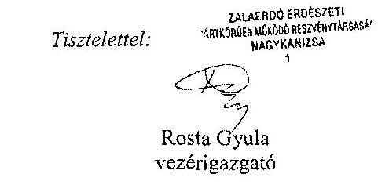

---

# ZALAERDŐ Zrt. 

Rosta Gyula úr
vezérigazgató

## Nagykanizsa

Múzeum tér 6.
8800

Tárgy: Észrevétel az Állami Számvevőszék ellenőrzési jegyzőkönyvére

Tisztelt Vezérigazgató Úr!
A Zalaerdő Erdészeti Zártkörüen Müködő Részvénytársaság az Állami Számvevőszéknek a Részvénytársaság vagyongazdálkodásának ellenőrzéséről készült jegyzőkönyv-tervezet I. Összegző megállapítások, következtetések, javaslatok részében foglaltak könyvvizsgálatra vonatkozó részéről a következők szerint tájékoztatott.

A jegyzőkönyv-tervezet szerint megállapításra került: „A könyvvizsgáló minden évben hitelesitő záradékkal látta el a Társaság éves beszámolóit, annak ellenére, hogy a Társaság a kezelésében levő vagyonelemeket a Számv. tv. rendelkezései ellenére a mérlegben nem szerepeltette, ezáltal az nem a valós képet mutatta."

A Részvénytársaság vagyongazdálkodásának számvevőszéki ellenőrzés jegyzőkönyvi megállapítására észrevételeim a következők:
1 .
A Társaság a Kincstári Vagyoni Igazgatósággal 1996. október 14-én Ideiglenes Vagyonkezelői Szerződést kötött, amelyben a Társaság részére vagyonkezelésbe adott eszközök (állami erdők) érték nélkül szerepelnek.
2 .
A számviteli törvény 23. § (2) bekezdése előírja „A vagyonkezelőnél a mérlegben eszközként kell kimutatni -a törvényi rendelkezés, illetve felhatalmazás alapján- kezelésbe vett az állami ...... vagyon részét képező eszközöket is. Ezen eszközöket a kiegészítő mellékletben -legalább mérlegtételek szerinti bentásban- be kell mutatni."
3.

A számviteli törvény 42. § (1) bekezdése előírja „Kötelezettségek azok a ...... egyéb szerződésekből eredő pénzértékben kifejezett, elismert tartozások, amelyek ..... valamint az állami és önkormányzati vagyon részét képező eszközök -törvényi rendelkezés és felhatalmazás alapján történő- kezelésbevételéhez kapcsolódnak."
4.

A Részvénytársaság az Ideiglenes Vagyonkezelői Szerződésben érték nélkül vagyonkezelésbe vett eszközöket a számviteli törvény 23. § (2) bekezdés szerint eszközként, illetve a 42. § (1) bekezdés alapján kötelezettségként az éves beszámolóban, a mérlegben kimutatni nem tudta.

---

5. 

A számviteli törvény 155. § (1) alapján a könyvvizsgálat célja annak megállapítása, hogy az éves beszámoló a számviteli törvény elöírásai szerint készült el, a Részvénytársaság vagyoni és pénzügyi helyzetéről, a müködés credményéről megbízható és valós képet mutat.
6 .
Az a könyvvizsgálói véleményem, hogy az Ideiglenes Vagyonkezelési Szerződés szerint a Részvénytársaság a vagyonkezelésbe vett érték nélküli eszközöket a számviteli törvény elöírásai szerint mutatta ki. Ezt a véleményemet alátámasztja a PM Számviteli Főosztályának 9806/1997. számú, 1997. november 25-i szakmai tránymutatásában foglaltak is, amelyet mellékelten csatolok.
7.

A független könyvvizsgálói jelentésem szerinti véleményemet (záradékot) fenntartom. Az a véleményem, hogy a Részvénytársaság éves beszámolói a vagyoni és pénzügyi helyzetről, a müködés credményéről megbízható és valós képet mutat.

A Részvénytársaság vagyongazdálkodási tevékenységének számvevőszéki ellenőrzésről készült jegyzőkönyvi tervezet megállapításához megjegyzem, hogy a tulajdonos nevében eljáró szervezet az Ideiglenes Vagyonkezelői Szerződés megkötésekor, az eszközök érték nélküli vagyonkezelésbe adásánál vélelmezhetően mérlegelte az erdőgazdálkodás szakmai sajátosságait, az eszközök és a kötelezettségek értéken történő kimutatásából eredő „torz" üzleti megítélést, az ebből eredő kedvezőtlen vagyoni és jövedelmezőségi következtetések levonását, az erdővagyon - az élőfaállomány- értékének folyamatos változását, valamint a számviteli törvény tartalom elsődlegessége a forma felett, a költség -haszonösszevetésének, valamint a világosság számviteli elveinek a betartása.

Kérem a Részvénytársaság vagyongazdálkodásának számvevőszéki ellenőrzés jegyzőkönyvi tervezet megállapítására tett észrevételem szíves tudomásulvételét.

Nagykanizsa, 2015. október 7.

Tisztelettel:
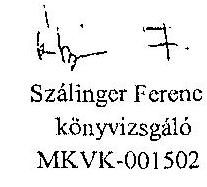

---

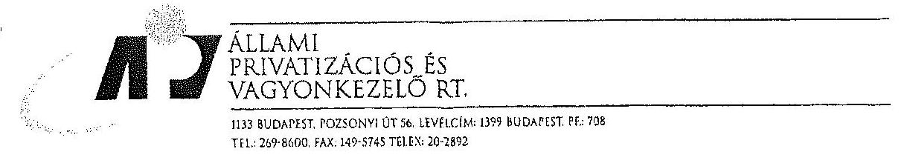

Agrárgazdasági Ügyvezető Igazgatóság Ikt. sz.: 674/410./ÁPV Rt./97.
Dátum: 1997. december 9.

Dobó István úrnak
vezérigazgató
Pilisi Parkerdőgazdaság Rt.
2025 Visegrád, Pf. 3.

Tisztelt Vezérigazgató Úr!

A Kincstári Vagyoni Igazgatóság az ÁPV Rt-vel együttesen kezdeményezte a Pénzügyminisztériumnál a számviteli törvény 21. §-ának módosítását, amely jogszabályi előirás a vagyonkezelő mérlegében rendeli el kimutatni a vagyonkezelésbe vett, a kincstári vagyon részét képező eszközöket a hosszú lejáratú kötelezettségekkel szemben.

Megkereséstinkre a Pénzügyminisztérium a mellékelt állásfoglalást adta ki, melyet szíves tájékoztatásul megküldök.

Üdvözlettel,

---

# PÊNZÜGYMINISZTÉRIUM 

1051 BUDAPEST, JÓZSEF NÁDOR TÉR 2-4.
Postacim: 1368 Budapest, Postafíó 481
Telefon: 118-2066 Telefax: 118-2570
Számviteli Főosztály
$9806 / 1997$.
NG-1129/97.

Zárgy: A kincstári vagyon azám viteli elszámolása a va. gyonkezelónél.

Állami Privatizációs és Vagyonkezeló Rriponves
DR. KOCSIS ISTVÁN ur
vezérigazgató-helyettes

Budapest

Az államháztartásról szóló 1992. évi XXXVIII. törvény 109/6 3ának /1/ bekezdése elóirja, hogy "A vagyonkezelói jog jogosult:ját - ha jogszabály másként nem rendelkezik - megilletik a tulajdonos jogai, és terhelik a tulajdonos kötelezettségei - ideértve a számvitelról szóló 1991. évi XviII. törvény szerinti könyvvezetési és beszámolókészítési kötelezettséget is - azzal, hogy a vagyont ..."

Ennek a törvényl követelménynek a hatására kellett módosítani 1996. január 1-jével a számviteli törvényt, kiegészítve a levelében idézett 21. §/3/ bekezdéssel, amely szerint "/3/ A vagyonkezelónél a mérlegben eszközként kell kimutatni a kezelésbe vett, a kincstári vagyon részét képező - az /1/ bekezdés szerinti eszközöket is a hosszulejáratu kötelezettségekkel szemben ..."

A számviteli törvény ezen módosításának elókészítése során is ismert volt az a vélemény, amelyet Onök az átiratukban megfogalmasnak, hogy a kincstári vagyon bevitele a hosszulejáratu kötele-

---

zettségek közé torz képet ad a vállalkozások vagyoni, illetve forrás helyzetéről, hogy a kincstári kirdőt kezelo erdógazdasági részvénytársaságok esetében a saját vagyonhoz viszonyítottan tízezeresét meghaladó a hosszulejáratu kötelezettségek állománya, amely a hitelképesség megitélésénél gondot jelenthet.

A vélemény ezzel kapcsolatosan akkor is az volt, hogy a torz képet az okosna, ha a vagyonkezeló mérlegében a vagyonkezelésbe vett eszközök állománya nem jelenne meg, mivel akkor nem lenne benne az az eszköztömeg, amellyel a vagyonkezeló a tevékenységét folytatja, amelyre a tevékenysége irányul. Ugyanakkor ezek az eszközök a kínostár tulajdonát képezik, igy nem jelenhetnek meg a vagyonkezeló saját vagyonában.

A hitelképesség megitélése-a hitelintézet részéről nem egyetlen - a tartalmatól független - tényező mérlegben való megjelentetésétól függ, a véleménykialakítása nemosak ezen alapazik.

A számviteli törvény 21. §-ának /3/ bekezdése szerinti rendelkezés elhagyását, a törvény ilyen irányú módosítását nem tartom indokoltnak, mivel a mellette felhozott érvek a törvénybeiktatáskor is ismertek voltak, azokban érdemi változás az eltelt idó alatt nem következett be.

A azámviteli törvény 21. §-ának /3/ bekezdésében megfogalmazott elóirás feltételezi, hogy a kezelt kincstári vagyon megfeleló módon, dokumentálton értékelésre kerül, hiszen csak ez esetben lehet azt az eszközök és a kötelezettségek között értékel ki; mutatni. Ebből - természetesen - az is következik, amig megfelel6 értékelés nem áll rendelkezésre, vagy az adott kínostári vagyont nem lehet - természeténél fogva - értékelni, addig / és akkor/ nem lehet /nem tudjuk/ alkalmazni a törvény hivatkozott 21. §/3/ bekezdésének rendelkezését sem.

---

Nem számviteli kérdés, hogy a kincstári vagyon elóbbiek szerinti értékelése mikor készíthet 6 el, egyáltalán elkészül-e, továbbá az sem, hogy a vagyonkezelési szerzôdésben a szerzôdó felek megjelölik-e vagy sem a kezelésbe adott kincstári vagyon értékét. A számviteli törvény 21. §-a /5/ bekezdésének alkalmazása alól felmentést még átmenetileg sem achatunk.

Budapest, 1997. novenber 25.
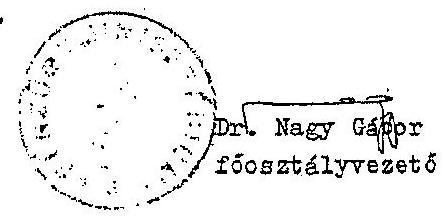

---

.

---

# Rosta Gyula úr 

vezérigazgató
Zalaerdő Erdészeti Zrt.

## Nagykanizsa

## Tisztelt Vezérigazgató Úr!

A ,, Jelentéstervezet az állami tulajdonban álló erdőgazdasági társaságok vagyongazdálkodási tevékenységének ellenőrzése - Zalaerdő Erdészeti Zrt." címmel készített számvevőszéki jelentéstervezetre tett észrevételeit köszönettel megkaptam.

Az Állami Számvevőszék észrevételekre vonatkozó álláspontjáról a felügyeleti vezető által készített részletes tájékoztatást csatoltan megküldöm.

Tájékoztatom Vezérigazgató urat, hogy a számvevőszéki jelentésben - az Állami Számvevőszékről szóló 2011. évi LXVI. törvény 29. § (3) bekezdése alapján - a figyelembe nem vett észrevételeket szerepeltetjük az elutasítás indokénak feltüntetésével.

Budapest, 2015. hó 02. nap
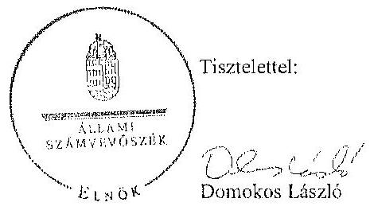

Melléklet: Tájékoztatás az elfogadott és az el nem fogadott észrevételekről

---

# Tájékoztatás   az elfogadott és az el nem fogadott észrevétclekröl 

A ,, Jelentéstervezet az állami tulajdonban álló erdögazdossági társaságok vagyongazdálkodási tevékenységének ellenörzése - Zalaerdő Erdészeti Zrt." címü jelentéstervezetre 2015. október 9-én érkezett észrevételeit áttekintettük, azok kezelésével kapcsolatban a következő tájékoztatást adom.

## 1. A jelentéstervezet 6. oldal 1. bekezdésére tett észrevétel

Az állami vagyonnal való gazdálkodásról szóló 254/2007. (X. 4.) Korm. rendelet (továbbiakban: Vhr.) 9. § (9) bekezdés a) pontja alapján a vagyonkezelő köteles a vagyonkezelésbe vett eszközöket a számviteli törvény szerint a hosszú lejáratú kötelezettségekkel szemben a vagyonkezelési szerződésben rögzített értéken állományba venni. Az ideiglenes vagyonkezelési szerződésben (továbbiakban: VSZ) a vagyonkezelésbe adott vagyon értékét nem rögzítették, továbbá a szerződés azt sem tartalmazta, hogy a vagyonkezelt eszközök értéke nulla. A Társaság a számvitelről szóló 2000. évi C. törvény (továbbiakban: Számv. tv.) 23. § (2) bekezdésében és a Vhr. 9. § (9) bekezdés a) pontjában foglalt előírások betartása céljából nem tett lépéseket annak érdekében, hogy a vagyonkezelt eszközök értéke a VSZ-ben rögzítésre kerüljön. Megállapításunk helytálló, módosítása nem indokolt.

## 2. A jelentéstervezet 6. oldal 2. bekezdésére tett észrevétel

A Társaság nem bocsátott az ellenőrzés rendelkezésére olyan dokumentumot, amely a VSZ 1. számú mellékleteként egyértelműen beazonosítható volna.

## 3. A jelentéstervezet 6. oldal 4. bekezdésére tett észrevétel

A kezelt vagyonra vonatkozó adatszolgáltatási kötelezettség teljesítéséről adott tájékoztatásukat köszönjük. Az észrevételben leírtak szerint a Zalaerdő Erdészeti Zrt. a 262/2010. (XI. 17) Korm. rendelet 50/A. § (1)-(2) bekezdésében előírtak ellenére az NFA részére az ellenőrzött időszakban adatszolgáltatást nem teljesített. A jelentéstervezet megállapítása helytálló, módosítása nem szükséges.
4. A jelentéstervezet 7. oldal 2. és 3. bekezdésekre tett észrevétel

A rendelkezésre álló dokumentumok ismételt áttekintését követően a jelentéstervezet 7. oldal 2. bekezdés 3. mondatát, valamint 16. oldal 4. bekezdés 3. mondatát törölttük.

---

# 5. A jelentéstervezet 8. oldal 3. bekezdésére tett észrevétel 

A Számv. tv. 23. § (2) bekezdés alapján a vagyonkezelőnél a mérlegben eszközként kell kimutatni a - törvényi rendelkezés, illetve felhatalmazás alapján - kezelésbe vett, az állami vagy önkormányzati vagyon részét képező eszközöket is. A Társaság mérlege nem tartalmazta a vagyonkezelt eszközök értékét, ezt a könyvvizsgáló nem kifogásolta. Megállapításunk helytálló, módosítása nem indokolt.

## 6. A jelentéstervezet 8. oldal 4. bekezdésére tett észrevétel

A VSZ 3.10. pontjában elöírt, az erdővagyonról és annak változásáról az NFA részére készített írásos beszámoló nem áll az ellenőrzés rendelkezésére, a megállapítás módosítása nem indokolt.
7. A jelentéstervezet 28. oldal 4. bekezdésére és 29. oldal 1. bekezdésére tett észrevétel

A jelentéstervezet az MNV Zrt. Belső Ellenőrzési Irodájának ellenőrzési jelentése és az igazságügyi szakértő által adott vélemény megállapításának megfelelően tartalmazza a keretszerződésekhez kapcsolódó szabálytalanság bemutatását. Az egyértelműség érdekében a jelentéstervezet 28. oldal 4. bekezdésének 2-4. mondatát az alábbiak szerint pontosítjuk:
„A tulajdonosi joggyakorlóı a belső ellenőrzés által, valamint igazságügyi szakértőnek adott megbizás alapján a Társaság devizaügyleteit, az ügyletekre vonatkozó keretszerzödéseket, a kapcsolódó kötelezettségvállalásokat és döntéseket ellenörizte. Mind a tulajdonosi, mind a külső szakértöi ellenőrzések megállapitották, hogy az akkor hivatalban levő vezérigazgató, illetve a menedzsment az alapitó okiratban biztositott hatáskörét túllépve kötött keretszerzödéseket. A Társaságnak a szabálytalanul megkötött keretszerzödésekhez kapcsolódó befektetései alapján 30,3 M Fi nyeresége keletkezett."

Budapest, 2015. 11. hó 12. nap
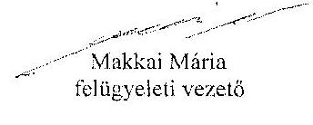

---

.

---

# 7. SZÁMÚ MELLÉKLET A V-0760-093/2015. SZÁMÚ JELENTÉSHEZ 

## 0-0760-093/2015.

## MNV

## SZAMÚNNASZTU

V. 2015. 2016. 2017.

## Állami Számvevőszék

## Domokos László

elnök

1052 Budapest
Apáczai Cs. J. u. 10.
lkt. sz.: MNV/01/47956/ f /2015.
Hiv. sz.: V-0760-076/2015.

Tisztelt Elnök Úr!
A 2015. szeptember 28. napján „Az állami tulajdonban álló erdőgazdasági társaságok vagyongazdálkodási tevékenységének ellenörzése - Zalacrdő Erdészeti Zrt." tárgyában közhez vett, V-0760-076/2015. ikt. sz. Jelenéstervezetre az alábbi észrevételeket kivánom tenni.
L. fejezet / 9. old. harmadik-negyedik bekezdés, 10. old. első-második bekezdés, II.5. fejezet / 29. old. negyedik bekezdés és 10. old. Javaslat sz.MNV Zrt. vezérigazgatójának, a)-c) pontok
..A vagyonkezelésbe adott állami vagyon tekintetében tulajdonosi jogokat gyakorló MNV Zrt. és NFA tevékenysége az ellenörzött időszakban nem támogatta teljes körüen a felelős vagyongazdálkodás megvalósulását, a VSZ-szel kapcsolatban felhirt hiányosságok megszüntetésére és a hatályos jogszabályoknak való megfeleltetésére vonatkozóan nem kezdeményeztck intézkedéseket. A vagyonkezelésbe adott állami vagyon tekintetében tulajdonosi jogokat gyakorló MNV Zrt. és NFA nem végeztek a Vhr.-ben és a Nemzeti Földalapba tartozó földrészletek hasznosításának részletes szabályairól szóló 262/2010. (XI.17.) Korm. rendeletben foglalt, a vagyonnyilvántartás hitelességére és teljességére vonatkozó ellenörzést a Társaságnól.

Az ellenörzött időszakban a Zalacrdő Zrt. a Magyar Állam tulajdonában álló erdővagyon és egyéb múrelési ágú termöföld ingatlanok kezelését a KVI-rel 1996. november 1-jén kötött vagyonkezelési szerzödés alapján végezt. A Társaság, mint vagyonkezelő és a KVI között létrejött szerzödéses jogviszony kereteit a VSZ-ben foglalt jogok és kötelezettségek töltötték ki. A VSZ nem támogatta megfelelően és számon kérhető módon az állami vagyonnal való szabályszerű gazdálkodást. A VSZ 2009. január 1-jén hatályon kívül helyezett jogszabályt hivatkozásokat tartalmazott az Áht. 109/B. §. az Áht. 109/G. § és a Vadvédelmi. te. 98. § rendelkezései vonatkozásában és nem tartalmazta a Vhr., az Evt., a Nvtr. és az Nfatv. elöírásaira történő hivatkozást. A VSZ 3.2.3. pontja lehetőséget biztosít a vagyonkezelőnek a vagyonkezelői jog átruházására, valamint a 3.12.2. pontja az erdő használati jogának átengedésére, azonban a rendelkezések ellentétesek az Evt., 9. § (3) bekezdésében, valamint az Nfatv. 19/A. § (4) bekezdésében foglaltukkal, melynek értelmében az erdő használata, hasznositása, vagyonkezelői jog harmadik személynek nem engedhető át. A VSZ 3.3.2. pontjában foglaltuk ellenére a szerződést évente nem vizsgálták felül, azt a felek nem kezdeményezték. A felek nem tettek eleget a Vhr. 54. § (7) bekezdésében foglalt rendelkezésnek és a Vhr. hatálybalépését követő hat hónapon belül nem kezdeményezték a Nemzeti Földalapba tartozó ingatlanokra vonatkozóan a VSZ megszüntetését és a Vtv., illetve Vhr. szabályainak megfelelő szerződés megkötését.

A vagyonkezelésbe adott állami vagyon tekintetében tulajdonosi jogokat gyakorló MNV Zrt. és NFA nem végeztek a Vhr. 20. § (1)-(2) bekezdéseiben és a Nemzeti Földalapba tartozó földrészletek hasznosításának részletes szabályairól szóló 262/2010. (XI.17.) Korm. rendelet 47. § (1)-(2) bekezdéseiben foglalt, a vagyonnyilvántartás hitelességére és teljességére vonatkozó ellenörzést a Társaságnól.

---

# Javaslat az MNV Zrt. vezérigazgatójának 

a) Tegyen intézkedéseket az erdőgazdasági társaság közremüködésével a tényleges állapotot rögzitő és a hatályos jogszabályi elöírásoknak megfelelő vagyonkezelési szerzödés megkötésére.
b) Tegyen intézkedéseket a vagyonkezelési szerzödés felülvizsgálatának elmaradásával, valamint a Nemzeti Földalapba tartozó ingatlanokra vonatkozó VSZ megszüntetésével összefüggésben feltárt szabálytalanságok tekintetében a felelősség tisztázása érdekében, és szükség szerint intézkedjen a felelősség érvényesitéséről.
c) Intézkedjen a Társaság vagyonnyilvántartása hitelességének, teljességének és helyességének jogszabályban foglalnak szerinti ellenörzéséről."

Sajnálattal állapítottuk meg, hogy a Jelentés-tervezet egyáltalán nem veszi figyelembe a vizsgált időszakban megindított és több eljárási cselekményt is magába foglaló intézkedés-sorozatunkat, amelynek a célja a Jelentéstervezetben egyébiránt joggal kifogásolt hiányosságok megszüntetése, az erdőgazdasági társaságok müködésének jogszabályi megfelelőségének biztosítása volt. Ezzel a Jelentés-tervezet azt sugallja, hogy a tulajdonosi joggyakorlók részéről egyáltalán nem volt szándék az erdőgazdasági társaságok müködésének, illetve a vagyonkezelés körülményeinek hatályos jogszabályok szerinti szabályozására, amely egyébiránt nem felel meg a valóságnak és az adatszolgáltatásunk során sem erről tájékoztattuk Önöket.
Mindamellett elismerjük, hogy a probléma a kezelt vagyonelemek nagy száma, ebből kifolyólag a szabályozást igénylő körülmények nagy száma és sokrétüsége miatt nehezen átlátható, ezért kérjük, engedjék meg, hogy a munkájukat segítő szándékkal korábbi tájékoztatásunkat ismételten megerősítsük, azzal a kifejezett kéréssel, hogy a Jelentésükben az általunk vitatott megállapítást szíveskedjenek módosítani, és az MNV Zrt. által a megoldás irányába megtett intézkedéseket feltüntetni.
Az ideiglenes vagyonkezelési szerződéseken alapuló kezelői jogviszony újraszabályozása, az ideiglenes vagyonkezelési szerződések megszüntetése és végleges vagyonkezelési szerződések megkötése érdekében az intézkedéseink már 2011. évben megkezdődtek, párhuzamosan a Nemzeti Földalapról szóló 2010. évi LXXXVII. (v. 34. § (3) bekezdés c) pontja szerinti feladat- illetve vagyonátadással.

Az intézkedéseink alapja a 2011. évben, MNV/01/29518/2011. szám alatt szakterületünk által bekért, az erdőgazdasági társaságok 2010. december 31-i, illetve 2011. július 31-i fordulónapra vonatkozó leltárjelentése volt, amelyet elsődlegesen az NFA tv. szerint előírt vagyonátadás elvégzése céljából kértünk meg az erdőgazdasági társaságoktól. Ugyanakkor a leltárjelentéshez benyújtott földrészlet listák voltak az első olyan kimutatások, amelyek a kezelt vagyon elemeit a FÖMI adatbázisán alapuló (az aktuális ingatlan-nyilvántartási állapotnak megfelelően) alrészletes bontásban tartalmazzák.

## A vizsgált időszakban meginditott és lefolytatott intézkedéseink a következők:

1. Az erdőgazdasági társaságok által kezelt vagyonelemek tulajdonosi joggyakorlók szerinti elhatárolása, NFA átadás előkészítése, az erdőgazdasági társaságok bevonásával. A Nemzeti Földalapba tartozó vagyonelemek NFA átadása 2012-2013. években megtörtént, majd a visszamaradt vagyonelemek - többségében kivett megnevezésben nyilvántartott földrészletek - elhatárolását is elvégeztük. A feladat végrehajtása 2014. május 31-ig teljesült.
Az intézkedéssel az MNV Zrt. tulajdonosi joggyakorlása alá tartozó vagyonelemek körét - a közös tulajdonosi joggyakorlás alatt álló ingatlanok kivételével -, azaz a végleges vagyonkezelési szerződések ingatlanlistáit meghatározóak.
Meg kívánjuk jegyezni, hogy az erdőgazdasági társaságok a 2011. évi leltárjelentéseikhez minden esetben csatolták a jelentés tartalmára vonatkozó teljességi nyilatkozatukat is, így azok tartalmát mint teljes körű adatszolgáltatást kezeltük.
A hivatkozott iratokat az eljárás során a Tisztelt Állami Számvevőszék rendelkezésére bocsátottuk.
2. Az erdőgazdasági társaságok által kezelt vagyon értékelését 2014. május 31-ig elvégeztük, részben külső pisci szereplő által megállapított vagyonértékelési adatok (az IFUA értékbecslési adatai), részben belső szakértők és a kontrolling szakterület által az MNV Zrt. hatályos értékelési szabályzata által megállapított értékadatok figyelembe vételével.

---

3. Az MNV Zrt. Igazgatósága 511/2012. (X. 08.) IG sz., valamint 717/2013. (IX. 23.) IG sz. határozataiban Intézkedési terveket fogadott el „a 28/2012. (IX. 24.) sz. RIGY határozatában clőirt, valamint az MNV Zrt. rábízott vagyon 2012. évi beszámolója könyvvizsgálói minősitésének megtartásához szükséges és egyéb feladatokról". Az Intézkedési tervek magukban foglalták az erdőgazdasági társaságok által kezelt vagyon analitikájának elóállítását, illetve az erdőtársaságokkal végleges (nem ideiglenes) vagyonkezelői szerződések megkötését. A 717/2013. (IX. 23.) IG sz. határozat melléklete tartalmazza a feladat végrehajtása érdekében már megtett intézkedéseket (pl. „Megtörtént az erdőgazdaságok által kezelt vagyon listáinak vagyonkezelői jelentésekkel való egyeztetése; a vagyonkezelési szerződés tartalmi kérdéseinek, az erdőgazdaságok véleményének feldolgozása, MFB Munkacsoport egyeztetések történtek stb.), valamint rögzíti a még elvégzendő feladatokat. Ennek megfelelően az MNV Zrt-nél 2012-tól folyamatban van az erdőgazdasági társaságok vagyonanalitikájának elóállítása és vagyonkezelési szerződései tárgyú projekt.
A hatályos jogszabályoknak megfelelő vagyonkezelési szerződés tervezetét a vizsgálati időszak során az MNV Zrt. belső szakterületi egyeztetést követően előkészítettük, és a 2014. március 18-án megtartott Munkacsoport értekezleten az erdőgazdaság képviselőivel, továbbá a tulajdonosi joggyakorlók (NFA, illetve akkor még Magyar Fejlesztési Bank Zrt.) képviselöivel ismertettük annak tartalmát. A szerződés szövegtervezetének véleményezése ekkor megkezdődött, ugyanakkor elismerjük, hogy a végleges szerződésváltozat már az Önök által vizsgált időszakot követően került elfogadásra. Ugyancsak a 2014. március 18-án megtartott Munkacsoport értekezleten tettünk javaslatot a vagyonkezelési dí alapjának és mértékének meghatározására.
4. Az erdőgazdasági társaságok által kezelt és a saját vagyonuk vagyonelemenkénti, valamint a kezelt vagyonetemek tulajdonosi joggyakorlók szerinti elhatárolására vonatkozó intézkedésünket a vizsgált időszakban előkészítettük.

Tájékoztatjuk továbbá Elnök Urat az alábbiakról:
A Nemzeti Fejlesztési Minisztérium KGTF/377-6/2014-NFM, valamint KGTF/377-7/2014. számok alatt adott utasításokat a fenti feladatok elvégzésére. Ezekről, illetve az utasításokra adott jelentésünkről a korábbi adatszolgáltatásunk keretében szintén kitértünk.

A vagyonkezelési szerződés vizsgált időszakot követően elfogadott tervezetének mellékletét képezik az MNV Zrt. azon szabályzatai is, amelyek a kezelt vagyon nyilvántartását, a beruházások nyilvántartását és az azzal kapcsolatos elszámolásokat, illetve a tulajdonosi ellenőrzéssel kapcsolatos, a jelenlegi jogszabályi környezetnek megfelelő szabályokat tartalmazzák:

- Az állami tulajdonon, egyéb vagyonkezelők által vagyonkezelt eszközön megvalósítandó beruházások, felújítások előzetes engedélyezésének és elszámolásának eljárásrendjéről szóló 35/2014. számú vezérigazgatói utasítás,
- A Magyar Nemzeti Vagyonkezelő Zrt. Tulajdonosi Ellenőrzési Szabályzata - a 39/2014. számú vezérigazgatói utasítás, további
- A Magyar Nemzeti Vagyonkezelő Zrt. állami vagyon vagyonkezelőire, az állami vagyont használókra és a társasági részesedések esetében az MNV Zrt. tulajdonosi joggyakorlását megbízottként ellátókra vonatkozó Vagyon-nyilvántartási Szabályzatáról szóló 12/2014. számú vezérigazgatói utasítás.

Fentiek mellett megemlifhető az MNV Zrt. folyamatba épített, illetve vagyon nyilvántartás vezetést támogató ellenőrzési módszertanról szóló 11/2014. számú vezérigazgatói utasítás.
Egycztetéseink során az erdőgazdasági társaságok tájékoztatást kaptak a szabályzataink tartalmára vonatkozóan.
A Jelentés-tervezet 10. oldalán található, az MNV Zrt. vezérigazgatójára vonatkozó, a) pont alatti, vagyonkezelési szerződés megkötésére irányuló javaslathoz kapcsolódóan felhívjuk a Tisztelt Állami Számvevőszék figyelmét arra, hogy a Nemzeti Fejlesztési Minisztérium ÁVF/21310/2015-NFM számú tájékoztató levele szerint Miniszter Úr vagyongazdálkodási szempontból nem támogatja az erdőgazdasági társaságok ideiglenes vagyonkezelési szerződéseit kiváltó vagyonkezelési szerződések megkötését, ideértve az MNV Zrt. vagyonkezelési szerződésekkel kapcsolatos jóváhagyó döntéseit is.

---

Az MNV Zrt-re vonatkozóan hivatkozott jogszabály, a Vhr. 20. § (1)-(2) bekezdése 2014. március 14-ig - csaknem az ellenőrzött időszak végéig - a következőképpen rendelkezett:
..(1) Az állami vagyon kezelőjét, használóját megillető jogok gyakorlását, annak szabályszerűségét, célszerűségét a Vhr. 17. §-ának d) pontja alapján az MNV Zrt. - szükség szerint a területi szervei útján ellenőrzi. Ennek érdekében a vagyon kezelésére, hasznosítására kötött szerződésben rögzíteni kell, hogy a tulajdonosi ellenőrzés eljárásrendjét, a felek jogait, kötelezettségeit a felek a szerzödés részének tekintik. (2) A tulajdonosi ellenőrzés célja az állami vagyonnal való gazdálkodás vizsgálata, ennek keretében a rendelkezéseibenes, jogszerü̈len, szerzödésellenes, vagy a tulajdonos érdekeit sérü, illetve a központi költségvetést hátrányosan érintő vagyongazdálkodási intézkedések feltárása és a jogszerü állapot helyreállítása, továbbá a vagyonnyilvántartás hitelességének, teljességének és helyességének biztosítása."

A tulajdonosi ellenőrzés alatt a Területi Irodák által folytatott ellenőrzést is értette a jogszabály, amiből egyenesen következik a szakterületi munkafolyamatha épített ellenőrzési kötelezettség figyelembe vételének a lehetősége.

Fentiekre tekintettel kérjük a Jelentés-tervezet 9-10., illetve 29. oldalán található azon megállapítások törlését, hogy az MNV Zrt. nem kezdeményezett intézkedéseket, és nem végzett a Vhr. 20. § (1)-(2) bekezdéseiben és a Nemzeti Földalapba tartozó földrészletek hasznosításának részletes szabályairól szóló 262/2010. (XI.17.) Korm. rendelet 47. § (1)-(2) bekezdéseiben foglalt, a vagyonnyilvántartás hitelességére és teljességére vonatkozó ellenőrzést a Társaságnál, kérjük a megtett intézkedések feltüntetését, a Jelentés-tervezet 10. oldalán található, az MNV Zrt. vezérigazgatójára vonatkozó, b) pontot a megtett intézkedések folyamatosságára tekintettel törölni és a c) pont alatti javaslatot szövegszerűen ekként módosítani:

# Javaslat az MNV Zrt. vezérigazgatójának 

c) Az MNV Zrt. tulajdonosi joggyakorlása alá tartozó (az Erdőgazdasági Társaságok által az MNV Zrt. részére jelentett) vagyonelemek tekintetében intézkedjen a Társaság vagyonnyilvántartása hitelességének, teljességének és helyességének jogszabályban foglaltak szerinti ellenőrzéseinek eröslítéséről.

Kérem Elnök Urat, hogy a Jelentés véglegesítése során jelen észrevételeinket szíveskedjenek figyelembe venni.

Budapest, 2015. október „f.2,
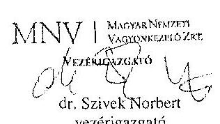

---

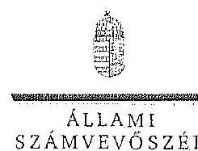

ELNÖK

Ikt.szám: V-0760-087/2015.

Dr. Szívek Norbert úr
vezérigazgató
Magyar Nemzeti Vagyonkezelő Zrt.

Budapest

Tisztelt Vezérigazgató Úr!

A „Jelentéstervezet az állami tulajdonban álló erdőgazdasági társaságok vagyongazdálkodási tevékenységének ellenőrzése - Zaluerdő Erdészeti Zrt." címmel készített számvevőszéki jelentéstervezetre tett észrevételeit köszönettel megkaplan.

Az Állami Számvevőszék észrevételekre vonatkozó álláspontjáról a felügyeleti vezető által készített részletes tájékoztatást csatoltan megküldöm.

Tájékoztatom Vezérigazgató urat, hogy a számvevőszéki jelentésben - az Állami Számvevőszékről szóló 2011. évi LXVI. törvény 29. § (3) bekezdése alapján - a figyelembe nem vett észrevételeket szerepeltetjük az elutasítás indokának feltüntetésével.

Budapest, 2015. 11. hó 20. nap

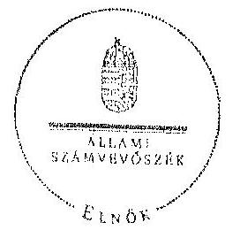

Tisztelettel:

Domokos László

Melléklet: Tájékoztatás az elfogadott és az el nem fogadott észrevételekről.

1052 BUDAPEST, APÁCZIN CSERE JÁNOS UTCA 16. 1364 Budapest 4. Pl. 54 telefon 484 8181 fax 484 5281

---

# Tájékoztatás   az elfogadott és az el nem fogadott észrevételekröl 

A , Jelentéstervezet az állami talajdonban álló erdögazdasági társaságok vagyongazdálkodási tevékenységének ellenörzése - Zalaerdő Erdészeti Zrt. " címü jelentéstervezetre 2015. október 13-án érkezett észrevételeit áttekintettük, azok kezelésével kapcsolatban a következő tájékoztatást adom.

1. A vagyonkezelési szerződéshez kapcsolódó megállapításokra tett észrevétel (I. fejezet / 9. oldal 3-4. bekezdés, 10. oldal 1. bekezdés, II. 5. fejezet / 29. oldal 4. bekezdés, 10. oldal javaslat az MNV Zrt. vezérigazgatójának a)-b) pontok)

A jelentéstervezet vagyonkezelési szerződéshez kapcsolódó megállapításai helytállóak. Az erdőgazdasági társaság müködése jogszabályi megfelelősége biztosításának érdekében tett kezdeményezésekről adott tájékoztatásukat köszönettel vettük, azonban azok nem eredményezték az ideiglenes vagyonkezelési szerződés olyan módosítását, vagy olyan új vagyonkezelési szerződés megkötését, amely biztosította volna a VSZ hiányosságainak megszüntetését, illetve a hatályos jogszabályoknak való megfelelőségét. Ezért az MNV Zrt. vezérigazgatójának és az NFA elnökének megfogalmazott intézkedést igénylő megállapítás, valamint az MNV Zrt. vezérigazgatójának megfogalmazott javaslat a) és b) pontjának módosítása nem indokolt. Az egyértelműség érdekében a 9. oldal 3. bekezdés 1. mondatát és a 29. oldal 1. bekezdés 1. mondatát az alábbiak szerint pontosítjuk:
„... a VSZ-szel kapcsolatban feltárt hiányosságok megszüntetése és a hatályos jogszabályoknak való megfeleltetése nem történt meg."
2. Az MNV Zrt. ellenőrzési kötelezettségének elmulasztására vonatkozó megállapításokra tett észrevétel (I. fejezet 10. oldal 2. bekezdés, II. 5. fejezet / 30. oldal 1. bekezdés és 10. oldal javaslat az MNV Zrt. vezérigazgatójának c) pont)

Az MNV Zrt. nem bocsátott az ÁSZ ellenőrzés rendelkezésére az MNV Zrt., vagy Területi Irodái által a Vhr. 20. § (1)-(2) bekezdései szerint végzett ellenőrzésekről dokumentumokat. A jelentéstervezet megállapításai és a javaslat helytállóak, módosításuk nem indokolt.

Budapest, 2015. // hó 15. nap

Makkai Mária
felügyeleti vezető

---

# 9. SZÁMÚ MELLÉKLET A V-0760-093/2015. SZÁMÚ JELENTÉSHEZ 

## MFB

Domokos László úr
elnök részére
Állami Számvevőszék

Budapest

Tisztelt Elnök Crt.
2015. szeptember 28-án közzéneztel közben vetlek az Állami Számvevőszék „Az állami tulajdonban álló erơőgazdasági társaságok vagyongazdálkodási tevékenységeiek ellenőrzéséről" szóló jelentéstervezeteket az alábbi cégekre:

- Észukerdő Erőőgazdasági Zrt.
- EGYERERDŐ Erdészeti Zrt.
- Gemenci Erdő- és Vadgazdaság Zrt.
- Ipegy erdő Zrt.
- KEFAG Kiskunsági Erdészeti és Faiuari Zrt
- Kisállóki Erdőgazdaság Zrt
- SEFAG Erdészeti és Faiuari Zrt
- Szombathelyi Erdészeti Zrt.
- VADEX Mezơőóldi Erdő-és Vcégazdálkodási Zrt. (Ikt.szám: V-0765-044/2015.)
- Zalassdó Erdészeti Zrt.
(Íkt.szám: V-0754-086/2015.)
(Íkt.szám: V-0750-172/2015.)
(Íkt.szám: V-0752-096/2015.)
(Íkt.szám: V-0749-146/2015.)
(Íkt.szám: V-0764-054/2015.)
(Íkt.szám: V-0758-056/2015.)
(Íkt.szám: V-0752-088/2015.)
(Íkt.szám: V-0757-060/2015.)
(Íkt.szám: V-0765-044/2015.)
(Íkt.szám: V-0760-075/2015.)

Az MFB Zrt. z jelentéstervezetekkel kapcsolatosan 2 főir szempontból kiván észrevételt teteit:

1. A jelentésekben megfogalmazott központi probléma
2. Egyedi esetek

---

# 9. SZÁMÚ MELLÉKLET A V-0760-093/2015. SZÁMÚ JELENTÉSHEZ 

## 1. A jelentésokben megfogalmazott központi probléma

Az ÁSZ az egyedi jelentésében az erőfeszültség, társaságokat, valamint a vagyonkezelésbe adott állami vagyon tekintetében tulajdonosi joggyakorló MNV Zrt. és Nemzeti Földalapkezelő (továbbiakban: NFA) tevékenyégei, marasztalta el.

Alapvető problémaként jelenik meg, hogy az erdők által kezelt eszközök - az NFA-val a Kintestári Vagyon Igazgatósággal, és az MNV Zrt-val kötött vagyonkezelési megállapodásban rögzített - értéken nem szerepelnek a Társaságok könyveiben.

Az MFB Zrt. tudatában volt a problémának (azt az ÁSZ jelentésben is említett, 2010. évben végzett átvilágítási jelentés is tartalmazza, melynek nyomoz követése, beszámolhatása megtörtént) és folyamatosan egyeztetett az MNV Zrt-val és az NFA-val a rendezés ügyében. Az ideiglenes vagyonkezelési szerződés módosítására, véglegzetítésére a vagyonkezelésbe adónak (MNV, NFA) van lehetősége, a Társaságok szerződő partnerként észrevételeket, javaslatokat lehetnek. A szerződés véglegesítése érdekében a Társaságok és az MFB Zrt. képviselői minden olyan egyeztetésen (pl.: az MNV Zrt. által létrehozott bizottsági részt veitek, amelyre meghívást kaptak, illetve azokon ésdemi javaslatokat tettek.

Ahogy a jelentés is megjegyzj, az egyeztetések az ellenézés befejezésig nem kerültek lezárásra, így a Társaságoknál nem áll rendelkezésre a vagyonkezelésben lévő állami vagyonta és annak nagyságára vonatkozó, az MNV Zrt. és az NFA nyilvántartásával egyező adat.

Az ÁSZ 2013. évi „Az állami vagyon feletti kontroll - Az állami vagyon feletti tulajdonosi joggyakorlással kapcsolatos tevékenységek ellenőrzéséről" szóló jelentése alapján a Nemzeti Fejlesztési Minisztérium - az ÁSZ-szal egyeztetett - alábbi fóbb pontokat tartalmazó intézkedési tervet (1. sz. melléklet) állított össze, melyet a 2014. április 25-én kelt levelében küldött meg az MFB Zrt. részére:

- a Társaságok által kezelt állami ingatlanok és egyéb vagyonelemek értéken történő nyilvántartása,
- a vagyonkezelési díjak egyértelmű és tulajdonosi joggyakorló szervezeteskénti meghatározása,
- az új vagyonkezelési szerződés megkötése,
- a Társaságok kezelt és saját vagyonának vagyonelemenkénti, valamint a kezelt vagyonelemén tulajdonosi joggyakorló szerinti elhatárolása.

Az MFB törvény módosításának 2014. július 16-i hatályba lépésével az MFB Zrt. állami erőfeszültségok feletti tulajdonosi joggyakorlása megszűnt, az a Földrajkezelésügyi Minisztériumhoz került át, így az intézkedési tervben való közreműködésre, illetve a végrehajtás nyomoz követésére az MFB Zrt-nek nem volt lehetősége.

A jelentések az MNV Zrt. vezérigazgatójának, az NFA elnökének és az erdészeti társaságok vezérigazgatóznak fogalmazzák meg intézkedési javaslatokat.

---

# 9. SZÁMÚ MELLÉKLET A V-0760-093/2015. SZÁMÚ JELENTÉSHEZ

## 2. Egyedi esetek:

### KEFAG Kiskensági Erdészeti és Falpari Zrt.

A jelentéstervezet táblázó hibásan hivatkozik az MFB Zrt.-re, amikor az állami vagyontól szóló 2007. évi CVI. törvény (a továbbiakban: Vtv.) 17. § (1) bekezdés d) pontja szerinti rendszeres ellenőrzés elmaradására mutat rá. A Vtv. hivatkozott bekezdése alapján az ellenőrzés az MNV Zrt. feladata. Kérjük a társaság felett haladónak joggyakorlóg hivatkozások törlését (8. oldal 7. bekezdés és 32. oldal 6. bekezdés).

### Kisállítási Erdégardaság Zrt.

A jelentéstervezet áltázata hivatkozik az MFB Zrt.-re, amikor a Vtv. 17. § (1) bekezdés d) pontja szerinti rendszeres ellenőrzés elmaradására mutat rá. A Vtv. hivatkozott bekezdése alapján az ellenőrzés az MNV Zrt. feladata. Kérjük a társaság felett haladónak joggyakorlóg hivatkozások törlését (29. oldal 4. bekezdés).

### Szombathelyi Erdészeti Zrt.

A jelentéstervezet áltázata hivatkozik az MFB Zrt.-re, amikor a Vtv. 17. § (1) bekezdés d) pontja szerinti rendszeres ellenőrzés elmaradására mutat rá. A Vtv. hivatkozott bekezdése alapján az ellenőrzés az MNV Zrt. feladata. Kérjük a társaság felett haladónak joggyakorlóg hivatkozás törlését (32. oldal 5. bekezdés).

Budapest, 2015. október 12.

Tisztelettel:

**Szilódi-Losteiner Dóra**

**Kursiá Péter**

**Kursiá Péter**

**0201 Budapest, Vásárcsár**

**0201 Budapest, Vásárcsár**

**0201 Budapest, Vásárcsár**

**0201 Budapest, Vásárcsár**

**0201 Budapest, Vásárcsár**

**0201 Budapest, Vásárcsár**

**Melléklet:**

NEM level (fát.szám: KGTT-377-7/2014-NEM)

---

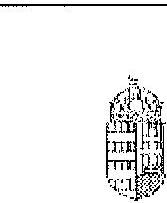

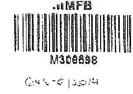

NEMZETI TEJESESTÉSI
MINISZTÉRSUM
SEVERTELÁSZLÓNÉ
rákúsza

Iktatószám: KGTE/ 174 - 5 /2014-NFM

Nagy Csaba úr részére
vezérigazgatói

Magyar Fejlesztési Bank Zrt.
Budapest

Tárgy: „Az állami vagyon feletti kontroll – Az állami vagyon feletti tulajdonosi joggyakorlóssal kapcsolatos tevékenységek ellenőrzéseiről“ szóló 13/93 sz. ÁSZ jelentés alapján összeállított NFM intézkedése terv módosítása, az abban foglalt feladatok végrehajtása

Tisztelt Vezérigazgató Úr!

Az Állami Számvevuszok (a továbbiakban: ÁSZ) tárgyban megjelölt jelentésével összeffüggésben 2014. január 27-én intézkedési tervet hagytam jövő, amelyben foglalt feladatok végrehajtása érdekében 2014. január 30-i keltezésű levélben fordulnom Önböz és a Magyar Nevezett Vagyunkerebb Zrt. vezérigazgatójához, Márton Péter úthoz.

Az ÁSZ az intézkedési tervvel kapcsolatban küldött, 2014. március 25-i keltő levélében az intézkedési terv kiegészítését, módosítását kérte. A módosított intézkedési tervet jövőhagytam.

A módosított intézkedési terv alapján a következő feladatok végrehajtása szükséges az alábbiak szerint:

1./ a társaságok által kezeit állami ingatlanok és egyéb vagyonelemek értéken történő nyilvántartása:

Fizetős: MNV Zrt.,
Határidő:

- földterületek esetében legkésőbb 2014. május 31-ig
- felépítmények esetében 2014. december 31. (A felépítmények esetében az MNV Zrt. a vagyonkezelési szerződés megkötését az év második felére tervezi, látja megvalósíthatónak.)

2./ a vagyonkezelési díjak egyértelmű és tulajdonosi joggyakorló szervezetenkénti meghatározása:

---

# 9. SZÁMÚ MELLÉKLET A V-0760-093/2015. SZÁMÚ JELENTÉSHEZ 

Felelő́r: MNV Zrt.,
Határidő: 2014. május 31 -ét követően folyamatosan (2014. december 31 -ig)
E ponéhan foglalt falanattal kapcsolatosan az ÁSZ részére az alábbi tájékoztatást adom:
„Az ÁSZ által meghatározott feladatok végrehajtására irányuló munkafolyamat során a végrehajtásban érintett szervezetek, társaságof között kialakult az az álláspont, hogy mivel az erdőgazdasági társaságok alapfeladatként közfeladat ellátást is végeznek, azt a vagyonkezelési díj mértékének meghatározásakor az MNV Zrt. figyelembe veszi, valamint megállapítsára került az az elv is, hogy a vagyonkezelési díj irányadó mértéke az adott erdőgazdasági társaság által kezelt ingatlanvagyon bruttó nyilvántartási értékének 286-a.

A vagyonkezelési díj alapja a kezelt vagyon bruttó nyilvántartási értéke, ezért annak meghatározására erdőgazdaság társaságunként kerül sor a 4./ pontban meghatározott ún. „végleges ingatlanlista" alapján. A végleges ingatlárdista kizárólag vagyonkezelésbe adott ingatlan vagyonelemet tartalmaz, az erdőgazdasági társaság saját vagyonában nyilvántartott vagyonelemet nem, ezért az MNV Zrt.-nek és az erdőgazdasági társaságoknak a szerződés megkötését megelőzően el kell határobbia egymástol a saját vagyonba és a kezelt vagyonba tartozó ingatlan vagyonelemeket (4.b./ pontban foglalt feladat).

A feleknek a vagyonkezelési díj mértékében a vagyonkezelési szerződés megkötését megelőzően kell megállapodniuk az irányadó vagyonkezelési díj mértéket alapul véve."

## 3./ az új vagyonkezelési szerződések megkötése:

A vagyonkezelési szerződés tervezet az MNV Zrt. érintett szakterületei álláspontjának figyelembe vételével elkesztük, az MNV Zrt. és a MFB Zrt. által létrehozott Munkarsoport (tagjai: MFB Zrt., MNV Zrt., NFA és egyes erdőgazdasági társaságok) véleménye alapján átdolgusásra került. A szerződés tervezetnek az erdőgazdasági társaságok részére történő megküldése 2014. április 15. napjával megtörtént.

Felelő́r: MNV Zrt., az MFB Zrt. közremüködésével
Határidő:

- felülterületek esetében: 2014. május 31 -ét követően folyamatosan (2014. december 31 -ig)
- felépítmények esetében 2014. II. félév folyamatát

4./ a társaságok kezelt és saját vagyonának vagyonelemenkénti, valamint a kezelt vagyonelemek tulajdonosi joggyakorló szerinti elhatárolása:

Az erdőgazdasági társaságok által az MNV Zrt. rendelkezésére bocsátott lehárielemtések alapján:

- a jogszabályi rendelkezőnek szerint az NFA tulajdonosi joggyakorlása alá tartozó ingatlan vagyonelemek nagyobb része már átadásra került az NFA részére,
- a kisebb részt képező vagyonelemek tekintetében pedig folyamatban van az átadás az MNV Zrt. és az NFA között.

---

# 9. SZÁMÚ MELLÉKLET A V-0760-093/2015. SZÁMÚ JELENTÉSHEZ

a. Az ún. "végleges ingatlanlista" (az MNV Zrt. tulajdonosi joggyakorlása alatt lévő, maradó vagyoncélem listája) MNV Zrt. és az NFA közötti leegyeztetése, közös áttekintése

**Felülés:** MNV Zrt.

**Határktó:** a lista MNV Zrt. és NFA közötti leegyeztetése, közös áttekintése folyamatban van, lazárása legkésőbb 2014. május 31-ig megtörténik

b. Az a.1 pontban foglaltak szerint leegyeztetett ún. "végleges ingatlanlista" MNV Zrt. és az egyes erőfgazdasági társaságok általi áttekintése azzal a célkal, hogy a vagyonkezelésben lévő vagyoni elemeket tartalmazó ún. "végleges ingatlanlista" ne tartalmazzön az erőfgazdasági társaság saját vagyonában nyilvántartott vagyoni elemet (raját vagyon - vagyonkezelő vagyon ellátásolása).

**Felülés:** MNV Zrt., az MFB Zrt. közremüködésével

**Határktó:** 2014. május 31-ig

E pontban foglalt feladatokkal kapcsolatosan az ASZ részére az alábbi tájékoztatást adtam:

"Szükséges menjeszemi, hogy ingatlanlista, mint állandó "végleges ingatlanlista" ilyen formában nem készik, mert mindkét tulajdonosi joggyakorló tekintetében az állami vagyoncélemre halmaza mind mennyiségben, mind pedig összetételben folyamatosan változik."

Az erőfgazdasági társaságok által kezelt ingatlanvagyon alábbi - mindkét tulajdonosi joggyakorló tekintetében - az évközi változások (megnézésük, területváltozások, elővélési ág változások, stb.) miatt folyamatosan változnak, ezért az adatartalmában "végleges ingatlanlista" mindig egy adott konkrét időpont vonatkozásában adható meg.

Jelen intézkedési tervben az ún. "végleges ingatlanlista" meghatározás alatt az erőfgazdasági társaságok vagyonkezelésében lévő ingatlanvagyon MNV Zrt. tulajdonosi joggyakorlása alatt álló részét kell tekinteni. E "végleges ingatlanlista" kialakítására az erőfgazdasági társaságok által az MNV Zrt. részére átadott leltárjelentések alapján került sor úgy, hogy az MNV Zrt. a Nemzeti Földalapba tartozó vagyonclemekre átvelegatta, a azokat a Nemzeti Földalapkezelő Szerezet részére - átadás-átvételi jegyzőkönyv alapján - átadta.

Lényeges körülmény, hogy a vagyonkezelőknek - jelen esetben az erőfgazdasági társaságoknak - túloldan év május 31. napjáig vagyonkezelői jelentést kell benyújtaniuk a tulajdonosi joggyakorlók, így az MNV Zrt. részére is. Az aktuális vagyonkezelői jelentéseket - melynek része a leltárjelentés is - a 2013. december 31-i állapótnak megfelelően kell összeállítani, ebből következően a fent említett ún. "végleges ingatlanlista" is a 2013. december 31-i állapotot tükrözi.

**Egyennek:** a kivett megnevezésben nyilvántartott földterületek esetében - a még át nem adott Nemzeti Földalapba tartozó vagyonclemek egyeztetése a két tulajdonosi joggyakorló között jelenleg is folyamatosan van.

**Postán:** 1440 Bátbajcs., PEL. **Térzély:** (06 1) 795 6668 **E-mail:** u.leitszer@afm.gov.hu

---

# 9. SZÁMÚ MELLÉKLET A V-0760-093/2015. SZÁMÚ JELENTÉSHEZ

Az egyes erőfgyűzzárágú társaságok vagyonkezelésében lévő vagyonelenek az adott társasággal megkettendő - a jelenlegi iránybanas vagyonkezelési szerződés helyébe lépő - vagyonkezelési szerződés mellékletét foglalt képezni. Az MNV Zrt. szándékai szerint az egyes erőfgyűzzárágú társaságokkal azonnal megkötik a vagyonkezelési szerződéseket, ahogyan a megkötés feltételei bekövetkezései (pl. megállapodnak a vagyonkezelési díjban, véglegessük a vagyonkezelési szerződés tartalmát), azok a vagyonelenek, amelyüket e pont a./ és b./ pontjában foglaltak szerint már átvizsgáltak, a vagyonkezelési szerződés megkötésével egyidejűleg a szerződés mellékletébe kerülnek, amely melléklet folyamatosan bővítésre kerül újabb, e pont a./ és b./ pontjában foglaltak szerint átvizsgált, tisztázott vagyonelenekkel.

Téjékoztatom, hogy az NFA felettí tulajdonosi jogok gyakorlója, Dr. Fazekas Shadcs menteser úr időközben már jóváhagyta azt az intézkedési tervet, amely az NFA részére meghatározott feladatokat és azok végrehajtási határidejes tartalmazza.

Az MFB Zrt. közreműködése az 1./ és 2./ pontban meghatározott feladatok végrehajtásban is szükséges lehet, ezért kérem a fent meghatározott feladatok határidőben történő végrehajtása érdekében az MFB Zrt. változatlan együttműködését az érintett a szervezetekkel és amennyiben szükséges, úgy az erőfgyűzzárágú társaságnak bevonása írást is intézkedni szíveskedjen.

Budapest, 2014. 2015. 2016. 2017. 2018. 2019.

*Edvígletrel:*

*Németh László*

Poznám: 1440 Budapest, Pl. Telefon: (06 1) 702 6665

---

.

---

# 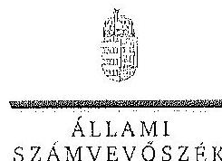 

KLKÖK

## Nagy Csaba úr

vezérigazgató
Magyar Fejlesztési Bank Zrt.

## Budapest

## Tisztelt Vezérigazgató Úr!

Az ,,Az állami tudajdonban álló crdögazdasági társaságok vagyongazdólkodási tevékenységének ellenörzése" címủ ellenörzés tekintetében 10 társaság jelentéstervezetére tett észrevételüket köszönettel megkaptam.

Az Állami Számvevőszék észrevételekre vonatkozó álláspontjától a felügyeleti vezető által készített részletes tájékoztatást csatoltan megküldöm.

Tájékoztatom Vezérigazgató urat, hogy a számvevőszéki jelentésben - az Állami Számvevőszékről szóló 2011. évi LXVI. törvény 29. § (3) bekezdése alapján - a figyelembe nem vett észrevételeket szerepeltetjük az slutasítás indokának feltüntetésével.

Budapest, 2015. 14 hó 10. nap
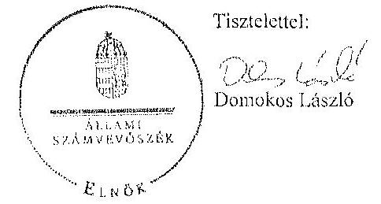

Melléklet: Tájékoztatás az elfogadott és az el nem fogadott észrevételekről

---

# Tájékoztatás   az elfogadott és az el nem fogadott észrevételekről 

„Az állomi tulajdonban álló erdögazdasági társaságok vagyongazdálkodási tevékenységének ellenörzése" címú ellenörzés tekintetében az Északerdő Erdögazdasági Zrt., az EGERERDŐ Erdészeti Zrt., a Gemenci Erdő- és Vadgazdaság Zrt., az IPOLY ERDŐ Zrt., a KEFAG Kiskunsági Erdészeti és Faipari Zrt., a Kisalföldi Erdögazdasági Zrt., a SEFAG Erdészeti és Faipari Zrt., a Szombathelyi Erdészeti Zrt., a VADEX Mezöföldi Erdő- és Vadgazdálkodási Zrt., illetve a Zaluerdö Erdészeti Zrt. társaságok jelentéstervezetére 2015. október 13-án érkezett észrevételeket áttekintettük, azok kezelésével kapcsolatban a következő tájékoztatást adom.

1. A jelentésekben megfogalmazott központi problémával kapcsolatban tett észrevételek A jelentésekben megfogalmazott központi problémával kapcsolatban adott tájékoztatásukat köszönettel vettük, azonban azok alapján a jelentéstervezet módosítása nem indokolt.

## 2. Egyedi esetekkel kapcsolatban tett észrevételek

A KEFAG Kiskunsági Erdészeti és Faipari Zrt. jelentéstervezetének 8. oldal 7. bekezdésére, valamint 32. oldal 6. bekezdésére tett észrevétel
A rendelkezésre álló dokumentumok ismételt áttekintését követően a jelentéstervezet 8. oldal 7. bekezdésében, valamint 32 . oldal 6 . bekezdésében töröljük a tulajdonosi joggyakorló 2 számú alsóindexszel jelölt hivatkozását.

A Kisalföldi Erdögazdasági Zrt. jelentéstervezetének 29. oldal 4. bekezdésére tett észrevétel
A rendelkezésre álló dokumentumok ismételt áttekintését követően a jelentéstervezet 29. oldal 4. bekezdésében töröljük a tulajdonosi joggyakorló 2 számú alsóindexszel jelölt hivatkozását.

A Szombathelyi Erdészeti Zrt. jelentéstervezetének 32. oldal 5. bekezdésére tett észrevétel
A rendelkezésre álló dokumentumok ismételt áttekintését követően a jelentéstervezet 32. oldal 5. bekezdésében töröljük a tulajdonosi joggyakorló 2 számú alsóindexszel jelölt hivatkozását.

Budapest, 2015. év hó 2 nap

Makkai Mária
felügyeleti vezető

---

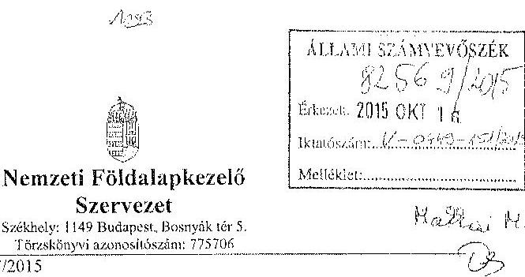

Iktatószám: NFA-002589/017/2015
Hiv. szám: ÁSZ-V-0599/2014-2015
Érintett ÁSZ iktatószáma: V-0749-148/2015, V-0750-174/2015, V-0751-121/2015,
V-0752-091/2015, V-0753-098/2015, V-754-088/2015, V-0755-124/2015, V-0757-062/2015,
V-0758-058/2015, V-0760-077/2015, V-0764-056/2015, V-0765-046/2015,
V-0766-140/2015, V-0767-056/2015.

Domokos László
Elnök

Állami Számvevőszék

1052 Budapest

Apáczai Csere János utca 10

Táray: Észrevétel megküldése „Az állami tulajdonban álló erdőgazdasági társaságok vagyongazdálkodási tevékenységének ellenőrzéséről" készített jelentés tervezeteire.

Tisztelt Elnök Úr!

Az Állami Számvevőszék 2014 novemberében megkezdte „Az állami tulajdonban álló erdőgazdasági társaságok vagyongazdálkodási tevékenységének ellenőrzését" amelyről 2015 októberétől érintettség okán az NFA részére az elkészített munkaanyag tervezeteit vizsgált erdőgazdaságosként, megküldte Szervezetünk részére véleményezésre.

A munkaanyag valamennyi tervezte egységesen, az NFA Elnöke részére feladatszabást tartalmaz, melyhez az alábbi észrevételeket teszzük:

A jelentéstervezetekben tett megállapítások helytállóságát nem vitatjuk, azonban szükségesnek látjuk az NFA elnökének tett javaslatokkal a), b) és c) kapcsolatban a következő tájékoztatást megadni.

---

# 11. SZÁMÚ MELLÉKLET A V-0760-093/2015. SZÁMÚ JELENTÉSHEZ 

a) „Tegyen intézkedéseket az erdőgazdasági társaságok közremüködésével a tényleges állapotot rögzitő és a hatályos jogszabályi elöírásoknak megfelelő vagyonkezelési szerzödés megkötésére."

Tájékoztatjuk, hogy a hatályos jogszabályi előírásoknak megfelelő vagyonkezelési szerződések megkötése érdekében több intézkedés történt, jelenleg is folyamatban van a szerződések előkészítése és a vagyonkezelésben maradó, illetve kikerülő földrészletek adatainak egyeztetése.

Előzményként fontos kiemelni, hogy a Nemzeti Földalapkezelő Szervezet 2010. szeptember 1. napjával törtém létrehozását követően (2012. évben) került sor a vagyonkezelésben lévő földrészletek MNV Zrt. részéről történő átadására. Az átadási dokumentumok alapján Szervezetünk gondoskodott a közhítelez nyilvántartásokban a megváltozott tulajdonosi joggyakorlás feltüntetéséről. Az erdőgazdaságok esetében ez 2012. év végéig, illetve 2013. év elején megtörtént ennek az ingatlan-nyilvántartásban történő átvezetése is.

Megjegyezzük, hogy az MNV Zrt. részéről történő átadás kizárólag a - több évtizede kötött, és azóta többször módosított - vagyonkezelési szerződések és a földrészletek Excel táblázatban történő átadását jelentette, tehát nem egy naprakész vagyonnyilvántartást tartalmazott. Ennek következtében szükségszerüvé vált a Nemzeti Földalapkezelő Szervezetnek egy saját nyilvántartás felépítése, illetve a szerződések tartalmának feldolgozása.

A számvevőszéki ellenőrzéssel árintett időszakban, illetve még jelenleg is iszáratlan az MNV Zrt. és NFA közötti átadás-átvételi folyamat. Az MNV Zrt. további földrészletek átadását készíti elő, ugyanis az MNV Zrt. vagyoni körébe tartozó földrészletekre szintén tervezi a vagyonkezelői szerződés megkötését, és ennek a folyamatnak a részeként a még át nem adott földrészletek átadása is most történik. Természetesen az NFA is folyamatosan biztosítja a különböző hasznosítási, illetve hatósági eljárások során az erdőgazdaságok vagyonkezelésében lévő földrészletek tulajdonosi joggyakorlójának rendszését az MNV Zrt megkeresésével, közös minősítési eljárás lefolytatásával. A Nemzeti Földalapkezelő Szervezet által megbízott ügyvédi iroda, jelentést készített a szerződés és a tárgyát képező földrészletek jogi helyzetének tisztázására.

Időközben az erdőgazdaságok, mint társaságok feletti tulajdonosi joggyakorló személyében is változás történt. Így új alapokon indulhatott meg a vagyonkezelői szerződés előkészítése. Ennek a folyamatnak részeként, az NFA megbízott egy Ügyvédi Konzorciumot, további Szervezetünknél külön Erdőszeti munkaesopott alakult 2015 májusában és azt követően a következő intézkedések történtek:

Az Erdőgazdaságok részére vagyonkezelésbe adásra tervezett ingatlanok felülvizsgálata folyamatban van az Ügyvédi Konzorcium által. A felülvizsgálat tárgyát képező ingatlanok köre hátum részből tevődik össze:

- az erdőgazdaságok ideiglenes vagyonkezelési szerződésének tárgyát képező ingatlanok.

---

- azon ingatlanok, amelyeket az erdőgazdaságok az ideiglenes vagyonkezelési szerződésükben szereplő ingatlanokon felül kértek vagyonkezelésbe,
- valamint azok az ingatlanok, amelyeket az NFA kíván az erdőgazdaságok vagyonkezelésébe adni.

A rendelkezésre álló dokumentumokban szereplő ingatlanokból erdőgazdaságonként egy egységes, az összes vagyonkezelésbe adandó ingatlant tartalmazó táblázat készült, amely tartalmazza az ingatlanok vagyonkezelésbe adás szempontjából releváns adatait, bejegyzett jogokat, feljegyzett tényeket. A táblázat adatai összevetésre kerültek a közhitetes ingatlannyilvántartásban szereplő adatokkal, feltárva ezáltal, hogy mely ingatlanok adhatóak vagyonkezelésbe és melyek azok, amelyeknél valamilyen előzetes intézkedés megtételo szükséges.

Az Nfatv. 8. §-a alapján a Birtokpolitikai Tanács dönt erdőgazdaságonként az erdőgazdaságok vagyonkezelési szerződésének megkötéséről.

Zárójelben jegyezzük meg, hogy például a TAEG Zrt. esetében elkészült a fentebb részletezett táblázat, amely alapján összeállitásra került azon ingatlanok listája, amelyre elindítható a vagyonkezelésbe adási eljárás. Megközelítőleg 18000 ha nagyságú területnek tervezi Szervezetünk a TAEG Zrt. részére történő vagyonkezelésbe adását, ebből 15.308 .3880 ha terület az, amelyre elindította a vagyonkezelésbe adást. Az alábbi jogszabályhelyek alapján Szervezetünk megkereste az Földművelésügyi Minisztériumot az egyetértő nyilatkozatok, valamint az alapító határozat kiadása érdekében, valamint a NÉBHet, mint erdészeti hatóságot a vagyonkezelő erdőgazdálkodói alkalmasságát megállapító jóváhagyásának megkérése végett.

Az Nfatv. 20. § (7) bekezdése alapján „Az állam 100\%-os tulajdonában álló erdő és erdőgazdálkodási tevékenységet közvetlenül szolgáló földterületet érintő vagyonkezelési szerződés létrejöttéhez az erdészeti hatóságnak - a vagyonkezelő erdőgazdálkodói alkalmasságát megállapító - jóváhagyása szükséges".

Az Nfatv. 23. § (2) bekezdése alapján a Nemzeti Földalapba tartozó védett természeti területek és a Natura 2000 területek vagyonkezelésbe adására, tulajdonjogának bármely jogcímen történő átraházására csak a természetvédelemért felelős miniszter egyetértése esetén kerülhet sor. Az állam 100\%-os tulajdonában álló erdő, továbbá erdőgazdálkodási tevékenységet közvetlenül szolgáló földterület vagyonkezelésbe adásához az erdőgazdálkodásért felelős miniszter egyetértése szükséges.

Magyar Állam tulajdonában álló ingatlanokat érintő jogügyletekkel kapcsolatos előzetes miniszteri nyilatkozatok és a miniszter tulajdonosi joggyakorlása alá tartozó gazdasági társaságok ingatlanügyletével kapcsolatos miniszteri nyilatkozatok, alapítói határozatok kiadásának rendjéről szóló 8/2014. (XI. 28.) FM utasítás 3. § (4) bekezdése értelmében a miniszter tulajdonosi joggyakorlása alá tartozó állami tulajdonú gazdasági társaságoknak az

---

NFA-val történő vagyonkezelési szerződés kötéséhez elengedhetetlen a jogszabály vagy Társasági alapszabály vagy alapító okirat alapján a Társaság tulajdonosi jogait gyakorló miniszter alapítói határozatának kiadása.

Az Erdészeti Moskacssport a kialakított szempontok alapján tartja a kapcsolatot a Konzorvinmmal a szerződés tárgyái képező Előbészletek jogi, nyilvántartási, helyezési, térképi ellenőrzés tárgyában annak érdekében, hogy napcsúész adatok alapján történjen a szerződéskötés.
b) „Intézkedjen a vagyonkezelési szerzödések felülvizsgálatának elmaradásával összefüggésben feltárt szabálytalanságok tekintetében a munkajogi felelősség tisztázására irányuló eljárás megindításáról, és ennek eredménye ismeretében tegye meg a szükséges intézkedéseket.

A fent leírt folyamat időbeli áttekintése és a vagyonkezelési szerződés előkészítésének jelenlegi helyzetét tekintve a Nemzeti Földalapkezelő Szervezet egységei, munkatársai a rendelkezésükre álló eszközök alapján megtették a szükséges intézkedéseket az erőfgazdaságok vagyonkezelői szerződésének megkötése érdekében.
c) Az NFA elnöke felé tett javaslattal kapcsolatban, miszerint intézkedjen a Társaságok vagyon-nyilvántartása hitelességének, teljességének és helyességének jogszabályban foglaltak szerinti ellenőrzéséről.

Az NFA 2015. év márciusában megkezdte az Erdészeti Zrt.-ték dokumentális ellenőrzését, amely ellenőrzés keretén belül beköéres került a Társaságok használatában álló vagyonelcmekről és az erdővagyon állományról vezetett (nyilvántartások) aktualizált nyilvántartás is.

Budapest, 2015.október 13.
Tiszteletlel:
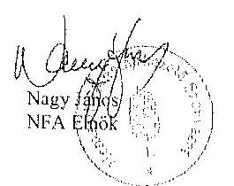

---

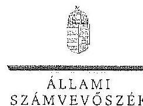

ELNÉK

Ikt.szám: V-0749-154/2015.

Nagy János úr
elnök
Nemzeti Földalapkezelő Szervezet
Budapest

Tisztelt Elnök Úr!

Az „Az állami tulajdonban álló erdőgazdasági társaságok vagyongazdálkodási tevékenységének ellenőrzése" című ellenőrzés tekintetében 14 társaság jelentéstervezetére tett észrevételeket köszönettel megkaptam.

Az Állami Számvevőszék észrevételekre vonatkozó álláspontjáról a felügyeleti vezető által készített részletes tájékoztatást csatoltan megküldöm.

Tájékoztatom Elnök urat, hogy a számvevőszéki jelentésben – az Állami Számvevőszékről szóló 2011. évi LXVI. törvény 29. § (3) bekezdése alapján – a figyelembe nem vett észrevételeket szerepeltetjük az elutasítás indokának feltüntetésével.

Budapest, 2015. /4. hó 20. nap

Tisztelettel:

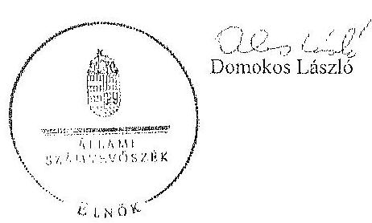

Meltéklet: Tájékoztatás az észrevételek kezeléséről

1052 BUDAPEST, APÁCZAI CSERE JÁNOS UTCA 10. 1364 Budapest 4. Pl. 54 telefon: 484 8101 fax: 484 8201

---

# Tájékoztatás   az észrevételek kezeléséről 

„Az állami tutajdonban álló erdögazdasági társaságok vagyongazdálkodási tevékenységének ellenörzése" címú ellenörzés tekintetében az IPOLY ERDŐ Zrt., az ÉGERERDŐ Erdészeti Zrt., a Mecsekerdő Zrt., a SEFAG Erdészeti és Faipari Zrt., a Gemenci Erdő- és Vadgazdaság Zrt., az Északerdő Erdögazdasági Zrt., a Pilisi Parkerdő Zrt., a Szambathelyi Erdészeti Zrt., a Kisalföldi Erdögazdasági Zrt., a Zalaerdő Erdészeti Zrt., a KEFAG Kiskunsági Erdészeti és Faipari Zrt., a VADEX Mezöföldi Erdő- és Vadgazdálkodási Zrt., a Gyulaj Erdészeti és Vadászati Zrt., illetve a TAEG Tomulmányi Erdögazdaság Zrt. társaságok jelentéstervezetére 2015. október 16-án érkezett észrevételeket áttekintettük, azok kezelésével kapcsolatban a következő tájékoztatást adom.

Az észrevétel szerint a jelentéstervezetben tett megállapítások helytállóak, azokat nem vitatják. Az NFA elnökének tett javaslatokhoz kapcsolódó tájékoztatást köszönjük. Mindezek miatt, valamint arra tekintettel, hogy nem jött létre olyan vagyonkezelési szerződés, amely biztosítja az ideiglenes vagyonkezelési szerződés hiányosságainak a megszüntetését, illetve a hatályos jogszabályoknak való megfeleltetést, a megállapítások és a javaslatok módosítása nem indokolt.

Budapest, 2015. év hó 05. nap

Makkai Mária
felügyeleti vezető