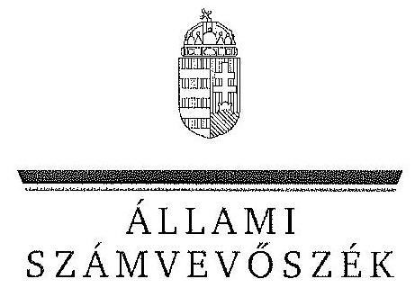

ÁLLAMI
SZÁMVEVŐSZÉK

# JELENTÉS 

Az állami tulajdonban álló erdőgazdasági társaságok vagyongazdálkodási tevékenységének ellenőrzése KEFAG Kiskunsági Erdészeti és Faipari Zrt.

---

# Állami Számvevőszék 

Iktatószám: V-0764-070/2015.
Témaszám: 1798
Vizsgálat-azonosító szám: V070616

## Az ellenőrzést felügyelte:

## Makkai Mária

felügyeleti vezető
Az ellenőrzést vezette és az ellenőrzés végrehajtásáért felelős:
Schmidt János
ellenőrzésvezető
A számvevőszéki jelentés összeállításában közreműködött:
Krupánszki Dóra
számvevő főtanácsos
Az ellenőrzést végezték:

| Koczor László | Krupánszki Dóra |
| :-- | :-- |
| számvevő tanácsos | számvevő főtanácsos |

---

# TARTALOMJEGYZÉK 

BEVEZETÉS ..... 3
I. ÖSSZEGZŐ MEGÁLLAPÍTÁSOK, KÖVETKEZTETÉSEK, JAVASLATOK ..... 7
II. RÉSZLETES MEGÁLLAPÍTÁSOK ..... 14

1. A KEFAG Zrt. vagyongazdálkodása ..... 14
1.1. A vagyon értékének megőrzése, gyarapítása ..... 14
1.2. A vagyonkezelői kötelezettség teljesítése ..... 18
2. A KEFAG Zrt. vagyonkezelési szerződése és a vagyonnyilvántartása ..... 18
2.1. A vagyonkezelési szerződés megfelelősége ..... 19
2.2. A KEFAG Zrt. vagyonnyilvántartása ..... 20
3. A KEFAG Zrt. éves tervezési feladatainak ellátása, az ágazati jogszabályok érvényesülése ..... 23
3.1. Az üzleti tervek vagyonmegőrzésre, vagyongyarapításra vonatkozó elemei ..... 23
3.2. A tervekben megfogalmazott előírások érvényesülése ..... 25
3.3. Az ágazati szabályok érvényesülése ..... 25
4. A kontroll- és monitoring rendszer kialakítása és múködtetése ..... 29
4.1. A kontrollrendszer kialakítása és múködtetése ..... 29
4.2. Az információáramlási és monitoring rendszer kialakítása és múködtetése ..... 32
5. A tulajdonosi joggyakorlóknak a KEFAG Zrt. vagyongazdálkodási feladataira vonatkozó döntései, intézkedései megfelelősége ..... 34

---

# MELLÉKLETEK 

1. számú Rövidítések jegyzéke
2. számú Fogalomtár
3/A. számú A KEFAG Zrt. vagyonának alakulása a 2009-2013. évek közötti időszakban - eszközök (M Ft)

3/B. számú A KEFAG Zrt. vagyonának alakulása a 2009-2013. évek közötti időszakban - források (M Ft)
4. számú Kimutatás a KEFAG Zrt. befektetett eszközei állományának alakulásáról a 2009-2014. I. féléve közötti időszakra vonatkozóan
5. számú A KEFAG Zrt. vezérigazgatójának észrevétele
6. számú A KEFAG Zrt. vezérigazgatójának észrevételére adott válasz
7. számú Az MNV Zrt. vezérigazgatójának észrevétele
8. számú Az MNV Zrt. vezérigazgatójának észrevételére adott válasz
9. számú Az MFB Zrt. vezérigazgatójának észrevétele
10. számú Az MFB Zrt. vezérigazgatójának észrevételére adott válasz
11. számú Az NFA elnökének észrevétele
12. számú Az NFA elnökének észrevételére adott válasz

---

# JELENTÉS 

## Az állami tulajdonban álló erdőgazdasági társaságok vagyongazdálkodási tevékenységének ellenőrzése KEFAG Kiskunsági Erdészeti és Faipari Zrt.

## BEVEZETÉS

Hazánk területének több mint 20\%-át erdő borítja. Az erdők fenntartása és védelme az egész társadalom érdeke, ezért az erdőkkel csak a közérdekkel összhangban lehet gazdálkodni.

Az Alaptörvény 38. cikke és az Nvtv. alapján az állam tulajdona a nemzeti vagyon részét képezi. Az Nvtv. alapján nemzetgazdasági szempontból kiemelt jelentőségű nemzeti vagyonban tartandó vagyonelemnek minősül a 100\%-ban az állam tulajdonában álló védelmi és közjóléti elsődleges rendeltetésű erdő, a gazdasági elsődleges rendeltetésű természetes erdő, természetszerű erdő és származékerdő természetességi állapotú öt hektárnál nagyobb, természetben összefüggő erdő. Az erdőgazdasági társaságok vagyongazdálkodása szempontjából a Vtv., illetve az Nvtv. és az Nfatv., valamint a kapcsolódó kormány- és miniszteri rendeletek mellett kiemelkedő szerepe van a különböző ágazati jogszabályoknak. A vagyonkezelési tevékenység végrehajtása során figyelemmel kell lenni az Evt.ben foglaltakra, mely alapján a nemzeti vagyonról szóló törvényben nemzetgazdasági szempontból kiemelt jelentőségű nemzeti vagyonként meghatározott védelmi és közjóléti elsődleges rendeltetésű, az állam tulajdonában álló erdő a kincstári vagyon részét képezi. Az erdőgazdasági társaságoknak az általuk kezelt vagyonelemek sajátosságára tekintettel kell a vagyongazdálkodási tevékenységüket kialakítaniuk, gondoskodniuk kell a közérdek és az Evt.-ben foglaltak érvényesülését biztosító vagyongazdálkodásról.

Az Evt. előírásai alapján az állam 100\%-os tulajdonában álló erdőt és erdőgazdálkodási tevékenységet közvetlenül szolgáló földterületet csak vagyonkezelés formájában lehet hasznosításra átengedni. Az állam kizárólagos tulajdonában álló erdő és erdőgazdálkodási tevékenységet közvetlenül szolgáló földterület vagyonkezelését csak költségvetési szerv vagy 100\%-os állami tulajdonú gazdálkodó szervezet végezheti.

A Vtv. szerint az erdőgazdasági társaságok és a társaságok kezelésében lévő állami vagyon feletti tulajdonosi jogokat a 2010. évig a Magyar Állam nevében az MNV Zrt. gyakorolta. A 2010. évi törvényi változások (Vtv., Mfbtv., Nfatv.) következtében 2010. június 17. napjától az erdőgazdasági társaságok állami tu-

---

lajdonú részesedése tekintetében a tulajdonosi jogokat az állami vagyonért felelős miniszter az MFB Zrt. útján látta el. Az Nfatv. 2010. évi hatálybalépését követően a társaságok által kezelt, a Nemzeti Földalapba tartozó földterületek vonatkozásában a tulajdonosi jogokat az NFA, míg egyéb ingatlanok és vagyonelemek tekintetében a tulajdonosi jogokat az MNV Zrt. gyakorolja. 2014. július 16-tól az erdőgazdasági társaságok feletti tulajdonosi jogokat az erdőgazdálkodásért felelős miniszter gyakorolja.

A Nemzeti Földalapba tartozó 1772980 ha földterületből a 2012. év végén a 100\%-os állami tulajdonú 19 erdőgazdasági társaság kezelésében összesen 913664 ha földterület volt, ebből 879254 ha erdő, a többi egyéb művelési ágba tartozik. A kezelt földterületek erdőgazdasági társaságonkénti megosztása eltérő.

Az erdőgazdasági társaságok az Alaptörvény és az Nvtv. előírása szerint önállóan és felelősen gazdálkodnak a törvényesség, a célszerűség és az eredményesség követelményei szerint. Az állami vagyonnal való gazdálkodás alapvető feladata a vagyon rendeltetésszerű, hatékony és felelős felhasználásának biztosítása az állami vagyon értékének megőrzése, gyarapítása érdekében. A KEFAG Zrt. jelen ellenőrzése az állami vagyonnal való gazdálkodásra és a törvényesség betartására irányult.

A KEFAG Zrt és jogelődjei kecskeméti központtal, hat évtizede gondozzák BácsKiskun megyében a Duna-Tisza közének erdeit. Az erdészetek (Kecskemét, Bugac, Császártöltés, Jánoshalma, Kecskemét, Kerekegyháza, Tompa) fő tevékenységi körei a mag- és csemetetermesztés, az erdőművelés, a fahasználat, az erdőgazdálkodási szolgáltatások, a faipar, a kereskedelem és a vadgazdálkodás.

A KEFAG Zrt. 2013. évi éves beszámolója szerint 5 429,6 M Ft nettó árbevétel mellett 9,3 M Ft mérleg szerinti eredményt ért el, a mérlegfőösszeg 4 847,1 M Ft volt. Az erdőgazdasági társaság a vagyonkezelésébe vett 53773 ha erdőterületen és 2596 ha egyéb művelési ágú földterületen gazdálkodott, az éves átlaglétszám 417 fő volt.

Az ellenőrzés célja annak értékelése, hogy a KEFAG Zrt. vagyongazdálkodása, vagyonérték-megőrző és vagyongyarapítási tevékenysége, valamint ennek szervezeti keretei megfeleltek-e a jogszabályok és belső szabályzatok előírásainak, valamint a kezelt vagyonelemek sajátosságaiból adódó követelményeknek.

Ennek keretében ellenőriztük és értékeltük, hogy:

- a vagyongazdálkodás során betartották-e az Nvtv. 7. §-ában megállapított vagyongazdálkodási alapelveket, valamint az ágazati jogszabályok vagyongazdálkodáshoz kapcsolódó előírásait;
- a Társaság a saját és a kezelt vagyonnal való gazdálkodásra vonatkozó éves tervezési feladatait a jogszabályi előírásoknak megfelelően látta-e el, üzleti tervei a kezelésbe vett vagyonra vonatkozó, a Vtv. 2. § (1) és a 27. § (7) bekezdésében előírt vagyon megőrzésére, gyarapítására vonatkozó elemeket tartal-mazták-e és azokat a vagyongazdálkodás során érvényesítették-e;

---

- a vagyonkezelési szerződések és a vagyon-nyilvántartás megfeleltek-e a szabályszerűségi követelményeknek, elősegítették-e az állami vagyonnal való szabályszerű gazdálkodást;
- a Társaságnál kialakították és működtették-e a szabályszerű feladatellátást támogató kontrollrendszert, ezen belül elkészítették és aktualizálták-e a Társaság feladatellátási-folyamatainak szabályzatait, a kockázatok kezelésének rendszerét, az információs és a kontrolling- monitoring rendszert, valamint a vagyongazdálkodás területén azokat az eljárásokat, amelyek elősegítik a szervezeti célok végrehajtását;
- a tulajdonosi joggyakorlóknak a Társaság vagyongazdálkodási feladataira vonatkozó döntései, intézkedései előkészítése és megalapozottsága a jogszabályoknak és a belső szabályozásnak megfelelt-e, a tulajdonosi joggyakorlók e minőségben végzett tevékenysége támogatta-e a felelős vagyongazdálkodás megvalósulását.

Az ellenőrzés típusa: szabályszerűségi ellenőrzés.
Az ellenőrzött időszak: 2009. január 1. napjától 2014. június 30. napjáig, kitekintéssel a helyszíni ellenőrzés végéig tartó releváns folyamatokra, intézkedésekre.

Az ellenőrzés várható hasznosulása: A KEFAG Zrt. és a tulajdonosi joggyakorlók fenti szempontú ellenőrzése az állami tulajdonban álló vagyon kezelésére, a vagyonnal való gazdálkodásra vonatkozó, kötelezően végrehajtandó éves ÁSZ ellenőrzést szélesebb körűvé teszi.

Az ellenőrzés várható hasznosulásaként biztosíthatja a társadalom részéről kiemelt érdeklődéssel kísért téma objektív bemutatását. Az ÁSZ jelentéséből a média és az állampolgárok átfogó képet kaphatnak a Magyarország állami tulajdonban lévő erdőivel való gazdálkodásról, a gazdálkodást, vagyonkezelést végző szervezeti rendszerről, az állami tulajdonban álló erdőgazdasági társaságok feladatellátásához kapcsolódóan feltárt problémákról.

Az ellenőrzés jól hasznosítható - többek közt - az állami vagyonnal kapcsolatos országgyűlési törvényhozói munkában is, továbbá hozzájárulhat a tulajdonosi joggyakorlás javításával a „jó kormányzás" gyakorlatának erősítéséhez.

Az ellenőrzéssel érintett szervezetek: A KEFAG Zrt., a Társaság kezelésében lévő állami vagyon feletti tulajdonosi jogokat gyakorló szervezetek, valamint a Társaság állami tulajdonú részesedése feletti tulajdonosi joggyakorlók (MFB Zrt., MNV Zrt., NFA).

Az ellenőrzés végrehajtásának jogszabályi alapját az ÁSZ tv. 5. § (4)-(5) bekezdéseiben foglaltak képezik.

Az ellenőrzés szakmai módszertana az ÁSZ hivatalos honlapján közzétett szakmai szabályokon alapult, amely a Legfőbb Ellenőrző Intézmények Nemzetközi Szervezete (INTOSAI) által kiadott nemzetközi standardok (ISSAI) figyelembevételével készült.

---

A KEFAG Zrt. az ellenőrzés lefolytatásához tanúsítványok kitöltésével, valamint dokumentumok elektronikus megküldésével szolgáltatott adatokat. Az így rendelkezésre bocsátott adatok és információk kontrollja a helyszíni ellenőrzés keretében történt. A vagyonváltozást eredményező döntések megalapozottságát, továbbá a vagyonérték-megőrző és vagyongyarapító tevékenység szabályszerűségét a számviteli nyilvántartásokból, valamint kockázatalapú és véletlenszerű mintavétellel kiválasztott tételek ellenőrzésével értékeltük.

Az ÁSZ a 2011. évi LXVI. törvény 29. §-a szerint a jelentéstervezetet megküldte a KEFAG Zrt., a Magyar Nemzeti Vagyonkezelő Zrt. és a Magyar Fejlesztési Bank Zrt. vezérigazgatójának, valamint a Nemzeti Földalapkezelő Szervezet elnökének egyeztetésre. A KEFAG Zrt. vezérigazgatójának észrevételét és az arra adott választ az 5-6. számú melléklet, a Magyar Nemzeti Vagyonkezelő Zrt. vezérigazgatójának észrevételét és az arra adott választ a 7-8. számú melléklet, a Magyar Fejlesztési Bank Zrt. vezérigazgatójának észrevételét és az arra adott választ a 910. számú melléklet, a Nemzeti Földalapkezelő Szervezet elnökének észrevételét és az arra adott választ a 11-12. számú melléklet tartalmazza.

---

# I. ÖSSZEGZŐ MEGÁLLAPÍTÁSOK, KÖVETKEZTETÉSEK, JAVASLATOK 

Az ellenőrzött időszakban a KEFAG Zrt. saját és vagyonkezelésbe vett vagyonelemekkel gazdálkodott. A Társaság mérleg szerinti eszközvagyona a 2009. január 1-jei 4927,2 M Ft-ról 2009. december 31-ére 4776,8 M Ft-ra csökkent, majd 2013. december 31-ére 4847,1 M Ft-ra növekedett. A vagyonváltozások hatására a vagyonszerkezet nem változott, a saját tőke/jegyzett tőke aránya nőtt. A Társaság saját tőkéje 2009. január 1-je és 2013. december 31-e között 4,2\%-kal növekedett. A Számv. tv. és a Vhr. előírásai ellenére, a VSZ nyilvántartás kiinduló adatait tartalmazó dokumentumában értékkel szereplő, vagyonkezelésbe kapott eszközöket saját vagyonként aktiválták, vagyonkezelt állami eszközként pedig a VSZben nem szereplő, saját eszközöket tartottak nyilván, így a Társaság mérlege nem a valós állapotot tükrözte.

A vagyonnyilvántartás nem felelt meg a szabályszerűségi követelményeknek. A Társaság a saját, és a kezelésében lévő állami vagyont nem az előírásoknak megfelelően tartotta nyilván. A Vhr.-ben előírtakkal szemben a vagyonkezelésbe kapott eszközöket a főkönyvi könyvelésben saját vagyonként mutatták ki. A Számv. tv.-ben foglaltak ellenére az éves beszámolók kiegészítő mellékletében a vagyonkezelésbe vett eszközöket külön nem mutatták be, azokat a Vhr. előírása ellenére nem a hosszú lejáratú kötelezettségekkel szemben rögzítették. A Vhr.-ben előírtak ellenére a Társaságnál nem vezettek olyan nyilvántartást, amely tételesen tartalmazta a vagyonkezelésbe vett eszközök könyv szerinti értékét és az elszámolt értékcsökkenés összegét. Kizárólag a földterületekről található olyan analitikus nyilvántartás, amelyben elkülöníthetőek a kezelt- és a saját vagyonelemek. Ezért a Társaság által vezetett vagyonnyilvántartás nem volt átlátható és nem biztosította az elszámoltathatóságot. A Társaság minden évben szolgáltatott adatot a vagyonkezelt földterület nagyságáról, amelyekről a tulajdonosi joggyakorló ${ }_{1,2}$ visszaigazolást küldött. A VSZ alapján a vagyonkezelésben lévő vagyonelemekről az állami vagyon nyilvántartása tekintetében, az egyeztetések az ellenőrzés befejezéséig nem kerültek lezárásra az MNV Zrt., az NFA és a Társaság között. Így nem állt rendelkezésre a Társaság vagyonkezelésében lévő állami vagyonra, és annak nagyságára vonatkozó, a Társaságnál, az MNV Zrt.-nél és az NFA-nál egyező adat.

A Társaság a Magyar Állam tulajdonában álló erdővagyon és egyéb művelési ágú termőföld ingatlanok kezelését a KVI-vel 1996. november 1-jén kötött vagyonkezelési szerződés alapján végezte. A Társaság, mint vagyonkezelő és a KVI között létrejött szerződéses jogviszony kereteit a VSZ-ben foglalt jogok és kötelezettségek töltötték ki, azonban az nem támogatta a Vhr.-ben előírt, a vagyongazdálkodási feladatok átlátható módon történő végrehajtását, valamint nem támogatta a szabályszerű vagyongazdálkodást.

A VSZ a hatályos jogszabályi előírásoknak nem felelt meg, azt a jogszabályok változásával és a tulajdonosi jogokat gyakorlók változása miatt nem aktualizál-

---

ták. Az ellenőrzött időszakban a VSZ rendelkezéseinek általános felülvizsgálatára és a hatályos jogszabályokkal való összehangolására, aktualizálására nem került sor. A VSZ hatályon kívül helyezett jogszabályi hivatkozásokat tartalmazott, továbbá nem tartalmazta a 2007-ben hatályba lépett Vtv., a 2009-ben hatályba lépett Evt. és a 2012-ben hatályba lépett Nvtv. előírásait. Az ellenőrzött időszakban történt módosításokra a kezelésbe vett vagyon mértékében, illetve a vadászati haszonbérleti és többlethasználati díj megfizetésének módjában bekövetkezett változások miatt került sor.

A VSZ-ben nem rögzítették, hogy a vagyonkezelési díj bruttó, vagy nettó értéket jelent. Az ellenőrzött időszakban a vagyonkezelési díj évente esedékes felülvizsgálatára nem került sor. A Társaság a vagyonkezelési díjat tartalmazó számlákat kifizette.

A vagyontárgyak állományát leltárral támasztották alá, a leltározásokról a belső ellenőr, jelentést készített. A leltározások kiértékelése megtörtént.

A Társaság az ellenőrzött időszakban nem rendelkezett olyan szerződéssel, illetve az Evt. és az Nfatv. előírásának megfelelően nem kötött olyan szerződést, amelyben erdő használatát, hasznosítását harmadik személynek átengedte volna. A vagyonkezelői jogot nem adta tovább harmadik személy részére, a vagyonkezelésbe kapott földrészletet, valamint a vagyonkezelői jogot nem terhelte meg. A Társaság kezelésbe vett, az állam kizárólagos tulajdonában álló vagyontárgyat, vagy nemzetgazdasági szempontból kiemelt jelentőségű nemzeti vagyont nem idegenített el, nem terhelt meg, biztosítékul nem adott és rajtuk osztott tulajdont nem létesített.

A Társaság a saját és a kezelt vagyonnal való gazdálkodásra vonatkozó éves tervezési feladatait ellátta. A tulajdonosi joggyakorló ${ }_{1-2}$ által jóváhagyott éves üzleti tervek a Vtv. előírásának megfelelően tartalmaztak a vagyon megőrzésére, gyarapítására vonatkozó elemeket, melyeket a vagyongazdálkodás során érvényesítettek. A beruházási tervekben azonban nem különítették el a saját vagyonra és a vagyonkezelésben lévő állami vagyonra tervezett feladatokat.

Az erdőtelepítési-kivitelezési tervek, a vadgazdálkodási üzemtervek és az éves vadgazdálkodási tervek teljesüléséről beszámolókat, szakmai jelentéseket készítettek, melyeket az erdészeti hatóság ${ }_{1-2}$, illetve a vadászati hatóság ${ }_{1-2}$ részére megküldtek. A Társaság az erdő- és vadgazdálkodási tevékenységének teljesítéséről a tulajdonosi joggyakorló ${ }_{1-2}$ felé üzleti jelentéseiben számolt be.

A tárgyi eszközök karbantartásának, állagmegóvásának éves karbantartási tervek alapján, állapotfelmérést követően tettek eleget. A végrehajtott karbantartásokról kimutatást készítettek.

A Társaság az Nvtv.-ben megállapított vagyongazdálkodási alapelveket betartotta, de vagyongazdálkodási tevékenysége csak részben felelt meg a jogszabályok és a belső szabályzatok előírásainak. A Társaság a Vtv.-ben meghatározott visszapótlási kötelezettség alól mentesült, de a Vtv.-ben előírtak ellenére a VSZ-ben a mentesülés tényét nem rögzítették. Az ellenőrzött időszakban a Társaság a vagyonkezelésbe vett vagyontárgyak állagának megóvása, karbantartása, múködtetése céljából felújításokat és beruházásokat végzett. A Társaság

---

a vagyonkezelésbe vett eszközöket és az utánuk elszámolt értékcsökkenés összegét a Vhr.-ben előírtakkal szemben nyilvántartásában nem különítette el, azokat saját vagyontárgyakként rögzítette. Az ellenőrzött időszakban a vagyon megőrzésére, gyarapítására fordított összeg meghaladta az elszámolt értékcsökkenés összegét. Az eszközök bekerülési értékének meghatározásakor és az aktivált eszközök után elszámolt értékcsökkenési leírás során a Számv. tv. és a Számviteli politika ${ }_{1-3}$ előírásai szerint jártak el. A vagyonkezelt eszközökön elszámolt, Számv. tv. szerinti beruházásokhoz, felújításokhoz a tulajdonosi joggyakorló ${ }_{1-2}$ engedélyét megkérték.

A Társaság az ellenőrzött időszakban az ágazati jogszabályok vagyongazdálkodáshoz kapcsolódó előírásait - az immateriális szolgáltatásokból származó bevételek elszámolási hiányosságai és egy erdészeti hatóság, felé teljesítendő bejelentési kötelezettség elmulasztása miatt - részben megfelelően tartotta be.

A Társaság az ellenőrzött időszakban az immateriális szolgáltatásból, vadásztatásból származó bevételét az Evt. előírásának megfelelően erdők fenntartására, gyarapítására, védelmére fordította.

Az Evt. előírásait betartva a Társaság nem idegenített el vagyonkezelésében lévő erdőt, nem kötött erdő tulajdonjogának átruházására irányuló szerződést.

A Társaság az Evt. előírásainak megfelelően elkészítette az erdőtelepítési-kivitelezési terveit, melyekről az erdészeti hatóság ${ }_{1-2}$ minden esetben - egy alkalommal korlátozással - jóváhagyó határozatot hozott.

Az ellenőrzött időszakban az erdészeti hatóságnak ${ }_{1-2}$ esetenként feltételhez kötést, korlátozást tartalmaztak a határozatai. Az erdészeti hatóság ${ }_{1}$ egy esetben erdővédelmi, az erdészeti hatóság ${ }_{2}$ egy esetben erdőgazdálkodási bírságot szabott ki.

A Társaság a Vadvédelmi tv. előírásai alapján elkészített, tíz évre szóló vadgazdálkodási üzemterveit a vadászati hatóság, jóváhagyta. Az ellenőrzött időszakban a vadászati hatóság ${ }_{1-2}$ valamennyi vadászterületre vonatkozóan határozatban engedélyezte a Vadvédelmi tv. előírása alapján elkészített éves vadgazdálkodási terveket.

A Társaság szabályszerű feladatellátását biztosító kontrollrendszer kiépítése és múködtetése megfelelő volt. A tulajdonosi joggyakorló ${ }_{1-2}$ által előírt beszámoltatási és ellenőrzési feladatokat a Belső Ellenőrzési Szabályzat ${ }_{1-2}$-ben részletezték, melyet az ellenőrzött időszakban aktualizáltak. A tulajdonosi joggyakorló ${ }_{1-2}$ különféle szabályzatok életbe léptetésével és módosításával intézkedett a felmerült kockázatok csökkentésére.

Az ellenőrzött időszakban az FB éves munkatervek alapján látta el feladatait. Az FB az éves beszámolókról elkészítette írásbeli jelentését, bemutatta éves tevékenységének végrehajtását, nem kezdeményezte a közvagyon védelme érdekében a tulajdonosi joggyakorló ${ }_{1-2}$ összehívását. Az ellenőrzött időszakban a Társaság éves beszámolóiról az FB és a könyvvizsgáló írásbeli jelentést készített. A tulajdonosi joggyakorló ${ }_{1-2}$ az éves beszámolókat az előírt határidőkig jóváhagyta, melyeket közzétettek és letétbe helyeztek. A Társaságnál az Alapító Ok-

---

irat ${ }_{1-10}$-ben nevesítették az ellenőrzött időszak könyvvizsgálóit, a könyvvizsgálók feladatait és kötelezettségeit. A könyvvizsgálók elkészítették a független könyvvizsgálói jelentéseket, az éves beszámolókat hitelesítő záradékkal látták el. A közvagyon védelme érdekében nem kezdeményezték a tulajdonosi joggyakorló ${ }_{1-2}$ szervének összehívását. A könyvvizsgálók nem kifogásolták, hogy a Társaság a vagyonkezelésbe vett vagyont sajátjaként, a saját vagyona egy részét pedig kezelt vagyonként tartotta nyilván.

Az ellenőrzött időszakban a Társaságnál a belső ellenőrzést az SZMSZ ${ }_{1-5}$-ben előírtak szerint alakították ki és múködtették. Az ellenőrzésekről ellenőrzési jegyzőkönyveket és összefoglaló jelentéseket, éves beszámolókat készítettek. A belsö ellenőrzés a vagyongazdálkodás, a vagyonnyilvántartás és a közfeladat ellátásának ellenőrzésével kapcsolatosan ellátta az FB és a vezérigazgató által meghatározott feladatait. Az ellenőrzésekről készült jegyzőkönyvek vagyongazdálkodásra vonatkozó javaslatokat tartalmaztak. Az ellenőrzés megállapításaira egy javaslat kivételével - a Társaságnál megtették a szükséges intézkedéseket.

Az információáramlási és monitoring rendszer kialakítása és múködtetése a Társaságnál az ellenőrzött időszakban az előírásoknak csak részben felelt meg. A Társaság az Avtv. és az Info tv. előírásai ellenére a közérdekú adatok megismerésére irányuló igények teljesítésének rendjét rögzítő szabályzatot nem készített. A Társaság az Avtv.-ben és az Info tv.-ben előírt, a közérdekú adatok közzétételi kötelezettségének csak részben tett eleget, a honlapján a Számv. tv. szerinti éves beszámolóit nem tette közzé. A tulajdonosi joggyakorló ${ }_{1-2}$ és a Társaság a közfeladat-ellátást és a vagyongazdálkodást érintő információáramlási és monitoring rendszerre vonatkozóan az Alapító Okirat ${ }_{1-10}$-ben és az SZMSZ ${ }_{1-5}$ ben határozott meg feladatokat, amelynek megfelelően a Társaság az ellenőrzött időszakban biztosította a vagyonkezeléséhez kapcsolódóan a szerződésszerű kapcsolattartást, adatszolgáltatást és elszámolást.

A Társaságnál az ellenőrzött időszakban az adatvédelem belső szabályozással, Számítástechnikai Védelmi Szabályzat ${ }_{1-3}$-al biztosított volt.

A vagyonkezelésbe adott állami vagyon tekintetében a tulajdonosi joggyakorlók tevékenysége az ellenőrzött időszakban nem támogatta teljes körűen a felelős vagyongazdálkodás megvalósulását.

A Társaság vagyongazdálkodási feladataira vonatkozó döntések, intézkedések előkészítése a Társaság feletti tulajdonosi joggyakorló ${ }_{13}$-nél megfelelő volt.

A Társaság feletti tulajdonosi joggyakorló ${ }_{1}$ a Társaság vagyonváltozását eredményező döntések végrehajtását nem ellenőrizte, de a beszámolók, az üzleti tervek, üzleti jelentések és a kontrolling jelentések megtárgyalásával és jóváhagyásával közvetve kontroll alatt tartotta.

A Társaság feletti tulajdonosi joggyakorló ${ }_{1}$ számára a Vtv. rendszeres ellenőrzési kötelezettséget írt elő a vele szerződéses jogviszonyban levő személyek, szervezetek vagy más használók állami vagyonnal való gazdálkodása tekintetében, amelynek nem tett eleget.

---

A vagyonkezelésbe adott állami vagyon tekintetében tulajdonosi jogokat gyakorló MNV Zrt. és NFA az ellenőrzött időszakban a VSZ-szel kapcsolatban feltárt hiányosságokat nem szüntette meg, a hatályos jogszabályoknak a szerződést nem feleltette meg, nem élt a Vhr.-ben, valamint a Nemzeti Földalapba tartozó földrészletek hasznosításának részletes szabályairól szóló 262/2010. (XI. 17.) Korm. rendelet 47. § (1)-(2) bekezdéseiben foglalt, a kezelt vagyon használatára vonatkozó ellenőrzési jogával, valamint nem ellenőrizte a vagyonnyilvántartás hitelességét, teljességét és helyességét.

Az Állami Számvevőszékről szóló 2011. évi LXVI. törvény 33. § (1) bekezdésében foglaltak értelmében a jelentésben foglalt megállapításokhoz kapcsolódó intézkedési tervet köteles az ellenőrzött szervezet vezetője összeállítani, és azt a jelentés kézhezvételétől számított 30 napon belül az ÁSZ részére megküldeni. Amennyiben az intézkedési tervet határidőben nem küldi meg a szervezet, vagy az nem elfogadható, az ÁSZ elnöke a hivatkozott törvény 33. § (3) bekezdésében foglaltakat érvényesítheti.

Az ellenőrzés intézkedést igénylő megállapításai és javaslatai:

# az MNV Zrt. vezérigazgatójának, az NFA elnökének 

A KEFAG Zrt a Magyar Állam tulajdonában álló erdővagyon és egyéb művelési ágú termőföld ingatlanok kezelését a jogelődjének a KVI-vel 1996. november 1-jén kötött vagyonkezelési szerződés alapján végezte. A Társaság, mint vagyonkezelő és a KVI között létrejött szerződéses jogviszony kereteit a VSZ-ben foglalt jogok és kötelezettségek töltötték ki, azonban az nem támogatta a Vhr.-ben előírt, a vagyongazdálkodási feladatok átlátható módon történő végrehajtását, valamint nem támogatta a szabályszerű vagyongazdálkodást. Az VSZ 2009. január 1-jén hatályon kívül helyezett jogszabályi hivatkozásokat tartalmazott az Áht. 109/B. §, az Áht. 109/G. § és a Vadvédelmi tv. 98. § rendelkezései vonatkozásában, valamint nem tartalmazta a Vtv., az Evt. és a Nvtv. előírásaira történő hivatkozásokat. A VSZ 3.2.3. pontja és 3.12.2. pontja az Evt. 9. § (3) bekezdésében, az Nfatv. 19/A. § (4) és 20. § (7) bekezdéseiben rögzítettek ellenére vagyonkezelői jog, illetve erdő használati jogának átengedésére vonatkozó rendelkezéseket tartalmazott. A VSZ 3.3.2. pontjában foglaltak ellenére a szerződést évente nem vizsgálták felül, azt a felek nem kezdeményezték. A felek nem tettek eleget a Vhr. 54. § (7) ${ }^{1}$ bekezdésében foglalt rendelkezésnek és a Vhr. hatálybalépést követő hat hónapon belül nem kezdeményezték a Nemzeti Földalapba tartozó ingatlanokra vonatkozóan a VSZ megszüntetését és a Vtv., illetve Vhr. szabályainak megfelelő szerződés megkötését.

Az MNV Zrt. és az NFA az ellenőrzött időszakban a Vhr. 20. § (1)-(2) bekezdéseiben és a Nemzeti Földalapba tartozó földrészletek hasznosításának részletes szabályairól szóló 262/2010. (XI. 17.) Korm. rendelet 47. § (1)-(2) bekezdéseiben foglalt, a vagyonnyilvántartások hitelességére, teljességére és helyességére vonatkozó tulajdonosi (helyszíni) ellenőrzést a KEFAG Zrt.-nél nem végzett.

[^0]
[^0]:    ${ }^{1}$ Vhr. 54. § (7) bekezdés (hatályos 2010. december 31-élg)

---

Javaslat:

# az MNV Zrt. vezérigazgatójának 

a) Tegyen intézkedéseket az erdőgazdasági társaság közreműködésével a tényleges állapotot rögzítő és a hatályos jogszabályi előírásoknak megfelelő vagyonkezelési szerződés megkötésére.
b) Tegyen intézkedéseket a vagyonkezelési szerződés felülvizsgálatának elmaradásával, valamint a Nemzeti Földalapba tartozó ingatlanokra vonatkozó VSZ megszüntetésével összefüggésben feltárt szabálytalanságok tekintetében a felelősség tisztázása érdekében, és szükség szerint intézkedjen a felelősség érvényesítéséről.
c) Intézkedjen a KEFAG Zrt. vagyonnyilvántartása hitelességének, teljességének és helyességének jogszabályban foglaltak szerinti ellenőrzéséről.

## az NFA elnökének

a) Tegyen intézkedéseket az erdőgazdasági társaság közreműködésével a tényleges állapotot rögzítő és a hatályos jogszabályi előírásoknak megfelelő vagyonkezelési szerződés megkötésére.
b) Intézkedjen a vagyonkezelési szerződés felülvizsgálatának elmaradásával összefüggésben feltárt szabálytalanságok tekintetében a munkajogi felelősség tisztázására irányuló eljárás megindításáról, és ennek eredménye ismeretében tegye meg a szükséges intézkedéseket.
c) Intézkedjen a KEFAG Zrt. vagyonnyilvántartása hitelességének, teljességének és helyességének jogszabályban foglaltak szerinti ellenőrzéséről.

## a KEFAG Zrt. vezérigazgatójának:

1. A KEFAG Zrt. és a KVI között 1996-ban megkötött VSZ nem támogatta a Vhr.-ben előírt, a vagyongazdálkodási feladatok átlátható módon történő végrehajtását, valamint nem támogatta a szabályszerű vagyongazdálkodást. A VSZ 2009. január 1-jén hatályon kívül helyezett jogszabályi hivatkozásokat tartalmazott az Áht. 109/B. §, 109/G. §, a Vadvédelmi tv. 98. § rendelkezései vonatkozásában és nem tartalmazta a Vtv., az Evt. és az Nvtv. előírásaira történő hivatkozásokat. A VSZ 3.2.3. pontjában szereplő, a vagyonkezelői jog és a VSZ 3.12.2. pontjában rögzített, az erdő használati jog harmadik személynek történő átengedésére vonatkozó feltételek, 2009. július 10étől nem feleltek meg az Evt. 9. § (3) bekezdésében előírtaknak, valamint az Nfatv. 19/A. § (4) és 20. § (7) bekezdései előírásának. A VSZ 3.3.2. pontjában foglaltak ellenére a szerződést évente nem vizsgálták felül, azt a felek nem kezdeményezték.

Javaslat:
a) Tegyen intézkedéseket a tulajdonosi joggyakorlókkal közreműködve a tényleges állapotnak és a hatályos jogszabályi előírásoknak megfelelő vagyonkezelési szerződés megkötése érdekében.

---

b) Intézkedjen a vagyonkezelési szerződés felülvizsgálatának elmaradásával feltárt szabálytalanságok tekintetében a felelősség tisztázása érdekében, és szükség szerint intézkedjen a felelősség érvényesítéséről.
2. A KEFAG Zrt.-nél az értékkel nyilvántartott vagyonkezelésbe vett eszközök a Vhr. 9. § (9) bekezdés a) pontja előírása ellenére nem a hosszú lejáratú kötelezettségekkel szemben kezelt vagyonként, hanem saját vagyonként - a Számlarend ${ }_{1,2}$-ben meghatározott főkönyvi számlaszámokon - szerepeltek a Társaság könyvelésében. A Számv. tv. 23. § (2) bekezdésében előírtakkal szemben az éves beszámolók kiegészítő mellékletében a VSZ-ben rögzített vagyonkezelésbe vett eszközöket külön nem mutatták be.

Javaslat:
a) Intézkedjen a kezelt vagyonnak a kiegészítő mellékletben - legalább mérlegtételek szerinti megbontásban - külön történő bemutatásáról.
b) Intézkedjen a kezelt vagyonnak a könyvelésben saját vagyonként történő szerepeltetésével kapcsolatban feltárt szabálytalanság tekintetében a felelősség tisztázása érdekében, és szükség szerint intézkedjen a felelősség érvényesítéséről.
3. A KEFAG Zrt. az Avtv. 20. § (8) bekezdésében, illetve az Info tv. 30. § (6) bekezdésében rögzített, a közérdekű adatok megismerésére irányuló igények teljesítésének rendjét nem szabályozta.

Javaslat:
Intézkedjen a jogszabályi előírásoknak megfelelően a közérdekű adatok megismerésére irányuló igények teljesítése rendjének szabályozásáról.

---

# II. RÉSZLETES MEGÁLLAPÍTÁSOK 

## 1. A KEFAG ZRT. VAGYONGAZDÁLKODÁSA

A Társaság részben megfelelően tartotta be a jogszabályi rendelkezéseket és a belső szabályzatok előírásait a vagyon értékének megőrzésére, állagának védelmére, hasznosítására és gyarapítására irányuló vagyongazdálkodási tevékenysége során.

### 1.1. A vagyon értékének megőrzése, gyarapítása

A Társaság összességében részben megfelelően gondoskodott az ellenőrzött időszakban a vagyon értékének megőrzéséről, állagának védelméről, értéknövelő használatáról és gyarapításáról.

A Társaság által kezelt vagyon alakulását az ellenőrzött időszak beszámolóval lezárt éveiben, nyilvántartása alapján az alábbi táblázat mutatja be:

| Időpont | Tulajdonosi joggyakorló |  | Összes terület (ha) |
| :--: | :--: | :--: | :--: |
|  | MNV | NFA |  |
| 2009. január 1. | 59627 | - | 59627 |
| 2009. december 31. | 59878 | - | 59878 |
| 2010. december 31. | 59878 | - | 59878 |
| 2011. december 31. | 54 | 56301 | 56355 |
| 2012. december 31. | 54 | 56312 | 56366 |
| 2013. december 31. | 2635 | 53734 | 56369 |

A 2009-2013. évek közötti időszakban a Társaság saját tőke/jegyzett tőke és saját tőke/összes tőke arányának alakulása (\%-ban):

|  | $2009$.   01.01 . | 2009. év | 2010. év | 2011. év | 2012. év | 2013. év |
| :-- | --: | --: | --: | --: | --: | --: |
| saját tőke/jegyzett tőke | 275,3 | 273,4 | 277,1 | 278,3 | 278,7 | 279,4 |
| saját tőke/összes tőke | 73,7 | 77,6 | 82,9 | 79,8 | 75,6 | 78,1 |

Az ellenőrzött időszakban a Társaság beszámolóiban kimutatott vagyona növekedett. A vagyonváltozások hatására a vagyonszerkezet nem változott, a saját tőke/jegyzett tőke aránya növekedett, amelyet az éves beszámolók kiegészítő mellékleteiben bemutattak. A Társaság mérleg szerinti eszközvagyona

---

a 2009. január 1-jei 4927,2 M Ft-ról 2009. december 31-ére 4776,8 M Ft-ra csökkent, majd 2013. december 31-ére 4847,1 M Ft-ra növekedett.

A Társaság jogelődjéből átalakulással jött létre 1993. július 1-jén, amelynek kizárólagos tulajdonosa a Magyar Állam volt. A Társaság jogelődje a KVI-val állami erdővagyon megőrzésére, védelmére, gyarapítására, erdőgazdálkodási feladatokra kötött VSZ értelmében 1996. november 1-jén vagyonkezelésbe kapott 57117 ha földterületet, anyagi és nem anyagi eszközöket, valamint egyéb vagyoni értékű jogokat.

A vagyonkezelésbe vett eszközöket a VSZ mellékleteiben részletezték. Ezek a VSZ 2.2. pontja szerint a vagyonkezelésbe vett eszközöket naturáliákban is tartalmazták. A bemutatott alap-vagyonleltár az 1996. október 31-i állapotnak megfelelően bemutatta az átvett eszközök bruttó és nettó értékét. A Társaság jogelődje a tételes vagyonleltár alapján a vagyonkezelésbe kapott eszközöket a könyvviteli nyilvántartásában nettó $97,1 \mathrm{M}$ Ft értékben saját vagyonként aktiválta. Az ellenőrzés mindezek alapján megállapította, hogy a Társaság mérlege nem a valós állapotot tükrözte. A feltárt hiba mértéke a Számv. tv. 3. § (3) bekezdés 3. pontja szerint nem minősül jelentős összegű hibának.

A Számv. tv. 42. § (5) bekezdése és a Vhr. 9. § (9) bekezdés a) pontja alapján a vagyonkezelésbe vett eszközök értékének megfelelő kötelezettséget hosszú lejáratú kötelezettségként is ki kellett volna mutatni, de ennek kimutatására nem került sor. A Számv. tv. 23. § (2) bekezdésében előírtakkal szemben az éves beszámolók kiegészítő mellékletében a VSZ-ben rögzített vagyonkezelésbe vett eszközöket külön nem mutatták be.

A vagyonkezelésbe kapott nagy mennyiségű eszközvagyon ellenére a Társaság a könyvelésében és számviteli beszámolóiban az ellenőrzött időszakban összesen a mérlegfőösszeg $0,21 \%-0,24 \%$-ának megfelelő ( $10,7 \mathrm{M}$ Ft értékü) vagyonkezelt eszközértéket mutatott ki. A kezelt vagyonként kimutatott érték az ellenőrzött időszakban nem változott, a vagyontárgyak után a Számv. tv. 52 § (5) alapján értékcsökkenést nem számoltak el. A főkönyvi könyvelésben és az éves számviteli beszámolókban a saját vagyon helyett, helytelenül vagyonkezelt állami eszközként mutatták ki a Társaság jogelődje által 1997-ben, 10,7 M Ft-ért megvásárolt 950 ha területen lévő telkeket, a Számv. tv. 42. § (5) bekezdése alapján. A telekvásárlások az 1996-ban kötött VSZ-től függetlenül történtek, annak pénzügyi és tulajdoni jogi rendezését a Társaság többször kezdeményezte sikertelenül az NFA-nál.

A Társaság saját tőkéje a 2009. január 1-jei 3633,4 M Ft-ról 2013. december 31-ére 3786,4 M Ft-ra (4,2\%-kal) növekedett. A saját tőke/jegyzett tőke mutatója a 2009. évi $273,4 \%$-os értékről a 2013. év végére $279,4 \%$-ra emelkedett, amely a Társaság nyereséges múködését bizonyítja. A Társaság a 2009-2013. években összesen 111,1 M Ft mérleg szerinti eredményt ért el.

A saját tőke változását a 2009. és a 2013. évek között a tárgyévi eredményeken kívül a Számv. tv. 35. § (2) bekezdésének megfelelően a tulajdonosi joggyakorló ${ }_{1}$ 35,7 M Ft összegű jegyzett tőke emelése, a tőketartalék $51,1 \mathrm{M}$ Ft és a lekötött tartalék $28,7 \mathrm{M}$ Ft mértékű növekedése, illetve az eredménytartalék $21,9 \mathrm{M}$ Ft-os csökkenése befolyásolta.

---

A jegyzett tőke 35,7 M Ft mértékű emeléséről a tulajdonosi joggyakorló; 2008 decemberében döntött, melynek cégbírósági bejegyzése 2009. január 22-én történt meg.

A tőketartalék a 2009. évben az MVH-tól kapott géptámogatás és az MGSZHtól kapott támogatás miatt összesen 29,6 M Ft-tal, a 2011. évben a Kiskunsági Erdőgép Kft. beolvadása miatt 12,6 M Ft-tal, a 2012. évben támogatással megvalósult erdőtelepítés aktiválása miatt 8,9 M Ft-tal növekedett.

Az eredménytartalék az előző évi mérleg szerinti eredmények átvezetésén kívül a 2011. évben változott. A Társaság Kiskunsági Erdőgép Kft. leányvállalatának beolvadása az eredménytartalékot 73,6 M Ft-tal csökkentette.

A lekötött tartalék az MVH-tól kapott erdőtelepítési támogatás miatt a 2011. évben 37,5 M Ft-tal növekedett. A 2012. évben MVH-tól kapott erdőtelepítési támogatás miatt 81,0 ezer Ft-tal növekedett, támogatással megvalósult erdőtelepítés aktiválása miatt 8,9 M Ft-tal (összességében: 8,8 M Ft-tal) csökkent.

A 2009-2013. években a Társaság tevékenységének főbb mutatószámait (\%-ban) az alábbi táblázat tartalmazza:

| Megnevezés | 2009. év | 2010. év | 2011. év | 2012. év | 2013. év |
| :--: | :--: | :--: | :--: | :--: | :--: |
| Saját tőke/jegyzett tőke aránya | 273,4 | 277,1 | 278,3 | 278,7 | 279,4 |
| Tőkeerősség (saját tőke/források) | 77,6 | 82,9 | 79,8 | 75,6 | 78,1 |
| Kötelezettségek aránya (kötelezettségek/források) | 16,6 | 11,2 | 13,3 | 18,6 | 15,6 |
| Befektetett eszközök fedezete (saját tőke/befektetett eszközök) | 120,3 | 121,8 | 125,2 | 123,5 | 120,8 |
| Tárgyi eszközök aránya (tárgyi eszközök/eszközök) | 59,6 | 62,0 | 62,3 | 59,9 | 63,2 |
| Tárgyi eszközök használhatósági foka (tárgyi eszközök nettó értéke/tárgyi eszközök bruttó értéke) | 72,9 | 70,3 | 61,1 | 59,3 | 58,7 |

A Társaság a Vtv. előírásainak megfelelően gondoskodott a tárgyi eszközök rendszeres idöközönkénti, megfelelő mértékű karbantartásáról, állagmegóvásáról, állapotfelméréséről, azok végrehajtásáról és ellenőrzéséről. A Vtv. 27. § (2) bekezdésében előírt kezelésbe vett vagyontárgyak állagának megóvását, karbantartását, múködtetését elvégezték, a 2013. május 1-jén hatályba lépett Beszerzési, Beruházási, Felújítási és Karbantartási Szabályzatban megfogalmazottaknak is eleget téve.

---

Az éves karbantartási tervek alapján a rendelkezésre álló forrásoktól függően valósultak meg a karbantartások. A Társaság a 2009-2013. években évente - a főkönyvi könyvelés alapján - rendre 46,3 M Ft-ot, 54,9 M Ft-ot, 78,6 M Ft-ot, 79,2 M Ft-ot, illetve 59,6 M Ft-ot, 2014. első félévben 29,1 M Ft-ot, összesen 347,7 M Ft-ot fordított karbantartásra, állagmegóvásra. A karbantartási kiadások az ellenőrzött időszakban évente átlagosan a tárgyi eszközök állományának az 1,8\%-át érték el.

Az ellenőrzött időszak alatt a Vtv. 33. § (1) és az Nvtv. 4. § (2), 6. §, (4) bekezdéseiben és a 2. sz. melléklet II. c) pontjában rögzítetteknek megfelelően, a Társaság kezelésébe vett, állam kizárólagos tulajdonában álló vagyontárgyat vagy nemzetgazdasági szempontból kiemelt jelentőségü nemzeti vagyont nem idegenített el, nem terhelt meg, biztosítékul nem adott és rajtuk osztott tulajdont nem létesített.

A Társaság a Vtv. 27. § (7) bekezdésében előírt visszapótlási kötelezettség alól a 2013. június 28 -ától hatályos Vtv. 27. § (8) bekezdésében rögzítettek szerint, mint alapfeladatként vagy főtevékenységként közfeladatot ellátó vagyonkezelő mentesült. A Vtv. 27. § (9) bekezdésében előírtak ellenére VSZ-ben a mentesülés tényét nem rögzítették.

Az ellenőrzött időszakban a Társaság a Vtv. 27. § (2) bekezdésében rögzített, a vagyonkezelésbe vett vagyontárgyak állagának megóvására, karbantartására, múködtetésére vonatkozó kötelezettsége teljesítése érdekében élettartam növelő́ felújításokat, illetve beruházásokat végzett.

A Társaság a VSZ mellékleteiben részletezett vagyonkezelésbe vett eszközöket a számviteli nyilvántartásában nem különítette el. A Társaság jogelődje a VSZ alapján vagyonkezelésbe vett eszközöket 1996-ban bruttó 100,7 M Ft összegben saját vagyontárgyakként aktiválta. Az ellenőrzött időszakban a Társaság a saját vagyontárgyakként nyilvántartott összegeket növelte meg a Számv. tv. 26. §-ban rögzítettek alapján az eszközökön végzett és aktivált beruházások, felújítások értékével, illetve számolta el utána a Számv. tv. 52. § előírásait figyelembe véve folyamatosan, eszközcsoportonként az amortizációt, így a saját vagyonra vonatkozó törvényi előírásokat betartotta.

Az ellenőrzött időszakban a főkönyvi könyvelésben rögzített és az éves beszámolókban kimutatott értékcsökkenés összegét a Vhr. 17. § (1) bekezdésében előírtakkal szemben nem bontották meg vagyonkezelésbe vett vagyontárgyak-, illetve saját vagyontárgyak után elszámolt értékcsökkenésre. A kezelt vagyonként kimutatott telkeket az ellenőrzött időszakban bruttó 10,7 M Ft értéken tartották nyilván, melyek után a Számv. tv. 52. § (5) alapján értékcsökkenést nem számoltak el.

Az ellenőrzött időszakban a Társaság a számviteli nyilvántartásában lévő - saját és vagyonkezelésbe vett - befektetett eszközei után összesen 1307,3 M Ft értékcsökkenési leírást számolt el.

Az ellenőrzött időszakban a főkönyvi könyvelésben elszámolt felújítások és beruházások értéke 1330,9 M Ft volt, amely 23,6 M Ft-tal haladta meg az elszámolt értékcsökkenés értékét. A Számv. tv. 48. § (2) bekezdésében elő-

---

írtak alapján a Társaság az erdőfelújítási munkák ellenértékével nem módosította az erdők könyv szerinti értékét. Az ellenőrzött időszakban az erdőfelújítási munkákra felmerült 2859,8 M Ft teljes összegét költségként számolták el a Szám-larend ${ }_{1-2}$-ben rögzítetteknek megfelelően. Ezt az összeget is figyelembe véve az ellenőrzött időszakban a vagyon megőrzésére, gyarapítására fordított összeg 2883,4 M Ft-tal haladta meg az elszámolt értékcsökkenés összegét.

Az ellenőrzés alapján megállapítható, hogy a Társaságnál a felújítások és a beruházások elszámolása során az ellenőrzött időszakban az eszközök bekerülési értékének meghatározásakor a Számv. tv. 47-48. §-aiban és a Számviteli poli-tika ${ }_{1-3} 8$. pontjában előírtak szerint jártak el. Az aktivált eszközök után az értékcsökkenési leírást a Számv. tv. 52. §, illetve a Számviteli politika ${ }_{1-3} 9.1$. pontjában rögzítetteknek megfelelően számolták el. A vagyonkezelt eszközökön elszámolt, a Számv. tv. szerinti beruházásokhoz, felújításokhoz a Vhr. 9. § (6) bekezdés b) pontjának megfelelően a tulajdonosi joggyakorló ${ }_{1-2}$ előzetes, írásbeli engedélyét megkérték.

A beruházások, illetve az üzembe helyezett tárgyi eszközök megtalálhatóak voltak a Leltározási szabályzat ${ }_{1-2}$-nak megfelelő időszakonként készített leltárakban.

# 1.2. A vagyonkezelői kötelezettség teljesítése 

A Társaság az Evt. 9. § (3) bekezdésében előírtaknak megfelelően az Evt. 2009. július 10 -ei hatályba lépését követően, valamint az Nfatv. 20. § (7) bekezdése előírásának megfelelően nem kötött olyan szerződést, amelyben erdő használatát, hasznosítását harmadik személynek átengedte volna. Ilyen tartalmú szerződéssel az Evt. hatálybalépésének időpontjában sem rendelkezett.

A Társaság az ellenőrzött időszakban az Nfatv. 19/A. § (4) bekezdésében rögzítetteknek megfelelően a vagyonkezelői jogot nem adta tovább harmadik személy részére és a vagyonkezelésbe kapott földrészletet, valamint a vagyonkezelői jogot nem terhelte meg.

A Társaság az Nfatv. 20. § (7) bekezdésének 2011. augusztus 1-jei hatályba lépését követően nem kötött az állam 100\%-os tulajdonában álló erdő és erdőgazdálkodási tevékenységet közvetlenül szolgáló földterület vagyonkezelésbe vételére új szerződést.

## 2. A KEFAG ZRT. VAGYONKEZELÉSI SZERZŐDÉSE ÉS A VAGYONNYILVÁNTARTÁSA

A VSZ és a vagyonnyilvántartás összességében nem feleltek meg a szabályszerűségi követelményeknek, nem segítették elő az állami vagyonnal való szabályszerű gazdálkodást.

---

# 2.1. A vagyonkezelési szerződés megfelelősége 

A VSZ a hatályos jogszabályi előírásoknak nem felelt meg, a jogszabályok változásával és a tulajdonosi jogokat gyakorlók változása miatt annak aktualizálására nem került sor.

A Társaság jogelődje a KVI-vel 1996. november 1-jén 01840-96-02065 számon vagyonkezelési szerződést kötött. A VSZ 2.1. pontja szerint a szerződés tárgya az állami erdő és azzal szerves egységet képező egyéb földterület, mint sajátos vagyonkategória, az ehhez kapcsolódó anyagi és nem anyagi javak, valamint vagyoni értékű jogok.

A VSZ 2.2. pontjában nevesített, 1-2. számú mellékletek (ingatlanok, valamint anyagi és nem anyagi eszközök) a vagyonkezelésbe vett eszközöket érték nélkül, a helyrajzi számok, a területmérték és a területnagyság megadásával tartalmazták.

Mennyiségben egyezően a VSZ 1-2. számú mellékleteivel, a VSZ 4. számú mellékletét képező tételes vagyonleltárban bruttó és nettó értékkel mutatták be a vagyonkezelésbe vett eszközöket, amelyeket a számviteli nyilvántartásokban rögzítették.

Az ellenőrzött időszakban a VSZ rendelkezéseinek általános felülvizsgálatára és a hatályos jogszabályokkal való összehangolására, aktualizálására nem került sor. A VSZ hatályon kívül helyezett jogszabályi hivatkozásokat tartalmazott², továbbá nem tartalmazta a 2007-ben hatályba lépett Vtv., a 2009-ben hatályba lépett Evt. és a 2012-ben hatályba lépett Nvtv. előírásait. A VSZ 3.2.1. pontja a vagyonkezelő jogainak korlátozása tekintetében nem tartalmazta teljes körűen az Nvtv. 11. § (8) bekezdésének 2012. január 1jétől hatályos előírásait. A VSZ 3.2.3. pontja és 3.12.2. pontja az Evt. 9. § (3) bekezdésében, az Nfatv. 19/A. § (4) és 20. § (7) bekezdéseiben rögzítettek ellenére vagyonkezelői jog, illetve erdő használati jogának átengedésére vonatkozó rendelkezéseket tartalmazott.

Az ellenőrzött időszakban a VSZ-t kilenc alkalommal módosították. Nyolc alkalommal a kezelésbe vett vagyon mértékében bekövetkezett változás miatt az 1. számú mellékletét módosították. A módosítás egy esetben a VSZ 3.11.2. pontjában meghatározott vadászati haszonbérleti és többlethasználati díj megfizetésének módjára irányult.

A VSZ-ben létrejött szerződéses jogviszony kereteit a VSZ-ben foglalt jogok és kötelezettségek töltötték ki, azonban az nem támogatta a Vhr.-ben előírt, a vagyongazdálkodási feladatok átlátható módon történő végrehajtását, valamint nem támogatta a szabályszerű vagyongazdálkodást.

A VSZ 3.3.1. pontjában az egységár megjelölésével, egyösszegben rögzítették az 1996. évi fizetendő vagyonkezelési díj összegét, azonban nem határozták meg, hogy ez bruttó, vagy nettó értéket jelent. Az éves díj a vagyonkezelésbe vett földterület nagysága és a 3.3.1. pontban meghatározott egységár (az

[^0]
[^0]:    ${ }^{2}$ Áht. 109/B. §, 109/G. §, Vadvédelmi tv. 98. §

---

1996. évre $50 \mathrm{Ft} / \mathrm{ha}$ ) szorzata. A vagyonkezelési díj mértékét a VSZ 3.3.2 pont szerint, az 1997. évtől a felek minden év november 30 -áig felülvizsgálják, és külön megállapodásban rögzítik, amelyet azonban nem tartottak be. A vagyonkezelési díj évente esedékes felülvizsgálatára és az erről történő megállapodásra nem került sor.

A VSZ 3.3.3. pontja alapján a Társaságnak a vagyonkezelői jog gyakorlásáért évente két egyenlő részletben (márciusban és augusztusban) a számla kézhezvételét követő 15 banki napon belül kellett átutalnia a 3.3.2. pontban meghatározott ellenértéket. Az ellenőrzött időszakban az NFA a vagyonkezelésbe adott vagyon után járó vagyonkezelési díjat - a VSZ 3.3.3. pontjában rögzítettek ellenére - esetenként utólag, több évre vonatkozóan számlázta ki. A Társaság a VSZ 3.3.3.-3.3.4. pontjaiban rögzített fizetési határidőket betartotta ${ }^{3}$.

Az ellenőrzött időszak alatt az NFA által vagyonkezelési díjakról kiállított számláit és azok pénzügyi teljesítését az alábbi táblázat mutatja be:

| Időszak | Számla   sorszáma | Számla összege (Ft) | Számla   kiállításának   ideje | Pénzügyi teljesítés |
| :--: | :-- | --: | :--: | :--: |
| 2009. I. félév | VBVK-00167 | 1578275 | 2012.07 .13 | 2012.07 .30 |
| 2009. II. félév | VBVK-00168 | 1644036 | 2012.07 .13 | 2012.07 .30 |
| 2010. év | VBVK-00169 | 3288074 | 2012.07 .13 | 2012.07 .30 |
| 2011. év | VBVK-00170 | 3288074 | 2012.07 .13 | 2012.07 .30 |
| 2012. év | VBVK-00234 | 2622946 | 2013.12 .30 | 2014.05 .21 |
| 2013. év | VBVK-00241 | 2622946 | 2013.12 .30 | 2014.05 .21 |

A Társaság az NFA által kiállított számlák alapján nem tudott meggyőződni a kiszámlázott vagyonkezelési díj mértékének megalapozottságáról. Az általa analitikusan nyilvántartott vagyonkezelésbe vett földterület és a VSZ 3.3.1. pontjában rögzített egységár szorzata nem egyezett meg a számlákon egy összegben szereplő értékekkel.

# 2.2. A KEFAG Zrt. vagyonnyilvántartása 

Az ellenőrzött időszakban a Társaság a saját, és a kezelésben lévő állami vagyont nem az elöírásoknak megfelelően tartotta nyilván, vagyonnyilvántartása nem volt átlátható és nem biztosította az elszámoltathatóságot.

A Társaság a VSZ mellékleteiben részletezett vagyonkezelésbe kapott eszközökről belső nyilvántartást vezetett. A vagyonelemeket a tételes vagyonleltárban, szereplő értékben a főkönyvi könyvelésben kimutatták. A Vhr. 9. § (9) bekezdés a) pontjában előírtakkal szemben a vagyonkezelésbe kapott eszközöket az ellenőrzött időszakban a fókönyvi könyvelésben nem elkülönítetten, ha-

[^0]
[^0]:    ${ }^{3}$ A 2012-2013. évi vagyonkezelési díjakról kiállított számlákat a KEFAG Zrt. 2014. május 14-én érkeztette.

---

nem saját vagyonként tartották nyilván. A Számv. tv. 42. § (5) bekezdése előírása ellenére a vagyonkezelésbe vett eszközök értékének megfelelő kötelezettséget hosszú lejáratú kötelezettségként nem mutatták ki.

A fökönyvi nyilvántartás adatait a VSZ módosításai alkalmával, illetve a vagyonelemeken végzett beruházások, felújítások elszámolása során folyamatosan módosították. Az értékkel nyilvántartott vagyonkezelésbe vett eszközök a Vhr. 9. § (9) bekezdés a) pontja előirása ellenére nem a hosszú lejáratú kötelezettségekkel szemben kezelt vagyonként, hanem saját vagyonként - a Számlarend ${ }_{1,2}$-ben meghatározott főkönyvi számlaszámokon szerepeltek a Társaság könyvelésében. A Számv. tv. 23. § (2) bekezdésében előírtakkal szemben az éves beszámolók kiegészítő mellékletében a VSZ-ben rögzített vagyonkezelésbe vett eszközöket külön nem mutatták be. Az éves számviteli beszámolók kiegészítő mellékleteiben vagyonkezelt állami eszközként a Társaság jogelődje által 1997-ben megvásárolt 950 ha telket mutattak ki 10,7 M Ft értékben.

A Vhr. 17. § (1) bekezdésében rögzítettek ellenére a Társaság nem vezet olyan elkülönített nyilvántartást, amely tételesen tartalmazza a vagyonkezelésbe vett eszközök könyv szerinti bruttó és nettó értékét, az elszámolt könyv szerinti és terven felüli értékcsökkenés összegét, emiatt nem állapítható meg az adott időszakban a vagyonkezelésbe vett eszközök után elszámolt értékcsökkenés összege.

A Társaság a vagyonkezelésbe vett eszközök közül csak a földterületekről vezet olyan analitikus nyilvántartást, amelyben egyértelműen elkülöníthetőek a ke-zelt- és a saját vagyonelemek. A vagyonnyilvántartásban folyamatos a vagyonváltozás kimutatása, mely alapján az éves beszámolókban is változott a Társaság kimutatott vagyona.

A Vhr. 14. § (1) bekezdésében előírt vagyonkezelői kötelezettségének eleget téve a Társaság minden állapotváltozás során, illetve minden évben záró állapotjelentés formájában adatot szolgáltatott a vagyonkezelt földterület nagyságáról. A záró állapot-jelentések fogadásáról és rögzítéséről a tulajdonosi joggyakorló ${ }_{1,2}$ visszaigazolást küldött a Társaság felé. Az adatszolgáltatások feldolgozása ellenére a Társaság által nyilvántartott adatokból és a VSZ 3.3.1. pontjában rögzített egységár ( $50 \mathrm{Ft} / \mathrm{ha}$ ) szorzatából számított éves vagyonkezelési díj az ellenőrzött időszakban nem egyezett meg a tulajdonosi joggyakorló ${ }_{2}$ adatai alapján számított vagyonkezelési díj összegével.

---

A VSZ-t az ellenőrzött időszakban kilenc alkalommal módosították. A módosítások közül nyolc alkalommal területi vagyonváltozások (ebből egy esetben ${ }^{4}$ csak területmegosztás történt) miatt a VSZ 1. számú mellékletét módosították ${ }^{5}$. Ebből öt alkalommal ${ }^{6}$ a módosítás vagyonnövekedés elszámolása miatt történt. A növekedések hatására a Társaság által kezelt terület 390 ha-al emelkedett. Kettő alkalommal ${ }^{7}$ a tulajdonosi joggyakorló ${ }_{12}$ a kezelésbe adott földterület csökkenése miatt kezdeményezte a VSZ módosítását. A módosítások hatására a Társaság által kezelt terület 3547 ha-al csökkent. Ebből 3542 ha erdőterület vagyonkezelési joga a tulajdonosi joggyakorló ${ }_{1} 2010$. évi döntése alapján a Kiskunsági Nemzeti Parkhoz került átadásra.

A változásokat az analitikában - mint vagyonkezelt eszköz - és a főkönyvben is - mint saját vagyontárgy - átvezették.

Az ellenőrzött időszakban a Társaság három gazdasági társaságban (Woodimpex-Parc Kft., Kiskunsági Erdőgép Kft., Történelmi Témapark Kft.), illetve kettő nonprofit szervezetben (Erdészeti Üdülő Közös Vállalat, Bugaci Kisvasút Kht.) rendelkezett tulajdonosi részesedéssel. A Woodimpex-Parc Kft.-ben és a Kiskunsági Erdőgép Kft.-ben a tulajdonosi hányada 100\%-os volt, a többi társaságban kisebbségi tulajdonosi hányaddal rendelkezett.

A Társaság az ellenőrzött időszakban a részesedések értékelésénél a Számv. tv. 57. §-ában rögzítettek szerint járt el. A részesedési viszonyban lévő vállalkozások gazdasági tevékenységéről kapott adatokat minden évben figyelembe vették a beszámoló összeállítása során. Az Értékelési Szabályzat ${ }_{1-2}$ alapján vizsgálták a vállalkozások saját tőke mutatóit az értékvesztés képzése során. Az ellenőrzött időszakban a beszámolókban a részesedésekkel kapcsolatban a Számv. tv. 54.§ (1) bekezdése előírása alapján 3,2 M Ft értékvesztést mutattak ki a Woodimpex-Parc Kft.-ben lévő tulajdoni hányad után, amely összeg a 2009-2013. években nem változott. A részesedések névértékét és könyv szerinti értékét az éves beszámolók kiegészítő mellékleteiben bemutatták.

Az ellenőrzött időszakban a részesedések állománya lecsökkent. A 2011. évben a korábban 146,9 M Ft könyv szerinti értéken nyilvántartott Kiskunsági Erdőgép Kft. beolvadt a Társaságba, illetve a 2013. évben a Bugaci Kisvasút Kht. felszámolása miatt szűnt meg a Társaság könyvekben kimutatott 0,1 M Ft értékű részesedése.

A Társaságnál az ellenőrzött időszakban az egyéb befektetett pénzügyi eszközök között munkáltatói kölcsönöket tartottak nyilván. Az egyéb befektetett pénzügyi eszközöket a Számv. tv. 57. §-ában előírtak szerint az elszámolt értékvesztéssel korrigált bekerülési értéken tartották nyilván.

[^0]
[^0]:    ${ }^{4}$ 2012. augusztus 27 -én
    ${ }^{5}$ A VSZ 2009. július 9-i módosítása a vadászati haszonbérleti és többlethasználati díj megfizetését érintette.
    ${ }^{6}$ 2009. május 27-én, 2010. július 26-án, 2010. augusztus 10-én, 2011. április 28-án és 2011. május 12-én.
    ${ }^{7}$ 2010. 04. 26-án és 2012. 07. 26-án.

---

A Társaságnál az Értékelési Szabályzat ${ }_{1-2}$-ben rögzítetteknek megfelelően a beszámoló összeállítása előtt vizsgálták az értékvesztés képzésének feltételeit.

Az követelések és készletek értékelése során képzett értékvesztést az alábbi táblázat mutatja be:

|  | 2009. év | 2010. év | 2011. év | 2012. év | 2013. év |
| :-- | :--: | :--: | :--: | :--: | :--: |
| Követelések,   készletek után   (M Ft) | 32,2 | 56,9 | 47,3 | 4,3 | 15,3 |

A beszámolókban és a számviteli nyilvántartásokban lévő vagyontárgyak állományát a Leltározási Szabályzat ${ }_{1-3}$-ban foglaltak alapján, a Számv. tv. 69. §ának megfelelően elkészített leltárral támasztották alá. A Leltározási Szabályzat ${ }_{1-3}$ részletezte a leltározási körzeteket, a leltározási feladatokat, az időszakokat, a leltározási feladatok felelőseit, a leltár kiértékelés módját.

Az ellenőrzött időszakban a leltározások a leltározási ütemtervek szerint történtek. A tárgyi eszközöket, kis értékű tárgyi eszközöket, készleteket mennyiségi felvétellel leltározták fel. A leltározásokról a belső ellenőr leltározási körzetekig részletezve jelentést készített. A leltározások során rögzített adatok kiértékelése megtörtént, melyet a belső ellenőr által készített jelentések is tartalmaztak.

# 3. A KEFAG ZRT. ÉVES TERVEZÉSI FELADATAINAK ELLÁTÁSA, AZ ÁGAZATI JOGSZABÁLYOK ÉRVÉNYESÜLÉSE 

Az ellenőrzött időszakban a Társaság az éves tervezési feladatait az előírásoknak megfelelően látta el, az üzleti tervei tartalmazták a vagyon megőrzésére, gyarapítására vonatkozó elemeket, azokat a vagyongazdálkodás során érvényesítették.

### 3.1. Az üzleti tervek vagyonmegórzésre, vagyongyarapításra vonatkozó elemei

A tulajdonosi joggyakorló ${ }_{1-2}$, belső szabályzat illetve jogszabály sem írta elő, ezért a Társaság az ellenőrzött időszakban nem készített vagyongazdálkodási stratégiát, valamint éves vagyongazdálkodási tervet.

A Társaság - a Vtv. 2. § (1) bekezdése és a 30. § (1) bekezdése előírásainak érvényesülése érdekében, a közérdek érvényesülését biztosító vagyongazdálkodás keretében - az ellenőrzött időszak minden évére elkészítette az éves üzleti tervét. A gazdasági tervekre, köztük az üzleti tervezésre vonatkozó előírásokat az

---

SZMSZ $_{1-5}$ tartalmazott. Az Alapító Okirat ${ }_{8}$ 2012-től ${ }^{8}$ írta elő a vezérigazgató részére az üzleti terv készítési kötelezettséget.

Az ellenőrzött időszak üzleti terveit a tulajdonosi joggyakorló ${ }_{1-2}$ az Alapító Okirat ${ }_{1-10}$-ban ${ }^{9}$ elöírtaknak megfelelően Alapítói határozatokkal jóváhagyta.

Az ellenőrzött időszakban az üzleti terveket nem módosították. A 2009. éves üzleti terv felülvizsgálatára a tulajdonosi joggyakorló ${ }_{1} 604 / 2008$. (XII. 17.) számú Alapítói határozatában tett felkérésére sor került. Az 564/2009. (XI. 25.) számú Alapítói határozattal a tulajdonosi joggyakorló ${ }_{1}$ a 2009. évi felülvizsgált üzleti tervet megismerte, azonban az eredetileg elfogadott üzleti tervet nem módosította.

Az Nvtv. 7. §-ának megfelelően, a vagyonnal felelős módon, rendeltetésszerűen történő gazdálkodás biztosításának érdekében - az értékcsökkenés elszámolásának a Számv. tv. 52. §-a előírásai figyelembevételével - az ellenőrzött időszakban elkészített üzleti tervek tartalmaztak a saját és a kezelt vagyon megőrzésére, gyarapítására vonatkozó elemeket, a beruházásokra vonatkozó tervezést. A beruházási tervekben azonban nem kerültek elkülönítésre a Társaság saját vagyonára és a vagyonkezelésében lévő állami vagyonra tervezett beruházások.
2013. május 1-jétől a Beszerzési, Beruházási, Felújítási és Karbantartási Szabályzat rögzítette az üzleti terv részeként a fejlesztési terv készítés kötelezettséget és szabályait.

Az üzleti tervekben beruházásokat a 2009-2014. évekre vonatkozóan összesen 1927,1 M Ft összegben szerepeltettek.

Az ellenőrzött évekre vonatkozóan karbantartási terveket is készítettek. Az egyes évekre tervezett karbantartási összegeket az üzleti tervekben szerepeltették.

Az üzleti tervek mellékleteiben az ágazati eredmények alakulását megtervezték a vagyonkezelt terület müködtetésére és a vállalkozói tevékenységre elkülönítve.

Az üzleti tervekben a vagyonkezelésbe vett és a saját vagyon elkülönítése nélkül szerepeltették az évente tervezett értékcsökkenési leírások öszszegét a Számv. tv. 52. §-a előírásai figyelembevételével. A tervezett értékcsökkenés összegét összevetették a tervezett beruházások összegével.

A Számv. tv. 52. § (5) bekezdése előírásának megfelelően nem számoltak el értékcsökkenést az erdők, földterületek után.

A Társaság a 2013. június 28 -ától hatályos Vtv. 27. § (8) bekezdése szerint - mint alapfeladatként vagy főtevékenységként közfeladatot ellátó vagyonkezelő - a (7)

[^0]
[^0]:    ${ }^{8}$ A 2012. november 19-től, a 2013. július 11-től, a 2014. június 14-től hatályos Alapító Okirat 13.5.1.f) pontja nevesítette a vezérigazgató feladataként az üzleti terv készítési kötelezettséget, ezt megelőzően az üzleti koncepció meghatározását tartalmazta.
    ${ }^{9}$ Az Alapító Okirat ${ }_{1-6}$-ban a 12.2.v) pontban, az Alapító Okirat ${ }_{7-10}$-ban a 12.2.k) pontban.

---

bekezdés szerinti, az értékcsökkenés visszapótlási kötelezettségének teljesítése alól mentesült, ezért a Vhr. 9. § (9) bekezdés d) pontjában előírt visszapótlással kapcsolatos elszámolást sem kellett elvégeznie.

# 3.2. A tervekben megfogalmazott előírások érvényesülése 

A Társaság terveiben megfogalmazott, a vagyon megőrzésére, gyarapítására vonatkozó előírások érvényesítése az ellenőrzött időszakban megfelelő volt.

Az Nvtv. 7. §-ának megfelelően, a nemzeti vagyonnal felelős módon, rendeltetésszerűen gazdálkodott, az ágazati tervekben megfogalmazott, a vagyonkezelésbe vett vagyonelemek megőrzésére, gyarapítására vonatkozó előírásokat teljesítette.

A Társaság erdőgazdálkodási tevékenységét az ellenőrzött időszakban az erdészeti hatóság ${ }_{1-2}$ által jóváhagyott erdőtelepítési-kivitelezési tervek alapján végezte, az Evt. 42. §-ában előírt bejelentési kötelezettségnek, az Evr. 24-34. §-ai előírásának megfelelően eleget tett. A vadgazdálkodási tevékenységét a vadgazdálkodási üzemtervek alapján elkészített, a vadászati hatóság ${ }_{12}$ által a Vadvédelmi tv. 47. §-ának megfelelően jóváhagyott éves vadgazdálkodási tervek alapján végezte.

Az erdőtelepítési-kivitelezési tervek, a vadgazdálkodási üzemtervek és az éves vadgazdálkodási tervek teljesüléséről szakmai beszámolókat, jelentéseket készítettek, melyeket az erdészeti hatóság ${ }_{12}$, illetve a vadászati hatóság ${ }_{1-2}$ részére megküldtek.

A Társaság az erdő- és vadgazdálkodási tevékenységének teljesítéséről a tulajdonosi joggyakorló ${ }_{1-2}$ felé üzleti jelentéseiben számolt be.

Az ellenőrzött években üzleti jelentéseket készítettek, amelyekben értékelték az üzleti terveket, a vagyon megőrzésére, gyarapítására vonatkozó előírások teljesítését.

Az üzleti jelentések szerint a 2009-2013. években összesen 1275,6 M Ft összegű beruházás valósult meg, melynek forrását 1027,5 M Ft értékben értékcsökkenés felhasználása biztosította.

Az üzleti tervek és jelentések alapján a vagyonkezelt terület üzemi eredménye 2009-ben 136,9 M Ft-tal, 2010-ben 140,8 M Ft-tal, 2011-ben 102,1 M Ft-tal, 2012-ben 70,4 M Ft-tal, 2013-ban 142,7 M Ft-tal magasabb szinten teljesült a tervezettnél.

### 3.3. Az ágazati szabályok érvényesülése

A Társaságnál az ellenőrzött időszakban a vagyongazdálkodási tevékenység során az erdőgazdálkodásra és a vadgazdálkodásra vonatkozó speciális szakmai jogszabályi előírásokat csak részben megfelelően tartották be.

---

A Társaság az ellenőrzött időszakban rendelkezett immateriális szolgáltatásból, vadásztatásból származó bevétellel, melyet részben megfelelően számolt el.

Az erdő immateriális szolgáltatásából származó bevételt az Evt. 3. § (1) bekezdése előírásának megfelelően erdők fenntartására, gyarapítására, védelmére fordították.

A Társaság a Mélykút-Tinójárás vadaskertben, a Kerekegyháza, a Nyíri erdő, a Bugac, a Császártöltés, a Kelebia vadászterületen (a 2011. évtől) folytatott vadgazdálkodást. A Bugac ${ }^{10}$ és a Kelebia ${ }^{11}$ vadászterületen a Társaság a Vadvédelmi tv. 15-18. §-ai alapján haszonbérelte a földtulajdonosi közösségektől a kisebbségi tulajdonosok területeit, a másik négy vadászterületen 2007. március 1jétől társult jogon gazdálkodott a földtulajdonosi közösségek múködési szabályzata alapján. A Társaság haszonbérleti díj elszámolásának rendjéről szóló szabályzattal nem rendelkezett.

Az ellenőrzött esetekben a vadászati bevételeket a megfelelő főkönyvi számlán számolták el. Az ellenőrzött esetekben vadászati jog haszonbérbe adásának kiszámlázására - egy kivétellel - az egyes földtulajdonosi közösségek működési szabályzatában meghatározott összegekkel, szerződés nélkül került sor. A vadászati lehetőség értékesítésére és a vaddisznóhajtáson való részvételre minden ellenőrzött esetben a belső szabályozásnak megfelelő bérvadászati szerződést, megállapodást kötöttek. A számlákban megjelölt fizetendő összegek minden esetben megegyeztek a szerződésekben foglaltakkal. A számlákon a fizetési határidő megállapítása néhány esetben a szerződésben rögzítetten túli volt.

A szerződésekben rögzített összegek a bérvadászati árjegyzékekkel pontosan nem voltak azonosíthatóak, mert a szerződések tételesen nem tartalmazták a vadászati csomag elemeihez rendelt árakat, esetenként az árképzés alapjául szolgáló pontos kategóriákat (pl.: agyarméret, súlyhatár, az állat fajtája, stb.) nem az árjegyzék szerinti bontásban tartalmazták, valamint nem rögzítették az alkalmazott árkedvezményt. A szerződött összegeket keretjelleggel, előzetes ártárgyalás során, a Vadgazdálkodási Szabályzat ${ }_{1,4}$-ben rögzítettek szerint, egyedi árképzéssel határozták meg. A vaddisznóhajtáson való részvétel árát a bérvadászati árjegyzékekben nem szabályozták, azonban minden ellenőrzött esetben bruttó 20,0 ezer Ft/fő összegben számlázták ki. Az ellenőrzött, vaddisznóhajtásra vonatkozó szerződések három esetben nem tartalmazták a kiszámlázandó összeg megjelölését.

A VSZ 3.2.1. pontja a vagyonkezelésre átadott vagyon elidegenítésének tilalmát tartalmazta. A Társaság az ellenőrzött időszakban az Evt. 8. § (4)-(5) és az Nvtv. 6. § (1) bekezdéseivel összhangban, a VSZ előírásainak betartásával, nem idegenített el vagyonkezelésében lévő erdőt, nem kötött erdő tulajdonjogának átruházására irányuló szerződést.

[^0]
[^0]:    ${ }^{10}$ Haszonbérleti szerződés alapján, 2007. március 1-jétől 2017. február 28-ig.
    ${ }^{11}$ Haszonbérleti szerződés alapján, 2011. december 15-étől a vadgazdálkodási üzemterv érvényességéig.

---

A vagyonkezelt erdőterület változása (pl.: művelési ág változása, térítésmentes átadás, telek alakítás, földcsere, termelésből való kivonás, stb. miatt) az ellenőrzött időszakban a tulajdonosi joggyakorló ${ }_{1-2}$ indítványozására, Alapítói határozatok alapján történt (a VSZ módosításával), azonban állami tulajdonból nem került ki.

A Társaság a bejelentési, engedélykérelmi kötelezettségek teljesítésénél az ellenőrzött esetekben:

- az Evt. 41. § (1) bekezdése szerinti, az erdőgazdálkodási tevékenységekre vonatkozó bejelentési kötelezettségének az Evr. 23. § (1) bekezdésének megfelelően eleget tett,
- az Evt. 15. § (2) bekezdésének eleget téve az erdészeti hatóság2-től engedélyt igényelt erdészeti létesítmények (vadkár elhárító kerítések) létesítéséhez és bontásához,
- az Evt. 42. § (1) bekezdés b) pontja előírásának megfelelően az erdészeti ható-ság1-2-nek bejelentette az erdőfelújítás sikeres első erdősítését, valamint az Evt. 42. § (1) bekezdés c) pontja alapján, az Evt. 41. § (1) bekezdése szerinti egyéb tevékenységek elvégzését,
- az Evt. 42. § (2) bekezdése előírásának megfelelően az Evt. 42. § (1) bekezdése szerinti bejelentéseket a jogosult erdészeti szakszemélyzet valamennyi esetben ellenjegyezte.

A Társaság az Evt. 15. § (2) bekezdésében előírtaknak megfelelően az ellenőrzött időszakban hét alkalommal kérelmezte az erdészeti hatóság ${ }_{2}$-től egyes erdőrészek rendeltetésének megváltoztatását. Az Evt. 27. § (1) bekezdése előírása alapján a tulajdonosi joggyakorló ${ }_{2}$ hozzájárulását előzetesen nem kérelmezték, mert a tulajdonosi joggyakorló ${ }_{1} 2010$. március 12 -én kelt, MNV/01/209/10/2010. számú levele alapján a hozzájárulás kérelmezése alól mentesültek.

A Társaság az Evt. 77. §-a szerint egy esetben vette igénybe az erdőt. A termelésből való kivonásra az Evt. 77. § b) pontja alapján, pince és kápolna létesítmény elhelyezése miatt került sor, az Evt. 78. § (2) bekezdése előírásának megfelelően, az erdészeti hatóság ${ }_{1}$ előzetes engedélyével. A Társaság előzetesen a tulajdonosi joggyakorló ${ }_{1}$-től hozzájárulást kért és kapott a hatósági eljárás lefolytatásához. Az Evt. 80. § (2) bekezdésében előírtak ellenére, az erdő igénybevételének végrehajtását annak megkezdésétől számított 30 napon belül nem jelentette be az erdészeti hatóság ${ }_{1}$-nek. Az erdészeti hatóság ${ }_{1}$ a 12.3/06-2701/2010. számú, 2010. január 12-ei határozatában 10 350,0 Ft erdővédelmi járulékot szabott ki erdő és az erdőgazdálkodási tevékenységet közvetlenül szolgáló, $37 \mathrm{~m}^{2}$ földterület ( $01555 / 25 \mathrm{hrsz}$.) termelésből való kivonásáért a pince és kápolna kialakítása céljából. Az Evt. 81. § (1) bekezdésének előírása alapján ebben az egy esetben, 2010. február 10-én került sor erdővédelmi járulék megfizetésére.

A Társaság az Evt. 44-45. §-ai és az Evr. 25-26. §-ai előírásának megfelelően az ellenőrzött időszakban elkészítette az erdőtelepítési-kivitelezési terveit. A

---

Bugaci Erdészet esetén egy, az Észak-Kiskunsági Erdészet esetén kettő, a Császártöltési Erdészet esetén három, a Dél-Kiskunsági Erdészet esetén négy erdőtelepítési-kivitelezési tervet nyújtottak be az erdészeti hatóság ${ }_{1-2}$-höz. Az erdészeti hatóság ${ }_{12}$ minden esetben jóváhagyó határozatot hozott, engedélyezte az erdőtelepítéseket.

Az erdészeti hatóság ${ }_{2}$ egy esetben szakhatóság állásfoglalása alapján, korlátozással adta ki az engedélyező határozatát. A Császártöltési Erdészetben az I-G-001/06117-4/2012. számú határozat szerint, a Csongrád Megyei Kormányhivatal Kulturális Örökségvédelmi Irodája szakhatósági állásfoglalása alapján a tervezett telepítéshez igénybevett területen lévő, nyilvántartott régészeti lelőhelyen próba- és megelőző feltárást kellett végezni.

Az Erdészeti hatóság ${ }_{1-2}$ az Evt. 41. § (4) bekezdésének a) pontja alapján - az Evt. és az Evr. megszegése miatt - a Társaság erdőgazdálkodási tevékenységét nem kötötte feltételhez, nem korlátozta, illetve nem tiltotta meg.

A tervezett erdőgazdálkodási tevékenységek bejelentését jóváhagyó határozatok esetenként tartalmaztak korlátozó feltételeket, azonban nem már bekövetkezett események miatt, hanem előzetesen, az engedélyezés részeként. A Társaság adatszolgáltatása alapján az erdészeti hatóság ${ }_{2}$ korlátozás tárgyú határozatot a 2011. évi bejelentett erdőgazdálkodási tevékenységek korlátozására természetvédelmi célból, szakhatóság állásfoglalása alapján adott ki.

Az ellenőrzött esetekben az erdészeti hatóság ${ }_{2}$ két erdészeti létesítmény (vadkár elhárító kerítés) létesítésének engedélyezésekor határozatában a bontás időbeli feltételeit írta elő.

A 143/2009. (VII. 6.) Korm. rendelet 4. §-a előirása alapján az erdészeti hatóság ${ }_{1}$ egy esetben, a Kunbaracs 111E erdőrészletben bekövetkezett, vadászható vadfajok egyedei által okozott károsítás miatt 20,0 ezer $\mathrm{Ft}^{12}$ erdővédelmi bírságot szabott ki a 12.3/14504-2/2010. számú határozatában.

A 143/2009. (VII. 6.) Korm. rendelet 3. §-a előírása alapján erdőgazdálkodási bírság kiszabására egy esetben került sor az erdészeti hatóság ${ }_{2} 3618$ 2/2011. számú határozatával, 191,2 ezer $\mathrm{Ft}^{13}$ összegben, mert a Nyárlőrinc 7A erdőrészletben a szürkenyár hagyásfák kitermelése nem volt összhangban az erdőtervi előírással.

A Társaság a Vadvédelmi tv. 44-46. §-ai előírása alapján elkészített, tíz évre szóló vadgazdálkodási üzemterveit a vadászati hatóság ${ }_{1}$ a Vadvédelmi tv. 45. § (2) bekezdése szerint határozattal jóváhagyta, a vadászati jogosultságot nyilvántartásba vette.

A Vadvédelmi tv. 47. § (3) bekezdése alapján a vadászati hatóság ${ }_{1-2}$ az ellenőrzött időszakban valamennyi vadászterületre vonatkozóan határozatban

[^0]
[^0]:    ${ }^{12}$ Pénzügyi teljesítésére 2010. december 30-án került sor.
    ${ }^{13}$ Pénzügyi teljesítésére 2011. május 31-én került sor.

---

hagyta jóvá a Vadvédelmi tv. 47. § (1) bekezdése alapján elkészített éves vadgazdálkodási terveket.

# 4. A KONTROLL- ÉS MONITORING RENDSZER KIALAKÍTÁSA ÉS MÜKÖDTETÉSE 

A Társaság az ellenőrzött időszakban összességében megfelelően kialakította és müködtette a szabályszerű feladatellátást támogató kontroll- és monitoring rendszerét.

### 4.1. A kontrollrendszer kialakítása és müködtetése

A Társaság kontrollrendszerének kialakítása és müködtetése megfelelő volt. A tulajdonosi joggyakorló ${ }_{1-2}$ által az Alapító Okirat ${ }_{1-10}$-ban és az SZMSZ ${ }_{1-2}$-ben előírt beszámoltatási és ellenőrzési feladatokat a Belső Ellenőrzési Szabályzat ${ }_{1-2}$-ben részletezték. A belső szabályozások tartalmazták a vezetői ellenőrzés, a munkafolyamatokba épített ellenőrzés és a belső ellenőrzés területeit. A szabályzatokban rögzítették az ellenőrzési tevékenységek feladatait, a folyamatok felelőseit, módszerét, eszközeit, végrehajtását és realizálását. A Belső Ellenőrzési Szabályzat ${ }_{2}$-t az ellenőrzött időszakban, 2010. január 1-jén léptették hatályba.

A Társaság kockázatkezelési szabályzattal nem rendelkezett, azt jogszabály és a tulajdonosi joggyakorló ${ }_{1-2}$ sem írta elő.

A kockázatok kezelésének rendszerével összefüggésben a tulajdonosi joggyakorló ${ }_{1}$ a 2009. évben belső ellenőrzést folytatott le a Társaságnál. A belső ellenőrzésről készült jegyzőkönyvben ${ }^{14}$ a kockázatvállalás csökkentése érdekében javasolták az SZMSZ ${ }_{1}$ és a Befektetési Szabályzat módosítását. A szabályzatokat a 2009., illetve a 2010. évben módosították.

A tulajdonosi joggyakorló ${ }_{2}$ a 2010. évben az árfolyamkockázat kezelésének szükségességére hívta fel a figyelmet ${ }^{15}$. Az árfolyamkockázat helyi kezelésére a vezérigazgató 2010. január 1-jei hatállyal kiadta a Befektetési és Árfolyamkoc-kázat-kezelési Szabályzatot, mellyel egyidejűleg módosította a Befektetési Szabályzatot.

A 2011. évben a tulajdonosi joggyakorló ${ }_{2}$ az adókockázat elkerülése érdekében transzferár szabályzat elkészítését írta elő ${ }^{16}$, valamint elkészítette és egyeztetésre megküldte ${ }^{17}$ a Társaságra vonatkozó javadalmazási szabályzatot. A Transzferár Szabályzatot a vezérigazgató 2012. január 1-jével léptette hatályba.

[^0]
[^0]:    ${ }^{14}$ Az MNV/01/38300/9/2009. számú belső ellenőrzési jegyzőkönyvben.
    ${ }^{15}$ A 13257-10/2010. iktatószámú levélben.
    ${ }^{16}$ Az 1/754-3/2014. iktatószámon.
    ${ }^{17}$ 2011. június 2-án.

---

A 2012. évben a tulajdonosi joggyakorló a vadászati joggyakorlás egységesítése céljából a vadgazdálkodási szabályozás módosítására adott javaslatokat ${ }^{18}$, melyeket átvezettek a Vadgazdálkodási Szabályzat ${ }_{2}$-ba.

A 2013. évben a tulajdonosi joggyakorló iránymutatása alapján ${ }^{19}$ a Társaság életbe léptette a Beszerzési, Beruházási, Felújítási és Karbantartási Szabályzatot (amellyel az előző években nem rendelkezett), illetve a Vadgazdálkodási Szabályzat ${ }_{4}$-t.

Az ellenőrzött időszakban az FB a vagyongazdálkodással és a közfeladat ellátásának ellenőrzésével kapcsolatos feladatait ellátta.

Az FB ellenőrzött időszakban érvényes ügyrendjeit az Alapító Okirat ${ }_{1-10}$-okban rögzítettek szerint az FB maga állapította meg, amelyeket a tulajdonosi joggyakorló ${ }_{1-2}$ Alapítói határozatokkal ${ }^{20}$ hagyott jóvá.

Az FB éves munkatervek alapján látta el feladatait. Az éves munkatervek tartalmazták a belső ellenőrzés éves terveinek, a belső ellenőrzési beszámolóknak a megtárgyalását, a Társaság éves üzleti terveinek, a gazdálkodásról készített jelentések, könyvvizsgálói jelentések elfogadásának megtárgyalását, a belső szabályzatok áttekintését, az átvilágítási jelentések, a pénzügyi jelentések, a támogatások felhasználásáról készített beszámolók elfogadását. A 2011. évben, a Kiskunsági ERDŐGÉP Kft. beolvadásakor az FB munkatervében szerepelt az átalakulási vagyonleltár- és a vagyonmérleg-tervezet megtárgyalása és elfogadása is.

Az ellenőrzött időszakban az FB a Társaság a Számv. tv. szerinti éves beszámolókról szóló előterjesztéseit a Gt. 35. § (3) bekezdésének és az új Ptk. 3:27. § (1) bekezdésének előírásai szerint megvizsgálta és az ezekkel kapcsolatos álláspontját írásba foglalta. Bemutatta a Társaság vagyoni helyzetét és működését, tőkeszerkezetét, annak alakulását.

Az FB éves jelentéseiben bemutatta a munkaterveiben meghatározott tevékenységek végrehajtását. Nem tett olyan megállapítást, amely szerint az ügyvezetés tevékenysége jogszabályba, alapszabályba, illetve a Társaság legfőbb szervének határozataiba ütközött volna, vagy sértette volna a Társaság, illetve a tulajdonos érdekeit.

Az FB a Társaságra bízott közvagyon védelme érdekében nem kezdeményezte a tulajdonosi joggyakorló ${ }_{1-2}$ összehívását.

[^0]
[^0]:    ${ }^{18}$ A 1453-41/2012. iktatószámú MFB Zrt. Elnök-vezérigazgatói utasítás alapján.
    ${ }^{19}$ A 645-31/2013. iktatószámú MFB Zrt. Elnök-vezérigazgatói utasítás alapján.
    ${ }^{20}$ 35/2005. (III.10.) számú Alapítói határozat, 25/2010. (III.31.) számú Alapítói határozat, 13/2011. (IX.21.) számú Alapítói határozat.

---

Az ellenőrzött időszakban a Társaság éves beszámolóit elkészítette. Az éves beszámolókról a Gt. 35. § (3) bekezdésében, illetve az új Ptk. 3:27. § (1) bekezdésében megfogalmazottak szerint az FB, valamint a Számv. tv. 158. § (6) bekezdésének megfelelően a könyvvizsgáló írásbeli jelentést készített.

A tulajdonosi joggyakorló ${ }_{1-2}$ az éves beszámolókat a Számv. tv. 153. § (1) bekezdésében előírt határidőn belül az FB és a könyvvizsgáló írásbeli jelentésének birtokában hagyta jóvá ${ }^{21}$. A Társaság az éves beszámolókat a Számv. tv. 153154. §-okban előírt határidőn belül ${ }^{22}$ közzétette és letétbe helyezte.

A Társaság a Számv. tv. 155. § (2)-(3) bekezdések előírásainak megfelelően az Alapító Okirat ${ }_{1-10}$ 15-16. pontjaiban foglaltak szerint, könyvvizsgálót választott. A könyvvizsgáló szervezetre, illetve a könyvvizsgáló személyére az FB egyetértésével az ügyvezetés tett javaslatot.

Az ellenőrzött időszakban az Alapító Okirat ${ }_{1-10}$-okban nevesítették a Társaság könyvvizsgálóit, a könyvvizsgáló feladatait és kötelezettségeit.

A könyvvizsgálói szolgáltatás igénybevételére határozott idejű megbízási szerződéseket kötöttek.

Az ellenőrzött időszakban a Társaság könyvvizsgálói gondoskodtak a Számv. tv. 156. § (1) bekezdésében és az Alapító Okirat ${ }_{1-10}$-okban meghatározott könyvvizsgálati feladatok elvégzéséről és elkészítették a független könyvvizsgálói jelentéseket, amelyek tartalmazták a Számv. tv. 156. § (4) bekezdésében rögzített könyvvizsgálói záradékot.

Az ellenőrzött időszakban a Társaság könyvvizsgálói az éves beszámolókat hitelesítő záradékkal látták el, a Társaságra bízott közvagyon védelme érdekében nem kezdeményezték a tulajdonosi joggyakorló ${ }_{1-2}$, szervének összehívását. Az éves beszámoló auditálásakor figyelemfelhívó vezetői levelet nem adtak a Társaság részére, illetve nem tettek olyan megállapítást, hogy vagyonának jelentős csökkenése várható. A könyvvizsgálók nem kifogásolták, hogy a Társaság a vagyonkezelésbe vett vagyont sajátjaként, a saját vagyona egy részét pedig kezelt vagyonként tartotta nyilván.

Az ellenőrzött időszakban a Társaságnál a belső ellenőrzést az SZMSZ ${ }_{1-5}$-ben rögzítettek alapján alakították ki és múködtették. A belső ellenőrzési tevékenység a vezérigazgató felügyelete és ellenőrzése mellett, az FB által jóváhagyott, az FB elnöke által aláírt éves munkaterv alapján történt. Az éves munkatervben rögzítetteken kívül a vezérigazgató és az FB eseti megbízásokat adott belső ellenőrzések lefolytatására. Az elvégzett ellenőrzésekről egyedi ellenőrzési jegyzőkönyvek, valamint az FB ülésekre készített összefoglaló jelentések és éves beszámolók készültek. Az éves beszámolók elfogadásáról az FB határozatban döntött.

[^0]
[^0]:    ${ }^{21}$ A 259/2010. (V. 19.) számú, a 4/2011. (V. 13.) számú, a 11/2012. (V. 30.) számú, a 12/2013. (V. 27.) számú és a 14/2014. (V. 29.) számú Alapitói határozatokkal.
    ${ }^{22}$ 2010. május 26-án, 2011. május 25-én, 2012. május 30-án, 2013. május 29-én, illetve 2014. május 30-án.

---

Az ellenőrzött időszak alatt a belső ellenőrzés a vagyongazdálkodás, a vagyonnyilvántartás és a közfeladat ellátásának ellenőrzésével kapcsolatosan ellátta az FB és a vezérigazgató által meghatározott feladatait. A belső ellenőrzés a vagyongazdálkodás, a vagyonnyilvántartás és a közfeladat ellátásának ellenőrzésével kapcsolatosan az ellenőrzött időszakban 11 ellenőrzést végzett. Az ellenőrzésekről készült jegyzőkönyvek közül 10 tartalmazott a vagyongazdálkodás egyes területeire (erdőfelújítások, facsemete leltárak, fatömegbecslések, stb.) vonatkozó javaslatokat. A kezelt vagyon saját vagyonként való kimutatását nem kifogásolták.

A Társaságnál az ellenőrzés megállapításaira az intézkedés végrehajtásáért felelős személyek (egy javaslat kivételével) megtették a szükséges intézkedéseket. Az intézkedések végrehajtásáról a belső ellenőrzés az FB utasítására utóellenőrzés keretében győződött meg, melyről az ellenőrzött időszakban az FB részére önálló beszámolót készített.

# 4.2. Az információáramlási és monitoring rendszer kialakítása és múködtetése 

A Társaságnál az információáramlási és monitoring rendszer kialakítása és múködtetése az ellenőrzött időszakban részben felelt meg.

Az ellenőrzött időszakban jogszabály és a tulajdonosi joggyakorló ${ }_{1-2}$ a köz-feladat-ellátást és a vagyongazdálkodást érintő információáramlási és monitoring rendszerre vonatkozóan szabályzatok elkészítését nem írta elő, azonban adatszolgáltatási előírásokat meghatározott a Társaság részére.

A Társaság belső szabályozásaiban meghatározta az információ áramlásával és a monitoring rendszerrel kapcsolatos feladatokat. A Társaság Alapító Okirata ${ }_{1-}$ ${ }_{10}$ és SZMSZ ${ }_{1-5}$-e előírta üzleti terv, a Számv. tv. szerinti éves beszámoló, üzleti jelentés, osztalékpolitika készítésének kötelezettségét és azok FB általi jóváhagyását követően a tulajdonosi joggyakorló ${ }_{1-2}$ elé terjesztését, valamint egyéb jelentések, beszámolók készítését, továbbá a tulajdonosi joggyakorló ${ }_{1-2}$ részére felvilágosítás nyújtását. Az igazgatóság, illetve a vezérigazgató feladataként jelölték meg az FB és a könyvvizsgáló rendszeres tájékoztatását, a közzétételi kötelezettségek teljesítését, valamint a lényeges intézkedésekről a tulajdonosi joggyakorló ${ }_{1-}$ ${ }_{2}$ felé történő beszámolási kötelezettséget is. Rögzítették, hogy az FB és a könyvvizsgáló a vezérigazgatótól és a (vezető állású) munkavállalóktól felvilágosítást kérhet. Az SZMSZ ${ }_{1-5}$-ben a vezető állású dolgozók feladatai között rögzítették az információáramlással kapcsolatos jogokat, kötelezettségeket, a munkaszervezet szervezeti egységeinek kapcsolatát, az egyeztetési kötelezettséget.

Az ellenőrzött időszakban a Társaságnál a belső szabályozásokban foglaltaknak megfelelően az információszolgáltatási kötelezettségeknek eleget tettek, a kötelező adatszolgáltatás - az előírt esetekben az FB jóváhagyását követően - a tulajdonosi joggyakorló ${ }_{1-2}$ felé megtörtént.

A Társaság az ellenőrzött időszakban a vagyonkezeléséhez kapcsolódóan biztosította a jogszabályi előírásoknak megfelelő, szerződésszerű kapcsolattartást, adatszolgáltatást és elszámolást.

---

A VSZ a vagyonkezeléshez kapcsolódóan bejelentési, tájékoztatási, egyeztetési kötelezettségeket határozott meg a vagyonkezelő részére a tulajdonosi joggya-korló ${ }_{1-2}$ felé. A Társaság a Vhr. 9. § (3) bekezdése előírásának megfelelően teljesítette a VSZ-ben meghatározott kötelezettségét.

A Vhr. 14. § (1) bekezdésének előírása alapján, a Társaság év végi záró állapot jelentést küldött a tulajdonosi joggyakorló ${ }_{1-2}$-nek a vagyonnyilvántartásról, amelynek a központi nyilvántartásba történő betöltéséről értesítést kapott.

Birtokügyekben a VSZ előírása alapján a tulajdonosi joggyakorló ${ }_{1-2}$ előzetes hozzájárulásával járhattak el. A tulajdonosi joggyakorló ${ }_{1-2}$ ezekben az ügyekben Alapítói határozatokat bocsátott ki.

A Társaság havi és negyedéves beszámolókat (kontrolling jelentéseket) készített a tulajdonosi joggyakorló ${ }_{2}$ tájékoztatására, annak adatszolgáltatási felhívására. A tulajdonosi joggyakorló ${ }_{2}$ a beszámolók elkészítéséhez kötelezően kitöltendő táblázatokat mellékelt. A tulajdonosi joggyakorló ${ }_{2}$ eseti adatszolgáltatási kötelezettséget is előírt esetleges negatív tendenciák, vagyonvesztés, illetve nagyobb kockázatok felvállalása esetére.

A beszámolók szöveges részében a Társaság a rendkívüli események között, a Vhr. 9. § (4) bekezdése előírása alapján tájékoztatást nyújtott a bekövetkezett károkról is. A 2012. évben a Társaság a vagyonkezelésében álló területeken bekövetkezett káreseményekről a tulajdonosi joggyakorló ${ }_{2}$ felhívására jelentésben számolt be, egyben támogatási kérelemmel élt az elszenvedett károk ellentételezésére.

A tulajdonosi joggyakorló ${ }_{1-2}$ az üzleti tervezéshez, az éves beszámoló és az üzleti jelentés elkészítéséhez tervezési irányelveket, útmutatókat adott az erdőtársaságok, köztük a Társaság részére. A Társaság az Nvtv. 11. § (8) bekezdésének is eleget téve elkészítette és - a szükséges FB-i elfogadásokat követően - a tulajdonosi joggyakorló ${ }_{1-2}$-nek megküldte a kért dokumentumokat jóváhagyás céljából, melyekről a tulajdonosi joggyakorló ${ }_{1-2}$ Alapítói határozatokat hozott.

A 2014. március 15 -én hatályba lépett, Vhr. 9. § (6a) bekezdésének eleget téve, a beruházásokkal, felújításokkal kapcsolatban rendszeresen, a negyedéves beszámolók keretében szolgáltattak adatokat a tulajdonosi joggya-korló ${ }_{1-2}$ felé. Egyes beruházások, beszerzések esetén - 2013. május 1-jétől a Beszerzési, Beruházási, Felújítási és Karbantartási Szabályzat 1. számú melléklete előírásának is megfelelően - egyedi kérelmekkel fordultak a tulajdonosi joggya-korló ${ }_{2}$-höz. A Vhr. 9. § (6) bekezdése b) pontja előírásának megfelelően - az ellenőrzött esetekben - a tulajdonosi joggyakorló ${ }_{12}$ elözetes, írásbeli engedélyét kérték a vagyonkezelt eszközökön elszámolt beruházásokhoz, felújításokhoz.

Az éves beszámolók kiegészítő mellékletében tájékoztatást nyújtottak a tárgyévben elszámolt értékcsökkenések és beruházások mértékéről.

A tulajdonosi joggyakorló ${ }_{1-2}$ az ellenőrzött időszakban egyes szabályozások (az árfolyam kockázatot, a javadalmazást, a transzferárat, a vadászati joggyakorlást, az informatikai fejlesztést rögzítő szabályozások esetén) kialakítása, egységesítése érdekében tájékoztatást, útmutatást adott a Társaság részére.

---

A Társaságnál az ellenőrzött időszakban az adatvédelem biztosított volt, a közérdekú adatok nyilvánosságra hozatala részben valósult meg.

Az ellenőrzött időszak alatt jogszabály, és a tulajdonosi joggyakorló ${ }_{1-2}$ a Társaság részére nem írta elő iratkezelési, adatvédelmi- és adatbiztonsági és informatikai biztonsági szabályzat elkészítését.

Ennek ellenére a Társaság rendelkezett Bizonylati Szabályzat ${ }_{1-2}$-vel (mellékleteként bizonylati jegyzékkel), Iratkezelési és Irattározási Szabályzat ${ }_{1.2}$-vel és Irattári Tervvel. Meghatározták az iratok kezelésének rendjét, az iratok tárolására, kezelésére, megőrzésére, védelmére vonatkozó szabályokat, a minősített adathordozók és az üzleti titkot tartalmazó iratok ügykezelését. Az SZMSZ ${ }_{1.5}$ tartalmazott az üzemi (üzleti) titok megőrzésére vonatkozó rendelkezést.

A Társaság az ellenőrzött időszakban adatvédelmi és adatbiztonsági szabályzattal nem rendelkezett, azt sem jogszabály, sem a tulajdonosi joggyakorló ${ }_{1.2}$ nem írta elő, azonban a Társaság Számítástechnikai Védelmi Szabályzat ${ }_{1.3}$-ban rögzítette az adatvédelemre vonatkozó előírásokat.

Az Avtv. 20. § (8) bekezdésének és az Info tv. 30. § (6) bekezdésének előírása ellenére a közérdekú adatok megismerésére irányuló igények teljesítésének rendjét rögzítő szabályzatot nem készítettek.

A Társaság az ellenőrzött időszakban az Avtv. 19. § és az Info tv. 26. §, 32-37. §ai szerinti, a közérdekű adatok közzétételi kötelezettségének részben tett eleget. A Társaság honlapján a köztulajdonban álló gazdasági társaságok takarékosabb múködéséről szóló 2009. évi CXXII. törvény 2. § (2)-(3) bekezdéseinek előírása alapján szerepeltette és frissítette megkötött szerződéseit, valamint az FB tagjai és a vezérigazgató, illetve helyettesei bérét, prémiumát, felmondási idejét és a végkielégítésüket megalapozó jogszabályhelyet. A közzétett dokumentumok köre nem felelt meg teljes körüen az Info. tv. 1. számú mellékletében megadott adattartalomnak. Az Info tv. 1. számú mellékletének III. Gazdasági adatok 1. pontja alapján a kötelezően közzéteendő adatok közül a Számv. tv szerinti éves beszámolók a Társaság honlapján nem érhetőek el.

# 5. A TULAJDONOSI JOGGYAKORLÓKNAK A KEFAG ZRT. VAGYONGAZDÁLKODÁSI FELADATAIRA VONATKOZÓ DÖNTÉSEI, INTÉZKEDÉSEI MEGFELELŐSÉGE 

Az ellenőrzött időszakban az állami tulajdonra vonatkozó tulajdonosi felelősség és a tulajdonosi joggyakorlás összetett, a kialakított intézményrendszer széttagolt volt. A vagyonkezelésbe adott állami vagyon tekintetében a tulajdonosi joggyakorlók tevékenysége az ellenőrzött időszakban nem támogatta teljes körűen a felelős vagyongazdálkodás megvalósulását.

A 2010. június 16 -áig hatályos Vtv. 3. §-a szerint a Társaság társasági részesedése felett és a kezelésében lévő vagyon felett a tulajdonosi jogokat a 2010. évig a Magyar Állam nevében az MNV Zrt. gyakorolta. A 2010. évtől a társasági részesedések felett tulajdonosi joggyakorlás elvált a vagyonkezelésben lévő vagyonelemek feletti tulajdonosi joggyakorlásától. A Vtv. 3. §-ának 2010. június 17-étől

---

hatályos módosításával a Társaság részesedése feletti tulajdonosi joggyakorló az MFB Zrt. lett, a vagyonkezelésben lévő állami vagyon felett a tulajdonosi jogokat továbbra is az MNV Zrt. gyakorolta. Az Nfatv. 2010. évi hatálybalépését követően a Társaság által kezelt, a Nemzeti Földalapba tartozó földterületek vonatkozásában a tulajdonosi jogok az MNV Zrt.-től átkerültek az NFA hatáskörébe, míg az egyéb ingatlanok és vagyonelemek tekintetében a tulajdonosi jogokat továbbra is az MNV Zrt. gyakorolta.

A Társaság vagyongazdálkodási feladataira vonatkozó döntések, intézkedések előkészítése a Társaság feletti tulajdonosi joggyakorló ${ }_{1-2}$-nél megfelelő volt, összhangban volt az Áht. ${ }_{1}$, az Áht. ${ }_{2}$, a Vtv., az Nvtv., az Mfbtv., az Evt vonatkozó előírásaival, és a belső szabályzatokkal, valamint részletesen szabályozták a döntési jogköröket és a vagyongazdálkodással kapcsolatos döntések előkészítését.

A Társaság feletti tulajdonosi joggyakorló ${ }_{1}$ külön vezérigazgatói utasításban szabályozta az előterjesztések formai és tartalmi követelményeit és az iratok kezelésének eljárásrendjét. A Társaság feletti tulajdonosi joggyakorló ${ }_{2}$ a vagyon változását eredményező döntésekkel kapcsolatos követelményeket belső szabályzatrendszerben határozta meg.

A Társaság feletti tulajdonosi joggyakorló ${ }_{1-2}$ részéről a vagyon változását eredményező döntések előkészítésével kapcsolatos követelmények meghatározása megfelelő volt, aktualizálásuk megtörtént.

Az állami vagyon állagának megóvása, megőrzése, gyarapítása és a közjóléti tevékenység támogatása céljából a Társaság feletti tulajdonosi joggyakorló ${ }_{1}$ a 2009. évben a közmunka-programhoz $58,9 \mathrm{M} \mathrm{Ft}$, a közjóléti, erdőtelepítési feladatokra, a természeti károk kezelésére és egyéb feladatokra összesen 137,3 M Ft támogatásról hozott döntést ${ }^{23}$. A 2010. évben a Társaság a közmunka-programhoz további $31,9 \mathrm{M}$ Ft támogatásról döntött ${ }^{24}$. A Társaság feletti tulajdonosi joggyakorló ${ }_{2}$ a 2011. évben ${ }^{25} 55,0 \mathrm{M}$ Ft közjóléti támogatásról és a 2012. évben ${ }^{26}$ $4,0 \mathrm{M}$ Ft tulajdonosi támogatásról döntött az erdőterületen bekövetkezett természeti károk felszámolására. A támogatásokról hozott döntések megfeleltek az Áht. ${ }_{1}$ 109. § (9) bekezdése és a Vtv. 3. §-a vonatkozó előírásainak.

A Társaság feletti tulajdonosi joggyakorló ${ }_{1-2}$ a Társaságnál tőkeemelésre, tőke leszállítására, pótbefizetés elrendelésére, kölcsön nyújtására és osztalékfizetés engedélyezésére vonatkozó döntést nem hozott.

A 2009. évben a Nemzeti Vagyongazdálkodási Tanács a 839/2009. (XI.25.) NVT sz. határozatában elfogadta, hogy a Társaság rövidlejáratú hitelállománya a folyószámla hitelkeret emelésével a 300 millió Ft-ot meghaladja, azonban a 400

[^0]
[^0]:    ${ }^{23}$ A 196/2009. (V. 1.), a 909/2009. (XII.16.) és a 803/2008. (XII. 17.) számú NVT határozatokban.
    ${ }^{24}$ A 850/2009. (XII. 2.) számú NVT határozat alapján.
    ${ }^{25}$ A 368/2011. (XII. 5.) számú Igazgatósági határozat, és az azt jóváhagyó 2011. december 29-én kiadott 40/2011.számú miniszteri Engedély alapján.
    ${ }^{26}$ A 383/2012. (XII. 21.) számú Igazgatósági határozat.

---

millió Ft-ot nem lépheti túl. A 2010. évben az NVT hitel felvételéhez való hozzájárulásról döntést nem hozott.

A Társaság feletti tulajdonosi joggyakorló ${ }_{1}$ a tulajdonosi jogokat gyakorló jogkörében hozott, a Társaság vagyonváltozását eredményező döntéseket egyedileg nem ellenőrizte, de a vagyonváltozását eredményező döntések végrehajtását a beszámolók, az üzleti tervek, üzleti jelentések és a kontrolling jelentések megtárgyalásával és jóváhagyásával ellenőrizte.

A Társaság feletti tulajdonosi joggyakorló ${ }_{1}$ számára a Vtv. 17. § (1) bekezdés d) pontja rendszeres ellenőrzési kötelezettséget írt elő a vele szerződéses jogviszonyban levő személyek, szervezetek vagy más használók állami vagyonnal való gazdálkodása tekintetében, amelynek azonban nem tett eleget.

A Társaság feletti tulajdonosi joggyakorló ${ }_{2}$ az ellenőrzött években a Társaság vagyongazdálkodásának szabályozottságával, szabályszerűségével és a vagyonnyilvántartásával kapcsolatban ellenőrzést nem végzett.

A Társaság feletti tulajdonosi joggyakorló ${ }_{2}$ a Társaságnál a 2010. évben külső szakértővel átvilágítást végeztetett, jogi, gazdasági, informatikai területen. Az átvilágítás alapján tett javaslatok megvalósulását nyomon követték, és a megtett intézkedésekről, illetve az elért eredményekről az érintetteket beszámoltatták.

Az ellenőrzött időszakban sem az MNV Zrt., sem az NFA nem élt a Vhr. 9. §-ában foglalt ellenőrzési jogával és a Vhr. 20. § (1)-(2) bekezdésében, valamint a Nemzeti Földalapba tartozó földrészletek hasznosításának részletes szabályairól szóló 262/2010. (XI. 17.) Korm. rendelet 47. § (1)-(2) bekezdéseiben foglalt, a vagyonnyilvántartások megfelelőségére (hitelességére, teljességére, helyességére) vonatkozó helyszíni ellenőrzést a Társaságnál nem végzett.

Budapest, 2015. 11. hónap 17. nap

Melléklet: 13 db
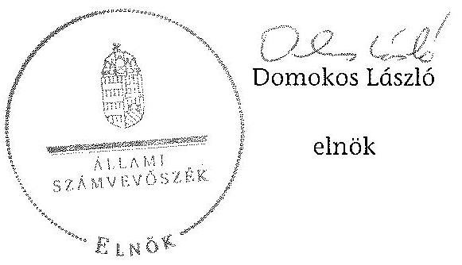

---

# RÖVIDÍTÉSEK JEGYZÉKE 

## Jogszabályok

Alaptörvény
Áht. 1
Áht. 2
ÁSZ tv.
Avtv.

Evt.

Evr.

Gt.
Info tv.

Nfatv.
Nvtv.
Számv. tv.
új Ptk.
Vadvédelmi tv.

Vtv.
Vhr.

143/2009. (VII. 6.)
Korm. rendelet

Magyarország Alaptörvénye (2011. április 25.) (hatályos: 2012. január 1-jétől)

Az államháztartásról szóló 1992. évi XXXVIII. törvény (hatálytalan: 2012. január 1-jétől)
Az államháztartásról szóló 2011. évi CXCV. törvény (hatályos: 2012. január 1-jétől)
Az Állami Számvevőszékről szóló 2011. évi LXVI. törvény (hatályos: 2011. július 1-jétől)
A személyes adatok védelméről és a közérdekú adatok nyilvánosságáról szóló 1992. évi LXIII. törvény (hatálytalan: 2012. január 1-jétől)

Az erdőről, az erdő védelméről és az erdőgazdálkodásról szóló 2009. évi XXXVII. törvény (hatályos: 2009. július 10étől)
Az erdőről, az erdő védelméről és az erdőgazdálkodásról szóló 2009. évi XXXVII. törvény végrehajtásáról szóló 153/2009. (XI. 13.) FVM rendelet (hatályos: 2009. november 21-étől)
A gazdasági társaságokról szóló 2006. évi IV. törvény (hatálytalan: 2014. március 15-étől)
Az információs önrendelkezési jogról és az információszabadságról szóló 2011. évi CXII. törvény (hatályos: 2011. július 27 -étől)
A Nemzeti Földalapról szóló 2010. évi LXXXVII. törvény (hatályos: 2010. szeptember 1-jétől)
A nemzeti vagyonról szóló 2011. évi CXCVI. törvény (hatályos: 2011. december 31-étől)
A számvitelről szóló 2000. évi C. törvény (hatályos: 2001. január 1-jétől)
A Polgári Törvénykönyvről szóló 2013. évi V. törvény (hatályos: 2014. március 15-étől)
A vad védelméről, a vadgazdálkodásról, valamint a vadászatról szóló 1996. évi LV. törvény (hatályos: 1997. március 1-jétől)
Az állami vagyonról szóló 2007. évi CVI. törvény (hatályos: 2007. szeptember 25-étől)
Az állami vagyonnal való gazdálkodásról szóló törvény végrehajtásáról szóló 254/2007. (X. 4.) Korm. rendelet (hatályos: 2007. október 4-étől)
Az erdőgazdálkodási és erdővédelmi bírság mértékéről és kiszámításának módjáról (hatályos: 2009. július 10-étől)

---

# Egyéb rövidítések 

Alapító Okirat ${ }_{1}$
Alapító Okirat ${ }_{2}$
Alapító Okirat ${ }_{3}$
Alapító Okirat ${ }_{4}$
Alapító Okirat ${ }_{5}$
Alapító Okirat ${ }_{6}$
Alapító Okirat ${ }_{7}$
Alapító Okirat ${ }_{8}$
Alapító Okirat ${ }_{9}$
Alapító Okirat ${ }_{10}$
ÁSZ
Befektetési Szabályzat
Befektetési és Árfolyam-kockázat-kezelési Szabályzat
Belső Ellenőrzési Szabályzat ${ }_{1}$
Belső Ellenőrzési Szabályzat ${ }_{2}$
A KEFAG Zrt. alapító okirata (hatályos: 2008. december 20-ától 2009. május 28 -áig)
A KEFAG Zrt. alapító okirata (hatályos:2009. május 29étől 2009. július 23 -áig)
A KEFAG Zrt. alapító okirata (hatályos:2009. július 24étől 2010. február 3 -áig)
A KEFAG Zrt. alapító okirata (hatályos:2010. február 4étől 2010. május 19-éig)
A KEFAG Zrt. alapító okirata (hatályos:2010. május 20ától 2010. július 12-éig)
A KEFAG Zrt. alapító okirata (hatályos:2010. július 13ától 2011. július 10-éig)
A KEFAG Zrt. alapító okirata (hatályos:2010. július 11étől 2012. november 18 -áig)
A KEFAG Zrt. alapító okirata (hatályos:2012. november 19-étől 2013. július 10-éig)
A KEFAG Zrt. alapító okirata (hatályos:2013. július 11étől 2014. június 13 -áig)
A KEFAG Zrt. alapító okirata (hatályos:2014. június 14étől)
Állami Számvevőszék
A KEFAG Zrt. Befektetési Szabályzata (hatályos: 2004. május 1-jétől 2009. december 31-éig)
A KEFAG Zrt. Befektetési és Árfolyamkockázat-kezelési Szabályzata (hatályos: 2010. január 1-jétől)
A KEFAG Zrt. Belső Ellenőrzési Szabályzata (hatályos: 2000. január 1-jétől 2009. december 31-éig)

A KEFAG Zrt. Belső Ellenőrzési Szabályzata (hatályos: 2010. január 1-jétől)

A KEFAG Zrt. Beszerzési, Beruházási, Felújítási és Karbantartási Szabályzata (hatályos: 2013. május 1-jétől)

A Kiskunsági Erdészeti és Faipari Rt. bizonylati szabályzata (hatályos: 1995-től 2012. január 1-jéig)
A KEFAG Zrt. bizonylati szabályzata (hatályos: 2012. január 1-jétől)
Bács-Kiskun Megyei Mezőgazdasági Szakigazgatási Hivatal Erdészeti Igazgatósága (2010. december 31-éig)
Bács-Kiskun Megyei Kormányhivatal Erdészeti Igazgatósága (2011. január 1-jétől)
A KEFAG Zrt. Értékelési szabályzata (hatályos: 2001. január 1-jétől 2009. december 31-éig)
A KEFAG Zrt. Értékelési szabályzata (hatályos: 2010. január 1-jétől)

---

| FB | A KEFAG Zrt. Felügyelő bizottsága |
| :--: | :--: |
| Ft | forint |
| gazdasági vezérigazga-tó-helyettes | A KEFAG Zrt. gazdasági vezérigazgató-helyettese |
| ha | hektár |
| hrsz. | helyrajzi szám |
| igazgatóság | A KEFAG Zrt. Igazgatósága |
| Iratkezelési és | A Kiskunsági Erdészeti és Faipari Rt. Iratkezelési és |
| Irattározási Szabályzat ${ }_{1}$ | Irattározási Szabályzata (hatályos: 2001. december 20ától 2009. december 31-ig) |
| Iratkezelési és | A KEFAG Zrt. Iratkezelési és Irattározási Szabályzat (hatályos: 2010. január 1-jétől) |
| Irattározási Szabályzat ${ }_{2}$ | A KEFAG Zrt. Irattári terve (hatályos: 2009. január 1jétől) |
| Irattári terv | KEFAG Kiskunsági Erdészeti és Faipari Zrt. |
| KEFAG Zrt./Társaság | Kiskunsági Erdő- és Fafeldolgozó Gazdaság |
|  |  |
| KEOP | Környezet és Energia Operatív Program |
| könyvvizsgáló | A KEFAG Zrt. könyvvizsgálója |
| KVI | Kincstári Vagyoni Igazgatóság |
| Leltározási Szabályzat ${ }_{1}$ | A KEFAG Zrt. Leltározási Szabályzata (hatályos 2001. január 1-jétől 2009. december 31-éig), |
| Leltározási Szabályzat ${ }_{2}$ | A KEFAG Zrt. Leltározási Szabályzata (hatályos: 2010. január 1-jétől 2011. augusztus 31-éig) |
| Leltározási Szabályzat ${ }_{3}$ | A KEFAG Zrt. Leltározási Szabályzata (hatályos: 2011. szeptember 1-jétől) |
| M | millió |
| MFB Zrt. | Magyar Fejlesztési Bank Zrt. |
| MGSZH | Mezőgazdasági Szakigazgatási Hivatal |
| MNV Zrt. | Magyar Nemzeti Vagyonkezelő Zrt. |
| múszaki osztályvezető | KEFAG Zrt. múszaki osztályvezetője |
| MVH | Mezőgazdasági és Vidékfejlesztési Hivatal |
| NFA | Nemzeti Földalapkezelő Szervezet |
| Számítástechnikai Védelmi Szabályzat ${ }_{1}$ | A KEFAG Rt. Számítástechnikai Védelmi Szabályzata (hatályos 2000. január 1-jétől 2009. december 31-éig) |
| Számítástechnikai Védelmi Szabályzat ${ }_{2}$ | A KEFAG Zrt. Számítástechnikai Védelmi Szabályzata (hatályos 2010. január 1-jétől 2012. január 8-áig) |
| Számítástechnikai Védelmi Szabályzat ${ }_{3}$ | A KEFAG Zrt. Számítástechnikai Védelmi Szabályzata (hatályos 2012. január 9-étől) |
| Számlarend ${ }_{1}$ | A KEFAG Zrt. Szöveges kiegészítése a számlakerethez (hatályos 2009. január 1-jétől 2010. december 31-éig) |
| Számlarend ${ }_{2}$ | A KEFAG Zrt. Szöveges kiegészítése a számlakerethez (hatályos 2011. január 1-jétől) |
| Számviteli politika ${ }_{1}$ | A KEFAG Zrt. Számviteli politikája (hatályos 2009. január 1-jétől 2010. december 31-éig) |

---

| Számviteli politika $_{2}$ | A KEFAG Zrt. Számviteli politikája (hatályos 2011. január 1-jétől 2013. december 31-éig) |
| :--: | :--: |
| Számviteli politika $_{3}$ | A KEFAG Zrt. Számviteli politikája (hatályos 2014. január 1-jétől) |
| SZMSZ $_{1}$ | A KEFAG Zrt. Szervezeti és Müködési Szabályzata (hatályos: 2008. szeptember 9-étől 2010. október 31-éig) |
| SZMSZ $_{2}$ | A KEFAG Zrt. Szervezeti és Müködési Szabályzata (hatályos: 2010. november 1-jétől 2011. június 14-éig) |
| SZMSZ $_{3}$ | A KEFAG Zrt. Szervezeti és Müködési Szabályzata (hatályos: 2011. június 15-étől 2011. augusztus 31-éig) |
| SZMSZ $_{4}$ | A KEFAG Zrt. Szervezeti és Müködési Szabályzata (hatályos: 2011. szeptember 1-jétől 2013. szeptember 16-áig) |
| SZMSZ $_{5}$ | A KEFAG Zrt. Szervezeti és Müködési Szabályzata (hatályos: 2013. szeptember 17-étől) |
| telephelyek | Bugaci Erdészet, Császártöltési Erdészet, Észak-Kiskunsági Erdészet, Dél-Kiskunsági Erdészet, Juniperus Parkerdészet, ÖKOPAL Raklap Üzem |
| termelési vezérigazgatóhelyettes | A KEFAG Zrt. termelési vezérigazgató-helyettese |
| Transzferár Szabályzat | A KEFAG Zrt. Transzferár Szabályzata (hatályos: 2012. január 1-jétől |
| tulajdonosi joggyakorló ${ }_{1}$ | A Társaság állami tulajdonú részesedése feletti tulajdonosi jogokat gyakorló Magyar Nemzeti Vagyonkezelő Zrt. (2009. január 1-jétől 2010. június 16-áig) |
| tulajdonosi joggyakorló ${ }_{2}$ | A Társaság állami tulajdonú részesedése feletti tulajdonosi jogokat gyakorló Magyar Fejlesztési Bank Zrt. (2010. június 17-étől 2014. július 15-éig) |
| vadászati hatóság ${ }_{1}$ | Bács-Kiskun Megyei Mezőgazdasági Szakigazgatási Hivatal Földművelésügyi Igazgatóságának Vadászati és Halászati Osztálya (2010. december 31-éig) |
| vadászati hatóság $_{2}$ | Bács-Kiskun Megyei Kormányhivatal Földművelésügyi Igazgatósága (2011. január 1-jétől) |
| Vadgazdálkodási Szabályzat ${ }_{1}$ | A KEFAG Zrt. Vadászati Szabályzata (hatályos: 2009. március 3-ától 2011. február 27-éig) |
| Vadgazdálkodási Szabályzat $_{2}$ | A KEFAG Zrt. Vadgazdálkodási szabályzata (hatályos: 2011. február 28-ától 2012. július 25-éig) |
| Vadgazdálkodási Szabályzat $_{3}$ | A KEFAG Zrt. Vadgazdálkodási szabályzata (hatályos: 2012. július 26-ától 2013. június 30-áig) |
| Vadgazdálkodási Szabályzat $_{4}$ | A KEFAG Zrt. Vadgazdálkodási szabályzata (hatályos: 2013. július 1-jétől) |
| vezérigazgató   VSZ | A KEFAG Zrt. vezérigazgatója   A KEFAG Rt. és a KVI által 1996. november 1-jén kötött ideiglenes vagyonkezelési szerződés |

---

# FOGALOMTÁR 

állami vagyon
állami vagyon
használója
átlátható szervezet
földbirtokpolitikai irányelvek
hagyásfa
hasznosítás
immateriális szolgáltatásából származó bevétel
információs és kommunikációs rendszer
kockázatkezelés

Állami vagyon:
a) az állam tulajdonában lévő dolog, valamint dolog módjára hasznosítható természeti erő;
b) az a) pont hatálya alá tartozó mindazon vagyon, amely vonatkozásában törvény az állam kizárólagos tulajdonjogát nevesíti;
c) az állam tulajdonában lévő tagsági jogviszonyt megtestesítő értékpapír, illetve az államot megillető egyéb társasági részesedés;
d) az államot megillető olyan immateriális, vagyoni értékkel rendelkező jogosultság, amelyet jogszabály vagyoni értékű jogként nevesít;
e) az állam tulajdonában lévő pénzügyi eszközök.
Az állami vagyon használója az a természetes vagy jogi személy, jogi személyiséggel nem rendelkező szervezet, aki, vagy amely törvény vagy szerződés alapján, bármely jogcímen (bérlet, haszonbérlet, használat stb.) állami vagyont birtokol, használ, szedi annak hasznait. (Ide nem értve a haszonélvezőt, a vagyonkezelőt és a tulajdonosi jogok gyakorlóját.)
Átlátható szervezet a Nvtv. 3. § (1) bekezdés 1. pontjában felsorolt, a meghatározott követelményeknek megfelelő szervezet.
Az Nfatv. 15. § (3) bekezdés a)-s) pontjaiban meghatározott, a Nemzeti Földalapba tartozó földrészletek hasznosítására vonatkozó irányelvek.
A véghasználatok során fakitermelési korlátozás alá eső, vagy kitermelni nem szándékozott faegyed.
Hasznosítás a tulajdonosi joggyakorló vagy a nemzeti vagyon használója által a nemzeti vagyon birtoklásának, használatának, hasznok szedése jogának bármely - a tulajdonjog átruházását nem eredményező - jogcímen történő átengedése, ide nem értve a vagyonkezelésbe adást, valamint a haszonélvezeti jog alapítását.
Immateriális szolgáltatásból származó bevételek azok a nem anyagjellegú szolgáltatásokból származó állami bevételek, amelyeket az Evt. 3. § (1) bekezdése szerint, a külön jogszabályban meghatározott részletes feltételek szerint, az erdők fenntartására, gyarapítására és védelmére kell fordítani.
Az információs és kommunikációs rendszer biztosítja, hogy az információk eljussanak az illetékes szervezethez, szervezeti egységhez, illetve személyhez.
A kockázatkezelés a szervezet céljai elérésével kapcsolatos kockázatok azonosításának és elemzésének, valamint a megfelelő válaszok meghatározásának folyamata.

---

kockázatkezelési rendszer
kontrolling
kontrollkörnyezet
kontrolltevékenységek
közfeladat

A kockázatkezelési rendszer működtetése során fel kell mérni és meg kell állapítani a szervezet tevékenységében, gazdálkodásában rejlő kockázatokat, valamint meg kell határozni az egyes kockázatokkal kapcsolatban szükséges intézkedéseket, valamint azok teljesítésének folyamatos nyomon követésének módját.

A kockázatkezelési rendszer olyan irányítási eszközök és módszerek összessége, amelynek elemei a szervezeti célok elérését veszélyeztető tényezők (kockázatok) azonosítása, elemzése, nyomon követése, valamint szükség esetén a kockázati kitettség mérséklése.
Az a vezetéstámogató rendszer, amely a vezetői tervezést, ellenőrzést, valamint információ-ellátást koordinálja célorientáltan a környezeti változásokhoz igazodva.
A kontroll környezet elemei: a szervezeti struktúra, a felelősségi, hatásköri viszonyok és feladatok, a szervezet minden szintjén meghatározott etikai elvárások, a humánerőforráskezelés. A kontrollkörnyezet alapozza meg a belső kontroll összes többi elemét a fegyelem és a struktúra biztosítása által.
A kontrollrendszer a kockázatok kezelése és tárgyilagos bizonyosság megszerzése érdekében kialakított folyamatrendszer, amely azt a célt szolgálja, hogy megvalósuljanak a következő célok:
a) a múködés és a gazdálkodás során a tevékenységeket szabályszerűen, gazdaságosan, hatékonyan, eredményesen hajtsák végre,
b) az elszámolási kötelezettségeket teljesítsék, és
c) megvédjék az erőforrásokat a veszteségektől, károktól és nem rendeltetésszerű használattól.
A kontrolltevékenységek azok az elvek (politikák) és eljárások, amelyeket a kockázatok meghatározása és a szervezet céljainak elérése érdekében alakítanak ki.
A közfeladat jogszabályban meghatározott állami vagy önkormányzati feladat, amit az arra kötelezett közérdekből, jogszabályban meghatározott követelményeknek és feltételeknek megfelelve végez, ideértve a lakosság közszolgáltatásokkal való ellátását, továbbá az állam nemzetközi szerződésekben vállalt kötelezettségeiből adódó közérdekú feladatokat, valamint e feladatok ellátásához szükséges infrastruktúra biztosítását is.

Az Evt. 2. § (2) bekezdése szerint a fenntartható erdőgazdálkodás során a legfontosabb közérdekű feladat az erdők változatosságának megőrzése, az erdők fenntartása, felújítása és a védelmi, valamint közjóléti szolgáltatások biztosítása, melyek elvégzését az állam megfelelő eszközökkel biztosítja.

---

monitoring

Nemzeti Földalap
nemzeti vagyon használója
rábízott állami vagyon
társasági portfólió
tulajdonosi ellenőrzés
tulajdonosi joggyakorló

A szervezet tevékenységének, a célok megvalósításának nyomon követését biztosító rendszer, amely az operatív tevékenységek keretében megvalósuló folyamatos és eseti nyomon követésből, valamint az operatív tevékenységektől függetlenül múködő belső ellenőrzésből áll.

A monitoring a projektek és programok végrehajtásának nyomon követése, mely a támogató és a kedvezményezett közti megállapodásban foglalt eljárások követését, az előrehaladás ellenőrzését és a lehetséges problémák időben történő azonosítását szolgálja.
A Nemzeti Földalap a kincstári vagyon része, amelybe beletartoznak az állam tulajdonában és az ingatlannyilvántartásban levő, az Nfatv. 1. § (1)-(2) bekezdéseiben felsorolt területek, földrészletek és az azokhoz kapcsolódó vagyoni értékú jogok.
A nemzeti vagyon használója az a természetes személy, jogi személy vagy jogi személyiséggel nem rendelkező szervezet, aki, vagy amely állami vagyon tekintetében törvény vagy szerződés alapján, a helyi önkormányzat vagyona tekintetében törvény, a helyi önkormányzat rendelete vagy szerződés alapján bármely jogcímen nemzeti vagyont birtokol, használ, szedi annak hasznait, kivéve a tulajdonosi joggyakorló (az Nvtv. 3. § (1) bekezdés 11. pontja alapján).
Rábízott állami vagyon az a Vtv. alkalmazásában állami vagyonnak minősülő vagyon, amit az MNV- a saját vagyonától elkülönítetten - kezel és nyilvántart.

Az Mfbtv. 3. § (9) bekezdése szerint rábízott állami vagyon az a vagyon, amely felett az Mfbtv. erejénél fogva a Magyar Állam nevében az MFB gyakorolja a tulajdonosi jogokat.

Az Nfatv. 1. § (1) bekezdésében foglaltak alapján az NFAhoz tartozó rábízott vagyon a törvényben meghatározott, a Nemzeti Földalapba tartozó vagyon.
Társasági portfólió az MNV, illetve az MFB rábízott vagyonába tartozó állami tulajdonú társasági részesedések.
A tulajdonosi joggyakorló által végzett ellenőrzés, amelynek célja az állami vagyonnal való gazdálkodás vizsgálata, ennek keretében a rendeltetésellenes, jogszerútlen, szerződésellenes, vagy a tulajdonos érdekeit sértő, illetve a központi költségvetést hátrányosan érintő vagyongazdálkodási intézkedések feltárása és a jogszerú állapot helyreállítása, továbbá a vagyonnyilvántartás hitelességének, teljességének és helyességének biztosítása.
Tulajdonosi joggyakorló az, aki az állami, illetve a nemzeti vagyon felett az államot megillető tulajdonosi jogok és kötelezettségek gyakorlására jogosult.

---

tulajdonosi joggyakorlás módja
vagyongazdálkodás feladata
vagyonkezelői jog

Az állami vagyon felett a Magyar Âllamot megillető tulajdonosi jogoknak (és kötelezettségeknek) az összességét az állami vagyon felügyeletéért felelős miniszter gyakorolja, aki e feladatát az MNV, az MFB, illetve egyéb tulajdonosi joggyakorló szervezet (pl. központi költségvetési szervek, 100\%-ban állami tulajdonban álló gazdasági társaságok) útján látja el.

Azon állami tulajdonban álló ingatlanok felett, amelyek egy része a Nemzeti Földalapba tartozik, a tulajdonosi jogokat a miniszter az agrárpolitikáért felelős miniszterrel közösen gyakorolja.

A Nemzeti Földalap felett a Magyar Állam nevében a tulajdonosi jogokat és kötelezettségeket az agrárpolitikáért felelős miniszter a Nemzeti Földalapkezelő Szervezet útján gyakorolja.
Az állami vagyon rendeltetésének megfelelő - az állami feladatok ellátásához, a társadalmi szükségletek kielégítéséhez, valamint a Kormány gazdaságpolitikája megvalósításának elősegittéséhez szükséges, egységes elveken alapuló, önálló ágazatként megjelenő - hatékony, költségtakarékos, értékmegőrző, értéknövelő felhasználásának biztosítása, beleértve a vagyoni kör változását eredményező értékesítést, valamint az állami vagyon gyarapítása is.
Vagyonkezelési szerződés alapján a vagyonkezelő jogosult meghatározott, állami tulajdonba tartozó dolog birtoklására, használatára és hasznai szedésére.

A Vtv. alapján a vagyonkezelői jog az állami vagyon hasznosítására az MNV-vel kötött vagyonkezelési szerződéssel jön létre. A vagyonkezelési szerződés alapján a vagyonkezelő jogosult meghatározott, állami tulajdonba tartozó dolog birtoklására, használatára és hasznai szedésére.

Az Nfatv. alapján a vagyonkezelői jog az erre irányuló (NFA-val kötött) szerződéssel jön létre. A vagyonkezelői szerződés alapján a vagyonkezelő jogosult meghatározott földrészlet birtoklására, használatára és hasznai szedésére. A vagyonkezelő köteles a földrészlet értékét megőrizni, állagának megóvásáról, jó karban tartásáról gondoskodni, továbbá - az Nfatv.-ben meghatározott esetek kivételével díjat - fizetni vagy a szerződésben előírt más kötelezettséget teljesíteni.

---

A KEFAG Zrt. vagyonának alakulása a 2009-2013. évek közötti időszakban eszközök (M Ft)
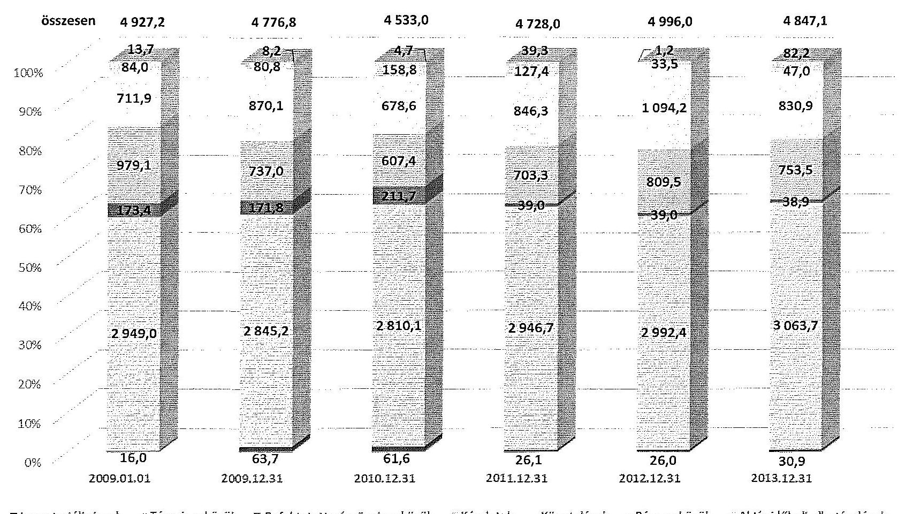

---

A KEFAG Zrt. vagyonának alakulása a 2009-2013. évek közötti időszakban források (MI Ft)
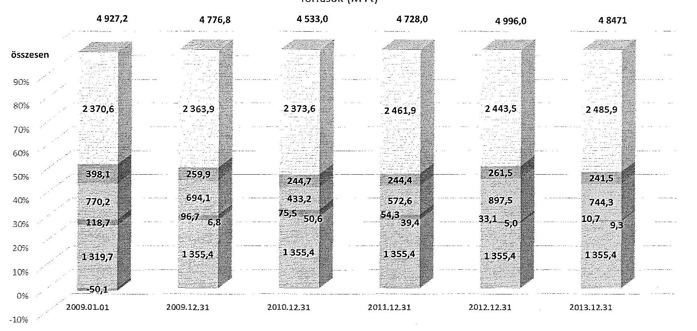

---

## 4. SZÁMÚ MELLÉKLET A V-0764-070/2015. SZÁMÚ JELENTÉSHEZ

### Kimutatás a KEFAG Zrt. befektetett eszközei állományának alakulásáról a 2009-2014. I. féléve közötti időszakra vonatkozóan

|  No. | MESZKUVÁTÁS | 2009. év |  |  | 2010. év |  |  | 2011. év |  |  | 2012. év |  |  | 2013. év |  |  | 2014. év |  |  | 2015. év |  |  | 2016. év |  |   |
| --- | --- | --- | --- | --- | --- | --- | --- | --- | --- | --- | --- | --- | --- | --- | --- | --- | --- | --- | --- | --- | --- | --- | --- | --- | --- |
|   |  | Összesen | Állami vagyon | Intétt vagyon | Összesen | Állami vagyon | Intétt vagyon | Összesen | Állami vagyon | Intétt vagyon | Összesen | Állami vagyon | Intétt vagyon | Összesen | Állami vagyon | Intétt vagyon | Összesen | Állami vagyon | Intétt vagyon | Összesen | Állami vagyon | Intétt vagyon | Összesen | Állami vagyon | Intétt vagyon  |
|   |  | 1 | 2 | 3 | 4 | 5 | 6 | 7 | 8 | 9 | 10 | 11 | 12 | 13 | 14 | 15 | 16 | 17 | 18 | 19 | 20 | 21 | 22 | 23 | 24  |
|  1. | Nyitó állomány | 3120444 | 10710 | 3127729 | 2040636 | 10710 | 3069911 | 2043477 | 10710 | 3073763 | 2011747 | 10710 | 3041820 | 2017401 | 10710 | 3046796 | 3133530 | 10710 | 3122810 |  |  |  |  |  |   |
|  2. | Terv azotati intézkedésének | 220020 | 0 | 220655 | 210670 | 0 | 210670 | 411227 | 0 | 411227 | 262072 | 0 | 362072 | 265007 | 0 | 247007 | 125600 | 0 | 110440 |  |  |  |  |  |   |
|  3. | Terven feláll intézkedésének | 1000 | 0 | 1000 | 1000 | 0 | 1000 | 22002 | 0 | 22040 | 630 | 0 | 610 | 1400 | 0 | 1400 | 320 | 0 | 310 |  |  |  |  |  |   |
|  4. | Edülvazítás vásárkodása | 0 | 0 | 0 | 0 | 0 | 0 | 0 | 0 | 0 | 0 | 0 | 0 | 0 | 0 | 0 | 0 | 0 | 0 | 0 | 0 |  |  |  |   |
|  5. | Éttékedély | 4330 | 0 | 4330 | 300 | 0 | 300 | 7000 | 0 | 7000 | 7300 | 0 | 7300 | 4330 | 0 | 4330 | 0 | 0 | 0 | 0 | 0 |  |  |  |   |
|  6. | Szipfizetés | 0 | 0 | 0 | 600 | 0 | 600 | 1120 | 0 | 1120 | 400 | 0 | 400 | 300 | 0 | 300 | 0 | 0 | 0 | 0 | 0 |  |  |  |   |
|  7. | Átartaléklás | 0 | 0 | 0 | 0 | 0 | 0 | 0 | 0 | 0 | 0 | 0 | 0 | 0 | 0 | 0 | 0 | 0 | 0 | 0 | 0 |  |  |  |   |
|  8. | Segúrzés-átadás | 0 | 0 | 0 | 0 | 0 | 0 | 0 | 0 | 0 | 0 | 0 | 0 | 0 | 0 | 0 | 0 | 0 | 0 | 0 | 0 |  |  |  |   |
|  9. | Egyéb | 143010 | 0 | 143313 | 195701 | 0 | 195701 | 400010 | 0 | 400010 | 321100 | 0 | 321100 | 320300 | 0 | 320300 | 32012 | 0 | 32012 |  |  |  |  |  |   |
|  10. | Cerkészés összesen | 372224 | 0 | 372224 | 416643 | 0 | 416643 | 953174 | 0 | 953174 | 455899 | 0 | 805899 | 486513 | 0 | 486513 | 183176 | 0 | 143176 |  |  |  |  |  |   |
|  11. | Terv azotati beruházás | 240330 | 0 | 240330 | 520010 | 0 | 520010 | 840044 | 0 | 840044 | 620827 | 0 | 620827 | 533000 | 0 | 533000 | 83470 | 0 | 83470 |  |  |  |  |  |   |
|  12. | Terv azotati felújítás | 4020 | 0 | 4020 | 57900 | 0 | 57900 | 28070 | 0 | 28070 | 25740 | 0 | 25740 | 28670 | 0 | 28670 | 1000 | 0 | 1000 |  |  |  |  |  |   |
|  13. | Terv azotati növekedés | 314426 | 0 | 314426 | 378496 | 0 | 378496 | 867361 | 0 | 867361 | 631367 | 0 | 831367 | 542620 | 0 | 542620 | 86322 | 0 | 86322 |  |  |  |  |  |   |
|  14. | Egyéb beruházás | 0 | 0 | 0 | 0 | 0 | 0 | 0 | 0 | 0 | 0 | 0 | 0 | 0 | 0 | 0 | 0 | 0 | 0 | 0 | 0 |  |  |  |   |
|  15. | Egyéb felújítás | 0 | 0 | 0 | 0 | 0 | 0 | 0 | 0 | 0 | 0 | 0 | 0 | 0 | 0 | 0 | 0 | 0 | 0 | 0 | 0 |  |  |  |   |
|  16. | Átartaléklás | 0 | 0 | 0 | 0 | 0 | 0 | 0 | 0 | 0 | 0 | 0 | 0 | 0 | 0 | 0 | 0 | 0 | 0 | 0 | 0 |  |  |  |   |
|  17. | Azotati | 0 | 0 | 0 | 0 | 0 | 0 | 0 | 0 | 0 | 0 | 0 | 0 | 0 | 0 | 0 | 0 | 0 | 0 | 0 | 0 |  |  |  |   |
|  18. | Edülvazítás vásárkodása | 0 | 0 | 0 | 0 | 0 | 0 | 0 | 0 | 0 | 0 | 0 | 0 | 0 | 0 | 0 | 0 | 0 | 0 | 0 | 0 |  |  |  |   |
|  19. | Edülcélkészés vásárkodása | 0 | 0 | 0 | 0 | 0 | 0 | 0 | 0 | 0 | 0 | 0 | 0 | 0 | 0 | 0 | 0 | 0 | 0 | 0 | 0 |  |  |  |   |
|  20. | Egyéb | 0 | 0 | 0 | 41000 | 0 | 41000 | 14080 | 0 | 14080 | 90 | 0 | 90 | 0 | 0 | 0 | 0 | 0 | 0 | 0 | 0 |  |  |  |   |
|  21. | Terven feláll növekedés | 0 | 0 | 0 | 41000 | 0 | 41000 | 14080 | 0 | 14080 | 90 | 0 | 90 | 0 | 0 | 0 | 0 | 0 | 0 | 0 | 0 |  |  |  |   |
|  22. | Növekedés összesen | 318836 | 0 | 318836 | 429929 | 0 | 429929 | 881936 | 0 | 881936 | 631697 | 0 | 631697 | 542630 | 0 | 542630 | 86333 | 0 | 86333 |  |  |  |  |  |   |
|  23. | Cácsi állomány | 3080620 | 10710 | 3069911 | 3080627 | 10710 | 3073763 | 2011747 | 10710 | 3069911 | 2017305 | 10710 | 3046796 | 3133530 | 10710 | 3122810 | 3076076 | 10710 | 3046166 |  |  |  |  |  |   |

---

.

---

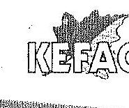

Iktatószám: 1101/010 - 11/2015
Előadó: Beda József

Tárgy: Állami Számvevőszéki jelentéstervezet
Melléklet: -

Állami Számvevőszék

Domokos László
elnök

1364 Budapest 4.
Pf. 54

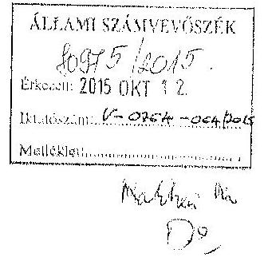

Tisztelt Elnök Úr!

Hivatkozással a V-0764-053/2015. számú, 2015. szeptember 23-án keltezett „Az
állami tulajdonban álló erdőgatdasági társaságok vagyongazdálkodási
tevékenységének ellenőrzése - KEFAG Kiskunsági Erdészeti és Faiport Zrt." című
számvevőszéki jelentéstervezetre az alábbi észrevételt teszem.

A Magyar Állam tulajdonában lévő KEFAG Zrt. az 1996. november 1-én megkötött
ideiglenes vagyonkezelési szerződésben foglalt kötelezettségeinek a mai napig
maradéktalanul eleget tesz.

A Társaság vagyongazdálkodási feladataira vonatkozó döntések, intézkedések és azok
előkészítése a mindenkori tulajdonosi joggyakorlóval egyetértésben, megfelelően
történtek, a rábízott vagyont a Társaság az elmúlt évek során megőrizze, gyarapította, a
vagyonelemek a beszámolókban és feltárral alátámasztott könyvelésben, mint
eszközök megtalálhatóak.

A jelentéstervezetben kifogásolt saját vagyon és vagyonkezelő eszközök elkülönítése
kapcsán felhívjuk az Állami Számvevőszék figyelmét, hogy Társaságunk az 1996.
november 1-én megkötött vagyonkezelői szerződés mellékletével, melyek alapján
egyértelműen beazonosíthatóak és összegszerűen nyilvántarthatóak lennének a
vagyonkezelő eszközök és azok a tulajdonos általi elfogadásával (aláírás, szignó,
pecsét, utasítás) teljeskörűen nem rendelkezik. Figyelemmel arra, hogy az elkülönített
vagyon kimutatásához számszaki, könyvelésre alkalmas bizonylatok nem állnak
rendelkezésre, így a Társaság számára lehetetlen a vagyonkezelő eszközök pontos
értéken történő elkülönítése.

A saját és kezelt vagyon elkülönített nyilvántartási kötelezettséghez a jelentéstervezet
összegző megállapítások között (id. 5. oldal) „a VSZ nyilvántartás kiinduló adatait
tartalmazó dokumentumában értékkel szereplő, vagyonkezelésbe kapott eszközöket

Fedőgazdálkodás - Vezősert - www.kefog.hu,
Ezdet iskola - www.ceckernet.hu, Dbaniis.únyiszenezelés - www.justpatrac.hu,
Arhestzun - www.kecekernetisebseztum.hu, Raksalátép gyártás - www.raksalabp.hu

---

saját vagyonként aktiválták, vagyonkezelt állami eszközként pedig a VSZ-ben nem szereplő, saját eszközöket tartottak nyilván, igy a társaság mérlege nem volt megbizható és valós." szöveg szerepel.
Véleményem szerint a KEFAG Zrt. jogelődjének 1993. július 1-i átalakulásakor a nyilvántartásba vett eszközök között a kincstári vagyonként kimutatott eszközök a töketartalék részeként kerültek be a könyvekbe, azonban a VSZ megkötésekor (1996. november 1.), azt megelőzően és azt követően sem született olyan jogszabály, amelynek alapján az érintett eszközök forrása, azaz a töketartalék csökkenéhető lett volna a kezelésbe vett vagyon értékével, az eszközök pedig elkülönítetten kerülhettek volna az analitikus nyilvántartásokba. (Szvtv. 36. §-a tételesen meghatározza a töketartalék növekedési, csökkenési jogcímeit) Tehát ezek alapján sem a KEFAG Zrt, sem annak jogelődje nem vétett hibát a nyilvántartásaiban, mert a kérdéses vagyonclemek már szerepeltek a társaság könyveiben a VSZ megkötésekor, nem pedig akkor aktiválták azokat!
További probléma a fent idézett szövegrésszel az, hogy az átalakulás, majd a VSZ megkötését követő több mint két évtizedben a korábbi tulajdonosi joggyakorlókkal (ÁPV Zrt., MNV Zrt.) történt vagyonrendezések során változott a kezelésbe vett vagyon tartalma, ami miatt az aktuális helyzetböl kiindulva kell és lehet tételes egyeztetés alapján pontosítani a nyilvántartásainkat, amennyiben ez az előzőekben leírtak ellenére szükségesnek bizonyul.

A fenti szövegidézet azon kijelentését is vitatom, miszerint a társaság mérlege nem volt megbizható és valós, hiszen a Szvtv. 3. §-ában a megbizható és valós képet lényegesen befolyásoló hiba fogalmából látjuk, hogy annak értékhatára a saját tőke 20 $\%$-át meghaladó nagyságrend, márpedig a jelentéstervezet nettó 97,1 MFt vagyonértékről szól, ezzel szemben a társaság 2013. évi saját tőkéjének $20 \%$-a 757 MFt. Tehát, ha és amennyiben az előzőekben leírtakkal ellentétben nyilvántartási hibát vétett a társaság, annak nagyságrendje messze nem éri el azt az értékhatárt, amely miatt a társaság éves beszámolóit korlátolt könyvvizsgálói záradékkal kellett volna minősíteni, vagy a mindenkori tulajdonosi joggyakorló emiatt ne fogadhatta volna el azokat. Egyébként a jelentéstervezet írója is a 13. oldalon elismeri, hogy „a feltárt hiba mértéke a Számv. tv. 3. § (3) bekezdés 3. pontja szerint nem minösül jelentős összegü hibának".

A VSZ. 4. sz. mellékletének mindkét szerződő fél által aláírt példányával nem rendelkezünk, tehát azt a jelenleg rendelkezésre álló változatában nem tudjuk érvényesnek elfogadni.

A vagyonkezelt eszközök töketartalékból történő átvezetése hosszú lejáratú kötelezettségek közé csak akkor lehetséges, ha arról a törvényi előírásoknak megfelelő szerződések, bizonylatok állnak rendelkezésre.
A KEFAG Zrt. beszámolóiban és könyvelésében szerepel hosszú lejáratú kötelezettségként 10.715 .180 Ft összegben vagyonkezelt eszköz, melyet a KVI meghatalmazása alapján 1997. áprilisában magánszemélyektől vásárolt földterület. (A 13. oldal harmadik bekezdésében szereplő 950 ha-rel szemben a helyes érték: 99,1769 ha). Ennek ellenértékét az NFA-tól 2004. áprilisában kapta meg Társaságunk, igy ezen értékben az eszköz és forrás oldalon is, mint vagyonkezelt eszköz szerepel.

---

Ha a vagyonkezelési szerződésben szereplő eszközök (földterület, ingatlan, más eszköz) is örtékkel rendelkeznének, akkor Társaságunk minden esetben hasonló módon járna el, mint a fent említett példa. Az Önök jelentéstervezetében (13. oldal) hibának állapítják meg Társaságunk számára („helytelenül vagyonkezelt állami eszközként mutattak ki a Társaság jogelödje által 1997-ben, 10,7M Fi-ért megvásárolt 950 ha területen lévő telkeket... ') pedig a vizsgálat során végig ezt kívánták elérni Táraságunknál a többi vagyonkezelt eszköz esetén is, ami így teljes ellentmondás az Önök részéről!
Továbbá, a 7. oldalon szerepel, hogy Társaságunk „az ágazati jogszobólyok vagyongazdálkodáshoz kapcsolódó elöírásait - az immateriális szolgáltatásokból származó bevételek elszámolási hiányosságai ...miatt - részben megfelelően tartotta be'". A szövegrészhez kapcsolódóan: nem ismert az immateriális szolgáltatások fogalma (Szvtv. nem ismer ilyet), valamint nem derül ki a jelentéstervezetből az sem, hogy mi a hiányosság!
A fentiek alapján tisztelettel kérem, hogy a jelentéstervezetet szíveskedjenek felülvizsgálni, a megállapításokat korrigálni és a végleges jelentésben a hivatkozásokhoz mellékleteket csatolni az egyértelmü beazonosíthatóság miatt.

Kecskemét, 2015. október 8.
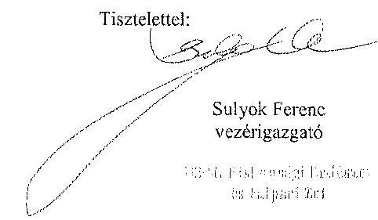

---

.

---

# Sulyok Ferenc úr 

vezérigazgató
KEFAG Kiskunsági Erdészeti és Faipari Zrt.

## Keeskemét

## Tisztelt Vezérigazgató Úr!

A , Jelentéstervezet az állami tulajdonban álló erdőgazdasági társaságok vagyongazdálkodási tevékenységének ellenörzése - KEFAG Kiskunsági Erdészeti és Faipari Zrt." címmel készített számvevöszéki jelentéstervezetre tett észrevételeit köszönettel megkaptam.

Az Állami Számvevőszék észrevételekre vonatkozó álláspontjáról a felügyeleti vezető által készített részletes tájékoztatást csatoltan megküldöm.

Tájékoztatom Vezérigazgató urat, hogy a számvevőszéki jelentésben - az Állami Számvevőszékről szóló 2011. évi LXVI. törvény 29. § (3) bekezdése alapján - a figyelembe nem vett észrevételeket szerepeltetjük az elutasítás indokának feltüntetésével.

Budapest, 2015. 10. hó 60 nap
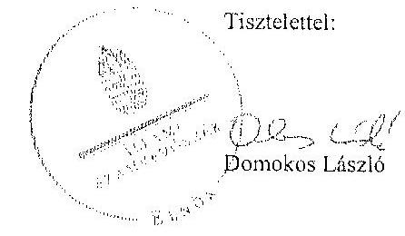

Melléklet: Tájékoztatás az elfogadott és az el nem fogadott észrevételekről

---

# Tájékoztatás   az elfogadott és az el nem fogadott észrevételekról 

A „Jelentéstervezet az állami tulajdonban álló erdőgazdasági társaságok vagyongazdálkoalisi tevékenységének ellenörzése - KEFAG Kiskunsági Erdészeti és Faipari Zrt." címủ jelentéstervezetre 2015. október 12 -én érkezett észrevételeit áttekintettük, azok kezelésével kapcsolatban a következő tájékoztatást adom.

## 1. A jelentéstervezet 5. oldal 1. bekezdés és 13. oldal 2-4. bekezdései

A Társaságnak az éves beszámolóját a jogszabályi előírásoknak megfelelően kell elkészítenie. A Vhr. 9. §-a alapján a vagyonkezelő köteles a vagyonkezelésbe vett eszközöket a Számv. tv. szerint a hosszú lejáratú kötelezettségekkel szemben a vagyonkezelési szerződésben rögzített értéken állományba venni. A Számv. tv. 23. § (2) bekezdés elöírja, hogy a vagyonkezelőnél a mérlegben eszközként kell kimutatni a törvényi rendelkezés, illetve felhatalmazás alapján - kezelésbe vett, az állami vagy önkormányzati vagyon részét képező eszközöket is. Ezen eszközöket a kiegészítő mellékletben - legalább mérlegtételek szerinti megbontásban - külön be kell mutatni.

A VSZ 4. számú melléklete (Magyar Állam tulajdonában és a Részvénytársaság használatában álló vagyonelemek tételes vagyonleltára) a Társaságnak az 1996. október 31-én (a VSZ aláírását megelőzően) vagyonkezelésében lévő eszközök számviteli elszámolásának bizonylata, mivel a VSZ-t a felek aláírták, a VSZ-ben foglaltak szerint a szerződés a mellékletekkel együtt érvényes, a VSZ 4. számú mellékletét a KEFAG Zrt. készítette el és aláírásával hitelesítette.

Az ideiglenes vagyonkezelési szerződésben a VSZ keretében vagyonkezelésbe adott vagyon értékét nem rögzítették. A Társaság a Számv. tv. és a Vhr. előírásainak betartása céljából nem tett lépéseket annak érdekében, hogy a vagyonkezelí eszközök értéke a VSZ-ben rögzítésre kerüljön.

A Társaság dokumentumokkal igazolta, hogy az 1997-ben a KEFAG Zrt. által megvásárolt összesen 950 ha földterület pénzügyi és tulajdoni rendezését többször kezdeményezte az NFA-nál, azonban nem bocsátott az ÁSZ ellenőrzés rendelkezésére dokumentumokat arra vonatkozóan, hogy a földterületek ellenértékét az NFA 2004. áprilíaban kiegyenlítette. A 99,1769 ha nagyságú földterületekkel kapcsolatban amelyek ellenértékét az észrevétel szerint az NFA kiegyenlítette - az ÁSZ ellenőrzés részére dokumentumokat a KEFAG Zrt. nem adott át.

---

A fentiek alapján a jelentéstervezetben a Társaság vagyonnyilvántartására és mérlegére vonatkozó megállapítások megalapozottak.

Az egyértelműség érdekében az 5. oldal 1. bekezdés ötödik mondatában és a 13. oldal 2. bekezdés ötödik mondatának megállapítását „a Társaság mérlege nem a valós állapotot tükrözte" megfogalmazásra pontosítjuk.

# 2. A jelentéstervezet 7. oldal 2. bekezdése, 23. oldal 2. bekezdése 

Az Evt. 3. § (1) bekezdés előírása szerint az erdők bármely immateriális szolgáltatásából származó állami bevételt a külön jogszabályban meghatározott részletes feltételek szerint az erdők fenntartására, gyarapítására és védelmére kell fordítani. A jelentéstervezet 7. oldalán található, az immateriális szolgáltatásból, vadásztatásból származó bevételek elszámolási hiányosságára vonatkozó megállapításunk részletes indoklása a 22. oldal 26. bekezdéseiben található. A fentiek alapján a megállapítás módosítása nem indokolt.

Budapest, 2015. 10. hó 30. nap

Makkai Mária
felügyeleti vezető

---

.

---

# 7. SZÁMÚ MELLÉKLET A V-0764-070/2015. SZÁMÚ JELENTÉSHEZ 

## 100000000000000000000000000000000000000000000000000000000000000000000000000000000000000000000000000000000000000000000000000000000000000000000000000000000000000000000000000000000000000000000000000000000

---

# Javaslat az MNV Zrt. vezérigazgatójának 

a) Tegyen intézkedéseket az erdőgazdasági társaság közremüködésével a tönyleges állapotot rögzitő és a hatályos jogszabályi elöirásoknak megfelelő vagyonkezelési szerződés megkötésére.
b) Tegyen intézkedéseket a vagyonkezelési szerződés felülvizsgálatának elmaradásával, valamint a Nemzeti Földalapba tartozó ingatlanokra vonatkozó VSZ megszüntetésével összefüggésben felület szabálysalanságok tekintetében a felelősség tízzúzása érdekében, és szükség szerint intézkedjen a felelősség érvényesitéséről.
c) Intézkedjen a Társaság vagyonnyilvántartása hitelességének, teljességének és helyességének jogszabályban foglaltak szerinti ellenőrzéséről."

Sajnálattal állapítottuk meg, hogy a Jelentés-tervezet egyáltalán nem vezzi figyelembe a vizsgált időszakban megindított és több eljárási cselekményi is megába foglaló intézkedés-sorozstankat, amelynek a célja a Jelentéstervezetben egyébiránt joggal kifogásolt hiányosságok megszüntetése, az erdőgazdasági társaságok működésének jogszabályi megfentlőségének biztosítása volt. Ezzel a Jelentés-tervezet azt sugallja, hogy a tulajdonosi joggyakorlók részéről egyáltalán nem volt szándék az erdőgazdasági társaságok működésének, illetve a vagyonkezelés körülményeinek hatályos jogszabályok szerinti szabályozására, amely egyébiránt nem felel meg a valóságnak és az adatszolgáltatásunk során sem erről tájékoztattuk Önöket.
Mindemellent elismerjük, hogy a probléma a kezelt vagyonelemek nagy száma, ebből kifejlődég a szabályozást igényiő körülmények nagy száma és sokrélüsége miatt nehezen átlátható, ezért kérjük, engedjék meg, hogy a munkájukat segítő szándékkal korábbi tájékoztatásunkat ismételten megerősítsük, azzal a kifejezett kéréssel, hogy a Jelentésükben az általunk vitatott megállapítást szíveskedjenek módosítani, és az MNV Zrt. által a megoldás irányába megtett intézkedéseket feltüntetni.
Az ideiglenes vagyonkezelési szerződéseken alapuló kezelői jogviszony újraszabályozása, az ideiglenes vagyonkezelési szerződések megszüntetése és végleges vagyonkezelési szerződések megkötése érdekében az intézkedéseink már 2011. évben megkezdődtek, párhuzamosan a Nemzeti Földalapról szóló 2010. évi LXXXVII. tv. 34. § (3) bekezdés c) pontja szerinti feladat- illetve vagyonátadással.

Az intézkedéseink alapja a 2011. évben, MNV/01/29518/2011. szám alatt szakkertületünk által bekért, az erdőgazdasági társaságok 2010. december 31-t, illetve 2011. július 31-i fordulónapra vonatkozó leltárjelentése volt, amelyet elsődlegesen az NFA tv. szerint előírt vagyonátadás elvégzése céljából kétnink meg az erdőgazdasági társaságoktól. Ugyanakkor a leltárjelentéshez benyújtott földrészlet listák voltak az első olyan kimutatások, amelyek a kezelt vagyon elemző a FÓMI adatbázisán alapuló (az aktuális ingatlan-nyilvántartási állapotnak megfelelően) idrészletes bontásban tartalmazzák.

## A vizsgált idöszakban megindított és lefolytatott intézkedéseink a következők:

1. Az erdőgazdasági társaságok által kezelt vagyonelemek tulajdonosi joggyakorlók szerinti elhatárolása, NFA átadás előkészítése, az erdőgazdasági társaságok bevonásával. A Nemzeti Földalapba tartozó vagyonelemek NFA átadása 2012-2013. években megtörtént, majd a visszamazadt vagyonelemek - többségében kivett megnevezésben nyilvántartott földrészletek - elhatárolását is elvégeztük. A feladat végrehajtása 2014. május 31-ig teljesült.
Az intézkedéssel az MNV Zrt. tulajdonosi joggyakorlása alá tartozó vagyonelemek körét - a közös tulajdonosi joggyakorlás alatt álló ingatlanok kivételével-, azaz a végleges vagyonkezelési szerződések ingatlanlistáit megbízároztuk.
Meg kívánjuk jegyezni, hogy az erdőgazdasági társaságok a 2011. évi leltárjelentéseikhez minden esetben esztelták a jelentés tartalmazó vonatkozó teljességi nyilatkozatukat is, így azok tartalmazó mint teljes körű adatszolgáltatást kezeltük.
A hivatkozott iratokat az eljárás során a Tisztelt Állami Számvevőszék rendelkezésére bocsátottuk.
2. Az erdőgazdasági társaságok által kezelt vagyon értékelését 2014. május 31-ig elvégeztük, részben külső piaci szereplő által megállapított vagyonértékelési adatok (az IFUA értékbecslési adatai), részben belső szakértők és a

---

kontrolling szakterület által az MNV Zrt. hatályos értékelési szabályzata által megállapított értékadatok figyelembe vételével.
3. Az MNV Zrt. Igazgatósága 511/2012. (X. 08.) IG sz., valamint 717/2013. (IX. 23.) IG sz. határozataiban intézkedési terveket fogadott el „a 28/2012. (IX. 24.) az. KIGY határozatában előírt, valamint az MNV Zrt. rábított vagyon 2012. évi beszámolója könyvvizsgálói minősítésének megtartásához szükséges és egyéb feladatokról". Az intézkedési tervek magukban foglalták az erőfgazdasági társaságok által kezelt vagyon analitikájának előállitását, illetve az erőltársaságokkal végleges (nem ideiglenes) vagyonkezelői szerződések megkötését. A 717/2013. (IX. 23.) IG sz. határozat melléklete tartalmazza a feladat végrehajtása érdekében már megtett intézkedéseket tpl. „Megjelentő az erőfgazdaságok által kezelt vagyon hatálnak vagyonkezelői jelentésekkel való egyeztetése; a vagyonkezelési szerződés tartalmi kérdésének, az erőfgazdaságok véleményének feldolgozása, MFB Munkacsoport egyeztetések töméthet aib.), valamint rögzíti a még elvégzemlő feladatokat. Ennek megfelelően az MNV Zrt-nél 2012-től folyamatban van az erőfgazdasági társaságok vagyonanalitikájának előállítása és vagyonkezelési szerződéssi tárgyú projekt.
A hatályos jogszabályoknak megfelelő vagyonkezelési szerződés tervezetét a vizsgálati időszak során az MNV Zrt. belső szakterületi egyeztetést követően előkészítettük, és a 2014. március 18-án megtartott Munkacsoport értekezleten az erőfgazdasági képviselőivel, továbbá a tulajdonosi joggyakorlók (NPA, illetve akkor még Magyar Fejlesztési Bank Zrt.) képviselővel ismertetők annak tartalmát. A szerződés szövegervezetének véleményezése ekkor megfelelőóött, ugyanakkor elismertjük, hogy a végleges szerződésváltozat már az Önök által vizsgált időszakot követően került elfogadásra. Ugyanisak a 2014. március 18-án megtartott Munkacsoport értekezleten tettünk javaslatot a vagyonkezelési díj alapjának és mértékének meghatározására.
4. Az erőfgazdasági társaságok által kezelt és a saját vagyonok vagyonelemenkénti, valamint a kezelt vagyonelamek tulajdonosi joggyakorlók szerinti elbátárolására vonatkozó intézkedésünket a vizsgált időszakban előkészítettük.

Tájékoztatjuk továbbá Elnök Urat az alábbiaktól:
A Nemzeti Fejlesztési Minisztrérium KGTJ/377-6/2014-NFM, valamint KGTJ/377-7/2014. számok alatt adott utasításokat a fenti feladatok elvégzésére. Ezekről, illetve az utasításokra adott jelentősünkről a korábbi adatszolgáltatásaink keretében szintén kitértünk.

A vagyonkezelési szerződés vizsgált időszakot követően elfogadott tervezetének mellékletét képezik az MNV Zrt. azon szabályzatai is, amelyek a kezelt vagyon nyilvántartását, a beruházások nyilvántartását és az azzal kapcsolatos elszámolásokat, illetve a tulajdonosi ellenőrzéssel kapcsolatos, a jelenlegi jogszabályi környezetnek megfelelő szabályokat tartalmazzák:

- Az állami tulajdonosi, egyéb vagyonkezelők által vagyonkezelt eszközön megvalósítandó beruházások, felújítások előzetes engedélyezésének és elszámolásának eljárásrendjéről szóló 35/2014. számú vezérigazgatói utasítás.
- A Magyar Nemzeti Vagyonkezelő Zrt. Tulajdonosi Ellenőrzési Szabályzata - a 39/2014. számú vezérigazgatói utasítás, továbbá
- A Magyar Nemzeti Vagyonkezelő Zrt. állami vagyon vagyonkezelőire, az állami vagyont használókra és a társasági elszámolések esetében az MNV Zrt. tulajdonosi joggyakorlását megbízottként előírásra vonatkozó Vagyon-nyilvántartási Szabályzatáról szóló 12/2014. számú vezérigazgatói utasítás.

Fentiek mellett megemlíthető az MNV Zrt. folyamatba épített, illetve vagyon nyilvántartás vezetést támogató ellenőrzési módszertmező szóló 11/2014. számú vezérigazgatói utasítás.
Egyestetéseink során az erőfgazdasági társaságok tájékoztatási kaptak a szabályzataink tartalmazó vonatkozóan.
A Jeleniés-tervezet 9. oldalán található, az MNV Zrt. vezérigazgatójára vonatkozó, a) pont alatti, vagyonkezelési szerződés megkötésére irányuló javaslathoz kapcsolódóan felhívjuk a Tisztelt Állami Számvevőszék figyelmét arra, hogy a Nemzeti Fejlesztési Minisztrérium AVF/21310/2015-NFM számú tájékoztató levele szerint Miniszter Úr vagyongazdálkodási szempontból nem támogatja az erőfgazdasági társaságok ideiglenes vagyonkezelési

---

# 7. SZÁMÚ MELLÉKLET A V-0764-070/2015. SZÁMÚ JELENTÉSHEZ

szerződéseit kiváltó vagyonkezelési szerződések megkötését, ideértve az MNV Zrt. vagyonkezelési szerződésekkel kapcsolatos jóváhagyó döntéseit is.

Az MNV Zrt-re vonatkozóan hivatkozott jogszabály, a Vbr. 20. § (1)-(2) bekezdése 2014. március 14-ig - csaknem az ellenőrzött időszak végéig - a következőképpen rendelkezett:

*(1) Az állami vagyon kezelőjét, használóját megillető jogok gyakorlását, annak szabályszerűségét, célszerűségét a Vbr. 17. §-ának a) pontja alapján az MNV Zrt. - szükség szerint a területi szervei útján ellenőrzi. Ennek érdekében a vagyon kezelésére, hasznosítására kitölti szerződésben rögzítni kell, hogy a tulajdonosi ellenőrzés eljárásrendjét, a felek jogait, kötelezettségeit a felek a szerződés részének tekintik.*

*(2) A tulajdonosi ellenőrzés célja az állami vagyonnal való gazdálkodás vizsgálata, ennek keretében a renárbetésellenes, jogszerülem, szerződésellenes, vagy a tulajdonos érdeként sérül, illetve a központi költségvetést hatványosan érintő vagyongazdálkodási intézkedések felbárása és a jogszerü állapot helyreállítása, továbbá a vagyonnyilvántartás hitelességének, teljességének és helyességének biztosítása.*

A tulajdonosi ellenőrzés alatt a Területi Irodák által folytatott ellenőrzést is értette a jogszabály, amiből egyenesen következik a szakterületi munkafolyamatha épített ellenőrzési kötelezettség figyelembe vételének a lehetősége. A jelentés tervezet megállapítja, hogy az MNV Zrt. a vizsgált időszakban nem végzett tulajdonosi (helyszíni) ellenőrzést a társaságnál. A hivatkozott jogszabályok nem határozzák meg a tulajdonosi ellenőrzések formáját, azokból nem következik, hogy az ellenőrzéseket a helyszínen kell lefolytatni.

Femlekre tekintettel *kérjük a Jelentés-tervezet 8-9., illetve 33. oldalán található azon megállapítások törlését, hogy az MNV Zrt. nem kezdeményezett intézkedéseket, és nem végzett a Vbr. 20. § (1)-(2) bekezdéseiben és a Nemzeti Földalapba tartozó földrészletek hasznosításának részletes szabályairól szóló 262/2010. (XI.17.) Korm. rendelet 47. § (1)-(2) bekezdéseiben foglalt, a vagyonnyilvántartás hitelességére és teljességére vonatkozó tulajdonosi (helyszíni) ellenőrzést a Társaságnál, kérjük a megtett intézkedések felbüntetését, a Jelentés-tervezet 9. oldalán található, az MNV Zrt. vezérigazgatójára vonatkozó, b) pontot a megtett intézkedések folyamatosságára tekintettel törölni, és a c) pont alatti javaslatot szövegszerűen ekként módosítani:*

#### *Javaslat az MNV Zrt. vezérigazgatójának*

*c) Az MNV Zrt. tulajdonosi joggyakorlása alá tartozó (az Erdőgazdasági Társaságok által az MNV Zrt. részére jelentett) vagyonelenné tekintetében intézkedjen a Társaság vagyonnyilvántartása hitelességének, teljességének és helyességének jogszabályban foglaltak szerinti ellenőrzéseinek erősítéséről.*

Kérem Elnök Urat, hogy a Jelentés véglegesítése során jelen észrevételeinket szíveskedjenek figyelembe venni.

Budapest, 2015. október 11.

Üdvözlettel:

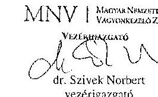

---

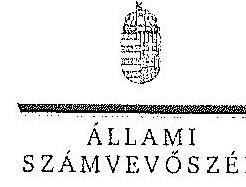

ELKÉK

Ikt.szám: V-0764-068/2015.

Dr. Szivek Norbert úr
vezérigazgató
Magyar Nemzeti Vagyonkezelő Zrt.

Budapest

Tisztelt Vezérigazgató Úr!

A „Jelentéstervezet az állami tulajdonban álló erdőgazdasági társaságok vagyongazdálkodási tevékenységének ellenőrzése - KEFAG Kiskunsági Erdészeti és Fatpari Zrt.” címmel készített számvevőszéki jelentéstervezetre tett észrevételeit köszönettel megkaptam.

Az Állami Számvevőszék észrevételekre vonatkozó álláspontjáról a felügyeleti vezető által készített részletes tájékoztatást csatoltan megküldöm.

Tájékoztatom Vezérigazgató urat, hogy a számvevőszéki jelentésben - az Állami Számvevőszékről szóló 2011. évi LXVI. törvény 29. § (3) bekezdése alapján - a figyelembe nem vett észrevételeket szerepeltetjük az elutasítás indokának feltüntetésével.

Budapest, 2015. 10. hó 11. nap

Tisztelettel:

Domokos László

Melléklet: Tájékoztatás az elfogadott és az el nem fogadott észrevételekről

1652 BUDAPEST, APACZN CSERE IMMIS UTEA 10. 1364 Budapest 4, Pl. 54 telefon: 484 9181 fax: 484 9265

---

# Tájékoztatás   az elfogadott és az el nem fogadott észrevételekről 

A „Jelentéstervezet az állami tulajdonban álló erdőgazdasági társaságok vagyongazdálkodási tevékenységének ellenörzése - KEFAG Kiskunsági Erdészeti és Fatpari Zrt." címü jelentéstervezetre 2015. október 13-án érkezett észrevételeit áttekintettük, azok kezelésével kapcsolatban a következő tájékoztatást adom.

1. A vagyonkezelési szerzódéshez kapcsolódó megállapításokra tett észrevétel (I. fejezet / 8. oldal 8. bekezdés, 9. oldal 1. és 2. bekezdés, 9-10. oldal javaslat az MNV Zrt. vezérigazgatójának a)-b) pontok)

A jelentéstervezet vagyonkezelési szerződéshez kapcsolódó megállapításai helytállóak. Az erdőgazdasági társaság müködése jogszabályi megfelelősége biztosításának érdekében tett kezdeményezésekről adott tájékoztatásukat köszönetial vettük, azonban azok nem eredményezték az ideiglenes vagyonkezelési szerződés olyan módosítását, vagy olyan új vagyonkezelési szerződés megkötését, amely biztosította volna a VSZ hiányosságainak megszüntetését, illetve a hatályos jogszabályoknak való megfelelőségét. Ezért az MNV Zrt. vezérigazgatójának és az NFA elnökének megfogalmazott intézkedést igénylő megállapítás, valamint az MNV Zrt. vezérigazgatójának megfogalmazott javaslat a) és b) pontjának módosítása nem indokolt. Az egyértelműség érdekében a 8. oldal 8. bekezdés első mondatát az alábbiak szerint pontosítjuk:
„A vagyonkezelésbe adott állami vagyon tekintetében tulajdonosi jogokat gyakorló MNV Zrt. és NFA az ellenőrzött idöszokban a VSZ-szel kapcsolatban feltári hiányosságokat nem szüntette meg, a hatályos jogszabályoknak a szerzödést nem feleltette meg. ...."
2. Az MNV Zrt. ellenőrzési kötelezettségének elmulasztására vonatkozó megállapításokra tett észrevétel (I. fejezet 8. oldal 8. bekezdés, 9. oldal 2. bekezdés, II. 5. fejezet / 33. oldal 1. bekezdés és 9 . oldal javaslat az MNV Zrt. vezérigazgatójának c) pont)

Az MNV Zrt. nem bocsátott az ÁSZ ellenőrzés rendelkezésére az MNV Zrt., vagy Területi Irodál által a Vhr. 20. § (1)-(2) bekezdései szerint végzett ellenőrzésekről dokumentumokat. A jelentéstervezet megállapításai és a javaslat helytállóak, módosításuk nem indokolt.

Budapest, 2015. 13. hó 75 nap

Makkai Mária
felügyeleti vezető

---

# MFB 

Domokos László úr
elnök részére
Állami Számvevőszék

Budapest

Tisztelt Elnök Úr!
(1) MFB
(2) MFB
(3) $128767$
$5567-07 / 2015$
ÁLLAMI SZÁMVEVŐSZÉK
$11587 / 2015$
Érkszer. 2015 OKT 13.
Ikszöscszer. P-0955-05/2015
Melléklet:
Hazbai M.
Oag

2015. szeptember 28-án köszönettel kézhez vettük az Állami Számvevőszék „Az állami tulajdonban álló erdőgazdasági társaságnk vagyongazdálkodási tevékenységének ellenőrzéséről" szóló jelentéstervezeteket az alábbi cégekre:

- Eszakerdő Erdőgazdasági Zrt.
- EGERERDŐ Erdészeti Zrt.
- Gemenci Erdő- és Vadgazdaság Zrt.
- Ipoly erdő Zrt.
- KEFAG Kiskunzági Erdészeti és Faipari Zrt
- Kisalföldi Erdőgazdaság Zrt
- SEFAG Erdészeti és Faipari Zrt
- Szombathelyi Erdészeti Zrt.
- VADEX Mezöföldi Erdő-és Vadgazdálkodási Zrt. (Ikt.szám: V-0765-044/2015.)
- Zalaerdő Erdészeti Zrt.
(ikt.szám: V-0760-075/2015.)

Az MFB Zrt. a jelentéstervezetekkel kapcsolatosan 2 féle szempontból kíván észrevételt tenni:

1. A jelentéseikben megfogalmazott központi probléma
2. Egyedi esetek

---

# 9. SZÁMÚ MELLÉKLET A V-0764-070/2015. SZÁMÚ JELENTÉSHEZ 

## 1. A jelentésekben megfogalmazott központi probléma

Az ÁSZ az egyedi jelentésében az erdőgazdasági társaságokat, valamint a vagyonkezelésbe adott állami vagyon tekintetében tulajdonosi joggyakorló MNV Zrt. és Nemzeti Földalapkezelő (továbbiakban: NFA) tevékenyėgét marasztalta el.
Alapvető problémaként jelenik meg, hogy az erdők által kezelt eszközök - az NFA-val, a Kincstári Vagyon Igazgatósággal, és az MNV Zrt-vel kötött vagyonkezelési megállapodásban rögzített - értéken nem szerepelnek a Társaságok könyveiben.
Az MFB Zrt. tudatában volt a problémának (azt az ÁSZ jelentésben is említett, 2010. évben végzett átvilágítási jelentés is tartalmazta, melynek nyomon követése, beszámoltatása megtörtént) és folyamatosan egyeztetett az MNV Zrt-vel és az NFA-val a rendezés ügyében. Az ideiglenes vagyonkezelési szerződés módosítására, véglegesítésére a vagyonkezelésbe adónak (MNV, NFA) van lehetősége, a Társaságok szerződő partnerként észrevételeket, javaslatokat tehetnck. A szerződés véglegesítése érdekében a Társaságok és az MFB Zrt. képviselöi minden olyan egyeztetésen (pl.: az MNV Zrt. által létrehozott bizottság) részt vettek, amelyre meghívást kaptak, illetve azokon érdemi javaslatokat tettek.
Ahogy a jelentés is megjegyzi, az egyeztetések az ellenőrzés befajczésig nem kerültek lezárásra, így a Társaságoknál nem áll rendelkezésre a vagyonkezelésben lévő állami vagyonra és annak nagyságára vonatkozó, az MNV Zrt. és az NFA nyilvántartásával egyező adat.
Az ÁSZ 2013. évi „Az állami vagyon feletti kontroll - Az állami vagyon feletti tulajdonosi joggyakorlással kapcsolatos tevékenyvégek ellenörzéséről" szóló jelentése alapján a Nemzeti Fejlesztési Minisztérium - az ÁSZ-szal egyeztetett - alábbi fóbb pontokat tartalmazó intézkedési tervet (1. sz. melléklet) állított össze, melyet a 2014. április 25-én kelt levelében küldött meg az MFB Zrt. részére:

- a Társaságok által kezelt állami ingatlanok és egyéb vagyonelemek értéken történő nyilvántartása,
- a vagyonkezelési díjak egyértelmủ és tulajdonosi joggyakorló szervezetenkénti meghatározása,
- az új vagyonkezelési szerződés megkötése,
- a Társaságok kezelt és saját vagyonának vagyonelemenkénti, valamint a kezelt vagyonelemek tulajdonosi joggyakorló szerinti elhatárolása.

Az MFB törvény módosításának 2014. július 16-i hatályba lépésével az MFB Zrt. állami erdőgazdaságok feletti tulajdonosi joggyakorlása megszűnt, az a Földművelésügyi Minisztériumhoz került át, így az intézkedési tervben való közreműködésre, illetve a végrehajtás nyomon követésére az MFB Zrt-nek nem volt lehetősége.

A jelentések az MNV Zrt. vezérigazgatójának, az NFA elnökének és az erdészeti társaságok vezérigazgatóinak fogalmaztak meg intézkedési javaslatokat.

---

# 2. Egyedi esetek: 

## KEFAG Kiskunsági Erdészeti és Falpari Zrt.

A jelentéstervezet többször hibásan hivatkozik az MFB Zrt-re, amikor az állami vagyonról szóló 2007. évi CVL törvény (a továbbiakban: Vtv.) 17. § (1) bekezdés d) pontja szerinti rendszeres ellenörzés elmaradására mutat rá. A Vtv. hivatkozott bekezdése alapján az ellenörzés az MNV Zrt. feladata. Kérjük a társaság felatti tulajdonosi joggyakorló; hivatkozások tơrlését (8. oldal 7. bekezdés és 32. oldal 6. bekezdés)

## Kisalliddi Erdógazdaság Zrt.

A jelentéstervezet hibásan hivatkozik az MFB Zrt-re, amikor a Vtv. 17. § (1) bekezdés d) pontja szerinti rendszeres ellenörzés elmaradására mutat rá. A Vtv. hivatkozott bekezdése alapján az ellenörzés az MNV Zrt. feladata. Kérjük a társaság feletti tulajdonosi joggyakorló; hivatkozások törlését (29. oldal 4. bekezdés)

## Szombathelyi Erdészeti Zrt.

A jelentéstervezet hibásan hivatkozik az MFB Zrt-re, amikor a Vtv. 17 § (1) bekezdés d) pontja szerinti rendszeres ellenörzési elmaradására mutat rá. A Vtv. hivatkozott bekezdése alapján az ellenörzés az MNV Zrt. feladata. Kérjük a társaság feletti tulajdonosi joggyakorló; hivatkozás törlését. (32. oldal 5. bekezdés).

Budapest, 2015. október 12.
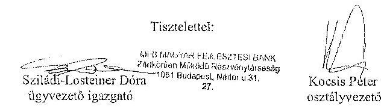

## Melléklet:

NFM levél (ikt.szám: KGTF/377-7/2014-NFM)

---

.

---

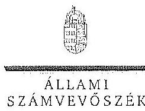

# KILAMI 

SZAMVEVÓSZEK

Ikt.szám: V-0754-104/2015.

Nagy Csaba úr
vezérigazgató
Magyar Fejlesztési Bank Zrt.

Budapest

Tisztelt Vezérigazgató Úr!

Az „Az állami tulajdonban álló erdőgazdasági társaságok vagyongazdálkodási tevékenységének ellenörzése" címủ ellenőrzés tekintetében 10 társaság jelentéstervezetére tett észrevételüket köszönettel megkaptam.

Az Állami Számvevőszék észrevételekre vonatkozó álláspontjáról a felügyeleti vezető által készített részletes tájékoztatást csatoltan megküldöm.

Tájékoztatom Vezérigazgató urat, hogy a számvevőszéki jelentésben - az Állami Számvevőszékről szóló 2011. évi LXVI. törvény 29. § (3) bekezdése alapján - a figyelembe nem vett észrevételeket szerepeltetjük az elutasítás indokának feltüntetésével.

Budapest, 2015. 11. hó 11. nap
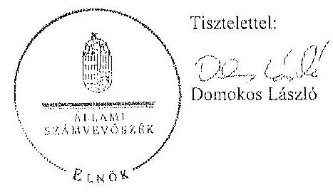

Melléklet: Tájékoztatás az elfogadott és az el nem fogadott észrevételekről

---

# Tájékoztatás   az elfogadott és az el nem fogadott észrevételekről 

„Az állami tulajdonban álló erdögazdasági társaságok vagyongazdálkodási tevékenységének ellenörzése" című ellenőrzés tekintetében az Észokerdö Erdögazdasági Zrt., az EGERERDO Erdészeti Zrt., a Gemenci Erdö- és Vadgazdaság Zrt., az IPOLY ERDO Zrt., a KEFAG Kiskunsági Erdészeti és Faipari Zrt., a Kisalföldi Erdögazdasági Zrt., a SEFAG Erdészeti és Faipari Zrt., a Szombathelyi Erdészeti Zrt., a VADEX Mezöföldi Erdö- és Vadgazdálkodási Zrt., illetve a Zalaerdö Erdészeti Zrt. társaságok jelentéstervezetére 2015. október 13-án érkezett észrevételeket áttekintettük, azok kezelésével kapcsolatban a következő tájékoztatást adom.

1. A jelentésekben megfogalmazott központi problémával kapcsolatban tett észrevételek A jelentésekben megfogalmazott központi problémával kapcsolatban adott tájékoztatásukat köszönettel vettük, azonban azok alapján a jelentéstervezet módosítása nem indokolt.
2. Egyedi esetekkel kapcsolatban tett észrevételek

A KEFAG Kiskunsági Erdészeti és Faipari Zrt. jelentéstervezetének 8. oldal 7. bekezdésére, valamint 32. oldal 6. bekezdésére tett észrevétel
A rendelkezésre álló dokumentumok ismételt áttekintését követően a jelentéstervezet 8. oldal 7. bekezdésében, valamint 32. oldal 6. bekezdésében töröljük a tulajdonosi joggyakorló 2 számú alsóindexszel jelölt hivatkozását.

A Kisalföldi Erdögazdasági Zrt. jelentéstervezetének 29. oldal 4. bekezdésére tett észrevétel
A rendelkezésre álló dokumentumok ismételt áttekintését követően a jelentéstervezet 29. oldal 4. bekezdésében töröljük a tulajdonosi joggyakorló 2 számú alsóindexszel jelölt hivatkozását.

A Szombathelyi Erdészeti Zrt. jelentéstervezetének 32. oldal 5. bekezdésére tett észrevétel
A rendelkezésre álló dokumentumok ismételt áttekintését követően a jelentéstervezet 32. oldal 5. bekezdésében töröljük a tulajdonosi joggyakorló 2 számú alsóindexszel jelölt hivatkozását.

Budapest, 2015. év $\quad 14$ hó 20 nap

Makkai Mária
felügyeleti vezető

---

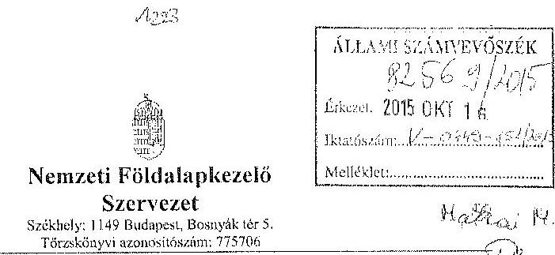

Iktatószám: NFA-002589/017/2015
Hiv. szám: ÁSZ-V-0599/2014-2015
Érintett ÁSZ iktatószámok: V-0749-148/2015, V-0750-174/2015, V-0751-121/2015,
V-0752-091/2015, V-0753-098/2015, V-754-088/2015, V-0755-124/2015, V-0757-062/2015,
V-0758-058/2015, V-0760-077/2015, V-0764-056/2015, V-0765-046/2015,
V-0766-140/2015, V-0767-056/2015.

Domokos László
Eloök

Állami Számvevőszék

1052 Budapest

Apáczai Csere János utca 10

Tárgy: Észrevétel megküldése „Az állami tulajdonban álló erdőgazdasági társaságok vagyongazdálkodási tevékenységének ellenőrzéséről" készített jelentés tervezésére.

Tisztelt Eloök Úr!

Az Állami Számvevőszék 2014 nevenhertében megkezdte „Az állami tulajdonban álló erdőgazdasági társaságok vagyongazdálkodási tevékenységének ellenőrzését" amelyről 2015 októberétől érintettség okán az NFA részére az elkészített munkaanyag tervezeteit vizsgált erdőgazdaságonként, megküldte Szervezetünk részére véleményezésre.

A munkaanyag valamennyi tervezte egységesen, az NFA Éholke részére feladatszabást tartalmaz, melyhez az alábbi észrevételeket teszzük:

A jelentéstervezetekben tett megállapítások helytállóságát nem vitatjuk, azonban szükségcsenek látjuk az NFA elnökének tett javaslatokkal a), b) és c) kapcsolatban a következő tájékoztatást megadni.

---

# 11. SZÁMÚ MELLÉKLET A V-0764-070/2015. SZÁMÚ JELENTÉSHEZ 

a) „Tegyen intézkedéseket az erdőgazdasági társaságok közremüködésével a tényleges állapotot rögzitő és a hatályos jogszabályi előírásoknak megfelelő vagyonkezelési szerzödés megkötésére."

Tájékoztatjuk, hogy a hatályos jogszabályi előírásoknak megfelelő vagyonkezelési szerződések megkötése érdekében több intézkedés történt, jelenleg is folyamathan van a szerződések előkészítése és a vagyonkezelésben maradó, illetve kikertőő földrészletek adatainak egyeztetése.

Előzményként fontos kiemelni, hogy a Nemzeti Földalapkezelő Szervezet 2010. szeptember 1. napjával történt létrehozását követően (2012. évben) került sor a vagyonkezelésben lévő földrészletek MNV Zrt. részéről történő átadására. Az átadási dokumentumok alapján Szervezetünk gondoskodott a közbíteles nyilvántartásokban a megváltozott tulajdonosi joggyakorlás feltüntetéséről. Az erdőgazdaságok esetében ez 2012. év végéig, illetve 2013. év elején megtörtént ennek az ingatlan-nyilvántartásban történő átvezetése is.

Megjegyezzük, hogy az MNV Zrt. részéről történő átadás kizárólag a - több évtizede között, és azóta többször módosított - vagyonkezelési szerződések és a földrészletek Excel táblázatban történő átadását jelentette, tehát nem egy naprakész vagyonnyilvántartást tartalmazott. Ennek következtében szükségszerüvé vált a Nemzeti Földalapkezelő Szervezetnek egy saját nyilvántartás felépítése, illetve a szerződések tartalmának feldolgozása.

A számvevőszaki ellenőrzéssel érintett időszakban, illetve még jelenleg is lezáratlan az MNV Zrt. és NFA közötti átadás-átvételi folyamat. Az MNV Zrt. további földrészletek átadását készíti elő, ugyanis az MNV Zrt. vagyoni körébe tartozó földrészletekre szintén tervezi a vagyonkezelői szerződés megkötését, és ennek a folyamatnak a részeként a még át nem adott földrészletek átadása is most történik. Természetesen az NFA is folyamatosan biztosítja a különböző hasznosítési, illetve hatósági eljárások során az erdőgazdaságok vagyonkezelésében lévő földrészletek tulajdonosi joggyakorlójának rendezését az MNV Zrt megkeresésével, közös minősítési eljárás lefolytatásával. A Nemzeti Földalapkezelő Szervezet által megbízott ügyvédi imda, jelentést készített a szerződés és a tárgyát képező földrészletek jogi helyzetének tisztázására.

Időközben az erdőgazdaságok, mint társaságok feletti tulajdonosi joggyakorló személyében is változás történt. Így új alapokon indulhatott meg a vagyonkezelői szerződés előkészítése. Ennek a folyamatnak részeként, az NFA megbízott egy Ügyvédi Konzorciumot, továbbá Szervezetünknél külön Erdészeti munkacsoport alakult 2015 májusában és azt követően a következő intézkedések történtek:

Az Erdőgazdaságok részére vagyonkezelésbe adásra tervezett ingatlanok felülvizsgálata folyamathan van az Ügyvédi Konzorcium által. A felülvizsgálat tárgyát képező ingatlanok köre három részből tevődik össze:

- az erdőgazdaságok ideiglenes vagyonkezelési szerződésének tárgyát képező ingatlanok,

---

- azon ingatlanok, amelyeket az erdőgazdaságok az ideiglenes vagyonkezelési szerződésükben szereplő ingatlanokon felül kértek vagyonkezelésbe,
- valamint azok az ingatlanok, amelyeket az NFA kíván az erdőgazdaságok vagyonkezelésébe adni.
A rendelkezésre álló dokumentumokban szereplő ingatlanokból erdőgazdaságonként egy egységes, az összes vagyonkezelésbe adandó ingatlant tartalmazó táblázat készült, amely tartalmazza az ingatlanok vagyonkezelésbe adás szempontjából releváns adatait, bejegyzett jogokat, feljegyzett tényeket. A táblázat adatai összevetésre kerültek a közbitteles ingatlannyilvántartásban szereplő adatokkal, feltárva ezáltal, hogy mely ingatlanok adhatóak vagyonkezelésbe és melyek azok, amelyeknél valamilyen előzetes intézkedés megtétele szükséges.

Az Nfatv. 8. §-a alapján a Birtokpolitikai Tanács dönt erdőgazdaságonként az erdőgazdaságok vagyonkezelési szerződésének megkötéséről.

Zárójelben jegyezzük meg, hogy például a TAEG Zrt. esetében elkészült a fentebb részletezett táblázat, amely alapján összeállitásra került azon ingatlanok listája, amelyre elindítható a vagyonkezelésbe adási eljárás. Megközelítőleg 18600 ha nagyságú területeek tervezi Szervezetünk a TAEG Zrt. részére történő vagyonkezelésbe adását, ebből 15.308 .3880 ha terület az, amelyre elindította a vagyonkezelésbe adást. Az alábbi jogszabályhelyek alapján Szervezetünk megkereste az Földművelésügyi Minisztériumot az egyetértő nyilatkozatok, valamint az alapító határozat kiadása érdekében, valamint a NÉBHet, mint erdészeti hatóságoi a vagyonkezelő erdőgazdálkodói alkalmasságát megállapító jóváhagyásának megkérése végett.

Az Nfatv. 20. § (7) bekezdése alapján „Az állam 100\%-os tulajdonában álló erdő és erdőgazdálkodási tevékenységet közvetlenül szolgáló földterületet érintő vagyonkezelési szerződés létrejöttéhez az erdészeti hatóságnak - a vagyonkezelő erdőgazdálkodói alkalmasságát megállapító - jóváhagyása szükséges".

Az Nfatv. 23. § (2) bekezdése alapján a Nemzeti Földalapba tartozó védett természeti területek és a Natura 2000 területek vagyonkezelésbe adására, tulajdonjogának bármely jogcímen történő átruházására csak a természetvédziemért felelős miniszter egyetértése esetén kerülhet sor. Az állam 100\%-os tulajdonában álló erdő, továbbá erdőgazdálkodási tevékenységet közvetlenül szolgáló földterület vagyonkezelésbe adásához az erdőgazdálkodásért felelős miniszter egyetértése szükséges.

Magyar Állam tulajdonában álló ingatlanokat érintő jogügyletekkel kapcsolatos előzetes miniszteri nyilatkozatok és a miniszter tulajdonosi joggyakorlása alá tartozó gazdasági társaságok ingatlanügyleteivel kapcsolatos miniszteri nyilatkozatok, alapítói határozatok kiadásának rendjéről szóló 8/2014. (XI. 28.) FM utasítás 3. § (4) bekezdése értelmében a miniszter tulajdonosi joggyakorlása alá tartozó állami tulajdonú gazdasági társaságoknak az

---

NFA-val történő vagyonkczelési szerződés kötéséhez elengedhetetlen a jogszabály vagy Társaságl alapszabály vagy alapító okirat alapján a Társaság tulajdonosi jogait gyakorló miniszler alapitói határozatának kiadása.

Az Erdészeti Mankacspport a kialakittott szempontok alapján tartja a kapcsolatot a Koncarcinmonal a szerződés tárgyát képező földrészletek jogi, nyilvántartási, helyszini, térképt ellenörzés tárgyában annak érdekében, hogy naprakész adatok alapján történjen a szerződéskötés.
b) „Intézkedjen a vagyonkezelési szerzödések felülvizsgálatának elmaradásával összefüggésben feltárt szabálytalanvágok tekintetében a munkajogi felelösség tisztázására irányuló eljárás megindításáról, és ennek eredménye ismeretében tegye meg a szükséges intézkedéseket.

A fent leírt folyamat időbeli áttekintése és a vagyonkezelési szerződés elökészitésének jelenlegi helyzetét tekintve a Nemzeti Földalapkezelő Szervezet egységei, munkatársai a rendelkezésükre álló eszközök alapján megtették a szükséges intézkedéseket az erdőgazdaságok vagyonkezelői szerződésének megkötése érdekében.
c) Az NFA elnöke felé tett javaslattal kapcsolatban, miszerint intézkedjen a Társaságok vagyon-nyilvántartása hitelességének, teljességének és helyességének jogszabályban foglaltak szerinti ellenörzéséről.

Az NFA 2015. év múrelosában megkezdte az Erdészeti Zrt.-ték dokumentális ellenörzését, amely ellenörzés keretén belül bekérésre került a Társaságok használatában álló vagyonelemekről és az erdővagyon állományról vezetett (nyilvántartások) aktualizált nyilvántartás is.

Budapest, 2015.október 13.
Tisztelettel:
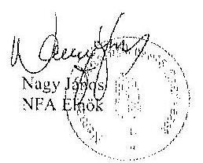

---

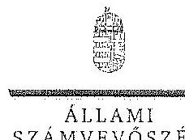

ELNÖK

# Nagy János úr 

elnök
Nemzeti Földalapkezelő Szervezet
Budapest

## Tisztelt Elnök Úr!

Az „Az állami tulajdonban álló erdőgazdasági társaságok vagyongazdálkodási tevékenységének ellenörzése" címủ ellenőrzés tekintetében 14 társaság jelentéstervezetére tett észrevételüket köszönettel megkaptam.

Az Állami Számvevőszék észrevételekre vonatkozó álláspontjáról a felügyeleti vezető által készített részletes tájékoztatást csatoltan megküldöm.

Tájékoztatom Elnök utat, hogy a számvevőszéki jelentésben - az Állami Számvevőszékről szóló 2011. évi LXVI. törvény 29. § (3) bekezdése alapján - a figyelembe nem vett észrevételeket szerepeltetjük az elutasítás indokának feltüntetésével.

Budapest, 2015, 14. hó 02. nap
Tisztelettel:
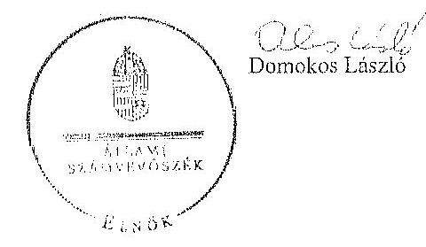

Melléklet: Tájékoztatás az észrevételek kezeléséről

---

# Tájékoztatás   az észrevételek kezeléséről 

..Az állami tulajdonban álló erdőgazdasági társaságok vagyongazdálkodási tevékenységének ellenörzése" címú ellenörzés tekintetében az IPOLY ERDŐ Zrt., az EGERERDŐ Erdészeti Zrt., a Mecsekerdő Zrt., a SEFAG Erdészeti és Faipari Zrt., a Gemenci Erdö- és Vadgazdaság Zrt., az Északerdő Erdőgazdasági Zrt., a Pilisi Parkerdő Zrt., a Szombathelyi Erdészeti Zrt., a Kisalföldi Erdőgazdasági Zrt., a Zalaerdő Erdészeti Zrt., a KEFAG Kiskunsági Erdészeti és Faipari Zrt., a VADEX Mezöföldi Erdö- és Vadgazdálkodási Zrt., a Gyulaj Erdészeti és Vadászati Zrt., illetve a TAEG Tumulmányt Erdőgazdaság Zrt. társaságok jelentéstervezetére 2015. október 16-án érkezett észrevételeket áttekintettük, azok kezelésével kapcsolatban a következő tájékoztatást adom.

Az észrevétel szerint a jelentéstervezetben tett megállapítások helytállóak, azokat nem vitatják. Az NFA elnökének tett javaslatokhoz kapcsolódó tájékoztatást köszönjük. Mindezek miatt, valamint arra tekintettel, hogy nem jött létre olyan vagyonkezelési szerződés, amely biztosítja az ideiglenes vagyonkezelési szerződés hiányosságainak a megszüntetését, illetve a hatályos jogszabályoknak való megfeleltetést, a megállapítások és a javaslatok módosítása nem indokolt.

Budapest, 2015. év /4 hó 72. nap

Makkai Mária
felügyeleti vezető