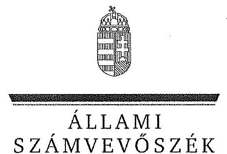

ÁLLAMI
SZÁMVEVŐSZÉK

# JELENTÉS 

Az állami tulajdonban álló erdőgazdasági társaságok vagyongazdálkodási tevékenységének ellenőrzése
VADEX Mezőföldi Erdő- és Vadgazdálkodási Zrt.

---

# Állami Számvevőszék 

Iktatószám: V-0765-060/2015.
Témaszám: 1799
Vizsgálat-azonosító szám: V070617

## Az ellenőrzést felügyelte:

## Makkai Mária

felügyeleti vezető
Az ellenőrzést vezette és az ellenőrzés végrehajtásáért felelős:
Schmidt János
ellenőrzésvezető
A számvevőszéki jelentés összeállításában közremüködtek:
Lődiné Cser Zsuzsanna
számvevő főtanácsos
Az ellenőrzést végezték:

| Gergely Tilda | Lödiné Cser Zsuzsanna |
| :-- | :-- |
| számvevő | számvevő főtanácsos |

---

# TARTALOMJEGYZÉK 

BEVEZETÉS ..... 3
I. ÖSSZEGZŐ MEGÁLLAPÍTÁSOK, KÖVETKEZTETÉSEK, JAVASLATOK ..... 7
II. RÉSZLETES MEGÁLLAPÍTÁSOK ..... 14

1. A VADEX Zrt. vagyongazdálkodása ..... 14
1.1. A vagyon értékének megőrzése, gyarapítása ..... 14
1.2. A vagyonkezelői kötelezettség teljesítése ..... 18
2. A VADEX Zrt. vagyonkezelési szerződése és a vagyonnyilvántartása ..... 18
2.1. A vagyonkezelési szerződés megfelelősége ..... 18
2.2. A VADEX Zrt. vagyonnyilvántartása ..... 21
3. A VADEX Zrt. éves tervezési feladatainak ellátása, az ágazati jogszabályok érvényesülése ..... 22
3.1. Az üzleti tervek vagyonmegőrzésre, vagyongyarapításra vonatkozó elemei ..... 22
3.2. A tervekben megfogalmazott előírások érvényesülése ..... 23
3.3. Az ágazati szabályok érvényesülése ..... 24
4. A kontroll- és monitoring rendszer kialakítása és múködtetése ..... 27
4.1. A kontrollrendszer kialakítása és múködtetése ..... 27
4.2. Az információáramlási és monitoring rendszer kialakítása és múködtetése ..... 29
5. A tulajdonosi joggyakorlóknak a Vadex Zrt. vagyongazdálkodási feladataira vonatkozó döntései, intézkedései megfelelősége ..... 30

---

# MELLÉKLETEK 

1. számú Rövidítések jegyzéke
2. számú Fogalomtár
3/A. számú A VADEX Zrt. vagyonának alakulása a 2009-2013. évek közötti időszakban - eszközök (M Ft)
3/B. számú A VADEX Zrt. vagyonának alakulása a 2009-2013. évek közötti időszakban - források (M Ft)
3. számú Kimutatás a VADEX Zrt.-nél a befektetett eszközök állományának alakulásáról a 2009-2014. I. féléve közötti időszakra vonatkozóan
4. számú A VADEX Zrt. vezérigazgatójának észrevétele
5. számú A VADEX Zrt. vezérigazgatójának észrevételére adott válasz
6. számú Az MNV Zrt. vezérigazgatójának észrevétele
7. számú Az MNV Zrt. vezérigazgatójának észrevételére adott válasz
8. számú Az MFB Zrt. vezérigazgatójának észrevétele
9. számú Az MFB Zrt. vezérigazgatójának észrevételére adott válasz
10. számú Az NFA elnökének észrevétele
11. számú Az NFA elnökének észrevételére adott válasz

---

# JELENTÉS 

## Az állami tulajdonban álló erdőgazdasági társaságok vagyongazdálkodási tevékenységének ellenőrzése VADEX Mezöföldi Erdő- és Vadgazdálkodási Zrt.

## BEVEZETÉS

Hazánk területének több mint 20\%-át erdő borítja. Az erdők fenntartása és védelme az egész társadalom érdeke, ezért az erdőkkel csak a közérdekkel összhangban lehet gazdálkodni.

Az Alaptörvény 38. cikke és az Nvtv. alapján az állam tulajdona a nemzeti vagyon részét képezi. Az Nvtv. alapján nemzetgazdasági szempontból kiemelt jelentőségű nemzeti vagyonban tartandó vagyonelemnek minősül a 100\%-ban az állam tulajdonában álló védelmi és közjóléti elsődleges rendeltetésű erdő, a gazdasági elsődleges rendeltetésű természetes erdő, természetszerű erdő és származék erdő természetességi állapotú öt hektárnál nagyobb, természetben összefüggő erdő. Az erdőgazdasági társaságok vagyongazdálkodása szempontjából a Vtv., illetve az Nvtv. és az Nfatv., valamint a kapcsolódó kormány- és miniszteri rendeletek mellett kiemelkedő szerepe van a különböző ágazati jogszabályoknak. A vagyonkezelési tevékenység végrehajtása során figyelemmel kell lenni az Evt.-ben foglaltakra, mely alapján a nemzeti vagyonról szóló törvényben nemzetgazdasági szempontból kiemelt jelentőségű nemzeti vagyonként meghatározott védelmi és közjóléti elsődleges rendeltetésű, az állam tulajdonában álló erdő a kincstári vagyon részét képezi. Az erdőgazdasági társaságoknak az általuk kezelt vagyonelemek sajátosságára tekintettel kell a vagyongazdálkodási tevékenységüket kialakítaniuk, gondoskodniuk kell a közérdek és az Evt.-ben foglaltak érvényesülését biztosító vagyongazdálkodásról.

Az Evt. előírásai alapján az állam 100\%-os tulajdonában álló erdőt és erdőgazdálkodási tevékenységet közvetlenül szolgáló földterületet csak vagyonkezelés formájában lehet hasznosításra átengedni, és az állam tulajdonában álló erdő és erdőgazdálkodási tevékenységet közvetlenül szolgáló földterület vagyonkezelését csak költségvetési szerv vagy kizárólagos állami tulajdonú gazdálkodó szervezet végezheti.

A Vtv. szerint az erdőgazdasági társaságok és a társaságok kezelésében lévő állami vagyon feletti tulajdonosi jogokat a 2010. évig a Magyar Állam nevében az MNV Zrt. gyakorolta. A 2010. évi törvényi változások (Vtv., Mfbtv., Nfatv.) következtében 2010. június 17. napjától az erdőgazdasági társaságok állami tulajdonú részesedése tekintetében a tulajdonosi jogokat az állami vagyonért felelős miniszter az MFB Zrt. útján látta el. Az Nfatv. 2010. évi hatálybalépését követően a társaságok által kezelt, a Nemzeti Földalapba tartozó földterületek

---

vonatkozásában a tulajdonosi jogokat az NFA, míg egyéb ingatlanok és vagyonelemek tekintetében a tulajdonosi jogokat az MNV Zrt. gyakorolja. 2014. július 16 -tól az erdőgazdasági társaságok feletti tulajdonosi jogokat az erdőgazdálkodásért felelős miniszter gyakorolja.
A Nemzeti Földalapba tartozó 1772980 ha földterületből a 2012. év végén a 100\%-os állami tulajdonú 19 erdőgazdasági társaság kezelésében összesen 913664 ha földterület volt, ebből 879254 ha erdő, a többi egyéb művelési ágba tartozik. A kezelt földterületek erdőgazdasági társaságonkénti megosztása eltérő.

Az erdőgazdasági társaságok az Alaptörvény és az Nvtv. előírása szerint önállóan és felelősen gazdálkodnak a törvényesség, a célszerűség és az eredményesség követelményei szerint. Az állami vagyonnal való gazdálkodás alapvető feladata a vagyon rendeltetésszerú, hatékony és felelős felhasználásának biztosítása az állami vagyon értékének megőrzése, gyarapítása érdekében. Az erdőgazdasági társaságok jelen ellenőrzése az állami vagyonnal gazdálkodás során a törvényesség betartására irányult.

A VADEX Zrt. a VADEX Mezőföldi Állami Erdő és Vadgazdaság (volt állami vállalat) általános jogutódjaként átalakulással jött létre 1993. július 1-jén. Kizárólagos tulajdonosa a Magyar Állam. A Társaság elsődlegesen Fejér megyében és kisebb részben Komárom-Esztergom megyében gazdálkodik. Központja Székesfehérváron található meg. A VADEX Zrt. 2013. évi éves beszámolója szerint $3693,7 \mathrm{M}$ Ft nettó árbevétel mellett $10,5 \mathrm{M}$ Ft mérleg szerinti eredményt ért el, a mérlegfőösszeg $3495,2 \mathrm{M}$ Ft volt. Az erdőgazdasági társaság a 2013. december 31-ei állapot szerint összesen 18958 ha területen gazdálkodott, ebből a vagyonkezelt földterület összesen 18525 ha ( 15997 ha erdő-, és 2528 ha egyéb művelési ágú terület), az éves átlaglétszám 290 fő volt.

Az ellenőrzés célja annak értékelése volt, hogy a VADEX Zrt. vagyongazdálkodása, vagyonérték-megőrző és vagyongyarapítási tevékenysége, valamint ennek szervezeti keretei megfeleltek-e a jogszabályok és belső szabályzatok előírásainak, valamint a kezelt vagyonelemek sajátosságaiból adódó követelményeknek.

Ennek keretében ellenőriztük és értékeltük, hogy:

- a vagyongazdálkodás során betartották-e az Nvtv. 7. §-ában megállapított vagyongazdálkodási alapelveket, valamint az ágazati jogszabályok vagyongazdálkodáshoz kapcsolódó előírásait;
- a VADEX Zrt. a saját és a kezelt vagyonnal való gazdálkodásra vonatkozó éves tervezési feladatait a jogszabályi előírásoknak megfelelően látta-e el, a Társaság üzleti tervei a kezelésbe vett vagyonra vonatkozó, a Vtv. 2. § (1) és a 27. § (7) bekezdésében előírt vagyon megőrzésére, gyarapítására vonatkozó elemeket tartalmazták-e és azokat a vagyongazdálkodás során érvényesí-tették-e;
- a vagyonkezelési szerződések és a vagyon-nyilvántartás megfeleltek-e a szabályszerűségi követelményeknek, elősegítették-e az állami vagyonnal való szabályszerű gazdálkodást;

---

- a VADEX Zrt.-nél kialakították és működtették-e a szabályszerű feladatellátást támogató kontrollrendszert. Ezen belül elkészítették és aktualizálták-e a VADEX Zrt. feladatellátási-folyamatainak szabályzatait, a kockázatok kezelésének rendszerét, az információs és a kontrolling- monitoring rendszert, valamint a vagyongazdálkodás területén azokat az eljárásokat, amelyek elősegítik a szervezeti célok végrehajtását;
- a tulajdonosi joggyakorlóknak a VADEX Zrt. vagyongazdálkodási feladataira vonatkozó döntései, intézkedései előkészítése és megalapozottsága a jogszabályoknak és a belső szabályozásnak megfelelt-e, a tulajdonosi joggyakorlók e minőségben végzett tevékenysége támogatta-e a felelős vagyongazdálkodás megvalósulását.

Az ellenőrzés típusa: szabályszerűségi ellenőrzés.
Az ellenőrzött időszak: 2009. január 1. napjától 2014. június 30. napjáig, kitekintéssel a helyszíni ellenőrzés végéig tartó releváns folyamatokra, intézkedésekre.

Az ellenőrzés várható hasznosulása: A VADEX Zrt. és a tulajdonosi joggyakorlók fenti szempontú ellenőrzése az állami tulajdonban álló vagyon kezelésére, a vagyonnal való gazdálkodásra vonatkozó, kötelezően végrehajtandó éves ÁSZ ellenőrzést szélesebb körűvé teszi.

Az ellenőrzés várható hasznosulásaként biztosíthatja a társadalom részéről kiemelt érdeklődéssel kísért téma objektív bemutatását. Az ÁSZ jelentéséből a média és az állampolgárok átfogó képet kaphatnak a Magyarország állami tulajdonban lévő erdőivel való gazdálkodásról, a gazdálkodást, vagyonkezelést végző szervezeti rendszerről, az állami tulajdonban álló erdőgazdasági társaságok feladatellátásához kapcsolódóan feltárt problémákról.

Az ellenőrzés jól hasznosítható - többek közt - az állami vagyonnal kapcsolatos országgyűlési törvényhozói munkában is, továbbá hozzájárulhat a tulajdonosi joggyakorlás javításával a „jó kormányzás" gyakorlatának erősítéséhez.

Az ellenőrzéssel érintett szervezetek: A VADEX Zrt., a Társaság kezelésében lévő állami vagyon feletti tulajdonosi jogokat gyakorló szervezetek, valamint a Társaság állami tulajdonú részesedése feletti tulajdonosi joggyakorlók (MFB Zrt., MNV Zrt., NFA).

Az ellenőrzés végrehajtásának jogszabályi alapját az ÁSZ tv. 5. § (4)-(5) bekezdéseiben foglaltak képezik.

Az ellenőrzés szakmai módszertana az ÁSZ hivatalos honlapján közzétett szakmai szabályokon alapult, amely a Legfőbb Ellenőrző Intézmények Nemzetközi Szervezete (INTOSAI) által kiadott nemzetközi standardok (ISSAI) figyelembevételével készült.

A VADEX Zrt. az ellenőrzés lefolytatásához tanúsítványok kitöltésével, valamint dokumentumok elektronikus megküldésével szolgáltatott adatokat. Az így rendelkezésre bocsátott adatok és információk kontrollja a helyszíni ellenőrzés

---

keretében történt. A vagyonváltozást eredményező döntések megalapozottságát, továbbá a vagyonérték-megőrző és vagyongyarapító tevékenység szabályszerűségét a számviteli nyilvántartásokból, valamint kockázatalapú és véletlenszerű mintavétellel kiválasztott tételek ellenőrzésével értékeltük.

Az ÁSZ a 2011. évi LXVI. törvény 29. §-a szerint a jelentéstervezetet megküldte a VADEX Zrt., a Magyar Nemzeti Vagyonkezelő Zrt. és a Magyar Fejlesztési Bank Zrt. vezérigazgatójának, valamint a Nemzeti Földalapkezelő Szervezet elnökének egyeztetésre. A VADEX Zrt. vezérigazgatójának észrevételét és az arra adott választ az 5-6. számú melléklet, a Magyar Nemzeti Vagyonkezelő Zrt. vezérigazgatójának észrevételét és az arra adott válaszunkat a 7-8. számú melléklet, a Magyar Fejlesztési Bank Zrt. vezérigazgatójának észrevételét és az arra adott válaszunkat a 9-10. számú melléklet tartalmazza. A Nemzeti Földalapkezelő Szervezet elnökének észrevételét és az arra adott választ a 11-12. számú melléklet tartalmazza.

---

# I. ÖSSZEGZŐ MEGÁLLAPÍTÁSOK, KÖVETKEZTETÉSEK, JAVASLATOK 

Az állami tulajdonú VADEX Zrt. az ellenőrzött időszakban saját és kezelt vagyonnal gazdálkodott. A Társaság mérleg szerinti vagyona a saját vagyonából állt, amely a 2009. január 1-jén kimutatott 3466,8 M Ft-ról 2013. december 31-ére 3495,2 M Ft-ra ( $0,8 \%$-kal) emelkedett. A Társaság saját tőke/jegyzett tőke aránya $119,4 \%$-ról $121,0 \%$-ra, a tőkeerőssége pedig $61,6 \%$-ról $65,1 \%$-ra növekedett ugyanebben az időszakban. A Társaság a kettős könyvvitel rendszerében csak a saját vagyonát tartotta nyilván, azt az éves számviteli beszámoló részeként elkészített mérlegben, a Számv. tv.-ben foglaltak alapján értékben kifejezve kimutatta, azonban a kezelt vagyonának értékét ugyanezen törvény előírása ellenére sem a mérlege, sem a kiegészítő melléklet nem tartalmazta, így a Társaság mérlege nem volt megbízható és valós.

Az ellenőrzött időszakban a Társaság a saját és a kezelt vagyont részben az előírásoknak megfelelően tartotta nyilván. A Társaság a saját és a kezelt vagyon tekintetében az elkülönítést a VSZ-ben foglaltak szerint biztosította. A Társaság által vezetett nyilvántartás nem felelt meg a Vhr.-ben foglaltaknak, mert nem tartalmazta a vagyonkezelt eszközök könyv szerinti bruttó és nettó értékét, ezért az nem volt átlátható és nem biztosította az elszámoltathatóságot. A Társaság a VSZ 1-4. számú mellékletét nem tudta az ellenőrzés részére bemutatni, így nem állt rendelkezésre olyan hiteles dokumentum, amely a vagyonkezelésbe adott állami vagyont, annak nagyságát, jellegét, értékét tartalmazta.

A Társaság a vagyonkezelésbe vett eszközökről és annak változásáról, forintban kifejezett érték nélkül, területmérték megadásával vezette a nyilvántartást, ami megfelelt a VSZ 2.4. pontja szerint naturáliákban történő vezetés előírásának, de nem felelt meg a kezelt vagyonra vonatkozó, a Számv. tv.-ben előírt nyilvántartási kötelezettségnek. A Társaság a kezelt vagyon könyv szerinti, forintban kifejezett értékének megállapítását sem az MNV Zrt-nél, sem az NFAnál nem kezdeményezte. A Társaság a saját és a kezelt vagyon nyilvántartására elkülönített, saját nyilvántartással rendelkezett, amelyben a kezelt vagyon és a Társaság saját vagyona elkülöníthető volt, fekvés, helyrajzi szám, művelési ág, terület, aranykorona érték, és tulajdoni hányad alapján.

A VSZ alapján a vagyonkezelésben lévő vagyonelemekről az állami vagyon nyilvántartása tekintetében, az egyeztetések az ellenőrzés befejezéséig nem kerültek lezárásra az MNV Zrt., az NFA és a Társaság között. Így nem állt rendelkezésre a Társaság vagyonkezelésében lévő állami vagyonra, és annak nagyságára vonatkozó, a Társaságnál, az MNV Zrt.-nél és az NFA-nál egyező adat.

A Társaság a Magyar Állam tulajdonában álló erdővagyon és egyéb művelési ágú termőföld ingatlanok kezelését a KVI-vel 1996. november 1-jén kötött vagyonkezelési szerződés (VSZ) alapján végezte. A Társaság, mint vagyonkezelő és a KVI között létrejött szerződéses jogviszony kereteit a VSZ-ben foglalt jogok és kötelezettségek töltötték ki. A VSZ nem támogatta a Vhr.-ben előírt, a va-

---

gyongazdálkodási feladatok átlátható módon történő végrehajtását, valamint a szabályszerű vagyongazdálkodást. A vagyonkezelt vagyonelemek körének többszöri változása ellenére nem állt rendelkezésre a Vhr.-ben előírt, 60 napon belül egységes szerkezetbe foglalt vagyonkezelési szerződés. Az MNV Zrt., illetve az NFA, valamint a Társaság mint szerződő felek nem kezdeményezték a szerződés egységes szerkezetbe foglalását.

A VSZ nem került módosításra a jogszabályok változásának megfelelően, valamint a tulajdonosi joggyakorlók változása esetén sem. A VSZ 2009. január 1jén hatályon kívül helyezett jogszabályi hivatkozásokat tartalmazott az Áht-1 és a Vadvédelmi tv. rendelkezései vonatkozásában és nem tartalmazta a 2007. évben hatályba lépett Vtv., a 2009. évben hatályba lépett Evt. és a 2012. évtől alkalmazandó Nvtv., valamint a Nfatv. megfelelő előírásaira való hivatkozásokat.

A VSZ 3.3.2. pontjában foglaltak ellenére a szerződést évente nem vizsgálták felül, azt a felek nem kezdeményezték. A felek nem tettek eleget a Vhr.-ben foglalt rendelkezésnek és a Vhr. hatálybalépést követő hat hónapon belül nem kezdeményezték a Nemzeti Földalapba tartozó ingatlanokra vonatkozóan a VSZ megszüntetését és a Vtv., illetve Vhr. szabályainak megfelelő szerződés megkötését.

A VSZ nem határozta meg, hogy a vagyonkezelési díj nettó, vagy bruttó értéket jelent. A vagyonkezelési díj évente esedékes felülvizsgálatára és az erről történő megállapodásra nem került sor. A számlákon a vagyonkezelt földterület nagysága, valamint a fajlagos díj szerepelt, a díjak jogossága ez által nem volt megállapítható. Az NFA a vagyonkezelési díjakról a számlákat utólag állította ki, amelyet a Társaság kifizetett.

A Társaság a vagyongazdálkodás során betartotta az Nvtv.-ben megállapított vagyongazdálkodási alapelveket, mivel a részére vagyonkezelésre átadott vagyont nem idegenített el, arra zálogjogot, haszonélvezeti jogot nem alapított.

A Társaság az állami vagyonnal való gazdálkodás során az éves tervezési feladatait a jogszabályi előírásoknak megfelelően látta el. A Társaság az ellenőrzött időszak minden évére készített éves üzleti tervet, amelyek tartalmazták a saját és a kezelt vagyon megőrzésére, gyarapítására vonatkozó elemeket. A Társaság üzleti terveit az Alapító okiratban foglaltakkal összhangban a Társaság feletti tulajdonosi joggyakorló ${ }_{1-2}$ Alapítói határozattal hagyta jóvá. Az üzleti tervek megvalósulásáról az üzleti jelentésekben számoltak be, amelyeket a Társaság feletti tulajdonosi joggyakorló ${ }_{1-2}$ Alapítói határozattal fogadott el.

A Társaság biztosította a Vtv. előírásainak megfelelően a saját és a kezelt vagyon rendszeres és megfelelő mértékű karbantartását, állagmegóvását. Az ellenőrzött időszakban rendszeresen végeztek a tárgyi eszközök körében állapotfelmérést. A Társaság a 2009-2013. években összesen 661,0 M Ft-ot fordított a kezelt és a saját vagyon beruházási kiadásaira. A beruházási és felújítási tevékenység elszámolását a Számv. tv. előírásainak megfelelően végezték.

---

A Társaság a vagyonkezelésében lévő erdők, földterületek után a Számv. tv. előírásainak megfelelően nem számolt el értékcsökkenést, a saját eszközvagyona értékelése és az értékcsökkenés elszámolása során a Számv. tv. előírásainak megfelelően járt el. A Társaság az ellenőrzött időszakban a beszámolókban és a számviteli nyilvántartásokban lévő vagyontárgyak állományát a Számv. tv.ben foglaltaknak megfelelően leltárral támasztotta alá.

A Társaság az erdészeti hatóság ${ }_{1-2}$ felé az erdő fenntartására, védelmére, valamint az erdei haszonvételek gyakorlására irányuló erdőgazdálkodási tevékenységre vonatkozó előzetes bejelentési kötelezettségének eleget tett. Az erdőfelújítás sikeres első erdősítését, valamint az egyéb tevékenységek elvégzését az erdészeti hatóság ${ }_{1-2}$-nek bejelentette, az erdészeti létesítmények létesítéséhez, felújításához, helyreállításához, illetve fennmaradásához az engedélyt megkérte. A bejelentéseket az Evt. előírásainak megfelelően a jogosult erdészeti szakszemélyzet ellenjegyezte.

A Társaság az ágazati jogszabályok vagyongazdálkodáshoz kapcsolódó előírásait részben tartotta be, mert az ellenjegyzésre jogosult erdészeti szakszemélyzetről naprakész nyilvántartást nem vezetett. Nem tett eleget az Evt. 2013. július 1-jétől hatályos - szabályozásának, mert az erdészeti szakszemélyzet névjegyzékben szereplő adataiban bekövetkező változást az erdészeti hatóság ${ }_{1-2}$ állandó lakóhely, vagy tartózkodási hely szerint illetékes területi szervéhez 15 napon belül nem jelentette be. Az ellenőrzött időszakban az erdő igénybevétele miatt két esetben erdővédelmi járulékot fizetett, illetve egy esetben nem kellett fizetnie, mert az erdő igénybevétele járulékfizetés-mentes feltételek szerint történt. Az erdészeti hatóság ${ }_{1-2} 39$ esetben szabott ki erdővédelmi, illetve erdőgazdálkodási bírságot a Társaság részére.

A Társaság kialakította, de csak részben megfelelően működtette a feladatellátást támogató kontrollrendszert, mert a vonatkozó jogszabályi változások ellenére, a Számlarend ${ }_{1-2}$-jét 2010. január 1-je, az Önköltség-számítási Szabályzatát 2009. január 1-je és a Számviteli Politikáját 2009. január 1-jei módosítása óta nem aktualizálta.

A Társaság feletti tulajdonosi joggyakorló ${ }_{1-2}$ FB létrehozásáról rendelkezett. Az FB az Alapító okiratban előírt, a vagyongazdálkodással kapcsolatos ellenőrzési feladatait ellátta, a jelentéseiben nem tett olyan megállapítást, miszerint az ügyvezetés tevékenysége jogszabályba, Alapító okiratba, illetve a Társaság legfőbb szervének határozataiba ütközött volna. A Társaság éves beszámolóit a Társaság feletti tulajdonosi joggyakorló ${ }_{1-2}$ a Gt.-ben foglalt előírásnak megfelelően az FB és a könyvvizsgáló véleményének ismeretében hagyta jóvá. A könyvvizsgáló minden ellenőrzött évben hitelesítő záradékkal látta el az éves számviteli beszámolót. A könyvvizsgáló a Társaság éves beszámolóinak auditálásakor figyelemfelhívó levelet nem adott ki, továbbá nem kifogásolta a beszámolóval kapcsolatosan az ÁSZ által feltárt hiányosságokat.

---

Az ellenőrzött időszakban a belső ellenőr a vagyongazdálkodás, a vagyonnyilvántartás és a közfeladat ellátásának ellenőrzésével kapcsolatosan, jelentései alapján ellátta az FB és a vezérigazgató által meghatározott feladatokat, melynek során intézkedést igénylő megállapítást nem tett.

A Társaság a szabályszerű feladatellátást támogató kontrollrendszeren belül az információáramlási és a monitoring rendszert csak részben megfelelően alakította ki és működtette. A Társaság az ellenőrzött időszakban a Társaság feletti tulajdonosi joggyakorló ${ }_{1-2}$ felé fennálló adatszolgáltatási kötelezettségeinek eleget tett, azonban adatvédelmi és adatbiztonsági, valamint a közérdekű adatok közzétételére vonatkozó szabályzatot az Info tv. és az Avtv. előírása ellenére nem készített. A Társaság az éves beszámolóit a honlapján nem tette közzé.

A vagyonkezelésbe adott állami vagyon tekintetében tulajdonosi jogokat gyakorló MNV Zrt. és NFA, az ellenőrzött időszakban a VSZ-szel kapcsolatban feltárt hiányosságokat nem szüntette meg, a hatályos jogszabályoknak a szerződést nem feleltette meg, nem élt a Vhr.-ben foglalt, a kezelt vagyon használatára vonatkozó ellenőrzési jogával, valamint nem ellenőrizte a vagyonnyilvántartás hitelességét és teljességét. A tulajdonosi joggyakorlók tevékenysége nem támogatta teljes mértékben a felelős vagyongazdálkodás megvalósulását.

A Társaság feletti tulajdonosi joggyakorló ${ }_{1-2}$ a Társaság vagyongazdálkodási feladataira vonatkozó döntéseinek, intézkedéseinek előkészítése összhangban volt a vonatkozó jogszabályokkal. A Társaság feletti tulajdonosi joggyakorló ${ }_{1}$ a Társaság vagyonváltozását eredményező döntései végrehajtását a beszámolók, az üzleti tervek, üzleti jelentések és a kontrolling jelentések megtárgyalásával és jóváhagyásával ellenőrizte. Az MNV Zrt. és az NFA az ellenőrzött időszakban a Vhr.-ben és a Nemzeti Földalapba tartozó földrészletek hasznosításának részletes szabályairól szóló 262/2010. (XI. 17.) Korm. rendeletben foglalt, a vagyonnyilvántartások hitelességére, teljességére és helyességére vonatkozó tulajdonosi (helyszíni) ellenőrzést a VADEX Zrt.-nél nem végzett.

Az Állami Számvevőszékről szóló 2011. évi LXVI. törvény 33. § (1) bekezdésében foglaltak értelmében a jelentésben foglalt megállapításokhoz kapcsolódó intézkedési tervet köteles az ellenőrzött szervezet vezetője összeállítani, és azt a jelentés kézhezvételétől számított 30 napon belül az ÁSZ részére megküldeni. Amennyiben az intézkedési tervet határidőben nem küldi meg a szervezet, vagy az nem elfogadható, az ÁSZ elnöke a hivatkozott törvény 33. § (3) bekezdésében foglaltakat érvényesítheti.

Az ellenőrzés intézkedést igénylő megállapításai és javaslatai:

# az MNV Zrt. vezérigazgatójának, az NFA elnökének 

1. A Vadex Zrt. a Magyar Állam tulajdonában álló erdővagyon és egyéb művelési ágú termőföld ingatlanok kezelését a KVI-vel 1996. november 1-jén kötött vagyonkezelési szerződés (VSZ) alapján végezte. A Társaság, mint vagyonkezelő és a KVI között létrejött szerződéses jogviszony kereteit a VSZ-ben foglalt jogok és kötelezettségek

---

töltötték ki. A VSZ nem támogatta a Vhr.-ben előírt, a vagyongazdálkodási feladatok átlátható módon történő végrehajtását, valamint a szabályszerű vagyongazdálkodást.
2009. január 1-jén VSZ hatályon kívül helyezett jogszabályi hivatkozásokat tartalmazott az Áht. 1 109/B. § és 109/G. §, a Vadvédelmi tv. 98. § rendelkezései vonatkozásában és nem tartalmazta a Vtv., a Vhr. az Evt., az Nvtv. és az Nfatv. megfelelő előírásaira való hivatkozásokat. A VSZ 3.2.1 pontja teljes körűen nem tartalmazta az Nvtv. 11. § (8) bekezdésének 2012. január 1-jétől hatályos, a vagyonkezelői jog korlátozásaira vonatkozó előírásokat. A vagyonkezelői jog átengedésére vonatkozó 3.2.3 pontban előírtak 2009. július 10-től nem feleltek meg az Evt. 9. § (3) bekezdésében foglaltaknak, valamint az Nfatv. 20. § (7) bekezdése előírásának. A VSZ 3.3.2. pontjában foglaltak ellenére a szerződést évente nem vizsgálták felül, azt a felek nem kezdeményezték. A felek nem tettek eleget a Vhr. 54. § (7) ${ }^{1}$ bekezdésében foglalt rendelkezésnek és a Vhr. hatálybalépést követő hat hónapon belül nem kezdeményezték a Nemzeti Földalapba tartozó ingatlanokra vonatkozóan a VSZ megszüntetését és a Vtv., illetve Vhr. szabályainak megfelelő szerződés megkötését.

Az MNV Zrt. és az NFA az ellenőrzött időszakban a Vhr. 20. § (1)-(2) bekezdéseiben és a Nemzeti Földalapba tartozó földrészletek hasznosításának részletes szabályairól szóló 262/2010. (XI. 17.) Korm. rendelet 47. § (1)-(2) bekezdéseiben foglalt, a vagyonnyilvántartások hitelességére, teljességére és helyességére vonatkozó tulajdonosi (helyszíni) ellenőrzést a VADEX Zrt.-nél nem végzett.

Javaslat:

# az MNV Zrt. vezérigazgatójának 

a) Tegyen intézkedéseket az erdőgazdasági társaság közreműködésével a tényleges állapotot rögzítő és a hatályos jogszabályi előírásoknak megfelelő vagyonkezelési szerződés megkötésére.
b) Tegyen intézkedéseket a vagyonkezelési szerződés felülvizsgálatának elmaradásával, valamint a Nemzeti Földalapba tartozó ingatlanokra vonatkozó VSZ megszüntetésével összefüggésben feltárt szabálytalanságok tekintetében a felelősség tisztázása érdekében, és szükség szerint intézkedjen a felelősség érvényesítéséről.
c) Intézkedjen a VADEX Zrt. vagyonnyilvántartása hitelességének, teljességének és helyességének jogszabályban foglaltak szerinti ellenőrzéséről.

## az NFA elnökének

a) Tegyen intézkedéseket az erdőgazdasági társaság közreműködésével a tényleges állapotot rögzítő és a hatályos jogszabályi előírásoknak megfelelő vagyonkezelési szerződés megkötésére.

[^0]
[^0]:    ${ }^{1}$ Vhr. 54. § (7) bekezdés (hatályos 2010. december 31-élg)

---

b) Intézkedjen a vagyonkezelési szerződés felülvizsgálatának elmaradásával összefüggésben feltárt szabálytalanságok tekintetében a munkajogi felelősség tisztázására irányuló eljárás megindításáról, és ennek eredménye ismeretében tegye meg a szükséges intézkedéseket.
c) Intézkedjen a VADEX Zrt. vagyonnyilvántartása hitelességének, teljességének és helyességének jogszabályban foglaltak szerinti ellenőrzéséről.

# a VADEX Zrt. vezérigazgatójának 

A VADEX Zrt. és a KVI között 1996-ban megkötött VSZ nem támogatta a Vhr.-ben előírt, a vagyongazdálkodási feladatok átlátható módon történő végrehajtását, valamint a szabályszerű vagyongazdálkodást. A VSZ 2009. január 1-jén hatályon kívül helyezett jogszabályi hivatkozásokat tartalmazott az Áht. 109/B. § és 109/G. §, a Vadvédelmi tv. 98. § rendelkezései vonatkozásában és nem tartalmazta a Vtv., a Vhr. az Evt., az Nvtv. és az Nfatv. megfelelő előírásaira való hivatkozásokat. A VSZ 3.2.1 pontja teljes körűen nem tartalmazta az Nvtv. 11. § (8) bekezdésének 2012. január 1-jétől hatályos, a vagyonkezelői jog korlátozásaira vonatkozó előírásokat. A vagyonkezelői jog átengedésére vonatkozó 3.2.3 pontban előírtak 2009. július 10-től nem feleltek meg az Evt. 9. § (3) bekezdésében foglaltaknak, valamint az Nfatv. 20. § (7) bekezdése előírásának. A VSZ 3.3.2. pontjában foglaltak ellenére a szerződést évente nem vizsgálták felül, azt a felek nem kezdeményezték.

Javaslat:
a) Tegyen intézkedéseket a tulajdonosi joggyakorlókkal közreműködve a tényleges állapotnak és a hatályos jogszabályi előírásoknak megfelelő vagyonkezelési szerződés megkötése érdekében.
b) Intézkedjen a vagyonkezelési szerződés felülvizsgálatának elmaradásával feltárt szabálytalanságok tekintetében a felelősség tisztázása érdekében, és szükség szerint intézkedjen a felelősség érvényesítéséről.
2. A VADEX Zrt. a kezelésében lévő erdővagyon állományáról és annak változásáról a VSZ 2.4. pontjának megfelelően naturáliákban vezetett nyilvántartást, így a mérleg szerinti vagyona nem tartalmazta a kezelt vagyon értékét. A Társaság nem tett eleget a Számv. tv. 23. § (2) bekezdése foglaltaknak, mert a mérlegében eszközként nem mutatta be a kezelésbe vett eszközöket, továbbá a vagyonelemek változását a kiegészítő mellékletben - legalább mérlegtételek szerinti megbontásban - sem mutatta be.

Javaslat:
a) Intézkedjen a kezelt vagyon mérlegben eszközként való kimutatásáról, továbbá ezen eszközöknek a kiegészítő mellékletben - legalább mérlegtételek szerinti megbontásban - külön történő bemutatásáról.
b) Intézkedjen a kezelt vagyon mérlegben eszközként történő kimutatásának elmaradásával kapcsolatban feltárt szabálytalanság tekintetében a felelősség tisztázása érdekében, és szükség szerint intézkedjen a felelősség érvényesítéséről.

---

3. A VADEX Zrt. az Info. tv. 30. § (6) bekezdése és az Avtv. 20. § (8) bekezdése szerinti, a közérdekű adatok közzétételére vonatkozó szabályzattal az ellenőrzött időszakban nem rendelkezett.

Javaslat:
Intézkedjen a jogszabályi előírásoknak megfelelően a közérdekű adatok közzétételére vonatkozó szabályzat elkészítéséről.

---

# II. RÉSZLETES MEGÁLLAPÍTÁSOK 

## 1. A VADEX ZRT. VAGYONGAZDÁlKODÁSA

### 1.1. A vagyon értékének megőrzése, gyarapítása

A Társaság a KVI-vel 1996. november 1-jén kötött VSZ szerint földterületet, valamint anyagi és nem anyagi eszközöket kapott vagyonkezelésbe. Az ellenőrzött időszakban - az alább részletezett hiányosságokat figyelembe véve - a Társaság gondoskodott a saját és a kezelt vagyon értékének megőrzésről, állagának védelméről, hasznosításáról és gyarapításáról. A vagyonnal való gazdálkodás során a VSZ-ben, a Számviteli politikában és a Számlarend ${ }_{1-2}$-ben megfogalmazott követelményeknek megfelelően járt el.

A Társaság a kettős könyvvitel rendszerében csak a saját vagyonát tartotta nyilván, azt az éves számviteli beszámoló részeként elkészített mérlegben, a Számv. tv.-ben foglaltak alapján értékben kifejezve kimutatta, azonban a kezelt vagyonának értékét a Számv. tv. 23. § (2) bekezdésben foglaltak ellenére sem a mérlege, sem a kiegészítő melléklet nem tartalmazta, így a Társaság mérlege nem volt megbízható és valós.

A 2009-2014. I. félévben a Társaság a VSZ 2.4. pontjának megfelelően az erdővagyon állományáról és változásáról naturáliákban vezetett nyilvántartást. A Társaság a kezelt, a Magyar Állam tulajdonában álló földterületek nyilvántartását összesítve vezette, az MNV Zrt. és NFA tulajdonosi jogok gyakorlójához tartozó területek szétválasztása a nyilvántartásában a helyszíni ellenőrzés lezárásáig nem történt meg.

A Társaság a vagyonkezelésbe kapott eszközvagyont a könyvelésében és mérlegeiben vagyonkezelt eszközértéken nem mutatta ki. A VSZ és annak módosításai a vagyonkezelésbe vett eszközöket csak naturáliákban, azaz forintban kifejezett érték nélkül, területmérték megadásával tartalmazták. A Társaság az érték nélkül vagyonkezelésbe kapott eszközökről vezetett belső nyilvántartást, de azokat a könyvviteli nyilvántartásában nem aktiválta. A fentieket figyelembe véve a saját és kezelt vagyon mérlegből kimutatható aránya nem a valós állapotot tükrözi, mivel Számv. tv. 23. § (2) bekezdése szerint a vagyonkezelőnél a kezelt vagyont ki kellett volna mutatni a mérlegben eszközként.

A Társaság a 2009-2013. években jelentős vagyonnövekedést nem könyvelt el. Eszközeinek nettó értéke a 2009. január 1-jei 3466,8 M Ft-ról 2013. december 31-ére 3495,2 M Ft-ra, összesen 0,8\%-kal emelkedett. A Társaság mérleg szerinti eredménye a 2009-2013. időszakban pozitív értéket mutatott.

---

Az egyes ellenőrzött években elért mérleg szerinti eredményt (MSZE) és annak saját tőkéhez (ST) viszonyított arányát a beszámolóval lezárt években az alábbi táblázat szemlélteti:

| Megnevezés | 2009.   01.01 . | 2009.   12.31 . | 2010.   12.31 . | 2011.   12.31 . | 2012.   12.31 . | 2013.   12.31 . |
| :-- | :--: | :--: | :--: | :--: | :--: | :--: |
| ST (M Ft) | 2133,9 | 2227,6 | 2240,4 | 2253,2 | 2264,3 | 2274,8 |
| MSZE (M Ft) | 25,1 | 2,2 | 12,7 | 12,8 | 11,1 | 10,5 |
| MSZE/   ST aránya   (\%) | 1,2 | 0,1 | 0,6 | 0,6 | 0,5 | 0,5 |

A mérleg szerinti eredmény és saját tőke aránya a 2009. év végéhez viszonyítva 2013. év végére 0,4 százalékponttal nőtt, ugyanakkor a 2009. évi nyitó arányhoz viszonyítva 0,7 százalékponttal csökkent. 2009-2014. I. félévben nem került sor jegyzett tőke emelésére.

Az ellenőrzött időszakban a Társaság vagyona és a saját tőke/jegyzett tőke (JT) aránya - a számviteli beszámolók alapján - jelentősen nem változott. A saját tőke/jegyzett tőke aránya a 2009. évről a 2013. évre 2,5 százalékponttal növekedett, a tőkeerőssége a 2009. évről 3,5 százalékponttal nőtt a 2013. évre. A saját tőke/jegyzett tőke és saját tőke/összes forrás arányának alakulását az ellenőrzött időszakban a következő táblázat mutatja (\%-ban):

| Megnevezés | 2009.   01.01 . | 2009.   12.31 . | 2010.   12.31 . | 2011.   12.31 . | 2012.   12.31 . | 2013.   12.31 . | 2014.   06.30 . |
| :-- | :--: | :--: | :--: | :--: | :--: | :--: | :--: |
| ST/JT | 119,4 | 118,5 | 119,2 | 119,9 | 120,5 | 121,0 | 116,5 |
| ST/   összes for-   rás | 61,6 | 61,6 | 61,4 | 62,3 | 64,4 | 65,1 | 63,9 |

A Társaság tevékenységének főbb mutatóit (\%-ban) a beszámolóval lezárt években az alábbi táblázat szemlélteti:

| Megnevezés | 2009. | 2010. | 2011 | 2012. | 2013. |
| :-- | :--: | :--: | :--: | :--: | :--: |
| Kötelezettségek aránya   (kötelezettségek/források) | 30,6 | 33,3 | 32,9 | 31,0 | 30,3 |
| Befektetett eszközök fedeze-   te (saját tőke/befektetett   eszközök) | 128,1 | 129,4 | 127,5 | 130,3 | 124,2 |
| Tárgyi eszközök aránya   (tárgyi eszközök/   összes eszközök) | 46,9 | 46,4 | 47,8 | 48,3 | 51,3 |
| Tárgyi eszközök használ-   hatósági foka   (nettó érték/bruttó érték) | 59,5 | 57,7 | 56,9 | 55,0 | 54,8 |

---

A kötelezettségek aránya a 2009. évhez viszonyítva a 2010-2011. években nőtt, majd 2013. év végére 0,3 százalékponttal csökkent. A kötelezettségek állománya 2009. évi nyitó értéke 1 066,4 M Ft-ról 2013. év végére 1059,2 M Ft-ra csökkent. 2009. január 1-jén a kötelezettségek 89,5\%-a volt rövidlejáratú kötelezettség, ez az arány a 2013. év végére 87,6\%-ra csökkent. A befektetett eszközök fedezete kedvezőtlenül alakult, a 2009. évhez viszonyítva 2013. év végére 3,9 százalékponttal csökkent. A tárgyi eszközök aránya 2013. év végére 4,4 százalékponttal emelkedett, ami jó eszközellátottságot mutatott. A tárgyi eszközök használhatósági foka azonban kis mértékben, de évről évre csökkenő mértéket mutatott.

A 2009-2013. években a Társaság vagyonszerkezete jelentősen nem rendeződött át, a befektetett eszközök részaránya a 2009. év elejei 51,1\%-ról 2013. év végére $52,4 \%$-ra emelkedett. A Társaság eszközeinek meghatározó részét, 49,7-51,2\%-át a tárgyi eszközök alkották, amelyek állománya - ahogy az öszszes eszköz állománya - a beszámolóval lezárt években jelentősen nem változott.

A Társaság eszközszerkezetének alakulását a 2009-2013. években a következő táblázat szemlélteti:

| Megnevezés | $\begin{gathered} 2009 . \\ \text { nyitó } \\ \text { (M Ft) } \end{gathered}$ | $\begin{gathered} 2009 . \\ 12.31 . \\ \text { (M Ft) } \end{gathered}$ | $\begin{gathered} 2010 \\ 12.31 . \\ \text { (M Ft) } \end{gathered}$ | $\begin{gathered} 2011 \\ 12.31 . \\ \text { (M Ft) } \end{gathered}$ | $\begin{gathered} 2012 \\ 12.31 . \\ \text { (M Ft) } \end{gathered}$ | $\begin{gathered} 2013 \\ 12.31 . \\ \text { (M Ft) } \end{gathered}$ | $\begin{gathered} 2013 . \\ 12.31 . / 20 \\ 09 . \text { nyitó } \\ \text { (\%) } \end{gathered}$ |
| :--: | :--: | :--: | :--: | :--: | :--: | :--: | :--: |
| Befektetett eszközök | 1769,9 | 1739,5 | 1731,4 | 1766,9 | 1737,1 | 1831,1 | 103,5 |
| Ebből: Tárgyi eszközök | 1723,6 | 1697,6 | 1693,3 | 1729,8 | 1697,1 | 1791,2 | 103,9 |
| Forgó eszközök | 1683,2 | 1874,4 | 1910,6 | 1848,9 | 1776,4 | 1658,5 | 98,5 |
| Összes eszköz | 3466,8 | 3616,7 | 3646,6 | 3619,0 | 3516,5 | 3495,2 | 100,8 |

A vagyonváltozás főbb elemeit az ellenőrzött években az éves beszámolók kiegészítő mellékleteiben részletesen bemutatták, külön az eszköz és forrásoldalon mérlegsoronként a vagyon változásait táblázatba foglalták. Az előző évi adatoktól az eltérés okait indokolták.

A Társaság a Vtv. 27. § (2) bekezdése szerint gondoskodott a vagyonkezelésbe vett eszközök állagának megóvásáról, karbantartásáról és múködtetéséről. A Társaság a saját és a kezelt tárgyi eszköz állománya tekintetében rendszeresen, eszközcsoportonként állapotfelmérést végzett. Az állapotfelmérés eredményeképpen részletes karbantartási terv nem készült, de a karbantartási igényeket a Társaság üzleti tervébe ágazati besorolásnak megfelelően beépítették. A kezelt vagyonelemek, az erdők felújítására a Társaság a 2009-2013. években összesen 1564,3 M Ft-ot fordított.

---

A Társaság összesen 661,0 M Ft-ot fordított a kezelt és a saját vagyon beruházási kiadásaira a 2009-2013. években. A beruházások forrását $45,8 \mathrm{M}$ Ft uniós támogatás, $28,6 \mathrm{M}$ Ft központi költségvetésből kapott támogatás, $139,6 \mathrm{M}$ Ft tulajdonosi fejlesztési támogatás és $447,0 \mathrm{M}$ Ft saját forrás képezte. A 2009-2013. években $573,8 \mathrm{M}$ Ft értékcsökkenést számoltak el és $447,0 \mathrm{M}$ Ft-ot fordítottak az eszközállomány pótlására. A Társaság fejlesztéseit, beruházásait a Társaság feletti tulajdonosi joggyakorló ${ }_{1-2}$ az éves üzleti tervek és az annak részét képező beruházási tervek jóváhagyásával egyidejúleg fogadta el. A beruházások múszaki tartalmuk alapján vadvédelmi kerítések, ingatlanok és útburkolat építések, gépek, berendezések, felszerelések és járművek beszerzése, informatikai fejlesztések és egyéb beruházások voltak. A 2009-2013. években tervezett beruházások 59,4\%-ra teljesültek. A Társaság 2011. március 3-ától rendelkezett Beruházási szabályzattal.

A főkönyvi könyvelésben a Társaságnál a kezelt vagyon értékben nem szerepelt, azokat a VSZ 2.4. pontja szerint csak naturáliákban tartották nyilván. Így az ellenőrzött időszakban - és azt megelőzően is - az erdőfelújítással kapcsolatos felújítások teljes értéke a Társaság saját vagyona értékét növelte. Az ellenőrzött időszakban a Társaság erdőtelepítést nem végzett. A kezelt vagyon elemek után nem számolt el értékcsökkenést, mivel a Számv. tv. 52. § (5) bekezdése szerint nem számolható el terv szerinti értékcsökkenés a földterületek és az erdők értéke után, így ezért és a Vtv. 27. § (8) bekezdése miatt - amely szerint az alapfeladatként, vagy főtevékenységként közfeladatot ellátó vagyonkezelő a 2013. június 28 -ától hatályos Vtv. 27. § (7) bekezdésében előírt visszapótlási kötelezettség alól mentesül - nem keletkezett visszapótlási kötelezettsége.

Az ellenőrzött esetekben a Társaság a Számv. tv. 47-48. §, 52. § előírásait betartva végezte a beruházások számviteli elszámolását, aktiválását és üzembe helyezését, valamint a tárgyi eszközök bekerülési értékének meghatározását, az értékcsökkenési leírás elszámolását és nyilvántartását. Az üzembe helyezést követően a létrejött tárgyi eszközök megtalálhatóak voltak a Társaság leltárában.

# A Társaság az állami vagyon elidegenítésére, megterhelésére vonatkozó előírásokat betartotta. Az ellenőrzött időszakban a Társaság vagyonkezelésbe kapott vagyontárgyat, az állam kizárólagos tulajdonában álló vagyontárgyat vagy nemzetgazdasági szempontból kiemelt jelentőségű nemzeti vagyont nem idegenített el, nem terhelt meg, biztosítékul nem adta és rajtuk osztott tulajdont nem létesített, így a Vtv. 33-42. § és Nvtv. 4. §, 6. § és 2. számú melléklet előírásait nem sértette meg. A Vtv. 33. § (1) bekezdése szerint az állami vagyon tulajdonjogának átruházására törvény eltérő rendelkezése hiányában a tulajdonosi joggyakorló - 2013. június 17-ig az MNV Zrt. - volt jogosult. 

A 2012. január 1-jétől hatályos Nvtv. 6. § (4) bekezdése kimondta, hogy a 2. mellékletben megjelölt nemzetgazdasági szempontból kiemelt jelentőségű nemzeti vagyon jogszabályban meghatározott kivételektől eltekintve elidegenítési és - vagyonkezelői jog, jogszabályon alapuló használati jog vagy szolgalom kivételével - terhelési tilalom alatt áll, biztosítékul nem adható és azon osztott tulajdon nem létesíthető. Devizahitel ingatlant terhelő keretbiztosítása és EU-s pályázat miatt előfordult, hogy a Társaság a saját vagyonára jegyezte-

---

tett be jelzálogjogot, amelyekre a Vtv. és az Nvtv. korlátozásai nem vonatkoztak.

# 1.2. A vagyonkezelői kötelezettség teljesítése 

A Társaság a vagyonkezelői kötelezettségeinek eleget tett, eltekintve a vagyonkezelési díjak fizetésénél tapasztalható - a vagyonkezelésbe adó nem megfelelő számlázási gyakorlata és a 2012-2013. évekre kibocsátott számlák miatti - késedelmes teljesítéstől, így összességében kötelezettségeit megfelelően teljesítette.

A Társaság az ellenőrzött időszakban a kezelésébe adott erdő vagyon használatát, a vagyon hasznosítását szabályszerűen végezte. A Társaságnál az Evt. 2009. július 10-ei hatályba lépésének időpontjában nem volt érvényben olyan szerződés, illetve az Evt. hatályba lépését követően sem kötött olyan szerződést, amelyben erdő használatát, vagy hasznosítását harmadik személynek átengedte volna, így betartotta az Evt. 9. § (3) bekezdés és 113. § (14) bekezdés rendelkezéseit.

A Társaság a vagyonkezelői jog továbbadására, megterhelhetőségére vonatkozó előírásokat az ellenőrzött időszakban betartotta. A Társaság az ellenőrzött időszakban a vagyonkezelői jogot nem adta tovább harmadik személy részére és a vagyonkezelésbe kapott eszközök megterhelésére vonatkozó tilalmat betartotta, így eleget tett a 2013. január 1-jétől hatályos Nfatv. 19/A. § (4) bekezdés, 20. § (7) bekezdés és az Evt. 9. § (3) bekezdés vonatkozó előírásainak.

A Társaság az Nfatv. 20. § (7) bekezdés részének 2011. augusztus 1-i hatályba lépését követően a Magyar Állam tulajdonába tartozó erdő, vagy erdőgazdálkodási tevékenységet közvetlenül szolgáló földterület vagyonkezelésbe vételére szerződést nem kötött.

## 2. A VADEX ZRT. VAGYONKEZELÉSI SZERZŐDÉSE ÉS A VAGYONNYILVÁNTARTÁSA

### 2.1. A vagyonkezelési szerződés megfelelősége

A Társaság az MNV Zrt. jogelődjével a KVI-vel megkötött VSZ-szel rendelkezett, amelyhez a megkötése óta a vagyonkezelésbe adott földterületek bővülése és csökkenése miatt hét szerződés kiegészítés, módosítás kapcsolódott. A VSZ 2.1. pontja szerint a szerződés tárgya az állami erdő és azzal szerves egységet képező egyéb földterület, mint sajátos vagyonkategória, az ehhez kapcsolódó anyagi és nem anyagi javak, valamint vagyoni értékű jogok. A VSZ 2.2. pontja szerint az erdő és az erdőhöz szorosan tartozó ingatlanokat, az anyagi és nem anyagi eszközöket, az egyéb vagyoni értékű jogokat és a vagyonleltárt a nyilvántartás kiinduló adatait tartalmazó dokumentumok naturáliákban, illetve tételes felsorolásban tartalmazták. A VSZ 2.3. pontja rendelkezett arról, hogy a felsorolt vagyonelemek átadás-átvételét a szerződés és az ingatlannyilvántartás adataira épülő tételes vagyonleltárral kell alátámasztani. A vagyonleltár elkészítésének határidejéről és felelőséről a VSZ nem rendelkezett.

---

A Társaság a VSZ 1-4. számú mellékletét nem tudta az ellenőrzés részére bemutatni, így nem állt rendelkezésre olyan hiteles dokumentum, amely a vagyonkezelésbe adott állami vagyont, annak nagyságát, jellegét, értékét tartalmazta.

Az ellenőrzés részére Ingatlan-nyilvántartási listát mutattak be, amely a földterületek naturális adatait tartalmazta. A Társaság vagyonkezeltként nyilvántartott vagyontárgyai körének többszöri változása ellenére nem állt rendelkezésre a Vhr. 8. § (2) bekezdésében előírt, 60 napon belül egységes szerkezetbe foglalt vagyonkezelési szerződés.

A VSZ rendelkezéseinek általános felülvizsgálatára, a hatályos jogszabályokkal való összehangolására - azok változásával - annak aktualizálására a szerződés 1996. évi megkötése óta nem került sor. A VSZ az ellenőrzött időszakban hatályos jogszabályi előírásoknak nem felelt meg.
2009. január 1-jén a VSZ hatályon kívül helyezett jogszabályi hivatkozásokat tartalmazott az Áht. 1 109/B. § és 109/G. §, a Vadvédelmi tv. 98. § rendelkezései vonatkozásában. A VSZ nem tartalmazta a 2007-ben hatályba lépett Vtv., a 2009-ben hatályba lépett Evt. és a 2012-től alkalmazandó Nvtv. megfelelő előírásaira való hivatkozásokat. A VSZ 3.2.1 pontja teljes körűen nem tartalmazta az Nvtv. 11. § (8) bekezdésének 2012. január 1-jétől hatályos, a vagyonkezelői jog korlátozásaira vonatkozó előírásokat. A vagyonkezelői jog átengedésére vonatkozó 3.2.3. pontban előírtak 2009. július 10 -től nem feleltek meg az Evt. 9. § (3) bekezdésében foglaltaknak, valamint az Nfatv. 20. § (7) bekezdése előírásának.

A VSZ 3.2.3. pontja alapján „a Vagyonkezelő a vagyonkezelői jogát - a vagyonhoz kapcsolódó jogokkal és kötelezettségekkel együtt - a 100\%-os állami tulajdonban lévő erdészeti részvénytársaságra ruházhatja át", illetve a 3.12.2. pont alapján „a KVI elözetes hozzájárulásával járhat el az erdő használati jogának átengedéséhez", amely nem felelt meg a jelenleg hatályos Evt. 9. § (3) bekezdésében, valamint az Nfatv. 20. § (7) bekezdésében előírtaknak, amelyek szerint a vagyonkezelő a honvédelmi rendeltetésű erdők kivételével - az erdő használatát, hasznosítását harmadik személynek nem engedheti át. Nem felelt meg továbbá az Nfatv. 19/A. § (4) bekezdésében foglalt, a vagyonkezelői jog átadására, megterhelésére vonatkozó tilalomnak.

A VSZ nem felelt meg a Vhr. 3. § (1) bekezdésében foglaltaknak, mivel annak tartalma nem biztosította a tulajdonosi joggyakorlás és a vagyongazdálkodási feladatok ellenőrizhető módon történő végrehajtását, a vagyonkezelő elszámoltatását.

A VSZ-ben a szerződést kötő felek kizárták az Áht. 109/G. § (2) bekezdésében foglaltak alkalmazását, mely rendelkezés szerint ingatlanra vonatkozóan a vagyonkezelői jog megszerzéséhez az ingatlan-nyilvántartásba történő bejegyzés is szükséges. A rendelkezés alkalmazásának kizárása következtében a szerződő felek között nem az Áht. ${ }_{1}$ 109/F. § (2) bekezdés c) pontja szerinti VSZ jött létre. A létrejött szerződéses jogviszony kereteit a VSZ-ben foglalt jogok és kötelezettségek töltötték ki.

---

A VSZ 3.3.2. pontjában foglaltak ellenére a szerződést évente nem vizsgálták felül, azt a felek nem kezdeményezték. A felek nem tettek eleget a Vhr. 54. § (7) ${ }^{2}$ bekezdésében foglalt rendelkezésnek és a Vhr. hatálybalépést követő hat hónapon belül nem kezdeményezték a Nemzeti Földalapba tartozó ingatlanokra vonatkozóan a VSZ megszüntetését és a Vtv., illetve Vhr. szabályainak megfelelő szerződés megkötését.

A Társaság feletti tulajdonosi joggyakorló ${ }_{1-2}$ részéről a Társasággal megkötött VSZ felülvizsgálatára, aktualizálására vonatkozó intézkedés, eljárásrend nem állt jelen ellenőrzés rendelkezésére. Az MNV Zrt., illetve az NFA, valamint a Társaság mint szerződő felek nem kezdeményezték a szerződés egységes szerkezetbe foglalását, így az egységes szerkezetbe foglalt, végleges vagyonkezelési szerződés megkötésére az ellenőrzött időszakban nem került sor.

# A Társaság a vagyonkezelési, vagyonhasznosítási díjfizetési kötele- 

zettségének az ellenőrzött időszakban eleget tett. Az ellenőrzött időszakban a Társaság által fizetendő vagyonkezelési díjak esetében a vagyonkezelésbe adó nem megfelelő számlázási gyakorlata és a 2012-2013. évekre kibocsátott számlák késedelmes teljesítése volt tapasztalható.

A Társaság a kezelt vagyon után járó vagyonkezelési díjat az ellenőrzött időszakban több évre visszamenőleg fizette ki, amelyben közrejátszott a vagyonkezelésbe adónak a VSZ 3.3.1. pontban foglalt mértékű, a 3.3.3. pontban előírt gyakoriságú számla kibocsátástól eltérő számlázási gyakorlata. A fenti eljárással sérültek a vagyonkezelési szerződések díjfizetéssel kapcsolatos előírásai és a Vhr. 11. § (1)-(2) bekezdéseiben előírtak (2011. január 1-jétől a Vhr. 10. § (1)-(2) bekezdései).

A Társaság a VSZ alapján 18 503,8 ha földterületet, valamint anyagi és nem anyagi eszközöket kapott vagyonkezelésbe. A VSZ hét alkalommal módosult, a vagyonkezelésbe kapott földterületek körének változásához igazodva. A VSZ 3.3.1. és 3.3.2. pontjai rendelkeztek a Társaság által fizetendő vagyonkezelési díj mértékéről, amely a minden év november 30 -ig esedékes felülvizsgálat és megállapodás függvénye volt. A vagyonkezelési díj évente esedékes felülvizsgálatára és erről történő megállapodásra nem került sor, a vagyonkezelésbe adó több évre visszamenőleg állapította meg és számlázta ki a vagyonkezelési díj összegét, megsértve a VSZ 3.3.2. pontját. A VSZ 3.3.3. pontja kimondta, hogy a KVI - illetve jogutódja - által kibocsátott számla kézhezvételét követő 15 banki napon belül kellett a vagyonkezelési díj összegét rendezni. Az NFA a 2009-2011. évek vagyonkezelési díját 2014. június 10-én, a 20122013. évek vagyonkezelési díját 2013. december 30-án számlázta ki, amelyet a Társaság rendezett. A számlákon a vagyonkezelt földterület nagysága, valamint a fajlagos díj szerepelt, a díjak jogossága ez által nem volt megállapítható. Az NFA által kiállított számla összege kevesebb volt, mint a VSZ-ben meghatározott vagyonkezelési díj mértéke ( $0,9 \mathrm{M}$ Ft). Az ellenőrzés részére a Társaság az eltérés okára magyarázatot nem tudott adni. A 2009-2013. évekre vonatkozóan a kibocsátott számlák alapján a Társaság összesen 4,2 M Ft vagyonkezelői díjat fizetett.

[^0]
[^0]:    ${ }^{2}$ Vhr. 54. § (7) bekezdés (hatályos 2010. december 31-éig)

---

A VSZ nem határozta meg, hogy a vagyonkezelési dí nettó, vagy bruttó értéket jelent. Az NFA a 2012-2013. évek vagyonkezelési diját 2013. december 30-án számlázta le, a számlát a Társaság 2014. március 13-án fizette ki. A Társaság a számla késedelmes kifizetésével nem tett eleget a VSZ 3.3.3. pontjában előírtaknak, amely szerint a kibocsátott számla ellenértékét a kézhezvételt követő 15 banki napon belül köteles lett volna átutalni.

# 2.2. A VADEX Zrt. vagyonnyilvántartása 

Az ellenőrzött időszakban a Társaság a saját és a kezelt vagyont részben az előírásoknak megfelelően tartotta nyilván. A Társaság által vezetett nyilvántartás nem felelt meg a Vhr. 17. § (1) bekezdésében foglaltaknak, mert nem tartalmazta a vagyonkezelt eszközök könyv szerinti bruttó és nettó értékét, ezért a nyilvántartás nem volt átlátható és nem biztosította az elszámoltathatóságot. Az egyeztetések véglegezése a VSZ szerinti kezelt vagyon nyilvántartása tekintetében a Társaság feletti tulajdonosi joggyakorló ${ }_{1-2}$-vel nem történt meg.

A Társaság a saját vagyont a kettős könyvvitel rendszerében tartotta nyilván és az éves számviteli beszámoló részeként elkészített mérlegben a Számv. tv. 20. § (2) bekezdésben foglaltak alapján forintban kifejezve mutatta ki. A VSZ a Társaság vagyonkezelésébe adott állami vagyonelemeket hitelesen nem dokumentálta, azok forintban kifejezett értékét nem rögzítette. A hiányosság nem tette lehetővé a Vhr. vagyonkezelt eszközök állományba vételére ${ }^{3}$ és a Vhr. 17. § (1) bekezdés könyv szerinti értékének nyilvántartására vonatkozó rendelkezésének végrehajtását, a VSZ hatálya alá tartozó kezelt vagyon értékének a Társaság mérlegében a Számv. tv. 23. § (2) bekezdése szerinti kimutatását. A Társaság kezelt vagyonként az erdőt és az azzal szerves egységet képező egyéb földterületet a VSZ 2.4. pontjában előírtaknak megfelelően, naturáliákban tartotta nyilván.

A Társaság a használatában lévő földterületekről vezetett nyilvántartást, amely a földterület nagyságán, aranykorona értékén, helyrajzi számán, fekvésén, művelési ágán túl, a Vhr. 14. § (2) bekezdésben foglaltak szerint tartalmazta a vagyon tulajdonosát, a tulajdonosi jog gyakorlóját. A nyilvántartásban a Társaság használatában lévő földterületekhez kapcsolódó változásokat folyamatosan átvezették. A Vhr. 14. § (2) bekezdésében a lényeges számviteli adatok nyilvántartására vonatkozóan előírt rendelkezést a Társaság nem tartotta be. A Társaság vonatkozásában az ellenőrzött időszakban apportálásra nem került sor.

A Társaság a vagyonnyilvántartásáról a Vhr. 14. § (3) bekezdésében előírt, a rendelet Mellékletében meghatározott, tárgyévet követő év május 31-ig teljesítendő éves adatszolgáltatási kötelezettségének - a 2013. év kivételével - az ellenőrzött időszakban a Társaság feletti tulajdonosi joggyakorló ${ }_{1-2}$ felé elektronikus formában eleget tett, az egyeztetésről bizonylat nem állt az ellenőrzés időpontjában rendelkezésre. A 2012. évről szóló adatszolgáltatási kötelezettségének a Társaság 2013. június 6-án tett eleget, ezzel megsértette a Vhr. 14.

[^0]
[^0]:    ${ }^{3}$ 2010. december 31-éig a Vhr. 9. § (5) bekezdés a) pontja, 2011. január 1-jétől a Vhr. 9. § (9) bekezdés a) pontja alapján.

---

§ (3) bekezdésében előírtakat. Vagyonváltozás esetén külön nem került sor a nyilvántartások egyeztetésére, így nem állapítható meg a Társaság kezelt vagyonának nagysága, forintértéke. A Társaság átlátható, naprakész vagyonnyilvántartással nem rendelkezett, a vagyonnyilvántartásban a vagyonváltozás nem volt követhető.

A Társaság a VSZ-ben előírtaknak megfelelően az MNV Zrt., illetve 2010. évtől az NFA felé is évente beszámolt a vagyonkezelési tevékenységéről, a vagyonkezeléssel kapcsolatos bevételeinek, költségeinek és ráfordításainak alakulásáról, a beszámolóra az MNV Zrt., illetve az NFA észrevételt nem tett.

A Társaság az ellenőrzött időszakban vállalkozásban tartós részesedéssel nem rendelkezett, az egyéb befektetett pénzügyi eszközök értékelésénél a Számv. tv. 57. § elöírásai szerint járt el. Az egyéb befektetett pénzügyi eszközök munkáltatói lakásépítési és lakásvásárlási kölcsönöket tartalmaztak.

A Társaság az ellenőrzött években a beszámolóban és a számviteli nyilvántartásokban lévő vagyontárgyak állományát a Számv. tv. 69. §ában foglaltaknak megfelelő leltárral alátámasztotta.

A Társaság az ellenőrzött időszakban Leltározási Szabályzattal rendelkezett, melyben meghatározta az egyes eszköz- és forráscsoportok leltározásának módját. A Társaság a Leltározási szabályzatát - a 2001. január 1-jei - hatályba lépése óta nem aktualizálta. A Leltározási Szabályzat a tárgyi eszközökre mennyiségi felvétellel teljesített leltározást írt elő, az ingatlanok esetében öt évenkénti leltározást írt elő, ami nem felelt meg Számv. tv. 69. § (3) bekezdése 2012. január 1-jétől hatályba lépett rendelkezésének.

A Társaság a számviteli alapelveknek megfelelő folyamatos mennyiségi nyilvántartást vezetett, 2012. január 1-jétől a Számv. tv. 69. §-a szerint eszközcsoportonként, kétévenkénti mennyiségi leltárfelvételt végzett.

Az évenkénti leltár elrendelés alapján a leltározást, a leltár kiértékelést, a hi-ány-többletrendezést, a szükséges könyveléseket leltározási egységként a Leltározási Szabályzat alapján elvégezték.

# 3. A VADEX ZRT. ÉVES TERVEZÉSI FELADATAINAK ELLÁTÁSA, AZ ÁGAZATI JOGSZABÁLYOK ÉRVÉNYESÜLÉSE 

### 3.1. Az üzleti tervek vagyonmegőrzésre, vagyongyarapításra vonatkozó elemei

A Társaság az ellenőrzött időszakban a vagyonkezelésében lévő vagyonnal és a saját vagyonnal való gazdálkodása során az éves tervezési feladatait megfelelően látta el. Az üzleti terv készítésére vonatkozó kötelezettséget az Alapító okirat és az SZMSZ ${ }_{1-4}$ írta elő.

---

A Társaság feletti tulajdonosi joggyakorló ${ }_{1-2}$ az ellenőrzött időszak minden évében tervezési útmutatót, az üzleti terv szerkezetére vonatkozó iránymutatást adott ki. A Társaság az előírt formában készítette el az éves üzleti tervét, amelyet az Alapító okiratban foglaltakkal összhangban a Társaság feletti tulajdonosi joggyakorló ${ }_{1-2}$ alapítói határozattal hagyott jóvá. A 2009. évi üzleti tervet a Társaság feletti tulajdonosi joggyakorló ${ }_{1}$ a 613/2008. (XII. 17.) számú, a 2010. évit a 607/2009. (XII. 16.) számú határozatával hagyta jóvá. A 2011. év tekintetében a Társaság feletti tulajdonosi joggyakorló ${ }_{2}$ a 2/2011. (IV. 07.) számú, a 2012. évet illetően az 1/2012. (III. 27.), a 2013. év vonatkozásában a 3/2013. (V. 08.) és a 2014. évi üzleti tervet a 12/2013. (XII. 31.) számú alapítói határozattal fogadta el.

A Társaság üzleti tervei tartalmaztak a kezelt és a saját vagyon megőrzésére, gyarapítására vonatkozó elemeket. Az üzleti tervek mellékleteit képezték az ágazati tervek, ágazati lapok.

Az üzleti tervek ágazati terveket és ágazatra nem osztható terveket - műszaki fejlesztés (beruházás, felújítás) terve, EU pályázatok, humán erőforrás gazdálkodás, befektetések, vagyonkezelés, marketing és értékesítés - és összefoglaló elemzést tartalmaztak. Az üzleti tervek ágazatonkénti bontásban - mag-, és csemetetermelés, erdőfelújítás, fakitermelés, vadászat, mezőgazdasági termelés, közcélú egyéb tevékenységek (pl.: erdei iskola, vendégházak), erdőkezelés tartalmazták a vagyonkezelt területek tervezett müködtetésének bemutatását. Az üzleti tervekben egységes keretbe foglalva, komplex módon - vagyonkezelt területek és saját vagyon vonatkozásában is - bemutatásra került a Társaság tevékenysége, a tervezés főbb szempontjai. Ennek megfelelően a Társaság 20092014. üzleti tervei az Nvtv. 7. §-a szerint tartalmaztak a saját vagyon megőrzésére és gyarapítására vonatkozó elemeket. Az üzleti tervek részletesen bemutatták az erdőgazdálkodás, a vadgazdálkodás, a közjóléti feladatok ellátása és az erdőkezelés tervezett feladatait. Az üzleti tervek külön pontban, szöveges formában jelenítették meg a tervezett beruházásokat, külön bekezdésben a kezelt területeken tervezett fejlesztéseket. A szöveges bemutatást mellékletek egészítették ki. Az éves üzleti terveket az ellenőrzött időszakban nem módosították.

A Társaság a Számv. tv. 52. § (5) bekezdésének megfelelően a vagyonkezelésében lévő erdőre, földterületre terv szerinti értékcsökkenést az ellenőrzött időszakban nem számolt el.

# 3.2. A tervekben megfogalmazott előírások érvényesülése 

A Társaság az állami vagyonnal való gazdálkodás során érvényesítette a tervekben megfogalmazott, a vagyon megőrzésére, gyarapítására vonatkozó előírásokat. Az üzleti tervek teljesülésének kiértékelését az éves üzleti jelentések tartalmazták, amelyek részletesen kitértek a vagyon (saját és kezelt) megőrzésére és gyarapítására vonatkozó elemek teljesítésének elemzésére is.

A Társaság tevékenységét az ellenőrzött időszakban az Evt. 41.-42., 44. §-ainak és az Evr. 23-24. § előírásainak megfelelően, az erdészeti hatóság ${ }_{1-2}$ által jóvá-

---

hagyott, az erdő felújítási és az egyéb erdőgazdálkodási tevékenységekre vonatkozó tervek alapján végezte, az erdőgazdálkodási tevékenység teljesítését az erdészeti hatóság ${ }_{1-2}$-nek bejelentette.

A Társaság a vadgazdálkodási tevékenységét a vadgazdálkodási üzemtervek alapján elkészített, a vadászati hatóság ${ }_{1.2}$ által a Vadvédelmi tv. 47. §-a szerint jóváhagyott éves vadgazdálkodási tervek alapján végezte. A Társaság a teljesítésről a vadgazdálkodási jelentést a vadászati hatóság ${ }_{1.2}$-nek megküldte. Az éves vadgazdálkodási tervek, a vadgazdálkodási jelentések a vagyon megőrzésére, gyarapítására vonatkozó adatokat naturáliákban tartalmazták.

Az üzleti tervek megvalósulásáról - az Alapító okirat 12. pontja szerint a Társaság feletti tulajdonosi joggyakorló ${ }_{1}$ által 633/2008. (XII. 17.) Alapítói határozattal kiadott Üzleti jelentés dokumentum alapján - az üzleti jelentésekben számoltak be. A következő évi üzleti tervet, illetve a tárgy évről készített üzleti jelentést a Társaság feletti tulajdonosi joggyakorló ${ }_{1.2}$ minden ellenőrzött évben az éves beszámolóval egyidejűleg megtárgyalta és Alapítói határozattal elfogadta. A Társaság feletti tulajdonosi joggyakorló ${ }_{1}$ a 2009. évről szóló beszámolót és üzleti jelentést a 268/2010. (V. 19.) számú határozatával fogadta el. A Társaság feletti tulajdonosi joggyakorló ${ }_{2}$ a 2010. évről szóló beszámolót és üzleti jelentést a 3/2011. (V. 30.), a 2011. év tekintetében a 4/2012. (V. 30.), a 2012. évet illetően a 4/2013. (V. 16.), és a 2013. év vonatkozásában a 2/2014. (V. 29.) Alapítói határozatokkal hagyta jóvá.

Az üzleti jelentésekben külön fejezetekben jelent meg a vagyonkezelt területekre (erdőgazdálkodás, vadgazdálkodás, közcélú feladatok) és a vállalkozói (fafeldolgozás, erdőgazdasági szolgáltatás, egyéb alaptevékenységen kívüli) tevékenységekre vonatkozó eredmények, teljesítések értékelése. Az üzleti jelentések az erdő- és vadgazdálkodási tevékenység mennyiségi, illetve az egyes ágazatok gazdasági pénzügyi mutatóinak teljesítési adatait tartalmazták. Az üzleti jelentések alapján - a megfogalmazott céloknak megfelelően - a befektetett eszközök 2009. évi nyitó állományának értékét (1 769,9 M Ft) a 2013. évi záró állomány értéke 61,2 M Ft-tal meghaladta, 1 831,1 M Ft volt.

# 3.3. Az ágazati szabályok érvényesülése 

A Társaság az ellenőrzött időszakban az erdőgazdálkodásra és vadászatra vonatkozó speciális jogszabályi előírásoknak részben megfelelően tett eleget.

A Társaságnak az Evt. 3. § (1) bekezdése szerinti, immateriális szolgáltatásokból származó bevétele nem volt. A Társaság az ellenőrzött időszakban a Vadvédelmi tv. 15. § (1) bekezdése szerinti vadászati jog haszonbérbe adására vonatkozó szerződést, megállapodást nem kötött, haszonbérleti díj elszámolására vonatkozó szabályzattal nem rendelkezett. A vadászati tevékenységből - ezen belül vadgazdálkodásból és vadfeldolgozásból, belföldi és exportértékesítésből származó éves árbevétel évente összesen 1285,8 M Ft és 1788,2 M Ft között változott, a beszámolóval lezárt időszakban, a 2009-2013. években, összesen 7870,9 M Ft volt.

---

Az ellenőrzött esetekben a bevételeket szabályosan számolták el. Az ellenőrzött dokumentumok alapján a számlák kiállítására, a többlethasználati díj elszámolására - két esetet kivéve - az előzetesen megkötött szerződések, az adott időszakban érvényes árjegyzék alapján került sor. A két eset közül az egyik esetben a számlát nem az erdő tulajdonos, hanem az általa megjelölt, a szolgáltatást ténylegesen igénybevevő személy részére állították ki. A másik esetben a számlán szereplő összeg tért el - a szolgáltatást igénybevevő kérésére - az előzetesen szerződésben rögzített számla részösszegtől és fizetés-ütemezéstől. Az eltérés a teljesítést nem befolyásolta. Az ellenőrzött esetekben a kiállított számlák tartalmazták a szállító és a vevő adatait, a teljesítés időpontját, a számla keltét, a fizetési határidőt, valamint a fizetés módját. A számlák tartalmazták továbbá az áru, illetve szolgáltatás megnevezését, a mennyiséget, a nettó értéket, a kapcsolódó áfát, valamint a bruttó (fizetendő) értéket is. A bevételek elszámolása a megfelelő főkönyvi számlára történt.

A Társaság a vadászati tevékenységből származó bevételeit az erdők fenntartására, gyarapítására és védelmére fordította.

Az ellenőrzött időszakban a Társaság által kezelt, illetve hasznosított erdő állami tulajdonból való - az Evt. 8. § (4)-(5) bekezdéseiben foglalt - kikerülésére nem került sor.

A Társaság az ellenőrzött időszakban az ellenőrzött dokumentumok - a Mecséri, Sárándi, Soponyai és Székesfehérvári Erdőgondnokságok erdőtervei/üzemtervei - alapján erdőtelepítést nem végzett. A Társaság az erdészeti hatóság ${ }_{1-2}$ felé az Evt. 41. § (1) bekezdésének előirása szerinti, az erdő fenntartására, védelmére, valamint az erdei haszonvételek gyakorlására irányuló erdőgazdálkodási tevékenységre vonatkozó előzetes bejelentési kötelezettségének az Evr. 23. § (1) bekezdésének megfelelően eleget tett.

A Társaság az Evt. 42. § (1) bekezdés b) pontja szerinti, az erdőfelújítás sikeres első erdősítését, valamint az Evt. 42. § (1) bekezdés c) pont szerint az egyéb tevékenységek elvégzését az erdészeti hatóság ${ }_{1-2}$-nek bejelentette. A bejelentéseket a jogosult erdészeti szakszemélyzet az Evt. 42. § (2) bekezdés előírása szerint ellenjegyezte. A Társaság az ellenjegyzésre jogosult erdészeti szakszemélyzetről naprakész nyilvántartást nem vezetett. A Társaság nem tett eleget az Evt. 98. § - 2013. július 1-jétől hatályos - (1d) bekezdésének, mert az erdészeti szakszemélyzet névjegyzékben szereplő adataiban bekövetkező változást az erdészeti hatóság ${ }_{2}$ állandó lakóhely, vagy tartózkodási hely szerint illetékes területi szervéhez 15 napon belül nem jelentette be. Az utolsó adategyeztetésre a rendelkezésre bocsátott dokumentum szerint a 2010. november 29 -ei állapot alapján került sor.

A Társaság az ellenőrzött időszakban az erdő rendeltetésének megváltoztatását az Evt. 15. § (2) bekezdésében foglaltak szerint az erdészeti hatóság ${ }_{1-2}$-től nem kérte. Az erdészeti létesítmények létesítéséhez, felújításához, helyreállításához, illetve fennmaradásához az engedélyt az erdészeti hatóság ${ }_{1-2}$-től megkérte. A Társaság az Evt. 77. § d) pontja szerint az erdőt az erdő termelésből való kivonásával nem járó, de annak rendeltetésszerú használatát időlegesen, vagy tartósan akadályozó létesítmény elhelyezése miatt igénybe vette. Az előzetes en-

---

gedélyt az erdészeti hatóság ${ }_{1-2}$-től az Evt. 78. § (2) bekezdés szerint igényelte. A határozatokat az ellenőrzés rendelkezésére bocsátotta.

A Társaság 2009. január 1-je és 2014. június 30-a közötti időszakban az Evt. 80. § (2) bekezdése szerint az erdészeti hatóság ${ }_{1-2}$-nek az erdő igénybevételének végrehajtását bejelentette. A Társaság az ellenőrzött időszakban az erdő igénybevétele miatt az Evt. 81. § (1) bekezdése alapján két esetben, összesen $0,1 \mathrm{M}$ Ft erdôvédelmi járulékot fizetett.

A Társaságnak az ellenőrzött időszakban egy esetben nem kellett erdővédelmi járulékot fizetnie, mert az erdő igénybevétele az Evt. 82. § (3) bekezdésében foglalt járulékfizetés mentes feltételek szerint történt. Az erdészeti hatóságg XIV-G-030/5062-8/2012. számú, 2012. november 27 -én kelt, az erdő igénybevételével kapcsolatban hozott határozata alapján a Társaságnak nem kellett erdővédelmi járulékot fizetnie, tekintettel arra, hogy az igénybe vett erdők - Cece, Vajta erdő́észletekből - védett természeti területen foglaltak helyet és a kultúrerdők kategóriájába tartoztak, ezért a mezőgazdasági múvelésbe vonásért nem kellett erdővédelmi járulékot fizetni.

Az ellenőrzött időszakban a Társaság erdőtelepítést nem végzett, ezért az Evt. 44-45. §-ai és az Evr. 25-26. §-ai előírásainak megfelelő erdőtelepítésikivitelezési tervkészítési, az erdészeti hatóság ${ }_{1-2}$-vel történő jóváhagyatási kötelezettsége nem keletkezett.

Az erdészeti hatóság1-2 a Társaság erdőgazdálkodási tevékenységét nem kötötte feltételhez, nem korlátozta, és nem tiltotta meg, nem álltak fenn az Evt. 41. § (4) bekezdésében meghatározott feltételek. A Társaság a gazdálkodása során a jogszabályi előírásokat nem szegte meg, sem az erdő állapotában korábban előre nem látható esemény, sem a védett természeti területen a védelmi célok megváltozását eredményező, illetve azokat veszélyeztető, korábban előre nem látható esemény nem következett be.

Az ellenőrzött időszakban az erdészeti hatóság ${ }_{1-2} 39$ esetben, összesen 10,7 M Ft összegben szabott ki erdővédelmi, illetve erdőgazdálkodási bírságot a Társaság részére. A bírságok kiszabására az erdő felújítására, sikeres első erdősítés esetén a megállapított határidő elhúzódásával, az erdősítések műszaki átvételekor rögzített vadkárokkal, szabálytalan fakitermeléssel összefüggésben került sor. Az ellenőrzött esetekben a bírságok kiszabására az erdőgazdálkodási és erdővédelmi bírság mértékéről és kiszámításának módjáról szóló 143/2009. (VII. 6.) Korm. rendelet 3-4. §-aival összhangban került sor. A kiszabott bírságok összegét - az ellenőrzött dokumentumokhoz kapcsolódó banki bizonylatok alapján - a Társaság befizette.

A Társaság a vadgazdálkodási egységeire - Belsőbárándi, Mecséri, Sárréti, Váli, Vérti Földtulajdonosi Közösségek - a Vadvédelmi tv. 44. (1) bekezdésének megfelelően tíz évre szóló vadgazdálkodási üzemterveket és a Vadvédelmi tv. 47. § (1) bekezdése szerinti határidőben, a (2) bekezdés szerinti tartalommal az éves vadgazdálkodási terveket elkészítette. A Vadvédelmi tv. 45. (2) bekezdés alapján a vadászati hatóság ${ }_{12}$ a vadgazdálkodási üzemterveket a szakhatóságok észrevételei alapján részletesen meghatározott feltételekhez kötötten hagyta jóvá.

---

A Vadvédelmi tv. 47. § (3) bekezdése alapján a vadászati hatóság ${ }_{1.2}$ - a 20082009. évekre vonatkozó éves vadgazdálkodási terveket a vadászati hatóság ${ }_{1}$, a 2010-2014. évekre vonatkozó éves terveket a vadászati hatóság ${ }_{2}$ - határozattal hagyta jóvá.

# 4. A Kontroll- és MONITORING RENDSZER KIALAKÍTÁSA ÉS MÜKÖDTETÉSE 

A Társaság kialakította és annak megfelelően működtette a szabályszerű feladatellátást támogató kontrollrendszerét. A Társaságnál a kontrollrendszer, a közfeladat-ellátást és a vagyongazdálkodást érintően az információáramlási és monitoring rendszer kialakítása, és müködtetése részben megfelelő volt.

### 4.1. A kontrollrendszer kialakítása és múködtetése

A Társaság az ellenőrzött időszakban kialakította, de csak részben megfelelően működtette a feladatellátást támogató kontrollrendszert, mert a vonatkozó jogszabályi változások ellenére, a Számlarend ${ }_{1.2}$-jét 2010. január 1-je, az Önköltség-számítási Szabályzatát 2009. január 1-je és a Számviteli Politikáját 2009. január 1-jei módosítása óta nem aktualizálta.

Az NVT, mint a Társaság 100\%-os tulajdonosát képviselő döntéshozó szerv, a 633/2008. (XII. 17.) Alapítói határozatban előírta, hogy a Társaság a 2009. évben az elszámolás rendjét az Alapítói határozatban előírt dokumentumok felhasználásával egységesítse. Az Alapítói határozat a számviteli politika, az önköltség számítási szabályzat és a számlarend elkészítését írta elő, illetve a kiegészítő melléklethez és üzleti jelentéshez tartalmazott irányelveket.

A Társaság FB-a maga állapította meg múködésének szabályait, ügyrendjét, amelyet a Társaság feletti tulajdonosi joggyakorló ${ }_{1.2}$ az ellenőrzött időszakban a 40/2005. (III. 10.), a 268/2010. (V. 19.), és a 10/2011. (IX. 21.) számú Alapítói határozatokkal hagyott jóvá. Az FB éves munkaterv alapján látta el ellenőrzési feladatait. Az éves munkatervek tartalmazták a Társaság éves gazdálkodásáról készített jelentések, üzleti jelentések és üzleti tervek elfogadásának megtárgyalását, az arról szóló jelentések elkészítését.

A Társaság FB-a a Számv. tv. szerinti beszámolóról a Gt. 35. § (3) bekezdés és az új Ptk. 3:27. § előírásainak megfelelően elkészítette az írásbeli jelentését. A Társaság a 2009. évre vonatkozó éves beszámolójáról készített FB jelentést nem tudta az ellenőrzés rendelkezésére bocsátani. A 2009. évi éves beszámoló elfogadásáról szóló 8/2010. (III. 30.) FB határozat azonban rendelkezésre állt. Az FB a jelentéseiben nem tett olyan megállapítást, miszerint az ügyvezetés tevékenysége jogszabályba, Alapító okiratba, illetve a Társaság legfőbb szervének határozataiba ütközött volna. Az ellenőrzött időszakban az ügyvezetés jogszabályba, Alapító okiratba, illetve Alapítói határozatba ütköző tevékenysége, illetve az alapító, a gazdasági társaság érdekeinek megsértése miatt az FB által a Gt. 35. § (4) bekezdés szerint kezdeményezhető rendkívüli ülés összehívására nem került sor.

---

Az ellenőrzött időszakban a Társaság a Számv. tv. 8. § és III. fejezet előírásainak megfelelő éves beszámolóját elkészítette. A Társaság feletti tulajdonosi joggyakorló ${ }_{1-2}$ a Számv. tv. 153. § (1) bekezdésében előírt határidőig az FB jelentése és a Számv. tv. 158. § (6) bekezdésében előírt könyvvizsgálói jelentés birtokában a Társaság éves beszámolóit határozattal hagyta jóvá. A Számv. tv. 153. § (1) bekezdésében előírt letétbe helyezési kötelezettségnek eleget tettek. A Társaság az éves beszámolókra vonatkozó közzétételi kötelezettségét a Számv. tv. 154. §-ban előírt határidőn belül teljesítette, azok a céginformációs rendszerben elérhetőek voltak.

A Társaság a Számv. tv. 155. § (2)-(3) bekezdéseinek a kötelező könyvvizsgálat igénybevételéről szóló előirása alapján és a mindenkori hatályos Alapító okiratban foglaltak szerint, könyvvizsgálói szolgáltatást vett igénybe. A könyvvizsgáló a szolgáltatást megbízási szerződés alapján látta el. A 2009. január 1.-2010. május 31. időszakra vonatkozó megbízási szerződést az ellenőrzés befejezéséig nem tudták bemutatni.

A könyvvizsgáló meghatározott időtartamra szóló kijelöléséről a Társaság feletti tulajdonosi joggyakorló ${ }_{1-2}$ Alapítói határozatban ${ }^{4}$ döntött, amelyet a 2013. év kivételével a Számv. tv. 155. § (6) bekezdés előírásainak megfelelően az előző üzleti év beszámolójának elfogadásakor határozott meg. A Társaság feletti tulajdonosi joggyakorló ${ }_{2}$ a 2012. évi üzleti év beszámolójának elfogadását követően határozott a könyvvizsgáló újraválasztásáról, így nem tartotta be a Számv. tv. 155. § (6) bekezdését, miszerint a vállalkozó legfőbb szerve a könyvvizsgálót, a könyvvizsgáló céget az előző üzleti év éves beszámolójának elfogadásakor kell megválasztania.

Az ellenőrzött időszakban a könyvvizsgáló gondoskodott a Számv. tv. 156. § (1) bekezdésében meghatározott könyvvizsgálat elvégzéséről, az éves beszámoló valódiságának és szabályszerűségének - a mérleg, az ered-mény-kimutatás és a kiegészítő melléklet - felülvizsgálatáról, valamint elkészítette a független könyvvizsgálói jelentést, amely tartalmazta a Számv. tv. 156. § (4) bekezdésében előírt könyvvizsgálói záradékot. Az ellenőrzött időszakban a könyvvizsgáló a Társaságra bízott közvagyon védelme érdekében az éves beszámolók auditálásakor figyelemfelhívó megjegyzést nem fogalmazott meg. A könyvvizsgáló az ellenőrzött időszakban nem kifogásolta a beszámolóval kapcsolatosan az ÁSZ által feltárt hiányosságokat.

A Társaságnál a belső ellenőrzést az SZMSZ ${ }_{1-4}$-ben rögzítettek alapján alakították ki és múködtették. A belső ellenőrzési tevékenység a vezérigazgató felügyelete és ellenőrzése mellett, a Társaság FB-ának irányítása alatt, az elfogadott és jóváhagyott éves munkaterv alapján, rendszeres írásos beszámolási kötelezettséggel történt. A Társaság az ellenőrzött időszakban hatályos Ellenőrzési szabályzattal nem rendelkezett, a belső ellenőr egy 1995 márciusában készített Ellenőrzési szabályzat tervezetet alkalmazott a belső ellenőrzések végrehajtása során. A belső ellenőr az éves munkatervét a 2011-2014. évek közötti időszakban évente kockázatfelméréssel alapozta meg. Az elvégzett ellen-

[^0]
[^0]:    ${ }^{4}$ A 196/2008. (V. 21.), a 268/2010. (V. 19.), a 4/2011. (V. 30.), a 2/2012. (V. 21.), az 5/2013. (V. 23.), és az 1/2014. (V.28.) Alapítói határozatok alapján.

---

őrzésekről egyedi ellenőrzési jegyzőkönyveket, valamint az FB ülésekre összefoglaló jelentéseket és éves beszámolókat készített.

Az ellenőrzött időszakban a belső ellenőr a vagyongazdálkodás, a vagyonnyilvántartás és a közfeladat ellátásának ellenőrzésével kapcsolatosan ellátta az FB és a vezérigazgató által meghatározott feladatokat, melynek során írásban intézkedést igénylő megállapítást nem tett. A belső ellenőrzési jelentések megállapításai alapján a helyesbítő intézkedések szóban, vezetői értekezleteken hangzottak el, illetve a belső szabályzatok, utasítások módosításával kerültek hasznosításra.

# 4.2. Az információáramlási és monitoring rendszer kialakítása és múködtetése 

A közfeladat-ellátást és a vagyongazdálkodást érintően a Társaságnál az információáramlási és monitoring rendszer kialakítása, és müködtetése részben megfelelő volt, annak szabályzatát azonban nem adták ki.

Az ellenőrzött időszakban a Társaság feletti tulajdonosi joggyakorló ${ }_{1.2}$ nem írta elő, ezért a Társaság a közfeladat-ellátást és a vagyongazdálkodást érintően az információáramlási és monitoring rendszert nem szabályozta.

## A Társaság az információáramlásra, monitoring feladatokra vonatkozó szabályzattal az ellenőrzött években nem rendelkezett.

A Társaság a Vhr. 9. § (3) bekezdésében foglaltaknak az éves beszámoló tulajdonosi joggyakorló ${ }_{1.2}$ részére történő megküldésével tett eleget. A Társaság a vagyonkezelésében lévő vagyonnal kapcsolatos adatszolgáltatásokat az MNV Zrt. és az NFA részére vagyonváltozás esetén 30 napon belül, egyéb esetben évente a meghatározott adattartalommal megküldte. Az ellenőrzött időszakban a Társaság vagyon tulajdonjogát a Magyar Állam részére nem szerezte meg.

A Társaság az ellenőrzött időszakban a vagyonkezelését, hasznosítását érintő jogszabályoknak megfelelő, szerződésszerű kapcsolattartást, adatszolgáltatást és elszámolást biztosította. A Társaság a VSZ 3.5.4., illetve 3.10. pontjai szerinti és a Társaság feletti tulajdonosi joggyakorló ${ }_{1.2}$ által megadott formában és időközönként az előírt kötelezettségét teljesítette. A Társaság a kezelésében lévő eszközökön elvégzett beruházások, felújítások értékének igazolásáról, az értékcsökkenés elszámolásról a Társaság feletti tulajdonosi joggyakorló ${ }_{1.2}$ felé az adatszolgáltatást teljesítette (éves beszámolók, éves üzleti jelentések, kontrolling adatok, kontrolling táblázatok).

A Társaság az Evt. előírásai szerint az erdészeti hatóság ${ }_{1.2}$ felé az erdő faállomány vagyona tekintetében az adatszolgáltatási, bejelentési kötelezettségének az erdővédelmi jelzőlap és kárbejelentő megküldésével tett eleget. A Társaság a Vhr. 9. § (4) bekezdésében foglaltak megfelelően a vagyont fenyegető veszélyről és a beállt káreseményekről az MNV Zrt.-t és az NFA-t értesítette.

---

A Társaságnál a közérdekű adatok nyilvánosságra hozatala részben biztosított volt. Az adatok védelmére vonatkozó előírásokat a munkaköri leírások tartalmaztak.

A Társaság feletti tulajdonosi joggyakorló ${ }_{1-2}$ adatvédelmi szabályzat elkészítését nem írta elő. A Társaság az ellenőrzött időszakban adatvédelmi és adatbiztonsági szabályzattal nem rendelkezett.

A Társaság Informatikai Biztonsági Szabályzattal 2008. január 1-jétől rendelkezett, de azt a hatályba lépését követően nem módosították.

A Társaság az Avtv. 20. § (8) bekezdése, illetve az Info. tv. 30. § (6) bekezdése szerinti, a közérdekú adatok közzétételére vonatkozó szabályzattal az ellenőrzött időszakban nem rendelkezett. A Társaság a köztulajdonban álló gazdasági társaságok takarékosabb múködéséről szóló 2009. évi CXXII. törvény 2. § (1)-(2) bekezdései, illetve 2011. július 27 -étől az Info tv. 26. § (1)-(2) bekezdései szerinti közérdekű adatokat - a vezető tisztségviselők, a felügyelőbizottsági tagok, a vezető állású munkavállalók, valamint az önállóan cégjegyzésre jogosultak személyi adatait - közzétette.

A közzétett dokumentumok köre nem felelt meg teljes körűen az Info. tv. 1. számú mellékletében megadott adattartalomnak. Az Info tv. 1. számú mellékletének III. Gazdasági adatok 1. pontja alapján kötelezően közzéteendő adatok közül a számviteli törvény szerint éves beszámolók a Társaság honlapján nem érhetőek el, azok a céginformációs rendszeren keresztül elérhetőek.

# 5. A TULAJDONOSI JOGGYAKORLÓKNAK A VADEX ZRT. VAGYONGAZDÁLKODÁSI FELADATAIRA VONATKOZÓ DÖNTÉSEI, INTÉZKEDÉSEI MEGFELELŐSÉGE 

A vagyonkezelésbe adott állami vagyon tekintetében tulajdonosi jogokat gyakorló MNV Zrt. és NFA az ellenőrzött időszakban a VSZ-szel kapcsolatban feltárt hiányosságokat nem szüntette meg, a hatályos jogszabályoknak a szerződést nem feleltette meg, nem élt a Vhr.-ben foglalt, a kezelt vagyon használatára vonatkozó ellenőrzési jogával, valamint nem ellenőrizte a vagyonnyilvántartás hitelességét és teljességét. A tulajdonosi joggyakorlók tevékenysége nem támogatta megfelelően a felelős vagyongazdálkodás megvalósulását.

A Vtv. 3. § 2010. június 16-ig hatályos rendelkezése szerint a Társaság társasági részesedése és a kezelt vagyona felett a tulajdonosi jogokat a Magyar Állam nevében az MNV Zrt. gyakorolta. A 2010. évtől a társasági részesedések feletti tulajdonosi joggyakorlás elvált a kezelt vagyonelemek feletti tulajdonosi joggyakorlástól. A Vtv. 3. § 2010. június 17 -től hatályos módosításával a társasági részesedés feletti tulajdonosi joggyakorló az MFB Zrt. lett, a kezelt vagyon feletti tulajdonosi jogokat továbbra is az MNV Zrt. gyakorolta. Az Nfatv. 2010. évi hatálybalépését követően a Társaság által kezelt, az NFA-ba tartozó földterületek vonatkozásában a tulajdonosi jogok az MNV Zrt.-től átkerültek az NFA hatáskörébe, míg az egyéb ingatlanok és vagyonelemek tekintetében a tulajdonosi jogokat továbbra is az MNV Zrt. gyakorolta.

---

A Társaság vagyongazdálkodási feladataira vonatkozó döntések, intézkedések előkészítése a Társaság feletti tulajdonosi joggyakorló ${ }_{1.2}$-nél megfelelő volt, összhangban volt az Áht. ${ }_{1}$, Áht. ${ }_{2}$, Vtv., Nvtv., Mfbtv., Evt. vonatkozó előírásaival és a belső szabályzatokkal. Részletesen szabályozták a döntési jogköröket, a vagyongazdálkodással kapcsolatos döntések előkészítését.

A Társaság feletti tulajdonosi joggyakorló ${ }_{1}$ külön vezérigazgatói utasításban szabályozta az előterjesztések formai és tartalmi követelményeit és az iratok kezelésének eljárásrendjét. A Társaság feletti tulajdonosi joggyakorló ${ }_{2}$ a vagyon változását eredményező döntésekkel kapcsolatos követelményeket belső szabályzatrendszerben határozta meg.

A Társaság feletti tulajdonosi joggyakorló ${ }_{1.2}$ a Társaságra állami tulajdonban álló vagyon tulajdonjogát visszterhesen nem ruházta át és - a nyújtott támogatásokat kivéve - ingyenes átruházásra vonatkozó döntéseket nem hozott.

Az állami vagyon állagának megóvása, megőrzése, gyarapítása és a közjóléti tevékenység támogatása céljából a Társaság feletti tulajdonosi joggyakorló ${ }_{1}$ a Társaság részére a 2009. évben - a 196/2009. (V. 1.), a 850/2009. (XII. 2.) és a 909/2009. (XII. 16.) NVT határozatokban - összesen 74,0 M Ft támogatásról döntött. Ezen belül a közmunka-programhoz $31,3 \mathrm{M} \mathrm{Ft}$, a közjóléti feladatokhoz, a természeti károk kezelésére és egyéb feladatokra összesen $42,7 \mathrm{M} \mathrm{Ft}$ támogatást nyújtott. A Társaság a 2010. évben a közmunka-programhoz további 31,9 M Ft támogatást kapott a 850/2009. (XII. 2.) NVT határozat alapján. A Társaság a Társaság feletti tulajdonosi joggyakorló ${ }_{2}$-től a 2011. évben a 368/2011. (XII. 5.) Igazgatósági határozat és az azt jóváhagyó 2011. december 29-én kiadott 40/2011. számú miniszteri engedély alapján 58,0 M Ft, a 2012. évben a 383/2012. (XII. 21.) Igazgatósági határozat alapján 3,0 M Ft tulajdonosi támogatást kapott az erdőterületen bekövetkezett természeti károk felszámolására. A támogatásokról hozott döntések megfeleltek az Áht. 1 109. § (9) bekezdése és a Vtv. 3. § előírásainak.

A tulajdonosi joggyakorló ${ }_{1.2}$ a Társaságnál tőkeemelésre, tőke leszállítására, pótbefizetés elrendelésére, kölcsön nyújtására és osztalékfizetés engedélyezésére vonatkozó döntést nem hozott. A Társaság feletti tulajdonosi joggyakorló ${ }_{1.2}$ nem hozott döntést az állami vagyonra vonatkozóan a Társaság részére apportként történő biztosítására, illetve a közfeladatok ellátása érdekében befektetések és részesedések megszerzésére vonatkozóan.

A Társaság feletti tulajdonosi joggyakorló ${ }_{1}$ a tulajdonosi jogokat gyakorló jogkörében hozott, a Társaság vagyonváltozását eredményező döntéseket egyedileg nem ellenőrizte, de a vagyonváltozását eredményező döntések végrehajtását a beszámolók, az üzleti tervek, üzleti jelentések és a kontrolling jelentések megtárgyalásával és jóváhagyásával ellenőrizte. A tulajdonosi joggyakorló ${ }_{1}$ nél az erdőgazdasági társaságok vagyongazdálkodása szabályozottságával, szabályszerűségével és a vagyonnyilvántartásukkal kapcsolatban a Társaságnál helyszíni ellenőrzés nem történt.

A Társaság feletti tulajdonosi joggyakorló ${ }_{1.2}$ számára a Vtv. 17. § (1) bekezdés d) pontja rendszeres ellenőrzési kötelezettséget írt elő a vele szerződéses jogviszonyban levő személyek, szervezetek vagy más használók állami vagyonnal

---

való gazdálkodása tekintetében. Az ellenőrzött időszakban az MNV Zrt. és az NFA nem élt a Vhr. 9. §-ában foglalt ellenőrzési jogával és a Vhr. 20. § (2) bekezdésében foglalt, a vagyonnyilvántartások megfelelőségére (hitelességére, teljességére, helyességére) vonatkozó helyszíni ellenőrzést a Társaságnál nem végzett.

A Társaság feletti tulajdonosi joggyakorló az ellenőrzött években a Társaság vagyongazdálkodásának szabályozottságával, szabályszerűségével és a vagyonnyilvántartásával kapcsolatban ellenőrzést nem végzett. A Társaság feletti tulajdonosi joggyakorló a Társaságnál a belső ellenőrzés múködését vizsgálta. A Társaságnál a 2010. évben külső szakértővel átvilágítást végeztetett, jogi, gazdasági, informatikai területen. Az átvilágítás alapján tett javaslatok megvalósulását nyomon követték, és a megtett intézkedésekről, illetve az elért eredményekről az érintetteket beszámoltatták. Az MNV Zrt. és az NFA az ellenőrzött időszakban a Vhr. 20. § (1)-(2) bekezdéseiben és a Nemzeti Földalapba tartozó földrészletek hasznosításának részletes szabályairól szóló 262/2010. (XI. 17.) Korm. rendelet 47. § (1)-(2) bekezdéseiben foglalt, a vagyonnyilvántartások hitelességére, teljességére és helyességére vonatkozó tulajdonosi (helyszíni) ellenőrzést a VADEX Zrt.-nél nem végzett.

Budapest, 2015.
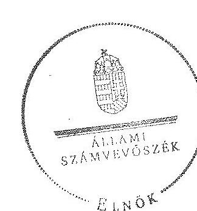

Melléklet: 13 db
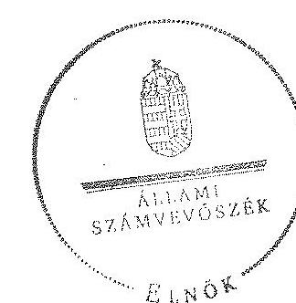

Domokos László
elnök

---

# RÖVIDÍTÉSEK JEGYZÉKE 

| Jogszabályok |  |
| :--: | :--: |
| Alaptörvény | Magyarország Alaptörvénye (2011. április 25.) (hatályos: 2012. január 1-jétől) |
| Áht. 1 | az államháztartásról szóló 1992. évi XXXVIII. törvény (hatálytalan: 2012. január 1-jétől) |
| Áht. 2 | az államháztartásról szóló 2011. évi CXCV. törvény (hatályos: 2012. január 1-jétől) |
| ÁSZ tv. | az Állami Számvevőszékről szóló 2011. évi LXVI. törvény (hatályos: 2011. július 1-jétől) |
| Avtv. | a személyes adatok védelméről és a közérdekú adatok nyilvánosságáról szóló 1992. évi LXIII. törvény |
| Evt. | az erdőről, az erdő védelméről és az erdőgazdálkodásról szóló 2009. évi XXXVII. törvény (hatályos: 2009. július 10től) |
| Evr. | az erdőről, az erdő védelméről és az erdőgazdálkodásról szóló 2009. évi XXXVII. törvény végrehajtásáról szóló 153/2009. (XI. 13.) FVM rendelet (hatályos: 2009. november 21 -től) |
| Gt. | a gazdasági társaságokról szóló 2006. évi IV. törvény (hatálytalan: 2014. március 15 -től) |
| Info tv. | az információs önrendelkezési jogról és az információszabadságról szóló 2011. évi CXII. törvény (hatályos: 2011. július 27 -től, kivéve a 1-37. §, a 38. § (1)-(3) bekezdése, a 38. § (4) bekezdés a)-f) pontja, a 38. § (5) bekezdése, a 39. §, a 41-68. §, a 70-72. §, a 75-77. § és a 79-88. §, valamint az 1. melléklet, amely 2012. január 1-jén, és a 38. § (4) bekezdés g) és h) pontja, valamint a 69. §, amely 2013. január 1-jén lépett hatályba) |
| Mfbtv. | a Magyar Fejlesztési Bank Részvénytársaságról szóló 2001. évi XX. törvény |
| Nfatv. | a Nemzeti Földalapról szóló 2010. évi LXXXVII. törvény (hatályos: 2010. szeptember 1-jétől) |
| Nvtv. | a nemzeti vagyonról szóló 2011. évi CXCVI. törvény |
| Számv. tv. | a számvitelről szóló 2000. évi C. törvény (hatályos: 2001. január 1-jétől) |
| új Ptk. | a Polgári Törvénykönyvről szóló 2013. évi V. törvény (hatályos: 2014. március 15 -től) |
| Vadvédelmi tv. | a vad védelméről, a vadgazdálkodásról, valamint a vadászatról szóló 1996. évi LV. törvény (hatályos: 1997. március 1 -jétől) |
| Vhr. | az állami vagyonnal való gazdálkodásról 254/2007. (X. 4.) Korm. rendelet (hatályos: 2007. október 4-től) |
| Vtv. | az állami vagyonról szóló 2007. évi CVI. törvény (hatályos: 2007. szeptember 25 -től) |

---

143/2009. (VII. 6.) Korm. rendelet

## Egyéb rövidítések

Alapító okirat

ÁSZ
belső ellenőr
Beruházási szabályzat

Ellenőrzési szabályzat
erdészeti hatóság ${ }_{1}$
erdészeti hatóság ${ }_{2}$
echvatal Erdészeti Igazgatóság 2010. december 31-ig
echvatal Erdészeti Igazgatóság 2010. december 31-ig
Európai Unió
FB
a VADEX Zrt. Felügyelő Bizottsága
a VADEX Zrt. Felügyelő Bizottságának ügyrendje (hatályos: 2005. március 10 -től)
a VADEX Zrt. Felügyelő Bizottsága (hatályos: 2011. március 3 -től)
a VADEX Zrt. Ellenőrzési Szabályzat Tervezete (1995 márciusában készített tervezet, melyet a belső ellenőr az ellenőrzött időszakban is a belső ellenőrzéseinél alkalmazott)
Fővárosi és Pest Megyei Mezőgazdasági Szakigazgatási Hivatal Erdészeti Igazgatóság 2010. december 31-ig
Pest Megyei Kormányhivatal Erdészeti Igazgatósága 2011. január 1-jétől
Európai Unió
a VADEX Zrt. Felügyelő Bizottsága
a VADEX Zrt. Felügyelő Bizottságának ügyrendje (hatályos: 2005. március 10 -től)
forint
hektár
a VADEX Zrt. Informatikai Biztonsági Szabályzata (hatályos: 2008. január 1-jétől)
a VADEX Zrt. által kiadott, a dokumentumok, feljegyzések megőrzésének és tárolásának szabályzata (hatályos: 2007. április 2-től)

---

| kezelt vagyon | a VADEX Zrt. vagyonkezelésében lévő állami vagyon |
| :--: | :--: |
| könyvvizsgáló | a VADEX Zrt. könyvvizsgálója |
| KVI | Kincstári Vagyoni Igazgatóság |
| Leltározási Szabályzat | a VADEX Zrt. Leltározási szabályzata (hatályos: 2001. január 1-jétől) |
| MFB Zrt. | Magyar Fejlesztési Bank Zrt. |
| MNV Zrt. | Magyar Nemzeti Vagyonkezelő Zrt. (2010. június 16-ig az állami vagyon feletti tulajdonosi joggyakorló, 2010. június 17 -től az Nfatv. hatálya alá nem tartozó állami vagyon feletti tulajdonosi joggyakorló) |
| MSZE | mérleg szerinti eredmény |
| NFA | Nemzeti Földalapkezelő Szervezet (az Nfatv. hatálya alá tartozó földterületek feletti tulajdonosi joggyakorló 2010. június 17 -től) |
| NVT | Nemzeti Vagyongazdálkodási Tanács, az alapítói jogokat a Vtv. 3. §-a alapján gyakorolta az MNV Zrt. útján, 2008. január 1-jétől 2010. június 17-éig |
| Önköltség-számítási szabályzat | a VADEX Zrt. Önköltség-számítási szabályzata (hatályos: 2009. január 1-jétől) |
| ST | saját tőke |
| Számlarend $_{1}$ | A VADEX Zrt. Számlarendje (hatályos: 2001. január 1-jétől 2009. december 31-ig) |
| Számlarend $_{2}$ | a VADEX Zrt. Számlarendje (hatályos: 2010. január 1-jétől) |
| Számviteli politika | a VADEX Zrt. Számviteli politikája (hatályos: 2009. január 1-jétől) |
| SZMSZ $_{1}$ | a VADEX Zrt. Szervezeti és múködési szabályzata (hatályos: 2007. április 2-től 2010. május 31-ig) |
| SZMSZ $_{2}$ | a VADEX Zrt. Szervezeti és múködési szabályzata (hatályos: 2010. június 1-jétől 2013. február 25-ig) |
| SZMSZ $_{3}$ | a VADEX Zrt. Szervezeti és múködési szabályzata (hatályos: 2013. február 26-tól 2014. február 24-ig) |
| SZMSZ $_{4}$ | a VADEX Zrt. Szervezeti és múködési szabályzata (hatályos: 2014. február 25-től) |
| Társaság feletti tulajdonosi joggyakorló ${ }_{1}$ | a társaságok állami tulajdonú részesedése feletti tulajdonosi jogokat gyakorló MNV Zrt. (2009. január 1-jétől 2010. június 16 -ig) |
| Társaság feletti tulajdonosi joggyakorló ${ }_{2}$ | a társaságok állami tulajdonú részesedése feletti tulajdonosi jogokat gyakorló MFB Zrt. (2010. június 17-től 2014. július 15 -ig) |
| vadászati hatóság ${ }_{1}$ | Fejér Megyei Mezőgazdasági Szakigazgatási Hivatal Földmúvelésügyi Igazgatóság Vadászati és Halászati Osztály 2010. december 31-ig |
| vadászati hatóság | Fejér Megyei Kormányhivatal Földmúvelésügyi Igazgatósága 2011. január 1-jétől |

---

VADEX Zrt., Társaság VADEX Mezőföldi Erdő- és Vadgazdálkodási Zrt., amely Társaság 1993. július 1-jén a VADEX Mezőföldi Állami Erdő és Vadgazdaság (volt állami vállalat) általános jogutódjaként átalakulással jött létre.
VSZ Ideiglenes Vagyonkezelési Szerződés (az aláírás kelte: 1996. november 1.)

Zrt.
Zártkörűen Müködő Részvénytársaság

---

# FOGALOMTÁR 

állami vagyon
állami vagyon
használója
átlátható szervezet
földbirtok-politikai irányelvek
hasznosítás
immateriális szolgáltatásából származó bevétel
információs és kommunikációs rendszer
kockázatkezelés
kockázatkezelési rendszer

Állami vagyon:
a) az állam tulajdonában lévő dolog, valamint dolog módjára hasznosítható természeti erő;
b) az a) pont hatálya alá tartozó mindazon vagyon, amely vonatkozásában törvény az állam kizárólagos tulajdonjogát nevesíti;
c) az állam tulajdonában lévő tagsági jogviszonyt megtestesítő értékpapír, illetve az államot megillető egyéb társasági részesedés;
d) az államot megillető olyan immateriális, vagyoni értékkel rendelkező jogosultság, amelyet jogszabály vagyoni értékű jogként nevesít;
e) az állam tulajdonában lévő pénzügyi eszközök.
Az állami vagyon használója az a természetes vagy jogi személy, jogi személyiséggel nem rendelkező szervezet, aki, vagy amely törvény vagy szerződés alapján, bármely jogcímen (bérlet, haszonbérlet, használat stb.) állami vagyont birtokol, használ, szedi annak hasznait. (Ide nem értve a haszonélvezőt, a vagyonkezelőt és a tulajdonosi jogok gyakorlóját.)
Átlátható szervezet a Nvtv. 3. § (1) bekezdés 1. pontjában felsorolt, a meghatározott követelményeknek megfelelő szervezet.
Az Nfatv. 15. § (3) bekezdés a)-s) pontjaiban meghatározott, a Nemzeti Földalapba tartozó földrészletek hasznosítására vonatkozó irányelvek.
Hasznosítás a tulajdonosi joggyakorló vagy a nemzeti vagyon használója által a nemzeti vagyon birtoklásának, használatának, hasznok szedése jogának bármely - a tulajdonjog átruházását nem eredményező - jogcímen történő átengedése, ide nem értve a vagyonkezelésbe adást, valamint a haszonélvezeti jog alapítását.
Immateriális szolgáltatásból származó bevételek azok a nem anyagjellegű szolgáltatásokból származó állami bevételek, amelyeket az Evt. 3. § (1) bekezdése szerint, a külön jogszabályban meghatározott részletes feltételek szerint, az erdők fenntartására, gyarapítására és védelmére kell fordítani.
Az információs és kommunikációs rendszer biztosítja, hogy az információk eljussanak az illetékes szervezethez, szervezeti egységhez, illetve személyhez.
A kockázatkezelés a szervezet céljai elérésével kapcsolatos kockázatok azonosításának és elemzésének, valamint a megfelelő válaszok meghatározásának folyamata.
A kockázatkezelési rendszer múködtetése során fel kell mérni és meg kell állapítani a szervezet tevékenységében, gazdálkodásában rejlő kockázatokat, valamint meg kell határozni az

---

|  | egyes kockázatokkal kapcsolatban szükséges intézkedéseket, valamint azok teljesítésének folyamatos nyomon követésének módját.   A kockázatkezelési rendszer olyan irányítási eszközök és módszerek összessége, amelynek elemei a szervezeti célok elérését veszélyeztető tényezők (kockázatok) azonosítása, elemzése, nyomon követése, valamint szükség esetén a kockázati kitettség mérséklése. |
| :--: | :--: |
| kontrolling | Az a vezetéstámogató rendszer, amely a vezetői tervezést, ellenőrzést, valamint információ-ellátást koordinálja célorientáltan a környezeti változásokhoz igazodva. |
| kontrollkörnyezet | A kontroll környezet elemei: a szervezeti struktúra, a felelősségi, hatásköri viszonyok és feladatok, a szervezet minden szintjén meghatározott etikai elvárások, a humánerőforráskezelés. A kontrollkörnyezet alapozza meg a belső kontroll összes többi elemét a fegyelem és a struktúra biztosítása által. |
| kontrollrendszer | A kontrollrendszer a kockázatok kezelése és tárgyilagos bizonyosság megszerzése érdekében kialakított folyamatrendszer, amely azt a célt szolgálja, hogy megvalósuljanak a következő célok:   a) a működés és a gazdálkodás során a tevékenységeket szabályszerűen, gazdaságosan, hatékonyan, eredményesen hajtsák végre,   b) az elszámolási kötelezettségeket teljesítsék, és   c) megvédjék az erőforrásokat a veszteségektől, károktól és nem rendeltetésszerű használattól. |
| kontrolltevékenységek | A kontrolltevékenységek azok az elvek (politikák) és eljárások, amelyeket a kockázatok meghatározása és a szervezet céljainak elérése érdekében alakítanak ki. |
| közfeladat | A közfeladat jogszabályban meghatározott állami vagy önkormányzati feladat, amit az arra kötelezett közérdekből, jogszabályban meghatározott követelményeknek és feltételeknek megfelelve végez, ideértve a lakosság közszolgáltatásokkal való ellátását, továbbá az állam nemzetközi szerződésekben vállalt kötelezettségeiből adódó közérdekű feladatokat, valamint e feladatok ellátásához szükséges infrastruktúra biztosítását is.   Az Etv. 2. § (2) bekezdése szerint a fenntartható erdőgazdálkodás során a legfontosabb közérdekű feladat az erdők változatosságának megőrzése, az erdők fenntartása, felújítása és a védelmi, valamint közjóléti szolgáltatások biztosítása, melyek elvégzését az állam megfelelő eszközökkel biztosítja. |
| monitoring | A szervezet tevékenységének, a célok megvalósításának nyomon követését biztosító rendszer, amely az operatív tevékenységek keretében megvalósuló folyamatos és eseti nyomon követésből, valamint az operatív tevékenységektől függetlenül működő belső ellenőrzésből áll.   A monitoring a projektek és programok végrehajtásának nyomon követése, mely a támogató és a kedvezményezett |

---

Nemzeti Földalap

Nemzeti vagyon használója
rábízott állami vagyon
társasági portfólió
tulajdonosi ellenőrzés
tulajdonosi joggyakorló
tulajdonosi joggyakorlás módja
közti megállapodásban foglalt eljárások követését, az előrehaladás ellenőrzését és a lehetséges problémák időben történő azonosítását szolgálja.
A Nemzeti Földalap a kincstári vagyon része, amelybe beletartoznak az állam tulajdonában és az ingatlan-nyilvántartásban levő, az Nfatv. 1. § (1)-(2) bekezdéseiben felsorolt területek, földrészletek és az azokhoz kapcsolódó vagyoni értékű jogok.
A nemzeti vagyon használója az a természetes személy, jogi személy vagy jogi személyiséggel nem rendelkező szervezet, aki, vagy amely állami vagyon tekintetében törvény vagy szerződés alapján, a helyi önkormányzat vagyona tekintetében törvény, a helyi önkormányzat rendelete vagy szerződés alapján bármely jogcímen nemzeti vagyont birtokol, használ, szedi annak hasznait, kivéve a tulajdonosi joggyakorló (az Nvtv. 3. § (1) bekezdés 11. pontja alapján).
Rábízott állami vagyon az a Vtv. alkalmazásában állami vagyonnak minősülő vagyon, amit az MNV- a saját vagyonától elkülönítetten - kezel és nyilvántart.
Az Mfbtv. 3. § (9) bekezdése szerint rábízott állami vagyon az a vagyon, amely felett az Mfbtv. erejénél fogva a Magyar Állam nevében az MFB gyakorolja a tulajdonosi jogokat.
Az Nfatv. 1. § (1) bekezdésében foglaltak alapján az NFA-hoz tartozó rábízott vagyon a törvényben meghatározott, a Nemzeti Földalapba tartozó vagyon.
Társasági portfólió az MNV, illetve az MFB rábízott vagyonába tartozó állami tulajdonú társasági részesedések.
A tulajdonosi joggyakorló által végzett ellenőrzés, amelynek célja az állami vagyonnal való gazdálkodás vizsgálata, ennek keretében a rendeltetésellenes, jogszerütlen, szerződésellenes, vagy a tulajdonos érdekeit sértő, illetve a központi költségvetést hátrányosan érintő vagyongazdálkodási intézkedések feltárása és a jogszerű állapot helyreállítása, továbbá a vagyonnyilvántartás hitelességének, teljességének és helyességének biztosítása.
Tulajdonosi joggyakorló az, aki az állami, illetve a nemzeti vagyon felett az államot megillető tulajdonosi jogok és kötelezettségek gyakorlására jogosult.
Az állami vagyon felett a Magyar Államot megillető tulajdonosi jogoknak (és kötelezettségeknek) az összességét az állami vagyon felügyeletéért felelős miniszter gyakorolja, aki e feladatát az MNV, az MFB, illetve egyéb tulajdonosi joggyakorló szervezet (pl. központi költségvetési szervek, 100\%-ban állami tulajdonban álló gazdasági társaságok) útján látja el. Azon állami tulajdonban álló ingatlanok felett, amelyek egy része a Nemzeti Földalapba tartozik, a tulajdonosi jogokat a miniszter az agrárpolitikáért felelős miniszterrel közösen gyakorolja.

---

vagyongazdálkodás feladata
vagyonkezelői jog

A Nemzeti Földalap felett a Magyar Állam nevében a tulajdonosi jogokat és kötelezettségeket az agrárpolitikáért felelős miniszter a Nemzeti Földalapkezelő Szervezet útján gyakorolja.
Az állami vagyon rendeltetésének megfelelő - az állami feladatok ellátásához, a társadalmi szükségletek kielégítéséhez, valamint a Kormány gazdaságpolitikája megvalósításának elősegittéséhez szükséges, egységes elveken alapuló, önálló ágazatként megjelenő - hatékony, költségtakarékos, értékmegőrző, értéknövelő felhasználásának biztosítása, beleértve a vagyoni kör változását eredményező értékesítést, valamint az állami vagyon gyarapítása is.
Vagyonkezelési szerződés alapján a vagyonkezelő jogosult meghatározott, állami tulajdonba tartozó dolog birtoklására, használatára és hasznai szedésére.
A Vtv. alapján a vagyonkezelői jog az állami vagyon hasznosítására az MNV-vel kötött vagyonkezelési szerződéssel jön létre. A vagyonkezelési szerződés alapján a vagyonkezelő jogosult meghatározott, állami tulajdonba tartozó dolog birtoklására, használatára és hasznai szedésére.
Az Nfatv. alapján a vagyonkezelői jog az erre irányuló (NFAval kötött) szerződéssel jön létre. A vagyonkezelői szerződés alapján a vagyonkezelő jogosult meghatározott földrészlet birtoklására, használatára és hasznai szedésére. A vagyonkezelő köteles a földrészlet értékét megőrizni, állagának megóvásáról, jó karban tartásáról gondoskodni, továbbá - az Nfatv.-ben meghatározott esetek kivételével dijat - fizetni vagy a szerződésben előírt más kötelezettséget teljesíteni.

---

A VADEX Zrt. vagyonának alakulása a 2009-2013. évek közötti időszakban eszközök (M Ft)
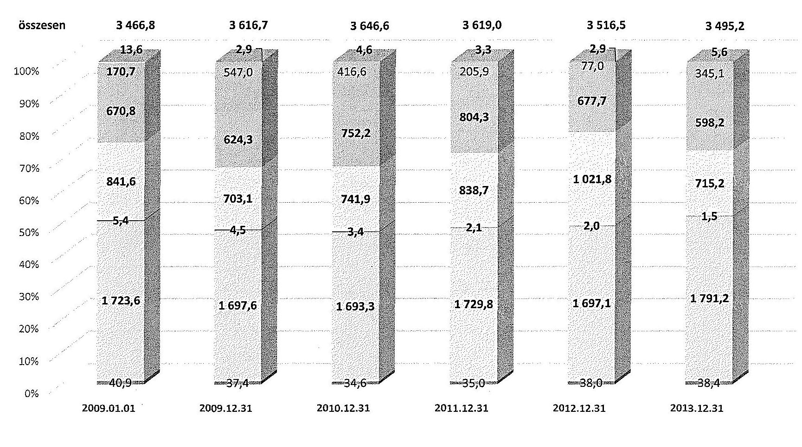

---

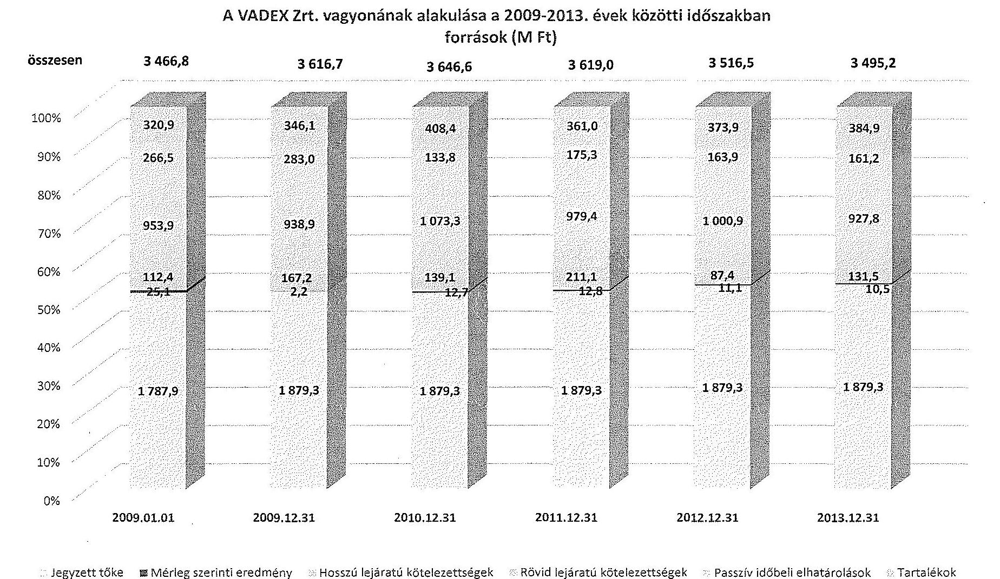

# A VADEX Zrt. vagyonának alakulása a 2009-2013. évek közötti időszakban források (M Ft)

|  Ildózat | 2009.01.01 | 2009.12.31 | 2010.12.31 | 2011.12.31 | 2012.12.31 | 2013.12.31  |
| --- | --- | --- | --- | --- | --- | --- |
|  Összesen | 3 466,8 | 3 616,7 | 3 646,6 | 3 619,0 | 3 516,5 | 3 495,2  |
|  Ügyeset | 320,9 | 346,1 | 408,4 | 361,0 | 373,9 | 384,9  |
|  Árlyó | 266,5 | 283,0 | 133,8 | 175,3 | 163,9 | 161,2  |
|  Érlyó | 953,9 | 938,9 | 1 073,3 | 979,4 | 1 000,9 | 927,8  |
|  Árlyó | 112,4 | 167,2 | 139,1 | 211,1 | 87,4 | 131,5  |
|  Érlyó | 25,1 | 2,2 | 12,7 | 12,8 | 11,1 | 10,5  |
|  Árlyó | 1 787,9 | 1 879,3 | 1 879,3 | 1 879,3 | 1 879,3 | 1 879,3  |
|  Érlyó | 0% |  |  |  |  |   |
|  Árlyó | 0% |  |  |  |  |   |
|  Jegyzett tőke | ☑ Mérleg szerinti eredmény | ☐ Hosszú lejáratú kötelezettségek | ☐ Rövid lejáratú kötelezettségek | ☐ Passzív időbeli elhatárolások | ☐ Tartalékok |   |

---

## 4. SZÁMÚ MELLÉKLET A V-0765-060/2015. SZÁMÚ JELENTÉSHEZ

## Kimutatás a VADEX Zrt.-nél a befektetett eszközök állományának alakulásáról a 2009-2014. I. féléve közötti időszakra vonatkozóan

|  Kert
csán | MELNEVEZÉS | 2009. év |  |  | 2010. év |  |  | 2011. év |  |  | 2012. év |  |  | 2013. év |  |  | 2014. év |  |   |
| --- | --- | --- | --- | --- | --- | --- | --- | --- | --- | --- | --- | --- | --- | --- | --- | --- | --- | --- | --- |
|   |  | Összesen | Államt vagyon | Saját vagyon | Összesen | Államt vagyon | Saját vagyon | Összesen | Államt vagyon | Saját vagyon | Összesen | Államt vagyon | Saját vagyon | Összesen | Államt vagyon | Saját vagyon | Összesen | Államt vagyon | Saját vagyon  |
|   |  | 1 | 2 | 3 | 4 | 5 | 6 | 7 | 8 | 9 | 10 | 11 | 12 | 13 | 14 | 15 | 16 | 17 | 18  |
|  1. | Nyitó állomány | 1 769 906 | 0 | 1 769 906 | 1 739 471 | 0 | 1 739 471 | 1 731 351 | 0 | 1 731 351 | 1 766 000 | 0 | 1 766 000 | 1 737 149 | 0 | 1 737 149 | 1 831 109 | 0 | 1 831 109  |
|  2. | Terv azattal értékesílézzete | 130 060 | 0 | 130 060 | 108 470 | 0 | 108 470 | 107 520 | 0 | 107 520 | 123 450 | 0 | 113 450 | 124 530 | 0 | 124 530 | 43 389 | 0 | 43 389  |
|  3. | Terven felüli értékesílézzete | 0 | 0 | 0 | 0 | 0 | 0 | 0 | 0 | 0 | 0 | 0 | 0 | 0 | 0 | 0 | 0 | 0 | 0  |
|  4. | Ertékvaztás elszámolása | 0 | 0 | 0 | 0 | 0 | 0 | 0 | 0 | 0 | 0 | 0 | 0 | 0 | 0 | 0 | 0 | 0 | 0  |
|  5. | Ertékadéla | 848 | 0 | 848 | 841 | 0 | 841 | 103 | 0 | 103 | 650 | 0 | 650 | 4 951 | 0 | 4 951 | 2 500 | 0 | 2 500  |
|  6. | Erteljeszt | 4 404 | 0 | 4 404 | 194 | 0 | 194 | 4 150 | 0 | 4 150 | 3 345 | 0 | 3 345 | 197 | 0 | 197 | 574 | 0 | 574  |
|  7. | Általadéla | 0 | 0 | 0 | 0 | 0 | 0 | 462 | 0 | 462 | 120 | 0 | 120 | 928 | 0 | 928 | 0 | 0 | 0  |
|  8. | Segensz-átadás | 0 | 0 | 0 | 0 | 0 | 0 | 0 | 0 | 0 | 0 | 0 | 0 | 0 | 0 | 0 | 0 | 0 | 0  |
|  9. | Egyéb | 1 879 | 0 | 1 879 | 162 | 0 | 162 | 1 347 | 0 | 1 347 | 40 | 0 | 40 | 825 | 0 | 825 | 0 | 0 | 0  |
|  10. | Gyökészítő összesen | 127 204 | 0 | 127 204 | 159 690 | 0 | 159 690 | 213 475 | 0 | 213 475 | 218 331 | 0 | 218 331 | 231 417 | 0 | 231 417 | 65 061 | 0 | 65 061  |
|  11. | Terv azattal beruházás | 96 849 | 0 | 96 849 | 101 570 | 0 | 101 570 | 149 001 | 0 | 149 001 | 89 300 | 0 | 89 300 | 225 377 | 0 | 225 377 | 39 840 | 0 | 39 840  |
|  12. | Terv azattal felújítás | 0 | 0 | 0 | 0 | 0 | 0 | 0 | 0 | 0 | 0 | 0 | 0 | 0 | 0 | 0 | 0 | 0 | 0  |
|  13. | Terv azattalt növekedés | 96 849 | 0 | 96 849 | 101 572 | 0 | 101 572 | 149 001 | 0 | 149 001 | 88 300 | 0 | 88 300 | 225 377 | 0 | 225 377 | 39 840 | 0 | 39 840  |
|  14. | Egyéb beruházás | 0 | 0 | 0 | 0 | 0 | 0 | 0 | 0 | 0 | 0 | 0 | 0 | 0 | 0 | 0 | 0 | 0 | 0  |
|  15. | Egyéb felújítás | 0 | 0 | 0 | 0 | 0 | 0 | 0 | 0 | 0 | 0 | 0 | 0 | 0 | 0 | 0 | 0 | 0 | 0  |
|  16. | Általadéla | 0 | 0 | 0 | 0 | 0 | 0 | 0 | 0 | 0 | 0 | 0 | 0 | 0 | 0 | 0 | 0 | 0 | 0  |
|  17. | Átvétel | 0 | 0 | 0 | 0 | 0 | 0 | 0 | 0 | 0 | 0 | 0 | 0 | 0 | 0 | 0 | 0 | 0 | 0  |
|  18. | Ertékvaztás vízszélése | 0 | 0 | 0 | 0 | 0 | 0 | 0 | 0 | 0 | 0 | 0 | 0 | 0 | 0 | 0 | 0 | 0 | 0  |
|  19. | Ertékadélezés vízszélése | 0 | 0 | 0 | 0 | 0 | 0 | 0 | 0 | 0 | 0 | 0 | 0 | 0 | 0 | 0 | 0 | 0 | 0  |
|  20. | Egyéb | 0 | 0 | 0 | 0 | 0 | 0 | 0 | 0 | 0 | 300 | 0 | 300 | 0 | 0 | 0 | 0 | 0 | 0  |
|  21. | Terven felülmírckedés | 0 | 0 | 0 | 0 | 0 | 0 | 0 | 0 | 0 | 300 | 0 | 300 | 0 | 0 | 0 | 0 | 0 | 0  |
|  22. | Növekedés összesen | 96 849 | 0 | 96 849 | 101 572 | 0 | 101 572 | 149 001 | 0 | 149 001 | 88 300 | 0 | 88 300 | 225 377 | 0 | 225 377 | 39 840 | 0 | 39 840  |
|  23. | Zérd állomány | 1 739 471 | 0 | 1 739 471 | 1 731 351 | 0 | 1 731 351 | 1 766 000 | 0 | 1 766 000 | 1 737 149 | 0 | 1 737 149 | 1 831 109 | 0 | 1 831 109 | 1 805 000 | 0 | 1 805 000  |

---

$\cdot$
$\cdot$
$\cdot$
$\cdot$
$\cdot$
$\cdot$
$\cdot$
$\cdot$
$\cdot$
$\cdot$
$\cdot$
$\cdot$
$\cdot$
$\cdot$
$\cdot$
$\cdot$
$\cdot$
$\cdot$
$\cdot$
$\cdot$
$\cdot$
$\cdot$
$\cdot$
$\cdot$
$\cdot$
$\cdot$
$\cdot$
$\cdot$
$\cdot$
$\cdot$
$\cdot$
$\cdot$
$\cdot$
$\cdot$
$\cdot$
$\cdot$
$\cdot$
$\cdot$
$\cdot$
$\cdot$
$\cdot$
$\cdot$
$\cdot$
$\cdot$
$\cdot$
$\cdot$
$\cdot$
$\cdot$
$\cdot$
$\cdot$
$\cdot$
$\cdot$
$\cdot$
$\cdot$
$\cdot$
$\cdot$
$\cdot$
$\cdot$
$\cdot$
$\cdot$
$\cdot$
$\cdot$
$\cdot$
$\cdot$
$\cdot$
$\cdot$
$\cdot$
$\cdot$
$\cdot$

---

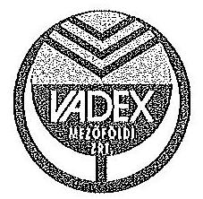

# VADEX   MEZÖFÖLDI ERDŐ- ÉS VADGAZDÁLKODÁSI ZÁRTKÖRÜEN MÜKÖDŐ RÉSZVÉNYTÁRSASÁG 

8002 Székesfehérvár, Tolnai u. 1. Pf. 371 + Telefon: +36-22-510-500 Fax: $+36-22-327-525+$ E-mail: posta@vadex.hu Internet: www.vadex.hu
ikt.szám: VADEX/VEZ/31-10/2015.

Domokos László elnök
Állami Számvevőszék
hiv.sz.: V-0765-043/2015.

Tisztelt Elnök Úr!

Köszönettel vettük a megküldött „Az állami tulajdonban álló erdőgazdasági társaságok vagyongazdálkodási tevékenységének ellenőrzése - VADEX Mezöföldi Erdő- és Vadgazdálkodási Zrt." címmel készített számvevőszéki jelentéstervezetet.

Álláspontunk szerint semmi féle jogszabályi környezet alapján nem minősülünk sem közfeladatot, sem közcélú feladatot ellátó szervezetnek. Társaságunk kizárólag közjöléti feladatokat lát el saját eredménye terhére.

A vagyonkezelői szerződés kapcsán általános észrevételként jelezni kívánjuk, hogy formailag kétségtelenül két „egyenrangú fél" kötött szerződést, a valóságban viszont az erdőgazdasági társaságok kétség kívül alárendelt szerepet játszottak. Ez az egyensúlytalanság a mal napig fennáll, és vonatkozik a szerződés későbbi aktuallzálásainak elmaradására, valamint a szükséges mellékletek hiányára is.

A vagyonkezelt elemek értékben történő nyilvántartása ugyan nem történt meg, de a nemzeti vagyonról szóló 2011. évi CXCVI. törvény 10.§(1) bekezdése szerint a nemzeti vagyont, annak értékét és változását a tulajdonosi joggyakorlójának a kötelessége nyilvántartani. Az érték nyilvántartásától el lehet tekinteni, ha az adott vagyontárgy értéke természeténél, jellegénél fogva nem állapítható meg. (Pénzügyminisztérium Számviteli Főosztálya által 1997. november 25-én kiadott 9807/1997.sz. állásfoglalása)

Az erdő és a faállomány naturális adatait az Országos Erdőállomány Adattár (NÉBIH) tartja nyilván. A KVI által 1996-ban vagyonkezelésbe adott erdő értékének meghatározására még nem került sor. Az érték meghatározása a vagyonkezelésbe adó feladata. Miután érték nélkül nem, csak értékkel lehet a mérlegben szerepeltetni az erdővagyont, így a fentiek miatt ez nem volt lehetséges.

A vagyonkezelési díj meghatározásának, és nyilvántartásának a felelőse a vagyonelemek tulajdonosi joggyakorlója, a kiszámilázott díjakat a társaság pénzügyileg rendben teljesítette.

---

A társaság a tulajdonosi joggyakorlók részére az éves adatszolgáltatási kötelezettségeinek eleget tett.
A társaság a rendszer szintű hiányosságok ellenére jó gazda módján járt el, a szakmai előírásoknak megfelelően a vagyonmegőrzési, fejlesztési kötelezettségeit teljesítette.

Székesfehérvár, 2015. október 18.
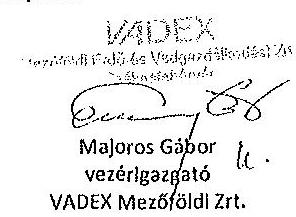

---

# ELHÖE 

ÁLLAMI
SZÁMVEVÖSZÉK

Ikt.szám: V-0765-058/2015.

## Majoros Gábor úr

vezérigazgató
VADEX Mezöföldi Zrt.

Székesfehérvár

## Tisztelt Vezérigazgató Úr!

A „Jelentéstervezet az állami tulajdonban álló erdőgazdasági társaságok vagyongazdálkodási tevékenységének ellenőrzése - VADEX Mezöföldi Erdö- és Vadgazdálkodási Zrt." címmel készített számvevőszéki jelentéstervezetre tett észrevételeit köszönettel megkaptam.

Az Állami Számvevőszék észrevételekre vonatkozó álláspontjáról a felügyeleti vezető által készített részletes tájékoztatást csatoltan megküldöm.

Tájékoztatom Vezérigazgató urat, hogy a számvevőszéki jelentésben - az Állami Számvevőszékről szóló 2011. évi LXVI. törvény 29. § (3) bekezdése alapján - a figyelembe nem vett észrevételeket szerepeltetjük az elutasítás indokának feltüntetésével.

Budapest, 2015. 11. hó ๑ nap
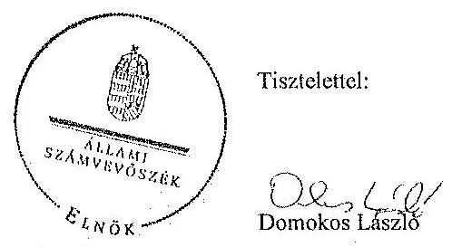

Melléklet: Tájékoztatás az el nem fogadott észrevételekről

---

# Tájékoztatás   az el nem fogadott észrevételekröl 

A „Jelentéstervezet az állami tulajdonban álló erdőgazdasági társaságok vagyongazdálkodási tevékenységének ellenőrzése - VADEX Mezöföldi Erdő- és Fadgazdálkodási Zrt." címü jelentéstervezetre 2015. október 19-én érkezett észrevételeit áttekintettük, azok kezelésével kapcsolatban a következő tájékoztatást adom.
Az elsőként megfogalmazott álláspontjukkal kapcsolatosan - mely a közfeladat, illetve a közcélú feladat ellátására vonatkozott - tájékoztatom arról, hogy az Avtv. 20. § (8) bekezdésében, illetve az Infotv. 30. § (6) bekezdésében foglaltak alapján, valamint az állami vagyonról szóló 2007. évi CVL törvény 5. § (2) bekezdése szerint az állami vagyonnal gazdálkodó vagy azzal rendelkező szerv vagy személy a közérdekủ adatok nyilvánosságáról szóló törvény szerinti közfeladatot cllátó szervnek vagy személynek minősül.

A vagyonkezelői szerződés kapcsán megfogalmazott általános észrevételek kiegészitő információt közölnek, ezért a jelentéstervezet módosítása nem indokolt. A vagyonkezelt elemek értékben történő nyilvántartásával kapcsolatos megállapításunkat nem cáfolják, a hivatkozott 1997. évi PM állásfoglalás nem fogadható el releváns információnak.
A vagyonkezelési díjjal, valamint a tulajdonosi adatszolgáltatási kötelezettséggel kapcsolatos kiegészitő információk a jelentéstervezet megállapításait nem cáfolják. Mindezek alapján a jelentéstervezet módosítása nem indokolt.

Budapest, 2015. 11 hó 11 .nap

Makkai Mária
felügyeleti vezető

---

# 7. SZÁMÚ MELLÉKLET A V-0765-060/2015. SZÁMÚ JELENTÉSHEZ 

$V=0965-054 / 2015$

## 1. SZÁMÚ MELLÉKLET

## A V-0765-060/2015. SZÁMÚ JELENTÉSHEZ

## Állami Számvevőszék

## Domokos László

## elnök

1052 Budapest
Apáczai Cs. J. u. 10.

$$
\begin{aligned}
& \text { Ikt. sz.: MNV/01/47950/ / /2015. } \\
& \text { Hiv. sz.: V-0765-045/2015. }
\end{aligned}
$$

Tisztelt Elnök Úr!
A 2015. szeptember 28. napján „Az állami tulajdonban álló erdőgazdasági társaságok vagyongazdálkodási tevékenységének ellenörzése - VADEX Mezöföldi Erdö- és Vadgazdálkodási Zrt." tárgyában kézhez vett, V-0765045/2015. ikt. sz. Jelentés-tervezetre az alábbi észrevételeket kívánom tenni.

L fejezet / 8. old. betesik bekezdés, 9. old. első-ötödik bekezdés, II.5. fejezet / 29. old. nyolcadik bekezdés, 30. old. első-második bekezdés és 10. old. Javaslat az MNV Zrt. vezérigazgatójának a)-c) pontok
„A vagyonkezelésbe adott állami vagyon tekintetében tulajdonosi jogokat gyakorló MNV Zrt. és NFA, az ellenörzött időszakban a VSZ-szel kapcsolatban feltárt hiányosságok megszüntetésére és a hatályos jogszabályoknak való megfeleltetésére vonatkozóan nem kezdeményezett intézkedéseket, nem élt a Vhr.-ben foglalt, a kezelt vagyon használatára vonatkozó ellenörzési jogával, valamint nem ellenörizte a vagyonnyilvántartás hitelességét és teljességét. A tulajdonosi joggyakorlók tevékenysége nem támogatta teljes mértékben a felelős vagyongazdálkodás megvalósulását."
..... Az MNV Zrt. és az NFA az ellenörzött időszakban nem végeztek a Vhr.-ben és a Nemzeti Földalapba tartozó földrészletek hasznosításának részletes szabályairól szóló 262/2010. (XI.17.) Korm. rendeletben foglalt, a vagyonnyilvántartás hitelességére, teljességére és helyességére vonatkozó tulajdonosi (helyszíni) ellenörzést a VADEX Zrt-nél nem végzett.

A Vades Zrt. a Magyar Állam tulajdonában álló erdővagyon és egyéb müvelési ágú termöföld ingatlanok kezelését a KVI-vel 1996. november 1-jén kötött vagyonkezelési szerzödés (VSZ) alapján végezte, a Társaság, mint vagyonkezelö és a KVI között létrejött szerzödéses jogviszony keretelt a VSZ-ben foglalt jogok és kötelezettségek töltötték ki. A VSZ nem támogatta a Vhr.-ben elölrt, a vagyongazdálkodási feladatok átlátható módon történő végrehajtását, valamint a szabályszerü vagyongazdálkodást.
2009. január 1-jén VSZ hatályon kívül helyezett jogszabályi hivatkozásokat tartalmazott az Áht. 109/B. § és 109/G. §, a Vadvédelmi tv. 98. § rendelkezései vonatkozásában és nem tartalmazza a Vtv., a Vhr. az Evt., az Nvtv. és az Nfatv. megfelelő elöírásaira való hivatkozásokat. A VSZ 3.2.1 pontja teljes körüen nem tartalmazza az Nvtv. 11. § (8) bekezdésének 2012. január 1-jétől hatályos, a vagyonkezelői jog korlátozásaira vonatkozó elöírásokat. A vagyonkezelői jog átengedésére vonatkozó 3.2.3 pontban elöírtak 2009. július 10-től nem feleltek meg az Evt. 9. § (3) bekezdésében foglaltaknak, valamint az Nfatv. 20. § (7) bekezdése elöírásának. A VSZ 3.3.2. pontjában foglaltak ellenére a szerzödést évente nem vizsgálták felül, azt a felek nem kezdeményezték. A felek nem tettek eleget a Vhr. 34. § (7) bekezdésében foglalt rendelkezémek és a Vhr. hatályhalépést követő hat hónapon belül nem kezdeményezték a Nemzeti Földalapba tartozó ingatlanokra vonatkozóan a VSZ megszüntetését és a Vtv., illetve Vhr. szabályainak megfelelő szerződés megkötését.

---

Az MNV Zrt. és az NFA az ellenőrzött időszakban a Vhr. 20. § (1)-(2) bekezdéseiben és a Nemzeti Földalapba tartozó földrészletek hasznosításának részletes szabályairól szóló 262/2010. (XI.17.) Korm. rendelet 47. § (1)-(2) bekezdéseiben foglalt, a vagyonnyilvántartások hitelességére, teljességére és helyességére vonatkozó tulajdonosi (helyszíni) ellenőrzést a VADEX Zrt-nél nem végzett.

# Javaslat az MNV Zrt. vezérigazgatójának 

a) Tegyen intézkedéseket az erdőgazdasági társaság közremüködésével a tényleges állapotot rögzitő és a hatályos jogszabályi előírásoknak megfelelő vagyonkezelési szerződés megkötésére.
b) Tegyen intézkedéseket a vagyonkezelési szerzödés felülvizsgálatának elmaradásával, valamint a Nemzeti Földalapba tartozó ingatlanokra vonatkozó VSZ megszüntetésével összefüggésben feltárt szabálytalanságok tekintetében a felelősség tisztázása érdekében, és szükség szerint intézkedjen a felelősség érvényesitéséről.
c) Intézkedjen a Társaság vagyonnyilvántartása hitelességének, teljességének és helyességének jogszabályban foglaltok szerinti ellenőrzéséről."

Sajnálattal állapítottuk meg, hogy a Jelentés-tervezet egyáltalán nem veszi figyelembe a vizsgált időszakban megindított és több eljárási cselekményt is magába foglaló intézkedés-sorozatunkat, amelynek a célja a Jelentéstervezetben egyébiránt joggal kifogásolt hiányosságok megszüntetése, az erdőgazdasági társaságok müködésének jogszabályi megfelelőségének biztosítása volt. Ezzel a Jelentés-tervezet azt sugallja, hogy a tulajdonosi joggyakorlók részéről egyáltalán nem volt szándék az erdőgazdasági társaságok müködésének, illetve a vagyonkezelés körülményeinek hatályos jogszabályok szerinti szabályozására, amely egyébiránt nem felel meg a valóságnak és az adatszolgáltatásunk során sem erről tájékoztattuk Önöket.
Mindamellett elismerjük, hogy a probléma a kezelt vagyonelemek nagy száma, ebből kifolyólag a szabályozást igénylő körülmények nagy száma és sokrétűsége miatt nehezen átlátható, ezért kérjük, engedjék meg, hogy a munkájukat segítő szándékkal korábbi tájékoztatásunkat ismételten megerősítsük, azzal a kifejezett kéréssel, hogy a Jelentésükben az általunk vitatott megállapítást szíveskedjenek módosítani, és az MNV Zrt. által a megoldás irányába megtett intézkedéseket feltüntetni.
Az ideiglenes vagyonkezelési szerződéseken alapuló kezelői jogviszony újraszabályozása, az ideiglenes vagyonkezelési szerződések megszüntetése és végleges vagyonkezelési szerződések megkötése érdekében az intézkedéseink már 2011. évben megkezdődtek, párhuzamosan a Nemzeti Földalapról szóló 2010. évi LXXXVII. tv. 34. § (3) bekezdés c) pontja szerinti feladat- illetve vagyonátadással.

Az intézkedéseink alapja a 2011. évben, MNV/01/29518/2011. szám alatt szakterületünk által bekért, az erdőgazdasági társaságok 2010. december 31-i, illetve 2011. július 31-i fordulónapra vonatkozó leltárjelentése volt, amelyet elsődlegesen az NFA tv. szerint előírt vagyonátadás elvégzése céljából kértünk meg az erdőgazdasági társaságoktól. Ugyanakkor a leltárjelentéshez benyújtott földrészlet listák voltak az első olyan kimutatások, amelyek a kezelt vagyon elemeit a FÖMI adatbázisán alapuló (az aktuális ingatlan-nyilvántartási állapotnak megfelelően) alrészletes bontásban tartalmazzák.

## A vizsgált időszakban megindított és lefolytatott intézkedéseink a következők:

1. Az erdőgazdasági társaságok által kezelt vagyonelemek tulajdonosi joggyakorlók szerinti elhatárolása, NFA átadás előkészítése, az erdőgazdasági társaságok bevonásával. A Nemzeti Földalapba tartozó vagyonelemek NFA átadása 2012-2013. években megtörtént, majd a visszamaradt vagyonelemek - többségében kivett megnevezésben nyilvántartott földrészletek - elhatárolását is elvégeztük. A feladat végrehajtása 2014. május 31-ig teljesült.
Az intézkedéssel az MNV Zrt. tulajdonosi joggyakorlása alá tartozó vagyonelemek körét - a közös tulajdonosi joggyakorlás alatt álló ingatlanok kivételével - azaz a végleges vagyonkezelési szerződések ingatlanlistáit meghatároztuk.
Meg kívánjuk jegyezni, hogy az erdőgazdasági társaságok a 2011. évi leltárjelentéseikhez minden esetben csatolták a jelentés tartalmára vonatkozó teljességi nyilatkozatukat is, így azok tartalmát mint teljes körű adatszolgáltatást kezeltük.
A hivatkozott íratokat az eljárás során a Tisztelt Állami Számvevőszék rendelkezésére bocsátottuk.

---

2. Az erdőgazdasági társaságok által kezelt vagyon értékelését 2014. május 31-ig elvégeztük, részben külső piaci szereplő által megállapított vagyonértékelési adatok (az IFUA értékbecslési adatai), részben belső szakértők és a kontrolling szakterület által az MNV Zrt. hatályos értékelési szabályzata által megállapított értékadatok figyelembe vételével.
3. Az MNV Zrt. Igazgatósága 511/2012. (X. 08.) IG sz., valamint 717/2013. (IX. 23.) IG sz. határozataiban Intézkedési terveket fogadott el „a 28/2012. (IX. 24.) sz. RJGY határozatában előírt, valamint az MNV Zrt. rábízott vagyon 2012. évi beszámolója könyvvizsgálói minősítésének megtartásához szükséges és egyéb feladatokról". Az Intézkedési tervek magukban foglalták az erdőgazdasági társaságok által kezelt vagyon analitikájának előállítását, illetve az erdőtársaságokkal végleges (nem ideiglenes) vagyonkezelői szerződések megkötését. A 717/2013. (IX. 23.) IG sz. határozat melléklete tartalmazza a feladat végrehajtása érdekében már megtett intézkedéseket (pl. „Megtörtént az erdőgazdaságok által kezelt vagyon listáinak vagyonkezelői jelentésekkel való egyeztetése; a vagyonkezelési szerződés tartalmi kérdéseinek, az erdőgazdaságok véleményének feldolgozása, MFB Munkacsoport egyeztetések történtek stb.), valamint rögzíti a még elvégzendő feladatokat. Ennek megfelelően az MNV Zrt-nél 2012-től folyamatban van az erdőgazdasági társaságok vagyonanalitikájának előállítása és vagyonkezelési szerződései tárgyú projekt.
A hatályos jogszabályoknak megfelelő vagyonkezelési szerződés tervezetét a vizsgálati időszak során az MNV Zrt. belső szakterületi egyeztetést követően előkészítettük, és a 2014. március 18-án megtartott Munkacsoport értekezleten az erdőgazdaság képviselőivel, továbbá a tulajdonosi joggyakorlók (NFA, illetve akkor még Magyar Fejlesztési Bank Zrt.) képviselöivel ismertettük annak tartalmát. A szerződés szövegtervezetének véleményezése ekkor megkezdődött, ugyanakkor elismerjük, hogy a végleges szerződésváltozat már az Önök által vizsgált időszakot követően került elfogadásra. Ugyancsak a 2014. március 18-án megtartott Munkacsoport értekezleten tettünk javaslatot a vagyonkezelési dí alapjának és mértékének meghatározására.
4. Az erdőgazdasági társaságok által kezelt és a saját vagyonuk vagyonelemenkénti, valamint a kezelt vagyonelemek tulajdonosi joggyakorlók szerinti elhatárolására vonatkozó intézkedésünket a vizsgált időszakban előkészítettük.

Tájékoztatjuk továbbá Elnök Urat az alábbiakról:
A Nemzeti Fejlesztési Minisztérium KGTF/377-6/2014-NFM, valamint KGTF/377-7/2014. számok alatt adott utasításokat a fenti feladatok elvégzésére. Ezekről, illetve az utasításokra adott jelemésünkről a korábbi adatszolgáltatásunk keretében szintén kitértünk.

A vagyonkezelési szerződés vizsgált időszakot követően elfogadott tervezetének mellékletét képezik az MNV Zrt. azon szabályzatai is, amelyek a kezelt vagyon nyilvántartását, a beruházások nyilvántartását és az azzal kapcsolatos elszámolásokat, illetve a tulajdonosi ellenőrzéssel kapcsolatos, a jelenlegi jogszabályi környezetnek megfelelő szabályokat tartalmazzák:

- Az állami tulajdonon, egyéb vagyonkezelők által vagyonkezelt eszközön megvalósítandó beruházások, felújítások előzetes engedélyezésének és elszámolásának eljárásrendjéről szóló 35/2014. számú vezérigazgatói utasítás,
- A Magyar Nemzeti Vagyonkezelő Zrt. Tulajdonosi Ellenőrzési Szabályzata - a 39/2014. számú vezérigazgatói utasítás, továbbá
- A Magyar Nemzeti Vagyonkezelő Zrt. állami vagyon vagyonkezelőire, az állami vagyont használókra és a társasági részesedések esetében az MNV Zrt. tulajdonosi joggyakorlását megbízottként ellátókra vonatkozó Vagyon-nyilvántartási Szabályzatáról szóló 12/2014. számú vezérigazgatói utasítás.

Fentiek mellett megemlíthető az MNV Zrt. folyamatba épített, illetve vagyon nyilvántartás vezetést támogató ellenőrzési módszertanról szóló 11/2014. számú vezérigazgatói utasítás.
Egycztetéseink során az erdőgazdasági társaságok tájékoztatást kaptak a szabályzataink tartalmára vonatkozóan.
A Jelentés-tervezet 10. oldalán található, az MNV Zrt. vezérigazgatójára vonatkozó, a) pont alatti, vagyonkezelési szerződés megkötésére irányuló javaslathoz kapcsolódóan felhívjuk a Tisztelt Állami Számvevőszék figyelmét arra, hogy a Nemzeti Fejlesztési Minisztérium ÁVF/21310/2015-NFM számú tájékoztató levele szerint Miniszter

---

Úr vagyongazdálkodási szempontból nem támogatja az erdőgazdasági társaságok ideiglenes vagyonkezelési szerződéseit kiváltó vagyonkezelési szerződések megkötését, ideértve az MNV Zrt. vagyonkezelési szerződésekkel kapcsolatos jóváhagyó döntéseit is.

Az MNV Zrt-re vonatkozóan hivatkozott jogszabály, a Vhr. 20. § (1)-(2) bekezdése 2014. március 14-ig - csaknem az ellenőrzött időszak végéig - a következőképpen rendelkezett:
„(1) Az állami vagyon kezelöjét, használóját megillető jogok gyakorlását, annak szabályszerűségét, célszerűségét a Vtv. 17. §-ának d) pontja alapján az MNV Zrt. - szükség szerint a területi szervet áttán ellenőrzi. Ennek érdekében a vagyon kezelésére, hasznosítására kötött szerzödésben rögzíteni kell, hogy a tulajdonosi ellenőrzés eljárásrendjét, a felek jogait, kötelezettségeit a felek a szerzödés részének tekintik.
(2) A tulajdonosi ellenőrzés célja az állami vagyonnal való gazdálkodás vizsgálata, ennek keretében a rendeltetésellenes, jogszerütlen, szerzödésellenes, vagy a tulajdonos érdekeit sértö, illetve a központi költségvetést hátrányosan érintő vagyongazdálkodási intézkedések feltárása és a jogszerü állapot helyreállitása, továbbá a vagyonnyilvántartás hitelességének, teljességének és helyességének biztositása."

A tulajdonosi ellenőrzés alatt a Területi Irodák által folytatott ellenőrzést is értette a jogszabály, amiből egyenesen következik a szakterületi munkafolyamatha épített ellenőrzési kötelezettség figyelembe vételének a lehetősége.
A jelentés tervezet megállapítja, hogy az MNV Zrt. a vizsgált időszakban nem végzett tulajdonosi (helyszíni) ellenőrzést a társaságnál. A hivatkozott jogszabályok nem határozzák meg a tulajdonosi ellenőrzések formáját, azokból nem következik, hogy az ellenőrzéseket a helyszínen kell lefolytatni.

Fentiekre tekintettel kérjük a Jelentés-tervezet 8-9., illetve 29-30. oldalán található azon megállapítások törlését, hogy az MNV Zrt. nem kezdeményezett intézkedéseket, és nem végzett a Vhr. 20. § (1)-(2) bekezdéseiben és a Nemzeti Földalapba tartozó földrészletek hasznosításának részletes szabályairól szóló 262/2010. (XI.17.) Korm. rendelet 47. § (1)-(2) bekezdéseiben foglalt, a vagyonnyilvántartás hitelességére és teljességére vonatkozó tulajdonosi (helyszíni) ellenőrzést a Társaságnál, kérjük a megtett intézkedések feltüntetését, és a Jelentés-tervezet 10. oldalán található, az MNV Zrt. vezérigazgatójára vonatkozó, b) pontot a megtett intézkedések folyamatosságára tekintettel törölni, és a c) pont alatti javaslatot szövegszerüen ekként módosítani:

# Jonadat az MNV Zrt. vezérigazgatójának 

c) Az MNV Zrt. tulajdonosi joggyakorlása alá tartozó (az Erdőgazdasági Társaságok által az MNV Zrt. részére jelentett) vagyonelemek tekintetében intézkedjen a Társaság vagyonnyilvántartása hitelességének, teljességének és helyességének jogszabályban foglaltak szerinti ellenőrzéseinek erösitéséröl.

Kérem Elnök Urat, hogy a Jelentés véglegesitése során jelen észrevételeinket szíveskedjenek figyelembe venni.

Budapest, 2015. október „ ${ }^{4}$ ?
Üdvözlettel:
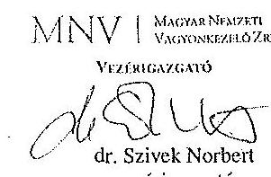

---

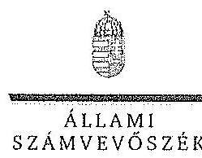

ELNÖK

Ikt.szám: V-0765-055/2015.

Dr. Szivek Norbert úr
vezérigazgató
Magyar Nemzeti Vagyonkezelő Zrt.

Budapest

Tisztelt Vezérigazgató Úr!

A „Jelentéstervezet az állami tulajdonban álló erdőgazdasági társaságok vagyongazdálkodási tevékenységének ellenőrzése - VADEX Mezőföldi Erdő- és Vadgazdálkodási Zrt.” címmel készített számvevőszéki jelentéstervezetre tett észrevételeit köszönettel megkaptam.

Az Állami Számvevőszék észrevételekre vonatkozó álláspontjáról a felügyeleti vezető által készített részletes tájékoztatást csatoltan megküldöm.

Tájékoztatom Vezérigazgató urat, hogy a számvevőszéki jelentésben - az Állami Számvevőszékről szóló 2011. évi LXVI. törvény 29. § (3) bekezdése alapján - a figyelembe nem vett észrevételeket szerepeltetjük az elutasítás indokának feltüntetésével.

Budapest, 2015. /A hó 02 nap

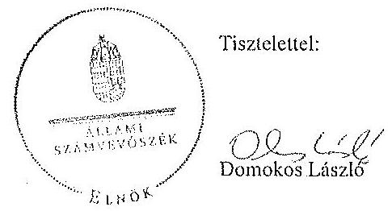

Melléklet: Tájékoztatás az elfogadott és az el nem fogadott észrevételekről

1052 BUDAPEST, AFRICZIN CSZKE JÁNOS JITCA 10. 1364 Budapest 4. Pl. 54 telefon. 484 9101 fax. 484 9201

---

# Tájékoztatás 

az elfogadott és az el nem fogadott észrevételekről

A „Jelentéstervezet az állami tulajdonban álló erdőgazdasági társaságok vagyongazdálkodási tevékenységének ellenörzése - VADEX Mezöföldi Erdö- és Vadgazdálkodási Zrt." címü jelentéstervezetre 2015. október 13-án érkezett észrevételeit áttekintettük, azok kezelésével kapcsolatban a következő tájékoztatást adom.

1. A vagyonkezelési szerződéshez kapcsolódó megállapításokra tett észrevétel (I. fejezet / 8. oldal 7. bekezdés, 9. oldal 1-5. bekezdés, 10. oldal javaslat az MNV Zrt. vezérigazgatójának a)-b) pontok)

A jelentéstervezet vagyonkezelési szerződéshez kapcsolódó megállapításai helytállóak. Az erdőgazdasági társaság müködése jogszabályi megfelelősége biztosításának érdekében tett kezdeményezésekről adott tájékoztatásukat köszönettel vettük, azonban azok nem credményezték az ideiglenes vagyonkezelési szerződés olyan módosítását, vagy olyan új vagyonkezelési szerződés megkötését, amely biztosította volna a VSZ hiányosságainak megszüntetését, illetve a hatályos jogszabályoknak való megfelelőségét. Ezért az MNV Zrt. vezérigazgatójának és az NFA elnökének megfogalmazott intézkedést igénylő megállapítás, valamint az MNV Zrt. vezérigazgatójának megfogalmazott javaslat a) és b) pontjának módosítása nem indokolt. Az egyértelműség érdekében a 8. oldal 7. bekezdés 1. mondatát, 9 oldal 1. bekezdés 1. mondatát és a 28. oldal 7. bekezdés 1. mondatát az alábbiak szerint pontositjuk:
„A vagyonkezelésbe adott állami vagyon tekintetében tulajdonosi jogokat gyakorló MNV Zrt. és NFA az ellenőrzött időszakban a VSZ-szel kapcsolatban feltárt hiányosságokat nem szüntette meg, a hatályos jogszabályoknak a szerzödést nem feleltette meg, ...."
2. Az MNV Zrt. ellenőrzési kötelezettségének elmulasztására vonatkozó megállapításokra tett észrevétel (I. fejezet 8. oldal 7. bekezdés, 9. oldal 5. bekezdés, II. 5. fejezet / 29. oldal 8. bekezdés, 30. oldal 1-2. bekezdés, 10. oldal javaslat az MNV Zrt. vezérigazgatójának c) pont)

Az MNV Zrt. nem bocsátott az ÁSZ ellenőrzés rendelkezésére az MNV Zrt., vagy Területi Irodái által a Vhr. 20. § (1)-(2) bekezdései szerint végzett ellenőrzésekről dokumentumokat. A jelentéstervezet megállapításai és a javaslat helytállóak, módosításuk nem indokolt.

Budapest, 2015. 61 hó 02. nap
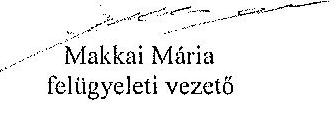

---

# MFB 

Domokos László úr
elnök részére
Állami Számvevőszék

Budapest

Tisztelt Elnök Úr!
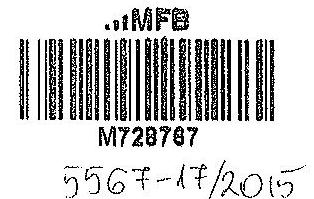

ÁLLAMI SZÁMVEVŐSZÉK
11.017/2015.

Érkszert: 2015 OKT 13.
Iktatószám: $V-0359-0359-0$
Melléklet:
Mallaci M.
E2s
2015. szeptember 28-án köszönettel kézhez vettük az Állami Számvevőszék „Az állami tulajdonban álló erdőgazdasági társaságok vagyongazdálkodási tevékenységének ellenőrzéséről" szóló jelentéstervezeteket az alábbi cégekre:

- Északerdő Erdőgazdasági Zrt.
- EGERERDŐ Erdészeti Zrt.
- Gemenci Erdő- és Vadgazdaság Zrt.
- Ipoly erdő Zrt.
- KEFAG Kiskunsági Erdészeti és Faipari Zrt
- Kisalföldi Erdőgazdaság Zrt
- SEFAG Erdészeti és Faipari Zrt
- Szombathelyi Erdészeti Zrt.
- VADEX Mezöföldi Erdő-és Vadgazdálkodási Zrt. (Ikt.szám: V-0765-044/2015.)
- Zalacrdő Erdészeti Zrt.
(Ikt.szám: V-0754-086/2015.)
(Ikt.szám: V-0750-172/2015.)
(Ikt.szám: V-0753-096/2015.)
(Ikt.szám: V-0749-146/2015.)
(Ikt.szám: V-0764-054/2015.)
(Ikt.szám: V-0758-056/2015.)
(Ikt.szám: V-0752-089/2015.)
(Ikt.szám: V-0757-060/2015.)
(Ikt.szám: V-0765-044/2015.)
(Ikt.szám: V-0760-075/2015.)

Az MFB Zrt. a jelentéstervezetekkel kapcsolatosan 2 féle szempontból kíván észrevételt tenni:

1. A jelentésekben megfogalmazott központi probléma
2. Egyedi esetek

---

# 1. A jelentésekben megfogalmazott központi probléma 

Az ÁSZ az egyedi jelentéseiben az erdőgazdasági társaságokat, valamint a vagyonkezelésbe adott állami vagyon tekintetében tulajdonosi joggyakorló MNV Zrt. és Nemzeti Földalapkezelő (továbbiakban: NFA) tevékenyégét marasztalta el.
Alapvető problémaként jelenik meg, hogy az erdők által kezelt eszközök - az NFA-val, a Kincstári Vagyon Igazgatósággal, és az MNV Zrt-vel kötött vagyonkezelési megállapodásban rögzített - értéken nem szerepelnek a Társaságok könyveiben.
Az MFB Zrt. tudatában volt a problémának (azt az ÁSZ jelentésben is említett, 2010. évben végzett átvilágítási jelentés is tartalmazta, melynek nyomon követése, beszámoltatása megtörtént) és folyamatosan egyeztetett az MNV Zrt-vel és az NFA-val a rendezés ügyében. Az ideiglenes vagyonkezelési szerződés módosítására, véglegesítésére a vagyonkezelésbe adónak (MNV, NFA) van lehetősége, a Társaságok szerződő partnerként észrevételeket, javaslatokat tehetnek. A szerződés véglegesítése érdekében a Társaságok és az MFB Zrt. képviselői minden olyan egyeztetésen (pl.: az MNV Zrt. által létrehozott bizottság) részt vettek, amelyre meghívást kaptak, illetve azokon érdemi javaslatokat tettek.
Ahogy a jelentés is megjegyzi, az egyeztetések az ellenőrzés befejezésig nem kerültek lezárásra, így a Társaságoknál nem áll rendelkezésre a vagyonkezelésben lévő állami vagyonra és annak nagyságára vonatkozó, az MNV Zrt. és az NFA nyilvántartásával egyező adat.

Az ÁSZ 2013. évi „Az állami vagyon feletti kontroll - Az állami vagyon feletti tulajdonosi joggyakorlással kapcsolatos tevékenységek ellenörzéséről" szóló jelentése alapján a Nemzeti Fejlesztési Minisztérium - az ÁSZ-szal egyeztetett - alábbi fóbb pontokat tartalmazó intézkedési tervet (1. sz. melléklet) állított össze, melyet a 2014. április 25-én kelt levelében küldött meg az MFB Zrt. részére:

- a Társaságok által kezelt állami ingatlanok és egyéb vagyonelemek értéken történő nyilvántartása,
- a vagyonkezelési díjak egyértelmủ és tulajdonosi joggyakorló szervezetenkénti meghatározása,
- az új vagyonkezelési szerződés megkötése,
- a Társaságok kezelt és saját vagyonának vagyonelemenkénti, valamint a kezelt vagyonelemek tulajdonosi joggyakorló szerinti elhatárolása.

Az MFB törvény módosításának 2014. július 16-i hatályba lépésével az MFB Zrt. állami erdőgazdaságok feletti tulajdonosi joggyakorlása megszűnt, az a Földművelésügyi Minisztériumhoz került át, így az intézkedési tervben való közreműködésre, illetve a végrehajtás nyomon követésére az MFB Zrt-nek nem volt lehetősége.

A jelentések az MNV Zrt. vezérigazgatójának, az NFA elnökének és az erdészeti társaságok vezérigazgatóinak fogalmaztak meg intézkedési javaslatokat.

---

# 2. Egyedi esetek: 

## KEFAG Kiskunsági Erdészeti és Faipari Zrt.

A jelentéstervezet többször hibásan hivatkozik az MFB Zrt.-re, amikor az állami vagyonról szóló 2007. évi CVI. törvény (a továbbiakban: Vtv.) 17. § (1) bekezdés d) pontja szerinti rendszeres ellenőrzés elmaradására mutat rá. A Vtv. hivatkozott bekezdése alapján az ellenőrzés az MNV Zrt. feladata. Kérjük a társaság feletti tulajdonosi joggyakorlóz hivatkozások törlését (8. oldal 7. bekezdés és 32. oldal 6. bekezdés)

## Kisalföldi Erdőgazdaság Zrt.

A jelentéstervezet hibásan hivatkozik az MFB Zrt.-re, amikor a Vtv. 17. § (1) bekezdés d) pontja szerinti rendszeres ellenőrzés elmaradására mutat rá. A Vtv. hivatkozott bekezdése alapján az ellenőrzés az MNV Zrt. feladata. Kérjük a társaság feletti tulajdonosi joggyakorlóz hivatkozások törlését (29. oldal 4. bekezdés)

## Szombathelyi Erdészeti Zrt.

A jelentéstervezet hibásan hivatkozik az MFB Zrt.-re, amikor a Vtv. 17 § (1) bekezdés d) pontja szerinti rendszeres ellenőrzési elmaradására mutat rá. A Vtv. hivatkozott bekezdése alapján az ellenőrzés az MNV Zrt. feladata. Kérjük a társaság feletti tulajdonosi joggyakorlóz hivatkozás törlését. (32. oldal 5. bekezdés).

Budapest, 2015. október 12.
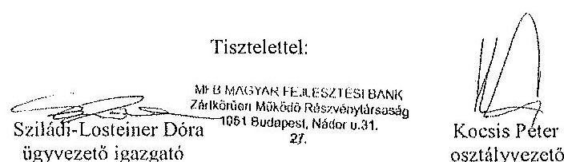

## Melléklet:

NFM levél (Ikt.szám: KGTF/377-7/2014-NFM)

---

.

---

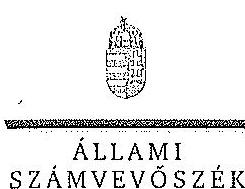

ELNÖK

ÁLLAMI
SZÁMVEVŐSZÉK

Ikt.szám: V-0754-104/2015.

Nagy Csaba úr
vezérigazgató
Magyar Fejlesztési Bank Zrt.

Budapest

Tisztelt Vezérigazgató Úr!

Az „Az állami tulajdonban álló erđőgazdasági társaságok vagyongazdálkodási tevékenységének ellenőrzése" című ellenőrzés tekintetében 10 társaság jelentéstervezetére tett észrevételüket köszönettel megkaptam.

Az Állami Számvevőszék észrevételekre vonatkozó álláspontjáról a felügyeleti vezető által készített részletes tájékoztatást csatoltan megküldöm.

Tájékoztatom Vezérigazgató urat, hogy a számvevőszéki jelentésben – az Állami Számvevőszékről szóló 2011. évi LXVI. törvény 29. § (3) bekezdése alapján – a figyelembe nem vett észrevételeket szerepelteljük az elutasítás indokának feltüntetésével.

Budapest, 2015.

10. 10. nap

Tisztelettel:

Domokos László

Melléklet: Tájékoztatás az elfogadott és az el nem fogadott észrevételekről

1052 BUBAPEST, APÁCZIN CSERE JÁNOS UREA 10. 1364 Budapest 4. Pl. 54 telefon: 484 9101 fax: 484 6281

---

# Tájékoztatás   az elfogadott és az el nem fogadott észrevételekről 

„Az állami tulajdonban álló erdőgazdasági társaságok vagyongazdálkodási tevékenységének ellenörzése" címú ellenőrzés tekintetében az Északerdő Erdőgazdasági Zrt., az EGERERDŐ Erdészeti Zrt., a Gemenci Erdő- és Vadgazdaság Zrt., az IPOLY ERDŐ Zrt., a KEFAG Kiskunsági Erdészeti és Faipari Zrt., a Kisalföldi Erdőgazdasági Zrt., a SEFAG Erdészeti és Faipari Zrt., a Szombathelyi Erdészeti Zrt., a VÁDEX Mezöföldi Erdő- és Vadgazdálkodást Zrt., illetve a Zalaerdő Erdészeti Zrt. társaságok jelentéstervezetére 2015. október 13-án érkezett észrevételeket áttekintettük, azok kezelésével kapcsolatban a következő tájékoztatást adom.

1. A jelentésekben megfogalmazott központi problémával kapcsolatban tett észrevételek A jelentésekben megfogalmazott központi problémával kapcsolatban adott tájékoztatásukat köszönettel vettük, azonban azok alapján a jelentéstervezet módosítása nem indokolt.
2. Egyedi esetekkel kapcsolatban tett észrevételek

A KEFAG Kiskunsági Erdészeti és Faipari Zrt. jelentéstervezetének 8. oldal 7. bekezdésére, valamint 32. oldal 6. bekezdésére tett észrevétel
A rendelkezésre álló dokumentumok ismételt áttekintését követően a jelentéstervezet 8. oldal 7. bekezdésében, valamint 32. oldal 6. bekezdésében töröljük a tulajdonosi joggyakorló 2 számú alsóindexszel jelölt hivatkozását.

A Kisalföldi Erdőgazdasági Zrt. jelentéstervezetének 29. oldal 4. bekezdésére tett észrevétel
A rendelkezésre álló dokumentumok ismételt áttekintését követően a jelentéstervezet 29. oldal 4. bekezdésében töröljük a tulajdonosi joggyakorló 2 számú alsóindexszel jelölt hivatkozását.

A Szombathelyi Erdészeti Zrt. jelentéstervezetének 32. oldal 5. bekezdésére tett észrevétel
A rendelkezésre álló dokumentumok ismételt áttekintését követően a jelentéstervezet 32. oldal 5. bekezdésében töröljük a tulajdonosi joggyakorló 2 számú alsóindexszel jelölt hivatkozását.

Budapest, 2015. év $\quad / / \quad$ hó 75 nap

Makkai Mária
felügyeleti vezető

---

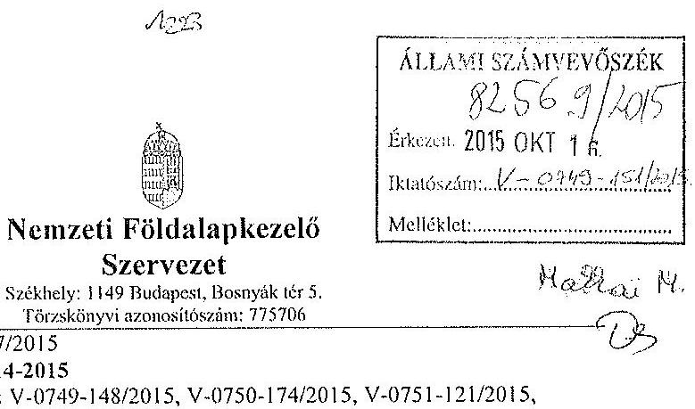

# Nemzeti Földalapkezelő Szervezet

Székhely: 1149 Budapest, Bosnyák tér 5. Törzskönyvi azonosítószám: 775706

Iktatószám: NFA-002589/017/2015

Hiv. szám: ÁSZ-V-0599/2014-2015

Érintett ÁSZ iktatószámok: V-0749-148/2015, V-0750-174/2015, V-0751-121/2015, V-0752-091/2015, V-0753-098/2015, V-754-088/2015, V-0755-124/2015, V-0757-062/2015, V-0758-058/2015, V-0760-077/2015, V-0764-056/2015, V-0765-046/2015, V-0766-140/2015, V-0767-056/2015.

Domokos László
Elnök

Állami Számvevőszék

1052 Budapest

Apáczai Csere János utca 10

Táray: Észrevétel megküldése „Az állami tulajdonban álló erdőgazdasági társaságok vagyongazdálkodási tevékenységének ellenőrzéséről” készített jelentés tervezeteire.

Tisztelt Elnök Úr!

Az Állami Számvevőszék 2014 novemberében megkezdte „Az állami tulajdonban álló erdőgazdasági társaságok vagyongazdálkodási tevékenységének ellenőrzéséről” amelyről 2015 októberétől érintettség okán az NFA részére az elkészített munkaanyag tervezeteit vizsgált erdőgazdaságonként, megküldte Szervezetünk részére véleményezésre.

A munkaanyag valamennyi tervezte egységesen, az NFA Elnöke részére feladatszabást tartalmaz, melyhez az alábbi észrevételeket tesszük:

A jelentéstervezetekben tett megállapítások helytállóságát nem vitatjuk, azonban szükségesnek látjuk az NFA elnökének tett javaslatokkal a), b) és c) kapcsolatban a következő tájékoztatást megadni.

---

# a) „Tegyen intézkedéseket az erdögazdasági társaságok közremüködésével a tényleges állapotot rögzitö és a hatályos jogszabályi elöirásoknak megfelelö vagyonkezelési szerzödés megkötésére." 

Tájékoztatjuk, hogy a hatályos jogszabályi elöírásoknak megfelelő vagyonkezelési szerződések megkötése érdekében több intézkedés történt, jelenleg is folyamatban van a szerződések előkészítése és a vagyonkezelésben maradó, illetve kikerülö földrészletek adatainak egyeztetése.

Előzményként fontos kiemelni, hogy a Nemzeti Földalapkezelő Szervezet 2010. szeptember 1. napjával történt létrehozását követően (2012. évben) került sor a vagyonkezelésben lévő földrészletek MNV Zrt. részéről történő átadására. Az átadási dokumentumok alapján Szervezetünk gondoskodott a közhiteles nyilvántartásokban a megváltozott tulajdonosi joggyakorlás feltüntetéséről. Az erdőgazdaságok esetében ez 2012. év végéig, illetve 2013. év elején megtörtént ennek az ingatlan-nyilvántartásban történő átvezetése is.

Megjegyezzük, hogy az MNV Zrt. részéről történő átadás kizárólag a - több évtizede kötött, és azóta többször módosított - vagyonkezelési szerződések és a földrészletek Excel táblázatban történő átadását jelentette, tehát nem egy naprakész vagyonnyilvántartást tartalmazott. Ennek következtében szükségszerűvé vált a Nemzeti Földalapkezelő Szervezetnek egy saját nyilvántartás felépítése, illetve a szerződések tartalmának feldolgozása.

A számvevőszéki ellenőrzéssel érintett időszakban, illetve még jelenleg is lezáratlan az MNV Zrt. és NFA közötti átadás-átvételi folyamat. Az MNV Zrt. további földrészletek átadását készíti elő, ugyanis az MNV Zrt. vagyoni körébe tartozó földrészletekre szintén tervezi a vagyonkezelői szerződés megkötését, és ennek a folyamatnak a részeként a még át nem adott földrészletek átadása is most történik. Természetesen az NFA is folyamatosan biztosítja a különböző hasznosítási, illetve hatósági eljárások során az erdőgazdaságok vagyonkezelésében lévő földrészletek tulajdonosi joggyakorlójának rendezését az MNV Zrt megkeresésével, közös minősítési eljárás lefolytatásával. A Nemzeti Földalapkezelő Szervezet által megbízott ügyvédi iroda, jelentést készített a szerződés és a tárgyát képező földrészletek jogi helyzetének tisztázására.

Időközben az erdőgazdaságok, mint társaságok feletti tulajdonosi joggyakorló személyében is változás történt. Így új alapokon indulhatott meg a vagyonkezelői szerződés előkészítése. Ennek a folyamatnak részeként, az NFA megbízott egy Ügyvédi Konzorciumot, továbbá Szervezetünknél külön Erőészeti munkacsoport alakult 2015 májusában és azt követően a következő intézkedések történtek:

Az Erdőgazdaságok részére vagyonkezelésbe adásra tervezett ingatlanok felülvizsgálata folyamatban van az Ügyvédi Konzorcium által. A felülvizsgálat tárgyát képező ingatlanok köre három részből tevődik össze:

- az erdőgazdaságok ideiglenes vagyonkezelési szerződésének tárgyát képező ingatlanok,

---

- azon ingatlanok, amelyeket az erdőgazdaságok az ideiglenes vagyonkezelési szerződéstikben szereplő ingatlanokon felül kértek vagyonkezelésbe,
- valamint azok az ingatlanok, amelyeket az NFA kíván az erdőgazdaságok vagyonkezelésébe adni.
A rendelkezésre álló dokumentumokban szereplő ingatlanokból erdőgazdaságonként egy egységes, az összes vagyonkezelésbe adandó ingatlant tartalmazó táblázat készült, amely tartalmazza az ingatlanok vagyonkezelésbe adás szempontjából releváns adatait, bejegyzett jogokat, feljegyzett tényeket. A táblázat adatai összevetésre kerültek a közhiteles ingatlannyilvántartásban szereplő adatokkal, feltárva ezáltal, hogy mely ingatlanok adhatóak vagyonkezelésbe és melyek azok, amelyeknél valamilyen előzetes intézkedés megtétele szükséges.

Az Nfatv. 8. §-a alapján a Birtokpolitikai Tanács dönt erdőgazdaságonként az erdőgazdaságok vagyonkezelési szerződésének megkötéséről.

Zárójelben jegyezzük meg, hogy például a TAEG Zrt. esetében elkészült a fentebb részletezett táblázat, amely alapján összeállitásra került azon ingatlanok listája, amelyre elindítható a vagyonkezelésbe adási eljárás. Megközelítőleg 18000 ha nagyságú területnek tervezi Szervezetünk a TAEG Zrt. részére történő vagyonkezelésbe adását, ebből $15.308,3880$ ha terület az, amelyre elindította a vagyonkezelésbe adást. Az alábbi jogszabályhelyek alapján Szervezetünk megkereste az Földművelésügyi Minisztériumot az egyetértő nyilatkozatok, valamint az alapító határozat kiadása érdekében, valamint a NÉBIHet, mint erdészeti hatóságot a vagyonkezelő erdőgazdálkodói alkalmasságát megállapító jóváhagyásának megkérése végett.

Az Nfatv. 20. § (7) bekezdése alapján „Az állam 100\%-os tulajdonában álló erdő és erdőgazdálkodási tevékenységet közvetlenül szolgáló földterületet érintő vagyonkezelési szerződés létrejöttéhez az erdészeti hatóságnak - a vagyonkezelő erdőgazdálkodói alkalmasságát megállapító - jóváhagyása szükséges".

Az Nfatv. 23. § (2) bekezdése alapján a Nemzeti Földalapba tartozó védett természeti területek és a Natura 2000 területek vagyonkezelésbe adására, tulajdonjogának bármely jogcímen történő átruházására csak a természetvédelemért felelős miniszter egyetértése esetén kerülhet sor. Az állam $100 \%$-os tulajdonában álló erdő, továbbá erdőgazdálkodási tevékenységet közvetlenül szolgáló földterület vagyonkezelésbe adásához az erdőgazdálkodásért felelős miniszter egyetértése szükséges.

Magyar Állam tulajdonában álló ingatlanokat érintő jogügyletekkel kapcsolatos előzetes miniszteri nyilatkozatok és a miniszter tulajdonosi joggyakorlása alá tartozó gazdasági társaságok ingatlanügyleteivel kapcsolatos miniszteri nyilatkozatok, alapítói határozatok kiadásának rendjéről szóló 8/2014. (XI. 28.) FM utasítás 3. § (4) bekezdése értelmében a miniszter tulajdonosi joggyakorlása alá tartozó állami tulajdonú gazdasági társaságoknak az

---

NFA-val történő vagyonkezelési szerződés kötéséhez elengedhetetlen a jogszabály vagy Társasági alapszabály vagy alapító okirat alapján a Társaság tulajdonoai jogait gyakorló miniszter alapítói határozatának kiadása.

Az Erdészeti Munkacsoport a kialakított szempontok alapján tartja a kapcsolatot a Konzorciummal a szerződés tárgyát képező földrészletek jogi, nyilvántartási, helyszíni, térképi ellenőrzés tárgyában annak érdekében, hogy naprakész adatok alapján történjen a szerződéskötés.
b) „Intézkedjen a vagyonkezelési szerzödések felülvizsgálatának elmaradásával összefüggésben feltárt szabálytalanságok tekintetében a munkajogi felelösség tisztázására irányuló eljárás megindításáról, és ennek eredménye ismeretében tegye meg a szükséges intézkedéseket.

A fent leírt folyamat időbeli áttekintése és a vagyonkezelési szerződés előkészítésének jelenlegi helyzetét tekintve a Nemzeti Földalapkezelő Szervezet egységei, munkatársai a rendelkezésükre álló eszközök alapján megtették a szükséges intézkedéseket az erdőgazdaságok vagyonkezelői szerződésének megkötése érdekében.
c) Az NFA elnöke felé tett javaslattal kapcsolatban, miszerint intézkedjen a Társaságok vagyon-nyilvántartása hitelességének, teljességének és helyességének jogszabályban foglaltak szerinti ellenőrzéséről.

Az NFA 2015. év márciusában megkezdte az Erdészeti Zrt.-ték dokumentális ellenőrzését, amely ellenőrzés keretén belül bekérésre került a Társaságok használatában álló vagyonelemekről és az erdővagyon állományról vezetett (nyilvántartások) aktualizált nyilvántartás is.

Budapest, 2015.október 13.
Tisztelettel:
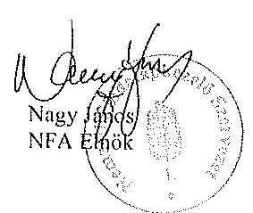

---

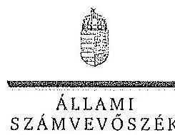

ELNÖK

SZÁMVEVŐSZÉK

Ikt.szám: V-0749-154/2015.

Nagy János úr
elnők

Nemzeti Földalapkezelő Szervezet

Budapest

Tisztelt Elnök Úr!

Az „Az állami tulajdonban álló erdőgazdasági társaságok vagyongazdálkodási tevékenységének ellenőrzése” című ellenőrzés tekintetében 14 társaság jelentéstervezetére tett észrevételüket köszönettel megkaptam.

Az Állami Számvevőszék észrevételekre vonatkozó álláspontjáról a felügyeleti vezető által készített részletes tájékoztatást csatoltan megküldöm.

Tájékoztatom Elnök urat, hogy a számvevőszéki jelentésben – az Állami Számvevőszékről szóló 2011. évi LXVI. törvény 29. § (3) bekezdése alapján – a figyelembe nem vett észrevételeket szerepelhetjük az elutasítás indokának feltüntetésével.

Budapest, 2015. 14. hó 02. nap

Tisztelettel:

Domokos László

Melléklet: Tájékoztatás az észrevételek kezeléséről

1052 BUDAPEST, AFRICAN CSENE JÁNOS STICK 10. 1264 Budapest 4. Pf. 54 telefon: 484 9191 fax: 484 9201

---

# Tájékoztatás   az észrevételek kezeléséről 

„Az állami tulajdonban álló erdőgazdasági társaságok vagyongazdálkodási tevékenyáégének ellenörzése" címủ ellenörzés tekintetében az IPOLY ERDŐ Zrt., az EGERERDŐ Erdészeti Zrt., a Mecsekerdő Zrt., a SEFAG Erdészeti és Falpari Zrt., a Gemenci Erdő- és Vadgazdaság Zrt., az Északerdő Erdőgazdasági Zrt., a Pilisi Parkerdő Zrt., a Szombathelyi Erdészeti Zrt., a Kisalföldi Erdőgazdasági Zrt., a Zalaerdő Erdészeti Zrt., a KEFAG Kiskunsági Erdészeti és Falpari Zrt., a VADEX Mezöföldi Erdő- és Vadgazdálkodási Zrt., a Gyalaj Erdészeti és Vadászati Zrt., illetve a TAEG Tanulmányi Erdőgazdaság Zrt. társaságok jelentéstervezetére 2015. október 16-án érkezett észrevételeket áttekintettük, azok kezelésével kapcsolatban a következő tájékoztatást adom.

Az észrevétel szerint a jelentéstervezetben tett megállapítások helytállóak, azokat nem vitatják. Az NFA elnökének tett javaslatokhoz kapcsolódó tájékoztatást köszöojük. Mindezek miatt, valamint arra tekintettel, hogy nem jött létre olyan vagyonkezelési szerződés, amely biztosítja az ideiglenes vagyonkezelési szerződés hiányosságainak a megszüntetését, illetve a hatályos jogszabályoknak való megfeleltetést, a megállapítások és a javaslatok módosítása nem indokolt.

Budapest, 2015. év $\quad 1 / 2$ hó 22 . nap
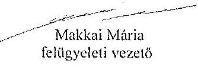