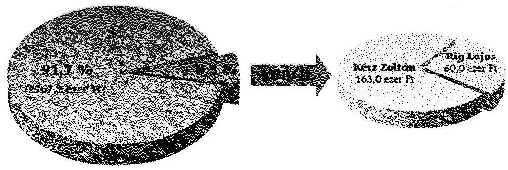
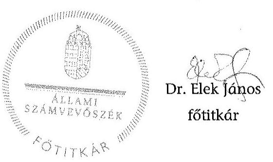
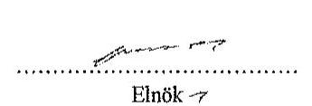
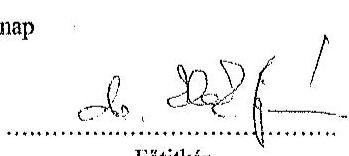

# ÁLLAMI   SZÁMVEVŐSZÉK 

## JELENTÉS

Kampánypénzek ellenőrzése - Az időközi országgyűlési képviselő-választási kampányokra fordított pénzeszközök elszámolásának ellenőrzése

---

# Állami Számvevőszék 

Iktatószám: V-0800-129/2015
Témaszám: 1834
Vizsgálat-azonosító szám: V0721

## Az ellenőrzést felügyelte:

Dr. Benedek Mária
felügyeleti vezető
Az ellenőrzést vezette és a végrehajtásáért felelős:
Moder Beatrix
ellenőrzésvezető
A számvevőszéki jelentéstervezet összeállításában közreműködtek:
Dinnyés Illés Attila
számvevő
Dr. Nagy Ágnes
számvevő tanácsos
Blaskó Attila
számvevő gyakornok
Az ellenőrzést végezték:
Dinnyés Illés Attila
számvevő
Keszthelyi Zoltán
számvevő vezető főtanácsos

## Dr. Nagy Ágnes

számvevő tanácsos
Turai Erzsébet
számvevő

## A témához kapcsolódó eddig készített számvevőszéki jelentések:

## címe

Kampánypénzek ellenőrzése - A 2014. évi országgyűlési képviselő15056
választási kampányokra fordított pénzeszközök elszámolásának ellenőrzése a képviselethez jutott jelölteknél
Kampánypénzek ellenőrzése - A 2014. évi országgyűlési képviselő15057
választási kampányokra fordított pénzeszközök elszámolásának ellenőrzése a képviselethez jutott jelölő szervezeteknél

---

# TARTALOMJEGYZÉK 

BEVEZETÉS ..... 7
I. ÖSSZEGZŐ MEGÁLLAPÍTÁSOK, KÖVETKEZTETÉSEK ..... 10
II. RÉSZLETES MEGÁLLAPÍTÁSOK ..... 12

1. Budapest főváros 11. számú egyéni választókerületben megtartott időközi választás ..... 12
1.1. Horváth Imre egyéni jelölt választási kampányra fordított pénzeszközei felhasználásának szabályszerűsége ..... 12
1.2. A választási kampány kiadásaira vonatkozó korlátozás betartásának szabályszerűsége ..... 13
1.3. A Párt tv.-ben meghatározott korlátozások betartása ..... 14
2. Veszprém megye 01. számú egyéni választókerületben megtartott időközi választás ..... 14
2.1. Kész Zoltán egyéni jelölt választási kampányra fordított pénzeszközei felhasználásának szabályszerűsége ..... 14
2.2. A választási kampány kiadásaira vonatkozó korlátozás betartásának szabályszerűsége ..... 16
3. Veszprém megye 03. számú egyéni választókerületben megtartott időközi választás ..... 16
3.1. Rig Lajos egyéni jelölt választási kampányra fordított pénzeszközei felhasználásának szabályszerűsége ..... 16
3.2. A választási kampány kiadásaira vonatkozó korlátozás betartásának szabályszerűsége ..... 18
3.3. A Párt tv.-ben meghatározott korlátozások betartása ..... 18

## MELLÉKLETEK

1. számú Elnöki hatáskör átruházása

---

.

---

# RÖVIDÍTÉSEK JEGYZÉKE 

## Törvények

Áfa tv.
2007. évi CXXVII. törvény az általános forgalmi adóról
ÁSZ tv.
2011. évi LXVI. törvény az Állami Számvevőszékről
Kftv.
2013. évi LXXXVII. törvény az országgyűlési képviselők választása kampányköltségeinek átláthatóvá tételéről
Okv.
2011. évi CCIII. törvény az országgyűlési képviselők választásáról
Párt tv.
1989. évi XXXIII. törvény a pártok működéséről és gazdálkodásáról
Számv. tv.
2000. évi C. törvény a számvitelről

Ve.

## Rendeletek

Áhsz.
2013. évi XXXVI. törvény a választási eljárásról

4/2013. (I. 11.) Korm. rendelet az államháztartás számviteléről
NGM rendelet
69/2013. (XII. 29.) NGM rendelet az országgyűlési képviselők választása kampányköltségeinek támogatásáról

## Szórövidítések

ÁSZ
Jobbik
Jobbik jelölő szervezet
Kincstár
NVB
MSZP
MSZP jelölő szervezet

Állami Számvevőszék
Jobbik Magyarországért Mozgalom
Jobbik Magyarországért Mozgalom jelölő szervezet
Magyar Államkincstár
Nemzeti Választási Bizottság
Magyar Szocialista Párt
Magyar Szocialista Párt jelölő szervezet

---

.

---

# ÉRTELMEZŐ SZÓTÁR 

dologi kiadás
jelölő szervezet
jelölt
kampányeszköz
kampányidőszak
kampánytevékenység
politikai hirdetés
sajtótermék

Az Áhsz. 15. melléklet (I. Egységes rovatrend a költségvetési és finanszírozási bevételekhez, kiadásokhoz) K3. pontja szerinti kiadások (forrás: Áhsz. 15. melléklet K3. Dologi kiadások rovat).
Az országgyűlési képviselők választásán a választás kitűzésekor a civil szervezetek bírósági nyilvántartásában jogerősen szereplő párt (forrás: Ve. 3. § 3. pontja).
Az országgyűlési választáson az egyéni választókerületben független jelöltként vagy párt jelöltjeként, illetve két vagy több párt közös jelöltjeként induló személy (forrás: Okv. 5. §-a).
Kampányeszköznek minősül minden olyan eszköz, amely alkalmas a választói akarat befolyásolására vagy annak megkísérlésére, így különösen
a) plakát,
b) jelölő szervezet vagy jelölt által történő közvetlen megkeresés,
c) politikai reklám és politikai hirdetés,
d) választási gyűlés (forrás: Ve. 140. §-a).

A szavazás napját megelőző 50. naptól a szavazás napján a szavazás befejezéséig tartó időszak (forrás: Ve. 139. §-a).

Kampánytevékenység a kampányeszközök kampányidőszakban történő felhasználása és minden egyéb kampányidőszakban folytatott tevékenység a választói akarat befolyásolása vagy ennek megkísérlése céljából (forrás: Ve. 141. §-a).
Az ellenérték fejében közzétett, valamely jelölő szervezet vagy független jelölt népszerűsítését szolgáló, vagy támogatására ösztönző, illetve azok nevét, célját, tevékenységét, jelszavát, emblémáját népszerűsítő sajtótermékben közzétett médiatartalom vagy filmszínházban közzétett audiovizuális tartalom (forrás: Ve. 146. § b) pont).
A napilap és más időszaki lap egyes számai, valamint az internetes újság vagy hírportál, amelyet gazdasági szolgáltatásként nyújtanak, amelynek tartalmáért valamely természetes vagy jogi személy szerkesztői felelősséget visel, és amelynek elsődleges célja szövegből, illetve képekből álló tartalmaknak a nyilvánossághoz való eljuttatása tájékoztatás, szórakoztatás vagy oktatás céljából, nyomtatott formátumban vagy valamely elektronikus hírközlő hálózaton keresztül (forrás: 2010. évi CLXXXV. törvény a médiaszolgáltatásokról és a tömegkommunikációról 203. §60. pontja).

---

.

---

# JELENTÉS 

## Kampánypénzek ellenőrzése - Az időközi országgyűlési képviselő-választási kampányokra fordított pénzeszközök elszámolásának ellenőrzése

## BEVEZETÉS

A 2014. évtől az általános és időközi országgyűlési választás a korábbiakhoz képest új lebonyolítási és finanszírozási rendszerben kerül megtartásra. Az Országgyűlés 2013. évben megalkotta a választási eljárásról szóló 2013. évi XXXVI. törvényt (Ve.), valamint az országgyűlési képviselők választása kampányköltségeinek átláthatóvá tételéről szóló 2013. évi LXXXVII. törvényt (Kftv.).

Az Állami Számvevőszék a Kftv. 8/B. § (1) bekezdése alapján a választást követő egy éven belül hivatalból ellenőrzi az időközi országgyűlési választáson képviselethez jutott egyéni választókerületi képviselőjelöltek tekintetében a Kftv. 1. § (1)-(2) bekezdése szerinti központi költségvetési támogatás felhasználását, valamint a Kftv. 9. § (2) bekezdése alapján az országgyűlési képviselethez jutott egyéni jelöltek és jelölő szervezeteik tekintetében az időközi választásra fordított állami és a Párt tv.-ben meghatározott más pénzeszközök felhasználását. Az új törvényi szabályozás (Kftv.) szerint az egyéni jelölteknek folyósított támogatással való elszámolás ellenőrzését a Kincstár végzi azt megelőzően, hogy az ÁSZ hivatalból ellenőrzi a kampányköltségekre fordított pénzeszközök felhasználását.

Az ÁSZ a Kftv. 9. § (2) bekezdése alapján a választást követő egy éven belül kérelemre ellenőrzi az országgyűlési képviselethez nem jutott egyéni jelöltek és jelölő szervezeteik tekintetében a választásra fordított állami és a Párt tv.-ben meghatározott más pénzeszközök felhasználását. Az ellenőrzés iránti kérelmet a választást követő három hónapon belül egyéni jelölt, vagy jelölő szervezet nyújthatja be bizonyítási indítvány csatolásával. Az időközi országgyűlési képviselőválasztások tekintetében az ÁSZ részére ellenőrzés iránti kérelmet nem nyújtottak be, így jelen számvevőszéki jelentéstervezet az időközi választásokon képviselethez jutott egyéni jelöltek és jelölő szervezeteik ellenőrzéséről készült.

Az országgyűlési képviselők 2014. évi általános választását követően - az Okv. 19. § (1) bekezdés c) pontja szerint, a megüresedett egyéni választókerületi mandátumok betöltésére - a Nemzeti Választási Bizottság három időközi választást tűzött ki. Az 1310/2014. NVB határozat alapján Budapest 11. számú egyéni választókerületben 2014. november 23-án, az 1451/2014. NVB határozat szerint Veszprém megye 01. számú egyéni választókerületben 2015. február 22-én, a 11/2015. NVB határozat alapján Veszprém megye 03. számú egyéni választókerületben 2015. április 12-én tartottak időközi választást.

---

Az ellenőrzés célja annak megállapítása, hogy az időközi országgyűlési választásokon képviselethez jutott egyéni jelöltek és jelölő szervezeteik betartották-e a Kftv. előírásait. Ennek keretében ellenőrizte az ÁSZ, hogy:

- az időközi országgyűlési választásokon képviselethez jutott egyéni jelöltek a Kftv. 1. § (1)-(2) bekezdéseiben foglaltak szerinti központi költségvetésből juttatott támogatást a választási kampányidőszakban, a választási kampánytevékenységgel összefüggő dologi kiadások finanszírozására fordították-e;
- az időközi országgyűlési választásokon képviselethez jutott egyéni jelöltek és jelölő szervezeteik jelöltjeikkel együtt betartották-e a Kftv. 7. § (1) bekezdésében meghatározott, jelöltenkénti ötmillió forint összeghatárt.

Az ellenőrzés várható hasznosulása: Az ellenőrzéssel választ adunk arra, hogy az időközi országgyűlési képviselő-választási kampányra fordított központi költségvetési támogatásokat az időközi országgyűlési választásokon képviselethez jutott egyéni jelöltek és jelölő szervezeteik a vonatkozó jogszabályokban foglalt előírások szerint, a törvényben meghatározott kampányidőszak alatt és kampánytevékenységre használták-e fel. Az ÁSZ által feltárt, a törvényekben meghatározott korlátok és tilalmak esetleges megsértését a törvény értelmében szankciók követik, így ezen a területen is érvényesülni tud, hogy az ellenőrzés által feltárt szabálytalan közpénz felhasználás nem marad következmény nélkül. Az ellenőrzéssel rá tudunk mutatni a kampányfinanszírozás átláthatóságát és ellenőrizhetőségét esetlegesen megnehezítő törvényi hiányosságokra.

Az ellenőrzés típusa: szabályszerűségi ellenőrzés.
Az ellenőrzést a számvevőszéki ellenőrzés szakmai szabályai szerint, a szabályszerűségi ellenőrzés módszerével, a vonatkozó nemzetközi standardok figyelembevételével végeztük el.

A képviselethez jutott egyéni jelöltek és jelölő szervezeteik által kampánycélra fordított összegek felhasználásának szabályszerűségét egyszerű véletlen mintavétellel kiválasztott gazdasági események és azokat alátámasztó dokumentumok alapján ellenőriztük. ${ }^{1}$

Az ellenőrzött időszak: az időközi országgyűlési képviselő-választás Ve. 139. §-ában rögzített - a szavazás napját megelőző 50. naptól a szavazás befejezésének időpontjáig tartó - választási kampányidőszaka, és az azt követő elszámolási időszak.

Az ellenőrzöttek köre: az időközi országgyűlési képviselő-választáson képviselethez jutott egyéni jelöltek és jelölő szervezeteik.

Az ellenőrzéshez adatszolgáltatásra kértük fel a Kincstárt. Az ellenőrzésre a központi költségvetési támogatáson felül egyéb forrást kampánycélra felhasználó

[^0]
[^0]:    ${ }^{1}$ Amennyiben a gazdasági események alacsony száma miatt nem volt szükség mintavételre, teljes körű ellenőrzést végeztünk.

---

egyéni jelölteknél, a jelölő szervezeteknél, továbbá a Kftv. 1. §-a alapján juttatott költségvetési támogatás tekintetében a Kincstárnál került sor.

Az ellenőrzés jogszabályi alapja: a Kftv. 8/B. § (1) és a 9. § (2) bekezdése.
Az ÁSZ tv. 29. § (1) bekezdése szerint az ellenőrzési megállapításokat megküldtük a jelöltek és jelölő szervezetek részére, akik nem éltek az ÁSZ tv. 29. § (2) bekezdésében foglalt észrevételezési jogukkal.

---

# I. ÖSSZEGZŐ MEGÁLLAPÍTÁSOK, KÖVETKEZTETÉSEK 

A Kincstár az időközi országgyűlési választásokon képviselethez jutott egyéni jelöltekkel - a Kftv. szerinti központi költségvetési támogatás folyósítása céljából a Kftv.-ben előírt, az NGM rendeletben meghatározott tartalmú megállapodást kötött, részükre a támogatást a kincstári kártyafedezeti számlán jóváírta. A három egyéni jelölt a rendelkezésükre bocsátott, összesen 2 996,0 ezer Ft támogatásból 2 990,2 ezer Ft kampánycélú felhasználásról számolt el a Kincstár felé, a jelöltek által fel nem használt támogatás összege 5,8 ezer Ft volt. A kincstári kártyafedezeti számla és kártya használata mindhárom egyéni jelölt esetében megfelelt a Kftv. előírásainak.

A három egyéni jelölt a támogatás felhasználásáról szóló elszámolását a Kftv.-ben előírt határidőn belül benyújtotta a Kincstárhoz. Az egyéni jelöltek az elszámolásaikon szereplő minden kiadási tételhez részletes szöveges indokolást adtak az egyes tételek felhasználási céljáról, valamint nyilatkoztak a támogatás szabályszerű felhasználásáról. Az elszámolást alátámasztó számlák, egyéb számviteli bizonylatok - a Kftv. és a Számv. tv. előírásainak megfelelően - hitelesek voltak, azok az NGM rendelet előírásainak megfeleltek, kampánytevékenységgel összefüggő dologi kiadásokat tartalmaztak.

A Kincstárhoz benyújtott elszámolás és az elszámoláshoz csatolt bizonylatok alapján a támogatás felhasználása egy egyéni jelölt esetében felelt meg a Kftv.-ben foglalt előírásoknak.

Az ÁSZ két egyéni jelöltnél tárt fel a központi költségvetésből nyújtott támogatás felhasználására vonatkozó szabálytalanságot. A jelöltek elszámolásához csatolt - jelöltenként egy-egy - bizonylat nem felelt meg teljes körűen a Kftv. és a Ve. előírásainak, mivel a szerződésekben rögzített szolgáltatás igénybevételére részben kampányidőszakon túl került sor.

Kimutatás az időközi országgyűlési képviselő-választási kampányokra a Kftv. 1. §-a alapján juttatott támogatás felhasználásáról

= szabályszerűen felhasznált = szabálytalanul felhasznált

---

Az ÁSZ megállapításai alapján a szabálytalanul felhasznált támogatás a két jelölt esetében összesen 223,0 ezer Ft volt.

A három időközi országgyűlési képviselő-választáson képviselethez jutott egyéni jelöltek közül egy független jelölt, egy az MSZP, és egy a Jobbik jelölő szervezet jelöltje volt.

A független jelölt központi költségvetési támogatásból és egyéb forrásból kampánytevékenységre fordított összes kiadása - az egyéni jelölt által az ÁSZ részére rendelkezésre bocsátott dokumentumok alapján - a Kftv.-ben rögzített értékhatárt nem haladta meg. A központi költségvetési támogatáson felüli forrásokból teljesített
 kiadások bizonylatái a választói akarat befolyásolására alkalmas kampányeszközök kampányidőszaki felhasználását támasztották alá.

A Jobbik és az MSZP jelölő szervezet nyilvánosságra hozott adatai, valamint az általuk és jelöltjeik által az ÁSZ részére rendelkezésre bocsátott dokumentumok alapján a jelölő szervezetek és képviselethez jutott egyéni jelöltjeik kampánytevékenységre fordított összes kiadásai - a Kftv.-ben foglalt előírásnak megfelelően - nem haladták meg a jelöltenkénti ötmillió Ft-os értékhatárt. A jelölő szervezetek által teljesített kiadások a számviteli bizonylatok alapján kampánycélt szolgáltak, azok a Ve. szerinti kampányeszközök megfizetésére irányultak.

A jelölő szervezetek pártjai a választási kampánytevékenységgel összefüggő kiadásaik finanszírozására a választási kampányidőszak alatt a Párt tv.-ben meghatározott forrásokat vették igénybe. Jogi személytől, jogi személyiséggel nem rendelkező szervezettől, más államtól, külföldi szervezettől és nem magyar állampolgár természetes személytől vagyoni hozzájárulást, illetve névtelen adományt nem fogadtak el.

A politikai hirdetésekre vonatkozó számlák és az ÁSZ részére a Ve. alapján megküldött árjegyzékek és tájékoztatók körében az ellenőrzés megállapította, hogy az ÁSZ részére árjegyzéket és tájékoztatót küldő sajtótermékek kiadói által kiállított számlák adatai megegyeztek az árjegyzékben, tájékoztatóban foglalt adatokkal. Egy-három politikai hirdetést megjelentető sajtótermék kiadója, a Ve. előírása ellenére, nem küldött tájékoztatót és árjegyzéket az ÁSZ részére. Ezen szabálytalanságért a számlakibocsátó (sajtótermék kiadója) a felelős, ami a választási kampányra fordított pénzeszközök felhasználásának minősítését nem befolyásolta.

---

# II. RÉSZLETES MEGÁLLAPÍTÁSOK 

## 1. BUDAPEST FŐVÁROS 11. SZÁMÚ EGYÉNI VÁLASZTÓKERÜLETBEN MEGTARTOTT IDŐKÖZI VÁLASZTÁS

### 1.1. Horváth Imre egyéni jelölt választási kampányra fordított pénzeszközei felhasználásának szabályszerűsége

A Kincstár a Kftv. 2. § (1)-(2) bekezdéseiben és az NGM rendelet 2. § (1) bekezdésében előírtaknak megfelelően a költségvetési támogatás folyósítása céljából a jelölttel megállapodást kötött, kincstári kártyafedezeti számlát nyitott és kincstári kártya kibocsátásáról intézkedett. A Kincstár - a Kftv. 1. § (1) bekezdésben foglaltak szerinti - a központi költségvetésből nyújtott 1000,0 ezer Ft támogatási összeget bocsátott a jelölt rendelkezésére a kincstári kártyafedezeti számlán.

A kincstári kártyafedezeti számla és a kincstári kártya használata a jelölt esetében szabályszerű volt, megfelelt a Kftv. 2. § (4)-(5) bekezdéseiben meghatározott előírásoknak. A kampánytevékenységgel összefüggő kiadásokra teljesített kifizetések a kincstári kártyafedezeti számláról átutalással történtek.

A jelölt a választási kampánytevékenységgel összefüggő, kampányidőszak alatt teljesített kiadásai elszámolását - a Kftv. 8. § (1) bekezdésében foglaltaknak megfelelően - az összes kifizetést igazoló bizonylat másolatának benyújtásával teljesítette. Az egyéni jelölt 995,2 ezer Ft-tal számolt el a Kincstár felé, a fel nem használt támogatás összege 4,8 ezer Ft volt.

A Kftv. 8. § (1) bekezdésében foglaltaknak megfelelően a jelölt az elszámolását - az NGM rendelet 7. § (1) és (3) bekezdéseiben előírtak alapján - számlaösszesítő adatlapon, határidőben benyújtotta a Kincstárhoz. A jelölt a kiadási tételekhez részletes, szöveges indokolást adott a felhasználás céljáról, valamint nyilatkozott a támogatás szabályszerű felhasználásáról.

A támogatás felhasználását igazoló számviteli bizonylatok (számla és egyéb bizonylatok) - a Kftv. 2. § (6) bekezdésében foglaltaknak megfelelően - a jelölt nevére szóltak, és azokon feltüntették az egyéni választókerület megjelölését. A számviteli bizonylatok a Számv. tv. 166. § (2) bekezdésben előírtaknak megfelelően hitelesek voltak, a számla alaki és tartalmi kellékei megfeleltek az Áfa tv. 169. §-ában előírt követelményeknek. A támogatás felhasználását igazoló számviteli bizonylatok Kincstárhoz benyújtott másolatait a jelölt az NGM rendelet 7. § (2) bekezdésében foglaltaknak megfelelően aláírásával hitelesítette és a másolatokon „Az eredetivel mindenben megegyező" szöveget feltüntette.

A támogatás felhasználását igazoló számviteli bizonylatok a Ve. 140. §-a szerinti kampányeszköz - plakát - igénybevételét támasztották alá, amely alkalmas volt

---

a Ve. 141. §-a alapján a választói akarat befolyásolására vagy annak megkísérlésére. A számviteli bizonylatok megfeleltek az NGM rendelet 2. § (4) bekezdés a) pontjának 6. alpontjában foglalt - a Kincstár és a jelölt között megkötött megállapodásban is rögzített - előírásoknak, azok az Áhsz. 15. melléklet K3 Dologi kiadások rovatba tartozó, a kampánytevékenységgel összefüggésben elszámolható költségeket tartalmaztak.

A Ve. 148. § (2) és (4) bekezdéseiben előírt kötelezettség körében - amely szerint a politikai hirdetést megjelentető sajtótermék az ÁSZ részére árjegyzéket és tájékoztatót köteles küldeni - az ellenőrzés megállapította, hogy a jelölt nem rendelt meg sajtótermékben megjelenő politikai hirdetést.

# 1.2. A választási kampány kiadásaira vonatkozó korlátozás betartásának szabályszerűsége 

Horváth Imre képviselethez jutott egyéni jelölt jelölő szervezete az MSZP - a Kftv.-ben foglalt előírás alapján - a 2014. november 23-ai időközi választásra fordított állami és más pénzeszközök, anyagi támogatások összegét, forrását és felhasználásának módját nyilvánosságra hozta. A képviselethez jutott egyéni jelölt azonban a Kftv. 9. § (1) bekezdésében foglaltak ellenére a közzétételt elmulasztotta.

A közzétett adatok és az MSZP jelölő szervezet és jelöltje által az ÁSZ részére a választási kampánytevékenységgel összefüggő kiadásokról rendelkezésre bocsátott dokumentumok együttesen biztosították az értékhatár betartásának ellenőrizhetőségét.

Az MSZP jelölő szervezet és képviselethez jutott egyéni jelöltje a 2014. november 23-án megtartott időközi választás kampányidőszaka alatt, kampánytevékenységgel összefüggő kiadások finanszírozására - a jelölő szervezet által közzétett adatok, és az ÁSZ rendelkezésre bocsátott adatszolgáltatás alapján - összesen 4303,8 ezer Ft-ot fordított. Horváth Imre képviselethez jutott egyéni jelölt a Kftv. 1. §-a szerint a részére biztosított költségvetési támogatásból 995,2 ezer Ft-ot használt fel, költségvetési támogatáson felüli forrást a kampányfinanszírozásra nem vett igénybe. Az MSZP jelölő szervezet kampányidőszaki kampánytevékenységgel kapcsolatosan kimutatott kiadása 3308,6 ezer Ft volt.

Az MSZP jelölő szervezet kampánykiadásait alátámasztó számlák összege 3800,4 ezer Ft, 491,8 ezer Ft-tal több a közzétételben szereplő összegnél. Az eltérés kettő, óriásplakát bérleti díja tárgyában kiállított - a K/2923/2014. számú, valamint K/2924/2014. számú - számlánál jelentkezett, amelynek oka, hogy a bérleti díjat teljes hónapra meg kellett fizetni ${ }^{2}$, de a közzétételben a szolgáltatás ellenértékét a Ve. 139. §-a szerinti kampányidőszakra korrigált összegben szerepeltették. A számlák teljes összegének figyelembe vételével a jelölő szervezet és jelöltje összes kiadása 4795,6 ezer Ft volt.

[^0]
[^0]:    ${ }^{2}$ Az MSZP ÁSZ részére adott nyilatkozata szerint.

---

Az MSZP jelölő szervezet és képviselethez jutott egyéni jelöltje által az időközi választásra fordított összes kampánykiadás összege - a Kftv. 7. § (1) bekezdés b) pontjában előírtaknak megfelelően - nem haladta meg az ötmillió Ft-os értékhatárt.

Az MSZP jelölő szervezet kampányfinanszírozásra elszámolt kiadásai kampánytevékenységre irányultak. A kampánycélra elszámolt kiadásokat alátámasztó számviteli bizonylatok hitelesek voltak, megfeleltek a Számv. tv. 166-167. §-aiban foglaltaknak, a számlák alaki és tartalmi kellékei megfeleltek az Áfa tv. 169-178. § előírásainak.

A Ve. 148. § (2) és (4) bekezdéseiben előírt kötelezettség körében - amely szerint a politikai hirdetést megjelentető sajtótermék az ÁSZ részére árjegyzéket és tájékoztatót köteles küldeni - az ellenőrzés megállapította, hogy az MSZP jelölő szervezet a választási kampánnyal összefüggő, sajtótermékben közlendő politikai hirdetést nem rendelt meg.

# 1.3. A Párt tv.-ben meghatározott korlátozások betartása 

Az MSZP jelölő szervezet a kampányfinanszírozásra fordított forrásoknál betartotta a Párt tv. 4. § (2)-(3) bekezdéseiben foglalt korlátozásokat. Jogi személytől, jogi személyiséggel nem rendelkező szervezettől, más államtól, külföldi szervezettől és nem magyar állampolgár természetes személytől vagyoni hozzájárulást és névtelen adományt nem fogadott el.

Az MSZP jelölő szervezet és képviselethez jutott jelöltje által az időközi választási kampány finanszírozására elszámolt 4303,8 ezer Ft forrása, 995,2 ezer Ft összegben a jelölt által felhasznált, a Kftv. 1. §-a szerinti központi költségvetési támogatásból, 3 308,6 ezer Ft értékben az MSZP jelölő szervezet egyéb forrásából tevődött össze. A kampányidőszakon kívüli szolgáltatásra kifizetett 491,8 ezer Ft forrását szintén a jelölő szervezet egyéb forrása képezte. Az MSZP jelölő szervezet kampányfinanszírozásra felhasznált egyéb forrását magyar állampolgár természetes személyektől kapott, tárgyévi vagyoni hozzájárulás képezte. A párt kampányfinanszírozásra előző évekből származó maradványt nem használt fel.

## 2. VESZPRÉM MEGYE 01. SZÁMÚ EGYÉNI VÁLASZTÓKERÜLETBEN MEGTARTOTT IDŐKÖZI VÁLASZTÁS

### 2.1. Kész Zoltán egyéni jelölt választási kampányra fordított pénzeszközei felhasználásának szabályszerűsége

A Kincstár a Kftv. 2. § (1)-(2) bekezdéseiben és az NGM rendelet 2. § (1) bekezdésében előírtaknak megfelelően a költségvetési támogatás folyósítása céljából a jelölttel megállapodást kötött, kincstári kártyafedezeti számlát nyitott és kincstári kártya kibocsátásáról intézkedett. A Kincstár - a Kftv. 1. § (1)-(2) bekezdésben foglaltak alapján - a központi költségvetésből nyújtott 998,0 ezer Ft támogatási összeget bocsátott a jelölt rendelkezésére a kincstári kártyafedezeti számlán.

---

A kincstári kártyafedezeti számla és a kincstári kártya használata szabályszerű volt, megfelelt a Kftv. 2. § (4)-(5) bekezdéseiben meghatározott előírásoknak. A kampánytevékenységgel összefüggő kiadásokra teljesített kifizetések a kincstári kártyafedezeti számláról átutalással történtek.

Az egyéni jelölt a választási kampánytevékenységgel összefüggő, kampányidőszak alatt teljesített kiadásai elszámolását a - Kftv. 8. § (1) bekezdésében foglaltaknak megfelelően - az összes kifizetést igazoló bizonylat benyújtásával teljesítette. Az egyéni jelölt 997,4 ezer Ft-tal számolt el a Kincstár felé, a fel nem használt támogatás összege 0,6 ezer Ft volt.

A Kftv. 8. § (1) bekezdésében foglaltaknak megfelelően a jelölt az elszámolását - az NGM rendelet 7. § (1) és (3) bekezdéseiben előírtak alapján - számlaösszesítő adatlapon, határidőben benyújtotta a Kincstárhoz. A jelölt a kiadási tételekhez részletes, szöveges indokolást adott azok felhasználási céljáról, valamint nyilatkozott a támogatás szabályszerű felhasználásáról.

A támogatás felhasználását igazoló számviteli bizonylatok (számlák és egyéb bizonylatok) - a Kftv. 2. § (6) bekezdésében foglaltaknak megfelelően - a jelölt nevére szóltak, és a számlákon feltüntették az egyéni választókerület megjelölését. A számviteli bizonylatok a Számv. tv. 166. § (2) bekezdésben előírtaknak megfelelően hitelesek voltak, a számlák alaki és tartalmi kellékei megfeleltek az Áfa tv. 169. §-ában előírt követelményeknek. A támogatás felhasználását igazoló számviteli bizonylatok Kincstárhoz benyújtott másolatait a jelölt az NGM rendelet 7. § (2) bekezdésében foglaltaknak megfelelően aláírásával hitelesítette és a másolatokon „Az eredetivel mindenben megegyező" szöveget feltüntette.

A támogatás felhasználását igazoló számviteli bizonylatok a Ve. 140. §-a szerinti kampányeszköz - plakát és politikai hirdetés - igénybevételét támasztották alá, amelyek alkalmasak voltak a Ve. 141. §-a alapján a választói akarat befolyásolására vagy annak megkísérlésére. A számviteli bizonylatok megfeleltek az NGM rendelet 2. § (4) bekezdés a) pontjának 6. alpontjában foglalt - a Kincstár és a jelölt között megkötött megállapodásban is rögzített - előírásoknak, azok az Áhsz. 15. melléklet K3 Dologi kiadások rovatba tartozó, a kampánytevékenységgel összefüggésben elszámolható költségeket tartalmaztak.

Az egyéni jelölt kampányidőszak alatt teljesített kampánykiadásaihoz kapcsolódó bizonylatok alapján egy kifizetés nem felelt meg a Kftv. 1. § (3) bekezdésében és a Ve. 139. §-ában foglaltaknak, mert a teljesített szolgáltatás igénybevétele részben kampányidőszakon kívül esett.

A jelölt által benyújtott, óriásplakát és Citylight plakát megjelentetéséről szóló 1/2015 számú számlában feltüntetett bruttó 760,9 ezer Ft összegből bruttó 163,0 ezer Ft ellenértékű szolgáltatás teljesítése - a
 szolgáltatás megrendelésére vonatkozó szerződés szerint - a Ve. 139. §-ában foglaltak ellenére nem a kampányidőszakban, hanem a kampányidőszakot követő időszakban történt. A vállalkozási szerződés szerint 2015. február 1-jétől február 28-áig került sor a szolgáltatás igénybevételére, amelyből a február 23-28 közötti időszak kampányidőszakon túli volt.

---

A politikai hirdetésre vonatkozó számlák és az ÁSZ részére a Ve. 148. § (2) és (4) bekezdése alapján megküldött árjegyzék és tájékoztató körében az ellenőrzés megállapította, hogy a politikai hirdetések számláinak adatai megegyeztek az árjegyzékben és tájékoztatóban foglalt adatokkal.

# 2.2. A választási kampány kiadásaira vonatkozó korlátozás betartásának szabályszerűsége 

A független egyéni jelölt - a Kftv. 9. § (1) bekezdésében foglaltak ellenére - nem hozta nyilvánosságra a 2015. február 22-ei időközi választásra fordított állami és más pénzeszközök, anyagi támogatások összegét, forrását és felhasználásának módját. Az értékhatár betartásának ellenőrzését az egyéni jelölt által az ÁSZ részére az időközi választási kampánytevékenységgel összefüggő kiadásokról rendelkezésre bocsátott adatszolgáltatás és dokumentumok biztosították.

A független egyéni jelölt kampánytevékenységre fordított összes kiadása nem haladta meg a Kftv. 7. § (1) bekezdés a) pontja szerinti, kampánytevékenységgel összefüggő kiadások finanszírozására fordítható ötmillió Ft-os értékhatárt.

A Kftv. 1. § (1)-(2) bekezdés szerinti költségvetési támogatásból igénybe vett 997,4 ezer Ft-on felül a független egyéni jelölt a kampányfinanszírozásra egyéb forrásból 2482,3 ezer Ft-ot, így a kampányra összesen 3479,7 ezer Ft-ot fordított.

A költségvetési támogatáson felüli forrásból teljesített kiadások hiteles bizonylatai a Ve. 141. §-ában foglaltaknak megfelelő, kampányeszközök kampányidőszaki felhasználását támasztották alá. A számlák alaki és tartalmi kellékei megfeleltek az Áfa tv. 169-178. § előírásainak.

## 3. VESZPRÉM MEGYE 03. SZÁMÚ EGYÉNI VÁLASZTÓKERÜLETBEN MEGTARTOTT IDŐKÖZI VÁLASZTÁS

### 3.1. Rig Lajos egyéni jelölt választási kampányra fordított pénzeszközei felhasználásának szabályszerűsége

A Kincstár a Kftv. 2. § (1)-(2) bekezdésében és az NGM rendelet 2. § (1) bekezdésében előírtaknak megfelelően a költségvetési támogatás folyósítása céljából a jelölttel megállapodást kötött, kincstári kártyafedezeti számlát nyitott és kincstári kártya kibocsátásáról intézkedett. A Kincstár - a Kftv. 1. § (1)-(2) bekezdésben foglaltak szerinti - a központi költségvetésből nyújtott 998,0 ezer Ft támogatási összeget bocsátott a jelölt rendelkezésére a kincstári kártyafedezeti számlán.

A kincstári kártyafedezeti számla és a kincstári kártya használata a jelölt esetében szabályszerű volt, megfelelt a Kftv. 2. § (4)-(5) bekezdésében meghatározott előírásoknak. A kampánytevékenységgel összefüggő kiadásokra teljesített kifizetés a kincstári kártyafedezeti számláról átutalással történt.

---

A jelölt a választási kampánytevékenységgel összefüggő, kampányidőszak alatt teljesített kiadásai elszámolását - a Kftv. 8. § (1) bekezdésében foglaltaknak megfelelően - az összes kifizetést igazoló bizonylat másolatának benyújtásával teljesítette. Az egyéni jelölt 997,6 ezer Ft-tal számolt el a Kincstár felé, a fel nem használt támogatás összege 0,4 ezer Ft volt.

A Kftv. 8. § (1) bekezdésében foglaltaknak megfelelően a jelölt az elszámolását - az NGM rendelet 7. § (1) és (3) bekezdésében előírtak alapján - számlaösszesítő adatlapon, határidőben nyújtotta be a Kincstárhoz. A jelölt a kiadási tételekhez részletes, szöveges indokolást adott azok felhasználási céljáról, valamint nyilatkozott a támogatás szabályszerű felhasználásáról.

A támogatás felhasználását igazoló számviteli bizonylatok (számla és egyéb bizonylatok) - a Kftv. 2. § (6) bekezdésében foglaltaknak megfelelően - a jelölt nevére szóltak, és azokon feltüntették az egyéni választókerület megjelölését. A számviteli bizonylatok a Számv. tv. 166. § (2) bekezdésben előírtaknak megfelelően hitelesek voltak, a számla alaki és tartalmi kellékei megfeleltek az Áfa tv. 169. §-ában előírt követelményeknek. A támogatás felhasználását igazoló számviteli bizonylatok Kincstárhoz benyújtott másolatait a jelölt az NGM rendelet 7. § (2) bekezdésében foglaltaknak megfelelően aláírásával hitelesítette és a másolatokon „Az eredetivel mindenben megegyező" szöveget feltüntette.

A támogatás felhasználását igazoló számviteli bizonylatok a Ve. 140. §-a szerinti kampányeszköz - plakát - igénybevételét támasztották alá, amelyek alkalmasak voltak a Ve. 141. §-a alapján a választói akarat befolyásolására vagy annak megkísérlésére. A számviteli bizonylatok megfeleltek az NGM rendelet 2. § (4) bekezdés a) pontjának 6. alpontjában foglalt, a Kincstár és az egyéni jelölt között megkötött megállapodásban is rögzített előírásoknak, azok az Áhsz. 15. melléklet K3 Dologi kiadások rovatba tartozó, a kampánytevékenységgel összefüggésben elszámolható költségeket tartalmaztak.

Az egyéni jelölt által elszámolt kampánykiadás nem felelt meg teljes körűen a Kftv. 1. § (3) bekezdésében és a Ve. 139. §-ában foglaltaknak, mert a teljesített szolgáltatás igénybevétele a megkötött szerződésben foglaltak alapján részben kampányidőszakon kívül esett.

A jelölt által benyújtott, a kampányidőszakban pénzügyileg teljesített NQ9SB5453327 számú számlában feltüntetett reklámfelületi szolgáltatási tétel nettó 724,5 ezer Ft (bruttó 920,1 ezer Ft) összegéből bruttó 60,0 ezer Ft ellenértékű szolgáltatás teljesítése - a számlához csatolt Hirdetési szerződésben foglaltak szerint a Ve. 139. §-ában foglaltak ellenére nem a kampányidőszakban, hanem a kampányidőszakot követő időszakban történt. A vállalkozási szerződés szerint 2015. március 1-jétől április 15-éig került sor a szolgáltatás teljesítésére, amelyből az április 13-15 közötti időszak kampányidőszakon túli volt.

A Ve. 148. § (2) és (4) bekezdésében előírt kötelezettség körében - amely szerint a politikai hirdetést megjelentető sajtótermék az ÁSZ részére árjegyzéket és tájékoztatót köteles küldeni - az ellenőrzés megállapította, hogy a jelölt nem rendelt meg sajtótermékben megjelenő politikai hirdetést.

---

# 3.2. A választási kampány kiadásaira vonatkozó korlátozás betartásának szabályszerűsége 

Rig Lajos képviselethez jutott egyéni jelölt és jelölő szervezete a Jobbik - a Kftv.-ben foglalt előírásnak megfelelően - a 2015. április 12-ei időközi választásra fordított állami és más pénzeszközök, anyagi támogatások összegét, forrását és felhasználásának módját nyilvánosságra hozta. A közzétett adatok megegyeztek az ellenőrzés rendelkezésére bocsátott számlák, egyéb számviteli bizonylatok, nyilvántartások adataival, amelyek biztosították az értékhatár betartásának ellenőrzését.

A Jobbik jelölő szervezet és képviselethez jutott egyéni jelöltje a 2015. április 12-én megtartott időközi országgyűlési képviselő-választás kampánykiadásaira összesen 4 992,1 ezer Ft-ot fordított. A képviselethez jutott egyéni jelölt a Kftv. 1. §-a szerint a részére biztosított költségvetési támogatásból 997,6 ezer Ft-ot használt fel, költségvetési támogatáson felüli forrást a kampányfinanszírozásra nem vett igénybe. A Jobbik jelölő szervezet kampánytevékenységgel kapcsolatos kiadása 3 994,5 ezer Ft-ot volt.

A Jobbik jelölő szervezet és képviselethez jutott egyéni jelöltje együttesen betartotta a Kftv. 7. § (1) bekezdés b) pontjában foglalt, kampánykiadásokra fordítható értékhatárt, az időközi választásra fordított összes kampánykiadás nem haladta meg az ötmillió Ft-ot.

A Jobbik jelölő szervezet kampánycélra elszámolt kiadásait alátámasztó számviteli bizonylatok hitelesek voltak, megfeleltek a Számv. tv. 166-167. §-aiban foglaltaknak, a számlák alaki és tartalmi kellékei megfeleltek az Áfa tv. 169-178. § előírásainak. A számviteli bizonylatok szerinti kiadások kampánycélt szolgáltak, a Ve. 140. § szerinti kampányeszközök megfizetésére irányultak.

A politikai hirdetésekre vonatkozó számlák és az ÁSZ részére a Ve. 148. § (2) és (4) bekezdése alapján megküldött árjegyzékek és tájékoztatók körében az ellenőrzés megállapította, hogy a Jobbik jelölő szervezet megrendelése alapján politikai hirdetést közlő sajtótermékek közül egy sajtótermék, amely három politikai hirdetést jelentetett meg, nem teljesítette a Ve. 148. § (2)-(4) bekezdésében foglaltakat, mivel a politikai hirdetés közzétételét megelőzően árjegyzéket, a hirdetés megjelenését követően tájékoztatót nem küldött az ÁSZ részére. A mulasztásért a számlakibocsátó (sajtótermék kiadója) a felelős. E szabálytalanság nem befolyásolta a választási kampányra fordított pénzeszközök felhasználásának minősítését.

### 3.3. A Párt tv.-ben meghatározott korlátozások betartása

A Jobbik jelölő szervezet a kampányfinanszírozásra fordított források vonatkozásában betartotta a Párt tv. 4. § (2)-(3) bekezdésében foglalt korlátozásokat. Jogi személytől, jogi személyiséggel nem rendelkező szervezettől, más államtól, külföldi szervezettől és nem magyar állampolgár természetes személytől vagyoni hozzájárulást és névtelen adományt nem fogadott el.

---

A Jobbik jelölő szervezet és képviselethez jutott jelöltje által az időközi választás kampányának finanszírozására fordított összesen 4 992,1 ezer Ft forrása 997,6 ezer Ft összegben a jelölt által felhasznált, a Kftv. 1. §-a szerinti központi költségvetési támogatásból, 3 994,5 ezer Ft értékben a Jobbik jelölő szervezet egyéb forrásából tevődött össze. Az egyéb forrás teljes egészében a Jobbik részére megállapított - Magyarország 2015. évi központi költségvetéséről szóló 2014. évi C. törvény szerinti - tárgyévi költségvetési alaptámogatásból származott. A párt kampányfinanszírozásra előző évekből származó maradványt nem használt fel.

Budapest, 2015. // hónap /C. nap

Elnök nevében eljárva

---

.

---

# 2016 J 1614 1585 

## ÁLLAMI SZÁMVEVŐSZÉK

Iktatószám: ETIO-0027-022/2015

## MEGHATALMAZÁS

Az Állami Számvevőszékről szóló 2011. évi LXVI. törvény 32. § (2) bekezdésében, valamint az Állami Számvevőszék Szervezeti és Működési Szabályzatáról szóló 4/2014. (XII.31.) ÁSZ utasítás 31.§ (7) bekezdésében és (8) bekezdés a) pontjában foglaltak alapján visszavonásig,

- a „Kampánypénzek ellenőrzése - Az időközi országgyűlési képviselő-választási kampányokra fordított pénzeszközök elszámolásának ellenőrzése" című ellenőrzés, valamint
- az ellenőrzésekkel kapcsolatos nyilvántartási feladatok ellátása vonatkozásában
dr. Elek János főtitkárt az Elnököt megillető feladat- és hatáskörök teljes jogkörű gyakorlására feljogosítom.

Budapest, 2015. év $\qquad$ t. 4 $\qquad$ hó . 2 .. nap

A teljes jogkörű feljogosítást elfogadom:
Budapest, 2015. év $\qquad$ hó . 1 .. nap

