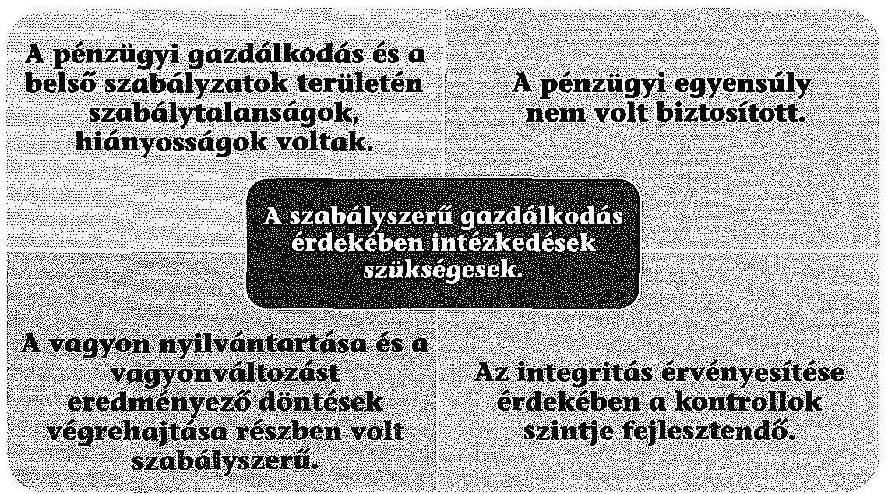
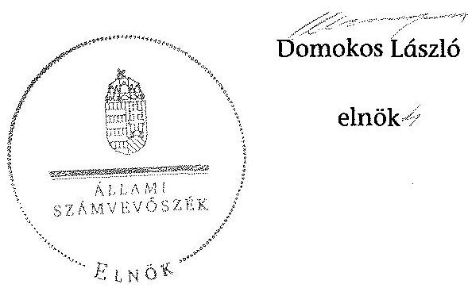
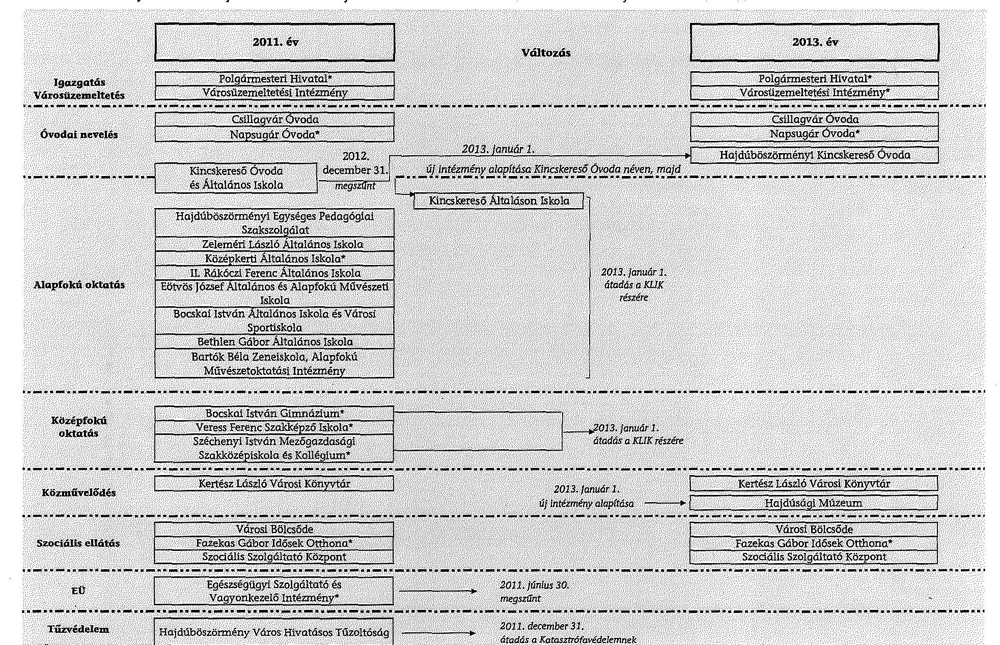

# ÁLLAMI   SZÁMVEVŐSZÉK 

## JELENTÉS

az önkormányzatok pénzügyi és vagyongazdálkodása
szabályszerűségének ellenőrzéséről
Hajdúböszörmény

---

# Állami Számvevőszék 

Iktatószám: V-0653-385/2015.
Témaszám: 1687
Vizsgálat-azonosító szám: V069105

## Az ellenőrzést felügyelte:

## Renkó Zsuzsanna

felügyeleti vezető
Az ellenőrzés végrehajtásáért felelős és az ellenőrzést vezette:
Korsósné Vigh Andrea
ellenőrzésvezető
A számvevőszéki jelentés összeállításában közreműködött:
Baksa Anikó
számvevő vezető főtanácsos
Az ellenőrzést végezték:

| Gölöncsér Péter | dr. Nagy Krisztina | Dr. Szima Mária |
| :-- | :-- | :-- |
| számvevő | számvevő | számvevő tanácsos |
| Ungár Ervin | Varga Ágnes Klára |  |
| számvevő | számvevő |  |

---

# TARTALOMJEGYZÉK 

BEVEZETÉS ..... 3
I. ÖSSZEGZŐ MEGÁLLAPÍTÁSOK, KÖVETKEZTETÉSEK, JAVASLATOK ..... 6
II. RÉSZLETES MEGÁLLAPÍTÁSOK ..... 13

1. Az erőforrásokkal való szabályszerű és hatékony gazdálkodáshoz szükséges követelmények kialakítása és számonkérése ..... 13
2. A pénzügyi gazdálkodás szabályszerűsége, a pénzügyi helyzet elemzése ..... 15
2.1. A költségvetési tervezés, az éves költségvetési beszámolás szabályszerűsége ..... 15
2.2. A folyamatos fizetőképesség fenntartása érdekében tett intézkedések, a pénzügyi egyensúly helyzete ..... 16
3. Az Önkormányzat vagyongazdálkodásának szabályszerűsége ..... 21
3.1. A vagyongazdálkodási tevékenység keretei, szabályozottsága ..... 21
3.2. Az Önkormányzat vagyonnyilvántartásának szabályszerűsége ..... 22
3.3. A vagyonelemek könyv szerinti értéke leltárral történő alátámasztásának szabályszerűsége ..... 23
3.4. A vagyon összetételének és nagyságának változását eredményező döntések és azok végrehajtásának szabályszerűsége ..... 24
3.5. A tartós részesedésekkel való gazdálkodás, a tulajdonosi jogok gyakorlása és a kötelezettségek teljesítése ..... 28
4. Az integritás kontrollok kialakítása és működtetése ..... 32
MELLÉKLETEK
5. számú Hajdúböszörmény Város Önkormányzata feladatellátásában résztvevő intézmények és azok változása a 2011-2013. években
6. számú Hajdúböszörmény Város Önkormányzata bevételei, kiadásai és adósságszolgálata a 2011-2013. években
7. számú Hajdúböszörmény Város Önkormányzata mérlegadatai a 2011-2013. években
8. számú Hajdúböszörmény Város Önkormányzata tartós részesedéseinek portfóliója a 2011-2013. években
FÜGGELÉKEK
9. számú Rövidítések jegyzéke
10. számú Fogalomtár

---

.

---

# JELENTÉS 

## az önkormányzatok pénzügyi és vagyongazdálkodása szabályszerűségének ellenőrzéséről Hajdúböszörmény

## BEVEZETÉS

Az ÁSZ stratégiai célkitűzése, hogy ellenőrzéseivel mind jobban segítse az átláthatóságot, az elszámoltathatóságot és elszámoltatást a közpénzekkel és a közvagyonnal való gazdálkodásban. Magyarország Alaptörvénye rögzíti, hogy az állam és a helyi önkormányzat tulajdona a nemzeti vagyon része. Az önkormányzati vagyon alapvető funkciója, hogy a közérdeket és egyúttal az önkormányzati célok - elsősorban a kötelezően ellátandó feladatok, és emellett a lehetőségek mértékéig az önként vállalt feladatok - megvalósítását szolgálja.

Az államháztartás önkormányzati alrendszerének közpénz felhasználása, az önkormányzatok által ellátott közfeladatok és önként vállalt feladatok sokrétűsége, valamint a feladatellátásához rendelt vagyon nagyságrendje indokolja, hogy az ÁSZ ellenőrzéseket folytasson a pénzügyi és vagyongazdálkodás területén. Az ÁSZ az önkormányzatok ellenőrzését a pénzügyi helyzet megítélésével indította el 2011-ben és a nagy vagyonnal rendelkező, magas kockázatú önkormányzatok esetében a vagyongazdálkodás ellenőrzésével folytatta. Az elmúlt három év ellenőrzéseinek tapasztalatai megmutatták, hogy indokolt az egyrészt elemző, értékelő, a pénzügyi helyzet kockázatát is minősítő, másrészt a pénzügyi és vagyongazdálkodási tevékenység szabályszerűségét komplexen értékelő ÁSZ ellenőrzések folytatása.

Az ellenőrzés célja annak megállapítása volt, hogy kialakította-e az önkormányzat az erőforrásokkal való szabályszerű és hatékony gazdálkodáshoz szükséges követelményeket, megvalósította-e azok számonkérését, ellenőrzését; az önkormányzat pénzügyi és vagyoni helyzetének, a gazdálkodás szabályszerűségének megítélése a költségvetési tervezés, a pénzügyi egyensúly megteremtése, az éves költségvetési beszámolás, a vagyongazdálkodás, a vagyon számbavétele, és a gazdasági események elszámolása és a pénzgazdálkodás szabályszerűsége alapján.

Ennek keretében értékeltük, hogy az önkormányzat:

- pénzügyi gazdálkodása megfelelt-e a jogszabályokban és a belső szabályzataiban meghatározottaknak, biztosított volt-e a pénzügyi egyensúly;
- biztosította-e a vagyongazdálkodás szabályszerűségét, a vagyonváltozást eredményező döntéseket szabályszerűen hajtotta-e végre, gondoskodott-e a tulajdonosi jogok gyakorlásáról;

---

- a gazdálkodása során biztosította-e az átláthatóság és az integritás érvényesülését.

Az ellenőrzés várható hasznosulása: az ellenőrzés várhatóan hozzájárul az önkormányzatok pénzügyi helyzetének pontosabb megítéléséhez azáltal, hogy a pénzügyi és vagyoni helyzetet együtt értékeli. Bemutatja az adósságkonszolidáció önkormányzat általi végrehajtásának szabályszerűségét. Feltárja az önkormányzati gazdálkodást meghatározó szabályozások összhangjának esetleges hiányosságait, a szabályozással nem érintett gazdálkodási területeket, és a vagyongazdálkodási tevékenység gyakorlásának szabálytalanságait. A jó gyakorlat kialakításán és terjesztésén keresztül az ellenőrzések elősegíthetik az önkormányzati gazdálkodás szabályszerűségének javítását.

Az ellenőrzés típusa: szabályszerűségi ellenőrzés
Az ellenőrzött időszak: 2011. január 1-jétől 2013. december 31-ig. A pénzintézetekkel szembeni kötelezettségek állományának vizsgálatakor az ellenőrzött időszakban fennálló kötelezettségeket vettük figyelembe. A vagyonnyilvántartások egyezőségét, a leltározás, selejtezés folyamatát a 2013. évre vonatkozóan értékeltük.

# Ellenőrzött szervezet: Hajdúböszörmény Város Önkormányzata 

Az ellenőrzés végrehajtásának jogszabályi alapját az ÁSZ tv. 1. § (3) bekezdése, az 5. § (2)-(6) bekezdései, valamint az Áht. 2 61. § (2) bekezdésének előírásai képezték.

Az ellenőrzés szakmai módszertana az ÁSZ hivatalos honlapján közzétett szakmai szabályokon alapult, amely a Legfőbb Ellenőrző Intézmények Nemzetközi Szervezete (INTOSAI) által kiadott nemzetközi standardok (ISSAI) figyelembevételével készült.

Az alkalmazott rövidítések jegyzékét az 1. számú függelék, az egyes fogalmak magyarázatát a 2. számú függelék tartalmazza.

Az ellenőrzést az ÁSZ hatályos szervezeti szabályai és az ellenőrzési programban foglalt értékelési szempontok szerint folytattuk le. Megállapításainkat a helyszíni ellenőrzés tapasztalataira, az ellenőrzött szervezettől bekért dokumentumokra, a kitöltött tanúsítványok elemzésére, az adott időszakban hatályos jogszabályok és belső szabályzatok előírásaira alapoztuk. Az önkormányzat vagyonváltozását eredményező döntések és azok végrehajtásának ellenőrzése, szabályszerűségének megítélése kockázatalapú mintavételen, valamint tételes ellenőrzésen keresztül történt. Kockázatalapú mintavétel alapján ellenőriztük a vagyonkezelői és az üzemeltetési szerződéseket, a térítés nélküli vagyon átvételeket, a beruházásokat, a felújításokat, a vagyonértékesítéseket és a vagyonhasznosítást. Tételesen ellenőriztük a részesedések értékelését és a követelések elengedését.

Hajdúböszörmény város lakosainak száma 2013. január 1-jén 31547 fő volt. A 15 tagú Képviselő-testület munkáját öt állandó bizottság segítette. A polgármester a 2006. évi önkormányzati választás óta tölti be tisztségét, a jegyző 2013. február 1-jétől látja el feladatait. A Polgármesteri hivatal négy szervezeti egységre tagolódott, elkülönített gazdasági szervezeti egységgel nem rendelkezett. A

---

pénzügyi-gazdálkodási feladatokat a Gazdálkodási Osztály és a Városfejlesztési és Műszaki Osztály látta el. A foglalkoztatott köztisztviselők száma 2013. december 31-én 69 fő volt.

Az Önkormányzat a 2011. év elején a kötelező és az önként vállalt feladatait a Polgármesteri hivatalon kívül 21 (ebből hét önállóan működő és gazdálkodó és 14 önállóan működő) intézményével, valamint társulások és gazdasági társaságok útján látta el. A feladatellátás köre, ezzel együtt az intézményhálózat elsődlegesen az állam részére történt átadások miatt csökkent az ellenőrzött időszakban: 2012-től a helyi tűzvédelmi, 2013-tól a közoktatási feladatokat érintően. Az Önkormányzat az egészségügyi feladatokat ellátó intézményét 2011. június 30-al megszüntette a feladatok ellátásának gazdasági társasági formába történő kiszervezésével egyidejűleg, továbbá 2013. január 1-jétől múzeumi feladatok ellátására egy új intézményt alapított. A 2013. év végére az Önkormányzatnak a Polgármesteri hivatalon kívül kilenc (három önállóan működő és gazdálkodó, valamint hat önállóan működő) intézménye volt. Az ellenőrzött időszakban az önkormányzati feladatellátásban résztvevő intézményeket és azok változását az 1. számú melléklet mutatja be. Az ellenőrzött időszak elején az Önkormányzat feladatellátását öt kizárólagos tulajdonú gazdasági társasága segítette, amelyek száma 2011-ben kettővel bővült. Ezekből az Önkormányzat elismert vállalatcsoportot (holdingot) hozott létre, így a feladatellátást segítő kizárólagos tulajdonú gazdasági társaságok száma 2013-ban egy volt.

Az Önkormányzat könyvviteli mérleg szerinti vagyona 2013. december 31-én 28255,2 millió Ft volt, amely - döntően a beruházások eredményeként 5226,6 millió Ft-tal (22,7%-kal) nőtt az ellenőrzött időszakban. Az Önkormányzat 2011-2013. évi mérlegadatait a 3. számú melléklet szemlélteti. Az adósságállomány értéke 2011. január 1-jén 2157,7 millió Ft volt, amely a törlesztések és az 1413,9 millió Ft részbeni adósságátvállalás eredményeként a 2013. év végére 1480,1 millió Ft-ra csökkent, az adósságátvállalás 2014. évi II. ütemében megszűnt. Az Önkormányzat a 2013. évi elemi költségvetési beszámolója szerint 6961,2 millió Ft költségvetési bevételt ért el és 6234,0 millió Ft költségvetési kiadást teljesített. A felhalmozási célú kiadások összege 2013-ban 1579,9 millió Ft volt, amelyből beruházásokra és felújításokra 1167,9 millió Ft-ot fordítottak.

Az ÁSZ tv. 29. § (1) bekezdése szerint a jelentéstervezetet észrevételezésre megküldtük az Önkormányzat polgármesterének, aki az ÁSZ tv. 29. § (2) bekezdésében foglalt észrevételezési jogával nem élt, a jelentéstervezetre észrevételt nem tett.

---

# I. ÖSSZEGZŐ MEGÁLLAPÍTÁSOK, KÖVETKEZTETÉSEK, JAVASLATOK 

Az Önkormányzat pénzügyi gazdálkodása részben felelt meg a jogszabályi előírásoknak. A pénzügyi egyensúly a bevételnövelő és a kiadáscsökkentő intézkedések ellenére a 2011-2013. években nem volt biztosított, de a pénzügyi helyzet a 2013-ban megkezdett adósságkonszolidáció következtében az ellenőrzött időszak végére javult. Az Önkormányzat mérleg szerinti vagyona a három év alatt 5226,6 millió Ft-tal (22,7%-kal) nőtt, döntően az EU-s támogatásokkal megvalósult fejlesztések következtében. A vagyongazdálkodás és a vagyonváltozást eredményező döntések végrehajtása részben volt szabályszerű. Az Önkormányzat a tartós részesedései tekintetében gondoskodott a tulajdonosi jogok gyakorlásáról. A gazdálkodás során az átláthatóság és az integritás érvényesülésében hiányosságok voltak.

## Az ÁSZ ellenőrzés megállapításainak összegzése:

Az erőforrásokkal való szabályszerű gazdálkodás kereteinek a kialakítása nem történt meg teljes körűen, mivel belső szabályzatban nem rendezték a belföldi kiküldetések lebonyolításával és elszámolásával kapcsolatos, továbbá az anyag- és eszközgazdálkodás számviteli politikában nem szabályozott kérdéseket. A hatékony gazdálkodás érdekében a gazdasági programban és az éves költségvetéseket megalapozó tervezési folyamatban a Képviselő-testület célokat határozott meg, amelyek megvalósítására bevételnövelő és kiadáscsökkentő intézkedéseket tett, ennek keretében létszámcsökkentésekről és egyes feladatok ellátása módjának megváltoztatásáról, kiszervezéséről döntött. A belső ellenőrzés a 2011-2013. években ellenőrizte az erőforrásokkal való szabályszerű és hatékony gazdálkodást.

A pénzügyi gazdálkodás során tárgyévi fizetési kötelezettséget a jóváhagyott kiadási előirányzatok mértékén túl vállaltak, 2013-ban az alulteljesülő bevételi

---

előirányzatokat a jogszabályi előírások ellenére nem csökkentették. A zárszámadás előterjesztésekor egyik évben sem mutatták be a Képviselő-testület részére tájékoztatásul a vagyonkimutatást.

A működési költségvetés egyensúlya 2011-ben a saját hatáskörű racionalizálási intézkedések és a kiegészítő támogatások együttes hatására biztosított volt, 2012-ben azok ellenére nem volt biztosított. 2013-ban a közoktatási és egyes közigazgatási feladatok állami átvállalása, a saját hatáskörű intézkedések és kiegészítő támogatások eredményeként a folyó költségvetés egyensúlyban volt. A felhalmozási bevételek egyik évben sem fedezték a felhalmozási kiadásokat. A likviditási terv havonkénti felülvizsgálata 2012-2013-ban dokumentáltan nem történt meg. A fizetőképességet 2011-2012-ben folyamatos, 2013-ban csökkenő gyakoriságú és mértékű folyószámlahitel és munkabér-megelőlegezési hitel igénybevétellel, valamint a szállítói kötelezettségek határidőn túli rendezésével tudták fenntartani. A lejárt szállítói kötelezettségek állománya az ellenőrzött időszakban harmadára, a lejárt vevőköveteléseké ötödére csökkent. Az adósságot keletkeztető ügyletek vállalása az ellenőrzött időszakban szabályszerű volt. Az adósságkonszolidáció I. ütemében, 2013-ban az állam 1413,9 millió Ft (50%) adósságot vállalt át.

A vagyongazdálkodás szabályozási kereteinek kialakítása a jogszabályi előírásoknak részben felelt meg. A Képviselő-testület nem szabályozta rendeletben a vagyonkezelési jog megszerzésének, gyakorlásának és a vagyonkezelés ellenőrzésének részletes szabályait, továbbá 2012-től a vagyonkezelői jog ellenértékét és az ingyenes átengedés részletes szabályait. A számlarendnél, valamint az értékelési, a kötelezettségvállalási és a leltározási szabályzatoknál hiányosságok, szabálytalanságok voltak.

Az ingatlanvagyon-kataszter adatainak egyezőségét a földhivatali nyilvántartások adataival
 az ellenőrzött időszakban nem teljes körűen biztosították. Az Önkormányzat a mérlegében a valóságosnál 0,4 millió Ft-tal alacsonyabb összegű részesedést mutatott ki. A könyvviteli mérleget leltárral teljes körűen egyik évben sem támasztották alá, a leltározás az eredményszemléletű számvitelre történő áttérést nem alapozta meg. Az Önkormányzat meghatározó vagyonváltozást eredményező döntései szabályszerűek voltak, azok végrehajtása tekintetében a szabályszerűség részben volt biztosított: nem tettek eleget az üzemeltetési szerződések közzétételi kötelezettségének, továbbá a fejlesztésekhez kapcsolódó kiadások teljesítése során három projektnél a teljesítésigazolás és az érvényesítés kontrollok működésében hiányosságok voltak.

Az Önkormányzat a kizárólagos és többségi tulajdonú gazdasági társaságai tekintetében a tulajdonosi jogait gyakorolta, jogszabályban előírt tulajdonosi kötelezettségeinek eleget tett, a gazdálkodásuk ellenőrzését az üzleti tervek és beszámolók elfogadásával és a belső ellenőrzésen keresztül érvényesítette. 2011-ben az Önkormányzat a kizárólagos tulajdonú gazdasági társaságai holdingba szervezéséről döntött. E döntés végrehajtása során a Vagyonkezelő Zrt.-ben végrehajtott tőkeemelésből adódóan a részesedések könyv szerinti értékének 561,1 millió Ft-os növekedését szabálytalanul, jelentős összegű hibát vétve szerepeltették az Önkormányzat 2011. évi mérlegében, mivel a tőkeemelés cégbírósági bejegyzése a tárgyévben nem, hanem 2012-ben történt meg. Az önkormányzati gazdasági társaságok összesített eredménye az ellenőrzött időszakban

---

149,6 millió Ft-tal visszaesett, a kötelezettség állománya 364,2 millió Ft-tal emelkedett. A gazdasági társaságai részére az Önkormányzat az ellenőrzött időszakban összesen 195,7 millió Ft rövid lejáratú, működési és felhalmozási célú tagi kölcsönt nyújtott, amelyekről nem készült írásbeli szerződés. A tagi kölcsön nyújtással kapcsolatos gazdasági események számviteli nyilvántartásokban való rögzítéséhez nem állt rendelkezésre a jogszabályi előírásoknak megfelelő, szabályszerűen kiállított számviteli bizonylat. Írásbeli kötelezettségvállalás hiányában a kölcsönnyújtás nem volt szabályszerű. A tagi kölcsönök visszafizetése az ellenőrzött időszakban nem történt meg, azokat az Önkormányzat annak ellenére nyújtotta, hogy az önkormányzati feladatok ellátását folyamatos folyószámlahitel igénybevétel mellett tudta biztosítani. E tekintetben és szerződés hiányában az Önkormányzat nem érvényesítette a nemzeti vagyonnal felelős módon való gazdálkodás követelményét.

Az Önkormányzat tevékenységében jelenlévő eredendő korrupciós kockázatok és az azokat növelő tényezők szintje meghaladta a kezelésükre kiépült és alkalmazott kontrollok szintjét, ezért az integritás érvényesítése érdekében a kontrollok szintje fejlesztendő.

Az ÁSZ tv. 33. § (1) bekezdésében foglaltak értelmében az ellenőrzött szervezet vezetője köteles a jelentésben foglalt megállapításokhoz kapcsolódó intézkedési tervet összeállítani, és azt a jelentés kézhezvételétől számított harminc napon belül az ÁSZ részére megküldeni. Amennyiben az intézkedési tervet határidőn belül nem küldi meg a szervezet vezetője, vagy az továbbra sem elfogadható, az ÁSZ elnöke a hivatkozott törvény 33. § (3) bekezdés a-b) pontjaiban foglaltakat érvényesítheti.

# Az ellenőrzés intézkedést igénylő megállapításai és javaslatai: 

## a polgármesternek

1. A 2011. évben az Ötv. 80/B. §-ában, a 2012-2013. években az Mötv. 143. § (4) bekezdés i) pontjában foglalt előírás ellenére rendeletben nem szabályozták a vagyonkezelői jog megszerzésének, gyakorlásának és a vagyonkezelés ellenőrzésének szabályait. A 2012. január 1-jétől hatályos Mötv. 109. § (4) bekezdésében foglaltak ellenére rendeletben nem határozták meg a vagyonkezelői jog ellenértékét, valamint az ingyenes átengedés részletes szabályait.

Javaslat:
Terjessze a Képviselő-testület elé a jegyző által elkészített rendelet tervezetét, amelyben a jogszabályi előírásoknak megfelelően meghatározzák a vagyonkezelői jog ellenértékét, valamint a vagyonkezelői jog megszerzésének, gyakorlásának és a vagyonkezelés ellenőrzésének, továbbá az ingyenes átengedés szabályait.
2. Az ellenőrzött időszakban az Önkormányzat gazdasági társaságai részére összesen 195,7 millió Ft rövid lejáratú, működési és felhalmozási célú tagi kölcsönt folyósított, amelyről nem készült írásbeli szerződés. A tagi kölcsönök folyósítására - a 2011. évben az Áht. 1100/C. § (3) bekezdés, a 2012-2013. években az Áht. 2 37. § (1) bekezdés előírásával ellentétben - írásbeli kötelezettségvállalás nélkül került sor.

---

Javaslat:
Intézkedjen annak érdekében, hogy a tagi kölcsön nyújtása esetén a kötelezettségvállalásra a jogszabályi előírásban meghatározott esetben írásban kerüljön sor.
3. Az ÁSZ ellenőrzés a vagyonnal való gazdálkodásra vonatkozó önkormányzati rendeletben foglalt előírások megfelelősége, a jogszabályban előírt belső szabályzatok elkészítése, a gazdasági társaságok részére írásbeli szerződés nélkül nyújtott tagi kölcsönök, a mérleg leltárral való alátámasztottsága, a kockázatkezelési rendszer működtetése, a vagyonkimutatás készítési kötelezettség teljesítése, az ingatlanvagyon-kataszter vezetése, valamint a gazdálkodási adatokra vonatkozó közzétételi kötelezettség teljesítése tekintetében hiányosságokat tárt fel. Az ellenőrzés ezen túl megállapította, hogy egy 2004. évben megvásárolt 0,4 millió Ft értékű részesedést - a Számv. tv. 15. § (2) és (3) bekezdései szerinti valódiság és teljesség elvével ellentétesen - az ellenőrzött időszak mérlegeiben nem szerepeltették. A Vagyonkezelő Zrt.-ben végrehajtott, a cégbíróság által a 2012. évben bejegyzett tőkeemelésből adódóan a részesedések könyv szerinti értékének 561,1 millió Ft-os növekedését az értékelési szabályzat ² előírása ellenére már a 2011. évi könyvviteli mérlegben kimutatták, ezáltal a 2011. évi költségvetési beszámoló jelentős összegű hibát tartalmazott.

Javaslat:
Intézkedjen a feltárt hiányosságok és/vagy szabálytalanságok tekintetében a munkajogi felelősség tisztázására irányuló eljárás megindításáról, és ennek eredménye ismeretében tegye meg a szükséges intézkedéseket.

# a jegyzőnek 

1. A 2011. évben az Ámr. 20. § (3) bekezdés c) és d) pontjaiban, a 2012-2013. években az Ávr. 13. § (2) bekezdés c) és d) pontjaiban előírtak ellenére belső szabályzatban nem rendezték a belföldi kiküldetések elrendelésével és lebonyolításával, elszámolásával kapcsolatos, valamint az anyag- és eszközgazdálkodás számviteli politikában nem szabályozott kérdéseit. A kötelezettségvállalási szabályzat ³,⁴,⁵-ot az Ávr. 13. § (2) bekezdés a) pontjában foglalt előírás ellenére a költségvetési szerv vezetője (a jegyző) helyett a polgármester adta ki.

Javaslat:
Intézkedjen, hogy a jogszabályi előírásoknak megfelelően belső szabályzat keretében rendezzék a belföldi kiküldetések elrendelésével és lebonyolításával, elszámolásával kapcsolatos, valamint az anyag- és eszközgazdálkodás számviteli politikában nem szabályozott kérdéseit. Biztosítsa, hogy a gazdálkodással - így különösen a kötelezettségvállalás, ellenjegyzés, teljesítésigazolás, érvényesítés, utalványozás gyakorlásának módjával, eljárási és dokumentációs részletszabályaival, valamint az ezeket végző személyek kijelölése rendjével - kapcsolatos belső előírásokat, feltételeket a költségvetési szerv vezetője rendezze belső szabályzat keretében.
2. Az Önkormányzatnál a likviditási terveket a jogszabályi előírásoknak megfelelően elkészítették, azonban a 2012-2013. években az Ávr. 122. § (3) bekezdésében foglaltak ellenére azokat havonként nem vizsgálták felül.

---

Javaslat:
Intézkedjen, hogy a bevételek beérkezésének és a kiadások teljesítésének ütemezéséről készített likviditási tervet a jogszabályi előírásnak megfelelően havonta vizsgálják felül.
3. Az Önkormányzat által a gazdasági társaságok részére folyósított tagi kölcsönök számviteli elszámolását írásbeli szerződés hiányában nem támasztotta alá a Számv. tv. 165. § (2) bekezdés és a 166. § (2) bekezdés előírásainak megfelelő, alakilag és tartalmilag hiteles, megbízható és helytálló adatokat tartalmazó, szabályszerűen kiállított számviteli bizonylat, amely alapján a tagi kölcsön nyújtásból származó követelés számviteli nyilvántartásokban való rögzítése (mérlegben történő kimutatása) a Számv. tv. 29. § (1) bekezdésben foglalt előírásnak (szerződésből jogszerűen eredő, pénzértékben kifejezett fizetési igények, amelyek a már teljesített, a másik fél által elfogadott, elismert kölcsönnyújtáshoz kapcsolódnak) megfelel.

Javaslat:
Intézkedjen annak érdekében, hogy a tagi kölcsön nyújtásával kapcsolatos gazdasági események számviteli nyilvántartásokban való rögzítése a jogszabályi előírásoknak megfelelő, szabályszerűen kiállított bizonylatok alapján történjen.
4. A számlarend ³ az Áhsz. 1 49. § (3) bekezdésében foglalt előírás ellenére nem tartalmazta az analitikus nyilvántartások kapcsolódó főkönyvi nyilvántartásokkal való egyeztetését és annak dokumentálását. Az értékelési szabályzat ²-ban az Áhsz. 1 8. § (18) bekezdésében előírtak ellenére nem rögzítették az egyszerűsített értékelési eljárás alá vont követelések dokumentálásának szabályai keretében az egyes minősítési kategóriák, illetve az azokhoz tételesen hozzárendelt százalékos mutatók felülvizsgálatának rendjét, felelőseit. A leltározási szabályzat ¹,² -ben az immateriális javak leltározásának végrehajtási módját mennyiségi felvétellel határozták meg az Áhsz. 1 37. § (3) bekezdésében foglalt egyeztetéssel történő leltározással szemben. A vagyonrendeletben az Áhsz. 1 37. § (7) bekezdésében foglaltak alapján a leltározás két évenkénti végrehajtására vonatkozó rendelkezés szerepelt, ezzel ellentétben egyrészt a leltározási szabály-zat ¹,² -ben évenkénti leltározási kötelezettséget írtak elő, valamint a számviteli politika ² rendelkezése szerint a leltározást a mennyiségi és értékbeni analitika naprakész vezetése helyettesítheti.

Javaslat:
Intézkedjen, hogy a számlarend és az értékelési szabályzat tartalmi követelményeire vonatkozó jogszabályi előírásokban meghatározott szabályozási feladatoknak teljes körűen tegyenek eleget. Biztosítsa, hogy a leltározási szabályzatban a jogszabályi előírásoknak megfelelően határozzák meg az immateriális javak leltározása módját. A számviteli politikában és a leltározási szabályzatban a leltározás végrehajtását mind a jogszabályi előírással, mind az önkormányzati rendeletben előírtakkal összhangban állapítsák meg.
5. Az Önkormányzatnál és intézményeinél a 2011-2013. években a december 31-i fordulónappal készített könyvviteli mérlegekben kimutatott eszközök és források valódiságát - az Áhsz. 1 37. § (1)-(2) bekezdéseiben előírtak ellenére - leltárral teljes körűen nem támasztották alá.

---

Az üzemeltetésre, kezelésre átadott eszközök értékét a 2011-2013. években az Áhsz. ¹ 37. § (4) bekezdésében, illetve a leltározási szabályzat ²-ben foglaltak ellenére december 31-ei fordulónapra vonatkozó, az üzemeltetést, kezelést végző szerv által évenkénti leltározás alapján elkészített, hitelesített leltárral nem támasztották alá.

A Polgármesteri Hivatal eszközeit és forrásait a 2011-2012. években kizárólag egyeztetéssel leltározták, az Áhsz. ¹ 37. § (3) bekezdésében, illetve a leltározási szabályzat ²-ben előírtak ellenére - a csak értékben nyilvántartott eszközök kivételével - az eszközök mennyiségi felvétellel történő leltározását egyik évben sem végezték el. A 2013. évben az Áhsz. ¹ 37. § (3) bekezdésében, illetve a leltározási szabályzat ²-ben előírtak ellenére az ingatlanok, beruházások és felújítások esetében nem, a járműveknél nem teljes körűen végezték el a mennyiségi felvétellel való leltározást, ezen túl a gépek, berendezések, felszerelések tekintetében felvett leltárívek összesítése, kiértékelése, illetve a nullára leírt eszközöknél feltárt eltérések rendezése dokumentált módon nem történt meg.

A Polgármesteri Hivatalon kívüli önkormányzati intézmények esetében a könyvviteli mérlegben kimutatott eszközök és források alátámasztására az Áhsz. ¹ 37. § (1)-(2) bekezdéseiben előírtak ellenére leltárral a 2011-2012. években nem teljes körűen, a 2013. évben pedig nem rendelkeztek.

Javaslat:
Intézkedjen a könyvviteli mérlegben kimutatott eszközök és források valódiságának december 31-i fordulónappal készült, teljes körű, a jogszabályi előírásoknak és a belső szabályzatnak megfelelő leltárral történő alátámasztásáról.
6. Az Önkormányzatnál a 2011. évben az Ötv. 78. § (2) bekezdésében, a 2012-2013. években az Mötv. 110. § (2) bekezdésében foglalt előírás ellenére a vagyonállapotról vagyonkimutatást nem készítettek, amely az Áhsz. ¹ 44/A. § (1)-(3) bekezdéseiben meghatározott követelményeknek megfelelően tartalmazta volna az Önkormányzat és intézményei saját vagyonának adatait (eszközeit és kötelezettségeit).

Javaslat:
Intézkedjen a jogszabályi előírásokban rögzített követelményeknek megfelelő vagyonkimutatás elkészítéséről.
7. Az Önkormányzatnál a 2013. évben a 147/1992. (XI. 6.) Korm. rendelet 1. § (2) bekezdésében foglaltak ellenére nem biztosították teljes körűen az ingatlanvagyon-kataszter nyilvántartás és a földhivatali ingatlan-nyilvántartás adatainak egyezőségét. Az ingatlanok vásárlása, létesítése esetén a vagyonkataszteri átvezetés megtörtént, azonban négy projekt vonatkozásában az ingatlan-nyilvántartásban lévő adatok módosítása érdekében a bekövetkezett változást az ingatlanügyi
 hatóság felé az Inyvt. 27. § (2) bekezdésében foglalt előírás ellenére nem jelentették be. A 2012. évben ajándékozási szerződés alapján az Önkormányzat tulajdonába került ingatlant - a 147/1992. (XI. 6.) Korm. rendelet 1. § (1) bekezdésében az ingatlanvagyon-kataszter folyamatos vezetésére vonatkozó előírás ellenére - több havi késedelemmel vezették be az ingatlanvagyon-kataszterbe.

---

Javaslat:
Intézkedjen az ingatlanvagyon-kataszter nyilvántartás és a földhivatali ingatlan-nyilvántartás adatainak jogszabályban előírt egyezősége megteremtése, valamint az ingatlanvagyon-kataszter folyamatos vezetése érdekében. Biztosítsa, hogy az ingatlanok jogszabályban meghatározott körülményeiben bekövetkezett változásokat az ingatlanügyi hatóságnak a jogszabályban foglalt határidő betartása mellett jelentsék be.
8. A kockázatkezelési rendszer keretében - a 2011. évben az Áht. 121. § (2) bekezdés b) pontjában, az Ámr. 157. § (1)-(3) bekezdéseiben, a 2012-2013. években a Bkr. 7. § (1)-(2) bekezdéseiben foglaltak ellenére - a pénzügyi egyensúlyt befolyásoló kockázatok teljes körű beazonosítása, felmérése elmaradt, ezen túl a kockázatok mérséklése érdekében nem határozták meg a szükséges intézkedéseket.

Javaslat:
Működtessen a jogszabályi előírásoknak megfelelő, a pénzügyi egyensúlyt befolyásoló kockázatok kezelésére alkalmas kockázatkezelési rendszert.
9. Az üzemeltetési szerződések tekintetében a közzétételi kötelezettséget a 2011. évben - az Áht. 15/B. § (1) bekezdésében meghatározott értékhatár túllépésére tekintettel - az Eisztv. 6. § (1) bekezdésben és az Eisztv. mellékletének III/4. pontjában foglaltak ellenére, valamint a 2012-2013. években az Info tv. 37. § (1) bekezdésében és az Info tv. 1. számú melléklet III/4. pontjában foglaltak ellenére nem teljesítették.

Javaslat:
Biztosítsa, hogy a jogszabályi előírásokban meghatározott közzétételi kötelezettségének az Önkormányzat maradéktalanul tegyen eleget.

---

# II. RÉSZLETES MEGÁLLAPÍTÁSOK 

## 1. AZ ERŐFORRÁSOKKAL VALÓ SZABÁLYSZERŰ ÉS HATÉKONY GAZDÁLKODÁSHOZ SZÜKSÉGES KÖVETELMÉNYEK KIALAKÍTÁSA ÉS SZÁMONKÉRÉSE

Az Önkormányzat a 2011-2013. években az erőforrásokkal való szabályszerű gazdálkodáshoz szükséges követelményeket - két kivétellel - a jogszabályokkal összhangban, a sajátosságok figyelembevételével kialakított belső szabályzatokban rögzítette. Belső szabályzat keretében nem rendezték - a 2011. évben az Ámr. 20. § (3) bekezdés c) és d), valamint a 2012-2013. években az Ávr. 13. § (2) bekezdés c) és d) pontjaiban előírtak ellenére - a belföldi kiküldetések lebonyolításával és elszámolásával kapcsolatos, továbbá az anyag- és eszközgazdálkodás számviteli politikában nem szabályozott kérdéseket. Az Önkormányzat elkészítette a gazdálkodás egyes folyamatainak nyomon követhetősége érdekében az ellenőrzési nyomvonalát a kontrollpontok és a felelősök megjelölésével.

Az Önkormányzat az ellenőrzött időszakra kiterjedő, a középtávú fejlesztési céljait meghatározó gazdasági programját az erőforrásokkal való hatékony gazdálkodás követelményének a figyelembevételével állította össze, abban két fejlesztési cél - az önkormányzati intézmények ingatlanjainak energetikai korszerűsítése, valamint a városi tulajdonú gazdasági társaságok holdingba szervezése - a vagyonnal való hatékony gazdálkodás megvalósítására irányult. Az éves célkitűzéseket, követelményeket az Önkormányzat a 2011-2013. évi költségvetési rendeleteket megalapozó tervezési folyamatban - a költségvetési koncepciókban, azok bizottsági véleményeiben, a jóváhagyott koncepciók alapján kiadott tervezési köriratokban, a költségvetési rendelettervezeteket tárgyaló képviselő-testületi vitákban és a tárgyhoz kapcsolódó döntésekben - alakította ki.

A takarékos gazdálkodásra figyelemmel határozta meg a Képviselő-testület az éves költségvetésekben az engedélyezett létszámot, amely a 2011. évi nyitó 1039,0 főről 2013. december 31-re 625,8 fővel (60,2%-kal) 413,2 főre csökkent részben az álláshely megszüntetésekre irányuló döntések, részben az állam részére történt feladatátadások következtében. A közoktatási intézményekben, a 2011-2012. években a tanév indítását megelőzően a várható tanulói létszám ismeretében döntött a Képviselő-testület az indítható csoportok, osztályok számáról, az azokhoz szükséges pedagógus és egyéb létszámokról, túlóra keretekről. Ennek keretében a csökkenő gyereklétszámmal összefüggésben 2011-ben 14, 2012-ben nyolc álláshely megszüntetésére került sor. A bürokrácia csökkentése címen a Polgármesteri hivatal létszáma 2011-ben hat fővel csökkent.

A működési bevételek és kiadások egyensúlyának a megteremtése, a személyi juttatásokat és a munkaadókat terhelő járulékokat érintő megtakarítási lehetőségek kihasználása érdekében a Képviselő-testület mindhárom évben ezeket az előirányzatokat érintő elvonásokat érvényesített. Bevételnövelő intézkedés volt a 2011. évben a 70 éven felüli magánszemélyek szemétszállítási díjmentesség jog-

---

címei szűkítése. A felhalmozási előirányzatoknál a Képviselő-testület követelményként határozta meg a működési kiadáscsökkentést eredményező fejlesztések prioritását az éves koncepciók jóváhagyásakor.

Az Önkormányzat kiemelt figyelmet fordított a helyi intézményrendszer felülvizsgálatára, a feladatellátás leghatékonyabb módja kiválasztására, ezáltal a működési költségmegtakarítási lehetőségek feltárására. Ennek érdekében döntött a Képviselő-testület az ellenőrzött időszakban az egészségügyi és a sportiskolai feladatok, az oktatási intézmények működtetői feladatai, valamint a közoktatási intézmények főzőkonyhái kiszervezéséről, továbbá az önkormányzati tulajdonú gazdasági társaságok holdingba szervezéséről. Az oktatási intézmények működtetői feladatainak, valamint a főzőkonyhák kiszervezése 2013-tól együttesen 83,5 fő közalkalmazotti létszámcsökkentést eredményezett.

Az Önkormányzat az ellenőrzött időszakban az erőforrásokkal való szabályszerű, hatékony gazdálkodás követelményeit „a köztisztviselői teljesítménykövetelmények alapját képező kiemelt célok meghatározásáról" évente hozott határozatokban - mind a kiemelt, mind az ágazati/tevékenységi specifikus célokban - hangsúlyosan megjelenítette.

A Képviselő-testület az erőforrásokkal való hatékony gazdálkodás követelményeinek betartását a költségvetési rendeletek időszaki végrehajtásához és a zárszámadási rendeletek megalkotásához kapcsolódó előterjesztések elfogadásakor számon kérte. A 2011-2013. évi zárszámadási rendelettervezetek - az önkormányzati költségvetési szervek és szervezeti egységek beszámolóira alapozva - tartalmazták a tervezett, illetve a teljesített előirányzatokkal, a létszám alakulásával kapcsolatos kimutatásokat és szöveges indoklásokat. Azokban intézményenként, illetve feladatonként mutatták be az előirányzatok és a létszám évközi alakulását, a tervezett és a teljesített adatok eltérésének okait, ismertették a folyamatban lévő és a befejezett beruházásokat, továbbá az Önkormányzat vagyonában bekövetkezett változásokat.

A Képviselő-testület egyes, a hatékonyság javítását célzó döntései végrehajtását a lejárt határidejű határozatokról történő beszámolás, illetve önálló napirend keretében történő beszámoltatás útján is számon kérte.

Belső ellenőrzés keretében ellenőrizték a szabályszerű és hatékony gazdálkodás követelményei érvényre juttatását, betartását. A 2011-2013. években lefolytatott belső ellenőrzések a Polgármesteri hivatalra, a költségvetési intézményekre, az önkormányzati tulajdonú gazdasági társaságokra, valamint az önkormányzati támogatásban részesült civil szervezetekre kiterjedőek voltak. A belső ellenőrök évente visszatérő kiemelt feladata volt a belső kontrollrendszer kialakítása és működése megfelelőségének értékelése a Polgármesteri hivatalban és az önkormányzati intézményekben, valamint a szállítói kötelezettségek alakulásának folyamatos figyelemmel kísérése, azok csökkentésére megfogalmazott követelmény érvényesítésének elemzése. E területeken túl a Polgármesteri hivatalban ellenőrizték a lakásbérleti és egyéb bérleti díjak előírásának és a hátralékok behajtására tett intézkedések megfelelőségét, az intézményekben a pályázatokon elnyert támogatások felhasználása, dokumentálása, elszámolása szabályszerűségét.

---

# 2. A PÉNZÜGYI GAZDÁLKODÁS SZABÁLYSZERŰSÉGE, A PÉNZÜGYI HELYZET ELEMZÉSE 

### 2.1. A költségvetési tervezés, az éves költségvetési beszámolás szabályszerűsége

Az Önkormányzatnál az ellenőrzött időszakban a költségvetési tervezés szabályszerűsége biztosított volt. A 2011-2013. évi költségvetési koncepciókat a jogszabályokban és a belső szabályzatokban előírt véleményekkel együtt, határidőben terjesztették a Képviselő-testület elé. A 2011-2013. évi költségvetési rendelettervezetek megfelelő szerkezetben és tartalommal készültek, az előterjesztésekhez szöveges indoklással együtt csatolták az előírt tájékoztató mérlegeket és kimutatásokat. Az Önkormányzat és a költségvetési intézmények elemi költségvetéseit az éves költségvetési rendeletek alapján, a kiemelt előirányzati adatok egyezőségét biztosítva készítették el.

Az előirányzatok módosítása részben volt a jogszabályi előírásoknak megfelelő, mivel nem történt meg a 2013. évi bevételi előirányzatoknak az Áht. 230. § (3) bekezdésben előírt csökkentése annak ellenére, hogy a költségvetési bevételek a tervezettől 395,3 millió Ft-tal (4,8%-kal) elmaradó mértékben teljesültek. Bevételi elmaradás a felhalmozási célú bevételeknél keletkezett.

Az Önkormányzatnál az ellenőrzött időszakban tárgyévi fizetési kötelezettséget a jóváhagyott (szabad) kiadási előirányzatok mértékén túl vállaltak az Áht. 112/A. § (1) bekezdés, valamint az Áht. 236. § (1) bekezdés előírása ellenére. A kiadási előirányzatok tekintetében a Képviselő-testület a 2011-2013. évek egyikében sem döntött a szabályszerű felhasználáshoz szükséges mértékű módosításról, így a kiadási előirányzatok teljesítése mindhárom évben egyes kiemelt kiadási előirányzatoknál, e mellett 2012-ben a költségvetési kiadási főösszeg szintjén is a jóváhagyott előirányzatot 167,8 millió Ft-tal (1,6%-kal) meghaladó volt. Az Önkormányzat a 2011. és a 2013. években a költségvetés főösszege szintjén biztosította a tárgyévi fizetési kötelezettség vállalásához szükséges fedezet meglétét. A költségvetési kiadási főösszegen belül 2011-ben a munkaadókat terhelő járulékok, a dologi kiadások, a támogatásértékű működési kiadások; 2012-ben a dologi kiadások és a támogatásértékű működési kiadások; 2013-ban a személyi juttatások, a munkaadókat terhelő járulékok, a dologi kiadások, a működési és felhalmozási célú pénzeszköz átadások, valamint a felújítások kiadási előirányzatoknál haladta meg a teljesítés a Képviselő-testület által jóváhagyott módosított előirányzatot.

Az Önkormányzat által végrehajtott előirányzat módosításokat jellemzően az állami és a pályázati támogatások évközi változásai, a befolyt adóbevételek túlteljesülése, valamint az önkormányzati feladatok ellátásának változásai indokolták. A módosításokat az analitikus és főkönyvi nyilvántartásokon átvezették, elszámolták. A Képviselő-testület által engedélyezett létszámkeretet betartották, túllépésre egyik évben sem került sor.

Az Önkormányzat az elemi költségvetési beszámolási és zárszámadási kötelezettségét teljesítette. A féléves és éves elemi költségvetési beszámolókat a

---

jogszabályban előírt tartalommal és az elemi költségvetésekkel összehasonlítható módon, azonban az Áhsz. 10. § (1) bekezdésben előírt határidőket túllépve készítették el.

A jegyző gondoskodott a zárszámadási rendelet-tervezetek elkészítéséről, amelyet a polgármester határidőben, a költségvetési évet követő négy hónapon belül a Képviselő-testület elé terjesztett. Az éves zárszámadások és a költségvetések adatainak összehasonlíthatóságát biztosították. A 2011-2013. évi zárszámadások előterjesztésekor a jogszabályi előírások maradéktalanul nem érvényesültek, mert a vagyonkimutatást egyik ellenőrzött évben sem mutatták be a Képviselőtestület részére tájékoztatásul az Áht. 118. § (2) bekezdés 2. c) pont, illetve az Áht. 291. § (2) bekezdés c) pont előírása ellenére, valamint az Áhsz. 44/A. § (1) bekezdésben foglaltakkal szemben azt a zárszámadáshoz nem csatolták.

# 2.2. A folyamatos fizetőképesség fenntartása érdekében tett intézkedések, a pénzügyi egyensúly helyzete 

Az Önkormányzat költségvetésének elemzését a CLF módszer szerint végeztük el. A 2013. évi valós jövedelemtermelő képesség bemutatása érdekében az elemzés során nem vettük figyelembe az adósságkonszolidációhoz kapcsolódó bevételeket és kiadásokat. Az Önkormányzat 2011-2013. évekre vonatkozó költségvetésének CLF módszerrel elemzett adatait a 2. számú melléklet tartalmazza. A CLF módszer szerint - a 2013. év vonatkozásában az adósságkonszolidációs támogatással és annak felhasználásával korrigált - 2011-2013. évi önkormányzati adatokat az 1. számú táblázat mutatja be.

1. számú táblázat

Az Önkormányzat pénzügyi egyensúlyi helyzetének főbb adatai a 2011-2013. években

| Megnevezés | 2011. év | 2012. év | 2013. év |
| :--: | :--: | :--: | :--: |
|  |  | millió Ft |  |
| Folyó bevételek | 6589,1 | 7030,2 | 5266,4 |
| Folyó kiadások | 6321,2 | 7059,4 | 4654,1 |
| Folyó költségvetés egyenlege, működési jövedelem | 267,9 | -29,2 | 612,3 |
| Folyó költségvetés egyenlege működőképesség megőrzését szolgáló kiegészítő támogatások nélkül | 99,6 | -185,5 | 522,3 |
| Felhalmozási bevételek | 4386,1 | 2238,4 | 1484,4 |
| Felhalmozási kiadások | 4624,4 | 2730,9 | 1579,9 |
| Felhalmozási költségvetés egyenlege | -238,3 | -492,5 | -95,5 |
| Finanszírozási műveletek nélküli (GFS) pozíció | 29,6 |

 $-521,7$ | 516,8 |
| Hitelfelvétel, forgatási és befektetési célú értékpapír kibocsátása, egyéb finanszírozási bevételek | 406,6 | 1194,6 | 760,6 |
| Hiteltörlesztés, értékpapír beváltás, egyéb finanszírozási kiadások | 476,1 | 565,1 | 710,3 |
| Finanszírozási műveletek egyenlege | $-69,5$ | 629,5 | 50,4 |
| Tárgyévi pénzügyi pozíció | $-39,9$ | 107,8 | 567,2 |
| Nettó működési jövedelem (működési jövedelem-tőketörlesztés) | $-211,9$ | $-557,0$ | $-130,4$ |

Forrás: az Önkormányzat elemi beszámolóiból számított adatok

---

Az Önkormányzat folyó költségvetési egyenlege az ellenőrzött időszakon belül a 2011. és a 2013. években pozitív, a 2012. évben negatív volt, a folyó bevételek - a 2012. év kivételével - fedezték a folyó kiadásokat.

Az Önkormányzat - adatszolgáltatása alapján - az ellenőrzött időszakban működőképessége fenntartása érdekében bevételnövelő és kiadáscsökkentő intézkedéseket tett. Az intézkedések az ellenőrzött években összesen 320,5 millió Ft bevételnövekedést és 160,8 millió Ft kiadáscsökkenést eredményeztek, együttesen 481,3 millió Ft-tal (évente csökkenő összegben: 2011-ben 203,3 millió Ft-tal, 2012-ben 154 millió Ft-tal, 2013-ban 124 millió Ft-tal) javították az Önkormányzat pénzügyi helyzetét. A bevételnövelő intézkedésekből 142,5 millió Ft többletbevételt a helyi adókkal kapcsolatos, 178,0 millió Ft-ot pedig az eszközök hasznosítására tett intézkedések eredményeztek. A kiadáscsökkentő intézkedések a feladatellátás szervezeti kereteinek felülvizsgálata, módosítása kapcsán elrendelt létszámcsökkentésekre, továbbá a személyi juttatások és munkaadókat terhelő járulék előirányzatokat érintő elvonásokra irányultak.

A 2011. évben az Önkormányzat működési költségvetési egyensúlya - a saját hatáskörben megtett bevételnövelő és kiadáscsökkentő intézkedések (203,3 millió Ft), valamint a kiegészítő támogatások (168,3 millió Ft) együttes hatására - biztosított volt. A 2012. évben a 154 millió Ft saját hatáskörű egyensúlyjavító intézkedés, valamint 156,3 millió Ft kiegészítő támogatás ellenére 29,2 millió Ft működési hiány keletkezett, amelyet az Önkormányzat folyószámlahitellel fedezett. A 2012. évi működési hiány keletkezésének oka, hogy a megelőző évhez képest a működési kiadások a működési bevételeket közel 300 millió Ft-tal meghaladó mértékben emelkedtek. Ebben szerepet játszott az intézményátszervezésekkel járó egyszeri munkáltatói intézkedések többletköltsége, az államháztartáson kívülre adott támogatások és kölcsönök növekedése, valamint a piac átépítésével járó kártalanítás és a normatíva visszafizetés nem tervezett többletköltsége. A 2012. évi működési hiány a működőképesség megőrzését szolgáló kiegészítő támogatás nélkül magasabb - 185,5 millió Ft - lett volna. A 2013. évben a folyó bevételek és kiadások csökkentek, alapvetően a köznevelési és egyes közigazgatási feladatok állami átvétele következtében. E feladatcsökkenések, valamint a saját hatáskörű intézkedések és a kiegészítő támogatások (utóbbiak együtt 233,9 millió Ft-os) pozitív hatására a folyó költségvetés stabilitása biztosított volt.

Az Önkormányzat a 2011-2013. években működőképességének a megőrzésére összesen 414,6 millió Ft vissza nem térítendő, ebből 324,6 millió Ft ÖNHIKI és 90,0 millió Ft működőképesség megőrzését szolgáló támogatásban részesült. Ezen túlmenően az Önkormányzat a 2013. évben a szerkezetátalakítási tartalék terhére 19,9 millió Ft támogatást kapott.

A felhalmozási bevételek és kiadások az ellenőrzött időszakban folyamatosan csökkentek, a felhalmozási költségvetés egyenlege a 2011-2013. években negatív volt, a felhalmozási bevételek nem fedezték a felhalmozási kiadásokat. A 2011-2013. években megvalósított felújítások és beruházások bekerülési értéke (összesen 6135,1 millió Ft) 85,9%-át EU támogatás, 0,1%-át központi támogatás, $5,2\%$-át saját bevétel, $8,8\%$-át felhalmozási hitel finanszírozta. A beruházások között meghatározó (63%) nagyságrendet képviselt a 2010. évben indított és a 2012. évben befejezett 3868,0 millió Ft bekerülési költségű szennyvízberuházás

---

(III. ütem). A felhalmozási hitelek igénybevételét a tíz EU támogatással megvalósuló beruházásnál részben az önerő biztosítása, továbbá az önkormányzati előfinanszírozás szükségessége indokolta.

Az Önkormányzatnál a 2011-2013. években a jogszabályi előírásoknak megfelelően került sor a költségvetési kiadások fedezetéül szolgáló adósságot keletkeztető ügyletek vállalására. Az Önkormányzat a 2011. évben - a Stabilitási tv. hatályba lépését megelőzően - egy új fejlesztési hitelszerződést kötött 300,0 millió Ft összegben, amely öt fejlesztési projekt megvalósításához kapcsolódott. A 2012. évben egy 185,6 millió Ft fejlesztési célú hitelszerződés megkötésére, valamint 400,0 millió Ft fejlesztési célú, adósságmegújító kötvény kibocsátására került sor. A fejlesztési hitel három EU támogatással megvalósuló beruházás pályázati önrésze és a támogatások előfinanszírozásának a biztosítását szolgálta, így a Stabilitási tv. 10. § (2) bekezdés a) pontja alapján az adósságot keletkeztető ügylet megkötéséhez a Kormány előzetes hozzájárulására nem volt szükség. Az adósságmegújítást célzó kötvénykibocsátáshoz a Kormány az 1494/2012. (XI. 13.) számú határozatával adta meg a Stabilitási tv. 10. § (1) bekezdésében előírt előzetes engedélyt. A megújítandó adósság egy 2010. évi szélessávú internet kiépítést szolgáló beruházáshoz kapcsolódó kezességvállalás beváltása során keletkezett. A 2013. évben az Önkormányzat új hitelszerződést nem kötött.

Az ellenőrzött időszakban az Önkormányzat folyamatosan negatív előjelű nettó működési jövedelme azt mutatja, hogy a működési jövedelem egyik évben sem biztosított fedezetet a tőketörlesztésekre.

Az Önkormányzat fizetőképessége a 2011-2012. években csak folyamatos folyószámlahitel és munkabér-megelőlegezési hitel igénybevétellel volt biztosítható. A 2013. évben a fizetőképesség biztosítása érdekében igénybe vett hitellel zárt napok száma és a felvett hitel összege jelentősen lecsökkent, amelyet a 2. számú táblázat szemléltet.
2. számú táblázat

Az Önkormányzat fizetőképességét biztosító hitelek főbb adatai a 2011-2013. években

| Év | Folyószámlahitellel zárt napok száma | Folyószámla-hitel átlagos napi állománya (millió Ft) | Munkabér-megelőlegezési hitellel zárt napok száma | Munkabér-megelőlegezési hitel átlagos napi állománya (millió Ft) |
| :--: | :--: | :--: | :--: | :--: |
| 2011 | 360 | 325,9 | 345 | 110,8 |
| 2012 | 361 | 335,5 | 265 | 132,2 |
| 2013 | 324 | 158,9 | 60 | 11,7 |

Forrás: Önkormányzat tanúsítványi adatszolgáltatása
Az Önkormányzat a 2011-2013. években 350,0 millió Ft értékű földterületet tervezett értékesíteni, a realizált bevétel 55,5 millió Ft volt. A tervezettől elmaradó bevétel a tervezettnél nagyobb folyószámlahitel igénybevételét okozta, amely jelentős kamatköltséggel járt.

Az Önkormányzat a bevételek beérkezésének és a kiadások teljesítésének ütemezéséről a 2011-2013. években az előírásoknak megfelelő tartalommal havi bontású likviditási tervet készített. A likviditási terv havonkénti felülvizsgálata

---

2012-2013-ban dokumentáltan nem történt meg az Ávr. 122. § (3) bekezdés előírása ellenére.

Az ellenőrzött időszakban annak ellenére, hogy a forgóeszközök és a rövid lejáratú kötelezettségek aránya, valamint a pénzeszközök és a rövid lejáratú kötelezettségek aránya javult (mindkét arányszám 0,5-ről 0,7-re változott), a forgóeszközök és a pénzeszközök állománya nem nyújtott fedezetet a rövid lejáratú kötelezettségekre. Az Önkormányzat és intézményei nem tudtak határidőben eleget tenni rövid lejáratú kötelezettségeiknek. A lejárt szállítói kötelezettségek állománya és a késedelem mértéke az ellenőrzött időszakban folyamatosan csökkent, amelyet a 3. számú táblázat részletez.
3. számú táblázat

Az Önkormányzat lejárt szállítói tartozásai a 2011-2013. években

| Megnevezés | 2011. jan. 1. | 2011. dec. 31. | 2012. dec. 31. | 2013. dec. 31. |
| :--: | :--: | :--: | :--: | :--: |
|  | millió Ft |  |  |  |
| Lejárt szállítói tartozás | 604,8 | 494,1 | 205,5 | 162,6 |
| 1-30 nap | 273,4 | 263,7 | 86,3 | 6,1 |
| 31-60 nap | 123,6 | 155,8 | 61,8 | 156,5 |
| 61-90 nap | 207,8 | 74,6 | 57,4 | - |

Forrás: Önkormányzat tanúsítványi adatszolgáltatása
Az Önkormányzat mérleg szerinti hosszú lejáratú kötelezettség állománya a 2011. évben 1814,2 millió Ft volt, amely 2012-ben 2228,1 millió Ft-ra emelkedett, majd a 2013. évben - meghatározó mértékben az adósságkonszolidáció következtében - megszűnt.

A követelések behajtása érdekében az Önkormányzat intézkedett. A megtett intézkedések hatására az ellenőrzött időszakban a lejárt vevőkövetelések 81%-kal csökkentek. A követelések 2011-2013. évi állományának változását szemlélteti a 4. számú táblázat.
4. számú táblázat

Az Önkormányzat követelésállományának változása a 2011-2013. években

| Megnevezés | 2011. évi   nyitó | 2011. évi   záró | 2012. évi   záró | 2013. évi   záró | Változás   5=4/1 |
| :--: | :--: | :--: | :--: | :--: | :--: |
|  | millió Ft. |  |  |  | \% |
| Követelések | 1. | 2. | 3. | 4. | 5 |
| Követelések | 518,9 | 657,8 | 464,6 | 664,6 | 128,1 |
| Követelések áru szállításból és   szolgáltatásnyújtásból (Vevők) | 322,0 | 418,2 | 170,6 | 197,6 | 61,4 |
| Ebből lejárt | 215,9 | 264,8 | 36,0 | 40,1 | 18,6 |
| Adások | 186,9 | 218,3 | 192,9 | 199,6 | 106,8 |
| Rövid lejáratra adott kölcsönök | 6,0 | 18,0 | 101,0 | 267,4 | 4456,9 |
| Egyéb követelések | 4,0 | - | - | - | - |

Forrás: Önkormányzat 2011-2013. évi elemi beszámolói és tanúsítványi adatszolgáltatása

---

A követelések állománya az ellenőrzött időszakban - elsődlegesen a rövid lejáratra adott kölcsönök változásával összefüggésben - emelkedett: a rövid lejáratra adott kölcsönöknek a követeléseken belüli részaránya a 2011. év eleji 1,2%-ról 40,2%-ra növekedett. A rövid lejáratra adott kölcsönök 2013. évi záró állománya 74%-át az Önkormányzat 100%-os tulajdoni hányadú gazdasági társaságai részére nyújtott, a fennmaradó részt a helyi egyesületek, a vízgazdálkodási társulás részére adott kölcsönök, valamint a dolgozói lakásépítési kölcsönök következő évi törlesztő részlete tették ki.

Az Önkormányzat kockázatkezelési rendszere nem terjedt ki teljes körűen a gazdálkodással összefüggő, a pénzügyi egyensúlyt befolyásoló kockázatok mérséklésére. A kockázatkezelési rendszer keretében - a 2011. évben az Áht. 121. § (2) bekezdés b) pontjában, az Ámr. 157. § (1)-(3) bekezdéseiben, a 2012-2013. években a Bkr. 7. § (1)-(2) bekezdéseiben foglaltak ellenére - a pénzügyi egyensúlyt befolyásoló kockázatok teljes körű beazonosítása, felmérése elmaradt, ezen túl a kockázatok mérséklése érdekében nem határozták meg a szükséges intézkedéseket. A hiányosság elsősorban a működési jövedelemtermelő képességgel, a garancia- és kezességvállalásokkal, valamint a többségi tulajdonú gazdasági társaságokkal kapcsolatos kockázatoknál jelentkezett.

A nettó működési jövedelem 2011-2013. évi negatív értéke pénzügyi kapacitáshiányt jelez, a működési jövedelem nem biztosította az adósságszolgálat finanszírozását. A 2012. évben működési jövedelemtermelő képesség miatti kockázatot mutatott a működési jövedelem csökkenő tendenciája és negatív összege.

Az ellenőrzött időszakban összesen 507,5 millió Ft korábbi (2008-2010. évi) garancia és kezességvállalás volt érvényben, amelyből 439,4 millió Ft az IP beruházáshoz, 48,1 millió Ft a Városgazdálkodási Kft. EU-s támogatása biztosításához, 20,0 millió Ft a Sportszolgáltató Kft. folyószámlahiteléhez kapcsolódott. A mérlegen kívüli tételek miatti kockázat mértéke az ellenőrzött időszakban a garancia és kezességvállalásokkal érintett kötelezettségek éves törlesztő részlete mértékéig terjedő, - az Önkormányzat 2013. évi beszámolójának adatai szerint - 2011-2012-2013-ban 66,2-66,2-14,6 millió Ft volt. Kezesség beváltására a 2011. évben az IP beruházás tekintetében 40,3 millió Ft összegben került sor.

Az Önkormányzat többségi és kizárólagos tulajdonú gazdasági társaságai kötelezettség állományának az értéke az ellenőrzött időszakban 333,1 millió Ft-ról
 695,6 millió Ft-ra növekedett, amely az alapítói kötelezettségekből eredően kockázatot jelentett az Önkormányzat pénzügyi helyzetének alakulására. A 2013. év végi kötelezettség fele (343,9 millió Ft) szállítói állományból, 195,7 millió Ft az Önkormányzat felé fennálló kölcsöntartozásból, 155,7 millió Ft egyéb kötelezettségből származott. E gazdasági társaságok lejárt szállítói állománya a 2011. évi 38,4 millió Ft-ról 137,6 millió Ft-ra emelkedett. Az önkormányzati feladatellátásban részt vevő gazdasági társaságok részére 2011-2012-2013-ban feladatellátási megállapodás alapján 136,8-135,8-179,5 millió Ft átadott pénzeszközt biztosított az Önkormányzat.

Az Önkormányzat adósságállománya 2011. január 1-jén 2157,7 millió Ft volt, amely a törlesztések és a 1413,9 millió Ft részbeni adósságátvállalás eredményeként a 2013. év végére 1480,1 millió Ft-ra csökkent, az adósságátvállalás 2014. évi II. ütemében megszűnt. A 2013. évi adósságrendezés 1203,5 millió Ft adósság átvállalással, 210,4 millió Ft törlesztési támogatás nyújtásával valósult meg. A Kincstár az adósságrendezés I. üteme szabályszerűségét a 2013. évben nem ellenőrizte.

---

# 3. Az ÖNKORMÁNYZAT VAGYONGAZDÁLKODÁSÁNAK SZABÁLYSZERŰSÉGE 

### 3.1. A vagyongazdálkodási tevékenység keretei, szabályozottsága

A vagyongazdálkodás kereteinek kialakítása részben felelt meg a szabályszerűségi követelményeknek.

Az Önkormányzat a vagyongazdálkodással kapcsolatos célkitűzéseit, feladatait a gazdasági programban meghatározta. Az Nvtv. - 2012. január 1-jétől hatályos - 9. § (1) bekezdésében előírt közép- és hosszú távú vagyongazdálkodási tervvel az Önkormányzat 2013. december 19-től (2014-2020. évekre vonatkozóan) rendelkezett.

A Képviselő-testület a teljes vagyoni körre kiterjedő vagyonrendeletben rögzítette a vagyongazdálkodási feladatokat, a feladat- és hatásköröket. A Képviselőtestület az Ötv. és az Nvtv. előírásainak megfelelően határozta meg és aktualizálta az önkormányzati feladatellátást biztosító törzsvagyon körét. A Képviselő-testület - annak ellenére, hogy a vagyonrendeletben meghatározott olyan vagyoni kört, amelyre vagyonkezelői jog létesíthető - nem szabályozta rendeletben:

- a vagyonkezelői jog megszerzésének, gyakorlásának és a vagyonkezelés ellenőrzésének részletes szabályait az Ötv. 80/B. §-ában, illetve az Mötv. 143. § (4) bekezdés i) pontjában foglalt előírások ellenére, továbbá;
- 2012. január 1-jétől a vagyonkezelői jog ellenértékét és az ingyenes átengedés részletes szabályait az Mötv. 109. § (4) bekezdés előírása ellenére.

A vagyonrendeletben a Képviselő-testület meghatározta a vagyonnal való rendelkezési és döntési hatásköröket, ennek keretében a vagyonértékesítés, az apportálás, a bérbeadás és a követelés elengedés szabályait. A Képviselő-testület élt az Ötv.-ben és az Mötv.-ben foglalt hatáskör átruházás lehetőségével, egyes vagyongazdálkodási hatásköreit a vagyonrendeletben a PEMB-re, valamint a polgármesterre ruházta át.

Az Önkormányzat és a Polgármesteri hivatal rendelkezett a vagyongazdálkodásra vonatkozó, jogszabályokban előírt belső szabályzatokkal, azok tartalma - a következő hiányosságok, szabálytalanságok kivételével - a hatályos jogszabályi követelményeknek megfelelő volt:

- a számlarend nem határozta meg az analitikus nyilvántartások és a kapcsolódó főkönyvi nyilvántartások egyeztetése dokumentálásának módját az Áhsz. 49. § (3) bekezdés előírása ellenére;
- az értékelési szabályzatban nem rögzítették az egyszerűsített értékelési eljárás alá vont követelések esetén az egyes minősítési kategóriák, illetve az azokhoz tételesen hozzárendelt százalékos mutatók felülvizsgálatának rendjét, felelőseit az Áhsz. 8. § (18) bekezdés előírása ellenére;

---

- a kötelezettségvállalási szabályzatot az Ávr. 13. § (2) bekezdés a) pontjában foglalt előírás ellenére a jegyző helyett a polgármester adta ki;
- a leltározási szabályzat az immateriális javaknál mennyiségi felvétellel történő leltározási módot határozott meg, szemben az Áhsz. 37. § (3) bekezdése szerinti, egyeztetéssel végrehajtandó leltározási kötelezettséggel.

A vagyonrendelet és a leltározási szabályzat közötti összhang nem volt biztosított a leltározás gyakorisága meghatározása tekintetében, mert a vagyonrendelet - az Áhsz. 37. § (7) bekezdésben biztosított lehetőség alapján - kétévenkénti, ezzel szemben a leltározási szabályzat évenkénti leltározási kötelezettséget írt elő. A számviteli politika valódiság elve részben szereplő: „A leltározást a mennyiségbeni és értékbeni analitika naprakész vezetése helyettesítheti" szabályozás nincs összhangban az Áhsz. 37. § (7) bekezdésében foglaltakkal, amely a tulajdon védelmének és ellenőrzésének megfelelősége és az idézett feltétel együttes fennállása esetén kétévente ad felmentést a leltározási kötelezettség elvégzése alól.

# 3.2. Az Önkormányzat vagyonnyilvántartásának szabályszerűsége 

Az Önkormányzat vagyonnyilvántartása részben volt szabályszerű.
Az Önkormányzat a 2011-2013. években a főkönyvi számlák alábontásával, a számlákhoz kapcsolódó analitikus nyilvántartások, továbbá az ingatlanvagyon-kataszter vezetésével biztosította a törzsvagyon (ezen belül a forgalomképtelen, illetve a korlátozottan forgalomképes vagyon) többi vagyontárgytól való elkülönített nyilvántartását. Az ellenőrzött időszakban a főkönyvi számlák és az analitikus nyilvántartások egyezőségét biztosították. Az Önkormányzat a 2011-2013. években nem tett eleget az Ötv. 78. § (2) bekezdésében, illetve az Mötv. 110. § (2) bekezdésében előírt, felépítése és tartalma tekintetében az Áhsz. 44/A. § (1)-(3) bekezdéseiben szabályozott vagyonkimutatás készítési kötelezettségének.

A 2013. évben az ingatlanvagyon-kataszter nyilvántartás adatai a 147/1992. (XI. 6.) Korm. rendelet 1. § (2) bekezdés előírása ellenére nem egyeztek meg teljes körűen a földhivatal ingatlan-nyilvántartásának adataival.

Az Önkormányzat főkönyvi könyvelésében a vagyonelemek közül a részesedések nyilvántartása egy részesedés tekintetében nem volt a jogszabályi előírásoknak megfelelő. Az Önkormányzat mérlegében az ellenőrzött időszakban a valóságosnál 0,4 millió Ft-tal alacsonyabb összegű részesedés összeget mutatott ki, ami nem felelt meg a Számv. tv. 15. § (2)-(3) bekezdései szerinti teljesség és valódiság alapelveknek. A Hajdúsági Hulladékgazdálkodási Kft.-ben lévő részesedésének - a 21%-os tulajdoni hányadot képviselő 0,4 millió Ft összegű üzletrészének - a számviteli nyilvántartásokba történő bevezetése nem történt meg, annak 2004. évi vásárlása óta.

---

# 3.3. A vagyonelemek könyv szerinti értéke leltárral történő alátámasztásának szabályszerűsége 

Az Önkormányzat a 2011-2013. évi könyvviteli mérlegeiben kimutatott eszközök és források értéke leltárral való alátámasztási kötelezettségének - az Áhsz. 37. § (1)-(2) bekezdései előírása ellenére - nem tett eleget teljes körűen, mivel egyik évben sem történt meg dokumentált módon a teljes vagyoni körre a leltározás.

A 2011-2012. években a Polgármesteri hivatal könyvviteli mérlegében kimutatott eszközök és források értékét egyeztetéssel leltározták, a mérleg főkönyvi kivonattal és azzal egyező összesítő kimutatásokkal, a pénzeszközök esetén a pénztárzárás másolatával, valamint a záró bankszámla kivonatokkal, továbbá a pénzintézetekkel szembeni követelések/kötelezettségek összege pénzintézeti dokumentumokkal alátámasztott volt. Az eszközök (a csak értékben nyilvántartott eszközök kivételével) mennyiségi felvétellel történő leltározását az Áhsz. 37. § (3) bekezdés és a leltározási szabályzat előírása ellenére a két év egyikében sem végezték el. Az üzemeltetésre, kezelésre átadott eszközök értékét nem támasztotta alá az üzemeltetést, kezelést végző szerv által december 31-i fordulónapra vonatkozóan elkészített, hitelesített és a megállapodásban meghatározott időpontig megküldött leltár az Áhsz. 37. § (4) bekezdés, valamint a leltározási szabályzat előírása ellenére. Az Önkormányzat - Polgármesteri hivatalon kívüli - intézményei esetében a könyvviteli mérlegben kimutatott eszközök és források értékét a 2011-ben hat önállóan működő, 2012-ben egy önállóan működő és gazdálkodó intézménynél fellelhető tárgyi eszköz és készlet leltárfelvételi ívek kivételével - leltározási dokumentum - az Áhsz. 37. § (1)-(2) bekezdések előírása ellenére - nem támasztotta alá. A 2011-2012. években a Polgármesteri hivatalnál végzett selejtezéseket dokumentálták.

A 2013. évi költségvetési mérlegben kimutatott eszközök és források értéke alátámasztásához a leltározás előkészítése - a leltározási ütemterv és utasítás elkészítése, kiadása, a leltározási körzetek kijelölése, a felelősök és közreműködők megbízása - a Polgármesteri hivatal által nyilvántartott vagyoni körre kiterjedően, a leltározási szabályzatnak megfelelően megtörtént. A Polgármesteri hivatalnál a leltározás végrehajtása nem volt teljes körű, az Áhsz. 37. § (1)-(4) bekezdése, továbbá a leltározási szabályzat előírásainak megfelelő, mivel:

- az ingatlanok, beruházások, felújítások esetében a mennyiségi felvétellel előírt leltározás elvégzését dokumentumok nem igazolták, helyette - a főkönyvi kivonattal történő egyeztetéshez, az analitikus nyilvántartások alapján - összesítő kimutatások készültek. A járművek mennyiségi felvétellel történő leltározása kizárólag a 7. számú (Hajdúsági Hulladékgazdálkodási Kft.) leltározási körzetben a már „0"-ra leírt járművekre terjedt ki, így a mérlegben kimutatott járművek értéke mennyiségi leltárfelvétellel nem alátámasztott, helyette itt is összesítő kimutatás készült;
- a mennyiségi felvétellel leltározott gépek, berendezések, felszerelések tekintetében, a leltározási körzetekben felvett leltárfelvételi ívekről egyik körzet esetében sem történt meg a leltárak összesítése, kiértékelése, továbbá az egyes

---

leltárfelvételi íveken (a kizárólag már „0"-ra leírt eszközök körében) jelzett eltérések rendezésére vonatkozóan sem voltak fellelhetőek dokumentumok;

- az üzemeltetésre, kezelésre átadott, vagyonkezelésbe adott eszközök értékét nem támasztotta alá az üzemeltetést, kezelést végző szerv által december 31-i fordulónapra vonatkozóan elkészített, hitelesített és a megállapodásban meghatározott időpontig megküldött leltár.

A Polgármesteri hivatal 2013. évi mérlegében kimutatott eszközök és források értéke alátámasztásához a 2011-2012. évivel megegyező tartalmú egyeztető dokumentáció készült. A Polgármesteri hivatalon kívüli önkormányzati intézményeknél a 2013. évi leltározás előkészítését és végrehajtását dokumentumok nem igazolták. A 2013. évben selejtezést nem végeztek.

A teljes vagyoni kört lefedő leltári dokumentumok hiányában az ellenőrzött időszakban az éves beszámolókban kimutatott vagyon tekintetében sérült a Számv. tv. 15. § (3) és (4) bekezdései szerinti valódiság és világosság elve.

A 2011-2013. évi mérlegben kimutatott eszközök és források értékelése során az értékelési szabályzat előírásait betartották, kivéve, hogy a vevők és adósok eszközcsoportokban elszámolt értékvesztésekre vonatkozó javaslatnak a jegyző általi jóváhagyását dokumentummal nem igazolták.

Az Önkormányzat részben hajtotta végre az eredményszemléletű számvitel bevezetésével kapcsolatos 2013. év végi feladatokat, mivel a 36/2013. (IX. 13.) NGM rendelet 2. § (1) bekezdésében előírt teljes körű leltározási kötelezettségnek nem tettek eleget, az egyéb feladatokat végrehajtották.

# 3.4. A vagyon összetételének és nagyságának változását eredményező döntések és azok végrehajtásának szabályszerűsége 

Az Önkormányzat meghatározó vagyonváltozást eredményező döntései szabályszerűek voltak, azok végrehajtása részben volt a jogszabályi előírásoknak megfelelő.

Az ellenőrzött időszakban egy vagyonkezelői szerződés, hat üzemeltetési szerződés volt hatályban, koncessziós jogot nem alapítottak, térítésmentes vagyon átadásra nem került sor.

Az Önkormányzat a KLIK-kel kötött vagyonkezelési szerződést, melyet a 2012. december 13-án aláírt megállapodás készített elő és a 74/2013. (III. 28.) számú önkormányzati határozat fogadott el. A vagyonkezelői szerződés az Nkt. 74. § (1) bekezdés alapján, valamint a 202/2012. (VII. 27). Korm. rendelet

[^0]
[^0]:    ${ }^{1}$ A Képviselő-testület 423/2012. (XII. 12.) számú határozatával jóváhagyott „Megállapodás, a köznevelési intézmények állami fenntartásba vételével összefüggő intézmény átadás-átvételről, a feladatellátáshoz kapcsolódó létszám átadásról, valamint a feladatellátáshoz kapcsolódó vagyonelemek, jogok és kötelezettségek megosztásáról".

---

szerint azon alapult, hogy az állami fenntartású köznevelési intézmények fenntartói jogai és kötelezettségei gyakorlására a Kormány 2013. január 1-jei hatállyal a KLIK-et jelölte ki. A vagyonkezelési szerződés előkészítése és megkötése során a felek a köznevelési feladatot ellátó egyes önkormányzati fenntartású intézmények állami fenntartásba vételét szabályozó 2012. évi CLXXXVIII. törvény előírásai szerint jártak el.

Az Önkormányzat hat üzemeltetési szerződése közül négyet a kizárólagos önkormányzati tulajdonban lévő gazdasági társasággal, egyet a regionális víziközmű társasággal, egyet a Hajdú-Bihar Megyei Kormányhivatallal, minden esetben az arra jogosult Képviselő-testület döntése alapján kötött. Az üzemeltetésbe adott vagyon 2013. december 31-i könyv szerinti nettó értéke 7813,3 millió Ft volt, amelynek 99
 %-át az ivóvíz-szolgáltatás és szennyvízkezelés biztosítására átadott vagyonelemek értéke képviselt. A többi szerződésből kettőt közétkeztetés, egyet piacüzemeltetés, egyet közigazgatási (járási hivatal elhelyezése), egyet közvilágítás közfeladat ellátása érdekében kötött az Önkormányzat. Az üzemeltetési szerződések tartalmazták az üzemeltető által ellátandó közfeladatot és egyéb tevékenységeket, az üzemeltetésre átadott vagyonnal való gazdálkodásra vonatkozó, a vagyon állagának, értékének megőrzésére vonatkozó rendelkezéseket, a szerződések időbeli hatályát. A közszolgáltatási szerződésekben rögzítették a szolgáltatás szerződés szerinti teljesítésére vonatkozó rendelkezéseket, garanciális elemeket. A számviteli nyilvántartásokban az eszközöknek az üzemeltetésre átadott eszközök közé átvezetése mindegyik szerződéshez kapcsolódóan megtörtént. Az Önkormányzat az üzemeltetési szerződések közzétételére vonatkozó kötelezettségét a 2011. évben az Eisztv. 6. § (1) bekezdésében és az Eisztv. mellékletének III/4. pontjában, az Áht. ${ }_{1}$ 15/B. § (1) bekezdésében, a 2012-2013. években az Info tv. 37. § (1) bekezdésében és az Info tv. 1. sz. melléklet III/4. pontjában foglaltak ellenére nem teljesítette. Egyik szerződés, illetve módosításaik esetében sem határozták meg az üzemeltetők december 31-i fordulónapra vonatkozó évenkénti leltározása alapján elkészített, hitelesített leltár Önkormányzat részére történő megküldésének időpontját az Áhsz. 37. § (4) bekezdés előírása ellenére.

Az ellenőrzött időszakban az Önkormányzat 13 vagyontárgyat vett át térítés nélkül, bruttó 285,0 millió Ft értéken, amelynek a nettó értéke 2013. december 31-én 102,1 millió Ft volt. Az ellenőrzött hat térítés nélküli vagyon átvétel során a döntési folyamat a vagyonrendelet előírásainak megfelelő volt. A nyilvántartásokon történő átvezetés egy kivétellel szabályszerűen megtörtént. Egy ingatlan ${ }^{2}$ esetében:

- a számviteli nyilvántartásba vétel az Áhsz. 51. § (1) bekezdés b) pont előírását figyelmen kívül hagyva, a tárgynegyedévet követő hó 15. napján túl történt meg;

[^0]
[^0]:    2 a 36751-5/2012. iktatószámú, 2012.07.24.-i ajándékozási szerződés alapján 2012.08.22-i polgármesteri döntéssel elfogadott 1477 hrsz.-ú zártkerti szóló (könyv szerinti nettó értéke 5,0 ezer Ft)

---

- nem érvényesítették továbbá a 147/1992. (XI. 6.) Korm. rendelet 1. § (1) bekezdésnek az ingatlanvagyon-kataszter folyamatos vezetésére vonatkozó előírását, mivel az ingatlanvagyon-kataszteren történő átvezetés több havi késedelemmel történt meg.

A 2011-2013. években az Önkormányzat 51 db, összesen 6 055,2 millió Ft értékű beruházási és 14 db, összesen 79,9 millió Ft értékű felújítási projektet fejezett be és aktivált, így ezeken a jogcímeken az Önkormányzat vagyona együttesen 6 135,1 millió Ft-tal gyarapodott. Ebből kimagasló nagyságrendet képviselt az ellenőrzött időszakban 3868 millió Ft aktivált értékkel a szennyvízberuházás, amely az összes megvalósult fejlesztés 63%-a. Eszközpótlást szolgált a fejlesztések 10%-a, 606,0 millió Ft összegben. Az Önkormányzat által az ellenőrzött időszakban befejezett beruházások és felújítások összhangban voltak a Képviselő-testület által a gazdasági programban jóváhagyott célkitűzésekkel, azok önkormányzati feladatok ellátását szolgálták.

Az ellenőrzött fejlesztések megvalósítására vonatkozó döntéshozatal szabályszerű volt, a döntést, az arra jogosult hozta meg. E fejlesztésekhez kapcsolódó 2011-2013. évi pályáztatási és lebonyolítási folyamat a Kbt. ${ }_{1,2}$ és a vonatkozó belső szabályzatok - a pályázati eljárás szabályai, a beszerzések lebonyolításának szabályai, a közbeszerzési szabályzat ${ }_{1,2}$ - előírásainak megfelelt, az Eisztv., az Áht. ${ }_{1}$ és az Info tv. szerinti közzétételi kötelezettségeknek eleget tettek. A kivitelezési szerződésekben rögzítették az Önkormányzat érdekeit védő garanciális elemeket. Az üzembe helyezés minden esetben megfelelő okmányokkal alátámasztott volt.

Ingatlan vásárlása, létesítése esetén a vagyonkataszter módosítása megtörtént, azonban a földhivatali nyilvántartás módosításának az Inyvt. 27. § (2) ${ }^{3}$ bekezdésében előírt kezdeményezése, egyben a 147/1992. (XI. 6.) Korm. rendelet 1. § (2) bekezdés szerinti - a vagyonkataszter és a földhivatali nyilvántartások egyezősége - előírásnak megfelelés érdekében tett intézkedés négy projekt ${ }^{4}$ esetében elmaradt, az egyezőség nem volt biztosított. Az ingatlanvagyon-kataszter és a fölhivatali ingatlan-nyilvántartás adatai egyezősége hiányát az ellenőrzött időszakban az Önkormányzat 2011-2012. évi könyvvizsgálati kötelezettsége fennállása alatt a könyvvizsgáló nem tárta fel.

A fejlesztésekhez kapcsolódó kiadások teljesítése során a gazdálkodási jogkörök gyakorlása (a teljesítésigazolási és az érvényesítés kontrollok működése) az ellenőrzött 12 projekt közül kilencnél szabályszerű volt, háromnál részben volt a jogszabályi előírásoknak megfelelő a következő hiányosságok miatt:

- az „Önkormányzati utak fejlesztés ÉAOP-3.1.2./A" projekt 2012. évi saját erőből történt kifizetéseknél, valamint a 2013. évi „Tájház felújítás"-nál az érvényesítés az Ávr. 58. § (3) bekezdésben előírt módon és az Ávr. 58. § (1) bekezdésben meghatározott tartalommal történő elvégzését - így az összegszerűség,

[^0]
[^0]:    ${ }^{3}$ 2013. december 31-től Inyvt. 27. § (3) bekezdés.
    ${ }^{4}$ Sérülékeny vízbázis diagnosztika KEOP 2.2.3.a, Önkormányzati utak fejlesztése ÉAOP-3.1.2/A, Szennyvízhálózat bővítése III. ütem KEOP-1.2.0/2F/09-2009-2012 pályázat, Zugprogram 2010-2011.

---

a fedezet megléte és a megelőző ügymenetben a gazdálkodási szabályok betartásának ellenőrzését - dokumentum nem igazolta;

- a 2012. évi „Zsinagóga felújítás" projekthez kapcsolódó két kifizetésnél a teljesítésigazoló nem látta el az Ávr. 57. § (1) és (3) bekezdésekben foglalt feladatát, a kiadások teljesítése jogossága, összegszerűsége, valamint az ellenszolgáltatás teljesítése ellenőrzését, igazolását. A teljesítésigazolás hiányában az érvényesítő nem az Ávr. 58. § (1)-(2) bekezdéseiben előírtak szerint végezte el ellenőrzési és jelzési feladatát, a megelőző ügymenetben a gazdálkodási szabályok - az Ávr. előírásai - betartásának ellenőrzését, mivel az utalványozó felé nem jelezte az Ávr. előírásai megsértését.

Az Önkormányzat a 2011-2013. években 37 db ingatlant (földterületet) értékesített, összesen 55,4 millió Ft szerződés szerinti értéken. A mintavétel alapján kiválasztott vagyonértékesítések lebonyolítása szabályszerűen történt. Valamennyi elidegenítést - a vagyonrendelet előírása szerint - értékbecslés előzött meg, a szerződésben meghatározott vételár minden esetben az értékbecslés által megállapított értéket és a könyv szerinti értéket meghaladó volt. A vagyonértékesítésre vonatkozó döntést az arra jogosult Képviselő-testület hozta meg. A vevőt a vagyonrendeletben foglaltak szerinti nyilvános pályázati eljárásban választották ki. A szerződést a legkedvezőbb ajánlatot tevővel kötötték meg. Az előírt bevétel minden esetben határidőben befolyt, az értékesített tárgyi eszközök számviteli nyilvántartásból kivezetése szabályszerűen kiállított bizonylat alapján, ezzel összhangban a vagyonkataszter módosítása megtörtént.

Az önkormányzati tulajdonú vagyon bérbeadás útján történő hasznosítása az ellenőrzött bérleti szerződések esetében szabályos volt. A pályázatokról az arra jogosult GFKB döntött, a szerződéseket a legkedvezőbb ajánlattévővel kötötték meg, a szerződések tartalmazták a tulajdonos önkormányzat érdekeit védő garanciális elemeket, a bérleti díj határidőben meg nem fizetése esetén az Önkormányzat intézkedett.

Követelésről lemondás az ellenőrzött időszakban egy alkalommal, 2012-ben az Áht. ${ }_{2}$ 97. § (2) bekezdés előírása szerint, a helyi önkormányzati rendeletben a vagyonrendeletben - meghatározott esetben és módon, szabályszerűen történt. A vagyonrendelet szerint követelésről lemondani 0,1 millió Ft összeghatár felett a Képviselő-testület, az alatt a polgármester volt jogosult olyan követelések esetén: „amelyeknek a behajtása aránytalanul hosszú időbe telne, a behajtással járó költségek megközelítenék a követelés összegét, valamint a behajtás eredménye kétségesnek látszik, illetve a végrehajtás nem vezetne eredményre". A Képviselő-testület a 360/2012. (X. 25.) számú határozatában az Önkormányzat tulajdonában álló lakásingatlanokra vonatkozó bérleti jogviszonyból eredő, összesen 6,0 millió Ft követelést engedett el.

---

# 3.5. A tartós részesedésekkel való gazdálkodás, a tulajdonosi jogok gyakorlása és a kötelezettségek teljesítése 

Az Önkormányzat tartós részesedéseinek könyv szerinti értéke 2011. január 1-jén 379,4 millió Ft, 2013. december 31-én 918,9 millió Ft volt, az ellenőrzött időszakban 539,5 millió Ft-tal emelkedett. Az Önkormányzat tartós részesedéseinek változását 2011. január 1-je és 2013. december 31. közötti időszakban az 5. számú táblázat, az Önkormányzat tartós részesedéseinek portfólióját a 2011-2013. években a 4. számú melléklet mutatja be.
5. számú táblázat

Az Önkormányzat tartós részesedéseinek változása a 2011. január 1-je és 2013. december 31-e közötti időszakban

| Sorszám | Képviselő-testületi döntés száma/ Változás éve | Változás tartalma | Részesedések könyv szerinti értékének változása millió Ft |
| :--: | :--: | :--: | :--: |
| 1. | 57/2011. (III. 10.) | Egészségügyi Szolgáltató és Vagyonkezelő Intézmény megszüntetése, helyette az Egészségügyi Szolgáltató és Vagyonkezelő Kft. megalapítása (2011.07.01-jétől) | 0,5 |
| 2. | 231/2011. (V. 26.) | A Sportszolgáltató Kft-ben birtokolt törzsbetét 0,5 millió Ft-ról 3,5 millió Ft-ra növelése a tulajdonos-   társaktól névértéken történő vásárlással, amellyel a tulajdoni hányad 14,3%-ról 100,0%-ra emelkedett. | 3,0 |
| 3. | 326/2011. (IX. 29.) | Vagyonkezelő Zrt. létrehozása | 5,0 |
| 4. | 472/2011. (XII.   26.) | Az Önkormányzat 7 db 100,0%-os tulajdoni hányadú gazdasági társaságaiból elismert vállalatcsoport (holding) létrehozása, amelynek uralkodó tagja a Vagyonkezelő Zrt. A Vagyonkezelő Zrt. alaptőkéjének a felemelése a vállalatcsoport tagjai üzletrészeinek felértékelését követően, az üzletrészek felértékelt értéken történő apportálásával. | 561,1 |
| 5. | 125/2012. (IV. 25.) | A Hajdúkerületi és Bihari Víziközmű Szolgáltató Zrt. megalapítása - tíz másik önkormányzattal 5,0 millió Ft névértékű részvény pénzbeli hozzájárulásos formájában történő megvásárlásával. | 5,0 |
| 6. | 129/2013. (V. 9.) | Szociális Szövetkezet alapítása | 0,1 |
| 7. | 2013. | A Hajdú Bihari Vízmű Zrt.-ben lévő részesedés tekintetében 80%-os értékvesztés elszámolása | -35,2 |
| Összesen: |  |  | 539,5 |

Forrás: Az Önkormányzat tanúsítványi adatszolgáltatása
Az Önkormányzat részesedései növelése az ellenőrzött időszakban szabályszerűen, a vagyonrendelet előírásának megfelelően, minden esetben a Képviselőtestület döntése alapján történt. Ezek közül a 2011. évi döntések a feladatellátás biztonsága, valamint gazdaságosságának és hatékonyságának a javítása érdekében születtek. A 2012. évben az Önkormányzat a Víziközmű tv.-ben előírt kötelezettségek teljesítése érdekében döntött a Hajdúkerületi és Bihari Víziközmű Szolgáltató Zrt. alapításáról. A 2013. évben a Szociális Szövetkezet megalapításának célja az EU TÁMOP-2.4.3.D-2-13/1 program keretében a munkanélküliek

---

önfoglalkoztatásának elősegítése volt. A Szociális Szövetkezet alapításával kapcsolatos képviselő-testületi döntés során a vagyonrendeletben foglaltakat és a Szövetkezeti tv. vonatkozó előírásait érvényesítették.

A 2011. évben a Vagyonkezelő Zrt. megalapítása és az Önkormányzat 100%-os tulajdoni hányadú gazdasági társaságaiból elismert vállalatcsoport (holding) létrehozása során a Gt.-nek a társasági formára vonatkozó előírásait betartották. A tagvállalatok üzletrészei apportálását megelőzően független könyvvizsgáló végezte az üzletrészek apportértéke meghatározását, amelyekről apportérték tanúsítványt állított ki, továbbá a képviselő-testületi előterjesztés része volt az apportálásra kerülő cégek értékelésének részletes leírása is. Az értékelések alapvető esete az eszközbázisú értékelés (vagyonértékelés) és a hozamra, jövedelemtermelő képességre, diszkontált pénzáramra alapozott értékmeghatározás (piaci értékelés) volt. A két érték átlagát képezve történt az üzletrészek értékének (apportérték) meghatározása. Az apportérték meghatározás, valamint a Vagyonkezelő Zrt. tőkeemelése során a számviteli politika ${ }_{2}$ és az értékelési szabályzat ${ }_{2}$ előírásait - utóbbinak a nyilvántartásokban történő átvezetésre vonatkozó előírása kivételével - érvényesítették. Az Önkormányzat a 2011. évben nem tartotta be az értékelési szabályzat ${ }_{2}$ 4.3.2 pontjában a tőkeemelés könyvviteli mérlegben történő szerepeltetésének időpontjára vonatkozó előírását, mivel a Vagyonkezelő Zrt.-nél végrehajtott tőkeemelésből adódóan a részesedések könyv szerinti értékének növekedését a 2011. évi könyvviteli mérlegében
 annak ellenére szerepeltette, hogy a tőkeemelés Cégbíróságon történő bejegyzésére 2012. március 1-jén került sor. A tőkeemelés - melynek eredményeként az Önkormányzat részesedéseinek értéke 561,1 millió Ft-tal nőtt - szabálytalan elszámolása miatt a 2011. évi költségvetési beszámolóban elkövetett - az Áhsz. 1. 5. § (8) pontja szerint meghatározott - jelentős összegű hibát az Önkormányzat könyvvizsgálója a 2011. évi beszámoló auditálása során auditálási eltérésként jelezte.

Az Önkormányzat az ellenőrzött időszakban egy alkalommal, a 2013. évben a Számv. tv., az Áhsz. és az értékelési szabályzat ${ }_{2}$ előírásai alapján szabályszerűen számolt el a Hajdú-Bihari Vízmű Zrt.-ben lévő 44,0 millió Ft részesedése után 80%-os mértékű, 35,2 millió Ft összegű értékvesztést. Az értékvesztés elszámolását a Hajdú-Bihari Vízmű Zrt. 2013. évi beszámolója, valamint az értékvesztés elszámolási kötelezettségről az Önkormányzatnak küldött tájékoztató levele alapozta meg, és a Vízmű tv. előírása szerint a víziközmű vagyonnak 2013. január 1-jén az Önkormányzat részére történt térítésmentes vagyonátadásból következő veszteség - saját tőke/jegyzett tőke arány 20%-ra csökkenése - indokolta. A 2011-2013. években az Önkormányzat tulajdoni részesedései után egyéb értékvesztés, értékhelyesbítés elszámolás, értékvesztés visszaírás nem történt, mivel az - a gazdasági társaságok hitelesített beszámolóiból az Önkormányzat rendelkezésére álló adatok alapján - nem volt indokolt.

A 2011-2013. években az önkormányzati vagyonnal történő - az Áht. 1. 104. § (3) bekezdése, valamint az Nvtv. 7. § előírása szerinti - felelős gazdálkodás követelményét az Önkormányzat a tartós részesedései tekintetében érvényesítette. Az Önkormányzat a gazdasági társaságai tulajdonosi felügyeletét az ellenőrzött időszakban folyamatosan biztosította.

---

A Képviselő-testület a tulajdonosi joggyakorlás keretében:

- gazdasági társaság alapításakor a Gt. 11. § és 12. § (1) bekezdések előírásai szerint jóváhagyta a társaság alapító okiratát, ennek keretében meghatározta a gazdasági társaság ellátandó feladatait. A gazdasági társaság tulajdonosi ellenőrzése érdekében a Gt. 33. § (1) bekezdésben foglalt lehetőséggel élve és a Gt. 19. § (4) bekezdés előírásai szerint kijelölte a felügyelő bizottság tagjait, és a könyvvizsgálót;
- a kisebbségi tulajdonosi részesedéssel érintett gazdasági társaságok igazgatóságaiba, felügyelő bizottságaiba delegálta tagjait, a delegált képviselők képviseleti, döntéshozatali hatáskörét meghatározta, feladatait előírta;
- minden évben megtárgyalta és határozattal elfogadta az önkormányzat kizárólagos vagy többségi tulajdonában lévő gazdasági társaságok esetében az éves beszámolót, a könyvvizsgálói jelentést, az üzleti tervet, továbbá évente felülvizsgálta a szolgáltatási szerződéseket és a támogatási megállapodásokat. Az Önkormányzattól működési, felhalmozási célú pénzeszköz átadásban részesülő társaságoktól felhasználási tervet, a tényleges felhasználásról tájékoztatást kért. E napirendi pontok tárgyalása keretében a Képviselő-testület a társaságok részére feladatokat határozott meg, amelyeket számon kért.

Az Önkormányzat a kizárólagos vagy többségi tulajdonú gazdasági társaságainál a tulajdonosi felügyeletet a tulajdonosi belső ellenőrzések útján is érvényesítette. A 2011. évben két gazdasági társaságnál (Szabadhajdú Kft. és Sportszolgáltató Kft.) együttesen három alkalommal és témában volt tulajdonosi belső ellenőrzés. A 2012. évtől - az Önkormányzat kizárólagos tulajdonú gazdasági társaságai holdingba szervezésétől - a cégcsoport belső ellenőre látta el a tagvállalatok belső ellenőrzését.

Az Önkormányzat a gazdasági társaságai gazdálkodásának biztonságát, hatékonyságát nyomon követte.

A 2011-2013. években az Önkormányzat többségi vagy kizárólagos tulajdonú gazdasági társaságai közül a 2011. évben a Sportszolgáltató Kft. és a Szabadhajdú Kft., valamint a 2013. évben a - Vagyonkezelő Zrt.-n keresztül tulajdonolt - Városgazdálkodási Kft. volt veszteséges, ezt leszámítva a társaságok pozitív mérleg szerinti eredményt értek el. Az Önkormányzat az ellenőrzött időszakban osztalékot nem vett fel, az adózott eredményt az eredménytartalékba helyezték.

A 2011. évben az Önkormányzat kizárólagos tulajdonában lévő Szabadhajdú Kft. a számviteli beszámolójában foglaltak alapján egymást követő két teljes üzleti évben (a 2010-2011. években) a társasági formájára előírt jegyzett tőkének megfelelő összegű saját tőkével nem rendelkezett, ami alapján az Önkormányzatnak a Gt. 51. § (1) bekezdésben szabályozott, a szükséges saját tőke biztosítására vonatkozó intézkedési kötelezettsége keletkezett. A Képviselő-testület a 226/2011. (V. 26.) számú határozatával a Szabadhajdú Kft. jegyzett tőkéjének a társasági formára előírt minimum szintre leszállításáról, valamint az annak megfelelő összegű saját tőkéhez szükséges 6,1 millió Ft pótbefizetésről határidőben intézkedett.

---

Az Önkormányzat a biztonságos, hatékony és átlátható működés megteremtése érdekében döntött a 2011. évben a kizárólagos tulajdonú társaságai holdingba szervezéséről, amelyet a 2011. év folyamán több lépésben, ${ }^{5}$ szakértők bevonásával hajtott végre. A holding rendszer bevezetését követően az ellenőrzött időszakban az azt alkotó gazdasági társaságok mutatói nem alakultak kedvezően.

Az Önkormányzat kizárólagos tulajdonú gazdasági társaságai ${ }^{6}$ összesített eredménye 2011-ben 151,5 millió Ft volt, amely 2012-ben 116,3 millió Ft-ra, 2013-ban 1,9 millió Ft-ra csökkent. Ezzel szemben a gazdasági társaságok összesített kötelezettség állománya ugyanezen években megduplázódott, 331,1 millió Ft-ról 695,3 millió Ft-ra nőtt. Ezen belül a lejárt szállítói kötelezettségek állománya 38,4 millió Ft-ról 137,6 millió Ft-ra, ebből a 60 napon túli lejárt szállítói állomány 34 millió Ft-ról 55,9 millió Ft-ra emelkedett.

Az Önkormányzat - tanúsítványi adatszolgáltatása szerint - a gazdasági társaságai részére az ellenőrzött időszakban összesen 195,7 millió Ft rövid lejáratú működési és felhalmozási célú tagi kölcsönt nyújtott. A működési célú tagi kölcsönök kedvezményezettje 95,7 millió Ft összegben a Sportszolgáltató Kft., a Vagyonkezelő Zrt. és a Szabadhajdú Kft. volt. Felhalmozási célú tagi kölcsönt 2013-ban a Városgazdálkodási Kft. összesen 100,0 millió Ft összegben az EU támogatással megvalósuló Főtér Projekt önerő igényének teljesítéséhez kapott. A tagi kölcsönökről nem készült írásbeli szerződés. Az Önkormányzat eljárása - a tagi kölcsönök folyósítása - írásbeli kötelezettségvállalás hiányában nem felelt meg 2011-ben az Áht. 100/C. § (3) bekezdés, a 2012-2013. években az Áht. ${ }_{2}$ 37. § (1) bekezdés előírásának. Írásbeli szerződés hiányában a tagi kölcsönnyújtás számviteli elszámolását nem támasztotta alá a Számv. tv. 165. § (2) és 166. § (2) bekezdések előírásainak megfelelő, alakilag és tartalmilag hiteles, megbízható és helytálló adatokat tartalmazó, szabályszerűen kiállított számviteli bizonylat, amely alapján a tagi kölcsön nyújtásból származó követelés számviteli nyilvántartásokban való rögzítése (mérlegben történő kimutatása) a Számv. tv. 29. § (1) bekezdés (szerződésből jogszerűen eredő, pénzértékben kifejezett fizetési igények, amelyek a már teljesített, a másik fél által elfogadott, elismert kölcsönnyújtáshoz kapcsolódnak) előírásában foglaltaknak megfelel. Az önkormányzati tulajdonú gazdasági társaságok részére folyósított rövid lejáratú működési célú tagi kölcsönök 2013. december 31-i állománya a mérleget alátámasztó kimutatás szerint 95,7 millió Ft, amelyből 0,5 millió Ft 2011-ben, 43,2 millió Ft 2012-ben folyósított tagi kölcsön volt, amelyet a gazdasági társaságok az ellenőrzött időszakban nem fizettek vissza. Az Önkormányzat a tagi kölcsönöket annak ellenére folyósította, hogy az érintett időszakban az Önkormányzat csak folyamatos folyószámlahitel igénybevétel mellett tudott gondoskodni az

[^0]
[^0]:    ${ }^{5}$ A Képviselő-testület: 16/2011. (I. 27.) számú határozata az eszközök és források hatékonyabb rendszerbe szervezése érdekében szakértők bevonásával vizsgálat lefolytatásáról, előterjesztés készítéséről; 187/2011. (V. 26.) számú határozata az önkormányzati érdekkörű gazdasági társaságok koordinációja megvalósítása érdekében egy zártkörűen működő részvénytársaság létrehozásáról, szakértők bevonásával egységes vállalatirányítási rendszer előkészítéséről; 326/2011. (IX. 29.) számú határozata a Vagyonkezelő Zrt. megalapításáról; 424/2011. (XI. 24.) sz. határozata a holding rendszer kialakításáról; 472/2011. (XII. 26.) számú határozata az Önkormányzat kizárólagos tulajdonú társaságai Vagyonkezelő Zrt.-be apportálásáról.
    ${ }^{6}$ 2012-2013. években a Vagyonkezelő Zrt. és a holdingot alkotó gazdasági társaságok

---

önkormányzati feladatok ellátásáról. E tekintetben és a követelést alátámasztó írásbeli szerződés hiányában az Önkormányzat nem érvényesítette 2011-ben az Áht. ${ }_{1}$ 104. § (3) bekezdés, 2012-2013-ban az Nvtv. 7. § (1) bekezdés előírása szerinti, a nemzeti vagyonnal felelős módon gazdálkodás követelményét.

A 2011-2013. években az Önkormányzat a gazdasági társaságokkal összefüggésben nem vállalt garanciát és kezességet, azonban összesen 68,1 millió Ft, az ellenőrzött időszakot megelőzően kötött garanciavállalás volt érvényben, amelyek beváltására nem került sor.

# 4. AZ INTEGRITÁS KONTROLLOK KIALAKÍTÁSA ÉS MŰKÖDTETÉSE 

Az Önkormányzat a 2011-2013. években nem vett részt az ÁSZ integritás felméréseiben, ezért az ellenőrzés keretében a bővített (az integritás felmérés tartalmával megegyező) kérdőíven szolgáltatott adatot. A kérdőíven adott válaszok az ellenőrzés tapasztalataival összhangban voltak.

A kérdőív kiértékelése alapján összességében az Önkormányzatnál jelenlévő eredendő korrupciós kockázatok és az azokat növelő tényezők szintje meghaladta a kezelésükre kiépült és alkalmazott kontrollok szintjét, ezért az Önkormányzat integritása érdekében a kontrollok szintje fejlesztendő.

A közbeszerzési tevékenységhez kapcsolódó kontrollok tekintetében hiányzó kockázatot mérséklő tényező volt a közbeszerzések útján beszerzett áruk vagy szolgáltatások teljesítése megfelelőségének a vizsgálata.

A szervezeti értékek és kultúra területén alkalmazható kontrollok közül az Önkormányzat nem rendelkezett nyilvánosan közzétett stratégiával; a közép és hosszú távú stratégiai terveit nem bontotta le rövidebb távú, konkrét programokra, munkatervekre vagy feladatokra; a tervek végrehajtását nem mérte, értékelte megismerhető indikátorokkal, mutatókkal.

A működési jellemzők területén hiányzott a (belső ellenőrzési feladatok megtervezésén kívül alkalmazott) rendszerszerű kockázatelemzés, a kockázati tényezők rögzítése, elemzése, ezek alapján a kockázatok kezelése.

A belső szabályozottság kérdéskörben nem szabályozták a külső szakértők alkalmazásának feltételeit, a különféle ajándékok, meghívások, utaztatás elfogadásának feltételeit, valamint a közérdekű bejelentők védelmét.

A belső ellenőrzési rendszerek és módszerek területen a szervezet nem rendelkezett elfogadott stratégiai ellenőrzési tervvel, valamint a belső ellenőrzés által megfogalmazott javaslatokra nem minden esetben készültek dokumentált módon intézkedési tervek.

---

A speciális korrupcióellenes rendszerek és eljárások közül nem rendelkeztek etikai szabályzattal, nem szerveztek korrupcióellenes képzést, nem végeztek korrupciós kockázatelemzést és nem alkalmaztak munkahelyi rotációt.

Budapest, 2015. 12. hónap 07. nap

Melléklet: 4 db
Függelék: 2 db

---

.

---

1. SZÁMÚ MELLÉKLET A V-0653-385/2015. SZÁMÚ JELENTÉSHEZ

**Hajdúbőszörmény Város Önkormányzata feladatellátásában résztvevő intézmények és azok változása a 2011-2013. években**

---

# Hajdúbőszörmény Város Önkormányzata bevételei, kiadásai és adószágszolgálata a 2011-2013. években

(Az önkormányzat pénzügyi egyensúlyi helyzetének CLF módszer szerinti levezetése)

|  MEGNEVEZÉS | 2011. év | 2012. év | 2013. év | 2013. év adószágszolgálati hosszú távú támogatás nélkül  |
| --- | --- | --- | --- | --- |
|  1. FOLYÓ KÖLTSÉGVETÉS |  |  |  |   |
|  1.1.1. Saját működési bevételek | 2 165,3 | 2 202,4 | 2 210,8 | 2 210,6  |
|  1.1.2. Költségvetési támogatások a működőképesség megőrzését szolgáló kiegészítő támogatások nélkül | 2 072,0 | 2 702,5 | 1 517,0 | 1 517,0  |
|  1.1.3. Ámugadási bevételek | 921,2 | 770,8 | 77,2 | 77,2  |
|  1.1.4. Állandóítások belüli működőképesség megőrzését | 489,5 | 600,8 | 1 195,8 | 1 195,8  |
|  1.1.5. Elővétel és külföldről kapott bevételek | 5,5 | 0,0 | 0,0 | 0,0  |
|  1.1.6. Állandóítások külföldről kapott bevételek | 33,8 | 8,0 | 1,4 | 1,4  |
|  1.1.7. Hozzájárulási és kamatbevételek | 1,0 | 0,7 | 2,9 | 4,0  |
|  1.1.8. Külszöndik visszatérítése,

 igénybevétele | 0,0 | 0,0 | 60,5 | 60,5  |
|  1.1.9. Elővéd és programadvány átvétel | 127,0 | 108,0 | 0,0 | 0,0  |
|  1.1.10. A működőképesség megőrzését szolgáló kiegészítő támogatások | 168,3 | 156,2 | 90,0 | 90,0  |
|  1.1. Folyó bevételek | 6 585,1 | 7 030,2 | 5 266,4 | 5 266,4  |
|  1.2.1. Működési kiadások kannabjaidások nélkül | 5 290,0 | 5 625,7 | 3 624,9 | 3 624,9  |
|  1.2.2. Állandóiratások belülről átadott pénzeszközök | 4,1 | 7,2 | 21,2 | 21,2  |
|  1.2.3. Tisztasági költségek | 838,3 | 902,3 | 561,4 | 561,4  |
|  1.2.4. Kannabidások | 38,2 | 45,2 | 9,6 | 9,6  |
|  1.2.5. Külső szakértői segítség, törlesztése | 17,0 | 79,5 | 137,0 | 137,0  |
|  1.2.6. Elővéd és programadvány átvétel | 127,6 | 109,5 | 0,0 | 0,0  |
|  1.3. Folyó kiadások | 6 321,3 | 7 098,4 | 5 654,1 | 5 654,1  |
|  1.3. Folyó költségvetés egyenlege működési jövedelem (1.1. - 1.2.) | 267,8 | -28,2 | 812,3 | 812,3  |
|  2. FELHALMOZÁSI KÖLTSÉGVETÉS |  |  |  |   |
|  2.1.1. Saját tőkebevételek | 953,1 | 365,5 | 208,7 | 208,7  |
|  2.1.2. Költségvetési támogatások | 7,1 | 0,0 | 238,4 | 26,0  |
|  2.1.3. Állandóiratások belülről kapott támogatások | 2 995,2 | 1 701,1 | 1 239,7 | 1 239,7  |
|  2.1.4. Elővéd és külföldről kapott támogatások | 0,0 | 0,0 | 0,0 | 0,0  |
|  2.1.5. Állandóiratások kívülről kapott bevételek | 424,6 | 88,0 | 4,9 | 4,9  |
|  2.1.6. Hozzájárulás- és kannabevételek | 0,0 | 0,0 | 0,0 | 0,0  |
|  2.1.7. Külső szakértői visszatérítése, igénybevétele | 3,2 | 3,3 | 3,1 | 3,1  |
|  2.1.8. Elővéd és programadvány átvétel | 2,9 | 0,5 | 0,9 | 0,0  |
|  2.1. Felhalmozási bevételek | 4 385,1 | 2 338,4 | 1 034,5 | 1 484,4  |
|  2.2.1. Saját beruházási kiadás átvéve | 4 506,9 | 2 629,3 | 1 132,7 | 1 132,7  |
|  2.2.2. Saját felújítási kiadás átvéve | 29,8 | 32,0 | 35,2 | 35,2  |
|  2.2.3. Állandóiratások belülről átadott pénzeszközök | 0,0 | 0,0 | 0,0 | 0,0  |
|  2.2.4. Elővéd és külföldnek adott pénzeszközök | 0,0 | 0,0 | 0,2 | 0,2  |
|  2.2.5. Állandóiratások kívülről adott pénzeszközök | 28,5 | 31,4 | 150,7 | 150,7  |
|  2.2.6. Befektetési célú részvényvásárlás | 14,5 | 5,0 | 0,0 | 0,0  |
|  2.2.7. Kannabidások | 38,8 | 30,2 | 59,8 | 59,8  |
|  2.2.8. Külső szakértői segítség, törlesztése | 2,4 | 3,0 | 103,7 | 103,7  |
|  2.2.9. Elővéd és programadvány átvétel | 2,9 | 0,0 | 0,0 | 0,0  |
|  2.2.10. ÁFA bevallások | 0,0 | 0,0 | 141,6 | 141,6  |
|  2.2. Felhalmozási kiadások | 4 624,4 | 2 730,9 | 1 579,9 | 1 579,9  |
|  2.3. Felhalmozási költségvetés egyenlege (2.1. - 2.2.) | -238,3 | -492,5 | 114,9 | -98,5  |
|  3. FINANSZÍROZÁSI MŰVELETEK NÉLKÜLI (GFS) POZÍCIÓ (1.3. - 2.3.) | 29,6 | -521,7 | 727,2 | 518,5  |
|  4. FINANSZÍROZÁSI MŰVELETEK |  |  |  |   |
|  4.1. Hitelfelvétel | 490,8 | 769,1 | 789,0 | 789,0  |
|  4.2. Hitel törlesztése | 476,8 | 527,8 | 582,0 | 571,5  |
|  4.3. Forgalmi és befektetési célú értékpapírok kihasználása | 0,0 | 630,0 | 0,0 | 0,0  |
|  4.4. Forgalmi és befektetési célú értékpapírok beválása | 0,0 | 0,0 | 71,1 | 71,1  |
|  4.5. Forgalmi és befektetési célú értékpapírok értékesítése | 0,0 | 0,0 | 0,0 | 0,0  |
|  4.6. Forgalmi és befektetési célú értékpapírok vásárlása | 0,0 | 0,0 | 0,0 | 0,0  |
|  4.7. Egyéb finanszírozási bevételek (függő, állandó, kiegészítő) | -84,2 | 35,8 | -8,4 | -8,4  |
|  4.8. Egyéb finanszírozási kiadások (függő, állandó, kiegészítő) | -3,7 | 57,3 | -32,6 | -32,6  |
|  4.9. Finanszírozási műveletek egyenlege (4.1. - 4.2. - 4.3. - 4.4. - 4.5. - 4.6. - 4.7. - 4.8.) | -69,5 | 629,5 | -160,0 | 50,4  |
|  5. TÁRGYÉVI PÉNZÜGYI POZÍCIÓ (1.3. - 2.3. - 4.9.) | -39,5 | 107,5 | 567,2 | 567,2  |
|  6. NETTÓ MŰKÖDÉSI JÖVEDELEM - működési jövedelem (1.3.) - tőketörlesztés (4.2. - 4.4.) | -211,9 | -557,0 | -340,8 | -130,4  |
|  TÁJÉKOZTATÓ ADATOK |  |  |  |   |
|  Összes kötelezettség | 2 293,5 | 3 268,2 | 1 991,6 |   |
|  ebből rövid lejáratú | 1 459,4 | 1 000,1 | 1 991,6 |   |
|  Összes szállítói kötelezettség | 952,2 | 370,7 | 461,9 |   |
|  ebből lejáratú (tanszíványból) | 494,1 | 206,6 | 152,6 |   |
|  Egyéb és tőkejellegű kötelezettség (adósság) | 2 292,0 | 2 868,1 | 1 480,1 |   |
|  ebből rövid lejáratú | 477,8 | 640,0 | 1 480,1 |   |
|  ebből levezethető lejáratú kötelezettségek következő évet terheli tőkeáttételi részletei | 109,0 | 218,8 | 1 299,6 |   |
|  FEV szerződéses állomány jelenértéke (tanszíványból) | 0,0 | 0,0 | 0,0 |   |
|  ebből lejárat szolgáltatási díj esetén kötelezettség | 0,0 | 0,0 | 0,0 |   |
|  Felhalmozásból, fűrész és eszközbeszerzési ajánlat átlagos állománya (tanszíványból) | 436,7 | 487,7 | 170,9 |   |
|  Készség és garanciális szállítások | 66,2 | 66,2 | 14,8 |   |
|  Sógor bátyjának felénekből adódó kötelezettség (tanszíványból) | 0,0 | 0,0 | 0,0 |   |
|  Finanszírozásba bevont eszközök | 74,3 | 149,8 | 697,6 |   |
|  Tartozás kötelezettség megbízásoló értékpapírok | 0,0 | 0,0 | 0,0 |   |
|  Hosszú lejáratú bankhitelek | 0,0 | 0,0 | 0,0 |   |
|  Értékpapírok | 0,0 | 0,0 | 0,0 |   |
|  Finanszkörök (idegen nélkül) | 74,3 | 149,8 | 697,6 |   |
|  Forgótőke összesen | 532,0 | 747,0 | 1 485,7 |   |

- Megjegyzés: Az állandóiratással kapcsolatos adósságtétel a pénzforgalmi könyvelési adatok között nem került feltüntetésre, így a korrigált adatok és az adósságtétel kezelésével kapcsolatos év végi állomány eltérést okoz.

---

# Hajdúböszörmény Város Önkormányzata mérlegadatai a 2011-2013. években

|  Megnevezés | 2011. év nyitó | 2011. év | 2012. év | 2013. év | Index 2013/2011. nyitó  |
| --- | --- | --- | --- | --- | --- |
|  IMMATERIALIS JAVAK | 30,5 | 16,8 | 14,9 | 14,3 | 69,8%  |
|  Vagyoni értékű jogok | 9,0 | 8,0 | 6,8 | 2,6 | 29,4%  |
|  Szellemi termékek | 11,5 | 8,8 | 8,1 | 11,7 | 101,9%  |
|  TÁRGYI ESZKÖZÖK | 18 118,2 | 21 211,0 | 18 870,1 | 17 540,8 | 96,8%  |
|  Ingatlanok és kapcsolódó vagyonértékű jogok | 16 292,2 | 16 262,6 | 17 326,9 | 16 027,6 | 98,4%  |
|  Gépjárművek, berendezések, felszerelések | 368,4 | 441,1 | 405,9 | 325,5 | 88,4%  |
|  Igényművek | 34,2 | 59,8 | 46,1 | 27,8 | 81,1%  |
|  Beruházások, felújítások | 1 423,4 | 4 447,5 | 1 090,6 | 1 159,9 | 81,5%  |
|  Beruházásra adott előlegek | 0,0 | 0,0 | 0,6 | 0,0 |   |
|  BEFEKTETETT PÉNZÜGYI ESZKÖZÖK | 386,7 | 957,8 | 962,5 | 926,0 | 239,4%  |
|  Tartós részesedés | 379,5 | 949,0 | 954,0 | 918,9 | 242,1%  |
|  Tartósan adott kölcsön | 7,2 | 8,8 | 8,5 | 7,1 | 98,1%  |
|  ÜZEMELTETÉSRE, KEZELÉSRE ÁTADOTT VAGYONKEZELÉSRE VETT ESZKÖZÖK | 3 767,9 | 4 173,3 | 6 307,2 | 8 308,4 | 220,5%  |
|  BEFEKTETETT ESZKÖZÖK ÖSSZESEN | 22 293,3 | 26 356,8 | 26 154,7 | 26 789,5 | 120,2%  |
|  KÉSZLETEK | 11,7 | 12,2 | 7,0 | 10,2 | 87,5%  |
|  Anyagok | 11,6 | 12,2 | 7,0 | 10,2 | 87,9%  |
|  Késztermékek | 0,1 | 0,0 | 0,0 | 0,0 |   |
|  KÖVETELÉSEK | 518,9 | 657,8 | 464,6 | 664,7 | 128,1%  |
|  Követelések áruszállításból és szolgáltatásból | 322,0 | 418,3 | 170,6 | 197,6 | 61,4%  |
|  Adók | 186,9 | 218,3 | 195,0 | 199,7 | 106,9%  |
|  Rövid lejáratú adott kölcsönök | 6,0 | 18,0 | 101,0 | 267,4 | 4456,9%  |
|  Egyéb követelések | 4,0 | 5,5 | 0,0 | 0,0 |   |
|  Előző év: támogatási program előlegek előfinanszírozás | 4,0 | 0,0 | 0,0 | 0,0 |   |
|  PÉNZESZKÖZÖK | 117,0 | 78,0 | 155,0 | 701,8 | 600,1%  |
|  Pénztárak, csekkek, betétkönyvek | 0,1 | 0,0 | 0,1 | 0,1 | 62,9%  |
|  Költségvetési pénzforgalmi számlák | 114,2 | 74,3 | 149,7 | 697,5 | 611,1%  |
|  Idegen pénzeszközök | 2,7 | 3,7 | 5,2 | 4,2 | 157,1%  |
|  EGYÉB AKTÍV PÉNZÜGYI ELSZÁMOLÁSOK | 87,7 | 84,0 |  |  |

 | 121,4 | 89,0 | 101,4%  |
|  FORGÓESZKÖZÖK ÖSSZESEN | 735,3 | 832,0 | 748,0 | 1 465,7 | 199,3%  |
|  ESZKÖZÖK ÖSSZESEN | 23 028,6 | 27 188,8 | 26 902,7 | 28 255,2 | 122,7%  |
|  SAJÁT TÖKE | 20 086,6 | 23 743,2 | 23 717,7 | 25 472,8 | 126,8%  |
|  Tartós tőke | 20 635,6 | 20 270,7 | 19 261,5 | 19 276,9 | 93,4%  |
|  Előző: kezelésbe vett eszközök | 719,8 | 741,1 | 741,1 | 0,0 | 0,0%  |
|  Tőkeváltozások | -549,0 | 3 472,4 | 4 456,4 | 6 195,9 | -1128,5%  |
|  TARTALÉKOK | -290,2 | 147,1 | -153,4 | 750,0 | -258,5%  |
|  Költségvetési tartalékok | -290,2 | 147,1 | -153,4 | 750,0 | -258,5%  |
|  KÖTELEZETTSÉGEK | 3 232,2 | 3 298,5 | 3 338,4 | 2 032,4 | 62,9%  |
|  Hosszú lejáratú kötelezettségek | 1 676,9 | 1 814,2 | 2 228,1 | 0,0 | 0,0%  |
|  Előző: kötvény | 828,3 | 951,9 | 1 207,0 | 0,0 | 0,0%  |
|  Hitel | 848,7 | 862,3 | 1 021,1 | 0,0 | 0,0%  |
|  Rövid lejáratú kötelezettségek | 1 457,2 | 1 469,4 | 1 060,1 | 1 991,6 | 136,7%  |
|  Előző: kötelezettségek áruszállításból és szolgáltatásból | 936,2 | 952,2 | 370,7 | 461,9 | 49,3%  |
|  Egyéb passzív pénzügyi elszámolások | 98,1 | 14,9 | 50,2 | 40,8 | 41,5%  |
|  FORRÁSOK ÖSSZESEN | 23 028,6 | 27 188,8 | 26 902,7 | 28 255,2 | 122,7%  |

---

### 4. SZÁMÚ MELLÉKLET A V-0653-385/2015. SZÁMÚ JELENTÉSHEZ

### Hajdúböszörmény Város Önkormányzata tartós részesedéseinek portfóliója a 2011-2013. években

|   | Megnevezés | Alagítás (év) | Tulajdonrészvény 2013.12.31. (%) |  | 2011.01.01 |  |  | 2011.12.31 |  |  | 2012.12.31 |  |  | 2013.12.31 |  |  |  |   |
| --- | --- | --- | --- | --- | --- | --- | --- | --- | --- | --- | --- | --- | --- | --- | --- | --- | --- | --- | --- | --- |
|   |  |  |  | A társaság |  | A részesedés |  | A társaság |  | A részesedés |  | A társaság |  | A részesedés |  | A társaság |  | A részesedés  |
|   |  |  |  |  |  |  |  |  |  |  |  |  |  |  |  |  |  |   |
|   |  |  |  |  |  |  |  |  |  |  |  |  |  |  |  |  |  |   |
|   |  |  |  |  |  |  |  |  |  |  |  |  |  |  |  |  |  |   |
|   |  |  |  |  |  |  |  |  |  |  |  |  |  |  |  |  |  |   |
|   |  |  |  |  |  |  |  |  |  |  |  |  |  |  |  |  |  |   |
|   |  |  |  |  |  |  |  |  |  |  |  |  |  |  |  |  |  |   |
|   |  |  |  |  |  |  |  |  |  |  |  |  |  |  |  |  |  |   |
|   |  |  |  |  |  |  |  |  |  |  |  |  |  |  |  |  |  |   |
|   |  |  |  |  |  |  |  |  |  |  |  |  |  |  |  |  |  |   |
|   |  |  |  |  |  |  |  |  |  |  |  |  |  |  |  |  |  |   |
|   |  |  |  |  |  |  |  |  |  |  |  |  |  |  |  |  |  |   |
|   |  |  |  |  |  |  |  |  |  |  |  |  |  |  |  |  |  |   |
|   |  |  |  |  |  |  |  |  |  |  |  |  |  |  |  |  |  |   |
|   |  |  |  |  |  |  |  |  |  |  |  |  |  |  |  |  |  |   |
|   |  |  |  |  |  |  |  |  |  |  |  |  |  |  |  |  |  |   |
|   |  |  |  |  |  |  |  |  |  |  |  |  |  |  |  |  |  |   |
|   |  |  |  |  |  |  |  |  |  |  |  |  |  |  |  |  |  |   |
|   |  |  |  |  |  |  |  |  |  |  |  |  |  |  |  |  |  |   |
|   |  |  |  |  |  |  |  |  |  |  |  |  |  |  |  |  |  |   |
|   |  |  |  |  |  |  |  |  |  |  |  |  |  |  |  |  |  |   |
|   |  |  |  |  |  |  |  |  |  |  |  |  |  |  |  |  |  |   |
|   |  |  |  |  |  |  |  |  |  |  |  |  |  |  |  |  |  |   |
|   |  |  |  |  |  |  |  |  |  |  |  |  |  |  |  |  |  |   |
|   |  |  |  |  |  |  |  |  |  |  |  |  |  |  |  |  |  |   |
|   |  |  |  |  |  |  |  |  |  |  |  |  |  |  |  |  |  |   |
|   |  |  |  |  |  |  |  |  |  |  |  |  |  |  |  |  |  |   |
|   |  |  |  |  |  |  |  |  |  |  |  |  |  |  |  |  |  |   |

 |  |  |  |  |  |  |  |  |  |  |  |  |   |
|   |  |  |  |  |  |  |  |  |  |  |  |  |  |  |  |  |  |   |
|   |

---

# RÖVIDÍTÉSEK JEGYZÉKE 

| Törvények |  |
| :--: | :--: |
| Áht. 1 | 1992. évi XXXVIII. törvény az államháztartásról |
| Áht. 2 | 2011. évi CXCV. törvény az államháztartásról |
| ÁSZ tv. | 2011. évi LXVI. törvény az Állami Számvevőszékről |
| Eisztv. | 2005. évi XC. törvény az elektronikus információszabadságról (hatálytalan: 2012. január 1-jétől) |
| Gt. | 2006. évi IV. törvény a gazdasági társaságokról (hatálytalan 2014. március 15-től) |
| Info tv. | 2011. évi CXII. törvény az információs önrendelkezési jogról és az információszabadságról (hatályos: 2012. január 1-jétől) |
| Inyvt. | 1997. évi CXLI. törvény az ingatlan-nyilvántartásról (hatályos: 2000. január 1-jétől) |
| Kbt. 1 | 2003. évi CXXIX. törvény a közbeszerzésekről (hatályos: 2011. augusztus 21-ig) |
| Kbt. 2 | 2011. évi CVIII. törvény a közbeszerzésekről (hatályos: 2011. augusztus 21-étől) |
| Mötv. | Magyarország helyi önkormányzatairól szóló 2011. évi CLXXXIX. törvény |
| Nkt. | 2011. évi CXC. törvény a nemzeti köznevelésről |
| Nvtv. | 2011. évi CXCVI. törvény a nemzeti vagyonról |
| Ötv. | 1990. évi LXV. törvény a helyi önkormányzatokról |
| Stabilitási tv. | 2011. évi CXCIV. törvény Magyarország gazdasági stabilitásáról |
| Szövetkezeti tv. | 2006. évi X. törvény a szövetkezetekről |
| Számv. tv. | 2000. évi C. törvény a számvitelről |
| Vízközmú tv. | 2011. évi CCIX. törvény a víziközmű-szolgáltatásról |
| Rendeletek és határozatok |  |
| 147/1992. (XI. 6.) | 147/1992. (XI. 6.) Korm. rendelet az önkormányzatok |
| Korm. rendelet | tulajdonában lévő ingatlanvagyon nyilvántartási és adatszolgáltatási rendjéről |
| Áhsz. | 249/2000. (XII. 24.) Korm. rendelet az államháztartás szervezetei beszámolási és könyvvezetési kötelezettségének sajátosságairól (hatálytalan 2014. január 1-jétől) |
| Ámr. | 292/2009. (XII. 19.) Korm. rendelet az államháztartás működési rendjéről (hatálytalan: 2012. január 1-jétől) |
| Ávr. | 368/2011. (XII. 31.) Korm. rendelet az államháztartásról szóló törvény végrehajtásáról (hatályos: 2012. január 1-jétől) |

---

Bkr.

202/2012. (VII. 27.) Korm. rendelet 36/2013. (IX. 13.) NGM rendelet
vagyonrendelet

1494/2012. (XI. 13.) Korm. határozat

## Egyéb rövidítések

ÁSZ
Egészségügyi Szolgáltató és Vagyonkezelő Kft.
EU
értékelési szabályzat ${ }_{1}$
értékelési szabályzat ${ }_{2}$
gazdasági program
GFKB
GFS
Hajdú-Bihari Vízmű
Zrt.
Hajdúsági Hulladékgazdálkodási Kft.
IP beruházás
jegyző
Képviselő-testület
Kincstár
KLIK

370/2011. (XII. 31.) Korm. rendelet a költségvetési szervek belső kontrollrendszeréről és belső ellenőrzéséről szóló (hatályos 2012. január 1-jétől)
202/2012. (VII. 27.) Korm. rendelet a Klebelsberg Intézményfenntartó Központról
36/2013. (IX. 13.) NGM rendelet az államháztartás számvitelének 2014. évi megváltozásával kapcsolatos feladatokról
Hajdúböszörmény Város Önkormányzat Képviselőtestületének 1/2005. (I. 28.) számú rendelete az önkormányzat vagyonáról és annak hasznosításáról
1494/2012. (XI. 13.) Korm. határozat az önkormányzatok adósságot keletkeztető ügyleteihez történő 2012. októberi előzetes kormányzati hozzájárulásról

Állami Számvevőszék
Hajdúböszörmény Egészségügyi Szolgáltató és Vagyonkezelő Nonprofit Korlátolt Felelősségű Társaság

## Európai Unió

Hajdúböszörmény Város Önkormányzat Polgármesteri Hivatal jegyzőjének 4/2005. (IV. 04.) sz. eszközök és források értékelési szabályzata (hatálytalan: 2011. március 1-jétől)
Hajdúböszörmény Város Önkormányzat Polgármesteri Hivatal jegyzőjének 9/2011. (III. 01.) sz. eszközök és források értékelési szabályzata (hatályos: 2011. március 1-jétől)
Hajdúböszörmény Város Önkormányzata 2011-2014. közötti Gazdasági, Fejlesztési Ciklus Program
Gazdasági, Fejlesztési és Környezetvédelmi Bizottság Global Forecast System - globális előrejelző rendszer Hajdú-Bihari Önkormányzatok Vízmű Zártkörűen Működő Részvénytársaság
Hajdúsági Hulladékgazdálkodási Szolgáltató Korlátolt Felelősségű Társaság
Internet Protokoll beruházás
Hajdúböszörmény Város Önkormányzatának jegyzője
Hajdúböszörmény Város Önkormányzatának Képviselő-testülete
Magyar Államkincstár
Klebelsberg Intézményfenntartó Központ

---

| kötelezettségvállalási szabályzat ${ }_{1}$ | Hajdúböszörmény Város Önkormányzata polgármesterének 2/2010. (XI. 01.) számú szabályzata a kötelezettségvállalás és utalványozás rendjéről (hatályos: 2011. augusztus 1-jéig) |
| :--: | :--: |
| kötelezettségvállalási szabályzat ${ }_{2}$ | Hajdúböszörmény Város Önkormányzata polgármesterének 1/2011. (VIII. 01.) számú szabályzata a kötelezettségvállalás és utalványozás rendjéről (hatályos: 2011. augusztus 1-jétől 2012. február 15-ig) |
| kötelezettségvállalási szabályzat ${ }_{3}$ | Hajdúböszörmény Város Önkormányzata polgármesterének 1/2012. (II. 15.) számú szabályzata a kötelezettségvállalás és utalványozás rendjéről (hatályos: 2012. február 15-től 2012. június 1-jéig) |
| kötelezettségvállalási szabályzat ${ }_{4}$ | Hajdúböszörmény Város Önkormányzata polgármesterének 2/2012. (VI. 01.) számú szabályzata a kötelezettségvállalás és utalványozás rendjéről (hatályos: 2012. június 1-jétől 2013. március 1-jéig) |
| kötelezettségvállalási szabályzat ${ }_{5}$ | Hajdúböszörmény Város Önkormányzata polgármesterének 1/2013. (III. 01.) számú szabályzata a kötelezettségvállalás és utalványozás rendjéről (hatályos: 2013. március 1-jétől) |
| közbeszerzési szabály-   zat $_{1}$ | Hajdúböszörmény Város Önkormányzatának 291/2004. (IV. 24.) számú határozatával elfogadott közbeszerzési szabályzata (hatályos: 2012. január 1-jéig) |
| közbeszerzési szabály-   zat $_{2}$ | Hajdúböszörmény Város Önkormányzatának 469/2011. (XII. 16.) számú határozatával elfogadott közbeszerzési szabályzata (hatályos: 2012. január 1-jétől) |
| leltározási szabályzat ${ }_{1}$ | Hajdúböszörmény Város Önkormányzat Polgármesteri Hivatal jegyzőjének 6/2005. (IV. 01.) sz. leltárkészítési és leltározási szabályzata (hatályos: 2011. március 1-jéig) |
| leltározási szabályzat ${ }_{2}$ | Hajdúböszörmény Város Önkormányzat Polgármesteri Hivatal jegyzőjének 6/2011. (III. 01.) sz. leltárkészítési és leltározási szabályzata (hatályos: 2011. március 1-jétől) |
| ÖNHIKI | Önhibáján kívül hátrányos helyzetben lévő önkormányzatok támogatása |
| Önkormányzat   PEMB   polgármester | Hajdúböszörmény Város Önkormányzata   Pénzügyi Ellenőrző és Mezőgazdasági Bizottság   Hajdúböszörmény Város Önkormányzatának polgármestere |
| Polgármesteri hivatal | Hajdúböszörmény Város Önkormányzatának Polgármesteri Hivatala |
| Sportszolgáltató Kft.   Szabadhajdú Kft. | Városi Sportszolgáltató Korlátolt Felelősségű Társaság Szabadhajdú Közművelődési Média és Rendezvényszervező Nonprofit Korlátolt Felelősségű Társaság |

---

| számlarend $_{1}$ | Hajdúböszörmény Város Önkormányzat Polgármesteri Hivatal számlarend (hatályos: 2012. január 1-jéig) |
| :--: | :--: |
| számlarend $_{2}$ | $\begin{array}{llll}\text { Hajdúböszörmény } & \text { Város } & \text { Önkormányzat } \\ \text { Polgármesteri Hivatal számlarend (hatályos: 2012. ja- } \\ \text { nuár 1-jétől 2013. március 1-jéig) } \end{array}$ |
| számlarend $_{3}$ | $\begin{array}{llll}\text { Hajdúböszörmény } & \text { Város } & \text { Önkormányzat } \\ \text { Polgármesteri Hivatal } & \text { számlarend (hatályos: 2013. } \\ \text { március 1-jétől) } \end{array}$ |
| számviteli politika $_{1}$ | $\begin{array}{llll}\text { Hajdúböszörmény } & \text { Város } & \text { Önkormányzat } \\ \text { Polgármesteri Hivatal jegyzőjének 2/2006. (VII. 01.) } \\ \text { sz. szabályzata a számviteli politikáról (hatályos: } \\ \text { 2011. március 1-jéig) } \end{array}$ |
| számviteli politika $_{2}$ | $\begin{array}{llll}\text { Hajdúböszörmény } & \text { Város } & \text { Önkormányzat } \\ \text { Polgármesteri Hivatal jegyzőjének 8/2011. (III. 01.) sz. } \\ \text { szabályzata a számviteli politikáról (hatályos: 2011. } \\ \text { március 1-jétől) } \end{array}$ |
| Szociális Szövetkezet | Hajdúböszörményi Szociális Szövetkezet |
| Vagyonkezelő Zrt. | Hajdúböszörményi Vagyonkezelő Zártkörűen Működő Részvénytársaság |
| Városgazdálkodási Kft. | Hajdúböszörményi Városgazdálkodási Korlátolt Felelősségű Társaság |

---

# FOGALOMTÁR 

beruházás

CLF módszer
fejlesztés
felújítás
garanciavállalás
hasznosítás

A tárgyi eszköz beszerzése, létesítése, saját vállalkozásban történő előállítása, a beszerzett tárgyi eszköz üzembe helyezése. A beruházás a meglévő tárgyi eszköz bővítését, rendeltetésének megváltoztatását, átalakítását, élettartamának, teljesítőképességének közvetlen növelését eredményező tevékenység (Forrás: Számv. tv. 3. § (4) bekezdés 7. pontja).
Az önkormányzatok költségvetése elemzésének módszere, amely a pénzügyi kapacitás (nettó működési jövedelem) fogalmát helyezi a középpontba. A módszer következetesen elkülöníti a folyó és a felhalmozási költségvetés bevételeit és kiadásait, azok költségvetési egyenlegeit. Bizonyos mértékig a vállalati gazdálkodás logikai elemeit érvényesíti az önkormányzatok pénzügyi, jövedelmi helyzetének vizsgálata során.
Alapvetően felhalmozási kiadásokban megtestesülő tevékenység, amely új, vagy a korábbinál műszaki, technikai szempontból korszerűbb tárgyi eszköz létrehozására irányul, illetve meglévő tárgyi eszköz műszaki, technikai paramétereinek korszerűsítését valósítja meg (Forrás: Ávr. 1. § b) pontja).
Az elhasználódott tárgyi eszköz eredeti állaga (kapacitása, pontossága) helyreállítását szolgáló időszakonként visszatérő olyan tevékenység, melynek során az eszköz élettartama megnövekszik, minősége, használata jelentősen javul, így a pótlólagos ráfordításból a jövőben gazdasági előnyök származnak (Forrás: Számv. tv. 3. § (4) bekezdés 8. pontja).
Olyan kötelezettségvállalás, ahol a garanciát vállaló valamely jövőbeni esemény bekövetkezésekor, a szerződésben meghatározott feltételek beálltakor a garancia kedvezményezettje számára meghatározott összegig, meghatározott időpontig, felszólításra azonnal fizet.
A nemzeti vagyon birtoklásának, használatának, hasznok szedése jogának bármely - a tulajdonjog átruházását nem eredményező - jogcímen történő átengedése, ide nem értve a vagyonkezelésbe adást, valamint a haszonélvezeti jog alapítását (Forrás: Nvtv. 3. § (1) bekezdés 4. pontja).

---

integritás
kezességvállalás
koncesszió
kötvény
közfeladat
mérlegen kívüli tétel
kockázata

Az „integritás" - egyik gyakran használt jelentése szerint - az elvek, értékek, cselekvések, módszerek, intézkedések konzisztenciáját jelenti, vagyis olyan magatartásmódot, amely meghatározott értékeknek megfelel. Integritás-irányítási rendszer bevezetése a szervezetben a szervezethez rendelt közfeladatok integritás szempontú ellátását, az érték alapú működéssel (integritással) összefüggő szervezeti követelmények következetes érvényesítését jelenti (Forrás: „Magyarországi államháztartási belső kontroll standardok Útmutató", kiadta az NGM 2012. decemberében).
Szerződésben vállalt olyan kötelezettség, amelyben a kezes arra vállal kötelezettséget, hogy ha a szerződés kötelezettje nem teljesít a kezes maga fog helyette teljesíteni a jogosultnak (Forrás: Ptk. 272. §).
Az állam, illetőleg az önkormányzat (önkormányzati társulás) kizárólagos tulajdonában lévő vagyontárgyak birtoklásának, használatának és hasznosításának, valamint a koncesszió-köteles tevékenységek gyakorlásának jogát, visszterhes szerződéssel, időlegesen úgy engedi át, hogy a jogosultnak részleges piaci monopóliumot biztosít.
Hosszabb lejáratra szóló, hitelviszonyt megtestesítő kamatozó értékpapír. A kötvényben a kibocsátó arra kötelezi magát, hogy a kötvényben megjelölt pénzösszegnek az előre meghatározott kamatát vagy egyéb jutalékait, továbbá az adott pénzösszeget a kötvény mindenkori tulajdonosának, illetve jogosultjának a megjelölt időben és módon megfizeti.
Jogszabályban meghatározott állami vagy önkormányzati feladat, amit az arra kötelezett közérdekből, a jogszabályban meghatározott követelményeknek és feltételeknek megfelelve végez, ideértve a lakossági közszolgáltatásokkal való ellátását, továbbá az állam nemzetközi szerződésekben vállalt kötelezettségeiből adódó közérdekű feladatokkal, valamint e feladatok ellátásakor szükséges infrastruktúra biztosítását is (Forrás: Nvtv. 3. § (1) bekezdés 7. pontja).
A mérlegen kívüli tétel olyan, szerződés alapján fennálló mérlegen kívüli [függő vagy biztos (jövőbeni)] kötelezettség, illetve követelés, amely pénzeszköz vagy egyéb eszköz átadására, illetve átvételére vonatkozik, a mérleg fordulónapján már fennáll, de mérlegtételként szerepeltetése egy jövőbeni esemény bekövetkezésétől vagy a szerződés teljesítésétől függ (Forrás: Számv. tv. 3. § (7) bekezdés 16. pontja).
Annak kockázata, hogy a mérlegben ki nem mutatható kötelezettségvállalásból fizetési kötelezettség keletkezik.

---

nettó működési jövedelem
önkormányzat felhalmozási bevétele
önkormányzat felhalmozási kiadása
önkormányzat folyó bevétele
önkormányzat folyó kiadása
önkormányzat folyó költségvetési egyenlege
önkormányzat gazdasági társasága miatti kockázatot jelentő tényezők

A nettó működési jövedelem a jövedelemtermelő képességet méri. Megmutatja a működési bevételekből a működési kiadások és a hitelek tőketörlesztésének kifizetése után fennmaradó jövedelmet.
Az önkormányzatok tárgyévi felhalmozási célú költségvetési bevételei.
Az önkormányzatok tárgyévi felhalmozási célú költségvetési kiadásai.
Az önkormányzatok

 tárgyévi működési célú költségvetési bevételei.
Az önkormányzatok tárgyévi működési célú költségvetési kiadásai.
A folyó költségvetés egyenlege, azaz a működési jövedelem megmutatja, hogy az Önkormányzat éves folyó bevétele fedezetet biztosít-e a kötelező és önként vállalt feladatellátásához kapcsolódó éves folyó kiadásokra. A működési jövedelem negatív értéke pénzügyileg fenntarthatatlan helyzetet jelez. A mutató pozitív értéke megtakarítást mutat, amely forrásul szolgálhat az Önkormányzat fennálló kötelezettségei megfizetéséhez, valamint fejlesztéseihez.
Az önkormányzat gazdasági társaságának kedvezőtlen pénzügyi döntései következtében az önkormányzat pénzügyi egyensúlyi helyzetét veszélyeztető tényezők:
az önkormányzat az önként vállalt és/vagy a kötelező feladatot ellátó társaságának a tevékenység ellátásához pénzeszközt ad át;
az önkormányzat nem vizsgálja a feladatellátás választott szervezeti megoldásának hatékonyságát;
a kötelező feladatellátást biztosító gazdasági társaság tevékenységének ágazati szabályozása változik (vízi közművagyon üzemeltetése);
a kizárólagos vagy többségi tulajdonú társaságok pénzügyi helyzete nem stabil, amely az alapítóra kötelezettségeket háríthat;
az önkormányzat a társaságok tevékenységét nem kísérte figyelemmel, nem élt az alapítói (irányítói) jogok gyakorlásával, a társaságok gazdálkodásának önkormányzati szintű konszolidálása nem biztosított;
az önkormányzat garanciát, vagy kezességet vállal a gazdasági társaság kötelezettségeire;
a társaságoknak átadott pénzeszköz uniós elvárásoknak megfelelő kezelése.

---

önkormányzat többségi tulajdonában lévő gazdasági társaságok
pénzügyi kapacitás
szociális szövetkezet
törzsvagyon
üzemeltetésre átadott eszközök az önkormányzatnál

Azok a gazdasági társaságok, amelyekben az önkormányzat a szavazatok több mint ötven százalékával vagy a Ptk. 685/B. § (2)-(3) bekezdéseiben rögzített meghatározó befolyással rendelkezik. A befolyással rendelkező akkor rendelkezik egy jogi személyben meghatározó befolyással, ha annak tagja, illetve részvényese és jogosult e jogi személy vezető tisztségviselői vagy felügyelő-bizottsága tagjainak többségének megválasztására, illetve visszahívására, vagy a jogi személy más tagjaival, illetve részvényeseivel kötött megállapodás alapján egyedül rendelkezik a szavazatok több mint ötven százalékával. A meghatározó befolyás akkor is fennáll, ha a befolyással rendelkező számára e jogosultságok közvetett módon (köztes vállalkozásain keresztül) biztosítottak [Forrás: Ptk. 685/B. § (2)-(4) bekezdései].
A pénzügyi kapacitás az adósok hitelfelvételi képességének azon mértéke, ahol még növelni tudják az adósságot anélkül, hogy a fizetőképtelenség elkerülése érdekében csökkenteniük kellene akár az aktuális, akár a jövőben esedékes kiadásaikat.
A szociális szövetkezet olyan szövetkezet, amelynek célja munkanélküli, illetőleg szociálisan hátrányos helyzetben lévő tagjai számára munkafeltételek teremtése, valamint szociális helyzetük javításának egyéb módon történő elősegítése;
amely iskolaszövetkezetként működik (Forrás: 2006. évi X. törvény a szövetkezetekről).
A törzsvagyon körébe tartozó tulajdon vagy forgalomképtelen, vagy korlátozottan forgalomképes (Forrás: Ötv. 78. § és 79. §-ai). A helyi önkormányzat tulajdonában lévő azon vagyon, amely közvetlenül a kötelező önkormányzati feladatkör ellátását vagy hatáskör gyakorlását szolgálja, és amelyet
az Nvtv. kizárólagos önkormányzati tulajdonban álló vagyonnak minősít;
törvény vagy a helyi önkormányzat rendelete nemzetgazdasági szempontból kiemelt jelentőségű nemzeti vagyonnak minősít;
törvény vagy a helyi önkormányzat rendelete korlátozottan forgalomképes vagyonelemként állapít meg (Forrás: Nvtv. 5. § (2) bekezdése).
Az önkormányzat tulajdonában lévő azon eszközök, amelyeket nem saját maga, vagy felügyelete alatt álló költségvetési szervei üzemeltetnek, hanem az üzemeltetését, működtetését más szervekre bízta. Az önkormányzat számviteli nyilvántartásában elkülönítetten kell nyilvántartani ezen eszközök bruttó értékét és értékcsökkenését.

---

vagyongazdálkodás
vagyonkezelői jog

A nemzeti vagyongazdálkodás feladata a nemzeti vagyon rendeltetésének megfelelő, az állam, az önkormányzat mindenkori teherbíró képességéhez igazodó, elsődlegesen a közfeladatok ellátásához és a mindenkori társadalmi szükségletek kielégítéséhez szükséges, egységes elveken alapuló, átlátható, hatékony és költségtakarékos működtetése, értékének megőrzése, állagának védelme, értéknövelő használata, hasznosítása, gyarapítása, továbbá az állam vagy a helyi önkormányzat feladatának ellátása szempontjából feleslegessé váló vagyontárgyak elidegenítése (Forrás: Nvtv. 7. § (2) bekezdése).
A vagyonkezelői szerződés alapján a vagyonkezelő jogosult meghatározott szervezeti tulajdonába tartozó dolog birtoklására és hasznai szedésére. A vagyonkezelő köteles a vagyontárgy értékét megőrizni, állagának megóvásáról, karbantartásáról, működtetéséről gondoskodni, továbbá díjat fizetni vagy a szerződésben előírt kötelezettséget teljesíteni.
