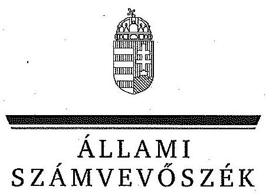
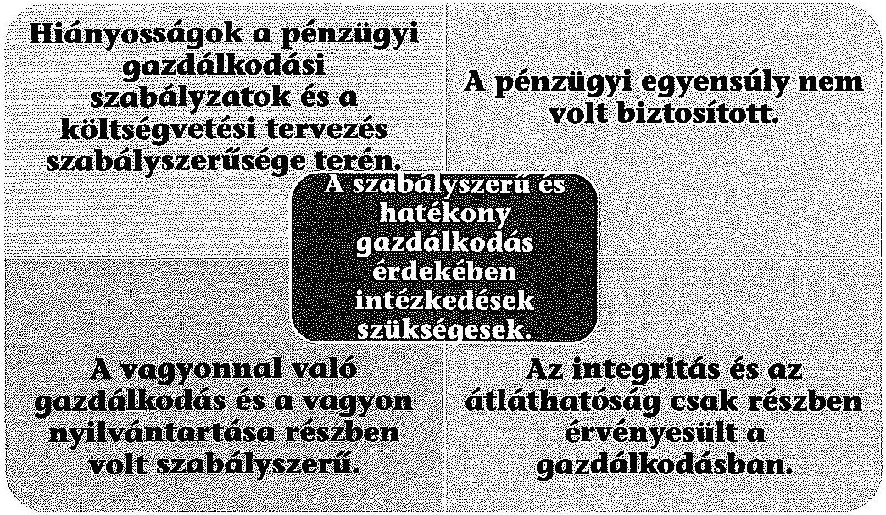
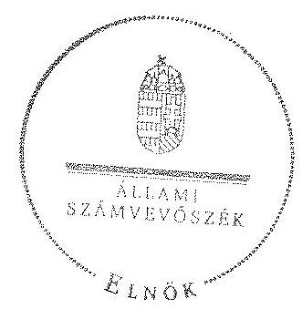
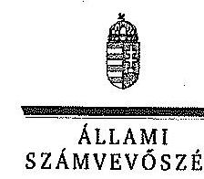

ÁLLAMI
SZÁMVEVŐSZÉK

# JELENTÉS 

az önkormányzatok pénzügyi és vagyongazdálkodása szabályszerűségének ellenőrzéséről

Marcali

---

# Állami Számvevőszék 

Iktatószám: V-0652-346/2015.
Témaszám: 1485
Vizsgálat-azonosító szám: V0691

## Az ellenőrzést felügyelte:

## Renkó Zsuzsanna

felügyeleti vezető
Az ellenőrzés végrehajtásáért felelős és az ellenőrzést vezette:
Dér Lívia
ellenőrzésvezető
A számvevőszéki jelentés összeállításában közremüködött:
Baksa Anikó
számvevő vezető főtanácsos
Az ellenőrzést végezték:

| Baki István | Beke Andrea | Bodonyi Miklós |
| :-- | :-- | :-- |
| számvevő tanácsos | számvevő | számvevő főtanácsos |
| Dr. Eke-Pekács Tibor | Gelencsér Zoltán |  |
| számvevő tanácsos | számvevő tanácsos |  |

---

# TARTALOMJEGYZÉK 

BEVEZETÉS ..... 3
I. ÖSSZEGZŐ MEGÁLLAPÍTÁSOK, KÖVETKEZTETÉSEK, JAVASLATOK ..... 6
II. RÉSZLETES MEGÁLLAPÍTÁSOK ..... 13

1. Az erőforrásokkal való szabályszerű és hatékony gazdálkodáshoz szükséges új követelmények kialakítása, számonkérése, ellenőrzése ..... 13
1.1. Az előirányzatokkal, a létszámmal, a vagyonnal való gazdálkodás szabályainak, követelményeinek kialakítása ..... 13
1.2. Az erőforrásokkal való szabályszerű, hatékony gazdálkodás követelményeinek számonkérése, ellenőrzése ..... 14
2. Az önkormányzat pénzügyi gazdálkodásának szabályszerűsége, a pénzügyi egyensúly biztosítottsága ..... 15
2.1. A költségvetési tervezés, az éves költségvetési beszámolás szabályszerűsége ..... 15
2.2. Az Önkormányzat folyamatos fizetőképességének fenntartására tett intézkedések, a pénzügyi egyensúly helyzete ..... 16
3. Az önkormányzat vagyongazdálkodásának szabályszerűsége ..... 21
3.1. A vagyongazdálkodási tevékenység keretei, szabályozottsága ..... 21
3.2. Az önkormányzat vagyonnyilvántartásának szabályszerűsége ..... 23
3.3. A vagyonelemek könyv szerinti értéke leltárral történt alátámasztásának szabályszerűsége ..... 23
3.4. A vagyon összetételének és nagyságának változását eredményező döntések és azok végrehajtásának szabályszerűsége ..... 25
3.5. A tartós részesedésekkel való gazdálkodás, a tulajdonosi jogok gyakorlása és a kötelezettségek teljesítése ..... 30
4. Az integritás kontrollok kialakítása és múködtetése ..... 31

---

# MELLÉKLETEK 

1. számú Marcali Város Önkormányzata feladatellátásában részt vevő intézmények és azok változása az ellenőrzött időszakban
2. számú Marcali Város Önkormányzata bevételei, kiadásai, valamint adósságszolgálata a 2011-2013. években
3. számú Marcali Város Önkormányzata mérlegadatai a 2011-2013. években
4. számú Marcali Város Önkormányzata tartós részesedéseinek portfóliója a 2011-2013. években
5. számú Marcali Város Önkormányzata polgármesterének a jelentéstervezet megállapításaira tett észrevétele
6. számú Az ÁSZ válasza Marcali Város Önkormányzata polgármesterének a jelentéstervezet megállapításaira tett észrevételére

## FÜGGELÉKEK

1. számú Rövidítések jegyzéke
2. számú Forgalomtár

---

# JELENTÉS 

## az önkormányzatok pénzügyi és vagyongazdálkodása szabályszerűségének ellenőrzéséről Marcali

## BEVEZETÉS

Az ÁSZ stratégiai célkitűzése, hogy ellenőrzéseivel mind jobban segítse az átláthatóságot, az elszámoltathatóságot és az elszámoltatást a közpénzekkel és a közvagyonnal való gazdálkodásban. Magyarország Alaptörvénye rögzíti, hogy az állam és a helyi önkormányzat tulajdona a nemzeti vagyon része. Az önkormányzati vagyon alapvető funkciója, hogy a közérdeket és egyúttal az önkormányzati célok - elsősorban a kötelezően ellátandó feladatok, és emellett a lehetőségek mértékéig az önként vállalt feladatok - megvalósítását szolgálja.

Az államháztartás önkormányzati alrendszerének közpénzfelhasználása, az önkormányzatok által ellátott közfeladatok és önként vállalt feladatok sokrétűsége, valamint a feladatellátáshoz rendelt vagyon nagyságrendje indokolja, hogy az ÁSZ ellenőrzéseket folytasson a pénzügyi és vagyongazdálkodás területén. Az ÁSZ az önkormányzatok ellenőrzését a pénzügyi helyzet megítélésével indította el 2011-ben és a nagy vagyonnal rendelkező, magas kockázatú önkormányzatok esetében a vagyongazdálkodás ellenőrzésével folytatta. Az elmúlt három év ellenőrzéseinek tapasztalatai megmutatták, hogy indokolt az egyrészt elemző, értékelő, a pénzügyi helyzet kockázatát is minősítő, másrészt a pénzügyi és vagyongazdálkodási tevékenység szabályszerűségét komplexen értékelő ÁSZ ellenőrzések folytatása.

Az ellenőrzés célja annak megállapítása volt, hogy kialakított-e az önkormányzat az erőforrásokkal való szabályszerű és hatékony gazdálkodáshoz szükséges követelményeket, megvalósította-e azok számonkérését, ellenőrzését; az önkormányzat pénzügyi és vagyoni helyzetének, a gazdálkodás szabályosságának megítélése a költségvetési tervezés, a pénzügyi egyensúly megteremtése, az éves költségvetési beszámolás, a vagyongazdálkodás, a vagyon számbavétele, a gazdasági események elszámolása és a pénzgazdálkodás szabályszerűsége alapján.

Ennek keretében értékeltük, hogy az önkormányzat:

- pénzügyi gazdálkodása megfelelt-e a jogszabályokban és a belső szabályzataiban meghatározottaknak, biztosított volt-e a pénzügyi egyensúly;

---

- biztosította-e a vagyongazdálkodás szabályszerűségét, a vagyonváltozást eredményező döntéseket szabályszerűen hajtotta-e végre, gondoskodott-e a tulajdonosi jogok gyakorlásáról;
- a gazdálkodása során biztosította-e az átláthatóság és az integritás érvényesülését.

Az ellenőrzés várható hasznosulása: az ellenőrzés várhatóan hozzájárul az önkormányzatok pénzügyi helyzetének pontosabb megítéléséhez azáltal, hogy a pénzügyi és vagyoni helyzetet együtt értékeli. Bemutatja az adósságkonszolidáció önkormányzat általi végrehajtásának szabályszerűségét. Feltárja az önkormányzati gazdálkodást meghatározó szabályozások összhangjának esetleges hiányosságait, a szabályozással nem érintett gazdálkodási területeket, és a vagyongazdálkodási tevékenység gyakorlásának szabálytalanságait. A jó gyakorlat kialakításán és terjesztésén keresztül az ellenőrzések elősegíthetik az önkormányzati gazdálkodás szabályszerűségének javítását.

Az ellenőrzés típusa: szabályszerűségi ellenőrzés
Az ellenőrzött időszak: 2011. január 1-jétől 2013. december 31-ig. A pénzintézetekkel szembeni kötelezettségek állományának vizsgálatakor az ellenőrzött időszakban fennálló kötelezettségeket vettük figyelembe. A vagyonnyilvántartások egyezőségét, a leltározás, selejtezés folyamatát a 2013. évre vonatkozóan értékeltük.

# Ellenőrzött szervezet: Marcali Város Önkormányzata 

Az ellenőrzés végrehajtásának jogszabályi alapját az ÁSZ tv. 1. § (3) bekezdése, az 5. § (2)-(6) bekezdései, valamint az Áht. 2 61. § (2) bekezdésének előírásai képezték.

Az ellenőrzés szakmai módszertana az ÁSZ hivatalos honlapján közzétett szakmai szabályokon alapult, amely a Legfőbb Ellenőrző Intézmények Nemzetközi Szervezete (INTOSAI) által kiadott nemzetközi standardok (ISSAI) figyelembevételével készült.

Az ellenőrzés során alkalmazott rövidítések jegyzékét az 1. számú függelék, az egyes fogalmak magyarázatát a 2. számú függelék tartalmazza.

Az ellenőrzést az ÁSZ hatályos szervezeti szabályai és az ellenőrzési programban foglalt értékelési szempontok szerint folytattuk le. Megállapításainkat a helyszíni ellenőrzés tapasztalataira, az ellenőrzött szervezettől bekért dokumentumokra, a kitöltött tanúsítványok elemzésére, az adott időszakban hatályos jogszabályok és belső szabályzatok előírásaira alapoztuk. Az önkormányzat vagyonváltozását eredményező döntések és azok végrehajtásának ellenőrzése, szabályszerűségének megítélése kockázatalapú mintavételen, valamint tételes ellenőrzésen keresztül történt. Tételesen ellenőriztük a PPP konstrukció fejlesztési döntéseit és a részesedések értékelését, továbbá a vagyonkezelői, a koncessziós jog alapítását s a vagyon üzemeltetésre történő átadását. Kockázatalapú mintavétel alapján (évente a legnagyobb értékű 2-4 tétel került kiválasztásra) ellenőriztük a térítés nélküli tulajdonjog átruházást, a beruházásokat, felújításokat, a vagyonértékesítéseket, a vagyonhasznosítást és a behajthatatlan követelések leírását.

---

Marcali város lakosainak száma 2013. január 1-jén 11849 fő volt. A 11 tagú Képviselő-testület munkáját 5 állandó bizottság segítette. A polgármester az 1990. évi önkormányzati választás óta tölti be tisztségét, a jegyző 2005. február 1-jétől látja el feladatait. A Polgármesteri hivatal 6 szervezeti egységre tagolódott, elkülönített gazdasági szervezettel nem rendelkezett. A pénzügyi-gazdálkodási feladatokat a Pénzügyi iroda látta el. A foglalkoztatott köztisztviselők száma 2013. december 31 -én 52 fő volt.

Az Önkormányzat a 2011. év elején a kötelező és az önként vállalt feladatait a Polgármesteri hivatalon kívül tíz önállóan múködő és gazdálkodó és négy önállóan működő intézményével, valamint gazdasági társaságok, társulások keretei között látta el. A feladatok ellátásának módja elsősorban a helyi tűzvédelmi, a fekvő- és járóbeteg-ellátás, valamint a köznevelési feladatok Magyar Állam részére, továbbá az óvodai nevelési feladat Kistérségi Társulásnak történt 2013. évi átadása miatt változott. A 2013. év végére az Önkormányzatnak a Polgármesteri hivatalon kívül három önállóan múködő és gazdálkodó, valamint két önállóan működő intézménye maradt. Az Önkormányzatnak 2013-ban egy többségi tulajdonában lévő gazdasági társasága volt. Az ellenőrzött időszakban az önkormányzati feladatellátásban részt vevő intézményeket és azok változását az 1. számú melléklet mutatja be.

Az Önkormányzat könyvviteli mérleg szerinti vagyona 2013. december 31-én 13391,8 millió Ft volt, amely - döntően az állami feladatátvállalások következtében - 3437,0 millió Ft-tal, 20,4\%-kal csökkent az ellenőrzött időszakban. A pénzintézettel szembeni kötelezettségállomány 2011. január 1-jén 3758,0 millió Ft volt. A Magyar Állam az adósságkonszolidáció két ütemében összesen 3311,1 millió Ft kötvény és hiteltartozást és annak járulékait vállalta át, így az Önkormányzat 2013. december 31-én fennálló adósságállománya megszűnt. Az ellenőrzött időszak végén fennálló egyéb, nem pénzintézetekkel szembeni kötelezettségek összege 289,2 millió Ft-ot tett ki. A 2013. év végi 551,3 millió Ft pénzmaradványból 519,7 millió Ft kötelezettséggel terhelt volt. Az Önkormányzat a 2013. évi költségvetési beszámolója szerint 2086,9 millió Ft költségvetési bevételt ért el és 1912,9 millió Ft költségvetési kiadást teljesített. A felhalmozási célú kiadások összege 2013-ban 196,7 millió Ft volt, amelyből felújításokra és beruházásokra 157,5 millió Ft-ot fordítottak.

Az ÁSZ tv. 29. § (1) bekezdése szerint a jelentéstervezetet megküldtük a polgármester részére, aki az ÁSZ tv. 29. § (2) bekezdésében foglalt észrevételezési jogával élt, a jelentéstervezet megállapításaira észrevételt tett.

---

# I. ÖSSZEGZŐ MEGÁLLAPÍTÁSOK, KÖVETKEZTETÉSEK, JAVASLATOK 

Az Önkormányzat folyó költségvetése a 2011-2013. években csak az eseti kiegészítő támogatásokkal volt egyensúlyban. A folyószámlahitel igénybevétele tartóssá vált és a szállítói állományon belül a lejárt esedékességű tartozások aránya az ellenőrzött években folyamatosan növekedett. Az Önkormányzat vagyona döntően az állami feladatátvállalás hatására a három év alatt 20,4\%-kal csökkent. Az Önkormányzat pénzügyi gazdálkodása az ellenőrzött időszakban teljes körűen nem felelt meg a jogszabályokban és a belső szabályzatokban előírtaknak. Az Önkormányzat nem biztosította teljes körűen a vagyongazdálkodás szabályszerűségét a vagyonváltozást eredményező döntéseket nem minden esetben hajtotta végre szabályszerűen. A jogszabályi előírásokkal ellentétben az Önkormányzat leltározási és nyilvántartási tevékenysége hiányos volt, amely magas kockázatot jelentett a vagyon számbavétele vonatkozásában.

## Az ÁSZ ellenőrzés megállapításainak összegzése:

A gazdálkodási szabályok kialakításakor az erőforrásokkal való szabályszerű és hatékony gazdálkodáshoz kapcsolódó szabályzatokat teljes körűen nem készítették el. A hiányos szabályozás ellenére a képviselő-testület az erőforrásokkal való szabályszerű és hatékony gazdálkodás követelményeit számon kérte és ellenőrizte. A belső ellenőrzés vizsgálta az erőforrásokkal való gazdálkodást, azonban a feltárt hiányosságok megszüntetésére a 17 ellenőrzésből hét esetben nem készítettek intézkedési tervet, ebből öt esetben az ellenőrzött feladat, illetve költségvetési szerv megszűnt vagy az Önkormányzat fenntartásából a 2013. évben kikerült.

A jegyző nem biztosította a belső ellenőrzés funkcionális függetlenségét, mivel a belső ellenőrzési vezetői feladatok ellátása mellett egyéb, a Kistérségi társuláshoz

---

kapcsolódó feladatok ellátásával is megbízta a belső ellenőrzési vezetői feladatokat ellátó alkalmazottat.

Az Önkormányzat 2013. évi költségvetés előkészítése során a bevételek tervezése közgazdaságilag nem volt megalapozott, mert a múködési egyensúlyt a múködőképesség megőrzésére szolgáló kiegészítő költségvetési támogatás tervezésével biztosították. Továbbá a költségvetési rendeletben a költségvetési és a finanszírozási bevételek, kiadások kimutatása terén is voltak hiányosságok. A bevételek teljesítését annak ellenére nem módosították, hogy az eredeti előirányzatoktól a tényadatok jelentős mértékben elmaradtak.

Az Önkormányzat a költségvetési beszámolókat a 2011. évi beszámolóban feltárt hiba kivételével az ellenőrzött években a jogszabályban meghatározott tartalommal és határidőig elkészítette.

Az Önkormányzat pénzügyi egyensúlya a 2011-2013. években a saját hatáskörben megtett bevételnövelő, kiadáscsökkentő intézkedések, valamint a feladatellátásban bekövetkezett változások pozitív hatása ellenére nem volt biztosított. A múködési bevételek a kiadásokat csak a működőképesség megőrzését szolgáló kiegészítő támogatásokkal fedezték, de még az így képződött múködési jövedelem sem biztosította a tőketörlesztési kiadások fedezetét. A fizetőképesség csak folyamatos folyószámlahitel igénybevétellel volt fenntartható.

Az ellenőrzött időszakban 30,0 millió Ft múködési célú, naptári éven túl visszafizetendő hitelt vettek fel, amelyhez nem rendelkezett a Kormány előzetes engedélyével. A 2013-2014. évi adósságkonszolidáció keretében az Önkormányzatnak 3311,1 millió Ft pénzintézettel szembeni kötvény, hitel illetve járulék tartozása szűnt meg.

A polgármester a jogszabályi előírással ellentétben az ellenőrzött időszak egyik évében sem tájékoztatta a Pénzügyi, Gazdasági és Környezetvédelmi Bizottságot, hogy az Önkormányzat 60 napon túli lejárt szállítói tartozásállománnyal rendelkezett. A polgármester a jogszabályi előírással ellentétben nem kezdeményezte a Képviselő-testület döntését a fizetési kötelezettségek rendezéséről, az adósságrendezési eljárás megindításáról annak ellenére, hogy a tartozásállomány az esedékességet követő 90 . napon is fennállt. Az Önkormányzat a pénzügyi egyensúlyát befolyásoló kockázatokat nem teljes körűen azonosította, nem elemezte.

A vagyongazdálkodás kereteinek kialakításakor nem határozták meg a vagyonkezelésbe adható vagyoni kört, a vagyonkezelői jog gyakorlásának és a vagyonkezelés ellenőrzésének részletes szabályait. A könyvviteli mérlegeket teljes körűen leltárral egyik évben sem támasztották alá. A leltározás az eredményszemléletű számvitelre való áttérést nem alapozta meg. A mérlegben kimutatott tartósan adott kölcsönök, az egyéb hosszú lejáratú követelések és a vevők értékelését 2013-ban nem végezték el. A befektetett eszközökön belül a vagyonkezelésbe adott eszközök elkülönített számviteli nyilvántartása nem történt meg. Az ellenőrzés által a 2013. évi mérlegben feltárt számviteli hiba jelentős összegűnek minősült. Az Önkormányzat egyik intézményének ingyenes vagyonkezelésbe adása jogszabályi előírást sértő módon került végrehajtásra, a vagyonkezelésbe átadott eszközökről készítendő vagyonleltár a felek által aláírt megállapodásnak nem volt része.

---

Az Önkormányzat a jogszabályi előírás ellenére közzétételi kötelezettségének nem tett eleget, mivel a térítés nélküli átadások teljes körű közzétételéről nem gondoskodott.

Az Önkormányzat az elvégzett beruházások és felújítások tárgyában több esetben olyan szerződést kötött, amelyekben a teljesítési határidők pontos rögzítését nem szabályozta, a pótmunka megrendelését nem szerződésszerűen végezték és pénzügyi ellenjegyzéses pontos dátuma hiányzott. Az Önkormányzat vagyonának védelme nem volt biztosított, mivel a beruházások, felújítások alkalmával szabályozott késedelmi kötbér összegét több esetben a szerződéses rendelkezések ellenére nem érvényesítették.

Az Önkormányzat tulajdonosi joggyakorlóként döntött a tulajdonában lévő gazdasági társaságokban felügyelő bizottságok létrehozásáról és a felügyelő bizottságok megválasztásáról gondoskodott. A részesedésekről nyilvántartást vezettek, azok értékelését a mérleg készítésekor elvégezték.

Az Önkormányzat a gazdálkodása során nem biztosította maradéktalanul az átláthatóság és az integritás érvényesülését.

Az ÁSZ tv. 33. § (1) bekezdésében foglaltak értelmében az ellenőrzött szervezet vezetője köteles a jelentésben foglalt megállapításokhoz kapcsolódó intézkedési tervet összeállítani, és azt a jelentés kézhezvételétől számított harminc napon belül az ÁSZ részére megküldeni. Amennyiben az intézkedési tervet határidőn belül nem küldi meg a szervezet vezetője, vagy az továbbra sem elfogadható, az ÁSZ elnöke a hivatkozott törvény 33. § (3) bekezdés a-b) pontjaiban foglaltakat érvényesítheti.

# Az ellenőrzés intézkedést igénylő megállapításai és javaslatai: 

## a polgármesternek

1. A 2011-2013. években a folyó költségvetés egyenlege - az adósságkonszolidációhoz kapcsolódó tételek nélkül - összesen 308,3 millió Ft többletet mutatott, amelyben döntő szerepük volt a 871,1 millió Ft összegű eseti kiegészítő támogatásoknak. A müködési jövedelem e támogatások nélkül minden évben negatív volt. Az állami feladatátvállalások és a saját hatáskörben megtett egyensúlyt javító intézkedések pozitív hatása ellenére a kiegészítő támogatások miatti bevételi kitettség miatti kockázat továbbra is jelentős volt. A müködési hiány tartóssá válása esetén fennáll a likvid hitelállomány újratermelődésének veszélye.

Javaslat:
Terjessze a Képviselő-testület elé az Önkormányzat aktuális pénzügyi egyensúlyi helyzetének elemzésén alapuló döntési javaslatát a müködési egyensúly megteremtését biztosító további intézkedések bevezetéséről.
2. Az Önkormányzat az ellenőrzött időszakban jelentős 60 napon túli lejárt esedékességű szállítói tartozással (a 2011. évben 144,7 millió Ft, a 2012. évben 106,7 millió Ft, a 2013. évben 129,3 millió Ft) rendelkezett. Az Adósságrendezési tv. 5. § (1) bekezdésében foglaltak ellenére a polgármester a 60 napon túli lejárt esedékességű tartozások

---

fennállásáról a Pénzügyi, Gazdasági és Környezetvédelmi Bizottságot nem tájékoztatta, a Képviselő-testületet nyolc napon belül nem hívta össze annak érdekében, hogy az határozatot hozzon a fizetési kötelezettségek rendezésére, vagy felhatalmazza a polgármestert az adósságrendezési eljárás azonnali kezdeményezésére. Az Adósságrendezési tv. 5. § (2) bekezdésében foglalt, 2011. július 12-ig hatályos előírást megsértve a polgármester a 90 napon túl lejárt esedékességű szállítói tartozások fennállása ellenére nem kezdeményezte nyolc napon belül az adósságrendezési eljárást.

Javaslat:
Intézkedjen a szállítói kitettség csökkentése és az adósságrendezési eljárás megindításának elkerülése érdekében a lejárt esedékességű tartozások kezeléséről. A 60, illetve 90 napon túl lejárt esedékességű tartozás fennállása esetén a jogszabályban előírt kötelezettségének maradéktalanul tegyen eleget.
3. A 2012-2013. években az Mötv. 143. § (4) bekezdés i) pontjában foglaltak ellenére önkormányzati rendeletben nem határozták meg azt a vagyoni kört, amelyre vagyonkezelői jog létesíthető, ezen túl a 2011. évben az Ötv. 80/B. §, a 2012-2013. években az Mötv. 109. § (4) bekezdés előírása ellenére nem írták elő a vagyonkezelői jog gyakorlásának és a vagyonkezelés ellenőrzésének részletes szabályait.

Javaslat:
Terjessze a Képviselő-testület elé a rendelet tervezetét, amelyben meghatározzák azt a vagyoni kört, amelyre vagyonkezelői jog létesíthető, továbbá a vagyonkezelői jog gyakorlásának és a vagyonkezelés ellenőrzésének részletes szabályait.
4. Az Önkormányzat 2012. júniusában 30,0 millió Ft működési célú, naptári éven túli, legkésőbb 2013. június 15 -én egyösszegben visszafizetendő hitelt vett fel, amelyhez a Stabilitási tv. 10. § (1) bekezdésében foglaltak ellenére nem rendelkezett a Kormány előzetes hozzájárulásával.

Javaslat:
Intézkedjen annak érdekében, hogy az Önkormányzat adósságot keletkeztető ügyletet - a vonatkozó jogszabályi előírásban meghatározott kivételekkel - a Kormány előzetes hozzájárulásával kössön.
5. Az ÁSZ ellenőrzés a jogszabályban előírt szabályzatok elkészítése, a vagyonnal való gazdálkodásra vonatkozó rendeletben foglaltak teljeskörüsége, a számviteli nyilvántartások vezetése, a mérleg leltárral való alátámasztása, az évvégi értékelési feladatok ellátása, a költségvetési tervezés, a kockázatkezelési rendszer müködése, a vagyongazdálkodás szabályszerűsége, a közzétételi kötelezettség teljesítése tekintetében hiányosságokat tárt fel. Az ellenőrzés ezen túl megállapította, hogy a belső ellenőrzés funkcionális függetlenségét a 2011. évben az Áht. $1121 / 8$. § (5) bekezdés e) pontjában, valamint a Ber. 6. § (1)-(3) bekezdéseiben, a 2012-2013. években az Áht. 270 . § (1)-(2) bekezdéseiben, a Bkr. 19. § (1)-(2) bekezdéseiben foglaltak ellenére nem biztosították. A belső ellenőrzés 2011-2013. között az Önkormányzatnál és szerveinél lefolytatott ellenőrzéseket követően 17 esetben írt elő intézkedési tervkészítési kötelezettséget, melynek az ellenőrzött szervezetek a 2011. és a 2012. évben a Ber. 29. § (1) bekezdés és a Bkr. 45. § (1)-(3) bekezdésében előírtak ellenére teljes körűen nem tettek eleget.

---

Javaslat:
Intézkedjen a feltárt hiányosságok és/vagy szabálytalanságok tekintetében a munkajogi felelősség tisztázására irányuló eljárás megindításáról, és ennek eredménye ismeretében tegye meg a szükséges intézkedéseket.

# a jegyzőnek 

1. A kockázatkezelési rendszer keretében - a 2011. évben az Áht. 1 121. § (2) bekezdés b) pontjában, az Ámr. 157. § (1)-(3) bekezdéseiben, a 2012-2013. években a Bkr. 7. § (1)-(2) bekezdéseiben foglaltak ellenére - a pénzügyi egyensúlyt befolyásoló kockázatok teljes körű beazonosítása, felmérése elmaradt, ezen túl a kockázatok mérséklése érdekében nem határozták meg a szükséges intézkedéseket.

Javaslat:
Működtessen a jogszabályi előírásoknak megfelelő, a pénzügyi egyensúlyt befolyásoló kockázatok kezelésére alkalmas kockázatkezelési rendszert.
2. A 2011-2013. évi könyvviteli mérlegekben az üzemeltetésre átadott, illetve konceszszióba adott eszközök állományát az Önkormányzatnál az Áhsz. 1 37. § (4) bekezdésében foglaltak ellenére nem támasztották alá az üzemeltetést, kezelést végző szerv által a december 31-ei fordulónapra vonatkozó, évenkénti leltározás alapján elkészített, hitelesített leltárakkal. Ezen túl a 2011. évben a TISZK, az Önkormányzati társulás és a Hivatásos Tűzoltó Parancsnokság eszközeinek és forrásainak leltárai hiányában a könyvviteli mérleget az Áhsz. 1 37. § (1)-(2) bekezdéseiben foglalt előírások ellenére leltárral teljes körűen nem támasztották alá.

Javaslat:
Intézkedjen, hogy a leltározást a jogszabályi előírások alapján hajtsák végre, a könyvviteli mérlegben kimutatott eszközök és források valódiságát a jogszabályi előírásnak megfelelő leltárral támasszák alá.
3. A 2012-2013. években az Mötv. 143. § (4) bekezdés i) pontjában foglaltak ellenére önkormányzati rendeletben nem határozták meg azt a vagyoni kört, amelyre vagyonkezelői jog létesíthető, ezen túl a 2011. évben az Ötv. 80/8. §, a 2012-2013. években az Mötv. 109. § (4) bekezdés előírása ellenére nem írták elő a vagyonkezelői jog gyakorlásának és a vagyonkezelés ellenőrzésének részletes szabályait.

Javaslat:
Készítse elő a rendelet tervezetét, amelyben meghatározzák azt a vagyoni kört, amelyre vagyonkezelői jog létesíthető, továbbá a vagyonkezelői jog gyakorlásának és a vagyonkezelés ellenőrzésének részletes szabályait.
4. Az Önkormányzat és a KLIK az Áfvt. 13. § (2) bekezdésében foglaltak alapján a Széchenyi Zsigmond Szakközép és Szakiskola intézmény eszközeinek ingyenes vagyonkezelésbe adása tárgyában 2012. december 12-én megállapodást kötött, a vagyonkezelési szerződést 2013. február 25-én írták alá. A szakképzésről szóló 2011. évi CLXXXVII. törvény 5. § (14) bekezdésében foglaltakra tekintettel 2013. szeptember 1-jétől az intézményből kivált Széchenyi Zsigmond Szakképzőiskola és Kollégium a

---

Vidékfejlesztési Minisztérium fenntartásába került, a feladatellátásához szükséges eszközökkel kapcsolatosan az Önkormányzattal a vagyonkezelési szerződést az ellenőrzött időszakot követően kötötte meg. A KLIK működtetésében maradt Marcali Szakképző Iskola tekintetében az Önkormányzat és a KLIK között létrejött vagyonkezelési szerződést az ellenőrzött időszakban nem módosították. A vagyonkezelésbe adott befektetett eszközöket az Áhsz. 1 20. § (1) bekezdésében foglaltak ellenére a 2013. évi mérlegben nem az üzemeltetésre, kezelésre átadott, koncesszióba, vagyonkezelésbe adott eszközök állományában mutatták ki. Az Önkormányzat adatszolgáltatása szerint a vagyonkezelésbe adott eszközök értéke 2013. december 31-én 521,0 millió Ft volt, amely az ellenőrzés időpontjában hatályos Áhsz. 2 1.§ (1) bekezdés 3. pontja alapján jelentős összegű hibának minősült.

Javaslat:
A jogszabályi előírásoknak megfelelő könyvvezetési és beszámoló készítési kötelezettség érdekében intézkedjen:
a) a vagyonkezelésbe adott eszközök számviteli nyilvántartásokban való jogszabályi előírásoknak megfelelő kimutatása, valamint;
b) a 2013. évi könyvviteli mérlegben feltárt jelentős összegű hiba jogszabályi előírások szerinti javítása, valamint annak a hiba javításának évében az éves költségvetési beszámolóban való bemutatása érdekében.
5. A 2011. évben az Ámr. 20. § (3) bekezdés c), d) és f) pontjaiban, a 2012-2013. években az Ávr. 13. § (2) bekezdés c), d) és e) pontjaiban előírtak ellenére nem szabályozták a belföldi és külföldi kiküldetések elrendelésével, lebonyolításával és elszámolásával kapcsolatos kérdéseket, az anyag- és eszközgazdálkodás számviteli politikában nem szabályozott kérdéseit, valamint a reprezentációs kiadások felosztásának, teljesítésének és elszámolásának szabályait.

Javaslat:
Intézkedjen, hogy az Önkormányzatnál a jogszabályi előírások szerint belső szabályzatban rendezzék a működéshez kapcsolódó, pénzügyi kihatással bíró, jogszabályban nem szabályozott kérdéseket, így különösen a belföldi és külföldi kiküldetések elrendelésével, lebonyolításával és elszámolásával kapcsolatos, valamint az anyag és eszközgazdálkodás számviteli politikában nem szabályozott kérdéseket, a reprezentációs kiadások felosztásának, teljesítésének és elszámolásának szabályait.
6. A 2011-2012. évi költségvetési rendeletek 3. §-ában a finanszírozási bevételnek minősülő hitelfelvételt, illetve a 2013. évben a költségvetési maradványt költségvetési bevételként, a 2011-2013. években a hiteltörlesztésre fordított finanszírozási kiadásokat költségvetési kiadásként mutatták ki, amely ellentétes volt a 2011. évben az Áht. 1 8/A. § (3) bekezdés b) pontja és a (4) és (7) bekezdései, valamint a 2012-2013. években az Áht. 2 72. § (1) bekezdése, és a 73. § (1) bekezdés ab) pontja és ad) pontjában foglaltakkal. A 2013. évi költségvetési rendeletben az Mötv. 111. § (4) bekezdése szerint működési hiányt nem terveztek, azonban a működési egyensúlyt 439,2 millió Ft működőképesség megőrzését szolgáló kiegészítő támogatás eredeti előirányzatként történő tervezésével biztosították. E támogatási bevétel tervezése, a megítéléséről szóló döntés hiányában nem felelt meg az Áht. 2 12. § (1) bekezdésében foglalt - a

---

tervezett bevételek közgazdaságilag megalapozott jóváhagyására vonatkozó - előírásnak.

Javaslat:
Az Önkormányzat költségvetéséről szóló rendelet jogszabályi előírásoknak megfelelő elkészítése érdekében intézkedjen, hogy:
a) a költségvetési bevételeket és a költségvetési kiadásokat, valamint a finanszírozási bevételeket és a finanszírozási kiadásokat a jogszabályi előírásoknak megfelelően vegyék figyelembe;
b) a múködési költségvetés jogszabályban előírt egyensúlyának biztosításakor a bevételeket közgazdaságilag megalapozottan határozzák meg.
7. Az ellenőrzött időszakban az analitikus nyilvántartásoknak a kapcsolódó főkönyvi nyilvántartásokkal való egyeztetése dokumentálását az Áhsz. 1 49. § (3) bekezdésében előírtak ellenére - a pénztárzárlat kivételével - a számlarendben nem szabályozták.

Javaslat:
Intézkedjen a számlarend tartalmára vonatkozó jogszabályi előírásban meghatározott, a részletező nyilvántartásokkal kapcsolatos kérdés szabályozása érdekében.
8. A 7,2 millió Ft összegű egyéb hosszú lejáratú követelések, a 21,5 millió Ft összegű tartósan adott kölcsönök, valamint a 66,4 millió Ft vevők állományával kapcsolatosan a 2013. évben - az Áhsz. 1 32. § (1)-(2) bekezdéseiben és a 31. § (2) és (4) bekezdésében, valamint a 2013. január 1-jétől hatályos értékelési szabályzat 1.4. pontjában foglaltak ellenére - a mérlegtételek értékelésére vonatkozó feladatokat nem végezték el, nem készítettek számítást a követelések könyv szerinti értéke és a várhatóan megtérülő összeg közötti - veszteségjellegű - különbözet meghatározására.

Javaslat:
Intézkedjen, hogy a könyvviteli mérlegben szereplő követelések értékelését a jogszabályi előírások, valamint a számviteli szabályzatban foglaltak alapján végezzék el.
9. Az Önkormányzat a 2012. évben két esetben a térítésmentes vagyonátadással kapcsolatos közzétételi kötelezettségét az Info tv. 37. § (1) bekezdésében és az 1. számú melléklet III/4. pontjában foglalt előírások ellenére nem teljesítette.

Javaslat:
Intézkedjen, hogy az Önkormányzat jogszabályban előírt közzétételi kötelezettségének maradéktalanul tegyen eleget.

---

# II. RÉSZLETES MEGÁLLAPÍTÁSOK 

## 1. AZ ERŐFORRÁSOKKAL VALÓ SZABÁLYSZERŰ ÉS HATÉKONY GAZDÁLKODÁSHOZ SZÜKSÉGES ÚJ KÖVETELMÉNYEK KIALAKÍTÁSA, SZÁMONKÉRÉSE, ELLENŐRZÉSE

### 1.1. Az előirányzatokkal, a létszámmal, a vagyonnal való gazdálkodás szabályainak, követelményeinek kialakítása

Az Önkormányzat és a Polgármesteri hivatal 2011-2013 között rendelkezett szervezeti és múködési szabályzattal. A Képviselő-testület az Önkormányzat SZMSZében meghatározta a kötelezően ellátandó és az önként vállalt feladatokat. A közérdekú események, információk médiaszolgáltatása önként vállalt feladat és a kéményseprő-ipari közszolgáltatás esetében a feladatellátás módját a 2011. december 31-ig az Áht. ${ }_{1}$ 91. § (2) bekezdése, 2012. január 1-től Áht. ${ }_{2}$ 10. § (5) bekezdése ellenére az ellenőrzött időszakban az önkormányzati SZMSZ-ben nem határozták meg.

Az Önkormányzat a 2011-2013. években a jogszabályi előírásokkal összhangban, a helyi sajátosságok figyelembevételével - az alábbi hiányosságok kivéte-lével- rendelkezett az előirányzatokkal, a létszámmal és a vagyonnal való gazdálkodásra vonatkozó szabályzatokkal.

Belső szabályzat keretében nem szabályozták - 2011. évben az Ámr. 20. § (3) bekezdés c), d) és f) pontjaiban, valamint a 2012-2013. években az Ávr. 13. § (2) bekezdés c), d) és e) pontjaiban előírtak ellenére - a belföldi és külföldi kiküldetések elrendelésével, lebonyolításával és elszámolásával kapcsolatos kérdéseket, az anyag- és eszközgazdálkodás számviteli politikában nem szabályozott kérdéseit, valamint a reprezentációs kiadások felosztásának, teljesítésének és elszámolásának szabályait.

Az Önkormányzat a 2011-2013. években a gazdálkodással, ezen belül a költségvetési és létszámtervezéssel, a vagyongazdálkodással kapcsolatos hatásköröket, feladatokat, munkafolyamatokat az önkormányzati és a hivatali SZMSZ-ben, az Ügyrendben, az évenként kiadott, a költségvetési beszámoló elkészítéséről szóló belső szabályozásban, továbbá a feladatot ellátók munkaköri leírásaiban rögzítette. A FEUVE keretében kialakított ellenőrzési nyomvonalon belül meghatározták a költségvetési tervezés, a pénz- és vagyongazdálkodás ellenőrzési nyomvonalát.

A Képviselő-testület a 2011. évi költségvetési rendelettervezet előkészítése során megvizsgálta a pénzügyi egyensúlyi helyzet javítása céljából a kiadáscsökkentési és bevétel-növelési lehetőségeket. 2011. július 1-jétől a Marcali Szakképző Iskolát integrálták az Önkormányzat Széchenyi Zsigmond Szakközépiskola és Szakiskolájába. A Marcali Városi Televízió múködését megszüntették, a műsorszolgáltatást olcsóbb szolgáltatásvásárlással váltották ki. A Képviselő-testület

---

tagjai számára megállapított díjakat felülvizsgálták, az intézményi beszerzéseket és a takarítást központosították, a túlórákkal, pótlékokkal kapcsolatos kifizetéseket felmérték, csökkentették. Az Önkormányzat 2011. évi költségvetési rendeletében hatékonyságnövelő és kiadáscsökkentő intézkedések kerültek meghatározásra. Az intézkedések végrehajtásáról, a realizált megtakarításokról az intézmények vezetői 2012. év januárjában beszámoltak a Képviselő-testületnek.

A Képviselő-testület a 2011-2013. évekre a 184/2010. (XII. 20.), a 193/2011. (XII. 15.) és a 183/2012. (XII. 20.) számú határozatával meghatározta az intézmények beszámolásának szabályait. Előírta, hogy a meghatározott szempontrendszer alapján vizsgálják felül az önkormányzati intézmények költségvetési beszámolóit, értékeljék az intézmények működésének és gazdálkodásának gazdaságosságát, hatékonyságát és eredményességét. A felülvizsgálat megállapításait az intézmények múködésének és gazdálkodásának szabályozása során, valamint a költségvetésének tervezése során hasznosította.

# 1.2. Az erőforrásokkal való szabályszerű, hatékony gazdálkodás követelményeinek számonkérése, ellenőrzése 

A Képviselő-testület az erőforrásokkal való szabályszerű, hatékony gazdálkodás követelményeit számon kérte és ellenőrizte. Az intézmények gazdálkodásának hatékonyságáról az éves intézményi beszámolók alapján elvégzett értékeléssel, valamint a 2011. évben meghatározott hatékonysági követelmények végrehajtásáról az intézmények beszámoltatásával győződtek meg. Az erőforrásokkal való szabályszerű és hatékony gazdálkodás követelményeinek számonkérését, a belső ellenőrzés ellenőrizte.

Az Önkormányzat a belső ellenőrzési feladatokat a Kistérségi Társulás útján látta el. A belső ellenőrzési vezető kijelölésre került, aki felett a munkáltatói jogokat a jegyző gyakorolta. A belső ellenőrzés szervezetére és feladataira vonatkozó előírásokat a Kistérségi Társulás társulási megállapodása, a hivatal SZMSZe , illetve a belső ellenőrzési vezető konkrét munkavégzését, feladatait meghatározó munkaköri leírás szabályozta. A jegyző az ellenőrzött időszakban az Áht. ${ }_{1}$ 121/B. § (5) bekezdés e) pontjában, az Áht. ${ }_{2}$ 70. § (1)-(2) bekezdéseiben, a Ber. 6. § (1)-(3) bekezdéseiben, valamint a Bkr. 19. § (1)-(2) bekezdéseiben előírtak ellenére nem biztosította a belső ellenőrzés funkcionális függetlenségét. A jegyző a belső ellenőrzési vezetői feladatok ellátása mellett, olyan egyéb a Kistérségi társuláshoz kapcsolódó feladatokat ellátásával is megbízta a belső ellenőrzési vezetői feladatok ellátó alkalmazottat, aki egyben az intézmény-fenntartási és kistérségi iroda vezetője is volt ${ }^{1}$.

A Képviselő-testület az éves összefoglaló ellenőrzési jelentéseket a zárszámadás elfogadásával egyidejűleg megtárgyalta és határozataival elfogadta. A belső ellenőrzés 2011 és 2013 között az Önkormányzatnál és szerveinél 19 ellenőrzést folytatott le. Ellenőrizte a belső kontrollrendszer kialakítását, a beszerzések lebonyolításának rendjét és gyakorlati megvalósulását, az intézmények gazdasági helyzetének, költségvetésének megalapozottságát és szabályozottságát, a létszám és személyi juttatással való gazdálkodást, ennek keretében a túlórákkal és

[^0]
[^0]:    ${ }^{1}$ A jegyző 2014. május 16-án megszüntette a jogellenes állapotot.

---

a pótlékokkal kapcsolatban a Képviselő-testület által előírt és érvényesített hatékonysági követelmények teljesítését, valamint a gazdálkodási jogkörök rendjének és gyakorlásának szabályszerűségét.

A belső ellenőrzés az ellenőrzöttek részére 17 esetben írt elő intézkedési tervkészítési kötelezettséget. Az ellenőrzött szervezetek a 2011. és a 2012. évben a Ber. 29. § (1) bekezdésében és a Bkr. 45. § (1)-(3) bekezdéseiben előírtak ellenére 7 esetben nem készítettek intézkedési tervet. Ebből öt esetben az ellenőrzött feladat, illetve költségvetési szerv megszűnt vagy az Önkormányzat fenntartásából a 2013. évben kikerült.

# 2. AZ ÖNKORMÁNYZAT PÉNZÜGYI GAZDÁLKODÁSÁNAK SZABÁLYSZERŰSÉGE, A PÉNZÜGYI EGYENSÚLY BIZTOSÍTOTTSÁGA 

### 2.1. A költségvetési tervezés, az éves költségvetési beszámolás szabályszerűsége

A 2011-2013. évi költségvetési koncepciók és a költségvetési rendelettervezetek előterjesztése szabályszerűen történt. A 2011-2013. évek költségvetési rendelettervezeteinek összeállítására megfelelő szerkezetben, de csak részben megfelelő tartalommal került sor. Bemutatták - a részletes háttérszámításokkal megalapozott - a kötelező, az önként vállalt és az állami feladatokra fordított kiadásokat és az azok forrásául szolgáló bevételeket. A rendelettervezeteket tartalmazó előterjesztésekhez csatolták az előírt mérlegeket és kimutatásokat.

Az Önkormányzat az Áht. ${ }_{1}$ B/A. § (3) bekezdés b) pontja, illetve a (4), (7) bekezdései, valamint az Áht. ${ }_{2} 72 . \S$ (1) bekezdés és a 73. § (1) bekezdés ab) pontja ${ }^{2}$ előírásai ellenére a 2011-2013. évi költségvetési rendeleteinek 3. §-ában a költségvetési kiadások közé sorolta a finanszírozási kiadásnak minősülő hitel- és kölcsöntörlesztési kiadásokat, valamint a 2011. és a 2012. évi költségvetési rendeletekben a költségvetési bevételek között mutatta ki a finanszírozási bevéteinek minősülő hitelfelvételt. A 2013. évi költségvetési rendeletben az Áht. ${ }_{2} 73 . \S$ (1) bekezdés ad) pontja ${ }^{3}$ ellenére a költségvetési bevételek közé sorolták a finanszírozási bevételnek számító költségvetési maradványt. Ugyanakkor a költségvetési rendeletek 9. számú mellékletében a jogszabályi előírásoknak megfelelően mutatták be a költségvetési bevételeket és kiadásokat, a költségvetési egyenleg öszszegét működési és felhalmozási cél szerinti bontásban, továbbá a hiány finanszírozására szolgáló belső és külső finanszírozási bevételeket, a felmerülő finanszírozási kiadásokat. Az Önkormányzat a 2013. évi költségvetési rendelet összeállítása során a Mötv. 111. § (4) bekezdésében előírtak szerint múködési hiányt nem tervezett, azonban a múködési költségvetés egyensúlyát 439,2 millió Ft múködőképesség megőrzését szolgáló kiegészítő támogatás eredeti előirányzatként történő tervezésével biztosította. A kiegészítő költségvetési támogatások bevételi

[^0]
[^0]:    ${ }^{2}$ 2015. január 1-jétől az Áht. ${ }_{2}$ 23. § (2) bekezdése, valamint a 4/A. (1) bekezdés a) és b) pontjai, a 6. § (2)-(6) bekezdései és a 6. § (7) bekezdés aa) pontjával
    ${ }^{3}$ 2015. január 1-jétől az Áht. ${ }_{2}$ 23. § (2) bekezdése, valamint a 4/A. (1) bekezdés a) és b) pontjai, a 6. § (2)-(6) bekezdései és a 6. § (7) bekezdés ac) pontjával

---

előirányzatként történő figyelembe vétele - a támogatás megítéléséről szóló döntést megelőző tervezése - nem felelt meg az Áht. 2 12. § (1) bekezdésében ${ }^{4}$ foglalt előírásnak, mely szerint a tervezés célja annak biztosítása, hogy a tervezett bevételek közgazdaságilag megalapozottan kerüljenek jóváhagyásra.

A 2011-2013. években határidőre elkészítették az Önkormányzat és a költségvetési intézmények elemi költségvetését, azok adatai kiemelt előirányzati szinten megegyeztek az éves költségvetési rendelettel.

A Képviselő-testület a költségvetési rendeletet a 2011-2013. években nem minden esetben a jogszabályi előírások szerint módosította. A 2011-2013. években a kiadási előirányzatok módosítását szabályszerűen hajtották végre. A módosításokat az analitikus és a főkönyvi nyilvántartásban átvezették, elszámolták. Az előirányzatok alapvetően az állami és a pályázati támogatások évközi változásai, a befolyt adóbevételek túlteljesülése, valamint az önkormányzati feladatok ellátásának változásai miatt módosultak. A 2013. évi költségvetési rendeletben megállapított bevételi előirányzatot - a támogatás értékű működési bevételek teljesítése jelentős elmaradása miatt - az Áht. 2 30. § (3) bekezdésében foglaltak ellenére nem módosították, csökkentették. A 2011-2013. években a kiemelt kiadási és létszám-előirányzatokat betartották, azok túllépésére egyik évben sem került sor.

Az Önkormányzat a jogszabályi előírásnak megfelelően beszámolási kötelezettségét teljesítette. Az elemi költségvetési beszámolókat a 2011. évi beszámolóban az ÁSZ által feltárt hiba ${ }^{5}$ kivételével az ellenőrzött években a jogszabályban meghatározott tartalommal és határidőig - az elemi költségvetések adataival összehasonlítható módon - elkészítette. A jegyző a 2011-2013. években a zárszámadási rendelettervezetet - az elfogadott költségvetésekkel összehasonlítható módon, az év utolsó napján érvényes szervezeti és besorolási rendnek megfelelően - elkészítette, melyet a polgármester a jogszabály szerinti tartalommal és határidőben a Képviselő-testület elé terjesztett. A zárszámadási rendelettervezetekkel egy időben a Képviselő-testületnek tájékoztatásul bemutatták a kötelezően előírt mérlegeket és kimutatásokat.

# 2.2. Az Önkormányzat folyamatos fizetőképességének fenntartására tett intézkedések, a pénzügyi egyensúly helyzete 

Az Önkormányzat költségvetés végrehajtásának elemzése a CLF módszer szerint történt. A 2013. évi valós jövedelemtermelő képesség bemutatása érdekében az elemzés során nem kerültek figyelembe vételre az adósságkonszolidációhoz kapcsolódó bevételek és kiadások. Az adósságkonszolidációra vonatkozóan az Önkormányzat 2013. évi beszámolója 37,6 millió Ft múködési támogatást, 35,0 millió Ft hiteltörlesztést és 2,6 millió Ft felhalmozási kamatkiadást tartalmazott. Az Önkormányzat 2011-2013. évekre vonatkozó költségvetésének CLF módszerrel elemzett adatait a 2. számú melléklet tartalmazza. A CLF módszer szerinti - a

[^0]
[^0]:    ${ }^{4}$ 2015. január 1-jétől az Áht. 2 4. § (2) bekezdése
    ${ }^{5}$ Az önkormányzat 2011. évre a hiteltörlesztés 38,0 millió Ft összegét helytelenül árfolyam különbözetként számolta el.

---

2013. év vonatkozásában az adósságkonszolidációs támogatással és annak felhasználásával korrigált - 2011-2013. évi főbb önkormányzati adatokat az 1. számú táblázat mutatja be.

1 számú táblázat
Az Önkormányzat pénzügyi egyensúlyi helyzetének fóbb adatai 2011-2013. években Adatok millió Ft-ban

| Megnevezés | $\begin{gathered} 2011 . \\ \text { év* } \end{gathered}$ | $\begin{gathered} 2012 . \\ \text { év } \end{gathered}$ | $\begin{gathered} 2013 . \\ \text { év } \end{gathered}$ |
| :--: | :--: | :--: | :--: |
| Folyó bevételek | 5308,4 | 3872,3 | 1873,1 |
| Folyó kiadások | 5230,1 | 3799,3 | 1716,1 |
| Folyó költségvetés egyenlege, múködési jövedelem | 78,3 | 73,0 | 157,0 |
| Folyó költségvetés egyenlege múködőképesség megőrzését szolgáló kiegészitő támogatások nélkül | $-177,5$ | $-249,1$ | $-136,2$ |
| Felhalmozási bevételek | 710,3 | 326,0 | 176,1 |
| Felhalmozási kiadások | 873,2 | 287,2 | 194,1 |
| Felhalmozási költségvetés egyenlege | $-162,9$ | 38,8 | $-18,0$ |
| Finanszírozási múveletek nélküli (GFS) pozíció | $-84,6$ | 111,8 | 139,0 |
| Hitelfelvétel, forgatási és befektetési célú értékpapír kibocsátása | - | 30,0 | - |
| Hiteltörlesztés, értékpapír beváltás | $-167,8$ | $-244,1$ | $-160,1$ |
| Egyéb finanszírozási bevételek | $-17,8$ | $-31,5$ | $-7,4$ |
| Egyéb finanszírozási kiadások | 172,1 | $-5,3$ | 17,6 |
| Finanszírozási műveletek egyenlege | $-13,5$ | $-250,9$ | $-149,9$ |
| Tárgyévi pénzügyi pozíció | $-98,1$ | $-139,1$ | $-10,9$ |
| Nettó múködési jövedelem | $-89,5$ | $-171,1$ | $-3,1$ |

*A CLF 2011. évi adatai (hiteltörlesztés és folyó kiadások) 38,0 millió Ft-tal módosításra kerültek a hiteltörlesztés téves könyvelése miatt. A táblázat a módosított adatokat tartalmazza.

A folyó költségvetés egyenlege az ellenőrzött időszak minden évében pozitív volt, a 2011-2013. években összesen 308,3 millió Ft többletet mutatott. A működési jövedelem részben a tűzvédelmi, a fekvő- és járóbeteg-ellátás, továbbá a köznevelési feladatok állami átvétele, másrészt a saját hatáskörben tett kiadáscsökkentő és bevételnövelő intézkedések miatt 2011-ről 2013-ra több mint kétszeresére nőtt. Az Önkormányzat a 2011-2013. években múködőképességének megőrzésére összesen 871,1 millió Ft vissza nem térítendő állami támogatásban, ezen belül 804,0 millió Ft ÖNHIKI és múködő képesség megőrzését szolgáló kiegészítő támogatásban részesült, ezen túlmenően a 2011. évben a 60/2011. (XII. 23.) BM rendelet alapján 67,2 millió Ft hiteltörlesztésre folyósított

---

támogatást kapott. A működőképességének megőrzésére juttatott költségvetési támogatások nélkül a működési jövedelem a 2011-2013. években negatív egyenleget mutatott volna. A felhalmozási költségvetés egyenlege a 2011. és a 2013. évben negatív, a 2012. évben pozitív volt, összesen 142,1 millió Ft felhalmozási forráshiányt mutatott. A felhalmozási deficit fedezetéül a 2011. évben felhalmozási pénzmaradvány, a 2013. évben a múködési jövedelem szolgált.

Az Önkormányzat nettó múködési jövedelme az ellenőrzött időszak minden évében negatív volt, ami folyamatos pénzügyi kapacitás hiányt jelzett. A 2011. évről a 2012. évre történt 81,6 millió Ft-os csökkenését a hiteltörlesztések és értékpapír beváltások 76,3 millió Ft-os növekedése és a működési jövedelem 5,3 millió Ft-os csökkenése okozta. A 2013. évben a működési jövedelem 84,0 millió Ft-os emelkedése, a hiteltörlesztések - adósságkonszolidáció miatti 114,0 millió Ft-os csökkenése, valamint az értékpapír beváltások 30,0 millió Ft összegű növekedése együttesen eredményezte a nettó múködési jövedelem előző évhez viszonyított 168,0 millió Ft-os változását.

Az Önkormányzat a fizetőképességét az ellenőrzött időszakban csak folyószámlahitel folyamatos igénybevételével tudta biztosítani. A folyószámlahitel napi átlagos állománya a 2011. évi 446,2 millió Ft-ról a 2012. évben 403,6 millió Ft-ra csökkent, majd a 2013. évben 245,4 millió Ft-ra mérséklődött. Az Önkormányzat 2012 júniusában 30,0 millió Ft múködési célú, naptári éven túli, legkésőbb 2013. június 15 -én egy összegben visszafizetendő hitelt vett fel az átmeneti likviditási gondjainak megoldására. Az adósságot keletkeztető ügylet vállalásához a Stabilitási tv. 10. § (1) bekezdése ellenére nem rendelkeztek a Kormány előzetes hozzájárulásával. A hitel felvételének biztosítékaként az Önkormányzat törzsvagyonába nem tartozó két ingatlanra került sor jelzálogjog bejegyzésére. A 2011-2013. években az Önkormányzat likviditási mutatói romlottak, mert a forgóeszközök, azon belül a pénzeszközök egyre kisebb mértékben nyújtottak fedezetet a rövid lejáratú kötelezettségekre.

Az ellenőrzött időszak minden évében elkészítették az Önkormányzat likviditási tervét. A 2011-2013. években elfogadott éves költségvetési rendeletek tartalmazták a bevételek beérkezésének és a kiadások teljesítésének ütemezését, amelyet a költségvetési rendelet módosítása, a bevételi és kiadási előirányzatok változása esetén felülvizsgáltak és módosítottak. Az Önkormányzat a likviditási, előirányzat-felhasználási tervében havi bontásban bemutatta kiadásait, bevételeit. Továbbá figyelembe vette az egyes hónapokban felmerülő hitelfelvételi igényt, az előző időszaki pénzmaradványt. A likviditási terv és annak felülvizsgálata során az ellenőrzött időszak egyik évében sem vették figyelembe az előző évben keletkezett lejárt szállítói tartozásokat ${ }^{6}$. Ennek következtében a likviditási terv kiadási oldalán nem a valós értékek kerültek megtervezésre.

Az ellenőrzött időszakban a pénzügyi egyensúlyi helyzet biztosítása érdekében hozott bevételnövelő intézkedés (a telekadó 2012. évi bevezetése) hatására az

[^0]
[^0]:    ${ }^{6}$ A likviditási terv összeállításának részletes tartalmi követelményeit jogszabályi előírás nem határozza meg, azonban a kiadások teljesítése ütemezésének meghatározása (amely a jogszabályban viszont szerepel) a kiadások teljes körű, valóságnak megfelelő figyelembe vétele nélkül nem lehetséges.

---

Önkormányzat adatszolgáltatása szerint 14,9 millió Ft többletbevétele keletkezett. A 2011-2013. években végrehajtott kiadáscsökkentő intézkedések eredményeképpen 38,6 millió Ft megtakarítást ért el. Az intézkedések összességében 53,5 millió Ft-tal javították az Önkormányzat pénzügyi egyensúlyi helyzetét. A tartós jellegű megtakarítások összege 21,4 millió Ft volt.

A 2011-2013. években a nem megfelelő pénzügyi tervezés is szerepet játszott abban, hogy a szerződésen és jogszabályon alapuló fizetési kötelezettségek határidőben történő teljesítése nem volt biztosított. Az ellenőrzött évek december 31ei mérlegében kimutatott szállítói kötelezettségén belül folyamatosan növekedett a lejárt szállítói tartozások aránya. A 2013. december 31-én fennálló lejárt szállítói állományban dologi kiadások ki nem fizetett számlái (tagdíj, áramdíj, gázszolgáltatási díj, tisztítószer, élelmiszer stb.), valamint a beruházásokhoz kapcsolódó szállítói számlák kerültek kimutatásra. A 60 napon túli lejárt szállítói tartozás év végi állománya a 2011. évben 144,7 millió Ft, a 2012. évben 106,7 millió Ft, a 2013. évben 129,3 millió Ft volt. A 90 napon túl lejárt szállítói tartozás év végi állománya a 2011. évben 113,4 millió Ft, a 2012. évben 86,7 millió Ft, a 2013. évben 106,5 millió Ft volt.

A polgármester az Adósságrendezési tv. 5. § (1) bekezdésében foglaltak ellenére nem tájékoztatta a Pénzügyi, Gazdasági és Környezetvédelmi Bizottságot az Önkormányzat 60 napon túli lejárt szállítói állományáról és a szükséges adósságrendezési eljárás kezdeményezésének indokoltságról.

Az Önkormányzat Képviselő-testületének Pénzügyi, Gazdasági és Környezetvédelmi Bizottsága a polgármester előterjesztésére az ellenőrzött időszak alatt több esetben tárgyalta az Önkormányzat 30 napon túli lejárt szállítói tartozásait. A szállítói tartozásra vonatkozóan a Bizottság határozatot nem hozott.

A polgármester a Htv. 139. § c) ${ }^{7}$ és az Adósságrendezési tv. 5. § (1) bekezdésében foglalt kötelezettsége ellenére az ellenőrzött időszakban nem hívta össze a Kép-viselő-testületet 8 napon belül, hogy a testület döntsön a fizetési kötelezettségek rendezéséről, vagy a polgármester felhatalmazásáról az adósságrendezési eljárás azonnali kezdeményezéséről. A Képviselő-testület az ellenőrzött időszakban a tartozások rendezését az éves költségvetési koncepciók készítése keretében tárgyalta, de az adósságrendezési eljárás jogszabályi kötelezettség szerinti kezdeményezését az ellenőrzött időszakban nem tárgyalta.

Az Önkormányzat 2011. évben megállapodott egy fútési szolgáltatást végző gazdasági tárasággal az adósság átütemezéséről. Ennek következtében az Önkormányzat ellen nem indult adósságrendezési eljárás.

A polgármester 2011. július 12-ig az Adósságrendezési tv. 5. § (2) bekezdésében ${ }^{8}$ foglaltak ellenére az adósságrendezési eljárás 8 napon belüli kezdeményezéséről annak ellenére nem gondoskodott, hogy a tartozásállomány az esedékességet

[^0]
[^0]:    ${ }^{7}$ A polgármester tájékoztatja a Képviselő-testületet az önkormányzat évközi gazdálkodásáról, a költségvetési előirányzatok alakulásáról, a költségvetés egyensúlyi helyzetéről. ${ }^{8}$ A polgármester a 2011. július 12 -ig hatályos rendelkezés szerint a Képviselő-testület döntésétől függetlenül, a 2011. július 13 -ától hatályos szabályozás értelmében a Képvi-selő-testület döntése alapján volt köteles az adósságrendezési eljárást kezdeményezni.

---

követő 90. napon is fennállt. A polgármester a jogszabályi előírásban meghatározott kötelezettségének nem tett eleget, a megvalósított intézkedések ellenére a 60 , illetve 90 napon túl lejárt esedékességű tartozások nem szűntek meg.

Az Önkormányzatnak az év végi normatív támogatások elszámolása alapján a 2011. évben 51,4 millió Ft (a normatíva elszámolásoknál 39,8 millió Ft, továbbá a települési önkormányzatok 2011. évi jövedelemkülönbség mérsékléséhez kapott támogatásból 11,6 millió Ft), a 2012. évben 30,5 millió Ft (27,0 millió Ft normatíva visszafizetési, és 3,5 millió Ft jogtalan igénybevétel miatti kamatfizetési kötelezettség jogcímen) egyéb rövid lejáratú kötelezettsége keletkezett. A 2013. év végére az állomány 11,2 millió Ft-ra csökkent.

Az Önkormányzat adatszolgáltatása alapján a 2012. december 31-én fennálló hosszú lejáratú kötelezettségek tárgyévi törlesztő részleteinek elmaradása miatt 24,6 millió Ft lejárt esedékességű tartozása volt.

Az Önkormányzat a pénzügyi egyensúlyi helyzet javítása érdekében intézkedett a követeléseinek behajtásáról. A követelések állománya a 2011-2013. években az önkormányzati feladatellátás módosulása és a behajtási tevékenység hatására a 301,1 millió Ft-ról 166,9 millió Ft-ra csökkent.

A jegyző a kockázatkezelési rendszer részeként, minden évben elvégezte a szervezeti célok elérését veszélyeztető kockázatok azonosítását, elemzését, azonban a gazdálkodásban rejlő kockázatok felmérése és megállapítása nem volt teljes körű. A kockázatkezelési rendszer keretében a 2011. évben az Áht; 121. § (2) bekezdés b) pontjában, valamint az Ámr. 157. § (1)-(3) bekezdéseiben, a 2012-2013. években a Bkr. 7. § (1)-(2) bekezdéseiben előírtak ellenére nem mérték fel és nem állapították meg teljes körűen a pénzügyi egyensúlyi helyzet alakulásával összefüggő kockázatokat. Így nem határozták meg a kockázatokkal kapcsolatos intézkedéseket, valamint azok teljesítésének folyamatos nyomonkövetésének módját. Nem azonosították, nem elemezték a működési jövedelemtermelő képesség miatti kockázatot, holott a működési jövedelem a 2011. évi 78,3 millió Ft-hoz képest a 2012. évben 5,3 millió Ft-tal ( $6,8 \%$-kal) csökkent. Kockázatot jelzett továbbá, hogy a működési jövedelem egyik évben sem nyújtott fedezetet a tőketörlesztési kiadásokra. A jegyző nem azonosította be és nem értékelte a szállítói kötelezettségállomány alakulása miatti nemfizetési kockázatot, holott a lejárt szállítói tartozások év végi állománya az ellenőrzött években folyamatosan növekedett, minden év végén rendelkeztek 60 napon túli lejárt szállítói tartozással. A lejárt szállítói kötelezettség a 2013. év végén meghaladta a dologi kiadások havi összegének 20\%-át, továbbá az Önkormányzat 129,3 millió Ft 60 napon túli lejárt szállítói kötelezettséggel rendelkezett. A jegyző nem mérte fel és nem azonosította az ellenőrzött években a folyószámlahitel tartóssá válása miatti banki kitettség kockázatát. A bevételi kitettséget okozó kockázatok közül nem azonosították be az ÖNHIKI, a működőképesség megőrzését szolgáló támogatások igénybevételével kapcsolatos kockázatot. A kockázatok elemzése során a bevételekkel kapcsolatos kockázatokat minden évben magas szintűnek ítélte meg.

Az Önkormányzat a telekadó 2012. január 1-i bevezetésével a Helyi adó tv.-ben nevesített adónemeket teljes körűen bevezette és a törvény szerinti maximális adómértéket a helyi iparűzési adónál és az idegenforgalmi adónál alkalmazta. A helyi iparűzési adóbevétel minden évben nagyszámú adóalanytól származott,

---

így az adózók számának változása egyik évben sem jelzett bevételi kitettség miatti kockázatot.

Az Önkormányzatnak pénzintézeti kötelezettséghez kapcsolódó kezességvállalása nem volt. A lizingszerződésekből származó egyéb visszterhes kötelezettségek aránya nem jelentett nemfizetési kockázatot. Az Önkormányzatnak a PPP konstrukcióban megvalósuló beruházásával kapcsolatban a 2011. évben 6,7 millió Ft, a 2012. évben 28,4 millió Ft lejárt tartozása volt, amelyből 60 napon túli lejárt szállítói tartozás a 2011. év végén nem, a 2012. év végén 14,2 millió Ft volt. A szolgáltatási szerződés 2012. december 31-ével megszűnt. Az Önkormányzat a fennmaradó fizetési kötelezettségét 2013. március 31-ig teljesítette.

Az Önkormányzattal szemben adósságrendezési eljárás nem indult és az Önkormányzat adósságkonszolidációja megtörtént. Az Önkormányzat 2013. évben az előírt határozathozatali és nyilatkozattételi kötelezettségnek határidőre eleget tett. Az Önkormányzat 2012. december 31-i mérlegében kötvény és hitelből fennálló adósságállománya 3386,1 millió Ft volt. A 2013. február 27-én megkötött megállapodás szerint az adósságkonszolidáció keretében a Magyar Állam 2073,9 millió Ft kötvény és hiteltartozást és járulékait vállalta át. A megállapodás szerint, az átvállalt összegből a fekvőbeteg-szakellátó intézményt érintő öszszeg 469,4 millió Ft volt, mely összeget és járulékait a Magyar Állam 100 \%-ban átvállalta. Az adósságkonszolidáció keretében az Önkormányzat egyrészt 37,6 millió Ft egyszeri, vissza nem térítendő támogatást kapott a 250,0 millió Ftnál kisebb összegű adósságainak teljesítéséhez, másrészt 2036,3 millió Ft esetében adósságátvállalásra került sor. A Magyar Állam az adósságkonszolidáció második ütemében - 2014. február 28-ai értéknappal - az Önkormányzat fennálló kötvény- és hiteltartozását, valamint azok járulékait 1237,2 millió Ft összegben vállalta át (ezen összegből 179,6 millió Ft tőke és járulék került támogatással előtörlesztésre, 1049,1 millió Ft tőke és 8,5 millió Ft járulék átvállalásra). A két ütemben végrehajtott adósságkonszolidáció összesen 3311,1 millió Ft kötvényés hiteltartozás és járulékai rendezését jelentette.

# 3. Az ÖNKORMÁNYZAT VAGYONGAZDÁLKODÁSÁNAK SZABÁLYSZERŰSÉGE 

### 3.1. A vagyongazdálkodási tevékenység keretei, szabályozottsága

A vagyongazdálkodási tevékenység kereteinek kialakítása részben felelt meg a szabályszerűségi követelményeknek. Az Önkormányzat 2011-2014. évekre szóló gazdasági programjában meghatározták a településfejlesztési politika célkitűzéseit, az egyes közszolgáltatások biztosítására, színvonalának javítására vonatkozó fejlesztési elképzeléseket. Az Önkormányzat az Nvtv. 9. § (1) bekezdésének előírása ellenére 2012. január 1. és 2013. március 27. között nem rendelkezett közép- és hosszú távú vagyongazdálkodási tervvel.

A Képviselő-testület 2013. március 28-án fogadta el a vagyongazdálkodási tervet, amelynek IV. fejezete tartalmazta a közép- és hosszú távú vagyongazdálkodás célkitűzéseit.

---

Az Önkormányzat a vagyonával történő gazdálkodás szabályait meghatározó vagyonrendelete részben felelt meg a jogszabályi előírásoknak, mivel a 2012. október 19-től hatályos vagyonrendelet az Nvtv. 5. § (5)-(7) bekezdés előírásainak nem felelt meg. Az Önkormányzat Képviselő-testülete vagyonrendeletét az Nvtv. 18. § (12) bekezdésében foglaltak ellenére 2012. október 31-i határidőig nem módosította. Az Önkormányzat a Somogy Megyei Kormányhivatal 2013. március 18-án kelt törvényességi felhívására a törvénysértő állapotot 2013. május 10 -én megszüntette, a jogszabályoknak megfelelően módosította a vagyonrendeletet. A Képviselő-testület az ellenőrzött időszakban rendelkezett az egyes önkormányzati vagyonelemek forgalomképesség szerinti besorolása megváltoztatásának, valamint az egyes vagyonelemek hasznosításának módjáról, valamint a vagyonkezelők jogairól és kötelezettségeiről. A vagyonkezelői jog ellenértékét a Képviselő-testület a Mötv. 109. § (4) bekezdésében foglaltak ellenére 2012. január 1-je ${ }^{9}$ és 2012. október 18-a között rendeletében nem határozta meg, azt a 2012. október 19-től hatályos vagyonrendeletben írták elő. A Képviselőtestület a 2012. és a 2013. években a Mötv. 143. § (4) bekezdés i) pont előírásait figyelmen kívül hagyva rendeletében nem határozta meg azt a vagyoni kört, amelyre vagyonkezelői jog létesíthető, valamint az ellenőrzött években az Ötv. 80/8. § és a Mötv. 109. § (4) bekezdés előírása ellenére nem írta elő a vagyonkezelői jog gyakorlásának és a vagyonkezelés ellenőrzésének részletes szabályait.

A Képviselő-testület a vagyonnal kapcsolatos döntési hatásköreit részben átruházta a bizottságokra és a polgármesterre, továbbá előírta részükre a kötelező, soron kívüli, Képviselő-testület részére történő beszámolási kötelezettséget. A bizottságok a döntési hatáskörük gyakorlásáról az önkormányzati SZMSZ 9. § (4) bekezdése ellenére nem számoltak be a Képviselő-testületnek. A polgármester a Képviselő-testület ülései között végzett tevékenységéről rendszeresen beszámolt.

Az ellenőrzött időszakban a vagyongazdálkodásra és a vagyon nyilvántartására vonatkozó belső szabályozás részben felelt meg a jogszabályi előírásoknak. Az Önkormányzat az analitikus nyilvántartásoknak a kapcsolódó főkönyvi nyilvántartásokkal való egyeztetése dokumentálását - a pénztárzárlat kivételével az Áhsz., 49. § (3) bekezdésében ${ }^{10}$ foglaltak ellenére Számlarendben nem szabályozta. Az Önkormányzat rendelkezett a tulajdonosi érdekei védelmét szolgáló belső szabályzatokkal. A belső szabályzatok előírásaiban foglalt garanciális elemeket az önkormányzati vagyon térítésmentes átruházása és a vagyontárgyak pályázati úton történő értékesítésére során, valamint az önkormányzati lakások elidegenítése során alkalmazta.

[^0]
[^0]:    ${ }^{9}$ A vagyonkezelői jog ellenértéke meghatározására 2011. évben az Ötv. nem tartalmazott előírást.
    ${ }^{10}$ 2014. január 1-jétől az Áhsz. 2 51. § (3) bekezdés előírása.

---

# 3.2. Az önkormányzat vagyonnyilvántartásának szabályszerűsége 

Az Önkormányzatnál 2011-2013. években elkészítették a vagyonkimutatást és a zárszámadási rendelettervezetek előterjesztésekor tájékoztatásul bemutatták a Képviselő-testületnek. A 2011-2013. évi vagyonkimutatások az Áhsz,-ben ${ }^{11}$ és a vagyonrendeletben meghatározott szerkezetben készültek, azok tartalma a jogszabályi előírásoknak megfelelt, mivel tételesen bemutatták az Önkormányzat és intézményei saját vagyonát, a törzsvagyon (forgalomképtelen és korlátozottan forgalomképes) és üzleti vagyon bontásban, a 0-ra leírt eszközök állományát és az Önkormányzat tulajdonában lévő képzőmúvészeti alkotásokat. Az Önkormányzat az ellenőrzött időszakban a főkönyvi számlák alábontásával, valamint a számlákhoz kapcsolódó analitikus nyilvántartások vezetésével biztosította a törzsvagyon többi vagyontárgytól való elkülönített nyilvántartását. A 20112013. években a főkönyvi nyilvántartás, valamint az annak adatait alátámasztó analitikus nyilvántartások értékadatai megegyeztek.

Az Önkormányzatnál a 147/1992. (XI. 6.) Korm. rendelet 1. § 2) bekezdésben előírtak ellenére a földhivatali és az ingatlanvagyon kataszter egyezősége nem volt biztosított, mivel a 2013. évben az ingatlanok számviteli nyilvántartása, a zárszámadáshoz készített vagyonkimutatás, valamint az önkormányzati ingat-lanvagyon-kataszter bruttó érték adatai eltérést mutattak. A 2013. évi vagyonkimutatás összeállítása során ügyviteli hiba miatt az üzemeltetésre átadott eszközök esetében a bruttó érték adat törlésre került. Az ügyviteli hiba miatt, a 2013. évben 222,2 millió Ft eltérés adódott. A feltárt hibák a mérleg és a vagyonkimutatás nettó érték adatainak egyezőségét nem befolyásolták.

A vagyonváltozásokat az ellenőrzött mintatételek esetében a földhivatali nyilvántartásban és az ingatlanvagyon-kataszterben átvezették. Ezáltal a 147/1992. (XI. 6.) Korm. rendelet előírásának megfelelően az ingatlan vagyonkataszter adatai a földhivatali nyilvántartással, valamint a számviteli nyilvántartással megegyeztek.

Az ingatlanvagyon tulajdont érintő változásokat az illetékes földhivatali határo-zat-szemle, vagy végzés alapján a megfelelő kataszteri betétlapokon átvezették, illetve szükség szerint a földhivatalnál módosítást kezdeményeztek, amely biztosította a nyilvántartások egyezőségét.

### 3.3. A vagyonelemek könyv szerinti értéke leltárral történt alátámasztásának szabályszerűsége

Az Önkormányzat vagyonrendeleteiben és leltározási szabályzatának 4. pontjában a mérlegtételek mennyiségi felvétellel történő leltározását kétéves gyakorisággal írta elő. Az ellenőrzött időszakban a 2012. és 2013. évben végeztek mennyiségi felvétellel végrehajtott leltározást.

[^0]
[^0]:    ${ }^{11}$ Áhsz 44 /A § (2)-(3) bekezdése

---

A 2011-2013. években az Áhsz. ${ }_{1}$ 37. § (1)-(2) és (4) bekezdéseiben ${ }^{12}$ előírtakkal ellentétben a könyvviteli mérlegeket - a 2011. évben a TISZK, az önkormányzati társulás és a Hivatásos Tűzoltó Parancsnokság, továbbá az ellenőrzött időszakra vonatkozóan az üzemeltetésre átadott és a koncesszióba adott vagyonállomány leltárainak hiánya miatt - leltári dokumentumokkal, leltárral teljes körűen nem támasztották alá.

Az Önkormányzatnál 2013. december 31-ei fordulónappal az eszközöket és a forrásokat leltározták, a mérleg alátámasztására a leltárt elkészítették. A tárgyi eszközök, a készletek és a pénzeszközök leltározása mennyiségi felvétellel történt. Egyeztetéssel leltározták az immateriális javakat, a követeléseket, az aktív pénzügyi elszámolásokat, a rövid lejáratú kötelezettségeket és a passzív pénzügyi elszámolásokat, saját tőkét és tartalékokat. A mérlegekben szereplő állományi értékeket - az üzemeltetésre átadott, illetve a koncesszióba adott vagyon kivételével - leltári dokumentumokkal alátámasztották. A 2013. évi eszköz- és forrásállományra vonatkozó leltárak kiértékelése során eltérést nem mutattak ki. A 2013. január 1-től hatályos leltározási szabályzat 6.1 pontja szerint az üzemeltetésre, kezelésre átadott eszközök leltározási feladata az üzemeltetővel történő egyeztetéssel történik. Ennek elvégzése a pénzügyi előadó feladata. A leltározási szabályzatban leírtak ellentétesek az Áhsz. 37. § (4) bekezdésében foglaltakkal, mely szerint az „üzemeltetésre, kezelésre átadott, koncesszióba, vagyonkezelésbe adott eszközöket az államháztartás szervezete az üzemeltetést, kezelést végző szerv által a december 31-ei fordulónapra vonatkozó évenkénti leltározása alapján elkészített, hitelesített és a megállapodásban meghatározott időpontig megküldött leltárral köteles alátámasztani". A 2013. évben az Önkormányzat eszközvagyon körében a selejtezés lefolytatását és dokumentálását szabályszerűen látták el.

Az Önkormányzat nem élt a piaci értékelés lehetőségével. A 2013. évi mérlegben kimutatott eszközök és források értékelésének szabályszerűsége részben volt megfelelő a hosszú és rövid lejáratú követelések értékelése hiányosságai miatt. A 7,2 millió Ft összegű egyéb hosszú lejáratú követelések, a 21,5 millió Ft összegű tartósan adott kölcsönök, valamint a 66,4 millió Ft vevő követelések értékelését a 2013. évben az Áhsz. 1 32. § (1)-(2) bekezdéseiben és a 31. § (2) és (4) bekezdésében ${ }^{13}$, valamint a 2013. január 1-jétől hatályos értékelési szabályzat 1.4. pontjában foglaltak ellenére az Önkormányzat nem végezte el, nem készített előzetes számítást a követelések könyv szerinti értéke és a várhatóan megtérülő összeg közti veszteségjellegű különbözet nagyságrendjére. Ennek következtében nem volt megállapítható, hogy indokolt lett volna-e az értékvesztés elszámolása. Az adósok követelésállománnyal összefüggésben a bruttó 158,0 millió Ft adókövetelést csökkentették a csoportos értékelési eljárás keretében, a 2013. január 1-jétől hatályos értékelési szabályzatban foglaltaknak megfelelően 109,6 millió Ft értékvesztés elszámolásával. Az adósokkal szembeni korábbi években keletkezett követelésekkel kapcsolatban 1,0 millió Ft értékvesztés visszaírására került sor. Az Önkormányzat rövid lejáratú kötelezettségei között mutatta ki az EUR alapú köt-

[^0]
[^0]:    ${ }^{12}$ 2014. január 1-jétől az Áhsz. 2 22. § (2) bekezdés a) pontja
    ${ }^{13}$ 2014. január 1-jétől az Áhsz. 2 20. § (1) bekezdés, a 21. § (8) bekezdés, a 18. § (1)-(2) bekezdés, 19. § (1) bekezdése

---

vénykibocsátásból származó tartozása következő évet terhelő 980,9 millió Ft törlesztési kötelezettségét, amely a 18,9 millió Ft árfolyamveszteség szabályszerű elszámolásával 999,8 millió Ft-ra növekedett.

Az eredményszemléletű számvitel bevezetésével kapcsolatos feladatok végrehajtása nem felelt meg teljes körűen a jogszabályi előírásoknak. A rendező mérleg elkészítéséhez 2013. december 31-ei mérlegforduló nappal a 36/2013. (IX. 13.) NGM rendelet 2. § (1) bekezdésében foglaltak ellenére az eszközök teljes körű leltározását nem végezték el. Az előírt leltározást - az üzemeltetésre átadott, illetve koncesszióba adott eszközök kivételével - az Önkormányzatnál és a fenntartói körébe tartozó intézményeknél hajtották végre.

Az Önkormányzat a 36/2013. (IX. 13.) NGM rendelet 2.-4. §-ában foglalt jogszabályi előírásoknak megfelelően:

- a kötelezettségvállalások nyilvántartásában a kötelezettségvállalásokat tárgyévben esedékes és a költségvetési évet követő években esedékes részletezésben szerepeltette;
- a befejezetlen beruházásként nyilvántartott elavult, feleslegessé vált tervdokumentációkat leselejtezte;
- a függő, átfutó kiadásokat és bevételeket azonosították, pénzügyileg rendezték, a rendező tételek könyvviteli elszámolása megtörtént;
- kimutatta azokat a követeléseket, amelyeket a 2013. évi szabályok alapján nem kellett könyvelni (lekötött betét kamata, lakáscélú kölcsön kamata, önkormányzati lakás értékesítés kamata), valamint a 2013. évben nem könyvelt kötelezettségek összegét (cégautó adó, hitelkamat, kötvény kamata);
- a 41. és 42. számlacsoport könyvviteli számláinak egyenlegét átvezette az egyéb mérlegrendezési számlára, továbbá megtörtént az idegen pénzeszközök átvezetése az elszámolási számlára.

# 3.4. A vagyon összetételének és nagyságának változását eredményező döntések és azok végrehajtásának szabályszerűsége 

Az Önkormányzat eszközeinek értéke 2011-ről 2013-ra, 16 828,8 millió Ft-ról 13 391,8 millió Ft-ra, 20,4\%-kal csökkent. Marcali Város Önkormányzata mérlegadatait a 2011-2013 közötti években a 3. számú melléklet tartalmazza, a vagyon változásának főbb adatait a 2. számú táblázat mutatja be.

---

Az Önkormányzat könyvviteli mérleg szerinti vagyona változásának főbb adatai 2011. január 1je és 2013. december 31-e közötti időszakban

Adatok millió Ft-ban

| Megnevezés | 2011.   január 1. | 2013.   december   31. | Változás   2013./2011.   $\%$ |
| :-- | --: | --: | --: |
| Immateriális javak | 106,2 | 6,9 | $-93,5$ |
| Tárgyi eszközök | 13697,2 | 11177,6 | $-18,4$ |
| ebből: ingatlanok és kapcsolódó va-   gyoni értékú jogok | 12350,0 | 10892,6 | $-11,8$ |
| Befektetett pénzügyi eszközök | 534,9 | 483,3 | $-9,6$ |
| Üzemeltetésre, kezelésre átadott, va-   gyonkezelésbe vett eszközök | 1203,1 | 1161,4 | $-3,5$ |
| Forgóeszközök | 1287,4 | 562,6 | $-56,3$ |
| Eszközök összesen | 16828,8 | 13391,8 | $-20,4$ |

Forrás: Az Önkormányzat 2011. és 2013. évi zárazámadási rendeletei
Az immateriális javak nettó értékének 99,3 millió Ft-os csökkenését alapvetően a vagyoni értékű jogok (szoftverek) amortizációja okozta. A tárgyi eszközök esetében a változást meghatározóan az ingatlanok és a kapcsolódó vagyoni értékủ jogok állományának 1457,4 millió Ft-os ( $11,8 \%$-os) csökkenése idézte elő, amely az önkormányzati feladatok (kórházi ellátás, tűzoltóság) állami átvételéhez kapcsolódó vagyonátadás következménye. A gépek, berendezések és felszerelések, valamint a járművek állományi értékének 66,5\%-os, illetve 87,3\%-os csökkenése a feladatok változása mellett az elhasználódásukhoz kapcsolható. A tárgyi eszközök átlagos használhatósági foka a 2013. év végén 77,3\%-os volt, amely a 2011. évi $78,3 \%$-hoz képest kis mértékben csökkent.

Az Önkormányzat kötelezettségei 2011-ről 2013-ra jelentősen - a 2011. évi nyitó 4653,6 millió Ft-ról 2013 végére 1461,6 millió Ft-ra, 68,6\%-kal - csökkentek (a hosszú lejáratú kötelezettség az adósságkonszolidáció eredményeként megszűnt, a rövid lejáratú kötelezettség 2,6\%-kal mérséklődött).

A vagyonkezelői jog, koncessziós jog létesítése és a vagyon üzemeltetésre átadása részben felelt meg a szabályszerűségi követelményeknek.

Az Önkormányzat a vagyonát érintően egy alkalommal rendelkezett vagyonkezelői jog létesítéséről. A Képviselő-testület az Áfvt. 2. § (2) bekezdésében foglaltakra tekintettel határozatban döntött a Széchenyi Zsigmond Szakközép és Szakiskola KLIK-nek történő ingyenes vagyonkezelésbe adásáról.

Az Önkormányzat és a KLIK az Áfvt. 13. § (2) bekezdésében foglaltak alapján, az átadás-átvétel tárgyában 2012. december 12-én megállapodást kötött, azonban a megállapodásban hivatkozott, az iskola feladatainak ellátását szolgáló

---

tárgyi eszköz leltár a szerződés mellékleteként nem készült el, így- az Áfvt. 8. § (1) bekezdésében, valamint a megállapodásban foglaltakkal szemben - nem képezték a megállapodás részét. Felek a megállapodásban rögzített határidőn túl 2013. január 15-e helyett 2013. február 25-én írták alá a vagyonkezelői szerződést.

Az Önkormányzat 2013. február 12-én a vagyonkezelési szerződés aláírását megelőzően elektronikus levél formájában a vagyonkezelési szerződés mellékletét képező eszköz leltárt megküldte a KLIK részére.

Az ellenőrzött időszakban a KLIK fenntartásába került Széchenyi Zsigmond Szakközép és Szakiskolából kivált a Széchenyi Zsigmond Szakképző Iskola és Kollégium. A kivált intézmény önálló központi költségvetési szervként 2013. szeptember 1-től a Vidékfejlesztési Minisztérium fenntartásába került ${ }^{14}$. Az ellenőrzött időszakban - figyelemmel a 2013. szeptember 1-jétől hatályos szervezeti változásra - nem történt meg a KLIK-kel 2013. február 25-én aláírt vagyonkezelési szerződés módosítása. Az Önkormányzat az eszközöket a KLIK-kel hatályos vagyonkezelési szerződés hatálya alatt az Áhsz. 1 20. § (1) bekezdésében ${ }^{15}$ foglaltak ellenére számviteli nyilvántartásában és mérlegében kimutatta. Az Önkormányzat nem vezette át az eszközöket a befektetett eszközök állományán belül az üzemeltetésre, kezelésre átadott, koncesszióba, vagyonkezelésbe adott eszközök állományába, ami Áhsz 1. § (1) bekezdés 3) pontja szerint jelentős összegű hibának minősült. A vagyonkezelésbe adott eszközök könyvszerinti értéke az Önkormányzat adatszolgáltatása szerint 2013. december 31-én 521,0 millió Ft volt, ez a 2013. évi mérlegben kimutatott 13391,8 millió Ft mérlegfőösszeg 3,9\%-át jelentette. A jelentős összegű hiba rendezése az ÁSZ helyszíni ellenőrzésének időpontjáig nem történt meg.

Az Önkormányzat két hatályos koncessziós szerződéssel rendelkezett. A Marcali város vízi közműveinek üzemeltetésére és a Marcali város, Marcali-Bize városrész és az ipari park szennyvízelvezető és tisztítórendszerek üzemeltetésére vonatkozó koncessziós szerződést, valamint a Marcali-Boronka városrész, Nikla, Csömend települések közös tulajdonát képező szennyvízközműveinek üzemeltetésére vonatkozó koncessziós szerződéseket 2005. január 13-án kötötték meg. A szerződések időbeli hatálya 2005. január 1. - 2014. december 31. volt. A konceszsziós szerződések tartalmazták az átadott vagyon állagának, értékének megőrzésére, az elszámolásra vonatkozó rendelkezéseket, a használati, illetve a koncessziós díj megállapításának, megfizetésének módját, mértékét, a koncessziós jogot gyakorló adatszolgáltatási kötelezettségébe tartozó adatok körét, a vagyon középtávú fenntartási, fejlesztési és rekonstrukciós feladatait. A szerződésekben az Áhsz; 37. § (4) bekezdésében foglaltak ellenére nem határozták meg a koncessziós jogot gyakorló december 31-ei fordulónapra vonatkozó évenkénti leltározása alapján elkészített, hitelesített leltár Önkormányzat részére történő megküldésének időpontját.

Az Önkormányzat két hatályos üzemeltetési szerződéssel rendelkezett. Az iskolák tanulói és az egyesületek versenyzői testedzési, versenyzési lehetőségeinek

[^0]
[^0]:    ${ }^{14}$ A vagyonkezelési szerződést 2015. március 31-én írta alá az Önkormányzat és a Széchényi Zsigmond Mezőgazdasági Szakképző Iskola és Kollégium
    ${ }^{15}$ 2014. január 1-jétől az Áhsz. 2 47. § (3) bekezdés

---

biztosítására, nemzetközi kiállítás és vásár megrendezésére vonatkozó üzemeltetési szerződést és az általános iskolai tanulók élelmezésére, időskorúak étkeztetésére, az élelem kiszállítására vonatkozó üzemeltetési szerződést 2004. október 14én kötötte meg az Önkormányzat az üzemeltetőkkel. Az üzemeltetési szerződések időtartama 10 év volt. Az üzemeltetésbe adott vagyon bruttó értéke 143,0 millió Ft, illetve 34,0 millió Ft volt. Az üzemeltetési szerződések tartalmazták a vagyonnal történő vállalkozás feltételeit, a használati (üzemeltetési) díj megfizetésének módját és mértékét, az üzemeltetésbe adott vagyon állagának, értékének megőrzésére, az elszámolásra vonatkozó rendelkezéseket. A szerződések és módosításaikban az Áhsz; 37. § (4) bekezdésében előírtak ellenére nem határozták meg az üzemeltetők december 31-ei fordulónapra vonatkozó évenkénti leltározása alapján elkészített, hitelesített leltár Önkormányzat részére történő megküldésének időpontját.

Az Önkormányzat az államháztartáson kívülre három alkalommal, államháztartáson belülre két esetben adott át térítésmentesen önkormányzati tulajdonban lévő vagyont. Államháztartáson kívüli szervezet részére a 2013. évben három ütemben került sor nullára leírt, szemétszállítást szolgáló eszközök átadására. Az Önkormányzat a fekvőbeteg-szakellátó feladatával összefüggő 54,6 millió Ft könyv szerinti nettó értékű ingatlanvagyonát a Ttv. ${ }^{16}$ előírásainak megfelelően 2012. május 1-jén térítésmentesen adta át a GYEMSZI részére. Az új tűzoltólaktanya építéséhez az Önkormányzat 2012. október 1-jén - a Katved. tv. 84. § (2) bekezdésének megfelelően - térítésmentesen bocsátotta az Országos Katasztrófavédelmi Fölgazgatóság rendelkezésére az 5,8 millió Ft értékű ingatlanát. Az Önkormányzat a - nettó 5,0 millió Ft-os értékhatárt meghaladó - vagyonátadással kapcsolatos közzétételi kötelezettséget a 2012. évben az Info. tv. 37. § (1) bekezdésében és az 1. sz. melléklet III/4. pontjában foglaltak ellenére nem teljesítette. Az átadások bizonylatolását összességében szabályszerűen látták el, a térítésmentes átadások átlátható szervezetek részére történtek. A kórházi ingatlanok átadása, a tűzoltó laktanya beruházás építési telek szükségletének biztosítása, valamint a hulladékszállító eszközök szolgáltató részére történő átadása a közfeladatok ellátását szolgálta. A vagyonátadások dokumentáltan, a közfeladatok változásával összhangban történtek. A térítés nélküli vagyonátadásokat a számviteli nyilvántartásokban szabályszerűen átvezették.

A 2013. évben elszámolt értékcsökkenés összege 386,3 millió Ft volt, amely a 2011. évi 549,1 millió Ft-hoz viszonyítva 162,8 millió Ft-tal (29,6\%-kal) csökkent. A csökkenést alapvetően az önkormányzati feladatok 2012. és 2013 évben bekövetkezett állami átvételével kapcsolatos vagyonváltozás okozta. A felújítási és pótlási feladatokat az éves költségvetések előkészítése során mérték fel, ütemezésüknél a sürgősség és a műszaki állapot alapján rangsoroltak. Az Önkormányzat eladósodottsága következtében pénzügyi helyzete nem tette lehetővé a felújítási feladatokra vonatkozó források elkülönítését, a tartalékképzést. A 2011. évben az amortizáció $86,5 \%$-át, a 2012. évben $23,2 \%$-át, a 2013. évben $33 \%$-át fordították beruházási és felújítási feladataikra. Beruházási célú saját forrásaikat alapvetően a pályázati projektek önerejére tartalékolták, illetve használták fel.

[^0]
[^0]:    ${ }^{16}$ Ttv. 13. §. (1) bekezdése

---

Az Önkormányzat az elvégzett beruházások és felújítások tárgyában több esetben olyan szerződést kötött, amelyekben a - Ptk. 6:63. §-ában foglalt rendelkezés ellenére - konkrét teljesítési határidők nem kerültek rögzítésre, a pótmunka megrendelését nem szerződésszerűen végezte és pénzügyi ellenjegyzés pontos dátuma hiányzott.

Az Önkormányzat a szerződésben előírt feltételek ellenére:

- a vállalkozó késedelmes teljesítés esetén a szerződésben előírt késedelmi kötbért több esetben nem érvényesítette;
- a tartalékkeretből elvégzett pótmunkákhoz előzetes írásbeli megrendelést a szerződésekben foglalt előírás ellenére nem készített.
- A jogszabályi előírás ellenére:
- a 2012. és a 2013. évi szerződések pénzügyi ellenjegyzésének kelte - az Ávr. 50. § (1) bekezdésének d) pontjában foglalt előírást megsértve - több esetben hiányzott;
- a beruházás átadása megtörtént, az eszköz használata megkezdődött. Ennek ellenére a számvitelben az állományba vétel és az üzembe helyezés között az Áhsz. 30 § (1)-(2) bekezdésében foglaltakat megsértve - több esetben 90180 napos eltérés volt megállapítható. Ennek következtében az üzembe helyezett eszközök után az értékcsökkenés számítása később kezdődött el.

Az ellenőrzött beruházások és felújítások az önkormányzati közfeladat ellátása érdekében történtek, a közfeladatokkal összhangban voltak. A döntéseket minden esetben a Képviselő-testület hozta meg, a kivitelezők kiválasztásában közbeszerzései vagy versenyeztetési eljárást folytattak le, a pályázati felhívások minden lényeges körülményt tartalmaztak. A Képviselő-testület az előterjesztést megalapozó dokumentumok alapján döntött a PPP konstrukcióban megvalósított tanuszodai beruházási projektről, a szerződés szerinti szolgáltatási díjfizetési kötelezettséget 2011-2012 években rendszeresen késedelmesen teljesítették. A Képviselő-testület a 190/2012. (XII. 20.) számú határozata alapján kezdeményezte a tanuszoda ingyenes önkormányzati tulajdonba vételét. A tanuszoda ingyenes önkormányzati tulajdonba adásáról az MNV Zrt.-vel a szerződést 2013. október 25 -én kötötték meg. Az Önkormányzat a tulajdonba került létesítmény fenntartását 2013. évben biztosította.

A vagyonértékesítések során a döntéseket előkészítő dokumentumokkal alátámasztották, a döntést az arra jogosult hozta meg. A forgalomképtelen és a korlátozottan forgalomképes törzsvagyon elidegenítésére vonatkozó korlátokat betartották, a vevőt nyilvános eljárásban választották ki, az eladási árat értékbecsléssel határozták meg. Az értékesített vagyonelemeket a számviteli nyilvántartásból kivezették, és az értékesített ingatlanok értékével a vagyonkatasztert módosították. Az Önkormányzat a vagyonértékesítéseket megfelelően dokumentálta és szabályszerűen bonyolította le. Az ingatlanok bérbeadásakor a bérlőt nyilvános eljárásban választották ki és a szerződést a legjobb ajánlattevővel kötötték meg. A szerződésekben rögzítésre kerültek az Önkormányzat érdekeit védő garanciális elemek. A bérleti díjakat kiszámlázták, a közüzemi díjakkal a bérlőket elszámoltatták.

---

Az ellenőrzött időszakban az Önkormányzatnál 1,5 millió Ft kórházi térítési díj, 1,2 millió Ft vevő, 1,3 millió Ft magánszemélyek kommunális adója és 1,5 millió Ft gépjármúadó és pótlék követelést minősítettek behajthatatlanná. A behajthatatlan követelések leírásáról jogszerűen, a hatályos jogszabályokkal összhangban és a vagyonrendeletben foglaltaknak megfelelően döntött a Kép-viselő-testület.

# 3.5. A tartós részesedésekkel való gazdálkodás, a tulajdonosi jogok gyakorlása és a kötelezettségek teljesítése 

Az Önkormányzat 2011. január 1-jén 11 gazdasági társaságban rendelkezett tartós tulajdoni részesedéssel, amely 2013. december 31-ére - egy-egy gazdasági társaság részesedésének értékesítése, illetve végelszámolása és egy gazdasági társaság alapítása miatt - tízre csökkent. Marcali Város Önkormányzata tartós részesedéseinek portfólióját a 2011-2013. években a 4. számú melléklet tartalmazza.

Az Önkormányzat a 2011-2013. években nyilvántartást vezetett a részesedéseinek évenkénti állományáról és azok módosulásáról. A tartós részesedéseket könyv szerinti értékben tartották nyilván, piaci értékelésre nem került sor. A részesedések értékeléséhez szükséges információkat a gazdasági társaságok pénzügyi beszámolói és az éves egyszerúsített mérlegbeszámolók biztosították. A tartós részesedések könyv szerinti értéke 2011. január 1-jén 493,3 millió Ft volt, ami 2013. december 31-ére 454,6 millió Ft-ra, 7,8\%-kal csökkent. A változást a részesedések után elszámolt értékvesztés és értékvesztés visszaírása, a végelszámolás miatti csökkenés és a cégalapítás miatti növekedés együttes hatása okozta. Az Önkormányzat a tulajdonában lévő tartós részesedések állományára vonatkozóan szabályszerűen elszámolta és visszaírta a részesedések értékvesztését. A 2012. évben egy-egy esetben 1,9 millió Ft értékvesztés és 4,2 millió Ft értékvesztés visszaírása, a 2013. évben egy esetben 0,8 millió Ft értékvesztés elszámolására került sor, az értékvesztések és a visszaírás elszámolása indokolt volt. A korábban elszámolt értékvesztések esetében vizsgálták a visszaírás szükségességét.

A 2011-2013. években az Önkormányzat egy kizárólagos (Marcali Fürdő Kft.) és egy többségi tulajdonában lévő (Nonprofit Kft.) gazdasági társasággal rendelkezett. Az Önkormányzat a többségi tulajdonában lévő gazdasági társasága esetében meghatározta a kötelezően ellátandó és az ellátható feladatokat. Az Önkormányzat a gazdasági társaságok alapításakor döntött a társaságok felügyelő bizottságaiba történő tagok személyéről. A tulajdonosi képviseletet mindkét gazdasági társaság esetében az önkormányzati SZMSZ 9. §-ában foglaltak alapján a vagyonrendeletben, illetve a 2013. november 30-ától hatályos önkormányzati SZMSZ-ben előírtak szerint a polgármester látta el. A Mötv. 2013. január 1-jétől hatályos 53. § (1) bekezdés b) pontja előírásai ellenére az önkormányzati SZMSZben a polgármester részére a gazdasági társaságokkal kapcsolatos átruházott hatáskörről 2013. november 29-ig a Képviselő-testület nem rendelkezett. A gazdasági társaságok éves beszámolóit, a Marcali Fürdő Kft. 2011. évi jogutód nélküli megszüntetéséről szóló alapítói határozatot, a vagyonfelosztási javaslatot, az adózott eredmény felhasználásának javaslatát, és a záró egyszerúsített éves beszámolót - átruházott hatáskörben - a polgármester fogadta el. Az aktuális tulajdonosi döntésekről a polgármester a Képviselő-testületet a soron következő ülésen tájékoztatta.

---

Az Önkormányzat kizárólagos tulajdonában volt a Marcali Fürdő Kft., amelyet 2005. évben alapították. A gazdasági társaság fő tevékenységi köre ingatlanok bérbeadása és üzemeltetése volt. A tulajdonosi képviselő 2011-ben az 1/2011. (I. 25.) számú alapítói határozatával döntött a társaság jogutód nélküli megszüntetésére irányuló végelszámolási eljárás megindításáról. A döntés oka az volt, hogy a gazdasági társaság üzleti tevékenységet nem végzett, adózás előtti eredménye negatív volt. A végelszámolás során a Marcali Fürdő Kft. a kötelezettségeit a pénzeszközeiből rendezte.

A Nonprofit Kft. 2013. május 17 -én alakult meg Marcali város és a környező települések köztisztasági szolgáltatásának végzésére. Létrehozását a Ht. 2013. január 1-jei hatályba lépése, valamint a kapcsolódó végrehajtási jogszabályok előírásai indokolták. A gazdasági társaság nonprofit gazdasági társaságként jött létre, többségi tulajdonosa az Önkormányzat volt. A Képviselő-testület 2013. május hónapban döntött a gazdasági társaság megalapításáról, valamint a felügyelő bizottsági tag delegálásáról. A gazdasági társasághoz 2013. december 31ig 30 környező települési önkormányzat csatlakozott apport és készpénz törzsbetét nyújtásával. A gazdasági társaságnál 2013. december hónapban törzstőkeemelést hajtottak végre, amelyből az Önkormányzat 6,5 millió Ft-ot teljesítetett. A törzstőke-emeléssel a tulajdoni aránya $51,5 \%$-ról $60,7 \%$-ra, a törzsbetét öszszege 4,3 millió Ft-ról 10,8 millió Ft-ra növekedett. A szakhatósági engedélyeket 2013. december hónapban szerezték meg és a gazdasági tevékenységét ténylegesen 2014. január 1-jén kezdte meg.

Az Önkormányzat a tulajdoni részesedéssel rendelkező gazdasági társaságainak 2011-2013. években felhalmozási vagy működési célú tagi kölcsönt nem nyújtott, a gazdasági társaságok kötvénykibocsátásához, hiteleihez garanciát, és kezességet nem vállalt, pénzeszközt nem adott át. Az önkormányzat tulajdonában lévő társasági részesedések 2013. december 31-én átlátható szervezetnek minősülő gazdasági társaságokban voltak.

# 4. Az integritÁs Kontrollok kialakítÁsa És MÜKÖDTEtÉse 

Az Önkormányzat 2011-ben és 2013-ban részt vett az ÁSZ integritás felmérésében. A tanúsítványban rögzített válaszok helytállóak voltak, az ellenőrzés tapasztalatai alátámasztották azokat. A válaszok kiértékelése alapján az Önkormányzatnál az összeférhetetlenségi és az etikai elvárások, a humánerőforrásgazdálkodás és a szervezet vagyonának megvédésére tett intézkedések annak ellenére megfelelőek voltak, hogy a munkavégzésre vonatkozó etikai elvárásokat, a különféle ajándékok, meghívások, utaztatás elfogadásának feltételeit, a humánpolitikai tevékenységet és a külső személyekkel való kapcsolattartás rendjét nem szabályozták, továbbá az új munkatársak kiválasztásakor nem minden esetben írtak ki álláspályázatot.

A nemkívánatos dolgozói magatartással szembeni intézkedések és azok érvényesítése fejlesztendő terület, mivel az Önkormányzat nem rendelkezett a nemkívánatos magatartás kezelésére vonatkozó eljárásrenddel, nem határozta meg a szervezeten belülről érkező közérdekű bejelentések eljárásrendjét, nem szabályozta a bejelentést tevők megfelelő védelmének biztosítását, valamint nem múködtetett a szervezeten kívülről érkező panaszokat és közérdekű bejelentéseket kezelő rendszert.

---

Fejlesztendő terület továbbá az integritás erősítése, annak tudatosítása és a kockázatelemzések alkalmazása, mivel az Önkormányzat az elmúlt egy évben nem tett integritással kapcsolatos intézkedéseket, nem szabályozta, illetve nem hívta fel a korrupciós szempontból veszélyeztetett beosztásokban dolgozó alkalmazottak figyelmét a jellemző kockázatokra és a kockázatokat megelőző intézkedésekre, az Önkormányzat nem végzett rendszeresen korrupciós kockázatelemzést.

Összességében az Önkormányzatnál jelenlévő kockázatok és az azokat növelő tényezők szintje meghaladta a kezelésükre alkalmazott kontrollok szintjét, ezért az Önkormányzat integritása fejlesztendő.

Budapest, 2015. 12. hónap 00. nap

| Melléklet: | 6 db |
| :-- | :-- |
| Függelék: | 2 db |

Domokos László
elnök

---

Az Önkormányzat feladatellátásában részt vevő intézmények és azok változása az ellenőrzött időszakban

|   | 2011. év | Változás | 2012. év  |
| --- | --- | --- | --- |
|  Igengetés | Polgármesteri Hivatal | 2013. jneude 1.
(1.neude, 2.neude) | Közte Önkormányzati Hivatal  |
|  Óvodai nevelés | Marzali Óvoda, Általános iskola, Alapfokú Művészetektatási Intézmény |  | 2013. július 1-től, ötszöte
Marzali Kinténégi
Tékletési Városiának  |
|  Alapfokú oktatás | Marzali Óvoda, Általános iskola, Alapfokú Művészetektatási Intézmény |  | 2013. jneude
1. ötszöte a
KLIR részére  |
|  Pedagógia Szakasolgálat | Egyleges Pedagógiai Szakasolgálat |  |   |
|  Kézőpfokó oktatás | Benvenyi Dániel Ginnéátiom, Kárgosztoógi Szakkadapiskola és Kellegium |  | 2013. jneude
1. ötszöte a
KLIR részére  |
|  Kellegiumt ellátás | Marzali Városi Önkormányzat Százhanyt Zsigmond Szakkadapiskolája és
Szakkadája | 2011. július 1-től össze-nevés | 2013. jneude
1. ötszöte a
KLIR részére  |
|  Felnőtt oktatás | Marzali Szakáipali Iskola |  |   |
|  Tekvő- és járóbeteg szakellátás | Marzali Városi Önkormányzat Kárbán-Retzfeldöntézet | 2012. május 1-től
ötszöte GYSMLÓ-szít |   |
|  Városiünemelletési feladatok
(helyi köszések és közösszolt
összönyök, lelköngesődíthetés,
készítéstség, vízistudható,
csapadékvíz-otvazaték, plus és
vörös működtetése) | Marzali Városi Önkormányzat Ginekologi Műszaki Elátó és Szolgáltató
Szervazás |  | Marzali Városi Önkormányzat Ginekologi Műszaki Elátó és Szolgáltató
Szervazás  |
|  Egészséges életmód közösségi
feliréssel | Marzali Városi Páráll és Szabadállófejezet |  | Marzali Városi Páráll és Szabadállófejezet  |
|  Közösségi tér biztosítása,
közmérvelődési, tudomásosva,
művészeti tevékenység | Marzali Városi Kultusális Kárpant |  | Marzali Városi Kultusális Kárpant  |
|   | Marzali Városi Túlvédő | 2011. jneude 20-ai döntés alapján megadást. | Benvenyi Dániel Városi Könyvtár  |
|   | Benvenyi Dániel Városi Könyvtár |  | Marzali Városi Húgybéréssel Másosan  |
|  Túlvédésben | Marzali Városi Önormányzat Hivatlens Tűzsöliponszomáskóga |  | 2012. jneude 1.
ötszöte a Katasztrófvédzismont  |
|  Egészségügyi és szociális
alapellátás, gyermeik és időmigi
feladatok | Marzali Kinténégi Tékletési Városiávali fenntartott Szociális és Egészséggel
Szolgáltató Kárpant |  | Marzali Kinténégi Tékletési Városiávali fenntartott
Szociális és Egészségügyi Szolgáltató Kárpant  |

---

# **Title: The Impact of Climate Change on Global Ecosystems**

## **Introduction**

Climate change is one of the most pressing environmental issues of our time. It affects ecosystems worldwide, leading to significant changes in biodiversity, habitat loss, and species extinction. This report explores the impacts of climate change on global ecosystems, focusing on key areas such as **forests**, **oceans**, and **polar regions**.

## **1. Forest Ecosystems**

Forests play a crucial role in carbon sequestration and maintaining biodiversity. However, rising temperatures and changing precipitation patterns are altering forest ecosystems. Key impacts include:

- **Increased frequency of wildfires**: Rising temperatures and drought conditions have led to more frequent and severe wildfires, destroying vast areas of forests.
- **Changes in species distribution**: Shifts in temperature and precipitation patterns are altering species distribution, leading to species extinction.
- **Insect outbreaks**: Warmer temperatures have increased the survival rates of pests like bark beetles, which are causing widespread wildfires.

## **2. Ocean Ecosystems**

Oceans absorb a significant portion of the excess heat and carbon dioxide (CO₂) produced by human activities. The consequences include:

- **Increased frequency of wildfires**: Rising sea levels and drought conditions have led to more frequent and severe wildfires, threatening species like polar bears and seals.
- **Changes in ocean currents**: Altered ocean currents are causing widespread sea-level rise, threatening species like polar bears and seals.
- **Changes in ocean currents**: Shifts in ocean currents are altering ocean currents, threatening species like polar bears and seals.

## **3. Polar Ecosystems**

Polar regions are particularly vulnerable to climate change due to their sensitivity to temperature changes. Key impacts include:

- **Melting of sea ice**: The Arctic is warming at twice the rate of the global average, leading to sea ice loss.
- **Glacial retreat**: Melting glaciers and their presence in the Arctic are rising, threatening sea ice, which are causing sea-level rise.
- **Permafrost thawing**: Thawing permafrost releases stored carbon and methane, further accelerating global warming.

## **4. Polar Ecosystems**

Polar regions are particularly vulnerable to climate change due to their sensitivity to temperature changes. Key impacts include:

- **Melting of sea ice**: Melting glaciers and their presence in the Arctic are rising, threatening sea ice loss.
- **Glacial retreat**: Melting glaciers and their presence in the Arctic are rising, threatening sea ice, which are causing sea-level rise.
- **Changes in ocean currents**: Altered ocean currents are causing widespread sea-level rise, threatening species like polar bears and seals.

## **5. Polar Ecosystems**

Polar regions are particularly vulnerable to climate change due to their sensitivity to temperature changes. Key impacts include:

- **Melting of sea ice**: Melting glaciers and their presence in the Arctic are rising, threatening sea ice loss.
- **Glacial retreat**: Melting glaciers and their presence in the Arctic are rising, threatening sea ice loss.
- **Changes in ocean currents**: Altered ocean currents are causing widespread sea-level rise, threatening species like polar bears and seals.

## **Conclusion**

Climate change poses a significant threat to global ecosystems, with far-reaching consequences for biodiversity and human societies. By reducing greenhouse gas emissions, reducing greenhouse gas emissions, and reducing greenhouse gas emissions, we can protect the planet for future generations.

---

**References**

1. IPCC (Intergovernmental Panel on Climate Change). (2021). *Climate Change 2021: The Physical Science Basis*.
2. WWF (World Wildlife Fund). (2020). *Living Planet Report 2020*.
3. NASA Global Climate Change. (2022). *Vital Signs of the Planet*.

---

# 2. SZÁMÚ MELLEKLET

A V-0652-346/2015. SZÁMÚ JELENTÉSHEZ

## Marcali Város Önkormányzata bevételei, kiadásai, valamint adósságszolgálata a 2011-2013. években

(Az önkormányzat pénzügyi egyensúlyi helyzetének CLF módszer szerinti levezetése)

|  MEGNEVEZÉS | 2011. év | 2012. év | 2013. év | Adósság
komoridálás
ös
támogatás
nélkül*
2013. év  |
| --- | --- | --- | --- | --- |
|  1. | 2 | 3 | 4 | 5  |
|  1.1.1. Saját működési bevételek | 1 228,5 | 1 171,5 | 783,8 | 783,8  |
|  1.1.2. Költségvetési támogatások a működőképesség megőrzését szolgáló kiegészítő támogatások nélkül | 1 336,4 | 1 064,7 | 670,4 | 632,8  |
|  1.1.3. Kéregedett bevételek | 305,7 | 443,8 | 33,6 | 33,6  |
|  1.1.4. Állomháztartáson belülről kapott támogatások | 1 947,7 | 842,5 | 127,9 | 127,9  |
|  1.1.5. EU-tól és külföldből kapott bevételek | 0,0 | 11,9 | 0,0 | 0,0  |
|  1.1.6. Állomháztartáson kívülről kapott bevételek | 18,3 | 5,3 | 0,3 | 0,3  |
|  1.1.7. Hozom- és kamatbevételek | 1,4 | 1,4 | 0,9 | 0,9  |
|  1.1.8. Kölcsönök vízszatérülése, igénybevétele | 1,6 | 1,0 | 0,6 | 0,6  |
|  1.1.9. Előző évi pénzmansávány átvétel | 22,8 | 8,3 | 0,0 | 0,0  |
|  1.1.10. A működőképesség megőrzését szolgáló kiegészítő támogatások | 255,8 | 322,1 | 293,2 | 293,2  |
|  1.1. Folyó bevételek | 5 308,4 | 3 872,3 | 1 910,7 | 1 873,1  |
|  1.2.1. Működési kiadások kamatkiadások nélkül | 4 919,0 | 3 488,9 | 1 226,0 | 1 226,0  |
|  1.2.2. Állomháztartáson belülés átadott pénzeszközök | 66,5 | 68,1 | 323,1 | 323,1  |
|  1.2.3. Transzferkiadások | 186,5 | 190,5 | 149,8 | 149,8  |
|  1.2.4. Kamatkiadások | 34,3 | 40,1 | 16,9 | 16,9  |
|  1.2.5. Kölcsönök nyújtása, törlesztése | 1,0 | 0,3 | 0,3 | 0,3  |
|  1.2.6. Előző évi pénzmasadvány átadás | 22,8 | 11,4 | 0,0 | 0,0  |
|  1.2. Folyó kiadások | 5 230,1 | 3 799,3 | 1 716,1 | 1 716,1  |
|  1.3. Folyó költségvetés egyenlege, működési jövedelem (1.1. - 1.2.) | 78,3 | 73,0 | 194,6 | 157,0  |
|  2. FELHALMOZÁSI KOLTÁGVEZÉS |  |  |  |   |
|  2.1.1. Saját tőköbevételek | 186,4 | 124,1 | 85,2 | 85,2  |
|  2.1.2. Költségvetési támogatások | 37,0 | 17,5 | 3,2 | 3,2  |
|  2.1.3. Állomháztartáson belülről kapott támogatások | 359,2 | 144,2 | 70,9 | 70,9  |
|  2.1.4. EU-tól és külföldből kapott támogatások | 0,0 | 0,0 | 0,0 | 0,0  |
|  2.1.5. Állomháztartáson kívülről kapott bevételek | 91,0 | 3,6 | 2,0 | 2,0  |
|  2.1.6. Hozom- és kamatbevételek | 39,5 | 31,5 | 10,9 | 10,9  |
|  2.1.7. Kölcsönök vízszatérülése, igénybevétele | 7,2 | 5,1 | 3,9 | 3,9  |
|  2.1.8. Előző évi pénzmansávány átvétel | 0,0 | 0,0 | 0,0 | 0,0  |
|  2.1. Felhalmozási bevételek | 710,2 | 326,0 | 176,1 | 176,1  |
|  2.2.1. Saját beruházási kiadás átáival | 536,9 | 153,6 | 143,6 | 143,6  |
|  2.2.2. Saját felújítási kiadás átáival | 54,1 | 19,3 | 13,9 | 13,9  |
|  2.2.3. Állomháztartáson belülés átadott pénzeszközök | 109,9 | 28,3 | 0,3 | 0,3  |
|  2.2.4. EU-nak és külföldnek adott pénzeszközök | 0,0 | 0,0 | 0,0 | 0,0  |
|  2.2.5. Állomháztartáson kívülre adott pénzeszközök | 0,9 | 1,5 | 0,5 | 0,5  |
|  2.2.6. Befektetési célú részesedések vásárlása | 2,5 | 1,0 | 4,6 | 4,6  |
|  2.2.7. Kamatkiadások | 121,1 | 78,6 | 28,2 | 25,6  |
|  2.2.8. Kölcsönök nyújtása, törlesztése | 1,5 | 1,0 | 0,8 | 0,8  |
|  2.2.9. Előző évi pénzmansávány átadás | 0,0 | 0,0 | 0,0 | 0,0  |
|  2.2.10. ÁFA befizetések | 46,3 | 3,9 | 4,9 | 4,9  |
|  2.2. Felhalmozási kiadások | 873,2 | 287,2 | 196,7 | 194,1  |
|  2.3. Felhalmozási költségvetés egyenlege (2.1. - 2.2.) | 162,9 | 38,8 | 20,6 | 18,0  |
|  3. FINANSZÍROZÁSI MÜVELETEK NÉLKÜLI (GES) POZÍCÍÓ(1.3.+2.3.) | -84,6 | 111,8 | 174,0 | 139,0  |
|  4. FINANSZÍROZÁSI MÜVELETEK |  |  |  |   |
|  4.1. Hiteltövetel | 0,0 | 30,0 | 0,0 | 0,0  |
|  4.2. Hiteltörlesztés | 100,2 | 171,4 | 92,4 | 57,4  |
|  4.3. Forgatási és befektetési célú értékpapírok kihozatítása | 0,0 | 0,0 | 0,0 | 0,0  |
|  4.4. Forgatási és befektetési célú értékpapírok beváltása | 67,6 | 72,7 | 102,7 | 102,7  |
|  4.5. Forgatási és befektetési célú értékpapírok értékesítése | 0,0 | 0,0 | 0,0 | 0,0  |
|  4.6. Forgatási és befektetési célú értékpapírok vásárlása | 0,0 | 0,0 | 0,0 | 0,0  |
|  4.7. Egyéb finanszírozási bevételek (függő, átfutó, kiegyenlítő) | -17,8 | -31,5 | -7,4 | -7,4  |
|  4.8. Egyéb finanszírozási kiadások (függő, átfutó, kiegyenlítő) | -173,1 | 5,3 | -17,6 | -17,6  |
|  4.9. Finanszírozási műveletek egyenlege (4.1.-4.2.+4.3.-4.4.+4.5.-4.6.+4.7.-4.8.) | -13,5 | -250,9 | -184,9 | -149,9  |
|  5. TÁRGYÉVI PÉNZÜGYI POZÍCÍÓ (1.3.+ 2.3.+4.9.) | -98,1 | -139,1 | -10,9 | -10,9  |
|  6. NETTŐ MÜKÖDÉSI JÖVEDELEM-működési jövedelem (1.3.) - tőketörlesztés (4.2-4.4) | -89,5 | -171,1 | -0,5 | -3,1  |
|  TÁJÉKOZTÁTÓ ÁDÁTOK |  |  |  |   |
|  Összes kötelezettség | 4 454,4 | 3 796,4 | 1 460,3 | 1 460,3  |
|  ebből rövid lejáratú | 1 313,8 | 1 060,3 | 1 460,3 | 1 460,3  |
|  Összes esüljötti kötelezettség | 506,6 | 353,2 | 198,6 | 198,6  |
|  ebből lejárt (tanúsítványból) | 253,9 | 168,8 | 197,0 | 197,0  |
|  Pénz és tőkepisei kötelezettség (adóeség) | 3 796,4 | 3 386,1 | 1 171,1 | 1 171,1  |
|  ebből rövid lejáratú | 658,3 | 652,2 | 1 171,1 | 1 171,1  |
|  ebből hosszú lejáratú kötelezettségek következő évet terhelő törlesztő részletei | 219,4 | 221,6 | 1 033,2 | 1 033,2  |
|  PPP szerződéses állomány játesmódása (tanúsítványból) | 718,8 | 685,7 | 0,0 | 0,0  |
|  ebből lejárt szolgáltatási díj müzti kötelezettség | 6,7 | 28,4 | 0,0 | 0,0  |
|  Folyószámla-, likvid- és munkabérület napi átlagos állománya (tanúsítványból) | 446,2 | 403,6 | 245,4 | 245,4  |
|  Kezesség és gonoszlaválásának (tanúsítványból) | 0,0 | 0,0 | 0,0 | 0,0  |
|  Ingerős bizósiáj ítéletekből adódó kötelezettségek (tanúsítványból) | 0,0 | 0,0 | 0,0 | 0,0  |
|  Finanszírozáaba bevonható ezekönök: | 645,0 | 387,0 | 362,9 | 362,9  |
|  Részessközök (idegen nélkül) | 643,9 | 387,0 | 362,9 | 362,9  |
|  Forgőeszközök összesen | 1 068,6 | 666,6 | 562,6 | 562,6  |

- Megjegyzés: Az állam által közvetlenül átváltalt adósságrész a pénzforgatni könyvvételi adatok között nem került kimutatásra, így a korrigált adatok és az adósságkonszoldációval érintett tartozás-állomány eltérést mutat.

---

$\dagger$
$\dagger$
$\dagger$
$\dagger$
$\dagger$
$\dagger$
$\dagger$
$\dagger$
$\dagger$
$\dagger$
$\dagger$
$\dagger$
$\dagger$
$\dagger$
$\dagger$
$\dagger$
$\dagger$
$\dagger$
$\dagger$
$\dagger$
$\dagger$
$\dagger$
$\dagger$
$\dagger$
$\dagger$
$\dagger$
$\dagger$
$\dagger$
$\dagger$
$\dagger$
$\dagger$
$\dagger$
$\dagger$
$\dagger$
$\dagger$
$\dagger$
$\dagger$
$\dagger$
$\dagger$
$\dagger$
$\dagger$
$\dagger$
$\dagger$
$\dagger$
$\dagger$
$\dagger$
$\dagger$
$\dagger$
$\dagger$
$\dagger$
$\dagger$
$\dagger$
$\dagger$
$\dagger$
$\dagger$
$\dagger$
$\dagger$
$\dagger$
$\dagger$
$\dagger$
$\dagger$
$\dagger$
$\dagger$
$\dagger$
$\dagger$
$\dagger$
$\dagger$
$\dagger$
$\

---

### 3. SZÁMÚ MELÉKLET A V-0652-346/2015. SZÁMÚ JELENTÉSHEZ

|  Mercali Város Önkormányzata mérlegudatal a 2011-2013. években |  |  |  |  |   |
| --- | --- | --- | --- | --- | --- |
|  adatok millió tt-ben |  |  |  |  |   |
|  Megnevezés | 2011. év nyitó | 2011. év | 2012. év | 2013. év | Indré 2013/2011 nyitó  |
|  **IMMATERIÁLIS JAVAK** | 106.2 | 43.1 | 13.8 | 6.9 | 6.5%  |
|  Alagolók öltzservzés célúvált értéke | 7.4 | 5.7 | 3.4 | 1.4 | 18.9%  |
|  Vagyoni értékű jogok | 96.5 | 36.6 | 5.6 | 3.7 | 3.8%  |
|  Szellemi termékek | 2.3 | 0.8 | 4.8 | 1.8 | 78.3%  |
|  **TÁRGYI ESZKÖZÖK** | 13 697.2 | 13 537.4 | 10 975.6 | 11 177.6 | 81.6%  |
|  Ingatlanok és kapcsolódó vagyonértékű jogok | 12 550.0 | 12 707.5 | 10 626.0 | 10 892.6 | 88.2%  |
|  Gépok, berendezések, felzserelések | 455.4 | 490.9 | 201.3 | 152.5 | 33.5%  |
|  Ideművek | 225.0 | 165.3 | 36.9 | 28.6 | 12.7%  |
|  Beruházások, felújítások | 666.8 | 172.4 | 67.6 | 103.9 | 15.6%  |
|  Beruházásra adott előlegek | 0.0 | 1.3 | 43.8 | 0.0 |   |
|  **BEFEKTETETT PÉNZÜGYI ESZKÖZÖK** | 534.9 | 524.4 | 472.5 | 483.3 | 90.4%  |
|  Tartós részesedés | 493.3 | 488.3 | 440.5 | 454.6 | 92.2%  |
|  Tartósen adott kölcsön | 41.6 | 36.1 | 32.0 | 28.7 | 69.0%  |
|  **ÜZEMELTETÉSRE, KEZELÉSRE ÁTADOTT, VAGYONKEZELÉSRE VETT ESZKÖZÖK** | 1 203.1 | 1 226.0 | 1 178.4 | 1 161.4 | 96.5%  |
|  **BEFEKTETETT ESZKÖZÖK ÖSSZESEN** | 15 541.4 | 15 330.9 | 12 640.3 | 12 829.2 | 82.5%  |
|  **KÉSZLETEK** | 40.9 | 40.1 | 14.6 | 0.8 | 2.0%  |
|  Anyagok | 31.3 | 31.1 | 11.9 | 0.8 | 2.6%  |
|  Készteresések | 9.5 | 8.8 | 2.5 | 0.0 | 0.0%  |
|  **KÖVETELÉSEK** | 248.9 | 301.1 | 206.6 | 166.9 | 67.1%  |
|  Követelések útuszállításból és szolgáltatásból | 116.9 | 110.5 | 127.1 | 81.3 | 69.5%  |
|  Adások | 83.4 | 77.1 | 66.0 | 70.1 | 84.1%  |
|  Kövül lejántó adott kölcsönök | 5.0 | 2.5 | 5.8 | 4.6 | 115.3%  |
|  Egyéb követelések | 45.6 | 111.0 | 7.7 | 10.9 | 23.9%  |
|  **ÉRTÉKPAPÍROK** | 0.0 | 0.0 | 0.0 | 0.0 |   |
|  **PÉNZESZKÖZÖK** | 743.3 | 645.2 | 387.5 | 362.9 | 48.8%  |
|  Pénztőrök, csekkék, betékkönyvek | 2.6 | 2.3 | 2.7 | 0.6 | 23.1%  |
|  Költségvetési pénztárgalmi számíték | 740.6 | 642.7 | 384.3 | 362.3 | 48.9%  |
|  Idegen pénzeszközök | 0.1 | 0.2 | 0.4 | 0.0 | 0.0%  |
|  **EGYÉB AKTÍV PÉNZÜGYI ELSZÁMOLÁSOK** | 254.3 | 82.1 | 57.9 | 32.0 | 12.6%  |
|  **FORGÓESZKÖZÖK ÖSSZESEN** | 1 287.4 | 1 068.5 | 666.6 | 562.6 | 43.7%  |
|  **ESZKÖZÖK ÖSSZESEN** | 16 828.8 | 16 399.4 | 13 306.9 | 13 391.8 | 79.6%  |
|  **SAJÁT TŐKE** | 11 709.4 | 11 217.7 | 9 465.7 | 11 536.6 | 98.5%  |
|  Tartós tőke | 11 902.1 | 11 902.1 | 9 398.4 | 9 125.3 | 76.7%  |
|  Tőkeváltcsókok | -192.7 | -684.4 | 67.3 | 2 411.3 | -1251.3%  |
|  **TARTALÉKOK** | 465.8 | 679.8 | 35.5 | 393.6 | 84.5%  |
|  Költségvetési tartalékok | 465.8 | 679.8 | 35.5 | 393.6 | 84.5%  |
|  **KÖTELEZETTSÉGEK (egyéb passzív pénzügyi elszámolásokkal együtt)** | 4 653.6 | 4 501.9 | 3 805.7 | 1 461.6 | 31.4%  |
|  Hosszú lejántói kötelezettségek | 3 088.7 | 3 141.6 | 2 736.1 | 0.0 | 0.0%  |
|  ebből kötvény | 2 205.5 | 2 333.6 | 2 047.2 | 0.0 | 0.0%  |
|  ebből kötel | 877.2 | 804.6 | 686.8 | 0.0 | 0.0%  |
|  Kövül lejántói kötelezettségek | 1 499.8 | 1 312.8 | 1 060.3 | 1 460.3 | 97.4%  |
|  Kötelezettségek áruszáll, navig. (szállítók) | 580.0 | 506.6 | 253.2 | 198.6 | 34.2%  |
|  Egyéb kötelezettségek | 919.8 | 806.2 | 807.1 | 1 261.1 | 137.1%  |
|  **EGYÉB PASSZÍV PÉNZÜGYI ELSZÁMOLÁSOK** | 65.1 | 47.5 | 9.5 | 1.3 | 2.0%  |
|  **FORRÁSOK ÖSSZESEN** | 16 828.8 | 16 399.4 | 13 306.9 | 13 391.8 | 79.6%  |

---

# **Chemistry**

## **Chemical Reactions**

### **Balancing Chemical Equations**

1. **Write the unbalanced equation:**
   - Example: $$C_3H_8 + O_2 \rightarrow CO_2 + H_2O$$

2. **Balance the equation:**
   - Balance carbon atoms first.
   - Then balance hydrogen atoms.
   - Finally, balance oxygen atoms.
   - Balanced equation: $$C_3H_8 + 7O_2 \rightarrow 3CO_2 + 4H_2O$$

### **Types of Reactions**

1. **Combination Reaction:**
   - Example: $$2H_2 + O_2 \rightarrow 2H_2O$$

2. **Decomposition Reaction:**
   - Example: $$2H_2O_2 \rightarrow 2H_2O + O_2$$

3. **Single Displacement Reaction:**
   - Example: $$Zn + 2HCl \rightarrow ZnCl_2 + H_2$$

4. **Double Displacement Reaction:**
   - Example: $$AgNO_3 + NaCl \rightarrow AgCl + NaNO_3$$

5. **Combustion Reaction:**
   - Example: $$CH_4 + 2O_2 \rightarrow CO_2 + 2H_2O$$

## **Stoichiometry**

### **Mole Concept**

- **Mole (mol):** The amount of substance containing as many particles (atoms, molecules, ions) as there are atoms in exactly 12 grams of carbon-12.
- **Avogadro's Number:** $$6.022 \times 10^{23}$$ particles per mole.

### **Molar Mass**

- **Molar Mass:** The mass of one mole of a substance.
- Example: The molar mass of water ($$H_2O$$) is 18.015 g/mol.

### **Calculations**

1. **Moles to Mass:**
   - Formula: $$n = \frac{m}{M}$$
   - Example: Calculate the number of moles of $$H_2O$$ in 18 grams of water.
     - $$n = \frac{18.015 \, \text{g}}{18.015 \, \text{g/mol}} = 2 \, \text{mol}$$

2. **Mass to Moles:**
   - Formula: $$m = n \times M$$
   - Example: Calculate the mass of 18.015 g of 1 mole of $$H_2O$$.
     - $$m = 18.015 \, \text{g/mol} = 2 \, \text{mol}$$

## **Gas Laws**

### **Ideal Gas Law**

- **Equation:** $$PV = nRT$$
- **Variables:**
  - $$P$$: Pressure (atm)
  - $$V$$: Volume (L)
  - $$n$$: Number of moles (mol)
  - $$R$$: Ideal gas constant (0.0821 L·atm/mol·K)
  - $$T$$: Temperature (K)

### **Boyle's Law**

- **Equation:** $$P_1V_1 = P_2V_2$$
- **Variables:**
  - P₁: Pressure (atm)
  - P₂: Volume (L)
  - P₃: Temperature (K)
  - P₁: Pressure (atm)
  - P₂: Volume (L)
  - P₃: Temperature (K)
  - P₁: Pressure (atm)

### **Boyle's Law (Boyle's Law)**

- **Equation:** $$\frac{P_1V_1}{P_2V_2} = \frac{P_1}{V_1}$$

## **Thermochemistry**

### **Enthalpy (H)**

- **Definition:** The heat content of a system at constant pressure.
- **Equation:** $$\Delta H = q_p$$
- **Variables:**
  - $$q_p$$: Heat transferred at constant pressure.
  - $$q_p$$: Heat transferred at constant pressure.

### **Hess's Law**

- **Statement:** The enthalpy change for a reaction is the same whether it occurs in one step or multiple steps.
- **Equation:** $$\Delta H_{\text{rest}} = \Delta H - \Delta H_0$$
- **Variables:**
  - $$\Delta H$$: Heat transferred at constant pressure.
  - $$\Delta H_0$$: Heat transferred at constant pressure.

### **Hess's Law (Hess's Law)**

- **Statement:** The enthalpy change for a reaction is the same whether it occurs in one step or multiple steps.
- **Equation:** $$\Delta H_{\text{rest}} = \Delta H - \Delta H_0$$
- **Variables:**
  - $$\Delta H$$: Heat transferred at constant pressure.
  - $$\Delta H_0$$: Heat transferred at constant pressure.

## **Electrochemistry**

### **Oxidation and Reduction**

- **Oxidation:** Loss of electrons.
- **Reduction:** Gain of electrons.

### **Galvanic Cells**

- **Definition:** A cell that converts chemical energy into electrical energy.
- **Components:**
  - Anode: Oxidation occurs.
  - Cathode: Reduction occurs.
  - Salt Bridge: Connects the two half-cells.

### **Nernst Equation**

- **Equation:** $$E = E^\circ - \frac{RT}{nF} \ln Q$$
- **Variables:**
  - $$E$$: Energy (K)
  - $$E^\circ$$: Standard deviation (M)
  - $$R$$: Ideal gas constant (0.0821 L·atm/mol·K)
  - $$T$$: Temperature (K)
  - $$n$$: Number of electrons transferred
  - $$F$$: Faraday constant (96,485 C/mol)
  - $$Q$$: Reaction quotient

---

### 4. SZÁMÚ MELLEKLET A V-0652-346/2015. SZÁMÚ JELENTÉSHEZ

|  4. SZÁMÚ MELLEKLET
A V-0652-346/2015. SZÁMÚ JELENTÉSHEZ |  |  |  |  |  |  |  |  |  |  |  |  |  |  |  |  |  |   |
| --- | --- | --- | --- | --- | --- | --- | --- | --- | --- | --- | --- | --- | --- | --- | --- | --- | --- | --- |
|   |  |  |  |  |  |  |  |  |  |  |  |  |  |  |  |  |  | adatok millió Ft-ban  |
|   |  |  |  |  |  |  |  | 2011. december 31. |  |  |  | 2012. december 31. |  |  |  |  | 2013. december 31. |   |
|   |  |  |  |  |  |  |  | A része- | A fár- | A fár- | A fár- | A fár- | A fár- | A fár- | A fár- | A fár- | A fár- | A fár-  |
|   | Megnevezés | Alapítás | Tulaj-doni rész-arány | A része-sedés név-értéke | A fár-saság saját tőkéje | A része-sedés könyv szerinti értéke | Tulaj-doni rész-arány | a része-sedés név-értéke | a fár-saság saját tőkéje | a része-sedés könyv szerinti értéke | a fár-saság saját tőkéje | a része-sedés könyv szerinti értéke | a fár-saság saját tőkéje | a része-sedés név-értéke | a fár-saság saját tőkéje | a része-sedés könyv szerinti értéke | Tulaj-doni rész-arány | a része-sedés név-értéke  |
|  1. | Saubermacher Magyarország Kft. | 2011 előtt | 25,5 | 26,3 | 163,2 | 26,3 | 25,5 | 26,3 | 312,4 | 26,3 | 25,5 | 26,3 | 164,4 | 26,3 | 25,5 | 26,3 | 165,4 | 26,3  |
|  2. | MARYLLA Bördíszműgyártó Kft. | 2011 előtt | 6,5 | 4,2 | 217,2 | 4,2 |  |  |  |  |  |  |  |  |  |  |  |   |
|  3. | Marcali Ipari Park Kft. | 2011 előtt | 48,9 | 208,0 | 927,0 | 208,0 | 48,9 | 208,0 | 923,4 | 208,0 | 48,9 | 208,0 | 919,6 | 208,0 | 48,9 | 208,0 | 918,5 | 208,0  |
|  4. | S.M. temetkezési Szolg. Kft. | 2011 előtt | 26,0 | 15,0 | 71,5 | 15,0 | 26,0 | 13,3 | 73,0 | 13,4 | 26,0 | 13,3 | 73,6 | 13,4 | 26,0 | 13,3 | 74,5 | 13,4  |
|  5. | Marcali Szálloda Kft. | 2011 előtt | 10,6 | 97,8 | 935,8 | 97,8 | 16,6 | 97,8 | 918,3 | 97,8 | 10,6 | 97,8 | 900,3 | 95,9 | 10,6 | 97,8 | 892,5 | 95,0  |
|  6. | Balaton Boronka Kisvasút KHT. | 2011 előtt | 10,8 | 0,4 | 5,9 | 0,4 | 10,8 | 0,4 | 5,3 | 0,4 | 10,8 | 0,4 | 5,3 | 0,4 | 10,8 | 0,4 | 3,7 | 0,4  |
|  7. | KÖZVILL Első Magyar Közvill Rt. | 2011 előtt | 3,3 | 91,0 | 2 432,0 | 79,6 | 3,3 | 91,9 | 2 548,3 | 80,5 | 3,3 | 91,9 | 2 566,3 | 84,6 | 3,4 | 96,1 | 2 620,8 | 88,8  |
|  8. | DRV Zrt. | 2011 előtt | 0,3 | 11,7 | 7 518,9 | 11,7 | 0,3 | 11,7 | 7 902,6 | 11,7 | 0,3 | 11,7 | 8 031,0 | 11,7 | 0,3 | 11,7 | 7 500,9 | 11,7  |
|  9. | Marcali Fürdő Kft. (2012-ben végelszámolással megszűnt, törölve a cégnyilvántartásból 2012. 08. 16-án) | 2011 előtt | 100,0 | 50,0 | 55,7 | 50,0 | 100,0 | 50,0 | 56,4 | 50,0 |  |  |  |  |  |  |  |   |
|  10. | BIOKOM Kft. | 2011 előtt | 0,04 | 0,2 | 1 994,6 | 0,2 | 0,04 | 0,2 | 2 020,7 | 0,2 | 0,04 | 0,2 | 2 707,9 | 0,2 | 0,04 | 0,2 | 3 012,9 | 0,2  |
|  11. | " Dél-Balatoni LEADER" Zrt. | 2011 előtt | 0,01 | 0,0 | 5,2 | 0,0 | 0,01 | 0,0 | 2,7 | 0,0 | 0,01 | 0,0 | -24,5 | 0,0 | 0,01 | 0,0 | -42,1 | 0,0  |
|  12. | Marcali és Térsége Közszolgáltató Nonprofit Kft. | 2013. május 17. |  |  |  |  |  |  |  |  |  |  |  |  | 60,7 | 10,8 | 17,8 | 10,8  |
|   | Részesedések összesen: |  |  | 804,7 | 14 327,0 | 493,3 |  | 499,7 | 14 763,1 | 488,3 |  | 449,7 | 15 343,9 | 440,5 |  | 464,7 | 15 164,9 | 454,6  |

---

# **Title: The Impact of Climate Change on Global Ecosystems**

## **Introduction**

Climate change is one of the most pressing environmental issues of our time. It affects ecosystems worldwide, leading to significant changes in biodiversity, habitat loss, and species extinction. This report explores the impacts of climate change on global ecosystems, focusing on key areas such as **forests**, **oceans**, and **polar regions**.

## **1. Forest Ecosystems**

Forests play a crucial role in carbon sequestration and maintaining biodiversity. However, rising temperatures and changing precipitation patterns are altering forest ecosystems. Key impacts include:

- **Increased frequency of wildfires**: Rising temperatures and drought conditions have led to more frequent and severe wildfires, destroying vast areas of forests.
- **Changes in species distribution**: Shifts in temperature and precipitation patterns are altering species distribution, leading to species extinction.
- **Insect outbreaks**: Warmer temperatures have increased the survival rates of pests like bark beetles, which are more likely to cause pests like bark beetles.

## **2. Ocean Ecosystems**

Oceans absorb a significant portion of the excess heat and carbon dioxide (CO₂) produced by human activities. The consequences include:

- **Increased frequency of wildfires**: Rising sea levels and drought conditions have led to more frequent and severe wildfires, destroying vast areas of oceans.
- **Changes in ocean currents**: Altered ocean currents are causing sea levels to decline, threatening species like polar bears and seals.
- **Insect outbreaks**: Warmer temperatures have increased the survival rates of pests like bark beetles, which are more likely to cause pests like bark beetles.

## **3. Ocean Ecosystems**

Oceans absorb a significant portion of the excess heat and carbon dioxide (CO₂) produced by human activities. The consequences include:

- **Increased frequency of wildfires**: Rising sea levels and drought conditions have led to more frequent and severe wildfires, destroying vast areas of oceans.
- **Changes in ocean currents**: Altered ocean currents are causing pests like bark beetles, which are more likely to cause pests like bark beetles.

## **4. Ocean Ecosystems**

Oceans absorb a significant portion of the excess heat and carbon dioxide (CO₂) produced by human activities. The consequences include:

- **Increased frequency of wildfires**: Rising sea levels and drought conditions have led to more frequent and severe wildfires, destroying vast areas of oceans.
- **Changes in ocean currents**: Altered ocean currents are causing pests like bark beetles, which are more likely to cause pests like bark beetles.

## **5. Polar Ecosystems**

Polar regions are particularly vulnerable to climate change due to their sensitivity to temperature changes. Key impacts include:

- **Melting of sea ice**: The Arctic is warming at twice the rate of the global average, leading to sea ice loss.
- **Glacial retreat**: Melting glaciers and their presence in the Arctic are rising, threatening species like polar bears and seals.
- **Changes in ocean currents**: Altered ocean currents are causing sea levels to decline, destroying vast areas of oceans.

## **Conclusion**

Climate change poses a significant threat to global ecosystems, with far-reaching consequences for biodiversity and human societies. By understanding the impacts of climate change on global ecosystems, we can help you reduce and mitigate the impacts of climate change.

---

**References**

1. IPCC (Intergovernmental Panel on Climate Change). (2021). *Climate Change 2021: The Physical Science Basis*.
2. WWF (World Wildlife Fund). (2020). *Living Planet Report 2020*.
3. NASA. (2021). *Vital Signs of the Planet*.

---

# VÁROSI ÖNKORMÁNYZAT POLGÁRMESTERE 8700 Marcali, Rákóczi u. 11 Telefon: 85/ 501-003 Pf: 5. E-mail: polghiv@marcali.hu Fax: 85/501-055 

## Állami Számvevőszék   Domokos László Elnök úr részére

Ügyiratszám: 7470-6/2015.
Tárgy: Észrevétel

## Budapest

Ápáczai Csere János utca 10. 1052

Tisztelt Elnök Úr!
A V-0652-337/2015. számú jelentéstervezetre az alábbi észrevételeket teszem oldalhivatkozásokkal:

1. Az 5. oldal középső része helytelenül tartalmazza a 2011. január 1-én fennálló pénzintézettel szembeni kötelezettségállomány összegét. Az 5. tanúsítvány számai szerint az állomány értéke 3.764 millió Ft. Az önkormányzat pénzkészlete 743 millió Ft volt.
2. A 6. oldal megemlíti, hogy a 17 belső ellenőrzés vizsgálatával szemben 8 esetben nem készült intézkedési terv.
A 17 ellenőrzésből 7 esetben nem került sor intézkedési terv készítésére. Az ÁSZ ellenőrzés során a 2. számú tanúsítványhoz készített kiegészítő táblázatban jelölésre került, hogy a 7 esetből 3 intézménynél $(9,13,14)$ fenntartója nem a MVÖ volt 2013. január 1-től, egy esetben (12. szervnél) az ellenőrzés által vizsgált tankönyvellátottság feladata központosításra került és egy szerv (10.) a vizsgálat évében megszűnt.
3. A 7. oldal tartalmazza, hogy a polgármester egyik évben sem tájékoztatta a Pénzügyi, Gazdasági és Környezetvédelmi Bizottságot a 60 napon túli lejárt szállítói tartozásállományról.
A polgármester rendszeresen tájékoztatta a bizottságot a szállitói állomány nagyságáról. A bizottság részére kiktüldöt táblázat tartalmazta a 30 napon túli tartozások állományát kiegészítve a számlaszám, teljesítési dátum, számla kelte, fizetési határidő jellemzőivel. Az informális és a zárt testületi üléseken rendszeresen szóba került a szállítói állomány nagysága, összetétele. Az ÖNHIKI pályázatok kiírásánál döntést hozott a testület a pályázati anyag beadásáról, benyújtásáról, az abban foglaltakat részletesen ismerte.
PI. a 4/2011. (III.1) BM rendelet 1.§ (2) bekezdése az alábbiakat tartalmazza
„A helyi önkormányzat (a továbbiakban: önkormányzat) támogatási igényének elbírálása során a következő szempontok kerülnek figyelembevételre:
a) 60 napon túli, 2011. február 28-án a közlizemi szolgáltató által igazolt közüzemi díjtartozás és az önkormányzat intézményi ellátottainak élelmezésével összefüggő tartozások rendezése,

---

figyelemmel arra, hogy az önkormányzatnál már többször veszélybe került a szolgáltatás fenntartása,"
4. 8. oldal 2. A polgármester a fentiek alapján tájékoztatta a bizottságot a lejárt eszdékességủ tartozások kapcsán. Sajnos, a feladatfinanszírozás rendszere nem tudja maradéktalanul betölteni szerepét, mert az önkormányzatok ez idő tájt is nagy számban részesülnek kiegészítő támogatásokban. Az akkori tartozások jelentős része az azóta teljesen, vagy részben elkerült intézmények müködtetéséhez kapcsolódott, melyek a hiányt folyamatosan újratermelik (KLIK, GYEMSZI....).
5. 10. oldal 4.

Az Önkormányzat 2012. december 12-én nem a Széchenyi Zsigmond Szakközép és Szakiskola intézmény eszközeinek ingyenes vagyonkezelésbe adásáról kötött megállapodást a KLIK-kel, hanem a Megállapodás címének megfelelően valamennyi közoktatási intézményének átadásáról, valamint a vagyonelemek, jogok és kötelezettségek megosztásáról. („köznevelési intézmények állami fenntartásába vételével összefüggő intézmény átadásátvételéről, a feladatellátáshoz kapcsolódó létszám átadásáról, valamint a feladatellátáshoz kapcsolódó vagyonelemek, jogok és kötelezettségek megosztásáról")

Az Önkormányzat a Széchenyi Zsigmond Szakközépiskola és Kollégium Vidékfejlesztési Minisztérium általi átvételéről hivatalos értesítést nem kapott. A Vidékfejlesztési Minisztérium felé a vagyonkezelési szerződés megkötésének szükségességét, valamint az Intézmény nyilvános alapító okiratában szereplő hibákat Önkormányzat jelezte a Minisztérium felé, melyre a Minisztérium 2014.03.17-én válaszolt. (20140317 VM tájékoztatás.pdf) Az Önkormányzat többszöri jelzésére a Megyei Tankerület igazgatója tájékoztatta arról az Önkormányzatot, hogy a vagyonfelosztást a két intézmény (Széchenyi Zsigmond Szakközépiskola és Kollégium, és a Marcali Szakképzö Iskola) között elvégezték és feltételezése szerint a Széchenyi Zsigmond Szakközépiskola és Kollégium vette fel a kapcsolatot az Önkormányzattal, és kezdeményezte új vagyonkezelői szerződés megkötését. („20141128 Levél-Marcali Önk. részére-ingóság megosztás.pdf") A vagyonkezelési szerződés alapján a KLIK a vagyonmegosztásról a Minisztériummal az Önkormányzat beleegyezése nélkül nem tárgyalhatott volna. A 2013. február 12-én elektronikusan átadott eszközleltárból (az átadás határideje 2013. február 15. a 2012. december 12-én megkötött megállapodás alapján) az Áfiv 15.§ alapján a Központnak a ténylegesen vagyonkezelésbe vett vagyonról 2013. április 30-ig jegyzőkönyvet kellett volna felvennie, mely alapján az Önkormányzat a ténylegesen Központ által átvett vagyont 2013. évi mérlegében az üzemeltetésre, kezelésre átadott, koncesszlóba, vagyonkezelésbe adott eszközök állományában mutathatta volna ki. A jegyzőkönyv felvételére nem került sor.

Önkormányzat a vagyonában lévő eszközökről bizonylat alapján tud elszámolni. A Központ által vagyonkezelésbe vett eszközökről a Központnak kellett volna tájékoztatnia Önkormányzatot. Ennek hiányában Önkormányzatnak nem volt tudomása arról, mely eszközöket veszi át ténylegesen a Központ (pl.: konyhai eszközök, konyha és kollégium épülete). A vagyon leltár szerinti megosztását Önkormányzat még 2014. évben is kezdeményezte, arról képviselő testületi határozatot hozott.

Fentieket figyelembe véve az 4. a) és b) pont szerint az eszközök számviteli nyilvántartásokban történő kimutatások változtatására az Önkormányzat álláspontja szerint

---

nincs lehetőség, mivel a rendelkezésre álló bizonylatok, szerződések az eszközök más állományi soron történő kimutatását nem támasztják alá.

# 6. 11. oldal 6. Müködési hiány tervezése. 

A Költségvetési törvény lehetőséget biztosít az önkormányzatnak arra, hogy önkormányzati fejezeti tartalék előirányzatból a „müködőképesség megőrzését szolgáló kiegészítő támogatás"-t igényelhessen. E támogatás tervezhető az önkormányzatok költségvetési támogatása előirányzatok között, melynek összege a tényleges müködési hiánnyal egyezik meg. Ez a forrás nem áll rendelkezésre, - kiegészítő támogatás jogcímen - csak tervezési tétel. A támogatásról a helyi önkormányzatokért felelős miniszter és az államháztartásért felelős miniszter folyamatosan, de legkésőbb december 20 -áig dönt.

## 7. 12. oldal 7. részletező nyilvántartások.

A vizsgált időszak idején érvényes számlarend V. pontja tartalmazza az analitikus nyilvántartás és a fökönyvi könyvelés kapcsolat-rendszerét
8. 18 .oldal 3.bekezdés foglalkozik az önkormányzat pénzügyi egyensúlya megteremtése érdekében tett intézkedésekkel. Az egyensúlyi helyzet javulását nagymértékben segítette az is, hogy az önkormányzat 2011. február 1. hónaptól bevezette a lakosság által fizetendő szemétszállítási díjat és ezzel megszüntette az önkormányzat általi átvállalást, ami 2010. évre vonatkozóan 73.705 .128 FT . -ba került az önkormányzatnak
9. 19. oldal „A polgármester ezzel nem biztosította az Önkormányzat átgondolt, felelősségteljes gazdálkodását"

Az adósságrendezési eljárás kezdeményezésével az Önkormányzat valamennyi európai uniós, valamint hazai támogatású pályázati támogatástól elesett volna, a folyamatban lévőktől vissza kellett volna lépnie, és még közfoglalkoztatási programokban sem vehetett volna részt. 2011. évben például a következő uniós fejlesztési célok megvalósulása került volna veszélybe: informatikai infrastruktúra fejlesztés az oktatási intézményekben (71.204/e Ft); Kulturális Kerző (218.624/e Ft); bekerületi csapadékvíz elvezetés (118.528/e Ft). A polgármester és a képviselő-testület az Önkormányzat érdekeit maximálisan figyelembe véve járt el az Önkormányzat fizetőképességének helyre állítása érdekében.

## 10. 26. oldal 4. bekezdés

A 2012. december 12-én megkötött szerződés alapján a szerződés 3. mellékletét képező átadásra kerülő tárgyi eszköz bólárt 2013. február 15-ig kellett Önkormányzatnak a KLIK számára átadnia, melyet Önkormányzat 2013. február 12-én teljesített. Az Áftv 15.§ alapján a Központnak a ténylegesen vagyonkezelésbe vett vagyonról 2013. április 30-ig jegyzőkönyvet kellett volna felvennie, mely alapján az Önkormányzat a ténylegesen Központ által átvett vagyont 2013. évi mérlegében az üzemeltetésre, kezelésre átadott, koncesszióba, vagyonkezelésbe adott eszközök állományában mutathatta volna ki, valamint a 2012. december 12-én megkötött szerződés 3. mellékletét képezhette volna. A jegyzőkönyv felvételére a KLIK részéről nem került sor.
A vagyonkezelői szerződés tervezését a KLIK elektronikusan 2013. január 4-én juttatta el Önkormányzat számára, majd az Önkormányzat által kiegészített szerződést a KLIK elnöke,

---

valamint jogtanácsosa jegyezte ellen, emiatt az aláírás dátuma az eredetileg meghatározott 2013. január 15-e helyett 2013. február 25-re módosult.

# 11.26. oldal 5. bekezdés 

Az Önkormányzat a Széchenyi Zsigmond Szakközépiskola és Kollégium Vidékfejlesztési Minisztérium általi átvételéről hivatalos értesítést nem kapott. A Vidékféjlesztési Minisztérium felé a vagyonkezelési szerződés megkötésének szükségességét, valamint az Intézmény nyilvános alapító okiratában szereplő hibákat Önkormányzat jelezte a Minisztérium felé, melyre a Minisztérium 2014.03.17-én válaszolt. (20140317 VM tájékoztatás.pdf) Az Önkormányzat többszöri jelzésére a Megyei Tankerület igazgatója tájékoztatta arról az Önkormányzatot, hogy a vagyonfelosztást a két intézmény (Széchenyi Zsigmond Szakközépiskola és Kollégium, és a Marcali Szakképző Iskola) között elvégezték és feltételezése szerint a Széchenyi Zsigmond Szakközépiskola és Kollégium vette fel a kapcsolatot az Önkormányzattal, és kezdeményezte új vagyonkezelői szerződés megkötését. (,20141128 Levél-Marcali Önk. részére-ingóság megosztás.pdf") A vagyonkezelési szerződés alapján a KLIK a vagyonmegosztásról a Minisztériummal az Önkormányzat beleegyezése nélkül nem tárgyalhatott volna. A 2013. február 12-én elektronikusan átadott eszközleltárból (az átadás határideje 2013. február 15. a 2012. december 12-én megkötött megállapodás alapján) az ÁBv 15.§ alaptán a Központnak a ténylegesen vagyonkezelésbe vett vagyonról 2013. április 30-ig jegyzőkönyvet kellett volna felvennie, mely alaptán az Önkormányzat a ténylegesen Központ által átvett vagyont 2013. évi mérlegében az üzemeltetésre, kezelésre átadott, koncesszióba, vagyonkezelésbe adott eszközök állományában mutathatta volna ki. A jegyzőkönyv felvételére nem került sor.

Kérem tisztelettel fenti indokaink, észrevételeink megvizsgálását az Állami Számvevőszékről szóló 2011. évi LXVI. törvény 29.§-a alapján.

Marcali, 2015. október 28.

---

ELNÖK

Ikt.szám: V-0652-342/2015.

Dr. Sütő László úr
polgármester

Marcali Város Önkormányzata

Marcali

Tisztelt Polgármester Úr!

Köszönettel megkaptam „Az önkormányzatok pénzügyi és vagyongazdálkodása szabályszerűségének ellenőrzéséről – Marcali” című jelentéstervezet megállapításaira tett észrevételét.

Az ellenőrzési megállapításokra vonatkozó észrevételét az Állami Számvevőszékről szóló 2011. évi LXVI. törvény 29. § (2) bekezdésében meghatározott tizenöt napos határidőn belül küldte meg. Az Állami Számvevőszék észrevétellel kapcsolatos álláspontját a mellékletként csatolt, a felügyeleti vezető által készített indokolás tartalmazza.

Budapest, 2015. A.4 hónap 20. nap

Tisztelettel:

D. L. L. L. L.

---

# 6. SZÁMÚ MELLÉKLET A V-0652-346/2015. SZÁMÚ JELENTÉSHEZ

1. számú melléklet a V-0652-342/2015. számú levélhez

„Az önkormányzatok pénzügyi és vagyongazdálkodása szabályszerűségének ellenörzéséről – Marcali” című jelentéstervezetre tett észrevételre adott válasz

|  Észrevétel: | Jelentéstervezet Bevezetés 5. oldal 2. bekezdése:  |
| --- | --- |
|   | „Az Önkormányzat könyvviteli mérleg szerinti vagyona 2013. december 31-én 13 391,8 millió Ft volt, amely – döntően az állami feladatátvállalások következtében – 3437,0 millió Ft-tal, 20,4%-kal csökkent az ellenőrzött időszakban. A pénzintézet-tel szembeni kötelezettségállomány 2011. január 1-jén 4588,5 millió Ft volt. A Ma-gyar Állam az adósságkonszolidáció két ütemében összesen 3511,1 millió Ft körvény és hiteltartozást és annak járulékait vállalta át, így az Önkormányzat 2013. decem-ber 31-én fennálló adósságállománya megszűnt. Az ellenőrzött időszak végén fenn-álló egyéb, nem pénzintézetekkel szembeni kötelezettségek összege 289,2 millió Fi-ot tett ki. A 2013. év végi 551,3 millió Ft pénzmaradványból 519,7 millió Ft kötele-zettséggel terhelt volt.”

Az észrevétel 1. pontja szerint:  |
|   | A jelentéstervezet helytelenül tartalmazza a 2011. január 1-jén fennálló pénzintéze-tekkel szembeni kötelezettségállomány összegét. Az Önkormányzat adatszolgálta-tása (5. számú tanúsítvány) szerint a kötelezettségállomány értéke 3764 millió Ft. Az Önkormányzat pénzkészlete 743 millió Ft volt.  |
|  Válasz: | Az Állami Számvevőszék az észrevételt részben elfogadja.  |
|  Indokolás: | Az észrevételben hivatkozott 5. számú tanúsítvány az önkormányzati követelések adatait tartalmazza, ezért az arra való hivatkozás nem helytálló. A 2011. évi költség-vetési beszámoló mérlege alapján azonban megállapítható, hogy az észrevételben foglaltak részben megalapozottak, mert a jelentéstervezet hivatkozott része a pénz-intézetekkel szembeni kötelezettségállományt nem a helyes összegben tartalmazta. Erre tekintettel a megállapítás módosítása szükséges. Az éves költségvetési beszá-moló adatai alapján a kibocsátott kötvényekből és a felvett hitelekből fennálló, hosz-szú és rövid lejáratú tartozások összege 2011. január 1-jén 3758,0 millió Ft volt. Az észrevételben közölt összeg ezen túl a mérlegben az egyéb hosszú lejáratú kötele-zettségként kimutatott pénzügyi lízing tartozás (az összes lízing tartozásból az éven túli lejáratú rész) összegét is tartalmazta, melynek figyelembe vétele itt nem indo-kolt.  |
|   | Az észrevétel további részét nem fogadom el, mert a jelentéstervezetben szereplő megállapítás – az Önkormányzat adatszolgáltatásával egyezően – a 2013. év végi pénzmaradványra vonatkozott. Az észrevételben ezzel szemben a bankszámlákon és pénztárban év végén meglévő pénzeszközök összegére közölnek adatot, amely a pénzmaradvány meghatározásának kiinduló alapja, azonban annak levezetéséhez a jogszabályi előírások szerinti módosító tételek figyelembe vétele szükséges.  |
|  Észrevétel: | Jelentéstervezet Összegző megállapítások, következtetések, javaslatok fejezet 6. ol-dal 2. bekezdése:  |
|   | „A belső ellenőrzés vizsgálta az erőforrásokkal való gazdálkodást, azonban a feltárt hiányosságok megszüntetésére a 17 ellenőrzésből nyolc esetben nem készítettek intézkedési tervet.”  |

---

|  | Az észrevétel 2. pontja szerint:   A 17 ellenőrzésből 7 esetben nem került sor intézkedési terv készitésére. Az ÁSZ ellenőrzés során teljesitett adatszolgáltatáshoz (2. számú tanúsitványhoz) kapcsolódóan készített kiegészitő táblázatban jelölésre került, hogy a hét esetből három intézménynél a fenntartó nem Marcali Város Önkormányzata volt 2013. január 1-jétől, egy esetben az ellenőrzés során vizsgált tankönyvellátottság feladata központosításra került és további egy sterv a vizsgálat évében megszitnt. |
| :--: | :--: |
| Válasz: | Az Állami Számvevöszék az észrevételt elfogadja. |
| Indokolás: | Az Önkormányzat adatszolgáltatása alapján a megállapítás (ehhez kapcsolódóan az Összegző megállapítások, következtetések, javaslatok fejezet 9. oldal polgármesternek címzett 5. számú intézkedést igénylő megállapítás, valamint a Részletes megállapítások fejezet 15 . oldal 2 . bekezdése) módosításra, illetve kiegészitésre került. |
| Észrevétel: | Jelentéstervezet Összegző megállapítások, következtetések, javaslatok fejezet 7. oldal 5. bekezdése:   „A polgármester a jogszabályi elöirással ellentétben az ellenörzött idöszak egyik évében sem tájékoztatta a Pénzügyi, Gazdasági és Környezetvédelmi Bizottságot, hogy az Önkormányzat 60 napon túli lejárt szállitói tartozásállománnyal rendelkezett. "   Ehhez kapcsolódóan a jelentéstervezet Összegző megállapítások, következtetések, javaslatok fejezet 8. oldal polgármesternek címzett 2. számú intézkedést igénylő megállapítás:   „Az Önkormányzat az ellenörzött időszakban jelentős 60 napon túli lejárt esedékességü szállitói tartozással (a 2011. évben 144,7 millió Ft, a 2012. évben 106,7 millió Ft, a 2013. évben 129,3 millió Ft) rendelkezett. Az Adósságrendezési tv. 5. § (1) bekezdésében foglaltak ellenére a polgármester a 60 napon túli lejárt esedékességü tartozások fennállásáról a Pénzügyi, Gazdasági és Környezetvédelmi Bizottságot nem tájékoztatta,"   Az észrevétel 3. és 4. pontja szerint:   A polgármester rendszeresen tájékoztatta a bizottságot a szállitói állomány nagyságáról. A bizottság részére kiküldött táblázat tartalmazta a 30 napon túli tartozások állományát kiegészitve a számlaszám, teljesítési dátum, számla kelte, fizetési határidő jellemzőivel. Az informális és a zárt testületi üléseken rendszeresen szóba került a szállítói állomány nagysága, összetétele. Az ÖNHIKI pályázatok kiírásánál döntést hozott a testület a pályázati anyag beadásáról, benyújtásáról, az abban foglaltakat részletesen ismerte. (Az észrevétel további részében a 4/2011. (III. 1.) BM rendelet 1. § (2) bekezdésében foglalt, a helyi önkormányzat támogatási igényének elbírálására vonatkozó rendelkezésre hivatkoznak.)   A polgármester a fentiek alapján tájékoztatta a bizottságot a lejárt esedékességủ tartozások kapcsán. Az észrevétel szerint a feladatfinanszírozás rendszere nem tudja maradéktalanul betölteni szerepét, mert az önkormányzatok ez idő tájt is nagy számban részesülnek kiegészitő támogatásokban. Az akkori tartozások jelentős része az azóta teljesen vagy részben elkerült intézmények müködtetéséhez kapcsolódott, melyek a hiányt folyamatosan újratermelik (KLIK, GYEMSZI). |
| Válasz: | Az Állami Számvevőszék az észrevételt nem fogadja el. |

---

| Indokolás: | A helyi önkormányzatok adósságrendezési eljárásáról szóló 1996. évi XXV. törvény 5. § (1) bekezdése szerint:"a polgármester (a fópolgármester), megyei közgyülés elnöke (a továbbiakban együtt: polgármester) a 4. § (2) bekezdésének a)-d) pontjaiban foglalt helyzet fennállásáról - ha ilyet korábban a képriselö-testület létrehozott - a pénzügyi bizottságot haladéktalanul tájékoztatja". A 60 napon túl fennálló lejárt tartozásokkal kapcsolatosan a hivatkozott jogszabályban előírtaknak megfelelő tájékoztatási kötelezettségének - az ellenőrzés rendelkezésére bocsátott dokumentumok alapján - polgármester úr nem tett eleget. Az észrevételben szereplő, a lejárt szállitói tartozásokkal kapcsolatosan teljesített egyéb, nem a hivatkozott jogszabályban előírtsk szerinti tájékoztatás, illetve az önkormányzatok müködőképessége megőrzését szolgáló kiegészítő támogatások igénylését megelőzően nyújtott tájékoztatások a megállapítás megalapozottságát nem befolyásolják. |
| :--: | :--: |
| Észrevétel: | Jelentéstervezet Összegző megállapítások, következtetések, javaslatok fejezet 10. oldal jegyzőnek címzett 4. számú intézkedést igénylő megállapítás:   „Az Önkormányzat és a KLIK az Áfvt, 13. § (2) bekezdésében foglaltak alapján a Széchenyi Zsigmond Szakközép és Szakiskola intézmény eszközeinek ingyenes vagyonkezelésbe adása tárgyában 2012. december 12-én megállapodást kötött, a vagyonkezelési szerzödést 2013. február 25-én irták alá."   A fentiekhez kapcsolódóan a Részletes megállapítások fejezet 26. oldal 4-5. bekezdései:   „Az Önkormányzat és a KLIK az Áfvt, 13. § (2) bekezdésében foglaltak alapján, az átadáz-átvétel tárgyában 2012. december 12-én megállapodást kötött, azonban a megállapodásban hivatkozott, az iskola feladatainak ellátását szolgáló tárgyi eszköz leltár a szerzödés mellékleteként nem készült el, igy- az Áfvt, 8. § (1) bekezdésében, valamint a megállapodásban foglaltakkal szemben - nem képezték a megállapodás részét. Felek a megállapodásban rögzitett határidőn túl 2013. január 15-e helyett 2013. február 25-én irták alá a vagyonkezelöi szerzödést.   Az Önkormányzat 2013. február 12-én a vagyonkezelési szerzödés alúirását megelözöen elektronikus levél formájában a vagyonkezelési szerződés mellékletét képező eszköz leltárt megküldte a KLIK részére.   Az ellenőrzött időszakban a KLIK fenntartásába került Széchenyi Zsigmond Szakközép és Szakiskolából kivált a Széchenyi Zsigmond Szakképzö Iskola és Kollégium. A kivált intézmény önálló központi költségvetési szervként 2013. szeptember 1-től a Vidékfejlesztési Minisztérium fenntartásába került. Az ellenőrzött időszakban - figyelemmel a 2013. szeptember 1-jétől hatályos szervezeti változásra - nem történt meg a KLIK-kel 2013. február 25-én aláírt vagyonkezelési szerzödés módosítása. Az Önkormányzat az eszközöket a KLIK-kel hatályos vagyonkezelési szerzödés hatálya alatt az Áhsz. 20. § (1) bekezdésében foglaltak ellenére számviteli nyilvántartásában és mérlegében kimutatta. Az Önkormányzat nem vezette át az eszközöket a befektetett eszközök állományán belül az üzemeltetésre, kezelésre átadott, koncesszióba, vagyonkezelésbe adott eszközök állományába, ami Ahszz 1. § (1) bekezdés 3) pontja szerint jelentős összegü hibának minősült. A vagyonkezelésbe adott eszközök könyvszerinti értéke az Önkormányzat adatszolgáltatása szerint 2013. december 31én 521,0 millió Ft volt, ez a 2013. évi mérlegben kimutatott 13 391,8 millió Ft mérlegfőösszeg 3,9\%-át jelentette. A jelentős összegü hiba rendezése az ÁSZ helyszini ellenörzésének idöpontjáig nem történt meg." |

---

# Az észrevétel 5., 10. és 11. pontja szerint: 

Az Önkormányzat 2012. december 12-én nem a Széchenyi Zsigmond Szakközép és Szakiskola intézmény eszközeinek ingyenes vagyonkezelésbe adásáról kötött megállapodást a KLIK-kel, hanem a Megállapodás címének megfelelően valamennyi közoktatási intézményének átadásáról, valamint a vagyonelemek, jogok és kötelezettségek megosztásáról.
Az Önkormányzat a Széchenyi Zsigmond Szakközépiskola és Kollégium Vidékfejlesztési Minisztérium általi átvételéről hivatalos értesítést nem kapott. A Vidékfejlesztési Minisztérium felé a vagyonkezelési szerződés megkötésének szükségességét, valamint az Intézmény nyilvános alapító okiratában szereplő hibákat az Önkormányzat jelezte a Minisztérium felé, melyre a Minisztérium 2014. március 17-én válaszolt (20140317VMtájékoztatás.pdf). Az Önkormányzat többszöri jelzésére a Megyei Tankerület igazgatója tájékoztatta arról az Önkormányzatot, hogy a vagyonfelosztást a két intézmény (Széchenyi Zsigmond Szakközépiskola és Kollégium és a Marcali Szakképző Iskola) között elvégezték és feltételezése szerint a Széchenyi Zsigmond Szakközépiskola és Kollégium vette fel a kapcsolatot az Önkormányzattal és kezdeményezte új vagyonkezelői szerződés megkötését („201411281.evél-Marcali Önk. részére-ingóság megosztás.pdf"). A vagyonkezelési szerződés alapján a KLIK a vagyonmegosztásról a Minisztériummal az Önkormányzat beleegyezése nélkül nem tárgyalhatott volna. A 2013. február 12-én elektronikusan átadott eszközleltárból (az átadás határideje 2013. február 15., a 2012. december 12-én megkötött megállapodás alapján) az Áftv. 15. § alapján a Központnak a ténylegesen vagyonkezelésbe vett vagyonról 2013. április 30-ig jegyzőkönyvet kellett volna felvennie, mely alapján az Önkormányzat a ténylegesen Központ által átvett vagyont 2013. évi mérlegében az üzemeltetésre, kezelésre átadott, koncesszióba, vagyonkezelésbe adott eszközök állományában mutathatta volna ki. A jegyzőkönyv felvételére nem került sor.
Az Önkormányzat a vagyonából lévő eszközökről bizonylat alapján tud elszámolni. A Központ által vagyonkezelésbe vett eszközökről a Központnak kellett volna tájékoztatnia az Önkormányzatot. Ennek hiányában az Önkormányzatnak nem volt tudomása arról, mely eszközöket veszi át ténylegesen a Központ (pl. konyhai eszközök, konyha és kollégium épülete). A vagyon leltár szerinti megosztását az Önkormányzat még 2014. évben is kezdeményezte, arról képviselő-testületi határozatot hozott. Fentieket figyelembe véve a 4.a) és b) pont szerint az eszközök számviteli nyilvántartásokban történő kimutatása változtatására az Önkormányzat álláspontja szerint nincs lehetőség, mivel a rendelkezésre álló bizonylatok, szerződések az eszközök más állományi soron történő kimutatását nem támasztják alá.
A 2012. december 12-én megkötött szerződés alapján a szerződés 3. mellékletét képező átadásra kerülő tárgyi eszköz leltárt 2013. február 15-ig kellett az Önkormányzatnak a KLIK számára átadnia, melyet az Önkormányzat 2013. február 12-én teljesített. Az Áftv. 15. §-a alapján a Központnak a ténylegesen vagyonkezelésbe vett vagyonról 2013. április 30 -ig jegyzőkönyvet kellett volna felvennie, mely alapján az Önkormányzat a ténylegesen Központ által átvett vagyont 2013. évi mérlegében az üzemeltetésre, kezelésre átadott, koncesszióba, vagyonkezelésbe adott eszközök állományában mutathatta volna ki, valamint a 2012. december 12-én megkötött szerződés 3. mellékletét képezhetie volna. A jegyzőkönyv felvételére a KLIK részéről nem került sor.

---

|  | A vagyonkezelői szerződés tervezetét a KLIK elektronikusan 2013. január 4-én juttatta el az Önkormányzat számára, majd az Önkormányzat által kiegészített szerződést a KLIK elnöke, valamint jogtanácsosa jegyezte ellen, emiatt az aláírás dátuma az eredetileg meghatározott 2013. január 15-e helyett 2013. február 25-re módosult. |
| :--: | :--: |
| Válasz: | Az Állami Számvevőszék az észrevételt nem fogadja el. |
| Indokolás: | Az Önkormányzat és a Klebelsberg Intézményfenntartó Központ (a továbbiakban: KLIK) között létrejött, az ellenőrzés rendelkezésére bocsátott, 2012. december 12-én kelt megállapodás IV. fejezet a) 1. a) pontja alapján az Önkormányzat a KLIK részére fenntartásra átadta az Egységes Pedagógiai Szakszolgálat, a Berzsenyi Dániel Gimnázium, Közgazdasági Szakközépiskola és Kollégium valamint a Marcali Általános Iskola és Alapfokú Müvészetoktatási Intézményét. A megállapodás IV. fejezet a) 1. b) pontja alapján az Önkormányzat a KLIK részére fenntartásra és müködtetésre adta át a Marcali Város Önkormányzat Széchenyi Zsigmond Szakközépiskola és Szakiskolája nevü intézményét. A fenti megosztás a köznevelési feladatot ellátó egyes önkormányzati fenntartású intézmények állami fenntartásba vételéről szóló 2012. évi CLXXXVIII. törvény 8. § (1) bekezdése a) és b) pontjának megfelelő elkülönítést tartalmazta, amely alapján az önkormányzati fenntartó tulajdonában lévő, az intézmény feladatainak ellátását szolgáló ingatlan és ingó vagyon a KLIK ingyenes használatába vagy ingyenes vagyonkezelésébe kerül (ez utóbbi esetben ha a települési önkormányzat az intézményt nem müködteti). A kérdéses megállapodásnak megfelelően került megkötésre 2013. február 25-én a vagyonkezelői szerződés. Jelen ellenőrzés a vagyonváltozást eredményező döntések végrehajtása szabályszerűségének minősitése tekintetében kizárólag a vagyonkezelési szerződés(ek)re terjedt ki.   A szakképzésről szóló 2011. évi CLXXXVII. törvény 5. § (14) bekezdésében foglaltakra tekintettel (2013. szeptember 1-jei hatállyal) a korábban a KLIK-kel megkötött vagyonkezelési szerződéssel érintett intézményből kivált Széchenyi Zsigmond Szakképzőiskola és Kollégium a Vidékfejlesztési Minisztérium fenntartásába került. A jogszabályi előírás módosítása kihirdetését követően az Önkormányzat számára is ez a változás nyilvánvalóvá vált.   A KLIK-kel, majd azt követően a Vidékfejlesztési Minisztériummal megkötött vagyonkezelési szerződésből következő feladatok (ideértve a számviteli nyilvántartási feladatokat is) a szerződéses feleknek egyaránt feleffossége és kötelessége. Az észrevételben foglaltak a vagyonkezelői szerződésekkel kapcsolatosan, a számviteli nyilvántartásokban, az éves költségvetési beszámolókban feltárt hibák tartalmát, megalapozottságát nem befolyásolják. Az Állami Számvevőszék a jelentéstervezetben a feltárt hiányosság megszüntetése érdekében a jegyzőnek címzett javaslatot fogalmazott meg. Ennek lényege, hogy a vagyonkezelésbe adott eszközök számviteli nyilvántartásokban való jogszabályi előírásoknak megfelelő kimutatása, illetve a feltárt számviteli hiba javítása érdekében intézkedni szükséges. A javaslat hasznosítása során a költségvetési szervek könyvvezetési és beszámoló készítési kötelezettségére vonatkozó, az e témában releváns összes jogszabályi előírásnak való megfelelést érvényesiteni szükséges. Ide értendő többek között, hogy a megkötött vagyonkezelési szerződésekből következő gazdasági eseményeket, a vagyon változását hiteles számviteli bizonylat alapján kell a nyilvántartásokban rögzíteni. Amennyiben ez nem áll az Önkormányzat rendelkezésére, akkor ennek érdekében is további intézkedések megtétele szükséges. |

---

Észrevétel: Jelentéstervezet Összegző megállapítások, következtetések, javaslatok fejezet 11. oldal jegyzőnek címzett 6. számú intézkedést igénylő megállapítás:
„A 2013. évi költségvetési rendeletben az Mötv. 111. § (4) bekezdése szerint müködési hiányt nem terveztek, azonban a müködési egyensúlyt 439,2 millió Ft müködöképesség megőrzését szolgáló kiegészitő támogatás eredeti elöirányzatként történő tervezésével biztosították. E támogatási bevétel tervezése, a megítéléséről szóló döntés hiányában nem felelt meg az Aht.: 12. § (1) bekezdésében foglalt - a tervezett bevételek közgozdaságilag megalapozott jóváhagyására vonathozó - elöirannak."
Az észrevétel 6. pontja szerint:
A költségvetési törvény lehetőséget biztosít az önkormányzatnak arra, hogy önkormányzati fejezeti tartalék elöirányzatból a müködőképesség megőrzését szolgáló kiegészitő támogatást igényelhezen. E támogatás tervezhető az önkormányzatok költségvetési támogatása elöirányzatok között, melynek összege a tényleges müködési hiánnyal egyezik meg. Ez a forrás nem áll rendelkezésre - kiegészítő támogatás jogcímen - csak tervezési tétel. A támogatásról a helyi önkormányzatokért felelős miniszter és az államháztartásért felelős miniszter folyamatosan, de legkésöbb december 20 -áig dönt.

# Válasz: Az Âllami Számvevőszék az észrevételt nem fogadja el. 

Indokolás: Az észrevételben foglaltak a megállapítás megalapozottságát támasztják alá. A müködési költségvetés egyensúlyát olyan bevétel tervezésével biztosították, amelynek jövőbeni realizálása bizonytalan, annak összegszerűségére az Önkormányzatnak ráhatása nincs, a kiegészitő támogatás megítélése a döntéshozó számára előírt elbírálási szempontok, illetve költségvetési törvényben meghatározott elöirányzati keret függvénye. A tervezéssel kapcsolatosan feltárt hiányosságot támasztja alá, hogy 2013-ban az igényelt 439,2 millió Ft kiegészítő költségvetési támogatással szemben az Önkormányzat az éves beszámoló alapján 293,2 millió Ft támogatásban részesült. A pénzügyi helyzet értékelése során az ellenőrzés az ÖNHIKI és a müködőképesség megőrzését szolgáló támogatások vonatkozásában a bevételi kitettség miatti kockázat fennállását állapította meg. E támogatások nélkül az ellenőrzött időszak minden évében jelentős nagyságrendő müködési hiány (2011-ben:177,5 millió Ft, 2012-ben: 249,1 millió Ft, 2013-ban: 136,2 millió Ft) jelentkezett, amely az ellenőrzési megállapítással érintett hiányosság kiemelt kezelésére hívja fel a figyelmet.

Észrevétel: Jelentéstervezet Összegző megállapítások, következtetések, javaslatok fejezet 12. oldal jegyzőnek címzett 7. számú intézkedést igénylő megállapítás:
„Az ellenőrzött időszakban az analitikus nyilvántartások formáját, tartalmát és azok vezetéseinek módját, a kapcsolódó fökönyvi nyilvántartásokkal való egyeztetést és annak dokumentálását az Ahsz.: 49. § (3) bekezdésében elöirtak ellenére - a pénztárzárlat kivételével - a számlarendben nem szabályozták."
Az észrevétel 7. pontja szerint:
A vizsgált időszak idején érvényes számlarend V. pontja tartalmazza az analitikus nyilvántartás és a fökönyvi könyvelés kapcsolat rendszerét.

## Válasz: Az Âllami Számvevőszék az észrevételt részben elfogadja.

Indokolás: Az észrevételben hivatkozott számlarend fejezete, illetve a számlarendben történő rendelkezés alapján a Polgármesteri hivatal bizonylati szabályzata tartalmaz rendelkezéséket az analitikus nyilvántartások vezetésével kapcsolatosan. A megnevezett

---

|  | szabályzatokban lévő rendelkezések azonban nem teljes körüek, mert az ellenőrzött időszakban hatályos, az államháztartás szervezetei beszámolási és könyvvezetési kötelezettségének sajátosságairól szóló 249/2000. (XII. 24.) Korm. rendelet 49. § (3) bekezdésében felsoroltak közül az analitikus nyilvántartások fókönyvi nyilvántartásokkal való egyeztetése dokumentálását nem szabályozták. Ennek megfelelően az intézkedést igénylő megállapítás, valamint ehhez kapcsolódóan a Részletes megállapítások fejezet 22. oldal 3. bekezdésben szereplő megállapítás módosításra kerül. |
| :--: | :--: |
| Észrevétel: | Jelentéstervezet Részletes megállapítások fejezet 18. oldal 3. bekezdése:   „Az ellenőrzött időszakban a pénzügyi egyensúlyi helyzet biztositása érdekében hozott bevételnövell intézkedés (a telekadó 2012. évi bevezetése) hatására az Önkormányzat adatszolgáltatása szerint 14,9 millió Ft többletbevétele keletkezett. A 20112013. években végrehajtott kiadáscsökkentő intézkedések eredményeképpen 38,6 millió Ft megtakarítást ért el. Az intézkedések összességében 53,5 millió Ft-tal javitották az Önkormányzat pénzügyi egyensúlyi helyzetét. A tartós jellegü megtakaritások összege 21,4 millió Ft volt."   Az észrevétel 8. pontja szerint:   A hivatkozott bekezdés foglalkozik az önkormányzat pénzügyi egyensúlya megteremtése érdekében tett intézkedésekkel. Az egyensúlyi helyzet javulását nagymértékben segítette az is, hogy az önkormányzat 2011. február 1. hónaptól bevezette a lakosság által fizetendő szemétszállítási dijat és ezzel megszüntette az önkormányzat általi átvállalást, ami 2010. évre vonatkozóan 73.705.128 Ft-ba került az önkormányzatnak. |
| Válasz: | Az Állami Számvevőszék az észrevételt nem fogadja el. |
| Indokolás: | A jelentéstervezet az Önkormányzat adatszolgáltatásának megfelelően tartalmazza az ellenőrzött időszakra vonatkozóan a bevételnövelő és a kiadáscsökkentő intézkedéseket és azok pénzügyi helyzetre gyakorolt hatását. Az ellenőrzést követően Önök teljességi és hitelességi nyilatkozatban igazolták az adatszolgáltatás valódiságát és teljeskörüségét. Ezen túl az észrevételben foglaltak alátámasztására szolgáló dokumentum nem áll rendelkezésre. Mindezek alapján az észrevételben foglaltakat nem fogadom el. |
| Észrevétel: | Jelentéstervezet Részletes megállapítások fejezet 19. oldal 1. bekezdése:   „A polgármester 2011. július 12-ig az Adószágrendezési te. 5. § (2) bekezdésében foglaltak ellenére az adósságrendezési eljárás 8 napon belüli kezdeményezéséről annak ellenére nem gondoskodott, hogy a tartozásállomány az esedékességet követő 90. napon is fennállt. A polgármester ezzel nem biztositotta az Önkormányzat átgondolt, felelősségteljes gazdálkodását."   Az észrevétel 9. pontja szerint:   Az adósságrendezési eljárás kezdeményezésével az Önkormányzat valamennyi európai uniós, valamint hazai támogatású pályázati támogatástól elesett volna, a folyamatban lévőktől vissza kellett volna lépnie, és még közfoglalkoztatási programokban sem vehetett volna részt. 2011. évben például a következő uniós fejlesztési célok megvalósulása került volna veszélybe: informatikai infrastruktúra fejlesztés az oktatási intézményekben ( 71204 ezer Ft), Kulturális Korzó ( 218624 ezer Ft), belterületi csapadékvíz elvezetés ( 118528 ezer Ft). A polgármester és a képviselő-testület |

---

|   | az Önkormányzat érdekeit maximálisan figyelembe véve járt el az Önkormányzat fizetőképességének helyre állítása érdekében.  |
| --- | --- |
|  Válasz: | Az Állami Számvevőszék az észrevételt elfogadja.  |
|  Indokolás: | A megállapítás módosítása indokolt a tekintetben, hogy a polgármester jogszabályi előírásban meghatározott kötelezettségének elmulasztásával kapcsolatos következtetés levonása helyett, a szállítói kitettség kezelésére vonatkozó megállapítás kerül megfogalmazásra.  |

Tájékoztatom Polgármester urat, hogy az Állami Számvevőszékről szóló 2011. évi LXVI. törvény 29. § (3) bekezdése alapján az Állami Számvevőszék a figyelembe nem vett észrevételeket köteles a jelentésben feltüntetni, és megindokolni, hogy azokat miért nem fogadta el.

Budapest, 2015. A.A. hónap 23 nap

Rénkó Zsuzsanna

---

.

---

# RÖVIDÍTÉSEK JEGYZÉKE 

## Törvények

Adósságrendezési tv. a helyi önkormányzatok adósságrendezési eljárásáról szóló 1996. évi XXV. törvény (hatályba lépett a kihirdetését követő 60 . napon)
Áfvt. a köznevelési feladatot ellátó egyes önkormányzati fenntartású intézmények állami fenntartásba vételéről szóló 2012. évi CLXXXVIII. törvény (hatályba lépett 2012. december 8 -án, egyes rendelkezései 2013. január 1-jén)
Áht. $_{1} \quad$ az államháztartásról szóló 1992. évi XXXVIII. törvény (hatálytalan 2012. január 1-jétől)
Áht. $_{2} \quad$ az államháztartásról szóló 2011. évi CXCV. törvény (hatályba lépett 2012. január 1-jén)
ÁSZ tv. az Állami Számvevőszékről szóló 2011. évi LXVI. törvény (hatályba lépett 2011. július 1-jén)
Eisztv. az elektronikus információszabadságról szóló 2005. évi XC. törvény (hatálytalan 2012. január 1-jétől)
Helyi adó tv. a helyi adókról szóló 1990. évi C. törvény (hatályba lépett 1991. január 1-jén)
Ht. a hulladékról szóló 2012. évi CLXXXV. törvény (hatályos 2013. január 1-jétől)
Info tv. az információs önrendelkezési jogról és az információszabadságról szóló 2011. év CXII. törvény (hatályos 2012. január 1-jétől)
Katved. tv. a katasztrófavédelemről és a hozzá kapcsolódó egyes törvények módosításáról szóló 2011. évi CXXVIII. törvény (hatályba lépett 2012. január 1-jén)
Mötv. Magyarország helyi önkormányzatairól szóló 2011. évi CLXXXIX. törvény (hatályba lépett 2012. január 1jén)
Nvtv. a nemzeti vagyonról szóló 2011. évi CXCVI. törvény (hatályba lépett 2011. december 31-én, egyes rendelkezései 2012. január 1-jén, illetve 2013. január 1-jén)
Ötv. a helyi önkormányzatokról szóló 1990. évi LXV. törvény (hatálytalan 2014. október 12-étől)
Stabilitási tv. Magyarország gazdasági stabilitásáról szóló 2011. évi CXCIV. törvény (hatályba lépett 2011. december 31én, egyes rendelkezései 2012., 2013., 2015. és 2016. január 1-jén)
Számv. tv. a számvitelről szóló 2000. évi C. törvény (hatályba lépett 2001. január 1-jén)

---

Ttv.
Rendeletek és határozatok
Áhsz. 1

Áhsz. 2
Ámr.
Ávr.

Ber.

Bkr.

2011. évi költségvetési rendelet
2012. évi költségvetési rendelet
2013. évi költségvetési rendelet
a települési önkormányzatok fekvőbeteg-szakellátó intézményeinek átvételéről és az átvételhez kapcsolódó egyes törvények módosításáról szóló 2012. évi XXXVIII. törvény (hatályba lépett 2012. április 28-án, egyes rendelkezései 2012. július 1-jén)

249/2000. (XII. 24.) Korm. rendelet az államháztartás szervezetei beszámolási és könyvvezetési kötelezettségének sajátosságairól (hatálytalan 2014. január 1jétől)
4/2013. (I. 11.) Korm. rendelet az államháztartás számviteléről (hatályos 2014. január 1-jétől)
292/2009. (XII. 19.) Korm. rendelet az államháztartás múködési rendjéről (hatálytalan: 2012. január 1-jétől)
368/2011. (XII. 31.) Korm. rendelet az államháztartásról szóló törvény végrehajtásáról (hatályos 2012. január 1-jétől)
193/2003. (XI. 26.) Korm. rendelet a költségvetési szervek belső ellenőrzéséről (hatálytalan 2012. január 1jétől)
370/2011. (XII. 31.) Korm. rendelet a költségvetési szervek belső kontrollrendszeréről és belső ellenőrzéséről (hatályos 2012. január 1-jétől)
Marcali Város Önkormányzata Képviselő-testületének 17/2011. (III. 09.) számú rendelete az Önkormányzat 2011. évi költségvetéséről (hatályos 2011. március 9től)
Marcali Város Önkormányzata Képviselő-testületének 5/2012. (II. 17.) önkormányzati rendelete az Önkormányzat 2012. évi költségvetéséről (hatályos 2012. február 18-tól)
Marcali Város Önkormányzata Képviselő-testületének 3/2013. (II.22.) önkormányzati rendelete az Önkormányzat 2013. évi költségvetéséről (hatályos 2013. február 23-tól)
0nkcrmányzati SZMSZ Marcali Város Önkormányzata Képviselő-testületének 20/2010. (XI. 26.) és 26/2013. (XI. 29.) rendelete az Önkormányzat Szervezeti és Múködési Szabályzatáról (hatályos 2010. december 1-jétől és 2013. november 30-ától)
vagyonrendelet Marcali Város Önkormányzata Képviselő-testületének 12/2004. (IV. 23.) számú rendelete az önkormányzat vagyonáról és a vagyonnal való rendelkezés szabályairól (hatályos 2004. május 1-től 2012. október 19-éig) és 29/2012. (X. 19.) önkormányzati rendelete az Önkormányzat vagyonáról (hatályos 2012. október 19től)

---

147/1992. (XI. 6.) Korm. rendelet

60/2011. (XII. 23.) BM rendelet

36/2013. (IX. 13.) NGM rendelet

## Egyéb rövidítések

ÁSZ
értékelési szabályzat
gazdasági program
GYEMSZI
hivatali SZMSZ
jegyzó
Képviselő-testület
Kincstár
Kistérségi Társulás
KLIK
leltározási szabályzat

MNV Zrt.
Nonprofit Kft.
ÖNHIKI
Önkormányzat
Pénzügyi iroda
polgármester
az önkormányzatok tulajdonában lévő ingatlanvagyon nyilvántartási és adatszolgáltatási rendjéről szóló 147/1992. (XI. 16.) Korm. rendelet (hatályos 1993. január 1-jétől)
a helyi önkormányzatok rövid lejáratú hiteltörlesztési támogatásáról 60/2011. (XII. 23.) BM rendelet (hatályos: 2011. december 24-től)
az államháztartás számvitelének 2014. évi megváltozásával kapcsolatos feladatokról szóló 36/2013. (IX. 13.) NGM rendelet (hatályos 2013. szeptember 14-étől 2015. január 1-jéig)

Állami Számvevőszék
Marcali Városi Önkormányzata, illetve Polgármesteri hivatala eszközeinek és forrásainak értékelési szabályzata (hatályos 2011. január 1-től, 2012. január 1-től és 2013. január 1-től)
Marcali város 2010-2014 közötti ciklusprogramja
Gyógyszerészeti és Egészségügyi Minőség- és Szervezetfejlesztési Intézet
Marcali Város Önkormányzata Polgármesteri hivatalának 2010. november 25 -től 2013. január 16-ig hatályos, és Marcali Közös önkormányzati hivatal 2013. január 17-től hatályos Szervezeti és Múködési Szabályzata
Marcali Város Önkormányzatának jegyzője
Marcali Város Önkormányzatának Képviselő-testülete
Magyar Államkincstár
Marcali Kistérség Többcélú Társulás
Klebelsberg Intézményfenntartó Központ
Marcali Városi Önkormányzat és Polgármesteri hivatala Eszközök és források leltározási és leltárkészítési szabályzata (hatályos 2011. január 1-től, 2012. január 1-től és 2013. január 1-től)
Magyar Nemzeti Vagyonkezelő Zártkörűen működő Részvénytársaság
Marcali és Térsége Közszolgáltató Nonprofit Kft. önhibáján kívül hátrányos helyzetben lévő önkormányzatok támogatása
Marcali Város Önkormányzata
Marcali Város Önkormányzata Polgármesteri hivatalának, Közös önkormányzati hivatalának nem önállóan múködő és gazdálkodó gazdasági szervezete
Marcali Város Önkormányzatának polgármestere

---

| Polgármesteri hivatal | Marcali Város Önkormányzatának Polgármesteri hivatala, 2013. január 1-jétől Marcali Város Kelevíz és Sávoly Község Önkormányzatával közös önkormányzati hivatala |
| :--: | :--: |
| számlarend | a Polgármesteri hivatal 2011. január 1-től és 2012. január 1-től, illetve a Közös önkormányzati hivatal 2013. január 1-től hatályos számlarendje |
| számviteli politika | a Polgármesteri hivatal 2011. január 1-től és 2012. január 1-től, illetve a Közös önkormányzati hivatal 2013. január 1-től hatályos számviteli politikája |
| TISZK | Marcali, Barcs, Kadarkút, Nagyatád Szakképzés szervezési Társulás |
| Ügyrend | Marcali Város Önkormányzatának Polgármesteri hivatala 2011. január 1-től, valamint a Közös önkormányzati hivatal 2013. január 1-től hatályos ügyrendje |
| vagyongazdálkodási   terv | Marcali Város Önkormányzat vagyongazdálkodási terve (2013. március 28.) |

---

# FOGALOMTÁR 

adósságszolgálat
átlátható szervezet
beruházás
bevételi kitettség

CLF módszer
fejlesztés
felújítás

Az adósság tőkerészének és az esedékes kamat együttes összegének törlesztése.
Államigazgatási, egyházi, köztestületi, önkormányzati, nemzetközi szervezet vagy gazdálkodó szervezet, amely a törvényben meghatározott feltételek szerinti tulajdonosi szerkezettel rendelkezik, illetve azon civil szervezet vagy vízi társulat, amelynek a törvényben meghatározott feltételek szerint vezető tisztségviselői megismerhetők. (Forrás: Nvtv. 3. § (1) bekezdés 1. pontja)
A tárgyi eszköz beszerzése, létesítése, saját vállalkozásban történő előállítása, a beszerzett tárgyi eszköz üzembe helyezése. A beruházás a meglévő tárgyi eszköz bővítését, rendeltetésének megváltoztatását, átalakítását, élettartamának, teljesítőképességének közvetlen növelését eredményező tevékenység. (Forrás: Számv. tv. 3. § (4) bekezdés 7. pontja)

Olyan függőségi viszony, ahol egy szervezet pénzügyi helyzetét meghatározó bevételek nagysága külső körülmények hatására azonnal és kedvezőtlen irányba változhat.
Az önkormányzatok költségvetése elemzésének módszere, amely a pénzügyi kapacitás (nettó múködési jövedelem) fogalmát helyezi a középpontba. A módszer következetesen elkülöníti a folyó és a felhalmozási költségvetés bevételeit és kiadásait, azok költségvetési egyenlegeit. Bizonyos mértékig a vállalati gazdálkodás logikai elemeit érvényesíti az önkormányzatok pénzügyi, jövedelmi helyzetének vizsgálata során.
Alapvetően felhalmozási kiadásokban megtestesülő tevékenység, amely új, vagy a korábbinál műszaki, technikai szempontból korszerűbb tárgyi eszköz létrehozására irányul, illetve meglévő tárgyi eszköz műszaki, technikai paramétereinek korszerűsítését valósítja meg. (Forrás: Ávr. 1. § b) pontja)

Az elhasználódott tárgyi eszköz eredeti állaga (kapacitása, pontossága) helyreállítását szolgáló időszakonként visszatérő olyan tevékenység, melynek során az eszköz élettartama megnövekszik, minősége, használata jelentősen javul, így a pótlólagos ráfordításból a jövőben gazdasági előnyök származnak. (Forrás: Számv. tv. 3. § (4) bekezdés 8. pontja)

---

FEUVE
garanciavállalás
használhatósági fok
hasznosítás
integritás
kezességvállalás
koncesszió
koncessziós szerződés
folyamatba épített, előzetes, utólagos és vezetői ellenőrzés (Forrás: 2010. január 1-jétől 2011. december 31-ig: Ámr. 155. § (1) bekezdés, 2012. január 1-jétől: Bkr. 8. § (2) bekezdés)
Olyan kötelezettségvállalás, ahol a garanciát vállaló valamely jövőbeni esemény bekövetkezésekor, a szerződésben meghatározott feltételek beálltakor a garancia kedvezményezettje számára meghatározott összegig, meghatározott időpontig, felszólításra azonnal fizet.
A tárgyi eszközállomány állagának elemzéséhez használt mutató, amely megmutatja, hogy a le nem írt (nettó) érték milyen hányadát képezi az aktiválási (bekerülési) értéknek. Számításakor a tárgyi eszköz könyv szerinti nettó értékét viszonyítják a tárgyi eszköz bruttó (beszerzési/létesítési) értékéhez.
A nemzeti vagyon birtoklásának, használatának, hasznok szedése jogának bármely - a tulajdonjog átruházását nem eredményező - jogcímen történő átengedése, ide nem értve a vagyonkezelésbe adást, valamint a haszonélvezeti jog alapítását. (Forrás: Nvtv. 3. § (1) bekezdés 4. pontja)
Az „integritás" - egyik gyakran használt jelentése szerint - az elvek, értékek, cselekvések, módszerek, intézkedések konzisztenciáját jelenti, vagyis olyan magatartásmódot, amely meghatározott értékeknek megfelel. Integritás-irányítási rendszer bevezetése a szervezetben a szervezethez rendelt közfeladatok integritás szempontú ellátását, az érték alapú múködéssel (integritással) összefüggő szervezeti követelmények következetes érvényesítését jelenti. (Forrás: „Magyarországi államháztartási belső kontroll standardok Útmutató", kiadta az NGM 2012 decemberében)
Szerződésben vállalt olyan kötelezettség, amelyben a kezes arra vállal kötelezettséget, hogy ha a szerződés kötelezettje nem teljesít a kezes maga fog helyette teljesíteni a jogosultnak. (Forrás: Ptk. 272. §).
Az állam, illetőleg az önkormányzat (önkormányzati társulás) kizárólagos tulajdonában lévő vagyontárgyak birtoklásának, használatának és hasznosításának, valamint a koncesszió-köteles tevékenységek gyakorlásának jogát, visszterhes szerződéssel, időlegesen úgy engedi át, hogy a jogosultnak részleges piaci monopóliumot biztosít.
A koncessziós szerződés olyan visszterhes szerződés, amelyben az állam vagy az önkormányzat a törvényben meghatározott tevékenységek gyakorlásának a jogát időlegesen úgy engedi át, hogy a jogosultnak részleges piaci monopóliumot biztosít.

---

kötvény
közfeladat
nemfizetési kockázat
nettó múködési jövedelem

ÖNHIKI támogatás
önkormányzat felhalmozási bevételei
önkormányzat felhalmozási kiadásai
önkormányzat folyó bevétele
önkormányzat folyó kiadása
önkormányzat folyó költségvetés egyenlege
önkormányzat többségi tulajdonában lévő gazdasági társaságok

Hosszabb lejáratra szóló, hitelviszonyt megtestesítő kamatozó értékpapír. A kötvényben a kibocsátó arra kötelezi magát, hogy a kötvényben megjelölt pénzösszegnek az előre meghatározott kamatát vagy egyéb jutalékait, továbbá az adott pénzösszeget a kötvény mindenkori tulajdonosának, illetve jogosultjának a megjelölt időben és módon megfizeti.
Jogszabályban meghatározott állami vagy önkormányzati feladat, amit az arra kötelezett közérdekből, a jogszabályban meghatározott követelményeknek és feltételeknek megfelelve végez, ideértve a lakossági közszolgáltatásokkal való ellátását, továbbá az állam nemzetközi szerződésekben vállalt kötelezettségeiből adódó közérdekű feladatokkal, valamint e feladatok ellátásakor szükséges infrastruktúra biztosítását is.
(Forrás: Nvtv. 3. § (1) bekezdés 7. pontja)
Annak kockázata, hogy a kötelezett fennálló kötelezettségét átmenetileg vagy véglegesen nem tudja határidőre megfizetni.
A nettó múködési jövedelem a jövedelemtermelő képességet méri. Megmutatja a múködési bevételekből a múködési kiadások és a hitelek tőketörlesztésének kifizetése után fennmaradó jövedelmet.
Az önkormányzatok múködőképességét szolgáló, önhibájukon kívül hátrányos helyzetben levő települési önkormányzatok támogatása.
Az önkormányzatok tárgyévi felhalmozási célú költségvetési bevételei.
Az önkormányzatok tárgyévi felhalmozási célú költségvetési kiadásai.
Az önkormányzatok tárgyévi múködési célú költségvetési bevételei.
Az önkormányzatok tárgyévi múködési célú költségvetési kiadásai.
A folyó költségvetés egyenlege, azaz a múködési jövedelem megmutatja, hogy az Önkormányzat éves folyó bevétele fedezetet biztosít-e a kötelező és önként vállalt feladatellátáshoz kapcsolódó éves folyó kiadására. A múködési jövedelem negatív értéke pénzügyileg fenntarthatatlan helyzetet jelez. A mutató pozitív értéke megtakarítást mutat, amely forrásul szolgálhat az Önkormányzat fennálló kötelezettségei megfizetéséhez, valamint fejlesztéseihez.
Azok a gazdasági társaságok, amelyekben az önkormányzat a szavazatok több mint ötven százalékával vagy a Ptk. 685/B. § (2)-(3) bekezdéseiben rögzített meghatározó befolyással rendelkezik. A befolyással rendelkező ak-

---

pénzügyi kapacitás

PPP (Public Private
Partnership)
szállítói kockázat
törzsvagyon
tulajdonosi joggyakorló
kor rendelkezik egy jogi személyben meghatározó befolyással, ha annak tagja, illetve részvényese és jogosult e jogi személy vezető tisztségviselői vagy felügyelő-bizottsága tagjai többségének megválasztására, illetve visszahívására, vagy a jogi személy más tagjaival, illetve részvényeseivel kötött megállapodás alapján egyedül rendelkezik a szavazatok több mint ötven százalékával. A meghatározó befolyás akkor is fennáll, ha a befolyással rendelkező számára e jogosultságok közvetett módon (köztes vállalkozásain keresztül) biztosítottak.
[Forrás: Ptk. 685/B. § (2)-(4) bekezdései]
A pénzügyi kapacitás az adósok hitelfelvételi képességének azon mértéke, ahol még növelni tudják az adósságot anélkül, hogy a fizetőképtelenség elkerülése érdekében csökkenteniük kellene akár az aktuális, akár a jövőben esedékes kiadásaikat.
A köz- és a magánszféra együttmúködésén alapuló fejlesztési konstrukció. A PPP keretében a közcél a magánszféra jelentős mértékű közreműködésével valósul meg. Az állam (önkormányzat) a közszolgáltatások létrehozását a tradicionálisnál komplexebb módon bízza a magánszférára. Az együttmúködés hosszú távra szól. A magán partner felelőssége az infrastruktúra tervezésére, megépítésére, múködtetésére és legalább részben a projekt finanszírozására terjed ki. Az állam (önkormányzat) és/vagy a szolgáltatások igénybe vevője szolgáltatási díjat fizet.
Annak kockázata, hogy a kötelezett a szállítókkal szemben fennálló, már elismert kötelezettségét átmenetileg vagy véglegesen nem tudja határidőre teljesíteni.
A törzsvagyon körébe tartozó tulajdon vagy forgalomképtelen, vagy korlátozottan forgalomképes. (Forrás: Ötv. 78. és 79. §-ai)
A helyi önkormányzat tulajdonában lévő azon vagyon, amely közvetlenül a kötelező önkormányzati feladatkör ellátását vagy hatáskör gyakorlását szolgálja, és amelyet a) az Nvtv. kizárólagos önkormányzati tulajdonban álló vagyonnak minősít;
b) törvény vagy a helyi önkormányzat rendelete nemzetgazdasági szempontból kiemelt jelentőségű nemzeti vagyonnak minősít;
c) törvény vagy a helyi önkormányzat rendelete korlátozottan forgalomképes vagyonelemként állapít meg. (Forrás: Nvtv. 5. § (2) bekezdése)
Aki a nemzeti vagyon felett az államot vagy a helyi önkormányzatot megillető tulajdonosi jogok és kötelezettségek összességének gyakorlására jogosult. (Forrás: Nvtv. 3. § (1) bekezdés 17. pontja)

---

üzemeltetésre átadott eszközök az önkormányzatnál
üzleti vagyon
vagyongazdálkodás
vagyonkezelői jog

Az önkormányzat tulajdonában lévő azon eszközök, amelyeket nem saját maga, vagy felügyelete alatt álló költségvetési szervei üzemeltetnek, hanem az üzemeltetését, működtetését más szervekre bízta. Az önkormányzat számviteli nyilvántartásában elkülönítetten kell nyilvántartani ezen eszközök bruttó értékét és értékcsökkenését.
A nemzeti vagyon azon része, amely nem tartozik az önkormányzati vagyon esetén a törzsvagyonba. (Forrás: Nvtv. 3. § (1) bekezdés 18. pontja)
A nemzeti vagyongazdálkodás feladata a nemzeti vagyon rendeltetésének megfelelő, az állam, az önkormányzat mindenkori teherbíró képességéhez igazodó, elsődlegesen a közfeladatok ellátásához és a mindenkori társadalmi szükségletek kielégítéséhez szükséges, egységes elveken alapuló, átlátható, hatékony és költségtakarékos múködtetése, értékének megőrzése, állagának védelme, értéknövelő használata, hasznosítása, gyarapítása, továbbá az állam vagy a helyi önkormányzat feladatának ellátása szempontjából feleslegessé váló vagyontárgyak elidegenítése. (Forrás: Nvtv. 7. § (2) bekezdése)
A vagyonkezelői szerződés alapján a vagyonkezelő jogosult meghatározott szervezeti tulajdonába tartozó dolog birtoklására és hasznai szedésére. A vagyonkezelő köteles a vagyontárgy értékét megőrizni, állagának megóvásáról, karbantartásáról, múködtetéséről gondoskodni, továbbá díjat fizetni vagy a szerződésben előírt kötelezettséget teljesíteni.