ÁLLAMI
SZÁMVEVŐSZÉK

# JELENTÉS 

Az állami tulajdonban álló erdőgazdasági társaságok vagyongazdálkodási tevékenységének ellenőrzése Bakonyerdő Erdészeti és Faipari Zrt.

---

# Állami Számvevőszék 

Iktatószám: V-0756-110/2015.
Témaszám: 1790
Vizsgálat-azonosító szám: V070608
Az ellenőrzést felügyelte:
Makkai Mária
felügyeleti vezető
Az ellenőrzést vezette és az ellenőrzés végrehajtásáért felelős:
Pencz Mária
ellenőrzésvezető
A számvevőszéki jelentés összeállításában közreműködött:
Vas Lajos
számvevő vezető főtanácsos
Az ellenőrzést végezték:
Dr. Nagy Krisztina
Szarvas Szilárd
számvevő
számvevő tanácsos
Vas Lajos
számvevő vezető főtanácsos

---

# TARTALOMJEGYZÉK 

BEVEZETÉS ..... 3
I. ÖSSZEGZŐ MEGÁLLAPÍTÁSOK, KÖVETKEZTETÉSEK, JAVASLATOK ..... 7
II. RÉSZLETES MEGÁLLAPÍTÁSOK ..... 13

1. A Bakonyerdő Zrt. vagyongazdálkodása ..... 13
1.1. A vagyon értékének megőrzése, gyarapítása ..... 13
1.2. A vagyonkezelői kötelezettség teljesítése ..... 18
2. A Bakonyerdő Zrt. vagyonkezelési szerződése és a vagyonnyilvántartása ..... 19
2.1. A vagyonkezelési szerződés megfelelősége ..... 19
2.2. A Bakonyerdő Zrt. vagyonnyilvántartása ..... 21
3. A Bakonyerdő Zrt. éves tervezési feladatainak ellátása, az ágazati jogszabályok érvényesülése ..... 24
3.1. Az üzleti tervek vagyonmegőrzésre, vagyongyarapításra vonatkozó elemei ..... 24
3.2. A tervekben megfogalmazott előírások érvényesülése ..... 24
3.3. Az ágazati szabályok érvényesülése ..... 25
4. A kontroll-és monitoring rendszer kialakítása és működtetése ..... 26
4.1. A kontrollrendszer kialakítása és működtetése ..... 26
4.2. Az információáramlási és monitoring rendszer kialakítása és működtetése ..... 28
5. A tulajdonosi joggyakorlóknak a Bakonyerdő Zrt. vagyongazdálkodási feladataira vonatkozó döntései, intézkedései megfelelősége ..... 30

---

# MELLÉKLETEK 

1. számú Rövidítések jegyzéke
2. számú Fogalomtár
3/A. számú Bakonyerdő Erdészeti Zrt. vagyonváltozásának alakulása a 2009-2013. évek közötti időszakban
3/B. számú Az erdőgazdasági társaság vagyonának alakulása 2009-2014. években
3. számú A befektetett eszközök állományának alakulása
4. számú A Bakonyerdő Zrt. vezérigazgatójának észrevétele
5. számú A Bakonyerdő Zrt. vezérigazgatójának észrevételére adott válasz
6. számú Az MNV Zrt. vezérigazgatójának észrevétele
7. számú Az MNV Zrt. vezérigazgatójának észrevételére adott válasz
8. számú Az MFB Zrt. vezérigazgatójának észrevétele
9. számú Az MFB Zrt. vezérigazgatójának észrevételére adott válasz
10. számú Az NFA elnökének észrevétele
11. számú Az NFA elnökének észrevételére adott válasz

---

# JELENTÉS 

## Az állami tulajdonban álló erdőgazdasági társaságok vagyongazdálkodási tevékenységének ellenőrzése Bakonyerdő Erdészeti és Faipari Zrt.

## BEVEZETÉS

Hazánk területének több mint 20\%-át erdő borítja. Az erdők fenntartása és védelme az egész társadalom érdeke, ezért az erdőkkel csak a közérdekkel összhangban lehet gazdálkodni.

Az Alaptörvény 38. cikke és az Nvtv. alapján az állam tulajdona a nemzeti vagyon részét képezi. Az Nvtv. alapján nemzetgazdasági szempontból kiemelt jelentőségű nemzeti vagyonban tartandó vagyonelemnek minősül a 100\%-ban az állam tulajdonában álló védelmi és közjóléti elsődleges rendeltetésű erdő, a gazdasági elsődleges rendeltetésű természetes erdő, természetszerű erdő és származék erdő természetességi állapotú öt hektárnál nagyobb, természetben összefüggő erdő. A Társaságok vagyongazdálkodása szempontjából a Vtv, illetve az Nvtv. és az Nfatv., valamint a kapcsolódó kormány- és miniszteri rendeletek mellett kiemelkedő szerepe van a különböző ágazati jogszabályoknak. A vagyonkezelési tevékenység végrehajtása során figyelemmel kell lenni az Evt.-ben foglaltakra, mely alapján a nemzeti vagyonról szóló törvényben nemzetgazdasági szempontból kiemelt jelentőségű nemzeti vagyonként meghatározott védelmi és közjóléti elsődleges rendeltetésű, az állam tulajdonában álló erdő a kincstári vagyon részét képezi. A Társaságoknak az általuk kezelt vagyonelemek sajátosságára tekintettel kell a vagyongazdálkodási tevékenységüket kialakítaniuk, gondoskodniuk kell a közérdek és az Evt.-ben foglaltak érvényesülését biztosító vagyongazdálkodásról.

Az Evt. előírásai alapján az állam 100\%-os tulajdonában álló erdőt és erdőgazdálkodási tevékenységet közvetlenül szolgáló földterületet csak vagyonkezelés formájában lehet hasznosításra átengedni. A kizárólagos állami tulajdonban lévő erdő és erdőgazdálkodási tevékenységet közvetlenül szolgáló földterület vagyonkezelését csak költségvetési szerv vagy 100\%-os állami tulajdonú gazdálkodó szervezet végezheti.

A Vtv. szerint a Társaságok és az általuk kezelt állami vagyon feletti tulajdonosi jogokat a 2010. évig a Magyar Állam nevében az MNV Zrt. gyakorolta. A 2010. évi törvényi változások (Vtv., Mfbtv., Nfatv.) következtében 2010. június 17. napjától a Társaságok állami tulajdonú részesedése tekintetében a tulajdonosi jogokat az állami vagyonért felelős miniszter az MFB Zrt. útján látta el. Az Nfatv. 2010. évi hatálybalépését követően a Társaságok által kezelt, a Nemzeti Földalapba tartozó földterületek vonatkozásában a tulajdonosi jogokat az NFA,

---

míg egyéb ingatlanok és vagyonelemek tekintetében a tulajdonosi jogokat az MNV Zrt. gyakorolja. 2014. július 16-tól a Társaságok feletti tulajdonosi jogokat az erdőgazdálkodásért felelős miniszter gyakorolja.

A Nemzeti Földalapba tartozó 1772 980,17 ha földterületből a 2012. év végén a 100\%-os állami tulajdonú 19 erdőgazdasági társaság kezelésében összesen 913664,3681 ha földterület volt, ebből 879254,1595 ha erdő, a többi egyéb művelési ágba tartozik. A kezelt földterületek erdőgazdasági társaságonkénti megoszlása eltérő.

A Társaságok az Alaptörvény és az Nvtv. előírása szerint önállóan és felelősen gazdálkodnak a törvényesség, a célszerűség és az eredményesség követelményei szerint. Az állami vagyonnal való gazdálkodás alapvető feladata a vagyon rendeltetésszerű, hatékony és felelős felhasználásának biztosítása az állami vagyon értékének megőrzése, gyarapítása érdekében. A Társaság jelen ellenőrzése az állami vagyonnal való gazdálkodásra és a törvényesség betartására irányult.

A Bakonyerdő Zrt. erdőgazdálkodással határos területei délen a Balaton, Északon a Kisalföld, Keleten a Kelet-Bakony és Fejér megye, Nyugaton a Vas-Zalai Dombvidék. A Társaság 2013. évi éves beszámolója szerint 8822,9 M Ft nettó árbevétel mellett 310,9 M Ft mérleg szerinti eredményt ért el, a mérlegfőösszeg 9857,0 M Ft volt. A Társaság 59496 ha erdőterületen és 2646 ha egyéb művelési ágú földterületen gazdálkodott, az éves átlaglétszám 558 fő volt.

Az ellenőrzés célja annak értékelése, hogy a Társaság vagyongazdálkodása, vagyonérték-megőrző és vagyongyarapítási tevékenysége, valamint szervezeti keretei és kiépített kontrollrendszere megfeleltek-e a jogszabályok és belső szabályzatok előírásainak, valamint a kezelt vagyonelemek sajátosságaiból adódó követelményeknek.

Ennek keretében ellenőriztük és értékeltük, hogy:

- a vagyongazdálkodás során betartották-e az Nvtv. 7. §-ában megállapított vagyongazdálkodási alapelveket, valamint az ágazati jogszabályok vagyongazdálkodáshoz kapcsolódó előírásait;
- a Társaság a saját és a kezelt vagyonnal való gazdálkodásra vonatkozó éves tervezési feladatait a jogszabályi előírásoknak megfelelően látta-e el, a Társaság üzleti tervei a kezelésbe vett vagyonra vonatkozó, a Vtv. 2. § (1) és a 27. § (7) bekezdésében előírt vagyon megőrzésére, gyarapítására vonatkozó elemeket tartalmazták-e és azokat a vagyongazdálkodás során érvényesítették-e;
- a vagyonkezelési szerződések és a vagyon-nyilvántartás megfeleltek-e a szabályszerűségi követelményeknek, elősegítették-e az állami vagyonnal való szabályszerű gazdálkodást;
- a Társaságnál kialakították és működtették-e a szabályszerű feladatellátást támogató kontrollrendszert. Ezen belül a Társaság elkészítette-e és aktualizálta-e feladatellátási-folyamatainak szabályzatait, a kockázatok kezelésének rendszerét, az információs és a kontrolling-monitoring rendszert, vala-

---

mint a vagyongazdálkodás területén azokat az eljárásokat, amelyek elősegítik a szervezeti célok végrehajtását;

- a tulajdonosi joggyakorlóknak a Társaság vagyongazdálkodási feladataira vonatkozó döntései, intézkedései előkészítése és megalapozottsága a jogszabályoknak és a belső szabályozásnak megfelelt-e, a tulajdonosi joggyakorlók e minőségben végzett tevékenysége támogatta-e a felelős vagyongazdálkodás megvalósulását.

Az ellenőrzés típusa: szabályszerűségi ellenőrzés.
Az ellenőrzött időszak: 2009. január 1. napjától 2014. június 30. napjáig, kitekintéssel a helyszíni ellenőrzés végéig tartó releváns folyamatokra, intézkedésekre.

Az ellenőrzés várható hasznosulása: A Társaság és a tulajdonosi joggyakorlók fenti szempontú ellenőrzése az állami tulajdonban álló vagyon kezelésére, a vagyonnal való gazdálkodásra vonatkozó, kötelezően végrehajtandó éves ÁSZ ellenőrzést szélesebb körűvé teszi.

Az ellenőrzés várható hasznosulásaként biztosíthatja a társadalom részéről kiemelt érdeklődéssel kísért téma objektív bemutatását. Az ÁSZ jelentéséből a média és az állampolgárok átfogó képet kaphatnak a Magyarország állami tulajdonban lévő erdőivel való gazdálkodásról, a gazdálkodást, vagyonkezelést végző szervezeti rendszerről, az állami tulajdonban álló erdőgazdasági társaságok feladatellátásához kapcsolódóan feltárt problémákról.

Az ellenőrzés jól hasznosítható - többek közt - az állami vagyonnal kapcsolatos országgyűlési törvényhozói munkában is, továbbá hozzájárulhat a tulajdonosi joggyakorlás javításával a „jó kormányzás" gyakorlatának erősítéséhez.

Az ellenőrzéssel érintett szervezetek: A Társaság, a Társaság kezelésében lévő állami vagyon feletti tulajdonosi jogokat gyakorló szervezetek, valamint a Társaság állami tulajdonú részesedése feletti tulajdonosi joggyakorlók (MFB Zrt., MNV Zrt., NFA).

Az ellenőrzés végrehajtásának jogszabályi alapját az ÁSZ tv. 5. § (4)-(5) bekezdéseiben foglaltak képezik.

Az ellenőrzés szakmai módszertana az ÁSZ hivatalos honlapján közzétett szakmai szabályokon alapult, amely a Legfőbb Ellenőrző Intézmények Nemzetközi Szervezete (INTOSAI) által kiadott nemzetközi standardok (ISSAI) figyelembevételével készült.

A Társaság az ellenőrzés lefolytatásához tanúsítványok kitöltésével, valamint dokumentumok elektronikus megküldésével szolgáltatott adatokat. Az így rendelkezésre bocsátott adatok és információk kontrollja a helyszíni ellenőrzés keretében történt. A vagyonváltozást eredményező döntések megalapozottságát, továbbá a vagyonérték-megőrző és vagyongyarapító tevékenység szabályszerűségét a számviteli nyilvántartásokból, valamint kockázatalapú és véletlenszerű mintavétellel kiválasztott tételek ellenőrzésével értékeltük.

---

Az ÁSZ a 2011. évi LXVI. törvény 29. §-a szerint a jelentéstervezetet megküldte a Bakonyerdő Zrt., a Magyar Nemzeti Vagyonkezelő Zrt. és a Magyar Fejlesztési Bank Zrt. vezérigazgatójának, valamint a Nemzeti Földalapkezelő Szervezet elnökének egyeztetésre. A Bakonyerdő Zrt. vezérigazgatójának észrevételét és az arra adott választ az 5-6. számú melléklet, a Magyar Nemzeti Vagyonkezelő Zrt. vezérigazgatójának észrevételét és az arra adott választ a 7-8. számú melléklet, a Magyar Fejlesztési Bank Zrt. vezérigazgatójának észrevételét és az arra adott választ a 9-10. számú melléklet, a Nemzeti Földalapkezelő Szervezet elnökének észrevételét és az arra adott választ a 11-12. számú melléklet tartalmazza.

---

# I. ÖSSZEGZŐ MEGÁLLAPÍTÁSOK, KÖVETKEZTETÉSEK, JAVASLATOK 

Az állami tulajdonú Bakonyerdő Zrt. az ellenőrzött időszakban saját és kezelt vagyonnal gazdálkodott. A Társaság könyvviteli mérlegében kimutatott vagyona a 2009. évi 8651,3 M Ft nyitó értékről 2013. december 31-re 9 857,0 M Ft-ra emelkedett. A társaság saját tőke/jegyzett tőke aránya a 2009. évi 219,7\%-ról 2013. évre 243,7\%-ra nőtt.

Az ellenőrzött időszakban a Társaság mérlege nem a valós állapotot tükrözte, mert a kezelt erdőket és földingatlanokat a Számv. tv. előírásai ellenére mérlegében nem szerepeltette. A Társaság a Számv. tv. előírásaival ellentétben a kezelt vagyont mérlegtétel szerinti bontásban kiegészítő mellékletében nem mutatta be.

A Társaság a saját és kezelt vagyon Vhr.-ben előírt elkülönítését biztosította. A Társaság által vezetett nyilvántartás nem tartalmazta tételesen a vagyonkezelt eszközök könyv szerinti bruttó és nettó értékét, valamint az értékben bekövetkezett egyéb változásokat, ezért nem felelt meg a Vhr.-ben foglaltaknak, így nem volt átlátható és nem biztosította az elszámoltathatóságot. A Társaság a VSZ eredeti, hitelesként egyértelműen beazonosítható, a vagyonkezelt eszközök tételes felsorolását tartalmazó 1-4. sz. mellékleteivel, köztük vagyonleltárral a helyszíni ellenőrzés időszakában nem rendelkezett, ezért a kezelt vagyon nyilvántartásának megbízható alátámasztása nem volt ellenőrizhető.

A kezelt ingatlanokról a Társaság kizárólag tételes mennyiségi kimutatást vezetett, forint érték feltüntetése nélkül, ami megfelelt a VSZ 2.4. pontja szerinti naturáliában történő vezetési előírásnak, azonban nem felelt meg a kezelt vagyonra vonatkozó, a Számv. tv.-ben előírt nyilvántartási rendelkezésnek. A Társaság a Számv. tv.-ben foglaltak betartása érdekében a kezelt vagyon forint értékének meghatározását sem az MNV Zrt-nél, sem pedig az NFA-nál nem kezdeményezte. A kezelt vagyon nyilvántartása tekintetében a Társaság és a tulajdonosi joggyakorló MNV Zrt. és NFA közötti egyeztetések az ellenőrzés befejezéséig nem kerültek lezárásra, így a Társaságnál nem rendelkezett a vagyonkezelésében lévő valamennyi állami vagyonra, és annak nagyságára vonatkozó, a tulajdonosi joggyakorló MNV Zrt. és NFA nyilvántartásával egyező adattal.

A Társaság nem teljes körűen rendelkezett a kezelt vagyon tekintetében pontos és naprakész információval a tulajdonosi jogokat gyakorlóról, így a Társaság által vezetett nyilvántartás nem biztosította a Vhr.-ben foglalt, az adatszolgáltatás pontosságára vonatkozó követelményt. A Társaság teljesítette a Vhr.-ben előírt adatszolgáltatási kötelezettségét az MNV Zrt. felé, azonban a 262/2010. (XI.17.) Korm. rendeletben foglaltakkal ellentétben az NFA felé adatszolgáltatás nem történt.

Az ellenőrzött időszakban a Társaság a Magyar Állam tulajdonában álló erdővagyon és egyéb művelési ágú termőföld ingatlanok kezelését a KVI-vel 1996.

---

november 1-jén kötött vagyonkezelési szerződés alapján végezte. A Társaság, mint vagyonkezelő és a KVI között létrejött szerződéses jogviszony kereteit a VSZ-ben foglalt jogok és kötelezettségek töltötték ki. A vagyonkezelési szerződés nem támogatta megfelelően és számon kérhető módon a Vhr-ben előírtak megvalósulását, a Társaság állami vagyonnal való gazdálkodását.

A vagyoni kör, a tulajdonosi jogok gyakorlására felhatalmazott szervezetek változásai, valamint a társaság vagyonkezelésére vonatkozó jogszabályi rendelkezések változásai ellenére az VSZ-t az ellenőrzött időszakban nem aktualizálták. A VSZ felülvizsgálata, egységes szerkezetbe foglalása nem történt meg, annak módosításai csak a kezelésbe átadott vagyon változásait tartalmazták. A VSZ módosítását és annak módosításokkal történő egységes szerkezetbe foglalását sem a Társaság, sem a kezelt vagyoni kör felett tulajdonosi jogokat gyakorló MNV Zrt, illetve NFA nem kezdeményezte. Az ellenőrzött időszakban a VSZ rendelkezései nem határozták meg teljes körűen az állami vagyon kezeléséhez fűződő jogokat és kötelezettségeket, mivel a szerződés hatályon kívül helyezett jogszabályi hivatkozásokat tartalmazott. A felek nem tettek eleget a Vhr. előírásának, mert a Vhr. hatálybalépést követő hat hónapon belül nem kezdeményezték a Nemzeti Földalapba tartozó ingatlanokra vonatkozóan a VSZ megszüntetését és a jogszabályoknak megfelelő szerződés megkötését.

A VSZ-ben rögzítettek ellenére a vagyonkezelési díjak éves felülvizsgálatára nem került sor. Az NFA - az MNV Zrt -vel kötött megállapodás alapján- a vagyonkezelési díjakat kiszámlázta, azonban a VSZ-ben előírt határidőtől eltérően több évre visszamenőlegesen állított ki számlákat. A számlákon a vagyonkezelt földterület nagysága, valamint fajlagos egységára nem szerepelt, ezért a vagyonkezelési díjak szerződés szerinti jogossága nem volt ellenőrizhető. A Társaság a számlákat pénzügyileg rendezte.

A Társaság az ellenőrzött időszakban a Számv. tv. előírásainak megfelelően a fordulónapi leltározást elvégezte.

A Társaság vagyongazdálkodása során betartotta az Nvtv.-ben előírt vagyongazdálkodási alapelveket, vagyonkezelésében álló vagyont nem idegenített el, illetve arra jelzálogjogot, haszonélvezeti jogot nem alapított, erdő használatát, hasznosítását harmadik fél számára nem engedte át.

A Társaság a saját és kezelt vagyonnal való gazdálkodásra vonatkozó éves tervezési feladatait az SZMSZ-ben foglaltaknak megfelelően látta el. A Társaság az ellenőrzött időszak minden évére elkészítette éves üzleti tervét. A Társaság a Vhr.-ben foglaltaknak megfelelően, üzleti terveiben megjelenítette a kezelt vagyon megőrzésére, gyarapítására vonatkozó elemeket. A Társaság az ágazati és üzleti tervekben megfogalmazott, az erdővagyonnal való gazdálkodás érdekében kifejtett erdőgazdálkodási és vadgazdálkodási tevékenységét az Evt. ${ }_{1,2}$, Evr. és Vadvédelmi tv.-ben foglaltaknak megfelelően végezte. Erdőgazdálkodási és vadgazdálkodási tevékenységéről az ellenőrzött években a Számv. tv. rendelkezéseinek megfelelő üzleti jelentést készített. Üzleti jelentéseit az FB megtárgyalta, a Társaság feletti tulajdonosi joggyakorló ${ }_{1,2}$ Alapítói Határozattal elfogadta. Az üzleti jelentések a Társaság eredményének és jövedelmezőségének alakulásán kívül, a vagyonkezelt terület működtetését és az adott évi beruházásokat is tartalmazták.

---

A Társaság a Vtv.-ben, Nfatv.-ben és az ágazati tervekben megfogalmazott, a saját és kezelt vagyon állagának védelme és vagyona gyarapítása érdekében a felújításokat, beruházásokat és karbantartásokat évente állapotfelmérések alapján végezte el. Az erdőgazdálkodással kapcsolatos állagmegóvási tevékenységüket az erdőtervekkel összhangban végezték. A Társaság beruházási és felújítási tevékenységét az ellenőrzött időszakban a Számv. tv. és a Vhr. rendelkezéseinek megfelelően végezte. A Társaság az erdőfelújításokat a Számv. tv-ben előírtaknak megfelelően költségei között elszámolta, így a társaság mérleg szerinti eredménye tartalmazta a kezelt vagyon eredményét is. Az erdőtelepítéseket a Társaság a Számv. tv. előírásainak megfelelően könyveiben a befejezetlen beruházások között szerepeltette. A Társaság a vagyonkezelésében lévő erdők és földterületek után a Számv. tv. előírásainak megfelelően értékcsökkenést nem számolt el. A Társaság saját vagyona után az ellenőrzött időszakban elszámolt 2845,1 M Ft összegű értékcsökkenési leírásnál többet, 3884,8 M Ft-ot fordított eszközállományának pótlására.

A Társaság vagyongazdálkodási tevékenysége során az ágazati jogszabályok vagyongazdálkodáshoz kapcsolódó előírásait nem tartotta be teljes mértékben. Az Evt. ${ }_{2}$ szabályok megsértése miatt több esetben került sor erdőgazdálkodási bírság kiszabására erdőfelújítás befejezésére megállapított határidő túllépése miatt. A Társaság által kezelt, illetve hasznosított erdő állami tulajdonból való kikerülésére az ellenőrzött időszakban nem került sor. A Társaság az Evt. ${ }_{2}$-ben előírt, az erdészeti hatóság felé fennálló bejelentési és engedélykérelmi kötelezettségének az ellenőrzött időszakban eleget tett, azonban az erdő rendeltetésének megváltoztatásához kapcsolódó kérelméhez nem kérte a tulajdonos NFA hozzájárulását. A Társaság a vadgazdálkodásból származó bevételeket a Számv. tv. előírásainak megfelelően számolta el. Az ellenőrzött időszakban a Társaság rendelkezett az Evt. ${ }_{1,2}$-ben meghatározott, 10 évre szóló erdőgazdálkodási üzemtervvel, az erdészeti hatóság által jóváhagyott, 5 évre szóló erdőtele-pítési-kivitelezési tervek rendelkezésre álltak, azok tartalmazták az Evr. ${ }_{2}$-ben rögzített tartalmi elemeket. A Társaság vadgazdálkodási tevékenységét a Vadvédelmi tv.-ben foglaltaknak megfelelően, 10 évre szóló vadgazdálkodási üzemterv alapján végezte. Az éves vadgazdálkodási terveket a Vadvédelmi tv.-ben foglaltak szerinti tartalommal elkészítették, azonban azokat határidőt követően nyújtották be a vadászati hatósághoz.

A Társaság kialakította és működtette a feladatellátást támogató kontrollrendszert. Az FB az Alapító Okirat és a Gt. előírásai alapján az éves munkatervében előírt ellenőrzési feladatait minden évben ellátta, a Társaság éves beszámolóiról a véleményét a könyvvizsgálói jelentés figyelembe vételével alakította ki, írásbeli jelentését a tulajdonosi joggyakorló felé elkészítette. A Számv. tv. előírásai, továbbá az Alapító Okiratban foglalt tulajdonosi döntés alapján a Társaság az ellenőrzéssel érintett időszakban könyvvizsgálói szolgáltatást vett igénybe. Az ellenőrzött időszak éveiben a könyvvizsgáló nem kifogásolta a beszámolóval kapcsolatosan feltárt hiányosságokat, minden évben a beszámolót hitelesítő záradékkal látta el. A Társaság az SZMSZ-ben foglaltak alapján önálló belső ellenőrzési osztályt működtetett, amely kockázatelemzés alapján összeállított, az FB által jóváhagyott éves munkatervek alapján végezte tevékenységét. A vagyonkezelésbe vett ingatlanok nyilvántartásának szabályozottságával kapcsolatos ellenőrzést nem végzett, a kezelt területeken létesített eszközökre vonatkozóan egy ellenőrzést folytattak le.

---

A Társaságnál a szabályszerű működést támogató információáramlási és monitoring rendszer kialakítása és működtetése nem valósult meg teljes körűen. A Társaság az ellenőrzött időszakban a Társaság feletti tulajdonosi joggyakorló ${ }_{1,2}$ felé fennálló beszámolási kötelezettségeinek határidőben eleget tett.

A Társaságnál az ellenőrzött időszakban az adatok védelme biztosított volt, azonban a közérdekű adatok nyilvánosságra hozatala nem felelt meg teljes mértékben a jogszabályi előírásoknak. A társaság nem tette közzé a 2012 - 2014 júniusáig megkötött szerződések adatait, a 2009-2010. évi beszámolók adatait, az Info tv. III. melléklet 1. pontja szerinti éves költségvetést, a 2. pontja szerinti, a közfeladatot ellátó szervnél foglalkoztatott létszám és a személyi juttatásokra vonatkozó összesített adatokat. A Bakonyerdő Zrt az Avtv.-ben, illetve az Info tv.-ben rögzített, a közérdekű adatok megismerésére irányuló igények teljesítésének rendjét nem szabályozta.

A Társaság vagyongazdálkodási feladataira vonatkozó döntések, intézkedések előkészítése a Társaság feletti tulajdonosi joggyakorló ${ }_{1,2}$-nél megfelelő volt, összhangban volt a vonatkozó jogszabályokkal és a belső szabályzatokkal. A Társaság feletti tulajdonosi joggyakorló ${ }_{1}$ a számára a Vtv.-ben előírt rendszeres ellenőrzési kötelezettségének nem tett eleget. A Társaság feletti tulajdonosi joggyakorló ${ }_{2}$ az ellenőrzött években a Társaság vagyongazdálkodásának szabályozottságával, szabályszerűségével és a vagyonnyilvántartásával kapcsolatban ellenőrzést nem végzett. A vagyonnyilvántartások megfelelőségére vonatkozó helyszíni ellenőrzést sem az MNV Zrt. sem az NFA nem folytatott le.

A vagyonkezelésbe adott állami vagyon tekintetében tulajdonosi jogokat gyakorló MNV Zrt. és NFA tevékenysége az ellenőrzött időszakban nem támogatta teljes körűen a felelős vagyongazdálkodás megvalósulását, a VSZ-szel kapcsolatban feltárt hiányosságok megszüntetése és a hatályos jogszabályoknak való megfeleltetése nem történt meg. Nem éltek a Vhr.-ben foglalt, a kezelt vagyon használatára vonatkozó ellenőrzési jogukkal, valamint nem végeztek a Vhr.-ben foglalt, a vagyonnyilvántartás hitelességére, teljességére és helyességére vonatkozó ellenőrzést a Társaságnál.

Az Állami Számvevőszékről szóló 2011. évi LXVI. törvény 33. § (1) bekezdésében foglaltak értelmében a jelentésben foglalt megállapításokhoz kapcsolódó intézkedési tervet köteles az ellenőrzött szervezet vezetője összeállítani, és azt a jelentés kézhezvételétől számított 30 napon belül az ÁSZ részére megküldeni. Amennyiben az intézkedési tervet határidőben nem küldi meg a szervezet, vagy az nem elfogadható, az ÁSZ elnöke a hivatkozott törvény 33. § (3) bekezdésében foglaltakat érvényesítheti.

Az ellenőrzés intézkedést igénylő megállapításai és javaslatai:

# MNV Zrt. vezérigazgatójának, az NFA elnökének

A Bakonyerdő Zrt. a Magyar Állam tulajdonában álló erdővagyon és egyéb művelési ágú termőföld ingatlanok kezelését a KVI-vel 1996. november 1-jén kötött vagyonkezelési szerződés alapján végezte. A Társaság, mint vagyonkezelő és a KVI között létrejött szerződéses jogviszony kereteit a VSZ-ben foglalt jogok és kötelezettségek

---

töltötték ki. A Társaságnak a KVI-vel kötött VSZ-e nem támogatta megfelelően és számon kérhető módon az állami vagyonnal való szabályszerű gazdálkodást. Az ellenőrzött időszakban a VSZ hatályon kívül helyezett jogszabályi hivatkozásokat tartalmazott az Áht. ${ }^{1}$ 109/B. §, az Áht. ${ }^{1}$ 109/G. § és a Vadvédelmi. tv. 98. § rendelkezései vonatkozásában és nem tartalmazta a Vtv., az Evt., a Nvtv. és a Nfatv. előírásaira történő hivatkozást. Az VSZ 3.2.3. pontja lehetőséget biztosít a vagyonkezelőnek a vagyonkezelői jog átruházására, azonban a rendelkezés ellentétes az Nfatv. 19/A. § (4) bekezdésében foglaltakkal, melynek értelmében a vagyonkezelői jog harmadik személynek nem engedhető át. A VSZ 3.3.2. pontjában foglaltak ellenére a szerződést évente nem vizsgálták felül, azt a felek nem kezdeményezték. A felek nem tettek eleget a Vhr. 54. § (7) előírásának, mert a Vhr. hatálybalépést követő hat hónapon belül nem kezdeményezték a Nemzeti Földalapba tartozó ingatlanokra vonatkozóan a VSZ megszüntetését és a jogszabályoknak megfelelő szerződés megkötését.

A vagyonkezelésbe adott állami vagyon tekintetében tulajdonosi jogokat gyakorló MNV Zrt. és NFA nem végeztek a Vhr. 20. § (1)-(2) bekezdéseiben és a Nemzeti Földalapba tartozó földrészletek hasznosításának részletes szabályairól szóló 262/2010. (XI. 17.) Korm. rendelet 47. § (1)-(2) bekezdéseiben foglalt, a vagyonnyilvántartás hitelességére, teljességére és helyességére vonatkozó ellenőrzést a Társaságnál.

# az MNV Zrt. vezérigazgatójának

a) Tegyen intézkedéseket az erdőgazdasági társaság közreműködésével a tényleges állapotot rögzítő és a hatályos jogszabályi előírásoknak megfelelő vagyonkezelési szerződés megkötésére.
b) Tegyen intézkedéseket a vagyonkezelési szerződés felülvizsgálatának elmaradásával, valamint a Nemzeti Földalapba tartozó ingatlanokra vonatkozó VSZ megszüntetésével összefüggésben feltárt szabálytalanságok tekintetében a felelősség tisztázása érdekében, és szükség szerint intézkedjen a felelősség érvényesítéséről.
c) Intézkedjen a Bakonyerdő Zrt. vagyonnyilvántartása hitelességének, teljességének és helyességének jogszabályban foglaltak szerinti ellenőrzéséről.

## az NFA elnökének

a) Tegyen intézkedéseket az erdőgazdasági társaság közreműködésével a tényleges állapotot rögzítő és a hatályos jogszabályi előírásoknak megfelelő vagyonkezelési szerződés megkötésére.
b) Intézkedjen a vagyonkezelési szerződés felülvizsgálatának elmaradásával összefüggésben feltárt szabálytalanságok tekintetében a munkajogi felelősség tisztázására irányuló eljárás megindításáról, és ennek eredménye ismeretében tegye meg a szükséges intézkedéseket.

[^0]
[^0]:    ${ }^{1}$ Vhr. 54. § (7) bekezdés (hatályos 2010. december 31-éig)

---

c) Intézkedjen a Bakonyerdő Zrt. vagyonnyilvántartása hitelességének, teljességének és helyességének jogszabályban foglaltak szerinti ellenőrzéséről.

# a Bakonyerdő Zrt. vezérigazgatójának: 

1.  A Bakonyerdő Zrt. és a KVI által 1996-ban megkötött VSZ nem támogatta megfelelően és számon kérhető módon az állami vagyonnal való szabályszerű gazdálkodást. Az ellenőrzött időszakban a VSZ hatályon kívül helyezett jogszabályi hivatkozásokat tartalmazott az Áht. 109/B. §, az Áht. 109/G. § és a Vadvédelmi. tv. 98. § rendelkezései vonatkozásában és nem tartalmazta a Vtv., az Evt., a Nvtv. és a Nfatv. előírásaira történő hivatkozást. Az VSZ 3.2.3. pontja lehetőséget biztosít a vagyonkezelőnek a vagyonkezelői jog átruházására, azonban a rendelkezés ellentétes az Nfatv. 19/A. § (4) bekezdésében foglaltakkal, melynek értelmében a vagyonkezelői jog harmadik személynek nem engedhető át. A VSZ 3.3.2. pontjában foglaltak ellenére a szerződést évente nem vizsgálták felül, azt a felek nem kezdeményezték.

Javaslat:
a) Tegyen intézkedéseket a tulajdonosi joggyakorlókkal közreműködve a tényleges állapotnak és a hatályos jogszabályi előírásoknak megfelelő vagyonkezelési szerződés megkötése érdekében.
b) Intézkedjen a vagyonkezelési szerződés felülvizsgálatának elmaradásával feltárt szabálytalanságok tekintetében a felelősség tisztázása érdekében, és szükség szerint intézkedjen a felelősség érvényesítéséről.
2.  A Társaság a Számv. tv. 23. § (2) bekezdésében foglalt előírások ellenére a kezelt vagyont a mérlegben nem mutatta ki, azok mérlegtétel szerinti megbontásban nem kerültek bemutatásra a kiegészítő mellékletben.

Javaslat:
a) Intézkedjen a kezelt vagyon mérlegben eszközként való kimutatásáról, továbbá ezen eszközöknek a kiegészítő mellékletben - legalább mérlegtételek szerinti megbontásban - külön történő bemutatásáról.
b) Intézkedjen a kezelt vagyon mérlegben eszközként történő kimutatásának elmaradásával kapcsolatban feltárt szabálytalanság tekintetében a felelősség tisztázása érdekében, és szükség szerint intézkedjen a felelősség érvényesítéséről.
3.  A Társaság az Avtv. 20. § (8) bekezdésében, illetve az Info tv. 30. § (6) bekezdésében rögzített, a közérdekű adatok megismerésére irányuló igények teljesítésének rendjét nem szabályozta.

Javaslat:
Intézkedjen a jogszabályi előírásoknak megfelelően a közérdekű adatok megismerésére irányuló igények teljesítése rendjének szabályozásáról.

---

# II. RÉSZLETES MEGÁLLAPÍTÁSOK 

## 1. A BAKONYERDŐ ZRT. VAGYONGAZDÁLKODÁSA

### 1.1. A vagyon értékének megőrzése, gyarapítása

A Társaság vagyongazdálkodása során betartotta az Nvtv. 7. §${ }^{2}$-ban foglalt vagyongazdálkodási alapelveket, a vagyonnal felelős módon, rendeltetésszerűen gazdálkodott. A Társaság mérleg szerinti vagyona az ellenőrzött időszakban gyarapodott. A vagyonváltozások hatására a vagyonszerkezet és a saját tőke/jegyzett tőke aránya is átrendeződött, amelyet a Társaság számviteli beszámolói és üzleti jelentései megfelelően bemutattak.

A Társaság mérleg szerinti vagyona a 2009. január 1-jén kimutatott 8651,3 M Ft. nyitó értékről 2013. december 31-re 9 857,0 M Ft-ra emelkedett, amely $13,9 \%$-os vagyongyarapodást eredményezett. A Társaság saját vagyonát mérlegében a Számv. tv. 23. § (1) bekezdésének megfelelően az eszközök között tartotta nyilván. Az éves beszámolók összeállítása során a Számv. tv. 23. § (2) bekezdésének előírása ellenére a VSZ alapján vagyonkezelt eszközöket a Társaság mérlegeiben nem szerepeltette az eszközök között, azok mérlegtétel szerinti megbontásban nem kerültek bemutatásra a kiegészítő mellékletekben, ezáltal a Társaság mérlegei nem a valós állapotot tükrözték.

A Társaság eszközszerkezetének alakulását a 2009-2013. években az alábbi táblázat mutatja be:

## A társasági vagyon változása az ellenőrzött időszakban

|  |  |  |  | millió Ft |
| :--: | :--: | :--: | :--: | :--: |
|  | Megnevezés | 2009.01.01 | 2013.12.31. | Változás   (\%) |
|  |  | 1 | 2 | 3 |
| A | Befektetett eszközök | 5209,1 | 6513,4 | 125,0\% |
| I. | Immateriális javak | 143,0 | 315,3 | 220,5\% |
| II. | Tárgyi eszközök | 4955,4 | 6113,3 | 123,4\% |
|  | - Ingatlanok | 2823,4 | 3308,9 | 117,2\% |
|  | - Gépek berendezések, járművek | 1489,5 | 1836,4 | 123,3\% |
|  | - Egyéb tárgyi eszközök | 478,8 | 468,6 | 97,9\% |
| III. | Befektetett pénzügyi eszközök | 110,8 | 84,7 | 76,5\% |
| B | Forgóeszközök | 3421,8 | 3251,6 | 95,0\% |

[^0]
[^0]:    ${ }^{2}$ Hatályos: 2012. január 1-jétől

---

| Megnevezés |  | 2009.01.01 | 2013.12.31. | Változás   (\%) |
| :--: | :--: | :--: | :--: | :--: |
|  |  | 1 | 2 | 3 |
| I. | Készletek |  | 1983,5 | 1935,6 | 97,6\% |
| II. | Követelések |  | 1031,8 | 1012,1 | 98,1\% |
| III. | Értékpapírok |  | 0 | 0 |  |
| IV. | Pénzeszközök |  | 406,6 | 303,9 | 74,7\% |
| C | Aktív időbeli elhatárolások |  | 20,3 | 92,0 | 452,1\% |
| Eszközök összesen |  |  | 8651,3 | 9857,0 | 113,9\% |

A Társaság saját vagyona döntően ingatlanokból, a falipari tevékenységekhez kapcsolódó termelőeszközökből, valamint az erdőművelési feladatokat szolgáló gépekből, berendezésekből állt, a VSZ alapján átvett eszközök nem képezték a mérlegben kimutatott vagyon részét. Az ellenőrzött időszak első két évében a tárgyi eszközök amortizációja miatt csökkent a vagyon, a 2011. évtől kezdődően azonban folyamatos volt a növekedés, amely elsősorban a beruházási tevékenység fokozására és a jövedelemtermelő képesség javulására vezethető vissza. A növekedés nagyságrendje mindkét fő eszközcsoport esetében hasonló volt, a befektetett eszközök állománya 1323,4 M Ft-tal ( $25,4 \%$ ), a forgóeszközök értéke 999,4 M Ft-tal ( $29,2 \%$ ) emelkedett az ellenőrzött időszakban. Az aktív időbeli elhatárolások növekedése 53,9 M Ft (2,6\%) volt, amely nem gyakorolt számottevő hatást a vagyonváltozásra. Az eszköz főcsoportok értékének, valamint részarányának változását az alábbi ábra mutatja be:

| ESZKÖZÖK | 2009. január 1. |  | 2014. június 30. |  |
| :--: | :--: | :--: | :--: | :--: |
|  | könyvszerinti érték (millió Ft) | eszközökön belüli részarány | könyvszerinti érték (millió Ft) | eszközökön belüli részarány |
| immateriális javak | 143,0 | $1,7 \%$ | 294,0 | 2,7\% |
| tárgyi eszközök | 4955,4 | $57,3 \%$ | 6155,5 | $55,8 \%$ |
| befektetett pénzügyi eszközök | 110,7 | $1,3 \%$ | 83,0 | $0,8 \%$ |
| készletek | 1983,5 | $22,9 \%$ | 2147,7 | $19,5 \%$ |
| követelések | 1031,8 | $11,9 \%$ | 1440,7 | $13,1 \%$ |
| pénzeszközök | 406,6 | $4,7 \%$ | 832,9 | 7,6\% |
| aktív időbeli elhatárolások | 20,3 | $0,2 \%$ | 74,2 | $0,7 \%$ |
| eszközök összesen | 8651,3 | 100,0\% | 11028,0 | 100,0\% |

A befektetett eszközök állománya 1323,4 M Ft-tal emelkedett. A tervezett beruházásokra és felújításokra 4425,0 M Ft-ot fordított a Társaság, az átvett eszközök értéke 2,5 M Ft, az egyéb jogcímeken elszámolt növekedés 36,4 M Ft volt. A csökkenés döntő részben a Számv. tv. 52. § (7) bekezdése alapján elszámolt 2836,8 M Ft terv szerinti és a Számv. tv. 53. § (1) bekezdés b) pontja alapján 44,6 M Ft terven felüli amortizációból származott, ezen kívül 117,0 M Ft értékesítést, 82,6 M Ft selejtezést, 1,3 M Ft térítésmentes átadást, valamint 58,2 M Ft értékű egyéb csökkenést számoltak el.

A Társaság a VSZ megkötését követően a kezelésbe vett területeken telepített, illetve létesített új erdők, vadvédelmi eszközök, közjóléti célt szolgáló berendezések költségeit az ellenőrzött időszakban minden év végén a Számv. tv. 47. § (1)

---

bekezdésével, valamint a Számviteli Politikával összhangban a befejezetlen beruházások között tartotta nyilván. A Társaság adatszolgáltatása szerint a mérlegekben szereplő, kezelt vagyonhoz köthető tárgyi eszközök összes befektetett eszközhöz viszonyított aránya a 2009. év elején 1,9\% (100,6 M Ft) volt, amely 2014. első félévének végére 9,3\%-ra (604,5 M Ft) emelkedett. A társaság adatszolgáltatása alapján a mérlegben saját vagyonként kimutatott, de a kezelt vagyonhoz kapcsolódó eszközállomány növekedését a Számv. tv 23. § (3) bekezdésének megfelelően 540,2 M Ft beruházás, illetve 36,3 M Ft terv szerint elszámolt amortizáció együttes hatása eredményezte.

A forgóeszközök esetében valamennyi mérlegcsoport értéke emelkedett, a készletek, követelések és pénzeszközök növekedése a termelői kapacitás és ezzel együtt az értékesítés nettó árbevételének folyamatos emelkedésével állt összefüggésben.

A forrásokat tekintve a saját tőke 2124,8 M Ft-os (34,4\%) növekedése az ellenőrzött években a jegyzett tőkének az 521/2009. (X.21) alapítói határozat alapján végrehajtott 307,4 M Ft emeléséből, továbbá az eredményes működésből adódó 1817,4 M Ft mérleg szerinti eredményből tevődött ki. A Számv. tv. 41. § (1) bekezdése alapján képzett céltartalék 130,4 M Ft-tal (112,7%), a passzív időbeli elhatárolások értéke 316,7 M Ft-tal (41,9%) emelkedett. A kötelezettségek állománya 195,2 M Ft-tal (12,1\%) csökkent, amely alapvetően a hosszú lejáratú kötelezettségek teljesítésből adódó megszűnésének következménye.

A forrásoldali főcsoportok értékének, valamint részarányának változását az alábbi ábra mutatja be:

| FORRÁSOK | 2009. január 1. |  | 2014. június 30. |  |
| :-- | --: | --: | --: | --: |
|  | könyvszerinti   érték (millió Ft) | forrásokon   belüli részarány | könyvszerinti   érték (millió Ft) | forrásokon   belüli részarány |
| saját tőke | $6171,3$ | $71,3 \%$ | $8296,1$ | $75,2 \%$ |
| céltartalék | 115,7 | $1,3 \%$ | 246,1 | $2,2 \%$ |
| kötelezettségek | $1608,1$ | $18,6 \%$ | $1412,9$ | $12,8 \%$ |
| passzív időbeli elhatárolások | 756,2 | $8,7 \%$ | $1072,9$ | $9,7 \%$ |
| források összesen | $8651,3$ | $100,0 \%$ | $11028,0$ | $100,0 \%$ |

A Társaság mérleg szerinti vagyona az ellenőrzött időszakban összességében gyarapodott, amit alátámaszt a saját tőke jegyzett tőkéhez, illetve összes forráshoz viszonyított arányának növekedése. A saját tőke aránya a jegyzett tőkéhez viszonyítva 46,5 százalékponttal, az összes forráshoz hasonlítva 3,9 százalékponttal emelkedett. A jegyzett tőke a 2009-ben végrehajtott alapítói tőkeemelés következtében 2808,4 M Ft-ról 3115,8 M Ft-ra emelkedett. A saját tőke további része a mérleg szerinti eredmény eredménytartalékba, valamint lekötött tartalékba történő átvezetése következtében 3362,9 M Ft-ról 5180,3 M Ft-ra növekedett.

---

# Az eredmény hatása a saját tőke és a jegyzett tőke arányára 

| (adatok M Ft-ban) |  |  |  |  |  |
| :--: | :--: | :--: | :--: | :--: | :--: | :--: | :--: | :--: |
| Megnevezés | 2009.év | 2010. év | 2011. év | 2012. év | 2013. év |
| Jegyzett tőke   (JT) | 3115,8 | 3115,8 | 3115,8 | 3115,8 | 3115,8 |
| Saját tőke (ST) | 6503,9 | 6670,5 | 6931,2 | 7282,1 | 7593,0 |
| Mérleg szerinti eredmény | 25,2 | 166,6 | 259,8 | 350,9 | 311,0 |
| ST / JT aránya | 208,7\% | 214,1\% | 222,5\% | 233,7\% | 243,7\% |

A Társaság a tulajdonosi joggyakorló ${ }_{1,2}$ részére évenként „Ágazati lapon" mutatta be az adózás előtti eredményt vagyonkezelt terület működtetésére, a vállalkozó tevékenységre, és a vállalatirányításra bontottan.

A Társaság az ellenőrzött időszakban a Vtv. 23. § (2), valamint 27. § (2) ${ }^{3}$ bekezdésében foglaltaknak megfelelően a saját és kezelt vagyon állagának megóvásával, karbantartásával és a vagyon gyarapításával kapcsolatos feladatait elvégezte. A Társaság a vagyonkezelésben lévő erdőterületek kezelésére, állagmegóvására és gyarapítására fordított munkák ellenértékét a Számv. tv. 48. § (2) bekezdésében foglalt előírásoknak megfelelően könyveiben a költségek között elszámolta, így a társaság mérleg szerinti eredménye tartalmazta a kezelt vagyon eredményét is. A beszámolók adatai alapján a Társaság az összes termelési költség 37,4\%-át fordította a vagyonkezelésben lévő területek karbantartására, felújítására az ellenőrzött időszakban.

A beruházások és felújítások bekerülési értékének meghatározása, üzembe helyezése, valamint az értékcsökkenés elszámolása a Vhr. 9. § (6a) ${ }^{4}$ bekezdésében foglalt előírásoknak megfelelően történt. A beruházások és felújítások ráfordításait, valamint az erdőfelújítással kapcsolatban elszámolt költségeket a megfelelő főkönyvi számlákon rögzítették, a tulajdonosi joggyakorlótól ${ }_{1,2}$, illetve az erdészeti hatóságtól a szükséges jóváhagyásokat és engedélyeket beszerezték.

A Társaság a saját és a kezelt vagyon állagmegóvása érdekében szükséges felújításokat, beruházásokat és karbantartásokat az évente végzett állapotfelmérések alapján tervezte, a Vtv. 2. § (1) bekezdésében foglaltaknak eleget tett. A saját, illetve a kezelt vagyonnal kapcsolatos tervezés az erdőgazdálkodással kapcsolatos sajátosságok miatt eltérő módon történt.

A saját vagyonnal kapcsolatos beruházások és felújítások esetében a tervezett kiadások meghatározását az erdészetek, valamint a termelő üzemek által jel-

[^0]
[^0]:    ${ }^{3}$ Hatályos: 2014. január 1-jétől
    ${ }^{4}$ Hatályos 2014. március 15 -től

---

zett igények alapján, a Társaság pénzügyi lehetőségeinek figyelembe vételével végezte. A Társaság vezetése részéről felülvizsgált és jóváhagyott igényeket részletes számításokkal és szöveges indokolásokkal támasztották alá. A tervezett beruházásokról a 2011. évtől kezdődően tételes kimutatást készítettek, amelyben meghatározták a beruházások célját, felelősét, várható költségeit, forrásait és üzembe helyezési időpontját. A beruházásokkal, felújításokkal kapcsolatos számszaki adatokat és szöveges indokolásokat az FB, valamint az Alapító az üzleti tervekben és azok mellékletét képező beruházási tervekben jóváhagyta.

Az ellenőrzött években a javítóműhelyek, továbbá a központi gép- és fogatüzem által végzett karbantartási tevékenység költségeit az éves üzleti tervekben, valamint az azokat megalapozó éves ágazati tervlapokon rögzítették.

Az erdőgazdálkodással kapcsolatos állagmegóvási tevékenységeket a körzeti erdőtervekkel összhangban tervezték. Az elvégzendő feladatokat és azok várható költségeit az ágazati tervlapokon, továbbá az üzleti tervek vagyonkezelt területek működtetéséről szóló részében határozták meg. A tervezés kiterjedt az erdőgazdálkodási, vadgazdálkodási és közjóléti ágazatokra, külön bemutatva azok szöveges indokolással alátámasztott részletes pénzügyi és naturális mutatóit. Az erdőgazdálkodási ágazatba négy fő tevékenység tartozott, az „Ágazati lapok" és az üzleti tervek külön bemutatták a mag- és csemetetermesztéssel, az erdőműveléssel, az erdőtelepítéssel, valamint a fakitermeléssel kapcsolatos tervezési adatokat, információkat. A vadgazdálkodással kapcsolatos költségek tervezése az éves vadgazdálkodási tervekkel összhangban történt, amely kiterjedt a vadállomány szabályozására, a takarmány előállítással kapcsolatos mezőgazdasági tevékenységre, a vadkárelhárításra és a vadászattal kapcsolatos feladatokra. A közjóléti tevékenység tervezésének keretében az erdei iskolák működtetésével, valamint a közjóléti berendezések üzemeltetésével, karbantartásával kapcsolatos szükségleteket mérték fel.

A Társaság a Vhr. 9. § (6), (9) ${ }^{5}$ bekezdései rendelkezéseinek megfelelően gondoskodott az erdőtelepítési, erdő-felújítási és erdőfenntartási tevékenysége keretében a szükséges felújítások elvégzéséről.

A Vhr. 9. § (6) ${ }^{6}$ bekezdés rendelkezései szerint a Társaság a vagyonkezelt eszközök esetében elvégezte, elvégeztette a szükséges felújítási munkákat. A Vtv. 27. § (7) ${ }^{7}$ bekezdése a kezelt vagyonra vonatkozóan visszapótlási kötelezettséget ír elő, a visszapótlás összegét a vagyonkezelt eszközön elszámolt értékcsökkenési leírás összegében minimalizálta. A Társaság a kezelésében lévő erdő után a Számv. tv. 52. § (5) bekezdésének megfelelően értékcsökkenési leírást nem számolt el.

A Társaság a befektetett eszközökre vonatkozóan 2845,1 M Ft értékcsökkenési leírást számolt el. A saját eszközök állagmegóvása és pótlása érdekében végrehajtott beruházások, felújítások értéke az amortizáció 1,4-szerese, 3884,8 M Ft volt. A beruházások faipari tevékenységhez kapcsolódó termelő eszközök,

[^0]
[^0]:    ${ }^{5}$ Hatályos 2011. január 1-jétől
    ${ }^{6}$ Hatályos 2011. január 1-jétől
    ${ }^{7}$ Hatályos 2013. június 28-tól

---

építmények, egyéb gépek, műszaki berendezések, járművek, továbbá a saját és bérelt területeken létrehozott erdei iskolák, bemutatóhelyek megvalósítására irányultak. A kezelt ingatlanokon lévő eszközök esetében 36,3 M Ft értékcsökkenést számolt el a Társaság a megvalósított beruházások értéke ennek többszöröse, 540,2 M Ft volt. Az ellenőrzött években a vagyonkezelésben lévő területeken végzett új erdőtelepítéseket, kilátók és vadvédelmi kerítések építését, valamint közjóléti berendezések telepítését valósította meg a Társaság.

Az erdő fenntartására, védelmére és az erdei haszonvételek gyakorlására irányuló tevékenységeket a vagyonkezelő az erdészeti hatóság engedélyével és felügyelete mellett végezte.

Az erdő- és vadgazdálkodással, továbbá a közjóléti feladatok ellátásával kapcsolatos költségeket évenként és ágazatonként a következő táblázat mutatja be:

| megnevezés | adatok: millió Ft-ban |  |  |  |  |  |  |
| :--: | :--: | :--: | :--: | :--: | :--: | :--: | :--: |
|  | 2009. | 2010. | 2011. | 2012. | 2013. | 2014. I.   félév | összesen |
| mag- és csemetetermelés | 31,9 | 18,4 | 16,8 | 16,2 | 14,0 | 10,0 | 107,3 |
| erdőfelújítás | 466,1 | 460,9 | 611,8 | 1175,1 | 544,8 | 278,3 | 3537,0 |
| erdőtelepítés | 13,1 | 5,1 | 8,0 | 8,8 | 8,6 | 2,0 | 45,6 |
| fakitermelés | 1900,7 | 1837,4 | 1881,0 | 1936,0 | 2239,6 | 1538,6 | 11333,3 |
| vadgazdálkodás | 298,0 | 324,6 | 358,7 | 404,5 | 415,1 | 190,4 | 1991,3 |
| közjóléti feladatok | 0,0 | 0,0 | 57,2 | 77,3 | 115,2 | 49,4 | 299,1 |
| vagyonkezelt területre fordított költségek | 2709,8 | 2646,4 | 2933,5 | 3617,9 | 3337,3 | 2068,7 | 17313,6 |
| összes termelési költség | 6728,3 | 7557,9 | 7933,0 | 9132,0 | 9650,7 | 5284,7 | 46286,6 |

# 1.2. A vagyonkezelői kötelezettség teljesítése

A Társaság az ellenőrzött időszakban vagyonkezelői kötelezettségének eleget tett.

A Társaság az Nfatv. 19/A. § (4) ${ }^{8}$ bekezdésében foglalt előírások hatályba lépését követően nem adta tovább a vagyonkezelői jogot. Az erdőgazdaság az Nvtv 2. sz. mellékletében megjelölt nemzetgazdasági szempontból kiemelt jelentőségű vagyont nem idegenített el. A Társaság által kezelt vagyonelemek elidegenítésére, biztosítékul adására, azon osztott tulajdon létesítésére a Vtv. 33. § (1) ${ }^{9}$ bekezdésében, az Nvtv. 4. § és 6. §-aiban ${ }^{10}$, valamint a 262/2010. (XI.17.) Korm. rendelet 40. § (1) ${ }^{11}$ bekezdésében foglaltaknak megfelelően az ellenőrzött időszakban nem került sor.

A Társaság az Evt. 9. § (3) ${ }^{12}$ bekezdésében foglalt előírások hatályba lépését követően nem engedte át az erdő hasznosítását harmadik fél számára.

[^0]
[^0]:    ${ }^{8}$ Hatályos: 2013. január 1-jétől
    ${ }^{9}$ Hatályos 2013. június 28-tól
    ${ }^{10}$ Hatályos 2012. január 1-jétől
    ${ }^{11}$ Hatályos: 2010. december 2-től
    ${ }^{12}$ Hatályos 2009. július 10-től

---

# 2. A BAKONVERDŐ ZRT. VAGYONKEZELÉSI SZERZŐDÉSE ÉS A VAGYONNYILVÁNTARTÁSA

### 2.1. A vagyonkezelési szerződés megfelelősége

A Társaság az ellenőrzött időszakban saját és kezelt vagyonnal rendelkezett. A kezelt vagyoni körbe tartozó vagyonelemek felett, valamint a Társaság részesedései felett a tulajdonosi joggyakorlás az ellenőrzött időszakban többször változott. 2010. évtől a tulajdonosi jogok gyakorlása az egyes vagyoni körök tekintetében elkülönült, így a joggyakorlás megosztottá vált.

A 2009. január 1. és 2010. június 16. közötti időszakban a tulajdonosi jogok gyakorlója az MNV Zrt. volt. Az Mfbtv. 3. § (5) ${ }^{13}$ bekezdése értelmében 2010. június 17-étől a Társaság állami tulajdonú részesedése tekintetében a tulajdonos jogait az MFB Zrt. gyakorolta. A Társaság vagyonkezelésében lévő földterületek az Nfatv. 15. § (1) ${ }^{14}$ bekezdése értelmében 2010. szeptember 1-jétől a Nemzeti Földalapba tartoznak, azok felett a tulajdonos jogait az agrárpolitikáért felelős miniszter az NFA útján gyakorolja. A Nemzeti Földalapba nem tartozó egyéb ingatlanok feletti tulajdonosi joggyakorlás a Vtv. 3. § (1) ${ }^{15}$ bekezdése alapján az MNV Zrt. hatáskörében maradt.

Az ellenőrzött időszakban a Társaság a Magyar Állam tulajdonában álló erdővagyon és egyéb művelési ágú termőföld ingatlanok kezelését a KVI-vel 1996. november 1-jén kötött vagyonkezelési szerződés alapján végezte. A Társaság, mint vagyonkezelő és a KVI között létrejött szerződéses jogviszony kereteit a VSZ-ben foglalt jogok és kötelezettségek töltötték ki. A Társaságnak a KVI ${ }^{16}$-vel kötött VSZ-e nem támogatta megfelelően és számon kérhető módon, a Vhr. 3. § (1) bekezdésében előírtak megvalósulását, az állami vagyonnal való szabályszerű gazdálkodást.

Az ellenőrzött időszakban a VSZ hatályon kívül helyezett jogszabályi hivatkozásokat tartalmazott az Áht. 109/B. § ${ }^{17}$, az Áht. 109/G. § ${ }^{18}$ és a Vadvédelmi. tv. 98. § ${ }^{19}$ rendelkezései vonatkozásában és nem tartalmazta a Vtv., az Evt., a Nvtv. és az Nfatv. előírásaira történő hivatkozást. A VSZ 3.3.2. pontjában foglaltak ellenére a szerződést évente nem vizsgálták felül, azt a felek nem kezdeményezték.

A VSZ 3.2.3. pontja lehetőséget biztosít a vagyonkezelőnek a vagyonkezelői jog átruházására, azonban a rendelkezés ellentétes az Nfatv. 19/A. § (4) ${ }^{20}$ bekezdé-

[^0]
[^0]:    ${ }^{13}$ Hatályos: 2010. június 17-től
    ${ }^{14}$ Hatályos: 2010. szeptember 1 - 2011. július 31.
    ${ }^{15}$ Hatályos: 2010. június 17-től
    ${ }^{16}$ Vtv. 61. § (1) bekezdése alapján az MNV Zrt. a KVI jogutódja
    ${ }^{17}$ Hatályos: 2007. szeptember 24-ig
    ${ }^{18}$ Hatályos: 2007. szeptember 24-ig
    ${ }^{19}$ Hatályos: 2007. április 13-ig
    ${ }^{20}$ Hatályos: 2013. január 1-jétől

---

sében foglaltakkal, melynek értelmében a vagyonkezelői jog harmadik személynek nem adható tovább.

Az ellenőrzött időszakban a VSZ felülvizsgálatára sem a szerződés hatálya alá tartozó vagyontárgyak körében bekövetkezett változása okán, sem a tulajdonosi joggyakorlók változásai, sem a hivatkozott jogszabályokban bekövetkezett változás miatt nem került sor. A VSZ módosítását és annak módosításokkal történő egységes szerkezetbe foglalását sem a Társaság, sem a kezelt vagyoni kör felett tulajdonosi jogokat gyakorló MNV Zrt, illetve NFA nem kezdeményezte. A felek nem tettek eleget a Vhr. 54. § (7) ${ }^{21}$ előírásának, mert a Vhr. hatálybalépést követő hat hónapon belül nem kezdeményezték a Nemzeti Földalapba tartozó ingatlanokra vonatkozóan a VSZ megszüntetését és a jogszabályoknak megfelelő szerződés megkötését.

A Társaság az ellenőrzött időszakban egy olyan megállapodást kötött a vagyonkezelő erdőgazdálkodási tevékenység ellátására, amelyre az Nfatv. 20. § (7) bekezdése alapján az erdészeti hatóság hozzájárulására volt szükség. Az NFA és a Társaság között 2011 decemberében létrejött megállapodás egy szántóból erdőterületté átminősített ingatlan hasznosítására vonatkozott, amelyhez az erdészeti hatóság 2012. november 4-én adta ki a vagyonkezelő erdőgazdálkodói alkalmasságát megállapító határozatot. A VSZ mellékleteinek az ellenőrzött időszakban történt módosításai a konkrétan meghatározott ingatlanokat érték nélkül, a helyrajzi számok, területmérték és területnagyság megadásával tartalmazta.

A VSZ 3.3.1 pontja a vagyonkezelői jog gyakorlásáért az első évre $90 \mathrm{Ft} /$ hektár díj megfizetését írta elő, amelyre vonatkozóan a tulajdonosi joggyakorló nem határozta meg, hogy az nettó vagy Áfa-val növelt ellenértéket jelent. A szerződés 3.3.2 pontja a díj mértékének évenkénti felülvizsgálatát és külön megállapodásban történő meghatározását írta elő. A vagyonkezelési szerződések tárgyának évenkénti felülvizsgálatára, valamint a díjak külön megállapodásban történő rögzítésére az ellenőrzött időszakban nem került sor. Az ellenőrzött időszakra esedékes vagyonkezelési díjat a VSZ 3.3.3 pontjában foglaltak ellenére az NFA utólag, a 2014. évben számlázta ki öt egyenlő részletben. A tulajdonosi joggyakorló NFA a kiállított számlákon nem tüntette fel a vagyonkezelésben lévő földterület nagyságát és a fajlagos egységárat, a vagyonkezelési díj számításának szerződés szerinti jogossága nem volt egyértelműen megállapítható.

Az NFA - az MNV Zrt -vel kötött megállapodás alapján a vagyonkezelési díjra vonatkozó számlázási kötelezettségének eleget tett, azonban a számlák kiállítása a VSZ. 3.3.3. pontjában előírt határidőtől eltérően történt. Az NFA több évre kiállított számlázásával sérültek a vagyonkezelési szerződés díjfizetéssel kapcsolatos előírásai. A VSZ 3.3.1. pontjában a vagyonkezelői díj hektáronkénti összegét rögzítették, azonban abban a kiszámlázás alapját képező földterület nagyságát nem tüntették fel. A VSZ 3.3.1. pontjában a vagyonkezelői díj hektáronkénti összegét rögzítették, azonban abban a kiszámlázás alapját képező földterület nagyságát nem tüntették fel. A számlák szerinti összeg és az 1996.

[^0]
[^0]:    ${ }^{21}$ Vhr. 54. § (7) bekezdés (hatályos 2010. december 31-éig)

---

évben rögzített egységár alapján kiszámolt terület nem egyezett a Társaság által nyilvántartott, éves jelentésekben szereplő adataival.

A Társaság eleget tett a VSZ 3.3.1 pontjában foglalt kötelezettségének, a beérkezett számlákat a 2009-2013 közötti időszakra vonatkozóan pénzügyileg rendezte, a Társaság 27,7 M Ft vagyonkezelési díjat fizetett meg a következők szerint:

| időszak | számlaszám | a számla bruttó   végösszege   (millió Ft) | teljesités   időpontja |
| :--: | :--: | :--: | :--: |
| 2009 | VBVK14-00039 | 5,53 | 2014.08.25 |
| 2010 | VBVK14-00040 | 5,53 | 2014.08.25 |
| 2011 | VBVK14-00041 | 5,53 | 2014.08.25 |
| 2012 | VBVK-00223 | 5,53 | 2014.01.31 |
| 2013 | VBVK-00224 | 5,53 | 2014.01.31 |
| összesen |  | $\mathbf{2 7 , 6 5}$ |  |

# 2.2. A Bakonyerdő Zrt. vagyonnyilvántartása 

Az ellenőrzött időszakban a Társaság kezelt vagyonra vonatkozó vagyonnyilvántartása teljes körűen nem felelt meg a hitelességi és megbízhatósági követelményeknek.

A Társaság a vagyonkezelésbe vett ingatlanokról elkülönített, naprakész mennyiségi nyilvántartást vezetett. A Társaság által vezetett nyilvántartás nem volt átlátható, nem biztosította az elszámoltathatóságot, mivel nem felelt meg a Vhr. 17. § (1) bekezdésében foglaltaknak, mert tételesen nem tartalmazta a vagyonkezelt eszközök könyv szerinti bruttó és nettó értékét, valamint az értékben bekövetkezett egyéb változásokat. A Társaság a VSZ eredeti, hitelesként egyértelműen beazonosítható, a vagyonkezelt eszközök tételes felsorolását tartalmazó 1-4. sz. mellékleteivel, köztük vagyonleltárral a helyszíni ellenőrzés időszakában nem rendelkezett, ezért a kezelt vagyon nyilvántartásának megbízható alátámasztása nem volt ellenőrizhető.

A Társaság a kezelt vagyont naturáliában tartotta nyilván, ami megfelelt a VSZ 2.4. pontja szerinti naturáliában történő vezetési előírásnak, azonban nem felelt meg a kezelt vagyonra vonatkozó, a Számv. tv. 23. § (2)-ben előírt nyilvántartási rendelkezésnek. A Társaság a Számv. tv. 23. § (2) bekezdésének betartása érdekében a kezelt vagyon forint értékének meghatározását sem az MNV Zrt-nél, sem pedig az NFA-nál nem kezdeményezte.

A Társaságnál a kezelésbe vett földterület és ahhoz szorosan kapcsolódó erdő tulajdonosi joggyakorlók szerinti megbontása nem volt biztosított, annak rendezése érdekében több alkalommal kezdeményezték egyeztetéseket és szükség szerinti módosításokat. Az egyeztetések az ellenőrzés befejezéséig nem kerültek lezárásra, ezért a Társaság nem minden kezelt vagyonelem tekintetében rendelkezett a tulajdonosi joggyakorló MNV Zrt és NFA nyilvántartásával egyező, elfogadott és visszaigazolt adattal.

---

A Társaság által kezelt vagyon alakulása az ellenőrzött időszak beszámolóval lezárt éveiben az alábbi táblázat szerint alakult:

| Időpont | Tulajdonosi joggyakorló |  | Összes terület (ha) |
| :--: | :--: | :--: | :--: |
|  | MNV Zrt. | NFA |  |
| 2009. január 1. | 62144 | - | 62144 |
| 2009. december 31. | 62144 | - | 62144 |
| 2010. december 31. | 62142 | - | 62142 |
| 2011. december 31. | 62091 | - | 62091 |
| 2012. december 31. | 271 | 61871 | 62142 |
| 2013. december 31. | 271 | 61871 | 62142 |

A Társaság képviselőjének nyilatkozata alapján saját nyilvántartásában 2713 vagyonkezelt földrészlet szerepelt, amelyből 1026 esetében a Társaság 1668 esetében a jogelőd, 19 ingatlan vonatkozásában állami szerv az ingatlan nyilvántartásban bejegyzett vagyonkezelő. A tulajdonosi joggyakorlás 70 földrészlet esetében nem tisztázott, ezekkel kapcsolatban az ellenőrzés ideje alatt folytak az egyeztetések az MNV Zrt. valamint az NFA között. A Társaság és az NFA között egy ingatlan esetében zajlik egyeztetés, mivel a földrészlet apportként a Társaság tulajdonába került, ugyanakkor a Társaság nyilvántartásában, mint kezelt vagyonelem is szerepelt.

A Társaság a vagyonkezelésbe vett ingatlanokat a tulajdonosi joggyakorlónál alkalmazott vagyon-kimutatási nyilvántartással megegyező informatikai rendszerben rögzítette. Az analitikus nyilvántartás tételesen, helyrajzi számonként, azon belül alrészletenként tartalmazta a kincstári vagyonkörbe tartozó földterületek felsorolását és azok jellemzőit. A nyilvántartásban rögzítették a települések nevét, a földrészletek fekvését, valamint a helyrajzi számok és alrészletek szerinti művelési ágak, területmértékek, valamint a minőséget jelölő kataszteri tiszta jövedelem (AK) értékek és tulajdoni hányadok megjelölését. A nyilvántartás adatai szerint a kezelt földterületek nagyságrendjét illetően a VSZ megkötése és az ellenőrzött időszak vége között számottevő változás nem volt, a vagyonkezelésben lévő ingatlanok területe 62211 hektárról 62142 hektárra csökkent. A kataszteri jellegű analitikus vagyonnyilvántartással egyidejűleg egy attól eltérő, részletesebb szakmai nyilvántartás vezetéséről is gondoskodott a Társaság. A tulajdonosi joggyakorló megrendelése alapján fejlesztett térinformatikai rendszer az erdőgazdálkodás során felmerülő tervezési, nyilvántartási és bejelentési feladatok támogatására készült. Az ESZR rendszerben erdőrészletenkénti megbontásban rögzítették a kezelt földterületekkel kapcsolatos részletes szakmai adatokat és információkat, amelyeket rendszeresen egyeztettek a közhiteles nyilvántartásnak minősülő országos erdőadattár állománnyal. A rendszer tartalmazta az erdőrészletek térképét és jellemzőinek leírását, amely többek között kiterjedt az erdő területére, rendeltetésére, védettségi fokára, üzemmódjára, a faállomány bemutatására, valamint a fakitermelési és erdősítési tervekre.

---

A Társaság a kezelt földterületeket nyilvántartásában érték nélkül szerepeltette, mérlegében a Számv. tv. 23. § (2) valamint 42. § (5) bekezdésében foglalt előírások ellenére a kezelésbe vett földterületeket eszközként a hosszú lejáratú kötelezettségekkel szemben nem jelenítette meg, ezáltal a Társaság mérlege nem a valós állapotot tükrözte. A Társaságnak, mint vagyonkezelőnek a Vhr. 9. § (9) bekezdés a) pontja szerint a vagyonkezelési szerződésben meghatározott értéken kell kimutatnia a mérlegében az eszközök között a kezelésbe vett, az állami vagyon részét képező eszközöket a hosszú lejáratú kötelezettségekkel szemben. A Társaság a Számv. tv. 23. § (2) előírásaival ellentétben a kezelt vagyont mérlegtétel szerinti bontásban kiegészítő mellékletében nem mutatta be.

Az ellenőrzött időszak minden évében a tárgyév utolsó napján fennálló állapotról a Társaság a Vhr. 14. § (1) bekezdésében foglalt előírásoknak megfelelően adatszolgáltatást teljesített az MNV Zrt. felé, azonban a Társaság nyilvántartása nem biztosította az adatszolgáltatás pontosságát és ellenőrizhetőségét. A 262/2010. (XI.17.) Korm. rendelet 50/A. § (2) bekezdésében foglalt előírás ellenére az NFA részére a folyamatban lévő egyeztetési eljárások miatt adatszolgáltatás nem történt.

A Társaság a VSZ. 3.9. pontjának megfelelően a vagyonkezelésével kapcsolatos bevételeit és költségeit a vállalkozási tevékenységétől elkülönítetten tartotta nyilván. Az erdő- és vadgazdálkodással kapcsolatos gazdasági események rögzítését a számviteli információs rendszer, ezen belül a főkönyvi számlatükör megfelelő kialakítása tette lehetővé. A tevékenység sajátosságai alapján kialakított könyvvezetés alapján a Társaság az üzleti jelentésekben minden évben eleget tett a kezelt vagyonnal folytatott gazdálkodásra vonatkozó, szerződésből eredő beszámolási kötelezettségének.

A Társaság saját eszközeiről a Számv. tv. 159. §-ban foglaltaknak, valamint a számviteli politikájában rögzített elveknek megfelelően vezette a nyilvántartását.

A Társaság a saját vagyonként nyilvántartott eszközök és források értékelését a Számv. tv. 46 § (3) bekezdésben foglaltaknak megfelelően évente elvégezte, amelynek során a Számv. tv. 46 § (4) bekezdés, valamint a számviteli politikában foglalt előírások szerint jártak el.

A Társaság a Számv. tv. 69. § (3) bekezdésében, valamint a számviteli politikában foglalt előírásoknak megfelelően valamennyi ellenőrzött évben a fordulónapi leltározást elvégezte. A befektetett eszközök esetében a 2011. és 2013. években tételes mennyiségi leltárfelvétellel és egyeztetéssel, a többi évben a részletező nyilvántartások és a főkönyvi számlák egyeztetésével biztosította a mérlegek alátámasztását. A készletek esetében minden évben tételes mennyiségi leltárfelvételt végeztek, a mérlegben csak értékben kimutatott eszközöket és a forrásokat egyeztetési eljárással leltározták. A leltározást a vezérigazgató által kiadott leltározási utasítások, ütemtervek és megbízások alapján hajtották végre, a vagyonelemek könyvszerinti értékét leltárfelvételi ívekkel és jegyzőköny-

[^0]
[^0]:    ${ }^{22}$ Hatályos: 2013. május 25-től

---

vekkel támasztották alá. A leltározás során feltárt eltéréseket az analitikus és főkönyvi nyilvántartásokon átvezették.

# 3. A BAKONYERDŐ ZRT. ÉVES TERVEZÉSI FELADATAINAK ELLÁTÁSA, AZ ÁGAZATI JOGSZABÁLYOK ÉRVÉNYESÜLÉSE 

### 3.1. Az üzleti tervek vagyonmegőrzésre, vagyongyarapításra vonatkozó elemei

A Társaság a saját és a kezelt vagyonnal való gazdálkodás során az éves tervezési feladatait az Alapító Okiratban és SZMSZ-ben meghatározottak
 szerint, megfelelően látta el, az ellenőrzött időszak minden évére elkészített üzleti tervei tartalmazták a vagyon megőrzésére, gyarapítására vonatkozó elemeket.

A Társaság Alapító Okirata értelmében az Alapító kizárólagos hatásköre az éves üzleti terv elfogadása, az éves üzleti terv elkészítéséről és az az Alapító elé terjesztéséről az FB előzetes jóváhagyásával a vezérigazgató gondoskodik. A Társaság SZMSZ-e a tervezés folyamatai között nevesítette az éves üzleti terv készítési kötelezettséget. Az éves üzleti terveket a Társaság feletti tulajdonosi joggyakorló ${ }_{1,2}$ Alapítói Határozattal hagyta jóvá.

Az üzleti tervek részletesen bemutatták a saját vagyonnal kapcsolatos tervezett tevékenységeket, valamint az erdőgazdálkodás, a vadgazdálkodás, a közjóléti feladatok ellátása és az erdőkezelés tervezett feladatait. Az üzleti tervekben külön pontban, szöveges formában mutatták be a tervezett beruházásokat, valamint a kezelt területeket érintő fejlesztéseket.

Az Nvtv. 7. § (1.) bekezdésének rendelkezéseit a Társaság betartotta, mert vagyonkezelőként az állami vagyon értékének megőrzéséről, állagának megóvásáról gondoskodott, a felújítási munkákat elvégezte. Az ellenőrzött időszak minden évében az üzleti jelentések és a beszámoló adatai alapján a Társaság az elszámolt amortizációját teljes mértékben beruházásokra fordította.

### 3.2. A tervekben megfogalmazott előírások érvényesülése

A Társaság az ágazati tervekben megfogalmazott az erdővagyonnal való gazdálkodás érdekében kifejtett erdőgazdálkodási és vadgazdálkodási tevékenységét megfelelően végezte.

A Társaság tevékenységét az ellenőrzött időszakban az Evt. 41. § (1), 42. § (1)(2), 44. §-ban, az Evr. 23. § (1) és 24. §-ban előírtak szerint az erdészeti hatóság jóváhagyásával, az erdőgazdálkodási tevékenységre vonatkozó tervek alapján végezte. Az ellenőrzött időszakban az ágazati tervekben megfogalmazott, az állami vagyon megőrzésére, gyarapítására vonatkozó előírásokat az erdőgazdaság teljesítette. Az ágazati tervek tartalmazták az erdőtelepítési, erdőfelújítási terveket és azok finanszírozási forrását. Az erdőtelepítéseket az ellenőrzött időszakban az Evt. 44. §-ának megfelelően, az erdészeti hatóság által jóváhagyott erdőtelepítési-kivitelezési tervek alapján hajtotta végre. Az erdőgazdálkodási

---

tevékenységének teljesítését az erdészeti hatóságnak az Evt. 42. § (1) bekezdés c) pontjának megfelelően bejelentette.

A Társaság az ellenőrzött időszakban erdőgazdálkodási és vadgazdálkodási tevékenységéről a Társaság feletti tulajdonosi joggyakorló ${ }_{1,2}$-nek évente, éves üzleti jelentésben számolt be. Üzleti jelentéseit a Számv. tv. 95. §-ában foglalt előírások alapján készítette el. Az éves üzleti jelentéseket az FB megtárgyalta, a Társaság feletti tulajdonosi joggyakorló ${ }_{1,2}$ Alapítói Határozattal elfogadta. Az éves üzleti jelentések tartalmazták az adott év üzleti tervében megfogalmazott feladatok teljesülésére vonatkozó fontosabb naturális és értékadatokat, valamint az erdészeti tevékenység átfogó értékelését mutatószámok alkalmazásával. Az üzleti jelentésekben külön fejezetben került értékelésre a vagyonkezelt terület és a vállalkozói tevékenység területe. Az éves üzleti jelentések a vagyonkezelt területek működtetése tekintetében részletesen tartalmazták az erdőgazdálkodásra és a vadgazdálkodásra vonatkozó adatokat és szöveges értékelésüket, valamint az erdő- és vadgazdálkodási tevékenység mennyiségi, illetve az egyes ágazatok gazdasági, pénzügyi mutatóinak teljesítési adatait. Az üzleti jelentések alapján az ágazatok gazdálkodása az elvárásoknak megfelelően alakult, a szakmai követelményeknek eleget tettek. Az üzleti jelentések mellékletei voltak az „Ágazati lapok", amelyek tartalmazták az adott évre vonatkozó terv és tény adatokat. Az üzleti jelentésekből megállapítható, hogy a befektetett eszközök állományának növekedése valamennyi ellenőrzött évben meghaladta az elszámolt értékcsökkenés mértékét.

# 3.3. Az ágazati szabályok érvényesülése 

A Társaság vagyongazdálkodási tevékenysége során az ágazati jogszabályok vagyongazdálkodáshoz kapcsolódó előírásait nem tartotta be teljes mértékben.

A Társaság vadgazdálkodásból származó bevételeinek elszámolása az ellenőrzött időszakban megfelelt a Számv. tv. 72. § (1) bekezdés a) pontjában foglaltaknak. A bevételek elszámolására a megfelelő számlacsoportban, szerződés, megállapodás, valamint a hatályos vadászati és vadhús árjegyzékek alapján, az abban rögzítetteknek megfelelően került sor.

A Bakonyerdő Zrt által kezelt, illetve hasznosított állami tulajdonú erdőket érintően nem volt olyan jogügylet, amelynek eredményeként az Evt. 28 § (4)-(5) bekezdéseiben meghatározott, elsősorban gazdasági elsődleges rendeltetésű erdő, illetve az állam kizárólagos tulajdonában álló erdőgazdálkodási tevékenységet közvetlenül szolgáló földterület állami tulajdonból kikerült volna.

A Társaság az Evt. 41. § (1) bekezdésében előírt, az erdészeti hatóság felé fennálló bejelentési és engedélykérelmi kötelezettségének az ellenőrzött időszakban eleget tett, azonban az Evt. 27. § (1) bekezdésében foglaltakat figyelmen kívül hagyva erdő rendeltetésének megváltoztatásához kapcsolódó kérelméhez nem kérte a tulajdonos hozzájárulását. Az ellenőrzött időszakban a Társaság rendelkezett az Evt. 26. § (1) bekezdésében meghatározott, 10 évre szóló erdőgazdálkodási üzemtervekkel. Az Evt. 35. § (1) bekezdésében, az Evt. 44. §, valamint 45. § (3) bekezdésében foglaltaknak megfelelően az erdészeti hatóság által jóváhagyott, 5 évre szóló erdőtelepítési-kivitelezési tervek rendelkezésre álltak,

---

azok az Evr. 25. §-ában rögzített tartalmi elemekkel rendelkeztek. Az Evt. 42. § (1) bekezdés a)-c) pontjaiban foglaltaknak megfelelően az erdőtelepítés első kivitelét, az erdőfelújítás sikeres első erdősítését és az Evt. 41. § (1) bekezdése szerinti egyéb tevékenységét bejelentette az erdészeti hatóságnak. A bejelentések az Evt. 42. § (2) bekezdésének megfelelően tartalmazták a jogosult erdészeti szakszemélyzet ellenjegyzését. A Társaság erdő igénybevételét kérelmezte, amelyet az erdészeti hatóság az Evt. 78. § (2) bekezdése alapján engedélyezett. Az igénybevételi kérelemhez az Evt. 79. § (3) bekezdésében foglaltaknak megfelelően megkérték a tulajdonosi hozzájárulást. Az erdő igénybevételének végrehajtását az Evt. 80. § (2) bekezdésében foglalt előírásoknak megfelelően bejelentették az erdészeti hatóságnak. Az ellenőrzött időszakban erdővédelmi járulék megfizetésére az Evt. 82. § (3) bekezdése alapján nem került sor.

A Társaság az ellenőrzött időszakban az Evt. 35-36. § és az Evt. 44. § előírásaira tekintettel összesen 15 erdőtelepítési-kivitelezési tervet készített és nyújtott be az erdészeti hatósághoz jóváhagyás érdekében. Az erdőtelepítési-kivitelezési tervek az Evt. 36. § (1) bekezdése és az Evr. 25-26. § előírásainak megfelelő tartalmi elemekkel rendelkeztek. Az erdőtelepítési-kiviteli terveket az Evt. 35. § (4) bekezdésben és az Evt. 45. §-ában foglaltakra figyelemmel az erdészeti hatóság határozattal jóváhagyta.

Erdőgazdálkodási bírság kiszabására összesen nyolc alkalommal került sor, mindösszesen 1,1 M Ft összegben. A bírságot az erdészeti hatóság az Evt. 107. § (1) bekezdése alapján elsősorban az erdősítés befejezési határidejének elmulasztása, illetve a nem megfelelő erdősítés miatt szabta ki. Az ellenőrzéssel érintett időszakban erdővédelmi bírságot nem állapított meg a hatóság a Társaság terhére.

A Társaság 2010. március 1-jétől három, ezt megelőzően egy vadászterületen gyakorolta a vadászati jogot. Vadgazdálkodási tevékenységét a Vadvédelmi tv. 44. § (4) bekezdésében foglaltaknak megfelelően, 10 évre szóló vadgazdálkodási üzemterv alapján végezte. A vadgazdálkodási üzemtervek rendelkeztek a Vadvédelmi tv. 45. § (1) bekezdés a)-f) pontjaiban foglalt tartalmi elemekkel, azokat a Vadvédelmi tv. 45. § (2) bekezdésében foglaltakra tekintettel a vadászati hatóság a vadászatra jogosult nyilvántartásba vételével egyidejűleg jóváhagyta. Az éves vadgazdálkodási terveket a Vadvédelmi tv. 47. § (2) b)-e) pontjában foglaltak szerinti tartalommal elkészítették, azonban azokat a Vadvédelmi tv. 47. § (1) bekezdésben előírt tárgyév február 15-ei határidőt követően nyújtották be a vadászati hatósághoz. A vadászati hatóság az éves vadgazdálkodási terveket határozattal hagyta jóvá.

# 4. A KONTROLL- ÉS MONITORING RENDSZER KIALAKÍTÁSA ÉS MŰKÖDTETÉSE 

### 4.1. A kontrollrendszer kialakítása és működtetése

A Társaság kialakította és működtette a szabályszerű feladatellátást támogató kontrollrendszert.

---

A tulajdonosi joggyakorló ${ }_{1,2}$ a Számv. tv. 4. §-ában, valamint 17-20. §-aiban rögzített éves beszámolási kötelezettséget az Alapító Okiratban előírta. Az éves beszámoló készítését az SZMSZ-ben és a Számviteli politikában szabályozták. Az ellenőrzési tevékenység ellátásának módját Belső ellenőrzési szabályzatban határozták meg. A Társaság működését veszélyeztető kockázatok felmérése, előrejelzése, valamint a kockázatok mérséklését célzó javaslatok kidolgozása érdekében a vezérigazgató a 2011. évtől kezdődően kockázatkezelési bizottságot működtetett. A kockázatkezelési bizottság tagjait az ellenőrzési osztály vezetője, a pénzügyi osztály vezetőjének helyettese, az egyik erdészet igazgatója, valamint a kontroller alkották. A bizottság a megalakulását követően évente kockázatfelmérést készített, amelynek alapján több mint harminc tevékenységi folyamat értékelését figyelembe véve fogalmazta meg a Társaság szervezési és vezetési munkáját támogató javaslatait.

A társaság feletti tulajdonosi joggyakorló ${ }_{1,2}$ FB létrehozásáról rendelkezett. Az FB az ellenőrzés időszakában az Alapító okiratban és a Gt. 33. § (1) bekezdésében előírt ellenőrzési feladatainak eleget tett. Az FB a Társaság beszámolóját megtárgyalta, véleményét a könyvvizsgálói jelentés figyelembe vételével alakította ki, a Társaság éves beszámolóiról a Gt. 35. § (3) bekezdése, illetve az új Ptk. 3:27. § előírásainak megfelelően elkészítette írásbeli jelentését a tulajdonosi joggyakorló felé. A Társaság FB-a ellátta a vagyongazdálkodás, a feladatellátás és az ügyvezetés ellenőrzését. A tagok kiválasztása, továbbá az FB ügyrendjének megállapítása az Alapító jóváhagyásával történt. Az FB éves munkatervek alapján látta el feladatait. Vizsgálta a lényeges üzletpolitikai jelentéseket és az Alapító kizárólagos hatáskörébe tartozó előterjesztéseket, továbbá elkészítette a Társaság számviteli törvény szerinti beszámolójáról kialakított írásbeli jelentését. Az FB az ügyvezetés tevékenységének jogszabályba, alapszabályba, illetve alapítói határozatba való ütközése, illetve a Társaság vagy az Alapító érdekeit sértő ügyek miatt az ellenőrzött időszakban nem tett megállapítást.

A Társaság minden évben határidőre elkészítette a Számv. tv. 8. § (2) bekezdésének a) pontjában előírt éves beszámolót. A Gt. 35. § (3) bekezdésében, az új Ptk. 3:27. § (1) bekezdésében, valamint a Számv. tv 158. § (6) bekezdésében foglaltak alapján a Társaság legfőbb szerve, az FB, valamint a könyvvizsgáló írásos jelentésének birtokában az éves beszámolókat jóváhagyta. A mérleget, az eredmény-kimutatást és a kiegészítő mellékletet a Társaság a Számv. tv. 154. § (1) bekezdésében foglaltaknak megfelelően közzétette, valamint a KIM céginformációs szolgálat részére megküldte, azt letétbe helyezte.

A Számv. tv. 155. § (2) bekezdésének előírásai, továbbá az Alapító Okiratban foglalt tulajdonosi döntés alapján a Társaság az ellenőrzéssel érintett időszakban könyvvizsgálói szolgáltatást vett igénybe. A könyvvizsgáló kiválasztása, valamint a könyvvizsgálóval kötött szerződés lényeges tartalmi elemeinek

[^0]
[^0]:    ${ }^{23}$ Hatályos: 2014. március 14-ig
    ${ }^{24}$ Hatályos: 2014. március 15 -től
    ${ }^{25}$ Hatályos 2014. március 14 -ig
    ${ }^{26}$ Hatályos 2014. március 15 -től

---

meghatározása az Alapító határoztában foglaltak szerint történt. A Számv. tv. 156. § (4) bekezdésében előírtaknak megfelelően a könyvvizsgáló az éves beszámolók felülvizsgálatáról írásbeli könyvvizsgálói jelentést készített. A könyvvizsgálói jelentések rendelkeztek a Számv. tv. 156. § (5) bekezdésében meghatározott tartalmi elemekkel. A könyvvizsgáló minden évben hitelesítő záradékkal látta el a Társaság éves beszámolóit, az ellenőrzött időszak egyik évében sem kifogásolta, hogy a Társaság mérlegében a vagyonkezelt eszközöket nem tartalmazták, továbbá a kiegészítő mellékletekben - legalább mérlegtétel szerinti megbontásban - a vagyonkezelt eszközök nem kerültek bemutatásra. Az éves auditálások során figyelemfelhívással a 2010. és a 2011. években élt a könyvvizsgáló, a kiegészítő mellékletben ismertetett határidős devizaügyletekben rejlő kockázatok miatt.

A Társaság az SZMSZ-ben foglaltak alapján önálló belső ellenőrzési osztályt működtetett, amely felett a szakmai irányítást az FB, a közvetlen munkáltatói jogokat a vezérigazgató gyakorolta. A belső ellenőrzés kockázatelemzés alapján összeállított, az FB által jóváhagyott éves munkatervek alapján végezte tevékenységét. Az ellenőrzött időszakban 41, a Társaság vagyongazdálkodását és feladatellátását érintő ellenőrzést folytatott le a belső ellenőrzési osztály. A vagyonkezelésbe vett ingatlanok nyilvántartásának szabályozottságával kapcsolatos ellenőrzés nem volt, a kezelt területeken létesített eszközökre vonatkozóan egy ellenőrzést folytattak le. Az ellenőrzések megállapításairól jegyzőkönyv készült, amelyek alapján az érintettek a szükséges intézkedéseket megtették.

# 4.2. Az információáramlási és monitoring rendszer kialakítása és működtetése 

A Társaságnál a közfeladat-ellátást és vagyongazdálkodást érintő szabályszerű működést támogató információáramlási és monitoring rendszer kialakítása és működtetése nem valósult meg teljes körűen. A Társasági információszolgáltatás szabályait, valamint a külső és belső információk áramlásának útját azonban az SZMSZ-ben rögzítették. A Számviteli Politika tartalmazta a Társaság számviteli információs rendszerének szabályait. A monitoring rendszer működését az FB, a függetlenített belső ellenőrzés, valamint a könyvvizsgáló tevékenységével biztosították.

A Társaságnál a vagyonkezelést, hasznosítást érintő jogszabályoknak megfelelő, szerződésszerű kapcsolattartás, adatszolgáltatás és elszámolás nem támogatta teljes mértékben a felelős vagyongazdálkodást. A VSZ 3.9. pontjában előírt tájékoztatási kötelezettségének eleget téve a Társaság az ellenőrzött időszak minden évében elkészítette és határidőben megküldte a tulajdonosi joggyakorló részére a vagyonkezelt terület gazdálkodási adatait tartalmazó „Agazati lapok"-at. A VSZ 3.5.4. pontjában előírt, a vadászati jog gyakorlásához kapcsolódó tájékoztatási kötelezettségének a Társaság éves üzleti jelentéseiben tett eleget.

A Vhr. 14. § (1) és (3) bekezdéseiben, valamint mellékletében meghatározott éves adatszolgáltatási kötelezettségét a Társaság a Forrás-SQL rendszeren keresztül határidőben teljesítette, azonban a Vhr. 14. § (6) bekezdés b) pontjában foglaltak ellenére az ingatlan-nyilvántartási adatokban bekövetkezett változást nem jelentették be 30 napon belül az MNV Zrt.-nek.

---

A VSZ 3.10. pontjában rögzített, tárgyévet követő év május 30-ig történő beszámolási kötelezettségét a Társaság az ellenőrzött években határidőben teljesítette. Az éves beszámolókat és üzleti jelentéseket az FB - a 2009. évi üzleti jelentés vonatkozásában a 2010. évben az IG - megtárgyalta, a Társaság feletti tulajdonosi joggyakorló a beszámolókat, illetve az üzleti jelentést Alapítói Határozatban elfogadta. A Társaság a kezelésében lévő eszközökön elvégzett beruházásokról, felújításokról az éves üzleti jelentések részeként beszámolt a tulajdonosi joggyakorló felé. A 2011. január 1-jétől hatályos Vhr. 9. § (4) ${ }^{27}$ bekezdésében foglaltak ellenére a vagyont érintően beállt kárról a Társaság felett tulajdonosi joggyakorlót nem tájékoztatta haladéktalanul. A rendkívüli eseményekről és azok gazdálkodásra gyakorolt hatásairól a Társaság feletti tulajdonosi joggyakorlónak az éves üzleti jelentésekben számolt be. A 2009., 2011. és 2013. évek utolsó negyedéveiben a Társaság támogatás igényléssel fordult a Társaság feletti tulajdonosi joggyakorlóhoz az adott években bekövetkezett természeti károk enyhítése érdekében. A támogatási igényekre tekintettel a Társaság 2009. évben 78,2 M Ft összegben, 2011-ben 52 M Ft összegben, 2012. évben 3 M Ft összegben részesült támogatásban. A Társaság vezérigazgatója az Alapító Okiratban foglalt jelentéskészítési kötelezettségének a negyedéves beszámolók keretében tett eleget.

A Társaságnál az ellenőrzött időszakban az adatok védelme biztosított volt, azonban a közérdekű adatok nyilvánosságra hozatala nem felelt meg teljes mértékben a jogszabályi előírásoknak. A Társaság a Vtv. 5. § (2) bekezdése alapján közfeladatot ellátó szervnek minősült, azonban az Avtv. 20. § (8) ${ }^{28}$ bekezdésében, illetve az Info tv. 30. § (6) ${ }^{29}$ bekezdésében rögzített, a közérdekű adatok megismerésére irányuló igények teljesítésének rendjét nem szabályozta ${ }^{30}$.

A társaság nem tette közzé az Info tv. II. melléklet 16. pontja szerint a 2012-2014 júniusáig megkötött szerződések adatait, az Info tv. III. melléklet 1. pontja szerinti 2009-2010. évi beszámolók adatait, az éves költségvetést, a 2. pontja szerinti, a közfeladatot ellátó szervnél foglalkoztatott létszám és a személyi juttatásokra vonatkozó összesített adatokat.

Az Info tv. 32. §-ában ${ }^{31}$ foglalt, a közvélemény pontos és gyors tájékoztatására irányuló kötelezettségének eleget tett. Az Info tv. 33. § (1) ${ }^{32}$ bekezdésében foglalt elektronikus közzétételi kötelezettségét teljesítette. A Társaság az ellenőrzéssel érintett időszakban rendelkezett Iratkezelési szabályzattal, amelyben az adatok védelmével kapcsolatos előírásokat, követelményeket határoztak meg. A Társaság 2011. július 1-jétől rendelkezett Számítástechnikai védelmi szabályzattal, amely meghatározta az adatvédelmi felelős feladatait és jogait, a védelmet igénylő adatok és információk osztályozását, minősítését, továbbá a hozzáférési jogosultságokat.

[^0]
[^0]:    ${ }^{27}$ Hatályos 2011. január 1-jétől
    ${ }^{28}$ Hatályos 2011. december 31-ig
    ${ }^{29}$ Hatályos 2012. január 1-jétől
    ${ }^{30}$ A vezérigazgató nyilatkozata értelmében a szabályzat kialakítása folyamatban van.
    ${ }^{31}$ Hatályos 2012. január 1-jétől
    ${ }^{32}$ Hatályos 2012. január 1-jétől

---

# 5. A TULAJDONOSI JOGGYAKORLÓKNAK A BAKONYERDŐ ZRT. VAGYONGAZDÁLKODÁSI FELADATAIRA VONATKOZÓ DÖNTÉSEI, INTÉZKEDÉSEI MEGFELELŐSÉGE 

A Vtv. ${ }^{33}$ szerint a Társaság társasági részesedése felett és a kezelésében lévő állami vagyon feletti a tulajdonosi jogokat a 2010. évig a Magyar Állam nevében az MNV Zrt. gyakorolta. A 2010. évtől a Társasági részesedések felett tulajdonosi joggyakorlás elvált a vagyonkezelésben lévő vagyonelemek feletti tulajdonosi joggyakorlásától. A Vtv. ${ }^{34}$ módosításával 2010. június 17-től a Társaság részesedése feletti tulajdonosi joggyakorló az MFB Zrt. lett, a vagyonkezelésben lévő állami vagyon felett a tulajdonosi jogokat továbbra is az MNV Zrt. gyakorolta. Az Nfatv. 2010. évi hatálybalépését követően a Társaság által kezelt, a Nemzeti Földalapba tartozó földterületek vonatkozásában a tulajdonosi jogok az MNV Zrt.-től átkerültek az NFA hatáskörébe, míg az egyéb ingatlanok és vagyonelemek tekintetében a tulajdonosi jogokat továbbra is az MNV Zrt. gyakorolta.

A Társaság vagyongazdálkodási feladataira vonatkozó döntések, intézkedések előkészítése a Társaság feletti tulajdonosi joggyakorlónál megfelelő volt, összhangban volt a vonatkozó jogszabályokkal ${ }^{35}$, és a belső szabályzatokkal, valamint részletesen szabályozták a döntési jogköröket és a vagyongazdálkodással kapcsolatos döntések előkészítését.

A Társaság feletti tulajdonosi joggyakorló külön vezérigazgatói utasításban szabályozta az előterjesztések formai és tartalmi követelményeit és az iratok kezelésének eljárásrendjét. A Társaság feletti tulajdonosi joggyakorló a vagyon változását eredményező döntésekkel kapcsolatos követelményeket belső szabályzatrendszerben határozta meg. A Társaság feletti tulajdonosi joggyakorló részéről a vagyon változását eredményező döntések előkészítésével kapcsolatos követelmények meghatározása megfelelő volt, aktualizálásuk megtörtént.

A Társaság feletti tulajdonosi joggyakorló a Társaság saját vagyonának tulajdonjogát visszterhesen nem ruházta át és - a nyújtott támogatásokat kivéve - ingyenes átruházásra vonatkozó döntéseket sem hozott.

Az állami vagyon állagának megóvása, megőrzése, gyarapítása és a közjóléti tevékenység támogatása céljából a Társaság feletti tulajdonosi joggyakorló a 2009. évben a közmunka-programhoz 24,1 M Ft, a közjóléti, erdőtelepítési feladatokra és a természeti károk kezelésére összesen 136,4 M Ft támogatásról hozott döntést ${ }^{36}$. A Társaság feletti tulajdonosi joggyakorló a 2011-ben ${ }^{37}$ beruházásra, karbantartásra 11,5 M Ft támogatásról és a 2012. évben ${ }^{38} 3,0 \mathrm{M}$ Ft tulaj-

[^0]
[^0]:    ${ }^{33}$ Vtv. 3. § (hatályos 2010. június 16-ig)
    ${ }^{34}$ Vtv. 3. § (hatályos 2010. június 17-től)
    ${ }^{35}$ Áht. ${ }_{1}$, Áht. ${ }_{2}$, Vtv., Nvtv., Mfbtv., Etv.
    ${ }^{36}$ 196/2009. (V. 1.), a 850/2009. (XII.2.) és a 909/2009. (XII.16.) NVT határozatokban
    ${ }^{37}$ A 368/2011. (XII. 5.) sz. Igazgatósági határozat, és az azt jóváhagyó 2011. dec. 29-én kiadott 40/2011.számú miniszteri Engedély alapján
    ${ }^{38}$ 383/2012. (XII. 21.) sz. Igazgatósági határozat

---

donosi támogatásról döntött az erdőterületen bekövetkezett károk felszámolására. A támogatásokról hozott döntések megfeleltek az Áht., ${ }^{39}$ és a Vtv. ${ }^{40}$ a vonatkozó előírásainak.

A Tulajdonosi joggyakorló-nél, a Nemzeti Vagyongazdálkodási Tanács ${ }^{41}$ döntése alapján a Társaságnál 250,0 M Ft tőkeemelésre került sor a faipari fejlesztések megvalósítása érdekében. A Társaság feletti tulajdonosi joggyakorló a Társaság tőkéjének leszállítására, pótbefizetés elrendelésére, kölcsön nyújtására és osztalékfizetés engedélyezésére vonatkozó döntést nem hozott.

A Társaság feletti tulajdonosi joggyakorló a tulajdonosi jogokat gyakorló jogkörében hozott, a Társaság vagyonváltozását eredményező döntéseket egyedileg nem ellenőrizte. A tulajdonosi joggyakorló a vagyon változását eredményező döntések végrehajtását a beszámolók, az üzleti tervek, üzleti jelentések és a kontrolling jelentések megtárgyalásával és jóváhagyásával ellenőrizte, ugyanakkor a mérleg valódiságára vonatkozóan intézkedést nem kezdeményezett annak ellenére, hogy a társaságok mérlege a kezelt vagyonelemeket nem tartalmazta.

A tulajdonosi joggyakorló-nél a Társaságok vagyongazdálkodása szabályozottságával, szabályszerűségével és a vagyonnyilvántartásukkal kapcsolatban a Társaságnál, a tulajdonosi jogkört gyakorló a belső ellenőrzés által, valamint igazságügyi szakértőknek adott megbízás alapján a devizaügyleteket ellenőrizte. Mind a tulajdonosi, mind a külső szakértői ellenőrzések megállapították, hogy az akkor hivatalban levő vezérigazgató, illetve a menedzsment az Alapító Okiratban biztosított hatáskörét túllépve kötött befektetési szerződéseket, amelyek a Társaságnál az egyik szerződés alapján közel 227 M Ft , míg a másik szerződés alapján 0,5 M Ft veszteséget eredményeztek.

Az ellenőrzések alapján a Társaság vezérigazgatójának és az Igazgatóságnak összesen hat javaslatot tettek, amelyek elsősorban a belső szabályozások és a belső ellenőrzés szigorítására és a károk enyhítésére vonatkoztak. A Társaság feletti tulajdonosi joggyakorló számára a Vtv. 17. § (1) bekezdés d) pontja rendszeres ellenőrzési kötelezettséget írt elő a vele szerződéses jogviszonyban levő személyek, szervezetek vagy más használók állami vagyonnal való gazdálkodása tekintetében, amelynek a Bakonyerdő Zrt.-nél az ellenőrzött időszakban nem tett eleget.

A Társaság feletti tulajdonosi joggyakorló az ellenőrzött években a Társaság vagyongazdálkodásának szabályozottságával, szabályszerűségével és a vagyonnyilvántartásával kapcsolatban ellenőrzést nem végzett. A Társaság feletti tulajdonosi joggyakorló a Társaságnál a belső ellenőrzés működését, a belső ellenőri tevékenység tervezésének és javaslatai hasznosulásának, valamint a peres ügyekhez tartozó céltartalék képzéssel kapcsolatos javaslatok utóellenőrzését végezte el. A stratégiai csoport a Társaságnál a peres ügyekhez tartozó céltartalék képzését vizsgálta. A Társaság feletti tulajdonosi joggyakorló a Társa-

[^0]
[^0]:    ${ }^{39}$ Áht. ${ }_{1}$ 109. § (9) bekezdése,
    ${ }^{40}$ Vtv. 3. §
    ${ }^{41} 772 / 2009$. (X. 2.) NVT sz. határozatában

---

ságnál a 2010. évben külső szakértővel átvilágítást végeztetett, jogi, gazdasági, informatikai területen. Az átvilágítás alapján tett javaslatok megvalósulását nyomon követték, és a megtett intézkedésekről, illetve az elért eredményekről az érintetteket beszámoltatták.

A vagyonkezelésbe adott állami vagyon tekintetében tulajdonosi jogokat gyakorló MNV Zrt. és NFA tevékenysége az ellenőrzött időszakban nem támogatta teljes körűen a felelős vagyongazdálkodás megvalósulását, a VSZ-szel kapcsolatban feltárt hiányosságok megszüntetése és a hatályos jogszabályoknak való megfeleltetése nem történt meg. Nem éltek a Vhr. 9. §-ban ${ }^{42}$ foglalt, a kezelt vagyon használatára vonatkozó ellenőrzési jogukkal, valamint nem végeztek a Vhr. 20. § (1) - (2) bekezdéseiben és a Nemzeti Földalapba tartozó földrészletek hasznosításának részletes szabályairól szóló 262/2010. (XI. 17.) Korm. rendelet 47. § (1)-(2) bekezdéseiben foglalt, a vagyonnyilvántartás hitelességére, teljességére és helyességére vonatkozó ellenőrzést a Társaságnál.

Budapest, 2015. 13. hónap 01. nap

Melléklet: 13 db
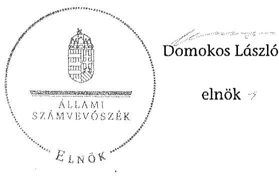

[^0]
[^0]:    ${ }^{42}$ Vhr. 9. § (3) bekezdés (hatályos 2010. december 31-ig), Vhr. 9. § (5) bekezdés (hatályos 2011. január 1-től)

---

# RÖVIDÍTÉSEK JEGYZÉKE 

## Jogszabályok

| Áfa tv. | Az általános forgalmi adóról szóló 2007. évi CXXVII. törvény (hatályos: 2008. január 1-jétől) |
| :--: | :--: |
| Áht. $_{1}$ | Az államháztartásról szóló 1992. évi XXXVIII. törvény (hatálytalan: 2011.12.31-től) |
| Áht. 2 | Az államháztartásról szóló 2011. évi CXCV. törvény (hatályos 2012. január 1-jétől) |
| ÁSZ tv. | Az Állami Számvevőszékről szóló 2011. évi LXVI. törvény |
| Avtv. | A személyes adatok védelméről és a közérdekű adatok nyilvánosságáról szóló 1992. évi LXIII. törvény (hatálytalan: 2012. január 1-jétől) |
| Evt. $_{1}$ | Az erdőről és az erdő védelméről szóló 1996. évi LIV. törvény (hatálytalan: 2009. július 10-től) |
| Evt. $_{2}$ | Az erdőről, az erdő védelméről és az erdőgazdálkodásról szóló 2009. évi XXXVII. törvény (hatályos: 2009. július 10-től) |
| Evr. $_{1}$ | Az erdőről és az erdő védelméről szóló 1996. évi LIV. törvény végrehajtásáról szóló 29/1997. (IV. 30.) FM rendelet (hatálytalan: 2009. november 21-től) |
| Evr. $_{2}$ | Az erdőről, az erdő védelméről és az erdőgazdálkodásról szóló 2009. évi XXXVII. törvény végrehajtásáról szóló 153/2009. (XI. 13.) FVM rendelet (hatályos: 2009. november 21-től) |
| Gt. | A gazdasági társaságokról szóló 2006. évi IV. törvény (hatályos: 2014. március 14-ig) |
| Info. tv. | Az információs önrendelkezési jogról és az információszabadságról szóló 2011. évi CXII. törvény (hatályos 2012. január 1-jétől) |
| Mfbtv. | A Magyar Fejlesztési Bank Részvénytársaságról szóló 2001. évi XX. törvény |
| Nfatv. | A Nemzeti Földalapról szóló 2010. évi LXXXVII. törvény (hatályos: 2010. szeptember 1-jétől) |
| Nvtv. | A nemzeti vagyonról szóló 2011. évi CXCVI. törvény (hatályos: 2011. december 31-étől) |
| Ptk. | A Polgári Törvénykönyvről szóló 1959. évi IV. törvény (hatályos: 2014. március 14-ig) |
| Számv. tv. | A számvitelről szóló 2000. évi C. törvény |
| új Ptk. | A Polgári Törvénykönyvről szóló 2013. évi V. törvény |
| Vadvédelmi tv. | A vad védelméről, a vadgazdálkodásról, valamint a vadászatról 1996. évi LV. törvény |
| Vtv. | Az állami vagyonról szóló 2007. évi CVI. törvény |
| Vhr. | Az állami vagyonnal való gazdálkodásról 254/2007. (X. 4.) Korm. rendelet |

---

262/2010. (XI.17.) Korm. rendelet
288/2009. (XII.15.)
Korm. rendelet
303/2004. (XI. 2.) Korm. rendelet

A Nemzeti Földalapba tartozó földrészletek hasznosításának részletes szabályairól szóló Korm. rendelet
Az Országos Statisztikai Adatgyűjtési Program adatgyűjtéseiről és adatátvételeiről
A 2005. évre szóló Országos Adatgyűjtési Statisztikai Programról (hatálytalan: 2010. január 1-jétől)

# Egyéb rövidítések 

| AK érték | Aranykorona érték |
| :--: | :--: |
| Alapító | A Magyar Állam, akinek a nevében a társaság feletti tulajdoni joggyakorló jár el |
| Alapító Okirat | A Bakonyerdő Zrt. mindenkori hatályos Alapító Okirata |
| ÁSZ | Állami Számvevőszék |
| ÁV Rt. | Állami Vagyonkezelő Rt. |
| Belső Ellenőrzési Szabályzat | A Bakonyerdő Zrt. mindenkori Belső Ellenőrzési Szabályzata |
| Bakonyerdő Zrt. | A Bakonyerdő Erdészeti és Faipari Zártkörűen Működő Részvénytársaság |
| Bakonyerdő Zrt. jogelődje | Balatonfelvidéki Erdő és Fafeldolgozó Részvénytársaság |
| BEFAG Rt. | Balatonfelvidéki Erdő és Fafeldolgozó Részvénytársaság, a Bakonyerdő Zrt. jogelődje |
| Erdészetek | Monostorapáti Erdészet, Balatonfüredi Erdészet, Bakonybéli Erdészet, Bakonyszentlászlói Erdészet, Devecseri Erdészet, Keszthelyi Erdészet, Farkasgyepűi Erdészet |
| Erdészeti hatóság | Veszprém Megyei Mezőgazdasági Szakigazgatási Hivatal Erdészeti Igazgatóság 2010. december 31-ig, Veszprém Megyei Kormányhivatal Erdészeti Igazgatósága 2011. január 1-jétől, |
| ESZR | Erdészeti Szakmai Rendszer |
| FB | Felügyelő bizottság |
| FB ügyrend | A Felügyelő bizottság ügyrendje |
| Forrás-SQL rendszer | Vagyon-nyilvántartási informatikai rendszer, amelynek feladata volt a vagyonkezelők számára a vagyonkataszteri jelentés elkészítésének és adathordozón történő továbbításának biztosítása, valamint a tulajdonosi joggyakorló vagyonkezelésében lévő vagyonelemek elektronikus adatbázisban történő tételes nyilvántartása |
| Ft | forint |
| ha | hektár |
| IG | Bakonyerdő Zrt. Igazgatósága (2010. július 12-ig) |
| INTOSSAI | Legfőbb Ellenőrző Intézmények Nemzetközi Szervezete |
| Iratkezelési szabályzat | A Bakonyerdő Zrt. jogelődje, a BEFAG Rt. Iratkezelési Szabályzata (hatályos: 1999. január 1-jétől) |
| ISSAI | nemzetközi standardok |

---

| JT | jegyzett tőke |
| :--: | :--: |
| KIM | Közigazgatási és Igazságügyi Minisztérium |
| KVI | Kincstári Vagyon Igazgatóság |
| M Ft | millió forint |
| MFB Zrt. | Magyar Fejlesztési Bank Zártkörűen Működő Részvénytársaság |
| MNV Zrt. | Magyar Nemzeti Vagyonkezelő Zártkörűen Működő Részvénytársaság, amely 2010. szeptember 1-jétől a Nemzeti Földalapba nem tartozó állami vagyon feletti tulajdonosi joggyakorló |
| NFA | Nemzeti Földalapkezelő Szervezet |
| NVT | Nemzeti Vagyongazdálkodási Tanács |
| ST | saját tőke |
| Számítástechnikai védelmi szabályzat | A Bakonyerdő Zrt. Számítástechnikai védelmi szabályzata |
| Számviteli Politika | A Bakonyerdő Zrt. Számviteli Politikája |
| SZMSZ | A Bakonyerdő Zrt. Szervezeti és Működési Szabályzata |
| Társaság | A Bakonyerdő Erdészeti és Faipari Zártkörűen Működő Részvénytársaság |
| Társaság feletti tulajdonosi joggyakorló ${ }_{1}$ | Magyar Nemzeti Vagyonkezelő Zrt., mint a társaság feletti tulajdonosi joggyakorló 2009. január 1-jétől 2010. június 16-áig |
| Társaság feletti tulajdonosi joggyakorló ${ }_{2}$ | Magyar Fejlesztési Bank Zrt., mint a társaság feletti tulajdonosi joggyakorló 2010. június 17-étől 2014. július 15-éig |
| Vadászati hatóság | Veszprém Megyei Mezőgazdasági Szakigazgatási Hivatal Földművelésügyi Igazgatóság Vadászati és Halászati Osztály 2010. december 31-ig, Veszprém Megyei Kormányhivatal Földművelésügyi Igazgatósága 2011. január 1-jétől, valamint   Győr-Moson-Sopron Megyei Mezőgazdasági Szakigazgatási Hivatal Földművelésügyi Igazgatóság Vadászati és Halászati Osztály 2010. december 31-ig, Győr-MosonSopron Megyei Kormányhivatal Földművelésügyi Igazgatósága 2011. január 1-jétől, |
| Vezérigazgató   VSZ | A Bakonyerdő Zrt. vezérigazgatója (2010. július 13-ától) a KVI-vel 1996. november 1-jén kötött ideiglenes vagyonkezelési szerződés |

---

.

---

# FOGALOMTÁR 

állami vagyon
a) az állam tulajdonában lévő dolog, valamint dolog módjára hasznosítható természeti erő;
b) az a) pont hatálya alá tartozó mindazon vagyon, amely vonatkozásában törvény az állam kizárólagos tulajdonjogát nevesíti;
c) az állam tulajdonában lévő tagsági jogviszonyt megtestesítő értékpapír, illetve az államot megillető egyéb társasági részesedés;
d) az államot megillető olyan immateriális, vagyoni értékkel rendelkező jogosultság, amelyet jogszabály vagyoni értékű jogként nevesít;
e) az állam tulajdonában lévő pénzügyi eszközök.
állami vagyon használója
átlátható szervezet
földbirtok-politikai irányelvek
hasznosítás
immateriális szolgáltatásából származó bevétel
információs és kommunikációs rendszer
Kincstári Vagyoni Igazgatóság

Az állami vagyon használója az a természetes vagy jogi személy, jogi személyiséggel nem rendelkező szervezet, aki, vagy amely törvény vagy szerződés alapján, bármely jogcímen (bérlet, haszonbérlet, használat stb.) állami vagyont birtokol, használ, szedi annak hasznait. (Ide nem értve a haszonélvezőt, a vagyonkezelőt és a tulajdonosi jogok gyakorlóját.)
Átlátható szervezet a Nvtv. 3. § (1) bekezdés 1. pontjában felsorolt, a meghatározott követelményeknek megfelelő szervezet.
Az Nfatv. 15. § (3) bekezdés a)-s) pontjaiban meghatározott, a Nemzeti Földalapba tartozó földrészletek hasznosítására vonatkozó irányelvek.
Hasznosítás a tulajdonosi joggyakorló vagy a nemzeti vagyon használója által a nemzeti vagyon birtoklásának, használatának, hasznok szedése jogának bármely - a tulajdonjog átruházását nem eredményező - jogcímen történő átengedése, ide nem értve a vagyonkezelésbe adást, valamint a haszonélvezeti jog alapítását.
Immateriális szolgáltatásból származó bevételek azok a nem anyagjellegű szolgáltatásokból származó állami bevételek, amelyeket az Evt. 3. § (1) bekezdése szerint, a külön jogszabályban meghatározott részletes feltételek szerint, az erdők fenntartására, gyarapítására és védelmére kell fordítani.
Az információs és kommunikációs rendszer biztosítja, hogy az információk eljussanak az illetékes szervezethez, szervezeti egységhez, illetve személyhez.
A Vtv. 61. § (1) bekezdése értelmében a Kincstári Vagyoni Igazgatóság (a továbbiakban: KVI) 2007. december 31-ei hatállyal megszűnt, jogai és kötelezettségei ezen időponttól - a 66. § (1) bekezdésében megjelölt feladat kivételével - az MNV Zrt.-re szálltak. A KVI 66. § (1) bekezdésben foglalt feladata a kincstárra szállt. A jogok és kötelezettségek átszállása nem minősült a KVI által kötött szerződések módosításának.

---

kockázatkezelés
kockázatkezelési rendszer
kontrolling
kontrollkörnyezet
kontrolltevékenységek
közfeladat

A kockázatkezelés a szervezet céljai elérésével kapcsolatos kockázatok azonosításának és elemzésének, valamint a megfelelő válaszok meghatározásának folyamata.
A kockázatkezelési rendszer működtetése során fel kell mérni és meg kell állapítani a szervezet tevékenységében, gazdálkodásában rejlő kockázatokat, valamint meg kell határozni az egyes kockázatokkal kapcsolatban szükséges intézkedéseket, valamint azok teljesítésének folyamatos nyomon követésének módját. A kockázatkezelési rendszer olyan irányítási eszközök és módszerek összessége, amelynek elemei a szervezeti célok elérését veszélyeztető tényezők (kockázatok) azonosítása, elemzése, nyomon követése, valamint szükség esetén a kockázati kitettség mérséklése.
Az a vezetéstámogató rendszer, amely a vezetői tervezést, ellenőrzést, valamint információ-ellátást koordinálja célorientáltan a környezeti változásokhoz igazodva.
A kontroll környezet elemei: a szervezeti struktúra, a felelősségi, hatásköri viszonyok és feladatok, a szervezet minden szintjén meghatározott etikai elvárások, a humánerőforráskezelés. A kontrollkörnyezet alapozza meg a belső kontroll összes többi elemét a fegyelem és a struktúra biztosítása által.
A kontrollrendszer a kockázatok kezelése és tárgyilagos bizonyosság megszerzése érdekében kialakított folyamatrendszer, amely azt a célt szolgálja, hogy megvalósuljanak a következő célok:
a) a működés és a gazdálkodás során a tevékenységeket szabályszerűen, gazdaságosan, hatékonyan, eredményesen hajtsák végre,
b) az elszámolási kötelezettségeket teljesítsék, és
c) megvédjék az erőforrásokat a veszteségektől, károktól és nem rendeltetésszerű használattól.
A kontrolltevékenységek azok az elvek (politikák) és eljárások, amelyeket a kockázatok meghatározása és a szervezet céljainak elérése érdekében alakítanak ki.
A közfeladat jogszabályban meghatározott állami vagy önkormányzati feladat, amit az arra kötelezett közérdekből, jogszabályban meghatározott követelményeknek és feltételeknek megfelelve végez, ideértve a lakosság közszolgáltatásokkal való ellátását, továbbá az állam nemzetközi szerződésekben vállalt kötelezettségeiből adódó közérdekű feladatokat, valamint e feladatok ellátásához szükséges infrastruktúra biztosítását is. Az Etv. 2. § (2) bekezdése szerint a fenntartható erdőgazdálkodás során a legfontosabb közérdekű feladat az erdők változatosságának megőrzése, az erdők fenntartása, felújítása és a védelmi, valamint közjóléti szolgáltatások biztosítása, melyek elvégzését az állam megfelelő eszközökkel biztosítja.

---

monitoring

Nemzeti Földalap
nemzeti vagyon használója
rábízott állami vagyon
társasági portfólió
tulajdonosi ellenőrzés

A szervezet tevékenységének, a célok megvalósításának nyomon követését biztosító rendszer, amely az operatív tevékenységek keretében megvalósuló folyamatos és eseti nyomon követésből, valamint az operatív tevékenységektől függetlenül működő belső ellenőrzésből áll. A monitoring a projektek és programok végrehajtásának nyomon követése, mely a támogató és a kedvezményezett közti megállapodásban foglalt eljárások követését, az előrehaladás ellenőrzését és a lehetséges problémák időben történő azonosítását szolgálja.
A Nemzeti Földalap a kincstári vagyon része, amelybe beletartoznak az állam tulajdonában és az ingatlan-nyilvántartásban levő, az Nfatv. 1. § (1)-(2) bekezdéseiben felsorolt területek, földrészletek és az azokhoz kapcsolódó vagyoni értékű jogok.
Az Nfatv. 15. § (1) ${ }^{1}$, valamint 1. § (1) ${ }^{2}$ bekezdése értelmében 2010. szeptember 1-jétől az erdőgazdasági társaság vagyonkezelésében lévő földterületek a Nemzeti Földalapba tartoznak, azok felett a tulajdonos jogait az agrárpolitikáért felelős miniszter az NFA útján gyakorolja.
A nemzeti vagyon használója az a természetes személy, jogi személy vagy jogi személyiséggel nem rendelkező szervezet, aki, vagy amely állami vagyon tekintetében törvény vagy szerződés alapján, a helyi önkormányzat vagyona tekintetében törvény, a helyi önkormányzat rendelete vagy szerződés alapján bármely jogcímen nemzeti vagyont birtokol, használ, szedi annak hasznait, kivéve a tulajdonosi joggyakorló (az Nvtv. 3. § (1) bekezdés 11. pontja alapján).
Rábízott állami vagyon az a Vtv. alkalmazásában állami vagyonnak minősülő vagyon, amit az MNV – a saját vagyonától elkülönítetten - kezel és nyilvántart. Az Mfbtv. 3. § (9) bekezdése szerint rábízott állami vagyon az a vagyon, amely felett az Mfbtv. erejénél fogva a Magyar Állam nevében az MFB gyakorolja a tulajdonosi jogokat. Az Nfatv. 1. § (1) bekezdésében foglaltak alapján az NFA-hoz tartozó rábízott vagyon a törvényben meghatározott, a Nemzeti Földalapba tartozó vagyon.
Társasági portfólió az MNV, illetve az MFB rábízott vagyonába tartozó állami tulajdonú társasági részesedések.
Az MNV/MFB tulajdonosi joggyakorló által végzett ellenőrzés, amelynek célja az állami vagyonnal való gazdálkodás vizsgálata, ennek keretében a rendeltetésellenes, jogszerűtlen, szerződésellenes, vagy a tulajdonos érdekeit sértő, illetve a központi költségvetést hátrányosan érintő vagyongazdál-

[^0]
[^0]:    ${ }^{1}$ Hatályos: 2010. szeptember 1 - 2011. július 31.
    ${ }^{2}$ Hatályos: 2010. szeptember-jétől, módosítva: 2011. augusztus 1-jétől.

---

tulajdonosi joggyakorló
tulajdonosi joggyakorlás módja
vagyongazdálkodás feladata
vagyonkezelői jog
kodási intézkedések feltárása és a jogszerű állapot helyreállítása, továbbá a vagyonnyilvántartás hitelességének, teljességének és helyességének biztosítása.
Tulajdonosi joggyakorló az, aki az állami, illetve a nemzeti vagyon felett az államot megillető tulajdonosi jogok és kötelezettségek gyakorlására jogosult.
Az állami vagyon felett a Magyar Államot megillető tulajdonosi jogoknak (és kötelezettségeknek) az összességét az állami vagyon felügyeletéért felelős miniszter gyakorolja, aki e feladatát az MNV, az MFB útján látja el. Azon állami tulajdonban álló ingatlanok felett, amelyek egy része a Nemzeti Földalapba tartozik, a tulajdonosi jogokat a miniszter az agrárpolitikáért felelős miniszterrel közösen gyakorolja. A Nemzeti Földalap felett a Magyar Állam nevében a tulajdonosi jogokat és kötelezettségeket az agrárpolitikáért felelős miniszter a Nemzeti Földalapkezelő Szervezet útján gyakorolja.
Az állami vagyon rendeltetésének megfelelő - az állami feladatok ellátásához, a társadalmi szükségletek kielégítéséhez, valamint a Kormány gazdaságpolitikája megvalósításának elősegítéséhez szükséges, egységes elveken alapuló, önálló ágazatként megjelenő - hatékony, költségtakarékos, értékmegőrző, értéknövelő felhasználásának biztosítása, beleértve a vagyoni kör változását eredményező értékesítést, valamint az állami vagyon gyarapítása is.
Vagyonkezelési szerződés alapján a vagyonkezelő jogosult meghatározott, állami tulajdonba tartozó dolog birtoklására, használatára és hasznai szedésére. A Vtv. alapján a vagyonkezelői jog az állami vagyon hasznosítására az MNV-vel kötött vagyonkezelési szerződéssel jön létre. A vagyonkezelési szerződés alapján a vagyonkezelő jogosult meghatározott, állami tulajdonba tartozó dolog birtoklására, használatára és hasznai szedésére. Az Nfatv. alapján a vagyonkezelői jog az erre irányuló (NFA-val kötött) szerződéssel jön létre. A vagyonkezelői szerződés alapján a vagyonkezelő jogosult meghatározott földrészlet birtoklására, használatára és hasznai szedésére. A vagyonkezelő köteles a földrészlet értékét megőrizni, állagának megóvásáról, jó karban tartásáról gondoskodni, továbbá - az Nfatv.-ben meghatározott esetek kivételével - díjat fizetni vagy a szerződésben előírt más kötelezettséget teljesíteni.

---

Bakonyerdő Erdészeti Zrt. vagyonváltozásának alakulása a 2009-2013. évek közötti időszakban - Eszközök (M ft)
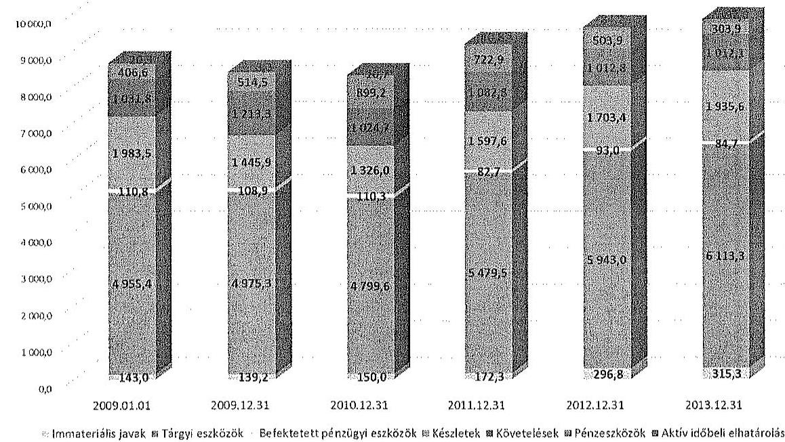

Bakonyerdő Erdészeti Zrt. vagyonváltozásának alakulása a 2009-2013. évek közötti időszakban - Források (M ft)
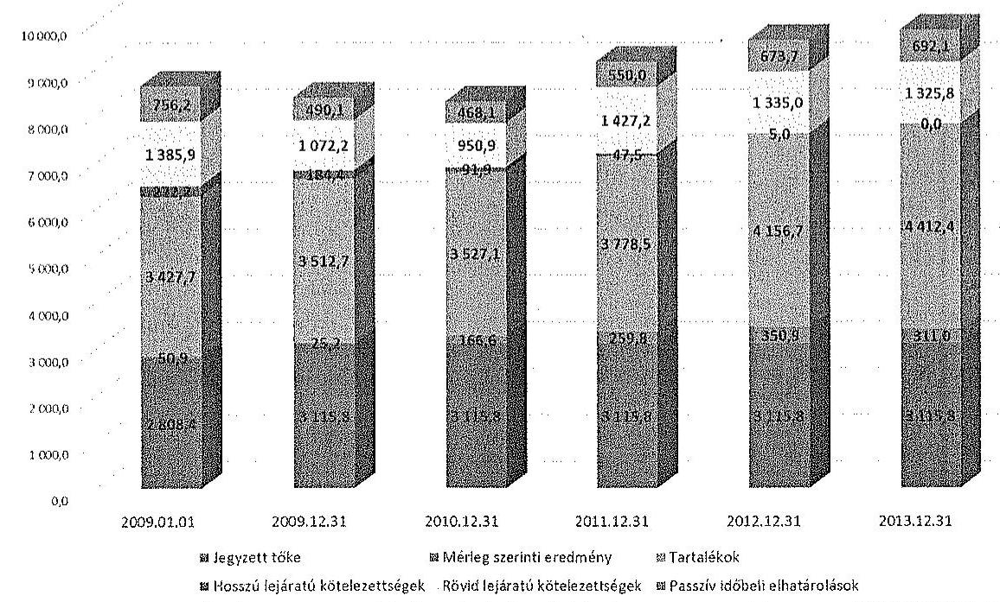

---

Az erdőgazdasági társaság vagyonának alakulása 2009-2014. években adatok ezer Ft-ban

|  Sorszám | Megnevezés | 2009.01.01 | 2009.12.31 | 2010.12.31 | 2011.12.31 | 2012.12.31 | 2013.12.31 | 2014.06.30 | Váltosás 2013.12.31/2009.12.31. (\%)  |
| --- | --- | --- | --- | --- | --- | --- | --- | --- | --- |
|   | 1 | 2 | 3 | 4 | 5 | 6 | 7 | 8 | 9  |
|  1. | Eszközök |  |  |  |  |  |  |  |   |
|  2. | Befektetett eszközök összesen | 5209145 | 5223454 | 5059903 | 5734563 | 6332831 | 6513398 | 6532556 | 125\%  |
|  3. | Ebből: Immateriális javak | 143018 | 139222 | 150046 | 172331 | 296814 | 315331 | 294049 | 226\%  |
|  4. | Tárgyi eszközök | 4955377 | 4975346 | 4799582 | 5479506 | 5942970 | 6113348 | 6155511 | 123\%  |
|  5. | Befektetett pénzügyi eszközök | 110750 | 108886 | 110275 | 82726 | 93047 | 84719 | 82996 | 78\%  |
|  6. | Forgóeszközök | 3421842 | 3173702 | 3249841 | 3403327 | 3220071 | 3251627 | 4421278 | 102\%  |
|  7. | Ebből: Készletek | 1983495 | 1445910 | 1355978 | 1597565 | 1703394 | 1935618 | 2147741 | 134\%  |
|  8. | Követelések | 1031756 | 1213327 | 1024652 | 1082822 | 1012758 | 1012116 | 1440678 | 83\%  |
|  9. | Értékpapírok | 0 | 0 | 0 | 0 | 0 | 0 | 0 | 0  |
|  10. | Pénzeszközök | 406591 | 514465 | 899211 | 722940 | 503919 | 303893 | 832859 | 59\%  |
|  11. | Aktív időbeli elhatárolások | 20340 | 3345 | 10720 | 40822 | 84235 | 91960 | 74185 | 2749\%  |
|  12. | Eszközök összesen | 8651327 | 8400501 | 8320464 | 9178712 | 9637137 | 9856985 | 11028019 | 117\%  |
|  13. | Források |  |  |  |  |  |  |  |   |
|  14. | Saját tőke | 6171336 | 6503945 | 6670507 | 6931176 | 7282058 | 7593019 | 8296125 | 117\%  |
|  15. | Ebből: Jegyzett tőke | 2808430 | 3115790 | 3115790 | 3115790 | 3115790 | 3115790 | 3115790 | 100\%  |
|  16. | Tőketartalék | 2122712 | 2122712 | 2122712 | 2122711 | 2122711 | 2122711 | 2122711 | 100\%  |
|  17. | Eredménytartalék | 1189258 | 1240195 | 1265445 | 1393840 | 1358818 | 879321 | 1190282 | 71\%  |
|  18. | Lekötött tartalék | 0 | 0 | 0 | 59033 | 333587 | 1164236 | 1164236 |   |
|  19. | Értékelési tartalék | 0 | 0 | 0 | 0 | 0 | 0 | 0 |   |
|  20. | Mérleg szerinti eredmény | 30936 | 25348 | 166562 | 259802 | 550882 | 310961 | 703106 | 1232\%  |
|  21. | Céltartalékok | 115729 | 149806 | 138987 | 222887 | 341360 | 246082 | 246082 | 164\%  |
|  22. | Kötelezettségek | 1608086 | 1256609 | 1042823 | 1474682 | 1339996 | 1325757 | 1412955 | 106\%  |
|  23. | Ebből: Hitelintézeti kötelezettségek | 0 | 0 | 0 | 0 | 0 | 0 | 0 |   |
|  24. | Hosszú lejáratú kötelezettségek | 222201 | 184433 | 91924 | 47451 | 5000 | 0 | 0 |   |
|  25. | Rövid lejáratú kötelezettségek | 1385885 | 1072176 | 950899 | 1427231 | 1334996 | 1325757 | 1412955 | 124\%  |
|  26. | Passzív időbeli elhatárolások | 756176 | 490141 | 468147 | 549967 | 673723 | 692127 | 1072857 | 141\%  |
|  27. | Források összesen | 8651327 | 8400501 | 8320464 | 9178712 | 9637137 | 9856985 | 11028019 | 117\%  |

---

A. KAPITEL 1: KAPITEL 1: KAPITEL 1: KAPITEL 1: KAPITEL 1: KAPITEL 1: KAPITEL 1: KAPITEL 1: KAPITEL 1: KAPITEL 1: KAPITEL 1: KAPITEL 1: KAPITEL 1: KAPITEL 1: KAPITEL 1: KAPITEL 1: KAPITEL 1: KAPITEL 1: KAPITEL 1: KAPITEL 1: KAPITEL 1: KAPITEL 1: KAPITEL 1: KAPITEL 1: KAPITEL 1: KAPITEL 1: KAPITEL 1: KAPITEL 1: KAPITEL 1: KAPITEL 1: KAPITEL 1: KAPITEL 1: KAPITEL 1: KAPITEL 1: KAPITEL 1: KAPITEL 1: KAPITEL 1: KAPITEL 1: KAPITEL 1: KAPITEL 1: KAPITEL 1: KAPITEL 1: KAPITEL 1: KAPITEL 1: KAPITEL 1: KAPITEL 1: KAPITEL 1: KAPITEL 1: KAPITEL 1: KAPITEL 1: KAPITEL 1: KAPITEL 1: KAPITEL 1: KAPITEL 1: KAPITEL 1: KAPITEL 1: KAPITEL 1: KAPITEL 1: KAPITEL 1: KAPITEL 1: KAPITEL 1: KAPITEL 1: KAPITEL 1: KAPITEL 1: KAPITEL 1: KAPITEL 1: KAPITEL 1: KAPITEL 1: KAPITEL 1: KAPITEL 1: KAPITEL 1: KAPITEL 1: KAPITEL 1: KAPITEL 1: KAPITEL 1: KAPITEL 1: KAPITEL 1: KAPITEL 1: KAPITEL 1: KAPITEL 1: KAPITEL 1: KAPITEL 1: KAPITEL 1: KAPITEL 1: KAPITEL 1: KAPITEL 1: KAPITEL 1: KAPITEL 1: KAPITEL 1: KAPITEL 1: KAPITEL 1: KAPITEL 1: KAPITEL 1: KAPITEL 1: KAPITEL 1: KAPITEL 1: KAPITEL 1: KAPITEL 1: KAPITEL 1: KAPITEL 1: KAPITEL 1: KAPITEL 1: KAPITEL 1: KAPITEL 1: KAPITEL 1: KAPITEL 1: KAPITEL 1: KAPITEL 1: KAPITEL 1: KAPITEL 1: KAPITEL 1: KAPITEL 1: KAPITEL 1: KAPITEL 1: KAPITEL 1: KAPITEL 1: KAPITEL 1: KAPITEL 1: KAPITEL 1: KAPITEL 1: KAPITEL 1: KAPITEL 1: KAPITEL 1: KAPITEL 1: KAPITEL 1: KAPITEL 1: KAPITEL 1: KAPITEL 1: KAPITEL 1: KAPITEL 1: KAPITEL 1: KAPITEL 1: KAPITEL 1: KAPITEL 1: KAPITEL 1: KAPITEL 1: KAPITEL 1: KAPITEL 1: KAPITEL 1: KAPITEL 1: KAPITEL 1: KAPITEL 1: KAPITEL 1: KAPITEL 1: KAPITEL 1: KAPITEL 1: KAPITEL 1: KAPITEL 1: KAPITEL 1: KAPITEL 1: KAPITEL 1: KAPITEL 1: KAPITEL 1: KAPITEL 1: KAPITEL 1: KAPITEL 1:
 KAPITEL 1: KAPITEL 1: KAPITEL 1: KAPITEL 1: KAPITEL 1: KAPITEL 1: KAPITEL 1: KAPITEL 1: KAPITEL 1: KAPITEL 1: KAPITEL 1: KAPITEL 1: KAPITEL 1: KAPITEL 1: KAPITEL 1: KAPITEL 1: KAPITEL 1: KAPITEL 1: KAPITEL 1: KAPITEL 1: KAPITEL 1: KAPITEL 1: KAPITEL 1: KAPITEL 1: KAPITEL 1: KAPITEL 1: KAPITEL 1: KAPITEL 1: KAPITEL 1: KAPITEL 1: KAPITEL 1: KAPITEL 1: KAPITEL 1: KAPITEL 1: KAPITEL 1: KAPITEL 1: KAPITEL 1: KAPITEL 1: KAPITEL 1: KAPITEL 1: KAPITEL 1: KAPITEL 1: KAPITEL 1: KAPITEL 1: KAPITEL 1: KAPITEL 1: KAPITEL 1: KAPITEL 1: KAPITEL 1: KAPITEL 1: KAPITEL 1: KAPITEL 1: KAPITEL 1: KAPITEL 1: KAPITEL 1: KAPITEL 1: KAPITEL 1: KAPITEL 1: KAPITEL 1: KAPITEL 1: KAPITEL 1: KAPITEL 1: KAPITEL 1: KAPITEL 1: KAPITEL 1: KAPITEL 1: KAPITEL 1: KAPITEL 1: KAPITEL 1: KAPITEL 1: KAPITEL 1: KAPITEL 1: KAPITEL 1: KAPITEL 1: KAPITEL 1: KAPITEL 1: KAPITEL 1: KAPITEL 1: KAPITEL 1: KAPITEL 1: KAPITEL 1: KAPITEL 1: KAPITEL 1: KAPITEL 1: KAPITEL 1: KAPITEL 1: KAPITEL 1: KAPITEL 1: KAPITEL 1: KAPITEL 1: KAPITEL 1: KAPITEL 1: KAPITEL 1: KAPITEL 1: KAPITEL 1: KAPITEL 1: KAPITEL 1: KAPITEL 1: KAPITEL 1: KAPITEL 1: KAPITEL 1: KAPITEL 1: KAPITEL 1: KAPITEL 1: KAPITEL 1: KAPITEL 1: KAPITEL 1: KAPITEL 1: KAPITEL 1: KAPITEL 1: KAPITEL 1: KAPITEL 1: KAPITEL 1: KAPITEL 1: KAPITEL 1: KAPITEL 1: KAPITEL 1: KAPITEL 1: KAPITEL 1: KAPITEL 1: KAPITEL 1: KAPITEL 1: KAPITEL 1: KAPITEL 1: KAPITEL 1: KAPITEL 1: KAPITEL 1: KAPITEL 1: KAPITEL 1: KAPITEL 1: KAPITEL 1: KAPITEL 1: KAPITEL 1: KAPITEL 1: KAPITEL 1: KAPITEL 1: KAPITEL 1: KAPITEL 1: KAPITEL 1: KAPITEL 1: KAPITEL 1: KAPITEL 1: KAPITEL 1: KAPITEL 1: KAPITEL 1: KAPITEL 1: KAPITEL 1: KAPITEL 1: KAPITEL 1: KAPITEL 1: KAPITEL 1: KAPITEL 1: KAPITEL 1: KAPITEL 1: KAPITEL 1: KAPITEL 1: KAPITEL 1: KAPITEL 1: KAPITEL 1: KAPITEL 1: KAPITEL 1: KAPITEL 1: KAPITEL 1: KAPITEL 1: KAPITEL 1: KAPITEL 1: KAPITEL 1: KAPITEL 1: KAPITEL 1: KAPITEL 1: KAPITEL 1: KAPITEL 1: KAPITEL 1: KAPITEL 1: KAPITEL 1: KAPITEL 1: KAPITEL 1: KAPITEL 1: KAPITEL 1: KAPITEL 1: KAPITEL 1: KAPITEL 1: KAPITEL 1: KAPITEL 1: KAPITEL 1: KAPITEL 1: KAPITEL 1: KAPITEL 1: KAPITEL 1: KAPITEL 1: KAPITEL 1: KAPITEL 1: KAPITEL 1: KAPITEL 1: KAPITEL 1: KAPITEL 1: KAPITEL 1: KAPITEL 1: KAPITEL 1:
 KAPITEL 1: KAPITEL 1: KAPITEL 1: KAPITEL 1: KAPITEL 1: KAPITEL 1: KAPITEL 1: KAPITEL 1: KAPITEL 1: KAPITEL 1: KAPITEL 1: KAPITEL 1: KAPITEL 1: KAPITEL 1: KAPITEL 1: KAPITEL 1: KAPITEL 1: KAPITEL 1: KAPITEL 1: KAPITEL 1: KAPITEL 1: KAPITEL 1: KAPITEL 1: KAPITEL 1: KAPITEL 1: KAPITEL 1: KAPITEL 1: KAPITEL 1: KAPITEL 1: KAPITEL 1: KAPITEL 1: KAPITEL 1: KAPITEL 1: KAPITEL 1: KAPITEL 1: KAPITEL 1: KAPITEL 1: KAPITEL 1: KAPITEL 1: KAPITEL 1: KAPITEL 1: KAPITEL 1: KAPITEL 1: KAPITEL 1: KAPITEL 1: KAPITEL 1: KAPITEL 1: KAPITEL 1: KAPITEL 1: KAPITEL 1: KAPITEL 1: KAPITEL 1: KAPITEL 1: KAPITEL 1: KAPITEL 1: KAPITEL 1: KAPITEL 1: KAPITEL 1: KAPITEL 1: KAPITEL 1: KAPITEL 1: KAPITEL 1: KAPITEL 1: KAPITEL 1: KAPITEL 1: KAPITEL 1: KAPITEL 1: KAPITEL 1: KAPITEL 1: KAPITEL 1: KAPITEL 1: KAPITEL 1: KAPITEL 1: KAPITEL 1: KAPITEL 1: KAPITEL 1: KAPITEL 1: KAPITEL 1: KAPITEL 1: KAPITEL 1: KAPITEL 1: KAPITEL 1: KAPITEL 1: KAPITEL 1: KAPITEL 1: KAPITEL 1: KAPITEL 1: KAPITEL 1: KAPITEL 1: KAPITEL 1: KAPITEL 1: KAPITEL 1: KAPITEL 1: KAPITEL 1: KAPITEL 1: KAPITEL 1: KAPITEL 1: KAPITEL 1: KAPITEL 1: KAPITEL 1: KAPITEL 1: KAPITEL 1: KAPITEL 1: KAPITEL 1: KAPITEL 1: KAPITEL 1: KAPITEL 1: KAPITEL 1: KAPITEL 1: KAPITEL 1: KAPITEL 1: KAPITEL 1: KAPITEL 1: KAPITEL 1: KAPITEL 1: KAPITEL 1: KAPITEL 1: KAPITEL 1: KAPITEL 1: KAPITEL 1: KAPITEL 1: KAPITEL 1: KAPITEL 1: KAPITEL 1: KAPITEL 1: KAPITEL 1: KAPITEL 1: KAPITEL 1: KAPITEL 1: KAPITEL 1: KAPITEL 1: KAPITEL 1: KAPITEL 1: KAPITEL 1: KAPITEL 1: KAPITEL 1: KAPITEL 1: KAPITEL 1: KAPITEL 1: KAPITEL 1: KAPITEL 1: KAPITEL 1: KAPITEL 1: KAPITEL 1: KAPITEL 1: KAPITEL 1: KAPITEL 1: KAPITEL 1: KAPITEL 1: KAPITEL 1: KAPITEL 1: KAPITEL 1: KAPITEL 1: KAPITEL 1: KAPITEL 1: KAPITEL 1: KAPITEL 1: KAPITEL 1: KAPITEL 1: KAPITEL 1: KAPITEL 1: KAPITEL 1: KAPITEL 1: KAPITEL 1: KAPITEL 1: KAPITEL 1: KAPITEL 1: KAPITEL 1: KAPITEL 1: KAPITEL 1: KAPITEL 1: KAPITEL 1: KAPITEL 1: KAPITEL 1: KAPITEL 1: KAPITEL 1: KAPITEL 1: KAPITEL 1: KAPITEL 1: KAPITEL 1: KAPITEL 1: KAPITEL 1: KAPITEL 1: KAPITEL 1: KAPITEL 1: KAPITEL 1: KAPITEL 1: KAPITEL 1: KAPITEL 1: KAPITEL 1: KAPITEL 1: KAPITEL 1: KAPITEL 1: KAPITEL 1: KAPITEL 1: KAPITEL 1: KAPITEL 1: KAPITEL 1: KAPITEL 1:
 KAPITEL 1: KAPITEL 1: KAPITEL 1: KAPITEL 1: KAPITEL 1: KAPITEL 1: KAPITEL 1: KAPITEL 1: KAPITEL 1: KAPITEL 1: KAPITEL 1: KAPITEL 1: KAPITEL 1: KAPITEL 1: KAPITEL 1: KAPITEL 1: KAPITEL 1: KAPITEL 1: KAPITEL 1: KAPITEL 1: KAPITEL 1: KAPITEL 1: KAPITEL 1: KAPITEL 1: KAPITEL 1: KAPITEL 1: KAPITEL 1: KAPITEL 1: KAPITEL 1: KAPITEL 1: KAPITEL 1: KAPITEL 1: KAPITEL 1: KAPITEL 1: KAPITEL 1: KAPITEL 1: KAPITEL 1: KAPITEL 1: KAPITEL 1: KAPITEL 1: KAPITEL 1: KAPITEL 1: KAPITEL 1: KAPITEL 1: KAPITEL 1: KAPITEL 1: KAPITEL 1: KAPITEL 1: KAPITEL 1: KAPITEL 1: KAPITEL 1: KAPITEL 1: KAPITEL 1: KAPITEL 1: KAPITEL 1: KAPITEL 1: KAPITEL 1: KAPITEL 1: KAPITEL 1: KAPITEL 1: KAPITEL 1: KAPITEL 1: KAPITEL 1: KAPITEL 1: KAPITEL 1: KAPITEL 1: KAPITEL 1: KAPITEL 1: KAPITEL 1: KAPITEL 1: KAPITEL 1: KAPITEL 1: KAPITEL 1: KAPITEL 1: KAPITEL 1: KAPITEL 1: KAPITEL 1: KAPITEL 1: KAPITEL 1: KAPITEL 1: KAPITEL 1: KAPITEL 1: KAPITEL 1: KAPITEL 1: KAPITEL 1: KAPITEL 1: KAPITEL 1: KAPITEL 1: KAPITEL 1: KAPITEL 1: KAPITEL 1: KAPITEL 1: KAPITEL 1: KAPITEL 1: KAPITEL 1: KAPITEL 1: KAPITEL 1: KAPITEL 1: KAPITEL 1: KAPITEL 1: KAPITEL 1: KAPITEL 1: KAPITEL 1: KAPITEL 1: KAPITEL 1: KAPITEL 1: KAPITEL 1: KAPITEL 1: KAPITEL 1: KAPITEL 1: KAPITEL 1: KAPITEL 1: KAPITEL 1: KAPITEL 1: KAPITEL 1: KAPITEL 1: KAPITEL 1: KAPITEL 1: KAPITEL 1: KAPITEL 1: KAPITEL 1: KAPITEL 1: KAPITEL 1: KAPITEL 1: KAPITEL 1: KAPITEL 1: KAPITEL 1: KAPITEL 1: KAPITEL 1: KAPITEL 1: KAPITEL 1: KAPITEL 1: KAPITEL 1: KAPITEL 1: KAPITEL 1: KAPITEL 1: KAPITEL 1: KAPITEL 1: KAPITEL 1: KAPITEL 1: KAPITEL 1: KAPITEL 1: KAPITEL 1: KAPITEL 1: KAPITEL 1: KAPITEL 1: KAPITEL 1: KAPITEL 1: KAPITEL 1: KAPITEL 1: KAPITEL 1: KAPITEL 1: KAPITEL 1: KAPITEL 1: KAPITEL 1: KAPITEL 1: KAPITEL 1: KAPITEL 1: KAPITEL 1: KAPITEL 1: KAPITEL 1: KAPITEL 1: KAPITEL 1: KAPITEL 1: KAPITEL 1: KAPITEL 1: KAPITEL 1: KAPITEL 1: KAPITEL 1: KAPITEL 1: KAPITEL 1: KAPITEL 1: KAPITEL 1: KAPITEL 1: KAPITEL 1: KAPITEL 1: KAPITEL 1: KAPITEL 1: KAPITEL 1: KAPITEL 1: KAPITEL 1: KAPITEL 1: KAPITEL 1: KAPITEL 1: KAPITEL 1: KAPITEL 1: KAPITEL 1: KAPITEL 1: KAPITEL 1: KAPITEL 1: KAPITEL 1: KAPITEL 1: KAPITEL 1: KAPITEL 1: KAPITEL 1: KAPITEL 1: KAPITEL 1: KAPITEL 1: KAPITEL 1:
 KAPITEL 1: KAPITEL 1: KAPITEL 1: KAPITEL 1: KAPITEL 1: KAPITEL 1: KAPITEL 1: KAPITEL 1: KAPITEL 1: KAPITEL 1: KAPITEL 1: KAPITEL 1: KAPITEL 1: KAPITEL 1: KAPITEL 1: KAPITEL 1: KAPITEL 1: KAPITEL 1: KAPITEL 1: KAPITEL 1: KAPITEL 1: KAPITEL 1: KAPITEL 1: KAPITEL 1: KAPITEL 1: KAPITEL 1: KAPITEL 1: KAPITEL 1: KAPITEL 1: KAPITEL 1: KAPITEL 1: KAPITEL 1: KAPITEL 1: KAPITEL 1: KAPITEL 1: KAPITEL 1: KAPITEL 1: KAPITEL 1: KAPITEL 1: KAPITEL 1: KAPITEL 1: KAPITEL 1: KAPITEL 1: KAPITEL 1: KAPITEL 1: KAPITEL 1: KAPITEL 1: KAPITEL 1: KAPITEL 1: KAPITEL 1: KAPITEL 1: KAPITEL 1: KAPITEL 1: KAPITEL 1: KAPITEL 1: KAPITEL 1: KAPITEL 1: KAPITEL 1: KAPITEL 1: KAPITEL 1: KAPITEL 1: KAPITEL 1: KAPITEL 1: KAPITEL 1: KAPITEL 1: KAPITEL 1: KAPITEL 1: KAPITEL 1: KAPITEL 1: KAPITEL 1: KAPITEL 1: KAPITEL 1: KAPITEL 1: KAPITEL 1: KAPITEL 1: KAPITEL 1: KAPITEL 1: KAPITEL 1: KAPITEL 1: KAPITEL 1: KAPITEL 1: KAPITEL 1: KAPITEL 1: KAPITEL 1: KAPITEL 1: KAPITEL 1: KAPITEL 1: KAPITEL 1: KAPITEL 1: KAPITEL 1: KAPITEL 1: KAPITEL 1: KAPITEL 1: KAPITEL 1: KAPITEL 1: KAPITEL 1: KAPITEL 1: KAPITEL 1: KAPITEL 1: KAPITEL 1: KAPITEL 1: KAPITEL 1: KAPITEL 1: KAPITEL 1: KAPITEL 1: KAPITEL 1: KAPITEL 1: KAPITEL 1: KAPITEL 1: KAPITEL 1: KAPITEL 1: KAPITEL 1: KAPITEL 1: KAPITEL 1: KAPITEL 1: KAPITEL 1: KAPITEL 1: KAPITEL 1: KAPITEL 1: KAPITEL 1: KAPITEL 1: KAPITEL 1: KAPITEL 1: KAPITEL 1: KAPITEL 1: KAPITEL 1: KAPITEL 1: KAPITEL 1: KAPITEL 1: KAPITEL 1: KAPITEL 1: KAPITEL 1: KAPITEL 1: KAPITEL 1: KAPITEL 1: KAPITEL 1: KAPITEL 1: KAPITEL 1: KAPITEL 1: KAPITEL 1: KAPITEL 1: KAPITEL 1: KAPITEL 1: KAPITEL 1: KAPITEL 1: KAPITEL 1: KAPITEL 1: KAPITEL 1: KAPITEL 1: KAPITEL 1: KAPITEL 1: KAPITEL 1: KAPITEL 1: KAPITEL 1: KAPITEL 1: KAPITEL 1: KAPITEL 1: KAPITEL 1: KAPITEL 1: KAPITEL 1: KAPITEL 1: KAPITEL 1: KAPITEL 1: KAPITEL 1: KAPITEL 1: KAPITEL 1: KAPITEL 1: KAPITEL 1: KAPITEL 1: KAPITEL 1: KAPITEL 1: KAPITEL 1: KAPITEL 1: KAPITEL 1: KAPITEL 1: KAPITEL 1: KAPITEL 1: KAPITEL 1: KAPITEL 1: KAPITEL 1: KAPITEL 1: KAPITEL 1: KAPITEL 1: KAPITEL 1: KAPITEL 1: KAPITEL 1: KAPITEL 1: KAPITEL 1: KAPITEL 1: KAPITEL 1: KAPITEL 1: KAPITEL 1: KAPITEL 1: KAPITEL 1: KAPITEL 1: KAPITEL 1: KAPITEL 1: KAPITEL 1: KAPITEL 1:
 KAPITEL 1: KAPITEL 1: KAPITEL 1: KAPITEL 1: KAPITEL 1: KAPITEL 1: KAPITEL 1: KAPITEL 1: KAPITEL 1: KAPITEL 1: KAPITEL 1: KAPITEL 1: KAPITEL 1: KAPITEL 1: KAPITEL 1: KAPITEL 1: KAPITEL 1: KAPITEL 1: KAPITEL 1: KAPITEL 1: KAPITEL 1: KAPITEL 1: KAPITEL 1: KAPITEL 1: KAPITEL 1: KAPITEL 1: KAPITEL 1: KAPITEL 1: KAPITEL 1: KAPITEL 1: KAPITEL 1: KAPITEL 1: KAPITEL 1: KAPITEL 1: KAPITEL 1: KAPITEL 1: KAPITEL 1: KAPITEL 1: KAPITEL 1: KAPITEL 1: KAPITEL 1: KAPITEL 1: KAPITEL 1: KAPITEL 1: KAPITEL 1: KAPITEL 1: KAPITEL 1: KAPITEL 1: KAPITEL 1: KAPITEL 1: KAPITEL 1: KAPITEL 1: KAPITEL 1: KAPITEL 1: KAPITEL 1: KAPITEL 1: KAPITEL 1: KAPITEL 1: KAPITEL 1: KAPITEL 1: KAPITEL 1: KAPITEL 1: KAPITEL 1: KAPITEL 1: KAPITEL 1: KAPITEL 1: KAPITEL 1: KAPITEL 1: KAPITEL 1: KAPITEL 1: KAPITEL 1: KAPITEL 1: KAPITEL 1: KAPITEL 1: KAPITEL 1: KAPITEL 1: KAPITEL 1: KAPITEL 1: KAPITEL 1: KAPITEL 1: KAPITEL 1: KAPITEL 1: KAPITEL 1: KAPITEL 1: KAPITEL 1: KAPITEL 1: KAPITEL 1: KAPITEL 1: KAPITEL 1: KAPITEL 1: KAPITEL 1: KAPITEL 1: KAPITEL 1: KAPITEL 1: KAPITEL 1: KAPITEL 1: KAPITEL 1: KAPITEL 1: KAPITEL 1: KAPITEL 1: KAPITEL 1: KAPITEL 1: KAPITEL 1: KAPITEL 1: KAPITEL 1: KAPITEL 1: KAPITEL 1: KAPITEL 1: KAPITEL 1: KAPITEL 1: KAPITEL 1: KAPITEL 1: KAPITEL 1: KAPITEL 1: KAPITEL 1: KAPITEL 1: KAPITEL 1: KAPITEL 1: KAPITEL 1: KAPITEL 1: KAPITEL 1: KAPITEL 1: KAPITEL 1: KAPITEL 1: KAPITEL 1: KAPITEL 1: KAPITEL 1: KAPITEL 1: KAPITEL 1: KAPITEL 1: KAPITEL 1: KAPITEL 1: KAPITEL 1: KAPITEL 1: KAPITEL 1: KAPITEL 1: KAPITEL 1: KAPITEL 1: KAPITEL 1: KAPITEL 1: KAPITEL 1: KAPITEL 1: KAPITEL 1: KAPITEL 1: KAPITEL 1: KAPITEL 1: KAPITEL 1: KAPITEL 1: KAPITEL 1: KAPITEL 1: KAPITEL 1: KAPITEL 1: KAPITEL 1: KAPITEL 1: KAPITEL 1: KAPITEL 1: KAPITEL 1: KAPITEL 1: KAPITEL 1: KAPITEL 1: KAPITEL 1: KAPITEL 1: KAPITEL 1: KAPITEL 1: KAPITEL 1: KAPITEL 1: KAPITEL 1: KAPITEL 1: KAPITEL 1: KAPITEL 1: KAPITEL 1: KAPITEL 1: KAPITEL 1: KAPITEL 1: KAPITEL 1: KAPITEL 1: KAPITEL 1: KAPITEL 1: KAPITEL 1: KAPITEL 1: KAPITEL 1: KAPITEL 1: KAPITEL 1: KAPITEL 1: KAPITEL 1: KAPITEL 1: KAPITEL 1: KAPITEL 1: KAPITEL 1: KAPITEL 1: KAPITEL 1: KAPITEL 1: KAPITEL 1: KAPITEL 1: KAPITEL 1: KAPITEL 1: KAPITEL 1: KAPITEL 1: KAPITEL 1:
  KAPITE
 vagyonkezelt eszközök könyve szerinti bruttó és nettó értékét, valamint az értékben bekövetkezett egyéb változásokat, ezért nem felelt meg a Vhr.-ben foglaltaknak, így nem volt átlátható és nem biztosította az elszámoltathatóságot."

## A megállapítással kapcsolatos szakmai észrevételek

Ez a megállapítás téves. A Számviteli törvény előírja a kezelt vagyon értékének mérlegben történő szerepeltetését, nem rendelkezik viszont arról az esetről, ha ez az érték nem ismert és nem is állapítható meg pontosan. A mérlegvalódiság elve akkor sérülne, ha az erdő valamilyen (távolról sem pontos) értéke bemutatásra kerülne.
Az erdőtelepítések - költségérték alapon - a mérlegben szerepelnek. A vagyonkezelt erdőterületek értéke tekintetében tisztában kell viszont lenni az alábbiakkal:

Az erdő értéke három tényezőből tevődik össze.
I. A talajérték
II. A faállomány értéke
III. Az egyéb rendeltetések értéke
I. A talajértéket a potenciális termőképesség alapján számított hozamértékelés módszerével lehet a legjobb közelítéssel kimutatni. Tekintettel arra, hogy a mezőgazdasági termőterületektől eltérően az erdőterületek hozama évtizedes-évszázados távlatban számítandó, a potenciális termőképesség időbeli változása megbecsülhetetlen. Pillanatnyi, statikus állapotot lehetne figyelembe venni, majd feltételezni, hogy az 30-50-120 éven keresztül változatlanul fennáll. A biológiai-környezeti folyamatokra tekintettel (pl. klímaváltozás) ez nincs így.
II. A faállomány értékelésének alapja az adott területen található élőfakészlet meghatározása. A meghatározás módszertana az erdőbecslés. (Becslés, mivel a sok évszázados tapasztalat szerint ezt 7-10\% pontossággal lehet legfeljebb elvégezni.) Tekintettel a mennyiség ilyen mértékű pontatlanságára, az erre alapozott prolongálási és diszkontálási, valamint járadék és annuitás-számítási feladatok során hibahalmozódásra és hibaterjedésre egyaránt számítani kell. Az igen hosszú távot felölelő számítások során továbbá az alkalmazott kamatlábak kismértékű eltérése is az előbbiekből származó tetemes hibával terhelt eredményt tovább rontja. Az egyszerűsített erdőértékelési eljárások nagyvonalúan eltekintenek ezektől a pontatlanságtól, illetve tudomásul veszik azt.
III. Az egyéb (különböző védelmi és különböző közjóléti) rendeltetések értékelése gyermekcipőben jár, de nem csupán ezért megbízhatatlan. Közelítő értékeket ún. helyettesítő értékek alkalmazásával próbálnak találni a kutatók, egyelőre kézzelfogható eredmények

---

nélkül. A védett területek igen magas aránya, továbbá a közjóléti rendeltetés mind hangsúlyosabb térfoglalása miatt ezen rendeltetések értékelése rendkívül fontos, egyes vélekedések szerint az I. és II. tényező értékeit nagyságrenddel meghaladja. Megbízható módszertan hiányában azonban az értékelés nem végezhető el.

Az erdőgazdálkodással, erdőértékeléssel, erdészeti számvitellel, matematikával, erdőbecsléssel foglalkozó gyakorlati szakemberek körében fenti problémakör ismert. Fentiek alapján a mérlegvalódiság elvének biztosítása úgy lehetséges, ha (több) nagyságrendi hibával terhelt értéket nem szerepeltetünk a mérlegben.
Az erdő, mint vagyon nyilvántartására és a tartamos gazdálkodás minősítésére az üzemtervek/erdőtervek a legalkalmasabbak. Az ÁSZ által hiányosságként említett elemek alátámasztatására ezek megfelelőek, természetesen a pénzbeli érték nyilvántartása nélkül.

# A megállapítással kapcsolatos pénzügyi, számviteli észrevételek 

A Társaság Ideiglenes vagyonkezelési szerződést kötött a Kincstári Vagyoni Igazgatósággal 1996. október 10-én, 01840-96-02057 nyilvántartási számon, melyben a vagyonkezelésbe adott eszközökre értéket nem állapítottak meg.
A szerződés 2.1 pontja szerint : " A szerződés tárgya az állami erdő - az erdőkről és az erdő védelméről szóló mindenkor hatályos törvény szerinti erdő - és az azzal szerves egységet képező egyéb földterület, mint sajátos vagyonkategória, és az ehhez kapcsolódó anyagi és nem anyagi javak, valamint vagyoni értékű jogok."
A szerződés 2.2 pontja alapján: „A szerződésben foglalt rendelkezéseket a szerződés 1. sz. (erdő és az erdőhöz szorosan tartozó ingatlanok), 2.sz. (anyagi és nem anyagi eszközök) és 3. sz. (egyéb vagyoni értékű jogok) mellékletében naturáliákban tételesen felsorolt kincstári vagyonra kell alkalmazni."
A szerződés 2.4 pontja alapján: „, A vagyonkezelő az erdővagyon állományáról és változásáról naturáliákban nyilvántartást vezet."
Tekintettel arra, hogy érték a vagyonkezelési szerződésben nem került meghatározásra, a Társaság az Ideiglenes vagyonkezelési szerződés alapján érték nélkül vagyonkezelésbe vett eszközöket a számviteli törvény 23. § (2) bekezdés szerint eszközként illetve a 42. § (1) bekezdés alapján kötelezettségként a mérlegében értékkel kimutatni nem tudja. A vagyonkezelésbe vett eszközökről naturáliákban vezetett analitikus nyilvántartással azonban rendelkezik, mely része a számviteli nyilvántartási rendszerének, ezáltal a mérlege ezen eszközöket „0" nyilvántartási értékkel tartalmazza. A Társaság mérlegének összeállítása, vagyoni helyzetének megállapítása során az Ideiglenes vagyonkezelési szerződésnek megfelelően járt el.
Az Ideiglenes vagyonkezelési szerződés megkötésekor az erdők értékmeghatározásának a hiánya már fennállt. A számvitelről szóló 1991. évi XVIII. törvény 21. § (3) bekezdése 1996. január 1-ével lépett hatályba. A Társaság akkori tulajdonosi joggyakorlója a Pénzügyminisztériumhoz fordult a kérdés tisztázása érdekében. A Pénzügyminisztérium a 9806/1997. ügyszámon „A kincstári vagyon számviteli elszámolása a vagyonkezelőnél" tárgyú válaszában rögzítette: „A számviteli törvény 21. §-ának /3/ bekezdésben megfogalmazott előírás feltételezi, hogy a kezelt kincstári vagyon megfelelő módon, dokumentáltan értékelésre kerül, hiszen csak ez esetben lehet azt az eszközök és kötelezettségek között értékkel kimutatni. Ebből - természetesen - az is következik, amíg megfelelő értékelés nem áll rendelkezésre, vagy az adott kincstári vagyoni nem lehet természeténél fogva - értékelni, addig/ és akkor nem lehet / nem tudjuk/ alkalmazni a törvény hivatkozott 21. § 3/ bekezdésének rendelkezéseit sem."
A nemzeti vagyonról szóló 2011. évi CXCVI. törvény 10. § (1) alapján „A nemzeti vagyon, annak értékét és változását a tulajdonosi joggyakorló nyilvántartja. Az érték nyilvántartásától el lehet tekinteni, ha az adott vagyontárgy értéke természeténél, jellegénél fogva nem állapítható meg."
254/2007. (X.4.) Korm. rendelet 9. § (9) alapján „ Az állambaztartás alrendszercibe nem tartozó egyéb vagyonkezelő köteles továbbá:

---

a) a vagyonkezelésbe vett eszközöket a számvitelről szóló törvény előírásai szerint a hosszú lejáratú kötelezettségekkel szemben a vagyonkezelési szerződésben rögzített értéken állományba vonni."
a 13. § (2) alapján „Az MNV Zrt. az állami vagyont az adott vagyontárgy sajátosságainak megfelelő, az azonosítást lehetővé tevő - a Központi Statisztikai Hivatallal egyeztetett - módon, naturáliában (mennyiségben) és értékben, a keletkezés (aktiválás) időpontját is feltüntetve tartja nyilván.
(3) Az értékben történő nyilvántartástól csak abban az esetben lehet eltekinteni, ha az adott vagyontárgy értéke természeténél, jellegénél fogva nem állapítható meg."
a 254/2007. (X.4) Korm. rendelet 2014.03.15-től hatályos 13. § (2) alapján , Az MNV Zrt. az (1) bekezdés szerinti állami vagyont az adott vagyontárgy sajátosságainak megfelelő, az azonosítást lehetővé tevő a Központi Statisztikai Hivatallal egyeztetett - módon, naturáliában (mennyiségben) és - az Nvtv. 10. § (1) bekezdésében meghatározott kivétellel - értékben, a keletkezés (aktiválás) időpontját is feltüntetve tartja nyilván."
Ezek a jogszabályhelyek is a naturáliákban és nem értékben történő nyilvántartás helyességét támasztják alá.
Az erdő - mint természeti képződmény - fogalma elsősorban dologi jogi, ingatlanjogi és vagyonjogi kategória. Értékének megállapítása e kategóriák figyelembe vételével volna lehetséges. Az erdő, mint természeti képződmény folyamatosan változik, ami értéken történő nyilvántartás esetén a nyilvántartási értéknek a változását is eredményezhetné.
Ismereteink szerint Magyarországon (a világon) jelenleg nincs elfogadott, egységes elvek szerint működő erdőérték-számítási módszer. Már a lábon álló élőfakészlet naturális mennyiségi becslése is általában közel tíz százalék hibahatárú, amelynek választékszerkezete és piaci értéke a bizonytalanságot tovább növeli. A faállomány mellett a védelmi és közjóléti rendeltetések értékbecslésének pontatlansága jóval meghaladhatja az éves mérlegfőösszeg nagyságrendjét ( 10 Md Ft jelenlegi mérlegfőösszeg - ennél nagyságrenddel nagyobb, de nagyon pontatlan erdőérték).
Elfogadott értékbecslési módszertan hiányában pontos érték sincs, a kezelt erdővagyon értékének meghatározása és a Társaság könyveiben történő nyilvántartása tehát nem lehetséges.
A Bakonyerdő Zrt. által kezelt vagyon 100\%-ban a Magyar Állam tulajdona, kincstári vagyon. Törvényi rendelkezés folytán a kizárólagos állami tulajdonba tartozó vagyonként forgalomképtelen, piaci értéke nincs. Az erdőértékszámításnak és az értékváltozás követésének módszere kidolgozatlan, és rendkívül költségigényes, ami ellentmond a legalapvetőbb számviteli alapelvnek: ,,A beszámolóban (a mérlegben, az eredménykimutatásban, a kiegészítő mellékletben) nyilvánosságra hozott információk hasznosíthatósága (hasznossága) álljon arányban az információk előállításának költségeivel (a költség-haszon összevetésének elve)." (Számv. tv 16.§(5)).
A vagyonkezelési szerződés tárgyát képező vagyon nyilvántartása tekintetében mind a Társaság, mind a Társaság könyvvizsgálója a hatályos ideiglenes vagyonkezelési szerződés előírásai, a hivatkozott jogszabályi helyek, megállapítások és állásfoglalások szerint járt el.

A Társaság beszámolói az erdő értéke nélkül megbízható, valós képet mutatnak a vagyoni, jövedelmezőségi és pénzügyi helyzetről.

Megállapítás: 6. oldal 1/6. bekezdés: ,, A vagyonkezelési szerződés nem támogatta megfelelően és számon kérhető módon a Vhr-ben előírtak megvalósulását, a Társaság állami vagyonnal való gazdálkodását."
7. oldal 1/7 bekezdés ,, A VNZ módosítását és annak módosításokkal történő egységes szerkezetbe foglalását sem a Társaság, sem a kezelt vagyoni kör felett tulajdonosi jogokat gyakorló MNV Zrt. illetve NFA nem kezdeményezte."
A tulajdonosi jogokat gyakorló szervezetek nem az ideiglenes vagyonkezelési szerződés módosítását, hanem végleges vagyonkezelési szerződés létrehozását kezdeményezték. Ezek

---

tervezeteit a Társaság az elmúlt években több alkalommal észrevételezte. A hiányolt tevékenység tehát folyamatban volt.
A Bakonyerdő Zrt. az állami tulajdon részét képező vagyont Ideiglenes vagyonkezelési szerződéssel hasznosítja. A végleges vagyonkezelési szerződés megkötésének előkészítésére több alkalommal történt kísérlet! Az előkészítő munkákban a Társaság véleményezéssel is részt vett.

A Társaság Alapító Okiratának 12.2 pontja szerint" Az egyedüli részvényes kizárólagos hatáskörébe tartozik:
zs). az állami erdőterületek kezelésére vonatkozó vagyonkezelési szerződés megkötése."
A 2014. szeptemberétől érvényes Alapszabály szerint:
,12.2. Az alapító kizárólagos hatáskörébe tartozik:
bb) döntés az állami erdőterületek kezelésére vonatkozó vagyonkezelési szerződés megkötéséről, módosításáról."

A vagyonkezelési szerződés módosítása illetve a végleges vagyonkezelési szerződés megkötése meghaladja a Társaság vezetésének hatáskörét. A jogszabályi változások - ettől függetlenül - a vagyonkezelési szerződés módosítása, egységes szerkezetbe foglalása nélkül is kötelezőek a felekre, a vagyonkezelési szerződés egyes rendelkezéseit ennek alapján az új jogszabályi környezetben kell megfelelően értelmezni és alkalmazni.

Megállapítás: 7. oldal 1/8 bekezdés: ,,A VSZ-ben rögzítettek ellenére a vagyonkezelői díjak éves felülvizsgálatára nem került sor."
A vagyonkezelési díj felülvizsgálata nem a Társaság feladata, annak módosítása a tulajdonosi képviselő hatáskörébe tartozik. Nem lehet viszont elválasztani a vagyonkezelési díj mértékét a Társaság komplex gazdálkodásától. A védelmi és közjóléti funkciók teljesítése, a közjóléti objektumok létesítésének nagyarányú növekedése, valamint az ezzel együtt járó fenntartási költségek erőteljes emelkedése (veszteséges tevékenységek végzésének előírása) nem végezhető el úgy, hogy közben a vagyonkezelési díj is növekszik. A tulajdonosi képviselők tehát nem a vagyonkezelési díj változtatása, hanem ezen tevékenységek mind nagyobb arányú elvégeztetése mellett döntöttek - a kormányzati célkitűzésekkel összhangban. A gazdálkodást befolyásoló tényezőknek a vagyonkezelési díj csupán egyik eleme. Ha azt önmagában, a többi elemtől függetlenül vizsgáljuk, az összefüggések téves értelmezéséhez vezet.
A vagyonkezelési díjat a társaság abban az esetben fizette ki, ha azt leszámlázták részére és a számla a vagyonkezelési szerződéssel összhangban volt. Nyilvánvalóan ellenőrzésre került a fajlagos díj mellett az ÁFA-vonzat, a területmérték helyessége is. A felülvizsgálat tényét a visszaküldött számlák esete is alátámasztja.
A díj rögzítésére csak az első év vonatkozásában került sor. A további években a tulajdonosi jogkör gyakorlója a vagyonkezelési díjat egyeztetés nélkül, azonban a számla kibocsátásával, mint ráutaló magatartással határozta meg.
A Társaság vezetése a Társaság érdekében köteles
 eljárni, a korábbival azonos mértékben meghatározott vagyonkezelési díj ennek megfelel, a Társaság ezért azt nem kifogásolta, szintén ráutaló magatartással, a számla kiegyenlítésével elfogadta.
A vagyonkezelési díj mértéke vonatkozásában szükséges megjegyezni, hogy a vagyonkezelési díj mértékének az emelése az erdőből történő forrás kivonást eredményez, ezért a Magyar Állam képviseletében eljáró tulajdonosi joggyakorló okszerűen nem tartott igényt eltérő mértékű vagyonkezelési díj megállapítására.

---

Megállapítás: 8. oldal I/13 bekezdés: „Az Evt szabályok megsértése miatt több esetben került sor erdőgazdálkodási bírság kiszabására erdőfelújítás befejezésére megállapított határidő túllépése miatt."
A vagyonkezelő területen az alávont területhez viszonyított hátralék mértéke jóval a természetesnek tekinthető érték alatt van. Tekintettel a munkavégzéssel érintett erdőrészletek számára, a bírsággal érintett erdőrészletek aránya és bírság mértéke elfogadható. A bírságfizetések ezért nem minősíthetők hibás vagyonkezelésnek, jogszabályi kötelezettségek elmulasztásának. Az erdővagyon kezelése a bírsággal érintett területeken is folyamatos.

# 9. oldal: Az NFA és MNV vezetésének címzett ajánlások vonatkozásában 

Az ÁSZ által leírtakkal szemben a vagyonkezelési szerződés módosításának előkészítése oly mértékben megtörtént, hogy nem módosítás, hanem végleges vagyonkezelői szerződés megkötésének előkészítésére került sor.
10. oldal A Bakonyerdő Zrt. vezérigazgatója részére megfogalmazott ajánlások vonatkozásában:

1. ponthoz: „A VSZ 3.2.3. pontja lehetővé teszi a vagyonkezelőnek a vagyonkezelői jog átruházására, azonban a rendelkezés ellentétes az Nfatv 19/A§ (4) bekezdésében foglaltakkal". A jogszabályok előírásával ellentétes szerződéses kikötés semmis. A Bakonyerdő nem engedte át harmadik személynek a vagyonkezelői jogot - amint az a részletes megállapítások fejezetben ki is derül -, a szerződéses lehetőségtől függetlenül erre a jogszabályok változása miatt lehetősége sem lett volna. A szerződés felülvizsgálata (végleges vagyonkezelői szerződések megkötése) előkészítés alatt van. Intézkedésre tehát a Bakonyerdő részéről nincs szükség.
2. pont a) javaslat „Tegyen intézkedéseket a tulajdonosi joggyakorlókkal közreműködve a tényleges állapotnak és a hatályos jogszabályi előírásoknak megfelelő vagyonkezelés megkötése érdekében.":
A Magyar Fejlesztési Bank Zrt. 2011. év közepén határozta el munkacsoport felállítását az új végleges vagyonkezelési szerződés kidolgozására.
Ennek a munkacsoportnak a vezetője Nagy András igazgató volt a Magyar Fejlesztési Bank Zrt. részéről, a munkát a munkacsoport megkezdte.
2014. július 16. napjától - jogszabályváltozás folytán - az erdőgazdasági részvénytársaságok feletti tulajdonosi jogkör gyakorlása az erdőgazdálkodásért felelős miniszterhez került át, ezzel az MFB Zrt. által felállított munkacsoport megszűnt. Jelenleg az MNV Zrt.-vel a vagyonkezelési szerződés tárgyában a Földművelésügyi Minisztérium egyeztet közvetlenül. A Tanulmányi Erdőgazdaságra mintaként el is készült a végleges vagyonkezelési szerződés tervezete.
Minisztériumi egyeztetés során szervezetileg belülre került az NFA tulajdonosi joggyakorlásában lévő állami vagyon tekintetében a vagyonkezelési szerződés előkészítése.
A vagyonkezelési szerződés megkötésének azonban jelenleg akadályát képezi a Földforgalmi Törvény 16.§ (2) bek. illetve (3) bek. termőföld birtokmaximumra vonatkozó rendelkezése.
Tekintettel arra, hogy a Földforgalmi Törvény 16.§ (7) bek. ugyanis nem nevesíti ez alól kivételként a Magyar Állam kizárólagos tulajdonában lévő gazdasági társaságokat, így a termőföld birtokmaximum jelenleg kiterjed az erdőgazdasági társaságokra is.

---

A Nemzeti Földalapról szóló törvény 19.§ (4) bek. kifejezetten megerősíti, hogy (a jelenlegi jogszabályi környezetben) a Magyar Állam tulajdonában lévő termőföld hasznosítása sem kivétel a szabály alól.
Tehát jogszabály módosítás (a Magyar Állam tulajdonában lévő termőföld hasznosítása tekintetében felmentés a termőföld birtokmaximum szabálya alól) szükséges ahhoz, hogy a végleges vagyonkezelési szerződés megköthető legyen.

1. pont b) javaslat Intézkedjen a vagyonkezelési szerződés felülvizsgálatának elmaradásával feltárt szabálytalanságok tekintetében a felelősség tisztázása érdekében, és szükség szerint intézkedjen a felelősség érvényesítéséről.
A Gt. 30.§ (2) bek. alapján a Társaság vezető tisztségviselőinek a Társaság érdekeinek az elsődlegessége alapján kellett eljárniuk. A Társaság munkaszervezetének a fentiekben bemutatott magatartása ennek megfelelő.
A Társaság menedzsmentje és munkaszervezete nem rendelkezett és nem rendelkezik hatáskörrel a vagyonkezelési szerződés módosítása tárgyában.
A Társaság aktívan részt vett és részt vesz a végleges vagyonkezelési szerződés kialakításának folyamatában. Ugyanakkor a végleges vagyonkezelési szerződés megkötésének jelenleg jogszabályi akadálya van.
2. ponthoz: A kezelt vagyon (erdő) mérlegben történő kimutatása is számviteli alapelvet sértene, továbbá nem is lehetséges. Intézkedésre a Bakonyerdő részéről nincs mód.
3. ponthoz: A közérdekű adatok közzététele részlegesen a vizsgált időszakban is folyamatosan megtörtént, időközben ezek kiegészítésre kerültek.

# II. RÉSZLETES MEGÁLLAPÍTÁSOK-hoz 

Kérjük, hogy a I.-es ponthoz tett észrevételeket a II. pontban is szíveskedjenek figyelembe venni.

Véleményünk szerint összességében az ÁSZ megfelelőnek ítélte a Bakonyerdő Zrt. gazdálkodását. A fent hiányosságként jelzett elemek legnagyobb része nem hiányosság, részben pedig javításra került már.

Kérjük, hogy fenti észrevételeinket és érveinket szíveskedjenek a végleges jelentés összeállítása során figyelembe venni.

Pápa, 2015. október 26.

BAKONYERDŐ ERDÉSZETI ÉS
FAIPARI ZÁRTKÖRŰEN MŰKÖDŐ
RÉSZVÉNYTÁRSASÁG
Pápa, 2016.11.16.
Adószám: 11345161-2-19
8.

---

.

---

# 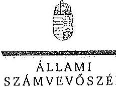 

## Varga László úr

vezérigazgató
Bakonyerdő Erdészeti és Faipari Zrt.

## Pápa

## Tisztelt Vezérigazgató Úr!

A ,, Jelentéstervezet az állami tulajdonban álló erdőgazdasági társaságok vagyongazdálkodási tevékenységének ellenőrzése - Bakonyerdő Erdészeti és Faipari Zrt." címmel készített számvevőszéki jelentéstervezetre tett észrevételeit köszönettel megkaptam.

Az Állami Számvevőszék észrevételekre vonatkozó álláspontjáról a felügyeleti vezető által készített részletes tájékoztatást csatoltan megküldöm.

Tájékoztatom Vezérigazgató urat, hogy a számvevőszéki jelentésben - az Állami Számvevőszékről szóló 2011. évi LXVI. törvény 29. § (3) bekezdése alapján - a figyelembe nem vett észrevételeket szerepeltetjük az elutasítás indokának feltüntetésével.

Budapest, 2015. hó nap
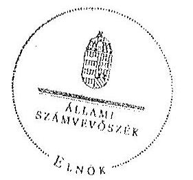

Tisztelettel:

Domokos László

Melléklet: Tájékoztatás az el nem fogadott észrevételekről

---

# Tájékoztatás   az el nem fogadott észrevételekről 

A „Jelentéstervezet az állami tulajdonban álló erdőgazdasági társaságok vagyongazdálkodási tevékenységének ellenőrzése - Bakonyerdő Erdészeti és Faipari Zrt." című jelentéstervezetre 2015. október 28 -án érkezett észrevételeit áttekintettük, azok kezelésével kapcsolatban a következő tájékoztatást adom.

## 1. A jelentéstervezet 6. oldal 2. bekezdésére tett észrevétel

A szakmai és a pénzügyi, számviteli észrevételükben leírtak a Társaság mérlegeivel és kiegészítő mellékleteivel kapcsolatos megállapítást nem cáfolják. A Társaság, mint vagyonkezelő a Vhr. 9. § (9) bekezdésében előírt kötelezettségét nem teljesítette, mert a Számv. tv. 23. § (2) bekezdése szerint a mérlegében eszközként nem mutatta ki a kezelésbe vett, az állami vagyon részét képező eszközöket, és ezen eszközöket a kiegészítő mellékletben - legalább mérlegtételek szerinti megbontásban - külön nem mutatta be. A Társaság a Vhr. és a Számv. tv. előírásainak betartása céljából nem tett lépéseket annak érdekében, hogy a vagyonkezelt eszközök értéke a vagyonkezelési szerződésben (a továbbiakban: VSZ) rögzítésre kerüljön. A fentiek alapján megállapításunk helytálló, módosítása nem indokolt.

## 2. A jelentéstervezet 6. oldal 6. bekezdésére (áthúzódik a 7. oldalra) és a 7. oldal 2. bekezdésére tett észrevétel

Az észrevételben leírtak a VSZ-szel kapcsolatos megállapítást nem cáfolják, a VSZ módosítása, egységes szerkezetbe foglalása a Vhr-ben előírtak ellenére nem történt meg. A Társaság részéről a végleges VSZ megkötésére irányuló kezdeményezések dokumentumokkal nem alátámasztottak, ezért megállapításunk helytálló, módosítása nem indokolt.

## 3. A jelentéstervezet 7. oldal 3. bekezdésére tett észrevétel

Az észrevételben leírtak a VSZ 3.3.2 pontjában előírt vagyonkezelői díjak felülvizsgálatának elmaradásával kapcsolatos megállapítást nem cáfolják. A továbbiakban kifejtett véleményük amely a vagyonkezelői díj, mint a Társaság gazdálkodását befolyásoló egyik tényezőjére vonatkozott - nem releváns a megállapítás tekintetében, ezért a megállapításunk helytálló, módosítása nem indokolt.

## 4. A jelentéstervezet 8. oldal 2. bekezdésére tett észrevétel

Az észrevételben leírtak kiegészítő információk és az erdőgazdálkodási bírság kiszabásával kapcsolatos megállapítást nem cáfolják. Ezért a megállapításunk helytálló, annak módosítása nem indokolt.

---

# 5. A jelentéstervezet 9. oldal utolsó bekezdésére (intézkedést igénylő megállapítás) tett észrevétel 

Az MNV Zrt. vezérigazgatójának, az NFA elnökének címzett intézkedést igénylő megállapításra tett észrevételük - kompetencia hiányában - nem értelmezhető, a javaslat módosítása nem indokolt.
6. A jelentéstervezet 10. oldal utolsó bekezdésére a Bakonyerdő Zrt. vezérigazgatójának címzett intézkedést igénylő megállapításra és a 11. oldal 2-3. bekezdéseiben az intézkedést igénylő 1. a) és b) javaslatokra tett észrevétel

Az intézkedést igénylő javaslatokra vonatkozó - az új végleges vagyonkezelési szerződés létrehozásával kapcsolatos - kiegészítő információkat köszönettel vettük, azonban azok érdemben nem befolyásolják az intézkedést igénylő javaslatainkat, tekintettel arra, hogy a tényleges állapotnak és a hatályos jogszabályoknak megfelelő vagyonkezelési szerződés megkötése nem történt meg. Az intézkedést igénylő javaslatok módosítása nem indokolt.
7. A jelentéstervezet 11. oldal a Bakonyerdő Zrt. vezérigazgatójának címzett intézkedést igénylő 2. a) javaslatra tett észrevétel

Az ellenőrzött időszakban a Társaság mérlegeivel és kiegészítő mellékleteivel kapcsolatos megállapításunkat - az 1. pontban részletezettek szerint - fenntartjuk, ezért az intézkedést igénylő javaslat módosítása nem indokolt.
8. A jelentéstervezet 11. oldal a Bakonyerdő Zrt. vezérigazgatójának címzett intézkedést igénylő 3. javaslatra tett észrevétel

Az észrevételben leírtak a közérdekű adatok közzétételével kapcsolatosak, azonban a megállapításunk az Avtv. 20. § (8) bekezdése, illetve az Infotv. 30. § (6) bekezdése szerinti, a közérdekű adatok megismerésére irányuló igények teljesítésének rendjét rögzítő szabályzatkészítési kötelezettségre vonatkozik. Ezért megállapításunk helytálló, módosítása nem indokolt.

Budapest, 2015. november „, ,"
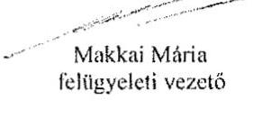

---

.

---

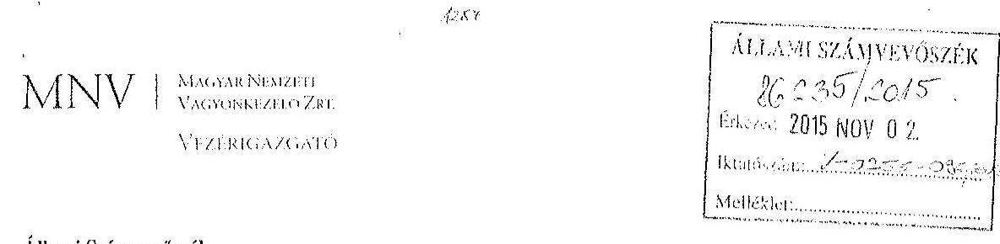

# Állami Számvevőszék 

## Domokos László

elnök

1052 Budapest
Apáczai Cs. J. u. 10.

Ikt. sz.: MNV/01/50750/ 1 /2015.
Hiv. sz.: V-0756-091/2015.
Tisztelt Elnök Úr!
A 2015. október 15. napján „Az állami tulajdonban álló erdőgazdasági társaságok vagyongazdálkodási tevékenységének ellenőrzése - Bakonyerdő Erdészeti és Faipari Zrt. tárgyában kézhez vett V-0756-091/2015. ikt. sz. Jelentés-tervezetre az alábbi észrevételeket kívánom tenni.
I. fejezet / 7. old. második bekezdés, 9. old. harmadik-ötödik bekezdés, 10. old. első-második bekezdés, II.2.1. fejezet / 18. old. ötödik bekezdés, II.5. fejezet / 30. old. harmadik-negyedik bekezdés és 10. old. Javaslat az MNV Zrt. vezérigazgatójának a)-c) pontok
„A vagyoni kör, a tulajdonosi jogok gyakorlására felhatalmazott szervezetek változásai, valamint a társaság vagyonkezelésére vonatkozó jogszabályi rendelkezések változásai ellenére a VSZ-t az ellenőrzött időszakban nem aktualizálták. A VSZ felülvizsgálata, egységes szerkezetbe foglalása nem történt meg.... A felek nem tettek eleget a Vhr. előírásainak, mert a Vhr. hatálybalépést követő hat hónapon belül nem kezdeményezték a Nemzeti Földalapba tartozó ingatlanokra vonatkozóan a VSZ megszüntetését és a jogszabályoknak megfelelő szerződés megkötését."
„...A Társaság feletti tulajdonosi joggyakorló az ellenőrzött években a Társaság vagyongazdálkodásának szabályozottságával, szabályszerűségével és a vagyonnyilvántartásával kapcsolatban ellenőrzést nem végzett. A vagyonnyilvántartások megfelelőségére vonatkozó helyszíni ellenőrzést sem az MNV Zrt. sem az NFA nem folytatott le.

A vagyonkezelésbe adott állami vagyon tekintetében tulajdonosi jogokat gyakorló MNV Zrt. és NFA tevékenysége az ellenőrzött időszakban nem támogatta teljes körűen a felelős vagyongazdálkodás megvalósulását, a VSZ-szel kapcsolatban felírt hiányosságok megszüntetésére és a hatályos jogszabálynak való megfeleltetésére vonatkozóan nem kezdeményeztek intézkedéseket. Nem éltek a Vhr.-ben foglalt, a kezelt vagyon használatára vonatkozó ellenőrzési jogukkal, valamint nem végeztek a Vhr.-ben foglalt, a vagyonnyilvántartás hitelességére, teljességére és helyességére vonatkozó ellenőrzést a Társaságnál.

A Bakonyerdő Zrt. a Magyar Állam Tulajdonában álló erdővagyon és egyéb művelési ágú termőföld ingatlanok kezelését a KVI-vel 1996. november 1-jén kötött vagyonkezelési szerződés alapján végezte. A Társaság, mint vagyonkezelő és a KVI között létrejött szerződéses jogviszony kereteit a VSZ-ben foglalt jogok és kötelezettségek töltötték ki. A Társaságnál a KVI-vel kötött VSZ-e nem támogatta megfelelően és számon kérhető módon az állami vagyonnal való szabályszerű gazdálkodást. Az ellenőrzött időszakban a VSZ hatályon kívül helyezett jogszabályi hivatkozásokat tartalmazott az Áht., 109/B.§, az Áht., 109/G.§ és a Vadvédelmi. tv. 98. § rendelkezései vonatkozásában és nem tartalmazza a Vtv., az Evt., a Nvtv. és az Njutv. előírásaira történő hivatkozást. A VSZ 3.2.3. pontja lehetőséget biztosít a vagyonkezelőnek a vagyonkezelői jog átruházására, azonban a rendelkezés ellentétes az Njutv. 19/A. § (4) bekezdésében foglaltakkal, melynek értelmében vagyonkezelői jog

---

harmadik személynek nem engedhető át. A VSZ 3.3.2. pontjában foglaltak ellenére a szerződést évente nem vizsgálták felül, azt a felek nem kezdeményezték. A felek nem tettek eleget a Vhr. 54. § (7) bekezdés előírásának, mert a Vhr. hatálybalépését követő hat hónapon belül nem kezdeményezték a Nemzeti Földalapba tartozó ingatlanokra vonatkozóan a VSZ, megszüntetését és a jogszabályoknak megfelelő szerződés megkötését.

A vagyonkezelésbe adott állami vagyon tekintetében tulajdonosi jogokat gyakorló MNV Zrt. és NFA nem végeztek a Vhr. 20. § (1)-(2) bekezdéseiben és a Nemzeti Földalapba tartozó földrészletek hasznosításának részletes szabályairól szóló 262/2010. (XI. 17.) Korm. rendelet 47. § (1)-(2) bekezdéseiben foglalt, a vagyonnyilvántartás hitelességére, teljességére és helyességére vonatkozó ellenőrzést a Társaságnál.

# Javaslat az MNV Zrt. vezérigazgatójának 

a) Tegyen intézkedéseket az erdőgazdasági társaság közreműködésével a tényleges állapotot rögzítő és a hatályos jogszabályi előírásoknak megfelelő vagyonkezelési szerződés megkötésére.
b) Tegyen intézkedéseket a vagyonkezelési szerződés felülvizsgálatának elmaradásával, valamint a Nemzeti Földalapba tartozó ingatlanokra vonatkozó VSZ megszüntetésével összefüggésben feltárt szabálytalanságok tekintetében a felelősség tisztázása érdekében, és szükség szerint intézkedjen a felelősség érvényesítéséről.
c) Intézkedjen a Társaság vagyonnyilvántartása hitelességének, teljességének és helyességének jogszabályban foglaltak szerinti ellenőrzéséről."

Sajnálattal állapítottuk meg, hogy a Jelentés-tervezet egyáltalán nem veszi figyelembe a vizsgált időszakban megindított és több eljárási cselekményt is magába foglaló intézkedés-sorozatunkat, amelynek a célja a Jelentéstervezetben egyébiránt joggal kifogásolt hiányosságok megszüntetése, az erdőgazdasági társaságok működésének jogszabályi megfelelőségének biztosítása volt. Ezzel a Jelentés-tervezet azt sugallja, hogy a tulajdonosi joggyakorlók részéről egyáltalán nem volt szándék az erdőgazdasági társaságok működésének, illetve a vagyonkezelés körülményeinek hatályos jogszabályok szerinti szabályozására, amely egyébiránt nem felel meg a valóságnak és az adatszolgáltatásunk során sem erről tájékoztattuk Önöket.

Mindamellett elismerjük, hogy a probléma a kezelt vagyonelemek nagy száma, ebből kifolyólag a szabályozást igénylő körülmények nagy száma és sokrétűsége miatt nehezen átlátható, ezért kérjük, engedjék meg, hogy a munkájukat segítő szándékkal korábbi tájékoztatásunkat ismételten megerősítsük, azzal a kifejezett kéréssel, hogy a Jelentésükben az általunk vitatott megállapítást szíveskedjenek módosítani, és az MNV Zrt. által a megoldás irányába megtett intézkedéseket feltüntetni.

Az ideiglenes vagyonkezelési szerződéseken alapuló kezelői jogviszony újraszabályozása, az ideiglenes vagyonkezelési szerződések megszüntetése és végleges vagyonkezelési szerződések megkötése érdekében az intézkedéseink már 2011. évben megkezdődtek, párhuzamosan a Nemzeti Földalapról szóló 2010. évi LXXXVII. tv. 34. § (3) bekezdés c) pontja szerinti feladat- illetve vagyonátadással.

Az intézkedéseink alapja a 2011. évben, MNV/01/29518/2011. szám alatt szakterületünk által bekért, az erdőgazdasági társaságok 2010. december 31-i, illetve 2011. július 31-i fordulónapra vonatkozó leltárjelentése volt, amelyet elsődlegesen az NFA tv. szerint előírt vagyonátadás elvégzése céljából kértünk meg az erdőgazdasági társaságuktól. Ugyanakkor a leltárjelentéshez benyújtott földrészlet listák voltak az első olyan kimutatások, amelyek a kezelt vagyon elemeit a FÖMI adatbázisán alapuló (az aktuális ingatlan-nyilvántartási állapotnak megfelelően) alrészletes bontásban tartalmazták.

## A vizsgált időszakban megindított és lefolytatott intézkedéseink a következők:

1.  Az erdőgazdasági társaságok által kezelt vagyonelemek tulajdonosi joggyakorlók szerinti elhatárolása, NFA átadás előkészítése, az erdőgazdasági társaságok bevonásával. A Nemzeti Földalapba tartozó vagyonelemek NFA átadása 2012-2013. években megtörtént, majd a visszamaradt vagyonelemek - többségében kivett megnevezésben nyilvántartott földrészletek - elhatárolását is elvégeztük. A feladat végrehajtása 2014. május 31-ig teljesült.

---

Az intézkedéssel az MNV Zrt. tulajdonosi joggyakorlása alá tartozó vagyonelemek körét - a közös tulajdonosi joggyakorlás alatt álló ingatlanok kivételével -, azaz a végleges vagyonkezelési szerződések ingatlanlistáját meghatároztuk.
Meg kívánjuk jegyezni, hogy az erdőgazdasági társaságok a 2011. évi leltárjelentéseikhez minden esetben csatolták a jelentés tartalmára vonatkozó teljességi nyilatkozatukat is, így azok tartalmát mint teljes körű adatszolgáltatást kezeltük.
A hivatkozott iratokat az eljárás során a Tisztelt Állami Számvevőszék rendelkezésére bocsátottuk.
2.  Az erdőgazdasági társaságok által kezelt vagyon értékelését 2014. május 31-ig elvégeztük, részben külső piaci szereplő által megállapított vagyonértékelési adatok (az IFUA értékbecslési adatai), részben belső szakértők és a kontrolling szakterület által az MNV Zrt hatályos értékelési szabályzata által megállapított értékadatok figyelembe vételével.
3.  Az MNV Zrt. Igazgatósága 511/2012. (X. 08.) IG sz., valamint 717/2013. (IX. 23.) IG sz. határozataiban Intézkedési terveket fogadott el „a 28/2012. (IX. 24.) sz. RJGY határozatában előírt, valamint az MNV Zrt. rábízott vagyon 2012. évi beszámolója könyvvizsgálói minősítésének megtartásához szükséges és egyéb feladatokról". Az Intézkedési tervek magukban foglalták az erdőgazdasági társaságok által kezelt vagyon analitikájának előállítását, illetve az erdőtársaságokkal végleges (nem ideiglenes) vagyonkezelői szerződések megkötését. A 717/2013. (IX. 23.) IG sz. határozat melléklete tartalmazza a feladat végrehajtása érdekében már megtett intézkedéseket (pl. „Megtörtént az erdőgazdaságok által kezelt vagyon listáinak vagyonkezelői jelentésekkel való egyeztetése; a vagyonkezelési szerződés tartalmi kérdéseinek, az erdőgazdaságok véleményének feldolgozása, MFB Munkacsoport egyeztetések történtek stb.), valamint rögzíti a még elvégzendő feladatokat. Ennek megfelelően az MNV Zrt-nél 2012-től folyamatban van az erdőgazdasági társaságok vagyonanalitikájának előállítása és vagyonkezelési szerződései tárgyú projekt.
A hatályos jogszabályoknak megfelelő vagyonkezelési szerződés tervezetét a vizsgálati időszak során az MNV Zrt belső szakterületi egyeztetést követően előkészítettük, és a 2014. március 18-án megtartott Munkacsoport értekezleten az erdőgazdaság képviselőivel, továbbá a tulajdonosi joggyakorlók (NFA, illetve akkor még Magyar Fejlesztési Bank Zrt.) képviselőivel ismertettük annak tartalmát. A szerződés szövegtervezésnek véleményezése ekkor megkezdődött, ugyanakkor elismerjük, hogy a végleges szerződésváltozat már az Önök által vizsgált időszakot követően került elfogadásra. Ugyancsak a 2014. március 18-án megtartott Munkacsoport értekezleten tettünk javaslatot a vagyonkezelési díj alapjának és mértékének meghatározására.
4.  Az erdőgazdasági társaságok által kezelt és a saját vagyonának vagyonelemenkénti, valamint a kezelt vagyonelemek tulajdonosi joggyakorlók szerinti elhatárolására vonatkozó intézkedésünket a vizsgált időszakban előkészítettük.

Tájékoztatjuk továbbá Elnök Urat az alábbiakról:
A Nemzeti Fejlesztési Minisztérium KGTF/377-6/2014-NFM, valamint KGTF/377-7/2014. számok alatt adott utasításokat a fenti feladatok elvégzésére. Ezekről, illetve az utasításokra adott jelentésünkről a korábbi adatszolgáltatásunk keretében szintén kitértünk.

A vagyonkezelési szerződés vizsgált időszakot követően elfogadott tervezetének mellékletét képezik az MNV Zrt azon szabályzatai is, amelyek a kezelt vagyon nyilvántartását, a beruházások nyilvántartását és az azzal kapcsolatos elszámolásokat, illetve a tulajdonosi ellenőrzéssel kapcsolatos, a jelenlegi jogszabályi környezetnek megfelelő szabályokat tartalmazzák:

- Az állami tulajdonon, egyéb vagyonkezelők által vagyonkezelt eszközön megvalósítandó beruházások, felújítások előzetes engedélyezésének és elszámolásának eljárásrendjéről szóló 35/2014. számú vezérigazgatói utasítás,
- A Magyar Nemzeti Vagyonkezelő Zrt. Tulajdonosi Ellenőrzési Szabályzata - a 39/2014. számú vezérigazgatói utasítás, továbbá
- A Magyar Nemzeti Vagyonkezelő Zrt. állami vagyon vagyonkezelőire, az állami vagyont használókra és a társasági részesedések esetében az MNV Zrt. tulajdonosi joggyakorlását megbízottként eltátókra vonatkozó Vagyon-nyilvántartási Szabályzatáról szóló 12/2014. számú vezérigazgatói utasítás.

---

Fentiek mellett megemlíthető az MNV Zrt. folyamatba épített, illetve vagyon nyilvántartás vezetést támogató ellenőrzési módszertanról szóló 11/2014. számú vezérigazgatói utasítás.
Egyeztetéseink során az erdőgazdasági társaságok tájékoztatást kaptak a szabályzataink tartalmára vonatkozóan.
A Jelentés-tervezet 10. oldalán található, az MNV Zrt. vezérigazgatójára vonatkozó, a) pont alatti, vagyonkezelési szerződés megkötésére irányuló javaslathoz kapcsolódóan felhívjuk a Tisztelt Állami Számvevőszék figyelmét arra, hogy a Nemzeti Fejlesztési Minisztérium AVF/21310/2015-NFM számú tájékoztató levele szerint Miniszter Úr vagyongazdálkodási szempontból nem támogatja az erdőgazdasági társaságok ideiglenes vagyonkezelési szerződéseit kiváltó vagyonkezelési szerződések megkötését, ideértve az MNV Zrt. vagyonkezelési szerződésekkel kapcsolatos jóváhagyó döntéseit is.

Az MNV Zrt-re vonatkozóan hivatkozott jogszabály, a Vhr. 20. § (1)-(2) bekezdése 2014. március 14-ig - csaknem az ellenőrzött időszak végéig - a következőképpen rendelkezett:
,(1) Az állami vagyon kezelőjét, használóját megillető jogok gyakorlását, annak szabályszerűségét, célszerűségét a Vtv. 17. §-ának d) pontja alapján az MNV Zrt. - szükség szerint a területi szervei útján ellenőrzi. Ennek érdekében a vagyon kezelésére, hasznosítására kötött szerződésben rögzíteni kell, hogy a tulajdonosi ellenőrzés eljárásrendjét, a felek jogait, kötelezettségeit a felek a szerződés részének tekintik.
(2) A tulajdonosi ellenőrzés célja az állami vagyonnal való gazdálkodás vizsgálata, ennek keretében a rendeltetésellenes, jogszerűtlen, szerződésellenes, vagy a tulajdonos érdekeit sérti, illetve a központi költségvetést hátrányosan érintő vagyongazdálkodási intézkedések feltárása és a jogszerű állapot helyreállítása, továbbá a vagyonnyilvántartás hitelességének, teljességének és helyességének biztosítása."

A tulajdonosi ellenőrzés alatt a Területi Irodák által folytatott ellenőrzést is értette a jogszabály, amiből egyenesen következik a szakterületi munkafolyamatba épített ellenőrzési kötelezettség figyelembe vételének a lehetősége.

A Jelentés-tervezetnek azt a fordulata, amely szerint „A vagyonnyilvántartások megfelelőségére vonatkozó helyszíni ellenőrzést sem az MNV Zrt. sem az NFA nem folytatott le." a továbbiakban azt jelenti, hogy az Állami Számvevőszék a tulajdonosi ellenőrzés alatt a helyszíni ellenőrzést érti. Ugyanakkor az Állami Számvevőszék által hivatkozott jogszabályok (a Vtv. és a Vhr.) nem határoznak meg semmilyen formát a tulajdonosi ellenőrzéssel kapcsolatban, nem következik a jogszabályi rendelkezésekből, hogy azt a helyszínen kellene végrehajtani.

Fentiekre tekintettel kérjük a Jelentés-tervezet 7., 9-10., 18., illetve 30. oldalán található azon megállapítások törlését, hogy az MNV Zrt. nem kezdeményezett intézkedéseket, és nem végzett a Vhr. 20. § (1)-(2) bekezdéseiben és a Nemzeti Földalapba tartozó földrészletek hasznosításának részletes szabályairól szóló 262/2010. (XI.17.) Korm. rendelet 47. § (1)-(2) bekezdéseiben foglalt, a vagyonnyilvántartás hitelességére és teljességére vonatkozó ellenőrzést, illetve helyszíni ellenőrzést a Társaságnál, kérjük a megtett intézkedések feltüntetését, és a Jelentéstervezet 10. oldalán található, az MNV Zrt. vezérigazgatójára vonatkozó b) pontot a megtett intézkedések folyamatosságára tekintettel törölni, a c) pont alatti javaslatot szövegszerűen ekként módosítani:

# Javaslat az MNV Zrt. vezérigazgatójának 

c) Az MNV Zrt. tulajdonosi joggyakorlása alá tartozó (az Erdőgazdasági Társaságok által az MNV Zrt. részére jelentett) vagyonelemek tekintetében intézkedjen a Társaság vagyonnyilvántartása hitelességének, teljességének és helyességének jogszabályban foglaltak szerinti ellenőrzéseinek erősítéséről.

## II.5. fejezet / 30. old. második bekezdés

„A Társaság feletti tulajdonosi joggyakorló számára a Vtv. 17. § (1) bekezdés d) pontja rendszeres ellenőrzési kötelezettséget írt elő a vele szerződéses jogviszonyban levő személyek, szervezetek vagy más használók állami vagyonnal való gazdálkodása tekintetében, amelynek azonban nem tett eleget."

Az ÁSZ vizsgálat az alábbi időszakra terjed ki: 2009. január 1. napjától 2014. december 31. napjáig, kitekintéssel a helyszíni ellenőrzés végéig tartó releváns folyamatokra.
A hivatkozott Vtv. 17. § (1) bekezdés d) pontja a vele szerződéses jogviszonyban állók állami vagyonnal való

---

gazdálkodásának rendszeres ellenőrzési kötelezettségét írja elő az MNV Zrt. számára. A Jelentés-tervezet „Fogalomtár" részében a „tulajdonosi ellenőrzést" a Vhr. 20. §-ban található célmeghatározás segítségével, azzal megegyezően definiálja. A jogszabály - és az ÁSZ Jelentés-tervezet azzal megegyezően - csak a tulajdonosi ellenőrzés célját
 és rendszercsségét tartalmazza, ezen túl sem a tulajdonosi ellenőrzés tartalmi, formai, módszertani, stb. követelményeit, sem a rendszeresség konkrétabb meghatározását, hogy évi, két-, három-, stb. évenkénti gyakorisággal kellene az ellenőrzéseket lefolytatni.
Véleményünk szerint elvi jelentősége van annak, hogy:
a) A rendszeres ellenőrzési kötelezettség megsértésére vonatkozó megállapítást a rendszeresség fogalmi meghatározását követően lehet tenni, azaz, hogyha adott esetben az ötéves ellenőrzési időszak alatt az MNV Zrt. legalább egy ellenőrzést nem végzett, akkor a „rendszeresség" az ötévenkénti ellenőrzési kötelezettséget jelentené. Ilyen fogalom meghatározás nem áll rendelkezésre.
b) A tulajdonosi ellenőrzés jogszabály - és a Jelentés-tervezet - szerinti definíciójából nem vezethető le, hogy az csak elkülönült - az ÁSZ vizsgálatához hasonló - célellenőrzés útján valósulhat meg, és ki kellene zárni az MNV Zrt. vagyonkezelési tevékenységéből fakadó munkafolyamatba épített és vezetői ellenőrzéseket.

Fentiekre tekintettel kérjük a Jelentés-tervezet 30. oldalán található megállapítás törlését, hogy az MNV Zrt. a szimtra a Vtv-ben előírt rendszeres ellenőrzési kötelezettségének nem tett eleget, vagy e megállapítást szövegszerűen ekként módosítani:
„A Társaság feletti Tulajdonosi joggyakorlót [az MNV Zrt.] az állami vagyonnal való gazdálkodásra irányuló célellenőrzéseket a vizsgálat időszaka alatt nem végzett."

Kérem Elnök Urat, hogy a Jelentés véglegesítése során jelen észrevételeinket szíveskedjenek figyelembe venni.

Budapest, 2015. október „, ,,

---

.

---

# 8. SZÁMÚ MELLÉKLET A V-0756-110/2015. SZÁMÚ JELENTÉSHEZ 

## 8. SZÁMVEVŐSZÉK

Ikt.szám: V-0756-105/2015.

Dr. Szivek Norbert úr
vezérigazgató
Magyar Nemzeti Vagyonkezelő Zrt.

## Budapest

## Tisztelt Vezérigazgató Úr!

A „Jelentéstervezet az állami tulajdonban álló erdőgazdasági társaságok vagyongazdálkodási tevékenységének ellenőrzése - Bakonyerdő Erdészeti és Faipari Zrt." címmel készített számvevőszéki jelentéstervezetre tett észrevételeit köszönettel megkaptam.

Az Állami Számvevőszék észrevételekre vonatkozó álláspontjáról a felügyeleti vezető által készített részletes tájékoztatást csatoltan megküldöm.

Tájékoztatom Vezérigazgató urat, hogy a számvevőszéki jelentésben - az Állami Számvevőszékről szóló 2011. évi LXVI. törvény 29. § (3) bekezdése alapján - a figyelembe nem vett észrevételeket szerepeltetjük az elutasítás indokának feltüntetésével.

Budapest, 2015. hó nap
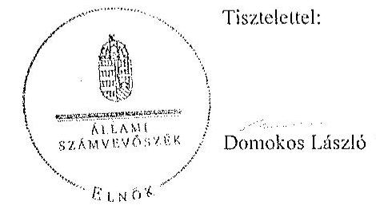

Melléklet: Tájékoztatás az elfogadott és az el nem fogadott észrevételekről

---

# Tájékoztatás   az elfogadott és az el nem fogadott észrevételekről 

A „Jelentéstervezet az állami tulajdonban álló erdőgazdasági társaságok vagyongazdálkodási tevékenységének ellenőrzése - Bakonyerdő Erdészeti és Faipari Zrt." című jelentéstervezetre 2015. november 2-án érkezett észrevételeit áttekintettük, azok kezelésével kapcsolatban a következő tájékoztatást adom.

1. A vagyonkezelési szerződéshez kapcsolódó megállapításokra tett észrevétel (I. fejezet / 7. oldal 2. bekezdés, 9. oldal 4-5. bekezdés, 10. oldal 1. bekezdés, II. 2.1. fejezet / 18. oldal 5. bekezdés, II. 5. fejezet / 30. oldal 4. bekezdés, 10. oldal javaslat az MNV Zrt. vezérigazgatójának a)-b) pontok)

A jelentéstervezet vagyonkezelési szerződéshez kapcsolódó megállapításai helytállóak. Az erdőgazdasági társaság működése jogszabályi megfelelősége biztosításának érdekében tett kezdeményezésekről adott tájékoztatásukat köszönettel vettük, azonban azok nem eredményezték az ideiglenes vagyonkezelési szerződés olyan módosítását, vagy olyan új vagyonkezelési szerződés megkötését, amely biztosította volna a VSZ hiányosságainak megszüntetését, illetve a hatályos jogszabályoknak való megfelelőségét. Ezért az MNV Zrt. vezérigazgatójának és az NFA elnökének megfogalmazott intézkedést igénylő megállapítás, valamint az MNV Zrt. vezérigazgatójának megfogalmazott javaslat a) és b) pontjának módosítása nem indokolt. Az egyértelműség érdekében a 9. oldal 4. bekezdését és a 30. oldal 4. bekezdését az alábbiak szerint pontosítjuk:
„...a VSZ-szel kapcsolatban feltárt hiányosságok megszüntetése és a hatályos jogszabályoknak való megfeleltetése nem történt meg."
2. Az MNV Zrt. ellenőrzési kötelezettségének elmulasztására vonatkozó megállapításokra tett észrevétel ( 9 . oldal 3-4. bekezdés, 10. oldal 2. bekezdés, II. 5. fejezet / 30. oldal 3-4. bekezdés, 10. oldal javaslat az MNV Zrt. vezérigazgatójának c) pont)

Az MNV Zrt. nem bocsátott az ÁSZ ellenőrzés rendelkezésére az MNV Zrt., vagy Területi Irodái által a Vhr. 20. § (1)-(2) bekezdései szerint végzett ellenőrzésekről dokumentumokat. A jelentéstervezet megállapításai és a javaslat helytállóak, módosításuk nem indokolt.

---

3. Az MNV Zrt. a Vtv,-ben előírt ellenőrzési kötelezettségére vonatkozó megállapításra tett észrevétel (II. 5. fejezet/ 30. oldal 2. bekezdés)

Az ellenőrzés megállapította, hogy az MNV Zrt. az ellenőrzött időszakban a Bakonyerdő Erdészeti és Faipari Zrt.-nél helyszíni ellenőrzést nem végzett, erre a megállapításra az MNV Zrt. nem tett észrevételt. Az egyértelműség érdekében a dokumentumok ismételt áttekintését követően a jelentéstervezet 30 . oldal 2. bekezdését az alábbiak szerint pontosítjuk:
„A Társaság feletti tulajdonosi joggyakorló számára a Vtv. 17. § (1) bekezdés d) pontja rendszeres ellenőrzési kötelezettséget írt elő a vele szerződéses jogviszonyban levő személyek, szervezetek vagy más használók állami vagyonnal való gazdálkodása tekintetében, amelynek a Bakonyerdő Zrt.-nél az ellenőrzött időszakban nem tett eleget."

Budapest, 2015. 11. hó 26. nap

Makkai Mária
felügyeleti vezető

---

.

---

# MFB 

## Domokos László úr   elnök részére

Állami Számvevőszék

Budapest

Tisztelt Elnök Úr!

2015. október 15 -én köszönettel kézhez vettük az Állami Számvevőszék „Az állami tulajdonban álló erdőgazdasági társaságok vagyongazdálkodási tevékenységének ellenőrzéséről" szóló jelentéstervezeteket az alábbi cégekre:

- Bakonyerdő Erdészeti és Faipari Zrt.
- NEFAG Nagykunsági Erdészeti és Faipari Zrt.
(Ikt.szám: V-0756-090/2015.)
(Ikt.szám: V-0762-071/2015.)

Az MFB Zrt. a jelentéstervezetekkel kapcsolatosan 2 féle szempontból kíván észrevételt tenni:

1. A jelentésekben megfogalmazott központi probléma
2. Egyedi esetek

## 1. A jelentésekben megfogalmazott központi probléma

Az ÁSZ az egyedi jelentéseiben az erdőgazdasági társaságokat, valamint a vagyonkezelésbe adott állami vagyon tekintetében tulajdonosi joggyakorló MNV Zrt. és Nemzeti Földalapkezelő (továbbiakban: NFA) tevékenységét marasztalta el.

Alapvető problémaként jelenik meg, hogy az erdők által kezelt eszközök - az NFA-val, a Kincstári Vagyon Igazgatósággal, és az MNV Zrt-vel kötött vagyonkezelési megállapodásban rögzített - értéken nem szerepelnek a Társaságok könyveiben.

Az MFB Zrt. tudatában volt a problémának (azt az ÁSZ jelentésben is említett, 2010. évben végzett átvilágítási jelentés is tartalmazta, melynek nyomon követése, beszámoltatása megtörtént) és folyamatosan egyeztetett az MNV Zrt-vel és az NFA-val a rendezés ügyében. Az ideiglenes vagyonkezelési szerződés módosítására, véglegesítésére a vagyonkezelésbe

---

adónak (MNV, NFA) van lehetősége, a Társaságok szerződő partnerként észrevételeket, javaslatokat tehetnek. A szerződés véglegesítése érdekében a Társaságok és az MFB Zrt. képviselői minden olyan egyeztetésen (pl.: az MNV Zrt. által létrehozott bizottság) részt vettek, amelyre meghívást kaptak, illetve azokon érdemi javaslatokat tettek.

Ahogy a jelentés is megjegyzi, az egyeztetések az ellenőrzés befejezésig nem kerültek lezárásra, így a Társaságoknál nem áll rendelkezésre a vagyonkezelésben lévő állami vagyonra és annak nagyságára vonatkozó, az MNV Zrt. és az NFA nyilvántartásával egyező adat.

Az ÁSZ 2013. évi „Az állami vagyon feletti kontroll - Az állami vagyon feletti tulajdonosi joggyakorlással kapcsolatos tevékenységek ellenőrzéséről" szóló jelentése alapján a Nemzeti Fejlesztési Minisztérium - az ÁSZ-szal egyeztetett - alábbi főbb pontokat tartalmazó intézkedési tervet (1. sz. melléklet) állított össze, melyet a 2014. április 25-én kelt levelében küldött meg az MFB Zrt. részére:

- a Társaságok által kezelt állami ingatlanok és egyéb vagyonelemek értéken történő nyilvántartása,
- a vagyonkezelési díjak egyértelmű és tulajdonosi joggyakorló szervezetenkénti meghatározása,
- az új vagyonkezelési szerződés megkötése,
- a Társaságok kezelt és saját vagyonának vagyonelemenkénti, valamint a kezelt vagyonelemek tulajdonosi joggyakorló szerinti elhatárolása.

Az MFB törvény módosításának 2014. július 16-i hatályba lépésével az MFB Zrt. állami erdőgazdaságok feletti tulajdonosi joggyakorlása megszűnt, az a Földművelésügyi Minisztériumhoz került át, így az intézkedési tervben való közreműködésre, illetve a végrehajtás nyomon követésére az MFB Zrt-nek nem volt lehetősége.

A jelentések az MNV Zrt. vezérigazgatójának, az NFA elnökének és az erdészeti társaságok vezérigazgatóinak fogalmaztak meg intézkedési javaslatokat.

# 2. Egyedi esetek: 

## NEFAG Nagykunsági Erdészeti és Faipari Zrt.

A jelentéstervezet hibásan hivatkozik az MFB Zrt.-re, mikor a Vtv.17§ (1) bekezdés d) pontja szerinti rendszeres ellenőrzési elmaradására mutat rá. A Vtv. hivatkozott bekezdése alapján az ellenőrzés az MNV Zrt. feladata. Kérjük a társaság feletti tulajdonosi joggyakorló hivatkozás törlését. (31. oldal utolsó bekezdés)

---

# Bakonyerdő Erdészeti és Faipari Zrt. 

A jelentéstervezet hibásan hivatkozik az MFB Zrt.-re, amikor a vagyonkezelési díj meghatározásáról ír, ugyanis a vagyonkezelői díj meghatározása az MNV Zrt. és az NFA hatásköre. (19. oldal 2. bekezdés) Kérjük a társaság feletti tulajdonosi joggyakorló hivatkozás törlését.

Budapest, 2015. október 29.
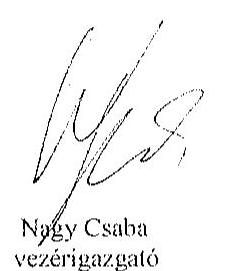

Tisztelettel:

Nagy Csaba
vezérigazgató

Sziládi-Losteiner Dóra
ügyvezető igazgató

## Mellékletek:

1. számú melléklet: NFM levél (Ikt.szám: KGTF/377-7/2014-NFM)

---

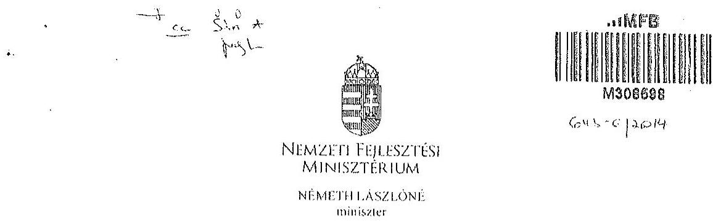

Iktatószám: KGTF/ / /2014-NFM

Ügyintéző: dr. Kaszás Mónika
Telefonszám: 795-1917
e-mail:monika.kasszas@nfm.gov.hu

Nagy Csaba úr részére
vezérigazgató

Magyar Fejlesztési Bank Zrt.
Budapest

Tárgy: „Az állami vagyon feletti kontroll - Az állami vagyon feletti tulajdonosi joggyakorlással kapcsolatos tevékenységek ellenőrzéséről" szóló 13193 sz. ÁSZ jelentés alapján összeállított NFM intézkedési terv módosítása, az abban foglalt feladatok végrehajtása

Tisztelt Vezérigazgató Úr!

Az Állami Számvevőszék (a továbbiakban: ÁSZ) tárgyban megjelölt jelentésével összefüggésben 2014. január 27-én intézkedési tervet hagytam jóvá, amelyben foglalt feladatok végrehajtása érdekében 2014. január 30-i keltezésű levélben fordultam Önhöz és a Magyar Nemzeti Vagyonkezelő Zrt. vezérigazgatójához, Márton Péter úrhoz.

Az ÁSZ az intézkedési tervvel kapcsolatban küldött, 2014. március 25-i keltű levelében az intézkedési terv kiegészítését, módosítását kérte. A módosított intézkedési tervet jóváhagytam.

A módosított intézkedési terv alapján a következő feladatok végrehajtása szükséges az alábbiak szerint:

1./ a társaságok által kezelt állami ingatlanok és egyéb vagyonelemek értéken történő nyilvántartása:

Felelős: MNV Zrt.,
Határidő:

- földterületek esetében legkésőbb 2014. május 31-ig
- felépítmények esetében 2014. december 31. (A felépítmények esetében az MNV Zrt. a vagyonkezelési szerződés megkötését az év második felére tervezi, látja megvalósíthatónak.)

2./ a vagyonkezelési díjak egyértelmű és tulajdonosi joggyakorló szervezetenkénti meghatározása:

Postacím: 1440 Budapest, P.C. 1. Telefon: (06 1) 795 6668 E-mail: miniszter@nfm.gov.hu

---

Felelős: MNV Zrt.,
Határidő: 2014. május 31 -ét követően folyamatosan (2014. december 31-ig)
E pontban foglalt feladattal kapcsolatosan az ÁSZ részére az alábbi tájékoztatást adtam:
„Az ÁSZ által meghatározott feladatok végrehajtására irányuló munkafolyamat során a végrehajtásban érintett szervezetek, társaságok között kialakult az az álláspont, hogy mivel az erdőgazdasági társaságok alapfeladatként közfeladat ellátást is végeznek, azt a vagyonkezelési díj mértékének meghatározásakor az MNV Zrt. figyelembe veszi, valamint megállapításra került az az elv is, hogy a vagyonkezelési díj irányadó mértéke az adott erdőgazdasági társaság által kezelt ingatlanvagyon bruttó nyilvántartási értékének 2%-a.

A vagyonkezelési díj alapja a kezelt vagyon bruttó nyilvántartási értéke, ezért annak meghatározására erdőgazdaság társaságonként kerül sor a 4./ pontban meghatározott ún. „végleges ingatlanlista" alapján. A végleges ingatlanlista kizárólag vagyonkezelésbe adott ingatlan vagyonelemet tartalmaz, az erdőgazdasági társaság saját vagyonában nyilvántartott vagyonelemet nem, ezért az MNV Zrt.-nek és az erdőgazdasági társaságoknak a szerződés megkötését megelőzően el kell határolnia egymástól a saját vagyonba és a kezelt vagyonba tartozó ingatlan vagyonelemeket (4.b./ pontban foglalt feladat).

A feleknek a vagyonkezelési díj mértékében a vagyonkezelési szerződés megkötését megelőzően kell megállapodniuk az irányadó vagyonkezelési díj mértéket alapul véve."

# 3./ az új vagyonkezelési szerződések megkötése: 

A vagyonkezelési szerződés tervezet az MNV Zrt. érintett szakterületei álláspontjának figyelembe vételével elkészült, az MNV Zrt. és a MFB Zrt. által létrehozott Munkacsoport (tagjai: MFB Zrt., MNV Zrt., NFA és egyes erdőgazdasági társaságok) véleménye alapján átdolgozásra került. A szerződés tervezetnek az erdőgazdasági társaságok részére történő megküldése 2014. április 15. napjával megtörtént.

Felelős: MNV Zrt., az MFB Zrt. közreműködésével
Határidő:

- földterületek esetében: 2014. május 31-ét követően folyamatosan (2014. december 31-ig)
- felépítmények esetében 2014. II. félév folyamán
4./ a társaságok kezelt és saját vagyonának vagyonelemenkénti, valamint a kezelt vagyonelemek tulajdonosi joggyakorló szerinti elhatárolása:

Az erdőgazdasági társaságok által az MNV Zrt. rendelkezésére bocsátott leltárjelentések alapján

- a jogszabályi rendelkezések szerint az NFA tulajdonosi joggyakorlása alá tartozó ingatlan vagyonelemek nagyobb része már átadásra került az NFA részére,
- a kisebb részt képező vagyonelemek tekintetében pedig folyamatban van az átadás az MNV Zrt. és az NFA között.

---

a./ Az ún. „végleges ingatlanlista" (az MNV Zrt. tulajdonosi joggyakorlása alatt lévő, maradó vagyonelem listája) MNV Zrt. és az NFA közötti leegyeztetése, közös áttekintése

# Felelős: MNV Zrt. 

Határidő: a lista MNV Zrt. és NFA közötti leegyeztetése, közös áttekintése folyamatban van, lezárása legkésőbb 2014. május 31-ig megtörténik
b./ Az a./ pontban foglaltak szerint leegyeztetett ún. „végleges ingatlanlista" MNV Zrt. és az egyes erdőgazdasági társaságok általi áttekintése azzal a céllal, hogy a vagyonkezelésben lévő vagyoni elemeket tartalmazó ún. „végleges ingatlanlista" ne tartalmazzon az erdőgazdasági társaság saját vagyonában nyilvántartott vagyoni elemet (saját vagyon - vagyonkezelt vagyon elhatárolása).

Felelős: MNV Zrt., az MFB Zrt. közreműködésével
Határidő: 2014. május 31-ig
E pontban foglalt feladatokkal kapcsolatosan az ÁSZ részére az alábbi tájékoztatást adtam:
„Szükséges megjegyezni, hogy ingatlanlista, mint állandó „végleges ingatlanlista" ilyen formában nem létezik, mert mindkét tulajdonosi joggyakorló tekintetében az állami vagyonelemek halmaza mind mennyiségben, mind pedig összetételben folyamatosan változik.

Az erdőgazdasági társaságok által kezelt ingatlanvagyon adatai - mindkét tulajdonosi joggyakorló tekintetében - az évközi változások (megosztások, területváltozások, művelési ág változások, stb.) miatt folyamatosan változnak, ezért az adattartalmában „végleges ingatlanlista" mindig egy adott konkrét időpont vonatkozásában adható meg.

Jelen intézkedési tervben az ún. „végleges ingatlanlista" meghatározás alatt az erdőgazdasági társaságok vagyonkezelésében lévő ingatlanvagyon MNV Zrt tulajdonosi joggyakorlása alatt álló részét kell tekinteni. E „végleges ingatlanlista" kialakítására az erdőgazdasági társaságok által az MNV Zrt. részére átadott leltárjelentések alapján került sor úgy, hogy az MNV Zrt. a Nemzeti Földalapba tartozó vagyonelemeket kiválogatta, s azokat a Nemzeti Földalapkezelő Szervezet részére - átadás-átvételi jegyzőkönyv alapján - átadta.

Lényeges körülmény, hogy a vagyonkezelőknek - jelen esetben az erdőgazdasági társaságoknak - minden év május 31. napjáig vagyonkezelői jelentést kell benyújtaniuk a tulajdonosi joggyakorlók, így az MNV Zrt. részére is. Az aktuális vagyonkezelői jelentéseket - melynek része a leltárjelentés is - a 2013. december 31-i állapotnak megfelelően kell összeállítani, ebből következően a fent említett ún. „végleges ingatlanlista" is a 2013. december 31-i állapotot tükrözi.

Ugyanakkor - főként a kivett megnevezésben nyilvántartott földterületek esetében - a még át nem adott Nemzeti Földalapba tartozó vagyonelemek egyeztetése a két tulajdonosi joggyakorló között jelenleg is folyamatban van.

---

Az egyes erdőgazdasági társaságok vagyonkezelésében lévő vagyonelemek az adott társasággal megkötendő - a jelenlegi ideiglenes vagyonkezelési szerződés helyébe lépő - vagyonkezelési szerződés mellékletét fogják képezni. Az MNV Zrt. szándékai szerint az egyes erdőgazdasági társaságokkal azonnal megkötik a vagyonkezelési szerződéseket, ahogyan a megkötés feltételei bekövetkeznek (pl. megállapodnak a vagyonkezelési díjban, véglegesítik a vagyonkezelési szerződés tartalmát), azok a vagyonelemek, amelyeket e pont a./ és b./ pontjában foglaltak szerint már átvizsgáltak, a vagyonkezelési szerződés megkötésével egyidejűleg a szerződés mellékletébe kerülnek, amely melléklet folyamatosan bővítésre kerül újabb, e pont a./ és b./ pontjában foglaltak szerint átvizsgált, tisztázott vagyonelemekkel. „

Tájékoztatom, hogy az NFA feletti tulajdonosi jogok gyakorlója, Dr. Fazekas Sándor miniszter úr időközben már jóváhagyta azt az intézkedési tervet, amely az NFA részére meghatározott feladatokat és azok végrehajtási határidejét tartalmazza.

Az MFB Zrt. közreműködése az 1./ és 2./ pontban meghatározott feladatok végrehajtásban is szükséges lehet, ezért kérem a fent meghatározott feladatok határidőben történő végrehajtása érdekében az MFB Zrt. változatlan együttműködését az érintett a szervezetekkel és amennyiben szükséges, úgy az erdőgazdasági társaságok bevonása iránt is intézkedni szíveskedjen.

Budapest, 2014. június. 04.

# Üdvözlettel: 

Németh Lászlóné

---

.

---

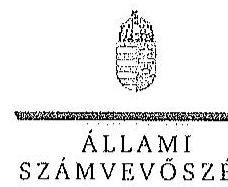

ELNÖK

Ikt.szám: V-0756-101/2015.

Nagy Csaba úr
vezérigazgató
Magyar Fejlesztési Bank Zrt.

Budapest

Tisztelt Vezérigazgató Úr!

Az „Az állami tulajdonban álló erdőgazdasági társaságok vagyongazdálkodási tevékenységének ellenőrzése" című ellenőrzés tekintetében a Bakonyerdő Erdészeti és Faipari Zrt. és a NEFAG Nagykunsági Erdészeti és Faipari Zrt. jelentéstervezeteire tett észrevételüket köszönettel megkaptam.

Az Állami Számvevőszék észrevételekre vonatkozó álláspontjáról a felügyeleti vezető által készített részletes tájékoztatást csatoltan megküldöm.

Tájékoztatom Vezérigazgató urat, hogy a számvevőszéki jelentésben – az Állami Számvevőszékről szóló 2011. évi LXVI. törvény 29. § (3) bekezdése alapján – a figyelembe nem vett észrevételeket szerepeltetjük az elutasítás indokának feltüntetésével.

Budapest, 2015. 11. hó 20. nap

Tisztelettel:

Domokos László

Melléklet: Tájékoztatás az elfogadott és az el nem fogadott észrevételekről

1052 BUDAPEST, APÁCZAI CSERE JÁNOS UTCA 10. 1364 Budapest 4. Pf. 54 István tel. 484 9101 fax. 484 9201

---

# Tájékoztatás   az elfogadott és az el nem fogadott észrevételekről 

„Az állami tulajdonban álló erdőgazdasági társaságok vagyongazdálkodási tevékenységének ellenőrzése" című ellenőrzés tekintetében a NEFAG Nagykunsági Erdészeti és Faipari Zrt. és a Bakonyerdő Erdészeti és Faipari Zrt. társaságok jelentéstervezetére 2015. október 30-án érkezett észrevételeket áttekintettük, azok kezelésével kapcsolatban a következő tájékoztatást adom.

1. A jelentésekben megfogalmazott központi problémával kapcsolatban tett észrevételek

A jelentésekben megfogalmazott központi problémával kapcsolatban adott tájékoztatásukat köszönettel vettük, azonban azok alapján a jelentéstervezet módosítása nem indokolt.
2. Az egyedi esetekkel kapcsolatban tett észrevételek

A NEFAG Nagykunsági Erdészeti és Faipari Zrt. jelentéstervezetének 31. oldal utolsó bekezdésére tett észrevétel
A rendelkezésre álló dokumentumok ismételt áttekintését követően a jelentéstervezet véglegesítése során töröljük a tulajdonosi joggyakorló 2 számú alsóindexszel jelölt hivatkozást.

A Bakonyerdő Erdészeti és Faipari Zrt. jelentéstervezetének 19. oldal 2. bekezdésére tett észrevétel
A rendelkezésre álló dokumentumok ismételt áttekintését követően a jelentéstervezet véglegesítése során töröljük a tulajdonosi joggyakorló 2 számú alsóindexszel jelölt hivatkozást.

Budapest, 2015. év 11. hó 20. nap

Makkai Mária
felügyeleti vezető

---

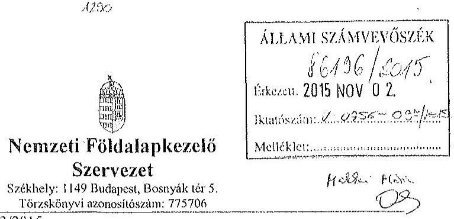

Iktatószám: NFA-002589/023/2015
Hiv. szám: ÁSZ-V-0599/2014-2015
Érintett ÁSZ iktatószámok: V-0756-092/2015, V-0759-066/2015, V-0761-152/2015,
V-0762-073/2015, V-0763-061/2015,

Domokos László
Elnök

Állami Számvevőszék

1052 Budapest

Apáczai Csere János utca 10

Tárgy: Észrevétel megküldése „Az állami tulajdonban álló erdőgazdasági társaságok vagyongazdálkodási tevékenységének ellenőrzéséről" készített jelentés tervezeteire.

Tisztelt Elnök Úr!

Az Állami Számvevőszék 2014 novemberében megkezdte „Az állami tulajdonban álló
erdőgazdasági társaságok vagyongazdálkodási tevékenységének ellenőrzését" amelyről
2015 októberétől érintettség okán az NFA részére az elkészített munkaanyag tervezeteit
vizsgált erdőgazdaságonként, megküldte Szervezetünk részére véleményezésre.
A munkaanyag valamennyi tervezete egységesen, az NFA Elnöke részére feladatszabást
tartalmaz, melyhez az alábbi észrevételeket tesszük:

A jelentéstervezetekben tett megállapítások helytállóságát nem vitatjuk, azonban
szükségesnek látjuk az NFA elnökének tett javaslatokkal a), b) és c) kapcsolatban a következő
tájékoztatást megadni.

a) „Tegyen intézkedéseket az erdőgazdasági társaságok közreműködésével a tényleges
állapotot rögzítő és a hatályos jogszabályi előírásoknak megfelelő vagyonkezelési
szerződés megkötésére."

1

---

Tájékoztatjuk, hogy a hatályos jogszabályi előírásoknak megfelelő vagyonkezelési szerződések megkötése érdekében több intézkedés történt, jelenleg is folyamatban van a szerződések előkészítése és a vagyonkezelésben maradó, illetve kikerülő földrészletek adatainak egyeztetése.

Előzményként fontos kiemelni, hogy a Nemzeti Földalapkezelő Szervezet 2010. szeptember 1. napjával történt létrehozását követően (2012. évben) került sor a vagyonkezelésben lévő földrészletek MNV Zrt. részéről történő átadására. Az átadási dokumentumok alapján Szervezetünk gondoskodott a közhiteles nyilvántartásokban a megváltozott tulajdonosi joggyakorlás feltüntetéséről. Az erdőgazdaságok esetében ez 2012. év végéig, illetve 2013. év elején megtörtént ennek az ingatlan-nyilvántartásban történő átvezetése is.

Megjegyezzük, hogy az MNV Zrt. részéről történő átadás kizárólag a - több évtizede kötött, és azóta többször módosított - vagyonkezelési szerződések és a földrészletek Excel táblázatban történő átadását jelentette, tehát nem egy naprakész vagyonnyilvántartást tartalmazott. Ennek következtében szükségszerűvé vált a Nemzeti Földalapkezelő Szervezetnek egy saját nyilvántartás felépítése, illetve a szerződések tartalmának feldolgozása.

A számvevőszéki ellenőrzéssel érintett időszakban, illetve még jelenleg is lezáratlan az MNV Zrt. és NFA közötti átadás-átvételi folyamat. Az MNV Zrt. további földrészletek átadását készíti elő, ugyanis az MNV Zrt. vagyoni körébe tartozó földrészletekre szintén tervezi a vagyonkezelői szerződés megkötését, és ennek a folyamatnak a részeként a még át nem adott földrészletek átadása is most történik. Természetesen az NFA is folyamatosan biztosítja a különböző hasznosítási, illetve hatósági eljárások során az erdőgazdaságok vagyonkezelésében lévő földrészletek tulajdonosi joggyakorlójának rendezését az MNV Zrt megkeresésével, közös minősítési eljárás lefolytatásával. A Nemzeti Földalapkezelő Szervezet által megbízott ügyvédi iroda, jelentést készített a szerződés és a tárgyát képező földrészletek jogi helyzetének tisztázására.

Időközben az erdőgazdaságok, mint társaságok feletti tulajdonosi joggyakorló személyében is változás történt. Így új alapokon indulhatott meg a vagyonkezelői szerződés előkészítése. Ennek a folyamatnak részeként, az NFA megbízott egy Ügyvédi Konzorciumot, továbbá Szervezetünknél külön Erdészeti munkacsoport alakult 2015 májusában és azt követően a következő intézkedések történtek:

Az Erdőgazdaságok részére vagyonkezelésbe adásra tervezett ingatlanok felülvizsgálata folyamatban van az Ügyvédi Konzorcium által. A felülvizsgálat tárgyát képező ingatlanok köre három részből tevődik össze:

- az erdőgazdaságok ideiglenes vagyonkezelési szerződésének tárgyát képező ingatlanok,
- azon ingatlanok, amelyeket az erdőgazdaságok az ideiglenes vagyonkezelési szerződésükben szereplő ingatlanokon felül kértek vagyonkezelésbe,

---

- valamint azok az ingatlanok, amelyeket az NFA kíván az erdőgazdaságok vagyonkezelésébe adni.

A rendelkezésre álló dokumentumokban szereplő ingatlanokból erdőgazdaságonként egy egységes, az összes vagyonkezelésbe adandó ingatlant tartalmazó táblázat készült, amely tartalmazza az ingatlanok vagyonkezelésbe adás szempontjából releváns adatait, bejegyzett jogokat, feljegyzett tényeket. A táblázat adatai összevetésre kerültek a közhiteles ingatlannyilvántartásban szereplő adatokkal, feltárva ezáltal, hogy mely ingatlanok adhatóak vagyonkezelésbe és melyek azok, amelyeknél valamilyen előzetes intézkedés megtétele szükséges.

Az Nfatv. 8. §-a alapján a Birtokpolitikai Tanács dönt erdőgazdaságonként az erdőgazdaságok vagyonkezelési szerződésének megkötéséről.

Zárójelben jegyezzük meg, hogy például a TAEG Zrt. esetében elkészült a fentebb részletezett táblázat, amely alapján összeállításra került azon ingatlanok listája, amelyre elindítható a vagyonkezelésbe adási eljárás. Megközelítőleg 18000 ha nagyságú területnek tervezi Szervezetünk a TAEG Zrt. részére történő vagyonkezelésbe adását, ebből 15.308,3880 ha terület az, amelyre elindította a vagyonkezelésbe adást. Az alábbi jogszabályhelyek alapján Szervezetünk megkereste az Földművelésügyi Minisztériumot az egyetértő nyilatkozatok, valamint az alapító határozat kiadása érdekében, valamint a NÉBIH-et, mint erdészeti hatóságot a vagyonkezelő erdőgazdálkodói alkalmasságát megállapító jóváhagyásának megkérése végett.

Az Nfatv. 20. § (7) bekezdése alapján „Az állam 100\%-os tulajdonában álló erdő és erdőgazdálkodási tevékenységet közvetlenül szolgáló földterületet érintő vagyonkezelési szerződés létrejöttéhez az erdészeti hatóságnak - a vagyonkezelő erdőgazdálkodói alkalmasságát megállapító - jóváhagyása szükséges".

Az Nfatv. 23. § (2) bekezdése alapján a Nemzeti Földalapba tartozó védett természeti területek és a Natura 2000 területek vagyonkezelésbe adására, tulajdonjogának bármely jogcímen történő átruházására csak a természetvédelemért felelős miniszter egyetértése esetén kerülhet sor. Az állam 100\%-os tulajdonában álló erdő, továbbá erdőgazdálkodási tevékenységet közvetlenül szolgáló földterület vagyonkezelésbe adásához az erdőgazdálkodásért felelős miniszter egyetértése szükséges.

Magyar Állam tulajdonában álló ingatlanokat érintő jogügyletekkel kapcsolatos előzetes miniszteri nyilatkozatok és a miniszter tulajdonosi joggyakorlása alá tartozó gazdasági társaságok ingatlanügyleteivel kapcsolatos miniszteri nyilatkozatok, alapítói határozatok kiadásának rendjéről szóló 8/2014. (XI. 28.) FM utasítás 3. § (4) bekezdése értelmében a miniszter tulajdonosi joggyakorlása alá tartozó állami tulajdonú gazdasági társaságoknak az NFA-val történő vagyonkezelési szerződés kötéséhez elengedhetetlen a jogszabály vagy

---

Társasági alapszabály vagy alapító okirat alapján a Társaság tulajdonosi jogait gyakorló miniszter alapítói határozatának kiadása.

Az Erdészeti Munkacsoport a kialakított szempontok alapján tartja a kapcsolatot a Konzorciummal a szerződés tárgyát képező földrészletek jogi, nyilvántartási, helyszíni, térképi ellenőrzés tárgyában annak érdekében, hogy naprakész adatok alapján történjen a szerződéskötés.
b) „Intézkedjen a vagyonkezelési szerződések felülvizsgálatának elmaradásával összefüggésben feltárt szabálytalanságok tekintetében a munkajogi felelősség tisztázására irányuló eljárás megindításáról, és ennek eredménye ismeretében tegye meg a szükséges intézkedéseket.

A fent leírt folyamat időbeli áttekintése és a vagyonkezelési szerződés előkészítésének jelenlegi helyzetét tekintve a Nemzeti Földalapkezelő Szervezet egységei, munkatársai a rendelkezésükre álló eszközök alapján megtették a szükséges intézkedéseket az erdőgazdaságok vagyonkezelői szerződésének megkötése érdekében.
c) Az NFA elnöke felé tett javaslattal kapcsolatban, miszerint intézkedjen a Társaságok vagyon-nyilvántartása hitelességének, teljességének és helyességének jogszabályban foglaltak szerinti ellenőrzéséről.

Az NFA 2015. év márciusában megkezdte az Erdészeti Zrt.-ék dokumentális ellenőrzését, amely ellenőrzés keretén belül bekérésre került a Társaságok használatában álló vagyonelemekről és az erdővagyon állományról vezetett (nyilvántartások) aktualizált nyilvántartás is.

Budapest, 2015.október 27.
Tisztelettel:
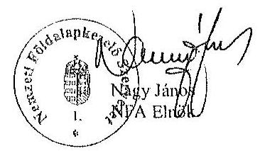

---

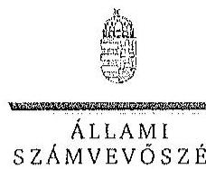

ELRÉK

Ikt.szám: V-0756-098/2015.

Nagy János úr
elnök

Nemzeti Földalapkezelő Szervezet

Budapest

Tisztelt Elnök Úr!

Az „Az állami tulajdonban álló erdőgazdasági társaságok vagyongazdálkodási tevékenységének ellenőrzése" című ellenőrzés tekintetében öt társaság jelentéstervezetére tett észrevételüket köszönettel megkaptam.

Az Állami Számvevőszék észrevételekre vonatkozó álláspontjáról a felügyeleti vezető által készített részletes tájékoztatást csatoltan megküldöm.

Tájékoztatom Elnök urat, hogy a számvevőszéki jelentésben – az Állami Számvevőszékről szóló 2011. évi LXVI. törvény 29. § (3) bekezdése alapján – a figyelembe nem vett észrevételeket szerepeltetjük az elutasítás indokának feltüntetésével.

Budapest, 2015. 11. hó 22. nap

Tisztelettel:

Domokos László

Melléklet: Tájékoztatás az észrevételek kezeléséről

1952 BUDAPEST, APRILIS 4. CSERE JÁNOS TÉR 10. 1364 Budapest 4. Pf. 54 telefon: 494 9101 fax: 494 9201

---

# Tájékoztatás   az észrevételek kezeléséről 

„Az állami tulajdonban álló erdőgazdasági társaságok vagyongazdálkodási tevékenységének ellenőrzése" című ellenőrzés tekintetében a Bakonyerdő Erdészeti és Faipari Zrt., a Vértesi Erdészeti és Faipari Zrt., a DALERD Délalföldi Erdészeti Zrt., a NEFAG Nagykunsági Erdészeti és Faipari Zrt., illetve a NYÍRERDŐ Nyírségi Erdészeti Zrt. társaságok jelentéstervezetére 2015. november 2-án érkezett észrevételeket áttekintettük, azok kezelésével kapcsolatban a következő tájékoztatást adom.

Az észrevétel szerint a jelentéstervezetben tett megállapítások helytállóak, azokat nem vitatják. Az NFA elnökének tett javaslatokhoz kapcsolódó tájékoztatást köszönjük. Mindezek miatt, valamint arra tekintettel, hogy nem jött létre olyan vagyonkezelési szerződés, amely biztosítja az ideiglenes vagyonkezelési szerződés hiányosságainak a megszüntetését, illetve a hatályos jogszabályoknak való megfeleltetést, a megállapítások és a javaslatok módosítása nem indokolt.

Budapest, 2015. év $\quad \%$ hó 25. nap

Makkai Mária
felügyeleti vezető