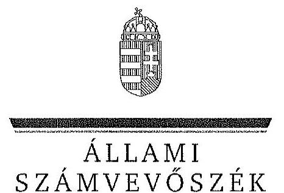

ÁLLAMI
SZÁMVEVŐSZÉK

# JELENTÉS 

Az állami tulajdonban álló erdőgazdasági társaságok vagyongazdálkodási tevékenységének ellenőrzése Vértesi Erdészeti és Faipari Zrt.

---

# Állami Számvevőszék 

Iktatószám: V-0759-075/2015.
Témaszám: 1793
Vizsgálat-azonosító szám: V070611
Az ellenőrzést felügyelte:
Makkai Mária
felügyeleti vezető
Az ellenőrzést vezette és az ellenőrzés végrehajtásáért felelős:
Pencz Mária
ellenőrzésvezető
A számvevőszéki jelentés összeállításában közremúködött:
Szabóné László Mária
számvevő tanácsos
Az ellenőrzést végezték:
Dr. Marosi Gyöngyi
Szabóné László Mária
számvevő főtanácsos
számvevő tanácsos

---

# TARTALOMJEGYZÉK 

BEVEZETÉS ..... 3
I. ÖSSZEGZŐ MEGÁLLAPÍTÁSOK, KÖVETKEZTETÉSEK, JAVASLATOK ..... 7
II. RÉSZLETES MEGÁLLAPÍTÁSOK ..... 13

1. A Vértesi Erdő Zrt. vagyongazdálkodása ..... 13
1.1. A vagyon értékének megőrzése, gyarapítása ..... 13
1.2. A vagyonkezelői kötelezettség teljesítése ..... 16
2. A Vértesi Erdő Zrt. vagyonkezelési szerződése és a vagyonnyilvántartása ..... 17
2.1. A vagyonkezelési szerződés megfelelősége ..... 17
2.2. A Vértesi Erdő Zrt. vagyonnyilvántartása ..... 20
3. A Vértesi Erdő Zrt. éves tervezési feladatainak ellátása, az ágazati jogszabályok érvényesülése ..... 22
3.1. Az üzleti tervek vagyonmegőrzésre, vagyongyarapításra vonatkozó elemei ..... 22
3.2. A tervekben megfogalmazott előírások érvényesülése ..... 23
3.3. Az ágazati szabályok érvényesülése ..... 24
4. A kontroll-és monitoring rendszer kialakítása és múködtetése ..... 25
4.1. A kontrollrendszer kialakítása és múködtetése ..... 25
4.2. Az információáramlási és monitoring rendszer kialakítása és múködtetése ..... 27
5. A tulajdonosi joggyakorlóknak a Vértesi Erdő Zrt. vagyongazdálkodási feladataira vonatkozó döntései, intézkedései megfelelősége ..... 28

---

# MELLÉKLETEK 

1. számú Rövidítések jegyzéke
2. számú Fogalomtár
3/A. számú A Vértesi Erdészeti Zrt. vagyonváltozásának alakulása a 2009-2013. évek közötti időszakban
3/B. számú Az erdőgazdasági társaság vagyonának alakulása a 2009-2014. években
3. számú A befektetett eszközök állományának alakulása
4. számú A Vértesi Erdő Zrt. vezérigazgatójának észrevétele
5. számú A Vértesi Erdő Zrt. vezérigazgatójának észrevételére adott válasz
6. számú Az MNV Zrt. vezérigazgatójának észrevétele
7. számú Az MNV Zrt. vezérigazgatójának észrevételére adott válasz
8. számú Az MFB Zrt. vezérigazgatójának észrevétele
9. számú Az MFB Zrt. vezérigazgatójának észrevételére adott válasz
10. számú Az NFA elnökének észrevétele
11. számú Az NFA elnökének észrevételére adott válasz

---

# JELENTÉS 

## Az állami tulajdonban álló erdőgazdasági társaságok vagyongazdálkodási tevékenységének ellenőrzése Vértesi Erdészeti és Faipari Zrt.

## BEVEZETÉS

Hazánk területének több mint 20\%-át erdő borítja. Az erdők fenntartása és védelme az egész társadalom érdeke, ezért az erdőkkel csak a közérdekkel összhangban lehet gazdálkodni.

Az Alaptörvény 38. cikke és az Nvtv. alapján az állam tulajdona a nemzeti vagyon részét képezi. Az Nvtv. alapján nemzetgazdasági szempontból kiemelt jelentőségű nemzeti vagyonban tartandó vagyonelemnek minősül a 100\%-ban az állam tulajdonában álló védelmi és közjóléti elsődleges rendeltetésű erdő, a gazdasági elsődleges rendeltetésű természetes erdő, természetszerű erdő és származékerdő természetességi állapotú öt hektárnál nagyobb, természetben összefüggő erdő. A Társaságok vagyongazdálkodása szempontjából a Vtv., illetve az Nvtv. és az Nfatv., valamint a kapcsolódó kormány- és miniszteri rendeletek mellett kiemelkedő szerepe van a különböző ágazati jogszabályoknak. A vagyonkezelési tevékenység végrehajtása során figyelemmel kell lenni az Evt.-ben foglaltakra, mely alapján a nemzeti vagyonról szóló törvényben nemzetgazdasági szempontból kiemelt jelentőségű nemzeti vagyonként meghatározott védelmi és közjóléti elsődleges rendeltetésű, az állam tulajdonában álló erdő a kincstári vagyon részét képezi. A Társaságoknak az általuk kezelt vagyonelemek sajátosságára tekintettel kell a vagyongazdálkodási tevékenységüket kialakítaniuk, gondoskodniuk kell a közérdek és az Evt.-ben foglaltak érvényesülését biztosító vagyongazdálkodásról.

Az Evt. előírásai alapján az állam 100\%-os tulajdonában álló erdőt és erdőgazdálkodási tevékenységet közvetlenül szolgáló földterületet csak vagyonkezelés formájában lehet hasznosításra átengedni. A kizárólagos állami tulajdonban lévő erdő és erdőgazdálkodási tevékenységet közvetlenül szolgáló földterület vagyonkezelését csak költségvetési szerv vagy 100\%-os állami tulajdonú gazdálkodó szervezet végezheti.

A Vtv. szerint a Társaságok és az általuk kezelt állami vagyon feletti tulajdonosi jogokat a 2010. évig a Magyar Állam nevében az MNV Zrt. gyakorolta. A 2010. évi törvényi változások (Vtv., Mfbtv., Nfatv.) következtében 2010. június 17. napjától a Társaságok állami tulajdonú részesedése tekintetében a tulajdonosi jogokat az állami vagyonért felelős miniszter az MFB Zrt. útján látta el. Az Nfatv. 2010. évi hatálybalépését követően a Társaságok által kezelt, a Nemzeti Földalapba tartozó földterületek vonatkozásában a tulajdonosi jogokat az

---

NFA, míg egyéb ingatlanok és vagyonelemek tekintetében a tulajdonosi jogokat az MNV Zrt. gyakorolja. 2014. július 16-tól a Társaságok feletti tulajdonosi jogokat az erdőgazdálkodásért felelős miniszter gyakorolja.

A Nemzeti Földalapba tartozó 1772 980,17 ha földterületből a 2012. év végén a $100 \%$-os állami tulajdonú 19 erdőgazdasági társaság kezelésében összesen 913664,3681 ha földterület volt, ebből 879254,1595 ha erdő, a többi egyéb művelési ágba tartozik. A kezelt földterületek erdőgazdasági társaságonkénti megoszlása eltérő.

A Társaságok az Alaptörvény és az Nvtv. előirása szerint önállóan és felelősen gazdálkodnak a törvényesség, a célszerűség és az eredményesség követelményei szerint. Az állami vagyonnal való gazdálkodás alapvető feladata a vagyon rendeltetésszerű, hatékony és felelős felhasználásának biztosítása az állami vagyon értékének megőrzése, gyarapítása érdekében. A Vértesi Erdészeti Zrt. jelen ellenőrzése az állami vagyonnal való gazdálkodásra és a törvényesség betartására irányult.

A Vértesi Erdő Zrt. a Vértes hegység, a Gerecse, a Császári-dombság és a Bakonyalja tájegységeken belül közel 45000 ha állami tulajdonú erdőterület kezelője. A Társaság 2013. évi éves beszámolója szerint 3268,3 M Ft nettó árbevétel mellett 144,3 M Ft mérleg szerinti eredményt ért el, a mérlegfőösszeg 2891,1 M Ft volt. A Társaság 42782 ha erdőterületen és 2243 ha egyéb művelési ágú földterületen gazdálkodott, az éves átlaglétszám 213 fő volt.

Az ellenőrzés célja annak értékelése, hogy a Társaság vagyongazdálkodása, vagyonérték-megőrző és vagyongyarapítási tevékenysége, valamint szervezeti keretei és kiépített kontrollrendszere megfeleltek-e a jogszabályok és belső szabályzatok előírásainak, valamint a kezelt vagyonelemek sajátosságaiból adódó követelményeknek.

Ennek keretében ellenőriztük és értékeltük, hogy:

- a vagyongazdálkodás során betartották-e az Nvtv. 7. §-ában megállapított vagyongazdálkodási alapelveket, valamint az ágazati jogszabályok vagyongazdálkodáshoz kapcsolódó előírásait;
- a Társaság a saját és a kezelt vagyonnal való gazdálkodásra vonatkozó éves tervezési feladatait a jogszabályi előírásoknak megfelelően látta-e el, a Társaság üzleti tervei a kezelésbe vett vagyonra vonatkozó, a Vtv. 2. § (1) és a 27. § (7) bekezdésében előírt vagyon megőrzésére, gyarapítására vonatkozó elemeket tartalmazták-e és azokat a vagyongazdálkodás során érvényesítet-ték-e;
- a vagyonkezelési szerződések és a vagyon-nyilvántartás megfeleltek-e a szabályszerűségi követelményeknek, elősegítették-e az állami vagyonnal való szabályszerű gazdálkodást;
- a Társaságnál kialakították és működtették-e a szabályszerű feladatellátást támogató kontrollrendszert. Ezen belül a Társaság elkészítette-e és aktuali-zálta-e feladatellátási-folyamatainak szabályzatait, a kockázatok kezelésének rendszerét, az információs és a kontrolling-monitoring rendszert, vala-

---

mint a vagyongazdálkodás területén azokat az eljárásokat, amelyek elősegítik a szervezeti célok végrehajtását;

- a tulajdonosi joggyakorlóknak a Társaság vagyongazdálkodási feladataira vonatkozó döntései, intézkedései előkészítése és megalapozottsága a jogszabályoknak és a belső szabályozásnak megfelelt-e, a tulajdonosi joggyakorlók e minőségben végzett tevékenysége támogatta-e a felelős vagyongazdálkodás megvalósulását.

Az ellenőrzés típusa: szabályszerűségi ellenőrzés.
Az ellenőrzött időszak: 2009. január 1. napjától 2014. június 30. napjáig, kitekintéssel a helyszíni ellenőrzés végéig tartó releváns folyamatokra, intézkedésekre.

Az ellenőrzés várható hasznosulása: A Társaság és a tulajdonosi joggyakorlók fenti szempontú ellenőrzése az állami tulajdonban álló vagyon kezelésére, a vagyonnal való gazdálkodásra vonatkozó, kötelezően végrehajtandó éves ÁSZ ellenőrzést szélesebb körűvé teszi.

Az ellenőrzés várható hasznosulásaként biztosíthatja a társadalom részéről kiemelt érdeklődéssel kísért téma objektív bemutatását. Az ÁSZ jelentéséből a média és az állampolgárok átfogó képet kaphatnak a Magyarország állami tulajdonban lévő erdőivel való gazdálkodásról, a gazdálkodást, vagyonkezelést végző szervezeti rendszerről, az állami tulajdonban álló erdőgazdasági társaságok feladatellátásához kapcsolódóan feltárt problémákról.

Az ellenőrzés jól hasznosítható - többek közt - az állami vagyonnal kapcsolatos országgyűlési törvényhozói munkában is, továbbá hozzájárulhat a tulajdonosi joggyakorlás javításával a „jó kormányzás" gyakorlatának erősítéséhez.

Az ellenőrzéssel érintett szervezetek: A Társaság, a Társaság kezelésében lévő állami vagyon feletti tulajdonosi jogokat gyakorló szervezetek, valamint a Társaság állami tulajdonú részesedése feletti tulajdonosi joggyakorlók (MNV Zrt., MFB Zrt., NFA).

Az ellenőrzés végrehajtásának jogszabályi alapját az ÁSZ tv. 5. § (4)(5) bekezdéseiben foglaltak képezik.

Az ellenőrzés szakmai módszertana az ÁSZ hivatalos honlapján közzétett szakmai szabályokon alapult, amely a Legfőbb Ellenőrző Intézmények Nemzetközi Szervezete (INTOSAI) által kiadott nemzetközi standardok (ISSAI) figyelembevételével készült.

A Társaság az ellenőrzés lefolytatásához tanúsítványok kitöltésével, valamint dokumentumok elektronikus megküldésével szolgáltatott adatokat. Az így rendelkezésre bocsátott adatok és információk kontrollja a helyszíni ellenőrzés keretében történt. A vagyonváltozást eredményező döntések megalapozottságát, továbbá a vagyonérték-megőrző és vagyongyarapító tevékenység szabályszerűségét a számviteli nyilvántartásokból, valamint kockázatalapú és véletlenszerű mintavétellel kiválasztott tételek ellenőrzésével értékeltük.

---

Az ÁSZ a 2011. évi LXVI. törvény 29. §-a szerint a jelentéstervezetet megküldte a Vértesi Erdő Zrt. vezérigazgatójának, a Magyar Nemzeti Vagyonkezelő Zrt. vezérigazgatójának, a Magyar Fejlesztési Bank Zrt. vezérigazgatójának és a Nemzeti Földalapkezelő Szervezet elnökének egyeztetésre. A Vértesi Erdő Zrt. vezérigazgatójának észrevételét és az arra adott választ az 5-6. számú melléklet, a Magyar Nemzeti Vagyonkezelő Zrt. vezérigazgatójának észrevételét és az arra adott választ a 7-8. számú melléklet, a Magyar Fejlesztési Bank Zrt. vezérigazgatójának észrevételét és az arra adott választ a 9-10. számú melléklet, a Nemzeti Földalapkezelő Szervezet elnökének észrevételét és az arra adott választ a 11-12. számú melléklet tartalmazza.

---

# I. ÖSSZEGZŐ MEGÁLLAPÍTÁSOK, KÖVETKEZTETÉSEK, JAVASLATOK 

Az állami tulajdonú Vértesi Erdő Zrt. az ellenőrzött időszakban saját és kezelt vagyonnal gazdálkodott. A Társaság könyvviteli mérlegében kimutatott vagyona a 2009. évi 2990,9 M Ft nyitó értékről 2013. december 31-re 2891,1 M Ftra csökkent, a forgóeszközök - ezen belül a követelések - csökkenése következtében. A társaság saját tőke/jegyzett tőke aránya a 2009 évi 153,7\%-ről 2013. évre $178,5 \%$-ra nőtt.

Az ellenőrzött időszakban a Társaság mérlege nem a valós állapotot tükrözte, mert a kezelt erdőket és földingatlanokat a Számv. tv. előírásai ellenére mérlegében nem szerepeltette. A Társaság a Számv. tv. előírásaival ellentétben a kezelt vagyont mérlegtétel szerinti bontásban kiegészítő mellékletében nem mutatta be.

A Társaság a saját és kezelt vagyon Vhr.-ben előírt elkülönítését biztosította. A Társaság által vezetett nyilvántartás nem tartalmazta tételesen a vagyonkezelt eszközök könyv szerinti bruttó és nettó értékét, valamint az értékben bekövetkezett egyéb változásokat, ezért nem felelt meg a Vhr.-ben foglaltaknak, így nem volt átlátható és nem biztosította az elszámoltathatóságot. A Társaság a VSZ eredeti, hitelesként egyértelműen beazonosítható, a vagyonkezelt eszközök tételes felsorolását tartalmazó 1-4. sz. mellékleteivel, köztük vagyonleltárral a helyszíni ellenőrzés időszakában nem rendelkezett, ezért a kezelt vagyon nyilvántartásának megbízható alátámasztása nem volt ellenőrizhető.

A kezelt ingatlanokról a Társaság kizárólag tételes mennyiségi kimutatást vezetett, forint érték feltüntetése nélkül, ami megfelelt a VSZ 2.4. pontja szerinti naturáliában történő vezetési előírásnak, azonban nem felelt meg a kezelt vagyonra vonatkozó, a Számv. tv.-ben előírt nyilvántartási rendelkezésnek. A Társaság a Számv. tv.-ben foglaltak betartása érdekében a kezelt vagyon forint értékének meghatározását sem az MNV Zrt.-nél, sem pedig az NFA-nál nem kezdeményezte. A kezelt vagyon nyilvántartása tekintetében a Társaság és a tulajdonosi joggyakorló MNV Zrt. és NFA közötti egyeztetések az ellenőrzés befejezéséig nem kerültek lezárásra, így nem állt rendelkezésre a Társaság vagyonkezelésében lévő valamennyi állami vagyonra, és annak nagyságára vonatkozó, a tulajdonosi joggyakorló MNV Zrt. és NFA nyilvántartásával egyező adat.

A Társaság a kezelt vagyon tekintetében a tulajdonosi jogokat gyakorlóról pontos és naprakész információval nem rendelkezett teljes körűen, így a Társaság által vezetett nyilvántartás nem biztosította a Vhr.-ben foglalt, az adatszolgáltatás pontosságára vonatkozó követelményt. A Társaság teljesítette a Vhr.-ben előírt adatszolgáltatási kötelezettségét az MNV Zrt. felé, azonban a 262/2010. (XI. 17.) Korm. rendeletben foglaltakkal ellentétben az NFA felé adatszolgáltatás nem történt.

---

Az ellenőrzött időszakban a Társaság a Magyar Állam tulajdonában álló erdővagyon és egyéb művelési ágú termőföld ingatlanok kezelését a KVI-vel 1996. november 1-jén kötött vagyonkezelési szerződés alapján végezte. A Társaság, mint vagyonkezelő és a KVI között létrejött szerződéses jogviszony kereteit a VSZ-ben foglalt jogok és kötelezettségek töltötték ki. A vagyonkezelési szerződés nem támogatta megfelelően és számon kérhető módon a Vhr.-ben előírtak megvalósulását, a Társaság állami vagyonnal való gazdálkodását.

A vagyoni kör, a tulajdonosi jogok gyakorlására felhatalmazott szervezetek változásai, valamint a társaság vagyonkezelésére vonatkozó jogszabályi rendelkezések változásai ellenére az VSZ-t az ellenőrzött időszakban nem aktualizálták. A VSZ évente történő felülvizsgálata, egységes szerkezetbe foglalása nem történt meg, annak módosításai csak a kezelésbe átadott vagyon változásait tartalmazták, az éves felülvizsgálatot a felek nem kezdeményezték. Az ellenőrzött időszakban a VSZ rendelkezései nem határozták meg teljes körűen az állami vagyon kezeléséhez fűződő jogokat és kötelezettségeket, mivel a szerződés hatályon kívül helyezett jogszabályi hivatkozásokat tartalmazott. A felek nem tettek eleget a Vhr. előírásának, mert a Vhr. hatálybalépést követő hat hónapon belül nem kezdeményezték a Nemzeti Földalapba tartozó ingatlanokra vonatkozóan a VSZ megszüntetését és a jogszabályoknak megfelelő szerződés megkötését.

A VSZ-ben rögzítettek ellenére a vagyonkezelési díjak éves felülvizsgálatára nem került sor. Az NFA - az MNV Zrt.-vel kötött megállapodás alapján - a vagyonkezelési díjakat - a 2014. első félév kivételével - kiszámlázta, azonban a VSZ-ben előírt határidőtől eltérően több évre visszamenőlegesen állított ki számlákat. A számlákon a vagyonkezelt földterület nagysága, valamint fajlagos egységára nem szerepelt, ezért a vagyonkezelési díjak szerződés szerinti jogossága nem volt ellenőrizhető. A Társaság a számlákat pénzügyileg rendezte.

A Társaság az ellenőrzött időszakban a Számv. tv. előírásainak megfelelően a fordulónapi leltározást elvégezte.

A Társaság vagyongazdálkodása során betartotta az Nvtv.-ben előírt vagyongazdálkodási alapelveket, mivel vagyonkezelésében álló vagyont nem idegenített el, illetve arra jelzálogjogot, haszonélvezeti jogot nem alapított. A Társaság az Evt. ${ }_{2}$ hatályba lépését követően nem kötött olyan szerződést, amelyben erdő használatát vagy hasznosítását harmadik személynek átengedte volna.

A Társaság a saját és a kezelt vagyonnal való gazdálkodás során az éves tervezési feladatait az SZMSZ-ben foglaltak szerint megfelelően látta el, éves üzleti tervet készített. A Társaság az ágazati és üzleti tervekben megfogalmazott, az erdővagyonnal való gazdálkodás érdekében kifejtett erdőgazdálkodási és vadgazdálkodási tevékenységét az Evt. ${ }_{1,2}$-ben, Evr.-ben, valamint Vadvédelmi tv.-ben foglaltaknak megfelelően végezte. Az ágazati tervekben megfogalmazott, a vagyon megőrzésére, gyarapítására vonatkozó előírásokat betartotta. Az éves gazdálkodásról az ellenőrzött években a Számv. tv.-ben nevesített üzleti jelentést készítettek. Az üzleti jelentések a Társaság eredményének és jövedelmezőségének alakulásán kívül, a vagyonkezelt terület működtetésének, az adott évi beruházásoknak a bemutatását is tartalmazták.

---

A Társaság a Vtv.-ben, Nfatv.-ben és az ágazati tervekben megfogalmazott, a saját és kezelt vagyon állagának védelme és vagyona gyarapítása érdekében a felújításokat, beruházásokat és karbantartásokat évente állapotfelmérések alapján végezte el. A Társaság beruházási és felújítási tevékenységét az ellenőrzött időszakban a Számv. tv. és a Vhr. rendelkezéseinek megfelelően végezte. A Társaság az erdőfelújításokat a Számv. tv-ben előírtaknak megfelelően költségei között elszámolta, így a társaság mérleg szerinti eredménye tartalmazta a kezelt vagyon eredményét is. Az erdőtelepítéseket a Társaság a Számv. tv. előírásainak megfelelően könyveiben a befejezetlen beruházások között szerepeltette. A Társaság a 2012. évben az MNV Zrt.-től a VSZ ${ }_{2}$ alapján kezelésbe vett épületet és a hozzá kapcsolódó földterületet a mérlegben elkülönítetten, kezelt vagyonként szerepeltette. A Társaság a vagyonkezelésében lévő erdők és földterületek után a Számv. tv. előírásainak megfelelően értékcsökkenést nem számolt el. A Társaság az ellenőrzött időszakban elszámolt 1051,0 M Ft összegű értékcsökkenési leírásnál többet, 1057,3 M Ft-ot fordított eszközállományának pótlására.

A Társaság vagyongazdálkodási tevékenysége során az ágazati jogszabályok vagyongazdálkodáshoz kapcsolódó előírásait nem tartotta be teljes mértékben. Az erdőfelújítás befejezésére megállapított határidő túllépése miatt több esetben került sor erdőgazdálkodási bírság kiszabására erdőfelújítás befejezésére megállapított határidő túllépése miatt. A Társaság a vadgazdálkodásból származó bevételeit a Számv. tv. előírásainak megfelelően számolta el. A Társaság az Evt. ${ }_{2}$-ben foglalt, az erdő fenntartására, védelmére, valamint az erdei haszonvételek gyakorlására irányuló erdőgazdálkodási tevékenységéhez kapcsolódó bejelentési kötelezettségének határidőben eleget tett. Az ellenőrzött időszakban rendelkezett az Evt. ${ }_{1,2}$-ben meghatározott, 10 évre szóló erdőgazdálkodási üzemtervekkel, az erdészeti hatóság által jóváhagyott, 5 évre szóló erdő-telepítési-kivitelezési tervek rendelkezésre álltak, az Evr. ${ }_{2}$-ben rögzített tartalmi elemekkel rendelkezett. A Társaság az általa haszonbérelt vadászterületre vonatkozó, a Vadvédelmi tv.-ben előírt, 10 évre szóló vadgazdálkodási üzemtervvel rendelkezett, az éves vadgazdálkodási terveket az ellenőrzéssel érintett években elkészítették, azokat a vadászati hatóság jóváhagyta.

A Társaság kialakította és múködtette a szabályszerű feladatellátást támogató kontrollrendszert. Az FB az Alapító Okirat és a Gt. előírásai alapján az éves munkatervében előírt ellenőrzési feladatait minden évben ellátta, a Társaság éves beszámolóiról a véleményét a könyvvizsgálói jelentés figyelembe vételével alakította ki, írásbeli jelentését a tulajdonosi joggyakorló felé elkészítette. A Társaság a Számv. tv.-ben, valamint az Alapító Okiratában foglaltaknak megfelelően az ellenőrzött időszakban könyvvizsgálati szolgáltatást vett igénybe. Az ellenőrzött időszak éveiben a könyvvizsgáló a Társaság beszámolóit minden évben hitelesítő záradékkal látta el annak ellenére, hogy a beszámolók a vagyonkezelt eszközök mérlegben való szerepeltetésének hiánya miatt nem a valós állapotot tükrözték. A belső ellenőrzés tevékenységét éves munkaterv alapján végezte. Az erdőgazdálkodási és vadgazdálkodási feladatok ellátásával, valamint vagyongazdálkodással kapcsolatos ellenőrzéseket a belső ellenőrzés végzett, azonban a kezelt vagyon nyilvántartására vonatkozó ellenőrzésekre nem került sor.

---

A Társaságnál a szabályszerű múködést támogató információáramlási és monitoring rendszer kialakítása és múködtetése nem valósult meg teljes körűen. Az ellenőrzött időszakban a Számv. tv.-ben előírt, a Társaság feletti tulajdonosi joggyakorló ${ }_{1,2}$ felé fennálló éves beszámoló készítési kötelezettségének Társaság határidőben eleget tett, azonban az erdővagyonról és annak változásáról készített külön írásbeli beszámolók a VSZ előírásai ellenére nem álltak rendelkezésre.

A Társaságnál az ellenőrzéssel érintett időszakban a közérdekú adatok nyilvánosságra hozatala, illetve az adatok védelme biztosított volt. A társaság rendelkezett hatályos Iratkezelési szabályzattal, valamint Informatikai Biztonsági Szabályzattal, azonban az Avtv.-ben, valamint az Info tv.-ben rögzített, a közérdekű adatok megismerésére irányuló igények teljesítésének rendjére vonatkozó szabályzatkészítési kötelezettségének nem tett eleget. A Társaság az Info. tv.ben foglalt elektronikus közzétételi kötelezettségét teljesítette.

A Társaság vagyongazdálkodási feladataira vonatkozó döntések, intézkedések előkészítése a tulajdonosi joggyakorló ${ }_{1,2}$-nél megfelelő volt, összhangban volt a vonatkozó jogszabályokkal és a belső szabályzatokkal. A Társaság feletti tulajdonosi joggyakorló ${ }_{1}$ a vagyonváltozását eredményező döntéseket egyedileg nem ellenőrizte, de a vagyon változását eredményező döntések végrehajtását a beszámolók, az üzleti tervek, üzleti jelentések és a kontrolling jelentések megtárgyalásával és jóváhagyásával ellenőrizte. A Társaság feletti tulajdonosi joggyakorló ${ }_{2}$ a Társaságnál a 2010. évben külső szakértővel átvilágítást végeztetett, jogi, gazdasági, informatikai területen.

A vagyonkezelésbe adott állami vagyon tekintetében tulajdonosi jogokat gyakorló MNV Zrt. és NFA tevékenysége az ellenőrzött időszakban nem támogatta teljes körűen a felelős vagyongazdálkodás megvalósulását, a VSZ-szel kapcsolatban feltárt hiányosságok megszüntetése és a hatályos jogszabályoknak való megfeleltetése nem történt meg. Nem éltek a Vhr.-ben foglalt, a kezelt vagyon használatára vonatkozó ellenőrzési jogukkal, valamint nem végeztek a Vhr.-ben foglalt, a vagyonnyilvántartás hitelességére, teljességére és helyességére vonatkozó ellenőrzést a Társaságnál.

Az Állami Számvevőszékről szóló 2011. évi LXVI. törvény 33. § (1) bekezdésében foglaltak értelmében a jelentésben foglalt megállapításokhoz kapcsolódó intézkedési tervet köteles az ellenőrzött szervezet vezetője összeállítani, és azt a jelentés kézhezvételétől számított 30 napon belül az ÁSZ részére megküldeni. Amennyiben az intézkedési tervet határidőben nem küldi meg a szervezet, vagy az nem elfogadható, az ÁSZ elnöke a hivatkozott törvény 33. § (3) bekezdésében foglaltakat érvényesítheti.

Az ellenőrzés intézkedést igénylő megállapításai és javaslatai:

# MNV Zrt. vezérigazgatójának, az NFA elnökének 

A Vértesi Erdő Zrt. a Magyar Állam tulajdonában álló erdővagyon és egyéb művelési ágú termőföld ingatlanok kezelését a KVI-vel 1996. november 1-jén kötött vagyonkezelési szerződés alapján végezte. A Társaság, mint vagyonkezelő és a KVI között

---

létrejött szerződéses jogviszony kereteit a VSZ-ben foglalt jogok és kötelezettségek töltötték ki. A Társaságnak a KVI-vel kötött VSZ-e nem támogatta megfelelően és számon kérhető módon az állami vagyonnal való szabályszerű gazdálkodást. Az ellenőrzött időszakban a VSZ hatályon kívül helyezett jogszabályi hivatkozásokat tartalmazott az Áht. 109/B. §, az Áht. 109/G. § és a Vadvédelmi. tv. 98. § rendelkezései vonatkozásában és nem tartalmazta a Vtv., az Evt., az Nvtv. és az Nfatv. előírásaira történő hivatkozást. A VSZ 3.2.3. pontja lehetőséget biztosít a vagyonkezelőnek a vagyonkezelői jog átruházására, azonban a rendelkezés ellentétes az Nfatv. 19/A. § (4) bekezdésében foglaltakkal, melynek értelmében vagyonkezelői jog harmadik személynek nem engedhető át. A VSZ 3.3.2. pontjában foglaltak ellenére a szerződést évente nem vizsgálták felül, azt a felek nem kezdeményezték. A felek nem tettek eleget a Vhr. 54. § (7) ${ }^{1}$ bekezdés előírásának, mert a Vhr. hatálybalépést követő hat hónapon belül nem kezdeményezték a Nemzeti Földalapba tartozó ingatlanokra vonatkozóan a VSZ ${ }_{1}$ megszüntetését és a jogszabályoknak megfelelő szerződés megkötését.

A vagyonkezelésbe adott állami vagyon tekintetében tulajdonosi jogokat gyakorló MNV Zrt. és NFA nem végeztek a Vhr. 20. § (1)-(2) bekezdéseiben és a Nemzeti Földalapba tartozó földrészletek hasznosításának részletes szabályairól szóló 262/2010. (XI. 17.) Korm. rendelet 47. § (1)-(2) bekezdéseiben foglalt, a vagyonnyilvántartás hitelességére, teljességére és helyességére vonatkozó ellenőrzést a Társaságnál.

# az MNV Zrt. vezérigazgatójának 

a) Tegyen intézkedéseket az erdőgazdasági társaság közreműködésével a tényleges állapotot rögzítő és a hatályos jogszabályi előírásoknak megfelelő vagyonkezelési szerződés megkötésére.
b) Tegyen intézkedéseket a vagyonkezelési szerződés felülvizsgálatának elmaradásával, valamint a Nemzeti Földalapba tartozó ingatlanokra vonatkozó VSZ megszüntetésével összefüggésben feltárt szabálytalanságok tekintetében a felelősség tisztázása érdekében, és szükség szerint intézkedjen a felelősség érvényesítéséről.
c) Intézkedjen a Vértesi Erdő Zrt. vagyonnyilvántartása hitelességének, teljességének és helyességének jogszabályban foglaltak szerinti ellenőrzéséről.

## az NFA elnökének

a) Tegyen intézkedéseket az erdőgazdasági társaság közreműködésével a tényleges állapotot rögzítő és a hatályos jogszabályi előírásoknak megfelelő vagyonkezelési szerződés megkötésére.
b) Intézkedjen a vagyonkezelési szerződés felülvizsgálatának elmaradásával összefüggésben feltárt szabálytalanságok tekintetében a munkajogi felelősség tisztázására irányuló eljárás megindításáról, és ennek eredménye ismeretében tegye meg a szükséges intézkedéseket.

[^0]
[^0]:    ${ }^{1}$ Vhr. 54. § (7) bekezdés (hatályos 2010. december 31-éig)

---

c) Intézkedjen az Vértesi Erdő Zrt. vagyonnyilvántartása hitelességének, teljességének és helyességének jogszabályban foglaltak szerinti ellenőrzéséről.

# a Vértesi Erdő Zrt. vezérigazgatójának: 

1. A Vértesi Erdő Zrt. és a KVI által 1996. november 1-jén kötött VSZ nem támogatta megfelelően és számon kérhető módon az állami vagyonnal való szabályszerű gazdálkodást. Az ellenőrzött időszakban a VSZ hatályon kívül helyezett jogszabályi hivatkozásokat tartalmazott az Áht. 109/B. §, az Áht. 109/G. § és a Vadvédelmi. tv. 98. § rendelkezései vonatkozásában és nem tartalmazta a Vtv., az Evt., az Nvtv. és az Nfatv. előírásaira történő hivatkozást. A VSZ 3.2.3. pontja lehetőséget biztosít a vagyonkezelőnek a vagyonkezelői jog átruházására, azonban a rendelkezés ellentétes az Nfatv. 19/A. § (4) bekezdésében foglaltakkal, melynek értelmében vagyonkezelői jog harmadik személynek nem engedhető át. A VSZ 3.3.2. pontjában foglaltak ellenére a szerződést évente nem vizsgálták felül, azt a felek nem kezdeményezték.

Javaslat:
a) Tegyen intézkedéseket a tulajdonosi joggyakorlókkal közreműködve a tényleges állapotnak és a hatályos jogszabályi előírásoknak megfelelő vagyonkezelési szerződés megkötése érdekében.
b) Intézkedjen a vagyonkezelési szerződés felülvizsgálatának elmaradásával feltárt szabálytalanságok tekintetében a felelősség tisztázása érdekében, és szükség szerint intézkedjen a felelősség érvényesítéséről.
2. A Társaság a Számv. tv. 23. § (2) bekezdésében foglalt előírás ellenére a kezelt vagyont a mérlegben nem mutatta ki, azokat mérlegtétel szerinti bontásban kiegészítő mellékletében nem mutatta be.

Javaslat:
a) Intézkedjen a kezelt vagyon mérlegben eszközként való kimutatásáról, továbbá ezen eszközöknek a kiegészítő mellékletben - legalább mérlegtételek szerinti megbontásban - külön történő bemutatásáról.
b) Intézkedjen a kezelt vagyon mérlegben eszközként történő kimutatásának elmaradásával kapcsolatban feltárt szabálytalanság tekintetében a felelősség tisztázása érdekében, és szükség szerint intézkedjen a felelősség érvényesítéséről.
3. A Társaság az Avtv. 20. § (8) bekezdésében, valamint az Info tv. 30. § (6) bekezdésében rögzített, a közérdekű adatok megismerésére irányuló igények teljesítésének rendjére vonatkozó szabályzatkészítési kötelezettségét nem teljesítette

Javaslat:
Intézkedjen a jogszabályi előírásoknak megfelelően a közérdekű adatok megismerésére irányuló igények teljesítése rendjének szabályozásáról.

---

# II. RÉSZLETES MEGÁLLAPÍTÁSOK 

## 1. A VÉrtesi Erdő Zrt. vagyongazdÁlkodása

### 1.1. A vagyon értékének megőrzése, gyarapítása

A Társaság vagyongazdálkodása során betartotta az Nvtv. 7. §²-ban foglalt vagyongazdálkodási alapelveket, a vagyonnal felelős módon, rendeltetésszerüen gazdálkodott.

A Társaság mérleg szerinti vagyona az ellenőrzött időszakban saját vagyonból, valamint a 2012. évtől az MNV Zrt.-től kezelésbe értékkel átvett épületből állt. A Társaság eszközvagyona a 2009. január 1-jén kimutatott 2990,9 M Ft nyitó értékről 2013. december 31-re 2891,1 M Ft-ra, 3,3\%-kal csökkent, a forgóeszközök - ezen belül a követelések - csökkenése következtében. A Társaság a saját vagyonát a mérlegben a Számv. tv. 23. § (1) bekezdésének megfelelően az eszközök között tartotta nyilván. Az éves beszámolók összeállítása során a Számv. tv. 23. § (2) bekezdésének előirása ellenére a VSZ alapján vagyonkezelt eszközöket a Társaság mérlegelben nem szerepeltette az eszközök között, azok mérlegtétel szerinti megbontásban nem kerültek bemutatásra a kiegészítő mellékletekben, ezáltal a Társaság mérlegei nem a valós állapotot tükrözték.

A Társaság eszközszerkezetének alakulását a 2009-2013. években az alábbi táblázat mutatja be:

## A társasági vagyon változása az ellenőrzött időszakban

| Megnevezés |  | 2009.01.01 | 2013.12.31. | Változás   (\%) |
| :--: | :--: | :--: | :--: | :--: |
| 1 |  | 2 | 3 | $4=3 / 2$ |
| A | Befektetett eszközök | 1417,7 | 1583,5 | $111,7 \%$ |
| I. | Immateriális javak | 9,8 | 79,2 | $811,9 \%$ |
| II. | Tárgyi eszközök | 1393,4 | 1482,6 | $106,4 \%$ |
|  | - Ingatlanok | 995,1 | 1110,9 | $111,6 \%$ |
|  | - Gépek berendezések, jármúvek | 250,0 | 166,1 | $66,4 \%$ |
|  | - Egyéb tárgyi eszközök | 69,8 | 72,3 | $103,7 \%$ |
|  | Befektetett pénzügyi eszközök | 14,6 | 21,7 | $149,0 \%$ |

[^0]
[^0]:    ${ }^{2}$ Hatályos: 2012. január 1-jétől

---

| Megnevezés |  | 2009.01.01 | 2013.12.31. | Változás   (\%) |
| :--: | :--: | :--: | :--: | :--: |
| 1 |  | 2 | 3 | $4-3 / 2$ |
| B | Forgóeszközök | 1495,6 | 1183,3 | $79,1 \%$ |
| I. | Készletek | 200,6 | 204,4 | $101,9 \%$ |
| II. | Követelések | 931,5 | 457,6 | $49,1 \%$ |
| III. | Értékpapírok | 0 | 0 |  |
| IV. | Pénzeszközök | 363,4 | 521,4 | $143,4 \%$ |
| C | Aktív időbeli elhatárolások | 77,6 | 124,3 | $160,1 \%$ |
|  | Eszközök összesen | 2990,9 | 2891,1 | $96,7 \%$ |

A Társaság vagyonán belül a forgóeszközök csökkenése mellett a befektetett eszközök nem csökkentek. A befektetett eszközök aránya az összes eszközhöz viszonyítva növekedett, a 2009. évben 47,7\% volt, amely 2013. évben 52,9\%-ot tett ki mind a tárgyi eszközök, mind az immateriális javak növekedése következtében.

A vagyon szerkezetében a befektetett eszközök szerkezeti változását a 2011. évben az immateriális javak értékének az előző évi 2,6 M Ft-tal szemben 55,5 M Ft-ra növekedése okozta. A változás oka a befejezetlen beruházások között nyilvántartott Egységes Erdészeti Vállalatirányítási Rendszer (EEVR) fejlesztéssel kapcsolatos kiadások átvezetése az immateriális javak közé.

A Társaság forrását saját tőke, céltartalékok, kötelezettségek és passzív időbeli elhatárolások képezték. A források összegéhez viszonyítva a saját tőke a 2009. évi 55,6\%-ról 71,4\%-ra nőtt 2013. év végére, a kötelezettségek aránya a 2009. január 1-jei állapothoz képest 35,2\%-ról 9,9 százalékponttal csökkent 2013. év végére. A céltartalék összege és aránya a 2009. január 1-jei 68,0 M Ftról 26,7 M Ft-ra, aránya pedig a 2,3\%-ről 0,9\%-ra csökkent.

# Az eredmény hatása a saját tőke és a jegyzett tőke arányára 

(adatok M Ft-ban)

|  | 2009. év | 2010. év | 2011. év | 2012.   év | 2013. év |
| :-- | --: | --: | --: | --: | --: |
| Jegyzett tőke (JT) | 1157,5 | 1157,5 | 1157,5 | 1157,5 | 1157,5 |
| Saját tőke (ST) | 1807,2 | 1574,9 | 1775,9 | 1921,4 | 2065,6 |
| Mérleg szerinti eredmény | 68,9 | $-232,3$ | 201,4 | 145,5 | 144,3 |
| ST / JT aránya | $156,1 \%$ | $136,1 \%$ | $153,4 \%$ | $166,0 \%$ | $178,5 \%$ |

A Társaság a tulajdonosi joggyakorló ${ }_{1,2}$ részére évenként „Ágazati lapon" mutatta be az adózás előtti eredményt vagyonkezelt terület müködtetésére, a vállalkozó tevékenységre, és a vállalatirányításra bontottan. A Társaságnál - az

---

„Ágazati lapok" adatai alapján az eredmény nagyobb mértékben a vagyonkezelt terület müködtetéséből származott.

A Társaság saját tőkenövekedési mutatója kedvező, mivel a saját tőke minden évben meghaladta a jegyzett tőkét. A 2010. évi 20 százalékpontos csökkenést a 2009. évhez képest egy vevővel szembeni csődegyezség miatt a Számv. tv. 15. § (8) bekezdésében és 55. § (1) bekezdésében előírtak szerint elszámolt értékvesztés, ennek következtében a negatív eredmény okozta. A 2010. évi negatív eredményt az eredménytartalékból ellentételezték ${ }^{3}$. A Társaság forrásait növekvő mértékben biztosította a saját tőke, a tőkeerősségi mutató (saját tőke/összes forrás) 2013. év végén $71,4 \%$ volt, 15 százalékponttal növekedett 2009-hez képest.

A Társaság az ellenőrzött időszakban a Vtv. 23. § (2), valamint 27. § (2) ${ }^{4}$ bekezdésében foglaltaknak megfelelően a saját és kezelt vagyon állagának megóvásával, karbantartásával és a vagyon gyarapításával kapcsolatos feladatait évente állapotfelmérések alapján végezte el. A saját, illetve a kezelt vagyonnal kapcsolatos tervezés az erdőgazdálkodással kapcsolatos sajátosságok miatt eltérő módon történt.

A Társaságnak kezelt vagyona a VSZ alapján kezelésbe vett érték nélkül nyilvántartott földterületekből, valamint a 2012. évben vagyonkezelési jog létesítésével kezelésre átvett épülettel, építménnyel rendelkező földrészletből állt. A Társaságnak a vagyonkezelt területen folytatott erdőgazdálkodás vonatkozásában fennálló kötelezettségét az Evt. ${ }_{2}$ 2. § (2) bekezdésében rögzített alapelvek szerint az erdők változatosságának megőrzése, az erdők fenntartása, felújítása és a védelme, valamint a közjóléti szolgáltatások biztosítása képezte. Ennek megfelelően az erdők karbantartását, felújítását az éves üzemterveknek megfelelően az erdészeti hatóság engedélyei alapján látta el.

A VSZ alapján vagyonkezelésbe kapott tárgyi eszközök kizárólag földterületekből, erdőkből tevődtek össze, amelyek „karbantartása" tekintetében az éves üzleti tervek voltak irányadóak. Az erdővagyon értékének megőrzése és visszapótlása érdekében erdőfelújítást és erdőtelepítést is végeztek. Az ellenőrzött időszakban erdőfelújításra - közmunka igénybevételével - és erdőtelepítésre a Társaság összesen ${ }^{5}$ a 2671,4 M Ft-ot fordított, ezáltal a Társaság a Vtv. 2. § (1) bekezdésében foglaltaknak eleget tett.

A Társaság az Nvtv. 7. § (1) bekezdése rendelkezéseinek megfelelően az erdőtelepítési, erdő-felújítási és erdőfenntartási tevékenysége keretében a szükséges felújításokat elvégezte. A Társaság az erdőfelújításokat Számv. tv. 48. § (2) előírásainak megfelelően könyveiben költségei között elszámolta, így a társaság mérleg szerinti eredménye tartalmazta a kezelt vagyon eredményét is.

Az ellenőrzött időszakban a Társaságnak az MNV Zrt.-vel 2012-ben kötött SZT38607. számú VSZ ${ }_{2}$ alapján kezelésbe vett Csákberény 503/4 helyrajzi számon

[^0]
[^0]:    ${ }^{3}$ 3/2010. (V. 30.) számú Alapítói Határozat (AH)
    ${ }^{4}$ Hatályos: 2014. január 1-jétől
    ${ }^{5}$ Az éves üzleti jelentésekben részletezett adatok szerint

---

feltüntetett földrészlet és hozzá tartozó építmények esetében a 2012. és 2014. első félév között nem volt állagmegőrzési és karbantartási feladata, mivel a VSZ 3. számú melléklete szerint az ingatlanon funkcióváltozással járó beruházást végeztek. A beruházás eredményeként a szolgálati lakás és tároló helyett múzeumot alakítottak ki. A kezelésbe vett építményt a számviteli nyilvántartásban kezelésbe átvett vagyonként elkülönítetten nyilvántartásba vették, és a $\mathrm{VSZ}_{2}$-ben rögzített mértékben a Számv. tv. 52. § (7) bekezdés szerinti terv szerinti értékcsökkenést elszámolták.

Az üzleti jelentések mellékletét képező, működési költségeket részletező táblázatok, illetve az év végi főkönyvi kivonatok szerint 2009. január 1. és 2014. június 30. között a Társaság vásárolt szolgáltatásként 198,7 M Ft-ot költött saját tulajdonú tárgyi eszközeinek - döntően vadvédelmi kerítések, utak és járművek javítására, karbantartására. A Társaság tulajdonában lévő eszközök felújítására összesen 23,2 M Ft-ot, beruházásra 1034,1 M Ft-ot fordított, ezzel szemben költségként a tárgyi eszközök után 2009-2014. VI. 30-ig összesen 1051,0 M Ft értékcsökkenést számoltak el.

A Vtv. 27. § (7) ${ }^{6}$ bekezdése a kezelt vagyonra vonatkozóan visszapótlási kötelezettséget ír elő, a visszapótlás összegét a vagyonkezelt eszközön elszámolt értékcsökkenési leírás összegében minimalizálta. A Társaságnak a vagyonkezelésbe vett vagyonelemek közül értékcsökkenést a 2012-ben kezelésbe vett csákberényi ingatlan után kellett elszámolnia, amely összesen $0,05 \mathrm{M} \mathrm{Ft}$ volt. A Társaság az erdő után a Számv. tv. 52. § (5) bekezdésének megfelelően értékcsökkenési leírást nem számolt el.

Az erdőtelepítéseket azok befejezését és az erdészeti hatóság jóváhagyását követően aktiválták. A Vhr. 9. § (6) ${ }^{7}$ bekezdésében foglaltaknak megfelelően a kezelt épület beruházását a tulajdonosi joggyakorló MNV Zrt engedélyével végezték el. Az új erdő telepítés költségeit az ellenőrzött időszakban minden év végén a Számv. tv. 47. § (1) bekezdésének, valamint a Számviteli Politikával összhangban a befejezetlen beruházások között tartotta nyilván. A Társaság fejlesztéseit, beruházásait a Társaság feletti tulajdonosi joggyakorló ${ }_{1,2}$ az éves üzleti tervek és az annak részét képező beruházási tervek jóváhagyásával egyidejűleg fogadta el. A befejezett és befejezetlen erdőtelepítések, valamint a befejezetlen épület beruházás megtalálhatóak voltak a Társaság leltárában.

# 1.2. A vagyonkezelői kötelezettség teljesítése 

A Társaság az ellenőrzött időszakban vagyonkezelői kötelezettségének eleget tett.

A Társaság az Evt. 9. § (3)-(4) ${ }^{8}$, valamint az Nfatv. 20. § (7) ${ }^{9}$ bekezdésének megfelelően erdő hasznosítását harmadik személynek nem engedett át. A Tár-

[^0]
[^0]:    ${ }^{6}$ Hatályos:2013. június 28-tól
    ${ }^{7}$ Hatályos 2011. január 1-jétől
    ${ }^{8}$ Hatályos 2009. július 10-től
    ${ }^{9}$ Hatályos 2011. augusztus 1-jétől

---

saság az ellenőrzött időszakban a vagyonkezelői jogot nem adta tovább harmadik személy részére és a vagyonkezelésbe kapott eszközök megterhelésére vonatkozó tilalmat betartotta, így eleget tett az Evt ${ }_{2}$. 9. § (1)-(4) bekezdései és Nfatv. 19/A. § (4) ${ }^{10}$ bekezdése vonatkozó előírásainak.

A Társaság tulajdonában, és kezelésében nem volt az Nvtv. 4. § (1) ${ }^{11}$ bekezdése szerinti az állam kizárólagos tulajdonába tartozó vagyon, és az Nvtv. 2. mellékletben megjelölt nemzetgazdasági szempontból kiemelt jelentőségű nemzeti vagyon. Az ellenőrzött időszakban a Társaság vagyonkezelésbe kapott vagyont, és a Nvtv. 2. mellékletben megjelölt nemzetgazdasági szempontból kiemelt jelentőségű nemzeti vagyont nem idegenített el, nem terhelt meg, biztosítékul nem adta és rajtuk osztott tulajdont nem létesített, betartva ezzel a 262/2010. (XI. 17.) Korm. rendelet 40. § (1) ${ }^{12}$, az Nvtv. 6. § (4) ${ }^{13}$ bekezdései, és 2 . sz. melléklet előírásait.

# 2. A VÉrtesi ErdŐ Zrt. VAGYONKEZELÉsi SZERZŐDÉSE ÉS A VA GYONNYILVÁNTARTÁSA 

### 2.1. A vagyonkezelési szerződés megfelelősége

A Társaság az ellenőrzött időszakban saját és kezelt vagyonnal rendelkezett. A kezelt vagyoni körbe tartozó vagyonelemek felett, valamint a Társaság részesedései felett a tulajdonosi joggyakorlás az ellenőrzött időszakban többször változott. 2010. évtől a tulajdonosi jogok gyakorlása az egyes vagyoni körök tekintetében elkülönült, így a joggyakorlás megosztottá vált.

A 2009. január 1. és 2010. június 16. közötti időszakban a tulajdonosi jogok gyakorlója az MNV Zrt. volt. Az Mfbtv. 3. § (5) ${ }^{14}$ bekezdése értelmében 2010. június 17 -étől a Társaság állami tulajdonú részesedése tekintetében a tulajdonos jogait az MFB Zrt. gyakorolta. A Társaság vagyonkezelésében lévő földterületek az Nfatv. 15. § (1) ${ }^{15}$ bekezdése értelmében 2010. szeptember 1-jétől a Nemzeti Földalapba tartoztak, azok felett a tulajdonos jogait az agrárpolitikáért felelős miniszter az NFA útján gyakorolja. A Nemzeti Földalapba nem tartozó egyéb ingatlanok feletti tulajdonosi joggyakorlás a Vtv. 3. § (1) ${ }^{16}$ bekezdése alapján az MNV Zrt. hatáskörében maradt.

Az ellenőrzött időszakban a Társaság a Magyar Állam tulajdonában álló erdővagyon és egyéb művelési ágú termőföld ingatlanok kezelését a KVI-vel 1996. november 1-jén kötött vagyonkezelési szerződés alapján végezte. A Társaság, mint vagyonkezelő és a KVI között létrejött szerződéses jogviszony kerete-

[^0]
[^0]:    ${ }^{10}$ Hatályos: 2013. január 1-jétől
    ${ }^{11}$ Hatályos: 2012. január 1-jétől
    ${ }^{12}$ Hatályos: 2010. december 2-től
    ${ }^{13}$ Hatályos: 2012. január 1-jétől
    ${ }^{14}$ Hatályos: 2010. június 17-től
    ${ }^{15}$ Hatályos: 2010. szeptember 1 - 2011. július 31.
    ${ }^{16}$ Hatályos: 2010. június 17 -től

---

it a VSZ-ben foglalt jogok és kötelezettségek töltötték ki. A Társaságnak a KVI ${ }^{17}$ vel kötött VSZ-e nem támogatta megfelelően és számon kérhető módon, a Vhr. 3. § (1) bekezdésében előírtak megvalósulását, az állami vagyonnal való szabályszerű gazdálkodást.

Az ellenőrzött időszakban a VSZ hatályon kívül helyezett jogszabályi hivatkozásokat tartalmazott az Áht., 109/B. $\S^{18}$, az Áht., 109/G. $\S^{19}$ és a Vadvédelmi. tv. 98. $\S^{20}$ rendelkezései vonatkozásában és nem tartalmazta a Vtv., az Evt., a Nvtv. és az Nfatv. előírásaira történő hivatkozást.

A VSZ 3.2.3. pontja lehetőséget biztosít a vagyonkezelőnek a vagyonkezelői jog átruházására, azonban a rendelkezés ellentétes az Nfatv. 19/A. § (4) ${ }^{21}$ bekezdésében foglaltakkal, melynek értelmében vagyonkezelői jog harmadik személynek nem adható tovább.

A Társaságnál a VSZ-t több alkalommal módosították, 2010. július 6-án az SZT/31.742/1. számon megkötött VSZ módosítással egy ingatlanra vonatkozóan a vagyonkezelői jogot közös megegyezéssel megszüntették, azonban a felek a szerződést nem módosították, a szerződést nem foglalták egységes szerkezetbe.

Az ellenőrzött időszakban a VSZ évente történő felülvizsgálatára - a VSZ 3.3.2. pontjában foglaltak ellenére - sem a szerződés hatálya alá tartozó vagyontárgyak körében bekövetkezett változása okán, sem a tulajdonosi joggyakorlók változásai, sem a hivatkozott jogszabályokban bekövetkezett változás miatt nem került sor, azt a felek nem kezdeményezték. A felek nem tettek eleget a Vhr. 54. § (7) ${ }^{22}$ előírásának, mert a Vhr. hatálybalépést követő hat hónapon belül nem kezdeményezték a Nemzeti Földalapba tartozó ingatlanokra vonatkozóan a VSZ megszüntetését és a jogszabályoknak megfelelő szerződés megkötését. A VSZ mellékleteinek az ellenőrzött időszakban történt módosításai a konkrétan meghatározott ingatlanokat érték nélkül, a helyrajzi számok, területmérték és területnagyság megadásával tartalmazta.

A Társaság épület és hozzá tartozó építmény kezelésére vonatkozóan a tulajdonosi joggyakorló ${ }_{1}$-gyel 2012. 09. 28-án SZT-38607. számon VSZ ${ }_{2}$-t kötött, mely tartalmazta a hatályos jogszabályi rendelkezéseket.

A VSZ 3.3.1. pontja rendelkezett a vagyonkezelési díjak mértékéről, a 3.3.2 pont értelmében a vagyonkezelői díjat évente kellett felülvizsgálni és az adott évre vonatkozó díjat külön megállapodásban rögzíteni. A VSZ 3.3.3. pontja alapján a vagyonkezelési díjakat évente két egyenlő részletben kellett kiegyenlíteni. A vagyonkezelői díj mértékének évenkénti felülvizsgá-

[^0]
[^0]:    ${ }^{17}$ Vtv. 61. § (1) bekezdése alapján az MNV Zrt. a KVI jogutódja
    ${ }^{18}$ Hatályos: 2007. szeptember 24-ig
    ${ }^{19}$ Hatályos: 2007. szeptember 24-ig
    ${ }^{20}$ Hatályos: 2007. április 13-ig
    ${ }^{21}$ Hatályos: 2013. január 1-jétől
    ${ }^{22}$ Vhr. 54. § (7) bekezdés (hatályos 2010. december 31-éig)

---

latára, valamint a díjak külön megállapodásban történő rögzítésére az ellenőrzött időszakban nem került sor.

Az NFA - az MNV Zrt.-vel kötött megállapodás alapján a vagyonkezelési díjra vonatkozó számlázási kötelezettségének - a 2014. év első félév kivételével - eleget tett, azonban a számlák kiállítása a VSZ. 3.3.3. pontjában előírt határidőtől eltérően történt. Az NFA két alkalommal, több évre kiállított számlázásával sérültek a vagyonkezelési szerződések díjfizetéssel kapcsolatos előírásai. A számlában nem szerepeltette a vagyonkezelői jog gyakorlásának alapját képező vagyonkezelt földterület naturáliában meghatározott mennyiségét és annak egységárát. A 2014. első félévre vonatkozó vagyonkezelői díj számlázása, így kifizetése a helyszíni ellenőrzés lezárásáig nem történt meg.

A számlákból nem állapítható meg sem a díjszámítás alapja (terület, ha), sem pedig az egységár ( $\mathrm{Ft} / \mathrm{ha}$ ), ezért a vagyonkezelési díj számításának szerződés szerinti jogossága egyértelmúen nem volt megállapítható. A VSZ nem tartalmazott rendelkezést a vagyonkezelési díjak általános forgalmi adó tartalmát illetően, azonban a tulajdonosi joggyakorló NFA által kiállított számlák tartalmaztak általános forgalmi adót. A tulajdonosi joggyakorló NFA vagyonkezelési szerződésben foglaltaktól eltérő eljárása miatt a Társaság a vagyonkezelésbe kapott vagyon után járó vagyonkezelési díjat a VSZ-ben foglaltaktól eltérően több évre rendezte.

A Társaság által a kezelésbe vett földterületek után 2009-2013 évekre vonatkozóan fizetett vagyonkezelési díjak a következők szerint alakultak:

| Időszak | Számla   száma | Számla kiállí-   tásának dá-   tuma | Díjfizetés   összege Ft-   ban (bruttó) | Díjfizetés   idöpontja |
| :-- | :-- | :-- | :-- | :-- |
| 2009. I. félév | VBVK-00205 | 2012.07 .13. | 1223971 | 2012.07 .26 . |
| 2009. II. félév | VBVK-00206 | 2012.07 .13. | 1274970 | 2012.07 .27 . |
| 2010. év | VBVK-00207 | 2012.07 .13. | 2549941 | 2012.07 .26 . |
| 2011. év | VBVK-00208 | 2012.07 .13. | 2549941 | 2012.07 .27 . |
| 2012. év | VBVK-00259 | 2013.12 .30. | 2044534 | 2014.02 .11 . |
| 2013. év | VBVK-00250 | 2013.12 .30. | 2044534 | 2014.02 .11 . |
| összesen |  |  | 11687891 |  |

A vagyonkezelésbe vett épület és hozzá tartozó építményre vonatkozó, VSZ $_{3}$ ben rögzített vagyonkezelési díj általános forgalmi adóval növelten került megállapításra, a fizetési feltételeket a VSZ 4.2 pontjában rögzítették. Az MNV Zrt. által a 2012. és a 2013. évre vonatkozóan kiállított számlák alapján a vagyonkezelési díjat a Társaság határidőben rendezte, azonban 2014. első félévben a VSZ-ben előírt határidőben történő teljesítésnek a számla késedelmes kiállítása miatt nem tett eleget.

---

# 2.2. A Vértesi Erdő Zrt. vagyonnyilvántartása 

Az ellenőrzött időszakban a Társaság kezelt vagyonra vonatkozó vagyonnyilvántartása teljes körűen nem felelt meg a hitelességi és megbízhatósági követelményeknek.

A Társaság a vagyonkezelésbe vett ingatlanokról elkülönített, naprakész menynyiségi nyilvántartást vezetett. A Társaság által vezetett nyilvántartás nem felelt meg a Vhr. 17. § (1) bekezdésében foglaltaknak, mert tételesen nem tartalmazta a vagyonkezelt eszközök könyv szerinti bruttó és nettó értékét, valamint az értékben bekövetkezett egyéb változásokat, ezért nem volt átlátható, nem biztosította az elszámoltathatóságot. A Társaság a VSZ eredeti, hitelesként egyértelműen beazonosítható, a vagyonkezelt eszközök tételes felsorolását tartalmazó 1-4. sz. mellékleteivel, köztük vagyonleltárral a helyszíni ellenőrzés időszakában nem rendelkezett, ezért a kezelt vagyon nyilvántartásának megbízható alátámasztása nem volt ellenőrizhető.

A Társaság a kezelt vagyont naturáliában tartotta nyilván, ami megfelelt a VSZ 2.4. pontja szerinti naturáliában történő vezetési előírásnak, azonban nem felelt meg a kezelt vagyonra vonatkozó, a Számv. tv. 23. § (2) bekezdésben előírt nyilvántartási rendelkezésnek. A Társaság a Számv. tv. 23. § (2) bekezdésének betartása érdekében a kezelt vagyon forint értékének meghatározását sem az MNV Zrt.-nél, sem pedig az NFA-nál nem kezdeményezte.

A Társaságnál a kezelésbe vett földterület és ahhoz szorosan kapcsolódó erdő tulajdonosi joggyakorlók szerinti megbontása nem volt biztosított, annak rendezése érdekében egyeztetéseket folytattak a tulajdonosi joggyakorlókkal. Az egyeztetések az ellenőrzés befejezéséig nem kerültek lezárásra, ezért nem állt rendelkezésre a Társaság által kezelt valamennyi vagyonelem tekintetében a tulajdonosi joggyakorló MNV Zrt. és NFA nyilvántartásával egyező, elfogadott és visszaigazolt adat. A Társaság vagyonnyilvántartása nem támogatta teljes körűen az állami vagyonnal való szabályszerű gazdálkodást.

A Társaság által kezelt földterület vagyon alakulása az ellenőrzött időszak beszámolóval lezárt éveiben az alábbi táblázat szerint alakult:

| Időpont | Tulajdonosi joggyakorló |  | Összes terület (ha) |
| :--: | :--: | :--: | :--: |
|  | MNV Zrt.* | NFA |  |
| 2009. január 1. | 44111,9171 |  | 44 111,9171 |
| 2009. december 31. | 44 131,7066 |  | 44 131,7066 |
| 2010. december 31. | 44039,1259 |  | 44039,1259 |
| 2011. december 31. | 44065,7857 |  | 44065,7857 |
| 2012. december 31. | 122,9388 | nincs pontos adat | nincs pontos adat |
| 2013. december 31. | 122,9388 | nincs pontos adat | nincs pontos adat |

*éves jelentések adata szerint

---

A Társaság az MNV Zrt. tulajdonosi joggyakorlása alá tartozó vagyonelemeket a Forrás-SQL rendszerbe tartotta nyilván. A 2010. évi tulajdonosi joggyakorlókra vonatkozó változást követően az NFA tulajdonosi joggyakorlása alá tartozó vagyonelemek kivezetésre kerültek a Forrás-SQL rendszerből, és a továbbiakban az érték nélkül vagyonkezelésbe kapott földterületekről a Társaság belső nyilvántartást vezetett. A belső nyilvántartás, tekintettel a vagyonelemek nagy számára, valamint a nyilvántartás pontatlanságára, nem biztosította a kezelt vagyonelemek megbízhatóságát, kezelhetőségét és utólagos ellenőrzését.

A Társaság a kezelt földterületeket nyilvántartásában érték nélkül szerepeltette, mérlegében a Számv. tv. 23. § (2) valamint 42. § (5) bekezdésében foglalt előírások ellenére a kezelésbe vett földterületeket eszközként a hosszú lejáratú kötelezettségekkel szemben nem jelenítette meg, ezáltal a Társaság mérlege nem volt megbízható és valós. A Társaság a kezelésbe vett földterületeket annak ellenére nem jelenítette meg mérlegében, hogy számlarendjében ezt a kötelezettséget rögzítette, és az éves beszámolók kiegészítő melléklete tartalmazta a kezelt vagyonra vonatkozó tájékoztatást. A Társaságnak, mint vagyonkezelőnek a Vhr. 9. § (9) bekezdés a) ${ }^{23}$ pontja szerint a vagyonkezelési szerződésben meghatározott értéken kell kimutatnia a mérlegében az eszközök között kezelésbe vett, az állami vagyon részét képező eszközöket a hosszú lejáratú kötelezettségekkel szemben. A Társaság a Számv. tv. 23. § (2) előírásaival ellentétben a kezelt vagyont mérlegtétel szerinti bontásban kiegészítő mellékletében nem mutatta be. A beszámolóban közzétett adatok helyessége, illetve egyezősége a vagyonnyilvántartással nem állapítható meg, mivel a nyilvántartás mindig egy időpont állapotát mutatta be, a változások nyomon követhetősége nem volt biztosított.

A Társaság a VSZ ${ }_{2}$ alapján 2012. évben értékkel megjelölt, vagyonkezelésbe kapott épületet és kapcsolódó földterületet a kettős könyvvitel rendszerében tartotta nyilván és a főkönyvi könyveiben, valamint az éves számviteli beszámoló részeként elkészített mérlegében forintértékben kifejezve mutatta ki.

A Társaság az MNV Zrt.-vel 2012. 09. 28-án ingatlan vagyonelemre vonatkozóan megkötött SZT-38607. számú VSZ ${ }_{2}$ alapján a Csákberény 503/4. helyrajzi számon nyilvántartott földrészletet és a hozzá tartozó építményeket a Vhr. 9. § (9) bekezdés a) ${ }^{24}$ pontja és a 17. § (1) bekezdése, valamint a számlarendben foglaltaknak megfelelően a saját vagyontól elkülönítetten a tárgyi eszköz-nyilvántartásában külön főkönyvi számlán, és a hosszú lejáratú kötelezettségek külön főkönyvi számlájával szemben szerepeltette.

A Társaság az ellenőrzött időszakban a kezelt vagyonra vonatkozó Vhr. 14. § (3) bekezdésében meghatározott tartalmú éves adatszolgáltatási kötelezettségét elektronikusan teljesítette a tulajdonosi joggyakorló; felé. Vagyonváltozás esetén külön nem került sor a nyilvántartások egyeztetésére, így nem állapítható meg a Társaság kezelésében lévő állami vagyon nagysága, forintértéke és nem állapítható meg, hogy a Társaság átlátható, naprakész vagyonnyilvántartással rendelkezett. A kezelt vagyonról vezetett nyilvántartás a va-

[^0]
[^0]:    ${ }^{23}$ Hatályos: 2011. január 1-jétől
    ${ }^{24}$ Hatályos: 2011. január 1-jétől

---

gyonváltozásokat nem mutatta, annak ellenére, hogy a Vhr. 14. § (1) bekezdése előírja az állami vagyon kezelője számára, hogy nyilvántartását köteles úgy vezetni, hogy azok biztosítsák az adatszolgáltatás pontosságát és ellenőrizhetőségét.

Az ellenőrzött időszak minden évében a tárgyév utolsó napján fennálló állapotról a Társaság a Vhr. 14. § (1) bekezdésében foglalt előírásoknak megfelelően adatszolgáltatást teljesített az MNV Zrt. felé, azonban a Társaság nyilvántartása nem biztosította az adatszolgáltatás pontosságát és ellenőrizhetőségét. A 262/2010. (XI.17.) Korm. rendelet 50/A. § (2) ${ }^{25}$ bekezdésében foglalt előírás ellenére az NFA részére adatszolgáltatás nem történt.

A Társaság a VSZ. 3.9. pontjának megfelelően a vagyonkezelésével kapcsolatos bevételeit és költségeit a vállalkozási tevékenységétől elkülönítetten tartotta nyilván. A tevékenység sajátosságai alapján kialakított könyvvezetés alapján a Társaság az üzleti jelentésekben minden évben eleget tett a kezelt vagyonnal folytatott gazdálkodásra vonatkozó, szerződésből eredő beszámolási kötelezettségének.

A Társaság saját eszközeiről a Számv. tv. 159. §-ban foglaltaknak, valamint a számviteli politikájában rögzített elveknek megfelelően vezette a nyilvántartását.

A beszámolóban és a számviteli nyilvántartásokban lévő vagyontárgyak állományát a Számv. tv. 69. § (3) szerinti előírásoknak megfelelve szabályszerűen - a leltározási szabályzatban foglaltak alapján - elkészített leltárral alátámasztották. A Társaság az ellenőrzött időszakban leltározási szabályzattal rendelkezett. A leltározást a minden évben elkészített ütemtervek alapján folytatták le. A leltározásról a leltározási szabályzat szerinti kiértékelő jegyzőkönyveket a mennyiségi felvétellel történt leltározásról elkészítették. Az egyeztetéssel végrehajtott leltározásokról külön írásos leltározási dokumentum, továbbá záró jegyzőkönyv nem készült, ezeket a leltározási szabályzat sem írta elő.

# 3. A VÉrtesi ErdŐ ZRT. ÉVES TERVEZÉSI FELADATAINAK ELLÁTÁSA, AZ ÁGAZATI JOGSZABÁLYOK ÉRVÉNYESÜLÉSE 

### 3.1. Az üzleti tervek vagyonmegőrzésre, vagyongyarapításra vonatkozó elemei

A Társaság a saját és a kezelt vagyonnal való gazdálkodás során az éves tervezési feladatait az SZMSZ-ben foglaltaknak megfelelően látta el, az ellenőrzött időszak minden évére elkészített üzleti tervei tartalmazták a vagyon megőrzésére, gyarapítására vonatkozó elemeket.

Az éves üzleti tervek elkészítését a tulajdonosi jogok gyakorlója a 2011-2014. évek vonatkozásában tervezési paraméterek megadásával segítette.

[^0]
[^0]:    ${ }^{25}$ Hatályos: 2013. május 25 -től

---

Az éves üzleti terveket a tulajdonosi jogok gyakorlója ${ }_{1,2}$ minden évben Alapítói Határozattal hagyta jóvá, azt az ellenőrzött időszakban nem módosították.

Az ellenőrzött időszakban készített éves üzleti tervek a vagyon megőrzésére, gyarapítására vonatkozó elemeket tartalmazták. A 2010-2014. közötti időszakban készített éves üzleti tervek a vállalkozói tevékenységgel és a vagyonkezelt terület müködtetésével kapcsolatos előírásokat elkülönítetten tartalmazták. Az üzleti tervek magukba foglalták az erdőműveléssel, fakitermeléssel, vadgazdálkodással, fafeldolgozással, közjóléti tevékenységgel és beruházással kapcsolatos feladatokat. A birtokpolitikai feladatok között az ingatlanrendezési feladatok meghatározásra kerültek. A tervezett beruházási tevékenységeket és azok forrásösszetételét az éves üzleti tervekben rögzítették. A 2013-2014. évi üzleti tervekben az Nvtv. 7. § (1) bekezdésében nevesített, az állami vagyon értékének, állagának megóvásához szükséges felújítási munkákról rendelkeztek. A 2012. szeptember 28-án vagyonkezelésbe vett ingatlan felújításához, átalakításához kapcsolódó beruházási feladatokat az üzleti tervekben meghatározták. A 2013. június 28 -tól hatályos, a Vtv. 27. § (7) bekezdésében rögzített, a vagyonkezelésbe vett ingatlanhoz kapcsolódó visszapótlási kötelezettséget a 2014. évi üzleti tervben nem rögzítették, azonban e jogszabályi kötelezettségnek a Társaság az ellenőrzött időszakban eleget tett.

# 3.2. A tervekben megfogalmazott elöírások érvényesülése 

A Társaság az ágazati és üzleti tervekben megfogalmazott, az erdővagyonnal való gazdálkodás érdekében kifejtett erdőgazdálkodási és vadgazdálkodási tevékenységét megfelelően végezte.

A Társaság tevékenységét az ellenőrzött időszakban az Evt. 2 41. § (1), 42. § (1)(2) bekezdéseiben, 44. §-ban az Evr. 2 23. § (1) és 24. §-ban előírtak szerint az erdészeti hatóság jóváhagyásával, az erdőgazdálkodási tevékenységre vonatkozó tervek alapján végezte. Az „Agazati tervekben" megfogalmazott, a vagyon megőrzésére, gyarapítására vonatkozó előírásokat betartotta. Az „Agazati tervek" tartalmazták az erdőtelepítési, erdő-felújítási terveket és azok finanszírozási forrását. A bejelentett erdőművelési tevékenységek teljesítéséről szóló beszámolási kötelezettségét az ellenőrzött években az Evr. 2 24. § (2) bekezdés által előírt tartalommal és a 24. § (1) bekezdés szerinti határidőben teljesítette. A Társaság vadgazdálkodási tevékenységét a vadgazdálkodási üzemtervek alapján elkészített, a vadászati hatóság által a Vadvédelmi. tv. 47. §-a szerint jóváhagyott éves vadgazdálkodási tervek alapján végezte. Az ellenőrzött időszakban készített éves vadgazdálkodási jelentések rendelkezésre álltak, a vadelhullások részletes adatait tartalmazó bejelentéseket megtették.

Az éves gazdálkodásról az ellenőrzött években a Számv. tv. 95. §-ában nevesített üzleti jelentést készítettek. Az üzleti jelentések a Társaság eredményének és jövedelmezőségének alakulásán kívül, a vagyonkezelt terület működtetésének, az adott évi beruházásoknak a bemutatását is tartalmazták. Az éves üzleti jelentéseket az FB megtárgyalta, a Társaság feletti tulajdonosi joggyakorló ${ }_{1,2}$ Alapítói Határozattal elfogadta. Az éves üzleti jelentések tartalmazták az adott év üzleti tervében megfogalmazott feladatok teljesülésére vonatkozó fontosabb naturális és értékadatokat, valamint az erdészeti tevékenység átfogó értékelését. A 2013. és 2014. évi üzleti tervekben megfogalmazott, a vagyonkezelésbe

---

vett ingatlannal kapcsolatos tervezett beruházási tevékenységet megkezdték, a 2013. évi üzleti jelentésben az elvégzett munkák bemutatása megtörtént. A Társaság a vagyonkezelt ingatlanhoz kapcsolódó, a Vtv. 27. § (6)-(7) ${ }^{26}$ bekezdéseiben foglalt értékcsökkenés elszámolás és visszapótlási kötelezettségét teljesítette.

# 3.3. Az ágazati szabályok érvényesülése 

A Társaság vagyongazdálkodási tevékenysége, az erdőgazdálkodásra és vadgazdálkodásra vonatkozó speciális jogszabályi előírások betartása nem valósult meg teljes mértékben, a Társaság részére erdőgazdálkodási és erdővédelmi bírság kiszabására került sor.

A Társaság vadgazdálkodásból származó bevételeinek elszámolása az ellenőrzött időszakban megfelelt a Számv. tv. 72. § (1) bekezdés a) pontjában foglaltaknak. A bevételek elszámolására a megfelelő számlacsoportban, szerződés, megállapodás, valamint a hatályos vadászati és vadhús árjegyzékek alapján, az abban rögzítetteknek megfelelően került sor.

A Társaság az Evt. ${ }_{1}$ 21. § (1) bekezdése, illetve az Evt. ${ }_{2}$ 27. § (1) bekezdése alapján az erdő rendeltetésének megváltoztatását az erdészeti hatóságtól nem kérelmezte. A Társaság az Evt. ${ }_{2}$ 41. § (1) bekezdésében foglalt, az erdő fenntartására, védelmére, valamint az erdei haszonvételek gyakorlására irányuló erdőgazdálkodási tevékenységéhez kapcsolódó bejelentési kötelezettségének a 2009. július 10. - 2014. június 30. közötti időszakban minden esetben, határidőben eleget tett. Az Evt. ${ }_{2} 42 . \S$ (1) bekezdése alapján az erdőtelepítés első kivitelének, az erdőfelújítás sikeres első erdősítésének, valamint az Evt. ${ }_{2} 41 . \S$ (1) bekezdésében foglalt egyéb tevékenységek elvégzésének bejelentését az Evr. ${ }_{2}$ 23-24. §-aiban foglalt bejelentési szabályok és határidők figyelembe vételével teljesítették. Az Evt. ${ }_{2} 42 . \S$ (2) bekezdésében rögzítetteknek megfelelően, a bejelentések minden esetben a jogosult erdészeti szakszemélyzet ellenjegyzésével történtek. Az erdő igénybevételére irányuló kérelem benyújtására az ellenőrzött időszakban két alkalommal került sor. Az erdő igénybevétele az Evt. ${ }_{2} 78 . \S$ (1)-(2) bekezdéseiben foglaltaknak megfelelően, a közérdekkel összhangban, az erdészeti hatóság előzetes engedélyével történt. Az erdészeti létesítmény létesítéséhez a Társaság az Evt. ${ }_{2} 41 . \S$ (1) bekezdésében előírt, az erdészeti hatóság felé fennálló bejelentési és engedélykérelmi kötelezettségének az ellenőrzött időszakban eleget, azonban az erdő igénybevételének végrehajtását az Evt. ${ }_{2} 80 . \S$ (2) bekezdésében foglaltak ellenére, annak megkezdésétől számított 30 napon belül nem jelentették be az erdészeti hatóságnak. Erdővédelmi járulék megfizetésére az Evt. ${ }_{2} 82 . \S$ (3) bekezdés b) pontja alapján nem került sor.

Az ellenőrzött időszakban a Társaság rendelkezett az Evt. ${ }_{1} 26 . \S$ (1) bekezdésében, valamint az Evt. ${ }_{2} 40 . \S$ (1) bekezdésében meghatározott, 10 évre szóló erdőgazdálkodási üzemtervekkel. Az Evt. ${ }_{1} 35 . \S$ (1) bekezdésében, az Evt. ${ }_{2} 44 . \S$, valamint 45. § (3) bekezdésében foglaltaknak megfelelően az erdészeti hatóság által jóváhagyott, 5 évre szóló erdőtelepítési-

[^0]
[^0]:    ${ }^{26}$ Hatályos: 2013. június 28 -tól

---

kivitelezési tervek rendelkezésre álltak, azok az Evr. 2 25. §-ában rögzített tartalmi elemekkel rendelkeztek.

Az Evt. 2 107. § (1) bekezdés l) pontja alapján erdőgazdálkodási bírságot a hatóság 19 esetben szabott ki az erdőfelújítás befejezésére megállapított határidő túllépése miatt. Az Evt. 2 108. § (3) bekezdés a) pontja alapján erdővédelmi bírság kiszabására három alkalommal került sor vadkár miatt. A bírságösszegek megállapítása a 143/2009. (VII. 6.) Kormányrendelet 3-4. §-aiban foglaltak alapján történtek.

A Társaság az általa haszonbérelt vadászterületre vonatkozó, a Vadvédelmi tv. 44. § (1) bekezdésében rögzített, 10 évre szóló vadgazdálkodási üzemtervvel rendelkezett, azt a vadászati hatóság a Vadvédelmi tv. 45. § (2) bekezdésében rögzítetteknek megfelelően jóváhagyta. A vadgazdálkodási üzemterv elkészítése során a Vadvédelmi tv. 44. § (3)-(4) bekezdéseiben foglalt, a vadászterületen élő vadfajok genetikai értékének megőrzésére, a vadállomány túlszaporodásából eredő károk megelőzésére irányuló előírások megtartásra kerültek. A Vadvédelmi tv. 45. § (1) bekezdésében rögzítetteknek megfelelően a vadgazdálkodási üzemterv elkészítéséről a körzeti vadgazdálkodási terv adott területre vonatkozó előírásai szerint gondoskodtak. A Vadvédelmi tv. 47. § (1) bekezdésében előírt éves vadgazdálkodási tervek az ellenőrzéssel érintett években rendelkezésre álltak, azok vadászati hatósághoz történő benyújtására a Vadvédelmi tv. 47. § (1) bekezdésében foglaltaknak megfelelően sor került. Az éves vadgazdálkodási tervek a Vadvédelmi tv. 47. § (2) bekezdésében rögzített tartalmi elemekkel rendelkeztek, azokat a vadászati hatóság a Vadvédelmi tv. 47. § (3) bekezdésében foglaltaknak megfelelően jóváhagyta.

# 4. A KONTROLL-ÉS MONITORING RENDSZER KIALAKÍTÁSA ÉS MÜKÖDTETÉSE 

### 4.1. A kontrollrendszer kialakítása és múködtetése

A kontrollrendszert a Társaság az ellenőrzött időszakban megfelelően és szabályszerűen alakította ki és működtette.

A Társaság rendelkezett SZMSZ-szel, számviteli politikáját, számlarendjét, pénzkezelési szabályzatát, leltározási szabályzatát, önköltség-számítási szabályzatát aktualizálta, beszerzési szabályzatát és összeférhetetlenségi szabályzatát elkészítette. Kockázatkezelési szabályzatot nem készített, azonban erre irányuló kötelezettséget sem jogszabály sem a tulajdonosi joggyakorló ${ }_{1,2}$ nem írt elő számára.

A társaság feletti tulajdonosi joggyakorló ${ }_{1,2}$ FB létrehozásáról rendelkezett. Az FB az ellenőrzés időszakában az Alapító okiratban és a Gt. 33. § (1) bekezdésében előírt ellenőrzési feladatainak eleget tett. A Társaság Alapító Okirata értelmében az FB maga állapíthatta meg múködésének szabályait, ügyrendjét. Az ellenőrzött időszakban az FB éves munkatervek alapján látta el feladatait. Az éves munkatervek tartalmazták a Társaság éves gazdálkodásáról készített beszámolók, üzleti jelentések elfogadásának, a belső ellenőr ellenőrzési tervének, az ellenőrzésekről készített éves beszámolóinak megtárgyalását, továbbá a

---

belső ellenőrzés negyedéves tevékenységéről történő beszámoltatást. Az FB a Társaság éves beszámolóit a könyvvizsgálói jelentés ismeretében megtárgyalta, véleményezte, azokat elfogadta, a beszámolókról a Gt. 35. § (3) ${ }^{27}$ bekezdése, illetve az új Ptk. 3:27. $\S^{28}$ előírásainak megfelelően elkészítette írásbeli jelentését. Az FB a beszámolót az alapító általi elfogadásra javasolta. Jelentéseiben nem tett a Gt. 35. § (4) bekezdésében, illetve az új Ptk. 3:27. §-ában megfogalmazott, olyan megállapítást, amely alapján a Társaságra bízott közvagyon védelme érdekében a tulajdonosi joggyakorló ${ }_{1,2}$ legfőbb szervének összehívását kellett volna kezdeményeznie. Jogsértést nem állapított meg.

A Társaság a Számv. tv. 155. § (2) bekezdésében, valamint az Alapító Okiratában foglaltaknak megfelelően az ellenőrzött időszakban könyvvizsgálati szolgáltatást vett igénybe. A könyvvizsgálói szolgáltatás igénybevétele megbízási szerződés alapján történt. A Társaság feletti tulajdonosi joggyakorló ${ }_{1,2}$ az Alapító Okiratban meghatározta a könyvvizsgálóval kötendő szerződés lényeges elemeinek tartalmát, betartva a Gt. 41. § (1) bekezdésében foglalt előírásokat. A Számv. tv. 156. § (4) bekezdésében előírtaknak megfelelően a könyvvizsgáló az éves beszámolók felülvizsgálatáról írásbeli könyvvizsgálói jelentést készített. A könyvvizsgálói jelentések rendelkeztek a Számv. tv. 156. § (5) bekezdésében meghatározott tartalmi elemekkel. A könyvvizsgáló minden évben hitelesítő záradékkal látta el a Társaság éves beszámolóit, az ellenőrzött időszak egyik évében sem kifogásolta, hogy a Társaság mérlegei a vagyonkezelt eszközöket nem tartalmazták, továbbá a kiegészítő mellékletekben - legalább mérlegtétel szerinti megbontásban - a vagyonkezelt eszközök nem kerültek bemutatásra. Az ellenőrzött időszakban a könyvvizsgáló nem kezdeményezte a Társaság legfőbb döntést hozó szervének összehívását. Az éves beszámoló auditálásakor figyelemfelhívó vezetői levelet nem adott ki, illetve nem tett a Társaság vagyonának várható jelentős csökkenésére vonatkozó megállapítást. A könyvvizsgáló a Társaság vagyongazdálkodását és közfeladat-ellátását érintően ellenőrzést nem végzett.

Az ellenőrzött időszakban a Társaság a Számv. tv. 8. § (2) bekezdés a) pontja szerinti éves beszámolóit elkészítette, amelyeket a tulajdonosi joggyakorló ${ }_{1,2}$ a Számv. tv. 153. § (1) bekezdésben rögzített, a letétbe helyezésre előírt határidőire figyelemmel hagyott jóvá. Döntését az FB és a Számv. tv. 158. § (6) bekezdése alapján a könyvvizsgáló írásbeli jelentésének birtokában hozta meg. A Társaság az éves beszámolóit a Számv. tv. 154. § (1) bekezdésben előírtaknak megfelelően, a könyvvizsgálói jelentéssel együtt, a Számv. tv. 154/B. § (2) bekezdésében foglaltak alapján, a kormányzati portálon ${ }^{29}$ határidőben közzétette. Ezzel a Számv. tv. 153. § (1) bekezdés szerinti letétbe helyezési kötelezettségét teljesítette.

Az ellenőrzött időszakban a belső ellenőrzési tevékenység az Alapító Okiratban foglaltaknak megfelelően, az FB irányítása alatt, a jóváhagyott éves munkaterv alapján történt, rendszeres írásos beszámolási kötelezettség mellett. A Társaság feletti tulajdonosi joggyakorló ${ }_{1,2}$ az ellenőrzési feladatokhoz és a kocká-

[^0]
[^0]:    ${ }^{27}$ Hatályos 2014. március 14-ig
    ${ }^{28}$ Hatályos 2014. március 15 -től
    ${ }^{29} \mathrm{http}: / /$ e-beszamolo.kim.gov.hu

---

zatkezelés rendszerének kialakításához előírásokat nem fogalmazott meg, szabályzatok elkészítését nem írta elő, azonban a Társaság Belső ellenőrzési szabályzatot készített. A belső ellenőrzés az ellenőrzött időszakban feladatait részben látta el. Az erdőgazdálkodási és vadgazdálkodási feladatok ellátásával, valamint vagyongazdálkodással kapcsolatos ellenőrzéseket végeztek, a vagyonnyilvántartáson belül a vadvédelmi kerítések nyilvántartását ellenőrizték, azonban az egyéb vagyonelemek nyilvántartására, és a kezelt vagyon nyilvántartására vonatkozó ellenőrzésekre nem került sor. Az ellenőrzések eredményeként a belső ellenőrzés javaslatokat fogalmazott meg a Társaság számára, azonban intézkedési terveket nem készítettek, ilyen jellegű kötelezettséget jogszabály nem írt elő és arról belső szabályzatban sem rendelkeztek. A belső ellenőrzés megállapításaira tett intézkedésekről dokumentáltan csak 2012. évtől rendelkeztek adatokkal, információkkal. A belső ellenőrzés által tett megállapítások, javaslatok dokumentálására és a javaslatok nyomon követésére 2012. évet követően alakítottak ki nyilvántartást ${ }^{30}$ és ezt követően figyelték az intézkedések végrehajtását.

# 4.2. Az információáramlási és monitoring rendszer kialakítása és múködtetése 

A Társaságnál a szabályszerű feladatellátást támogató információáramlási és monitoring rendszer kialakítása és múködtetése nem valósult meg teljes körűen. A Társaság a Vhr. 14. § (1) bekezdésében, valamint az 262/2010. (XI. 17.) Korm. rendelet 2013. május 25 -től hatályos 50/A. § (1) bekezdésében foglalt, az állami vagyon hasznosítására kötött szerződés szerinti adatszolgáltatási kötelezettségét nem teljesítette teljes körűen. A VSZ 3.9. pontjában rögzített „Ágazati lapokat" a Társaság minden évben, éves beszámolója mellékleteként elkészítette, azonban a VSZ 3.10. pontjában előírt, az ellenőrzött időszak éveiben az erdővagyonról és annak változásáról készített külön írásbeli beszámolók nem álltak rendelkezésre. A VSZ 3.5.1.3.5.4. pontjaiban előírt, a vadászterületek kialakítása során kifejtett tevékenységéről a Társaság külön tájékoztatót nem készített a tulajdonosi joggyakorló ${ }_{1,2}$ részére.

A VSZ 2009. július 9-én kelt módosítása értelmében a Társaságnak a vagyonkezelésében lévő ingatlanok után járó, vadászati haszonbérleti és többlethasználati díj összegét számla ellenében, a tárgyévet követő év szeptember 30 -áig meg kellett fizetnie vagyonkezelésbe adó részére, azonban kifizetések - vagyonkezelésbe adó általi számla kiállítás hiányában - az ellenőrzött időszakban ilyen jogcímen nem történtek.

A Társaság a Vhr. 9. § (6) bekezdés a) pontjában foglalt engedélykérelmi kötelezettségét teljesítette, a vagyonkezelésbe vett ingatlan felújítása kapcsán az MNV Zrt. előzetes, írásbeli engedélyét kérte. Az MNV Zrt. a 2013. július 24 -én kelt, 447-1/2013. számú levelében a kivitelezési munkálatok elvégzéséhez hozzájárult.

[^0]
[^0]:    ${ }^{30}$ Forrás: Belső ellenőrzési beszámoló 2012. év

---

A Társaság a Társasági részesedés felett tulajdonosi jogokat gyakorló MFB Zrt. részére adatszolgáltatási és beszámolási kötelezettségét- 2011. január 1-jétől az MFB Zrt. által kiadott, „Agrár és erdőgazdasági társaságok kontrolling adatszolgáltatásának rendje" elnevezésű dokumentum alapján, határidőben teljesítette. A Vhr. 9. § (4) ${ }^{31}$ bekezdésében foglalt tájékoztatási kötelezettségének eleget téve a 2010-2011. és 2012. évi rendkívüli természeti károk bekövetkezéséről az MFB Zrt.-t értesítették, a kapott támogatási összeggel elszámoltak. A Társaság az ellenőrzött időszakban a Számv. tv. 17. § (1) bekezdésében előírt éves beszámoló készítési kötelezettségének határidőben eleget tett. A beszámolók mellékletét képezték az „Ágazati lapok", amelyek a vagyonkezelt terület müködtetéséhez és a vállalkozói tevékenységhez kapcsolódó bevételi és kiadási, valamint eredményességi adatokat elkülönítetten tartalmazták. Az éves beszámolókat az ellenőrzött időszakban az MFB Zrt. Alapítói Határozattal elfogadta. Az Alapítói Okirat 13.3. pont i) alpontjában rögzített, az Igazgatóság (2010. július 12-éig), illetve a vezérigazgató (2010. július 13-ától) FB részére történő beszámolási kötelezettségének teljesítése az ellenőrzött időszakban a tulajdonosi joggyakorló ${ }_{1,2}$ részére készített negyedéves beszámolók FB részére történő megküldésével valósult meg.

A Társaságnál az ellenőrzéssel érintett időszakban a közérdekű adatok nyilvánosságra hozatala, illetve az adatok védelme biztosított volt. A Társaság rendelkezett hatályos Iratkezelési szabályzattal, valamint Informatikai Biztonsági Szabályzattal. A Vtv. 5. § (2) bekezdésében foglaltak értelmében a közérdekú adatok nyilvánosságáról szóló törvény szerinti közfeladatot ellátó szervnek minősült, azonban az Avtv. 20. § (8) ${ }^{32}$ bekezdésében, valamint az Info tv. 30. § (6) ${ }^{33}$ bekezdésében rögzített, a közérdekú adatok megismerésére irányuló igények teljesítésének rendjére vonatkozó szabályzatkészítési kötelezettségét nem teljesítette. Az Info. tv. 32. §34 -ában foglalt, a közvélemény pontos és gyors tájékoztatására irányuló kötelezettségének eleget tett. Az Info. tv. 33. § (1) ${ }^{35}$ bekezdésében foglalt elektronikus közzétételi kötelezettségét teljesítette. A gazdálkodásához kapcsolódó közérdekú adatokat internetes honlapján, digitális formában hozzáférhetővé tette.

# 5. A TULAJDONOSI JOGGYAKORLÓKNAK A VÉrtESI ERDŐ ZRT. VA. GYONGAZDÁLKODÁSI FELADATAIRA VONATKOZÓ DÖNTÉSEI, INTÉZKEDÉSEI MEGFELELŐSÉGE 

A Vtv. 3. $\S^{36}$ alapján a Társaság erdőgazdasági társasági részesedése felett és a kezelésében lévő állami vagyon felett a tulajdonosi jogokat a 2010. évig a Magyar Állam nevében az MNV Zrt. gyakorolta. A 2010. évtől a Társasági részesedések feletti tulajdonosi joggyakorlás elvált a vagyonkezelésben lévő vagyon-

[^0]
[^0]:    ${ }^{31}$ Hatályos 2011. január 1-jétől, módosítva 2012. január 1-jétől
    ${ }^{32}$ Hatályos 2011. december 31-ig
    ${ }^{33}$ Hatályos 2012. január 1-jétől
    ${ }^{34}$ Hatályos 2012. január 1-jétől
    ${ }^{35}$ Hatályos 2012. január 1-jétől
    ${ }^{36}$ Hatályos 2010. június 16-ig

---

elemek feletti tulajdonosi joggyakorlásától. A Vtv. 3. $\S^{37}$-ának módosításával 2010. június 17 -től a Társasági részesedés feletti tulajdonosi joggyakorló az MFB Zrt. lett, a vagyonkezelésben lévő állami vagyon felett a tulajdonosi jogokat továbbra is az MNV Zrt. gyakorolta. Az Nfatv. 2010. évi hatálybalépését követően a Társaság által kezelt, a Nemzeti Földalapba tartozó földterületek vonatkozásában a tulajdonosi jogok az MNV Zrt.-től átkerültek az NFA hatáskörébe, míg az egyéb ingatlanok és vagyonelemek tekintetében a tulajdonosi jogokat továbbra is az MNV Zrt. gyakorolta.

A Társaság vagyongazdálkodási feladataira vonatkozó döntések, intézkedések előkészítése a tulajdonosi joggyakorló ${ }_{1,2}$-nél megfelelő volt, összhangban volt az Áht. ${ }_{1}$, Áht. ${ }_{2}$, Vtv., Nvtv., Mfbtv., Etv. vonatkozó rendelkezéseivel és a belső szabályzatokkal, valamint részletesen szabályozták a döntési jogköröket és a vagyongazdálkodással kapcsolatos döntések előkészítését. A Társaság feletti tulajdonosi joggyakorló ${ }_{1}$ külön vezérigazgatói utasításban szabályozta az előterjesztések formai és tartalmi követelményeit és az iratok kezelésének eljárásrendjét. A tulajdonosi joggyakorló ${ }_{2}$ a vagyon változását eredményező döntésekkel kapcsolatos követelményeket belső szabályzatrendszerben határozta meg. A Társaság feletti tulajdonosi joggyakorló ${ }_{1,2}$ részéről a vagyon változását eredményező döntések előkészítésével kapcsolatos követelmények meghatározása megfelelő volt, aktualizálásuk megtörtént. A Társaság feletti tulajdonosi joggyakorló ${ }_{1,2}$ az erdőgazdálkodó saját vagyonának tulajdonjogát visszterhesen nem ruházta át és - a nyújtott támogatásokat kivéve - ingyenes átruházásra vonatkozó döntéseket sem hozott.

Az állami vagyon állagának megóvása, megőrzése, gyarapítása és a közjóléti tevékenység támogatása céljából a Társaság feletti tulajdonosi joggyakorló ${ }_{1}$ a 2009. évben a közmunka-programhoz $29,5 \mathrm{M}$ Ft, továbbá a természeti károk kezelésére és egyéb közjóléti és erdőművelési feladatokra $73,8 \mathrm{M}$ Ft támogatásról hozott döntést ${ }^{38}$. A 2010. évben a Társaság a közmunka-programhoz további $16,9 \mathrm{M}$ Ft támogatást kapott ${ }^{39}$. A Társaság feletti tulajdonosi joggyakorló ${ }_{2}$ 2011-ben ${ }^{40}$ a Társaság infrastruktúra beruházásra, karbantartásra $6,0 \mathrm{M}$ Ft támogatásról döntött. A 2012. évben ${ }^{41} 5,0 \mathrm{M}$ Ft tulajdonosi támogatásról döntött az erdőterületen bekövetkezett károk felszámolására. A támogatásokról hozott döntések megfeleltek az Áht. ${ }_{1}$ 109. § (9) bekezdése és a Vtv. 3. §- a vonatkozó előírásainak.

A Társaság feletti tulajdonosi joggyakorló ${ }_{1,2}$ a Társaság tőkéjének emelésére, leszállítására, pótbefizetés elrendelésére, kölcsön nyújtására és osztalék kifizetésére vonatkozó döntést nem hozott. A Társaság feletti tulajdonosi joggyakorló ${ }_{1}$ a tulajdonosi jogokat gyakorló jogkörében hozott, a Társaság vagyonváltozását eredményező döntéseket egyedileg nem ellenőrizte, de a vagyonváltozását

[^0]
[^0]:    ${ }^{37}$ Hatályos 2010. június 17 -től
    ${ }^{38}$ 196/2009. (V. 1.) és a 909/2009. (XII.16.) NVT határozatokban
    ${ }^{39}$ 850/2009. (XII. 2.) számú NVT határozat alapján
    ${ }^{40}$ 368/2011. (XII. 5.) sz. Igazgatósági határozat, és az azt jóváhagyó 2011. dec. 29-én kiadott 40/2011.számú miniszteri Engedély alapján
    ${ }^{41}$ 383/2012. (XII. 21.) sz. Igazgatósági határozat

---

eredményező döntések végrehajtását a beszámolók, az üzleti tervek, üzleti jelentések és a kontrolling jelentések megtárgyalásával és jóváhagyásával ellenőrizte. A tulajdonosi joggyakorló; számára a Vtv. 17. § (1) bekezdés d) pontja rendszeres ellenőrzési kötelezettséget írt elő a vele szerződéses jogviszonyban levő személyek, szervezetek vagy más használók állami vagyonnal való gazdálkodása tekintetében, amelynek azonban nem tettek eleget.

A Társaság feletti tulajdonosi joggyakorló a Társaságnál a belső ellenőrzés múködését, a belső ellenőri tevékenység tervezésének és javaslatai hasznosulásának, valamint a peres ügyekhez tartozó céltartalék képzéssel kapcsolatos javaslatok utóellenőrzését végezte el. A stratégiai csoport a Társaságnál a peres ügyekhez tartozó céltartalék képzését vizsgálta. A Társaság feletti tulajdonosi joggyakorló a Társaságnál a 2010. évben külső szakértővel átvilágítást végeztetett, jogi, gazdasági, informatikai területen. Az átvilágítás alapján tett javaslatok megvalósulását nyomon követték, és a megtett intézkedésekről, illetve az elért eredményekről az érintetteket beszámoltatták.

A vagyonkezelésbe adott állami vagyon tekintetében tulajdonosi jogokat gyakorló MNV Zrt. és NFA tevékenysége az ellenőrzött időszakban nem támogatta teljes körűen a felelős vagyongazdálkodás megvalósulását, a VSZ-szel kapcsolatban feltárt hiányosságok megszüntetése és a hatályos jogszabályoknak való megfeleltetése nem történt meg. Nem éltek a Vhr. 9. §-ban ${ }^{42}$ foglalt, a kezelt vagyon használatára vonatkozó ellenőrzési jogukkal, valamint nem végeztek a Vhr. 20. § (1) és (2) bekezdésben foglalt, a vagyonnyilvántartás hitelességére, teljességére és helyességére vonatkozó ellenőrzést a Társaságnál.

Budapest, 2015. 12. hónap 01. nap

Melléklet: $\quad 13 \mathrm{db}$
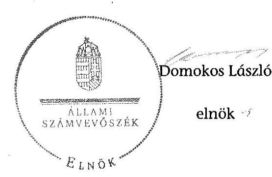

[^0]
[^0]:    ${ }^{42}$ Vhr. 9. § (3) bekezdés (hatályos 2010. december 31-ig), Vhr. 9. § (5) bekezdés (hatályos 2011. január 1-től)

---

# RÖVIDÍTÉSEK JEGYZÉKE 

## Jogszabályok

Áfa tv.
Áht. 1
Áht. 2
Alaptörvény
ÁSZ tv.
Avtv.

Evt. 1
Evt. 2

Evr. 1

Evr. 2

Gt.
Info. tv.

Mfbtv.
Nfatv.
Nvtv.
Ptk.
Számv. tv.
új Ptk.
Vadvédelmi tv.
Vtv.

Az általános forgalmi adóról szóló 2007. évi CXXVII. törvény (hatályos: 2008. január 1-jétől)
Az államháztartásról szóló 1992. évi XXXVIII. törvény (hatálytalan: 2012. január 1-jétől)
Az államháztartásról szóló 2011. évi CXCV. törvény (hatályos 2012. január 1-jétől)
Magyarország Alaptörvényéről szóló 2011. évi CCCCIIV. törvény (hatályos: 2012. január 1-jétől)
Az Állami Számvevőszékről szóló 2011. évi LXVI. törvény
A személyes adatok védelméről és a közérdekú adatok nyilvánosságáról szóló 1992. évi LXIII. törvény (hatálytalan: 2012. január 1-jétől)
Az erdőről és az erdő védelméről szóló 1996. évi LIV. törvény (hatálytalan: 2009. július 10-től)
Az erdőről, az erdő védelméről és az erdőgazdálkodásról szóló 2009. évi XXXVII. törvény (hatályos: 2009. július 10 -től)
Az erdőről és az erdő védelméről szóló 1996. évi LIV. törvény végrehajtásáról szóló 29/1997. (IV. 30.) FM rendelet (hatálytalan: 2009. november 21 -től)
Az erdőről, az erdő védelméről és az erdőgazdálkodásról szóló 2009. évi XXXVII. törvény végrehajtásáról szóló 153/2009. (XI. 13.) FVM rendelet (hatályos: 2009. november 21 -től)
A gazdasági társaságokról szóló 2006. évi IV. törvény (hatályos: 2014. március 14-ig)
Az információs önrendelkezési jogról és az információszabadságról szóló 2011. évi CXII. törvény (hatályos: 2011. január 1-jétől)
A Magyar Fejlesztési Bank Részvénytársaságról szóló 2001. évi XX. törvény

A Nemzeti Földalapról szóló 2010. évi LXXXVII. törvény (hatályos: 2010. szeptember 1-jétől)
A nemzeti vagyonról szóló 2011. évi CXCVI. törvény (hatályos: 2011. december 31-étől)
A Polgári Törvénykönyvről szóló 1959. évi IV. törvény (hatályos: 2014. március 14-ig)
A számvitelről szóló 2000. évi C. törvény
A Polgári Törvénykönyvről szóló 2013. évi V. törvény
A vad védelméről, a vadgazdálkodásról, valamint a vadászatról szóló 1996. évi LV. törvény
Az állami vagyonról szóló 2007. évi CVI. törvény

---

| Vhr. | Az állami vagyonnal való gazdálkodásról 254/2007. (X.   4.) Korm. rendelet |
| :--: | :--: |
| 143/2009. (VII.   6.) Korm. rendelet | Az erdőgazdálkodási és erdővédelmi bírság mértékéről és   kiszámításának módjáról (hatályos 2009. július 10-től) |
| 262/2010. (XI.17.) Korm.   rendelet | A Nemzeti Földalapba tartozó földrészletek hasznosításá-   nak részletes szabályairól szóló Korm. rendelet |
| Egyéb rövidítések |  |
| AK érték | Aranykorona érték |
| Alapító | A Magyar Állam, akinek a nevében a társaság feletti tu-   lajdoni joggyakorló jár el |
| Alapítói Okirat | A Vértesi Erdészeti és Faipari Zrt. mindenkor hatályos Ala-   pitói Okirata |
| ÁSZ | Állami Számvevőszék |
| Beruházási Szabályzat | A Vértesi Erdő Zrt. mindenkor hatályos Beruházási Sza-   bályzata |
| Beszerzési Szabályzat | A Vértesi Erdő Zrt. mindenkor hatályos Beszerzési Szabály-   zata |
| EEVR | Egységes Erdészeti Vállalatirányítási Rendszer |
| Erdészeti Hatóság | Pest Megyei Mezőgazdasági Szakigazgatási Hivatal Erdé-   szeti Igazgatósága (2010. december 31-ig); a Pest Megyei   Kormányhivatal Erdészeti Igazgatósága (2011. ja-   nuár 1-jétől) |
| FB | a Vértesi Erdészeti és Faipari Zrt. Felügyelő Bizottsága |
| Forrás-SQL rendszer | Az MNV Zrt. által üzemeltetett vagyon-nyilvántartási in-   formatikai rendszer, amelynek feladata volt a vagyonke-   zelők számára a vagyonkataszteri jelentés elkészitésének   és adathordozón történő továbbításának biztosítása, vala-   mint a tulajdonosi joggyakorló vagyonkezelésében lévő   vagyonelemek elektronikus adatbázisban történő tételes   nyilvántartása |
| Ft | forint |
| ha | hektár |
| Informatikai Biztonsági   Szabályzat | A Vértesi Erdészeti és Faipari Zrt. Informatikai Biztonsági   Szabályzata |
| Igazgatóság | A Vértesi Erdő Zrt. Igazgatósága (2010. július 12-ig) |
| INTOSAI | Legfőbb Ellenőrző Intézmények Nemzetközi Szervezete |
| Iratkezelési Szabályzat | A Vértesi Erdészeti és Faipari Zrt. Iratkezelési Szabályzata   nemzetközi standardok |
| ISSAI | jegyzett tőke |
| JT | Kincstári Vagyonigazgatóság |
| KVI | A Kincstári Vagyoni Igazgatóság vagyon-nyilvántartási   informatikai rendszere, az állam vagyonát tartja nyilván |
| Kincstári Vagyonkatasz-   ter | informatikai rendszere, az állam vagyonát tartja nyilván   A Vértesi Erdő Zrt. mindenkor hatályos Leltározási Sza-   bályzata |
| Leltározási Szabályzat | millió forint |

---

| MFB Zrt. | Magyar Fejlesztési Bank Zártkörűen Müködő Részvénytársaság |
| :--: | :--: |
| MNV Zrt. | Magyar Nemzeti Vagyonkezelő Zártkörűen Müködő Részvénytársaság, amely 2010. szeptember 1-jétől a Nemzeti Földalapba nem tartozó állami vagyon feletti tulajdonosi joggyakorló |
| NFA | Nemzeti Földalapkezelő Szervezet |
| NVT | Nemzeti Vagyongazdálkodási Tanács |
| Összeférhetetlenségi Sza-   bályzat | A Vértesi Erdő Zrt. mindenkor hatályos Összeférhetetlenségi Szabályzata |
| Önköltségszámítási Sza-   bályzat | A Vértesi Erdő Zrt. mindenkor hatályos Önköltség számítási Szabályzata |
| Pénzkezelési Szabályzat | A Vértesi Erdő Zrt. mindenkor hatályos Pénzkezelési Szabályzata |
| ST | saját tőke |
| Számlarend | A Vértesi Erdő Zrt. mindenkor hatályos Számlarendje |
| Számviteli Politika | A Vértesi Erdő Zrt. mindenkor hatályos Számviteli Politikája |
| SZMSZ | A Vértesi Erdő Zrt. mindenkor hatályos Szervezeti és Müködési Szabályzata |
| Társaság | Vértesi Erdészeti és Faipari Zártkörűen Müködő Részvénytársaság |
| Társaság jogelődje | Vértesi Erdő- és Fafeldolgozó Gazdaság |
| Társaság feletti tulajdonosi joggyakorló ${ }_{1}$ | A Vértesi Erdészeti és Faipari Zrt. állami tulajdonú részesedése feletti tulajdonosi jogokat gyakorló Magyar Nemzeti Vagyonkezelő Zrt. (2009. január 1-jétől 2010. június 16áig) |
| Társaság feletti tulajdonosi joggyakorló ${ }_{2}$ | A Vértesi Erdészeti és Faipari Zrt. állami tulajdonú részesedése feletti tulajdonosi jogokat gyakorló Magyar Fejlesztési Bank Zártkörűen Müködő Részvénytársaság (2010. június 17 -étől 2014. július 15 -éig) |
| Vadászati hatóság | Komárom-Esztergom Megyei Mezőgazdasági Szakigazgatási Hivatal Földművelésügyi Igazgatósága (2010. december 31-ig); a Komárom-Esztergom Megyei Kormányhivatal Földművelésügyi Igazgatósága (2011. január 1-jétől) |
| Vezérigazgató | A Vértesi Erdészeti és Faipari Zrt. vezérigazgatója (2010. július 13 -tól) |
| VSZ | A KVI-vel 1996. november 1-jén kötött ideiglenes vagyonkezelési szerződés |
| $\mathrm{VSZ}_{2}$ | A Vértesi Erdészeti és Faipari Zrt.-nek az NFA-val kötött vagyonkezelési szerződése |

---

.

---

# FOGALOMTÁR 

állami vagyon
állami vagyon
használója
átlátható szervezet
földbirtok-politikai irányelvek
hasznosítás
immateriális szolgáltatásából származó bevétel
információs és kommunikációs rendszer
Kincstári Vagyoni Igazgatóság

Állami vagyon:
a) az állam tulajdonában lévő dolog, valamint dolog módjára hasznosítható természeti erő;
b) az a) pont hatálya alá tartozó mindazon vagyon, amely vonatkozásában törvény az állam kizárólagos tulajdonjogát nevesíti;
c) az állam tulajdonában lévő tagsági jogviszonyt megtestesítő értékpapír, illetve az államot megillető egyéb társasági részesedés;
d) az államot megillető olyan immateriális, vagyoni értékkel rendelkező jogosultság, amelyet jogszabály vagyoni értékű jogként nevesít;
e) az állam tulajdonában lévő pénzügyi eszközök.
Az állami vagyon használója az a természetes vagy jogi személy, jogi személyiséggel nem rendelkező szervezet, aki, vagy amely törvény vagy szerződés alapján, bármely jogcímen (bérlet, haszonbérlet, használat stb.) állami vagyont birtokol, használ, szedi annak hasznait. (Ide nem értve a haszonélvezőt, a vagyonkezelőt és a tulajdonosi jogok gyakorlóját.)
Átlátható szervezet a Nvtv. 3. § (1) bekezdés 1. pontjában felsorolt, a meghatározott követelményeknek megfelelő szervezet.
Az Nfatv. 15. § (3) bekezdés a)-s) pontjaiban meghatározott, a Nemzeti Földalapba tartozó földrészletek hasznosítására vonatkozó irányelvek.
Hasznosítás a tulajdonosi joggyakorló vagy a nemzeti vagyon használója által a nemzeti vagyon birtoklásának, használatának, hasznok szedése jogának bármely - a tulajdonjog átruházását nem eredményező - jogcímen történő átengedése, ide nem értve a vagyonkezelésbe adást, valamint a haszonélvezeti jog alapítását.
Immateriális szolgáltatásból származó bevételek azok a nem anyagjellegű szolgáltatásokból származó állami bevételek, amelyeket az Evt. 3. § (1) bekezdése szerint, a külön jogszabályban meghatározott részletes feltételek szerint, az erdők fenntartására, gyarapítására és védelmére kell fordítani.
Az információs és kommunikációs rendszer biztosítja, hogy az információk eljussanak az illetékes szervezethez, szervezeti egységhez, illetve személyhez.
A Vtv. 61. § (1) bekezdése értelmében a Kincstári Vagyoni Igazgatóság (a továbbiakban: KVI) 2007. december 31-ei hatállyal megszűnt, jogai és kötelezettségei ezen időponttól - a 66. § (1) bekezdésében megjelölt feladat kivételével - az MNV Zrt.-re szálltak. A KVI 66. § (1) bekezdésben foglalt feladata a kincstárra szállt. A jogok és kötelezettségek átszállása nem minősült a KVI által kötött szerződések módosításának.

---

kockázatkezelés
kockázatkezelési rendszer
kontrolling
kontrollkörnyezet
kontrolltevékenységek
közfeladat

A kockázatkezelés a szervezet céljai elérésével kapcsolatos kockázatok azonosításának és elemzésének, valamint a megfelelő válaszok meghatározásának folyamata.
A kockázatkezelési rendszer működtetése során fel kell mérni és meg kell állapítani a szervezet tevékenységében, gazdálkodásában rejlő kockázatokat, valamint meg kell határozni az egyes kockázatokkal kapcsolatban szükséges intézkedéseket, valamint azok teljesítésének folyamatos nyomon követésének módját. A kockázatkezelési rendszer olyan irányítási eszközök és módszerek összessége, amelynek elemei a szervezeti célok elérését veszélyeztető tényezők (kockázatok) azonosítása, elemzése, nyomon követése, valamint szükség esetén a kockázati kitettség mérséklése.
Az a vezetéstámogató rendszer, amely a vezetői tervezést, ellenőrzést, valamint információ-ellátást koordinálja célorientáltan a környezeti változásokhoz igazodva.
A kontroll környezet elemei: a szervezeti struktúra, a felelősségi, hatásköri viszonyok és feladatok, a szervezet minden szintjén meghatározott etikai elvárások, a humánerőforráskezelés. A kontrollkörnyezet alapozza meg a belső kontroll összes többi elemét a fegyelem és a struktúra biztosítása által.
A kontrollrendszer a kockázatok kezelése és tárgyilagos bizonyosság megszerzése érdekében kialakított folyamatrendszer, amely azt a célt szolgálja, hogy megvalósuljanak a következő célok:
a) a múködés és a gazdálkodás során a tevékenységeket szabályszerűen, gazdaságosan, hatékonyan, eredményesen hajtsák végre,
b) az elszámolási kötelezettségeket teljesítsék, és
c) megvédjék az erőforrásokat a veszteségektől, károktól és nem rendeltetésszerű használattól.
A kontrolltevékenységek azok az elvek (politikák) és eljárások, amelyeket a kockázatok meghatározása és a szervezet céljainak elérése érdekében alakítanak ki.
A közfeladat jogszabályban meghatározott állami vagy önkormányzati feladat, amit az arra kötelezett közérdekből, jogszabályban meghatározott követelményeknek és feltételeknek megfelelve végez, ideértve a lakosság közszolgáltatásokkal való ellátását, továbbá az állam nemzetközi szerződésekben vállalt kötelezettségeiből adódó közérdekű feladatokat, valamint e feladatok ellátásához szükséges infrastruktúra biztosítását is. Az Etv. 2. § (2) bekezdése szerint a fenntartható erdőgazdálkodás során a legfontosabb közérdekű feladat az erdők változatosságának megőrzése, az erdők fenntartása, felújítása és a védelmi, valamint közjóléti szolgáltatások biztosítása, melyek elvégzését az állam megfelelő eszközökkel biztosítja.

---

monitoring

Nemzeti Földalap
nemzeti vagyon használója
rábízott állami vagyon
társasági portfólió

A szervezet tevékenységének, a célok megvalósításának nyomon követését biztosító rendszer, amely az operatív tevékenységek keretében megvalósuló folyamatos és eseti nyomon követésből, valamint az operatív tevékenységektől függetlenül múködő belső ellenőrzésből áll. A monitoring a projektek és programok végrehajtásának nyomon követése, mely a támogató és a kedvezményezett közti megállapodásban foglalt eljárások követését, az előrehaladás ellenőrzését és a lehetséges problémák időben történő azonosítását szolgálja.
A Nemzeti Földalap a kincstári vagyon része, amelybe beletartoznak az állam tulajdonában és az ingatlan-nyilvántartásban levő, az Nfatv. 1. § (1)-(2) bekezdéseiben felsorolt területek, földrészletek és az azokhoz kapcsolódó vagyoni értékű jogok.
Az Nfatv. 15. § (1) ${ }^{1}$, valamint 1. § (1) ${ }^{2}$ bekezdése értelmében 2010. szeptember 1-jétől az erdőgazdasági társaság vagyonkezelésében lévő földterületek a Nemzeti Földalapba tartoznak, azok felett a tulajdonos jogait az agrárpolitikáért felelős miniszter az NFA útján gyakorolja.
A nemzeti vagyon használója az a természetes személy, jogi személy vagy jogi személyiséggel nem rendelkező szervezet, aki, vagy amely állami vagyon tekintetében törvény vagy szerződés alapján, a helyi önkormányzat vagyona tekintetében törvény, a helyi önkormányzat rendelete vagy szerződés alapján bármely jogcímen nemzeti vagyont birtokol, használ, szedi annak hasznait, kivéve a tulajdonosi joggyakorló (az Nvtv. 3. § (1) bekezdés 11. pontja alapján).
Rábízott állami vagyon az a Vtv. alkalmazásában állami vagyonnak minősülő vagyon, amit az MNV- a saját vagyonától elkülönítetten - kezel és nyilvántart. Az Mfbtv. 3. § (9) bekezdése szerint rábízott állami vagyon az a vagyon, amely felett az Mfbtv. erejénél fogva a Magyar Állam nevében az MFB gyakorolja a tulajdonosi jogokat. Az Nfatv. 1. § (1) bekezdésében foglaltak alapján az NFA-hoz tartozó rábízott vagyon a törvényben meghatározott, a Nemzeti Földalapba tartozó vagyon.
Társasági portfólió az MNV, illetve az MFB rábízott vagyonába tartozó állami tulajdonú társasági részesedések.

[^0]
[^0]:    ${ }^{1}$ Hatályos: 2010. szeptember 1 - 2011. július 31.
    ${ }^{2}$ Hatályos: 2010. szeptember -jétől, módosítva: 2011. augusztus 1-jétől.

---

tulajdonosi ellenőrzés
tulajdonosi joggyakorló
tulajdonosi joggyakorlás módja
vagyongazdálkodás feladata
vagyonkezelői jog

Az MNV/MFB tulajdonosi joggyakorló által végzett ellenőrzés, amelynek célja az állami vagyonnal való gazdálkodás vizsgálata, ennek keretében a rendeltetésellenes, jogszerütlen, szerződésellenes, vagy a tulajdonos érdekeit sértő, illetve a központi költségvetést hátrányosan érintő vagyongazdálkodási intézkedések feltárása és a jogszerű állapot helyreállítása, továbbá a vagyonnyilvántartás hitelességének, teljességének és helyességének biztosítása.
Tulajdonosi joggyakorló az, aki az állami, illetve a nemzeti vagyon felett az államot megillető tulajdonosi jogok és kötelezettségek gyakorlására jogosult.
Az állami vagyon felett a Magyar Âllamot megillető tulajdonosi jogoknak (és kötelezettségeknek) az összességét az állami vagyon felügyeletéért felelős miniszter gyakorolja, aki e feladatát az MNV, az MFB útján látja el. Azon állami tulajdonban álló ingatlanok felett, amelyek egy része a Nemzeti Földalapba tartozik, a tulajdonosi jogokat a miniszter az agrárpolitikáért felelős miniszterrel közösen gyakorolja. A Nemzeti Földalap felett a Magyar Állam nevében a tulajdonosi jogokat és kötelezettségeket az agrárpolitikáért felelős miniszter a Nemzeti Földalapkezelő Szervezet útján gyakorolja.
Az állami vagyon rendeltetésének megfelelő - az állami feladatok ellátásához, a társadalmi szükségletek kielégítéséhez, valamint a Kormány gazdaságpolitikája megvalósításának elősegítéséhez szükséges, egységes elveken alapuló, önálló ágazatként megjelenő - hatékony, költségtakarékos, értékmegőrző, értéknövelő felhasználásának biztosítása, beleértve a vagyoni kör változását eredményező értékesítést, valamint az állami vagyon gyarapítása is.
Vagyonkezelési szerződés alapján a vagyonkezelő jogosult meghatározott, állami tulajdonba tartozó dolog birtoklására, használatára és hasznai szedésére. A Vtv. alapján a vagyonkezelői jog az állami vagyon hasznosítására az MNVvel kötött vagyonkezelési szerződéssel jön létre. A vagyonkezelési szerződés alapján a vagyonkezelő jogosult meghatározott, állami tulajdonba tartozó dolog birtoklására, használatára és hasznai szedésére. Az Nfatv. alapján a vagyonkezelői jog az erre irányuló (NFA-val kötött) szerződéssel jön létre. A vagyonkezelői szerződés alapján a vagyonkezelő jogosult meghatározott földrészlet birtoklására, használatára és hasznai szedésére. A vagyonkezelő köteles a földrészlet értékét megőrizni, állagának megóvásáról, jó karban tartásáról gondoskodni, továbbá - az Nfatv.-ben meghatározott esetek kivételével díjat - fizetni vagy a szerződésben előírt más kötelezettséget teljesíteni.

---

A Vértesi Erdészeti Zrt. vagyonváltozásának alakulása a 2009-2013. évek közötti időszakban - Eszközök (M ft)
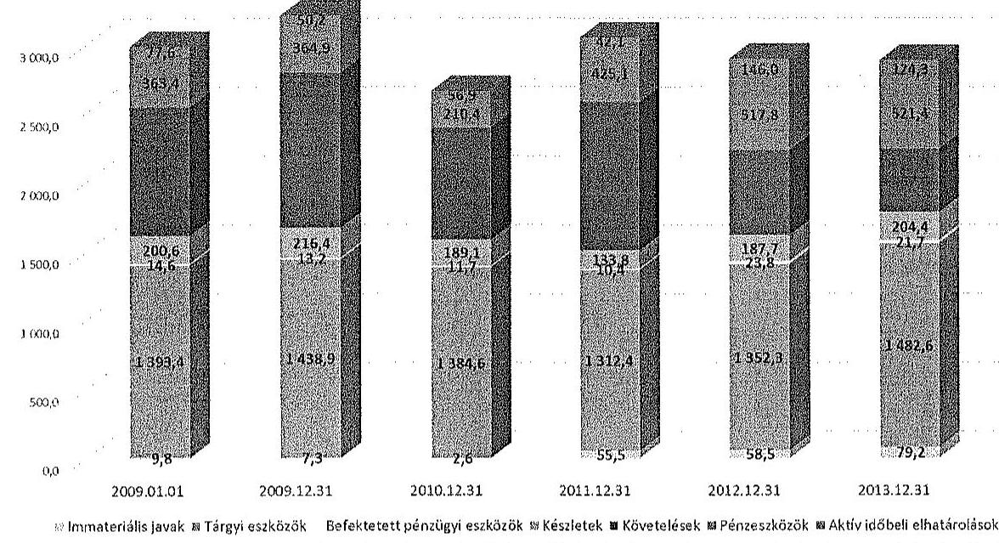

A Vértesi Erdészeti Zrt. vagyonváltozásának alakulása a 2009-2013. évek közötti időszakban - Források (M ft)
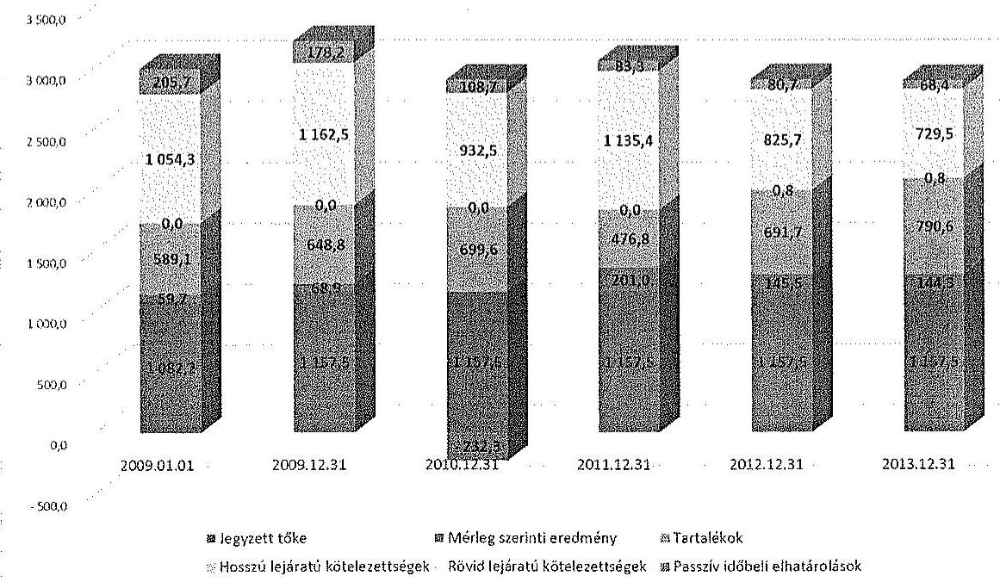

---

Az erdőgazdasági társaság vagyonának alakulása 2009-2014. években adatok ezer N-ban

|  Sorszám | Megnevezés | 2009.01.01 | 2009.12.31 | 2010.12.31 | 2011.12.31 | 2012.12.31 | 2013.12.31 | 2014.06.30 | Változás 2013.12.31/2009.12.31. (%)  |
| --- | --- | --- | --- | --- | --- | --- | --- | --- | --- |
|   |  | 1 | 2 | 3 | 4 | 5 | 6 | 7 | 8  |
|  1. | Eszközök |  |  |  |  |  |  |  |   |
|  2. | Befektetett eszközök összesen | 1 417 738 | 1 459 332 | 1 398 899 | 1 378 282 | 1 434 581 | 1 583 530 | 1 718 689 | 109%  |
|  3. | Ebből: Immateriális javak | 9 756 | 7 289 | 2 631 | 55 482 | 58 490 | 79 212 | 70 928 | 1087%  |
|  4. | Tárgyi eszközök | 1 393 422 | 1 438 875 | 1 384 589 | 1 312 445 | 1 352 276 | 1 482 624 | 1 625 224 | 103%  |
|  5. | Befektetett pénzügyi eszközök | 14 560 | 13 168 | 11 679 | 10 355 | 23 815 | 21 694 | 22 537 | 165%  |
|  6. | Forgóeszközök | 1 495 558 | 1 706 354 | 1 210 286 | 1 633 680 | 1 321 243 | 1 183 307 | 1 756 450 | 69%  |
|  7. | Előből: Készletek | 200 615 | 216 361 | 189 138 | 133 809 | 187 737 | 204 395 | 189 471 | 94%  |
|  8. | Követelések | 931 495 | 1 125 137 | 810 734 | 1 074 779 | 615 694 | 457 550 | 1 068 090 | 41%  |
|  9. | Értékpapírok | 0 | 0 | 0 | 0 | 0 | 0 | 0 | 0  |
|  10. | Pénzeszközök | 363 448 | 364 856 | 210 414 | 425 092 | 517 812 | 521 362 | 498 889 | 143%  |
|  11. | Aktív időbeli elhatárolások | 77 617 | 50 248 | 56 917 | 42 101 | 146 032 | 124 294 | 115 995 | 247%  |
|  12. | Eszközök összesen | 2 990 913 | 3 215 934 | 2 666 102 | 3 054 063 | 2 901 856 | 2 891 131 | 3 591 134 | 90%  |
|  13. | Források |  |  |  |  |  |  |  |   |
|  14. | Saját tőke | 1 662 994 | 1 807 193 | 1 574 873 | 1 775 919 | 1 921 369 | 2 065 639 | 2 198 228 | 114%  |
|  15. | Ebből: Jegyzett tőke | 1 082 200 | 1 157 520 | 1 157 520 | 1 157 520 | 1 157 520 | 1 157 520 | 1 157 520 | 100%  |
|  16. | Tőketartalék | 352 866 | 352 866 | 352 866 | 352 866 | 352 866 | 352 866 | 352 866 | 100%  |
|  17. | Érszáménykartalék | 168 241 | 227 928 | 296 808 | 64 487 | 265 533 | 410 983 | 555 253 | 180%  |
|  18. | Lekötött tartalék | 0 | 0 | 0 | 0 | 0 | 0 | 0 | 0  |
|  19. | Értékelési tartalék | 0 | 0 | 0 | 0 | 0 | 0 | 0 | 0  |
|  20. | Mérleg szerinti eredmény | 59 687 | 68 879 | -332 521 | 201 046 | 145 450 | 144 270 | 132 589 | 209%  |
|  21. | Céltartalékok | 68 000 | 68 000 | 49 955 | 59 455 | 73 277 | 26 742 | 26 742 | 39%  |
|  22. | Kötelezettségek | 1 054 253 | 1 162 525 | 932 534 | 1 135 351 | 826 475 | 730 319 | 1 284 332 | 63%  |
|  23. | Előből: Hátrasorolt kötelezettségek | 0 | 0 | 0 | 0 | 0 | 0 | 0 | 0  |
|  24. | Hosszú lezáratú kötelezettségek | 0 | 0 | 0 | 0 | 805 | 805 | 805 | 0  |
|  25. | Rövid lezáratú kötelezettségek | 1 054 253 | 1 162 525 | 932 534 | 1 135 351 | 825 670 | 729 514 | 1 283 527 | 63%  |
|  26. | Panszív időbeli elhatárolások | 205 666 | 178 216 | 108 740 | 83 338 | 80 735 | 68 431 | 81 832 | 38%  |
|  27. | Források összesen | 2 990 913 | 3 215 934 | 2 666 102 | 3 054 063 | 2 901 856 | 2 891 131 | 3 591 134 | 90%  |

---

A befristetett sorbözök állomáspénsék aludelása

|  Sorszám | Módszőrszék | 2000. év | 2005. év | 2006. év | 2007. év | 2008. év | 2009. év | 2010. év | 2011. év | 2012. év | 2013. év | 2014. év | 2015. év | 2016. év | 2017. év | 2018. év | 2019. év | 2020. év  |
| --- | --- | --- | --- | --- | --- | --- | --- | --- | --- | --- | --- | --- | --- | --- | --- | --- | --- | --- |
|   |  | Összesen | Élőmit végzett | Száll végzett | Összesen | Élőmit végzett | Száll végzett | Összesen | Élőmit végzett | Száll végzett | Összesen | Élőmit végzett | Száll végzett | Összesen | Élőmit végzett | Száll végzett | Összesen | Élőmit végzett  |
|  1. | Nyilvá állomokay | 1 417 738 | 0 | 1 417 738 | 1 419 332 | 0 | 1 419 332 | 1 398 899 | 0 | 1 398 899 | 1 378 202 | 0 | 1 378 202 | 1 426 351 | 4 342 | 1 420 019 | 1 582 230 | 20 703  |
|  2. | Terv szerinti értékesítési | 162 629 | 0 | 162 629 | 164 789 | 0 | 164 789 | 167 121 | 0 | 167 121 | 166 268 | 0 | 166 227 | 187 561 | 27 | 187 524 | 65 465 | 19  |
|  3. | Tervon lefúlt értékesítésre | 438 | 0 | 438 | 6 677 | 0 | 6 677 | 0 | 0 | 0 | 0 | 0 | 0 | 0 | 0 | 0 | 0 | 0  |
|  4. | Értékvaztás elszámolása | 0 | 0 | 0 | 0 | 0 | 0 | 0 | 0 | 0 | 0 | 0 | 0 | 0 | 0 | 0 | 0 | 0  |
|  5. | Értéketőn | 3 930 | 0 | 3 930 | 3 696 | 0 | 3 696 | 1 230 | 0 | 1 230 | 493 | 0 | 493 | 2 662 | 0 | 2 662 | 66 | 0  |
|  6. | Szívfizetés | 1 560 | 0 | 1 560 | 204 | 0 | 204 | 1 669 | 0 | 1 669 | 3 655 | 0 | 3 656 | 2 723 | 0 | 2 723 | 1 271 | 0  |
|  7. | Átvarulaté | 0 | 0 | 0 | 0 | 0 | 0 | 0 | 0 | 0 | 0 | 0 | 0 | 0 | 0 | 0 | 0 | 0  |
|  8. | Vegyeses átadás | 0 | 0 | 0 | 0 | 0 | 0 | 3 329 | 0 | 3 329 | 0 | 0 | 0 | 0 | 0 | 0 | 0 | 0  |
|  9. | Egyéb | 1 181 | 0 | 1 181 | 17 238 | 0 | 17 238 | 1 626 | 0 | 1 626 | 9 132 | 0 | 9 132 | 6 708 | 0 | 6 708 | 872 | 0  |
|  10. | Gazdálomás összesen | 171 546 | 0 | 171 546 | 192 034 | 0 | 192 034 | 174 816 | 0 | 174 816 | 181 374 | 0 | 181 363 | 197 247 | 27 | 197 233 | 92 778 | 15  |
|  11. | Terv szerinti beruházás | 212 842 | 0 | 212 842 | 121 022 | 0 | 121 022 | 163 863 | 0 | 163 863 | 211 939 | 4 371 | 207 339 | 354 833 | 16 238 | 300 665 | 229 362 | 33 972  |
|  12. | Terv szerinti lefújítás | 0 | 0 | 0 | 678 | 0 | 678 | 1 346 | 0 | 1 346 | 0 | 0 | 0 | 21 373 | 0 | 21 373 | 1 353 | 0  |
|  13. | Tervi szerinti szívokadé | 212 846 | 0 | 212 846 | 132 101 | 0 | 132 101 | 134 397 | 0 | 134 397 | 211 929 | 6 271 | 197 339 | 346 376 | 16 238 | 321 938 | 228 927 | 25 972  |
|  14. | Egyéb beruházás | 0 | 0 | 0 | 0 | 0 | 0 | 0 | 0 | 0 | 0 | 0 | 0 | 0 | 0 | 0 | 0 | 0  |
|  15. | Egyéb lefújítás | 0 | 0 | 0 | 0 | 0 | 0 | 0 | 0 | 0 | 0 | 0 | 0 | 0 | 0 | 0 | 0 | 0  |
|  16. | Átvarulaté | 0 | 0 | 0 | 0 | 0 | 0 | 0 | 0 | 0 | 0 | 0 | 0 | 0 | 0 | 0 | 0 | 0  |
|  17. | Átvatal | 0 | 0 | 0 | 0 | 0 | 0 | 0 | 0 | 0 | 0 | 0 | 0 | 0 | 0 | 0 | 0 | 0  |
|  18. | Értékvaztás elutasítása | 0 | 0 | 0 | 0 | 0 | 0 | 0 | 0 | 0 | 0 | 0 | 0 | 0 | 0 | 0 | 0 | 0  |
|  19. | Értékesítésre |  |  |  |  |  |  |  |  |  |  |  |  |  |  |  |  |   |

---

.

---

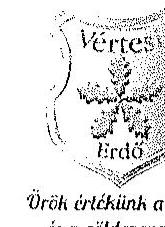

Vértesi Erdészeti és Faipari Zárthörüen Müködő Részvénytársaság
H-2800 Tatabánya II. Dózsákert utca 63. PF: 121 Telefon: +36 (34) 316-733 Telefax: +36 (34) 316-226
E-mail: titkarsag@verteserdo.hu Web: www.verteserdo.hu
Adószám: 11187622-2-11 MKB Bank: 103000002-10640384-49020016

Előadó: Kun Miklós

Ügykatszám: ÁLT-57C-5/2015

Ürök értékeink az erdő és a zöldenergiai!
Melléklet:
Kelt: 2015. 10. 26.

Tárgy: észrevételek a V-0759-063/2015. iktatószámú jegyzőkönyv tervezethez

Állami Számvevőszék
1052 Budapest, Apáczai Csere János utca 10.

Domokos László elnök úr részére

Tisztelt Elnök Úr!

A V-0759-063/2015. iktatószámú „Az állami tulajdonban álló erdőgazdasági társaságok vagyongazdálkodási tevékenységének ellenőrzése - Vértesi Erdészeti és Faipari Zrt." címmel készített számvevőszéki jelentéstervezetre (továbbiakban: Jelentéstervezet) az alábbi észrevételeket tesszük.

1. 6. oldal 1. bekezdés, illetve 12. oldal 1.1. pont (A Társaság vagyongazdálkodása). A társaság vagyona (mérlegfőösszege) - mint az a Jelentéstervezet 3/B mellékletéből is kiolvasható - a 2009. évi nyitó értékről 2013. december 31-re valóban csökkent és bár a 2009. december 31-i értéket az ellenőrzött időszakban nem érte el, az nem monoton csökkent és így azt semmiképpen sem okozhatta „a követeléseknél 2010. évben „a Társaság számára meghatározó revővel szemben csődegyezség miatt elszámolt értékvesztés". A társaság vagyonának (mérlegfőösszeg) valóban egyik meghatározó eleme a követelések időszaki záró értéke, melynek nagyságát a Vértesi Erdő Zrt. esetében, tevékenységének - esetenként - jelentős részét kitevő energetikai célú biomassza kereskedelem volumenváltozása okozta (és jelenleg is okozza).

2. 6. oldal 2-4. bekezdés, 12. oldal 1.1. pont („A Társaság mérlegei nem a valós állapotot tükrözték"), 18. oldal 2.2. pont (vagyonnyilvántartás), 24. oldal 4.1. pont (kontrollrendszer)

Társaságunk úgy gondolja, hogy - amennyiben ez szakmailag megalapozott - az egységes kezelés érdekében a mindenkori tulajdonosi joggyakorló iránymutatásai alapján lenne lehetséges vagyonkezelt erdő- és földterületek értéken történő nyilvántartása. A társaság arra vonatkozó megállapításait - mely szerint a vagyonkezelésében lévő földterületek a társaság könyveiben nulla értéken szerepelnek, mert azok értékéről a működése alapjául szolgáló ideiglenes vagyonkezelési szerződés nem rendelkezik - a vizsgált időszak összes éves beszámolójának kiegészítő mellékletében jelezte (Specifikus rész II/A/1. A Társaság mérlegének elemzése - Eszközök bekezdés). Ezzel kapcsolatban megjegyezzük, hogy a számvitelről szóló 2000. évi C. tv. 16. § (5) bekezdés szerinti költség-haszon összevetésének elvét tekintve nem biztos, hogy a többletinformáció hasznossága arányban áll annak megszerzésére fordított ráfordítással, figyelembe véve azt a tényt, hogy a társaságunk által vagyonkezelt terület több mint 1300 db helyrajzi-számon helyezkedik el, melyből közel 1000 db az erdő művelési ágú, a maga tízezres nagyságrendű erdőrészletével. Az erdőgazdálkodásnak az egyik legnehezebb közgazdasági szempontú feladatai közé tartozik az erdőérték-számítás, mely igen sok

---

tényező együttes figyelembevételét igényli, ezért ekkora területen erdőrészletcnként ez egy hosszadalmas (és igen költséges) folyamat lenne.
A társaság annál a vagyonkezelésébe kerülő ingatlannál, mely tekintetében rendelkezett információval annak nyilvántartási értékéröl, azt a szánvíteli törvény elöirásait alkalmazva mérlegében kimutatta és kiegészitő mellékletében (mérlegsoronként) bemutatta (ezt a Jelentéstervezet is többször hangsúlyozza).
Az erdő értékének megállatáához és nyilvántartásához végezetül hivatkoznánk, a nemzeti vagyonról szóló 2011. évi CXCVI. törvény 10. § (1) bekezdésére, miszerint a nemzeti vagyont, annak értékét és változásait a tulajdonosi joggyakorló nyilvántartja. Az érték nyilvántartásától el lehet tekinteni, ha az adott vagyontárgy értéke természeténél, jellegénél fogva nem állapítható meg. A nyilvántartásnak tartalmaznia kell a vagyon elsődleges rendeltetése szerinti közfeladat megjelölését is. A nyilvántartási adatok - a minősített adat védelméről szóló törvény szerinti minősített adat kivételével - nyilvánosak.
3. "6. oldalon: A kezelt vagyon nyilvántartása tekintetében a Társaság és a tulajdonosi joggyakorló MNV Zrt. és NFA közötti egyeztetések az ellenörzés befejezéséig nem kerïltek lezárásra, igy a Társaság nem rendelkezett a vagyonkezelésében lévö valamennyi állami vagyonra, és annak nagyságára vonatkozó, a tulajdonosi joggyakorló MNV Zrt. és NFA nyilvántartásával egyezö adattal." - A 1996. november 1-én kötött ideiglenes vagyonkezelési szerződés óta többször is változott a tulajdonosi joggyakorló (az NFA csak 2001 óta létezik.) Továbbá: "16. oldalon: 2010. évtöl a tulajdonosi jogok gyakorlása az egyes vagyoni körök tekintetében elkitlomült, igy a joggyakorlàs megosztottà vált." illetve "16. oldalon: A Társaságnak a KVl-vel kötött VSZ-e nem támogatta megfelelöen és számon kérhetö módon, a Vhr. 3. § (1) bekezdésében elöirtak megvalósulását, az állami vagyonnal való szuhályszerü gazdálkodást." Mindezek a megállapítások is alátámasztják, hogy a társaságnak lehetősége sem volt igazán a végleges vagyonkezelői szerződés megkötésére, hiszen kivel és mikor - az állandó tulajdonosi és jogszabályi változások mellett - lett volna mód egyeztetni az összes erdörészlet tekintetében? A Vértesi Erdő Zrt. részéről az üzemtervezések idején - ahogy a jelenleg is folyó erdőtervezéskor - ez megvalósult/megvalósul az erdészeti hatóság felé. Ebből a szempontból nézve mulasztás társaságon nem kérhető számon.
4. A jelentéstervezet megállapította, hogy a vagyonkezelési szerzödést az ellenörzött idöszakban, azaz 2009. január 1. napjától 2014. június 30. napjảig nem aktualizálta a Társaság a vagyoni kör, a tulajdonosi jogok gyakorlására felhatalmazott szervezetek változásai, valamint a Társaság vagyonkezelésére vonatkozó jogszabályi rendelkezések változásai ellenére. A vagyonkezelési szerződés felülvizsgálata, módosítása és a módosításokkal történő egységes szerkezetben foglalása nem történt meg, ezt sem a Társaság, sem a kezelt vagyoni kör felett tulajdonosi jogokat gyakorló nem kezdeményezte.
A jelentéstervezet fentebb hivatkozott megállapításaival kapcsolatban tájékoztatásul tényként közöljük, hogy az MNV Zrt. „Tájékoztatás az erdőgazdasági társaságok végleges vagyonkezelési szerződéseinek előkészítése és a vagyonkezelői díjak számlázása tárgyában" 2014. április 29. napján kelt, MNV/01/18687/4/2014. iktatószámú levele is elismeri, hogy „Az elmúlt években az erdőgazdasági társaságok kezelésében lévő ingatlanvagyon tulajdonosi joggyakorlásának rendezése, a végleges vagyonkezelési szerződések, és az azok alapját képező ingatlanlisták előkészítése, továbbá a fennálló kezelőívagyonkezelői jogviszonnyal kapcsolatos jelentésiadatszolgáltatási kötelezettséggel kapcsolatos feladatok elvégzése érdekében az MNV Zrt. és Társaságunk között több eljárási lépés is történt. Ennek során minden esetben

---

pozitív hozzáállást, korrekt kapcsolattartást tapasztaltak a Társaság részéről. A vagyonkezelési szerződések előkészitésének első ütemében az erdőgazdasági társaság kezelésében lévő ingatlanvagyon tulajdonosi joggyakorlók szerinti leválogatást az MNV Zrt. - a Társaság által rendelkezésre bocsátott - 2011. július 31-i állapotra vonatkozó - leltárjelentések alapján elvégezte a Nemzeti Földalapról szóló 2010. évi LXXXVII. törvény 1-3. §-ok, valamint az Állami vagyonról szóló 2007. évi CVI. törvény 3. § (1) bekezdés a) pont figyelembevétele mellett." A hivatkozott levél utalt arra is, hogy a MNV Zrt. és az NFA között egyeztetés is folyamatos, melyben felhasználták a Társaság által korábban tételesen rendelkezésre bocsátott szakmai információkat. Az egyeztetésekről a Társaságunkat értesítették, Társaságunknak véleményezési joga volt, az ellenőrzött időszakot figyelembe véve legutóbb 2014. áprilisában.
Vagyonkezelési szerződések megkötésével kapcsolatban 2014. májusában történt az NFA és a Társaság közötti újabb egyeztetés és véleménycsere, valamint az MFB és az MNV Zrt. közötti egyeztetés véleményezése.
5. A jelentéstervezet megállapításával kapcsolatban, miszerint a Nemzeti Földalapba tartozó földrészletek hasznosításának részletes szabályairól 262/2010. (XI.17.) Korm. rendeletben foglaltakkal ellentétben az NFA felé adatszolgáltatás nem történt. Tájékoztatjuk, hogy az adatszolgáltatással érintett ügyekben minden esetben kértük az NFA hozzájárulását, míg a változások Földhivatali átvezetését követően a határozatot a Földhivatal hivatalból az NFA részére is megküldte, megküldi.

Tisztelettel:
Kocsis Mihály
vezérigazgató

---

.

---

# ELHÖK 

## Kocsis Mihály úr

vezérigazgató
Vértesi Erdészeti és Faipari Zrt.

## Tatabánya

## Tisztelt Vezérigazgató Úr!

A „Jelentéstervezet az állami tulajdonban álló erdőgazdasági társaságok vagyongazdálkodási tevékenységének ellenörzése - Vértesi Erdészeti és Faipari Zrt." címmel készített számvevőszéki jelentéstervezetre tett észrevételeit köszönettel megkaptam.

Az Állami Számvevőszék észrevételekre vonatkozó álláspontjáról a felügyeleti vezető által készített részletes tájékoztatást csatoltan megküldöm.

Tájékoztatom Vezérigazgató urat, hogy a számvevőszéki jelentésben - az Állami Számvevőszékről szóló 2011. évi LXVI. törvény 29. § (3) békezdése alapján - a figyelembe nem vett észrevételeket szerepeltetjük az elutasítás indokának feltüntetésével.

Budapest, 2015. hó nap
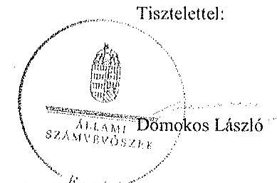

Melléklet: Tájékoztatás az elfogadott és el nem fogadott észrevétekérül

---

# Tájékoztatás 

az elfogadott és el nem fogadott észrevételekről

A ,,Jelentéstervezet az állami tulajdonban álló erdőgazdasági társaságok vagyongazdálkodást tevékenységének ellenörzése - Vértesi Erdészeti és Faipari Zrt." címü jelentéstervezetre 2015. október 29 -én érkezett észrevételeit áttekintettük, azok kezelésével kapcsolatban a következő tájékoztatást adom.

1. észrevétel -- 6. oldal 1. bekezdés, illetve 12. oldal 1.1. pont (A Társaság vagyongazdálkodása)

A dokumentumok ismételt áttekintését követően a jelentéstervezet 6. oldal 1. bekezdés 3. mondatát és 12 . oldal 2 . bekezdés 3 . mondatát töröljük.
2. észrevétel - 6. oldal 2-4. bekezdés, 12. oldal 1.1. pont (,,4 Társaság mérlegel nem a valós állapotot tükrözték"), 18. oldal 2.2. pont (vagyonnyilvántartás), 24. oldal 4.1. pont (kontrollrendszer)

A Vhr. 9. § (9) bekezdés a) pontja alapján a vagyonkezelő köteles a vagyonkezelésbe vett eszközöket a Számv. tv. előírásai szerint a hosszú lejáratú kötelezettségekkel szemben a vagyonkezelési szerződésben rögzített értéken állományba venni. A Számv. tv. 23. § (2) bekezdése előírja, hogy a vagyonkezelőnél a mérlegben eszközként kell kimutatni a törvényi rendelkezés, illetve felhatalmazás alapján - kezelésbe vett, az állami vagy önkormányzati vagyon részét képező eszközöket is. Ezen eszközöket a kiegészítő mellékletben - legalább mérlegtételek szerinti megbontásban - külön be kell mutatni. Az ideiglenes vagyonkezelési szerződésben a vagyonkezelésbe adott vagyon értékét nem rögzítették, a szerződés azt sem tartalmazta, hogy a vagyonkezelt eszközök értéke nulla, továbbá nincs rendelkezés arra sem a szerződésben, hogy a vagyonkezelésbe adott vagyon értékét azért nem határozták meg, mert az a vagyontárgy természeténél, jellegénél fogva nem állapítható meg. A Társaság mérlegei nem tartalmazták a vagyonkezelt eszközök értékét, azonban ezt a könyvvizsgáló nem kifogásolta. A Társaság a Számv. tv. és a Vhr. előírásainak betartása céljából nem tett lépéseket annak érdekében, hogy a vagyonkezelt eszközök értéke a vagyonkezelési szerződésben rögzítésre kerüljön.

A Vhr. 17. § (1) bekezdése szerint a saját vagyonnal rendelkező vagyonkezelő a rábízott állami vagyonról olyan elkülönített nyilvántartást köteles vezetni, amely tételesen tartalmazza ezen eszközök könyv szerinti bruttó és nettó értékét, az elszámolt terv szerinti és terven felüli értékcsökkenés összegét és az értékben bekövetkezett egyéb változásokat. A Vértesi Erdészeti és Faipari Zrt. által vezetett nyilvántartás nem tartalmazta a

---

vagyonkezelt eszközök könyv szerinti bruttó és nettó értékét, valamint az értékben bekövetkezett egyéb változásokat, ezért nem felelt meg a Vhr. 17. § (1) bekezdésében foglaltaknak. A fentiek alapján a jelentéstervezet megállapításainak módosítása nem indokolt.
3. észrevétel - 6. oldal: „A kezelt vagyon nyilvántartása tekintetében a Társaság és a tulajdonosi joggyakorló MNV Zrt. és NFA közötti egyeztetések az ellenörzés befejezéséig nem kerültek lezárásra, így a Társaság nem rendelkezett a vagyonkezelésében lévő valamennyi állami vagyonra, és annak nagyságára vonatkozó, a tulajdonosi joggyakorló MNV Zrt. és NFA nyilvántartásával egyezö adattal."

A jelentésben elkülönülnek a Társaság feletti tulajdonosi joggyakorlóra, illetve a vagyonkezelt földterületek feletti tulajdonosi joggyakorlóira vonatkozó megállapítások. A vagyonkezelt földterületek tekintetében a tulajdonosi joggyakorló 2011-ig az MNV Zrt. volt, azt követően a tulajdonosi jogokat - a vagyoni körök szerint - megosztottan az MNV Zrt. és az NFA gyakorolta. Az ideiglenes vagyonkezelési szerződés (VSZ) 3.3.2. pontja szerint a VSZ-t a félek a tárgyévet megelőző év november 30 -ig felülvizsgálják. A VSZ évente előírt felülvizsgálata nem történt meg, azt az észrevétel sem vitatja. Megállapításaink módosítása tehát nem indokolt.
4. észrevétel - A jelentéstervezet megállapította, hogy a vagyonkezelési szerződést az ellenőrzött időszakban, azaz 2009. január 1. napjától 2014. június 30. napjáig nem aktualizálta a Társaság a vagyoni kör, a tulajdonosi jogok gyakorlására felhatalmazott szervezetek változásai, valamint a Társaság vagyonkezelésére vonatkozó jogszabályi változások ellenére. A vagyonkezelési szerződés felülvizsgálata, módosítása és annak módosításokkal történő egységes szerkezetbe foglalása nem történt meg, ezt sem a Társaság, sem a kezelt vagyoni kör feletti tulajdonosi jogokat gyakorló nem kezdeményezte.

A dokumentumok ismételt áttekintését követően a jelentéstervezet 7. oldal 2. bekezdés 2. mondatát és 17. oldal 3. bekezdés 3. mondatát töröljük, a 7. oldal 2. bekezdés 1. mondatát és 17. oldal 3. bekezdés 2. mondatát az alábbiak szerint pontosítjuk:
„A VSZ évente történő felülvizsgálata, illetve egységes szerkezetbe foglalása nem történt meg, annak módosításai csak a kezelésbe átadott vagyon változásait tartalmazták, az éves felülvizsgálatot a felek nem kezdeményezték."
5. észrevétel - A jelentéstervezet megállapításával kapcsolatban, miszerint a Nemzeti Földalapba tartozó földrészletek hasznosításának részletes szabályairól szóló 262/2010. (XI. 17.) Korm. rendeletben foglaltakkal ellentétben az NFA felé adatszolgáltatás nem történt.
A 262/2010. (XI. 17.) Korm. rendelet 50/A. § (1) bekezdése szerint a Társaságot - a Nemzeti Földalap vagyon-nyilvántartásának naprakész vezetése és az NFA beszámolókészítési kötelezettségének megalapozottsága érdekében - a Korm. rendelet, valamint a szerződés szerinti adatszolgáltatási kötelezettség terheli a szerződés tartama alatt. Az

---

ideiglenes vagyonkezelési szerződés 3.10. pontja szerint a Társaságnak a vagyonkezelésbe adott erdővagyonról és annak változásairól írásban beszámolót kell késziteni a kezelt területek feletti tulajdonosi joggyakorlónak a tárgyévet követő május 31 -élg. A Társaság nem készítette el az NFA részére a 3.10. pont szerinti beszámolókat, ezért megállapításunk módosítása nem indokolt.

Budapest, 2015. AA. hó 36 nap

Makkai Mária
felügyeleti vezető

---

# 7. SZÁMÚ MELLÉKLET A V-0759-075/2015. SZÁMÚ JELENTÉSHEZ 

## 4280

## MNV

Máccar Némféti
VagjonkeztiOZtE
Vezfricazcató

Állami Számvevószék

## Domokos László

elnök

1052 Budapest
Apáczai Cs. J. u. 10.

1052 Budapest
Apáczai Cs. J. u. 10.
Ikt. sz.: MNV/01/50500/ -1 /2015.
Hiv. sz.: V-0759-065/2015.
Tisztelt Elnök Úr!
A 2015. október 14. napján „Az állami tulajdonban álló erdőgazdasági társaságok vagyongazdálkodási tevékenységének ellenörzése - Vértesi Erdészeti és Faiputi Zrt." tárgyában kézhez vett, V-0759-065/2015. ikt. sz. Jelerzés-tervezetre az alábbi észrevételeket kivánom tenni.
I. fejezet / 7. old. második bekezdés, 9. old. negyedik-ötödik bekezdés, 10. old. első-második bekezdés, II.2.1. fejezet / 17. old. második-harmadik bekezdés, II.5. fejezet / 29. old. első bekezdés és 10. old. Javaslat az MNV Zrt. vezérigazgatójának a)-ci pontok
„A vagyoni kör, a tulajdonosi jogok gyakorlására felhatalmazott szervezetek változásai, valamint a társaság vagyonkezelésére vonatkozó jogszabályi rendelkezések változásai ellenére a VSZ-t az ellenőrzött időszakban nem aktualizálták. A VSZ felülvizsgálata, egységes szerkezetbe foglalása nem történt meg, annak módosításai csak a kezelésbe átadott vagyon változásait tartalmazzák. A VSZ módosítását és annak módosításokkal történő egységes szerkezetbe foglalását sem a Társaság, sem a kezelt vagyoni kör felett tulajdonosi jogokat gyakorló MNV Zrt., illetve NFA nem kezdeményezte. ... A felek nem tettek eleget a Vhr. elöírásinak, mert a Vhr. hatályhalépést követő hat hónapon belül nem kezdeményezték a Nemzeti Földalapba tartozó, ingatlanokra vonatkozóan a VSZ megszüntetését és a jogszabályoknak megfelelő szerzödés megkötését."
„A vagyonkezelésbe adott állami vagyon tekintetében tulajdonosi jogokat gyakorló MNV Zrt. és NFA tevékenysége az ellenőrzött időszakban nem támogatta teljes körüen a felelős vagyongazdálkoalás megvalósulását, a VSZ-szel kapcsolatban feltárt hiányosságok megszüntetésére és a hatályos jogszabályoknak való megfeleltetésére vonatkozóan nem kezdeményeztek intézkedéseket. Nem éltek a Vhr.-ben foglalt, a kezelt vagyon használatára vonatkozó ellenőrzési jogukkal, valamint nem végeztek a Vhr.-ben foglalt, a vagyonnyilvántartás hitelességére, teljességére és helyességére vonatkozó ellenőrzési a Társaságnál.
A Vértesi Erdő Zrt. a Magyar Állam tulajdonában álló erdővagyon és egyéb müvelési ágú termöföld ingatlanok kezelését a KVI-vel 1996. november 1-jén kötött vagyonkezelési szerzödés alapján végezte. A Társaság, mint vagyonkezelő és a KVI között létrejött szerződéses jogviszony kereteit a VSZ-ben foglalt jogok és kötelezettségek töltötték ki. A Társaságnál a KVI-vel kötött VSZ-e nem támogatta megfelelöen és szánon kérhető módon az állami vagyonnal való szabályszerű gazdálkodást. Az ellenőrzött időszakban a VSZ hatályon kívül helyezett jogszabályi hivatkozásokat tartalmazott az Ákt., 109/B.§, az Ákt., 109/G.§ és a Vzabvédelmi. tv. 98. § rendelkezései vonatkozásában és nem tartalmazza a Vtv., az Evt., a Nvtv. és az Nfatv. elöírásaira történő hivatkozást. A VSZ 3.2.3. pontja lehetőséget biztosít a vagyonkelönek a vagyonkezelői jog átruházására, azonban a rendelkezés ellentétes az Nfatv. 19/A. § (4) bekezdésében foglaltukkal, melynek értelmében vagyonkezelői jog harmadik személynek nem engedhető át. A VSZ 3.3.2. pontjában foglaltuk ellenére a szerzödést évente nem vizsgálták felül, azt a felek nem kezdeményezték. A felek nem tettek eleget a Vhr. 54. § (71) bekezdés elöírásinok, mert a Vhr. hatálybalépését követő hat hónapon belül nem kezdeményezték a Nemzeti Földalapba tartozó ingatlanokra vonatkozóan a VSZ, megszüntetését és a jogszabályoknak megfelelő szerződés megkötését.

---

A vagyonkezeléshe adott állami vagyon tekintetében tulajdonosi jogokat gyakorló MNV Zrt. és NFA nem végeztek a Vhr. 20. § (1)-(2) bekezdéseiben és a Nemzeti Földalapba tartozó földrészletek hasznosításának részletes szabályairól szóló 262/2010. (XI. 17.) Korm. rendelet 47. § (1)-(2) bekezdéseiben foglalt, a vagyonnyilvántartás hitelességére, tejességére és helyességére vonatkozó ellenőrzést a Társuságnál.

# Jarasha az MNV Zrt. vezérigazgatójának 

a) Tegyen intézkedéseket az erdőgazdasági társaság közremüködésével a tényleges állapotot rögzitő és a hatályos jogszabályi elöírásoknak megfelelő vagyonkezelési szerződés megkötésére.
b) Tegyen intézkedéseket a vagyonkezelési szerzödés felülvizsgálatának elmaradásával, valamint a Nemzeti Földalapba tartozó ingatlanokra vonatkozó VSZ megszüntetésével összefüggésben feltárt szabálytalanságok tekintetében a felelősség tisztázása érdekében, és szükség szerint intézkedjen a felelősség érvényesítéséről.
c) Intézkedjen a Társaság vagyonnyilvántartása hitelességének, teljességének és helyességének jogszabályban foglaltak szerinti ellenőrzéséről."

Sajnálattal állapítottuk meg, hogy a Jelentés-tervezet egyáltalán nem veszi figyelembe a vizsgált időszakban megindított és több eljárási esclekményt is magába foglaló intézkedés-sorozatunkat, amelynek a célja a Jelentéstervezetben egyébiránt joggal kifogásolt hiányosságok megszüntetése, az erdőgazdasági társaságok müködésének jogszabályi megfelelőségének biztosítása volt. Ezzel a Jelentés-tervezet azt sugallja, hogy a tulajdonosi joggyakorlók részéről egyáltalán nem volt szándék az erdőgazdasági társaságok müködésének, illetve a vagyonkezelés körülményeinek hatályos jogszabályok szerinti szabályozására, amely egyébiránt nem felel meg a valóságnak és az adatszolgáltatásunk során sem erről tájékoztattuk Önöket.
Mindamellett elismerjük, hogy a probléma a kezelt vagyonelemek nagy száma, ebből kifolyólag a szabályozást igénylő körülmények nagy száma és sokrétősége miatt nehezen átlátható, ezért kérjük, engedjék meg, hogy a munkájukat segítő szándékkal korábbi tájékoztatásunkat ismételten megerősítsük, azzal a kifejezett kéréssel, hogy a Jelenésükben az általunk vitatott megállapítást szíveskedjenek módosítani, és az MNV Zrt. által a megoldás irányába megtett intézkedéseket feltüntetni.
Az ideiglenes vagyonkezelési szerződéseken alapuló kezelői jogviszony újraszabályozása, az ideiglenes vagyonkezelési szerződések megszüntetése és végleges vagyonkezelési szerződések megkötése érdekében az intézkedéseink már 2011. évben megkezdődtek, párhuzamosan a Nemzeti Földalapról szóló 2010. évi LXXXVII. tv. 34. § (3) bekezdés c) pontja szerinti feladat- illetve vagyonátadással.

Az intézkedéseink alapja a 2011. évben, MNV/01/29518/2011. szám alatt szakterületünk által bekért, az erdőgazdasági társaságok 2010. december 31-i, illetve 2011. július 31-i fordulónapra vonatkozó leltárjelentése volt, amelyet ebödlegesen az NFA tv. szerint előírt vagyonátadás elvégzése céljából kértünk meg az erdőgazdasági társaságoktól. Ugyanakkor a leltárjelentéshez benyújtott földrészlet listák voltak az első olyan kimutatások, amelyek a kezelt vagyon elemeit a FÖMI adatházisán alapuló (az aktuális ingatlan-nyilvántartási állapotnak megfelelően) alrészletes bontásban tartalmazták.

## A vizsgált időszakban megindított és lefolytatott intézkedéseink a következők:

1. Az erdőgazdasági társaságok által kezelt vagyonelemek tulajdonosi joggyakorlók szerinti elhatárolása, NFA átadás előkészítése, az erdőgazdasági társaságok bevonásával. A Nemzeti Földalapba tartozó vagyonelemek NFA átadása 2012-2013. években megtörtént, majd a visszamaradt vagyonelemek - többségében kivett megnevezésben nyilvántartott földrészletek - elhatárolását is elvégeztük. A feladat végrehajtása 2014. májuz 31-ig teljesült.
Az intézkedéssel az MNV Zrt. tulajdonosi joggyakorlása alá tartozó vagyonelemek körét - a közös tulajdonosi joggyakorlás alatt álló ingatlanok kivételével -, azaz a végleges vagyonkezelési szerződések ingatlanlistáit meghatároztok.

---

Meg kívánjuk jegyezni, hogy az erdőgazdasági társaságok a 2011. évi leltárjelentéseikhez minden esetben csatolták a jelentés tartalmára vonatkozó teljességi nyilatkozatukat is, így azok tartalmát mint teljes körü adatszolgáltatást kezelttük.
A hivatkozott iratokat az eljárás során a Tisztelt Állami Számvevőszék rendelkezésére bocsátottuk.
2. Az erdőgazdasági társaságok által kezelt vagyon értékelését 2014. május 31-ig elvégeztük, részben külső piaci szereplő által megállapított vagyonértékelési adatok (az IFUA értékbecslési adatai), részben belső szakértők és a kontrolling szakterület által az MNV Zrt hatályos értékelési szabályzata által megállapított értékadatok figyelembe vételével.
3. Az MNV Zrt. Igazgatósága 511/2012. (X. 08.) IG sz., valamint 717/2013. (IX. 23.) IG sz. határozataiban Intézkedési terveket fogadott el „a 28/2012. (IX. 24.) sz. RJGY határozatában elöltt, valamint az MNV Zrt. rábízott vagyon 2012. évi beszámolója könyvvizsgálói minősítésének megtartásához szükséges és egyéb feladatokról". Az Intézkedési tervek magukban foglalták az erdőgazdasági társaságok által kezelt vagyon analitikájának előállítását, illetve az erdőtársaságokkal végleges (nem ideiglenes) vagyonkezelői szerződések megkötését. A 717/2013. (IX. 23.) IG sz. határozat melléklete tartalmazza a feladat végrehajtása érdekében már megtett intézkedéseket (pl. „Megtörtént az erdőgazdaságok által kezelt vagyon listáinak vagyonkezelői jelentésekkel való egyeztetése; a vagyonkezelési szerződés tartalmi kérdéseinek, az erdőgazdaságok véleményének feldolgozása, MFB Munkacsoport egyeztetések történtek stb.), valamint rögzíti a még elvégzendő feladatokat. Ennek megfelelően az MNV Zrt-nél 2012-től folyamatban van az erdőgazdasági társaságok vagyonanalitikájának előállítása és vagyonkezelési szerződései tárgyú projekt.
A hatályos jogszabályoknak megfelelő vagyonkezelési szerződés tervezetét a vizsgálati időszak során az MNV Zrt belső szakterületi egyeztetést követően előkészítettük, és a 2014. március 18-án megtartott Munkacsoport értekezleten az erdőgazdaság képviselőivel, továbbá a tulajdonosi joggyakorlók (NFA, illetve akkor még Magyar Fejlesztési Bank Zrt.) képviselöivel ismertettük annak tartalmát. A szerződés szövegtervezetésnek véleményezése ekkor megkezdődött, ugyanakkor elismerjük, hogy a végleges szerződésváltozat már az Önök által vizsgált időszakot követően került elfogadásra. Ugyancsak a 2014. március 18-án megtartott Munkacsoport értekezleten tettünk javaslatot a vagyonkezelési dí alapjának és mértékének meghatározására.
4. Az erdőgazdasági társaságok által kezelt és a saját vagyonának vagyonelemenkénti, valamint a kezelt vagyonelemek tulajdonosi joggyakorlók szerinti elhatárolására vonatkozó intézkedésünket a vizsgált időszakban előkészítettük.

Tájékoztatjuk továbbá Elnök Urat az alábbiakról:
A Nemzeti Fejlesztési Minisztérium KGTF/377-6/2014-NFM, valamint KGTF/377-7/2014. számok alatt adott utasításokat a fenti feladatok elvégzésére. Ezekröl, illetve az utasításokra adott jelentésünkröl a korábbi adatszolgáltatásunk keretében szintén kitértiük.

A vagyonkezelési szerződés vizsgált időszakot követően elfogadott tervezetének mellékletét képezik az MNV Zrt azon szabályzatai is, amelyek a kezelt vagyon nyilvántartását, a beruházások nyilvántartását és az azzal kapcsolatos elszámolásokat, illetve a tulajdonosi ellenőrzéssel kapcsolatos, a jelenlegi jogszabályi környezetnek megfelelő szabályokat tartalmazzák:

- Az állami tulajdonon, egyéb vagyonkezelők által vagyonkezelt eszközön megvalósítandó beruházások, felújítások előzetes engedélyezésének és elszámolásának eljárásrendjéről szóló 35/2014. számú vezérigazgatói utasítás,
- A Magyar Nemzeti Vagyonkezelő Zrt. Tulajdonosi Ellenőrzési Szabályzata - a 39/2014. számú vezérigazgatói utasítás, továbbá
- A Magyar Nemzeti Vagyonkezelő Zrt. állami vagyon vagyonkezelőire, az állami vagyont használókra és a társasági részesedések esetében az MNV Zrt. tulajdonosi joggyakorlását megbízottként ellátókra vonatkozó Vagyon-nyilvántartási Szabályzatáról szóló 12/2014. számú vezérigazgatói utasítás.

Fentiek mellett megemlíthető az MNV Zrt. folyamatba épített, illetve vagyon nyilvántartás vezetést támogató ellenőrzési módszertanról szóló 11/2014. számú vezérigazgatói utasítás.

---

# 7. SZÁMÚ MELLÉKLET 

A V-0759-075/2015. SZÁMÚ JELENTÉSHEZ

figyeztetéseink során az erdőgazdasági társaságok tájékoztatást kaptak a szabályzataink tartalmára vonatkozóan.
A Jelentés-tervezet 10. oldalán található, az MNV Zrt. vezérigazgatójára vonatkozó, a) pont alatti, vagyonkezelési szerződés megkötésére irányuló javaslathoz kapcsolódóan felhívjuk a Tisztelt Állami Számvevőszék figyelmét arra, hogy a Nemzeti Fejlesztési Minisztérium ÁVF/21310/2015-NFM számú tájékoztató levele szerint Miniszter Úr vagyongazdálkodási szempontból nem támogatja az erdőgazdasági társaságok ideiglenes vagyonkezelési szerződéseit kiváltó vagyonkezelési szerződések megkötését, ideértve az MNV Zrt. vagyonkezelési szerződésekkel kapcsolatos jóváhagyó döntéseit is.

Az MNV Zrt-re vonatkozóan hivatkozott jogszabály, a Vhr. 20. § (1)-(2) bekezdése 2014. március 14-ig - csaknem az ellenőrzött időszak végéig - a következőképpen rendelkezett:
„(1) Az állami vagyon kezelőjét, használóját megillető jogok gyakorlását, annak szabályszerűségét, célszerűségét a Vtv. 17. §-ának d) pontja alapján az MNV Zrt. - szükség szerint a területi szervei útján ellenőrzi. Ennek érdekében a vagyon kezelésére, hasznosítására kötött szerződésben rögzíteni kell, hogy a tulajdonosi ellenőrzés eljárásrendjét, a felek jogait, kötelezettségeit a felek a szerződés részének tekintik.
(2) A tulajdonosi ellenőrzés célja az állami vagyonnal való gazdálkodás vizsgálata, ennek keretében a rendeltetésellenes, jogszerü̈tlen, szerződésellenes, vagy a tulajdonos érdekeit sértő, illetve a központi költségvetést hátrányosan érintő vagyongazdálkodási intézkedések feltárása és a jogszerü állapot helyreállítása, továbbá a vagyonnyilvántartás hitelességének, teljességének és helyességének biztosítása."

A tulajdonosi ellenőrzés alatt a Területi Irodák által folytatott ellenőrzést is értette a jogszabály, amiből egyenesen következik a szakterületi munkafolyamatba épített ellenőrzési kötelezettség figyelembe vételének a lehetősége.

Fentiekre tekintettel kérjük a Jelentés-tervezet 7., 9-10., 17., illetve 29. oldalán található azon megállapítások törlését, hogy az MNV Zrt. nem kezdeményezett intézkedéseket, és nem végzett a Vhr. 20. § (1)-(2) bekezdéseiben és a Nemzeti Földalapba tartozó földrészletek hasznosításának részletes szabályairól szóló 262/2010. (XI.17.) Korm. rendelet 47. § (1)-(2) bekezdéseiben foglalt, a vagyonnyilvántartás hitelességére és teljességére vonatkozó ellenőrzést a Társaságnól, kérjük a megtett intézkedések feltüntetését, és a Jelentés-tervezet 10. oldalán található, az MNV Zrt. vezérigazgatójára vonatkozó b) pontot a megtett intézkedések folyamatosságára tekintettel törölni, a c) pont alatti javaslatot szövegszerüen ekként módosítani:

## Javaslat az MNV Zrt. vezérigazgatójának

c) Az MNV Zrt. tulajdonosi joggyakorlása alá tartozó (az Erdőgazdasági Társaságok által az MNV Zrt. részére jelentett) vagyonelemek tekintetében intézkedjen a Társaság vagyonnyilvántartása hitelességének, teljesxégének és helyességének jogszabályban foglaltak szerinti ellenőrzésének eröztéséről.

Kérem Elnök Urat, hogy a Jelentés véglegesítése során jelen észrevételeinket szíveskedjenek figyelembe venni.

Budapest, 2015. október , 90
Ödvözlettel:
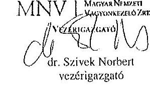

---

# 8. SZÁMÚ MELLÉKLET A V-0759-075/2015. SZÁMÚ JELENTÉSHEZ 

## 8. SZÁM

SZÁMVEVÓSZÉK

Ikt.szám: V-0759-073/2015.

## Dr. Szivek Norbert úr

vezérigazgató
Magyar Nemzeti Vagyonkezelő Zrt.

## Budapest

## Tisztelt Vezérigazgató Úr!

A ,,Jelentéstervezet az állami tulajdonban álló erdőgazdasági társaságok vagyongazdálkodási tevékenységének ellenörzése - Vértesi Erdészeti és Faipari Zrt." címmel készített számvevőszéki jelentéstervezetre tett észrevételeit köszönettel megkaptam.

Az Állami Számvevőszék észrevételekre vonatkozó álláspontjáról a felügyeleti vezető által készített részletes tájékoztatást csatoltan megküldöm.

Tájékoztatom Vezérigazgató urat, hogy a számvevőszéki jelentésben - az Állami Számvevőszékről szóló 2011. évi LXVI. törvény 29. § (3) bekezdése alapján - a figyelembe nem vett észrevételeket szerepeltetjük az elutasítás indokának feltüntetésével.

Budapest, 2015. hó nap
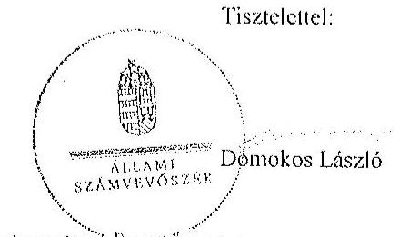

Melléklet: Tájékoztatás az elfogadott és az el nem fogadati üzzééételekről

---

# Tájékoztatás   az elfogadott és az el nem fogadott észrevételekről 

A „Jelentéstervezet az óllami tolajdonban ólló erdögazdasági társaságok vagyongazdálkodási tevékenységének ellenörzése - Vértesi Erdészeti és Faipari Zrt. " című jelentéstervezetre 2015. október 29-én érkezett észrevételeit áttekintettük, azok kezelésével kapcsolatban a következő tájékoztatást adom.

1. A vagyonkezelési szerződéshez kapcsolódó megállapításokra tett észrevétel (1. fejezet / 7. oldal 2. bekezdés, 9. oldal 4-5. bekezdés, 10. oldal 1. bekezdés, II. 2.1. fejezet / 17. oldal 2-3. bekezdés, II. 5. fejezet / 29. oldal 1. bekezdés, 10. oldal javaslat az MNV Zrt. vezérigazgatójának a)-b) pontok)

A jelentéstervezet vagyonkezelési szerződéshez kapcsolódó megállapításai helytállóak. Az erdőgazdasági társaság müködése jogszabályi megfelelősége biztosításának érdekében tett kezdeményczésekről adott tájékoztatásukat köszönettel vettük, azonban azok nem eredményezték az ideiglenes vagyonkezelési szerződés olyan módosítását, vagy olyan új vagyonkezelési szerződés megkötését, amely biztosította volna a VSZ hiányosságainak megszüntetését, illetve a hatályos jogszabályoknak való megfelelőségét. Ezért az MNV Zrt. vezérigazgatójának és az NFA elnökének megfogalmazott intézkedést igénylő megállapítás, valamint az MNV Zrt. vezérigazgatójának megfogalmazott javaslat a) és b) pontjának módosítása nem indokolt. Az egyértelműség érdekében a 9. oldal 4. bekezdését és a 29. oldal 1. bekezdését az alábbiak szerint pontosítjuk:
„...a VSZ-szel kapcsolatban feltárt hiányosságok megszüntetése és a hatályos jogszabályoknak való megfeleltetése nem történt meg."
2. Az MNV Zrt. ellenőrzési kötelezettségének elmalasztására vonatkozó megállapításokra tett észrevétel (9. oldal 4. bekezdés, 10. oldal 2. bekezdés, II. 5. fejezet / 29. oldal 1. bekezdés, 10. oldal javaslat az MNV Zrt. vezérigazgatójának c) pont)

Az MNV Zrt. nem bocsátott az ÁSZ ellenőrzés rendelkezésére az MNV Zrt., vagy Területi Irodái által a Vhr. 20. § (1)-(2) bekezdései szerint végzett ellenőrzésekről dokumentumokat. A jelentéstervezet megállapításai és a javaslat helytállóak, módosításuk nem indokolt.

Budapest, 2015. 44. hó 36. nap
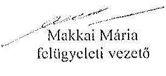

---

# MFB 

## Domokos László úr

elnök részére
Állami Számvevőszék

Budapest

## 5564 - 2812015

ÁLLAMI SZÁMVEVÓSZÉK
85874/2011
Érkeze: 2015 OKT 30.
Bilalóve: 10-0759-064/2015
Melléklet:

## Tisztelt Elnök Úr!

2015. október 7 -én köszönettel kézhez vettük az Állami Számvevőszék „Az állami tulajdonban álló erdőgazdasági társaságok vagyongazdálkodási tevékenységének ellenőrzéséről" szóló jelentéstervezeteket az alábbi cégekre:

- DALERD Délalföldi Erdészeti Zrt.
- Nyírcrdő Nyírségi Erdészeti Zrt.
- Vértesi Erdészeti és Faipari Zrt.
(1kt.szám: V-0761-150/2015.)
(1kt.szám: V-0763-059/2015.)
(1kt.szám: V-0759-064/2015.)

Az MFB Zrt. a jelentéstervezetekkel kapcsolatosan 2. fóle szempontból kiván észrevételt tenni:

1. A jelentésekben megfogalmazott központi probléma
2. Egyedi esetek

## 1. A jelentésekben megfogalmazott központi probléma

Az ÁSZ az egyedi jelentéseiben az erdőgazdasági társaságokat, valamint a vagyonkezelésbe adott állami vagyon tekintetében tulajdonosi joggyakorló MNV Zrt. és Nemzeti Földalapkezelő (továbbiakban: NFA) tevékenyééét marasztalta el.
Alapvető problémaként jelenik meg, hogy az erdők által kezelt eszközök - az NFA-val, a Kincstári Vagyon Igazgatósággal, és az MNV Zrt-vel kötött vagyonkezelési megállapodásban rögzített - értéken nem szerepelnek a Társaságok könyveiben.
Az MFB Zrt. tudatában volt a problémának (azt az ÁSZ jelentésben is említett, 2010. évben végzett átvilágitási jelentés is tartalmazta, melynek nyomon követése, beszámoltatása megtörtént) és folyamatosan egyeztetett az MNV Zrt-vel és az NFA-val a rendezés ügyében. Az ideiglenes vagyonkezelési szerződés módosítására, véglegesítésére a vagyonkezelésbe adónak (MNV, NFA) van lehetősége, a Társaságok szerződő partnerként észrevételeket,

---

javaslatokat tehetnek. A szerzödés véglegesitése érdekében a Társaságok és az MFB Zrt. képviselöi minden olyan cgycztetésen (pi,: az MNV Zrt. által létrehozott bizottság) részt vettek, amelyre meghívást kaptak, illetve azokon érdemi javaslatokat tettek.
Ahogy a jelentés is megiegyzi, az cgycztetések az ellenörzés befejezésig nem kerültek lezárásra, lyy a Társaságoknál nem áll rendelkezésre a vagyonkezelésben lévö állami vagyonra és annak nagyságára vonatkozó, az MNV Zrt. és az NFA nyilvántartásával egyezö adat.

Az ÁSZ 2013. évi „Az állami vagyon feletti kontroll - Az állami vagyon feletti tulajdonosi joggyukorlással kapcsolatos tevékenységek ellenörzéséröl" szóló jelentése alapján a Nemzeti Fejlesztési Minisztérium - az ÁSZ-szal egyeztetett - alábbi föbb pontokat tartalmazó intézkedési tervet (1. sz. melléklet) állított össze, melyet a 2014. április 25 -én kelt levelében küldött meg az MFB Zrt. részére:

- a Társaságok által kezelt állami ingatlanok és egyéb vagyonelemek értéken történő nyilvántartása,
- a vagyonkezelési díjak egyértelmü és tulajdonosi joggyakorló szervezetenkénti meghatározása,
- az új vagyonkezelési szerződés megkötése,
- a Társaságok kezelt és saját vagyonának vagyonelemenkénti, valamint a kezelt vagyonelemek tulajdonosi joggyakorló szerinti elhatárolása.

Az MFB törvény módosításának 2014. július 16-i hatályba lépésével az MFB Zrt. állami erdőgazdaságok feletti tulajdonosi joggyakorlása megszünt, az a Földmüvelésügyi Minisztériumhoz került át, igy az intézkedési tervben való közremüködésre, illetve a végrehajtás nyomon követésére az MFB Zrt-nek nem volt lehetősége.

A jelentések az MNV Zrt. vezérigazgatójának, az NFA elnökének és az erdészeti társaságok vezérigazgatóinak fogalmaztak meg intézkedési javaslatokat.

# 2. Egvedi esetek: 

## DALERD Délalföldi Erdészeti Zrt.

A jelentéstervezet hibásan hivatkozik az MFB Zrt.-re, mikor a Vtv.17§ (1) bekezdés d) pontja szerinti rendszeres ellenörzés elmaradására mutat rá. A Vtv. hivatkozott bekezdése alapján az ellenörzés az MNV Zrt. feladata. Kérjük a társaság feletti tulajdonosi joggyakorló2 hivatkozás törlését. (29. oldal 4-5. bekezdés; 9. oldal 4. bekezdés)

---

# NYÍRERDŐ Nyirségi Erdészeti Zrt. 

A jelentéstervezet hibásan hivatkozik az MFB Zrt.-re, amikor a vagyonkezelési dij ćvenkénti felülvizsgálatáról ir, ugyanis a vagyonkezelői dij meghatározása az MNV Zrt. és az NFA hatásköre. (17. oldal 2. bekezdés) Kérjük a társaság feletti tulajdonosi joggyakorló2 hivatkozás törlését.

A jelentéstervezet hibásan hivatkozik az MFB Zrt.-re, mikor a Vtv. 17§ (1) bekezdés d) pontja szerinti rendszeres ellenőrzési elmaradására mutat rá. A Vtv. hivatkozott bekezdése alapján az ellenőrzés az MNV Zrt. feladata. Kérjük a társaság feletti tulajdonosi joggyakorló2 hivatkozás törlését. (28. oldal 2-3. bekezdés)

## Vértesi Erdészeti és Faipari Zrt.

Az ellenőrzési anyagban több helyen keveredik a társasági részesedés feletti és a vagyonkezelésbe adott állami vagyon feletti tulajdonosi joggyakorlóra történő hivatkozás, így a 9. oldal 3. bekezdés 4. sorának a tulajdonosi joggyakorló2 hivatkozással történő kiegészítésével, valamint az utolsó mondat törlésével helytálló a bekezdés. Ugyancsak kérjük a 28. oldal 2. bekezdés 3. sorának a tulajdonosi joggyakorló2 hivatkozással történő kiegészítését.

A jelentéstervezet hibásan hivatkozik az MFB Zrt.-re, mikor a Vtv. 17§ (1) bekezdés d) pontja szerinti rendszeres ellenőrzési elmaradására mutat rá. A Vtv. hivatkozott bekezdése alapján az ellenőrzés az MNV Zrt. feladata. Kérjük a társaság feletti tulajdonosi joggyakorló2 hivatkozás törlését (28. oldal 2-3. bekezdés).

Budapest, 2015. október 27.
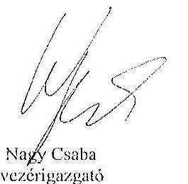

Tisztelettel:
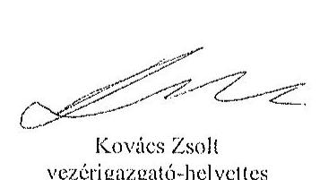

## Mellékletek:

1. számú melléklet: NFM levél (Ikt.szám: KGTF/377-7/2014-NFM)

---

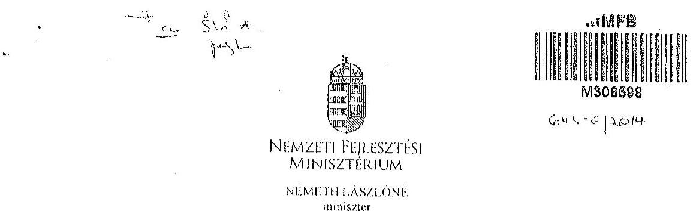

# Ilctatószám: KGTF/ 1.112 /2014-NFM 

Úgyintéző: dr. Kaszás Mónika
Telefonszám: 795-1917
e-mail:monika.kaszan@nfm.gov.hu

## Nagy Csaba úr részére

vezérigazgató

## Magyar Fejlesztési Bank Zrt.   Budapest

Tárgy: „Az állami vagyon feletti kontroll - Az állami vagyon feletti tulajdonosi joggyokorlással kapcsolatos tevékenységek ellenôrzéséröl" szóló 13193 sz. ÁSZ jelentés alapján összeállított NFM intézkedési terv módosítása, az abban foglalt feladatok végrehajtása

## Tisztelt Vezérigazgató Ör!

Az Állami Számvevőszék (a továbbiakban: ÁSZ) tárgyban megjelölt jelentésével összefüggésben 2014. január 27-én intézkedési tervet hagytam jóvá, amelyben foglalt feladatok végrehajtása érdekében 2014. január 30-i keltezésű levélben fordultam Önhöz és a Magyar Nemzeti Vagyonkezelő Zrt. vezérigazgatójához, Márton Péter úrhoz.

Az ÁSZ az intézkedési tervvel kapcsolatban küldött, 2014. március 25-i keltü levelében az intézkedési terv kiegészitését, módosítását kérte. A módosított intézkedési tervet jóváhagytam.

A módosított intézkedési terv alapján a következő feladatok végrehajtása szükséges az alábbiak szerint:
1./ a társaságok által kezelt állami ingatlanok és egyéb vagyonelemek értéken történő nyilvántartása:

Felelős: MNV Zrt.,
Határidő:

- földterületek esetében legkésőbb 2014. május 31-ig
- felépítmények esetében 2014. december 31. (A felépítmények esetében az MNV Zrt. a vagyonkezelési szerződés megkötését az év második felére tervezi, látja megvalósíthatónak.)
2./ a vagyonkezelési díjak egyértelmú és tulajdonosi joggyakorló szervezetenkénti meghatározása:

---

# Felelős: MNV Zrt., 

Határidő: 2014. május 31-ét követően folyamatosan (2014. december 31-ig)
E pontban foglalt feladattal kapcsolatosan az ÁSZ részére az alábbi tájékoztatást adtam:
„Az ÁSZ által meghatározott feladatok végrehajtására irányuló munkafolyamat során a végrehajtásban érintett szervezetek, társaságok között kialakult az az álláspont, hogy mivel az erdőgazdasági társaságok alapfeladatként közfeladat ellátást is végeznek, azt a vagyonkezelési dij mértékének meghatározásakor az MNV Zrt. figyelembe veszi, valamint megállapításra került az az elv is, hogy a vagyonkezelési dij irányadó mértéke az adott erdőgazdasági társaság által kezelt ingatlanvagyon bruttó nyilvántartási értékének 2\%-a.

A vagyonkezelési dij alapja a kezelt vagyon bruttó nyilvántartási értéke, ezért annak meghatározására erdőgazdaság társaságonként kerül sor a 4./ pontban meghatározott ún. „végleges ingatlanlista" alapján. A végleges ingatlanlista kizárólag vagyonkezelésbe adott ingatlan vagyonelemet tartalmaz, az erdőgazdasági társaság saját vagyonában nyilvántartott vagyonelemet nem, ezért az MNV Zrt.-nek és az erdőgazdasági társaságoknak a szerződés megkötését megelőzően el kell határolnia egymástól a saját vagyonba és a kezelt vagyonba tartozó ingatlan vagyonelemeket (4.b./ pontban foglalt feladat).

A feleknek a vagyonkezelési dij mértékében a vagyonkezelési szerződés megkötését megelőzően kell megállapodniuk az irányadó vagyonkezelési dij mértéket alapul véve."

## 3./ az új vagyonkezelési szerzödések megkötése:

A vagyonkezelési szerződés tervezet az MNV Zrt. érintett szakterületei álláspontjának figyelembe vételével elkészült, az MNV Zrt. és a MFB Zrt. által létrehozott Munkacsoport (tagjai: MFB Zrt., MNV Zrt., NFA és egyes erdőgazdasági társaságok) véleménye alapján átdolgozásra került. A szerződés tervezetnek az erdőgazdasági társaságok részére történő megküldése 2014. április 15. napjával megtörtént.

Felelős: MNV Zrt., az MFB Zrt. közreműködésével
Határidő:

- földterületek esetében: 2014. május 31-ét követően folyamatosan (2014. december 31-ig)
- felépítmények esetében 2014. II. félév folyamán
4./ a társaságok kezelt és saját vagyonának vagyonelemenkénti, valamint a kezelt vagyonelemek tulajdonosi joggyakorló szerinti elhatárolása:

Az erdőgazdasági társaságok által az MNV Zrt. rendelkezésére bocsátott leltárjelentések alapján

- a jogszabályi rendelkezések szerint az NFA tulajdonosi joggyakorlása alá tartozó ingatlan vagyonelemek nagyobb része már átadásra került az NFA részére,
- a kisebb részt képező vagyonelemek tekintetében pedig folyamatban van az átadás az MNV Zrt. és az NFA között.

---

a./ Az ún. „végleges ingatlanlista" (az MNV Zrt. tulajdonosi joggyakorlása alatt lévö, maradó vagyonclem listája) MNV Zrt. és az NFA közötti lecgycztetése, közös áttekintése

Felelős: MNV Zrt.
Határidő: a lista MNV Zrt. és NFA közötti lecgycztetése, közös áttekintése folyamatban van, lezárása legkésőbb 2014. május 31-ig megtörténik
b./ Az a./ pontban foglaltak szerint leegyeztetett ún. „,égleges ingatlanlista" MNV Zrt. és az egyes erdőgazdasági társaságok általi áttekintése azzal a céllal, hogy a vagyonkezelésben lévő vagyoni elemeket tartalmazó ún. „végleges ingatlanlista" ne tartalmazzon az erdőgazdasági társaság saját vagyonában nyilvántartott vagyoni elemet (saját vagyon - vagyonkezelt vagyon elhatárolása).

Felelős: MNV Zrt., az MFB Zrt. közremüködésével
Határidő: 2014. május 31-ig
E pontban foglalt feladatokkal kapcsolatosan az ÁSZ részére az alábbi tájékoztatást adtam:
„Szükséges megjegyezni, hogy ingatlanlista, mint állandó „,égleges ingatlanlista" ilyen formában nem létezik, mert mindkét tulajdonosi joggyakorló tekintetében az állami vagyonelemek halmaza mind mennyiségben, mind pedig összetételben folyamatosan változik.

Az erdőgazdasági társaságok által kezelt ingatlanvagyon adatai - mindkét tulajdonosi joggyakorló tekintetében - az évközi változások (megosztások, területváltozások, művelési ág változások, stb.) miatt folyamatosan változnak, ezért az adattartalmában „, végleges ingatlanlista" mindig egy adott konkrét időpont vonatkozásában adható meg.

Jelen intézkedési tervben az ún. „,égleges ingatlanlista" meghatározás alatt az erdőgazdasági társaságok vagyonkezelésében lévő ingatlanvagyon MNV Zrt tulajdonosi joggyakorlása alatt álló részét kell tekinteni. E „,égleges ingatlanlista" kialakítására az erdőgazdasági társaságok által az MNV Zrt. részére átadott leltárjelentések alapján került sor úgy, hogy az MNV Zrt. a Nemzeti Földalapba tartozó vagyonelemeket kiválogatta, s azokat a Nemzeti Földalapkezelő Szervezet részére - átadás-átvételi jegyzőkönyv alapján - átadta.

Lényeges körülmény, hogy a vagyonkezelőknek - jelen esetben az erdőgazdasági társaságoknak - minden év május 31. napjáig vagyonkezelői jelentést kell benyújtaniok a tulajdonosi joggyakorlók, így az MNV Zrt. részére is. Az aktuális vagyonkezelői jelentéseket - melynek része a leltárjelentés is - a 2013. december 31-i állapotnak megfelelően kell összeállítani, ebből következően a fent említett ún. „,égleges ingatlanlista" is a 2013. december 31-i állapotot tükrözi.

Ugyanakkor - fóként a kivett megnevezésben nyilvántartott földterületek esetében - a még át nem adott Nemzeti Földalapba tartozó vagyonelemek egyeztetése a két tulajdonosi joggyakorló között jelenleg is folyamatban van.

---

Az egyes erdőgazdasági társaságok vagyonkezelésében lévô vagyonclemek az adott társasággal megkötendô - a jelcclcgi lćciglenes vagyonkezelési szerzödés helyébe lépô - vagyonkezelési szerzödés mellékletét fogják képezni. Az MNV Zrt. szándékai szerint az egyes erdőgazdasági társaságokkal azonnal megkötik a vagyonkezelési szerzödéseket, ahogyan a megkötés feltételei bekövetkeznek (pl. megállapodnak a vagyonkezelési dijban, véglegesitik a vagyonkezelési szerzödés tartalmát), azok a vagyonclemek, amelyeket e pont a./ és b./ pontjában foglaltak szerint már átvizsgáltak, a vagyonkezelési szerzödés megkötésével cgyidcjüleg a szerzödés mellékletébe kerülnek, amely melléklet folyamatosan bôvitésre kerül újabb, e pont a./ és b./ pontjában foglaltak szerint átvizsgált, tisztázott vagyonelemekkel. „

Tájékoztatom, hogy az NFA feletti tulajdonosi jogok gyakorlója, Dr. Fazekas Sándor miniszter úr idôközben már jóváhagyta azt az intézkedési tervet, amely az NFA részére meghatározott feladatokat és azok végrehajtási határidejét tartalmazza.

Az MFB Zrt. közremüködése az 1./ és 2./ pontban meghatározott feladatok végrehajtásban is szükséges lehet, ezért kérem a fent meghatározott feladatok határidőben történő végrehajtása érdekében az MFB Zrt. változatlan együttmüködését az érintett a szervezetekkel és amennyiben szükséges, úgy az erdőgazdasági társaságok bevonása iránt is intézkedni szíveskedjen.

Budapest, 2014. „, „, „, „, „, „

# Üdvözlettel: 

Németh Lászlóiné

---

.

---

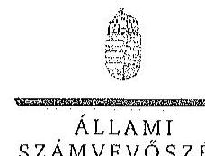

ELHök

Ikt.szám: V-0761-162/2015.

Nagy Csaba úr
vezérigazgató
Magyar Fejlesztési Bank Zrt.

Budapest

Tisztelt Vezérigazgató Úr!

Az „Az állami tulajdonban álló erdőgazdasági társaságok vagyongazdálkodási tevékenységének ellenőrzése" című ellenőrzés tekintetében a DALERD Délalföldi Erdészeti Zrt., a NYÍRERDŐ Nyírségi Erdészeti Zrt., illetve a Vértesi Erdészeti és Faiqari Zrt. társaságok jelentéstervezetére tett észrevételüket köszönettel megkaplann.

Az Állami Számvevőszék észrevételekre vonatkozó álláspontjáról a felügyeleti vezető által készített részletes tájékoztatást csatoltan megküldöm.

Tájékoztatom Vezérigazgató urat, hogy a számvevőszéki jelentésben – az Állami Számvevőszékről szóló 2011. évi LXVI. törvény 29. § (3) bekezdése alapján – a figyelembe nem vett észrevételeket szerepeltetjük az elutasítás indokának feltüntetésével.

Budapest, 2015. 11. hó ơ. nap

Tisztelettel:

Domokos László

Melléklet: Tájékoztatás az észrevételek kezeléséről

1252 DUSAPEST, AFRICZAI CSERE JÁNOS UFCA 10. 1254 Budapest 4. Pl. 54 telefon. 484 9181 fax. 484 9291

---

# Tájékoztatás   az észrevételek kezeléséről 

„Az óllami tulajdonban ólló erdögazdasági társaságok vagyongazdálkodási tevékenységének ellenörzése" címú ellenörzés tekintetében a DALERD Délalföldi Erdészeti Zrt., a NYÍRERDŐ Nyirségi Erdészeti Zrt., illetve a Vértesi Erdészeti és Faipari Zrt. társaságok jelentéstervezetére 2015. október 30-án érkezett észrevételeket áttekintettük, azok kezelésével kapcsolatban a következő tájékoztatást adom.

1. A jelentésekben megfogalmazott központi problémával kapcsolatban tett észrevételek

A jelentésekben megfogalmazott központi problémával kapcsolatban adott tájékoztatásukat köszönettel vettük, azonban azok alapján a jelentéstervezet módosítása nem indokolt.
2. Egyedi esetekkel kapesolatban tett észrevételek

A DALERD Délalföldi Erdészeti Zrt. jelentéstervezetének 9. oldal 4. bekezdésére, valamint 29. oldal 4-5. bekezdésére tett észrevétel
A rendelkezésre álló dokumentumok ismételt áttekintését követően töröljük a jelentéstervezet 9. oldal 4. bekezdés 2. mondatát és 29. oldal 3. bekezdését, valamint 29. oldal 4. bekezdésében a tulajdonosi joggyakorló 2 számú alsóindexszel jelölt hivatkozását.

A NYÍRERDŐ Nyirségi Erdészeti Zrt. jelentéstervezetének 17. oldal 2. bekezdésére, valamint 28. oldal 2-3. bekezdésére tett észrevétel
A rendelkezésre álló dokumentumok ismételt áttekintését követően töröljük a jelentéstervezet 17. oldal 2. bekezdésében és a 28. oldal 2. bekezdésében a tulajdonosi joggyakorló 2 számú alsóindexszel jelölt hivatkozását, valamint a 28. oldal 3. bekezdés 1. mondatát.

A Vértesi Erdészeti és Faipari Zrt. jelentéstervezetének 9. oldal 3. bekezdésére, valamint 28. oldal 2-3. bekezdésére tett észrevétel

A társasági részesedés feletti, illetve a vagyonkezelésbe adott állami vagyon feletti tulajdonosi joggyakorlóra történő hivatkozásokra tett észrevételekre vonatkozóan a rendelkezésre álló dokumentumok ismételt áttekintését követően

---

- a 9. oldal 3. bekezdés negyedik sorában, valamint a 28. oldal 2. bekezdés 3. sorában az alsóindex módosítása nem indokolt, tekintettel arra, hogy az MFB Zrt. végzett a Társaságnál egyedi ellenőrzést. A 9. oldal 3. bekezdés 3. mondatát az alábbiak szerint pontoslttak:
„A Társaság feletti tulajdonosi joggyakorlȯy a Tảrsaságnál a 2010. évben külsõ szakértővel átvilágitást végeztetett, jogi, gazdasági, informatikai területen."
- a 28. oldal 2. bekezdés 3. mondatából a tulajdonosi joggyakorló 2 számú alsóindexszel jelölt hivatkozást, valamint a 28. oldal 3. bekezdés 1. mondatát töröljük.

Budapest, 2015. év 14 hó 245 nap

Makkai Mária
felügyeleti vezetö

---

.

---

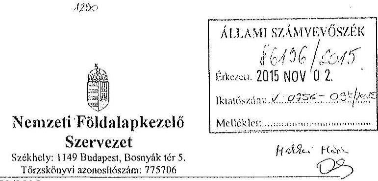

Iktatószám: NFA-002589/023/2015
Hiv. szám: ÁSZ-V-0599/2014-2015
Érintett ÁSZ iktatószámok: V-0756-092/2015, V-0759-066/2015, V-0761-152/2015,
V-0762-073/2015, V-0763-061/2015,

Domokos László
Elnök

Állami Számvevőszék

1052 Budapest

Apáczai Csere János utca 10

Tárgy: Észrevétel megküldése „Az állami tulajdonban álló erdőgazdasági társaságok vagyongazdálkodási tevékenységének ellenőrzéséről" készített jelentés tervezeteire.

Tisztelt Elnök Úr!

Az Állami Számvevőszék 2014 novemberében megkezdte „Az állami tulajdonban álló erdőgazdasági társaságok vagyongazdálkodási tevékenységének ellenőrzését" amelyről 2015 októberétől érintettség okán az NFA részére az elkészített munkaanyag tervezeteit vizsgált erdőgazdaságonként, megküldte Szervezetünk részére véleményezésre.

A munkaanyag valamennyi tervezte egységesen, az NFA Elnöke részére feladatazabást tartalmaz, melyhez az alábbi észrevételeket tesszük:

A jelentéstervezetekben tett megállapítások helytállóságát nem vitatjuk, azonban szükségesnek látjuk az NFA elnökének tett javaslatokkal a), b) és c) kapcsolatban a következő tájékoztatást megadni.

a) „Tegyen intézkedéseket az erdőgazdasági társaságok közreműködésével a tényleges állapotot rögzítő és a hatályos jogszabályi előírásoknak megfelelő vagyonkezelési szerződés megkötésére."

---

Tájékoztatjuk, hogy a hatályos jogszabályi előírásoknak megfelelő vagyonkezelési szerződések megkötése érdekében több intézkedés történt, jelenleg is folyamatban van a szerződések előkészítése és a vagyonkezelésben maradó, illetve kikerülő földrészletek adatainak egyeztetése.

Előzményként fontos kiemelni, hogy a Nemzeti Földalapkezelő Szervezet 2010. szeptember 1. napjával történt létrehozását követően (2012. évben) került sor a vagyonkezelésben lévő földrészletek MNV Zrt. részéről történő átadására. Az átadási dokumentumok alapján Szervezetünk gondoskodott a közhiteles nyilvántartásokban a megváltozott tulajdonosi joggyakorlás feltüntetéséről. Az erdőgazdaságok esetében ez 2012. év végéig, illetve 2013. év elején megtörtént ennek az ingatlan-nyilvántartásban történő átvezetése is.

Megjegyezzük, hogy az MNV Zrt. részéről történő átadás kizárólag a - több évtizede kötött, és azóta többször módosított - vagyonkezelési szerződések és a földrészletek Excel táblázatban történő átadását jelentette, tehát nem egy naprakész vagyonnyilvántartást tartalmazott. Ennek következtében szükségszerűvé vált a Nemzeti Földalapkezelő Szervezetnek egy saját nyilvántartás felépítése, illetve a szerződések tartalmának feldolgozása.

A számvevőszéki ellenőrzéssel érintett időszakban, illetve még jelenleg is lezáratlan az MNV Zrt. és NFA közötti átadás-átvételi folyamat. Az MNV Zrt. további földrészletek átadását készíti elő, ugyanis az MNV Zrt. vagyoni körébe tartozó földrészletekre szintén tervezi a vagyonkezelői szerződés megkötését, és ennek a folyamatnak a részeként a még át nem adott földrészletek átadása is most történik. Természetesen az NFA is folyamatosan biztosítja a különböző hasznosítási, illetve hatósági eljárások során az erdőgazdaságok vagyonkezelésében lévő földrészletek tulajdonosi joggyakorlójának rendezését az MNV Zrt megkeresésével, közös minősítési eljárás lefolytatásával. A Nemzeti Földalapkezelő Szervezet által megbízott ügyvédi iroda, jelentést készített a szerződés és a tárgyát képező földrészletek jogi helyzetének tisztázására.

Időközben az erdőgazdaságok, mint társaságok feletti tulajdonosi joggyakorló személyében is változás történt. Így új alapokon indulhatott meg a vagyonkezelői szerződés előkészítése. Ennek a folyamatnak részeként, az NFA megbízott egy Ügyvédi Konzorciumot, továbbá Szervezetünknél külön Erdészeti munkacsoport alakult 2015 májusában és azt követően a következő intézkedések történtek:

Az Erdőgazdaságok részére vagyonkezelésbe adásra tervezett ingatlanok felülvizsgálata folyamatban van az Ügyvédi Konzorcium által. A felülvizsgálat tárgyát képező ingatlanok köre három részből tevődik össze:

- az erdőgazdaságok ideiglenes vagyonkezelési szerződésének tárgyát képező ingatlanok,
- azon ingatlanok, amelyeket az erdőgazdaságok az ideiglenes vagyonkezelési szerződésükben szereplő ingatlanokon felül kértek vagyonkezelésbe,

---

- valamint azok az ingatlanok, amelyeket az NFA kíván az erdőgazdaságok vagyonkezelésébe adni.

A rendelkezésre álló dokumentumokban szereplő ingatlanokból erdőgazdaságonként egy egységes, az összes vagyonkezelésbe adandó ingatlant tartalmazó táblázat készült, amely tartalmazza az ingatlanok vagyonkezelésbe adás szempontjából relevána adatait, bejegyzett jogokat, feljegyzett tényeket. A táblázat adatai összevetésre kerültek a közhiteles ingatlannyilvántartásban szereplő adatokkal, feltárva ezáltal, hogy mely ingatlanok adhatóak vagyonkezelésbe és melyek azok, amelyeknél valamilyen előzetes intézkedés megtétele szükséges.

Az Nfatv. 8. §-a alapján a Birtokpolitikai Tanács dönt erdőgazdaságonként az erdőgazdaságok vagyonkezelési szerződésének megkötéséről.

Zárójelben jegyezzük meg, hogy például a TAEG Zrt. esetében elkészült a fentebb részletezett táblázat, amely alapján összeállításra került azon ingatlanok listája, amelyre elindítható a vagyonkezelésbe adási eljárás. Megközelítőleg 18000 ha nagyságú területnek tervezi Szervezetünk a TAEG Zrt. részére történő vagyonkezelésbe adását, ebből 15.308,3880 ha terület az, amelyre elindította a vagyonkezelésbe adást. Az alábbi jogszabályhelyek alapján Szervezetünk megkereste az Földművelésügyi Minisztériumot az egyetértő nyilatkozatok, valamint az alapító határozat kiadása érdekében, valamint a NÉBHi-et, mint erdészeti hatóságot a vagyonkezelő erdőgazdálkodói alkalmasságát megállapító jóváhagyásának megkérése végett.

Az Nfatv. 20. § (7) bekezdése alapján „Az állam 100\%-os tulajdonában álló erdő és erdőgazdálkodási tevékenységet közvetlenül szolgáló földterületet érintő vagyonkezelési szerződés létrejöttéhez az erdészeti hatóságnak - a vagyonkezelő erdőgazdálkodói alkalmasságát megállapító - jóváhagyása szükséges".

Az Nfatv. 23. § (2) bekezdése alapján a Nemzeti Földalapba tartozó védett természeti területek és a Natura 2000 területek vagyonkezelésbe adására, tulajdonjogának bármely jogcímen történő átruházására csak a természetvédelemért felelős miniszter egyetértése esetén kerülhet sor. Az állam $100 \%$-os tulajdonában álló erdő, továbbá erdőgazdálkodási tevékenységet közvetlenül szolgáló földterület vagyonkezelésbe adásához az erdőgazdálkodásért felelős miniszter egyetértése szükséges.

Magyar Állam tulajdonában álló ingatlanokat érintő jogügyletekkel kapcsolatos előzetes miniszteri nyilatkozatok és a miniszter tulajdonosi joggyakorlása alá tartozó gazdasági társaságok ingatlanügyleteivel kapcsolatos miniszteri nyilatkozatok, alapítói határozatok kiadásának rendjéről szóló 8/2014. (XI. 28.) FM utasítás 3. § (4) bekezdése értelmében a miniszter tulajdonosi joggyakorlása alá tartozó állami tulajdonú gazdasági társaságoknak az NFA-val történő vagyonkezelési szerződés kötéséhez elengedhetetlen a jogszabály vagy

---

Társasági alapszabály vagy alapító okirat alapján a Társaság tulajdonosi jogait gyakorló miniszter alapítói határozatának kiadása.

Az Erdészeti Monkacsoport a kialskított szempontok alapján tartja a kapcsolatot a Konzorciummal a szerződés tárgyát képező földrészletek jogi, nyilvántartási, helyszíni, térképi ellenőrzés tárgyában annak érdekében, hogy naprakész adatok alapján történjen a szerződéskötés.
b) „Intézkedjen a vagyonkezelési szerzödések felülvizsgálatának elmaradásával összefüggésben feltárt szabálytalanságok tekintetében a munkajogi felelösség tisztázására irányuló eljárás megindításáról, és ennek eredménye ismeretében tegye meg a szükséges intézkedéseket.

A fent leírt folyamat időbeli áttekintése és a vagyonkezelési szerződés előkészítésének jelenlegi helyzetét tekintve a Nemzeti Földalapkezelő Szervezet egységei, munkatársai a rendelkezésükre álló eszközök alapján megtették a szükséges intézkedéseket az erdőgazdaságok vagyonkezelői szerződésének megkötése érdekében.
c) Az NFA elnöke felé tett javaslattal kapcsolatban, miszerint intézkedjen a Társaságok vagyon-nyilvántartása hitelességének, teljességének és helyességének jogszabályban foglaltak szerinti ellenörzéséről.

Az NFA 2015. év márciusában megkezdte az Erdészeti Zrt.-ték dokumentális ellenőrzését, amely ellenőrzés keretén belül bekérésre került a Társaságok használatában álló vagyonelemekről és az erdővagyon állományról vezetett (nyilvántartások) aktualizált nyilvántartás is.

Budapest, 2015.október 27.
Tisztelettel:
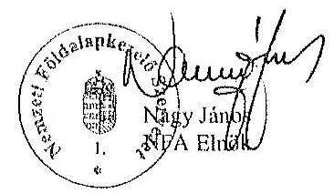

---

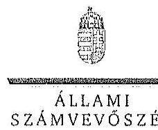

ELnök

SZÁMVEVÖSZÉK

Ikt.szám: V-0756-098/2015.

Nagy János úr
elnök

Nemzeti Földalapkezelő Szervezet

Budapest

Tisztelt Elnök Úr!

Az „Az állami tulajdonban álló erdőgazdasági társaságok vagyongazdálkodási tevékenységének ellenőrzése" című, ellenőrzés tekintetében öt társaság jelentéstervezetére tett észrevételüket köszönettel megkaptam.

Az Állami Számvevőszék észrevételekre vonatkozó álláspontjáról a felügyeleti vezető által készített részletes tájékoztatást csatoltan megküldöm.

Tájékoztatom Elnök urat, hogy a számvevőszéki jelentésben – az Állami Számvevőszékről szóló 2011. évi LXVI. törvény 29. § (3) bekezdése alapján – a figyelembe nem vett észrevételeket szerepeltetjük az elutasítás indokának feltüntetésével.

Budapest, 2015. 11. hó 23. nap

Tisztelettel:

Domokos László

Melléklet: Tájékoztatás az észrevételek kezeléséről

VISZ BIBRAPEST, AFRICAN CSEIRE ANGS UTEA 10. 1364 Budapest 4. Pl. 54 telefon: 484 9181 fax: 484 9201

---

# Tájékoztatás   az észrevételek kezeléséről 

„Az állami tulajdonban álló erdőgazdasági társaságok vagyongazdálkodási tevékenységének ellenörzése" című ellenőrzés tekintetében a Bakonyerdő Erdészeti és Faipari Zrt., a Vértesi Erdészeti és Faipari Zrt., a DALERD Délalföldi Erdészeti Zrt., a NEFAG Nagykunsági Erdészeti és Faipari Zrt., illetve a NTIRERDŐ Nyírségi Erdészeti Zrt. társaságok jelentéstervezetére 2015. november 2-án érkezett észrevételeket áttekintettük, azok kezelésével kapcsolatban a következő tájékoztatást adom.

Az észrevétel szerint a jelentéstervezetben tett megállapítások helytállóak, azokat nem vitatják. Az NFA elnökének tett javaslatokhoz kapcsolódó tájékoztatást köszönjük. Mindezek miatt, valamint arra tekintettel, hogy nem jött létre olyan vagyonkezelési szerződés, amely biztosítja az ideiglenes vagyonkezelési szerződés hiányosságainak a megszüntetését, illetve a hatályos jogszabályoknak való megfeleltetést, a megállapítások és a javaslatok módosítása nem indokolt.

Budapest, 2015. év 11. hó 15 nap

Makkai Mária
felügyeleti vezető