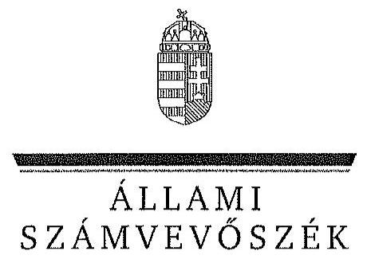

ÁLLAMI
SZÁMVEVŐSZÉK

# JELENTÉS 

Az állami tulajdonban álló erdőgazdasági társaságok vagyongazdálkodási tevékenységének ellenőrzése DALERD Délalföldi Erdészeti Zrt.

---

# Állami Számvevőszék 

Iktatószám: V-0761-167/2015.
Témaszám: 1795
Vizsgálat-azonosító szám: V070613

## Az ellenőrzést felügyelte:

## Makkai Mária

felügyeleti vezető
Az ellenőrzést vezette és az ellenőrzés végrehajtásáért felelős:
Schmidt János
ellenőrzésvezető
A számvevőszéki jelentéstervezet összeállításában közreműködött:
Kupcsik Éva
számvevő
Az ellenőrzést végezték:
Kupcsik Éva
Mokánszkiné Mengyi Andrea
számvevő
számvevő főtanácsos

---

# TARTALOMJEGYZÉK 

BEVEZETÉS ..... 3
I. ÖSSZEGZŐ MEGÁLLAPÍTÁSOK, KÖVETKEZTETÉSEK, JAVASLATOK ..... 7
II. RÉSZLETES MEGÁLLAPÍTÁSOK ..... 14

1. A DALERD Zrt. vagyongazdálkodása ..... 14
1.1. A vagyon értékének megőrzése, gyarapítása ..... 14
1.2. A vagyonkezelői kötelezettség teljesítése ..... 18
2. A DALERD Zrt. vagyonkezelési szerződése és a vagyonnyilvántartása ..... 19
2.1. A vagyonkezelési szerződés megfelelősége ..... 19
2.2. A DALERD Zrt. vagyonnyilvántartása ..... 21
3. A DALERD Zrt. éves tervezési feladatainak ellátása, az ágazati jogszabályok érvényesülése ..... 23
3.1. Az üzleti tervek vagyonmegőrzésre, vagyongyarapításra vonatkozó elemei ..... 23
3.2. A tervekben megfogalmazott előírások érvényesülése ..... 23
3.3. Az ágazati szabályok érvényesülése ..... 24
4. A kontroll- és monitoring rendszer kialakítása és működtetése ..... 26
4.1. A kontrollrendszer kialakítása és működtetése ..... 26
4.2. Az információáramlási és monitoring rendszer kialakítása és működtetése ..... 29
5. A tulajdonosi joggyakorlóknak a DALERD Zrt. vagyongazdálkodási feladataira vonatkozó döntései, intézkedései megfelelősége ..... 31

---

# MELLÉKLETEK 

1. számú Rövidítések jegyzéke
2. számú Fogalomtár
3/A. számú A DALERD Zrt. vagyonának alakulása a 2009-2013. évek közötti időszakban - eszközök (M Ft)
3/B. számú A DALERD Zrt. vagyonának alakulása a 2009-2013. évek közötti időszakban - források (M Ft)
3. számú Kimutatás a DALERD Zrt. befektetett eszközei állományának alakulásáról a 2009-2014. I. féléve közötti időszakra vonatkozóan
4. számú A DALERD Zrt. vezérigazgatójának észrevétele
5. számú A DALERD Zrt. vezérigazgatójának észrevételére adott válasz
6. számú Az MNV Zrt. vezérigazgatójának észrevétele
7. számú Az MNV Zrt. vezérigazgatójának észrevételére adott válasz
8. számú Az MFB Zrt. vezérigazgatójának észrevétele
9. számú Az MFB Zrt. vezérigazgatójának észrevételére adott válasz
10. számú Az NFA elnökének észrevétele
11. számú Az NFA elnökének észrevételére adott válasz

## FÜGGELÉKEK

1. számú A DALERD Zrt. 2009-2014. I. félévben teljesített vagyonkezelési díjfizetési kötelezettsége

---

# JELENTÉS 

## Az állami tulajdonban álló erdőgazdasági társaságok vagyongazdálkodási tevékenységének ellenőrzése DALERD Délalföldi Erdészeti Zrt.

## BEVEZETÉS

Hazánk területének több mint 20\%-át erdő borítja. Az erdők fenntartása és védelme az egész társadalom érdeke, ezért az erdőkkel csak a közérdekkel összhangban lehet gazdálkodni.

Az Alaptörvény 38. cikke és az Nvtv. alapján az állam tulajdona a nemzeti vagyon részét képezi. Az Nvtv. alapján nemzetgazdasági szempontból kiemelt jelentőségű nemzeti vagyonban tartandó vagyonelemnek minősül a 100\%-ban az állam tulajdonában álló védelmi és közjóléti elsődleges rendeltetésű erdő, a gazdasági elsődleges rendeltetésű természetes erdő, természetszerű erdő és származékerdő természetességi állapotú öt hektárnál nagyobb, természetben összefüggő erdő. Az erdőgazdasági társaságok vagyongazdálkodása szempontjából a Vtv., illetve az Nvtv. és az Nfatv., valamint a kapcsolódó kormány- és miniszteri rendeletek mellett kiemelkedő szerepe van a különböző ágazati jogszabályoknak. A vagyonkezelési tevékenység végrehajtása során figyelemmel kell lenni az Evt.-ben foglaltakra, mely alapján a nemzeti vagyonról szóló törvényben nemzetgazdasági szempontból kiemelt jelentőségű nemzeti vagyonként meghatározott védelmi és közjóléti elsődleges rendeltetésű, az állam tulajdonában álló erdő a kincstári vagyon részét képezi. Az erdőgazdasági társaságoknak az általuk kezelt vagyonelemek sajátosságára tekintettel kell a vagyongazdálkodási tevékenységüket kialakítaniuk, gondoskodniuk kell a közérdek és az Evt.-ben foglaltak érvényesülését biztosító vagyongazdálkodásról.

Az Evt. előírásai alapján az állam tulajdonában álló erdőt és erdőgazdálkodási tevékenységet közvetlenül szolgáló földterületet csak vagyonkezelés formájában lehet hasznosításra átengedni. Az állam kizárólagos tulajdonában álló erdő és erdőgazdálkodási tevékenységet közvetlenül szolgáló földterület vagyonkezelését csak költségvetési szerv vagy 100\%-os állami tulajdonú gazdálkodó szervezet végezheti.

A Vtv. szerint az erdőgazdasági társaságok és a társaságok kezelésében lévő állami vagyon feletti tulajdonosi jogokat a 2010. évig a Magyar Állam nevében az MNV Zrt. gyakorolta. A 2010. évi törvényi változások (Vtv., Mfbtv., Nfatv.) következtében 2010. június 17. napjától az erdőgazdasági társaságok állami tulajdonú részesedése tekintetében a tulajdonosi jogokat az állami vagyonért felelős miniszter az MFB Zrt. útján látta el. Az Nfatv. 2010. évi hatálybalépését követően a társaságok által kezelt, a Nemzeti Földalapba tartozó földterületek

---

vonatkozásában a tulajdonosi jogokat az NFA, míg egyéb ingatlanok és vagyonelemek tekintetében a tulajdonosi jogokat az MNV Zrt. gyakorolja. 2014. július 16-tól az erdőgazdasági társaságok feletti tulajdonosi jogokat az erdőgazdálkodásért felelős miniszter gyakorolja.

A Nemzeti Földalapba tartozó 1772980 ha földterületből a 2012. év végén a 100\%-os állami tulajdonú 19 erdőgazdasági társaság kezelésében összesen 913664 ha földterület volt, ebből 879254 ha erdő, a többi egyéb művelési ágba tartozik. A kezelt földterületek erdőgazdasági társaságonkénti megosztása eltérő.

Az erdőgazdasági társaságok az Alaptörvény és az Nvtv. előírása szerint önállóan és felelősen gazdálkodnak a törvényesség, a célszerűség és az eredményesség követelményei szerint. Az állami vagyonnal való gazdálkodás alapvető feladata a vagyon rendeltetésszerű, hatékony és felelős felhasználásának biztosítása az állami vagyon értékének megőrzése, gyarapítása érdekében. A DALERD Zrt. jelen ellenőrzése az állami vagyonnal való gazdálkodásra és a törvényesség betartására irányult.

A szegedi székhelyű Társaság és jogelődjei több mint hat évtizede gondozzák Csongrád- és Békés megye állami erdőterületeit. Az Ásotthalmi Erdészet a Duna-Tisza-közi homokvidék déli részén, a Gyulai Erdészet elsősorban a Fekete- és Fehér-Körös völgyében, a Körösvidéki Erdészet Békés megye észak-keleti felében, míg a Szegedi Erdészet főként a Tisza és Maros völgyében folytat hagyományos erdőgazdálkodási tevékenységet. A DALERD Zrt. 2013. évi éves beszámolója szerint 1179,7 M Ft nettó árbevétel mellett 13,0 M Ft mérleg szerinti eredményt ért el, a mérlegfőösszeg 2097,7 M Ft volt. Az erdőgazdasági társaság 26290 ha erdőterületen és 2290 ha egyéb művelési ágú földterületen gazdálkodott, az éves átlaglétszám 100 fő volt.

Az ellenőrzés célja annak értékelése, hogy a DALERD Zrt. vagyongazdálkodása, vagyonérték-megőrző és vagyongyarapítási tevékenysége, valamint ennek szervezeti keretei megfeleltek-e a jogszabályok és belső szabályzatok előírásainak, valamint a kezelt vagyonelemek sajátosságaiból adódó követelményeknek.

Ennek keretében ellenőriztük és értékeltük, hogy:

- a vagyongazdálkodás során betartották-e az Nvtv. 7. §-ában megállapított vagyongazdálkodási alapelveket, valamint az ágazati jogszabályok vagyongazdálkodáshoz kapcsolódó előírásait;
- a DALERD Zrt. a saját és a kezelt vagyonnal való gazdálkodásra vonatkozó éves tervezési feladatait a jogszabályi előírásoknak megfelelően látta-e el, a Társaság üzleti tervei a kezelésbe vett vagyonra vonatkozó, a Vtv. 2. § (1) és a 27. § (7) bekezdésében előírt vagyon megőrzésére, gyarapítására vonatkozó elemeket tartalmazták-e és azokat a vagyongazdálkodás során érvényesítették-e;
- a vagyonkezelési szerződések és a vagyon-nyilvántartás megfeleltek-e a szabályszerűségi követelményeknek, elősegítették-e az állami vagyonnal való szabályszerű gazdálkodást;

---

- a Társaságnál kialakították és működtették-e a szabályszerű feladatellátást támogató kontrollrendszert. Ezen belül elkészítették és aktualizálták-e a Társaság feladatellátási-folyamatainak szabályzatait, a kockázatok kezelésének rendszerét, az információs és a kontrolling- monitoring rendszert, valamint a vagyongazdálkodás területén azokat az eljárásokat, amelyek elősegítik a szervezeti célok végrehajtását;
- a tulajdonosi joggyakorlóknak a Társaság vagyongazdálkodási feladataira vonatkozó döntései, intézkedései előkészítése és megalapozottsága a jogszabályoknak és a belső szabályozásnak megfelelt-e, a tulajdonosi joggyakorlók e minőségben végzett tevékenysége támogatta-e a felelős vagyongazdálkodás megvalósulását.

Az ellenőrzés típusa: szabályszerűségi ellenőrzés.
Az ellenőrzött időszak: 2009. január 1. napjától 2014. június 30. napjáig, kitekintéssel a helyszíni ellenőrzés végéig tartó releváns folyamatokra, intézkedésekre.

Az ellenőrzés várható hasznosulása: A DALERD Zrt. és a tulajdonosi joggyakorlók fenti szempontú ellenőrzése az állami tulajdonban álló vagyon kezelésére, a vagyonnal való gazdálkodásra vonatkozó, kötelezően végrehajtandó éves ÁSZ ellenőrzést szélesebb körűvé teszi.

Az ellenőrzés várható hasznosulásaként biztosíthatja a társadalom részéről kiemelt érdeklődéssel kísért téma objektív bemutatását. Az ÁSZ jelentéséből a média és az állampolgárok átfogó képet kaphatnak a Magyarország állami tulajdonban lévő erdőivel való gazdálkodásról, a gazdálkodást, vagyonkezelést végző szervezeti rendszerről, az állami tulajdonban álló erdőgazdasági társaságok feladatellátásához kapcsolódóan feltárt problémákról.

Az ellenőrzés jól hasznosítható - többek közt - az állami vagyonnal kapcsolatos országgyűlési törvényhozói munkában is, továbbá hozzájárulhat a tulajdonosi joggyakorlás javításával a „jó kormányzás" gyakorlatának erősítéséhez.

Az ellenőrzéssel érintett szervezetek: A DALERD Zrt., a Társaság kezelésében lévő állami vagyon feletti tulajdonosi jogokat gyakorló szervezetek, valamint a Társaság állami tulajdonú részesedése feletti tulajdonosi joggyakorlók (MFB Zrt., MNV Zrt., NFA).

Az ellenőrzés végrehajtásának jogszabályi alapját az ÁSZ tv. 5. § (4)(5) bekezdéseiben foglaltak képezik.

Az ellenőrzés szakmai módszertana az ÁSZ hivatalos honlapján közzétett szakmai szabályokon alapult, amely a Legfőbb Ellenőrző Intézmények Nemzetközi Szervezete (INTOSAI) által kiadott nemzetközi standardok (ISSAI) figyelembevételével készült.

A DALERD Zrt. az ellenőrzés lefolytatásához tanúsítványok kitöltésével, valamint dokumentumok elektronikus megküldésével szolgáltatott adatokat. Az így rendelkezésre bocsátott adatok és információk kontrollja a helyszíni ellenőrzés keretében történt. A vagyonváltozást eredményező döntések megalapozottsá-

---

gát, továbbá a vagyonérték-megőrző és vagyongyarapító tevékenység szabályszerűségét a számviteli nyilvántartásokból, valamint kockázatalapú és véletlenszerű mintavétellel kiválasztott tételek ellenőrzésével értékeltük.

Az ÁSZ a 2011. évi LXVI. törvény 29. §-a szerint a jelentéstervezetet megküldte a DALERD Zrt. vezérigazgatójának, a Magyar Nemzeti Vagyonkezelő Zrt. vezérigazgatójának, a Magyar Fejlesztési Bank Zrt. vezérigazgatójának és a Nemzeti Földalapkezelő Szervezet elnökének egyeztetésre. A DALERD Zrt. vezérigazgatójának észrevételét és az arra adott választ az 5-6. számú melléklet, a Magyar Nemzeti Vagyonkezelő Zrt. vezérigazgatójának észrevételét és az arra adott választ a 7-8. számú melléklet, a Magyar Fejlesztési Bank Zrt. vezérigazgatójának észrevételét és az arra adott választ a 9-10. számú melléklet, a Nemzeti Földalapkezelő Szervezet elnökének észrevételét és az arra adott választ a 11-12. számú melléklet tartalmazza.

---

# I. ÖSSZEGZŐ MEGÁLLAPÍTÁSOK, KÖVETKEZTETÉSEK, JAVASLATOK 

Az állami tulajdonú DALERD Zrt. az ellenőrzött időszakban saját és kezelt vagyonnal gazdálkodott. A Társaság 2009-2013. évekre vonatkozó mérlegei az ellenőrzött időszakban nem feleltek meg a Számv. tv. előírásainak, mivel nem tartalmazták a Társaság vagyonkezelésében lévő állami földterületek értékét, így nem adtak megbízható, valós képet a Társaság vagyonáról, annak összetételéről. Ezen túl a számviteli alapelvek teljesebb érvényesítése érdekében a kezelt vagyon mérlegtételek szerinti megbontása, és értékének változása a kiegészítő mellékletben sem került bemutatásra, amely ugyancsak nem felelt meg a Számv. tv. előírásának.

Az ellenőrzött időszakban a Társaság vagyongazdálkodása során betartották az Nvtv.-ben megállapított vagyongazdálkodási alapelveket. Az éves beszámolók alapján a Társaság mérleg szerinti vagyona - a 2010. év kivételével - folyamatosan emelkedett, a 2009. év eleji 1739,3 M Ft-ról a 2013. év végére 2097,7 M Ft-ra nőtt. A Társaság saját tőke/jegyzett tőke aránya a 2009. év eleji 207,7\%-ról a 2013 év végére 223,4\%-ra növekedett, a saját tőke/összes forrás aránya 81,5\%-ról 80,6\%-ra mérséklődött.

A Társaság a saját vagyonról megfelelő nyilvántartást vezetett. A vagyonkezelt állami vagyonról vezetett nyilvántartás nem felelt meg a Vhr.-ben előírt követelménynek, mert tételesen nem tartalmazta a vagyonkezelt eszközök bruttó és nettó értékét, illetve az értékükben bekövetkezett egyéb változásokat. Így a nyilvántartás nem biztosította az átláthatóságot és az elszámolhatóságot. Az erdőtelepítések aktivált értékének elkülönített nyilvántartása nem volt biztosított, annak belső
 szabályozását a Számlarend${ }_{1-4}$ nem tartalmazta.

A Társaság vagyonkezelésében lévő állami vagyonról vezetett nyilvántartás adatainak egyeztetése az MNV Zrt., az NFA és a Társaság között az ellenőrzés befejezéséig nem került lezárásra. A vagyonkezelésben lévő vagyonelemekről a Társaság vagyonkezelésében lévő állami vagyonra és annak nagyságára vonatkozó egyező adat nem állt rendelkezésre.

A Társaság a beszámolókban és a számviteli nyilvántartásokban lévő vagyontárgyak állományát a Számv. tv.-ben és a Leltározási szabályzatban foglaltak alapján elkészített leltárral alátámasztotta.

A Társaság a Magyar Állam tulajdonában álló erdővagyon és egyéb művelési ágú termőföld ingatlanok kezelését a KVI-vel 1996. november 1-jén kötött VSZ alapján végezte. A Társaság mint vagyonkezelő és a KVI között létrejött szerződéses jogviszony kereteit a VSZ-ben foglalt jogok és kötelezettségek töltötték ki, azonban ezek nem támogatták a Vhr.-ben előírt, a vagyongazdálkodási feladatok átlátható módon történő végrehajtását, valamint nem támogatták a szabályszerű vagyongazdálkodást.

---

A Társaság a VSZ mellékleteivel teljes körűen nem rendelkezett, csak az 1. és a 3. számú mellékleteket tudták bemutatni. A megkötött VSZ - a vagyonkezelésbe adott, illetve vagyonkezelésből 2009. év végéig kivont ingatlanokkal történt mellékletmódosításon kívül - nem került módosításra. A VSZ nem követte a jogszabályok változását, nem módosították a tulajdonosi joggyakorlók változása miatt, és a vagyonkezelői díjjal kapcsolatos tulajdonosi joggyakorlók közötti megosztott számlázási kötelezettség miatt sem. A szerződő felek nem tettek eleget a Vhr.-ben foglalt rendelkezésnek és a Vhr. hatálybalépését követő hat hónapon belül nem kezdeményezték a Nemzeti Földalapba tartozó ingatlanokra vonatkozóan a VSZ megszüntetését és a Vtv., illetve Vhr. szabályainak megfelelő szerződés megkötését.

A VSZ teljes körűen nem tartalmazta a vagyonkezelői jog korlátozásaira vonatkozó előírásokat, továbbá nem rögzítették az érintett vagyonelem esetleges védettségét, illetve Natura 2000 területnek minősítését. A VSZ-ben évente előírt felülvizsgálatra az ellenőrzött időszakban nem került sor.

A vagyonkezelési jog gyakorlásáért a VSZ a 3.3.1. pontban előírt fizetendő díjat, összesen évi 1,573 M Ft összeget számla ellenében rendelte megfizetni, de nem tartalmazta a vagyonkezelési díj alapját és azt, hogy a díj bruttó vagy nettó értéket jelent. A VSZ 3.3.2. pontja a vagyonkezelési díjnak a rendszeres, évente november 30-áig esedékes felülvizsgálatát írta elő, amely az ellenőrzött időszakban nem történt meg. A Társaság a vagyonkezelési díjat az ellenőrzött időszakban, a VSZ-ben előírtakkal szemben utólag, az NFA által kiállított számlák szerinti összegben, határidőben fizette meg.

A Társaság vagyonkezelésében lévő ingatlanok értékét a VSZ nem határozta meg, a földterületek állományáról és annak változásáról - a VSZ-ben foglaltaknak megfelelően - naturáliákban vezetett nyilvántartást, amely nem felelt meg a Számv. tv.-ben és a Vhr.-ben előírtaknak. A VSZ alapján a vagyonkezelésbe vett eszközök kizárólag földterületeket tartalmaztak. E vagyonelemek után értékcsökkenés elszámolására a Számv. tv.-nek megfelelően nem került sor, a Társaságnak visszapótlási kötelezettsége a vagyonkezelt eszközöket érintően nem keletkezett.

A Társaság az ellenőrzött időszakban vagyonkezelői kötelezettségeinek az előírásoknak megfelelően eleget tett. Az Evt. hatályba lépését követően erdő használatát, hasznosítását, illetve vagyonkezelői jogát harmadik személynek nem engedte át, vagyonkezelői jogot, vagyonkezelésében lévő földterületet nem terhelt meg, a VSZ megkötését követően vagyonkezelői szerződést nem kötött. Erdő nem került ki az állami tulajdonból.

A Társaság tervezési feladatainak ellátása és érvényesítése a vagyongazdálkodás során az előírásoknak megfelelő volt. A Társaság a saját és kezelt vagyonnal való gazdálkodás során az éves tervezési feladatait a tulajdonosi joggyakorló${ }_{1-2}$ tervezési utasításainak megfelelően látta el. A vagyongazdálkodásra vonatkozó terveket, a vagyon megőrzésére, gyarapítására vonatkozó elemeket az FB és a tulajdonosi joggyakorló${ }_{1-2}$ által jóváhagyott éves üzleti tervek tartalmazták.

---

Az üzleti tervek módosítására az ellenőrzött időszakban nem került sor. Az erdőtelepítési-kivitelezési tervek, a vadgazdálkodási üzemtervek és az éves vadgazdálkodási tervek teljesüléséről beszámolókat, szakmai jelentéseket készítettek, melyeket az illetékes hatóságok részére megküldtek. A Társaság a tulajdonosi joggyakorló${ }_{1-2}$ felé a tervek teljesüléséről az üzleti jelentéseiben számolt be. Az ágazatok gazdálkodása a tervezettnek megfelelően alakult.

A Társaság az ellenőrzött időszakban betartotta a jogszabályi rendelkezéseket és a belső szabályzatok előírásait a vagyon értékének megőrzése, állagának védelmére, hasznosítására irányuló tevékenysége során. A Társaság a vagyonkezelésbe vett eszközök rendszeres karbantartását, állagmegóvását, állapotfelmérését elvégezte.

A Társaság az erdőgazdálkodásra és vadászatra vonatkozó ágazati jogszabályi előírásokat részben tartotta be. A vadászati jog gyakorlása során keletkező bevételek elszámolása részben felelt meg a Vadgazdálkodási szabályzat${ }_{1-2}$-nek, mert nem kötöttek minden esetben szerződést. A Társaság az Evt.-ben és az Evr.-ben előírt bejelentési és engedélykérelmi kötelezettségének eleget tett. Erdővédelmi járulék fizetésére nem volt kötelezett. Erdőtelepítéseket az Erdészeti hatóság${ }_{1-2}$ által jóváhagyott erdőtelepítési kivitelezési tervek alapján végzett. Erdőgazdálkodási bírság kiszabására a 2013. évben három alkalommal került sor, az erdőfelújítás határidejének elmulasztása miatt. Az ellenőrzött időszakban - erdőrészletek Natura 2000 területté nyilvánítása miatt - az erdőgazdálkodási tevékenység feltételhez kötésére, korlátozására került sor. A Társaság a vadgazdálkodási tevékenységét jóváhagyott vadgazdálkodási üzemtervek és az éves vadgazdálkodási tervek alapján látta el.

A Társaság kialakította és működtette a feladatellátást támogató kontrollrendszert. Az SZMSZ${ }_{1-3}$ előírásai, a Belső Ellenőrzési Szabályzat${ }_{1-2}$, a kiadott munkaköri leírások tartalmazták az utasítási és beszámoltatási, valamint az ellenőrzési rendszer - a szabályszerű feladatellátást támogató kontrollrendszer - működésének szabályozását. Az FB az ellenőrzési feladatai ellátása során nem tárt fel a Társaság működésében olyan szabálytalanságot, jogsértést, amely az ügyvezetés tevékenységét jogszabályba, alapszabályba, illetve a Társaság legfőbb szervének határozataiba ütközőnek minősítette volna. Az FB a Társaság éves beszámolóiról a véleményét a könyvvizsgálói jelentés figyelembe vételével alakította ki, írásbeli jelentését a tulajdonosi joggyakorló felé elkészítette. A Társaság éves beszámolóit a könyvvizsgáló hitelesítő záradékkal látta el, figyelemfelhívó levelet a vezetés, vagy a tulajdonosok részére nem adott ki. A könyvvizsgáló az ellenőrzött időszakban jelentéseiben nem kifogásolta a mérleg tartalmával kapcsolatosan feltárt hiányosságokat, azaz nem hívta fel a figyelmet arra, hogy a Társaság éves mérlegeiben nem került rögzítésre a VSZ alapján kezelt állami vagyon értéke, valamint ezek az eszközök a kiegészítő mellékletben sem kerültek bemutatásra legalább mérlegtétel szerinti megbontásban.

Az éves beszámolók letétbe helyezése és közzététele a jogszabályi előírásoknak megfelelően, határidőben megtörtént. A vezetői és a munkafolyamatba épített ellenőrzésen túl a belső ellenőrzési feladatokat az ellenőrzött időszakban - az FB szakmai irányítása és beszámoltatása mellett - megbízási szerződéssel foglalkoztatott függetlenített belső ellenőr látta el. A belső ellenőrzési jelentések

---

lényeges hibát, hiányosságot nem tártak fel, az ellenőrzési jelentések javaslatokat nem tartalmaztak.

A Társaság a közfeladat ellátást és vagyongazdálkodást érintően kialakított információáramlási és monitoring rendszert a szabályozása szerint működtette. Információszolgáltatási kötelezettségének az IG, az FB, a tulajdonosi joggyakorló${ }_{1-2}$ felé eleget tett. Az állami vagyonnal kapcsolatos adatok védelme és a közérdekű adatok nyilvánosságra hozatala részben volt szabályozott, mert a Társaság Adatvédelmi és adatbiztonsági szabályzattal, valamint az Info tv.-ben és az Avtv.-ben előírtak ellenére a közérdekű adatok megismerésére irányuló igények teljesítésére vonatkozó szabályzattal nem rendelkezett, a közérdekű adatok közzététele nem volt teljes körű.

A vagyonkezelésbe adott állami vagyon tekintetében a tulajdonosi joggyakorlók tevékenysége az ellenőrzött időszakban nem támogatta teljes körűen a felelős vagyongazdálkodás megvalósulását.

A Társaság vagyongazdálkodási feladataira vonatkozó döntések, intézkedések előkészítése a tulajdonosi joggyakorlók részéről megfelelő volt, a belső szabályzatok részletesen szabályozták a döntési jogköröket, valamint a vagyongazdálkodással kapcsolatos döntések előkészítését.

A Társaság feletti tulajdonosi joggyakorló${ }_{1}$ a tulajdonosi jogokat gyakorló jogkörében hozott, a Társaság vagyonváltozását eredményező döntéseket egyedileg nem ellenőrizte, de a vagyon változását eredményező döntések végrehajtását a beszámolók, az üzleti tervek, üzleti jelentések és a kontrolling jelentések megtárgyalásával és jóváhagyásával ellenőrizte. A 2010. évben külső szakértővel átvilágítást végeztetett, jogi, gazdasági, informatikai területen.

A vagyonkezelésbe adott állami vagyon tekintetében tulajdonosi jogokat gyakorló MNV Zrt. és NFA az ellenőrzött időszakban a VSZ-szel kapcsolatban feltárt hiányosságokat nem szüntette meg, a hatályos jogszabályoknak a szerződést nem feleltette meg, nem élt a Vhr.-ben foglalt, a kezelt vagyon használatára vonatkozó ellenőrzési jogával, valamint nem ellenőrizte a vagyonnyilvántartás hitelességét, teljességét és helyességét.

Az Állami Számvevőszékről szóló 2011. évi LXVI. törvény 33. § (1) bekezdésében foglaltak értelmében a jelentésben foglalt megállapításokhoz kapcsolódó intézkedési tervet köteles az ellenőrzött szervezet vezetője összeállítani, és azt a jelentés kézhezvételétől számított 30 napon belül az ÁSZ részére megküldeni. Amennyiben az intézkedési tervet határidőben nem küldi meg a szervezet, vagy az nem elfogadható, az ÁSZ elnöke a hivatkozott törvény 33. § (3) bekezdésében foglaltakat érvényesítheti.

---

Az ellenőrzés intézkedést igénylő megállapításai és javaslatai:

# MNV Zrt. vezérigazgatójának, az NFA elnökének 

A DALERD Zrt. a Magyar Állam tulajdonában álló erdővagyon és egyéb művelési ágú termőföld ingatlanok kezelését a KVI-vel 1996. november 1-jén kötött VSZ alapján végezte. A Társaság, mint vagyonkezelő és a KVI között létrejött szerződéses jogviszony kereteit a VSZ-ben foglalt jogok és kötelezettségek töltötték ki, azonban ezek nem támogatták a Vhr. 3. § (1) bekezdésében előírt, a vagyongazdálkodási feladatok átlátható módon történő végrehajtását, valamint nem támogatták a szabályszerű vagyongazdálkodást. A VSZ-ben évente előírt felülvizsgálatra az ellenőrzött időszakban nem került sor. A VSZ nem követte a jogszabályok változását, hatályon kívül helyezett jogszabályi hivatkozásokat tartalmazott az Áht. 109/B. §, 109/G. §, a Vadvédelmi tv. 98. § rendelkezései vonatkozásában. A VSZ-nek a vagyonkezelői jog átengedésére vonatkozó 3.2.1 pontjában előírtak nem feleltek meg 2012-től az Nvtv. 11. § (8) bekezdésében foglaltaknak, amely szerint a Társaság a vagyonkezelői jogát harmadik személyre nem ruházhatta át. Továbbá a VSZ nem tartalmazta a Vhr. 9. § (8) bekezdésében 2011. január 1-jétől előírt, az érintett vagyonelem esetleges védettségét, illetve Natura 2000 területnek minősítését. A felek nem tettek eleget a Vhr. 54. § (7)${ }^{1}$ bekezdésében foglalt rendelkezésnek és a Vhr. hatálybalépését követő hat hónapon belül nem kezdeményezték a Nemzeti Földalapba tartozó ingatlanokra vonatkozóan a VSZ megszüntetését és a Vtv., illetve Vhr. szabályainak megfelelő szerződés megkötését.

A vagyonkezelésbe adott állami vagyon tekintetében tulajdonosi jogokat gyakorló MNV Zrt. és NFA nem végeztek a Vhr. 20. § (1)-(2) bekezdéseiben és a Nemzeti Földalapba tartozó földrészletek hasznosításának részletes szabályairól szóló 262/2010. (XI. 17.) Korm. rendelet 47. § (1)-(2) bekezdéseiben foglalt, a vagyonnyilvántartás hitelességére, teljességére és helyességére vonatkozó ellenőrzést a Társaságnál.

Javaslat:

## az MNV Zrt. vezérigazgatójának

a) Tegyen intézkedéseket az erdőgazdasági társaság közreműködésével a tényleges állapotot rögzítő és a hatályos jogszabályi előírásoknak megfelelő vagyonkezelési szerződés megkötésére.
b) Tegyen intézkedéseket a vagyonkezelési szerződés felülvizsgálatának elmaradásával, valamint a Nemzeti Földalapba tartozó ingatlanokra vonatkozó VSZ megszüntetésével összefüggésben feltárt szabálytalanságok tekintetében a felelősség tisztázása érdekében, és szükség szerint intézkedjen a felelősség érvényesítéséről.
c) Intézkedjen a Társaság vagyonnyilvántartása hitelességének, teljességének és helyességének jogszabályban foglaltak szerinti ellenőrzéséről.

[^0]
[^0]: 
 ${ }^{1}$ Vhr. 54. § (7) bekezdés (hatályos 2010. december 31-éig)

---

# az NFA elnökének 

a) Tegyen intézkedéseket az erdőgazdasági társaság közreműködésével a tényleges állapotot rögzítő és a hatályos jogszabályi előírásoknak megfelelő vagyonkezelési szerződés megkötésére.
b) Intézkedjen a vagyonkezelési szerződés felülvizsgálatának elmaradásával összefüggésben feltárt szabálytalanságok tekintetében a munkajogi felelősség tisztázására irányuló eljárás megindításáról, és ennek eredménye ismeretében tegye meg a szükséges intézkedéseket.
c) Intézkedjen a Társaság vagyonnyilvántartása hitelességének, teljességének és helyességének jogszabályban foglaltak szerinti ellenőrzéséről.

## a DALERD Zrt. vezérigazgatójának

1. A DALERD Zrt. és a KVI által 1996. november 1-jén kötött VSZ-ben foglaltak nem támogatták a Vhr. 3. § (1) bekezdésében előírt, a vagyongazdálkodási feladatok átlátható módon történő végrehajtását, valamint nem támogatták a szabályszerű vagyongazdálkodást. A VSZ-ben évente előírt felülvizsgálatra az ellenőrzött időszakban nem került sor. A VSZ nem követte a jogszabályok változását, hatályon kívül helyezett jogszabályi hivatkozásokat tartalmazott az Áht.: 109/B. §, 109/G. §, a Vadvédelmi tv. 98. § rendelkezései vonatkozásában. A VSZ-nek a vagyonkezelői jog átengedésére vonatkozó 3.2.1 pontjában előírtak nem feleltek meg a 2012-től az Nvtv. 11. § (8) bekezdésében foglaltaknak, amely szerint a Társaság a vagyonkezelői jogát harmadik személyre nem ruházhatta át. Továbbá a VSZ nem tartalmazta a Vhr. 9. § (8) bekezdésében 2011. január 1-jétől előírt, az érintett vagyonelem esetleges védettségét, illetve Natura 2000 területnek minősítését

Javaslat:
a) Tegyen intézkedéseket a tulajdonosi joggyakorlókkal közreműködve a tényleges állapotnak és a hatályos jogszabályi előírásoknak megfelelő vagyonkezelési szerződés megkötése érdekében.
b) Intézkedjen a vagyonkezelési szerződés felülvizsgálatának elmaradásával feltárt szabálytalanságok tekintetében a felelősség tisztázása érdekében, és szükség szerint intézkedjen a felelősség érvényesítéséről.
2. A Társaság a Számv. tv. 23. § (2) bekezdésében foglaltak előírásait nem tartotta be, mert a mérlegben nem mutatta ki a Társaság vagyonkezelésében lévő állami földterületek értékét, azok mérlegtétel szerinti megbontásban nem kerültek bemutatásra a kiegészítő mellékletben.

Javaslat:
a) Intézkedjen a kezelt vagyon mérlegben eszközként való kimutatásáról, továbbá ezen eszközöknek a kiegészítő mellékletben - legalább mérlegtételek szerinti megbontásban - külön történő bemutatásáról.

---

b) Intézkedjen a kezelt vagyon mérlegben eszközként történő kimutatásának elmaradásával kapcsolatban feltárt szabálytalanság tekintetében a felelősség tisztázása érdekében, és szükség szerint intézkedjen a felelősség érvényesítéséről.
3. A közérdekű adatok megismerésére irányuló igények teljesítésére vonatkozó szabályzattal a Társaság az Avtv. 20. § (8) bekezdése és az Info tv. 30. § (6) bekezdése előírása ellenére nem rendelkezett

Javaslat:
Intézkedjen a jogszabályi előírásoknak megfelelően a közérdekű adatok megismerésére irányuló igények teljesítése rendjének szabályozásáról.

---

# II. RÉSZLETES MEGÁLLAPÍTÁSOK 

## 1. A DALERD ZRT. VAGYONGAZDÁLKODÁSA

### 1.1. A vagyon értékének megőrzése, gyarapítása

A Társaság vagyongazdálkodása saját vagyonra és a vagyonkezelésében lévő állami vagyonra terjedt ki.

A Társaság az ellenőrzött időszakban vagyongazdálkodása során betartotta az Nvtv. 7. §-ában megállapított vagyongazdálkodási alapelveket.

A Társaság 2009-2013. évekre vonatkozó mérleg szerinti vagyona a Számv. tv. 23. § (2) bekezdésében foglalt előírás ellenére nem tartalmazta a vagyonkezelésében lévő állami földterületek értékét, ezáltal a Társaság mérlege nem volt megbízható és valós. Ezen túl a számviteli alapelvek teljesebb érvényesítése érdekében a kezelt vagyon mérlegtételek szerinti megbontása, és értékének változása a kiegészítő mellékletben sem került bemutatásra, amely szintén nem felelt meg a Számv. tv. 23. § (2) bekezdésében foglaltaknak. A vagyonkezelésbe vett ingatlanok értékét a VSZ nem határozta meg, a földterületek állományáról és annak változásáról - a VSZ 2.4. pontjában foglaltaknak, de abban nem részletezett előírásnak megfelelően - naturáliákban vezetett nyilvántartást. A Társaság vagyonkezelésében lévő állami vagyon állománya a 2013. évben 28580 ha volt. A Társaság tulajdonában lévő földterület a 2013. év végén 249 ha volt.

A Társaság által kezelt vagyon alakulását az 1. számú táblázat mutatja be az ellenőrzött időszak beszámolóval lezárt éveiben:

|  |  |  | 1. számú táblázat |
| :--: | :--: | :--: | :--: |
| Időpont | Tulajdonosi joggyakorló |  | Összes terület   (ha) |
|  | MNV | NFA |  |
| 2009. január 1. | 27668 | 0 | 27668 |
| 2009. december 31. | 28490 | 0 | 28490 |
| 2010. december 31. | 28480 | 0 | 28480 |
| 2011. december 31. | 280 | 28215 | 28495 |
| 2012. december 31. | 280 | 28215 | 28495 |
| 2013. december 31. | 3634 | 24946 | 28580 |

A Társaság éves beszámolójának mérlege a tulajdonában lévő saját vagyon értékét tartalmazta, ami a 2009. évi 1739,3 M Ft nyitó állományról a 2013. év végére 2097,7 M Ft-ra, 358,4 M Ft-tal (20,6\%-kal) nőtt. A 2009-2013. években az eszközök és a források elemeinek változását a kiegészítő mellékletekben részletesen bemutatták.

---

A 2009-2013. közötti időszakban a Társaság vagyonának növekedését a befektetett eszközök 318,2 M Ft-os (24,0\%), a forgóeszközök 49,2 M Ft-os (12,5\%) növekedése határozta meg, az aktív időbeli elhatárolások 9,0 M Ft-os csökkenése mellett.

A Társaság mérlegeiben az eszközökön belül a legnagyobb részarányt a befektetett eszközök tették ki. A befektetett eszközök aránya az összes eszközhöz viszonyítva 2009. január 1. és 2013. december 31. között 76,1\%-ról 78,3\%-ra változott. A befektetett eszközökön belül az immateriális javak és a tárgyi eszközök állománya a beruházások és felújítások következtében növekedett.

A Társaság az ellenőrzött időszakban nem rendelkezett befektetett pénzügyi eszközökkel, részesedése nem volt.

A forgóeszközök összege a 2009. évi nyitó értékről a 2013. év végére 49,2 M Ft-tal (12,5\%) növekedett, amelyből a követelések állománya több mint a háromszorosára, 136,5 M Ft-tal emelkedett, a pénzeszközök összege alig több mint felére, 104,5 M Ft-tal csökkent. A Társaság az éves beszámolók készítése során a vevőkkel szemben fennálló követeléseit a Számv. tv. 15. § (8) bekezdésében foglalt óvatosság elvének megfelelően az Értékelési szabályzatban előírt egyedi minősítéssel értékelte és az elszámolt értékvesztés alakulását kiegészítő mellékleteiben bemutatta.

A Társaság mérlegében az ellenőrzött időszakban az aktív időbeli elhatárolás aránya az eszközök összegének átlagosan 1,4\%-át tette ki. Az aktív időbeli elhatárolások részletezését a kiegészítő mellékletben - a 2010. évi kivételével ${ }^{2}$ a mérleggel egyező összegben mutatták be.

A Társaság saját tőkéje a 2009. év eleji 1418,3 M Ft-ról a 2013. év végére 1690,0 M Ft-ra, 19,2\%-kal növekedett. A saját tőkén belül a 2009. évben jelent meg az elszámolásokban az MNV Zrt. üzleti tervének a Tőkeemelés állami tulajdonú társaságokban c. kerete terhére az 571/2008.(XII.20.) NVT döntés alapján megvalósított 73,9 M Ft jegyzett tőkeemelés, amely az EEVR informatikai fejlesztési cél finanszírozása érdekében történt. A Társaság jegyzett tőkéje a 2009. év eleji 682,8 M Ft-ról a 2013. év végére 756,7 M Ft-ra növekedett. A Társaság saját tőke/jegyzett tőke aránya a 2009. év eleji 207,7\%-ról a 2013 év végére 223,4%-ra növekedett, a saját tőke/összes forrás aránya 81,5%-ról 80,6%-ra mérséklődött.

A Társaság mérleg szerinti eredménye az ellenőrzött időszakban - a 2010. év kivételével - pozitív volt. A 2010. évi 27,4 M Ft veszteséget a 2009 novemberétől több mint egy éven át tartó rendkívüli belvíz és árvíz miatti - a Társaság saját erőforrásait meghaladó mértékű - természeti károk erdőkezelési tevékenységben jelentkező többletráfordításai, valamint a kedvezőtlen időjárás miatt a faértékesítési bevételkiesés idézték elő. A Társaság tulajdonosi joggyakorlóinak döntései alapján az ellenőrzött időszakban osztalék kifizetésére nem

[^0]
[^0]:    ${ }^{2}$ A 2010. évi kiegészítő melléklet az aktív időbeli elhatárolások részletezett adatait nem a mérleggel egyező összegzéssel tartalmazta (a mérleg adata 26,5 M Ft, kiegészítő mellékletben összesített adat 3,8 M Ft, a részletezett adatok a mérleggel egyező összegűek).

---

került sor, az éves beszámoló elfogadásáról hozott alapítói határozatokban a mérleg szerinti eredménynek az eredménytartalékba helyezését rendelték el.

Az ellenőrzött időszakban a Társaság céltartalékot a mérlegében nem jelenített meg, céltartalék képzést nem számolt el. A kötelezettségek nagyságrendje a 2009. év eleji 164,0 M Ft-ról a 2013. év végére 136,2 M Ft-ra (17,0\%-kal) csökkent. Hosszú lejáratú kötelezettség a 2011-2012. években lízingszerződés keretében beszerzett eszközök miatt keletkezett, amely a 2013. év végére a rövid lejáratú kötelezettségek közé 2,7 M Ft összegben került átsorolásra.

A passzív időbeli elhatárolások ${ }^{3}$ az ellenőrzött időszakban alapvetően a Számv. tv. 45. § (1) bekezdés a) pontja előírása alapján a 2009. évben folyósított erdőtelepítési támogatás halasztott bevételét tartalmazták. A halasztott bevételként elszámolt támogatást a Számv. tv. 45. § (2) bekezdése alapján a passzív időbeli elhatárolások közül a támogatásból megvalósított eszköz bekerülési értékének költségkénti elszámolásakor kell megszüntetni. Mivel az erdők bekerülési értéke után terv szerinti értékcsökkenés nem számolható el, ezért a halasztott bevételként nyilvántartott támogatás összege a passzív időbeli elhatárolásokból nem vezethető ki. A Társaság az éves beszámolóinak kiegészítő mellékleteiben nem a Számv. tv. 93. § (3) bekezdésében előírt követelményeknek megfelelően mutatta be a kapott támogatásokat. A kiegészítő mellékletben nem szerepeltette a kapott, a folyósított, illetve az elszámolt összegeket támogatásonként, a kapott összeg, annak felhasználása (jogcímenként és évenként), a rendelkezésre álló összeg megbontásban.

A Társaság tőkeerőssége (saját tőke/összes forrás aránya) a 2009. év végi 78,7%-ról a 2013. évben 80,6%-ra növekedett. A saját tőke a 2011-2013. években több mint a kétszerese, a 2009-2010. években közel kétszerese volt a jegyzett tőkének.

A 2009-2013. években az Társaság pénzügyi mutatóinak alakulását a 2. számú táblázat mutatja be (%-ban):

| Megnevezés | 2009.   01.01. | 2009.   12.31. | 2010. | 2011. | 2012. | 2013. |
| :-- | :--: | :--: | :--: | :--: | :--: | :--: |
| Tőkeerősség (saját tő-   ke/források összesen) | 81,5 | 78,7 | 79,7 | 79,8 | 80,5 | 80,6 |
| Saját tőke/jegyzett tőke ará-   nya | 207,7 | 198,2 | 196,0 | 200,6 | 221,6 | 223,4 |
| Kötelezettségek aránya (köte-   lezettségek/források összesen) | 9,4 | 2,3 | 3,3 | 5,6 | 6,4 | 6,5 |

[^0]
[^0]:    ${ }^{3}$ A 2010. évi kiegészítő mellékletben a passzív időbeli elhatárolások (305,6 M Ft) összegét nem a mérleggel (316,8 M Ft) - és a részletezett adatok összegével - egyezően szerepeltette. A 2011. évi kiegészítő mellékletben a 2010. évi költségek passzív elhatárolásának két tétele nem volt egyező a 2010. évben közzétett részletezett adatokkal, az eltérés indoklása a kiegészítő mellékletben nem szerepelt.

---

| Megnevezés | $\mathbf{2009.}$   $\mathbf{01.01.}$ | $\mathbf{2009.}$   $\mathbf{12.31.}$ | $\mathbf{2010.}$ | $\mathbf{2011.}$ | $\mathbf{2012.}$ | $\mathbf{2}$
 0 1 3 .}$ |
| :-- | :--: | :--: | :--: | :--: | :--: | :--: |
| Befektetett eszközök fedezete   (saját tőke/befektetett eszközök) | 107,1 | 98,9 | 98,8 | 98,8 | 106,5 | 102,9 |
| Tárgyi eszközök aránya (tárgyi eszközök/eszköz összesen) | 74,5 | 78,1 | 80,0 | 80,6 | 75,6 | 74,6 |
| Tárgyi eszközök használhatósági foka (nettó érték/bruttó érték) | 77,5 | 77,4 | 75,3 | 74,1 | 72,6 | 71,6 |

A tárgyi eszközök aránya meghatározó volt az ellenőrzött időszak éveiben az eszközök összes értékén belül. A kötelezettségek arányának a 2009. év végi 2,3%-ról a 2013. évre, 6,5%-ra történő emelkedése az eladósodottság növekedését jelzi.

A Társaság az ellenőrzött időszakban hitelt nem vett igénybe.
Az ellenőrzött időszakban megvalósított beruházások, felújítások a társasági vagyont érintették, az erdőtelepítések értéke a befektetett eszközök mérlegcsoportban, a tárgyi eszközök mérlegsoron került kimutatásra.
3. számú tábla

| Megnevezés | $\mathbf{2 0 0 9 .}$ | $\mathbf{2 0 1 0 .}$ | $\mathbf{2 0 1 1 .}$ | $\mathbf{2 0 1 2 .}$ | $\mathbf{2 0 1 3 .}$ | Összesen |
| :-- | :--: | :--: | :--: | :--: | :--: | :--: |
| Erdőtelepítés   M Ft | 190,8 | 27,4 | 49,2 | 45,6 | 62,0 | 375,0 |
| Befejezett   erdőtelepítés   ha | 52 | 0 | 0 | 15 | 26 | 93 |

A 2014. I. félévében további 24,6 M Ft összeget - így összesen az ellenőrzött időszakban 399,6 M Ft-ot - fordítottak erdőtelepítésre.

A Társaság az MFB Zrt. Ellenőrzési Igazgatósága által a 2013. évben végzett 24/2012. számú ellenőrzésének 3/a. számú javaslata alapján 2013. december 1-jétől módosította a Számviteli politika $_{1}$ a függő kötelezettségeknek a 0-s számlaosztályban történő nyilvántartására vonatkozóan. A Számlarend$_{4}$ módosítása az erdőtelepítések nyilvántartásának változtatását nem tartalmazta.

A Társaság betartotta az Nvtv. 6. § (1) bekezdésében foglalt, az állam kizárólagos tulajdonában lévő, vagyonkezelésébe vett nemzeti vagyon elidegenítésének, megterhelésének, biztosítékul adásának tilalmára vonatkozó előírásokat.

A Társaság a Vtv. 23. § (2) bekezdése, 27. § (2) bekezdése, 2010. december 31-éig a Vhr. 10. § (1) bekezdése, 2011. január 1-jétől a Vhr. 9. § (6) bekezdése, valamint az Nfatv. 19/A. § (3) bekezdése és 20. § (4) bekezdése előírásai szerint az ellenőrzött időszakban folyamatosan intézkedett mind a vagyonkezelésében lévő állami vagyon, mind pedig a saját vagyon karbantartásáról, állagmegóvásáról.

Az állami tulajdonú kezelt vagyon tekintetében a Vtv. 27. § (7)-(8) bekezdései előírása alapján, továbbá amiatt, hogy a Számv. tv. 52. § (5) bekezdése alapján nem számolható el értékcsökkenés a földterület és az erdő után, a Társaságnak értékcsökkenés visszapótlási kötelezettsége a vagyonkezelésbe vett eszközök után nem keletkezett.

Az Nvtv. 4. § (2) bekezdése alapján a Társaság mérlegében kimutatott állami vagyon tekintetében az értékcsökkenési leírás nyilvántartása és elszámolása a Számv. tv. 52. §-a előírásainak megfelelt.

Az erdőtelepítések aktivált értékének nyilvántartási rendszerét a Számlarend$_{1}$ $_{4}$-ben nem határozták meg, amelynek következtében a szabályozás nem biztosította a Számv. tv. 161/A. § (2) bekezdésében előírt, a köztulajdon használatának nyilvánossága és ellenőrizhetősége követelménye érvényesülését.

A Társaság a tulajdonában lévő eszközök után a Számv. tv. 52. § előírásai alapján évenként elszámolta a terv szerinti értékcsökkenést, terven felüli értékcsökkenés elszámolására nem került sor. A Társaság a 2009-2014. I. félévben 803,5 M Ft összegű beruházást, felújítást valósított meg, az elszámolt amortizáció összege 404,2 M Ft volt. Az eszközök használhatósági foka az ellenőrzött időszakban folyamatosan, a 2009. évi 77,4%-ról a 2013. évre 71,6%-ra csökkent, mivel a beruházási források nagyobb részét az erdőtelepítésre fordították.

# 1.2. A vagyonkezelői kötelezettség teljesítése 

A Társaság az ellenőrzött időszakban a vagyonkezelői kötelezettségének megfelelően eleget tett, a vagyonkezelésbe kapott vagyont a jogszabályi előírásoknak megfelelően kezelte. Az Evt. 2009. július 10-ei hatályba lépését követően a 9. § (3) bekezdésének, valamint az Nfatv. 20. § (7) bekezdésének megfelelően az erdő használatát, hasznosítását harmadik személy részére nem engedte át.

A Társaság a vagyonkezelt földrészleteket, annak kezelői jogát az ellenőrzött időszakban nem adta tovább, azt nem terhelte meg. Betartotta az Nvtv. 6. § (1) bekezdésének az államháztartás körébe tartozó vagyon elidegenítésére vonatkozó előírását, az állam kizárólagos tulajdonában álló nemzeti vagyont és nemzetgazdasági szempontból kiemelt jelentőségű nemzeti vagyont nem idegenített el, nem terhelt meg, biztosítékul nem adott, azon osztott tulajdont nem létesített. A Társaság betartotta az Nfatv. 19/A. § (4) bekezdésében foglaltakat, mert a vagyonkezelői jogot nem adta tovább és nem terhelte meg.

Egy 1993-ban kötött földhasználati megállapodást a Társaság nem minősített az Evt. 113. § (14) bekezdésében foglaltak szerinti, 2010. december 31-éig megszüntetendő hasznosítási szerződésnek, annak felmondását az Evt. 9. § (2) bekezdése okán nem kezdeményezte.

A Társaság az 1996. november 1-jén aláírt VSZ-en kívül a Nfatv. 2011. augusztus 1-jei hatályba lépését követő időszakban nem kötött vagyonkezelési szerződést, amelynek következtében a Nfatv. 20. § (7) bekezdése alapján a vagyonkezelő erdőgazdálkodási alkalmasságának erdészeti hatósági jóváhagyására irányuló kezdeményezést nem kellett tennie.

# 2. A DALERD ZRT. VAGYONKEZELÉSI SZERZŐDÉSE ÉS A VAGYONNYILVÁNTARTÁSA 

### 2.1. A vagyonkezelési szerződés megfelelősége

A DALERD Zrt. a Magyar Állam tulajdonában álló erdővagyon és egyéb művelési ágú termőföld ingatlanok kezelését a KVI-vel 1996. november 1-jén kötött VSZ alapján végezte. A Társaság, mint vagyonkezelő és a KVI között létrejött szerződéses jogviszony kereteit a VSZ-ben foglalt jogok és kötelezettségek töltötték ki, azonban ezek nem támogatták a Vhr. 3. § (1) bekezdésében előírt, a vagyongazdálkodási feladatok átlátható módon történő végrehajtását, valamint nem támogatták a szabályszerű vagyongazdálkodást. A Társaság VSZ-e a hatályos jogszabályi előírásoknak nem felelt meg, a jogszabályok változásaiból eredő módosításokkal, valamint a vagyonkezelt eszközökben bekövetkezett mennyiségi változásokkal a szerződés, illetve mellékletek egységes szerkezetbe foglalása nem történt meg. A VSZ-ben évente előírt felülvizsgálatra az ellenőrzött időszakban nem került sor. A VSZ nem biztosította a tulajdonosi joggyakorlás és a vagyongazdálkodási feladatok ellenőrizhető módon történő végrehajtását, a vagyonkezelő elszámoltatását.

A megkötött VSZ - a vagyonkezelésbe adott, illetve vagyonkezelésből a 2009. év végéig kivont ingatlanokkal történt mellékletmódosításon kívül - nem került módosításra. A VSZ nem követte a jogszabályok változását${ }^{4}$, nem módosították a VSZ-t a módosult törvényi hivatkozásokkal${ }^{5}$, a Nfatv. és a Vhr. hatályba lépésével a földterületek feletti tulajdonosi joggyakorlók változása miatt, és a vagyonkezelői díjjal kapcsolatos tulajdonosi joggyakorlók közötti megosztott számlázási kötelezettség miatt sem. Nem tartalmazta a Vhr. 14. § (3) bekezdésének előírása alapján a vagyonkezelő nyilatkozatát az MNV Zrt. vagyon-nyilvántartási szabályzatának megismeréséről és kötelező érvényessége elismeréséről. A felek nem tettek eleget a Vhr. 54. § (7)${ }^{6}$ bekezdésében foglalt rendelkezésnek és a Vhr. hatálybalépését követő hat hónapon belül nem kezdeményezték a Nemzeti Földalapba tartozó ingatlanokra vonatkozóan a VSZ megszüntetését és a Vtv., illetve Vhr. szabályainak megfelelő szerződés megkötését.

A VSZ 3.2.1 pontja teljes körűen nem tartalmazta az Nvtv. 11. § (8) bekezdésének 2012. január 1-jétől hatályos, a vagyonkezelői jog korlátozásaira vonatkozó előírásokat. Nem rögzítették a Vhr. 9. § (8) bekezdésében 2011. január 1-jétől előírt, az érintett vagyonelem esetleges védettségét, illetve Natura 2000 területnek minősítését.

A Társaság a VSZ 2.2. pontjában meghatározott mellékletekkel teljes körűen nem rendelkezett, csak az 1. és a 3. számú mellékleteket tudták bemutatni. A VSZ 2.3. pontja értelmében a szerződésben foglalt vagyonelemeket „az ingatlan-nyilvántartás adataira épülő tételes vagyonleltárral kell alátámasztani," amelynek elkészítési határidejét a szerződés nem rögzítette.

A VSZ 2.4. pontja alapján a vagyonkezelésbe vett erdővagyon állományáról és változásáról naturáliákban vezetett nyilvántartás nem felelt meg a Számv. tv.-ben és a Vhr.-ben előírtaknak.

Az ellenőrzött időszakban - a kezelt vagyon változása miatt - a VSZ 1. számú mellékletét a 2009. évben módosították, amely alapján növekedett a vagyonkezelt terület. A szerződésmódosítás a település, hrsz. és ha térmérték adatokon túl a kezelésbe adott földterület művelési ágak szerinti adatait tartalmazta, azonban nem tett eleget a Vhr. 8. § (2) bekezdésében előírt követelménynek, mely szerint a vagyonkezelési szerződést a szerződés hatálya alá tartozó vagyontárgyak körének változása esetén, hatvan napon belül a módosításokkal egységes szerkezetbe kell foglalni.

A VSZ-t nem módosították az állami erdők feletti tulajdonosi jogok gyakorlója, az NFA felé teljesítendő vagyonkezelői adatszolgáltatási és fizetési kötelezettséget meghatározó Vhr. 14. § (1)-(8) bekezdései alapján, nem határozták meg benne az NFA ellenőrzési jogosultságait a Vhr. 9. § (5) bekezdés alapján.

Az ellenőrzött időszakban az MNV Zrt. és az NFA közötti átadás-átvételhez kapcsolódó adategyeztetések folyamatában nem minden kezelt vagyonelem tekintetében rendelkezett a Társaság a tulajdonosi jogokat gyakorló személyéről pontos információval, amelynek következtében a nyilvántartások vezetésében - az Nfatv. hatálya alá tartozó ingatlanoknak a Vagyonkataszterből való törlését illetően - az adatszolgáltatás pontos teljesítésére vonatkozó Vhr. 14. § (2) bekezdésében foglalt kötelezettségét nem teljesítette.

A VSZ ellenőrzés részére átadott 1.1. és 1.2. számú mellékletei tartalmazták a kezelésbe adott területek földkönyve szerint a település, hrsz., művelési ág, terület adatokat, valamint a településenkénti gazdasági összesítőt és művelési áganként összesített, ha területet. A VSZ 3.1. számú mellékletében rögzítették azon ingatlanokat, amelyekre vonatkozóan valamely szervezet részére szolgalmi jogot jegyeztek be, valamint a 3.2. számú melléklet a kincstári vagyont érintő szerződéseket tartalmazta.

A vagyonkezelési jog gyakorlásáért a VSZ a 3.3.1. pontban előírt 60 Ft/ha fizetendő díjat, összesen évi 1,573 M Ft összeget számla ellenében rendelte megfizetni, de nem tartalmazta a vagyonkezelési díj alapját és azt, hogy a díj bruttó vagy nettó értéket jelent. A VSZ 3.3.2. pontja a vagyonkezelési díjnak a rendszeres, évente november 30-áig esedékes felülvizsgálatát írta elő, amely a VSZ hatálya alatt nem történt meg.

A Társaság az ellenőrzött időszakban teljesítette a VSZ 3.3.1. pontjában meghatározott vagyonkezelési díjfizetési kötelezettségét. A Társaság az ellenőrzött

[^0]
[^0]: ${ }^{4}$ Az általános forgalmi adóról szóló törvény 1998. évi bevezetése alapján nem módosult a 3.3.1 pont, a vagyonkezelési díj ÁFA fizetési kötelezettségével.
    ${ }^{5}$ Aht. $_{1}$ 109/B. § d.) 4. alpontra hivatkozás 2010. szeptember 1-től nem megfelelő, Aht. $_{1}$ 109/G. § hatályon kívül helyezve 2007. szeptember 25-től; Vadvédelmi tv. 98. § hatályon kívül helyezve 2007. április 14-től.
    ${ }^{6}$ Vhr. 54. § (7) bekezdés (hatályos 2010. december 31-éig)

időszakban az NFA számlázása szerinti összegben és fizetési határidőre eleget tett a vagyonkezelési díjfizetési kötelezettségének, összesen nettó 6723,2 M Ft vagyonkezelési díjat fizetett az
 NFA részére. Az NFA a 2009-2012. évekre vonatkozó vagyonkezelési díjak számláit - a VSZ-ben előírtakkal szemben - utólag, a 2012. évben bocsátotta ki, amelyeket a Társaság azok fizetési határidején belül teljesített.

A Társaság megbízási szerződés alapján is használt földterületeket az ellenőrzött időszakban. A földterület hasznosítására a Nfatv. 18. §-ában foglalt pályáztatás útján történő hasznosításig, meghatározott - átlagosan fél év - időtartamra, az NFA területi szervezetével kötött megbízási szerződések ${ }^{7}$ alapján került sor. A Társaság a földterület hasznosítása ellenében 1350 Ft/AK/év díj alapján, számla ellenében az ellenőrzött időszakban 16 171,9 M Ft-ot fizetett ki. A megfizetett vagyonkezelési díjakat az 1. számú függelék tartalmazza.

# 2.2. A DALERD Zrt. vagyonnyilvántartása 

A Társaság a tulajdonában álló vagyonról megfelelő nyilvántartást vezetett, a kezelésében lévő állami vagyon tekintetében azonban nem tartotta be az elkülönített nyilvántartásra vonatkozó előírásokat.

A vagyonkezelt állami vagyonról naturáliákban vezetett nyilvántartás nem felelt meg a Vhr. 17. § (1) bekezdésében előírt követelménynek, mert az tételesen nem tartalmazta a vagyonkezelt eszközök bruttó és nettó értéket, illetve az értékükben bekövetkezett egyéb változásokat, így a nyilvántartás nem biztosította az átláthatóságot és az elszámolhatóságot. A vagyonkezelt ingatlanoknak a főkönyvi nyilvántartásban érték nélkül bemutatott adata nem biztosította a Számv. tv. 23. § (2) bekezdésében foglaltak érvényesülését, amely szerint a vagyonkezelőnél ezeket a mérlegben eszközként kell kimutatni, és azok változását legalább mérlegtételek szerinti bontásban a kiegészítő mellékletben is be kell mutatni. A Társaság, a VSZ alapján érték nélkül kezelésbe vett vagyonelemek tekintetében nem tett eleget a Vhr. 9. § (9) bekezdés a) pontjában foglaltaknak sem, mert a számviteli nyilvántartásokban nem a hosszú lejáratú kötelezettségekkel szemben vették azokat állományba.

Az ellenőrzés befejezéséig nem került lezárásra az MNV Zrt., az NFA és a Társaság közötti, a vagyonkezelésben lévő vagyonelemek egyeztetése, így nem állt rendelkezésre a Társaság vagyonkezelésében lévő állami vagyonra és annak nagyságára vonatkozó egyező adat.

A Társaság tulajdonában lévő eszközöket illetően az ellenőrzött időszakban a Társaság betartotta a Számv. tv. 54. §-a és 57. §-a, valamint a Számviteli politika előírásait az eszközök év végi értékelése során, a követelésekre egyedi vevőminősítés alapján az ellenőrzött időszakban az indokolt esetekben értékvesztést számolt el. A DALERD Zrt az ellenőrzött időszakban a Számv. tv. 55. § (1) bekezdése alapján összesen 11,0 M Ft összegben mutatott ki értékvesztést a könyvelésben.

[^0]
[^0]:    ${ }^{7}$ MB2012-02537. számú, MB2012-0715. számú, MB2013-05970. számú, MB201301931. számú, MB2014-0036. számú megbízási szerződések termőföld hasznosításra.

---

Az ellenőrzött időszakban a Társaság nem rendelkezett részesedéssel és egyéb befektetett pénzügyi eszközökkel.

Az érték nélkül vagyonkezelésbe vett ingatlanokról az adatszolgáltatást a Vhr. 9. § (9) bekezdés c) pontjában előírtak szerint a Társaság rendszeresen, a kért határidőre teljesítette.

A vagyonkezelésében lévő ingatlanok között épület, építmény nincs nyilvántartva. A földterületek adatait az ellenőrzött időszakban a tulajdonosi joggyakorló által meghatározott Forrás SQL nyilvántartási rendszerben vezették. A földterületek nyilvántartását a birtokügyekben a Csongrád Megyei Kormányhivatal, a Bányászati és Földtani Hivatal által hozott döntések alapján a korábbi években létesített vezetékek elmaradt szolgalmi jog bejegyzései miatt az ellenőrzött időszakban ${ }^{8}$ is módosították.

Az ellenőrzött időszakban a Társaság a mérlegében bemutatott vagyonát a Számv. tv. 69. §-ában, és a Leltározási szabályzatban foglaltak alapján leltárazás alapján elkészített leltárral alátámasztotta. A gazdasági vezérigazgatóhelyettes évenként kiadott leltározási utasításban határozta meg a leltározások rendjét, végrehajtásának és dokumentálásának módját. A leltárazás mennyiségi felvétellel, illetve egyeztetéssel történt. A Társaság tulajdonában lévő ingatlanokat az ellenőrzött időszakban a földhivatali nyilvántartásokkal egyeztették, a számviteli nyilvántartásban a törzsadatokat pontosították. A leltározások elvégzését követően megtörténtek a leltárfelvételi dokumentumok alapján a leltár-kiértékelések, azonban arról - a Leltározási szabályzat előírása hiányában - összesített leltárkiértékelést nem készítettek. A jegyzőkönyveket megküldték az értékhatár figyelembevételével a jogosult jóváhagyónak a leltáreltérések rendezése érdekében.

A belső ellenőrzés a leltárazás lebonyolítását az ellenőrzött időszakban két alkalommal ellenőrizte ${ }^{9}$, annak megbízhatóságát állapította meg.

A Társaság rendelkezett Selejtezési szabályzattal, amelyben meghatározták a selejtezési eljárás rendjét. Az ellenőrzött időszakban végrehajtott selejtezéseket a szabályzatban foglaltaknak megfelelően hajtották végre.

[^0]
[^0]:    ${ }^{8}$ Az Ásotthalom 0342/11 hrsz., $31 \mathrm{~m}^{2}$ területű ingatlanra 1973. évben létesített $0,4 \mathrm{kV}$ os kábel létesítése miatt a Csongrád Megyei Kormányhivatal CSB/01/5764/2013. határozatával szolgalmi jogot jegyzett be 2013. augusztus 16-án, amelynek nyilvántartását a DALERD Zrt. elvégezte.
    ${ }^{9}$ Jelentés a 2013. szeptember 30-i fordulónapi leltárról. Jelentés a 2012. évi leltárakról.

---

# 3. A DALERD ZRT. ÉVES TERVEZÉSI FELADATAINAK ELLÁTÁSA, AZ ÁGAZATI JOGSZABÁLYOK ÉRVÉNYESÜLÉSE 

### 3.1. Az üzleti tervek vagyonmegőrzésre, vagyongyarapításra vonatkozó elemei

Az üzleti tervekben bemutatásra kerültek a tervezés fő szempontjai, az ágazatokat érintő változások és azok várható pénzügyi hatása. Rögzítették a tervezési kereteket, a tervezett mérlegadatokat és eredményt befolyásoló várható körülményeket, eseményeket.

Az üzleti tervekben egységes keretbe foglalva, komplex módon bemutatásra került a Társaság tevékenysége, küldetése, a tervezés főbb szempontjai, a várható mérleg és eredmény-kimutatás összefoglaló elemzése, ágazati tervek, beruházási és üzletpolitikai stratégia. A saját vagyon megőrzésére, gyarapítására az üzleti terven belül az alaptevékenységen kívüli tevékenységek tervezése során határoztak meg feladatokat és forrásokat. Az üzleti tervekben a Társaság vagyonának gyarapítására, az éves beruházási és fejlesztési, valamint karbantartási tervek tartalmazták a tervadatokat, a feladatokat és a megvalósításukhoz szükséges forrásokat. Rögzítették a kiemelt célkitűzéseket, ami forrás hiányában megvalósítási rangsort is jelentett.

A Társaság üzleti tervei minden évben tartalmazták a vagyonkezelt területek működtetésére, fenntartására vonatkozó ágazati terveket. Ezeken belül meghatározták az erdőgazdálkodás, a vadgazdálkodás és mezőgazdaság, valamint a közcélú feladatok ellátása és az erdőkezelés adott évre tervezett feladatát és a megvalósításukhoz rendelt forrásokat, a megvalósítás tervezett összegét.

A Társaság kezelt vagyonába kizárólag erdők és egyéb földterületek tartoztak, amelyekre a Számv. tv. 52. § (5) bekezdés előírásának megfelelően értékcsökkenést nem számolt el, a vagyonkezelésbe vett területek után a Vhr. 9. § (9) bekezdés d) pontja és Vtv. 27. § (7) bekezdése szerinti visszapótlási kötelezettsége nem keletkezett.

### 3.2. A tervekben megfogalmazott előírások érvényesülése

A Társaság a kezelésbe vett vagyonnal való gazdálkodás során érvényesítette az ágazati és üzleti tervekben megfogalmazott, a vagyon megőrzésére, gyarapítására vonatkozó előírásokat. Erdőgazdálkodási tevékenységét az ellenőrzött időszakban az Evt. 44. §, az Evr. 23. § (1)-(2) bekezdései és 24. § (1) bekezdése előírásának megfelelően az Erdészeti hatóság által jóváhagyott erdőtelepítési kivitelezési tervek és az egyéb erdőgazdálkodási tevékenységekre vonatkozó tervek, bejelentések alapján végezte. Az erdőgazdálkodási tevékenység teljesítését az Erdészeti hatóságnak az Evt. 41. § (1)-(3) bekezdései és 42. §-ában foglaltaknak megfelelően bejelentette.

A Társaság a vadgazdálkodási tevékenységét a vadgazdálkodási üzemtervek alapján elkészített, a vadászati hatóság által a Vadvédelmi tv. 47. §-a szerint jóváhagyott éves vadgazdálkodási tervek alapján végezte. A teljesítéséről vadgazdálkodási jelentését a vadászati hatóságnak megküldte.

---

Az erdőtelepítési kivitelezési tervek és azok teljesítésének bejelentései, illetve az éves vadgazdálkodási tervek, a vadgazdálkodási jelentések az erdővagyon megőrzésére, gyarapítására vonatkozó adatokat naturáliákban tartalmazták.

Az üzleti tervben a vagyon megóvására vonatkozó előírásokat betartották.
A Társaság az erdőgazdálkodási tervek, az egyéb erdőgazdálkodási tevékenységek és az éves vadgazdálkodási tervek teljesítéséről a tulajdonosi joggyakorlónak az éves üzleti jelentésben számolt be, ami az erdő- és vadgazdálkodási tevékenység mennyiségi, illetve az egyes ágazatok gazdasági pénzügyi mutatóinak teljesítési adatait tartalmazta. Az üzleti jelentések alapján az ágazatok gazdálkodása összességében az elvárásoknak megfelelően alakult, a szakmai követelményeknek eleget tettek. A Társaság az MNV Zrt., illetve az NFA részére a vagyonkezelési tevékenységéről megküldött éves jelentése az eredménykimutatást ágazati bontásban tartalmazta. Az MNV Zrt., illetve az NFA a beszámolóra észrevételt nem tett.

A Társaság stratégiai és éves vagyongazdálkodási tervvel nem rendelkezett, annak készítését sem a tulajdonosi joggyakorló, sem belső szabályzata nem írta elő. A vagyongazdálkodásra vonatkozó terveket az üzleti tervek, megvalósításukat az üzleti jelentések tartalmazták. Az üzleti tervekben megfogalmazott a saját és kezelt vagyon megőrzésére, gyarapítására vonatkozó előírásokat teljesítették. Az üzleti terveket és üzleti jelentéseket a FB és a Társaság feletti tulajdonosi joggyakorló jóváhagyta.

# 3.3. Az ágazati szabályok érvényesülése 

A Társaság a vagyongazdálkodási tevékenysége során az erdőgazdálkodásra és vadászatra vonatkozó ágazati jogszabályi előírásokat részben tartotta be.

Erdővédelmi járulék fizetésére nem volt kötelezett, az alól az Evt. előírása alapján mentesült. Az erdőtelepítéseket az Erdészeti hatóság által jóváhagyott erdőtelepítési kivitelezési tervek alapján végezte. Az Erdészeti hatóság erdőrészlet NATURA 2000 területté nyilvánítása miatt kötötte feltételhez, vagy korlátozta a Társaság erdőgazdasági tevékenységét. Erdőgazdálkodási bírság kiszabására a 2013. évben három alkalommal került sor, az erdőfelújítás határidejének elmulasztása miatt. Vadgazdálkodási tevékenységét a Társaság a vadászati hatóság által jóváhagyott vadgazdálkodási üzemterv és éves tervek alapján látta el.

A Társaságnak 2009. július 1-jétől az Evt. 3. § (1) bekezdés előírása szerinti, immateriális szolgáltatásokból származó bevétele nem volt, a Vadvédelmi tv. 15-18. §-aiban meghatározott, a vadászati jog haszonbérbe adására vonatkozó szerződést, megállapodást nem kötött.

A vadászati jog gyakorlásából származó bevételek elszámolása részben felelt meg a Vadgazdálkodási szabályzatnak, mert a szabályzat hatályba lépését követően nem tartották be annak előírását, hogy vadászati szerződést kell kötni minden vadásszal, vagy a teljesítés után fizetési kötelezettséget vállalóval. A bevételek számviteli elszámolása összhangban volt a Számlarend előírásaival.

---

A Vadgazdálkodási szabályzat hatályba lépését követő gazdasági eseményekből vett mintatételek nagyobb részében a Vadgazdálkodási szabályzat 4. pontjában foglalt vadászati szerződéskötési kötelezettség előírását nem tartották be.

A Társaság az ellenőrzött időszakban - az Nvtv. 4. § és 6. § (1) bekezdése, valamint 2. számú mellékletében foglaltakkal összhangban - betartotta az államháztartás körébe tartozó vagyon elidegenítésére, megterhelésére, biztosítékul adására, illetve rajta osztott tulajdon létesítésére vonatkozó előírásokat. Az Evt. 8. § (4)-(5) bekezdéseiben foglalt erdő az ellenőrzött időszakban nem került ki állami tulajdonból.

Az Evt. 41. § (1) bekezdés szerinti erdőgazdálkodási tevékenység végrehajtásához szükséges bejelentéseket az Evt. 41. § (2) bekezdésében foglaltaknak megfelelően a Társaság igazgatóságonként tette meg. Az erdőgazdálkodási tevékenység keretében végzett erdőművelési és fahasználati tevékenység teljesítéséről a Társaság az Evt. 42. § (1) bekezdése és Evr. 23-24. §-ai előírásának megfelelően bejelentési kötelezettségét az Erdészeti hatóság felé teljesítette.

Az erdő igénybevételével járó tevékenységeket - az Evt. 15. § (2) bekezdés szerinti erdészeti létesítmény: vadkár elhárító berendezés, erdei pihenőhelyek (pihenőpavilonok) létesítése - az Erdészeti hatóságnak a Társaság bejelentette, az erdő igénybevételéhez az Evt. 78. § (2) bekezdésében foglaltaknak megfelelően az Erdészeti hatóság engedélyével rendelkezett. Az erdő igénybevételével járó tevékenységek az Evt. 82. § (3) bekezdésében foglaltak alapján erdővédelmi járulékfizetési kötelezettség
 nem terhelte.

Egyes erdőtelepítések kivitelezése az MNV Zrt. támogatásával valósult meg. A támogatási szerződés I. ütemének megkötésére 2009. áprilisában került sor, amelyben a Társaság 178 ha területen vállalta erdők telepítését. A telepítés kivitelezéséhez (első kivitel, ápolás és vadkár-elhárító berendezés létesítése) az MNV Zrt.-től összesen 146,4 M Ft támogatásban részesült. A Társaság által készített és az Erdészeti hatóság ${ }_{1}$-hez benyújtott erdőtelepítési kivitelezési terveket az Erdészeti hatóság ${ }_{1}$ határozatban hagyta jóvá.

Az Erdészeti hatóság ${ }_{2}$ a 2013. évben az erdősítésekben tartott helyszíni szemle során három erdőrészlet vonatkozásában állapította meg, hogy az erdőfelújítás befejezetté nyilvánításának Evr. 30. § (1) bekezdésében foglalt feltételei nem álltak fenn. Az erdősítés befejezési határidejének elmulasztása miatt a Társaságot - az erdőgazdálkodási és erdővédelmi bírság mértékéről és kiszámításának módjáról szóló 143/2009. (VII. 6.) Korm. rendelet alapján - összesen 0,2 M Ft erdőgazdálkodási bírság megfizetésére kötelezte, amelyet a Társaság pénzügyileg teljesített.

A Társaság kezelésében az ellenőrzött időszakban öt vadászterület volt, amelyek esetében a Vadvédelmi tv. 44-46. §-aiban foglalt előírásoknak megfelelően 10, illetve 13 évre szóló vadgazdálkodási üzemtervet készítettek. A vadgazdálkodási üzemterveket a Vadvédelmi tv. 45. § (2) bekezdésének előírása szerint a vadászati hatóság jóváhagyta, így a Társaság rendelkezett hatályos vadgazdálkodási üzemtervvel.

---

Az ellenőrzött időszak minden évében a Társaság a Vadvédelmi tv. 47. § (1) bekezdésében foglaltaknak megfelelően a vadgazdálkodási üzemterv alapján valamennyi vadászterületére elkészítette az éves vadgazdálkodási tervét. A vadászati hatósághoz összesen 30 db vadgazdálkodási tervet nyújtottak be, amit a vadászati hatóság elfogadott.

# 4. A Kontroll- és Monitoring Rendszer Kialakítása és Működtetése 

### 4.1. A kontrollrendszer kialakítása és működtetése

A Társaság a szabályszerű feladatellátás támogatása és a Társaság célkitűzéseinek elérése érdekében kialakította és működtette a kontrollrendszert. Kontrollrendszer kialakítását és működtetését a Társaság feletti tulajdonosi joggyakorló ${ }_{1-2}$ közvetlenül nem írta elő.

Az MNV Zrt. és az MFB Zrt. az Alapító okiratban - figyelemmel a Gt. és a Számv. tv. előírásaira - FB létrehozásával biztosította az ügyvezetés beszámoltatását és ellenőrzését, a könyvvizsgálat működtetésével a beszámolók elkészítése során a jogszabályi előírások követelményeinek az érvényesítését. Az SZMSZ ${ }_{1-3}$, a munkaköri leírások, a Belső ellenőrzési szabályzat ${ }_{1-2}$ alkalmazásával és a kockázatkezelés módszertani útmutatójával történt kiegészítésével, a függetlenített belső ellenőrzés az FB irányításával biztosította a vagyonnyilvántartás és a közfeladat-ellátás ellenőrzésével kapcsolatos kontrollrendszert.

Az FB az ellenőrző tevékenységét az ellenőrzött időszakban - 2009. év és 2010. év első féléve kivételével - jóváhagyott ügyrend szerint végezte, döntéseit az abban foglaltaknak megfelelően szabályszerűen hozta meg. Tevékenysége keretében folyamatosan beszámoltatatta a Társaság ügyvezetését, figyelemmel kísérte és ellenőrizte a vagyongazdálkodási tevékenységet, ellátta az Alapító okiratokban foglalt, hatáskörébe tartozó jóváhagyási, előzetes véleményezési feladatokat.

A Társaság szabályszerű feladatellátást támogató kontrollrendszer szabályozását az SZMSZ ${ }_{1-3}$, a Belső Ellenőrzési Szabályzat ${ }_{1-2}$ valamint a kiadott munkaköri leírások tartalmazták. A szabályzatokban rendelkeztek az utasítási és beszámoltatási, valamint az ellenőrzési rendszer működéséről - ezáltal csökkentve a működés kockázatát. Az FB az ellenőrzött időszakban - a 2009-2010. évek kivételével - a tulajdonos által jóváhagyott ügyrend alapján működött. A Társaság a kockázatok kezelésének rendszerét az MFB Zrt. által kiadott Módszertani útmutató alapján építette be a belső szabályzatainak rendszerébe és a 2012. évtől kezdődően működtette.

Az MNV Zrt., valamint az MFB Zrt. az Alapító okiratokban rendelkeztek a Társaság működésének alapvető szabályairól, rögzítették az IG, az FB, a könyvvizsgáló és a Vezérigazgató feladatait, kompetenciáit és kötelezettségeit.

A Társaságnál az ellenőrzött időszakban az FB a Gt. 35. §-ában, valamint az új Ptk. 3:27 §-ában foglaltaknak megfelelően, szabályszerűen látta el feladatát.

---

Az FB a 2010. év második félévétől kezdődően az MNV Zrt. által jóváhagyott ügyrend ${ }^{10}$ alapján végezte tevékenységét. Az FB éves munkaterv szerint, az ülések rendszeres megtartásával felügyelte a Társaság vagyongazdálkodással és közfeladat-ellátással kapcsolatos tevékenységét, törvényes működését, a megtárgyalt napirendekről határozatok formájában, szabályszerűen hozta meg a döntéseit.

Az FB ügyrend ${ }_{1.2}$ az Alapító okiratokkal összhangban szabályozta az FB elnök hatáskörét, feladatait, az FB működését, a tagok kötelezettségeit, az ülések gyakoriságát, előkészítését és lebonyolítását, a döntéseinek meghozatali rendjét, az ülésekről jegyzőkönyv készítését és annak tartalmi követelményeit. Az ügyrend ${ }_{1.2}$ az FB kiemelt feladataként határozta meg ${ }^{11}$ az alapító kizárólagos hatáskörébe tartozó előterjesztések, fontosabb üzletpolitikai jelentések, üzleti tervek, fejlesztési koncepciók megtárgyalását, az éves beszámolóról és az éves eredményről - az alapító döntését megelőzően - az FB előzetes írásbeli jelentéskészítési kötelezettségét írta elő. Az FB az ellenőrzött években eleget tett a Társaság éves beszámolóiról az írásbeli véleményalkotási kötelezettségének, amelyet a könyvvizsgálói jelentés figyelembe vételével alakított ki. Jelentését a tulajdonosi joggyakorló felé elkészítette, a döntéseiről hozott írásbeli határozatokat ${ }^{12}$ a tulajdonos részére minden évben megküldte, az eredmény felhasználására vonatkozó javaslataival együtt.

Az FB az ellenőrzött időszak minden évében éves munkaterv alapján látta el feladatait. Az FB 2009-2010. évi munkaterve tartalmazta - a Gt. 35. § (3) bekezdésében foglalt, az éves beszámolóról hozott írásbeli jelentésadás kötelező feladatán túl - a vagyon hatékony működtetésére, a vagyon védelmére, az állami pénzek jogszerű, célszerű és hatékony felhasználására, befejezett fejlesztések ellenőrzésére vonatkozó napirendek megtárgyalását.

Az FB az ellenőrzési tevékenysége során nem tett olyan megállapítást, amely szerint az ügyvezetés tevékenysége jogszabályba, alapszabályba ütköző lenne, nem vált szükségessé, hogy kezdeményezze a Társaság legfőbb szervének összehívását a Gt. 35. § (4) bekezdése előírása alapján, a Társaság vagyongazdálkodásával, működésével kapcsolatban.

Az FB ellátta a belső ellenőrzés irányítását, megtárgyalta az egyes ellenőrzési jelentéseket, elfogadta - a 2009. évi kivételével - a belső ellenőrzés éves munkatervét.

Az ellenőrzött időszak alatt a Társaság - a tulajdonosi joggyakorló ${ }_{1.2}$ által kiadott tartalmi és a jogszabályi követelményeknek megfelelően - elkészítette az éves beszámolóit, amelyeket kiegészítve az üzleti jelentéssel, a könyvvizsgáló hitelesítő véleményével, az FB által a beszámoló elfogadásáról szóló döntéssel, továbbított a tulajdonosi joggyakorló ${ }_{1.2}$ részére. Az éves beszámolókat a tulaj-

[^0]
[^0]:    ${ }^{10}$ 8/2011. (IX.21.) AH döntés az FB 30/2010. (08.18.) számú határozatával jóváhagyott, majd 2011. évtől a 15/2011. (05.24.) számú határozatával megállapított ügyrendjéről
    ${ }^{11}$ FB ügyrend ${ }_{1}$ 8. c) pontja, FB ügyrend ${ }_{2}$ 5. c) pontja
    ${ }^{12}$ FB határozatok az éves beszámolóról: 15/2010. (03.29.) FB; 8/2011. (03.29.) FB; 6/2012. (03.23.) FB; 7/2013. (03.26.) FB; 11/2014. (04.22.) FB

---

donosi joggyakorló ${ }_{1-2}$ az ellenőrzött években elfogadta, rendelkezett a mérleg szerinti eredményről. A Társaság a jóváhagyott éves beszámolóit a Közigazgatási és Igazságügyi Minisztérium CEGINFO rendszerében - a Számv. tv. 153. § (1) bekezdésében foglalt, a mérleg fordulónapjától számított 150 napon belül, a könyvvizsgálói záradékkal, a jóváhagyásra jogosult által elfogadott, az adózott eredmény felhasználására vonatkozó döntéssel együtt letétbe helyezte - az ellenőrzött időszak valamennyi évében a Számv. tv. 154. § (1) bekezdésének megfelelően közzétette.

Az MNV Zrt. és az MFB Zrt. az Alapító okiratban - figyelemmel a Gt. és a Számv. tv. előírásaira - a könyvvizsgálat működtetésével biztosította az ügyvezetés ellenőrzését, a beszámolók elkészítése során a jogszabályi előírások követelményeinek az érvényesítését.

A Számv. tv. 155. § (2) bekezdése alapján a könyvvizsgálat az ellenőrzött időszak minden évében kötelező volt a Társaságnál. Az MFB Zrt. évente hozott döntést a könyvvizsgáló szerződésének meghosszabbításáról és a díjazásának módosításáról, amely minden esetben az Alapító Okirat módosítását tette szükségessé.

A könyvvizsgáló a Társasággal megkötött szerződésében foglaltak alapján elvégezte az éves beszámoló könyvvizsgálatát és annak az FB, és a tulajdonosok elé terjesztéséhez megadta az éves beszámolókról a hitelesítő véleményét. A könyvvizsgáló jelentéseiben, az ellenőrzött időszakban nem kifogásolta a beszámoló tartalmával kapcsolatosan, jelen ellenőrzés során feltárt hiányosságokat, azaz nem hívta fel a figyelmet arra, hogy a Társaság éves mérlegeiben nem került rögzítésre a VSZ alapján kezelt állami vagyon értéke, valamint ezek az eszközök a kiegészítő mellékletben sem kerültek bemutatásra, legalább mérlegtétel szerinti megbontásban.

A könyvvizsgáló az elszámolások szabályszerűségének ellenőrzése keretében véleményt adott a Társaság által felhasznált alapítói-, állami- és más támogatások elszámolásáról.

A Társaság a Belső ellenőrzési szabályzat ${ }_{1-2}$-ben kialakította a belső ellenőrzési rendszerét. Az FB által irányított függetlenített belső ellenőrzés működése részben felelt meg a Belső ellenőrzési szabályzat ${ }_{12}$ előírásainak, mivel az ellenőrzési tervet a 2013-2014. évek kivételével nem kockázatelemzésre alapozták, az ellenőrzési jelentések megállapításait az ellenőrzött szervezettel dokumentáltan nem minden szükséges esetben egyeztették. A belső ellenőrzési jelentések lényeges hibát, hiányosságot nem tártak fel, az ellenőrzési jelentések javaslatokat nem tartalmaztak.

A Társaság az SZMSZ ${ }_{1-3}$, a Belső ellenőrzési szabályzat ${ }_{1-2}$ és a munkaköri leírások kiadásával alakította ki a belső ellenőrzési rendszerét. A vezetői és a munkafolyamatba épített ellenőrzésen túl a belső ellenőri feladatokat az ellenőrzött időszakban - az FB szakmai irányítása és beszámoltatása mellett - megbízási szerződéssel foglalkoztatott függetlenített belső ellenőr látta el. Az FB a belső ellenőr által évente elkészített éves ellenőrzési munkatervet - a 2009. évi munkaterv kivételével - a jegyzőkönyvekben foglaltak alapján megtárgyalta és határozataival ${ }^{13}$ elfogadta.

A belső ellenőrzés keretében elvégzett ellenőrzésekről a Társaság adatszolgáltatása alapján éves összefoglaló jelentés, az ellenőrzési terv teljesítéséről jelentés az ellenőrzött időszakban nem készült, annak készítési kötelezettségét a Belső ellenőrzési szabályzat ${ }_{1.2}$ sem írta elő. Az FB a belső ellenőrzésekről készített jelentések egy részét ülésein áttekintette, annak megállapításait tudomásul vette.

A belső ellenőr az ellenőrzött időszak alatt a vagyongazdálkodás szabályszerűségét, a vagyonnyilvántartás szabályozottságának az erdőtelepítések nyilvántartására vonatkozóan ellenőrizte. A jelentés a számviteli nyilvántartások szabályozásának értékelésére nem terjedt ki, megállapítása alapján intézkedési tervkészítési kötelezettséget nem határozott meg. A belső ellenőrzés tevékenysége kiterjedt a készletek leltározásának folyamatában a leltározás szabályszerű végrehajtásának ellenőrzésére, amelynek során annak megbízhatóságát állapította meg.

A belső ellenőr által tett megállapításoknak az ellenőrzött szervezettel történt egyeztetését az ellenőrzésekről készített jelentések dokumentumai nem tartalmazták. A megállapítások alapján az ellenőrzési jelentések javaslatokat nem határoztak meg.

# 4.2. Az információáramlási és monitoring rendszer kialakítása és működtetése 

Információáramlási és monitoring rendszer kialakítását a Társaság feletti tulajdonosi joggyakorló ${ }_{1.2}$ nem írta elő az ellenőrzött időszakban. A Társaság a közfeladat-ellátást és vagyongazdálkodást érintően kialakított információáramlási és monitoring rendszerét a saját szabályozása szerint működtette. Az információszolgáltatási kötelezettségének az IG, az FB, a tulajdonosi joggyakorló ${ }_{1.2}$ felé eleget tett. Az állami vagyonnal kapcsolatos adatok védelme biztosított volt.

Az ellenőrzött időszakban a Társaságnál az Alapító okirat, az SZMSZ ${ }_{1-3}$, az FB Ügyrendjei, valamint a Belső Ellenőrzési Szabályzat tartalmazták a közfeladat-ellátást és a vagyongazdálkodást érintően az információáramlási
 és monitoring rendszert. Az ellenőrzött időszakban az SZMSZ ${ }_{1}$-t kétszer módosították a Társaság feletti tulajdonosi joggyakorló ${ }_{2}$ jóváhagyásával.

Az Ügyvezetés adatszolgáltatása a 2010. július 13-ig működő IG felé az SZMSZ ${ }_{1}$-ben foglaltaknak megfelelt. Az ellenőrzött időszakban a Társaság Ügyvezetése az SZMSZ ${ }_{1.2}$-ben és az FB Ügyrendjében foglaltaknak megfelelően eleget tett az FB felé előírt információszolgáltatási kötelezettségének.

[^0]
[^0]:    13 26/2010.(06.09) sz., 3/2011.(01.28.) sz., 2/2012.(03.23.) sz., 2/2013.(03.26.) sz., 15/2014.(04.22.) sz. FB határozatok a belső ellenőrzési éves munkaterv elfogadásáról.

---

A Társaság a Vhr. 9. § (3) bekezdésében foglaltaknak megfelelően az ellenőrzött időszakban a vagyonkezelést érintő kapcsolattartás, adatszolgáltatás és elszámolás során a VSZ, valamint az Alapító okiratban rögzített szabályozásnak megfelelően járt el.

A Társaság a tulajdonosi joggyakorló ${ }_{1-2}$ felé az adatszolgáltatási kötelezettségét a Vhr. 14. § előírásainak megfelelően teljesítette, az előírt határidőkben és a meghatározott formában, az FB írásos véleményével együtt küldte meg a beszámolókat és az időszaki, illetve éves üzleti jelentéseket.

A vagyon tulajdonjogának állam részére való megszerzéséhez a Vhr. 2. § (1) bekezdésében és az Alapító okiratban foglaltaknak megfelelően a Társaság feletti tulajdonosi joggyakorló ${ }_{1-2}$ előzetes engedélyét megkérték, illetve a Vhr. 2. § (3) bekezdésében és az Alapító okiratban foglaltaknak megfelelően a Társaság feletti tulajdonosi joggyakorló ${ }_{1-2}$-t az éves és negyedéves üzleti jelentésekben, éves beszámolókban, az ágazati lapokon a Társaság tájékoztatta. A Vhr. 9. § (6) bekezdés a) pontjában foglaltaknak megfelelően a Társaság kezelésében lévő eszközökön végzett beruházásokról és felújításokról az éves és negyedéves üzleti jelentéseiben a Társaság beszámolt a tulajdonosi joggyakorló ${ }_{1-2}$ felé.

A vagyont fenyegető veszélyről és a bekövetkezett kárról a Társaság a Vhr. 9. § (4) bekezdésében foglalt előírásoknak megfelelően haladéktalanul, írásban értesítette a Társaság feletti tulajdonosi joggyakorló ${ }_{1-2}$-t. A bekövetkezett károkat, azok összegszerűségével együtt, a kárfelszámolás tervezett idejét is meghatározva a negyedéves és éves üzleti jelentések mellékleteinek természeti károkról szóló fejezetei tartalmazták.

A Társaság a kezelésre átvett állami vagyon hasznosításáról - az erdőben kitermelt fa mennyiségéről, az ebből származó bevételről, a bérleti díjak bevételéről - elkülönített nyilvántartást vezetett. A Társaság a VSZ 3.9. pontjának megfelelően minden év május 30-áig az Ágazati lapok beküldésével tájékoztatta az MNV Zrt.-t, illetve az NFA-t az erdővagyonnal való gazdálkodásról.

A Társaságnál az ellenőrzött időszakban a közérdekű adatok nyilvánosságra hozatala, illetve az adatok védelme részben volt biztosított.

A Társaság rendelkezett Iratkezelési Szabályzattal és Informatikai Biztonsági Szabályzattal. Adatvédelmi és adatbiztonsági szabályzattal, valamint a közérdekű adatok megismerésére irányuló igények teljesítésére vonatkozó szabályzattal a Társaság, az Avtv. 20. § (8) bekezdése és az Info tv. 30. § (6) bekezdése előírása ellenére nem rendelkezett. A szabályzatok elkészítését a Társaság feletti tulajdonosi joggyakorló ${ }_{1-2}$ nem írta elő.

A Társaság a közérdekű adatait saját honlapján részben tette közzé, a közzététel részben felelt meg az Info tv. 1. számú mellékletében foglaltaknak. A Társaság elérhetőségei, az Ügyvezetés adatai, a szerződések és egyéb közjóléti hírek, információk a honlapon elérhetők voltak.

---

# 5. A TULAJDONOSI JOGGYAKORLÓKNAK A DALERD ZRT. VAGYONGAZDÁLKODÁSI FELADATAIRA VONATKOZÓ DÖNTÉSEI, INTÉZKEDÉSEI MEGFELELŐSÉGE 

A vagyonkezelésbe adott állami vagyon tekintetében a tulajdonosi joggyakorlók tevékenysége az ellenőrzött időszakban nem támogatta teljes körűen a felelős vagyongazdálkodás megvalósulását.

A 2010. június 16-áig hatályos Vtv. 3. §-a szerint a Társaság társasági részesedése felett és a kezelésében lévő vagyon felett a tulajdonosi jogokat a 2010. évig a Magyar Állam nevében az MNV Zrt. gyakorolta. A 2010. évtől a társasági részesedések felett tulajdonosi joggyakorlás elvált a vagyonkezelésben lévő vagyonelemek feletti tulajdonosi joggyakorlásától. A Vtv. 3. §-ának 2010. június 17-étől hatályos módosításával a Társaság részesedése feletti tulajdonosi joggyakorló az MFB Zrt. lett, a vagyonkezelésben lévő állami vagyon felett a tulajdonosi jogokat továbbra is az MNV Zrt. gyakorolta. Az Nfatv. 2010. évi hatálybalépését követően a Társaság által kezelt, a Nemzeti Földalapba tartozó földterületek vonatkozásában a tulajdonosi jogok az MNV Zrt.-től átkerültek az NFA hatáskörébe, míg az egyéb ingatlanok és vagyonelemek tekintetében a tulajdonosi jogokat továbbra is az MNV Zrt. gyakorolta.

A Társaság vagyongazdálkodási feladataira vonatkozó döntések, intézkedések előkészítése a Társaság feletti tulajdonosi joggyakorló ${ }_{1-2}$-nél megfelelő volt, összhangban volt az Áht. ${ }_{1}$, az Áht. ${ }_{2}$, a Vtv., az Nvtv., az Mfbtv., az Evt. vonatkozó előírásaival, és a belső szabályzatokkal. A vagyonkezelést érintő belső szabályzatok részletesen szabályozták a döntési jogköröket és a vagyongazdálkodással kapcsolatos döntések előkészítését. A tulajdonosi joggyakorló ${ }_{1}$ külön vezérigazgatói utasításban szabályozta az előterjesztések formai és tartalmi követelményeit és az iratok kezelésének eljárásrendjét. A Társaság feletti tulajdonosi joggyakorló ${ }_{2}$ a vagyon változását eredményező döntésekkel kapcsolatos követelményeket belső szabályzatrendszerben határozta meg. A Társaság feletti tulajdonosi joggyakorló ${ }_{1-2}$ részéről a vagyon változását eredményező döntések előkészítésével kapcsolatos követelmények meghatározása megfelelő volt, aktualizálásuk megtörtént.

A Társaság feletti tulajdonosi joggyakorló ${ }_{1-2}$ a Társaságra állami tulajdonban álló vagyon tulajdonjogát visszterhesen nem ruházta át és - a nyújtott támogatásokat kivéve - ingyenes átruházásra vonatkozó döntéseket sem hozott.

Az állami vagyon állagának megóvása, megőrzése, gyarapítása és a közjóléti tevékenység támogatása céljából a Társaság feletti tulajdonosi joggyakorló ${ }_{1}$ a 2009. évben a közmunka-programhoz 58,9 M Ft, a közjóléti, erdőtelepítési feladatokra, a természeti károk kezelésére és egyéb feladatokra összesen 237,9 M Ft támogatásról hozott döntést ${ }^{14}$. A 2010. évben a Társaság a közmunka-programhoz további 65,3 M Ft támogatást kapott ${ }^{15}$. A Társaság feletti tulaj-

[^0]
[^0]:    ${ }^{14}$ a 803/2008. (XII. 17.), a 196/2009. (V. 1.) és a 909/2009. (XII.16.) NVT határozatokban
    ${ }^{15}$ 850/2009. (XII. 2.) számú NVT határozat alapján

---

donosi joggyakorló ${ }_{2}$ a 2011-ben ${ }^{16} 45,5 M Ft támogatásról és a 2012. évben ${ }^{17} 13,5 M Ft tulajdonosi támogatásról döntött az erdőterületen bekövetkezett természeti károk felszámolására. A támogatásokról hozott döntések megfeleltek az Áht. ${ }_{1} 109. § (9) bekezdése és a Vtv. 3. §-a vonatkozó előírásainak.

A Társaság feletti tulajdonosi joggyakorló ${ }_{1}$ a tulajdonosi jogokat gyakorló jogkörében hozott, a Társaság vagyonváltozását eredményező döntéseket egyedileg nem ellenőrizte, de a vagyonváltozását eredményező döntések végrehajtását a beszámolók, az üzleti tervek, üzleti jelentések és a kontrolling jelentések megtárgyalásával és jóváhagyásával ellenőrizte.

A Társaság feletti tulajdonosi joggyakorló ${ }_{1}$ számára a Vtv. 17. § (1) bekezdés d) pontja rendszeres ellenőrzési kötelezettséget írt elő a vele szerződéses jogviszonyban levő személyek, szervezetek vagy más használók állami vagyonnal való gazdálkodása tekintetében, amelynek a DALERD Zrt.-nél az ellenőrzött időszakban nem tett eleget.

A Társaság feletti tulajdonosi joggyakorló ${ }_{2}$ a Társaságnál a belső ellenőrzés működését, az MFB Stratégiai csoport peres ügyeinek és a peres ügyekhez tartozó céltartalék képzését vizsgálta, valamint a belső ellenőri tevékenység tervezésének és javaslatai hasznosulásának, és a peres ügyekhez tartozó céltartalék képzéssel kapcsolatos javaslatok utóellenőrzését végezte el.

A Társaság feletti tulajdonosi joggyakorló ${ }_{2}$ a Társaságnál a 2010. évben külső szakértővel átvilágítást végeztetett, jogi, gazdasági, informatikai területen. Az átvilágítás alapján tett javaslatok megvalósulását nyomon követték, és a megtett intézkedésekről, illetve az elért eredményekről az érintetteket beszámoltatták.

Az ellenőrzött időszakban sem az MNV Zrt., sem az NFA nem élt a Vhr. 9. §-ában foglalt ellenőrzési jogával és a Vhr. 20. § (1)-(2) bekezdéseiben és a 262/2010. (IX. 17.) Korm. rendelet 47. § (1)-(2) bekezdéseiben foglalt, a vagyonnyilvántartások megfelelőségére (hitelességére, teljességére, helyességére) vonatkozó helyszíni ellenőrzést a Társaságnál nem végezte.

Budapest, 2015. 12. hó 01. nap

Melléklet: 13 db
Függelék: 1 db
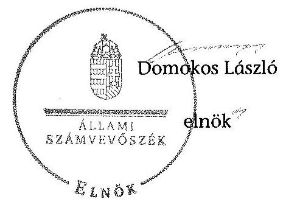

[^0]
[^0]:    ${ }^{16}$ a 368/2011. (XII. 5.) számú Igazgatósági határozat, és az azt jóváhagyó 2011. december 29-én kiadott 40/2011. számú miniszteri Engedély alapján
    ${ }^{17}$ 383/2012. (XII. 21.) számú Igazgatósági határozat

---

# RÖVIDÍTÉSEK JEGYZÉKE 

| Jogszabályok |  |
| :--: | :--: |
| Alaptörvény | Magyarország Alaptörvénye (2011. április 25.) (hatályos: 2012. január 1-jétől) |
| Avtv. | A személyes adatok védelméről és a közérdekű adatok nyilvánosságáról szóló 1992. évi LXIII. törvény (hatálytalan: 2012. január 1-jétől) |
| ÁFA tv. | az általános forgalmi adóról szóló 2007. évi CXXVII. törvény |
| Áht. 1 | Az államháztartásról szóló 1992. évi XXXVIII. törvény (hatálytalan: 2012. január 1-jétől) |
| Áht. 2 | Az államháztartásról szóló 2011. évi CXCV. törvény (hatályos: 2011. december 31-étől) |
| ÁSZ tv. | Az Állami Számvevőszékről szóló 2011. évi LXVI. törvény (hatályos: 2011. július 1-jétől) |
| Evt. | Az erdőről, az erdő védelméről és az erdőgazdálkodásról szóló 2009. évi XXXVII. törvény (hatályos: 2009. július 10-étől) |
| Evr. | Az erdőről, az erdő védelméről és az erdőgazdálkodásról szóló 2009. évi XXXVII. törvény végrehajtásáról szóló 153/2009. (XI. 13.) FVM rendelet (hatályos: 2009. november 21-étől) |
| Gt. | A gazdasági társaságokról szóló 2006. évi IV. törvény (hatálytalan: 2014. március 15-étől) |
| Info tv. | Az információs önrendelkezési jogról és az információszabadságról szóló 2011. évi CXII. törvény (hatályos: 2011. július 27-étől) |
| Inytv. | Az ingatlan-nyilvántartásról szóló 1997. évi CXLI. törvény (hatályos: 2000. január 1-jétől) |
| Mfbtv. | A Magyar Fejlesztési Bankról szóló 2001. évi XX. törvény (hatályos: 2001. június 15-étől) |
| Nfatv. | A Nemzeti Földalapról szóló 2010. évi LXXXVII. törvény (hatályos: 2010. szeptember 1-jétől) |
| Nvtv. | A nemzeti vagyonról szóló 2011. évi CXCVI. törvény (hatályos: 2011. december 31-étől) |
| régi Evt. | Az erdőről és az erdő védelméről szóló 1996. évi LIV. törvény (hatályos 2009. július 9-éig) |
| Számv. tv. | A számvitelről szóló 2000. évi C. törvény (hatályos: 2001. január 1-jétől) |
| új Ptk. | A Polgári Törvénykönyvről szóló 2013. évi V. törvény (hatályos: 2014. március 15-étől) |
| Vadvédelmi tv. | A vad védelméről, a vadgazdálkodásról, valamint a vadászatról szóló 1996. évi LV. törvény (hatályos: 1997. március 1-jétől) |

---

Vhr.

Vtv.

2009. évi CXXII. törvény

## Egyéb rövidítések

Alapító okirat ${ }_{1}$
Alapító okirat ${ }_{2}$
Alapító okirat ${ }_{3}$
Alapító okirat ${ }_{4}$
Alapító okirat ${ }_{5}$
Alapító okirat ${ }_{6}$
Alapító okirat ${ }_{7}$
Alapító okirat ${ }_{8}$
Alapító okirat ${ }_{9}$
Alapító okirat ${ }_{10}$
Alapító okirat ${ }_{11}$
ÁFA
ÁSZ
Belső Ellenőrzési Szabályzat1
Belső Ellenőrzési Szabályzat2
Beruházási szabályzat
Beszerzési szabályzat
DALERD Zrt., Társaság
EEVR

Az állami vagyonnal való gazdálkodásról szóló törvény végrehajtásáról szóló 254/2007. (X. 4.) Korm. rendelet (hatályos: 2007. október 4-étől)
Az állami vagyonról szóló 2007. évi CVI. törvény (hatályos: 2007. szeptember 25-étől)
A köztulajdonban álló gazdasági társaságok takarékosabb működéséről szóló 2009. évi CXXII. törvény (hatályos: 2009. december 4-étől)

A DALERD Zrt. Alapító okirata (hatályos: 2009. május 27-étől - 2009. július 31-éig)
A DALERD Zrt. Alapító okirata

 (hatályos: 2009. augusztus 1-jétől – 2010. február 11-éig)
A DALERD Zrt. Alapító okirata (hatályos: 2010. február 12-étől – 2010. május 20-áig)
A DALERD Zrt. Alapító okirata (hatályos: 2010. május 21-étől – 2010. július 12-éig)
A DALERD Zrt. Alapító okirata (hatályos: 2010. július 13-ától – 2011. május 30-áig)
A DALERD Zrt. Alapító okirata (hatályos: 2011. május 31-étől – 2012. május 31-éig)
A DALERD Zrt. Alapító okirata (hatályos: 2012. június 1-jétől – 2012. november 18-ig)
A DALERD Zrt. Alapító okirata (hatályos: 2012. november 19-étől – 2013. május 5-éig)
A DALERD Zrt. Alapító okirata (hatályos: 2013. május 6-ától – 2013. július 10-éig)
A DALERD Zrt. Alapító okirata (hatályos: 2013. július 11-étől – 2014. május 27-éig)
A DALERD Zrt. Alapító okirata (hatályos: 2014. május 28-ától – 2014. szeptember 9-éig)
általános forgalmi adó
Állami Számvevőszék
A DALERD Zrt. Belső Ellenőrzési Szabályzata (hatályos: 2000. január 1-jétől – 2012. november 30-áig)

A DALERD Zrt. Belső Ellenőrzési Szabályzata (hatályos: 2012. december 1-jétől)

1/2010. sz. Vezérigazgatói utasítás, A beruházások kezelése (hatályos: 2010. augusztus 6-ától)
2/2013. sz. Vezérigazgatói utasítás, A DALERD Zrt. Beruházási szabályzata (hatályos: 2013. április 30-ától)
A DALERD Délalföldi Erdészeti Zártkörűen Működő Részvénytársaság
Egységes Erdészeti Vállalatirányítási Rendszer

---

| Erdészeti hatóság ${ }_{1}$ | Csongrád Megyei Mezőgazdasági Szakigazgatási Hivatal Erdészeti Igazgatóság 2010. december 31-éig |
| :--: | :--: |
| Erdészeti hatóság ${ }_{2}$ | Csongrád Megyei Kormányhivatal Erdészeti Igazgatóság 2011. január 1-jétől |
| EU | Európai Unió |
| Értékelési szabályzat | DALERD Zrt. Értékelési szabályzata (hatályos: 2009. január 1-jétől) |
| FB | A DALERD Zrt. Felügyelő Bizottsága |
| FB Ügyrendje ${ }_{1}$ | A DALERD Zrt. Felügyelő Bizottsága Ügyrendje (hatályos: 2010. augusztus 18-ától – 2011. szeptember 20-áig) |
| FB Ügyrendje ${ }_{2}$ | A DALERD Zrt. Felügyelő Bizottsága Ügyrendje (hatályos: 2011. szeptember 21-étől) |
| Ft | forint |
| ha | hektár |
| HM | Honvédelmi Minisztérium |
| hrsz. | helyrajzi szám |
| IG | A DALERD Zrt. Igazgatósága |
| KVI | Kincstári Vagyoni Igazgatóság |
| Leltározási szabályzat | A DALERD Zrt. Leltározási Szabályzata (hatályos: 2007. január 1-jétől) |
| M | millió |
| MFB Zrt. | Magyar Fejlesztési Bank Zártkörűen Működő Részvénytársaság |
| MNV Zrt. | Magyar Nemzeti Vagyonkezelő Zrt., amely 2010. szeptember 1-jétől a Nemzeti Földalapba nem tartozó állami vagyon feletti tulajdonosi joggyakorló |
| NFA | Nemzeti Földalapkezelő Szervezet, amely 2010. szeptember 1-jétől az Nfatv.-ben meghatározott, a Nemzeti Földalapba tartozó földterületek feletti tulajdonosi joggyakorló |
| Önköltségszámítási szabályzat | A DALERD Zrt. Önköltségszámítási szabályzata (hatályos: 2007. január 1-jétől) |
| Számlarend $_{1}$ | A DALERD Zrt. Számlarendje (hatályos: 2009. január 1-jétől – 2009. december 31-éig) |
| Számlarend $_{2}$ | A DALERD Zrt. Számlarendje (hatályos: 2010. január 1-jétől – 2010. december 31-éig) |
| Számlarend $_{3}$ | A DALERD Zrt. Számlarendje (hatályos: 2012. január 1-jétől – 2012. december 31-éig) |
| Számlarend $_{4}$ | A DALERD Zrt. Számlarendje (hatályos: 2013. december 1-jétől) |
| Számviteli politika $_{1}$ | A DALERD Zrt. Számviteli politikája (hatályos: 2007. január 1-jétől – 2013. november 30-áig) |
| Számviteli politika $_{2}$ | A DALERD Zrt. Számviteli politikája (hatályos: 2013. december 1-jétől) |
| SZMSZ $_{1}$ | A DALERD Zrt. Szervezeti és Működési Szabályzata (hatályos: 2008. december 1-jétől – 2010. augusztus 17-éig) |

---

SZMSZ $_{2}$

SZMSZ $_{3}$

Társaság feletti tulajdonosi joggyakorló ${ }_{1}$

Társaság feletti tulajdonosi joggyakorló ${ }_{2}$

Vadgazdálkodási szabályzat ${ }_{1}$
Vadgazdálkodási szabályzat ${ }_{2}$
VSZ

A DALERD Zrt. Szervezeti és Működési Szabályzata (hatályos: 2010. augusztus 18-ától – 2013. március 25-éig)
A DALERD Zrt. Szervezeti és Működési Szabályzata (hatályos: 2013. március 26-ától)
a társaságok állami tulajdonú részesedése feletti tulajdonosi jogokat gyakorló Magyar Nemzeti Vagyonkezelő Zrt. (2009. január 1-jétől – 2010. június 16-áig)
a társaságok állami tulajdonú részesedése feletti tulajdonosi jogokat gyakorló Magyar Fejlesztési Bank Zrt. (2010. június 17-étől – 2014. július 15-éig)
A DALERD Zrt. Vadgazdálkodási szabályzata (hatályos: 2011. február 28-ától – 2012. június 30-áig)

A DALERD Zrt. Vadgazdálkodási szabályzata (hatályos: 2012. július 1-jétől)

KVI-vel 1996. november 1-jén kötött ideiglenes Vagyonkezelési szerződés (azonosítója: 01840-96-02066)

---

# FOGALOMTÁR 

állami vagyon
a) az állam tulajdonában lévő dolog, valamint dolog módjára hasznosítható természeti erő;
b) az a) pont hatálya alá tartozó mindazon vagyon, amely vonatkozásában törvény az állam kizárólagos tulajdonjogát nevesíti;
c) az állam tulajdonában lévő tagsági jogviszonyt megtestesítő értékpapír, illetve az államot megillető egyéb társasági részesedés;
d) az államot megillető olyan immateriális, vagyoni értékkel rendelkező jogosultság, amelyet jogszabály vagyoni értékű jogként nevesít;
e) az állam tulajdonában lévő pénzügyi eszközök.
állami vagyon használója
Az állami vagyon használója az a természetes vagy jogi személy, jogi személyiséggel nem rendelkező szervezet, aki, vagy amely törvény vagy szerződés alapján, bármely jogcímen (bérlet, haszonbérlet, használat stb.) állami vagyont birtokol, használ, szedi annak használt. (Ide nem értve a haszonélvezőt, a vagyonkezelőt és a tulajdonosi jogok gyakorlóját.)
átlátható szervezet Átlátható szervezet a Nvtv. 3. § (1) bekezdés 1. pontjában felsorolt, a meghatározott követelményeknek megfelelő szervezet.
földbirtok-politikai irányelvek
hasznosítás
immateriális szolgáltatásából származó bevétel
információs és kommunikációs rendszer
kockázatkezelés

Az Nfatv. 15. § (3) bekezdés a)-s) pontjaiban meghatározott, a Nemzeti Földalapba tartozó földrészletek hasznosítására vonatkozó irányelvek.
Hasznosítás a tulajdonosi joggyakorló vagy a nemzeti vagyon használója által a nemzeti vagyon birtoklásának, használatának, hasznok szedése jogának bármely – a tulajdonjog átruházását nem eredményező – jogcímen történő átengedése, ide nem értve a vagyonkezelésbe adást, valamint a haszonélvezeti jog alapítását.
Immateriális szolgáltatásból származó bevételek azok a nem anyagjellegű szolgáltatásokból származó állami bevételek, amelyeket az Evt. 3. § (1) bekezdése szerint, a külön jogszabályban meghatározott részletes feltételek szerint, az erdők fenntartására, gyarapítására és védelmére kell fordítani.
Az információs és kommunikációs rendszer biztosítja, hogy az információk eljussanak az illetékes szervezethez, szervezeti egységhez, illetve személyhez.
A kockázatkezelés a szervezet céljai elérésével kapcsolatos kockázatok azonosításának és elemzésének, valamint a megfelelő válaszok meghatározásának folyamata.

---

kockázatkezelési rendszer
kontrolling
kontrollkörnyezet
kontrolltevékenységek
közfeladat

A kockázatkezelési rendszer működtetése során fel kell mérni és meg kell állapítani a szervezet tevékenységében, gazdálkodásában rejlő kockázatokat, valamint meg kell határozni az egyes kockázatokkal kapcsolatban szükséges intézkedéseket, valamint azok teljesítésének folyamatos nyomon követésének módját.
A kockázatkezelési rendszer olyan irányítási eszközök és módszerek összessége, amelynek elemei a szervezeti célok elérését veszélyeztető tényezők (kockázatok) azonosítása, elemzése, nyomon követése, valamint szükség esetén a kockázati kitettség mérséklése.
Az a vezetéstámogató rendszer, amely a vezetői tervezést, ellenőrzést, valamint információ-ellátást koordinálja célorientáltan a környezeti változásokhoz igazodva.
A kontroll környezet elemei: a szervezeti struktúra, a felelősségi, hatásköri viszonyok és feladatok, a szervezet minden szintjén meghatározott etikai elvárások, a humánerőforráskezelés. A kontrollkörnyezet alapozza meg a belső kontroll összes többi elemét a fegyelem és a struktúra biztosítása által.
A kontrollrendszer a kockázatok kezelése és tárgyilagos bizonyosság megszerzése érdekében kialakított folyamatrendszer, amely azt a célt szolgálja, hogy megvalósuljanak a következő célok:
a) a működés és a gazdálkodás során a tevékenységeket szabályszerűen, gazdaságosan, hatékonyan, eredményesen hajtsák végre,
b) az elszámolási kötelezettségeket teljesítsék, és
c) megvédjék az erőforrásokat a veszteségektől, károktól és nem rendeltetésszerű használattól.
A kontrolltevékenységek azok az elvek (politikák) és eljárások, amelyeket a kockázatok meghatározása és a szervezet céljainak elérése érdekében alakítanak ki.
A közfeladat jogszabályban meghatározott állami vagy önkormányzati feladat, amit az arra kötelezett közérdekből, jogszabályban meghatározott követelményeknek és feltételeknek megfelelve végez, ideértve a lakosság közszolgáltatásokkal való ellátását, továbbá az állam nemzetközi szerződésekben vállalt kötelezettségeiből adódó közérdekű feladatokat, valamint e feladatok ellátásához szükséges infrastruktúra biztosítását is.
Az Evt. 2. § (2) bekezdése szerint a fenntartható erdőgazdálkodás során a legfontosabb közérdekű feladat az erdők változatosságának megőrzése, az erdők fenntartása, felújítása és a védelmi, valamint közjóléti szolgáltatások biztosítása, melyek elvégzését az állam megfelelő eszközökkel biztosítja.

---

monitoring

Nemzeti Földalap
nemzeti vagyon használója
rábízott állami vagyon
társasági portfólió
tulajdonosi ellenőrzés
tulajdonosi joggyakorló

A szervezet tevékenységének, a célok megvalósításának nyomon követését biztosító rendszer, amely az operatív tevékenységek keretében megvalósuló folyamatos és eseti nyomon követésből, valamint az operatív tevékenységektől függetlenül működő belső ellenőrzésből áll.
A monitoring a projektek és programok végrehajtásának nyomon követése, mely a támogató és a kedvezményezett közti megállapodásban foglalt eljárások követését, az előrehaladás ellenőrzését és a lehetséges problémák időben történő azonosítását szolgálja.
A Nemzeti Földalap a kincstári vagyon része, amelybe beletartoznak az állam tulajdonában és az ingatlannyilvántartásban levő, az Nfatv. 1. § (1)-(2) bekezdéseiben felsorolt területek, földrészletek és az azokhoz kapcsolódó vagyoni értékű jogok.
A nemzeti vagyon használója az a természetes személy, jogi személy vagy jogi személyiséggel nem rendelkező szervezet, aki, vagy amely állami vagyon tekintetében törvény vagy szerződés alapján, a helyi önkormányzat vagyona tekintetében törvény, a helyi önkormányzat rendelete vagy szerződés alapján bármely jogcímen nemzeti vagyont birtokol, használ, szedi annak használt, kivéve a tulajdonosi joggyakorló (az Nvtv. 3. § (1) bekezdés 11. pontja alapján).
Rábízott állami vagyon az a Vtv. alkalmazásában állami vagyonnak minősülő vagyon, amit az MNV – a saját vagyonától elkülönítetten – kezel és nyilvántart.
Az Mfbtv. 3. § (9) bekezdése szerint rábízott állami vagyon az a vagyon, amely felett az Mfbtv. erejénél fogva a Magyar Állam nevében az MFB gyakorolja a tulajdonosi jogokat.
Az Nfatv. 1. § (1) bekezdésében foglaltak alapján az NFAhoz tartozó rábízott vagyon a törvényben meghatározott, a Nemzeti Földalapba tartozó vagyon.
Társasági portfólió az MNV, illetve az MFB rábízott vagyonába tartozó állami tulajdonú társasági részesedések.
A tulajdonosi joggyakorló által végzett ellenőrzés, amelynek célja az állami vagyonnal való gazdálkodás vizsgálata, ennek keretében a rendeltetésellenes, jogszerűtlen, szerződésellenes, vagy a tulajdonos érdekeit sértő, illetve a központi költségvetést hátrányosan érintő vagyongazdálkodási intézkedések feltárása és a jogszerű állapot helyreállítása, továbbá a vagyonnyilvántartás hitelességének, teljességének és helyességének biztosítása.
Tulajdonosi joggyakorló az, aki az állami, illetve a nemzeti vagyon felett az államot megillető tulajdonosi jogok és kötelezettségek gyakorlására jogosult.

---

tulajdonosi joggyakorlás módja
vagyongazdálkodás feladata
vagyonkezelői jog

Az állami vagyon felett a Magyar Államot megillető tulajdonosi jogoknak (és kötelezettségeknek) az összességét az állami vagyon felügyeletéért felelős miniszter gyakorolja, aki e feladatát az MNV, az MFB, illetve egyéb tulajdonosi joggyakorló szervezet (pl. központi költségvetési szervek, 100%-ban állami tulajdonban álló gazdasági társaságok) útján látja el.
Azon állami tulajdonban álló ingatlanok felett, amelyek egy része a Nemzeti Földalapba tartozik, a tulajdonosi jogokat a miniszter az agrárpolitikáért felelős miniszterrel közösen gyakorolja.
A Nemzeti Földalap felett a Magyar Állam nevében a tulajdonosi jogokat és kötelezettségeket az agrárpolitikáért felelős miniszter a Nemzeti Földalapkezelő Szervezet útján gyakorolja.
Az állami vagyon rendeltetésének megfelelő – az állami feladatok ellátásához, a társadalmi szükségletek kielégítéséhez, valamint a Kormány gazdaságpolitikája megvalósításának elősegítéséhez szükséges, egységes elveken alapuló, önálló ágazatként megjelenő – hatékony, költségtakarékos, értékmegőrző, értéknövelő felhasználásának biztosítása, beleértve a vagyoni kör változását eredményező értékesítést, valamint az állami vagyon gyarapítása is.
Vagyonkezelési szerződés alapján a vagyonkezelő jogosult meghatározott, állami tulajdonba tartozó dolog birtoklására, használatára és hasznai szedésére.
A Vtv. alapján a vagyonkezelői jog az állami vagyon hasznosítására az MNV-vel kötött vagyonkezelési szerződéssel jön létre.
 A vagyonkezelési szerződés alapján a vagyonkezelő jogosult meghatározott, állami tulajdonba tartozó dolog birtoklására, használatára és hasznai szedésére.
Az Nftv. alapján a vagyonkezelői jog az erre irányuló (NFA-val kötött) szerződéssel jön létre. A vagyonkezelői szerződés alapján a vagyonkezelő jogosult meghatározott földrészlet birtoklására, használatára és hasznai szedésére. A vagyonkezelő köteles a földrészlet értékét megőrizni, állagának megóvásáról, jó karban tartásáról gondoskodni, továbbá - az Nftv.-ben meghatározott esetek kivételével - díjat fizetni vagy a szerződésben előírt más kötelezettséget teljesíteni.

---

A DALERD Zrt. vagyonának alakulása a 2009-2013. évek közötti időszakban
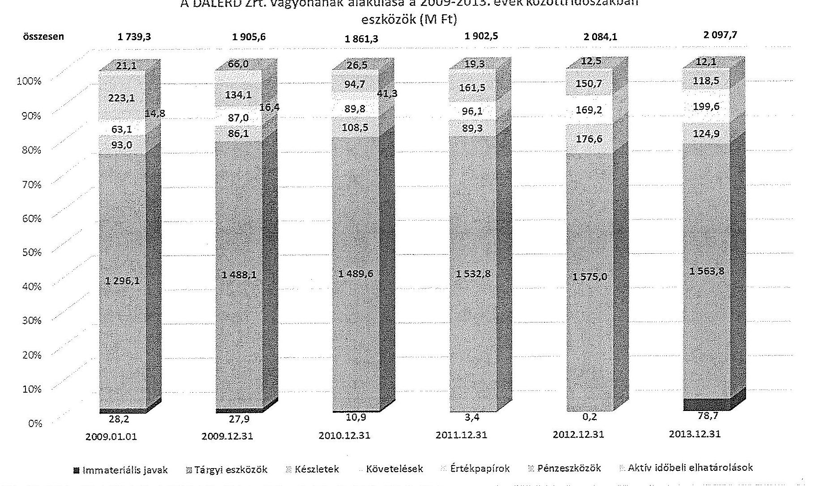

---

A DALERD Zrt. vagyonának alakulása a 2009-2013. évek közötti időszakban források (M Ft)
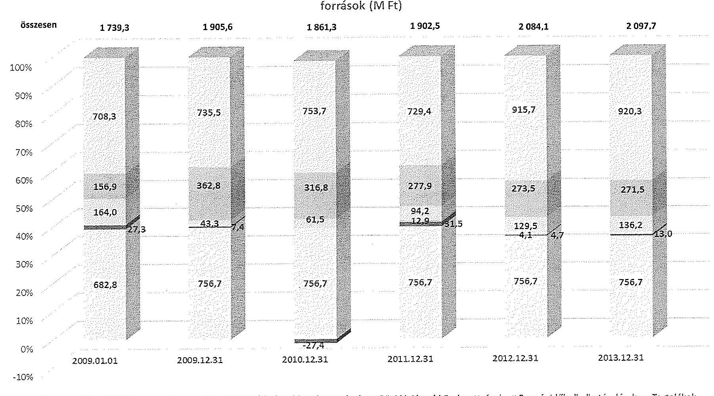

Jegyzett tőke a Mérleg szerinti eredmény a Hosszú lejáratú kötelezettségek a Rövid lejáratú kötelezettségek a Passzív időbeli elhatárolások - Tartalékok

---

# Kimutatás a DALERD Zrt. befektetett eszközei állományának alakulásáról a 2009-2014. I. féléve közötti időszakra vonatkozóan

|  Sor-
szám | MEGNEVEZÉS | 2009. év |  |  | 2010. év |  |  | 2011. év |  |  | 2012. év |  |  | 2013. év |  |  | 2014.06.30 |  |   |
| --- | --- | --- | --- | --- | --- | --- | --- | --- | --- | --- | --- | --- | --- | --- | --- | --- | --- | --- | --- |
|   |  | Összesen | Állami | Saját | Összesen | Állami | Saját | Összesen | Állami | Saját | Összesen | Állami | Saját | Összesen | Állami | Saját | Összesen | Állami | Saját  |
|   | 1. | 2. | 3. | 4. | 5. | 6. | 7. | 8. | 9. | 10. | 11. | 12. | 13. | 14. | 15. | 16. | 17. | 18. | 19.  |
|  1. | Nyitó állomány | 1324257 | 0 | 1324257 | 1516038 | 0 | 1516038 | 1500501 | 0 | 1500501 | 1536218 | 0 | 1536218 | 1375165 | 0 | 1375165 | 1642502 | 0 | 1642502  |
|  2. | Terv szerinti értékcsökkenés | 70993 | 0 | 70993 | 75359 | 0 | 75359 | 74275 | 0 | 74275 | 76866 | 0 | 76866 | 73575 | 0 | 73575 | 33085 | 0 | 33085  |
|  3. | Terven felüli értékcsökkenés | 0 | 0 | 0 | 0 | 0 | 0 | 0 | 0 | 0 | 0 | 0 | 0 | 0 | 0 | 0 | 0 | 0 | 0  |
|  4. | Értékvesztés elszámolása | 0 | 0 | 0 | 0 | 0 | 0 | 0 | 0 | 0 | 0 | 0 | 0 | 0 | 0 | 0 | 0 | 0 | 0  |
|  5. | Értékesítés | 101 | 0 | 101 | 8346 | 0 | 8346 | 7184 | 0 | 7184 | 1596 | 0 | 1596 | 9469 | 0 | 9469 | 10147 | 0 | 10147  |
|  6. | Selejtezés | 147 | 0 | 147 | 304 | 0 | 304 | 1948 | 0 | 1948 | 21 | 0 | 31 | 374 | 0 | 374 | 0 | 0 | 0  |
|  7. | Átminősítés | 0 | 0 | 0 | 0 | 0 | 0 | 0 | 0 | 0 | 0 | 0 | 0 | 0 | 0 | 0 | 0 | 0 | 0  |
|  8. | Ingyenes átadás | 0 | 0 | 0 | 0 | 0 | 0 | 0 | 0 | 0 | 0 | 0 | 0 | 0 | 0 | 0 | 0 | 0 | 0  |
|  9. | Egyéb | 0 | 0 | 0 | 0 | 0 | 0 | 0 | 0 | 0 | 0 | 0 | 0 | 0 | 0 | 0 | 0 | 0 | 0  |
|  10. | Csökkenés összesen | 71241 | 0 | 71241 | 84009 | 0 | 84009 | 83407 | 0 | 83407 | 78493 | 0 | 78493 | 83418 | 0 | 83418 | 43232 | 0 | 43232  |
|  11. | Terv szerinti beruházás | 263022 | 0 | 263022 | 68472 | 0 | 68472 | 119124 | 0 | 119124 | 117440 | 0 | 117440 | 150755 | 0 | 150755 | 84661 | 0 | 84661  |
|  12. | Terv szerinti felújítás | 0 | 0 | 0 | 0 | 0 | 0 | 0 | 0 | 0 | 0 | 0 | 0 | 0 | 0 | 0 | 0 | 0 | 0  |
|  13. | Terv szerinti növekedés | 263022 | 0 | 263022 | 68472 | 0 | 68472 | 119124 | 0 | 119124 | 117440 | 0 | 117440 | 150755 | 0 | 150755 | 84661 | 0 | 84661  |
|  14. | Egyéb beruházás | 0 | 0 | 0 | 0 | 0 | 0 | 0 | 0 | 0 | 0 | 0 | 0 | 0 | 0 | 0 | 0 | 0 | 0  |
|  15. | Egyéb felújítás | 0 | 0 | 0 | 0 | 0 | 0 | 0 | 0 | 0 | 0 | 0 | 0 | 0 | 0 | 0 | 0 | 0 | 0  |
|  16. | Átminősítés | 0 | 0 | 0 | 0 | 0 | 0 | 0 | 0 | 0 | 0 | 0 | 0 | 0 | 0 | 0 | 0 | 0 | 0  |
|  17. | Átvétel | 0 | 0 | 0 | 0 | 0 | 0 | 0 | 0 | 0 | 0 | 0 | 0 | 0 | 0 | 0 | 0 | 0 | 0  |
|  18. | Értékvesztés visszajárása | 0 | 0 | 0 | 0 | 0 | 0 | 0 | 0 | 0 | 0 | 0 | 0 | 0 | 0 | 0 | 0 | 0 | 0  |
|  19. | Értékcsökkenés visszajárása | 0 | 0 | 0 | 0 | 0 | 0 | 0 | 0 | 0 | 0 | 0 | 0 | 0 | 0 | 0 | 0 | 0 | 0  |
|  20. | Egyéb | 0 | 0 | 0 | 0 | 0 | 0 | 0 | 0 | 0 | 0 | 0 | 0 | 0 | 0 | 0 | 0 | 0 | 0  |
|  21. | Terven felüli növekedés | 0 | 0 | 0 | 0 | 0 | 0 | 0 | 0 | 0 | 0 | 0 | 0 | 0 | 0 | 0 | 0 | 0 | 0  |
|  22. | Növekedés összesen | 263022 | 0 | 263022 | 68472 | 0 | 68472 | 119124 | 0 | 119124 | 117440 | 0 | 117440 | 150755 | 0 | 150755 | 84661 | 0 | 84661  |
|  23. | Záró állomány | 1516038 | 0 | 1516038 | 1500501 | 0 | 1500501 | 1536218 | 0 | 1536218 | 1575165 | 0 | 1575165 | 1642502 | 0 | 1642502 | 1683931 | 0 | 1683931  |

---

.

---

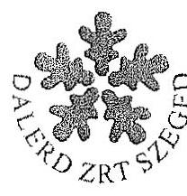

# DALERD Délalföldi Erdészeti Zártkörűen Működő Részvénytársaság 

6721 Szeged, Zsótér u. 4/b.
6701 Szeged, Pf. 1197.
Tel.: (62) 551-340
Fax : (62) 551-342

Vezérigazgató tel.: (62) 425-510
fax: (62) 551-341

Állami Számvevőszék
1052 Budapest, Apáczai Csere János utca 10.
1364 Budapest 4 Pf. 54.

Domokos László
elnök

Tisztelt Elnök Úr!
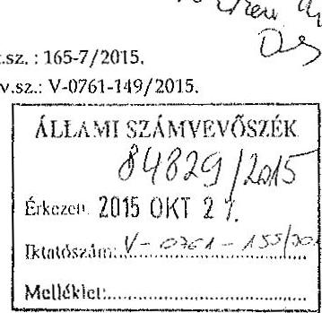

Hivatkozva folyó hó 12.-én kézhez vett V-0761-149/2015. iktatószámú, „Az állami tulajdonban álló erdőgazdasági társaságok vagyongazdálkodási tevékenységének ellenőrzése - DALERD Délalföldi Erdészeti Zrt." címü számvevőszéki jelentéstervezetre az alábbi észrevételeket teszi a Társaság:

## 1. Észrevétel - formai (3. oldal/ 2. bekezdés)

„A vagyonkezelési tevékenység végrehajtása során figyelemmel kell lenni az Etv.-ben foglaltakra, mely alapján a nemzeti vagyonról szóló törvényben nemzetgazdasági szempontból kiemelt jelentőségű nemzeti vagyonként meghatározott védelmi és közjóléti elsődleges rendeltetésű, az állam tulajdonában álló erdő a kincstári vagyon részét képezi."

Megjegyezzük, hogy a szöveg félreérthető, mert nem minden állami erdő védelmi és közjóléti rendeltetésű, ezen felül jelentős a gazdasági rendeltetésű erdő is. Így a Társaság által kezelt erdők között is megtalálható mindhárom rendeltetési forma.

## 2. Észrevétel - formai (4. oldal/ 3. bekezdés)

„A szegedi székhelyű Társaság és jogelődjei több mint hat évtizede gondozzák Csongrád- és Békés megye állami erdőterületeit. Az Ásotthalmi Erdészet a Duna-Tisza-közi homokvidék déli részén, a Gyulai Erdészet elsősorban a Fekete- és Fehér-Körös völgyében, a Körösvidéki Erdészet Békés megye észak-keleti felében, míg a Szegedi Erdészet föként a Tisza és Maros völgyében folytat hagyományos erdőgazdálkodási tevékenységet."

A Körös-vidéki megnevezés cégadatok szerint Körösvidéki.

---

# 3. Észrevétel - érdemi (6. oldal/ 1. bekezdés) 

„A Társaság 2009-2013. évekre vonatkozó mérlegei az ellenőrzött időszakban nem feleltek meg a Számv. tv. előírásainak, mivel nem tartalmazták a Társaság vagyonkezelésében lévő állami földterületek értékét, így nem adtak megbízható, valós képet a Társaság vagyonáról, annak összetételéről. Ezen túl a számviteli alapelvek teljesebb érvényesítése érdekében a kezelt vagyon mérlegtételek szerinti megbontása, és értékének változása a kiegészítő mellékletben sem került bemutatásra, amely ugyancsak nem felelt meg a Számv. Tv. előírásainak."

A Társaság álláspontja szerint a megállapítások nem megalapozottak.
Egyrészt az Nvtv. „10. § (1) A nemzeti vagyont, annak értékét és változásait

 a tulajdonosi joggyakorló nyilvántartja. Az érték nyilvántartásától el lehet tekinteni, ha az adott vagyontárgy értéke természeténél, jellegénél fogva nem állapítható meg."
Másrészt a Pénzügyminisztérium 9806/1997 (NG-1129/97.) számú „A kincstári vagyon számviteli elszámolása a vagyonkezelőnél" tárgyú 1997. november 25. napon kelt állásfoglalása (lásd 1. számú melléklet) alapján - 2. oldal - „A számviteli törvény 21. §-ának (3) bekezdésében megfogalmazott előírás feltételezi, hogy a kezelt kincstári vagyon megfelelő módon, dokumentáltan értékelésre kerül, hiszen csak ez esetben lehet azt az eszközök és a kötelezettségek között értékkel kimutatni, amíg megfelelő értékelés nem áll rendelkezésre, vagy az adott kincstári vagyont nem lehet - természeténél fogva - értékelni, addig (és akkor) nem lehet (nem tudjuk) alkalmazni a törvény hivatkozott 21. § (3) bekezdésének rendelkezését sem."

A jogalkotó mindkét idézett esetben megadta annak lehetőségét, hogy amennyiben egzakt módon nem állapítható meg a kezelésbe adott vagyon értéke annak speciális jellegéből adódóan - akkor figyelemmel az Sztv.-ben megfogalmazott elvekre el lehessen tekinteni az értékben történő nyilvántartástól.

A Társaság részére az átadott vagyon Tulajdonosi joggyakorlója nem adta át értékben a vagyonkezelői szerződéssel érintett vagyont. A Társaság ezért nem tudja értékben nyilvántartani a kezelt vagyont. Jelenleg érvényes jogszabályok közül egyik sem biztosít arra lehetőséget, hogy piaci értékre helyesbítéssel vegye fel értéken könyveibe a vagyonkezelésbe kapott állami vagyont!

Nem helytálló az a megállapítás sem, miszerint a beszámolók nem adtak valós, megbízható képet a Társaság vagyonáról, mert az érték nélküli tételek a „0" számlaosztályba tartoznak, ez a számlaosztály viszont nem része a mérleg adatsornak. Egyébiránt, az erdővagyon értéknek esetleges megállapítását követően a Társaság vagyona nem változik, kizárólag az egyező eszköz-forrás oldalon várható jelentős növekedés. A kezelt erdővagyon után értékcsökkenés nem számolható el, ezáltal az eredménykimutatásban nem történik változás az esetleges felértékelést követően. Így a gazdálkodás jövedelmezőségét nem befolyásolja sem a „0" forinton történt nyilvántartás, sem az esetlegesen magasabb értéken történő nyilvántartás. Ugyanez mondható el a pénzügyi helyzetre is.

---

Az erdő fogalma, mint természeti képződmény elsősorban dologi jogi, ingatlanjogi és vagyonjogi kategória. Értéknek megállapítása e kategóriák figyelembe vételével lehetséges. Magyarországon jelenleg nincs elfogadott, egységes elvek szerint működő erdőérték-számítási módszer. Már a lábon álló élőfa készlet naturális mennyiségi becslése is általában közel tíz százalék hibahatárú, amelynek választékszerkezete és piaci értéke a bizonytalanságot tovább növeli. Az élőfaállomány értékbecslésének pontatlansága jóval meghaladhatja az éves mérlegfőösszeg nagyságrendjét. Elfogadott értékbecslés módszertan hiányában a kezelt erdővagyon értékének meghatározása és a Társaság könyveiben történő nyilvántartása aggályos.

A vizsgált időszak Kiegészítő mellékletei, az I/1. pontban, az I/B. Összegzés érintik a vagyonkezelés tényét, II/A./1. pont pedig az alábbiakat tartalmazza: „A Társaság, mint vagyonkezelő, a vagyonkezelési szerződésben meghatározott értéken mutatja ki mérlegében az eszközök között a - törvényi rendelkezés, illetve felhatalmazás alapján - kezelésbe vett, az állami vagyon részét képező eszközöket (erdőket)." A Társaság ettől bővebb tájékoztatást nem tud adni az érték nélkül átadott vagyon tekintetében. Érték nélküli nyilvántartás értékben történő bemutatása az éves beszámolóban megítélésünk szerint nem lehetséges.

# 4. Észrevétel - érdemi (6. oldal/ 3. bekezdés) 

„A Társaság a saját vagyonról megfelelő nyilvántartást vezetett. A vagyonkezelt állami vagyonról vezetett nyilvántartás nem felelt meg a Vhr.-ben előírt követelményeknek, mert tételesen nem tartalmazta a vagyonkezelt eszközök bruttó és nettó értékeit, illetve az értékükben bekövetkezett egyéb változásokat. Így a nyilvántartás nem biztosította az átláthatóságot és az elszámolhatóságot. Az erdőtelepítések aktivált értékének elkülönített nyilvántartása nem volt biztosított, annak belső szabályozását a Számlarend 1-4 nem tartalmazta."

A Társaság álláspontja szerint a megállapítások egy része nem megalapozott.
Az IVSZ keretében átadott vagyonelemek tételes nyilvántartása bemutatásra került a vizsgálat alatt. A vagyonelemeket érintő változások (kizárólag ingatlanokról beszélünk) szintén folyamatosan vezetve voltak, kivéve abban az esetben, ha a vagyonkezelésbe adó által kezdeményezett és a vagyonkezelt ingatlant érintő változásokról nem kapott tájékoztatást a vagyonkezelő.
Az átláthatóság biztosított volt az analitikus nyilvántartás alapján és ezt a vizsgálat alatt a vagyonkezelő be is mutatta. Az erdőtelepítések elkülönített nyilvántartása az ügyviteli rendszerben analitikusan megoldott, minden lényeges adat rögzítésre került minden egyes tétel esetében, ahogy a vizsgálat során azt bemutatta a vagyonkezelő.
5. Észrevétel - érdemi (6. oldal/ utolsó és 7. oldal 1,2,3. bekezdés)
„A megkötött VSZ - a vagyonkezelésbe adott, illetve vagyonkezelésből 2009. év végéig kivont ingatlanokkal történt mellékletmódosításon kívül - nem került módosításra. A VSZ nem követte a jogszabályok változásait, nem módosították a tulajdonosi joggyakorlók változása miatt, és a vagyonkezelői díjjal kapcsolatos tulajdonosi joggyakorlók közötti

---

megosztott számlázási kötelezettség miatt sem. A szerződő felek nem tettek eleget a Vhr.-ben foglalt rendelkezésnek és a Vhr. hatálybalépését követő hat hónapon belül nem kezdeményezték a Nemzeti Földalapba tartozó ingatlanokra vonatkozóan a VSZ megszüntetését és a Vtv., illetve Vhr. szabályainak megfelelő szerződés megkötését.
A VSZ teljes körűen nem tartalmazta a vagyonkezelői jog korlátozásaira vonatkozó előírásokat, továbbá nem rögzítették az érintett vagyonelem esetleges védettségét, illetve Natura 2000 területnek minősítését. A VSZ-ben évente előírt felülvizsgálatra az ellenőrzött időszakban nem került sor."
A VSZ 3.3.2. pontja a vagyonkezelési díjnak a rendszeres, évente november 30-áig esedékes felülvizsgálatát írta elő, amely az ellenőrzött időszakban nem történt meg.

A Társaság álláspontja szerint a megállapítás nem a valós képet tükrözi.
Az Alapító Okirat 12.2. zs) pontja alapján az egyedüli részvényes kizárólagos hatáskörébe tartozik az állami erdőterületek kezelésére vonatkozó vagyonkezelési szerződés megkötése (módosítása). A mindenkori Tulajdonosi joggyakorló kapcsolódó levelezésből álljon itt néhány:
2010.10.05 MNV Zrt. vagyonkezelt terület egyeztetés kérés (email)

2012.08.27 MFB Zrt. Tájékoztatás IVSZ teljes körű egyeztetése tárgyában. (email)
2012.09.05 DALERD Zrt. megküldi az MNV Zrt. részére az élő szerződések másolatait. (email)
2012.12.20 MFB Zrt. tájékoztatás a 2009-2012 évekre vonatkozó díjak számlázásáról (email)
2014.04.15 MFB Zrt. megküldi az új vagyonkezelői szerződés tervezetét (email)
2014.05.27 MFB Zrt. Tájékoztatás a vagyonkezelői díjakról (email)
2014.04.30 MNV Zrt. Tájékoztatása a végleges vagyonkezelői szerződésről és a díj fizetéséről (email)
2014.04.30 MFB Zrt. Tájékoztatás az NFA szerződéstervezetekről és kalkulált díjakról (email)
Mint a fentiekből látható a Társaság vagyonkezelői szerződésének módosításait, kapcsolódó egyeztetéseket a mindenkori Tulajdonosi joggyakorló végezte az Alapító Okiratban foglaltak szerint, szükség esetén bevonva a Társaságot. Így a Társaság az IVSZ kapcsán fennálló egyeztetések, módosítások elmulasztásáért, elmaradásáért nem felelős, mert ehhez Alapító Okiratában foglaltak alapján nem volt joga!

# 6. Észrevétel - érdemi (8. oldal/ 3. bekezdés) 

„A könyvvizsgáló az ellenőrzött időszakban jelentéseiben nem kifogásolta a mérleg tartalmával kapcsolatosan feltárt hiányosságokat, azaz nem hívta fel a figyelmet arra, hogy a Társaság éves mérlegeiben nem került rögzítésre a VSZ alapján kezelt állami vagyon értéke, valamint ezek az eszközök a kiegészítő mellékletekben sem kerültek bemutatásra, legalább mérlegtétel szerinti megbontásban."

A Társaság álláspontja szerint a megállapítást nem helytálló.

---

A könyvvizsgáló az ellenőrzött időszakban azért nem tárt fel a mérlegek tartalmával kapcsolatos hiányosságokat, mert álláspontja szerint a Társaság mérlegeiben a kezelt vagyont a hatályos vagyonkezelési szerződésben foglaltaknak megfelelően, tehát „0" értéken mutatta ki. A VSZ alapján kezelt állami vagyon piaci értéke a VSZ-ben nem került meghatározásra, ezért értékkel azt sem az eszközök, sem a kötelezettségek között nem lehetett kimutatni.
A könyvvizsgálat figyelembe vette az Sztv. 23. §-ának kezelt vagyonra vonatkozó általános előírását, miszerint a vagyonkezelésbe vett eszközöket eszközként kell kimutatni.
A beszámoló auditálásakor a kezelt vagyon elszámolásának és könyvekben történő kimutatásának vizsgálatakor alapkövetelménynek tekintettük az Sztv. 165. § (2) bekezdésében foglaltakat is, miszerint a számviteli (könyvviteli) nyilvántartásokba csak szabályszerűen kiállított bizonylat alapján szabad adatokat bejegyezni.
Fentieken túlmenően a vagyonkezelésbe vett eszközökkel kapcsolatos előírást fogalmaz meg a Vhr. 9.§ (9) bekezdése, mely rendelkezik arról, hogy az államháztartás alrendszereibe nem tartozó egyéb vagyonkezelő köteles a vagyonkezelésbe vett eszközöket a számvitelről szóló törvény előírásai szerint a hosszú lejáratú kötelezettségekkel szemben a vagyonkezelési szerződésben rögzített értéken állományba venni.

A könyvvizsgálat álláspontja szerint fenti jogszabályi előírásokból nem vezethető le, hogy a vagyonkezelésbe vett eszközöket a Társaságnak értékkel kellett volna kimutatnia a mérleg eszköz és forrás oldalán. A vagyonkezelési szerződésben nem került sor érték meghatározására, ezért a mérlegben ezen eszközöket nem lehetett értékkel kimutatni.
A Társaság helyesen járt el a beszámoló elkészítésénél, a könyvvizsgálat álláspontja szerint a beszámolók a Társaság valós pénzügyi, jövedelmi és vagyoni helyzetét tükrözik.

# 7. Észrevétel - érdemi (8. oldal/ 5. bekezdés) 

„Az állami vagyonnal kapcsolatos adatok védelme és a közérdekű adatok nyilvánosságra hozatala részben volt szabályozott, mert a Társaság Adatvédelmi és adatbiztonsági szabályzattal, valamint az Infotv.-ben és az Avtv.-ben előírtak ellenére a közérdekű adatok megismerésére irányuló igények teljesítésére vonatkozó szabályzattal nem rendelkezett, a közérdekű adatok közzététele nem volt teljes körű."

A Társaság álláspontja szerint a megállapítást nem megalapozott.
Az Infotv. 30. § (6) bekezdése a közfeladatot ellátó szerv számára írja elő a szabályzatkészítést a közérdekű adatigénylésekkel kapcsolatban. A Társaság nem közfeladatot ellátó szerv. A Ptk. alá tartozó gazdasági társaság, melynek 100%-os tulajdonosa a Magyar állam, tehát szerv semmiképpen nem lehet. Ugyanezen tv. 3. § 5. pontja definiálja a közérdekű adatot, és ez alapján is szerv és magánszemély az érintett.
A 15. észrevétel alatt leírtak vonatkoznak erre az észrevételre is.

---

8. Észrevétel - érdemi (15. oldal/ 5. és 16. oldal/ 2. bekezdés)
„Az erdőtelepítések fordított összegek főkönyvi nyilvántartásban a 2013. évtől nem valósult meg a Vhr. 17. § (1) bekezdésében előírt elkülönített nyilvántartás vezetése, amely tételesen tartalmazta volna a vagyonkezelésbe vett eszközök könyv szerinti értékeit és az abban bekövetkezett változásokat.
Az erdőtelepítések aktivált értékének nyilvántartási rendszerét - az erdőtelepítések értékének a föld tulajdonjoga szerinti elkülönített nyilvántartási hiánya miatt - a Számlarend 1-ben nem határozták meg, amelynek következtében a szabályozás nem felelt meg a Számv. tv. 161/A. § (2) bekezdésében előírt, a köztulajdon használatának nyilvánossága és ellenőrizhetősége követelményének."

A Társaság álláspontja szerint a megállapítást nem helytálló.
Az erdőtelepítések nyilvántartása elsődlegesen analitikus nyilvántartáson alapul 2013. évtől. Ugyanazon ügyviteli rendszeren belül található meg a főkönyvi gyűjtő számla és a tételes nyilvántartás is. Az idézett paragrafus: „(2) A közpénzek felhasználásának és a köztulajdon használatának nyilvánossága és ellenőrizhetősége érdekében a gazdálkodó nyilvántartási (könyvvezetési) rendszerét köteles oly módon továbbrészletezni, hogy abból a vonatkozó külön jogszabályban meghatározott adatok rendelkezésre álljanak."
A Társaság teljes mértékben megfelel az idézett paragrafusban foglaltaknak, 2013. évtől is, a tárgyi eszköz modul tételes analitikát tud minden időpillanatban produkálni, elsődlegesen erdőrészlet és helyrajzi szám szinten. Tekintettel arra, hogy a társaság erdészeti tevékenységének ezek a legfőbb jelző és elkülönítő kódok.

Az erdőtelepítések a Társaság saját beruházásai, melyeket a Vagyonkezelésbe adó engedélyével, tudtával valósított meg minden esetben. Így idegen területen megvalósított beruházás kategóriájaként definiálható, és mint az korábban írtuk a tételes nyilvántartás rendelkezésre áll, a bekerülési értékről is. Ezért számunkra nem értelmezhető a
 vizsgálati jegyzőkönyv azon kijelentése, hogy az erdőtelepítések vonatkozásában nem valósult meg a vagyonkezelésbe vett eszközök könyv szerinti értékének és az abban bekövetkezett változásoknak az elkülönített nyilvántartásban történő vezetése. Az erdőtelepítések elkülönített nyilvántartási rendszere működik és bemutatásra is került, a vagyonkezelési eszközök elkülönített nyilvántartása pedig - mint annak okait fent több esetben is leírtuk - működő, érték nélküli nyilvántartást takar, amely azonban folyamatosan karban van tartva.

# 9. Észrevétel - technikai (22. oldal/ 5. bekezdés) 

„A Társaság kezelt vagyonába kizárólag erdők és egyéb földterületek tartoztak, amelyekre a Számv. tv. 52. § (5) bekezdés előírásának megfelelően értékcsökkenést nem számolt el, a vagyonkezelésbe vett területek után a Vhr. 9. § (9) bekezdés d) pontja és Vtv. 27. § (7) bekezdése szerinti visszapótlási kötelezettsége - amely alól a Vtv. 27. § (8) bekezdése alapján alapfeladatként, főtevékenységként közfeladatot ellátóként mentesült is - nem keletkezett."

A Társaság álláspontja szerint a megállapítást nem helytálló.

---

Megítélésünk szerint a 2007. évi CVL tv. 27. § (8) bekezdése nem vonatkozik a Társaságra. A Társaság Alapító Okirata/Alapszabálya rendelkezik a Társaság alapításakor a tevékenységi körről. A DALERD Zrt. Alapító Okirata szerint gazdasági tevékenységet végez, főtevékenysége TEÁOR 0210'08 Erdészeti, egyéb erdőgazdálkodási tevékenység. Közfeladat ellátásról az Alapító nem rendelkezett!
A nevezett törvény 27. § (7) paragrafus szerinti visszapótlási kötelezettsége a Társaságnak azért nincs, mert a kezelt vagyon tekintetében nincs amortizációs kötelezettség. Mint ahogy a területi ellenőrzés során bemutattuk az erdők esetében a „visszapótlási kötelezettség" nem más, mint az Evt. által előírt újraerdősítési kötelezettség, melyet a Társaság a törvényi és hatósági előírásokat betartva el is végez minden évben. Erről az illetékes szakhatóság tájékoztatni is tudja az Állami Számvevőszéket.

# 10. Észrevétel - formai (23. oldal/ 2. bekezdés) 

„Az erdőtelepítések kivitelezése az MNV Zrt. támogatásával valósult meg."
Egyértelműbb lenne a megfogalmazás, ha úgy lenne fogalmazva, hogy bizonyos erdőtelepítések kivitelezését az MNV Zrt. is támogatta, mert a vizsgált időszakban voltak olyan erdőtelepítések, melyeket az MNV Zrt. támogatás nem érintett.

## 11. Észrevétel - érdemi (25. oldal/82. bekezdés)

„A könyvvizsgáló jelentéseiben, az ellenőrzött időszakban nem kifogásolta a beszámoló tartalmával kapcsolatosan, jelen ellenőrzés során feltárt hiányosságokat, azaz nem hívta fel a figyelmet arra, hogy a Társaság éves mérlegében nem került rögzítésre a VSZ alapján kezelt állami vagyon értéke, valamint ezek az eszközök a kiegészítő mellékletben sem kerültek bemutatásra, legalább mérlegtételek szerinti megbontásban."

A 6. észrevétel kapcsán leírtak vonatkoznak erre az észrevételre is.

## 12. Észrevétel - formai (26. oldal/ 3. bekezdés)

„Az FB által irányított függetlenített belső ellenőrzés működése részben felelt meg a Belső ellenőrzési szabályzat-2 előírásainak, mivel az ellenőrzési tervet a 2013-2014. években nem a kockázatelemzésre alapozták, az ellenőrzési jelentések megállapításait az ellenőrzött szervezettel dokumentáltan nem minden szükséges esetben egyeztették."

A Társaság álláspontja szerint a megállapítást nem helytálló.
A belső ellenőri vizsgálatokat 2013-2014. évben a kockázatelemzésre alapozták, az erről szóló dokumentumok feltöltésre kerültek a vizsgálat alatt. Korábban nem volt kockázatelemzés.

---

13. Észrevétel - formai (26. oldal/ 4. bekezdés), Az FB a belső ellenőr által évente elkészített éves ellenőrzési munkatervet - a 2009. évi munkaterv kivételével - a jegyzőkönyvében foglaltak alapján megtárgyalta és határozataival ${ }^{1}$ elfogadta."

A Társaság álláspontja szerint a megállapítást nem helytálló.
A 2009. évi FB munkaterv is van a Társaságnál, feltöltésre került a vizsgálat alatt.

# 14. Észrevétel - érdemi Közfeladat definíció értelmezése 

A közfeladat fogalmát a nemzeti vagyonról szóló 2011. évi CXCVI. törvény (Nvt.) 3. § (1) bekezdésének 7. pontja a következőképpen határozta meg: „7. közfeladat: jogszabályban meghatározott állami vagy önkormányzati feladat, amit az arra kötelezett közérdekből, jogszabályban meghatározott követelményeknek és feltételeknek megfelelve végez, ideértve a lakosság közszolgáltatásokkal való ellátását, továbbá az állam nemzetközi szerződésekben vállalt kötelezettségeiből adódó közérdekű feladatokat, valamint e feladatok ellátásához szükséges infrastruktúra biztosítását is". Ezen rendelkezés a törvény hatálybalépésétől kezdve egészen az Állami Számvevőszék által jelenleg vizsgált időszak végéig hatályban volt.
A hivatkozott jogszabályhelyet a 2014. évi XCIX. törvény 378. §-a 2015. január 1-től hatályon kívül helyezte, és a közfeladat fogalmát ugyanezen jogszabály 12. §-a az államháztartásról szóló 2011. évi CXCV. törvény (Áht.) I. Fejezetébe építette be. Ez jogszabály 3/A. § bekezdése értelmében „(1) Közfeladat a jogszabályban meghatározott állami vagy önkormányzati feladat. (2) A közfeladatok ellátása költségvetési szervek alapításával és működtetésével vagy az azok ellátásához szükséges pénzügyi fedezet e törvényben meghatározott eszközökkel, részben vagy egészben történő biztosításával valósul meg. A közfeladatok ellátásában államháztartáson kívüli szervezet jogszabályban meghatározott rendben közreműködhet. (3) A közfeladatot meghatározó jogszabályban meg kell határozni a közfeladat ellátásának módját és egyidejűleg rendelkezni kell az annak ellátásához szükséges pénzügyi fedezet biztosításáról. Új közfeladat kizárólag az annak ellátásához megfelelő pénzügyi fedezet rendelkezésre állása esetén írható elő vagy vállalható. Ha a pénzügyi fedezet már nem áll rendelkezésre, intézkedni kell a pénzügyi fedezet biztosításáról vagy a közfeladat megszüntetéséről."
A fentiek alapján egyértelmű, hogy állami vagy önkormányzati feladatot kellett a közfeladat alatt érteni, vagyis a „közfeladat ellátása" az állami illetve önkormányzati feladatellátással azonosítható, mely feladatok ellátásának kereteit és annak pénzügyi fedezeteit ugyancsak jogszabályban kell rögzíteni.
Az erdőről, az erdő védelméről és az erdőgazdálkodásról szóló 2009. évi XXXVII. törvény (Etv.) 2. § (2) bekezdése szerint „A fenntartható erdőgazdálkodás során a legfontosabb közérdekű feladat az erdők változatosságának megőrzése, az erdők fenntartása, felújítása és a védelmi, valamint közjóléti szolgáltatások biztosítása, melyek elvégzését az állam megfelelő eszközökkel biztosítja."

[^0]
[^0]:    ${ }^{1}$ 26/2010.(06.09) sz., 3/2011.(01.28.) sz., 2/2012.(03.23.) sz., 2/2013.(03.26.) sz., 15/2014.(04.22.) sz. FB határozatok a belső ellenőrzési éves munkaterv elfogadásáról.

---

Ez az ún. tartamos erdőgazdálkodás követelménye, melyet az Etv. elvi jelleggel határoz meg az alapelvei között jelenik meg. A hivatkozott közérdekű feladat nem az Nvt. és Áht. szerinti közfeladat, hanem egy olyan alapelv, melynek érvényesülését maga az erdőtörvény és az ahhoz kapcsolódó jogszabályok szolgálják. Fontos tehát kiemelni, hogy a közfeladat meghatározásától elhatárolandóak azok a jogszabályi rendelkezések, amelyek elvi jelleggel adnak iránymutatást egyes közérdekű feladattal kapcsolatos további jogi szabályozás illetve egyéb jövőbeni (hatósági) rendelkezés tárgyában.
Az állami tulajdonban lévő erdőkre egyedül az Etv. 8-10. §-ai fogalmaznak speciális előírásokat. Ezek közül ki kell térni az Evt. 9. § (2) bekezdésére, mely értelmében „Az állam 100%-os tulajdonában álló erdő és erdőgazdálkodási tevékenységet közvetlenül szolgáló földterület vagyonkezelését csak költségvetési szerv vagy száz százalékos állami tulajdonú gazdálkodó szervezet végezheti.
Tény, hogy az Evt. 9. §-a az állam vonatkozásában, a vagyonkezelésbe adással kapcsolatosan fogalmaz meg előírást, más részére közfeladatot nem határoz meg, ellátásnak módját és annak pénzügyi fedezetét sem szabályozza. A Társaság nem költségvetési szerv, hanem csak egy vagyonkezelési szerződéssel rendelkező gazdálkodó szervezet, mely vagyonkezelési tevékenységéért nem részesül pénzügyi támogatásban, ellenben vagyonkezelési szerződésében meghatározott díjat fizet a Magyar Állam tulajdonosi joggyakorlója felé.
Kiemelendő az is, hogy a Társaság erdészeti tevékenysége során ugyanolyan megítélésben részesül, mint bármelyik másik erdőgazdálkodó. Az erdészeti szabályozási rendszer semmilyen különbséget nem tesz erdőgazdálkodók között, lehet az akár a Magyar Állam, állami illetve nem állami tulajdonban álló gazdálkodó szervezet vagy épp magánszemély.
Végezetül a Társaság korábban hatályos Alapító Okiratainak és jelenleg érvényben lévő Alapszabályának az áttekintése során arra a megállapításra lehet jutni, hogy alapításának és működésének alapvető szabályairól rendelkező előírások közfeladat ellátására nincs utalás sem. A Társaságra ugyanazok a gazdasági és polgári jogi szabályok vonatkoznak, mint bármelyik másik részvénytársaságra. Amennyiben a Magyar Állam közfeladat ellátásával kívánta volna a Társaságot „megbízni", nyilvánvalóan ennek kereteit és feltételeit meghatározó rendelkezések, szabályok is lennének Alapszabályunkban.

Ezek alapján véleményünk továbbra is az, hogy a DALERD Zrt. nem tartozik a közfeladatot ellátó szervek vagy szervezetek közé.

Tisztelt Elnök Úr!
A vizsgálati jegyzőkönyv lezárásakor kérem az általunk leírtak figyelembe vételét.
Szeged, 2015. október 21.
Tisztelettel:
DALERD
Délalföldi Erdészeti
Zrt.
6721 Szeged, Zsótér u. 4/B
Spiegel Endre
vezérigazgató

---

.

---

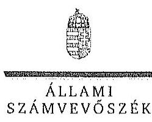

ELHÖK

Ikt.szám: V-0761-158/2015.

# Spiegel Endre úr 

vezérigazgató
DALERD Délalföldi Erdészeti Zrt.

## Szeged

## Tisztelt Vezérigazgató Úr!

A ,,Jelentéstervezet az állami tulajdonban álló erdőgazdasági társaságok vagyongazdálkodási tevékenységének ellenőrzése - DALERD Délalföldi Erdészeti Zrt." címmel készített számvevőszéki jelentéstervezetre tett észrevételeit köszönettel megkaptam.

Az Állami Számvevőszék észrevételekre vonatkozó álláspontjáról a felügyeleti vezető által készített részletes tájékoztatást csatoltan megküldöm.

Tájékoztatom Vezérigazgató urat, hogy a számvevőszéki jelentésben - az Állami Számvevőszékről szóló 2011. évi LXVI. törvény 29. § (3) bekezdése alapján - a figyelembe nem vett észrevételeket szerepeltetjük az elutasítás indokának feltüntetésével.

Budapest, 2015.
f.t. hó 23 nap
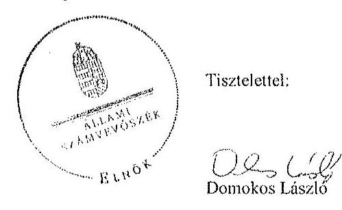

Melléklet: Tájékoztatás az elfogadott és el nem fogadott észrevételekről

---

# Tájékoztatás   az elfogadott és el nem fogadott észrevételekről 

A „Jelentéstervezet az állami tulajdonban álló erdőgazdasági társaságok vagyongazdálkodási tevékenységének ellenőrzése - DALERD Délalföldi Erdészeti Zrt." címü jelentéstervezetre 2015. október 27-én érkezett észrevételeit áttekintettük, azok kezelésével kapcsolatban a következő tájékoztatást adom.

## 1. észrevétel - formai (3. oldal / 2. bekezdés):

A jelentéstervezet 3. oldal 2. bekezdés második mondatát pontosítjuk, ezzel egyértelművé tesszük, hogy az észrevételezett negyedik mondatban mit értünk a nemzeti vagyonról szóló törvény szerinti nemzetgazdasági szempontból kiemelt jelentőségű nemzeti vagyon alatt az erdők vonatkozásában.
„Az Ntv. alapján nemzetgazdasági szempontból kiemelt jelentőségű nemzeti vagyonban tartandó vagyonelemnek minősül a 100%-ban az állam tulajdonában álló védelmi és közjóléti elsődleges rendeltetésű erdő, a gazdasági elsődleges rendeltetésű természetes erdő, természetszerű erdő és származékerdő természetességi állapotú öt hektárnál nagyobb, természetben összefüggő erdő."

## 2. észrevétel - formai (4. oldal / 3. bekezdés)

A jelentéstervezet 4. oldal 3. bekezdésben a „Körös-vidéki" kifejezést „Körösvidéki" kifejezésre módosítjuk.

## 3. észrevétel - érdemi (6. oldal / 1. bekezdés)

Az erdőterületek értékének megállapítására vonatkozó tájékoztatásukat köszönjük. A Vhr. 9. § (9) bekezdés a) pontja alapján a vagyonkezelő köteles a vagyonkezelésbe vett eszközöket a Számv. tv. szerint a hosszú lejáratú kötelezettségekkel szemben a vagyonkezelési szerződésben rögzített értéken állományba venni. A Számv. tv. 23. § (2) bekezdése előírja, hogy a vagyonkezelőnél a mérlegben eszközként kell kimutatni a törvényi rendelkezés, illetve felhatalmazás alapján - kezelésbe vett, az állami vagy önkormányzati vagyon részét képező eszközöket is. Ezen eszközöket a kiegészítő mellékletben - legalább mérlegtételek szerinti megbontásban - külön be kell mutatni.

Az ideiglenes vagyonkezelési szerződésben a vagyonkezelésbe adott vagyon értékét nem rögzítették, a szerződés azt sem tartalmazta, hogy a vagyonkezelt eszközök értéke nulla,

---

továbbá nincs rendelkezés arra sem a szerződésben, hogy a vagyonkezelésbe adott vagyon értékét azért nem határozták meg, mert az a vagyontárgy természeténél, jellegénél fogva nem állapítható meg.

A Társaság a Számv. tv. és a Vhr. előírásainak betartása céljából nem tett lépéseket annak érdekében, hogy a vagyonkezelt eszközök értéke a VSZ-ben rögzítésre kerüljön. A Társaság mérlegében a kezelt erdővagyon értékének bemutatása az eszközök és a kötelezettségek növekedését, vagyis a vagyon változását jelentette
 volna. A fentiek alapján a megállapítás módosítása nem indokolt.

# 4. észrevétel - érdemi (6. oldal / 3. bekezdés) 

A Vhr. 17. § (1) bekezdése szerint a saját vagyonnal rendelkező vagyonkezelő a rábízott állami vagyonról olyan elkülönített nyilvántartást köteles vezetni, amely tételesen tartalmazza ezen eszközök könyv szerinti bruttó és nettó értékét, az elszámolt terv szerinti és terven felüli értékcsökkenés összegét és az értékben bekövetkezett egyéb változásokat. A DALERD Zrt. által vezetett nyilvántartás nem tartalmazta a vagyonkezelt eszközök könyv szerinti bruttó és nettó értékét, valamint az értékben bekövetkezett egyéb változásokat, ezért nem felelt meg a Vhr. 17. § (1) bekezdésében foglaltaknak. Megállapításunk helytálló, módosítása nem indokolt.

## 5. észrevétel - érdemi (6. oldal / utolsó és 7. oldal 1, 2, 3. bekezdés)

A VSZ 3.3.2. pontja szerint a VSZ-t a felek a tárgyévet megelőző év november 30-ig felülvizsgálják. A VSZ évente előírt felülvizsgálata nem történt meg, azt az észrevétel sem vitatja. Az észrevételezett megállapítás a VSZ jogszabályi előírásoknak való megfelelőségét kifogásolja, az Alapító Okirat 12.2. zs) pontja a vagyonkezelési szerződés megkötésére vonatkozik. Megállapításunk helytálló, módosítása nem indokolt.

## 6. észrevétel - érdemi (8. oldal / 3. bekezdés)

A Számv. tv. 23. § (2) bekezdése alapján a vagyonkezelőnél a mérlegben eszközként kell kimutatni a - törvényi rendelkezés, illetve felhatalmazás alapján - kezelésbe vett, az állami vagy önkormányzati vagyon részét képező eszközöket is. A Társaság mérlege nem tartalmazta a vagyonkezelt eszközök értékét, ezt a könyvvizsgáló nem kifogásolta. A fentiek és a 3. észrevételre adott válaszban megfogalmazottak alapján megállapításunk helytálló, módosítása nem indokolt.

## 7. észrevétel - érdemi (8. oldal / 5. bekezdés)

A személyes adatok védelméről és a közérdekű adatok nyilvánosságáról szóló 1992. évi LXIII. törvény 20. § (8) bekezdésében, illetve az információs önrendelkezési jogról és az információszabadságról szóló 2011. évi CXII. törvény 30. § (6) bekezdésében foglaltak alapján a közfeladatot ellátó szervnek a közérdekű adatok megismerésére irányuló igények teljesítésének rendjét rögzítő szabályzatot kell készítenie. Az állami vagyonról szóló 2007. évi CVI. törvény (továbbiakban: Vtv.) 5. § (2) bekezdése szerint az állami

---

vagyonnal gazdálkodó vagy azzal rendelkező szerv vagy személy a közérdekű adatok nyilvánosságáról szóló törvény szerinti közfeladatot ellátó szervnek vagy személynek minősül. A Vtv. 70. § (2) bekezdése szerint a Vtv. a gazdálkodó szervezet fogalmát a polgári perrendtartásról szóló 1952. évi III. törvény 396. §-a szerint alkalmazza, amely alapján gazdálkodó szervezet a gazdasági társaság is. A Ptk. szerint a gazdasági társaság jogi személy. A DALERD Zrt. állami vagyonnal gazdálkodik, ezért a közérdekű adatok nyilvánosságáról szóló törvény szerint közfeladatot ellátó szervnek, személynek minősül, tehát el kell készítenie a közérdekű adatok megismerésére irányuló igények teljesítésének rendjét. Megállapításunk helytálló, módosítása nem indokolt.

# 8. észrevétel - érdemi (15. oldal / 5. és 16. oldal / 2. bekezdés) 

A dokumentumok ismételt áttekintését követően a jelentéstervezet 15. oldal 5. bekezdését töröljük és a 16. oldal 2. bekezdését az alábbiak szerint pontosítjuk:
„Az erdőtelepítések aktivált értékének nyilvántartási rendszerét a Számlarendben nem határozták meg, amelynek következtében a szabályozás nem biztosította a Számv. tv. 161/A. § (2) bekezdésében előírt, a köztulajdon használatának nyilvánossága és ellenőrizhetősége követelménye érvényesülését."
9. észrevétel - technikai (észrevételben: 22 oldal / 5. bekezdés, helyesen: 21. oldal / 3. bekezdés)

Az egyértelműség érdekében a 21. oldal 3. bekezdéséből a Vtv. 27. § (8) bekezdésére történő hivatkozást töröljük.
10. észrevétel - formai (23. oldal / 2. bekezdés)

A dokumentumok ismételt áttekintését követően a 23. oldal 2. bekezdésének első mondatát az alábbiak szerint pontosítjuk:
„Egyes erdőtelepítések kivitelezése az MNV Zrt. támogatásával valósult meg."

## 11. észrevétel - érdemi (25. oldal / 8. bekezdés)

Az észrevételre a választ a 6. észrevételre adott válasz tartalmazza.

## 12. észrevétel - formai (26. oldal / 3. bekezdés)

A dokumentumok ismételt áttekintését követően a 26. oldal 3. bekezdés 2. mondatát az alábbiak szerint pontosítjuk:
„Az FB által irányított függetlenített belső ellenőrzés működése részben felelt meg a Belső ellenőrzési szabályzat ${ }_{1,2}$ előírásainak, mivel az ellenőrzési tervet a 2013-2014. évek kivételével nem kockázatelemzésre alapozták, az ellenőrzési jelentések megállapításait az ellenőrzött szervezettel dokumentáltan nem minden szükséges esetben egyeztették."

---

# 13. észrevétel - formai (26. oldal / 4. bekezdés) 

A DALERD Zrt. Felügyelő Bizottságának 26/2010. (VI. 9.) számú határozata a társaság 2010. I. negyedéves gazdálkodásáról készült tájékoztatás elfogadására, a válságmenedzselés fenntartásának támogatására vonatkozik. A Felügyelő Bizottság a 29/2010. (VI. 9.) számú határozatával a 2010. évi belső ellenőri munkatervet fogadta el. A fentiek alapján megállapításunk módosítása nem indokolt.

## 14. észrevétel - érdemi Közfeladat definíció értelmezése

A jelentéstervezet 2. számú melléklete (Fogalomtár) az ellenőrzött időszakban hatályos jogszabályi meghatározással (Nvtv. 3. § (1) bekezdés 7. pontja) és az észrevételben megfogalmazottakkal összhangban tartalmazza a közfeladat fogalom meghatározását. Az Evt. 2. § (2) bekezdése meghatározza, hogy az erdőgazdálkodás során a legfontosabb közérdekű feladat az erdők változatosságának megőrzése, az erdők fenntartása, felújítása és védelmi, valamint közjóléti szolgáltatások biztosítása, melyek elvégzését az állam megfelelő eszközökkel biztosítja. Az Evt. 9. §-a szerint az állam 100%-os tulajdonában álló erdő és erdőgazdálkodási tevékenységet közvetlenül szolgáló földterület vagyonkezelését csak költségvetési szerv, vagy 100%-os állami tulajdonú gazdálkodó szervezet végezheti. A DALERD Zrt. 100%-os állami tulajdonú gazdasági társaság, amely állami tulajdonban lévő erdők vagyonkezelője, az Evt.-ben és a VSZ-ben meghatározottak szerint végzi feladatát. A VSZ szerint a Társaság a vagyonkezelésébe adott területen vállalkozási tevékenységét folytathat. A Társaságnak vállalkozási tevékenységéből bevétele és kiadása keletkezett. A Társaság beszámolói szerint a mérleg szerinti eredmény - a 2010. év kivételével - minden évben pozitív volt. A tulajdonosi joggyakorlók döntése szerint az ellenőrzött időszakban osztalék kifizetésére nem került sor, így az eredménytartalék - a 2010. évi veszteség ellenére - az ellenőrzött időszak egészében pozitív volt. Tehát a Társaság tevékenysége nem volt veszteséges, ezen belül a részletező adatok alapján - a vagyonkezelt területek működtetése sem. Ez azt jelenti, hogy az állami tulajdonban lévő erdők kezelésének költségeit, beleértve a vagyonkezelői díjat is, az abból származó bevételek fedezték, azaz a közérdekű feladat elvégzésének pénzügyi fedezete biztosított volt. A fentiek és a 7. észrevételre adott válasz alapján a jelentéstervezet módosítása nem indokolt.

Budapest, 2015. // hó 25. nap

Makkai Mária
felügyeleti vezető

---

.

---

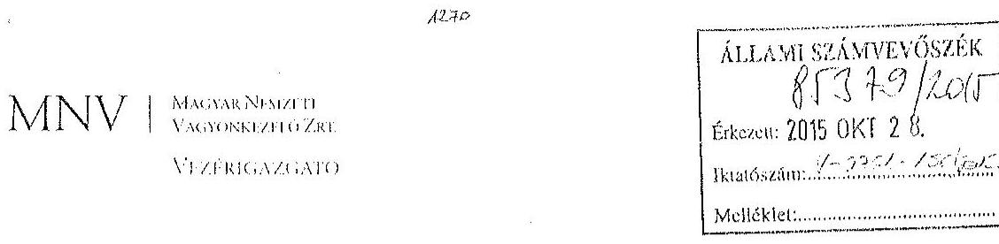

Állami Számvevőszék
Domokos László
elnök

1052 Budapest
Apáczai Cs. J. u. 10.

Ikt. sz.: MNV/01/50340/ A /2015.
Hiv. sz.: V-0761-151/2015.

Tisztelt Elnök Úr!
A 2015. október 13. napján „Az állami tulajdonban álló erdőgazdasági társaságok vagyongazdálkodási tevékenységének ellenőrzése - DALERD Délalföldi Erdészeti Zrt." tárgyában kézhez vett, V-0761-151/2015. ikt. sz. Jelentés-tervezetre az alábbi észrevételeket kívánom tenni.
I. fejezet / 9. old. negyedik-hatodik bekezdés, 10. old. első-második bekezdés, II.2.1. fejezet / 17. old. első-második bekezdés, II.5. fejezet / 29. old. ötödik bekezdés, 30. old. első bekezdés és 10. old. Javaslat az MNV Zrt. vezérigazgatójának a)-c) pontok
„...A Társaság feletti tulajdonosi joggyakorló az ellenőrzött években a Társaság vagyongazdálkodásának szabályozottságával, szabályszerűségével és a vagyonnyilvántartásával kapcsolatban ellenőrzést nem végzett..."
„A vagyonkezelésbe adott állami vagyon tekintetében tulajdonosi jogokat gyakorló MNV Zrt. és NFA az ellenőrzött időszakban, a VSZ-szel kapcsolatban feltárt hiányosságok megszüntetésére és a hatályos jogszabályoknak való megfelelésére vonatkozóan nem kezdeményezett intézkedéseket, nem élt a Vhr.-ben foglalt, a kezelt vagyon használatára vonatkozó ellenőrzési jogával, valamint nem ellenőrizte a vagyonnyilvántartás hitelességét, teljességét és helyességét.

A DALERD Zrt. a Magyar Állam tulajdonában álló erdővagyon és egyéb művelési ágú termőföld ingatlanok kezelését a KVI-vel 1996. november 1-jén kötött VSZ alapján végezte. A Társaság, mint vagyonkezelő és a KVI között létrejött szerződéses jogviszony kereteit a VSZ-ben foglalt jogok és kötelezettségek töltötték ki, azonban ezek nem támogatták a Vhr. 3. § (1) bekezdésében előírt, a vagyongazdálkodási feladatok átlátható módon történő végrehajtását, valamint nem támogatták a szabályszerű vagyongazdálkodást. A VSZ-ben évente előírt felülvizsgálatra az ellenőrzött időszakban nem került sor. A VSZ nem követte a jogszabályok változását, hatályon kívül helyezett jogszabályi hivatkozásokat tartalmazott az Ábt., 109/II. §, 109/G. §, a Vadvédelmi tv. 98. § rendelkezései vonatkozásában. A VSZ-nek a vagyonkezelői jog átengedésére vonatkozó 3.2.1. pontjában előírtak nem feleltek meg 2012-től az Nvtv. 11. § (8) bekezdésében foglaltaknak, amely szerint a Társaság a vagyonkezelői jogát harmadik személyre nem ruházhatta át. Továbbá a VSZ nem tartalmazta a Vhr. 9. § (8) bekezdésében 2011. január 1-jétől előírt, az érintett vagyonelem esetleges védettségét, illetve Natura 2000 területnek minősítését. A felek nem tettek eleget a Vhr. 54. § (7) bekezdésében foglalt rendelkezésnek és a Vhr. hatálybalépését követő hat hónapon belül nem kezdeményezték a Nemzeti Földalapba tartozó ingatlanokra vonatkozóan a VSZ megszüntetését és a Vtv., illetve Vhr. szabályainak megfelelő szerződés megkötését.

---

A vagyonkezelésbe adott állami vagyon tekintetében tulajdonosi jogokat gyakorló MNV Zrt. és NFA nem végeztek a Vtr. 20. § (1)-(2) bekezdésében és a Nemzeti Földalapba tartozó földrészletek hasznosításának részletes szabályairól szóló 262/2010. (XI.17.) Korm. rendelet 47. § (1)-(2) bekezdéseiben foglalt, a vagyonnyilvántartás hitelességére, teljességére és helyességére vonatkozó ellenőrzést a Társaságnál.

# Javaslat az MNV Zrt. vezérigazgatójának 

a) Tegyen intézkedéseket az erdőgazdasági társaság közreműködésével a tényleges állapotot rögzítő és a hatályos jogszabályi előírásoknak megfelelő vagyonkezelési szerződés megkötésére.
b) Tegyen intézkedéseket a vagyonkezelési szerződés felülvizsgálatának elmaradásával, valamint a Nemzeti Földalapba tartozó ingatlanokra vonatkozó VSZ megszüntetésével összefüggésben feltárt szabálytalanságok tekintetében a felelősség tisztázása érdekében, és szükség szerint intézkedjen a felelősség érvényesítéséről.
c) Intézkedjen a Társaság vagyonnyilvántartása hitelességének, teljességének és helyességének jogszabályban foglaltak szerinti ellenőrzéséről."

Sajnálattal állapítottuk meg, hogy a Jelentés-tervezet egyáltalán nem veszi figyelembe a vizsgált időszakban megindított és több eljárási cselekményt is magába foglaló intézkedés-sorozatunkat, amelynek a célja a Jelentéstervezetben egyébiránt joggal kifogásolt hiányosságok megszüntetése, az erdőgazdasági társaságok működésének jogszabályi megfelelőségének biztosítása volt. Ezzel a Jelentés-tervezet azt sugallja, hogy a tulajdonosi joggyakorlók részéről egyáltalán nem volt szándék az erdőgazdasági társaságok működésének, illetve a vagyonkezelés körülményeinek hatályos jogszabályok szerinti szabályozására, amely egyébiránt nem felel meg a valóságnak és az adatszolgáltatásunk során sem erről tájékoztattuk Önöket.
Mindamellett elismerjük, hogy a probléma a kezelt vagyonelemek nagy száma, ebből kifolyólag a szabályozást igénylő körülmények nagy száma és sokrétűsége miatt nehezen átlátható, ezért kérjük, engedjék meg, hogy a munkájukat segítő szándékkal korábbi tájékoztatásunkat ismételten megerősítsük, azzal a kifejezett kéréssel, hogy a Jelentésükben az általunk vitatott megállapítást szíveskedjenek módosítani, és az MNV Zrt. által a megoldás irányába megtett intézkedéseket feltüntetni.
Az ideiglenes vagyonkezelési szerződéseken alapuló kezelői jogviszony újraszabályozása, az ideiglenes vagyonkezelési szerződések megszüntetése és végleges vagyonkezelési szerződések megkötése érdekében az intézkedéseink már 2011. évben megkezdődtek, párhuzamosan a Nemzeti Földalapról szóló 2010. évi LXXXVII. tv. 34. § (3) bekezdés
 c) pontja szerinti feladat- illetve vagyonátadással.

Az intézkedéseink alapja a 2011. évben, MNV/01/29518/2011. szám alatt szakterületünk által bekért, az erdőgazdasági társaságok 2010. december 31-i, illetve 2011. július 31-i fordulónapra vonatkozó leltárjelentése volt, amelyet elsődlegesen az NFA tv. szerint előírt vagyonátadás elvégzése céljából kértünk meg az erdőgazdasági társaságoktól. Ugyanakkor a leltárjelentéshez benyújtott földrészlet-listák voltak az első olyan kimutatások, amelyek a kezelt vagyon elemeit a FÖMI adatházisán alapuló (az aktuális ingatlan-nyilvántartási állapotnak megfelelően) alrészletes bontásban tartalmazták.

## A vizsgált időszakban megindított és lefolytatott intézkedéseink a következők:

1. Az erdőgazdasági társaságok által kezelt vagyonelemek tulajdonosi joggyakorlók szerinti elhatárolása, NFA átadás előkészítése, az erdőgazdasági társaságok bevonásával. A Nemzeti Földalapba tartozó vagyonelemek NFA átadása 2012-2013. években megtörtént, majd a visszamaradt vagyonelemek - többségében kivett megnevezésben nyilvántartott földrészletek - elhatárolását is elvégeztük. A feladat végrehajtása 2014. május 31-ig teljesült.
Az intézkedéssel az MNV Zrt. tulajdonosi joggyakorlása alá tartozó vagyonelemek körét - a közös tulajdonosi joggyakorlás alatt álló ingatlanok kivételével -, azaz a végleges vagyonkezelési szerződések ingatlanlistáit meghatároztuk.

---

Meg kívánjuk jegyezni, hogy az erdőgazdasági társaságok a 2011. évi leltárjelentéseikhez minden esetben csatolták a jelentés tartalmára vonatkozó teljességi nyilatkozatukat is, így azok tartalmát mint teljes körű adatszolgáltatást kezeltük.
A hivatkozott iratokat az eljárás során a Tisztelt Állami Számvevőszék rendelkezésére bocsátottuk.
2. Az erdőgazdasági társaságok által kezelt vagyon értékelését 2014. május 31-ig elvégeztük, részben külső piaci szereplő által megállapított vagyonértékelési adatok (az IFUA értékbecslési adatai), részben belső szakértők és a kontrolling szakterület által az MNV Zrt. hatályos értékelési szabályzata által megállapított értékadatok figyelembe vételével.
3. Az MNV Zrt. Igazgatósága 511/2012. (X. 08.) IG sz., valamint 717/2013. (IX. 23.) IG sz. határozataiban Intézkedési terveket fogadott el „a 28/2012. (IX. 24.) sz. RJGY határozatában előírt, valamint az MNV Zrt. rábízott vagyon 2012. évi beszámolója könyvvizsgálói minősítésének megtartásához szükséges és egyéb feladatokról". Az Intézkedési tervek magukban foglalták az erdőgazdasági társaságok által kezelt vagyon analitikájának előállítását, illetve az erdőtársaságokkal végleges (nem ideiglenes) vagyonkezelői szerződések megkötését. A 717/2013. (IX. 23.) IG sz. határozat melléklete tartalmazza a feladat végrehajtása érdekében már megtett intézkedéseket (pl. „Megtörtént az erdőgazdaságok által kezelt vagyon listáinak vagyonkezelői jelentésekkel való egyeztetése; a vagyonkezelési szerződés tartalmi kérdéseinek, az erdőgazdaságok véleményének feldolgozása, MFB Munkacsoport egyeztetések történtek stb.), valamint rögzíti a még elvégzendő feladatokat. Ennek megfelelően az MNV Zrt-nél 2012-től folyamatban van az erdőgazdasági társaságok vagyonanalitikájának előállítása és vagyonkezelési szerződései tárgyú projekt.
A hatályos jogszabályoknak megfelelő vagyonkezelési szerződés tervezetét a vizsgálati időszak során az MNV Zrt. belső szakterületi egyeztetést követően előkészítettük, és a 2014. március 18-án megtartott Munkacsoport értekezleten az erdőgazdaság képviselőivel, továbbá a tulajdonosi joggyakorlók (NFA, illetve akkor még Magyar Fejlesztési Bank Zrt.) képviselőivel ismertettük annak tartalmát. A szerződés szövegtervezetének véleményezése ekkor megkezdődött, ugyanakkor elismerjük, hogy a végleges szerződésváltozat már az Önök által vizsgált időszakot követően került elfogadásra. Ugyancsak a 2014. március 18-án megtartott Munkacsoport értekezleten tettünk javaslatot a vagyonkezelési díj alapjának és mértékének meghatározására.
4. Az erdőgazdasági társaságok által kezelt és a saját vagyonának vagyonelemenkénti, valamint a kezelt vagyonelemek tulajdonosi joggyakorlók szerinti elhatárolására vonatkozó intézkedésünket a vizsgált időszakban előkészítettük.

Tájékoztatjuk továbbá Elnök Urat az alábbiakról:
A Nemzeti Fejlesztési Minisztérium KGTF/377-6/2014-NFM, valamint KGTF/377-7/2014. számok alatt adott utasításokat a fenti feladatok elvégzésére. Ezekről, illetve az utasításokra adott jelentésünkről a korábbi adatszolgáltatásunk keretében szintén kitértünk.

A vagyonkezelési szerződés vizsgált időszakot követően elfogadott tervezetének mellékletét képezik az MNV Zrt. azon szabályzatai is, amelyek a kezelt vagyon nyilvántartását, a beruházások nyilvántartását és az azzal kapcsolatos elszámolásokat, illetve a tulajdonosi ellenőrzéssel kapcsolatos, a jelenlegi jogszabályi környezetnek megfelelő szabályokat tartalmazzák:

- Az állami tulajdonon, egyéb vagyonkezelők által vagyonkezelt eszközön megvalósítandó beruházások, felújítások előzetes engedélyezésének és elszámolásának eljárásrendjéről szóló 35/2014. számú vezérigazgatói utasítás,
- A Magyar Nemzeti Vagyonkezelő Zrt. Tulajdonosi Ellenőrzési Szabályzata - a 39/2014. számú vezérigazgatói utasítás, továbbá
- A Magyar Nemzeti Vagyonkezelő Zrt. állami vagyon vagyonkezelőire, az állami vagyont használókra és a társasági részesedések esetében az MNV Zrt. tulajdonosi joggyakorlását megbízottként ellátókra vonatkozó Vagyon-nyilvántartási Szabályzatáról szóló 12/2014. számú vezérigazgatói utasítás.

Fentiek mellett megemlíthető az MNV Zrt. folyamatba épített, illetve vagyon-nyilvántartás-vezetést támogató ellenőrzési módszertanról szóló 11/2014. számú vezérigazgatói utasítás.

---

Egyeztetéseink során az erdőgazdasági társaságok tájékoztatást kaptak a szabályzataink tartalmára vonatkozóan.
A Jelentés-tervezet 10. oldalán található, az MNV Zrt. vezérigazgatójára vonatkozó, a) pont alatti, vagyonkezelési szerződés megkötésére irányuló javaslathoz kapcsolódóan felhívjuk a Tisztelt Állami Számvevőszék figyelmét arra, hogy a Nemzeti Fejlesztési Minisztérium ÁVF/21310/2015-NFM számú tájékoztató levele szerint Miniszter Úr vagyongazdálkodási szempontból nem támogatja az erdőgazdasági társaságok ideiglenes vagyonkezelési szerződéseit kiváltó vagyonkezelési szerződések megkötését, ideértve az MNV Zrt. vagyonkezelési szerződésekkel kapcsolatos jóváhagyó döntéseit is.

Az MNV Zrt-re vonatkozóan hivatkozott jogszabály, a Vhr. 20. § (1)-(2) bekezdése 2014. március 14-ig - csaknem az ellenőrzött időszak végéig - a következőképpen rendelkezett:
„(1) Az állami vagyon kezelőjét, használóját megillető jogok gyakorlását, annak szabályszerűségét, célszerűségét a Vtv. 17. §-ának d) pontja alapján az MNV Zrt. - szükség szerint a területi szervei útján - ellenőrzi. Ennek érdekében a vagyon kezelésére, hasznosítására kötött szerződésben rögzíteni kell, hogy a tulajdonosi ellenőrzés eljárásrendjét, a felek jogait, kötelezettségeit a felek a szerződés részének tekintik.
(2) A tulajdonosi ellenőrzés célja az állami vagyonnal való gazdálkodás vizsgálata, ennek keretében a rendeltetésellenes, jogszerűtlen, szerződésellenes, vagy a tulajdonos érdekeit sértő, illetve a központi költségvetést hátrányosan érintő vagyongazdálkodási intézkedések feltárása és a jogszerű állapot helyreállítása, továbbá a vagyonnyilvántartás hitelességének, teljességének és helyességének biztosítása."

A tulajdonosi ellenőrzés alatt a Területi Irodák által folytatott ellenőrzést is értette a jogszabály, amiből egyenesen következik a szakterületi munkafolyamatba épített ellenőrzési kötelezettség figyelembe vételének a lehetősége.

A Jelentés-tervezetnek azt a fordulatát, amely szerint „...az MNV Zrt...a vagyonnyilvántartások megfelelőségére (hitelességére, teljességére és helyességére) vonatkozó helyszíni ellenőrzést a Társaságnál nem végzett" a továbbiakban azt jelenti, hogy az Állami Számvevőszék a tulajdonosi ellenőrzés alatt a helyszíni ellenőrzést érti. Ugyanakkor az Állami Számvevőszék által hivatkozott jogszabályok (a Vtv. és a Vhr.) nem határoznak meg semmilyen formát a tulajdonosi ellenőrzéssel kapcsolatban, nem következik a jogszabályi rendelkezéseiből, hogy azt a helyszínen kellene végrehajtani.

Fentiekre tekintettel kérjük a Jelentés-tervezet 9-10., 17., illetve 29-30. oldalán található azon megállapítások törlését, hogy az MNV Zrt. nem kezdeményezett intézkedéseket, és nem végzett a Vhr. 20. § (1)-(2) bekezdéseiben és a Nemzeti Földalapba tartozó földrészletek hasznosításának részletes szabályairól szóló 262/2010. (XI.17.) Korm. rendelet 47. § (1)-(2) bekezdéseiben foglalt, a vagyonnyilvántartás hitelességére és teljességére vonatkozó ellenőrzést, illetve helyszíni ellenőrzést a Társaságnál, kérjük a megtett intézkedések feltüntetését, és a Jelentéstervezet 10. oldalán található, az MNV Zrt. vezérigazgatójára vonatkozó b) pontot a megtett intézkedések folyamatosságára tekintettel törölni, a c) pont alatti javaslatot szövegszerűen ekként módosítani:

# Javaslat az MNV Zrt. vezérigazgatójának 

c) Az MNV Zrt. tulajdonosi joggyakorlása alá tartozó (az Erdőgazdasági Társaságok által az MNV Zrt. részére jelentett) vagyonelemek tekintetében intézkedjen a Társaság vagyonnyilvántartása hitelességének, teljességének és helyességének jogszabályban foglaltak szerinti ellenőrzéseinek erősítéséről.

## II.5. fejezet / 29. old. negyedik bekezdés

„A Társaság feletti tulajdonosi joggyakorló számára a Vtv. 17. § (1) bekezdés d) pontja rendszeres ellenőrzési kötelezettséget írt elő a vele szerződéses jogviszonyban levő személyek, szervezetek vagy más használók állami vagyonnal való gazdálkodása tekintetében, amelynek azonban nem tett eleget."

Az ÁSZ vizsgálat az alábbi időszakra terjed ki: 2009. január 1. napjától 2014. december 31. napjáig, kitekintéssel a helyszíni ellenőrzés végéig tartó releváns folyamatokra.
A hivatkozott Vtv. 17. § (1) bekezdés d) pontja a vele szerződéses jogviszonyban állók állami vagyonnal való

---

gazdálkodásának rendszeres ellenőrzési kötelezettségét írja elő az MNV Zrt. számára. A Jelentés-tervezet „Fogalomtár" részében a „tulajdonosi ellenőrzést" a Vhr. 20. §-ban található célmeghatározás segítségével, azzal megegyezően definiálja. A jogszabály - és az ÁSZ Jelentés-tervezet azzal megegyezően - csak a tulajdonosi ellenőrzés célját és rendszerességét tartalmazza, ezen túl sem a tulajdonosi ellenőrzés tartalmi, formai, módszertani, stb. követelményeit, sem a rendszeresség konkrétabb meghatározását, hogy évi, két-, három-, stb. évenkénti gyakorisággal kellene az ellenőrzéseket lefolytatni.
Véleményünk szerint elvi jelentősége van annak, hogy:
a) A rendszeres ellenőrzési kötelezettség megsértésére vonatkozó megállapítást a rendszeresség fogalmi meghatározását követően lehet tenni, azaz, hogyha adott esetben az ötéves ellenőrzési időszak alatt az MNV Zrt. legalább egy ellenőrzést nem végzett, akkor a „rendszeresség" az ötévenkénti ellenőrzési kötelezettséget jelentené. Ilyen fogalommeghatározás nem áll rendelkezésre.
b) A tulajdonosi ellenőrzés jogszabály - és a Jelentés-tervezet - szerinti definíciójából nem vezethető le, hogy az csak elkülönült - az ÁSZ vizsgálatához hasonló - célellenőrzés útján valósulhat meg, és ki kellene zárni az MNV Zrt. vagyonkezelési tevékenységéből fakadó munkafolyamatba épített és vezetői ellenőrzéseket.

Fentiekre tekintettel kérjük a Jelentés-tervezet 29. oldalán található megállapítás törlését, hogy az MNV Zrt. a számára a Vtv-ben előírt rendszeres ellenőrzési kötelezettségének nem tett eleget, vagy e megállapítást szövegszerűen ekként módosítani:
„A Társaság feletti Tulajdonosi joggyakorlót [az MNV Zrt.] az állami vagyonnal való gazdálkodásra irányuló célellenőrzéseket a vizsgálat időszaka alatt nem végzett."

Kérem Elnök Urat, hogy a Jelentés véglegesítése során jelen észrevételeinket szíveskedjenek figyelembe venni.

Budapest, 2015. október 28.

Üdvözlettel:
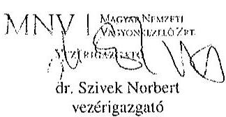

---

.

---

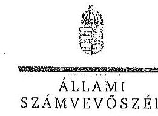

ELNÖK

Ikt.szám: V-0761-160/2015.

Dr. Szivek Norbert úr
vezérigazgató
Magyar Nemzeti Vagyonkezelő Zrt.

Budapest

Tisztelt Vezérigazgató Úr!

A „Jelentéstervezet az állami tulajdonban álló erdőgazdasági társaságok vagyongazdálkodási tevékenységének ellenőrzése – DALERD Délalföldi Erdészeti Zrt.” címmel készített számvevőszéki jelentéstervezetre tett észrevételeit köszönettel megkaptam.

Az Állami Számvevőszék észrevételekre vonatkozó álláspontjáról a felügyeleti vezető által készített részletes tájékoztatást csatoltan megküldöm.

Tájékoztatom Vezérigazgató urat, hogy a számvevőszéki jelentésben – az Állami Számvevőszékről szóló 2011. évi LXVI. törvény 29. § (3) bekezdése alapján – a figyelembe nem vett észrevételeket szerepeltetjük az elutasítás indokának feltüntetésével.

Budapest, 2015. november 7.

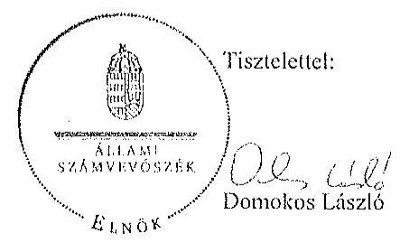

Melléklet: Tájékoztatás az elfogadott és az el nem fogadott észrevételekről

1052 BUDAPEST, ARANY JÁNOS UTCA 10. 1304 Budapest 4. Pf. 54 telefon: 484 9101 fax: 484 3281

---

# Tájékoztatás   az elfogadott és az el nem fogadott észrevételekről 

A ,,Jelentéstervezet az állami tulajdonban álló erdőgazdasági társaságok vagyongazdálkodási tevékenységének ellenőrzése - DALERD Délalföldi Erdészeti Zrt." címû jelentéstervezetre 2015. október 28-án érkezett észrevételeit áttekintettük, azok kezelésével kapcsolatban a következő tájékoztatást adom.

1. A vagyonkezelési szerződéshez kapcsolódó megállapításokra tett észrevétel (I. fejezet / 9. oldal 4-6. bekezdés, 10. oldal 1. bekezdés, II. 2.1. fejezet / 17. oldal 1-2. bekezdés, 10. oldal javaslat az MNV Zrt. vezérigazgatójának a)-b) pontok)

A jelentéstervezet vagyonkezelési szerződéshez kapcsolódó megállapításai helytállóak. Az erdőgazdasági társaság működése jogszabályi megfelelőségének biztosításának érdekében tett kezdeményezésekről adott tájékoztatásukat köszönettel vettük, azonban azok nem eredményezték az ideiglenes vagyonkezelési szerződés olyan módosítását, vagy olyan új vagyonkezelési szerződés megkötését, amely biztosította volna a VSZ hiányosságainak megszüntetését, illetve a
 hatályos jogszabályoknak való megfelelőségét. Ezért az MNV Zrt. vezérigazgatójának és az NFA elnökének megfogalmazott intézkedést igénylő megállapítás, valamint az MNV Zrt. vezérigazgatójának megfogalmazott javaslat a) és b) pontjának módosítása nem indokolt. Az egyértelműség érdekében a 9. oldal 5. bekezdését az alábbiak szerint pontosítjuk:
,,A vagyonkezelésbe adott állami vagyon tekintetében tulajdonosi jogokat gyakorló MNV Zrt. és NFA az ellenőrzött időszakban a VSZ-szel kapcsolatban feltárt hiányosságokat nem szüntette meg, a hatályos jogszabályoknak a szerződést nem feleltette meg, ..."
2. Az MNV Zrt. ellenőrzési kötelezettségének elmulasztására vonatkozó megállapításokra tett észrevétel (9. oldal 4-5. bekezdés, 10. oldal 2. bekezdés, II. 5. fejezet / 29. oldal 5. bekezdés, 30. oldal 1. bekezdés, 10. oldal javaslat az MNV Zrt. vezérigazgatójának c) pont)

Az MNV Zrt. nem bocsátott az ÁSZ ellenőrzés rendelkezésére az MNV Zrt., vagy Területi Irodái által a Vhr. 20. § (1)-(2) bekezdései szerint végzett ellenőrzésekről dokumentumokat. A jelentéstervezet megállapításai és a javaslat helytállóak, módosításuk nem indokolt.

---

3. Az MNV Zrt. a Vtv.-ben előírt ellenőrzési kötelezettségére vonatkozó megállapításra tett észrevétel (II. 5. fejezet/ 29. oldal 4. bekezdés)

Az ellenőrzés megállapította, hogy az MNV Zrt. az ellenőrzött időszakban a DALERD Dél-alföldi Erdészeti Zrt.-nél helyszíni ellenőrzést nem végzett, erre a megállapításra az MNV Zrt. nem tett észrevételt. Az egyértelműség érdekében a dokumentumok ismételt áttekintését követően a jelentéstervezet 29. oldal 4. bekezdését az alábbiak szerint pontosítjuk:
„A Társaság feletti tulajdonosi joggyakorló számára a Vtv. 17. § (1) bekezdés d) pontja rendszeres ellenőrzési kötelezettséget ír elő a vele szerződéses jogviszonyban levő személyek, szervezetek vagy más használók állami vagyonnal való gazdálkodása tekintetében, amelynek a DALERD Zrt.-nél az ellenőrzött időszakban nem tett eleget."

Budapest, 2015. // hó 97. nap

Makkai Mária
felügyeleti vezető

---

.

---

# MFB 

## Domokos László úr

elnök részére
Állami Számvevőszék

Budapest

## 5564 - 2812015

ÁLLAMI SZÁMVEVŐSZÉK
85874/2011
Érkezé: 2015 OKT 30.
Ritioz:im: 10.02.2015
Mellekler

## Tisztelt Elnök Úr!

2015. október 7-én köszönettel kézhez vettük az Állami Számvevőszék „Az állami tulajdonban álló erdőgazdasági társaságok vagyongazdálkodási tevékenységének ellenőrzéséről" szóló jelentéstervezeteket az alábbi cégekre:

- DALERD Dél-alföldi Erdészeti Zrt.
- Nyírerdő Nyírségi Erdészeti Zrt.
- Vértesi Erdészeti és Faipari Zrt.
(Ikt.szám: V-0761-150/2015.)
(Ikt.szám: V-0763-059/2015.)
(Ikt.szám: V-0759-064/2015.)

Az MFB Zrt. a jelentéstervezetekkel kapcsolatosan 2 féle szempontból kíván észrevételt tenni:

1. A jelentésekben megfogalmazott központi probléma
2. Egyedi esetek

## 1. A jelentésekben megfogalmazott központi probléma

Az ÁSZ az egyedi jelentésciben az erdőgazdasági társaságokat, valamint a vagyonkezelésbe adott állami vagyon tekintetében tulajdonosi joggyakorló MNV Zrt. és Nemzeti Földalapkezelő (továbbiakban: NFA) tevékenységét marasztalta el.
Alapvető problémaként jelenik meg, hogy az erdők által kezelt eszközök - az NFA-val, a Kincstári Vagyon Igazgatósággal, és az MNV Zrt-vel kötött vagyonkezelési megállapodásban rögzített - értéken nem szerepelnek a Társaságok könyvciben.
Az MFB Zrt. tudatában volt a problémának (azt az ÁSZ jelentésben is említett, 2010. évben végzett átvilágítási jelentés is tartalmazta, melynek nyomon követése, beszámoltatása megtörtént) és folyamatosan egyeztetett az MNV Zrt-vel és az NFA-val a rendezés ügyében. Az ideiglenes vagyonkezelési szerződés módosítására, véglegesítésére a vagyonkezelésbe adónak (MNV, NFA) van lehetősége, a Társaságok szerződő partnerként észrevételeket,

---

javaslatokat tehetnek. A szerződés véglegesítése érdekében a Társaságok és az MFB Zrt. képviselői minden olyan egyeztetésen (pl.: az MNV Zrt. által létrehozott bizottság) részt vettek, amelyre meghívást kaptak, illetve azokon érdemi javaslatokat tettek.
Ahogy a jelentés is megjegyzi, az egyeztetések az ellenőrzés befejezésig nem kerültek lezárásra, így a Társaságoknál nem áll rendelkezésre a vagyonkezelésben lévő állami vagyonra és annak nagyságára vonatkozó, az MNV Zrt. és az NFA nyilvántartásával egyező adat.

Az ÁSZ 2013. évi „Az állami vagyon feletti kontroll - Az állami vagyon feletti tulajdonosi joggyakorlással kapcsolatos tevékenységek ellenőrzéséről" szóló jelentése alapján a Nemzeti Fejlesztési Minisztérium - az ÁSZ-szal egyeztetett - alábbi főbb pontokat tartalmazó intézkedési tervet (1. sz. melléklet) állított össze, melyet a 2014. április 25-én kelt levelében küldött meg az MFB Zrt. részére:

- a Társaságok által kezelt állami ingatlanok és egyéb vagyonelemek értéken történő nyilvántartása,
- a vagyonkezelési díjak egyértelmű és tulajdonosi joggyakorló szervezetenkénti meghatározása,
- az új vagyonkezelési szerződés megkötése,
- a Társaságok kezelt és saját vagyonának vagyonelemenkénti, valamint a kezelt vagyonelemek tulajdonosi joggyakorló szerinti elhatárolása.

Az MFB törvény módosításának 2014. július 16-i hatályba lépésével az MFB Zrt. állami erdőgazdaságok feletti tulajdonosi joggyakorlása megszűnt, az a Földművelésügyi Minisztériumhoz került át, így az intézkedési tervben való közreműködésre, illetve a végrehajtás nyomon követésére az MFB Zrt-nek nem volt lehetősége.

A jelentések az MNV Zrt. vezérigazgatójának, az NFA elnökének és az erdészeti társaságok vezérigazgatóinak fogalmaztak meg intézkedési javaslatokat.

# 2. Egyedi esetek: 

## DALERD Dél-alföldi Erdészeti Zrt.

A jelentéstervezet hibásan hivatkozik az MFB Zrt.-re, mikor a Vtv.17§ (1) bekezdés d) pontja szerinti rendszeres ellenőrzés elmaradására mutat rá. A Vtv. hivatkozott bekezdése alapján az ellenőrzés az MNV Zrt. feladata. Kérjük a társaság feletti tulajdonosi joggyakorló hivatkozás törlését. (29. oldal 4-5. bekezdés; 9. oldal 4. bekezdés)

---

# NYÍRERDŐ Nyírségi Erdészeti Zrt. 

A jelentéstervezet hibásan hivatkozik az MFB Zrt.-re, amikor a vagyonkezelési díj évenkénti felülvizsgálatáról ír, ugyanis a vagyonkezelői díj meghatározása az MNV Zrt. és az NFA hatásköre. (17. oldal 2. bekezdés) Kérjük a társaság feletti tulajdonosi joggyakorló hivatkozás törlését.

A jelentéstervezet hibásan hivatkozik az MFB Zrt.-re, mikor a Vtv. 17 § (1) bekezdés d) pontja szerinti rendszeres ellenőrzési elmaradására mutat rá. A Vtv. hivatkozott bekezdése alapján az ellenőrzés az MNV Zrt. feladata. Kérjük a társaság feletti tulajdonosi joggyakorló hivatkozás törlését. (28. oldal 2-3. bekezdés)

## Vértesi Erdészeti és Faipari Zrt.

Az ellenőrzési anyagban több helyen keveredik a társasági részesedés feletti és a vagyonkezelésbe adott állami vagyon feletti tulajdonosi joggyakorlóra történő hivatkozás, így a 9. oldal 3. bekezdés 4. sorának a tulajdonosi joggyakorló hivatkozással történő kiegészítésével, valamint az utolsó mondat törlésével helytálló a bekezdés. Ugyancsak kérjük a 28. oldal 2. bekezdés 3. sorának a tulajdonosi joggyakorló hivatkozással történő kiegészítését.

A jelentéstervezet hibásan hivatkozik az MFB Zrt.-re, mikor a Vtv. 17 § (1) bekezdés d) pontja szerinti rendszeres ellenőrzési elmaradására mutat rá. A Vtv. hivatkozott bekezdése alapján az ellenőrzés az MNV Zrt. feladata. Kérjük a társaság feletti tulajdonosi joggyakorló hivatkozás törlését (28. oldal 2-3. bekezdés).

Budapest, 2015. október 27.
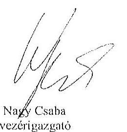

Tisztelettel:
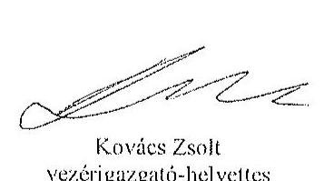

## Mellékletek:

1. számú melléklet: NFM levél (Ikt.szám: KGTF/377-7/2014-NFM)

---

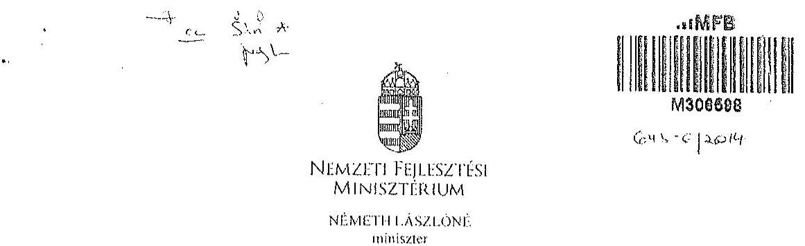

# Iktatószám: KGTF/ 1.7:1 i /2014-NFM 

Ugyintéző: dr. Kaszós Mónika Telefonszám: 795-1917
e-mail:monika.kassos@ufm.gov.hu

## Nagy Csaba úr részére

vezérigazgató

## Magyar Fejlesztési Bank Zrt.   Budapest

Tárgy: „Az állami vagyon feletti kontroll - Az állami vagyon feletti tulajdonosi joggyakorlással kapcsolatos tevékenységek ellenőrzéséről" szóló 13193 sz. ÁSZ jelentés alapján összeállított NFM intézkedési terv módosítása, az abban foglalt feladatok végrehajtása

## Tisztelt Vezérigazgató Úr!

Az Állami Számvevőszék (a továbbiakban: ÁSZ) tárgyban megjelölt jelentésével összefüggésben 2014. január 27-én intézkedési tervet hagytam jóvá, amelyben foglalt feladatok végrehajtása érdekében 2014. január 30-i keltezésű levélben fordultam Önhöz és a Magyar Nemzeti Vagyonkezelő Zrt. vezérigazgatójához, Márton Péter úrhoz.

Az ÁSZ az intézkedési tervvel kapcsolatban küldött, 2014. március 25-i keltu levelében az intézkedési terv kiegészítését, módosítását kérte. A módosított intézkedési tervet jóváhagytam.

A módosított intézkedési terv alapján a következő feladatok végrehajtása szükséges az alábbiak szerint:
1./ a társaságok által kezelt állami ingatlanok és egyéb vagyonelemek értéken történő nyilvántartása:

Felelős: MNV Zrt.,
Határidő:

- földterületek esetében legkésőbb 2014. május 31-ig
- felépítmények esetében 2014. december 31. (A felépítmények esetében az MNV Zrt. a vagyonkezelési szerződés megkötését az év második felére tervezi, látja megvalósíthatónak.)

2./ a vagyonkezelési díjak egyértelmű és tulajdonosi joggyakorló szervezetenkénti meghatározása:

---

# Felelős: MNV Zrt., 

Határidő: 2014. május 31-ét követően folyamatosan (2014. december 31-ig)
E pontban foglalt feladattal kapcsolatosan az ÁSZ részére az alábbi tájékoztatást adtam:
„Az ÁSZ által meghatározott feladatok végrehajtására irányuló munkafolyamat során a végrehajtásban érintett szervezetek, társaságok között kialakult az az álláspont, hogy mivel az erdőgazdasági társaságok alapfeladatként közfeladat ellátást is végeznek, azt a vagyonkezelési díj mértékének meghatározásakor az MNV Zrt. figyelembe veszi, valamint megállapításra került az az elv is, hogy a vagyonkezelési díj irányadó mértéke az adott erdőgazdasági társaság által kezelt ingatlanvagyon bruttó nyilvántartási értékének 2%-a.

A vagyonkezelési díj alapja a kezelt vagyon bruttó nyilvántartási értéke, ezért annak meghatározására erdőgazdaság társaságonként kerül sor a 4./ pontban meghatározott ún. „végleges ingatlanlista" alapján. A végleges ingatlanlista kizárólag vagyonkezelésbe adott ingatlan vagyonelemet tartalmaz, az erdőgazdasági társaság saját vagyonában nyilvántartott vagyonelemet nem, ezért az MNV Zrt.-nek és az erdőgazdasági társaságoknak a szerződés megkötését megelőzően el kell határolnia egymástól a saját vagyonba és a kezelt vagyonba tartozó ingatlan vagyonelemeket (4.b./ pontban foglalt feladat).

A feleknek a vagyonkezelési díj mértékében a vagyonkezelési szerződés megkötését megelőzően kell megállapodniuk az irányadó vagyonkezelési díj mértéket alapul véve."

## 3./ az új vagyonkezelési szerződések megkötése:

A vagyonkezelési szerződés tervezet az MNV Zrt. érintett szakterületei álláspontjának figyelembe vételével elkészült, az MNV Zrt. és a MFB Zrt. által létrehozott Munkacsoport (tagjai: MFB Zrt., MNV Zrt., NFA és egyes erdőgazdasági társaságok) véleménye alapján átdolgozásra került. A szerződés tervezetnek az erdőgazdasági társaságok részére történő megküldése 2014. április 15. napjával megtörtént.

Felelős: MNV Zrt., az MFB Zrt. közreműködésével
Határidő:

- földterületek esetében: 2014. május 31-ét követően folyamatosan (2014. december 31-ig)
- felépítmények esetében 2014. II. félév folyamán
4./ a társaságok kezelt és saját vagyonának vagyonelemenkénti, valamint a kezelt vagyonelemek tulajdonosi joggyakorló szerinti elhatárolása:

Az erdőgazdasági társaságok által az MNV Zrt. rendelkezésére bocsátott leltárjelentések alapján

- a jogszabályi rendelkezések szerint az NFA tulajdonosi joggyakorlása alá tartozó ingatlan vagyonelemek nagyobb része már átadásra került az NFA részére,
- a kisebb részt képező vagyonelemek tekintetében pedig folyamatban van az átadás az MNV Zrt. és az NFA között.

---

a./ Az ún. „végleges ingatlanlista" (az MNV Zrt. tulajdonosi joggyakorlása alatt lévő, maradó vagyonelem listája) MNV Zrt. és az NFA közötti leegyeztetése, közös áttekintése

Felelős: MNV Zrt.
Határidő: a lista MNV Zrt. és NFA közötti leegyeztetése, közös áttekintése folyamatban van, lezárása legkésőbb 2014. május 31-ig megtörténik
b./ Az a./ pontban foglaltak szerint leegyeztetett ún. „végleges ingatlanlista" MNV Zrt. és az egyes erdőgazdasági társaságok általi áttekintése azzal a céllal, hogy a vagyonkezelésben lévő vagyoni elemeket tartalmazó ún. „végleges ingatlanlista" ne tartalmazzon az erdőgazdasági társaság saját vagyonában nyilvántartott vagyoni elemet (saját vagyon - vagyonkezelt vagyon elhatárolása).

Felelős: MNV Zrt., az MFB Zrt. közreműködésével
Határidő: 2014. május 31-ig
E pontban foglalt feladatokkal kapcsolatosan az ÁSZ részére az alábbi tájékoztatást adtam:
„Szükséges megjegyezni, hogy ingatlanlista, mint állandó „végleges ingatlanlista" ilyen formában nem létezik, mert mindkét tulajdonosi joggyakorló tekintetében az állami vagyonelemek halmaza mind mennyiségben, mind pedig összetételben folyamatosan változik.

Az erdőgazdasági társaságok által kezelt ingatlanvagyon adatai - mindkét tulajdonosi joggyakorló tekintetében - az évközi változások (megosztások, területváltozások, művelési ág változások, stb.) miatt folyamatosan változnak, ezért az adattartalmában „végleges ingatlanlista" mindig egy adott

 konkrét időpont vonatkozásában adható meg.

Jelen intézkedési tervben az ún. „végleges ingatlanlista” meghatározás alatt az erdőgazdasági társaságok vagyonkezelésében lévő ingatlanvagyon MNV Zrt. tulajdonosi joggyakorlása alatt álló részét kell tekinteni. E végleges ingatlanlista kialakítására az erdőgazdasági társaságok által az MNV Zrt. részére átadott leltárjelentések alapján került sor úgy, hogy az MNV Zrt. a Nemzeti Földalapba tartozó vagyonelemeket kiválogatta, s azokat a Nemzeti Földalapkezelő Szervezet részére - átadás-átvételi jegyzőkönyv alapján - átadta.

Lényeges körülmény, hogy a vagyonkezelőknek - jelen esetben az erdőgazdasági társaságoknak - minden év május 31. napjáig vagyonkezelői jelentést kell benyújtanunk a tulajdonosi joggyakorlók, így az MNV Zrt. részére is. Az aktuális vagyonkezelői jelentéseket - melynek része a leltárjelentés is - a 2013. december 31-i állapotnak megfelelően kell összeállítani, ebből következően a fent említett ún. „végleges ingatlanlista” is a 2013. december 31-i állapotot tükrözi.

Ugyanakkor - főként a kivett megnevezésben nyilvántartott földterületek esetében - a még át nem adott Nemzeti Földalapba tartozó vagyonelemek egyeztetése a két tulajdonosi joggyakorló között jelenleg is folyamatban van.

---

Az egyes erdőgazdasági társaságok vagyonkezelésében lévő vagyonclemek az adott társasággal megkötendő - a jelenlegi ideiglenes vagyonkezelési szerződés helyébe lépő - vagyonkezelési szerződés mellékletét fogják képezni. Az MNV Zrt. szándékai szerint az egyes erdőgazdasági társaságokkal azonnal megkötik a vagyonkezelési szerződéseket, ahogyan a megkötés feltételei bekövetkeznek (pl. megállapodnak a vagyonkezelési díjban, véglegesítik a vagyonkezelési szerződés tartalmát), azok a vagyonelemek, amelyeket e pont a./ és b./ pontjában foglaltak szerint már átvizsgáltak, a vagyonkezelési szerződés megkötésével egyidejűleg a szerződés mellékletébe kerülnek, amely melléklet folyamatosan bővítésre kerül újabb, e pont a./ és b./ pontjában foglaltak szerint átvizsgált, tisztázott vagyonclemekkel.

Tájékoztatom, hogy az NFA feletti tulajdonosi jogok gyakorlója, Dr. Fazekas Sándor miniszter úr időközben már jóváhagyta azt az intézkedési tervet, amely az NFA részére meghatározott feladatokat és azok végrehajtási határidejét tartalmazza.

Az MFB Zrt. közreműködése az 1./ és 2./ pontban meghatározott feladatok végrehajtásban is szükséges lehet, ezért kérem a fent meghatározott feladatok határidőben történő végrehajtása érdekében az MFB Zrt. változatlan együttműködését az érintett szervezetekkel és amennyiben szükséges, úgy az erdőgazdasági társaságok bevonása iránt is intézkedni szíveskedjen.

Budapest, 2014. „július” 11.

# Üdvözlettel: 

## Vémeth Lászlóné

---

.

---

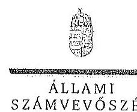

ELHők

Ikt.szám: V-0761-162/2015.

Nagy Csaba úr
vezérigazgató
Magyar Fejlesztési Bank Zrt.

Budapest

Tisztelt Vezérigazgató Úr!

Az „Az állami tulajdonban álló erdőgazdasági társaságok vagyongazdálkodási tevékenységének ellenőrzése” című ellenőrzés tekintetében a DALERD Délalföldi Erdészeti Zrt., a NYÍRERDŐ Nyírségi Erdészeti Zrt., illetve a Vértesi Erdészeti és Faipari Zrt. társaságok jelentéstervezetére tett észrevételeket köszönettel megkaptam.

Az Állami Számvevőszék észrevételekre vonatkozó álláspontjáról a felügyeleti vezető által készített részletes tájékoztatást csatoltan megküldöm.

Tájékoztatom Vezérigazgató urat, hogy a számvevőszéki jelentésben – az Állami Számvevőszékről szóló 2011. évi LXVI. törvény 29. § (3) bekezdése alapján – a figyelembe nem vett észrevételeket szerepeltetjük az elutasítás indokának feltüntetésével.

Budapest, 2015. 114. nap

Tisztelettel:

Domokos László

Melléklet: Tájékoztatás az észrevételek kezeléséről

1952 BUDAPEST, AFRICAN CZEME JÁRÚS STCA J.S. 1364 Budapest 4. Pl. 54 telefon: 494 9191 fax 494 9781

---

# Tájékoztatás   az észrevételek kezeléséről 

„Az állami tulajdonban álló erdőgazdasági társaságok vagyongazdálkodási tevékenységének ellenőrzése” című ellenőrzés tekintetében a DALERD Délalföldi Erdészeti Zrt., a NYÍRERDŐ Nyírségi Erdészeti Zrt., illetve a Vértesi Erdészeti és Faipari Zrt. társaságok jelentéstervezetére 2015. október 30-án érkezett észrevételeket áttekintettük, azok kezelésével kapcsolatban a következő tájékoztatást adom.

1. A jelentésekben megfogalmazott központi problémával kapcsolatban tett észrevételek

A jelentésekben megfogalmazott központi problémával kapcsolatban adott tájékoztatásukat köszönettel vettük, azonban azok alapján a jelentéstervezet módosítása nem indokolt.
2. Egyedi esetekkel kapcsolatban tett észrevételek

A DALERD Délalföldi Erdészeti Zrt. jelentéstervezetének 9. oldal 4. bekezdésére, valamint 29. oldal 4-5. bekezdésére tett észrevétel
A rendelkezésre álló dokumentumok ismételt áttekintését követően töröljük a jelentéstervezet 9. oldal 4. bekezdés 2. mondatát és 29. oldal 5. bekezdését, valamint 29. oldal 4. bekezdésében a tulajdonosi joggyakorló 2 számú alsóindexszel jelölt hivatkozását.

A NYÍRERDŐ Nyírségi Erdészeti Zrt. jelentéstervezetének 17. oldal 2. bekezdésére, valamint 28. oldal 2-3. bekezdésére tett észrevétel
A rendelkezésre álló dokumentumok ismételt áttekintését követően töröljük a jelentéstervezet 17. oldal 2. bekezdésében és a 28. oldal 2. bekezdésében a tulajdonosi joggyakorló 2 számú alsóindexszel jelölt hivatkozását, valamint a 28. oldal 3. bekezdés 1. mondatát.

A Vértesi Erdészeti és Faipari Zrt. jelentéstervezetének 9. oldal 3. bekezdésére, valamint 28. oldal 2-3. bekezdésére tett észrevétel

A társasági részesedés feletti, illetve a vagyonkezelésbe adott állami vagyon feletti tulajdonosi joggyakorlóra történő hivatkozásokra tett észrevételekre vonatkozóan a rendelkezésre álló dokumentumok ismételt áttekintését követően

---

- a 9. oldal 3. bekezdés negyedik sorában, valamint a 28. oldal 2. bekezdés 3. sorában az alsóindex módosítása nem indokolt, tekintettel arra, hogy az MFB Zrt. végzett a Társaságnál egyedi ellenőrzést. A 9. oldal 3. bekezdés 3. mondatát az alábbiak szerint pontosítjuk:
„A Társaság feletti tulajdonosi joggyakorló; a Társaságnál a 2010. évben külső szakértővel átvilágítást végeztetett, jogi, gazdasági, informatikai területen.”
- a 28. oldal 2. bekezdés 3. mondatából a tulajdonosi joggyakorló 2 számú alsóindexszel jelölt hivatkozást, valamint a 28. oldal 3. bekezdés 1. mondatát töröljük.

Budapest, 2015. év
Hó 20. nap

Makkai Mária
felügyeleti vezető

---

.

---

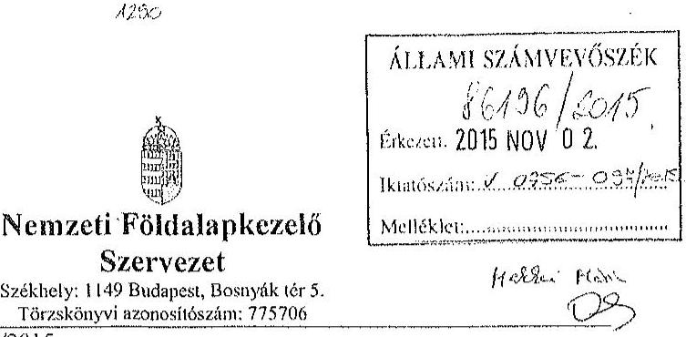

Iktatószám: NFA-002589/023/2015
Hiv. szám: ÁSZ-V-0599/2014-2015
Érintett ÁSZ iktatószámok: V-0756-092/2015, V-0759-066/2015, V-0761-152/2015,
V-0762-073/2015, V-0763-061/2015,

Domokos László
Elnök

Állami Számvevőszék

1052 Budapest

Apáczai Csere János utca 10

Tárgy: Észrevétel megküldése „Az állami tulajdonban álló erdőgazdasági társaságok vagyongazdálkodási tevékenységének ellenőrzéséről” készített jelentés tervezeteire.

Tisztelt Elnök Úr!

Az Állami Számvevőszék 2014. novemberében megkezdte „Az állami tulajdonban álló erdőgazdasági társaságok vagyongazdálkodási tevékenységének ellenőrzését”, amelyről 2015. októberétől érintettség okán az NFA részére az elkészített munkaanyag tervezeteit vizsgált erdőgazdaságonként, megküldte Szervezetünk részére véleményezésre.

A munkaanyag valamennyi tervezete egységesen, az NFA Elnöke részére feladatátadást tartalmaz, melyhez az alábbi észrevételeket tesszük:

A jelentéstervezetekben tett megállapítások helytállóságát nem vitatjuk, azonban szükségesnek látjuk az NFA elnökének tett javaslatokkal a), b) és c) kapcsolatban a következő tájékoztatást megadni.

a) „Tegyen intézkedéseket az erdőgazdasági társaságok közreműködésével a tényleges állapotot rögzítő és a hatályos jogszabályi előírásoknak megfelelő vagyonkezelési szerződés megkötésére.”

---

Tájékoztatjuk, hogy a hatályos jogszabályi előírásoknak megfelelő vagyonkezelési szerződések megkötése érdekében több intézkedés történt, jelenleg is folyamatban van a szerződések előkészítése és a vagyonkezelésben maradó, illetve kikerülő földrészletek adatainak egyeztetése.

Előzményként fontos kiemelni, hogy a Nemzeti Földalapkezelő Szervezet 2010. szeptember 1. napjával történt létrehozását követően (2012. évben) került sor a vagyonkezelésben lévő földrészletek MNV Zrt. részéről történő átadására. Az átadási dokumentumok alapján Szervezetünk gondoskodott a közhiteles nyilvántartásokban a megváltozott tulajdonosi joggyakorlás feltüntetéséről. Az erdőgazdaságok esetében ez 2012. év végéig, illetve 2013. év elején megtörtént, ennek az ingatlan-nyilvántartásban történő átvezetése is.

Megjegyezzük, hogy az MNV Zrt. részéről történő átadás kizárólag a - több évtizede kötött, és azóta többször módosított - vagyonkezelési szerződések és a földrészletek Excel táblázatban történő átadását jelentette, tehát nem egy naprakész vagyonnyilvántartást tartalmazott. Ennek következtében szükségszerűvé vált a Nemzeti Földalapkezelő Szervezetnek egy saját nyilvántartás felépítése, illetve a szerződések tartalmának feldolgozása.

A számvevőszéki ellenőrzéssel érintett időszakban, illetve még jelenleg is lezáratlan az MNV Zrt. és NFA közötti átadás-átvételi folyamat. Az MNV Zrt. további földrészletek átadását készíti elő, ugyanis az MNV Zrt. vagyoni körébe tartozó földrészletekre szintén tervezi a vagyonkezelői szerződés megkötését, és ennek a folyamatnak a részeként a még át nem adott földrészletek átadása is most történik. Természetesen az NFA is folyamatosan biztosítja a különböző hasznosítási, illetve hatósági eljárások során az erdőgazdaságok vagyonkezelésében lévő földrészletek tulajdonosi joggyakorlójának rendezését az MNV Zrt. megkeresésével, közös minősítési eljárás lefolytatásával. A Nemzeti Földalapkezelő Szervezet által megbízott ügyvédi iroda, jelentést készített a szerződés és a tárgyát képező földrészletek jogi helyzetének tisztázására.

Időközben az erdőgazdaságok, mint társaságok feletti tulajdonosi joggyakorló személyében is változás történt. Így új alapokon indulhatott meg a vagyonkezelői szerződés előkészítése. Ennek a folyamatnak részeként, az NFA megbízott egy Ügyvédi Konzorciumot, továbbá Szervezetünknél külön Erdészeti munkacsoport alakult 2015. májusában és azt követően a következő intézkedések történtek:

Az Erdőgazdaságok részére vagyonkezelésbe adásra tervezett ingatlanok felülvizsgálata folyamatban van az Ügyvédi Konzorcium által. A felülvizsgálat tárgyát képező ingatlanok köre három részből tevődik össze:

- az erdőgazdaságok ideiglenes vagyonkezelési szerződésének tárgyát képező ingatlanok,
- azon ingatlanok, amelyeket az erdőgazdaságok az ideiglenes vagyonkezelési szerződésükben szereplő ingatlanokon felül kértek vagyonkezelésbe,

---

- valamint azok az ingatlanok, amelyeket az NFA kíván az erdőgazdaságok vagyonkezelésébe adni.

A rendelkezésre álló dokumentumokban szereplő ingatlanokból erdőgazdaságonként egy egységes, az összes vagyonkezelésbe adandó ingatlant tartalmazó táblázat készült, amely tartalmazza az ingatlanok vagyonkezelésbe adás szempontjából releváns adatait, bejegyzett jogokat, feljegyzett tényeket. A táblázat adatai összevetésre kerültek a közhiteles ingatlannyilvántartásban szereplő adatokkal, feltárva ezáltal, hogy mely ingatlanok adhatóak vagyonkezelésbe és melyek azok, amelyeknél valamilyen előzetes intézkedés megtétele szükséges.

Az Nfatv. 8. §-a alapján a Birtokpolitikai Tanács dönt erdőgazdaságonként az erdőgazdaságok vagyonkezelési szerződésének megkötéséről.

Zárójelben jegyezzük meg, hogy például a TAEG Zrt. esetében elkészült a fentebb részletezett táblázat, amely alapján összeállításra került azon ingatlanok listája, amelyre elindítható a vagyonkezelésbe adási eljárás. Megközelítőleg 18000 ha nagyságú területnek tervezi Szervezetünk a TAEG Zrt. részére történő vagyonkezelésbe adását, ebből 15.308,3880 ha terület az, amelyre elindította a vagyonkezelésbe adást. Az alábbi jogszabályhelyek alapján Szervezetünk megkereste az Földművelésügyi Minisztériumot az egyetértő nyilatkozatok, valamint az alapító határozat kiadása érdekében, valamint a NÉBIH-et, mint erdészeti hatóságot a vagyonkezelő erdőgazdálkodói alkalmasságát megállapító jóváhagyásának megkérése végett.

Az Nfatv. 20. § (7) bekezdése alapján „Az állam 100%-os tulajdonában álló erdő és erdőgazdálkodási tevékenységet közvetlenül szolgáló földterületet érintő vagyonkezelési szerződés létrejöttéhez az erdészeti hatóságnak - a vagyonkezelő erdőgazdálkodói alkalmasságát megállapító - jóváhagyása szükséges”.

Az Nfatv. 23. § (2) bekezdése alapján a Nemzeti Földalapba tartozó védett természeti területek és a Natura 2000 területek vagyonkezelésbe adására, tulajdonjogának bármely jogcímen történő átruházására csak a természetvédelemért felelős miniszter egyetértése esetén kerülhet sor. Az állam 100%-os tulajdonában álló erdő, továbbá erdőgazdálkodási tevékenységet közvetlenül szolgáló földterület vagyonkezelésbe adásához az erdőgazdálkodásért felelős miniszter egyetértése szükséges.

Magyar Állam tulajdonában álló ingatlanokat érintő jogügyletekkel kapcsolatos előzetes miniszteri nyilatkozatok és a miniszter tulajdonosi joggyakorlása alá tartozó gazdasági társaságok ingatlanügyleteivel kapcsolatos miniszteri nyilatkozatok, alapítói határozatok kiadásának rendjéről szóló 8/2014. (XI. 28.) FM utasítás 3. § (4) bekezdése értelmében a miniszter tulajdonosi joggyakorlása alá tartozó állami tulajdonú gazdasági társaságoknak az NFA-val történő vagyonkezelési szerződés kötéséhez elengedhetetlen a jogszabály vagy

---

társasági alapszabály vagy alapító okirat alapján a Társaság tulajdonosi jogait gyakorló miniszter alapítói határozatának kiadása.

Az Erdészeti Munkacsoport a kialakított szempontok alapján tartja a kapcsolatot a Konzorciummal a szerződés tárgyát képező földrészletek jogi, nyilvántartási, helyszíni, térképi ellenőrzés tárgyában annak érdekében, hogy naprakész adatok alapján történjen a szerződéskötés.
b) „Intézkedjen a vagyonkezelési szerződések felülvizsgálatának elmaradásával összefüggésben feltárt szabálytalanságok tekintetében a munkajogi felelősség tisztázására irányuló eljárás megindításáról, és ennek eredménye ismeretében
 tegye meg a szükséges intézkedéseket.

A fent leírt folyamat időbeli áttekintése és a vagyonkezelési szerződés előkészítésének jelenlegi helyzetét tekintve a Nemzeti Földalapkezelő Szervezet egységei, munkatársai a rendelkezésükre álló eszközök alapján megtették a szükséges intézkedéseket az erdőgazdaságok vagyonkezelői szerződésének megkötése érdekében.
c) Az NFA elnöke felé tett javaslattal kapcsolatban, miszerint intézkedjen a Társaságok vagyon-nyilvántartása hitelességének, teljességének és helyességének jogszabályban foglaltak szerinti ellenőrzéséről.

Az NFA 2015. év márciusában megkezdte az Erdészeti Zrt.-k dokumentális ellenőrzését, amely ellenőrzés keretén belül bekérésre került a Társaságok használatában álló vagyonelemekről és az erdővagyon állományról vezetett (nyilvántartások) aktualizált nyilvántartás is.

Budapest, 2015. október 27.
Tisztelettel:
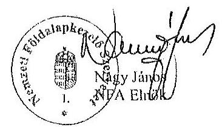

---

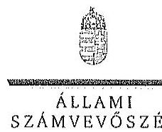

ELHÖK

# Nagy János úr

elnök

Nemzeti Földalapkezelő Szervezet

Budapest

## Tisztelt Elnök Úr!

Az „Az állami tulajdonban álló erdőgazdasági társaságok vagyongazdálkodási tevékenységének ellenőrzése" című ellenőrzés tekintetében öt társaság jelentéstervezetére tett észrevételeiket köszönettel megkaptam.

Az Állami Számvevőszék észrevételekre vonatkozó álláspontjáról a felügyeleti vezető által készített részletes tájékoztatást csatoltan megküldöm.

Tájékoztatom Elnök urat, hogy a számvevőszéki jelentésben – az Állami Számvevőszékről szóló 2011. évi LXVI. törvény 29. § (3) bekezdése alapján – a figyelembe nem vett észrevételeket szerepeltetjük az elutasítás indokának feltüntetésével.

Budapest, 2015.  hó 55 nap

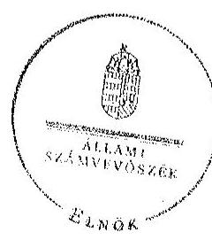

Tisztelettel:

*Domokos László*

Melléklet: Tájékoztatás az észrevételek kezeléséről

13020 BUDAPEST, AVRUZIN CSOKÉ JÁNOS ÚT 10. 1264 Budapest 4. Pf. 54 telefon: 484 2181 fax 484 3091

---

# Tájékoztatás 

az észrevételek kezeléséről
„Az állami tulajdonban álló erdőgazdasági társaságok vagyongazdálkodási tevékenységének ellenőrzése" című ellenőrzés tekintetében a Bakonyerdő Erdészeti és Faipuri Zrt., a Vértesi Erdészeti és Faipuri Zrt., a DALERD Délalföldi Erdészeti Zrt., a NEFAG Nagykonsági Erdészeti és Faipuri Zrt., illetve a NYÍRERDŐ Nyírségi Erdészeti Zrt. társaságok jelentéstervezetére 2015. november 2-án érkezett észrevételeket áttekintettük, azok kezelésével kapcsolatban a következő tájékoztatást adom.

Az észrevétel szerint a jelentéstervezetben tett megállapítások helytállóak, azokat nem vitatják. Az NFA elnökének tett javaslatokhoz kapcsolódó tájékoztatást köszönjük. Mindezek miatt, valamint arra tekintettel, hogy nem jött létre olyan vagyonkezelési szerződés, amely biztosítja az ideiglenes vagyonkezelési szerződés hiányosságainak a megszüntetését, illetve a hatályos jogszabályoknak való megfeleltetést, a megállapítások és a javaslatok módosítása nem indokolt.

Budapest, 2015. év  hó  nap

Makkai Mária
felügyeleti vezető

---

A DALERD Zrt. 2009-2014. I. félévben teljesített vagyonkezelési díjfizetési kötelezettsége

| Időszak | Kedvezményezett | Számla száma | Fizetési határidő | Díjfizetés kelte | Díjfizetés összege ezer Ft (nettó) |
| :-- | :--: | :-- | :--: | :--: | :--: |
| 2009. I. félév | NFA | VBVK-00139. | 2012.07.28 | 2012.07.27 | 634,6 |
| 2009. II. félév | NFA | VBVK-00140. | 2012.07.28 | 2012.07.27 | 634,6 |
| 2010. | NFA | VBVK-00141. | 2012.07.28 | 2012.07.27 | 1269,3 |
| 2011. | NFA | VBVK-00142. | 2012.07.28 | 2012.07.27 | 1269,3 |
| 2012 | NFA | VBVK-00225. | 2014.01.31 | 2014.01.31 | 971,8 |
| 2013. | NFA | VBVK-00230. | 2014.01.31 | 2014.01.31 | 971,8 |
| 2014. | NFA | VBVK-00057. | 2015.02.15 | 2015.02.12 | 971,8 |
| 2009-2014. I félév összesen: |  |  |  |  | 6723,2 |

Megbízás alapján kezelt földterületek vagyonkezelési díja

| Időszak | Kedvezményezett | Számla száma | Fizetési határidő | Díjfizetés kelte | Díjfizetés összege (ezer Ft) |
| :-- | :--: | :-- | :--: | :--: | :--: |
| 2012. | NFA | VBMV12-02014. | 2012.11.30 | 2012.11.29 | 7480,9 |
| 2013. | NFA | VBMV13-05480. | 2013.11.30 | 2013.11.29 | 6027,7 |
| 2013. | NFA | VBMV14-01931. | 2013.11.30 | 2013.11.29 | 847,4 |
| 2014. | NFA | VBMV14-05029. | 2013.11.30 | 2014.11.30 | 27,3 |
| 2014. | NFA | VBMV14-02982. | 2013.12.01 | 2013.11.30 | 1788,6 |
| Megbízás alapján kezelt földterületek vagyonkezelési díja összesen: |  |  |  |  | 16171,9 |

