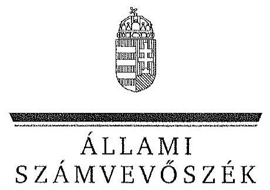

ÁLLAMI
SZÁMVEVÔSZÉK

# JELENTÉS 

Az állami tulajdonban álló erdőgazdasági társaságok vagyongazdálkodási tevékenységének ellenőrzése

NEFAG Nagykunsági Erdészeti és Faipari Zrt.

---

# Állami Számvevőszék 

Iktatószám: V-0762-084/2015.
Témaszám: 1796
Vizsgálat-azonosító szám: V070614

## Az ellenőrzést felügyelte:

Makkai Mária
felügyeleti vezető
Az ellenőrzést vezette és az ellenőrzés végrehajtásáért felelős:
Schmidt János
ellenőrzésvezető
A számvevőszéki jelentéstervezet összeállításában közremüködött:
Liziczai Imréné
számvevő főtanácsos
Az ellenőrzést végezték:
Hadházy Sándor Liziczai Imréné
számvevő tanácsos számvevő főtanácsos

---

# TARTALOMJEGYZÉK 

BEVEZETÉS ..... 3
I. ÖSSZEGZŐ MEGÁLLAPÍTÁSOK, KÖVETKEZTETÉSEK, JAVASLATOK ..... 7
II. RÉSZLETES MEGÁLLAPÍTÁSOK ..... 13

1. A NEFAG Zrt. vagyongazdálkodása ..... 13
1.1. A vagyon értékének megőrzése, gyarapítása ..... 13
1.2. A vagyonkezelői kötelezettség teljesítése ..... 18
2. A NEFAG Zrt. vagyonkezelési szerződése és a vagyonnyilvántartása ..... 18
2.1. A vagyonkezelési szerződés megfelelősége ..... 18
2.2. A NEFAG Zrt. vagyonnyilvántartása ..... 22
3. A NEFAG Zrt. éves tervezési feladatainak ellátása, az ágazati jogszabályok érvényesülése ..... 24
3.1. Az üzleti tervek vagyonmegőrzésre, vagyongyarapításra vonatkozó elemei ..... 24
3.2. A tervekben megfogalmazott előírások érvényesülése ..... 25
3.3. Az ágazati szabályok érvényesülése ..... 26
4. A kontroll- és monitoring rendszer kialakítása és múködtetése ..... 28
4.1. A kontrollrendszer kialakítása és múködtetése ..... 28
4.2. Az információáramlási és monitoring rendszer kialakítása és múködtetése ..... 31
5. A tulajdonosi joggyakorlóknak az NEFAG Zrt. vagyongazdálkodási feladataira vonatkozó döntései, intézkedései megfelelősége ..... 33

---

# MELLÉKLETEK 

1. számú Rövidítések jegyzéke
2. számú Fogalomtár
3/A. számú A NEFAG Zrt. vagyonának alakulása a 2009-2013. évek közötti időszakban - eszközök (M Ft)
3/B. számú A NEFAG Zrt. vagyonának alakulása a 2009-2013. évek közötti időszakban - források (M Ft)
3. számú Kimutatás a NEFAG Zrt. befektetett eszközei állományának alakulásáról a 2009-2014. I. féléve közötti időszakra vonatkozóan
4. számú A NEFAG Zrt. vezérigazgatójának észrevétele
5. számú A NEFAG Zrt. vezérigazgatójának észrevételére adott válasz
6. számú Az MNV Zrt. vezérigazgatójának észrevétele
7. számú Az MNV Zrt. vezérigazgatójának észrevételére adott válasz
8. számú Az MFB Zrt. vezérigazgatójának észrevétele
9. számú Az MFB Zrt. vezérigazgatójának észrevételére adott válasz
10. számú Az NFA elnökének észrevétele
11. számú Az NFA elnökének észrevételére adott válasz

---

# JELENTÉS 

## Az állami tulajdonban álló erdőgazdasági társaságok vagyongazdálkodási tevékenységének ellenőrzése NEFAG Nagykunsági Erdészeti és Faipari Zrt.

## BEVEZETÉS

Hazánk területének több mint 20\%-át erdő borítja. Az erdők fenntartása és védelme az egész társadalom érdeke, ezért az erdőkkel csak a közérdekkel összhangban lehet gazdálkodni.

Az Alaptörvény 38. cikke és az Nvtv. alapján az állam tulajdona a nemzeti vagyon részét képezi. Az Nvtv. alapján nemzetgazdasági szempontból kiemelt jelentőségű nemzeti vagyonban tartandó vagyonelemnek minősül a 100\%-ban az állam tulajdonában álló védelmi és közjóléti elsődleges rendeltetésű erdő, a gazdasági elsődleges rendeltetésű természetes erdő, természetszerű erdő és származék erdő természetességi állapotú öt hektárnál nagyobb, természetben összefüggő erdő. Az erdőgazdasági társaságok vagyongazdálkodása szempontjából a Vtv., illetve az Nvtv. és az Nfatv., valamint a kapcsolódó kormány- és miniszteri rendeletek mellett kiemelkedő szerepe van a különböző ágazati jogszabályoknak. A vagyonkezelési tevékenység végrehajtása során figyelemmel kell lenni az Evt.-ben foglaltakra, mely alapján a nemzeti vagyonról szóló törvényben nemzetgazdasági szempontból kiemelt jelentőségű nemzeti vagyonként meghatározott védelmi és közjóléti elsődleges rendeltetésű, az állam tulajdonában álló erdő a kincstári vagyon részét képezi. Az erdőgazdasági társaságoknak az általuk kezelt vagyonelemek sajátosságára tekintettel kell a vagyongazdálkodási tevékenységüket kialakítaniuk, gondoskodniuk kell a közérdek és az Evt.-ben foglaltak érvényesülését biztosító vagyongazdálkodásról.

Az Evt. előírásai alapján az állam tulajdonában álló erdőt és erdőgazdálkodási tevékenységet közvetlenül szolgáló földterületet csak vagyonkezelés formájában lehet hasznosításra átengedni. Az állam kizárólagos tulajdonában álló erdő és erdőgazdálkodási tevékenységet közvetlenül szolgáló földterület vagyonkezelését csak költségvetési szerv vagy 100\%-os állami tulajdonú gazdálkodó szervezet végezheti.

A Vtv. szerint az erdőgazdasági társaságok és a társaságok kezelésében lévő állami vagyon feletti tulajdonosi jogokat a 2010. évig a Magyar Állam nevében az MNV Zrt. gyakorolta. A 2010. évi törvényi változások (Vtv., Mfbtv., Nfatv.) következtében 2010. június 17. napjától az erdőgazdasági társaságok állami tulajdonú részesedése tekintetében a tulajdonosi jogokat az állami vagyonért felelős miniszter az MFB Zrt. útján látta el. Az Nfatv. 2010. évi hatálybalépését követően a társaságok által kezelt, a Nemzeti Földalapba tartozó földterületek

---

vonatkozásában a tulajdonosi jogokat az NFA, míg egyéb ingatlanok és vagyonelemek tekintetében a tulajdonosi jogokat az MNV Zrt. gyakorolja. 2014. július 16 -tól az erdőgazdasági társaságok feletti tulajdonosi jogokat az erdőgazdálkodásért felelős miniszter gyakorolja.

A Nemzeti Földalapba tartozó 1772980 ha földterületből a 2012. év végén a 100\%-os állami tulajdonú 19 erdőgazdasági társaság kezelésében összesen 913664 ha földterület volt, ebből 879254 ha erdő, a többi egyéb művelési ágba tartozik. A kezelt földterületek erdőgazdasági társaságonkénti megosztása eltérő.

Az erdőgazdasági társaságok az Alaptörvény és az Nvtv. előírása szerint önállóan és felelősen gazdálkodnak a törvényesség, a célszerűség és az eredményesség követelményei szerint. Az állami vagyonnal való gazdálkodás alapvető feladata a vagyon rendeltetésszerü, hatékony és felelős felhasználásának biztosítása az állami vagyon értékének megőrzése, gyarapítása érdekében. A NEFAG Zrt. jelen ellenőrzése az állami vagyonnal való gazdálkodásra és a törvényesség betartására irányult.

A szolnoki székhelyű Társaság és jogelődjei több mint hatvan éve végzik Jász-Nagykun-Szolnok megyében és Pest megye déli részén az állami tulajdonú erdőterületek vagyonkezelését. Szerteágazó erdő- és vadgazdálkodási tevékenységét három egység (Szolnoki Erdészet, Pusztavacsi Erdészet és Monori Erdészet) múködése révén látja el. A NEFAG Zrt. 2013. évi éves beszámolója szerint $2044,6 \mathrm{M}$ Ft nettó árbevétel mellett $42,5 \mathrm{M}$ Ft mérleg szerinti eredményt ért el, a mérlegfőösszeg $2788,3 \mathrm{M}$ Ft volt. Az erdőgazdasági társaság 30696 ha erdőterületen és 1121 ha egyéb művelési ágú földterületen gazdálkodott, az éves átlaglétszám 140 fő volt.

Az ellenőrzés célja annak értékelése, hogy a NEFAG Zrt. vagyongazdálkodása, vagyonérték-megőrző és vagyongyarapítási tevékenysége, valamint ennek szervezeti keretei megfeleltek-e a jogszabályok és belső szabályzatok előírásainak, valamint a kezelt vagyonelemek sajátosságaiból adódó követelményeknek.

Ennek keretében ellenőriztük és értékeltük, hogy:

- a vagyongazdálkodás során betartották-e az Nvtv. 7. §-ában megállapított vagyongazdálkodási alapelveket, valamint az ágazati jogszabályok vagyongazdálkodáshoz kapcsolódó előírásait;
- a NEFAG Zrt. a saját és a kezelt vagyonnal való gazdálkodásra vonatkozó éves tervezési feladatait a jogszabályi előírásoknak megfelelően látta-e el, a Társaság üzleti tervei a kezelésbe vett vagyonra vonatkozó, a Vtv. 2. § (1) és a 27. § (7) bekezdésében előírt vagyon megőrzésére, gyarapítására vonatkozó elemeket tartalmazták-e és azokat a vagyongazdálkodás során érvényesí-tették-e;
- a vagyonkezelési szerződések és a vagyon-nyilvántartás megfeleltek-e a szabályszerűségi követelményeknek, elősegítették-e az állami vagyonnal való szabályszerű gazdálkodást;

---

- a Társaságnál kialakították és működtették-e a szabályszerű feladatellátást támogató kontrollrendszert. Ezen belül elkészítették és aktualizálták-e a Társaság feladatellátási-folyamatainak szabályzatait, a kockázatok kezelésének rendszerét, az információs és a kontrolling- monitoring rendszert, valamint a vagyongazdálkodás területén azokat az eljárásokat, amelyek elősegítik a szervezeti célok végrehajtását;
- a tulajdonosi joggyakorlóknak a Társaság vagyongazdálkodási feladataira vonatkozó döntései, intézkedései előkészítése és megalapozottsága a jogszabályoknak és a belső szabályozásnak megfelel-e, a tulajdonosi joggyakorlók e minőségben végzett tevékenysége támogatta-e a felelős vagyongazdálkodás megvalósulását.

Az ellenőrzés típusa: szabályszerűségi ellenőrzés.
Az ellenőrzött időszak: 2009. január 1. napjától 2014. június 30. napjáig, kitekintéssel a helyszíni ellenőrzés végéig tartó releváns folyamatokra, intézkedésekre.

Az ellenőrzés várható hasznosulása: A NEFAG Zrt. és a tulajdonosi joggyakorlók fenti szempontú ellenőrzése az állami tulajdonban álló vagyon kezelésére, a vagyonnal való gazdálkodásra vonatkozó, kötelezően végrehajtandó éves ÁSZ ellenőrzést szélesebb körűvé teszi.

Az ellenőrzés várható hasznosulásaként biztosíthatja a társadalom részéről kiemelt érdeklődéssel kísért téma objektív bemutatását. Az ÁSZ jelentéséből a média és az állampolgárok átfogó képet kaphatnak a Magyarország állami tulajdonban lévő erdőivel való gazdálkodásról, a gazdálkodást, vagyonkezelést végző szervezeti rendszerről, az állami tulajdonban álló erdőgazdasági társaságok feladatellátásához kapcsolódóan feltárt problémákról.

Az ellenőrzés jól hasznosítható - többek közt - az állami vagyonnal kapcsolatos országgyúlési törvényhozói munkában is, továbbá hozzájárulhat a tulajdonosi joggyakorlás javításával a „jó kormányzás" gyakorlatának erősítéséhez.

Az ellenőrzéssel érintett szervezetek: A NEFAG Zrt., a Társaság kezelésében lévő állami vagyon feletti tulajdonosi jogokat gyakorló szervezetek, valamint a Társaság állami tulajdonú részesedése feletti tulajdonosi joggyakorlók (MFB Zrt., MNV Zrt., NFA).

Az ellenőrzés végrehajtásának jogszabályi alapját az ÁSZ tv. 5. § (4)-(5) bekezdéseiben foglaltak képezik.

Az ellenőrzés szakmai módszertana az ÁSZ hivatalos honlapján közzétett szakmai szabályokon alapult, amely a Legfőbb Ellenőrző Intézmények Nemzetközi Szervezete (INTOSAI) által kiadott nemzetközi standardok (ISSAI) figyelembevételével készült.

A NEFAG Zrt. az ellenőrzés lefolytatásához tanúsítványok kitöltésével, valamint dokumentumok elektronikus megküldésével szolgáltatott adatokat. Az így rendelkezésre bocsátott adatok és információk kontrollja a helyszíni ellenőrzés keretében történt. A vagyonváltozást eredményező döntések megalapozottsá-

---

gát, továbbá a vagyonérték-megőrző és vagyongyarapító tevékenység szabályszerűségét a számviteli nyilvántartásokból, valamint kockázatalapú és véletlenszerű mintavétellel kiválasztott tételek ellenőrzésével értékeltük.

Az ÁSZ a 2011. évi LXVI. törvény 29. §-a szerint a jelentéstervezetet megküldte a NEFAG Zrt., a Magyar Nemzeti Vagyonkezelő Zrt. és a Magyar Fejlesztési Bank Zrt. vezérigazgatójának, valamint a Nemzeti Földalapkezelő Szervezet elnökének egyeztetésre. A NEFAG Zrt. vezérigazgatójának észrevételét és az arra adott választ az 5-6. számú melléklet, a Magyar Nemzeti Vagyonkezelő Zrt. vezérigazgatójának észrevételét és az arra adott választ a 7-8. számú melléklet, a Magyar Fejlesztési Bank Zrt. vezérigazgatójának észrevételét és az arra adott választ a 9-10. számú melléklet, a Nemzeti Földalapkezelő Szervezet elnökének észrevételét és az arra adott választ a 11-12. számú melléklet tartalmazza.

---

# I. ÖSSZEGZŐ MEGÁLLAPÍTÁSOK, KÖVETKEZTETÉSEK, JAVASLATOK 

Az állami tulajdonú NEFAG Zrt. vagyongazdálkodása saját és kezelt vagyonra terjedt ki. Saját tőkéjének összege folyamatosan emelkedett, az éves beszámolók alapján a 2009-2013. években nyereséget ért el. Mérleg szerinti vagyona saját vagyonból állt, amely a 2009. január 1-jei 2340,3 M Ft-ról 2013. december 31-ére 2788,3 M Ft-ra (19,1\%-kal) emelkedett. A Társaság a Számv. tv. előírása ellenére mérlegében nem mutatta ki eszközként a kezelésbe vett, az állami vagyon részét képező eszközöket, ezáltal a Társaság mérlege nem volt megbízható, mert nem a valós állapotot tükrözte. A kezelt vagyon mérlegtételek szerinti megbontása és értékének változása a kiegészítő mellékletben sem került bemutatásra. amely ugyancsak nem felelt meg a Számv. tv. előírásának.

A Társaság a saját vagyonról megfelelő nyilvántartást vezetett, de a kezelésében lévő állami vagyonnál nem tartotta be minden tekintetben az elkülönített nyilvántartásra vonatkozó előírásokat. A vagyonkezelésében lévő állami vagyonról vezetett nyilvántartás nem felelt meg a Vhr.-ben foglaltaknak, mert tételesen nem tartalmazta a vagyonkezelt eszközök könyv szerinti bruttó és nettó értékét, valamint az értékben bekövetkezett egyéb változásokat. Ezért a vezetett nyilvántartás nem biztosította az átláthatóságot és az elszámoltathatóságot. Az ellenőrzés befejezéséig nem került lezárásra az MNV Zrt., az NFA és a Társaság közötti, a vagyonkezelésben lévő vagyonelemekről történő egyeztetés, így nem állt rendelkezésre a Társaság vagyonkezelésében lévő állami vagyonra és annak nagyságára vonatkozó egyező adat. Az ellenőrzött időszakban az Társaság a beszámolókban és a számviteli nyilvántartásokban lévő vagyontárgyak állományát a Számv. tv.-ben és a Leltározási szabályzat ${ }_{1-2}$-ben foglaltak alapján elkészített leltárral alátámasztotta.

A Társaság a Magyar Állam tulajdonában álló erdővagyon és egyéb művelési ágú termőföld ingatlanok kezelését a KVI-vel 1996. október 14-én kötött vagyonkezelési szerződés alapján végezte. A Társaság, mint vagyonkezelő és a KVI között létrejött szerződéses jogviszony kereteit a VSZ-ben foglalt jogok és kötelezettségek töltötték ki, azonban az nem támogatta a Vhr.-ben előírt, a vagyongazdálkodási feladatok átlátható módon történő végrehajtását, valamint nem támogatta a szabályszerű vagyongazdálkodást.

A VSZ a hatályos jogszabályi előirásoknak nem felelt meg, azok változásával a szerződés aktualizálására nem került sor. A VSZ 1-4. melléklete a Társaságnál nem állt rendelkezésre. A Társaságnál a vagyonkezeltként nyilvántartott vagyontárgyak körének többszöri változása ellenére nem állt rendelkezésre a Vhr.-ben előírt, 60 napon belüli egységes szerkezetbe foglalt VSZ. A VSZ hatályon kívül helyezett jogszabályi hivatkozásokat tartalmazott, illetve nem tartalmazott minden szükséges jogszabályi hivatkozást. A VSZ nem került módosításra az érintett vagyonelem esetleges védettsége, illetve a Natura 2000 területnek minősítése, továbbá a tulajdonosi jogok gyakorlójának változása miatt sem. A szerződő felek nem tettek eleget továbbá a Vhr.-ben foglalt rendelkezésnek és a Vhr. hatálybalépését követő hat hónapon belül nem kezde-

---

ményezték a Nemzeti Földalapba tartozó ingatlanokra vonatkozóan a VSZ megszüntetését, és a Vtv. illetve Vhr. szabályoknak megfelelő szerződés megkötését.

A VSZ nem tartalmazta egyértelműen, hogy a vagyonkezelési díj nettó vagy bruttó értéket jelent, illetve nem határozták meg a vagyonkezelési díj alapját. A Társaság a vagyonkezelési díjfizetési kötelezettségét a 2009-2011. évekre vonatkozóan a 2012. évben, a 2012-2013. évekre - a VSZ-ben foglaltakkal szemben - utólag, a 2013. év végén, az NFA által kibocsátott számlák alapján teljesítette. A díjat a VSZ-ben foglaltak ellenére az ellenőrzött időszakban a vagyon feletti tulajdonosi jogokat gyakorló MNV Zrt., és az NFA évente nem vizsgálta felül.

A Társaság az ellenőrzött időszakban vagyonkezelői kötelezettségeinek eleget tett. Az Evt. hatályba lépését követően erdő használatát, hasznosítását, illetve vagyonkezelői jogát harmadik személynek nem engedte át, vagyonkezelői jogot, vagyonkezelésében lévő földterületet nem terhelt meg. Az NFA és az MNV Zrt. között az ellenőrzött időszak alatt a Nemzeti Földalapba tartozó vagyontárgyak tekintetében átadás-átvétel volt folyamatban.

A Társaság a vagyonnal való gazdálkodás érdekében éves tervezési feladatait ellátta. A Társaság vagyongazdálkodásra vonatkozó terveit a tulajdonosi joggyakorló ${ }_{1-2}$ által kiadott tervezési utasítások, irányelvek alapján készített és a tulajdonosi joggyakorló ${ }_{1-2}$ által jóváhagyott éves üzleti tervek tartalmazták. Az üzleti tervekben megjelenítették a Társaság tulajdonában álló állami vagyon és a vagyonkezelésében lévő állami vagyon megőrzésére, gyarapítására vonatkozó elemeket. A tervezett beruházásokat tételesen bemutatták, meghatározták a fejlesztés célját, indokoltságát és várható eredményét. A beruházási tervekből megállapíthatóak a Társaság saját, illetve a vagyonkezelésében lévő állami vagyonnal kapcsolatosan tervezett beruházásai, fejlesztései.

Az erdőtelepítési-kivitelezési tervek, az üzemgazdasági, valamint vadgazdálkodási üzemtervek és az éves erdő és vadgazdálkodási tervek végrehajtásáról beszámoltak az Erdészeti hatóság ${ }_{1-2}$, illetve Vadászati hatóság ${ }_{1-2}$ felé, továbbá a tulajdonosi joggyakorló ${ }_{1-2}$-nek. Az üzleti jelentésekből megállapítható, hogy a Társaság az ellenőrzött időszakban a tervezett feladatait az előírt szakmai követelményeknek és a tulajdonosi elvárásoknak megfelelően teljesítette.

A Társaság az ellenőrzött időszakban eleget tett az Nvtv. 7. §-ában megállapított vagyongazdálkodási alapelveknek. A saját tulajdonú tárgyi eszközök rendszeres karbantartásáról, állagmegóvásáról, állapotfelméréséről folyamatosan intézkedtek, azok végrehajtását folyamatosan figyelemmel kísérték. Vagyonkezelésbe vett vagyon elidegenítésére, megterhelésére nem került sor. A kezelésbe vett vagyonelemek (földterületek) után a Társaságnak visszapótlási kötelezettsége nem keletkezett.

A Társaság vagyonkezelési tevékenysége során részben érvényesültek az ágazatra vonatkozó jogszabályokban meghatározott speciális vagyongazdálkodási elöírások.

---

Az Társaságnak az ellenőrzött időszakban az Evt. szerinti immateriális szolgáltatásokból származó bevétele nem volt. A vadgazdálkodási és vadászati tevékenységet a Vtv., a Vhr., a Ptk., az Áfa. tv. és a belső szabályozásaiban előírtak szerint látta el, de egy esetben a Vadvédelmi tv.-ben előírtakkal ellentétesen, hatályos üzemgazdasági terv nélkül végezte a megállapodás szerinti vadgazdálkodási feladatát. A vadásztatásból származó bevételét szabályszerűen számolta el és tartotta nyilván.

A Társaság betartotta az Evt. előírásait, nem idegenített el vagyonkezelésében lévő erdőt, nem kötött erdő tulajdonjogának átruházására irányuló szerződést.

A Társaság az ellenőrzött időszakban az Evt. előírásainak eleget tett az Erdészeti hatóság ${ }_{1-2}$ felé fennálló bejelentési, engedélykérelmi kötelezettségének. Az Erdészeti hatóság ${ }_{1-2}$ két esetben, kötelezte erdőgazdálkodási bírság megfizetésére a Társaságot.

A Társaság kialakította és annak megfelelően múködtette a feladatellátást támogató kontroll és monitoring rendszert. A Társaság feletti tulajdonosi joggyakorló ${ }_{1-2}$ FB létrehozásáról rendelkezett. Az FB eleget tett az Alapító okiratban előírt feladatainak. Az FB ellenőrzési kötelezettségét teljesítve, a Társaság éves beszámolóiról véleményét a könyvvizsgálói jelentés figyelembe vételével alakította ki, írásbeli jelentését a tulajdonosi joggyakorló felé elkészítette. Az éves beszámolók letétbe helyezése és közzététele a jogszabályi előírásoknak megfelelően, határidőn belül megtörtént. A könyvvizsgáló minden ellenőrzött évben hitelesítő záradékkal látta el az éves számviteli beszámolót, figyelemfelhívó vezetői levelet nem adott ki. A könyvvizsgáló az ellenőrzött időszakban jelentéseiben nem kifogásolta a mérleg tartalmával kapcsolatosan feltárt hiányosságokat, azaz nem hívta fel a figyelmet arra, hogy a Társaság éves mérlegeiben nem került rögzítésre a VSZ alapján kezelt állami vagyon értéke, valamint ezek az eszközök a kiegészítő mellékletben sem kerültek bemutatásra, legalább mérlegtétel szerinti megbontásban. Az FB és a könyvvizsgáló feladatát ellátta, ennek során a Társaság múködésénél jogsértést nem állapítottak meg. Belső ellenőrt 2010-től alkalmaztak, aki az FB útmutatása és a belső ellenőrzésről szóló szabályzatban foglaltak alapján végezte munkáját. A belső ellenőrzések jelentős, illetve lényeges hibát nem tártak fel, a hiányosságok megszüntetésére intézkedések történtek.

Az ellenőrzött időszakban az Társaság információáramlási és monitoring rendszer kialakítását a tulajdonosi joggyakorló ${ }_{1-2}$ közvetlenül nem írta elő, az ellátandó feladatokról, annak eljárásrendjéről belső szabályzataiban, illetve vezérigazgatói utasításban rendelkezett. A Társaság biztosította az ellenőrzött időszakban a vagyonkezeléséhez kapcsolódóan a jogszabályi előírásoknak megfelelő, szerződésszerű kapcsolattartást, adatszolgáltatást és elszámolást.

A Társaságnál biztosított volt az adatok védelme az ellenőrzött időszakban, de a közérdekú adatok nyilvánosságra hozatala csak részben felelt meg jogszabályi előírásoknak. A Társaság az Avtv. és az Info tv. előírásai ellenére a közérdekű adatok megismerésére irányuló igények teljesítésének rendjét rögzítő szabályzattal nem rendelkezett, továbbá a honlapján közzétett adatok nem voltak teljes körűek.

---

A vagyonkezelésbe adott állami vagyon tekintetében a tulajdonosi joggyakorlók tevékenysége az ellenőrzött időszakban nem támogatta teljes körűen a felelős vagyongazdálkodás megvalósulását.

A Társaság vagyongazdálkodási feladataira vonatkozó döntések, intézkedések előkészítése a Társaság feletti tulajdonosi joggyakorló ${ }_{1-2}$-nél megfelelő volt, azonban Társaság feletti tulajdonosi joggyakorló ${ }_{1-2}$ kapcsolódó tevékenysége csak részben támogatta a felelős vagyongazdálkodást.

A Tulajdonosi joggyakorló ${ }_{1}$ az erdőgazdasági társaságok vagyongazdálkodása szabályozottságával, szabályszerűségével és a vagyonnyilvántartásukkal kapcsolatban a Társaságnál helyszíni ellenőrzést nem végzett.

A Társaság feletti tulajdonosi joggyakorló ${ }_{2}$ az ellenőrzött években a Társaság vagyongazdálkodásának szabályozottságával, szabályszerűségével és a vagyonnyilvántartásával kapcsolatban ellenőrzést nem végzett. A Társaságnál a 2010. évben külső szakértővel átvilágítást végeztetett, jogi, gazdasági, informatikai területen.

A vagyonkezelésbe adott állami vagyon tekintetében tulajdonosi jogokat gyakorló MNV Zrt. és NFA az ellenőrzött időszakban a VSZ-szel kapcsolatban feltárt hiányosságokat nem szüntette meg, a hatályos jogszabályoknak a szerződést nem feleltette meg, nem élt a Vhr.-ben foglalt, a kezelt vagyon használatára vonatkozó ellenőrzési jogával, valamint nem ellenőrizte a vagyonnyilvántartás hitelességét, teljességét és helyességét.

Az Állami Számvevőszékről szóló 2011. évi LXVI. törvény 33. § (1) bekezdésében foglaltak értelmében a jelentésben foglalt megállapításokhoz kapcsolódó intézkedési tervet köteles az ellenőrzött szervezet vezetője összeállítani, és azt a jelentés kézhezvételétől számított 30 napon belül az ÁSZ részére megküldeni. Amennyiben az intézkedési tervet határidőben nem küldi meg a szervezet, vagy az nem elfogadható, az ÁSZ elnöke a hivatkozott törvény 33. § (3) bekezdésében foglaltakat érvényesítheti.

Az ellenőrzés intézkedést igénylő megállapításai és javaslatai:

# MNV Zrt. vezérigazgatójának, az NFA elnökének 

A NEFAG Zrt. a Magyar Állam tulajdonában álló erdővagyon és egyéb művelési ágú termőföld ingatlanok kezelését a jogelődje által a KVI-vel 1996. október 14-én kötött vagyonkezelési szerződés alapján végezte. A Társaság, mint vagyonkezelő és a KVI között létrejött szerződéses jogviszony kereteit a VSZ-ben foglalt jogok és kötelezettségek töltötték ki, azonban az nem támogatta a Vhr. 3. § (1) bekezdésében előírt, a vagyongazdálkodási feladatok átlátható módon történő végrehajtását, valamint nem támogatta a szabályszerű vagyongazdálkodást. A VSZ rendelkezéseinek általános felülvizsgálatára és a hatályos jogszabályokkal való összehangolására nem került sor. Az ellenőrzött időszakban a VSZ hatályon kívül helyezett jogszabályi hivatkozásokat tartalmazott az Áht. 1 109/B. §, 109/G. §, a Vadvédelmi tv. 98. § rendelkezései vonatkozásában. A VSZ vagyonkezelői jog átengedésére vonatkozó rendelkezése 2009. július 10-étől nem felelt meg az Nfatv. 19/A. § (4) bekezdésében, 2012-től az Nvtv. 11. § (8) bekezdés d) pontjában foglaltaknak, amely szerint a Társaság a vagyonke-

---

zelői jogát harmadik személyre nem ruházhatta át. A VSZ nem rögzítette a Vhr. 9. § (8) bekezdésében 2011. január 1-jétől előírt, az érintett vagyonelem esetleges védettségét, illetve a Natura 2000 területnek minősítését. A felek nem tettek eleget a Vhr. 54. § (7) ${ }^{1}$ bekezdésében foglalt rendelkezésnek és a Vhr. hatálybalépését követő hat hónapon belül nem kezdeményezték a Nemzeti Földalapba tartozó ingatlanokra vonatkozóan a VSZ megszüntetését és a Vtv., illetve Vhr. szabályainak megfelelő szerződés megkötését.

A vagyonkezelésbe adott állami vagyon tekintetében tulajdonosi jogokat gyakorló MNV Zrt. és NFA nem végeztek a Vhr. 20. § (1)-(2) bekezdéseiben és a Nemzeti Földalapba tartozó földrészletek hasznosításának részletes szabályairól szóló 262/2010. (XI. 17.) Korm. rendelet 47. § (1)-(2) bekezdéseiben foglalt, a vagyonnyilvántartás hitelességére, teljességére és helyességére vonatkozó ellenőrzést a Társaságnál.

Javaslat:

# az MNV Zrt. vezérigazgatójának 

a) Tegyen intézkedéseket az erdőgazdasági társaság közreműködésével a tényleges állapotot rögzítő és a hatályos jogszabályi előírásoknak megfelelő vagyonkezelési szerződés megkötésére.
b) Tegyen intézkedéseket a vagyonkezelési szerződés felülvizsgálatának elmaradásával, valamint a Nemzeti Földalapba tartozó ingatlanokra vonatkozó VSZ megszüntetésével összefüggésben feltárt szabálytalanságok tekintetében a felelősség tisztázása érdekében, és szükség szerint intézkedjen a felelősség érvényesítéséről.
c) Intézkedjen a Társaság vagyonnyilvántartása hitelességének, teljességének és helyességének jogszabályban foglaltak szerinti ellenőrzéséről.

## az NFA elnökének

a) Tegyen intézkedéseket az erdőgazdasági társaság közreműködésével a tényleges állapotot rögzítő és a hatályos jogszabályi előírásoknak megfelelő vagyonkezelési szerződés megkötésére.
b) Intézkedjen a vagyonkezelési szerződés felülvizsgálatának elmaradásával összefüggésben feltárt szabálytalanságok tekintetében a munkajogi felelősség tisztázására irányuló eljárás megindításáról, és ennek eredménye ismeretében tegye meg a szükséges intézkedéseket.
c) Intézkedjen a Társaság vagyonnyilvántartása hitelességének, teljességének és helyességének jogszabályban foglaltak szerinti ellenőrzéséről.

[^0]
[^0]:    ${ }^{1}$ Vhr. 54. § (7) bekezdés (hatályos 2010. december 31-élg)

---

# a NEFAG Zrt. vezérigazgatójának 

1. A NEFAG Zrt. jogelődje által a KVI-vel 1996. október 14-én kötött vagyonkezelési szerződés nem támogatta a Vhr. 3. § (1) bekezdésében előírt, a vagyongazdálkodási feladatok átlátható módon történő végrehajtását, valamint nem támogatta a szabályszerű vagyongazdálkodást. A VSZ rendelkezéseinek általános felülvizsgálatára és a hatályos jogszabályokkal való összehangolására nem került sor. Az ellenőrzött időszakban a VSZ hatályon kívül helyezett jogszabályi hivatkozásokat tartalmazott az Áht.: 109/B. §, 109/G. §, a Vadvédelmi tv. 98. § a Vadvédelmi tv. 98. § rendelkezései vonatkozásában. A VSZ vagyonkezelői jog átengedésére vonatkozó rendelkezése 2009. július 10-étől nem felelt meg az Nfatv. 19/A. § (4) bekezdésében, 2012-től az Nvtv. 11. § (8) bekezdés d) pontjában foglaltaknak, amely szerint a Társaság a vagyonkezelői jogát harmadik személyre nem ruházhatta át. A VSZ nem rögzítette a Vhr. 9. § (8) bekezdésében 2011. január 1-jétől előírt, az érintett vagyonelem esetleges védettségét, illetve a Natura 2000 területnek minősítését.

Javaslat:
a) Tegyen intézkedéseket a tulajdonosi joggyakorlókkal közreműködve a tényleges állapotnak és a hatályos jogszabályi előírásoknak megfelelő vagyonkezelési szerződés megkötése érdekében.
b) Intézkedjen a vagyonkezelési szerződés felülvizsgálatának elmaradásával feltárt szabálytalanságok tekintetében a felelősség tisztázása érdekében, és szükség szerint intézkedjen a felelősség érvényesítéséről.
2. A Társaság mérleg szerinti vagyona nem tartalmazta a vagyonkezelésében lévő állami erdők és az azzal szerves egységet képező egyéb földterületek értékét. .A Társaság az ellenőrzött időszak éves beszámolóinak kiegészítő mellékletében a Számv. tv. 23. § (2) bekezdésében és a Számviteli politika 7.1 pontjában foglaltak ellenére nem mutatta be a kezelésbe vett, az állami vagyon részét képező eszközöket legalább mérlegtételek szerinti megbontásban, elkülönítve.

Javaslat:
a) Intézkedjen a kezelt vagyon mérlegben eszközként való kimutatásáról, továbbá ezen eszközöknek a kiegészítő mellékletben - legalább mérlegtételek szerinti megbontásban - külön történő bemutatásáról.
b) Intézkedjen a kezelt vagyon mérlegben eszközként történő kimutatásának elmaradásával kapcsolatban feltárt szabálytalanság tekintetében a felelősség tisztázása érdekében, és szükség szerint intézkedjen a felelősség érvényesítéséről.
3. A Társaság az Avtv. 20. § (8) bekezdése, valamint az Info tv. 30. § (6) bekezdésének előírása ellenére a közérdekű adatok megismerésére irányuló igények teljesítésének rendjét rögzítő szabályzatot nem készített.

Javaslat:
Intézkedjen a jogszabályi előírásoknak megfelelően a közérdekű adatok megismerésére irányuló igények teljesítése rendjének szabályozásáról.

---

# II. RÉSZLETES MEGÁLLAPÍTÁSOK 

## 1. A NEFAG ZRT. VAGYONGAZDÁlKODÁSA

### 1.1. A vagyon értékének megőrzése, gyarapítása

Az állami tulajdonú Társaság vagyongazdálkodása saját és kezelt vagyonra terjedt ki.

A KVI 1996. október 14-én ideiglenes VSZ-t kötött a Társaság jogelődjével - a Nagykunsági Erdészeti és Faipari Részvénytársasággal - a Magyar Állam tulajdonában álló erdővagyon, és egyéb művelési ágú termőföld, ingatlan kezelésére.

A Társaság által kezelt vagyon alakulását az ellenőrzött időszak beszámolóval lezárt éveiben az alábbi táblázat mutatja be:

| Időpont | Tulajdonosi joggyakorló |  | Összes terület   (ha) |
| :--: | :--: | :--: | :--: |
|  | MNV | NFA |  |
| 2009. január 1. | 32042 | - | 32042 |
| 2009. december 31. | 31922 | - | 31922 |
| 2010. december 31. | 31823 | - | 31823 |
| 2011. december 31. | 49 | 31770 | 31819 |
| 2012. december 31. | 49 | 31770 | 31819 |
| 2013. december 31. | 49 | 31768 | 31817 |

A Társaság mérleg szerinti vagyona a saját vagyonból állt az ellenőrzött időszakban.

A Társaság az ellenőrzött időszak mérlegeiben a Számv. tv. 23. § (2) bekezdésében foglaltak ellenére nem mutatta be a kezelésbe vett, az állami vagyon részét képező eszközöket, ezáltal a Társaság mérlegei nem voltak megbízhatóak, mert nem a valós állapotot tükrözték. A kezelt vagyon mérlegtételek szerinti megbontása, és értékének változása a kiegészítő mellékletben sem került bemutatásra. A VSZ 2.4. pontjában előírtak alapján az erdővagyon állományáról és változásáról naturáliákban kellett nyilvántartást vezetnie. A Társaság a vagyonkezelésbe vett állami vagyont a 0 . számlaosztályban, naturáliákban tartotta nyilván, ami nem felelt meg a Számv. tv. előírásainak. A vagyonkezelésbe vett területekben bekövetkezett változásokat a VSZ mellékletének módosításai alapján rögzítette a számviteli nyilvántartásaiban.

A Társaság, az MNV Zrt., illetve az NFA között a helyszíni ellenőrzés ideje alatt egyeztetés zajlott a kezelt vagyon állomány pontos meghatározása érdekében. Az egyeztetés során a Társaság vagyonkezelésében lévő ingatlanokról készült

---

kimutatás véglegesítése, hitelesítése az MNV Zrt. és az NFA által a helyszíni ellenőrzés befejezéséig nem történt meg.

A Társaság mérleg szerinti vagyona (mérlegfőösszege) a 2009. január 1-jei 2340,3 M Ft-ról 2013. december 31-re 2788,3 M Ft-ra (19,1\%-kal) emelkedett. A saját tőke és az összes forrás aránya $76,5 \%$ és $84,4 \%$ között változott. A saját tőke összege a 2009. január 1-jei 1866,0 M Ft-ról 2013. december 31-re 266,7 M Ft-tal (14,3\%-kal) növekedett.

A Társaság saját tőke növekedési mutatója a mérlegadatok alapján az alábbiak szerint alakult a 2009-2013. években:

| Megnevezés | 2009.   nyitó | 2009. év | 2010. év | 2011. év | 2012. év | 2013. év |
| :-- | :--: | :--: | :--: | :--: | :--: | :--: |
| Saját tőke (M Ft) | 1866,0 | 1945,5 | 1962,3 | 2026,8 | 2090,2 | 2132,7 |
| Jegyzett tőke (M Ft) | 1041,8 | 1064,6 | 1064,6 | 1064,6 | 1064,6 |  |
| Saját tőkenöveke-   dési mutató | $\mathbf{1 , 8}$ | $\mathbf{1 , 8}$ | $\mathbf{1 , 8}$ | $\mathbf{1 , 9}$ | $\mathbf{2 , 0}$ | $\mathbf{2 , 0}$ |

A saját tőke növekedési mutatója jelzi, hogy a Társaság által az egyes években a tevékenysége eredményeként elért és eredménytartalékba helyezett mérleg szerinti eredmény a saját tőkét növelte.

A Társaság mérleg szerinti eredményét befolyásoló összes bevétele a 2009. évről a 2013. évre 18,5\%-kal növekedett. A változásokat jellemzően az egyéb bevételek és a pénzügyi műveletek bevételeinek változásai eredményezték. Az egyéb bevételek között meghatározóak voltak az erdőművelési közmunkaprogramhoz kapcsolódó támogatások és a különféle támogatási források. A pénzügyi műveletek bevételeit elsősorban az egyéb kapott kamatok és kamatjellegú bevételek képezték. A 2009-2013. években elszámolt összes költség és ráfordítás a 2009. évről a 2013. évre 10,4\%-kal emelkedett. A költségek és ráfordítások jelentős részét az anyagjellegú és személyi jellegű ráfordítások tették ki.

A 2009-2013. években a Társaság mérlegadatainak főbb mutatószámait az alábbi táblázat tartalmazza (\%-ban):

| Megnevezés | 2009. év | 2010. év | 2011. év | 2012. év | 2013. év |
| :-- | :--: | :--: | :--: | :--: | :--: |
| Saját tőke/jegyzett tőke   aránya | 182,7 | 184,3 | 190,4 | 196,3 | 200,3 |
| Tőkeerősség (saját tő-   ke/források) | 83,9 | 84,4 | 82,4 | 83,7 | 76,5 |
| Kötelezettségek aránya   (kötelezettségek/források) | 7,1 | 4,7 | 6,9 | 6,0 | 9,0 |

---

| Megnevezés | 2009. év | 2010. év | 2011. év | 2012. év | 2013. év |
| :-- | :--: | :--: | :--: | :--: | :--: |
| Befektetett eszközök fe-   dezete (saját tő-   ke/befektetett eszközök) | 154,9 | 164,9 | 178,9 | 182,9 | 177,4 |
| Tárgyi eszközök aránya   (tárgyi eszkö-   zök/eszközök) | 52,4 | 50,0 | 45,5 | 45,2 | 42,6 |
| Tárgyi eszközök használhatósági foka (tárgyi eszközök nettó értéke/tárgyi eszközök bruttó értéke) | 62,2 | 57,6 | 53,0 | 51,2 | 51,0 |

Az ellenőrzött időszakban a Társaság befektetett eszközeinek értéke csökkent. A csökkenés mértéke 2013. december 31 -én a 2009. január 1-jei mérleg szerinti értékhez viszonyítva $8,6 \%$-os ( $112,9 \mathrm{M} \mathrm{Ft}$ ) volt. A befektetett eszközök nettó (mérleg szerinti) értékének változását az elszámolt terv szerinti és terven felüli értékcsökkenési leírás elszámolásán kívül befolyásolta, hogy a tervezett, megvalósult beruházások értéke nem érte el az elszámolt értékcsökkenés összegét. Ez hosszabb távon nem kedvező, azt jelzi, hogy a Társaság nem újítja meg, nem pótolja az eszközeit. A kedvezőtlen folyamatot bizonyítja a tárgyi eszközök használhatósági fokának mérséklődése is, amely a 2009. év végi 62,2\%-ról a 2013. év végére $51,0 \%$-ra csökkent. A tárgyi eszközök nettó értéke 2013. december 31-ére 5,96\%-kal ( $75,1 \mathrm{M}$ Ft-tal) csökkent a 2009. január 1-jei nettó értékéhez viszonyítva.

A 2009-2013. években a Társaság beruházásokra és értéknövelő felújításokra összesen 859,2 M Ft-ot fordított. A beruházások, felújítások forrása az amortizáció ( $672,6 \mathrm{M} \mathrm{Ft}$ ), az eszközeladásból származó bevétel ( $96,7 \mathrm{M} \mathrm{Ft}$ ), a tulajdonosi tőkeemelés és támogatás ( $57,5 \mathrm{M} \mathrm{Ft}$ ), valamint a központi forrás $(32,4 \mathrm{M} \mathrm{Ft})$ összege volt.

A befektetett pénzügyi eszközök között mutatták ki a dolgozóknak nyújtott lakásépítési és lakáskorszerűsítési kölcsönt, valamint egyéb tartós részesedéseket. Egyéb tartós részesedéssel a Társaság egy gazdasági társaságban rendelkezett 2013. december 31-én, 5,1 M Ft értékben. A befektetett pénzügyi eszközök mérleg szerinti értékének csökkenését - az ellenőrzött időszakban 5,7 M Ft - elsősorban az egyéb tartósan adott kölcsön - dolgozói lakásépítési kölcsön - folyósításának alacsony száma (csökkenő dolgozói létszám) és értéke eredményezte.

A forgóeszközök mérleg szerinti értéke a 2009. január 1-jei értékhez viszonyítva 2013. december 31-ére 57,7\%-kal (573,7 M Ft-tal) növekedett. A forgóeszközökön belül a készletek mérleg szerinti értékének alakulását befolyásolta a készleten lévő és nehezen értékesíthető (elfekvő) késztermékek ${ }^{2}$ után el-

[^0]
[^0]:    ${ }^{2}$ a 2005. évben megszüntetett termelési tevékenység következtében

---

számolt értékvesztés ${ }^{3}$ összege, a termelő tevékenység során létrehozott befejezetlen és félkész termékek, valamint a késztermékek állományának változásai. Az értékvesztés elszámolással érintett késztermékek esetében az ellenőrzött időszakban termékértékesítések történtek. Ezzel összefüggésben az értékesített termékre jutó értékvesztés összegét a Társaság a Számv. tv. 56. § (4) bekezdés előírásainak megfelelően piaci értékig visszaírta, illetve kivezette. A Társaság az éves beszámolók kiegészítő mellékleteiben a vevőkkel szemben fennálló követeléseiről a Számv. tv. 55. § (4) bekezdésében és a belső szabályzataiban foglaltaknak megfelelően lejárat szerint kimutatást készített, az elvégzett minősítés alapján elszámolt értékvesztés alakulását a Számv. tv. 55. § (1)-(2) bekezdéseinek előírásai alapján bemutatta. Az értékvesztés elszámolással érintett követelések vevő általi kiegyenlítése esetén az értékvesztés összegét a Számv. tv. 55. § (3) bekezdésének belső szabályzatai előírásainak megfelelően visszaírta.

A Társaság a Számv. tv. 41. § (1)-(3) bekezdései előírásai, valamint a Számviteli politika 10. pontjában foglaltaknak megfelelően garanciális és egyéb kötelezettségeire, valamint jövőbeni költségekre képzett céltartalékot. A 2013. évben jelentős összegű céltartalék képzésre került sor ( $193,5 \mathrm{M} \mathrm{Ft}$ ) elsősorban a Tiszai víztározók jövőbeni munkái garanciális kötelezettségeire ( $171,9 \mathrm{M} \mathrm{Ft})^{4}$, illetve egy folyamatban lévő per ( $21,6 \mathrm{M} \mathrm{Ft}$ ), kártérítés miatt.

A rendkívüli mértékű természeti csapások miatti jelentős összegű károk felszámolásának jövőbeli költségeire ${ }^{5} 131,5 \mathrm{M}$ Ft céltartalékot képeztek a 2010. és a 2011. években. A károk helyreállítása folyamatosan történt, amellyel összhangban a céltartalékot felhasználták. A képzett céltartalékot és annak felhasználását az éves beszámolók kiegészítő mellékleteiben a Számv. tv. 41. § (8) bekezdése előírásainak megfelelően jogcímenként bemutatták.

A Társaság rövid lejáratú kötelezettségei áruszállításból, szolgáltatásokból, illetve egyéb rövid lejáratú kötelezettségekből tevődtek össze. A rövid lejáratú kötelezettségek a 2009. január 1-jén kimutatott 200,5 M Ft-hoz képest $25,5 \%$-kal ( $51,1 \mathrm{M} \mathrm{Ft}$ ) emelkedtek 2013. december 31-ére. A rövid lejáratú kötelezettségek állományában 2013. év végén meghatározó nagyságú volt az egyéb rövid lejáratú kötelezettségek értéke és a szállítói állomány. A szállítói állomány a 2012. évhez viszonyított $33,5 \mathrm{M}$ Ft-os növekedését a tiszai árvíztározók fásításához kapcsolódó szállítói számlák, és a 2013-ban folyamatban lévő beruházások miatt megnövekedett határidőn belüli tartozások eredményezték. A központi és helyi költségvetéssel szembeni kötelezettségeket és egyéb

[^0]
[^0]:    ${ }^{3}$ A Számv. tv. 56. § (1)-(2) bekezdései, a Számviteli politikája, valamint a kapcsolódó eszközök és források értékelési szabályzata alapján a NEFAG Zrt. az elfekvő készleteire a 2009. évben 59,7 M Ft, a 2010. évben 61,7 M Ft értékvesztést számolt el.
    ${ }^{4}$ A Társaság a KEFAG Zrt.-vel közösen alakított konzorcium keretében 2013-ban végezte el az Európai Uniós közbeszerzési eljáráson elnyert Hanyi-Tiszasúlyi és Nagykunsági árvízszint-csökkentő tározók területén történő 235 ha nagyságú erdőtelepítési feladatot összesen 90,8 M Ft költség felhasználásával. A 2014-2017. évek között elvégzendő pótlási feladatok az OVF-val kötött vállalkozási szerződés szerinti garanciális kötelezettség keretében.
    ${ }^{5}$ A 2010. és 2011. évben a képzett céltartalék összege természeti kár - árvíz - miatti erdő és infrastruktúra helyreállítás 280 ha területen.

---

kötelezettségeket tartalmazó egyéb rövid lejáratú kötelezettségek összege az ellenőrzött időszakban a 2009. január 1-jei 123,3 M Ft-ról 29,9\%-kal emelkedett, amely közfoglalkoztatási támogatási előleg elszámolásával - 2014. évre áthúzódó program - függött össze.

A saját tulajdonú tárgyi eszközök rendszeres és megfelelő́ mértékű karbantartásáról, állagmegóvásáról, állapotfelméréséről folyamatosan intézkedtek, azok végrehajtását folyamatosan figyelemmel kísérték.

A Társaság az üzleti terv készítése során a Vtv. 27. § (2) bekezdés előírása alapján tervezte meg az erdők kezelésére, gondozására, ápolására és védelmére fordítandó kiadásokat. Az üzleti tervben a saját és vagyonkezelt eszközök karbantartási költségei ágazatonkénti bontásban szerepeltek. A tervek megvalósításáról, a karbantartások tényleges kiviteléről egységenként és ágazatonként havonta készültek kimutatások, illetve a kimutatások alapján kísérték figyelemmel a tervek megvalósítását.

Az éves üzleti tervek végrehajtásáról, a beruházások, a felújítások és a karbantartások megvalósulásáról minden ellenőrzött évben az üzleti jelentésekben beszámoltak.

A Társaság a vagyonkezelt területek (erdők) és a vagyonkezelt területeken lévő társasági tulajdont képező vagyontárgyak karbantartási, állagmegóvási munkálatai költségeit tevékenységenként, főkönyvi nyilvántartásában elkülönítetten mutatta ki.

A Társaság betartotta az Nvtv. 6. § (1) bekezdésében foglalt, az állam kizárólagos tulajdonában lévő nemzeti vagyon elidegenítésének, megterhelésének, biztosítékul adásának tilalmára vonatkozó előírásokat. Az Nvtv. 6. § (4) bekezdésében foglaltak alapján a nemzetgazdasági szempontból kiemelt jelentőségű, az Nvtv. 2. számú melléklete értelmében az állam tulajdonában lévő vagyont nem terhelték meg, biztosítékul nem adták, azon osztott tulajdont nem létesítettek.

Ingatlan megterhelésére - jelzálogjog bejegyzése - az ellenőrzött időszakban nem került sor. A kezelésbe vett állami vagyon esetében szolgalmi jog bejegyzésére került sor infrastrukturális beruházás megvalósítása miatt.

A Társaság vagyonkezelésében lévő, érték nélkül a 0 . számlaosztályban nyilvántartott földterületek után a Számv. tv. 52. § (5) bekezdés előírásának megfelelően nem számolt el értékcsökkenést. A vagyonkezelésbe vett eszközök (földterületek) esetében a Társaságnak a Vtv. 27. § (8) bekezdése alapján, mint főtevékenységként közfeladatot ellátó vagyonkezelőnek visszapótlási kötelezettsége nem keletkezett, így a Vhr. 9. § (9) bekezdés d) pontja szerinti elszámolást sem kellett elvégeznie.

A Társaság a vagyonkezelésbe vett földterületeken erdőtelepítést - erdősítési program keretében - saját kivitelezésben az ellenőrzött időszakban különböző művelési ágú mezőgazdasági földterületen - összesen 84 ha - az MNV Zrt. és az NFA hozzájárulásával, az MNV Zrt. pénzügyi támogatásával, valamint saját forrás igénybevételével végzett. A 2009. évben, az első sikeres telepítést

---

követően a szántókat erdővé minősítették át. A végrehajtott erdőtelepítést a 16. Befejezetlen beruházás számlacsoportban tartották nyilván. Az erdőtelepítéshez kapott támogatást a Számv. tv. 45. § (1) bekezdés a) pontjának megfelelően halasztott bevételként a passzív időbeli elhatárolások között számolták el.

A felújítások - az ellenőrzött esetekben - főként az erdőfelújítással kapcsolatban felmerült talaj előkészítési, telepítési, erdőművelési és erdőápolási munkálatokra vonatkoztak. A költségelszámolást megalapozó dokumentumok (megrendelők, számlák, szerződések) rendelkezésre álltak, a gazdasági események elszámolása a megfelelő főkönyvi számlán történt.

# 1.2. A vagyonkezelői kötelezettség teljesítése 

A Társaság az ellenőrzött időszakban vagyonkezelői kötelezettségeinek eleget tett, a vagyonkezelésbe kapott vagyonnal kapcsolatos tevékenysége a jogszabályi előírásoknak megfelelt.

A Társaság tevékenysége során eleget tett az Nvtv. 7. §-ában megállapított vagyongazdálkodási alapelveknek. Az Evt. hatályba lépését követően, az Evt. 9. § (3) bekezdésében, valamint az Nfatv. 20. § (7) bekezdésében előírtaknak megfelelően erdő használatát, hasznosítását harmadik személynek nem engedte át.

A Társaság az Nfatv. 19/A. § (4) bekezdésében foglalt előírásokat betartotta, vagyonkezelői jogot nem adott tovább, vagyonkezelt földrészletet, illetve annak vagyonkezelői jogát nem terhelte meg. Az erdő használatát a VSZ-ben előírt módon engedte át.

Az ellenőrzött időszakban földterületek bérbeadására, haszonbérbe adására kötött szerződést a Társaság, amely területek művelési ága gyep, rét, illetve csemetekert volt. Csemetekert bérbeadására a 2008. február 20-án kelt, határozott időtartamú, 3 évre szóló bérleti szerződés alapján került sor. A szerződés szerinti bérleti díjat az évenkénti felülvizsgálatot követően módosították. Az Evt. hatályba lépését követően a szerződést nem bontották fel, a csemetekertet a megállapodás lejáratát követően 2011-től nem adták bérbe.

## 2. A NEFAG ZRT. VAGYONKEZELÉSI SZERZŐDÉSE ÉS A VAGYONNYILVÁNTARTÁSA

### 2.1. A vagyonkezelési szerződés megfelelősége

A Társaság a Magyar Állam tulajdonában álló erdővagyon és egyéb művelési ágú termőföld ingatlanok kezelését a KVI-vel 1996. október 14-én kötött vagyonkezelési szerződés alapján végezte. A Társaság, mint vagyonkezelő és a KVI között létrejött szerződéses jogviszony kereteit a VSZ-ben foglalt jogok és kötelezettségek töltötték ki, azonban az nem támogatta a Vhr. 17. § (1) bekezdésében előírt, a vagyongazdálkodási feladatok átlátható módon történő végrehajtását, valamint nem támogatta a szabályszerű vagyongazdálkodást.

A VSZ a hatályos jogszabályi előírásoknak nem felelt meg, azok változásával a szerződés aktualizálására nem került sor. Az ellenőrzött időszak végé-

---

ig ez a szerződés - változatlan tartalommal - képezte az alapját a kezelt vagyonnal kapcsolatos jogok gyakorlásának és kötelezettségek teljesítésének.

A VSZ 2.1. pontja szerint a szerződés tárgya az állami erdő és azzal szerves egységet képező egyéb földterület, mint sajátos vagyonkategória, az ehhez kapcsolódó anyagi és nem anyagi javak, valamint vagyoni értékű jogok kezelése. A VSZ 2.2. pontja szerint az erdő és az erdőhöz szorosan tartozó ingatlanokat az 1. számú, az anyagi és nem anyagi eszközöket a 2. számú, az egyéb vagyoni értékű jogokat a 3. számú melléklet naturáliákban, tételes felsorolásban tartalmazta. A VSZ 2.3. pontja rendelkezett arról, hogy az 1-3. számú mellékletben felsorolt vagyonelemek átadás-átvételét a szerződés és az ingatlannyilvántartás adataira épülő tételes vagyonleltárral kell alátámasztani, ami a VSZ 4. számú mellékletét képezi. A vagyonleltár elkészítésének határidejéről és felelőséről a VSZ nem rendelkezett. A Társaságnál az 1-4. számú mellékletek nem álltak rendelkezésre.

A VSZ-t érintő változások ellenére az ellenőrzött időszakban a Vhr. 8. § (2) bekezdésében előírt, 60 napon belüli egységes szerkezetbe foglalásra nem került sor. A szerződő felek nem tettek eleget továbbá a Vhr. 54. § (7) ${ }^{6}$ bekezdésében foglalt rendelkezésnek és a Vhr. hatálybalépését követő hat hónapon belül nem kezdeményezték a Nemzeti Földalapba tartozó ingatlanokra vonatkozóan a VSZ megszüntetését, és a Vtv. 23. §, illetve Vhr. 3. §-ban foglalt szabályoknak megfelelő szerződés megkötését.

A VSZ rendelkezéseinek általános felülvizsgálatára és a hatályos jogszabályokkal való összehangolására a szerződés megkötésétől az ellenőrzés befejezéséig nem került sor. Az ellenőrzött időszakban a VSZ hatályon kívül helyezett jogszabályi hivatkozásokat tartalmazott az Áht. ${ }_{1}$ 109/B. $\S^{7}$, 109/G. $\S^{8}$, a Vadvédelmi tv. 98. $\S^{9}$ rendelkezései vonatkozásában. A VSZ nem tartalmazta a 2007-ben hatályba lépett Vtv., a 2009-ben hatályba lépett Evt. és a 2012-től alkalmazandó Nvtv. megfelelő előírásaira való hivatkozásokat. A VSZ vagyonkezelő jogainak korlátozására vonatkozó rendelkezése ${ }^{10}$ teljes körűen nem tartalmazta az Nvtv. 11. § (8) bekezdés d) pontjának 2012. január 1-jétől hatályos előírásait, a vagyonkezelői jog átengedésére vonatkozó rendelkezése ${ }^{11} 2009$. július 10 -étől nem felelt meg az Nfatv. 19/A. § (4) bekezdésében foglaltaknak, nem rögzítette a Vhr. 9. § (8) bekezdésében 2011. január 1-jétől előírt, az érintett vagyonelem esetleges védettségét, illetve a Natura 2000 területnek minősítését. A VSZ ideiglenes jellege nem biztosította a vagyonkezelői jog ingatlannyilvántartásba történő bejegyzését, a Vhr. 7. §-ának teljesítését.

[^0]
[^0]:    ${ }^{6}$ Vhr. 54. § (7) bekezdés (hatályos 2010. december 31-éig)
    ${ }^{7}$ VSZ 1. pont
    ${ }^{8}$ VSZ 6.1. pont
    ${ }^{9}$ VSZ 3.5.1. pont, 3.5.3. pont
    ${ }^{10}$ VSZ 3.2.1. pontja
    ${ }^{11}$ VSZ 3.2.3. pontja

---

A VSZ nem tartalmazott a Vhr. 14. § (3) bekezdésben foglalt elismerő nyilatkozatot az MNV Zrt. vagyon nyilvántartási szabályzatának megismerésére és kötelező elismerésére vonatkozóan.

A VSZ nem került módosításra a tulajdonosi jogok gyakorlójának változása miatt sem, így az MNV Zrt. és az NFA közötti átadás-átvételhez kapcsolódóan nem minden kezelt ingatlanvagyon tekintetében rendelkezett a Társaság pontos és naprakész információval. Emiatt a Társaság nem tudott eleget tenni a Vhr. 14. § (2) bekezdésében foglalt, az adatszolgáltatás pontosságának biztosítására vonatkozó kötelezettségének.

A VSZ nem tartalmazta az NFA felé teljesítendő vagyonkezelői adatszolgáltatási és fizetési kötelezettségeket a Vhr. 14. § (1)-(8) bekezdései alapján. Nem határozták meg benne továbbá az NFA-nak, mint az állami erdők feletti tulajdonosi jogok gyakorlójának ellenőrzési jogosultságait a Vhr. 9. § (5) bekezdése alapján.

A VSZ tartalmi elemei nem kerültek módosításra, de a vagyonváltozás kapcsán a Társaság VSZ-e mellékletét képező kimutatás módosítása, aktualizálása megtörtént.

A VSZ 3.3.1. pontja az éves vagyonkezelési díj mértékét $50 \mathrm{Ft} /$ ha-ban határozta meg. A VSZ 3.3.2. pontja előírta a vagyonkezelési díj - külön megállapodás keretében a tárgyévet megelőző év november 30 -áig történő - felülvizsgálatát. A díjat sem az ellenőrzött időszakot megelőzően a KVI, sem az ellenőrzött időszakban a vagyon feletti tulajdonosi jogokat gyakorló MNV Zrt., és az NFA évente nem vizsgálta felül. A VSZ nem tartalmazta egyértelműen, hogy a vagyonkezelési díjat nettó vagy bruttó értékben határozták-e meg, így nem voltak érvényesíthetők az ÁFA változásából eredő fizetési kötelezettségek. Nem határozták meg a vagyonkezelési dí alapját.

Az MNV Zrt. a VSZ 3.3.3. pontjában foglalt előírása ellenére a 2009-2011. években a Társaság részére a vagyonkezelési díjakról számlát nem állított ki.

A vagyonkezelői díjak számlázása, a NFA és az MNV Zrt. közötti Nemzeti Földalapba tartozó vagyonelemek átadás-átvétele és egyeztetésük miatt nem volt tisztázott. A VSZ-ben előírtakkal szemben az NFA a vagyonkezelői díjakról számlát a 2009-2011. évekre vonatkozóan utólag, a 2012. évben bocsátott ki. A NFA a 2012. és 2013. évi vagyonkezelői díjakat szintén utólag, 2013. év végén számlázta ki a Társaság részére.

Az NFA az MNV Zrt. által megadott - a Társaságnál vagyonkezelésben lévő területekre vonatkozó - adatok alapján a VSZ-ben meghatározott egységár alapján 2012. június 14 -én állította ki a vagyonkezelői díjakról szóló számláit viszszamenőlegesen a 2009-2011. évekre vonatkozóan. A számlák pénzügyi teljesítését a Nemzeti Földalapba tartozó állami vagyon MNV Zrt.-től történő átvételére hivatkozva kérte.

---

A Társaság a kiállított számlákat megkifogásolta ${ }^{12}$, s kérte azok módosítását. Az NFA a kiállított számlákat 2012. július 13 -ai dátummal stornózta és helyesbítő számlákat küldött meg a Társaság részére, 5,8 M Ft összegben.

A Társaság a 2012. július 13 -án az NFA által kiállított számlákkal szemben kifogással élt, mert az egyes földügyi tárgyú törvények módosításáról szóló 2011. évi CI. tv. 24. § (2) bekezdése szerint a szerződésben meghatározott vagyonkezelői díjakat a vagyonkezelőknek továbbra is az MNV Zrt. felé kell teljesíteni, egyben a megküldött számlákat teljesítetlenül visszaküldte.

Az MNV Zrt. 2012. augusztus 28 -án küldte meg a Társaság részére a 20092011. évi vagyonkezelői díjakról szóló számlát. A megküldött számlákat 2012. szeptember 12-én a Társaság visszaküldte, mivel a vagyonkezelési dí alapjául szolgáló földterület nagysága a Társaság nyilvántartásában szereplő mennyiséggel nem egyezett. A számlában 2011. évre a vagyonkezelési dí alapjául szolgáló terület 31612 ha területre vonatkozott, míg a Társaság nyilvántartásában a vagyonkezelt terület nagysága 31363 ha volt.

Az NFA 2012. november 15 -én ismételten kiküldte a 2009-2011. évekre a vagyonkezelői díjakra vonatkozó számlákat, melynek pénzügyi rendezésére 2012. december 13 -án került sor.

A számlák teljesítéséhez kapcsolódóan az MFB elektronikus úton, 2012. december 19-én értesítette a Társaságot arról, hogy megállapodás jött létre az NFA és az MNV Zrt. között 2012. december 18-án a közös tulajdonosi joggyakorlással érintett haszonbérleti vagy vagyonkezelési szerződésekkel kapcsolatos díjak számlázásával kapcsolatban.

A megállapodás szerint a vagyonkezelői díjak megfizetéséhez az NFA jogosult számlát kiállítani, azonban a VSZ-ben nem ez a szervezet szerepelt jogosultként.

A 2013. évben a 2012. és 2013. évi vagyonkezelői díjakat kiszámlázta az NFA, a számlázott 3,1 M Ft-ot 2014. január 31-én pénzügyileg teljesített a Társaság.

Az NFA által kiállított vagyonkezelői díjakról szóló számlák alapján a Társaság vagyonkezelői díj-fizetési kötelezettségének eleget tett. A 2009-2013. éveket érintő számlák ellenértékeként összesen 8,9 M Ft volt az átutalt összeg.

Az MNV Zrt. az Nfatv. hatálya alá nem tartozó vagyon tekintetében a Társaság részére vagyonkezelési díjról szóló számlát nem állított ki.

[^0]
[^0]:    ${ }^{12}$ 2007. évi CXXVII. tv. 2012. évre vonatkozó átmeneti szabályai szerint $25 \%$-os adókulcs alkalmazandó a számlákon szereplő $27 \%$-os adókulcs helyett; az időszaki elszámolású ügyletek esetében a számlában feltüntetett teljesítési időpont meg kell, hogy egyezzen a fizetési határidővel; az ideiglenes VKSZ 3.3.3. pontja alapján a vagyonkezelő a vagyonkezelői jog gyakorlásáért az ellenértéket a kibocsátott számla kézhezvételét követő 15 banki napon belül köteles átutalni; a vagyonkezelői díjak nettó értékének meghatározása alapjául szolgáló földterületeket - az ellenőrizhetőség érdekében - kérjük a számlán vagy mellékletben terület-kimutatás formájában feltüntetni; a 2010. évi területátadás (KNPI) miatt jelentős változás történt a vagyonkezelt területek adataiban.

---

# 2.2. A NEFAG Zrt. vagyonnyilvántartása 

A Társaság a tulajdonában álló vagyonról megfelelő nyilvántartást vezetett, azonban a vagyonkezelésében lévő állami vagyonról vezetett nyilvántartása teljes körűen nem felelt meg a megbízhatóság követelményének, mert az nem biztosította az átláthatóságot és az elszámolhatóságot.

A Társaság - a tulajdonában és a kezelésében lévő állami vagyon tekintetében - betartotta az elkülönített nyilvántartásra vonatkozó előírásokat a Vhr. 17. § (1) bekezdésben foglaltak alapján, azonban az a vagyonkezelésében lévő vagyon értékét nem tartalmazta.

A Társaság az állami vagyonra vonatkozó állományba vételi, nyilvántartási, elszámolási, illetve a saját vagyon elkülönítésére vonatkozó jogszabályi kötelezettségének a Vhr. 9. §-a, a 14. §-a és a 17. §-a alapján eleget tett. A kezelt vagyonnal kapcsolatos vagyonnyilvántartása - hiteles vagyonleltár hiányában a VSZ-hez csatolt kimutatáson alapult.

A Társaság Alapító okiratában ${ }^{13}$ rögzítették, hogy a Társaság megalakulásakor a tulajdonosi joggyakorló ${ }^{14}$ a mellékletként csatolt vagyonmérlegben kimutatott teljes vagyonát a Társaság saját tőkéjeként bocsátotta rendelkezésre, valamint a pénzbeli és nem pénzbeli hozzájárulását az Alapító okirat aláírásával egyidejűleg a Társaság tulajdonába adta és rendelkezésére bocsátotta.

A VSZ 2.1. pontja szerint, a szerződés tárgya az állami erdő és azzal szerves egységet képező egyéb földterület, mint sajátos vagyonkategória és az ehhez kapcsolódó anyagi és nem anyagi javak, valamint vagyoni értékű jogok.

A Társaság a kezelésébe kapott állami erdőn és a hozzá kapcsolódó földterületeken kívüli eszközöket a saját vagyonaként tartotta nyilván.

A Társaság a kezelt vagyonba tartozó erdőt és a kapcsolódó földterületeket a 0 . számlaosztályban elkülönítve, érték nélkül, naturáliákban tartotta nyilván, ami nem felelt meg a Számv. tv. előírásának.

A Társaság Számlarendjében rögzítette, hogy a vagyonkezelt területek mindaddig a 0 . számlaosztályban maradnak érték nélkül, naturáliában kimutatva, amíg értéküket a VSZ nem tartalmazza.

A rendelkezésre álló dokumentumok ${ }^{15}$ alapján - mivel a tulajdonosi joggyakor$l o ́ 1$ nyilvántartása a Társaság adatszolgáltatásán alapult - a kezelt vagyon nyilvántartási adatai megegyeztek a tulajdonosi joggyakorló ${ }_{1}$-nél vezetett nyilvántartással.

[^0]
[^0]:    ${ }^{13}$ Az Alapító okirat 4. és 5.1. pontja.
    ${ }^{14}$ A NEFAG Zrt. 1993. július 1-jén átalakulással jött létre. Megalakulásakor a tulajdonosi joggyakorló az Állami Vagyonkezelő Részvénytársaság volt.
    ${ }^{15}$ Az MNV Zrt. adatszolgáltatása a 2008-2009-2010. évekre vonatkozóan, a NEFAG Zrt. kezelésében lévő területekről.

---

A Társaság az Nfatv. hatálya alá tartozó vagyonelemeket az MNV Zrt. által az NFA-nak történő átadásakor a Forrás-SQL Kincstári Vagyon Kataszter rendszerből kivezette és a továbbiakban ezen vagyonelemeket Excel táblázatban tartotta nyilván.

A Társaság vagyonnyilvántartása és a Forrás-SQL Kincstári Vagyon Kataszter rendszer adatai között a tulajdonos joggyakorlók 2010. évben történt szétválását követően nem volt összhang.

Az ellenőrzött időszakban a vagyonnyilvántartásokban szereplő adatok egyezőségének biztosítására az MNV Zrt. és az NFA többször kezdeményezett adategyezetést.

Az NFA megkeresésére ${ }^{16}$ 2014-ben a Társaság elkészítette a kezelt és saját vagyonának vagyonelemenkénti, valamint a vagyonelemek tulajdonosi joggyakorlói szerinti elhatárolását. Ennek érdekében a Társaság összevetette az NFA által megküldött ingatlanlistát a saját nyilvántartásával, az egyezőség nem volt teljes körú. Az adategyezetés alapján - az egyezőség biztosítása érdekében - a Társaság észrevételt küldött az NFA-nak, amire az ellenőrzés helyszíni lezárásáig válasz nem érkezett.

Az ellenőrzés befejezéséig nem került lezárásra az MNV Zrt., az NFA és a Társaság közötti, a vagyonkezelésben lévő vagyonelemekről történő egyeztetés, így nem állt rendelkezésre a Társaság vagyonkezelésében lévő állami vagyonra és annak nagyságára vonatkozó egyező adat.

Az ellenőrzött időszakban az Társaság a beszámolókban és a számviteli nyilvántartásokban lévő vagyontárgyak állományát a Számv. tv. 69. §-ában, és a Leltározási szabályzat ${ }_{1-2}$-ben foglaltak alapján elkészített leltárral alátámasztotta.

A Társaság a Számv. tv. 14. § (5) bekezdés a) pontjában előírt Leltározási szabályzat készítési kötelezettségét teljesítette. A Leltározási szabályzat ${ }_{1-2}$-ben meghatározta az egyes eszköz- és forráscsoportok leltározásának módját, a szabályzat tartalmazta évente a leltározási ${ }^{17}$ ütemezést. A Leltározási szabályzat ${ }_{1,2}$-ben foglaltaknak megfelelően az évenként kiadott, a leltározás rendjéről szóló gazdasági vezérigazgató-helyettesi utasítás alapján - a Számv. tv. 69. § (3) bekezdésben foglaltaknak megfelelően a leltározás mennyiségi felvétellel, illetve egyeztetéssel történt.

A leltározást követően végrehajtották a leltárkiértékeléseket. A fellelt többletekről, illetve a hiányzó eszközökről elkészítették a jegyzőkönyveket, mely dokumentumokat az értékhatár figyelembevételével a leltáreltérések rendezése érdekében továbbítottak a jogosult jóváhagyónak.

[^0]
[^0]:    ${ }^{16}$ Az adategyeztető levél 2014. március 18-án iktatva a Társaságnál, iktatószám: B-$588-1 / 2014$.
    ${ }^{17}$ A Leltározási szabályzat ${ }_{1}$ a 2006-2010. évre vonatkozóan, a Leltározási szabályzat ${ }_{2}$ 2011-2015. évekre vonatkozóan tartalmazta az eszközök, eszközcsoportok mennyiségi felvétellel történő leltározási ütemtervét.

---

Az FB minden évben a munkatervében foglaltak alapján megtárgyalta az éves leltárról szóló tájékoztatót.

A Társaság selejtezési szabályzattal csak 2010. évtől rendelkezett - mely a Leltározási szabályzat része. A Számviteli politika a selejtezések elszámolására nem tért ki, az a Számlarendben szerepelt. Az ellenőrzött időszakban végrehajtott selejtezések a szabályzatban foglaltaknak megfeleltek.

# 3. A NEFAG ZRT. ÉVES TERVEZÉSI FELADATAINAK ELLÁTÁSA, AZ ÁGAZATI JOGSZABÁLYOK ÉRVÉNYESÜLÉSE 

### 3.1. Az üzleti tervek vagyonmegőrzésre, vagyongyarapításra vonatkozó elemei

A Társaság a saját és kezelt vagyonnal való gazdálkodás során az éves tervezési feladatait az előírásoknak megfelelően látta el, a tulajdonosi joggyakorló ${ }_{1-2}$ által a 2009-2014. évekre jóváhagyott üzleti tervei tartalmazták a vagyon megőrzésére, gyarapítására vonatkozó elemeket.

A Társaság az ellenőrzött időszakban vagyongazdálkodási stratégiával, valamint éves vagyongazdálkodási tervvel nem rendelkezett, annak készítését a tulajdonosi joggyakorló ${ }_{1-2}$, illetve belső szabályzata sem írta elő. A vagyongazdálkodásra vonatkozó terveket az éves üzleti tervek tartalmazták. Üzleti terv készítését, illetve az abban foglaltak végrehajtását az SZMSZ ${ }_{1-3}$ a Vezérigazgató feladata és felelősségeként határozta meg, aki a tulajdonosi joggyakorló ${ }_{1-2}$ által kiadott tervezési utasítások, irányelvek figyelembevételével az ellenőrzött évek mindegyikében rendelkezett a tervezés ütemezéséről, az egyes feladatok végrehajtásának határidejéről, felelőseiről.

A Társaság az ellenőrzött időszakra elkészített éves üzleti terveit az FB - 2009. és 2010. évi üzleti terveket az IG is véleményezte - jóváhagyó határozatát követően terjesztették a tulajdonosi joggyakorló ${ }_{1-2}$ felé elfogadásra. A tulajdonosi joggyakorló ${ }_{1-2}$ az üzleti terveket határozatban hagyta jóvá. Az ellenőrzött időszakban üzleti terv módosítására nem került sor.

A tulajdonosi joggyakorló ${ }_{1-2}$ a Vtv. 2. § (1) bekezdésében előírtak - a vagyonnal való tervszerű gazdálkodás - érvényre jutatása érdekében a tervezési irányelvekben meghatározta a minimális tőkehatékonysági elvárásokat, a keresetszabályozás elveit, és a múködésre vonatkozó egyéb szempontok hatásainak bemutatását, valamint az üzleti terv tartalmi és formai követelményeit.

A Társaság a tervezési irányelvekre, útmutatásokra figyelemmel üzleti terveiben bemutatta tevékenységét, küldetését, a tervezés főbb szempontjait, a tervezés alapjául szolgáló főbb gazdasági mutatószámok alakulását. A tárgyévi terv és annak várható teljesülése figyelembevételével készítette el a következő évi ágazati terveket, az értékesítési és az ágazati eredmény szerkezetét, és határozta meg a beruházási és üzletpolitikai stratégiáját. Ágazatonkénti bontásban tervezték meg a vagyonkezelt területeken végzett alap-, illetve a vállalkozás keretében végzett feladatokat, a vagyonkezelt területek múködtetése és a vállalkozói tevékenység ágazati eredményét.

---

A Társaság az üzleti tervei részét képező beruházási terveit eszközcsoportonként a forrásösszetétel megjelölésével készítette el az ellenőrzött időszakban, melyben tételesen bemutatta a fejlesztés célját, indokoltságát és várható eredményét. A beruházási tervekből megállapíthatóak voltak a Társaság saját, illetve a vagyonkezelésében lévő állami vagyonnal kapcsolatosan tervezett beruházásai, fejlesztései.

Az üzleti tervekben szerepeltették a saját vagyon tervezett értékcsökkenési leírásának összegét, kimutatták a tervezett beruházások értékcsökkenésre gyakorolt hatását.

A Társaság a Számv. tv. 52. § (5) bekezdése előírásának megfelelően nem számolt el értékcsökkenést az erdők, földterületek után. A vagyonkezelésbe vett eszközök után visszapótlási kötelezettsége a Vtv. 27. § (8) bekezdés szerinti mentessége miatt sem keletkezett.

A Társaság az ágazati tervekben előírt formában (erdőnevelés, erdőfenntartás, erdőfelújítás) és ütemezésnek megfelelően folyamatosan intézkedett a vagyonkezelt terület állagmegóvásáról és karbantartásáról. A saját vagyon állagmegóvása érdekében éves karbantartási tervet csak a 2014. évre vonatkozóan, az üzleti terv jóváhagyását követően készített. A karbantartási terv a tárgyi eszközök (gépek, berendezések, járművek) tervezett és tényleges karbantartásának időpontját rögzítette, de annak tervezett költségét nem tartalmazta. Az ellenőrzött időszak üzletei terveiben azonban szerepeltették a működési költségek között a karbantartásra fordítandó összegeket.

A jóváhagyott üzleti tervekben szerepeltették a saját vagyon tervezett értékcsökkenési leírásának összegét, kimutatták a tervezett beruházások értékcsökkenésre gyakorolt hatását.

# 3.2. A tervekben megfogalmazott előírások érvényesülése 

A Társaság erdőgazdálkodási tevékenységét az ellenőrzött időszakban az Evt. 44. §-a, az Evr. 23. § (1)-(2) bekezdései és 24. § (1) bekezdése előírásának megfelelően az Erdészeti hatóság ${ }_{1-2}$ által jóváhagyott erdőtelepítési-kivitelezési tervek és az egyéb erdőgazdálkodási tevékenységekre vonatkozó tervek (erdőgazdálkodási üzemterv és erdőterv) alapján végezte. Teljesítette az erdőgazdálkodási feladatokkal kapcsolatos, az Evt. 41. § (1)-(3) bekezdései és 42. $\S$-a szerinti bejelentési kötelezettségét az Erdészeti hatóság ${ }_{1-2}$ felé.

A Társaság vadgazdálkodási tevékenységét a pusztavacsi vadgazdálkodási egységére jóváhagyott vadgazdálkodási üzemterv figyelembevételével elkészített, a Vadászati hatóság ${ }_{1}$ által a Vadvédelmi tv. 47. §-a szerint jóváhagyott éves vadgazdálkodási tervek alapján végezte. A Vadászati hatóság ${ }_{1}$-nek vadgazdálkodási tevékenységéről éves jelentéseiben számolt be. Az erdőgazdálkodással és a vadgazdálkodással kapcsolatos bejelentéseket teljesítette.

A Karcag-apavári vadászterületen a Társaság a megbízási szerződésben vállalt vadgazdálkodási és bérvadászati feladatait, a Vadvédelmi tv. 44. § (1)-(2) és 45. § (2) bekezdéseivel ellentétesen a Vadászati hatóság ${ }_{2}$ által jóvá nem hagyott, ebből eredően nem hatályos vadgazdálkodási üzemterv, illetve az ez alapján

---

évekre lebontott vadgazdálkodási tervekben előírtak szerint végezte. A tervezett feladatokat végrehajtotta, a teljesüléséről a vadászati jogosult útján évente az előírt határidőben és tartalommal - naturális adatokkal - beszámolt a Vadászati hatóság ${ }_{2}$-nek.

A Társaság a Vtv. 27. § (2) bekezdése és az Nfatv. 20. § (2) bekezdése előírásait betartva folyamatosan intézkedett a vagyonkezelésbe vett eszközök értékének megőrzéséről, állagának megóvásáról, karbantartásáról.

Az ellenőrzött időszak jóváhagyott éves üzleti tervei végrehajtásáról a tervek strukturális szerkezetét követő éves üzleti jelentésekben számolt be a tulajdonosi joggyakorló ${ }_{1-2}$ felé. Az IG és az FB véleménye és döntése alapján felterjesztett éves üzleti jelentéseket a tulajdonosi joggyakorló ${ }_{1-2}$ elfogadta.

Az üzleti jelentésekben bemutatták tevékenységük eredményét, jövedelmezőségét, elemezték a vagyonkezelt területek múködtetését, ezen belül az erdőgazdálkodást (magtermelés, csemetetermelés, erdőfelújítás, erdőtelepítés, fakitermelés, erdei melléktermékek), a vadgazdálkodást, a mezőgazdasági, a közcélú feladat ellátást és a kapcsolódó erdészeti irányítási költségek (erdőkezelés) alakulását. Minden évben megjelenítették a természetvédelmi korlátozások miatti többlet ráfordításaikat. Értékelték az állami vagyon gyarapításához vállalkozás keretében végzett feladatok végrehajtását. Számot adtak a gazdálkodást meghatározó tényezőkről, így a beruházások alakulásáról, a tulajdonosi forrásjuttatásokról, az erdővagyon gazdálkodásról, a vagyonvédelemről, a természetvédelmi korlátozások hatásáról, a kutatás-fejlesztésről.

A tulajdonosi joggyakorlók ${ }_{1-2}$ által is elfogadott üzleti jelentésekből megállapítható, hogy a Társaság az ellenőrzött időszakban a tervezett feladatait az előírt szakmai követelményeknek és a tulajdonosi elvárásoknak megfelelően teljesítette.

# 3.3. Az ágazati szabályok érvényesülése 

Az Társaság vagyonkezelési tevékenysége során részben érvényesültek az ágazatra vonatkozó jogszabályokban meghatározott speciális vagyongazdálkodási előírások.

Az Társaságnak az ellenőrzött időszakban az Evt. 3. § (1) bekezdése szerinti immateriális szolgáltatásokból származó bevétele nem volt. A Társaság a vadászati jogot Pusztavacson a Pusztavacs Földtulajdonosi Közösséggel kötött haszonbérleti szerződés alapján gyakorolta, illetve Karcag-Apaváron a társult vadászati jogra jogosult földtulajdonosi közösség megbízása alapján végezte. A Társaság a vadásztatási tevékenységét - az ellenőrzött esetekben - a Vtv. a Ptk, az Áfa tv., az FVM rendelet és belső szabályozásainak megfelelően látta el, de egy esetben a Vadvédelmi tv.-ben előírtakkal ellentétesen, hatályos üzemgazdasági terv nélkül végezte a megállapodás szerinti vadgazdálkodási feladatát. Vadásztatásból származó bevételét szabályszerűen - a számlarendben előírt főkönyvi számlákon - számolta el és tartotta nyilván.

---

A Karcag-Apavára Földtulajdonosi Közösség az 5/2006. számú határozatában döntött társult vadászati joga bérvadászati formában történő hasznosításáról és megbízta a Társaságot mint a földtulajdonosi közösség tagját a Vadvédelmi tv. és annak végrehajtására kiadott rendeletekben előírt valamennyi, vadgazdálkodóra vonatkozó feladatok végzésére, vadászatok szervezésére. A felek közötti megállapodás nem felelt meg a vadvédelemről rendelkező jogszabálynak. A Vadvédelmi tv. 10. § (1) bekezdés c) pontja alapján a vadászati jog gyakorlásának minősül, ha a jogosult megállapodás alapján biztosítja más vadász számára meghatározott fajú és számú vad vadászatát (bérvadászat), de a megbízási szerződés nem tartalmazott erre vonatkozóan adatokat. Ugyanakkor a megállapodásból nem határozható meg egyértelműen Társaság a vadgazdálkodási feladatellátásának minősége.

A vadgazdálkodási tevékenységéről és a vadászat eljárásrendjéről belső szabályzatban rendelkezett. Az ellenőrzött időszakban a belső szabályzatot egyrészt feladat- és hatáskörváltozásra ${ }^{18}$ tekintettel, másrészt a tulajdonosi joggyakorló ${ }_{2}$ vendégvadászat tárgyában kiadott utasításai ${ }^{19}$ alapján kiegészítették, illetve módosították. A Társaság a vadgazdálkodási és vadászati tevékenység eredményét a vadaskert fejlesztésére, meglévő vadtenyésztési technológiai berendezések felújítására fordította.

Az Evt. 8. § (4)-(5) bekezdéseiben foglaltakkal összhangban erdő, erdőgazdálkodási tevékenységet közvetlenül szolgáló földterület nem került ki állami tulajdonból.

A Társaság eleget tett az Erdészeti hatóság ${ }_{1.2}$ felé fennálló bejelentési, engedélykérelmi kötelezettségeinek.

Az Evt. 41. § (1) bekezdésében foglalt erdőgazdálkodási tevékenység végrehajtásához szükséges bejelentéseket a Társaság erdészeti egységenként teljesítette.

A tulajdonosi joggyakorló ${ }_{1}$ a Társaságnak a 2009. évben ${ }^{20} 264$ ha földterületet adott át vagyonkezelésre erdőtelepítés céljából. A Társaság az átadott területekre még az évben elkészítette az erdőtelepítési-kivitelezési terveket. A 2011-2014. június 30 -ig terjedő időszakban további 30 ha erdősítéséhez nyújtott be erdőte-lepítési-kivitelezési, illetve egyszerűsített erőtelepítési-kivitelezési terveket. Az egyes kérelmeket az Erdészeti hatóság ${ }_{1.2}$ jóváhagyta. Az Evt. 44. §-a és 45. § (3) bekezdés előírásaira figyelemmel a jóváhagyott, öt évre szóló erdőtelepítésikivitelezési tervek alapján valósította meg a NEFAG Zrt az erdőtelepítést. Az ellenőrzött időszakban összesen 84 ha területú erdőtelepítés első kivitele valósult meg, mellyel kapcsolatos adatközlési kötelezettségét a Társaság teljesítette.

A Társaság erdőgazdálkodási tevékenysége során az Evt. és az Evr. előírásait betartotta, ezért az Erdészeti hatóság ${ }_{1.2}$ az Evt. 41. § (4) bekezdés a) pontja alapján

[^0]
[^0]:    ${ }^{18}$ a Vezérigazgató 2009. április 27-én módosította
    ${ }^{19}$ a 773-13/2011, a 369-40/2012 és a 1024-43/2013. számú ügyiratok
    ${ }^{20}$ a 2009/816/1298. számú 2009. május 28-án módosított VSZ alapján

---

- Evt. és Evr. megszegése - erdőgazdálkodási tevékenységét nem kötötte feltételhez, nem korlátozta, illetve nem tiltotta meg.

Az ellenőrzött időszakban az Erdészeti hatóság ${ }_{1-2}$ a Társaságot két esetben, öszszesen 0,1 M Ft összegben, az erdő felújítására megállapított határidő túllépése miatt kötelezte erdőgazdálkodási bírság megfizetésére. A bírság kiszabása a 143/2009. (VII. 6.) Korm. rendelet 3. § (1) bekezdés I) pontja előírásaival összhangban történt.

A Társaság elkészítette a pusztavacsi vadgazdálkodási egységére a Vadvédelmi tv. 44. és 47. §-ai előírásai szerinti 10 évre szóló vadgazdálkodási üzemtervét és az éves vadgazdálkodási terveket. A Vadászati hatóság ${ }_{1}$ a vadgazdálkodási üzemtervet, illetve az éves terveket jóváhagyta. A Társaság az éves tervek végrehajtásával kapcsolatos jelentési kötelezettségét az előírt tartalommal, formában és határidőben teljesítette a Vadászati hatóság, felé.

A Vadászati hatóság ${ }_{2}$ a 25.4/1454-3/2007. számú végzésében a Karcag-Apavár Földtulajdonosi Közösséget, mint vadászatra jogosultat ideiglenesen vette nyilvántartásba azzal, hogy a végleges nyilvántartásba vételről a vadgazdálkodási üzemterv jóváhagyásával egyidejűleg dönt. A Társaság nyilatkozata szerint a végleges nyilvántartásba vétel, illetve a 10 évre szóló benyújtott vadgazdálkodási üzemterv jóváhagyó határozata nem állt rendelkezésre.

A Társaság által elkészített, ellenjegyzett éves vadgazdálkodási terveket és annak végrehajtásáról az adatszolgáltatást a Földtulajdonosi Közösség teljesítette. A Vadászati hatóság az éves tervek elfogadásáról az üzemtervben elöírtakra amit 2007. év óta nem hagyott jóvá - alapozva döntött. Mindebből következően a Társaság a Vadvédelmi tv. 45. § (2) bekezdésében előírtakkal ellentétesen, hatályos üzemgazdasági terv nélkül végezte a megállapodás szerinti vadgazdálkodási feladatát.

# 4. A Kontroll- és MONITORING RENDSZER KIALAKÍTÁSA ÉS MÜKÖDTETÉSE 

### 4.1. A kontrollrendszer kialakítása és múködtetése

A Társaság szabályszerű feladatellátását támogató kontrollrendszerének kialakítása és múködtetése megfelelő volt.

A Társaság az ellenőrzött években szabályozta és működtette a beszámoltatási, ellenőrzési feladatait. A kockázatok kezelésének rendszerét a - tulajdonosi joggyakorló elöírása szerint - 2012. évtől kezdődően múködtette.

Az SZMSZ ${ }_{1-3}$ az Igazgatósági ügyrend ${ }^{21}$ és az FB ügyrendje, valamint a Belső Ellenőrzési Szabályzat ${ }_{1,2}$ tartalmazták az utasítási és beszámoltatási, valamint az ellenőrzési rendszer múködésének szabályozását, csökkentve ezáltal a múködés kockázatát.

[^0]
[^0]:    ${ }^{21}$ Az Igazgatóság ügyrendjét a 25/1999.(XII.21.) számú határozattal hagyták jóvá.

---

A tulajdonosi joggyakorló ${ }_{1.2}$ az Alapító okiratban rendelkezett a Társaság múködésének alapvető szabályairól, meghatározta az Igazgatóság, az FB, a könyvvizsgáló és a Vezérigazgató feladatait, jogait és kötelességeit.

A Társaság feletti tulajdonosi joggyakorló ${ }_{2}$ döntése alapján a Társaságnál 2010. július 13 -ától $\mathrm{IG}^{22}$ választására nem került sor, az Ügyvezetés feladatát a továbbiakban az önálló cégjegyzésre jogosult Vezérigazgató látta el. A szervezeti változás miatt az Alapító okiratot és az SZMSZ ${ }_{1}$ - ${ }^{23}$ is módosították. A 2010. december 09-étől hatályos SZMSZ ${ }_{2}$ új szervezeti elemként már tartalmazta a belső ellenőrzés szervezeti kialakítását, a függetlenített belső ellenőr feladatellátásának szabályozását is.

Az ellenőrzött időszakban a Társaság az Alapító okiratával összhangban, részletesen szabályozta az SZMSZ ${ }_{1-2}$-ban az utasítási és beszámoltatási rendszer működését. Külön fejezetben, a szervezeti felépítéséhez igazodóan rögzítették a feladatok teljesítésének szabályait, a felelősség- és hatásköröket, így az utasítási jogokat és a beszámolási kötelezettségeket. A belső ellenőr a Vezérigazgató közvetlen hivatali szervezetén belül, de az FB szakmai irányítása alatt önállóan működött, a Belső Ellenőrzési Szabályzat rendelkezései szerint végezte a Vezérigazgató és az FB által meghatározott ellenőrzéseket.

A Társaságnál az FB a vagyongazdálkodás és a közfeladat ellátás ellenőrzésével kapcsolatos feladatait a Gt. 35. §-ában, az Alapító okiratban, az SZMSZ ${ }_{1-2^{-}}$ ban és saját ügyrendjében foglaltaknak megfelelően látta el az ellenőrzött időszakban.

Az FB feladataként a FB ügyrend ${ }_{1.3}$-ban rögzítették. Ebben az FB feladat és hatásköreként állapították meg, hogy köteles megvizsgálni a tulajdonosi joggyakorló ${ }_{1.2}$ elé terjesztett valamennyi fontosabb üzletpolitikai jelentést, valamint minden olyan előterjesztést, amely a Társaság legfőbb szerve, a tulajdonosi joggyakorló ${ }_{1.2}$ kizárólagos hatáskörébe tartozó ügyre ${ }^{24}$ vonatkozik.

Az FB feladatait az Alapító okiratban és az SZMSZ ${ }_{1-2}$-ban rögzítettek szerint készített éves munkaterve alapján látta el. Ülésein minden évben megtárgyalta az elkészített üzleti terveket, az üzleti jelentéseket és minden olyan előterjesztést, amely a tulajdonosi joggyakorló ${ }_{1.2}$ számára készült. Az SZMSZ ${ }_{1-3}$ szerinti felhatalmazás alapján elfogadta a Társaság éves belső ellenőrzési terveit, megtárgyalta a belső ellenőr jelentéseit, értékelte azok hasznosulását és a belső ellenőri tervek teljesülését. Évenként ellenőrizte, illetve a belső ellenőrrel ellenőriztette a Társaság leltározási tevékenységét, az éves pénzügyi beszámoló megalapozottságát, valamint a Társaság Evt.-ben meghatározott szakmai feladatai ellátásának szabályszerűségét.

[^0]
[^0]:    ${ }^{22}$ A 4/2010/MFB Zrt. (VII. 13.) számú Alapítói Határozat kiadásával jóváhagyott Alapítói okiratban került rögzítésre.
    ${ }^{23}$ Az FB a 31/2010. (XI. 16.) számú határozatával jóváhagyta.
    ${ }^{24}$ Az Alapító okirat tartalmazta a legfőbb szerv kizárólagos hatáskörébe tartozó ügyeket.

---

Az FB - az ellenőrzött időszakban - nem tett olyan megállapítást, amely szerint az Ügyvezetés tevékenysége jogszabályba, alapszabályba, illetve a tulajdonosi joggyakorló ${ }_{1-2}$ határozataiba ütközne, illetve egyéb módon sértené a Társaság és a tulajdonosi joggyakorló ${ }_{1-2}$ érdekeit.

Az ellenőrzött időszakban a Társaság a Számv. tv. 20. § előírásai szerinti éves beszámolóját és az ahhoz kapcsolódó üzleti jelentést minden évben elkészítette. A Társaság éves beszámolóit - ellenőrzési kötelezettségének eleget téve az FB a megbízott könyvvizsgáló jelentése birtokában véleményezte. Az éves beszámolókat az Úgyvezetés az előírt mellékletekkel, az FB elfogadó határozataival ${ }^{25}$, valamint a könyvvizsgálói jelentésekkel együtt terjesztette a tulajdonosi joggyakorló ${ }_{1-2}$ elé elfogadásra.

Az éves beszámolókat a tulajdonosi joggyakorló ${ }_{1-2}$ a Számv. tv. 153. § (1) bekezdésében előírt határidőig határozatával ${ }^{26}$ elfogadta.

Az éves beszámolók letétbe helyezése és közzététele a Számv. tv. 153. § (1) bekezdésében, a 154. § (7) bekezdésében és a Cégnyilvánosságról, a bírósági cégeljárásról és a végelszámolásról szóló 2006. évi V. törvény 18. § (3) bekezdésében előírtaknak megfelelően történt.

A Társaság az ellenőrzött időszakban a Számv. tv. 155. § (2) bekezdése alapján könyvvizsgálatra volt kötelezett. Ennek érdekében az Alapító okiratában foglaltakkal összhangban, a könyvvizsgáló szervezetre, illetve a könyvvizsgáló személyére az FB egyetértésével tett javaslatot a tulajdonosi joggyakorló ${ }_{1-2}$ felé. A megbízott könyvvizsgáló neve, a könyvvizsgálattal kapcsolatos jogok és kötelezettségek az Alapító okiratban rögzítésre kerültek, a megbízási szerződések az elvégzendő feladatokat pontosan meghatározták. A megbízási szerződéseket a tulajdonosi joggyakorló ${ }_{1-2}$ jóváhagyásával kötötték meg a 2009-2014. évekre vonatkozóan.

A Társaság könyvvizsgálója a vagyongazdálkodás és a közfeladat ellátás ellenőrzésével kapcsolatos, a Számv. tv. 155-158. §-aiban előírt feladatait ellátta az ellenőrzött időszakban.

A könyvvizsgáló az éves beszámolók elemzése alapján, a Számv. tv. 156. § (4) bekezdésének megfelelően, minden évben elkészítette a könyvvizsgálói jelentést és hitelesítő záradékkal látta el a beszámolókat. A vezetés számára figyelemfelhívó levél átadására nem került sor. A könyvvizsgáló az ellenőrzött időszakban jelentéseiben nem kifogásolta a beszámoló tartalmával kapcsolatosan, jelen ellenőrzés során feltárt hiányosságokat, azaz nem hívta fel a figyelmet arra, hogy a Társaság éves mérlegeiben nem került rögzítésre a VSZ alapján kezelt állami vagyon értéke, valamint ezek az eszközök a kiegészítő mellékletben sem kerültek bemutatásra, legalább mérlegtétel szerinti megbontásban.

[^0]
[^0]:    ${ }^{25}$ 4/2010. (III.26.) FB határozat, 10/2011. (III. 22.) FB határozat, 5/2012. (III.26.) FB határozat, 7/2013. (III. 21.) FB határozat, 5/2014. (III. 20.) FB határozat
    ${ }^{26}$ 262/2010. (V.19.) sz. Alapítói Határozat, 4/2011. (V.30.) sz. Alapítói Határozat, 10/2012.(V.30.) sz. Alapítói Határozat, 14/2013. (V. 27.) sz. Alapítói Határozat, 4/2014. (V.29.) sz. Alapítói Határozat.

---

A könyvvizsgáló a megbízási szerződésekben foglaltakat megfelelően végrehajtotta, jelentéseit a tulajdonosi joggyakorló ${ }_{1-2}$-nek átadta, valamint az FB-nek, illetve az Úgyvezetésnek is a rendelkezésére bocsátotta.

Az SZMSZ $2-3^{27}$ a belső ellenőr feladatellátásával kapcsolatosan rögzítette, hogy a belső ellenőr a Vezérigazgató közvetlen hivatali szervezetén belül, de az FB szakmai irányítása alatt, önállóan múködik. Feladataként előírták a Vezérigazgató és az FB által meghatározott cél- és általános ellenőrzések elvégzését. Rögzítették továbbá, hogy köteles ellenőrizni a Belső Ellenőrzési Szabályzat ${ }_{1-2}$ rendelkezéseinek betartását, illetve betartatását, feltárni az esetleges hibás alkalmazásokat és javaslatot tenni a megszüntetésükre, indokolt esetben felelősségre vonást kell kezdeményezni.

A Társaság - az SZMSZ $2_{2-3}$ szabályozásának megfelelően - kialakította és attól kezdve folyamatosan múködtette a belső ellenőrzést. A belső ellenőr az FB által jóváhagyott - az FB elnöke által ellenjegyzett - éves munkatervek alapján látta el feladatát. A munkatervek minden évben tartalmaztak olyan témavizsgálatokat, melyek a szakmai feladatok ellátását, illetve a vagyon - kezelt és saját védelmét szolgálták.

Az ellenőrzéseket kockázatelemzés alapján tervezték meg.
A belső ellenőr által feltárt hiányosság, mulasztás esetén szóbeli, illetve írásbeli intézkedést, utasítást követően javították a hibákat.

A belső ellenőrzések jelentős, illetve lényeges hibát nem tártak fel, a hiányosságok megszüntetésére tett intézkedések megtörténtét az utóellenőrzések igazolták.

# 4.2. Az információáramlási és monitoring rendszer kialakítása és múködtetése 

A Társaságnál az információáramlási és monitoring rendszer kialakítása és múködtetése részben felelt meg az ellenőrzött időszakban.

Az ellenőrzött időszakban az Társaság információáramlási és monitoring rendszer kialakítását a tulajdonosi joggyakorló ${ }_{1-2}$ közvetlenül nem írta elő, az Alapító okirat az SZMSZ $2_{1-3}$, az IG és FB Úgyrendjei, a Belső Ellenőrzési Szabályzat, a Javadalmazási szabályzat, valamint vezérigazgatói utasítás ${ }^{28}$ szabályozta.

Az Úgyvezetés adatszolgáltatása a 2010. július 13 -áig múködő IG felé, az SZMSZ $_{2}$-ben és az IG Úgyrendjében foglaltak szerint történt. Az FB-nek az Alapító okiratában, az SZMSZ $_{1-3}$-ban és az FB Úgyrend ${ }_{1-2}$-ban előírtaknak megfelelően teljesítette információszolgáltatási kötelezettségét.

[^0]
[^0]:    ${ }^{27}$ A 2010. december 09-től a hatályos módosítással egységes szerkezetben kiadott SZMSZ-ek tartalmazták a belső ellenőrzéssel kapcsolatos szabályozásokat, ekkortól ismét alkalmaztak belső ellenőrt a Társaságnál.
    ${ }^{28}$ 9/2009. számú Vezérigazgatói utasítás az információáramlásról

---

A Társaság a Vhr. 9. § (3) bekezdése, 14. §-a, valamint a VSZ és belső szabályozása szerint járt el a vagyonkezelést érintő tulajdonosi kapcsolattartás, az adatszolgáltatás és az elszámolás során.

Üzleti jelentéseiben, a negyedéves, éves jelentésekben beszámolt az erdőtelepítésekről, felújításokról, erdőápolásról, és minden erdőgazdálkodási tevékenységéről. Teljesítette a heti gyakorisággal, illetve ad-hoc jelleggel előírt (pl. jelentősebb szerződések, a múködést érintő jogszabályváltozások, a bekövetkezett természeti károk, és egyéb károkozások, azok becsült mértéke tárgyában kért információk, stb.) adatszolgáltatási kötelezettségét. Tájékoztatta a tulajdonosi joggyakorló ${ }_{1-2}$-t a vagyonkezelésében lévő állami erdők, földterületek analitikus nyilvántartás szerinti év végi állományáról.

A Társaság a beszámolókat, az időszaki, illetve éves üzleti jelentéseket a tulajdonosi elvárásoknak megfelelő tartalommal, formában és határidőben készítette el. Az IG és az FB írásos véleményét és döntését követően terjesztették a tulajdonosi joggyakorló ${ }_{1-2}$ felé elfogadásra.

A Társaság a Vhr. 9. § (4) bekezdése szerint járt el, mert a vagyont fenyegető veszélyről és a bekövetkezett kárról haladéktalanul, írásban értesítette a tulajdonosi joggyakorló ${ }_{1-2}$-t. A bekövetkezett károkat, azok összegszerűségét a kárfelszámolás tervezett idejét negyedéves és éves üzleti jelentéseiben szerepeltette.

Az Társaság a kezelésre átvett állami vagyon hasznosításáról - az erdőben kitermelt fa mennyiségéről, az ebből származó bevételről, a bérleti díjak bevételéről - elkülönített nyilvántartást vezetett.

A VSZ 3.9. pontjának megfelelően minden év május 31-éig tájékoztatta az MNV Zrt.-t, illetve az NFA-t az erdővagyonnal való gazdálkodásról, a kitermelt fa mennyiségéről, az ebből származó bevételről.

A Társaságnál biztosított volt az adatok védelme az ellenőrzött időszakban, de a közérdekú adatok nyilvánosságra hozatala csak részben felelt meg jogszabályi előírásoknak.

A Társaság rendelkezett Iktatási, iratkezelési szabályzattal, Adatvédelmi szabályzattal és Számítástechnikai védelmi szabályzattal. Az Avtv. 20. § (8) bekezdése valamint az Info tv. 30. § (6) bekezdésének előírása ellenére a közérdekú adatok megismerésére irányuló igények teljesítésének rendjét rögzítő szabályzatot nem készített, a közérdekű adatok közzétételének rendjét vezérigazgatói utasítás ${ }^{29}$ határozta meg. A tulajdonosi joggyakorló ${ }_{1-2}$ nem írta elő a közérdekú adatok közzétételének, illetve az adatok védelmének szabályozását.

A Társaság közérdekú adatait honlapján közzétette, de az közzététel nem felelt meg teljes körüen Info tv. 1. számú mellékletében foglaltaknak, mivel alapvetően a köztulajdonban álló gazdasági társaságok takarékosabb müködéséről szóló 2009. évi CXXII. tv. 2. § (1)-(3) bekezdései szerinti adatokat

[^0]
[^0]:    ${ }^{29}$ 4/2010. Vezérigazgatói utasítás

---

tette nyilvánossá, így az elérthetőségét, szervezeti felépítését, SZMSZ-ét, a vezető tisztségviselők, vezetők, illetve egyes munkakörökben dolgozók bérét, juttatásait, statisztikai adatokat, a közmunkaprogramot, a közbeszerzéseket és egyéb közüléti híreket, információkat. Nem tették elérhetôvé az éves gazdálkodásukra vonatkozó információkat (éves tervek, számviteli beszámolók stb.).

# 5. A tULAJDONOSI JOGGYAKORLÓKNAK AZ NEFAG ZRT. VAGYONGAZDÁLKODÁSI FELADATAIRA VONATKOZÓ DÖNTÉSEI, INTÉZKEDÉSEI MEGFELELŐSÉGE 

A vagyonkezelésbe adott állami vagyon tekintetében a tulajdonosi joggyakorlók tevékenysége az ellenőrzött időszakban nem támogatta teljes körűen a felelős vagyongazdálkodás megvalósulását.

A 2010. június 16 -áig hatályos Vtv. 3. § szerint a Társaság társasági részesedése felett és a kezelésében lévő vagyon felett a tulajdonosi jogokat a 2010. évig a Magyar Állam nevében az MNV Zrt. gyakorolta. A 2010. évtől a társasági részesedések felett tulajdonosi joggyakorlás elvált a vagyonkezelésben lévő vagyonelemek feletti tulajdonosi joggyakorlásától. A Vtv. 3. §-ának 2010. június 17-étől hatályos módosításával a Társaság részesedése feletti tulajdonosi joggyakorló az MFB Zrt. lett, a vagyonkezelésben lévő állami vagyon felett a tulajdonosi jogokat továbbra is az MNV Zrt. gyakorolta. Az Nfatv. 2010. évi hatálybalépését követően a Társaság által kezelt, a Nemzeti Földalapba tartozó földterületek vonatkozásában a tulajdonosi jogok az MNV Zrt.-től átkerültek az NFA hatáskörébe, míg az egyéb ingatlanok és vagyonelemek tekintetében a tulajdonosi jogokat továbbra is az MNV Zrt. gyakorolta.

A Társaság vagyongazdálkodási feladataira vonatkozó döntések, intézkedések előkészítése a Társaság feletti tulajdonosi joggyakorló ${ }_{1.2}$-nél megfelelő volt, összhangban volt az Áht. ${ }_{1}$, az Áht. ${ }_{2}$, a Vtv., az Nvtv., az Mfbtv., az Evt. vonatkozó előírásaival és a belső szabályzatokkal, valamint részletesen szabályozták a döntési jogköröket és a vagyongazdálkodással kapcsolatos döntések előkészítését.

A Társaság feletti tulajdonosi joggyakorló ${ }_{1}$ külön vezérigazgatói utasításban szabályozta az előterjesztések formai és tartalmi követelményeit és az iratok kezelésének eljárásrendjét. A Társaság feletti tulajdonosi joggyakorló ${ }_{2}$ a vagyon változását eredményező döntésekkel kapcsolatos követelményeket belső szabályzatrendszerben határozta meg.

A Társaság feletti tulajdonosi joggyakorló ${ }_{1.2}$ részéről a vagyon változását eredményező döntések előkészítésével kapcsolatos követelmények meghatározása megfelelő volt, aktualizálásuk megtörtént.

Az állami vagyon állagának megóvása, megőrzése, gyarapítása és a közjóléti tevékenység támogatása céljából a Társaság feletti tulajdonosi joggyakorló ${ }_{1}$ a 2009. évben a közmunka-programhoz $76,6 \mathrm{M} \mathrm{Ft}$, a közjóléti, erdőtelepítési feladatokra és a természeti károk kezelésére összesen $36,3 \mathrm{M}$ Ft támogatásról ho-

---

zott döntést ${ }^{30}$. A 2010. évben a Társaság a közmunka-programhoz további 61,5 M Ft támogatást kapott ${ }^{31}$. A Társaság feletti tulajdonosi joggyakorló ${ }_{2}$ a 2011-ben ${ }^{32} 60,0 \mathrm{M}$ Ft támogatásról döntött az erdőterületen bekövetkezett természeti károk - erdősítés, karbantartás - felszámolására. A támogatásokról hozott döntések megfeleltek az Áht., 109. § (9) bekezdése és a Vtv. 3. §-a vonatkozó előírásainak. A Társaság feletti tulajdonosi joggyakorló ${ }_{1-2}$ a Társaságnál tőkeemelésre, tőke leszállítására, pótbefizetés elrendelésére és kölcsön nyújtására vonatkozó döntést nem hozott. A Nemzeti Vagyongazdálkodási Tanács 2009ben a vagyonkezelési tervek teljesítése alapján a Társaság esetében 12,0 M Ft osztalék kifizetésére vonatkozó döntést hozott.

A Társaság feletti tulajdonosi joggyakorló ${ }_{1}$ a tulajdonosi jogokat gyakorló jogkörében hozott, a Társaság vagyonváltozását eredményező döntéseket egyedileg nem ellenőrizte, de a vagyonváltozását eredményező döntések végrehajtását a beszámolók, az üzleti tervek, üzleti jelentések és a kontrolling jelentések megtárgyalásával és jóváhagyásával ellenőrizte.

A Társaság feletti tulajdonosi joggyakorló ${ }_{1}$ számára a Vtv. 17. § (1) bekezdés d) pontja rendszeres ellenőrzési kötelezettséget írt elő a vele szerződéses jogviszonyban levő személyek, szervezetek vagy más használók állami vagyonnal való gazdálkodása tekintetében, amelynek a NEFAG Zrt.-nél az ellenőrzött időszakban nem tett eleget.

A Társaság feletti tulajdonosi joggyakorló ${ }_{2}$ a Társaságnál a belső ellenőrzés működését és az MFB Stratégiai csoport peres ügyeinek és a peres ügyekhez tartozó céltartalék képzését vizsgálta, valamint a belső ellenőri tevékenység tervezésének és javaslatai hasznosulásának, és a peres ügyekhez tartozó céltartalék képzéssel kapcsolatos javaslatok utóellenőrzését végezte el.

A Társaság feletti tulajdonosi joggyakorló ${ }_{2}$ a Társaságnál a 2010. évben külső szakértővel átvilágítást végeztetett, jogi, gazdasági, informatikai területen. Az átvilágítás alapján tett javaslatok megvalósulását nyomon követték, és a megtett intézkedésekről, illetve az elért eredményekről az érintetteket beszámoltatták.

[^0]
[^0]:    ${ }^{30}$ a 803/2008. (XII. 17.), a 196/2009. (V. 1.) és a 909/2009. (XII.16.) NVT határozatokban
    ${ }^{31}$ 850/2009. (XII. 2.) számú NVT határozat alapján
    ${ }^{32}$ a 368/2011. (XII. 5.) sz. Igazgatósági határozat, és az azt jóváhagyó 2011. decem-ber29-én kiadott 40/2011.számú miniszteri Engedély alapján

---

Az ellenőrzött időszakban sem az MNV Zrt. sem az NFA nem élt a Vhr. 9. §ában foglalt ellenőrzési jogával, és a Vhr. 20. § (1)-(2) bekezdésében, valamint a 262/2010. (IX. 17.) Korm. rendelet 47. § (1)-(2) bekezdéseiben foglalt, a vagyonnyilvántartások hitelességére, teljességére, és helyességére vonatkozó helyszíni ellenőrzést a Társaságnál nem végzett.

Budapest, 2015. 13. hónap 01. nap

Melléklet: 13 db
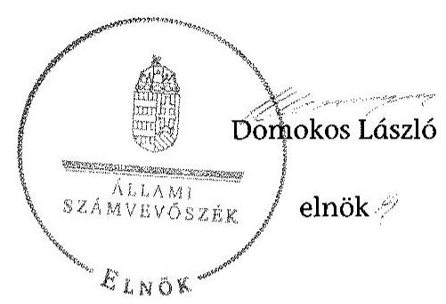

---

.

---

# RÖVIDÍTÉSEK JEGYZÉKE 

## Jogszabályok

| Alaptörvény | Magyarország Alaptörvénye (2011. április 25.) (hatályos: 2012. január 1-jétől) |
| :--: | :--: |
| Áfa tv. | Az általános forgalmi adóról szóló CXXVII. törvény (hatályos: 2008. január 1-jétől) |
| Áht. 1 | Az államháztartásról szóló 1992. évi XXXVIII. törvény (hatálytalan: 2012. január 1-jétől) |
| Áht. 2 | Az államháztartásról szóló 2011. évi CXCV. törvény (hatályos: 2012. január 1-jétől) |
| ÁSZ tv. | Az Állami Számvevőszékről szóló 2011. évi LXVI. törvény (hatályos: 2011. július 1-jétől) |
| Avtv. | A személyes adatok védelméről és a közérdekú adatok nyilvánosságáról szóló 1992. évi LXIII. törvény (hatálytalan: 2012. január 1-jétől) |
| Evt. | Az erdőről, az erdő védelméről és az erdőgazdálkodásról szóló 2009. évi XXXVII. törvény (hatályos: 2009. július 10étől) |
| Evr. | Az erdőről, az erdő védelméről és az erdőgazdálkodásról szóló 2009. évi XXXVII. törvény végrehajtásáról szóló 153/2009. (XI. 13.) FVM rendelet (hatályos: 2009. november 21 -étől) |
| Gt. | A gazdasági társaságokról szóló 2006. évi IV. törvény (hatálytalan 2014. március 15-étől) |
| Info tv. | Az információs önrendelkezési jogról és az információszabadságról szóló 2011. évi CXII. törvény (hatályos: 2011. július 27 -étől) |
| Mfbtv. | A Magyar Fejlesztési Bank Részvénytársaságról szóló 2001. évi XX. törvény (hatályos: 2001. június 15-étől) |
| Nfatv. | A Nemzeti Földalapról szóló 2010. évi LXXXVII. törvény (hatályos: 2010. szeptember 1-jétől) |
| Nvtv. | A nemzeti vagyonról szóló 2011. évi CXCVI. törvény (hatályos 2011. december 31-étől) |
| Ptk. (régi) | A Polgári Törvénykönyvről szóló 1959. évi IV. törvény (hatálytalan: 2014. március 15-étől) |
| Ptk. (új) | A Polgári Törvénykönyvről szóló 2013. évi V. törvény (hatályos: 2014. március 15-étől) |
| régi Evt. | Az erdőről és az erdő védelméről szóló 1996. évi LIV. törvény (hatályos 2009. július 9-éig) |
| Számv. tv. | A számvitelről szóló 2000. évi C. törvény (hatályos: 2001. január 1-jétől) |
| Vadvédelmi tv. | A vad védelméről, a vadgazdálkodásról, valamint a vadászatról szóló 1996. évi LV. törvény (hatályos: 1997. március 1 -jétől) |

---

Vtv.
Vhr.

2006. évi V. törvény

79/2004. (V. 4.) FVM rendelet

## Egyéb rövidítések

Adatvédelmi szabályzat

Alapító okirat
ÁSZ
Belső Ellenőrzési Szabály$\mathrm{zat}_{1}$

Belső Ellenőrzési Szabály$\mathrm{zat}_{2}$

Erdészeti hatóság $_{1}$

Erdészeti hatóság ${ }_{2}$

Eszközök és források értékelési szabályzata

Eszközök és források leltárkészítési és leltározási szabályzata
FB
FB ügyrendje
ha
IG
Igazgatóság ügyrendje
Iratkezelési Szabályzat

Leltározási szabályzat

Az állami vagyonról szóló 2007. évi CVI. törvény (hatályos: 2007. szeptember 25-étől)
Az állami vagyonnal való gazdálkodásról 254/2007. (X. 4.) Korm. rendelet (hatályos: 2007. október 4-étől)

A cégnyilvánosságról, a bírósági cégeljárásról és a végelszámolásról szóló 2006. évi V. törvény (hatályos: 2006. július 1-jétől)
A vad védelméről, a vadgazdálkodásról, valamint a vadászatról szóló 1996. évi LV. törvény végrehajtásának szabályairól

A NEFAG Zrt. adatvédelmi szabályzata (hatályos: 2013. november 6-ától)
A NEFAG Zrt. alapító okirata (hatályos: 2009. szeptember 25-étől)
Állami Számvevőszék
A NEFAG Zrt. belső ellenőrzési szabályzata (hatályos 1999. szeptember 1-jétől 2013. december 31-éig)

A NEFAG Zrt. belső ellenőrzési szabályzata (hatályos 2014. január 1-jétől)

Hajdú-Bihar Megyei Mezőgazdasági Szakigazgatási Hivatal Erdészeti Igazgatósága 2010. december 31-éig, 2011. január 1-jétől Hajdú-Bihar Megyei Kormányhivatal Erdészeti Igazgatósága
Fővárosi és Pest Megyei Mezőgazdasági Szakigazgatási Hivatal Erdészeti Igazgatósága 2010. december 31-éig, 2011. január 1-jétől Pest Megyei Kormányhivatal Erdészeti Igazgatósága
A NEFAG Zrt. Eszközök és források értékelési szabályzata (hatályos 2001. január 1-jétől, módosítva 2005. július 1jén)
A NEFAG Zrt. Eszközök és források leltárkészítési és leltározási szabályzata (hatályos 2000. január 1-jétől 2009. december 31-éig)
A NEFAG Zrt. Felügyelő bizottsága
A NEFAG Zrt. Felügyelő bizottságának ügyrendje (hatályos 2005. március 10-étől)
hektár
A NEFAG Zrt. Igazgatósága (2010. július 12-éig múködött)
A NEFAG Zrt. Igazgatóságának ügyrendje (hatályos 2006. június 29-étől 2010. július 12-éig)
A NEFAG Zrt. iktatási, iratkezelési szabályzata (hatályos 1995. április 1-jétől)

A NEFAG Zrt. Leltározási Szabályzata (hatályos: 2010.

---

|  | január 1-jétől) |
| :--: | :--: |
| M Ft | millió forint |
| NEFAG Zrt. | Nagykunsági Erdészeti és Faipari Zártkörűen Múködő Részvénytársaság |
| Kincstári Vagyonkataszter | A Kincstári Vagyoni Igazgatóság vagyon-nyilvántartási informatikai rendszere, az állam vagyonát tartja nyilván. |
| KVI | Kincstári Vagyoni Igazgatóság |
| MFB Zrt. | Magyar Fejlesztési Bank Zrt. |
| MNV Zrt. | Magyar Nemzeti Vagyonkezelő Zrt. |
| NFA | Nemzeti Földalapkezelő Szervezet |
| Önköltség számítási szabályzat | A NEFAG Zrt. önköltség számítási szabályzata (hatályos: 2009. január 1-jétől) |
| Számítástechnikai védelmi szabályzat | A NEFAG Zrt. számítástechnikai védelmi szabályzata (hatályos 2011. február 1-jétől) |
| Számviteli politika | A NEFAG Zrt. számviteli politikája (hatályos: 2009. január 1-jétől) |
| Számlarend | A NEFAG Zrt. számlarendje (hatályos: 2009. január 1jétől) |
| SZMSZ $_{1}$ | A NEFAG Zrt. Szervezeti és Múködési Szabályzata (hatályos: 2000. január 13-ától 2010. december 8-áig) |
| SZMSZ $_{2}$ | A NEFAG Zrt. Szervezeti és Múködési Szabályzata (hatályos: 2010. december 9-étől 2013. március 21-éig) |
| SZMSZ $_{3}$ | A NEFAG Zrt. Szervezeti és Múködési Szabályzata (hatályos: 2013. március 22-étől) |
| Ügyvezetés | A NEFAG Zrt. ügyvezetése, feladatát 2010. július 12-éig az Igazgatóság, 2010. július 13-ától az önálló cégjegyzésre jogosult Vezérigazgató látta el. |
| tulajdonosi joggyakorló ${ }_{1}$ | MNV Zrt. (2009. január 1-jétől 2010. június 16-áig) |
| tulajdonosi joggyakorló ${ }_{2}$ | MFB Zrt. (2010. június 17-étől 2014. július 15-éig) |
| Vadászati hatóság ${ }_{1}$ | Fővárosi és Pest Megyei Mezőgazdasági Szakigazgatási Hivatal Földmúvelésügyi Igazgatósága 2010. december 31-éig, 2011. január 1-jétől Pest Megyei Kormányhivatal Földmúvelésügyi Igazgatóság Vadászati és Halászati Osztálya |
| Vadászati hatóság ${ }_{2}$ | Jász-Nagykun-Szolnok Megyei Mezőgazdasági Szakigazgatási Hivatal Földmúvelésügyi Igazgatósága Vadászati és Halászati Osztálya 2010. december 31-éig, 2011. január 1-jétől Jász-Nagykun-Szolnok Megyei Kormányhivatal Földmúvelésügyi Igazgatóság |
| Vezérigazgató | A NEFAG Zrt. vezérigazgatója |
| VSZ | ideiglenes vagyonkezelői szerződés (hatályos: 1996. október 14-étől) |

---

.

---

# FOGALOMTÁR 

állami vagyon
a) az állam tulajdonában lévő dolog, valamint dolog módjára hasznosítható természeti erő;
b) az a) pont hatálya alá tartozó mindazon vagyon, amely vonatkozásában törvény az állam kizárólagos tulajdonjogát nevesíti;
c) az állam tulajdonában lévő tagsági jogviszonyt megtestesítő értékpapír, illetve az államot megillető egyéb társasági részesedés;
d) az államot megillető olyan immateriális, vagyoni értékkel rendelkező jogosultság, amelyet jogszabály vagyoni értékű jogként nevesít;
e) az állam tulajdonában lévő pénzügyi eszközök.
állami vagyon használója
Az állami vagyon használója az a természetes vagy jogi személy, jogi személyiséggel nem rendelkező szervezet, aki, vagy amely törvény vagy szerződés alapján, bármely jogcímen (bérlet, haszonbérlet, használat stb.) állami vagyont birtokol, használ, szedi annak hasznait. (Ide nem értve a haszonélvezőt, a vagyonkezelőt és a tulajdonosi jogok gyakorlóját.)
átlátható szervezet Átlátható szervezet a Nvtv. 3. § (1) bekezdés 1. pontjában felsorolt, a meghatározott követelményeknek megfelelő szervezet.
földbirtok-politikai irányelvek
hasznosítás
immateriális szolgáltatásból származó bevétel
információs és kommunikációs rendszer
kockázatkezelés
kockázatkezelési rendszer

Az Nfatv. 15. § (3) bekezdés a)-s) pontjaiban meghatározott, a Nemzeti Földalapba tartozó földrészletek hasznosítására vonatkozó irányelvek.
Hasznosítás a tulajdonosi joggyakorló vagy a nemzeti vagyon használója által a nemzeti vagyon birtoklásának, használatának, hasznok szedése jogának bármely - a tulajdonjog átruházását nem eredményező - jogcímen történő átengedése, ide nem értve a vagyonkezelésbe adást, valamint a haszonélvezeti jog alapítását.
Immateriális szolgáltatásból származó bevételek azok a nem anyagjellegű szolgáltatásokból származó állami bevételek, amelyeket az Evt. 3. § (1) bekezdése szerint, a külön jogszabályban meghatározott részletes feltételek szerint, az erdők fenntartására, gyarapítására és védelmére kell fordítani.
Az információs és kommunikációs rendszer biztosítja, hogy az információk eljussanak az illetékes szervezethez, szervezeti egységhez, illetve személyhez.
A kockázatkezelés a szervezet céljai elérésével kapcsolatos kockázatok azonosításának és elemzésének, valamint a megfelelő válaszok meghatározásának folyamata.
A kockázatkezelési rendszer múködtetése során fel kell mérni és meg kell állapítani a szervezet tevékenységében, gazdálkodásában rejlő kockázatokat, valamint meg kell határozni az egyes kockázatokkal kapcsolatban szükséges intézkedéseket,

---

|  | valamint azok teljesítésének folyamatos nyomon követésének módját.   A kockázatkezelési rendszer olyan irányítási eszközök és módszerek összessége, amelynek elemei a szervezeti célok elérését veszélyeztető tényezők (kockázatok) azonosítása, elemzése, nyomon követése, valamint szükség esetén a kockázati kitettség mérséklése. |
| :--: | :--: |
| kontrolling | Az a vezetéstámogató rendszer, amely a vezetői tervezést, ellenőrzést, valamint információ-ellátást koordinálja célorientáltan a környezeti változásokhoz igazodva. |
| kontrollkörnyezet | A kontroll környezet elemei: a szervezeti struktúra, a felelősségi, hatásköri viszonyok és feladatok, a szervezet minden szintjén meghatározott etikai elvárások, a humánerőforráskezelés. A kontrollkörnyezet alapozza meg a belső kontroll összes többi elemét a fegyelem és a struktúra biztosítása által. |
| kontrollrendszer | A kontrollrendszer a kockázatok kezelése és tárgyilagos bizonyosság megszerzése érdekében kialakított folyamatrendszer, amely azt a célt szolgálja, hogy megvalósuljanak a következő célok: $\square$   a) a múködés és a gazdálkodás során a tevékenységeket szabályszerűen, gazdaságosan, hatékonyan, eredményesen hajtsák végre,   b) az elszámolási kötelezettségeket teljesítsék, és   c) megvédjék az erőforrásokat a veszteségektől, károktól és nem rendeltetésszerú használattól. |
| kontrolltevékenységek | A kontrolltevékenységek azok az elvek (politikák) és eljárások, amelyeket a kockázatok meghatározása és a szervezet céljainak elérése érdekében alakítanak ki. |
| közfeladat | A közfeladat jogszabályban meghatározott állami vagy önkormányzati feladat, amit az arra kötelezett közérdekből, jogszabályban meghatározott követelményeknek és feltételeknek megfelelve végez, ideértve a lakosság közszolgáltatásokkal való ellátását, továbbá az állam nemzetközi szerződésekben vállalt kötelezettségeiből adódó közérdekú feladatokat, valamint e feladatok ellátásához szükséges infrastruktúra biztosítását is.   Az Evt. 2. § (2) bekezdése szerint a fenntartható erdőgazdálkodás során a legfontosabb közérdekú feladat az erdők változatosságának megőrzése, az erdők fenntartása, felújítása és a védelmi, valamint közjóléti szolgáltatások biztosítása, melyek elvégzését az állam megfelelő eszközökkel biztosítja. |
| monitoring | A szervezet tevékenységének, a célok megvalósításának nyomon követését biztosító rendszer, amely az operatív tevékenységek keretében megvalósuló folyamatos és eseti nyomon követésből, valamint az operatív tevékenységektől függetlenül múködő belső ellenőrzésből áll.   A monitoring a projektek és programok végrehajtásának nyomon követése, mely a támogató és a kedvezményezett |

---

|  | közti megállapodásban foglalt eljárások követését, az előrehaladás ellenőrzését és a lehetséges problémák időben történő azonosítását szolgálja. |
| :--: | :--: |
| Nemzeti Földalap | A Nemzeti Földalap a kincstári vagyon része, amelybe beletartoznak az állam tulajdonában és az ingatlan-nyilvántartásban levő, az Nfatv. 1. § (1)-(2) bekezdéseiben felsorolt területek, földrészletek és az azokhoz kapcsolódó vagyoni értékű jogok. |
| nemzeti vagyon használója | A nemzeti vagyon használója az a természetes személy, jogi személy vagy jogi személyiséggel nem rendelkező szervezet, aki, vagy amely állami vagyon tekintetében törvény vagy szerződés alapján, a helyi önkormányzat vagyona tekintetében törvény, a helyi önkormányzat rendelete vagy szerződés alapján bármely jogcímen nemzeti vagyont birtokol, használ, szedi annak hasznait, kivéve a tulajdonosi joggyakorló (az Nvtv. 3. § (1) bekezdés 11. pontja alapján). |
| rábízott állami vagyon | Rábízott állami vagyon az a Vtv. alkalmazásában állami vagyonnak minősülő vagyon, amit az MNV- a saját vagyonától elkülönítetten - kezel és nyilvántart.   Az Mfbtv. 3. § (9) bekezdése szerint rábízott állami vagyon az a vagyon, amely felett az Mfbtv. erejénél fogva a Magyar Állam nevében az MFB gyakorolja a tulajdonosi jogokat.   Az Nfatv. 1. § (1) bekezdésében foglaltak alapján az NFA-hoz tartozó rábízott vagyon a törvényben meghatározott, a Nemzeti Földalapba tartozó vagyon. |
| társasági portfólió | Társasági portfólió az MNV, illetve az MFB rábízott vagyonába tartozó állami tulajdonú társasági részesedések. |
| tulajdonosi ellen-   örzés | A tulajdonosi joggyakorló által végzett ellenőrzés, amelynek célja az állami vagyonnal való gazdálkodás vizsgálata, ennek keretében a rendeltetésellenes, jogszerütlen, szerződésellenes, vagy a tulajdonos érdekeit sértő, illetve a központi költségvetést hátrányosan érintő vagyongazdálkodási intézkedések feltárása és a jogszerú állapot helyreállítása, továbbá a vagyonnyilvántartás hitelességének, teljességének és helyességének biztosítása. |
| tulajdonosi joggyakorló | Tulajdonosi joggyakorló az, aki az állami, illetve a nemzeti vagyon felett az államot megillető tulajdonosi jogok és kötelezettségek gyakorlására jogosult. |
| tulajdonosi joggyakorlás módja | Az állami vagyon felett a Magyar Államot megillető tulajdonosi jogoknak (és kötelezettségeknek) az összességét az állami vagyon felügyeletéért felelős miniszter gyakorolja, aki e feladatát az MNV, az MFB, illetve egyéb tulajdonosi joggyakorló szervezet (pl. központi költségvetési szervek, 100\%-ban állami tulajdonban álló gazdasági társaságok) útján látja el. Azon állami tulajdonban álló ingatlanok felett, amelyek egy része a Nemzeti Földalapba tartozik, a tulajdonosi jogokat a miniszter az agrárpolitikáért felelős miniszterrel közösen gyakorolja. |

---

vagyongazdálkodás feladata
vagyonkezelői jog

A Nemzeti Földalap felett a Magyar Állam nevében a tulajdonosi jogokat és kötelezettségeket az agrárpolitikáért felelős miniszter a Nemzeti Földalapkezelő Szervezet útján gyakorolja.
Az állami vagyon rendeltetésének megfelelő - az állami feladatok ellátásához, a társadalmi szükségletek kielégítéséhez, valamint a Kormány gazdaságpolitikája megvalósításának elősegittéséhez szükséges, egységes elveken alapuló, önálló ágazatként megjelenő - hatékony, költségtakarékos, értékmegőrző, értéknövelő felhasználásának biztosítása, beleértve a vagyoni kör változását eredményező értékesítést, valamint az állami vagyon gyarapítása is.
Vagyonkezelési szerződés alapján a vagyonkezelő jogosult meghatározott, állami tulajdonba tartozó dolog birtoklására, használatára és hasznai szedésére.
A Vtv. alapján a vagyonkezelői jog az állami vagyon hasznosítására az MNV-vel kötött vagyonkezelési szerződéssel jön létre. A vagyonkezelési szerződés alapján a vagyonkezelő jogosult meghatározott, állami tulajdonba tartozó dolog birtoklására, használatára és hasznai szedésére.
Az Nfatv. alapján a vagyonkezelői jog az erre irányuló (NFAval kötött) szerződéssel jön létre. A vagyonkezelői szerződés alapján a vagyonkezelő jogosult meghatározott földrészlet birtoklására, használatára és hasznai szedésére. A vagyonkezelő köteles a földrészlet értékét megőrizni, állagának megóvásáról, jó karban tartásáról gondoskodni, továbbá - az Nfatv.-ben meghatározott esetek kivételével díjat - fizetni vagy a szerződésben előírt más kötelezettséget teljesíteni.

---

A NEFAG Zrt. vagyonának alakulása a 2009-2013. évek közötti időszakban eszközök (M Ft)
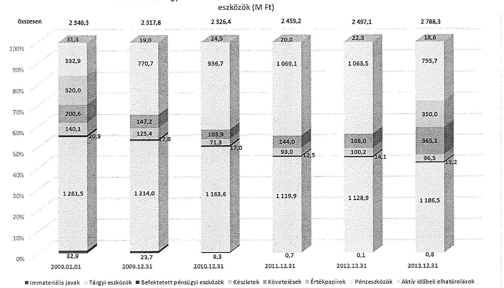

---

A NEFAG Zrt. vagyonának alakulása a 2009-2013. évek közötti időszakban források (M Ft)
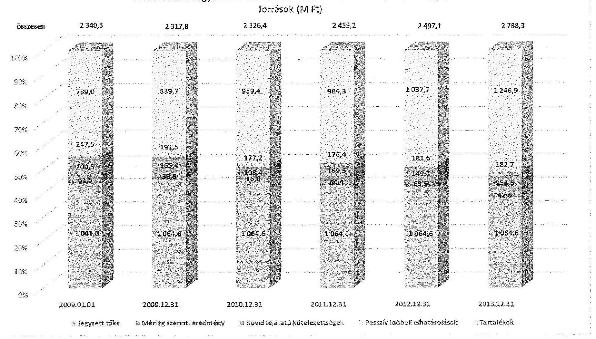

---

# Kimutatás a NEFAG Zrt. befektetett eszközei állományának alakulásáról a 2009-2014. I. féléve közötti időszakra vonatkozóan

adatok ezer Ft-ban

|  Sorszám | MEGNEVEZÉS | 2009. év |  |  | 2010. év |  |  | 2011. év |  |  | 2012. év |  |  | 2013. év |  |  | 2014.06.30.* |  |   |
| --- | --- | --- | --- | --- | --- | --- | --- | --- | --- | --- | --- | --- | --- | --- | --- | --- | --- | --- | --- |
|   |  | Összesen | Állami | Saját | Összesen | Állami | Saját | Összesen | Állami | Saját | Összesen | Állami | Saját | Összesen | Állami | Saját | Összesen | Állami | Saját  |
|   | 1. | 2. | 3. | 4. | 5. | 6. | 7. | 8. | 9. | 10. | 11. | 12. | 13. | 14. | 15. | 16. | 17. | 18. | 19.  |
|  1. | Nyitó állomány | 1315374 |  | 1315374 | 1255545 |  | 1255545 | 1189892 |  | 1189892 | 1133061 |  | 1133061 | 1143101 |  | 1143101 | 1202471 |  | 1202471  |
|  2. | Terv szerinti értékcsökkenés | 143867 |  | 143867 | 143856 |  | 143856,0 | 137796 |  | 137796,0 | 133202 |  | 133202,0 | 113841 |  | 113841,0 | 56973 |  | 56973,0  |
|  3. | Terven felüli értékcsökkenés | 11967 |  | 11967 | 0 |  | 0,0 | 3244 |  | 3244,0 | 10384 |  | 10384,0 | 3713 |  | 3713,0 | 0 |  |   |
|  4. | Értékvesztés elszámolása | 1589 |  | 1589 | 0 |  | 0,0 | 2370 |  | 2370,0 | 0 |  | 0,0 |  |  |  | 0 |  |   |
|  5. | Értékesítés | 25335 |  | 25335 | 2134 |  | 2134,0 | 0 |  | 0,0 | 5301 |  | 5301,0 | 9951 |  | 9951,0 | 10701 |  | 10701,0  |
|  6. | Selejtezés | 5503 |  | 5503 | 40 |  | 40,0 | 96,0 |  | 96,0 | 1230 |  | 1230,0 | 4146 |  | 4146,0 | 0 |  |   |
|  7. | Átminősítés |  |  |  | 0 |  |  | 0 |  |  | 0 |  |  | 0 |  |  | 0 |  |   |
|  8. | Ingyenes átadás |  |  |  | 0 |  |  | 0 |  |  | 0 |  |  | 0 |  |  | 0 |  |   |
|  9. | Egyéb | 1570 |  | 1570 | 916 |  | 916,0 | 2333 |  | 2333,0 |  |  |  | 0 |  |  | 0 |  |   |
|  10. | Csökkenés összesen | 189831 | 0 | 189831 | 146946 | 0 | 146946 | 145839 | 0 | 145839 | 150117 | 0 | 150117 | 131651 | 0 | 131651 | 67674 | 0 | 67674  |
|  11. | Terv szerinti beruházás | 130002 |  | 130002 | 81293 |  | 81293,0 | 89008 |  | 89008,0 | 160157 |  | 160157,0 | 191021 |  | 191021,0 | 89595 |  | 89595,0  |
|  12. | Terv szerinti felújítás |  |  |  | 0 |  |  | 0 |  |  | 0 |  |  | 0 |  |  | 0 |  |   |
|  13. | Terv szerinti növekedés | 130002 | 0 | 130002 | 81293 | 0 | 81293 | 89008 | 0 | 89008 | 160157 | 0 | 160157 | 191021 | 0 | 191021 | 89595 | 0 | 89595  |
|  14. | Egyéb beruházás |  |  |  | 0 |  |  | 0 |  |  | 0 |  |  | 0 |  |  | 0 |  |   |
|  15. | Egyéb felújítás |  |  |  | 0 |  |  | 0 |  |  | 0 |  |  | 0 |  |  | 0 |  |   |
|  16. | Átminősítés |  |  |  | 0 |  |  | 0 |  |  | 0 |  |  | 0 |  |  | 0 |  |   |
|  17. | Átvétel |  |  |  | 0 |  |  | 0 |  |  | 0 |  |  | 0 |  |  | 0 |  |   |
|  18. | Értékvesztés visszajrása |  |  |  | 0 |  |  |  |  |  |  |  |  | 0 |  |  | 0 |  |   |
|  19. | Értékcsökkenés visszajrása |  |  |  | 0 |  |  | 0 |  |  | 0 |  |  |  |  |  | 0 |  |   |
|  20. | Egyéb |  |  |  | 0 |  |  | 0 |  |  |  |  |  |  |  |  |  |  |   |
|  21. | Terven felüli növekedés |  |  |  | 0 | 0 | 0 | 0 | 0 | 0 | 0 | 0 | 0 | 0 | 0 | 0 | 0 | 0 | 0  |
|  22. | Növekedés összesen | 130002 | 0 | 130002 | 81293 | 0 | 81293 | 89008 | 0 | 89008 | 160157 | 0 | 160157 | 191021 | 0 | 191021 | 89595 | 0 | 89595  |
|  23. | Záró állomány | 1255545 |  | 1255545 | 1189892 | 0 | 1189892 | 1133061 | 0 | 1133061 | 1143101 | 0 | 1143101 | 1202471 | 0 | 1202471 | 1224392 | 0 | 1224392  |

---

.

---

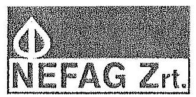

NEFAG Nagykunsági Erdészeti és Faipari Zártkörüen Müködő Részvénytársaság

ÁLLAMI SZÁMVEVŐSZÉK
Domokos László
elnök úr
részére

## Budapest

Apáczai Csere János utca 10. 1052

Kelt:
Úgyiratszám:
Hiv. szám:
Úgyintézőnk:
Úgyintézőjük:
Tárgy:

Szolnok, 2015. 10. 27.
KV - 112 /2015.

Észrevétel jelentéstervezetre

ÁLLAMI SZÁMVEVŐSZÉK
R. 540/2011
Érkeze: 2015 OKT 2 a
Iktatószám: 1-0762-070/2015
Melléklet:

Bohdni a

Tisztelt Elnök Úr!

Hivatkozással a NEFAG Nagykunsági Erdészeti és Faipari Zártkörüen Müködő Részvénytársaság (rövidített neve: NEFAG Zrt., székhelye: 5000. Szolnok, Kaán Károly utca 71.sz., cégjegyzékszámą: Cg. 16-16-001563, képviselő: Dégi Zoltán Géza vezérigazgató) részére megküldött „Az állami tulajdonban álló erdőgazdasági társaságo k vagyongazdalkodási tevékenységének ellenőrzése - NEFAG Nagykunsági Erdészeti és Faipari Zrt" címmel készített V-0762-070/2015, iktatószámú számvevőszéki jelentéstervezetre, a NEFAG Zrt. részéről az alábbi

észrevételeket

tesszük:

A NEFAG Zrt. a Magyar Állam tulajdonában álló erdővagyon és egyéb művelési ágú termőföld ingatlanok kezelését a KVI-vel 1996. október 14-én kötött Ideiglenes vagyonkezelési szerződés alapján végzi, amely feladatának maradéktalanul eleget tesz.

Az ideiglenes vagyonkezelési szerződés 2.3. pontja értelmében az ideiglenesen vagyonkezelésbe adott, a Magyar Állam tulajdonában illetve a Rt. használatában álló vagyonelemek átadás-átvételét a szerződés megkötését követően tételes vagyonleltárral kell alátámasztani az 1., 2., és 3. számú mellékletek tekintetében, mely vagyonleltár a vagyonkezelési szerződés 4. számú mellékletét képezi. Az ideiglenes vagyonkezelési szerződés mellékletei sem a szerződés aláírását követően, sem az Állami Számvevőszék vizsgálatának időpontjában nem voltak feltelhetők a társaságnál.

A NEFAG Zrt. egyetért az Állami Számvevőszék azon törekvésével, hogy - a törvényi előírásoknak megfelelően - az állami tulajdonú, kezelésbe vett vagyonelemek - a saját vagyontól elkülönítve - kimutatásra kerüljenek a társaság mérlegében, de ennek elmaradását megítélésünk szerint nem a társaság, hanem elsősorban a KVI, illetve annak jogutódja egyeztetést elmulasztó magatartása és a végleges vagyonkezelési szerződés hiánya idézte elő.

H-5000 Szolnok, Kaán Károly utca 71.
Telefon: (36) 56/512-110
Fax: (36) 56/512-120
www.nefag.hu
e-mail: nefag@nefag.hu

Cégjegyzékszám: Jasz-Nagykun-Szolnok Magyar Bíróság mint Cégbíróság Cg. 16-16-001563
Adószám: 11268369-2-18 Bankszámbeszám: MKB Bank Zrt. 10300002-45412156-00003295

CERT
001 1446

---

A NEFAG Zrt. nem volt és jelenleg sincs olyan hiteles dokumentáció birtokában, amely alapján eleget tudna tenni a hatályos jogszabályi követelményeknek, így sem az állami vagyonnal való gazdálkodásról szóló 254/2007. (X. 4.) Korm.rendelet 9. § (9) bekezdés a) pontjában, sem a számvitelről szóló 2000 . évi C. törvény 42. § (5) bekezdésében elóirtaknak.

# Összegzö megállapítások, következtetések, javaslatok 

## 6. oldal 1. bekezdés megállapítás:

„A Társaság a Számv. tv. előirása ellenére a mérlegben nem mutatta ki eszközként a kezelésbe vett, az állami vagyon részét képező eszközöket, ezáltal a Társaság mérlege nem volt megbízható, mert nem a valós állapotot tükrözte. A kezelt vagyon mérleglételek szerinti megbontása és értékének változása a kiegészítő mellékletben sem került bemutatásra, amely ugyancsak nem felett meg a Számv. tv. előírásainak."

## Észrevétel:

A NEFAG Zrt. a vizsgálattal érintett időszakban az adott évek éves beszámolójának és mérlegének összeállítása során kellő körültekintéssel, a jogszabályi és szakmai előírások betartásával járt el, a társaság éves beszámolói megbízható és valós adatokat tartalmaznak.
A Társaság a rendelkezésére álló számviteli bizonylatoknak valamint a vizsgálattal érintett időszakban hatályos IN-01840-96-02064 számú Ideiglenes vagyonkezelési szerződésnek megfelelően, helyesen a Nyilvántartási számlák között (0-ás Számlaoszlály) tartotta nyilván a vagyonkezelésbe vett eszközöket nulla értékben.

A 254/2007. (X.4.) Kormányrendelet az állami vagyonnal való gazdálkodásról 9 §. (9) a) pontja szerint a vagyonkezelő köteles a vagyonkezelésbe vett eszközöket a számvitelről szóló törvény előírásai szerint a hosszú lejáratú kötelezettségekkel szemben a vagyonkezelési szerződésben rögzített értéken állományba venni. Tekintettel arra, hogy a számviteli nyilvántartás alapdokumentuma - az 1996. október 14. napján a Kincstári Vagyoni Igazgatósággal kötött Ideiglenes vagyonkezelési szerződés - a vagyonkezelésbe adott eszközökre vonatkozóan nem tartalmaz értéket, a Társaság nem mutathatta ki mérlegében eszközként az állami vagyon részét képező eszközöket. A Társaság az Ideiglenes vagyonkezelési szerződés 2.4 pontjában megfogalmazott kötelezettségének, miszerint „A Vagyonkezelő az erdővagyon állományáról és változásáról naturáliákban nyilvántartást vezet." eleget tett. A kezelt vagyonra vonatkozóan a Társaság által készített Kiegészítő mellékletek az alábbi információt tartalmazták: „A társaság mint vagyonkezelő - 31,8 ezer, ha állami területen gazdálkodik vagyonkezelési szerződés alapján. A szerződésben a vagyonkezelt területekre, erdőkre vonatkozóan nem szerepel érték, ezért azok a mérlegben értékkel nem, de a 0 -s számlaosztályban 0 értékkel kerülnek kimutatásra."

## 6. oldal 2. bekezdés megállapítás:

„A vagyonkezelésében lévő állami vagyonról vezetett nyilvántartás nem felett meg a Vhr.-ben foglaltaknak, mert tételesen nem tartalmazta a vagyonkezelt eszközök könyvszerinti bruttó és nettó értékét, valamint az értékben bekövetkezett változásokat."

---

# Észrevétel: 

A Jelentéstervezet 6. oldalának 4. bekezdésében megállapításra került, hogy a vagyonkezelési szerződés a hatályos jogszabályi előírásoknak nem felelt meg, a vagyonkezelési szerződés melléklete a Társaságnál nem állt rendelkezésre.
Álláspontunk szerint a vagyonkezelésbe adó felelőssége az a hiányosság, hogy a vagyonkezelésbe adott állami vagyon értéke nem került meghatározásra, aminek következtében a Társaság csak naturáliákban vezethetett nyilvántartást.

## 8. oldal 6. bekezdés megállapítás:

„A Társaság az Avtv. és az Info tv. előírásai ellenére a közérdekủ adatok megismerésére irányuló igények teljesítésének rendjét rögzítő szabályzattal nem rendelkezett, továbbá a honlapján közzétett adatok nem voltak teljes körűek."

## Észrevétel:

Az információszabadságról szóló 2011. évi CXII. törvény (továbbiakban: Infotv.) 26. § előírja, hogy az állami vagy helyi önkormányzati feladatot, valamint jogszabályban meghatározott egyéb közfeladatot ellátó szervnek vagy személynek (a továbbiakban együtt: közfeladatot ellátó szerv) lehetővé kell tennie, hogy a kezelésében lévő közérdekủ adatot és közérdekből nyilvános adatot - az e törvényben meghatározott kivételekkel - erre irányuló igény alapján bárki megismerhesse. Az Infotv. 30.§ (6) bekezdése előírja, hogy a közfeladatot ellátó szervnek a közérdekủ adatok megismerésére irányuló igények teljesítésének rendjét rögzítő szabályzatot kell készítenie.
A közfeladat fogalmát a nemzeti vagyonról szóló 2011. évi CXCVI. törvény (Nvt.) 3. § (1) bekezdésének 7. pontja a következőképpen határozta meg: „7. közfeladat: jogszabályban meghatározott állami vagy önkormányzati feladat, amit az arra kötelezett közérdekböl, jogszabályban meghatározott követelményeknek és feltételeknek megfelelve végez, ideértve a lakosság közszolgáltatásokkal való ellátását, továbbá az állam nemzetközi szerzödésekben vállalt kötelezettségeiböl adódó közérdekü feladatokat, valamint e feladatok ellátásához szükséges infrastruktúra biztositását is". Ezen rendelkezés a törvény hatályba lépésétől kezdve egészen az Állami Számvevőszék által vizsgált időszak végéig hatályban volt. A hivatkozott jogszabályhelyet a 2014. évi XCIX. törvény 378. §-a 2015. január 1-től hatályon kívül helyezte.

A közfeladat fogalmát ugyanezen jogszabály 12. §-a az államháztartásról szóló 2011. évi CXCV. törvény (Áht.) I. Fejezetébe építette be. Ez jogszabály 3/A. § bekezdése értelmében
„(1) Közfeladat a jogszabályban meghatározott állami vagy önkormányzati feladat.
(2) A közfeladatok ellátása költségvetési szervek alapításával és müködletésével vagy az azok ellátásához szükséges pénzügyi fedezet e törvényben meghatározott eszközökkel, részben vagy egészben történő biztosításával valósul meg. A közfeladatok ellátásában államháztartáson kivüli szervezet jogszabályban meghatározott rendben közremüködhet.
(3) A közfeladatot meghatározó jogszabályban meg kell határozni a közfeladat ellátásának módját és egyidejüleg rendelkezni kell az annak ellátásához szükséges pénzügyi fedezet biztosításáról. Új közfeladat kizárólag az annak ellátásához megfelelő pénzügyi fedezet rendelkezésre állása esetén írható elő vagy vállalható. Ha a pénzügyi fedezet már nem áll rendelkezésre, intézkedni kell a pénzügyi fedezet biztosításáról vagy a közfeladat megszüntetéséről."

Az erdőről, az erdő védelméről és az erdőgazdálkodásról szóló 2009. évi XXXVII. törvény (Etv.) 2. § (2) bekezdése szerint „A fenntartható erdőgazdálkodás során a legfontosabb közérdekủ feladat az erdők változatosságának megőrzése, az erdők fenntartása, felújítása és a

---

védelmi, valamint közjöléti szolgáltatások biztosítása, melyek elvégzését az állam megfelelő eszközökkel biztosítja."

Ez az ún. tartamos erdőgazdálkodás követelménye, melyet az Etv. elvi jelleggel határoz meg az alapelvei között jelenik meg. A hivatkozott közérdekü feladat nem az Nvt. és Áht. szerinti közfeladat, hanem egy olyan alapelv, melynek érvényesülését maga az erdőtörvény és az ahhoz kapcsolódó jogszabályok szolgálják. Fontos tehát kiemelni, hogy a közfeladat meghatározásától elhatárolandóak azok a jogszabályi rendelkezések, amelyek elvi jelleggel adnak iránymutatást egyes közérdekü feladattal kapcsolatos további jogi szabályozás illetve egyéb jövőbeni (hatósági) rendelkezés tárgyában. Az állami tulajdonban lévő erdőkre egyedül az Etv. 8-10. §-ai fogalmaznak speciális előírásokat. Ezek közül ki kell térni az Evt. 9. § (2) bekezdésére, mely értelmében „Az állam $100 \%$-os tulajdonában álló erdő és erdőgazdálkodási tevékenységet közvetlenül szolgáló földterület vagyonkezelését csak költségvetési szerv vagy száz százalékos állami tulajdonú gazdálkodó szervezet végezheti. Tény, hogy az Evt. 9. §-a az állam vonatkozásában, a vagyonkezelésbe adással kapcsolatosan fogalmaz meg előírást, más részére közfeladatot nem határoz meg, ellátásnak módját és annak pénzügyi fedezetét sem szabályozza. A NEFAG Zrt. korábban hatályos Alapitó Okiratainak és jelenleg érvényben lévő Alapszabályának az áttekintése során megállapítható, hogy az alapításának és müködésének alapvető szabályairól rendelkező előírások közfeladat ellátására nem utalnak.
A fentiek alapján, megítélésünk szerint, a NEFAG Zrt. a 2011. évi CXCVI. törvény (Nvt.) 3. § (1) bekezdésének 7. pontja szerint, illetőleg a 2015.01.01. napjától hatályos 2011. évi CXCV. törvény 1. Fejezet 3/A. § szerint - figyelemmel a jogalkotói szándékra és a fent kifejtett jogértelmezésre - nem minősül közfeladatot ellátó szervezetnek, ezért a közérdekü adatok megismerésére irányuló igények teljesítésének rendjét rögzítő szabályzatot nem kell elkészítenie.

# 14. oldal 1. bekezdés megállapítás: 

„Az ellenőrzött időszakban a Társaság befektetett eszközeinek értéke - a saját vagyon csökkent.

## Észrevétel:

Az ellenőrzött időszakban a Társaság befektetett eszközeinek értéke csökkent, ugyanakkor a saját vagyon a 2009. január 1-jei 1866 M Ft-ról 2013. december 31-re 266,7 M Ft-tal (14,3 $\%$-kal) emelkedett.
A fentiekben ismertetett indokokra tekintettel kérjük, hogy a jelentéstervezethez kapcsolódó észrevételenket, pontosítási javaslatainkat a végleges jelentés elkészítése során figyelembe venni szíveskedjenek.

Szolnokon, 2015. október 26. napján.

Tisztelettel:
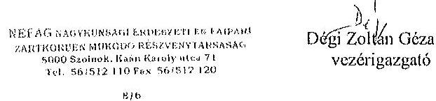

---

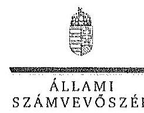

# Elnök 

Ikt.szám: V-0762-078/2015.

## Dégi Zoltán Géza úr

vezérigazgató
NEFAG Zrt.

## Szolnok

## Tisztelt Vezérigazgató Úr!

A ,, Jelentéstervezet az állami tulajdonban álló erdőgazdasági társaságok vagyongazdálkodási tevékenységének ellenörzése - NEFAG Nagykonsági Erdészeti és Fatpari Zrt." címmel készített számvevőszéki jelentéstervezetre tett észrevételeit köszönettel megkaptam.

Az Állami Számvevőszék észrevételekre vonatkozó álláspontjáról a felügyeleti vezető által készített részletes tájékoztatást csatoltan megküldöm.

Tájékoztatom Vezérigazgató urat, hogy a számvevőszéki jelentésben - az Állami Számvevőszékről szóló 2011. évi LXVI. törvény 29. § (3) bekezdése alapján - a figyelembe nem vett észrevételeket szerepeltetjük az elutasítás indokának feltüntetésével.

Budapest, 2015. 21. hó 3.5 nap
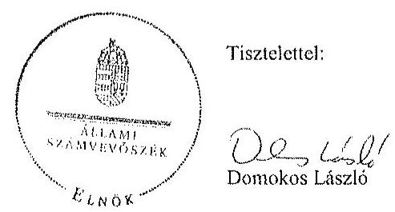

Melléklet: Tájékoztatás az elfogadott és el nem fogadott észrevételekről

---

# Tájékoztatás   az elfogadott és az el nem fogadott észrevételekről 

A „Jelentéstervezet az állami tulajdonban álló erdőgazdasági társaságok vagyongazdálkodási tevékenységének ellenőrzése - NEFAG Nagykausági Erdészeti és Faiport Zrt." címú jelentéstervezetre 2015. október 29-én érkezett észrevételeit áttekintettük, azok kezelésével kapcsolatban a következő tájékoztatást adom.
Az általános észrevételük első részében leírtak alátámasztják a vagyonkezelési szerződés mellékleteinek hiányára vonatkozó - a jelentéstervezet 6. oldal utolsó bekezdésében található megállapításunkat. A tényleges állapotnak és a hatályos jogszabályi előírásoknak megfelelő vagyonkezelési szerződés (a továbbiakban: VSZ) megkötésének elmaradásával kapcsolatos véleményük a megállapításunk tényszerüségét nem befolyásolják, ezért a VSZ-szel kapcsolatos megállapítások módosítása nem indokolt.

## 1. A jelentéstervezet 6. oldal első bekezdésére tett észrevétel

Az észrevételben leírtak a Társaság mérlegeivel kapcsolatosan tett megállapítást nem cáfolják. A Társaság mint vagyonkezelő a Vhr. 9. § (9) bekezdésében előírt kötelezettségét nem teljesítette, mert a Számv. tv. 23. § (2) bekezdése szerint a mérlegében eszközként nem mutatta ki a kezelésbe vett, az állami vagyon részét képező eszközöket, és ezen eszközöket a kiegészítő mellékletben - legalább mérlegtételek szerinti megbontásban - külön nem mutatta be. A Társaság a Vhr. és a Számv. tv. előírásainak betartása céljából nem tett lépéseket annak érdekében, hogy a vagyonkezelı eszközök értéke a VSZ-ben rögzítésre kerüljön. Az előzőek alapján megállapításunk helytálló, módosítása nem indokolt.

## 2. A jelentéstervezet 6. oldal 2. bekezdésére tett észrevétel

Az észrevétclükben a vagyonkezelı eszközök nyilvántartásának hiányosságaival kapcsolatos megállapítást nem cáfolják, ezért annak módosítása nem indokolt.

## 3. A jelentéstervezet 8. oldal 6. bekezdésére tett észrevétel

A közérdekủ adatok megismerésére irányuló igények teljesítésének rendjét rögzítő szabályzatkészítési kötelezettségre vonatkozó megállapításunkra tett észrevételükre tájékoztatom arról, hogy az Avtv. 20. § (8) bekezdésében, illetve az Infotv. 30. § (6) bekezdésében foglaltak alapján, valamint az állami vagyonzól szóló 2007. évi CVI. törvény 5. § (2) bekezdése szerint az állami vagyonnal gazdálkodó vagy azzal rendelkező szerv vagy személy a közérdekủ adatok nyilvánosságáról szóló törvény szerinti közfeladatot ellátó szervnek vagy személynek minősül. A NEFAG Zrt. állami vagyonnal gazdálkodik, közfeladatot ellátó szervnek minősül, ezért el kell készítenie a közérdekủ adatok

---

megismerésére irányuló igények teljesitésének rendjét rögzítő szabályzatot. Megállapításunk helytálló, módosítása nem indokolt.

# 4. A jelentéstervezet 14. oldal első bekezdésére tett észrevétel 

A dokumentumokat ismételten áttekintettük és a jelentéstervezet véglegesítése során az egyértelműség érdekében a jelzett mondatból „a saját vagyon" kifejezést töröljük. Az észrevétclükben javasolt kiegészítés a saját tőkére vonatkozóan szerepelt a jelentéstervezet 13. oldal első bekezdésében.

Budapest, 2015. // hó 32 nap

Makkai Mária
felügyeleti vezető

---

.

---

# 7. SZÁMÚ MELLÉKLET A V-0762-084/2015. SZÁMÚ JELENTÉSHEZ 

## 4258

## 41.1.111 SZÁMVEVÓSZÉK   6230/2015   Eikese: 2015 NOV 02

Állami Számvevőszék
Domokos László
elnök

1052 Budapest
Apáczai Cs. J. u. 10.

Ikt. sz.: MNV/01/50752/ 1 /2015.
Hiv. sz.: V-0762-072/2015.
Tisztelt Elnök Úr!
A 2015. október 15. napján „Az állami tulajdonban álló erdőgazdasági társaságok vagyongazdálkodási tevékenységének ellenőrzése - NEFAG Nagykonsági Erdészeti és Fatpari Zrt.." tárgyában kézhez vett V-0762072/2015. ikt. sz. Jelentés-tervezetre az alábbi észrevételeket kívánom tenni.

1. fejezet / 6. old. negyedik bekezdés, 7. old. első bekezdés, 9. old. első-ötödik bekezdés, II.2.1. fejezet / 17. old. hatodik bekezdés, II.5. fejezet / 32. old. harmadik bekezdés és 10. old. Javaslat az MNV Zrt. vezérigazgatójának (t)-c) pontok
„A VSZ a hatályos jogszabályi elöirásoknak nem felett meg, azok változásával a szerzödés aktualizálására nem került sor. ... A szerződő felek nem tettek eleget továbbá a Vhr.-ben foglalt rendelkezésnek és a Vhr. hatálybalépését követő hat hónapon belül nem kezdeményezték a Nemzeti Földalapba tartozó ingatlanokra vonatkozóan a VSZ megszüntetését, és a Vrv. illetve Vhr. szabályoknak megfelelő szerzödés megkötését."
„A Tulajdonosi joggyakorló az erdőgazdasági társaságok vagyongazdálkodása szabályozottságával, szabályszerűségével és a vagyonnyilvántartásukkal kapcsolatban a Társaságnál helyszíni ellenörzést nem végzett.

A Társaság feletti tulajdonosi joggyakorló az ellenőrzött években a Társaság vagyongazdálkodásának szabályozottságával, szabályszerűségével és a vagyonnyilvántartásával kapcsolatban ellenőrzést nem végzett.

A vagyonkezelésbe adott állami vagyon tekintetében tulajdonosi jogokat gyakorló MNV Zrt. és NFA az ellenőrzött időszakban a VSZ-szel kapcsolatban feltárt hiányosságok megszüntetésére és a hatályos jogszabályoknak való megfelettetésére vonatkozóan nem kezdeményezett intézkedéseket, nem élt a Vhr.-ben foglalt, a kezelt vagyon használatára vonatkozó ellenőrzési jogával, valamint nem ellenőrizte a vagyonnyilvántartás hitelességét, teljességét és helyességét.

A NEFAG Zrt. a Magyar Állam tulajdonában álló erdővagyon és egyéb mívelési ágú termöföld ingatlanok kezelését a jogelödje által a KVI-vel 1996. október 14-én kötött vagyonkezelési szerződés alapján végezte. A Társaság, mint vagyonkezelő és a KVI között létrejött szerzödéses jogviszony kereteit a VSZ-ben foglalt jogok és kötelezettségek töltötték ki, azonban az nem támogatta a Vhr 3 § (1) bekezdésében elöirt a vagyongazdálkodási fóladatok átlátható módon történő végrehajtását, valamint nem támogatta a szabályszerű vagyongazdálkodást. A VSZ rendelkezéseinek általános felülvizsgálatára és a hatályos jogszabályokkal való összehangolására nem került sor. Az ellenőrzött idöszakban a VSZ hatályon kívül helyezett jogszabályi hivatkozásokot tartalmazott az Áht., 109/B.§, az Áht., 109/G.§ a Vadvédelmi. tv. 98. § rendelkezései vonatkozásában. A VSZ vagyonkezelői jog ötengedésére vonatozó rendelkezése 2009. július 10 -étől nem felett meg az Bfatv. 19/A § (4) bekezdésében, 2012-től az Nvtv. 11 § (8) bekezdés d) pontjában foglaltaknak, amely szerint a Társaság vagyonkezelői jogát harmadik személyre nem ruházhatta át. A VSZ nem rögzítette a Vhr. 9. § (8) bekezdésében 2011. január 1-jétől elöirt, az

---

érintett vagyonelem esetleges védettségét, illetve a Natura 2000 területnek minösitését. A felek nem tettek eleget a Vhr. 54. § (7) 1 bekezdésében foglalt rendelkezésnek és a Vhr. hatálybolépését követő hat hónapon belül nem kezdeményezték a Nemzeti Földalapba tartozó ingatlanokra vonatkozóan a VSZ, megszüntetését és a Vtv., illetve Vhr. szabályainak megfelelő megkötését.

A vagyonkezelésbe adott állami vagyon tekintetében tulajdonosi jogokat gyakorló MNV Zrt. és NFA nem végeztek a Vhr. 20. § (1)-(2) bekezdéseiben és a Nemzeti Földalapba tartozó földrészletek hasznosításának részletes szabályairól szóló 262/2010. (XI. 17.) Korm. rendelet 47. § (1)-(2) bekezdéseiben foglalt, a vagyonnyilvántartás hitelességére, tejességére és helyességére vonatkozó ellenőrzést a Társaságnál.

# Javadat az MNV Zrt. vezérigazgatójának 

a) Tegyen intézkedéseket az erdőgazdasági társaság közremüködésével a tényleges állapotot rögzitő és a hatályos jogszabályi előírásoknak megfelelő vagyonkezelési szerzödés megkötésére.
b) Tegyen intézkedéseket a vagyonkezelési szerződés felülvizsgálatának elmaradásával, valamint a Nemzeti Földalapba tartozó ingatlanokra vonatkozó VSZ megszüntetésével összefüggésben feltárt szabálytalanságok tekintetében a felelősség tisztázása érdekében, és szükség szerint intézkedjen a felelősség érvényesitéséről.
c) Intézkedjen a Társaság vagyonnyilvántartása hitelességének, teljességének és helyességének jogszabályban foglaltak szerinti ellenőrzéséről."

Sajnálattal állapítottuk meg, hogy a Jelentés-tervezet egyáltalán nem veszi figyelembe a vizsgált időszakban megindított és több eljárási cselekményt is magába foglaló intézkedés-sorozatunkat, amelynek a célja a Jelentéstervezetben egyébiránt joggal kifogásolt hiányosságok megszüntetése, az erdőgazdasági társaságok müködésének jogszabályi megfelelőségének biztosítása volt. Ezzel a Jelentés-tervezet azt sugallja, hogy a tulajdonosi joggyakorlók részéről egyáltalán nem volt szándék az erdőgazdasági társaságok müködésének, illetve a vagyonkezelés körülményeinek hatályos jogszabályok szerinti szabályozására, amely egyébiránt nem felel meg a valóságnak és az adatszolgáltatásunk során sem erről tájékoztattuk Önöket.
Mindamellett elismerjük, hogy a probléma a kezelt vagyonelemek nagy száma, ebből kifolyólag a szabályozást igénylő körülmények nagy száma és sokrétűsége miatt nehezen átlátható, ezért kérjük, engedjék meg, hogy a munkájukat segítő szándékkal korábbi tájékoztatásunkat ismételten megerősítsük, azzal a kifejezett kéréssel, hogy a Jelentésükben az általunk vitatott megállapítást szíveskedjenek módosítani, és az MNV Zrt. által a megoldás irányába megtett intézkedéseket feltüntetni.
Az ideiglenes vagyonkezelési szerződéseken alapuló kezelői jogviszony újraszabályozása, az ideiglenes vagyonkezelési szerződések megszüntetése és végleges vagyonkezelési szerződések megkötése érdekében az intézkedéseink már 2011. évben megkezdődtek, párhuzamosan a Nemzeti Földalapról szóló 2010. évi LXXXVII. tv. 34. § (3) bekezdés c) pontja szerinti feladat- illetve vagyonátadással.

Az intézkedéseink alapja a 2011. évben, MNV/01/29518/2011. szám alatt szakterületünk által bekért, az erdőgazdasági társaságok 2010. december 31-i, illetve 2011. július 31-i fordulónapra vonatkozó leltárjelentése volt, amelyet elsődlegesen az NFA tv. szerint előírt vagyonátadás elvégzése céljából kértünk meg az erdőgazdasági társaságoktól. Ugyanakkor a leltárjelentéshez benyújtott földrészlet listák voltak az első olyan kimutatások, amelyek a kezelt vagyon elemeit a FÜMI adatbázisán alapuló (az aktuális ingatlan-nyilvántartási állapotnak megfelelően) alrészletes bontásban tartalmazták.

## A vizsgált időszakban megindított és lefolytatott intézkedéseink a következők:

1. Az erdőgazdasági társaságok által kezelt vagyonelemek tulajdonosi joggyakorlók szerinti elhatárolása, NFA átadás előkészítése, az erdőgazdasági társaságok bevonásával. A Nemzeti Földalapba tartozó vagyonelemek NFA átadása 2012-2013. években megtörtént, majd a visszamaradt vagyonelemek - többségében kivett megnevezésben nyilvántartott földrészletek - elhatárolását is elvégeztük. A feladat végrehajtása 2014. május 31-ig teljesült.

---

Az intézkedéssel az MNV Zrt. tulajdonosi joggyakorlása alá tartozó vagyonclemek körét - a közös tulajdonosi joggyakorlás alatt álló ingatlanok kivételével -, azaz a végleges vagyonkezelési szerződések ingatlanlistáit meghatároztuk.
Meg kívánjuk jegyezni, hogy az erdőgazdasági társaságok a 2011. évi leltárjelentéseikhez minden esetben csatolták a jelentés tartalmára vonatkozó teljességi nyilatkozatukat is, így azok tartalmát mint teljes körü adatszolgáltatást kezeltük.
A hivatkozott iratokat az eljárás során a Tisztelt Állami Számvevőszék rendelkezésére bocsátottuk.
2. Az erdőgazdasági társaságok által kezelt vagyon értékelését 2014. május 31-ig elvégeztük, részben külső piaci szereplő által megállapított vagyonértékelési adatok (az IFUA értékbecslési adatai), részben belső szakértők és a kontrolling szakterület által az MNV Zrt hatályos értékelési szabályzata által megállapított értékadatok figyelembe vételével.
3. Az MNV Zrt. Igazgatósága 511/2012. (X. 08.) IG sz., valamint 717/2013. (IX. 23.) IG sz. határozataiban Intézkedési terveket fogadott el „a 28/2012. (IX. 24.) sz. RJGY határozatában előírt, valamint az MNV Zrt. rábízott vagyon 2012. évi beszámolója könyvvizsgálói minősítésének megtartásához szükséges és egyéb feladatokról". Az Intézkedési tervek magukban foglalták az erdőgazdasági társaságok által kezelt vagyon analitikájának előállítását, illetve az erdőtársaságokkal végleges (nem ideiglenes) vagyonkezelői szerződések megkötését. A 717/2013. (IX. 23.) IG sz. határozat melléklete tartalmazza a feladat végrehajtása érdekében már megtett intézkedéseket (pl. „Megtörtént az erdőgazdaságok által kezelt vagyon listáinak vagyonkezelői jelentésekkel való egyeztetése; a vagyonkezelési szerződés tartalmi kérdéseinek, az erdőgazdaságok véleményének feldolgozása, MFB Munkacsoport egyeztetések történtek stb.), valamint rögzíti a még elvégzendő feladatokat. Ennek megfelelően az MNV Zrt-nél 2012-től folyamatban van az erdőgazdasági társaságok vagyonanalitikájának előállítása és vagyonkezelési szerződései tárgyú projekt.
A hatályos jogszabályoknak megfelelő vagyonkezelési szerződés tervezetét a vizsgálati időszak során az MNV Zrt belső szakterületi egyeztetést követően előkészítettük, és a 2014. március 18-án megtartott Munkacsoport értekezleten az erdőgazdaság képviselőivel, továbbá a tulajdonosi joggyakorlók (NFA, illetve akkor még Magyar Fejlesztési Bank Zrt.) képviselőivel ismertettük annak tartalmát. A szerződés szövegtervezetésnek véleményezése ekkor megkezdődött, ugyanakkor elismerjük, hogy a végleges szerződésváltozat már az Önök által vizsgált időszakot követően került elfogadásra. Ugyancsak a 2014. március 18-án megtartott Munkacsoport értekezleten tettünk javaslatot a vagyonkezelési díj alapjának és mértékének meghatározására.
4. Az erdőgazdasági társaságok által kezelt és a saját vagyonának vagyonclemenkénti, valamint a kezelt vagyonclemek tulajdonosi joggyakorlók szerinti elhatárolására vonatkozó intézkedésünket a vizsgált időszakban előkészítettük.

Tájékoztatjuk továbbá Elnök Urat az alábbiakról:
A Nemzeti Fejlesztési Minisztérium KGTF/377-6/2014-NFM, valamint KGTF/377-7/2014. számok alatt adott utasításokat a fenti feladatok elvégzésére. Ezekröl, illetve az utasításokra adott jelentésünkről a korábbi adatszolgáltatásunk keretében szintén kitértük.

A vagyonkezelési szerződés vizsgált időszakot követően elfogadott tervezetének mellékletét képezik az MNV Zrt azon szabályzatai is, amelyek a kezelt vagyon nyilvántartását, a beruházások nyilvántartását és az azzal kapcsolatos elszámolásokat, illetve a tulajdonosi ellenőrzéssel kapcsolatos, a jelenlegi jogszabályi környezetnek megfelelő szabályokat tartalmazzák:

- Az állami tulajdonon, egyéb vagyonkezelők által vagyonkezelt eszközön megvalósítandó beruházások, felújítások előzetes engedélyezésének és elszámolásának eljárásrendjéről szóló 35/2014. számú vezérigazgatói utasítás.
- A Magyar Nemzeti Vagyonkezelő Zrt. Tulajdonosi Ellenőrzési Szabályzata - a 39/2014. számú vezérigazgatói utasítás, továbbá
- A Magyar Nemzeti Vagyonkezelő Zrt. állami vagyon vagyonkezelőire, az állami vagyont használókra és a társasági részesedések esetében az MNV Zrt. tulajdonosi joggyakorlását megbízottként ellátókra vonatkozó Vagyon-nyilvántartási Szabályzatáról szóló 12/2014. számú vezérigazgatói utasítás.

---

Fentiek mellett megemlülhető az MNV Zrt. folyamatba épített, illetve vagyon nyilvántartás vezetést támogató ellenőrzési módszertanról szóló 11/2014. számú vezérigazgatói utasítás.
Egycztetéseink során az erdőgazdasági társaságok tájékoztatást kaptak a szabályzataink tartalmára vonatkozóan.
A Jelentés-tervezet 10. oldalán található, az MNV Zrt. vezérigazgatójára vonatkozó, a) pont alatti, vagyonkezelési szerződés megkötésére irányuló javaslathoz kapcsolódóan felhívjuk a Tisztelt Állami Számvevőszék figyelmét arra, hogy a Nemzeti Fejlesztési Minisztérium ÁVF/21310/2015-NFM számú tájékoztató levele szerint Miniszter Úr vagyongazdálkodási szempontból nem támogatja az erdőgazdasági társaságok ideiglenes vagyonkezelési szerződéseit kiváltó vagyonkezelési szerződések megkötését, ideértve az MNV Zrt. vagyonkezelési szerződésekkel kapcsolatos jóváhagyó döntéseit is.

Az MNV Zrt-re vonatkozóan hivatkozott jogszabály, a Vhr. 20. § (1)-(2) bekezdése 2014. március 14-ig - csaknem az ellenőrzött időszak végéig - a következőképpen rendelkezett:
„(1) Az állami vagyon kezelőjét, használóját megillető jogok gyakorlását, annak szabályszerűségét, célszerűségét a Vtv. 17. §-ának d) pontja alapján az MNV Zrt. - szükség szerint a területi szervei útján ellenőrzi. Ennek érdekében a vagyon kezelésére, hasznosítására kötött szerződésben rögzíteni kell, hogy a tulajdonosi ellenőrzés eljárásrendjét, a felek jogait, kötelezettségeit a felek a szerződés részének tekintik.
(2) A tulajdonosi ellenőrzés célja az állami vagyonnal való gazdálkodás vizsgálata, ennek keretében a rendeltetésellenes, jogszerütlen, szerződésellenes, vagy a tulajdonos érdekeit sértő, illetve a központi költségvetést hátrányosan érintő vagyongazdálkodási intézkedések feltárása és a jogszerü állapot helyreállítása, továbbá a vagyonnyilvántartás hitelességének, teljességének és helyességének biztosítása."

A tulajdonosi ellenőrzés alatt a Területi Irodák által folytatott ellenőrzést is értette a jogszabály, amibül egyenesen következik a szakterületi munkafolyamatba épített ellenőrzési kötelezettség figyelembe vételének a lehetősége.

A Jelentés-tervezetnek azt a fordulata, amely szerint „A Tulajdonosi joggyakorló az erdőgazdasági társaságok vagyongazdálkodása szabályozottságával, szabályszerűségével és a vagyonnyilvántartásukkal kapcsolatban a Társaságnál helyszini ellenőrzést nem végzett" a továbbiakban azt jelenti, hogy az Állami Számvevőszék a tulajdonosi ellenőrzés alatt a helyszíni ellenőrzést érti. Ugyanakkor az Állami Számvevőszék által hivatkozott jogszabályok (a Vtv. és a Vhr.) nem határoznak meg semmilyen formát a tulajdonosi ellenőrzéssel kapcsolatban, nem következik a jogszabályi rendelkezésekből, hogy azt a helyszínen kellene végrehajtani.

Fentiekre tekintettel kérjük a Jelentés-tervezet 6-7., 9., 17., illetve 32. oldalán található azon megállapítások törlését, hogy az MNV Zrt. nem kezdeményezett intézkedéseket, és nem végzett a Vhr. 20. § (1)-(2) bekezdéseiben és a Nemzeti Földolapba tartozó földrészletek hasznosításának részletes szabályairól szóló 262/2010. (XI.17.) Korm. rendelet 47. § (1)-(2) bekezdéseiben foglalt, a vagyonnyilvántartás hitelességére és teljességére vonatkozó ellenőrzést, illetve helyszini ellenőrzést a Társaságnál, kérjük a megtett intézkedések feltüntetését, és a Jelentéstervezet 10. oldalán található, az MNV Zrt. vezérigazgatójára vonatkozó b) pontot a megtett intézkedések folyamatosságára tekintettel törölni, a c) pont alatti javaslatot szövegszerűen ekként módosítani:

# Javalanaz MNV Zrt. vezérigazgatójának 

c) Az MNV Zrt. tulajdonosi joggyakorlása alá tartozó (az Erdőgazdasági Társaságok által az MNV Zrt. részére jelentett) vagyonelemek tekintetében intézkedjen a Társaság vagyonnyilvántartása hitelességének, teljességének és helyességének jogszabályban foglaltak szerinti ellenőrzéseinek erősitéséről.

## II.5. fejezet / 31. old. hetedik bekezdés

„A Társaság feletti tulajdonosi joggyakorló számára a Vtv. 17. § (1) bekezdés d) pontja rendszeres ellenőrzési kötelezettséget írt elő a vele szerzödéses jogviszonyban levő személyek, szervezetek vagy más használók állami vagyonnal való gazdálkodása tekintetében, amelynek azonban nem tett eleget."

Az ÁSZ vizsgálat az alábbi időszakra terjed ki: 2009. január 1. napjától 2014. december 31. napjáig, kitekintéssel a helyszíni ellenőrzés végéig tartó releváns folyamatokra.

---

A hivatkozott Vtv. 17. § (1) bekezdés d) pontja a vele szerződéses jogviszonyban állók állami vagyonnal való gazdálkodásának rendszeres ellenőrzési kötelezettségét írja elő az MNV Zrt. számára. A Jelentés-tervezet „Fogalomtár" részében a „tulajdonosi ellenőrzést" a Vhr. 20. §-ban található célmeghatározás segítségével, azzal megegyezően definiálja. A jogszabály - és az ÁSZ Jelentés-tervezet azzal megegyezően - csak a tulajdonosi ellenőrzés célját és rendszerességét tartalmazza, ezen túl sem a tulajdonosi ellenőrzés tartalmi, formai, módszertani, stb. követelményeit, sem a rendszeresség konkrétabb meghatározását, hogy évi, két-, három-, stb. évenkénti gyakorisággal kellene az ellenőrzéseket lefolytatni.
Véleményünk szerint elvi jelentősége van annak, hogy:
a) A rendszeres ellenőrzési kötelezettség megsértésére vonatkozó megállapítást a rendszeresség fogalmi meghatározását követően lehet tenni, azaz, hogyha adott esetben az ötéves ellenőrzési időszak alatt az MNV Zrt. legalább egy ellenőrzési nem végzett, akkor a „rendszeresség" az ötévenkénti ellenőrzési kötelezettséget jelentené. Ilyen fogalom meghatározás nem áll rendelkezésre.
b) A tulajdonosi ellenőrzés jogszabály - és a Jelentés-tervezet - szerinti definíciójából nem vezethető le, hogy az csak elkülönült - az ÁSZ vizsgálatához hasonló - célellenőrzés útján valósulhat meg, és ki kellene zárni az MNV Zrt. vagyonkezelési tevékenységéből fakadó munkafolyamatba épített és vezetői ellenőrzéseket.

Fentiekre tekintettel kérjük a Jelentés-tervezet 31. oldalán található megállapítás törlését, hogy az MNV Zrt. a számára a Vtv-ben elö̈rt rendszeres ellenőrzési kötelezettségének nem tett eleget, vagy e megállapítást szövegszerüen ekként módosítani:
„A Társandg feletti Tulajdonosi joggyakorlót [az MNV Zrt.] az állami vagyonnal való gazdálkodásra irányuló célellenörzöceket a vizsgálat idöszoka alatt nem végzett."

Kérem Elnök Urat, hogy a Jelentés véglegesítése során jelen észrevételeinket szíveskedjenek figyelembe venni.

Budapest, 2015. október „, ${ }^{3}$ ".

Üdvözlettel:
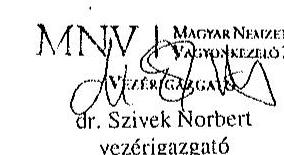

---

.

---

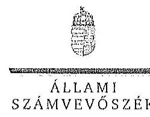

ELNÖX

Ikt.szám: V-0762-080/2015.

Dr. Szivek Norbert úr
vezérigazgató
Magyar Nemzeti Vagyonkezelő Zrt.

Budapest

Tisztelt Vezérigazgató Úr!

A „Jelentéstervezet az állami tulajdonban álló erdőgazdasági társaságok vagyongazdálkodási tevékenységének ellenőrzése - NEFAG Nagykonsági Erdészeti és Faipari Zrt.” címmel készített számvevőszéki jelentéstervezetre tett észrevételeit köszönettel megkaptam.

Az Állami Számvevőszék észrevételekre vonatkozó álláspontjáról a felügyeleti vezető által készített részletes tájékoztatást csatoltan megküldöm.

Tájékoztatom Vezérigazgató urat, hogy a számvevőszéki jelentésben - az Állami Számvevőszékről szóló 2011. évi LXVI. törvény 29. § (3) bekezdése alapján - a figyelembe nem vett észrevételeket szerepeltetjük az elutasítás indokának feltüntetésével.

Budapest, 2015.

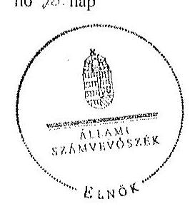

Tisztelettel:

Domokos László

Melléklet: Tájékoztatás az elfogadott és az el nem fogadott észrevételekről

1392 BSOAPEST, AFALON CSERC JANOS STCA 56. 1364 Budapest 4. Pl. 54 telefon: 484 9101 fax: 484 9201

---

# Tájékoztatás   az elfogadott és az el nem fogadott észrevételekröl 

A „Jelentéstervezet az állami tulajdonban álló erdőgazdasági társaságok vagyongazdálkodási tevékenységének ellenörzése - NEFAG Nagykonsági Erdészeti és Faiuari Zrt." címü jelentéstervezetre 2015. november 2-án érkezett észrevételeit áttekintettük, azok kezelésével kapcsolatban a következő tájékoztatást adom.

1. A vagyonkezelési szerződéshez kapcsolódó megállapításokra tett észrevétel (I. fejezet / 6. oldal 4. bekezdés, 7. oldal 1. bekezdés, 9. oldal 3-4. bekezdés, II. 2.1. fejezet / 17. oldal 6. bekezdés, 10. oldal javaslat az MNV Zrt. vezérigazgatójának a)-b) pontok)

A jelentéstervezet vagyonkezelési szerződéshez kapcsolódó megállapításai helytállóak. Az erdőgazdasági társaság müködése jogszabályi megfelelősége biztosításának érdekében tett kezdeményezésekről adott tájékoztatásukat köszönettel vettük, azonban azok nem credményezték az ideiglenes vagyonkezelési szerződés olyan módosítását, vagy olyan új vagyonkezelési szerződés megkötését, amely biztosította volna a VSZ hiányosságainak megszüntetését, illetve a hatályos jogszabályoknak való megfelelőségét. Ezért az MNV Zrt. vezérigazgatójának és az NFA elnökének megfogalmazott intézkedést igénylő megállapítás, valamint az MNV Zrt. vezérigazgatójának megfogalmazott javaslat a) és b) pontjának módosítása nem indokolt. Az egyértelműség érdekében a 9. oldal 3. bekezdést az alábbiak szerint pontosítjuk:
„A vagyonkezelésbe adott állami vagyon tekintetében tulajdonosi jogokat gyakorló MNV Zrt. és NFA az ellenörzött idöszakban a VSZ-szel kapcsolathan feltárt hiányosságokat nem sziintette meg, a hatályos jogszabályoknak a szerzödést nem feleltette meg, ..."
2. Az MNV Zrt. ellenőrzési kötelezettségének elmalasztására vonatkozó megállapításokra tett észrevétel (9. oldal 1-3., 5. bekezdés, II. 5. fejezet / 32. oldal 3. bekezdés, 10. oldal javaslat az MNV Zrt. vezérigazgatójának c) pont)

Az MNV Zrt. nem bocsátott az ÁSZ ellenőrzés rendelkezésére az MNV Zrt., vagy Területi Irodái által a Vhr. 20. § (1)-(2) bekezdései szerint végzett ellenőrzésekről dokumentumokat. A jelentéstervezet megállapításai és a javaslat helytállóak, módosításuk nem indokolt.

---

3. Az MNV Zrt. a Vtv.-ben elöirt ellenőrzési kötelezettségére vonatkozó megállapításra tett észrevétel (II. 5. fejezet/ 31. oldal 7. bekezdés)

Az ellenőrzés megállapította, hogy az MNV Zrt. az ellenőrzött időszakban a NEFAG Nagykunsági Erdészeti és Faipari Zrt.-nél helyszíni ellenőrzést nem végzett, erre a megállapításra az MNV Zrt. nem tett észrevételt. Az egyértelműség érdekében a dokumentumok ismételt áttekintését követően a jelentéstervezet 31. oldal 7. bekezdését az alábbiak szerint pontosítjuk:
„A Társaság feletti tulajdonosi juggyakorlóı2 számára a Vtv. 17. § (1) bekezdés d) pontja rendszeres ellenőrzési kötelezettséget irt elő a vele szerzödéses jogviszonyban levő személyek, szervezetek vagy más használók állami vagyonnal való gazdálkodása tekintetében, amelynek a NEFAG Zrt.-nél az ellenőrzött időszakban nem tett eleget."

Budapest, 2015. 44. hó 30. nap

Makkai Mária
felügyeleti vezető

---

.

---

# MFB 

Domokos László úr
elnök részére
Állami Számvevőszék

Budapest

Tisztelt Elnök Úr!

2015. október 15 -én köszönettel kézhez vettük az Állami Számvevőszék „Az állami tulajdonban álló erdőgazdasági társaságok vagyongazdálkodási tevékenységének ellenőrzésćról" szóló jelentéstervezeteket az alábbi cégckre:

- Bakonyerdő Erdészeti és Faipari Zrt.
(1kt.szám: V-0756-090/2015.)
- NEFAG Nagykunsági Erdészeti és Faipari Zrt.
(1kt.szám: V-0762-071/2015.)

Az MFB Zrt. a jelentéstervezetekkel kapcsolatosan 2 féle szempontból kiván észrevételt tenni:

1. A jelentésekben megfogalmazott központi probléma
2. Egyedi esetek

## 1. A jelentésekben megfogalmazott központi probléma

Az ÁSZ az egyedi jelentéseiben az erdőgazdasági társaságokat, valamint a vagyonkezelésbe adott állami vagyon tekintetében tulajdonosi joggyakorló MNV Zrt. és Nemzeti Földalapkezelő (továbbiakban: NFA) tevékenyégét marasztalta el.

Alapvető problémaként jelenik meg, hogy az erdők által kezelt eszközök - az NFA-val, a Kincstári Vagyon Igazgatósággal, és az MNV Zrt-vel kötött vagyonkezelési megállapodásban rögzített - értéken nem szerepelnek a Társaságok könyveiben.

Az MFB Zrt. tudatában volt a problémának (azt az ÁSZ jelentésben is említett, 2010. évben végzett átvilágitási jelentés is tartalmazta, melynek nyomon követése, beszámoltatása megtörtént) és folyamatosan egyeztetett az MNV Zrt-vel és az NFA-val a rendezés ügyében. Az ideiglenes vagyonkezelési szerződés módosítására, véglegesítésére a vagyonkezelésbe

---

adónak (MNV, NFA) van lehetősége, a Társaságok szerződő partnerként észrevételleket, javaslatokat tehetock. A szerződés véglegesítése érdekében a Társaságok és az MFB Zrt. képviselői minden olyan egyeztetésen (pl.: az MNV Zrt. által létrehozott bizottság) részt vettek, amelyre meghívást kaptak, illetve azokon érdemi javaslatokat tettek.

Ahogy a jelentés is megjegyzi, az egyeztetések az ellenőrzés befejezésig nem kerültek lezárásra, így a Társaságoknál nem áll rendelkezésre a vagyonkezelésben lévő állami vagyonra és annak nagyságára vonatkozó, az MNV Zrt. és az NFA nyilvántartásával egyező adat.

Az ÁSZ 2013. évi „Az állami vagyon feletti kontroll - Az állami vagyon feletti tulajdonosi joggyakorlással kapcsolatos tevékenységek ellenörzéséről" szóló jelentése alapján a Nemzeti Fejlesztési Minisztérium - az ÁSZ-szal egyeztetett - alábbi föbb pontokat tartalmazó intézkedési tervet (1. sz. melléklet) állított össze, melyet a 2014. április 25-én kelt levelében küldött meg az MFB Zrt. részére:

- a Társaságok által kezelt állami ingatlanok és egyéb vagyonelemek értéken történő nyilvántartása,
- a vagyonkezelési díjak egyértelmű és tulajdonosi joggyakorló szervezetenkénti meghatározása,
- az új vagyonkezelési szerződés megkötése,
- a Társaságok kezelt és saját vagyonának vagyonelemenkénti, valamint a kezelt vagyonelemek tulajdonosi joggyakorló szerinti elhatárolása.

Az MFB törvény módosításának 2014. július 16-i hatályba lépésével az MFB Zrt. állami erdőgazdaságok feletti tulajdonosi joggyakorlása megszűnt, az a Földművelésügyi Minisztériumhoz került át, így az intézkedési tervben való közreműködésre, illetve a végrehajtás nyomon követésére az MFB Zrt-nek nem volt lehetősége.

A jelentések az MNV Zrt. vezérigazgatójának, az NFA elnökének és az erdészeti társaságok vezérigazgatóinak fogalmaztak meg intézkedési javaslatokat.

# 2. Egyedi esetek: 

## NEFAG Nagykunsági Erdészeti és Faipari Zrt.

A jelentéstervezet hibásan hivatkozik az MFB Zrt.-re, mikor a Vtv. 17 § (1) bekezdés d) pontja szerinti rendszeres ellenőrzési elmaradására mutat rá. A Vtv. hivatkozott bekezdése alapján az ellenőrzés az MNV Zrt. feladata. Kérjük a társaság feletti tulajdonosi joggyakorló2 hivatkozás törlését. (31. oldal utolsó bekezdés)

---

# Bakonyerdó Erdészeti és Faiparí Zrt. 

A jelentéstervezet hibásan hivatkozik az MFE Zrt-re, amikor a vagyonkezelési dij meghatározásáról ir, ugyanis a vagyonkezelői dij meghatározása az MNV Zrt. és az NFA hatásköre. (19. oldal 2. bekezdés) Kérjük a társaság feletti tulajdonosi joggyakorló2 hivatkozás törlését.

Budapest, 2015. október 29.
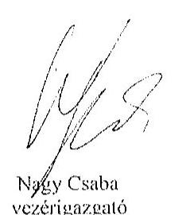

Tisztelettel:

Nagy Csaba
vezérigazgató

Sziládi-Losteiner Dóra
ügyvezető igazgató

## Mellékletek:

1. számú melléklet: NFM levél (Ikt.szám: KGTF/377-7/2014-NFM)

---

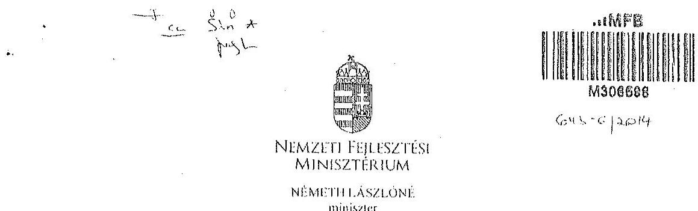

Iktatószám: KGTF/ 1.73 i /2014-NFM
Ügyintéző: dr. Kaszás Mónika
Telefonszám: 795-1917
e-mail:monika.kaszaz@ufin.gov.hu
Nagy Csaba úr részére
vezérigazgató
Magyar Fejlesztési Bank Zrt.
Budapesi
Tárgy: „Az állami vagyon feletti kontroll - Az állami vagyon feletti tulajdonosi joggyakorlással kapcsolatos tevékenységek ellenőrzésćról" szóló 13193 sz. ÁSZ jelentés alapján összeállitott NFM intézkedési terv módosítása, az abban foglalt feladatok végrehajtása

# Tisztelt Vezérigazgató Úr! 

Az Állami Számvevőszék (a továbbiakban: ÁSZ) tárgyban megjelölt jelentésével összefüggésben 2014. január 27-én intézkedési tervet hagytam jóvá, amelyben foglalt feladatok végrehajtása érdekében 2014. január 30-i keltezésű levélben fordultam Önhöz és a Magyar Nemzeti Vagyonkezelő Zrt. vezérigazgatójához, Márton Péter úrhoz.

Az ÁSZ az intézkedési tervvel kapcsolatban küldött, 2014. március 25-i keltü levelében az intézkedési terv kiegészítését, módosítását kérte. A módositott intézkedési tervet jóváhagytam.

A módositott intézkedési terv alapján a következő feladatok végrehajtása szükséges az alábbiak szerint:
1./ a társaságok által kezelt állami ingatlanok és egyéb vagyonelemek értéken történő nyilvántartása:

Felelős: MNV Zrt.,
Határidő:

- földterületek esetében legkésőbb 2014. május 31-ig
- felépítmények esetében 2014. december 31. (A felépítmények esetében az MNV Zrt. a vagyonkezelési szerződés megkötését az év második felére tervezi, látja megvalósíthatónak.)
2./ a vagyonkezelési díjak egyértelmü és tulajdonosi joggyakorló szervezetenkénti meghatározása:

---

Felelős: MNV Zrt.,
Határidő: 2014. május 31-ét követően folyamatosan (2014. december 31-ig)
E pontban foglalt feladattal kapcsolatosan az ÁSZ részére az alábbi tájékoztatást adtam:
„Az ÁSZ által meghatározott feladatok végrehajtására irányuló munkafolyamot során a végrehajtásban érintett szervezetek, társaságok között kialakult az az álláspont, hogy mivel az. erdőgazdasági társaságok alapfeladatként közfeladat ellátást is végeznek, azt a vagyonkezelési dij mértékének meghatározásakor az MNV Zrt. figyelembe veszi, valamint megállapításra került az az elv is, hogy a vagyonkezelési dij irányadó mértéke az adott erdőgazdasági társaság által kezelt ingatlanvagyon bruttó nyilvántartási értékének 2\%-a.

A vagyonkezelési dij alapja a kezelt vagyon bruttó nyilvántartási értéke, ezért annak meghatározására erdőgazdaság társaságonként kerül sor a 4./ pontban meghatározott ún. „végleges ingatlanlista" alapján. A végleges ingatlanlista kizárólag vagyonkezelésbe adott ingatlan vagyonelemet tartalmaz, az erdőgazdasági társaság saját vagyonában nyilvántartott vagyonelemet nem, ezért az MNV Zrt.-nek és az erdőgazdasági társaságoknak a szerződés megkötését megelőzően el kell határolnia egymástól a saját vagyonba és a kezelt vagyonba tartozó ingatlan vagyonelemeket (4.b./ pontban foglalt feladat).

A feleknck a vagyonkezelési dij mértékében a vagyonkezelési szerződés megkötését megelőzően kell megállapodniuk az irányadó vagyonkezelési dij mértéket alapul véve."

# 3./ az új vagyonkezelési szerződések megkötése: 

A vagyonkezelési szerződés tervezet az MNV Zrt. érintett szakterületci álláspontjának figyelembe vételével elkészült, az MNV Zrt. és a MFB Zrt. által létrehozott Munkacsoport (tagjai: MFB Zrt., MNV Zrt., NFA és egyes erdőgazdasági társaságok) véleménye alapján átdolgozásra került. A szerződés tervezetnek az erdőgazdasági társaságok részére történő megküldése 2014. április 15. napjával megtörtént.

Felelős: MNV Zrt., az MFB Zrt. közremüködésével
Határidő:

- földterületek esetében: 2014. május 31-ét követően folyamatosan (2014. december 31-ig)
- felépítmények esetében 2014. II. félév folyamán
4./ a társaságok kezelt és saját vagyonának vagyonelemenkénti, valamint a kezelt vagyonelemek tulajdonosi joggyakorló szerinti elhatárolása:

Az erdőgazdasági társaságok által az MNV Zrt. rendelkezésére bocsátott leltárjelentések alapján

- a jogszabályi rendelkezések szerint az NFA tulajdonosi joggyakorlása alá tartozó ingatlan vagyonelemek nagyobb része már átadásra került az NFA részére,
- a kisebb részt képező vagyonelemek tekintetében pedig folyamatban van az átadás az MNV Zrt. és az NFA között.

---

a./ Az ún. „végleges ingatlanlista" (az MNV Zrt. tulajdonosi joggyakorlása alatt lévô, maradó vagyonclem listája) MNV Zrt. és az NFA közötti lecgycztetése, közös áttekintése

# Felelős: MNV Zrt. 

Határidő: a lista MNV Zrt. és NFA közötti lecgycztetése, közös áttekintése folyamathan van, lezárása legkésöbb 2014. május 31-ig megtörténik
b./ Az a./ pontban foglaltak szerint leegyeztetett ún. „,végleges ingatlanlista" MNV Zrt. és az egyes erdőgazdasági társaságok általi áttekintése azzal a céllal, hogy a vagyonkezelésben lévô vagyoni elemeket tartalmazó ún. „végleges ingatlanlista" ne tartalmazzon az erdőgazdasági társaság saját vagyonában nyilvántartott vagyoni elemet (saját vagyon - vagyonkezelt vagyon elhatárolása).

Felelős: MNV Zrt., az MFB Zrt. közremüködésével
Határidő: 2014. május 31-ig
E pontban foglalt feladatokkal kapcsolatosan az ÁSZ részére az alábbi tájékoztatást adtam:
„Szükséges megjegyezni, hogy ingatlanlista, mint állandó „végleges ingatlanlista" ilyen formában nem létezik, mert mindkét tulajdonosi joggyakorló tekintetében az állami vagyonelemek halmaza mind mennyiségben, mind pedig összetételben folyamatosan változik.

Az erdőgazdasági társaságok által kezelt ingatlanvagyon adatai - mindkét tulajdonosi joggyakorló tekintetében - az évközi változások (megosztások, területváltozások, mûvelési ág változások, stb.) miatt folyamatosan változnak, ezért az adattartalmában „,végleges ingatlanlista" mindig egy adott konkrét időpont vonatkozásában adható meg.

Jelen intézkedési tervben az ún. „,végleges ingatlanlista" meghatározás alatt az erdőgazdasági társaságok vagyonkezelésében lévô ingatlanvagyon MNV Zrt tulajdonosi joggyakorlása alatt álló részét kell tekinteni. E „,végleges ingatlanlista" kialakítására az erdőgazdasági társaságok által az MNV Zrt. részére átadott leltárjelentések alapján került sor úgy, hogy az MNV Zrt. a Nemzeti Földalapba tartozó vagyonelemeket kiválogatta, s azokat a Nemzeti Földalapkezelő Szervezet részére - átadás-átvételi jegyzőkönyv alapján - átadta.

Lényeges körülmény, hogy a vagyonkezelőknek - jelen esetben az erdőgazdasági társaságoknak - minden év május 31. napjáig vagyonkezelői jelentést kell benyújtaniuk a tulajdonosi joggyakorlók, így az MNV Zrt. részére is. Az aktuális vagyonkezelői jelentéseket - melynek része a leltárjelentés is - a 2013. december 31-i állapotnak megfelelően kell összeállítani, ebből következben a fent említett ún. „végleges ingatlanlista" is a 2013. december 31-i állapotot tükrözi.

Ugyanakkor - fôként a kivett megnevezésben nyilvántartott földterületek esetében - a még át nem adott Nemzeti Földalapba tartozó vagyonelemek egyeztetése a két tulajdonosi joggyakorló között jelenleg is folyamatban van.

---

Az egyes erdőgazdasági társaságok vagyonkezelésében lévô vagyonclemek az adott társasággal megkötendő - a jelenlegi ideiglenes vagyonkezelési szerzödés helyébe lépő - vagyonkezelési szerződés mellékletét fogják képezni. Az MNV Zrt. szándékai szerint az egyes erdőgazdasági társaságokkal azonnal megkötik a vagyonkezelési szerződéseket, ahogyan a megkötés feltételei bekövetkeztek (pl. megállapodnak a vagyonkezelési dijban, véglegesítik a vagyonkezelési szerződés tartalmát), azok a vagyonclemek, amelyeket e pont a./ és b./ pontjában foglaltak szerint már átvizsgáltak, a vagyonkezelési szerződés megkötésével egyidejüleg a szerződés mellékletébe kerülnek, amely melléklet folyamatosan bővítésre kerül újabb, e pont a./ és b./ pontjában foglaltak szerint átvizsgált, tisztázott vagyonclemekkel. „

Tájékoztatom, hogy az NFA feletti tulajdonosi jogok gyakorlója, Dr. Fazekas Sándor miniszter úr időközben már jóváhagyta azt az intézkedési tervet, amely az NFA részére meghatározott feladatokat és azok végrehajtási határidejét tartalmazza.

Az MFB Zrt. közremüködése az 1./ és 2./ pontban meghatározott feladatok végrehajtásban is szükséges lehet, ezért kérem a fent meghatározott feladatok határidőben történő végrehajtása érdekében az MFB Zrt. változatlan együttmüködését az érintett a szervezetekkel és amennyiben szükséges, úgy az erdőgazdasági társaságok bevonása iránt is intézkedni szíveskedjen.

Budapest, 2014. „djmié. d\& „

# Üdvözlettel: 

## Németh Lászlóné

---

.

---

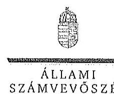

ELRÖK

Ikt.szám: V-0756-101/2015.

Nagy Csaba ár
vezérigazgató
Magyar Fejlesztési Bank Zrt.

Budapest

Tisztelt Vezérigazgató Úr!

Az „Az állami tulajdonban álló erdőgazdasági társaságok vagyongazdálkodási tevékenységének ellenőrzése" című ellenőrzés tekintetében a Bakonyerdő Erdészeti és Faipari Zrt. és a NUFAG Nagykunsági Erdészeti és Faipari Zrt. jelentéstervezeteire tett észrevételüket köszönettel megkaptam.

Az Állami Számvevőszék észrevételekre vonatkozó álláspontjáról a felügyeleti vezető által készített részletes tájékoztatást csatoltan megküldöm.

Tájékoztatom Vezérigazgató urat, hogy a számvevőszéki jelentésben – az Állami Számvevőszékről szóló 2011. évi LXVI. törvény 29. § (3) bekezdése alapján – a figyelembe nem vett észrevételeket szerepeltetjük az elutasítás indokának feltüntetésével.

Budapest, 2015. 14. hó 30. nap

Tisztelettel:

Domokos László

Melléklet: Tájékoztatás az elfogadott és az el nem fogadott észrevételekről

1052 BÜDÁFEST, AFRICON CSERE JÁNOS UTCK 10. 1364 Budapest 4. Pf. 54 telefon: 484 9191 fax: 484 9261

---

# Tájékoztatás   az elfogadott és az el nem fogadott észrevételekről 

„Az állami tulajdonban álló erdőgazdasági társaságok vagyongazdálkodási tevékenységének ellenörzése" címủ ellenőrzés tekintetében a NEFAG Nagykunsági Erdészeti és Faipari Zrt. és a Bakonyerdő Erdészeti és Faipari Zrt. társaságok jelentéstervezetére 2015. október 30 -án érkezett észrevételeket áttekintettük, azok kezelésével kapcsolatban a következő tájékoztatást adom.

1. A jelentésekben megfogalmazott központi problémával kapcsolatban tett észrevételek

A jelentésekben megfogalmazott központi problémával kapcsolatban adott tájékoztatásukat köszönettel vettük, azonban azok alapján a jelentéstervezet módosítása nem indokolt.
2. Az egyedi esetekkel kapcsolatban tett észrevételek

A NEFAG Nagykunsági Erdészeti és Faipari Zrt. jelentéstervezetének 31. oldal utolsó bekezdésére tett észrevétel
A rendelkezésre álló dokumentumok ismételt áttekintését követően a jelentéstervezet véglegesitése során töröljük a tulajdonosi joggyakorló 2 számú alsóindexszel jelölt hivatkozást.

A Bakonyerdő Erdészeti és Faipari Zrt. jelentéstervezetének 19. oldal 2. bekezdésére tett észrevétel
A rendelkezésre álló dokumentumok ismételt áttekintését követően a jelentéstervezet véglegesitése során töröljük a tulajdonosi joggyakorló 2 számú alsóindexszel jelölt hivatkozást.

Budapest, 2015. év $\quad A A$ hó 30. nap

Makkai Mária
felügyeleti vezetö

---

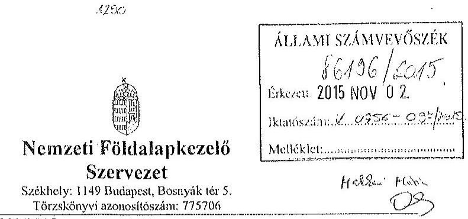

Iktatószám: NFA-002589/023/2015
Hiv. szám: ÁSZ-V-0599/2014-2015
Érintett ÁSZ iktatószámok: V-0756-092/2015, V-0759-066/2015, V-0761-152/2015,
V-0762-073/2015, V-0763-061/2015,

Domokos László
Elnök

Állami Számvevőszék

1052 Budapest

Apáczai Csere János utca 10

Tárgy: Észrevétel megküldése „Az állami tulajdonban álló erdőgazdasági társaságok vagyongazdálkodási tevékenységének ellenőrzéséről" készített jelentés tervezeteire.

Tisztelt Elnök Úr!

Az Állami Számvevőszék 2014 novemberében megkezdte „Az állami tulajdonban álló
erdőgazdasági társaságok vagyongazdálkodási tevékenységének ellenőrzését" amelyről
2015 októberétől érintettség okán az NFA részére az elkészített munkaanyag tervezeteit
vizsgált erdőgazdaságonként, megküldte Szervezetünk részére véleményezésre.
A munkaanyag valamennyi tervezte egységesen, az NFA Elnöke részére feladatszabást
tartalmaz, melyhez az alábbi észrevételeket tesszük:

A jelentéstervezetekben tett megállapítások helytállóságát nem vitatjuk, azonban
szükségesnek látjuk az NFA elnökének tett javaslatokkal a), b) és c) kapcsolatban a következő
tájékoztatást megadni.

a) „Tegyen intézkedéseket az erdőgazdasági társaságok közreműködésével a tényleges
állapotot rögzítő és a hatályos jogszabályi előírásoknak megfelelő vagyonkezelési
szerződés megkötésére."

1

---

Tájékoztatjuk, hogy a hatályos jogszabályi előírásoknak megfelelő vagyonkezelési szerződések megkötése érdekében több intézkedés történt, jelenleg is folyamatban van a szerződések előkészítése és a vagyonkezelésben maradó, illetve kikerülő földrészletek adatainak egyeztetése.

Előzményként fontos kiemelni, hogy a Nemzeti Földalapkezelő Szervezet 2010. szeptember 1. napjával történt létrehozását követően (2012. évben) került sor a vagyonkezelésben lévő földrészletek MNV Zrt. részéről történő átadására. Az átadási dokumentumok alapján Szervezetünk gondoskodott a közhiteles nyilvántartásokban a megváltozott tulajdonosi joggyakorlás feltüntetéséről. Az erdőgazdaságok esetében ez 2012. év végéig, illetve 2013. év elején megtörtént ennek az ingatlan-nyilvántartásban történő átvezetése is.

Megjegyezzük, hogy az MNV Zrt. részéről történő átadás kizárólag a - több évtizede kötött, és azóta többször módosított - vagyonkezelési szerződések és a földrészletek Excel táblázatban történő átadását jelentette, tehát nem egy naprakész vagyonnyilvántartást tartalmazott. Ennek következtében szükségszerűvé vált a Nemzeti Földalapkezelő Szervezetnek egy saját nyilvántartás felépítése, illetve a szerződések tartalmának feldolgozása.

A számvevőszéki ellenőrzéssel érintett időszakban, illetve még jelenleg is lezáratlan az MNV Zrt. és NFA közötti átadás-átvételi folyamat. Az MNV Zrt. további földrészletek átadását készíti elő, ugyanis az MNV Zrt. vagyoni körébe tartozó földrészletekre szintén tervezi a vagyonkezelői szerződés megkötését, és ennek a folyamatnak a részeként a még át nem adott földrészletek átadása is most történik. Természetesen az NFA is folyamatosan biztosítja a különböző hasznosítási, illetve hatósági eljárások során az erdőgazdaságok vagyonkezelésében lévő földrészletek tulajdonosi joggyakorlójának rendezését az MNV Zrt megkeresésével, közös minősítési eljárás lefolytatásával. A Nemzeti Földalapkezelő Szervezet által megbízott ügyvédi iroda, jelentést készített a szerződés és a tárgyát képező földrészletek jogi helyzetének tisztázására.

Időközben az erdőgazdaságok, mint társaságok feletti tulajdonosi joggyakorló személyében is változás történt. Így új alapokon indulhatott meg a vagyonkezelői szerződés előkészítése. Ennek a folyamatnak részeként, az NFA megbízott egy Ügyvédi Konzorciumot, továbbá Szervezetünknél külön Erdészeti munkacsoport alakult 2015 májusában és azt követően a következő intézkedések történtek:

Az Erdőgazdaságok részére vagyonkezelésbe adásra tervezett ingatlanok felülvizsgálata folyamatban van az Ügyvédi Konzorcium által. A felülvizsgálat tárgyát képező ingatlanok köre három részből tevődik össze:

- az erdőgazdaságok ideiglenes vagyonkezelési szerződésének tárgyát képező ingatlanok,
- azon ingatlanok, amelyeket az erdőgazdaságok az ideiglenes vagyonkezelési szerződésükben szereplő ingatlanokon felül kértek vagyonkezelésbe,

---

- valamint azok az ingatlanok, amelyeket az NFA kíván az erdőgazdaságok vagyonkezelésébe adni.

A rendelkezésre álló dokumentumokban szereplő ingatlanokból erdőgazdaságonként egy egységes, az összes vagyonkezelésbe adandó ingatlant tartalmazó táblázat készült, amely tartalmazza az ingatlanok vagyonkezelésbe adás szempontjából releváns adatait, bejegyzett jogokat, feljegyzett tényeket. A táblázat adatai összevetésre kerültek a közhiteles ingatlannyilvántartásban szereplő adatokkal, feltárva ezáltal, hogy mely ingatlanok adhatóak vagyonkezelésbe és melyek azok, amelyeknél valamilyen előzetes intézkedés megtétele szükséges.

Az Nfatv. 8. §-a alapján a Birtokpolitikai Tanács dönt erdőgazdaságonként az erdőgazdaságok vagyonkezelési szerződésének megkötéséről.

Zárójelben jegyezzük meg, hogy például a TAEG Zrt. esetében elkészült a fentebb részletezett táblázat, amely alapján összeállításra került azon ingatlanok listája, amelyre elindítható a vagyonkezelésbe adási eljárás. Megközelítőleg 18000 ha nagyságú területnek tervezi Szervezetünk a TAEG Zrt. részére történő vagyonkezelésbe adását, ebből 15.308,3880 ha terület az, amelyre elindította a vagyonkezelésbe adást. Az alábbi jogszabályhelyek alapján Szervezetünk megkereste az Földművelésügyi Minisztériumot az egyetértő nyilatkozatok, valamint az alapító határozat kiadása érdekében, valamint a NÉBIHet, mint erdészeti hatóságot a vagyonkezelő erdőgazdálkodói alkalmasságát megállapító jóváhagyásának megkérése végett.

Az Nfatv. 20. § (7) bekezdése alapján „Az állam 100\%-os tulajdonában álló erdő és erdőgazdálkodási tevékenységet közvetlenül szolgáló földterületet érintő vagyonkezelési szerződés létrejöttéhez az erdészeti hatóságnak - a vagyonkezelő erdőgazdálkodói alkalmasságát megállapító - jóváhagyása szükséges".

Az Nfatv. 23. § (2) bekezdése alapján a Nemzeti Földalapba tartozó védett természeti területek és a Natura 2000 területek vagyonkezelésbe adására, tulajdonjogának bármely jogcímen történő átruházására csak a természetvédelemért felelős miniszter egyetértése esetén kerülhet sor. Az állam $100 \%$-os tulajdonában álló erdő, továbbá erdőgazdálkodási tevékenységet közvetlenül szolgáló földterület vagyonkezelésbe adásához az erdőgazdálkodásért felelős miniszter egyetértése szükséges.

Magyar Állam tulajdonában álló ingatlanokat érintő jogügylctekkel kapcsolatos előzetes miniszteri nyilatkozatok és a miniszter tulajdonosi joggyakorlása alá tartozó gazdasági társaságok ingatlanügyleteivel kapcsolatos miniszteri nyilatkozatok, alapítói határozatok kiadásának rendjéről szóló 8/2014. (XI. 28.) FM utasítás 3. § (4) bekezdése értelmében a miniszter tulajdonosi joggyakorlása alá tartozó állami tulajdonú gazdasági társaságoknak az NFA-val történő vagyonkezelési szerződés kötéséhez elengedhetetlen a jogszabály vagy

---

Társasági alapszabály vagy alapító okirat alapján a Társaság tulajdonosi jogait gyakorló miniszter alapítói határozatának kiadása.

Az Erdészeti Munkacsoport a kialalított szempontok alapján tartja a kapcsolatot a Konzorciummal a szerződés tárgyát képező földrészletek jogi, nyilvántartási, helyszíni, térképi ellenőrzés tárgyában annak érdekében, hogy naprakész adatok alapján történjen a szerződéskötés.
b) „Intézkedjen a vagyonkezelési szerzödések felülvizsgálatának elmaradásával összefüggésben feltárt szabálytalanságok tekintetében a munkajogi felelösség tisztázására irányuló eljárás megindításáról, és ennek eredménye ismeretében tegye meg a szükséges intézkedéseket.

A fent leírt folyamat időbeli áttekintése és a vagyonkezelési szerződés előkészítésének jelenlegi helyzetét tekintve a Nemzeti Földalapkezelő Szervezet egységei, munkatársai a rendelkezésükre álló eszközök alapján megtették a szükséges intézkedéseket az erdőgazdaságok vagyonkezelői szerződésének megkötése érdekében.
c) Az NFA elnöke felé tett javaslattal kapcsolatban, miszerint intézkedjen a Társaságok vagyon-nyilvántartása hitelességének, teljességének és helyességének jogszabályban foglaltak szerinti ellenörzéséről.

Az NFA 2015. év márciusában megkezdte az Erdészeti Zrt.-ték dokumentális ellenőrzését, amely ellenőrzés keretén belül bekérésre került a Társaságok használatában álló vagyonelemekről és az erdővagyon állományról vezetett (nyilvántartások) aktualizált nyilvántartás is.

Budapest, 2015.október 27.
Tisztelettel:
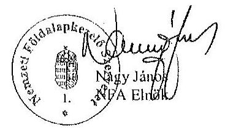

---

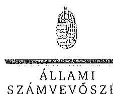

ELHök

SZÁMVEVŐSZÉK

Ikt.szám: V-0756-098/2015.

Nagy János úr
elnök
Nemzeti Földalapkezelő Szervezet

Budapest

Tisztelt Elnök Úr!

Az „Az állami tulajdonban álló erdőgazdasági társaságok vagyongazdálkodási tevékenységének ellenőrzése” című ellenőrzés tekintetében öt társaság jelentéstervezetére tett észrevételüket köszönettel megkaptam.

Az Állami Számvevőszék Észrevételekre vonatkozó álláspontjáról a felügyeleti vezető által készített részletes tájékoztatást csatoltan megküldöm.

Tájékoztatom Elnök urat, hogy a számvevőszéki jelentésben – az Állami Számvevőszékről szóló 2011. évi LXVI. törvény 29. § (3) bekezdése alapján – a figyelembe nem vett észrevételeket szerepeltetjük az elutasítás indokának feltüntetésével.

Budapest, 2015. /1. hó 23. nap

Tisztelettel:

Domokos László

Melléklet: Tájékoztatás az észrevételek kezeléséről

1052 BUDAPEST, APÁGÚN CSERE JÁNOS UREA 10. 1364 Budapest 4. Pf. 54 telefon: 484 9181 fax: 484 9261

---

# Tájékoztatás   az észrevételek kezeléséről 

„Az állami tulajdonban álló erdőgazdasági társaságok vagyongazdálkodási tevékenységének ellenörzése" című ellenőrzés tekintetében a Bakonyerdö Erdészeti és Faipari Zrt., a Vértesi Erdészeti és Faipari Zrt., a DALERD Délalföldi Erdészeti Zrt., a NEFAG Nagykonsági Erdészeti és Faipari Zrt., illetve a NYÍRERDŐ Nyírségi Erdészeti Zrt. társaságok jelentéstervezetére 2015. november 2 -án érkezett észrevételeket áttekintettük, azok kezelésével kapcsolatban a következő tájékoztatást adom.

Az észrevétel szerint a jelentéstervezetben tett megállapítások helytállóak, azokat nem vitatják. Az NFA elnökének tett javaslatokhoz kapcsolódó tájékoztatást köszönjük. Mindezek miatt, valamint arra tekintettel, hogy nem jött létre olyan vagyonkezelési szerződés, amely biztosítja az ideiglenes vagyonkezelési szerződés hiányosságainak a megszüntetését, illetve a hatályos jogszabályoknak való megfeleltetést, a megállapítások és a javaslatok módosítása nem indokolt.

Budapest, 2015. év $\quad / / \quad$ hó $f^{2}$ nap

Makkai Mária
felügyeleti vezető