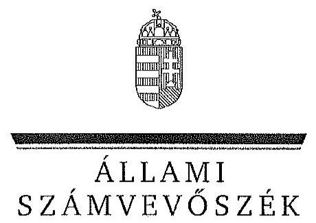

ÁLLAMI
SZÁMVEVÔSZÉK

# JELENTÉS 

Az állami tulajdonban álló erdőgazdasági társaságok vagyongazdálkodási tevékenységének ellenőrzése NYÍRERDŐ Nyírségi Erdészeti Zrt.

---

# Állami Számvevőszék 

Iktatószám: V-0763-072/2015.
Témaszám: 1797
Vizsgálat-azonosító szám: V070615

## Az ellenőrzést felügyelte:

## Makkai Mária

felügyeleti vezető
Az ellenőrzést vezette és az ellenőrzés végrehajtásáért felelős:
Schmidt János
ellenőrzésvezető
A számvevőszéki jelentéstervezet összeállításában közreműködött:
Berki László
számvevő
Az ellenőrzést végezték:
Berki László
számvevő

Mészáros Ildikó Éva
számvevő

---

# TARTALOMJEGYZÉK 

BEVEZETÉS ..... 3
I. ÖSSZEGZŐ MEGÁLLAPÍTÁSOK, KÖVETKEZTETÉSEK, JAVASLATOK ..... 7
II. RÉSZLETES MEGÁLLAPÍTÁSOK ..... 14

1. A NYÍRERDŐ Zrt. vagyongazdálkodása ..... 14
1.1. A vagyon értékének megőrzése, gyarapítása ..... 14
1.2. A vagyonkezelői kötelezettség teljesítése ..... 17
2. A NYÍRERDŐ Zrt. vagyonkezelési szerződése és a vagyonnyilvántartása ..... 18
2.1. A vagyonkezelési szerződés megfelelősége ..... 18
2.2. A NYÍRERDŐ Zrt. vagyonnyilvántartása ..... 20
3. A NYÍRERDŐ Zrt. éves tervezési feladatainak ellátása, az ágazati jogszabályok érvényesülése ..... 22
3.1. Az üzleti tervek vagyonmegőrzésre, vagyongyarapításra vonatkozó elemei ..... 22
3.2. A tervekben megfogalmazott előírások érvényesülése ..... 23
3.3. Az ágazati szabályok érvényesülése ..... 24
4. A kontroll- és monitoring rendszer kialakítása és múködtetése ..... 26
4.1. A kontrollrendszer kialakítása és múködtetése ..... 26
4.2. Az információáramlási és monitoring rendszer kialakítása és múködtetése ..... 28
5. A tulajdonosi joggyakorlóknak a NYÍRERDŐ Zrt. vagyongazdálkodási feladataira vonatkozó döntései, intézkedései megfelelősége ..... 30

---

# MELLÉKLETEK 

1. számú Rövidítések jegyzéke
2. számú Fogalomtár
3/A. számú A NYÍRERDŐ Zrt. vagyonának alakulása a 2009-2013. évek közötti időszakban - eszközök (M Ft)
3/B. számú A NYÍRERDŐ Zrt. vagyonának alakulása a 2009-2013. évek közötti időszakban - források (M Ft)
3. számú Kimutatás a NYÍRERDŐ Zrt. befektetett eszközei állományának alakulásáról a 2009-2014. I. féléve közötti időszakra vonatkozóan
4. számú A NYÍRERDŐ Zrt. vezérigazgatójának észrevétele
5. számú A NYÍRERDŐ Zrt. vezérigazgatójának észrevételére adott válasz
6. számú Az MNV Zrt. vezérigazgatójának észrevétele
7. számú Az MNV Zrt. vezérigazgatójának észrevételére adott válasz
8. számú Az MFB Zrt. vezérigazgatójának észrevétele
9. számú Az MFB Zrt. vezérigazgatójának észrevételére adott válasz
10. számú Az NFA elnökének észrevétele
11. számú Az NFA elnökének észrevételére adott válasz

---

# JELENTÉS 

## Az állami tulajdonban álló erdőgazdasági társaságok vagyongazdálkodási tevékenységének ellenőrzése NYÍRERDŐ Nyírségi Erdészeti Zrt.

## BEVEZETÉS

Hazánk területének több mint 20\%-át erdő borítja. Az erdők fenntartása és védelme az egész társadalom érdeke, ezért az erdőkkel csak a közérdekkel összhangban lehet gazdálkodni.

Az Alaptörvény 38. cikke és az Nvtv. alapján az állam tulajdona a nemzeti vagyon részét képezi. Az Nvtv. alapján nemzetgazdasági szempontból kiemelt jelentőségű nemzeti vagyonban tartandó vagyonelemnek minősül a 100\%-ban az állam tulajdonában álló védelmi és közjóléti elsődleges rendeltetésű erdő, a gazdasági elsődleges rendeltetésű természetes erdő, természetszerű erdő és származék erdő természetességi állapotú öt hektárnál nagyobb, természetben összefüggő erdő. Az erdőgazdasági társaságok vagyongazdálkodása szempontjából a Vtv., illetve az Nvtv. és az Nfatv., valamint a kapcsolódó kormány- és miniszteri rendeletek mellett kiemelkedő szerepe van a különböző ágazati jogszabályoknak. A vagyonkezelési tevékenység végrehajtása során figyelemmel kell lenni az Evt.-ben foglaltakra, mely alapján a nemzeti vagyonról szóló törvényben nemzetgazdasági szempontból kiemelt jelentőségű nemzeti vagyonként meghatározott védelmi és közjóléti elsődleges rendeltetésű, az állam tulajdonában álló erdő a kincstári vagyon részét képezi. Az erdőgazdasági társaságoknak az általuk kezelt vagyonelemek sajátosságára tekintettel kell a vagyongazdálkodási tevékenységüket kialakítaniuk, gondoskodniuk kell a közérdek és az Evt.-ben foglaltak érvényesülését biztosító vagyongazdálkodásról.

Az Evt. előírásai alapján az állam tulajdonában álló erdőt és erdőgazdálkodási tevékenységet közvetlenül szolgáló földterületet csak vagyonkezelés formájában lehet hasznosításra átengedni. Az állam kizárólagos tulajdonában álló erdő és erdőgazdálkodási tevékenységet közvetlenül szolgáló földterület vagyonkezelését csak költségvetési szerv vagy 100\%-os állami tulajdonú gazdálkodó szervezet végezheti.

A Vtv. szerint az erdőgazdasági társaságok és a társaságok kezelésében lévő állami vagyon feletti tulajdonosi jogokat a 2010. évig a Magyar Állam nevében az MNV Zrt. gyakorolta. A 2010. évi törvényi változások (Vtv., Mfbtv., Nfatv.) következtében 2010. június 17. napjától az erdőgazdasági társaságok állami tulajdonú részesedése tekintetében a tulajdonosi jogokat az állami vagyonért felelős miniszter az MFB Zrt. útján látta el. Az Nfatv. 2010. évi hatálybalépését követően a társaságok által kezelt, a Nemzeti Földalapba tartozó földterületek

---

vonatkozásában a tulajdonosi jogokat az NFA, míg egyéb ingatlanok és vagyonelemek tekintetében a tulajdonosi jogokat az MNV Zrt. gyakorolja. 2014. július 16 -tól az erdőgazdasági társaságok feletti tulajdonosi jogokat az erdőgazdálkodásért felelős miniszter gyakorolja.

A Nemzeti Földalapba tartozó 1772980 ha földterületből a 2012. év végén a 100\%-os állami tulajdonú 19 erdőgazdasági társaság kezelésében összesen 913664 ha földterület volt, ebből 879254 ha erdő, a többi egyéb művelési ágba tartozik. A kezelt földterületek erdőgazdasági társaságonkénti megosztása eltérő.

Az erdőgazdasági társaságok az Alaptörvény és az Nvtv. előírása szerint önállóan és felelősen gazdálkodnak a törvényesség, a célszerűség és az eredményesség követelményei szerint. Az állami vagyonnal való gazdálkodás alapvető feladata a vagyon rendeltetésszerú, hatékony és felelős felhasználásának biztosítása az állami vagyon értékének megőrzése, gyarapítása érdekében. A NYÍRERDŐ Nyírségi Erdészeti Zrt. jelen ellenőrzése az állami vagyonnal való gazdálkodásra és a törvényesség betartására irányult.

A nyíregyházi székhelyű Társaság és jogelődjei gondozzák Szabolcs-SzatmárBereg és Hajdu-Bihar megye állami erdőterületeit. A NYÍRERDŐ Zrt. erdő- és vadgazdálkodási, és kapcsolódó ipari és kereskedelmi feladatait központja, és 9 önálló divízióként múködtetett erdészete (hajdúhadházi, debreceni, halápi, gúthi, nyíregyházi, baktalórántházai, fehérgyarmati, nyírbátori, nyírlugosi) útján látja el.

A NYÍRERDŐ Zrt. 2013. évi éves beszámolója szerint 4615,4 M Ft nettó árbevétel mellett $250,5 \mathrm{M}$ Ft mérleg szerinti eredményt ért el, a mérlegfőösszeg 7815,3 M Ft volt. A Társaság a vagyonkezelésbe vett 56264 ha erdőterületen és 2430 ha egyéb művelési ágú földterületen gazdálkodott, az éves átlaglétszám 309 fő volt.

Az ellenőrzés célja annak értékelése, hogy a NYÍRERDŐ Zrt. vagyongazdálkodása, vagyonérték-megőrző és vagyongyarapítási tevékenysége, valamint ennek szervezeti keretei megfeleltek-e a jogszabályok és belső szabályzatok előírásainak, valamint a kezelt vagyonelemek sajátosságaiból adódó követelményeknek.

Ennek keretében ellenőriztük és értékeltük, hogy:

- a vagyongazdálkodás során betartották-e az Nvtv. 7. §-ában megállapított vagyongazdálkodási alapelveket, valamint az ágazati jogszabályok vagyongazdálkodáshoz kapcsolódó előírásait;
- a NYÍRERDŐ Zrt. a saját és a kezelt vagyonnal való gazdálkodásra vonatkozó éves tervezési feladatait a jogszabályi előírásoknak megfelelően látta-e el, a Társaság üzleti tervei a kezelésbe vett vagyonra vonatkozó, a Vtv. 2. § (1) és a 27. § (7) bekezdésében előírt vagyon megőrzésére, gyarapítására vonatkozó elemeket tartalmazták-e és azokat a vagyongazdálkodás során érvé-nyesítették-e;

---

- a vagyonkezelési szerződések és a vagyon-nyilvántartás megfeleltek-e a szabályszerűségi követelményeknek, elősegítették-e az állami vagyonnal való szabályszerű gazdálkodást;
- a Társaságnál kialakították és működtették-e a szabályszerű feladatellátást támogató kontrollrendszert. Ezen belül elkészítették és aktualizálták-e a Társaság feladatellátási-folyamatainak szabályzatait, a kockázatok kezelésének rendszerét, az információs és a kontrolling- monitoring rendszert, valamint a vagyongazdálkodás területén azokat az eljárásokat, amelyek elősegítik a szervezeti célok végrehajtását;
- a tulajdonosi joggyakorlóknak a Társaság vagyongazdálkodási feladataira vonatkozó döntései, intézkedései előkészítése és megalapozottsága a jogszabályoknak és a belső szabályozásnak megfelelt-e, a tulajdonosi joggyakorlók e minőségben végzett tevékenysége támogatta-e a felelős vagyongazdálkodás megvalósulását.

Az ellenőrzés típusa: szabályszerűségi ellenőrzés.
Az ellenőrzött időszak: 2009. január 1. napjától 2014. június 30. napjáig, kitekintéssel a helyszíni ellenőrzés végéig tartó releváns folyamatokra, intézkedésekre.

Az ellenőrzés várható hasznosulása: A NYÍRERDŐ Zrt. és a tulajdonosi joggyakorlók fenti szempontú ellenőrzése az állami tulajdonban álló vagyon kezelésére, a vagyonnal való gazdálkodásra vonatkozó, kötelezően végrehajtandó éves ÁSZ ellenőrzést szélesebb körűvé teszi.

Az ellenőrzés várható hasznosulásaként biztosíthatja a társadalom részéről kiemelt érdeklődéssel kísért téma objektív bemutatását. Az ÁSZ jelentéséből a média és az állampolgárok átfogó képet kaphatnak a Magyarország állami tulajdonban lévő erdőivel való gazdálkodásról, a gazdálkodást, vagyonkezelést végző szervezeti rendszerről, az állami tulajdonban álló erdőgazdasági társaságok feladatellátásához kapcsolódóan feltárt problémákról.

Az ellenőrzés jól hasznosítható - többek közt - az állami vagyonnal kapcsolatos országgyűlési törvényhozói munkában is, továbbá hozzájárulhat a tulajdonosi joggyakorlás javításával a „jó kormányzás" gyakorlatának erősítéséhez.

Az ellenőrzéssel érintett szervezetek: A NYÍRERDŐ Zrt., a Társaság kezelésében lévő állami vagyon feletti tulajdonosi jogokat gyakorló szervezetek, valamint a Társaság állami tulajdonú részesedése feletti tulajdonosi joggyakorlók (MFB Zrt., MNV Zrt., NFA).

Az ellenőrzés végrehajtásának jogszabályi alapját az ÁSZ tv. 5. § (4)-(5) bekezdéseiben foglaltak képezik.

Az ellenőrzés szakmai módszertana az ÁSZ hivatalos honlapján közzétett szakmai szabályokon alapult, amely a Legfőbb Ellenőrző Intézmények Nemzetközi Szervezete (INTOSAI) által kiadott nemzetközi standardok (ISSAI) figyelembevételével készült.

---

A NYÍRERDŐ Zrt. az ellenőrzés lefolytatásához tanúsítványok kitöltésével, valamint dokumentumok elektronikus megküldésével szolgáltatott adatokat. Az így rendelkezésre bocsátott adatok és információk kontrollja a helyszíni ellenőrzés keretében történt. A vagyonváltozást eredményező döntések megalapozottságát, továbbá a vagyonérték-megőrző és vagyongyarapító tevékenység szabályszerűségét a számviteli nyilvántartásokból, valamint kockázatalapú és véletlenszerű mintavétellel kiválasztott tételek ellenőrzésével értékeltük.

Az ÁSZ a 2011. évi LXVI. törvény 29. §-a szerint a jelentéstervezetet megküldte a NYÍRERDŐ Zrt., a Magyar Nemzeti Vagyonkezelő Zrt. és a Magyar Fejlesztési Bank Zrt. vezérigazgatójának, valamint a Nemzeti Földalapkezelő Szervezet elnökének egyeztetésre. A NYÍRERDŐ Zrt. vezérigazgatójának észrevételét és az arra adott választ az 5-6. számú melléklet, a Magyar Nemzeti Vagyonkezelő Zrt. vezérigazgatójának észrevételét és az arra adott választ a 7-8. számú melléklet, a Magyar Fejlesztési Bank Zrt. vezérigazgatójának észrevételét és az arra adott választ a 9-10. számú melléklet, a Nemzeti Földalapkezelő Szervezet elnökének észrevételét és az arra adott választ a 11-12. számú melléklet tartalmazza.

---

# I. ÖSSZEGZŐ MEGÁLLAPÍTÁSOK, KÖVETKEZTETÉSEK, JAVASLATOK 

A NYÍRERDŐ Zrt. az ellenőrzött időszakban saját és vagyonkezelésbe vett vagyonelemekkel gazdálkodott. A KVI-vel 1996. november 1-jén kötött VSZ értelmében vagyonkezelésébe kapott földterületet, melyet a Számv. tv előírása ellenére mérlegében nem szerepeltetett, aminek következtében a Társaság mérlege nem volt megbízható, mert nem a valós állapotot tükrözte. A kezelt vagyon mérlegtételek szerinti megbontása, és értékének változása a kiegészítő mellékletben sem került bemutatásra. amely ugyancsak nem felelt meg a Számv. tv. előírásának.

A Társaság éves beszámolójában kimutatott, saját vagyont tartalmazó, mérlegfőösszege a 2009. január 1-jei 6324,9 M Ft-ról 2013. december 31-ére 7815,3 M Ft-ra ( $23,6 \%$-kal) növekedett. Az ellenőrzött időszakban a Társaság vagyongazdálkodása során betartotta az Nvtv. 7. §-ában megállapított vagyongazdálkodási alapelveket.

A Társaság a vagyon-nyilvántartási szabályokat csak részben tartotta be. A VSZ alapján a Társaság földterületeket kezelt, melyeket természetes mértékegységben (naturáliákban) vett át, és nyilvántartásaiban ha-ban szerepeltette, amely nem felelt meg a Számv. tv. vonatkozó előírásainak.

A vagyonkezelt eszközök nyilvántartása nem felelt meg a Vhr.-ben foglaltaknak, mert tételesen nem tartalmazta a vagyonkezelt eszközök könyv szerinti bruttó és nettó értékét, valamint az értékben bekövetkezett egyéb változásokat. Ezért a vezetett nyilvántartás nem biztosította az átláthatóságot és az elszámoltathatóságot. A Társaság a VSZ-ben előírtak alapján teljesítette az éves beszámolási kötelezettségét a Társaság feletti tulajdonosi joggyakorló ${ }_{1}$-nek, azonban a vagyon-nyilvántartás egyeztetése nem történt meg. A Társaság a VSZ alapján és Számviteli politikájával összhangban a vagyonkezelésében lévő állami vagyon elkülönített nyilvántartására vonatkozó kötelezettségének eleget tett, a saját vagyon nyilvántartása tekintetében pedig betartotta a Számv. tv. előírásait.

A Társaság az éves mérleget számviteli nyilvántartásokkal, a mérlegben szereplő eszközöket leltárral alátámasztotta. A leltár a leltározási körzet, a mennyiségi felvételezés időbeli gyakorisága szempontjából eltért a Leltározási szabályzatban foglaltaktól. A Leltározási szabályzatban a leltározás gyakorisága nem felelt meg a Számv. tv. előírásának.

A Társaság a Magyar Állam tulajdonában álló erdővagyon és egyéb művelési ágú termőföld ingatlanok kezelését vagyonkezelési szerződés alapján végezte. A Társaság, mint vagyonkezelő és a KVI között létrejött szerződéses jogviszony kereteit a VSZ-ben foglalt jogok és kötelezettségek töltötték ki, azonban az nem támogatta a Vhr.-ben előírt, a vagyongazdálkodási feladatok átlátható módon történő végrehajtását, valamint nem támogatta a szabályszerű vagyongazdálkodást.

---

A Társaságnál a vagyonkezelési szerződés nem felelt meg a szabályszerűségi követelményeknek. A Társasággal 1996-ban kötött VSZ, illetve az aláírt kiegészítések és a 2009. évi VSZ módosítás a hatályos jogszabályi előírásoknak részben felelt meg. Az ellenőrzött időszakban a VSZ hatályon kívül helyezett jogszabályi hivatkozásokat tartalmazott az Áht, ${ }_{1}$ és a Vadvédelmi tv. rendelkezései vonatkozásában és nem tartalmazott a Vtv., az Evt. és a Nvtv. előírásaira való hivatkozásokat. Nem állt rendelkezésre a Vhr.-ben előírt, a tulajdonosi joggyakorlás és a vagyongazdálkodási feladatok átlátható módon történő végrehajtását biztosító, a módosításokkal egységes szerkezetbe foglalt vagyonkezelési szerződés. A szerződő felek nem tettek eleget a Vhr.-ben foglalt rendelkezésnek és a Vhr. hatálybalépését követő hat hónapon belül nem kezdeményezték a Nemzeti Földalapba tartozó ingatlanokra vonatkozóan a VSZ megszüntetését és a Vtv., illetve Vhr. szabályainak megfelelő szerződés megkötését.

Az ellenőrzött időszakban a Társaság a VSZ-ben előírtakkal szemben, utólag kiszámlázott vagyonkezelési díjat az NFA részére megfizette. A vagyonkezelési dí alapját, értékének bruttó, vagy nettó tartalmát nem határozták meg, évenkénti felülvizsgálatára az ellenőrzött időszak alatt nem került sor.

Az ellenőrzött időszakban a Társaság vagyonkezelői kötelezettségét teljesítette. A Társaság az Evt. hatályba lépése után nem engedte át az erdő használatát, hasznosítását harmadik személynek, nem rendelkezett erre vonatkozó szerződéssel. A Társaság az Evt. hatályba lépése után a VSZ alapján a vagyonkezelésében lévő földterületek vagyonkezelői jogát nem adta tovább és nem terhelte meg. Az Nfatv. 2011. augusztus 1-jei hatályba lépését követően a Társaság erdő és erdőgazdálkodási tevékenységet közvetlenül szolgáló földterületre vagyonkezelési szerződést nem kötött.

A Társaság a saját és kezelt vagyonnal való gazdálkodásra vonatkozó stratégi-ai- és éves üzleti tervezési feladatait a jogszabályoknak megfelelően látta el. A Társaság stratégiai- és üzleti tervei a kezelésbe vett vagyon megőrzésére, gyarapítására vonatkozó elemeket tartalmazták, azokat érvényesítették a vagyongazdálkodás során. A tervekről készült beszámolók, üzleti jelentések alapján megállapítható, hogy a Társaság megfelelően teljesítette az ágazati tervekben, illetve az üzleti tervekben megfogalmazott előírásokat.

A Társaság betartotta a jogszabályi rendelkezéseket és a belső szabályzatok előírásait a vagyon értékének megőrzésére, állagának védelmére, hasznosítására és gyarapítására irányuló vagyongazdálkodási tevékenysége során. Az ellenőrzött időszakban a Társaság a Vtv.-ben és a Vhr.-ben foglaltakkal összhangban folyamatosan intézkedett a vagyonkezelésében és a tulajdonában lévő tárgyi eszközök karbantartásáról, állagmegóvásáról. Az eszközökön rendszeres időközönként elvégezték az állapotfelmérést és karbantartási terveket dolgoztak ki.

A Társaság vagyonkezelésében lévő földterületek után a Számv. tv-ben foglaltaknak megfelelően értékcsökkenést nem számolt el, a vagyonkezelésébe vett földterületek vonatkozásában a Vtv. és a Vhr. szerinti visszapótlási kötelezettsége nem keletkezett. Az ellenőrzött időszakban a Társaság a saját eszközei után elszámolt értékcsökkenés összegének közel kétszeresét fordította beruházásokra. Mindegyik évben a beruházási értéke meghaladta az éves elszámolt értékcsökkenési leírás összegét. A beruházások között a vagyonkezelésében lévő

---

földterületek vonatkozásában minden évben sor került erdőtelepítésekre, a Társaság feletti tulajdonosi joggyakorló ${ }_{1}$ írásbeli engedélyével. A Társaság a kivitelezett beruházásokkal az eszközök újrapótlását valósította meg. A jogszabályi és belső szabályzatokban foglaltakkal összhangban az erdőtelepítések után a Társaság értékcsökkenést nem számolt el.

A Társaság vagyonkezelési tevékenysége során érvényesültek az ágazatra vonatkozó jogszabályokban meghatározott speciális vagyongazdálkodási előírások. A Társaság az erdő immateriális szolgáltatásaiból származó bevételét szabályszerűen számolta el és az Evt. előírásának megfelelően használta fel. A Társaság által kezelt erdő állami tulajdonból nem került ki. Az Evt., az Evr. és a Vadvédelmi tv. előírásai alapján a bejelentési és engedélykérelmi kötelezettségének eleget tett, a hatóság által jóváhagyott erdőgazdálkodási és vadgazdálkodási tervekkel rendelkezett. Az Erdészeti Hatóság ${ }_{1-2}$ az Evt. alapján a tervezett erdőgazdálkodási tevékenységeket egyes erdőrészletek esetében megtiltotta, korlátozta, illetve feltételhez kötötte.

Az ellenőrzött időszakban a Társaság a tulajdonosi joggyakorló ${ }_{1-2}$ által előírtaknak megfelelően kialakította és múködtette a szabályszerű feladatellátását támogató kontrollrendszert. A Társaság feletti tulajdonosi joggyakorló ${ }_{1-2}$ kontrolling adatszolgáltatási előírást adott ki, a számviteli szabályozásra és a kockázatkezelésre módszertani útmutatót dolgozott ki, amelynek alapján a Társaság a kockázati térképét is elkészítette. A Társaság az ellenőrzési rendszer múködését szabályozta.

Az ellenőrzött időszakban az FB eleget tett az Alapító Okirat ${ }_{1-14}$-ben előírt, a vagyongazdálkodással kapcsolatos feladatainak. Az éves üzleti terveken, az éves beszámolókon kívül folyamatosan figyelemmel kísérte a Társaság feladatellátását. Az FB ellenőrzési kötelezettségét teljesítve, a Társaság éves beszámolóiról véleményét a könyvvizsgálói jelentés és Tájékoztató figyelembe vételével alakította ki, írásbeli jelentését a tulajdonosi joggyakorló felé elkészítette. A Társaság az éves beszámolóit az ellenőrzött időszakban a Számv. tv. vonatkozó előírásának megfelelően elkészítette, azt az előírt határidőig az FB jóváhagyásra javasolta. A Társaság a Számv. tv.-ben előírtakkal összhangban az ellenőrzés teljes időszakában alkalmazott könyvvizsgálót. A könyvvizsgáló jelentéseiben az ellenőrzött időszakban nem kifogásolta a mérleg tartalmával kapcsolatosan feltárt hiányosságokat, nem hívta fel a figyelmet arra, hogy a Társaság éves mérlegeiben nem került rögzítésre a VSZ alapján kezelt állami vagyon értéke, valamint ezek az eszközök a kiegészítő mellékletben sem kerültek bemutatásra, legalább mérlegtétel szerinti megbontásban.

A Társaság az SZMSZ ${ }_{1-2}$-vel összhangban kialakította és múködtette a belső ellenőrzést. A 2009-2014. I. félév közötti időszakban a belső ellenőrzés a vagyongazdálkodásra és a vagyonnyilvántartásra vonatkozóan több ellenőrzést is végrehajtott. A Társaság a belső ellenőrzési megállapításokra, javaslatokra a szükséges intézkedéseket megtette.

A közfeladat-ellátást és a vagyongazdálkodást érintően a Társaságnál a VSZ, valamint a belső szabályozás szerint kialakították és aktualizálták az infor-mációáramlási- és monitoring rendszert, valamint biztosították annak szabályszerű működését. A Társaság az FB és az IG felé az információszolgálta-

---

tási kötelezettségének eleget tett, a tulajdonosi joggyakorló ${ }_{1-2}$ felé a jogszabályban, a belső szabályzatokban és a vagyonkezelési szerződésekben előírt adatszolgáltatási kötelezettségét határidőre és megfelelő adattartalommal teljesítette. A Társaságnál biztosított volt az állami vagyonnal kapcsolatos adatok védelme. A közérdekű adatok megismerésére irányuló igények teljesítésére vonatkozó szabályzatot az Info tv. és az Avtv. előírásai ellenére nem készítettek, a közérdekű adatokat nem tették közzé teljes körűen a honlapon.

A vagyonkezelésbe adott állami vagyon tekintetében a tulajdonosi joggyakorlók tevékenysége az ellenőrzött időszakban nem támogatta teljes körűen a felelős vagyongazdálkodás megvalósulását.

A Társaság vagyongazdálkodási feladataira vonatkozó döntések, intézkedések előkészítése a Társaság feletti tulajdonosi joggyakorló ${ }_{1-2}$-nél megfelelő volt, a belső szabályzatok egymással összhangban voltak és részletesen szabályozták a döntési jogköröket, valamint a vagyongazdálkodással kapcsolatos döntések előkészítését.

A Társaság feletti tulajdonosi joggyakorló ${ }_{1}$ a Társaság vagyonváltozását eredményező döntéseket egyedileg nem ellenőrizte, de a vagyonváltozását eredményező döntések végrehajtását a beszámolók, az üzleti tervek, üzleti jelentések és a kontrolling jelentések megtárgyalásával és jóváhagyásával ellenőrizte.

A vagyonkezelésbe adott állami vagyon tekintetében tulajdonosi jogokat gyakorló MNV Zrt. és NFA az ellenőrzött időszakban a VSZ-szel kapcsolatban feltárt hiányosságokat nem szüntette meg, a hatályos jogszabályoknak a szerződést nem feleltette meg, nem élt a Vhr.-ben foglalt, a kezelt vagyon használatára vonatkozó ellenőrzési jogával, valamint nem ellenőrizte a vagyonnyilvántartás hitelességét, teljességét és helyességét.

Az Állami Számvevőszékről szóló 2011. évi LXVI. törvény 33. § (1) bekezdésében foglaltak értelmében a jelentésben foglalt megállapításokhoz kapcsolódó intézkedési tervet köteles az ellenőrzött szervezet vezetője összeállítani, és azt a jelentés kézhezvételétől számított 30 napon belül az ÁSZ részére megküldeni. Amennyiben az intézkedési tervet határidőben nem küldi meg a szervezet, vagy az nem elfogadható, az ÁSZ elnöke a hivatkozott törvény 33. § (3) bekezdésében foglaltakat érvényesítheti.

Az ellenőrzés intézkedést igénylő megállapításai és javaslatai:

# MNV Zrt. vezérigazgatójának, az NFA elnökének 

A NYÍRERDŐ Zrt. a Magyar Állam tulajdonában álló erdővagyon és egyéb művelési ágú termőföld ingatlanok kezelését a KVI-vel 1996-ban kötött vagyonkezelési szerződés alapján végezte. A Társaság, mint vagyonkezelő és a KVI között létrejött szerződéses jogviszony kereteit a VSZ-ben foglalt jogok és kötelezettségek töltötték ki, azonban az nem támogatta a Vhr. 3. § (1) bekezdésében előírt, a vagyongazdálkodási feladatok átlátható módon történő végrehajtását, valamint nem támogatta a szabályszerű vagyongazdálkodást. Az ellenőrzött időszakban a VSZ hatályon kívül helyezett jogszabályi hivatkozásokat tartalmazott az Áht. ${ }_{1}$ és a Vadvédelmi tv. rendelkezései vonatkozásában és nem tartalmazott a Vtv., az Evt., és a Nvtv. előírásaira

---

való hivatkozásokat. A VSZ 3.2.1. pontja nem tartalmazta az Nvtv. 11. § (8) bekezdésének 2012. január 1-jétől hatályos, a vagyonkezelői jog korlátozásaira vonatkozó előírásokat. A VSZ 3.2.3. pontjában szereplő, a vagyonkezelői jog átengedésére és a 3.12.2. pontjában rögzített, az erdő használati jogának átengedésére vonatkozó rendelkezés 2009. július 10-étől nem felelt meg az Nfatv. 19/A. § (4) és 20. § (7) bekezdései előírásának. A VSZ-ben évente előírt felülvizsgálatra az ellenőrzött időszakban nem került sor. A felek nem tettek eleget a Vhr. 54. § (7) ${ }^{1}$ bekezdésében foglalt rendelkezésnek és a Vhr. hatálybalépését követő hat hónapon belül nem kezdeményezték a Nemzeti Földalapba tartozó ingatlanokra vonatkozóan a VSZ megszüntetését és a Vtv., illetve Vhr. szabályainak megfelelő szerződés megkötését.

A vagyonkezelésbe adott állami vagyon tekintetében tulajdonosi jogokat gyakorló MNV Zrt. és NFA nem végeztek a Vhr. 20. § (1)-(2) bekezdéseiben és a Nemzeti Földalapba tartozó földrészletek hasznosításának részletes szabályairól szóló 262/2010. (XI. 17.) Korm. rendelet 47. § (1)-(2) bekezdéseiben foglalt, a vagyonnyilvántartás hitelességére, teljességére és helyességére vonatkozó ellenőrzést a Társaságnál.

Javaslat:

# az MNV Zrt. vezérigazgatójának 

a) Tegyen intézkedéseket az erdőgazdasági társaság közreműködésével a tényleges állapotot rögzítő és a hatályos jogszabályi előírásoknak megfelelő vagyonkezelési szerződés megkötésére.
b) Tegyen intézkedéseket a vagyonkezelési szerződés felülvizsgálatának elmaradásával, valamint a Nemzeti Földalapba tartozó ingatlanokra vonatkozó VSZ megszüntetésével összefüggésben feltárt szabálytalanságok tekintetében a felelősség tisztázása érdekében, és szükség szerint intézkedjen a felelősség érvényesítéséről.
c) Intézkedjen a Társaság vagyonnyilvántartása hitelességének, teljességének és helyességének jogszabályban foglaltak szerinti ellenőrzéséről.

## az NFA elnökének

a) Tegyen intézkedéseket az erdőgazdasági társaság közreműködésével a tényleges állapotot rögzítő és a hatályos jogszabályi előírásoknak megfelelő vagyonkezelési szerződés megkötésére.
b) Intézkedjen a vagyonkezelési szerződés felülvizsgálatának elmaradásával összefüggésben feltárt szabálytalanságok tekintetében a munkajogi felelősség tisztázására irányuló eljárás megindításáról, és ennek eredménye ismeretében tegye meg a szükséges intézkedéseket.

[^0]
[^0]:    ${ }^{1}$ Vhr. 54. § (7) bekezdés (hatályos 2010. december 31-élg)

---

c) Intézkedjen a Társaság vagyonnyilvántartása hitelességének, teljességének és helyességének jogszabályban foglaltak szerinti ellenőrzéséről.

# a NYÍRERDŐ Zrt. vezérigazgatójának 

1. A NYÍRERDŐ Zrt. és a KVI által 1996-ban kötött VSZ nem támogatta a Vhr. 3. § (1) bekezdésében előírt, a vagyongazdálkodási feladatok átlátható módon történő végrehajtását, valamint nem támogatta a szabályszerű vagyongazdálkodást. Az ellenőrzött időszakban a VSZ hatályon kívül helyezett jogszabályi hivatkozásokat tartalmazott az Áht. ${ }_{1}$ és a Vadvédelmi tv. rendelkezései vonatkozásában és nem tartalmazott a Vtv., az Evt., és a Nvtv. előírásaira való hivatkozásokat. A VSZ 3.2.1. pontja nem tartalmazta az Nvtv. 11. § (8) bekezdésének 2012. január 1-jétől hatályos, a vagyonkezelői jog korlátozásaira vonatkozó előírásokat. A VSZ 3.2.3. pontjában szereplő, a vagyonkezelői jog átengedésére és a 3.12.2. pontjában rögzített, az erdő használati jogának átengedésére vonatkozó rendelkezés 2009. július 10-étől nem felelt meg az Nfatv. 19/A. § (4) és 20. § (7) bekezdései előírásának. A VSZ-ben évente előírt felülvizsgálatra az ellenőrzött időszakban nem került sor.

Javaslat:
a) Tegyen intézkedéseket a tulajdonosi joggyakorlókkal közreműködve a tényleges állapotnak és a hatályos jogszabályi előírásoknak megfelelő vagyonkezelési szerződés megkötése érdekében.
b) Intézkedjen a vagyonkezelési szerződés felülvizsgálatának elmaradásával feltárt szabálytalanságok tekintetében a felelősség tisztázása érdekében, és szükség szerint intézkedjen a felelősség érvényesítéséről.
2. A Társaság a Számv. tv. 23. § (2) bekezdésében foglalt előírásokat nem tartotta be, mert a mérlegben nem mutatta ki eszközként a vagyonkezelésében lévő területeket, továbbá a kiegészítő mellékletben külön nem mutatta be a vagyonkezelésébe vett eszközöket.

Javaslat:
a) Intézkedjen a kezelt vagyon mérlegben eszközként való kimutatásáról, továbbá ezen eszközöknek a kiegészítő mellékletben - legalább mérlegtételek szerinti megbontásban - külön történő bemutatásáról.
b) Intézkedjen a kezelt vagyon mérlegben eszközként történő kimutatásának elmaradásával kapcsolatban feltárt szabálytalanság tekintetében a felelősség tisztázása érdekében, és szükség szerint intézkedjen a felelősség érvényesítéséről.
3. A Leltározási Szabályzat egyes eszközök - többek között az ingatlanok, lealapozott, beépített gépek, berendezések - mennyiségi leltározását négy évenkénti gyakorisággal írta elő, ami 2012. január 1-jétől nem felelt meg a Számv. tv. 69. § (3) bekezdésében előírt, a leltározási szabályzatban meghatározott időszakonként, de legalább háromévente mennyiségi felvétellel történő leltározási kötelezettségnek.

---

Javaslat:
Intézkedjen a leltározási szabályzat módosításáról annak érdekében, hogy a mennyiségi felvétellel történő leltározás szabályozása megfeleljen a jogszabályi előírásoknak.
4. A Társaság az Avtv. 20. § (8) bekezdése, illetve az Info tv. 30. § (6) bekezdése szerinti, a közérdekű adatok megismerésére irányuló igények teljesítésének rendjét rögzítő szabályzattal az ellenőrzött években nem rendelkezett.

Javaslat:
Intézkedjen a jogszabályi előírásoknak megfelelően a közérdekű adatok megismerésére irányuló igények teljesítése rendjének szabályozásáról.

---

# II. RÉSZLETES MEGÁLLAPÍTÁSOK 

## 1. A NYÍRERDŐ ZRT. VAGYONGAZDÁlKODÁSA

A Társaság tevékenysége során betartotta a jogszabályi rendelkezésekben és a belső szabályzatokban megállapított vagyongazdálkodási alapelveket.

### 1.1. A vagyon értékének megőrzése, gyarapítása

A VSZ alapján a Társaság vagyonkezelésébe kizárólag földterületek kerültek. A Társaság vagyonkezelésében lévő vagyon 2009. január 1-jétől 2014. június 30áig kis mértékben, $1,3 \%$-kal, 749 ha-ral nőtt.

A Társaság által kezelt vagyon alakulását (ha-ban) az ellenőrzött időszakban az alábbi táblázat mutatja be:

| Időpont | Tulajdonosi joggyakoroló |  | Összes vagyonkezelésben lévő terület |
| :--: | :--: | :--: | :--: |
|  | MNV Zrt. | NFA |  |
| 2009. január 1. | 57951 | 0 | 57951 |
| 2009. december 31. | 58658 | 0 | 58658 |
| 2010. december 31. | 58636 | 0 | 58636 |
| 2011. december 31. | 47 | 55342 | 55389 |
| 2012. december 31. | 47 | 55342 | 55389 |
| 2013. december 31. | 47 | 58647 | 58694 |
| 2014. június 30. | 47 | 58653 | 58700 |

A Társaság vagyonkezelésében lévő állami vagyon állományából az erdőterület 2009. január 1-jén 56143 ha területet tett ki, ami 2014. június 30 -ára 56263 ha-ra ( 120 ha-ral) nőtt.

A Társaság számviteli nyilvántartásában, mérlegében csak saját vagyona szerepelt, ezáltal a Társaság mérlege nem volt megbízható, mert nem a valós állapotot tükrözte. A Társaság mérlege az ellenőrzött időszakban nem felelt meg a Számv. tv. 23. § (2) bekezdése előírásának, mert nem tartalmazott minden eszközt, ami a Társaság teljes vagyoni helyzetének bemutatásához szükséges. A kezelt vagyon mérlegtételek szerinti megbontása, és értékének változása a kiegészítő mellékletben sem került bemutatásra.

A Társaság éves beszámolójában kimutatott mérleg szerinti vagyona (mérleg főösszege) a 2009. január 1-jei 6324,9 M Ft-ról 2013. december 31-ére 7815,3 M Ft-ra, 23,6\%-kal növekedett. A vagyon nagyságának alakulását a saját vagyonelemek értékesítése ( $43,0 \mathrm{MFt}$ ) és selejtezése ( $67,0 \mathrm{MFt}$ ) minimális mérték-

---

ben csökkentette, a jelentős összegű ( $3781,9 \mathrm{M} \mathrm{Ft}$ ) beruházások, felújítások a Társaság saját vagyonát számottevően emelték.

A Társaság saját tőkéje a 2009. január 1-jei 4810,1 M Ft-ról 2013. december 31ére 6664,8 M Ft-ra ( $38,6 \%$-kal) növekedett. A 2009. évben az MNV Zrt. 355,0 M Ft-os tőkeemelést hajtott végre az üzleti célú fejlesztési projekt megvalósítása céljából.

A Társaság saját tőke/jegyzett tőke és saját tőke/összes forrás arányának alakulását a 2009-2014. I. félév közötti időszakban (\%-ban) az alábbi táblázat tartalmazza:

| Megnevezés | $\mathbf{2 0 0 9 .}$   év | $\mathbf{2 0 1 0 .}$   év | $\mathbf{2 0 1 1 .}$   év | $\mathbf{2 0 1 2 .}$   év | $\mathbf{2 0 1 3 .}$ év | $\mathbf{2 0 1 4 .}$ I.   félév |
| :-- | :--: | :--: | :--: | :--: | :--: | :--: |
| saját tő-   ke/jegyzett   tőke | 275,6 | 292,2 | 308,5 | 321,4 | 336,6 | 344,5 |
| saját tő-   ke/összes for-   rás | 80,8 | 83,6 | 84,6 | 86,1 | 85,3 | 83,1 |

A 2009-2014. I. félév közötti időszakban a Társaság saját tőke/jegyzett tőke aránya jelentősen, 68,9 százalékponttal növekedett. A Társaság saját tőke/összes forrás aránya 2,3 százalékpontos növekedést mutatott. A 2009. év elején a Társaság saját tőkéje közel háromszorosa (296,0\%) volt a jegyzett tőkének, amely arány 2014. I. félév végére $344,5 \%$-ra növekedett. A saját tőke öszszes forráshoz viszonyított aránya a 2009. január 1-jei 76,1\%-ról 2014. június 30 -ára $83,1 \%$-ra emelkedett.

A 2009-2013. években a Társaság tevékenységének főbb mutatószámait (\%ban) az alábbi táblázat tartalmazza:

| Megnevezés | $\mathbf{2 0 0 9 .}$   év | $\mathbf{2 0 1 0 .}$   év | $\mathbf{2 0 1 1 .}$   év | $\mathbf{2 0 1 2 .}$   év | $\mathbf{2 0 1 3 .}$   év |
| :-- | :--: | :--: | :--: | :--: | :--: |
| Saját tőke/jegyzett tőke   aránya | 275,6 | 292,2 | 308,5 | 321,4 | 336,6 |
| Tőkeerősség (saját tő-   ke/források) | 80,8 | 83,6 | 84,6 | 86,1 | 85,3 |
| Kötelezettségek aránya   (kötelezettségek/források) | 9,4 | 8,9 | 7,1 | 6,4 | 7,4 |
| Befektetett eszközök fede-   zete (saját tőke/befektetett   eszközök) | 114,8 | 122,9 | 126,3 | 132,2 | 125,5 |
| Tárgyi eszközök aránya   (tárgyi eszközök/eszközök) | 68,1 | 67,6 | 64,2 | 63,2 | 65,7 |

---

Az ellenőrzött időszakban a Társaság a Vtv. 27. § (2) bekezdésében és a Vhr. 10. § (1) bekezdésében foglaltakkal összhangban folyamatosan intézkedett a vagyonkezelésében és a tulajdonában lévő tárgyi eszközök, vagyonelemek karbantartásáról, állagmegóvásáról. A tárgyi eszközökön rendszeres időközönként elvégezték az állapotfelmérést és karbantartási terveket dolgoztak ki, azokat végrehajtották.

Az ellenőrzött időszakban a Társaság Alapító Okirata ${ }_{1-14}$ szerint a Társaság fő tevékenysége erdészeti és egyéb erdőgazdálkodási tevékenység volt. A Társaság fő tevékenysége ellátása érdekében a VSZ alapján földterületeket kezelt, tárgyi eszközöket nem.

A Társaság a Felsőtiszai Erdő- és Fafeldolgozó Gazdaság, volt Állami Vállalat általános jogutódja, 1994. szeptember 30-ával alakult át zártkörűen működő részvénytársasággá. A Társaság, mint volt Állami Vállalat állami vagyonnal rendelkezett, mely az átalakulással saját vagyonává vált.

A Társaság az éves üzleti tervei mellett a saját tulajdonú eszközeire, eszköztípusokra (pl. rakodógépek, traktor, mobil aprítógép, targonca, nyerges vontató, gallyazó-nyesőgép, terepjáró stb.) eszközönként, évenként karbantartási terveket készített. Az eszközök karbantartási tervén folyamatosan rögzítették az elvégzett karbantartásokat.

A Társaság az erdőgazdálkodási, vadgazdálkodási tevékenységét a hatósági határozatok alapján végezte. A Társaság az éves üzleti jelentéseiben ágazatonkénti bontásban értékben és naturáliában beszámolt a tervezett feladatok végrehajtásáról.

Az ellenőrzött időszakban a Társaság az éves üzleti terveiben foglaltak végrehajtásával a Vtv. 27. § (2) bekezdése és a Vhr . 9. § (6) bekezdése előírásaival összhangban, az Evt. III-X. Fejezetei és az Nfatv.-ben foglalt előírások - 19/A. § (3) bekezdés - betartásával folyamatosan intézkedett a vagyonkezelt és saját vagyon karbantartásáról, állapotfelméréséről, állagmegóvásáról. A Társaság az éves üzleti tervek végrehajtásáról az éves üzleti jelentésekben beszámolt.

Az ellenőrzött időszakban a Társaság betartotta a vagyonkezelésében lévő állami vagyon elidegenítésére, megterhelésére vonatkozó előírást. A Vtv. 33. § (1) és a Nvtv. 4. § és 6. § (1) és (4) bekezdései és a VSZ 3.2.1. pontja előírásaival összhangban a Társaság az állam kizárólagos tulajdonában álló nemzeti vagyont és nemzetgazdasági szempontból kiemelt jelentőségű nemzeti vagyont nem idegenített el, nem terhelt meg, biztosítékul nem adta, osztott tulajdont nem létesített rajta.

A Társaság vagyonkezelésében lévő földterületek után a Számv. tv. 52. § (5) bekezdés előírásának megfelelően értékcsökkenést nem számolt el, ezért a vagyonkezelésébe vett földterületek vonatkozásában a Vhr. 9. § (9) bekezdés d) pontja és a Vtv. 27. § (7) bekezdése szerinti visszapótlási kötelezettsége - amely alól a Vtv. 27. § (8) bekezdése alapján alapfeladatként, főtevékenységként közfeladatot ellátóként mentesült is - nem keletkezett.

---

Az ellenőrzött időszakban a Társaság az éves üzleti terveiben elkészítette beruházási tervét, mely kiterjedt a vagyonkezelésében lévő földterületek vonatkozásában az erdőtelepítésre, valamint a saját vagyonában lévő eszközökön tervezett beruházásokra. A Társaság az éves üzleti jelentéseiben a megvalósított beruházásokról beszámolt, valamint belső információs rendszerében a beruházásokról tételes információkat közölt. Az ellenőrzött időszakban a Társaság a saját eszközei után elszámolt értékcsökkenés összegének (1944,8 M Ft) közel kétszeresét ( 3781,9 M Ft) fordította beruházásokra, felújításokra. A beruházások értéke minden ellenőrzött évben meghaladta az éves elszámolt értékcsökkenési leírás összegét. A Társaság a megvalósított beruházásokkal az eszközök újrapótlását teljesítette.

A Társaság vagyonkezelésébe vett földterületeken erdőtelepítéseket végzett az erdőtelepítési program keretében. A Társaság az erdőtelepítésekhez szükséges szakhatósági engedélyek beszerzéséhez, a telepítési terv elkészítéséhez összesen hat alkalommal kapott az MNV Zrt.-től tulajdonosi hozzájárulást, összesen 437 darab földterületre (hrsz.) vonatkozóan.

A Társaság a beruházásokat hazai és EU-s források mellett a Társaság eredményéből és amortizációból finanszírozta. A beruházások értékének közel felét (47,1\%) az amortizációból, 22,1\%-ot a társasági eredményből, 20,1\%-ot hazai, $9,9 \%$-ot EU-s forrásból finanszírozták.

Az erdőtelepítések számviteli elszámolásai megfeleltek a Számv. tv. 52. §-ában és a belső szabályzatokban (Számviteli politika ${ }_{1-3}$, Számlarend, Értékelési szabályzat, Beruházási szabályzat ${ }_{1-2}$ ) foglaltaknak.

# 1.2. A vagyonkezelői kötelezettség teljesítése 

A Társaság az ellenőrzött időszakban a kezelésébe adott erdő vagyon használatát, a vagyon hasznosítását szabályszerűen végezte.

A Társaságnál az Evt. 2009. július 10-ei hatályba lépésének időpontjában nem volt érvényben olyan szerződés, illetve az Evt. hatályba lépését követően sem kötött olyan szerződést, amelyben erdő használatát, hasznosítását harmadik személynek engedte volna át, így betartotta az Evt. 9. § (3) bekezdésének és az Evt. 113. § (14) bekezdésének rendelkezéseit.

A Társaság az Evt. 2009. július 10-ei hatályba lépése után a VSZ alapján a vagyonkezelésében lévő földterületek vagyonkezelői jogát nem adta tovább és nem terhelte meg. A Társaság betartotta az Evt. 9.§ (3) bekezdésében az erdő használatának, hasznosításának átengedésére, valamint az Nfatv. 19/A. § (4) bekezdésében foglalt, a földrészlet és vagyonkezelői jog megterhelhetőségére vonatkozó tiltó rendelkezést.

A 2011. augusztus 1-jén hatályba lépett Nfatv. 20. § (7) bekezdése szerinti, az Erdészeti Hatóság ${ }_{1-2}$ jóváhagyásához kötött, vagyonkezelési szerződéskötésre, illetve továbbhasznosításra a Társaság erdő és erdőgazdálkodási tevékenységet közvetlenül szolgáló földterületén nem került sor, a Társaság erdő használatát, hasznosítását harmadik személynek nem engedte át.

---

# 2. A NYÍRERDŐ ZRT. VAGYONKEZELÉSI SZERZŐDÉSE ÉS A VAGYONNYILVÁNTARTÁSA 

A Társaságnál a vagyonkezelési szerződések és a vagyonnyilvántartás a szabályszerűségi követelményeknek összességében nem feleltek meg, az állami vagyonnal való szabályszerű gazdálkodást nem segítették elő.

### 2.1. A vagyonkezelési szerződés megfelelősége

A Társaság, mint vagyonkezelő és a KVI között létrejött szerződéses jogviszony kereteit a VSZ-ben foglalt jogok és kötelezettségek töltötték ki, azonban az nem támogatta a Vhr.-ben előírt, a vagyongazdálkodási feladatok átlátható módon történő végrehajtását, valamint nem támogatta a szabályszerű vagyongazdálkodást.

A VSZ 2009. január 1-jén hatályon kívül helyezett jogszabályi hivatkozásokat tartalmazott az Áht. ${ }_{1}$ és a Vadvédelmi tv. rendelkezései vonatkozásában és nem tartalmazott a Vtv., az Evt., és a Nvtv. előírásaira való hivatkozásokat. A VSZ 3.2.1 pontja teljes körűen nem tartalmazta az Nvtv. 11. § (8) bekezdésének 2012. január 1-jétől hatályos, a vagyonkezelői jog korlátozásaira vonatkozó előírásokat. A VSZ 3.2.3. pontjában szereplő, a vagyonkezelői jog átengedésére és a 3.12.2. pontjában rögzített, az erdő használati jogának átengedésére vonatkozó rendelkezés 2009. július 10-étől nem felelt meg az Nfatv. 19/A. § (4) és 20. § (7) bekezdései előírásának.

A KVI az 1996. évben a Társasággal vagyonkezelési szerződést kötött az állami erdők feletti vagyonkezelői jog gyakorlása tárgyában. A VSZ elválaszthatatlan részét képezték a mellékletek. Az Társaság az 1996. évi VSZ 1. számú mellékletével, a vagyonelemek tételes ingatlan-nyilvántartási adatlapjainak (földkönyv) másolatával rendelkezett. A Társaság vezetőjének nyilatkozata alapján, a földterületeken kívül más vagyontárgyak nem kerültek a vagyonkezelésébe.

A 2009. évben az MNV Zrt.-vel aláírt VSZ módosításban az 1996. évi VSZ tartalmi elemeit nem módosították. A VSZ módosításával a Társaság vagyonkezelésében lévő vagyon bővült (a Nemzeti Vagyongazdálkodási Tanács 4/2009. (II.18.) NVT számú határozatában foglaltakra hivatkozással) az „Erdőtelepítési projekt indításával kapcsolatos feladatok"-hoz kapcsolódó földterületekkel, védett természeti területekkel és a NATURA 2000 területekkel.

A 2009. évi VSZ módosítás 2. pontjában aktualizálták a vagyonkezelési díj öszszegét. A VSZ-ben nem határozták meg évente, pontosan a Társaság vagyonkezelésében lévő területnagyságot. Az ellenőrzött időszakban a 2009. évet követően több alkalommal is sor került a VSZ 1. számú mellékletének módosítására kizárólag a Társaság vagyonkezelésében lévő földterület változása miatt. Ezeket a szerződéseket (vagyonkezelési jogról való lemondás, vagyonkezelési jog megszüntetés) az NFA-val illetve az MNV Zrt. felhatalmazása alapján a NIF Zrt.-vel kötötte meg a Társaság.

Az ellenőrzött időszakban a tulajdonosi joggyakorlóban bekövetkezett változás miatt nem módosították a Társaság VSZ-ét, az nem felelt meg a Vhr. 3. § (1)

---

bekezdésében foglaltaknak, mert tartalma nem biztosította a tulajdonosi joggyakorlás és a vagyongazdálkodási feladatok átlátható módon történő végrehajtását. Továbbá nem felelt meg a Vhr. 8. § (2) bekezdésében előírtaknak sem, mert a vagyontárgyak körének változása esetén nem történt meg 60 napon belül a módosításokkal az egységes szerkezetbe foglalás.

A szerződő felek nem tettek eleget a Vhr. 54. § (7) ${ }^{2}$ bekezdésében foglalt rendelkezésnek, és a Vhr. hatálybalépését követő hat hónapon belül nem kezdeményezték a Nemzeti Földalapba tartozó ingatlanokra vonatkozóan a VSZ megszüntetését és a Vtv., illetve Vhr. szabályainak megfelelő szerződés megkötését.

Az ellenőrzött időszakban a Társaság a VSZ-ben előírtak ellenére utólag kiszámlázott vagyonkezelési díjat az NFA részére megfizette, ezzel a vagyonkezelési, vagyonhasznosítási díjfizetési kötelezettségének eleget tett.

Az ellenőrzött időszakban a Társaság a Nemzeti Földalapkezelő Szervezet részére a kibocsátott számlák alapján határidőre megfizette a vagyonkezelési díjat, melyet az alábbi táblázat tartalmaz:

# Vagyonkezelési díj (NFA) 

|  |  | adatok Ft-ban |  |  |
| :--: | :--: | :--: | :--: | :--: |
| Év | Számla ösz-   szege (nettó) | Számla ösz-   szege (bruttó) | Számla kiálli-   tásának ideje | Pénzügyi ren-   dezés |
| 2009.I.félév | 1393445 | 1672134 | 2012.07 .13 | 2012.07.27 |
| 2009.II.félév | 1393445 | 1741806 | 2012.07.13 | 2012.07.27 |
| 2010 | 2786890 | 3483613 | 2012.07.13 | 2012.07.27 |
| 2011 | 2786890 | 3483613 | 2012.07.13 | 2012.07.27 |
| 2012 | 2193200 | 2785364 | 2013.12.30 | 2014.01.31 |
| 2013 | 2193200 | 2785364 | 2013.12.30 | 2014.01.31 |
| 2014 | - | - | - | - |

A Társaságnak a VSZ 3.3.1. pontja szerint a vagyonkezelői jog gyakorlásáért vagyonkezelési díjat kellett fizetnie, amelynek mértékét $50 \mathrm{Ft} /$ ha-ban határozták meg, bruttó, illetve nettó érték megjelölése nélkül. Vagyonelemenként differenciált díjtételeket nem állapítottak meg. Az éves vagyonkezelési díjat egy öszszegben határozták meg, az alapját nem rögzítették. A VSZ 3.3.2. pontja előírta a vagyonkezelési díj felülvizsgálatát, külön megállapodás keretében a tárgyévet megelőző év november 30 -áig. Az ellenőrzött időszakban a vagyon feletti tulajdonosi jogokat gyakorló ${ }_{1}$ a vagyonkezelési díjat évenként nem vizsgálta felül. Az ellenőrzött időszakban a vagyonkezelői díjat a 2009. évi VSZ módosítás 2. pontjával aktualizálták, amely szerint „... vagyonkezelésben lévő ingatlanok összesített térmértékében bekövetkezett változásnak megfelelően módosítják". A 2009. évi VSZ módosítás a vagyonkezelési díj egységárát nem változtatta meg.

[^0]
[^0]:    ${ }^{2}$ Vhr. 54. § (7) bekezdés (hatályos 2010. december 31-éig)

---

# 2.2. A NYÍRERDŐ Zrt. vagyonnyilvántartása 

A Társaság a vagyon-nyilvántartási szabályokat részben tartotta be.
A Társaság az VSZ alapján és Számviteli politikájával összhangban a vagyonkezelésében lévő állami vagyon elkülönített nyilvántartására vonatkozó kötelezettségének eleget tett. A Vhr. 9. § (9) bekezdésének a) pontjában, a Számv. tv. 23. § (2) bekezdésében és a 42. § (5) bekezdésében foglalt előírásokat nem tartotta be, mert a mérlegben nem mutatta ki eszközként, valamint egyéb hosszú lejáratú kötelezettségként a vagyonkezelésében lévő területeket, továbbá a kiegészítő mellékletben külön sem mutatta be a vagyonkezelésébe vett eszközöket. A Társaság a VSZ-ben előírtak alapján teljesítette az éves beszámolási kötelezettségét a Társaság feletti tulajdonosi joggyakorló ${ }_{1}$-nek. Az MNV Zrt. az adatküldéseket visszaigazolta, de nem történt meg a vagyonkezelési adatok egyeztetése. Ezért a vagyonnyilvántartás egyeztetése csak részben valósult meg. A Társaság a saját vagyona nyilvántartása során betartotta a Számv. tv. előírásait.

A VSZ-ben a vagyonkezelésbe adott vagyon értékét forintban nem határozták meg, az 1. számú mellékletben csak naturáliákban rögzítették. A Társaság a VSZ 3.2.2. pontja alapján a vagyonkezelésében lévő vagyont elkülönítetten, természetes mértékegységben (ha-ban) tartotta nyilván.

A Társaság a Számviteli politika ${ }_{1-2}$-ban rögzítette, hogy a VSZ értékadatokat nem tartalmaz, „mint sajátos vagyoni kategória nem jelenik meg a Társaság könyveiben." A Társaság a vagyonkezelésében lévő állami vagyont a Számviteli poli-tika ${ }_{1-2}$-al összhangban tartotta nyilván, de ez nem felelt meg a Számv. tv.-ben foglaltaknak.

A Társaság a KVI által meghatározott (KVI által is használt) Forrás SQL Kincstári Vagyon Kataszter rendszerben tartotta nyilván a vagyonkezelt vagyonelemeket. A Társaság a VSZ alapján a Forrás SQL program által előállított vagyonkezelési adatállományt küldte meg az MNV Zrt.-nek egyeztetésre. A Társaság a KVI programja mellett Excel adattáblában, naturáliában (ha-ban) tételes, analitikus nyilvántartásban folyamatosan, naprakészen vezette a vagyonkezelésben lévő állami vagyont. Az adatbázis több szempontú lekérdezésre (település, művelési ág, AK, térmérték, fekvés, helyrajzi szám) adott lehetőséget.

Az ellenőrzött időszakban a Társaság a Vhr. 14. § (3) bekezdésében előírt vagyonkezelői kötelezettségnek eleget téve, valamint a VSZ-ben (3.9.-3.10. pontokban) előírtak alapján az éves beszámolási kötelezettségét a vagyon feletti tulajdonosi joggyakorló ${ }_{1}$ felé évente, határidőben teljesítette. Az MNV Zrt. egyik évben sem válaszolt az adatküldésekre, csak visszaigazolta azokat. A visszaigazolás nem tartalmazott az adattartalom, a kezelésben lévő állami vagyon egyeztetésére vonatkozó információt, ezért nem tekinthető a Társaság és tulajdonosi joggyakorló ${ }_{1}$ közötti egyeztetésnek.

A Társaság feletti tulajdonosi joggyakorló ${ }_{1.2}$ nem követelte meg, a Társaság a Számviteli politikájában nem írta elő a saját és a kezelt vagyonon végzett beruházások, aktiválások elkülönített nyilvántartását.

---

Az ellenőrzött időszakban a Társaság a vagyonkezelésében lévő földterületeken beruházásokat (erdőtelepítéseket) hajtott végre. Az erdőtelepítéseket aktiválta saját vagyonként, és a Számv. tv. 26. § (1) bekezdése alapján tárgyi eszközként tartotta nyilván. A főkönyvi könyvelésben évenként elvégzett erdőtelepítéseket önálló főkönyvi számlán mutatta ki a Társaság. A főkönyvi nyilvántartáshoz, az 1. számlaosztályhoz kapcsolódó analitikus nyilvántartásban tételesen kimutatta, hogy az erdőtelepítés mely földterülethez (saját, vagyonkezelésben lévő) kapcsolódott.

Az ellenőrzött időszak éves beszámolóiban a Társaság befektetett pénzügyi eszközeinek együttes összege a 2009. január 1-jei 149,4 M Ft-ról 2014. június 30ára 154,4 M Ft-ra növekedett. A befektetett pénzügyi eszközök között egyéb tartós részesedést, egyéb tartósan adott kölcsönt, valamint tartós hitelviszonyt megtestesítő értékpapírt mutatott ki.

Az ellenőrzött időszakban a Társaság betartotta Számv. tv. 54. §, 57-58. §-aiban és a belső szabályzataiban foglalt előírásokat a befektetett pénzügyi eszközök és a forgóeszközök között a forgatási célú hitelviszonyt megtestesítő értékpapírok értékelésénél.

Az ellenőrzött időszakban értékvesztés elszámolására és visszaírására a Számv. tv. 54. §-a előírásával összhangban került sor. A Társaság az ellenőrzött időszakban értékvesztést a dolgozói kölcsönökhöz kapcsolódóan számolt el.

A Társaság az ellenőrzött időszak éveiben a beszámolóiban és a számviteli nyilvántartásaiban lévő vagyontárgyak állományát a Számv. tv. 69. §-ában foglaltak alapján összeállított leltárral támasztotta alá, amely a Leltározási szabályzatnak részben felelt meg. A leltározási körzet, a mennyiségi felvételezés időbeli gyakorisága eltért a Leltározási szabályzatban foglaltaktól.

Az ellenőrzött időszakban a Társaságnak az 1991. évi Számviteli törvény alapján összeállított, 1996. január 1-jétől hatályos Leltározási szabályzata volt érvényben.

A Leltározási Szabályzat egyes eszközök - többek között az ingatlanok, lealapozott, beépített gépek, berendezések - mennyiségi leltározását négy évenkénti gyakorisággal írta elő, ami 2012. január 1-jétől nem felelt meg a Számv. tv. 69. § (3) bekezdésében foglalt háromévenkénti előírásnak. A Leltározási szabályzat a többi tárgyi eszköz esetében, a képzőművészeti alkotások tekintetében két évenkénti mennyiségi felvételt írt elő, ami viszont szigorúbb a Számv. tv. 69. § (3) bekezdésének előírásainál. A Leltározási szabályzat 12 leltározási körzetet tartalmazott, többek között a Tiszacsegei Erdészetet. Vezérigazgatói utasítással 2003. szeptember 30-ától az SZMSZ ${ }_{1}$ szerinti önálló elszámolású egységként működő Tiszacsegei Erdészet megszüntetésre került, 2003. október 1-jétől a Hajdúhadházi Erdészet része lett. Az SZMSZ ${ }_{1}$-ben a szervezeti változás átvezetésére jelentős késéssel, 2010. október 1-jével került sor. A Társaság a Leltározási Szabályzatán a szervezeti változást, a leltározási körzet csökkenését nem vezette át.

A kiadott Leltározási utasítás alapján a Társaság a leltározást a leltározási körzetek tekintetében a Leltározási szabályzattól eltérően hajtotta végre.

---

A 2010. és a 2013. évi leltározási utasítás rendelte el a tárgyi eszközök mennyiségi felvételezéssel történő leltározását. A 2013. évi mennyiségi felvétel elrendelése nem felelt meg a Társaság Leltározási szabályzatában foglaltaknak, amely szerint a tárgyi eszközöket, képzőművészeti alkotásokat kétévente, az ingatlanokat, a lealapozott, beépített gépeket négyévente leltározza mennyiségi felvétellel.

A Társaság belső szabályzataiban nem határozta meg a leltárhiány, leltár többlet számviteli elszámolási rendjét, csak az éves Leltározási utasításokban rögzítették.

# 3. A NYÍRERDŐ ZRT. ÉVES TERVEZÉSI FELADATAINAK ELLÁTÁSA, AZ ÁGAZATI JOGSZABÁLYOK ÉRVÉNYESÜLÉSE 

A Társaság az öt éves stratégiai- és éves üzleti tervezési feladatait annak ellenére ellátta, hogy stratégiai terv készítését nem írta elő számára sem belső szabályzat, sem a Társaság feletti tulajdonosi joggyakorló ${ }_{1.2}$.

### 3.1. Az üzleti tervek vagyonmegörzésre, vagyongyarapításra vonatkozó elemei

A Társaság a 2011-2015. évekre vagyongazdálkodási stratégiai tervet készített. A stratégiai terv tartalmazta a vagyon megőrzésére, a vagyon gyarapítására vonatkozó elemeket. A Társaság feletti tulajdonosi joggyakorló ${ }_{1.2}$ döntéssel nem hagyott jóvá stratégiai tervet az ellenőrzött időszakban. Éves vagyongazdálkodási terv készítését nem írta elő a tulajdonosi joggyakorló ${ }_{1.2}$, azt az évente készített üzleti tervek tartalmazták. Az üzleti tervek módosítására az ellenőrzött időszak egyetlen évében sem került sor.

Az ellenőrzött időszakban az Alapító Okirat ${ }_{1.14}$ 12.2. pontja szerint az Alapító kizárólagos hatáskörébe tartozott a Társaság éves üzleti tervének az elfogadása, aminek a Társaság feletti tulajdonosi joggyakorló ${ }_{1.2}$ minden ellenőrzött évben eleget tett.

A Társaság üzleti tervei minden ellenőrzött évben tartalmaztak a tulajdonában álló állami vagyon megőrzésére, gyarapítására vonatkozó elemeket (pl.: beruházási tervet) a Vtv. 2. § (1) bekezdése és 30. § (1) bekezdése alapján, a közérdek érvényesülését biztosító vagyongazdálkodás érdekében. A Társaság a kiadásoknál tervezett a felújítások és karbantartások költségeivel, ami szintén a tulajdonában álló állami vagyon megőrzésére, gyarapítására szolgált. Az üzleti tervekben egységes keretbe foglalva, komplex módon együtt a vagyonkezelt területek és saját vagyon vonatkozásában- bemutatásra került a Társaság tevékenysége, küldetése, a tervezés főbb szempontjai, összefoglaló elemzés, ágazati tervek, és a beruházási és üzletpolitikai stratégia. A Társaság 2009-2014. évi üzleti tervei az Nvtv. 7. §-ának megfelelően, a vagyonnal felelős módon, rendeltetésszerűen történő gazdálkodás biztosítása érdekében, tartalmaztak a vagyon megőrzésére és gyarapítására vonatkozó elemeket.

---

Az üzleti tervek ágazati terveket és ágazatra nem osztható terveket tartalmaztak. Az üzleti tervek tartalmazták ágazatonkénti bontásban, a vagyonkezelt területek tervezett múködtetésének bemutatását (mag- és csemetetermelés, erdőfelújítás, fakitermelés, vadászat, mezőgazdasági termelés, közcélú egyéb tevékenység (erdei vasút, hajózás, erdei iskola, vendégházak), erdőkezelés). Az ágazatra nem osztható tervek tartalmazták az ellenőrzött időszak minden évére a műszaki fejlesztés, beruházás, felújítás terveit, az EU pályázatok, a humán erőforrás gazdálkodás, a befektetések, a vagyonkezelés, a marketing és értékesítés, a PR stratégia elemeit.

Az üzleti jelentés az NVT 802/2008. (XII. 17.) sz. határozatának ${ }^{3}$ szabályzatmintája alapján készült, a vagyonkezelésében lévő állami vagyon változásával kapcsolatban nem tartalmazott információkat, de részletesen tartalmazta a tulajdonában álló állami vagyon változására vonatkozó adatokat. Az üzleti jelentés a Társaság tevékenységét két csoportba sorolta. Az egyik a vagyonkezelésben lévő állami vagyonnal történő gazdálkodással kapcsolatos alaptevékenységek (erdőgazdálkodás, magtermelés, vadgazdálkodás, mezőgazdálkodás, közcélú feladatok, erdőkezelés), a másik a vállalkozói tevékenységek (fafeldolgozás, erdőgazdasági szolgáltatás, egyéb tevékenységek: belkereskedelem, szállítmányozás).

A beruházás, felújítás értéke az ellenőrzött időszak minden évében meghaladta az értékcsökkenés összértékét. A Társaság csak a saját vagyonnal kapcsolatosan számolt el értékcsökkenést, a vagyonkezelésben lévő erdővel, földterületekkel kapcsolatosan nem. Visszapótlási kötelezettsége nem keletkezett.

# 3.2. A tervekben megfogalmazott előírások érvényesülése 

A tervekről készült beszámolók, kimutatások alapján megállapítható, hogy a Társaság megfelelően teljesítette az ágazati tervekben, illetve az üzleti tervekben megfogalmazott, a vagyonkezelésbe, hasznosításba vett vagyonelemek megőrzésére, gyarapítására vonatkozó előírásokat.

A Társaság az ellenőrzött időszakban az Evt. 44-45. §-aiban és az Evr. 25-26. §aiban foglalt előírásoknak megfelelően készített erdőtelepítési-kivitelezési terveket. Az Erdészeti Hatóság ${ }_{1-2}$ az erdőtelepítési kivitelezési terveket az Evt. 45. § (3) bekezdésének megfelelően, határozataiban jóváhagyta.

A Társaság a vadgazdálkodási tevékenységét a vadgazdálkodási üzemtervek alapján elkészített, a Vadászati Hatóság ${ }_{1-2}$ által a Vadvédelmi tv. 47. §-a szerint jóváhagyott éves vadgazdálkodási tervek alapján végezte. A teljesítéséről vadgazdálkodási jelentését a Vadászati Hatóság ${ }_{1-2}$-nek megküldte.

[^0]
[^0]:    ${ }^{3}$ A Nemzeti Vagyongazdálkodási Tanács határozata az erdészeti társaságok részére kiadott egységes számviteli rendszerek kialakítását elősegítő szabályzatok és dokumentumok mintájáról (Számviteli politika, Önköltségszámítási szabályzat, Analitikus számlarend, Ágazati lap, Kiegészítő melléklet, Üzleti jelentés).

---

Az erdőtelepítési kivitelezési tervek és azok teljesítésének bejelentései, illetve az éves vadgazdálkodási tervek, a vadgazdálkodási jelentések az erdővagyon megőrzésére, gyarapítására vonatkozó adatokat naturáliákban tartalmazták.

A Társaság az erdőgazdálkodási tervek, az egyéb erdőgazdálkodási tevékenységek és az éves vadgazdálkodási tervek teljesítéséről a tulajdonosi joggyakorló ${ }_{1-2}{ }^{-}$ nek az éves üzleti jelentésben számolt be, ami az erdő- és vadgazdálkodási tevékenység mennyiségi, illetve az egyes ágazatok gazdasági pénzügyi mutatóinak teljesítési adatait tartalmazta.

A Társaság teljesítette az üzleti tervekben megfogalmazott, a vagyonkezelésbe, vagy hasznosításba vett vagyonelemek tekintetében a vagyon megőrzésére, gyarapítására vonatkozó előírásokat. Az üzleti tervek megvalósulásáról szóló üzleti jelentéseket a Társaság feletti tulajdonosi joggyakorló ${ }_{1-2}$ minden ellenőrzött évben az éves beszámolóval együtt megtárgyalta és FB határozat alapján Alapítói határozattal elfogadta. Az üzleti tervek teljesülésének kiértékelését minden ellenőrzött évben elkészített üzleti jelentések tartalmazták, amelyek részletesen kitértek a vagyon megőrzésére és gyarapítására vonatkozó elemek teljesítésének elemzésére is.

A Társaság éves vagyongazdálkodási tervvel nem rendelkezett, annak készítését sem a tulajdonosi joggyakorló ${ }_{1-2}$, sem belső szabályzata nem írta elő. A vagyongazdálkodásra vonatkozó terveket az üzleti tervek, megvalósításukat az üzleti jelentések tartalmazták.

# 3.3. Az ágazati szabályok érvényesülése 

A Társaság vagyonkezelési tevékenysége során érvényesültek az ágazatra vonatkozó jogszabályokban meghatározott speciális vagyongazdálkodási előírások.

A Társaságnak 2009. július 1-jétől az Evt. 3. § (1) bekezdése szerinti, immateriális szolgáltatásokból származó bevétele csak a bérbe adott vadászterületek földbérleti díjából származott. A Társaság az ellenőrzött időszakban a Vadvédelmi tv. 15. § (1) bekezdése szerinti vadászati jog haszonbérbe adására vonatkozó szerződést, megállapodást nem kötött.

A Társaság az ellenőrzött időszakban két vadásztársaságtól szedett közvetlenül haszonbérleti szerződésből eredő haszonbérleti díjat, de az a Földtulajdonosi Közösség közös képviselőjeként vadászterületéhez kapcsolódó vadászati jog haszonbérbe adásából származott, ezért nem saját bevételként tartotta nyilván.

A többi területbérleti díjat más vadásztársaságok közös képviselőinek számlázta ki a Társaság a kezelésében álló erdőterületek vadászati terület bérleti díjaként. A vadászati terület bérbeadási tevékenységéből származó árbevétel az ellenőrzött időszakban összesen $35,5 \mathrm{M}$ Ft volt. Az ellenőrzött esetekben a bevételeket szabályosan számolták el.

A Társaság a vadászati terület bérleti jogának értékesítéséből (immateriális szolgáltatásokból) származó bevételét szabályszerűen számolta el és az Evt. 3. §

---

(1) bekezdése előírásának megfelelően erdők fenntartására, gyarapítására, védelmére fordította.

A Társaság vagyonkezelésében lévő állami tulajdonú erdő az ellenőrzött időszakban állami tulajdonból nem került ki. A VSZ módosítására a 2010. évben két alkalommal került sor háromoldalú szerződésmódosítással, amelyek alapján földterületek átadása történt a Bükki Nemzeti Park Igazgatósága, valamint a Hortobágyi Nemzeti Park Igazgatósága részére, a 192/2010. (IV.16.) számú Alapítói Határozat alapján. A földterületek átadása a Nemzeti Park Igazgatóságok részére az állami tulajdonban változást nem idézett elő, azoknak csak a vagyonkezelője változott.

Ezen kívül az M3-as autópálya építése kapcsán a 2009-2010. években került átadásra 26 különböző földterület vagyonkezelői joga, az MNV Zrt. képviseletében eljáró NIF Zrt. részére. A kijelölt nyomvonal területére eső erdőterületek művelési ág megváltoztatása kapcsán az új vagyonkezelő fizette meg az erdővédelmi járulékot.

A Társaság az ellenőrzött időszakban egy eset kivételével eleget tett az Evt. 41. § (1) bekezdés előirrása szerinti, az erdő fenntartására, védelmére, valamint az erdei haszonvételek gyakorlására irányuló Erdészeti Hatóság ${ }_{1-2}$-höz történt előzetes bejelentési kötelezettségének.

A Társaság az ellenőrzött időszakban egy közjóléti létesítménynek minősülő kerti oktató létesítéséhez az Erdészeti Hatóság ${ }_{2}$ szóbeli tájékoztatása mellett nem kért engedélyt. Egy bejelentés miatt fennmaradási engedélyt kellett kérnie hozzá, amelynek nyomán az Erdészeti Hatóság ${ }_{2}$ mindössze rendeltetésszerű használatot akadályozó, engedély nélküli igénybevételt állapított meg határozatában. Az Evt. 85. § (2) bekezdése szerint az Erdészeti Hatóság ${ }_{3}$ erdővédelmi bírság egyidejű kiszabása mellett engedélyezheti a fennmaradást, amit erdővédelmi járulék kiszabásával valósított meg. Az Evt. 108. § (1) bekezdés m) pontja értelmében, az igénybe vett erdőterület alapján $168 \mathrm{~m}^{2}$-re vetítve $0,3 \mathrm{M}$ Ft-ot kellett megfizetnie a Társaságnak, amit 30 napon belül teljesített.

Az Evt. 2009. július 10-ei hatályba lépését követően 2014. június 30 -áig az Társaság erdőgazdálkodási tevékenységre vonatkozóan összesen 208 bejelentést tett az Erdészeti Hatóság ${ }_{1-2}$ felé. A Társaság az ellenőrzött időszakban minden erdősítés előtt elkészítette az erdőtelepítési-kivitelezési terveket (az ellenőrzés időszakában 196 alkalommal a nyolc erdészetére vetítve), melyeket az Erdészeti Hatóság ${ }_{1-2}$ jóváhagyott, egyes indokolt esetekben természetvédelmi okból történt korlátozással. Az erdőtelepítési kivitelezési tervek megfeleltek az Evt. 44-45. §-ai és az Evr. 25-26. §-ai előírásainak. A Társaság az Evt. és az Evr. előírásaival összhangban, öt évre szóló, az Erdészeti Hatóság ${ }_{1-2}$ által jóváhagyott kivitelezési tervek alapján végezte az erdőtelepítést.

Az Evt. 41. § (1) bekezdése szerinti erdőgazdasági tevékenység jóváhagyására az Erdészeti Hatóság ${ }_{1-2}$ összesen 147 határozatot hozott. A határozatokból 138 esetben az Evt. 41. § (10)-(11) bekezdései alapján az Erdészeti Hatóság ${ }_{1-2}$ a tervezett tevékenységet egyes erdőrészletek esetében megtiltotta, korlátozta, vagy feltételhez kötötte, mivel a Társaság az erdőgazdálkodási tevékenységét természetvédelmi területen, vagy NATURA 2000-es védettségű területen végezte vol-

---

na. Az ellenőrzött időszakban összesen 61 bejelentés esetében nem hozott határozatot az Erdészeti Hatóság ${ }_{1-3}$. Ezekben az esetekben a tervezett tevékenység az erdőtervvel összhangban volt és nem esett védelem alá eső területre sem, ezért a bejelentéseket tudomásul vette.

A Társaság a gazdálkodása során a jogszabályi előírásokat nem szegte meg, sem az erdő állapotában korábban előre nem látható esemény, sem a védett természeti területen a védelmi célok megváltozását eredményező, illetve azokat veszélyeztető, korábban előre nem látható esemény nem következett be. Az erdő rendeltetésének megváltoztatását a Társaság nem kérelmezte az ellenőrzés időszakában.

A Társaság kezelésében az ellenőrzött időszakban négy vadászterület volt (Bagamér, Guth, Haláp, Lónya), amelyekre a Vadvédelmi tv. 44-46. §-ai előírásának megfelelően 10 évre szóló vadgazdálkodási üzemtervet készítettek. A vadgazdálkodási üzemterv alapján a Társaság az ellenőrzött időszak minden évében, a Vadvédelmi tv. 47. § (1) bekezdése előírásának megfelelően tárgyév február 15. napjáig az éves vadgazdálkodási tervét valamennyi vadászati területére elkészítette és a Vadászati Hatóság ${ }_{1-2}$-höz benyújtotta. A Vadászati Ható-ság ${ }_{1-2}$ a vadgazdálkodási üzemterveket a szakhatóságok észrevételei alapján feltételekhez kötötten hagyta jóvá.

# 4. A Kontroll- és MONITORING RENDSZER KIALAKítÁSA ÉS MÜKÖDTETÉSE 

Az ellenőrzött időszakban a Társaság a tulajdonosi joggyakorló ${ }_{1-2}$ által előírtaknak megfelelően kialakította és müködtette a szabályszerű feladatellátását támogató kontroll- és monitoring rendszert.

### 4.1. A kontrollrendszer kialakítása és múködtetése

A Társaság feletti tulajdonosi joggyakorló ${ }_{1-2}$ a szabályszerű feladatellátást támogató kontrollrendszer biztosítása érdekében kontrolling adatszolgáltatást írt elő, illetve ajánlást adott a számviteli szabályozásra vonatkozóan. A kockázatkezelésre módszertani útmutatót adott ki.

A Társaság az ellenőrzési rendszerének múködését szabályozta. A Belső ellenőrzési szabályzat kiterjedt a vezetői és a munkafolyamatba épített ellenőrzési tevékenység szabályozására. Az ellenőrzött időszakban az SZMSZ ${ }_{1-2}$ és a Számviteli politika ${ }_{1-2}$ is tartalmazott az ellenőrzéssel kapcsolatos szabályozást.

A Társaság az MFB módszertani útmutatója alapján 2012 novemberében Kockázati térképet dolgozott ki folyamatszintekre, folyamatgazdákra, amelyben meghatározták a kockázati valószínűséget, a kockázati hatást, a kockázatot csökkentő tényezőket. A Társaság a kockázati térképét a tevékenységének állandóságára tekintettel nem aktualizálta.

A Társaság az ellenőrzési rendszerét kialakította és működtette.

---

Az ellenőrzött időszakban az FB eleget tett az Alapító Okirat ${ }_{1-14}$-ben előírt feladatainak. Az FB az éves üzleti terveken és az éves beszámolókon kívül folyamatosan figyelemmel kísérte a Társaság vagyongazdálkodását és feladatellátását. Az FB évente áttekintette, megtárgyalta a Társaság leltározási munkafolyamatát és kiértékelését, az arról készült beszámolókat elfogadta.

Az FB nem tett olyan megállapítást, amely szerint az ügyvezetés tevékenysége jogszabályba, alapszabályba, illetve a Társaság legfőbb szervének határozataiba ütközött, vagy egyébként sértette volna a Társaság, illetve a tagok (részvénytulajdonos) érdekeit. Az ellenőrzött időszakban az FB nem kezdeményezte a Társaságnál a Gt. 35. § (4) bekezdése szerint a legfőbb döntést hozó szerv összehívását. A legfőbb döntést hozó szerv nem hozott döntést a vagyon védelme érdekében az FB kezdeményezésére.

A Társaság az éves beszámolóit az ellenőrzött időszakban a Számv. tv. 20. § előírásainak megfelelően elkészítette. Az FB ellenőrzési kötelezettségét teljesítve, a Társaság éves beszámolóiról véleményét a könyvvizsgálói jelentés és kiegészítő Tájékoztató figyelembe vételével kialakította, erről írásbeli jelentését az előírt határidőig a tulajdonosi joggyakorló felé megküldte. A Társaság legfőbb döntéshozó szerve - az FB és a könyvvizsgáló írásbeli véleményének birtokában az ellenőrzött időszak minden évében a Társaság éves beszámolójának jóváhagyásáról határozott. Az ellenőrzött időszakban a Társaság az éves beszámolóját minden évben a Számv. tv. 153. § (1) bekezdésben előírt határidőig letétbe helyezte.

A Társaság a Számv. tv. 155. § (2) és (6) bekezdéseiben előírtakkal összhangban az ellenőrzés teljes időszakában alkalmazott könyvvizsgálót. Az Alapító okirat ${ }_{1-14}$-ben rögzítették a Társaságnál a könyvvizsgálati tevékenységet, a könyvvizsgálói feladatokat ellátó szervezet, és az eljáró természetes személy, a könyvvizsgáló nevét, valamint a megbízatás határozott időtartamát (az üzleti évet lezáró közgyűlésig, legkésőbb május 31 -éig). A teljes ellenőrzött időszakban a könyvvizsgáló szervezetre, a könyvvizsgáló személyére, a Vezérigazgató az FB egyetértésével tett javaslatot. A Társaság feletti tulajdonosi joggyakoroló ${ }_{1,2}$ mindegyik évben határozatban döntött a könyvvizsgáló megbízásáról és díjazásáról. A könyvvizsgáló a Gt. 40. § (1) bekezdés és a Számv. tv. 156.§ (1) bekezdés előírásai alapján elvégezte a Társaság éves beszámolóinak könyvvizsgálatát. A könyvvizsgáló minden ellenőrzött évben hitelesítő záradékkal látta el a Társaság éves beszámolóját. Az ellenőrzött időszakban a könyvvizsgáló a Társaság éves beszámolóinak auditálásakor figyelemfelhívó vezetői levelet nem adott ki. A könyvvizsgáló jelentésében az ellenőrzött időszakban nem kifogásolta a mérleg tartalmával kapcsolatosan feltárt hiányosságokat. azaz nem hívta fel a figyelmet arra, hogy a Társaság éves mérlegeiben nem került rögzítésre a VSZ alapján kezelt állami vagyon értéke, valamint ezek az eszközök a kiegészítő mellékletben sem kerültek bemutatásra, legalább mérlegtétel szerinti megbontásban.

A könyvvizsgáló az ellenőrzött időszak minden évében a beszámoló auditálása mellett félévkor és a harmadik negyedévben is ellenőrizte a Társaság gazdálkodását, melynek tapasztalatairól írásbeli tájékoztatót állított össze. A NYÍRERDŐ Zrt. vezetésének, és az FB-nek készített független könyvvizsgálói jelentést kiegészítő Tájékoztatóban (II. Éves Beszámoló, Általános megállapítások részében) is

---

rögzítésre került az, hogy a kezelt vagyon értékének hiánya miatt, a Számv. tv.ben foglaltakat a Társaság nem tudja betartani.

A Társaság az SZMSZ ${ }_{1-2}$-ben rögzítette a belső ellenőrzés működését. Az ellenőrzött időszakban a belső ellenőrzés a vezérigazgatóhoz rendelten látta el a feladatát, szakmai tevékenységét az FB irányította. A Társaság az SZMSZ ${ }_{1-2}$-vel összhangban kialakította és müködtette a belső ellenőrzést. A belső ellenőrzést a Belső ellenőrzési szabályzat alapján látta el.

Az ellenőrzött időszakban a Társaság belső ellenőrzése összesen 80 ellenőrzést végzett, melyek döntően ( 66 ellenőrzés esetén, $82,5 \%$-ban) a vagyongazdálkodáshoz, vagyonnyilvántartáshoz kapcsolódtak. A belső ellenőrzés cél-, téma-, átfogó- és általános vizsgálatok keretében ellenőrizte a Társaság vagyongazdálkodását, feladatellátását. A belső ellenőrzés minden évben ellenőrizte a Társaság leltározási tevékenységét. A belső ellenőrzés jelentéseiben több megállapítást, javaslatot tett. Az ellenőrzött időszakban a Társaság a belső ellenőrzési megállapításokra, javaslatokra a szükséges intézkedéseket megtette.

Az átfogó ellenőrzésekhez az erdészeti igazgatók intézkedési terveket készítettek. A belső ellenőrzés a vizsgálatot követő évben utóvizsgálat keretében ellenőrizte az intézkedési tervben foglaltak végrehajtását. Mindegyik esetben az intézkedési tervben foglaltak végrehajtását állapította meg. A cél-, téma-, és általános belső ellenőrzésekhez kapcsolódóan intézkedési terv készítési kötelezettséget nem írtak elő, amennyiben azonnali intézkedés szükségessége merült fel, az érintett vezető ezeket haladéktalanul teljesítette. Egyes belső ellenőrzési javaslatokra a Társaság vezérigazgatója, illetve vezérigazgató-helyettesei a szükséges intézkedéseket megtették.

# 4.2. Az információáramlási és monitoring rendszer kialakítása és múködtetése 

A közfeladat-ellátást és a vagyongazdálkodást érintően a Társaságnál a VSZ, valamint a belső szabályozás szerint kialakították az információáramlási és monitoring rendszert, valamint biztosították annak szabályszerű múködését. A Társaság az FB és az IG felé az információszolgáltatási kötelezettségének eleget tett. A tulajdonosi joggyakorló ${ }_{1-2}$ felé a belső szabályzatokban és a vagyonkezelési szerződésekben előírt adatszolgáltatási kötelezettségét határidőre és megfelelő adattartalommal teljesítette. A Társaságnál biztosított volt az állami vagyonnal kapcsolatos adatok védelme.

Az ellenőrzött időszakban a tulajdonosi joggyakorló ${ }_{1-2}$ nem írta elő közfeladatellátást és a vagyongazdálkodást érintő információáramlási és monitoring rendszerre vonatkozóan szabályzatok elkészítését, ezért ezekkel nem rendelkeztek.

A Társaság belső szabályozásaiban meghatározta az információ áramlásával és a monitoring rendszerrel kapcsolatos feladatokat. A Társaság Alapító Okira$\mathrm{ta}_{1-\mathrm{M}}$ és az SZMSZ $_{1-2}$ előírták az üzleti terv, a Számv. tv. szerinti éves beszámoló, üzleti jelentés, osztalékpolitika, stb. készítésének kötelezettségét és azok FB általi jóváhagyását.

---

A Társaság a kezelt vagyon feletti tulajdonosi joggyakorló ${ }_{1-2}$ felé aVSZ szerinti és a Vhr. 14. §-ában előírt adatszolgáltatási kötelezettségét az elöírt határidőkben és a meghatározott adattartalommal teljesítette. A kezelt vagyon tekintetében a nyilvántartási adatok a tulajdonosi joggyakorló ${ }_{1-2}$ felé folyamatosan megküldésre kerültek. Változás esetén az azt követő 30 napon belül, egyébként évente egy alkalommal megküldték a módosult adatokat.

A Társaság a Vhr. 9. § (3) bekezdés és a VSZ, valamint a belső szabályozása szerint járt el a vagyonkezelést érintő kapcsolattartás, az adatszolgáltatás és az elszámolás során.

A Társaság a kezelésében lévő eszközökön elvégzett beruházások, felújítások értékének igazolását, arról történő beszámolási kötelezettségét a tulajdonosi joggyakorló ${ }_{1-2}$ felé negyedéves és éves beszámolókban teljesítette. A tulajdonában álló állami vagyonról az üzleti jelentésben és az éves pénzügyi beszámolóban számolt be a tulajdonosi joggyakorló ${ }_{1-2}$ felé. Az erdő faállomány vagyona tekintetében az Erdészeti Hatóság ${ }_{1-2}$ felé számolt be az Evt. szerint.

A Társaság a vagyont fenyegető veszélyről és a beállt kárról annak bekövetkezte után a Vhr. 9. § (4) bekezdésében foglaltak szerint haladéktalanul értesítette a tulajdonost. Erdővédelmi jelzőlap és kárbejelentő készült természeti károk esetén az Erdészeti Hatóság ${ }_{1-2}$ felé. Az erdők feletti tulajdonosi joggyakorló ${ }_{1-2}$ felé az anyagi jellegű károk vonatkozásában negyedéves- és éves beszámolóban, az erdészeti károk vonatkozásában folyamatosan jelentettek. Az ellenőrzött időszakban 576 káresemény történt.

A Társaságnál az ellenőrzött időszakban az adatvédelem biztosított volt, a közérdekú adatok nyilvánosságra hozatala részben valósult meg. Az Adatvédelmi Szabályzat elkészítését nem írta elő a Társaság feletti tulajdonosi joggyakorló ${ }_{1-2}$, ennek ellenére rendelkeztek Számítástechnikai védelmi szabályzat ${ }_{1}$-tal. A 7/2013. (VII.09.) számú vezérigazgatói utasítással a Számítástechnikai védelmi szabályzat ${ }_{2}$ kiadására került sor, amelyet hatályba lépése óta alkalmaznak.

A közérdekú adatok vonatkozásában a Társaság alapvetően eleget tett a közzétételre vonatkozó szabályoknak, mert az Info. tv. 1. számú melléklete szerinti I. és II. pontban felsorolt adatokat saját honlapján közzétette. A III. pontban felsorolt gazdálkodási adatok egy részének közzététele a Társaság feletti tulajdonosi joggyakorló ${ }_{1}$ honlapján történt, de az előírt adattartalmat teljes körűen nem tette közzé Társaság feletti tulajdonosi joggyakorló ${ }_{1}$ sem. Az éves beszámoló a céginformációs rendszeren jelent meg.

A Társaság az Avtv. 20. § (8) bekezdése, illetve az Info tv. 30. § (6) bekezdése szerinti, a közérdekú adatok megismerésére irányuló igények teljesítésének rendjét rögzítő szabályzattal az ellenőrzött években nem rendelkezett.

---

# 5. A TULAJDONOSI JOGGYAKORLÓKNAK A NYÍRERDŐ ZRT. VA- 

GYONGAZDÁLKODÁSI FELADATAIRA VONATKOZÓ DÖNTÉSEI, INTÉZKEDÉSEI MEGFELELŐSÉGE

A vagyonkezelésbe adott állami vagyon tekintetében a tulajdonosi joggyakorlók tevékenysége az ellenőrzött időszakban nem támogatta teljes körűen a felelős vagyongazdálkodás megvalósulását.

A Vtv. 3. § 2010. június 16 -áig hatályos rendelkezése szerint a Társaság társasági részesedése felett és a kezelésében lévő vagyon felett a tulajdonosi jogokat a 2010. évig a Magyar Állam nevében az MNV Zrt. gyakorolta. A 2010. évtől a társasági részesedések feletti tulajdonosi joggyakorlás elvált a vagyonkezelésben lévő vagyonelemek feletti tulajdonosi joggyakorlásától. A Vtv. 3. § 2010. június 17 -étől hatályos módosításával a Társaság részesedése feletti tulajdonosi joggyakorló az MFB Zrt. lett, a vagyonkezelésben lévő állami vagyon felett a tulajdonosi jogokat továbbra is az MNV Zrt. gyakorolta. Az Nfatv. 2010. évi hatálybalépését követően a Társaság által kezelt, a NFA-ba tartozó földterületek vonatkozásában a tulajdonosi jogok az MNV Zrt.-től átkerültek az NFA hatáskörébe, míg az egyéb ingatlanok és vagyonelemek tekintetében a tulajdonosi jogokat továbbra is az MNV Zrt. gyakorolta.

A Társaság vagyongazdálkodási feladataira vonatkozó döntések, intézkedések előkészítése a Társaság feletti tulajdonosi joggyakorló ${ }_{1-2}$-nél megfelelő volt, összhangban volt az Áht. ${ }_{1}$, Áht. ${ }_{2}$, Vtv., Nvtv., Mfbtv., Etv. vonatkozó előírásaival és a belső szabályzatokkal, valamint részletesen szabályozták a döntési jogköröket és a vagyongazdálkodással kapcsolatos döntések előkészítését.

A Társaság feletti tulajdonosi joggyakorló ${ }_{1}$ külön vezérigazgatói utasításban szabályozta az előterjesztések formai és tartalmi követelményeit és az iratok kezelésének eljárásrendjét. A Társaság feletti tulajdonosi joggyakorló ${ }_{2}$ a vagyon változását eredményező döntésekkel kapcsolatos követelményeket belső szabályzatrendszerben határozta meg.

A Társaság feletti tulajdonosi joggyakorló ${ }_{1-2}$ részéről a vagyon változását eredményező döntések előkészítésével kapcsolatos követelmények meghatározása megfelelő volt, aktualizálásuk megtörtént.

Az állami vagyon állagának megóvása, megőrzése, gyarapítása és a közjóléti tevékenység támogatása céljából a Társaság feletti tulajdonosi joggyakorló ${ }_{1}$ a 2009. évben - a 196/2009. (V. 1.), a 803/2008. (XII. 17.) és a 909/2009. (XII. 16.) NVT határozatokban - összesen 385,2 M Ft támogatásról döntött. Ezen belül a közmunka-programhoz $208,8 \mathrm{M} \mathrm{Ft}$, a közjóléti, erdőtelepítési feladatokra és a természeti károk kezelésére összesen 176,4 M Ft támogatást nyújtott. A Társaság a 2010. évben a közmunka-programhoz további $326,7 \mathrm{M}$ Ft támogatást kapott a 850/2009. (XII. 2.) számú NVT határozat alapján. A Társaság a Társaság feletti tulajdonosi joggyakorló ${ }_{2}$-től a 2011. évben a 368/2011. (XII. 5.) számú IG-i határozat és az azt jóváhagyó 2011. december 29-én kiadott 40/2011. számú miniszteri Engedély alapján $58,5 \mathrm{M}$ Ft támogatásról döntött az erdőterületen bekövetkezett természeti károk - erdősítés, faállomány - felszámolására. A támogatásokról hozott döntések megfeleltek az Áht. ${ }_{1}$ 109. § (9) bekezdése és a Vtv. 3. § vonatkozó előírásainak.

---

A Társaság feletti tulajdonosi joggyakorló ${ }_{1,2}$ a Társaságnál tőke leszállitására, pótbefizetés elrendelésére és kölcsön nyújtására vonatkozó döntést nem hozott. A Nemzeti Vagyongazdálkodási Tanács 2009-ben a 289/2009. (IV. 29.) NVT sz. határozatában a Társaság eredeti tőkéjét megtérülő beruházások céljából 355,0 M Ft-tal felemelte, továbbá a 2009. évben a vagyonkezelési tervek teljesítése alapján a Társaság esetében 272,0 M Ft osztalék kifizetésére vonatkozó döntést hozott.

A Társaság feletti tulajdonosi joggyakorló ${ }_{1}$ a tulajdonosi jogokat gyakorló jogkörében hozott, a Társaság vagyonváltozását eredményezō döntéseket egyedileg nem ellenőrizte, de a vagyonváltozását eredményezō döntések végrehajtását a beszámolók, az üzleti tervek, üzleti jelentések és a kontrolling jelentések megtárgyalásával és jóváhagyásával ellenőrizte.

A Tulajdonosi joggyakorló ${ }_{1}$ az erdőgazdasági társaságok vagyongazdálkodása szabályozottságával, szabályszerűségével és a vagyonnyilvántartásukkal kapcsolatban a Társaságnál helyszíni ellenőrzést nem végzett. A Társaság feletti tulajdonosi joggyakorló ${ }_{1}$ számára a Vtv. 17. § (1) bekezdés d) pontja rendszeres ellenőrzési kötelezettséget írt elő a vele szerződéses jogviszonyban levő személyek, szervezetek vagy más használók állami vagyonnal való gazdálkodása tekintetében, amelynek a NYÍRERDŐ Zrt.-nél az ellenőrzött időszakban nem tett eleget.

A Társaság feletti tulajdonosi joggyakorló ${ }_{2}$ a Társaságnál az MFB Stratégiai csoport peres ügyeinek és a peres ügyekhez tartozó céltartalék képzését vizsgálta. A Társaság feletti tulajdonosi joggyakorló ${ }_{2}$ a Társaságnál a 2010. évben külső szakértővel átvilágítást végeztetett, jogi, gazdasági, informatikai területen. Az átvilágítás alapján tett javaslatok megvalósulását nyomon követték, és a megtett intézkedésekről, illetve az elért eredményekről az érintetteket beszámoltatták.

Az ellenőrzött időszakban sem az MNV Zrt. sem az NFA nem élt a Vhr. 9. §ában foglalt ellenőrzési jogával és a Vhr. 20. § (1) - (2) bekezdésében foglalt, és a Nemzeti Földalapba tartozó földrészletek hasznosításának részletes szabályairól szóló 262/2010. (XI. 17.) Korm. rendelet 47. § (1)-(2) bekezdéseiben foglalt a vagyonnyilvántartások megfelelőségére (hitelességére, teljességére, helyességére) vonatkozó helyszíni ellenőrzést a Társaságnál nem végzett.

Budapest, 2015. 12. hónap 01. nap

Melléklet: 13 db
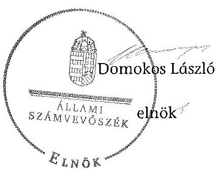

---

# RÖVIDÍTÉSEK JEGYZÉKE 

## Jogszabályok

| Alaptörvény | Magyarország Alaptörvénye (2011. április 25.) (hatályos: 2012. január 1-jétől) |
| :--: | :--: |
| Áht. | Az államháztartásról szóló 1992. évi XXXVIII. törvény (hatálytalan: 2012. január 1-jétől) |
| Áht. | Az államháztartásról szóló 2011. évi CXCV. törvény (hatályos: 2012. január 1-jétől) |
| ÁSZ tv. | Az Állami Számvevőszékről szóló 2011. évi LXVI. törvény (hatályos: 2011. július 1-jétől) |
| Avtv. | A személyes adatok védelméről és a közérdekú adatok nyilvánosságáról szóló 1992. évi LXIII. törvény (hatálytalan: 2012. január 1-jétől) |
| Evt. | Az erdőről, az erdő védelméről és az erdőgazdálkodásról szóló 2009. évi XXXVII. törvény (hatályos: 2009. július 10étől) |
| Evr. | Az erdőről, az erdő védelméről és az erdőgazdálkodásról szóló 2009. évi XXXVII. törvény végrehajtásáról szóló 153/2009. (XI. 13.) FVM rendelet (hatályos: 2009. november 21-étől) |
| Gt. | A gazdasági társaságokról szóló 2006. évi IV. törvény (hatálytalan: 2014. március 15-étől) |
| Info tv. | Az információs önrendelkezési jogról és az információszabadságról szóló 2011. évi CXII. törvény (hatályos: 2011. július 27 -étől kivéve a 1-37. §, a 38. § (1)-(3) bekezdése, a 38. § (4) bekezdés a)-f) pontja, a 38. § (5) bekezdése, a 39. §, a 41-68. §, a 70-72. §, a 75-77. § és a 79-88. §, valamint az 1. melléklet, ami 2012. január 1-jén lépett hatályba és a 38. § (4) bekezdés g) és h) pontja, valamint a 69. §, ami 2013. január 1-jén lépett hatályba) |
| Nfatv. | A Nemzeti Földalapról szóló 2010. évi LXXXVII. törvény (hatályos: 2010. szeptember 1-jétől) |
| Nvtv. | A nemzeti vagyonról szóló 2011. évi CXCVI. törvény (hatályos: 2011. december 31-étől) |
| Ptk. (régi) | A Polgári Törvénykönyvről szóló 1959. évi IV. törvény (hatálytalan: 2014. március 15-étől) |
| Ptk. (új) | A Polgári Törvénykönyvről szóló 2013. évi V. törvény (hatályos: 2014. március 15-étől) |
| Számv. tv. | A számvitelről szóló 2000. évi C. törvény (hatályos: 2001. január 1-jétől) |
| Vadvédelmi tv. | A vad védelméről, a vadgazdálkodásról, valamint a vadászatról szóló 1996. évi LV. tv. (hatályos: 1997. március 1jétől) |

---

Vtv.
Vhr.

## Egyéb rövidítések

Alapító okirat $_{1}$
Alapító okirat $_{2}$
Alapító okirat ${ }_{3}$
Alapító okirat ${ }_{4}$
Alapító okirat ${ }_{5}$
Alapító okirat ${ }_{6}$
Alapító okirat ${ }_{7}$
Alapító okirat ${ }_{8}$
Alapító okirat ${ }_{9}$
Alapító okirat ${ }_{10}$
Alapító okirat ${ }_{11}$
Alapító okirat ${ }_{12}$
Alapító okirat ${ }_{13}$
Alapító okirat ${ }_{14}$
ÁsZ
Belső ellenőrzési szabályzat
Beruházási szabályzat ${ }_{1}$
Beruházási szabályzat ${ }_{2}$
Erdészeti Hatóság ${ }_{1}$

Erdészeti Hatóság ${ }_{2}$

Az állami vagyonról szóló 2007. évi CVI. törvény (hatályos: 2007. szeptember 25-étől)
Az állami vagyonnal való gazdálkodásról szóló törvény végrehajtásáról szóló 254/2007. (X. 4.) Korm. rendelet (hatályos: 2007. október 4-étől)

A NYÍRERDŐ Zrt. Alapító okirata (hatályos: 2008. december 20-ától)
NYÍRERDŐ Zrt. Alapító okirata (hatályos: 2009. május 11-étől)
A NYÍRERDŐ Zrt. Alapító okirata (hatályos: 2009. május 27-étől)
A NYÍRERDŐ Zrt. Alapító okirata (hatályos: 2009. augusztus 1-jétől)
A NYÍRERDŐ Zrt. Alapító okirata (hatályos: 2010. február 10-étől)
A NYÍRERDŐ Zrt. Alapító okirata (hatályos: 2010. május 31-étől)
A NYÍRERDŐ Zrt. Alapító okirata (hatályos: 2010. július 13-ától)
A NYÍRERDŐ Zrt. Alapító okirata (hatályos: 2011. március 7 -étől
A NYÍRERDŐ Zrt. Alapító okirata (hatályos: 2011. július 20-ától)
A NYÍRERDŐ Zrt. Alapító okirata (hatályos: 2012. január 17-étől)
A NYÍRERDŐ Zrt. Alapító okirata (hatályos: 2013. augusztus 1-jétől)
A NYÍRERDŐ Zrt. Alapító okirata (hatályos: 2014. május 28-ától)
A NYÍRERDŐ Zrt. Alapító okirata (hatályos: 2014. június 16-ától)
Állami Számvevőszék
A NYÍRERDŐ Zrt. Belső ellenőrzési szabályzata (hatályos: 1996. augusztus 8-ától)
A NYÍRERDŐ Zrt. Beruházási szabályzata (hatályos: 1996. január 1-jétől)

A NYÍRERDŐ Zrt. Beruházási szabályzata (hatályos: 2013. október 1-jétől)

Szabolcs-Szatmár-Bereg Megyei Mezőgazdasági Szakigazgatási Hivatal Erdészeti Igazgatóság 2010. december 31-éig, Szabolcs-Szatmár-Bereg Megyei Kormányhivatal Erdészeti Igazgatóság 2011. január 1-jétől
Hajdú-Bihar Megyei Mezőgazdasági Szakigazgatási Hiva-

---

|  | tal Erdészeti Igazgatóság 2010. december 31-éig, Hajdú- |
| :--: | :--: |
| Értékelési Szabályzat | Bihar Megyei Kormányhivatal Erdészeti Igazgatóság 2011. január1-jétől |
| EU | A NYÍRERDŐ Zrt. Értékelési szabályzata (hatályos: 2001. március 30-ától) |
| FB | Európai Unió |
| Ft | A NYÍRERDŐ Zrt. Felügyelő Bizottsága |
| ha | forint |
| HM | hektár |
| hrsz. | Honvédelmi Minisztérium |
| IG | helyrajzi szám |
| KVI | A NYÍRERDŐ Zrt. Igazgatósága |
| Leltározási Szabályzat | Kincstári Vagyoni Igazgatóság |
| M | A NYÍRERDŐ Zrt. Leltározási Szabályzat (hatályos: 1996. január 1-jétől) |
| MFB | millió |
| MNV Zrt. | Magyar Fejlesztési Bank Zártkörűen Múködő Részvénytársaság |
| NFA | Magyar Nemzeti Vagyonkezelő Zrt., amely 2010. szeptember 1-jétől a Nemzeti Földalapba nem tartozó állami vagyon feletti tulajdonosi joggyakorló |
| NIF Zrt. | Nemzeti Földalapkezelő Szervezet, amely 2010. szeptember 1-jétől az Nfatv.-ben meghatározott, a Nemzeti Földalapba tartozó földterületek feletti tulajdonosi joggyakor- |
| NVT | ló |
| NYÍRERDŐ Zrt., Társaság | Nemzeti Infrastruktúra Fejlesztő Zrt. |
| Számítástechnikai védelmi szabályzat ${ }_{1}$ | Nyírségi Erdészeti Zártkörűen Múködő Részvénytársaság |
| Számítástechnikai védelmi szabályzat ${ }_{2}$ | A NYÍRERDŐ Zrt. Számítástechnikai védelmi szabályzata (hatályos: 1999. július 1-jétől) |
| Számlarend | A NYÍRERDŐ Zrt. Számítástechnikai védelmi szabályzata (hatályos: 2013. július 15-étől) |
| Számviteli politika ${ }_{1}$ | A NYÍRERDŐ Zrt. Számlarendje (hatályos: 2001. márciustól) |
| Számviteli politika ${ }_{2}$ | A NYÍRERDŐ Zrt. Számviteli politikája (hatályos: 2009. január 1-jétől) |
| Számviteli politika ${ }_{3}$ | A NYÍRERDŐ Zrt. Számviteli politikája (hatályos: 2011. január 1-jétől) |
| SZMSZ $_{1}$ | A NYÍRERDŐ Zrt. Számviteli politikája (hatályos: 2013. október 1-jétől) |
| SZMSZ $_{2}$ | A NYÍRERDŐ Zrt. Szervezeti és Múködési Szabályzata (hatályos: 2000.szeptember 1-jétől) |
| SZMSZ $_{2}$ | A NYÍRERDŐ Zrt. Szervezeti és Múködési Szabályzata (hatályos: 2010. október 1-jétől) |
| Társaság feletti tulajdo- | A társaságok állami tulajdonú részesedése feletti tulajdo- |

---

nosi joggyakorló ${ }_{1}$
Társaság feletti tulajdonosi joggyakorló ${ }_{2}$

Vadászati Hatóság $_{1}$

Vadászati Hatóság ${ }_{2}$
vezérigazgató
VSZ
nosi jogokat gyakorló Magyar Nemzeti Vagyonkezelő Zrt. (2009. január 1-jétől 2010. június 16-áig)
A társaságok állami tulajdonú részesedése feletti tulajdonosi jogokat gyakorló Magyar Fejlesztési Bank Zrt. (2010. június 17-étől 2014. július 15-éig)
Szabolcs-Szatmár-Bereg Megyei Mezőgazdasági Szakigazgatási Hivatal Földművelésügyi Igazgatósága Vadászati és Halászati Osztály 2010. december 31-éig, Szabolcs Szatmár-Bereg Megyei Kormányhivatal Földmúvelésügyi Igazgatósága Vadászati és Halászati Osztály 2011. január 1-jétől
Hajdú-Bihar Megyei Mezőgazdasági Szakigazgatási Hivatal Földművelésügyi Igazgatósága Vadászati és Halászati Osztály 2010. december 31-éig, Hajdú-Bihar Megyei Kormányhivatal Földművelésügyi Igazgatósága Vadászati és Halászati Osztály 2011. január 1-jétől
A NYÍRERDŐ Zrt. vezérigazgatója
A KVI-vel 1996. november 1-jén kötött ideiglenes Vagyonkezelési szerződés (azonosítója: 01840-96-02063) és az MNV Zrt.-vel 2009. június 16-án kötött módosítása (azonosítója: SZT-31.282)

---

# FOGALOMTÁR 

állami vagyon
a) az állam tulajdonában lévő dolog, valamint dolog módjára hasznosítható természeti erő;
b) az a) pont hatálya alá tartozó mindazon vagyon, amely vonatkozásában törvény az állam kizárólagos tulajdonjogát nevesíti;
c) az állam tulajdonában lévő tagsági jogviszonyt megtestesítő értékpapír, illetve az államot megillető egyéb társasági részesedés;
d) az államot megillető olyan immateriális, vagyoni értékkel rendelkező jogosultság, amelyet jogszabály vagyoni értékű jogként nevesít;
e) az állam tulajdonában lévő pénzügyi eszközök.
Az állami vagyon használója az a természetes vagy jogi személy, jogi személyiséggel nem rendelkező szervezet, aki, vagy amely törvény vagy szerződés alapján, bármely jogcímen (bérlet, haszonbérlet, használat stb.) állami vagyont birtokol, használ, szedi annak hasznait. (Ide nem értve a haszonélvezőt, a vagyonkezelőt és a tulajdonosi jogok gyakorlóját.)
átlátható szervezet
földbirtok-
politikai irányelvek
hasznosítás
immateriális szolgáltatásából származó bevétel
információs és kommunikációs rendszer
kockázatkezelés
kockázatkezelési rendszer

Állami vagyon:
a) az állam tulajdonában lévő dolog, valamint dolog módjára hasznosítható természeti erő;
b) az a) pont hatálya alá tartozó mindazon vagyon, amely vonatkozásában törvény az állam kizárólagos tulajdonjogát nevesíti;
c) az állam tulajdonában lévő tagsági jogviszonyt megtestesítő értékpapír, illetve az államot megillető egyéb társasági részesedés;
d) az államot megillető olyan immateriális, vagyoni értékkel rendelkező jogosultság, amelyet jogszabály vagyoni értékủ jogként nevesít;
e) az állam tulajdonában lévő pénzügyi eszközök.

Az állami vagyon használója az a természetes vagy jogi személy, jogi személyiséggel nem rendelkező szervezet, aki, vagy amely törvény vagy szerződés alapján, bármely jogcímen (bérlet, haszonbérlet, használat stb.) állami vagyont birtokol, használ, szedi annak hasznait. (Ide nem értve a haszonélvezőt, a vagyonkezelőt és a tulajdonosi jogok gyakorlóját.)
Átlátható szervezet a Nvtv. 3. § (1) bekezdés 1. pontjában felsorolt, a meghatározott követelményeknek megfelelő szervezet.
Az Nfatv. 15. § (3) bekezdés a)-s) pontjaiban meghatározott, a Nemzeti Földalapba tartozó földrészletek hasznosítására vonatkozó irányelvek.
Hasznosítás a tulajdonosi joggyakorló vagy a nemzeti vagyon használója által a nemzeti vagyon birtoklásának, használatának, hasznok szedése jogának bármely - a tulajdonjog átruházását nem eredményező - jogcímen történő átengedése, ide nem értve a vagyonkezelésbe adást, valamint a haszonélvezeti jog alapítását.
Immateriális szolgáltatásból származó bevételek azok a nem anyagjellegű szolgáltatásokból származó állami bevételek, amelyeket az Evt. 3. § (1) bekezdése szerint, a külön jogszabályban meghatározott részletes feltételek szerint, az erdők fenntartására, gyarapítására és védelmére kell fordítani.
Az információs és kommunikációs rendszer biztosítja, hogy az információk eljussanak az illetékes szervezethez, szervezeti egységhez, illetve személyhez.
A kockázatkezelés a szervezet céljai elérésével kapcsolatos kockázatok azonosításának és elemzésének, valamint a megfelelő válaszok meghatározásának folyamata.
A kockázatkezelési rendszer működtetése során fel kell mérni és meg kell állapítani a szervezet tevékenységében, gaz-

---

kontrolling
kontrollkörnyezet
kontrolltevékenységek
közfeladat
monitoring
dálkodásában rejlő kockázatokat, valamint meg kell határozni az egyes kockázatokkal kapcsolatban szükséges intézkedéseket, valamint azok teljesítésének folyamatos nyomon követésének módját.

A kockázatkezelési rendszer olyan irányítási eszközök és módszerek összessége, amelynek elemei a szervezeti célok elérését veszélyeztető tényezők (kockázatok) azonosítása, elemzése, nyomon követése, valamint szükség esetén a kockázati kitettség mérséklése.
Az a vezetéstámogató rendszer, amely a vezetői tervezést, ellenőrzést, valamint információ-ellátást koordinálja célorientáltan a környezeti változásokhoz igazodva.
A kontroll környezet elemei: a szervezeti struktúra, a felelősségi, hatásköri viszonyok és feladatok, a szervezet minden szintjén meghatározott etikai elvárások, a humánerőforráskezelés. A kontrollkörnyezet alapozza meg a belső kontroll összes többi elemét a fegyelem és a struktúra biztosítása által.
A kontrollrendszer a kockázatok kezelése és tárgyilagos bizonyosság megszerzése érdekében kialakított folyamatrendszer, amely azt a célt szolgálja, hogy megvalósuljanak a következő célok:
a) a múködés és a gazdálkodás során a tevékenységeket szabályszerűen, gazdaságosan, hatékonyan, eredményesen hajtsák végre,
b) az elszámolási kötelezettségeket teljesítsék, és
c) megvédjék az erőforrásokat a veszteségektől, károktól és nem rendeltetésszerű használattól.
A kontrolltevékenységek azok az elvek (politikák) és eljárások, amelyeket a kockázatok meghatározása és a szervezet céljainak elérése érdekében alakítanak ki.
A közfeladat jogszabályban meghatározott állami vagy önkormányzati feladat, amit az arra kötelezett közérdekből, jogszabályban meghatározott követelményeknek és feltételeknek megfelelve végez, ideértve a lakosság közszolgáltatásokkal való ellátását, továbbá az állam nemzetközi szerződésekben vállalt kötelezettségeiből adódó közérdekű feladatokat, valamint e feladatok ellátásához szükséges infrastruktúra biztosítását is.

Az Evt. 2. § (2) bekezdése szerint a fenntartható erdőgazdálkodás során a legfontosabb közérdekű feladat az erdők változatosságának megőrzése, az erdők fenntartása, felújítása és a védelmi, valamint közjóléti szolgáltatások biztosítása, melyek elvégzését az állam megfelelő eszközökkel biztosítja. A szervezet tevékenységének, a célok megvalósításának nyomon követését biztosító rendszer, amely az operatív tevékenységek keretében megvalósuló folyamatos és eseti nyomon követésből, valamint az operatív tevékenységektől

---

Nemzeti Földalap
nemzeti vagyon használója
rábízott állami vagyon
társasági portfólió
tulajdonosi ellenőrzés
tulajdonosi joggyakorló
tulajdonosi joggyakorlás módja
függetlenül múködő belső ellenőrzésből áll.
A monitoring a projektek és programok végrehajtásának nyomon követése, mely a támogató és a kedvezményezett közti megállapodásban foglalt eljárások követését, az előrehaladás ellenőrzését és a lehetséges problémák időben történő azonosítását szolgálja.
A Nemzeti Földalap a kincstári vagyon része, amelybe beletartoznak az állam tulajdonában és az ingatlannyilvántartásban levő, az Nfatv. 1. § (1)-(2) bekezdéseiben felsorolt területek, földrészletek és az azokhoz kapcsolódó vagyoni értékű jogok.
A nemzeti vagyon használója az a természetes személy, jogi személy vagy jogi személyiséggel nem rendelkező szervezet, aki, vagy amely állami vagyon tekintetében törvény vagy szerződés alapján, a helyi önkormányzat vagyona tekintetében törvény, a helyi önkormányzat rendelete vagy szerződés alapján bármely jogcímen nemzeti vagyont birtokol, használ, szedi annak hasznait, kivéve a tulajdonosi joggyakorló (az Nvtv. 3. § (1) bekezdés 11. pontja alapján).
Rábízott állami vagyon az a Vtv. alkalmazásában állami vagyonnak minősülő vagyon, amit az MNV- a saját vagyonától elkülönítetten - kezel és nyilvántart.

Az Mfbtv. 3. § (9) bekezdése szerint rábízott állami vagyon az a vagyon, amely felett az Mfbtv. erejénél fogva a Magyar Állam nevében az MFB gyakorolja a tulajdonosi jogokat.

Az Nfatv. 1. § (1) bekezdésében foglaltak alapján az NFAhoz tartozó rábízott vagyon a törvényben meghatározott, a Nemzeti Földalapba tartozó vagyon.
Társasági portfólió az MNV, illetve az MFB rábízott vagyonába tartozó állami tulajdonú társasági részesedések.
A tulajdonosi joggyakorló által végzett ellenőrzés, amelynek célja az állami vagyonnal való gazdálkodás vizsgálata, ennek keretében a rendeltetésellenes, jogszerútlen, szerződésellenes, vagy a tulajdonos érdekeit sértő, illetve a központi költségvetést hátrányosan érintő vagyongazdálkodási intézkedések feltárása és a jogszerű állapot helyreállítása, továbbá a vagyonnyilvántartás hitelességének, teljességének és helyességének biztosítása.
Tulajdonosi joggyakorló az, aki az állami, illetve a nemzeti vagyon felett az államot megillető tulajdonosi jogok és kötelezettségek gyakorlására jogosult.
Az állami vagyon felett a Magyar Államot megillető tulajdonosi jogoknak (és kötelezettségeknek) az összességét az állami vagyon felügyeletéért felelős miniszter gyakorolja, aki e feladatát az MNV, az MFB, illetve egyéb tulajdonosi joggyakorló szervezet (pl. központi költségvetési szervek,

---

100\%-ban állami tulajdonban álló gazdasági társaságok) útján látja el.

Azon állami tulajdonban álló ingatlanok felett, amelyek egy része a Nemzeti Földalapba tartozik, a tulajdonosi jogokat a miniszter az agrárpolitikáért felelős miniszterrel közösen gyakorolja.

A Nemzeti Földalap felett a Magyar Állam nevében a tulajdonosi jogokat és kötelezettségeket az agrárpolitikáért felelős miniszter a Nemzeti Földalapkezelő Szervezet útján gyakorolja.
vagyongazdálkodás feladata
vagyonkezelői jog

Az állami vagyon rendeltetésének megfelelő - az állami feladatok ellátásához, a társadalmi szükségletek kielégítéséhez, valamint a Kormány gazdaságpolitikája megvalósításának elősegittéséhez szükséges, egységes elveken alapuló, önálló ágazatként megjelenő - hatékony, költségtakarékos, értékmegőrző, értéknövelő felhasználásának biztosítása, beleértve a vagyoni kör változását eredményező értékesítést, valamint az állami vagyon gyarapítása is.
Vagyonkezelési szerződés alapján a vagyonkezelő jogosult meghatározott, állami tulajdonba tartozó dolog birtoklására, használatára és hasznai szedésére.

A Vtv. alapján a vagyonkezelői jog az állami vagyon hasznosítására az MNV-vel kötött vagyonkezelési szerződéssel jön létre. A vagyonkezelési szerződés alapján a vagyonkezelő̉ jogosult meghatározott, állami tulajdonba tartozó dolog birtoklására, használatára és hasznai szedésére.

Az Nfatv. alapján a vagyonkezelői jog az erre irányuló (NFA-val kötött) szerződéssel jön létre. A vagyonkezelői szerződés alapján a vagyonkezelő jogosult meghatározott földrészlet birtoklására, használatára és hasznai szedésére. A vagyonkezelő köteles a földrészlet értékét megőrizni, állagának megóvásáról, jó karban tartásáról gondoskodni, továbbá - az Nfatv.-ben meghatározott esetek kivételével díjat - fizetni vagy a szerződésben előírt más kötelezettséget teljesíteni.

---

A NYÍRERDŐ Zrt. vagyonának alakulása a 2009-2013. évek közötti időszakban eszközök (M Ft)
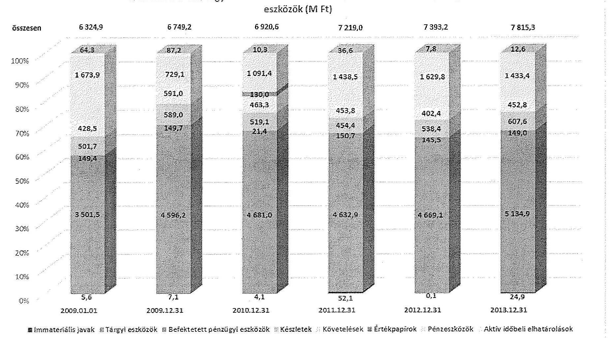

---

A NYÍRERDŐ Zrt. vagyonának alakulása a 2009-2013. évek közötti időszakban források (M Ft)

|  055255 | 6324,9 | 6749,2 | 6920,6 | 7219,0 | 7393,2 | 7815,3  |
| --- | --- | --- | --- | --- | --- | --- |
|  100% | 3027,8 | 3384,1 | 3880,7 | 4134,9 | 4349,6 | 4614,6  |
|  80% | 550,5 | 465,1 | 393,0 | 371,1 | 358,7 | 388,8  |
|  70% | 749,4 | 635,5 | 619,1 | 515,7 | 472,8 | 581,2  |
|  50% | 372,0 | 284,3 | 247,5 | 217,0 | 231,9 | 250,5  |
|  40% | 1625,2 | 1980,2 | 1980,2 | 1980,2 | 1980,2 | 1980,2  |
|  30% |  |  |  |  |  | 1980,2  |
|  2009.01.01 |  | 2009.12.31 | 2010.12.31 | 2011.12.31 | 2012.12.31 | 2013.12.31  |
|   |  |  | ☑ Jegyzett tőke | ☑ Mérleg szerinti eredmény | ☑ Rövid lejáratú kötelezettségek | ☑ Passzív időbeli elhatárolások  |

---

# Kimutatás a NYÍRERDŐ Zrt. befektetett eszközei állományának alakulásáról a 2009-2014. I. féléve közötti időszakra vonatkozóan

adatok ezer Ft-ban

|  Sorszám | MEGNEVEZÉS | 2009. év |  |  | 2010. év |  |  | 2011. év |  |  | 2012. év |  |  | 2013. év |  |  | 2014.06.30 |  |   |
| --- | --- | --- | --- | --- | --- | --- | --- | --- | --- | --- | --- | --- | --- | --- | --- | --- | --- | --- | --- |
|   |  | Összesen | Állom | Szárt | Összesen | Állom | Szárt | Összesen | Állom | Szárt | Összesen | Állom | Szárt | Összesen | Állom | Szárt | Összesen | Állom | Szárt  |
|   |  | 1. | 2. | 3. | 4. | 5. | 6. | 7. | 8. | 9. | 10. | 11. | 12. | 13. | 14. | 15. | 16. | 17. | 18.  |
|  1. | Nyitó állomány | 3656475 | 0 | 3656475 | 4753034 | 0 | 4753034 | 4706468 | 0 | 4706468 | 4835682 | 0 | 4835682 | 4814802 | 0 | 4814802 | 5308789 | 0 | 5308789  |
|  2. | Terv szerinti értékcsökkenés | 280282 | 0 | 280282 | 331414 | 0 | 331414 | 356969 | 0 | 356969 | 413935 | 0 | 413935 | 378888 | 0 | 378888 | 183162 | 0 | 183162  |
|  3. | Terven felüli értékcsökkenés | 172 | 0 | 172 | 0 | 0 | 0 | 0 | 0 | 0 | 0 | 0 | 0 | 0 | 0 | 0 | 0 | 0 | 0  |
|  4. | Értékvesztés elszámolása | 2113 | 0 | 2113 | 0 | 0 | 0 | 0 | 0 | 0 | 3639 | 0 | 3639 | 0 | 0 | 0 | 0 | 0 | 0  |
|  5. | Értékesítés | 13330 | 0 | 13330 | 9380 | 0 | 9380 | 10317 | 0 | 10317 | 4431 | 0 | 4431 | 4529 | 0 | 4529 | 1053 | 0 | 1053  |
|  6. | Súlyjavas | 5410 | 0 | 5410 | 9480 | 0 | 9480 | 12917 | 0 | 12917 | 26444 | 0 | 26444 | 9826 | 0 | 9826 | 2901 | 0 | 2901  |
|  7. | Átcsinifaltás | 3753 | 0 | 3753 | 137528 | 0 | 137528 | 11174 | 0 | 11174 | 4781 | 0 | 4781 | 6380 | 0 | 6380 | 0 | 0 | 0  |
|  8. | Ingyenes átadás | 0 | 0 | 0 | 0 | 0 | 0 | 0 | 0 | 0 | 0 | 0 | 0 | 0 | 0 | 0 | 0 | 0 | 0  |
|  9. | Egyéb | 3083 | 0 | 3083 | 1622 | 0 | 1622 | 5298 | 0 | 5298 | 3039 | 0 | 3039 | 36046 | 0 | 36046 | 1140 | 0 | 1140  |
|  10. | Csökkenés összesen | 308143 | 0 | 308143 | 489424 | 0 | 489424 | 396673 | 0 | 396673 | 455287 | 0 | 455287 | 436321 | 0 | 436321 | 188256 | 0 | 188256  |
|  11. | Terv szerinti beruházás | 859285 | 0 | 859285 | 263714 | 0 | 263714 | 272708 | 0 | 272708 | 339200 | 0 | 339200 | 597075 | 0 | 597075 | 221676 | 0 | 221676  |
|  12. | Terv szerinti felújítás | 50314 | 0 | 50314 | 19467 | 0 | 19467 | 44386 | 0 | 44386 | 67526 | 0 | 67526 | 217902 | 0 | 217902 | 1413 | 0 | 1413  |
|  13. | Terv szerinti növekedés | 909599 | 0 | 909599 | 283181 | 0 | 283181 | 317094 | 0 | 317094 | 406726 | 0 | 406726 | 814977 | 0 | 814977 | 223089 | 0 | 223089  |
|  14. | Egyéb beruházás | 380364 | 0 | 380364 | 111142 | 0 | 111142 | 61962 | 0 | 61962 | 27557 | 0 | 27557 | 75006 | 0 | 75006 | 2476 | 0 | 2476  |
|  15. | Egyéb felújítás | 112339 | 0 | 112339 | 15367 | 0 | 15367 | 3303 | 0 | 3303 | 0 | 0 | 0 | 35347 | 0 | 35347 | 2342 | 0 | 2342  |
|  16. | Átcsinifaltás | 1600 | 0 | 1600 | 800 | 0 | 800 | 130000 | 0 | 130000 | 0 | 0 | 0 | 0 | 0 | 0 | 1600 | 0 | 1600  |
|  17. | Átvétel | 0 | 0 | 0 | 0 | 0 | 0 | 0 | 0 | 0 | 0 | 0 | 0 | 0 | 0 | 0 | 0 | 0 | 0  |
|  18. | Értékvesztés visszabása | 0 | 0 | 0 | 0 | 0 | 0 | 0 | 0 | 0 | 0 | 0 | 0 | 170 | 0 | 170 | 76 | 0 | 76  |
|  19. | Értékcsökkenés visszabása | 0 | 0 | 0 | 0 | 0 | 0 | 0 | 0 | 0 | 0 | 0 | 0 | 0 | 0 | 0 | 0 | 0 | 0  |
|  20. | Egyéb | 800 | 0 | 800 | 32368 | 0 | 32368 | 15530 | 0 | 15530 | 124 | 0 | 124 | 4808 | 0 | 4808 | 4667 | 0 | 4667  |
|  21. | Terven felüli növekedés | 495103 | 0 | 495103 | 159677 | 0 | 159677 | 208795 | 0 | 208795 | 27681 | 0 | 27681 | 115331 | 0 | 115331 | 11161 | 0 | 11161  |
|  22. | Növekedés összesen | 1404702 | 0 | 1404702 | 442858 | 0 | 442858 | 525889 | 0 | 525889 | 434407 | 0 | 434407 | 930308 | 0 | 930308 | 234250 | 0 | 234250  |
|  23. | Záró állomány | 4753034 | 0 | 4753034 | 4706468 | 0 | 4706468 | 4835682 | 0 | 4835682 | 4814802 | 0 | 4814802 | 5308789 | 0 | 5308789 | 5354783 | 0 | 5354783  |

---

.

---

# ÁLLAMI SZÁMVEVŐSZÉK 

1052, Budapest Apáczai Cscre János utca 10.

Domokos László Úr!
elnök részére
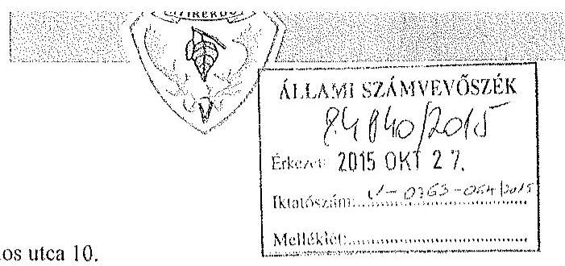

Iktatószám: V-0763-057/2015
Vizsgálat-azonosító: V070615
Üisz.: 548-1/2015.
Üi.: Tamás Zsolt

## Tisztelt Elnök Úr!

„Az állami tulajdonban álló erdőgazdasági társaságok vagyongazdálkodási tevékenységének ellenőrzése - NYÍRERDŐ Nyírségi Erdészeti Zrt." címmel készített számvevőszéki jelentéstervezetet köszönettel megkaptuk, melyhez az alábbi észrevételeket tesszük:
1.) Tudomásul vesszük és egyetértünk azzal a generális megállapítással (7. oldal) miszerint „a Társaság vagyonkezelői kötelezettségét teljesítette" „A Társaság stratégiai- és üzleti tervei a kezelésbe vett vagyon megőrzésére, gyarapítására vonatkozó elemeket tartalmazzák, azokat érvényesítették a vagyongazdálkodás során. A tervekről készült beszámolók, üzleti jelentések alapján megállapítható, hogy a Társaság megfelelően teljesítette az ágazati tervekben, illetve az üzleti tervekben megfogalmazott előírásokat. ... Az ellenőrzött időszakban a Társaság a saját eszközei után elszámolt értékcsökkenés összegének közel kétszeresét fordította beruházásokra."
2.) Az „Összegző megállapítások, következtetések, javaslatok" fejezet első bekezdésében - és utána számos alkalommal - vastagon szedetten szereplő megállapítás, hogy a „Társaság mérlege nem volt megbízható, mert nem a valós állapotot tükrözte". Megítélésünk szerint a NYÍRERDŐ Zrt. éves beszámolói ezen adat nélkül is a valós állapotot tükrözik, a kiegészítő mellékletek tartalmazták az erre vonatkozó tényeket, adatokat, figyelem felhívást.
A Számviteli törvény előírásainak akkor tudunk megfelelni, ha a Pénzügyminisztérium 1997. évi állásfoglalásával összhangban „... a kezelt kincstári vagyon megfelelő módon, dokumentáltan értékelésre kerül".
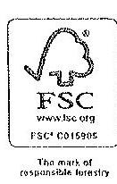

NYÍRERDŐ Zrt.
H-4400 Nyíregyháza, Kótaji u. 29.
Tel.: (+36) 42 / 598-450 Fax: $(+36) 42 / 501-170$
E-mail: info@nyirerdo.hu Internet: www.nyirerdo.hu

---

Ez a vagyon a hatályos jogi szabályok értelmében a Magyar Állam kizárólagos tulajdonát képezi és a túlajdonosi jogok gyakorlója egyrészt a Nemzeti Földalapkezelő Szervezet, másrészt a Magyar Nemzeti Vagyonkezelő Zrt. Tudomásunk szerint sem jogszabály, sem szerződés nem írja elő, hogy a Társaság által vagyonkezelt állami vagyon értékét a vagyonkezelőnek kellene megállapítani. Amint ezen vagyonértékelési adattartalom rendelkezésünkre fog állni, természetesen a törvényi előírásoknak megfelelően fogunk eljárni.
A vagyonérték megállapítását, és azt követően a folyamatos követését befolyásolja az, hogy nem forgalomképes vagyontárgyakról van szó, a módszertan kidolgozatlan, és valószínűleg jelentős költségigényű. A költséghaszon összevetésének számviteli alapelve szerint: a beszámolóban nyilvánosságra hozott információk hasznosíthatósága álljon arányban az információk előállításának költségeivel.

A vizsgálat megfogalmazott céljainak teljesítését elősegítené, ha az Állami Számvevőszék egyértelműen állást foglalna abban, hogy a Magyar Állam tulajdonosi joggyakorlójának (vagyonkezelésbe adó) feladata a kezelt vagyon értékének meghatározása összhangban a Nemzeti Vagyonról szóló 2011. évi CXCVI. tv 10.§ (1) bekezdéssel.
„10. § (1) A nemzeti vagyont, annak értékét és változásait a tulajdonosi joggyakorló nyilvántartja. Az érték nyilvántartásától el lehet tekinteni, ha az adott vagyontárgy értéke természeténél, jellegénél fogva nem állapítható meg. A nyilvántartásnak tartalmaznia kell a vagyon elsődleges rendeltetése szerinti közfeladat megjelölését is. A nyilvántartási adatok - a minősített adat védelméről szóló törvény szerinti minősített adat kivételével - nyilvánosak.
3.) A Leltározási szabályzatunk valóban nem került módosításra a Számviteli Törvény változását követően, a mennyiségi felvételezés gyakoriságát illetően. Ugyanakkor szükségesnek tartom hangsúlyozni, hogy a végrehajtott leltározások ebből a szempontból is megfelelttek a Számviteli Törvény rendelkezéseinek (2010. és 2013. években mennyiségi felvételezéssel történt a leltározás, 19. oldal megállapításaival összhangban). A szabályzat módosítása 2016. január 1-i hatályba lépéssel folyamatban van.
4.) A jelentéstervezet javaslatot tesz arra vonatkozóan, hogy a NYÍRERDŐ Zrt. tegyen intézkedéseket a tulajdonosi joggyakorlókkal közreműködve a tényleges állapotnak és a hatályos jogszabályi előírásoknak megfelelő vagyonkezelési szerződés megkötése érdekében.
Az ideiglenes vagyonkezelési szerződés létrejöttét követően (1996.11.01.) a vagyonkezelési szerződés módosítása, ill. „véglegessé tétele" több alkalommal napirenden volt. Társaságunk ezen módosítási kezdeményezésekkel együttműködött a mindenkori tulajdonosi jogok gyakorlójával (minden esetben részletes szakmai és jogi vélemény, indítvány kimunkálása és megküldése mellett). Nem a NYÍRERDŐ Zrt. mindenkori vezérigazgatóján és

---

menedzsmentjén múlt, hogy a vagyonkezelési szerződés ideiglenes maradt és a jogszabályváltozások nem kerültek átvezetésre. Szükségesnek tartom megjegyezni, hogy ezen problémával együtt is - a vizsgálat megállapításaival összhangban - a vonatkozó jogszabályok rendelkezései betartásra kerültek.

Az Alapitó Okirat, majd jogszabályváltozás folytán az Alapszabály 2004. november 29 -től az Alapitó részvényes kizárólagos hatáskörébe utalta a vagyonkezelési szerződés megkötésének és módosításának jogát.

Hatályos Alapszabályunk 12.2.bb) pontja kimondja, hogy az Alapitó kizárólagos hatáskörébe tartozik a döntés az állami erdőterületek kezelésére vonatkozó vagyonkezelési szerződés megkötéséről, módosításáról.

A fenti rendelkezések nem teszik lehetővé, hogy a jelentéstervezetben megfogalmazott javaslatot - mely szerint a Társaság vezérigazgatója tegyen intézkedéseket a vagyonkezelési szerződés megkötése érdekében - a vezérigazgató végrehajtsa.

A vezérigazgató hatásköre arra terjed ki, hogy a „Társaság Felügyelőbizottságának előzetes véleményezését követően" az alapítói (tulajdonosi) jogkört gyakorló Földműveléstigyi Miniszter Úrnál kezdeményezheti a végleges vagyonkezelési szerződés megkötése érdekében a szükséges intézkedések megtételét.

A végleges vagyonkezelési szerződés megkötésének kezdeményezése mindig is a tulajdonosi joggyakorló, vagyonkezelésbe adó (NFA, MNV Zrt.) hatásköre és jogosultsága volt.
5.) A vagyonkezelési díj megfizetésével kapcsolatosan nyilatkozunk, hogy a Társaság minden esetben számla ellenében az abban foglalt fizetési határidőben hiánytalanul - összhangban a hatályos Ideiglenes Vagyonkezelési Szerződésben foglaltakkal és az AFA Törvény előírásaival - teljesítette a fizetési kötelezettségét (VSz. 3.3.3.).
Az nem róható a Társaság terhére, hogy a vagyonkezelési díjról az arra jogosult a szerződéstől eltérően később bocsátott ki számlát figyelemmel arra is, hogy Társaságunk e viszonylatban kizárólag számla ellenében teljesíthet fizetési kötelezettséget.
6.) Megítélésünk szerint a NYÍRERDŐ Zrt. - más állami tulajdonban lévő erdőgazdasághoz hasonlóan - nem közfeladatot ellátó szervezet. A közcélú, közjöléti feladatok a szóhasználatot illetően valóban könnyen összetéveszthetőek a közfeladat elnevezéssel, azonban a közfeladatokat (állami és önkormányzati) jogszabály tételesen felsorolja és meghatározza azokat, ellentétben a jelentéstervezet 2. sz. melléklet „Fogalomtár", 2. oldalán hivatkozottal.

---

Ezt a vizsgálat során is több alkalommal rögzítettük, így álláspontunk szerint az Info tv. és az Avtv. szerint nincs a közérdekủ adatok megismerésére irányuló igények teljesítésére vonatkozó szabályzat készítési kötelezettségünk.
7.) Észrevételezzük továbbá:
a. az MNV Zrt. 2009. évi 355 millió forintos tőkeemelése üzleti célú fejlesztési projekt megvalósításához kapcsolódott, nem a vihar, természeti károk helyreállításához (13. oldal első bekezdésben),
b. a „Bevezetés" fejezet 4. oldalának harmadik bekezdésében a Nyírbátori Fafeldolgozó Üzem, mint önálló divízió nem került felsorolásra a jelentéstervezetben.

Kérjük észrevételeink megfontolását és a végleges számvevőszéki jelentésben történő feltüntetését, figyelembe vételét.

Nyíregyháza, 2015. október 20.

---

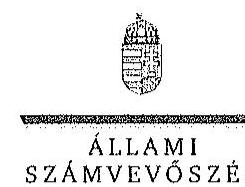

ELNök

Ikt.szám: V-0763-066/2015.

Szalacsi Árpád úr
vezérigazgató
NYÍRERDŐ Zrt.

Nyíregyháza

Tisztelt Vezérigazgató Úr!

A „Jelentéstervezet az állami tulajdonban álló erdőgazdasági társaságok vagyongazdálkodási tevékenységének ellenőrzése - NYÍRERDŐ Nyírségi Erdészeti Zrt." címmel készített számvevőszéki jelentéstervezetre tett észrevételeit köszönettel megkaptam.

Az Állami Számvevőszék észrevételekre vonatkozó álláspontjáról a felügyeleti vezető által készített részletes tájékoztatást csatoltan megküldöm.

Tájékoztatom Vezérigazgató urat, hogy a számvevőszéki jelentésben - az Állami Számvevőszékről szóló 2011. évi LXVI. törvény 29. § (3) bekezdése alapján - a figyelembe nem vett észrevételeket szerepeltetjük az elutasítás indokának feltüntetésével.

Budapest, 2015. 14. hó 20. nap

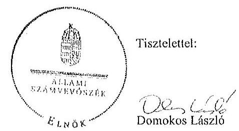

Melléklet: Tájékoztatás az elfogadott és el nem fogadott észrevételekről

1052 BUDAPEST, AFRICZN CSZTE JANOS UICA 10. 1354 Budapest 4. Pl. 54 telefon: 484 9101 fax: 484 9291

---

# Tájékoztatás   az elfogadott és az el nem fogadott észrevételekről 

A ,, Jelentéstervezet az állami tulajdonban álló erdőgazdasági társaságok vagyongazdálkodási tevékenységének ellenőrzése - NYÍRERDŐ Nyirségi Erdészeti Zrt." címủ jelentéstervezetre 2015. október 27 -én érkezett észrevételeit áttekintettük, azok kezelésével kapcsolatban a következő tájékoztatást adom.

1. A jelentéstervezet 7. oldal 3-4. bekezdésekkel kapcsolatos vélemény

A Társaság vagyonkezelői kötelezettségének teljesítésére vonatkozó megállapítással észrevételükben egyetértenek, ezért annak módosítása nem indokolt.

## 2. A jelentéstervezet 6. oldal első bekezdésére tett észrevétel

Az észrevételben leírtak a Társaság mérlegeivel kapcsolatosan tett megállapítást nem cáfolják. A Társaság mint vagyonkezelő a Vhr. 9. § (9) bekezdésében előírt kötelezettségét nem teljesítette, mert a Számv. tv. 23. § (2) bekezdése szerint a mérlegében eszközként nem mutatta ki a kezelésbe vett, az állami vagyon részét képező eszközöket, és ezen eszközöket a kiegészítő mellékletben - legalább mérlegtételek szerinti megbontásban - külön nem mutatta be. A Társaság a Vhr. és a Számv. tv. előírásainak betartása céljából nem tett lépéseket annak érdekében, hogy a vagyonkezeit eszközök értéke a VSZ-ben rögzítésre kerüljön. A fentiek alapján megállapításunk helytálló, módosítása nem indokolt.

## 3. A jelentéstervezet 6. oldal 5. bekezdésére tett észrevétel

Az észrevételükben leírtak a Leltározási Szabályzat módosításának elmaradásával kapcsolatos megállapítást nem vitatják, ezért annak módosítása nem indokolt.

## 4. A jelentéstervezet 10. oldal a NYÍRERDŐ Zrt. vezérigazgatójának 1. a) javaslatra tett észrevétel

A dokumentumokat ismételten áttekintettük és fenntartjuk az intézkedést igénylő javaslatunkat, mert az nem ellentétes az észrevételükben hivatkozott Alapitó Okiratban, valamint a Társaság Alapszabályában foglaltakkal. Az észrevételük megerősíti a javaslat szükségességét, miszerint azt írják, hogy ,,a vezérigazgató hatásköre arra terjed ki, hogy a Társaság Felügyelőbizottságának elözetes véleményezését követően az alapitói (tulajdonosi) jogkört gyakorló Földmüvelési Miniszter Úrnál kezdeményezteti a végleges vagyonkezelési szerződés megkötése érdekében a szükséges intézkedések megtételét."

---

# 5. A jelentéstervezet 7. oldal 2. bekezdésére tett észrevétel 

A vagyonkezelési díj megfizetésére tett nyilatkozatuk és a kiegészitő információk alátámasztják az ellenőrzés megállapítását, ezért annak módosítása nem indokolt.

## 6. A jelentéstervezet 2. sz. melléklet 2. oldal 5. fogalomra tett észrevétel

A nemzeti vagyonról szóló 2011. évi CXCVI. törvény (a továbbiakban: Nvt.) 3. § (1) bekezdés 7. pontja szerint közfeladat a jogszabályban meghatározott állami vagy önkormányzati feladat, amit az arra kötelezett közérdekből, jogszabályban meghatározott követelményeknek és feltételeknek megfelelve végez. A Társaság a Nvt. 2. melléklete szerint nemzetgazdasági szempontból kiemelt jelentőségủ nemzeti vagyonban tartandó $100 \%$-ban állami tulajdonban álló társaság. A NYÍRERDŐ Zrt. az erdőről, az erdő védelméről és az erdőgazdálkodásról szóló 2009. évi XXXVII. törvény (a továbbiakban: Erdőtv.) 2. § (2) bekezdése szerinti közérdekből, jogszabályban meghatározott követelmények és feltételek alapján közfeladatot lát el. Ezért a 2. sz. melléklet „közfeladat" fogalom meghatározásának módosítása nem indokolt.

Az észrevételük 2. felében - a közérdekủ adatok megismerésére irányuló igények teljesítésének rendjét rögzitő szabályzatkészitési kötelezettségre - a Jelentéstervezet 8. oldal utolsó mondatára és a 26. oldal 7. bekezdésére tett észrevételükre tájékoztatom arról, hogy az Avtv. 20. § (8) bekezdésében, illetve az Infotv. 30. § (6) bekezdésében foglaltak alapján, valamint az állami vagyonról szóló 2007. évi CVI. törvény 5. § (2) bekezdése szerint az állami vagyonnal gazdálkodó vagy azzal rendelkező szerv vagy személy a közérdekủ adatok nyilvánosságáról szóló törvény szerinti közfeladatot ellátó szervnek vagy személynek minősül. A NYÍRERDŐ Zrt. állami vagyonnal gazdálkodik, közfeladatot ellátó szervnek minősül, ezért el kell készítenie a közérdekủ adatok megismerésére irányuló igények teljesítésének rendjét rögzitő szabályzatot. Megállapításunk helytálló, módosítása nem indokolt.

## 7. a) A jelentéstervezet 13. oldal 1. bekezdésére tett észrevétel

A dokumentumok ismételten áttekintettük és a jelentéstervezet véglegesítése során a tőkeemelés célját „üzleti célú fejlesztési projeki megvalósitása" elnevezésre pontosítjuk.

## b) A jelentéstervezet 4. oldal 3. bekezdésére tett észrevétel

Az észrevételükben leírtakkal ellentétben a felsorolásban szerepeltetük a „nyirbátori" önálló divíziót, ezért szövegszerü kiegészités nem indokolt.

Budapest, 2015. A. hó 20. nap

Makkai Mária
felügyeleti vezető

---

.

---

# 7. SZÁMÚ MELLÉKLET A V-0763-072/2015. SZÁMÚ JELENTÉSHEZ 

## 1052 Budapest

Apáczai Cs. J. u. 10.

Ikt. sz.: MNV/01/50343/ 4 /2015.
Hiv. sz.: V-0763-060/2015.

Tisztelt Elnök Úr!
A 2015. október 13. napján „Az állami tulajdonban álló erdőgazdasági társaságok vagyongazdálkodási tevékenységének ellenörzése - NYÍRERDŐ Nyírségi Erdészeti Zrt." tárgyában kézhez vett, V-0763-060/2015. ikt. sz. Jelenrés-tervezetre az alábbi észrevételeket kivánom tenni.
L. fejezet / 7. old. első bekezdés, 9. old. negyedik-hatodik bekezdés, 10. old. első bekezdés, II.2.1. fejezet / 16. old. ötödik-hatodik bekezdés, II.5. fejezet / 28. old. első, harmadik, ötödik bekezdés és 10. old. Javaslat az MNV Zrt. vezérigazgatójának a)-c) postok
„Nem állt rendelkezésre a Vhr.-ben elöirt, a tulajdonosi joggyakorlás és a vagyongazdálkodási feladatok átlátható módon történő végrehajtását biztosító, a módosításokkal egységes szerkezetbe foglalt vagyonkezelési szerzödés. A szerzödő felek nem tettek eleget a Vhr.-ben foglalt rendelkezéseik és a Vhr. hatálybalépését követő hat hónapon belül nem kezdeményezték a Nemzeti Földalapba tartozó ingatlanokra vonatkozóan a VSZ megszüntetését és a Vtv., illetve a Vhr. szabályainak megfelelő szerződés megkötését."
„A vagyc: Jézelésbe adott állami vagyon tekintetében tulajdonosi jogokat gyakorló MNV Zrt. és NFA az ellenőrzött időszakban a VSZ-szel kapcsolatban feltárt hiányosságok megszüntetésére és a hatályos jogszabályoknak való megfeleltetetésére vonatkozóan nem kezdeményezett intézkedéseket, nem élt a Vhr.-ben foglalt, a kezelt vagyon használatára vonatkozó ellenőrzési jogával, valamint nem ellenőrizte a vagyonnyilvántartás hitelességét, teljességét és helyességét.

A NYÍRERDŐ Zrt. a Magyar Állam tulajdonában álló erdővagyon és egyéb múvelési ágú termöföld ingatlanok kezelését a KVI-vel 1996-ban kötött vagyonkezelési szerzödés alapján végezte. A Társaság, mint vagyonkezelö és a KVI között létrejött szerzödéses jogviszony kereteit a VSZ-ben foglalt jogok és kötelezettségek töltötték ki, azonban az nem támogatta a Vhr. 3. § (1) bekezdésében elöirt, a vagyongazdálkodási feladatok átlátható módon történő végrehajtását, valamint nem támogatta a szabályszerű vagyongazdálkodást. Az ellenőrzött idöszakban a VSZ hatályon kivül helyezett jogszabályi hivatkozásokat tartalmazott az Áht. és a Vadvédelmi tv. rendelkezései vonatkozásában és nem tartalmazott a Vtv., az Evt. és a Nvtv. elöirásaira való hivatkozásokat. A VSZ 3.2.1. pontja nem tartalmazta az Nvtv. 11. § (8) bekezdésének 2012. január 1-jétől hatályos, a vagyonkezelöi jog korlátozásaira vonatkozó elöírásokat. A VSZ 3.2.3. pontjában szereplő, a vagyonkezelöi jog átengedésére és a 3.12.2. pontjában rögzített, az erdő használati jogának átengedésére vonatkozó rendelkezés 2009. július 10-étől nem felelt meg az Nfatv. 19/A. § (4) és 20. § (7) bekezdései elöírásának. A VSZ-ben évente elöirt felülvizsgálatra az ellenőrzött idöszakban nem került sor. A felek nem tettek eleget a Vhr. 54. § (5) bekezdésében foglalt rendelkezésnek és a Vhr. hatálybalépését követő hat hónapon belül nem kezdeményezték a Nemzeti Földalapba tartozó ingatlanokra vonatkozóan a VSZ megszüntetését és a Vtv., illetve Vhr. szabályainak megfelelő szerzödés megkötését.

---

A vagyonkezelésbe odott állami vagyon tekintetében tulajdonosi jogokat gyakorló MNV Zrt. és NFA nem végeztek a Vhr. 20. § (1)-(2) bekezdéseiben és a Nemzeti Földalapba tartozó földrészletek hasznosításának részletes szabályairól szóló 262/2010. (XI.17.) Korm. rendelet 47. § (1)-(2) bekezdéseiben foglalt, a vagyonnyilvántartás hitelességére, teljességére és helyességére vonatkozó ellenőrzési a Társaságnál.

# Jonsokoz MNV Zrt. vezérigazgatójának 

a) Tegyen intézkedéseket az erdőgazdasági társaság közremüködésével a tényleges állapotot rögzitő és a hatályos jogszabályi előírásoknak megfelelő vagyonkezelési szerződés megkötésére.
b) Tegyen intézkedéseket a vagyonkezelési szerződés felülvizsgálatának elmaradásával, valamint a Nemzeti Földalapba tartozó ingatlanokra vonatkozó VSZ megszüntetésével összefüggésben feltárt szabálytuhanságok tekintetében a felelősség tisztázása érdekében, és szükség szerint intézkedjen a felelősség érvényesítéséről.
c) Intézkedjen a Társaság vagyonnyilvántartása hitelességének, teljességének és helyességének jogszabályban foglaltuk szerinti ellenőrzéséről."

Sajnálattal állapítottuk meg, hogy a Jelentés-tervezet egyáltalán nem veszi figyelembe a vizsgált időszakban megindított és több cljárási cselekményt is magába foglaló intézkedés-sorozatunkat, amelynek a célja a Jelentéstervezetben egyébiránt joggal kifogásolt hiányosságok megszüntetése, az erdőgazdasági társaságok müködésének jogszabályi megfefelléségének biztosítása volt. Ezzel a Jelentés-tervezet azt sugallja, hogy a tulajdonosi joggyakorlók részéről egyáltalán nem volt szándék az erdőgazdasági társaságok müködésének, illetve a vagyonkezelés körülményeinek hatályos jogszabályok szerinti szabályozására, amely egyébiránt nem felel meg a valóságnak és az adatszolgáltatásunk során sem erről tájékoztattuk Önöket.

Mindamellett elismerjük, hogy a probléma a kezelt vagyonelemek nagy száma, ebből kifolyólag a szabályozást igénylő körülmények nagy száma és sokrétüsége miatt nehezen átlátható, ezért kérjük, engedjék meg, hogy a munkájukat segitő szándékkal korábbi tájékoztatásunkat ismételten megerősítsük, azzal a kifejezett kéréssel, hogy a Jelentésükben az általunk vitatott megállapítást szíveskedjenek módosítani, és az MNV Zrt. által a megoldás irányába megtett intézkedéseket feltüntetni.

Az ideiglenes vagyonkezelési szerződéseken alapuló kezelői jogviszony újraszabályozása, az ideiglenes vagyonkezelési szerződések megszüntetése és végleges vagyonkezelési szerződések megkötése érdekében az intézkedéseink már 2011. évben megkezdődtek, párhuzamosan a Nemzeti Földalapról szóló 2010. évi LXXXVII. tv. 34. § (3) bekezdés c) pontja szerinti feladat- illetve vagyonátadásval.

Az intézkedéseink alapja a 2011. évben, MNV/01/29518/2011. szám alatt szakterületünk által bekért, az erdőgazdasági társaságok 2010. december 31-i, illetve 2011. július 31-i fordulónapra vonatkozó leltárjelentése volt, amelyet elsődlegesen az NFA tv. szerint előírt vagyonátadás elvégzése céljából kértünk meg az erdőgazdasági társaságoktól. Ugyanakkor a leltárjelentéshez benyújtott földrészlet listák voltak az első olyan kimutatások, amelyek a kezelt vagyon elemeit a FÜMI adatbázisán alapuló (az aktuális ingatlan-nyilvántartást állapotnak megfelelően) alrészletes bontásban tartalmazták.

## A vizsgált időszakban megindított és lefolytatott intézkedéseink a következők:

1. Az erdőgazdasági társaságok által kezelt vagyonelemek tulajdonosi joggyakorlók szerinti elhatárolása, NFA átadás előkészítése, az erdőgazdasági társaságok bevonásával. A Nemzeti Földalapba tartozó vagyonelemek NFA átadása 2012-2013. években megtörtént, majd a visszamaradt vagyonelemek - többségében kivett megnevezésben nyilvántartott földrészletek - elhatárolását is elvégeztük. A feladat végrehajtása 2014. május 31-ig teljesült.
Az intézkedéssel az MNV Zrt. tulajdonosi joggyakorlása alá tartozó vagyonelemek körét - a közös tulajdonosi joggyakorlás alatt álló ingatlanok kivételével -, azaz a végleges vagyonkezelési szerződések ingatlanlistáit meghatároztuk.
Meg kívánjuk jegyezni, hogy az erdőgazdasági társaságok a 2011. évi leltárjelentéseikhez minden esetben csatolták a jelentés tartalmára vonatkozó teljességi nyilatkozatukat is, így azok tartalmát mint teljes körű adatszolgáltatást kezeltük.
A hivatkozott iratokat az eljárás során a Tisztelt Állami Számvevőszék rendelkezésére bocsátottuk.

---

2. Az erdőgazdasági társaságok által kezelt vagyon értékelését 2014. május 31-ig elvégeztük, részben külső piaci szereplő által megállapított vagyonértékelési adatok (az IFUA értékbecslési adatai), részben belső szakértők és a kontrolling szakterület által az MNV Zrt hatályos értékelési szabályzata által megállapított értékadatok figyelembe vételével.
3. Az MNV Zrt. Igazgatósága 511/2012. (X. 08.) IG sz., valamint 717/2013. (IX. 23.) IG sz. határozataiban Intézkedési terveket fogadott el „a 28/2012. (IX. 24.) sz. RJGY határozatában előírt, valamint az MNV Zrt. rábízott vagyon 2012. évi beszámolója könyvvizsgálói minősítésének megtartásához szükséges és egyéb feladatokról". Az Intézkedési tervek magukban foglalták az erdőgazdasági társaságok által kezelt vagyon analitikájának előállítását, illetve az erdőtársaságokkal végleges (nem ideiglenes) vagyonkezelői szerződések megkötését. A 717/2013. (IX. 23.) IG sz. határozat melléklete tartalmazza a feladat végrehajtása érdekében már megtett intézkedéseket (pl. „Megtörtént az erdőgazdaságok által kezelt vagyon listáinak vagyonkezelői jelentésekkel való egyeztetése; a vagyonkezelési szerződés tartalmi kérdéseinek, az erdőgazdaságok véleményének feldolgozása, MFB Munkacsoport egyeztetések történtek stb.), valamint rögzíti a még elvégzendő feladatokat. Ennek megfelelően az MNV Zrt-nél 2012-601 folyamatban van az erdőgazdasági társaságok vagyonanalitikájának előállítása és vagyonkezelési szerződései tárgyú projekt.
A hatályos jogszabályoknak megfelelő vagyonkezelési szerződés tervezetét a vizsgálati időszak során az MNV Zrt belső szakterületi egyeztetést követően előkészítettük, és a 2014. március 18-án megtartott Munkacsoport értekezleten az erdőgazdaság képviselőivel, továbbá a tulajdonosi joggyakorlók (NFA, illetve akkor még Magyar Fejlesztési Bank Zrt.) képviselöivel ismertettük annak tartalmát. A szerződés szövegtervezetésnek véleményezése ekkor megkezdődött, ugyanakkor elismerjük, hogy a végleges szerződésváltozat már az Önök által vizsgált időszakot követően került elfogadásra. Ugyancsak a 2014. március 18-án megtartott Munkacsoport értekezleten tettünk javaslatot a vagyonkezelési díj alapjának és mértékének meghatározására.
4. Az erdőgazdasági társaságok által kezelt és a saját vagyonának vagyonelemenkénti, valamint a kezelt vagyonelemek tulajdonosi joggyakorlók szerinti elhatárolására vonatkozó intézkedésünket a vizsgált időszakban előkészítettük.

Tájékoztatjuk továbbá Elnök Urat az alábbiakról:
A Nemzeti Fejlesztési Minisztérium KGTF/377-6/2014-NFM, valamint KGTF/377-7/2014. számok alatt adott utasításokat a fenti feladatok elvégzésére. Ezekről, illetve az utasításokra adott jelentésünkről a korábbi adatszolgáltatásunk keretében szintén kitértük.

A vagyonkezelési szerződés vizsgált időszakot követően elfogadott tervezetének mellékletét képezik az MNV Zrt azon szabályzatai is, amelyek a kezelt vagyon nyilvántartását, a beruházások nyilvántartását és az azzal kapcsolatos elszámolásokat, illetve a tulajdonosi ellenőrzéssel kapcsolatos, a jelenlegi jogszabályi környezetnek megfelelő szabályokat tartalmazzák:

- Az állami tulajdonon, egyéb vagyonkezelők által vagyonkezelt eszközön megvalósítandó beruházások, felújítások előzetes engedélyezésének és elszámolásának eljárásrendjéről szóló 35/2014. számú vezérigazgatói utasítás,
- A Magyar Nemzeti Vagyonkezelő Zrt. Tulajdonosi Ellenőrzési Szabályzata - a 39/2014. számú vezérigazgatói utasítás, továbbá
- A Magyar Nemzeti Vagyonkezelő Zrt. állami vagyon vagyonkezelőire, az állami vagyont használókra és a társasági részesedések esetében az MNV Zrt. tulajdonosi joggyakorlását megbízottként ellátókra vonatkozó Vagyon-nyilvántartási Szabályzatáról szóló 12/2014. számú vezérigazgatói utasítás.

Fentiek mellett megemlíthető az MNV Zrt. folyamatba épített, illetve vagyon nyilvántartás vezetést támogató ellenőrzési módszertanról szóló 11/2014. számú vezérigazgatói utasítás.
Egyeztetéseink során az erdőgazdasági társaságok tájékoztatást kaptak a szabályzataink tartalmára vonatkozóan.
A Jelentés-tervezet 10. oldalán található, az MNV Zrt. vezérigazgatójára vonatkozó, a) pont alatti, vagyonkezelési szerződés megkötésére irányuló javaslathoz kapcsolódóan felhívjuk a Tisztelt Állami Számvevőszék figyelmét

---

arra, hogy a Nemzeti Fejlesztési Minisztérium ÁVF/21310/2015-NFM számú tájékoztató levele szerint Miniszter Úr vagyongazdálkodási szempontból nem támogatja az erdőgazdasági társaságok ideiglenes vagyonkezelési szerződéseit kiváltó vagyonkezelési szerződések megkötését, ideértve az MNV Zrt. vagyonkezelési szerződésekkel kapcsolatos jóváhagyó döntéseit is.

Az MNV Zrt-re vonatkozóan hivatkozott jogszabály, a Vhr. 20. § (1)-(2) bekezdése 2014. március 14-ig - csaknem az ellenőrzött időszak végéig - a következőképpen rendelkezett:
„(1) Az állami vagyon kezelőjét, használóját megillető jogok gyakorlását, annak szabályszerűségét, célszerűségét a Vtv. 17. §-ának d) pontja alapján az MNV Zrt. - szükség szerint a területi szervei útján ellenőrzi. Ennek érdekében a vagyon kezelésére, hasznosítására kötött szerződésben rögzíteni kell, hogy a tulajdonosi ellenőrzés eljáráarendjét, a felek jogait, kötelezettségeit a felek a szerződés részének tekintik.
(2) A tulajdonosi ellenőrzés célja az állami vagyonnal való gazdálkodás vizsgálata, ennek keretében a rendeltetésellenes, jogszerütlen, szerződésellenes, vagy a tulajdonos érdekeit sértő, illetve a központi költségvetést hátrányosan érintő vagyongazdálkodási intézkedések feltárása és a jogszerü állapot helyreállítása, továbbá a vagyonnyilvántartás hitelességének, teljességének és helyességének biztosítása."

A tulajdonosi ellenőrzés alatt a Területi Irodák által folytatott ellenőrzést is értette a jogszabály, amiből egyenesen következik a szakterületi munkafolyamatba épített ellenőrzési kötelezettség figyelembe vételének a lehetősége.

A Jelentés-tervezetnek azt a fordulata, amely szerint „...az MNV Zrt...a vagyonnyilvántartások megfelelőségére (hitelességére, teljességére és helyességére) vonatkozó helyszini ellenörzést a Társaságnál nem végzett" a továbbiakban azt jelenti, hogy az Állami Számvevőszék a tulajdonosi ellenőrzés alatt a helyszíni ellenőrzést érti. Ugyanakkor az Állami Számvevőszék által hivatkozott jogszabályok (a Vtv. és a Vhr.) nem határoznak meg semmilyen formái a tulajdonosi ellenőrzéssel kapcsolatban, nem következik a jogszabályi rendelkezésebből, hogy azt a helyszínen kellene végrehajtani.

Fentiekre tekintettel kérjük a Jelentés-tervezet 7., 9-10., 16., illetve 28. oldalán található azon megállapítások törlését, hogy az MNV Zrt. nem kezdeményezett intézkedéseket, és nem végzett a Vhr. 20. § (1)-(2) bekezdéseiben és a Nemzeti Földalapba tartozó földrészletek hasznosításának részletes szabályairól szóló 262/2010. (XI.17.) Korn. rendelet 47. § (1)-(2) bekezdéseiben foglalt, a vagyonnyilvántartás hitelességére és teljességére vonatkozó ellenörzést, illetve helyszíni ellenőrzést a Társaságnál, kérjük a megtett intézkedések feltüntetését, és a Jelentéstervezet 10. oldalán található, az MNV Zrt. vezérigazgatójára vonatkozó b) pontot a megtett intézkedések folyamatosságára tekintettel törölni, a c) pont alatti javaslatot szövegszerüen ekként módosítani:

# Javaskoz MNV Zrt. vezérigazgatójának 

c) Az MNV Zrt. tulajdonosi joggyakorlása alá tartozó (az Erdőgazdasági Társaságok által az MNV Zrt. részére jelentett) vagyonelemek tekintetében intézkedjen a Társaság vagyonnyilvántartása hitelességének, teljességének és helyességének jogszabályban foglaltak szerinti ellenörzéseinek erősitéséről.

## 11.5. fejezet / 28. old. második bekezdés

„A Társaság feletti tulajdonosi joggyakorló számára a Vtv. 17.' § (1) bekezdés d) pontja rendszeres ellenörzési kötelezettséget írt elő a vele szerzödéses jogviszonyban levő személyek, szervezetek vagy más használók állami vagyonnal való gazdálkodása tekintetében, amelynek azonban nem tett eleget."

Az ÁSZ vizsgálat az alábbi időszakra terjed ki: 2009. január 1. napjától 2014. december 31. napjáig, kitekintéssel a helyszíni ellenőrzés végéig tartó releváns folyamatokra.
A hivatkozott Vtv. 17. § (1) bekezdés d) pontja a vele szerződéses jogviszonyban állók állami vagyonnal való gazdálkodásának rendszeres ellenőrzési kötelezettségét írja elő az MNV Zrt. számára. A Jelentés-tervezet „Fogalomtár" részében a „tulajdonosi ellenőrzést" a Vhr. 20. §-ban található célmeghatározás segítségével, azzal megegyezően definiálja. A jogszabály - és az ÁSZ Jelentés-tervezet azzal megegyezően - csak a tulajdonosi ellenőrzés célját és rendszerességét tartalmazza, ezen túl sem a tulajdonosi ellenőrzés tartalmi, formai, módszertani,

---

stb. követelményeit, sem a rendszeresség konkrétabb meghatározását, hogy évi, két-, három-, stb. évenkénti gyakorisággal kellene az ellenörzéseket lefolytatni.
Véleményünk szerint elvi jelentősége van annak, hogy:
a) A rendszeres ellenőrzési kötelezettség megsértésére vonatkozó megállapítást a rendszercsség fogalmi meghatározását követően lehet tenni, azaz, hogyha adott esetben az ötéves ellenőrzési időszak alatt az MNV Zrt. legalább egy ellenőrzést nem végzett, akkor a „rendszeresség" az ötévenkénti ellenőrzési kötelezettséget jelentené. Ilyen fogalom meghatározás nem áll rendelkezésre.
b) A tulajdonosi ellenőrzés jngszabály - és a Jelentés-tervezet - szerinti definíciójából nem vezethető le, hogy az csak elkülönültt - az ÁSZ vizsgálatához hasonló - célellenőrzés útján valósulhat meg, és ki kellene zárni az MNV Zrt. vagyonkezelési tevékenységéből fakadó munkafolyamatba épített és vezetői ellenőrzéseket.

Fentiekre tekintettel kérjük a Jelentés-tervezet 28. oldalán található megállapítás törlését, hogy az MNV Zrt. a szimnára a Vn-ben elöirt rendszeres ellenörzési kötelezettségének nem tett eleget, vagy e megállapítást szövegszerüen ekként módosítani:
„A Társaság jeletti Tulajdonosi joggyakorlól [az MNV Zrt.] az állami vagyonnal való gazikükonlásra irányuló célellenörzéseket a vizsgálat idöszaka akat nem végzett."

Kérem Elnök Urat, hogy a Jelentés véglegesítése során jelen észrevételeinket szíveskedjenek figyelembe venni.

Budapest, 2015. október 24 .
Ödvözlettel:
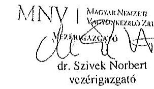

---

.

---

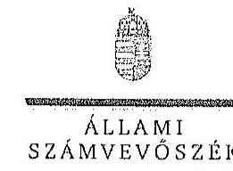

ELKOK

Ikt.szám: V-0763-068/2015.

Dr. Szívek Norbert úr
vezérigazgató
Magyar Nemzeti Vagyonkezelő Zrt.

Budapest

Tisztelt Vezérigazgató Úr!

A „Jelentéstervezet az állami tulajdonban álló erdőgazdasági társaságok vagyongazdálkodási tevékenységének ellenőrzése - NYÍRERDŐ Nyírségi Erdészeti Zrt." címmel készített számvevőszéki jelentéstervezetre tett észrevételeit köszönettel megkaptam.

Az Állami Számvevőszék észrevételekre vonatkozó álláspontjáról a felügyeleti vezető által készített részletes tájékoztatást csatoltan megküldöm.

Tájékoztatom Vezérigazgató urat, hogy a számvevőszéki jelentésben - az Állami Számvevőszékről szóló 2011. évi LXVI. törvény 29. § (3) bekezdése alapján - a figyelembe nem vett észrevételeket szerepelhetjük az elutasítás indokának feltüntetésével.

Budapest, 2015. A. hó 20 nap

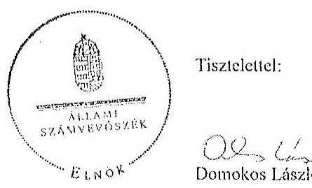

Tisztelettel:

Domokos László

Melléklet: Tájékoztatás az elfogadott és az el nem fogadott észrevételekről

1052 BUDAPEST, AFRICAN CSENE VEROS UTOA 10. 1364 Budapest 4. Pl. 54 telefon: 484 8161 fax: 484 8281

---

# Tájékoztatás 

az elfogadott és az el nem fogadott észrevételekről

A „Jelentéstervezet az állami tulajdonban álló erdőgazdasági társaságok vagyongazdálkodási tevékenységének ellenôrzése - NYIRERDŐ Nyirségi Erdészeti Zrt." címü jelentéstervezetre 2015. október 28-án érkezett észrevételeit áttekintettük, azok kezelésével kapcsolatban a következő tájékoztatást adom.

1. A vagyonkezelési szerződéshez kapcsolódó megállapításokra tett észrevétel (1. fejezet / 7. oldal 1. bekezdés, 9. oldal 4-5. bekezdés, II. 2.1. fejezet / 16. oldal 5-6. bekezdés, 10. oldal javaslat az MNV Zrt. vezérigazgatójának a)-b) pontok)

A jelentéstervezet vagyonkezelési szerződéshez kapcsolódó megállapításai helytállóak. Az erdőgazdasági társaság müködése jogszabályi megfelelősége biztosításának érdekében tett kezdeményezésekről adott tájékoztatásukat köszönettel vettük, azonban azok nem eredményezték az ideiglenes vagyonkezelési szerződés olyan módosítását, vagy olyan új vagyonkezelési szerződés megkötését, amely biztosította volna a VSZ hiányosságainak megszüntetését, illetve a hatályos jogszabályoknak való megfelelőségét. Ezért az MNV Zrt. vezérigazgatójának és az NFA elnökének megfogalmazott intézkedést igénylő megállapítás, valamint az MNV Zrt. vezérigazgatójának megfogalmazott javaslat a) és b) pontjának módosítása nem indokolt. Az egyértelműség érdekében a 9. oldal 4. bekezdést az alábbiak szerint pontosítjuk:
„A vagyonkezelésbe adott állami vagyon tekintetében tulajdonosi jogokat gyakorló MNV Zrt. és NFA az ellenőrzött időszakban a VSZ-szel kapcsolatban feltárt hiányosságokat nem szüntette meg, a hatályos jogszabályoknak a szerzödést nem feleltette meg. ..."
2. Az MNV Zrt. ellenőrzési kötelezettségének elmulasztására vonatkozó megállapításokra tett észrevétel ( 9 . oldal 6 . bekezdés, 10 . oldal 1 . bekezdés, II. 5. fejezet / 28. oldal 1., 3., 5. bekezdés, 10. oldal javaslat az MNV Zrt. vezérigazgatójának c) pont)

Az MNV Zrt. nem bocsátott az ÁSZ ellenőrzés rendelkezésére az MNV Zrt., vagy Tertileti Irodái által a Vhr. 20. § (1)-(2) bekezdései szerint végzett ellenőrzésekről dokumentumokat. A jelentéstervezet megállapításai és a javaslat helytállóak, módosításuk nem indokolt.

---

3. Az MNV Zrt. a Vtv.-ben elóirt ellenőrzési kötelezettségére vonatkozó megállapításra tett észrevétel (II. 5. fejezet/ 28. oldal 2. bekezdés)

Az ellenőrzés megállapította, hogy az MNV Zrt. az ellenőrzött időszakban a NYÍRERDŐ Nyírségi Erdészeti Zrt.-nél helyszíni ellenőrzést nem végzett, erre a megállapításra az MNV Zrt. nem tett észrevételt. Az egyértelműség érdekében a dokumentumok ismételt áttekintését követően a jelentéstervezet 28. oldal 2. bekezdését az alábbiak szerint pontosítjuk:
„A Társaság feletti tulajdonosi jnggyakorlóıa számóra a Vtv. 17. § (I) bekezdés d) pontja rendszeres ellenőrzési kötelezetiséget írt elö a vele szerzödéses jogviszonyban levö személyek, szervezetek vagy más használók állami vagyonnal való gazdálkodása tekintetében, amelynek a NYÍRERDŐ Zrt.-nél az ellenőrzött idöszakban nem tett eleget."

Budapest, 2015. 14. hó 20. nap

Makkai Mária
felügyeleti vezető

---

.

---

# MFB 

## Domokos László úr

elnök részére
Állami Számvevőszék

Budapest

## 5564 - 2812015.

ÁLLAMI SZÁMVEVÓSZÉK
6564/2011
Érkeze: 2015 OKT 30
Biatos: 2015 OKT 30
Melléklet:

## Tisztelt Elnök Úr!

2015. október 7-én köszönettel kézhez vettük az Állami Számvevőszék „Az állami tulajdonban álló erdőgazdasági társaságok vagyongazdálkodási tevékenységének ellenőrzéséről" szóló jelentéstervezeteket az alábbi cégekre:

- DALERD Délalföldi Erdészeti Zrt.
(1kt.szám: V-0761-150/2015.)
- Nyírcrdő Nyírségi Erdészeti Zrt.
(1kt.szám: V-0763-059/2015.)
- Vértesi Erdészeti és Faipari Zrt.
(1kt.szám: V-0759-064/2015.)

Az MFB Zrt. a jelentéstervezetekkel kapcsolatosan 2 féle szempontból kiván észrevételt tenni:

1. A jelentésekben megfogalmazott központi probléma
2. Egyedi esetek

## 1. A jelentésekben megfogalmazott központi probléma

Az ÁSZ az egyedi jelentéseiben az erdőgazdasági társaságokat, valamint a vagyonkezelésbe adott állami vagyon tekintetében tulajdonosi joggyakorló MNV Zrt. és Nemzeti Földalapkezelő (továbbiakban: NFA) tevékenyégét marasztalta el.
Alapvető problémaként jelenik meg, hogy az erdők által kezelt eszközök - az NFA-val, a Kincstári Vagyon Igazgatósággal, és az MNV Zrt-vel kötött vagyonkezelési megállapodásban rögzített - értéken nem szerepelnek a Társaságok könyveiben.
Az MFB Zrt. tudatában volt a problémának (azt az ÁSZ jelentésben is említett, 2010. évben végzett átvilágitási jelentés is tartalmazta, melynek nyomon követése, beszámoltatása megtörtént) és folyamatosan egyeztetett az MNV Zrt-vel és az NFA-val a rendezés ügyében. Az ideiglenes vagyonkezelési szerződés módosítására, véglegesítésére a vagyonkezelésbe adónak (MNV, NFA) van lehetősége, a Társaságok szerződő partnerként észrevételeket,

---

javaslatokat tehetnek. A szerződés véglegesítése érdekében a Társaságok és az MFB Zrt. képviselöi minden olyan egyeztetésen (pl.: az MNV Zrt. által létrehozott bizottság) részt vettek, amelyre meghívást kaptak, illetve azokon érdemi javaslatokat tettek.
Ahogy a jelentés is megjegyzi, az egyeztetések az ellenörzés befejezésig nem kerültek lezárásra, igy a Társaságoknál nem áll rendelkezésre a vagyonkezelésben lévő állami vagyonra és annak nagyságára vonatkozó, az MNV Zrt. és az NFA nyilvántartásával egyező adat.

Az ÁSZ 2013. évi „Az állami vagyon feletti kontroll - Az állami vagyon feletti tulajdonosi joggyakorlással kapcsolatos tevékenységek ellenörzéséröl" szóló jelentése alapján a Nemzeti Fejlesztési Minisztérium - az ÁSZ-szal egyeztetett - alábbi fülbb pontokat tartalmazó intézkedési tervet (1. sz. melléklet) állított össze, melyet a 2014. április 25 -én kelt levelében küldött meg az MFB Zrt. részére:

- a Társaságok által kezelt állami ingatlanok és egyéb vagyonclemek értéken történő nyilvántartása,
- a vagyonkezelési díjak egyértelmű és tulajdonosi joggyakorló szervezetenkénti meghatározása,
- az új vagyonkezelési szerződés megkötése,
- a Társaságok kezelt és saját vagyonának vagyonclemenkénti, valamint a kezelt vagyonclemek tulajdonosi joggyakorló szerinti elhatárolása.

Az MFB törvény módosításának 2014. július 16-i hatályba lépésével az MFB Zrt. állami erdőgazdaságok feletti tulajdonosi joggyakorlása megszűnt, az a Földművelésügyi Minisztériumhoz került át, így az intézkedési tervben való közremüködésre, illetve a végrehajtás nyomon követésére az MFB Zrt-nek nem volt lehetősége.

A jelentések az MNV Zrt. vezérigazgatójának, az NFA elnökének és az erdészeti társaságok vezérigazgatóinak fogalmaztak meg intézkedési javaslatokat.

# 2. Egyedi esetek: 

## DALERD Délalföldi Erdészeti Zrt.

A jelentéstervezet hibásan hivatkozik az MFB Zrt.-re, mikor a Vtv. 17 § (1) bekezdés d) pontja szerinti rendszeres ellenörzés elmaradására mutat rá. A Vtv. hivatkozott bekezdése alapján az ellenörzés az MNV Zrt. feladata. Kérjük a társaság feletti tulajdonosi joggyakorló2 hivatkozás törlését. (29. oldal 4-5. bekezdés; 9. oldal 4. bekezdés)

---

# NYÍRERDŐ Nyírségi Erdészeti Zrt. 

A jelentéstervezet hibásan hivatkozik az MFB Zrt.-re, amikor a vagyonkezelési dij évenkénti felülvizsgálatáról ir, ugyanis a vagyonkezelői dij meghatározása az MNV Zrt. és az NFA hatásköre. (17. oldal 2. bekezdés) Kérjük a társaság feletti tulajdonosi joggyakorló2 hivatkozás törlését.

A jelentéstervezet hibásan hivatkozik az MFB Zrt.-re, mikor a Vtv.17§ (1) bekezdés d) pontja szerinti rendszeres ellenörzési elmaradására mutat rá. A Vtv. hivatkozott bekezdése alapján az ellenőrzés az MNV Zrt. feladata. Kérjük a társaság feletti tulajdonosi joggyakorló2 hivatkozás törlését. (28. oldal 2-3. bekezdés)

## Vértesi Erdészeti és Faipari Zrt.

Az ellenőrzési anyagban több helyen keveredik a társasági részesedés feletti és a vagyonkezelésbe adott állami vagyon feletti tulajdonosi joggyakorlóra történő hivatkozás, így a 9. oldal 3. bekezdés 4. sorának a tulajdonosi joggyakorló2 hivatkozással történő kiegészítésével, valamint az utolsó mondat törlésével helytálló a bekezdés. Ugyancsak kérjük a 28. oldal 2. bekezdés 3. sorának a tulajdonosi joggyakorló2 hivatkozással történő kiegészítését.

A jelentéstervezet hibásan hivatkozik az MFB Zrt.-re, mikor a Vtv.17§ (1) bekezdés d) pontja szerinti rendszeres ellenőrzési elmaradására mutat rá. A Vtv. hivatkozott bekezdése alapján az ellenőrzés az MNV Zrt. feladata. Kérjük a társaság feletti tulajdonosi joggyakorló2 hivatkozás törlését (28. oldal 2-3. bekezdés).

Budapest, 2015. október 27.
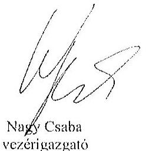

Tisztelettel:
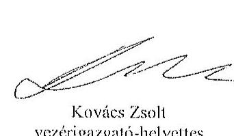

## Mellékletek:

1. számú melléklet: NFM levél (ikt.szám: KGTF/377-7/2014-NFM)

---

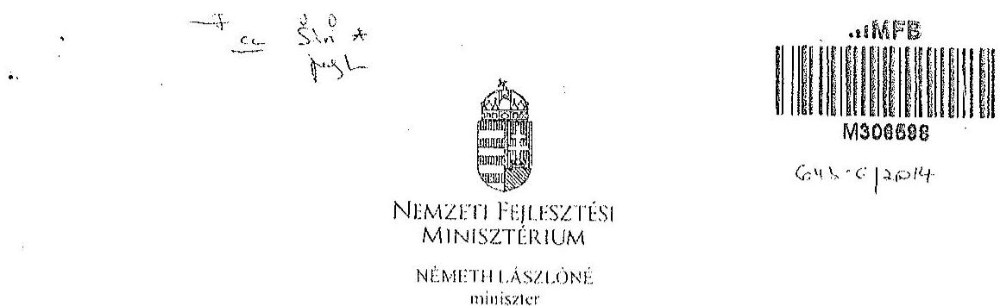

Iktatószám: KGTF/ 1.7.1 i /2014-NFM
Ügyintéző: dr. Kaszás Mónika
Telefonszám: 795-1917
e-mail:monika.kaszaz@ufm.gov.hu
Nagy Csaba úr részére
vezérigazgató
Magyar Fejlesztési Bank Zrt.
Budapest
Tárgy: ,,Az állami vagyon feletti kontroll - Az állami vagyon feletti tulajdonosi joggyakorlással kapcsolatos tevékenységek ellenőrzéséről" szóló 13193 sz. ÁSZ jelentés alapján összeállított NFM intézkedési terv módosítása, az abban foglalt feladatok végrehajtása

# Tisztelt Vezérigazgató Úr! 

Az Állami Számvevőszék (a továbbiakban: ÁSZ) tárgyban megjelölt jelentésével összefüggésben 2014. január 27-én intézkedési tervet hagytam jóvá, amelyben foglalt feladatok végrehajtása érdekében 2014. január 30-i keltezésű levélben fordultam Önböz és a Magyar Nemzeti Vagyonkezelő Zrt. vezérigazgatójához, Márton Péter úrhoz.

Az ÁSZ az intézkedési tervvel kapcsolatban küldött, 2014. március 25-i keltü levelében az intézkedési terv kiegészítését, módosítását kérte. A módosított intézkedési tervet jóváhagytam.

A módosított intézkedési terv alapján a következő feladatok végrehajtása szükséges az alábbiak szerint:

L/ a társaságok által kezelt állami ingatlanok és egyéb vagyonelcmek értéken történő nyilvántartása:

Felelős: MNV Zrt.,
Határidő:

- földterületek esetében legkésőbb 2014. május 31-ig
- felépítmények esetében 2014. december 31. (A felépítmények esetében az MNV Zrt. a vagyonkezelési szerződés megkötését az év második felére tervezi, látja megvalósíthatónak.)

2./ a vagyonkezelési díjak egyértelmú és tulajdonosi joggyakorló szervezetenkćnti meghatározása:

---

Felelős: MNV Zrt.,
Határidő: 2014. májua 31 -ét követően folyamatosan (2014. december 31-ig)
E pontban foglalt feladattal kapcsolatosan az ÁSZ részére az alábbi tájékoztatást adtam:
„Az ÁSZ által meghatározott feladatok végrehajtására irányuló munkafolyamat során a végrehajtásban érintett szervezetek, társaságok között kialakult az az álláspont, hogy mivel az. erdőgazdasági társaságok alapfeladatként közfeladat ellátást is végeznek, azt a vagyonkezelési díj mértékének meghatározásakor az MNV Zrt. figyelembe veszi, valamint megállapításra került az az elv is, hogy a vagyonkezelési díj irányadó mértéke az adott erdőgazdasági társaság által kezelt ingatlanvagyon bruttó nyilvántartási értékének 2\%-a.

A vagyonkezelési díj alapja a kezelt vagyon bruttó nyilvántartási értéke, ezért annak meghatározására erdőgazdaság társaságonként kerül sor a 4./ pontban meghatározott ún. „végleges ingatlanlista" alapján. A végleges ingatlanlista kizárólag vagyonkezelésbe adott ingatlan vagyonelemet tartalmaz, az erdőgazdasági társaság saját vagyonában nyilvántartott vagyonelemet nem, ezért az MNV Zrt.-nek és az erdőgazdasági társaságoknak a szerződés megkötését megelőzően el kell határolnia egymástól a saját vagyonba és a kezelt vagyonba tartozó ingatlan vagyonelemeket (4.b./ pontban foglalt feladat).

A feleknek a vagyonkezelési díj mértékében a vagyonkezelési szerződés megkötését megelőzően kell megállapodniuk az irányadó vagyonkezelési díj mértéket alapul véve."

# 3./ az új vagyonkezelési szerződések megkötése: 

A vagyonkezelési szerződés tervezet az MNV Zrt. érintett szakterületci álláspontjának figyelembe vételével elkészült, az MNV Zrt. és a MFB Zrt. által létrehozott Munkacsoport (tagjai: MFB Zrt., MNV Zrt., NFA és egyes erdőgazdasági társaságok) véleménye alapján átdolgozásra került. A szerződés tervezetnek az erdőgazdasági társaságok részére történő megküldése 2014. április 15. napjával megtörtént.

Felelős: MNV Zrt., az MFB Zrt. közreműködésével
Határidő:

- földterületek esetében: 2014. május 31 -ét követően folyamatosan (2014. december 31-ig)
- felépítmények esetében 2014. II. félév folyamán

4./ a társaságok kezelt és saját vagyonának vagyonelemenkénti, valamint a kezelt vagyonelemek tulajdonosi joggyakorló szerinti elhatárolása:

Az erdőgazdasági társaságok által az MNV Zrt. rendelkezésére bocsátott leltárjelentések alapján

- a jogszabályi rendelkezések szerint az NFA tulajdonosi joggyakorlása alá tartozó ingatlan vagyonelemek nagyobb része már átadásra került az NFA részére,
- a kisebb részt képező vagyonelemek tekintetében pedig folyamatban van az átadás az MNV Zrt. és az NFA között.

---

a./ Az ön, „végleges ingatlanlista" (az MNV Zrt. tulajdonosi joggyakorlása alatt lévö, maradó vagyonelem listája) MNV Zrt. és az NFA közötti lecgycztetése, közös áttekintése

Felelős: MNV Zrt.
Határidő: a lista MNV Zrt. és NFA közötti lecgycztetése, közös áttekintése folyamathan van, lezárása legkésőbb 2014. május 31-ig megtörténik
b./ Az a./ pontban foglaltak szerint leegyeztetett ön, „,végleges ingatlanlista" MNV Zrt. és az egyes erdőgazdasági társaságok általi áttekintése azzal a céllal, hogy a vagyonkezelésben lévő vagyoni elemeket tartalmazó ön, „végleges ingatlanlista" ne tartalmazzon az erdőgazdasági társaság saját vagyonában nyilvántartott vagyoni elemet (saját vagyon - vagyonkezelt vagyon elhatárolása).

Felelős: MNV Zrt., az MFB Zrt. közremüködésével
Határidő: 2014. május 31-ig
E pontban foglalt feladatokkal kapcsolatosan az ÁSZ részére az alábbi tájékoztatást adtam:
„Szükséges megjegyezni, hogy ingatlanlista, mint állandó „végleges ingatlanlista" ilyen formában nem létezik, mert mindkét tulajdonosi joggyakorló tekintetében az állami vagyonelemek halmaza mind mennyiségben, mind pedig összetételben folyamatosan változik.

Az erdőgazdasági társaságok által kezelt ingatlanvagyon adatai - mindkét tulajdonosi joggyakorló tekintetében - az évközi változásuk (megosztások, területváltozások, múvelési ág változások, stb.) miatt folyamatosan változnak, ezért az adattartalmában „,végleges ingatlanlista" mindig egy adott konkrét időpont vonatkozásában adható meg.

Jelen intézkedési tervben az ön, „, végleges ingatlanlista" meghatározás alatt az erdőgazdasági társaságok vagyonkezelésében lévő ingatlanvagyon MNV Zrt tulajdonosi joggyakorlása alatt álló részét kell tekinteni. E „, végleges ingatlanlista" kialakítására az erdőgazdasági társaságok által az MNV Zrt. részére átadott leltárjelentések alapján került sor úgy, hogy az MNV Zrt. a Nemzeti Földalapba tartozó vagyonelemeket kiválogatta, s azokat a Nemzeti Földalapkezelő Szervezet részére - átadás-átvételi jegyzőkönyv alapján - átadta.

Lényeges körülmény, hogy a vagyonkezelőknek - jelen esetben az erdőgazdasági társaságoknak - minden év május 31. napjáig vagyonkezelői jelentést kell benyújtaniuk a tulajdonosi joggyakorlók, így az MNV Zrt. részére is. Az aktuális vagyonkezelői jelentéseket - melynek része a leltárjelentés is - a 2013. december 31-i állapotnak megfelelően kell összeállítani, ebből következöen a fent említett ún. „, végleges ingatlanlista" is a 2013. december 31-i állapotot tükrözi.

Ugyanakkor - föként a kivett megnevezésben nyilvántartott földterületek esetében - a még át nem adott Nemzeti Földalapba tartozó vagyonelemek egyeztetése a két tulajdonosi joggyakorló között jelenleg is folyamatban van.

---

Az egyes erdőgazdasági társaságok vagyonkezelésében lévö vagyonelemek az adott társasággal megkötendő - a jelenlegi ideiglenes vagyonkezelési szerzödés helyébe lépő - vagyonkezelési szerződés mellékletét fogják képezni. Az MNV Zrt. szándékai szerint az egyes erdőgazdasági társaságokkal azonnal megkötik a vagyonkezelési szerzödéseket, ahogyan a megkötés feltételei bekövetkeznek (pl. megállapodnak a vagyonkezelési dijban, véglegesítik a vagyonkezelési szerződés tartalmát), azok a vagyonelemek, amelyeket e pont a./ és b./ pontjában foglaltak szerint már átvizsgáltak, a vagyonkezelési szerzödés megkötésével egyidejűleg a szerződés mellékletébe kerülnek, amely melléklet folyamatosan bővitésre kerül újabb, e pont a./ és b./ pontjában foglaltak szerint átvizsgált, tisztázott vagyonelemekkel. „

Tájékoztatom, hogy az NFA feletti tulajdonosi jogok gyakorlója, Dr. Fazekas Sándor miniszter úr időközben már jóváhagyta azt az intézkedési tervet, amely az NFA részére meghatározott feladatokat és azok végrehajtási határidejét tartalmazza.

Az MFB Zrt. közremüködése az 1./ és 2./ pontban meghatározott feladatok végrehajtásban is szükséges lehet, ezért kérem a fent meghatározott feladatok határidőben történő végrehajtása érdekében az MFB Zrt. változatlan együttmüködését az érintett a szervezetekkel és amennyiben szükséges, úgy az erdőgazdasági társaságok bevonása iránt is intézkedni szíveskedjen.

Budapest, 2014. „i.j.

---

.

---

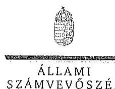

ELKÖK

Ikt.szám: V-0761-162/2015.

Nagy Csaba úr
vezérigazgató

Magyar Fejlesztési Bank Zrt.

Budapest

Tisztelt Vezérigazgató Úr!

Az „Az állami tulajdonban álló erdőgazdasági társaságok vagyongazdálkodási tevékenységének ellenőrzése” című ellenőrzés tekintetében a DALERD Délalföldi Erdészeti Zrt., a NTHERDŐ Nyírségi Erdészeti Zrt., illetve a Vértesi Erdészeti és Fajpari Zrt. társaságok jelentéstervezetére tett észrevételüket köszönettel megkaptam.

Az Állami Számvevőszék észrevételekre vonatkozó álláspontjáról a felügyeleti vezető által készített részletes tájékoztatást csatoltan megküldöm.

Tájékoztatom Vezérigazgató urat, hogy a számvevőszékij jelentésben – az Állami Számvevőszékről szóló 2011. évi LXVI. törvény 29. § (3) bekezdése alapján – a figyelembe nem vett észrevételeket szerepeltetjük az elutasítás indokának feltüntetésével.

Budapest, 2015. 1st hó 30. nap

Tisztelettel:

Domokos László

Melléklet: Tájékoztatás az észrevételek kezeléséről

1057 RODAPEST, APÁCZON CSZRE, SÁNDS UTECA 19, 1364 Budapest 4, Pt. 54 telefon: 484 9191 fax: 481 9391

---

# Tájékoztatás   az észrevételek kezeléséről 

,Az öllami tulajdonban álló erdőgazdasági társaságok vagyongozdólkodási tevékenységének ellenörzése" címủ ellenőrzés tekintetében a DALERD Délalföldi Erdészeti Zrt., a NYIRERDŐ Nyirségi Erdészeti Zrt., illetve a Vértesi Erdészeti és Faipari Zrt. társaságok jelentéstervezetére 2015. október 30 -án érkezett észrevételeket áttekintettük, azok kezelésével kapcsolatban a következő tájékoztatást adom.

1. A jelentésekben megfogalmazott központi problémával kapcsolatban tett észrevételek

A jelentésekben megfogalmazott központi problémával kapcsolatban adott tájékoztatásukat köszönettel vettük, azonban azok alapján a jelentéstervezet módosítása nem indokolt.
2. Egyedi esetekkel kapcsolatban tett észrevételek

A DALERD Délalföldi Erdészeti Zrt. jelentéstervezetének 9. oldal 4. bekezdésére, valamint 29. oldal 4-5. bekezdésére tett észrevétel
A rendelkezésre álló dokumentumok ismételt áttekintését követően töröljük a jelentéstervezet 9. oldal 4. bekezdés 2. mondatát és 29. oldal 5. bekezdését, valamint 29. oldal 4. bekezdésében a tulajdonosi joggyakorló 2 számú alsóindexszel jelölt hivatkozását.

A NYÍRERDŐ Nyirségi Erdészeti Zrt. jelentéstervezetének 17. oldal 2. bekezdésére, valamint 28. oldal 2-3. bekezdésére tett észrevétel
A rendelkezésre álló dokumentumok ismételt áttekintését követően töröljük a jelentéstervezet 17. oldal 2. bekezdésében és a 28. oldal 2. bekezdésében a tulajdonosi joggyakorló 2 számú alsóindexszel jelölt hivatkozását, valamint a 28. oldal 3. bekezdés 1. mondatát.

A Vértesi Erdészeti és Faiqari Zrt. jelentéstervezetének 9. oldal 3. bekezdésére, valamint 28. oldal 2-3. bekezdésére tett észrevétel

A társasági részesedés feletti, illetve a vagyonkezelésbe adott állami vagyon feletti tulajdonosi joggyakorlóra történő hivatkozásokra tett észrevételekre vonatkozóan a rendelkezésre álló dokumentumok ismételt áttekintését követően

---

- a 9. oldal 3. bekezdés negyedik sorában, valamint a 28. oldal 2. bekezdés 3. sorában az alsóindex módosítása nem indokolt, tekintettel arra, hogy az MFB Zrt. végzett a Társaságnál egyedi ellenőrzést. A 9. oldal 3. bekezdés 3. mondatát az alábbiak szerint pontosítjuk:
„A Társaság feletti tulajdonosi joggvakorlȧ a Tảrsaságnál a 2010. évben külső szakértővel átvilágitást végeztetett, jogi, gazdasági, informatikai területen."
- a 28. oldal 2. bekezdés 3. mondatából a tulajdonosi joggyakorló 2 számú alsóindexszel jelölt hivatkozást, valamint a 28. oldal 3. bekezdés 1. mondatát töröljük.

Budapest, 2015. év ,/4 hő 245 nap

Makkai Mária
felügyeleti vezető

---

.

---

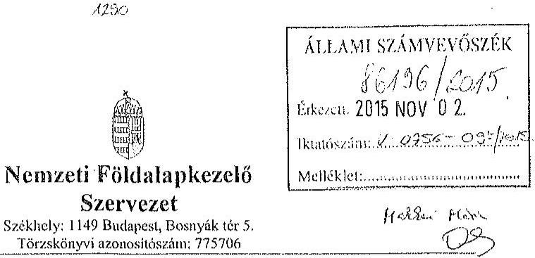

Iktatószám: NFA-002589/023/2015
Hiv. szám: ÁSZ-V-0599/2014-2015
Érintett ÁSZ iktatószámok: V-0756-092/2015, V-0759-066/2015, V-0761-152/2015,
V-0762-073/2015, V-0763-061/2015,

Domokos László
Elnök

Állami Számvevőszék

1052 Budapest

Apáczai Csere János utca 10

Tárgy: Észrevétel megküldése „Az állami tulajdonban álló erdőgazdasági társaságok vagyongazdálkodási tevékenységének ellenőrzéséről" készített jelentés tervezeteire.

Tisztelt Elnök Úr!

Az Állami Számvevőszék 2014 novemberében megkezdte „Az állami tulajdonban álló erdőgazdasági társaságok vagyongazdálkodási tevékenységének ellenőrzését" amelyről 2015 októberétől érintettség okán az NFA részére az elkészített munkaanyag tervezeteit vizsgált erdőgazdaságonként, megküldte Szervezetünk részére véleményezésre. A munkaanyag valamennyi tervezte egységesen, az NFA Elnöke részére feladatazabást tartalmaz, melyhez az alábbi észrevételeket tesszük:

A jelentéstervezetekben tett megállapítások helytállóságát nem vitatjuk, azonban szükségesnek látjuk az NFA elnökének tett javaslatokkal a), b) és c) kapcsolatban a következő tájékoztatást megadni.

a) „Tegyen intézkedéseket az erdőgazdasági társaságok közreműködésével a tényleges állapotot rögzítő és a hatályos jogszabályi előírásoknak megfelelő vagyonkezelési szerződés megkötésére."

---

Tájékoztatjuk, hogy a hatályos jogszabályi előírásoknak megfelelő vagyonkezelési szerződések megkötése érdekében több intézkedés történt, jelenleg is folyamatban van a szerződések előkészítése és a vagyonkezelésben maradó, illetve kikerülő földrészletek adatainak egyeztetése.

Előzményként fontos kiemelni, hogy a Nemzeti Földalapkezelő Szervezet 2010. szeptember 1. napjával történt létrehozását követően (2012. évben) került sor a vagyonkezelésben lévő földrészletek MNV Zrt. részéről történő átadására. Az átadási dokumentumok alapján Szervezetünk gondoskodott a közhiteles nyilvántartásokban a megváltozott tulajdonosi joggyakorlás feltüntetéséről. Az erdőgazdaságok esetében ez 2012. év végéig, illetve 2013. év elején megtörtént ennek az ingatlan-nyilvántartásban történő átvezetése is.

Megjegyezzük, hogy az MNV Zrt. részéről történő átadás kizárólag a - több évtizede kötött, és azóta többször módosított - vagyonkezelési szerződések és a földrészletek Excel táblázatban történő átadását jelentette, tehát nem egy naprakész vagyonnyilvántartást tartalmazott. Ennek következtében szükségszerűvé vált a Nemzeti Földalapkezelő Szervezetnek egy saját nyilvántartás felépítése, illetve a szerződések tartalmának feldolgozása.

A számvevőszéki ellenőrzéssel érintett időszakban, illetve még jelenleg is lezáratlan az MNV Zrt. és NFA közötti átadás-átvételi folyamat. Az MNV Zrt. további földrészletek átadását készült elő, ugyanis az MNV Zrt. vagyoni körébe tartozó földrészletekre szintén tervezi a vagyonkezelői szerződés megkötését, és ennek a folyamatnak a részeként a még át nem adott földrészletek átadása is most történik. Természetesen az NFA is folyamatosan biztosítja a különböző hasznosítási, illetve hatósági eljárások során az erdőgazdaságok vagyonkezelésében lévő földrészletek tulajdonosi joggyakorlójának rendezését az MNV Zrt megkeresésével, közös minősítési eljárás lefolytatásával. A Nemzeti Földalapkezelő Szervezet által megbízott ügyvédi iroda, jelentést készített a szerződés és a tárgyát képező földrészletek jogi helyzetének tisztázására.

Időközben az erdőgazdaságok, mint társaságok feletti tulajdonosi joggyakorló személyében is változás történt. Így új alapokon indulhatott meg a vagyonkezelői szerződés előkészítése. Ennek a folyamatnak részeként, az NFA megbízott egy Ügyvédi Konzorciumot, továbbá Szervezetünknél külön Erdészeti munkacsoport alakult 2015 májusában és azt követően a következő intézkedések történtek:

Az Erdőgazdaságok részére vagyonkezelésbe adásra tervezett ingatlanok felülvizsgálata folyamatban van az Ügyvédi Konzorcium által. A felülvizsgálat tárgyát képező ingatlanok köre három részből tevődik össze:

- az erdőgazdaságok ideiglenes vagyonkezelési szerződésének tárgyát képező ingatlanok,
- azon ingatlanok, amelyeket az erdőgazdaságok az ideiglenes vagyonkezelési szerződésükben szereplő ingatlanokon felül kértek vagyonkezelésbe,

---

- valamint azok az ingatlanok, amelyeket az NFA kíván az erdőgazdaságok vagyonkezelésébe adni.

A rendelkezésre álló dokumentumokban szereplő ingatlanokból erdőgazdaságonként egy egységes, az összes vagyonkezelésbe adandó ingatlant tartalmazó táblázat készült, amely tartalmazza az ingatlanok vagyonkezelésbe adás szempontjából releváns adatait, bejegyzett jogokat, feljegyzett tényeket. A táblázat adatai összevetésre kerültek a közhiteles ingatlannyilvántartásban szereplő adatokkal, feltárva ezáltal, hogy mely ingatlanok adhatóak vagyonkezelésbe és melyek azok, amelyeknél valamilyen előzetes intézkedés megtétele szükséges.

Az Nfatv. 8. §-a alapján a Birtokpolitikai Tanács dönt erdőgazdaságonként az erdőgazdaságok vagyonkezelési szerződésének megkötéséről.

Zárójelben jegyezzük meg, hogy például a TAEG Zrt. esetében elkészült a fentebb részletezett táblázat, amely alapján összeállításra került azon ingatlanok listája, amelyre elindítható a vagyonkezelésbe adási eljárás. Megközelítőleg 18000 ha nagyságú területnek tervezi Szervezetünk a TAEG Zrt. részére történő vagyonkezelésbe adását, ebből $15.308,3880$ ha terület az, amelyre elindította a vagyonkezelésbe adást. Az alábbi jogszabályhelyek alapján Szervezetünk megkereste az Földművelésügyi Minisztériumot az egyetértő nyilatkozatok, valamint az alapító határozat kiadása érdekében, valamint a NÉBIHet, mint erdészeti hatóságot a vagyonkezelő erdőgazdálkodói alkalmasságát megállapító jóváhagyásának megkérése végett.

Az Nfatv. 20. § (7) bekezdése alapján „Az állam 100\%-os tulajdonában álló erdő és erdőgazdálkodási tevékenységet közvetlenül szolgáló földterületet érintő vagyonkezelési szerződés létrejöttéhez az erdészeti hatóságnak - a vagyonkezelő erdőgazdálkodói alkalmasságát megállapító - jóváhagyása szükséges".

Az Nfatv. 23. § (2) bekezdése alapján a Nemzeti Földalapba tartozó védett természeti területek és a Natura 2000 területek vagyonkezelésbe adására, tulajdonjogának bármely jogcímen történő átruházására csak a természetvédelemért felelős miniszter egyetértése esetén kerülhet sor. Az állam $100 \%$-os tulajdonában álló erdő, továbbá erdőgazdálkodási tevékenységet közvetlenül szolgáló földterület vagyonkezelésbe adásához az erdőgazdálkodásért felelős miniszter egyetértése szükséges.

Magyar Állam tulajdonában álló ingatlanokat érintő jogügyletekkel kapcsolatos elözetes miniszteri nyilatkozatok és a miniszter tulajdonosi joggyakorlása alá tartozó gazdasági társaságok ingatlanügyleteivel kapcsolatos miniszteri nyilatkozatok, alapítói határozatok kiadásának rendjéről szóló 8/2014. (XI. 28.) FM utasítás 3. § (4) bekezdése értelmében a miniszter tulajdonosi joggyakorlása alá tartozó állami tulajdonú gazdasági társaságoknak az NFA-val történő vagyonkezelési szerződés kötéséhez elengedhetetlen a jogszabály vagy

---

Társasági alapszabály vagy alapító okirat alapján a Társaság tulajdonosi jogait gyakorló miniszter alapítói határozatának kiadása.

Az Erdészeti Munkacsoport a kialakított szempontok alapján tartja a kapcsolatot a Konzorciummal a szerződés tárgyát képező földrészletek jogi, nyilvántartási, helyszini, térképí ellenőrzés tárgyában annak érdekében, hogy naprakész adatok alapján történjen a szerződéskötés.
b) „Intézkedjen a vagyonkezelési szerzödések felülvizsgálatának elmaradásával összefüggésben feltárt szabálytalanságok tekintetében a munkajogi felelösség tisztázására irányuló eljárás megindításáról, és ennek eredménye ismeretében tegye meg a szükséges intézkedéseket.

A fent leírt folyamat időbeli áttekintése és a vagyonkezelési szerződés előkészítésének jelenlegi helyzetét tekintve a Nemzeti Földalapkezelő Szervezet egységei, munkatársai a rendelkezésükre álló eszközök alapján megtették a szükséges intézkedéseket az erdőgazdaságok vagyonkezelői szerződésének megkötése érdekében.
c) Az NFA elnöke felé tett javaslattal kapcsolatban, miszerint intézkedjen a Társaságok vagyon-nyilvántartása hitelességének, teljességének és helyességének jogszabályban foglaltak szerinti ellenőrzéséről.

Az NFA 2015. év márciusában megkezdte az Erdészeti Zrt.-ték dokumentális ellenőrzését, amely ellenőrzés keretén belül bekérésre került a Társaságok használatában álló vagyonelemekről és az erdővagyon állományról vezetett (nyilvántartások) aktualizált nyilvántartás is.

Budapest, 2015.október 27.
Tisztelettel:
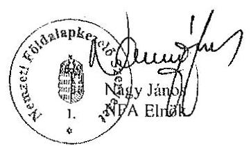

---

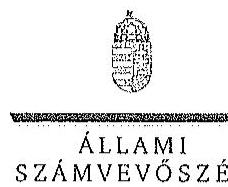

ELNÖK

# Nagy János úr

elnök

Nemzeti Földalapkezelő Szervezet

Budapest

## Tisztelt Elnök Úr!

Az „Az állami tulajdonban álló erő́gazdasági társaságok vagyongazdálkodási tevékenységének ellenőrzése" című ellenőrzés tekintetében öt társaság jelentéstervezetére tett észrevételüket köszönettel megkaptam.

Az Állami Számvevőszék észrevételekre vonatkozó álláspontjáról a felügyeleti vezető által készített részletes tájékoztatást csatoltan megküldöm.

Tájékoztatom Elnök urat, hogy a számvevőszéki jelentésben – az Állami Számvevőszékről szóló 2011. évi LXVI. törvény 29. § (3) bekezdése alapján – a figyelembe nem vett észrevételeket szerepeltetjük az elutasítás indokának feltüntetésével.

Budapest, 2015. 11. hó 23. nap

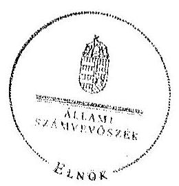

Tisztelettel:

*Domokos László*

Melléklet: Tájékoztatás az észrevételek kezeléséről

1002 BUDAPEST, AFRICAN CSERE JÁRIS STEA 13. 1264 Budapest 4. Pl. S4 telefon: 494 9191 fax: 494 5201

---

# Tájékoztatás   az észrevételek kezeléséről 

„Az állami tulajdonban álló erdőgazdasági társaságok vagyongazdálkodási tevékenységének ellenörzése" című ellenőrzés tekintetében a Bakonyerdö Erdészeti és Faipari Zrt., a Vértesi Erdészeti és Faipari Zrt., a DALERD Délalföldi Erdészeti Zrt., a NEFAG Nagykonsági Erdészeti és Faipari Zrt., illetve a NYÍRERDŐ Nyírségi Erdészeti Zrt. társaságok jelentéstervezetére 2015. november 2-án érkezett észrevételeket áttekintettük, azok kezelésével kapcsolatban a következő tájékoztatást adom.

Az észrevétel szerint a jelentéstervezetben tett megállapítások helytállóak, azokat nem vitatják. Az NFA elnökének tett javaslatokhoz kapcsolódó tájékoztatást köszönjük. Mindezek miatt, valamint arra tekintettel, hogy nem jött létre olyan vagyonkezelési szerződés, amely biztosítja az ideiglenes vagyonkezelési szerződés hiányosságainak a megszüntetését, illetve a hatályos jogszabályoknak való megfeleltetést, a megállapítások és a javaslatok módosítása nem indokolt.

Budapest, 2015. év $\quad / / \quad$ hó $2^{1 / 3}$ nap

Makkai Mária
felügyeleti vezető