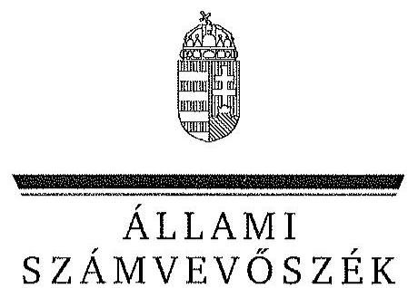

ÁLLAMI
SZÁMVEVŐSZÉK

# JELENTÉS 

Az állami tulajdonban álló erdőgazdasági társaságok vagyongazdálkodási tevékenységének ellenőrzése

Gyulaj Erdészeti és Vadászati Zrt.

---

# Állami Számvevőszék 

Iktatószám: V-0766-154/2015.
Témaszám: 1800
Vizsgálat-azonosító szám: V070618

## Az ellenőrzést felügyelte:

## Makkai Mária

felügyeleti vezető
Az ellenőrzést vezette és az ellenőrzés végrehajtásáért felelős:
Pencz Mária
ellenőrzésvezető
A számvevőszéki jelentés összeállításában közremúködött:
Perlusz Krisztina Mária
számvevő
Czeglédi Dénes
számvevő
Az ellenőrzést végezték:

| Dr. Dorogi Zsolt Pál | Czeglédi Dénes | Perlusz Krisztina Mária |
| :-- | :-- | :-- |
| számvevő | számvevő tanácsos | számvevő |

Temesváry Miklós
számvevő tanácsos

---

# TARTALOMJEGYZÉK 

BEVEZETÉS ..... 3
I. ÖSSZEGZŐ MEGÁLLAPÍTÁSOK, KÖVETKEZTETÉSEK, JAVASLATOK ..... 7
II. RÉSZLETES MEGÁLLAPÍTÁSOK ..... 14

1. A Gyulaj Zrt. vagyongazdálkodása ..... 14
1.1. A vagyon értékének megőrzése, gyarapítása ..... 14
1.2. A vagyonkezelői kötelezettség teljesítése ..... 20
2. A Gyulaj Zrt. vagyonkezelési szerződése és a vagyonnyilvántartása ..... 21
2.1. A vagyonkezelési szerződés megfelelősége ..... 21
2.2. A Gyulaj Zrt. vagyonnyilvántartása ..... 24
3. A Gyulaj Zrt. éves tervezési feladatainak ellátása, az ágazati jogszabályok érvényesülése ..... 28
3.1. Az üzleti tervek vagyonmegőrzésre, vagyongyarapításra vonatkozó elemei ..... 28
3.2. A tervekben megfogalmazott előírások érvényesülése ..... 29
3.3. Az ágazati szabályok érvényesülése ..... 30
4. A kontroll-és monitoring rendszer kialakítása és múködtetése ..... 32
4.1. A kontrollrendszer kialakítása és múködtetése ..... 32
4.2. Az információáramlási és monitoring rendszer kialakítása és múködtetése ..... 33
5. A tulajdonosi joggyakorlóknak a Gyulaj Zrt. vagyongazdálkodási feladataira vonatkozó döntései, intézkedései megfelelősége ..... 35

---

# MELLÉKLETEK 

1. számú Rövidítések jegyzéke
2. számú Fogalomtár
3. számú A Gyulaj Zrt. vagyonváltozásának alakulása a 2009 - 2014. évek közötti időszakban
4. számú A befektetett eszközök állományának alakulása
5. számú A Gyulaj Erdészeti és Vadászati Zrt. vezérigazgatójának észrevétele
6. számú A Gyulaj Erdészeti és Vadászati vezérigazgatójának észrevételére adott válasz
7. számú Az MNV Zrt. vezérigazgatójának észrevétele
8. számú Az MNV Zrt. vezérigazgatójának észrevételére adott válasz
9. számú Az MFB Zrt. vezérigazgatójának észrevétele
10. számú Az MFB Zrt. vezérigazgatójának észrevételére adott válasz
11. számú Az NFA elnökének észrevétele
12. számú Az NFA elnökének észrevételére adott válasz
13. számú A Földművelésügyi Minisztérium miniszterének észrevétele
14. számú A Földművelésügyi Minisztérium miniszterének észrevétele és az arra adott válasz

---

# JELENTÉS 

## Az állami tulajdonban álló erdőgazdasági társaságok vagyongazdálkodási tevékenységének ellenőrzése Gyulaj Erdészeti és Vadászati Zrt.

## BEVEZETÉS

Hazánk területének több mint 20\%-át erdő borítja. Az erdők fenntartása és védelme az egész társadalom érdeke, ezért az erdőkkel csak a közérdekkel összhangban lehet gazdálkodni.

Az Alaptörvény 38. cikke és az Nvtv. alapján az állam tulajdona a nemzeti vagyon részét képezi. Az Nvtv. alapján nemzetgazdasági szempontból kiemelt jelentőségű nemzeti vagyonban tartandó vagyonelemnek minősül a 100\%-ban az állam tulajdonában álló védelmi és közjóléti elsődleges rendeltetésű erdő, a gazdasági elsődleges rendeltetésű természetes erdő, természetszerű erdő és származék erdő természetességi állapotú öt hektárnál nagyobb, természetben összefüggő erdő. A Társaságok vagyongazdálkodása szempontjából a Vtv, illetve az Nvtv. és az Nfatv., valamint a kapcsolódó kormány- és miniszteri rendeletek mellett kiemelkedő szerepe van a különböző ágazati jogszabályoknak. A vagyonkezelési tevékenység végrehajtása során figyelemmel kell lenni az Evt.ben foglaltakra, mely alapján a nemzeti vagyonról szóló törvényben nemzetgazdasági szempontból kiemelt jelentőségű nemzeti vagyonként meghatározott védelmi és közjóléti elsődleges rendeltetésű, az állam tulajdonában álló erdő a kincstári vagyon részét képezi. a Társaságoknak az általuk kezelt vagyonelemek sajátosságára tekintettel kell a vagyongazdálkodási tevékenységüket kialakítaniuk, gondoskodniuk kell a közérdek és az Evt.-ben foglaltak érvényesülését biztosító vagyongazdálkodásról.

Az Evt. előírásai alapján az állam 100\%-os tulajdonában álló erdőt és erdőgazdálkodási tevékenységet közvetlenül szolgáló földterületet csak vagyonkezelés formájában lehet hasznosításra átengedni. A kizárólagos állami tulajdonban lévő erdő és erdőgazdálkodási tevékenységet közvetlenül szolgáló földterület vagyonkezelését csak költségvetési szerv vagy 100\%-os állami tulajdonú gazdálkodó szervezet végezheti.

A Vtv. szerint a Társaságok és az általuk kezelt állami vagyon feletti tulajdonosi jogokat a 2010. évig a Magyar Állam nevében az MNV Zrt. gyakorolta. A 2010. évi törvényi változások (Vtv., Mfbtv., Nfatv.) következtében 2010. június 17. napjától a Társaságok állami tulajdonú részesedése tekintetében a tulajdonosi jogokat az állami vagyonért felelős miniszter az MFB Zrt. útján látta el. Az Nfatv. 2010. évi hatálybalépését követően a Társaságok által kezelt, a Nemzeti Földalapba tartozó földterületek vonatkozásában a tulajdo-

---

nosi jogokat az NFA, míg egyéb ingatlanok és vagyonelemek tekintetében a tulajdonosi jogokat az MNV Zrt. gyakorolja. 2014. július 16-tól a Társaságok feletti tulajdonosi jogokat az erdőgazdálkodásért felelős miniszter gyakorolja.

A Nemzeti Földalapba tartozó 1772 980,17 ha földterületből a 2012. év végén a $100 \%$-os állami tulajdonú 19 erdőgazdasági társaság kezelésében összesen 913664,3681 ha földterület volt, ebből 879254,1595 ha erdő, a többi egyéb művelési ágba tartozik. A kezelt földterületek erdőgazdasági társaságonkénti megoszlása eltérő.

A Társaságok az Alaptörvény és az Nvtv. előírása szerint önállóan és felelősen gazdálkodnak a törvényesség, a célszerűség és az eredményesség követelményei szerint. Az állami vagyonnal való gazdálkodás alapvető feladata a vagyon rendeltetésszerú, hatékony és felelős felhasználásának biztosítása az állami vagyon értékének megőrzése, gyarapítása érdekében. A Társaság jelen ellenőrzése az állami vagyonnal való gazdálkodásra és a törvényesség betartására irányult.

A Társaság Tolna megyében a Tolnai-dombságon mintegy 23000 hektár állami erdő és hozzá kapcsolódó területen gazdálkodik. Északon a Sió, Keleten a Duna, Délen a Kelet-Mecsek, Nyugaton a Somogyi-Dombság határolja. A Társaság 2014. évi éves beszámolója szerint 1390,0 M Ft nettó árbevétel mellett 12,0 M Ft mérleg szerinti eredményt ért el, a mérlegfőösszeg 2317,8 M Ft volt. A Társaság a 2014. év végi állapot szerint 21013,52 ha erdőterületen és 2 109,86 ha egyéb művelési ágú földterületen gazdálkodott, az éves átlaglétszám 99,8 fő volt.

Az ellenőrzés célja annak értékelése, hogy a Társaság vagyongazdálkodása, vagyonérték-megőrző és vagyongyarapítási tevékenysége, valamint szervezeti keretei és kiépített kontrollrendszere megfeleltek-e a jogszabályok és belső szabályzatok előírásainak, valamint a kezelt vagyonelemek sajátosságaiból adódó követelményeknek.

Ennek keretében ellenőriztük és értékeltük, hogy:

- a vagyongazdálkodás során betartották-e az Nvtv. 7. §-ában megállapított vagyongazdálkodási alapelveket, valamint az ágazati jogszabályok vagyongazdálkodáshoz kapcsolódó előírásait;
- a Társaság a saját és a kezelt vagyonnal való gazdálkodásra vonatkozó éves tervezési feladatait a jogszabályi előírásoknak megfelelően látta-e el, a Társaság üzleti tervei a kezelésbe vett vagyonra vonatkozó, a Vtv. 2. § (1) és a 27. § (7) bekezdésében előírt vagyon megőrzésére, gyarapítására vonatkozó elemeket tartalmazták-e és azokat a vagyongazdálkodás során érvényesített-ék-e;
- a vagyonkezelési szerződések és a vagyon-nyilvántartás megfeleltek-e a szabályszerűségi követelményeknek, elősegítették-e az állami vagyonnal való szabályszerű gazdálkodást;
- a Társaságnál kialakították és működtették-e a szabályszerű feladatellátást támogató kontrollrendszert. Ezen belül a Társaság elkészítette-e és aktuali-

---

zálta-e feladatellátási-folyamatainak szabályzatait, a kockázatok kezelésének rendszerét, az információs és a kontrolling-monitoring rendszert, valamint a vagyongazdálkodás területén azokat az eljárásokat, amelyek elősegítik a szervezeti célok végrehajtását;

- a tulajdonosi joggyakorlóknak a Társaság vagyongazdálkodási feladataira vonatkozó döntései, intézkedései előkészítése és megalapozottsága a jogszabályoknak és a belső szabályozásnak megfelelt-e, a tulajdonosi joggyakorlók e minőségben végzett tevékenysége támogatta-e a felelős vagyongazdálkodás megvalósulását.

Az ellenőrzés típusa: szabályszerűségi ellenőrzés.
Az ellenőrzött időszak: 2009. január 1. napjától 2014. december 31. napjáig, kitekintéssel a helyszíni ellenőrzés végéig tartó releváns folyamatokra, intézkedésekre.

Az ellenőrzés várható hasznosulása: A Társaság és a tulajdonosi joggyakorlók fenti szempontú ellenőrzése az állami tulajdonban álló vagyon kezelésére, a vagyonnal való gazdálkodásra vonatkozó, kötelezően végrehajtandó éves ÁSZ ellenőrzést szélesebb körűvé teszi.

Az ellenőrzés várható hasznosulásaként biztosíthatja a társadalom részéről kiemelt érdeklődéssel kísért téma objektív bemutatását. Az ÁSZ jelentéséből a média és az állampolgárok átfogó képet kaphatnak a Magyarország állami tulajdonban lévő erdőivel való gazdálkodásról, a gazdálkodást, vagyonkezelést végző szervezeti rendszerről, az állami tulajdonban álló erdőgazdasági társaságok feladatellátásához kapcsolódóan feltárt problémákról.

Az ellenőrzés jól hasznosítható - többek közt - az állami vagyonnal kapcsolatos országgyűlési törvényhozói munkában is, továbbá hozzájárulhat a tulajdonosi joggyakorlás javításával a „jó kormányzás" gyakorlatának erősítéséhez.

Az ellenőrzéssel érintett szervezetek: A Társaság, a Társaság kezelésében lévő állami vagyon feletti tulajdonosi jogokat gyakorló szervezetek, valamint a Társaság állami tulajdonú részesedése feletti tulajdonosi joggyakorlók (MNV Zrt., MFB Zrt., NFA, FM).

Az ellenőrzés végrehajtásának jogszabályi alapját az ÁSZ tv. 5. § (4)(5) bekezdéseiben foglaltak képezik.

Az ellenőrzés szakmai módszertana az ÁSZ hivatalos honlapján közzétett szakmai szabályokon alapult, amely a Legfőbb Ellenőrző Intézmények Nemzetközi Szervezete (INTOSAI) által kiadott nemzetközi standardok (ISSAI) figyelembevételével készült.

A Társaság az ellenőrzés lefolytatásához tanúsítványok kitöltésével, valamint dokumentumok elektronikus megküldésével szolgáltatott adatokat. Az így rendelkezésre bocsátott adatok és információk kontrollja a helyszíni ellenőrzés keretében történt. A vagyonváltozást eredményező döntések megalapozottságát, továbbá a vagyonérték-megőrző és vagyongyarapító tevékenység szabályszerű-

---

ségét a számviteli nyilvántartásokból, valamint kockázatalapú és véletlenszerű mintavétellel kiválasztott tételek ellenőrzésével értékeltük.

Az ÁSZ a 2011. évi LXVI. törvény 29. §-a szerint a jelentéstervezetet megküldte a Gyulaj Erdészeti és Vadászati Zrt., a Magyar Nemzeti Vagyonkezelő Zrt. és a Magyar Fejlesztési Bank Zrt. vezérigazgatójának, a Földművelésügyi Minisztérium miniszterének valamint a Nemzeti Földalapkezelő Szervezet elnökének egyeztetésre. A Gyulaj Erdészeti és Vadászati Zrt. vezérigazgatójának észrevételét és az arra adott választ az 5-6. számú melléklet, a Magyar Nemzeti Vagyonkezelő Zrt. vezérigazgatójának észrevételét és az arra adott válaszunkat a 7-8. számú melléklet, a Magyar Fejlesztési Bank Zrt. vezérigazgatójának észrevételét és az arra adott válaszunkat a 9-10. számú melléklet tartalmazza. A Nemzeti Földalapkezelő Szervezet elnökének észrevételét és az arra adott válaszunkat a 11-12. számú melléklet, a Földművelésügyi Minisztérium miniszterének észrevételét és az arra adott választ a 13-14. számú melléklet tartalmazza.

---

# I. ÖSSZEGZŐ MEGÁLLAPÍTÁSOK, KÖVETKEZTETÉSEK, JAVASLATOK 

Az állami tulajdonú Gyulaj Erdészeti és Vadászati Zrt az ellenőrzött időszakban saját és kezelt vagyonnal gazdálkodott. A Társaság könyvviteli mérlegében kimutatott vagyona a 2009. évi 2112,8 M Ft. nyitó értékről 2014. december 31-re 2317,8 M Ft-ra emelkedett elsősorban a tárgyi eszközök növekedésének következtében, amely $9,7 \%$-os vagyongyarapodást eredményezett. A Társaság saját tőke/jegyzet tőke aránya az ellenőrzött időszakban a jegyzett tőkének alapítói határozatok alapján végrehajtott emeléséből adódóan a 2009. évi 212,2\%-ról 2014. évre $205,6 \%$-ra csökkent.

Az ellenőrzött időszakban a Társaság mérlege nem a valós állapotot tükrözte, mert a kezelt erdőket és földingatlanokat a Számv. tv. előírásai ellenére mérlegében nem szerepeltette. A Társaság a Számv. tv. előírásaival ellentétben a kezelt vagyont mérlegtétel szerinti bontásban kiegészítő mellékletében nem mutatta be.

A Társaság a saját és kezelt vagyon Vhr. -ben előírt elkülönítését biztosította. A Társaság által vezetett nyilvántartás nem tartalmazta tételesen a vagyonkezelt eszközök könyv szerinti bruttó és nettó értékét, valamint az értékben bekövetkezett egyéb változásokat, ezért nem felelt meg a Vhr.-ben foglaltaknak, így nem volt átlátható és nem biztosította az elszámoltathatóságot. A Társaság a VSZ eredeti, a vagyonkezelt eszközök tételes felsorolását tartalmazó mellékleteivel, köztük vagyonleltárral rendelkezett.

A kezelt ingatlanokról a Társaság kizárólag tételes mennyiségi kimutatást vezetett, forint érték feltüntetése nélkül, ami megfelelt a VSZ 2.4. pontja szerinti naturáliában történő vezetési előírásnak, azonban nem felelt meg a kezelt vagyonra vonatkozó, a Számv. tv.-ben előírt nyilvántartási rendelkezésnek. A Társaság a Számv. tv.-ben foglaltak betartása érdekében a kezelt vagyon forint értékének meghatározását sem az MNV Zrt-nél, sem pedig az NFA-nál nem kezdeményezte. A kezelt vagyon nyilvántartása tekintetében a Társaság és a tulajdonosi joggyakorló MNV Zrt. és NFA közötti egyeztetések az ellenőrzés befejezéséig nem kerültek lezárásra, így nem állt rendelkezésre a Társaságnál a vagyonkezelésében lévő valamennyi állami vagyonra, és annak nagyságára vonatkozó, a tulajdonosi joggyakorló MNV Zrt. és NFA nyilvántartásával egyező adat.

A Társaság nem teljes körűen rendelkezett a kezelt vagyon tekintetében pontos és naprakész információval a tulajdonosi jogokat gyakorlóról, így a Társaság által vezetett nyilvántartás nem biztosította a Vhr.-ben foglalt, az adatszolgáltatás pontosságára vonatkozó követelményt. A Társaság teljesítette a Vhr.-ben előírt adatszolgáltatási kötelezettségét az MNV Zrt. felé, azonban a 262/2010. (XI.17.) Korm. rendeletben foglaltakkal ellentétben az NFA felé adatszolgáltatás nem történt.

---

Az ellenőrzött időszakban a Társaság a Magyar Állam tulajdonában álló erdővagyon és egyéb művelési ágú termőföld ingatlanok kezelését a KVI-vel 1996. november 1-jén kötött vagyonkezelési szerződés alapján végezte. A Társaság, mint vagyonkezelő és a KVI között létrejött szerződéses jogviszony kereteit a VSZ-ben foglalt jogok és kötelezettségek töltötték ki. A vagyonkezelési szerződés nem támogatta megfelelően és számon kérhető módon a Vhr-ben előírtak megvalósulását, a Társaság állami vagyonnal való gazdálkodását.

A vagyoni kör, a tulajdonosi jogok gyakorlására felhatalmazott szervezetek változásai, valamint a Társaság vagyonkezelésére vonatkozó jogszabályi rendelkezések változásai ellenére az VSZ-t az ellenőrzött időszakban nem aktualizálták. A VSZ felülvizsgálata, egységes szerkezetbe foglalása nem történt meg, annak módosításai kizárólag a kezelésbe átadott vagyon változásait tartalmazták. A VSZ módosítását és annak módosításokkal történő egységes szerkezetbe foglalását sem a Társaság, sem a kezelt vagyoni kör felett tulajdonosi jogokat gyakorló MNV Zrt, illetve NFA nem kezdeményezte. Az ellenőrzött időszakban a VSZ rendelkezései nem határozták meg teljes körűen az állami vagyon kezeléséhez fűződő jogokat és kötelezettségeket, mivel a szerződés hatályon kívül helyezett jogszabályi hivatkozásokat tartalmazott. A felek nem tettek eleget a Vhr. előírásának, mert a Vhr. hatálybalépést követő hat hónapon belül nem kezdeményezték a Nemzeti Földalapba tartozó ingatlanokra vonatkozóan a VSZ megszüntetését és a jogszabályoknak megfelelő szerződés megkötését.

A VSZ-ben rögzítettek ellenére a vagyonkezelési díjak éves felülvizsgálatára nem került sor. Az NFA - az MNV Zrt -vel kötött megállapodás alapján- a vagyonkezelési díjakat kiszámlázta, azonban a VSZ-ben előírt határidőtől eltérően több évre visszamenőlegesen állított ki számlákat, amelyek pénzügyi rendezése megtörtént. A számlákon a vagyonkezelt földterület nagysága, valamint fajlagos egységára nem szerepelt, ezért a vagyonkezelési díjak szerződés szerinti jogossága nem volt ellenőrizhető.

A Társaság az ellenőrzött időszakban a Számv. tv. előírásainak megfelelően a fordulónapi leltározást elvégezte.

A Társaság vagyongazdálkodása során betartotta az Nvtv.-ben előírt vagyongazdálkodási alapelveket, mivel vagyonkezelésében álló vagyont nem idegenített el, illetve arra jelzálogjogot, haszonélvezeti jogot nem alapított. A Társaság az Evt. ${ }_{2}$ hatályba lépését követően nem kötött olyan szerződést, amelyben erdő használatát vagy hasznosítását harmadik személynek átengedte volna.

A Társaság a saját és a kezelt vagyonnal való gazdálkodás során az éves tervezési feladatait a Tulajdonosi joggyakorló ${ }_{1,2}$ előírásainak megfelelően látta el, az ellenőrzött időszak minden évére elkészített üzleti tervei tartalmazták a vagyon megőrzésére, gyarapítására vonatkozó elemeket. A Társaság az ágazati és üzleti tervekben megfogalmazott, az erdővagyonnal való gazdálkodás érdekében kifejtett erdőgazdálkodási és vadgazdálkodási tevékenységét az Evt. ${ }_{1,2}$ ,Evr. és Vadvédelmi tv.-ben foglaltaknak megfelelően végezte. Erdőgazdálkodási és vadgazdálkodási tevékenységéről az ellenőrzött években a Számv. tv. rendelkezéseinek megfelelő üzleti jelentést készített. Az üzleti jelenté-

---

sek a Társaság eredményének és jövedelmezőségének alakulásán kívül, a vagyonkezelt terület működtetését és az adott évi beruházásokat is tartalmazták.

A Társaság a Vtv.-ben, Nfatv.-ben és az ágazati tervekben megfogalmazott, a saját és kezelt vagyon állagának védelme és vagyona gyarapítása érdekében a felújításokat, beruházásokat és karbantartásokat évente állapotfelmérések alapján végezte el. A Társaság beruházási és felújítási tevékenységét az ellenőrzött időszakban a Számv. tv. és a Vhr. rendelkezéseinek megfelelően végezte. A Társaság az erdőfelújításokat a Számv. tv-ben előírtaknak megfelelően költségei között elszámolta, így a Társaság mérleg szerinti eredménye tartalmazta a kezelt vagyon eredményét is. Az erdőtelepítéseket a Társaság a Számv. tv. előírásainak megfelelően könyveiben a befejezetlen beruházások között szerepeltette. A Társaság a vagyonkezelésében lévő erdők és földterületek után a Számv. tv. előírásainak megfelelően értékcsökkenést nem számolt el. A Társaság saját vagyona után az ellenőrzött időszakban elszámolt 2845,1 M Ft összegű értékcsökkenési leírásnál többet, 3884,8 M Ft-ot fordított eszközállományának pótlására.

A Társaság vagyongazdálkodási tevékenysége során érvényesítette az ágazati jogszabályok vagyongazdálkodáshoz kapcsolódó előírásait. A Társaság az Evt. ${ }_{2}$-ben előírt, az erdészeti hatóság felé fennálló bejelentési és engedélykérelmi kötelezettségének az ellenőrzött időszakban eleget tett. A Társaság kettő esetben a vadgazdálkodásból származó bevételeinek elszámolását megalapozó szerződésekkel megsértette a Számv. tv. szerinti bruttó elszámolás alapelvét, mert a bevételeket és a költségeket egymással szemben számolta el. Az ellenőrzött időszakban a Társaság rendelkezett az Evt. ${ }_{1,2}$-ben meghatározott, 10 évre szóló erdőgazdálkodási üzemtervvel, az erdészeti hatóság által jóváhagyott, 5 évre szóló erdőtelepítési-kivitelezési tervek rendelkezésre álltak, azok tartalmazták az Evr. ${ }_{2}$-ben rögzített tartalmi elemeket. A Társaság vadgazdálkodási tevékenységét a Vadvédelmi tv.-ben foglaltaknak megfelelően, 10 évre szóló vadgazdálkodási üzemterv alapján végezte.

A Társaság kialakította és múködtette a szabályszerű feladatellátást támogató kontrollrendszert. A Társaság Felügyelőbizottsága a Gt. és új Ptk. előírásai alapján az éves munkatervében előírt a vagyongazdálkodás, a feladatellátás és az ügyvezetés ellenőrzését minden évben ellátta, a Társaság éves beszámolóiról a véleményét a könyvvizsgálói jelentés figyelembe vételével alakította ki, írásbeli jelentését a Tulajdonosi joggyakorló ${ }_{1,2}$ felé elkészítette. A Számv. tv. előírásai, továbbá az Alapító Okiratban foglalt tulajdonosi döntés alapján a Társaság az ellenőrzéssel érintett időszakban könyvvizsgálói szolgáltatást vett igénybe. Az ellenőrzött időszak éveiben a könyvvizsgáló nem kifogásolta a beszámolóval kapcsolatosan feltárt hiányosságokat, minden évben a beszámolót hitelesítő záradékkal látta el. A Társaság az SZMSZ-ben foglaltak alapján önálló belső ellenőrzési osztályt működtetett, amely kockázatelemzés alapján összeállított, az FB által jóváhagyott éves munkatervek alapján végezte tevékenységét. Az ellenőrzött időszakban a belső ellenőrzés a Társaság vagyongazdálkodását és feladatellátását érintetően végzett ellenőrzést, azonban a vagyonkezelésbe vett ingatlanok nyilvántartásának szabályozottságával kapcsolatos ellenőrzést nem folytatott. A kezelt területeken létesített eszközökre vonatkozóan egy ellenőrzést végzett.

---

A Társaságnál a szabályszerű múködést támogató információáramlási és monitoring rendszer kialakítása és múködtetése nem valósult meg teljes körűen, mert a Társaság az Info tv.-ben és az Avtv.-ben előírt, a közérdekú adatok megismerésére irányuló igények teljesítésének rendjét nem szabályozta. A Társaság az ellenőrzött időszakban a Társaság feletti Tulajdonosi joggyakorló ${ }_{1-2}$ felé fennálló beszámolási kötelezettségeinek határidőben eleget tett. A Társaságnál az ellenőrzött időszakban az adatok védelme biztosított volt, a közérdekú adatait a honlapján szabályosan közzétette.

A Társaság vagyongazdálkodási feladataira vonatkozó döntések, intézkedések előkészítése a Társaság feletti Tulajdonosi joggyakorló ${ }_{1-3}$-nál megfelelő volt, összhangban volt a vonatkozó jogszabályokkal és a belső szabályzatokkal. A Társaság feletti Tulajdonosi joggyakorló ${ }_{1}$ a számára a Vtv.-ben előírt az állami vagyonnal való gazdálkodásra vonatkozóan ellenőrzést a Gyulaj Zrt.-nél az ellenőrzött időszakban nem végzett. A Társaság feletti Tulajdonosi joggyakorló ${ }_{3} \mathrm{a}$ Társaság vagyonváltozást eredményező döntéseit egyedileg nem ellenőrizte, de a vagyonváltozást eredményező döntések megvalósulását a Társaság pénzügyi és vagyoni helyzetét tükröző kontrolling jelentések megtárgyalásával felügyelte. A vagyonnyilvántartások megfelelőségére vonatkozó helyszíni ellenőrzést sem az MNV Zrt. sem az NFA nem folytatott le.

A vagyonkezelésbe adott állami vagyon tekintetében tulajdonosi jogokat gyakorló MNV Zrt. és NFA tevékenysége az ellenőrzött időszakban nem támogatta teljes körűen a felelős vagyongazdálkodás megvalósulását, a VSZ-szel kapcsolatban feltárt hiányosságok megszüntetése és a hatályos jogszabályoknak való megfeleltetése nem történt meg. Nem éltek a Vhr.-ben foglalt, a kezelt vagyon használatára vonatkozó ellenőrzési jogukkal, valamint nem végeztek a Vhr.-ben foglalt, a vagyonnyilvántartás hitelességére, teljességére és helyességére vonatkozó ellenőrzést a Társaságnál.

Az NFA a Társaság vagyongazdálkodása szabályozottságával, szabályszerűségével kapcsolatban a 262/2010. (XI. 17.) Korm. rendelet előírásai ellenére ellenőrzést nem végzett, továbbá nem rendelkezett az Nfatv.-ben előírt naprakész nyilvántartással a Nemzeti Földalapba tartozó, a Társaság által vagyonkezelt földrészletekről.

Az Állami Számvevőszékről szóló 2011. évi LXVI. törvény 33. § (1) bekezdésében foglaltak értelmében a jelentésben foglalt megállapításokhoz kapcsolódó intézkedési tervet köteles az ellenőrzött szervezet vezetője összeállítani, és azt a jelentés kézhezvételétől számított 30 napon belül az ÁSZ részére megküldeni. Amennyiben az intézkedési tervet határidőben nem küldi meg a szervezet, vagy az nem elfogadható, az ÁSZ elnöke a hivatkozott törvény 33. § (3) bekezdésében foglaltakat érvényesítheti.

---

Az ellenőrzés intézkedést igénylő megállapításai és javaslatai:

# MNV Zrt. vezérigazgatójának, az NFA elnökének 

A Gyulaj Zrt. a Magyar Állam tulajdonában álló erdővagyon és egyéb művelési ágú termőföld ingatlanok kezelését a KVI-vel 1996. november 1-jén kötött vagyonkezelési szerződés alapján végezte. A Társaság, mint vagyonkezelő és a KVI között létrejött szerződéses jogviszony kereteit a VSZ-ben foglalt jogok és kötelezettségek töltötték ki. A Társaságnak a KVI-vel kötött VSZ-e a Vhr. 3. § (1) bekezdésében foglalt előírás ellenére nem támogatta a vagyongazdálkodási feladatok átlátható módon történő, szabályszerű végrehajtását. A VSZ 2009. január 1-jén hatályon kívül helyezett jogszabályi hivatkozásokat tartalmazott az Áht. 109/B. §, az Áht. 109/G. § és a Vadvédelmi. tv. 98. § rendelkezései vonatkozásában. A VSZ 3.2.3. pontjában foglalt, a vagyonkezelői jog átruházására vonatkozó rendelkezés 2012. június 30 -tól nem felelt meg az Nvtv. 11. § (8) bekezdés d) pontjában foglaltaknak, amely tiltja a vagyonkezelői jog harmadik személyre történő átruházását. A szerződés éves felülvizsgálata a VSZ 3.3.2. pontjában foglaltak ellenére nem történt meg, a felek azt nem is kezdeményezték. A felek nem tettek eleget a Vhr. 54. § (7) ${ }^{1}$ bekezdésében foglalt rendelkezésnek, mert a Vhr. hatályba lépését követő hat hónapon belül nem kezdeményezték a Nemzeti Földalapba tartozó ingatlanokra vonatkozóan a VSZ megszüntetését és a Vtv., illetve Vhr. szabályainak megfelelő szerződés megkötését.

A vagyonkezelésbe adott állami vagyon tekintetében tulajdonosi jogokat gyakorló MNV Zrt. és NFA nem végeztek a Vhr. 20. § (1)-(2) bekezdéseiben és a Nemzeti Földalapba tartozó földrészletek hasznosításának részletes szabályairól szóló 262/2010. (XI. 17.) Korm. rendelet 47. § (1)-(2) bekezdéseiben foglalt, a vagyonnyilvántartás hitelességére, teljességére és helyességére vonatkozó ellenőrzést a Társaságnál.

Javaslat:

## az MNV Zrt. vezérigazgatójának

a) Tegyen intézkedéseket az erdőgazdasági társaság közreműködésével a tényleges állapotot rögzítő és a hatályos jogszabályi előírásoknak megfelelő vagyonkezelési szerződés megkötésére.
b) Tegyen intézkedéseket a vagyonkezelési szerződés felülvizsgálatának elmaradásával, valamint a Nemzeti Földalapba tartozó ingatlanokra vonatkozó VSZ megszüntetésével összefüggésben feltárt szabálytalanságok tekintetében a felelősség tisztázása érdekében, és szükség szerint intézkedjen a felelősség érvényesítéséről.
c) Intézkedjen a Társaság vagyonnyilvántartása hitelességének, teljességének és helyességének jogszabályban foglaltak szerinti ellenőrzéséről.

[^0]
[^0]:    ${ }^{1}$ Vhr. 54. § (7) bekezdés (hatályos 2010. december 31-éig)

---

# az NFA elnökének 

a) Tegyen intézkedéseket az erdőgazdasági társaság közreműködésével a tényleges állapotot rögzítő és a hatályos jogszabályi előírásoknak megfelelő vagyonkezelési szerződés megkötésére.
b) Intézkedjen a vagyonkezelési szerződés felülvizsgálatának elmaradásával összefüggésben feltárt szabálytalanságok tekintetében a munkajogi felelősség tisztázására irányuló eljárás megindításáról, és ennek eredménye ismeretében tegye meg a szükséges intézkedéseket.
c) Intézkedjen a Társaság vagyonnyilvántartása hitelességének, teljességének és helyességének jogszabályban foglaltak szerinti ellenőrzéséről.

## a Gyulaj Zrt. vezérigazgatójának:

1. A Gyulaj Zrt. és a KVI által 1996. november 1-jén megkötött vagyonkezelési szerződés nem támogatta a vagyongazdálkodási feladatok átlátható módon történő, szabályszerű végrehajtását. A VSZ 3.3.2. pontjában foglaltak ellenére a felek a szerződést évente nem vizsgálták felül. A VSZ az ellenőrzött időszakban nem felelt meg a hatályos rendelkezéseknek, mert hatályon kívül helyezett jogszabályi hivatkozásokat tartalmazott az Áht, 109/B. §, 109/G. §, a Vadvédelmi tv. 98. § rendelkezései vonatkozásában. A VSZ vagyonkezelői jog átengedésére vonatkozó 3.2.3. pontja 2012-től nem felelt meg az Nvtv. 11. § (8) bekezdés d) pontjában foglaltaknak, amely szerint a Társaság a vagyonkezelői jogát harmadik személyre nem ruházhatta át.

Javaslat:
a) Tegyen intézkedéseket a tulajdonosi joggyakorlókkal közreműködve a tényleges állapotnak és a hatályos jogszabályi előírásoknak megfelelő vagyonkezelési szerződés megkötése érdekében.
b) Intézkedjen a vagyonkezelési szerződés felülvizsgálatának elmaradásával feltárt szabálytalanságok tekintetében a felelősség tisztázása érdekében, és szükség szerint intézkedjen a felelősség érvényesítéséről.
2. A Társaság a Számv. tv. 23. § (2) bekezdésben foglaltak ellenére a kezelt vagyont a mérlegben nem mutatta ki, azok mérlegtétel szerinti megbontásban nem kerültek bemutatásra a kiegészítő mellékletben.

Javaslat:
a) Intézkedjen a kezelt vagyon mérlegben eszközként való kimutatásáról, továbbá ezen eszközöknek a kiegészítő mellékletben - legalább mérlegtételek szerinti megbontásban - külön történő bemutatásáról.
b) Intézkedjen a kezelt vagyon mérlegben eszközként történő kimutatásának elmaradásával kapcsolatban feltárt szabálytalanság tekintetében a felelősség tisztázása érdekében, és szükség szerint intézkedjen a felelősség érvényesítéséről.

---

3. A Társaság a bevételek elszámolásánál kettő esetben megsértette a Számv. tv. 15. § (9) bekezdése szerinti bruttó elszámolás alapelvét, mert a bevételeket és a költségeket (ráfordítások) egymással szemben számolták el. A megkötött bizományi szerződés alapján a bizományos az őt megillető jutalékot nem számlázta ki a Társaság részére, a Társaság a számlakiállítás során az őt megillető bevételnek a jutalékkal csökkentett összegét tüntette fel. A számlázás a megkötött szerződésekben foglaltak szerint történt.

Javaslat:
a) A bevételek és költségek (ráfordítások) szabályszerű elszámolása érdekében a bizományi szerződésekben biztosítsa a Számv. tv.-ben foglaltak szerint a bruttó elszámolás alapelvének érvényesülését. Intézkedjen a bizományi szerződésekből származó bevételek jogszabályoknak megfelelő elszámolásáról.
b) Intézkedjen a bizományi szerződésekből származó bevételek elszámolásánál feltárt szabálytalanságok tekintetében a felelősség tisztázása érdekében, és szükség szerint intézkedjen a felelősség érvényesítéséről.
4. A Társaság nem tett eleget az Avtv. 20. § (8) bekezdése, illetve az Infotv. 30. § (6) bekezdése szerinti, a közérdekű adatok megismerésére irányuló igények teljesítésének rendjét rögzítő szabályzat-készítési kötelezettségnek, a közérdekű adatok megismerésére irányuló igények teljesítésének rendjét rögzítő szabályzattal nem rendelkezett.

Javaslat:
Intézkedjen a jogszabályi előírásoknak megfelelően a közérdekű adatok megismerésére irányuló igények teljesítése rendjének szabályozásáról.

---

# II. RÉSZLETES MEGÁLLAPÍTÁSOK 

## 1. A GyulaJ ZRT. VAGYONGAZDÁlKODÁSA

### 1.1. A vagyon értékének megőrzése, gyarapítása

A Társaság vagyongazdálkodása során betartotta az Nvtv. 7. $\S^{2}$-ban foglalt vagyongazdálkodási alapelveket, a vagyonnal felelős módon, rendeltetésszerűen gazdálkodott.

A Társaság mérleg szerinti vagyona az ellenőrzött időszakban gyarapodott. A vagyonváltozások hatására a saját tőke/jegyzett tőke aránya is átrendeződött, amelyet a Társaság számviteli beszámolói és üzleti jelentései megfelelően bemutattak.

A Társaság mérleg szerinti vagyona a 2009. január 1-jén kimutatott 2 112,8 M Ft nyitó értékről 2014. december 31-re 2 317,8 M Ft-ra emelkedett, amely $9,7 \%$-os vagyongyarapodást eredményezett. A Társaság vagyonának az ellenőrzött időszakban bekövetkezett 9,7\%-os növekedése a vagyonszerkezetre érdemben nem volt hatással. A Társaság saját vagyonát mérlegében a Számv. tv. 23. § (1) bekezdésének megfelelően az eszközök között tartotta nyilván, míg a kezelésében lévő vagyonelemeket a Számv. tv. 23. § (2) bekezdésének előírása ellenére mérlegében nem szerepeltette az eszközök között, ezáltal a Társaság mérlege nem a valós állapotot tükrözte.

## A társasági vagyon változása az ellenőrzött időszakban

| Megnevezés |  |  |  | millió Ft |
| :--: | :--: | :--: | :--: | :--: |
|  |  | 2009.01.01* | 2014.12.31 | Változás   (\%) |
| A | Befektetett eszközök | 2 | 3 | $4-3 / 2$ |
|  |  | 1406,3 | 1623,4 | $115,4 \%$ |
| I. | Immateriális javak | 17,7 | 63,2 | $356,8 \%$ |
| II. | Tárgyi eszközök | 1333,9 | 1521,9 | $114,1 \%$ |
|  | - Ingatlanok | 1136,2 | 1336,0 | $117,6 \%$ |
|  | - Gépek berendezések, járművek | 42,1 | 64,8 | $154,0 \%$ |
|  | - Egyéb tárgyi eszközök | 100,9 | 88,9 | $88,1 \%$ |
| III. | Befektetett pénzügyi eszközök | 54,7 | 38,2 | $69,8 \%$ |

[^0]
[^0]:    ${ }^{2}$ Hatályos: 2012. január 1-jétől

---

| Megnevezés | 2009.01.01* | 2014.12.31 | Változás   (\%) |
| :-- | :--: | :--: | :--: |
|  | 2 | 3 | $4-3 / 2$ |
| B Forgóeszközök | 697,0 | 666,8 | $95,7 \%$ |
| I. Készletek | 174,3 | 237,2 | $136,1 \%$ |
| II. Követelések | 223,7 | 252,0 | $112,7 \%$ |
| III. Értékpapírok | 0,0 | 0,0 |  |
| IV. Pénzeszközök | 299,0 | 177,6 | $59,4 \%$ |
| C Aktív időbeli elhatárolások | 9,5 | 27,6 | $290,5 \%$ |
| Eszközök összesen | $\mathbf{2 1 1 2 , 7 7}$ | $\mathbf{2 3 1 7 , 8 1}$ | $\mathbf{1 1 0 \%}$ |

*önrevízióval módosított beszámoló adata
A Számv. tv. 41. § (1) bekezdése alapján képzett céltartalék összege az ellenőrzött időszakban mintegy megtízszereződött - 7,3 M Ft-ról 73,4 M Ft-ra növekedett - elsősorban természeti károk helyreállítása, valamint a folyamatban lévő kártérítési eljárásokra elkülönített összegek emelkedése miatt.

A kötelezettségek összege az időszak alatt 2,1\%-kal, 6,9 M Ft-tal növekedett, aránya a forrásokon belül $1,1 \%$-kal csökkent.

A vagyonváltozások fő elemeit és okait a Társaság az éves beszámolóinak kiegészítő mellékletében bemutatta.

A forrásoldali főcsoportok értékének, valamint részarányának változását az alábbi ábra mutatja be:

| Megnevezés | 2009.01.01* | Forrásokon belüli arány | 2014.12.31 | Forrásokon belüli arány | Változás |
| :--: | :--: | :--: | :--: | :--: | :--: |
| 1 | 2 | 3 | 4 | 5 | $\begin{gathered} 6=4 / 2- \\ 100 \% \end{gathered}$ |
| D. Saját tőke | $1572,0^{*}$ | 74,40\% | 1712,0 | 73,90\% | 8,9\% |
| E. Céltartalékok | 7,3 | 0,3\% | 73,4 | 3,20\% | 905,5\% |
| F. Kötelezettségek | $327,8^{*}$ | 15,5\% | 334,7 | 14,40\% | 2,1\% |
| G. Passzív időbeli elhatárolások | $205,7^{*}$ | 9,7\% | 197,6 | 8,50\% | $-3,9 \%$ |
| Források összesen | $2112,8^{*}$ | 100,00\% | 2317,8 | 100,00\% | 112,5\% |

*önrevízióval módosított beszámoló adata

---

A Társaság beszámolói alapján a saját tőke 8,9\%-os, 140 M Ft összegű növekedése meghatározóan az ellenőrzött években a jegyzett tőkének alapítói határozatok alapján 2009-ben végrehajtott $91,8 \mathrm{M}$ Ft összegű emeléséből, továbbá az eredményes múködésből adódó összesen 48,0 M Ft mérleg szerinti eredményből tevődött ki.

A Társaság jegyzett tőkéjét az ellenőrzött időszakban két alkalommal, a 496/2008. (XI. 18.) számú, valamint az 575/2008. (XII. 20.) számú alapítói határozatával az MNV Zrt. 2009. év elején - az Egységes Erdészeti Vállalatirányítási Rendszer (EEVR) bevezetése érdekében - összesen 91,8 M Ft-tal emelte meg.

A Társaság jegyzett tőkéjét a Tulajdonosi joggyakorló; a 2014. évben 23,5 M Fttal megemelte, amely összeg mérlegkészítésig nem került bejegyzésre, ezért a Számv. tv 35. § (4) bekezdés előírásai figyelembe vételével a rövid lejáratú kötelezettségek között szerepelt.

# A 2009-2014. években a Társaság gazdálkodásának föbb mutatószámai az alábbiak voltak: 

| Megnevezés | 2009.   nyitó* | 2009.* | 2010. | 2011. | 2012. | 2013. | 2014. |
| :--: | :--: | :--: | :--: | :--: | :--: | :--: | :--: |
| Tökeerősség (saját tőke/források) | 74,4 | 79,4 | 80,1 | 78,3 | 78,5 | 78,0 | 73,9 |
| Saját tőke/jegyzett tőke aránya | 212,2 | 195,7 | 197,5 | 201,5 | 202,9 | 204,2 | 205,6 |
| Kötelezettségek aránya (kötelezettségek/források | 15,5 | 9,6 | 8,9 | 7,4 | 8,9 | 9,8 | 14,4 |
| Befektetett eszközök fedezet (saját tőke/befektetett eszközök) | 111,8 | 115,2 | 109,9 | 114,7 | 116,8 | 110,4 | 105,5 |
| Eladósodottság (kötelezettségek/saját tőke | 20,9 | 12,1 | 11,1 | 9,4 | 11,4 | 12,5 | 19,6 |
| Tárgyi eszközök aránya (tárgyi eszközök/eszközök) | 63,1 | 64,2 | 68,9 | 64,9 | 64,2 | 65,8 | 65,7 |
| Tárgyi eszközök használhatósági foka (nettó érték/bruttó érték) | 74,4 | 72,2 | 71,5 | 69,7 | 67,1 | 65,8 | 64,8 |

*önrevízióval módosított beszámoló adata
A jegyzett tőke 12,4\%-os, a saját tőke 8,9\%-os növekményének hatására a saját tőke/jegyzett tőke aránya a 2009. év eleji 212,2\%-ról 2014-re 205,6\%-ra csök-

---

kent. A kismértékű csökkenés ellenére a mutató kedvező, mivel a saját tőke minden évben meghaladta a jegyzett tőkét.

# A Társaság jegyzett tőkéjének és mérleg szerinti eredményének saját tőkére gyakorolt hatását az alábbi táblázat mutatja be: 

|  |  |  |  |  |  | millió Ft |  |
| :--: | :--: | :--: | :--: | :--: | :--: | :--: | :--: |
| Megnevezés | $\begin{gathered} 2009 . \\ \text { évi } \\ \text { nyitó* } \end{gathered}$ | $\begin{gathered} 2009 . \\ \text { év* } \end{gathered}$ | $\begin{gathered} 2010 . \\ \text { év } \end{gathered}$ | $\begin{gathered} 2011 . \\ \text { év } \end{gathered}$ | $\begin{gathered} 2012 . \\ \text { év } \end{gathered}$ | $\begin{gathered} 2013 . \\ \text { év } \end{gathered}$ | $\begin{gathered} 2014 . \\ \text { év } \end{gathered}$ |
| Saját tőke (ST) | 1572,0 | 1629,5 | 1644,4 | 1677,6 | 1689,3 | 1700,0 | 1712,0 |
| Jegyzett tőke   (JT) | 740,8 | 832,6 | 832,6 | 832,6 | 832,6 | 832,6 | 832,6 |
| Mérleg szerinti eredmény (MSZE) | 62,0 | 2,0 | 14,9 | 32,9 | 11,8 | 10,7 | 12,0 |
| ST / JT aránya \% -ban | 212,2 | 195,7 | 197,5 | 201,5 | 202,9 | 204,2 | 205,6 |

*önrevízióval módosított beszámoló adata
A Társaság az VSZ. 3.9. pontjában foglaltaknak megfelelően a Társaság feletti Tulajdonosi joggyakorló ${ }_{1.3}$ részére évenként „Agazati lap"-on mutatta be az adózás előtti eredményt a vagyonkezelt terület müködtetésére, a vállalkozó tevékenységre, és a vállalatirányításra bontottan. A Társaságnál - az „Agazati lap"ok adatai alapján - az eredmény nagyobb mértékben a vagyonkezelt terület müködtetéséből származott.

Az erdőgazdálkodási tevékenység árbevétele és üzemi eredménye az ellenőrzött időszakban növekvő tendenciájú volt. A Társaság erdőgazdálkodása üzemi eredményének alakulását az alábbi táblázat szemlélteti:

|  |  |  |  |  |  | millió Ft |  |
| :-- | :--: | :--: | :--: | :--: | :--: | :--: | :--: |
| Megnevezés | $\mathbf{2 0 0 9 . *}$ | $\mathbf{2 0 1 0 .}$ | $\mathbf{2 0 1 1 .}$ | $\mathbf{2 0 1 2 .}$ | $\mathbf{2 0 1 3 .}$ | $\mathbf{2 0 1 4 .}$ |  |
| Erdőgazdálkodás összes   bevétele | 770,0 | 799,9 | 879,3 | 873,9 | 911,0 | 925,1 |  |
| Erdőgazdálkodás összes kiadása | 265,9 | 272,4 | 303,8 | 300,4 | 290,5 | 280,5 |  |
| Erdőgazdálkodás üzemi ered-   ménye | 504,1 | 527,5 | 575,5 | 573,5 | 620,5 | 644,6 |  |

*Forrás: éves üzleti jelentések

---

A Társaság az ellenőrzött időszakban az Nfatv. 20. § (4) ${ }^{3}$, 19/A. § (3) ${ }^{4}$, a Vtv. 23. § (2), valamint 27. § (2) ${ }^{5}$ bekezdésében előírt, a saját és kezelt vagyon állagának megóvásával, karbantartásával és a vagyon gyarapításával kapcsolatos feladatait évente állapotfelmérések alapján végezte el. A saját, illetve a kezelt vagyonnal kapcsolatos tervezés az erdőgazdálkodással kapcsolatos sajátosságok miatt eltérő módon történt.

A Társaság vagyonkezelésében a 2014. december 31-i állapot szerinti földterület $90,9 \%$-a tartozott erdőművelési ágba. A Társaság az állami erdővagyon kezelését jogszerűen, az erdészeti hatóság által jóváhagyott éves szakmai tervek szerint, a hosszú távú erdőgazdálkodás elvárásainak megfelelően folytatta. A Társaságnak a vagyonkezelt területen folytatott erdőgazdálkodás vonatkozásában fennálló kötelezettségét az Evt. 2. § (2) bekezdésében rögzített alapelvek szerint az erdők változatosságának megőrzése, az erdők fenntartása, felújítása és a védelme, valamint a közjóléti szolgáltatások biztosítása képezte. Ennek megfelelően az erdők karbantartását, felújítását az éves üzemterveknek megfelelően az Erdészeti hatóság engedélyei alapján látták el. A Társaság az erdőfelújításokat Számv. tv. 48. § (2) előírásainak megfelelően könyveiben költségei között elszámolta, így a Társaság mérleg szerinti eredménye tartalmazta a kezelt vagyon eredményét is.

A Társaság az épületek, építmények, az erdészeti feltáró utak, valamint a közjóléti létesítmények felújítását, korszerűsítését, a vadkár elhárító kerítések építését az éves üzleti terv részét képező beruházások között tervezte és valósította meg. A Társaság a karbantartási tevékenység költségeit az éves üzleti tervekben, valamint az azokat megalapozó éves ágazati tervlapokon rögzítette. A Társaság által üzemeltetett gépjárművek éves szervizelése, karbantartása ütemezetten történt. A tárgyi eszközök között kiemelt jelentőséggel bíró erdősítést védő kerítések javítása folyamatos volt az erdei és mezőgazdasági károk megelőzése érdekében.

Az ellenőrzött években a vagyonkezelésben lévő területeken végzett új erdőtelepítéseket, kilátók és vadvédelmi kerítések építését, valamint közjóléti berendezések telepítését valósította meg a Társaság. Az erdő fenntartására, védelmére és az erdei haszonvételek gyakorlására irányuló tevékenységeket a vagyonkezelő az Erdészeti hatóság engedélyével és felügyelete mellett végezte. Új erdő telepítését a Társaság Nagykónyi és Hőgyész térségében valósított meg összesen 5,0 hektár területen. A Tulajdonosi joggyakorlótól ${ }_{1,2}$, illetve az erdészeti hatóságtól a szükséges jóváhagyásokat és engedélyeket beszerezték.

Az ellenőrzött időszakban három erdőterületet aktiváltak (Miszla területet 3,4 M Ft, Hőgyészi Plantázst 14,0 M Ft, illetve Lengyeli Arborétumot 2,4 M Ft bruttó értékben). A nem aktivált erdőtelepítések mint befejezetlen beruházások megtalálhatóak voltak a Társaság leltárában. Az új erdő telepítés költségeit az ellenőrzött időszakban minden év végén a Számv. tv. 47. § (1) bekezdésének,

[^0]
[^0]:    ${ }^{3}$ Hatályos: 2011. augusztus 1-jétől 2012. december 31-ig
    ${ }^{4}$ Hatályos: 2013. január 1-jétől
    ${ }^{5}$ Hatályos: 2014. január 1-jétől

---

valamint a Számviteli Politikával összhangban a befejezetlen beruházások között tartotta nyilván.

A Társaság 2009-2014. évi üzleti jelentései szerint az ellenőrzött időszak egészében 876,0 M Ft beruházást végzett az alábbiak szerint:

| Megnevezés | 2009.   év | 2010.   év | 2011.   év | 2012.   év | 2013.   év | 2014.év | Össze-   sen |
| :-- | :--: | :--: | :--: | :--: | :--: | :--: | :--: |
| Épületek | 11,2 | 104,0 | 20,6 | 12,5 | 25,7 | 48,8 | 222,9 |
| Gépek | 8,6 | 30,7 | 16,2 | 18,2 | 19,3 | 20,7 | 113,6 |
| Jármúvek | 0,0 | 7,3 | 8,9 | 4,5 | 6,1 | 72,9 | 99,8 |
| Út | 18,2 | 11,1 | 0,0 | 7,0 | 0,0 | 0,0 | 36,3 |
| Vasút | 0,0 | 0,0 | 0,0 | 0,0 | 0,0 | 0,0 | 0,0 |
| Vadkárelhárító kerítés | 30,0 | 37,0 | 35,1 | 42,2 | 81,2 | 49,5 | 275,0 |
| Erdőtelepítés | 11,2 | 0,7 | 0,3 | 0,8 | 0,3 | 0,0 | 13,4 |
| Informatika, tele-   kommunikáció | 5,4 | 0,9 | 0,0 | 1,9 | 46,2 | 1,1 | 55,5 |
| Egyéb | 20,2 | 6,1 | 21,3 | 8,9 | 1,1 | 1,7 | 59,2 |
| Beruházásra adott   előleg | 0,1 | 0,0 | 0,0 | 0,0 | 0,0 | 0,0 | 0,1 |
| Fejlesztések összesen: | 105,0 | 197,9 | 102,4 | 96,2 | 179,8 | 194,6 | 876,0 |

A fejlesztések forrását 59,2 M Ft összegben tőkeemelés, 80,0 M Ft tulajdonosi vagy egyéb állami támogatás, $525,3 \mathrm{M} \mathrm{Ft}$ összegben saját forrás, $129,5 \mathrm{M} \mathrm{Ft}$ összegben egyéb (ide értve 103,3 M Ft összegben pályázatokra kapott EU-s támogatás összegét) továbbá $81,9 \mathrm{M}$ Ft hitel és kölcsön képezte.

A Vhr. 9. § (6) ${ }^{6}$ bekezdés rendelkezései szerint a Társaság a vagyonkezelt eszközök esetében elvégezte, elvégeztette a felújítási munkákat. A Vtv. 27. § (7) ${ }^{7}$ bekezdése a kezelt vagyonra vonatkozóan visszapótlási kötelezettséget ír elő, a visszapótlás minimális összegét a vagyonkezelt eszközön elszámolt értékcsökkenési leírás összegében határozta meg. A Társaság a kezelésében lévő erdő után a Számv. tv. 52. § (5) bekezdésének megfelelően értékcsökkenési leírást nem számolt el.

A Társaság saját vagyona döntően ingatlanokból, a vadgazdálkodási tevékenységekhez kapcsolódó termelőeszközökből, valamint az erdőművelési feladatokat szolgáló gépekből, berendezésekből állt, a VSZ alapján átvett eszközök nem képezték a mérlegben kimutatott vagyon részét.

[^0]
[^0]:    ${ }^{6}$ Hatályos 2011. január 1-jétől
    ${ }^{7}$ Hatályos 2013. június 28-tól

---

A Társaság a saját vagyonát képező ingó és ingatlan eszközök felújításait és beruházásait a Társaság feletti Tulajdonosi joggyakorló ${ }_{1,2}$ az éves üzleti tervek részeként alapítói határozatban hagyta jóvá. A beruházások ingatlan, gépek, műszaki berendezések, informatikai eszközök, járművek, vásárlásához, továbbá a saját területeken erdősítést védő kerítések, létrehozott kilátó Annafürdői Turisztikai és Természetismereti Központ és más közjóléti beruházásokra irányultak.

A Társaság az ellenőrzött időszakban a saját befektetett eszközeire vonatkozóan 532,6 M Ft értékcsökkenési leírást számolt el. A saját eszközök állagmegóvására és pótlására fordított beruházások, illetve felújítások értéke az elszámolt értékcsökkenés 164,4\%-át, 875,9 M Ft-ot tettek ki. A Társaság az erdők után a Számv. tv. 52. § (5) bekezdésének megfelelően értékcsökkenési leírást nem számolt el.

Az eszközállomány felújítására a Társaság a tárgyévben elszámolt értékcsökkenési leírást meghaladó forrást biztosított, amelynek éves összegét, valamint a tárgyi eszközök használhatósági fokának változását az alábbi táblázat mutatja be:

|  |  |  |  |  |  | millió Ft |
| :-- | :--: | :--: | :--: | :--: | :--: | :--: |
| Megnevezés | $\mathbf{2 0 0 9 .}$ | $\mathbf{2 0 1 0 .}$ | $\mathbf{2 0 1 1 .}$ | $\mathbf{2 0 1 2 .}$ | $\mathbf{2 0 1 3 .}$ | $\mathbf{2 0 1 4 .}$ |
| Tárgyévben elszámolt   értékcsökkenés | 82,4 | 84,1 | 99,3 | 86,6 | 84,9 | 95,3 |
| Beruházások és ér-   téknövelő felújítások   ráfordítása | 105,0 | 197,9 | 102,4 | 96,2 | 179,8 | 194,6 |
| Tárgyi eszközök   használhatósági foka   (tárgyi eszk. bruttó   értéke/ tárgyi eszk.   nettó értéke (\%) | 72,2 | 71,5 | 69,7 | 67,1 | 65,8 | 64,8 |

# 1.2. A vagyonkezelői kötelezettség teljesítése 

A Társaság az ellenőrzött időszakban vagyonkezelői kötelezettségeinek eleget tett.

A Társaság az Evt. 9. § (3)-(4) ${ }^{8}$, valamint az Nfatv. 20. § (7) ${ }^{9}$ bekezdésének megfelelően erdő hasznosítását harmadik személynek nem engedett át. A Társaság az ellenőrzött időszakban a vagyonkezelői jogot nem adta tovább harmadik személy részére és a vagyonkezelésbe kapott eszközök megterhelésére vonatkozó tilalmat betartotta, így eleget tett az Evt ${ }_{3}$. 9. § (1)-(3) bekezdései és Nfatv. 19/A. § (4) ${ }^{10}$ bekezdése vonatkozó előírásainak.

[^0]
[^0]:    ${ }^{8}$ Hatályos 2009. július 10-től
    ${ }^{9}$ Hatályos 2011. augusztus 1-jétől
    ${ }^{10}$ Hatályos: 2013. január 1-jétől

---

A Társaság tulajdonában, és kezelésében nem volt az Nvtv. 4. § (1) ${ }^{11}$ bekezdése szerinti az állam kizárólagos tulajdonába tartozó vagyon, és az Nvtv. 2. mellékletben megjelölt nemzetgazdasági szempontból kiemelt jelentőségű nemzeti vagyon. Az ellenőrzött időszakban a Társaság vagyonkezelésbe kapott vagyont, és a Nvtv. 2. mellékletben megjelölt nemzetgazdasági szempontból kiemelt jelentőségű nemzeti vagyont nem idegenített el, nem terhelt meg, biztosítékul nem adta és rajtuk osztott tulajdont nem létesített, betartva ezzel a 262/2010. (XI.17.) Korm. rendelet 40. § (1) ${ }^{12}$, az Nvtv. 6. § (4) ${ }^{13}$, és 2. sz. melléklet előírásait.

A Társaság az Nfatv. 20. § (5) bekezdése értelmében az állam 100\%-os tulajdonában álló erdő és erdőgazdálkodási tevékenységet közvetlenül szolgáló földterületet érintő vagyonkezelési szerződést, a hivatkozott jogszabályi előírás 2011. augusztus 1-jei hatályba lépését követően nem kötött. Így vagyonkezelési szerződés létrejöttéhez az Erdészeti hatóság Nfatv. 20. § (7) bekezdése szerinti jóváhagyására sem volt szükség. A Társaság a meglévő VSZ-hez kapcsolódóan az Nfatv. 20. § (7) bekezdésében 2013. május 23 -ától előírt, az Erdészeti hatóságnak a Társaság erdőgazdálkodói alkalmasságát megállapító jóváhagyásával rendelkezett. A vagyongazdálkodó nem tartott nyilván az Evt. ${ }_{2}$ hatályba lépését megelőzően keletkezett olyan használatra, hasznosításra vonatkozó szerződéseket, amelyekre a jogszabályi előírások miatt megszüntetési kötelezettség lépett érvénybe.

# 2. A GyulaJ ZRT. VAGYONKEZELÉSI SZERZŐDÉSE ÉS A VAGYONNYILVÁNTARTÁSA 

### 2.1. A vagyonkezelési szerződés megfelelősége

A Társaság az ellenőrzött időszakban saját és kezelt vagyonnal rendelkezett. A kezelt vagyoni körbe tartozó vagyonelemek felett, valamint a Társaság részesedései felett a tulajdonosi joggyakorlás az ellenőrzött időszakban többször változott. 2010. évtől a tulajdonosi jogok gyakorlása az egyes vagyoni körök tekintetében elkülönült, így a joggyakorlás megosztottá vált.

A 2009. január 1. és 2010. június 16. közötti időszakban a tulajdonosi jogok gyakorlója az MNV Zrt. volt. Az Mfbtv. 3. § (5) ${ }^{14}$ bekezdése értelmében 2010. június 17-étől a Társaság állami tulajdonú részesedése tekintetében a tulajdonos jogait az MFB Zrt. gyakorolta. A Társaság vagyonkezelésében lévő földterületek az Nfatv. 15. § (1) ${ }^{15}$ bekezdése értelmében 2010. szeptember 1-jétől a Nemzeti Földalapba tartoznak, azok felett a tulajdonos jogait az agrárpolitikáért felelős miniszter az NFA útján gyakorolja. A Nemzeti Földalapba nem

[^0]
[^0]:    ${ }^{11}$ Hatályos: 2012. január 1-jétől
    ${ }^{12}$ Hatályos: 2010. december 2-től
    ${ }^{13}$ Hatályos: 2012. január 1-jétől
    ${ }^{14}$ Hatályos: 2010. június 17-től
    ${ }^{15}$ Hatályos: 2010. szeptember 1 - 2011. július 31.

---

tartozó egyéb ingatlanok feletti tulajdonosi joggyakorlás a Vtv. 3. § (1) ${ }^{16}$ bekezdése alapján az MNV Zrt. hatáskörében maradt.

Az ellenőrzött időszakban a Társaság a Magyar Állam tulajdonában álló erdővagyon és egyéb művelési ágú termőföld ingatlanok kezelését a KVI-vel 1996. november 1-jén kötött vagyonkezelési szerződés alapján végezte. A Társaság, mint vagyonkezelő és a KVI között létrejött szerződéses jogviszony kereteit a VSZ-ben foglalt jogok és kötelezettségek töltötték ki. A Társaságnak a KVI ${ }^{17}$ vel kötött VSZ-e nem támogatta megfelelően és számon kérhető módon, a Vhr. 3. § (1) bekezdésében előírtak megvalósulását, az állami vagyonnal való szabályszerű gazdálkodást.

A VSZ 2009. január 1-jén hatályon kívül helyezett jogszabályi hivatkozásokat tartalmazott az Áht. ${ }_{1}$ 109/B. $\S^{18}$, az Áht. ${ }_{1}$ 109/G. $\S^{19}$ és a Vadvédelmi. tv. 98. $\S^{20}$ rendelkezései vonatkozásában és nem tartalmazta a Vtv., az Evt., a Nvtv. és az Nfatv. előírásaira történő hivatkozást.

A VSZ 3.2.3. pontja lehetőséget biztosít a vagyonkezelőnek a vagyonkezelői jog átruházására, azonban a rendelkezés ellentétes az Evt. 9. § (3) bekezdésében, valamint az Nfatv. 19/A. § (4) ${ }^{21}$ bekezdésében foglaltakkal, melynek értelmében az erdő használata ${ }^{22}$, hasznosítása nem engedhető át, vagyonkezelői jog harmadik személynek nem adható tovább. A VSZ 3.12.1. pontja szerint a Társaság birtokügyekben csak a KVI előzetes hozzájárulásával járhat el, a 3.12.2. pontban meghatározottak szerint birtokügynek minősül az erdő használati jogának átengedése, amely szintén nem felel meg a jelenleg hatályos Evt. 2 9. § (3) ${ }^{23}$ bekezdésben és az Nfatv. 19/A. § (4) ${ }^{24}$ bekezdésében foglalt előírásoknak.

A Társaságnál a VSZ-t egy alkalommal módosították a kezelt vagyonelemek körében bekövetkezett változás miatt, azonban a felek a Vhr. 8. § (2) bekezdésében foglalt rendelkezéseknek nem tettek eleget, a szerződést 60 napon belül nem foglalták egységes szerkezetbe.

Az ellenőrzött időszakban a VSZ felülvizsgálatára sem a szerződés hatálya alá tartozó vagyontárgyak körében bekövetkezett változása okán, sem a tulajdonosi joggyakorlók változásai, sem a hivatkozott jogszabályokban bekövetkezett változás miatt nem került sor. A VSZ módosítását és annak módosításokkal történő egységes szerkezetbe foglalását sem a Társaság, sem a kezelt vagyoni kör felett tulajdonosi jogokat gyakorló MNV Zrt, illetve NFA nem kezdeményezte. A

[^0]
[^0]:    ${ }^{16}$ Hatályos: 2010. június 17-től
    ${ }^{17}$ Vtv. 61. § (1) bekezdése alapján az MNV Zrt. a KVI jogutódja
    ${ }^{18}$ Hatályos: 2007. szeptember 24-ig
    ${ }^{19}$ Hatályos: 2007. szeptember 24-ig
    ${ }^{20}$ Hatályos: 2007. április 13-ig
    ${ }^{21}$ Hatályos: 2013. január 1-jétől
    ${ }^{22}$ Hatályos: 2013. május 23-tól
    ${ }^{23}$ Hatályos: 2013. május 23-tól
    ${ }^{24}$ Hatályos: 2013. január 1-jétől

---

felek nem tettek eleget a Vhr. 54. § (7) ${ }^{25}$ elöírásának, mert a Vhr. hatálybalépést követő hat hónapon belül nem kezdeményezték a Nemzeti Földalapba tartozó ingatlanokra vonatkozóan a VSZ megszüntetését és a jogszabályoknak megfelelő szerződés megkötését.

A VSZ 3.3.1 pontja a vagyonkezelői jog gyakorlásáért az első évre $50 \mathrm{Ft} /$ hektár díj megfizetését írta elő, amelyre vonatkozóan a Tulajdonosi joggyakorló ${ }_{1}$ nem határozta meg, hogy az nettó vagy Áfa-val növelt ellenértéket jelent. A szerződés 3.3.2 pontja a díj mértékének évenkénti felülvizsgálatát és külön megállapodásban történő meghatározását írta elő. A vagyonkezelési szerződések tárgyának évenkénti felülvizsgálatára, valamint a díjak külön megállapodásban történő rögzítésére az ellenőrzött időszakban nem került sor.

A Tulajdonosi joggyakorló NFA a kiállított számlákon nem tüntette fel a vagyonkezelésben lévő földterület nagyságát és a fajlagos egységárat, a vagyonkezelési díj számításának szerződés szerinti jogossága nem volt egyértelmúen megállapítható.

Az NFA - az MNV Zrt -vel kötött megállapodás alapján- a vagyonkezelési díjakat kiszámlázta, azonban a VSZ-ben előírt határidőtől eltérően több évre viszszamenőlegesen állított ki számlákat. Az ellenőrzött időszakra esedékes vagyonkezelési díjat a VSZ 3.3.3 pontjában foglaltak ellenére az NFA utólag, két részletben számlázta ki. Az NFA a 2009-2011 évi vagyonkezelési díjról 2012. július 13-án, a 2012-2013 évekre vonatkozó díjról 2013. december 30-án állította ki a számlákat. Az NFA első alkalommal kiállított számláit a Társaság megkifogásolta, mert a kiállított számla nem a tárgyévi ÁFA kulcsot tartalmazta, illetve a teljesítési és a fizetési határidő megállapítása nem megfelelően történt. A 2012-2013. évekre kiállított számlákban megállapított 30 napos fizetési határidő eltért a VSZ 3.3.1. pontjában szereplő 15 banki napra vonatkozó előírástól. Az NFA több évre kiállított számlázásával sérültek a vagyonkezelési szerződés díffizetéssel kapcsolatos előírásai. A számlák szerinti összeg és az 1996. évben rögzített egységár alapján kiszámolt terület nem egyezett a Társaság által nyilvántartott, éves jelentésekben szereplő adataival. A Társaság a kiállított - és a kifogás alapján javított - számlákat befogadta, azzal szemben további kifogással nem élt, a számlákon feltüntetett határidőn belül eleget tett a fizetési kötelezettségének. ${ }^{26}$

[^0]
[^0]:    ${ }^{25}$ Vhr. 54. § (7) bekezdés (hatályos 2010. december 31-éig)
    ${ }^{26}$ A számlák minden évben már a helyes Áfa kulcsot tartalmazták és a megállapított vagyonkezelési díj bruttó összegként szerepelt a számlákban.

---

A Társaság által a kezelésbe vett földterületek után 2009-2014-re vonatkozóan fizetett vagyonkezelési díjak a következők szerint alakultak:

|  |  |  |  | millió Ft |
| :-- | :-- | :-- | :-- | :-- |
| Időszak | Számla szá-   ma | Számla ki-   állításnak   dátuma | Díjfizetés ösz-   szege | Díjfizetés   időpontja |
| 2009. I. félév | VBVK-00155 | 2012.07 .13 | 0,55 | 2012.07 .27 |
| 2009. II. félév | VBVK-00156 | 2012.07 .13 | 0,57 | 2012.07 .27 |
| 2010. év | VBVK-00157 | 2012.07 .13 | 1,14 | 2012.07 .27 |
| 2011. év | VBVK-00158 | 2012.07 .13 | 1,14 | 2012.07 .27 |
| 2012. év | VBVK-00229 | 2013.12 .30 | 0,91 | 2014.01 .31 |
| 2013. év | VBVK-00238 | 2013.12 .30 | 0,91 | 2014.01 .31 |
| 2014.év | VBVK14-00061 | 2015.01 .27 | 0,91 | 2015.02 .13 |
| összesen |  |  | 6,13 |  |

# 2.2. A Gyulaj Zrt. vagyonnyilvántartása 

Az ellenőrzött időszakban a Társaság kezelt vagyonra vonatkozó vagyonnyilvántartása nem felelt meg a hitelességi és megbízhatósági követelményeknek.

A Társaság a vagyonkezelésbe vett ingatlanokról elkülönített, naprakész menynyiségi nyilvántartást vezetett. A Társaság által vezetett nyilvántartás nem felelt meg a Vhr. 17. § (1) bekezdésében foglaltaknak, mert tételesen nem tartalmazta a vagyonkezelt eszközök könyv szerinti bruttó és nettó értékét, valamint az értékben bekövetkezett egyéb változásokat. Ezért a vezetett nyilvántartás nem volt átlátható, nem biztosította az elszámoltathatóságot. A Társaság a VSZ eredeti, hitelesként egyértelmúen beazonosítható, a vagyonkezelt eszközök tételes felsorolását tartalmazó 1-4. sz. mellékleteivel, köztük vagyonleltárral rendelkezett.

A Társaság a kezelt vagyont naturáliában tartotta nyilván, ami megfelelt a VSZ 2.4. pontja szerinti naturáliában történő vezetési előírásnak, azonban nem felelt meg a kezelt vagyonra vonatkozó, a Számv. tv. 23. § (2)-ben előírt nyilvántartási rendelkezésnek. A Társaság a Számv. tv. 23. § (2) bekezdésének betartása érdekében a kezelt vagyon forint értékének meghatározását sem az MNV Zrt-nél, sem pedig az NFA-nál nem kezdeményezte.

A Társaságnál a kezelésbe vett földterület és ahhoz szorosan kapcsolódó erdő tulajdonosi joggyakorlók szerinti megbontása nem volt biztosított, annak rendezése érdekében több alkalommal kezdeményezték egyeztetéseket és szükség szerinti módosításokat. Az egyeztetések az ellenőrzés befejezéséig nem kerültek lezárásra, így nem állt rendelkezésre a Társaság által kezelt valamennyi vagyonelem tekintetében a Tulajdonosi joggyakorló MNV Zrt és NFA nyilvántartásával egyező, elfogadott és visszaigazolt adat.

---

A Társaság által kezelt vagyon alakulása az ellenőrzött időszak beszámolóval lezárt éveiben az alábbi táblázat szerint alakult:

| Idöpont | Kezelt vagyon feletti tulajdonosi joggyakorló |  |  |  | Összes terület |
| :--: | :--: | :--: | :--: | :--: | :--: |
|  | MNV* |  | NFA |  |  |
|  | Teljes | Erdő | Teljes | Erdő |  |
| 2009. január 1. | 23148 | 20994 | - | - | 23148 |
| 2009. december 31. | 23234 | 20994 | - | - | 23234 |
| 2010. december 31. | 23239 | 20994 | - | - | 23239 |
| 2011. december 31. | 228 | 157 | 22978 | 20837 | 23206 |
| 2012. december 31. | 228 | 157 | 22978 | 20837 | 23206 |
| 2013. december 31. | 222 | 157 | 22918 | 20856 | 23140 |
| 2014. december 31. | 222 | 157 | 22901 | 20856 | 23123 |

*éves jelentések adata szerint
A Társaság által kezelt teljes földterület az alábbiak szerint alakult az ellenőrzött években:

| Idöpont | Vagyon-   kezelt te-   rület | Haszonbérelt terü-   let (magánsz-   mélytöl) | Saját tulajdon (múvelésböl kivett terület) | Összes   terület |
| :--: | :--: | :--: | :--: | :--: |
| 2009. január 1. | 23148 | 157 | 37 | 23342 |
| 2009. december 31. | 23234 | 157 | 37 | 23428 |
| 2010. december 31. | 23239 | 157 | 37 | 23433 |
| 2011. december 31. | 23206 | 157 | 38 | 23401 |
| 2012. december 31. | 23206 | 157 | 38 | 23401 |
| 2013. december 31. | 23140 | 162 | 38 | 23340 |
| 2014. december 31. | 23123 | 159 | 39 | 23321 |

A nyilvántartás adatai szerint a kezelt földterületek nagyságában a VSZ megkötése és az ellenőrzött időszak vége között számottevő változás nem volt, a vagyonkezelésben lévő ingatlanok területe 23148 hektárról 23123 hektárra csökkent. Az évközi változásokról, valamint a tárgyév utolsó napján fennálló állapotról a Társaság a Vhr. 14. § (1) bekezdésében foglalt előírásoknak megfelelően adatszolgáltatást teljesített a Társaság feletti Tulajdonosi joggyakorló ${ }_{7.3}$ felé, azonban a Társaság nyilvántartása nem biztosította az adatszolgáltatás pontosságát és ellenőrizhetőségét.

---

A 262/2010. (XI.17.) Korm. rendelet 50/A. § (2) ${ }^{27}$ bekezdésében foglalt előírás ellenére az NFA részére adatszolgáltatás nem történt.

A Társaság vagyonkezelt vagyonról vezetett nyilvántartása szerint a vagyonkezelt terület nagy része erdőművelési ágba tartozott, de azon kívül szántó, gyep és gyümölcsös művelési ágak, valamint kivett területek is a kezelt vagyon részét képezték az alábbi táblázat 2014. december 31-re vonatkozó adatai szerint.

| Mưvelési ág megnevezése | Kezelt vagyon feletti Tulajdonosi joggyakorló |  | Összesen | Megoszlás (\%) |
| :--: | :--: | :--: | :--: | :--: |
|  | NFA | MNV Zrt. |  |  |
| Szántó | 1074 | 4 | 1078 | 4,66 |
| Gyep (rét, legelő) | 631 | 2 | 633 | 2,74 |
| Gyümölcsös | 0 | 0 | 0 | 0,00 |
| Szőlő | 1 | 0 | 1 | 0,00 |
| Nádas | 3 | 0 | 3 | 0,01 |
| Erdő | 20856 | 157 | 21013 | 90,87 |
| Múvelés alól kivett terület | 336 | 59 | 395 | 1,71 |
| Összesen: | 22901 | 222 | 23123 | 100,00\% |

A Társaság a vagyonkezelt földterületen kívül vagyonkezelésbe tartozó épülettel, építménnyel, más vagyonkezelésbe tartozó vagyonelemmel nem rendelkezett. A Társaság a vagyonkezelésbe vett ingatlanokat a vagyon feletti Tulajdonosi joggyakorló ${ }_{1}$-nél alkalmazott vagyon-kimutatási nyilvántartással megegyező informatikai rendszerben ${ }^{28}$ rögzítette. Az analitikus nyilvántartás adott időpontokra visszavezethető módon, tételesen, helyrajzi számonként, azon belül alrészletenként tartalmazta a kincstári vagyonkörbe tartozó földterületek felsorolását és azok jellemzőit. A nyilvántartásban rögzítették a települések nevét, a földrészletek fekvését, valamint a helyrajzi számok és alrészletek szerinti művelési ágak, területmértékek, aranykorona értékek és tulajdoni hányadok megjelölését.

A Társaság a kezelt földterületeket nyilvántartásában érték nélkül szerepeltette, mérlegében a Számv. tv. 23. § (2) valamint 42. § (5) bekezdésében foglalt előírások ellenére a kezelésbe vett földterületeket eszközként a hosszú lejáratú kötelezettségekkel szemben nem jelenítette meg, ezáltal a Társaság mérlege nem a valós állapotot tükrözte. A Társaságnak, mint vagyonkezelőnek a Vhr. 9. § (9) bekezdés a) pontja szerint a vagyonkezelési szerződésben meghatá-

[^0]
[^0]:    ${ }^{27}$ Hatályos: 2013. május 25 -től
    ${ }^{28}$ Forrás-SQL vagyon-nyilvántartási informatikai rendszer, amelynek feladata volt a vagyonkezelők számára a vagyonkataszteri jelentés elkészítésének és adathordozón történő továbbításának biztosítása, valamint a tulajdonosi joggyakorló vagyonkezelésében lévő vagyonelemek elektronikus adatbázisban történő tételes nyilvántartása.

---

rozott értéken kell kimutatnia a mérlegében az eszközök között a kezelésbe vett, az állami vagyon részét képező eszközöket a hosszú lejáratú kötelezettségekkel szemben. A Társaság a Számv. tv. 23. § (2) előírásaival ellentétben a kezelt vagyont mérlegtétel szerinti bontásban kiegészítő mellékletében nem mutatta be.

Az NFA nyilvántartása alapján a 2014. december 31. állapot szerint a Társaság 1617 db vagyonelemet tartalmaz 19173 hektár területtel, továbbá 19 rendezetlen vagyonelemet. A Társaság nyilvántartása alapján a vagyonkezelésében 2014. december 31-én összesen 1211 db vagyonelem volt, amelyből a tulajdonjogilag és a vagyonkezelői jog bejegyzésének hiánya miatt rendezetlen vagyonelemek száma az alábbiak szerint alakult:

| Megnevezés | Rendezetlen vagyonelem |  |
| :--: | :--: | :--: |
|  | darab | területe (ha) |
| Az ingatlan-nyilvántartási bejegyzés jelenleg nem ismert. Valószínúsithető, hogy az MNV Zrt., vagy az NFA a jogosult | 0 | 0 |
| A vagyonkezelői jog tulajdoni lapon történő bejegyzése, illetve átvezetése nem történt meg. A Társaság vagyonkezelői joga törlésre került az ingatlan-nyilvántartásból. | 338 | 4535 |
| A tulajdonosi joggyakorló NFA nem járult hozzá a bejegyzéshez | 0 | 0 |
| A jogelőd kezelői joga van bejegyezve 143 db földrészleten, amelyhez 354 db alrészlet tartozik. (A Társaság feletti tulajdonosi joggyakorlók 1 db földrészletnél az MNV Zrt., 142 db-nál az NFA) | 143 | 6466 |
| A Magyar Állam tulajdonát képező, az Ideiglenes Vagyonkezelési Szerződésben nem szereplő, de a gazdálkodási területhez tartozó ingatlanok. | 58 | 54 |
| Egyéb ok miatt jogilag rendezetlen épület vagyonelem | 0 | 0 |
| Összesen: | 539 | 11055 |

A közhiteles ingatlan nyilvántartásba 672 db vagyonelem 12068 hektár területet érintően került bejegyzésre helyesen, feltüntetve a Társaság vagyonkezelői jogát. Ez a vagyonkezeléssel érintett vagyonelemek 55,5\%-át, a vagyonkezelt terület $52,2 \%$-át jelentette 2014 . évben.

A kataszteri jellegű analitikus vagyonnyilvántartással egyidejűleg a Társaság szakmai nyilvántartást is vezetett. A vagyon feletti Tulajdonosi joggyakorló ${ }_{1}$ megrendelése alapján fejlesztett térinformatikai rendszer az erdőgazdálkodás során felmerülő tervezési, nyilvántartási és bejelentési feladatok támogatására készült. Az ESZI rendszerben erdőrészletenkénti megbontásban rögzítették a kezelt földterületekkel kapcsolatos részletes szakmai adatokat és információkat, amelyeket rendszeresen egyeztettek az Erdészeti hatóság által a 153/2009

---

(XI. 3.) FVM rendelet 21. §. szerint vezetett közhiteles nyilvántartásnak minősülő Országos Erdőállomány Adattár állománnyal.

A Társaság a VSZ. 3.9. pontjának megfelelően a vagyonkezelésével kapcsolatos bevételeit és költségeit a vállalkozási tevékenységétől elkülönítetten tartotta nyilván. A kezelt vagyonterületekhez kapcsolódóan létrehozott tárgyi eszközök az analitikus nyilvántartásban szerepeltek, az erdő- és vadgazdálkodással kapcsolatos gazdasági események rögzítését a számviteli információs rendszer, ezen belül a főkönyvi számlatükör megfelelő kialakítása tette lehetővé. A tevékenység sajátosságainak megfelelően kialakított könyvvezetés alapján a Társaság az üzleti jelentésekben minden évben eleget tett a kezelt vagyonnal folytatott gazdálkodásra vonatkozó, szerződésből eredő beszámolási kötelezettségének.

A Társaság saját eszközeiről a Számv. tv. 159. §-ban foglaltaknak, valamint a Számviteli Politikájában rögzített elveknek megfelelően vezette a nyilvántartását.

A Társaság leltározási kötelezettségét a Számviteli Politikájában, valamint Leltározási szabályzatban szabályozta. A Társaság a Számv. tv. 69. § (3) bekezdésében előírt ${ }^{29}$ legalább hároméves gyakoriságú mennyiségi felvétellel végrehajtandó leltározást szabályozásában átvezette és azt első alkalommal 2015. évi leltározásra vonatkozóan írta elő. Az ellenőrzött években a tárgyi eszközök tételes leltározása a Leltározási szabályzat alapján évente különböző eszközcsoportokra terjedt ki.

A befejezetlen beruházásokról minden évben tételes leltár készült, amelynek során felhasználták az Erdészeti hatóság által kiállított szakhatósági felmérések adatait. Egyéb mérlegtételek leltározását a részletező nyilvántartások és a főkönyvi számlák egyeztetésével biztosították. A készletek esetében minden évben tételes mennyiségi leltárfelvételt végeztek, a mérlegben csak értékben kimutatott eszközöket és a forrásokat egyeztetési eljárással leltározták.

# 3. A GyulaJ ZRT. ÉVES TERVEZÉSI FELAdATAINAK ELLÁTÁSA, AZ ÁGAZATI JOGSZABÁLYOK ÉRVÉNYESÜLÉSE 

### 3.1. Az üzleti tervek vagyonmegőrzésre, vagyongyarapításra vonatkozó elemei

A Társaság a saját és a kezelt vagyonnal való gazdálkodás során az éves tervezési feladatait a Tulajdonosi joggyakorló ${ }_{1-2}$ előírásainak megfelelően látta el, az ellenőrzött időszak minden évére elkészített üzleti tervei tartalmazták a vagyon megőrzésére, gyarapítására vonatkozó elemeket.

A Társaság feletti Tulajdonosi joggyakorló ${ }_{2}$ a hatékony vagyonkezelés megvalósítása érdekében előírta a Társaságnak rövid és hosszú távú stratégia elkészítését, amelyet a Társaság határidőre elkészített. A Társaság az ellenőrzött idő-

[^0]
[^0]:    ${ }^{29}$ Hatályos: 2012. január 1-jétől

---

szak minden évére elkészítette éves üzleti terveit a Társaság feletti Tulajdonosi joggyakorló ${ }_{1.2}$ tervezésre vonatkozó irányelveinek, elvárásainak figyelembevételével. Az üzleti tervek módosítására egyik ellenőrzött évben sem került sor. Az üzleti terveket a Társaság feletti Tulajdonosi joggyakorló ${ }_{1.2}$ Alapítói Határozatban jóváhagyta. Az üzleti tervek tartalmazzák a saját és a kezelt állami vagyon gyarapítására vonatkozó elemeket, valamint a beruházással és a vállalkozói tevékenység terveivel. Az üzleti tervek részletesen bemutatták a saját vagyonnal kapcsolatos - a vadgazdálkodás, erdőgazdasági szolgáltatás, a segédüzemágak, továbbá az egyéb tevékenység - tervezett tevékenységeket, amelyek a vagyon megőrzésére és gyarapítására irányultak. A Társaság üzleti terveiben megjelenítette a kezelt vagyon megőrzésére, gyarapítására vonatkozó elemeket. A tervek a Társaság egyik fő céljaként kiemelten tartalmazzák a vagyonkezelésében lévő állami erdővagyon védelmét, megőrzését, gyarapítását, a fenntartható fejlődés biztosítását és a védett természeti területeken az erdőkkel kapcsolatos kezelési feladatok ellátását. Az üzleti tervek részletesen bemutatták az erdőművelés - ezen belül az erdőfelújítás, az erdőtelepítés -, a fahasználat, a vadgazdálkodás, a közjóléti feladatok ellátása és az erdőkezelés, a segédüzemek és a vállalkozói tevékenység tervezett feladatait.

Az Nvtv. 7. § (1.) bekezdésének rendelkezéseit a Társaság betartotta, mert vagyonkezelőként az állami vagyon értékének megőrzéséről, állagának megóvásáról gondoskodott, a felújítási munkákat elvégezte. Az ellenőrzött időszak minden évében az üzleti jelentések és a beszámoló adatai alapján a Társaság az elszámolt amortizációjánál nagyobb összegű beruházást valósított meg.

# 3.2. A tervekben megfogalmazott előírások érvényesülése 

A Társaság az ágazati és éves üzleti tervekben megfogalmazott, az erdővagyonnal való gazdálkodás érdekében kifejtett erdőgazdálkodási és vadgazdálkodási tevékenységét megfelelően végezte, a vagyon megőrzésére, gyarapítására vonatkozó előírásokat betartotta.

A Társaság tevékenységét az ellenőrzött időszakban az Evt. 41 . § (1), 42. § (1)(2), 44. §-ban az Evr. 23. § (1) és 24. §-ban előírtak szerint az erdészeti hatóság jóváhagyásával, az erdőgazdálkodási tevékenységre vonatkozó tervek alapján végezte. Az ellenőrzött időszakban az ágazati tervekben megfogalmazott, az állami vagyon megőrzésére, gyarapítására vonatkozó előírásokat a Társaság teljesítette. Az ágazati tervek tartalmazták az erdőtelepítési, erdő felújítási terveket és azok finanszírozási forrását. A terveknek megfelelően az erdőtelepítés első kivitelét, az erdőfelújítás sikeres első erdősítését és a vadászati hatóság által jóváhagyott éves vadgazdálkodási terveket végrehajtotta, azokról az erdészeti hatóság, a vadászati hatóság és a Tulajdonosi joggyakorló ${ }_{1.2}$ részére beszámolt.

A Társaság az erdőtelepítéseket az ellenőrzött időszakban az Evt. 44. §-ának megfelelően az Erdészeti hatóság által jóváhagyott erdőtelepítési-kivitelezési tervek alapján végezte. Az erdőgazdálkodási tevékenységének elvégzését, teljesítését az Erdészeti hatóságnak az Evt. 42 . § (1) bekezdés c) pontjának megfelelően bejelentette. Az Evt. 42 . § (1) bekezdés a)-b) pontja előírásainak megfelelően az erdőtelepítés első kivitelét, az erdőfelújítás sikeres első erdősítését az Evr. 24. § (1) bekezdés a) pontjában meghatározott határidőben bejelentette az Erdészeti hatóságnak.

---

A Társaság a vadgazdálkodási tevékenységét a vadászatra jogosultként nyilvántartásban vett vadászterületek 10 éves vadgazdálkodási üzemtervei alapján vadászterületenként elkészített, a vadászati hatóság által a Vadvédelmi tv. 47. § (3) bekezdése szerint jóváhagyott éves vadgazdálkodási tervek alapján végezte, a vadgazdálkodási tervek teljesítéséről szóló vadgazdálkodási jelentéseket megküldte a vadászati hatóságnak. A Társaság az erdőgazdálkodási tevékenységek és az éves vadgazdálkodási tervek teljesítéséről a Társaság feletti Tulajdonosi joggyakorló ${ }_{1-2}$-nek évente az éves üzleti jelentések keretében számolt be, a jelentéseket a Társaság feletti Tulajdonosi joggyakorló ${ }_{1-2}$ Alapítói Határozatban elfogadta.

A Számv. tv. 95. §-ában foglalt előírások szerint elkészített éves üzleti jelentések az erdőgazdálkodásra vonatkozóan külön-külön tartalmazták a magtermelésre, csemetetermelésre, erdőfelújításra, erdőtelepítésre, fahasználatra és fakitermelésre vonatkozó szöveges és számszaki értékelést. A vadgazdálkodás vonatkozásában tartalmazták a vadászterületek adatai mellett a teljesítés vadállomány szerinti naturális adatait, továbbá az ágazat pénzügyi teljesítését. Az üzleti jelentések mellékleteiben, az ún. „Ágazati lapok"-ban szerepeltették az adott évre vonatkozó terv és tény adatokat.

Az üzleti jelentésekből megállapítható, hogy a befektetett eszközök 2014. évi záró állományának értéke 17,4\%-kal magasabb volt a 2009. évi nyitó állomány értékénél. A beruházások állományának növekedése minden ellenőrzött évben magasabb volt a terv szerinti és a terven felüli értékcsökkenés együttes összegénél.

# 3.3. Az ágazati szabályok érvényesülése 

A Társaság vagyongazdálkodási tevékenysége során érvényesítette az ágazati jogszabályok vagyongazdálkodáshoz kapcsolódó előírásait.

A vadgazdálkodás hazai és export árbevételének megállapítása megkötött „Bizományosi szerződések", illetve adásvételi szerződéseken, vadászati lőjegyzék nyilvántartáson, és érvényes árjegyzékeken alapult.

A bevételek elszámolásánál kettő esetben megsértették a Számv. tv. 15. § (9) bekezdése szerinti bruttó elszámolás alapelvét, mert a bevételeket és a költségeket (ráfordítások) egymással szemben számolták el. A megkötött „Bizományosi szerzödés" alapján a bizományos az őt megillető jutalékot nem számlázta ki a Társaság részére, a Társaság a számlakiállítás során az őt megillető bevételnek a jutalékkal csökkentett összegét tüntette fel. A számlázás a megkötött szerződésekben foglaltak szerint történt.

Az ellenőrzött időszakban a Társaság kezelésében lévő erdő állami tulajdonból nem került ki, így az Evt. ${ }_{2}$ 8. § (4)-(5) bekezdésének rendelkezései nem sérültek.

A Társaság eleget tett az Evt. ${ }_{2}$ 41. § (1) bekezdése szerinti, a Társasági tevékenység Erdészeti hatósághoz való előzetes bejelentési kötelezettségének. A bejelentések tartalmazták az Evt. ${ }_{2} 42 . \S$ (2) bekezdésének megfelelően a jogosult erdészeti szakszemélyzet ellenjegyzését is. A Társaság rendelkezett az Evt. ${ }_{1} 26 . \S$ (1) bekezdésében meghatározott, 10 évre szóló erdőgazdálkodási

---

üzemtervekkel. Az Evt. ${ }_{1}$ 35. § (1) bekezdésében, az Evt. ${ }_{2} 44 . \S$, valamint 45. § (3) bekezdésében foglaltaknak megfelelően az erdészeti hatóság által jóváhagyott, 5 évre szóló erdőtelepítési-kivitelezési tervek rendelkezésre álltak, azok az Evr. ${ }_{2}$ 25. §-ában rögzített tartalmi elemekkel rendelkeztek.

A Társaság az Evt. ${ }_{2}$ 15. § (2) bekezdésnek megfelelően az erdő rendeltetésének megváltoztatását kérelmezte az Erdészeti hatóságtól, melyhez a Társaság feletti Tulajdonosi joggyakorló ${ }_{2}$ az Evt. ${ }_{2}$ 27. § (1) bekezdése szerint előzetesen hozzájárult. A Társaság az erdőtelepítés első kivitelét, valamint az erdőfelújítás sikeres első erdősítését Evt. ${ }_{2} 42$. § (1) bekezdés a)-c) pontjában foglaltaknak megfelelően bejelentette az Erdészeti hatóságnak. A bejelentésekre az Evr. 24. § (1) bekezdés a) pontja alapján határidőben került sor, amelyeket minden esetben ellenjegyzett a jogosult erdészeti szakszemélyzet.

A Társaság az erdő igénybevételéhez Evt. ${ }_{2} 78 . \S$ (2) bekezdése szerinti Erdészeti hatósági engedéllyel rendelkezett. Az Evt. ${ }_{2} 79 . \S$ (3) bekezdése alapján az igénybevételi kérelemhez - a kilátó esetében - megkérték a tulajdonosi hozzájárulást, amelyet a Társaság feletti Tulajdonosi joggyakorló ${ }_{2}$ megadott. Az erdő igénybevételének végrehajtását az Evt. ${ }_{2} 80 . \S$ (2) bekezdésében foglalt előírásoknak megfelelően a Társaság bejelentette az Erdészeti hatóságnak. Az Evt. 82. § (3) bekezdés b) pontja alapján erdővédelmi járulékot a Társaságnak nem kellett fizetnie.

Az erdőtelepítési-kivitelezési terveket a Társaság az Evt. ${ }_{1} 26$. § (1) bekezdése előírásaira tekintettel az erdészeti hatósághoz jóváhagyás céljából benyújtott. Az erdőtelepítési-kivitelezési tervek az Evt. ${ }_{1} 36 . \S$ (1) bekezdés előírásainak megfelelő tartalommal készültek. A Társaság feletti Tulajdonosi joggyakorló ${ }_{1}$ megadta a hozzájárulását az elkészített tervekhez, melyeket az Erdészeti hatóság az Evt. ${ }_{1} 35 . \S$ (4) bekezdésben foglaltakra tekintettel határozattal jóváhagyott.

Az Erdészeti hatóság az Evt. ${ }_{2} 41 . \S$ (4) bekezdése alapján három esetben feltételhez kötötte, korlátozta, illetve megtiltotta az erdőgazdálkodási tevékenységet a Pincehelyi Erdészetben. A fakitermelést korlátozták a közösségi és kiemelt jelentőségű élőhelyek és fajok kedvező természetvédelmi helyzetének megőrzése érdekében. Megtiltották, illetve feltételhez kötötték a fakitermelést a költés zavartalanságának biztosítása és a fészkelőhely károsodásának megelőzése érdekében. Az erdőgazdálkodási tevékenységet korlátozták a fokozottan védett madárfaj fészkének védőzónáját képező erdőrészlet esetén. Az Erdészeti hatóság összesen tizenhat esetben sújtotta bírsággal a Társaságot, illetve annak Erdészeteit. Kilenc esetben a vadászható vadfajok egyedei által okozott kár miatt az Evt. ${ }_{2}$ 108. § (3) bekezdés a) pontja alapján 2,6 M Ft összegű erdővédelmi bírságot, hét esetben az erdősítés befejezési határidejének mulasztása miatt az Evt. ${ }_{2}$ 107. § (1) bekezdés l) pontja alapján 3,1 M Ft összegű erdőgazdálkodási bírságot, mindösszesen 5,7 M Ft-ot szabott ki.

A Társaság területén, illetve kezelésében négy - a vadászati hatóság által vadászatra jogosultként nyilvántartásba vett - vadászterület volt. A Társaság vadászterületenként elkészítette a Vadvédelmi tv. 47. § (2) bekezdésében foglaltak szerinti tartalommal az éves vadgazdálkodási terveket. A vadgazdálkodási terveket a vadászatra jogosultak egy esetben a Vadvédelmi tv. 47. § (1) bekezdésben foglalt határidőn túl nyújtották be a vadászati ha-

---

tósághoz jóváhagyás végett. Két esetben - a hónap, nap pontos megjelölésének hiánya miatt - nem volt megállapítható a benyújtás dátuma.

# 4. A KONTROLL-ÉS MONITORING RENDSZER KIALAKÍTÁSA ÉS MÜKÖDTETÉSE 

### 4.1. A kontrollrendszer kialakítása és múködtetése

A Társaság kialakította és működtette a szabályszerű feladatellátást támogató kontrollrendszert.

A Tulajdonosi joggyakorló ${ }_{1-2}$ az Alapító Okiratban előírta az éves beszámolási kötelezettséget. A Társaság az éves beszámoló készítését az SZMSZ-ben és a Számviteli Politikában szabályozta. Az ellenőrzési tevékenység ellátásának módját 2011. április 1-jétől a Belső ellenőrzési szabályzatban határozták meg. A Társaság kockázatkezelési szabályzattal nem rendelkezett, azt a Tulajdonosi joggyakorló ${ }_{1-3}$ nem írta elő a Társaság részére, azonban 2011-től a kockázatok felmérésére, értékelésére és besorolására a Társaság módszertani segédletet dolgozott ki, aminek a vezetése és aktualizálása a belső ellenőrzés feladata volt.

A Társaság FB-a ellátta a vagyongazdálkodás, a feladatellátás és az ügyvezetés ellenőrzését. A tagok kiválasztása, továbbá az FB ügyrendjének megállapítása az Alapító jóváhagyásával történt. Az FB éves munkatervek alapján látta el feladatait. Vizsgálta a lényeges üzletpolitikai jelentéseket és az Alapító kizárólagos hatáskörébe tartozó előterjesztéseket, továbbá elkészítette a Társaság beszámolójáról kialakított írásbeli jelentését. Az FB az ügyvezetés tevékenységének jogszabályba, alapszabályba, illetve alapítói határozatba való ütközése, illetve a Társaság, vagy az Alapító érdekeit sértő ügyek miatt az ellenőrzött időszakban nem tett megállapítást.

A Társaság minden évben határidőre elkészítette a Számv. tv. 8. § (2) bekezdésének a) pontja szerinti beszámolóját. A Gt. 35. § (3) ${ }^{30}$ bekezdésében, az új Ptk. 3:27. § (1) ${ }^{31}$ bekezdésében, valamint a Számv. tv 158. § (6) bekezdésében foglaltak alapján a Társaság legfőbb irányító szerve, az FB, valamint a könyvvizsgáló írásos jelentésének birtokában az éves beszámolókat jóváhagyta. A beszámolót a Társaság a Számv. tv. 154. § (1) bekezdésében foglaltaknak megfelelően közzétette, valamint a céginformációs rendszerben a Számv. tv. 153. § (1) bekezdése alapján letétbe helyezte.

A Számv. tv. 155. § (2) bekezdésének előírásai, továbbá az Alapító Okiratban foglalt tulajdonosi döntés alapján a Társaság az ellenőrzéssel érintett időszakban könyvvizsgálói szolgáltatást vett igénybe. A könyvvizsgálót a Tulajdonosi joggyakorló ${ }_{1,2}$ a Számv. tv. 155. § (6) bekezdésének előírásának megfelelően az előző üzleti év éves beszámolójának elfogadásakor választotta meg, amiről alapítói határozatot hozott. Az ellenőrzött időszakban a könyvvizsgáló a

[^0]
[^0]:    ${ }^{30}$ Hatályos 2014. március 14-ig
    ${ }^{31}$ Hatályos 2014. március 15 -től

---

Számv. tv. 156. § (1) bekezdése szerinti, az éves beszámoló valódiságának és szabályszerűségének felülvizsgálatát elvégezte, valamint elkészítette független könyvvizsgálói jelentését, amely tartalmazta a Számv. tv. 156. § (4) bekezdésben előírt könyvvizsgálói záradékot. Az ellenőrzött időszak éveiben a könyvvizsgáló nem kifogásolta a beszámolóval kapcsolatosan feltárt hiányosságokat, minden évben a beszámolót hitelesítő záradékkal látta el. A könyvvizsgáló a közvagyon védelme érdekében a tulajdonosi joggyakorlónál nem kezdeményezte rendkívüli ülés összehívását, az éves beszámoló auditálásakor figyelemfelhívó, vagy vezetői levelet nem adott a Társaság részére, olyan megállapítást nem tett, amely szerint a vagyon jelentős csökkenése várható.

A Társaság az SZMSZ-ben foglaltak alapján önálló belső ellenőrzést működtetett, amely felett a szakmai irányítást az FB, a közvetlen munkáltatói jogokat a vezérigazgató gyakorolta. A belső ellenőrzés kockázatelemzés alapján összeállított és az FB által jóváhagyott éves munkatervek alapján végezte tevékenységét. Az ellenőrzött időszakban a belső ellenőrzési 59 olyan vizsgálatot folytatott le, amely a Társaság vagyongazdálkodását és feladatellátását érintette. A vagyonkezelésbe vett ingatlanok nyilvántartásának szabályozottságával kapcsolatos ellenőrzés nem volt, a kezelt területeken létesített eszközökre vonatkozóan egy ellenőrzést folytattak le, ami a vadvédelmi kerítések nyilvántartására irányult. Az ellenőrzések megállapításairól jegyzőkönyvek készültek, amelyek alapján az a szükséges intézkedéseket megtették.

# 4.2. Az információáramlási és monitoring rendszer kialakítása és múködtetése 

A Társaságnál a szabályszerű működést támogató információáramlási és monitoring rendszer kialakítása és múködtetése nem valósult meg teljes körűen, mert a Társaság a közérdekű adatok megismerésére irányuló igények teljesítésének rendjét nem szabályozta.

A Társaság információáramlásra és monitoring rendszerre vonatkozó önálló belső szabályzattal nem rendelkezett, annak elkészítését a Tulajdonosi joggyakorló ${ }_{1-2}$ nem írta elő. Az SZMSZ tartalmazta a társasági információszolgáltatás módjait, a hatékony múködés érdekében a külső és belső információk áramlásának útját. A Számviteli Politika tartalmazta a Társaság számviteli információs rendszerének a szabályait, valamint előírta, hogy a havi zárások időpontjait úgy kell meghatározni, hogy a Társaság eleget tudjon tenni a Tulajdonosi joggyakorló ${ }_{1,2}$ felé az adatszolgáltatási kötelezettségének. A Társaság monitoring rendszer működtetését az SZMSZ-ben rögzített beszámolási rendszer, az Alapító Okirat ${ }_{1-3}$ rendelkezései, az FB, a függetlenített belső ellenőrzés, valamint a könyvvizsgálói tevékenység révén biztosította.

A Társaságnál a vagyonkezelést és a hasznosítást érintő jogszabályoknak megfelelő, szerződésszerű kapcsolattartás, adatszolgáltatás és elszámolás megfelelő volt. A Társaság az IVSZ 3.9. pontjában előírt tájékoztatási kötelezettségének eleget tett, minden évben elkészítette és határidőben megküldte a Tulajdonosi joggyakorló ${ }_{1-2}$ részére a negyedéves és éves adatokat, a vagyonkezelt terület gazdálkodási adatait tartalmazó „Ágazati lapok"-at, valamint az éves beszámolókat. Az IVSZ 3.5.4. pontjában előírt, a vadászati jog gyakorlásához kapcsolódó folyamatos tájékoztatási kötelezettségének a Társaság minden esetben ha-

---

táridőre eleget tett, az éves üzleti jelentésekben vadászterületenként a vadászati jog gyakorlásának teljesítését bemutatta. Az IVSZ 3.10. pontjában rögzített, tárgyévet követő év május 30-ig történő beszámolási kötelezettségét a Társaság az ellenőrzött években határidőben teljesítette.

A Társaság a kezelésében lévő eszközökön elvégzett beruházásokról, felújításokról a Vhr. 9. § (6) bekezdés alapján az éves üzleti jelentések részeként beszámolt a Tulajdonosi joggyakorló ${ }_{1-2}$. felé.

A Vhr. 14. § (6) bekezdés b) pontjában foglaltak alapján az ingatlannyilvántartási adatokban bekövetkezett változásokról a Társaság minden esetben tájékoztatta a Tulajdonosi joggyakorló ${ }_{1-2}$-t. Az ellenőrzött időszakban kezelt vagyon állami tulajdonból nem került ki, ezért a Társaságnak a Vhr. 14. § (6) bekezdés a) pontja alapján bejelentési kötelezettsége nem keletkezett.

A Társaság a Vhr. 9. § (4) bekezdésében foglaltak alapján a vagyont érintő károkról a Tulajdonosi joggyakorló ${ }_{1-2}$-t haladéktalanul tájékoztatta, ezen kívül az éves üzleti jelentésekben is beszámolt a rendkívüli káreseményekről és azok gazdálkodásra gyakorolt hatásairól. A Társaság 2009-ben, 2011-ben és 2012ben támogatási igényt nyújtott be a Tulajdonosi joggyakorló ${ }_{1-2}$-höz az adott években bekövetkezett természeti károk helyreállítása érdekében. A Társaság 2009-ben 59,3 M Ft, 2011-ben 55,5 M Ft, 2012-ben 4,0 M Ft összegű támogatást kapott, amelyek felhasználásáról a támogatási szerződések alapján beszámolt.

Az Alapító Okirat alapján a vezérigazgató az FB részére háromhavonta jelentést készít a Társaság ügyvezetéséről, vagyoni helyzetéről és üzletpolitikájáról. A vezérigazgató jelentési kötelezettségének a negyedéves és az éves üzleti beszámolókban tett eleget, amelyet az FB - a 2009. év esetében az IG - megtárgyalt és elfogadott.

Az ellenőrzött időszakban a Társaságnál az adatok védelme biztosított volt, a Társaság 2011. február 21-ig Informatikai biztonsági szabályzattal, 2011. február 22-től Számítástechnikai védelmi szabályzattal rendelkezett, melyek tartalmazták az adatvédelemre és adatbiztonságra vonatkozó előírásokat.

A Társaság a Vtv. 5. § (2) bekezdése alapján közfeladatot ellátó szervnek minősült, azonban az Avtv. 20. § (8) ${ }^{32}$ bekezdésében, illetve az Info tv. 30. § (6) ${ }^{33}$ bekezdésében rögzített, a közérdekú adatok megismerésére irányuló igények teljesítésének rendjét nem szabályozta ${ }^{34}$.

A Társaság az 1995. évi LXVI. törvény ${ }^{35}$ 9. § (4) bekezdés alapján iratkezelési szabályzattal rendelkezett. A Társaság az Info. tv. 37. § alapján a közérdekű adatait a honlapján közzétette.

[^0]
[^0]:    ${ }^{32}$ Hatályos 2011. december 31-ig
    ${ }^{33}$ Hatályos 2012. január 1-jétől
    ${ }^{34}$ A vezérigazgató nyilatkozata értelmében a szabályzat kialakítása folyamatban van.
    ${ }^{35}$ a köziratokról, a közlevéltárakról és a magánlevéltári anyag védelméről szóló LXVI. törvény, hatályos: 1996. január 1-jétől

---

# 5. A TULAJDONOSI JOGGYAKORLÓKNAK a GYULAJ ZRT. VAGYONGAZDÁLKODÁSI FELADATAIRA VONATKOZÓ DÖNTÉSEI, INTÉZKEDÉSEI MEGFELELŐSÉGE 

A Vtv. ${ }^{36}$ szerint a Társaság részesedése felett és a kezelésében lévő állami vagyon feletti a tulajdonosi jogokat a 2010. június 16-ig a Magyar Állam nevében az MNV Zrt. gyakorolta. A 2010. évtől a Társasági részesedések felett tulajdonosi joggyakorlás elvált a vagyonkezelésben lévő vagyonelemek feletti tulajdonosi joggyakorlásától. A Vtv. ${ }^{37}$ módosításával 2010. június 17-től a Társaság részesedése feletti tulajdonosi joggyakorló az MFB Zrt. lett, a vagyonkezelésben lévő állami vagyon felett a tulajdonosi jogokat továbbra is az MNV Zrt. gyakorolta. Az Nfatv. 2010. évi hatálybalépését követően a Társaság által kezelt, a Nemzeti Földalapba tartozó földterületek vonatkozásában a tulajdonosi jogok az MNV Zrt.-től átkerültek az NFA hatáskörébe, míg az egyéb ingatlanok és vagyonelemek tekintetében a tulajdonosi jogokat továbbra is az MNV Zrt. gyakorolta. Az FM az Mfbtv. 3. § (5) bekezdésének és a 2014. évi XXXV. tv. 33. § a) pontjának megfelelően 2014. július 16-án átvette a társasági részesedés feletti tulajdonosi joggyakorlói feladatokat az MFB-től.

A Tulajdonosi joggyakorló ${ }_{1,2}$ a Társaságnál alaptőke-emelésre, leszállitásra, pótbefizetés elrendelésére, kölcsön nyújtására és osztalékfizetés engedélyezésére vonatkozó döntést nem hozott. A Tulajdonosi joggyakorló ${ }_{2}$ 2014. december 18-i alapítói határozattal, a Ptk. 3:295 §, 3:296 §, az Áht ${ }_{2} 45 . \S$ (2) bekezdése, valamint a Társaság Alapszabálya 12.2. c) pontja rendelkezéseinek megfelelően 23,5 M Ft összegben megemelte a Társaság alaptőkéjét.

Az állami vagyon állagának megóvása, megőrzése, gyarapítása és a közjóléti tevékenység támogatása céljából a Tulajdonosi joggyakorló ${ }_{2}$ a Társaság részére 2009-ben a közmunka-programhoz 30,2 M Ft, a közjóléti, erdőtelepítési feladatokra és természeti károk kezelésére összesen 62,7 M Ft támogatás nyújtásáról, 2010-ben további $35,1 \mathrm{M} \mathrm{Ft}$, a közmunka-programmal kapcsolatos támogatás folyósításáról hozott döntést. Tulajdonosi joggyakorló ${ }_{2}$ 2011-ben 55,5 M Ft, 2012-ben $4,0 \mathrm{M}$ Ft tulajdonosi támogatásról döntött az erdőterületen bekövetkezett természeti károk felszámolására. A döntések megfeleltek az Áht. 109. § (9) bekezdés és a Vtv. 3. § előírásainak.

A Tulajdonosi joggyakorló ${ }_{1-3}$ a Társaságra állami tulajdonban álló vagyont visszterhesen nem ruházott át és ingyenes átruházásra vonatkozó döntéseket nem hozott. A Tulajdonosi joggyakorló ${ }_{1-3}$ nem hozott döntést az állami vagyonra vonatkozóan a Társaság részére apportként történő biztosítására, illetve a közfeladatok ellátása érdekében befektetések és részesedések megszerzésére.

A Társaság vagyongazdálkodási feladataira vonatkozó döntések, intézkedések előkészítése a Tulajdonosi joggyakorló ${ }_{1-3}$ nál megfelelő volt, összhangban állt a vonatkozó jogszabályokkal és a belső szabályzatokkal. Részletesen szabályozták a döntési jogköröket, a vagyongazdálkodási és a vagyon változását ered-

[^0]
[^0]:    ${ }^{36}$ Vtv. 3. § (hatályos 2010. június 16-ig)
    ${ }^{37}$ Vtv. 3. § (hatályos 2010. június 17-től)

---

ményezố döntések előkészítésével kapcsolatos követelményeket, és a követelmények aktualizálása megtörtént. A Társaság feletti Tulajdonosi joggyakorló; az állami vagyonnal való gazdálkodásra vonatkozóan ellenőrzést a Gyulaj Zrt.-nél az ellenőrzött időszakban nem végzett. A Tulajdonosi joggyakorló; a számukra a Vtv. 17. § (1) bekezdés d) pontjában és az Nvtv. 10. § (2) bekezdésében előírt, az állami vagyonnal való gazdálkodásra vonatkozó ellenőrzési kötelezettségnek nem tett eleget.

A Tulajdonosi joggyakorló ${ }_{2}$ 2010. évben elrendelte a Társaság külső szakértővel történő átvilágítását, amely kiterjedt a vagyongazdálkodásra is. Az átvilágítás alapján tett javaslatok megvalósulását nyomon követték, és a megtett intézkedésekről, illetve az elért eredményekről az érintetteket beszámoltatták. A Tulajdonosi joggyakorló ${ }_{3}$ elrendelte a Társaság jogi, pénzügyi és szakmai gazdálkodási átvilágítását a 2010. január 1. - 2014. június 30. közötti időszakra vonatkozóan, amely kiterjedt a vagyongazdálkodással, valamint vagyonnyilvántartással kapcsolatos szabálytalanságok, hiányosságok feltárására is. Az NFA a Társaság által kezelt vagyon nyilvántartásával kapcsolatban külső szakértővel végeztetett ellenőrzést, valamint intézkedéseket tett a tulajdonosi joggyakorlása alá tartozó ingatlanok nyilvántartásának javítása érdekében; azonban az Nfatv. 7. § (1) bekezdés j) pontjában előírt naprakész nyilvántartással a Nemzeti Földalapba tartozó, a Társaság által vagyonkezelt földrészletekről az ellenőrzött időszakban nem rendelkezett.

A vagyonkezelésbe adott állami vagyon tekintetében tulajdonosi jogokat gyakorló MNV Zrt. és NFA tevékenysége az ellenőrzött időszakban nem támogatta teljes körűen a felelős vagyongazdálkodás megvalósulását, a VSZ-szel kapcsolatban feltárt hiányosságok megszüntetése és a hatályos jogszabályoknak való megfeleltetése nem történt meg. Nem éltek a Vhr. 9. §-ban ${ }^{38}$ foglalt, a kezelt vagyon használatára vonatkozó ellenőrzési jogukkal, valamint nem végeztek a Vhr. 20. § (1) és (2) bekezdésben foglalt, a vagyonnyilvántartás hitelességére, teljességére és helyességére vonatkozó ellenőrzést a Társaságnál.

Budapest, 2015. 13. hónap 21. nap
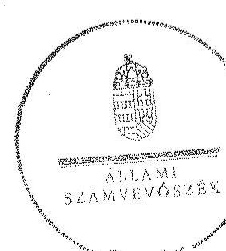

Domokos László
elnök- $\forall$

Melléklet: $\quad 14 \mathrm{db}$

[^0]
[^0]:    ${ }^{38}$ Vhr. 9. § (3) bekezdés (hatályos 2010. december 31-ig), Vhr. 9. § (5) bekezdés (hatályos 2011. január 1-től)

---

# RÖVIDÍTÉSEK JEGYZÉKE 

## Jogszabályok

| Áht. 1 | Az államháztartásról szóló 1992. évi XXXVIII. törvény (hatálytalan: 2012 január 1-jétől) |
| :--: | :--: |
| Áht. 2 | Az államháztartásról szóló 2011. évi CXCV. törvény |
| ÁSZ tv. | Az Állami Számvevőszékről szóló 2011. évi LXVI. törvény |
| Avtv. | A személyes adatok védelméről és a közérdekú adatok nyilvánosságáról szóló 1992. évi LXIII. törvény (hatálytalan: 2012. január 1-jétől) |
| Evt. $_{1}$ | Az erdőről és az erdő védelméről szóló 1996. évi LIV. törvény (hatálytalan: 2009. július 10-től) |
| Evt. $_{2}$ | Az erdőről, az erdő védelméről és az erdőgazdálkodásról szóló 2009. évi XXXVII. törvény (hatályos: 2009. július 10től) |
| Evr. $_{1}$ | Az erdőről és az erdő védelméről szóló 1996. évi LIV. törvény végrehajtásáról szóló 29/1997. (IV. 30.) FM rendelet (hatálytalan: 2009. november 21 -től) |
| Evr. $_{2}$ | Az erdőről, az erdő védelméről és az erdőgazdálkodásról szóló 2009. évi XXXVII. törvény végrehajtásáról szóló 153/2009. (XI. 13.) FVM rendelet (hatályos: 2009. november 21 -től) |
| Gt. | A gazdasági társaságokról szóló 2006. évi IV. törvény (hatályos: 2014. március 14-ig) |
| Info. tv. | Az információs önrendelkezési jogról és az információszabadságról szóló 2011. évi CXII. törvény |
| Mfbtv. | A Magyar Fejlesztési Bank Részvénytársaságról szóló 2001. évi XX. törvény |
| Nfatv. | A Nemzeti Földalapról szóló 2010. évi LXXXVII. törvény |
| Nvtv. | A nemzeti vagyonról szóló 2011. évi CXCVI. törvény |
| Ptk. | A Polgári Törvénykönyvről szóló 1959. évi IV. törvény (hatályos: 2014. március 14 -ig) |
| Számv. tv. | A számvitelről szóló 2000 . évi C. törvény |
| új Ptk. | A Polgári Törvénykönyvről szóló 2013. évi V. törvény |
| Vadvédelmi tv. | A vad védelméről, a vadgazdálkodásról, valamint a vadászatról 1996. évi LV. törvény |
| Vhr. | Az állami vagyonnal való gazdálkodásról szóló 254/2007. (X. 4.) Korm. rendelet |
| Vtv. | Az állami vagyonról szóló 2007. évi CVI. törvény |
| 262/2010. (XI.17.) Korm. rendelet | A Nemzeti Földalapba tartozó földrészletek hasznosításá-   nak részletes szabályairól szóló Korm. rendelet |

## Egyéb rövidítések

áfa
általános forgalmi adó

---

| Alapító Okirat | A Gyulaj Erdészeti és Vadászati Zt. mindenkori hatályos Alapító Okirata |
| :--: | :--: |
| ÁSZ | Állami Számvevőszék |
| Belső Ellenőrzési Sza- | A Gyulaj Erdészeti és Vadászati Zrt. mindenkori Belső Ellenőrzési Szabályzata |
| DITÚ | Döntéshozó Testületeinek Ügyrend |
| EEVR | Egységes Erdészeti Vállalatirányítási Rendszer |
| E Ft. | ezer forint |
| Erdészetek | Tamási Erdészet, Pincehelyi Erdészet, Hőgyészi Erdészet |
| Erdészeti Hatóság | Baranya Megyei Mezőgazdasági Szakigazgatási Hivatal Erdészeti Igazgatóság 2010. december 31-ig, Baranya Megyei Kormányhivatal Erdészeti Igazgatósága 2011. január 1-jétől |
| FB | Felügyelő bizottság |
| FM | Földművelésügyi Minisztérium |
| Informatikai rendszer (Forrás-SQL rendszer) | Vagyon-nyilvántartási informatikai rendszer, amelynek feladata volt a vagyonkezelők számára a vagyonkataszter jelentés elkészítésének és adathordozón történő továbbításának biztosítása, valamint a tulajdonosi joggyakorló vagyonkezelésében lévő vagyonelemek elektronikus adatbázisban történő tételes nyilvántartása |
| Gyulaj Zrt. | Gyulaj Erdészeti és Vadászati Zrt. |
| ha | hektár |
| HM | Honvédelmi Minisztérium |
| INTOSAI | Legfőbb Ellenőrző Intézmények Nemzetközi Szervezete |
| ISSAI | nemzetközi standardok |
| Informatikai biztonsági szabályzat | A Gyulaj Erdészeti és Vadászati Zrt. Informatikai biztonsági szabályzata |
| Iratkezelési Szabályzat | A Gyulaj Erdészeti és Vadászati Zrt. mindenkori hatályos iratkezelési szabályzata |
| JT | jegyzett tőke |
| KIM | Közigazgatási és Igazságügyi Minisztérium |
| KVI | Kincstári Vagyoni Igazgatóság |
| Leltározási szabályzat | A Gyulaj Erdészeti és Vadászati Zrt. Leltározási Szabályzata |
| M Ft | millió forint |
| MFB Zrt. | Magyar Fejlesztési Bank Zrt. |
| MNV Zrt. | Magyar Nemzeti Vagyonkezelő Zrt. |
| NFA | Nemzeti Földalapkezelő Szervezet |
| NFM | Nemzeti Fejlesztési Minisztérium |
| NVT | Nemzeti Vagyongazdálkodási Tanács |
| nyt. szám | nyilvántartási szám |
| RJGY | részvényesi jogok gyakorlója |
| ST | saját tőke |
| sz. | számú |
| Számítástechnikai védelmi szabályzat | A Gyulaj Erdészeti és Vadászati Zrt. Számítástechnikai védelmi szabályzata (hatályos: 20111. február 12-től) |

---

| Számviteli politika | A Gyulaj Erdészeti és Vadászati Zrt. mindenkori hatályos számviteli politikája |
| :--: | :--: |
| SZMSZ | Szervezeti és Müködési Szabályzat |
| Társaság | Gyulaj Erdészeti és Vadászati Zrt. |
| Tulajdonosi joggyakor-   ló $_{1}$ | Magyar Nemzeti Vagyonkezelő Zrt., mint a társaság részesedései feletti tulajdonosi joggyakorló 2009. január 1jétől 2010. június 16 -áig |
| Tulajdonosi joggyakor-   ló $_{2}$ | Magyar Fejlesztési Bank Zrt., mint a társaság részesedései feletti tulajdonosi joggyakorló 2010. június 17-étől 2014. július 15 -éig |
| Tulajdonosi joggyakor-   ló $_{3}$ | Földművelésügyi Minisztérium, mint a társaság részesedései feletti tulajdonosi joggyakorló 2014. július 16-tól |
| Vadászati hatóság | Megyei Mezőgazdasági Szakigazgatási Hivatal Földművelésügyi Igazgatóság Vadászati és Halászati Osztály |
| vezérigazgató   VSZ | A Gyulaj Zrt. vezérigazgatója   1996. november 1-én megkötött ideiglenes vagyonkezelési szerződés |

---

.

---

# FOGALOMTÁR 

állami vagyon
állami vagyon
használója
átlátható szervezet
földbirtok-politikai irányelvek
hasznosítás
immateriális szolgáltatásából származó bevétel
információs és kommunikációs rendszer

Kincstári Vagyoni Igazgatóság

Állami vagyon:
a) az állam tulajdonában lévő dolog, valamint dolog módjára hasznosítható természeti erő;
b) az a) pont hatálya alá tartozó mindazon vagyon, amely vonatkozásában törvény az állam kizárólagos tulajdonjogát nevesíti;
c) az állam tulajdonában lévő tagsági jogviszonyt megtestesítő értékpapír, illetve az államot megillető egyéb társasági részesedés;
d) az államot megillető olyan immateriális, vagyoni értékkel rendelkező jogosultság, amelyet jogszabály vagyoni értékű jogként nevesít;
e) az állam tulajdonában lévő pénzügyi eszközök.
Az állami vagyon használója az a természetes vagy jogi személy, jogi személyiséggel nem rendelkező szervezet, aki, vagy amely törvény vagy szerződés alapján, bármely jogcímen (bérlet, haszonbérlet, használat stb.) állami vagyont birtokol, használ, szedi annak hasznait. (Ide nem értve a haszonélvezőt, a vagyonkezelőt és a tulajdonosi jogok gyakorlóját.)
Átlátható szervezet a Nvtv. 3. § (1) bekezdés 1. pontjában felsorolt, a meghatározott követelményeknek megfelelő szervezet.
Az Nfatv. 15. § (3) bekezdés a)-s) pontjaiban meghatározott, a Nemzeti Földalapba tartozó földrészletek hasznosítására vonatkozó irányelvek.
Hasznosítás a tulajdonosi joggyakorló vagy a nemzeti vagyon használója által a nemzeti vagyon birtoklásának, használatának, hasznok szedése jogának bármely - a tulajdonjog átruházását nem eredményező - jogcímen történő átengedése, ide nem értve a vagyonkezelésbe adást, valamint a haszonélvezeti jog alapítását.
Immateriális szolgáltatásból származó bevételek azok a nem anyagjellegủ szolgáltatásokból származó állami bevételek, amelyeket az Evt. 3. § (1) bekezdése szerint, a külön jogszabályban meghatározott részletes feltételek szerint, az erdők fenntartására, gyarapítására és védelmére kell fordítani.
Az információs és kommunikációs rendszer biztosítja, hogy az információk eljussanak az illetékes szervezethez, szervezeti egységhez, illetve személyhez.
A Vtv. 61. § (1) bekezdése értelmében a Kincstári Vagyoni Igazgatóság (a továbbiakban: KVI) 2007. december 31-ei hatállyal megszűnt, jogai és kötelezettségei ezen időponttól - a 66. § (1) bekezdésében megjelölt feladat kivételével - az MNV Zrt.-re szálltak. A KVI 66. § (1) bekezdésben foglalt feladata a kincstárra szállt. A jogok és kötelezettségek átszállása nem minősült a KVI által kötött szerződések módosításának.

---

kockázatkezelés
kockázatkezelési rendszer
kontrolling
kontrollkörnyezet
kontrolltevékenységek
közfeladat
monitoring

A kockázatkezelés a szervezet céljai elérésével kapcsolatos kockázatok azonosításának és elemzésének, valamint a megfelelő válaszok meghatározásának folyamata.
A kockázatkezelési rendszer működtetése során fel kell mérni és meg kell állapítani a szervezet tevékenységében, gazdálkodásában rejlő kockázatokat, valamint meg kell határozni az egyes kockázatokkal kapcsolatban szükséges intézkedéseket, valamint azok teljesítésének folyamatos nyomon követésének módját. A kockázatkezelési rendszer olyan irányítási eszközök és módszerek összessége, amelynek elemei a szervezeti célok elérését veszélyeztető tényezők (kockázatok) azonosítása, elemzése, nyomon követése, valamint szükség esetén a kockázati kitettség mérséklése.
Az a vezetéstámogató rendszer, amely a vezetői tervezést, ellenőrzést, valamint információ-ellátást koordinálja célorientáltan a környezeti változásokhoz igazodva.
A kontroll környezet elemei: a szervezeti struktúra, a felelősségi, hatásköri viszonyok és feladatok, a szervezet minden szintjén meghatározott etikai elvárások, a humánerőforráskezelés. A kontrollkörnyezet alapozza meg a belső kontroll összes többi elemét a fegyelem és a struktúra biztosítása által. A kontrollrendszer a kockázatok kezelése és tárgyilagos bizonyosság megszerzése érdekében kialakított folyamatrendszer, amely azt a célt szolgálja, hogy megvalósuljanak a következő célok:
a) a múködés és a gazdálkodás során a tevékenységeket szabályszerűen, gazdaságosan, hatékonyan, eredményesen hajtsák végre,
b) az elszámolási kötelezettségeket teljesítsék, és
c) megvédjék az erőforrásokat a veszteségektől, károktól és nem rendeltetésszerű használattól.
A kontrolltevékenységek azok az elvek (politikák) és eljárások, amelyeket a kockázatok meghatározása és a szervezet céljainak elérése érdekében alakítanak ki.
A közfeladat jogszabályban meghatározott állami vagy önkormányzati feladat, amit az arra kötelezett közérdekből, jogszabályban meghatározott követelményeknek és feltételeknek megfelelve végez, ideértve a lakosság közszolgáltatásokkal való ellátását, továbbá az állam nemzetközi szerződésekben vállalt kötelezettségeiből adódó közérdekú feladatokat, valamint e feladatok ellátásához szükséges infrastruktúra biztosítását is. Az Etv. 2. § (2) bekezdése szerint a fenntartható erdőgazdálkodás során a legfontosabb közérdekű feladat az erdők változatosságának megőrzése, az erdők fenntartása, felújítása és a védelmi, valamint közjóléti szolgáltatások biztosítása, melyek elvégzését az állam megfelelő eszközökkel biztosítja.
A szervezet tevékenységének, a célok megvalósításának nyomon követését biztosító rendszer, amely az operatív tevé-

---

Nemzeti Földalap
nemzeti vagyon használója
rábízott állami vagyon
társasági portfólió
tulajdonosi ellenőrzés
kenységek keretében megvalósuló folyamatos és eseti nyomon követésből, valamint az operatív tevékenységektől függetlenül múködő belső ellenőrzésből áll. A monitoring a projektek és programok végrehajtásának nyomon követése, mely a támogató és a kedvezményezett közti megállapodásban foglalt eljárások követését, az előrehaladás ellenőrzését és a lehetséges problémák időben történő azonosítását szolgálja.
A Nemzeti Földalap a kincstári vagyon része, amelybe beletartoznak az állam tulajdonában és az ingatlan-nyilvántartásban levő, az Nfatv. 1. § (1)-(2) bekezdéseiben felsorolt területek, földrészletek és az azokhoz kapcsolódó vagyoni értékű jogok.
Az Nfatv. 15. § (1) ${ }^{1}$, valamint 1. § (1) ${ }^{2}$ bekezdése értelmében 2010. szeptember 1-jétől az erdőgazdasági társaság vagyonkezelésében lévő földterületek a Nemzeti Földalapba tartoznak, azok felett a tulajdonos jogait az agrárpolitikáért felelős miniszter az NFA útján gyakorolja.
A nemzeti vagyon használója az a természetes személy, jogi személy vagy jogi személyiséggel nem rendelkező szervezet, aki, vagy amely állami vagyon tekintetében törvény vagy szerződés alapján, a helyi önkormányzat vagyona tekintetében törvény, a helyi önkormányzat rendelete vagy szerződés alapján bármely jogcímen nemzeti vagyont birtokol, használ, szedi annak hasznait, kivéve a tulajdonosi joggyakorló (az Nvtv. 3. § (1) bekezdés 11. pontja alapján).
Rábízott állami vagyon az a Vtv. alkalmazásában állami vagyonnak minősülő vagyon, amit az MNV- a saját vagyonától elkülönítetten - kezel és nyilvántart. Az Mfbtv. 3. § (9) bekezdése szerint rábízott állami vagyon az a vagyon, amely felett az Mfbtv. erejénél fogva a Magyar Állam nevében az MFB gyakorolja a tulajdonosi jogokat. Az Nfatv. 1. § (1) bekezdésében foglaltak alapján az NFA-hoz tartozó rábízott vagyon a törvényben meghatározott, a Nemzeti Földalapba tartozó vagyon.
Társasági portfólió az MNV, illetve az MFB rábízott vagyonába tartozó állami tulajdonú társasági részesedések.
Az MNV/MFB/FM tulajdonosi joggyakorló által végzett ellenőrzés, amelynek célja az állami vagyonnal való gazdálkodás vizsgálata, ennek keretében a rendeltetésellenes, jogszerütlen, szerződésellenes, vagy a tulajdonos érdekeit sértő, illetve a központi költségvetést hátrányosan érintő vagyongazdálkodási intézkedések feltárása és a jogszerú állapot helyreállítása, továbbá a vagyonnyilvántartás hitelességének, teljességének és helyességének biztosítása.

[^0]
[^0]:    ${ }^{1}$ Hatályos: 2010. szeptember 1 - 2011. július 31.
    ${ }^{2}$ Hatályos: 2010. szeptember -jétől, módosítva: 2011. augusztus 1-jétől.

---

tulajdonosi joggyakorló
tulajdonosi joggyakorlás módja
vagyongazdálkodás feladata
vagyonkezelői jog

Tulajdonosi joggyakorló az, aki az állami, illetve a nemzeti vagyon felett az államot megillető tulajdonosi jogok és kötelezettségek gyakorlására jogosult.
Az állami vagyon felett a Magyar Államot megillető tulajdonosi jogoknak (és kötelezettségeknek) az összességét az állami vagyon felügyeletéért felelős miniszter gyakorolja, aki e feladatát az MNV, az MFB útján látja el. Azon állami tulajdonban álló ingatlanok felett, amelyek egy része a Nemzeti Földalapba tartozik, a tulajdonosi jogokat a miniszter az agrárpolitikáért felelős miniszterrel közösen gyakorolja. A Nemzeti Földalap felett a Magyar Állam nevében a tulajdonosi jogokat és kötelezettségeket az agrárpolitikáért felelős miniszter a Nemzeti Földalapkezelő Szervezet útján gyakorolja.
Az állami vagyon rendeltetésének megfelelő - az állami feladatok ellátásához, a társadalmi szükségletek kielégítéséhez, valamint a Kormány gazdaságpolitikája megvalósításának elősegittéséhez szükséges, egységes elveken alapuló, önálló ágazatként megjelenő - hatékony, költségtakarékos, értékmegőrző, értéknövelő felhasználásának biztosítása, beleértve a vagyoni kör változását eredményező értékesítést, valamint az állami vagyon gyarapítása is.
Vagyonkezelési szerződés alapján a vagyonkezelő jogosult meghatározott, állami tulajdonba tartozó dolog birtoklására, használatára és hasznai szedésére. A Vtv. alapján a vagyonkezelői jog az állami vagyon hasznosítására az MNVvel kötött vagyonkezelési szerződéssel jön létre. A vagyonkezelési szerződés alapján a vagyonkezelő jogosult meghatározott, állami tulajdonba tartozó dolog birtoklására, használatára és hasznai szedésére. Az Nfatv. alapján a vagyonkezelői jog az erre irányuló (NFA-val kötött) szerződéssel jön létre. A vagyonkezelői szerződés alapján a vagyonkezelő jogosult meghatározott földrészlet birtoklására, használatára és hasznai szedésére. A vagyonkezelő köteles a földrészlet értékét megőrizni, állagának megóvásáról, jó karban tartásáról gondoskodni, továbbá - az Nfatv.-ben meghatározott esetek kivételével díjat - fizetni vagy a szerződésben előírt más kötelezettséget teljesíteni.

---

A Gyulaj Zrt. vagyonváltozásának alakulása a 2009-2014. évek közötti időszakban - Eszközök (M ft)
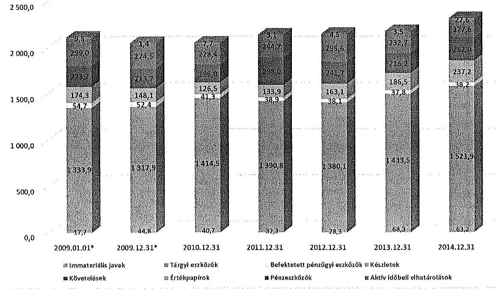

A Gyulaj Zrt. vagyonváltozásának alakulása a 2009-2014. évek közötti időszakban - Források (M ft)
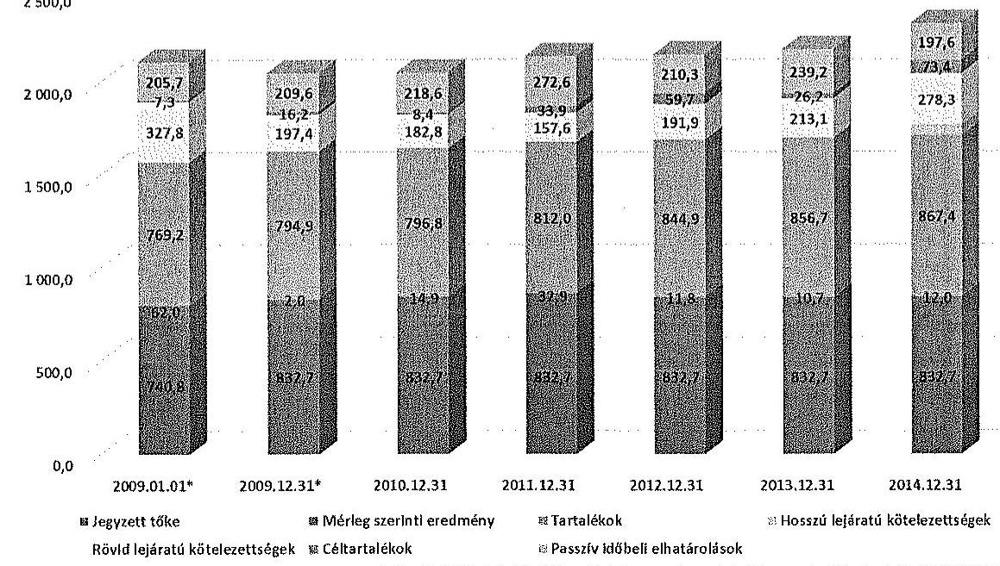

---

A belsétetett eszközök állományának alakulása | 2015. év | 2016. év | 2017. év | 2018. év | 2019. év | 2020. év | 2021. év | 2022. év | 2023. év | 2024. év | |---|---|---|---|---|---|---|---|---|---|---|---|---| | | | | | | | | | | | | | | | | | | | | | | | | | | | | | | | | | | | | | | | | | | | | | | | | | | | | | | | | | | | | | | | | | | | | | | | | | | | | | | | | | | | | | | | | | | | | | | | | | | | | | | | | | | | | | | | | | | | | | | | | | | | | | | | | | | | | | | | | | | | | | | | | | | | | | | | | | | | | | | | | | | | | | | | | | | | | | | | | | | | | | | | | | | | | | | | | | | | | | | | | |

---

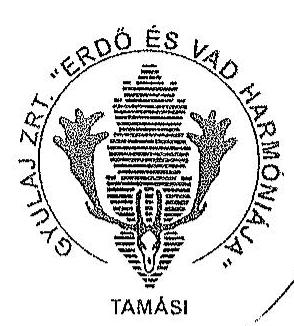

# Gyulaj 

## Erdészeti és Vadászati

## Zrt.

Erdögzodálkodás $\cdot$ Vadyozdálkodás $\cdot$ Ökotorizomus

7090 Tamási, Szabadság u. 2
Tel. :(0036)74/573-940
Fax: (0036)74/473-985
titkarsag@gyulajzrt.hu
www.gyulajzrt.hu
(2)
erdeliskola.gyulajzrt.h

Ögyiratszám: 951/12/2015.

## Domokos László úrnak, elnök

Állami Számvevőszék
Budapest
Apáczai Csere János utca 4.
1052

## Tisztelt Elnök Úr!

ÁLLAMI SZÁMVEVÓSZÉK
Ch 022/2015
Érkezein: 2015 OKT 22
Iktatószám: 160966 - 145 part
Melléklet:
Hazżai H.
22

Mellékelten megküldjük "Az állami tulajdonban álló erdőgazdasági társaságok vagyongazdálkodási tevékenységének ellenőrzése - Gyulaj Erdészeti és Vadászati Zrt." címủ számvevőszéki jelentéstervezettel kapcsolatos észrevételeinket.

Tisztelt Elnök Úr!
Ezúton is köszönöm a Számvevők részletes, hasznos és rendkívül körültekintő, felelősségteljes munkáját!

Tamási, 2015. október 19.
Gyulaj
Erdészeti és Vadászati Zártköröm
Milkódó Részvénytársaság
2015. Yonki: 14.07.15. 27. 50.

Tisztelettel:
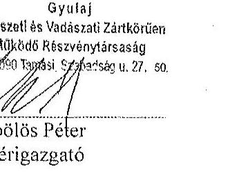

---

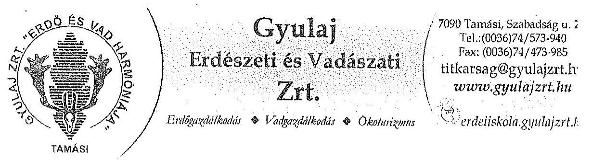

Iktatószám (Gyulaj Zrt.): 951/12/2015.
Állami Számvevôszék

- Iktatószám: V-0766-1473/2015.
- Témaszám: 1800
- Vizsgálat-azonosító szám: V-070618

11 számozott oldal
Észrevétel: „Az állami tulajdonban álló erdőgazdasági társaságok vagyongazdálkodási tevékenységének ellenôrzése

Gyulaj Erdészeti és Vadászati Zrt. 2015." címú, az Állami Számvevőszék által készített

# JELENTÉSTERVEZETHEZ 

Göbölös Péter
vezérigazgató
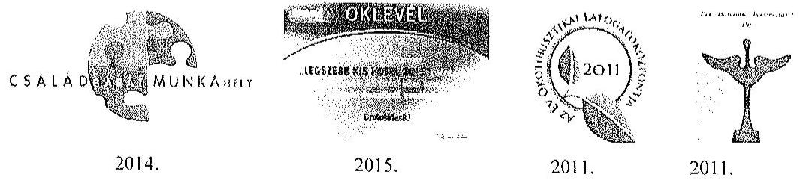

2014.
2015.
2011.
2011.

Gyulaj Erdészeti és Vadászati Zrt.

---

Észrevétel: „Az állami tulajdonban álló erdőgazdasági társaságok vagyongazdálkodási tevékenységének ellenörzése Gyulaj Erdészeti és Vadászati Zrt. 2015." címü, az Állami Számvevöszék által készített JELENTÉSTERVEZETHEZ

# BEVEZETÉS 

A dokumentum 4. oldal 3. bekezdésének utolsó mondata nem helytálló. Tévedésből vélhetően az országos adatokat tulajdonítja a Társaságnak.
„A Társaság 879 254,2 ha erdőterülten és 34 410,2 ha egyéb mûvelési ágú földterületen gazdálkodott, az éves átlaglétszám 99,8 fö."
Helyesen:
A Társaság 2014. év végi állapot $21.013,52$ ha erdőterülten és $2.109,86$ ha egyéb művelési ágú földterületen gazdálkodott, az éves átlaglétszám 99,8 fő. A teljes gazdálkodási terület 23.321 ha. Ezt a későbbi hivatkozásnál is kérjük javítani!

## I. ÖSSZEGZŐ MEGÁLLAPÍTÁSOK, KÖVETKEZTETÉSEK, JAVASLATOK

1./1. 2. bekezdés: ,,Az ellenörzött idöszakban a Társaság mérlege nem a valós állapotot tükrözte, mert a kezelt erdöket és földingatlanokat a szimre, tv. elöirásai ellenére a mérlegben nem szerepellette. A társaság a szimre, tv. elöirásával ellentétben a kezelt vagyoni mérlegtételek szerinti bontásban a kiegészitö mellékletében nem mutatta be."
A Társaság a Kincstári Vagyoni Igazgatósággal 1996. november elsején Ideiglenes vagyonkezelési szerződést kötött, amelyben a Társaság részére vagyonkezelésbe adott eszközök (állami erdők) érték nélkül szerepelnek.
A Társaság az Ideiglenes vagyonkezelési szerződés szerint érték nélkül vagyonkezelésbe vett eszközöket a számviteli törvény 23. § (2) bekezdés szerint eszközként illetve a 42. § (1) bekezdés alapján kötelezettségként az éves beszámolóban értékkel kimutatni nem tudja.

A KV1 (01840-96-02071 számú, 1996. 11. 01.) hatályos Ideiglenes Vagyonkezelési Szerződés így fogalmaz:
„2.2. A szerzödésben foglalt rendelkezéseket a szerzödés 1. sz. (erdő és az erdöhöz szorosan tartozó ingatlanok), 2. sz. (onyagi és nem anyagi eszközök) és 3. sz. (egyéb vagyoni értékü jogok) mellékletében naturáliákban tételesen felsorolt kincstári vagyonra kell alkalmazni."
„2.4. A Vagyonkezelö az erdövagyon óllományáról és változásáról naturáliákban nyilvántartás vezet."

---

Észrevétel: Az állami tulajdonban álló enálgazdasági társaságok vagyongazdálkoztni tevékenységének ellenórzése - Gyulaj Erdészen és Vadászati Zrt. 2015. ${ }^{1}$ címü, az Állami Szemvevöszék által készített JELENTESTERVEZETHEZ

A Gyulaj Zrt, 2009. évi kiegészítő mellékletéből vett idézet:
„A Társaság, mint vagyonkezelö, a vagyonkezelési szerzödésben meghatározott értéken mutatta ki mérlegében az eszközök között a -tárvényi rendelkezés, illetve felhatalmazás alapján - kezelésbe vett, az állami vagy az önkormányzati vagyon részét képező eszközöket is.
A Társaság által kezelt vagyon az Ideiglenes vagyonkezelési szerzödésben 0 értéken szerepel, ezért a Társaság könyveiben 0 E Ft a nyilvántartási érték."
Azonos megfogalmazással szerepel az erdővagyon értékének nyilvántartására való utalás a 2010, 2011, 2012, 2013, 2014. évi beszámolókban is.
A Társaság mérlegének összeállítása, vagyoni helyzetének megállapítása során mint vagyonkezelő az Ideiglenes vagyonkezelési a szerződésnek megfelelően járt el. Az Ideiglenes vagyonkezelési szerződés megkötésekor az erdők értékmeghatározásának a hiánya már fennállt. A Társaság akkori tulajdonosi joggyakorlója a Pénzügyminisztériumhoz fordult a kérdés tisztázása érdekében. A PM 9806/1997. ügyszám válaszában rögzíti: „A számviteli törvény 21. §-ának /3/ bekezdésben megfogalmazott előírás feltételezi, hogy a kezelt kincstári vagyon megfelelő módon, dokumentáltan értékelésre kerül, hiszen csak ez esetben lehet azt az eszközök és kötelezettségek között értékkel kimutatni. Ebből természetesen - az is következik, amíg megfelelő értékelés nem áll rendelkezésre, vagy az adott kincstári vagyont nem lehet - természeténél fogva - értékelni, addig/ és akkor nem lehet / nem tudjuk/ alkalmazni a törvény hivatkozott 21. §/3/ bekezdésének rendelkezését sem."
Vélelmezzük, hogy a tulajdonosi joggyakorló az Ideiglenes vagyonkezelési szerződés megkötésekor, az erdő érték nélküli vagyonkezelésbe adásánál mérlegelte az erdőgazdálkodás szakmai sajátosságait, az eszközök és kötelezettségek értéken történő kimutatásából eredő torz üzleti megítélés, és ebből eredő kedvezőtlen vagyoni helyzetbéli megítélés következményeit.
Az erdővagyon értéknek az esetleges megállapítását követően a Gyulaj Zrt. vagyona nem változik, kizárólag az egyező eszköz - forrás oldalon várható jelentős növekedés.
A kezelt erdővagyon után értékcsökkenés nem számolható el, ezáltal az eredmény kimutatásban nem történik változás az esetleges értékelést követően sem. Így a gazdálkodás jövedelmezőségét nem befolyásolja sem a 0 forinton történt nyilvántartás, sem az esetlegesen magasabb értéken történő nyilvántartás. Ugyan ez mondható el a pénzügyi helyzetre is.
Mind a Társaság, mind a Társaság könyvvizsgálói e megállapítások szerint jártak el. A Társaság beszámolói megbizható, valós képet mutatnak a vagyoni, jövedelmezőségi és pénzügyi helyzetröl.
Az erdő - mint természeti képződmény - fogalma elsősorban dologi jogi, ingatlanjogi és vagyonjogi kategória. Értéknek megállapítása e kategóriák figyelembe vételével lehetséges. Az erdő, mint természeti képződmény folyamatosan változik, ami a nyilvántartási értéknek a változását is eredményezheti.

Ismereteink szerint Magyarországon jelenleg nincs elfogadott, egységes elvek szerint működő erdőérték-számitási módszer. Már a lábon álló élő́́a készlet naturális mennyiségi becslése is általában közel tíz százalék hibahatárú, amelynek választékszerkezete és

---

# Észrevétel: Az állami tulajdonban álló erdő́gazdasági társaságok vagyongszabálkoztási tevékenységének elterüzzése - Gyulaj 

Erdészeti és Vadászati Zrt. 2015. ${ }^{\circ}$ címü, az Állami Számvevőszési által készített JELENTESTEINVEZETHEZ
piaci értéke a bizonytalanságot tovább növeli. Az élőfaállomány értékbecslésének pontatlansága jóval meghaladhatja az éves mérlegfőösszeg nagyságrendjét.
Elfogadott értékbecslés módszertan hiányában a kezelt erdővagyon értékének meghatározása és a Társaság könyveiben történő nyilvántartása aggályos.

A Gyulaj Erdészeti és Vadászati Zártkörűen Müködő Részvénytársaság által kezelt vagyon $100 \%$-ban a Magyar Állam tulajdona, kincstári vagyon. Törvényi rendelkezés folytán a kizárólagos állami tulajdonba tartozó vagyonként forgalomképtelen, piaci értéke nincs. Nvtv. 10. § (1) A nemzeti vagyont, annak értékét és változását a tulajdonosi joggyakorló nyilvántartja. Az érték nyilvántartásától el lehet tekinteni, ha az adott vagyontárgy értéke természeténél, jellegénél fogva nem állapítható meg.
A 19 erdészeti társaság vagyonkezelésében lévő közel 880 ezer hektár erdőterület értékelésének, az erdőértékszámításnak és a értékváltozás követésének a módszere kidolgozatlan, és rendkívül költségigényes, ami ellentmond a legalapvetőbb számviteli alapelvnek: ,,A beszámolában (a mérlegben, az eredmény-kimutatásban, a kiegészitő mellékletben) nyilvánosságra hozott információk hasznosíthatósága (hasznassága) álljon arányban az információk elöállitásának költségeivel (a költség-huszon összevetésének elve). " (Számv. tv 16.§(5)).
Az állami tulajdonú erdővagyon forgalomképtelen! Mindemellett az erdö hármas funkciója (gazdasági, védelmi, közjóléti) miatt a védelmi és a közjóléti funkció pénzbeli értékelése értelmezhetetlen (pl.: Rám szakadék környéki erdők erdőérték-számítása?). A Magyar Szent Korona eszmei értékét sem lehet kifejezni pénzben, a hozzá kapcsolódó nemzeti érzések pénzbeli kifejezése is értelmezhetetlen.
A Gyulaj Erdészeti és Vadászati Zártkörűen Müködő Részvénytársaság az állami tulajdon részét képező vagyont Ideiglenes vagyonkezelési szerződéssel hasznosítja. A végleges vagyonkezelési szerzödés megkötésének elökészitésére több alkalommal történt kisérlet! Az előkészítő munkákban a Társaság véleményezéssel, továbbá a Társaság ügyvédje útján a végleges vagyonkezelési szerződést előkészítő munkabizottságban is részt vett, melyet a későbbiekben részletezünk.

Azonban a Társaság Alapító Okiratának 12.2 pontja szerint "Az egyedüli részvényes kizárólagos hatáskörébe tartozik
zs. az állami erdőterületek kezelésére vonatkozó vagyonkezelési szerzödés megkötése."
A 2014. szeptemberétől érvényes Alapszabály szerint:
,12.2. Az alapító kizárólagos hatáskörébe tartozik:
bb) döntés az állami erdőterületek kezelésére vonatkozó vagyonkezelési szerzödés megkötéséről, módosításáról."

A vagyonkezelési szerződés módosítása illetve a végleges vagyonkezelési szerződés megkötése meghaladja a Társaság munkaszervezetének, menedzsmentjének a hatáskörét.
1./2. 6. oldal 6. bekezdés 3. mondat: ,,A vagyonkezelési szerzödés nem támogatta megfelelöen és számon kérhető módon a Vhr-ben elöirtak megvalósulását, a Társaság állami vagyonnal való gazdálkodását."

A fentiekben észrevételezetteknek megfelelően, vagyonkezelési szerződés módosítása és egységes szerkezetbe foglalása nem tartozott és nem tartozik a Társaság munkaszervezetének a hatáskörébe. A jogszabályi változások - ettől függetlenül - a vagyonkezelési szerződés módosítása, egységes szerkezetbe foglalása nélkül is kötelezőek a felekre, a

Gyulaj Erdészeti és Vadászati Zrt.

---

Észrevétel: „Az állami tulajdonban Alti estágszámságl társaságok vagyongazdálkodázi tevékenységének ellenėrzése - Gyulaj Erdészeti és Vadászati Zrt. 2015." című, az Állami Számvevőszék által készített JELENTÉSTERVEZETHEZ
vagyonkezelési szerződés egyes rendelkezéseit ennek alapján az új jogszabályi környezetben kell megfelelően értelmezni és alkalmazni.
1./3. 6. oldal 5. bekezdés ,, A Társaság nem teljes körüen rendelkezett a kezelt vagyon tekintetében pontos és naprakész információval a tulajdonosi jogokat gyakorlóról, igy a Társaság által vezetett nyilvántartás nem biztositotta a Vht,-ben foglalt, az adatszolgáltatás pontossá. gára vonatkozó követelményt."

A Társaság naprakész nyilvántartást vezet az által kezelt vagyonról. Ezt a nyilvántartást az ellenőrzés során bemutatta. E nyilvántartásból állította illetve állítja össze a jelentéseit a tulajdonosi joggyakorló felé.
,,A Társaság vagyongazdálkodási feladataira vonatkozó döntések, intézkedések elökészitése a Tulajdonosi joggyakorlónál, ,1 megfelelő volt, összhangban állt a vonatkozó jogszabályokkal és a belső szabályzatokkal. Részletesen szabályozták a döntési jogköröket, a vagyongazdálkadási és a vagyon változását eredményező döntések elökészitésével kapcsolatos követelményeket, és a követelmények aktualizálása megtörtént."
1./4. „A Társaság több esetben a vadgazdálkadásból származó bevételeinek elszámolását megalapozó szerződésekkel megsértette a Számv. tv. szerinti bruttó elszámolás alapelvét, mert a bevételeket és a költségeket egymással szemben számolta el."

A Számv. tv. szerinti bruttó elszámolás elvének sérelme egyetlen, 2001. évben megkötött vadászati bizományosi szerződés esetében állt fenn, mely 2010. évtől csökkenő jelentőséggel bírt, 2014/2015. évi vadászati szezonban pedig megszüntetésre került. Az értékesítésnek a bizományosi díjjal csökkentetten történt számlázása a társaság eredménykimutatását nem befolyásolta.
A Társaság a vadászatokat ettől az egyetlen esettől eltekintve a vizsgált időszakban ún. saját számlás értékesítési móddal (adásvételi jogügylet keretében) értékesítette, melyek esetében az ilyen módon történő számlázás a számviteli szempontból helyesen alkalmazott módszer. (Az eladó az árualapot a megszabott áron értékesíti, az utazásszervező vevő pedig a saját árrésével emelt áron értékesíti tovább.)
A kifogásolt egyetlen esetben a számviteli osztály a számlákat tévedésből, az egyébként (a fentiekben bemutatott más szerződéstípus esetében) alkalmazott gyakorlatnak megfelelően állította ki.
1./4. 7 oldal 2 bekezdés: „A VSZ-ben rögzítettek ellenére a vagyonkezelői dijak éves felülvizsgálatára nem került sor. "

Az ideiglenes vagyonkezelési szerződés abban az átmeneti jogszabályi környezetben készült, amikor a jogalkotás hiányosságai folytán nem volt lehetőség végleges vagyonkezelési szerződés megkötésére. A szerződést (az elnevezéséből is megállapíthatóan) - a Magyar Állam képviseletében tulajdonosi joggyakorlóként akkor eljáró - ÁPV Rt. nyilvánvalóan átmeneti időszakra szánta.
A vagyonkezelési díj rögzítésére is csak az első év vonatkozásában került sor. A további években a tulajdonosi jogkör gyakorlója a vagyonkezelési díjat egyeztetés nélkül, azonban a számla kibocsátásával, mint ráutaló magatartással határozta meg.
A Társaság menedzsmentje és munkaszervezete a Társaság érdekében köteles eljárni, a korábbival azonos mértékben meghatározott vagyonkezelési díj ennek megfelel, a Társaság ezért azt nem kifogásolta, szintén ráutaló magatartással, a számla kiegyenlítésével elfogadta.

Gyulaj Erdészeti és Vadászati Zrt.

---

Észrevétel: Az öltemi tulajdonban álti erdőgazdasági társaságok vagyongazdálkodási tevékenységeinek ellenőrzése - Gyulaj Erdészei és Vadászati Zrt. 2015. ${ }^{\text {i }}$ címü, az Állami Számvevőszék által készílné ZELENTÉSTERVEZETHEZ

A vagyonkezelési díj mértéke vonatkozásában szükséges megjegyezni, hogy a vagyonkezelési díj mértékének az emelése az erdőből történő forrás kivonást eredményez, ezért a Magyar Állam képviseletében eljáró tulajdonosi joggyakorló okszerüen nem tartott igényt eltérő mértékủ vagyonkezelési díj megállapítására.
1./5. 8. oldal 3 bekezdés 2 mondat módosítandó: A Társaság Felügyelőbizottsága a Gt. és új Ptk. előírásai alapján az éves munkatervben előírt vagyongazdálkodás, a feladatellátás és az ügyvezetés ellenőrzését minden évben ellátta, az évközi és éves beszámolók véleményezésével, határozataiban rögzítette álláspontját ...

# a Gyulaj Zrt. vezérigazgatójának: 

a.) Tegyen intézkedéseket a tulajdonosi joggyakorlókkal közremüködve a tényleges állapotnak és a hatályos jogszabályi elöirásoknak megfelelö vagyonkezelés megkötése érdekében.

## Személves közremüködésemmel és meghatalmazásommal a Gyulaj Zrt. ügyvédjének képviseletével, a Zrt. aktívan részt vett az új végleges vagyonkezelési szerzödés létrehozásában!

A Magyar Fejlesztési Bank Zrt. 2011. év közepén határozta el munkacsoport felállitását az új végleges vagyonkezelési szerződés kidolgozására.
Ennek a munkacsoportnak a vezetője Nagy András igazgató volt a Magyar Fejlesztési Bank Zrt. részéről.
Tagjai voltak a kizárólagos állami tulajdonú erdészeti társaságok részéről:
Reinitz Gábor (Pilisi Parkerdő Zrt.)
Nagy János (Ipoly Erdő Zrt.)
Dr. Rékási Róbert (NEFAG Zrt.)
Dr. Szőts József (Gemene Zrt, Gyulaj Zrt.).
A munkacsoport több munkaértekezletet tartott (többek között 2011. június 20.; 2011. október 3.; 2012. február 2.; 2012. július 17.; 2014. március18.) az MNV Zrt. képviselöinek a részvételével és különböző tervezetek kerültek kidolgozásra.
2014. július 16. napjától - jogszabályváltozás folytán - az erdőgazdasági részvénytársaságok feletti tulajdonosi jogkör gyakorlása az erdőgazdálkodásért felelős miniszterhez került át, ezzel az MFB Zrt. által felállított munkacsoport megszünt. Jelenleg az MNV Zrt.-vel a vagyonkezelési szerződés tárgyában a Földművelésügyi Minisztérium egyeztet közvetlenül.
Minisztériumi egyeztetés során szervezetileg belülre került az NFA tulajdonosi joggyakorlásában lévő állami vagyon tekintetében a vagyonkezelési szerződés előkészítése.

A vagyonkezelési szerződés megkötésének azonban jelenleg akadályát képezi a Földforgalmi Törvény 16.§ (2) bek. illetve (3) bek. termőföld birtokmaximumra vonatkozó rendelkezése.
Tekintettel arra, hogy a Földforgalmi Törvény 16.§ (7) bek. ugyanis nem nevesíti ez alól kivételként a Magyar Állam kizárólagos tulajdonában lévő gazdasági társaságokat, így a termőföld birtokmaximum jelenleg kiterjed az erdőgazdasági társaságokra is.
A Nemzeti Földalapról szóló törvény 19.§ (4) bek. kifejezetten megerősíti, hogy (a jelenlegi jogszabályi környezetben) a Magyar Állam tulajdonában lévő termőföld hasznosítása sem kivétel a szabály alól.

Tehát jogszabály módosítás (a Magyar Állam tulajdonában lévő termőföld hasznosítása tekintetében felmentés a termőföld birtokmaximum szabálya alól) szükséges ahhoz, hogy a végleges vagyonkezelési szerződés megköthető legyen.

Gyulaj Erdészeti és Vadászati Zrt.

---

# 5. SZÁMÚ MELLÉKLET 

A V-0766-154/2015. SZÁMÚ JELENTÉSHEZ

Észrevétel: „Az állami tulajdonban álló erátigazdasági társaságok vagyongazdálkodási tevékenységének ellenórzése - Gyulaj Erdészeti és Vadászati Zrt. 2015" címú, az Allami Szemvevőszék által készített JELENTÉSTEINÉZETHEZ
b.) Intézkedjen a vagyonkezelési szerzödés felülvizsgálatának elmaradásával feltárt szabálytalanságok tekintetében a felelősség tisztázása érdekében, és szükség szerint intézkedjen a felelösség érvényesitéséröl.
A Gt. 30.§ (2) bek. alapján a Társaság vezető tisztségviselőinek a Társaság érdekeinck az elsődlegessége alapján kellett eljárniuk. A Társaság munkaszervezetének a fentiekben bemutatott magatartása - álláspontom szerint - ennek megfelelő.
A Társaság menedzsmentje és munkaszervezete nem rendelkezett és nem rendelkezik hatáskörrel a vagyonkezelési szerződés módosítása tárgyában.
A Társaság aktívan részt vett és részt vesz a végleges vagyonkezelési szerződés kialakításának folyamatában. Ugyanakkor a végleges vagyonkezelési szerződés megkötésének jelenleg jogszabályi akadálya van.

## II. RÉSZLETES MEGÁLLAPÍTÁSOK

## 1. A GYULAJ ZRT. VAGYONGAZDÁLKODÁSA

1.1. A vagyon értékének, megőrzése, gyarapítása
II./1. 15. oldal: „Az ellenőrzött években szervezeti egységenként elkülönített tételes karbantartási terveket - erre vonatkozó elöírás hiányában - nem készítettek a társaságnál."

A szervezeti egységek az éves tervezés során állítják be a karbantartási feladatokat és azok költségét. Az éves terv megfelelőségét a központ ún. tervtárgyalás alkalmával ellenőrzi. Az éves üzleti tervek alapját képező ágazati tervlapok alapján kerül véglegesítésre az üzleti terv.
A karbantartásokat folyamatosan és ütemezetten hajtjuk végre azok fontossága alapján. A karbantartások egy része előre nem látható (havária) esemény folytán keletkezik, mely nem tervezhető.
II./2. 17. oldal 2. bekezdés módosítandó. „A Társaság saját vagyona döntöen ingatlanokból, $n$-fúipari, a vadgazdálkodási tevékenységhez kapcsolódó termelő eszközökböl, valamint az erdőmüvelési feladatokat ..." A Gyulaj Zrt. nem végez fúipari tevékenységet.

### 1.2. A vagyonkezelői kötelezettség teljesítése

## 2. A GYULAJ ZRT. VAGYONKEZELÉSI SZERZŐDÉSE ÉS A VAGYONNYÍLVÁNTARTÁSA

2.1. A vagyonkezelői szerződés megfelelősége
II./3. 20. oldal 3. bekezdés:
„... a Tulajdonosi joggyokorló nem határozta meg, hogy nettó vagy ÁFA-val növelt ellenértéket jelent."
A szerződéses jogvisznnynkban - amennyiben az általános forgalmi adó nem kerül kifejezetten feltüntetésre - az ellenérték mindig bruttóban értendő.

---

Észereket: „Az állatot tulajdonban 480 endüpcsióssági társaságok vagyongazdalkodási tevékenységének ellentézzése - Gyulaj Erdészeti és Vadászati Zrt. 2015." című, az Állami Számvevőszék által készített JELENTÉSTERVEZETHEZ

# 2.2. A Gyulaj Zrt. vagyonnyilvántartása 

11./4. 21. oldal első bekezdés: Az ellenőrzött időszakban a Társaság kezelt vagyonra vonatkozó vagyonnyilvántartása nem felelet meg a hitelességi és megbizhatósági követelményeknek.
„A Társaság a vagyonkezelt földterületen kívül vagyonkezelésbe tartozó épülettel építménynyel, más vagyonkezelésbe tartozó vagyonelemmel nem rendelkezett. A Társaság a vagyonkezelésbe vett ingatlanokat a vagyon feletti tulajdonosi joggyakorlói-nél alkalmazott vagyonkimutatási nyilvántartással megegyezö informatikai rendszerben rögzitette. Az analitikus nyilvántartás adott idöpontokra visszavezethető módon, tételesen, helyrajzi számonként, azon belül alrészletenként tartalmazza a kincstári vagyonkörbe tartozó földterületek felsorolását és azok jellemzőit. A nyilvántartásban rögzítették a települések nevét, a földrészletek fekvését, valamint a helyrajzi számok és alrészletek szerinti müvelési ágak, területmértéket, aranykorona értéket és tulajdoni hányadok megjelölését." (23. oldal)
„A kataszteri jellegü analitikus vagyonnyilvántartással egyidejüleg a Társaság szakmai nyilvántartás is vezetett. a vagyon feletti tulajdonosi joggyakorlói megrendelése alapján fejlesztett térinformatikai az erdőgazdálkodás során felmerülö tervezési, nyilvántartási és bejelentési feladatok támogatására készült. Az ESZI (ESZR) rendszerben erdörészletenkénti megbontásban rögzítették a kezelt földterületekkel kapcsolatos részletes szakmai adatokat és információkat, amelyeket rendszeresen egyezteitek az erdészeti hatóság által a 153/2009. (11.3.) FVM rendelet 21 § szerint vezetett közhiteles nyilvántartásnak minősülő Országos Erdőállomány Adattár állománnyal." (24. oldal)

## A Gyulaj Zrt. vagyonnyilvántartása megfelel a hitelességi és megbizhatósági követelményeknek! Precíz, kellően részletes, és naprakész, folyamatosan aktualizáljuk.

11./5. 22. oldal utolsó bekezdés
..."Az évközi változásokról, valamint a tárgyév utolsó napján fennálló állapotról a Társaság a Vhr. 14. § (1) bekezdésben foglalt elöírásoknak megfelelöen adatszolgáltatást teljesitett a Társaság feletti Tulajdonosi joggyakorlói,4 felé, azonban a Társaság nyilvántartása nem biztositotta az adatszolgáltatás pontosságát és ellenörizhetőségét."
23. oldal 2. bekezdés 2. mondat:

A Társaság a vagyonkezelésbe vett ingatlanokat a vagyon feletti Tulajdonosi joggyakorlói-nél alkalmazott vagyon-kimutatási nyilvántartással megegyezö informatikai rendszerben rögzitette. Az analitikus nyilvántartás adott idöpontokra visszavezethető módon, tételesen, helyrajzi számonként, azon belül alrészletenként tartalmazza kincstári vagyonkörbe tartozó földterületek felsorolását és azok jellemzőit. A nyilvántartásban rögzítették a települések nevét, a földrészletek fekvését, valamint a helyrajzi számok és alrészletek szerinti müvelési ágakat, területmértékek, aranykorona értékek és tulajdoni hányad megjelölését.

Az ingatlan-nyilvántartásunk a hiteles ingatlan-nyilvántartási adatoknak megfelelően naprakész. A 23. oldal 2. bekezdés 2. mondatban felsoroltakon kívül ingatlannyilvántartásunk tartalmazza még a Natura 2000, tájvédelmi körzet bejegyzéseket is.

---

Éssrevétel: „Az állami tulajdonban álló erdőgazdúsági társaságok vagyongyazdálkodási tevékenységének ellenőrzése - Gyulaj Erdészeti és Vadászati Zrt. 2015." című, az Állami Számvevőszék által készített JELENTESTERVEZETHEZ
11./6. A Társaság szabályszerű működését támogató információáramlási és monitoring rendszer kialakítását szabályzatban nem rögzítette ugyan a Társaság, azonban az Info tv.-ben és a Vtv.-ben előírt, a közérdekủ adatok megismerésére irányuló igényeket teljesítette. Ezt igazolja a Transparency International magyarországi állami tulajdonú vállalatok közötti vizsgálata, amely szerint a Gyulaj Erdészeti és Vadászati Zrt. minősítése az alábbi:

- Törvénytisztelet Index (TTI) alapján a 66-os listán a 28., az állami erdészeti Zrt-k között az 1.!
- Ajánlott közzétételi lista Index (ALI) alapján a 66-os listán a 31., az állami erdészeti Zrt-k között az 5.
- Összesített lista Index (Összesített Index) alapján a 66-os listán a 32., az állami erdészeti Zrt-k között a 2.

# 3. A GYULAJ ZRT. ÉVES TERVEZÉSI FELADATAINAK ELLÁTÁSA, AZ ÁGAZATI JOGSZABÁLYOK ÉRVÉNYESÜLÉSE 

3.1. Az üzleti tervek vagyonmegőrzése, vagyongyarapításra vonatkozó elemei
11./7. „Az üzleti tervek részletesen bemutatták a saját vagyonnal kapcsolatos - fofeldolgozás, erdőgazdálkodási szolgáltatás, vadgazdálkodás ..."
A Zrt-nek nincs fafeldolgozási tevékenysége.
3.2. A tervekben megfogalmazott előirások érvényesülése
11./8. „A Társaság az ágazati és éves üzleti tervekben megfogalmazott, az erdővagyonnal való gazdálkodás érdekében kifejtett erdőgazdálkodási és vadgazdálkodási tevékenységét megfelelően végezte, a vagyon megőrzésére, gyarapitására vonatkozó előirásokat betartotta."
A külső értékelések szerint a megjelölt tevékenységünket a lehetőségek szerinti legmagasabb színvonalon látjuk el.

### 3.3. Az ágazati szabályok érvényesülése

11./9. „A vadgazdálkodási terveket a vadászatra fogossutak három eset kivételével a Vadászati tv 47. § (1) bekezdésben foglalt határidőre nyújtották be a vadászati hatósághoz jóváhagyás céljából."
A Vadászati Hatóságnak erről feljegyzése nincs, mi úgy tudjuk, hogy a vadgazdálkodási terveket minden esetben határidőre nyújtottuk be. Egy esetleges benyújtási határidő túllépésből adódóan hatósági észrevételt soha nem kaptunk.

## 4. KONTROLL- ÉS MONITORING RENDSZER KIALAKÍTÁSA ÉS MÜKÖDTETÉSE

4.1. A kontrollrendszer kialakítása és müködtetése
4.2. Az információáramlási és monitoring rendszer kialakítsa és múködtetése
11./10. „A társaság a Vtv. 5 § (2) bekezdése alapján közfeladatot ellátó szervnek minösïlt, azonban ..."
Felmerült kérdésként, hogy mi minősül „közfeladat ellátás"-nak a jelenlegi jogszabályi környezetben. Ebben a tárgyban a ügyvédünk dr. Szőts József (Szóts Ügyvédi Iroda) korábbi kérésemre az alábbi értelmezést adta:

---

Észrevéte! „Az állami tolajdonban álló erdőgazdảsági tàrzszágok vagyongazdálkodási tevékenységénck elknörzése - Gyulaj Erdészeti és Vadászati Zrt. 2015." című, az Állami Számvevőszék által veszíteti JELENTÉSTEKVEZETHEZ

Elöljáróban:
Minden egyes jogi fogalom az adott jogszabály vonatkozásában értelmezendő (egy-egy fogalom jelentése eltérő lehet különböző jogszabályokban).
Egyes, a magyar nyelvben hasonló jelentéssel bíró kifejezésekhez nem kapcsolható azonos jogi tartalom.

Érdemben:
A közfeladat fogalmát a nemzeti vagyonról szóló 2011. évi CXCVI. törvény a nemzeti vagyonról $3 . \S$ (1) bek. 7. pontja a következőképpen határozza meg:
„7. közfeladat: jogszabályban meghatározott állami vagy önkormányzati feladat, amit az arra kötelezett közérdekböl, jogszabályban meghatározott követelményeknek és feltételeknek megfelelve végez, ideértve a lakosság közszolgáltatásokkal való ellátását, továbbá az állam nemzetközi szerzödésekben vállalt kötelezettségeiből adódó közérdekü feladatokat, valamint e feladatok ellátásához szükséges infrastruktúra biztositását is;"
A rendelkezést a 2014. évi XCIX. törvény 378.§ 2015. január 1.-től hatályon kívül helyezte.
A közfeladat fogalmát a 2014. évi XCIX. törvény 12.§ az államháztartásról szóló 2011. évi CXCV. törvény I. Fejezetébe építette be, a következő meghatározással:
„3/A. § (1) Közfeladat a jogszabályban meghatározott állami vagy önkormányzati feladat.
(2) A közfeladatok ellátása költségvetési szervek alapitásával és müködtetésével vagy az azok ellátásához szükséges pénzügyi fedezet e törvényben meghatározott eszközökkel, részben vagy egészben történő biztositásával valósul meg. A közfeladatok ellátásában államháztartáson kivüli szervezet jogszabályban meghatározott rendben közremüködhet.
(3) A közfeladatot meghatározó jogszabályban meg kell határozni a közfeladat ellátásának módját és egyidejüleg rendelkezni kell az annak ellátásához szükséges pénzügyi fedezet biztositásáról. Új közfeladat kizárólag az annak ellátásához megfelelő pénzügyi fedezet rendelkezésre állása esetén írható elö vagy vállalható. Ha a pénzügyi fedezet már nem áll rendelkezésre, intézkedni kell a pénzügyi fedezet biztositásáról vagy a közfeladat megszüntetéséről."
Megítélésem szerint már a korábbi jogi szabályozás alapján is egyértelmű volt, hogy állami vagy önkormányzati feladatot kellett a közfeladat alatt érteni, vagyis a „köz-feladat ellátása" az állami illetve önkormányzati feladatellátással azonosítható.
Ehhez képest az az erdőről, az erdő védelméről és az erdőgazdálkodásról szóló 2009. évi XXXVII. törvény (a továbbiakban Etv.) 2.§ (2) bek. a következőket tartalmazza: „A fenntartható erdőgazdálkodás során a legfontosabb közérdekủ feladat az erdők változatosságának megőrzése, az erdők fenntartása, felújítása és a védelmi, valamint közjöléti szolgáltatások biztosítása, melyek elvégzését az állam megfelelő eszközökkel biztosítja."
Ez az ún. tartamos erdőgazdálkodás követelménye, az Etv. elvi jellegü, a jogalkotó célját tartalmazó előirása.
Ez - véleményem szerint - a korábbi jogszabályi környezetben sem volt azonosítható a közcélú feladatellátással.

---

Észrevétel: „Az állami tulajdonban álló erőfeszültségi társaságok vagyongszabályokkal tevékenységének ellenücése - Gyulaj Erdészei és Vadászati Zrt. 2015." címü, az Állami Számvevőszék által készített JELENTÉSTERVEZETHEZ

Nem azonosítható a közfeladat és a közérdekủ feladat különbözö jogszabályokban megjelenő kategóriája (mint arra elöljáróban utaltam), és érdemben is az mondható ki, hogy egy elvi jellegü szabályt nem lehet kiterjesztően értelmezve közfeladatot előiró szabályként értelmezni.
Egyértelművé tette a jogalkotó a szándékát, a 2015. január 1. napjától hatályos meghatározással. Ugyanis ennek alapján a közfeladat meghatározásakor az ellátásának módját is meg kell határozni, továbbá a pénzügyi fedezet biztosításáról is intézkedni kell.
Ennek alapján a közfeladat meghatározásától elhatárolandóak azok a jogszabályi rendelkezések, amelyek elvi jelleggel adnak iránymutatást egyes közérdekủ feladattal kapcsolatos további jogi szabályozás illetve egyéb jövőbeni (hatósági) rendelkezés tárgyában.

A fentiek alapján kialakított véleményem szerint az Etv. 2.§ (2) bek.-re tekintettel nem minősíthető a Gyulaj Erdészeti és Vadászati Zrt. közfeladatot ellátó szervezetté.

Kérem, hogy megjegyzéseinket, érveinket, észrevételinket és javításainkat szíveskedjenek a végleges jelentés összeállítása során figyelembe venni.

Tamási, 2015. október 16.
Köszönettel, tisztelettel:
Gyulaj
Erdészeti és Vadászati Zártkörűen
Mühödő Részvénytársaság
70600000000000000000000000000000000000000000000000000000000000000000000000000000000000000000000000000000000000000000000000000000000000000000000000000000000000000000000000000000000000000000000000000000000

---

# Gőbölös Péter úr 

vezérigazgató
Gyulaj Erdészeti és Vadászati Zrt.

## Tamási

## Tisztelt Vezérigazgató Úr!

A „Jelentéstervezet az állami tulajdonban álló erdőgazdasági társaságok vagyongazdálkodási tevékenységének ellenörzése - Gyulaj Erdészeti és Vadászati Zrt." címmel készített számvevőszéki jelentéstervezetre tett észrevételeit köszönettel megkaptam.

Az Állami Számvevőszék észrevételekre vonatkozó álláspontjáról a felügyeleti vezető által készített részletes tájékoztatást csatoltan megküldöm.

Tájékoztatom Vezérigazgató urat, hogy a számvevőszéki jelentésben - az Állami Számvevőszékről szóló 2011. évi LXVI. törvény 29. § (3) bekezdése alapján - a figyelembe nem vett észrevételeket szerepeltetjük az elutasítás indokának feltüntetésével.

Budapest, 2015. 11. hó 15. nap
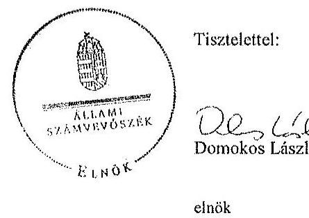

Melléklet: Tájékoztatás az elfogadott és el nem fogadott észrevételekről

---

# Tájékoztatás   az elfogadott és az el nem fogadott észrevételekről 

A ,, Jelentéstervezet az állami tulajdonban álló erdőgazdasági társaságok vagyongazdálkodási tevékenységének ellenörzése - Gyulaj Erdészeti és Vadászati Zrt." címü jelentéstervezetre 2015. október 22 -én érkezett észrevételeit áttekintettük, azok kezelésével kapcsolatban a következő tájékoztatást adom.

1. A jelentéstervezet 4. oldal 3. bekezdésére (Bevezetés) tett észrevétel

A dokumentumok ismételt áttekintése alapján a 3. bekezdés utolsó mondatát pontosítjuk, ,,A Társaság a 2014. év végi állapot szerint 21013,52 ha erdőterületen és 2109,86 ha egyéb müvelési ágú földterületen gazdálkodott..."

## 2. A jelentéstervezet 6. oldal 2. bekezdésére tett I./1. észrevétel

Az észrevételben leírtak a Társaság mérlegeivel és kiegészítő mellékleteivel kapcsolatos megállapítást nem cáfolják. A Társaság, mint vagyonkezelő a Vhr. 9. § (9) bekezdésében előírt kötelezettségét nem teljesítette, mert a Számv. tv. 23. § (2) bekezdése szerint a mérlegében eszközként nem mutatta ki a kezelésbe vett, az állami vagyon részét képező eszközöket, és ezen eszközöket a kiegészítő mellékletben - legalább mérlegtételek szerinti megbontásban külön nem mutatta be. A Társaság a Vhr. és a Számv. tv. előírásainak betartása céljából nem tett lépéseket annak érdekében, hogy a vagyonkezelt eszközök értéke a vagyonkezelési szerződésben (a továbbiakban: VSZ) rögzítésre kerüljön. A fentiek alapján megállapításunk helytálló, módosítása nem indokolt.

## 3. A jelentéstervezet 6. oldal 6. bekezdésére (áthúzódik a 7. oldalra) tett I./2. észrevétel

Az észrevételben leírtak a VSZ-szel kapcsolatos megállapítást nem cáfolják, a VSZ módosítása, egységes szerkezetbe foglalása a Vhr-ben elöírtak ellenére nem történt meg. A megállapításunk helytálló, módosítása nem indokolt.

## 4. A jelentéstervezet 6. oldal 5. bekezdésére tett I./3. észrevétel

Az észrevételben leírtak nem cáfolták a jelentéstervezet azon megállapítását, hogy a Társaság a 262/2010. (XI.17.) Korm. rendelet 50/A. § (2) ${ }^{1}$ bekezdésében foglalt előírás ellenére az NFA részére adatszolgáltatást nem teljesített. Ezért a megállapításunk helytálló, módosítása nem indokolt.

[^0]
[^0]:    ${ }^{1}$ Hatályos: 2013. május 25 -tól

---

# 5. A jelentéstervezet 7. oldal 2. bekezdésére tett I./4. észrevétel 

Az észrevételben leírtak kiegészítő információk, de nem cáfolják a VSZ 3.3.2 pontjában előírt a vagyonkezelési díj mértékének évenkénti felülvizsgálatának elmaradására tett megállapítást. Ezért a megállapításunk helytálló, annak módosítása nem indokolt.

## 6. A jelentéstervezet 8. oldal 2. bekezdésére tett I./4. (ismétlődő sorszámozás) észrevétel

Az észrevételben leírtak alapján a dokumentumokat ismételten áttekintettük és a bevételek elszámolásának ellenőrzése során kettő esetben sértették meg a Számv. tv. 15. § (9) bekezdésében előírt bruttó elszámolás alapelvét. A jelentés véglegesítése során a „több esetben" kifejezést „kettő esetben" szóhasználatra pontosítjuk. A módosítást a 3. számú intézkedést igénylő megállapításon, valamint a részletes megállapítások 27. oldal 2. bekezdésén átvezetjük.
7. A jelentéstervezet 8. oldal 3. bekezdés 2. mondatára, valamint a Gyulaj Zrt. vezérigazgatójának címzett 1. a) és b) javaslatokra tett I./5. észrevétel

A jelentéstervezetben a hiányzó kifejezésre vonatkozó észrevételt elfogadtuk és a jelzett mondatot a jelentés véglegesítésekor a „Felügyelőbizottság"elnevezéssel kiegészítjük. Az intézkedést igénylő javaslatokra vonatkozó - az új végleges vagyonkezelési szerződés létrehozásával kapcsolatos - kiegészítő információkat köszönettel vettük, azonban azok érdemben nem befolyásolják az intézkedést igénylő javaslatainkat, tekintettel arra, hogy a tényleges állapotnak és a hatályos jogszabályoknak megfelelő vagyonkezelési szerződés megkötése nem történt meg. Az intézkedést igénylő javaslatok módosítása nem indokolt.

## 8. A jelentéstervezet 15. oldal utolsó bekezdés 2. mondatára tett II./1. észrevétel

Az észrevételben a szervezeti egységenként elkülönített tételes karbantartási terv hiányára vonatkozó megállapításunkat a jelentés véglegesítése során töröljük.

## 9. A jelentéstervezet 17. oldal 2. bekezdésére tett II./2. észrevétel

A „faipari" kifejezés törlésére és helyette a „vadgazdálkodási" kifejezés használatára tett észrevételt elfogadjuk, a módosítást a jelentés véglegesítése során átvezetjük.

## 10. A jelentéstervezet 20. oldal 3. bekezdésére tett II./3. észrevétel

Az észrevételben leírt kiegészítő információ a vagyonkezelési díj bruttó vagy nettó összegének meghatározására vonatkozó megállapítást nem cáfolja, ezért annak módosítása nem indokolt.

## 11. A jelentéstervezet 21. oldal első bekezdésére tett II/4. észrevétel

Az észrevételben a Társaság a vagyonnyilvántartással kapcsolatos két pozitív megállapításunkra hivatkozik, amelyek érdemben nem cáfolják a vagyonnyilvántartásra vonatkozó összegző megállapításunkat, tekintettel arra, hogy a vezetett vagyonnyilvántartás nem felelt meg a Vhr. 17. § (1) bekezdésben előírtaknak, mert nem tartalmazta tételesen a

---

vagyonkezelt eszközök könyv szerinti bruttó és nettó értékét, valamint az értékben bekövetkezett egyéb változásokat. A megállapításunk helytálló, annak módosítása nem indokolt.
12. A jelentéstervezet 22. oldal utolsó, valamint a 23. oldal 2. bekezdésére tett II/5. észrevétel

Az észrevételre adott válaszunk megegyezik a 4. pontban leírt válaszunkkal.

# 13. A jelentéstervezet 31. oldal 3. bekezdésére tett II/6. észrevétel 

Az észrevételben leírtak kiegészítő információk, amelyek nem cáfolják a megállapításunkat, amely az Avtv. 20. § (8) bekezdése, illetve az Infotv. 30. § (6) bekezdése szerinti, a közérdekủ adatok megismerésére irányuló igények teljesítésének rendjét rögzítő szabályzatkészítési kötelezettséget írja elő. Megállapításunk helytálló, módosítása nem indokolt.

## 14. A jelentéstervezet 25. oldal utolsó bekezdésére tett II./7. észrevétel

A „fafeldolgozás" kifejezés törlésére és a „vadgazdálkodás" kifejezés használatára tett észrevételt elfogadjuk, a módosítást a jelentés véglegesítése során átvezetjük.

## 15. A jelentéstervezet 26. oldal 3. bekezdésére tett II./8. észrevétel

Az észrevételben leírt kiegészítő információ a megállapításunkat nem cáfolja, ezért az helytálló, módosítása nem indokolt.

## 16. A jelentéstervezet 28. oldal 4. bekezdésére tett II./9. észrevétel

Az észrevételben leírtak alapján a dokumentumokat ismételten áttekintettük és a vadgazdálkodási tervek benyújtásával kapcsolatos megállapításunkat a következők szerint pontosítjuk: „a vadgazdálkodási terveket a vadászatra jogosultak egy esetben a Vadászati tv. 47. § (1) bekezdésben foglalt határidőn túl nyújtották be a Vadászati hatósághoz jóváhagyás végett. Két esetben - a hónap, nap pontos megjelölésének hiánya miatt - nem volt megállapítható a benyújtás dátuma."
17. A jelentéstervezet 31. oldal 3. bekezdés első mondat, első tagmondatára tett II./10. észrevétel

A nemzeti vagyonról szóló 2011. évi CXCVI. törvény (a továbbiakban: Nvt.) 3. § (1) bekezdés 7. pontja szerint közfeladat a jogszabályban meghatározott állami vagy önkormányzati feladat, amit az arra kötelezett közérdekből, jogszabályban meghatározott követelményeknek és feltételeknek megfelelve végez. A Társaság a Nvt. 2. melléklete szerint nemzetgazdasági szempontból kiemelt jelentőségủ nemzeti vagyonban tartandó $100 \%$-ban állami tulajdonban álló társaság. A Gyulaj Erdészeti és Vadászati Zrt. az erdőről, az erdő védelméről és az erdőgazdálkodásról szóló 2009. évi XXXVII. törvény (a továbbiakban: Erdőtv.) 2. § (2) bekezdése szerinti közérdekből, jogszabályban meghatározott követelmények és feltételek alapján közfeladatot lát el. Továbbá az állami vagyonról szóló

---

2007. évi CVI. törvény 5. § (2) bekezdése szerint az állami vagyonnal gazdálkodó vagy azzal rendelkező szerv vagy személy a közérdekủ adatok nyilvánosságáról szóló törvény szerinti közfeladatot ellátó szervnek vagy személynek minősül. A Társaság állami vagyonnal gazdálkodik, ezért közfeladatot ellátó szervnek minősül. Megállapításunk helytálló, módosítása nem indokolt.

Budapest, 2015. november „. 19 "

Makkai Mária
felügyeleti vezető

---

.

---

# 7. SZÁMÚ MELLÉKLET A V-0766-154/2015. SZÁMÚ JELENTÉSHEZ

ANNO

|  Alhami Számvevőszék | |
| --- | --- |
|  Domokos László | |
|  elnök | |
|  1052 Budapest | |
|  Apáczai Cs. J. u. 10. | |

Ikt. sz.: MNV/01/49495/ 4 /2015. Hiv. sz.: V-0766-139/2015.

Tisztelt Elnök Úr!

A 2015. október 7. napján "Az állami tulajdonban álló erdőgazdasági társaságok vagyongazdálkodási tevékenységének ellenőrzése - Gyulaj Erdészeti és Vadászati Zrt." tárgyában kézhez vett, V-0766-139/2015. ikt. sz. Jelentés-tervezetre az alábbi észrevételeket kívánom tenni.

I. fejezet / 9. old. első bekezdés, II.5. fejezet / 32. old. negyedik bekezdés

A Társaság feletti tulajdonosi joggyakorló [az MNV Zrt.] a számára a Vtv-ben előírt rendszeres ellenőrzési kötelezettségének nem tett eleget...

Az ÁSZ vizsgálat az alábbi időszakra terjed ki: 2009. január 1. napjától 2014. december 31. napjáig, kitekintéssel a helyszíni ellenőrzés végéig tartó releváns folyamatokra.

A hivatkozott Vtv. 17. § a vele szerződéses jogviszonyban állók állami vagyonnal való gazdálkodásának rendszeres ellenőrzési kötelezettségét írja elő az MNV Zrt. számára. A Jelentés-tervezet "Fogalomtár" részében a "tulajdonosi ellenőrzést" a Vhr. 20. §-ban található célmeghatározás segítségével, azzal megegyezően definiálja. A jogszabály és az ÁSZ Jelentés-tervezet azzal megegyezően - csak a tulajdonosi ellenőrzés célját és rendsz. rességét tartalmazza, ezen túl sem a tulajdonosi ellenőrzés tartalmi, formai, módszertani, stb. követelményeit, sem a rendszeresség konkrétabb meghatározását, hogy évi, két-, három-, stb. évenkénti gyakorisággal kellene az ellenőrzéseket lefolytatni.

Véleményünk szerint elvi jelentősége van annak, hogy:

a) A rendszeres ellenőrzési kötelezettség megsértésére vonatkozó megállapítást a rendszeresség fogalmi meghatározását követően lehet tenni, azaz, hogyha adott esetben az ötéves ellenőrzési időszak alatt az MNV Zrt. legalább egy ellenőrzést nem végzett, akkor a "rendszeresség" az ötévenkénti ellenőrzési kötelezettséget jelentené. Ilyen fogalom meghatározás nem áll rendelkezésre.

b) A tulajdonosi ellenőrzés jogszabály - és a Jelentés-tervezet - szerinti definíciójából nem vezethető le, hogy az csak elkülönült - az ÁSZ vizsgálatához hasonló - célellenőrzés útján valósulhat meg, és ki kellene zárni az MNV Zrt. vagyonkezelési tevékenységéből fakadó munkafolyamatba épített és vezetői ellenőrzéseket.

Fentiekre tekintettel kérjük a Jelentés-tervezet 9., illetve 32. oldalán található azon megállapítások törlését, hogy az MNV Zrt. a számára a Vtv-ben előírt rendszeres ellenőrzési kötelezettségének nem tett eleget, vagy e megállapításokat szövegszerűen ekként módosítani:

"A Társaság feletti Tulajdonosi joggyakorló [az MNV Zrt.] az állami vagyonnal való gazdálkodásra irányuló célellenőrzéseket a vizsgálat időszokasáttal nem végzett."

---

I. fejezet / 9. old. második-negyedik bekezdés, 10. old. első-második bekezdés, II.5. fejezet / 32. old. hatodik bekezdés, 33. old. első bekezdés és 10. old. Javaslat az MNV Zrt. vezérigazgatójának a)-c) pontok
„A vagyonkezelésbe adott állami vagyon tekintetében tulajdonosi jogokat gyakorló MNV Zrt. és NFA tevékenysége az ellenőrzött időszakban nem támogatta teljes körüen a felelős vagyongazdálkodás megvalósulását, a VSZ-szel kapcsolatban feltárt hiányosságok megszüntetésére és a hatályos jogszabályoknak való megfeleltetésére vonatkozóan nem kezdeményeztek intézkedéseket. Nem éltek a Vhr.-ben foglalt, a kezelt vagyon használatára vonatkozó ellenőrzési jogukkal, valamint nem végeztek a Vhrt-bn foglalt a vagyonnyilvántartás hitelességére, teljességére és helyességére vonatkozó ellenőrzést a Társaságnál.

Az NFA a Társaság vagyongazdálkodása szabályozottságával, szabályszerűségével kapcsolatban a 262/2010. (XI.17.) Korm. rendelet elöírásai ellenére ellenőrzést nem végzett, továbbá nem rendelkezett az Nfatv.-ben elöírt naprakész nyilvántartással a Nemzeti Földalapba tartozó, a Társaság által vagyonkezelı földrészletekről.

A Gyulaj Zrt. a Magyar Állam tulajdonában álló erdővagyon és egyéb müvelési ágú termőföld ingatlanok kezelését a KVI-vel 1996. november 1-jén kötött vagyonkezelési szerződés alapján végezte. A Társaság, mint vagyonkezelö és a KVI között létrejött szerzödéses jogviszony kereteit a VSZ-ben foglalt jogok és kötelezettségek töltötték ki. A Társaságnak a KVI-vel kötött VSZ-e a Vhr. 3. § (1) bekezdésében foglalt elöírás ellenére nem támogatta a vagyongazdálkodási feladatok állátható módon történő, szabályszerű végrehajtását. A VSZ 2009. január 1-jén hatályon kívül helyezett jogszabályi hivatkozásokat tartalmazott az Áht. 109/B. §, az Áht. 109/G. § és a Vadvédeimi iv. 98. § rendelkezései vonatkozásában. A VSZ 3.2.3. pontjában foglalt, a vagyonkezelöi jog átruházására vonatkozó rendelkezés 2012. június 30 -tól nem felelt meg az Nvtv. 11. § (8) bekezdés d) pontjában foglaltaknak, amely tátja a vagyonkezelöi jog harmadik személyre történő átruházását. A szerződés éves felülvizsgálata a VSZ 3.3.2. pontjában foglaltak ellenére nem történt meg, a felek azt nem is kezdeményezték. A felek nem tettek eleget a Vhr. 54. § (7) bekezdésében foglalt rendelkezésnek, mert a Vhr. hatályba lépését követő hat hónapon belül nem kezdeményezték a Nemzeti Földalapba tartozó ingatlanokra vonatkozóan a VSZ megszüntetését és a Vtv., illetve Vhr. szabályainak megfelelő szerződés megkötését.

A vagyonkezelésbe adott állami vagyon tekintetében tulajdonosi jogokat gyakorló MNV Zr. és NFA nem végeztek a Vhr. 20. § (1)-(2) bekezdéseiben és a Nemzeti Földalapba tartozó földrészletek hasznosításának részletes szabályairól szóló 262/2010. (XI.17.) Korm. rendelet 47. § (1)-(2) bekezdéseiben foglalt,a vagyonnyilvántartás hitelességére, teljességére és helyességére vonatkozó ellenőrzést a Társaságnál.

# Javaslat az MNV Zrt. vezérigazgatójának 

a) Tegyen intézkedéseket az erdőgazdasági társaság közremüködésével a tényleges állapotot rögzitő és a hatályos jogszabályi elöírásoknak megfelelő vagyonkezelési szerződés megkötésére.
b) Tegyen intézkedéseket a vagyonkezelési szerződés felülvizsgálatának elmaradásával, valamint a Nemzeti Földalapba tartozó ingatlanokra vonatkozó VSZ megszüntetésével összefüggésben feltárt szabálytalanságok tekintetében a felelősség tisztázása érdekében, és szükség szerint intézkedjen a felelősség érvényesítéséről.
c) Intézkedjen a Társaság vagyonnyilvántartása hitelességének, teljességének és helyességének jogszabályban foglaltak szerinti ellenőrzéséről."

Sajnálattal állapítottuk meg, hogy a Jelentés-tervezet egyáltalán nem veszi figyelembe a vizsgált időszakban megindított és több eljárási cselekményt is magába foglaló intézkedés-sorozatunkat, amelynek a célja a Jelentéstervezetben egyébiránt joggal kifogásolt hiányosságok megszüntetése, az erdőgazdasági társaságok müködésének jogszabályi megfelelőségének biztosítása volt. Ezzel a Jelentés-tervezet azt sugallja, hogy a tulajdonosi joggyakorlók részéről egyáltalán nem volt szándék az erdőgazdasági társaságok müködésének, illetve a vagyonkezelés körülményeinek hatályos jogszabályok szerinti szabályozására, amely egyébiránt nem felel meg a valóságnak és az adatzoofgáltatásunk során sem erről tájékoztattuk Önöket.

---

Mindamellett elismerjük, hogy a probléma a kezelt vagyonelemek nagy száma, ebből kifolyólag a szabályozást igénylő körülmények nagy száma és sokrétüsége miatt nehezen átlátható, ezért kérjük, engedjék meg, hogy a munkájukat segitő szándékkal korábbi tájékoztatásunkat ismételten megerősítsük, azzal a kifejezett kéréssel, hogy a Jelentésükben az általunk vitatott megállapítást szíveskedjenek módosítani, és az MNV Zrt. által a megoldás irányába megtett intézkedéseket feltüntetni.
Az ideiglenes vagyonkezelési szerződéseken alapuló kezelői jogviszony újraszabályozása, az ideiglenes vagyonkezelési szerződések megszüntetése és végleges vagyonkezelési szerződések megkötése érdekében az intézkedéseink már 2011. évben megkezdődtek, párhuzamosan a Nemzeti Földalapról szóló 2010. évi LXXXVII. tv. 34. § (3) bekezdés c) pontja szerinti feladat- illetve vagyonátadással.

Az intézkedéseink alapja a 2011. évben, MNV/01/29518/2011. szám alatt szakterületünk által bekért, az erdőgazdasági társaságok 2010. december 31-i, illetve 2011. július 31-i fordulónapra vonatkozó leltárjelentése volt, amelyet elsődlegesen az NFA tv. szerint előírt vagyonátadás elvégzése céljából kértünk meg az erdőgazdasági társaságoktól. Ugyanakkor a leltárjelentéshez benyújtott földrészlet listák voltak az első olyan kimutatások, amelyek a kezelt vagyon elemeit a FÖMI adatbázisán alapuló (az aktuális ingatlan-nyilvántartási állapotnak megfelelően) alrészletes bontásban tartalmazzák.

# A vizsgált időszakban megindított és lefolytatott intézkedéseink a következők: 

1. Az erdőgazdasági társaságok által kezelt vagyonelemek tulajdonosi joggyakorlók szerinti elhatárolása, NFA átadás előkészítése, az erdőgazdasági társaságok bevonásával. A Nemzeti Földalapba tartozó vagyonelemek NFA átadása 2012-2013. években megtörtént, majd a visszamaradt vagyonelemek - többségében kivett megnevezésben nyilvántartott földrészletek - elhatárolását is elvégeztük. A feladat végrehajtása 2014. május 31-ig teljesült.
Az intézkedéssel az MNV Zrt. tulajdonosi joggyakorlása alá tartozó vagyonelemek körét - a közös tulajdonosi joggyakorlás alatt álló ingatlanok kivételével -, azaz a végleges vagyonkezelési szerződések ingatlanlistáit meghatároztuk.
Meg kívánjuk jegyezni, hogy az erdőgazdasági társaságok a 2011. évi leltárjelentéseikhez minden esetben csatolták a jelentés tartalmára vonatkozó teljességi nyilatkozatukat is, így azok tartalmát mint teljes körű adatszolgáltatást kezeltük.
A hivatkozott iratokat az eljárás során a Tisztelt Állami Számvevőszék rendelkezésére bocsátottuk.
2. Az erdőgazdasági társaságok által kezelt vagyon értékelését 2014. május 31-ig elvégeztük, részben külső piaci szereplő által megállapított vagyonértékelési adatok (az IFUA értékbecslési adatai), részben belső szakértők és a kontrolling szakterület által az MNV Zrt hatályos értékelési szabályzata által megállapított értékadatok figyelembe vételével.
3. Az MNV Zrt. Igazgatósága 511/2012. (X. 08.) IG sz., valamint 717/2013. (IX. 23.) IG sz. határozataiban Intézkedési terveket fogadott el „a 28/2012. (IX. 24.) sz. RJGY határozatában előírt, valamint az MNV Zrt. rábízott vagyon 2012. évi beszámolója könyvvizsgálói minősítésének megtartásához szükséges és egyéb feladatokról". Az Intézkedési tervek magukban foglalták az erdőgazdasági társaságok által kezelt vagyon analitikájának előállitását, illetve az erdőtársaságokkal végleges (nem ideiglenes) vagyonkezelői szerződések megkötését. A 717/2013. (IX. 23.) IG sz. határozat melléklete tartalmazza a feladat végrehajtása érdekében már megtett intézkedéseket (pl. „Megtörtént az erdőgazdaságok által kezelt vagyon listáinak vagyonkezelői jelentésekkel való egyeztetése; a vagyonkezelési szerződés tartalmi kérdéseinek, az erdőgazdaságok véleményének feldolgozása, MFB Munkacsoport egyeztetések történtek stb.), valamint rögzíti a még elvégzendő feladatokat. Ennek megfelelően az MNV Zrt-nél 2012-től folyamatban van az erdőgazdasági társaságok vagyonanalitikájának előállítása és vagyonkezelési szerződései tárgyú projekt.
A hatályos jogszabályoknak megfelelő vagyonkezelési szerződés tervezetét a vizsgálati időszak során az MNV Zrt belső szakterületi egyeztetést követően előkészítettük, és a 2014. március 18-án megtartott Munkacsoport értekezleten az erdőgazdaság képviselőivel, továbbá a tulajdonosi joggyakorlók (NFA, illetve akkor még Magyar Fejlesztési Bank Zrt.) képviselőivel ismertettük annak tartalmát. A szerződés szövegtervezetésnek véleményezése ekkor megkezdődött, ugyanakkor elismerjük, hogy a végleges szerződésváltozat már az Önök által vizsgált időszakot követően került elfogadásra. Ugyancsak a 2014. március 18-án megtartott Munkacsoport értekezleten tettünk javaslatot a vagyonkezelési díj alapjának és mértékének meghatározására.

---

4. Az erdőgazdasági társaságok által kezelt és a saját vagyonának vagyonelemenkénti, valamint a kezelt vagyonelemek tulajdonosi joggyakorlók szerinti elhatárolására vonatkozó intézkedésünket a vizsgált időszakban előkészílettük.

Tájékoztatjuk továbbá Elnök Urat az alábbiakról:
A Nemzeti Fejlesztési Minisztérium KGTF/377-6/2014-NFM, valamint KGTF/377-7/2014. számok alatt adott utasításokat a fenti feladatok elvégzésére. Ezekről, illetve az utasításokra adott jelentésünkről a korábbi adatszolgáltatásunk keretében szintén kitértük.

A vagyonkezelési szerződés vizsgált időszakot követően elfogadott tervezetének mellékletét képezik az MNV Zrt azon szabályzatai is, amelyek a kezelt vagyon nyilvántartását, a beruházások nyilvántartását és az azzal kapcsolatos elszámolásokat, illetve a tulajdonosi ellenőrzéssel kapcsolatos, a jelenlegi jogszabályi környezetnek megfelelő szabályokat tartalmazzák:

- Az állami tulajdonon, egyéb vagyonkezelők által vagyonkezelt eszközön megvalósítandó beruházások, felújítások előzetes engedélyezésének és elszámolásának eljárásrendjéről szóló 35/2014. számú vezérigazgatói utasítás,
- A Magyar Nemzeti Vagyonkezelő Zrt. Tulajdonosi Ellenőrzési Szabályzata - a 39/2014. számú vezérigazgatói utasítás, továbbá
- A Magyar Nemzeti Vagyonkezelő Zrt. állami vagyon vagyonkezelőire, az állami vagyont használókra és a társasági részesedések esetében az MNV Zrt. tulajdonosi joggyakorlását megbízottként ellátókra vonatkozó Vagyon-nyilvántartási Szabályzatáról szóló 12/2014. számú vezérigazgatói utasítás.

Fentiek mellett megemlíthető az MNV Zrt. folyamatba épített, illetve vagyon nyilvántartás vezetést támogató ellenőrzési módszertanról szóló 11/2014. számú vezérigazgatói utasítás.
Egyestetéseink során az erdőgazdasági társaságok tájékoztatást kaptak a szabályzataink tartalmára vonatkozóan.
A Jelentés-tervezet 10. oldalán található, az MNV Zrt. vezérigazgatójára vonatkozó, a) pont alatti, vagyonkezelési szerződés megkötésére irányuló javaslathoz kapcsolódóan felhívjuk a Tisztelt Állami Számvevőszék figyelmét arra, hogy a Nemzeti Fejlesztési Minisztérium ÁVF/21310/2015-NFM számú tájékoztató levele szerint Miniszter Úr vagyongazdálkodási szempontból nem támogatja az erdőgazdasági társaságok ideiglenes vagyonkezelési szerződéseit kiváltó vagyonkezelési szerződések megkötését, ideértve az MNV Zrt. vagyonkezelési szerződésekkel kapcsolatos jóváhagyó döntéseit is.

Az MNV Zrt-re vonatkozóan hivatkozott jogszabály, a Vhr. 20. § (1)-(2) bekezdése 2014. március 14-ig - csaknem az ellenőrzött időszak végéig - a következőképpen rendelkezett:
„(1) Az állami vagyon kezelőjét, használóját megillető jogok gyakorlását, annak szabályszerűségét, célszerűségét a Vtv. 17. §-ának d) pontja alapján az MNV Zrt. - szükség szerint a területi szervei útján ellenőrzi. Ennek érdekében a vagyon kezelésére, hasznosítására kötött szerződésben rögzíteni kell, hogy a tulajdonosi ellenőrzés eljárásrendjét, a felek jogait, kötelezettségeit a felek a szerződés részének tekintik.
(2) A tulajdonosi ellenőrzés célja az állami vagyonnal való gazdálkodás vizsgálata, ennek keretében a rendeltetésellenes, jogszerütlen, szerződésellenes, vagy a tulajdonos érdekeit sértő, illetve a központi költségvetést hátrányosan érintő vagyongazdálkodási intézkedések feltárása és a jogszerű állapot helyreállítása, továbbá a vagyonnyilvántartás hitelességének, teljességének és helyességének biztosítása."

A tulajdonosi ellenőrzés alatt a Területi Irodák által folytatott ellenőrzést is értette a jogszabály, amiből egyenesen következik a szakterületi munkafolyamatba épített ellenőrzési kötelezettség figyelembe vételének a lehetősége.

Fentiekre tekintettel kérjük a Jelentés-tervezet 9-10., illetve 32-33. oldalán található azon megállapítások törlését, hogy az MNV Zrt. nem kezdeményezett intézkedéseket, és nem végzett a Vhr. 20. § (1)-(2) bekezdéseiben és a Nemzeti Földalapba tartozó földrészletek hasznosításának részletes szabályairól szóló 262/2010. (XI.17.) Korm.

---

rendelet 47. § (1)-(2) bekezdéseiben foglalt, a vagyonnyilvántartás hitelességére és teljességére vonatkozó ellenőrzést a Társaságnál, kérjük a megtett intézkedések feltüntetését, és a Jelentés-tervezet 10. oldalán található, az MNV Zrt. vezérigazgatójára vonatkozó b) pontot a megtett intézkedések folyamatosságára tekintettel törölni, a c) pont alatti javaslatot szövegszerüen ekként módosítani:

# Javaslat az MNV Zrt. vezérigazgatójának 

c) Az MNV Zrt. tulajdonosi joggyakorlása alá tartozó (az Erdőgazdasági Társaságok által az MNV Zrt. részére jelentett) vagyonelemek tekintetében intézkedjen a Társaság vagyonnyilvántartása hitelességének, teljességének és helyességének jogszabályban foglaltak szerinti ellenőrzéseinek erösitéséről.

Kérem Elnök Urat, hogy a Jelentés véglegesítése során jelen észrevételeinket szíveskedjenek figyelembe venni.
Budapest, 2015. október 91
Üdvözlettel:

---

.

---

# 8. SZÁMÚ MELLÉKLET A V-0766-154/2015. SZÁMÚ JELENTÉSHEZ 

## 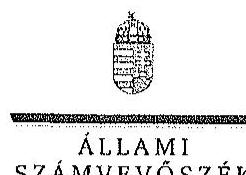

Ikt.szám: V-0766-148/2015.

## Dr. Szivek Norbert úr

vezérigazgató
Magyar Nemzeti Vagyonkezelő Zrt.

## Budapest

## Tisztelt Vezérigazgató Úr!

A „Jelentéstervezet az állami tulajdonban álló erdőgazdasági társaságok vagyongazdálkodási tevékenységének ellenőrzése - Gyulaj Erdészeti és Vadászati Zrt." címmel készített számvevőszéki jelentéstervezetre tett észrevételeit köszönettel megkaptam.

Az Állami Számvevőszék észrevételekre vonatkozó álláspontjáról a felügyeleti vezető által készített részletes tájékoztatást csatoltan megküldöm.

Tájékoztatom Vezérigazgató urat, hogy a számvevőszéki jelentésben - az Állami Számvevőszékről szóló 2011. évi LXVI. törvény 29. § (3) bekezdése alapján - a figyelembe nem vett észrevételeket szerepeltetjük az elutasítás indokának feltüntetésével.

Budapest, 2015. Ad. hó 20.nap
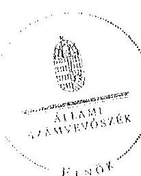

Tisztelettel:

## 08.12

Domokos László

Melléklet: Tájékoztatás az elfogadott és az el nem fogadott észrevételekről

---

# Tájékoztatás   az elfogadott és az el nem fogadott észrevételekról 

A „Jelentéstervezet az állami tulajdonban álló erdőgazdasági társaságok vagyongazdálkodási tevékenységének ellenörzése - Gyulaj Erdészeti és Vadászati Zrt." címü jelentéstervezetre 2015. október 22 -én érkezett észrevételeit áttekintettük, azok kezelésével kapcsolatban a következő tájékoztatást adom.

1. A tulajdonosi joggyakorló rendszeres ellenőrzési kötelezettségéhez kapcsolódó megállapításra tett észrevétel (I. fejezet/9. old. első bekezdés, II.5. fejezet/32. old. negyedik bekezdés)

Az észrevételben leírtak alapján a dokumentumokat ismételten áttekintettük és az egyértelműség érdekében a jelentés véglegesítése során a jelentéstervezet 9. oldal 1. bekezdés 2. mondatát, illetve 32 . oldal 4 . bekezdését az alábbiak szerint pontosítjuk:
„A Társaság feletti Tulajdonosi joggyakorlóı az állami vagyonnal való gazdálkodásra vonatkozóan ellenőrzést a Gyulaj Zrt.-nél az ellenőrzött időszakban nem végzeti."
2. A vagyonkezelési szerződéshez kapcsolódó megállapításokra tett észrevétel (I. fejezet / 9. oldal 2-4. bekezdés, 10. oldal 1. bekezdés, II. 5. fejezet / 32. oldal 6. bekezdés, 10. oldal javaslat az MNV Zrt. vezérigazgatójának a)-b) pontok)

A jelentéstervezet vagyonkezelési szerződéshez kapcsolódó megállapításai helytállóak. Az erdőgazdasági társaság müködése jogszabályi megfelelősége biztosításának érdekében tett kezdeményezésekről adott tájékoztatásukat köszönettel vettük, azonban azok nem eredményczték az ideiglenes vagyonkezelési szerződés olyan módosítását, vagy olyan új vagyonkezelési szerződés megkötését, amely biztosította volna a VSZ hiányosságainak megszüntetését, illetve a hatályos jogszabályoknak való megfelelőségét. Ezért az MNV Zrt. vezérigazgatójának és az NFA elnökénck megfogalmazott intézkedést igénylő megállapítás, valamint az MNV Zrt. vezérigazgatójának megfogalmazott javaslat a) és b) pontjának módosítása nem indokolt. Az egyértelműség érdekében a 9. oldal 2. bekezdés 1. mondatát és a 32. oldal 6. bekezdés 1. mondatát az alábbiak szerint pontosítjuk:
„... a VSZ-szel kapcsolatban feltárt hiányosságok megszüntetése és a hatályos jogszabályoknak való megfeleltetése nem történt meg."

---

3. Az MNV Zrt. ellenőrzési kötelezettségének elmulasztására vonatkozó megállapításokra tett észrevétel (I. fejezet 10. oldal 2. bekezdés, II. 5. fejezet / 33. oldal 1. bekezdés és 10. oldal javaslat az MNV Zrt. vezérigazgatójának c) pont)

Az MNV Zrt. nem bocsátott az ÁSZ ellenőrzés rendelkezésére az MNV Zrt., vagy Területi Irodái által a Vhr. 20. § (1)-(2) bekezdései szerint végzett ellenőrzésekről dokumentumokat. A jelentéstervezet megállapításai és a javaslatai helytállóak, módosításuk nem indokolt.

Budapest, 2015. 4. hó 30 nap

Makkai Mária
felügyeleti vezető

---

.

---

# MFB 

## Domokos László úr

elnök részére
Állami Számvevőszék

Budapest

## Tisztelt Elnök Úr!

2015. október 7 -én köszönettel kéchez vettük az Állami Számvevőszék „Az állami tulajdonban álló erdőgazdasági társaságok vagyongazdálkodási tevékenységének ellenőrzéséről" szóló jelentéstervezeteket az alábbi cégekre:

- Gyulaj Erdészeti és Vadászati Zrt.
- TAEG Tanulmányi Erdőgazdaság Zrt.
(Íkt.szám: V-0766-138/2015.)
(Íkt.szám: V-0767-054/2015.)

Az MFB Zrt. a jelentéstervezetekkel kapcsolatosan 2 felle szempontból kiván észrevételt tenni:

1. A jelentésekben megfogalmazott központi probléma
2. Egyedi esetek

## 1. A jelentésekben megfogalmazott központi probléma

Az ÁSZ az egyedi jelentéseiben az erdőgazdasági társaságokat, valamint a vagyonkezelésbe adott állami vagyon tekintetében tulajdonosi joggyakorló MNV Zrt. és Nemzeti Földalapkezelő (továbbiakban: NFA) tevékenyégét marasztalta el.
Alapvető problémaként jelenik meg, hogy az erdők által kezelt eszközök - az NFA-val, a Kincstári Vagyon Igazgatósággal, és az MNV Zrt-vel kötött vagyonkezelési megállapodásban rögzített - értéken nem szerepelnek a Társaságok könyveiben.
Az MFB Zrt. tudatában volt a problémának (azt az ÁSZ jelentésben is említett, 2010. évben végzett átvilágitási jelentés is tartalmazta, melynek nyomon követése, beszámoltatása megtörtént) és folyamatosan egyeztetett az MNV Zrt-vel és az NFA-val a rendezés ügyében. Az ideiglenes vagyonkezelési szerződés módosítására, véglegesítésére a vagyonkezelésbe adónak (MNV, NFA) van lehetősége, a Társaságok szerződő partnerként észrevételeket, javaslatokat tehetnck. A szerződés véglegesítése érdekében a Társaságok és az MFB Zrt.

---

képviselői minden olyan egyeztetésen (pl.: az MNV Zrt. által létrehozott bizottság) részt vettek, amelyre meghivást kaptak, illetve azokon érdemi javaslatokat tettek.

Ahogy a jelentés is megjegyzi, az egyeztetések az ellenőrzés befejezésig nem kerültek lezárásra, így a Társaságoknál nem áll rendelkezésre a vagyonkezelésben lévő állami vagyonra és annak nagyságára vonatkozó, az MNV Zrt. és az NFA nyilvántartásával egyező adat.

Az ÁSZ 2013. évi „Az állami vagyon feletti kontroll - Az állami vagyon feletti tulajdonosi joggyakorlással kapcsolatos tevékenységek ellenörzéséről" szóló jelentése alapján a Nemzeti Fejlesztési Minisztérium - az ÁSZ-szal egyeztetett - alábbi fóbb pontokat tartalmazó intézkedési tervet (1. sz. melléklet) állított össze, melyet a 2014. április 25-én kelt levelében küldött meg az MFB Zrt. részére:

- a Társaságok által kezelt állami ingatlanok és egyéb vagyonelemek értéken történő nyilvántartása,
- a vagyonkezelési díjak egyértelmű és tulajdonosi joggyakorló szervezetenkénti meghatározása,
- az új vagyonkezelési szerződés megkötése,
- a Társaságok kezelt és saját vagyonának vagyonelemenkénti, valamint a kezelt vagyonelemek tulajdonosi joggyakorló szerinti elhatárolása.

Az MFB törvény módosításának 2014. július 16-i hatályba lépésével az MFB Zrt. állami erdőgazdaságok feletti tulajdonosi joggyakorlása megszűnt, az a Földművelésügyi Minisztériumhoz került át, így az intézkedési tervben való közreműködésre, illetve a végrehajtás nyomon követésére az MFB Zrt-nek nem volt lehetősége.

A jelentések az MNV Zrt. vezérigazgatójának, az NFA elnökének és az erdészeti társaságok vezérigazgatóinak fogalmaztak meg intézkedési javaslatokat.

# 2. Egyedi esetek: 

## Gyulaj Erdészeti és Vadászati Zrt.

A Társaságnál az ellenőrzött időszak 2009. január 1. napjától 2014. december 31. napjáig tart, holott az Állami Számvevőszék 2014. november 14. napján kelt, V-0749-004/2014. sz. levelének 3. számú melléklete szerint a vizsgálathoz bekért dokumentumok a 2009. január 1. és 2014. június 30. közötti időszakra vonatkoznak.

Az ellenőrzési anyagban több helyen keveredik a társasági részesedés feletti és a vagyonkezelésbe adott állami vagyon feletti tulajdonosi joggyakorlóra történő hivatkozás.

---

Hibás hivatkozások:

- 9. oldal 1. bekezdés második sor: 1,3 helyett 1-3; hatodik sor: 2 helyett 1 ; nyolcadik sor: 3 helyett 1-3;
- 20. oldal 3. bekezdés második sor az 1,2 helyett 1 , ugyanis a vagyonkezelői dij meghatározása az MNV Zrt. és az NFA hatásköre, igy az MFB Zrt.-re való hivatkozás hibás.
- A 32. oldal 4. bekezdés utolsó mondatával nem értünk egyet. Az ellenőrzést végző korábban már leírta, hogy a vagyonkezelés megfelelő volt az MFB Zrt.-nél (kontrolling, beszámoltatás), valamint a fentiekben leírtak is azt igazolják, hogy az MFB Zrt. mindent megtett a nemzeti vagyonnal való gazdálkodás ellenőrzése érdekében. Kérjük a társaság feletti tulajdonosi joggyakorlóz hivatkozás törlését.

Véleményünk szerint az alsó indexel való megjelölés helyett célszerübb lenne a tulajdonosi joggyakorlókat a nevükön nevezni, megszüntetve ezzel az elírás lehetőségét.

# TAEG Tanulmányi Erdőgazdaság Zrt. 

A Társaságnál az ellenőrzött időszak 2009. január 1. napjától 2014. december 31. napjáig tart, holott az Állami Számvevöszék 2014. november 14. napján kelt, V-0749-004/2014. sz. levelének 3. számú melléklete szerint a vizsgálathoz bekért dokumentumok a 2009. január 1. és 2014. június 30. közötti időszakra vonatkoznak.

Az ellenőrzési anyagban több helyen keveredik a társasági részesedés feletti és a vagyonkezelésbe adott állami vagyon feletti tulajdonosi joggyakorlóra történő hivatkozás.

Elrontott hivatkozások:

- 9. oldal 2. bekezdés második sor: 1,3 helyett 1-3; hatodik sor 2 helyett 1 ; nyolcadik sor 3 helyett 1-3;
- 18. oldal 4. bekezdés második sor az 1,2 helyett 1 , ugyanis a vagyonkezelői dij meghatározása az MNV Zrt. és NFA hatásköre igy az MFB Zrt.-re való hivatkozás hibás;
- 28. oldal 3. bekezdés nyolcadik sor az 1,3 helyett 1-3;
- 30. oldal 6. bekezdés első sor az 1,3 helyett 1-3; az utolsó mondatban az MFB Zrt-re való hivatkozást, vagy az egész mondat törlését kérjük, tekintettel a 28. oldal 3. bekezdésének alábbi szövegezésére:
Az Alapitó Okirat és az IVSZ rendelkezésein felül a tulajdonosi joggyakorló a Társaság részére a vagyongazdálkodást érintő további adat, információ és monitoring kötelezettséget irt elö, amit évente aktualizált....A társaságnál a vagyonkezelést, a hasznosítást érintő jogszabályoknak megfelelő, szerzödésszerü kapcsolattartás, adatszolgáltatás és elszámolás támogatta a felelős vagyongazdálkodást.
- 30. oldal 7. bekezdés első és második mondatával nem értünk egyet, az ellenőrzést végző korábban már leírta, hogy a vagyonkezelés megfelelő volt az MFB Zrt.-nél

---

(kontrolling, beszámoltatás), valamint a fentiekben leírtak is azt igazolják, hogy az MFB Zrt. mindent meglett a nemzeti vagyonnal való gazdálkodás ellenőrzése érdekében. Kérjük a társaság feletti tulajdonosi joggyakorló; hivatkozás törlését.

Véleményünk szerint az alsó indexel való megjelölés helyett célszerübb lenne a tulajdonosi joggyakorlókat a nevükön nevezni, megszüntetve ezzel az elírás lehetőségét.

Budapest, 2015. október 19.
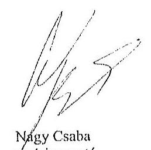

Tisztelettel:
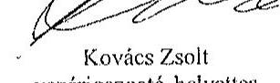

Kovács Zaoit
vezérigazgató-helyettes

# Mellékletek: 

1. számú melléklet: NFM levél (Ikt.szám: KGTF/377-7/2014-NFM)

---

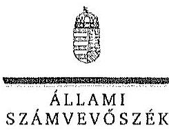

ELNÖK

Ikt.szám: V-0767-066/2015.

Nagy Csaba úr
vezérigazgató
Magyar Fejlesztési Bank Zrt.

Budapest

Tisztelt Vezérigazgató Úr!

Az „Az állami tulajdonban álló erdőgazdasági társaságok vagyongazdálkodási tevékenységének ellenőrzése" című ellenőrzés tekintetében a Gyulaj Erdészeti és Vadászati Zrt., illetve a TAEG Tanulmány Erdőgazdaság Zrt. társaságok jelentéstervezetére tett észrevételüket köszönettel megkaptam.

Az Állami Számvevőszék észrevételekre vonatkozó álláspontjáról a felügyeleti vezető által készített részletes tájékoztatást csatoltan megküldöm.

Tájékoztatom Vezérigazgató urat, hogy a számvevőszéki jelentésben – az Állami Számvevőszékről szóló 2011. évi LXVI. törvény 29. § (3) bekezdése alapján – a figyelembe nem vett észrevételeket szerepeltetjük az elutasítás indokának feltüntetésével.

Budapest, 2015. 1/4. hó 19. nap

Tisztelettel:

D. L. L. Domokos László

Melléklet: Tájékoztatás az észrevételek kezeléséről

1857 BUDAPEST, AFRICZIÓ CSZ.RE JÁNOS UTCA 10. 1354 Budapest 4. Pl. 54 telefon: 484 9301 fax: 484 9201

---

# Tájékoztatás   az észrevételek kezeléséről 

„Az állami tulajdonban álló erdőgazdasági társaságok vagyongazdálkodási tevékenységének ellenörzése" címủ ellenőrzés tekintetében a Gyulaj Erdészeti és Vadászati Zrt., illetve a TAEG Tanulmányi Erdőgazdaság Zrt. társaságok jelentéstervezetére 2015. október 22 -én érkezett észrevételeket áttekintettük, azok kezelésével kapcsolatban a következő tájékoztatást adom.

1. A jelentésekben megfogalmazott központi problémával kapcsolatban tett észrevételek

A jelentésekben megfogalmazott központi problémával kapcsolatban adott tájékoztatásukat köszönettel vettük, azonban azok alapján a jelentéstervezet módosítása nem indokolt.

## 2. Egyedi esetekkel kapcsolatban tett észrevételek

## A Gyulaj Erdészeti és Vadászati Zrt. jelentéstervezetre tett észrevételek:

Az ÁSZ az első adatbekérést követően további adatbekéréssel fordult az MFB Zrt. felé (pl. a V-0749-093/2015. iktatószámú levélben), az MFB Zrt. teljességi nyilatkozatot adott az ellenőrzés rendelkezésére bocsátott dokumentumok teljes körüségéről, ezért biztosított volt a teljes ellenőrzött időszakra vonatkozóan a dokumentumok rendelkezésre állása.

A társasági részesedés feletti, illetve a vagyonkezelésbe adott állami vagyon feletti tulajdonosi joggyakorlóra történő hivatkozásokra tett észrevételekre vonatkozóan a rendelkezésre álló dokumentumok ismételt áttekintését követően

- a 9. oldal 1. bekezdés második sorban az alsóindexet 1-3-ra módosítjuk, a bekezdés 3. mondatát töröljük. A nyolcadik sorban lévő alsóindex módosítása nem indokolt, tekintettel arra, hogy a Tulajdonosi joggyakorlóz 2010-ben külső szakértővel egyedi ellenőrzést végeztetett a Társaságnál, amely kiterjedt a vagyongazdálkodásra is;
- a 20. oldal 3. bekezdés második sorában a 2 alsóindexet töröljük;
- a 32. oldal 4. bekezdés 1. mondatának utolsó részét, valamint a második mondatból a 2 alsóindexet töröljük.

## A TAEG Tanulmányi Erdőgazdaság Zrt. jelentéstervezetére tett észrevételek:

Az ÁSZ az első adatbekérést követően további adatbekéréssel fordult az MFB Zrt. felé (pl. a V-0749-093/2015. iktatószámú levélben), az MFB Zrt. teljességi nyilatkozatot adott az ellenőrzés rendelkezésére bocsátott dokumentumok teljes körüségéről, ezért biztosított volt a teljes ellenőrzött időszakra vonatkozóan a dokumentumok rendelkezésre állása.

---

A társasági részesedés feletti, illetve a vagyonkezelésbe adott állami vagyon feletti tulajdonosi joggyakorlóra történő hivatkozásokra tett észrevételekre vonatkozóan a rendelkezésre álló dokumentumok ismételt áttekintését követően

- a 9. oldal 2. bekezdés második sorban az alsóindexet 1-3-ra módosítjuk, a bekezdés 3. mondatát töröljük. A nyolcadik sorban lévő alsóindex módosítása nem indokolt, tekintettel arra, hogy a Tulajdonosi joggyakorló2 2010-ben külső szakértővel egyedi ellenőrzést végeztetett a Társaságnál, amely kiterjedt a vagyongazdálkodásra is;
- a 18. oldal 4. bekezdés második sorban a 2 alsóindexet töröljük:
- a 28. oldal 3. bekezdés nyolcadik sorban az alsóindexet 1-3-ra módosítjuk:
- a 30. oldal 6. bekezdés első sorának módosítása nem indokolt, tekintettel arra, hogy a Tulajdonosi joggyakorló 2010-ben külső szakértővel egyedi ellenőrzést végeztetett a Társaságnál, amely kiterjedt a vagyongazdálkodásra is. A bekezdés utolsó mondatából a Tulajdonosi joggyakorló2-t töröljük:
- a 30. oldal 7. bekezdés 1. mondatának utolsó részét, valamint a második mondatból a 2 alsóindexet töröljük.

Budapest, 2015. év 11. hó 11. nap

Makkai Mária
felügyeleti vezető

---

.

---

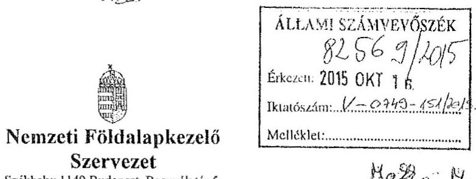

Nemzeti Földalapkezelő

Szervezet
Székhely: 1149 Budapest, Bonnyák tér 5.
Törzskönyvi azonosítószám: 775706

Iktatószám: NFA-002589/017/2015

Hiv. szám: ÁSZ-V-0599/2014-2015

Érintett ÁSZ iktatószámok: V-0749-148/2015, V-0750-174/2015, V-0751-121/2015,
V-0752-091/2015, V-0753-098/2015, V-754-088/2015, V-0755-124/2015, V-0757-062/2015,
V-0758-058/2015, V-0760-077/2015, V-0764-056/2015, V-0765-046/2015,
V-0766-140/2015, V-0767-056/2015.

Domokos László
Elnök

Állami Számvevőszék

1052 Budapest

Apáczai Csere János utca 10

Tárgy: Észrevétel megküldése „Az állami tulajdonban álló erdőgazdasági társaságok vagyongazdálkodási tevékenységének ellenőrzéséről" készített jelentés tervezetcire.

Tisztelt Elnök Úr!

Az Állami Számvevőszék 2014 novemberében megkezdte „Az állami tulajdonban álló erdőgazdasági társaságok vagyongazdálkodási tevékenységének ellenőrzését" amelyről 2015 októberétől érintettség okán az NFA részére az elkészített munkaanyag tervezeteit vizsgált erdőgazdaságonként, megküldte Szervezetünk részére véleményezésre.

A munkaanyag valamennyi tervezte egységesen, az NFA Elnöke részére feladatszabást tartalmaz, melyhez az alábbi észrevételeket tesszük:

A jelentéstervezetekben tett megállapítások helytállóságát nem vitatjuk, azonban szükségesnek látjuk az NFA elnökének tett javaslatokkal a), b) és c) kapcsolatban a következő tájékoztatást megadni.

---

# a) „Tegyen intézkedéseket az erdőgazdasági társaságok közremüködésével a tényleges állapotot rögzitő és a hatályos jogszabályi elöírásoknak megfelelő vagyonkezelési szerzödés megkötésére." 

Tájékoztatjuk, hogy a hatályos jogszabályi előírásoknak megfelelő vagyonkezelési szerződések megkötése érdekében több intézkedés történt, jelenleg is folyamatban van a szerződések előkészítése és a vagyonkezelésben maradó, illetve kikerülő földrészletek adatainak egyeztetése.

Előzményként fontos kiemelni, hogy a Nemzeti Földalapkezelő Szervezet 2010. szeptember 1. napjával történt létrehozását követően (2012. évben) került sor a vagyonkezelésben lévő földrészletek MNV Zrt. részéről történő átadására. Az átadási dokumentumok alapján Szervezetünk gondoskodott a közhiteles nyilvántartásokban a megváltozott tulajdonosi joggyakorlás feltüntetéséről. Az erdőgazdaságok esetében ez 2012. év végéig, illetve 2013. év elején megtörtént ennek az ingatlan-nyilvántartásban történő átvezetése is.

Megjegyezzük, hogy az MNV Zrt. részéről történő átadás kizárólag a - több évtizede kötött, és azóta többször módosított - vagyonkezelési szerződések és a földrészletek Excel táblázatban történő átadását jelentette, tehát nem egy naprakész vagyonnyilvántartást tartalmazott. Ennek következtében szükségszerűvé vált a Nemzeti Földalapkezelő Szervezetnek egy saját nyilvántartás felépítése, illetve a szerződések tartalmának feldolgozása.

A számvevőszéki ellenőrzéssel érintett időszakban, illetve még jelenleg is lezáratlan az MNV Zrt. és NFA közötti átadás-átvételi folyamat. Az MNV Zrt. további földrészletek átadását készíti elő, ugyanis az MNV Zrt. vagyoni körébe tartozó földrészletekre szintén tervezi a vagyonkezelői szerződés megkötését, és ennek a folyamatnak a részeként a még át nem adott földrészletek átadása is most történik. Természetesen az NFA is folyamatosan biztosítja a különböző hasznosítási, illetve hatósági eljárások során az erdőgazdaságok vagyonkezelésében lévő földrészletek tulajdonosi joggyakorlójának rendezését az MNV Zrt megkeresésével, közös minősítési eljárás lefolytatásával. A Nemzeti Földalapkezelő Szervezet által megbízott ügyvédi iroda, jelentést készített a szerződés és a tárgyát képező földrészletek jogi helyzetének tisztázására.

Időközben az erdőgazdaságok, mint társaságok feletti tulajdonosi joggyakorló személyében is változás történt. Így új alapokon indulhatott meg a vagyonkezelői szerződés előkészítése. Ennek a folyamatnak részeként, az NFA megbízott egy Ügyvédi Konzorciumot, továbbá Szervezetünknél külön Erdészeti munkacsoport alakult 2015 májusában és azt követően a következő intézkedések történtek:

Az Erdőgazdaságok részére vagyonkezelésbe adásra tervezett ingatlanok felülvizsgálata folyamatban van az Ügyvédi Konzorcium által. A felülvizsgálat tárgyát képező ingatlanok köre három részből tevődik össze:

- az erdőgazdaságok ideiglenes vagyonkezelési szerződésének tárgyát képező ingatlanok,

---

- azon ingatlanok, amelyeket az erdőgazdaságok az ideiglenes vagyonkezelési szerződéstikben szereplő ingatlanokon felül kértek vagyonkezelésbe,
- valamint azok az ingatlanok, amelyeket az NFA kíván az erdőgazdaságok vagyonkezelésébe adni.

A rendelkezésre álló dokumentumokban szereplő ingatlanokból erdőgazdaságonként egy egységes, az összes vagyonkezelésbe adandó ingatlant tartalmazó táblázat készült, amely tartalmazza az ingatlanok vagyonkezelésbe adás szempontjából releváns adatait, bejegyzett jogokat, feljegyzett tényeket. A táblázat adatai összevetésre kerültek a közhiteles ingatlannyilvántartásban szereplő adatokkal, feltárva ezáltal, hogy mely ingatlanok adhatóak vagyonkezelésbe és melyek azok, amelyeknél valamilyen előzetes intézkedés megtétele szükséges.

# Az Nfatv. 8. §-a alapján a Birtokpolitikai Tanács dönt erdőgazdaságonként az erdőgazdaságok vagyonkezelési szerződésének megkötéséről. 

Zárójelben jegyezzük meg, hogy például a TAEG Zrt. esetében elkészült a fentebb részletezett táblázat, amely alapján összeállitásra került azon ingatlanok listája, amelyre elindítható a vagyonkezelésbe adási eljárás. Megközelítőleg 18000 ha nagyságú területnek tervezi Szervezetünk a TAEG Zrt. részére történő vagyonkezelésbe adását, ebből $15.308,3880$ ha terület az, amelyre elindította a vagyonkezelésbe adást. Az alábbi jogszabályhelyek alapján Szervezetünk megkereste az Földművelésügyi Minisztériumot az egyetértő nyilatkozatok, valamint az alapító határozat kiadása érdekében, valamint a NÉBIHet, mint erdészeti hatóságot a vagyonkezelő erdőgazdálkodói alkalmasságát megállapító jóváhagyásának megkérése végett.

Az Nfatv. 20. § (7) bekezdése alapján „Az állam 100\%-os. tulajdonában álló erdő és erdőgazdálkodási tevékenységet közvetlenül szolgáló földterületet érintő vagyonkezelési szerződés létrejöttéhez az erdészeti hatóságnak - a vagyonkezelő erdőgazdálkodói alkalmasságát megállapító - jóváhagyása szükséges".

Az Nfatv. 23. § (2) bekezdése alapján a Nemzeti Földalapba tartozó védett természeti területek és a Natura 2000 területek vagyonkezelésbe adására, tulajdonjogának bármely jogcímen történő átruházására csak a természetvédelemért felelős miniszter egyetértése esetén kerülhet sor. Az állam $100 \%$-os tulajdonában álló erdő, továbbá erdőgazdálkodási tevékenységet közvetlenül szolgáló földterület vagyonkezelésbe adásához az erdőgazdálkodásért felelős miniszter egyetértése szükséges.

Magyar Állam tulajdonában álló ingatlanokat érintő jogügyletekkel kapcsolatos előzetes miniszteri nyilatkozatok és a miniszter tulajdonosi joggyakorlása alá tartozó gazdasági társaságok ingatlanügyleteivel kapcsolatos miniszteri nyilatkozatok, alapítói határozatok kiadásának rendjéről szóló 8/2014. (XI. 28.) FM utasítás 3. § (4) bekezdése értelmében a miniszter tulajdonosi joggyakorlása alá tartozó állami tulajdonú gazdasági társaságoknak az

---

NFA-val történő vagyonkezelési szerződés kötéséhez elengedhetetlen a jogszabály vagy Társasági alapszabály vagy alapító okirat alapján a Társaság tulajdonosi jogait gyakorló miniszter alapítói határozatának kiadása.

Az Erdészeti Munkacsoport a kialakított szempontok alapján tartja a kapcsolatot a Konzorciummal a szerződés tárgyát képező földrészletek jogi, nyilvántartási, helyszíni, térképi ellenőrzés tárgyában annak érdekében, hogy naprakész adatok alapján történjen a szerződéskötés.
b) „Intézkedjen a vagyonkezelési szerzödések felülvizsgálatának elmaradásával összefüggésben feltárt szabálytalanságok tekintetében a munkajogi felelösség tisztázására irányuló eljárás megindításáról, és ennek eredménye ismeretében tegye meg a szükséges intézkedéseket.

A fent leírt folyamat időbeli áttekintése és a vagyonkezelési szerződés előkészítésének jelenlegi helyzetét tekintve a Nemzeti Földalapkezelő Szervezet egységei, munkatársai a rendelkezésükre álló eszközök alapján megtették a szükséges intézkedéseket az erdőgazdaságok vagyonkezelői szerződésének megkötése érdekében.
c) Az NFA elnöke felé tett javaslattal kapcsolatban, miszerint intézkedjen a Társaságok vagyon-nyilvántartása hitelességének, teljességének és helyességének jogszabályban foglaltak szerinti ellenörzéséről.

Az NFA 2015. év márciusában megkezdte az Erdészeti Zrt.-ték dokumentális ellenőrzését, amely ellenőrzés keretén belül bekérésre került a Társaságok használatában álló vagyonelemekről és az erdővagyon állományról vezetett (nyilvántartások) aktualizált nyilvántartás is.

Budapest, 2015.október 13.
Tisztelettel:
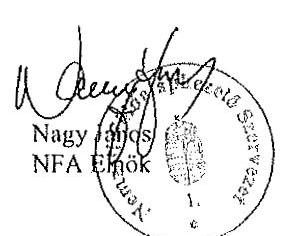

---

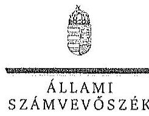

ELHök

Ikt.szám: V-0749-154/2015.

Nagy János úr
elnök
Nemzeti Földalapkezelő Szervezet
Budapest

# Tisztelt Elnök Úr! 

Az ,,Az állami tuloidunban álló erdögazdasági társaságok vagyongazdálkodási tevékenségének ellenörzése" címủ ellenörzés tekintetében 14 társaság jelentéstervezetére tett észrevételüket köszönettel megkaptam.

Az Állami Számvevőszék észrevételekre vonatkozó álláspontjáról a felügyeleti vezető által készített részletes tájékoztatást csatoltan megküldöm.

Tájékoztatom Elnök urat, hogy a számvevőszéki jelentésben - az Állami Számvevőszékről szóló 2011. évi LXVI. törvény 29. § (3) bekezdése alapján - a figyelembe nem vett észrevételeket szerepeltetjük az elutasítás indokának feltüntetésével.

Budapest, 2015. 44. hó 02. nap
Tisztelettel:
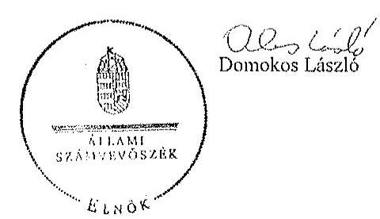

Melléklet: Tájékoztatás az észrevételek kezeléséről

---

# Tájékoztatás   az észrevételek kezeléséről 

„Az állami tulajdonban álló erdőgazdasági társaságok vagyongazdálkodási tevékenységének ellenörzése" címủ ellenőrzés tekintetében az IPOLY ERDŐ Zrt., az EGERERDŐ Erdészeti Zrt., a Mecsekerdő Zrt., a SEFAG Erdészeti és Faiqari Zrt., a Gemenci Erdő- és Vadgazdaság Zrt., az Északerdő Erdőgazdasági Zrt., a Pilisi Parkerdő Zrt., a Szombathelyi Erdészeti Zrt., a Kisalföldi Erdőgazdasági Zrt., a Zaluerdő Erdészeti Zrt., a KEFAG Kiskunsági Erdészeti és Faiqari Zrt., a VADEX Mezöföldi Erdő- és Vadgazdálkodási Zrt., a Gyalaj Erdészeti és Vadászati Zrt., illetve a TAEG Tanulmányi Erdőgazdaság Zrt. társaságok jelentéstervezetére 2015. október 16-án érkezett észrevételeket áttekintettük, azok kezelésével kapcsolatban a következő tájékoztatást adom.

Az észrevétel szerint a jelentéstervezetben tett megállapítások helytállóak, azokat nem vitatják. Az NFA elnökének tett javaslatokhoz kapcsolódó tájékoztatást köszönjük. Mindezek miatt, valamint arra tekintettel, hogy nem jött létre olyan vagyonkezelési szerződés, amely biztosítja az ideiglenes vagyonkezelési szerződés hiányosságainak a megszüntetését, illetve a hatályos jogszabályoknak való megfeleltetést, a megállapítások és a javaslatok módosítása nem indokolt.

Budapest, 2015. év 11 hó 02. nap

Makkai Mária
felügyeleti vezető

---

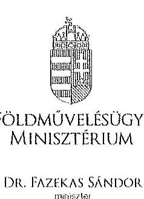

DR. FAZIKAS SÁNDOR
$\qquad$
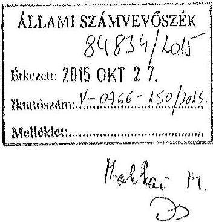

Ügyintéző: dr. Szabó Martina Dóra
Telefonszám: 896-2483
E-mail: dora.martina.szabo@fin.gov.hu
Hivatkozási szám: V-0766-142/2015, és
V-0767-058/2015.

Domokos László úr
elnök
részére

# Állami Számvevôszék 

Budapest
Apáczai Csere János u. 10.
1052
Tárgy: Az Állami Számvevőszék V-0766-142/2015. és V-0767-058/2015. iktatószámú jelentéstervezetének véleményezése

## Tisztelt Elnök Úr!

Hivatkozással a V-0766-142/2015. iktatószámú „Az állami tulajdonban álló erdögazdasági társaságok vagyongazdálkodási tevékenységének ellenörzése - Gyulaj Erdészeti és Vadászati Zrt. "tárgyú, valamint a V-0767-058/2015. iktatószámú „Az állami tulajdonban álló erdögazdasági társaságok vagyongazdálkodási tevékenységének ellenörzése - TAEG Tanulmányi Erdögazdaság Zrt." tárgyú levelükre, az Állami Számvevőszékről szóló 2011. évi LXVI. törvény 29. § (2) bekezdése alapján az alábbi észrevételeket teszem.

Fenti erdészeti társaságokról készült jelentéstervezetek legfőbb észrevétele és kifogásolni valója, hogy az ellenőrzött erdészeti társaságok könyveiben nem szerepel értéken a kezelt erdőterület és erdő, és a nyilvántartás ez irányú hiányosságai miatt a vagyonnyilvántartás nem teljes.

Az állami vagyonnal való gazdálkodásról szóló 254/2007. (X. 4.) Korm. rendelet 14. § (1) bekezdése szerint az állami vagyon használóját, vagyonkezelőjét és haszonélvezőjét a nemzeti vagyonról szóló 2011. évi CXCVI. törvény (a továbbiakban: Nvtv.) 10. §

---

(1) bekezdése szerinti vagyonnyilvántartás hiteles vezetése és a tulajdonosi joggyakorlók beszámoló-készítési kötelezettségének megalapozottsága érdekében az állami vagyon hasznosítására, vagyonkezelésére, vagy haszonélvezeti jog alapítására kötött szerződés szerinti adatszolgáltatási kötelezettség terheli.

Az Nvtv. 10. § (1) bekezdése szerint a nemzeti vagyont, annak értékét és változásait a tulajdonosi joggyakorló nyilvántartja. Az érték nyilvántartásától el lehet tekinteni, ha az adott vagyontárgy értéke természeténél, jellegénél fogva nem állapítható meg.

Fenticket megerősíti a Pénzügyminisztérium Számviteli Főosztálya által 1997. november 25 -én kiadott állásfoglalás is ( $9807 / 1997$. ).

Az erdő és a faállomány naturális adatait az Országos Erdőállomány Adattár tartja nyilván. A Kincstári Vagyoni Igazgatóság által 1996-ban vagyonkezelésbe adott erdő értékének meghatározására még nem került sor. Az érték meghatározása a vagyonkezelésbe adó feladata. Az erdészeti társaságok érték nélkül nem, csak értékkel tudják kimutatni a mérlegben az erdővagyont.

Fentiekre tekintettel álláspontom szerint a Gyulaj Erdészeti és Vadászati Zrt. és a TAEG Tanulmányi Erdőgazdaság Zrt. adatszolgáltatási kötelezettségének eleget tett.

A jelentéstervezetekben megállapításra került továbbá, hogy a vagyonkezelési díjak éves felülvizsgálatára nem került sor, a vagyonkezelési díjakat a tulajdonosi joggyakorló Magyar Nemzeti Vagyonkezelő Zrt. (a továbbiakban: MNV Zrt.) és Nemzeti Földalapkezelő Szervezet (a továbbiakban: NFA) késve, visszamenőleg számlázta ki, a számlákon a földterület nagysága, valamint fajlagos egységára nem volt ellenőrizhető. A számvevőszéki jelentéstervezetek ugyanakkor megjegyzik, hogy a vagyonkezelési díj pénzügyi rendezése megtörtént a társaságok részéről.

A nyilvántartás és a vagyonkezelési díj meghatározásának felelőse a kezelt földterületek és erdőterület esetében ezen vagyonelemek tulajdonosi joggyakorlója, azaz az NFA és az MNV Zrt.

Álláspontom szerint fenti két megállapításért sem a vizsgált társaságok, sem pedig a társaságok tulajdonosi joggyakorlója nem marasztalható el.

A számvevőszéki jelentéstervezetek I. főcíme (Összegző megállapítások, következtcrések, javaslatok) alapján a vizsgált társaságok üzleti jelentéseikben minden évben eleget tettek a kezelt vagyonnal folytatott gazdálkodásra vonatkozó szerződéses kötelezettségeik bemutatásának. A társaságok a gazdasági társaságokról szóló 2006. évi IV. törvény, illetve a Ptk. vonatkozó rendelkezéseinek megfelelően müködtek, a szabályzatok, jelentések megfeleltek a jogszabályi hivatkozásoknak, a belső ellenőrzés kiépített volt a társaságoknál.

---

A jelentéstervezetek rögzítik továbbá, hogy a vagyongazdálkodási feladatokra vonatkozó döntések és intézkedések előkészitése a tulajdonosi joggyakorlónál összhangban állt a vonatkozó jogszabályokkal.

Kérem észrevétcleim szíves tudomásul vételét.
Budapest, 2015. október „«̋o".
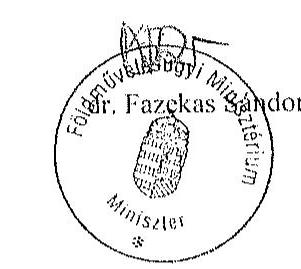

---

.

---

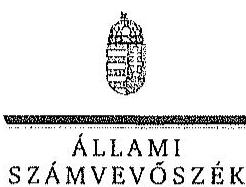

ELNÖK

Ikt.szám: V-0767-068/2015.

Dr. Fazekas Sándor úr
miniszter
Földművelésügyi Minisztérium

Budapest

Tisztelt Miniszter Úr!

„Az állami tulajdonban álló erdőgazdasági társaságok vagyongazdálkodási tevékenységének ellenőrzése" című ellenőrzés tekintetében a Gyalaj Erdészeti és Vadászati Zrt., illetve a TAEG Tanulmányi Erdőgazdaság Zrt. társaságok jelentéstervezetére tett észrevételüket köszönettel megkaptam.

Az Állami Számvevőszék észrevételekre vonatkozó álláspontjáról a felügyeleti vezető által készített részletes tájékoztatást csatoltan megküldöm.

Tájékoztatom Miniszter urat, hogy a számvevőszéki jelentésben - az Állami Számvevőszékről szóló 2011. évi LXVI. törvény 29. § (3) bekezdése alapján - a figyelembe nem vett észrevételeket szerepeltetjük az elutasítás indokának feltüntetésével.

Budapest, 2015. 11. hó /s nap

Tisztelettel:

Domokos László

Melléklet: Tájékoztatás az észrevételek kezeléséről

1052 BUDAPEST, AFRICZIN CSZIRE JÁNOS UTCA 10. 1364 Budapest 4. Pl. 54 telefon: 484 9191 fax: 484 9201

---

# Tájékoztatás   az észrevételek kezeléséről 

„Az állami tulajdonban álló erdőgazdasági társaságok vagyongazdálkodási tevékenységének ellenörzése" címú ellenőrzés tekintetében a Gyulaj Erdészeti és Vadászati Zrt., illetve a TAEG Tanulmányi Erdőgazdaság Zrt. társaságok jelentéstervezetére 2015. október 27 -én érkezett észrevételeket áttekintettük, azok kezelésével kapcsolatban a következő tájékoztatást adom.

A 254/2007. (X. 4.) Korm. rendelet (továbbiakban: Vhr.) 9. § (9) bekezdés a) pontja alapján a vagyonkezelő köteles a vagyonkezelésbe vett eszközöket a Számv. tv. szerint a hosszú lejáratú kötelezettségekkel szemben a vagyonkezelési szerződésben rögzített értéken állományba venni. A Számv. tv. 23. § (2) bekezdése elöírja, hogy a vagyonkezelőnél a mérlegben eszközként kell kimutatni a - törvènỵi rendelkezés, illetve felhatalmazás alapján - kezelésbe vett, az állami vagy önkormányzati vagyon részét képező eszközöket is. Ezen eszközöket a kiegészitő mellékletben legalább mérleglételek szerinti megbontásban - külön be kell mutatni.

A Társaságokkal kötött ideiglenes vagyonkezelési szerződésben a vagyonkezelésbe adott vagyon értékét nem rögzítették, a szerződés azt sem tartalmazta, hogy a vagyonkezelt eszközök értéke nulla, továbbá a szerződés nem tartalmaz rendelkezést arra sem, hogy a vagyonkezelésbe adott vagyon értékét azért nem határozták meg, mert az a vagyontárgy természeténél, jellegénél fogva nem állapítható meg.

A Vhr. 17. § (1) bekezdése szerint a saját vagyonnal rendelkező vagyonkezelő a rábízott állami vagyonról olyan elkülönített nyilvántartást köteles vezetni, amely tételesen tartalmazza ezen eszközök könyv szerinti bruttó és nettó értékét, az elszámolt terv szerinti és terven felüli értékesökkenés összegét és az értékben bekövetkezett egyéb változásokat. A Társaságok által vezetett nyilvántartás - a kezelt vagyon értéke meghatározásának hiányában - nem tartalmazta tételesen a vagyonkezelt eszközök könyv szerinti bruttó és nettó értékét, valamint az értékben bekövetkezett egyéb változásokat.

A Társaságok a Számv. tv. és a Vhr. előírásainak betartása céljából nem tettek lépéseket annak érdekében, hogy a vagyonkezelt eszközök értéke az ideiglenes vagyonkezelési szerződésben rögzítésre, illetve rendezésre kerüljön. A fentiek alapján megállapításaink módosítása nem indokolt.

Az ideiglenes vagyonkezelési szerződések 3.3.2. pontja szerint az 1997-es és a további évekre a vagyonkezelési jog gyakorlásáért az ellenértéket a vagyonkezelési szerződés tárgyévet megelőző év november 30 -ig történő felülvizsgálata során a felek az adott évre vonatkozó külön megállapodásban határozzák meg. Tehát a Társaságoknak, mint szerződő feleknek kötelezettsége volt a vagyonkezelési szerződés és a vagyonkezelési díj éves felülvizsgálata, ezért megállapításunk módosítása nem indokolt.

Budapest, 2015. év /1. hó /1. nap
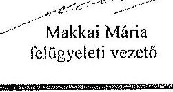