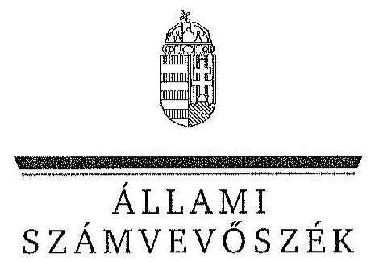

ÁLLAMI
SZÁMVEVŐSZÉK

# JELENTÉS 

Az állami tulajdonban álló erdőgazdasági társaságok vagyongazdálkodási tevékenységének ellenőrzése

TAEG Tanulmányi Erdőgazdaság Zrt.

---

# Állami Számvevőszék 

Iktatószám: V-0767-074/2015.
Témaszám: 1801
Vizsgálat-azonosító szám: V0706

## Az ellenőrzést felügyelte:

## Makkai Mária

felügyeleti vezető
Az ellenőrzést vezette és az ellenőrzés végrehajtásáért felelős:
Pencz Mária
ellenőrzésvezető
A számvevőszéki jelentés összeállításában közreműködött:
Baki István
számvevő tanácsos

## Czeglédi Dénes

számvevő tanácsos

## Az ellenőrzést végezték:

| Baki István | Czeglédi Dénes | Dr. Dorogi Zsolt Pál |
| :-- | :-- | :-- |
| számvevő tanácsos | számvevő tanácsos | számvevő |

## Szeibel Gáborné

számvevő tanácsos

---

# TARTALOMJEGYZÉK 

BEVEZETÉS ..... 3
I. ÖSSZEGZŐ MEGÁLLAPÍTÁSOK, KÖVETKEZTETÉSEK, JAVASLATOK ..... 7
II. RÉSZLETES MEGÁLLAPÍTÁSOK ..... 14

1. A TAEG Zrt. vagyongazdálkodása ..... 14
1.1. A vagyon értékének megőrzése, gyarapítása ..... 14
1.2. A vagyonkezelői kötelezettség teljesítése ..... 18
2. A TAEG Zrt. vagyonkezelési szerződése és a vagyonnyilvántartása ..... 19
2.1. A vagyonkezelési szerződés megfelelősége ..... 19
2.2. A TAEG Zrt. vagyonnyilvántartása ..... 21
3. A TAEG Zrt. éves tervezési feladatainak ellátása, az ágazati jogszabályok érvényesülése ..... 24
3.1. Az üzleti tervek vagyonmegőrzésre, vagyongyarapításra vonatkozó elemei ..... 24
3.2. A tervekben megfogalmazott előírások érvényesülése ..... 25
3.3. Az ágazati szabályok érvényesülése ..... 26
4. A kontroll-és monitoring rendszer kialakítása és működtetése ..... 28
4.1. A kontrollrendszer kialakítása és működtetése ..... 28
4.2. Az információáramlási és monitoring rendszer kialakítása és működtetése ..... 30
5. A tulajdonosi joggyakorlóknak a TAEG Zrt. vagyongazdálkodási feladataira vonatkozó döntései, intézkedései megfelelősége ..... 32

---

# MELLÉKLETEK 

1. számú Rövidítések jegyzéke
2. számú Fogalomtár
3/A. számú A TAEG Zrt. vagyonváltozásának alakulása a 2009-2014. évek közötti időszakban
3/B. számú Az erdőgazdasági társaság vagyonának alakulása a 2009-2014. években
3. számú A befektetett eszközök állományának alakulása
4. számú A TAEG Zrt. vezérigazgatójának észrevétele
5. számú A TAEG Zrt. vezérigazgatójának észrevételére adott válasz
6. számú Az MNV Zrt. vezérigazgatójának észrevétele
7. számú Az MNV Zrt. vezérigazgatójának észrevételére adott válasz
8. számú Az MFB Zrt. vezérigazgatójának észrevétele
9. számú Az MFB Zrt. vezérigazgatójának észrevételére adott válasz
10. számú Az NFA elnökének észrevétele
11. számú Az NFA elnökének észrevételére adott válasz
12. számú A Földművelésügyi Minisztérium miniszterének észrevétele
13. számú A Földművelésügyi Minisztérium miniszterének észrevételére adott válasz

---

# JELENTÉS 

## Az állami tulajdonban álló erdőgazdasági társaságok vagyongazdálkodási tevékenységének ellenőrzése TAEG Tanulmányi Erdőgazdaság Zrt.

## BEVEZETÉS

Hazánk területének több mint 20\%-át erdő borítja. Az erdők fenntartása és védelme az egész társadalom érdeke, ezért az erdőkkel csak a közérdekkel összhangban lehet gazdálkodni.

Az Alaptörvény 38. cikke és az Nvtv. alapján az állam tulajdona a nemzeti vagyon részét képezi. Az Nvtv. alapján nemzetgazdasági szempontból kiemelt jelentőségű nemzeti vagyonban tartandó vagyonelemnek minősül a 100\%-ban az állam tulajdonában álló védelmi és közjóléti elsődleges rendeltetésű erdő, a gazdasági elsődleges rendeltetésű természetes erdő, természetszerű erdő és származékerdő természetességi állapotú öt hektárnál nagyobb, természetben összefüggő erdő. A Társaságok vagyongazdálkodása szempontjából a Vtv, illetve az Nvtv. és az Nfatv., valamint a kapcsolódó kormány- és miniszteri rendeletek mellett kiemelkedő szerepe van a különböző ágazati jogszabályoknak. A vagyonkezelési tevékenység végrehajtása során figyelemmel kell lenni az Evt.-ben foglaltakra, mely alapján a nemzeti vagyonról szóló törvényben nemzetgazdasági szempontból kiemelt jelentőségű nemzeti vagyonként meghatározott védelmi és közjóléti elsődleges rendeltetésű, az állam tulajdonában álló erdő a kincstári vagyon részét képezi. A Társaságoknak az általuk kezelt vagyonelemek sajátosságára tekintettel kell a vagyongazdálkodási tevékenységüket kialakítaniuk, gondoskodniuk kell a közérdek és az Evt.-ben foglaltak érvényesülését biztosító vagyongazdálkodásról.

Az Evt. előírásai alapján az állam 100\%-os tulajdonában álló erdőt és erdőgazdálkodási tevékenységet közvetlenül szolgáló földterületet csak vagyonkezelés formájában lehet hasznosításra átengedni. A kizárólagos állami tulajdonban lévő erdő és erdőgazdálkodási tevékenységet közvetlenül szolgáló földterület vagyonkezelését csak költségvetési szerv vagy 100\%-os állami tulajdonú gazdálkodó szervezet végezheti.

A Vtv. szerint a Társaságok és az általuk kezelt állami vagyon feletti tulajdonosi jogokat a 2010. évig a Magyar Állam nevében az MNV Zrt. gyakorolta. A 2010. évi törvényi változások (Vtv., Mfbtv., Nfatv.) következtében 2010. június 17. napjától a Társaságok állami tulajdonú részesedése tekintetében a tulajdonosi jogokat az állami vagyonért felelős miniszter az MFB Zrt. útján látta el. Az Nfatv. 2010. évi hatálybalépését követően a Társaságok által kezelt, a Nemzeti Földalapba tartozó földterületek vonatkozásában a tulajdonosi jogokat az NFA, míg egyéb ingatlanok és vagyonelemek tekintetében a tulajdonosi jogokat az MNV Zrt. gyakorolja. 2014. július 16-tól a Társaságok feletti tulajdonosi jogokat az erdőgazdálkodásért felelős miniszter gyakorolja.

A Nemzeti Földalapba tartozó 1772 980,17 ha földterületből a 2012. év végén a 100\%-os állami tulajdonú 19 erdőgazdasági társaság kezelésében összesen 913664,3681 ha földterület volt, ebből 879254,1595 ha erdő, a többi egyéb művelési ágba tartozik. A kezelt földterületek erdőgazdasági társaságonkénti megoszlása eltérő.

A Társaságok az Alaptörvény és az Nvtv. előírása szerint önállóan és felelősen gazdálkodnak a törvényesség, a célszerűség és az eredményesség követelményei szerint. Az állami vagyonnal való gazdálkodás alapvető feladata a vagyon rendeltetésszerű, hatékony és felelős felhasználásának biztosítása az állami vagyon értékének megőrzése, gyarapítása érdekében. A Társaság jelen ellenőrzése az állami vagyonnal való gazdálkodásra és a törvényesség betartására irányult.

A TAEG Győr-Moson-Sopron és Vas megyékben 17 448,6 ha földterületen gazdálkodik, az Alpok aljához tartozó Soproni hegyvidéktől a Fertő-menti dombsorokon át Nagycenk térségében simul bele a Kisalföldbe. A TAEG Zrt. a 2014. évi éves beszámolója szerint 1549868 E Ft nettó árbevétel mellett 13284 E Ft mérleg szerinti eredményt ért el, a mérlegfőösszeg 2713878 E Ft volt, az éves átlaglétszám 111 fő volt.

Az ellenőrzés célja annak értékelése, hogy a Társaság vagyongazdálkodása, vagyonérték-megőrző és vagyongyarapítási tevékenysége, valamint szervezeti keretei és kiépített kontrollrendszere megfeleltek-e a jogszabályok és belső szabályzatok előírásainak, valamint a kezelt vagyonelemek sajátosságaiból adódó követelményeknek.

Ennek keretében ellenőriztük és értékeltük, hogy:

- a vagyongazdálkodás során betartották-e az Nvtv. 7. §-ában megállapított vagyongazdálkodási alapelveket, valamint az ágazati jogszabályok vagyongazdálkodáshoz kapcsolódó előírásait;
- a Társaság a saját és a kezelt vagyonnal való gazdálkodásra vonatkozó éves tervezési feladatait a jogszabályi előírásoknak megfelelően látta-e el, a Társaság üzleti tervei a kezelésbe vett vagyonra vonatkozó, a Vtv. 2. § (1) és a 27. § (7) bekezdésében előírt vagyon megőrzésére, gyarapítására vonatkozó elemeket tartalmazták-e és azokat a vagyongazdálkodás során érvényesítették-e;
- a vagyonkezelési szerződések és a vagyon-nyilvántartás megfeleltek-e a szabályszerűségi követelményeknek, elősegítették-e az állami vagyonnal való szabályszerű gazdálkodást;
- a Társaságnál kialakították és működtették-e a szabályszerű feladatellátást támogató kontrollrendszert. Ezen belül a Társaság elkészítette-e és aktualizálta-e feladatellátási-folyamatainak szabályzatait, a kockázatok kezelésének rendszerét, az információs és a kontrolling-monitoring rendszert, valamint a vagyongazdálkodás területén azokat az eljárásokat, amelyek elősegítik a szervezeti célok végrehajtását;

- a tulajdonosi joggyakorlóknak a Társaság vagyongazdálkodási feladataira vonatkozó döntései, intézkedései előkészítése és megalapozottsága a jogszabályoknak és a belső szabályozásnak megfelelt-e, a tulajdonosi joggyakorlók e minőségben végzett tevékenysége támogatta-e a felelős vagyongazdálkodás megvalósulását.

Az ellenőrzés típusa: szabályszerűségi ellenőrzés.
Az ellenőrzött időszak: 2009. január 1. napjától 2014. december 31. napjáig, kitekintéssel a helyszíni ellenőrzés végéig tartó releváns folyamatokra, intézkedésekre.

Az ellenőrzés várható hasznosulása: A Társaság és a tulajdonosi joggyakorlók fenti szempontú ellenőrzése az állami tulajdonban álló vagyon kezelésére, a vagyonnal való gazdálkodásra vonatkozó, kötelezően végrehajtandó éves ÁSZ ellenőrzést szélesebb körűvé teszi.

Az ellenőrzés várható hasznosulásaként biztosíthatja a társadalom részéről kiemelt érdeklődéssel kísért téma objektív bemutatását. Az ÁSZ jelentéséből a média és az állampolgárok átfogó képet kaphatnak a Magyarország állami tulajdonban lévő erdőivel való gazdálkodásról, a gazdálkodást, vagyonkezelést végző szervezeti rendszerről, az állami tulajdonban álló erdőgazdasági társaságok feladatellátásához kapcsolódóan feltárt problémákról.

Az ellenőrzés jól hasznosítható - többek közt - az állami vagyonnal kapcsolatos országgyűlési törvényhozói munkában is, továbbá hozzájárulhat a tulajdonosi joggyakorlás javításával a „jó kormányzás" gyakorlatának erősítéséhez.

Az ellenőrzéssel érintett szervezetek: A Társaság, a Társaság kezelésében lévő állami vagyon feletti tulajdonosi jogokat gyakorló szervezetek, valamint a Társaság állami tulajdonú részesedése feletti tulajdonosi joggyakorlók (MFB Zrt., MNV Zrt., NFA, FM).

Az ellenőrzés végrehajtásának jogszabályi alapját az ÁSZ tv. 5. § (4)(5) bekezdéseiben foglaltak képezik.

Az ellenőrzés szakmai módszertana az ÁSZ hivatalos honlapján közzétett szakmai szabályokon alapult, amely a Legfőbb Ellenőrző Intézmények Nemzetközi Szervezete (INTOSAI) által kiadott nemzetközi standardok (ISSAI) figyelembevételével készült.

A Társaság az ellenőrzés lefolytatásához tanúsítványok kitöltésével, valamint dokumentumok elektronikus megküldésével szolgáltatott adatokat. Az így rendelkezésre bocsátott adatok és információk kontrollja a helyszíni ellenőrzés keretében történt. A vagyonváltozást eredményező döntések megalapozottságát, továbbá a vagyonérték-megőrző és vagyongyarapító tevékenység szabályszerűségét a számviteli nyilvántartásokból, valamint kockázatalapú és véletlenszerű mintavétellel kiválasztott tételek ellenőrzésével értékeltük.

---

Az ÁSZ a 2011. évi LXVI. törvény 29. §-a szerint a jelentéstervezetet megküldte a TAEG Zrt. vezérigazgatójának, a Magyar Nemzeti Vagyonkezelő Zrt. vezérigazgatójának, a Magyar Fejlesztési Bank Zrt. vezérigazgatójának, a Nemzeti Földalapkezelő Szervezet elnökének és a Földművelésügyi Minisztérium miniszterének egyeztetésre. A TAEG Zrt. vezérigazgatójának észrevételét és az arra adott választ az 5-6. számú melléklet, a Magyar Nemzeti Vagyonkezelő Zrt. vezérigazgatójának észrevételét és az arra adott választ a 7-8. számú melléklet, a Magyar Fejlesztési Bank Zrt. vezérigazgatójának észrevételét és az arra adott választ a 9-10. számú melléklet, a Nemzeti Földalapkezelő Szervezet elnökének észrevételét és az arra adott választ a 11-12. számú melléklet, a Földművelésügyi Minisztérium miniszterének észrevételét és az arra adott választ a 13-14. számú melléklet tartalmazza.

---

# I. ÖSSZEGZŐ MEGÁLLAPÍTÁSOK, KÖVETKEZTETÉSEK, JAVASLATOK 

Az állami tulajdonú TAEG Zrt. az ellenőrzött időszakban saját és kezelt vagyonnal gazdálkodott. A Társaság könyvviteli mérlegében kimutatott vagyona a 2009. évi 2479,5 M Ft nyitó értékről 2014. december 31-re 2713,9 M Ft-ra emelkedett, elsősorban a befektetett eszközök növekedésének következtében, amely 9,5\%-os vagyongyarapodást eredményezett. A Társaság saját tőke/jegyzett tőke aránya az ellenőrzött időszakban a jegyzett tőkének alapítói határozatok alapján végrehajtott emeléséből adódóan a 2009. évi 148,5\%-ról 2014. évre 144,2\%-ra csökkent.

Az ellenőrzött időszakban a Társaság mérlege nem a valós állapotot tükrözte, mert a kezelt erdőket és földingatlanokat a Számv. tv. előírásai ellenére mérlegében nem szerepeltette. A Társaság a Számv. tv. előírásaival ellentétben a kezelt vagyont mérlegtétel szerinti bontásban kiegészítő mellékletében nem mutatta be.

A Társaság a saját és kezelt vagyon Vhr.-ben előírt elkülönítését biztosította. A Társaság által vezetett nyilvántartás nem tartalmazta tételesen a vagyonkezelt eszközök könyv szerinti bruttó és nettó értékét, valamint az értékben bekövetkezett egyéb változásokat, ezért nem felelt meg a Vhr.-ben foglaltaknak, így nem volt átlátható és nem biztosította az elszámoltathatóságot. A Társaság a VSZ eredeti, a vagyonkezelt eszközök tételes felsorolását tartalmazó melléklettel rendelkezett.

A kezelt ingatlanokról a Társaság kizárólag tételes mennyiségi kimutatást vezetett, forint érték feltüntetése nélkül, ami megfelelt a VSZ 2.4. pontja szerinti naturáliában történő vezetési előírásnak, azonban nem felelt meg a kezelt vagyonra vonatkozó, a Számv. tv.-ben előírt nyilvántartási rendelkezésnek. A Társaság a Számv. tv.-ben foglaltak betartása érdekében a kezelt vagyon forint értékének meghatározását sem az MNV
 Zrt.-nél, sem pedig az NFA-nál nem kezdeményezte. A kezelt vagyon nyilvántartása tekintetében a Társaság és a tulajdonosi joggyakorló MNV Zrt. és NFA közötti egyeztetések az ellenőrzés befejezéséig nem kerültek lezárásra, így nem állt rendelkezésre a Társaság vagyonkezelésében lévő valamennyi állami vagyonra, és annak nagyságára vonatkozó, a tulajdonosi joggyakorló MNV Zrt. és NFA nyilvántartásával egyező adat.

A Társaság nem teljes körűen rendelkezett a kezelt vagyon tekintetében pontos és naprakész információval a tulajdonosi jogokat gyakorlóról, így a Társaság által vezetett nyilvántartás nem biztosította a Vhr.-ben foglalt, az adatszolgáltatás pontosságára vonatkozó követelményt. A Társaság teljesítette a Vhr.-ben előírt adatszolgáltatási kötelezettségét az MNV Zrt. felé, azonban a 262/2010. (XI. 17.) Korm. rendeletben foglaltakkal ellentétben az NFA felé adatszolgáltatás nem történt.

---

Az ellenőrzött időszakban a Társaság a Magyar Állam tulajdonában álló erdővagyon és egyéb művelési ágú termőföld ingatlanok kezelését a KVI-vel 1996. október 15-én kötött vagyonkezelési szerződés alapján végezte. A Társaság, mint vagyonkezelő és a KVI között létrejött szerződéses jogviszony kereteit a VSZ-ben foglalt jogok és kötelezettségek töltötték ki. A vagyonkezelési szerződés nem támogatta megfelelően és számon kérhető módon a Vhr.-ben előírtak megvalósulását, a Társaság állami vagyonnal való gazdálkodását.

A vagyoni kör, a tulajdonosi jogok gyakorlására felhatalmazott szervezetek változásai, valamint a társaság vagyonkezelésére vonatkozó jogszabályi rendelkezések változásai ellenére a VSZ-t az ellenőrzött időszakban nem aktualizálták. A VSZ felülvizsgálata, egységes szerkezetbe foglalása nem történt meg, annak módosításai csak a kezelésbe átadott vagyon változásait tartalmazták. A VSZ módosítását és annak módosításokkal történő egységes szerkezetbe foglalását sem a Társaság, sem a kezelt vagyoni kör felett tulajdonosi jogokat gyakorló MNV Zrt., illetve NFA nem kezdeményezte. Az ellenőrzött időszakban a VSZ rendelkezései nem határozták meg teljes körűen az állami vagyon kezeléséhez fűződő jogokat és kötelezettségeket, mivel a szerződés hatályon kívül helyezett jogszabályi hivatkozásokat tartalmazott. A felek nem tettek eleget a Vhr. előírásának, mert a Vhr. hatályba lépését követő hat hónapon belül nem kezdeményezték a Nemzeti Földalapba tartozó ingatlanokra vonatkozóan a VSZ megszüntetését és a jogszabályoknak megfelelő szerződés megkötését.

A VSZ-ben rögzítettek ellenére a vagyonkezelési díjak éves felülvizsgálatára nem került sor. Az NFA – az MNV Zrt.-vel kötött megállapodás alapján – a vagyonkezelési díjakat kiszámlázta, azonban a VSZ-ben előírt határidőtől eltérően több évre visszamenőlegesen állított ki számlákat. A számlákon a vagyonkezelt földterület nagysága, valamint fajlagos egységára nem szerepelt, ezért a vagyonkezelési díjak szerződés szerinti jogossága nem volt ellenőrizhető. A Társaság a számlákat pénzügyileg rendezte.

A Társaság az ellenőrzött időszakban a Számv. tv. előírásainak megfelelően a fordulónapi leltározást elvégezte.

A Társaság vagyongazdálkodása során betartotta az Nvtv.-ben előírt vagyongazdálkodási alapelveket, mivel vagyonkezelésében álló vagyont nem idegenített el, illetve arra jelzálogjogot, haszonélvezeti jogot nem alapított. A Társaság az Evt. ${ }_{2}$ hatályba lépését követően nem kötött olyan szerződést, amelyben erdő használatát vagy hasznosítását harmadik személynek átengedte volna.

A Társaság a saját és a kezelt vagyonnal való gazdálkodás során az éves tervezési feladatait a Tulajdonosi joggyakorló ${ }_{1,2}$ előírásainak megfelelően látta el, az ellenőrzött időszak minden évére elkészített üzleti tervei tartalmazták a vagyon megőrzésére, gyarapítására vonatkozó elemeket. A Társaság az ágazati és üzleti tervekben megfogalmazott, az erdővagyonnal való gazdálkodás érdekében kifejtett erdőgazdálkodási és vadgazdálkodási tevékenységét az Evt. ${ }_{1,2}$, Evr. és Vadvédelmi tv.-ben foglaltaknak megfelelően végezte. Erdőgazdálkodási és vadgazdálkodási tevékenységéről az ellenőrzött években a Számv. tv. rendelkezéseinek megfelelő üzleti jelentést készített. Az üzleti jelentések a Társaság

---

eredményének és jövedelmezőségének alakulásán kívül, a vagyonkezelt terület működtetését és az adott évi beruházásokat is tartalmazták.

A Társaság a Vtv.-ben, Nfatv.-ben és az ágazati tervekben megfogalmazott, a saját és kezelt vagyon állagának védelme és vagyona gyarapítása érdekében a felújításokat, beruházásokat és karbantartásokat évente állapotfelmérések alapján végezte el. A Társaság beruházási és felújítási tevékenységét az ellenőrzött időszakban a Számv. tv. és a Vhr. rendelkezéseinek megfelelően végezte. A Társaság az erdőfelújításokat a Számv. tv.-ben előírtaknak megfelelően költségei között elszámolta, így a Társaság mérleg szerinti eredménye tartalmazta a kezelt vagyon eredményét is. A Társaság a vagyonkezelésében lévő erdők és földterületek után a Számv. tv. előírásainak megfelelően értékcsökkenést nem számolt el. A Társaság saját vagyona után az ellenőrzött időszakban elszámolt 676,5 M Ft összegű értékcsökkenési leírásnál többet, 1 115,0 M Ft-ot fordított eszközállományának pótlására.

A Társaság vagyongazdálkodási tevékenysége során érvényesítette az ágazati jogszabályok vagyongazdálkodáshoz kapcsolódó előírásait. A Társaság az Evt. ${ }_{2}$-ben előírt, az Erdészeti hatóság felé fennálló bejelentési és engedélykérelmi kötelezettségének az ellenőrzött időszakban eleget tett. A Társaság a vadgazdálkodásból származó bevételei elszámolásánál több esetben megsértette a Számv. tv. előírásait, mert a vadgazdálkodásból származó bevételei alapjául szolgáló számviteli bizonylatokat nem magyar nyelven állították ki. Az ellenőrzött időszakban a Társaság rendelkezett az Evt. ${ }_{1,2}$-ben meghatározott, 10 évre szóló erdőgazdálkodási üzemtervvel, az Erdészeti hatóság által jóváhagyott, 5 évre szóló erdőtelepítési-kivitelezési tervek rendelkezésre álltak, azok tartalmazták az Evr. ${ }_{2}$-ben rögzített tartalmi elemeket. A Társaság vadgazdálkodási tevékenységét a Vadvédelmi tv.-ben foglaltaknak megfelelően, 10 évre szóló vadgazdálkodási üzemterv alapján végezte.

A Társaság kialakította és működtette a szabályszerű feladatellátást támogató kontrollrendszert. Az FB a Gt. és új Ptk. előírásai alapján az éves munkatervében előírt a vagyongazdálkodás, a feladatellátás és az ügyvezetés ellenőrzését minden évben ellátta, a Társaság éves beszámolóiról a véleményét a könyvvizsgálói jelentés figyelembe vételével alakította ki, írásbeli jelentését a Tulajdonosi joggyakorló felé elkészítette. A Számv. tv. előírásai, továbbá az Alapító Okiratban foglalt tulajdonosi döntés alapján a Társaság az ellenőrzéssel érintett időszakban könyvvizsgálói szolgáltatást vett igénybe. Az ellenőrzött időszak éveiben a könyvvizsgáló nem kifogásolta, hogy a Társaság a mérlegeiben a vagyonkezelt eszközöket nem szerepeltette, minden évben a beszámolót hitelesítő záradékkal látta el. A Társaság az SZMSZ-ben foglaltak alapján biztosította a belső ellenőrzési tevékenység ellátását. A belső ellenőr a belső ellenőrzési szabályzattal ellentétben feladatát nem megbízási szerződés alapján látta el, a Társaság a belső ellenőrt teljes munkaidőben, főállásban foglalkoztatta. Az ellenőrzött időszakban a belső ellenőr nem vizsgálta a kezelt vagyonnal kapcsolatos vagyonnyilvántartást és a vagyonkezelésbe vett ingatlanok nyilvántartásának szabályozottságát. A kezelt vagyon vonatkozásában a belső ellenőr két ellenőrzést végzett.

A Társaságnál a szabályszerű működést támogató információáramlási és monitoring rendszer kialakítása és működtetése nem valósult meg teljes körűen, mert az Info tv. és az Avtv. rendelkezései ellenére a közérdekű adatok közzétételére vonatkozó szabályzattal nem rendelkezett. A Társaság az ellenőrzött időszakban a Társaság feletti Tulajdonosi joggyakorló ${ }_{1-2}$ felé fennálló beszámolási kötelezettségeinek határidőben és megfelelő tartalommal eleget tett. A Társaságnál az ellenőrzött időszakban az adatok védelme biztosított volt, azonban a Társaság a közérdekű adatok nyilvánosságra hozatalára vonatkozó kötelezettségének részben tett eleget, mert a Társaság honlapja az Infotv. 1. számú mellékletében előírt közérdekű adatokat teljes körűen nem tartalmazta.

A Társaság vagyongazdálkodási feladataira vonatkozó döntések, intézkedések előkészítése a Társaság feletti Tulajdonosi joggyakorló ${ }_{1-2}$-nál megfelelő volt, összhangban volt a vonatkozó jogszabályokkal és a belső szabályzatokkal. A Társaság feletti Tulajdonosi joggyakorló ${ }_{1}$ a számára a Vtv.-ben előírt, az állami vagyonnal való gazdálkodásra vonatkozóan ellenőrzést a TAEG Zrt.-nél az ellenőrzött időszakban nem végzett. A Társaság feletti Tulajdonosi joggyakorló ${ }_{3}$ a Társaság vagyonváltozást eredményező döntéseit egyedileg nem ellenőrizte, de a vagyonváltozást eredményező döntések megvalósulását a Társaság pénzügyi és vagyoni helyzetét tükröző kontrolling jelentések megtárgyalásával felügyelte.

A vagyonkezelésbe adott állami vagyon tekintetében tulajdonosi jogokat gyakorló MNV Zrt. és NFA tevékenysége az ellenőrzött időszakban nem támogatta teljes körűen a felelős vagyongazdálkodás megvalósulását, a VSZ-szel kapcsolatban feltárt hiányosságok megszüntetésére és a hatályos jogszabályoknak való megfeleltetésére vonatkozóan nem kezdeményeztek intézkedéseket. Nem éltek a Vhr.-ben foglalt, a kezelt vagyon használatára vonatkozó ellenőrzési jogukkal, valamint nem végeztek a Vhr.-ben foglalt, a vagyonnyilvántartás hitelességére, teljességére és helyességére vonatkozó ellenőrzést a Társaságnál.

Az NFA a Társaság vagyongazdálkodása szabályozottságával, szabályszerűségével kapcsolatban a 262/2010. (XI. 17.) Korm. rendelet előírásai ellenére ellenőrzést nem végzett, továbbá nem rendelkezett az Nfatv.-ben előírt naprakész nyilvántartással a Nemzeti Földalapba tartozó, a Társaság által vagyonkezelt földrészletekről.

Az Állami Számvevőszékről szóló 2011. évi LXVI. törvény 33. § (1) bekezdésében foglaltak értelmében a jelentésben foglalt megállapításokhoz kapcsolódó intézkedési tervet köteles az ellenőrzött szervezet vezetője összeállítani, és azt a jelentés kézhezvételétől számított 30 napon belül az ÁSZ részére megküldeni. Amennyiben az intézkedési tervet határidőben nem küldi meg a szervezet, vagy az nem elfogadható, az ÁSZ elnöke a hivatkozott törvény 33. § (3) bekezdésében foglaltakat érvényesítheti.

Az ellenőrzés intézkedést igénylő megállapításai és javaslatai:

# az MNV Zrt. vezérigazgatójának, az NFA elnökének 

A TAEG Zrt. a Magyar Állam tulajdonában álló erdővagyon és egyéb művelési ágú termőföld ingatlanok kezelését a KVI-vel 1996. október 15-én kötött vagyonkezelési

---

szerződés alapján végezte. A Társaság mint vagyonkezelő és a KVI között létrejött szerződéses jogviszony kereteit a VSZ-ben foglalt jogok és kötelezettségek töltötték ki. A Társaságnak a KVI-vel kötött VSZ-e a Vhr. 3. § (1) bekezdésében foglalt előírás ellenére nem támogatta a vagyongazdálkodási feladatok átlátható módon történő, szabályszerű végrehajtását. A VSZ 2009. január 1-jén hatályon kívül helyezett jogszabályi hivatkozásokat tartalmazott az Áht. 109/B. §, az Áht. 109/G. § és a Vadvédelmi tv. 98. § rendelkezései vonatkozásában. A VSZ 3.2.3. pontjában foglalt, a vagyonkezelői jog átruházására vonatkozó rendelkezés 2012. június 30-tól nem felelt meg az Nvtv. 11. § (8) bekezdés d) pontjában foglaltaknak, amely tiltja a vagyonkezelői jog harmadik személyre történő átruházását. A szerződés éves felülvizsgálata a VSZ 3.3.2. pontjában foglaltak ellenére nem történt meg, a felek azt nem is kezdeményezték. A felek nem tettek eleget a Vhr. 54. § (7) ${ }^{1}$ bekezdésében foglalt rendelkezésnek, mert a Vhr. hatályba lépését követő hat hónapon belül nem kezdeményezték a Nemzeti Földalapba tartozó ingatlanokra vonatkozóan a VSZ megszüntetését és a Vtv., illetve Vhr. szabályainak megfelelő szerződés megkötését.

A vagyonkezelésbe adott állami vagyon tekintetében tulajdonosi jogokat gyakorló MNV Zrt. és NFA nem végeztek a Vhr. 20. § (1)-(2) bekezdéseiben és a Nemzeti Földalapba tartozó földrészletek hasznosításának részletes szabályairól szóló 262/2010. (XI. 17.) Korm. rendelet 47. § (1)-(2) bekezdéseiben foglalt, a vagyonnyilvántartás hitelességére, teljességére és helyességére vonatkozó ellenőrzést a Társaságnál.

Javaslat:

# az MNV Zrt. vezérigazgatójának 

a) Tegyen intézkedéseket az erdőgazdasági társaság közreműködésével a tényleges állapotot rögzítő és a hatályos jogszabályi előírásoknak megfelelő vagyonkezelési szerződés megkötésére.
b) Tegyen intézkedéseket a vagyonkezelési szerződés felülvizsgálatának elmaradásával, valamint a Nemzeti Földalapba tartozó ingatlanokra vonatkozó VSZ megszüntetésével összefüggésben feltárt szabálytalanságok tekintetében a felelősség tisztázása érdekében, és szükség szerint intézkedjen a felelősség érvényesítéséről.
c) Intézkedjen a Társaság vagyonnyilvántartása hitelességének, teljességének
 és helyességének jogszabályban foglaltak szerinti ellenőrzéséről.

## az NFA elnökének

a) Tegyen intézkedéseket az erdőgazdasági társaság közreműködésével a tényleges állapotot rögzítő és a hatályos jogszabályi előírásoknak megfelelő vagyonkezelési szerződés megkötésére.
b) Intézkedjen a vagyonkezelési szerződés felülvizsgálatának elmaradásával összefüggésben feltárt szabálytalanságok tekintetében a munkajogi felelősség tisztázására irányuló eljárás megindításáról, és ennek eredménye ismeretében tegye meg a szükséges intézkedéseket.
c) Intézkedjen a Társaság vagyonnyilvántartása hitelességének, teljességének és helyességének jogszabályban foglaltak szerinti ellenőrzéséről.

[^0]
[^0]:    ${ }^{1}$ Vhr. 54. § (7) bekezdés (hatályos 2010. december 31-éig)

---

sára irányuló eljárás megindításáról, és ennek eredménye ismeretében tegye meg a szükséges intézkedéseket.
c) Intézkedjen a Társaság vagyonnyilvántartása hitelességének, teljességének és helyességének jogszabályban foglaltak szerinti ellenőrzéséről.

# a TAEG Zrt. vezérigazgatójának: 

1. A TAEG Zrt. és a KVI által 1996. október 15-én megkötött vagyonkezelési szerződés a Vhr. 3. § (1) bekezdésében foglalt előírás ellenére nem támogatta a vagyongazdálkodási feladatok átlátható módon történő, szabályszerű végrehajtását. A VSZ 3.3.2. pontjában foglaltak ellenére a felek a szerződést évente nem vizsgálták felül. A VSZ az ellenőrzött időszakban nem felelt meg a hatályos rendelkezéseknek, mert hatályon kívül helyezett jogszabályi hivatkozásokat tartalmazott az Áht. 109/B. §, 109/G. §, a Vadvédelmi tv. 98. § rendelkezései vonatkozásában. A VSZ vagyonkezelői jog átengedésére vonatkozó 3.2.3. pontja 2012-től nem felelt meg az Nvtv. 11. § (8) bekezdés d) pontjában foglaltaknak, amely szerint a Társaság a vagyonkezelői jogát harmadik személyre nem ruházhatta át.

Javaslat:
a) Tegyen intézkedéseket a tulajdonosi joggyakorlókkal közreműködve a tényleges állapotnak és a hatályos jogszabályi előírásoknak megfelelő vagyonkezelési szerződés megkötése érdekében.
b) Intézkedjen a vagyonkezelési szerződés felülvizsgálatának elmaradásával összefüggésben feltárt szabálytalanságok tekintetében a felelősség tisztázása érdekében, és szükség szerint intézkedjen a felelősség érvényesítéséről.
2. A Társaság a Számv. tv. 23. § (2) bekezdésben foglaltak ellenére a kezelt vagyont a mérlegben nem mutatta ki, azok mérlegtétel szerinti megbontásban nem kerültek bemutatásra a kiegészítő mellékletben.

Javaslat:
a) Intézkedjen a kezelt vagyon mérlegben eszközként való kimutatásáról, továbbá ezen eszközöknek a kiegészítő mellékletben - legalább mérlegtételek szerinti megbontásban - külön történő bemutatásáról.
b) Intézkedjen a kezelt vagyon mérlegben eszközként történő kimutatásának elmaradásával kapcsolatban feltárt szabálytalanság tekintetében a felelősség tisztázása érdekében, és szükség szerint intézkedjen a felelősség érvényesítéséről.
3. A Társaság nem tett eleget az Avtv. 20. § (8) bekezdése, illetve az Infotv. 30. § (6) bekezdése szerinti, a közérdekű adatok megismerésére irányuló igények teljesítésének rendjét rögzítő szabályzat-készítési kötelezettségnek, a közérdekű adatok megismerésére irányuló igények teljesítésének rendjét rögzítő szabályzattal nem rendelkezett.

---

Javaslat:
Intézkedjen a jogszabályi előírásoknak megfelelően a közérdekű adatok megismerésére irányuló igények teljesítése rendjének szabályozásáról.
4. A Társaság közzétételi kötelezettségének nem teljes körűen tett eleget, mert a honlapján az adatokat nem az Infotv. 26. § (2) bekezdés és a törvény 1. számú melléklete szerinti adattartalommal hozta nyilvánosságra.

Javaslat:
Intézkedjen a közérdekű adatok jogszabályi előírásoknak megfelelő közzétételéről.

---

# II. RÉSZLETES MEGÁLLAPÍTÁSOK 

## 1. A TAEG ZRT. VAGYONGAZDÁLKODÁSA

### 1.1. A vagyon értékének megőrzése, gyarapítása

A Társaság vagyongazdálkodása során betartotta az Nvtv. 7. §-ban foglalt vagyongazdálkodási alapelveket, a vagyonnal felelős módon, rendeltetésszerűen gazdálkodott.

Az ellenőrzött időszakban a Társaság vagyona gyarapodott, ugyanakkor a saját tőke és a jegyzett tőke aránya kismértékben romlott. A vagyonváltozások a vagyonszerkezetre érdemben nem voltak hatással, amelyet a Társaság számviteli beszámolói és üzleti jelentései megfelelően bemutattak.

A Társaság könyvviteli mérlegében kimutatott vagyonának 2009. évi nyitó értéke 2479,5 M Ft-ról a 2014. év végére 2713,9 M Ft-ra emelkedett, amely 9,5\%-os vagyongyarapodást eredményezett. A Társaság saját vagyonát mérlegében a Számv. tv. 23. § (1) bekezdésének megfelelően az eszközök között tartotta nyilván, míg a kezelésében lévő vagyonelemeket a Számv. tv. 23. § (2) bekezdésének előírása ellenére mérlegében nem szerepeltette az eszközök között, ezáltal a Társaság mérlege nem a valós állapotot tükrözte.

A Társaság vagyonának az ellenőrzött időszakban bekövetkezett 9,5\%-os növekedése a vagyonszerkezetre érdemben nem volt hatással.

## A társasági vagyon változása az ellenőrzött időszakban

| Megnevezés |  | 2009.01.01. | 2014.12.31. | $\begin{gathered} \text { Változás } \\ (\%) \end{gathered}$ |
| :--: | :--: | :--: | :--: | :--: |
|  |  | 2 | 3 | $4=3 / 2$ |
| A | Befektetett eszközök | 1768,1 | 2019,4 | 114,2\% |
| I. | Immateriális javak | 0,2 | 82,0 | 35491,8\% |
| II. | Tárgyi eszközök | 1606,8 | 1932,0 | 120,2\% |
|  | - Ingatlanok | 993,4 | 1462,5 | 147,2\% |
|  | - Gépek berendezések, járművek | 302,5 | 186,6 | 61,7\% |
|  | - Egyéb tárgyi eszközök | 239,1 | 254,4 | 106,4\% |
| III. | Befektetett pénzügyi eszközök | 161,0 | 5,5 | 3,4\% |

[^0]
[^0]:    ${ }^{2}$ Hatályos: 2012. január 1-jétől

---

| Megnevezés | 2009.01.01. | 2014.12.31. | Változás   (\%) |
| :-- | :--: | :--: | :--: |
|  | 2 | 3 | $4=3 / 2$ |
| B Forgóeszközök | $\mathbf{7 09 , 8}$ | $\mathbf{6 9 3 , 5}$ | $\mathbf{9 7 , 7 \%}$ |
| I. Készletek | 286,6 | 269,5 | $94,0 \%$ |
| II. Követelések | 174,9 | 187,6 | $107,2 \%$ |
| III. Értékpapírok | 0,0 | 0,0 | - |
| IV. Pénzeszközök | 248,3 | 236,5 | $95,2 \%$ |
| C Aktív időbeli elhatárolások | $\mathbf{1 , 6}$ | $\mathbf{0 , 9}$ | $\mathbf{5 9 , 4 \%}$ |

A befektetett eszközök állománya a 2009. évi nyitó értékhez képest 251,3 M Ft-tal, 14,2\%-kal növekedett. A forgóeszközök állománya 16,4 M Ft-tal, 2,3\%-kal csökkent, ami a készletek 6,0\%-os és a pénzeszközök 4,8\%-os csökkenésével indokolható. Az aktív időbeli elhatárolások csökkenése $0,7 \mathrm{M} \mathrm{Ft}$ volt.

Az eszközökön belül a legmagasabb részarányt a tárgyi eszközök képviselték, melyek aránya a beruházások, fejlesztések eredményeképpen 2009. január 1-i 64,8\%-ról 2014. december 31-re 71,2\%-ra növekedett. Az immateriális javak állománya növekedésének oka a tulajdonosi joggyakorló tőkeemeléséből megvalósított fejlesztés volt. A befektetett pénzügyi eszközök csökkenése a 100,0\%-os saját tulajdonú gazdasági társaság megszűnésével indokolható. A készletek, a követelések és a pénzeszközök aránya kismértékű eltérést mutat, amely nem gyakorolt számottevő hatást a vagyonváltozásra. A saját vagyon változásának fő elemeit és okait a Társaság az éves beszámolóinak kiegészítő mellékletében bemutatta.

A forrásoldali főcsoportok értékének, valamint részarányának változását a következő táblázat mutatja be:
millió Ft

| Megnevezés | $\begin{gathered} 2009 \\ 01.01 \end{gathered}$ | Forrásokon belüli arány | $\begin{gathered} 2014 \\ 12.31 \end{gathered}$ | Forrásokon belüli arány | Változás |
| :--: | :--: | :--: | :--: | :--: | :--: |
| 1 | 2 | 3 | 4 | 5 | $6=4 / 2-100 \%$ |
| D. Saját tőke | 1933,0 | 78,0\% | 2350,3 | 86,6\% | $122 \%$ |
| E. Céltartalékok | 0 | $0,0 \%$ | 0,4 | $0,0 \%$ |  |
| F. Kötelezettségek | 387,1 | $15,6 \%$ | 248,1 | 9,2\% | $64 \%$ |
| G. Passzív időbeli elhatárolások | 159,4 | $6,4 \%$ | 115,1 | $4,2 \%$ | $72 \%$ |
| Források összesen | 2479,5 | 100,0\% | 2713,9 | 100,0\% | 109\% |

---

A saját tőke 417,3 M Ft-tal, 21,6\%-kal emelkedett az ellenőrzött években. A saját tőke a tulajdonosi joggyakorló tőkeemelése és az eredményes működésből adódó 2009-2014. években keletkezett mérleg szerinti eredmény hatására növekedett. A Társaság vagyonszerkezete az ellenőrzött években a források esetében a követelések, a céltartalékok és a passzív időbeli elhatárolások vonatkozásában nem változott jelentősebb mértékben. A kötelezettségek állománya 139,0 M Ft-tal ( $35,9 \%$ ) csökkent, amely alapvetően a rövid és hosszú lejáratú kötelezettségek együttes változásának következménye.

# A 2009-2014. években a Társaság gazdálkodásának főbb mutatószámai az alábbiak voltak: 

|  |  |  |  |  |  | adatok M Ft-ban |  |
| :--: | :--: | :--: | :--: | :--: | :--: | :--: | :--: |
|  | $\begin{gathered} 2009 . \\ \text { év } \\ \text { nyitó } \end{gathered}$ | $\begin{gathered} 2009 . \\ \text { év } \end{gathered}$ | $\begin{gathered} 2010 . \\ \text { év } \end{gathered}$ | $\begin{gathered} 2011 . \\ \text { év } \end{gathered}$ | $\begin{gathered} 2012 . \\ \text { év } \end{gathered}$ | $\begin{gathered} 2013 . \\ \text { év } \end{gathered}$ | $\begin{gathered} 2014 . \\ \text { év } \end{gathered}$ |
| Jegyzett tőke (JT) | 1301,5 | 1630,5 | 1630,5 | 1630,5 | 1630,5 | 1630,5 | 1630,5 |
| Saját tőke (ST) | 1933,0 | 2268,6 | 2278,6 | 2315,3 | 2326,5 | 2336,7 | 2350,3 |
| Használhatósági fok | 70,3 | 71,9 | 69,8 | 67,1 | 67,3 | 67,6 | 64,8 |
| Mérleg szerinti eredmény | 30,2 | 6,6 | 7,5 | 35,1 | 11,2 | 10,2 | 13,3 |
| ST / JT aránya | $148,5 \%$ | $139,1 \%$ | $139,7 \%$ | $142,0 \%$ | $142,7 \%$ | $143,3 \%$ | $144,2 \%$ |

A jegyzett tőke 25,3\%-os, a saját tőke 21,6\%-os növekedésének hatására a saját tőke/jegyzett tőke aránya a 2009. évi 148,5\%-ról 2014-re 144,2%-ra csökkent. A kismértékű csökkenés ellenére a mutató kedvező, mivel a saját tőke minden évben meghaladta a jegyzett tőkét.

A Társaság beszámolói alapján a saját tőke 21,6\%-os, 417,3 M Ft-tal történő növekedése meghatározóan a 2008. évi 229,0 M Ft-os tőkeemelés 2009. évi cégbírósági bejegyzése, a 2009. évben a jegyzett tőkének a 248/2009. (V.27.) sz. alapítói határozat alapján végrehajtott 100,0 M Ft összegű emeléséből, valamint a 2009-2014. évek eredményes működésből adódott.

A jegyzett tőke összege a 2009. január 1-jei nyitó értékről 329,0 M Ft-tal, 25,3\%-kal nőtt a 2014. év végére. A saját tőke/jegyzett tőke aránya kismértékben, 4,3 százalékponttal csökkent, amelyre a tőkeemelés mellett az évenként változó összegű mérleg szerinti eredmény volt hatással. A tárgyi eszközök használhatósági foka kismértékben, 5,5 százalékponttal csökkent. A változás oka, hogy az ellenőrzött időszakban az informatikai beruházás miatt megnőtt az immateriális javak és a számítástechnikai eszközök állománya, amelyeknek az éves amortizációs kulcsa magas (33,0\%).

---

A Társaság az ellenőrzött időszakban az Nfatv. 20. § (4) ${ }^{3}$, a 19/A. § (3) ${ }^{4}$, a Vtv. 23. § (2), valamint 27. § (2) ${ }^{5}$ bekezdésében előírt, a saját és kezelt vagyon állagának megóvásával, karbantartásával és a vagyon gyarapításával kapcsolatos feladatait évente állapotfelmérések alapján végezte el.

A Társaság a vagyonkezelt területen folytatott erdőgazdálkodás vonatkozásában fennálló kötelezettségét az Evt. 2. § (2) bekezdésében rögzített alapelvek szerint az erdők
 változatosságának megőrzése, az erdők fenntartása, felújítása és védelme, valamint a közjóléti szolgáltatások biztosítása képezte.

A Társaság az épületek, építmények, az erdészeti feltáró utak, valamint a közjóléti létesítmények felújítását, korszerűsítését, a vadkár elhárító kerítések építését az éves üzleti terv részét képező beruházások között tervezte és valósította meg. A Tulajdonosi joggyakorló ${ }_{1,2}$ az éves üzleti terveket határozattal hagyta jóvá, amelyek tartalmazták az erdőfelújításokra tervezett kiadásokat is. Az erdőfelújítások összege $629,0 \mathrm{M}$ Ft volt. Az ellenőrzött években szervezeti egységenként elkülönített tételes karbantartási terveket - erre vonatkozó előírás hiányában - nem készítettek, ugyanakkor a karbantartási és felújítási feladatok költségeit az éves üzleti tervekben megjelenítették. A Társaság a vagyonkezelt területek esetében a Vtv. 27. § (2) bekezdésében és a Vhr. 9. § (6) ${ }^{6}$ bekezdés rendelkezései szerint elvégezte, a szükséges felújítási, karbantartási munkákat. A saját és a kezelt vagyon állagmegóvása, értékmegőrzése, gyarapítása érdekében szükséges felújításokat, beruházásokat és karbantartásokat az erdészeti egységek és a termelőüzem vezetői által évente elkészített, számításokkal alátámasztott igények alapján tervezték meg.

A Társaság a kezelésében lévő erdő után a Számv. tv. 52. § (5) bekezdésének megfelelően értékcsökkenési leírást nem számolt el. A Társaság a saját befektetett eszközökre vonatkozóan $676,5 \mathrm{M}$ Ft összegű értékcsökkenést számolt el 2009-2014. között. A saját eszközök állagmegóvása és pótlása érdekében végrehajtott beruházások, felújítások értéke az amortizáció 1,7-szerese, 1115,0 M Ft volt, mely az elszámolt értékcsökkenés összegénél $438,5 \mathrm{M}$ Ft-tal, $64,8 \%$-kal volt több. A beruházások erdőgazdasági tevékenységhez kapcsolódó ingatlanokon végzett felújítások, járművek beszerzése, út, vadkárelhárító kerítés építése, és erdőfelújítás voltak. A 2009-2014. években erdőtelepítést a Társaság nem végzett, a már megkezdett erdőtelepítések befejezéséhez szükséges munkálatok azonban még folyamatban voltak.

A vagyonkezelésben lévő erdőterületek kezelésére, állagmegóvására és gyarapítására fordított munkák ellenértékét a Szám. tv. 48. § (2) bekezdésében foglalt előírásoknak megfelelően a költségek között számolták el, amelyek összege az ellenőrzött időszakban $629,0 \mathrm{M}$ Ft volt. Az erdőfelújítások ráfordításait a Társaság a Számv. tv. 47 § (1), a 48. § (1) bekezdéseiben, és az 52. § (5), (7) bekezdéseiben foglaltakat betartva számolta el a főkönyvi könyvelésében.

[^0]
[^0]:    ${ }^{3}$ Hatályos: 2011. augusztus 1-jétől 2012. december 31-ig
    ${ }^{4}$ Hatályos: 2013. január 1-jétől
    ${ }^{5}$ Hatályos: 2014. január 1-jétől
    ${ }^{6}$ Hatályos 2011. január 1-jétől

---

Az ellenőrzött időszakot megelőzően történt erdőtelepítések, mint befejezetlen beruházások megtalálhatóak voltak a Társaság nyilvántartásaiban.

# 1.2. A vagyonkezelői kötelezettség teljesítése 

A Társaság az ellenőrzött időszakban vagyonkezelői kötelezettségeinek eleget tett.

A Társaság az Evt. 9. § (3)-(4) ${ }^{7}$, valamint az Nfatv. 20. § (7) ${ }^{8}$ bekezdésének megfelelően erdő hasznosítását harmadik személynek nem engedett át. A Társaság az ellenőrzött időszakban a vagyonkezelői jogot nem adta tovább harmadik személy részére és a vagyonkezelésbe kapott eszközök megterhelésére vonatkozó tilalmat betartotta, így eleget tett az Evt. 9. § (1)-(3) bekezdései és Nfatv. 19/A. § (4) ${ }^{9}$ bekezdése vonatkozó előírásainak.

A Társaság az 1998. január 19-én kötött szerződés alapján 533,0 ha területet oktatás céljára átadott az ESZKI részére. A szerződés kiegészítésére az ellenőrzött időszak minden évében vállalkozói szerződést kötöttek, amelyek tartalmazták az ESZKI által elkészített üzleti tervre épülő árbevételeket, kiadásokat (költségeket) és a várható eredményt. Az éves vállalkozói szerződésekben rögzítették, hogy az ESZKI a gazdálkodás tervezett eredményével megegyező összegű térítést tartozik fizetni a Társaság részére. Az éves szerződések azonban nem tartalmazták, hogy az ESZKI az Áfa tv. 5. § (1) bekezdése szerinti adóalanya-e, a bevétellel és kiadással kapcsolatos számszaki adatok áfa nélküli, illetve áfa-val növelt összegben értendőek-e, illetve nem rögzítették a tervezett eredmények Társaság részére történő megfizetésének határidejét sem.

A Társaság tulajdonában, és kezelésében nem volt az Nvtv. 4. § (1) ${ }^{10}$ bekezdése szerinti az állam kizárólagos tulajdonába tartozó vagyon, és az Nvtv. 2. mellékletben megjelölt nemzetgazdasági szempontból kiemelt jelentőségű nemzeti vagyon. Az ellenőrzött időszakban a Társaság vagyonkezelésbe kapott vagyont, és a Nvtv. 2. mellékletben megjelölt nemzetgazdasági szempontból kiemelt jelentőségű nemzeti vagyont nem idegenített el, nem terhelt meg, biztosítékul nem adta és rajtuk osztott tulajdont nem létesített, betartva ezzel a 262/2010. (XI. 17.) Korm. rendelet 40. § (1) ${ }^{11}$, az Nvtv. 6. § (4) ${ }^{12}$, és 2. sz. melléklet előírásait.

A Társaság az Nfatv. 20. § (5) bekezdése értelmében az állam 100%-os tulajdonában álló erdő és erdőgazdálkodási tevékenységet közvetlenül szolgáló földterületet érintő vagyonkezelési szerződést, a hivatkozott jogszabályi előírás 2011. augusztus 1-jei hatályba lépését követően nem kötött. Így vagyonkezelési

[^0]
[^0]:    ${ }^{7}$ Hatályos 2009. július 10-től
    ${ }^{8}$ Hatályos 2011. augusztus 1-jétől
    ${ }^{9}$ Hatályos: 2013. január 1-jétől
    ${ }^{10}$ Hatályos: 2012. január 1-jétől
    ${ }^{11}$ Hatályos: 2010. december 2-től
    ${ }^{12}$ Hatályos: 2012. január 1-jétől

---

szerződés létrejöttéhez az Erdészeti hatóság Nfatv. 20. § (7) bekezdése szerinti jóváhagyására sem volt szükség.

# 2. A TAEG ZRT. VAGYONKEZELÉSI SZERZŐDÉSE ÉS A VAGYONNYILVÁNTARTÁSA 

### 2.1. A vagyonkezelési szerződés megfelelősége

A Társaság az ellenőrzött időszakban saját és kezelt vagyonnal rendelkezett. A kezelt vagyoni körbe tartozó vagyonelemek felett, valamint a Társaság részesedései felett a tulajdonosi joggyakorlás az ellenőrzött időszakban többször változott. 2010. évtől a tulajdonosi jogok gyakorlása az egyes vagyoni körök tekintetében elkülönült, így a joggyakorlás megosztottá vált.

A 2009. január 1. és 2010. június 16. közötti időszakban a tulajdonosi jogok gyakorlója az MNV Zrt. volt. Az Mfbtv. 3. § (5) ${ }^{13}$ bekezdése értelmében 2010. június 17-étől a Társaság állami tulajdonú részesedése tekintetében a tulajdonos jogait az MFB Zrt. gyakorolta. A Társaság vagyonkezelésében lévő földterületek az Nfatv. 15. § (1) ${ }^{14}$ bekezdése értelmében 2010. szeptember 1-jétől a Nemzeti Földalapba tartoznak, azok felett a tulajdonos jogait az agrárpolitikáért felelős miniszter az NFA útján gyakorolja. A Nemzeti Földalapba nem tartozó egyéb ingatlanok feletti tulajdonosi joggyakorlás a Vtv. 3. § (1) ${ }^{15}$ bekezdése alapján az MNV Zrt. hatáskörében maradt.

Az ellenőrzött időszakban a Társaság a Magyar Állam tulajdonában álló erdővagyon és egyéb művelési ágú termőföld ingatlanok kezelését a KVI-vel 1996. október 15-én kötött vagyonkezelési szerződés alapján végezte. A Társaság, mint vagyonkezelő és a KVI között létrejött szerződéses jogviszony kereteit a VSZ-ben foglalt jogok és kötelezettségek töltötték ki. A Társaságnak a KVI ${ }^{16}$ vel kötött VSZ-e nem támogatta megfelelően és számon kérhető módon, a Vhr. 3. § (1) bekezdésében előírtak megvalósulását, az állami vagyonnal való szabályszerű gazdálkodást.

A VSZ 2009. január 1-jén hatályon kívül helyezett jogszabályi hivatkozásokat tartalmazott az Áht. 109/B. $\S^{17}$, az Áht. 109/G. $\S^{18}$ és a Vadvédelmi. tv. 98. § ${ }^{19}$ rendelkezései vonatkozásában és nem tartalmazta a Vtv., az Evt., az Nvtv. és az Nfatv. előírásaira történő hivatkozást.

A VSZ 3.2.3. pontja lehetőséget biztosít a vagyonkezelőnek a vagyonkezelői jog átruházására, azonban a rendelkezés ellentétes az Evt. 9. § (3) bekezdésében,

[^0]
[^0]:    ${ }^{13}$ Hatályos: 2010. június 17-től
    ${ }^{14}$ Hatályos: 2010. szeptember 1 - 2011. július 31.
    ${ }^{15}$ Hatályos: 2010. június 17-től
    ${ }^{16}$ Vtv. 61. § (1) bekezdése alapján az MNV Zrt. a KVI jogutódja
    ${ }^{17}$ Hatályos: 2007. szeptember 24-ig
    ${ }^{18}$ Hatályos: 2007. szeptember 24-ig
    ${ }^{19}$ Hatályos: 2007. április 13-ig

---

és az Nfatv. 19/A. § (4) ${ }^{20}$ bekezdésében foglaltakkal, melynek értelmében az erdő használata ${ }^{21}$, hasznosítása nem engedhető át, vagyonkezelői jog harmadik személynek nem adható tovább, valamint 2012. június 30-tól nem felelt meg az Nvtv. 11. § (8) bekezdés d) pontjában foglaltaknak. A VSZ 3.12.1. pontja szerint a Társaság birtokügyekben csak a KVI előzetes hozzájárulásával járhat el, a 3.12.2. pontban meghatározottak szerint birtokügynek minősül az erdő használati jogának átengedése, amely szintén nem felel meg a jelenleg hatályos Evt. 9. § (3) ${ }^{22}$ bekezdésben és az Nfatv. 19/A. § (4) ${ }^{23}$ bekezdésében foglalt előírásoknak.

A Társaságnál a VSZ-t hat alkalommal módosították a kezelt vagyonelemek körében bekövetkezett változás miatt, azonban a felek a Vhr. 8. § (2) bekezdésében foglalt rendelkezéseknek nem tettek eleget, a szerződést 60 napon belül nem foglalták egységes szerkezetbe.

Az ellenőrzött időszakban a VSZ felülvizsgálatára sem a szerződés hatálya alá tartozó vagyontárgyak körében bekövetkezett változása okán, sem a tulajdonosi joggyakorlók változásai, sem a hivatkozott jogszabályokban bekövetkezett változás miatt nem került sor. A VSZ módosítását és annak módosításokkal történő egységes szerkezetbe foglalását sem a Társaság, sem a kezelt vagyoni kör felett tulajdonosi jogokat gyakorló MNV Zrt, illetve NFA nem kezdeményezte. A felek nem tettek eleget a Vhr. 54. § (7) ${ }^{24}$ előírásának, mert a Vhr. hatálybalépést követő hat hónapon belül nem kezdeményezték a Nemzeti Földalapba tartozó ingatlanokra vonatkozóan a VSZ megszüntetését és a jogszabályoknak megfelelő szerződés megkötését.

A VSZ 3.3.1 pontja a vagyonkezelői jog gyakorlásáért az első évre 50 Ft/hektár díj megfizetését írta elő, amelyre vonatkozóan a Tulajdonosi joggyakorló nem határozta meg, hogy az nettó vagy Áfa-val növelt ellenértéket jelent. A szerződés 3.3.2 pontja a díj mértékének évenkénti felülvizsgálatát és külön megállapodásban történő meghatározását írta elő. A vagyonkezelési szerződések tárgyának évenkénti felülvizsgálatára, valamint a díjak külön megállapodásban történő rögzítésére az ellenőrzött időszakban nem került sor.

A Tulajdonosi joggyakorló NFA a kiállított számlákon nem tüntette fel a vagyonkezelésben lévő földterület nagyságát és a fajlagos egységárat, a vagyonkezelési díj számításának szerződés szerinti jogossága nem volt egyértelműen megállapítható.

Az NFA - az MNV Zrt.-vel kötött megállapodás alapján- a vagyonkezelési díjakat kiszámlázta, azonban a VSZ-ben előírt határidőtől eltérően több évre visszamenőlegesen állított ki számlákat. Az ellenőrzött időszakra esedékes vagyonkezelési díjat a VSZ 3.3.3 pontjában foglaltak ellenére az NFA utólag, hat

[^0]
[^0]:    ${ }^{20}$ Hatályos: 2013. január 1-jétől
    ${ }^{21}$ Hatályos: 2013. május 23-tól
    ${ }^{22}$ Hatályos: 2013. május 23-tól
    ${ }^{23}$ Hatályos: 2013. január 1-jétől
    ${ }^{24}$ Vhr. 54. § (7) bekezdés (hatályos 2010. december 31-éig)

---

részletben számlázta ki. A Társaság a kiállított számlákat befogadta, azonban azokkal szemben kifogással élt, a téves áfa kulcs miatt. Az NFA több évre kiállított számlázásával sérültek a vagyonkezelési szerződés díjfizetéssel kapcsolatos
 előírásai. A számlák szerinti összeg és az 1996. évben rögzített egységár alapján kiszámolt terület nem egyezett a Társaság által nyilvántartott, éves jelentésekben szereplő adataival. A Társaság a kiállított - és a kifogás alapján javított számlákat befogadta, azzal szemben további kifogással nem élt, a számlákon feltüntetett határidőn belül eleget tett a fizetési kötelezettségének.

A Társaság által a kezelésbe vett földterületek után a 2009-2013. évekre vonatkozóan fizetett vagyonkezelési díjak a következők szerint alakultak:

|  |  |  |  | millió Ft |
| :-- | :-- | :--: | :--: | :--: |
| Időszak | Számla   száma | Számla kiállításának dátuma | Díjfizetés   összege | Díjfizetés   időpontja |
| 2009. I. félév | VBVK-00195 | 2012. 07. 13. | 0,5 | 2012. |
| 2009. II. félév | VBVK-00196 | 2012. 07. 13. | 0,5 | 2012. |
| 2010. év | VBVK-00197 | 2012. 07. 13. | 1,1 | 2012. |
| 2011. év | VBVK-00198 | 2012. 07. 13. | 1,1 | 2012. |
| 2012. év | VBVK-00257 | 2013. 12. 30. | 0,8 | 2014. |
| 2013. év | VBVK-00248 | 2013. 12. 30. | 0,9 | 2014. |
| Összesen | - | - | $\mathbf{4,9}$ |  |

A Társaság a számlákon feltüntetett határidőn belül eleget tett a fizetési kötelezettségének. Az NFA részére a 2009-2013. évekre a 4,9 M Ft vagyonkezelői díjat megfizette. A 2014. évi vagyonkezelési díjról az NFA a vagyonkezelési szerződésben foglaltaktól eltérően utólag, 2015. január 27-én állította ki a számlát.

# 2.2. A TAEG Zrt. vagyonnyilvántartása 

Az ellenőrzött időszakban a Társaság kezelt vagyonra vonatkozó vagyonnyilvántartása nem felelt meg a hitelességi és megbízhatósági követelményeknek.

A Társaság a vagyonkezelésbe vett ingatlanokról elkülönített, naprakész mennyiségi nyilvántartást vezetett. A Társaság által vezetett nyilvántartás nem volt átlátható, nem biztosította az elszámoltathatóságot, mivel nem felelt meg a Vhr. 17. § (1) bekezdésében foglaltaknak, mert tételesen nem tartalmazta a vagyonkezelt eszközök könyv szerinti bruttó és nettó értékét, valamint az értékben bekövetkezett egyéb változásokat. A Társaság a VSZ eredeti, a vagyonkezelt eszközök tételes felsorolását tartalmazó 4. sz. melléklettel rendelkezett. A Társaság a VSZ 1-6. sz. mellékletei közül a 2. számú melléklettel „az anyagi és nem anyagi eszközök leltára", valamint az 5. számú melléklettel „Ágazati lapok" nem rendelkezett ${ }^{25}$. Az 1., 3., 4., valamint a 6. számú mellékletek a TAEG Zrt.-nél megtalálhatóak voltak.

A Társaság a kezelt vagyont naturáliában tartotta nyilván, ami megfelelt a VSZ 2.4. pontja szerinti naturáliában történő vezetési előírásnak, azonban nem felelt meg a kezelt vagyonra vonatkozó, a Számv. tv. 23. § (2) bekezdésében előírt nyilvántartási rendelkezésnek. A Társaság a Számv. tv. 23. § (2) bekezdésének betartása érdekében a kezelt vagyon forint értékének meghatározását sem az MNV Zrt.-nél, sem pedig az NFA-nál nem kezdeményezte.

A Társaságnál a kezelésbe vett földterület és ahhoz szorosan kapcsolódó erdő tulajdonosi joggyakorlók szerinti megbontása nem volt biztosított, annak rendezése érdekében több alkalommal kezdeményezték egyeztetéseket és szükség szerinti módosításokat. Az egyeztetések az ellenőrzés befejezéséig nem kerültek lezárásra, ezért nem állt rendelkezésre a Társaság által kezelt valamennyi vagyonelem tekintetében a tulajdonosi joggyakorló MNV Zrt. és NFA nyilvántartásával egyező, elfogadott és visszaigazolt adat.

A Társaság által kezelt vagyon alakulása az ellenőrzött időszak beszámolóval lezárt éveiben az alábbi táblázat szerint alakult:

|  |  |  | hektár |
| :--: | :--: | :--: | :--: |
| Időpont | Kezelt vagyon feletti tulajdonosi   joggyakorló |  | Összes   terület |
|  | MNV* | NFA |  |
| 2009. január 1. | 17042,4 | - | 17042,4 |
| 2009. december 31. | 17409,8 | - | 17409,8 |
| 2010. december 31. | 17420,2 | - | 17420,2 |
| 2011. december 31. | 17420,4 | - | 17420,4 |
| 2012. december 31. | 461,7 | 16958,4 | 17420,1 |
| 2013. december 31. | 461,7 | 16958,4 | 17420,1 |
| 2014. december 31. | 461,7 | 16957,1 | 17418,8 |

* éves jelentések adata szerint

A Társaság az ellenőrzött időszakban saját vagyonával és a rendelkezésére bocsátott kezelt vagyonnal gazdálkodott. A Társaság saját vagyona döntően ingatlanokból, az erdőgazdasági tevékenységekhez kapcsolódó termelőeszközökből, erdőművelési feladatokat szolgáló gépekből és berendezésekből állt. A Társaság saját eszközeiről a Számv. tv. 159. §-ban foglaltaknak, valamint a Számviteli Politikájában rögzített elveknek megfelelően vezette a nyilvántartását. A kezelt vagyon változását a VSZ módosításainak megfelelően átvezették.

[^0]
[^0]:    ${ }^{25}$ A TAEG Zrt. vezérigazgatójának 1_21_1/2015. számú nyilatkozata alapján

---

A Társaság 2014. december 31-én 17448,6 ha területen gazdálkodott, amelyből 29,8 ha saját, 17418,8 ha kezelt terület volt, amely művelési áganként erdőből, szántóból, legelőkből, utakból, művelés alól kivett területekből tevődött össze. Az ellenőrzött időszakban a Társaság kezelésében lévő területek nagysága kismértékben 376,4 ha-ral, 2,2%-kal nőtt. A területváltozás döntően a tulajdonosi döntések, valamint területrendezés és területalakítás miatt következett be.

A Társaság biztosította a vagyonkezelésbe vett ingatlanok elkülönített, naprakész mennyiségi nyilvántartásának vezetését, ugyanakkor nem rendelkezett a tulajdonosi joggyakorlók által dokumentáltan egyeztetett, elfogadott és visszaigazolt nyilvántartással. A Társaság a vagyonkezelésbe vett ingatlanokat a tulajdonosi joggyakorlónál alkalmazott vagyon-kimutatási nyilvántartással megegyező - Forrás-SQL vagyon-nyilvántartási - informatikai rendszerben és a saját nyilvántartásában rögzítette. A saját nyilvántartásukban évenkénti bontásban szerepeltették a kezelt vagyont településenkénti, fekvés szerinti bontásban. A nyilvántartás tartalmazta továbbá a kezelt területek földhivatali helyrajzi számát, az alrészletet, a művelési ágat, a művelésből kivett terület megnevezését, a kezelt terület teljes térmértékét ( $\mathrm{m}^{2}$-ben kifejezve), aranykorona értékét és a tulajdonosi joggyakorló megnevezését.

A Társaság a kezelt földterületeket nyilvántartásában érték nélkül szerepeltette, mérlegében a Számv. tv. 23. § (2) bekezdésében, valamint 42. § (5) bekezdésében foglalt előírások ellenére a kezelésbe vett földterületeket eszközként a hosszú lejáratú kötelezettségekkel szemben nem jelenítette meg, ezáltal a Társaság mérlege nem a valós állapotot tükrözte. A Társaságnak, mint vagyonkezelőnek a Vhr. 9. § (9) bekezdés a) pontja szerint a vagyonkezelési szerződésben meghatározott értéken kell kimutatnia a mérlegében az eszközök között a kezelésbe vett, az állami vagyon részét képező eszközöket a hosszú lejáratú kötelezettségekkel szemben. A Társaság a Számv. tv. 23. § (2) előírásaival ellentétben a kezelt vagyont mérlegtétel szerinti bontásban kiegészítő mellékletében nem mutatta be. A beszámolók kiegészítő mellékletében a vagyonkezelt eszközök mérlegben történő szerepeltetésének hiányát indokolták.

A Társaság vagyonkezelt területeinek művelési ágankénti megoszlása 2014. december 31-én az alábbi volt:

| Művelési ág | Tulajdonosi joggyakorló |  | Összesen: | Megoszlás |
| :-- | --: | --: | --: | --: |
|  | NFA | MNV Zrt. |  |  |
| Erdő | 16462,8 | 115,9 | 16578,7 | $95,2 \%$ |
| Szántó | 70,1 | 178,2 | 248,3 | $1,4 \%$ |
| Rét, legelő | 135,2 | 115,0 | 250,2 | $1,4 \%$ |
| Művelés alól kivett terület: | 265,4 | 48,2 | 313,6 | $1,8 \%$ |
| Egyéb terület: | 23,6 | 4,4 | 28,0 | $0,2 \%$ |
| Összesen: | 16957,1 | 461,7 | 17418,8 | $100,0 \%$ |

A folyamatosan vezetett évközi változásokról, valamint a tárgyév utolsó napján fennálló állapotról a Társaság a Vhr. 14. § (1) bekezdésében foglalt előírásoknak megfelelően adatszolgáltatást teljesített az MNV Zrt. felé. A

---

262/2010. (XI. 17.) Korm. rendelet ${ }^{26}$ 50/A. § (2) bekezdésében foglalt előírás ellenére a 2010-2014. években az NFA részére külön adatszolgáltatás nem történt.

A Társaság a saját vagyonként nyilvántartott eszközök és források értékelését a Számv. tv. 46. § (3) bekezdésben foglaltaknak megfelelően évente elvégezte, amelynek során a Számv. tv. 46. § (4) bekezdés, valamint a számviteli politikában foglalt előírások szerint jártak el.

A beszámolókban és a számviteli nyilvántartásokban lévő vagyontárgyak állományát a Leltározási Szabályzatban foglaltak alapján elkészített leltárral támasztották alá. A Leltározási Szabályzat ${ }^{27}$ részletezte a leltározási körzeteket, a leltározási feladatokat, az időszakokat, a leltározási feladatok felelőseit, a leltár kiértékelés módját. A szabályzatban az ingatlanok vonatkozásában a kétévenkénti leltározást írták elő. A szabályozást nem módosították a Számv. tv. 69. § (3) bekezdésében előírt ${ }^{28}$ legalább hároméves gyakoriságú mennyiségi felvétellel. A 2010. évtől az ingatlanok vonatkozásában is az évenkénti leltár felvételt alkalmazták.

Az ellenőrzött időszakban a leltározások a leltározási ütemtervek szerint történtek. A tárgyi eszközöket, a kis értékű tárgyi eszközöket, készleteket mennyiségi felvétellel leltározták fel. Az ellenőrzött időszakban a belső ellenőr is készített jelentést a leltározásról. A leltározások során rögzített adatok kiértékelése megtörtént.

# 3. A TAEG ZRT. ÉVES TERVEZÉSI FELADATAINAK ELLÁTÁSA, AZ ÁGAZATI JOGSZABÁLYOK ÉRVÉNYESÜLÉSE 

A Társaság az ellenőrzött időszakban az éves tervezési feladatait az előírásoknak megfelelően látta el, az üzleti tervek a vagyon megőrzésére, gyarapítására vonatkozóan tartalmaztak elemeket és azokat a vagyongazdálkodás során érvényesítették.

### 3.1. Az üzleti tervek vagyonmegőrzésre, vagyongyarapításra vonatkozó elemei

A Társaság az ellenőrzött időszakban a saját és a kezelt vagyonnal való gazdálkodás során az éves tervezési feladatait a Tulajdonosi joggyakorló ${ }_{1-2}$ előírásainak megfelelően látta el, az ellenőrzött időszak minden évére elkészített üzleti tervei tartalmazták a vagyon megőrzésére, gyarapítására vonatkozó elemeket.

A Társaság 2007-2009. évi stratégiai üzleti tervei a Társaság vagyongazdálkodására vonatkozóan tartalmaztak stratégiai célokat és feladatokat, azonban a tervről a Tulajdonosi joggyakorló nem döntött. A Tulajdonosi joggyakorló ${ }_{2}$ ügyvezető igazgatója 2010. augusztus 25-én kelt levelében utasította a Társaság vezérigazgatóját, hogy a jövőbeni hatékony vagyonkezelés érdekében 2010. szeptember 6-ai határidővel készítse el a Társaság rövid és hosszú távú stratégiai tervét. A vezérigazgató határidőre összeállította a Társaság 2011-2015. évi stratégiai tervét, azonban a Tulajdonosi joggyakorló ${ }_{2}$ arról nem döntött.

A Társaság minden évben, a Tulajdonosi joggyakorló ${ }_{1,2}$ tervezési irányelvei alapján elkészítette éves üzleti tervét, melyet a Tulajdonosi joggyakorló ${ }_{1,2}$ minden esetben Alapítói Határozattal jóváhagyott. A Társaság üzleti tervei az ellenőrzött időszakban nem kerültek módosításra. A Társaság üzleti tervei a saját vagyon megőrzésére és gyarapítására vonatkozó elemeket az „Ágazatra nem osztható tevékenységek tervei" cím alatt tárgyalták.

A saját vagyon megőrzését és gyarapítását szolgáló beruházások és fejlesztések az Erdőgazdaság saját forrásaira alapultak. A Társaság éves üzleti terveiben a saját vagyona megőrzésére és gyarapítására vonatkozóan eleget tett
 az Ntv. 7. § (1) szerinti felelős és rendeltetésszerű gazdálkodást megalapozó tervezés követelményeinek.

Az állami vagyon megőrzésére vonatkozó elemek a 2009-2014. évi üzleti tervekben „Az üzletági (ágazati) tervek" feladatai és az „Erdőművelési ágazat" cím alatt megjelenő erdőfelújítási feladatok között jelentek meg. Az ágazati tervek tartalmazták az erdőtelepítési, erdőfelújítási terveket és azok finanszírozási forrását. A tervek a vagyon megőrzésére az erdőfelújítás három fő elemét foglalták magukba, az elsőkivitelt, a szükséges pótlást és az ápolást, valamint a vagyonmegőrzésben kiemelt szerepet betöltő elemet, a fahasználatot.

# 3.2. A tervekben megfogalmazott előírások érvényesülése 

A Társaság az ágazati és éves üzleti tervekben megfogalmazott, az erdővagyonnal való gazdálkodás érdekében kifejtett erdőgazdálkodási és vadgazdálkodási tevékenységét megfelelően végezte, a vagyon megőrzésére, gyarapítására vonatkozó előírásokat betartotta.

A Társaság tevékenységét az ellenőrzött időszakban az Evt. 41. § (1), 42. § (1)(2), 44. §-ban az Evr. 23. § (1) és 24. §-ban előírtak szerint az Erdészeti hatóság jóváhagyásával, az erdőgazdálkodási tevékenységre vonatkozó tervek alapján végezte. Az ellenőrzött időszakban az ágazati tervekben megfogalmazott, az állami vagyon megőrzésére, gyarapítására vonatkozó előírásokat az erdőgazdaság teljesítette. Az ágazati tervek tartalmazták az erdőtelepítési, erdőfelújítási terveket és azok finanszírozási forrását. A terveknek megfelelően az erdőtelepítés elsőkivitelét, az erdőfelújítás sikeres első erdősítését és a Vadászati hatóság által jóváhagyott éves vadgazdálkodási terveket végrehajtotta, azokról az Erdészeti hatóság, a Vadászati hatóság és a Tulajdonosi joggyakorló ${ }_{1-2}$ részére beszámolt.

A Társaság az erdőtelepítéseket az ellenőrzött időszakban az Evt. 44. §-ának megfelelően az Erdészeti hatóság által jóváhagyott erdőtelepítési-kivitelezési tervek alapján végezte. Az erdőgazdálkodási tevékenységének elvégzését, teljesítését az Erdészeti hatóságnak az Evt. 42. § (1) bekezdés c) pontjának megfelelően bejelentette. Az Evt. 42. § (1) bekezdés a)-b) pontja előírásainak megfelelően az erdőtelepítés elsőkivitelét, az erdőfelújítás sikeres első erdősítését az Evr. 24. § (1) bekezdés a) pontjában meghatározott határidőben bejelentette az Erdészeti hatóságnak.

A Társaság az ellenőrzött időszakban a kezelésbe vett vagyonnal való gazdálkodás során érvényesítette a tervekben megfogalmazott, a vagyon megőrzésére, gyarapítására vonatkozó előírásokat.

A Társaság, mint a Vadászati közösség közös képviselője a vadgazdálkodási üzemtervet elkészítette. Mint a társult vadászati jog haszonbérbevevője a vadgazdálkodást a Vadászati hatóság által a Vadvédelmi tv. 47. § (3) bekezdése alapján jóváhagyott éves vadgazdálkodási tervek alapján végezte. A vadgazdálkodási tervek teljesítéséről - a 303/2004. (XI. 2.) Korm. rendelet, illetve a 288/2009. (XII. 15.) Korm. rendelet 3. mellékletének megfelelően - az éves jelentéseket, a tárgyévet követő év március 20-áig a Vadászati hatóságnak megküldte.

A Társaság az Alapító Okiratba foglalt - a Társaság ügyvezetéséről, vagyoni helyzetről és üzletpolitikájáról szóló, a Tulajdonosi joggyakorló ${ }_{1-3}$ és a Felügyelő Bizottság felé fennálló - beszámolási kötelezettségének eleget tett. A Társaság elkészítette az éves beszámolókat és a Számv. tv. 95. §-a szerinti éves üzleti jelentéseket. Az éves üzleti jelentéseket az FB megtárgyalta, a Társaság feletti Tulajdonosi joggyakorló ${ }_{1-3}$ Alapítói Határozattal elfogadta.

Az üzleti jelentések külön fejezetekben értékelték a vagyonkezelt és a saját területet. A jelentések tartalmazták az adott év üzleti tervében megfogalmazott feladatok teljesülésére vonatkozó fontosabb naturális és értékadatokat, valamint az erdészeti tevékenység átfogó értékelését mutatószámok alkalmazásával. A vagyonkezelt területek működtetését tekintetében részletesen tartalmazták az erdőgazdálkodásra és a vadgazdálkodásra vonatkozó adatokat és szöveges értékelésüket, valamint az erdő- és vadgazdálkodási tevékenység mennyiségi, illetve az egyes ágazatok gazdasági, pénzügyi mutatóinak teljesítési adatait. Az üzleti jelentések alapján az ágazatok gazdálkodása az elvárásoknak megfelelően alakult, a szakmai követelményeknek eleget tettek. Az ellenőrzött időszakban - a 2011. év kivételével - a saját vagyonon végzett beruházás és fejlesztés értéke meghaladta az értékcsökkenés mértékét.

# 3.3. Az ágazati szabályok érvényesülése 

A Társaság vagyongazdálkodási tevékenysége során érvényesítette az ágazati jogszabályok vagyongazdálkodáshoz kapcsolódó előírásait.

A társult vadászati jog bérbeadásáról szóló Haszonbérleti szerződést a földtulajdonosok vadászati közössége és a Társaság 2007. március 1-jétől 2017. február 28-ig szóló határozott időtartamra kötötte meg a Vadászati hatóság részéről jóváhagyott vadgazdálkodási üzemterv idejére. A Vadászati hatóság a haszonbérleti szerződést és a vadgazdálkodási üzemtervet határozattal jóváhagyta, a vadászatra jogosult Társaságot nyilvántartásba vette.

A Társaság vadgazdálkodásból származó bevételei elszámolásánál több esetben csak idegen nyelven készített szerződés, kiállított számla állt rendelkezésre. A bevételek idegen nyelvű számviteli bizonylatokkal történő elszámolása sérti a Számv. tv. 166. § (3) bekezdését, miszerint a számviteli bizonylatot magyar nyelven kell kiállítani.

A számlák tartalmazták az Áfa tv. 169. §-a szerinti kötelező tartalmi elemeket, valamint a deviza és valuta árfolyamot. A bevételek elszámolása a megfelelő főkönyvi számlára történt. A bevételi tételekhez szerződések kapcsolódtak, melyeken a bevétel összegét az érvényes árjegyzékek alapján állapították meg. A vad elejtésére, a trófeára és az egyéb vadászattal kapcsolatos szolgáltatásokra vonatkozó árakat a Társaság csak idegen nyelvű árjegyzékekben szerepeltette, a vadhús értékesítés árait magyar nyelvű árjegyzékek tartalmazták.

Az ellenőrzött időszakban a Társaság kezelésében lévő erdő állami tulajdonból nem került ki, így az Evt. 8. § (4)-(5) bekezdése rendelkezései nem sérültek.

A Társaság az ellenőrzött időszakban az Evt. 41. § (1) bekezdése szerinti, az erdő fenntartására, védelmére, valamint az erdei haszonvételek gyakorlására irányuló erdőgazdálkodási tevékenységéhez kapcsolódó, az Erdészeti hatóság felé fennálló bejelentési és engedélykérési kötelezettségnek minden esetben eleget tett. A Társaság az Evt. 42. § (1) bekezdés a) pontja szerinti hatósági engedélyhez kötött első kiviteli erdőtelepítést nem végzett.

A Társaság az Evt. 15. § (2) bekezdése alapján az ellenőrzött időszak alatt erdei sétautat, erdei játszótereket, a kerékpárosoknak downhill pályát épített, kiépíttette a soproni Ojtozi fasor világítását, parkolót alakított ki, erdei padokat és asztalokat helyezett el, továbbá több esetben kutatási célú és vadelhárító kerítéseket épített. Az erdő rendeltetésének módosítását az Erdészeti hatóság az Evt. 27. § (1) bekezdése szerint engedélyezte. A Tulajdonosi joggyakorló ${ }_{1}$ az Erdészeti hatóságnak címzett levelében felhatalmazta az erdészetek vezérigazgatóit, hogy a gyakori erdőgazdálkodási tevékenységek esetében, amikor a Tulajdonosi joggyakorló ${ }_{1}$ engedélye szükséges - a döntés és a beavatkozás gyorsasága érdekében, ha a tevékenység nem ütközik jogszabályba -, azt a vezérigazgató gyakorolja a vagyonkezelő és a vagyonkezelésbe adó között fennálló VSZ alapján. Mivel a Tulajdonosi joggyakorló ${ }_{1}$ utasítása hatályban maradt, arra tekintettel az Erdőgazdaság a hivatkozott erdő rendeltetésének módosítását az Evt. 27. § (1) bekezdése alapján a Tulajdonosi joggyakorló ${ }_{2}$-től előzetesen nem kérelmezte.

A Társaság az Evt. 42. § (1) bekezdés b) pontja szerinti hatósági engedélyhez kötött erdőfelújításokat, valamint a 42. § (1) bekezdés c) pontja szerinti egyéb tevékenységek elvégzését az Erdészeti hatóságnak bejelentette. Ezen tevékenységek teljesítését az Evt. 42. § (2) bekezdése alapján az erdőgazdálkodási igazgató, mint jogosult erdészeti szakszemély ellenjegyezte.

A Társaság az Evt. 77. § d) pontja szerinti, rendeltetésszerű használatot akadályozó erdő igénybevételre egy esetben fordult az Erdészeti hatósághoz a soproni Ojtozi fasor mesterséges kivilágításának megvalósítása érdekében. Az erdő igénybevételét az Erdészeti hatóság határozattal engedélyezte, melyben rögzítette, hogy a tervezett világítás az Evt. 15. § (1) bekezdés c) pontja alapján erdészeti létesítménynek minősül, ezért az Erdőgazdaságot az Evt. 82. § (3) bekezdés c) pontja alapján járulékfizetési kötelezettség nem terhelte. A Társaság az erdő igénybevételének végrehajtását, annak megkezdésétől számított 30 napon belül az Evt. 80. § (2) bekezdése alapján az Erdészeti hatóságnak bejelentette.

Az Erdészeti hatóság a Társaság erdőgazdálkodási tevékenységét az Evt. 41. § (4) bekezdése szerint feltételhez nem kötötte, nem korlátozta és nem tiltotta. Az Erdészeti hatóság az ellenőrzött időszakban a Társaságot három esetben, összesen 497,0 E Ft összegű erdőgazdálkodási bírsággal sújtotta. Az Erdészeti hatóság a bírságokat minden esetben az Evr. 29. §-a alapján az erdőfelújítás befejezési határidejének túllépése miatt állapította meg.

A Társaság rendelkezett az Evt. 26. § (1) bekezdésében meghatározott, 10 évre szóló erdőgazdálkodási üzemtervekkel. Az Evt. 35. § (1) bekezdésében, az Evt. 44. §, valamint 45. § (3) bekezdésében foglaltaknak megfelelően az Erdészeti hatóság által jóváhagyott, 5 évre szóló erdőtelepítési-kivitelezési tervek rendelkezésre álltak, azok az Evr. 25. §-ában rögzített tartalmi elemekkel rendelkeztek.

A Társaság a vadgazdálkodási üzemtervét a Vadvédelmi tv. 44. § (1) bekezdése alapján tíz évre elkészítette. A Vadászati hatóság a vadgazdálkodási üzemtervet 2007. március 1-től 2017. február 28-áig tartó vadászati időszakra határozattal elfogadta. A Társaság az éves vadgazdálkodási tervét a Vadászati tv. 47. § (1) bekezdése alapján minden évben elkészítette, azonban a vadgazdálkodási terv elkészítésének a határidejét, mely a fenti jogszabályhely alapján minden tárgyév február 15. napja, nem tartotta be, azokat a határidőt követően, késve készítette el. A Vadászati hatóság az éves vadgazdálkodási terveket minden esetben határozattal jóváhagyta.

# 4. A KONTROLL- ÉS MONITORING RENDSZER KIALAKÍTÁSA ÉS MŰKÖDTETÉSE 

### 4.1. A kontrollrendszer kialakítása és működtetése

A Társaság kialakította és működtette a szabályszerű feladatellátást támogató kontrollrendszert.

A Tulajdonosi joggyakorló ${ }_{1,2}$ a Számv. tv. 4. §, 17. § (1) és a 20. § (1) bekezdésben rögzített éves beszámolási kötelezettséget az Alapító Okiratban előírta. Az éves beszámoló készítését az SZMSZ-ben és a Számviteli politikában szabályozták. Az ellenőrzési tevékenység ellátásának módját Belső ellenőrzési szabályzatban határozták meg. A Társaság kockázatkezelési szabályzattal nem rendelkezett, azonban a működést veszélyeztető kockázatok kezelését a befektetési szabályzat tartalmazta.

A társaság feletti Tulajdonosi joggyakorló ${ }_{1,2}$ FB létrehozásáról rendelkezett. Az FB az ellenőrzés időszakában az Alapító okiratban és a Gt. 33. § (1) bekezdésében előírt ellenőrzési feladatainak eleget tett. A Társaság FB-a ellátta a vagyongazdálkodás, a feladatellátás és az ügyvezetés ellenőrzését. A tagok kiválasztása, továbbá az FB ügyrendjének megállapítása az Alapító jóváhagyásával történt. Az FB éves munkatervek alapján látta el feladatait. Vizsgálta a lényeges üzletpolitikai jelentéseket és az Alapító kizárólagos hatáskörébe tartozó előterjesztéseket, továbbá elkészítette a Társaság számviteli törvény szerinti beszámolójáról kialakított írásbeli jelentését. Az FB az ügyvezetés tevékenységének jogszabályba, alapszabályba, illetve alapítói határozatba való ütközése, illetve a Társaság vagy az Alapító érdekeit sértő ügyek miatt az ellenőrzött időszakban nem tett megállapítást. Az FB a Társaság éves beszámolóit a könyvvizsgálói jelentés ismeretében megtárgyalta, véleményezte, azokat elfogadta, a beszámolókról a Gt. 35. § (3) ${ }^{29}$ bekezdése, illetve az új Ptk. 3:27. $\S^{30}$ előírásainak megfelelően elkészítette írásbeli jelentését.

A Társaság minden évben határidőre elkészítette a Számv. tv. 8. § (2) bekezdésének a) pontja szerinti beszámolóját. A Gt. 35. § (3) ${ }^{31}$ bekezdésében, az új Ptk. 3:27. § (1) ${ }^{32}$ bekezdésében, valamint a Számv. tv. 158. § (6) bekezdésében foglaltak alapján a Társaság legfőbb szerve, az FB, valamint a könyvvizsgáló írásos jelentésének birtokában az éves
 beszámolókat jóváhagyta. A beszámolót a Társaság a Számv. tv. 154. § (1) bekezdésének megfelelően a könyvvizsgálói záradékot is tartalmazó független könyvvizsgálói jelentéssel együtt közzétette. Ezzel a Számv. tv. 153. § (1) bekezdés szerinti letétbe helyezési kötelezettségét teljesítette.

A Számv. tv. 155. § (2) bekezdésének előírásai, továbbá az Alapító Okiratban foglalt tulajdonosi döntés alapján a Társaság az ellenőrzéssel érintett időszakban könyvvizsgálói szolgáltatást vett igénybe. A könyvvizsgáló kiválasztása, valamint a könyvvizsgálóval kötött szerződés lényeges tartalmi elemeinek meghatározása az Alapító határozatában foglaltak szerint történt. A Számv. tv. 156. § (4) bekezdésében előírtaknak megfelelően a könyvvizsgáló az éves beszámolók felülvizsgálatáról írásbeli könyvvizsgálói jelentést készített. A könyvvizsgálói jelentések rendelkeztek a Számv. tv. 156. § (5) bekezdésében meghatározott tartalmi elemekkel. Az ellenőrzött időszakban a könyvvizsgáló a Számv. tv. 156. § (1) bekezdése alapján, az éves beszámoló valódiságának és szabályszerűségének felülvizsgálatát elvégezte, valamint elkészítette független könyvvizsgálói jelentését, amely tartalmazta a Számv. tv. 156. § (4) bekezdésben előírt könyvvizsgálói záradékot. Az ellenőrzött időszak éveiben a könyvvizsgáló nem kifogásolta a beszámolóval kapcsolatosan feltárt hiányosságokat, minden évben a beszámolót hitelesítő záradékkal látta el. Az éves beszámolók auditálásakor a könyvvizsgáló nem tett olyan megállapítást, mely szerint a Társaság vagyonának jelentős csökkenése várható.

A Társaság az SZMSZ-ben foglaltak alapján biztosította a belső ellenőrzési tevékenység ellátását. A belső ellenőrzési szabályzat alapján az egy fő belső el-

[^0]
[^0]:    ${ }^{29}$ Hatályos 2014. március 14-ig
    ${ }^{30}$ Hatályos 2014. március 15-től
    ${ }^{31}$ Hatályos 2014. március 14-ig
    ${ }^{32}$ Hatályos 2014. március 15-től

---

lenőr megbízási szerződéssel látta el a feladatát, azonban az ellenőrzött időszakban főállású belső ellenőrt foglalkoztattak. A belső ellenőrzés felett a szakmai irányítást az FB, a közvetlen munkáltatói jogokat a vezérigazgató gyakorolta. A belső ellenőr az FB által jóváhagyott éves munkatervek alapján végezte feladatát. A belső ellenőrzés az ellenőrzött időszakban minden évre vonatkozóan készített éves ütemtervet. A 2009-2014. évi időszakban a belső ellenőr nem vizsgálta a kezelt vagyonnal kapcsolatos vagyonnyilvántartást és a vagyonkezelésbe vett ingatlanok nyilvántartásának szabályozottságát. Az ellenőrzések kiterjedtek a pénztárra, a selejtezésre, a „faanyagrováncs" végzésére, az értékesítésekre, a vállalkozási szerződések teljesítésének, a gépjármű futás elszámolásának és a vagyonleltáraknak az ellenőrzésére. Az ellenőrzések megállapításairól jegyzőkönyvek készültek. Az ellenőrzött időszakban a belső ellenőrzés nem tárt fel olyan jellegű hiányosságot, amelyek intézkedési tervkészítést, vagy egyéb intézkedés megtételét igényelte. A belső ellenőr az FB részére éves beszámolót készített, amelyeket az FB határozatokkal fogadott el.

# 4.2. Az információáramlási és monitoring rendszer kialakítása és működtetése 

A Társaságnál a szabályszerű működést támogató információáramlási és monitoring rendszer kialakítása és működtetése nem valósult meg teljes körűen, mert az Info tv. és az Avtv. rendelkezései ellenére a közérdekű adatok közzétételére vonatkozó szabályzattal nem rendelkezett, a közérdekű adatait a honlapján nem teljes körűen tette közzé, továbbá az Igazgatóság az Alapító Okiratban előírt negyedéves jelentéseit a 2009. évben nem készítette el. A Társaság a külső és a belső információáramlásra és tevékenységének nyomon követésére önálló eljárásrendet, belső szabályzatot nem dolgozott ki, ezek elkészítését a Tulajdonosi joggyakorló ${ }_{1-2}$. nem írta elő, azonban az információszolgáltatás szabályait, valamint a külső és belső információk áramlásának útját az SZMSZ és a Számviteli politika szabályozta, amiket kiegészített a belső ellenőrzési szabályzat is. A számviteli politika tartalmazta a számviteli információs rendszert, valamint a negyedéves és éves zárlati feladatokat és időpontokat. A Társaság a monitoring rendszerének működését az SZMSZ-ben és a számviteli politikában rögzített beszámolási feladatok, az Alapító Okirat rendelkezései, a független belső ellenőrzés, valamint a könyvvizsgálói tevékenysége révén biztosította.

Az ellenőrzött időszakban a Társaság az SZMSZ-t és a Számviteli politikát aktualizálta, azonban a belső ellenőrzési szabályzatot nem módosította.

Az Alapító Okirat 2010. július 13-ig az Igazgatóság, 2010. július 13-tól a vezérigazgató részére írt elő a Társaság ügyvezetésére, vagyoni helyzetére és üzletpolitikájára vonatkozóan jelentéskészítési kötelezettséget. Az FB a jelentéseket megtárgyalta és határozatokkal hagyta jóvá. Az éves jelentések minden évben elkészültek, azokat a tulajdonosi joggyakorló ${ }_{1-3}$. jóváhagyta. Az IVSZ 3.9. pontjában előírt tájékoztatási kötelezettségének a Társaság eleget tett, az „Ágazati lapok"-at minden évben elkészítette és határidőben megküldte a Tulajdonosi joggyakorló ${ }_{1-2}$. részére. Az IVSZ 3.5.4. pontjában előírt, a vadászati jog gyakorlásához kapcsolódó tájékoztatási kötelezettségének a Társaság az éves üzleti jelentéseiben tett eleget. Az IVSZ 3.10. pontja a vagyonkezelő kötelezett-

---

ségévé tette, hogy a kezelésbe adott vagyonról a tárgyévet követő május 30-ig számoljon be. A Társaság az éves beszámolóit és az éves üzleti jelentéseit minden esetben határidőre megküldte a Tulajdonosi joggyakorlónak ${ }_{1-3}$. Az Alapító Okirat és az IVSZ rendelkezésein felül a Tulajdonosi joggyakorló ${ }_{1-3}$ a Társaság részére a vagyongazdálkodását érintően további adat, információ és monitoring kötelezettséget írt elő, amit évente aktualizált. E kötelezettségeit a Társaság minden esetben a megfelelő adattartalommal és határidőre teljesítette. A Társaságnál a vagyonkezelést, a hasznosítást érintő jogszabályoknak megfelelő, szerződésszerű kapcsolattartás, adatszolgáltatás és elszámolás támogatta a felelős vagyongazdálkodást.

A Társaság 2009-2014. időszakban a kezelt vagyont érintően beruházást nem végzett, a kezelt vagyon megóvását és gyarapítását azonban fejlesztés révén biztosította. A Társaság a 2009. június 24-én bekövetkezett 60-70,0 M Ft összegű becsült természeti káráról a Tulajdonosi joggyakorlót ${ }_{1}$ haladéktalanul értesítette. A Tulajdonosi joggyakorló ${ }_{1}$ a Társaságnak a természeti károk felszámolására 48,3 M Ft összegű vissza nem térítendő támogatást nyújtott, aminek a felhasználásáról a vezérigazgató 2011. január 17-én az FB-t tájékoztatta.

A Társaságnál az ellenőrzött időszakban az adatok védelme biztosított volt, azonban a közérdekű adatok nyilvánosságra hozatala nem felelt meg teljes mértében a jogszabályi előírásoknak. A Társaság a Vtv. 5. § (2) bekezdése alapján közfeladatot ellátó szervnek minősült, azonban az Avtv. 20. § (8) ${ }^{33}$ bekezdésében, illetve az Info tv. 30. § (6) ${ }^{34}$ bekezdésében rögzített, a közérdekű adatok megismerésére irányuló igények teljesítésének rendjét nem szabályozta. A Társaság a honlapján az adatait a 2009. évi CXXII. törvény ${ }^{35}$ 2. § (1) és (3) bekezdés alapján szerepeltette. A honlapon feltüntette a vezető tisztségviselők munkakörét, bruttó alapbérét, mozgó bérét, a munkabéren felüli egyéb juttatásaikat, a heti munkaidejüket, a végkielégítési és a felmondási időket, a felügyelőbizottsági tagok nevét, tisztségeit és tiszteletdíjait, valamint a pénzeszközei felhasználásával, a Társaság vagyonával, gazdálkodásával összefüggő szerződéseit, a szerződő partnerek neveit, a szerződések típusait, tárgyát, nettó értékét és keltét. Mivel a Társaság a honlapján az adatokat nem az Inftv. 26. § (2) bekezdés és a törvény 1. számú melléklete szerinti adattartalommal tette közzé, azért az nem volt teljes körű.

A Tulajdonosi joggyakorló ${ }_{1-3}$. a Társaságnak nem írt elő iratkezelési szabályzatkészítést, azonban a Társaság 2009-2014. között rendelkezett iratkezelési szabályzattal, ami 2000. január 1-jétől volt hatályos, és a hatályba lépése óta nem lett aktualizálva.

A Tulajdonosi joggyakorló ${ }_{1-3}$. a Társaság részére adatvédelmi- és adatbiztonsági szabályzatkészítési kötelezettséget nem írt elő, azonban a Társaságnál, más megnevezéssel, de 2009-2014. között az adatvédelem- és adatbiztonság volt

[^0]
[^0]:    ${ }^{33}$ Hatályos 2011. december 31-ig
    ${ }^{34}$ Hatályos 2012. január 1-jétől
    ${ }^{35}$ A köztulajdonban álló gazdasági társaságok takarékosabb működéséről szóló 2009. évi CXXII. törvény, hatályos: 2009. december 4-től

---

szabályozva. A vezérigazgató 2004. augusztus 1-jei hatállyal kiadta a Társaság Számítástechnikai és védelmi szabályzatát, amit 2014. január 1-jén aktualizált.

# 5. A TULAJDONOSI JOGGYAKORLÓKNAK A TAEG ZRT. VAGYONGAZDÁLKODÁSI FELADATAIRA VONATKOZÓ DÖNTÉSEI, INTÉZKEDÉSEI MEGFELELŐSÉGE 

A Vtv. ${ }^{36}$ szerint a Társaság társasági részesedése felett és a kezelésében lévő állami vagyon felett a tulajdonosi jogokat a 2010. június 16-ig a Magyar Állam nevében az MNV Zrt. gyakorolta. A 2010. évtől a Társasági részesedések felett tulajdonosi joggyakorlás elvált a vagyonkezelésben lévő vagyonelemek feletti tulajdonosi joggyakorlásától. A Vtv. ${ }^{37}$ módosításával 2010. június 17-től a Társaság részesedése feletti tulajdonosi joggyakorló az MFB Zrt. lett, a vagyonkezelésben lévő állami vagyon felett a tulajdonosi jogokat továbbra is az MNV Zrt. gyakorolta. Az Nfatv. 2010. évi hatálybalépését követően a Társaság által kezelt, a Nemzeti Földalapba tartozó földterületek vonatkozásában a tulajdonosi jogok az MNV Zrt.-től átkerültek az NFA hatáskörébe, míg az egyéb ingatlanok és vagyonelemek tekintetében a tulajdonosi jogokat továbbra is az MNV Zrt. gyakorolta. Az FM az Mfbtv. 3. § (5) bekezdésének és a 2014. évi XXXV. tv. 33. § a) pontjának megfelelően 2014. július 16-án átvette a társasági részesedés feletti tulajdonosi joggyakorlói feladatokat az MFB-től.

A Tulajdonosi joggyakorló ${ }_{1,2}$ alaptőke leszállítására, pótbefizetés elrendelésére, kölcsön nyújtására, osztalék kifizetésére és hitelfelvételére vonatkozó döntést nem hozott. A Tulajdonosi joggyakorló ${ }_{1}$ 2009-ben 445/2009. (V.27.) NVT sz. határozattal az NVT döntése alapján a Társaság alaptőkéjét megtérülő beruházások céljából 100,0 M Ft-tal felemelte. A tőkeemelés megfelelt a Gt. 248. § (1) bekezdés a) pont, a 254. § (1) bekezdés és a 255. § (1) bekezdés előírásainak. A Tulajdonosi joggyakorló ${ }_{2}$ 2014. december 18-i alapítói határozattal 100 M Ft összegben felemelte a Társaság alaptőkéjét. Az alaptőke-emelés szabályszerűen, a Ptk. 3:295 §, 3:296 §, az Áht ${ }_{2}$ 45. § (2) bekezdése, valamint a Társaság Alapszabálya 12.2. c) pontja rendelkezéseinek megfelelően valósult meg.

A Tulajdonosi joggyakorló ${ }_{1-3}$ a Társaságra állami tulajdonban álló vagyont visszterhesen nem ruházott át és - a nyújtott támogatásokat kivéve - ingyenes átruházásra vonatkozó döntéseket sem hozott.

Az állami vagyon állagának megóvása, megőrzése, gyarapítása és a közjóléti tevékenység támogatása céljából a Tulajdonosi joggyakorló ${ }_{1}$ 2009-ben a természeti károk kezelésére 42,3 M Ft támogatásról hozott döntést. A Tulajdonosi joggyakorló ${ }_{2}$ 2011-ben 44,0 M Ft, 2012-ben 3,5 M Ft tulajdonosi támogatásról döntött az erdőterületen bekövetkezett természeti károk felszámolására. A támogatásokról hozott döntések megfeleltek az Áht. ${ }_{1}$ 109. § (9) bekezdés és a Vtv. 3. § előírásainak.

[^0]
[^0]:    ${ }^{36}$ Vtv. 3. § (hatályos 2010. június 16-ig)
    ${ }^{37}$ Vtv. 3. § (hatályos 2010. június 17-től)

---

A Tulajdonosi joggyakorló ${ }_{1-2}$ nem hozott döntést állami vagyonra vonatkozóan a Társaság részére apportként történő biztosítására, illetve a közfeladatok ellátása érdekében befektetések és részesedések megszerzésére vonatkozóan. A Tulajdonosi joggyakorló ${ }_{3}$ hatáskörébe tartozó előzetes engedélyeket, kizárólagos tulajdonosi döntéseket a jogszabályok, az FM belső szabályozása, valamint a Társaság Alapszabálya megfelelően, egymással összhangban szabályozta.

A Társaság vagyongazdálkodási feladataira vonatkozó döntések, intézkedések előkészítése a Tulajdonosi joggyakorló ${ }_{1-2}$-nél megfelelő volt,
 összhangban állt a vonatkozó jogszabályokkal és a belső szabályzatokkal, részletesen szabályozva a döntési jogköröket, a vagyongazdálkodási és a vagyonváltozást eredményező döntések előkészítésével kapcsolatos követelményeket.

A Tulajdonosi joggyakorló ${ }_{1,3}$ a Társaság vagyonváltozást eredményező döntéseit egyedileg nem ellenőrizte, de a vagyonváltozást eredményező döntések megvalósulását a Társaság pénzügyi és vagyoni helyzetét tükröző kontrolling jelentések megtárgyalásával felügyelte. Az NFA a Társaság vagyongazdálkodására, vagyonváltozást eredményező döntéseire, azok előkészítésére nem alakított ki követelményeket. Változatlanul az 1996-ban a KVI és a Társaság között létrejött VSZ rendelkezései szabályozták a Társaság vagyongazdálkodásával, vagyonváltozást eredményező döntéseivel szembeni követelményeket. Döntések előkészítésére a rendelkezések korlátozottan alkalmazhatók. Az NFA a vagyonváltozást eredményező döntések végrehajtását nem ellenőrizte.

A Társaság vagyongazdálkodása szabályozottságával, szabályszerűségével és a vagyonnyilvántartásával kapcsolatban a Tulajdonosi joggyakorló ${ }_{1}$ helyszíni ellenőrzést végzett. A Tulajdonosi joggyakorló ${ }_{1}$ a számára a Vtv. 17. § (1) bekezdés d) pontjában és az Nvtv. 10. § (2) bekezdésében előírt, az állami vagyonnal való gazdálkodásra vonatkozóan ellenőrzést a Társaságnál nem végzett. A Tulajdonosi joggyakorló ${ }_{2}$ 2010. évben végeztetett külső szakértővel átvilágítást a Társaságnál, amely kiterjedt a vagyongazdálkodásra is. Az átvilágítás alapján tett javaslatok megvalósulását nyomon követték, és a megtett intézkedésekről, illetve az elért eredményekről az érintetteket beszámoltatták.

Az NFA a Társaság vagyongazdálkodása szabályozottságával, szabályszerűségével kapcsolatban az Nvtv. 10. § (2) bekezdésének és a 262/2010. (XI. 17.) Korm. rendelet 47-50. § előírásai ellenére ellenőrzést nem végzett. A Társaság által kezelt vagyon nyilvántartásával kapcsolatban az NFA külső szakértővel végeztetett ellenőrzést, valamint intézkedéseket tett a tulajdonosi joggyakorlása alá tartozó ingatlanok nyilvántartásának javítása érdekében. Ugyanakkor az ellenőrzött időszakban az NFA nem rendelkezett az Nfatv. 7. § (1) bekezdés j) pontjában előírt naprakész nyilvántartással a Nemzeti Földalapba tartozó, a Társaság által vagyonkezelt földrészletekről. A Tulajdonosi joggyakorló ${ }_{3}$ elrendelte a Társaság jogi, pénzügyi és szakmai gazdálkodási átvilágítását a 2010. január 1.-2014. június 30. közötti időszakra vonatkozóan, amely kiterjedt a vagyongazdálkodással, valamint vagyonnyilvántartással kapcsolatos szabálytalanságok, hiányosságok feltárására is.

A vagyonkezelésbe adott állami vagyon tekintetében tulajdonosi jogokat gyakorló MNV Zrt. és NFA tevékenysége az ellenőrzött időszakban nem támogatta teljes körűen a felelős vagyongazdálkodás megvalósulását, a VSZ-szel kapcsolatban feltárt hiányosságok megszüntetésére és a hatályos jogszabályoknak való megfeleltetésére vonatkozóan nem kezdeményeztek intézkedéseket. Nem éltek a Vhr. 9. §-ban ${ }^{38}$ foglalt, a kezelt vagyon használatára vonatkozó ellenőrzési jogukkal, valamint nem végeztek a Vhr. 20. § (1) és (2) bekezdésben foglalt, a vagyonnyilvántartás hitelességére, teljességére és helyességére vonatkozó ellenőrzést a Társaságnál.

Budapest, 2015. 12. hónap 04. nap

Melléklet: 15 db
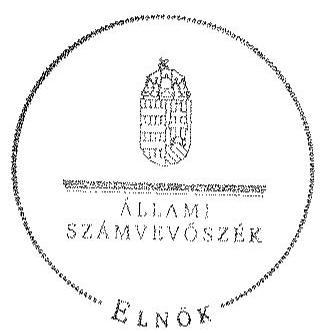

Domokos László
elnök

[^0]
[^0]:    ${ }^{38}$ Vhr. 9. § (3) bekezdés (hatályos 2010. december 31-ig), Vhr. 9. § (5) bekezdés (hatályos 2011. január 1-től)

---

# RÖVIDÍTÉSEK JEGYZÉKE 

## Jogszabályok

| Áfa tv. | Az általános forgalmi adóról szóló 2007. évi CXXVII. törvény |
| :--: | :--: |
| Áht. 1 | Az államháztartásról szóló 1992. évi XXXVIII. törvény (hatálytalan: 2012. január 1-jétől) |
| Áht. 2 | Az államháztartásról szóló 2011. évi CXCV. törvény |
| ÁSZ tv. | Az Állami Számvevőszékről szóló 2011. évi LXVI. törvény |
| Avtv. | A személyes adatok védelméről és a közérdekű adatok nyilvánosságáról szóló 1992. évi LXIII. törvény (hatálytalan: 2012. január 1-jétől) |
| Evt. $_{1}$ | Az erdőről és az erdő védelméről szóló 1996. évi LIV. törvény (hatálytalan: 2009. július 10-től) |
| Evt. $_{2}$ | Az erdőről, az erdő védelméről és az erdőgazdálkodásról szóló 2009. évi XXXVII. törvény (hatályos: 2009. július 10-től) |
| Evr. $_{1}$ | Az erdőről és az erdő védelméről szóló 1996. évi LIV. törvény végrehajtásáról szóló 29/1997. (IV. 30.) FM rendelet (hatálytalan: 2009. november 21-től) |
| Evr. $_{2}$ | Az erdőről, az erdő védelméről és az erdőgazdálkodásról szóló 2009. évi XXXVII. törvény végrehajtásáról szóló 153/2009. (XI. 13.) FVM rendelet (hatályos: 2009. november 21-től) |
| Gt. | A gazdasági társaságokról szóló 2006. évi IV. törvény (hatályos: 2014. március 14-ig) |
| Info. tv. | Az információs önrendelkezési jogról és az információszabadságról szóló 2011. évi CXII. törvény |
| Mfbtv. | A Magyar Fejlesztési Bank Részvénytársaságról szóló 2001. évi XX. törvény |
| Nfatv. | A Nemzeti Földalapról szóló 2010. évi LXXXVII. törvény |
| Nvtv. | A nemzeti vagyonról szóló 2011. évi CXCVI. törvény |
| Ptk. | A Polgári Törvénykönyvről szóló 1959. évi IV. törvény (hatályos: 2014. március 14-ig) |
| Számv. tv. | A számvitelről szóló 2000. évi C. törvény |
| új Ptk. | A Polgári Törvénykönyvről szóló 2013. évi V. törvény |
| Vadvédelmi tv. | A vad védelméről, a vadgazdálkodásról, valamint a vadászatról 1996. évi LV. törvény |
| Vhr. | Az állami vagyonnal való gazdálkodásról szóló 254/2007. (X. 4.) Korm. rendelet |
| Vtv. | Az állami vagyonról szóló 2007. évi CVI. törvény |
| 262/2010. (XI.17.) Korm. rendelet | A Nemzeti Földalapba tartozó földrészletek hasznosításának részletes szabályairól szóló Korm. rendelet |

---

# Egyéb rövidítések 

| áfa | általános forgalmi adó |
| :--: | :--: |
| Alapító Okirat | A TAEG Zrt. mindenkori hatályos Alapító Okirata |
| ÁSZ | Állami Számvevőszék |
| DTÜ | Döntéshozó Testületeinek Ügyrendje |
| EEVR | Egységes Erdészeti Vállalatirányítási Rendszer |
| E Ft. | ezer forint |
| Ellenőrzési Szabályzat | A TAEG Zrt. Ellenőrzési Szabályzata (hatályos 2000. január 1-jétől, módosítva 2008. február 20-án) |
| Erdészeti hatóság | Vas Megyei Kormányhivatal Erdészeti Igazgatóság |
| ESZKI | Roth Gyula Erdészeti és Faipari Szakközépiskola, Sopron |
| FB | Felügyelő bizottság |
| FM | Földművelésügyi Minisztérium |
| Forrás-SQL rendszer | Vagyon-nyilvántartási informatikai rendszer, amelynek feladata volt a vagyonkezelők számára a vagyonkataszter jelentés elkészítésének és adathordozón történő továbbításának biztosítása, valamint a tulajdonosi joggyakorló vagyonkezelésében lévő vagyonelemek elektronikus adatbázisban történő tételes nyilvántartása |
| ha | hektár |
| HM | Honvédelmi Minisztérium |
| INTOSAI | Legfőbb Ellenőrző Intézmények Nemzetközi Szervezete |
| ISSAI | nemzetközi standardok |
| Informatikai biztonsági szabályzat | A TAEG Zrt. Informatikai biztonsági szabályzata |
| Iratkezelési Szabályzat | A TAEG Zrt. mindenkori hatályos iratkezelési szabályzata |
| Informatikai Biztonsági Szabályzat | A TAEG Zrt. Informatikai fejlesztési szabályzata (hatályos 2013. május 27-től) |
| Iratkezelési Szabályzat | A TEAG Zrt. hatályos iratkezelési szabályzata (hatályos 2000. január 1-jétől) |
| KIM | Közigazgatási és Igazságügyi Minisztérium |
| KVI | Kincstári Vagyoni Igazgatóság |
| Leltározási szabályzat | A TAEG Zrt. Leltározási Szabályzata (hatályos 2000. január 1-jétől) |
| M Ft | millió forint |
| MFB Zrt. | Magyar Fejlesztési Bank Zárkörűen Működő Részvénytársaság |
| MNV Zrt. | Magyar Nemzeti Vagyonkezelő Zrt. amely útján az állami vagyon felügyeletéért felelős miniszter 2010. augusztus 31-ig a Magyar Államot megillető tulajdonosi jogokat és kötelezettségeket gyakorolta, 2010. szeptember 1-jétől az a Magyar Államot megillető az Nfatv. hatálya alá nem tartozó tulajdonosi jogokat és kötelezettségeket gyakorolja |
| NFA | Nemzeti Földalapkezelő Szervezet |

---

| NFM | Nemzeti Fejlesztési Minisztérium |
| :--: | :--: |
| NVT | Nemzeti Vagyongazdálkodási Tanács |
| nyt. szám | nyilvántartási szám |
| RJGY | részvényesi jogok gyakorlója |
| ST | saját tőke |
| sz. | számú |
| Számlarend | A TAEG Zrt. számlarendje (hatályos 2009. január 1-jétől) |
| SZMSZ | Szervezeti és Működési Szabályzat (2008. január 1-jétől, 2011. július 1-jétől, 2011. december 15-étől módosításokkal egységes szerkezetben) |
| Társaság | Tanulmányi Erdőgazdaság Zártkörű Részvénytársaság |
| Tulajdonosi joggyakorló $_{1}$ | Magyar Nemzeti Vagyonkezelő Zrt., mint a társaság feletti tulajdonosi joggyakorló 2010. június 16-áig |
| Tulajdonosi joggyakorló $_{2}$ | Magyar Fejlesztési Bank Zrt., mint a társaság feletti tulajdonosi joggyakorló 2010. június 17-től 2014. július 15-ig |
| Tulajdonosi joggyakorló $_{3}$ | FM, mint a társaság feletti tulajdonosi joggyakorló 2014. július 16-tól |
| Vadászati hatóság | Megyei Mezőgazdasági Szakigazgatási Hivatal Földművelésügyi Igazgatóság Vadászati és Halászati Osztály |
| Vadászati közösség | Fertőszentmiklós-Röjtökmuzsaj-Sopronkövesd-Lövő-Nemeskér-Újkér-Pusztacsalád-Csapod-Dénesfa-Iván-Cirák-Répceszemere-Gyóró közigazgatási határt érintő földtulajdonosok vadászati közössége |
| vezérigazgató   VSZ | A TAEG Zrt. vezérigazgatója   A TAEG Zrt. 01840-96-02068 számon a tulajdonosi joggyakorlóval kötött ideiglenes vagyonkezelési szerződése (hatályos 1996. október 15-től) |

---

.

---

# FOGALOMTÁR 

állami vagyon
a) az állam tulajdonában lévő dolog, valamint dolog módjára hasznosítható természeti erő;
b) az a) pont hatálya alá tartozó mindazon vagyon, amely vonatkozásában törvény az állam kizárólagos tulajdonjogát nevesíti;
c) az állam tulajdonában lévő tagsági jogviszonyt megtestesítő értékpapír, illetve az államot megillető egyéb társasági részesedés;
d) az államot megillető olyan immateriális, vagyoni értékkel rendelkező jogosultság, amelyet jogszabály vagyoni értékű jogként nevesít;
e) az állam tulajdonában lévő pénzügyi eszközök.
állami vagyon használója
az állami vagyon használója az a természetes vagy jogi személy, jogi személyiséggel nem rendelkező szervezet, aki, vagy amely törvény vagy szerződés alapján, bármely jogcímen (bérlet, haszonbérlet, használat stb.) állami vagyont birtokol, használ, szedi annak hasznait. (Ide nem értve a haszonélvezőt, a vagyonkezelőt és a tulajdonosi jogok gyakorlóját.)
átlátható szervezet Átlátható szervezet a Nvtv. 3. § (1) bekezdés 1. pontjában felsorolt, a meghatározott követelményeknek megfelelő szervezet.
földbirtok-politikai irányelvek
hasznosítás
immateriális szolgáltatásából származó bevétel
információs és kommunikációs rendszer
Kincstári Vagyoni Igazgatóság

Az állami vagyon használója az a természetes vagy jogi személy, jogi személyiséggel nem rendelkező szervezet, aki, vagy amely törvény vagy szerződés alapján, bármely jogcímen (bérlet, haszonbérlet, használat stb.) állami vagyont birtokol, használ, szedi annak hasznait. (Ide nem értve a haszonélvezőt, a vagyonkezelőt és a tulajdonosi jogok gyakorlóját.)
Átlátható szervezet a Nvtv. 3. § (1) bekezdés 1. pontjában felsorolt, a meghatározott követelményeknek megfelelő szervezet.
Az Nfatv. 15. § (3) bekezdés a)-s) pontjaiban meghatározott, a Nemzeti Földalapba tartozó földrészletek hasznosítására vonatkozó irányelvek.
Hasznosítás a tulajdonosi joggyakorló vagy a nemzeti vagyon használója által a nemzeti vagyon birtoklásának, használatának, hasznok szedése jogának bármely - a tulajdonjog átruházását nem eredményező - jogcímen történő átengedése, ide nem értve a vagyonkezelésbe adást, valamint a haszonélvezeti jog alapítását.
Immateriális szolgáltatásból származó bevételek azok a nem anyagjellegű szolgáltatásokból származó állami bevételek, amelyeket az Evt. 3. § (1) bekezdése szerint, a külön jogszabályban meghatározott részletes feltételek szerint, az erdők fenntartására, gyarapítására és védelmére kell fordítani.
Az információs és kommunikációs rendszer biztosítja, hogy az információk eljussanak az illetékes szervezethez, szervezeti egységhez, illetve személyhez.
A Vtv. 61. § (1) bekezdése értelmében a Kincstári Vagyoni Igazgatóság (a továbbiakban: KVI) 2007. december 31-ei hatállyal megszűnt, jogai és kötelezettségei ezen időponttól - a 66. § (1) bekezdésében megjelölt feladat kivételével - az MNV Zrt.-re szálltak. A KVI 66. § (1) bekezdésben foglalt feladata a kincstárra szállt. A jogok és kötelezettségek
 átszállása nem minősült a KVI által kötött szerződések módosításának.

---

kockázatkezelés
kockázatkezelési rendszer
kontrolling
kontrollkörnyezet
kontrolltevékenységek
közfeladat

A kockázatkezelés a szervezet céljai elérésével kapcsolatos kockázatok azonosításának és elemzésének, valamint a megfelelő válaszok meghatározásának folyamata.
A kockázatkezelési rendszer működtetésé során fel kell mérni és meg kell állapítani a szervezet tevékenységében, gazdálkodásában rejlő kockázatokat, valamint meg kell határozni az egyes kockázatokkal kapcsolatban szükséges intézkedéseket, valamint azok teljesítésének folyamatos nyomon követésének módját. A kockázatkezelési rendszer olyan irányítási eszközök és módszerek összessége, amelynek elemei a szervezeti célok elérését veszélyeztető tényezők (kockázatok) azonosítása, elemzése, nyomon követése, valamint szükség esetén a kockázati kitettség mérséklése.
Az a vezetéstámogató rendszer, amely a vezetői tervezést, ellenőrzést, valamint információ-ellátást koordinálja célorientáltan a környezeti változásokhoz igazodva.
A kontroll környezet elemei: a szervezeti struktúra, a felelősségi, hatásköri viszonyok és feladatok, a szervezet minden szintjén meghatározott etikai elvárások, a humánerőforrás-kezelés. A kontrollkörnyezet alapozza meg a belső kontroll összes többi elemét a fegyelem és a struktúra biztosítása által.
A kontrollrendszer a kockázatok kezelése és tárgyilagos bizonyosság megszerzése érdekében kialakított folyamatrendszer, amely azt a célt szolgálja, hogy megvalósuljanak a következő célok:
a) a működés és a gazdálkodás során a tevékenységeket szabályszerűen, gazdaságosan, hatékonyan, eredményesen hajtsák végre,
b) az elszámolási kötelezettségeket teljesítsék, és
c) megvédjék az erőforrásokat a veszteségektől, károktól és nem rendeltetésszerű használattól.
A kontrolltevékenységek azok az elvek (politikák) és eljárások, amelyeket a kockázatok meghatározása és a szervezet céljainak elérése érdekében alakítanak ki.
A közfeladat jogszabályban meghatározott állami vagy önkormányzati feladat, amit az arra kötelezett közérdekből, jogszabályban meghatározott követelményeknek és feltételeknek megfelelve végez, ideértve a lakosság közszolgáltatásokkal való ellátását, továbbá az állam nemzetközi szerződésekben vállalt kötelezettségeiből adódó közérdekű feladatokat, valamint e feladatok ellátásához szükséges infrastruktúra biztosítását is. Az Etv. 2. § (2) bekezdése szerint a fenntartható erdőgazdálkodás során a legfontosabb közérdekű feladat az erdők változatosságának megőrzése, az erdők fenntartása, felújítása és a védelmi, valamint közjóléti szolgáltatások biztosítása, melyek elvégzését az állam megfelelő eszközökkel biztosítja.

---

monitoring

Nemzeti Földalap
nemzeti vagyon használója
rábízott állami vagyon
társasági portfólió

A szervezet tevékenységének, a célok megvalósításának nyomon követését biztosító rendszer, amely az operatív tevékenységek keretében megvalósuló folyamatos és eseti nyomon követésből, valamint az operatív tevékenységektől függetlenül működő belső ellenőrzésből áll. A monitoring a projektek és programok végrehajtásának nyomon követése, mely a támogató és a kedvezményezett közti megállapodásban foglalt eljárások követését, az előrehaladás ellenőrzését és a lehetséges problémák időben történő azonosítását szolgálja.
A Nemzeti Földalap a kincstári vagyon része, amelybe beletartoznak az állam tulajdonában és az ingatlan-nyilvántartásban levő, az Nfatv. 1. § (1)-(2) bekezdéseiben felsorolt területek, földrészletek és az azokhoz kapcsolódó vagyoni értékű jogok.
Az Nfatv. 15. § (1) ${ }^{1}$, valamint 1. § (1) ${ }^{2}$ bekezdése értelmében 2010. szeptember 1-jétől az erdőgazdasági társaság vagyonkezelésében lévő földterületek a Nemzeti Földalapba tartoznak, azok felett a tulajdonos jogait az agrárpolitikáért felelős miniszter az NFA útján gyakorolja.
A nemzeti vagyon használója az a természetes személy, jogi személy vagy jogi személyiséggel nem rendelkező szervezet, aki, vagy amely állami vagyon tekintetében törvény vagy szerződés alapján, a helyi önkormányzat vagyona tekintetében törvény, a helyi önkormányzat rendelete vagy szerződés alapján bármely jogcímen nemzeti vagyont birtokol, használ, szedi annak hasznait, kivéve a tulajdonosi joggyakorló (az Nvtv. 3. § (1) bekezdés 11. pontja alapján).
Rábízott állami vagyon az a Vtv. alkalmazásában állami vagyonnak minősülő vagyon, amit az MNV - a saját vagyonától elkülönítetten - kezel és nyilvántart. Az Mfbtv. 3. § (9) bekezdése szerint rábízott állami vagyon az a vagyon, amely felett az Mfbtv. erejénél fogva a Magyar Állam nevében az MFB gyakorolja a tulajdonosi jogokat. Az Nfatv. 1. § (1) bekezdésében foglaltak alapján az NFA-hoz tartozó rábízott vagyon a törvényben meghatározott, a Nemzeti Földalapba tartozó vagyon.
Társasági portfólió az MNV, illetve az MFB rábízott vagyonába tartozó állami tulajdonú társasági részesedések.

[^0]
[^0]:    ${ }^{1}$ Hatályos: 2010. szeptember 1 - 2011. július 31.
    ${ }^{2}$ Hatályos: 2010. szeptember-jétől, módosítva: 2011. augusztus 1-jétől.

---

tulajdonosi ellenőrzés
tulajdonosi joggyakorló
tulajdonosi joggyakorlás módja
vagyongazdálkodás feladata
vagyonkezelői jog

Az MNV/MFB/FM tulajdonosi joggyakorló által végzett ellenőrzés, amelynek célja az állami vagyonnal való gazdálkodás vizsgálata, ennek keretében a rendeltetésellenes, jogszerűtlen, szerződésellenes, vagy a tulajdonos érdekeit sértő, illetve a központi költségvetést hátrányosan érintő vagyongazdálkodási intézkedések feltárása és a jogszerű állapot helyreállítása, továbbá a vagyonnyilvántartás hitelességének, teljességének és helyességének biztosítása.
Tulajdonosi joggyakorló az, aki az állami, illetve a nemzeti vagyon felett az államot megillető tulajdonosi jogok és kötelezettségek gyakorlására jogosult.
Az állami vagyon felett a Magyar Államot megillető tulajdonosi jogoknak (és kötelezettségeknek) az összességét az állami vagyon felügyeletéért felelős miniszter gyakorolja, aki e feladatát az MNV, az MFB útján látja el. Azon állami tulajdonban álló ingatlanok felett, amelyek egy része a Nemzeti Földalapba tartozik, a tulajdonosi jogokat a miniszter az agrárpolitikáért felelős miniszterrel közösen gyakorolja. A Nemzeti Földalap felett a Magyar Állam nevében a tulajdonosi jogokat és kötelezettségeket az agrárpolitikáért felelős miniszter a Nemzeti Földalapkezelő Szervezet útján gyakorolja.
Az állami vagyon rendeltetésének megfelelő - az állami feladatok ellátásához, a társadalmi szükségletek kielégítéséhez, valamint a Kormány gazdaságpolitikája megvalósításának elősegítéséhez szükséges, egységes elveken alapuló, önálló ágazatként megjelenő - hatékony, költségtakarékos, értékmegőrző, értéknövelő felhasználásának biztosítása, beleértve a vagyoni kör változását eredményező értékesítést, valamint az állami vagyon gyarapítása is.
Vagyonkezelési szerződés alapján a vagyonkezelő jogosult meghatározott, állami tulajdonba tartozó dolog birtoklására, használatára és hasznai szedésére. A Vtv. alapján a vagyonkezelői jog az állami vagyon hasznosítására az MNV-vel kötött vagyonkezelési szerződéssel jön létre. A vagyonkezelési szerződés alapján a vagyonkezelő jogosult meghatározott, állami tulajdonba tartozó dolog birtoklására, használatára és hasznai szedésére. Az Nfatv. alapján a vagyonkezelői jog az erre irányuló (NFA-val kötött) szerződéssel jön létre. A vagyonkezelői szerződés alapján a vagyonkezelő jogosult meghatározott földrészlet birtoklására, használatára és hasznai szedésére. A vagyonkezelő köteles a földrészlet értékét megőrizni, állagának megóvásáról, jó karban tartásáról gondoskodni, továbbá - az Nfatv.-ben meghatározott esetek kivételével - díjat fizetni vagy a szerződésben előírt más kötelezettséget teljesíteni.

---

A TAEG Zrt. vagyonváltozásának alakulása a 2009-2014. évek közötti időszakban - Eszközök (M ft)
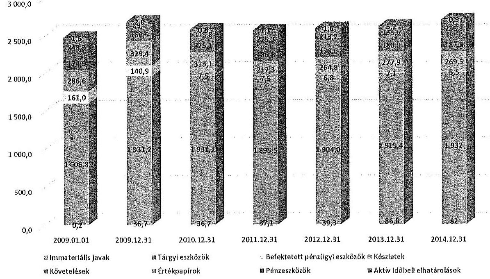

A TAEG Zrt. vagyonváltozásának alakulása a 2009-2014. évek közötti időszakban - Források (M ft)
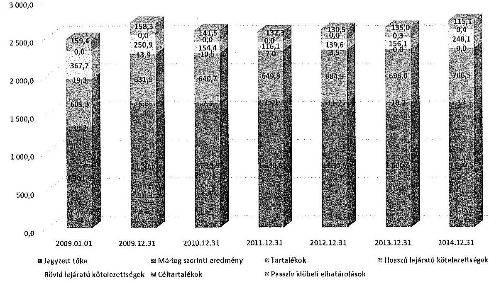

---

### Az erdőgazdasági társaság vagyonának alakulása 2009-2014. években

|  Sor-
szám | Megnevezés | 2009.01.01 | 2009.12.31 | 2010.12.31 | 2011.12.31 | 2012.12.31 | 2013.12.31 | 2014.12.31 | 2014.12.31/2009.12.3
1. (%)  |
| --- | --- | --- | --- | --- | --- | --- | --- | --- | --- |
|   |  | 1 | 2 | 3 | 4 | 5 | 6 | 7 | 8  |
|  1. | Eszközök |  |  |  |  |  |  |  |   |
|  2. | Befektetett eszközök összesen | 1 768 113 | 2 108 793 | 1 975 391 | 1 940 181 | 1 950 003 | 2 009 288 | 2 019 430 | 96%  |
|  3. | Ebből: Immateriális javak | 231 | 36 709 | 36 739 | 37 126 | 39 257 | 86 761 | 81 986 | 223%  |
|  4. | Tárgyi eszközök | 1 606 844 | 1 931 196 | 1 931 104 | 1 895 509 | 1 903 994 | 1 915 445 | 1 931 983 | 100%  |
|  5. | Befektetett pénzügyi eszközök | 161 038 | 140 888 | 7 348 | 7 546 | 6 752 | 7 082 | 5 461 | 4%  |
|  6. | Forgóeszközök | 709 849 | 580 935 | 608 929 | 629 359 | 648 551 | 613 554 | 693 518 | 119%  |
|  7. | Ebből: Készletek | 286 629 | 329 430 | 315 054 | 217 276 | 264 754 | 277 902 | 269 452 | 82%  |
|  8. | Követelések | 174 944 | 166 452 | 175 065 | 186 775 | 170 560 | 180 049 | 187 604 | 113%  |
|  9. | Értékpapírok | 0 | 0 | 0 | 0 | 0 | 0 | 0 | 0  |
|  10. | Pénzeszközök | 248 276 | 85 053 | 118 810 | 225 308 | 213 237 | 155 603 | 236 462 | 278%  |
|  11. | Aktív időbeli elhatárolások | 1 565 | 1 974 | 759 | 1 137 | 1 566 | 5 240 | 930 | 47%  |
|  12. | Eszközök összesen | 2 479 527 | 2 691 702 | 2 585 079 | 2 570 677 | 2 600 120 | 2 628 082 | 2 713 878 | 101%  |
|  13. | Források |  |  |  |  |  |  |  |   |
|  14. | Saját tőke | 1 933 020 | 2 268 589 | 2 278 640 | 2 315 313 | 2 326 496 | 2 336 657 | 2 350 281 | 104%  |
|  15. | Ebből: Jegyzett tőke | 1 301 500 | 1 630 450 | 1 630 450 | 1 630 450 | 1 630 450 | 1 630 450 | 1 630 450 | 100%  |
|  16. | Tőketartalék | 499 710 | 499 710 | 499 710 | 501 324 | 501 324 | 501 324 | 501 664 | 100%  |
|  17. | Eredmény/artalék | 101 614 | 131 810 | 138 429 | 140 891 | 180 990 | 192 133 | 195 394 | 148%  |
|  18. | Lekötött tartalék | 0 | 0 | 2 589 | 7 589 | 2 589 | 2 589 | 9 489 |   |
|  19. | Értékelési tartalék | 0 | 0 | 0 | 0 | 0 | 0 | 0 |   |
|  20. | Mérleg szerinti eredmény | 30 196 | 6 619 | 7 463 | 35 059 | 11 183 | 10 161 | 13 284 | 201%  |
|  21.

 | Céltartalékok | 0 | 0 | 0 | 0 | 0 | 309 | 385 |   |
|  22. | Kötelezettségek | 387 062 | 264 862 | 164 899 | 123 099 | 143 086 | 156 072 | 248 100 | 94%  |
|  23. | Ebből: Hátrasorolt kötelezettségek | 0 | 0 | 0 | 0 | 0 | 0 | 0 |   |
|  24. | Hosszú lejáratú kötelezettségek | 19 347 | 13 940 | 10 455 | 6 970 | 3 483 | 0 | 0 | 0%  |
|  25. | Rövid lejáratú kötelezettségek | 367 715 | 250 922 | 154 444 | 116 129 | 139 601 | 156 072 | 248 100 | 99%  |
|  26. | Hosszú időbeli elhatárolások | 159 445 | 158 251 | 141 540 | 132 265 | 130 538 | 135 044 | 115 112 | 73%  |
|  27. | Források összesen | 2 479 527 | 2 691 702 | 2 585 079 | 2 570 677 | 2 600 120 | 2 628 082 | 2 713 878 | 101%  |

---

A befektetett eszközállomány alakulása

|  Kert | MEGNEVEZÉS | 2004. év |  | 2005. év |  | 2006. év |  | 2007. év |  | 2008. év |  | 2009. év |  | 2010. év |  | 2011. év |  | 2012. év |   |
| --- | --- | --- | --- | --- | --- | --- | --- | --- | --- | --- | --- | --- | --- | --- | --- | --- | --- | --- | --- |
|   |  | Összesen |  |  |  | Összesen |  |  |  |  |  |  |  |  |  |  |  |  |   |
|   |  |  |  |  |  |  |  |  |  |  |  |  |  |  |  |  |  |  |   |
|   |  |  |  |  |  |  |  |  |  |  |  |  |  |  |  |  |  |  |   |
|  1. | Nyitó állomány | 1 447 874 |  | 1 447 874 |  | 1 447 890 |  | 1 447 860 |  | 1 447 860 |  | 1 447 860 |  | 1 447 874 |  | 1 447 874 |  | 1 447 860 |   |
|  2. | Terv szerinti értékcsökkenés | 200 452 |  | 200 452 |  | 112 000 |  | 110 330 |  | 110 330 |  | 117 230 |  | 117 230 |  | 110 330 |  | 110 330 |   |
|  3. | Terven felüli értékcsökkenés | 0 |  | 0 |  | 0 |  | 0 |  | 0 |  | 0 |  | 0 |  | 0 |  | 0 |   |
|  4. | Összesen | 0 |  | 0 |  | 0 |  | 0 |  | 0 |  | 0 |  | 0 |  | 0 |  | 0 |   |
|  5. | Összesen | 210 |  | 210 |  | 4 213 |  | 1 078 |  | 4 207 |  | 4 207 |  | 836 |  | 836 |  | 2 802 |   |
|  6. | Összesen | 120 |  | 120 |  | 1 778 |  | 1 778 |  | 4 682 |  | 780 |  | 780 |  | 802 |  | 1 055 |   |
|  7. | Áthatalálás | 0 |  | 0 |  | 0 |  | 0 |  | 0 |  | 0 |  | 0 |  | 0 |  | 0 |   |
|  8. | Sürgősségi javítás | 0 |  | 0 |  | 0 |  | 0 |  | 0 |  | 1 230 |  | 1 230 |  | 0 |  | 0 |   |
|  9. | Egyéb | 0 |  | 0 |  | 0 |  | 0 |  | 0 |  | 0 |  | 0 |  | 0 |  | 1 237 |   |
|  10. | Gépbeszerzés összesen | 217 867 |  | 217 867 |  | 158 213 |  | 158 213 |  | 155 881 |  | 155 881 |  | 155 881 |  | 156 278 |  | 156 278 |   |
|  11. | Terv szerinti leírás | 0 |  | 0 |  | 0 |  | 0 |  | 0 |  | 0 |  | 0 |  | 0 |  | 0 |   |
|  12. | Terv szerinti felújítás | 0 |  | 0 |  | 0 |  | 0 |  | 0 |  | 0 |  | 0 |  | 0 |  | 0 |   |
|  13. | Terv szerinti növekedés | 0 |  | 0 |  | 0 |  | 0 |  | 0 |  | 0 |  | 0 |  | 0 |  | 0 |   |
|  14. | Egyéb beruházások | 478 497 |  | 478 497 |  | 178 221 |  | 178 221 |  | 88 422 |  | 88 422 |  | 136 542 |  | 175 129 |  | 174 178 |   |
|  15. | Egyéb felújítás | 0 |  | 0 |  | 0 |  | 0 |  | 0 |  | 0 |  | 0 |  | 0 |  | 0 |   |
|  16. | Feszterelés | 0 |  | 0 |  | 0 |  | 0 |  | 0 |  | 0 |  | 0 |  | 0 |  | 0 |   |
|  17. | Hivatal | 0 |  | 0 |  | 0 |  | 0 |  | 0 |  | 0 |  | 0 |  | 0 |  | 0 |   |
|  18. | Összesen | 0 |  | 0 |  | 0 |  | 0 |  | 0 |  | 0 |  | 0 |  | 0 |  | 0 |   |
|  19. | Összesen | 0 |  | 0 |  | 0 |  | 0 |  | 0 |  | 0 |  | 0 |  | 0 |  | 0 |   |
|  20. | Egyéb | 0 |  | 0 |  | 0 |  | 0 |  | 0 |  | 0 |  | 0 |  | 0 |  | 0 |   |
|  21. | Terven felüli növekedés | 478 497 |  | 478 497 |  | 178 221 |  | 178 221 |  | 88 473 |  | 88 473 |  | 136 542 |  | 175 129 |  | 174 178 |   |
|  22. | Növekedés összesen | 478 497 |  | 478 497 |  | 178 221 |  | 178 221 |  | 88 473 |  | 88 473 |  | 136 542 |  | 175 129 |  | 174 178 |   |
|  23. | Záró állomány | 1 947 982 |  | 1 947 982 |  | 1 947 862 |  | 1 947 862 |  | 1 932 422 |  | 1 932 422 |  | 1 942 221 |  | 1 942 221 |  | 1 932 356 |   |

---

.

---

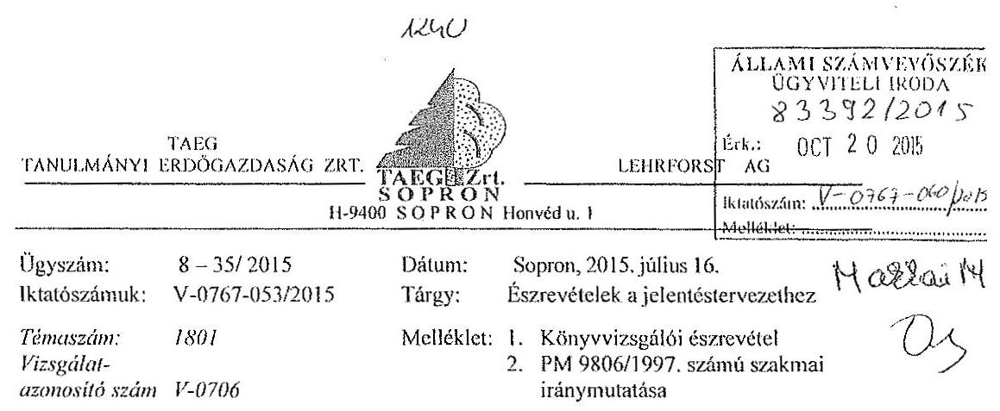

Állami Számvevőszék
Domokos László részére
elnök

Budapest
Apáczai Csere J. u. 10.
H-1052

Tisztelt Domokos László Úr!
„Az állami tulajdonban álló erdőgazdasági társaságok vagyongazdálkodási tevékenységének ellenőrzése - TAEG Tanulmányi Erdőgazdaság Zrt." címmel készített számvevőszéki jelentéstervezethez az alábbi észrevételeket füzzük:
8. oldal megállapítás: „Az ellenőrzött időszak éveiben a könyvvizsgáló nem kifogásolta, hogy a Társaság a mérlegeiben a vagyonkezelt eszközöket nem szerepeltette, minden évben a beszámolót hitelesítő záradékkal látta el."

Észrevétel: A könyvvizsgáló észrevételét az 1. számú mellékletben és annak mellékletét a 2. számú mellékletben csatoljuk. A könyvvizsgáló észrevételében a következő nyilatkozatot tette: „A független könyvvizsgálói jelentésem szerinti véleményemet (záradékot) fenntartom. Az a véleményem, hogy a Részvénytársaság éves beszámolói a

 vagyoni és pénzügyi helyzetről, a működés eredményéről megbízható és valós képet mutat."
20. oldal megállapítás: „A Társaság a kezelt földterületeket nyilvántartásában érték nélkül szerepeltette, mérlegében a Számv. tv. 23. § (2) valamint 42. § (5) bekezdésében foglalt előírások ellenére a kezelésbe vett földterületek eszközként a hosszú lejáratú kötelezettségekkel szemben nem jelenítette meg, ezáltal a Társaság mérlege nem a valós állapotot tükrözte."

Észrevétel: A Társaság mérlegének összeállítása, vagyoni helyzetének megállapítása során a VSZ szerint járt el. A VSZ megkötésekor a kezelésbe vett földterületek értékmeghatározásának hiánya már fennállt. A Társaság akkori tulajdonosi joggyakorlója a Pénzügyminisztériumhoz fordult a kérdés tisztázása érdekében. A PM 9806/1997. számú válaszában (2. számú melléklet) rögzíti: A számviteli törvényben „megfogalmazott előírás feltételezi, hogy a kezelt kincstári vagyon megfelelő módon, dokumentáltan értékelésre kerül, hiszen csak ez esetben lehet azt az eszközök és kötelezettségek között értékkel kimutatni.

H-9401 SOPRON PF. 97 Tel: +36/99/506-810 Fax:+36/99/312-083 E-mail:takacs.tibor@taegrt.hu

---

Ebből - természetesen - az is következik, amíg megfelelő értékelés nem áll rendelkezésre, vagy az adott kincstári vagyont nem lehet - természeténél fogva - értékelni, addig és akkor nem lehet / nem tudjuk alkalmazni a törvény hivatkozott ..... rendelkezését sem."
Vélelmezzük, hogy a tulajdonosi joggyakorló a VSZ megkötésekor, az erdő érték nélküli vagyonkezelésbe adásánál mérlegelte az erdőgazdálkodás szakmai sajátosságait, az eszközök és kötelezettségek értéken történő kimutatásából eredő torz üzleti megítélés és ebből eredő kedvezőtlen vagyoni helyzetbeli megítélés következményeit.
Az erdővagyon értéknek esetleges megállapítását követően a Társaság vagyona nem változik, kizárólag az eszköz és forrás oldalon várható egyező mértékben jelentős növekedés.
A kezelt erdővagyon után értékcsökkenés nem számolható el, ezáltal az eredménykimutatásban nem történik változás az esetleges felértékelést követően. Így a gazdálkodás jövedelmezőségét nem befolyásolja sem a 0 forinton történt nyilvántartás, sem az esetlegesen magasabb értéken történő nyilvántartás. Ugyan ez mondható el a pénzügyi helyzetre is.
Mind a Társaság, mind a Társaság könyvvizsgálója e megállapítások szerint járt el. A Társaság beszámolói megbízható, valós képet mutatnak a vagyoni, jövedelmezőségi és pénzügyi helyzetről.

Ismereteink szerint Magyarországon jelenleg nincs elfogadott, egységes elvek szerint működő erdőérték-számítási módszer. A jelenleg ismert erdőérték-számítási módszerek hibahatára legalább 10-15 %. Már a lábon álló élőfa készlet naturális mennyiségi becslése is általában közel 10 százalék hibahatárú, amelynek választékszerkezete és piaci értéke a bizonytalanságot tovább növeli. Az Evt. ¹,² 8. §-a alapján a vagyonkezelésbe vett területek gyakorlatilag forgalomképtelenek, így piaci összehasonlító ár nem áll rendelkezésre az erdőérték megállapításához. Összességében a vagyonkezelésbe vett földterületek értékbecslésének pontatlansága jóval meghaladhatja a Társaság mérlegfőösszegét. Elfogadott értékbecslés módszertan hiányában a kezelt erdővagyon értékének meghatározása és a Társaság könyveiben történő nyilvántartása aggályos. Az Nvtv. 10.§ (1) bekezdése - „A nemzeti vagyont, annak értékét és változásait a tulajdonosi joggyakorló nyilvántartja. Az érték nyilvántartásától el lehet tekinteni, ha az adott vagyontárgy értéke természeténél, jellegénél fogva nem állapítható meg." - megteremti annak lehetőségét, hogy az érték nyilvántartástól a tulajdonosi joggyakorló eltekintsen.
19.oldal megállapítás: „A Társaság által vezetett nyilvántartás nem volt átlátható, nem biztosította az elszámolhatóságot, mivel nem felelt meg a Vhr. 17.§ (1) bekezdésében foglaltaknak, mert tételesen nem tartalmazta a vagyonkezelt eszközök könyv szerinti bruttó és nettó értékét, valamint az értékben bekövetkezett egyéb változásokat."

Észrevételt: A Társaság által vezetett nyilvántartás átlátható és biztosítja az elszámolhatóságot, mert a VSZ alapján naturáliában tételesen tartalmazza a vagyonkezelésbe vett földterületeket (ezek kizárólag erdő és az erdőgazdálkodási tevékenységet közvetlenül szolgáló földterületek) és azok változását. Az előző megállapításhoz tett észrevételünkben már részleteztük az erdőérték meghatározása körüli anomáliákat. Felhívjuk a figyelmet, hogy a Vhr. 13.§ (2) bekezdése ugyancsak lehetővé teszi az Nvtv. 10.§ (1) bekezdése szerinti érték nélküli nyilvántartást.
7.oldal megállapítás: „A felek nem tettek eleget a Vhr. előírásának, mert a Vhr. hatálybalépését követő hat hónapon belül nem kezdeményezték a nemzeti Földalapba tartozó ingatlanokra vonatkozóan a VSZ megszüntetését és a jogszabályoknak megfelelő szerződés megkötését."

---

Észrevételt: Megítélésünk szerint a Vhr. 54.§ (7) bekezdésében foglaltak szerint a Vhr. hatálybalépését követő 6 hónapon belül a VSZ megszüntetésének és a Vtv., illetve a Vhr. szabályainak megfelelő szerződés kötésének a kezdeményezése nem Társasági feladat. A vagyonkezelői szerződés megkötésére több alkalommal történt kísérlet. A Társaság minden esetben teljes mértékben együttműködött a szerződés előkészítésében a tulajdonosi joggyakorlókkal.
28.oldal megállapítás: „....azonban a közérdekű adatok nyilvánosságra hozatala nem felelt meg teljes mértékben a jogszabályi előírásoknak. A Társaság a Vtv. 5.§ (2) bekezdése alapján közfeladatot ellátó szervnek minősül, azonban az Avtv. 20.§(8) ³³ bekezdésében, illetve az Info tv. 30.§(6) ³⁴ bekezdésében rögzített, a közérdekű adatok megismerésére irányuló igények rendjét nem szabályozta"
2.számú melléklet megállapítás: közfeladat: „....Az Etv. 2.§ (2) bekezdése szerint a fenntartható erdőgazdálkodás során a legfontosabb közérdekű feladat az erdők változatosságának megőrzése, az erdők fenntartása, felújítása és a védelmi, valamint közjóléti szolgáltatások biztosítása, melyek elvégzését az állam megfelelő eszközökkel biztosítja."

Észrevétel: A Társaság a Vtv. 5.§ (2) bekezdése alapján nem minősül közfeladatot ellátó szervnek, ugyanis a Társaság egy gazdálkodó szervezet (gazdasági társaság) és nem szerv (költségvetési szerv). A Társaság közzétételi kötelezettségének a 2009. évi CXXII. törvény rendelkezéseinek megfelelően teljes körűen eleget tett.
A Társaság nem minősül közfeladatot ellátónak, hiszen a vizsgálati időszakban nem látott el állami vagy önkormányzati feladatot, ilyen feladatellátást jogszabály nem határozott meg számára. Ha a társaság közfeladatot ellátást nem végzett, akkor közérdekű adat sem keletkezhetett nála, aminek megismeréséről szabályzatot kellett volna alkotnia.
Az Etv. 2.§ (2) bekezdése az ún. tartamos erdőgazdálkodás követelménye, melyet az Etv. elvi jelleggel határoz meg az alapelvei között. Az Etv. szerinti közérdekű feladat nem az Nvt. szerinti közfeladat, hanem egy olyan alapelv, melynek érvényesülését maga az erdőtörvény és az ahhoz kapcsolódó jogszabályok szolgálják. A közfeladat meghatározásától elhatárolandóak azok a jogszabályi rendelkezések, amelyek elvi jelleggel adnak iránymutatást egyes közérdekű feladattal kapcsolatos további jogi szabályozás illetve egyéb jövőbeni (hatósági) rendelkezés tárgyában.
28.oldal megállapítás: „Az Alapító Okirat 2010. július 13-ig az Igazgatóság, 2010. július 13-tól a Vezérigazgató részére írt elő a Társaság ügyvezetésére, vagyoni helyzetére és üzletpolitikájára vonatkozóan jelentéskészítési kötelezettséget. Az igazgatóság a 2009. évi negyedéves jelentéseket nem készítette el, ezzel a mulasztással megsértette az Alapító Okirat 13.3 pont i) alpontját. Az FB - a 2009. évi és a 2010. évi I. negyedéves jelentés kivételével - a jelentéseket megtárgyalta és határozatokkal hagyta jóvá!"

Észrevétel: Az igazgatóság a 2009. évi negyedéves jelentéseket elkészítette. A jelentéseket a 2009.11.19.-i összevont igazgatósági és felügyelő bizottsági ülésén megtárgyalta. A 2009.I. negyedévi jelentést lásd a 6_28_1 hivatkozási név alatt feltöltött „2009. március jelentés.pdf" fájlban. A 2009.I-II. negyedévi és a 2009. I-III. negyedévi jelentéseket nem töltöttük fel, de az ezeket tárgyaló felügyelő bizottsági ülés jegyzőkönyve feltöltésre került (lásd: 6_28_1 hivatkozási név alatt feltöltött „FB-jegyzőkönyv_I-II és I-III negyedév értékelés 2009.pdf" fájlban), valamint utólag 2015. október 13.-án az igazgatósági ülés jegyzőkönyvét is feltöltöttük (lásd: Ig-jegyzőkönyv-20091119.pdf fájl).

---

A felügyelő bizottság a 2009. évi jelentést (éves beszámoló) a 2010.04.02. ülésén, 4/2010. (IV.02.) számú határozatában elfogadta (lásd: feltöltve a „2_1_23_FBhatarozatok_20100402.pdf" fájlban). A felügyelő bizottság a 2010. I. negyedévről készített jelentést a 2010. I-II. negyedévi jelentéssel együtt tárgyalta 2010.10.13-án. Ennek az volt az oka, hogy 2010. évben változott a tulajdonosi joggyakorló személye és a testületek összetétele. A kapcsolódó felügyelő bizottsági határozatot lásd a 6_28_2 hivatkozási néven feltöltött „2010 1-2_negyedévének értékelése-FB-jegyzőkönyv.pdf" mappában.
21.oldal megállapítás: A 262/2010. (XI.17.) Korm. rendelet ²⁶ 50/A.§ (2) bekezdésében foglalt előírás ellenére a 2010-2014. évekre az NFA részére külön adatszolgáltatás nem történt.

Észrevétel: A társaság a 2010-2014. évekre az NFA részére is teljesítette az adatszolgáltatást. Az NFA részére nyújtott adatszolgáltatásról szóló dokumentumok feltöltésre kerültek a „7_03_05" hivatkozási név alatt a „7_03_05_NFA_adatszolgáltatás_2014.zip" mappában.
24.oldal megállapítás: „A Társaság vadgazdálkodásból származó bevételei elszámolásánál több esetben csak idegen nyelven készített szerződés, kiállított számla állt rendelkezésre. A bevételek idegen nyelvű számviteli bizonylatokkal történő elszámolása sérti a Számv. tv. 166.§ (3) bekezdését, miszerint a számviteli bizonylatot magyar nyelven kell kiállítani."

Észrevétel: A Társaság számviteli bizonylatokkal kapcsolatos gyakorlata nem sérti a Számv. tv.-t. A Számv. tv. 166.§ (4) bekezdése szerint a számviteli bizonylatot a (3) bekezdéstől eltérően idegen nyelven is ki lehet állítani, ha a gazdasági esemény jellemzői az eltérést indokolják. Az idegen nyelven kibocsátott bizonylaton azokat az adatokat, amelyek a bizonylat hitelességéhez, a megbízható, valóságnak megfelelő adatrögzítéshez, könyveléshez szükségesek, magyarul is fel kell tüntetni.
Az adatrögzítés, a könyvelés alapbizonylata a számla. A 2007. évi CXXVII. tv. az általános forgalmi adóról 178.§ (2) bekezdése alapján számla magyar vagy élő idegen nyelven is kiállítható.
2009. évben a Társaság által használt FénySoft ügyviteli rendszer csak részben volt integrált, a vadászati számlák egy külön számlázó programmal készültek EUR-ban német nyelven. Ezekről a számlákról a főkönyvi könyvelés érdekében az aktuális árfolyammal való forintosításkor magyar nyelvű számviteli bizonylat készült, amely a főkönyvi könyvelés alapbizonylata volt.
2010-2012. években egy új integrált ügyviteli vállalatirányítási rendszer (Infosys / IBSystem) került bevezetésre. Ebben a rendszerben a cikkszámok határozták meg az adott számla tételcímét. A cikkszámok paraméterezése vezérelte a könyvelést. A cikkszámokhoz tartozó megnevezések magyar nyelvűek - a rendszer kezelőfelületén is magyarul jelenik meg minden kiszámlázott tétel -, melyekhez német nyelvű megfeleltetések, fordítások tartoznak. Külföldi partner esetén a nyomtatáskor volt kérhető, hogy a számla milyen nyelven kerüljön kiállításra. A számla kinyomtatott képe volt idegen nyelvű, a magyar nyelvű nem került kinyomtatásra, azt a rendszer tárolta. Az adatrögzítéshez így magyarul is rendelkezésre álltak a szükséges információk.
2013. január 1-től a LIBRA3s integrált vállalatirányítási rendszer került bevezetésre, melynek köszönhetően a 2013. és 2014. években kiállított számlákon már két nyelven (magyarul és németül) jelennek meg a tételek, tehát a számviteli törvény adatrögzítéshez kapcsolódó kívánalmai teljesülnek.

---

25. oldal megállapítás: „A Társaság az éves vadgazdálkodási tervét a vadászati tv. 47.§ (1) bekezdése alapján minden évben elkészítette, azonban a vadgazdálkodási terv elkészítésének a határidejét, mely a fenti jogszabályhely alapján minden tárgyév február 15. napja, nem tartotta be, azokat a határidőt követően, késve készítette el."

Észrevétel: A Társaság a vadgazdálkodási terv elkészítésének határidejét minden évben betartotta. A hatóság minden évben a Vadászati tv. 47.§ (1) bekezdésében foglaltak szerint bekérte a vadgazdálkodási tervet, beköldési határidő megállapítása mellett. E határidők a vizsgált évek esetében az adott év március 2. és 5. napja között kerültek kitűzésre. Társaságunk a hatóság által megállapított határidőn belül megküldte a vadgazdálkodási terveket. A hatósági levelezést 2015. október 15. napján feltöltöttük (2_9_45.pd1) az ÁSZ rendszerébe.

Sopron, 2015. október 15.

T&EG Tanulmányi Erdőgazdaság
Zárbárónn Műbútor Részvénytársaság
Sopron-
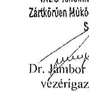

---

.

---

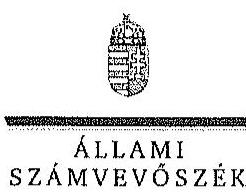

ELKÖK

Ikt.szám: V-0767-064/2015.

Dr. Jámbor
 László úr
vezérigazgató
TAEG Tanulmányi Erdőgazdaság Zrt.

# Sopron 

## Tisztelt Vezérigazgató Úr!

A „Jelentéstervezet az állami tulajdonban álló erdőgazdasági társaságok vagyongazdálkodási tevékenységének ellenőrzése - TAEG Tanulmányi Erdőgazdaság Zrt." címmel készített számvevőszéki jelentéstervezetre tett észrevételeit köszönettel megkaptam.

Az Állami Számvevőszék észrevételekre vonatkozó álláspontjáról a felügyeleti vezető által készített részletes tájékoztatást csatoltan megküldöm.

Tájékoztatom Vezérigazgató urat, hogy a számvevőszéki jelentésben - az Állami Számvevőszékről szóló 2011. évi LXVI. törvény 29. § (3) bekezdése alapján - a figyelembe nem vett észrevételeket szerepeltetjük az elutasítás indokának feltüntetésével.

Budapest, 2015. 11. hó 12. nap
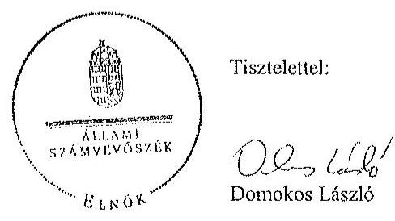

Melléklet: Tájékoztatás az elfogadott és el nem fogadott észrevételekről

---

# Tájékoztatás   az elfogadott és el nem fogadott észrevételekről 

A „Jelentéstervezet az állami tulajdonban álló erdőgazdasági társaságok vagyongazdálkodási tevékenységének ellenőrzése - TAEG Tanulmányi Erdőgazdaság Zrt." című jelentéstervezetre 2015. október 20-án érkezett észrevételeit áttekintettük, azok kezelésével kapcsolatban a következő tájékoztatást adom.

1. észrevétel - 8. oldal megállapítás: „Az ellenőrzött időszak éveiben a könyvvizsgáló nem kifogásolta, hogy a Társaság a mérlegeiben a vagyonkezelt eszközöket nem szerepeltette, minden évben a beszámolót hitelesítő záradékkal látta el."

A Számv. tv. 23. § (2) bekezdése alapján a vagyonkezelőnél a mérlegben eszközként kell kimutatni a - törvényi rendelkezés, illetve felhatalmazás alapján - kezelésbe vett, az állami vagy önkormányzati vagyon részét képező eszközöket is. A Társaság mérlege nem tartalmazta a vagyonkezelt eszközök értékét, ezt a könyvvizsgáló nem kifogásolta. Megállapításunk helytálló, módosítása nem indokolt.
2. észrevétel - 20. oldal megállapítás: „A Társaság a kezelt földterületeket nyilvántartásában érték nélkül szerepeltette, mérlegében, a Számv. tv. 23. § (2) valamint 42. § (5) bekezdésében foglalt előírások ellenére a kezelésbe vett földterületeket eszközként a hosszú lejáratú kötelezettségekkel szemben nem jelenítette meg, ezáltal a Társaság mérlege nem a valós állapotot tükrözte."

Az erdőterületek értékének megállapítására vonatkozó tájékoztatásukat köszönettel vettük. A Vhr. 9. §-a alapján a vagyonkezelő köteles a vagyonkezelésbe vett eszközöket a Számv. tv. szerint a hosszú lejáratú kötelezettségekkel szemben a vagyonkezelési szerződésben rögzített értéken állományba venni. A Számv. tv. 23. § (2) bekezdése előírja, hogy a vagyonkezelőnél a mérlegben eszközként kell kimutatni a - törvényi rendelkezés, illetve felhatalmazás alapján - kezelésbe vett, az állami vagy önkormányzati vagyon részét képező eszközöket is. Ezen eszközöket a kiegészítő mellékletben - legalább mérlegtételek szerinti megbontásban - külön be kell mutatni. Az ideiglenes vagyonkezelési szerződésben a vagyonkezelésbe adott vagyon értékét nem rögzítették, a szerződés azt sem tartalmazta, hogy a vagyonkezelt eszközök értéke nulla, továbbá nincs utalás arra sem, hogy a vagyonkezelésbe adott vagyon értékét azért nem határozták meg a szerződésben, mert az a vagyontárgy természeténél, jellegénél fogva nem állapítható meg. A Társaság a Számv. tv. és a Vhr. előírásainak betartása céljából nem tett lépéseket annak érdekében, hogy a vagyonkezelt eszközök értéke a vagyonkezelési szerződésben rögzítésre kerüljön. A Társaság mérlegében a kezelt erdővagyon értékének bemutatása az

---

eszközök és a kötelezettségek növekedését, vagyis vagyonváltozást jelentett volna. A fentiek alapján a megállapítás módosítása nem indokolt.
3. észrevétel - 19. oldal megállapítás: „A Társaság által vezetett nyilvántartás nem volt átlátható, nem biztosította az elszámoltathatóságot, mivel nem felelt meg a Vhr. 17. § (1) bekezdésében foglaltaknak, mert tételesen nem tartalmazta a vagyonkezelt eszközök könyv szerinti bruttó és nettó értékét, valamint az értékben bekövetkezett egyéb változásokat."
A Vhr. 17. § (1) bekezdése szerint a saját vagyonnal rendelkező vagyonkezelő a rábízott állami vagyonról olyan elkülönített nyilvántartást köteles vezetni, amely tételesen tartalmazza ezen eszközök könyv szerinti bruttó és nettó értékét, az elszámolt terv szerinti és terven felüli értékcsökkenés összegét és az értékben bekövetkezett egyéb változásokat. Az észrevételben hivatkozott, Vhr. 13. § (2) bekezdés az MNV Zrt. vagyonnyilvántartására vonatkozik. A TAEG Zrt. által vezetett nyilvántartás nem tartalmazta tételesen a vagyonkezelt eszközök könyv szerinti bruttó és nettó értékét, valamint az értékben bekövetkezett egyéb változásokat. Megállapításunk helytálló, módosítása nem indokolt.
4. észrevétel - 7. oldal megállapítás: „A felek nem tettek eleget a Vhr. előírásának, mert a Vhr. hatálybalépését követő hat hónapon belül nem kezdeményezték a Nemzeti Földalapba tartozó ingatlanokra vonatkozóan a VSZ megszüntetését és a jogszabályoknak megfelelő szerződés megkötését."

A Vhr. 1. § (1) bekezdése szerint a rendelet hatálya az állami vagyonnal kapcsolatos eljárásokra, jogügyletekre, jogviszonyokra, valamint az azokban részt vevő természetes és jogi személyekre (jogi személyiséggel nem rendelkező gazdálkodó szervezetekre) terjed ki, így a Vhr. rendelkezései vonatkoznak a Társaságra. A Vhr. 54. § (7) bekezdése nem nevesíti, hogy kinek kell kezdeményezni a Vhr. hatályba lépését követő hat hónapon belül a VSZ megszüntetését, és a Vtv., illetve a Vhr. szabályainak megfelelő szerződés megkötését. A VSZ szerint az egyik szerződő fél a Társaság, aki a jogszabályi rendelkezés alapján kezdeményezhette volna a szerződéses keretek rendezését. A fentiek alapján megállapításunk módosítása nem indokolt.
5. észrevétel - 28. oldal megállapítás: „...azonban a közérdekű adatok nyilvánosságra hozatala nem felelt meg teljes mértében a jogszabályi előírásoknak. A Társaság a Vtv. 5. § (2) bekezdése alapján közfeladatot ellátó szervnek minősült, azonban az Avtv. 20. § (8) ${ }^{1}$ bekezdésében, illetve az Info tv. 30. § (6) ${ }^{2}$ bekezdésében rögzített, a közérdekű adatok megismerésére irányuló igények teljesítésének rendjét nem szabályozta."
2. számú melléklet megállapítás: közfeladat: „...Az Etv. 2. § (2) bekezdése szerint a

[^0]
[^0]:    ${ }^{1}$ Hatályos 2011. december 31-ig
    ${ }^{2}$ Hatályos 2012. január 1-jétől

---

fenntartható erdőgazdálkodás során a legfontosabb közérdekű feladat az erdők változatosságának megőrzése, az erdők fenntartása, felújítása és a védelmi, valamint közjóléti szolgáltatások biztosítása, melyek elvégzését az állam megfelelő eszközökkel biztosítja."

A személyes adatok védelméről és a közérdekű adatok nyilvánosságáról szóló 1992. évi LXIII. törvény 20. § (8) bekezdésében, illetve az információs önrendelkezési jogról és az információszabadságról szóló 2011. évi CXII. törvény 30. § (6) bekezdésében foglaltak alapján a közfeladatot ellátó szervnek a közérdekű adatok megismerésére irányuló igények teljesítésének rendjét rögzítő szabályzatot kell készítenie. Az állami vagyonról szóló 2007. évi CVI. törvény (Vtv.) 5. § (2) bekezdése szerint az állami vagyonnal gazdálkodó vagy azzal rendelkező szerv vagy személy a közérdekű adatok nyilvánosságáról szóló törvény szerinti közfeladatot ellátó szervnek vagy személynek minősül. A TAEG Zrt. állami vagyonnal gazdálkodik, ezért közfeladatot ellátó szervnek minősül, tehát el kell készítenie a közérdekű adatok megismerésére irányuló igények teljesítésének rendjét, valamint a honlapján az adatokat az Info tv. 26. § (2) bekezdése és a törvény 1. számú melléklete szerinti adattartalommal kell közzétennie. Megállapításunk helytálló, módosítása nem indokolt.
6. észrevétel - 28. oldal megállapítás: „Az Alapító Okirat 2010. július 13-ig az Igazgatóság, 2010. július 13-tól a vezérigazgató részére írt elő a Társaság ügyvezetésére, vagyoni helyzetére és üzletpolitikájára vonatkozóan jelentéskészítési kötelezettséget. Az Igazgatóság a 2009. évi negyedéves jelentéseket nem készítette el, ezzel a mulasztással megsértette az Alapító Okirat 13.3. pont i) alpontját. Az FB - a 2009. évi és a 2010. évi I. negyedéves jelentés kivételével - a jelentéseket megtárgyalta és határozatokkal hagyta jóvá."

A TAEG Zrt. a 2009. évi negyedéves jelentéseket nem bocsátotta az ellenőrzés rendelkezésére. Az ellenőrzés során rendelkezésre bocsátott dokumentumok alapján a jelentéstervezet 28. oldal 3. bekezdés 2. mondatát, valamint 3. mondatának kötőjelek közötti részét töröltük.
7. észrevétel - 21. oldal megállapítás: „A 262/2010. (XI. 17.) Korm. rendelet 50/A. § (2) bekezdésében foglalt előírás ellenére a 2010-2014. évekre az NFA részére külön adatszolgáltatás nem történt."

A TAEG Zrt. az NFA részére először 2015. június 1-jén teljesített adatszolgáltatást. Az egyértelműség érdekében a jelentéstervezet 24. oldal 3. bekezdésének 2. mondatát az alábbiak szerint pontosítjuk:
„A 262/2010. (XI. 17.) Korm. rendelet 50/A. § (2) bekezdésében foglalt előírás ellenére a 2010-2014. években az NFA részére külön adatszolgáltatás nem történt."
8. észrevétel - 24. oldal megállapítás: „A Társaság vadgazdálkodásból származó bevételei elszámolásánál több esetben csak idegen nyelven készített szerződés, kiállított számla állt rendelkezésre. A bevételek idegen nyelvű számviteli bizonylatokkal történő elszámolása

---

sérti a Számv. tv. 166. § (3) bekezdését, miszerint a számviteli bizonylatot magyar nyelven kell kiállítani."

A Számv. tv. 166. § (1) bekezdése szerint számviteli bizonylat minden olyan a gazdálkodó által kiállított, készített okmány (számla, szerződés, megállapodás, kimutatás, hitelintézeti bizonylat, bankkivonat, jogszabályi rendelkezés, egyéb ilyennek minősíthető irat), amely a gazdasági esemény számviteli elszámolását (nyilvántartását) támasztja alá. A Számv. tv. 166. § (3) bekezdése alapján a számviteli bizonylatot a gazdasági művelet, esemény megtörténtének, illetve a gazdasági intézkedés megtételének vagy végrehajtásának időpontjában, illetve időszakában, magyar nyelven kell kiállítani. A Számv. tv.166. (4) bekezdése szerint a számviteli bizonylatot - a (3) bekezdésben foglaltaktól eltérően, ha az eltérést az adott gazdasági művelet, esemény, illetve intézkedés jellemzői indokolják - idegen nyelven is ki lehet állítani. Az idegen nyelven kibocsátott bizonylaton azokat az adatokat, megjelöléseket, amelyek a bizonylat hitelességéhez, a megbízható, a valóságnak megfelelő adatrögzítéshez, könyveléshez szükségesek - a könyvviteli nyilvántartásokban történő rögzítést megelőzően - belső szabályzatban meghatározott módon magyarul is fel kell tüntetni. A TAEG Zrt. a 2009-2012. években a számlákon és a szerződéseken, a 2013-2014. években a szerződéseken nem tüntette fel magyar nyelven azokat az adatokat, megjelöléseket, amelyek a bizonylat hitelességéhez, a megbízható, a valóságnak megfelelő adatrögzítéshez, könyveléshez szükségesek. Megállapításunk helytálló, módosítása nem indokolt.
9. észrevétel: „A Társaság az éves vadgazdálkodási tervét a Vadászati tv. 47. § (1) bekezdése alapján minden évben elkészítette, azonban a vadgazdálkodási terv elkészítésének a határidejét, mely a fenti jogszabályhely alapján minden tárgyév február 15. napja, nem tartotta be, azokat a határidőt követően, késve készítette el."

A Vadászati tv. 47. § (1) bekezdése előírja, hogy a vadászterület éves vadgazdálkodási tervét legalább a tárgyév február 15-ig el kell készíteni. A TAEG Zrt. az éves vadgazdálkodási terveket határidőt követően, késve készítette el, ezért megállapításunk helytálló, módosítása nem szükséges.

Budapest, 2015. 11. hó 19. nap

Makkai Mária
felügyeleti vezető

---

.

---

# 7. SZÁMÚ MELLÉKLET A V-0767-074/2015. SZÁMÚ JELENTÉSHEZ 

## 4. 4

## 4

## 4

## Állami Számvevőszék

## Domokos László

## elnök

1052 Budapest
Apáczai Cs. J. u. 10.

Ikt. sz.: MNV/01/49497/ 4 /2015.
Hiv. sz.: V-0767-055/2015.

## Tisztelt Elnök Úr!

A 2015. október 7. napján „Az állami tulajdonban álló erdőgazdasági társaságok vagyongazdálkodási tevékenységének ellenőrzése - TAEG Tanulmányi Erdőgazdaság Zrt." tárgyában kézhez vett, V-0767-055/2015. ikt. sz. Jelentés-tervezetre az alábbi észrevételeket kívánom tenni.
I. fejezet / 9. old. második bekezdés, II.5. fejezet / 30. old. hetedik bekezdés
„... A Társaság feletti Tulajdonosi joggyakorló [az MNV Zrt.] a számára a Vtv-ben előírt rendszeres ellenőrzési kötelezettségének nem tett eleget..."

Az ÁSZ vizsgálat az alábbi időszakra terjed ki: 2009. január 1. napjától 2014. december 31. napjáig, kitekintéssel a helyszíni ellenőrzés végéig tartó releváns
 folyamatokra.
A hivatkozott Vtv. 17. § a vele szerződéses jogviszonyban állók állami vagyonnal való gazdálkodásának rendszeres ellenőrzési kötelezettségét írja elő az MNV Zrt. számára. A Jelentés-tervezet „Fogalomtár" részében a „tulajdonosi ellenőrzést" a Vhr. 20. §-ban található célmeghatározás segítségével, azzal megegyezően definiálja. A jogszabály és az ÁSZ Jelentés-tervezet azzal megegyezően – csak a tulajdonosi ellenőrzés célját és rendszerességét tartalmazza, ezen túl sem a tulajdonosi ellenőrzés tartalmi, formai, módszertani, stb. követelményeit, sem a rendszeresség konkrétabb meghatározását, hogy évi, két-, három-, stb. évenkénti gyakorisággal kellene az ellenőrzéseket lefolytatni.
Véleményünk szerint elvi jelentősége van annak, hogy:
a) A rendszeres ellenőrzési kötelezettség megsértésére vonatkozó megállapítást a rendszeresség fogalmi meghatározását követően lehet tenni, azaz, hogyha adott esetben az ötéves ellenőrzési időszak alatt az MNV Zrt. legalább egy ellenőrzést nem végzett, akkor a „rendszeresség" az ötévenkénti ellenőrzési kötelezettséget jelentené. Ilyen fogalommeghatározás nem áll rendelkezésre.
b) A tulajdonosi ellenőrzés jogszabály- és a Jelentés-tervezet-szerinti definíciójából nem vezethető le, hogy az csak elkülönült – az ÁSZ vizsgálatához hasonló – célellenőrzés útján valósulhat meg, és ki kellene zárni az MNV Zrt. vagyonkezelési tevékenységéből fakadó munkafolyamatba épített és vezetői ellenőrzéseket.

Fentiekre tekintettel kérjük a Jelentés-tervezet 9., illetve 30. oldalán található azon megállapítások törlését, hogy az MNV Zrt. a számára a Vtv-ben előírt rendszeres ellenőrzési kötelezettségének nem tett eleget, vagy e megállapításokat szövegszerűen ekként módosítani:
„A Társaság feletti Tulajdonosi joggyakorló [az MNV Zrt.] az állami vagyonnal való gazdálkodásra irányuló célellenőrzéseket a vizsgálat időszaka alatt nem végzett."

---

I. fejezet / 9. old. harmadik-ötödik bekezdés, 10. old. első-második bekezdés, II.5. fejezet / 31. old. első-második bekezdés és 10. old. Javaslat az MNV Zrt. vezérigazgatójának a)-c) pontok
„A vagyonkezelésbe adott állami vagyon tekintetében tulajdonosi jogokat gyakorló MNV Zrt. és NFA tevékenysége az ellenőrzött időszakban nem támogatta teljes körűen a felelős vagyongazdálkodás megvalósulását, a VSZ-szel kapcsolatban feltárt hiányosságok megszüntetésére és a hatályos jogszabályoknak való megfelelésére vonatkozóan nem kezdeményeztek intézkedéseket. Nem éltek a Vhr.-ben foglalt, a kezelt vagyon használatára vonatkozó ellenőrzési jogukkal, valamint nem végeztek a Vhr.-ben foglalt, a vagyonnyilvántartás hitelességére, teljességére és helyességére vonatkozó ellenőrzést a Társaságnál.

Az NFA a Társaság vagyongazdálkodása szabályozottságával, szabályszerűségével kapcsolatban a 262/2010. (XI.17.) Korm. rendelet előírásai ellenére ellenőrzést nem végzett, továbbá nem rendelkezett az Nfatv.-ben előírt naprakész nyilvántartással a Nemzeti Földalapba tartozó, a Társaság által vagyonkezelt földrészletekről.

A TAEG Zrt. a Magyar Állam tulajdonában álló erdővagyon és egyéb művelési ágú termőföld ingatlanok kezelését a KVI-vel 1996. október 15-én kötött vagyonkezelési szerződés alapján végezte. A Társaság mint vagyonkezelő és a KVI között létrejött szerződéses jogviszony kereteit a VSZ-ben foglalt jogok és kötelezettségek töltötték ki. A Társaságnak a KVI-vel kötött VSZ-e a Vhr. 3. § (1) bekezdésében foglalt előírás ellenére nem támogatta a vagyongazdálkodási feladatok átlátható módon történő, szabályszerű végrehajtását. A VSZ 2009. január 1-jén hatályon kívül helyezett jogszabályi hivatkozásokat tartalmazott az Áht. 109/B. §, az Áht. 109/G. § és a vadvédelmi tv. 98. § rendelkezései vonatkozásában. A VSZ 3.2.3. pontjában foglalt, a vagyonkezelői jog átruházására vonatkozó rendelkezés 2012. június 30-tól nem felelt meg az Nvtv. 11. § (8) bekezdés d) pontjában foglaltaknak, amely tiltja a vagyonkezelői jog harmadik személyre történő átruházását. A Szerződés éves felülvizsgálata a VSZ 3.3.2. pontjában foglaltak ellenére nem történt meg, a felek azt nem is kezdeményezték. A felek nem tettek eleget a Vhr. 54. § (7) bekezdésében foglalt rendelkezéseknek, mert a Vhr. hatályba lépését követő hat hónapon belül nem kezdeményezték a Nemzeti Földalapba tartozó ingatlanokra vonatkozóan a VSZ megszüntetését és a Vtv., illetve Vhr. szabályainak megfelelő szerződés megkötését.

A vagyonkezelésbe adott állami vagyon tekintetében tulajdonosi jogokat gyakorló MNV Zrt. és NFA nem végeztek a Vhr. 20. § (1)-(2) bekezdéseiben és a Nemzeti Földalapba tartozó földrészletek hasznosításának részletes szabályairól szóló 262/2010. (XI.17.) Korm. rendelet 47. § (1)-(2) bekezdéseiben foglalt, a vagyonnyilvántartás hitelességére, teljességére és helyességére vonatkozó ellenőrzést a Társaságnál.

# Javaslat az MNV Zrt. vezérigazgatójának 

a) Tegyen intézkedéseket az erdőgazdasági társaság közreműködésével a tényleges állapotot rögzítő és a hatályos jogszabályi előírásoknak megfelelő vagyonkezelési szerződés megkötésére.
b) Tegyen intézkedéseket a vagyonkezelési szerződés felülvizsgálatának elmaradásával, valamint a Nemzeti Földalapba tartozó ingatlanokra vonatkozó VSZ megszüntetésével összefüggésben feltárt szabálytalanságok tekintetében a felelősség tisztázása érdekében, és szükség szerint intézkedjen a felelősség érvényesítéséről.
c) Intézkedjen a Társaság vagyonnyilvántartása hitelességének, teljességének és helyességének jogszabályban foglaltak szerinti ellenőrzéséről.

Sajnálattal állapítottuk meg, hogy a Jelentés-tervezet egyáltalán nem veszi figyelembe a vizsgált időszakban megindított és több eljárási cselekményt is magába foglaló intézkedés-sorozatunkat, amelynek a célja a Jelentéstervezetben egyébiránt joggal kifogásolt hiányosságok megszüntetése, az erdőgazdasági társaságok működésének jogszabályi megfelelőségének biztosítása volt. Ezzel a Jelentés-tervezet azt sugallja, hogy a tulajdonosi joggyakorlók részéről egyáltalán nem volt szándék az erdőgazdasági társaságok működésének, illetve a vagyonkezelés körülményeinek hatályos jogszabályok szerinti szabályozására, amely egyébiránt nem felel meg a valóságnak és az adatszolgáltatásunk során sem erről tájékoztattuk Önöket.

---

Mindamellett elismerjük, hogy a probléma a kezelt vagyonelemek nagy száma, ebből kifolyólag a szabályozást igénylő körülmények nagy száma és sokrétűsége miatt nehezen átlátható, ezért kérjük, engedjék meg, hogy a munkájukat segítő szándékkal korábbi tájékoztatásunkat ismételten megerősítsük, azzal a kifejezett kéréssel, hogy a Jelentésükben az általunk vitatott megállapítást szíveskedjenek módosítani, és az MNV Zrt. által a megoldás irányába megtett intézkedéseket feltüntetni.
Az ideiglenes vagyonkezelési szerződéseken alapuló kezelői jogviszony újraszabályozása, az ideiglenes vagyonkezelési szerződések megszüntetése és végleges vagyonkezelési szerződések megkötése érdekében az intézkedéseink már 2011. évben megkezdődtek, párhuzamosan a Nemzeti Földalapról szóló 2010. évi LXXXVII. tv. 34. § (3) bekezdés c) pontja szerinti feladat- illetve vagyonátadással.

Az intézkedéseink alapja a 2011. évben, MNV/01/29518/2011. szám alatt szakterületünk által bekért, az erdőgazdasági társaságok 2010. december 31-i, illetve 2011. július 31-i fordulónapra vonatkozó leltárjelentése volt, amelyet elsődlegesen az Nfatv. szerint előírt vagyonátadás elvégzése céljából kértünk meg az erdőgazdasági társaságoktól. Ugyanakkor a leltárjelentéshez benyújtott földrészlet-listák voltak az első olyan kimutatások, amelyek a kezelt vagyon elemeit a FÖMI adatbázisán alapuló (az aktuális ingatlan-nyilvántartási állapotnak megfelelően) alrészletes bontásban tartalmazták.

# A vizsgált időszakban megindított és lefolytatott intézkedéseink a következők: 

1. Az erdőgazdasági társaságok által kezelt vagyonelemek tulajdonosi joggyakorlók szerinti elhatárolása, NFA átadás előkészítése, az erdőgazdasági társaságok bevonásával. A Nemzeti Földalapba tartozó vagyonelemek NFA átadása 2012-2013. években megtörtént, majd a visszamaradt vagyonelemek – többségében kivett megnevezésben nyilvántartott földrészletek – elhatárolását is elvégeztük. A feladat végrehajtása 2014. május 31-ig teljesült.
Az intézkedéssel az MNV Zrt. tulajdonosi joggyakorlása alá tartozó vagyonelemek körét – a közös tulajdonosi joggyakorlás alatt álló ingatlanok kivételével –, azaz a végleges vagyonkezelési szerződések ingatlanlistáit meghatároztuk.
Meg kívánjuk jegyezni, hogy az erdőgazdasági társaságok a 2011. évi leltárjelentéseikhez minden esetben csatolták a jelentés tartalmára vonatkozó teljességi nyilatkozatukat is, így azok tartalmát mint teljes körű adatszolgáltatást kezeltük.
A hivatkozott iratokat az eljárás során a Tisztelt Állami Számvevőszék rendelkezésére bocsátottuk.
2. Az erdőgazdasági társaságok által kezelt vagyon értékelését 2014. május 31-ig elvégeztük, részben külső piaci szereplő által megállapított vagyonértékelési adatok (az IFUA értékbecslési adatai), részben belső szakértők és a kontrolling szakterület által az MNV Zrt. hatályos értékelési szabályzata által megállapított értékadatok figyelembe vételével.
3. Az MNV Zrt. Igazgatósága 511/2012. (X. 08.) IG sz., valamint 717/2013. (IX. 23.) IG sz. határozataiban Intézkedési terveket fogadott el „a 28/2012. (IX. 24.) sz. RJGY határozatában előírt, valamint az MNV Zrt. rábízott vagyon 2012. évi beszámolója könyvvizsgálói minősítésének megtartásához szükséges és egyéb feladatokról". Az Intézkedési tervek magukban foglalták az erdőgazdasági társaságok által kezelt vagyon analitikájának előállítását, illetve az erdőtársaságokkal végleges (nem ideiglenes) vagyonkezelői szerződések megkötését. A 717/2013. (IX. 23.) IG sz. határozat melléklete tartalmazza a feladat végrehajtása érdekében már megtett intézkedéseket (pl. „Megtörtént az erdőgazdaságok által kezelt vagyon listáinak vagyonkezelői jelentésekkel való egyeztetése; a vagyonkezelési szerződés tartalmi kérdéseinek, az erdőgazdaságok véleményének feldolgozása, MFB Munkacsoport egyeztetések történtek stb.), valamint rögzíti a még elvégzendő feladatokat. Ennek megfelelően az MNV Zrt-nél 2012-től folyamatosan van az erdőgazdasági társaságok vagyonanalitikájának előállítása és vagyonkezelési szerződései tárgyú projekt.
A hatályos jogszabályoknak megfelelő vagyonkezelési szerződés tervezetét a vizsgálati időszak során az MNV Zrt. belső szakterületi egyeztetést követően előkészítettük, és a 2014. március 18-án megtartott Munkacsoport értekezleten az erdőgazdaság képviselőivel, továbbá a tulajdonosi joggyakorlók (NFA, illetve akkor még Magyar Fejlesztési Bank Zrt.) képviselőivel ismertettük annak tartalmát. A szerződés szövegtervezetének véleményezése ekkor megkezdődött, ugyanakkor elismerjük, hogy a végleges szerződésváltozat már az Önök által vizsgált időszakot követően került elfogadásra. Ugyancsak a 2014. március 18-án megtartott Munkacsoport értekezleten tettünk javaslatot a vagyonkezelési díj alapjának és mértékének meghatározására.

---

4. Az erdőgazdasági társaságok által kezelt és a saját vagyonának vagyonelemenkénti, valamint a kezelt vagyonelemek tulajdonosi joggyakorlók szerinti elhatárolására vonatkozó intézkedésünket a vizsgált időszakban előkészítettük.

Tájékoztatjuk továbbá Elnök urat az alábbiakról:
A Nemzeti Fejlesztési Minisztérium KGTF/377-6/2014-NFM, valamint KGTF/377-7/2014. számok alatt adott utasításokat a fenti feladatok elvégzésére. Ezekről, illetve az utasításokra adott jelentésünkről a korábbi adatszolgáltatásunk keretében szintén kitértünk.

A vagyonkezelési szerződés vizsgált időszakot követően elfogadott tervezetének mellékletét képezik az MNV Zrt. azon szabályzatai is, amelyek a kezelt vagyon nyilvántartását, a beruházások nyilvántartását és az azzal kapcsolatos elszámolásokat, illetve a tulajdonosi ellenőrzéssel kapcsolatos, a jelenlegi jogszabályi környezetnek megfelelő szabályokat tartalmazzák:

- Az állami tulajdonon, egyéb vagyonkezelők által vagyonkezelt eszközön megvalósítandó beruházások, felújítások előzetes engedélyezésének és elszámolásának eljárásrendjéről szóló 35/2014. számú vezérigazgatói utasítás,
- A Magyar Nemzeti Vagyonkezelő Zrt. Tulajdonosi Ellenőrzési Szabályzata – a 39/2014. számú vezérigazgatói utasítás, továbbá
- A Magyar Nemzeti Vagyonkezelő Zrt. állami vagyon vagyonkezelőire, az állami vagyont használókra és a társasági részesedések esetében az MNV Zrt. tulajdonosi joggyakorlását megbízottként ellátókra vonatkozó Vagyon-nyilvántartási Szabályzatáról szóló 12/2014. számú vezérigazgatói utasítás.

Fentiek mellett megemlíthető az MNV Zrt. folyamatba épített, illetve vagyonnyilvántartás-vezetést támogató ellenőrzési módszertanról szóló 11/2014. számú vezérigazgatói utasítás.
Egyeztetéseink során az erdőgazdasági társaságok tájékoztatást kaptak a szabályzataink tartalmára vonatkozóan.
A Jelentés-tervezet 10. oldalán található, az MNV Zrt. vezérigazgatójára vonatkozó, a) pont alatti, vagyonkezelési szerződés megkötésére irányuló javaslathoz kapcsolódóan felhívjuk a Tisztelt Állami Számvevőszék figyelmét arra, hogy a Nemzeti Fejlesztési Minisztérium AVF/21310/2015-NFM számú tájékoztató levele szerint Miniszter úr vagyongazdálkodási szempontból nem támogatja az erdőgazdasági társaságok ideiglenes vagyonkezelési szerződéseit kiváltó vagyonkezelési szerződések megkötését, ideértve az MNV Zrt. vagyonkezelési szerződésekkel kapcsolatos jóváhagyó döntéseit is.

Az MNV Zrt-re vonatkozóan hivatkozott jogszabály, a Vhr. 20. § (1)-(2) bekezdése 2014. március 14-ig – csaknem az ellenőrzött időszak végéig – a következőképpen rendelkezett:
„(1) Az állami vagyon kezelőjét, használóját megillető jogok gyakorlását, annak szabályszerűségét, célszerűségét a Vtv. 17. §-ának d) pontja alapján az MNV
 Zrt. - szükség szerint a területi szervei útján ellenőrzi. Ennek érdekében a vagyon kezelésére, hasznosítására kötött szerződésben rögzíteni kell, hogy a tulajdonosi ellenőrzés eljárásrendjét, a felek jogait, kötelezettségeit a felek a szerződés részének tekintik.
(2) A tulajdonosi ellenőrzés célja az állami vagyonnal való gazdálkodás vizsgálata, ennek keretében a rendeltetésellenes, jogszerűtlen, szerződésellenes, vagy a tulajdonos érdekeit sértő, illetve a központi költségvetést hátrányosan érintő vagyongazdálkodási intézkedések feltárása és a jogszerű állapot helyreállítása, továbbá a vagyonnyilvántartás hitelességének, teljességének és helyességének biztosítása."

A tulajdonosi ellenőrzés alatt a Területi Irodák által folytatott ellenőrzést is értette a jogszabály, amiből egyenesen következik a szakterületi munkafolyamatba épített ellenőrzési kötelezettség figyelembe vételének a lehetősége.

Fentiekre tekintettel kérjük a Jelentés-tervezet 9-10., illetve 31. oldalán található azon megállapítások törlését, hogy az MNV Zrt. nem kezdeményezett intézkedéseket, és nem végzett a Vhr. 20. § (1)-(2) bekezdéseiben és a Nemzeti Földalapba tartozó földrészletek hasznosításának részletes szabályairól szóló 262/2010. (XI.17.) Korm. rendelet 47. § (1)-(2) bekezdéseiben foglalt, a vagyonnyilvántartás hitelességére és teljességére vonatkozó ellenőrzést a Társaságnál, kérjük a megtett intézkedések feltüntetését, és a Jelentés-tervezet 10. oldalán található, az MNV Zrt. vezérigazgatójára vonatkozó b) pontot a megtett intézkedések folytonosságára tekintettel törölni, a c) pont alatti javaslatot szövegszerűen ekként módosítani:

# Javaslat az MNV Zrt. vezérigazgatójának 

c) Az MNV Zrt. tulajdonosi joggyakorlása alá tartozó (az Erdőgazdasági Társaságok által az MNV Zrt. részére jelentett) vagyonelemek tekintetében intézkedjen a Társaság vagyonnyilvántartása hitelességének, teljességének és helyességének jogszabályban foglaltak szerinti ellenőrzéseinek erősítéséről.

Kérem Elnök Urat, hogy a Jelentés véglegesítése során jelen észrevételeinket szíveskedjenek figyelembe venni.
Budapest, 2015. október 7.

Üdvözlettel:
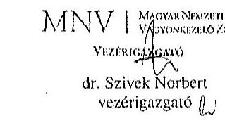

---

.

---

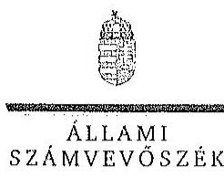

ELKÖK

Ikt.szám: V-0767-062/2015.

Dr. Szivek Norbert úr
vezérigazgató
Magyar Nemzeti Vagyonkezelő Zrt.

Budapest

Tisztelt Vezérigazgató Úr!

A „Jelentéstervezet az állami tulajdonban álló erdőgazdasági társaságok vagyongazdálkodási tevékenységének ellenőrzése - TAEG Tanulmányi Erdőgazdaság Zrt." címmel készített számvevőszéki jelentéstervezetre tett észrevételeit köszönettel megkaptam.

Az Állami Számvevőszék észrevételekre vonatkozó álláspontjáról a felügyeleti vezető által készített részletes tájékoztatást csatoltan megküldöm.

Tájékoztatom Vezérigazgató urat, hogy a számvevőszéki jelentésben - az Állami Számvevőszékről szóló 2011. évi LXVI. törvény 29. § (3) bekezdése alapján - a figyelembe nem vett észrevételeket szerepeltetjük az elutasítás indokának feltüntetésével.

Budapest, 2015. október 4.

Tisztelettel:

D. 1.18

Domokos László

Melléklet: Tájékoztatás az elfogadott és az el nem fogadott észrevételekről

1052 BUDAPEST, AFRICOH CSERE JÁNOS UTCA 10, 1364 Budapest IV. Pl. 54 telefon: 494 9191 fax: 494 9291

---

# Tájékoztatás   az elfogadott és az el nem fogadott észrevételekről 

A „Jelentéstervezet az állami tulajdonban álló erdőgazdasági társaságok vagyongazdálkodási tevékenységének ellenőrzése - TAEG Tanulmányi Erdőgazdaság Zrt." című jelentéstervezetre 2015. október 22-én érkezett észrevételeit áttekintettük, azok kezelésével kapcsolatban a következő tájékoztatást adom.

1. Az MNV Zrt. a Vtv.-ben előírt ellenőrzési kötelezettségére vonatkozó megállapításra tett észrevétel (I. fejezet/ 9. oldal második bekezdés, II. 5. fejezet / 30. oldal hetedik bekezdés)

Az ellenőrzés megállapította, hogy az MNV Zrt. az ellenőrzött időszakban a TAEG Zrt.-nél helyszíni ellenőrzést nem végzett, erre a megállapításra az MNV Zrt. nem tett észrevételt. Az egyértelműség érdekében a dokumentumok ismételt áttekintését követően a jelentéstervezet 9. oldal 2. bekezdés 2. mondatát, illetve 30. oldal 7. bekezdését az alábbiak szerint pontosítjuk:
„A Társaság feletti Tulajdonosi joggyakorló: a számára a Vtv.-ben előírt, az állami vagyonnal való gazdálkodásra vonatkozóan ellenőrzést a TAEG Zrt.-nél az ellenőrzött időszakban nem végzett."
2. A vagyonkezelési szerződéshez kapcsolódó megállapításokra tett észrevétel (I. fejezet / 9. oldal 3-4. bekezdés, 10. oldal 1. bekezdés, II. 5. fejezet / 30. oldal 1. bekezdés, 10. oldal javaslat az MNV Zrt. vezérigazgatójának a)-b) pontok)

A jelentéstervezet vagyonkezelési szerződéshez kapcsolódó megállapításai helytállóak. Az erdőgazdasági társaság működése jogszabályi megfelelősége biztosításának érdekében tett kezdeményezésekről adott tájékoztatásukat köszönettel vettük, azonban azok nem eredményezték az ideiglenes vagyonkezelési szerződés olyan módosítását, vagy olyan új vagyonkezelési szerződés megkötését, amely biztosította volna a VSZ hiányosságainak megszüntetését, illetve a hatályos jogszabályoknak való megfelelőségét. Ezért az MNV Zrt. vezérigazgatójának és az NFA elnökének megfogalmazott intézkedést igénylő megállapítás, valamint az MNV Zrt. vezérigazgatójának megfogalmazott javaslat a) és b) pontjának módosítása nem indokolt. Az egyértelműség érdekében a 9. oldal 3. bekezdés 1. mondatát és a 30. oldal 1. bekezdés 1. mondatát az alábbiak szerint pontosítjuk:
„... a VSZ-szel kapcsolatban feltárt hiányosságok megszüntetése és a hatályos jogszabályoknak való megfeleltetése nem történt meg."

---

3. Az MNV Zrt. ellenőrzési kötelezettségének elmulasztására vonatkozó megállapításokra tett észrevétel (1. fejezet 10. oldal 2. bekezdés, II. 5. fejezet / 30. oldal 1. bekezdés és 10. oldal javaslat az MNV Zrt. vezérigazgatójának e) pont)

Az MNV Zrt. nem bocsátott az ÁSZ ellenőrzés rendelkezésére az MNV Zrt., vagy Területi Irodái által a Vbr. 20. § (1)-(2) bekezdései szerint végzett ellenőrzésekről dokumentumokat. A jelentéstervezet megállapításai és a javaslat helytállóak, módosításuk nem indokolt.

Budapest, 2015. április 20.

Makkai Mária
felügyeleti vezető

---

.

---

# MFB 

## Domokos László úr

elnök részére
Állami Számvevőszék

Budapest

Tisztelt Elnök Úr!
2015. október 7-én köszönettel kézhez vettük az Állami Számvevőszék „Az állami tulajdonban álló erdőgazdasági társaságok vagyongazdálkodási tevékenységének ellenőrzéséről" szóló jelentéstervezeteket az alábbi cégekre:

- Gyulaj Erdészeti és Vadászati Zrt.
- TAEG Tanulmányi Erdőgazdaság Zrt..

## 1.MFB

## 5584 - 2412215

ÁLLAMI SZÁMVEVŐSZÉK
8h215/2015.
Érkezte: 2015. OKT. 22.
Iktatószám: 4-0966-400/2015
Melléklet: $\qquad$
Mellékirat: 
2015. október 7-én köszönettel kézhez vettük az Állami Számvevőszék „Az állami tulajdonban álló erdőgazdasági társaságok vagyongazdálkodási tevékenységének ellenőrzéséről" szóló jelentéstervezeteket az alábbi cégekre:

- Gyulaj Erdészeti és Vadászati Zrt.
(Ikt.szám: V-0766-138/2015.)
- TAEG Tanulmányi Erdőgazdaság Zrt..
(Ikt.szám: V-0767-054/2015.)

Az MFB Zrt. a jelentéstervezetekkel kapcsolatosan 2 féle szempontból kíván észrevételt tenni:

1. A jelentésekben megfogalmazott központi probléma
2. Egyedi esetek

## 1. A jelentésekben megfogalmazott központi probléma

Az ÁSZ az egyedi jelentéseiben az erdőgazdasági társaságokat, valamint a vagyonkezelésbe adott állami vagyon tekintetében tulajdonosi joggyakorló MNV Zrt. és Nemzeti Földalapkezelő (továbbiakban: NFA) tevékenységét marasztalta el.
Alapvető problémaként jelenik meg, hogy az erdők által kezelt eszközök - az NFA-val, a Kincstári Vagyon Igazgatósággal, és az MNV Zrt-vel kötött vagyonkezelési megállapodásban rögzített - értéken nem szerepelnek a Társaságok könyveiben.
Az MFB Zrt. tudatában volt a problémának (azt az ÁSZ jelentésben is említett, 2010. évben végzett átvilágítási jelentés is tartalmazta, melynek nyomon követése, beszámoltatása megtörtént) és folyamatosan egyeztetett az MNV Zrt-vel és az NFA-val a rendezés ügyében. Az ideiglenes vagyonkezelési szerződés módosítására, véglegesítésére a vagyonkezelésbe adónak (MNV, NFA) van lehetősége, a Társaságok szerződő partnerként észrevételeket, javaslatokat tehetnek. A szerződés véglegesítése érdekében a Társaságok és az MFB Zrt. képviselői minden olyan egyeztetésen (pl.: az MNV Zrt. által létrehozott bizottság) részt vettek, amelyre meghívást kaptak, illetve azokon érdemi javaslatokat tettek.

Ahogy a jelentés is megjegyzi, az egyeztetések az ellenőrzés befejezésig nem kerültek lezárásra, így a Társaságoknál nem áll rendelkezésre a vagyonkezelésben lévő állami vagyonra és annak nagyságára vonatkozó, az MNV Zrt. és az NFA nyilvántartásával egyező adat.

Az ÁSZ 2013. évi „Az állami vagyon feletti kontroll - Az állami vagyon feletti tulajdonosi joggyakorlással kapcsolatos tevékenységek ellenőrzéséről" szóló jelentése alapján a Nemzeti Fejlesztési Minisztérium - az ÁSZ-szal egyeztetett - alábbi főbb pontokat tartalmazó intézkedési tervet (1. sz. melléklet) állított össze, melyet a 2014. április 25-én kelt levelében küldött meg az MFB Zrt. részére:

- a Társaságok által kezelt állami ingatlanok és egyéb vagyonelemek értéken történő nyilvántartása,
- a vagyonkezelési díjak egyértelmű és tulajdonosi joggyakorló szervezetenkénti meghatározása,
- az új vagyonkezelési szerződés megkötése,
- a Társaságok kezelt és saját vagyonának vagyonelemenkénti, valamint a kezelt vagyonelemek tulajdonosi joggyakorló szerinti elhatárolása.

Az MFB törvény módosításának 2014. július 16-i hatályba lépésével az MFB Zrt. állami erdőgazdaságok feletti tulajdonosi joggyakorlása megszűnt, az a Földművelésügyi Minisztériumhoz került át, így az intézkedési tervben való közreműködésre, illetve a végrehajtás nyomon követésére az MFB Zrt-nek nem volt lehetősége.

A jelentések az MNV Zrt. vezérigazgatójának, az NFA elnökének és az erdészeti társaságok vezérigazgatóinak fogalmaztak meg intézkedési javaslatokat.

# 2. Egyedi esetek: 

## Gyulaj Erdészeti és Vadászati Zrt.

A Társaságnál az ellenőrzött időszak 2009. január 1. napjától 2014. december 31. napjáig tart, holott az Állami Számvevőszék 2014. november 14. napján kelt, V-0749-004/2014. sz. levelének 3. számú melléklete szerint a vizsgálathoz bekért dokumentumok a 2009. január 1. és 2014. június 30. közötti időszakra vonatkoznak.

Az ellenőrzési anyagban több helyen keveredik a társasági részesedés feletti és a vagyonkezelésbe adott állami vagyon feletti tulajdonosi joggyakorlóra történő hivatkozás.

Hibás hivatkozások:

- 9. oldal 1. bekezdés második sor: 1,3 helyett 1-3; hatodik sor: 2 helyett 1; nyolcadik sor: 3 helyett 1-3;
- 20. oldal 3. bekezdés második sor: 1,2 helyett 1, ugyanis a vagyonkezelői díj meghatározása az MNV Zrt. és az NFA hatásköre, így az MFB Zrt.-re való hivatkozás hibás.
- A 32. oldal 4. bekezdés utolsó mondatával nem értünk egyet. Az ellenőrzést végző korábban már leírta, hogy a vagyonkezelés megfelelő volt az MFB Zrt.-nél (kontrolling, beszámoltatás), valamint a fentiekben leírtak is azt igazolják, hogy az MFB Zrt. mindent megtett a nemzeti vagyonnal való gazdálkodás ellenőrzése érdekében. Kérjük a társaság feletti tulajdonosi joggyakorló hivatkozás törlését.

Véleményünk szerint az alsó indexel való megjelölés helyett célszerűbb lenne a tulajdonosi joggyakorlókat a nevükön nevezni, megszüntetve ezzel az elírás lehetőségét.

# TAEG Tanulmányi Erdőgazdaság Zrt. 

A Társaságnál az ellenőrzött időszak 2009. január 1. napjától 2014. december 31. napjáig tart, holott az Állami Számvevőszék 2014. november 14. napján kelt, V-0749-004/2014. sz. levelének 3. számú melléklete szerint a vizsgálathoz bekért dokumentumok a 2009. január 1. és 2014. június 30. közötti időszakra vonatkoznak.

Az ellenőrzési anyagban több helyen keveredik a társasági részesedés feletti és a vagyonkezelésbe adott állami vagyon feletti tulajdonosi joggyakorlóra történő hivatkozás.

Elrontott hivatkozások:

- 9. oldal 2. bekezdés második sor: 1,3 helyett 1-3; hatodik sor: 2 helyett 1; nyolcadik sor: 3 helyett 1-3;
- 18. oldal 4. bekezdés második sor: 1,2 helyett 1, ugyanis a vagyonkezelői díj meghatározása az MNV Zrt. és NFA hatásköre, így az MFB Zrt.-re való hivatkozás hibás;
- 28. oldal 3. bekezdés nyolcadik sor: 1,3 helyett 1-3;
- 30. oldal 6. bekezdés első sor: 1,3 helyett 1-3; az utolsó mondatban az MFB Zrt-re való hivatkozást, vagy az egész mondat törlését kérjük, tekintettel a 28. oldal 3. bekezdésének alábbi szövegezésére:
Az Alapító Okirat és az IVSZ rendelkezésein felül a tulajdonosi joggyakorló a Társaság részére a vagyongazdálkodást érintő további adat, információ és monitoring kötelezettséget írt elő, amit évente aktualizált....A társaságnál a vagyonkezelést, a hasznosítást érintő jogszabályoknak megfelelő, szerződésszerű kapcsolattartás, adatszolgáltatás és elszámolás támogatta a felelős vagyongazdálkodást.
- 30. oldal 7. bekezdés első és második mondatával nem értünk egyet, az ellenőrzést végző korábban már leírta, hogy a vagyonkezelés megfelelő volt az MFB Zrt.-nél (kontrolling, beszámoltatás), valamint a fentiekben leírtak is azt igazolják, hogy az
 MFB Zrt. mindent megtett a nemzeti vagyonnal való gazdálkodás ellenőrzése érdekében. Kérjük a társaság feletti tulajdonosi joggyakorló hivatkozás törlését.

Véleményünk szerint az alsó indexel való megjelölés helyett célszerűbb lenne a tulajdonosi joggyakorlókat a nevükön nevezni, megszüntetve ezzel az elírás lehetőségét.

Budapest, 2015. október 19.
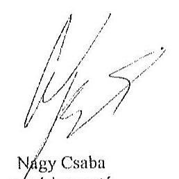

Tisztelettel:
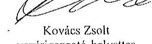

Kovács Zsolt
vezérigazgató-helyettes

# Mellékletek: 

1. számú melléklet: NFM levél (Ikt.szám: KGTF/377-7/2014-NFM)

---

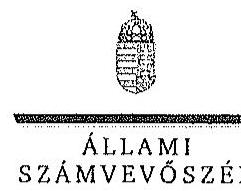

ELNÖK

Ikt.szám: V-0767-066/2015.

Nagy Csaba úr
vezérigazgató
Magyar Fejlesztési Bank Zrt.

Budapest

Tisztelt Vezérigazgató Úr!

Az „Az állami tulajdonban álló erdőgazdasági társaságok vagyongazdálkodási tevékenységének ellenőrzése" című ellenőrzés tekintetében a Gyulaj Erdészeti és Vadászati Zrt., illetve a TAEG Tanulmányi Erdőgazdaság Zrt. társaságok jelentéstervezetére tett észrevételüket köszönettel megkaptam.

Az Állami Számvevőszék észrevételekre vonatkozó álláspontjáról a felügyeleti vezető által készített részletes tájékoztatást csatoltan megküldöm.

Tájékoztatom Vezérigazgató urat, hogy a számvevőszéki jelentésben – az Állami Számvevőszékről szóló 2011. évi LXVI. törvény 29. § (3) bekezdése alapján – a figyelembe nem vett észrevételeket szerepeltetjük az elutasítás indokának feltüntetésével.

Budapest, 2015. 10. hó 13. nap

Tisztelettel:

Domokos László

Melléklet: Tájékoztatás az észrevételek kezeléséről

1052 Budapest, Apáczai Csere János utca 10. 1304 Budapest 4. Pf. 54 telefon: 484 9191 fax 484 9201

---

# Tájékoztatás   az észrevételek kezeléséről 

„Az állami tulajdonban álló erdőgazdasági társaságok vagyongazdálkodási tevékenységének ellenőrzése" című ellenőrzés tekintetében a Gyulaj Erdészeti és Vadászati Zrt., illetve a TAEG Tanulmányi Erdőgazdaság Zrt. társaságok jelentéstervezetére 2015. október 22-én érkezett észrevételeket áttekintettük, azok kezelésével kapcsolatban a következő tájékoztatást adom.

1. A jelentésekben megfogalmazott központi problémával kapcsolatban tett észrevételek

A jelentésekben megfogalmazott központi problémával kapcsolatban adott tájékoztatásukat köszönettel vettük, azonban azok alapján a jelentéstervezet módosítása nem indokolt.

## 2. Egyedi esetekkel kapcsolatban tett észrevételek

## A Gyulaj Erdészeti és Vadászati Zrt. jelentéstervezetre tett észrevételek:

Az ÁSZ az első adatbekérést követően további adatbekéréssel fordult az MFB Zrt. felé (pl. a V-0749-093/2015. iktatószámú levélben), az MFB Zrt. teljességi nyilatkozatot adott az ellenőrzés rendelkezésére bocsátott dokumentumok teljes körűségéről, ezért biztosított volt a teljes ellenőrzött időszakra vonatkozóan a dokumentumok rendelkezésre állása.

A társasági részesedés feletti, illetve a vagyonkezelésbe adott állami vagyon feletti tulajdonosi joggyakorlóra történő hivatkozásokra tett észrevételekre vonatkozóan a rendelkezésre álló dokumentumok ismételt áttekintését követően

- a 9. oldal 1. bekezdés második sorban az alsóindexet 1-3-ra módosítjuk, a bekezdés 3. mondatát töröljük. A nyolcadik sorban lévő alsóindex módosítása nem indokolt, tekintettel arra, hogy a Tulajdonosi joggyakorló 2010-ben külső szakértővel egyedi ellenőrzést végeztetett a Társaságnál, amely kiterjedt a vagyongazdálkodásra is;
- a 20. oldal 3. bekezdés második sorában a 2 alsóindexet töröljük;
- a 32. oldal 4. bekezdés 1. mondatának utolsó részét, valamint a második mondatból a 2 alsóindexet töröljük.

## A TAEG Tanulmányi Erdőgazdaság Zrt. jelentéstervezetére tett észrevételek:

Az ÁSZ az első adatbekérést követően további adatbekéréssel fordult az MFB Zrt. felé (pl. a V-0749-093/2015. iktatószámú levélben), az MFB Zrt. teljességi nyilatkozatot adott az ellenőrzés rendelkezésére bocsátott dokumentumok teljes körűségéről, ezért biztosított volt a teljes ellenőrzött időszakra vonatkozóan a dokumentumok rendelkezésre állása.

---

A társasági részesedés feletti, illetve a vagyonkezelésbe adott állami vagyon feletti tulajdonosi joggyakorlóra történő hivatkozásokra tett észrevételekre vonatkozóan a rendelkezésre álló dokumentumok ismételt áttekintését követően

- a 9. oldal 2. bekezdés második sorban az alsóindexet 1-3-ra módosítjuk, a bekezdés 3. mondatát töröljük. A nyolcadik sorban lévő alsóindex módosítása nem indokolt, tekintettel arra, hogy a Tulajdonosi joggyakorló 2010-ben külső szakértővel egyedi ellenőrzést végeztetett a Társaságnál, amely kiterjedt a vagyongazdálkodásra is;
- a 18. oldal 4. bekezdés második sorban a 2 alsóindexet töröljük;
- a 28. oldal 3. bekezdés nyolcadik sorban az alsóindexet 1-3-ra módosítjuk;
- a 30. oldal 6. bekezdés első sorának módosítása nem indokolt, tekintettel arra, hogy a Tulajdonosi joggyakorló 2010-ben külső szakértővel egyedi ellenőrzést végeztetett a Társaságnál, amely kiterjedt a vagyongazdálkodásra is. A bekezdés utolsó mondatából a Tulajdonosi joggyakorló2-t töröljük;
- a 30. oldal 7. bekezdés 1. mondatának utolsó részét, valamint a második mondatból a 2 alsóindexet töröljük.

Budapest, 2015. év 11. hó 14. nap

Makkai Mária
felügyeleti vezető

---

.

---

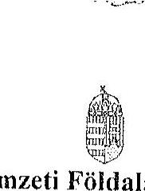

# Nemzeti Földalapkezelő

## Szervezet

Székhely: 1149 Budapest, Bosnyák tér 5. Törzskönyvi azonosítószám: 775706

Iktatószám: NFA-002589/017/2015

Hív. szám: ÁSZ-V-0599/2014-2015

Érintett ÁSZ iktatószámok: V-0749-148/2015, V-0750-174/2015, V-0751-121/2015, V-0752-091/2015, V-0753-098/2015, V-0754-088/2015, V-0755-124/2015, V-0757-062/2015, V-0758-058/2015, V-0760-077/2015, V-0764-056/2015, V-0765-046/2015, V-0766-140/2015, V-0767-056/2015.

Domokos László

Elnök

Állami Számvevőszék

1052 Budapest

Apáczai Csere János utca 10

Tárgy: Észrevétel megküldése „Az állami tulajdonban álló erdőgazdasági társaságok vagyongazdálkodási tevékenységének ellenőrzéséről” készített jelentés tervezeteire.

Tisztelt Elnök Úr!

Az Állami Számvevőszék 2014. novemberében megkezdte „Az állami tulajdonban álló erdőgazdasági társaságok vagyongazdálkodási tevékenységének ellenőrzését”, amelyről 2015. októberétől érintettség okán az NFA részére az elkészített munkaanyag tervezeteit vizsgált erdőgazdaságonként, megküldte Szervezetünk részére véleményezésre.

A munkaanyag valamennyi tervezete egységesen, az NFA Elnöke részére feladatszabást tartalmaz, melyhez az alábbi észrevételeket tesszük:

A jelentéstervezetekben tett megállapítások helytállóságát nem vitatjuk, azonban szükségesnek látjuk az NFA elnökének tett javaslatokkal a), b) és c) kapcsolatban a következő tájékoztatást megadni.

---

# a) „Tegyen intézkedéseket az erdőgazdasági társaságok közreműködésével a tényleges állapotot rögzítő és a hatályos jogszabályi előírásoknak megfelelő vagyonkezelési szerződés megkötésére." 

Tájékoztatjuk, hogy a hatályos jogszabályi előírásoknak megfelelő vagyonkezelési szerződések megkötése érdekében több intézkedés történt, jelenleg is folyamatban van a szerződések előkészítése és a vagyonkezelésben maradó, illetve kikerülő földrészletek adatainak egyeztetése.

Előzményként fontos kiemelni, hogy a Nemzeti Földalapkezelő Szervezet 2010. szeptember 1. napjával történt létrehozását követően (2012. évben) került sor a vagyonkezelésben lévő földrészletek MNV Zrt. részéről történő átadására. Az átadási dokumentumok alapján Szervezetünk gondoskodott a közhitetes nyilvántartásokban a megváltozott tulajdonosi joggyakorlás feltüntetéséről. Az erdőgazdaságok esetében ez 2012. év végéig, illetve 2013. év elején megtörtént, ennek az ingatlan-nyilvántartásban történő átvezetése is.

Megjegyezzük, hogy az MNV Zrt. részéről történő átadás kizárólag a - több évtizede kötött, és azóta többször módosított - vagyonkezelési szerződések és a földrészletek Excel táblázatban történő átadását jelentette, tehát nem egy naprakész vagyonnyilvántartást tartalmazott. Ennek következtében szükségszerűvé vált a Nemzeti Földalapkezelő Szervezetnek egy saját nyilvántartás felépítése, illetve a szerződések tartalmának feldolgozása.

A számvevőszéki ellenőrzéssel érintett időszakban, illetve még jelenleg is lezáratlan az MNV Zrt. és NFA közötti átadás-átvételi folyamat. Az MNV Zrt. további földrészletek átadását készíti elő, ugyanis az MNV Zrt. vagyoni körébe tartozó földrészletekre szintén tervezi a vagyonkezelői szerződés megkötését, és ennek a folyamatnak a részeként a még át nem adott földrészletek átadása is most történik. Természetesen az NFA is folyamatosan biztosítja a különböző hasznosítási, illetve hatósági eljárások során az erdőgazdaságok vagyonkezelésében lévő földrészletek tulajdonosi joggyakorlójának rendezését az MNV Zrt. megkeresésével, közös minősítési eljárás lefolytatásával. A Nemzeti Földalapkezelő Szervezet által megbízott ügyvédi iroda jelentést készített a szerződés és a tárgyát képező földrészletek jogi helyzetének tisztázására.

Időközben az erdőgazdaságok, mint társaságok feletti tulajdonosi joggyakorló személyében is változás történt. Így új alapokon indulhatott meg a vagyonkezelői szerződés előkészítése. Ennek a folyamatnak részeként, az NFA megbízott egy Ügyvédi Konzorciumot, továbbá Szervezetünknél külön Erdészeti munkacsoport alakult 2015. májusában és azt követően a következő intézkedések történtek:

Az Erdőgazdaságok részére vagyonkezelésbe adásra tervezett ingatlanok felülvizsgálata folyamatban van az Ügyvédi Konzorcium által. A felülvizsgálat tárgyát képező ingatlanok köre három részből tevődik össze:

- az erdőgazdaságok ideiglenes vagyonkezelési szerződésének tárgyát képező ingatlanok,

---

- azon ingatlanok, amelyeket az erdőgazdaságok az ideiglenes vagyonkezelési szerződésükben szereplő ingatlanokon felül kértek vagyonkezelésbe,
- valamint azok az ingatlanok, amelyeket az NFA kíván az erdőgazdaságok vagyonkezelésébe adni.

A rendelkezésre álló dokumentumokban szereplő ingatlanokból erdőgazdaságonként egy egységes, az összes vagyonkezelésbe adandó ingatlant tartalmazó táblázat készült, amely tartalmazza az ingatlanok vagyonkezelésbe adás szempontjából releváns adatait, bejegyzett jogokat, feljegyzett tényeket. A táblázat adatai összevetésre kerültek a közhiteles ingatlannyilvántartásban szereplő adatokkal, feltárva ezáltal, hogy mely ingatlanok adhatóak vagyonkezelésbe és melyek azok, amelyeknél valamilyen előzetes intézkedés megtétele szükséges.

Az Nfatv. 8. §-a alapján a Birtokpolitikai Tanács dönt erdőgazdaságonként az erdőgazdaságok vagyonkezelési szerződésének megkötéséről.

Zárójelben jegyezzük meg, hogy például a TAEG Zrt. esetében elkészült a fentebb részletezett táblázat, amely alapján összeállításra került azon ingatlanok listája, amelyre elindítható a vagyonkezelésbe adási eljárás. Megközelítőleg 18000 ha nagyságú területnek tervezi Szervezetünk a TAEG Zrt. részére történő vagyonkezelésbe adását, ebből 15.308,3880 ha terület az, amelyre elindította a vagyonkezelésbe adást. Az alábbi jogszabályhelyek alapján Szervezetünk megkereste a Földművelésügyi Minisztériumot az egyetértő nyilatkozatok, valamint az alapító határozat kiadása érdekében, valamint a NÉBIHet, mint erdészeti hatóságot a vagyonkezelő erdőgazdálkodói alkalmasságát megállapító jóváhagyásának megkérése végett.

Az Nfatv. 20. § (7) bekezdése alapján „Az állam 100%-os tulajdonában álló erdő és erdőgazdálkodási tevékenységet közvetlenül szolgáló földterületet érintő vagyonkezelési szerződés létrejöttéhez az erdészeti hatóságnak - a vagyonkezelő erdőgazdálkodói alkalmasságát megállapító - jóváhagyása szükséges".

Az Nfatv. 23. § (2) bekezdése alapján a Nemzeti Földalapba tartozó védett természeti területek és a Natura 2000 területek vagyonkezelésbe adására, tulajdonjogának bármely jogcímen történő átruházására csak a természetvédelemért felelős miniszter egyetértése esetén kerülhet sor. Az állam 100%-os tulajdonában álló erdő, továbbá erdőgazdálkodási tevékenységet közvetlenül szolgáló földterület vagyonkezelésbe adásához az erdőgazdálkodásért felelős miniszter egyetértése szükséges.

Magyar Állam tulajdonában álló ingatlanokat érintő jogügyletekkel kapcsolatos előzetes miniszteri nyilatkozatok és a miniszter tulajdonosi joggyakorlása alá tartozó gazdasági társaságok ingatlanügyleteivel kapcsolatos miniszteri nyilatkozatok, alapítói határozatok kiadásának rendjéről szóló 8/2014. (XI. 28.) FM utasítás 3. § (4) bekezdése értelmében a miniszter tulajdonosi joggyakorlása alá tartozó állami tulajdonú gazdasági társaságoknak az

---

NFA-val történő vagyonkezelési szerződés kötéséhez elengedhetetlen a jogszabály vagy Társasági alapszabály vagy alapító okirat alapján a Társaság tulajdonosi jogait gyakorló miniszter alapítói határozatának kiadása.

Az Erdészeti Munkacsoport a kialakított szempontok alapján tartja a kapcsolatot a Konzorciummal a szerződés tárgyát képező földrészletek jogi, nyilvántartási, helyszíni, térképi ellenőrzés tárgyában annak érdekében, hogy naprakész adatok alapján történjen a szerződéskötés.
b) „Intézkedjen a vagyonkezelési szerződések felülvizsgálatának elmaradásával összefüggésben feltárt szabálytalanságok tekintetében a munkajogi felelősség tisztázására irányuló eljárás megindításáról, és ennek eredménye ismeretében tegye meg a szükséges intézkedéseket.

A fent leírt folyamat időbeli áttekintése és a vagyonkezelési szerződés előkészítésének jelenlegi helyzetét tekintve a Nemzeti Földalapkezelő Szervezet egységei, munkatársai a rendelkezésükre álló eszközök alapján megtették a szükséges intézkedéseket az erdőgazdaságok vagyonkezelői szerződésének megkötése érdekében.
c) Az NFA elnöke felé tett javaslattal kapcsolatban, miszerint intézkedjen a Társaságok vagyon-nyilvántartása hitelességének, teljességének és helyességének jogszabályban foglaltak szerinti ellenőrzéséről.

Az NFA 2015. év márciusában megkezdte az Erdészeti Zrt.-k dokumentális ellenőrzését, amely ellenőrzés keretén belül bekérésre került a Társaságok használatában álló vagyonelemekről és az erdővagyon állományról vezetett (nyilvántartások) aktualizált nyilvántartása is.

Budapest, 2015. október 13.
Tisztelettel:
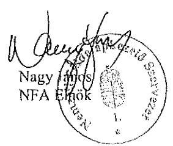

---

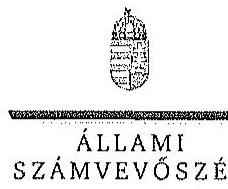

ELHÉK

Ikt.szám: V-0749-154/2015.

Nagy János úr
elnök
Nemzeti Földalapkezelő Szervezet
Budapest

Tisztelt Elnök Úr!

Az „Az állami tulajdonban álló erdőgazdasági társaságok vagyongazdálkodási tevékenységének ellenőrzése" című ellenőrzés tekintetében 14 társaság jelentéstervezetére tett észrevételüket köszönettel megkaptam.

Az Állami Számvevőszék észrevételekre vonatkozó álláspontjáról a felügyeleti vezető által készített részletes tájékoztatást csatoltan megküldöm.

Tájékoztatom Elnök urat, hogy a számvevőszéki jelentésben – az Állami Számvevőszékről szóló 2011. évi LXVI. törvény 29. § (3) bekezdése alapján – a figyelembe nem vett észrevételeket szerepeltetjük az elutasítás indokának feltüntetésével.

Budapest, 2015.
 14. hó 02. nap

Tisztelettel:

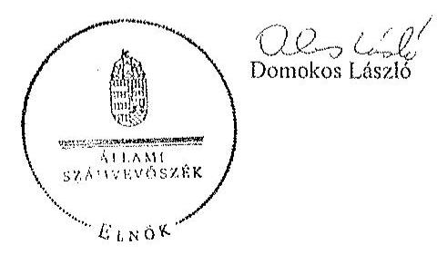

Melléklet: Tájékoztatás az észrevételek kezeléséről

JASZ BUDAPEST, ARÁSZÁN CSERE JÁNOS UTCA 15. 1354 Budapest 4. Pl. 54 telefon: 484 9101 fax: 484 9221

---

# Tájékoztatás   az észrevételek kezeléséről 

„Az állami tulajdonban álló erdőgazdasági társaságok vagyongozdálkodási tevékenységének ellenőrzése" címủ ellenőrzés tekintetében az IPOLY ERDŐ Zrt., az EGERERDŐ Erdészeti Zrt., a Mecsekerdő Zrt., a SEFAG Erdészeti és Faipari Zrt., a Gemenci Erdő- és Vadgazdaság Zrt., az Északerdő Erdőgazdasági Zrt., a Pilisi Parkerdő Zrt., a Szombathelyi Erdészeti Zrt., a Kisalföldi Erdőgazdasági Zrt., a Zolaerdő Erdészeti Zrt., a KEFAG Kiskunsági Erdészeti és Faipari Zrt., a VADEX Mezöföldi Erdő- és Vadgazdálkodási Zrt., a Gyulaj Erdészeti és Vadászati Zrt., illetve a TAEG Tanulmányi Erdőgazdaság Zrt. társaságok jelentéstervezetére 2015. október 16-án érkezett észrevételeket áttekintettük, azok kezelésével kapcsolatban a következő tájékoztatást adom.

Az észrevétel szerint a jelentéstervezetben tett megállapítások helytállóak, azokat nem vitatják. Az NFA elnökének tett javaslatokhoz kapcsolódó tájékoztatást köszönjük. Mindezek miatt, valamint arra tekintettel, hogy nem jött létre olyan vagyonkezelési szerződés, amely biztosítja az ideiglenes vagyonkezelési szerződés hiányosságainak a megszüntetését, illetve a hatályos jogszabályoknak való megfeleltetést, a megállapítások és a javaslatok módosítása nem indokolt.

Budapest, 2015. év 72. nap

Makkai Mária
felügyeleti vezető

---

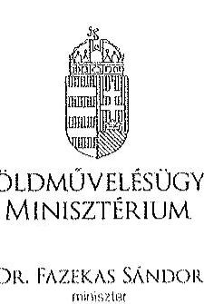

Iktatószám: IIPY/1/45/5/2015.

Ügyintéző: dr. Szabó Martina Dóra
Telefonszám: 896-2483
E-mail: dora.martina.szabof@fin.gov.hu
Hivatkozási szám: V-0766-142/2015. és
V-0767-058/2015.

# Domokos László úr   elnök   részére 

## Állami Számvevőszék

Budapest
Apáczai Csere János u. 10.
1052
Tárgy: Az Állami Számvevőszék V-0766-142/2015. és V-0767-058/2015. iktatószámú jelentéstervezetének véleményezése

## Tisztelt Elnök Úr!

Hivatkozással a V-0766-142/2015. iktatószámú „Az állami tulajdonban álló erdőgazdasági társaságok vagyongazdálkodási tevékenységének ellenőrzése - Gyulaj Erdészeti és Vadászati Zrt. "tárgyú, valamint a V-0767-058/2015. iktatószámú „Az állami tulajdonban álló erdőgazdasági társaságok vagyongazdálkodási tevékenységének ellenőrzése - TAEG Tanulmányi Erdőgazdaság Zrt." tárgyú levelükre, az Állami Számvevőszékről szóló 2011. évi LXVI. törvény 29. § (2) bekezdése alapján az alábbi észrevételeket teszem.

Fenti erdészeti társaságokról készült jelentéstervezetek legfőbb észrevétele és kifogásolni valója, hogy az ellenőrzött erdészeti társaságok könyveiben nem szerepel értéken a kezelt erdőterület és erdő, és a nyilvántartás ez irányú hiányosságai miatt a vagyonnyilvántartás nem teljes.

Az állami vagyonnal való gazdálkodásról szóló 254/2007. (X. 4.) Korm. rendelet 14. § (1) bekezdése szerint az állami vagyon használóját, vagyonkezelőjét és haszonélvezőjét a nemzeti vagyonról szóló 2011. évi CXCVI. törvény (a továbbiakban: Nvtv.) 10. §

---

(1) bekezdése szerinti vagyonnyilvántartás hiteles vezetése és a tulajdonosi joggyakorlók beszámoló-készítési kötelezettségének megalapozottsága érdekében az állami vagyon hasznosítására, vagyonkezelésére, vagy haszonélvezeti jog alapítására kötött szerződés szerinti adatszolgáltatási kötelezettség terheli.

Az Nvtv. 10. § (1) bekezdése szerint a nemzeti vagyont, annak értékét és változásait a tulajdonosi joggyakorló nyilvántartja. Az érték nyilvántartásától el lehet tekinteni, ha az adott vagyontárgy értéke természeténél, jellegénél fogva nem állapítható meg.

Fentieket megerősíti a Pénzügyminisztérium Számviteli Főosztálya által 1997. november 25-én kiadott állásfoglalás is (9807/1997.).

Az erdő és a faállomány naturális adatait az Országos Erdőállomány Adattár tartja nyilván. A Kincstári Vagyoni Igazgatóság által 1996-ban vagyonkezelésbe adott erdő értékének meghatározására még nem került sor. Az érték meghatározása a vagyonkezelésbe adó feladata. Az erdészeti társaságok érték nélkül nem, csak értékkel tudják kimutatni a mérlegben az erdővagyont.

Fentiekre tekintettel álláspontom szerint a Gyulaj Erdészeti és Vadászati Zrt. és a TAEG Tanulmányi Erdőgazdaság Zrt. adatszolgáltatási kötelezettségének eleget tett.

A jelentéstervezetekben megállapításra került továbbá, hogy a vagyonkezelési díjak éves felülvizsgálatára nem került sor, a vagyonkezelési díjakat a tulajdonosi joggyakorló Magyar Nemzeti Vagyonkezelő Zrt. (a továbbiakban: MNV Zrt.) és Nemzeti Földalapkezelő Szervezet (a továbbiakban: NFA) késve, visszamenőleg számlázta ki, a számlákon a földterület nagysága, valamint fajlagos egységára nem volt ellenőrizhető. A számvevőszéki jelentéstervezetek ugyanakkor megjegyzik, hogy a vagyonkezelési díj pénzügyi rendezése megtörtént a társaságok részéről.

A nyilvántartás és a vagyonkezelési díj meghatározásának felelőse a kezelt földterületek és erdőterület esetében ezen vagyonelemek tulajdonosi joggyakorlója, azaz az NFA és az MNV Zrt.

Álláspontom szerint fenti két megállapításért sem a vizsgált társaságok, sem pedig a társaságok tulajdonosi joggyakorlója nem marasztalható el.

A számvevőszéki jelentéstervezetek I. főcíme (Összegző megállapítások, következtetések, javaslatok) alapján a vizsgált társaságok üzleti jelentéseikben minden évben eleget tettek a kezelt vagyonnal folytatott gazdálkodásra vonatkozó szerződéses kötelezettségeik bemutatásának. A társaságok a gazdasági társaságokról szóló 2006. évi IV. törvény, illetve a Ptk. vonatkozó rendelkezéseinek megfelelően működtek, a szabályzatok, jelentések megfeleltek a jogszabályi hivatkozásoknak, a belső ellenőrzés kiépített volt a társaságoknál.

---

A jelentéstervezetek rögzítik továbbá, hogy a vagyongazdálkodási feladatokra vonatkozó döntések és intézkedések előkészítése a tulajdonosi joggyakorlónál összhangban állt a vonatkozó jogszabályokkal.

Kérem észrevételeim szíves tudomásul vételét.
Budapest, 2015. október 20.
Üdvözlettel:
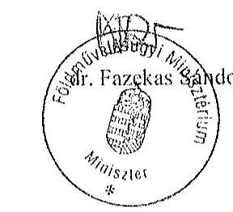

---

.

---

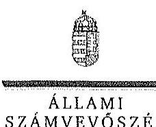

ELNÖK

SZÁMVEVŐSZÉK

Ikt.szám: V-0767-068/2015.

Dr. Fazekas Sándor úr
miniszter

Földművelésügyi Minisztérium

Budapest

Tisztelt Miniszter Úr!

„Az állami tulajdonban álló erdőgazdasági társaságok vagyongazdálkodási tevékenységének ellenőrzése” című ellenőrzés tekintetében a Gyulaj Erdészeti és Vadászati Zrt., illetve a TAEG Tanulmányi Erdőgazdaság Zrt. társaságok jelentéstervezetére tett észrevételüket köszönettel megkaptam.

Az Állami Számvevőszék észrevételekre vonatkozó álláspontjáról a felügyeleti vezető által készített részletes tájékoztatást csatoltan megküldöm.

Tájékoztatom Miniszter urat, hogy a számvevőszéki jelentésben – az Állami Számvevőszékről szóló 2011. évi LXVI. törvény 29. § (3) bekezdése alapján – a figyelembe nem vett észrevételeket szerepeltetjük az elutasítás indokának feltüntetésével.

Budapest, 2015.

/s/ hó /s/ nap

Tisztelettel:

Domokos László

Melléklet: Tájékoztatás az észrevételek kezeléséről

1052 BUDAPEST, APÁCZAI CSERE JÁNOS UTCA 10. 1364 Budapest 4. Pl. 54 telefon: 484 9191 fax: 484 9201

---

# Tájékoztatás   az észrevételek kezeléséről 

„Az állami tulajdonban álló erdőgazdasági társaságok vagyongazdálkodási tevékenységének ellenőrzése" címủ ellenőrzés tekintetében a Gyulaj Erdészeti és Vadászati Zrt., illetve a TAEG Tanulmányi Erdőgazdaság Zrt. társaságok jelentéstervezetére 2015. október 27-én érkezett észrevételeket áttekintettük, azok kezelésével kapcsolatban a következő tájékoztatást adom.

A 254/2007. (X. 4.) Korm. rendelet (továbbiakban: Vhr.) 9. § (9) bekezdés a) pontja alapján a vagyonkezelő köteles a vagyonkezelésbe vett eszközöket a Számv. tv. szerint a hosszú lejáratú kötelezettségekkel szemben a vagyonkezelési szerződésben rögzített értéken állományba venni. A Számv. tv. 23. § (2) bekezdése előírja, hogy a vagyonkezelőnél a mérlegben eszközként kell kimutatni a - törvényi rendelkezés, illetve felhatalmazás alapján - kezelésbe vett, az állami vagy önkormányzati vagyon részét képező eszközöket is. Ezen eszközöket a kiegészítő mellékletben legalább mérlegtételek szerinti megbontásban - külön be kell mutatni.

A Társaságokkal kötött ideiglenes vagyonkezelési szerződésben a vagyonkezelésbe adott vagyon értékét nem rögzítették, a szerződés azt sem tartalmazta, hogy a vagyonkezelt eszközök értéke nulla, továbbá a szerződés nem tartalmaz rendelkezést arra sem, hogy a vagyonkezelésbe adott vagyon értékét azért nem határozták meg, mert az a vagyontárgy természeténél, jellegénél fogva nem állapítható meg.

A Vhr. 17. § (1) bekezdése szerint a saját vagyonnal rendelkező vagyonkezelő a rábízott állami vagyonról olyan elkülönített nyilvántartást köteles vezetni, amely tételesen tartalmazza ezen eszközök könyv szerinti bruttó és nettó értékét, az elszámolt terv szerinti és terven felüli értékcsökkenés összegét és az értékben bekövetkezett egyéb változásokat. A Társaságok által vezetett nyilvántartás - a kezelt vagyon értéke meghatározásának hiányában - nem tartalmazta tételesen a vagyonkezelt eszközök könyv szerinti bruttó és nettó értékét, valamint az értékben bekövetkezett egyéb változásokat.

A Társaságok a Számv. tv. és a Vhr. előírásainak betartása céljából nem tettek lépéseket annak érdekében, hogy a vagyonkezelt eszközök értéke az ideiglenes vagyonkezelési szerződésben rögzítésre, illetve rendezésre kerüljön. A fentiek alapján megállapításaink módosítása nem indokolt.

Az ideiglenes vagyonkezelési szerződések 3.3.2. pontja szerint az 1997-es és a további évekre a vagyonkezelési jog gyakorlásáért az ellenértéket a vagyonkezelési szerződés tárgyévet megelőző év november 30-ig történő felülvizsgálata során a felek az adott évre vonatkozó külön megállapodásban határozzák meg. Tehát a Társaságoknak, mint szerződő feleknek kötelezettsége volt a vagyonkezelési szerződés és a vagyonkezelési díj éves felülvizsgálata, ezért megállapításunk módosítása nem indokolt.

Budapest, 2015. év 11. hó 1. nap
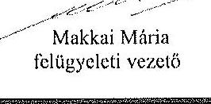

