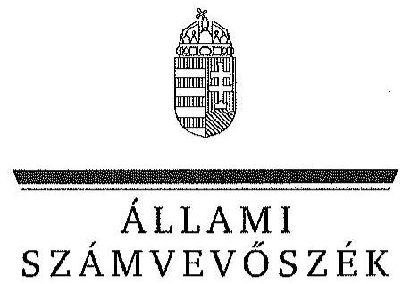

ÁLLAMI
SZÁMVEVŐSZÉK

# JELENTÉS 

Az állami tulajdonban álló erdőgazdasági társaságok vagyon-gazdálkodási tevékenységének ellenőrzése VERGA Veszprémi Erdőgazdaság Zrt.

---

# Állami Számvevőszék 

Iktatószám: V-0768-073/2015.
Témaszám: 1802
Vizsgálat-azonosító szám: V0706

## Az ellenőrzést felügyelte:

## Makkai Mária

felügyeleti vezető
Az ellenőrzést vezette és az ellenőrzés végrehajtásáért felelős:
Pencz Mária
ellenőrzésvezető
A számvevőszéki jelentés összeállításában közreműködött:
Bencsik Árpád
Számvevő
Az ellenőrzést végezték:
Dr. Dorogi Zsolt Pál számvevő

Szikszainé Király Mária számvevő tanácsos

## Czeglédi Dénes

számvevő tanácsos

## Kovács Ildikó

számvevő tanácsos

---

# TARTALOMJEGYZÉK 

BEVEZETÉS ..... 3
I. ÖSSZEGZŐ MEGÁLLAPÍTÁSOK, KÖVETKEZTETÉSEK, JAVASLATOK ..... 7
II. RÉSZLETES MEGÁLLAPÍTÁSOK ..... 14

1. A VERGA Zrt. vagyongazdálkodása ..... 14
1.1. A vagyon értékének megőrzése, gyarapítása ..... 14
1.2. A vagyonkezelői kötelezettség teljesítése ..... 18
2. A VERGA Zrt. használati szerződése és a vagyonnyilvántartása ..... 20
2.1. A használati szerződés megfelelősége ..... 20
2.2. A VERGA Zrt. vagyonnyilvántartása ..... 21
3. A VERGA Zrt. éves tervezési feladatainak ellátása, az ágazati jogszabályok érvényesülése ..... 24
3.1. Az üzleti tervek vagyonmegőrzésre, vagyongyarapítására vonatkozó elemei ..... 24
3.2. A tervekben megfogalmazott előírások érvényesülése ..... 25
3.3. Az ágazati szabályok érvényesülése ..... 26
4. A kontroll-és monitoring rendszer kialakítása és működtetése ..... 27
4.1. A kontrollrendszer kialakítása és működtetése ..... 27
4.2. Az információáramlási és monitoring rendszer kialakítása és működtetése ..... 29
5. A tulajdonosi joggyakorlóknak a VERGA Zrt. vagyongazdálkodási feladataira vonatkozó döntései, intézkedései megfelelősége ..... 31

---

# MELLÉKLETEK 

1. számú Rövidítések jegyzéke
2. számú Fogalomtár
3/A. számú A Verga Zrt. vagyonának alakulása a 2009-2014. évek közötti időszakban
3/B. számú Az erdőgazdasági társaság vagyonának alakulása a 2009-2014. években
3. számú A befektetett eszközök állományának alakulása
4. számú A VERGA Zrt. vezérigazgatójának észrevétele
5. számú A VERGA Zrt. vezérigazgatójának észrevételére adott válasz
6. számú Az MNV Zrt. vezérigazgatójának észrevétele
7. számú Az MNV Zrt. vezérigazgatójának észrevételére adott válasz
8. számú A HM miniszterének észrevétele
9. számú A HM miniszterének észrevételére adott válasz
10. számú Az FM miniszterének észrevétele
11. számú Az FM miniszterének észrevételére adott válasz
12. számú Az MFB Zrt. vezérigazgatójának nemleges észrevétele

---

# JELENTÉS 

## Az állami tulajdonban álló erdőgazdasági társaságok vagyongazdálkodási tevékenységének ellenőrzése VERGA Veszprémi Erdőgazdaság Zrt.

## BEVEZETÉS

Hazánk területének több mint 20\%-át erdő borítja. Az erdők fenntartása és védelme az egész társadalom érdeke, ezért az erdőkkel csak a közérdekkel összhangban lehet gazdálkodni.

Az Alaptörvény 38. cikke és az Nvtv. alapján az állam tulajdona a nemzeti vagyon részét képezi. Az Nvtv. alapján nemzetgazdasági szempontból kiemelt jelentőségű nemzeti vagyonban tartandó vagyonelemnek minősül a 100\%-ban az állam tulajdonában álló védelmi és közjóléti elsődleges rendeltetésű erdő, a gazdasági elsődleges rendeltetésű természetes erdő, természetszerű erdő és származékerdő természetességi állapotú öt hektárnál nagyobb, természetben összefüggő erdő. A Társaságok vagyongazdálkodása szempontjából a Vtv, illetve az Nvtv. és az Nfatv., valamint a kapcsolódó kormány- és miniszteri rendeletek mellett kiemelkedő szerepe van a különböző ágazati jogszabályoknak. A vagyonkezelési tevékenység végrehajtása során figyelemmel kell lenni az Evt.-ben foglaltakra, mely alapján a nemzeti vagyonról szóló törvényben nemzetgazdasági szempontból kiemelt jelentőségű nemzeti vagyonként meghatározott védelmi és közjóléti elsődleges rendeltetésű, az állam tulajdonában álló erdő a kincstári vagyon részét képezi. A Társaságoknak az általuk használt vagyonelemek sajátosságára tekintettel kell a vagyongazdálkodási tevékenységüket kialakítaniuk, gondoskodniuk kell a közérdek és az Evt.-ben foglaltak érvényesülését biztosító vagyongazdálkodásról. A honvédelemről és a Magyar Honvédségről, valamint a különleges jogrendben bevezethető intézkedésekről szóló 2011. évi CXIII. törvény alapján a Honvédség szervezeteinek elhelyezéséhez, és feladatai ellátásához rendelkezésre bocsátott ingatlanok állami tulajdonban, a honvédelemért felelős miniszter által vezetett minisztérium vagyonkezelésében állnak. A Honvédelmi Minisztérium a vagyonkezelésében lévő honvédelmi rendeltetésű erdőket a Társaságok használatába adta.

Az Evt. előírásai alapján az állam 100\%-os tulajdonában álló erdőt és erdőgazdálkodási tevékenységet közvetlenül szolgáló földterületet csak vagyonkezelés formájában lehet hasznosításra átengedni. A kizárólagos állami tulajdonban lévő erdő és erdőgazdálkodási tevékenységet közvetlenül szolgáló földterület vagyonkezelését csak költségvetési szerv vagy 100\%-os állami tulajdonú gazdálkodó szervezet végezheti.

---

Az MNV Zrt. a Társaság feletti tulajdonosi jogok gyakorlását a Vtv. 29. § (5) bekezdésében foglaltakkal összhangban a 2008-ban létrejött vagyonkezelési szerződésben a HM-nek átadta. A HM a tulajdonosi jogokat 2010. június 16-áig gyakorolta. A 2010. évi törvényi változások (Vtv., Mfbtv., Nfatv.) következtében 2010. június 17. napjától a Társaságok állami tulajdonú részesedése tekintetében a tulajdonosi jogokat az állami vagyonért felelős miniszter az MFB Zrt. útján látta el. Az Nfatv. 2010. évi hatálybalépését követően a Társaságok által használt, a Nemzeti Földalapba tartozó földterületek vonatkozásában a tulajdonosi jogokat az NFA, míg egyéb ingatlanok és vagyonelemek tekintetében a tulajdonosi jogokat az MNV Zrt. gyakorolta. 2014. július 16-tól a Társaságok feletti tulajdonosi jogokat az erdőgazdálkodásért felelős miniszter gyakorolja.

A Nemzeti Földalapba tartozó 1772 980,17 ha földterületből a 2012. év végén a 100\%-os állami tulajdonú 19 erdőgazdasági társaság kezelésében összesen 913664,3681 ha földterület volt, ebből 879254,1595 ha erdő, a többi egyéb művelési ágba tartozik. A használt földterületek erdőgazdasági társaságonkénti megoszlása eltérő. Három, korábban a Honvédelmi Minisztérium, mint tulajdonosi joggyakorló által irányított erdőgazdaság esetében az állami erdőterületek vagyonkezelési joga a HM-nél maradt, a Társaságok a gazdálkodást használatba adási szerződés alapján folytatják.

A Társaságok az Alaptörvény és az Nvtv. előírása szerint önállóan és felelősen gazdálkodnak a törvényesség, a célszerűség és az eredményesség követelményei szerint. Az állami vagyonnal való gazdálkodás alapvető feladata a vagyon rendeltetésszerű, hatékony és felelős felhasználásának biztosítása az állami vagyon értékének megőrzése, gyarapítása érdekében. A Társaság jelen ellenőrzése az állami vagyonnal való gazdálkodásra és a törvényesség betartására irányult.

A Társaság területének jelentős része a Magas-Bakonyban helyezkedik el, a további területek a Déli- és Keleti-Bakonyhoz tartoznak. A Társaság működési területe Veszprém, Fejér, Vas, Zala és Komárom-Esztergom megyékre terjed ki. A vagyonkezelő HM-mel kötött használatba adási szerződés alapján 49 960,0 ha állami tulajdonban lévő területet használtak. További területek a Társaság saját tulajdonában vagy haszonbérletében voltak. A Társaság 2014. évi éves beszámolója szerint 2636,5 M Ft nettó árbevétel mellett 107,6 M Ft mérleg szerinti eredményt ért el, a mérlegfőösszeg 5131,6 M Ft, az éves átlaglétszám 91 fő volt.

Az ellenőrzés célja annak értékelése, hogy a Társaság vagyongazdálkodása, vagyonérték-megőrző és vagyongyarapítási tevékenysége, valamint szervezeti keretei és kiépített kontrollrendszere megfeleltek-e a jogszabályok és belső szabályzatok előírásainak, valamint a kezelt vagyonelemek sajátosságaiból adódó követelményeknek.

Ennek keretében ellenőriztük és értékeltük, hogy:

- a vagyongazdálkodás során betartották-e az Nvtv. 7. §-ában megállapított vagyongazdálkodási alapelveket, valamint az ágazati jogszabályok vagyongazdálkodáshoz kapcsolódó előírásait;
- a Társaság a saját és a használt vagyonnal való gazdálkodásra vonatkozó éves tervezési feladatait a jogszabályi előírásoknak megfelelően látta-e el, a

---

Társaság üzleti tervei a kezelésbe vett vagyonra vonatkozó, a Vtv. 2. § (1) és a 27. § (7) bekezdésében előírt vagyon megőrzésére, gyarapítására vonatkozó elemeket tartalmazták-e és azokat a vagyongazdálkodás során érvényesítették-e;

- a vagyonkezelési szerződések és a vagyon-nyilvántartás megfeleltek-e a szabályszerűségi követelményeknek, elősegítették-e az állami vagyonnal való szabályszerű gazdálkodást;
- a Társaságnál kialakították és működtették-e a szabályszerű feladatellátást támogató kontrollrendszert. Ezen belül a Társaság elkészítette-e és aktualizálta-e feladatellátási-folyamatainak szabályzatait, a kockázatok kezelésének rendszerét, az információs és a kontrolling-monitoring rendszert, valamint a vagyongazdálkodás területén azokat az eljárásokat, amelyek elősegítik a szervezeti célok végrehajtását;
- a tulajdonosi joggyakorlóknak a Társaság vagyongazdálkodási feladataira vonatkozó döntései, intézkedései előkészítése és megalapozottsága a jogszabályoknak és a belső szabályozásnak megfelelt-e, a tulajdonosi joggyakorlók e minőségben végzett tevékenysége támogatta-e a felelős vagyongazdálkodás megvalósulását.

Az ellenőrzés típusa: szabályszerűségi ellenőrzés.
Az ellenőrzött időszak: 2009. január 1. napjától 2014. december 31. napjáig, kitekintéssel a helyszíni ellenőrzés végéig tartó releváns folyamatokra, intézkedésekre.

Az ellenőrzés várható hasznosulása: A Társaság és a tulajdonosi joggyakorlók fenti szempontú ellenőrzése az állami tulajdonban álló vagyon kezelésére, a vagyonnal való gazdálkodásra vonatkozó, kötelezően végrehajtandó éves ÁSZ ellenőrzést szélesebb körűvé teszi.

Az ellenőrzés várható hasznosulásaként biztosíthatja a társadalom részéről kiemelt érdeklődéssel kísért téma objektív bemutatását. Az ÁSZ jelentéséből a média és az állampolgárok átfogó képet kaphatnak a Magyarország állami tulajdonban lévő erdőivel való gazdálkodásról, a gazdálkodást, vagyonkezelést végző szervezeti rendszerről, az állami tulajdonban álló erdőgazdasági társaságok feladatellátásához kapcsolódóan feltárt problémákról.

Az ellenőrzés jól hasznosítható - többek közt - az állami vagyonnal kapcsolatos országgyűlési törvényhozói munkában is, továbbá hozzájárulhat a tulajdonosi joggyakorlás javításával a „jó kormányzás" gyakorlatának erősítéséhez.

Az ellenőrzéssel érintett szervezetek: A Társaság, a Társaság kezelésében lévő állami vagyon feletti tulajdonosi jogokat gyakorló szervezetek, valamint a Társaság állami tulajdonú részesedése feletti tulajdonosi joggyakorlók (MNV Zrt., HM, MFB Zrt., NFA, FM).

Az ellenőrzés végrehajtásának jogszabályi alapját az ÁSZ tv. 5. § (4)(5) bekezdéseiben foglaltak képezik.

---

Az ellenőrzés szakmai módszertana az ÁSZ hivatalos honlapján közzétett szakmai szabályokon alapult, amely a Legfőbb Ellenőrző Intézmények Nemzetközi Szervezete (INTOSAI) által kiadott nemzetközi standardok (ISSAI) figyelembevételével készült.

A Társaság az ellenőrzés lefolytatásához tanúsítványok kitöltésével, valamint dokumentumok elektronikus megküldésével szolgáltatott adatokat. Az így rendelkezésre bocsátott adatok és információk kontrollja a helyszíni ellenőrzés keretében történt. A vagyonváltozást eredményező döntések megalapozottságát, továbbá a vagyonérték-megőrző és vagyongyarapító tevékenység szabályszerűségét a számviteli nyilvántartásokból, valamint kockázatalapú és véletlenszerű mintavétellel kiválasztott tételek ellenőrzésével értékeltük.

Az ÁSZ a 2011. évi LXVI. törvény 29. §-a szerint a jelentéstervezetet megküldte a VERGA Veszprémi Erdőgazdaság Zrt. vezérigazgatójának, a Magyar Nemzeti Vagyonkezelő Zrt. vezérigazgatójának, a Magyar Fejlesztési Bank Zrt. vezérigazgatójának, a Nemzeti Földalapkezelő Szervezet elnökének, a Honvédelmi Minisztérium miniszterének és a Földművelésügyi Minisztérium miniszterének egyeztetésre. A VERGA Veszprémi Erdőgazdaság Zrt. vezérigazgatójának észrevételét és az arra adott választ az 5-6. számú melléklet, a Magyar Nemzeti Vagyonkezelő Zrt. vezérigazgatójának észrevételét és az arra adott választ a 7-8. számú melléklet, a Honvédelmi Minisztérium miniszterének észrevételét és az arra adott választ a 9-10. számú melléklet, a Földművelésügyi Minisztérium miniszterének észrevételét és az arra adott választ a 11-12. számú melléklet, a Magyar Fejlesztési Bank Zrt. vezérigazgatója nemleges észrevételét a 13. számú melléklet tartalmazza. A Nemzeti Földalapkezelő Szervezet elnöke az ÁSZ tv. 29. § (2) bekezdésében foglalt észrevételezési jogával nem élt, a törvényes határidőn belül észrevételt nem tett.

---

# I. ÖSSZEGZŐ MEGÁLLAPÍTÁSOK, KÖVETKEZTETÉSEK, JAVASLATOK 

Az állami tulajdonú VERGA Zrt. az ellenőrzött időszakban használatba vett és saját vagyonnal gazdálkodott. A Társaság mérleg szerinti vagyona a 2009. január 1-jén kimutatott 2625,0 M Ft nyitó értékről 2014. december 31-re 5131,6 M Ft-ra emelkedett elsősorban a forgóeszközök - ezen belül a pénzeszközök - 214,1\%-os növekedésének következtében. A saját tőke/jegyzett tőke aránya az ellenőrzött időszakban a 2009. január 1-jei 381\%-ról az ellenőrzött időszak végére 583,9\%-ra emelkedett. A 2014. évi jegyzett tőkeemeléseket figyelembe véve a mutató értéke 344,1\%-ra csökken.

Az ellenőrzött időszakban a Társaság mérlege nem a valós állapotot tükrözte, mert a Társaság a saját tulajdonában álló erdőket és földingatlanokat a Számv. tv. előírásai ellenére mérlegében nem szerepeltette. A Társaság az ellenőrzött időszakban magánszemélyektől átvett
 területeken megbízási szerződés alapján erdőtelepítéseket végzett. Az átvett területeken végzett erdőtelepítések értékét a Számv. tv. előírásainak megfelelően könyveiben értékben szerepeltette, azonban a megbízás megszűnésekor azokat a nyilvántartásaiból nem vezette ki. A Társaság a saját, valamint a magánszemélyeknek végzett erdőtelepítések aktivált értékét könyveiben elkülönítetten nem mutatta ki. Az ellenőrzött időszakban a Számv. tv. előírásainak megfelelően a használatba vett erdőket és földingatlanokat a Társaság mérlegében eszközként nem mutatta ki, a Számv. tv. ezt a kötelezettséget a vagyonkezelő vonatkozásában írja elő.

A Társaság a használatba vett vagyonról a használatba adási szerződések mellékletei szerinti ingatlanlistán alapuló, elkülönített, analitikus nyilvántartást vezetett. A HM nyilvántartása és a Társaság nyilvántartása alapján megállapítható, hogy a Társaság nyilvántartásából a honvédelmi célra feleslegessé nyilvánított területeket teljes körűen nem vezette ki, ezért a Társaság nyilvántartása nem támogatta megfelelően az állami vagyonnal való felelős gazdálkodást. A Társaság a használatában álló valamennyi állami vagyonra, és annak nagyságára vonatkozó, a vagyonkezelő HM nyilvántartásával egyező adattal a 2011-2014. években nem rendelkezett. A vagyonkezelő HM és a Társaság nyilvántartása a honvédelmi célra feleslegessé vált területek vonatkozásában sem egyezett.

Az ellenőrzött időszakban a Társaság a Magyar Állam tulajdonában álló erdővagyon és egyéb művelési ágú termőföld ingatlanokat a HM-mel 2009. március 12-én kötött használatba adási szerződés alapján használta. A használatba adási szerződés szerint a használatba adott ingatlanok elsődlegesen honvédelmi célokat szolgáltak. A Társaság, mint használó és a HM között létrejött szerződéses jogviszony kereteit a használatba adási szerződésben foglalt jogok és kötelezettségek töltötték ki. A Társaság részben tett eleget a használati szerződésben foglaltaknak, mert harmadik személlyel kötött használati szerződések megkötését megelőzően a HM előzetes írásbeli jóváhagyását csak a nagyobb területekre kiterjedő, hosszabb időtartamra szóló szerződések esetében biztosította.

---

A HM, az MNV Zrt. és az NFA 2014. januárban az Nfatv. előírása alapján háromoldalú megállapodást kötött a honvédelmi miniszter által honvédelmi célra feleslegessé nyilvánított ingatlanok tekintetében a HM vagyonkezelési jogának megszüntetéséről. A 2012-2014. években kikerült és a honvédelmi miniszter által honvédelmi célra feleslegessé nyilvánított területek vonatkozásában a használatba adási szerződés mellékletét nem módosították, ezért a használatba adási szerződés nem támogatta megfelelően és számon kérhető módon a Társaság állami vagyonnal való gazdálkodását. A művelés alól kivett, honvédelmi célra feleslegessé nyilvánított földrészletek az Nfatv. alapján az NFA-ba tartoztak. Az átadással érintett területeken a Társaság az erdészeti hatóság korábbi engedélyének birtokában erdőgazdálkodási tevékenységet folytatott.

Az ellenőrzött időszakban a Társaság Leltározási szabályzattal rendelkezett, azonban szabályzatait nem aktualizálta a Számv. tv-ben előírt legalább háromévenkénti leltározási kötelezettséggel. A Társaság mérlegsorainak leltárral történő alátámasztottsága biztosított volt, azonban a leltár nem felelt meg a Számv. tv. előírásainak, továbbá az eszközök mennyiségi leltározásának hiányában a mérlegadatok hiteles alátámasztása nem volt biztosított.

A Társaság vagyongazdálkodása során betartotta az Nvtv.-ben előírt vagyongazdálkodási alapelveket, vagyont nem idegenített el, illetve arra jelzálogjogot, haszonélvezeti jogot nem alapított, erdő használatát, hasznosítását harmadik fél számára nem engedte át.

A Társaság az ellenőrzött időszakban a Vtv.-ben, az Nvtv.-ben és a használatba adási szerződésben foglaltaknak megfelelően a saját és a HM-től, mint vagyonkezelőtől használatra kapott vagyon állagának védelmét, értékének megőrzését, illetve vagyon gyarapítását a megvalósított beruházásokkal, valamint erdőfelújításokkal biztosította.

A Társaság a saját és a használatba vett vagyonnal való gazdálkodás során az éves tervezési feladatait a Tulajdonosi joggyakorló ¹⁻² előírásainak megfelelően látta el, az ellenőrzött időszak minden évére elkészített üzleti tervei a saját és használt vagyon megőrzésére, gyarapítására vonatkozó elemeket tartalmazták, azonban a Társaság saját és használt vagyonára vonatkozó beruházásait elkülönítetten nem jelenítették meg. A Társaság az ágazati és éves üzleti tervekben megfogalmazott, az erdővagyonnal való gazdálkodás érdekében kifejtett erdőgazdálkodási és vadgazdálkodási tevékenységét az Evt. ¹·², az Evr. és a Vadvédelmi tv.-ben foglaltaknak megfelelően végezte. Az ellenőrzött időszakban az ágazati tervekben megfogalmazott, az állami vagyon megőrzésére, gyarapítására vonatkozó előírásokat a Társaság teljesítette. Erdőgazdálkodási és vadgazdálkodási tevékenységéről az ellenőrzött években a Számv. tv. rendelkezéseinek megfelelően üzleti jelentést készített. Az üzleti jelentésben a saját tulajdonban lévő és a használatba vett állami vagyonra vonatkozó adatokat elkülönítetten annak célszerűsége ellenére nem jelölték meg.

A Társaság a Vtv.-ben, Nfatv.-ben és az ágazati tervekben megfogalmazott, a saját és használatba vett vagyon állagának védelme és vagyona gyarapítása érdekében a felújításokat, beruházásokat és karbantartásokat évente állapotfelmérések alapján végezte el. Az erdőgazdálkodással kapcsolatos állagmegóvási tevékenységüket az erdőtervekkel összhangban végezték. A Társaság be-

---

ruházási és felújítási tevékenységét az ellenőrzött időszakban a Számv. tv. rendelkezéseinek megfelelően végezte. A Társaság az erdőfelújításokat a Számv. tv-ben előírtaknak megfelelően költségei között elszámolta, az erdőtelepítéseket a Társaság a Számv. tv. előírásainak megfelelően könyveiben a befejezetlen beruházások között szerepeltette.

A Társaság tevékenysége során érvényesítette az ágazati jogszabályok vagyongazdálkodáshoz kapcsolódó előírásait. A Társaság az Evt. ²-ben foglalt, az erdő fenntartására, védelmére, valamint az erdei haszonvételek gyakorlására irányuló erdőgazdálkodási tevékenységéhez kapcsolódó, az erdészeti hatóság felé fennálló bejelentési és engedélykérelmi kötelezettségének az ellenőrzött időszakban eleget tett. A Társaság több esetben a gazdálkodásból származó bevételeinek elszámolását megalapozó bizományi szerződésekkel megsértette a Számv. tv. szerinti bruttó elszámolás alapelvét, mert a bevételeket és a költségeket egymással szemben számolta el. Az ellenőrzött időszakban a Társaság rendelkezett az Evt. ¹·²-ben meghatározott, 10 évre szóló erdőgazdálkodási üzemtervvel, az erdészeti hatóság által jóváhagyott, 5 évre szóló erdőtelepítésikivitelezési tervek rendelkezésre álltak, azok tartalmazták az Evr. ²-ben rögzített tartalmi elemeket. A Társaság rendelkezett a Vadvédelmi tv. szerinti 10 évre szóló vadgazdálkodási üzemtervvel, azokat a vadászati hatóság jóváhagyta.

A Társaság 2011. évtől az SZMSZ-ben foglaltak alapján önálló belső ellenőrzést működtetett, amely kockázatelemzés alapján összeállított, az FB által jóváhagyott éves munkatervek alapján végezte tevékenységét. A Társaság vezetése a 2011-2014. évekre vonatkozóan sikkasztás bűncselekmény elkövetésének gyanúját állapította meg, ezért 2015. januárban soron kívüli belső ellenőrzést rendelt el. A sikkasztás tényét a belső ellenőri jelentés alátámasztotta. Az ellenőrzött időszakban kialakított kontrollrendszer teljes körűen nem támogatta a Társaság vagyongazdálkodását, a folyamatba épített kontrollok a gyakorlatban nem működtek megfelelően, mert a belső ellenőrzés a 2011-2014. években folytatott vizsgálatai során a sikkasztás tényét nem tárta fel. A Számv. tv. előírásai, továbbá az Alapító Okiratban foglalt tulajdonosi döntés alapján a Társaság az ellenőrzéssel érintett időszakban könyvvizsgálói szolgáltatást vett igénybe. A könyvvizsgálók az éves beszámolók valódiságának és szabályszerűségének felülvizsgálatát elvégezték, jelentéseiket könyvvizsgálói záradékkal látták el. A könyvvizsgálók a Társaság 2009-2013. évekre vonatkozó beszámolóit hitelesítő záradékkal látták el annak ellenére, hogy a beszámolók értékben nem tartalmazták a saját tulajdonban lévő erdőket és földterületeket, a mérlegekben olyan erdőtelepítések aktivált állományi értékei kerültek kimutatásra, amelyek már nem voltak a Társaság használatában, valamint mennyiségi leltározás hiányában a leltárak a mérleg adatait áttekinthető és megbízható módon nem támasztották alá.

A Társaságnál a szabályszerű működést támogató információáramlási és monitoring rendszer kialakítása és működtetése nem valósult meg teljes körűen, mert az Info tv. és az Avtv. rendelkezései ellenére a közérdekű adatok megismerésére irányuló igények teljesítésének rendjét nem szabályozta. A Társaság az ellenőrzött időszakban a Társaság feletti Tulajdonosi joggyakorló ¹⁻³ felé fennálló beszámolási kötelezettségeinek határidőben eleget tett. A Társaságnál az ellenőrzött időszakban az adatok védelme biztosított volt, a Társaság a közérdekű adatainak nyilvánosságra hozatalát teljesítette.

---

A Társaság vagyongazdálkodási feladataira vonatkozó döntések, intézkedések előkészítése a Társaság feletti Tulajdonosi joggyakorló ¹⁻³-nál és a HM-nél megfelelő volt, összhangban volt a vonatkozó jogszabályokkal és a belső szabályzatokkal. A Társaság feletti Tulajdonosi joggyakorló ² az ellenőrzött években a tulajdonosi ellenőrzéseket az ellenőrzési szabályzatának megfelelően végezte, azonban a Társaság vagyongazdálkodásának szabályozottságával, szabályszerűségével és a vagyonnyilvántartásával kapcsolatban ellenőrzést nem végzett. A Tulajdonosi joggyakorló ³ nem pénzbeli hozzájárulás (apport) formájában 212 329,0 E Ft összegű alaptőke-emelést alapítói határozatban jóváhagyott. A Tulajdonosi joggyakorló ³ 2014. évben alapítói határozattal 215,000 E Ft összegben pénzbeli hozzájárulásként megemelte a Társaság alaptőkéjét. Az alap-tőke-emelés szabályszerű volt, összhangban a Ptk. előírásaival, valamint a Társaság Alapszabályában foglaltakkal. Tőkeleszállításra, pótbefizetés elrendelésére, tulajdonosi kölcsön nyújtására, osztalék kifizetésére, hitelfelvételhez való hozzájárulásra az ellenőrzött időszakban nem került sor.

Az Nfatv. hatálybalépését követően a HM által vagyonkezelt és a Társaság használatába adott ingatlanok vonatkozásában az MNV Zrt. és NFA között át-adás-átvétel nem történt, ezért az NFA nem rendelkezik naprakész nyilvántartási adatokkal a Társaság által használt és a tulajdonosi joggyakorlása alá tartozó földterületekről, ezáltal az NFA az Nfatv.-ben előírt naprakész nyilvántartási kötelezettségének nem tett eleget. Az NFA tevékenysége az ellenőrzött időszakban nem támogatta teljes körűen a felelős vagyongazdálkodás megvalósulását, mert az Nfatv. hatálybalépését követően a Nemzeti Földalapba tartozó földrészletekre vonatkozó vagyongazdálkodási tevékenységre, vagyonváltozást eredményező döntésekre vonatkozóan elvárásokat nem fogalmazott meg a Társaság felé, vagyonváltozással kapcsolatos tulajdonosi ellenőrzést nem végzett. Az Nfatv. rendelkezései ellenére a honvédelmi miniszter által honvédelmi célra feleslegessé nyilvánított területek környezetvédelmi, vegyvédelmi és tűzszerészeti mentesítése nem történt meg, illetve nem állt rendelkezésre az arra jogosult szerv hivatalos igazolása, hogy mentesítésre nincs szükség, ezért a területek tényleges művelési ágának bejegyzése az ingatlannyilvántartásba elmaradt.

Az Állami Számvevőszékről szóló 2011. évi LXVI. törvény 33. § (1) bekezdésében foglaltak értelmében a jelentésben foglalt megállapításokhoz kapcsolódó intézkedési tervet köteles az ellenőrzött szervezet vezetője összeállítani, és azt a jelentés kézhezvételétől számított 30 napon belül az ÁSZ részére megküldeni. Amennyiben az intézkedési tervet határidőben nem küldi meg a szervezet, vagy az nem elfogadható, az ÁSZ elnöke a hivatkozott törvény 33. § (3) bekezdésében foglaltakat érvényesítheti.

Az ellenőrzés intézkedést igénylő megállapításai és javaslatai:

# a honvédelmi miniszternek 

A HM, az MNV Zrt. és az NFA 2014. januárban az Nfatv. 16/A. § (1) bekezdés előírása szerint háromoldalú megállapodást kötött a honvédelmi miniszter által a 139/2011. (XII. 27.) HM utasítás 1. § (2) bekezdése alapján honvédelmi célra feleslegessé nyilvánított ingatlanok tekintetében a HM vagyonkezelési jogának megszün-

---

tetéséről. Az Nfatv. 1. § (1) bekezdés d) pontja szerint az NFA-ba tartozik az állam tulajdonában lévő, az ingatlan-nyilvántartásban művelés alól kivett, honvédelmi célra feleslegessé nyilvánított területként nyilvántartott földrészlet. A HM a Társaság használatába adott alakulati területekből, azok a honvédelmi miniszter által honvédelmi célra feleslegessé nyilvánítása miatt - a Társaság kimutatása szerint 1780,3 ha területet több részletben átadott az NFA részére. Az átadott területeknek a HM vagyonkezeléséből való kikerülése miatt a HM és a Társaság között fennálló használatba adási szerződés mellékletét annak ellenére nem módosították, hogy a módosítási kötelezettséget a szerződés 6.3. pontja előírja.

Javaslat:
a) Intézkedjen a Társaság közreműködésével a honvédelmi miniszter által honvédelmi célra feleslegessé nyilvánított és művelés alól kivett, az NFA részére átadott földterületeknek
 a HM vagyonkezeléséből való kikerülése miatt a használatba adási szerződés mellékletének módosításáról.
b) Intézkedjen a használatba adási szerződés melléklete módosításának elmaradásával összefüggésben feltárt szabálytalanság tekintetében a munkajogi felelősség tisztázására irányuló eljárás megindításáról, és ennek eredménye ismeretében tegye meg a szükséges intézkedéseket.

# az NFA elnökének 

A HM, az MNV Zrt. és az NFA 2014. januárban az Nfatv. 16. § (1) bekezdés előírása szerint háromoldalú megállapodást kötött a honvédelmi miniszter által a 139/2011. (XII.27.) HM utasítás 1. § (2) bekezdése alapján honvédelmi célra feleslegessé nyilvánított ingatlanok tekintetében a HM vagyonkezelési jogának megszüntetéséről. Az Nfatv. 1. § (1) bekezdés d) pontja szerint az NFA-ba tartozik az állam tulajdonában lévő, az ingatlan-nyilvántartásban művelés alól kivett, honvédelmi célra feleslegessé nyilvánított területként nyilvántartott földrészlet. A HM a Társaság használatába adott alakulati területekből, azok a honvédelmi miniszter által honvédelmi célra feleslegessé nyilvánítása miatt - a Társaság kimutatása szerint - 1780,3 ha területet több részletben átadott az NFA részére. Az átadott területek vonatkozásában a HM vagyonkezelői joga megszűnt, amiből következően az átadott területekre már nem az Evt₂. 9. § (4) bekezdés - használatba adást lehetővé tevő - hanem - a vagyonkezelés formájában való hasznosítást előíró - az Evt₂. 9. § (1) bekezdésében foglaltak vonatkoztak.

Az ellenőrzött időszakban igazolt módon nem történt meg az NFA által átvett területek tényleges művelési ágának megállapításához szükséges - az Nfatv. 16/A. § (3) bekezdésében előírt - környezetvédelmi, vegyvédelmi és tűzszerészeti mentesítés, illetve az arra jogosult szerv hivatalos igazolása nem állt rendelkezésre a mentesítés szükségtelenségéről.

Javaslat:
a) Intézkedjen a honvédelmi miniszter által honvédelmi célra feleslegessé nyilvánított földterületek vonatkozásában a jogszabályban előírt környezetvédelmi, vegyvédelmi és tűzszerészeti mentesítés elvégeztetéséről, illetve hogy az arra jogosult szerv hivatalos igazolása rendelkezésre álljon a mentesítés szükségtelenségéről.
b) Intézkedjen a honvédelmi miniszter által honvédelmi célra feleslegessé nyilvánított, HM-től átvett földterületek vagyonkezelés formájában történő hasznosításáról.
c) Intézkedjen a környezetvédelmi, vegyvédelmi és tűzszerészeti mentesítés, illetve az annak szükségtelenségére vonatkozó hatósági igazolás beszerzésének elmaradásával összefüggésben feltárt szabálytalanságok tekintetében a munkajogi felelősség tisztázására irányuló eljárás megindításáról, és ennek eredménye ismeretében tegye meg a szükséges intézkedéseket.

# a VERGA Veszprémi Erdőgazdaság Zrt. vezérigazgatójának: 

1. A Társaság a saját tulajdonában álló erdőket és földingatlanokat a Számv. tv. 23. § (1) előírásai ellenére mérlegében nem szerepeltette, ezáltal a mérleg nem a valós állapotot tükrözte.

Az ellenőrzött időszakban a Társaság magánszemélyekkel megbízási szerződést kötött erdőtelepítés céljából. Az ellenőrzött időszakban a Társaság a magánszemélyekkel kötött megbízási szerződés alapján 10,5 ha területen az erdőtelepítést befejezte. A Társaság a Számv. tv. 26. § (2) és 48. § (1) bekezdéseinek megfelelően az erdő bekerülési értékét 844 ezer Ft összegben aktiválta és állományba vette. A Társaság az ellenőrzött időszak elején könyveiben 287,1 M Ft, 2014. december 31-én 291,2 M Ft állományi értéken befejezett erdőtelepítéseket szerepeltetett, amelyből a magántulajdonban lévő erdőtelepítések értékét elkülönítetten nem mutatta ki. A telepített erdő visszaadásakor a Számv. tv. 111. § (5) bekezdésében előírtak ellenére a magánszemélyekkel kötött megbízási szerződés alapján végzett erdőtelepítések aktivált értékét könyveiből a ráfordításokkal szemben nem vezette ki, így a Társaság beszámolója nem a valós vagyoni állapotot tükrözte.

Javaslat:
a) Intézkedjen a saját tulajdonban álló erdők és földingatlanok mérlegben eszközként való kimutatásáról.
b) Intézkedjen a magánszemélyekkel kötött megbízási szerződés alapján végzett erdőtelepítések aktivált értékének a könyveiben történő elkülönítéséről.
c) Intézkedjen az erdő visszaadásakor a magánszemélyek tulajdonát képező területeken végzett erdőtelepítések aktivált értékének a könyvekből történő, ráfordításokkal szembeni kivezetéséről.
d) Intézkedjen a saját tulajdonban álló erdők és földingatlanok mérlegben eszközként történő kimutatásának, valamint az erdő visszaadásakor a magánszemélyek tulajdonát képező területeken végzett erdőtelepítések a mérlegből való kivezetésének elmaradásával kapcsolatban feltárt szabálytalanságok tekintetében a felelősség tisztázása érdekében, és szükség szerint intézkedjen a felelősség érvényesítéséről.

---

2. A Társaság az eszközökről a számviteli alapelveknek megfelelő folyamatos mennyiségi nyilvántartást vezetett, azonban a Számv. tv. 69. § (3) bekezdésében foglaltakkal ellentétesen - a készletek kivételével - az eszközöket háromévente, mennyiségi felvétellel nem leltározta.

Az ellenőrzött időszakban a Társaság Leltározási szabályzattal rendelkezett, azonban a szabályozás 2012. január 1-jétől nem felelt meg a Számv. tv. 69. § (3) bekezdés előírásainak, mivel a leltározási szabályzat a termőföldek és a telek esetében nem tartalmaz előírást a mennyiségi felvétellel történő leltározásra.

Javaslat:
a) Intézkedjen a leltárkészítési és leltározási szabályzat módosításáról, annak érdekében, hogy a mennyiségi felvétellel történő leltározás szabályozása megfeleljen a jogszabályi előírásoknak.
b) Intézkedjen az eszközök jogszabálynak megfelelő mennyiségi leltározásáról.
3. A Társaság az Avtv. 20. § (8)$^{1}$ bekezdésében, valamint az Info tv. 30. § (6)$^{2}$ bekezdésében rögzített, a közérdekű adatok megismerésére irányuló igények teljesítésének rendjére vonatkozó szabályzatkészítési kötelezettségét nem teljesítette.

Javaslat:
Intézkedjen a jogszabályi előírásoknak megfelelően a közérdekű adatok megismerésére irányuló igények teljesítése rendjének szabályozásáról.
4. A Társaság gazdálkodása során olyan bizományi szerződéseket kötött, amelyek alapján a bizományos az őt megillető jutalékot nem számlázta ki a Társaság részére, a Társaság a számlák kiállítása során az őt megillető bevételnek a jutalékkal csökkentett összegét tüntette fel. A jutalék, bizományi díj összegét a szerződésben foglaltaktól eltérően 10%-os engedményként mutatta ki. A Társaság eljárásával sérült a Számv. tv. 15. § (9) bekezdése szerinti bruttó elszámolás alapelve, mely szerint a bevételek és a költségek (ráfordítások) egymással szemben nem számolhatók el.

Javaslat:
a) Intézkedjen a gazdálkodásból származó bevételek jogszabályoknak megfelelő elszámolásáról.
b) Intézkedjen a gazdálkodásból származó bevételek elszámolásánál feltárt szabálytalanságok tekintetében a felelősség tisztázása érdekében, és szükség szerint intézkedjen a felelősség érvényesítéséről.

[^0]
[^0]:    $^{1}$ Hatályos 2011. december 31-ig
    $^{2}$ Hatályos 2012. január 1-jétől

---

# II. RÉSZLETES MEGÁLLAPÍTÁSOK 

## 1. A VERGA ZRT. VAGYONGAZDÁLKODÁSA

### 1.1. A vagyon értékének megőrzése, gyarapítása

A Társaság vagyongazdálkodása során betartotta az Nvtv. 7. §$^{3}$-ban foglalt vagyongazdálkodási alapelveket, a vagyonnal felelős módon, rendeltetésszerűen gazdálkodott.

Az ellenőrzött időszakban a Társaság saját vagyonnal, és a HM-től használatba adási szerződés alapján használatba vett 48135,3 ha-os ingatlan vagyonnal gazdálkodott, vagyonkezelési szerződést nem kötött.

A Társaság mérleg szerinti vagyona a 2009. január 1-jén kimutatott 2625,0 M Ft nyitó értékről 2014. december 31-re 5131,6 M Ft-ra emelkedett, amely 195,5%-os vagyongyarapodást eredményezett. A Társaság mérleg szerinti vagyona az ellenőrzött időszakban gyarapodott. A vagyonváltozások hatására a saját tőke/jegyzett tőke aránya jelentősen javult, amelyet a Társaság számviteli beszámolói és üzleti jelentései megfelelően bemutattak.

A Társaság a saját tulajdonában álló erdőket és földingatlanokat a Számv. tv. 23. § (1) előírásai ellenére mérlegében nem szerepeltette, ezáltal a mérleg nem a valós állapotot tükrözte. A Társaság saját eszközeiről a Számv. tv. 159. §-ban foglaltaknak, valamint a számviteli politikában rögzített elveknek megfelelően vezette a nyilvántartását.

A társasági vagyon változása az ellenőrzött időszakban

|  | Megnevezés | 2009.01.01. | 2014.12.31. | Változás   (%) |
| :--: | :--: | :--: | :--: | :--: |
|  | 1 | 2 | 3 | $4-3 / 2$ |
| A | Befektetett eszközök | 1744,6 | 3154,0 | 180,8 |
| I. | Immateriális javak | 1,2 | 4,5 | 3,8 |
| II. | Tárgyi eszközök | 1725,4 | 3105,5 | 180,0 |
|  | - Ingatlanok | 1445,8 | 2456,1 | 169,9 |
|  | - Gépek berendezések, járművek | 261,2 | 477,6 | 182,8 |
|  | - Egyéb tárgyi eszközök | 18,4 | 171,8 | 933,7 |
|  | Befektetett pénzügyi eszközök | 17,9 | 43,9 | 245,3 |

[^0]
[^0]:    $^{3}$ Hatályos: 2012. január 1-jétől

---

|  | Megnevezés | 2009.01.01. | 2014.12.31. | Változás   (%) |
| :-- | :--: | :--: | :--: | :--: |
|  | 1 | 2 | 3 | $4=3 / 2$ |
| B | Forgóeszközök | 865,6 | 1961,4 | 226,6 |
| I. | Készletek | 164,5 | 216,0 | 131,3 |
| II. | Követelések | 217,6 | 226,7 | 104,2 |
| III. | Értékpapírok | 0,0 | 0,0 | 0,0 |
| IV. | Pénzeszközök | 483,5 | 1518,7 | 314,1 |
| C | Aktív időbeli elhatárolá-   sok | 14,9 | 16,2 | 108,7 |
|  | Eszközök összesen | $\mathbf{2 625,1}$ | $\mathbf{5 131,6}$ | $\mathbf{195,5}$ |

A Társaság saját vagyona döntően ingatlanokból, valamint az erdőművelési feladatokat szolgáló gépekből berendezésekből állt, a használati szerződés alapján átvett eszközök nem képezték a mérlegben kimutatott vagyon részét.

A Társaság vagyonának az ellenőrzött időszakban bekövetkezett 195,5%-os növekedése a vagyonszerkezet lényeges átrendeződését nem eredményezte. A forgóeszközök aránya kismértékű növekedést mutatott, a 2009. január 1-jei 33,0\%-ról, 2014. december 31-re 38,2\%-ra emelkedett.

Az ellenőrzött időszakban a befektetett eszközök értéke a 2009. évi 1744,6 M Ft-os nyitó értékről 2014. december 31-re 3154,0 M Ft-ra nőtt. A befektetett eszközök 80,8\%-kal, a forgóeszközök 126,6\%-kal növekedtek. A befektetett eszközökön belül az ingatlanok értéke kisebb mértékben, 69,9\%-kal, míg a gépek, berendezések, járművek értéke 182,8\%-kal emelkedett. A forgóeszközökön belül a pénzeszközök növekedése volt számottevő, amely 314,1\%-kal emelkedett.

A Társaság forrását saját tőke, céltartalékok, kötelezettségek és passzív időbeli elhatárolások képezték.

# A VERGA Zrt. vagyonszerkezetének változása 

|  |  |  |  |  | adatok M Ft-ban |  |  |
| :-- | :--: | :--: | :--: | :--: | :--: | :--: | :--: |
| Megnevezés | 2009. | 2009. | 2010. | 2011. | 2012. | 2013. | 2014. |
|  | 01.01 |  |  |  |  |  |  |
| Jegyzett | 613,0 | 613,0 | 613,0 | 613,0 | 613,0 | 613,0 | 613,0 |
| tőke |  |  |  |  |  |  |  |
| Saját tőke | 2221,1 | 2337,8 | 2589,5 | 3126,3 | 3360,3 | 3472,0 | 3579,5 |
| Mérleg sze- |  |  |  |  |  |  |  |
| rinti ered- | 142,0 | 116,7 | 240,0 | 528,5 | 234,0 | 110,1 | 107,6 |
| mény |  |  |  |  |  |  |  |

---

Az ellenőrzött időszak üzleti éveit a Társaság pozitív mérleg szerinti eredménynyel zárta, amelynek eredményeként a Társaság saját tőkéje a 2009. év elejei 2221,1 M Ft-ról 2013. évi végére 3579,5 M Ft-ra, 61,2\%-kal nőtt.

A 2009-2014. években a Társaság tevékenységének
 főbb mutatószámai az alábbiak voltak:
adatok %-ban

| Megnevezés | 2009. | 2010. | 2011. | 2012. | 2013. | 2014. |
| :--: | :--: | :--: | :--: | :--: | :--: | :--: |
| Tőkeerősség (saját tőke/források) | 83,6 | 69,6 | 75,7 | 77,6 | 77,7 | 69,8* |
| Saját tőke növekedési mutató (saját tőke/jegyzett tőke) | 362,3 | 422,4 | 510,0 | 548,2 | 566,4 | 583,9 |
| Kötelezettségek aránya (kötelezettségek/források) | 13,9 | 13,2 | 9,8 | 11,3 | 11,5 | 20,6** |
| Befektetett eszközök fedezete (saját tőke/befektetett eszközök) | 124,9 | 136,6 | 165,5 | 172,5 | 142,0 | 113,5 |
| Tárgyi eszközök aránya (tárgyi eszközök/eszközök) | 66,8 | 50,6 | 45,5 | 43,7 | 53,6 | 60,5 |
| Tárgyi eszközök használhatósági foka (nettó érték/bruttó érték) | 65,4 | 62,7 | 60,7 | 58,4 | 61,6 | 65,7 |

*a 2014. végén kötelezettségként kimutatott jegyzett tőkét figyelembe véve a mutató értéke 78,1
**a jegyzett tőke kötelezettségként kimutatott összege nélkül a mutató értéke 12,3
A saját tőke/jegyzett tőke aránya az ellenőrzött időszakban kedvezően változott, mivel a 2009. január 1-jei 362,3%-ról 2014-re 583,9%-ra növekedett. A vagyonváltozás fő elemeit és okait a Társaság az éves beszámolóinak kiegészítő mellékleteiben bemutatta.

A Társaság jegyzett tőkéjét a Tulajdonosi joggyakorló³ az ellenőrzött időszakban két alkalommal, a 6/2014. számú alapítói határozattal 2014. december 3-án 212,3 M Ft értékű apporttal és a 8/2014. számú alapítói határozattal 215,0 M Ft készpénz biztosításával megemelte. A tőkeemelés cégbírósági bejegyzésére a fordulónapot követően került sor, emiatt a tőkeemelés a Társaság 2014. évi mérlegében a Számv. tv. 35. § (4) bekezdés előírásai figyelembe vételével alapítóval szembeni rövid lejáratú kötelezettségként, nem a saját tőke részeként jelent meg. Az előbbiek következtében a jegyzett tőke 2014. évi emelése az ellenőrzött időszak vonatkozásában a saját tőke/jegyzett tőke arányát nem befolyásolta.

A társaság tőkeerőssége a 2010. év kivételével folyamatosan nőtt. Az eredményes gazdálkodásnak köszönhetően a saját tőkenövekedési mutató a 2009. évi 3,81%-ról 2014-re 5,84%-ra változott. A kötelezettségek aránya 10-14% között mozgott az ellenőrzött időszakban. A befektetett eszközöket a saját tőke fedezte. A tárgyi eszközök aránya a 2010-2011. évi csökkenést követően ismételten emelkedett. A tárgyi eszközök használhatósági foka az ellenőrzött időszak ele-

---

jén 65,4%, 2014. december 31-én 65,7% volt, a tárgyidőszaki fejlesztések annak szinten tartását biztosították.

A Társaság az ellenőrzött időszakban a Vtv. 23. § (2), valamint az Nvtv. 7. § (2) bekezdésében⁴ foglaltaknak megfelelően a saját és a HM-től, mint vagyonkezelőtől használatra kapott vagyon állagának megóvásával, karbantartásával és a vagyon gyarapításával kapcsolatos feladatait elvégezte.

A Társaság a telepített, illetve létesített új erdők költségeit az ellenőrzött időszakban minden év végén a Számv. tv. 47. § (1) bekezdésével, valamint a Számviteli Politikával összhangban a befejezetlen beruházások között tartotta nyilván.

Az ellenőrzött időszakban beruházásokra fordított összeg és az elszámolt értékcsökkenés alakulása (M Ft)

|  | 2009. | 2010. | 2011. | 2012. | 2013. | 2014. |
| :-- | --: | --: | --: | --: | --: | --: |
| Beruházások (tény) | 305,7 | 231,3 | 176,5 | 199,4 | 668,8 | 670,4 |
| Erdőfelújítás költségei | 327,5 | 267,2 | 298,0 | 409,2 | 394,0 | 388,7 |
| Beruházásra fordított   összes költség | 633,2 | 498,5 | 474,5 | 608,6 | 1062,8 | 1059,1 |
| Terv szerinti écs | 150,6 | 155,2 | 146,9 | 152,1 | 153,2 | 191,5 |
| Beruházások/écs   aránya | 420,5% | 321,2% | 323,0% | 400,1% | 693,7% | 553,1% |

A Társaság az ellenőrzött időszakban erdőfelújításra - közmunka igénybevételével - 2084,6 M Ft-ot, erdőtelepítésre 37,1 M Ft-ot fordított.

A Társaság által a saját és használatba vett vagyon állagmegóvása érdekében elvégzett felújításainak, beruházásainak értéke minden ellenőrzött évben meghaladta az elszámolt értékcsökkenés összegét.

A Társaság vagyonelemeire vonatkozóan az ellenőrzött időszakban karbantartási tervet nem készített, annak készítését sem jogszabály, sem belső szabályzat, sem a Tulajdonosi joggyakorló₁₋₃ nem írta elő részére. A Társaság a beruházással, felújítással, karbantartással és az állagmegóvásával összefüggő terv adatait - a Tulajdonosi joggyakorló₁₋₃ által jóváhagyott - éves üzleti terveiben szerepeltette. A teljesülésére vonatkozó adatok az üzleti jelentéseiben megtalálhatóak.

Az ellenőrzött időszakban a Társaság a használatában lévő vagyont, továbbá az Nvtv. 2. sz. mellékletében megjelölt nemzetgazdasági szempontból kiemelt jelentőségű vagyont nem idegenített el, nem terhelt meg, biztosítékul nem adta és rajtuk osztott tulajdont nem létesített, betartva a Vtv. 33. § (1), az Nvtv. 6. § (1) és (4) bekezdéseinek és 2. sz. mellékletének előírásait.

[^0]
[^0]:    ⁴ Hatályos: 2012. január 1-jétől

---

A használatba adási szerződés a használatba adott - ingatlanokat magába foglaló - állami vagyon vonatkozásában nem írt elő a Társaság részére visszapótlási kötelezettséget, azonban a vagyonelemek állagmegóvásának, gyarapításának kötelezettségét rögzítette. A Társaság az ellenőrzött időszakban a Vtv. 23. § (2), az Nvtv. 7. § (2) bekezdésében⁵ és a használatba adási szerződés 5.2. pontjában foglaltaknak megfelelően a saját és a HM-től, mint vagyonkezelőtől használatra kapott vagyon állagának védelme, értékének megőrzése, karbantartása, illetve vagyon gyarapítása érdekében a felújításokat, beruházásokat elvégezte.

A Társaság a saját és használatba vett erdő után a Számv. tv. 52. § (5) bekezdésének megfelelően értékcsökkenési leírást nem számolt el.

Az ellenőrzött időszakban a Társaság magánszemélyekkel megbízási szerződést kötött erdőtelepítés céljából. A szerződés szerint a megbízott VERGA Zrt. a birtokba adástól jogosult volt a termőföldet használni, használt szedni, illetve az agrártámogatás szerinti normatív támogatás is a Társaságot illette meg. Az erdőtelepítés költségeit, valamint a kárveszély költségeit a Társaság viselte. A megbízási szerződések alapján a Társaság önálló erdőgazdálkodóként jogosult volt bejelentkezni, azonban az erdőtelepítés befejezetté nyilvánítását követően köteles volt a magánszemélyeknek a birtokába a földterületeket visszaadni.

Az ellenőrzött időszakban a Társaság a magánszemélyekkel kötött megbízási szerződés alapján 10,5 ha átvett területen az erdőtelepítést befejezte. A Társaság a Számv. tv. 26. § (2) és 48. § (1) bekezdéseinek megfelelően az erdő bekerülési értékét 844 ezer Ft összegben aktiválta és állományba vette, az állományba vételi bizonylatot elkészítették. A Társaság az ellenőrzött időszak elején könyveiben 287,1 M Ft, 2014. december 31-én 291,2 M Ft állományi értéken befejezett erdőtelepítéseket szerepeltetett, amelyből a magántulajdonban lévő erdőtelepítések értékét elkülönítetten nem mutatta ki. A Társaság a magánszemélyekkel megbízás alapján végzett erdőtelepítések aktivált értékét könyveiből az erdő visszaadásakor a ráfordításokkal szemben a Számv. tv. 111. § (5) bekezdésében előírtak ellenére nem vezette ki, így a Társaság beszámolója nem a valós vagyoni állapotot tükrözte. A Társaság mérlegében a magánszemélyek tulajdonát képező, de a szerződések lejáratát követően - a magánszemélyeknek visszaadott erdőkre - kimutatott erdőtelepítések értékének az ingatlanok értékében való megjelenítése sérti a Számv. tv. 15. § (3) bekezdésében rögzített valódiság, továbbá a 16. § (3) bekezdése szerinti tartalom elsődlegessége a formával szemben számviteli alapelvet.

# 1.2. A vagyonkezelői kötelezettség teljesítése 

A Társaság erdőgazdálkodói tevékenységét a saját tulajdonban lévő erdők vonatkozásában, valamint a HM-mel megkötött használatba adási szerződés alapján látta el.

[^0]
[^0]:    ⁵ Hatályos: 2012. január 1-jétől

---

A HM mint vagyonkezelő az Evt. 9. § (4) bekezdésében foglaltaknak megfelelően adta a Társaság használatába a megkötött használatba adási szerződések szerinti területeket. A Társaságnak az ellenőrzött időszakban nem volt érvényben olyan szerződése, amelyben erdő használatát vagy hasznosítását harmadik személynek engedte át. Így eleget tett az Evt². 9. § (1)-(4) bekezdései és Nfatv. 19/A. § (4) bekezdése vonatkozó előírásainak.

A HM a használatba adott alakulati területekből, azok a honvédelmi miniszter által honvédelmi célra feleslegessé nyilvánítása miatt 1780,3 ha-t több részletben átadott az NFA részére. Az átadott területek az Nfatv. 1. § (1) bekezdés d) pontja alapján az NFA-ba kerültek. A HM, az MNV Zrt. és az NFA 2014. januárban az Nfatv. 16/A. § (1) bekezdés előírása alapján háromoldalú megállapodást kötött a honvédelmi miniszter által a 139/2011. (XII. 27.) HM utasítás 1. § (2) bekezdése alapján honvédelmi célra feleslegessé nyilvánított ingatlanok tekintetében a HM vagyonkezelési jogának megszüntetéséről. Az átadott területek vonatkozásában a HM vagyonkezelői joga megszűnt, ennek ellenére a HM és a Társaság közötti használatba adási szerződés mellékletének módosítása a szerződés 6.3. pontjában foglaltak ellenére elmaradt.

A Társaság az adott évre tervezett beruházásait éves üzleti tervében terjesztette a Tulajdonosi jogok gyakorló₁₋₃ elé, aki azt az üzleti terv elfogadásáról szóló mindenkori alapítói határozatában hagyta jóvá, külön írásbeli engedélyt erre vonatkozóan nem kértek. A Társaság az ellenőrzött időszakban a használatba vett erdők használatát, hasznosítását harmadik személynek nem adta tovább, ilyen tárgyú szerződésekkel nem rendelkezett, betartva ezzel az Evt².⁶ 9. § (3) és 113. § (14) bekezdésében foglaltakat.

A Társaság vagyongazdálkodása során betartotta az Nvtv. 4. § és 6. §-aiban⁷, és a 262/2010. (XI. 17.) Korm. rendelet 40. § (1)⁸ bekezdéseiben meghatározottakat, mivel a HM vagyonkezelésében álló, a Társaság használatában lévő vagyont nem idegenített el, illetve arra jelzálogjogot, haszonélvezeti jogot nem alapított.

A Társaság az Nfatv. 20. § (7) bekezdése értelmében az állam 100%-os tulajdonában álló erdő és erdőgazdálkodási tevékenységet közvetlenül szolgáló földterületet érintően vagyonkezelési szerződést, a hivatkozott jogszabályi előírás 2011. augusztus 1-jei hatályba lépését követően nem kötött. Így vagyonkezelési szerződés létrejöttéhez az erdészeti hatóság jóváhagyására sem volt szükség.

[^0]
[^0]:    ⁶ Hatályos 2009. július 10-től
    ⁷ Hatályos 2012. január 1-jétől
    ⁸ Hatályos: 2010. december 2-től

---

# 2. A VERGA ZRT. HASZNÁLATI SZERZŐDÉSE ÉS A VAGYONNYILVÁNTARTÁSA 

### 2.1. A használati szerződés megfelelősége

Az ellenőrzött időszakban a Társaság saját, a HM-től használatba vett vagyonnal és ideiglenesen haszonbérelt földterületeken gazdálkodott. A használatba adási szerződés nem támogatta megfelelően és számon kérhető módon a Társaság állami vagyonnal való gazdálkodását, mert a 2012-2014. években kikerült és honvédelmi célra feleslegessé nyilvánított területek vonatkozásában a használatba adási szerződés mellékletét nem módosították.

Az ellenőrzött időszakban a Társaság a Magyar Állam tulajdonában álló erdővagyon és egyéb művelési ágú termőföld ingatlanokat a HM-mel 2009. március 12-én kötött használatba adási szerződés alapján használta. A használatba adási szerződés a HM vagyonkezelésében lévő ingatlanok
 egy részére vonatkozott, a használatba adott ingatlanok elsődlegesen honvédelmi célokat szolgálnak. A Társaság, mint használó és a HM között létrejött szerződéses jogviszony kereteit a használatba adási szerződésben foglalt jogok és kötelezettségek töltötték ki. A használatba adási szerződés módosítására két alkalommal került sor, 2010. szeptember 10-én, valamint 2012. június 28-án. A 2010. évi szerződésmódosítás során a Társaság által használt állami tulajdonban lévő ingatlanok körét pontosították, a korábban 50092,1 ha nagyságrendben megjelölt területet 49960,0 ha-ra csökkentették. A 2012. évi módosításkor további 3 állami ingatlannal bővítették a használt ingatlanok körét. A használatba adási szerződés módosításában azonban nem határozták meg a használatba adott ingatlanok nagyságát, besorolását, továbbá a szerződésben foglaltak ellenére a szerződésnek a vagyonelemek listáját tartalmazó mellékletét nem módosították. Az eredeti használatba adási szerződések a Társaságnál mellékletekkel, teljes körűen rendelkezésre álltak.

A használati jog gyakorlása a használatba adási szerződésben ellenérték nélkül került átengedésre, ugyanakkor a vagyonkezelő HM kötelezte a Társaságot - a használatba adási szerződés 5.2. pontjában foglaltak szerint - az állagmegőrzésre, a vagyon hatékony és gazdaságos működtetésére, mely kötelezettségnek a Társaság eleget tett. A használó a használatba került ingatlanokon építési, felújítási, bontási munkákat csak a HM előzetes írásbeli hozzájárulásával volt jogosult végezni. Az engedélyeket a Társaság gazdálkodása során megkérte a HM-től. A használatba adási szerződés 5.7. pontja lehetővé tette, hogy a használatba vevő a vagyon használatát a vagyonkezelő előzetes írásbeli hozzájárulásával harmadik személynek határozott időre bérbe vagy haszonbérbe adja. A Társaság részben tett eleget a használati szerződésben foglaltaknak, mert a használatba vett területekre vonatkozó bérleti, haszonbérleti szerződések megkötését megelőzően a HM előzetes írásbeli jóváhagyását nem teljes körűen kérte meg, az csak a nagyobb területekre kiterjedő, hosszabb időtartamra szóló szerződések esetében volt biztosított. A használatba adási szerződés 6.3. pontja rögzítette, hogy a használatba adott ingatlanok bővítése, csökkentése a szerződés 1. sz. mellékletének módosításával hajtható végre. A Társaság használatában lévő vagyonelemek köre az ellenőrzött időszakban több alkalommal válto-

zott, de a használatba adási szerződésben foglaltakkal ellentétben az 1. sz. mellékletet csak a 2010. évi változás során módosították.

A HM, az MNV Zrt. és az NFA 2014. januárban az Nfatv. 16. § (1) bekezdés előírása alapján háromoldalú megállapodást kötött a honvédelmi miniszter által a 139/2011. (XII. 27.) HM utasítás ${ }^{9}$ 1. § (2) bekezdése alapján honvédelmi célra feleslegessé nyilvánított ingatlanok tekintetében a HM vagyonkezelési jogának megszüntetéséről. Az Nfatv. 1. § (1) bekezdés d) pontja szerint a Nemzeti Földalapba tartozik az állam tulajdonában lévő, az ingatlan-nyilvántartásban művelés alól kivett, honvédelmi célra feleslegessé nyilvánított területként nyilvántartott földrészlet. A HM a Társaság használatába adott alakulati területekből, azok honvédelmi miniszter által honvédelmi célra feleslegesség nyilvánítása miatt - a Társaság kimutatása szerint - 1780,3 ha területet több részletben átadott az NFA részére. Az átadott területeknek a HM vagyonkezeléséből kikerülése miatt az Evt ${ }_{2}$. 9. § (4) előírásai - mely a vagyonkezelő számára lehetővé tette ezen területek Társaságnak történő használatba adását - érvénytelenné váltak, ennek ellenére a HM és a Társaság között fennálló használatba adási szerződés mellékletének módosítása elmaradt. A módosítási kötelezettséget a használatba adási szerződés 6.3. pontja is előírta.

Az ellenőrzött időszakban igazolt módon nem történt meg az NFA által átvett területek tényleges művelési ágának megállapításához szükséges - az Nfatv. 16/A. § (3) bekezdésében előírt - környezetvédelmi, vegyvédelmi és tűzszerészeti mentesítés, illetve az arra jogosult szerv hivatalosan nem igazolta, hogy a mentesítésre nincs szükség. Az átadott területeken a Társaság erdőgazdálkodási tevékenységét - az erdészeti hatóság korábbi engedélyének birtokában - tovább folytatta. A jogalap nélkül használt terület 2012-ben 45,6 ha volt, amely 2014-ben további 1734,7 ha-ral nőtt. Ezeket a vagyonelemeket a Társaság rendezetlen vagyonként tartotta nyilván.

Az ellenőrzött időszakban az állami vagyon használatára kötött használatba adási szerződés nem írt elő a Társaságnak ellenérték fizetési kötelezettséget, ezért vagyonhasznosítási díjat nem fizettek.

# 2.2. A VERGA Zrt. vagyonnyilvántartása 

A HM nyilvántartása és a Társaság nyilvántartása alapján megállapítható, hogy a Társaság nyilvántartásából a honvédelmi célra feleslegessé nyilvánított területeket teljes körűen nem vezette ki, ezért a Társaság nyilvántartása nem támogatta megfelelően az állami vagyonnal való felelős gazdálkodást.

A vagyonkezelő HM a használatba adási szerződésekben a Társaság használatába adott ingatlanok vonatkozásában nem írt elő nyilvántartási kötelezettséget. A használatba kapott, kizárólag földterületből álló állami vagyont a Tár-

[^0]
[^0]:    ${ }^{9}$ a Magyar Állam tulajdonában és a Honvédelmi Minisztérium vagyonkezelésében lévő, honvédelmi célra feleslegessé vált ingatlanok értékesítésének, és az értékesítésre nem tervezett felesleges ingatlanok vagyonkezelői jogának vagyonkezelésre jogosult más szervek részére történő átadása, valamint a tulajdonjog ingyenes átruházása előkészítésének rendjéről

saság a Számv. tv. 23. § (2) bekezdésének megfelelően számviteli rendszerében és mérlegében az ellenőrzött időszakban sem mennyiségben, sem értékben nem tartotta nyilván. A használati szerződésben nem határozták meg a használatba adott vagyon értékét. A Társaság a számviteli nyilvántartáson kívül, a használatba kapott vagyonról a használatba adási szerződések mellékletei szerinti ingatlanlistán alapuló, a vagyonelemek egyértelmű beazonosítását lehetővé tevő naturáliákat tartalmazó nyilvántartást vezetett. A kialakított vagyonnyilvántartás tartalmazta az állami tulajdonban lévő vagyonelemeken túl a Társaság saját tulajdonában lévő erdőket, továbbá a bérelt és haszonélvezeti jog vásárlásával a Társaság által használt területeket. A nyilvántartás a használatba adási szerződés mellékletei szerinti ingatlanlistán alapult, azon a Társaság a tudomására jutott változásokat átvezette. A Társaság a használatában álló valamennyi állami vagyonra, és annak nagyságára vonatkozó, a vagyonkezelő HM nyilvántartásával egyező adattal a 2011-2014. években nem rendelkezett. A vagyonkezelő HM és a Társaság nyilvántartása nem mutatott egyezőséget a honvédelmi célra feleslegessé vált területek vonatkozásában sem.

A Társaság által - saját készítésű excel táblában - naturáliákban vezetett analitikus nyilvántartás szerint a használt állami vagyon tulajdonosi joggyakorlók szerinti bontása, továbbá a saját vagyon, a Társaság által bérelt vagy megvásárolt haszonélvezeti jog alapján használt vagyon, valamint a feleslegessé nyilvánított területek megoszlása az ellenőrzött időszak beszámolóval lezárt éveiben a következő táblázatban foglaltak szerint alakult:
adatok ha-ban

| Időpont | Tulajdonosi joggyakorló |  | Rendezetlen | Saját vagyon | Bérelt és haszonélvezetben lévő | Feleslegessé nyilvánított | Összes terület |
| :--: | :--: | :--: | :--: | :--: | :--: | :--: | :--: |
|  | $\begin{aligned} & \text { MNV } \\ & \text { Zrt. } \end{aligned}$ | NFA |  |  |  |  |  |
| $\begin{aligned} & 2009 . \\ & 01.01 . \end{aligned}$ | 48576,7 | - | - | 1355,2 | 409,7 | - | 50341,6 |
| $\begin{aligned} & 2009 . \\ & 12.31 . \end{aligned}$ | 50092,1 | - | - | 1313,4 | 494,3 | - | 51899,8 |
| $\begin{aligned} & 2010 . \\ & 12.31 . \end{aligned}$ | 28631,1 | 21040,1 | 288,2 | 1313,6 | 451,7 | - | 51724,7 |
| $\begin{aligned} & 2011 . \\ & 12.31 . \end{aligned}$ | 28615,6 | 21040,1 | 288,2 | 1313,6 | 451,7 | - | 51709,2 |
| $\begin{aligned} & 2012 . \\ & 12.31 . \end{aligned}$ | 28492,8 | 21040,2 | 257,9 | 1312,8 | 483,0 | 45,6 | 51586,7 |
| $\begin{aligned} & 2013 . \\ & 12.31 . \end{aligned}$ | 28493,8 | 21041,2 | 257,9 | 1312,8 | 461,0 | - | 51566,7 |
| $\begin{aligned} & 2014 . \\ & 12.31 . \end{aligned}$ | 26995,6 | 20892,6 | 247,2 | 1312,5 | 175,7 | 1734,7 | 49623,6 |

A Társaság nyilvántartása alapján a honvédelmi célra feleslegessé nyilvánított területek nagysága 2012. évben 45,6 ha, 2014. évben 1734,7 ha volt. A HM nyilvántartása alapján a kivont területek nagysága 2012. évben

52,5941 ha volt, 2014. évben 1530,1439 ha. A Társaság vagyonnyilvántartásában rendezetlen vagyonelemként tartja nyilván az „út" besorolású területeket, mivel azok MNV Zrt. és NFA közötti tulajdonosi joggyakorlás szerinti megosztása még nem történt meg.

A Társaság az ellenőrzött időszak elején 1355,2 ha saját tulajdonban lévő erdőterülettel rendelkezett, amely könyveiben érték nélkül szerepelt, mert annak alapításkori apport értékelése nem történt meg. Az erdőterületek tulajdonjoga a földhivatali nyilvántartás szerint a Társaságot illeti meg. Az ellenőrzött időszakban a Társaság a saját tulajdonában lévő szántó művelési ágba sorolt területből 42,7 ha-t értékesített. A területek értékesítéséhez a 2009. évben érvényes alapító okirat szerint nem kellett a tulajdonosi jogok gyakorlójának engedélye.

A Társaság az ellenőrzött időszakot megelőzően 1996-1999. években 114,2 ha területen jellemzően 25 évre kötött szerződések alapján haszonélvezeti jogot vásárolt, amelynek díját az eladóknak előre megfizette. A haszonélvezeti jog megszerzéséért fizetett ellenérték 16,2 MFt volt. A szerződések 2014. december 23-án megszűntek, a földterületeket tulajdonosa a szerződések lejártát 7-9 évvel korábban használatra visszakapta, így a Társaság által használt terület 114,2 ha-ral csökkent.

A HM az ellenőrzött időszakban nem írt elő a Vhr. 14. § (1) bekezdésben foglaltakon alapuló adatszolgáltatási kötelezettséget a Társaságnak a használatba adási szerződésekben, így a Társaságnak a használatba vett vagyon vonatkozásában nem állt fenn adatszolgáltatási kötelezettsége.

A Társaságnak a HM által az NFA-nak átadott alakulati területek vonatkozásában - azokra vonatkozó vagyonkezelési szerződés megkötése hiányában - a Nemzeti Földalapba tartozó földrészletek hasznosításának részletes szabályairól szóló 262/2010. (XI. 17.) Korm. rendelet 50/A. § (2) bekezdésében foglaltak szerinti adatszolgáltatási kötelezettsége nem volt.

Az ellenőrzött időszaki leltárak nem tartalmazták teljes körűen, tételesen és ellenőrizhető módon a mérleg fordulónapján meglévő eszközöket és forrásait mennyiségben és értékben, a Társaság nem tett eleget a Számv. tv. 69. § (1)(3) bekezdésének megfelelő leltárkészítési kötelezettségének. A Társaság a számviteli alapelveknek megfelelő folyamatos mennyiségi nyilvántartást vezetett, azonban a Számv. tv. 69. § (3) bekezdésében foglaltakkal ellentétesen - a készletek kivételével - az eszközöket háromévente, mennyiségi felvétellel nem leltározta.

A Társaság a saját és vásárolt faanyag, valamint az anyag, alkatrész leltározást minden évben a leltározási utasítás alapján a kialakított ütemezési tervnek megfelelően elvégezte. A leltározás megtörténtéről a leltározási jegyzőkönyveket elkészítették. A tárgyi eszközökről leltárt mennyiségi felvételezéssel az ellenőrzött időszakban nem készítettek, a leltározást a főkönyvi és analitikus nyilvántartás közötti egyeztetéssel végezték el. Az ellenőrzött időszakban három leltározási szabályzat volt hatályban. A leltározási szabályzat 2012. január 1-jétől nem felelt meg a Számv. tv. 69. § (3) bekezdés előírásainak, mivel az meghatározott időszakonként, de legalább három évente mennyiségi felvétellel

történő leltározási kötelezettséget ír elő a mennyiségben nyilvántartott eszközök esetében. A leltározási szabályzat a termőföldek és a telek esetében nem tartalmazott előírást a mennyiségi felvétellel történő leltározásra. A beszámolóban és
 a számviteli nyilvántartásokban lévő vagyontárgyak állományát a Társaság az ellenőrzött időszakban nem a Leltározási szabályzatban foglaltaknak megfelelően elkészített leltárakkal támasztotta alá. A Leltározási szabályzatban rögzített előírások ellenére a leltár kiértékeléséről szóló jegyzőkönyvet nem készítették el, így az eltérések rendezéséről, elszámolásáról dokumentum nem készült. Az egyeztetéssel történő leltározás körébe tartozó eszközökről és forrásokról hiteles, a leltárkészítő aláírásával, valamint a leltározás dátumával ellátott, a Leltározási szabályzatban előírtaknak megfelelő leltárak nem álltak rendelkezésre.

# 3. A VERGA ZRT. ÉVES TERVEZÉSI FELADATAINAK ELLÁTÁSA, AZ ÁGAZATI JOGSZABÁLYOK ÉRVÉNYESÜLÉSE 

### 3.1. Az üzleti tervek vagyonmegőrzésre, vagyongyarapításra vonatkozó elemei

A Társaság a saját és a használatba vett vagyonnal való gazdálkodás során az éves tervezési feladatait a Tulajdonosi joggyakorló ${ }_{1,2}$ előírásainak megfelelően látta el, az ellenőrzött időszak minden évére elkészített üzleti tervei elkülönítetten tartalmazták a saját és a használatba vett vagyon megőrzésére, gyarapítására vonatkozó elemeket.

A Vtv. 30. § (1) rendelkezésének végrehajtása érdekében a Társaság minden évben éves üzleti tervet készített. Az éves üzleti tervek elkészítését a Tulajdonosi joggyakorló ${ }_{1,3}$ a 2009-2010. évben Tulajdonosi Határozat alapján tervezési paraméterek megadásával, 2011-2014. évekre vonatkozóan az üzleti tervek vázlatának megküldésével támogatta. Az üzleti terv módosítására két alkalommal, 2009-ben és 2013-ban került sor. Az üzleti terveket, illetve azok módosítását a Tulajdonosi joggyakorló ${ }_{1,2}$ a 2009. és a 2010. évekre vonatkozóan Tulajdonosi Határozatban, 2011-2014. évek esetében Alapítói Határozatban hagyták jóvá.

Az üzleti tervek a Társaság saját és használt vagyonára vonatkozó beruházásait elkülönítetten nem jelenítették meg, azokat ingatlanok, műszaki berendezés, gép, jármű és egyéb berendezések csoportosításban szerepeltették, külön nevesítve az erdőtelepítés értékét. A hivatkozott csoportokra vonatkozóan tartalmaztak annak megőrzésére, gyarapítására vonatkozó elemeket. Az üzleti tervekben megjelentek az állami vagyonnal való gazdálkodás alapelveit meghatározó Nvtv. 7. § szerinti előírások, a Társaság a nemzeti vagyonnal felelős módon, rendeltetésszerűen gazdálkodott.

A Társaság az üzleti tervében célkitűzéseként rögzítette a használatában lévő állami tulajdon pénzügyileg eredményes működtetését, hosszú távú szakszerű használatát, a természetszerű erdőgazdálkodás folytatását, egy személyben védelmi, gazdálkodói és közjóléti igény kiszolgálását. Az éves üzleti tervek mellékleteit képező ágazati lapokon a használatba vett területek működtetésével kapcsolatos - erdőgazdálkodási, vadgazdálkodás és mezőgazdasági, közcélú és erdőkezelési ágazatra bontott- feladatokat, azok bevételeit, kiadásait és üzemi

---

eredményét a vállalkozói tevékenység keretében végzett tevékenységtől elkülönítetten mutatták ki. Az éves üzleti tervekben a Társaság elkülönítés nélkül, a használatba vett, illetve saját vagyonnal kapcsolatos beruházási célokra egyaránt kiterjedő éves beruházási keretet határozott meg.

A Társaság a Számv. tv. 52. § (5) előírásainak megfelelően a földterület, a telek, az erdők bekerülési (beszerzési) értéke után értékcsökkenést nem számolt el, így a hivatkozott jogszabályi- és a szerződéses előírás alapján a visszapótlási kötelezettség nem értelmezhető. A használt területen végzett beruházások aktivált értékére elszámolt értékcsökkenés visszapótlására vonatkozó adatokat az üzleti jelentés tartalmazta.

# 3.2. A tervekben megfogalmazott előírások érvényesülése 

A Társaság az ágazati és éves üzleti tervekben megfogalmazott, az erdővagyonnal való gazdálkodás érdekében kifejtett erdőgazdálkodási és vadgazdálkodási tevékenységét megfelelően végezte, a vagyon megőrzésére, gyarapítására vonatkozó előírásokat betartotta.

A Társaság tevékenységét az ellenőrzött időszakban az Evt. 41. § (1), 42. § (1)(2), 44. §-ban, az Evr. 23. § (1) és 24. §-ban előírtak szerint az erdészeti hatóság jóváhagyásával, az erdőgazdálkodási tevékenységre vonatkozó tervek alapján végezte. Az ellenőrzött időszakban az ágazati tervekben megfogalmazott, az állami vagyon megőrzésére, gyarapítására vonatkozó előírásokat az erdőgazdaság teljesítette. Az ágazati tervek tartalmazták az erdőtelepítési, erdőfelújítási terveket és azok finanszírozási forrását.

A Társaság az erdősítési, erdőnevelési és erdőfenntartási munkákat az ellenőrzött időszakban az Evt. 44. §-ának megfelelően az erdészeti hatóság által jóváhagyott erdőtelepítési-kivitelezési tervek alapján végezte. Az Evt. 42. § (1) bekezdés a)-b) pontja előírásainak megfelelően az erdőtelepítés elsőkivitelét, az erdőfelújítás sikeres első erdősítését az Evr. 24. § (1) bekezdés a) pontjában meghatározott határidőben bejelentette az erdészeti hatóságnak. A tervezett beruházások megvalósításáról ágazatonkénti bontásban az éves üzleti jelentéseiben számolt be. Az üzleti tervek teljesítéséről, a Számv. tv. 95. §-ában foglalt előírások szerint készített éves üzleti jelentések a saját tulajdonban lévő és a használatba vett állami vagyonra vonatkozó adatokat az ellenőrzött időszakban elkülönítetten nem tartalmazták.

Az üzleti tervekben megfogalmazott, használatba vett és a saját vagyon elemeinek gyarapítását 2013. évben a tervet meghaladó összegben teljesítették. A 2009-2012. közötti időszakban és a 2014. évben a beruházások keretösszege nem teljes mértékben került felhasználásra. A Társaság 2013. év során a Tulajdonosi joggyakorlóval történt egyeztetések után nagymértékű közjóléti beruházásokat valósított meg.

A Társaság a 10 éves vadgazdálkodási üzemterve alapján elkészített, és a vadászati hatóság által a Vadvédelmi tv. 47. §-a szerint jóváhagyott éves vadgazdálkodási tervek alapján végezte vadgazdálkodási tevékenységét. A vadgazdálkodási tervek teljesítéséről az éves vadgazdálkodási jelentéseket megküldte a vadászati hatóságnak. Mind az erdőgazdasági tevékenységek elvégzéséről szóló

---

teljesítések bejelentéseiben, mind az éves vadgazdálkodási tervek végrehajtásáról szóló vadgazdálkodási jelentésekben az erdővagyon megőrzésére, gyarapítására vonatkozó adatokat naturáliákban jelenítették meg.

A Társaság beruházási tevékenysége az éves amortizációt meghaladó arányban valósult meg. Az elszámolt értékcsökkenést erdőtelepítések, vadkár-elhárító kerítések, épületek, gépek, járművek, informatikai beruházások, egyéb beruházások költségeire fordították.

# 3.3. Az ágazati szabályok érvényesülése 

A Társaság vagyongazdálkodási tevékenysége során érvényesítette az ágazati jogszabályok vagyongazdálkodáshoz kapcsolódó előírásait.

A Társaság gazdálkodása során olyan bizományi szerződéseket kötött, amelyek alapján a bizományos az őt megillető jutalékot nem számlázta ki a Társaság részére, a Társaság a számlák kiállítása során az őt megillető bevételnek a jutalékkal csökkentett összegét tüntette fel. A jutalék, bizományi díj összegét a szerződésben foglaltaktól eltérően 10%-os engedményként mutatta ki. A társaság eljárásával sérült a Számv. tv. 15. § (9) bekezdése szerinti bruttó elszámolás alapelve, mely szerint a bevételek és a költségek (ráfordítások) egymással szemben nem számolhatók el. A bevételek elszámolása a megfelelő főkönyvi számlára történt. A vadgazdálkodással összefüggő értékesítésekhez minden esetben szerződések kapcsolódtak. Az árbevétel mértékét a szerződéseknek megfelelően és az érvényes árjegyzékek alapján állapították meg. A külföldi egyéb vadászati szolgáltatás árbevételének megállapítása megkötött szerződésen és az azt alátámasztó társas vadászat lőjegyzék nyilvántartásán alapult.

Az ellenőrzött időszakban a Társaság használatában lévő, az Evt. 8. § (4)-(5) bekezdésében meghatározott rendeltetésű, az állam kizárólagos tulajdonában álló erdő, illetve erdőgazdálkodási tevékenységet közvetlenül szolgáló földterület állami tulajdonból való kikerülésére nem került sor.

A Társaság az ellenőrzött időszakban az erdő fenntartására, védelmére, valamint az erdei haszonvételek gyakorlására irányuló erdőgazdálkodási tevékenységét minden esetben az Evt. 41. § (1) bekezdésében foglaltaknak megfelelően, előzetesen bejelentette az erdészeti hatósághoz. Az Evt. 42. § (1) bekezdés előírása szerinti bejelentési kötelezettségének az erdőgazdaság az éves erdőgazdálkodási tervek keretén belül az Evr. 23-24. § által előírt formában és határidőben tett eleget. A Társaság minden esetben bejelentette az erdőtelepítés első kivitelét, az erdőfelújítás sikeres első erdősítését, valamint az Evt. 41. § (1) bekezdés szerinti egyéb tevékenységek elvégzését. A bejelentések minden esetben az Evt. 42. § (2) bekezdésben foglaltaknak megfelelően az arra jogosult erdészeti szakszemélyzet ellenjegyzésével történtek.

A Társaság az Evt. 44. §-ában nevesített erdőtelepítési kivitelezési terveket, valamint azok módosítását megküldte az illetékes erdészeti hatóság részére. Az ellenőrzött időszakban a Társaság rendelkezett az Evt. 26. § (1) bekezdésében meghatározott, 10 évre szóló erdőgazdálkodási üzemtervekkel. Az Evt. 35. § (1) bekezdésében, az Evt. 44. §, valamint 45. § (3) bekezdésében foglaltaknak megfelelően az erdészeti hatóság által jóváhagyott, 5 évre szóló erdő-

---

telepítési-kivitelezési tervek rendelkezésre álltak, azok az Evr. 25. §-ában rögzített tartalmi elemekkel rendelkeztek.

Az Evt. 41. § (4) bekezdése alapján az erdészeti hatóság összesen tíz esetben hozott korlátozó vagy tiltó határozatot. Három esetben - talajvédelmi okokból, védett természeti értékek, illetve a talaj védelme miatt, valamint közösségi és kiemelt jelentőségű élőhelyek és fajok kedvező természetvédelmi helyzetének megőrzése érdekében - korlátozta az erdőgazdálkodási tevékenységet. Egy esetben tiltotta az egyéb termelés (fakitermelés) végrehajtását. Hat esetben megtiltotta az erdőgazdálkodási tevékenységek végrehajtását az erdőrészletekre bejelentett erdőgazdálkodási tevékenységek erdőtervvel, illetve erdőtervi előírásokkal ellentétes tevékenységek bejelentése, valamint a benyújtott dokumentumok hiányossága miatt.

Az erdészeti hatóság az Evt. 107. § (1) bekezdés l) pontja alapján egy esetben 157,5 E Ft összegben szabott ki erdőgazdálkodási bírságot a sikeres első erdősítés elvégzésére megállapított határidő túllépése miatt. A Társaság az általa haszonbérelt vadászterületre vonatkozóan a Vadvédelmi tv. 44. § (1) bekezdésében foglaltak értelmében 10 évre szóló vadgazdálkodási üzemtervvel rendelkezett, azt a vadászati hatóság a Vadvédelmi tv. 45. § (2) bekezdésében rögzítetteknek megfelelően jóváhagyta. A Társaságnál az éves vadgazdálkodási tervek elkészültek, azok vadászati hatósághoz történő benyújtására - a 2014. évi vadgazdálkodási terv kivételével - a Vadvédelmi tv. 47. § (1) bekezdésében foglaltaknak megfelelően került sor. A 2014. évi vadgazdálkodási terv 2014. február 28-án, a 47. § (1) bekezdésében foglalt határidőn túl került benyújtásra jóváhagyás céljából. Az éves vadgazdálkodási tervek a Vadvédelmi tv. 47. § (2) bekezdésében rögzített tartalmi elemekkel rendelkeztek, azokat a vadászati hatóság a 47. § (3) bekezdésében foglaltaknak megfelelően jóváhagyta.

# 4. A KONTROLL-ÉS MONITORING RENDSZER KIALAKÍTÁSA ÉS MŰKÖDTETÉSE 

### 4.1. A kontrollrendszer kialakítása és működtetése

A Társaság a feladatellátását támogató kontrollrendszert és annak működtetését az ellenőrzött időszakban részben megfelelően alakította ki.

A Tulajdonosi joggyakorló ${ }_{1,2}$ a Számv.tv. 4. §, 17. § (1) és a 20. § (1) bekezdésben rögzített éves beszámolási kötelezettséget az SZMSZ-ben előírta. Az éves beszámoló készítését az SZMSZ-ben és a Számviteli politikában szabályozták. A Társaság kockázatkezelési szabályzattal nem rendelkezett, annak elkészítését a Tulajdonosi joggyakorló ${ }_{1-3}$ nem írta elő a Társaság részére. Az ellenőrzési tevékenység ellátásának módját a Társaság a 2012. május 1-jétől hatályos Belső ellenőrzési szabályzatban határozta meg. A 2012. évtől a belső ellenőrzési tervek részét képezték az ellenőrzendő folyamatokra és a szervezeti egységekre beazonosított és nevesített kockázati tényezők.

A Társaság FB-je ellátta a vagyongazdálkodás, a feladatellátás és az ügyvezetés ellenőrzését. A tagok kiválasztása, továbbá az FB ügyrendjének megállapítása

---

az Alapító jóváhagyásával történt. A Társaság FB-je maga állapította meg ügyrendjét, amit a Tulajdonosi joggyakorló ${ }_{1,2}$ hagyott jóvá. Az FB a feladatait éves munkatervek alapján látta el, amelyek tartalmazták a Társaság éves gazdálkodásáról készített jelentések, üzleti jelentések elfogadásának megtárgyalását, az arról szóló jelentések elkészítését és megküldését a Tulajdonosi joggyakorló ${ }_{1,2}$ részére. A Társaság minden évben határidőre elkészítette a Számv. tv. 8. § (2) bekezdés a) pontjában előírt éves beszámolóját a Számv. tv. III. fejezet előírásainak megfelelően. Az FB a beszámolókról a Gt. 35.
 § (3) bekezdés és az új Ptk. 3:27. §, valamint a Számv. tv. 158. § (6) bekezdésében foglaltak alapján elkészítette írásbeli jelentéseit, amelyek nem tartalmaztak olyan megállapításokat, miszerint az ügyvezetés tevékenysége jogszabályba, alapszabályba, illetve a Társaság legfőbb szervének határozataiba ütközött volna. A beszámolót a Társaság a Számv. tv. 154. § (1) bekezdésében foglaltaknak megfelelően a könyvvizsgálói záradékot is tartalmazó független könyvvizsgálói jelentéssel együtt közzétette. A Társaság a Számv. tv. 153. § (1) bekezdés szerinti letétbe helyezési kötelezettségét teljesítette.

A Társaság a Tulajdonosi joggyakorló ${ }_{1,2}$ előírása alapján 2011-től független belső ellenőrzést alakított ki, amelynek a tevékenységét azonban csak 2012. március 1-től szabályozta. A belső ellenőrzés a feladatát az SZMSZ alapján az FB-nek alárendelve, a vezérigazgató közvetlen irányításával látta el. Tevékenységét a belső ellenőrzési szabályzattal összhangban, kockázatelemzésen alapuló, az FB által jóváhagyott éves munkatervek alapján végezte. Az FB a belső ellenőrzést rendszeresen beszámoltatta az elvégzett munkájáról, továbbá az FB éves munkaterve alapján a belső ellenőrzés a társaság legfőbb irányító szervének is rendszeresen beszámolt a tevékenységéről. A belső ellenőrzés 2011-től a vagyongazdálkodáshoz kötődően vizsgálta a gépkocsi használatot, az üzemanyag elszámolást, a pénzkezelést, a tárgyi eszköz nyilvántartást, a leltározást, a beruházásokat és felújításokat, a karbantartást, a készletkezelést, a vadvédelmi kerítések gazdaságosságát, továbbá felülvizsgálta a gépjárműparkot. Az állami tulajdonban lévő, használatba vett vagyonelemek nyilvántartásának ellenőrzését a belső ellenőrzés nem vizsgálta. A Társaság vezetése 2015. januárban sikkasztás bűncselekmény elkövetésének gyanúját állapította meg, ezért soron kívül belső ellenőrzést rendelt el. A Belső Ellenőrzés megállapította, hogy a készpénzfizetési számlák kifizetésekor, illetve a bankkártyával elszámolásra kivett készpénz elszámolásakor a 2011-2014. években a gazdasági vezérigazgató-helyettes sikkasztást követett el, azonban a folyamatba épített kontrollok a gyakorlatban nem működtek megfelelően, mert a belső ellenőrzés a 2011-2014. években folytatott vizsgálatai során a sikkasztás tényét nem tárta fel. A Belső Ellenőrzési Szabályzat a 2012. március 1-jei hatályba lépése óta nem lett aktualizálva.

A Számv. tv. 155. § (2) bekezdésének előírásai, továbbá az Alapító Okiratban foglalt tulajdonosi döntés alapján a Társaság az ellenőrzéssel érintett időszakban könyvvizsgálói szolgáltatást vett igénybe. A könyvvizsgálót a Tulajdonosi joggyakorló ${ }_{1-2}$ meghatározott időtartamra bízta meg. Az Alapító Okiratban meghatározásra kerültek a könyvvizsgáló feladatai is, amelyek tartalmazták a

---

Gt. 41. § (1) ${ }^{10}$ bekezdésének megfelelően a könyvvizsgálóval kötendő szerződés lényeges tartalmi elemeit. Az ellenőrzött időszakban a könyvvizsgáló a Számv. tv. 156. § (1) bekezdése szerinti, az éves beszámoló valódiságának és szabályszerűségének felülvizsgálatát elvégezte, valamint elkészítette független könyvvizsgálói jelentését, amely tartalmazta a Számv.tv. 156. § (4) bekezdésben előírt könyvvizsgálói záradékot.

A könyvvizsgálói jelentések ellentmondásokat tartalmaztak. A 2009-2010. évi könyvvizsgálói jelentések az eszközök és források értékelési szabályzat előírásainak a betartását annak ellenére rögzítették, hogy a Társaság 2012. június 1-jéig ilyen szabályzattal nem rendelkezett. A 2014. évi beszámolóra a könyvvizsgáló korlátozó záradékot adott, mivel a leltárazás megtörténtéről nem tudott teljes körűen meggyőződni, továbbá, a több évet érintő sikkasztások rendező elszámolásait is egy összegben, a 2014. évi beszámolóban érvényesítette. A 2014. évet megelőzően azonban a könyvvizsgálók a Társaság beszámolóit hitelesítő záradékkal látták el annak ellenére, hogy a beszámolók értékben nem tartalmazták a Társaság saját tulajdonában lévő erdőket és földterületeket, a mérlegekben olyan erdőtelepítések aktivált állományi értékei kerültek kimutatásra, amelyek erdők akkor már nem voltak a Társaság használatában, továbbá a leltárak áttekinthető és megbízható módon a mérleg adatait nem támasztották alá.

A Társaság 2014. évi beszámolóját, a Számv. tv. 155. § (6) bekezdéssel ellentétben nem a 2013. május 30-ával megbízott könyvvizsgáló készítette el, mert a Társaság a könyvvizsgáló megbízását megszüntette azt követően, hogy a sikkasztás bűncselekmény elkövetésének gyanúját az ügyvezetés megállapította. A Társaság a Tulajdonosi joggyakorló ${ }_{3}$ döntése alapján 2015. áprilisában új könyvvizsgálót bízott meg a 2014. évi beszámoló hitelesítésével.

Az ellenőrzött időszakban a könyvvizsgálók a Társaság használatában lévő közvagyon védelme érdekében nem kezdeményezték a tulajdonosi joggyakorlóknak rendkívüli ülés összehívását, az éves beszámoló auditálásakor figyelemfelhívó levelet, vagy vezetői levelet nem adtak a Társaság részére, illetve nem tettek olyan megállapítást, amely alapján a vagyon jelentős csökkenése várható.

A könyvvizsgálókkal kötött szerződések nem írtak elő a Társaság vagyongazdálkodását és a közfeladat-ellátását érintő ellenőrzést, ezért ilyen tárgyú ellenőrzésekre a könyvvizsgálók részéről nem került sor.

# 4.2. Az információáramlási és monitoring rendszer kialakítása és működtetése 

A Társaságnál a szabályszerű működést támogató információáramlási és monitoring rendszer kialakítása és működtetése nem valósult meg teljes körűen.

[^0]
[^0]:    ${ }^{10}$ Hatályos: 2014. március 14-ig

---

A Társaságnál a külső és belső információk áramlásának útját az Alapító Okirat, az SZMSZ, és az FB ügyrendjei tartalmazták, azonban a közfeladat ellátást és a vagyongazdálkodást érintő információáramlási és monitoring rendszer belső szabályozási környezetének kialakítására nem került sor, annak kialakítását a Társaság részére sem jogszabály, sem a Tulajdonosi joggyakorló ${ }_{1-3}$ nem írta elő. Az SZMSZ a kontrolling és a vezetői információs rendszer kialakítását és működtetését előírta, ezt a kötelezettségét a Társaság teljesítette. A HM a 243-20/2009. nyilvántartási számú határozatában írt elő a Társaság részére az ellátott feladatokat bemutató jelentések, beszámolók és egyéb, kontrolling keretében megküldendő jelentéstételi kötelezettséget, meghatározva azok rendjét, tartalmát, formáját és határidejét. A Társaság a saját vagyonának alakulását a Tulajdonosi joggyakorlók ${ }_{1-3}$ felé havi, negyedéves és az éves beszámolókban mutatta be, amelyeket a tulajdonosi joggyakorlók elfogadtak. A Társaság az ingatlanokon végzett beruházásokra, felújításokra és karbantartásokra a tulajdonosi joggyakorlók írásbeli engedélyeit minden esetben megkérte. Az ellenőrzött időszakban a Társaság a bekövetkezett károkról - a tulajdonosi joggyakorlók ajánlásai alapján készített FB munkatervekben foglaltaknak - megfelelően számolt be. A beállt károk költségeinek fedezetére céltartalékot képzett. A Társaság az erdészeti hatóság felé a negyedéves kárbejelentéssel kapcsolatos adatszolgáltatási kötelezettségét teljesítette.

A Társaság az ellenőrzött időszakban a Számv. tv. 17. § (1) bekezdésében előírt éves beszámoló készítési kötelezettségének határidőben eleget tett. A beszámolók mellékletét képezték az „Ágazati lapok”, amelyek a használt területet művelési áganként, erdőtelepítés, fahasználat, természetvédelmi, vadkilövési és fakitermelés választékcsoportonként mutatták be.

A Vtv. 5. § (2) bekezdésében foglaltak értelmében a közérdekű adatok nyilvánosságáról szóló törvény szerinti közfeladatot ellátó szervnek minősült, azonban az Avtv. 20. § (8) ${ }^{11}$ bekezdésében, valamint az Info tv. 30. § (6) ${ }^{12}$ bekezdésében rögzített, a közérdekű adatok megismerésére irányuló igények teljesítésének rendjére vonatkozó szabályzatkészítési kötelezettségét nem teljesítette. A Társaság a közérdekű adatainak nyilvánosságra hozatalát a 2009. évi CXXII. törvény ${ }^{13}$ 2. § (1), (2), (3) bekezdések, valamint az Info. tv. 32. §, 33. § (1) bekezdése alapján, a honlapja működtetésével az ellenőrzött időszakban teljesítette.

A Társaság az iratkezelése tekintetében 2008-2012. között „A magyar Honvédség Egységes Iratkezelési Szabályzata” által előírtak, majd 2012. június 1-jétől az 1995. évi LXVI. törvény ${ }^{14}$ 10. § (1) bekezdés és az SZMSZ rendelkezései alapján hatályba léptetett Iratkezelési szabályzata szerint járt el. Az ellenőrzött időszakban a Társaság az adatok védelmét az adatok feldolgozásának, az információszolgáltatás rendjének és a keletkezett adatok védelmének egységes szer-

[^0]
[^0]:    ${ }^{11}$ Hatályos 2011. december 31-ig
    ${ }^{12}$ Hatályos 2012. január 1-jétől
    ${ }^{13}$ A köztulajdonban álló gazdasági társaságok takarékosabb működéséről szóló 2009. évi CXXII. törvény, hatályos: 2009. december 4-től
    ${ }^{14}$ A közokiratokról, a közlevéltárakról és a magánlevéltári anyag védelméről szóló 1995. évi LXVI. törvény, hatályos: 1996. január 1-jével

---

vezetésbe foglalt szabályzatával, az informatikai biztonsági szabályzatával, valamint az informatikai rendszer elérési és használati szabályzatával biztosította.

Az ellenőrzött időszakban vagyon tulajdonjogának állam részére történő megszerzésére nem került sor, ezért a Vhr. 2. § (1) bekezdés szerinti tulajdonosi jogok gyakorlójának előzetes engedélyét nem kellett kérni.

# 5. A TULAJDONOSI JOGGYAKORLÓKNAK A VERGA ZRT. VAGYONGAZDÁLKODÁSI FELADATAIRA VONATKOZÓ DÖNTÉSEI, INTÉZKEDÉSEI MEGFELELŐSÉGE 

Az MNV Zrt. a Társaság feletti tulajdonosi jogok gyakorlását a Vtv. 29. § (5) bekezdésében foglaltakkal összhangban a 2008-ban létrejött vagyonkezelési szerződésben a HM-nek átadta. A HM a tulajdonosi jogokat 2010. június 16-áig gyakorolta. A 2010. évtől a Társasági részesedések felett tulajdonosi joggyakorlás elvált a vagyonkezelésben lévő vagyonelemek feletti tulajdonosi joggyakorlásától. A Vtv. ${ }^{15}$ módosításával 2010. június 17-től a Társaság részesedése feletti tulajdonosi joggyakorló az MFB Zrt. lett, a Társaság használatában lévő állami vagyon felett a tulajdonosi jogokat továbbra is az MNV Zrt. gyakorolta. Az Nfatv. 2010. évi hatálybalépését követően a Társaság által használt, a Nemzeti Földalapba tartozó földterületek vonatkozásában a tulajdonosi jogok az MNV Zrt.-től átkerültek az NFA hatáskörébe, míg az egyéb ingatlanok és vagyonelemek tekintetében a tulajdonosi jogokat továbbra is az MNV Zrt. gyakorolta.

Az MNV Zrt. és HM között 2008. május 29-én, a Vtv. 27. § (1) és 29. § (5) bekezdésének megfelelően vagyonkezelési szerződés jött létre. A szerződés II.2, II.8.1, II.8.2 és II.8.7.1 pontjai szabályozták a tulajdonosi jogok gyakorlásának módját. 2014. július 16-tól kezdődően az Mfbtv. 3. § (5) bekezdésének változásának és az Evt ${ }_{2} 9/A \S$-ban foglaltaknak megfelelően a Társaság társasági részesedésével kapcsolatos tulajdonosi jogokat a Tulajdonosi joggyakorló ${ }_{3}$ gyakorolta.

A Társaság vagyongazdálkodási feladataira vonatkozó döntések, intézkedések előkészítése a HM és a Társaság feletti Tulajdonosi joggyakorló ${ }_{3}$ -nál megfelelő volt, összhangban volt a vonatkozó jogszabályokkal ${ }^{16}$, és a belső szabályzatokkal, valamint részletesen szabályozták a döntési jogköröket és a vagyongazdálkodással kapcsolatos döntések előkészítését. A Tulajdonosi joggyakorló ${ }_{1-3}$ részéről a Társaság vonatkozásában nem került sor az ellenőrzött időszakban tőkeleszállításra, pótbefizetés elrendelésére, tulajdonosi kölcsön nyújtására, osztalék kifizetésére, hitelfelvételhez való hozzájárulásra.

[^0]
[^0]:    ${ }^{15}$ Vtv. 3. § (hatályos 2010. június 17-től)
    ${ }^{16}$ Áht.1, Áht. ${ }_{2}$, Vtv., Nvtv., Mfbtv., Etv.

---

A Tulajdonosi joggyakorló 2011. évben az Áht. 109. § (9) bekezdésének megfelelően az állami vagyon felügyeletért felelős NFM miniszter hatáskörében eljáró KIM miniszter jóváhagyásával a Társaság részére vissza nem térítendő tulajdonosi támogatást nyújtott területi károk felszámolására, valamint közérdekű tevékenységek finanszírozására 39,5 M Ft összegben. 2012-ben az Áht. 245. § (2) bekezdésének megfelelően az NFM miniszter jóváhagyásával a Társaság részére 18,0 M Ft vissza nem térítendő állami támogatást nyújtott az erdőterületen bekövetkezett károk felszámolására.

A Tulajdonosi joggyakorló a Társaság alaptőkéjét két esetben emelte meg az ellenőrzött időszakban. A Tulajdonosi joggyakorló 2014. december 18-i alapítói határozattal 215 000,0 E Ft összegben felemelte a Társaság alaptőkéjét. A pénzbeli alaptőke-emelés szabályszerűen, a Ptk. 3:295 §, 3:296 §, az Áht. 245. § (2) bekezdése, valamint
 a Társaság Alapszabálya 12.2. c) pontja rendelkezéseinek megfelelően valósult meg.

A Társaságnál nem pénzbeli hozzájárulás (apport) formájában további alap tőke emelésre került sor 2014. december 3-án a Tulajdonosi joggyakorló ${ }_{3}$ részéről a 6/2014. sz. Alapítói határozattal 212329 E Ft összegben. Az apportot egy veszprémi belterületi ingatlan képezte. Az apport értékét könyvvizsgáló állapította meg előzetesen a Ptk. 3:296 § (1) bekezdés d) pontnak megfelelően 212329 E Ft összegben. Az apporttal történő alaptőke-emelés megfelelt a Ptk. 3:295 §, 3:296 §, a Gt. 255. § (1) d) pontnak és a Társaság Alapszabálya 12.2. c) pont rendelkezéseinek.

A Társaság vonatkozásában a Tulajdonosi joggyakorló ${ }_{1-3}$ részéről nem született tulajdonosi döntés vagyon tulajdonjogának a társaság részére történő átruházásáról, ingyenes átruházásról.

A Tulajdonosi joggyakorló ${ }_{1}$ meghatározta és aktualizálta a tulajdonosi döntések előkészítésével kapcsolatos követelményeket, valamint a tulajdonosi ellenőrzés szabályait. A Tulajdonosi joggyakorló ${ }_{1}$ az SZT-28425 sz. vagyonkezelési szerződésben szabályozott tulajdonosi ellenőrzést nem végzett. A Tulajdonosi joggyakorló ${ }_{2}$ szabályozta a vagyongazdálkodási döntések előkészítésének, meghozatalának folyamatait, a döntési jogosultságokat gyakorló belső testületek, szervezeti egységek feladatait, ügyrendjeit. A Tulajdonosi joggyakorló ${ }_{2}$ jóváhagyta a társaság 2011-2014 évekre vonatkozó, a tervezett beruházásokat is tartalmazó üzleti terveit, osztalék kifizetés nélkül fogadta el a társaság 2010-2013. időszakra vonatkozó éves beszámolóit, valamint az üzleti jelentéseit. A Tulajdonosi joggyakorló ${ }_{2}$ minden évben a mérleg szerinti eredmény eredménytartalékba történő helyezéséről döntött. A HM a 2009. és 2010. június 16. közötti időszakban a vagyon változását eredményező döntések előkészítésével kapcsolatos követelményeket, feladat- és hatásköröket, valamint a tulajdonosi ellenőrzés szabályait a 4/2010. (I. 15.) HM utasításban meghatározta. A HM tulajdonosi ellenőrzést nem végzett.

A Tulajdonosi joggyakorló 2011. évben alapítói határozatban szabályszerűen hagyta jóvá a társaság tulajdonát képező Veszprém belterületi ingatlanrész 57,4 M Ft értéken történő értékesítését. 2014. október 22-én a Tulajdonosi joggyakorló ${ }_{3}$ az Evt. 8. § (6) bekezdés alapján egyetértési nyilatkozatot adott ki arra vonatkozóan, hogy az NFA a Társaság számára vagyonkezelésbe adjon

---

215,0977 ha területű földrészletet. A Társaság feletti Tulajdonosi joggyakorló a Társaságnál a 2010. évben külső szakértővel átvilágítást végeztetett, jogi, gazdasági, informatikai területen. Az átvilágítás alapján tett javaslatok megvalósulását nyomon követték, és a megtett intézkedésekről, illetve az elért eredményekről az érintetteket beszámoltatták. A Tulajdonosi joggyakorló az ellenőrzött időszakban a tulajdonosi ellenőrzéseket megfelelően szabályozta, és éves ellenőrzési munkatervekkel rendelkezett. A tulajdonosi ellenőrzéseket az ellenőrzési szabályzatának megfelelően végezte.

Az ellenőrzött időszakban a Tulajdonosi joggyakorló ${ }_{3}$ Tulajdonosi ellenőrzési szabályzattal nem rendelkezett, ellenőrzést a Társaság vagyonváltozást eredményező döntéseire vonatkozóan nem végzett. A Tulajdonosi joggyakorló ${ }_{3}$ 2014. III. negyedévében havi rendszerességgel, 2014. IV. negyedévében egyszer a vagyoni helyzet alakulását tükröző pénzügyi-számviteli információkat kért be a Társaságtól kontrolling célokra, ezáltal megfelelő kontrollt érvényesített a Társaság vagyongazdálkodási tevékenysége, vagyonváltozással járó döntései felett. Elrendelte a Társaság jogi, pénzügyi és szakmai gazdálkodási átvilágítását a 2010. január 1. - 2014. június 30. időszakra vonatkozóan, amely kiterjedt a vagyongazdálkodással, valamint vagyonnyilvántartással kapcsolatos szabálytalanságok feltárására is, így teljesítette az Nvtv. 10. § (2) bekezdésében előírt tulajdonosi ellenőrzési kötelezettségét.

Az NFA belső szabályozást fogadott el az Nfatv. 23. § (1) bekezdésében meghatározott előzetes tulajdonosi hozzájárulásokra. Az Nfatv. 23. § (1) bekezdése szerinti beruházásokra a Társaság számára az NFA részéről adott előzetes tulajdonosi hozzájárulások kiadása, illetve egy kérelem elutasítása megfelelt a belső szabályozás előírásainak. Az NFA rendelkezett tulajdonosi ellenőrzési szabályzattal, a Társaság vagyonváltozást eredményező döntéseire, vagyongazdálkodására, vagyonnyilvántartására vonatkozóan ellenőrzést nem végzett. Az NFA a 262/2010. (XI. 17.) Korm. rendelet és az NFA Elnökének 7/2013 (IV.2) számú utasítása értelmében tulajdonosi ellenőrzést a földet használó szerződéses kötelezettségei teljesítésének tárgyában végezhet.

Az NFA tevékenysége az ellenőrzött időszakban nem támogatta teljes körűen a felelős vagyongazdálkodás megvalósulását. Az NFA nem fogalmazott meg elvárásokat, és nem aktualizálta a meglévő szakmai követelményeket a Társaság felé a Nemzeti Földalapba tartozó földrészletekre vonatkozó vagyongazdálkodási tevékenységre, vagyonváltozást eredményező döntésekre, és azok előkészítésére.

Az Nfatv. hatálybalépését követően az MNV Zrt. és az NFA között a HM által vagyonkezelt és a Társaság használatába adott ingatlanok vonatkozásában átadás-átvétel nem volt, az NFA nem rendelkezik naprakész nyilvántartási adatokkal a Társaság által használt és a tulajdonosi joggyakorlása alá tartozó földterületekről. Ezáltal az NFA nem teljesítette a Nfatv. 7. § (1) bekezdés j) pontjában előírt naprakész nyilvántartás követelményét.

---

A honvédelmi célra feleslegessé nyilvánított területeknek az Nfatv. 16/A. § (2)(3) bekezdésében előírt környezetvédelmi, vegyvédelmi és tűzszerészeti mentesítése nem történt meg, illetve nem állt rendelkezésre a hivatalos szerv igazolása arról, hogy a mentesítésre nincs szükség, ezért a területek tényleges művelési ágának bejegyzése az ingatlan-nyilvántartásba elmaradt. A rendezetlen ingatlanok az NFA nyilvántartásában nem jelennek meg az ingatlannyilvántartásba történő tulajdonosi joggyakorlói bejegyzésig.

Budapest, 2015. 11. hó 0. nap

Melléklet: 14 db
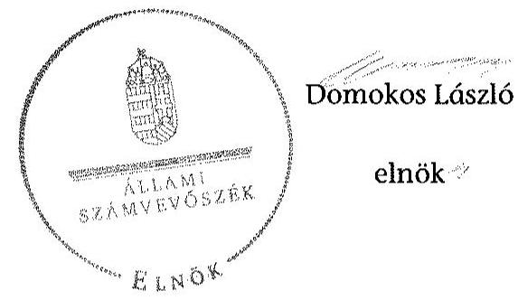

---

# RÖVIDÍTÉSEK JEGYZÉKE 

| Jogszabályok |  |
| :--: | :--: |
| Áht. 1 | Az államháztartásról szóló 1992. évi XXXVIII. törvény (hatálytalan: 2012.01.01-től) |
| Áht. 2 | Az államháztartásról szóló 2011. évi CXCV. törvény |
| ÁSZ tv. | Az Állami Számvevőszékről szóló 2011. évi LXVI. törvény |
| Avtv. | A személyes adatok védelméről és a közérdekű adatok nyilvánosságáról szóló 1992. évi LXIII. törvény (hatálytalan: 2012. január 1-jétől) |
| Evt. $_{1}$ | Az erdőről és az erdő védelméről szóló 1996. évi LIV. törvény (hatálytalan: 2009. július 10-től) |
| Evt. 2 | Az erdőről, az erdő védelméről és az erdőgazdálkodásról szóló 2009. évi XXXVII. törvény (hatályos: 2009. július 10-től) |
| Evr. $_{1}$ | Az erdőről és az erdő védelméről szóló 1996. évi LIV. törvény végrehajtásáról szóló 29/1997. (IV. 30.) FM rendelet (hatálytalan: 2009. november 21-től) |
| Evr. 2 | Az erdőről, az erdő védelméről és az erdőgazdálkodásról szóló 2009. évi XXXVII. törvény végrehajtásáról szóló 153/2009. (XI. 13.) FVM rendelet (hatályos: 2009. november 21-től) |
| Gt. | A gazdasági társaságokról szóló 2006. évi IV. törvény (hatályos: 2014. március 14-ig) |
| Info. tv. | Az információs önrendelkezési jogról és az információszabadságról szóló 2011. évi CXII. törvény |
| Mfbtv. | A Magyar Fejlesztési Bank Részvénytársaságról szóló 2001. évi XX. törvény |
| Nfatv. | A Nemzeti Földalapról szóló 2010. évi LXXXVII. törvény |
| Nvtv. | A nemzeti vagyonról szóló 2011. évi CXCVI. törvény |
| Ptk. | A Polgári Törvénykönyvről szóló 1959. évi IV. törvény (hatályos: 2014. március 14-ig) |
| Számv. tv. | A számvitelről szóló 2000. évi C. törvény |
| új Ptk. | A Polgári Törvénykönyvről szóló 2013. évi V. törvény |
| Vadvédelmi tv. | A vad védelméről, a vadgazdálkodásról, valamint a vadászatról 1996. évi LV. törvény |
| Vhr. | Az állami vagyonnal való gazdálkodásról szóló 254/2007. (X. 4.) Korm. rendelet |
| Vtv. | Az állami vagyonról szóló 2007. évi CVI. törvény |
| 262/2010. (XI.17.) Korm. rendelet | A Nemzeti Földalapba tartozó földrészletek hasznosításá- |

---

# Egyéb rövidítések 

| Alapító | A Magyar Állam, akinek a nevében a társaság feletti tulajdoni joggyakorló jár el |
| :--: | :--: |
| Alapító Okirat | A VERGA Zrt. mindenkori hatályos Alapító Okirata |
| ÁSZ | Állami Számvevőszék |
| ÁV Rt. | Állami Vagyonkezelő Rt. |
| Belső Ellenőrzési Sza-   bályzat | A VERGA Zrt. mindenkori Belső Ellenőrzési Szabályzata |
| DTÜ | Döntéshozó Testületeinek Ügyrend |
| E Ft | ezer forint |
| Erdészeti hatóság | Megyei Mezőgazdasági Szakigazgatási Hivatal Erdészeti Igazgatóság 2010. december 31-ig, Megyei Kormányhivatal Erdészeti Igazgatósága 2011. január 1-jétől (10 megyében) |
| FB | Felügyelő bizottság |
| FM | Földművelésügyi Minisztérium |
| Forrás-SQL rendszer | Integrált ügyviteli rendszer, amelynek feladata volt a vagyonkezelők számára a vagyonkataszteri jelentés elkészítésének és adathordozón történő továbbításának biztosítása, valamint a tulajdonosi joggyakorló vagyonkezelésében lévő vagyonelemek elektronikus adatbázisban történő tételes nyilvántartása |
| ha | hektár |
| HM | Honvédelmi Minisztérium |
| INTOSAI | Legfőbb Ellenőrző Intézmények Nemzetközi Szervezete |
| ISSAI | nemzetközi standardok |
| JT | jegyzett tőke |
| KIM | Közigazgatási és Igazságügyi Minisztérium |
| KVI | Kincstári Vagyoni Igazgatóság |
| M Ft | millió forint |
| MFB Zrt. | Magyar Fejlesztési Bank Zrt. |
| MNV Zrt. | Magyar Nemzeti Vagyonkezelő Zrt. |
| NFA | Nemzeti Földalapkezelő Szervezet |
| NFM | Nemzeti Fejlesztési Minisztérium |
| NVT | Nemzeti Vagyongazdálkodási Tanács |
| nyt. szám | nyilvántartási szám |
| RJGY | részvényesi jogok gyakorlója |
| ST | saját tőke |
| sz. | számú |
| Számviteli Politika | A VERGA Zrt. Számviteli Politikája |
| SZMSZ | A VERGA Zrt. Szervezeti és Működési Szabályzata |
| Társaság | VERGA Veszprémi Erdőgazdaság Zrt. |

---

Tulajdonosi joggyakorló ${ }_{1}$

Tulajdonosi joggyakorló ${ }_{2}$

Tulajdonosi joggyakorló ${ }_{3}$
Vadászati hatóság

VERGA Zrt.

Magyar Nemzeti Vagyonkezelő Zrt., mint a társaság részesedései feletti tulajdonosi joggyakorló 2009. január 1-jétől 2010. június 16-áig

Magyar Fejlesztési Bank Zrt., mint a társaság részesedései feletti tulajdonosi joggyakorló 2010. június 17-étől 2014. július 15-éig
Földművelésügyi Minisztérium, mint a társaság részesedései feletti tulajdonosi joggyakorló 2014. július 16-tól
Megyei Mezőgazdasági Szakigazgatási Hivatal Földművelésügyi Igazgatóság Vadászati és Halászati Osztály 2010. december 31-ig, Megyei Kormányhivatal Földművelésügyi Igazgatósága 2011. január 1-jétől (10 megyére)

VERGA Veszprémi Erdőgazdaság Zrt.

---

.

---

# FOGALOMTÁR 

állami vagyon
állami vagyon
használója
állatható szervezet
földbirtok-politikai irányelvek
hasznosítás
immateriális szolgáltatásából származó bevétel
információs és kommunikációs rendszer
Kincstári Vagyoni Igazgatóság

Állami vagyon:
a) az állam tulajdonában lévő dolog, valamint dolog módjára hasznosítható természeti erő;
b) az a) pont hatálya alá tartozó mindazon vagyon, amely vonatkozásában törvény az állam kizárólagos tulajdonjogát nevesíti;
c) az állam tulajdonában lévő tagsági jogviszonyt megtestesítő értékpapír, illetve az államot megillető egyéb társasági részesedés;
d) az államot megillető olyan immateriális, vagyoni értékkel rendelkező jogosultság, amelyet jogszabály vagyoni értékű jogként nevesít;
e) az állam tulajdonában lévő pénzügyi eszközök.
Az állami vagyon használója az a természetes vagy jogi személy, jogi személyiséggel nem rendelkező szervezet, aki, vagy amely törvény vagy szerződés alapján, bármely jogcímen (bérlet, haszonbérlet, használat stb.) állami vagyont birtokol, használ, szedi annak használt. (Ide nem értve a haszonélvezőt, a vagyonkezelőt és a tulajdonosi jogok gyakorlóját.)
Átlátható szervezet a Nvtv. 3. § (1) bekezdés 1. pontjában felsorolt, a meghatározott követelményeknek megfelelő szervezet.
Az Nfatv. 15. § (3) bekezdés a)-s) pontjaiban meghatározott, a Nemzeti Földalapba tartozó földrészletek hasznosítására vonatkozó irányelvek.
Hasznosítás a tulajdonosi joggyakorló vagy a nemzeti vagyon használója által a nemzeti vagyon birtoklásának, használatának, hasznok szedése jogának bármely - a tulajdonjog átruházását nem eredményező - jogcímen történő átengedése, ide nem értve a vagyonkezelésbe adást, valamint a haszonélvezeti jog alapítását.
Immateriális szolgáltatásból származó bevételek azok a nem anyagjellegű szolgáltatásokból származó állami bevételek, amelyeket az Evt. 3.
 § (1) bekezdése szerint, a külön jogszabályban meghatározott részletes feltételek szerint, az erdők fenntartására, gyarapítására és védelmére kell fordítani.
Az információs és kommunikációs rendszer biztosítja, hogy az információk eljussanak az illetékes szervezethez, szervezeti egységhez, illetve személyhez.
A Vtv. 61. § (1) bekezdése értelmében a Kincstári Vagyoni Igazgatóság (a továbbiakban: KVI) 2007. december 31-ei hatállyal megszűnt, jogai és kötelezettségei ezen időponttól - a 66. § (1) bekezdésében megjelölt feladat kivételével - az MNV Zrt.-re szálltak. A KVI 66. § (1) bekezdésben foglalt feladata a kincstárra szállt. A jogok és kötelezettségek átszállása nem minősült a KVI által kötött szerződések módosításának.

---

kockázatkezelés
kockázatkezelési rendszer
kontrolling
kontrollkörnyezet
kontrolltevékenységek
közfeladat

A kockázatkezelés a szervezet céljai elérésével kapcsolatos kockázatok azonosításának és elemzésének, valamint a megfelelő válaszok meghatározásának folyamata.
A kockázatkezelési rendszer működtetése során fel kell mérni és meg kell állapítani a szervezet tevékenységében, gazdálkodásában rejlő kockázatokat, valamint meg kell határozni az egyes kockázatokkal kapcsolatban szükséges intézkedéseket, valamint azok teljesítésének folyamatos nyomon követésének módját. A kockázatkezelési rendszer olyan irányítási eszközök és módszerek összessége, amelynek elemei a szervezeti célok elérését veszélyeztető tényezők (kockázatok) azonosítása, elemzése, nyomon követése, valamint szükség esetén a kockázati kitettség mérséklése.
Az a vezetéstámogató rendszer, amely a vezetői tervezést, ellenőrzést, valamint információ-ellátást koordinálja célorientáltan a környezeti változásokhoz igazodva.
A kontroll környezet elemei: a szervezeti struktúra, a felelősségi, hatásköri viszonyok és feladatok, a szervezet minden szintjén meghatározott etikai elvárások, a humánerőforrás-kezelés. A kontrollkörnyezet alapozza meg a belső kontroll összes többi elemét a fegyelem és a struktúra biztosítása által.
A kontrollrendszer a kockázatok kezelése és tárgyilagos bizonyosság megszerzése érdekében kialakított folyamatrendszer, amely azt a célt szolgálja, hogy megvalósuljanak a következő célok:
a) a működés és a gazdálkodás során a tevékenységeket szabályszerűen, gazdaságosan, hatékonyan, eredményesen hajtsák végre,
b) az elszámolási kötelezettségeket teljesítsék, és
c) megvédjék az erőforrásokat a veszteségektől, károktól és nem rendeltetésszerű használattól.
A kontrolltevékenységek azok az elvek (politikák) és eljárások, amelyeket a kockázatok meghatározása és a szervezet céljainak elérése érdekében alakítanak ki.
A közfeladat jogszabályban meghatározott állami vagy önkormányzati feladat, amit az arra kötelezett közérdekből, jogszabályban meghatározott követelményeknek és feltételeknek megfelelve végez, ideértve a lakosság közszolgáltatásokkal való ellátását, továbbá az állam nemzetközi szerződésekben vállalt kötelezettségeiből adódó közérdekű feladatokat, valamint e feladatok ellátásához szükséges infrastruktúra biztosítását is. Az Etv. 2. § (2) bekezdése szerint a fenntartható erdőgazdálkodás során a legfontosabb közérdekű feladat az erdők változatosságának megőrzése, az erdők fenntartása, felújítása és a védelmi, valamint közjóléti szolgáltatások biztosítása, melyek elvégzését az állam megfelelő eszközökkel biztosítja.

---

monitoring

Nemzeti Földalap
nemzeti vagyon használója
rábízott állami vagyon
társasági portfólió

A szervezet tevékenységének, a célok megvalósításának nyomon követését biztosító rendszer, amely az operatív tevékenységek keretében megvalósuló folyamatos és eseti nyomon követésből, valamint az operatív tevékenységektől függetlenül működő belső ellenőrzésből áll. A monitoring a projektek és programok végrehajtásának nyomon követése, mely a támogató és a kedvezményezett közti megállapodásban foglalt eljárások követését, az előrehaladás ellenőrzését és a lehetséges problémák időben történő azonosítását szolgálja.
A Nemzeti Földalap a kincstári vagyon része, amelybe beletartoznak az állam tulajdonában és az ingatlan-nyilvántartásban levő, az Nfatv. 1. § (1)-(2) bekezdéseiben felsorolt területek, földrészletek és az azokhoz kapcsolódó vagyoni értékű jogok.
Az Nfatv. 15. § (1)${ }^{1}$, valamint 1. § (1)${ }^{2}$ bekezdése értelmében 2010. szeptember 1-jétől az erdőgazdasági társaság vagyonkezelésében lévő földterületek a Nemzeti Földalapba tartoznak, azok felett a tulajdonos jogait az agrárpolitikáért felelős miniszter az NFA útján gyakorolja.
A nemzeti vagyon használója az a természetes személy, jogi személy vagy jogi személyiséggel nem rendelkező szervezet, aki, vagy amely állami vagyon tekintetében törvény vagy szerződés alapján, a helyi önkormányzat vagyona tekintetében törvény, a helyi önkormányzat rendelete vagy szerződés alapján bármely jogcímen nemzeti vagyont birtokol, használ, szedi annak hasznait, kivéve a tulajdonosi joggyakorló (az Nvtv. 3. § (1) bekezdés 11. pontja alapján).
Rábízott állami vagyon az a Vtv. alkalmazásában állami vagyonnak minősülő vagyon, amit az MNV - a saját vagyonától elkülönítetten - kezel és nyilvántart. Az Mfbtv. 3. § (9) bekezdése szerint rábízott állami vagyon az a vagyon, amely felett az Mfbtv. erejénél fogva a Magyar Állam nevében az MFB gyakorolja a tulajdonosi jogokat. Az Nfatv. 1. § (1) bekezdésében foglaltak alapján az NFA-hoz tartozó rábízott vagyon a törvényben meghatározott, a Nemzeti Földalapba tartozó vagyon.
Társasági portfólió az MNV, illetve az MFB rábízott vagyonába tartozó állami tulajdonú társasági részesedések.

[^0]
[^0]:    ${ }^{1}$ Hatályos: 2010. szeptember 1 - 2011. július 31.
    ${ }^{2}$ Hatályos: 2010. szeptembertől, módosítva: 2011. augusztus 1-jétől.

---

tulajdonosi ellenőrzés
tulajdonosi joggyakorló
tulajdonosi joggyakorlás módja
vagyongazdálkodás feladata
vagyonkezelői jog

Az MNV/MFB/FM tulajdonosi joggyakorló által végzett ellenőrzés, amelynek célja az állami vagyonnal való gazdálkodás vizsgálata, ennek keretében a rendeltetésellenes, jogszerűtlen, szerződésellenes, vagy a tulajdonos érdekeit sértő, illetve a központi költségvetést hátrányosan érintő vagyongazdálkodási intézkedések feltárása és a jogszerű állapot helyreállítása, továbbá a vagyonnyilvántartás hitelességének, teljességének és helyességének biztosítása.
Tulajdonosi joggyakorló az, aki az állami, illetve a nemzeti vagyon felett az államot megillető tulajdonosi jogok és kötelezettségek gyakorlására jogosult.
Az állami vagyon felett a Magyar Államot megillető tulajdonosi jogoknak (és kötelezettségeknek) az összességét az állami vagyon felügyeletéért felelős miniszter gyakorolja, aki e feladatát az MNV, és az MFB útján látja el. A Vtv. alapján 2010. június 16-ig az MNV Zrt. a tulajdonosi jogait megosztotta a HM-mel. A tulajdonosi jogok megosztását a felek a közöttük 2008. május 29-én kelt vagyonkezelői szerződésben szabályozták. Azon állami tulajdonban álló ingatlanok felett, amelyek egy része a Nemzeti Földalapba tartozik, a tulajdonosi jogokat a miniszter az agrárpolitikáért felelős miniszterrel közösen gyakorolja. A Nemzeti Földalap felett a Magyar Állam nevében a tulajdonosi jogokat és kötelezettségeket az agrárpolitikáért felelős miniszter a Nemzeti Földalapkezelő Szervezet útján gyakorolja.
Az állami vagyon rendeltetésének megfelelő - az állami feladatok ellátásához, a társadalmi szükségletek kielégítéséhez, valamint a Kormány gazdaságpolitikája megvalósításának elősegítéséhez szükséges, egységes elveken alapuló, önálló ágazatként megjelenő - hatékony, költségtakarékos, értékmegőrző, értéknövelő felhasználásának biztosítása, beleértve a vagyoni kör változását eredményező értékesítést, valamint az állami vagyon gyarapítása is.
Vagyonkezelési szerződés alapján a vagyonkezelő jogosult meghatározott, állami tulajdonba tartozó dolog birtoklására, használatára és hasznai szedésére. A Vtv. alapján a vagyonkezelői jog az állami vagyon hasznosítására az MNV-vel kötött vagyonkezelési szerződéssel jön létre. A vagyonkezelési szerződés alapján a vagyonkezelő jogosult meghatározott, állami tulajdonba tartozó dolog birtoklására, használatára és hasznai szedésére. Az Nfatv. alapján a vagyonkezelői jog az erre irányuló (NFA-val kötött) szerződéssel jön létre. A vagyonkezelői szerződés alapján a vagyonkezelő jogosult meghatározott földrészlet birtoklására, használatára és hasznai szedésére. A vagyonkezelő köteles a földrészlet értékét megőrizni, állagának megóvásáról, jó karban tartásáról gondoskodni, továbbá - az Nfatv.-ben meghatározott esetek kivételével - díjat fizetni vagy a szerződésben előírt más kötelezettséget teljesíteni.

---

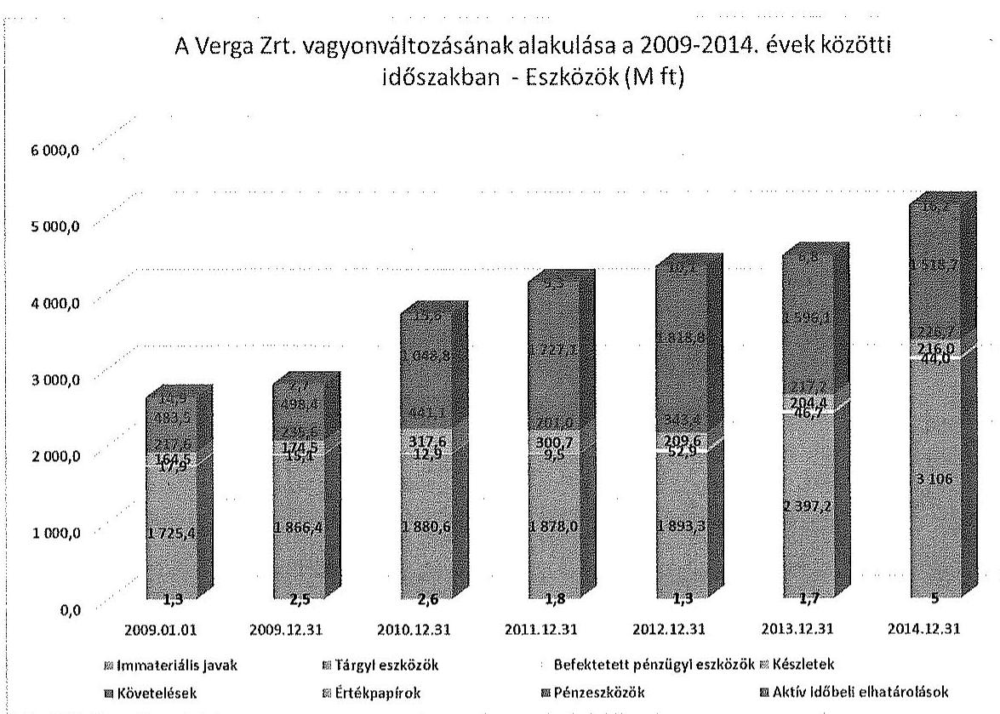

A Verga Zrt. vagyonváltozásának alakulása a 2009-2014. évek közötti időszakban - Források (M ft)
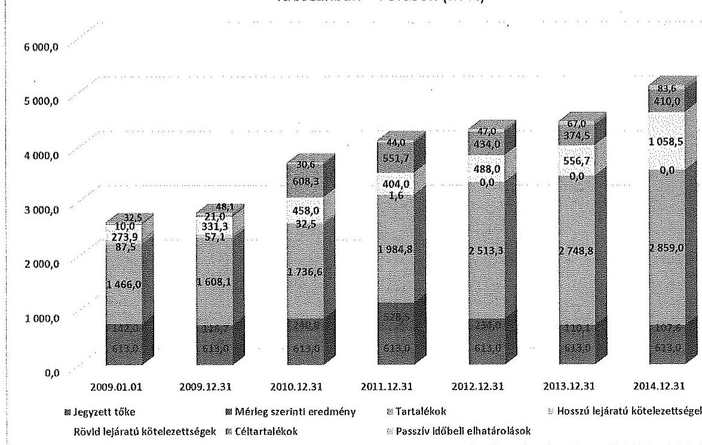

---

Az erdőgazdasági társaság vagyonának alakulása 2009-2014. években adatok ezer Ft-ban

|  Sorszám | Megnevezés | 2009.01.01 | 2009.12.31 | 2010.12.31 | 2011.12.31 | 2012.12.31 | 2013.12.31 | 2014.12.31 | Változás 2014.12.31/2009.12.31 (%)  |
| --- | --- | --- | --- | --- | --- | --- | --- | --- | --- |
|   |  | 1 | 2 | 3 | 4 | 5 | 6 | 7 | 8  |
|  1. | Eszközök |  |  |  |  |  |  |  |   |
|  2. | Befektetett eszközök összesen | 1 744 567 | 1 884 038 | 1 896 002 | 1 889 356 | 1 947 476 | 2 445 653 | 3 154 034 | 167%  |
|  3. | Ebből: Immateriális javak | 1 262 | 2 476 | 2 580 | 1 837 | 1 318 | 1 727 | 4 536 | 359%  |
|  4. | Tárgyi eszközök | 1 725 441 | 1 866 444 | 1 880 565 | 1 878 048 | 1 893 252 | 2 397 181 | 3 105 544 | 166%  |
|  5. | Befektetett pénzügyi eszközök | 17 864 | 15 118 | 12 857 | 9 471 | 52 906 | 46 745 | 43 954 | 291%  |
|  6. | Forgóeszközök | 865 615 | 908 438 | 1 807 461 | 2 228 842 | 2 371 734 | 2 017 752 | 1 961 386 | 216%  |
|  7. | Ebből: Készletek | 164 460 | 174 473 | 317 578 | 300 737 | 209 565 | 204 442 | 216 026 | 124%  |
|  8. | Követelések | 217 635 | 235 580 | 441 094 | 200 975 | 343 413 | 217 163 | 226 690 | 96%  |
|  9. | Értékpapírok | 0 | 0 | 0 | 0 | 0 | 0 | 0 | 0  |
|  10. | Pénzeszközök | 483 520 | 498 385 | 1 048 789 | 1 727 130 | 1 818 756 | 1 596 147 | 1 518 670 | 305%  |
|  11. | Aktív időbeli elhatárolások | 14 858 | 2 745 | 15 563 | 9 286 | 10 096 | 6 813 | 16 172 | 589%  |
|  12. | Eszközök összesen | 2 625 040 | 2 795 221 | 3 719 026 | 4 127 484 | 4 329 306 | 4 470 218 | 5 131 592 | 184%  |
|  13. | Források |  |  |  |  |  |  |  |   |
|  14. | Saját tőke | 2 221 088 | 2 337 834 | 2 589 546 | 3 126 258 | 3 360 301 | 3 471 956 | 3 579 517 | 153%  |
|  15. | Ebből: Jegyzett tőke | 613 000 | 613 000 | 613 000 | 613 000 | 613 000 | 613 000 | 613 000 | 100%  |
|  16. | Tőketartalék | 889 314 | 889 314 | 901 038 | 909 253 | 909 253 | 910 800 | 910 800 | 102% |

 | 102%  |
|  17. | Eredménytartalék | 576 725 | 718 775 | 835 522 | 1 075 508 | 1 604 005 | 1 838 048 | 1 888 157 | 263%  |
|  18. | Lekötött tartalék | 0 | 0 | 0 | 0 | 0 | 0 | 60 000 | 0  |
|  19. | Értékelési tartalék | 0 | 0 | 0 | 0 | 0 | 0 | 0 | 0  |
|  20. | Mérleg szerinti eredmény | 142 049 | 116 748 | 239 986 | 528 497 | 234 043 | 110 108 | 107 560 | 92%  |
|  21. | Célzott tartalékok | 9 994 | 20 968 | 608 314 | 551 650 | 434 028 | 374 545 | 409 997 | 1955%  |
|  22. | Kötelezettségek | 361 416 | 388 355 | 490 525 | 405 596 | 488 023 | 556 690 | 1 058 507 | 273%  |
|  23. | Ebből: Hátresoronít kötelezettségek | 0 | 0 | 0 | 0 | 0 | 0 | 0 | 0  |
|  24. | Hosszú lejáratú kötelezettségek | 87 507 | 57 091 | 32 526 | 1 564 | 0 | 0 | 0 | 0%  |
|  25. | Rövid lejáratú kötelezettségek | 275 909 | 331 264 | 457 999 | 404 032 | 488 023 | 556 690 | 1 058 507 | 320%  |
|  26. | Passzív időbeli elhatárolások | 32 542 | 48 063 | 30 641 | 43 980 | 46 954 | 67 027 | 83 571 | 174%  |
|  27. | Források összesen | 2 625 040 | 2 795 221 | 3 719 026 | 4 127 484 | 4 329 306 | 4 470 218 | 5 131 592 | 184%  |

---

|  1. |  |  |  |  |  |  |  |  |  |  |  |  |  |  |  |   |
| --- | --- | --- | --- | --- | --- | --- | --- | --- | --- | --- | --- | --- | --- | --- | --- | --- |
|   |  |  |  |  |  |  |  |  |  |  |  |  |  |  |  |   |
|   |  |  |  |  |  |  |  |  |  |  |  |  |  |  |  |   |
|   |  |  |  |  |  |  |  |  |  |  |  |  |  |  |  |   |
|   |  |  |  |  |  |  |  |  |  |  |  |  |  |  |  |   |
|   |  |  |  |  |  |  |  |  |  |  |  |  |  |  |  |   |
|   |  |  |  |  |  |  |  |  |  |  |  |  |  |  |  |   |
|   |  |  |  |  |  |  |  |  |  |  |  |  |  |  |  |   |
|   |  |  |  |  |  |  |  |  |  |  |  |  |  |  |  |   |
|   |  |  |  |  |  |  |  |  |  |  |  |  |  |  |  |   |
|   |  |  |  |  |  |  |  |  |  |  |  |  |  |  |  |   |
|   |  |  |  |  |  |  |  |  |  |  |  |  |  |  |  |   |
|   |  |  |  |  |  |  |  |  |  |  |  |  |  |  |  |   |
|   |  |  |  |  |  |  |  |  |  |  |  |  |  |  |  |   |
|   |  |  |  |  |  |  |  |  |  |  |  |  |  |  |  |   |
|   |  |  |  |  |  |  |  |  |  |  |  |  |  |  |  |   |
|   |  |  |  |  |  |  |  |  |  |  |  |  |  |  |  |   |
|   |  |  |  |  |  |  |  |  |  |  |  |  |  |  |  |   |
|   |  |  |  |  |  |  |  |  |  |  |  |  |  |  |  |   |
|   |  |  |  |  |  |  |  |  |  |  |  |  |  |  |  |   |
|   |  |  |  |  |  |  |  |  |  |  |  |  |  |  |  |   |
|   |  |  |  |  |  |  |  |  |  |  |  |  |  |  |  |   |
|   |  |  |  |  |  |  |  |  |  |  |  |  |  |  |  |   |
|   |  |  |  |  |  |  |  |  |  |  |  |  |  |  |  |   |
|   |  |  |  |  |  |  |  |  |  |  |  |  |  |  |  |   |
|   |  |  |  |  |  |  |  |  |  |  |  |  |  |  |  |   |
|   |  |  |  |  |  |  |  |  |  |  |  |  |  |  |  |   |
|   |  |  |  |  |  |  |  |  |  |  |  |  |  |  |  |   |
|   |  |  |  |  |  |  |  |  |  |  |  |  |  |  |  |   |
|   |

---

.

---

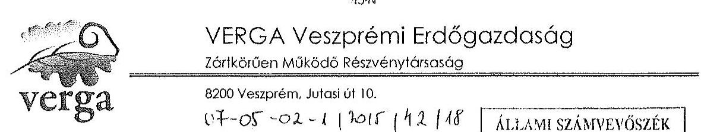

Domokos László úr
Elnök
Állami Számvevőszék
Budapest

Tisztelt Elnök Úr!
A VERGA Veszprémi Erdőgazdaság Zrt. vezetése az Állami Számvevőszék V-0768-052/2015 iktatószámmal ellátott „Az állam tulajdonában álló erdőgazdasági társaságok tevékenységének ellenőrzése - VERGA Veszprémi Erdőgazdaság Zrt." címmel készített számvevőszéki jelentéstervezetét megvizsgálta.

Hivatkozva az ÁSZ tv. 29 § (2) bekezdésben foglaltakra, az ellenőrzés megállapításaira a következőkben részletezett írásbeli észrevételekkel élek.

Veszprém, 2015.11.10.

Tisztelettel:
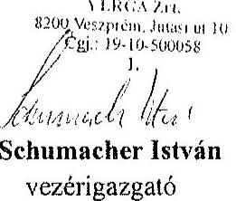

Schumacher István
vezérigazgató

---

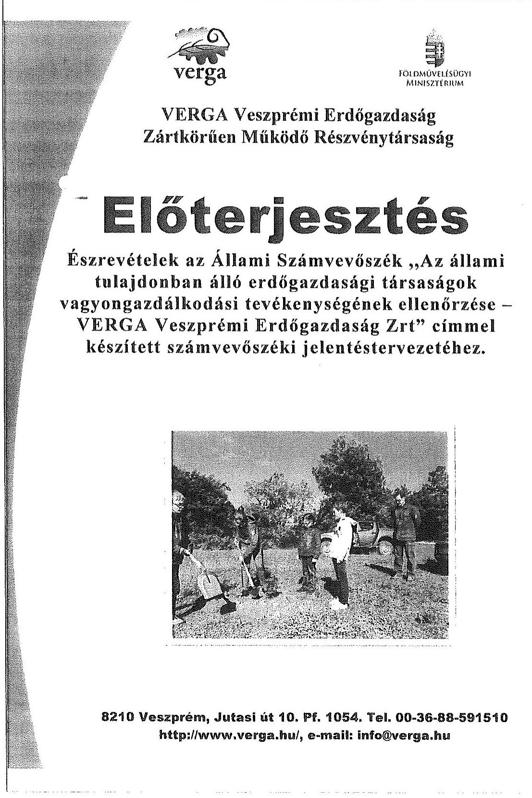

8210 Veszprém, Jutasi út 10. Pf. 1054. Tel. 00-36-88-591510 http://www.verga.hu/, e-mail: info@verga.hu

---

# ÉSZREVÉTELEK 

## „Az állam tulajdonában álló erdőgazdasági társaságok tevékenységének ellenőrzése - VERGA Veszprémi Erdőgazdaság Zrt." címmel készített számvevőszéki jelentéstervezethez

## 4. oldal

 harmadik bekezdés

...A vagyonkezelő HM-mel kötött használatba adási szerződés alapján 49960,0 ha állami tulajdonban lévő területet használtak.....

Javasolt megfogalmazás:
...A vagyonkezelő HM-mel kötött, az aktuálisan hatályos használatba adási szerződés alapján annak mellékletében részletezett és rögzített nagyságú területet használtak....

Indoklás: A tervezetben szereplő 49960,0 ha nem felel meg a 2009.03.12-én kelt használatba adási szerződés mellékletében felsorolt ingatlanvagyonnal. A leírt adat a vizsgált időszak egészére nem, csak a használatba adási szerződés 2010. szeptember 10-i módosítását következő módosításig, 2012.06.27-ig volt helytálló.

## 6. oldal második bekezdés

...Az ellenőrzött időszakban a Társaság mérlege nem a valós állapotot tükrözte, mert a Társaság a saját tulajdonában álló erdőket és földingatlanokat a számviteli törvény előírásai ellenére mérlegében nem szerepeltette...

Javasolt megfogalmazás:
...Az ellenőrzött időszakban a Társaság mérlege a valós állapotot tükrözte. A megalakuláskor apport címén nulla értékben kapott erdők és földingatlanok értékei a vizsgált időszak a tárgyi eszközök analitikus nyilvántartásában nem jelentek meg. Nulla értéket képviseltek miután ez az érték volt az apportáláskor a saját tulajdonú földterületek bekerülési értéke, így a mérleg sorok értékét ez a körülmény számszerűen nem befolyásolta. A beszámolókban egyébként eszközként vannak kimutatva és a mérlegben értékkel szerepelnek azok a saját tulajdonú ingatlanok, melyek nem ezen apport útján kerültek a Társaság tulajdonába.

Indoklás: A Társaság saját tulajdonú erdő és föld ingatlanjainak döntő többségét a HM VERGA Rt. 1993. évi megalakulásakor szerezte az állami vállalatból történő cégjogi átalakulás során. A saját tulajdonú földterületek a jogelőd könyv szerinti értékén, az átalakulási

---

vagyonmérleg szerint nulla értéken kerültek át a társasághoz. Az átalakulási vagyon leltárban nulla értékben apportként átvett „0" értékben nyilvántartott saját tulajdonú földterületeket (erdőket) csak a birtoknyilvántartások tartalmazták. A Társaság a nyilvántartott földterületeinek nagyságát a vizsgált évek üzleti jelentéseiben minden évben szerepeltette.

# 6. oldal második bekezdés 

...Az átvett területeken végzett erdőtelepítések értékét a Számv tv. előírásainak megfelelően könyveiben szerepeltette, azonban a megbízás megszünésekor azokat a nyilvántartásaiból nem vezette ki...

Javasolt megfogalmazás:
...Az átvett területeken végzett erdőtelepítések értékét a Számv tv. előírásainak megfelelően könyveiben szerepeltette, azonban az erdőterületeket nyilvántartásaiból a hatóság erdőgazdálkodóként való törlése után nem vezette ki....

Indoklás: A vizsgált időszakban két erdőrészlet került befejezésre 10,5 ha területnagysággal a magánszemélyektől átvett területek esetében. Az befejezésről szóló hatósági határozat után ezen erdőtelepítések aktivált értékének a Társaság könyveiben történő elkülönítése megtörtént. A megbízási szerződés lejártát követően azért nem történt meg ezekben az esetekben az aktivált érték kivezetése, mert az erdő visszaadását egyik fél sem kezdeményezte, erdőgazdálkodóként továbbra is a VERGA Veszprémi Erdőgazdaság Zrt. volt bejegyezve 2014. augusztus 23-ig. Ezen a napon a Veszprém Megyei Kormányhivatal határozata alapján a szerződéses viszony hiánya miatt a hatóság törölte a Verga Zrt.-t, mint erdőgazgazdálkodót. Az aktivált érték kivezetésének időpontját véleményünk szerint ez a dokumentum határozza meg, mivel a szerződés lejártát nem követte átadás-átvétel, tehát nem valósult meg a Számv. tv. 23 §-ban foglalt a megbízó felé rendelkezésre, használatára bocsátás.

## 6. oldal harmadik bekezdés

...A HM. nyilvántartása és a Társaság nyilvántartása alapján megállapítható, hogy a Társaság nyilvántartásából a honvédelmi célra feleslegessé nyilvánittott területeket teljes körűen nem vezette ki, ezért a Társaság nyilvántartása nem támogatta megfelelően az állami vagyonnal való felelős gazdálkodást...

Javasolt megfogalmazás:
...A HM. nyilvántartásának és a Társaság nyilvántartásának összehasonlítása alapján megállapítható, hogy a honvédelmi célra feleslegessé vált területek vonatkozásában nem lelhető fel egyezőség, azonban egyértelműen nem mondható ki, hogy a Társaság nyilvántartása nem megfelelően támogatta az állami vagyonnal való felelős gazdálkodást...

---

Indoklás: A vizsgált időszakban 2012-ben és 2014-ben történt honvédelmi célra feleslegessé nyilvánított területek átadása a használatba adási szerződésben szereplő ingatlanok közül. 2012ben egy esetben a INF/114-33/2012 számú ügyiratban kaptunk tájékoztatást összesen 45,576 ha. átadásáról. Nyilvántartásunk ennek a területnagyságnak a kivezetését tartalmazza. Amennyiben a HM által nyilvántartott 52,5941 ha volt feleslegessé nyilvánítva, akkor a hiányzó 7,0101 ha-t tartalmazó feleslegessé nyilvánításról szóló határozat nem jutott el Társasághoz. A HM által nyilvántartott adatok megfelelősége a 2014-ben közölt adatokból egyértelműen cáfolható. A mellékletekben csatolt átadás-átvételi jegyzőkönyvekből megállapítható, hogy a 2014-ben feleslegessé nyilvánított és átadott területek nagysága jelentősen mintegy 200 ha-ral meghaladja a jelentéstervezetben szereplő HM által közölt adatokat.
lásd. mellékletek: 2012. INF/114-33/2012 ügyirat
2014. 17 db . átadás-átvételi jegyzőkönyv

A leírt indokok alapján kérjük a Társaságra nézve egyértelműen elmarasztaló szövegrész módosítását.

# 8. oldal harmadik bekezdés 

...A könyvvizsgálók a Társaság 2009-2013. évekre vonatkozó beszámolóit hitelesítő záradékkal látták el annak ellenére, hogy a beszámolók értékben nem tartalmazták a saját tulajdonban lévő erdőket és földterületeket, a mérlegben olyan erdőtelepítések aktivált értékei kerültek kimutatásra, amelyek már nem voltak a Társaság használatában, valamint mennyiségi leltározás hiányában a leltárak a mérleg adatait áttekinthető és megbízható módon nem támasztották alá.

Javasolt megfogalmazás:
...A könyvvizsgálók a Társaság 2009-2013. évekre vonatkozó beszámolóit hitelesítő záradékkal látták el annak ellenére, hogy teljes körű mennyiségi leltározás hiányában a leltárak a mérleg adatait áttekinthető és megbízható módon nem támasztották alá....

Indoklás: A saját tulajdonú apportként kapott erdők és földterületek mérlegben és beszámolóban történő bemutatásának problémakörét már az előzőekben érintettük. Ebben az időszakban (2009-2013) nem voltak olyan erdőtelepítések a Társaság mérlegeiben, melyek nem voltak a Társaság használatában. Az aktivált és befejezett magán erdőtelepítések esetében is a Társaság maradt az erdőgazdálkodó, ebben az időszakban átadás-átvétel nem történt.

A leltározással kapcsolatban a számvevőszéki vizsgálat a Számv. tv. 69. § (3) bekezdésében foglaltak teljes körű betartását írta elő.

---

# 11. oldal 

## A VERGA Veszprémi Erdőgazdaság Zrt vezérigazgatójának:

A Társaság vezetőjéhez intézett megállapítások és javaslatok a számvevőszéki jelentéstervezet előző oldalain ismertetett hiányosságok illetve a számvevők által feltárt helytelennek ítélt gyakorlat megszüntetésére irányulnak.

A konkrét észrevételeket az egyes általunk másképp gondolt megállapításokhoz megtettük.
Észrevételeink figyelembe vétele után kérjük, hogy az ebben a fejezetben megfogalmazásra került megállapításokat és javaslatokat észrevételeinkkel mérlegelve dolgozza át.

A VERGA Veszprémi Erdőgazdaság Zrt. vezetésének eltökélt célja, hogy a külső és belső ellenőrzések által feltárt hiányosságokat haladéktalanul megszüntesse.

## 13. oldal negyedik bekezdés

....A társaság a saját tulajdonában álló erdőket és földingatlanokat a Számv. tv. 23 § (1) előírásai ellenére mérlegében nem szerepeltette, ezáltal a mérleg nem a valós állapotot tükrözte,...

Javasolt megfogalmazás, vagy javaslat a megállapítás törlésére:
A társaság a megalakulásakor nulla értékben apportba kapott saját tulajdonú erdőket és földingatlanokat a tárgyi eszközök analitikus nyilvántartásában nem szerepeltek, ám értékük a mérleg sorok összegszerűségét nem befolyásolták.

Indoklás: A korábban leírtak alapján, a számvevőszéki megfogalmazás azért nem pontos, mert a Társaság mérlegében a vizsgált időszakban mindig szerepeltek saját tulajdonú ingatlanok értékkel a könyveinkben.

## 17. oldal harmadik bekezdés

...Az ellenőrzött időszakban a Társaság a magánszemélyekkel kötött megbízási szerződés alapján 10,5 ha átvett erdőterületen erdőtelepítési végzett...

Javasolt megfogalmazás:
Az ellenőrzött időszakban a Társaság a magánszemélyekkel kötött megbízási szerződés alapján kezelt erdőtelepítések közül 10,5 ha. erdőtelepítést fejezett be ...

Indoklás: Téves megfogalmazás. Ebben az időszakban lényegesen több megbízási szerződés alapján kezelt erdőtelepítés erdőgazdálkodója volt a Társaság amiből 10,5 ha került ebben az időszakban befejezésre.

---

# 20. oldal harmadik bekezdés 

...A HM nyilvántartása és a Társaság nyilvántartása alapján megállapítható, hogy a Társaság nyilvántartásából a honvédelmi célra feleslegegessé nyilvánitott területeket teljes körűen nem vezette ki, ezért a Társaság nyilvántartása nem támogatta megfelelöen az állami vagyonnal való felelős gazdálkodást....

Javasolt megfogalmazás:
...A HM. nyilvántartásának és a Társaság nyilvántartásának összehasonlítása alapján megállapítható, hogy a honvédelmi célra feleslegessé vált területek vonatkozásában nem lelhető fel egyezőség, így egyértelműen nem mondható ki, hogy a Társaság nyilvántartása megfelelően támogatta az állami vagyonnal való felelős gazdálkodást...

Indoklás: ez a normaszöveg már szerepelt a jelentéstervezet 6. oldalán. Az arra tett indoklást fenn tartjuk, ami egyben a 21. oldal egyes bekezdésében leírtakon alapszik.

---

.

---

# 6. SZÁMÚ MELLÉKLET A V-0768-073/2015. SZÁMÚ JELENTÉSHEZ 

## E L H Ö K

## SZÁMVEVŐSZÉK

Ikt.szám: V-0768-063/2015.

## Schumacher István úr

vezérigazgató
VERGA Veszprémi Erdőgazdaság Zrt.

## Veszprém

## Tisztelt Vezérigazgató Úr!

A „Jelentéstervezet az állami tulajdonban álló erdőgazdasági társaságok vagyongazdálkodási tevékenységének ellenőrzése - VERGA Veszprémi Erdőgazdaság Zrt." címmel készített számvevőszéki jelentéstervezetre tett észrevételeit köszönettel megkaptam.

Az Állami Számvevőszék észrevételekre vonatkozó álláspontjáról a felügyeleti vezető által készített részletes tájékoztatást csatoltan megküldöm.

Tájékoztatom Vezérigazgató urat, hogy a számvevőszéki jelentésben - az Állami Számvevőszékről szóló 2011. évi LXVI. törvény 29. § (3) bekezdése alapján - a figyelembe nem vett észrevételeket szerepeltetjük az elutasítás indokának feltüntetésével.

Budapest, 2015. hó nap
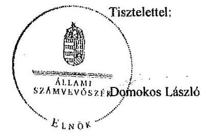

Melléklet: Tájékoztatás az elfogadott és el nem fogadott észrevételekről

---

# Tájékoztatás   az elfogadott és el nem fogadott észrevételekról 

A „Jelentéstervezet az állami tulajdonban álló erdőgazdasági társaságok vagyongazdálkodási tevékenységének ellenőrzése - VERGA Veszprémi Erdőgazdaság Zrt." címû jelentéstervezetre 2015. november 18 -án érkezett észrevételeit áttekintettük, azok kezelésével kapcsolatban a következő tájékoztatást adom.

## 1. észrevétel - 4. oldal harmadik bekezdés

A dokumentumok ismételt áttekintését követően a jelentéstervezet 4. oldal 3. bekezdésének 3. mondatát az alábbiak szerint pontosítjuk:
„A vagyonkezelő HM-mel kötött használatba adási szerződés alapján 48135,3 ha állami tulajdonban lévő területet használtak."

## 2. észrevétel - 6. oldal második bekezdés (mérleg valódiság)

A Számv. tv. 46. § (3) bekezdése alapján az eszközöket és a kötelezettségeket leltározással (mennyiségi felvétellel, egyeztetéssel) ellenőrizni és - a törvényben szabályozott esetek kivételével - egyedenként értékelni kell. A Társaság mérlege a Számv. tv. 23. §-ának előírásai ellenére nem tartalmazta a Társaság saját tulajdonában lévő eszközök értékét, továbbá a Társaság a magánszemélyeknek végzett erdőtelepítések értékét a megbízások megszünésekor a könyveiből nem vezette ki, ezért a Társaság mérlegei nem a valós állapotot tükrözték. A megállapítás módosítása nem szükséges.

## 3. észrevétel - 6. oldal második bekezdés

Az ellenőrzés rendelkezésére bocsátott dokumentumok alapján a Társaság az ellenőrzött időszakban 10,5 ha területen az erdőtelepítést befejezte, a megbízási szerződések 2010. 12. 31én lejárt. A szerződések lejártával a Társaság az ingatlanokat köteles volt a megbízó birtokába visszaadni. A Társaság 2011. április 11-én kezdeményezte a Vas Megyei Kormányhivatal Erdészeti Igazgatóságánál az ingatlanokra vonatkozóan az erdőgazdálkodási nyilvántartásból történő törlését. A hatóság 27.3/3098-2/2011. iktatószámú határozatával a Társaságot az erdőgazdálkodói nyilvántartásból törölte.

A Társaság az erdőtelepítések befejezését követően, a megvalósításra kötött megbízási szerződés lejártát követően, a telepített erdő visszaadásakor (térítésmentes átadásakor) az erdőtelepítések aktivált értékét könyveiből a Számv. tv. 111. § (5) bekezdésében előírtak

---

ellenére nem vezette ki, rendkívüli ráfordításként nem számolta el, ezért a Társaság vagyonáról a beszámoló nem a valós állapotot tükrözte. A fentiek alapján megállapításunk módosítása nem indokolt.

# 4. észrevétel - 6. oldal harmadik bekezdés 

Az észrevételben leírtak megerősítik megállapításainkat, a Társaság által a használatában lévő vagyonról vezetett nyilvántartás nem a pontos, egyeztetett adatokat tartalmazta, a nyilvántartásból a honvédelmi célra feleslegessé nyilvánított területeket nem teljes körűen vezették ki. Ezért megállapításunk módosítása nem indokolt.

## 5. észrevétel - 8. oldal harmadik bekezdés

A 2. és
 3. észrevételre adott válaszunk alapján a megállapítás módosítása nem indokolt.

## 6. észrevétel - 11. oldal

A VERGA Veszprémi Erdőgazdaság Zrt. vezérigazgatójának megfogalmazott intézkedést igénylő megállapítások és javaslatok átdolgozása az észrevételekre adott válaszaink alapján nem szükséges.

## 7. észrevétel - 13. oldal negyedik bekezdés

A megállapítás módosítása a 2. számú észrevételre adott válasz alapján nem indokolt.

## 8. észrevétel - 17. oldal harmadik bekezdés

Az egyértelműség érdekében a jelentéstervezet 11. oldal 1. bekezdés második mondatát és a 17. oldal harmadik bekezdés első mondatát az alábbiak szerint pontosítjuk:
„Az ellenőrzött időszakban a Társaság a magánszemélyekkel kötött megbizási szerződés alapján 10,5 ha átvett területen az erdőtelepítést befejezte."

## 9. észrevétel - 20. oldal harmadik bekezdés

A megállapítás módosítása a 4. észrevételre adott válasz alapján nem indokolt.

Budapest, 2015. 11. hó 26. nap

Makkai Mária
felügyeleti vezető

---

.

---

# 4542 

## MINV | Magyar Nemzeti Vagyonkezelő Zrt.   Vezérigazgató

Állami Számvevőszék

## Domokos László

elnök

1052 Budapest
Apáczai Cs. J. u. 10.

## ÁLLAMI SZÁMVEVÓSZÉK   1051/2015.   Érk.:... 7015 NOV 16.   Iktatási: ...Vezérigazgató   Melleklet.

Ikt. szám
02

Tisztelt Elnök Úr!
A 2015. október 30. napján „Az állami tulajdonban álló erdőgazdasági társaságok vagyongazdálkodási tevékenységének ellenőrzése - VERGA Veszprémi Erdőgazdaság Zrt." tárgyában kézhez vett, V-0768-054/2015. ikt. sz. Jelentés-tervezetre az alábbi észrevételeket kívánom tenni.

## I. fejezet / 8. old. ötödik bekezdés, 9. old. első bekezdés

„...A Társaság feletti tulajdonosi joggyakorló (MNV Zrt.) a számára a Viv-ben előírt rendszeres ellenőrzési kötelezettségének nem tett eleget...."

Az ellenőrzési időszak kezdő időpontja (2009. január 1.) és a Társaság feletti tulajdonosi joggyakorlás MNV Zrt. által történő ellátásának záró időpontja (2010. június 16.) között eltelt időszakban a Honvédelmi Minisztérium volt a Társaság vagyonkezelője, így a Társaság feletti tulajdonosi jogokat és kötelezettségeket (az ellenőrzést is) a vagyonkezelő gyakorolta a vagyonkezelési szerződésben foglaltak szerint.

## I. fejezet / 9. old. második bekezdés, II.5. fejezet / 31. old. hatodik bekezdés és 32. old. első bekezdés

„Az Nfatv. hatályba lépését követően a HM által vagyonkezelt és a Társaság használatába adott ingatlanok vonatkozásában az MNV Zrt. és az NFA között átadás-átvétel nem történt, ezért az NFA nem rendelkezik naprakész nyilvántartási adatokkal a Társaság által használt és a tulajdonosi joggyakorlása alá tartozó földterületekről, ezáltal az NFA az Nfatv-ben előírt naprakész nyilvántartási kötelezettségének nem tett eleget..."

Az NFA tv. hatálybalépésekor az MNV Zrt. és az NFA közötti átadás során nem volt feladat annak vizsgálata, hogy az egyes ingatlanokat a vagyonkezelő, jelen esetben a Honvédelmi Minisztérium hasznosította-e, vagy sem. Az NFA tv. hatálya alá tartozó területek MNV Zrt. és NFA közötti átadása a vagyonkezelő Honvédelmi Minisztérium adatszolgáltatása alapján megtörtént.

Kérem Elnök Urat, hogy a Jelentés véglegesítése során jelen észrevételeinket szíveskedjenek figyelembe venni.
Budapest, 2015. november 16.
Üdvözlettel:
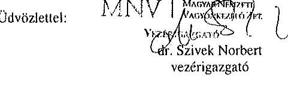
dr. Szivek Norbert
vezérigazgató

---

.

---

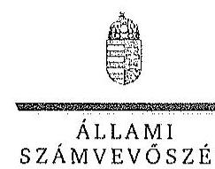

ELBŐK

Ikt.szám: V-0768-071/2015.

Dr. Szivek Norbert úr
vezérigazgató
Magyar Nemzeti Vagyonkezelő Zrt.

Budapest

Tisztelt Vezérigazgató Úr!

A „Jelentéstervezet az állami tulajdonban álló erdőgazdasági társaságok vagyongazdálkodási tevékenységének ellenőrzése - VERGA Veszprémi Erdőgazdaság Zrt.” címmel készített számvevőszéki jelentéstervezetre tett észrevételeit köszönettel megkaptam.

Az Állami Számvevőszék észrevételekre vonatkozó álláspontjáról a felügyeleti vezető által készített részletes tájékoztatást csatoltan megküldöm.

Tájékoztatom Vezérigazgató urat, hogy a számvevőszéki jelentésben - az Állami Számvevőszékről szóló 2011. évi LXVI. törvény 29. § (3) bekezdése alapján - a figyelembe nem vett észrevételeket szerepeltetjük az elutasítás indokának feltüntetésével.

Budapest, 2015. 11. hó nap

Tisztelettel:

Domokos László

Melléklet: Tájékoztatás az elfogadott és az el nem fogadott észrevételekről

1052 BUDAPEST, APÁCZAI CSERE JÁNOS U. 10. 1364 Budapest 4. Pf. 54 telefon: 484 9101 fax: 484 9291

---

# Tájékoztatás   az elfogadott és az el nem fogadott észrevételekról 

A „Jelentéstervezet az állami tulajdonban álló erdőgazdasági társaságok vagyongazdálkodási tevékenységének ellenőrzése - VERGA Veszprémi Erdőgazdaság Zrt." címü jelentéstervezetre 2015. november 16-án érkezett észrevételeit áttekintettük, azok kezelésével kapcsolatban a következő tájékoztatást adom.

1. 2. fejezet / 8. oldal ötödik bekezdés, 9. oldal első bekezdés

A dokumentumok ismételt áttekintése alapján a jelentéstervezet 8. oldal ötödik bekezdésének második mondatát töröljük.
2. 1. fejezet / 9. oldal második bekezdés, II. 5. fejezet / 31. oldal hatodik bekezdés és 32. oldal első bekezdés

Az észrevétel megerősíti, hogy az MNV Zrt. és az NFA között a Társaság használatába adott ingatlanokra vonatkozóan megfelelő részletezettségű átadás-átvétel nem történt, ezért az NFA nem rendelkezik naprakész nyilvántartási adatokkal a Társaság által használt földterületekról, így nem teljesítette az Nfatv. 7. § (1) bekezdés j) pontjának előírását. Megállapításunk módosítása tehát nem indokolt.

Budapest, 2015. 11. hó 30. nap

Makkai Mária
felügyeleti vezető

---

# HONVÉDELMI MINISZTÉRIUM 

DR. SIMCSKÓ ISTVÁN
miniszter
Ikt. szám: 64-83/2015.
Hiv. szám: V-0768-057/2015.,
V-0769-074/2015.
V-0770-068/2015.

## Domokos László úr

Állami Számvevőszék elnöke

Tárgy: jelentéstervezetek észrevételezése

## 1. számú példány

ÁLLAMI SZÁMVEVÓSZÉK
32/647/2015
Érkezés: 2015 NOV 23.
Iktatási szám: V-0768-070/2015
Melléklet:
Budapest
Helye: 11.74
$\checkmark$ ?

## Tisztelt Elnök Úr!

A Budapesti Erdőgazdaság Zrt., a Kaszó Erdőgazdaság Zrt. és a Veszprémi Erdőgazdaság Zrt. (erdőtársaságok) vagyongazdálkodási tevékenységének ellenőrzéséről szóló számvevőszéki jelentéstervezeteket a Honvédelmi Minisztérium szakapparátusa áttekintette. A jelentéstervezetekkel kapcsolatban a tárca részéről a következő észrevételeket teszem.

Mindhárom jelentéstervezet egységesen tesz javaslatot a honvédelmi miniszternek arra, hogy intézkedjen az adott erdőtársaság és a HM között fennálló használatba adási szerződés melléklete aktualizálásának elmaradásából származó munkajogi felelősség megállapítása iránti eljárás megindítására és annak eredménye ismeretében tegye meg a szükséges intézkedéseket.

A Nemzeti Földalapról szóló 2010. évi LXXVII. törvény 2013. január 1-től hatályos - tehát 2014-ben még viszonylag újnak számító - 16/A. §-a nyitotta meg a lehetőségét a honvédelmi feladatok ellátásához már nem szükséges ingatlanok „honvédelmi célra feleslegessé nyilvánított terület"-ként való ingatlan-nyilvántartási bejegyzésére és e területek mentesítés nélküli átadására a Nemzeti Földalapkezelő Szervezet (NFA) részére. (A mentesítés és az új művelési ág megállapítása az NFA feladata.)

A 2013-ban nagyszámban honvédelmi célra feleslegessé nyilvánított területként bejegyzett földrészletek NFA átadása időben elhúzódott és még 2014-ben is javában tartott. Ebben az „ex-lex" helyzetben az erdőtársaságok a HM vagyonkezelői jog, és ebből következően a használatba adási szerződések részleges megszűnésével érintett területek, jelentős részben kiemelt vagyontárgynak minősülő erdők vonatkozásában egyfajta kényszerkezelést végeznek az állami vagyon megóvása érdekében mindaddig, amíg az NFA a hasznosításról nem dönt.

Érzékelve az előbb vázolt, nemkívánatos helyzetet, a HM és az erdőtársaságok a használatba adási szerződéseket 2015-ben akként módosították, hogy a HM vagyonkezelői jog megszűnése - a kényszerkezelés elkerülése érdekében - ne

---

eredményezze a honvédelmi célra feleslegessé nyilvánított területként bejegyzett földrészlet vonatkozásában a szerződés megszűnését. Mindemellett a felek szerződéses kapcsolataikat ex nunc hatállyal úgy alakították ki, hogy a használatba adó HM helyébe a tulajdonosi joggyakorló NFA jogutódként beléphessen és a jogviszony felett rendelkezhessen.

A számvevőszéki vizsgálattal érintett időszakban honvédelmi célra feleslegessé nyilvánított területként bejegyzett földrészletek vonatkozásában az erdőgazdaságoknak tudomásuk volt a használatba adási szerződések megszűnéséről, a földrészletek NFA részére történő birtokba adása során a folyamatba résztvevőként bevonásra kerültek. Mindezek alapján a használatba adási szerződések mellékletei aktualizálásának elmaradása álláspontom szerint csak kisebb súlyú technikai hibaként értékelhető. Az állami vagyonban a mellékletek aktualizálásának elmaradása miatt kár nem keletkezett.

Minderre figyelemmel megítélésem szerint a munkajogi felelősség tisztázására irányuló eljárás megindítása nem indokolt, ezért a jelentésekből az erre vonatkozó részek, javaslatok törlése szükséges.

Budapest, 2015. 11. hó 16. nap
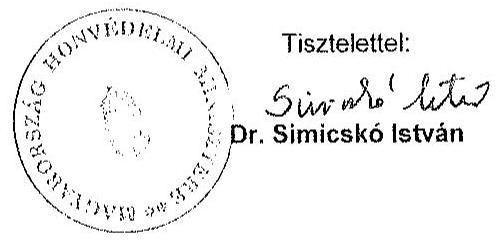

Készült: 2 példányban
Egy példány: 2 oldal
Ügyintéző: dr. Jelen Gábor ezredes (2: 210-28)
Kapják: 1. sz. pld. ÁSZ Elnök Úr
2. sz. pld. Irattár

---

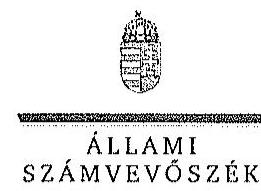

ELBŐK

Ikt.szám: V-0768-066/2015.

Dr. Simicskó István úr
miniszter
Honvédelmi Minisztérium

Budapest 

## Tisztelt Miniszter Úr!

„Az állami tulajdonban álló erdőgazdasági társaságok vagyongazdálkodási tevékenységének ellenőrzése" címú ellenőrzés tekintetében a Budapesti Erdőgazdaság Zrt., KASZÓ Erdőgazdaság Zrt. és VERGA Veszprémi Erdőgazdaság Zrt. társaságokra vonatkozó számvevőszéki jelentéstervezetekre tett észrevételeit köszönettel megkaptam.

Az Állami Számvevőszék észrevételekre vonatkozó álláspontjáról a felügyeleti vezető által készített részletes tájékoztatást csatoltan megküldöm.

Tájékoztatom Miniszter urat, hogy a számvevőszéki jelentésben - az Állami Számvevőszékről szóló 2011. évi LXVI. törvény 29. § (3) bekezdése alapján - a figyelembe nem vett észrevételeket szerepeltetjük az elutasítás indokának feltüntetésével.

Budapest, 2015.
hó nap
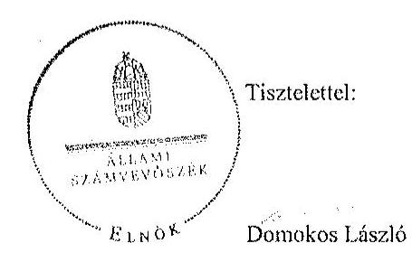

Melléklet: Tájékoztatás az el nem fogadott észrevételekről

---

# Tájékoztatás   az el nem fogadott észrevételekről 

„Az állami tulajdonban álló erdőgazdasági társaságok vagyongazdálkodási tevékenységének ellenőrzése" címú ellenőrzés tekintetében a Budapesti Erdőgazdaság Zrt., KASZÓ Erdőgazdaság Zrt. és VERGA Veszprémi Erdőgazdaság Zrt. társaságok jelentéstervezetére 2015. november 23-án érkezett észrevételeit áttekintettük, azok kezelésével kapcsolatban a következő tájékoztatást adom.

A honvédelmi célra feleslegessé nyilvánított területek helyzetére, valamint a HM és az erdőgazdasági társaságok közötti használatba adási szerződésekre vonatkozó tájékoztatását köszönjük. Az ellenőrzött időszakban a HM és a Társaságok között fennálló szerződés mellékletét a szerződés előírása ellenére nem módosították. Az észrevételben leírt intézkedések az ellenőrzött időszakot követően történtek, ezért azok a jelentéstervezet megállapításait nem érintik. Ennek alapján az intézkedést igénylő megállapítás és a javaslat módosítása, illetve törlése nem indokolt.

Budapest, 2015. 11. hó 30. nap

Makkai Mária
felügyeleti vezető

---

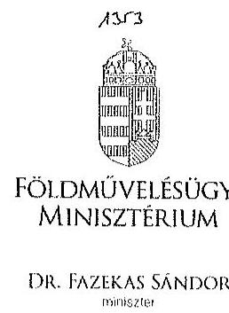
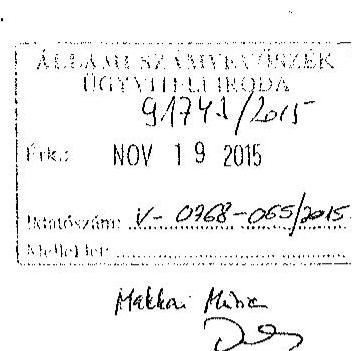

Iktatószám: IIPF/A 29215
/2015.
Ügyintéző: dr. Szabó Martina Dóra
Telefonszám: 896-2483
E-mail: dora.martina.szabo@fm.gov.hu
Hivatkozási szám: V-0768-056/2015.
V-0769-073/2015.
V-0770-067/2015.

# Domokos László úr   elnök   részére 

## Állami Számvevőszék

Budapest
Apáczai Csere János u. 10.
1052
Tárgy: Az Állami Számvevőszék V-0768-056/2015., V-0769-073/2015., valamint V-0770-067/2015. iktatószámú jelentéstervezeteinek véleményezése

## Tisztelt Elnök Úr!

Hivatkozással a V-0768-056/2015. iktatószámú „Az állami tulajdonban álló erdőgazdasági társaságok vagyongazdálkodási tevékenységének ellenőrzése - VERGA Veszprémi Erdőgazdaság Zrt." tárgyú, a V-0769-073/2015. iktatószámú „Az állami tulajdonban álló erdőgazdasági társaságok vagyongazdálkodási tevékenységének ellenőrzése - Budapesti Erdőgazdaság Zrt." tárgyú, valamint a V-0770-067/2015. iktatószámú „Az állami tulajdonban álló erdőgazdasági társaságok vagyongazdálkodási tevékenységének ellenőrzése - KASZÓ Erdőgazdaság Zrt." tárgyú ügyiratukra, az Állami Számvevőszékről szóló 2011. évi LXVI. törvény 29. § (2) bekezdése alapján az alábbi észrevételeket teszem.

A VERGA Veszprémi Erdőgazdaság Zrt. (a továbbiakban: Társaság) tekintetében a számvevőszéki jelentéstervezet észrevételezi, hogy a Társaság a tulajdonosi joggyakorló döntése alapján 2015. áprilisában új könyvvizsgálót bízott meg a 2014. évi beszámoló hitelesítésével, amivel megsértette a számvitelről szóló 2000. évi C. törvény (a továbbiakban: Szt.) 155. § (6) bekezdésében foglaltakat, miszerint az üzleti évről

---

elkészített éves beszámoló felülvizsgálatára könyvvizsgálót az előző üzleti év éves beszámolójának elfogadásakor kell megválasztani.

Az Szt. 155/A. § (1) bekezdése szerint „a 155. § (6) bekezdése szerinti könyvvizsgáló vagy könyvvizsgáló cég megbízása csak megfelelő indok alapján mondható fel". A számviteli törvény tehát lehetőséget ad a megbízási szerződés felmondására, a Társaságnál a könyvvizsgáló visszahívását indokolttá tevő események pedig megfeleltethetőek a jogszabályhelyben utalt megfelelő indok kritériumának. Ezzel összhangban a Társaság Alapszabálya is rögzíti a könyvvizsgáló visszahívásának lehetőségét, mely döntés a kizárólagos jogkörömbe tartozik.

A KASZÓ Zrt., a VERGA Veszprémi Erdőgazdaság Zrt., valamint a Budapesti Erdőgazdaság Zrt. tekintetében a számvevőszéki jelentéstervezet megállapításaira vonatkozóan az alábbiakat kívánom megjegyezni.

Mindhárom jelentéstervezet leírja, hogy a társaságok a közérdekű adatok megismerésére irányuló igények teljesítésének rendjét nem szabályozták.

A vizsgált társaságok 2015. augusztus 31-ig honlapjaikat felülvizsgálták és - az információs önrendelkezési jogról és az információszabadságról szóló 2011. évi CXII. törvény, valamint a köztulajdonban álló gazdasági társaságok
 takarékosabb működéséről szóló 2009. évi CXXII. törvény alkalmazandó előírásainak megfelelően - hiányosságaikat pótolták. A közérdekű adatok megismerésének rendjére irányuló szabályzat elkészítése folyamatban van a társaságoknál.

Mindhárom jelentéstervezet tartalmazza, hogy a földművelésügyi minisztérium tulajdonosi ellenőrzési szabályzattal nem rendelkezett a vizsgált időszakban, ellenőrzést nem végzett a társaságok vagyonváltozást eredményező döntéseire vonatkozóan.

Tekintettel arra, hogy a társaságok gazdasági társaságként (zrt.) működnek, a társaságoknál ügydöntő felügyelőbizottság működik, mely a Polgári Törvénykönyvről szóló 2013. évi V. törvényben rögzítetteknek, illetőleg a társaságok Alapszabályában foglaltaknak megfelelően ellátja a társaságok ellenőrzését.

A társaságok tulajdonosi ellenőrzése tehát a Ptk. rendelkezéseivel összhangban a felügyelőbizottságon keresztül valósul meg. A felügyelőbizottság ügyrendje pedig szabályozza, miszerint „A felügyelőbizottság határozatát és a felügyelőbizottsági ülésről készült jegyzőkönyvet az írásba foglalást követően, az üléstől számított 10 napon belül a Társaság ügyvezetése megküldi a Tulajdonosi Joggyakorlónak." A jegyzőkönyv, illetőleg a felügyelőbizottság határozatainak részemre történő megküldésével tudomásom van a felügyelőbizottság ellenőrzési tevékenységéről és döntéseiről.

A jelentéstervezetek mindhárom társaság tekintetében megállapítják, hogy a társaságok gazdálkodásuk során betartották a nemzeti vagyonról szóló 2011. évi CXCVI. törvényben előírt vagyongazdálkodási alapelveket, vagyont nem idegenítettek el, illetve arra jelzálogjogot, haszonélvezeti jogot nem alapítottak, erdő használatát, hasznosítá-

---

sát harmadik fél számára nem engedték át, a vagyonnal felelős módon, rendeltetésszerűen gazdálkodtak, a saját és a használatba kapott vagyon állagának megóvásával, karbantartásával és a vagyon gyarapításával kapcsolatos feladataikat elvégezték.

Kérem észrevételeim szíves tudomásul vételét.
Budapest, 2015. november „(3 ".
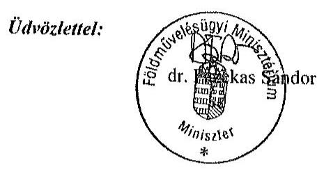

---

.

---

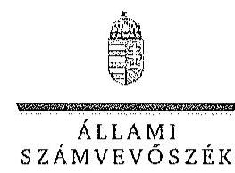

EL 100 K

Ikt.szám: V-0768-068/2015.

Dr. Fazekas Sándor úr
miniszter
Földművelésügyi Minisztérium

Budapest

Tisztelt Miniszter Úr!
„Az állami tulajdonban álló erdőgazdasági társaságok vagyongazdálkodási tevékenységének ellenőrzése" című ellenőrzés tekintetében a Budapesti Erdőgazdaság Zrt., KASZÓ Erdőgazdaság Zrt. és VERGA Veszprémi Erdőgazdaság Zrt. társaságokra vonatkozó számvevőszéki jelentéstervezetekre tett észrevételeit köszönettel megkaptam.

Az Állami Számvevőszék észrevételekre vonatkozó álláspontjáról a felügyeleti vezető által készített részletes tájékoztatást csatoltan megküldöm.

Tájékoztatom Miniszter urat, hogy a számvevőszéki jelentésben - az Állami Számvevőszékről szóló 2011. évi LXVI. törvény 29. § (3) bekezdése alapján - a figyelembe nem vett észrevételeket szerepeltetjük az elutasítás indokának feltüntetésével.

Budapest, 2015.
hó nap
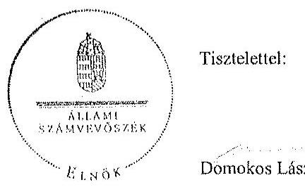

Melléklet: Tájékoztatás az elfogadott és el nem fogadott észrevételekről

---

# Tájékoztatás   az elfogadott és el nem fogadott észrevételekről 

„Az állami tulajdonban álló erdőgazdasági társaságok vagyongazdálkodási tevékenységének ellenőrzése" című ellenőrzés tekintetében a Budapesti Erdőgazdaság Zrt., KASZÓ Erdőgazdaság Zrt. és VERGA Veszprémi Erdőgazdaság Zrt. társaságok jelentéstervezetére 2015. november 19-én érkezett észrevételeit áttekintettük, azok kezelésével kapcsolatban a következő tájékoztatást adom.

1. A Budapesti Erdőgazdaság Zrt., a KASZÓ Erdőgazdaság Zrt. és a VERGA Veszprémi Erdőgazdaság Zrt. jelentéstervezetére tett általános észrevételek
a) Közérdekű adatok megismerésének rendje

A közérdekű adatok megismerésére irányuló igények teljesítésének rendje elkészítésére, valamint a honlapokon közzétett információk felülvizsgálatára vonatkozó tájékoztatást köszönjük. Az intézkedések az ellenőrzött időszakot nem érintik, ezért a jelentéstervezetek megállapításainak módosítása nem indokolt.
b) A Földművelésügyi Minisztérium tulajdonosi ellenőrzési szabályzata és a vagyonváltozást eredményező döntések ellenőrzése

A Társaságok tulajdonosi ellenőrzése - a jogszabályok előírásai alapján (Ptk., Nvtv.) - a felügyelő bizottság működésével, a tulajdonosi joggyakorló folyamatba épített, illetve egyedi ellenőrzésein keresztül valósul meg. Az észrevétel a jelentéstervezet megállapítását nem cáfolja, ezért annak módosítása nem indokolt.
2. A VERGA Veszprémi Erdőgazdaság Zrt. jelentéstervezetére tett észrevétel

A dokumentumok ismételt áttekintését követően a jelentéstervezet 27. oldal 4. bekezdés második mondatát az alábbiak szerint pontosítjuk:
„A Társaság a Tulajdonosi joggyakorló döntése alapján 2015. áprilisában új könyvvizsgálót bízott meg a 2014. évi beszámoló hitelesítésével."

Budapest, 2015. M. hó 50 nap

Makkai Mária
felügyeleti vezető

---

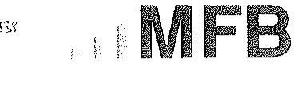

Domokos László úr
elnök részére
Állami Számvevőszék

Budapest

Tisztelt Elnök Úr!

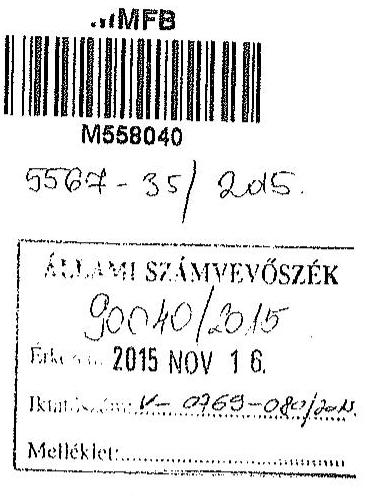

2015. október 30-án köszönettel kézhez vettük az Állami Számvevőszék „Az állami tulajdonban álló erdőgazdasági társaságok vagyongazdálkodási tevékenységének ellenőrzéséről" szóló jelentéstervezeteket az alábbi cégekre:

- Budapesti Erdőgazdaság Zrt.
- KASZÓ Erdőgazdaság Zrt.
- VERGA Veszprémi Erdőgazdaság Zrt.
(Íkt.szám: V-0769-070/2015.)
(Íkt.szám: V-0770-064/2015.)
(Íkt.szám: V-0768-053/2015.)

Az MFB Zrt. a jelentéstervezetekkel kapcsolatban nem kíván észrevételt tenni.

Budapest, 2015. november 12.

Tisztelettel:

Nagy Csaba
vezérigazgató

Kovács Zsolt
vezérigazgató-helyettes

MFB Magyar Fejlesztési Bank Zártkörűen Működő Részvénytársaság
