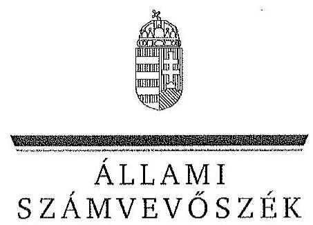

ÁLLAMI
SZÁMVEVÔSZÉK

# JELENTÉS 

Az állami tulajdonban álló erdőgazdasági társaságok vagyongazdálkodási tevékenységének ellenőrzése Budapesti Erdőgazdaság Zrt.

---

# Állami Számvevőszék 

Iktatószám: V-0769-086/2015.
Témaszám: 1803
Vizsgálat-azonosító szám: V0706

## Az ellenőrzést felügyelte:

## Makkai Mária

felügyeleti vezető
Az ellenőrzést vezette és az ellenőrzés végrehajtásáért felelős:
Pencz Mária
ellenőrzésvezető
A számvevőszéki jelentés összeállításában közremúködött:
Czeglédi Dénes
Kiss Anett
számvevő tanácsos
számvevő
Az ellenőrzést végezték:

| Bencsik Árpád | Czeglédi Dénes | Dr. Dorogi Zsolt Pál |
| :-- | :-- | :-- |
| számvevő | számvevő tanácsos | számvevő |
| Kiss Anett | Szepes Béla Bálint |  |
| számvevő | számvevő tanácsos |  |

---

# TARTALOMJEGYZÉK 

BEVEZETÉS ..... 3
I. ÖSSZEGZŐ MEGÁLLAPÍTÁSOK, KÖVETKEZTETÉSEK, JAVASLATOK ..... 7
II. RÉSZLETES MEGÁLLAPÍTÁSOK ..... 14

1. A Budapesti Erdőgazdaság Zrt. vagyongazdálkodása ..... 14
1.1. A vagyon értékének megőrzése, gyarapítása ..... 14
1.2. A vagyonkezelői kötelezettség, valamint a vagyon használatára vonatkozó kötelezettség teljesítése ..... 18
2. A Budapesti Erdőgazdaság Zrt. használati szerződése, vagyonkezelési szerződése és a vagyonnyilvántartása ..... 19
2.1. A használati és a vagyonkezelési szerződés megfelelősége ..... 19
2.2. A Budapesti Erdőgazdaság Zrt. vagyonnyilvántartása ..... 23
3. A Budapesti Erdőgazdaság Zrt. éves tervezési feladatainak ellátása, az ágazati jogszabályok érvényesülése ..... 25
3.1. Az üzleti tervek vagyonmegőrzésre, vagyongyarapításra vonatkozó elemei ..... 25
3.2. A tervekben megfogalmazott előírások érvényesülése ..... 25
3.3. Az ágazati szabályok érvényesülése ..... 26
4. A kontroll-és monitoring rendszer kialakítása és múködtetése ..... 27
4.1. A kontrollrendszer kialakítása és múködtetése ..... 27
4.2. Az információáramlási és monitoring rendszer kialakítása és múködtetése ..... 29
5. A tulajdonosi joggyakorlóknak a Budapesti Erdőgazdaság Zrt. vagyongazdálkodási feladataira vonatkozó döntései, intézkedései megfelelősége ..... 30

---

# MELLÉKLETEK 

1. számú Rövidítések jegyzéke
2. számú Fogalomtár
3/A. számú A Budapesti Erdőgazdasági Zrt. vagyonváltozásának alakulása a 20092014. évek közötti időszakban
3/B. számú Az erdőgazdasági társaság vagyonának alakulása 2009-2014. években
3. számú A befektetett eszközök állományának alakulása
4. számú A Budapesti Erdőgazdaság Zrt. vezérigazgatójának észrevétele
5. számú A Budapesti Erdőgazdaság Zrt. vezérigazgatójának észrevételére adott válasz
6. számú Az MNV Zrt. vezérigazgatójának észrevétele
7. számú Az MNV Zrt. vezérigazgatójának észrevételére adott válasz
8. számú A HM miniszterének észrevétele
9. számú A HM miniszterének észrevételére adott válasz
10. számú Az FM miniszterének észrevétele
11. számú Az FM miniszterének észrevételére adott válasz
12. számú Az MFB Zrt. vezérigazgatójának nemleges észrevétele

---

# JELENTÉS 

## Az állami tulajdonban álló erdőgazdasági társaságok vagyongazdálkodási tevékenységének ellenőrzése Budapesti Erdőgazdaság Zrt.

## BEVEZETÉS

Hazánk területének több mint 20\%-át erdő borítja. Az erdők fenntartása és védelme az egész társadalom érdeke, ezért az erdőkkel csak a közérdekkel összhangban lehet gazdálkodni.

Az Alaptörvény 38. cikke és az Nvtv. alapján az állam tulajdona a nemzeti vagyon részét képezi. Az Nvtv. alapján nemzetgazdasági szempontból kiemelt jelentőségű nemzeti vagyonban tartandó vagyonelemnek minősül a 100\%-ban az állam tulajdonában álló védelmi és közjóléti elsődleges rendeltetésű erdő, a gazdasági elsődleges rendeltetésű természetes erdő, természetszerű erdő és származékerdő természetességi állapotú öt hektárnál nagyobb, természetben összefüggő erdő. A Társaságok vagyongazdálkodása szempontjából a Vtv, illetve az Nvtv. és az Nfatv., valamint a kapcsolódó kormány- és miniszteri rendeletek mellett kiemelkedő szerepe van a különböző ágazati jogszabályoknak. A vagyonkezelési tevékenység végrehajtása során figyelemmel kell lenni az Evt.-ben foglaltakra, mely alapján a nemzeti vagyonról szóló törvényben nemzetgazdasági szempontból kiemelt jelentőségű nemzeti vagyonként meghatározott védelmi és közjóléti elsődleges rendeltetésű, az állam tulajdonában álló erdő a kincstári vagyon részét képezi. A Társaságoknak az általuk kezelt vagyonelemek sajátosságára tekintettel kell a vagyongazdálkodási tevékenységüket kialakítaniuk, gondoskodniuk kell a közérdek és az Evt.-ben foglaltak érvényesülését biztosító vagyongazdálkodásról. A honvédelemről és a Magyar Honvédségről, valamint a különleges jogrendben bevezethető intézkedésekről szóló 2011. évi CXIII. törvény alapján a Honvédség szervezeteinek elhelyezéséhez, és feladatai ellátásához rendelkezésre bocsátott ingatlanok állami tulajdonban, a honvédelemért felelős miniszter által vezetett minisztérium vagyonkezelésében állnak. A Honvédelmi Minisztérium a vagyonkezelésében lévő honvédelmi rendeltetésű erdőket a Társaságok használatába adta.

Az Evt. előírásai alapján az állam 100\%-os tulajdonában álló erdőt és erdőgazdálkodási tevékenységet közvetlenül szolgáló földterületet csak vagyonkezelés formájában lehet hasznosításra átengedni. A kizárólagos állami tulajdonban lévő erdő és erdőgazdálkodási tevékenységet közvetlenül szolgáló földterület vagyonkezelését csak költségvetési szerv vagy 100\%-os állami tulajdonú gazdálkodó szervezet végezheti.

---

Az MNV Zrt. a Társaság feletti tulajdonosi jogok gyakorlását a Vtv. 29. § (5) bekezdésében foglaltakkal összhangban a 2008-ban létrejött vagyonkezelési szerződésben a HM-nek átadta. A HM a tulajdonosi jogokat 2010. június 16 -áig gyakorolta. A 2010. évi törvényi változások (Vtv., Mfbtv., Nfatv.) következtében 2010. június 17. napjától a Társaságok állami tulajdonú részesedése tekintetében a tulajdonosi jogokat az állami vagyonért felelős miniszter az MFB Zrt. útján látta el. Az Nfatv. 2010. évi hatálybalépését követően a Társaságok által használt, a Nemzeti Földalapba tartozó földterületek vonatkozásában a tulajdonosi jogokat az NFA, míg egyéb ingatlanok és vagyonelemek tekintetében a tulajdonosi jogokat az MNV Zrt. gyakorolta. 2014. július 16 -tól a Társaságok feletti tulajdonosi jogokat az erdőgazdálkodásért felelős miniszter gyakorolja.

A Nemzeti Földalapba tartozó 1772 980,17 ha földterületből a 2012. év végén a $100 \%$-os állami tulajdonú 19 erdőgazdasági társaság kezelésében összesen 913664,3681 ha földterület volt, ebből 879254,1595 ha erdő, a többi egyéb művelési ágba tartozik. A kezelt földterületek erdőgazdasági társaságonkénti megoszlása eltérő. Három, korábban a Honvédelmi Minisztérium, mint tulajdonosi joggyakorló által irányított erdőgazdaság esetében az állami erdőterületek vagyonkezelési joga a HM-nél maradt, a Társaságok a gazdálkodást használatba adási szerződés alapján folytatják.

A Társaságok az Alaptörvény és az Nvtv. előírása szerint önállóan és felelősen gazdálkodnak a törvényesség, a célszerűség és az eredményesség követelményei szerint. Az állami vagyonnal való gazdálkodás alapvető feladata a vagyon rendeltetésszerú, hatékony és felelős felhasználásának biztosítása az állami vagyon értékének megőrzése, gyarapítása érdekében. A Társaság jelen ellenőrzése az állami vagyonnal való gazdálkodásra és a törvényesség betartására irányult.

A Társaság erdőgazdálkodással kapcsolatos területei szétszórtan 10 megyében helyezkednek. Az erdőterületeken a gazdálkodást 5 hagyományos erdészet, valamint az alakulati területek kezelésére létrehozott speciális erdészet látja el. A Társaság 2014. évi éves beszámolója szerint 1808946 e Ft nettó árbevétel mellett 12579 E Ft mérleg szerinti eredményt ért el, a mérlegfőösszeg 1917251 E Ft volt. Az erdőgazdasági társaság 37365 ha erdőterületen gazdálkodott, az éves átlaglétszám 99 fő volt.

Az ellenőrzés célja annak értékelése, hogy a Társaság vagyongazdálkodása, vagyonérték-megőrző és vagyongyarapítási tevékenysége, valamint szervezeti keretei és kiépített kontrollrendszere megfeleltek-e a jogszabályok és belső szabályzatok előírásainak, valamint a kezelt vagyonelemek sajátosságaiból adódó követelményeknek.

Ennek keretében ellenőriztük és értékeltük, hogy:

- a vagyongazdálkodás során betartották-e az Nvtv. 7. §-ában megállapított vagyongazdálkodási alapelveket, valamint az ágazati jogszabályok vagyongazdálkodáshoz kapcsolódó előírásait;
- a Társaság a saját és a kezelt vagyonnal való gazdálkodásra vonatkozó éves tervezési feladatait a jogszabályi előírásoknak megfelelően látta-e el, a Társaság üzleti tervei a kezelésbe vett vagyonra vonatkozó, a Vtv. 2. § (1) és a

---

27. § (7) bekezdésében előírt vagyon megőrzésére, gyarapítására vonatkozó elemeket tartalmazták-e és azokat a vagyongazdálkodás során érvényesítet-ték-e;

- a vagyonkezelési szerződések és a vagyon-nyilvántartás megfeleltek-e a szabályszerűségi követelményeknek, elősegítették-e az állami vagyonnal való szabályszerű gazdálkodást;
- a Társaságnál kialakították és működtették-e a szabályszerű feladatellátást támogató kontrollrendszert. Ezen belül a Társaság elkészítette-e és aktuali-zálta-e feladatellátási-folyamatainak szabályzatait, a kockázatok kezelésének rendszerét, az információs és a kontrolling-monitoring rendszert, valamint a vagyongazdálkodás területén azokat az eljárásokat, amelyek elősegítik a szervezeti célok végrehajtását;
- a tulajdonosi joggyakorlóknak a Társaság vagyongazdálkodási feladataira vonatkozó döntései, intézkedései előkészítése és megalapozottsága a jogszabályoknak és a belső szabályozásnak megfelelt-e, a tulajdonosi joggyakorlók e minőségben végzett tevékenysége támogatta-e a felelős vagyongazdálkodás megvalósulását.

Az ellenőrzés típusa: szabályszerűségi ellenőrzés.
Az ellenőrzött időszak: 2009. január 1. napjától 2014. december 31. napjáig, kitekintéssel a helyszíni ellenőrzés végéig tartó releváns folyamatokra, intézkedésekre.

Az ellenőrzés várható hasznosulása: A Társaság és a tulajdonosi joggyakorlók fenti szempontú ellenőrzése az állami tulajdonban álló vagyon kezelésére, a vagyonnal való gazdálkodásra vonatkozó, kötelezően végrehajtandó éves ÁSZ ellenőrzést szélesebb körűvé teszi.

Az ellenőrzés várható hasznosulásaként biztosíthatja a társadalom részéről kiemelt érdeklődéssel kísért téma objektív bemutatását. Az ÁSZ jelentéséből a média és az állampolgárok átfogó képet kaphatnak a Magyarország állami tulajdonban lévő erdőivel való gazdálkodásról, a gazdálkodást, vagyonkezelést végző szervezeti rendszerről, az állami tulajdonban álló erdőgazdasági társaságok feladatellátásához kapcsolódóan feltárt problémákról.

Az ellenőrzés jól hasznosítható - többek közt - az állami vagyonnal kapcsolatos országgyűlési törvényhozói munkában is, továbbá hozzájárulhat a tulajdonosi joggyakorlás javításával a „jó kormányzás" gyakorlatának erősítéséhez.

Az ellenőrzéssel érintett szervezetek: A Társaság, a Társaság kezelésében lévő állami vagyon feletti tulajdonosi jogokat gyakorló szervezetek, valamint a Társaság állami tulajdonú részesedése feletti tulajdonosi joggyakorlók (MNV Zrt.,HM, MFB Zrt., NFA, FM).

Az ellenőrzés végrehajtásának jogszabályi alapját az ÁSZ tv. 5. § (4)(5) bekezdéseiben foglaltak képezik.

---

Az ellenőrzés szakmai módszertana az ÁSZ hivatalos honlapján közzétett szakmai szabályokon alapult, amely a Legfőbb Ellenőrző Intézmények Nemzetközi Szervezete (INTOSAI) által kiadott nemzetközi standardok (ISSAI) figyelembevételével készült.

A Társaság az ellenőrzés lefolytatásához tanúsítványok kitöltésével, valamint dokumentumok elektronikus megküldésével szolgáltatott adatokat. Az így rendelkezésre bocsátott adatok és információk kontrollja a helyszíni ellenőrzés keretében történt. A vagyonváltozást eredményező döntések megalapozottságát, továbbá a vagyonérték-megőrző és vagyongyarapító tevékenység szabályszerűségét a számviteli nyilvántartásokból, valamint kockázatalapú és véletlenszerű mintavétellel kiválasztott tételek ellenőrzésével értékeltük.

Az ÁSZ a 2011. évi LXVI. törvény 29. §-a szerint a jelentéstervezetet megküldte a Budapesti Erdőgazdaság Zrt.. vezérigazgatójának, a Magyar Nemzeti Vagyonkezelő Zrt. vezérigazgatójának, a Magyar Fejlesztési Bank Zrt. vezérigazgatójának, a Nemzeti Földalapkezelő Szervezet elnökének, a Honvédelmi Minisztérium miniszterének és a Földművelésügyi Minisztérium miniszterének egyeztetésre. A Budapesti Erdőgazdaság Zrt. vezérigazgatójának észrevételét és az arra adott választ az 5-6. számú melléklet, a Magyar Nemzeti Vagyonkezelő Zrt. vezérigazgatójának észrevételét és az arra adott választ a 7-8. számú melléklet, a Honvédelmi Minisztérium miniszterének észrevételét és az arra adott választ a 9-10. számú melléklet, a Földművelésügyi Minisztérium miniszterének észrevételét és az arra adott választ a 11-12. számú melléklet, a Magyar Fejlesztési Bank Zrt. vezérigazgatójának nemleges észrevételét a 13. számú melléklet tartalmazza. A Nemzeti Földalapkezelő Szervezet elnöke az ÁSZ tv. 29. § (2) bekezdésében foglalt észrevételezési jogával nem élt, a törvényes határidőn belül észrevételt nem tett.

---

# I. ÖSSZEGZŐ MEGÁLLAPÍTÁSOK, KÖVETKEZTETÉSEK, JAVASLATOK 

Az ellenőrzött időszakban az állami tulajdonú Budapesti Erdőgazdasági Zrt. saját, kezelt és a HM-től használatba vett vagyonnal gazdálkodott. A Társaság könyvviteli mérlegében kimutatott vagyona a 2009. évi 1737,5 M Ft nyitó értékről 2014. év végére 1917,3 millió Ft-ra emelkedett elsősorban a forgóeszközök - ezen belül a pénzeszközök - 87,6\%-os növekedésének következtében. A saját tőke/jegyzett tőke aránya az ellenőrzött időszakban a 2009. évi 276,7\%ról 2014. évre $313,3 \%$-ra nőtt.

Az ellenőrzött időszakban a Társaság 2010. évi mérlege nem a valós állapotot tükrözte, mert az erdőszerkezet átalakításának költségeit a Számv. tv. előírásai ellenére a beruházások között aktiválta. A Társaság a kezelt vagyont a Számv. tv. előírásainak megfelelően mérlegében az ellenőrzött időszakban - a vagyonkezelési szerződésben szerepeltetett értéken - az eszközök között szerepeltette, a kezelt vagyont mérlegtétel szerinti bontásban kiegészítő mellékletében bemutatta. Az ellenőrzött időszakban a Számv. tv. előírásainak megfelelően a használatba vett erdőket és földingatlanokat a Társaság mérlegében eszközként nem mutatta ki, a Számv. tv. ezt a kötelezettséget a vagyonkezelő vonatkozásában írja elő.

Az ellenőrzött időszakban a Társaság a Magyar Állam tulajdonában álló erdővagyon és egyéb művelési ágú termőföld ingatlanokat a HM-mel 2009. március 12 -én kötött használatba adási szerződés alapján használta. A használatba adási szerződés szerint a használatba adott ingatlanok elsődlegesen honvédelmi célokat szolgáltak. A Társaság, mint használó és a HM között létrejött szerződéses jogviszony kereteit a használatba adási szerződésben foglalt jogok és kötelezettségek töltötték ki.

A Társaság a használatba vett vagyonról a használatba adási szerződés mellékletei szerinti ingatlanlistán alapuló, elkülönített, analitikus nyilvántartást vezetett. A HM nyilvántartása és a Társaság nyilvántartása alapján megállapítható, hogy a Társaság nyilvántartásából a honvédelmi célra feleslegessé nyilvánított területeket nem vezette ki, ezért a Társaság nyilvántartása nem támogatta megfelelően az állami vagyonnal való felelős gazdálkodást. A Társaság a használatában álló valamennyi állami vagyonra, és annak nagyságára vonatkozó, a vagyonkezelő HM nyilvántartásával egyező adattal a 20122014. években nem rendelkezett. A vagyonkezelő HM és a Társaság nyilvántartása a honvédelmi célra feleslegessé vált területek vonatkozásában sem egyezett. A Társaság a használatában álló ingatlanokkal kapcsolatosan adatszolgáltatást a vagyonkezelő felé nem teljesített, mert a HM a használatba adási szerződésekben azt nem írta elő.

A HM, az MNV Zrt. és az NFA 2014. januárban az Nfatv. rendelkezése szerint háromoldalú megállapodást kötött a honvédelmi miniszter által honvédelmi célra feleslegessé nyilvánított ingatlanok tekintetében a HM vagyonkezelési jogának megszüntetéséről. Az ellenőrzött időszakban kikerült és a honvédelmi

---

miniszter által honvédelmi célra feleslegessé nyilvánított területek vonatkozásában a használatba adási szerződés mellékletét nem módosították, ezért a használatba adási szerződés nem támogatta megfelelően és számon kérhető módon a Társaság állami vagyonnal való gazdálkodását. A művelés alól kivett, honvédelmi célra feleslegessé nyilvánított földrészletek az Nfatv. alapján az NFA-ba tartoztak. Az átadással érintett területeken a Társaság az erdészeti hatóság korábbi engedélyének birtokában erdőgazdálkodási tevékenységet folytatott.

Az ellenőrzött időszakban a Társaság a Magyar Állam tulajdonában álló erdővagyon és egyéb művelési ágú termőföld ingatlanok kezelését az NFA-val 2013. július 30.-án kötött vagyonkezelési szerződés alapján is ellátta. A Társaság, mint vagyonkezelő és az NFA között létrejött szerződéses jogviszony kereteit a vagyonkezelési szerződésben rögzített jogok és kötelezettségek töltötték ki.

A Társaság kezelt vagyonról vezetett nyilvántartása megfelelt a Vhr.-ben foglaltaknak, mert tételesen tartalmazta a vagyonkezelt eszközök könyv szerinti bruttó és nettó értékét, valamint az értékben bekövetkezett egyéb változásokat. A Társaság a saját és kezelt vagyon Vhr. -ben előírt elkülönítését biztosította. A Társaság a VSZ eredeti, hitelesként egyértelműen beazonosítható, a vagyonkezelt eszközök tételes felsorolását tartalmazó melléklettel a helyszíni ellenőrzés időszakában rendelkezett. A Társaság a kezelt vagyonról a 262/2010. (XI.17.) Korm. rendeletben foglaltakkal ellentétben az NFA felé adatszolgáltatást nem teljesített.

A vagyonkezelési szerződés megfelelően és számon kérhető módon támogatta a Társaság állami vagyonnal való gazdálkodását.

Az ellenőrzött időszakban a használatba adott területekre vonatkozóan két szerződés volt érvényben a HM és a Társaság között. A szakkezelési megállapodás alapján átadott 9784 ha ingatlanvagyon után a Társaságnak díffizetési kötelezettsége keletkezett, melyet a Társaság az ellenőrzött időszak minden évében pénzügyileg rendezett. Ugyanakkor az ellenőrzött időszakban érvényben lévő Használatba adási szerződés alapján a Társaságnak a HM vagyonkezelésébe tartozó 44250,8 ha ingatlanvagyon használati jogának - mely tartalmazta a szakkezelési megállapodásban szerepeltetett 9784 ha ingatlanvagyont is megszerzéséért és gyakorlásáért díffizetési kötelezettsége nem keletkezett. A használatba adási szerződés megkötésével egyidejűleg sem a Társaság, sem a vagyonkezelő HM nem gondoskodott a szakkezelési megállapodás megszüntetéséről. A vagyonkezelési szerződésben rögzített vagyonkezelési díjakat a Társaság minden évben határidőben megfizette.

A Társaság az ellenőrzött időszakban a Számv. tv. előírásainak megfelelően a fordulónapi leltározást elvégezte.

A Társaság vagyongazdálkodása során betartotta az Nvtv-ben előírt vagyongazdálkodási alapelveket, vagyonkezelésében álló vagyont nem idegenített el, illetve arra jelzálogjogot, haszonélvezeti jogot nem alapított, erdő használatát, hasznosítását harmadik fél számára nem engedte át.

---

A Társaság az ellenőrzött időszakban a Vtv.-ben, az Nvtv.-ben és a használati szerződésben foglaltaknak megfelelően a saját és a HM-től, mint vagyonkezelőtől használatra kapott vagyon állagának védelmét, értékének megőrzését, illetve vagyon gyarapítását a megvalósított beruházásokkal, valamint erdőfelújításokkal biztosította.

A Társaság a saját, kezelt és a használatba vett vagyonnal való gazdálkodás során az éves tervezési feladatait a Tulajdonosi joggyakorló ${ }_{1-2}$ előírásainak megfelelően látta el, az ellenőrzött időszak minden évére elkészített üzleti tervei tartalmazták a saját, és a használatba vett vagyon megőrzésére, gyarapítására vonatkozó elemeket. A Társaság az ágazati és éves üzleti tervekben megfogalmazott, az erdővagyonnal való gazdálkodás érdekében kifejtett erdőgazdálkodási és vadgazdálkodási tevékenységét az Evt. ${ }_{1,2}$, az Evr. és a Vadvédelmi tv.ben foglaltaknak megfelelően végezte. Erdőgazdálkodási és vadgazdálkodási tevékenységéről az ellenőrzött években a Számv. tv. rendelkezéseinek megfelelő üzleti jelentést készített. Üzleti jelentéseit a Társaság feletti Tulajdonosi joggya-korló ${ }_{1-2}$ Alapítói Határozattal elfogadta. Az üzleti jelentések a Társaság eredményének és jövedelmezőségének alakulásán kívül, a vagyonkezelt terület múködtetését és az adott évi beruházásokat is tartalmazták.

A Társaság a Vtv.-ben, Nfatv.-ben és az ágazati tervekben megfogalmazott, a saját, kezelt és használatba vett vagyon állagának védelme és vagyona gyarapítása érdekében a felújításokat, beruházásokat és karbantartásokat évente állapotfelmérések alapján végezte el. Az erdőgazdálkodással kapcsolatos állagmegóvási tevékenységüket az erdőtervekkel összhangban végezték. A Társaság beruházási és felújítási költségeit az ellenőrzött időszakban a Számv. tv. és a Vhr. rendelkezéseinek megfelelően számolta el. A Társaság az erdőfelújításokat a Számv. tv-ben előírtaknak megfelelően költségei között elszámolta. A Társaság az ellenőrzött időszak minden évében az elszámolt értékcsökkenési leírásnál többet fordított eszközállományának pótlására.

A Társaság vagyongazdálkodási tevékenysége során érvényesítette az ágazati jogszabályok vagyongazdálkodáshoz kapcsolódó előírásait. A Társaság az Evt. ${ }_{2}$-ben előírt, az erdészeti hatóság felé fennálló bejelentési és engedélykérelmi kötelezettségének az ellenőrzött időszakban eleget tett. A Társaság több esetben a gazdálkodásból származó bevételeinek elszámolását megalapozó szerződésekkel, számlakiállítással és a bevételek elszámolásával megsértette a Számv. tv. szerinti bruttó elszámolás alapelvét, mert a bevételeket és a költségeket egymással szemben számolta el. Az ellenőrzött időszakban a Társaság rendelkezett az Evt. ${ }_{1,2}$-ben meghatározott, 10 évre szóló erdőgazdálkodási üzemtervvel, az erdészeti hatóság által jóváhagyott, 5 évre szóló erdőtelepítésikivitelezési tervek rendelkezésre álltak, azok tartalmazták az Evr. ${ }_{2}$-ben rögzített tartalmi elemeket. A Társaság rendelkezett a Vadvédelmi tv. szerinti 10 évre szóló vadgazdálkodási üzemtervvel, az éves vadgazdálkodási tervek elkészültek, azokat a vadászati hatóság jóváhagyta.

A Társaság kialakította és múködtette a szabályszerű feladatellátást támogató kontrollrendszert. Az FB az Alapító Okirat és a Gt. előírásai alapján az éves munkatervében előírt ellenőrzési feladatait minden évben ellátta, a Társaság éves beszámolóiról a véleményét a könyvvizsgálói jelentés figyelembe vételével alakította ki, írásbeli jelentését a Tulajdonosi joggyakorló ${ }_{1-2}$ felé elkészítette.

---

A Számv. tv. előírásai, továbbá az Alapító Okiratban foglalt tulajdonosi döntés alapján a Társaság az ellenőrzéssel érintett időszakban könyvvizsgálói szolgáltatást vett igénybe. A könyvvizsgáló a Társaság éves beszámolóit hitelesítő záradékkal látta el annak ellenére, hogy a 2010. évi beszámoló nem a valós állapotot tükrözte, mert az erdőszerkezet átalakításának költségeit beruházásként aktiválták. A Társaság 2011. évtől önálló belső ellenőrt múködtetett, a belső ellenőr tevékenységét kockázatelemzés alapján összeállított, az FB által jóváhagyott éves munkatervek alapján végezte. A belső ellenőrzés a használatba és vagyonkezelésbe vett ingatlanok nyilvántartásának szabályozottságával kapcsolatos ellenőrzést nem végzett.

A Társaságnál a szabályszerű működést támogató információáramlási és monitoring rendszer kialakítása és múködtetése nem valósult meg teljes körűen, mert a Társaság az Info tv.-ben és az Avtv.-ben előírt, a közérdekú adatok megismerésére irányuló igények teljesítésének rendjét nem szabályozta. A Társaság az ellenőrzött időszakban a Társaság feletti Tulajdonosi joggyakorló ${ }_{1-2}$ felé fennálló beszámolási kötelezettségeinek határidőben eleget tett. A Társaságnál az ellenőrzött időszakban az adatok védelme biztosított volt, a Társaság az Info tv.-ben szabályozott közérdekű adatait a helyszíni ellenőrzés időszakában töltötte fel honlapjára.

A Társaság vagyongazdálkodási feladataira vonatkozó döntések, intézkedések előkészítése a Társaság feletti Tulajdonosi joggyakorló ${ }_{1-3}$-nál és a HM-nél megfelelő volt, összhangban volt a vonatkozó jogszabályokkal és a belső szabályzatokkal. A Társaság feletti Tulajdonosi joggyakorló ${ }_{2}$ az ellenőrzött években a tulajdonosi ellenőrzéseket az ellenőrzési szabályzatának megfelelően végezte, azonban a Társaság vagyongazdálkodásának szabályozottságával, szabályszerűségével és a vagyonnyilvántartásával kapcsolatban ellenőrzést nem végzett. Tőkeemelésre, tőkeleszállításra, pótbefizetés elrendelésére, tulajdonosi kölcsön nyújtására, osztalék kifizetésére, hitelfelvételhez való hozzájárulásra az ellenőrzött időszakban nem került sor.

Az NFA tevékenysége az ellenőrzött időszakban nem támogatta teljes körűen a felelős vagyongazdálkodás megvalósulását, mert az Nfatv. hatálybalépését követően a Nemzeti Földalapba tartozó földrészletekre vonatkozó vagyongazdálkodási tevékenységre, vagyonváltozást eredményező döntésekre, és azok előkészítésére vonatkozóan elvárásokat az NFA nem fogalmazott meg a Társaság felé, vagyonváltozással kapcsolatos tulajdonosi ellenőrzést nem végzett. Az MNV Zrt. és NFA között az Nfatv. hatálybalépését követően a HM által vagyonkezelt és a Társaság használatába adott ingatlanok vonatkozásában átadás-átvétel nem történt. A honvédelmi miniszter által honvédelmi célra feleslegessé nyilvánított területek környezetvédelmi, vegyvédelmi és tűzszerészeti mentesítése az Nfatv. rendelkezései ellenére nem történt meg, illetve nem állt rendelkezésre az arra jogosult szerv hivatalos igazolása, hogy a mentesítésre nincs szükség, ezért a területek tényleges művelési ágának bejegyzése az ingat-lan-nyilvántartásba elmaradt.

Az Állami Számvevőszékről szóló 2011. évi LXVI. törvény 33. § (1) bekezdésében foglaltak értelmében a jelentésben foglalt megállapításokhoz kapcsolódó intézkedési tervet köteles az ellenőrzött szervezet vezetője összeállítani, és azt a jelentés kézhezvételétől számított 30 napon belül az ÁSZ részére megküldeni.

---

Amennyiben az intézkedési tervet határidőben nem küldi meg a szervezet, vagy az nem elfogadható, az ÁSZ elnöke a hivatkozott törvény 33. § (3) bekezdésében foglaltakat érvényesítheti.

Az ellenőrzés intézkedést igénylő megállapításai és javaslatai:

# a honvédelmi miniszternek 

1. A HM, az MNV Zrt. és az NFA 2014. januárban az Nfatv. 16/A. § (1) bekezdés előírása szerint háromoldalú megállapodást kötött a honvédelmi miniszter által a 139/2011. (XII. 27.) HM utasítás 1. § (2) bekezdése alapján honvédelmi célra feleslegessé nyilvánított ingatlanok tekintetében a HM vagyonkezelési jogának megszüntetéséről. Az Nfatv. 1. § (1) bekezdés d) pontja szerint a Nemzeti Földalapba tartozik az állam tulajdonában lévő, az ingatlan-nyilvántartásban múvelés alól kivett, honvédelmi célra feleslegessé nyilvánított területként nyilvántartott földrészlet. A HM a Társaság használatába adott területekből, azok a honvédelmi miniszter által honvédelmi célra feleslegessé nyilvánítása miatt - a Társaság kimutatása szerint 3261,8 ha területet átadott az NFA részére. A HM és a Társaság között fennálló használatba adási szerződés mellékletét annak ellenére nem módosították a honvédelmi miniszter által honvédelmi célra feleslegessé nyilvánított területek HM vagyonkezeléséből kikerülése miatt, hogy azt a szerződés 6.3. pontja előírja.

Javaslat:
a) Intézkedjen a Társaság közreműködésével a honvédelmi miniszter által honvédelmi célra feleslegessé nyilvánított és múvelés alól kivett, az NFA részére átadott földterületeknek a HM vagyonkezeléséből kikerülése miatt a használatba adási szerződés mellékletének módosításáról.
b) Intézkedjen a használatba adási szerződés melléklete módosításának elmaradásával összefüggésben feltárt szabálytalanság tekintetében a munkajogi felelősség tisztázására irányuló eljárás megindításáról, és ennek eredménye ismeretében tegye meg a szükséges intézkedéseket.
2. A 2006. évben megkötött, a HM és a Társaság között érvényes szakkezelési megállapodás alapján 9784 ha ingatlanvagyon után a Társaságnak díffizetési kötelezettsége keletkezett, melyet a Társaság az ellenőrzött időszak minden évében pénzügyileg rendezett. A 2009. évtől érvényben lévő Használatba adási szerződés alapján a Társaságnak a HM vagyonkezelésébe tartozó 44250,8 ha ingatlanvagyon használati jogának - mely tartalmazta a szakkezelési megállapodásban szerepeltetett 9784 ha ingatlanvagyont is - megszerzéséért és gyakorlásáért díffizetési kötelezettsége nem volt. Az ellenőrzött időszakban sem a Társaság, sem a vagyonkezelő HM nem gondoskodott a két dokumentum díffizetési kötelezettségre vonatkozó rendelkezései összhangjának megteremtéséről.

Javaslat:
Intézkedjen a Társaság közreműködésével a két szerződés felülvizsgálatáról a díffizetési kötelezettség tekintetében és ennek eredménye ismeretében tegyen intézkedéseket a szerződések módosítására az összhang megteremtése érdekében.

---

# az NFA elnökének 

A HM, az MNV Zrt. és az NFA 2014. januárban az Nfatv. 16/A. § (1) bekezdés előírása szerint háromoldalú megállapodást kötött a honvédelmi miniszter által a 139/2011. (XII. 27.) HM utasítás 1. § (2) bekezdése alapján honvédelmi célra feleslegessé nyilvánított ingatlanok tekintetében a HM vagyonkezelési jogának megszüntetéséről. Az Nfatv. 1. § (1) bekezdés d) pontja szerint a Nemzeti Földalapba tartozik az állam tulajdonában lévő, az ingatlan-nyilvántartásban múvelés alól kivett, honvédelmi célra feleslegessé nyilvánított területként nyilvántartott földrészlet. A HM a Társaság használatába adott területekből, azok a honvédelmi miniszter által honvédelmi célra feleslegessé nyilvánítása miatt - a Társaság kimutatása szerint 3261,8 ha területet átadott az NFA részére. Az átadott területek vonatkozásában a HM vagyonkezelői joga megszűnt, amiből következően az átadott területekre már nem az Evt ${ }_{2}$. 9. § (4) bekezdés - használatba adást lehetővé tevő - hanem - a vagyonkezelés formájában való hasznosítást előíró - az Evt ${ }_{2}$. 9. § (1) bekezdésében foglaltak vonatkoztak.

Az ellenőrzött időszakban igazolt módon nem történt meg az NFA által átvett területek tényleges múvelési ágának megállapításához szükséges - az Nfatv. 16/A. § (3) bekezdésében előírt - környezetvédelmi, vegyvédelmi és tűzszerészeti mentesítés, illetve az arra jogosult szerv hivatalos igazolása nem állt rendelkezésre a mentesítés szükségtelenségéről.

Javaslat:
a) Intézkedjen a honvédelmi miniszter által honvédelmi célra feleslegessé nyilvánított földterületek vonatkozásában a jogszabályban előírt környezetvédelmi, vegyvédelmi és tűzszerészeti mentesítés elvégeztetéséről, illetve, hogy az arra jogosult szerv hivatalos igazolása rendelkezésre álljon a mentesítés szükségtelenségéről.
b) Intézkedjen a honvédelmi miniszter által honvédelmi célra feleslegessé nyilvánított, HM-től átvett földterületek vagyonkezelés formájában történő hasznosításáról.
c) Intézkedjen a környezetvédelmi, vegyvédelmi és tűzszerészeti mentesítés, illetve az annak szükségtelenségére vonatkozó hatósági igazolás beszerzésének elmaradásával összefüggésben feltárt szabálytalanságok tekintetében a munkajogi felelősség tisztázására irányuló eljárás megindításáról, és ennek eredménye ismeretében tegye meg a szükséges intézkedéseket.

## a Budapesti Erdőgazdaság Zrt. vezérigazgatójának

1. A 2006. évben megkötött, a HM és a Társaság között érvényes szakkezelési megállapodás alapján 9784 ha ingatlanvagyon után a Társaságnak díffizetési kötelezettsége keletkezett, melyet a Társaság az ellenőrzött időszak minden évében pénzügyileg rendezett. A 2009. évtől érvényben lévő Használatba adási szerződés alapján a Társaságnak a HM vagyonkezelésébe tartozó 44250,8 ha ingatlanvagyon használati jogának - mely tartalmazta a szakkezelési megállapodásban szerepeltetett 9784 ha

---

ingatlanvagyont is - megszerzéséért és gyakorlásáért díffizetési kötelezettsége nem volt. Az ellenőrzött időszakban sem a Társaság, sem a vagyonkezelő HM nem gondoskodott a két dokumentum díffizetési kötelezettségre vonatkozó rendelkezései összhangjának megteremtéséről.

Javaslat:
a) Kezdeményezze a HM-nél a díffizetési kötelezettség tekintetében a két szerződés felülvizsgálatát, illetve módosítását az összhang megteremtése érdekében.
b) Intézkedjen a díffizetési kötelezettséggel kapcsolatban feltárt hiányosságok, szabálytalanságok tekintetében a felelősség tisztázása érdekében, és szükség szerint intézkedjen a felelősség érvényesítéséről.
2. A Társaság a gazdálkodásból származó bevételeinek elszámolásánál több esetben sérült a Számv. tv. 15. § (9) bekezdése szerinti bruttó elszámolás alapelve, mely szerint a bevételek és a költségek (ráfordítások) egymással szemben nem számolhatók el. A megkötött bizományi szerződések, illetve bizományi megállapodások alapján a bizományos az őt megillető jutalékot nem számlázta ki a Társaság részére, a Társaság a számlakiállítás során az őt megillető bevételnek a jutalékkal csökkentett összegét tüntette fel.

Javaslat:
a) Intézkedjen a gazdálkodásból származó bevételek jogszabályoknak megfelelő elszámolásáról.
b) Intézkedjen a gazdálkodásból származó bevételek elszámolásánál feltárt szabálytalanságok tekintetében a felelősség tisztázása érdekében, és szükség szerint intézkedjen a felelősség érvényesítéséről.
3. A Társaság az Avtv. 20. § (8) bekezdésében, illetve az Info tv. 30. § (6) bekezdésében rögzített, a közérdekű adatok megismerésére irányuló igények teljesítésének rendjét nem szabályozta.

Javaslat:
Intézkedjen a jogszabályi előírásoknak megfelelően a közérdekű adatok megismerésére irányuló igények teljesítése rendjének szabályozásáról.

---

# II. RÉSZLETES MEGÁLLAPÍTÁSOK 

## 1. A BudAPESti ErdŐGAZDASÁG ZRT. VAGYONGAZDÁlKODÁSA

### 1.1. A vagyon értékének megőrzése, gyarapítása

A Társaság vagyongazdálkodása során betartotta az Nvtv. 7. §-ban foglalt vagyongazdálkodási alapelveket, a vagyonnal felelős módon, rendeltetésszerűen gazdálkodott.

Az ellenőrzött időszakban a Társaság saját, kezelt, valamint a HM-től használatba adási szerződés alapján használatba vett 47069,6309 ha vagyonnal gazdálkodott.

A Társaság mérleg szerinti vagyona az ellenőrzött időszakban gyarapodott, azonban a 2010. évi mérleg szerinti eredménye csökkent. A csökkenést a 2011. évben az erdőfelújítások téves, beruházásként történő elszámolása miatti önellenőrzés okozta. A Társaság a Számv. tv. 48. § (2) bekezdése előírásai ellenére az erdőszerkezet átalakításával kapcsolatos költségeket a 2010. évi mérlegében a beruházások között aktiválta, így a Társaság mérlege nem a valós állapotot tükrözte. A vagyonváltozások hatására a vagyonszerkezet és a saját tőke/jegyzett tőke aránya kis mértékben átrendeződött, amelyet a Társaság számviteli beszámolói és üzleti jelentései megfelelően bemutattak. A Társaság mérleg szerinti vagyona a 2009. január 1-jén kimutatott 1737,5 M Ft nyitó értékről 2014. december 31-re 1917,3 M Ft-ra emelkedett, amely 10,3 \%-os vagyongyarapodást eredményezett.

A Társaság saját vagyonát mérlegében a Számv. tv. 23. § (1) bekezdése szerint az eszközök között, a kezelt vagyont a Számv. tv. 23. § (2) bekezdésének megfelelően az eszközök között a Számv. tv. 42. § (5) alapján a hosszú lejáratú kötelezettségekkel szemben tartotta nyilván. A Társaság saját eszközeiről a Számv. tv. 159. §-ban foglaltaknak, valamint a számviteli politikájában rögzített elveknek megfelelően vezette a nyilvántartását. A Társaság az ellenőrzött időszakban a használatba vett erdőket és földingatlanokat a Számv. tv. 23. § (2) előírásainak megfelelően mérlegében eszközként nem mutatta ki, a Számv. tv. ezt a kötelezettséget a vagyonkezelő vonatkozásában írja elő.

[^0]
[^0]:    ${ }^{1}$ Hatályos: 2012. január 1-jétől

---

# A társasági vagyon változása az ellenőrzött időszakban 

|  |  |  |  | millió Ft |
| :--: | :--: | :--: | :--: | :--: |
|  | Megnevezés | 2009.01.01 | 2014.12.31. | Változás   (\%) |
|  | 1 | 2 | 3 | $4=3 / 2$ |
| A | Befektetett eszközök | 1323,5 | 1220,7 | $92,2 \%$ |
| I. | Immateriális javak | 5,9 | 4,3 | $73,7 \%$ |
| II. | Tárgyi eszközök | 1282,6 | 1175,8 | $91,7 \%$ |
|  | - Ingatlanok | 542,1 | 652,9 | $120,4 \%$ |
|  | - Gépek berendezések, járművek | 649,6 | 439,7 | $67,7 \%$ |
|  | - Egyéb tárgyi eszközök | 37,6 | 67,4 | $179,0 \%$ |
| III. | Befektetett pénzügyi eszközök | 35,0 | 40,6 | $115,8 \%$ |
| B | Forgóeszközök | 407,4 | 694,8 | $170,5 \%$ |
| I. | Készletek | 63,6 | 129,9 | 204,1\% |
| II. | Követelések | 137,4 | 177,9 | $129,5 \%$ |
| III. | Értékpapírok | 0,0 | 0,0 | $0,0 \%$ |
| IV. | Pénzeszközök | 206,4 | 387,0 | $187,5 \%$ |
| C | Aktív időbeli elhatárolások | 6,7 | 1,7 | $26,1 \%$ |
|  | Eszközök összesen | 1737,6 | 1917,3 | 110,3\% |

Az ellenőrzött időszakban a befektetett eszközök értéke a 2009. év eleji 1323,5 M Ft. nyitó értékről 2014. december 31-re 1220,7 M Ft-ra csökkent, elsősorban a tárgyi eszközökben történő csökkenés következtében. Az ellenőrzött időszakban a tárgyi eszközök értéke a 2009. évi 1282,6 M Ft. nyitó értékről 2014. december 31-re 1175,8 M Ft-ra csökkent, amely az elszámolt értékcsökkenésnek a beruházások értékének meghaladó összegével magyarázható. A forgóeszközök értéke a 2009. évi 407,4 M Ft. nyitó értékről a 2014 év végére 694,8 M Ft-ra emelkedett. A forgóeszközök összes eszközhöz viszonyított arányának növekedését elsősorban a követelések 48\%-os, valamint a pénzeszközök állományának $95 \%$-os emelkedése okozta.

A Társaság forrását saját tőke, céltartalékok, kötelezettségek és passzív időbeli elhatárolások képezték. Az ellenőrzött időszak üzleti éveit a Társaság pozitív mérleg szerinti eredménnyel zárta, amelynek eredményeként a Társaság saját tőkéje a 2009. évi 954,7 M Ft. nyitó értékről 2014. évi végére 1081,0 M Ft-ra emelkedett, mely $13,2 \%$-os gyarapodást jelentett. Ennek következtében a saját tőke/jegyzett tőke aránya az ellenőrzött időszakban kedvezően változott, a 2009. január 1-jei 276,7\%-ról 2014-ben 313,3\%-ra növekedett. A vagyonváltozás fő elemeit és okait a Társaság az éves beszámolóinak kiegészítő mellékleteiben bemutatta.

---

A Budapesti Erdőgazdaság Zrt. vagyonszerkezetének változása

|  |  |  |  |  | adatok M Ft-ban |  |  |
| :--: | :--: | :--: | :--: | :--: | :--: | :--: | :--: |
| Megnevezés | $\begin{aligned} & 2009 . \\ & 01.01 \end{aligned}$ | 2009. | 2010. | 2011. | 2012. | 2013. | 2014. |
| Jegyzett tőke | 345 | 345 | 345 | 345 | 345 | 345 | 345 |
| Saját tőke | 954,7 | 988,7 | 1004,1 | 1027,1 | 1054,9 | 1068,4 | 1081,0 |
| Mérleg szerinti eredmény | 48,4 | 34,0 | 14,2 | 23,0 | 27,7 | 13,6 | 12,6 |

A Társaság tőkeerősségi mutatója a 2009. évi 54,9\%-ról 2014. év végére 56,4\%ra nőtt, elsősorban a kötelezettség állomány $16,6 \%$-ról $13,9 \%$-ra történő csökkenése miatt.

# A 2009-2014. években a Társaság tevékenységének főbb mutatószámai az alábbiak voltak: 

| Megnevezés | $\begin{aligned} & 2009 . \\ & 01.01 \end{aligned}$ | 2009. | 2010. | 2011. | 2012. | 2013. | 2014. |
| :--: | :--: | :--: | :--: | :--: | :--: | :--: | :--: |
| Saját tőke növekedési mutató (saját tőke/jegyzett tőke) \% | 276,7 | 286,6 | 291,0 | 297,7 | 305,8 | 309,7 | 313,3 |
| Tőkeerősség (saját tőke/források) \% | 54,9 | 58,5 | 61,9 | 60,9 | 57,9 | 56,7 | 56,4 |
| Kötelezettségek aránya (kötelezettségek/források \% | 16,6 | 17,9 | 12,6 | 11,8 | 20,0 | 14,5 | 13,9 |
| Tárgyi eszközök aránya (tárgyi eszközök/eszközök) \% | 73,8 | 74,3 | 75,8 | 73,0 | 65,9 | 65,4 | 61,3 |

A Társaság saját vagyona döntően ingatlanokból, termelőeszközökből, valamint az erdőművelési feladatokat szolgáló gépekből, berendezésekből állt, a használati szerződés alapján átvett eszközök nem képezték a mérlegben kimutatott vagyon részét.

A Társaság az ellenőrzött időszakban a Vtv. 23. § (2), valamint 27. § (2) ${ }^{2}$ bekezdésében foglaltaknak és a használatba adási szerződés 5.2 pontjának megfelelően a saját, a HM-től, mint vagyonkezelőtől használatra kapott és kezelt vagyon állagának megóvásával, karbantartásával és a vagyon gyarapításával kapcsolatos feladatait elvégezte.

A Társaság az ellenőrzött időszakban a befektetett eszközökre vonatkozóan öszszesen 849,3 M Ft értékcsökkenési leírást számolt el. A saját eszközök állagmeg-

[^0]
[^0]:    ${ }^{2}$ Hatályos: 2014. január 1-jétől

---

óvása és pótlása érdekében végrehajtott beruházások, felújítások értéke az amortizáció 3,1-szerese, 2636,5 M Ft volt. A beruházások erdőművelési tevékenységhez kapcsolódó termelő eszközök, építmények, egyéb gépek, műszaki berendezések, járművek, továbbá közjóléti célok megvalósítására irányultak.

Az ellenőrzött időszakban beruházásokra fordított összeg és az elszámolt értékcsökkenés alakulása (M Ft)

|  | 2009. | 2010. | 2011. | 2012. | 2013. | 2014. |
| :-- | :--: | :--: | :--: | :--: | :--: | :--: |
| Beruházások   (tény) | 92,08 | 130,94 | 145,59 | 142,02 | 170,04 | 115,79 |
| Erdőfelújítás   költségei | 232,23 | 266,43 | 389,06 | 322,39 | 293,32 | 336,57 |
| Beruházásra   fordított összes   költség | 324,31 | 397,37 | 534,65 | 464,41 | 463,36 | 452,36 |
| Terv szerinti écs | 118,22 | 122,25 | 137,67 | 152,65 | 154,29 | 164,22 |
| Beruházá-   sok/écs aránya | $274,3 \%$ | $325,0 \%$ | $388,4 \%$ | $304,2 \%$ | $300,3 \%$ | $275,5 \%$ |

A Társaság a saját, használatba vett és kezelt vagyon állagmegóvása érdekében a felújításokat, beruházásokat elvégezte, melynek értéke minden ellenőrzött évben meghaladta az elszámolt értékcsökkenés értékét.

A beruházások és felújítások ráfordításait, valamint az erdőfelújítással kapcsolatban elszámolt költségeket a megfelelő főkönyvi számlákon rögzítették, a Tulajdonosi joggyakorlótól ${ }_{1-3}$, illetve az erdészeti hatóságtól a szükséges jóváhagyásokat és engedélyeket beszerezték.

A Társaságnak a használt területen folytatott erdőgazdálkodás vonatkozásában fennálló kötelezettségét az Evt. 2. § (2) bekezdésében rögzített alapelvek szerint az erdők változatosságának megőrzése, az erdők fenntartása, felújítása és a védelme, valamint a közjóléti szolgáltatások biztosítása képezte. Ennek megfelelően az erdők karbantartását, felújítását az éves üzemterveknek megfelelően az erdészeti hatóság engedélyei alapján látták el.

A használatba adási szerződés a használatba vett állami vagyon vonatkozásában nem írt elő a Társaság részére visszapótlási kötelezettséget. A Vhr. 9. § (6) ${ }^{3}$ bekezdés rendelkezései szerint a Társaság a vagyonkezelt eszközök esetében elvégezte, elvégeztette a szükséges felújítási munkákat. A Társaság a kezelésében, illetve a használatában álló erdő, illetve földterület után a Számv. tv. 52. § (5) bekezdésének megfelelően értékcsökkenési leírást nem számolt el, ezért a Vtv. 27. § (7) ${ }^{4}$ bekezdése szerint visszapótlási kötelezettsége sem keletkezett.

[^0]
[^0]:    ${ }^{3}$ Hatályos 2011. január 1-jétől
    ${ }^{4}$ Hatályos 2013. június 28-tól

---

A Társaság éves beszámolóinak és az abban foglaltakat alátámasztó nyilvántartásai alapján az ellenőrzött időszakban saját vagyona vonatkozásában az értékcsökkenési leírás elszámolását a Számv. tv. 52. § (1) bekezdésének megfelelően végezte.

A Társaság a telepített, illetve létesített új erdők költségeit az ellenőrzött időszakban minden év végén a Számv. tv. 47. § (1) bekezdésével, valamint a Számlarenddel összhangban a befejezetlen beruházások között tartotta nyilván. A Társaság az erdőfelújításokat Számv. tv. 48. § (2) előírásainak megfelelően könyveiben költségei között elszámolta. A használatba vett területen végzett folyamatos erdő-felújítási tevékenységet az éves üzleti jelentések adatai alátámasztották.

A Társaság vagyonelemeire vonatkozóan az ellenőrzött időszakban karbantartási tervet nem készített, annak végrehajtásáról beszámolóval nem rendelkeznek. Karbantartási terv és beszámoló készítését sem jogszabály, sem belső szabályzat, sem a Tulajdonosi joggyakorló ${ }_{1-3}$, nem írta elő a Társaságnak. A Társaság a saját és a kezelt vagyon állagmegóvása érdekében szükséges felújításokat, beruházásokat és karbantartásokat az évente végzett állapotfelmérések alapján tervezte, a Vtv. 2. § (1) bekezdésében foglaltaknak eleget tett. A Társaság a beruházással, felújítással, karbantartással és az állagmegóvásával összefüggő terv adatait - a Tulajdonosi joggyakorló ${ }_{1-3}$ által jóváhagyott - éves üzleti terveiben szerepeltette. A teljesülésére vonatkozó adatok az üzleti jelentésekben megtalálhatók. Az erdőgazdálkodással kapcsolatos állagmegóvási tevékenységeket a körzeti erdőtervekkel összhangban tervezték. A tervezés kiterjedt az erdőgazdálkodási, vadgazdálkodási és közjóléti ágazatokra, külön bemutatva azok szöveges indokolással alátámasztott részletes pénzügyi és naturális mutatóit. A vadgazdálkodással kapcsolatos költségek tervezése az éves vadgazdálkodási tervekkel összhangban történt, amely kiterjedt a vadállomány szabályozására, a takarmány előállítással kapcsolatos mezőgazdasági tevékenységre, a vadkárelhárításra és a vadászattal kapcsolatos feladatokra.

# 1.2. A vagyonkezelői kötelezettség, valamint a vagyon használatára vonatkozó kötelezettség teljesítése 

A Társaság erdőgazdálkodói tevékenységét a használatba vett területeken, vagyonkezelt területen, valamint a saját tulajdonban lévő erdők vonatkozásában látta el.

A HM, mint vagyonkezelő az Evt. 9. § (4) bekezdésében foglaltaknak megfelelően adta a Társaság használatába a megkötött használatba adási szerződés szerinti területeket.

A használatba vett alakulati területekből 2014. év végéig a honvédelmi miniszter által honvédelmi célra feleslegessé nyilvánított terület $3261,8157$ ha volt. A HM, az MNV Zrt. és az NFA 2014. januárban az Nfatv. 16/A. § (1) bekezdés szerint háromoldalú megállapodást kötött a honvédelmi miniszter által a 139/2011. (XII. 27.) HM utasítás 1. § (2) bekezdése alapján honvédelmi célra feleslegessé nyilvánított ingatlanok tekintetében a HM vagyonkezelési jogának megszüntetéséről. A honvédelmi miniszter által honvédelmi célra feleslegesség nyilvánított területek az Nfatv. 1. § (1) bekezdés d) pontja alapján az NFA-ba

---

tartoznak. A HM a honvédelmi miniszter által honvédelmi célra feleslegesség nyilvánított területeket átadta az NFA részére. Az átadott területek vonatkozásában a HM vagyonkezelői joga megszűnt, azonban a HM és a Társaság közötti használatba adási szerződés mellékletének módosítása a szerződés 6.3. pontjában foglaltak ellenére elmaradt.

A Társaság az adott évre tervezett beruházásait éves üzleti tervében terjesztette a Tulajdonosi jogok gyakorló ${ }_{1-3}$ elé, aki azt az üzleti terv elfogadásáról szóló mindenkori alapítói határozatában hagyta jóvá, külön írásbeli engedélyt erre vonatkozóan nem kértek.

A Társaság az ellenőrzött időszakban a használatba vett erdők használatát, hasznosítását harmadik személynek nem adta tovább, ilyen tárgyú szerződésekkel nem rendelkezett, betartva ezzel az Evt ${ }_{3}{ }^{5}$ 9. § (3) és 113. § (14) bekezdésében foglaltakat.

A Társaság a használatában lévő, az állam kizárólagos tulajdonában álló vagyont, vagy nemzetgazdasági szempontból kiemelt jelentőségű nemzeti vagyont - a Vtv. 33. § (1) ${ }^{6}$ bekezdésében, az Nvtv. 4. § és 6. §-aiban ${ }^{7}$, a 262/2010. (XI.17.) Korm. rendelet 40. § (1) ${ }^{8}$ bekezdésében foglaltaknak megfelelve - az ellenőrzött időszak alatt nem idegenített el, arra jelzálogjogot, haszonélvezeti jogot nem alapított, nem terhelt meg, biztosítékul nem adott és rajtuk osztott tulajdont nem létesített.

A HM az ellenőrzött időszakban hatályos használatba adási szerződésekben a Társaság részére, a használatba vett földterületekkel összefüggésben díjfizetési kötelezettséget nem írt elő, a Társaság azokkal összefüggésben kifizetést nem teljesített. A hatályos szakkezelési megállapodás alapján a Társaság az ellenőrzött időszakban díjfizetési kötelezettségét határidőben teljesítette.

# 2. A Budapesti Erdőgazdaság ZRT. Használati szerződése, VAGYONKEZELÉSI SZERZŐDÉSE ÉS A VAGYONNYILVÁNTARTÁSA 

### 2.1. A használati és a vagyonkezelési szerződés megfelelősége

Az ellenőrzött időszakban a Társaság saját vagyonnal, a HM-től használatba adási szerződés alapján 47 069,6309 ha használatba vett vagyonnal, valamint az NFA-val kötött vagyonkezelési szerződés alapján 50,1575 ha kezelt vagyonnal gazdálkodott. A használatba adási szerződés nem támogatta megfelelően és számon kérhető módon a Társaság állami vagyonnal való gazdálkodását, mert a 2012 - 2014. években kivett és honvédelmi célra feleslegessé nyilvánított területek vonatkozásában a használatba adási szerződés 1. sz. mellékletét nem módosították.

[^0]
[^0]:    ${ }^{5}$ Hatályos 2009. július 10-től
    ${ }^{6}$ Hatályos 2013. június 28 -tól
    ${ }^{7}$ Hatályos 2012. január 1-jétől
    ${ }^{8}$ Hatályos: 2010. december 2-től

---

Az ellenőrzött időszakban a Társaság a Magyar Állam tulajdonában álló erdővagyon és egyéb művelési ágú termőföld ingatlanokat a HM-mel 2009. március 12-én kötött használatba adási szerződés alapján használta. A használatba adási szerződés szerint a használatba adott ingatlanok elsődlegesen honvédelmi célokat szolgáltak. A Társaság, mint használó és a HM között létrejött szerződéses jogviszony kereteit a használatba adási szerződésben foglalt jogok és kötelezettségek töltötték ki.

A Társaságnak a HM vagyonkezelésébe tartozó ingatlanvagyon használati jogának megszerzéséért és gyakorlásáért pénzben kifejezett ellenértéket nem kellett fizetnie, ugyanakkor a szerződés 5.2. pontja tartalmazta a Társaságnak az ingatlan karbantartására, állagának megőrzésére, hatékony és gazdaságos múködtetésére vonatkozó kötelezettséget. A Használatba adási szerződést 2010. szeptember 10-én módosították, annak mellékletei alapján a Társaság használatában 44250,8355 ha terület volt. A módosítás a szerződés 1. számú mellékletét érintette, a használt területeket törzs és alakulati területekre bontottan az 1. sz. és 2. sz. kimutatás tartalmazta. A Társaság a 2009-ben megkötött használatba adási szerződés 1.1 pontjában 1. számú mellékletként hivatkozott ingatlanlista hiteles, egyértelmúen beazonosítható mellékletével nem rendelkezett.

A Honvédelmi Minisztérium Ingatlankezelési Hivatal és a Társaság között 2006. április 24-én Megállapodás jött létre a HM vagyonkezelésében lévő 9784 ha területű ingatlanok szakkezelési feladatok elvégzése céljából használatba adása tárgyában. A Megállapodásban szereplő 9784 ha területet a 2009. évi Használatba adási szerződés és annak 2010. évi módosításának mellékletei is tartalmazzák. Mind a megállapodás mellékletében, mind a használatba adási szerződésben az ingatlanok hrsz. számok alapján beazonosíthatóak, azonban a használatba adási szerződés a Megállapodásban foglaltakkal ellentétben térítés nélküli terület használatot írt elő. A szakkezelési feladatok elvégzésére használatba vett Megállapodás módosítását, megszüntetését sem a Társaság, sem a HM nem kezdeményezte.

A 2006-ban kötött szakkezelési megállapodás 5. pontja szerint a 9784 ha terület után a Társaságnak ugyanazon feladatok ellátásra vonatkozóan $15 \mathrm{Ft} /$ ha/év díjfizetési kötelezettséget írtak elő, melyre vonatkozóan a 2009-ben megkötött használatba adási szerződés szerint díjfizetési kötelezettség nem terhelte.

A Társaság az ellenőrzött időszak minden évében megfizette a hasznosítási díjat a HM Ingatlankezelési Hivatal felé a következők szerint:

| Időszak | Számla száma | számla kiál-   lításnak dá-   tuma | Díjfizetés   összege Ft-   ban (bruttó) | Díjfizetés   időpontja |
| :-- | :-- | :-- | :-- | :-- |
| 2009. év | $0034906 / 2009$ | $2009.04 .27$. | 174731 | $2009.05 .15$. |
| 2010. év | $0034622 / 2010$ | $2010.04 .29$. | 174731 | $2010.06 .10$. |
| 2011. év | $0026045 / 2011$ | $2011.04 .04$ | 190991 | $2011.04 .20$. |

---

| Időszak | Számla száma | számla kiál-   lításnak dá-   tuma | Dijfizetés   összege Ft-   ban (bruttó) | Dijfizetés   idópontja |
| :-- | :--: | :--: | :--: | :--: |
| 2012. év | 0025311/2012 | 2012.04 .10 . | 198440 | 2012.04 .24 . |
|  | 0006006/2013 | 2013.01 .08 . | 198440 | 2013.01 .23 . |
| 2013. év | 0025025/2013 | 2013.04 .08 . | 11311 | 2013.04 .26 . |
|  | B0012252/20104 | 2014.01 .29 . | 209751 | 2014.02 .14 . |
| 2014. év | B0037651/20104 | 2014.06 .16 . | 3566 | 2014.06 .26 . |
| Összesen |  |  | 1161961 |  |

A Vhr. 14. § (1) bekezdésében előírtak szerint a használt vagyon alakulásáról a vagyonhasználót szerződés szerinti adatszolgáltatási kötelezettség terheli. A HM a Társaságnak a használatba adási szerződésekben nem írt elő a használt ingatlanokkal összefüggő adatszolgáltatási kötelezettséget.

A HM, az MNV Zrt. és az NFA 2014. januárban az Nfatv. 16/A. § (1) bekezdése szerint háromoldalú megállapodást kötött a honvédelmi miniszter által a 139/2011. (XII.27.) HM utasítás ${ }^{9}$ 1. § (2) bekezdése alapján honvédelmi célra feleslegessé nyilvánított ingatlanok tekintetében a HM vagyonkezelési jogának megszüntetéséről. Az Nfatv. 1. § (1) bekezdés d) pontja szerint a Nemzeti Földalapba tartozik az állam tulajdonában lévő, az ingatlan-nyilvántartásban múvelés alól kivett, honvédelmi célra feleslegessé nyilvánított területként nyilvántartott földrészlet. A HM 2014. január 22-án, valamint 2014. február 6-án az NFA-val a honvédelmi miniszter által honvédelmi célra feleslegessé nyilvánított területek vonatkozásában kötött megállapodás szerint a HM vagyonkezelői joga megszűnt. A HM tájékozatta a Társaságot, hogy a megállapodás szerint 3261,8157 ha terület („kivett Állami terület I") NFA részére átadásra kerül. Az ingatlanok átadás-átvételi jegyzőkönyv felvételével átadásra kerültek az NFA részére. Az átadott területek vonatkozásában az Nfatv. 16/A. § (1)(4) bekezdése az NFA részére a területek mentesítésének igazolt módon történő megvalósítását, vagy a mentesítés szükségtelenségének igazolását írta elő, amely a tényleges művelési ág megállapításának feltétele volt. Az átadott területek vonatkozásában a HM vagyonkezelői joga megszűnt, ezért az átadott területekre az Evt. 9. § (4) előírásai - mely a vagyonkezelő számára lehetővé tette ezen területek Társaságnak történő használatba adását - érvénytelenné váltak, ennek ellenére a HM és a Társaság között fennálló használatba adási szerződés mellékletének módosítása elmaradt. A módosítási kötelezettséget a használatba adási szerződés 6.3. pontja is előírta. Az NFA az átadott területekkel kapcsolatban tájékoztatta a Társaságot, hogy azok hasznosításához szükséges a tényleges művelési ágba sorolás, amelyre az Nfatv. 16/A. § (3) bekezdése alapján a területek mentesítését követően, illetve az arra jogosult szerv hivatalos igazolá-

[^0]
[^0]:    ${ }^{9}$ a Magyar Állam tulajdonában és a Honvédelmi Minisztérium vagyonkezelésében lévő, honvédelmi célra feleslegessé vált ingatlanok értékesítésének, és az értékesítésre nem tervezett felesleges ingatlanok vagyonkezelői jogának vagyonkezelésre jogosult más szervek részére történő átadása, valamint a tulajdonjog ingyenes átruházása előkészítésének rendjéről

---

sát követően - mely alapján a mentesítésre nincs szükség - van lehetőség. A feleslegessé vált területeken a Társaság az Evt. 17. § (1) bekezdésében foglaltakat megsértve erdőgazdálkodási tevékenységét - az erdészeti hatóság korábbi engedélyének birtokában - tovább folytatta. A Társaság a kezelt területek rendezése érdekében többször kezdeményezett egyeztetést az NFA-val, a tárgyalások a jelen ellenőrzés alatt is folyamatban voltak.

Az ellenőrzött időszakban a Társaság a Magyar Állam tulajdonában álló erdővagyon és egyéb művelési ágú termőföld ingatlanok kezelését az NFA-val 2013. július 30 -án kötött vagyonkezelési szerződés alapján is ellátta. A Társaság, mint vagyonkezelő és az NFA között létrejött szerződéses jogviszony kereteit a vagyonkezelési szerződésben rögzített jogok és kötelezettségek töltötték ki.

Az ellenőrzött időszakban a Társaság a Magyar Állam tulajdonában álló egyéb művelési ágú termőföld ingatlanok kezelését az NFA-val 2013. július 30 -án VK2013-340 számon kötött vagyonkezelési szerződés alapján végezte. A vagyonkezelési szerződés megfelelően és számon kérhető módon támogatta a Társaság állami vagyonnal való gazdálkodását. A VSZ 4. pontja tartalmazza a Társaság jogait és kötelezettségeit, továbbá a 6. pontja tartalmazza az ingatlan nyilvántartással kapcsolatos adatszolgáltatási kötelezettségeket.

A VSZ 1. pontja alapján kezelésbe vett területek paramétereit az alábbi táblázat tartalmazza:

| Település | hrsz. | Múvelési ág | Ingatlan te-   rülete (ha) | Piaci érték   (Ft) |
| :--: | :--: | :--: | :--: | :--: |
| Taksony | $015 / 2$ | Legelő, szántó | 50,1575 | 23197000 |

A VSZ 3.1 pontja a vagyonkezelői jog gyakorlásáért évenként 100 Ft/hektár díj megfizetését írta elő, a szerződés 3. 2. pontja a vagyonkezelési díjfizetési gyakoriságát írta elő, amely szerint a vagyonkezelői díj tárgyévre vonatkozik és minden év december 15. napjáig esedékes. A Társaság a vagyonkezelői díjat az ellenőrzött időszakban határidőben megfizette.

A Társaság által vagyonkezelésbe vett földterületek után 2013-2014-re vonatkozóan fizetett vagyonkezelési díjak a következők szerint alakultak:

| Időszak | Számla   száma | számla kiállí-   tásnak dátu-   ma | Díjfizetés   összege Ft-   ban (bruttó) | Díjfizetés   időpontja |
| :--: | :--: | :--: | :--: | :--: |
| 2013. év | VBVK-00222 | 2013.09.24. | 2130 | 2013.10.02. |
|  |  |  | 2116 | 2013.10.11. |
| 2014. év | VBVK15-   00001 | 2015.03.20. | 2900 | 2014.12.10. |
|  |  |  | 1354 | 2015.03.24. |
| összesen |  |  | $\mathbf{8 5 0 0}$ |  |

---

# 2.2. A Budapesti Erdőgazdaság Zrt. vagyonnyilvántartása 

A HM nyilvántartása és a Társaság nyilvántartása alapján megállapítható, hogy a Társaság nyilvántartásából a honvédelmi célra feleslegessé nyilvánított területeket teljes körűen nem vezette ki, ezért a Társaság nyilvántartása nem támogatta megfelelően az állami vagyonnal való felelős gazdálkodást.

A Társaság az ellenőrzött időszakban könyvviteli nyilvántartásaiban saját és kezelt vagyont tartott nyilván, a hasznosításba vett vagyonelemek a Társaság könyveiben állományi értékkel nem szerepeltek. A Társaság a Tulajdonosi joggyakorló ${ }_{1-3}$ által előírt egységes számviteli politikát és számlarendet alkalmazta, az azokban a Társaság használatába adott területeket is magába foglalóan negyedévente beszámolt a Tulajdonosi joggyakorló ${ }_{1-3}$ felé.

A Társaság az ellenőrzött időszakban a Használatba adási szerződés és annak 2010. évi módosítása szerint 44250,8355 ha nagyságú földingatlant használt, amelyből 21765,2171 ha alakulati és 22485,6184 ha törzsterület volt. A 2014. évi beszámoló szerint az erdőterületek nagysága 37365 ha volt. A Társaság a számviteli nyilvántartáson kívül, a használatba kapott vagyonról a használatba adási szerződések mellékletei szerinti ingatlanlistán alapuló, a vagyonelemek egyértelmű beazonosítását lehetővé tevő naturáliákat tartalmazó nyilvántartást vezetett. A használatba vett vagyonelemek értékkel a Társaság számviteli nyilvántartásában nem szerepeltek, a vagyonkezelő HM a használatba adási szerződésekben a Társaság használatába adott ingatlanok vonatkozásában nem írt elő nyilvántartási kötelezettséget. A Társaság a használatában álló valamennyi állami vagyonra, és annak nagyságára vonatkozó, a vagyonkezelő nyilvántartásával egyező adattal a 2012-2014. években nem rendelkezett. A vagyonkezelő HM és a Társaság nyilvántartása nem mutatott egyezőséget a honvédelmi célra feleslegessé vált területek vonatkozásában sem.

A 2010. évi Használatba adási szerződés mellékletében (1. és 2. számú kimutatás) szereplő területek nyilvántartásában a Társaság által rendezetlenként nyilvántartott, a HM által feleslegessé nyilvánított 3261,8157 ha terület is szerepelt, azokat - elkülönülten is nyilvántartották, azonban - a használatba vett területek közül nem vezették ki. A vagyonkezelővel a nyilvántartásaikat csak a Használatba adási szerződés 2010. évi módosítását megelőzően egyeztették. A Társaságnak a Vhr. 14. § (1) bekezdése szerinti adatszolgáltatási kötelezettsége nem keletkezett, mert a használati szerződés ilyen jellegű kötelezettséget nem tartalmazott.

## A Társaság által használt földterület vagyon alakulása az ellenőrzött időszak beszámolóval lezárt éveiben:

| Idő-   pont | Használt földterület | Ebből feleslegessé nyilvánított | Saját vagyon | Vagyonkezelésben lévő teriulet | Bérelt, szakkezelésben lévő teriulet | Összes terület |
| :--: | :--: | :--: | :--: | :--: | :--: | :--: |
| $\begin{aligned} & 2009 \\ & 01.01 . \end{aligned}$ | 44250,8355 | - | 1688,7557 | - | 1106,8771 | 47046,4683 |

---

| Idő-   pont | Használt   földterület | Ebből   felesle-   gessé   nyilvánt   tott | Saját   vagyon | Vagyon-   kezelésben   lévő terü-   let | Bérelt,   szakkeze-   lésben   lévő terü-   let | Összes   terület |
| :--: | :--: | :--: | :--: | :--: | :--: | :--: |
| 2009.   12.31. | 44250,8355 | - | 1688,7557 | - | 1106,8771 | 47046,4683 |
| 2010.   12.31. | 44250,8355 | - | 1688,7557 | - | 1079,8822 | 47019,4734 |
| 2011.   12.31. | 44250,8355 | - | 1688,7557 | - | 1079,8822 | 47019,4734 |
| 2012.   12.31. | 44250,8355 | - | 1688,7557 | - | 1079,8822 | 47019,4734 |
| 2013.   12.31. | 44250,8355 | - | 1688,7557 | 50,1575 | 1079,8822 | 47069,6309 |
| 2014.   12.31. | 44250,8355 | 3261,8157 | 1688,7557 | 50,1575 | 1079,8822 | 47069,6309 |

A Társaság a vagyonkezelésbe vett ingatlanokról a Vhr. 17. § (1) bekezdésében foglaltaknak megfelelően elkülönített, naprakész mennyiségi nyilvántartást vezetett, mely tételesen tartalmazta a vagyonkezelt eszközök könyv szerinti bruttó és nettó értékét, valamint az értékben bekövetkezett egyéb változásokat. A Társaság a VSZ eredeti, hitelesként egyértelműen beazonosítható, a vagyonkezelt eszközök tételes felsorolását tartalmazó 1. sz. melléklettel a helyszíni ellenőrzés időszakában rendelkezett.

A Társaság a vagyonkezelésébe vett 50,1575 ha területet a Vhr. 9. § (9) bekezdés a) pontja rendelkezésének megfelelően a vagyonkezelési szerződésben szerepeltetett értéken tartotta nyilván, azt a Társaság mérlegében a Számv. tv. 23. § (2) bekezdésében foglaltaknak megfelelően az eszközök között szerepeltette a Számv. tv 42. § (5) szerint a hosszú lejáratú kötelezettségekkel szemben.

A VSZ 6.1. pontja és a 262/2010. (XI. 17.) Korm. rendelet 50/A. § (2) ${ }^{10}$ bekezdésében foglalt előírás ellenére az NFA részére a Társaság a kezelt vagyonról adatszolgáltatást nem teljesített.

Az ellenőrzött időszak év végi mérlegeinek tételeit a Számv.tv. 69. § (1) bekezdésében foglaltak szerinti leltárral támasztották alá. A Társaság könyvviteli mérlegében kimutatott eszközök és források állományi értékét a Számv. tv. 69. §-ában előírtaknak megfelelve, a Leltározási Szabályzatban foglaltak alapján elkészített leltárral támasztották alá. Az ellenőrzött időszakban a leltározási szabályzatnak megfelelően a vezérigazgatói utasítások alapján a leltározási ütemtervek elkészültek, azonban az Erdészeti Igazgatóságok több esetben nem a szabályzatnak megfelelő határidőben készítették el a részletes ütemterveket. A befektetett eszközök esetében a Számv. tv. 69. § (3) bekezdésé-

[^0]
[^0]:    ${ }^{10}$ Hatályos: 2013. május 25 -től

---

nek megfelelően a 2011. és 2014. években tételes mennyiségi leltárfelvétellel biztosították a mérlegek alátámasztását. A készletek esetében minden évben tételes mennyiségi leltárfelvételt végeztek. A leltározás során feltárt eltéréseket az analitikus és főkönyvi nyilvántartásokon átvezették.

# 3. A Budapesti ErdőgazdASÁG ZRT. ÉVES TERVEZÉSI FELADATAINAK ELLÁTÁSA, AZ ÁGAZATI JOGSZABÁLYOK ÉRVÉNYESÜLÉSE 

### 3.1. Az üzleti tervek vagyonmegőrzésre, vagyongyarapításra vonatkozó elemei

A Társaság a saját és a használatba vett vagyonnal való gazdálkodás során az éves tervezési feladatait a Tulajdonosi joggyakorló ${ }_{1-2}$ előírásainak megfelelően látta el, az ellenőrzött időszak minden évére elkészített üzleti tervei tartalmazták a saját és a használatba vett vagyon megőrzésére, gyarapítására vonatkozó elemeket.

Az éves üzleti tervek elkészítését a Tulajdonosi joggyakorló ${ }_{1-2}$ a 2011-2013. évben tervezési paraméterek megadásával, 2014. évre vonatkozóan tervezési irányelvek megküldésével támogatta. Az üzleti terv módosítására két alkalommal, 2010. és 2013. évben került sor. Az éves üzleti terveket a Társaság feletti Tulajdonosi joggyakorló ${ }_{1-2}$ tulajdonosi, valamint Alapítói Határozattal hagyta jóvá A tervek tartalmaztak a saját vagyon megőrzésére, gyarapítására vonatkozó elemeket, azonban a Társaság saját és használt vagyonára vonatkozó beruházásait nem elkülönítetten jelenítették meg. Az üzleti tervek magukba foglalták az erdőműveléssel, fakitermeléssel, vadgazdálkodással, közjóléti tevékenységgel és beruházással kapcsolatos feladatokat. Az ellenőrzött időszakban, az üzleti tervekben az értékcsökkenés összegét minden évben meghaladta a beruházásoknak és az erdőfelújításra fordított költségeknek az együttes összege.

Az Nvtv. 7. § (1.) bekezdésének rendelkezéseit a Társaság betartotta, mert vagyonkezelőként az állami vagyon értékének megőrzéséről, állagának megóvásáról gondoskodott, a felújítási munkákat elvégezte.

### 3.2. A tervekben megfogalmazott előírások érvényesülése

A Társaság az ágazati és éves üzleti tervekben megfogalmazott, az erdővagyonnal való gazdálkodás érdekében kifejtett erdőgazdálkodási és vadgazdálkodási tevékenységét megfelelően végezte, a vagyon megőrzésére, gyarapítására vonatkozó előírásokat betartotta.

A Társaság tevékenységét az ellenőrzött időszakban az Evt. 41. § (1), 42. § (1)(2) bekezdésében, 44. §-ában, az Evr. 2 23. § (1) bekezdésében és 24. §-ában előírtak szerint az erdészeti hatóság jóváhagyásával, az erdőgazdálkodási tevékenységre vonatkozó tervek alapján végezte. A tevékenység teljesítését az erdészeti hatóságnak az Evt. 2 41. § (1)-(3) bekezdései, valamint a 42. §-a szerint bejelentette. Az ágazati tervek tartalmazták az erdőtelepítési, erdőfelújítási terveket és azok finanszírozási forrását. Az erdőtelepítéseket az ellenőrzött időszakban az Evt. 2 44. §-ának megfelelően, az erdészeti hatóság által jóváhagyott erdőtelepí-

---

tési-kivitelezési tervek alapján hajtotta végre. Az erdőgazdálkodási tevékenységének teljesítését az erdészeti hatóságnak az Evt. 2 42. § (1) bekezdés c) pontjának megfelelően bejelentette.

A Társaság vadgazdálkodási tevékenységét a vadgazdálkodási üzemtervek alapján elkészített, a vadászati hatóság által a Vadvédelmi. tv. 47. §-a szerint jóváhagyott éves vadgazdálkodási tervek alapján végezte. A Társaság teljesítette az üzleti tervekben megfogalmazott, a vagyonkezelésbe és a hasznosításba vett vagyonelemekre vonatkozó, a vagyon megőrzésére, gyarapítására vonatkozó előírásokat.

Az éves gazdálkodásról az ellenőrzött években a Számv. tv. 95. §-ában nevesített üzleti jelentést készítettek, melyek részletesen elemezték a saját és a használatba vett vagyon megőrzésére és gyarapítására vonatkozó teljesítések értékelését. Az üzleti jelentések a Társaság eredményének és jövedelmezőségének alakulásán kívül, a vagyonkezelt, használt terület és a vállalkozói tevékenység múködtetésének, az adott évi beruházásoknak a bemutatását is tartalmazták. Az éves üzleti jelentéseket az FB megtárgyalta, a Társaság feletti Tulajdonosi joggyakorló ${ }_{1-2}$ Alapítói Határozattal elfogadta. Az éves üzleti jelentések tartalmazták az adott év üzleti tervében megfogalmazott feladatok teljesülésére vonatkozó fontosabb naturális és értékadatokat, valamint az erdészeti tevékenység átfogó értékelését. A Társaság a vagyonkezelt ingatlanhoz kapcsolódó, a Vtv. 27. § (6)-(7) ${ }^{11}$ bekezdéseiben foglalt értékcsökkenés elszámolási és visszapótlási kötelezettségét teljesítette. Az ellenőrzött időszakban a beruházásokra és az erdőfelújításra fordított költségeknek az együttes összege minden évben meghaladta az elszámolt értékcsökkenés összegét.

# 3.3. Az ágazati szabályok érvényesülése 

A Társaság vagyongazdálkodási tevékenysége során érvényesítette az ágazati jogszabályok vagyongazdálkodáshoz kapcsolódó előírásait.

A Társaság a gazdálkodásból származó bevételeinek elszámolásánál több esetben sérült a Számv. tv. 15. § (9) bekezdése szerinti bruttó elszámolás alapelve, mely szerint a bevételek és a költségek (ráfordítások) egymással szemben nem számolhatók el. A megkötött vadászati szerződés, bizományi szerződés, illetve bizományi megállapodás alapján a bizományos az őt megillető jutalékot nem számlázta ki a Társaság részére, a Társaság a számlakiállítás során az őt megillető bevételnek a jutalékkal csökkentett összegét tüntette fel.

A bevételek elszámolására a megfelelő számlacsoportban került sor. A vadásztatási árak meghatározása a szerződések előírásainak megfelelően a hatályos vadászati árjegyzékekben rögzített árak alapján történt.

Az ellenőrzött időszakban a Társaság által hasznosított erdő állami tulajdonból való kikerülésére nem került sor, ezért az Evt. 2 8. § (4)-(5) bekezdéseiben foglalt rendelkezések nem sérültek. A Társaság az ellenőrzött időszakban az erdő fenntartására, védelmére, valamint az erdei haszonvételek gyakorlására irányuló

[^0]
[^0]:    ${ }^{11}$ Hatályos: 2013. június 28 -tól

---

erdőgazdálkodási tevékenységét minden esetben az Evt. 41. § (1) bekezdésében foglaltaknak megfelelően, előzetesen bejelentette az erdészeti hatósághoz. Az Evt. 2 42. § (1) bekezdés előírása szerinti bejelentési kötelezettségének az erdőgazdaság az éves erdőgazdálkodási tervek keretén belül az Evr. 23-24. § által előírt formában és határidőben tett eleget. Ennek keretében minden esetben bejelentette az erdőtelepítés első kivitelét, az erdőfelújítás sikeres első erdősítését, valamint az Evt. 2 41. § (1) bekezdés szerinti egyéb tevékenységek elvégzését. A bejelentések minden esetben az Evt. 2 42. § (2) bekezdésben foglaltaknak megfelelően az arra jogosult erdészeti szakszemélyzet ellenjegyzésével történtek.

A társaság két esetben fizetett erdővédelmi járulékot az Evt. 2 81. § (2) bekezdése alapján térségi csatornahálózat fejlesztéséhez részben termelést nem szolgáló fátlan terület, részben erdőterület végleges igénybevétele, valamint fátlan tisztás mezőgazdasági művelésbe vonása miatt, összesen 1585 E Ft értékben. A Társaság az erdőtelepítési-kivitelezési tevékenységét a jogszabályban foglaltak szerint végezte. Az Evt. 2 44. §-a szerinti erdőtelepítési kivitelezési terveket megküldte az erdészeti hatóság részére, azokat a hatóság határozattal jóváhagyta.

Az ellenőrzött időszakban az Evt. 2 41. § (4) bekezdése alapján az erdészeti hatóság összesen négy esetben hozott korlátozó vagy tiltó határozatot. Három esetben - az erdőterv módosításának elmaradása, az erdőgazdálkodási tevékenységet erdőtervben foglalt előírásokkal nem összhangban lévő bejelentése, fakitermelés szerződéstől eltérő végzése miatt - tiltotta az erdőgazdálkodási tevékenységet. Egy esetben az erdőgazdálkodási tevékenység meghatározott időtartamra való korlátozására került sor. Az erdészeti hatóság az ellenőrzött időszakban összesen 8716 E Ft értékben szabott ki az Evt. 2 107. § (1) bekezdése szerinti erdőgazdálkodási bírságot.

A Társaság a Vadászati tv. 44. § (1) bekezdésében foglaltak értelmében 10 évre szóló vadgazdálkodási üzemtervvel rendelkezett, azt a vadászati hatóság a Vadászati tv. 45. § (2) bekezdésében rögzítetteknek megfelelően jóváhagyta. A Társaságnál az éves vadgazdálkodási tervek elkészültek, azok vadászati hatósághoz történő benyújtására a Vadvédelmi tv. 47. § (1) bekezdésében foglaltaknak megfelelően került sor. Az éves vadgazdálkodási terveket a vadászati hatóság a törvény 47. § (3) bekezdésében foglaltaknak megfelelően jóváhagyta. Az ellenőrzött időszakban a Társaság rendelkezett az Evt. 26. § (1) bekezdésében meghatározott, 10 évre szóló erdőgazdálkodási üzemtervekkel. Az Evt. 35. § (1) bekezdésében, az Evt. 2 44. §, valamint 45. § (3) bekezdésében foglaltaknak megfelelően az erdészeti hatóság által jóváhagyott, 5 évre szóló erdőtelepítési-kivitelezési tervek rendelkezésre álltak, azok az Evr. 2 25. §-ában rögzített tartalmi elemekkel rendelkeztek.

# 4. A Kontroll-És MONITORING RENDSZER KIALAKÍTÁSA ÉS MŰKÖDTETÉSE 

### 4.1. A kontrollrendszer kialakítása és múködtetése

A Társaság a feladatellátását támogató kontrollrendszert és annak múködtetését az ellenőrzött időszakban megfelelően alakította ki. A Társaság az éves

---

beszámoló készítését az SZMSZ-ben és a Számviteli politikában szabályozta, az ellenőrzési tevékenység ellátásának rendjét a Belső ellenőrzési szabályzatban határozta meg. A Társaság nem rendelkezett kockázatkezelési szabályzattal, annak elkészítését a Tulajdonosi joggyakorló ${ }_{1-2}$ nem írta elő. A 2013. január 1jétől hatályos Belső ellenőrzési szabályzat azonban tartalmazta a Társaság kockázati térképét.

A Tulajdonosi joggyakorló ${ }_{1-2}$ a Számv. tv. 4. §, 17. § (1) és a 20. § (1) bekezdésben rögzített éves beszámolási kötelezettséget az SZMSZ-ben előírta. Az éves beszámoló készítését az SZMSZ-ben és a Számviteli politikában szabályozták. Az ellenőrzési tevékenység ellátásának módját a Belső ellenőrzési szabályzatban határozták meg. A Társaság kockázatkezelési szabályzattal nem rendelkezett, elkészítését a Tulajdonosi joggyakorló ${ }_{1-2}$ nem írta elő a Társaság részére.

A társaság feletti Tulajdonosi joggyakorló ${ }_{1,2}$ FB létrehozásáról rendelkezett. Az FB az ellenőrzés időszakában az Alapító okiratban és a Gt. 33. § (1) bekezdésében előírt, az éves munkatervében rögzített ellenőrzési feladatainak eleget tett, a Társaság éves beszámolóiról a véleményét a könyvvizsgálói jelentés figyelembe vételével alakította ki, írásbeli jelentését a Tulajdonosi joggyakorló ${ }_{1-2}$ felé elkészítette. A Társaság FB-a ellátta a vagyongazdálkodás, a feladatellátás és az ügyvezetés ellenőrzését. Az FB ügyrendjének megállapítása az Alapító jóváhagyásával történt, az FB éves munkatervek alapján látta el feladatait. Vizsgálta a lényeges üzletpolitikai jelentéseket és elkészítette a Társaság éves beszámolójáról kialakított írásbeli jelentését. Az FB az ügyvezetés tevékenységének jogszabályba, alapszabályba, illetve alapítói határozatba való ütközése, illetve a Társaság, vagy az Alapító érdekeit sértő ügyek miatt az ellenőrzött időszakban nem tett megállapítást.

A Társaság minden évben határidőre elkészítette a Számv.tv. 8. § (2) bekezdésének a) pontja szerinti éves beszámolóját a Számv. tv. III. fejezet előírásainak megfelelően. A Gt. 35. § (3) ${ }^{12}$ bekezdésében, az új Ptk. 3:27. § (1) ${ }^{13}$ bekezdésében, valamint a Számv. tv 158. § (6) bekezdésben foglaltak alapján a Társaság legfőbb szerve, az FB, valamint a könyvvizsgáló írásos jelentésének birtokában az éves beszámolókat jóváhagyta. A beszámolót a Társaság a Számv. tv. 154. § (1) bekezdésének megfelelően a könyvvizsgálói záradékot is tartalmazó független könyvvizsgálói jelentéssel együtt közzétette. Ezzel a Számv. tv. 153. § (1) bekezdés szerinti letétbe helyezési kötelezettségét teljesítette.

A Számv. tv. 155. § (2) bekezdés előírása, valamint az Alapító Okiratban foglalt tulajdonosi döntés alapján a Társaság az ellenőrzéssel érintett időszakban könyvvizsgálói szolgáltatást vett igénybe. A könyvvizsgálót a Tulajdonosi joggyakorló ${ }_{1-2}$ meghatározott időtartamra bízta meg. Az Alapító Okiratban meghatározásra kerültek a könyvvizsgáló feladatai is, ami tartalmazta a Gt. 41. § (1) ${ }^{14}$ bekezdésének megfelelően a könyvvizsgálóval kötendő szerződés lényeges tartalmi elemeit. Az ellenőrzött időszakban a könyvvizsgáló a

[^0]
[^0]:    ${ }^{12}$ Hatályos 2014. március 14-ig
    ${ }^{13}$ Hatályos 2014. március 15-től
    ${ }^{14}$ Hatályos: 2014. március 14-ig

---

Számv. tv. 156. § (1) bekezdése szerinti, az éves beszámoló valódiságának és szabályszerűségének felülvizsgálatát elvégezte, valamint elkészítette független könyvvizsgálói jelentését, amely tartalmazta a Számv. tv. 156. § (4) bekezdésben előírt könyvvizsgálói záradékot. A könyvvizsgáló minden évben hitelesítő záradékkal látta el a Társaság éves beszámolóit, annak ellenére, hogy a 2010. évben a Társaság éves mérlegében az erdőszerkezet átalakításának költségei a Számv. tv. 48. § (2) előírásai ellenére beruházásként kerültek aktiválásra. A Társaság vagyona nem csökkent, ezért a könyvvizsgáló a Társaság legfőbb döntéshozó szervének az összehívását nem kezdeményezte, figyelemfelhívó vezetői levelet nem készített. A Társaság az erdőszerkezet átalakításának elszámolásáról szóló tájékoztatása alapján önellenőrzést végzett, amely során a tulajdonosi állásfoglalással összhangban a korábban aktivált állományként elszámolt erdőszerkezet átalakítást (erdőfelújítást) költségként számolta el. A 2010. évi hibát jelentős összegűnek minősítették, ugyanis az a mérleg főösszeg 2\%-át meghaladta. Az önellenőrzés után a 2010. évi adózás előtti eredmény és a saját tőke 45073 E Ft-tal, a beruházások 49702 E Ft-tal csökkentek.

A Tulajdonosi joggyakorló ${ }_{1-2}$ a Társaságnak nem írt elő belső ellenőrzési tevékenység ellátást, azonban a Társaság 2011. április 1-jétől egy fő megbízásával gondoskodott a belső ellenőrzés kialakításáról, akinek a tevékenységét azonban csak 2012. március 8 -tól szabályozta az SZMSZ-ében. A belső ellenőrzés az éves munkaterveit 2012-től kockázatelemzésre alapozta, feladatát az FB által jóváhagyott éves munkatervek alapján látta el, amiről a FB-nek rendszeresen beszámolt. A vagyongazdálkodást érintően a belső ellenőrzés évente vizsgálta a leltározást, a tárgyi eszközgazdálkodást és a készletgazdálkodást. Az ellenőrzött időszakban ellenőrzésre került továbbá a számviteli szabályzat, a közjóléti tevékenység, a beruházások folyamatai, az Európai Uniós támogatások felhasználása, a közmunkaprogram végrehajtása és elszámolása, átfogóan a vadászati és a fahasználati ágazat, a szerződéskötési és aláírási jogosultságok, valamint a TÁMOP és a LIFE projektek megvalósítása és elszámolása. Az ingatlan nyilvántartás, és a vagyonnyilvántartás szabályozottságát a belső ellenőr nem ellenőrizte.

# 4.2. Az információáramlási és monitoring rendszer kialakítása és múködtetése 

A Társaságnál a közfeladat-ellátást és vagyongazdálkodást érintő szabályszerű működést támogató információáramlási és monitoring rendszer kialakítása és múködtetése nem valósult meg teljes körűen.

Az ellenőrzött időszakban a Tulajdonosi joggyakorló ${ }_{2}$ először 2010. július 13-tól az Alapító Okiratban, 2014. szeptember 10-től az Alapszabályban írt elő a vezérigazgató részére információáramlással kapcsolatos kötelezettségeket. A vezérigazgató gondoskodott a Számv. tv. 17. § (1) bekezdésében előírt éves beszámoló elkészítéséről, éves üzleti tervet készítéséről, valamint az FB előzetes jóváhagyása után az alapító elé terjesztéséről, továbbá - az éves beszámoló mellékleteként - jelentést készített évente egyszer a Tulajdonosi joggyakorló ${ }_{2}$, az FB felé háromhavonta a Társaság ügyvezetéséről, vagyoni helyzetéről és üzletpolitikájáról. A vezérigazgató részére előírt alapítói információszolgáltatási kötele-

---

zettség végrehajtását támogatták a Társaság szabályzatai, különösen az SZMSZ, a leltározási szabályzat, a számviteli politika, a számlarend, az eszközök és források értékelési szabályzata, a bizonylati szabályzat és az iratkezelési szabályzat.

A Társaság 2013. július 30 -án vagyonkezelési szerződést (VSZ) kötött az NFAval földterületek kezelésére. A 262/2010. (XI. 17.) Korm. rendelet és a VSZ 6.1. pontja alapján a Társaságnak az NFA felé adatszolgáltatási kötelezettsége keletkezett a Nemzeti Földalapba tartozó rábízott földvagyonról, azonban a Társaság az NFA felé adatszolgáltatást nem teljesített.

A Vtv. 5. § (2) bekezdésében foglaltak értelmében a közérdekú adatok nyilvánosságáról szóló törvény szerinti közfeladatot ellátó szervnek minősült, azonban az Avtv. 20. § (8) ${ }^{15}$ bekezdésében, valamint az Info tv. 30. § (6) ${ }^{16}$ bekezdésében rögzített, a közérdekű adatok megismerésére irányuló igények teljesítésének rendjére vonatkozó szabályzatkészítési kötelezettségét nem teljesítette. A Társaság a közérdekú adatok nyilvánosságra hozatalát, illetve az adatok védelmét az ellenőrzött időszakban biztosította. Az Info. tv. 32. §17-ában foglalt, a közvélemény pontos és gyors tájékoztatására irányuló kötelezettségének eleget tett. Az Info. tv. 33. § (1) ${ }^{18}$ bekezdésében foglalt elektronikus közzétételi kötelezettségét teljesítette. A gazdálkodásához kapcsolódó közérdekú adatokat internetes honlapján, digitális formában hozzáférhetővé tette. A Társaság az Info. tv. mellékletében felsorolt szervezeti, személyzeti adatokat, továbbá a tevékenységére, múködésére vonatkozó adatokat, valamint gazdálkodási adatait a helyszíni ellenőrzés alatt közzé tette a honlapján.

A Társaság 2011-től rendelkezett Informatikai Biztonsági szabályzattal, amelynek különösen az információvédelem, az adatfeldolgozás folyamata, valamint az adatmentés, biztonsági másolatok fejezete kapcsolódott az adatvédelemhez. A Társaság bizonylati és iratkezelési szabályzata az adatok védelmével kapcsolatos előírásokat is tartalmazott, azonban a Társaság külön adatvédelmi szabályzattal nem rendelkezett.

# 5. A TULAJDONOSI JOGGYAKORLÓKNAK A BUDAPESTI ERDŐGAZDASÁG ZRT. VAGYONGAZDÁLKODÁSI FELADATAIRA VONATKOZÓ DÖNTÉSEI, INTÉZKEDÉSEI MEGFELELŐSÉGE 

Az MNV Zrt. a Társaság feletti tulajdonosi jogok gyakorlását a Vtv. 29. § (5) bekezdésében foglaltakkal összhangban a 2008-ban létrejött vagyonkezelési szerződésben a HM-nek átadta. A HM a tulajdonosi jogokat 2010. június 16 -áig gyakorolta. A 2010. évtől a Társasági részesedések felett tulajdonosi joggyakorlás elvált a vagyonkezelésben lévő vagyonelemek feletti tulajdonosi joggyakor-

[^0]
[^0]:    ${ }^{15}$ Hatályos 2011. december 31-ig
    ${ }^{16}$ Hatályos 2012. január 1-jétől
    ${ }^{17}$ Hatályos 2012. január 1-jétől
    ${ }^{18}$ Hatályos 2012. január 1-jétől

---

lásától. A Vtv. ${ }^{19}$ módosításával 2010. június 17-től a Társaság részesedése feletti tulajdonosi joggyakorló az MFB Zrt. lett, a Társaság használatában lévő állami vagyon felett a tulajdonosi jogokat továbbra is az MNV Zrt. gyakorolta. Az Nfatv. 2010. évi hatálybalépését követően a Társaság által használt, a Nemzeti Földalapba tartozó földterületek vonatkozásában a tulajdonosi jogok az MNV Zrt.-től átkerültek az NFA hatáskörébe, míg az egyéb ingatlanok és vagyonelemek tekintetében a tulajdonosi jogokat továbbra is az MNV Zrt. gyakorolta.

Az MNV Zrt. és HM között 2008. május 29-én, a Vtv. 27. § (1) és 29. § (5) bekezdésének megfelelően vagyonkezelési szerződés jött létre. A szerződés II.2, II.8.1, II.8.2 és II.8.7.1 pontjai szabályozták a tulajdonosi jogok gyakorlásának módját. 2014. július 16-tól kezdődően az Mfbtv. 3. § (5) bekezdésének változásának és az Evt ${ }_{2} 9 / \mathrm{A} \S$-ban foglaltaknak megfelelően a Társaság társasági részesedésével kapcsolatos tulajdonosi jogokat a Tulajdonosi joggyakorló ${ }_{2}$ gyakorolta.

A Társaság vagyongazdálkodási feladataira vonatkozó döntések, intézkedések előkészítése a HM és a Társaság feletti Tulajdonosi joggyakorló ${ }_{2-3}$-nál megfelelő volt, összhangban volt a vonatkozó jogszabályokkal ${ }^{20}$, és a belső szabályzatokkal, valamint részletesen szabályozták a döntési jogköröket és a vagyongazdálkodással kapcsolatos döntések előkészítését. A Tulajdonosi joggyakorló ${ }_{1-3}$ az ellenőrzött időszakban tőkeemelésre, tőkeleszállításra, pótbefizetés elrendelésére, tulajdonosi kölcsön nyújtására, osztalék kifizetésére, hitelfelvételhez vonatkozó döntést nem hozott. A Tulajdonosi joggyakorló ${ }_{2} 2011$-ben az Áht. ${ }_{1}$ 109. § (9) bekezdésének megfelelően az állami vagyon felügyeletért felelős NFM miniszter hatáskörében eljáró KIM miniszter jóváhagyásával az erdőgazdaság részére vissza nem térítendő tulajdonosi támogatást nyújtott az erdőterületen bekövetkezett területi károk felszámolására, valamint közérdekű tevékenységek finanszírozására 15,0 M Ft összegben. A Tulajdonosi joggyakorló ${ }_{2}$ 2012-ben az Áht. ${ }_{2} 45 . \S$ (2) bekezdésének megfelelően a nemzeti fejlesztési miniszter jóváhagyásával a Társaság részére $12,5 \mathrm{M} \mathrm{Ft}$ vissza nem térítendő állami támogatást nyújtott a társaság által kezelt erdőterületeken bekövetkezett károk felszámolására. A Társaság feletti Tulajdonosi joggyakorló ${ }_{1-3}$ a Társaság saját vagyonának tulajdonjogát visszterhesen nem ruházta át és ingyenes átruházásra vonatkozó döntéseket nem hozott.

A Tulajdonosi joggyakorló ${ }_{1}$ meghatározta és aktualizálta a tulajdonosi döntések előkészítésével kapcsolatos követelményeket, valamint a tulajdonosi ellenőrzés szabályait. A Tulajdonosi joggyakorló ${ }_{1}$ tulajdonosi ellenőrzést nem végzett. A HM a vagyon változását eredményező döntések előkészítésével kapcsolatos követelményeket, feladat- és hatásköröket, valamint a tulajdonosi ellenőrzés szabályait a 4/2010. (I. 15.) HM utasításban meghatározta. A HM a 2009.-2010. június 16. közötti időszakban tulajdonosi ellenőrzést nem végzett. A közfeladat ellátás biztosítása és folyamatos fenntartása érdekében a Társaság által ellátott feladatok jellege és folytonossága miatt új befektetések, részesedések megvásárlása nem került sor. A Társaság számára vagy általa nyújtott

[^0]
[^0]:    ${ }^{19}$ Vtv. 3. § (hatályos 2010. június 17-től)
    ${ }^{20}$ Áht. ${ }_{1}$, Áht. ${ }_{2}$, Vtv., Nvtv., Mfbtv., Etv.

---

vagyoni hozzájárulás (apport) az ellenőrzött időszakban nem történt, a Tulajdonosi joggyakorló ${ }_{1-3}$ erre vonatkozó döntést nem hoztak.

Tulajdonosi joggyakorló ${ }_{2}$ minden évben a mérleg szerinti eredmény eredménytartalékba történő helyezéséről döntött. A 2013. évben jóváhagyta a társaság előterjesztését a társaság és az NFA Taksony 015/2. hrsz-ú ingatlan tárgyában létrejövő vagyonkezelési szerződésről. A Tulajdonosi joggyakorló ${ }_{2}$ jóváhagyta a társaság 2011-2014 évekre vonatkozó, a tervezett beruházásokat is tartalmazó üzleti terveit, osztalék-kifizetés nélkül fogadta el a társaság 2010-2013. időszakra vonatkozó éves beszámolóit, valamint az üzleti jelentéseit. A Tulajdonosi joggyakorló ${ }_{2}$ szabályozta a vagyongazdálkodási döntések meghozatalának, előkészítésének folyamatait, a döntési jogosultságokat gyakorló belső testületek, szervezeti egységek feladatait, ügyrendjeit. A mindenkori üzleti évet lezáró, a Társaság vagyonváltozásait is bemutató beszámolót a tulajdonosi joggyakor$l o ́_{2}$ a könyvvizsgálói záradék figyelembe vételével fogadta el. A Társaság feletti Tulajdonosi joggyakorló ${ }_{2}$ a Társaságnál a 2010. évben külső szakértővel átvilágítást végeztetett, jogi, gazdasági, informatikai területen. Az átvilágítás alapján tett javaslatok megvalósulását nyomon követték, és a megtett intézkedésekről, illetve az elért eredményekről az érintetteket beszámoltatták.

A Társaság és az NFA között fennálló vagyonkezelési szerződés módosítását a Tulajdonosi joggyakorló ${ }_{3}$ 2014. október 22 -én a 6/2014. sz. Alapítói Határozatával - a Társaság Alapszabálya 12.2 bb) pontjának megfelelően - jóváhagyta, melynek keretében a Társaság vagyonkezelői joga 86,1182 ha területü ingatlanra terjedt ki.

Az ellenőrzött időszakban a Tulajdonosi joggyakorló ${ }_{3}$ tulajdonosi ellenőrzési szabályzattal nem rendelkezett, ellenőrzést a Társaság vagyonváltozást eredményező döntéseire vonatkozóan nem végzett. A Tulajdonosi joggyakorló ${ }_{3}$ 2014. III. negyedévében havi rendszerességgel, 2014. IV. negyedévében egyszer a vagyoni helyzet alakulását tükröző pénzügyi-számviteli információkat kért be a Társaságtól kontrolling célokra, ezáltal megfelelő kontrollt érvényesített a Társaság vagyongazdálkodási tevékenysége, vagyonváltozással járó döntései felett. Elrendelte a Társaság jogi, pénzügyi és szakmai gazdálkodási átvilágítását a 2010. január 1. - 2014. június 30. időszakra vonatkozóan, amely kiterjedt a vagyongazdálkodással, valamint vagyonnyilvántartással kapcsolatos szabálytalanságok feltárására is, így teljesítette az Nvtv. 10. § (2) bekezdésében előírt tulajdonosi ellenőrzési kötelezettségét. 2014. II. félévében a Tulajdonosi joggyakorló ${ }_{3}$ megfelelően szabályozta a Társaság vagyongazdálkodásának felügyeletével, irányításával kapcsolatban ellátandó feladatokat.

Az NFA tevékenysége az ellenőrzött időszakban nem támogatta teljes körűen a felelős vagyongazdálkodás megvalósulását. Az NFA a 9/2010. (XII. 2.) sz. Elnöki Utasításban az Nfatv. 23. § (1) bekezdésének megfelelően szabályozta az NFA által a Társaság vagyongazdálkodási tárgyú döntéseire adandó előzetes engedélyek elkészítésének folyamatát. A Társaság számára az NFA az Nfatv. 23. § (1) bekezdésében nevesített, rendes gazdálkodás körét meghaladó beruházásra az ellenőrzött időszakban nem állított ki előzetes tulajdonosi hozzájárulást. Az NFA nem fogalmazott meg elvárásokat, és nem aktualizálta a meglévő szakmai követelményeket a Társaság felé a Nemzeti Földalapba tartozó földrészletekre vonatkozó vagyongazdálkodási tevékenységre, vagyonválto-

---

zást eredményező döntésekre, és azok előkészítésére. Az NFA rendelkezett tulajdonosi ellenőrzési szabályzattal, a Társaság vagyonváltozást eredményező döntéseire, vagyongazdálkodására, vagyonnyilvántartására vonatkozóan ellenőrzést nem végzett. Az ellenőrzött időszakban a Társaság vagyonkezelésében és az NFA vagyoni körébe összesen 50,1575 ha terület tartozott, melyre vonatkozóan a 262/2010. (XI. 17.) Korm. rendelet és az NFA Elnökének 7/2013 (IV.2) számú utasításának megfelelő tulajdonosi ellenőrzést az NFA nem végzett.

Az Nfatv. hatálybalépését követően az MNV Zrt. és az NFA között a HM által vagyonkezelt és a Társaság használatába adott ingatlanok vonatkozásában átadás-átvétel nem volt, az NFA nem rendelkezik naprakész nyilvántartási adatokkal a Társaság által használt és a tulajdonosi joggyakorlása alá tartozó földterületekről. Ezáltal az NFA nem teljesítette a Nfatv. 7. § (1) bekezdés j) pontjában előírt naprakész nyilvántartás követelményét.

A honvédelmi célra feleslegessé nyilvánított területeknek az Nfatv. 16/A. § (2) bekezdésében előírt környezetvédelmi, vegyvédelmi és tűzszerészeti mentesítése, továbbá a területek tényleges művelési ágának bejegyzése az ingatlan-nyilvántartásba elmaradt. A rendezetlen ingatlanok az NFA nyilvántartásában nem jelennek meg az ingatlan-nyilvántartásba történő tulajdonosi joggyakorlói bejegyzésig.

Budapest, 2015. 12. hónap $O A$ nap

Melléklet: 14 db
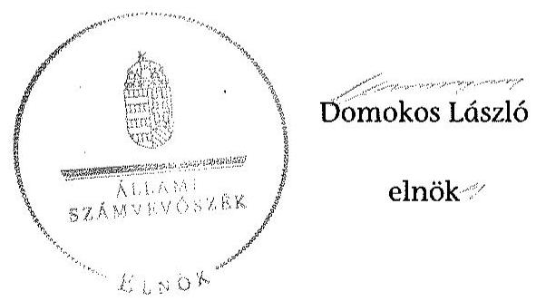

---

.

---

# RÖVIDÍTÉSEK JEGYZÉKE 

## Jogszabályok

| Áht. 1 | Az államháztartásról szóló 1992. évi XXXVIII. törvény (hatálytalan: 2012. január 1-jétől) |
| :--: | :--: |
| Áht. 2 | Az államháztartásról szóló 2011. évi CXCV. törvény |
| ÁSZ tv. | Az Állami Számvevőszékről szóló 2011. évi LXVI. törvény |
| Avtv. | A személyes adatok védelméről és a közérdekú adatok nyilvánosságáról szóló 1992. évi LXIII. törvény (hatálytalan: 2012. január 1-jétől) |
| Evt. $_{1}$ | Az erdőről és az erdő védelméről szóló 1996. évi LIV. törvény (hatálytalan: 2009. július 10-től) |
| Evt. $_{2}$ | Az erdőről, az erdő védelméről és az erdőgazdálkodásról szóló 2009. évi XXXVII. törvény (hatályos: 2009. július 10től) |
| Evr. $_{1}$ | Az erdőről és az erdő védelméről szóló 1996. évi LIV. törvény végrehajtásáról szóló 29/1997. (IV. 30.) FM rendelet (hatálytalan: 2009. november 21 -től) |
| Evr. $_{2}$ | Az erdőről, az erdő védelméről és az erdőgazdálkodásról szóló 2009. évi XXXVII. törvény végrehajtásáról szóló 153/2009. (XI. 13.) FVM rendelet (hatályos: 2009. november 21 -től) |
| Gt. | A gazdasági társaságokról szóló 2006. évi IV. törvény (hatályos: 2014. március 14-ig) |
| Info. tv. | Az információs önrendelkezési jogról és az információszabadságról szóló 2011. évi CXII. törvény |
| Mfbtv. | A Magyar Fejlesztési Bank Részvénytársaságról szóló 2001. évi XX. törvény |
| Nfatv. | A Nemzeti Földalapról szóló 2010. évi LXXXVII. törvény |
| Nvtv. | A nemzeti vagyonról szóló 2011. évi CXCVI. törvény |
| Ptk. | A Polgári Törvénykönyvről szóló 1959. évi IV. törvény (hatályos: 2014. március 14 -ig) |
| Számv. tv. | A számvitelről szóló 2000 . évi C. törvény |
| új Ptk. | A Polgári Törvénykönyvről szóló 2013. évi V. törvény |
| Vadvédelmi tv. | A vad védelméről, a vadgazdálkodásról, valamint a vadászatról 1996. évi LV. törvény |
| Vhr. | Az állami vagyonnal való gazdálkodásról szóló 254/2007. (X. 4.) Korm. rendelet |
| Vtv. | Az állami vagyonról szóló 2007. évi CVI. törvény |
| 262/2010. (XI.17.) Korm. rendelet | A Nemzeti Földalapba tartozó földrészletek hasznosításá- |

---

# Egyéb rövidítések 

| Alapító | A Magyar Állam, akinek a nevében a társaság feletti tulajdoni joggyakorló jár el |
| :--: | :--: |
| Alapító Okirat | A Budapesti Erdőgazdaság Zrt. mindenkori hatályos Alapító Okirata |
| ÁSZ | Állami Számvevőszék |
| ÁV Rt. | Állami Vagyonkezelő Rt. |
| Belső Ellenőrzési Sza-   bályzat | A Budapesti Erdőgazdaság Zrt. mindenkori Belső Ellenőrzési Szabályzata |
| DTÜ | Döntéshozó Testületeinek Ügyrend |
| E Ft | ezer forint |
| Erdészeti hatóság | Megyei Mezőgazdasági Szakigazgatási Hivatal Erdészeti Igazgatóság 2010. december 31-ig, Megyei Kormányhivatal Erdészeti Igazgatósága 2011. január 1-jétől ( 10 megyében) |
| FB | Felügyelő bizottság |
| FM | Földművelésügyi Minisztérium |
| Forrás-SQL rendszer | Integrált ügyviteli rendszer, amelynek feladata volt a vagyonkezelők számára a vagyonkataszteri jelentés elkészítésének és adathordozón történő továbbításának biztosítása, valamint a tulajdonosi joggyakorló vagyonkezelésében lévő vagyonelemek elektronikus adatbázisban történő tételes nyilvántartása |
| ha | hektár |
| HM | Honvédelmi Minisztérium |
| INTOSAI | Legfőbb Ellenőrző Intézmények Nemzetközi Szervezete |
| ISSAI | nemzetközi standardok |
| JT | jegyzett tőke |
| KIM | Közigazgatási és Igazságügyi Minisztérium |
| KVI | Kincstári Vagyoni Igazgatóság |
| M Ft | millió forint |
| MFB Zrt. | Magyar Fejlesztési Bank Zrt. |
| MNV Zrt. | Magyar Nemzeti Vagyonkezelő Zrt. |
| NFA | Nemzeti Földalapkezelő Szervezet |
| NFM | Nemzeti Fejlesztési Minisztérium |
| NVT | Nemzeti Vagyongazdálkodási Tanács |
| nyt. szám | nyilvántartási szám |
| RJGY | részvényesi jogok gyakorlója |
| ST | saját tőke |
| sz. | számú |
| Számviteli Politika | A Budapesti Erdőgazdaság Zrt. Számviteli Politikája |
| SZMSZ | A Budapesti Erdőgazdaság Zrt. Szervezeti és Múködési Szabályzata |
| Társaság | A Budapesti Erdőgazdaság Zrt. |

---

Tulajdonosi joggyakorló ${ }_{1}$

Tulajdonosi joggyakorló $_{2}$

Tulajdonosi joggyakorló $_{3}$
Vadászati hatóság

VSZ

Magyar Nemzeti Vagyonkezelő Zrt., mint a társaság részesedései feletti tulajdonosi joggyakorló 2009. január 1-jétől 2010. június 16 -áig

Magyar Fejlesztési Bank Zrt., mint a társaság részesedései feletti tulajdonosi joggyakorló 2010. június 17-étől 2014. július 15 -élg
Földművelésügyi Minisztérium, mint a társaság részesedései feletti tulajdonosi joggyakorló 2014. július 16-tól
Megyei Mezőgazdasági Szakigazgatási Hivatal Földmúvelésügyi Igazgatóság Vadászati és Halászati Osztály 2010. december 31-ig, Megyei Kormányhivatal Földmúvelésügyi Igazgatósága 2011. január 1-jétől ( 10 megyére)
az NFA-val 2013. július 30.-án kötött vagyonkezelési szerződés

---

.

---

# FOGALOMTÁR 

állami vagyon
a) az állam tulajdonában lévő dolog, valamint dolog módjára hasznosítható természeti erő;
b) az a) pont hatálya alá tartozó mindazon vagyon, amely vonatkozásában törvény az állam kizárólagos tulajdonjogát nevesíti;
c) az állam tulajdonában lévő tagsági jogviszonyt megtestesítő értékpapír, illetve az államot megillető egyéb társasági részesedés;
d) az államot megillető olyan immateriális, vagyoni értékkel rendelkező jogosultság, amelyet jogszabály vagyoni értékű jogként nevesít;
e) az állam tulajdonában lévő pénzügyi eszközök.
állami vagyon
használója
ázlátható szervezet
földbirtok-politikai irányelvek
hasznosítás
immateriális szolgáltatásából származó bevétel
információs és kommunikációs rendszer
Kincstári Vagyoni Igazgatóság

Az állami vagyon használója az a természetes vagy jogi személy, jogi személyiséggel nem rendelkező szervezet, aki, vagy amely törvény vagy szerződés alapján, bármely jogcímen (bérlet, haszonbérlet, használat stb.) állami vagyont birtokol, használ, szedi annak hasznait. (Ide nem értve a haszonélvezőt, a vagyonkezelőt és a tulajdonosi jogok gyakorlóját.)
Átlátható szervezet a Nvtv. 3. § (1) bekezdés 1. pontjában felsorolt, a meghatározott követelményeknek megfelelő szervezet.
Az Nfatv. 15. § (3) bekezdés a)-s) pontjaiban meghatározott, a Nemzeti Földalapba tartozó földrészletek hasznosítására vonatkozó irányelvek.
Hasznosítás a tulajdonosi joggyakorló vagy a nemzeti vagyon használója által a nemzeti vagyon birtoklásának, használatának, hasznok szedése jogának bármely - a tulajdonjog átruházását nem eredményező - jogcímen történő átengedése, ide nem értve a vagyonkezelésbe adást, valamint a haszonélvezeti jog alapítását.
Immateriális szolgáltatásból származó bevételek azok a nem anyagjellegű szolgáltatásokból származó állami bevételek, amelyeket az Evt. 3. § (1) bekezdése szerint, a külön jogszabályban meghatározott részletes feltételek szerint, az erdők fenntartására, gyarapítására és védelmére kell fordítani.
Az információs és kommunikációs rendszer biztosítja, hogy az információk eljussanak az illetékes szervezethez, szervezeti egységhez, illetve személyhez.
A Vtv. 61. § (1) bekezdése értelmében a Kincstári Vagyoni Igazgatóság (a továbbiakban: KVI) 2007. december 31-ei hatállyal megszűnt, jogai és kötelezettségei ezen időponttól - a 66. § (1) bekezdésében megjelölt feladat kivételével - az MNV Zrt.-re szálltak. A KVI 66. § (1) bekezdésben foglalt feladata a kincstárra szállt. A jogok és kötelezettségek átszállása nem minősült a KVI által kötött szerződések módosításának.

---

kockázatkezelés
kockázatkezelési rendszer
kontrolling
kontrollkörnyezet
kontrolltevékenységek
közfeladat

A kockázatkezelés a szervezet céljai elérésével kapcsolatos kockázatok azonosításának és elemzésének, valamint a megfelelő válaszok meghatározásának folyamata.
A kockázatkezelési rendszer múködtetése során fel kell mérni és meg kell állapítani a szervezet tevékenységében, gazdálkodásában rejlő kockázatokat, valamint meg kell határozni az egyes kockázatokkal kapcsolatban szükséges intézkedéseket, valamint azok teljesítésének folyamatos nyomon követésének módját. A kockázatkezelési rendszer olyan irányítási eszközök és módszerek összessége, amelynek elemei a szervezeti célok elérését veszélyeztető tényezők (kockázatok) azonosítása, elemzése, nyomon követése, valamint szükség esetén a kockázati kitettség mérséklése.
Az a vezetéstámogató rendszer, amely a vezetői tervezést, ellenőrzést, valamint információ-ellátást koordinálja célorientáltan a környezeti változásokhoz igazodva.
A kontroll környezet elemei: a szervezeti struktúra, a felelősségi, hatásköri viszonyok és feladatok, a szervezet minden szintjén meghatározott etikai elvárások, a humánerőforráskezelés. A kontrollkörnyezet alapozza meg a belső kontroll összes többi elemét a fegyelem és a struktúra biztosítása által.
A kontrollrendszer a kockázatok kezelése és tárgyilagos bizonyosság megszerzése érdekében kialakított folyamatrendszer, amely azt a célt szolgálja, hogy megvalósuljanak a következő célok:
a) a múködés és a gazdálkodás során a tevékenységeket szabályszerűen, gazdaságosan, hatékonyan, eredményesen hajtsák végre,
b) az elszámolási kötelezettségeket teljesítsék, és
c) megvédjék az erőforrásokat a veszteségektől, károktól és nem rendeltetésszerű használattól.
A kontrolltevékenységek azok az elvek (politikák) és eljárások, amelyeket a kockázatok meghatározása és a szervezet céljainak elérése érdekében alakítanak ki.
A közfeladat jogszabályban meghatározott állami vagy önkormányzati feladat, amit az arra kötelezett közérdekből, jogszabályban meghatározott követelményeknek és feltételeknek megfelelve végez, ideértve a lakosság közszolgáltatásokkal való ellátását, továbbá az állam nemzetközi szerződésekben vállalt kötelezettségeiből adódó közérdekú feladatokat, valamint e feladatok ellátásához szükséges infrastruktúra biztosítását is. Az Etv. 2. § (2) bekezdése szerint a fenntartható erdőgazdálkodás során a legfontosabb közérdekú feladat az erdők változatosságának megőrzése, az erdők fenntartása, felújítása és a védelmi, valamint közjóléti szolgáltatások biztosítása, melyek elvégzését az állam megfelelő eszközökkel biztosítja.

---

monitoring

Nemzeti Földalap
nemzeti vagyon használója
rábízott állami vagyon
társasági portfólió

A szervezet tevékenységének, a célok megvalósításának nyomon követését biztosító rendszer, amely az operativ tevékenységek keretében megvalósuló folyamatos és eseti nyomon követésből, valamint az operatív tevékenységektől függetlenül múködő belső ellenőrzésből áll. A monitoring a projektek és programok végrehajtásának nyomon követése, mely a támogató és a kedvezményezett közti megállapodásban foglalt eljárások követését, az előrehaladás ellenőrzését és a lehetséges problémák időben történő azonosítását szolgálja.
A Nemzeti Földalap a kincstári vagyon része, amelybe beletartoznak az állam tulajdonában és az ingatlan-nyilvántartásban levő, az Nfatv. 1. § (1)-(2) bekezdéseiben felsorolt területek, földrészletek és az azokhoz kapcsolódó vagyoni értékű jogok.
Az Nfatv. 15. § (1) ${ }^{1}$, valamint 1. § (1) ${ }^{2}$ bekezdése értelmében 2010. szeptember 1-jétől az erdőgazdasági társaság vagyonkezelésében lévő földterületek a Nemzeti Földalapba tartoznak, azok felett a tulajdonos jogait az agrárpolitikáért felelős miniszter az NFA útján gyakorolja.
A nemzeti vagyon használója az a természetes személy, jogi személy vagy jogi személyiséggel nem rendelkező szervezet, aki, vagy amely állami vagyon tekintetében törvény vagy szerződés alapján, a helyi önkormányzat vagyona tekintetében törvény, a helyi önkormányzat rendelete vagy szerződés alapján bármely jogcímen nemzeti vagyont birtokol, használ, szedi annak hasznait, kivéve a tulajdonosi joggyakorló (az Nvtv. 3. § (1) bekezdés 11. pontja alapján).
Rábízott állami vagyon az a Vtv. alkalmazásában állami vagyonnak minősülő vagyon, amit az MNV- a saját vagyonától elkülönítetten - kezel és nyilvántart. Az Mfbtv. 3. § (9) bekezdése szerint rábízott állami vagyon az a vagyon, amely felett az Mfbtv. erejénél fogva a Magyar Állam nevében az MFB gyakorolja a tulajdonosi jogokat. Az Nfatv. 1. § (1) bekezdésében foglaltak alapján az NFA-hoz tartozó rábízott vagyon a törvényben meghatározott, a Nemzeti Földalapba tartozó vagyon.
Társasági portfólió az MNV, illetve az MFB rábízott vagyonába tartozó állami tulajdonú társasági részesedések.

[^0]
[^0]:    ${ }^{1}$ Hatályos: 2010. szeptember 1 - 2011. július 31.
    ${ }^{2}$ Hatályos: 2010. szeptember -jétől, módosítva: 2011. augusztus 1-jétől.

---

tulajdonosi ellenőrzés
tulajdonosi joggyakorló
tulajdonosi joggyakorlás módja
vagyongazdálkodás feladata
vagyonkezelői jog

Az MNV/MFB/FM tulajdonosi joggyakorló által végzett ellenőrzés, amelynek célja az állami vagyonnal való gazdálkodás vizsgálata, ennek keretében a rendeltetésellenes, jogszerütlen, szerződésellenes, vagy a tulajdonos érdekeit sértő, illetve a központi költségvetést hátrányosan érintő vagyongazdálkodási intézkedések feltárása és a jogszerű állapot helyreállítása, továbbá a vagyonnyilvántartás hitelességének, teljességének és helyességének biztosítása.
Tulajdonosi joggyakorló az, aki az állami, illetve a nemzeti vagyon felett az államot megillető tulajdonosi jogok és kötelezettségek gyakorlására jogosult.
Az állami vagyon felett a Magyar Âllamot megillető tulajdonosi jogoknak (és kötelezettségeknek) az összességét az állami vagyon felügyeletéért felelős miniszter gyakorolja, aki e feladatát az MNV, és az MFB útján látja el. A Vtv. alapján 2010. június 16-ig az MNV Zrt. a tulajdonosi jogait megosztotta a HM-mel. A tulajdonosi jogok megosztását a felek a közöttük 2008. május 29 -én kelt vagyonkezelői szerződésben szabályozták. Azon állami tulajdonban álló ingatlanok felett, amelyek egy része a Nemzeti Földalapba tartozik, a tulajdonosi jogokat a miniszter az agrárpolitikáért felelős miniszterrel közösen gyakorolja. A Nemzeti Földalap felett a Magyar Állam nevében a tulajdonosi jogokat és kötelezettségeket az agrárpolitikáért felelős miniszter a Nemzeti Földalapkezelő Szervezet útján gyakorolja.
Az állami vagyon rendeltetésének megfelelő - az állami feladatok ellátásához, a társadalmi szükségletek kielégítéséhez, valamint a Kormány gazdaságpolitikája megvalósításának elősegítéséhez szükséges, egységes elveken alapuló, önálló ágazatként megjelenő - hatékony, költségtakarékos, értékmegőrző, értéknövelő felhasználásának biztosítása, beleértve a vagyoni kör változását eredményező értékesítést, valamint az állami vagyon gyarapítása is.
Vagyonkezelési szerződés alapján a vagyonkezelő jogosult meghatározott, állami tulajdonba tartozó dolog birtoklására, használatára és hasznai szedésére. A Vtv. alapján a vagyonkezelői jog az állami vagyon hasznosítására az MNVvel kötött vagyonkezelési szerződéssel jön létre. A vagyonkezelési szerződés alapján a vagyonkezelő jogosult meghatározott, állami tulajdonba tartozó dolog birtoklására, használatára és hasznai szedésére. Az Nfatv. alapján a vagyonkezelői jog az erre irányuló (NFA-val kötött) szerződéssel jön létre. A vagyonkezelői szerződés alapján a vagyonkezelő jogosult meghatározott földrészlet birtoklására, használatára és hasznai szedésére. A vagyonkezelő köteles a földrészlet értékét megőrizni, állagának megóvásáról, jó karban tartásáról gondoskodni, továbbá - az Nfatv.-ben meghatározott esetek kivételével díjat - fizetni vagy a szerződésben előírt más kötelezettséget teljesíteni.

---

A Budapesti Erdőgazdaság Zrt. vagyonváltozásának alakulása a 2009-2014. évek közötti időszakban - Eszközök (M ft)
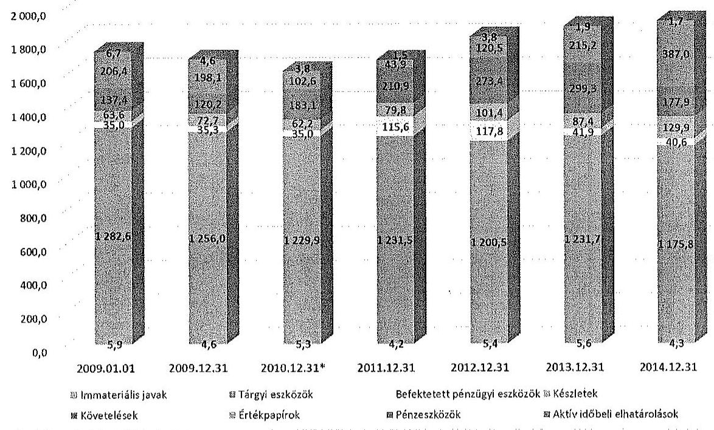

A Budapesti Erdőgazdaság Zrt. vagyonváltozásának alakulása a 2009-2014. évek közötti időszakban - Források (M ft)
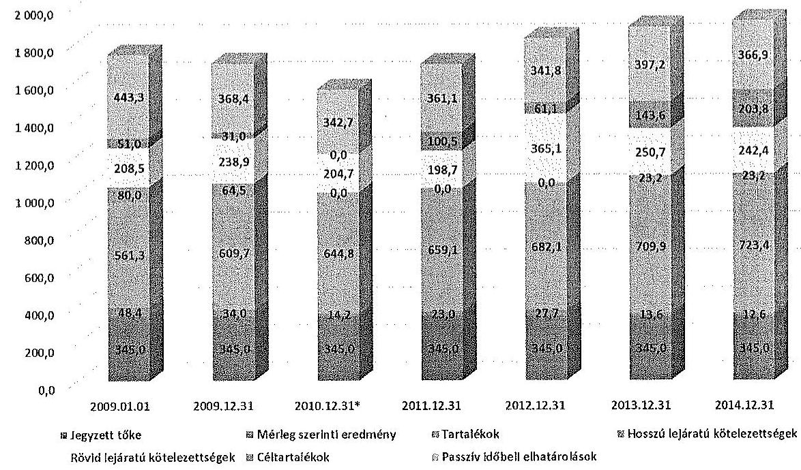

---

Az erdőgazdasági társaság vagyonának alakulása 2009-2014. években

|  Sorszám | Megnevezés | 2009.01.01 | 2009.12.31 | 2010.12.31 | 2010.12.31 helyesbítés | 2011.12.31 | 2012.12.31 | 2013.12.31 | 2014.12.31 | 2014.12.31/2009.12.31. (%)  |
| --- | --- | --- | --- | --- | --- | --- | --- | --- | --- | --- |
|   |  | 1 | 2 | 3 | 4 | 5 | 6 | 7 | 8 | 9  |
|  1. | Eszközök |  |  |  |  |  |  |  |  |   |
|  2. | Befektetett eszközök összesen | 1 323 473 | 1 295 946 | 1 319 880 | -49 702 | 1 351 321 | 1 323 734 | 1 279 253 | 1 220 718 | 94%  |
|  3. | Ebből: Immateriális javak | 5 869 | 4 634 | 2 580 |  | 4 209 | 5 446 | 5 656 | 4 323 | 93%  |
|  4. | Tárgyi eszközök | 1 282 587 | 1 255 963 | 1 279 555 | -49 702 | 1 221 495 | 1 200 477 | 1 231 705 | 1 175 842 | 94%  |
|  5. | Befektetett pénzügyi eszközök | 35 017 | 35 249 | 35 045 |  | 115 617 | 117 811 | 41 912 | 40 553 | 115%  |
|  6. | Forgóeszközök | 407 408 | 390 994 | 341 812 | 6 115 | 334 617 | 495 355 | 601 945 | 694 794 | 178%  |
|  7. | Ebből: Készletek | 65 631 | 72 679 | 65 171 |  | 79 847 | 101 415 | 87 405 | 129 864 | 179%  |
|  8. | Követelések | 137 378 | 120 188 | 177 018 | 6 115 | 210 857 | 273 433 | 299 311 | 177 919 | 148%  |
|  9. | Értékpapírok | 0 | 0 | 0 |  | 0 | 0 | 0 | 0 |   |
|  10. | Pénzeszközök | 206 397 | 198 127 | 102 623 |  | 43 913 | 120 483 | 215 259 | 387 011 | 195%  |
|  11. | Aktív időbeli elhutórolások | 6 656 | 4 574 | 2 849 |  | 1 474 | 5 826 | 1 890 | 1 739 | 38%  |
|  12. | Eszközök összesen | 1 737 537 | 1 691 514 | 1 665 541 | -45 587 | 1 687 412 | 1 822 893 | 1 883 088 | 1 917 251 | 113%  |
|  13. | Források |  |  |  |  |  |  |  |  |   |
|  14. | Saját tőke | 954 746 | 988 715 | 1 049 156 | -45 073 | 1 027 118 | 1 054 860 | 1 068 456 | 1 081 015 | 109%  |
|  15. | Ebből: Jegysett tőke | 345 000 | 345 000 | 345 000 |  | 345 000 | 345 000 | 345 000 | 345 000 | 100%  |
|  16. | Tőketartalék | 116 038 | 116 038 | 116 038 |  | 116 038 | 116 038 | 128 707 | 128 707 | 111%  |
|  17. | Ürelésérel tartalék | 401 608 | 450 039 | 467 008 | 20 000 | 309 243 | 324 879 | 351 630 | 352 206 | 123%  |
|  18. | Lekötött tartalék | 45 669 | 43 669 | 61 802 | -20 000 | 33 802 | 41 202 | 29 525 | 42 525 | 97%  |
|  19. | Értékelőtt tartalék | 0 | 0 | 0 |  |  |  | 0 |  |   |
|  20. | Idéleg eszközök eredmény | 45 431 | 35 569 | 59 308 | -45 073 | 23 035 | 27 741 | 13 576 | 12 579 | 37%  |
|  21. | Cáltartalékok | 51 000 | 31 000 | 70 491 |  | 100 491 | 61 100 | 143 600 | 303 762 | 657%  |
|  22. | Kötelezettségek | 288 455 | 303 457 | 203 225 | 1 486 | 198 674 | 365 098 | 273 873 | 265 601 | 88%  |
|  23. | Ebből: Hálmazonót kötelezettségek | 0 | 0 | 0 | 0 | 0 | 0 | 0 | 0 |   |
|  24. | Pusztil lejáratú kötelezettségek | 80 000 | 64 213 | 0 | 0 | 0 | 0 | 25 157 | 25 197 | 36%  |
|  25. | Kövül lejáratú kötelezettségek | 205 855 | 228 918 | 205 225 | 1 486 | 198 674 | 365 098 | 250 676 | 242 404 | 101%  |
|  26. | Pusztil időbeli elhutórolások | 443 336 | 368 372 | 342 669 |  | 361 159 | 341 835 | 257 179 | 366 873 | 100%  |
|  27. | Források összesen | 1 737 537 | 1 691 514 | 1 665 541 | -45 587 | 1 687 412 | 1 822 893 | 1 883 088 | 1 917 251 | 113%  |

---

A. 22/04/17 08:21:37 11. 02/04/17 05:24:47 12. 02/04/17 05:24:47

|  Svar | MISCHEDTEILE | 2018.-år | 2019.-år | 2020.-år | 2021.-år | 2022.-år | 2023.-år | 2024.-år | 2025.-år | 2026.-år  |
| --- | --- | --- | --- | --- | --- | --- | --- | --- | --- | --- |
|   |  | Ömsynns |  |  |  | Össynns |  |  |  | Össynns  |
|  1. | Nyttel dämmelser | 1 309 679 | 0 | 1 320 679 | 1 392 598 | 0 | 1 392 598 | 1 379 178 | 0 | 1 379 178  |
|  2. | Tare anslutt inblanddämde | 116 217 | 0 | 126 217 | 122 202 | 0 | 122 202 | 139 971 | 0 | 137 971  |
|  3. | Tare anslutt inblanddämde | 4 344 | 0 | 4 344 | 1 487 | 0 | 1 487 | 1 921 | 0 | 1 921  |
|  4. | Deltavsattn elindmeldan | 0 | 0 | 0 | 0 | 0 | 0 | 0 | 0 | 0  |
|  5. | Tänhusfält | 2 194 | 0 | 2 194 | 1 222 | 0 | 1 222 | 1 220 | 0 | 1 220  |
|  6. | Inhållsstn | 0 | 0 | 0 | 0 | 0 | 0 | 0 | 0 | 0  |
|  7. | Återställdstn | 0 | 0 | 0 | 0 | 0 | 0 | 0 | 0 | 0  |
|  8. | Ingrundstn | 0 | 0 | 0 | 0 | 0 | 0 | 0 | 0 | 0  |
|  9. | Stygrns stndla | 0 | 0 | 0 | 0 | 0 | 0 | 0 | 0 | 0  |
|  10. | Sgurtt | 3 482 | 0 | 3 482 | 222 | 0 | 222 | 754 | 0 | 754  |
|  11. | Laddikande insumme | 131 902 | 0 | 131 902 | 132 294 | 0 | 132 294 | 161 611 | 0 | 161 611  |
|  12. | Tare anslutt handskala | 70 114 | 0 | 70 114 | 65 726 | 0 | 65 726 | 124 202 | 0 | 124 202  |
|  13. | Tare anslutt skriftna | 24 442 | 0 | 24 442 | 4 854 | 0 | 4 854 | 16 232 | 0 | 16 232  |
|  14. | Tare anslutt introduktin | 295 969 | 0 | 295 969 | 96 234 | 0 | 96 234 | 199 607 | 0 | 199 607  |
|  15. | Sgurtt handskala | 0 | 0 | 0 | 0 | 0 | 0 | 0 | 0 | 0  |
|  16. | Sgurtt fettifrån | 0 | 0 | 0 | 0 | 0 | 0 | 0 | 0 | 0  |
|  17. | Stndställdstn | 0 | 0 | 0 | 0 | 0 | 0 | 0 | 0 | 0  |
|  18. | Deltavsattn elindstn | 0 | 0 | 0 | 0 | 0 | 0 | 0 | 0 | 0  |
|  19. | Stndsaldamstn elindstn | 0 | 0 | 0 | 0 | 0 | 0 | 0 | 0 | 0  |
|  20. | Sgurtt | 532 | 0 | 532 | 0 | 0 | 61 672 | 0 | 61 672 | 0  |
|  21. | Tareens inbld introduktin | 516 | 0 | 516 | 1 208 | 0 | 1 208 | 63 382 | 0 | 63 382  |
|  22. | Stöndsaldamstn | 105 917 | 0 | 105 917 | 69 734 | 0 | 69 734 | 223 728 | 0 | 223 728  |
|  23. | Stönd dämmelser | 1 295 946 | 0 | 1 295 946 | 1 274 178 | 0 | 1 274 178 | 1 261 261 | 0 | 1 261 261  |

---

.

---

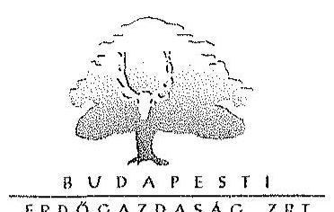

Ikt. szám: VEZ/3-17/2015.

Állami Számvevőszék
Domokos László elnök
1364 Budapest 4.
Pf.: 54.

# Tisztelt Elnök Úr! 

Alulírott Szalay László, mint a Budapesti Erdőgazdaság Zártköröen Móködő Részvénytársaság (Cg.: 01-10-042135; székhely: 1033 Budapest, Hévizi u. 4/A) vezérigazgatója a V-0769-069/2015 iktatószám alatt részünkre megküldött jelentéstervezettel kapcsolatban az alábbi észrevételeket teszem:

## 1.) Észrevétel

A jelentéstervezet 3. oldalának 2. bekezdése " Az Alapö̈rvény 38. cikkö és az Nvtr. alapján az allane tulajdona a nemzeti vagyon részét képezi. Az Nvtr. az erdőkat az állami tulajdon körébe sorolja és kionondja, hogy a nemzeti vagyon alapvető rendeltréés a körfeladat ellátásának bérjestitása. A Társaságok vagyongazdálkodása szempontjából a V'tr, illetve az Nvtr. és az Nfatc., valamint a kapcsolódó korvvány- és miniszteri rendeltrék mellett kiemelkedő szerepa van a különbözö ágazati jogszabályoknak."

A honvédelméről és a Magyar Honvédségről, valamint a különleges jogrendben bevezethető intézkedésekről szóló 2011. évi CXIII. törvény 42. § (1) értelmében "A Honvédég szervezeteinek elhelyezitélez, és feladatai ellátásához rendelkezésre bocsátott ingatlanok állami tulajdonban, a honvédelmért felelős miniszter által vezetett miniszteriome vagyonkezelésében állnak. A honvédelmért felelős miniszter által vezetett miniszteriome vagyonkezelésében lévő ingatlanok elsödleges rendeltréés a honvédelmi feladatok ellátásának bérjestitása."

Az erdőről, az erdő védelméről és az erdőgazdálkodásról szóló 2009. évi XXXVII. törvény 112. § (7) értelmében „Felbatalmatyást kap a miniszter, hogy a honvédelmért felelős miniszter egyetértésénél kiadott rendelétben szabályozza a honvédelmi rendeltréésé erdőkre vonatkozó különös szabályokat." Annak ellenére, hogy a törvény kihirdetése 2009. V. 25.-én történt meg, a mai napig sem alkották meg a honvédelmi rendeltetésű erdőkre vonatkozó különös szabályokat tartalmazó rendeletet. A rendelet hiánya határozottan akadályozza az érintett erdőterületeken az ingatlan törvényben meghatározott céljának megfelelő gazdálkodás folytatását.

Szerencsésnek tartanánk, ha a jelentés a Társaság kezelésében lévő állami vagyon rendeltetésének és kezelésének jogi ismertetésénél rögzítené:

1. A HM vagyonkezelésében lévő ingatlanok esetében - sarkalatos törvényhely alapján - a használatra átadott ingatlanok elsődleges rendeltetése a honvédelmi feladatok ellátása.
2. A HM vagyonkezelésében lévő erdő ingatlanok kezelésének jogi szabályozása rendezetlen, nem támogatja megfelelően az állami vagyonnal való felelős gazdálkodást.

## 2.) Észrevétel

A jelentéstervezet 3. oldalának 4. bekezdése és 29. oldal 5. pontjának 1. bekezdése szerint "A V'tr. 3.§-a szerint a Társaság részszedése felett és a kezelésében lévő állami vagyon felett a tulajdonaai jogok gyakorlását 2010. június 16-ig az MNV Zrt. látta el. A V'tr. 29.§ (3) bekezdése alapján az MNV Zrt. a tulajdonaai jogait akként gyakorolta, hogy a társaságok feleltt tulajdonosi jogszakarást rendjét megosztotta a HM-nel és azt a V'tr. 3.§-ban szabályozott ügyvezeti szcree, a Nemzeti V'agyongazdálkodási Tanács útján látta el."

Budapesti Erdőgazdaság Zrt.
1033 Budapest, Hévizi út 4/a. $\cdot$ Levelezési cím: 1300 Budapest, Pf. 212.
Telefon: 387-8859 $\cdot$ Fax: 387-88620 $\cdot$ E-mail: bp-erdos@bp-erdobu

---

Az MNV Zrt. és a Honvédelmi Minisztérium között 2008. május hó 29. napján létrejött vagyonkezelői szerződés II. 1 pontja szerint "Az MNV Zrt. - figyelemmel a Vtv. 27.§-ában és 29.§ (5) bekezzötelben foglaltukra-a II.1.1.-II.1.10. pontokban felsorolt részvénytársaságok és közhazznol társaságok vagyonkezelói jogát átadja Vagyonkezelö részére. A vagyonkezelö - a Vtv., a Vbr. valamint jelen szerzödés rendelkészéseire figyelemmel-jogosult a tulajdonosi (tagyági) jogokat az állam nevében gyakorolni, illetőleg köteles a kötelezettségeket teljesiteni." A bávatkozott vagyonkezelői szerződés II.1.1 szám alatt a Társaságunkat nevesíti.

Fentebb leírtakra tekintettel kérem a jelentéstervezet módosítását akként, hogy a Társaságunk feletti tulajdonosi jogokat az MNV Zrt. nem megosztotta a Honvédelmi Minisztériummal, hanem a Vtv. 29.§ (5) bekezdése alapján azt átadta a részére.

# 3. Észrevétel 

A jelentéstervezet 6. oldalának 2. bekezdésében szereplő megállapítás szerint: „Az ellenézzött idöszakban a Társaság 2010. évé mérlege nem a valós állapotot tükrözje, mert az erdőszcréazet átalakításának költségeit a Szzánev. tv. elöirásai ellenére a beruházások között akitíválta."

A megállapítás igaz, de szerencsésebb lenne, ha a jelentéstervezet a 27. oldal 2. bekezdésében helyesen rögzített tényállási részből átemelve azt is tartalmazná, hogy a Társaság 2011. évben a hibát kijavította, önellenőrzést végzett és az elszámolt erdőszerkezet-átalakítást költségként számolta el.

## 4. Észrevétel

A jelentéstervezet 10. oldalának 2. pontjában megfogalmazott intézkedési javaslattal kapcsolatban tájékoztatom, hogy Társaságunk levélben kereste meg a HM Hadfelszerelési és Vagyonfelügyelcti Főosztályát a használati megállapodások közötti összhang megteremtése érdekében. A levél másolatát mellékelten csatolom.

A jelentéstervezet 6. oldalának 3. bekezdése és 18. oldalának 2.1 pontjának 2. bekezdése szerint "A használatba adási szerzödés szerint a használatba adatt ingatlanok elsödlegesen honvédelmi stbokat szedgáltuk."

A honvédelernről és a Magyar Honvédségről, valamint a különleges jogrendben bevezethető intézkedésekről szóló 2011. évi CXIII. törvény 42. § (1) értelmében "A Honvédség szervezeteinek elhelyezetêbez, és feladatai ellátásakoz, rendelkészézer bocsátott ingatlanok állami tulajdonban, a honvédelenrért fehölés miniszzer által vezeteit miniszztérium vagyonkezelésében állnak. A honvédelenrért fehölés miniszzer által vezeteit miniszztérium vagyonkezelésében itró ingatlanok elsödleges rendelletése a honvédelmi feladatok ellátásának bérjesitása."

Szerencsésebbnek tartanánk annak a rögzítését, hogy a HM és a Társaságunk között létrejött használatba adási szerződés a fentebb hivatkozott sarkalatos törvényhely alapján rögzíti, hogy a használatra átadott ingatlanok elsődleges rendeltetése a honvédelmi feladatok ellátása, ennek a szerződésben való szerepeltetése nem a felek akaratán, hanem törvényen alapszik.

## 5. Észrevétel

A jelentéstervezet 8. oldalának 3. bekezdése szerint "A Társaság több esetben a gazdálkodásból szúrmazó bevételének elszámolását megalaparó szerzödésékkel, számúakaláltásával és a bevételen elszámolásával megsértette a Szzánev. tv. szerenti bruttó elszámolás alapelvét, mert a bevételeket és a költségeket egymással szemben számolta el.", 11. oldalának 2. pontja „A Társaság a gazdálkodásból szúrmazó bevételének elszámolásánál több esetben sérült a Szzánev. tv. 15. § (9) bekezdése szerinti bruttó elszámolás alapelve,..."

A Társaság megítélése szerint a bizományi szerződés alapján a bizományos a harmadik személlyel szemben a saját nevében, de megbízója javára (érdekében) jár el. Az Áfa tv. 15. §

---

alapján a bizományos ugyanannak a szolgáltatásnak az igénybe vevője és nyújtója. A bizományos tevékenysége nem önálló szolgáltatásnyújtásként jelenik meg, hanem „belesimul" az imént említett két alapügyletbe, az őt megillető díjazás úgy viselkedik, mint a saját számlás ügyleteknél az átrés. A megkettőzött alapügyletck közül a megbízó és a bizományos közötti viszonylatban a bizományost megillető díjazás az adóalapját csökkenti. A bizományos tevékenységének ellenértéke ebben az esetben nem minősülhet önálló szolgáltatásnyújtásnak és nem számolható el önállóan, hiszen a bizományos a szolgáltatást igénybe veszi a Társaságtól annak érdekében, hogy megbízója felé teljesíteni tudjon. Előzőek alapján a bizományosi szerződés elszámolásánál nem merülhet fel a bruttó elszámolás elve.

# 6. Észrevétel 

A jelentéstervezet 18. oldalának 2.1 pontjának 3. bekezdése szerint " $A$ Társszágnak a $H M$ vagyonkezelésbe tartozó ingatlanvagyon bazenálati jogának megszerzésiért és gyakorlásáté pénzüen kifojitott ellenértéket nem kellett fesetnie, ugyanakkor a szerzédés 5.2 pontja tartalmazza a Társszágnak az ingatlan karbantartására, dillagának meyérzésére, batékony és gazdaságos múbádotésre vonatkozó kötelezettséget."

A fentebb idézettckhez hozzátartozik, hogy a használatba adási szerződéssel a Társszágunk a használatba kapott ingatlanok vonatkozásában a vagyonkezelőt terhelő természetvédelmi, környezetvédelmi, talajvédelmi, termőföldvédelmi, erdővédelmi és vadvédelmi kötelezettségek teljesitést átvállalta. Ezen kötelezettségek fokozottan jelentkeznek az ingatlanok elsődleges honvédelmi rendeltetésből eredő katonai használata miatt, amelyek az általánoshoz képest többletköltséggel is járnak a Társaságunk részére. Ezen kötelezettségek teljesitését Társszágunk térítés nélkül végzi.

## 7. Észrevétel

A jelentéstervezet 6. oldalának 5. bekezdése szerint " $A$ HM, az MNV Zrt. és az NFA 2014. januárjában az Njato, rendelkezése szerint háromoldaló megállapodást kötött a honvédelmi miniszster által honvédelmi abba feleslegesoi nyilvánittot ingatlanok tekintetében a HM vagyonkezelési jogának megszüntetéseirél. Az ellenérzött idészokban kikeriült területek vonatkozásában a barzndlatba adási szerzédés mellékletét nem módositották, ezért a bazenálatba adási szerzédés nem támogatta megfelelően és szánnon kérhető módon a Társaság állami vagyonnal való gazdálkodását. ... Az átadásul érintett területeken a Társaság az erölezett hatásáy karábbi engedélyének birtokában erdőgazdálkodási terékensséget folytatott.", valamint 20. oldalának 1. bekezdése szerint "Az átadott területek vonatkozásában a HM vagyonkezclői joga megszitnt, ezért az átadott területekre az Est. 9.§ (4) ellárásai - mely a vagyonkezclö számára lehetővé tette ezen területrnek a Társszágnak történő bazenálatba adását - tervénytelenni náltok, ennek ellenére a HM és a Társaság között fennálló bazenálatba adási szerzédés mellékletének módosítása elmaradt."... "A feleslegesoi vált területeken a Társaság az Est. 17. § (1) bekezdésében foglaltakat megeértve erdőgazdálkodási terékensséget - az erölezetti hatásáy karábbi engedélyének birtokában - terübb folytatta."

A hivatkozott 2014. január 22-én kelt "Megállapodás vagyonkezelői szerződés, vagyonkezelői jog megszüntetésről" szóló szerződés 11.3. pontjának második mondata akként rendelkezik, hogy "Felek tudomásné vezzik és kérelentik, hogy az Atadó által a vagyon bazenálatára, valamint bazenositásra harmadik személyel kötött szerzédésben az 1. számú mellékletben felsorolt ingatlanok esetében - hivatkozzsa a szerzédés 1/2. pontjában foglaltakra - az állami vagyonnal való gazdálkodásról szóló 254/2007.(X.4.) Korn. rendelet 12.§ (6) bekezdését és figyelembe véve jelen esetben az NFA lép."

Fentiek alapján a 2014. január hó 22-én kelt megállapodással az NFA-nak átadott ingatlanok vonatkozásban a Társaság használatba adási szerződése nem szűnt meg, nem vált érvénytelenné, hanem ezen ingatlanok vonatkozásban a HM, mint használatba adó helyébe az NFA lépett. Az érintett területeken a Társaság jogszerűen folytatta tovább az erdőgazdálkodást. Az vitán felül áll, hogy ez a megoldás hosszú távon nem segíti elő az állami vagyonnal való felelős gazdálkodás alapjainak megteremtését, azonban a Társaság részére átmenetileg biztosítja a jogi alapokat.

---

# 8. Észrevétel 

A jelentéstervezet 21. oldal 2.2 pontjának 1. bekezdése szerint "A H3M nyilvaintartása és a Társaság nyilvaintartása alokjain megálkoitlható, hogy a Társaság nyilvaintartásból a benvelelemi célra felcshygessé nyilvaintatt területekat teljes körüen nem vezeték ki, ezért a Társaság nyilvaintartása nem támogatta megfelelően az állami vagyunnal való felelés gazdálkodást."

A jelentéstervezet 20. oldalának 1. bekezdésben is hivatkozott 2014. február 6-án kelt "Vagyonkezelői szerződés megszüntetése" elnevezésű dokumentum 3.3 pontja szerint "Átadó szavatolja, hogy az ingatlanok az 1. szimó mellékletben feltüntetett bejegyzéssben kivél per-, teher- és igégemenceok, ideértee a haresnébezzél, körüti vagy egyéb használati jogi menteséget is." Ezen pont kifejezetten ellentétben áll az előzőekben már hivatkozott 2014. január 22-én kelt "Megállapodás vagyonkezelői szerződés, vagyonkezelői jog megszüntetésről" szóló szerződés II.3. pontja második mondatának rendelkezéseivel.

Ennek megfelelően az alábbi ingatlanok esetében szűnt meg a Társaságunk használati joga:

|  | Település | Helyrajzi szám | Müvelési ág | Terület (ha) |
| :--: | :--: | :--: | :--: | :--: |
| 1 | Aldehső | 063 | erdő | 49,0314 |
| 2 | Ahóvadász | 034/1 | erdő | 5,5245 |
| 3 | Aszaló | 0117/13 | erdő | 8,3026 |
| 4 | Budapest XXII.   ker. | 0239910/1 | számó, legelö | 42,6521 |
| 5 | Budapest XXII.   ker. | 0239932/1 | gyep (legelö) | 26,8320 |
| 6 | Pusztawacs | 0200/3 | erdő | 4,1299 |
| 7 | Pusztawacs | 0200/5 | erdő | 12,6295 |
| 8 | Verőce | 086/1 | gyep (legelö) | 0,5053 |
| 9 | Verőce | 086/2 | gyep (legelö) | 0,4425 |
| 10 | Verőce | 086/4 | gyep (legelö) | 1,4789 |
| 11 | Verőce | 088 | gyep (legelö) | 0,4992 |

A jelentéstervezet 23. oldalának 2. bekezdése szerint "A V5Z. 6.1 pontja és a 262/2010. (XI.17.) Korm. rendelet 50/A.§ (2) bekezdésben foglalt elöivás ellentére az NFA részére a Társaság a kezelt vagyonról adatszolgáltatást nem teljesitett."

A jelentéstervezet kézhezvételét követően a Társaságunk levélben megkereste az NFA-t, melyben kértük a tájékoztatásukat arra vonatkozóan, hogy a vagyonkezelői szerződésünk 6.1. pontjában foglalt kötelezettségnek milyen formában tud eleget tenni a Társaságunk. A levél másolatát mellékelten csatolom.

Budapest, 2015. november 11.
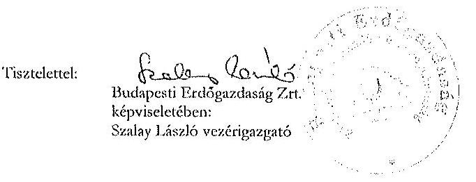

---

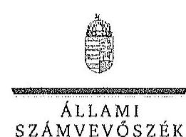

ELHOK

Ikt.szám: V-0769-081/2015.

# Szalay László úr 

vezérigazgató
Budapesti Erdőgazdaság Zrt.

## Budapest

## Tisztelt Vezérigazgató Úr!

A ,, Jelentéstervezet az állami tıdujdonban álló erdőgazdasági társaságok vagyongazdálkodási tevékenységének ellenörzése - Budapesti Erdőgazdaság Zrt. " címmel készített számvevőszéki jelentéstervezetre tett észrevételeit köszönettel megkaptam.

Az Állami Számvevőszék észrevételekre vonatkozó álláspontjáról a felügyeleti vezető által készített részletes tájékoztatást csatoltan megküldöm.

Tájékoztatom Vezérigazgató urat, hogy a számvevőszéki jelentésben - az Állami Számvevőszékről szóló 2011. évi LXVI. törvény 29. § (3) bekezdése alapján - a figyelembe nem vett észrevételeket szerepeltetjük az elutasítás indokának feltüntetésével.

Budapest, 2015.
hó nap
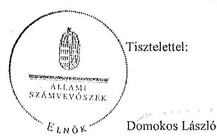

Melléklet: Tájékoztatás az elfogadott és el nem fogadott észrevételekről

---

# Tájékoztatás   az elfogadott és el nem fogadott észrevételekröl 

A ,, Jelentéstervezet az állami tulajdonban álló erdögazdasági társaságok vagyongazdálkodósi tevékenységének ellenörzése - Budapesti Erdögazdaság Zrt." címü jelentéstervezetre 2015. november 13-án érkezett észrevételeit áttekintettük, azok kezelésével kapcsolatban a következő tájékoztatást adom.

## 1. észrevétel - 3. oldal 2. bekezdés

Az egyértelműség érdekében a jelentéstervezet 3. oldal 2. bekezdését az alábbiakkal egészítjük ki:
„A honvédelemröl és a Magyar Honvédségről, valamint a különleges jogrendben bevezethető intézkedésekröl szóló 2011. évi CXIII. törvény alapján a Honvédség szervezeteinek elhelyezéséhez, és feladatai ellátásához rendelkezésre bocsátott ingatlanok állami tulajdonban, a honvédelemért felelős miniszter által vezetett minisztérium vagyonkezelésében állnak. A Honvédelmi Minisztérium a vagyonkezelésében lévő honvédelmi rendeltetésủ erdőket a Társaságok használatába adta."

## 2. észrevétel - 3. oldal 4. bekezdés és 29. oldal 5. pont 1. bekezdés

A dokumentumok ismételt áttekintése alapján a jelentéstervezet 3. oldal 4. bekezdés, valamint a 29. oldal 5. pont 1. bekezdés első két mondatát az alábbiak szerint pontosítjuk:
„Az MNV Zrt a Társaság feletti tulajdonosi jogok gyakorlását a Vtv. 29. § (5) bekezdésében foglaltakkal összhangban a 2008-ban létrejött vagyonkezelési szerzödésben a HM-nek átadta. A HM a tulajdonosi jogokat 2010. június 16 -áig gyakorolta."

## 3. észrevétel - 6. oldal 2. bekezdés

Az észrevétel a jelentéstervezet megállapítását megerősíti, annak módosítása nem indokolt.

## 4. észrevétel

A) 10. oldal 2. pont

Az észrevétel a 10. oldal 2. pontjában megfogalmazott intézkedést igénylő megállapítás alapján a honvédelmi miniszternek címzett javaslatra vonatkozik, azonban azt az azonos intézkedést igénylő megállapítás alapján a Budapesti Erdögazdaság Zrt. vezérigazgatójának címzett

---

1. számú javaslat vonatkozásában értékeltük. Az intézkedést igénylő megállapítással és javaslattal kapcsolatban adott tájékoztatásukat köszönettel vettük, azonban az nem érinti az ellenőrzött időszakra vonatkozóan megfogalmazott megállapítást, ezért a jelentéstervezet módosítása nem indokolt.

# B) 6. oldal 3. bekezdés és 18. oldal 2.1 pont 2. bekezdés 

Az észrevétel a megállapítást nem vitatja, annak módosítása nem indokolt.

## 5. észrevétel - 8. oldal 3. bekezdés, 11. oldal 2. pont

A Számv. tv. 15. § (9) bekezdése, a bruttó elszámolás alapelve szerint a bevételek és költségek (ráfordítások) egymással szemben nem számolhatók el. A Társaság bevételeinek elszámolása során több esetben nem érvényesült a bruttó elszámolás alapelve, mert a bevételeket és a bizományi dijból származó kiadásokat egymással szemben számolták el. A számlák a jutalékkal csökkentett összeget tartalmazták, nem tartalmazták tételesen a Társaságot megillető bevételt, illetve a bizományosi díjat, ezért a Társaság számlázási rendszere nem támogatta a bruttó elszámolás elvének érvényesülését. Megállapításunk módosítása nem indokolt.

## 6. észrevétel - 18. oldal 2.1. pont 3. bekezdés

A Társaság vagyonkezelésébe tartozó eszközökhöz kapcsolódó pénzben kifejtett ellenértékre tett megállapításunkhoz kapcsolódó tájékoztatásukat köszönjük. Az észrevételben leírtak a megállapítást nem vitatják, annak módosítása nem indokolt.

## 7. észrevétel - 6. oldal 5. bekezdés, 20. oldal 1. bekezdés

Az Nfatv. 1. § (1) bekezdés d) pontja alapján a Nemzeti Földalapba tartozik az állam tulajdonában lévő, az ingatlan-nyilvántartásban művelés alól kivett, honvédelmi célra feleslegessé nyilvánított területként nyilvántartott földrészlet. Ezen területek tekintetében a tulajdonosi jogokat az NFA gyakorolja. A 2014. január 24-én kelt megállapodás II. 3. pontja felhatalmazást ad arra, hogy az NFA és a Társaság között az 1. számú mellékletben meghatározott területekre vonatkozóan szerződés jöjjön létre, ez azonban nem történt meg. Ezzel egyidejűleg a HM és a Társaság között fennálló használatba adási szerződés mellékletét is módosítani kellett volna. A fentiek alapján megállapításunk módosítása nem indokolt.

## 8. észrevétel

## A) 21. oldal 2.2. pont 1. bekezdés

A Társaság nyilvántartásában a honvédelmi miniszter által honvédelmi célra feleslegessé nyilvánított 3261,8157 ha terület is szerepelt, azokat a használatba vett területek közül nem vezették ki, ezért a megállapítás módosítása nem indokolt.

---

# B) 23. oldal 2. bekezdés 

Az NFA levélben történő megkereséséről adott tájékoztatásukat köszönjük, azonban az nem érinti az ellenőrzött időszakra vonatkozóan megfogalmazott megállapítást, ezért a jelentéstervezet módosítása nem indokolt.

Budapest, 2015. 11. hó 20. nap

Makkai Mária
felügyeleti vezető

---

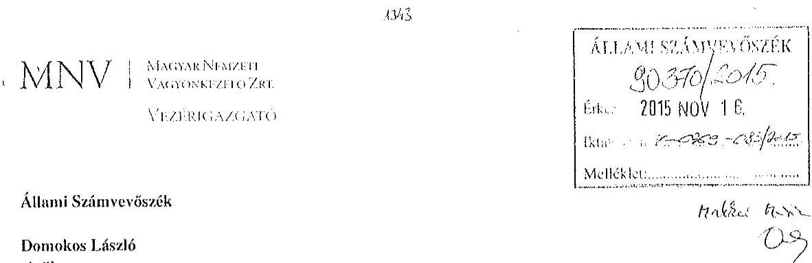

# 1052 Budapest 

Apáczai Cs. J. u. 10.

Ikt. sz.: MNV/01/53047/ 1 /2015.
Hiv. sz.: V-0769-071/2015.
Tisztelt Elnök Úr!
A 2015. október 30. napján „Az állami tulajdonban álló erdőgazdasági társaságok vagyongazdálkodósi tevékenységének ellenörzése - Budapesti Erdőgazdaság Zrt." tárgyában kézhez vett, V-0769-071/2015. ikt. sz. Jelentés-tervezetre az alábbi észrevételeket kivánom tenni.

## 1. fejezet / 9. old. harmadik bekezdés

.....A Társaság feletti tulajdonosi joggyakorló (MNV Zrt.) a számára a Vtv-ben elöirt rendszeres ellenörzési kötelezettségének nem tett eleget...."

Az ellenőrzési időszak kezdő időpontja (2009. január 1.) és a Társaság feletti tulajdonosi joggyakorlás MNV Zrt. által történő ellátásának záró időpontja (2010. június 16.) között eltelt időszakban a Honvédelmi Minisztérium volt a Társaság vagyonkezelője, így a Társaság feletti tulajdonosi jogokat és kötelezettségeket (az ellenőrzést is) a vagyonkezelő gyakorolta a vagyonkezelési szerződésben foglaltak szerint.

## 1. fejezet / 9. old. negyedik bekezdés, II.5. fejezet / 31. old. második bekezdés

„Az Nfatv. hatályba lépesét követöen az MNV Zrt. és az NFA között a HM által vagyonkezvit és a Társaság használatába adott ingatlanok vonatkozásában átadás-átvétel nem volt, az NFA nem rendelkezik naprakész nyilvántartási adatokkal a Társaság által használt és a tulajdonosi joggyakorlása alá tartozó földterületekról. Ezáltal az NFA nem teljesitette az Nfatv. 7. § (1) bekezdés j) pontjában elöirt naprakész nyilvántartási kötelezettségét."

Az NFA tv. hatálybalépésekor az MNV Zrt. és az NFA közötti átadás során nem volt feladat annak vizsgálata, hogy az egyes ingatlanokat a vagyonkezelő, jelen esetben a Honvédelmi Minisztérium hasznosította-e, vagy sem. Az NFA tv. hatálya alá tartozó területek MNV Zrt. és NFA közötti átadása a vagyonkezelő Honvédelmi Minisztérium adatszolgáltatása alapján megtörtént.

Kérem Elnök Urat, hogy a Jelentés véglegesítése során jelen észrevételeinket szíveskedjenek figyelembe venni.
Budapest. 2015. november, ,"‘,,
Üdvözlettel:
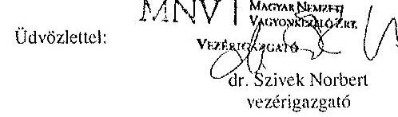

---

.

---

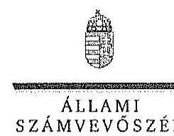

ELNÖK

Ikt.szám: V-0769-084/2015.

Dr. Szivek Norbert úr
vezérigazgató
Magyar Nemzeti Vagyonkezelő Zrt.

Budapest

Tisztelt Vezérigazgató Úr!

A „Jelentéstervezet az állami tulajdonban álló erdőgazdasági társaságok vagyongazdálkodási tevékenységének ellenőrzése - Budapesti Erdőgazdaság Zrt.” címmel készített számvevőszéki jelentéstervezetre tett észrevételeit köszönettel megkaptam.

Az Állami Számvevőszék észrevételekre vonatkozó álláspontjáról a felügyeleti vezető által készített részletes tájékoztatást csatoltan megküldöm.

Tájékoztatom Vezérigazgató urat, hogy a számvevőszéki jelentésben - az Állami Számvevőszékről szóló 2011. évi LXVI. törvény 29. § (3) bekezdése alapján - a figyelembe nem vett észrevételeket szerepeltetjük az elutasítás indokának feltüntetésével.

Budapest, 2015.

hó : nap

Tisztelettel:

Domokos László

Melléklet: Tájékoztatás az elfogadott és az el nem fogadott észrevételekről

1852 BUDAPEST, AFRICAN CSEHL HOROS UTCK 10, 1364 Budapest 4. Pf. 54 telefon: 494 9101 fax: 494 0201

---

# Tájékoztatás   az elfogadott és az el nem fogadott észrevételekról 

A ,,Jelentéstervezet az állami tulajdonban álló erdőgazdasági társaságok vagyongazdálkodási tevékenységének ellenörzése - Budapesti Erdőgazdaság Zrt." címủ jelentéstervezetre 2015. november 16-án érkezett észrevételeit áttekintettük, azok kezelésével kapcsolatban a következő tájékoztatást adom.

1. I. fejezet / 9. oldal harmadik bekezdés

A dokumentumok ismételt áttekintése alapján a jelentéstervezet 9. oldal harmadik bekezdésének második mondatát töröljük.
2. I. fejezet / 9. oldal negyedik bekezdés, II. 5. fejezet / 31. oldal második bekezdés

Az észrevétel megerősíti, hogy az MNV Zrt. és az NFA között a Társaság használatába adott ingatlanokra vonatkozóan megfelelő részletezettségủ átadás-átvétel nem történt, ezért az NFA nem rendelkezik naprakész nyilvántartási adatokkal a Társaság által használt földterületekről, így nem teljesítette az Nfatv. 7. § (1) bekezdés j) pontjának előirását. Megállapításunk módosítása tehát nem indokolt.

Budapest, 2015. 14. hó 23 nap

Makkai Mária
felügyeleti vezető

---

# HONVÉDELMI MINISZTÉRIUM 

DR. SIRRCSKÓ ISTVÁN
miniszter
Nyt. szám: 64-83/2015.
Hiv. szám: V-0768-057/2015.,
V-0769-074/2015.
V-0770-068/2015.

## Domokos László úr

Állami Számvevőszék elnöke

Tárgy: jelentéstervezetek észrevételezése

## 1. számú példány

ÁLLAMI SZÁMVEVÓSZÉK
$10^{6} 677 / 2015$
Érkeci: 2015 NOV 23.
Iktaló: 2015. V-0768-076/2015
Melléklet:
Budapest
Ha\&́lai 10.2

## Tisztelt Elnök Úr!

A Budapesti Erdőgazdaság Zrt., a Kaszó Erdőgazdaság Zrt. és a Veszprémi Erdőgazdaság Zrt. (erdőtársaságok) vagyongazdálkodási tevékenységének ellenőrzéséről szóló számvevőszéki jelentéstervezeteket a Honvédelmi Minisztérium szakapparátusa áttekintette. A jelentéstervezetekkel kapcsolatban a tárca részéről a következő észrevételeket teszem.

Mindhárom jelentéstervezet egységesen tesz javaslatot a honvédelmi miniszternek arra, hogy intézkedjen az adott erdőtársaság és a HM között fennálló használatba adási szerződés melléklete aktuallzálásának elmaradásából származó munkajogi felelősség megállapítása iránti eljárás megindítására és annak eredménye ismeretében tegye meg a szükséges intézkedéseket.

A Nemzeti Földalapról szóló 2010. évi LXXVII. törvény 2013. január 1-től hatályos - tehát 2014-ben még viszonylag újnak számító - 16/A. §-a nyitotta meg a lehetőségét a honvédelmi feladatok ellátásához már nem szükséges ingatlanok „honvédelmi célra feleslegessé nyilvánított terület"-ként való ingatlan-nyilvántartási bejegyzésére és e területek mentesítés nélküli átadására a Nemzeti Földalapkezelő Szervezet (NFA) részére. (A mentesités és az új müvelési ág megállapítása az NFA feladata.)

A 2013-ban nagyszámban honvédelmi célra feleslegessé nyilvánított területként bejegyzett földrészletek NFA átadása időben elhúzódott és még 2014-ben is javában tartott. Ebben az „ex-lex" helyzetben az erdőtársaságok a HM vagyonkezelői jog, és ebből következően a használatba adási szerződések részleges megszűnésével érintett területek, jelentős részben kiemelt vagyontárgynak minősülő erdők vonatkozásában egyfajta kényszerkezelést végeznek az állami vagyon megóvása érdekében mindaddig, amíg az NFA a hasznosításról nem dönt.

Érzékelve az előbb vázolt, nemkívánatos helyzetet, a HM és az erdőtársaságok a használatba adási szerződéseket 2015-ben akként módosították, hogy a HM vagyonkezelői jog megszűnése - a kényszerkezelés elkerülése érdekében - ne

---

eredményezze a honvédelmi célra feleslegessé nyilvánított területként bejegyzett földrészlet vonatkozásában a szerződés megszűnését. Mindemellett a felek szerződéses kapcsolataikat ex nunc hatállyal úgy alakították ki, hogy a használatba adó HM helyébe a tulajdonosi joggyakorló NFA jogutódként beléphessen és a jogviszony felett rendelkezhessen.

A számvevőszéki vizsgálattal érintett időszakban honvédelmi célra feleslegessé nyilvánított területként bejegyzett földrészletek vonatkozásában az erdőgazdaságoknak tudomásuk volt a használatba adási szerződések megszűnéséről, a földrészletek NFA részére történő birtokba adása során a folyamatba résztvevőként bevonásra kerültek. Mindezek alapján a használatba adási szerződések mellékletei aktualizálásának elmaradása álláspontom szerint csak kisebb súlyú technikai hibaként értékelhető. Az állami vagyonban a mellékletek aktualizálásának elmaradása miatt kár nem keletkezett.

Minderre figyelemmel megítélésem szerint a munkajogi felelősség tisztázására irányuló eljárás megindítása nem indokolt, ezért a jelentésekből az erre vonatkozó részek, javaslatok törlése szükséges.

Budapest, 2015. // hó 16 - ó n.
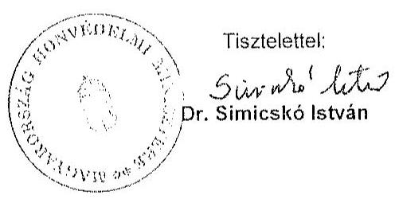

Készült: 2 példányban
Egy példány: 2 oldal
Úgyintéző: dr. Jelen Gábor ezds. (2: 210-28)
Kapják: 1. sz. pld. ÁSZ Elnök Úr
2. sz. pld. Irattár

---

ELBOK

Ikt.szám: V-0768-066/2015.

Dr. Simicskó István úr
miniszter
Honvédelmi Minisztérium

# Budapest 

## Tisztelt Miniszter Úr!

„Az állami tulajdonban álló erdőgazdasági társaságok vagyongazdálkodási tevékenységének ellenörzése" címủ ellenőrzés tekintetében a Budapesti Erdőgazdaság Zrt., KASZÓ Erdőgazdaság Zrt. és VERGA Veszprémi Erdőgazdaság Zrt. társaságokra vonatkozó számvevőszéki jelentéstervezetekre tett észrevételeit köszönettel megkaptam.

Az Állami Számvevőszék észrevételekre vonatkozó álláspontjáról a felügyeleti vezető által készített részletes tájékoztatást csatoltan megküldőm.

Tájékoztatom Miniszter urat, hogy a számvevőszéki jelentésben - az Állami Számvevőszékről szóló 2011. évi LXVI. törvény 29. § (3) bekezdése alapján - a figyelembe nem vett észrevételeket szerepeltetjük az elutasítás indokának feltüntetésével.

Budapest, 2015.
hó nap
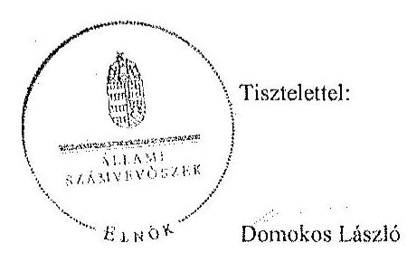

Melléklet: Tájékoztatás az el nem fogadott észrevételekről

---

# Tájékoztatás   az el nem fogadott észrevételekröl 

„Az állami tulajdonban álló erdőgazdasági társaságok vagyongazdálkodási tevékenységének ellenörzése" címủ ellenőrzés tekintetében a Budapesti Erdőgazdaság Zrt., KASZÓ Erdőgazdaság Zrt. és VERGA Veszprémi Erdőgazdaság Zrt. társaságok jelentéstervezetére 2015. november 23 -án érkezett észrevételeit áttekintettük, azok kezelésével kapcsolatban a következő tájékoztatást adom.

A honvédelmi célra feleslegessé nyilvánított területek helyzetére, valamint a HM és az erdőgazdasági társaságok közötti használatba adási szerződésekre vonatkozó tájékoztatását köszönjük. Az ellenőrzött időszakban a HM és a Társaságok között fennálló szerződés mellékletét a szerződés előirása ellenére nem módosították. Az észrevételben leírt intézkedésck az ellenőrzött időszakot követően történtek, ezért azok a jelentéstervezet megállapításait nem érintik. Ennek alapján az intézkedést igénylő megállapítás és a javaslat módosítása, illetve törlése nem indokolt.

Budapest, 2015. 11. hó 30 nap

Makkai Mária
felügyeleti vezető

---

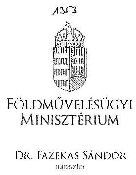
DR. FAZEKAS SÁNDOR
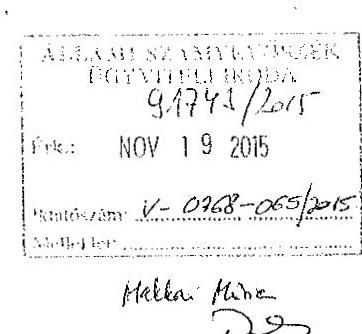

Iktatószám: 1(PF/ 429215
/2015.
Ügyintéző: dr. Szabó Martina Dóra
Telefonszám: 896-2483
E-mail: dora.martina.szabo@fm.gov.hu
Hivatkozási szám: V-0768-056/2015.
V-0769-073/2015.
V-0770-067/2015.

# Domokos László úr   elnök   részére 

## Állami Számvevöszék

Budapest
Apáczai Csere János u. 10.
1052
Tárgy: Az Állami Számvevőszék V-0768-056/2015., V-0769-073/2015., valamint V-0770-067/2015. iktatószámú jelentéstervezeteinek véleményezése

## Tisztelt Elnök Úr!

Hivatkozással a V-0768-056/2015. iktatószámú „Az állami tulajdonban álló erdögazdasági társaságok vagyongazdálkodási tevékenységének ellenörzése - VERGA Veszprémi Erdögazdaság Zrt." tárgyú, a V-0769-073/2015. iktatószámú „Az állami tulajdonban álló erdögazdasági társaságok vagyongazdálkodási tevékenységének ellenörzése - Budapesti Erdögazdaság Zrt." tárgyú, valamint a V-0770-067/2015. iktatószámú „Az állami tulajdonban álló erdögazdasági társaságok vagyongazdálkodási tevékenységének ellenörzése - KASZÓ Erdögazdaság Zrt." tárgyú ügyiratukra, az Állami Számvevőszékről szóló 2011. évi LXVI. törvény 29. § (2) bekezdése alapján az alábbi észrevételeket teszem.

A VERGA Veszprémi Erdőgazdaság Zrt. (a továbbiakban: Társaság) tekintetében a számvevőszéki jelentéstervezet észrevételezi, hogy a Társaság a tulajdonosi joggyakorló döntése alapján 2015 áprilisában új könyvvizsgálót bízott meg a 2014. évi beszámoló hitelesítésével, amivel megsértette a számvitelről szóló 2000 . évi C. törvény (a továbbiakban: Szt.) 155. § (6) bekezdésében foglaltakat, miszerint az üzleti évről

---

elkészített éves beszámoló felülvizsgálatára könyvvizsgálót az előző üzleti év éves beszámolójának elfogadásakor kell megválasztani.

Az Szt. 155/A. § (1) bekezdése szerint „a 155. § (6) bekezdése szerinti könyvvizsgáló vagy könyvvizsgáló cég megbízása csak megfelelő indok alapján mondható fel". A számviteli törvény tehát lehetőséget ad a megbízási szerződés felmondására, a Társaságnál a könyvvizsgáló visszahívását indokolttá tevő események pedig megfeleltethetőek a jogszabályhelyben utalt megfelelő indok kritériumának. Ezzel összhangban a Társaság Alapszabálya is rögzíti a könyvvizsgáló visszahívásának lehetőségét, mely döntés a kizárólagos jogkörömbe tartozik.

A KASZÓ Zrt, a VERGA Veszprémi Erdőgazdaság Zrt, valamint a Budapesti Erdőgazdaság Zrt. tekintetében a számvevőszéki jelentéstervezet megállapításaira vonatkozóan az alábbiakat kívánom megjegyezni.

Mindhárom jelentéstervezet leírja, hogy a társaságok a közérdekủ adatok megismerésére irányuló igények teljesítésének rendjét nem szabályozták.

A vizsgált társaságok 2015. augusztus 31-ig honlapjaikat felülvizsgálták és - az információs önrendelkezési jogról és az információszabadságról szóló 2011. évi CXII. törvény, valamint a köztulajdonban álló gazdasági társaságok takarékosabb müködéséről szóló 2009. évi CXXII. törvény alkalmazandó előírásainak megfelelően - hiányosságaikat pótolták. A közérdekủ adatok megismerésének rendjére irányuló szabályzat elkészítése folyamatban van a társaságoknál.

Mindhárom jelentéstervezet tartalmazza, hogy a földművelésügyi minisztérium tulajdonosi ellenőrzési szabályzattal nem rendelkezett a vizsgált időszakban, ellenőrzést nem végzett a társaságok vagyonváltozást eredményező döntéseire vonatkozóan.

Tekintettel arra, hogy a társaságok gazdasági társaságként (zrt.) működnek, a társaságoknál ügydöntő felügyelőbizottság működik, mely a Polgári Törvénykönyvről szóló 2013. évi V. törvényben rögzítetteknek, illetőleg a társaságok Alapszabályában foglaltaknak megfelelően ellátja a társaságok ellenőrzését.

A társaságok tulajdonosi ellenőrzése tehát a Ptk. rendelkezéseivel összhangban a felügyelőbizottságon keresztül valósul meg. A felügyelőbizottság ügyrendje pedig szabályozza, miszerint „A felügyelőbizottság határozatát és a felügyelőbizottsági ülésről készült jegyzőkönyvet az írásba foglalást követően, az üléstől számított 10 napon belül a Társaság ügyvezetése megküldi a Tulajdonosi Joggyakorlónak." A jegyzőkönyv, illetőleg a felügyelőbizottság határozatainak részemre történő megküldésével tudomásom van a felügyelőbizottság ellenőrzési tevékenységéről és döntéseiről.

A jelentéstervezetek mindhárom társaság tekintetében megállapítják, hogy a társaságok gazdálkodásuk során betartották a nemzeti vagyonról szóló 2011. évi CXCVI. törvényben előírt vagyongazdálkodási alapelveket, vagyont nem idegenítettek el, illetve arra jelzálogjogot, haszonélvezeti jogot nem alapítottak, erdő használatát, hasznosítá-

---

sát harmadik fél számára nem engedték át, a vagyonnal felelős módon, rendeltetésszerôen gazdálkodtak, a saját és a használatba kapott vagyon állagának megóvásával, karbantartásával és a vagyon gyarapitásával kapcsolatos feladataikat elvégezték.

Kérem észrevételeim szíves tudomásul vételét.
Budapest, 2015. november „G ".
Üdvözlettel:
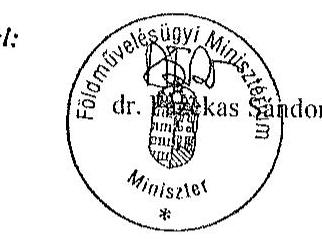

---

.

---

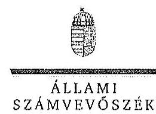

ELBök

Ikt.szám: V-0768-068/2015.

Dr. Fazekas Sándor úr
miniszter
Földművelésügyi Minisztérium

Budapest

Tisztelt Miniszter Úr!
„Az állami tulajdonban álló erdőgazdasági társaságok vagyongazdálkodási tevékenységének ellenörzése" című ellenőrzés tekintetében a Budapesti Erdőgazdaság Zrt., KASZÓ Erdőgazdaság Zrt. és VERGA Veszprémi Erdőgazdaság Zrt. társaságokra vonatkozó számvevőszéki jelentéstervezetekre tett észrevételeit köszönettel megkaptam.

Az Állami Számvevőszék észrevételekre vonatkozó álláspontjáról a felügyeleti vezető által készített részletes tájékoztatást csatoltan megküldőm.

Tájékoztatom Miniszter urat, hogy a számvevőszéki jelentésben - az Állami Számvevőszékről szóló 2011. évi LXVI. törvény 29. § (3) bekezdése alapján - a figyelembe nem vett észrevételeket szerepeltetjük az elutasítás indokának feltüntetésével.

Budapest, 2015.
hó nap
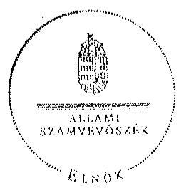

Tisztelettel:

Dömokos László

Melléklet: Tájékoztatás az elfogadott és el nem fogadott észrevételekről

---

# Tájékoztatás   az elfogadott és el nem fogadott észrevételekröl 

„Az állami tulajdonban álló erdögazdasági társaságok vagyongazdálkodási tevékenységének ellenörzése" címủ ellenörzés tekintetében a Budapesti Erdőgazdaság Zrt., KASZÓ Erdőgazdaság Zrt. és VERGA Veszprémi Erdőgazdaság Zrt. társaságok jelentéstervezetére 2015. november 19 -én érkezett észrevételeit áttekintettük, azok kezelésével kapcsolatban a következő tájékoztatást adom.

1. A Budapesti Erdőgazdaság Zrt., a KASZÓ Erdőgazdaság Zrt. és a VERGA Veszprémi Erdőgazdaság Zrt. jelentéstervezetcire tett általános észrevételek
a) Közérdekủ adatok megismerésének rendje

A közérdekủ adatok megismerésére irányuló igények teljesítésének rendje elkészitésére, valamint a honlapokon közzétett információk felülvizsgálatára vonatkozó tájékoztatást köszönjük. Az intézkedések az ellenőrzött időszakot nem érintik, ezért a jelentéstervezetek megállapításainak módosítása nem indokolt.
b) A Földművelésügyi Minisztérium tulajdonosi ellenőrzési szabályzata és a vagyonváltozást eredményező döntések ellenőrzése

A Társaságok tulajdonosi ellenőrzése - a jogszabályok előírásai alapján (Ptk., Nvtv.) - a felügyelő bizottság müködésével, a tulajdonosi joggyakorló folyamatba épített, illetve egyedi ellenőrzésein keresztül valósul meg. Az észrevétel a jelentéstervezet megállapítását nem cáfolja, ezért annak módosítása nem indokolt.
2. A VERGA Veszprémi Erdőgazdaság Zrt. jelentéstervezetére tett észrevétel

A dokumentumok ismételt áttekintését követően a jelentéstervezet 27. oldal 4. bekezdés második mondatát az alábbiak szerint pontosítjuk:
„A Társaság a Tulajdonosi joggyakorló, döntése alapján 2015 áprilisában új könyvvizsgálót bizott meg a 2014. évi beszámoló hitelesitésével."

Budapest, 2015. M. hó so nap

Makkai Mária
felügyeleti vezetö

---

# MFB

**Domokos László úr**

**elnök részére**

**Állami Számvevőszék**

**Budapest**

**Tisztelt Elnök Úr!**

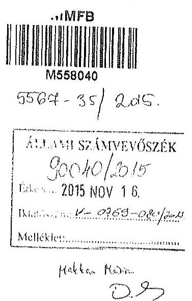

2015. október 30-án köszönettel kézhez vettük az Állami Számvevőszék „Az állami tulajdonban álló erdőgazdasági társaságok vagyongazdálkodási tevékenységének ellenőrzéséről” szóló jelentéstervezeteket az alábbi cégekre:

- **Budapesti Erdőgazdaság Zrt.** (Ikt.szám: V-0769-070/2015.)
- **KASZÓ Erdőgazdaság Zrt.** (Ikt.szám: V-0770-064/2015.)
- **VERGA Veszprémi Erdőgazdaság Zrt.** (Ikt.szám: V-0768-053/2015.)

Az MFB Zrt. a jelentéstervezetekkel kapcsolatban nem kíván észrevételt tenni.

Budapest, 2015. november 12.

Tisztelettel:

*Nagy Csaba*
*vezérigazgató*

*Kovács Zsolt*
*vezérigazgatóhelyettes*