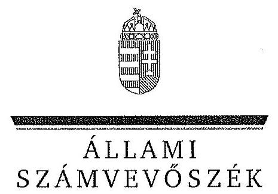

ÁLLAMI
SZÁMVEVŐSZÉK

# JELENTÉS 

Az állami tulajdonban álló erdőgazdasági társaságok vagyongazdálkodási tevékenységének ellenőrzése KASZÓ Erdőgazdaság Zrt.

---

# Állami Számvevőszék 

Iktatószám: V-0770-078/2015.
Témaszám: 1804
Vizsgálat-azonosító szám: V070622
Az ellenőrzést felügyelte:
Makkai Mária
felügyeleti vezető
Az ellenőrzést vezette és az ellenőrzés végrehajtásáért felelős:
Pencz Mária
ellenőrzésvezető
A számvevőszéki jelentés összeállításában közreműködött:
Velkei András Albert
számvevő
Az ellenőrzést végezték:
Dr. Dorogi Zsolt Pál
számvevő
Vas Lajos
számvevő vezető főtanácsos

## Czeglédi Dénes

számvevő tanácsos

## Czeglédi Dénes

számvevő tanácsos
Velkei András Albert
számvevő

---

# TARTALOMJEGYZÉK 

BEVEZETÉS ..... 3
I. ÖSSZEGZŐ MEGÁLLAPÍTÁSOK, KÖVETKEZTETÉSEK, JAVASLATOK ..... 7
II. RÉSZLETES MEGÁLLAPÍTÁSOK ..... 13

1. A KASZÓ Zrt. vagyongazdálkodása ..... 13
1.1. A vagyon értékének megőrzése, gyarapítása ..... 13
1.2. A vagyonkezelői kötelezettség teljesítése ..... 17
2. A KASZÓ Zrt. használati szerződése és a vagyonnyilvántartása ..... 18
2.1. A használati szerződés megfelelősége ..... 18
2.2. A KASZÓ Zrt. vagyonnyilvántartása ..... 20
3. A KASZÓ Zrt. éves tervezési feladatainak ellátása, az ágazati jogszabályok érvényesülése ..... 23
3.1. Az üzleti tervek vagyonmegőrzésre, vagyongyarapításra vonatkozó elemei ..... 23
3.2. A tervekben megfogalmazott előírások érvényesülése ..... 23
3.3. Az ágazati szabályok érvényesülése ..... 25
4. A kontroll-és monitoring rendszer kialakítása és működtetése ..... 26
4.1. A kontrollrendszer kialakítása és működtetése ..... 26
4.2. Az információáramlási és monitoring rendszer kialakítása és működtetése ..... 28
5. A tulajdonosi joggyakorlóknak a KASZÓ Zrt. vagyongazdálkodási feladataira vonatkozó döntései, intézkedései megfelelősége ..... 29

---

# MELLÉKLETEK 

1. számú Rövidítések jegyzéke
2. számú Fogalomtár
3./A számú A KASZÓ Zrt. vagyonváltozásának alakulása a 2009 - 2014. évek közötti időszakban
3./B számú Az erdőgazdasági társaság vagyonának alakulása 2009 - 2014. években
3. számú A befektetett eszközök állományának alakulása
4. számú A KASZÓ Zrt. vezérigazgatójának nemleges észrevétele
5. számú A KASZO Zrt. vezérigazgatójának észrevételére adott válasz
6. számú Az MNV Zrt. vezérigazgatójának észrevétele
7. számú Az MNV Zrt. vezérigazgatójának észrevételére adott válasz
8. számú A Honvédelmi Minisztérium miniszterének észrevétele
9. számú A Honvédelmi Minisztérium miniszterének észrevételére adott válasz
10. számú A Földművelésügyi Minisztérium miniszterének észrevétele
11. számú A Földművelésügyi Minisztérium miniszterének észrevételére adott válasz
12. számú Az MFB Zrt. vezérigazgatójának észrevétele

---

# JELENTÉS 

## Az állami tulajdonban álló erdőgazdasági társaságok vagyongazdálkodási tevékenységének ellenőrzése KASZÓ Erdőgazdaság Zrt.

## BEVEZETÉS

Hazánk területének több mint 20\%-át erdő borítja. Az erdők fenntartása és védelme az egész társadalom érdeke, ezért az erdőkkel csak a közérdekkel összhangban lehet gazdálkodni.

Az Alaptörvény 38. cikke és az Nvtv. alapján az állam tulajdona a nemzeti vagyon részét képezi. Az Nvtv. alapján nemzetgazdasági szempontból kiemelt jelentőségű nemzeti vagyonban tartandó vagyonelemnek minősül a 100\%-ban az állam tulajdonában álló védelmi és közjóléti elsődleges rendeltetésű erdő, a gazdasági elsődleges rendeltetésű természetes erdő, természetszerű erdő és származékerdő természetességi állapotú öt hektárnál nagyobb, természetben összefüggő erdő. A Társaságok vagyongazdálkodása szempontjából a Vtv, illetve az Nvtv. és az Nfatv., valamint a kapcsolódó kormány- és miniszteri rendeletek mellett kiemelkedő szerepe van a különböző ágazati jogszabályoknak. A vagyonkezelési tevékenység végrehajtása során figyelemmel kell lenni az Evt.ben foglaltakra, mely alapján a nemzeti vagyonról szóló törvényben nemzetgazdasági szempontból kiemelt jelentőségű nemzeti vagyonként meghatározott védelmi és közjóléti elsődleges rendeltetésű, az állam tulajdonában álló erdő a kincstári vagyon részét képezi. A Társaságoknak az általuk használt vagyonelemek sajátosságára tekintettel kell a vagyongazdálkodási tevékenységüket kialakítaniuk, gondoskodniuk kell a közérdek és az Evt.-ben foglaltak érvényesülését biztosító vagyongazdálkodásról. A honvédelemről és a Magyar Honvédségről, valamint a különleges jogrendben bevezethető intézkedésekről szóló 2011. évi CXIII. törvény alapján a Honvédség szervezeteinek elhelyezéséhez, és feladatai ellátásához rendelkezésre bocsátott ingatlanok állami tulajdonban, a honvédelemért felelős miniszter által vezetett minisztérium vagyonkezelésében állnak. A Honvédelmi Minisztérium a vagyonkezelésében lévő honvédelmi rendeltetésű erdőket a Társaságok használatába adta.

Az Evt. előírásai alapján az állam 100\%-os tulajdonában álló erdőt és erdőgazdálkodási tevékenységet közvetlenül szolgáló földterületet csak vagyonkezelés formájában lehet hasznosításra átengedni. A kizárólagos állami tulajdonban lévő erdő és erdőgazdálkodási tevékenységet közvetlenül szolgáló földterület vagyonkezelését csak költségvetési szerv vagy 100\%-os állami tulajdonú gazdálkodó szervezet végezheti.

---

Az MNV Zrt. a Társaság feletti tulajdonosi jogok gyakorlását a Vtv. 29. § (5) bekezdésében foglaltakkal összhangban a 2008-ban létrejött vagyonkezelési szerződésben a HM-nek átadta. A HM a tulajdonosi jogokat 2010. június 16-áig gyakorolta. A 2010. évi törvényi változások (Vtv., Mfbtv., Nfatv.) következtében 2010. június 17. napjától a Társaságok állami tulajdonú részesedése tekintetében a tulajdonosi jogokat az állami vagyonért felelős miniszter az MFB Zrt. útján látta el. Az Nfatv. 2010. évi hatálybalépését követően a Társaságok által használt, a Nemzeti Földalapba tartozó földterületek vonatkozásában a tulajdonosi jogokat az NFA, míg egyéb ingatlanok és vagyonelemek tekintetében a tulajdonosi jogokat az MNV Zrt. gyakorolta. 2014. július 16-tól a Társaságok feletti tulajdonosi jogokat az erdőgazdálkodásért felelős miniszter gyakorolja.

A Nemzeti Földalapba tartozó 1772 980,17 ha földterületből a 2012. év végén a 100\%-os állami tulajdonú 19 erdőgazdasági társaság kezelésében összesen 913664,3681 ha földterület volt, ebből 879254,1595 ha erdő, a többi egyéb művelési ágba tartozik. A használt földterületek erdőgazdasági társaságonkénti megoszlása eltérő. Három, korábban a Honvédelmi Minisztérium, mint tulajdonosi joggyakorló által irányított erdőgazdaság esetében az állami erdőterületek vagyonkezelési joga a HM-nél maradt, a Társaságok a gazdálkodást használatba adási szerződés alapján folytatják.

A Társaságok az Alaptörvény és az Nvtv. előírása szerint önállóan és felelősen gazdálkodnak a törvényesség, a célszerűség és az eredményesség követelményei szerint. Az állami vagyonnal való gazdálkodás alapvető feladata a vagyon rendeltetésszerű, hatékony és felelős felhasználásának biztosítása az állami vagyon értékének megőrzése, gyarapítása érdekében. A Társaság jelen ellenőrzése az állami vagyonnal való gazdálkodásra és a törvényesség betartására irányult.

A Társaság Somogy megyében egy tömbben elhelyezkedő törzsterületén 13023 ha erdőterületen és 1921 ha egyéb művelési ágú földterületen gazdálkodott. A törzsterületen kívül az ország területén szétszórtan elhelyezkedő 6755 ha alakulati terület is a Társaság használatában volt. A Társaság 2014. évi éves beszámolója szerint 1552058 ezer Ft nettó árbevétel mellett 21707 ezer Ft mérleg szerinti eredményt ért el, a mérlegfőösszeg 1536015 ezer Ft, az éves átlaglétszám 110 fő volt.

Az ellenőrzés célja annak értékelése, hogy a Társaság vagyongazdálkodása, vagyonérték-megőrző és vagyongyarapítási tevékenysége, valamint szervezeti keretei és kiépített kontrollrendszere megfeleltek-e a jogszabályok és belső szabályzatok előírásainak, valamint a kezelt vagyonelemek sajátosságaiból adódó követelményeknek.

Ennek keretében ellenőriztük és értékeltük, hogy:

- a vagyongazdálkodás során betartották-e az Nvtv. 7. §-ában megállapított vagyongazdálkodási alapelveket, valamint az ágazati jogszabályok vagyongazdálkodáshoz kapcsolódó előírásait;
- a Társaság a saját és a használt vagyonnal való gazdálkodásra vonatkozó éves tervezési feladatait a jogszabályi előírásoknak megfelelően látta-e el, a Társaság üzleti tervei a kezelésbe vett vagyonra vonatkozó, a Vtv. 2. § (1) és

---

a 27. § (7) bekezdésében előírt vagyon megőrzésére, gyarapítására vonatkozó elemeket tartalmazták-e és azokat a vagyongazdálkodás során érvényesítették-e;

- a vagyonkezelési szerződések és a vagyon-nyilvántartás megfeleltek-e a szabályszerűségi követelményeknek, elősegítették-e az állami vagyonnal való szabályszerű gazdálkodást;
- a Társaságnál kialakították és működtették-e a szabályszerű feladatellátást támogató kontrollrendszert. Ezen belül a Társaság elkészítette-e és aktualizálta-e feladatellátási-folyamatainak szabályzatait, a kockázatok kezelésének rendszerét, az információs és a kontrolling-monitoring rendszert, valamint a vagyongazdálkodás területén azokat az eljárásokat, amelyek elősegítik a szervezeti célok végrehajtását;
- a tulajdonosi joggyakorlóknak a Társaság vagyongazdálkodási feladataira vonatkozó döntései, intézkedései előkészítése és megalapozottsága a jogszabályoknak és a belső szabályozásnak megfelelt-e, a tulajdonosi joggyakorlók e minőségben végzett tevékenysége támogatta-e a felelős vagyongazdálkodás megvalósulását.

Az ellenőrzés típusa: szabályszerűségi ellenőrzés.
Az ellenőrzött időszak: 2009. január 1. napjától 2014. december 31. napjáig, kitekintéssel a helyszíni ellenőrzés végéig tartó releváns folyamatokra, intézkedésekre.

Az ellenőrzés várható hasznosulása: A Társaság és a tulajdonosi joggyakorlók fenti szempontú ellenőrzése az állami tulajdonban álló vagyon kezelésére, a vagyonnal való gazdálkodásra vonatkozó, kötelezően végrehajtandó éves ÁSZ ellenőrzést szélesebb körűvé teszi.

Az ellenőrzés várható hasznosulásaként biztosíthatja a társadalom részéről kiemelt érdeklődéssel kísért téma objektív bemutatását. Az ÁSZ jelentéséből a média és az állampolgárok átfogó képet kaphatnak a Magyarország állami tulajdonban lévő erdőivel való gazdálkodásról, a gazdálkodást, vagyonkezelést végző szervezeti rendszerről, az állami tulajdonban álló erdőgazdasági társaságok feladatellátásához kapcsolódóan feltárt problémákról.

Az ellenőrzés jól hasznosítható - többek közt - az állami vagyonnal kapcsolatos országgyűlési törvényhozói munkában is, továbbá hozzájárulhat a tulajdonosi joggyakorlás javításával a „jó kormányzás" gyakorlatának erősítéséhez.

Az ellenőrzéssel érintett szervezetek: A Társaság, a Társaság kezelésében lévő állami vagyon feletti tulajdonosi jogokat gyakorló szervezetek, valamint a Társaság állami tulajdonú részesedése feletti tulajdonosi joggyakorlók (MNV Zrt., HM, MFB Zrt., NFA, FM).

Az ellenőrzés végrehajtásának jogszabályi alapját az ÁSZ tv. 5. § (4)(5) bekezdéseiben foglaltak képezik.

---

Az ellenőrzés szakmai módszertana az ÁSZ hivatalos honlapján közzétett szakmai szabályokon alapult, amely a Legfőbb Ellenőrző Intézmények Nemzetközi Szervezete (INTOSAI) által kiadott nemzetközi standardok (ISSAI) figyelembevételével készült.

A Társaság az ellenőrzés lefolytatásához tanúsítványok kitöltésével, valamint dokumentumok elektronikus megküldésével szolgáltatott adatokat. Az így rendelkezésre bocsátott adatok és információk kontrollja a helyszíni ellenőrzés keretében történt. A vagyonváltozást eredményező döntések megalapozottságát, továbbá a vagyonérték-megőrző és vagyongyarapító tevékenység szabályszerűségét a számviteli nyilvántartásokból, valamint kockázatalapú és véletlenszerű mintavétellel kiválasztott tételek ellenőrzésével értékeltük.

Az ÁSZ a 2011. évi LXVI. törvény 29. §-a szerint a jelentéstervezetet megküldte a KASZO Erdőgazdaság Zrt., a Magyar Nemzeti Vagyonkezelő Zrt. és a Magyar Fejlesztési Bank Zrt. vezérigazgatójának, a Nemzeti Földalapkezelő Szervezet elnökének, a Honvédelmi Minisztérium miniszterének és a Földművelésügyi Minisztérium miniszterének egyeztetésre. A KASZO Erdőgazdaság Zrt. vezérigazgatójának észrevételét és az arra adott választ az 5-6. számú melléklet, a Magyar Nemzeti Vagyonkezelő Zrt. vezérigazgatójának észrevételét és az arra adott választ a 7-8. számú melléklet tartalmazza. A Honvédelmi Minisztérium miniszterének észrevételét és az arra adott választ a 9-10. számú melléklet, a Földművelésügyi Minisztérium miniszterének észrevételét és az arra adott választ a 11-12. számú melléklet, a Magyar Fejlesztési Bank Zrt. vezérigazgatójának nemleges észrevételét a 13. számú melléklet tartalmazza. A Nemzeti Földalapkezelő Szervezet elnöke az ÁSZ tv. 29. § (2) bekezdésében foglalt észrevételezési jogával nem élt, a törvényes határidőn belül észrevételt nem tett.

---

# I. ÖSSZEGZŐ MEGÁLLAPÍTÁSOK, KÖVETKEZTETÉSEK, JAVASLATOK 

Az állami tulajdonú Kaszó Zrt. az ellenőrzött időszakban használatba vett és saját vagyonnal gazdálkodott. A Társaság mérleg szerinti vagyona a 2009. január 1-jén kimutatott 1503,8 M Ft nyitó értékről 2014. december 31-re 1536,0 M Ft-ra emelkedett elsősorban a forgóeszközök - ezen belül a pénzeszközök - 68,3\%-os növekedésének következtében. A társaság saját tőke/jegyzett tőke aránya a 2009. január 1-jei 319,8\%-ról 2014. év végére 335,4\%-ra nőtt.

A Társaság saját vagyonát mérlegében a Számv. tv. előírásainak megfelelően eszközei között szerepeltette. Az ellenőrzött időszakban a Számv. tv. előírásainak megfelelően a használatba vett erdőket és földingatlanokat a Társaság mérlegében eszközként nem mutatta ki, a Számv. tv. ezt a kötelezettséget a vagyonkezelő vonatkozásában írja elő. A Társaság a Tulajdonosi joggyakorló¹⁻² által előírt egységes Számviteli politikát és számlarendet alkalmazta, az azokban foglaltak szerinti kötelezettségeit teljesítette.

A Társaság a használatba
 vett vagyonról a használatba adási szerződések mellékletei szerinti ingatlanlistán alapuló, elkülönített, analitikus nyilvántartást vezetett. A HM nyilvántartása és a Társaság nyilvántartása alapján megállapítható, hogy a Társaság nyilvántartásából a honvédelmi miniszter által honvédelmi célra feleslegessé nyilvánított területeket nem vezette ki, ezért a Társaság nyilvántartása nem támogatta megfelelően az állami vagyonnal való felelős gazdálkodást. A Társaság a használatában álló valamennyi állami vagyonra, és annak nagyságára vonatkozó, a vagyonkezelő HM nyilvántartásával egyező adattal nem rendelkezett. A vagyonkezelő HM és a Társaság nyilvántartása a honvédelmi miniszter által honvédelmi célra feleslegessé nyilvánított területek vonatkozásában sem egyezett.

Az ellenőrzött időszakban a Társaság a Magyar Állam tulajdonában álló erdővagyon és egyéb művelési ágú termőföld ingatlanokat a HM-mel 2009. március 12-én kötött használatba adási szerződés alapján használta. A használatba adási szerződés szerint a használatba adott ingatlanok elsődlegesen honvédelmi célokat szolgálnak. A Társaság, mint használó és a HM között létrejött szerződéses jogviszony kereteit a használatba adási szerződésben foglalt jogok és kötelezettségek töltötték ki.

A Magyar Állam tulajdonában és a HM vagyonkezelésében lévő, a honvédelmi miniszter által honvédelmi célra feleslegessé nyilvánított földterületek honvédelmi rendeltetése, valamint a HM vagyonkezelői joga megszűnt. Az ellenőrzött időszakban kikerült és a honvédelmi miniszter által honvédelmi célra feleslegessé nyilvánított területek vonatkozásában a használatba adási szerződés 2. sz. mellékletét nem módosították, ezért a használatba adási szerződés nem támogatta megfelelően és számon kérhető módon a Társaság állami vagyonnal való gazdálkodását. A művelés alól kivett, a honvédelmi miniszter által honvédelmi célra feleslegessé nyilvánított földrészletek az Nfatv. alapján az NFA-ba kerültek. Az átadással érintett területeken a Társaság az erdészeti hatóság korábbi engedélyének birtokában erdőgazdálkodási tevékenységet folytatott.

A Társaság a saját vagyonként nyilvántartott eszközök és források értékelését, valamint a fordulónapi leltározást a Számv. tv.-ben foglaltaknak megfelelően évente elvégezte.

A Társaság vagyongazdálkodása során betartotta az Nvtv.-ben előírt vagyongazdálkodási alapelveket, vagyont nem idegenített el, illetve arra jelzálogjogot, haszonélvezeti jogot nem alapított, erdő használatát, hasznosítását harmadik fél számára nem engedte át.

A Társaság az ellenőrzött időszakban a Vtv.-ben, az Nvtv.-ben és a használati szerződésben foglaltaknak megfelelően a saját és a HM-től, mint vagyonkezelőtől használatra kapott vagyon állagának védelmét, értékének megőrzését, illetve vagyon gyarapítását a megvalósított beruházásokkal, valamint erdőfelújításokkal biztosította.

A Társaság a saját és a használatba vett vagyonnal való gazdálkodás során az éves tervezési feladatait a Tulajdonosi joggyakorló ${ }_{1-2}$ előírásainak megfelelően látta el, az ellenőrzött időszak minden évére elkészített üzleti tervei a saját és használt vagyon megőrzésére, gyarapítására vonatkozó elemeket tartalmazták, azonban a Társaság saját és használt vagyonára vonatkozó beruházásait elkülönítetten nem jelenítették meg. A Társaság az ágazati és éves üzleti tervekben megfogalmazott, az erdővagyonnal való gazdálkodás érdekében kifejtett erdőgazdálkodási és vadgazdálkodási tevékenységét az Evt. ${ }_{1,2}$, az Evr. és a Vadvédelmi tv.-ben foglaltaknak megfelelően végezte. Az ellenőrzött időszakban az ágazati tervekben megfogalmazott, az állami vagyon megőrzésére, gyarapítására vonatkozó előírásokat az erdőgazdaság teljesítette. Erdőgazdálkodási és vadgazdálkodási tevékenységéről az ellenőrzött években a Számv. tv. rendelkezéseinek megfelelő üzleti jelentést készített. Üzleti jelentéseit a Társaság feletti Tulajdonosi joggyakorló ${ }_{1-2}$ Alapítói Határozattal elfogadta. Az üzleti jelentések a Társaság eredményének és jövedelmezőségének alakulásán kívül, a használatba vett terület és a vállalkozói tevékenység működtetését elkülönítetten tartalmazták.

A Társaság a Vtv.-ben, Nfatv.-ben és az ágazati tervekben megfogalmazott, a saját és használatba vett vagyon állagának védelme és vagyona gyarapítása érdekében a felújításokat, beruházásokat és karbantartásokat évente állapotfelmérések alapján végezte el. Az erdőgazdálkodással kapcsolatos állagmegóvási tevékenységüket az erdőtervekkel összhangban végezték. A Társaság beruházási és felújítási tevékenységét az ellenőrzött időszakban a Számv. tv. rendelkezéseinek megfelelően végezte. A Társaság az erdőfelújításokat a Számv. tvben előírtaknak megfelelően költségei között elszámolta, az erdőtelepítéseket a Társaság a Számv. tv. előírásainak megfelelően könyveiben a befejezetlen beruházások között szerepeltette. A Társaság az ellenőrzött időszak minden évében az elszámolt értékcsökkenési leírásnál többet fordított eszközállományának pótlására.

A Társaság tevékenysége során érvényesítette az ágazati jogszabályok vagyongazdálkodáshoz kapcsolódó előírásait. A Társaság az Evt. ${ }_{2}$-ben foglalt, az erdő fenntartására, védelmére, valamint az erdei haszonvételek gyakorlására irányuló erdőgazdálkodási tevékenységéhez kapcsolódó, az erdészeti hatóság felé fennálló bejelentési és engedélykérelmi kötelezettségének az ellenőrzött időszakban eleget tett. A Társaság több esetben a gazdálkodásból származó bevételeinek elszámolását megalapozó bizományi szerződésekkel megsértette a Számv. tv. szerinti bruttó elszámolás alapelvét, mert a bevételeket és a költségeket egymással szemben számolta el. Az ellenőrzött időszakban a Társaság által hasznosított erdő, illetve erdőgazdálkodási tevékenységet közvetlenül szolgáló földterület állami tulajdonból való kikerülésére nem került sor. Az ellenőrzött időszakban a Társaság rendelkezett az Evt. ${ }_{1,2}$-ben meghatározott, 10 évre szóló erdőgazdálkodási üzemtervvel, az erdészeti hatóság által jóváhagyott, 5 évre szóló erdőtelepítési-kivitelezési tervek rendelkezésre álltak, azok tartalmazták az Evr. ${ }_{2}$-ben rögzített tartalmi elemeket. A Társaság rendelkezett a Vadvédelmi tv. szerinti 10 évre szóló vadgazdálkodási üzemtervvel, az éves vadgazdálkodási tervek elkészültek, azokat a vadászati hatóság jóváhagyta.

A Társaság a feladatellátását támogató kontrollrendszert és annak működtetését az ellenőrzött időszakban részben megfelelően alakította ki. Az FB az Alapító Okirat és a Gt. előírásai alapján az éves munkatervek alapján végezte tevékenységét, a Társaság éves beszámolóiról a véleményét a 2010-2014. években a könyvvizsgálói jelentés figyelembe vételével alakította ki, írásbeli jelentését a tulajdonosi joggyakorló felé előterjesztette, azonban a Társaság legfőbb szerve a 2009. évi beszámolóról a Gt. előírásai ellenére az FB írásbeli jelentése nélkül határozott. A Számv. tv. előírásai, továbbá az Alapító Okiratban foglalt tulajdonosi döntés alapján a Társaság az ellenőrzéssel érintett időszakban könyvvizsgálói szolgáltatást vett igénybe. Az ellenőrzött időszakban a könyvvizsgáló hitelesítő záradékkal látta el a Társaság éves beszámolóit. A Társaság által 2011. évtől az SZMSZ-ben rögzítettek alapján foglalkoztatott egy fő belső ellenőr tevékenységét kockázatelemzés alapján összeállított, az FB által jóváhagyott éves munkatervek alapján végezte. A belső ellenőrzés a használatba vett ingatlanok nyilvántartásának szabályozottságával kapcsolatos ellenőrzést nem végzett, a használt területre vonatkozóan négy ellenőrzést folytatott le. A Belső ellenőrzési szabályzatban rögzített funkcionális függetlenségi kötelezettség ellenére a belső ellenőr a 2012-2014. évi leltározásokban részt vett.

A Társaságnál a szabályszerű működést támogató információáramlási és monitoring rendszer kialakítása és működtetése nem valósult meg teljes körűen, mert az Info tv. és az Avtv. rendelkezései ellenére a közérdekű adatok megismerésére irányuló igények teljesítésének rendjét nem szabályozta. A Társaság az ellenőrzött időszakban a Társaság feletti Tulajdonosi joggyakorló ${ }_{1-2}$ felé fennálló beszámolási kötelezettségeinek határidőben eleget tett. A Társaságnál az ellenőrzött időszakban az adatok védelme biztosított volt, azonban a Társaság a közérdekű adatok nyilvánosságra hozatalára vonatkozó kötelezettségének részben tett eleget, mert a Társaság honlapja az Info tv. 1. számú melléklet III. fejezetében előírt közérdekű adatokat teljes körűen nem tartalmazta.

A Társaság vagyongazdálkodási feladataira vonatkozó döntések, intézkedések előkészítése a Társaság feletti Tulajdonosi joggyakorló ${ }_{1.3}$-nál és a HM-nél megfelelő volt, összhangban volt a vonatkozó jogszabályokkal és a belső szabályzatokkal. A Társaság feletti Tulajdonosi joggyakorló ${ }_{2}$ az ellenőrzött években a tulajdonosi ellenőrzéseket az ellenőrzési szabályzatának megfelelően végezte, azonban a Társaság vagyongazdálkodásának szabályozottságával, szabályszerűségével és a vagyonnyilvántartásával kapcsolatban ellenőrzést nem végzett. Tőkeleszállításra, pótbefizetés elrendelésére, tulajdonosi kölcsön nyújtására, osztalék kifizetésére, hitelfelvételhez való hozzájárulásra az ellenőrzött időszakban nem került sor. A Társaság feletti Tulajdonosi joggyakorló ${ }_{1-3}$ a Társaság saját vagyonának tulajdonjogát visszterhesen nem ruházta át és ingyenes átruházásra vonatkozó döntéseket nem hozott. A Tulajdonosi joggyakorló ${ }_{3}$ 2014. évben alapítói határozattal a Társaság alaptőkéjét felemelte, az alaptőke-emelés szabályszerű volt, összhangban a Ptk. és az Áht ${ }_{2}$ rendelkezéseivel, valamint a Társaság Alapszabályában foglaltakkal.

Az NFA tevékenysége az ellenőrzött időszakban nem támogatta teljes körűen a felelős vagyongazdálkodás megvalósulását, mert az Nfatv. hatálybalépését követően a Nemzeti Földalapba tartozó földrészletekre vonatkozó vagyongazdálkodási tevékenységre, vagyonváltozást eredményező döntésekre, és azok előkészítésére vonatkozóan elvárásokat az NFA nem fogalmazott meg a Társaság felé, vagyonváltozással kapcsolatos tulajdonosi ellenőrzést nem végzett. Az MNV Zrt. és NFA között az Nfatv. hatálybalépését követően a HM által vagyonkezelt és a Társaság használatába adott ingatlanok vonatkozásában átadás-átvétel nem történt. A honvédelmi miniszter által honvédelmi célra feleslegessé nyilvánított területek környezetvédelmi, vegyvédelmi és tűzszerészeti mentesítése, illetve az arra jogosult szerv hivatalos igazolásának beszerzése a mentesítés szükségtelenségéről az Nfatv. rendelkezései ellenére nem történt meg.

Az Állami Számvevőszékről szóló 2011. évi LXVI. törvény 33. § (1) bekezdésében foglaltak értelmében a jelentésben foglalt megállapításokhoz kapcsolódó intézkedési tervet köteles az ellenőrzött szervezet vezetője összeállítani, és azt a jelentés kézhezvételétől számított 30 napon belül az ÁSZ részére megküldeni. Amennyiben az intézkedési tervet határidőben nem küldi meg a szervezet, vagy az nem elfogadható, az ÁSZ elnöke a hivatkozott törvény 33. § (3) bekezdésében foglaltakat érvényesítheti.

Az ellenőrzés intézkedést igénylő megállapításai és javaslatai:

# a honvédelmi miniszternek 

A HM, az NFA és az MNV Zrt 2014. januárban az Nfatv. 16/A. § (1) bekezdése alapján háromoldalú megállapodást kötött a honvédelmi miniszter által a 139/2011. (XII.27.) HM utasítás 1. § (2) bekezdése alapján honvédelmi célra feleslegessé nyilvánított ingatlanok tekintetében a HM vagyonkezelési jogának közös megegyezéssel történő megszüntetéséről. Az Nfatv. 1. § (1) bekezdés d) pontja szerint az NFA-ba tartozik az állam tulajdonában lévő, az ingatlan-nyilvántartásban művelés alól kivett, a honvédelmi miniszter által honvédelmi célra feleslegessé nyilvánított területként nyilvántartott földrészlet. A HM a Társaság használatába adott alakulati területekből, azoknak a honvédelmi miniszter által honvédelmi célra feleslegessé nyilvánítása miatt 2403 ha területet több részletben átadott az NFA részére. Az átadott területeknek a HM vagyonkezeléséből való kikerülése miatt a HM és a Társaság között fennálló használatba adási szerződés 2. sz. mellékletét annak ellenére nem módosították, hogy a módosítási kötelezettséget a szerződés 6.3. pontja előírja.

Javaslat:
a) Intézkedjen a Társaság közreműködésével a honvédelmi miniszter által honvédelmi célra feleslegessé nyilvánított és művelés alól kivett, az NFA részére átadott földterületeknek a HM vagyonkezeléséből való kikerülése miatt a használatba adási szerződés 2. sz. mellékletének módosításáról.
b) Intézkedjen a használatba adási szerződés 2. sz. melléklete módosításának elmaradásával összefüggésben feltárt szabálytalanság tekintetében a munkajogi felelősség tisztázására irányuló eljárás megindításáról, és ennek eredménye ismeretében tegye meg a szükséges intézkedéseket.

# az NFA elnökének 

A HM, az NFA és az MNV Zrt 2014. januárban az Nfatv. 16/A. § (1) bekezdése alapján háromoldalú megállapodást kötött a honvédelmi miniszter által a 139/2011. (XII.27.) HM utasítás 1. § (2) bekezdése alapján honvédelmi célra feleslegessé nyilvánított ingatlanok tekintetében a HM vagyonkezelési jogának megszüntetéséről. Az Nfatv. 1. § (1) bekezdés d) pontja szerint az NFA-ba tartozik az állam tulajdonában lévő, az ingatlan-nyilvántartásban művelés alól kivett, a honvédelmi miniszter
 által honvédelmi célra feleslegessé nyilvánított területként nyilvántartott földrészlet. A HM a használatba adott alakulati területekből, azoknak a honvédelmi miniszter által honvédelmi célra feleslegessé nyilvánítása miatt 2403 ha területet több részletben átadott az NFA részére. Az átadott területek vonatkozásában a HM vagyonkezelői joga megszűnt, amiből következően az átadott területekre már nem az Evt. 2. § (4) bekezdés - használatba adást lehetővé tevő - hanem - a vagyonkezelés formájában való hasznosítást előíró - az Evt. 9. § (1) bekezdésében foglaltak vonatkoztak.

Az ellenőrzött időszakban igazolt módon nem történt meg az NFA által átvett területek tényleges művelési ágának megállapításához szükséges - az Nfatv. 16/A. § (3) bekezdésében előírt - környezetvédelmi, vegyvédelmi és tűzszerészeti mentesítés, illetve az arra jogosult szerv hivatalos igazolása nem állt rendelkezésre a mentesítés szükségtelenségéről.

Javaslat:
a) Intézkedjen a honvédelmi miniszter által honvédelmi célra feleslegessé nyilvánított földterületek vonatkozásában a jogszabályban előírt környezetvédelmi, vegyvédelmi és tűzszerészeti mentesítés elvégeztetéséről, vagy a mentesítés szükségtelensége esetén az arra jogosult szerv igazolásának beszerzéséről.
b) Intézkedjen a honvédelmi miniszter által honvédelmi célra feleslegessé nyilvánított, HM-től átvett földterületek vagyonkezelés formájában történő hasznosításáról.
c) Intézkedjen a környezetvédelmi, vegyvédelmi és tűzszerészeti mentesítés, illetve az annak szükségtelenségére vonatkozó hatósági igazolás beszerzésének elmaradásával összefüggésben feltárt szabálytalanságok tekintetében a munkajogi felelősség tisztázására irányuló eljárás megindításáról, és ennek eredménye ismeretében tegye meg a szükséges intézkedéseket.

# a KASZÓ Erdőgazdaság Zrt. vezérigazgatójának 

1. A Társaság gazdálkodása során olyan bizományi szerződéseket kötött, amely alapján a bizományos az őt megillető jutalékot nem számlázta ki a Társaság részére, a Társaság a számlák kiállítása során az őt megillető bevételnek a jutalékkal csökkentett összegét tüntette fel. A társaság eljárásával sérült a Számv. tv. 15. § (9) bekezdése szerinti bruttó elszámolás alapelve, mely szerint a bevételek és a költségek (ráfordítások) egymással szemben nem számolhatók el.

Javaslat:
a) Intézkedjen a gazdálkodásból származó bevételek jogszabályoknak megfelelő elszámolásáról.
b) Intézkedjen a gazdálkodásból származó bevételek elszámolásánál feltárt szabálytalanságok tekintetében a felelősség tisztázása érdekében, és szükség szerint intézkedjen a felelősség érvényesítéséről.
2. A Társaság Avtv. 20. § (8)${ }^{1}$ bekezdésében, valamint az Info tv. 30. § (6)${ }^{2}$ bekezdésében rögzített, a közérdekű adatok megismerésére irányuló igények teljesítésének rendjét nem szabályozta.

Javaslat:
Intézkedjen a jogszabályi előírásoknak megfelelően a közérdekű adatok megismerésére irányuló igények teljesítése rendjének szabályozásáról.

[^0]
[^0]:    ${ }^{1}$ Hatályos 2011. december 31-ig
    ${ }^{2}$ Hatályos 2012. január 1-jétől

---

# II. RÉSZLETES MEGÁLLAPÍTÁSOK 

## 1. A KASZÓ ZRT. VAGYONGAZDÁLKODÁSA

### 1.1. A vagyon értékének megőrzése, gyarapítása

A Társaság vagyongazdálkodása során betartotta az Nvtv. 7. §-ban foglalt vagyongazdálkodási alapelveket, a vagyonnal felelős módon, rendeltetésszerűen gazdálkodott. Az ellenőrzött időszakban a Társaság saját vagyonnal, valamint a HM-től használatba adási szerződés alapján használatba vett összesen 21745 ha földterületre kiterjedő vagyonnal gazdálkodott.

A Társaság mérleg szerinti vagyona a 2009. január 1-jén kimutatott 1503,8 M Ft nyitó értékről 2014. december 31-re 1536,0 M Ft-ra emelkedett, amely 2,1%-os vagyongyarapodást eredményezett. A Társaság mérleg szerinti vagyona az ellenőrzött időszakban gyarapodott. A vagyonváltozások hatására a vagyonszerkezet és a saját tőke/jegyzett tőke aránya kis mértékben átrendeződött, amelyet a Társaság számviteli beszámolói és üzleti jelentései megfelelően bemutattak.

A Társaság saját vagyonát bemutató mérlegeiben eszközeit a Számv. tv. 23. § (1) bekezdésének megfelelően mutatta ki, saját eszközeiről a Számv. tv. 159. §-ban foglaltaknak, valamint a számviteli politikájában rögzített elveknek megfelelően vezette a nyilvántartását. A Társaság az ellenőrzött időszakban a használatba vett erdőket és földingatlanokat a Számv. tv. 23. § (2) előírásainak megfelelően mérlegében eszközként nem mutatta ki, a Számv. tv. ezt a kötelezettséget a vagyonkezelő vonatkozásában írja elő.

A társasági vagyon változása az ellenőrzött időszakban

|  |  |  | millió Ft |  |
| :--: | :--: | :--: | :--: | :--: |
|  | Megnevezés | 2009.01.01 | 2014.12.31. | Változás   (\%) |
|  |  | 1 | 2 | 3 |
| A | Befektetett eszközök |  | 871,6 | 900,2 |
| I. | Immateriális javak |  | 1,3 | 0,2 |
| II. | Tárgyi eszközök |  | 869,9 | 896,2 |
|  | - Ingatlanok |  | 538,4 | 680,3 |
|  | - Gépek berendezések, járművek |  | 145,9 | 74,4 |
|  | - Egyéb tárgyi eszközök |  | 27,6 | 46,5 |

[^0]
[^0]:    ${ }^{3}$ Hatályos: 2012. január 1-jétől

---

| Megnevezés |  | 2009.01.01 | 2014.12.31. | Változás   (\%) |
| :--: | :--: | :--: | :--: | :--: |
| 1 |  | 2 | 3 | $4-3 / 2$ |
| III. | Befektetett pénzügyi eszközök | 0,3 | 3,8 | 1261,0\% |
| B | Forgóeszközök | 618,1 | 562,6 | 91,0\% |
| I. | Készletek | 191,6 | 120,0 | 62,7\% |
| II. | Követelések | 256,0 | 155,5 | 60,7\% |
| III. | Értékpapírok | 0,0 | 0,0 | 0,0\% |
| IV. | Pénzeszközök | 170,5 | 287,1 | 168,3\% |
| C | Aktív időbeli elhatárolások | 14,2 | 73,3 | 517,6\% |
|  | Eszközök összesen | 1503,9 | 1536,1 | 102,1\% |

A Társaság saját vagyona döntően ingatlanokból, valamint az erdőművelési feladatokat szolgáló gépekből berendezésekből állt, a használati szerződés alapján átvett eszközök nem képezték a mérlegben kimutatott vagyon részét.

Az eszközök értéke a 2009. évi nyitó értékről 2014. december 31-re 32,2 M Ft-tal növekedett, elsősorban a pénzeszközök állományának változása következtében. A pénzeszközök állománya az ellenőrzött időszak során 116,6 M Ft-tal (68,3\%) növekedett, ami a Társaság likviditási helyzetének javulását mutatja. A készletek állománya 71,6 M Ft-tal (37,3\%), követeléseké 100,5 M Ft-tal (39,3\%) csökkent, ez a forgási sebesség javulását, illetve a Társaság vevőkkel szembeni követelésének csökkenését jelzi.

A Társaság forrásait saját tőke, céltartalékok, kötelezettségek és passzív időbeli elhatárolások képezték. A forrásokat tekintve a saját tőke 51,0 M Ft-tal növekedett az ellenőrzött években. A saját tőke az eredményes működésből adódó 101,9 M Ft mérleg szerinti eredmény hatására növekedett, csökkenését az értékelési tartalék 2011. évi kivezetése okozta. A Társaság vagyonszerkezete az ellenőrzött években a források esetében a követelések, a céltartalékok és a passzív időbeli elhatárolások vonatkozásában változott jelentősebb mértékben. A Számv. tv. 41. § (1) bekezdése alapján - természeti károkkal összefüggésben - a képzett céltartalék 53,4 M Ft-tal, a passzív időbeli elhatárolások értéke 58,2 M Ft-tal emelkedett. A kötelezettségek állománya 130,4 M Ft-tal csökkent, amely alapvetően a - beruházással és forgóeszköz finanszírozással összefüggő hosszú lejáratú kötelezettségek teljesítésének következménye volt.

---

# A KASZÓ Zrt. vagyonszerkezetének változása 

adatok M Ft-ban

| Megne-   vezés | $\begin{aligned} & 2009 . \\ & 01.01 . \end{aligned}$ | 2009. | 2010. | 2011. | 2012. | 2013. | 2014. |
| :--: | :--: | :--: | :--: | :--: | :--: | :--: | :--: |
| Jegyzett tőke | 326,0 | 326,0 | 326,0 | 326,0 | 326,0 | 326,0 | 326,0 |
| Saját tőke | 1042,5 | 1053,3 | 1067,5 | 1048,5 | 1063,2 | 1071,8 | 1093,5 |
| Mérleg szerinti eredmény | 40,9 | 9,5 | 14,9 | 32,4 | 14,7 | 8,7 | 21,7 |

A Társaság jegyzett tőkéjét az ellenőrzött időszakban egy alkalommal - az FM 7/2014. (XII.18.) számú Alapítói Határozatával - 2014. évben 45,0 M Ft-tal emelték meg. A tőkeemelés cégbírósági bejegyzésére a fordulónapot követően került sor, emiatt a tőkeemelés a Társaság 2014. évi mérlegében a Számv. tv 35. § (4) bekezdés előírásai figyelembe vételével nem a saját tőke részeként, hanem alapítóval szembeni rövid lejáratú kötelezettségként szerepelt. Az előbbiek következtében a jegyzett tőke 2014. évi emelése az ellenőrzött időszak vonatkozásában a saját tőke/jegyzett tőke arányát nem befolyásolta.

## A 2009-2014. években a Társaság tevékenységének főbb mutatószámai az alábbiak voltak:

| Megnevezés | $\begin{aligned} & 2009 . \\ & 01.01 . \end{aligned}$ | 2009. | 2010. | 2011. | 2012. | 2013. | 2014. |
| :--: | :--: | :--: | :--: | :--: | :--: | :--: | :--: |
| Saját tőke nö-   vekedési muta-   tó (saját tő-   ke/jegyzett   tőke) \% | 319,8 | 323,1 | 327,5 | 321,6 | 326,1 | 328,8 | 335,4 |
| Tőkeerősség (saját tőke/források) \% | 69,3 | 72,7 | 78,1 | 79,8 | 80,6 | 76,2 | 71,2 |
| Kötelezettségek aránya (kötelezettségek/forrás ok \% | 9,8 | 2,5 | 5,6 | 17,3 | 8,6 | 7,0 | 7,6 |
| Tárgyi eszközök aránya (tárgyi eszközök/eszközök) \% | 36,8 | 37,8 | 37,2 | 39,4 | 39,6 | 40,0 | 37,4 |

Az ellenőrzött időszak üzleti éveit a Társaság pozitív mérleg szerinti eredménynyel zárta, amelynek eredményeként a Társaság saját tőkéje a 2009. évi 1042,5 M Ft. nyitó értékről 2014. évi végére 1093,5 M Ft-ra emelkedett, mely 4,9\%-os gyarapodást jelent. Ennek következtében a saját tőke/jegyzett tőke

---

aránya az ellenőrzött időszakban kedvezően változott, a 2009. január 1-jei 319,8\%-ról 2014. év végére 335,4\%-ra növekedett. A vagyonváltozás fő elemeit és okait a Társaság éves beszámolóinak kiegészítő mellékleteiben bemutatta.

A Társaság tőkeerősségi mutatója a 2009. évi 69,3\%-ról 2014. év végére 71,2\%-ra nőtt, elsősorban a saját tőke növekedése és a kötelezettség állomány - hosszú lejáratú kötelezettségek ellenőrzött időszak során történt visszafizetésével összefüggő - csökkenése miatt.

A Társaság az ellenőrzött időszakban a Vtv. 23. § (2) és az Nvtv. 7. § (2) bekezdésében${ }^{4}$ és a használatba adási szerződés 5.2. pontjában foglaltaknak megfelelően a saját és a HM-től, mint vagyonkezelőtől használatra kapott vagyon állagának védelmét, értékének megőrzését, karbantartását, illetve vagyon gyarapítását biztosította. A Társaság a saját és használatba vett vagyon állagmegóvása érdekében a felújításokat, beruházásokat elvégezte. A Társaság az ellenőrzött időszakban a befektetett eszközökre vonatkozóan összesen 465,3 M Ft értékcsökkenési leírást számolt el. A saját eszközök állagmegóvása és pótlása érdekében végrehajtott beruházások, felújítások értéke az amortizáció 1,38-szerese, 641,1 M Ft volt.

A Társaság a telepített, illetve létesített új erdők költségeit az ellenőrzött időszakban minden év végén a Számv. tv. 47. § (1) bekezdésével, valamint a Számviteli Politikában foglaltakkal összhangban a befejezetlen beruházások között tartotta nyilván.

Az ellenőrzött időszakban beruházásokra fordított összeg és az elszámolt értékcsökkenés alakulása (M Ft)

| Megnevezés | 2009. | 2010. | 2011. | 2012. | 2013. | 2014. |
| :-- | --: | --: | --:

 | --: | --: | --: |
| Beruházások | 62,3 | 111,0 | 109,5 | 99,7 | 106,6 | 152,0 |
| Erdőfelújítás költségei | 255,7 | 299,7 | 203,3 | 269,8 | 247,9 | 331,8 |
| Beruházásra, erdőfelújításra fordított összes költség | 318,0 | 410,7 | 312,8 | 369,5 | 354,5 | 483,8 |
| Terv szerinti écs | 67,9 | 76,1 | 74,9 | 89,6 | 85,0 | 71,8 |
| Beruházások/écs aránya | 468,3 % | 539,7 % | 417,6 % | 412,4 % | 417,1 % | 673,8 % |

A beruházások és felújítások ráfordításait, valamint az erdőfelújítással kapcsolatban elszámolt költségeket a megfelelő főkönyvi számlákon rögzítették, a tulajdonosi joggyakorlótól, illetve az erdészeti hatóságtól a szükséges jóváhagyásokat és engedélyeket beszerezték.

A beruházások erdőművelési tevékenységhez kapcsolódó termelő eszközök, építmények, egyéb gépek, műszaki berendezések, járművek, továbbá közjóléti

[^0]
[^0]:    ${ }^{4}$ Hatályos: 2012. január 1-jétől

---

célok - tanösvény, bemutatóhely - megvalósítására irányultak. Az ellenőrzött időszak során erdőművelési tevékenység keretében erdőfelújításra fordított összes költség 1608,2 M Ft volt. A 2009. évben csak szinten tartó beruházásokra került sor, azok összege 5,6 M Ft-tal kevesebb volt az elszámolt értékcsökkenés összegénél. A Társaság a 2009. évben - a Tulajdonosi joggyakorló által jóváhagyott - fejlesztési tervben foglaltakat végrehajtotta.

A Társaság vagyonelemeire vonatkozóan az ellenőrzött időszakban karbantartási tervet és végrehajtásukról beszámolót nem készített. Karbantartási terv és beszámoló készítését jogszabály, belső szabályzat, illetve a Tulajdonosi joggyakorló ${ }_{1-3}$ nem írta elő a Társaságnak. A Társaság a beruházással, felújítással, karbantartással és az állagmegóvással összefüggő terv adatait - a Tulajdonosi joggyakorló ${ }_{1-2}$ által jóváhagyott - éves üzleti terveiben szerepeltette. A teljesülésére vonatkozó adatok az éves üzleti jelentéseiben voltak megtalálhatóak.

Az ellenőrzött időszakban a Társaság a használatában lévő vagyon, továbbá az Nvtv. 2. mellékletben megjelölt nemzetgazdasági szempontból kiemelt jelentőségű nemzeti vagyont nem idegenített el, nem terhelt meg, biztosítékul nem adta és rajtuk osztott tulajdont nem létesített, betartva a Vtv. 33-42. § és Nvtv. 6. §, és 2. sz. melléklet előírásait.

A használatba adási szerződés a használatba adott állami vagyon vonatkozásában nem írt elő a Társaság részére visszapótlási kötelezettséget. A Társaság a használatba vett erdő után a Számv. tv. 52. § (5) bekezdésének megfelelően értékcsökkenési leírást nem számolt el. A Társaság éves beszámolóinak és az abban foglaltakat alátámasztó nyilvántartásai alapján az ellenőrzött időszakban saját vagyona vonatkozásában az értékcsökkenési leírás elszámolását a Számv. tv. 52. § (1) bekezdésének megfelelően végezte.

A Társaság a használt területen végzett erdő felújítási, erdőápolási költségeket a Számv. tv. 48. § (2) bekezdésében előírtaknak megfelelően költségként számolta el. Az erdőfelújítások a kapcsolódó szerződések alapján, az azokban meghatározott feltételeknek megfelelően valósultak meg, a szerződésben foglalt feladatok ellátását minden esetben igazolták, a számla szerinti érték pénzügyi teljesítése, számviteli nyilvántartása megfelelt a Társaság számlarendjében foglaltaknak.

# 1.2. A vagyonkezelői kötelezettség teljesítése 

A Társaság erdőgazdálkodói tevékenységét a használatba vett területeken, valamint a saját tulajdonban lévő erdők vonatkozásában látta el.

A HM, mint vagyonkezelő az Evt. 9. § (4) bekezdésében foglaltaknak megfelelően adta a Társaság használatába a megkötött használatba adási szerződések szerinti területeket.

A HM, az NFA és az MNV Zrt. 2014. januárban az Nfatv. 16/A. § (1) bekezdése alapján háromoldalú megállapodást kötött a honvédelmi miniszter által a 139/2011. (XII.27.) HM utasítás 1. § (2) bekezdése alapján honvédelmi célra feleslegessé nyilvánított ingatlanok tekintetében a HM vagyonkezelési jogának közös megegyezéssel történő megszüntetéséről. Az Nfatv. 1. § (1) bekezdés d)

---

pontja szerint az NFA-ba tartozik az állam tulajdonában lévő, az ingatlannyilvántartásban művelés alól kivett, honvédelmi miniszter által honvédelmi célra feleslegessé nyilvánított területként nyilvántartott földrészlet. A HM a használatba adott alakulati területekből, azoknak honvédelmi miniszter által honvédelmi célra feleslegessé nyilvánítása miatt 2403 ha területet több részletben átadott az NFA részére.

A feleslegessé nyilvánított területek vonatkozásában a HM-nek az MNV Zrt.-vel kötött vagyonkezelési szerződése a háromoldalú megállapodás alapján - mely a vagyonkezelési szerződés, illetve a HM vagyonkezelői jogának megszűnésére irányult - megszűnt. Az átadott területeknek a HM vagyonkezeléséből való kikerülése miatt a HM és a Társaság között fennálló használatba adási szerződés 2. sz. mellékletét annak ellenére nem módosították, hogy a módosítási kötelezettséget a szerződés 6.3. pontja előírja.

A Társaság az adott évre tervezett beruházásait éves üzleti tervében terjesztette a Tulajdonosi jogok gyakorló ${ }_{1-3}$ elé, aki azt az üzleti terv elfogadásáról szóló mindenkori alapítói határozatában hagyta jóvá, külön írásbeli engedélyt erre vonatkozóan nem kértek.

A Társaság az ellenőrzött időszakban a használatba vett erdők használatát, hasznosítását harmadik személynek nem adta tovább, ilyen tárgyú szerződésekkel nem rendelkezett, betartva ezzel az Evt. ${ }^{5}$ 9. § (3) és 113. § (14) bekezdésében foglaltakat.

A Társaság a használatában lévő, az állam kizárólagos tulajdonában álló vagyont, vagy nemzetgazdasági szempontból kiemelt jelentőségű nemzeti vagyont - a Vtv. 33. § (1) ${ }^{6}$ bekezdésében, az Nvtv. 4. § és 6. §-aiban ${ }^{7}$, a 262/2010. (XI.17.) Korm. rendelet 40. § (1) ${ }^{8}$ bekezdésében foglaltaknak megfelelve - az ellenőrzött időszak alatt nem idegenített el, arra jelzálogjogot, haszonélvezeti jogot nem alapított, nem terhelt meg, biztosítékul nem adott és rajtuk osztott tulajdont nem létesített.

# 2. A KASZÓ ZRT. HASSZNÁLATI SZERZŐDÉSE ÉS A VAGYONNYILVÁNTARTÁSA 

### 2.1. A használati szerződés megfelelősége

Az ellenőrzött időszakban a Társaság saját, a HM-től használatba vett vagyonnal és ideiglenesen haszonbérelt földterületeken gazdálkodott. A használatba adási szerződés nem támogatta megfelelően és számon kérhető módon a Társaság állami vagyonnal való gazdálkodását, mert a kivett és honvédelmi mi-

[^0]
[^0]:    ${ }^{5}$ Hatályos 2009. július 10-től
    ${ }^{6}$ Hatályos 2013. június 28-tól
    ${ }^{7}$ Hatályos 2012. január 1-jétől
    ${ }^{8}$ Hatályos: 2010. december 2-től

---

niszter által honvédelmi célra feleslegessé nyilvánított területek vonatkozásában a használatba adási szerződés 2. sz. mellékletét nem módosították.

Az ellenőrzött időszakban a Társaság a Magyar Állam tulajdonában álló erdővagyon és egyéb művelési ágú termőföld ingatlanokat a HM-mel 2009. március 12-én kötött használatba adási szerződés alapján használta. A használatba adási szerződés szerint a használatba adott ingatlanok elsődlegesen honvédelmi célokat szolgálnak. A Társaság, mint használó és a HM között létrejött szerződéses jogviszony kereteit a használatba adási szerződésben foglalt jogok és kötelezettségek töltötték ki.

A HM a Társasággal az ellenőrzött időszakra vonatkozó használatba adási szerződést először 1998-ban kötötte meg. Új szerződés megkötésére 2009. március 12-én, a HM vagyonkezelési szerződésének - a vagyonkezelésbe adó KVI-ről MNV Zrt.-re módosulásával összefüggő - változása miatt, majd annak - használatba adott ingatlanokat felsoroló mellékletét érintő - módosítására 2010. november 10-én került sor. A módosított szerződés 1. sz. melléklete 14990 ha törzsterület, 2. sz. melléklete 6755 ha alakulati terület használatba adását rögzítette. A használatba adási szerződések 5., illetve 3. pontjában díjfizetési kötelezettséget nem írtak elő, ugyanakkor meghatározták, hogy a Társaság köteles a használatba vett ingatlanok kapcsán a jogszabályokban, az állami irányítás egyéb jogi eszközeiben és a szerződésben előírt feladatokat ellátni. A szerződések 2.1. pontja, illetve Preambuluma szerint a használatba adott ingatlanok elsődlegesen honvédelmi célokat szolgáltak, azokkal összefüggésben a HM az erdő- és vadgazdálkodási tevékenység ellátását határozta meg a Társaság részére. A HM az ellenőrzött időszakban nem írt elő a Vhr. 14. § (1) bekezdésben foglaltakon alapuló adatszolgáltatási kötelezettséget a Társaságnak a használatba adási szerződésekben, így a Társaságnak a használatba vett vagyon vonatkozásában nem állt fenn adatszolgáltatási kötelezettsége.

A Magyar Állam tulajdonában és a HM vagyonkezelésében lévő, a honvédelmi miniszter által a 139/2011. (XII.27.) HM utasítás ${ }^{9}$ 1. § (2) bekezdése alapján honvédelmi célra feleslegessé nyilvánított földterületek honvédelmi rendeltetése, valamint a HM vagyonkezelői joga megszűnt, azonban az ellenőrzött időszakban kikerült és a honvédelmi miniszter által honvédelmi célra feleslegessé nyilvánított területek vonatkozásában a használatba adási szerződés 2. sz. mellékletét nem módosították. A HM a számára feleslegessé vált ingatlanok tekintetében megállapodást kötött az MNV Zrt.-vel és az NFA-val a vagyonkezelési szerződés megszüntetéséről. Ezen vagyonelemek felett a tulajdonosi jogokat a szerződés aláírását követően az Nfatv. 1. § (1) bekezdés d) pontja alapján az NFA gyakorolta. A HM a használatba adott alakulati területekből a 139/2011. (XII. 27.) HM utasítás 1. § (2) bekezdése szerint a honvédelmi miniszter által honvédelmi célra feleslegessé válása nyilvánítása miatt - a Társaság kimutatá-

[^0]
[^0]:    ${ }^{9}$ a Magyar Állam tulajdonában és a Honvédelmi Minisztérium vagyonkezelésében lévő, honvédelmi miniszter által honvédelmi célra feleslegessé nyilvánított ingatlanok értékesítésének, és az értékesítésre nem tervezett felesleges ingatlanok vagyonkezelői jogának vagyonkezelésre jogosult más szervek részére történő átadása, valamint a tulajdonjog ingyenes átruházása előkészítésének rendjéről

---

sa szerint - 2403 ha területet több részletben átadott az NFA részére. Az átadott területek vonatkozásában a HM vagyonkezelői joga és így azok honvédelmi rendeltetése megszűnt, ezért az átadott területekre az Evt ${ }_{2}$. 9. § (4) előírásai - mely a vagyonkezelő számára lehetővé tette ezen területek Társaságnak történő használatba adását - érvénytelenné váltak, ennek ellenére a használatba adási szerződés módosítása elmaradt. A módosítási kötelezettséget a használatba adási szerződés 6.3. pontja is előírta.

Az átadott területekkel összefüggésben szerződéskötésre annak ellenére nem került sor, hogy a Társaság az NFA felé 2014. március 20-i levelében jelezte a szerződéskötés szükségességét. Az ellenőrzött időszakban igazolt módon nem történt meg az NFA által átvett területek tényleges művelési ágának megállapításához szükséges - az Nfatv. 16/A. § (3) bekezdésében előírt - környezetvédelmi, vegyvédelmi és tűzszerészeti mentesítés, illetve az arra jogosult szerv hivatalosan nem igazolta, hogy a mentesítésre nincs szükség. A vagyonkezelési szerződés is csak ennek megtörténtét követően köthető meg. Az átadott területeken a Társaság erdőgazdálkodási tevékenységét - az erdészeti hatóság korábbi engedélyének birtokában - tovább folytatta.

A HM az ellenőrzött időszakban érvényben lévő használatba adási szerződésekben a Társaság részére, a használatba vett földterületekkel összefüggésben díjfizetési kötelezettséget nem írt elő, a Társaság azokkal összefüggésben kifizetést nem teljesített.

# 2.2. A KASZÓ Zrt. vagyonnyilvántartása 

A HM nyilvántartása és a Társaság nyilvántartása alapján megállapítható, hogy a Társaság nyilvántartásából a honvédelmi miniszter által honvédelmi célra feleslegessé nyilvánított területeket teljes körűen nem vezette ki, ezért a Társaság nyilvántartása nem támogatta megfelelően az állami vagyonnal való felelős gazdálkodást.

A vagyonkezelő HM a használatba adási szerződésekben a Társaság használatába adott ingatlanok vonatkozásában nem írt elő nyilvántartási kötelezettséget. Az ellenőrzött időszakban a Társaság az érték nélkül használatba vett vagyonra vonatkozóan elkülönült,
 excel alapú, mennyiségi adatokat (ha) tartalmazó analitikus nyilvántartással rendelkezett. A nyilvántartás a használatba adási szerződések mellékletei szerinti ingatlanlistán alapult, azon a Társaság a tudomására jutott változásokat átvezette.

## A Társaság által használt földterület alakulása az ellenőrzött időszak beszámolóval lezárt éveiben:

| Időpont | Terület tulajdonosi joggyakorló szerint   (ha) |  | Összes   terület   (ha) |
| :--: | :--: | :--: | :--: |
|  | MNV Zrt. | NFA |  |
| 2009. január 1. | 21850 |  | 21850 |
| 2009. december 31. | 21850 |  | 21850 |
| 2010. december 31. | 21745 | 105 | 21850 |

---

| Időpont | Terület tulajdonosi joggyakorló szerint   (ha) | Összes   terület   (ha) |
| :--: | :--: | :--: |
|  | MNV Zrt. | NFA |
| 2011. december 31. | 21745 | 105 |
| 2012. december 31. | $21549^{*}$ | $301^{*}$ |
| 2013. december 31. | $21549^{*}$ | $196^{*}$ |
| 2014. december 31. | $19296^{*}$ | $2403^{*}$ |

* a Társaság vezérigazgatójának 2015. július 09-én kelt nyilatkozatában foglaltak figyelembevételével.

A Társaság a használatba vett, törzsterülethez tartozó ingatlanokat a 2013. és 2014. években - a 2013. évben zárult terület felvételezés alapján - a használatba adási szerződésben szereplő 14990 ha-ral szemben 14944 ha-ban mutatta ki. A Társaság a használatában álló valamennyi állami vagyonra, és annak nagyságára vonatkozó, a vagyonkezelő nyilvántartásával egyező adattal nem rendelkezett. A vagyonkezelő HM és a Társaság nyilvántartása nem mutatott egyezőséget a honvédelmi miniszter által honvédelmi célra feleslegessé nyilvánított területek vonatkozásában sem. A honvédelmi miniszter által honvédelmi célra feleslegessé nyilvánított területeket a Társaság a nyilvántartásából nem vezette ki. A Társaság rendelkezésére álló adatok szerint a 6755 ha-ra kiterjedő alakulati területekből a vagyonkezelő HM - azok feleslegessé válásával összefüggésben - 2014. év végéig 2403 ha-t átadott az NFA részére. Az átadott területeket a Társaság erdőgazdálkodásba vont területként és az át nem adottaktól elkülönítve is nyilvántartotta. Az átadott területekkel összefüggésben az NFA és a Társaság között vagyonkezelési szerződés megkötésére nem került sor. Az átadással érintett területeken a Társaság erdőgazdálkodási tevékenységét - az erdészeti hatóság korábbi engedélyének birtokában - tovább folytatta.

A Társaság 2009-2013. években, használati dí ellenében egy 105 ha-os nagyatádi területen földhasználati tevékenységet végzett, amelyre vonatkozó megbízásai az MNV Zrt.-nek, illetve az NFA-nak, a termőföld védelméről szóló 2007. évi CXXIX. törvény 5. § (1) bekezdésében foglaltak alapján fennálló földhasználati kötelezettségének teljesítésével függtek össze. A Társaság a földhasználati tevékenység után 2009-2011. években az MNV Zrt. által kiadott MNV/14/416/1/2008. és MNV/14/1233/1/2010. számú ideiglenes engedélyekben, a 2012. és 2013. években az NFA-val kötött MB 2012-00658. és MB 201301084. számú határozott idejű megbízási szerződések 31. pontjában foglalt díjak (2011-ig 900 Ft/AK/év, 2012-től 1350 Ft/AK/év) alapján, összesen 7 403,7 E Ft részére kiszámlázott földhasználati díjat fizetett ki az MNV Zrt.nak, illetve az NFA-nak. A 2014. évre földhasználati szerződést nem kötöttek.

A Társaság az ellenőrzött időszakban könyvviteli nyilvántartásaiban csak saját vagyont tartott nyilván, kezelt vagyonnal nem rendelkezett, a hasznosításba vett vagyonelemek a Társaság könyveiben állományi értékkel nem szerepeltek, a Számv. tv. 23. § (2) bekezdése azok mérlegben eszközként történő kimutatását csak a vagyonkezelő vonatkozásában írja elő. A Társaság a Tulajdonosi joggyakorló ${ }_{1-3}$ által előírt egységes Számviteli politikát és számlarendet alkalmazta, az azokban foglaltak szerinti jelentéstételi kötelezettségét teljesítette. Ennek keretében - a Társaság használatába adott területeket is magába foglalóan - negyedévente beszámoltak a Tulajdonosi joggyakorló ${ }_{1-3}$ felé.

A használatba vett ingatlanok vonatkozásában a Vhr. 14. § (1) bekezdésében előírtak alapján a vagyonkezelőnek állt fenn adatszolgáltatási kötelezettsége, ezzel kapcsolatban a Társaságnak adatszolgáltatási kötelezettséget a használatba adási szerződésekben nem határoztak meg.

A Társaságnak a HM által az NFA-nak átadott alakulati területek vonatkozásában - azokra vonatkozó vagyonkezelési szerződés megkötése hiányában - a Nemzeti Földalapba tartozó földrészletek hasznosításának részletes szabályairól szóló 262/2010. (XI.17.) Korm. rendelet 50/A. § (2) bekezdésében foglaltak szerinti adatszolgáltatási kötelezettsége nem volt.

A Társaság 180000 E Ft értékű - döntő részben ingatlanokból álló - apportált állami vagyonnal rendelkezett, annak értéke és összetétele az ellenőrzött időszakban nem változott. Az apportált vagyon állományba vétele, nyilvántartása és elszámolása megfelelt a Számv. tv. 49. § (1) és (4) bekezdéseiben foglaltaknak.

Az ellenőrzött időszak éves beszámolóiban és a kapcsolódó számviteli nyilvántartásokban lévő vagyontárgyak állománya leltárral alátámasztottak voltak. A Társaságnál az ellenőrzött időszakban a Leltározási szabályzatban foglaltak figyelembevételével, minden év végén leltároztak. A Társaság a saját vagyonként nyilvántartott eszközök és források értékelését évente elvégezte. A Társaság a befektetett eszközök bekerülési értékét, valamint értékcsökkenését a számviteli politikában rögzített elvek szerint, hitelt érdemlő bizonylatok alapján, a Számv. tv. 47. § (1), 48. § (1), és 52. § (1), valamint a Vhr. 9. § (6a) ${ }^{10}$ bekezdés előírásainak figyelembevételével határozta meg, illetve számolta el.

A Társaság a számviteli alapelveknek megfelelő folyamatos mennyiségi nyilvántartást vezetett. A 2011. és a 2014. évben a Számv. tv. 69. § (3) bekezdésében foglaltaknak figyelembe vételével biztosították az eszközök háromévenkénti mennyiségi felvétellel, a csak értékben nyilvántartott eszközök esetében egyeztetéssel történő leltározását. A leltározást a leltározási utasításokban foglaltak szerint végezték el. A 2012., 2013. és 2014. évi leltározási utasításokban a Társaság belső ellenőrét - a Belső ellenőrzési szabályzatban foglaltakkal ellentétesen - leltár ellenőri feladatokkal bízták meg. A felvett leltárt minden évben kiértékelték, a leltár eltérések könyvviteli elszámolása megtörtént. Az ellenőrzött időszak év végi mérlegeinek tételeit a Számv. tv. 69. § (1) bekezdésében foglaltak szerinti leltárral támasztották alá.

[^0]
[^0]:    ${ }^{10}$ Hatályos: 2014. március 15-től

---

# 3. A KASZÓ ZRT. ÉVES TERVEZÉSI FELADATAINAK ELLÁTÁSA, AZ ÁGAZATI JOGSZABÁLYOK ÉRVÉNYESÜLÉSE 

### 3.1. Az üzleti tervek vagyonmegőrzésre, vagyongyarapításra vonatkozó elemei

A Társaság a saját és a használatba vett vagyonnal való gazdálkodás során az éves tervezési feladatait a Tulajdonosi joggyakorló ${ }_{1-2}$ előírásainak megfelelően látta el, az ellenőrzött időszak minden évére elkészített üzleti tervei elkülönítetten tartalmazták a saját és a használatba vett vagyon megőrzésére, gyarapítására vonatkozó elemeket.

Az ellenőrzött időszak minden évében a Társaság éves üzleti tervet készített, amely a Tulajdonosi joggyakorló ${ }_{1-2}$ által kiadott tervezési irányelvek alapján történt. Az üzleti tervek módosítására nem került sor. Az üzleti terveket a Tulajdonosi joggyakorló ${ }_{1-2}$ az ellenőrzött időszak minden évében részvényesi határozattal, illetve alapítói határozatokkal elfogadta.

Az üzleti tervek a Társaság beruházásait ingatlanok, műszaki berendezés, gép, jármű és egyéb berendezések csoportosításban jelenítették meg, nem elkülönítetten saját és használt vagyonra. A hivatkozott csoportokra vonatkozóan tartalmaztak annak megőrzésére, gyarapítására vonatkozó elemeket. Az üzleti tervekben megjelentek az állami vagyonnal való gazdálkodás alapelveit meghatározó Nvtv. 7. § szerinti előírások, a Társaság a nemzeti vagyonnal felelős módon, rendeltetésszerűen gazdálkodott. Az üzleti tervek szövegesen, naturáliákban, illetve számszakilag mutatták be azokat az elemeket, amelyek a vagyon gyarapítására, és üzemi eredmény növelésére irányultak. Az ellenőrzött időszakban, az üzleti tervekben az értékcsökkenés összegét minden évben meghaladta a beruházásoknak és az erdőfelújításra fordított költségeknek az együttes összege.

A Társaság az adott évre tervezett beruházásait éves üzleti tervében terjesztette a Tulajdonosi joggyakorló ${ }_{1-2}$ elé, aki azt az üzleti terv elfogadásáról szóló mindenkori alapítói határozatában hagyta jóvá.

### 3.2. A tervekben megfogalmazott előírások érvényesülése

A Társaság az ágazati és éves üzleti tervekben megfogalmazott, az erdővagyonnal való gazdálkodás érdekében kifejtett erdőgazdálkodási és vadgazdálkodási tevékenységét megfelelően végezte, a vagyon megőrzésére, gyarapítására vonatkozó előírásokat betartotta.

A Társaság tevékenységét az ellenőrzött időszakban az Evt. 41. § (1), 42. § (1)(2), 44. §-ban, az Evr. 23. § (1) és 24. §-ban előírtak szerint az erdészeti hatóság jóváhagyásával, az erdőgazdálkodási tevékenységre vonatkozó tervek alapján végezte. Az ellenőrzött időszakban az ágazati tervekben megfogalmazott, az állami vagyon megőrzésére, gyarapítására vonatkozó előírásokat az erdőgazdaság teljesítette. Az ágazati tervek tartalmazták az erdőtelepítési, erdőfelújítási terveket és azok finanszírozási forrását.

---

A terveknek megfelelően az erdőtelepítés elsőkivitelét, az erdőfelújítás sikeres első erdősítését és a vadászati hatóság által jóváhagyott éves vadgazdálkodási terveket végrehajtotta, azokról az erdészeti hatóság, a vadászati hatóság és a Tulajdonosi joggyakorló ${ }_{1-2}$ részére beszámolt. A vagyonnövekedést kedvezően befolyásolta, hogy a beruházások állományának növekedése meghaladta az elszámolt értékcsökkenést.

A Társaság az erdőtelepítéseket az Evt. 44. §-ának megfelelően az erdészeti hatóság által jóváhagyott erdőtelepítési-kivitelezési tervek alapján végezte. Az Evt. 42. § (1) bekezdés a)-b) pontja előírásainak megfelelően az erdőtelepítés elsőkivitelét, az erdőfelújítás sikeres első erdősítését az Evr. 24. § (1) a) pontjában meghatározott határidőben bejelentette az erdészeti hatóságnak.

A Társaság a 10 éves vadgazdálkodási üzemterve alapján elkészített, és a vadászati hatóság által a Vadvédelmi tv. 47. §-a szerint jóváhagyott éves vadgazdálkodási tervek alapján végezte vadgazdálkodási tevékenységét. A vadgazdálkodási tervek teljesítéséről az éves vadgazdálkodási jelentéseket megküldte a vadászati hatóságnak. Mind az erdőgazdasági tevékenységek elvégzéséről szóló teljesítések bejelentéseiben, mind az éves vadgazdálkodási tervek végrehajtásáról szóló vadgazdálkodási jelentésekben az erdővagyon megőrzésére, gyarapítására vonatkozó adatokat naturáliákban jelenítették meg.

A Társaság az üzleti tervek teljesüléséről minden évben az éves beszámoló mellékletét képező, a Számv. tv. 95. §-ában foglalt előírások szerinti üzleti jelentést elkészítette, azokat az ellenőrzött időszak minden évében a Tulajdonosi joggyakorló ${ }_{1-2}$ határozattal elfogadta. A Társaság az erdőgazdálkodási és vadgazdálkodási tervei teljesítéséről a Tulajdonosi joggyakorló ${ }_{1-2}$ felé éves üzleti jelentések keretében számolt be. Az éves üzleti jelentéseket az FB megtárgyalta, a Társaság feletti Tulajdonosi joggyakorló ${ }_{1-3}$ Alapítói Határozattal elfogadta.

Az éves üzleti jelentések bemutatták az eredmény alakulását, az üzleti terv teljesülését naturáliákban és értékben, melynek keretében mutatószámok alkalmazásával megjelenítésre került az erdészeti tevékenységek átfogó értékelése. Az éves üzleti jelentések tartalmazták az adott év üzleti tervében megfogalmazott feladatok teljesülésére vonatkozó fontosabb naturális és értékadatokat, valamint az erdészeti tevékenység átfogó értékelését. Az üzleti jelentésekben külön fejezetben került értékelésre a használt terület és a vállalkozói tevékenység területe. Az éves üzleti jelentések a használt területek működtetés tekintetében részletesen tartalmazták az erdőgazdálkodásra és a vadgazdálkodásra vonatkozó adatokat és azok szöveges értékeléseit, valamint az erdő- és vadgazdálkodási tevékenység gazdasági és pénzügyi mutatóinak teljesítési adatait. Az üzleti jelentések mellékletei voltak az „Agazati lapok”, amelyek tartalmazták az adott évre vonatkozó terv és tény adatokat.

Az üzleti jelentések és beszámolók elkülönítetten nem tartalmazták a vagyonhasznosított terület és a vállalkozói terület működtetésének biztosítása érdekében megvalósított beruházás értékét.

---

# 3.3. Az ágazati szabályok érvényesülése 

A Társaság vagyongazdálkodási tevékenysége során érvényesítette az ágazati jogszabályok vagyongazdálkodáshoz kapcsolódó előírásait.

A gazdálkodásból származó bevételeket szabályszerűen kiállított számlák alapján, a
 megfelelő főkönyvi számlákra számolták el. A bevételek elszámolása alapjául szolgáló szerződés nem minden esetben állt rendelkezésre. A Társaság gazdálkodása során olyan bizományi szerződéseket kötött, amely alapján a bizományos az őt megillető jutalékot nem számlázta ki a Társaság részére, a Társaság a számlák kiállítása során az őt megillető bevételnek a jutalékkal csökkentett összegét tüntette fel. A társaság eljárásával sérült a Számv. tv. 15. § (9) bekezdése szerinti bruttó elszámolás alapelve, mely szerint a bevételek és a költségek (ráfordítások) egymással szemben nem számolhatók el.

Az ellenőrzött időszakban a Társaság használatában lévő, az Evt. ${ }_{2}$ 8. § (4)-(5) bekezdésében meghatározott rendeltetésű, az állam kizárólagos tulajdonában álló erdő, illetve erdőgazdálkodási tevékenységet közvetlenül szolgáló földterület állami tulajdonból való kikerülésére nem került sor.

A Társaság az ellenőrzött időszakban az erdő fenntartására, védelmére, valamint az erdei haszonvételek gyakorlására irányuló erdőgazdálkodási tevékenységét minden esetben az Evt. ${ }_{2} 41 . \S$ (1) bekezdésében foglaltaknak megfelelően, előzetesen bejelentette az erdészeti hatósághoz. Az Evt. ${ }_{2} 42 . \S$ (1) bekezdés előírása szerinti bejelentési kötelezettségének az erdőgazdaság az éves erdőgazdálkodási tervek keretén belül az Evr. 23-24. § által előírt formában és határidőben tett eleget. Ennek keretében minden esetben bejelentette az erdőtelepítés első kivitelét, az erdőfelújítás sikeres első erdősítését, valamint az Evt. ${ }_{2} 41 . \S$ (1) bekezdés szerinti egyéb tevékenységek elvégzését. A bejelentések minden esetben az Evt. ${ }_{2} 42 . \S$ (2) bekezdésben foglaltaknak megfelelően az arra jogosult erdészeti szakszemélyzet ellenjegyzésével történtek. Az Evt. ${ }_{2} 15 . \S$ (2) bekezdése szerint erdei épület, erdei vasút kivételével minden erdészeti létesítmény létesítéséhez, bővítéséhez, felújításához, helyreállításához, korszerűsítéséhez, lebontásához, elmozdításához, illetve használatbavételéhez, fennmaradásához vagy a rendeltetésének megváltoztatásához az erdészeti hatóság engedélye szükséges.

A Társaság az Evt. ${ }_{2}$ 15. § (2) bekezdésében szabályozott, az erdő rendeltetésének megváltoztatásához az erdészeti hatóság felé fennálló bejelentési és engedélykérelmi kötelezettségének az ellenőrzött időszakban eleget tett, az Evt. ${ }_{2} 84 . \S$ (2) bekezdésének megfelelően azt az erdészeti hatóság jóváhagyta. Az erdő időleges igénybevételének végrehajtását az Evt. ${ }_{2} 80 . \S$ (2) bekezdése szerint bejelentette az erdészeti hatóságnak.

Az erdő igénybevételével járó tevékenység engedélyezése kapcsán az erdészeti hatóság által hozott határozatban foglaltak alapján a Társaságot, mint kérelmezőt az Evt. ${ }_{2} 81 . \S$ (1) bekezdés szerinti erdővédelmi járulékfizetési kötelezettség nem terhelte, mert az igénybevétel célja minden esetben az Evt. ${ }_{2} 82 . \S$ (3) bekezdés b) pontja szerinti, erdészeti létesítmény elhelyezése volt. A Társaság az Evt. ${ }_{2} 44 . \S$-ában nevesített erdőtelepítési kivitelezési tervet meg-

küldte az illetékes erdészeti hatóság részére, melyet a hatóság határozattal jóváhagyott.

Az Evt. 241 § (1) bekezdése alapján az erdészeti hatóság több esetben hozott korlátozó határozatot. A határozatok korlátozták a fakitermelést, az erdősítési, erdőnevelési és erdőfenntartási munkákat, kikötésekkel engedélyezték a tervezett egészségügyi termeléseket és tarvágásokat, redukált területi nagyságon és célállománnyal engedélyezték a bontó vágást, korlátozták az erdőgazdálkodási tevékenységet a határozatban megjelölt erdőrészletekben vegetációs időszakban.

Az erdészeti hatóság az Evt. 2 108. § (3) bekezdés a) pontja szerinti erdővédelmi bírságot az ellenőrzött időszakban négy alkalommal, összesen 4 766,0 E Ft értékben szabott ki a Társaságnak. A bírságot három esetben 30\%-ot meghaladó vadászható vadfajok okozta károsítás, egy esetben pedig hosszútávra kiható erdei vadkár miatt kellett megfizetni.

Az Evt. 2 107. § (1) bekezdés l) pontja szerinti erdőgazdálkodási bírság tizenkét alkalommal, összesen 4 344,5 E Ft értékben terhelte a Társaságot. A bírság kiszabására a sikeres első erdősítés határidejének mulasztása, az erdőfelújításra megállapított határidő túllépése miatt, a 2005. és a 2008. évben befejezett erdősítések ötéves felülvizsgálata eredményével összefüggésben, valamint túlvágás, illegális fakitermelés miatt került sor.

A Társaság a Vadvédelmi tv. 44. § (4) bekezdés előírásainak megfelelően rendelkezett 10 évre szóló, a 45. § (1) bekezdés a)-f) pontjainak megfelelő tartalmú vadgazdálkodási üzemtervvel. Az üzemtervet a Vadvédelmi tv. 45. § (2) bekezdésében foglaltak szerint a vadászati hatóság jóváhagyta.

A Vadvédelmi tv. 47. § (1) bekezdése szerinti éves vadgazdálkodási tervek a 47. § (2) bekezdés szerinti tartalommal határidőre elkészültek. A vadgazdálkodási tervek magukban foglalták a Vadvédelmi tv. végrehajtásának szabályairól szóló 79/2004. (V. 4.) FVM rendelet 29. § (2) bekezdésében előírt vadállománybecslést is. A vadászati hatóság határozattal hagyta jóvá az éves vadgazdálkodási terveket. Az ellenőrzött időszakban a Társaság rendelkezett az Evt. 26. § (1) bekezdésében meghatározott, 10 évre szóló erdőgazdálkodási üzemtervekkel. Az Evt. 1 35. § (1) bekezdésében, az Evt. 2 44. §, valamint 45. § (3) bekezdésében foglaltaknak megfelelően az erdészeti hatóság által jóváhagyott, 5 évre szóló erdőtelepítési-kivitelezési tervek rendelkezésre álltak, azok az Evr. 2 25. §-ában rögzített tartalmi elemekkel rendelkeztek.

# 4. A KONTROLL-ÉS MONITORING RENDSZER KIALAKÍTÁSA ÉS MÜKÖDTETÉSE 

### 4.1. A kontrollrendszer kialakítása és működtetése

A Társaság a feladatellátását támogató kontrollrendszert és annak működtetését az ellenőrzött időszakban részben megfelelően alakította ki.

A Tulajdonosi joggyakorló ${ }_{1-2}$ a Számv. tv. 4. §, 17. § (1) és a 20. § (1) bekezdésben rögzített éves beszámolási kötelezettséget az SZMSZ-ben előírta. Az éves beszámoló készítését az SZMSZ-ben és a Számviteli politikában szabályozták. Az ellenőrzési tevékenység ellátásának módját Belső ellenőrzési szabályzatban határozták meg. A Társaság kockázatkezelési szabályzattal nem rendelkezett, azt a Tulajdonosi joggyakorló ${ }_{1-3}$. nem írta elő a Társaság részére.

A Társaság FB-a ellátta a vagyongazdálkodás, a feladatellátás és az ügyvezetés ellenőrzését. A tagok kiválasztása, továbbá az FB ügyrendjének megállapítása az Alapító jóváhagyásával történt. Az FB éves munkatervek alapján látta el feladatait. Vizsgálta a lényeges üzletpolitikai jelentéseket és az Alapító kizárólagos hatáskörébe tartozó előterjesztéseket. A Gt. 35. § (3) ${ }^{11}$ bekezdésében, az új Ptk. 3:27. § (1) ${ }^{12}$ bekezdésében, valamint a Számv. tv. 158. § (6) bekezdésben foglaltak alapján a Társaság legfőbb szerve, az FB, valamint a könyvvizsgáló írásos jelentésének birtokában az éves beszámolókat a - 2009. év kivételével jóváhagyta és elkészítette írásbeli jelentését. A Társaság legfőbb szerve a 2009. évi beszámolóról - a Gt. 35. § (3) bekezdés ellenére - az FB írásbeli jelentése nélkül határozott. Az FB az ügyvezetés tevékenységének jogszabályba, alapszabályba, illetve alapítói határozatba való ütközése, illetve a Társaság vagy az Alapító érdekeit sértő ügyek miatt az ellenőrzött időszakban nem tett megállapítást.

A Társaság minden évben határidőre elkészítette a Számv. tv. 8. § (2) bekezdésének a) pontja szerinti éves beszámolóját a Számv. tv. III. fejezet előírásainak megfelelően. A beszámolót a Társaság a Számv. tv. 154. § (1) bekezdésének megfelelően a könyvvizsgálói záradékot is tartalmazó független könyvvizsgálói jelentéssel együtt közzétette. Ezzel a Számv. tv. 153. § (1) bekezdés szerinti letétbe helyezési kötelezettségét teljesítette.

A Számv. tv. 155. § (2) bekezdésének előírásai, továbbá az Alapító Okiratban foglalt tulajdonosi döntés alapján a Társaság az ellenőrzéssel érintett időszakban könyvvizsgálói szolgáltatást vett igénybe. A könyvvizsgálót a Tulajdonosi joggyakorló ${ }_{1-3}$ meghatározott időtartamra bízta meg. Az Alapító Okiratban meghatározásra kerültek a könyvvizsgáló feladatai is, ami tartalmazta a Gt. 41. § (1) ${ }^{13}$ bekezdésének megfelelően a könyvvizsgálóval kötendő szerződés lényeges tartalmi elemeit. Az ellenőrzött időszakban a könyvvizsgáló a Számv. tv. 156. § (1) bekezdése szerinti, az éves beszámoló valódiságának és szabályszerűségének felülvizsgálatát elvégezte, valamint elkészítette független könyvvizsgálói jelentését, amely tartalmazta a Számv. tv. 156. § (4) bekezdésben előírt könyvvizsgálói záradékot. Az ellenőrzött időszak éveiben a könyvvizsgáló a beszámolót hitelesítő záradékkal látta el.

Az SZMSZ alapján a Társaság 2011. évtől egy fő önálló belső ellenőrt foglalkoztatott, aki felett a szakmai irányítását az FB, a közvetlen munkáltatói jogokat a

[^0]
[^0]:    ${ }^{11}$ Hatályos 2014. március 14-ig
    ${ }^{12}$ Hatályos 2014. március 15-től
    ${ }^{13}$ Hatályos: 2014. március 14-ig

vezérigazgató gyakorolta. 2009-2010. években a Társaságnál belső ellenőrzés nem működött. A belső ellenőr kockázatelemzés alapján összeállított, az FB által jóváhagyott éves munkatervek alapján végezte a feladatát. A belső ellenőr a 2011-2014. években 37 ellenőrzést folytatott le, a Társaság vagyongazdálkodásával összefüggésben ellenőrizte a vadvédelmi kerítések beruházását, a csemetetermelési, a vadgazdálkodási, valamint az erdősítési tevékenységet, továbbá az üdülő (étterem) kihasználtságát és készletgazdálkodását. Az intézkedési tervekben foglaltak végrehajtását a belső ellenőr - nyilvántartásban rögzítetten - nyomon követte. A hasznosításba vett ingatlanok nyilvántartását a belső ellenőr nem vizsgálta. A belső ellenőr - a Belső ellenőrzési szabályzat III. fejezet 2. pontjában rögzített funkcionális függetlenségi kötelezettsége ellenére - a 2012-2014. évi leltározásokban részt vett.

# 4.2. Az információáramlási és monitoring rendszer kialakítása és működtetése 

Társaságnál a közfeladat-ellátást és vagyongazdálkodást érintő szabályszerű működést támogató információáramlási és monitoring rendszer kialakítása és működtetése nem valósult meg teljes körűen.

A Társaság a külső és a belső információáramlásra és tevékenységének nyomon követésére vonatkozóan önálló eljárásrendet, belső szabályzatot nem alakított ki, azonban az információszolgáltatás szabályait, valamint a külső és belső információk áramlásának útját az SZMSZ és a Számviteli politika szabályozta, amelyet kiegészített az FB és a belső ellenőrzés működését meghatározó ügyrend, illetve eljárásrend. A számviteli politika tartalmazta a számviteli információs rendszer működését, valamint a negyedéves és éves zárlati feladatokat és időpontokat. A Társaság monitoring rendszer működtetését az SZMSZben rögzített beszámolási rendszer, az Alapító Okirat rendelkezései, az FB, a függetlenített belső ellenőrzés, valamint a könyvvizsgálói tevékenység révén biztosította. Az ellenőrzött időszakban a Társaság az SZMSZ-t, a Számviteli politikát és a belső ellenőrzési szabályzatot aktualizálta.

A Társaság az ellenőrzött időszakban a Számv. tv. 17. § (1) bekezdésében előírt éves beszámoló készítési kötelezettségének határidőben eleget tett. A beszámolók mellékletét képezték az „Ágazati lapok", amelyek a használt területet művelési áganként, erdőtelepítés, fahasználat, természetvédelmi, vadkilövési és fakitermelés választékcsoportonként mutatták be. Az éves beszámolókat az ellenőrzött időszakban a Tulajdonosi joggyakorló2 Alapítói Határozattal elfogadta. Az Alapítói Okirat 13.3. pont i) alpontjában rögzített, az Igazgatóság (2010. július 12-éig), illetve a vezérigazgató (2010. július 13-ától) FB részére történő beszámolási kötelezettségének teljesítése az ellenőrzött időszakban a Tulajdonosi joggyakorló ${ }_{1-2}$ részére készített negyedéves beszámolók FB részére történő megküldésével valósult meg.

A Vtv. 5. § (2) bekezdésében foglaltak értelmében a közérdekű adatok nyilvánosságáról szóló törvény szerinti közfeladatot ellátó szervnek minősült, azonban az Avtv. 20. § (8) ${ }^{14}$ bekezdésében, valamint az Info tv. 30. § (6) ${ }^{15}$ bekezdésében rögzített, a közérdekű adatok megismerésére irányuló igények teljesítésének rendjére vonatkozó szabályzatkészítési kötelezettségét nem teljesítette. A Társaság a közérdekű adatok nyilvánosságra hozatalára vonatkozó kötelezettségének nem tett eleget. A Társaság az Info tv. 26. § és a 32.
 §-hoz kapcsolódóan a honlapján szerepeltette a vezetők nevét, beosztását, telefonos és elektronikus elérhetőségüket, a vezetők alapbérét és a prémiumuk mértékét, a felmondási időtartamokat, a végkielégítések összegét, az FB tagok neveit, az önálló cégjegyzésre és a bankszámla feletti rendelkezésre jogosultak körét. A honlaphoz az Info tv. 33. §-ának megfelelően bárki hozzáférhetett. Mivel a Társaság honlapja az Info tv. 1. számú melléklet III. fejezetében előírt közérdekű adatokat teljes körűen nem tartalmazta, ezért a közérdekű adatok nyilvánosságra hozatalára vonatkozó kötelezettségének részben tett eleget. Nem tették közzé a közfeladatot ellátó szerv számviteli törvény szerinti beszámolóját, a foglalkoztatottak létszámára és személyi juttatásaira vonatkozó összesített adatokat, a közbeszerzési információkat, valamint az Európai Unió támogatásával megvalósuló fejlesztések leírását, és az azokra vonatkozó szerződéseket.

A Társaságnál az adatvédelemhez és adatbiztonsághoz kapcsolódó szabályozási elemeket az Informatikai biztonsági és fejlesztési szabályzat tartalmazta, amelyben rögzítették a védelmet igénylő adatok és eszközök körét, a védelem felelősét, továbbá bemutatták az adatok tartalmát és a feldolgozási folyamatot érintő veszélyeket. A szabályzatban külön fejezet tartalmazta az informatikai eszközök védelmét, az informatikai alkalmazásoknál felhasználható védelmi eszközöket és módszereket, valamint a központi számítógépek és a hálózat munkaállomásainak működésbiztonságát.

A Társaság Iratkezelési szabályzattal az ellenőrzött időszakban nem rendelkezett, az iratkezelésre vonatkozó rendelkezéseket a Bizonylati szabályzat tartalmazta, amelyben azonban nem szabályozták az irattári tervkészítést, az iratkezelés folyamatát, a hozzáférésekkel kapcsolatos jogosultságok kezelését, az iratok nyilvántartásának, az iktatásnak és a selejtezésnek az eljárásrendjét.

Az ellenőrzött időszakban vagyon tulajdonjogának állam részére történő megszerzésére nem került sor, ezért a Vhr. 2. § (1) bekezdés szerinti tulajdonosi jogok gyakorlójának előzetes engedélyét nem kellett kérni.

# 5. A TULAJDONOSI JOGGYAKORLÓKNAK A KASZÓ ZRT. VAGYONGAZDÁLKODÁSI FELADATAIRA VONATKOZÓ DÖNTÉSEI, INTÉZKEDÉSEI MEGFELELŐSÉGE 

A Vtv. 3. §-a szerint a Társaság részesedése felett és a kezelésében lévő állami vagyon felett a tulajdonosi jogok gyakorlását 2010. június 16-ig az MNV Zrt.

[^0]
[^0]:    ${ }^{14}$ Hatályos 2011. december 31-ig
    ${ }^{15}$ Hatályos 2012. január 1-jétől

---

látta el. A Vtv. 29. § (3) és (5) bekezdései, valamint a vagyonkezelési szerződés alapján az MNV Zrt. tulajdonosi jogait akként gyakorolta, hogy a társaságok feletti tulajdonosi joggyakorlás rendjét megosztotta a HM-mel. A 2010. évtől a Társaság részesedése feletti tulajdonosi joggyakorlás elvált a vagyonkezelésben lévő vagyonelemek feletti tulajdonosi joggyakorlásától. A Vtv. ${ }^{16}$ módosításával 2010. június 17-től a Társaság részesedése feletti tulajdonosi joggyakorló az MFB Zrt. lett, a Társaság használatában lévő állami vagyon felett a tulajdonosi jogokat továbbra is az MNV Zrt. gyakorolta. Az Nfatv. 2010. évi hatálybalépését követően a Társaság által használt, a Nemzeti Földalapba tartozó földterületek vonatkozásában a tulajdonosi jogok az MNV Zrt.-től átkerültek az NFA hatáskörébe, míg az egyéb ingatlanok és vagyonelemek tekintetében a tulajdonosi jogokat továbbra is az MNV Zrt. gyakorolta.

Az MNV Zrt. és HM között 2008. május 29-én, a Vtv. 27. § (1) és 29. § (5) bekezdésének megfelelően vagyonkezelési szerződés jött létre. A szerződés II.2, II.8.1, II.8.2 és II.8.7.1 pontjai szabályozták a tulajdonosi jogok gyakorlásának módját. 2014. július 16-tól kezdődően az Mfbtv. 3. § (5) bekezdésének változásának és az Evt${ }_{2}$ 9/A §-ban foglaltaknak megfelelően a Társaság társasági részesedésével kapcsolatos tulajdonosi jogokat a Tulajdonosi joggyakorló${ }_{2}$ gyakorolta.

A Társaság vagyongazdálkodási feladataira vonatkozó döntések, intézkedések előkészítése a HM és a Társaság feletti Tulajdonosi joggyakorló${ }_{1-3}$-nál megfelelő volt, összhangban volt a vonatkozó jogszabályokkal${ }^{17}$, és a belső szabályzatokkal, valamint részletesen szabályozták a döntési jogköröket és a vagyongazdálkodással kapcsolatos döntések előkészítését. A Tulajdonosi joggyakorló${ }_{1-3}$ az ellenőrzött időszakban tőkeleszállításra, pótbefizetés elrendelésére, tulajdonosi kölcsön nyújtására, osztalék kifizetésére vonatkozó döntést nem hozott. A Tulajdonosi joggyakorló${ }_{2}$ 2011-ben az Áht${ }_{1}$ 109. § (9) bekezdésének megfelelően az állami vagyon felügyeletért felelős NFM miniszter hatáskörében eljáró KIM miniszter jóváhagyásával a Társaság részére 54000 E Ft összegben vissza nem térítendő tulajdonosi támogatást nyújtott az erdőterületen bekövetkezett területi károk felszámolására, valamint közérdekű tevékenységek finanszírozására. A Tulajdonosi joggyakorló${ }_{1-3}$ részéről nem született tulajdonosi döntés vagyon tulajdonjogának a társaság részére történő átruházásáról, ingyenes átruházásról.

A Tulajdonosi joggyakorló${ }_{1}$ meghatározta és aktualizálta a tulajdonosi döntések előkészítésével kapcsolatos követelményeket, valamint a tulajdonosi ellenőrzés szabályait. A Tulajdonosi joggyakorló${ }_{1}$ tulajdonosi ellenőrzést nem végzett. A HM a vagyon változását eredményező döntések előkészítésével kapcsolatos követelményeket, feladat- és hatásköröket, valamint a tulajdonosi ellenőrzés szabályait a 4/2010. (I. 15.) HM utasításban meghatározta. A HM a 2009.-2010. június 16. közötti időszakban tulajdonosi ellenőrzést nem végzett. A közfeladat-ellátás biztosítása és folyamatos fenntartására a Társaság által ellátott feladatok jellege és folytonossága miatt új befektetések, részesedések megvásárlására nem került sor. A Társaság számára vagy általa nyújtott va-

[^0]
[^0]:    ${ }^{16}$ Vtv. 3. § (hatályos 2010. június 17-től)
    ${ }^{17}$ Áht. ${ }_{1}$, Áht. ${ }_{2}$, Vtv., Nvtv., Mfbtv., Etv.

---

gyoni hozzájárulás (apport) az ellenőrzött időszakban nem történt, a tulajdonosi joggyakorlók erre vonatkozó döntést nem hoztak.

A Tulajdonosi joggyakorló${ }_{2}$ jóváhagyta a társaság 2011-2014. évekre vonatkozó, a tervezett beruházásokat is tartalmazó üzleti terveit, osztalék-kifizetés nélkül fogadta el a társaság 2010-2013. időszakra vonatkozó éves beszámolóit, valamint az üzleti jelentéseit. A Tulajdonosi joggyakorló${ }_{2}$ szabályozta a vagyongazdálkodási döntések előkészítésének, meghozatalának folyamatait, a döntési jogosultságokat gyakorló belső testületek, szervezeti egységek feladatait, ügyrendjeit. A DTÜ-ben meghatározta a vagyongazdálkodási döntések előkészítésére vonatkozó belső előterjesztések tartalmi és formai követelményeit. A mindenkori üzleti évet lezáró, a Társaság vagyonváltozásait is bemutató beszámolót a könyvvizsgálói záradék figyelembevételével fogadta el. A Tulajdonosi joggyakorló${ }_{3}$ minden évben a mérleg szerinti eredmény eredménytartalékba történő helyezéséről döntött. A Tulajdonosi joggyakorló${ }_{2}$ az ellenőrzött időszakban a tulajdonosi ellenőrzéseket megfelelően szabályozta, és éves ellenőrzési munkatervekkel rendelkezett. A tulajdonosi ellenőrzéseket az ellenőrzési szabályzatának megfelelően végezte. A Társaság feletti Tulajdonosi joggyakorló${ }_{2}$ a Társaságnál a 2010. évben külső szakértővel átvilágítást végeztetett, jogi, gazdasági, informatikai területen. Az átvilágítás alapján tett javaslatok megvalósulását nyomon követték, és a megtett intézkedésekről, illetve az elért eredményekről az érintetteket beszámoltatták.

Az ellenőrzött időszakban a Tulajdonosi joggyakorló${ }_{3}$ Tulajdonosi ellenőrzési szabályzattal nem rendelkezett, ellenőrzést a Társaság vagyonváltozást eredményező döntéseire vonatkozóan nem végzett. A Tulajdonosi joggyakorló${ }_{3}$ 2014. III. negyedévében havi rendszerességgel, 2014. IV. negyedévében egyszer a vagyoni helyzet alakulását tükröző pénzügyi-számviteli információkat kért be a Társaságtól kontrolling célokra, ezáltal megfelelő kontrollt érvényesített a Társaság vagyongazdálkodási tevékenysége, vagyonváltozással járó döntései felett. Elrendelte a Társaság jogi, pénzügyi és szakmai gazdálkodási átvilágítását a 2010. január 1. - 2014. június 30. időszakra vonatkozóan, amely kiterjedt a vagyongazdálkodással, valamint vagyonnyilvántartással kapcsolatos szabálytalanságok feltárására is, így teljesítette az Nvtv. 10. § (2) bekezdésében előírt tulajdonosi ellenőrzési kötelezettségét. A Tulajdonosi joggyakorló${ }_{3}$ 2014. december 18-i alapítói határozattal 45000 E Ft összegben felemelte a Társaság alaptőkéjét. Az alaptőke-emelés szabályszerűen, a Ptk. 3:295 §, 3:296 §, az Áht${ }_{2}$ 45. § (2) bekezdése, valamint a Társaság Alapszabálya 12.2. c) pontja rendelkezéseinek megfelelően valósult meg.

Az NFA a 9/2010 (XII. 2) sz. Elnöki Utasításban az Nfatv. 23. § (1) bekezdésének megfelelően szabályozta az NFA által a Társaság vagyongazdálkodási tárgyú döntéseire adandó előzetes engedélyek elkészítésének folyamatát. A Társaság számára az NFA az Nfatv. 23. § (1) bekezdésében nevesített, rendes gazdálkodás körét meghaladó beruházásra az ellenőrzött időszakban nem állított ki előzetes tulajdonosi hozzájárulást.

Az NFA tevékenysége az ellenőrzött időszakban nem támogatta teljes körűen a felelős vagyongazdálkodás megvalósulását. Az NFA nem fogalmazott meg elvárásokat, és nem aktualizálta a meglévő szakmai követelményeket a Társaság felé a Nemzeti Földalapba tartozó földrészletekre vonatkozó vagyon-

---

gazdálkodási tevékenységre, vagyonváltozást eredményező döntésekre, és azok előkészítésére vonatkozóan. Az NFA rendelkezett tulajdonosi ellenőrzési szabályzattal, a Társaság vagyonváltozást eredményező döntéseire, vagyongazdálkodására, vagyonnyilvántartására vonatkozóan ellenőrzést nem végzett. Az NFA a 262/2010. (XI. 17.) Korm. rendelet és az NFA Elnökének 7/2013 (IV.2) számú utasítása értelmében tulajdonosi ellenőrzést a földet használó szerződéses kötelezettségei teljesítésének tárgyában végezhet. Az ellenőrzött időszakban az NFA a Társasággal sem vagyonkezelési, sem más szerződéses jogviszonyban (pl. haszonbérlet) nem állt.

Az Nfatv. hatálybalépését követően az MNV Zrt. és az NFA között a HM által vagyonkezelt és a Társaság használatába adott ingatlanok vonatkozásában átadás-átvétel nem volt, az NFA nem rendelkezik naprakész nyilvántartási adatokkal a Társaság által használt és a tulajdonosi joggyakorlása alá tartozó földterületekről. Ezáltal az NFA nem teljesítette a Nfatv. 7. § (1) bekezdés j) pontjában előírt naprakész nyilvántartás követelményét.

A honvédelmi miniszter által honvédelmi célra feleslegessé nyilvánított területeknek az Nfatv. 16/A § (2)-(3) bekezdéseiben előírt környezetvédelmi, vegyvédelmi és tűzszerészeti mentesítése, illetve a mentesítés szükségtelenségének igazolása továbbá a területek tényleges művelési ágának bejegyzése az ingatlannyilvántartásba elmaradt. A rendezetlen ingatlanok az NFA nyilvántartásában nem jelennek meg az ingatlan-nyilvántartásba történő tulajdonosi joggyakorlói bejegyzésig.

Budapest, 2015. 11. hónap 01. nap

Melléklet: 14 db
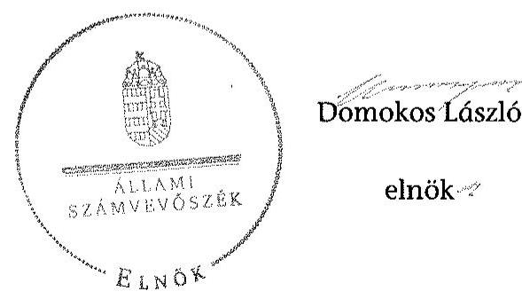

---

# RÖVIDÍTÉSEK JEGYZÉKE 

## Jogszabályok

| Áht. 1 | Az államháztartásról szóló 1992. évi XXXVIII. törvény (hatálytalan: 2012. január 1-jétől) |
| :--: | :--: |
| Áht. 2 | Az államháztartásról szóló 2011. évi CXCV. törvény |
| ÁSZ tv. | Az Állami Számvevőszékről szóló 2011. évi LXVI. törvény |
| Avtv. | A személyes adatok védelméről és a közérdekű adatok nyilvánosságáról szóló 1992. évi LXIII. törvény (hatálytalan: 2012. január 1-jétől) |
| Evt. $_{1}$ | Az erdőről és az erdő védelméről szóló 1996. évi LIV. törvény (hatálytalan: 2009. július 10-től) |
| Evt. $_{2}$ | Az erdőről, az erdő védelméről és az erdőgazdálkodásról szóló 2009. évi XXXVII. törvény (hatályos: 2009. július 10-től) |
| Evr. $_{1}$ | Az erdőről és az erdő védelméről szóló 1996. évi LIV. törvény végrehajtásáról szóló 29/1997. (IV. 30.) FM rendelet (hatálytalan: 2009. november 21-től) |
| Evr. $_{2}$ | Az erdőről, az erdő védelméről és az erdőgazdálkodásról szóló 2009. évi XXXVII. törvény végrehajtásáról szóló 153/2009. (XI. 13.) FVM rendelet (hatályos: 2009. november 21-től) |
| Gt. | A gazdasági társaságokról szóló 2006. évi IV. törvény (hatályos: 2014. március 14-ig) |
| Info. tv. | Az információs önrendelkezési jogról és az információszabadságról szóló 2011. évi CXII. törvény |
| Mfbtv. | A Magyar Fejlesztési Bank Részvénytársaságról szóló 2001. évi XX. törvény |
| Nfatv. | A Nemzeti Földalapról szóló 2010. évi LXXXVII. törvény |
| Nvtv. | A nemzeti vagyonról szóló 2011. évi CXCVI. törvény |
| Ptk. | A Polgári Törvénykönyvről szóló 1959. évi IV. törvény (hatályos: 2014. március 14-ig) |

 |
| Számv. tv. | A számvitelről szóló 2000. évi C. törvény |
| új Ptk. | A Polgári Törvénykönyvről szóló 2013. évi V. törvény |
| Vadvédelmi tv. | A vad védelméről, a vadgazdálkodásról, valamint a vadászatról 1996. évi LV. törvény |
| Vhr. | Az állami vagyonnal való gazdálkodásról szóló 254/2007. (X. 4.) Korm. rendelet |
| Vtv. | Az állami vagyonról szóló 2007. évi CVI. törvény |
| 262/2010. (XI.17.) Korm.   rendelet | A Nemzeti Földalapba tartozó földrészletek hasznosításának részletes szabályairól szóló Korm. rendelet |

---

# Egyéb rövidítések 

| Alapító | A Magyar Állam, akinek a nevében a társaság feletti tulajdoni joggyakorló jár el |
| :--: | :--: |
| Alapító Okirat | A KASZÓ Zrt. mindenkori hatályos Alapító Okirata |
| ÁSZ | Állami Számvevőszék |
| ÁV Rt. | Állami Vagyonkezelő Rt. |
| Belső Ellenőrzési Szabályzat | A KASZÓ Zrt. mindenkori Belső Ellenőrzési Szabályzata |
| DTÜ | Döntéshozó Testületeinek Ügyrend |
| E Ft. | ezer forint |
| Erdészeti hatóság | Megyei Mezőgazdasági Szakigazgatási Hivatal Erdészeti Igazgatóság 2010. december 31-ig, Megyei Kormányhivatal Erdészeti Igazgatósága 2011. január 1-jétől (10 megyében) |
| FB | Felügyelő bizottság |
| FM | Földművelésügyi Minisztérium |
| Forrás-SQL rendszer | Integrált ügyviteli rendszer, amelynek feladata volt a vagyonkezelők számára a vagyonkataszteri jelentés elkészítésének és adathordozón történő továbbításának biztosítása, valamint a tulajdonosi joggyakorló vagyonkezelésében lévő vagyonelemek elektronikus adatbázisban történő tételes nyilvántartása |
| ha | hektár |
| HM | Honvédelmi Minisztérium |
| INTOSAI | Legfőbb Ellenőrző Intézmények Nemzetközi Szervezete |
| ISSAI | nemzetközi standardok |
| JT | jegyzett tőke |
| KASZÓ Zrt. | KASZÓ Erdőgazdaság Zrt. |
| KIM | Közigazgatási és Igazságügyi Minisztérium |
| KVI | Kincstári Vagyoni Igazgatóság |
| M Ft | millió forint |
| MFB Zrt. | Magyar Fejlesztési Bank Zrt. |
| MNV Zrt. | Magyar Nemzeti Vagyonkezelő Zrt. |
| NFA | Nemzeti Földalapkezelő Szervezet |
| NFM | Nemzeti Fejlesztési Minisztérium |
| NVT | Nemzeti Vagyongazdálkodási Tanács |
| nyt. szám | nyilvántartási szám |
| RJGY | részvényesi jogok gyakorlója |
| ST | saját tőke |
| sz. | számú |
| Számviteli Politika | A KASZÓ Zrt. Számviteli Politikája |
| SZMSZ | A KASZÓ Zrt. Szervezeti és Működési Szabályzata |
| Társaság | KASZÓ Erdőgazdaság Zrt. |

---

Tulajdonosi joggyakorló

Tulajdonosi joggyakorló

Tulajdonosi joggyakorló
Vadászati hatóság

Magyar Nemzeti Vagyonkezelő Zrt., mint a társaság részesedései feletti tulajdonosi joggyakorló 2009. január 1-jétől 2010. június 16-áig
Magyar Fejlesztési Bank Zrt., mint a társaság részesedései feletti tulajdonosi joggyakorló 2010. június 17-étől 2014. július 15-éig
Földművelésügyi Minisztérium, mint a társaság részesedései feletti tulajdonosi joggyakorló 2014. július 16-tól
Megyei Mezőgazdasági Szakigazgatási Hivatal Földművelésügyi Igazgatóság Vadászati és Halászati Osztály 2010. december 31-ig, Megyei Kormányhivatal Földművelésügyi Igazgatósága 2011. január 1-jétől (10 megyére)

---

.

---

# FOGALOMTÁR 

állami vagyon
állami vagyon használója
átlátható szervezet
földbirtok-politikai irányelvek
hasznosítás
immateriális szolgáltatásából származó bevétel
információs és kommunikációs rendszer
Kincstári Vagyoni Igazgatóság

Állami vagyon:
a) az állam tulajdonában lévő dolog, valamint dolog módjára hasznosítható természeti erő;
b) az a) pont hatálya alá tartozó mindazon vagyon, amely vonatkozásában törvény az állam kizárólagos tulajdonjogát nevesíti;
c) az állam tulajdonában lévő tagsági jogviszonyt megtestesítő értékpapír, illetve az államot megillető egyéb társasági részesedés;
d) az államot megillető olyan immateriális, vagyoni értékkel rendelkező jogosultság, amelyet jogszabály vagyoni értékű jogként nevesít;
e) az állam tulajdonában lévő pénzügyi eszközök.
Az állami vagyon használója az a természetes vagy jogi személy, jogi személyiséggel nem rendelkező szervezet, aki, vagy amely törvény vagy szerződés alapján, bármely jogcímen (bérlet, haszonbérlet, használat stb.) állami vagyont birtokol, használ, szedi annak hasznait. (Ide nem értve a haszonélvezőt, a vagyonkezelőt és a tulajdonosi jogok gyakorlóját.)
Átlátható szervezet a Nvtv. 3. § (1) bekezdés 1. pontjában felsorolt, a meghatározott követelményeknek megfelelő szervezet.
Az Nfatv. 15. § (3) bekezdés a)-s) pontjaiban meghatározott, a Nemzeti Földalapba tartozó földrészletek hasznosítására vonatkozó irányelvek.
Hasznosítás a tulajdonosi joggyakorló vagy a nemzeti vagyon használója által a nemzeti vagyon birtoklásának, használatának, hasznok szedése jogának bármely - a tulajdonjog átruházását nem eredményező - jogcímen történő átengedése, ide nem értve a vagyonkezelésbe adást, valamint a haszonélvezeti jog alapítását.
Immateriális szolgáltatásból származó bevételek azok a nem anyagjellegű szolgáltatásokból származó állami bevételek, amelyeket az Evt. 23. § (1) bekezdése szerint, a külön jogszabályban meghatározott részletes feltételek szerint, az erdők fenntartására, gyarapítására és védelmére kell fordítani.
Az információs és kommunikációs rendszer biztosítja, hogy az információk eljussanak az illetékes szervezethez, szervezeti egységhez, illetve személyhez.
A Vtv. 61. § (1) bekezdése értelmében a Kincstári Vagyoni Igazgatóság (a továbbiakban: KVI) 2007. december 31-ei hatállyal megszűnt, jogai és kötelezettségei ezen időponttól - a 66. § (1) bekezdésében megjelölt feladat kivételével - az MNV Zrt.-re szálltak. A KVI 66. § (1) bekezdésben foglalt feladata a kincstárra szállt. A jogok és kötelezettségek átszállása nem minősült a KVI által kötött szerződések módosításának.

---

kockázatkezelés
kockázatkezelési rendszer
kontrolling
kontrollkörnyezet
kontrolltevékenységek
közfeladat
monitoring

A kockázatkezelés a szervezet céljai elérésével kapcsolatos kockázatok azonosításának és elemzésének, valamint a megfelelő válaszok meghatározásának folyamata.
A kockázatkezelési rendszer működtetése során fel kell mérni és meg kell állapítani a szervezet tevékenységében, gazdálkodásában rejlő kockázatokat, valamint meg kell határozni az egyes kockázatokkal kapcsolatban szükséges intézkedéseket, valamint azok teljesítésének folyamatos nyomon követésének módját. A kockázatkezelési rendszer olyan irányítási eszközök és módszerek összessége, amelynek elemei a szervezeti célok elérését veszélyeztető tényezők (kockázatok) azonosítása, elemzése, nyomon követése, valamint szükség esetén a kockázati kitettség mérséklése.
Az a vezetéstámogató rendszer, amely a vezetői tervezést, ellenőrzést, valamint információ-ellátást koordinálja célorientáltan a környezeti változásokhoz igazodva.
A kontroll környezet elemei: a szervezeti struktúra, a felelősségi, hatásköri viszonyok és feladatok, a szervezet minden szintjén meghatározott etikai elvárások, a humánerőforráskezelés. A kontrollkörnyezet alapozza meg a belső kontroll összes többi elemét a fegyelem és a struktúra biztosítása által. A kontrollrendszer a kockázatok kezelése és tárgyilagos bizonyosság megszerzése érdekében kialakított folyamatrendszer, amely azt a célt szolgálja, hogy megvalósuljanak a következő célok:
a) a működés és a gazdálkodás során a tevékenységeket szabályszerűen, gazdaságosan, hatékonyan, eredményesen hajtsák végre,
b) az elszámolási kötelezettségeket teljesítsék, és
c) megvédjék az erőforrásokat a veszteségektől, károktól és nem rendeltetésszerű használattól.
A kontrolltevékenységek azok az elvek (politikák) és eljárások, amelyeket a kockázatok meghatározása és a szervezet céljainak elérése érdekében alakítanak ki.
A közfeladat jogszabályban meghatározott állami vagy önkormányzati feladat, amit az arra kötelezett közérdekből, jogszabályban meghatározott követelményeknek és feltételeknek megfelelve végez, ideértve a lakosság közszolgáltatásokkal való ellátását, továbbá az állam nemzetközi szerződésekben vállalt kötelezettségeiből adódó közérdekű feladatokat, valamint e feladatok ellátásához szükséges infrastruktúra biztosítását is. Az Etv. 2. § (2) bekezdése szerint a fenntartható erdőgazdálkodás során a legfontosabb közérdekű feladat az erdők változatosságának megőrzése, az erdők fenntartása, felújítása és a védelmi, valamint közjóléti szolgáltatások biztosítása, melyek elvégzését az állam megfelelő eszközökkel biztosítja.
A szervezet tevékenységének, a célok megvalósításának nyomon követését biztosító rendszer, amely az operatív tevé-

---

Nemzeti Földalap
nemzeti vagyon használója
rábízott állami vagyon
társasági portfólió
tulajdonosi ellenőrzés
kenységek keretében megvalósuló folyamatos és eseti nyomon követésből, valamint az operatív tevékenységektől függetlenül működő belső ellenőrzésből áll. A monitoring a projektek és programok végrehajtásának nyomon követése, mely a támogató és a kedvezményezett közti megállapodásban foglalt eljárások követését, az előrehaladás ellenőrzését és a lehetséges problémák időben történő azonosítását szolgálja.
A Nemzeti Földalap a kincstári vagyon része, amelybe beletartoznak az állam tulajdonában és az ingatlan-nyilvántartásban levő, az Nfatv. 1. § (1)-(2) bekezdéseiben felsorolt területek, földrészletek és az azokhoz kapcsolódó vagyoni értékű jogok.
Az Nfatv. 15. § (1)${ }^{1}$, valamint 1. § (1)${ }^{2}$ bekezdése értelmében 2010. szeptember 1-jétől az erdőgazdasági társaság vagyonkezelésében lévő földterületek a Nemzeti Földalapba tartoznak, azok felett a tulajdonos jogait az agrárpolitikáért felelős miniszter az NFA útján gyakorolja.
A nemzeti vagyon használója az a természetes személy, jogi személy vagy jogi személyiséggel nem rendelkező szervezet, aki, vagy amely állami vagyon tekintetében törvény vagy szerződés alapján, a helyi önkormányzat vagyona tekintetében törvény, a helyi önkormányzat rendelete vagy szerződés alapján bármely jogcímen nemzeti vagyont birtokol, használ, szedi annak hasznait, kivéve a tulajdonosi joggyakorló (az Nvtv. 3. § (1) bekezdés 11. pontja alapján).
Rábízott állami vagyon az a Vtv. alkalmazásában állami vagyonnak minősülő vagyon, amit az MNV - a saját vagyonától elkülönítetten - kezel és nyilvántart. Az Mfbtv. 3. § (9) bekezdése szerint rábízott állami vagyon az a vagyon, amely felett az Mfbtv. erejénél fogva a Magyar Állam nevében az MFB gyakorolja a tulajdonosi jogokat. Az Nfatv. 1. § (1) bekezdésében foglaltak alapján az NFA-hoz tartozó rábízott vagyon a törvényben meghatározott, a Nemzeti Földalapba tartozó vagyon.
Társasági portfólió az MNV, illetve az MFB rábízott vagyonába tartozó állami tulajdonú társasági részesedések.
Az MNV/MFB/FM tulajdonosi joggyakorló által végzett ellenőrzés, amelynek célja az állami vagyonnal való gazdálkodás vizsgálata, ennek keretében a rendeltetésellenes, jogszerűtlen, szerződésellenes, vagy a tulajdonos érdekeit sértő, illetve a központi költségvetést hátrányosan érintő vagyongazdálkodási intézkedések feltárása és a jogszerű állapot helyreállítása, továbbá a vagyonnyilvántartás hitelességének, teljességének és helyességének biztosítása.

[^0]
[^0]:    ${ }^{1}$ Hatályos: 2010. szeptember 1-2011. július 31.
    ${ }^{2}$ Hatályos: 2010. szeptembertől, módosítva: 2011. augusztus 1-jétől.

---

tulajdonosi joggyakorló
tulajdonosi joggyakorlás módja
vagyongazdálkodás feladata
vagyonkezelői jog

Tulajdonosi joggyakorló az, aki az állami, illetve a nemzeti vagyon felett az államot megillető tulajdonosi jogok és kötelezettségek gyakorlására jogosult.
Az állami vagyon felett a Magyar Államot megillető tulajdonosi jogoknak (és kötelezettségeknek) az összességét az állami vagyon felügyeletéért felelős miniszter gyakorolja, aki e feladatát az MNV, és az MFB útján látja el. A Vtv. alapján 2010. június 16-ig az MNV Zrt. a tulajdonosi jogait megosztotta a HM-mel. A tulajdonosi jogok megosztását a felek a közöttük 2008. május 29-én kelt vagyonkezelői szerződésben szabályozták. Azon állami tulajdonban álló ingatlanok felett, amelyek egy része a Nemzeti Földalapba tartozik, a tulajdonosi jogokat a miniszter az agrárpolitikáért felelős miniszterrel közösen gyakorolja. A Nemzeti Földalap felett a Magyar Állam nevében a tulajdonosi jogokat és kötelezettségeket az agrárpolitikáért felelős miniszter a Nemzeti Földalapkezelő Szervezet útján gyakorolja.
Az állami vagyon rendeltetésének megfelelő - az állami feladatok ellátásához, a társadalmi szükségletek kielégítéséhez, valamint a Kormány gazdaságpolitikája megvalósításának elősegítéséhez szükséges, egységes elveken alapuló, önálló ágazatként megjelenő - hatékony, költségtakarékos, értékmegőrző, értéknövelő felhasználásának biztosítása, beleértve a vagyoni kör változását eredményező értékesítést, valamint az állami vagyon gyarapítása is.
Vagyonkezelési szerződés alapján a vagyonkezelő jogosult meghatározott, állami tulajdonba tartozó dolog birtoklására, használatára és hasznai szedésére. A Vtv. alapján a vagyonkezelői jog az állami vagyon hasznosítására az MNV-vel kötött vagyonkezelési szerződéssel jön létre. A vagyonkezelési szerződés alapján a vagyonkezelő jogosult
 meghatározott, állami tulajdonba tartozó dolog birtoklására, használatára és hasznai szedésére. Az Nftv. alapján a vagyonkezelői jog az erre irányuló (NFA-val kötött) szerződéssel jön létre. A vagyonkezelői szerződés alapján a vagyonkezelő jogosult meghatározott földrészlet birtoklására, használatára és hasznai szedésére. A vagyonkezelő köteles a földrészlet értékét megőrizni, állagának megóvásáról, jó karban tartásáról gondoskodni, továbbá - az Nftv.-ben meghatározott esetek kivételével - díjat fizetni vagy a szerződésben előírt más kötelezettséget teljesíteni.

---

A KASZÓ Zrt. vagyonváltozásának alakulása a 2009-2014. évek közötti időszakban - Eszközök (M ft)
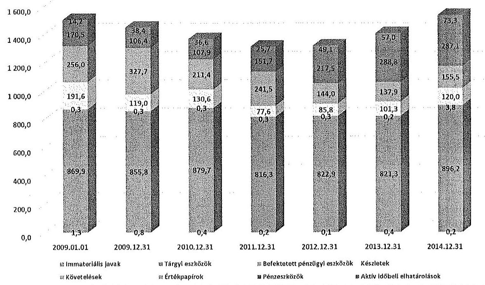

A KASZÓ Zrt. vagyonváltozásának alakulása a 2009-2014. évek közötti időszakban - Források (M ft)
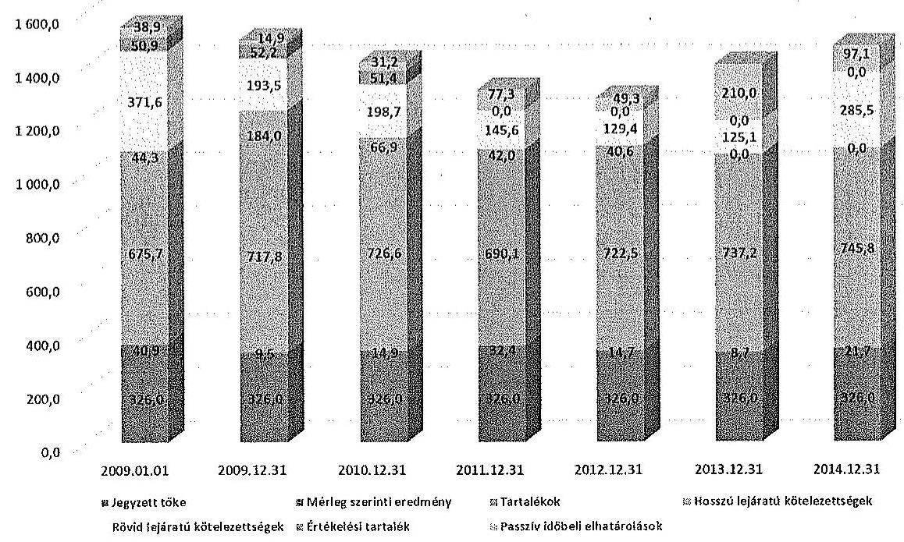

---

Az erdőgazdasági társaság vagyonának alakulása 2009-2014. években

|  Sorszám | Megnevezés | 2009.01.01 | 2009.12.31 | 2010.12.31 | 2011.12.31 | 2012.12.31 | 2013.12.31 | 2014.12.31 | Változás 2014.12.31/2009.12.31 (%)  |
| --- | --- | --- | --- | --- | --- | --- | --- | --- | --- |
|   |  | 1. | 2. | 3. | 4. | 5. | 6. | 7. | 8.  |
|  1. | Eszközök |  |  |  |  |  |  |  |   |
|  2. | Befektetett eszközök összesen | 871 580 | 856 925 | 880 433 | 816 810 | 823 289 | 821 880 | 900 173 | 105%  |
|  3. | Ebből: Immateriális javak | 1 338 | 786 | 410 | 215 | 87 | 369 | 229 | 29%  |
|  4. | Tárgyi eszközök | 869 942 | 855 839 | 879 725 | 816 295 | 822 902 | 821 311 | 896 161 | 105%  |
|  5. | Befektetett pénzügyi eszközök | 300 | 300 | 300 | 300 | 300 | 200 | 3 783 | 1261%  |
|  6. | Forgóeszközök | 618 066 | 553 091 | 449 895 | 470 877 | 447 308 | 528 042 | 562 584 | 102%  |
|  7. | Ebből: Készletek | 191 553 | 119 038 | 130 598 | 77 614 | 85 840 | 101 342 | 120 037 | 101%  |
|  8. | Követelések | 255 986 | 327 693 | 211 433 | 241 546 | 143 965 | 137 890 | 155 491 | 47%  |
|  9. | Értékpapírok | 0 | 0 | 0 | 0 | 0 | 0 | 0 | 0  |
|  10. | Pénzeszközök | 170 527 | 106 360 | 107 864 | 151 717 | 217 503 | 288 810 | 287 056 | 270%  |
|  11. | Aktív időbeli elhatárolások | 14 153 | 38 426 | 36 621 | 25 746 | 49 097 | 56 989 | 73 258 | 191%  |
|  12. | Eszközök összesen | 1 503 799 | 1 448 442 | 1 366 949 | 1 313 433 | 1 319 694 | 1 406 911 | 1 536 015 | 106%  |
|  13. | Források |  |  |  |  |  |  |  |   |
|  14. | Saját tőke | 1 042 532 | 1 053 349 | 1 067 511 | 1 048 470 | 1 063 160 | 1 071 818 | 1 093 525 | 104%  |
|  15. | Ebből: Jegyzett tőke | 326 000 | 326 000 | 326 000 | 326 000 | 326 000 | 326 000 | 326 000 | 100%  |
|  16. | Tőketartalék | 328 406 | 328 406 | 328 406 | 328 406 | 328 406 | 328 406 | 328 406 | 100%  |
|  17. | Eredménytartalék | 275 363 | 321 253 | 327 147 | 343 657 | 381 321 | 402 854 | 240 384 | 75%  |
|  18. | Lekötött tartalék | 21 000 | 15 991 | 9 600 | 18 000 | 12 743 | 5 900 | 177 028 | 1107%  |
|  19. | Értékelési tartalék | 50 882 | 52 197 | 51 448 | 0 | 0 | 0 | 0 | 0%  |
|  20. | Mérleg szerinti eredmény | 40 881 | 9 505 | 14 910 | 32 407 | 14 690 | 8 658 | 21 707 | 228%  |
|  21. | Céltartalékok | 6 500 | 2 640 | 2 620 | 0 | 37 171 | 0 | 59 866 | 2268%  |
|  22. | Kötelezettségek | 415 862 | 377 527 | 365 576 | 187 693 | 170 038 | 125 122 | 285 482 | 76%  |
|  23. | Ebből: Hátrasorolt kötelezettségek | 0 | 0 | 0 | 0 | 0 | 0 | 0 | 0  |
|  24. | Hosszú lejáratú kötelezettségek | 64 250 | 184 032 | 66 905 | 42 048 | 40 639 | 0 | 0 | 0%  |
|  25. | Rövid lejáratú kötelezettségek | 371 612 | 193 495 | 198 671 | 143 645 | 129 399 | 125 122 | 285 482 | 148%  |
|  26. | Passzív időbeli elhatárolások | 38 905 | 14 926 | 31 242 | 77 270 | 49 325 | 209 971 | 97 142 | 651%  |
|  27. | Források összesen | 1 503 799 | 1 448 442 | 1 366 949 | 1 313 433 | 1 319 694 | 1 406 911 | 1 536 015 | 106%  |

---

|  2016.01.01 |   |
| --- | --- |
|  |   |

|  1 |  |   |
| --- | --- | --- |
|  2 |  |   |
|  3 |  |   |
|  4 |  |   |
|  5 |  |   |
|  6 |  |   |
|  7 |  |   |
|  8 |  |   |
|  9 |  |   |
|  10 |  |   |
|  11 |  |   |
|  12 |  |   |
|  13 |  |   |
|  14 |  |   |
|  15 |  |   |
|  16 |  |   |
|  17 |  |   |
|  18 |  |   |
|  19 |  |   |
|  20 |  |   |
|  21 |  |   |
|  22 |  |   |
|  23 |  |   |
|  24 |  |   |
|  25 |  |   |
|  26 |  |   |
|  27 |  |   |
|  28 |  |   |
|  29 |  |   |
|  30 |  |   |
|  31 |  |   |
|  32 |  |   |
|  33 |  |   |
|  34 |  |   |
|  35 |  |   |
|  36 |  |   |
|  37 |  |   |
|  38 |  |   |
|  39 |  |   |
|  40 |  |   |
|  41 |  |   |
|  42 |  |   |
|  43 |  |   |
|  44 |  |   |
|  45 |  |   |
|  46 |  |   |
|  47 |  |   |
|  48 |  |   |
|  49 |  |   |
|  50 |  |   |
|  51 |  |   |
|  52 |  |   |
|  53 |  |   |
|  54 |  |   |
|  55 |  |   |
|  56 |  |   |
|  57 |  |   |
|  58 |  |   |
|  59 |  |   |
|  60 |  |   |
|  61 |  |   |
|  62 |  |   |
|  63 |  |   |
|  64 |  |   |
|  65 |  |   |
|  66 |  |   |
|  67 |  |   |
|  68 |  |   |
|  69 |  |   |
|  70 |  |   |
|  71 |  |   |
|  72 |  |   |
|  73 |  |   |
|  74 |  |   |
|  75 |  |   |
|  76 |  |   |
|  77 |  |   |
|  78 |  |   |
|  79 |  |

   |
|  80 |  |   |
|  81 |  |   |
|  82 |  |   |
|  83 |  |   |
|  84 |  |   |
|  85 |  |   |
|  86 |  |   |
|  87 |  |   |
|  88 |  |   |
|  89 |  |   |
|  90 |  |   |
|  91 |  |   |
|  92 |  |   |
|  93 |  |   |
|  94 |  |   |
|  95 |  |   |
|  96 |  |   |
|  97 |  |   |
|  98 |  |   |
|  99 |  |   |
|  100 |  |   |
|  101 |  |   |
|  102 |  |   |
|  103 |  |   |
|  104 |  |   |
|  105 |  |   |
|  106 |  |   |
|  107 |  |   |
|  108 |  |   |
|  109 |  |   |
|  110 |  |   |
|  111 |  |   |
|  112 |  |   |
|  113 |  |   |
|  114 |  |   |
|  115 |  |   |
|  116 |  |   |
|  117 |  |   |
|  118 |  |   |
|  119 |  |   |
|  120 |  |   |
|  121 |  |   |
|  122 |  |   |
|  123 |  |   |
|  124 |  |   |
|  125 |  |   |
|  126 |  |   |
|  127 |  |   |
|  128 |  |   |
|  129 |  |   |
|  130 |  |   |
|  131 |  |   |
|  132 |  |   |
|  133 |  |   |
|  134 |  |   |
|  135 |  |   |
|  136 |  |   |
|  137 |  |   |
|  138 |  |   |
|  139 |  |   |
|  140 |  |   |
|  141 |  |   |
|  142 |  |   |
|  143 |  |   |
|  144 |  |   |
|  145 |  |   |
|  146 |  |   |
|  147 |  |   |
|  148 |  |   |
|  149 |  |   |
|  150 |  |   |
|  151 |  |   |
|  152 |  |   |
|  153 |  |   |
|  154 |  |   |
|  155 |  |   |
|  156 |  |   |
|  157 |  |   |
|  158 |  |   |
|  159 |  |   |
|  160 |  |   |
|  161 |  |   |
|  162 |  |   |
|  163 |  |   |
|  164 |  |   |
|  165 |  |   |
|  166 |  |   |
|  167 |  |   |
|  168 |  |   |
|  169 |  |   |
|  170 |  |   |
|  171 |  |   |
|  172 |  |   |
|  173 |  |   |
|  174 |  |   |
|  175 |  |   |
|  176 |  |   |
|  177 |  |   |
|  178 |  |   |
|  179 |  |   |
|  180 |  |   |
|  181 |  |   |
|  182 |  |   |
|  183 |  |   |
|  184 |  |   |
|  185 |  |   |
|  186 |  |   |
|  187 |  |   |
|  188 |  |   |
|  189 |  |   |
|  190 |  |   |
|  191 |  |   |
|  192 |  |   |
|  193 |  |   |
|  194 |  |   |
|  195 |  |   |
|  196 |  |   |
|  197 |  |   |
|  198 |  |   |
|  199 |  |   |
|  200 |  |   |
|  201 |  |   |
|  202 |  |   |
|  203 |  |   |
|  204 |  |   |
|  205 |  |   |
|  206 |  |   |
|  207 |  |   |
|  208 |  |   |
|  209 |  |   |
|  210 |  |   |
|  211 |  |   |
|  212 |  |   |
|  213 |  |   |
|  214 |  |   |
|  215 |  |   |
|  216 |  |   |
|  217 |  |   |
|  218 |  |   |
|  219 |  |   |
|  220 |  |   |
|  221 |  |   |
|  222 |  |   |
|  223 |  |   |
|  224 |  |   |
|  225 |  |   |
|  226 |  |   |
|  227 |  |   |
|  228 |  |   |
|  229 |  |   |
|  230 |  |   |
|  231 |  |   |
|  232 |  |   |
|  233 |  |   |
|  234 |  |   |
|  235 |  |   |
|  236 |  |   |
|  237 |  |   |
|  238 |  |   |
|  239 |  |   |
|  240 |  |   |
|  241 |  |   |
|  242 |  |   |
|  243 |  |   |
|  244 |  |   |
|  245 |  |   |
|  246 |  |   |
|  247 |  |   |
|  248 |  |   |
|  249 |  |   |
|  250 |  |   |
|  251 |  |   |
|  252 |  |   |
|  253 |  |   |
|  254 |  |   |
|  255 |  |   |
|  256 |  |   |
|  257 |  |   |
|  258 |  |   |
|  259 |  |   |
|  260 |  |   |
|  261 |  |   |
|  262 |  |   |
|  263 |  |   |
|  264 |  |   |
|  265 |  |   |
|  266 |  |   |
|  267 |  |   |
|  268 |  |   |
|  269 |  |   |
|  270 |  |   |
|  271 |  |   |
|  272 |  |   |
|  273 |  |   |
|  274 |  |   |
|  275 |  |   |
|  276 |  |   |
|  277 |  |   |
|  278 |  |   |
|  279 |  |

   |
|  280 |  |   |
|  281 |  |   |
|  282 |  |   |
|  283 |  |   |
|  284 |  |   |
|  285 |  |   |
|  286 |  |   |
|  287 |  |   |
|  288 |  |   |
|  289 |  |   |
|  290 |  |   |
|  291 |  |   |
|  292 |  |   |
|  293 |  |   |
|  294 |  |   |
|  295 |  |   |
|  296 |  |   |
|  297 |  |   |
|  298 |  |   |
|  299 |  |   |
|  291 |  |   |
|  292 |  |   |
|  293 |  |   |
|  294 |  |   |
|  295 |  |   |
|  296 |  |   |
|  297 |  |   |
|  298 |  |   |
|  299 |  |   |
|  291 |  |   |
|  292 |  |   |
|  293 |  |   |
|  294 |  |   |
|  295 |  |   |
|  296 |  |   |
|  297 |  |   |
|  298 |  |   |
|  299 |  |   |
|  291 |  |   |
|  292 |  |   |
|  293 |  |   |
|  294 |  |   |
|  295 |  |   |
|  296 |  |   |
|  297 |  |   |
|  298 |  |   |
|  299 |  |   |
|  291 |  |   |
|  292 |  |   |
|  293 |  |   |
|  294 |  |   |
|  295 |  |   |
|  296 |  |   |
|  297 |  |   |
|  298 |  |   |
|  299 |  |   |
|  291 |  |   |
|  292 |  |   |
|  293 |  |   |
|  294 |  |   |
|  295 |  |   |
|  296 |  |   |
|  297 |  |   |
|  298 |  |   |
|  299 |  |   |
|  291 |  |   |
|  292 |  |   |
|  293 |  |   |
|  294 |  |   |
|  295 |  |   |
|  296 |  |   |
|  297 |  |   |
|  298 |  |   |
|  299 |  |   |
|  291 |  |   |
|  292 |  |   |
|  293 |  |   |
|  294 |  |   |
|  295 |  |   |
|  296 |  |   |
|  297 |  |   |
|  298 |  |   |
|  299 |  |   |
|  291 |  |   |
|  292 |  |   |
|  293 |  |   |
|  294 |  |   |
|  295 |  |   |
|  296 |  |   |
|  297 |  |   |
|  298 |  |   |
|  299 |  |   |
|  291 |  |   |
|  292 |  |   |
|  293 |  |   |
|  294 |  |   |
|  295 |  |   |
|  296 |  |   |
|  297 |  |   |
|  298 |  |   |
|  299 |  |   |
|  291 |  |   |
|  292 |  |   |
|  293 |  |   |
|  294 |  |   |
|  295 |  |   |
|  296 |  |   |
|  297 |  |   |
|  298 |  |   |
|  299 |  |   |
|  291 |  |   |
|  292 |  |   |
|  293 |  |   |
|  294 |  |   |
|  295 |  |   |
|  296 |  |   |
|  297 |  |   |
|  298 |  |   |
|  299 |  |   |
|  291 |  |   |
|  292 |  |   |
|  293 |  |   |
|  294 |  |   |
|  295 |  |   |
|  296 |  |   |
|  297 |  |   |
|  298 |  |   |
|  299 |  |   |
|  291 |  |   |
|  292 |  |   |
|  293 |  |   |
|  294 |  |   |
|  295 |  |   |
|  296 |  |   |
|  297 |  |   |
|  298 |  |   |
|  299 |  |   |
|  291 |  |   |
|  292 |  |   |
|  293 |  |   |
|  294 |  |   |
|  295 |  |   |
|  296 |  |   |
|  297 |  |   |
|  298 |  |   |
|  299 |  |   |

   |
|  291 |  |   |
|  292 |  |   |
|  293 |  |   |
|  294 |  |   |
|  295 |  |   |
|  296 |  |   |
|  297 |  |   |
|  298 |  |   |
|  299 |  |   |
|  291 |  |   |
|  292 |  |   |
|  293 |  |   |
|  294 |  |   |
|  295 |  |   |
|  296 |  |   |
|  297 |  |   |
|  298 |  |   |
|  299 |  |   |
|  291 |  |   |
|  292 |  |   |
|  293 |  |   |
|  294 |  |   |
|  295 |  |   |
|  296 |  |   |
|  297 |  |   |
|  298 |  |   |
|  299 |  |   |
|  291 |  |   |
|  292 |  |   |
|  293 |  |   |
|  294 |  |   |
|  295 |  |   |
|  296 |  |   |
|  297 |  |   |
|  298 |  |   |
|  299 |  |   |
|  291 |  |   |
|  292 |  |   |
|  293 |  |   |
|  294 |  |   |
|  295 |  |   |
|  296 |  |   |
|  297 |  |   |
|  298 |  |   |
|  299 |  |   |
|  291 |  |   |
|  292 |  |   |
|  293 |  |   |
|  294 |  |   |
|  295 |  |   |
|  296 |  |   |
|  297 |  |   |
|  298 |  |   |
|  299 |  |   |
|  291 |  |   |
|  292 |  |   |
|  293 |  |   |
|  294 |  |   |
|  295 |  |   |
|  296 |  |   |
|  297 |  |   |
|  298 |  |   |
|  299 |  |   |
|  291 |  |   |
|  292 |  |   |
|  293 |  |   |
|  294 |  |   |
|  295 |  |   |
|  296 |  |   |
|  297 |  |   |
|  298 |  |   |
|  299 |  |   |
|  291 |  |   |
|  292 |  |   |
|  293 |  |   |
|  294 |  |   |
|  295 |  |   |
|  296 |  |   |
|  297 |  |   |
|  298 |  |   |
|  299 |  |   |
|  291 |  |   |
|  292 |  |   |
|  293 |  |   |
|  294 |  |   |
|  295 |  |   |
|  296 |  |   |
|  297 |  |   |
|  298 |  |   |
|  299 |  |   |
|  291 |  |   |
|  292 |  |   |
|  293 |  |   |
|  294 |  |   |
|  295 |  |   |
|  296 |  |   |
|  297 |  |   |
|  298 |  |   |
|  299 |  |   |
|  291 |  |   |
|  292 |  |   |
|  293 |  |   |
|  294 |  |   |
|  295 |  |   |
|  296 |  |   |
|  297 |  |   |
|  298 |  |   |
|  299 |  |   |
|  291 |  |   |
|  292 |  |   |
|  293 |  |   |
|  294 |  |   |
|  295 |  |   |
|  296 |  |   |
|  297 |  |   |
|  298 |  |   |
|  299 |  |   |
|  291 |  |   |
|  292 |  |   |
|  293 |  |   |
|  294 |  |   |
|  295 |  |   |
|  296 |  |   |
|  297 |  |   |
|  298 |  |   |
|  299 |  |   |
|  291 |  |   |
|  292 |  |   |
|  293 |  |   |
|  294 |  |   |
|  295 |  |   |
|  296 |  |   |
|  297 |  |   |
|  298 |  |   |
|  299 |  |   |
|  291 |  |   |
|  292 |  |   |
|  293 |  |   |
|  294 |  |   |
|  295 |  |   |
|  296 |  |   |
|  297 |  |   |
|  298 |  |   |
|  299 |  |   |
|  291 |  |   |
|  292 |  |   |
|  293 |  |   |
|  294 |  |   |
|  295 |  |   |
|  296 |  |   |
|  297 |  |   |
|  298 |  |   |
|  299 |  |   |
|  291 |  |   |
|  292 |  |

   |
|  293 |  |   |
|  294 |  |   |
|  295 |  |   |
|  296 |  |   |
|  297 |  |   |
|  298 |  |   |
|  299 |  |   |
|  291 |  |   |
|  292 |  |   |
|  293 |  |   |
|  294 |  |   |
|  295 |  |   |
|  296 |  |   |
|  297 |  |   |
|  298 |  |   |
|  299 |  |   |
|  291 |  |   |
|  292 |  |   |
|  293 |  |   |
|  294 |  |   |
|  295 |  |   |
|  296 |  |   |
|  297 |  |   |
|  298 |  |   |
|  299 |  |   |
|  291 |  |   |
|  292 |  |   |
|  293 |  |   |
|  294 |  |   |
|  295 |  |   |
|  296 |  |   |
|  297 |  |   |
|  298 |  |   |
|  299 |  |   |
|  291 |  |   |
|  292 |  |   |
|  293 |  |   |
|  294 |  |   |
|  295 |  |   |
|  296 |  |   |
|  297 |  |   |
|  298 |  |   |
|  299 |  |   |
|  291 |  |   |
|  292 |  |   |
|  293 |  |   |
|  294 |  |   |
|  295 |  |   |
|  296 |  |   |
|  297 |  |   |
|  298 |  |   |
|  299 |  |   |
|  291 |  |   |
|  292 |  |   |
|  293 |  |   |
|  294 |  |   |
|  295 |  |   |
|  296 |  |   |
|  297 |  |   |
|  298 |  |   |
|  299 |  |   |
|  291 |  |   |
|  292 |  |   |
|  293 |  |   |
|  294 |  |   |
|  295 |  |   |
|  296 |  |   |
|  297 |  |   |
|  298 |  |   |
|  299 |  |   |
|  291 |  |   |
|  292 |  |   |
|  293 |  |   |
|  294 |  |   |
|  295 |  |   |
|  296 |  |   |
|  297 |  |   |
|  298 |  |   |
|  299 |  |   |
|  291 |  |   |
|  292 |  |   |
|  293 |  |   |
|  294 |  |   |
|  295 |  |   |
|  296 |  |   |
|  297 |  |   |
|  298 |  |   |
|  299 |  |   |
|  291 |  |   |
|  292 |  |   |
|  293 |  |   |
|  294 |  |   |
|  295 |  |   |
|  296 |  |   |
|  297 |  |   |
|  298 |  |   |
|  299 |  |   |
|  291 |  |   |
|  292 |  |   |
|  293 |  |   |
|  294 |  |   |
|  295 |  |   |
|  296 |  |   |
|  297 |  |   |
|  298 |  |   |
|  299 |  |   |
|  291 |  |   |
|  292 |  |   |
|  293 |  |   |
|  294 |  |   |
|  295 |  |   |
|  296 |  |   |
|  297 |  |   |
|  298 |  |   |
|  299 |  |   |
|  291 |  |   |
|  292 |  |   |
|  293 |  |   |
|  294 |  |   |
|  295 |  |   |
|  296 |  |   |
|  297 |  |   |
|  298 |  |   |
|  299 |  |   |
|  291 |  |   |
|  292 |  |   |
|  293 |  |   |
|  294 |  |   |
|  295 |  |   |
|  296 |  |   |
|  297 |  |   |
|  298 |  |   |
|  291 |  |   |
|  291 |  |   |
|  292 |  |   |
|  293 |  |   |
|  294 |  |   |
|  295 |  |   |
|  296 |  |   |
|  297 |  |   |
|  298 |  |   |
|  291 |  |   |
|  291 |  |   |
|  292 |  |   |
|  293 |  |   |
|  294 |  |   |
|  295 |  |   |
|  296 |  |   |
|  297 |  |   |
|  298 |  |   |
|  291 |  |   |
|  291 |  |   |
|  292 |  |   |
|  293 |  |   |
|  294 |  |   |
|  295 |  |   |
|  296 |  |   |
|  297 |  |   |
|  298 |  |   |
|  291 |  |   |
|  291 |  |   |
|  291 |  |   |
|  292 |  |   |
|  293 |  |   |
|  294 |  |   |
|  295 |  |   |
|  296 |  |   |
|  291 |  |   |
|  291 |  |   |
|  291 |  |   |
|  291 |  |   |
|  292 |  |   |
|  291 |  |   |
|  291 |  |   |
|  294 |  |   |
|  291 |  |   |
|  291 |  |   |
|  291 |  |   |
|  291 |  |   |
|  292 |  |   |
|  291 |  |

   |
|  291 |  |   |
|  291 |  |   |
|  291 |  |   |
|  291 |  |   |
|  291 |  |   |
|  291 |  |   |
|  292 |  |   |
|  291 |  |   |
|  291 |  |   |
|  291 |  |   |
|  291 |  |   |
|  291 |  |   |
|  291 |  |   |
|  291 |  |   |
|  291 |  |   |
|  291 |  |   |
|  291 |  |   |
|  291 |  |   |
|  291 |  |   |
|  291 |  |   |
|  291 |  |   |
|  291 |  |   |
|  291 |  |   |
|  291 |  |   |
|  291 |  |   |
|  291 |  |   |
|  291 |  |   |
|  291 |  |   |
|  291 |  |   |
|  291 |  |   |
|  291 |  |   |
|  291 |  |   |
|  291 |  |   |
|  291 |  |   |
|  291 |  |   |
|  291 |  |   |
|  291 |  |   |
|  291 |  |   |
|  291 |  |   |
|  

---

.

---

KASZÓ Zrt.
7564 Kaszó
Nyilv.sz.: 1137.110/2015.

Domokos László
Elnök Úr részére

Ikt.: 122222

Állami Számvevőszék

Tárgy: Észrevétel a KASZÓ Zrt. számvevőszéki jelentéstervezetéhez

# Tisztelt Elnök Úr! 

„Az állami tulajdonban álló erdőgazdasági társaságok vagyongazdálkodási tevékenységének ellenőrzése - KASZÓ Erdőgazdaság Zrt." címmel készített számvevőszéki jelentéstervezetet köszönettel megkaptam.

A jelentéstervezetben foglaltakkal egyetértek, észrevételt nem kívánok tenni. A javaslatokat elfogadom, a megoldásukra a következő intézkedéseket teszem, illetve tettem:

- a Társaság tevékenysége során alkalmazott valamennyi bizományosi szerződés áttekintésre, egységesítésre fog kerülni annak érdekében, hogy a bevételek elszámolásánál ebben az esetben is érvényesüljön a Sztv. szerinti bruttó elszámolás alapelve.
- a Társaság az elmúlt hónapokban folyamatosan fejlesztette, bővítette honlapját, melyen feltünteti a közérdekű adatokat, illetve ezek megismerésének útvonalát. Az Infotv.-ben rögzített, a közérdekű adatok megismerésére irányuló igények teljesítése rendjének szabályozása jelenleg történik.

Kaszó, 2015. november 3.

Tisztelettel:
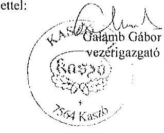

---

# ELKÖK 

ÁLLAMI
SZÁMVEVŐSZÉK

Ikt.szám: V-0770-073/2015.

Galamb Gábor úr
vezérigazgató
KASZÓ Zrt.

## Kaszó

## Tisztelt Vezérigazgató Úr!

A ,,Jelentéstervezet az állami tulajdonban álló erdőgazdasági társaságok vagyongazdálkodási tevékenységének ellenőrzése -KASZÓ Erdőgazdaság Zrt." címmel készített számvevőszéki jelentéstervezetre küldött válaszát köszönettel megkaptam.

A számvevőszéki jelentéstervezetben foglaltakkal egyetértett, észrevételt nem tett. Az intézkedést igénylő javaslatokat elfogadta, és tájékoztatott a részben már megtett és tervezett intézkedésekről.

Felhívom Vezérigazgató úr figyelmét az Állami Számvevőszékről szóló 2011. évi LXVI. törvény 33. § (1) bekezdésében foglaltakra, mely szerint ,,az ellenőrzött szervezet vezetője köteles a jelentésben foglalt megállapításokhoz kapcsolódó intézkedési tervet összeállítani, és azt a jelentés kézhezvételétől számított 30 napon belül az Állami Számvevőszék részére megküldeni."

Budapest, 2015.
hó nap
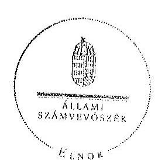

Tisztelettel:

Domokos László

---

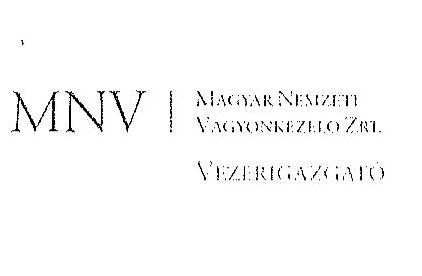

Állami Számvevőszék

Domokos László
elnök

1052 Budapest
Apáczai Cs. J. u. 10.

Ikt. sz.: MNV/01/53046/ -1 /2015.
Hiv. sz.: V-0770-065/2015.

Tisztelt Elnök Úr!

A 2015. október 30. napján „Az állami tulajdonban álló erdőgazdasági társaságok vagyongazdálkodási tevékenységének ellenőrzése - KASZÓ Erdőgazdaság Zrt.” tárgyában kézhez vett, V-0770-065/2015. ikt. sz. Jelentés-tervezetre az alábbi észrevételeket kívánom tenni.

I. fejezet / 8. old. negyedik bekezdés

„...A Társaság feletti tulajdonosi joggyakorló (MNV Zrt.) a számára a Vtv-ben előírt rendszeres ellenőrzési kötelezettségének nem tett eleget....”

Az ellenőrzési időszak kezdő időpontja (2009. január 1.) és a Társaság feletti tulajdonosi joggyakorlás MNV Zrt. által történő ellátásának záró időpontja (2010. június 16.) között eltelt időszakban a Honvédelmi Minisztérium volt a Társaság vagyonkezelője, így a Társaság feletti tulajdonosi jogokat és kötelezettségeket (az ellenőrzést is) a vagyonkezelő gyakorolta a vagyonkezelési szerződésben foglaltak szerint.

I. fejezet / 9. old. második bekezdés, II.5. fejezet / 29. old. ötödik bekezdés

„Az Nfatv. hatályba lépését követően az MNV Zrt. és az NFA között a HM által vagyonkezelő és a Társaság használatába adott ingatlanok vonatkozásában átadás-átvétel nem volt, az NFA nem rendelkezik naprakész nyilvántartási adatokkal a Társaság által használt és a tulajdonosi joggyakorlása alá tartozó földterületekről. Ezáltal az NFA nem teljesítette az Nfatv. 7. § 1 bekezdés j) pontjában előírt naprakész nyilvántartás követelményét.”

Az Nfatv. hatálybalépésekor az MNV Zrt. és az NFA közötti átadás során nem volt feladat annak vizsgálata, hogy az egyes ingatlanokat a vagyonkezelő, jelen esetben a Honvédelmi Minisztérium hasznosította-e, vagy sem. Az Nfatv. hatálya alá tartozó területek MNV Zrt. és NFA közötti átadása a vagyonkezelő Honvédelmi Minisztérium adatszolgáltatása alapján megtörtént.

Kérem Elnök Urat, hogy a Jelentés véglegesítése során jelen észrevételeinket szíveskedjenek figyelembe venni.

Budapest, 2015. november „E.„

Üdvözlettel:

MNV Zrt.
dr. Szivek Norbert
vezérigazgató

1

---

.

---

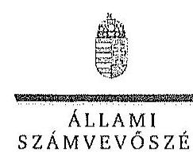

ELHOK

Ikt.szám: V-0770-076/2015.

Dr. Szivek Norbert úr
vezérigazgató
Magyar Nemzeti Vagyonkezelő Zrt.

Budapest

Tisztelt Vezérigazgató Úr!

A „Jelentéstervezet az állami tulajdonban álló erdőgazdasági társaságok vagyongazdálkodási tevékenységének ellenőrzése - KASZÓ Erdőgazdaság Zrt.” címmel készített számvevőszéki jelentéstervezetre tett észrevételeit köszönettel megkaptam.

Az Állami Számvevőszék észrevételekre vonatkozó álláspontjáról a felügyeleti vezető által készített részletes tájékoztatást csatoltan megküldöm.

Tájékoztatom Vezérigazgató urat, hogy a számvevőszéki jelentésben – az Állami Számvevőszékről szóló 2011. évi LXVI. törvény 29. § (3) bekezdése alapján – a figyelembe nem vett észrevételeket szerepeltetjük az elutasítás indokának feltüntetésével.

Budapest, 2015.

hó nap

Tisztelettel:

Domokos László

Melléklet: Tájékoztatás az elfogadott és az el nem fogadott észrevételekről

1052 BUDAPEST, Apáczai Cs. J. u. 10. 1364 Budapest 4. Pl. 54 telefon: 484 9181 fax: 484 9281

---

# Tájékoztatás   az elfogadott és az el nem fogadott észrevételekről 

A „Jelentéstervezet az állami tulajdonban álló erdőgazdasági társaságok vagyongazdálkodási tevékenységének ellenőrzése - KASZÓ Erdőgazdaság Zrt." címû jelentéstervezetre 2015. november 16-án érkezett észrevételeit áttekintettük, azok kezelésével kapcsolatban a következő tájékoztatást adom.

1. I. fejezet / 8. oldal negyedik bekezdésre tett észrevétel

A dokumentumok ismételt áttekintése alapján a jelentéstervezet 8. oldal negyedik bekezdésének második mondatát töröljük.
2. I. fejezet / 9. oldal második bekezdés, II. 5. fejezet / 29. oldal ötödik bekezdésére tett észrevétel

Az észrevételükben leírtak megerősítik, hogy az MNV Zrt. és az NFA között a Társaság használatába adott ingatlanokra vonatkozóan megfelelő részletezettségű átadás-átvétel nem történt, ezért az NFA nem rendelkezik naprakész nyilvántartási adatokkal a Társaság által használt földterületekről, így nem teljesítette az Nfatv. 7. § (1) bekezdés j) pontjában előírtakat. Megállapításunk helytálló, ezért módosítása nem indokolt.

Budapest, 2015. // hó /2. nap

Makkai Mária
felügyeleti vezető

---

# HONVÉDELMI MINISZTÉRIUM 

DR. SIMICSKÓ ISTVÁN
miniszter
Nyilv. szám: 64-83/2015.
Hiv. szám: V-0768-057/2015.,
V-0769-074/2015.
V-0770-068/2015.

## Domokos László úr

Állami Számvevőszék elnöke

Tárgy: jelentéstervezetek észrevételezése

## 4. számú példány

ÁLLAMI SZÁMVEVŐSZÉK
92,677 / 2015
Érkezési időpont: 2015. NOV. 23.
Iktató szám: V-0768-061/2015
Melléklet
Budapest
Hivatalos: 102
10-2

## Tisztelt Elnök Úr!

A Budapesti Erdőgazdaság Zrt., a Kaszó Erdőgazdaság Zrt. és a Veszprémi Erdőgazdaság Zrt. (erdőtársaságok) vagyongazdálkodási tevékenységének ellenőrzéséről szóló számvevőszéki jelentéstervezeteket a Honvédelmi Minisztérium szakapparátusa áttekintette. A jelentéstervezetekkel kapcsolatban a tárca részéről a következő észrevételeket teszem.

Mindhárom jelentéstervezet egységesen tesz javaslatot a honvédelmi miniszternek arra, hogy intézkedjen az adott erdőtársaság és a HM között fennálló használatba adási szerződés melléklete aktualizálásának elmaradásából származó munkajogi felelősség megállapítása iránti eljárás megindítására és annak eredménye ismeretében tegye meg a szükséges intézkedéseket.

A Nemzeti Földalapról szóló 2010. évi LXXVII. törvény 2013. január 1-től hatályos - tehát 2014-ben még viszonylag újnak számító - 16/A. §-a nyitotta meg a lehetőségét a honvédelmi feladatok ellátásához már nem szükséges ingatlanok „honvédelmi célra feleslegessé nyilvánított terület"-ként való ingatlan-nyilvántartási bejegyzésére és e területek mentesítés nélküli átadására a Nemzeti Földalapkezelő Szervezet (NFA) részére. (A mentesítés és az új művelési ág megállapítása az NFA feladata.)

A 2013-ban nagyszámban honvédelmi célra feleslegessé nyilvánított területként bejegyzett földrészletek NFA átadása időben elhúzódott és még 2014-ben is javában tartott. Ebben az „ex-lex" helyzetben az erdőtársaságok a HM vagyonkezelői jog, és ebből következően a használatba adási szerződések részleges megszűnésével érintett területek, jelentős részben kiemelt vagyontárgynak minősülő erdők vonatkozásában egyfajta kényszerkezelést végeznek az állami vagyon megóvása érdekében mindaddig, amíg az NFA a hasznosításról nem dönt.

Érzékelve az előbb vázolt, nemkívánatos helyzetet, a HM és az erdőtársaságok a használatba adási szerződéseket 2015-ben akként módosították, hogy a HM vagyonkezelői jog megszűnése - a kényszerkezelés elkerülése érdekében - ne

---

eredményezze a honvédelmi célra feleslegessé nyilvánított területként bejegyzett földrészlet vonatkozásában a szerződés megszűnését. Mindemellett a felek szerződéses kapcsolataikat ex nunc hatállyal úgy alakították ki, hogy a használatba adó HM helyébe a tulajdonosi joggyakorló NFA jogutódként beléphessen és a jogviszony felett rendelkezhessen.

A számvevőszéki vizsgálattal érintett időszakban honvédelmi célra feleslegessé nyilvánított területként bejegyzett földrészletek vonatkozásában az erdőgazdaságoknak tudomásuk volt a használatba adási szerződések megszűnéséről, a földrészletek NFA részére történő birtokba adása során a folyamatba résztvevőként bevonásra kerültek. Mindezek alapján a használatba adási szerződések mellékletei aktualizálásának elmaradása álláspontom szerint csak kisebb súlyú technikai hibaként értékelhető. Az állami vagyonban a mellékletek aktualizálásának elmaradása miatt kár nem keletkezett.

Minderre figyelemmel megítélésem szerint a munkajogi felelősség tisztázására irányuló eljárás megindítása nem indokolt, ezért a jelentésekből az erre vonatkozó részek, javaslatok törlése szükséges.

Budapest, 2015. // hó 16-án.
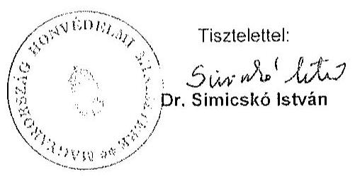

Készült: 2 példányban
Egy példány: 2 oldal
Ügyintéző: dr. Jelen Gábor ezredes (2: 210-28)
Kapják: 1. sz. pld. ÁSZ Elnök Úr
2. sz. pld. Irattár

---

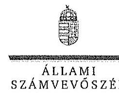

EL 100 K

Ikt.szám: V-0768-066/2015.

Dr. Simicskó István úr
miniszter
Honvédelmi Minisztérium

Budapest

Tisztelt Miniszter Úr!
„Az állami tulajdonban álló erdőgazdasági társaságok vagyongazdálkodási tevékenységének ellenőrzése" című ellenőrzés tekintetében a Budapesti Erdőgazdaság Zrt., KASZÓ Erdőgazdaság Zrt. és VERGA Veszprémi Erdőgazdaság Zrt. társaságokra vonatkozó számvevőszéki jelentéstervezetekre tett észrevételeit köszönettel megkaptam.

Az Állami Számvevőszék észrevételekre vonatkozó álláspontjáról a felügyeleti vezető által készített részletes tájékoztatást csatoltan megküldöm.

Tájékoztatom Miniszter urat, hogy a számvevőszéki jelentésben - az Állami Számvevőszékről szóló 2011. évi LXVI. törvény 29. § (3) bekezdése alapján - a figyelembe nem vett észrevételeket szerepeltetjük az elutasítás indokának feltüntetésével.

Budapest, 2015.
hó nap
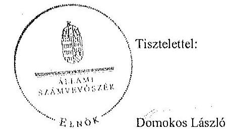

Melléklet: Tájékoztatás az el nem fogadott észrevételekről

---

# Tájékoztatás   az el nem fogadott észrevételekről 

„Az állami tulajdonban álló erdőgazdasági társaságok vagyongazdálkodási tevékenységének ellenőrzése" című ellenőrzés tekintetében a Budapesti Erdőgazdaság Zrt., KASZÓ Erdőgazdaság Zrt. és VERGA Veszprémi Erdőgazdaság Zrt. társaságok jelentéstervezetére 2015. november 23-án érkezett észrevételeit áttekintettük, azok kezelésével kapcsolatban a következő tájékoztatást adom.

A honvédelmi célra feleslegessé nyilvánított területek helyzetére, valamint a HM és az erdőgazdasági társaságok
 közötti használatba adási szerződésekre vonatkozó tájékoztatását köszönjük. Az ellenőrzött időszakban a HM és a Társaságok között fennálló szerződés mellékletét a szerződés előírásai ellenére nem módosították. Az észrevételben leírt intézkedések az ellenőrzött időszakot követően történtek, ezért azok a jelentéstervezet megállapításait nem érintik. Ennek alapján az intézkedést igénylő megállapítás és a javaslat módosítása, illetve törlése nem indokolt.

Budapest, 2015. 11. hó 30. nap

Makkai Mária
felügyeleti vezető

---

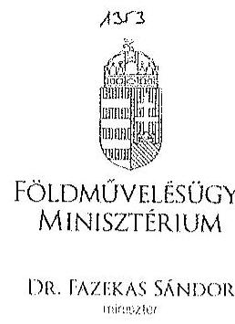
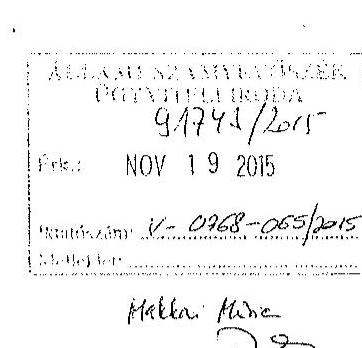

Iktatószám: IIPF/ 429215
/2015.
Ügyintéző: dr. Szabó Martina Dóra
Telefonszám: 896-2483
E-mail: dora.martina.szabo@fm.gov.hu
Hivatkozási szám: V-0768-056/2015.
V-0769-073/2015.
V-0770-067/2015.

# Domokos László úr   elnök   részére 

## Állami Számvevőszék

Budapest
Apáczai Csere János u. 10.
1052
Tárgy: Az Állami Számvevőszék V-0768-056/2015., V-0769-073/2015., valamint V-0770-067/2015. iktatószámú jelentéstervezeteinek véleményezése

## Tisztelt Elnök Úr!

Hivatkozással a V-0768-056/2015. iktatószámú „Az állami tulajdonban álló erdőgazdasági társaságok vagyongazdálkodási tevékenységének ellenőrzése - VERGA Veszprémi Erdőgazdaság Zrt." tárgyú, a V-0769-073/2015. iktatószámú „Az állami tulajdonban álló erdőgazdasági társaságok vagyongazdálkodási tevékenységének ellenőrzése - Budapesti Erdőgazdaság Zrt." tárgyú, valamint a V-0770-067/2015. iktatószámú „Az állami tulajdonban álló erdőgazdasági társaságok vagyongazdálkodási tevékenységének ellenőrzése - KASZÓ Erdőgazdaság Zrt." tárgyú ügyiratukra, az Állami Számvevőszékről szóló 2011. évi LXVI. törvény 29. § (2) bekezdése alapján az alábbi észrevételeket teszem.

A VERGA Veszprémi Erdőgazdaság Zrt. (a továbbiakban: Társaság) tekintetében a számvevőszéki jelentéstervezet észrevételezi, hogy a Társaság a tulajdonosi joggyakorló döntése alapján 2015. áprilisában új könyvvizsgálót bízott meg a 2014. évi beszámoló hitelesítésével, amivel megsértette a számvitelről szóló 2000. évi C. törvény (a továbbiakban: Szt.) 155. § (6) bekezdésében foglaltakat, miszerint az üzleti évről

---

elkészített éves beszámoló felülvizsgálatára könyvvizsgálót az előző üzleti év éves beszámolójának elfogadásakor kell megválasztani.

Az Szt. 155/A. § (1) bekezdése szerint „a 155. § (6) bekezdése szerinti könyvvizsgáló vagy könyvvizsgáló cég megbízása csak megfelelő indok alapján mondható fel". A számviteli törvény tehát lehetőséget ad a megbízási szerződés felmondására, a Társaságnál a könyvvizsgáló visszahívását indokolttá tevő események pedig megfeleltethetőek a jogszabályhelyben utalt megfelelő indok kritériumának. Ezzel összhangban a Társaság Alapszabálya is rögzíti a könyvvizsgáló visszahívásának lehetőségét, mely döntés a kizárólagos jogkörömbe tartozik.

A KASZÓ Zrt., a VERGA Veszprémi Erdőgazdaság Zrt., valamint a Budapesti Erdőgazdaság Zrt. tekintetében a számvevőszéki jelentéstervezet megállapításaira vonatkozóan az alábbiakat kívánom megjegyezni.

Mindhárom jelentéstervezet leírja, hogy a társaságok a közérdekű adatok megismerésére irányuló igények teljesítésének rendjét nem szabályozták.

A vizsgált társaságok 2015. augusztus 31-ig honlapjaikat felülvizsgálták és - az információs önrendelkezési jogról és az információszabadságról szóló 2011. évi CXII. törvény, valamint a köztulajdonban álló gazdasági társaságok takarékosabb működéséről szóló 2009. évi CXXII. törvény alkalmazandó előírásainak megfelelően - hiányosságaikat pótolták. A közérdekű adatok megismerésének rendjére irányuló szabályzat elkészítése folyamatban van a társaságoknál.

Mindhárom jelentéstervezet tartalmazza, hogy a földművelésügyi minisztérium tulajdonosi ellenőrzési szabályzattal nem rendelkezett a vizsgált időszakban, ellenőrzést nem végzett a társaságok vagyonváltozást eredményező döntéseire vonatkozóan.

Tekintettel arra, hogy a társaságok gazdasági társaságként (zrt.) működnek, a társaságoknál ügydöntő felügyelőbizottság működik, mely a Polgári Törvénykönyvről szóló 2013. évi V. törvényben rögzítetteknek, illetőleg a társaságok Alapszabályában foglaltaknak megfelelően ellátja a társaságok ellenőrzését.

A társaságok tulajdonosi ellenőrzése tehát a Ptk. rendelkezéseivel összhangban a felügyelőbizottságon keresztül valósul meg. A felügyelőbizottság ügyrendje pedig szabályozza, miszerint „A felügyelőbizottság határozatát és a felügyelőbizottsági ülésről készült jegyzőkönyvet az írásba foglalást követően, az üléstől számított 10 napon belül a Társaság ügyvezetése megküldi a Tulajdonosi Joggyakorlónak." A jegyzőkönyv, illetőleg a felügyelőbizottság határozatainak részemre történő megküldésével tudomásom van a felügyelőbizottság ellenőrzési tevékenységéről és döntéseiről.

A jelentéstervezetek mindhárom társaság tekintetében megállapítják, hogy a társaságok gazdálkodásuk során betartották a nemzeti vagyonról szóló 2011. évi CXCVI. törvényben előírt vagyongazdálkodási alapelveket, vagyont nem idegenítettek el, illetve arra jelzálogjogot, haszonélvezeti jogot nem alapítottak, erdő használatát, hasznosítá-

---

sát harmadik fél számára nem engedték át, a vagyonnal felelős módon, rendeltetésszerűen gazdálkodtak, a saját és a használatba kapott vagyon állagának megóvásával, karbantartásával és a vagyon gyarapításával kapcsolatos feladataikat elvégezték.

Kérem észrevételeim szíves tudomásul vételét.
Budapest, 2015. november 30.
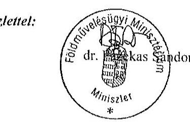

---

.

---

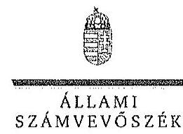

E180K

Ikt.szám: V-0768-068/2015.

Dr. Fazekas Sándor úr
miniszter
Földművelésügyi Minisztérium

Budapest

Tisztelt Miniszter Úr!
„Az állami tulajdonban álló erdőgazdasági társaságok vagyongazdálkodási tevékenységének ellenőrzése" című ellenőrzés tekintetében a Budapesti Erdőgazdaság Zrt., KASZÓ Erdőgazdaság Zrt. és VERGA Veszprémi Erdőgazdaság Zrt. társaságokra vonatkozó számvevőszéki jelentéstervezetekre tett észrevételeit köszönettel megkaptam.

Az Állami Számvevőszék észrevételekre vonatkozó álláspontjáról a felügyeleti vezető által készített részletes tájékoztatást csatoltan megküldöm.

Tájékoztatom Miniszter urat, hogy a számvevőszéki jelentésben - az Állami Számvevőszékről szóló 2011. évi LXVI. törvény 29. § (3) bekezdése alapján - a figyelembe nem vett észrevételeket szerepeltetjük az elutasítás indokának feltüntetésével.

Budapest, 2015.
hó 30. nap
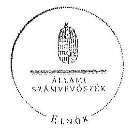

Tisztelettel:

Domokos László

Melléklet: Tájékoztatás az elfogadott és el nem fogadott észrevételekről

---

# Tájékoztatás 

az elfogadott és el nem fogadott észrevételekről
„Az állami tulajdonban álló erdőgazdasági társaságok vagyongazdálkodási tevékenységének ellenőrzése" című ellenőrzés tekintetében a Budapesti Erdőgazdaság Zrt., KASZÓ Erdőgazdaság Zrt. és VERGA Veszprémi Erdőgazdaság Zrt. társaságok jelentéstervezetére 2015. november 19-én érkezett észrevételeit áttekintettük, azok kezelésével kapcsolatban a következő tájékoztatást adom.

1. A Budapesti Erdőgazdaság Zrt., a KASZÓ Erdőgazdaság Zrt. és a VERGA Veszprémi Erdőgazdaság Zrt. jelentéstervezetére tett általános észrevételek
a) Közérdekű adatok megismerésének rendje

A közérdekű adatok megismerésére irányuló igények teljesítésének rendje elkészítésére, valamint a honlapokon közzétett információk felülvizsgálatára vonatkozó tájékoztatást köszönjük. Az intézkedések az ellenőrzött időszakot nem érintik, ezért a jelentéstervezetek megállapításainak módosítása nem indokolt.
b) A Földművelésügyi Minisztérium tulajdonosi ellenőrzési szabályzata és a vagyonváltozást eredményező döntések ellenőrzése

A Társaságok tulajdonosi ellenőrzése - a jogszabályok előírásai alapján (Ptk., Nvtv.) - a felügyelő bizottság működésével, a tulajdonosi joggyakorló folyamatba épített, illetve egyedi ellenőrzésein keresztül valósul meg. Az észrevétel a jelentéstervezet megállapítását nem cáfolja, ezért annak módosítása nem indokolt.
2. A VERGA Veszprémi Erdőgazdaság Zrt. jelentéstervezetére tett észrevétel

A dokumentumok ismételt áttekintését követően a jelentéstervezet 27. oldal 4. bekezdés második mondatát az alábbiak szerint pontosítjuk:
„A Társaság a Tulajdonosi joggyakorló döntése alapján 2015. áprilisában új könyvvizsgálót bízott meg a 2014. évi beszámoló hitelesítésével."

Budapest, 2015. november 30. nap

Makkai Mária
felügyeleti vezető

---

# MFB

**Domokos László úr**

**elnök részére**

**Állami Számvevőszék**

**Budapest**

**Tisztelt Elnök Úr!**

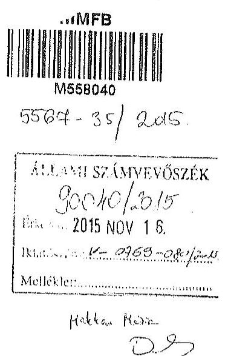

2015. október 30-án köszönettel kézhez vettük az Állami Számvevőszék „Az állami tulajdonban álló erdőgazdasági társaságok vagyongazdálkodási tevékenységének ellenőrzéséről” szóló jelentéstervezeteket az alábbi cégekre:

- **Budapesti Erdőgazdaság Zrt.** (Ikt.szám: V-0769-070/2015.)
- **KASZÓ Erdőgazdaság Zrt.** (Ikt.szám: V-0770-064/2015.)
- **VERGA Veszprémi Erdőgazdaság Zrt.** (Ikt.szám: V-0768-053/2015.)

Az MFB Zrt. a jelentéstervezetekkel kapcsolatban nem kíván észrevételt tenni.

Budapest, 2015. november 12.

Tisztelettel:

Nagy Csaba
vezérigazgató

Kovács Zsolt
vezérigazgatóhelyettes
