# ÁLLAMI   SZÁMVEVŐSZÉK 

## JELENTÉS

az önkormányzatok pénzügyi és vagyongazdálkodása szabályszerűségének ellenőrzéséről

Pécel

---

# Állami Számvevőszék 

Iktatószám: V-0650-209/2015.
Témaszám: 17
Vizsgálat-azonosító szám: V069102

## Az ellenőrzést felügyelte:

## Renkó Zsuzsanna

felügyeleti vezető
Az ellenőrzés végrehajtásáért felelős és az ellenőrzést vezette:
Mohl Anna
ellenőrzésvezető
A számvevőszéki jelentés összeállításában közremúködött:
dr. Mezei Imréné
számvevő főtanácsos
Szudi Ferencné
számvevő vezető főtanácsos
Az ellenőrzést végezték:
Berg Zoltán László
számvevő főtanácsos
Papp Sándor
számvevő főtanácsos
Trenovszki István
számvevő tanácsos
dr. Lajos Béla
számvevő főtanácsos
Somlai Gábor
számvevő tanácsos

---

# TARTALOMJEGYZÉK 

BEVEZETÉS ..... 3
I. ÖSSZEGZŐ MEGÁLLAPÍTÁSOK, KÖVETKEZTETÉSEK, JAVASLATOK ..... 6
II. RÉSZLETES MEGÁLLAPÍTÁSOK ..... 13

1. Az erőforrásokkal való szabályszerű és hatékony gazdálkodás követelményeinek kialakítása, számonkérése, ellenőrzése ..... 13
1.1. Az előirányzatokkal, a létszámmal, a vagyonnal való gazdálkodás szabályainak, követelményeinek kialakítása ..... 13
1.2. Az erőforrásokkal való szabályszerű, hatékony gazdálkodás követelményeinek számonkérése, ellenőrzése ..... 14
2. A pénzügyi gazdálkodás szabályszerűsége, a pénzügyi egyensúly biztosítottsága ..... 14
2.1. A költségvetési tervezés, az éves költségvetési beszámolás szabályossága ..... 14
2.2. Az Önkormányzat fizetőképességének folyamatos fenntartása, a pénzügyi egyensúly biztosítása ..... 15
3. A vagyongazdálkodási tevékenység szabályossága ..... 20
3.1. A vagyongazdálkodási tevékenység kereteinek kialakítása ..... 20
3.2. A vagyonnyilvántartás szabályossága ..... 21
3.3. A vagyon leltározása ..... 22
3.4. A vagyonváltozásokat eredményező döntések szabályszerűsége ..... 24
3.5. Az önkormányzati tulajdonosi jog gyakorlása ..... 27
4. Integritás érvényesülése ..... 28

## MELLÉKLETEK

1. számú Pécel Város Önkormányzata feladatellátásában részt vevő intézmények és azok változása a 2011-2013. években
2. számú Pécel Város Önkormányzata bevételei, kiadásai valamint adósságszolgálata 2011, 2013. években
3. számú Összefoglaló a rendelkezésre álló ellenőrzési dokumentumok alapján nem értékelhető területekről
4. számú Pécel Város Önkormányzata polgármesterének a jelentéstervezet megállapításaira tett észrevétele
5. számú Az ÁSZ válasza Pécel Város Önkormányzata polgármesterének a jelentéstervezet megállapításaira tett észrevételére

---

# FÜGGELÉKEK 

1. számú Fogalomtár
2. számú Rövidítések jegyzéke

---

# JELENTÉS 

## az önkormányzatok pénzügyi és vagyongazdálkodása szabályszerűségének ellenőrzéséről Pécel

## BEVEZETÉS

Az ÁSZ stratégiai célkitűzése, hogy ellenőrzéseivel mind jobban segítse az átláthatóságot, az elszámoltathatóságot és elszámoltatást a közpénzekkel és a közvagyonnal való gazdálkodásban. Magyarország Alaptörvénye rögzíti, hogy az állam és a helyi önkormányzat tulajdona a nemzeti vagyon része. Az önkormányzati vagyon alapvető funkciója, hogy a közérdeket és egyúttal az önkormányzati célok - elsősorban a kötelezően ellátandó feladatok, és emellett a lehetőségek mértékéig az önként vállalt feladatok - megvalósítását szolgálja.

Az államháztartás önkormányzati alrendszerének közpénz felhasználása, az önkormányzatok által ellátott közfeladatok és önként vállalt feladatok sokrétűsége, valamint a feladatellátásához rendelt vagyon nagyságrendje indokolja, hogy az ÁSZ ellenőrzéseket folytasson a pénzügyi és vagyongazdálkodás területén. Az ÁSZ az önkormányzatok ellenőrzését a pénzügyi helyzet megítélésével indította el 2011-ben és a nagy vagyonnal rendelkező, magas kockázatú önkormányzatok esetében a vagyongazdálkodás ellenőrzésével folytatta. Az elmúlt három év ellenőrzéseinek tapasztalatai megmutatták, hogy indokolt az egyrészt elemző, értékelő, a pénzügyi helyzet kockázatát is minősítő, másrészt a pénzügyi és vagyongazdálkodási tevékenység szabályszerűségét komplexen értékelő ÁSZ ellenőrzések folytatása.

Az ellenőrzés célja annak megállapítása volt, hogy kialakított-e az Önkormányzat az erőforrásokkal való szabályszerű és hatékony gazdálkodáshoz szükséges követelményeket, megvalósította-e azok számon kérését, ellenőrzését; az Önkormányzat pénzügyi és vagyoni helyzetének, a gazdálkodás szabályosságának megítélése a költségvetési tervezés, a pénzügyi egyensúly megteremtése, az éves költségvetési beszámolás, a vagyongazdálkodás, a vagyon számbavétele, és a gazdasági események elszámolása és a pénzgazdálkodás szabályszerűsége alapján.

Ennek keretében értékeltük, hogy az Önkormányzat:

- pénzügyi gazdálkodása megfelelt-e a jogszabályokban és a belső szabályzataiban meghatározottaknak, biztosított volt-e a pénzügyi egyensúly;
- biztosította-e a vagyongazdálkodás szabályszerűségét, a vagyonváltozást eredményező döntéseket szabályszerűen hajtotta-e végre, gondoskodott-e a tulajdonosi jogok gyakorlásáról;

---

- a gazdálkodása során biztosította-e az átláthatóság és az integritás érvényesülését.

Az ellenőrzés várható hasznosulása: az ellenőrzés várhatóan hozzájárul az önkormányzatok pénzügyi helyzetének pontosabb megítéléséhez azáltal, hogy a pénzügyi és vagyoni helyzetet együtt értékeli. Bemutatja az adósságkonszolidáció önkormányzat általi végrehajtásának szabályszerűségét. Feltárja az önkormányzati gazdálkodást meghatározó szabályozások összhangjának esetleges hiányosságait, a szabályozással nem érintett gazdálkodási területeket, és a vagyongazdálkodási tevékenység gyakorlásának szabálytalanságait. A jó gyakorlat kialakításán és terjesztésén keresztül az ellenőrzések elősegíthetik az önkormányzati gazdálkodás szabályszerűségének javítását.

Az ellenőrzés típusa: szabályszerűségi ellenőrzés
Az ellenőrzött időszak: 2011. január 1-jétől 2013. december 31-ig. A pénzintézetekkel szembeni kötelezettségek állományának vizsgálatakor az ellenőrzött időszakban fennálló kötelezettségeket vettük figyelembe. A vagyonnyilvántartások egyezőségét, a leltározás, selejtezés folyamatát a 2013. évre vonatkozóan értékeltük.

# Ellenőrzött szervezet: Pécel Város Önkormányzata 

Az ellenőrzés végrehajtásának jogszabályi alapját az ÁSZ tv. 1. § (3) bekezdése, az 5. § (2)-(6) bekezdései, valamint az Áht. 2 61. § (2) bekezdésének előírásai képezik.

Az ellenőrzés szakmai módszertana az ÁSZ hivatalos honlapján közzétett szakmai szabályokon alapult, amely a Legfőbb Ellenőrző Intézmények Nemzetközi Szervezete (INTOSAI) által kiadott nemzetközi standardok (ISSAI) figyelembevételével készült.

Az alkalmazott egyes fogalmak magyarázatát az 1. számú függelék, a rövidítések jegyzékét a 2. számú függelék tartalmazza.

Az ellenőrzést az ÁSZ hatályos szervezeti szabályai és az ellenőrzési programban foglalt értékelési szempontok szerint folytattuk le. Megállapításainkat a helyszíni ellenőrzés tapasztalataira, az ellenőrzött szervezettől bekért dokumentumokra, a kitöltött tanúsítványok elemzésére, az adott időszakban hatályos jogszabályok és belső szabályzatok előírásaira alapoztuk. Az Önkormányzat vagyonváltozását eredményező döntések és azok végrehajtásának ellenőrzése, szabályszerűségének megítélése kockázatalapú mintavételen, valamint tételes ellenőrzésen keresztül történt. Kockázatalapú mintavétel alapján (évente a legnagyobb értékű 2-4 tétel került kiválasztásra) ellenőriztük a beruházásokat, felújításokat, a vagyonhasznosítást és a követelések elengedését, valamint tételesen ellenőriztük a vagyon használatra és üzemeltetésre történő átadását.

Pécel város lakosainak száma 2013. január 1-jén 15531 fő volt. A 11 tagú Kép-viselő-testület munkáját négy állandó bizottság segítette. A polgármester a 2010. évi önkormányzati választás óta tölti be tisztségét. A jegyzők 2008. december 1től 2011. augusztus 15 -ig, majd 2011. szeptember 21-től 2013. április 30-ig, és végül 2013. május 1-től látták el a feladataikat. A jegyzőt helyettesítő aljegyző

---

2011. február 1-től 2013. március 31-ig töltötte be tisztségét. A Polgármesteri hivatal hat szervezeti egységre tagolódott. A pénzügyi-gazdálkodási feladatokat a Pénzügyi Iroda és az irodán belül múködő Adócsoport látták el. A foglalkoztatott köztisztviselők száma 2013. december 31-én 39 fő volt.

Az Önkormányzat a 2013. évben az önállóan múködő és gazdálkodó Polgármesteri hivatalon kívül négy önállóan működő költségvetési szervvel, egy kizárólagos tulajdonában álló gazdasági társasággal (Pécel Vízmú Kft.), valamint szolgáltatási megbízási szerződésekkel látta el a feladatát.

A feladatellátásban részt vevő intézmények körében változások történtek. 2011. augusztus 1-jén a Szemere Pál Általános Iskolát, valamint a Petőfi Sándor Általános Iskolát és a Ráday Pál Gimnáziumot egy önállóan működő intézmény irányítása alá helyezték. Az összeolvadt intézmények jogutódjaként a PIOK 2013ban került állami fenntartásba a Városi Zeneiskola Alapfokú Művészetoktatási Intézménnyel együtt. 2011. évben a korábban két önálló költségvetési szervként múködő Lázár Ervin Városi Könyvtárat és a Szemere Pál Múvelődési Házat egy önállóan múködő költségvetési szervvé vonták össze. A Városi Egészségügyi Szolgálatot megszüntették, az egészségügyi alapellátással kapcsolatos feladatokat külső szolgáltató megbízásával látták el 2011. évtől. 2013. évben megszüntetésre került Pécel Város Központi Konyhája, a gyermek- és szociális étkeztetéssel kapcsolatos feladatokat szolgáltatás igénybevételével biztosították. 2013. évben új intézményként létrehozták Pécel Város Közterület felügyeletét. Az ellenőrzött időszakban az önkormányzati feladatellátásban részt vevő intézményeket és azok változását az 1. számú melléklet mutatja be.

Az Önkormányzat könyvviteli mérleg szerinti vagyona 2013. december 31-én 6746,0 millió Ft volt, amely 299,8 millió Ft-tal, 4,3 \%-kal csökkent az ellenőrzött időszakban. Az adósságállomány értéke 2011. január 1-jén 2881,5 millió Ft volt, az 1876,7 millió Ft összegű adósságkonszolidáció/átvállalás I. üteme eredményeként 1080,2 millió Ft-ra csökkent a 2013. év végére. Az adósságkonszolidáció II. ütemével a 2014. évben a 2013. év végén fennálló kötelezettségek megszűntek. A 2013. év végi egyéb, nem pénzintézetekkel szembeni kötelezettségek öszszege 256,0 millió Ft-ot tett ki. A 2013. év végi 135,9 millió Ft pénzmaradvány kötelezettséggel terhelt volt. Az Önkormányzat a 2013. évi költségvetési beszámolója szerint 1571,8 millió Ft költségvetési bevételt ért el és 1916,8 millió Ft költségvetési kiadást teljesített. A felhalmozási célú kiadások összege 2013-ban 332,4 millió Ft volt, melyből felújításokra és beruházásokra 305,1 millió Ft-ot fordítottak.

Az ÁSZ tv. 29. § (1) bekezdése szerint a jelentéstervezetet megküldtük a polgármester részére, aki az ÁSZ tv. 29. § (2) bekezdésében foglalt észrevételezési jogával élt, a jelentéstervezet megállapításaira észrevételt tett.

---

# I. ÖSSZEGZŐ MEGÁLLAPÍTÁSOK, KÖVETKEZTETÉSEK, JAVASLATOK 

A folyószámlahitel igénybevétele tartóssá vált, a szállítói állományon belül a lejárt esedékességű tartozások a 2011. évi 61,7 millió Ft-ról 184,3 millió Ft-ra növekedtek, arányuk a 2013-ban $81,2 \%$ volt. Az Önkormányzatnál a számviteli szabálytalanságok miatt a 2012. évi költségvetési beszámoló pénzforgalmi adatainak megbízhatósága, valódisága és teljessége nem volt biztosított. A 20112012. évi leltározás elmaradása, a 2013. évi leltár kiértékelése és az ingatlanvagyon kataszter földhivatali, illetve a vagyonkimutatásban nyilvántartott ingatlanok adataival való egyezőségének hiánya miatt a mérlegadatok teljessége és valódisága nem volt biztosított. A 2012. évi pénzügyi egyensúlyi helyzet és a vagyongazdálkodás szabályszerűsége egyes részterületeinek (vagyonnyilvántartás, vagyontárgyak leltározása és értékesítése) minősítéséhez rendelkezésre álló 2011-2013. évi ellenőrzési dokumentumok megítélésre alkalmatlanok voltak.

## Az ÁSZ ellenőrzés megállapításainak összegzése:

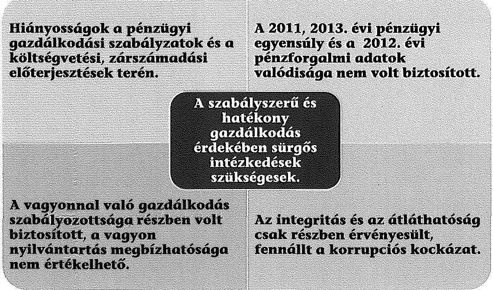

A gazdálkodási szabályok kialakítása részben felelt meg az előírásoknak, illetve nem határozták meg az erőforrásokkal való hatékony gazdálkodáshoz kapcsolódó követelményeket. A belső ellenőrzés vizsgálta az erőforrásokkal való gazdálkodást, azonban a hiányosságok megszüntetésére az ellenőrzések mintegy negyedénél nem készítették el az előírt intézkedési terveket az ellenőrzöttek.

A költségvetési koncepciók és rendelettervezetek, valamint a féléves és éves gazdálkodásról készült előterjesztések során részben tartották be az Ámr., Ávr., az Áht. ${ }_{1}$ és az Áht. ${ }_{2}$ vonatkozó rendelkezéseit a bizottsági véleményezés rendje és a határidők tekintetében.

---

A 2012. évi költségvetési beszámoló pénzforgalmi adatai a számviteli szabálytalanságok miatt nem nyújtottak megbízható, valós képet az Önkormányzat vagyoni pénzügyi helyzetéről, megsértve a Számv. tv.-t. A fizetőképesség fenntartásához állandósult folyószámlahitelt vettek igénybe, amely az adósságállomány újratermelődését eredményezheti. Az ellenőrzött időszakban az Önkormányzat hosszú lejáratú pénzintézeti kötelezettségei a 2007-2008. években kibocsátott kötvényekből származtak, melyek az adósságkonszolidáció II. ütemét követően megszűntek.

Az Önkormányzat az ellenőrzött időszakban végig rendelkezett 60 napon túli lejárt szállítói állománnyal. A polgármester a fennálló tartozásokról az ellenőrzött időszakban nem tájékoztatta a Pénzügyi bizottságot. Az Adósságrendezési tv.-ben foglaltak ellenére nem kezdeményezte a Képviselő-testület döntését a fizetési kötelezettségek rendezésére, az adósságrendezési eljárás megindítására. A pénzügyi egyensúlyt befolyásoló kockázatokat nem azonosították és nem elemezték, azok mérséklésére nem intézkedtek.

A vagyongazdálkodást érintően a 2011. és a 2012. évi költségvetési beszámolók mérlegadatainak leltárral való alátámasztására leltárak nem álltak rendelkezésére a jegyző nyilatkozata szerint, az adatszolgáltatás ellentmondásos volt. A 2013. évi leltár értékelésénél jelentős összegű hibának minősülő besorolási hibák kerültek feltárásra az ellenőrzés során. Nem biztosították a földhivatali, a vagyonkimutatás és az ingatlanvagyon kataszter egyezőségét, az ingatlanvagyon kataszter folyamatos vezetését. A vagyontárgyak értékesítésére vonatkozó adatszolgáltatás nem volt összhangban a 2011, 2013. évi költségvetési beszámolók pénzforgalmi adataival, illetve a 2012. évi pénzforgalmi adatok valódisága nem volt biztosított. Az Önkormányzat beszámolói nem adtak a Számv. tv.-ben előírtak szerint megbízható és valós összképet az Önkormányzat vagyonáról, annak összetételéről. Ez alapján a vagyongazdálkodás nyilvántartásának szabályossága, a 2011-2012. évi leltározás, a vagyontárgyak értékesítése, az eszközök és források 2013. évi értékelése, az eredményszemléletű számvitel bevezetéséhez kapcsolódó feladatok elvégzése tekintetében a megalapozott értékelés nem volt biztosított.

Az Önkormányzat a kizárólagos tulajdonában álló gazdasági társaságától nem követelte meg tulajdonosi jogköréből adódóan az alapító okiratban és a Képvi-selő-testület által hozott döntések szerinti beszámolási kötelezettség teljesítését. A gazdasági társaság pénzügyi, gazdálkodási és fizetőképességi helyzetéről, ezáltal nem rendelkeztek elegendő információval.

Az Önkormányzat gazdálkodása során maradéktalanul nem biztosította az átláthatóság és az integritás érvényesülését.

Az ÁSZ tv. 33. § (1) bekezdésében foglaltak értelmében az ellenőrzött szervezet vezetője köteles a jelentésben foglalt megállapításokhoz kapcsolódó intézkedési tervet összeállítani, és azt a jelentés kézhezvételétől számított harminc napon belül az ÁSZ részére megküldeni. Amennyiben az intézkedési tervet határidőn belül nem küldi meg a szervezet vezetője, vagy az továbbra sem elfogadható, az ÁSZ elnöke a hivatkozott törvény 33. § (3) bekezdés a-b) pontjaiban foglaltakat érvényesítheti.

---

# Az ellenőrzés intézkedést igénylő megállapításai és javaslatai: 

## a polgármesternek

1. Az Önkormányzat 2013. évi folyó költségvetésének hiánya - az adósságkonszolidáció és a működőképesség megőrzését szolgáló támogatás hatása nélkül 280,2 millió Ft volt. A müködési jövedelem ellenőrzött időszakon belüli 258,9 millió Ft-os csökkenése a müködési jövedelemtermelő képesség miatti kockázat fennállását jelzi. A müködési jövedelemtermelő képesség miatti kockázat kezelése érdekében intézkedések nem történtek. A fizetőképesség a 2011. és a 2013. években csak folyamatos folyószámlahitel igénybevétele mellett volt biztosítható. Emellett az Önkormányzat kizárólagos tulajdonában lévő gazdasági társaság lejárt szállítói állománya növekedést mutatott. A társaság az ellenőrzött időszak elején lejárt szállítói tartozással nem rendelkezett, a 2013. év végén azonban 14,0 millió Ft tartozásállományt mutattak ki, amelyből 10,7 millió Ft már éven túl lejárt fizetési kötelezettség volt.

Javaslat:
Terjessze a Képviselő-testület elé az Önkormányzat aktuális pénzügyi egyensúlyi helyzetének -ezen belül gazdasági társaságának gazdálkodási körülményei - elemzésén alapuló döntési javaslatát a müködési egyensúly megteremtését biztosító intézkedések bevezetéséről.
2. Az ellenőrzött időszakban az Önkormányzat a lejárt határidejű szállítói kötelezettségeinek év végi állománya a 2011. évi 61,7 millió Ft-ról 2013. év végére 184,3 millió Ftra emelkedett. A 2013. évben fennállt, nem teljesített szállítói kötelezettségből 90,5 millió Ft 90 napon túli tartozás volt. A polgármester az Adósságrendezési tv. 5. § (1) bekezdése ellenére haladéktalanul nem tájékoztatta a Pénzügyi bizottságot és nem hívta össze a Képviselő-testületet 8 napon belül annak érdekében, hogy tájékoztatást adjon az adósságrendezési eljárás kezdeményezésének lehetőségéről, mivel az elismert tartozásukat az esedékességet követő 60 napon belül nem fizették ki. A szállítói állomány 90 napon túli esedékességét követően az Adósságrendezési tv. 5. § (2) bekezdésében előírt kötelezettség ellenére a polgármester - a Képviselő-testület döntése hiányában - az előírt 8 napon belül adósságrendezési eljárást nem kezdeményezett. A lejárt esedékességű szállítói tartozások miatt az ellenőrzött időszakban az Önkormányzatnál fennállt a szállítói kitettség miatti kockázat.

Javaslat:
Intézkedjen a szállítói kitettség csökkentése, illetve az adósságrendezési eljárás megindításának elkerülése érdekében a lejárt esedékességű tartozások kezeléséről. A 60 napon túli lejárt esedékességű szállítói tartozás fennállása esetén a jogszabályban előírt kötelezettségének maradéktalanul tegyen eleget.
3. A költségvetési koncepciók tervezeteihez és a költségvetési rendelettervezetekhez a polgármester a 2011. évben az Ámr. 35. § (3) bekezdése valamint a 36. § (5) bekezdésében, és a 2012-2013. években az Ávr. 26. § (2) bekezdésében valamint a 27. § (2) bekezdésében foglaltak ellenére nem csatolta a Pénzügyi bizottság véleményét. A polgármester a költségvetési rendelettervezetet 2011-ben az Áht. 1 71. § (1) bekezdésében foglalt határidőt megsértve - február 15-ét követően február 17-én - nyújtotta be a Képviselő-testületnek.

---

A polgármester a gazdálkodás első félévi helyzetéről a 2011. évben az Áht. 79. § (1) bekezdését és 2012. évben az Áht. 87. § (1) bekezdését megsértve szeptember 15-e után (október 6-án, illetve szeptember 27-én) tájékoztatta a Képviselő-testületet. A 2013. évi zárszámadás tervezetét az Áht. 2 91. § (1) bekezdésében foglalt április 30-ai határidőt követően a 2014. május 30-ai Képviselő-testületi ülésre terjesztette be.

Javaslat:
A költségvetési és a zárszámadási rendelettervezetek Képviselő-testület elé történő terjesztése során tartsa be a jogszabályokban foglalt bizottsági véleményezés rendjére vonatkozó előírásokat és az előterjesztésre vonatkozó határidőket.
4. A 2013. évben az ingatlanvagyon-kataszter, valamint a földhivatali ingatlannyilvántartás adatainak a 147/1992. (XI. 6.) Korm. rendelet 1. § (2) bekezdése szerinti egyezőségét nem biztosították. A Vagyongazdálkodási rendelet 8. § (6) bekezdése szerint a jegyző köteles biztosítani a vagyonkimutatásban nyilvántartott ingatlanok adatainak az önkormányzati ingatlanok vagyonkataszterében szereplő adataival való egyezőséget. A rendelkezést nem tartották be, mivel az ingatlanvagyon kataszter összesítő adata nem egyezett meg, a 2013. évi zárszámadási rendelethez csatolt vagyonkimutatást alátámasztó számviteli nyilvántartások adataival, az eltérés 747,2 millió Ft volt. Az önkormányzati vagyonnyilvántartás (vagyonkataszter) folyamatos vezetéséért, az adatok hitelességéért az Mötv. 110. § (1) bekezdésében és a 147/1992. (XI. 6.) Korm. rendelet 1. § (1) bekezdésében foglaltak alapján a jegyző felelős.

Javaslat:
Intézkedjen a feltárt hiányosság és szabálytalanság tekintetében a munkajogi felelősség kivizsgálására irányuló eljárás megindítása iránt, és az eljárás eredményének ismeretében tegye meg a szükséges intézkedéseket.
5. Az Önkormányzatnál a 2011- 2013. évi költségvetési beszámoló pénzforgalmi és mérleg adatai, a Számv. tv. 4. § (2) bekezdését megsértve nem adtak megbízható és valós összképet az Önkormányzat vagyonáról, annak összetételéről (eszközeiről és forrásairól), pénzügyi helyzetéről és tevékenysége eredményéről. A könyvviteli mérleg leltárral való alátámasztásához a 2011-2012 évekre vonatkozó leltárak nem álltak rendelkezésre, ezáltal megsértették az Áhsz, 37. § (1) bekezdésének előírásait, valamint a Számv. tv. 15. § (2)-(3) bekezdéseinek a teljességre és a valódiságra vonatkozó alapelveit, figyelemmel az Áhsz. 3. §-ában, valamint a 9. § (2) bekezdésében foglaltakra. Az Önkormányzat 2013. évi összevont beszámolójának könyvviteli mérlege, az Áhsz. 37. § (4) bekezdésekben és a Leltározási szabályzat 2.7. pontjában foglalt előírások ellenére részben volt leltárral alátámasztott.

Javaslat:
Intézkedjen a feltárt hiányosságok és szabálytalanságok tekintetében a munkajogi felelősség tisztázására irányuló eljárás megindítása iránt, és az eljárás eredményének ismeretében tegye meg a szükséges intézkedéseket.

---

# a jegyzőnek 

1. Az Önkormányzatnál a költségvetési és zárszámadási rendeletek Képviselő-testület elé történő előterjesztési határidejének csúszása, illetve a rendelettervezetek véleményezésének elmaradása miatt hiányosságokat állapított meg az ellenőrzés:
a) a költségvetési koncepciók tervezeteihez és a költségvetési rendelettervezetekhez a polgármester a 2011. évben az Ámr. 35. § (3) bekezdése valamint a 36. § (5) bekezdésében, és a 2012-2013. években az Ávr. 26. § (2) bekezdésében valamint a 27. § (2) bekezdésében foglaltak ellenére nem csatolta a Pénzügyi bizottság véleményét. A polgármester a költségvetési rendelettervezetet 2011-ben az Áht. 71. § (1) bekezdésében foglalt határidőt megsértve - február 15-ét követően február 17-én - nyújtotta be a Képviselő-testületnek. A polgármester a gazdálkodás első félévi helyzetéről a 2011. évben az Áht. 79. § (1) bekezdését és 2012. évben az Áht. 2 87. § (1) bekezdését megsértve szeptember 15-e után (október 6-án, illetve szeptember 27-én) tájékoztatta a Képviselő-testületet. A 2013. évi zárszámadás tervezetét az Áht. 2 91. § (1) bekezdésében foglalt április 30-ai határidőt követően a 2014. május 30-ai Képviselő-testületi ülésre terjesztette be.

Javaslat:
Intézkedjen a költségvetési és a zárszámadási rendelettervezetek és a gazdálkodási helyzetről szóló tájékoztatók elkészítése során arról, hogy a Képviselő-testület elé történő beterjesztés a jogszabályokban foglalt bizottsági véleményezés rendjére vonatkozó előírásokkal és az előterjesztésre vonatkozó határidőkkel összhangban történjen.
2. A Polgármesteri Hivatal müködéséhez, gazdálkodásához kapcsolódó, pénzügyi kihatással bíró feladatok belső szabályzatokban való meghatározása részben felelt meg az előírásoknak. Az ellenőrzött időszakban az Ámr. 20. § (3) bekezdés d), és f) pontjaiban, valamint az Ávr. 13. § (2) bekezdés d) és e) pontjaiban előírtak ellenére belső szabályzatban a jegyző nem rendezte az anyag- és eszközgazdálkodás számviteli politikában nem szabályozott kérdéseit, és a reprezentációs kiadások felosztását, azok teljesítésének és elszámolásának szabályait.

Javaslat:
Intézkedjen a jogszabályi előírásoknak megfelelően az anyag- és eszközgazdálkodás számviteli politikában nem szabályozott kérdéseinek, valamint a reprezentációs kiadások felosztásának, azok teljesítésének és elszámolásának szabályozásáról.
3. A Polgármesteri Hivatalnál a 2011. évben az Ámr. 201. § (1) bekezdésében, a 2012ben az Áht. 2 78. § (2) bekezdésében, valamint az Ávr. 122. § (2) bekezdésében foglaltak ellenére nem készítettek likviditási tervet. A 2013. évi likviditási terv havonkénti felülvizsgálatára az Ávr. 122. § (3) bekezdésének előírása ellenére nem került sor.

Javaslat:
Intézkedjen, hogy a likviditási terv felülvizsgálatára a jogszabály előírásainak megfelelően havonta kerüljön sor.

---

4. A kockázatkezelési rendszerben a 2011. évben az Áht.1 121. § (2) bekezdés b) pontja, valamint az Ámr. 157. § (1)-(3) bekezdései, a 2013. évben a Bkr. 7. § (2) bekezdésében foglalt előírásai ellenére a tevékenységük során nem mérték fel és nem állapították meg a költségvetési szerv tevékenységében, gazdálkodásában rejlő kockázatokat, nem határoztak meg az egyes kockázatokkal kapcsolatban szükséges intézkedéseket, valamint azok teljesítésének folyamatos nyomon követésének módját. Annak ellenére nem történtek intézkedések, hogy fennállt a müködési jövedelemtermelő képesség, a banki kitettség, a fizetőképességi, a szállítói és a bevételi kitettség miatti kockázat.

Javaslat:
Működtessen a jogszabályi előírásoknak megfelelő, a pénzügyi egyensúlyt befolyásoló kockázatok kezelésére alkalmas kockázatkezelési rendszert.
5. Az Önkormányzat 2011. évi zárszámadásához nem csatoltak vagyonkimutatást, amellyel megsértették a Mötv. 110. § (2) bekezdése és az Áht. 2 91. § (2) bekezdés c) pontja előírásait. A 2012. évi vagyonkimutatásban nem alkalmazták az Áhsz. 1 44/A. § (2) bekezdésében előírt - 2012. január 1-jétől hatályos - a „nemzetgazdasági szempontból kiemelt jelentőségű vagyon" besorolási bontásban, valamint az Áhsz. 1 44/A. § (3) bekezdésében foglalt előírás ellenére nem tartalmazta a képzőművészeti alkotások nyilvántartott állományát. A Vagyongazdálkodási rendelet 5. § (5) bekezdésében előírt szerkezetet nem követték, eltérések voltak a főbb sorok megnevezése és tartalma között. A 2013. évi zárszámadási előterjesztésben a vagyonkimutatás szerkezetileg és tartalmilag nem felelt meg az Áhsz. 1 44/A. §-ában és a Vagyongazdálkodási rendelet 8. §-ában előírtaknak, mivel vagyonkimutatásként az Áhsz. 1 14. §-ában az államháztartás szervezetei könyvviteli mérlegének előírt tagolása szerinti mérleget mutatták be.

Javaslat:
Intézkedjen arról, hogy a vagyonkimutatás felejen meg a jogszabálynak, valamint a Vagyongazdálkodási rendeletben előírt szerkezeti tagolásnak.
6. A 2013. évben az ingatlanvagyon-kataszter, valamint a földhivatali ingatlannyilvántartás adatainak a 147/1992. (XI. 6.) Korm. rendelet 1. § (2) bekezdése szerinti egyezőség nem volt biztosított. A Vagyongazdálkodási rendelet 8. § (6) bekezdése szerint a jegyző köteles biztosítani a vagyonkimutatásban nyilvántartott ingatlanok adatainak az önkormányzati ingatlanok vagyonkataszterében szereplő adataival való egyezőséget. A rendelkezést nem tartották be, mivel az ingatlanvagyon kataszter összesítő adata nem egyezett meg, a 2013. évi zárszámadási rendelethez csatolt vagyonkimutatást alátámasztó számviteli nyilvántartások adataival, az eltérés 747,2 millió Ft volt. Ezzel megsértették az Mötv. 110. § (1) bekezdésében, a 147/1992. (XI. 6.) Korm. rendelet 1. § (1) bekezdésében, valamint a Vagyongazdálkodási rendeletben foglaltakat.

Javaslat:
Intézkedjen az ingatlanvagyon-kataszter jogszabályokban előírtaknak megfelelő vezetéséről.

---

7. A Polgármesteri Hivatalnál a 2011-2012. évek könyvviteli mérlegét leltárral nem támasztották alá. A 2013. évi összevont beszámoló könyvviteli mérlege az Áhsz., 37. § (4) bekezdésében és a Leltározási szabályzat 2.7 pontjában foglaltak ellenére részben volt leltárral alátámasztott, mert nem készült el a DPMV Zrt. által üzemeltetett eszközök leltára.

Javaslat:
Intézkedjen az éves beszámolók könyvviteli mérlegeiben kimutatott eszközök és források valódiságának december 31-i fordulónappal készült teljes körű, a jogszabályi előírásoknak megfelelő leltárral történő alátámasztásáról.
8. Az Önkormányzat 2012-ben két olyan üzemeltetési szerződést kötött (a DPMV Zrt.vel Pécel Város víz- és szennyvízelvezető rendszerének folyamatos üzemeltetésére, Péceli Vízmú Kft.-vel a városüzemeltetés feladatok ellátására), amelyekkel kapcsolatban az Önkormányzat közzétételi kötelezettségének nem tett eleget, ezzel megsértette az Info tv. 26. § (1) bekezdésében, 37. § (1) bekezdésében és az 1. melléklet III/4. pontjában foglaltakat.

Javaslat:
Intézkedjen arról, hogy az Önkormányzat jogszabályban elôit közzétételi kötelezettségének maradéktalanul tegyen eleget.

---

# II. RÉSZLETES MEGÁLLAPÍTÁSOK 

## 1. AZ ERŐFORRÁSOKKAL VALÓ SZABÁLYSZERŰ ÉS HATÉKONY GAZDÁLKODÁS KÖVETELMÉNYEINEK KIALAKÍTÁSA, SZÁMONKÉRÉSE, ELLENÖRZÉSE

### 1.1. Az előirányzatokkal, a létszámmal, a vagyonnal való gazdálkodás szabályainak, követelményeinek kialakítása

Az ellenőrzött időszakban az Önkormányzat, valamint a Polgármesteri hivatal rendelkezett a múködés részletes szabályait tartalmazó szervezeti és múködési szabályzatokkal. Az SZMSZ-ben, a Hivatali SZMSZ-ben valamint a Pénzügyi Iroda Úgyrendjében a szervezeti felépítésre, a feladatokra és a múködési folyamatokra vonatkozó szabályok összhangban voltak a jogszabályi előírásokkal. A pénzügyi gazdálkodásra vonatkozó szabályzási környezetet az Önkormányzat részben megfelelően alakította ki. A Polgármesteri hivatalban a 2011. január 1-je és 2011. augusztus 31. között hatályos Számviteli politika és a 2011. január 1-je és 2011. július 31. között hatályos Számlarend nem állt rendelkezésre ${ }^{1}$, ezáltal megsértették a számviteli bizonylatok megőrzésére vonatkozó Számv. tv. 169. § (2) bekezdését a 166. § (1) bekezdésére tekintettel. A Számviteli politikában a Számv. tv. 14. § (11) bekezdésében foglaltak ellenére törvénymódosítás esetén ${ }^{2}$ a változásokat annak hatálybalépését követő 90 napon belül nem vezették át 2012. január 1-je és 2013. április 1-je között.

Az Önkormányzat a múködéséhez, gazdálkodásához kapcsolódó, pénzügyi kihatással bíró feladatok belső szabályzatokban való meghatározása részben felelt meg az előírásoknak. Az anyag- és eszközgazdálkodás Számviteli politikában nem szabályozott kérdéseit, és a reprezentációs kiadások felosztását, azok teljesítésének és elszámolásának szabályait nem szabályozták 2011-ben az Ámr. 20. § (3) bekezdés d), és f) pontjai, valamint 2012-től az Ávr. 13. § (2) bekezdés d) és e) pontjaiban előírtak ellenére. A jegyző nem készítette el 2013. november 1-jéig a Polgármesteri hivatal ellenőrzési nyomvonalát a 2011. december 31-ig hatályos Ámr. 156. § (2) bekezdésében és a 2012. január 1-jétől hatályos Bkr. 6. § (3) bekezdésében foglaltak ellenére. Az Önkormányzat a belső ellenőrzések végzéséhez szükséges 2011. december 31-ig hatályos Ber. 5. § (1) bekezdésében, 2012. január 1-jétől a Bkr. 17. § (1) bekezdésében előírt belső ellenőrzési kézikönyvvel 2011. január 1-jétől 2013. január 1-jéig nem rendelkezett. A Kép-viselő-testület és a polgármester az Áht. ${ }_{2}$ 9. § eb) pontjában biztosított irányító szervi jogkörben a költségvetési szervek részére az erőforrásokkal való szabályszerű és hatékony gazdálkodáshoz szükséges szakmai, illetve gazdálkodási követelmények érvényesítésére, betartásának számonkérésére valamint ellenőrzésére nem határozott meg követelményeket. Az éves költségvetési koncepciókban vázolták fel a közfeladat ellátási és gazdálkodási célkitűzéseket, melyek

[^0]
[^0]:    ${ }^{1}$ A jegyző J/1/1/2015. január 5-én és a J/1/5/2015. január 7-én kiadott nyilatkozata szerint „a hatályos számviteli politikát, számlarendet nem tudjuk bemutatni".
    ${ }^{2}$ Az Áht. ${ }_{2}$, az Mötv, és az Ávr. 2012. január 1-jei hatálybalépését követően.

---

- általános jelleggel - a takarékos és biztonságos múködtetésre, a településen belüli intézményi koncentráció szakmai támogatására, a biztonságos gazdálkodás és a pénzügyi stabilitás feltételeinek megteremtésére, az elérhető bevételi források körének bővítésére, a tervezett bevételek teljes körű beszedésére irányultak.

# 1.2. Az erőforrásokkal való szabályszerű, hatékony gazdálkodás követelményeinek számonkérése, ellenőrzése 

A Képviselő-testület külön meghatározott követelmények hiánya ellenére foglalkozott az erőforrásokkal való szabályszerű, hatékony gazdálkodás érvényesülésével a tárgyévi költségvetések végrehajtásáról szóló beszámolók, illetve a következő évi költségvetések előkészítése során.

Belső ellenőrzések keretében sor került az erőforrásokkal való szabályszerű és hatékony gazdálkodás ellenőrzésére. A belső ellenőrzési feladatokat az ellenőrzött időszakban külső megbízás alapján látták el. Az éves ellenőrzésekre a Kép-viselő-testület által jóváhagyott kockázatelemzésen alapuló ellenőrzési tervek és a 2012-2016. évekre vonatkozó stratégiai ellenőrzési terv alapján került sor. Az éves összefoglaló ellenőrzési jelentéseket a zárszámadással egyidejűleg jóváhagyásra a Képviselő-testület elé terjesztette a polgármester a 2011. évben az Ötv. 92. § (10) bekezdésében és a 2013. évben a Bkr. 49. § (3a) bekezdésében foglaltaknak megfelelően. A Képviselő-testület az előterjesztéseket megtárgyalta és azokat határozattal elfogadta.

A belső ellenőrzések döntően az intézmények gazdálkodására és múködésére, a szabályzatok aktualizálására, a normatív állami támogatások elszámolására, a belső kontrollrendszer, a kötelezettségvállalások, az adóigazgatási rendszer, a korábbi ÁSZ ellenőrzés utóellenőrzésére irányultak, valamint a közbeszerzési, beszerzési tevékenységre, a pénzkezelésre és az ingatlanvagyon kataszter nyilvántartásának vezetésére vonatkoztak. A belső ellenőrzés az ellenőrzöttek részére 18 esetben írt elő intézkedési tervkészítési kötelezettséget. Az ellenőrzött szervezetek vezetői a 2011. évben a Ber. 29. § (1) bekezdésében, a 2012. évben a Bkr. 45. § (1) bekezdésében előírtak ellenére négy esetben nem készítettek intézkedési tervet.

## 2. A PÉNZÜGYI GAZDÁLKODÁS SZABÁLYSZERŰSÉGE, A PÉNZÜGYI EGYENSÚLY BIZTOSÍTOTTSÁGA

### 2.1. A költségvetési tervezés, az éves költségvetési beszámolás szabályossága

A költségvetési koncepciók és a költségvetési rendelettervezetek előterjesztése során részben tartották be a jogszabályi előírásokat. A költségvetés előkészítésének felelősségét a jegyző és a pénzügyi vezető munkaköri leírásai tartalmazták. A polgármester a költségvetési koncepciók tervezeteihez és a költségvetési rendelettervezetekhez 2011. évben az Ámr. 35. § (3) bekezdése, valamint a 36. § (5) bekezdésében, és a 2012-2013. években az Ávr. 26. § (2) bekezdésében, illetve a 27. § (2) bekezdésében foglaltak ellenére nem csatolta a Pénzügyi bizottság véleményét.

---

A Képviselő-testület által elfogadott költségvetési koncepciók tartalma az ellenőrzött években megfelelt a jogszabályi előírásoknak. A jegyző által összeállított éves költségvetési rendelettervezetet a polgármester 2011-ben az Áht. 1 71. § (1) bekezdését megsértve február 15-ét követően 17-én nyújtotta be a Képviselő-testületnek. A költségvetési rendelettervezetek az előírásoknak megfelelő szerkezetben és tartalommal készültek, az előterjesztésekhez szöveges indokolással együtt csatolták a tájékoztató mérlegeket és kimutatásokat. Az elemi költségvetéseket határidőre elkészítették, amelyek kiemelt előirányzat szinten megegyeztek a költségvetési rendeletekkel.

A bevételi és kiadási elöirányzatok módosítása, átvezetése a költségvetési rendeletekben megtörtént. A kiadási és bevételi előirányzatok teljesítése a 2011. és 2013. években megfelelt a jogszabályi előírásoknak. A költségvetési rendeletekben engedélyezett létszám 130 fővel ( $36,4 \%$-kal) 227,5 főre csökkent. A változásokat a járási hivatalok létrejötte, az oktatási rendszer átalakítása, valamint a közétkeztetés kiszervezése eredményezte. A létszámgazdálkodás során a Képvi-selő-testület által jóváhagyott létszámkeretet betartották.

A polgármester a gazdálkodás első félévi helyzetéről a 2011. évben az Áht. 79. § (1) bekezdését és 2012. évben az Áht. 2 87. § (1) bekezdését megsértve szeptember 15-e után (október 6-án, illetve szeptember 27-én) tájékoztatta a Képviselő-testületet. A három-negyedéves gazdálkodás helyzetéről a következő évi költségvetési koncepció előterjesztésekor a Képviselő-testület tájékoztatása megtörtént. A polgármester és a jegyző gondoskodtak a zárszámadás tervezetének elkészítéséről, és beterjesztéséről, azonban a 2013. évi tervezetet az Áht. 2 91. § (1) bekezdésében foglalt (a költségvetési évet követő negyedik hónap utolsó napjáig) április 30-ai határidőt követően a május 30-ai képviselő-testületi ülésre terjesztették be. A zárszámadási rendelettervezetek az elfogadott költségvetésekkel összehasonlítható módon, az év utolsó napján érvényes szervezeti és besorolási rendnek megfelelően készültek. A zárszámadások előterjesztésekor a Képviselő-testület részére szöveges indokolással együtt, a 2011. évi vagyonkimutatás kivételével csatolták és bemutatták az előírt tájékoztató mérlegeket és kimutatásokat.

# 2.2. Az Önkormányzat fizetőképességének folyamatos fenntartása, a pénzügyi egyensúly biztosítása 

A 2013. évben a 2012. évi gazdasági események ismételt könyvelésére került sor külső szolgáltató megbízásával, annak ellenére, hogy az Ávr. 9. § (3) bekezdése erre vonatkozóan nem biztosít lehetőséget. Az Ávr. 9. § (1) bekezdésére figyelemmel a Polgármesteri hivatalnak el kell látnia többek között a gazdálkodási, adatszolgáltatási és beszámolási feladatokat. A főkönyvi könyvelés helyreállítása a gazdasági események újbóli feldolgozását követően sem valósult meg teljes mértékben. A 2012. évi költségvetési kiadásoknak közel egyharmada (544,2 millió Ft) szerepelt a függő, átfutók kiadások között a költségvetési beszámolóban. A költségvetési beszámoló mérlegében kimutatott aktív függő és átfutó kiadások záró egyenlege 598,2 millió Ft volt, melyből a 2013. év során kivezetett összeg 571,1 millió Ft-ot tett ki.

---

Az Önkormányzat könyvvizsgálója a 2012. évi összevont egyszerúsített éves költségvetési beszámolóról korlátozott záradékot adott ki a számviteli nyilvántartásokat érintő hiányosságok miatt. Nem gondoskodtak minden esetben az analitikus nyilvántartások adatainak zárásáról és főkönyvi számlákra történő feladásáról, továbbá hiányosan támasztották alá hitelt érdemlő bizonylatokkal a könyvelt tételeket.

Az adatszolgáltatás keretében biztosított költségvetési beszámoló mérlegadatai alátámasztottságának hiánya miatt megsértették a Számv. tv. 165. § (1) bekezdését, mely szerint minden gazdasági műveletről, eseményről, amely az eszközök, illetve az eszközök forrásainak állományát vagy összetételét megváltoztatja, bizonylatot kell kiállítani és a bizonylat adatait könyvviteli nyilvántartásokban rögzíteni kell. Megsértették a Számv. tv. 15. § (2)-(3) bekezdéseinek a teljességre és a valódiságra vonatkozó alapelveit, figyelemmel az Áhsz. ${ }_{1}$ 3. §-ában, valamint a 9. § (2) bekezdésében foglaltakra. Nem tartották be az Áhsz. ${ }_{1}$ 49. § (1) bekezdését azáltal, hogy a könyvvezetés nem biztosította az előírt elemi költségvetési beszámoló készítését maradéktalanul, és nem támasztotta alá a beszámoló adatait a valóságnak megfelelően, áttekinthetően. A pénzforgalmi adatok rögzítését nem végezték el késedelem nélkül az Áhsz. ${ }_{1} 51 . \S$ (1) bekezdés a) pontjában előírtaknak megfelelően. A 2012. évi költségvetési beszámoló pénzforgalmi adatai a Számv. tv. 4. § (2) bekezdését megsértve nem adtak megbízható és valós összképet az Önkormányzat vagyonáról, annak összetételéről (eszközeiről és forrásairól), pénzügyi helyzetéről és tevékenysége eredményéről.

Az Önkormányzat 2012. évi pénzügyi egyensúlyi helyzetének megítélésére a rendelkezésre álló ellenőrzési dokumentumok alkalmatlanok voltak. Az ÁSZ ez alapján megalapozott véleményt nem tudott alkotni, a megbízhatóságot, valódiságot és teljességet érintő Számv. tv. alapelveit érintő jogszabálysértések miatt. A rendelkezésre álló ellenőrzési dokumentumok alapján nem értékelhető területeket a 3. számú melléklet mutatja be.

A pénzügyi helyzet elemzése során a 2013. évi valós jövedelemtermelő képesség bemutatása érdekében nem vettük figyelembe az adósságkonszolidációhoz kapcsolódó bevételeket és kiadásokat, amelyek kedvezően befolyásolták a működési jövedelmet. Az Önkormányzat 2013. évi beszámolója az átvállalt adósság rendezésére 48,1 millió Ft múködési költségvetési támogatást és ezzel megegyező hiteltörlesztést tartalmazott. Az Önkormányzat 2011. és 2013. évekre vonatkozó költségvetésének CLF módszerrel elemzett főbb adatait a jelentéstervezet 2. számú melléklete mutatja be. A CLF módszer szerinti - a 2013. évi adósságkonszolidációs támogatással és annak felhasználásával korrigált - 2011, 2013. évi főbb adatokat a következő táblázat mutatja be.

---

Az Önkormányzat pénzügyi egyensúlyi helyzetének fóbb adatai a 2011. és a 2013. években
millió Ft-ban

| Megnevezés | 2011. év | 2013. év |
| :--: | :--: | :--: |
| Folyó bevételek | 1764,2 | 1434,2 |
| Folyó kiadások | 1655,5 | 1584,4 |
| Folyó költségvetés egyenlege, múködési jövedelem | 108,7 | $-150,2$ |
| Folyó költségvetés egyenlege múködőképesség megőrzését szolgáló kiegészítő támogatások nélkül | 52,0 | $-280,2$ |
| Felhalmozási bevételek | 130,6 | 89,5 |
| Felhalmozási kiadások | 169,1 | 332,4 |
| Felhalmozási költségvetés egyenlege | $-38,5$ | $-242,9$ |
| Finanszírozási múveletek nélküli (GFS) pozíció | 70,2 | $-393,1$ |
| Hitelfelvétel, forgatási és befektetési célú értékpapír kibocsátása | 98,7 | 0,0 |
| Hiteltörlesztés, értékpapír beváltás | 0,0 | 77,3 |
| Egyéb finanszírozási műveletek | $-145,5$ | 401,7 |
| Finanszírozási műveletek egyenlege | $-46,8$ | 479,0 |
| Tárgyévi pénzügyi pozíció | 23,4 | 85,9 |
| Nettó múködési jövedelem | $-0,6$ | $-227,5$ |

A 2011. évben a folyó bevételek fedezetet nyújtottak a múködési kiadásokra, a keletkezett múködési jövedelem 108,7 millió Ft volt. A 2013. évben több körülmény együttes hatására a múködési jövedelem csökkent, 150,2 millió Ft hiány keletkezett. A 2011. évhez viszonyítva a költségvetési támogatások és az átengedett bevételek 577,1 millió Ft-tal, az egyéb bevételek 16,2 millió Ft-tal csökkentek. A bevételek kiesését nem tudta ellensúlyozni a saját bevételek 189,6 millió Ft-os és a kiegészítő támogatás 73,3 millió Ft-os emelkedése, valamint a folyó kiadások 71,1 millió Ft-os csökkenése. A 2013. évben annak ellenére nem volt biztosított a folyó költségvetés egyensúlya, hogy az Önkormányzat 130,0 millió Ft müködőképesség megőrzését szolgáló kiegészítő támogatásban részesült. A múködési jövedelem 258,9 millió Ft-os csökkenése a múködési jövedelemtermelő képesség miatti kockázat fennállását jelzi.

A felhalmozási költségvetésben a 2011. évben 38,5 millió Ft, a 2013. évben 242,9 millió Ft hiány keletkezett. A hiány finanszírozására 2011-ben lehetőséget nyújtott a múködési többlet, a 2013. évben az előző évi pénzmaradvány és a finanszírozási műveletek pozitív egyenlege.

---

A nettó múködési jövedelem 2011-ben 0,6 millió Ft, a 2013. évben 227,5 millió Ft hiányt mutatott. A negatív értékek pénzügyi kapacitáshiányt jeleztek, a működési jövedelem egyik évben sem biztosította az adósságszolgálat finanszírozását.

Az Önkormányzat a fizetőképességét a 2011. és a 2013. években csak folyamatos folyószámlahitel igénybevételével tudta biztosítani, amely miatt fennállt a banki kitettség miatti kockázat. Az igénybevett hitelek (folyószámla és likvid) nagyságrendjéről a szolgáltatott megítélésre alkalmatlan dokumentumok alapján az ÁSZ megalapozott véleményt nem tudott alkotni ${ }^{3}$.

Az Önkormányzatnak az ellenőrzött időszakban hosszú lejáratú pénzintézeti kötelezettsége a 2007. évben kibocsátott múködési célú „Pécel 2027 kötvényből" és a 2008. évi müködési és felhalmozási célú „Pécel 2028 kötvényböl" származott. Az Önkormányzat a 2013. évben a pénzügyi helyzetére tekintettel fizetési határidő módosítást és moratóriumot kezdeményezett a finanszírozó bankoknál. A pénzintézetek a konszolidációs megállapodásra tekintettel a szerződéses kötelezettségek teljesítését határozták meg. A moratórium kezdeményezése a fizetőképességi kockázat fennállását jelzi.

A jegyző a pénzügyi egyensúly biztosítása érdekében a bevételek beérkezésének és a kiadások teljesítésének ütemezéséről 2011. évre az Ámr. 201. § (1) bekezdésében, 2012. évre az Áht. 7 78. § (2) bekezdésében és az Ávr. 122. § (2) bekezdésében foglalt előírások ellenére nem készített likviditási tervet. A 2013. évi likviditási terv havonkénti felülvizsgálatára az Ávr. 122. § (3) bekezdésének előírása ellenére nem került sor.

Az Önkormányzat rövid lejáratú kötelezettségeinek állománya a 2011. év eleji 181,8 millió Ft-ról a 2013. év végére 1220,8 millió Ft-ra emelkedett. Ezt jelentős részben ( 964,8 millió Ft) a 2007-2008. években kibocsátott kötvények 2013. évi törlesztő részletének rövid lejáratú kötelezettségként történő elszámolása okozta. A lejárt határidejú szállítói kötelezettségek állománya 61,7 millió Ft-ról 184,3 millió Ft-ra emelkedett. A 2013. évben fennállt, nem teljesített szállítói kötelezettségből 90,5 millió Ft 90 napon túli tartozás volt. A polgármester az Adósságrendezési tv. 5. § (1) bekezdése ellenére haladéktalanul nem tájékoztatta a Pénzügyi bizottságot és nem hívta össze a Képviselő-testületet 8 napon belül annak érdekében, hogy tájékoztatást adjon adósságrendezési eljárás kezdeményezésének lehetőségéről, mivel az elismert tartozásukat az esedékességet követő 60 napon belül nem fizették ki. A szállítói állomány 90 napon túli esedékességét követően az Adósságrendezési tv. 5. § (2) bekezdésében előírt kötelezettsége ellenére a polgármester - a Képviselő-testület döntése hiányában - az esedékességet követő 8 napon belül adósságrendezési eljárást nem kezdeményezett. A lejárt esedékességű szállítói tartozások miatt az ellenőrzött időszakban az Önkormányzatnál fennállt a szállítói kitettség miatti kockázat.

[^0]
[^0]:    ${ }^{3}$ A folyószámlahitel átlagos állományát nem a meghatározott számítási módszernek megfelelően állapították meg, likvid hitel igénybevételére vonatkozóan az adatszolgáltatás nem állt összhangban az Önkormányzat által rendelkezésre bocsátott dokumentumokkal (költségvetési beszámolók, szerződések).

---

A kockázatkezelési rendszerben a 2011. évben az Áht.; 121. § (2) bekezdés b) pontja, valamint az Ámr. 157. § (1)-(3) bekezdései, a 2013. évben a Bkr. 7. § (2) bekezdésében foglalt előírásai ellenére a tevékenységük során nem mérték fel és nem állapították meg a tevékenységükben, a gazdálkodásukban rejlő kockázatokat, valamint nem határozták meg az egyes kockázatokkal kapcsolatban szükséges intézkedéseket, valamint azok teljesítésének folyamatos nyomon követésének módját. Annak ellenére nem történtek intézkedések, hogy fennállt a működési jövedelemtermelő képesség, a banki kitettség, a fizetőképességi, a szállítói és a bevételi kitettség miatti kockázat.

A múködőképesség megőrzéséhez a 2011. évben 56,7 millió Ft, a 2012. évben 42,9 millió Ft és 2013. évben 130,0 millió Ft támogatásban (ÖNHIKI, MÜKI) részesültek. A támogatások folyó bevételeken belüli részaránya a 2011. évi 3,2\%ról 2013. évre $9,1 \%$-ra növekedett. A 2012. és 2013. években kiegészítő támogatásokban is részesültek, 10,4 millió Ft összegű vis major, 22,3 millió Ft gyermekétkeztetési, továbbá a szerkezetátalakítási tartalék terhére 56,8 millió Ft összegben. A támogatások igénylése, illetve a múködtetés támogatással való finanszírozása bevételi kitettség miatti kockázatot jelez.

Az önkormányzat bevételeinek meghatározó tényezője volt a helyi adó. A saját múködési bevételeken belül a helyi adók részaránya a 2011. évben $68,2 \%$ ( 316,7 millió Ft), a 2013. évben $63,8 \%$ ( 417,3 millió Ft) volt. A településen az idegenforgalmi adón kívül minden, a törvényi felhatalmazás alapján kivethető adó bevezetésre került. Az adók mértéke nem érte el a törvényi maximumokat. Az egyes adóalanyok teherviselési részaránya nem volt egyenlőtlen, a helyi iparúzési adóból származó bevétel legalább 75\%-a háromnál több adóalanytól származott, így nem jelentett adóbevételi kitettség miatti kockázatot.

A kizárólagos önkormányzati tulajdonú gazdasági társaság (Pécel Vízmú Kft.) kötelezettségének állománya a 2011. évi 108,0 millió Ft-ról a 2013. év végére 74,0 millió Ft-ra csökkent. Ebben meghatározó volt a pénzintézeti, a lízingés a gazdasági társaságokkal kapcsolatos kötelezettségek megszűnése. Ugyanakkor a társaság szállítói tartozása 2013. év végén 14,0 millió Ft volt, melyből az éven túl lejárt fizetési kötelezettség 10,7 millió Ft-ot tett ki. Az ellenőrzött időszak elején lejárt szállítói kötelezettséggel nem rendelkeztek.

Az Önkormányzat 2013. évben érintett volt az adósságkonszolidációban. A 2012. december 31-én fennálló 2956,9 millió Ft összegű adósságállományból az I. ütemű konszolidáció keretében 1876,7 millió Ft (tőke és járulékai) került átvállalásra. Ebből a 2007-2008 években kibocsátott kötvények értéke 1828,6 millió Ft-ot, a folyószámlahitel 48,1 millió Ft-ot tett ki. A 2013. december 31-én fennálló kötelezettségek és azok járulékai ( 1080,2 millió Ft) a II. ütemű adósságkonszolidációval megszűntek a 2014. évben. Az Önkormányzat adatszolgáltatása szerint a Kincstár a jogszabályi előírások alapján végzett adategyeztetése során téves besorolás miatti jogosulatlan átvállalást nem állapított meg.

---

# 3. A VAGYONGAZDÁLKODÁSI TEVÉKENYSÉG SZABÁLYOSSÁGA 

### 3.1. A vagyongazdálkodási tevékenység kereteinek kialakítása

Az önkormányzat hiányosan határozta meg a vagyongazdálkodással kapcsolatos célkitűzéseit, a feladat- és hatásköröket a hatályos jogszabályi előírásoknak részben megfelelően szabályozta.

Az ellenőrzött időszakban az Önkormányzat 2011-2014. évekre - a választási ciklus időszakára - rendelkezett a Képviselő-testület 347/2011. (XII. 15.) számú határozatával elfogadott Gazdasági programmal. Az Ötv. 91. § (7) bekezdését megsértve az alakuló ülést követő hat hónapos határidő túllépésével (április 15-ét) követően, december 15 -én fogadták el a Gazdasági programot. A Gazdasági programban bemutatásra kerültek az ellátandó feladatok, a fejlesztési elképzelések, és azok megvalósításának lehetséges forrásai, az ezekhez kapcsolódó intézkedések. Az Önkormányzat rendelkezett 2014-2019. évekre szóló, középtávú Vagyongazdálkodási tervvel, melyet 2013. június 27 -én hagytak jóvá, ezáltal az Nvtv. 9. § (1) bekezdése és a 20. § (2) bekezdése előírását figyelembe véve a jóváhagyásig nem feleltek meg a jogszabályi követelményeknek. A középtávú Vagyongazdálkodási terv a vagyon rendeltetésének megfelelő, hatékony, költségtakarékos múködtetése, és értékének megőrzése érdekében konkrét célokat fogalmaz meg, a helyenként rendelkezésre álló kalkulációkon alapuló költségek feltüntetésével. Az Önkormányzat az Nvtv. 9. § (1) bekezdése szerinti hosszú távú vagyongazdálkodási tervet nem készített.

A Képviselő-testület a Vagyongazdálkodási rendeletben határozta meg az Önkormányzat vagyonával történő gazdálkodás szabályait, valamint meghatározta és aktualizálta az önkormányzati feladatellátást biztosító törzsvagyon körét, ezen belül elkülönítetten a forgalomképtelen és korlátozottan forgalomképes, valamint az üzleti (forgalomképes) vagyoni elemeket. A Képviselő-testület az Nvtv. előirása alapján meghatározta a forgalomképtelen törzsvagyon köréből a nemzetgazdasági szempontból kiemelt jelentőségűnek minősített vagyonelemek körét, azonban a szabályozásra az Nvtv. 18. § (1) bekezdésében rögzített, a törvény kihirdetését követő 60 napot (2012. március 1-jéig) követően március 12én került sor. Az Önkormányzat rendelkezett a vagyon térítésmentes átadás-átvételének, valamint a követelésekről való lemondás eseteiről, módjáról és eljárási szabályairól, valamint meghatározta a kapcsolódó döntési hatásköröket a vonatkozó jogszabályi előírásoknak megfelelően.

A Vagyongazdálkodási rendeletben foglaltak szerint a vagyonnal való rendelkezési, döntési hatásköröket a Képviselő-testület, valamint átruházott hatáskörben a polgármester gyakorolta. A Vagyongazdálkodási rendelet 2013. évi szabályozását megelőzően a polgármester döntött az 1,0 millió Ft egyedi értékhatárt el nem érő forgalomképes vagyontárgy megszerzéséről, elidegenítéséről, egy évet meg nem haladó bérbe- illetve használatba adásáról, valamint 1,0 millió Ft értékhatárig az Önkormányzat tulajdonában álló, tagsági jogot megtestesítő értékpapírok eladásáról. Az értékhatárok a 2013. évi szabályozást követően 2,0 millió Ft-ra emelkedtek. A 2013. május 15 -től hatályos Vagyongazdálkodási rendeletben ezen túl a tulajdonosi jogok és kötelezettségek gyakorlására vonatkozóan szerződések kötésére, felbontására, megszüntetésére határozott meg a

---

Képviselő-testület átruházott hatásköröket a polgármester számára, melyekről évente a féléves és éves beszámolók keretében írt elő beszámolási kötelezettséget.

A Vagyongazdálkodási rendeletében a vagyon értékesítésére, kezelésbe adására, használati jogának átadására meghatározott értékhatár felett versenyeztetési kötelezettséget írtak elő. Az ellenőrzött időszakban a vagyongazdálkodásra vonatkozóan rendelkezésre álló belső szabályzatok ${ }^{4}$ a jogszabályi követelményeknek megfeleltek. Az Önkormányzat nem élt az eszközök és források piaci értékelésének és a kétévenkénti leltározásának lehetőségével, azokat évente kellett leltározni a szabályozás szerint. A vagyongazdálkodási tevékenységet érintő közérdekű információk nyilvánosságra hozatalának módját a Közzétételi szabályzatban és az SZMSZ-ben írták elő.

# 3.2. A vagyonnyilvántartás szabályossága 

Az Önkormányzat 2012. évi költségvetési beszámolója „Mérleg" űrlapjának nyitó állománya ( 9084,0 millió Ft) nem egyezett meg a 2011. évi költségvetési beszámoló záró állományával ( 7062,4 millió Ft), ezáltal megsértették a Számv. tv. 15. § (6) bekezdésében előírt folytonosság elvét figyelemmel az Áhsz.; 3. §ára, valamint a 9. § (11) bekezdésére.

A jegyző nyilatkozata alapján „mennyiségi (fizikális) leltározásra vonatkozó dokumentumot nem lelt fel az Önkormányzat 2013. elötti időszakra. 2011-ben és 2012-ben leltározásra és azok kiértékelés-eltérések számviteli rendezésére vonatkozó intézkedések nem történtek." Az Önkormányzat a könyvviteli mérlegben kimutatott eszközök és források minden évben történő leltározására vonatkozó Áhsz., 37. § 1) bekezdésének előírását nem tartotta be.

Az Önkormányzat könyvvizsgálója a 2011. évi egyszerűsített összevont éves beszámolót korlátozott záradékkal látta el. A könyvvizsgáló megállapította, hogy a tárgyi eszközök mérlegértéke hitelesen nem alátámasztott, a nagy értékủ eszközöknél a leltározások hiánya illetve az ingatlanvagyon kataszterrel valóegyezőségének hiánya miatt. Az üzemeltetésre átadott eszközök mérlegértéke sem volt megfelelően alátámasztott, mivel a Pécel Vízmú Kft. „részéről nem történt semmilyen adatszolgáltatás".

A 2013. évi mérleg nyitó adatainak, a valóságnak nem megfelelő - a 2012. évi mérleg záró adatainak nem megbízható és valós, értékelésre alkalmatlan adataiból adódóan - továbbá a 2012. évi számviteli hiányosságok rendezésére vonatkozó dokumentumok hiányában a 2013. évi mérlegadatok megítélésre alkalmatlanok. Ezáltal megsértették a Számv. tv. 4. § (2) bekezdését, mert a 20112013. évi költségvetési beszámolók nem adtak megbízható és valós összképet az Önkormányzat vagyonáról, annak összetételéről (eszközeiről és forrásairól), továbbá megsértették a Számv. tv. 15. § (2)-(3) bekezdéseinek a teljességre és a valódiságra vonatkozó alapelveit is, figyelemmel az Áhsz.; 3. §ában, valamint a 9. § (2) bekezdésében foglaltakra. A rendelkezésre álló meg-

[^0]
[^0]:    ${ }^{4}$ A 2011. szeptember 1-jétől hatályos Számviteli politika, valamint a Leltározási szabályzat, az Értékelési szabályzat, a Selejtezési szabályzat és a Beszerzési szabályzat.

---

ítélésre alkalmatlan dokumentumok alapján az ÁSZ megalapozott véleményt nem tudott alkotni a 2011-2013. évi vagyonnyilvántartás szabályszerűségéről.

Az Önkormányzat 2011. évi zárszámadásához nem csatoltak vagyonkimutatást, amellyel az Önkormányzat megsértette az Mötv. 110. § (2) bekezdése és az Áht. 3 91. § (2) bekezdés c) pontja előírásait. A 2012. évi vagyonkimutatás tartalma és szerkezete nem felelt meg teljes körüen az Áhsz. ${ }_{1} 44 /$ A. § és a vagyongazdálkodási rendelet 5. § (5) bekezdésében foglalt előírásoknak. A vagyonkimutatásban nem alkalmazták az Áhsz. 1 44/A. § (2) bekezdésében ${ }^{5}$ előírt a „nemzetgazdasági szempontból kiemelt jelentőségü vagyon" besorolási kategóriákat. A vagyonkimutatás az Áhsz. ${ }_{1} 44 /$ A. § (3) bekezdésébe foglalt előírása ellenére nem tartalmazta a képzőművészeti alkotások nyilvántartott állományát. A Vagyongazdálkodási rendelet 5. § (5) bekezdésében előírt szerkezetet nem követték, eltérések voltak a főbb sorok megnevezése és tartalma között. A 2013. évi zárszámadási előterjesztésben a vagyonkimutatás szerkezetileg és tartalmilag nem felelt meg az Áhsz. ${ }_{1} 44 /$ A. §-ában és a Vagyongazdálkodási rendelet 8. §-ában előírtaknak, mivel vagyonkimutatásként az Áhsz. ${ }_{1} 14 . \S$-a szerint az államháztartás szervezetei könyvviteli mérlegének előírt tagolása szerinti mérlegben került bemutatásra a vagyon.

Az Önkormányzat nem biztosította a 2013. évben az ingatlanvagyon-kataszter, valamint a földhivatali ingatlan-nyilvántartás adatainak a 147/1992. (XI. 6.) Korm. rendelet 1. § (2) bekezdése szerinti egyezőségét. A Vagyongazdálkodási rendelet 8. § (6) bekezdése szerint „a jegyző köteles biztosítani a vagyonkimutatásban nyilvántartott ingatlanok adatainak az önkormányzati ingatlanok vagyonkataszterében szereplő adataival való egyezőséget." A rendelkezést nem tartották be, mivel az ingatlanvagyon kataszter összesítő adata nem egyezett meg, a 2013. évi zárszámadási rendelethez csatolt vagyonkimutatást alátámasztó számviteli nyilvántartások adataival, az eltérés 747,2 millió Ft volt. A jegyző az egyezőségek hiányából adódóan nem tett eleget az ingatlanvagyon kataszter 147/1992. (XI. 6.) Korm. rendelet 1. § (1) bekezdésébe és az Mötv. 110. § (1) bekezdésében előírt folyamatos vezetési kötelezettségnek, amellyel nem biztosította a nyilvántartás hitelességét.

# 3.3. A vagyon leltározása 

A könyvviteli mérleg leltárral való alátámasztásához a 2011-2012. évekre vonatkozó leltárak nem álltak rendelkezésére a jegyző nyilatkozata szerint. A könyvvizsgálónak a 2011. évi egyszerüsített összevont éves beszámolóra adott korlátozott záradéka alapján nem történt meg a leltározás, így a jegyző nem tett eleget az Áhsz. 37. § (1) bekezdése előírásának. A 2012. évre vonatkozóan a könyvvizsgáló megállapította, hogy a főkönyvi és analitikus nyilvántartás „leltárakkal alátámasztott", amely ellentmond a jegyző nyilatkozatának. Ezzel megsértették a leltár követelményeknek megfelelő megőrzésére vonatkozó, a Számv. tv 169. § (1) bekezdésében foglalt előírást, figyelemmel az Áhsz. 1 3. §ában foglaltakra.

[^0]
[^0]:    ${ }^{5}$ Hatályos 2012. január 1-jétől

---

Leltár hiányában a mérlegben kimutatott eszközök és források valódisága és teljessége a Számv. tv. 15. § (2) és (3) bekezdéseiben foglalt alapelveket megsértve nem volt alátámasztott, figyelemmel az Áhsz.; 3. §-ában, valamint a 9. § (2) bekezdésében foglaltakra.

# Az adatszolgáltatás keretében biztosított dokumentumok alapján a 2011-2012. években leltározásra nem került sor, nem gondoskodtak a mérlegek leltárral való alátámasztásáról. 

A 2013. évi leltározás a Polgármesteri hivatalban részben volt szabályszerű. Az Önkormányzat 2013. évi összevont beszámolójának könyvviteli mérlege, az Áhsz., 37. § (4) bekezdésekben és a Leltározási szabályzat 2.7. pontjában foglalt előírások ellenére részben volt leltárral alátámasztott, mivel az Önkormányzat tulajdonában lévő víziközmű vagyont üzemeltető DPMV Zrt. részéről nem készült el az általa üzemeltetett eszközök leltára. A 2013. évi leltározás során nem tárták fel, hogy a főkönyvi kivonatban és a mérlegben a DPMV Zrt. által üzemeltetett eszközből 1785,6 millió Ft összegűt ingatlanként mutattak ki üzemeltetésre átadott eszköz (épület, építmény) helyett, ezzel nem tartották be az Áhsz. ${ }_{1}$ 20. § (1) bekezdése előírását, valamint megsértették a Számv. tv. 15. § (3) bekezdése szerinti valódiság számviteli alapelvét. Nem tárták fel, hogy az ingatlan nyilvántartásban a 762/1. hrsz-ü ingatlan kezelése (mezőgazdasági szakképzés, kollégiumi feladatellátás) nem az Önkormányzat által történik, ezáltal a 61,5 millió Ft-os értéken nyilvántartott ingatlan nem megfelelő mérlegsoron való kimutatásával megsértették az Áhsz. 1 20. § (1) bekezdését, valamint a Számv. tv. 15. § (3) bekezdései szerinti valódiság számviteli alapelvét. Az ellenőrzés során feltárt hibák (a hiba feltárásának évében) együttes öszszege meghaladja az Áhsz. 1. § (1) bekezdés 3. pontjában meghatározott jelentős összeget ${ }^{6}$. A leltározás a jogszabályban meghatározott eszközök körében az Áhsz. ${ }_{1}$-ben előírt mennyiségi felvétellel, a többi eszköz és a forrás esetében egyeztetéssel történt. A tárgyi eszközök 2013. évi leltározása során az analitikus nyilvántartás főkönyvi nyilvántartással való egyeztetése és a mennyiségi felvétele olyan eszközöket tárt fel, melyeket beszerzésüket követően nem aktiváltak (477,0 millió Ft), értékcsökkenést nem számoltak el utánuk az Áhsz. 1 30. § (1) bekezdésének ellenére. Az aktiválás elvégzését követően megtörtént a könyvelés módosítása.

Az Önkormányzat a 2013. évben a selejtezés során nem tartotta be a Selejtezési szabályzat II/2. pontjában foglaltakat, mivel a selejtezésre vonatkozó javaslattételek október 31-ig nem történtek meg, erre a leltározás során került sor. A selejtezett eszközöket ( 40,3 millió Ft) a főkönyvből és a tárgyi eszközök nyilvántartásból kivezették.

Az eszközök és források 2013. évi értékeléséről a rendelkezésre álló megítélésre alkalmatlan dokumentumok alapján az ÁSZ megalapozott véleményt nem tudott alkotni, mivel nem volt biztosított a mérlegadatok megbízhatósága, valódisága és teljessége.

[^0]
[^0]:    ${ }^{6}$ A mérlegfőösszeg 2\%-át, vagy - ha a mérlegfőösszeg 2\%-a meghaladja a százmillió Ftot - a százmillió Ft.

---

Az eredményszemléletű számvitel bevezetéséhez kapcsolódóan az államháztartás számvitelének 2014. évi megváltozásával kapcsolatos feladatokról szóló 36/2013. (IX. 13.) NGM rendelet 1. §, és a 8. § (2) bekezdés a) pontjában előírt rendezőmérleget 2014. január 1-jei fordulónappal, 2014. március 31-éig elkészítették. A rendelkezésre álló megítélésre alkalmatlan dokumentumok alapján az ÁSZ megalapozott véleményt az NGN rendeletben előírt feladatok előírásoknak megfelelő elvégzéséről, a vagyonnyilvántartás szabályszerűségét érintő hiányosságok, szabálytalanságok miatt nem tudott alkotni.

# 3.4. A vagyonváltozásokat eredményező döntések szabályszerűsége 

Az Önkormányzat az ellenőrzött időszakban koncessziós és vagyonkezelési szerződést nem kötött, PPP konstrukcióban megvalósított beruházása nem volt.

A vagyontárgyak értékesítésének szabályszerűségéről a rendelkezésre álló megítélésre alkalmatlan dokumentumok alapján az ÁSZ megalapozott véleményt nem tudott alkotni, mivel az Önkormányzat adatszolgáltatása nem volt összhangban a 2011, 2013. évi költségvetési beszámolók pénzforgalmi adataival, illetve a 2012. évi pénzforgalmi adatok valódisága nem volt biztosított.

A jegyző 2014. augusztus 25 -én nyújtott adatszolgáltatása alapján az Önkormányzatnál a 2011-2013. években nem történt tárgyi eszköz értékesítés. A 2015. január 12-én jegyző által kiadott teljességi nyilatkozatot követően postai úton megküldött adatszolgáltatás szerint összességében 63,2 millió Ft értékű földterület, szántó, termőföld, illetve építési telek került eladásra. Az Önkormányzat költségvetési beszámolói alapján a 2011. évben 0,2 millió Ft, a 2012. évben 2,5millió Ft, a 2013. évben 32,0 millió Ft bevétel származott tárgyi eszközök értékesítéséből (összesen 34,7 millió Ft).

Az Önkormányzat az ellenőrzött időszakban három üzemeltetési szerződést kötött. A DPMV Zrt.-vel 2012. május 1-jével kötött szerződést a város víz- és szennyvízelvezető rendszerének folyamatos üzemeltetésére a 79/2012. (III. 28.) számú képviselő-testületi határozat alapján. Mivel csak ez az egy szolgáltató volt képes a szolgáltatás teljesítésére ${ }^{7}$, pályázati kiírást nem tettek közzé.

A Péceli Vízmú Kft.-vel a városüzemeltetés, közterületek kezelése és az intézmények üzemeltetési feladatainak ellátására szerződést kötöttek ${ }^{8}$ 2012-ben. Pályázati kiírásra a Kbt. 9. § (1) bekezdés ka) pontjában foglaltak alapján nem került sor. A víz- és szennyvízelvezető, valamint a városüzemeltetési szerződéseket érintően az Info tv. 26. § (1) bekezdésében, a 37. § (1) bekezdésében és az 1.

[^0]
[^0]:    ${ }^{7}$ A víziközmú-szolgáltatásról szóló 2011. évi törvényben előírt követelmények alapján.
    ${ }^{8}$ A település szolgáltatási feladatok 5 évre vonatkozó megbízására a Képviselő-testület 347/2012. (X. 8) számú, a 348/2012. (X. 8.) számú és a 363/2012. (X. 31.) számú határozataival került sor, a korábbi 2007. évi szerződés egyidejű megszüntetésével.

---

melléklet III/4. pontjában előírtak ellenére nem tették lehetővé, hogy a szerződésekkel kapcsolatos közérdekű adatokat bárki megismerhesse, továbbá nem teljesítették a Közzétételi szabályzatban előírt közzétételi kötelezettséget.

Az oktatási intézményekben tanulók, valamint a szociális étkeztetésben résztvevők számára biztosítandó étkezés megoldására 2013-ban üzemeltetési szerződést kötöttek a TS Gastro Kft.-vel. Az üzemeltetőt nyílt közbeszerzési eljárásban választották ki ${ }^{9}$. A TS Gastro Kft.-vel 2013. augusztus 21 -én kötött használati szerződésben az étkeztetés ellátására, ellenérték megfizetése nélkül, a TS Gastro Kft. kizárólagos használatába adták az intézményekben levő konyhát, illetve melegítő konyhákat. A szerződés 60 hónapra szólt. A szerződésben megállapodtak arról, hogy a TS Gastro Kft. saját költségen köteles gondoskodni a helyiségek állágának megőrzéséről, az esetlegesen szükséges helyreállításokról az Önkormányzat előzetes jóváhagyása alapján. A szerződés megszűnését követően a társaság köteles „legalább olyan mennyiségü és minőségü eszközparkkal, valamint állapotban" a konyhákat visszaadni, amilyennel átvette az Önkormányzattól.

Az ellenőrzött időszakban vagyonelemek térítésmentes átadása nem történt. Térítésmentes vagyon átvételre az ellenőrzött időszakban két esetben került sor. Ennek keretében egy magánszemélytől $378 \mathrm{~m}^{2}$ földterületet kaptak ajándékba, melyről a Képviselő-testület 105/2013. (III. 28.) számú határozatával döntött. Az ingatlan értéke az ajándékozási szerződés szerint 0,15 millió Ft volt. A földhivatali bejegyzése szabályszerűen megtörtént. Az ingatlant tévesen 0,075 millió Ft értékben vették az ingatlanvagyon kataszteri nyilvántartásba, ezzel nem biztosították a 147/1992. (XI. 6.) Korm. rendelet 1. § (2) bekezdésében előírt egyezőséget a nyilvántartásokkal. Ajándékozás keretében 2012-ben 316 műalkotás ingyenes átvételére került sor magánszemélytől ${ }^{10}$. A műalkotásokat 16,6 millió Ft értékben szabályszerűen nyilvántartásba vették.

Az ellenőrzött beruházások és felújítások összhangban voltak az önkormányzat hosszú távú fejlesztési elképzeléseivel. A megvalósított beruházások és felújítások önkormányzati közfeladatok ellátását célozták. A költségvetési tervezetek tartalmazták a következő évre tervezett felújításokat és beruházásokat és bemutatták azok több évet érintő hatását.

A mintavételezett beruházások, felújítások előkészítése során betartották a hatásköri előírásokat a beruházásokról a Képviselő-testület, a felújításokról a polgármester döntött. A beruházások kivitelezőit nyilvánosan meghirdetett közbeszerzési eljárások keretében választották ki, a felújításokat versenyeztetés keretében a feladat ellátására képes vállalkozásokat ajánlati felhívással keresték meg. A vállalkozási szerződésekben a garanciális elemeket rögzítették, két felújítás esetben éltek is azok érvényesítésével. A beruházásokat pályázati és saját forrásból valósították meg. A mintatételek ellenőrzése alapján a beruházások és felújításokhoz kapcsolódóan egy-egy esetben a 2011. évi kifizetéskor az Ámr. 6. § (1) bekezdése ellenére a 2013. évi kifizetéskor az Ávr. 57. § (1) bekezdése ellenére nem történt meg a teljesítésigazolás (bölcsőde bővítése, Hősök útja csapadékvíz

[^0]
[^0]:    ${ }^{9}$ A Képviselő-testület 243/2013. (VII. 22.) számú és a 244/2013. (VII. 22.) számú határozatai alapján.
    ${ }^{10}$ A Képviselő-testület 336/2011. (XI. 30.) számú és a 106/2012. (III. 28.) számú határozatai alapján.

---

elvezető rendszer helyreállítása). Az érvényesítő a 2011. évben az Ámr. 77. § (2) bekezdésében a 2013. évben az Ávr. 58. § (2) bekezdése ellenére a teljesítés igazolás elmaradását nem jelezte az utalványozónak. Az érvényesítés - a két eset kivételével - illetve a 2011. évi kifizetések esetében az utalvány ellenjegyzése szabályszerű volt. A beruházások, felújítások finanszírozhatóságát biztosították, a bölcsőde bővítését érintően az Önkormányzat a központi támogatási szerződésben vállalta az intézmény öt éves fenntartását.

Az ellenőrzött időszakban az Önkormányzat három használati/bérleti szerződést kötött. Az Önkormányzat a járások kialakítására vonatkozó jogszabályi előírással összhangban a Gödöllői Járási Hivatal Péceli Kirendeltségének kialakításához szükséges helyiségek biztosítására a Kormányhivatallal 2012. október 18 -én és 2013. június 1 -jén megállapodást kötött ${ }^{11}$. A megállapodás szerint a Járási Hivatal bérleti díjat nem fizet, ugyanakkor köteles viselni a közüzemi díjakat, valamint az állagmegóvás költségeit. A szükséges felújítási, átalakítási, rekonstrukciós munkálatok költségeit az Önkormányzat viseli. Az ingatlanra a használati jog földhivatali bejegyzés megtörtént.

Az Önkormányzat a Nemzeti köznevelésről szóló 2011. évi CXC. törvény 74. § 1) bekezdése, valamint a Klebelsberg Intézményfenntartó Központról szóló 202/2012. (VII. 27.) Korm. rendelet 3. § (1) bekezdés c) pontja alapján a KLIKkel 2012. december 20. napjával megállapodást kötött ${ }^{12}$ a feladatellátáshoz kapcsolódó vagyonelemek, jogok és kötelezettségek megosztásáról. A Képviselőtestület 71/2013. (II. 28.) számú határozata alapján a polgármester 2013. január 1-től határozatlan időre vonatkozóan 2013. július 17-én használati szerződést kötött a feladatellátást szolgáló ingó és ingatlan vagyon ingyenes használatára a KLIK-kel, a jogszabályi előírásokkal összhangban. A szerződés alapján az Önkormányzat köteles gondoskodni a használatba adott vagyon állagának megóvásáról, karbantartásáról, a szükséges felújításokról. A Képviselő-testület a 424/2012. (XII. 13.) számú határozatával döntött a köznevelési intézmények ingó és ingatlanvagyonának múködtetéséről.

Az Önkormányzat a DPMV Zrt. által ellátott vezetékes ivóvíz és csatornaszolgáltatás ellátásához 2012-ben kötött üzemeltetési szerződéshez kapcsolódva bérbe adta a szolgáltatás ellátásához szükséges földterületet és épületeket a Kép-viselő-testület 362/2012. (X. 31.) számú döntése alapján. A bérleti díj összege bruttó 0,5 millió Ft/hó volt, a bérbe adott eszközök fenntartási és felújítási ráfordításait a bérlő viselte. Az Önkormányzat érdekeit védő garanciális elemeket (a bérleti díj nem fizetése, szükséges karbantartások elmaradása, felszerelési tárgyak elvesztése, stb. bekövetkezésének esetére) a szerződés tartalmazta. A bérleti díj (éves összege 6,0 millió Ft) biztosította a bérbe adott eszköz amortizációjának időarányos részét. Az Önkormányzat a használatba adott eszközökre nem tervezet felújítási, pótlólagos előirányzatot.

A követelések elengedése szabályszerűen és megfelelő döntésekkel alátámasztottan történt. Magánszemélyek kommunális adója jogcímen 2013-ban

[^0]
[^0]:    ${ }^{11}$ A használati jog ingyenes átadására, a megállapodások megkötésére a Képviselő-testület 346/2012. (X. 8.) számú és a 102/2013. (III. 28.) számú határozataival került sor. ${ }^{12}$ A Képviselő-testület 425/2012. (XII. 13.) számú határozata alapján.

---

0,04 millió Ft követelést engedtek el. A döntést szabályszerűen - az adózás rendjéről szóló 2003. évi XCII. törvény 10. § (1) bekezdés c) pontja, valamint a 134. § (1) bekezdésében foglaltakra figyelemmel - a jegyző hozta meg, mint önkormányzati adóhatóság.

# 3.5. Az önkormányzati tulajdonosi jog gyakorlása 

Az Önkormányzat tartós részesedéseinek könyv szerinti értéke 2011. év elején 3,0 millió Ft volt, ami 2013. év végére 4,1 millió Ft-ra növekedett. A kizárólagos tulajdonában álló Pécel Vízmú Kft.-t 3,0 millió Ft törzstőkével 1992. évben hozták létre. A társaság törzstőkéje az alapítás óta nem változott. A Képviselőtestület 79/2012. (III. 28.) számú döntése alapján a Gyál és vidéke Vízügyi Kft.ben 1,1 millió Ft üzletrészt vásároltak. A Gyál és vidéke Vízügyi Kft. zártkörű részvénytársasággá alakult (DPMV Zrt.), így az Önkormányzat az üzletrészével egyező összegű részvény tulajdonosa lett, amely $5,4 \%$-os tulajdonosi részesedést jelentett. Az Önkormányzat a tulajdoni részesedéseknél értékvesztést, valamint értékhelyesbítést nem számolt el.

Az Önkormányzat a tulajdonosi joggyakorlása során a Péceli Vízmú Kft. esetében az alapító okiratban és az üzemeltetési szerződésben gondoskodott az ellátandó feladat meghatározásáról. A Képviselő-testület a 38/2012. (I. 28.) számú határozatával hagyta jóvá a Péceli Vízmú Kft. tevékenységi köre átszervezését érintően alapító okiratának módosítását, mivel megszűnt a korábbi vízés csatornaüzemeltetési feladata. A Képviselő-testület meghatározta a gazdasági társaság igazgatóságában, és az FB-ben való képviseletét. Az Önkormányzat képviselő-testületi határozatokban döntött az ügyvezető megbízásáról, felmentéséről, az FB tagjainak megbízásáról. A Péceli Vízmú Kft. tulajdonosi testülete maga a Képviselő̉ testület volt, minden tulajdonost megillető jogot a Képviselőtestület gyakorolt az alapító okirat 10. pontja szerint. A DPMV Zrt.-ben az Önkormányzatot a Képviselő-testület egyedi döntései alapján a polgármester képviselte, konkrét feladatkiszabás alapján. Beszámoltatása a testületi ülések keretében történt, az előző testületi ülést követő eseményekről szóló beszámolás keretében.

A Péceli Vízmú Kft. gazdálkodásának ellenőrzéséről a Pénzügyi bizottság útján, és az FB múködtetésével gondoskodtak. A Képviselő-testület nem követelte meg, hogy az alapító okirat 14/d. pontjában előírtak szerint az ügyvezető negyedévente számoljon be pénzügyi, gazdasági helyzetéről. A Képviselő-testület nem szerzett érvényt a 79/2012. (III. 28.) számú határozatának, amikor az átalakulást megelőzően nem számoltatta el a Péceli Vízmú Kft. társaságot az üzemeltetésre átadott vagyonról. A Képviselő-testület részben megtárgyalta és elfogadta a Pécel Vízmú Kft. éves beszámolóit, az üzleti terveit, a közhasznúsági jelentéseit és mindazt, amit az alapító okiratban meghatározott. A 2011. évi üzleti tervet a Pénzügyi Bizottság nem tartotta megvalósíthatónak, így a Képviselőtestület nem is tárgyalta. A 2012. és 2013. évi üzleti terveket Képviselő-testület megtárgyalta és elfogadta. A 2012. évi beszámolót a Péceli Vízmú Kft. 2014. február 17-én készítette el, melyet a Képviselő-testület 2014. április 29-i ülésén fogadta el, egy év késéssel. A beszámolási kötelezettséget érintő hiányosságok következtében a gazdasági társaság pénzügyi, gazdálkodási és fizetőképességi helyzetéről nem rendelkeztek elegendő információval.

---

Az ÁSZ megalapozott véleményt nem tudott alkotni a 2011. évi üzleti terv el nem fogadásának és a 2012. évi beszámoló késedelmes elfogadásának okait és következményeit érintően.

Az Önkormányzat a társaság részére felhalmozási vagy múködési célú tagi kölcsönt nem nyújtott, kötelezettségvállalásához garanciát és kezességet nem vállalt.

# 4. INTEGRITÁS ÉRVÉNYESÜLÉSE 

Az Önkormányzat 2011-ben részt vett az ÁSZ integritás felmérésében. A válaszok kiértékelése alapján az összeférhetetlenség és az etikai elvárások esetében, valamint a vagyon megvédésére tett intézkedésekkel kapcsolatban a kontrollrendszer kiválónak minősült. A nemkívánatos dolgozói magatartással szembeni intézkedések, valamint a kockázatelemzések alkalmazásának területén a kontrollrendszer megfelelt a követelményeknek. A humánerőforrás-gazdálkodás területén tapasztalt hiányosságok miatt azonban a kontrollrendszer fejlesztendőnek minősült. Az Önkormányzat integritása összességében megfelelőnek minősült.

A felmérést követően az ellenőrzött időszakban maradéktalanul nem biztosították az átláthatóságot. Nem szabályozták a humánpolitikai tevékenységet, nem minden esetben írtak ki a megüresedett álláshelyekre pályázatot. Nem alakították ki a bejelentést tévő személyek megfelelő védelmének szabályait, és nem múködtettek a szervezeten kívülről érkező panaszokat kezelő rendszert. A belső ellenőrzési terveket kockázatelemzéssel megalapozták, azonban nem végeztek rendszeres korrupciós kockázatelemzést.

Az integritás szemléletének érvényesülésében az ellenőrzés során feltárt számviteli és a mérleg valódiságot, teljességet érintő szabálytalanságok miatt az ellenőrzött időszakra korrupciós kockázat állapítható meg.

Budapest, 2015. 12. hónap 08. nap

Melléklet: $\quad 5 \mathrm{db}$
Függelék: $\quad 2 \mathrm{db}$
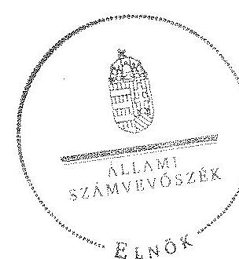

Domokos László
elnök $\gamma$

---

Pécel Város Önkormányzata feladatellátásában részt vevő intézmények és azok változása a 2011-2013. években

|  Igazgatás | 2011. év | Változás | 2013. év  |
| --- | --- | --- | --- |
|   | Polgármesteri Hivatal |  | Polgármesteri Hivatal  |
|  Bölcsődel ellátás és Óvodai nevelés | Pécel Város Óvodái és Bölcsödéje |  | Pécel Város Óvodái és Bölcsödéje  |
|  Közművelődés és sport | Lázár Ervin Városi Könyvtár
Szemere Pál Általános Iskola és Művelődési Ház | 2011-ben összevonás
(Könyvtár, Művelődési Ház) | Lázár Ervin Városi Könyvtár és Művelődési ház  |
|  Alapfokú oktatás | Petőfi Sándor Általános Iskola
Városi Zeneiskola és AMI | 2011-ben összevonás | Pécel Integrált Oktatkási Központ
Városi Zeneiskola és AMI  |
|  Középfokú oktatás | Ráday Pál Gimnázium |  |   |
|  Szociális ellátás | Családsegítő és Gyermekjóléti Szolgálat
Pécel Város Központi Konyhája | 2013-ban megszűnt | Családsegítő és Gyermekjóléti Szolgálat, Házi Segítségnyújtás  |
|  Egészségügyi ellátás | Városi Egészségügyi Szolgálat | 2011-ben megszűnt |   |
|   |  | 2013-ban új intézmény alapítása | Pécel Város Közterület felügyelete  |

---

.

---

# Pécel Város Önkormányzata bevételei, kiadásai, valamint adósságszolgálata a 2011, 2013. években

(Az önkormányzat pénzügyi egyensúlyi helyzetének CLF módszer szerinti levezetése)

|   |  |  | Adatok múló Ft.hom |   |
| --- | --- | --- | --- | --- |
|  1. FOLYÓ KÖLTSÉGVETÉS |  | 2011. év | 2013. év | adósság
konszoli-
dációs
támogatás
nélküi*  |
|   |  | december 31. |  | 2013. év  |
|   |  | 1. | 4. | 5.  |
|  1. MÜKÖDÉSI KÖLTSÉGVETÉS |  | 0,0 | 0,0 | 0,0  |
|  1.1.1. Saját működési bevételek |  | 464,4 | 654,0 | 654,0  |
|  1.1.2. Költségvetési támogatások a működőképesség megőrzését szolgáló kiegészítő támogatások nélkül |  | 582,2 | 604,4 | 556,3  |
|  1.1.3.Átengedett bevételek |  | 594,3 | 43,4 | 43,4  |
|  1.1.4. Állámháztartáson belülről kapott támogatások |  | 61,9 | 42,4 | 42,4  |
|  1.1.5. EU-tili és különböző kapott bevételek |  | 0,0 | 4,0 | 4,0  |
|  1.1.6. Állámháztartáson kívülről kapott bevételek |  | 2,0 | 0,0 | 0,0  |
|  1.1.7. Honam- és kamatlbevételek |  | 2,8 | 4,1 | 4,1  |
|  1.1.8. Külcsönök vízsutérülése, igénybevétele |  | 0,0 | 0,0 | 0,0  |
|  1.1.9. Előző évt pénzmaradvány átvétei |  | 0,0 | 0,0 | 0,0  |
|  1.1.10. A működőképesség megőrzését szolgáló kiegészítő támogatások |  | 56,7 | 130,0 | 130,0  |
|  1.1. Folyó bevételek |  | 1764,2 | 1482,3 | 1434,2  |
|  1.2.1. Müködési kiadások komutkínálások nélkül |  | 1514,5 | 1505,9 | 1505,9  |
|  1.2.2. Állámháztartáson belülre átadott pénzeszközök |  | 8,9 | 10,7 | 10,7  |
|  1.2.3. Tennstévkiadások |  | 105,8 | 67,4 | 67,4  |
|  1.2.4. Kamatkínálások |  | 26,5 | 0,4 | 0,4  |
|  1.2.5. Külcsönök nyújtása, törlesztése |  | 0,0 | 0,0 | 0,0  |
|  1.2.6. Előző évt pénzmaradvány átadás |  | 0,0 | 0,0 | 0,0  |
|  1.2. Folyó kiadások |  | 1655,5 | 1584,4 | 1584,4  |
|  1.3. Folyó költségvetés egyenlege, működési jövedelem (1.1.-1.2.) |  | 108,7 | $-102,1$ | $-150,2$  |
|  2. FELHALMOZÁSI KÖLTSÉGVETÉS |  |  |  |   |
|  2.1.1. Saját téketbevételek |  | 41,1 | 84,3 | 84,3  |
|  2.1.2. Költségvetési támogatások |  | 0,0 | 5,3 | 5,3  |
|  2.1.3. Állámháztartáson belülről kapott támogatások |  | 75,0 | 0,0 | 0,0  |
|  2.1.4. EU-tili és különböző kapott támogatások |  | 0,0 | 0,0 | 0,0  |
|  2.1.5. Állámháztartáson kívülről kapott bevételek |  | 14,5 | 0,0 | 0,0  |
|  2.1.6. Honam- és kamatlbevételek |  | 0,0 | 0,0 | 0,0  |
|  2.1.7. Külcsönök vízsutérülése, igénybevétele |  | 0,0 | 0,0 | 0,0  |
|  2.1.8. Előző évt pénzmaradvány átvétei |  | 0,0 | 0,0 | 0,0  |
|  2.1. Felhalmozásl bevételek |  | 130,6 | 89,3 | 89,3  |
|  2.2.1. Saját beruházási kiadás átférul |  | 122,7 | 251,7 | 251,7  |
|  2.2.2.Saját felújítási kiadás átférul |  | 0,0 | 53,4 | 53,4  |
|  2.2.3. Állámháztartáson belülre átadott pénzeszközök |  | 0,0 | 0,0 | 0,0  |
|  2.2.4. EU-nak és külföldnek adott pénzeszközök |  | 0,0 | 0,0 | 0,0  |
|  2.2.5. Állámháztartáson körülre adott pénzeszközök |  | 1,0 | 0,0 | 0,0  |
|  2.2.6. Befektetési célú részesedések vásárlása |  | 0,0 | 0,0 | 0,0  |
|  2.2.7. Kamatkínálások |  | 30,2 | 27,9 | 27,9  |
|  2.2.8. Külcsönök nyújtása, törlesztése |  | 0,0 | 0,0 | 0,0  |
|  2.2.9. Előző évt pénzmaradvány átadás |  | 0,0 | 0,0 | 0,0  |
|  2.2.10. ÁFA befizetések |  | 15,2 | 0,0 | 0,0  |
|  2.2. Felhalmozásl kiadások |  | 169,1 | 332,4 | 332,4  |
|  2.3. Felhalmozásl költségvetés egyenlege (2.1.-2.3.) |  | $-38,5$ | $-242,9$ | $-242,9$  |
|  3. FINANZÓKOZÁSI MÖVELETEK NÉLKÜLI (GIS) POZICIÓ(1.3.-2.3.) |  | 70,2 | $-345,0$ | $-393,1$  |
|  4. FINANZÓKOZÁSI MÖVELETEK |  |  |  |   |
|  4.1. Főtelésvétei |  | 98,7 | 0,0 | 0,0  |
|  4.2. Főtelésrészítés |  | 0,0 | 120,4 | 77,7  |
|  4.3. Forgatási és befektetési célú értékpapírok kibocsátása |  | 0,0 | 0,0 | 0,0  |
|  4.4. Forgatási és befektetési célú értékpapírok beválítása |  | 109,5 | 0,0 | 0,0  |
|  4.5. Forgatási és befektetési célú értékpapírok értékesítése |  | 0,0 | 0,0 | 0,0  |
|  4.6. Forgatási és befektetési célú értékpapírok vásárlása |  | 0,0 | 0,0 | 0,0  |
|  4.7. Egyéb finanszírozási bevételek (függő, átfizió, kiegészítő) |  | $-0,1$ | $-14,6$ | $-14,6$  |
|  4.8. Egyéb finanszírozási kiadások (függő, átfizió, kiegészítő) |  | 36,1 | $-370,9$ | $-370,9$  |
|  4.9.Finanszírozási műveletek egyenlege (4.1.-4.2.-4.3.-4.4.-4.5.-4.6.-4.7.-4.8.) |  | $-46,8$ | 430,9 | 479,0  |
|  5. TÁKOPÖT FÖNJÖGYI POZICIÓ (1.3.- 2.3.-4.3.) |  | 23,4 | 85,9 | 85,9  |
|  6. NETTÓ MÜKÖDÉSI JÖVEDELEM-müködési jövedelem (1.3.) - tőketörlesztés (4.2-4.4) |  | $-0,6$ | $-227,5$ | $-227,5$  |
|  ZAJÉKOZZATÓ ADATOK |  |  |  |   |
|  Összes kötelezettség |  | 3207,5 | 1220,8 | 1220,8  |
|  ébből rövid lejáratú |  | 387,7 | 1220,8 | 1220,8  |
|  Összes műfőző kötelezettség |  | 78,1 | 226,9 | 226,9  |
|  ébből lejárt (tanúsítványból) |  | 61,7 | 184,3 | 184,3  |
|  Pénz és tőkepleri kötelezettség (adósság) |  | 3200,9 | 964,8 | 964,8  |
|  ébből rövid lejáratú |  | 281,1 | 964,8 | 964,8  |
|  ébből hosszú lejáratú kötelezettségek következő évet terhelő törlesztő részletet |  | 182,4 | 964,8 | 964,8  |
|  Folyószámás-, likvid- és munkabérlátal nagy átlagos állománya (tanúsítványból)** |  | 0,5 | 0,4 | 0,4  |
|  Szensség és garanciavállalások (tanúsítványból) |  | 0,0 | 0,0 | 0,0  |
|  Jogcéls bíróságl tőletekből adódó kötelezettségek (tanúsítványból) |  | 0,0 | 0,0 | 0,0  |
|  Finanszírozásba bevonható szeközök: |  | 84,2 | 130,3 | 130,3  |
|  Tartás kötelezettség megkizárását értékpapírok |  | 0,0 | 0,0 | 0,0  |
|  Pénzeszközök (idegen nélkül) |  | 84,2 | 130,3 | 130,3  |
|  Fongósszközök összesen |  | 269,8 | 286,7 | 286,7  |

- Megjegyzés: Az állom által közvetlenül átvállalt adósságrész a pénzforgalmi könyvetleti adatok között nem került kimutatásra, így a kockgált adatok és az adósságkonszolidációval érintett tartozás-állomány eltérést mutot.

---

.

---

Összefoglaló a rendelkezésre álló ellenőrzési dokumentumok alapján nem értékelhető területekről

| Ellenőrzés területei | Nem értékelhető részterületek | Jogszabály sértés/ Értékelhetőséget akadályozó körülmény | Jogszabály sértés tartalma |
| :--: | :--: | :--: | :--: |
| 2012. évi pénzügyi egyensúlyi helyzet (Ellenőrzési program 2.2. pont) | 2012. évi pénzügyi   egyensúlyi helyzet | Számv. tv. 4. § (2) bekezdése   Számv. tv. 15. § (2)-(3) bekezdései   Számv. tv. 165. § (1) bekezdése   Áhsz. 4 49. § (1) bekezdése   Áhsz. 5 1. § (1) bekezdés a) pontja   Ávr. 9. § (1), és a (3) bekezdései | a beszámolónak megbízható és valós összképet kell adnia a gazdálkodó vagyonáról, annak összetételéről (eszközeiről és forrásairól), pénzügyi helyzetéről és tevékenysége eredményéről   a teljességre és a valódiságra vonatkozó alapelvek   minden gazdasági műveletről, eseményről, amely az eszközök, illetve az eszközök forrásainak állományát vagy összetételét megváltoztatja, bizonylatot kell kiállítani és a bizonylat adatait a könyvviteli nyilvántartásokban rögzíteni kell   a szervezet a könyvviteli számlák további tagolásával vagy a könyvviteli számlákhoz kapcsolódó analitikus nyilvántartások vezetésével köteles gondoskodni arról, hogy az elemi költségvetési beszámoló adatait a valóságnak megfelelően, áttekinthetően alátámassza   pénzforgalmat érintő gazdasági műveletek, események bizonylatainak adatait késedelem nélkül a könyvekben rögzíteni kell   a gazdasági szervezet a gazdálkodás végrehajtásáért, a finanszírozási, adatszolgáltatási, beszámolási és a vagyon használatával, védel- |

---

| Ellenőrzés területei | Nem értékelhető részterületek | Jogszabály sértés/ Értékelhetőséget akadályozó körülmény | Jogszabály sértés tartalma |
| :--: | :--: | :--: | :--: |
|  | Finanszírozáshoz igénybevett folyó-számla- és likvid hitelek nagysága | Adatszolgáltatási összhang hiánya, nem megfelelő számítási módszer alkalmazása | mével összefüggő feladatok teljesítéséért, a pénzügyi, számviteli rend betartásáért felelős szervezeti egység |
| Vagyongazdálkodási tevékenység szabályossága (Ellenőrzési program 3.2.; 3.3.; 3.4.; 3.5. pontjai) | Vagyonnyilvántartás szabályossága | Áhsz.; 37. § (1) bekezdése   Számv. tv. 169. § (1) bekezdése   Számv. tv. 15. § (6) bekezdése   Számv. tv. 4. § (2) bekezdése   Számv. tv. 15. § (2)-(3) bekezdései | a december 31-ei fordulónappal készített könyvviteli mérlegben kimutatott eszközöket és forrásokat minden évben leltározni kell   a gazdálkodó a beszámolót alámasztó leltárt legalább 8 évig köteles megőrizni   a folytonosság elve   a beszámolónak megbízható és valós összképet kell adnia a gazdálkodó vagyonáról, annak összetételéről (eszközeiről és forrásairól), pénzügyi helyzetéről és tevékenysége eredményéről   a teljességre és a valódiságra vonatkozó alapelvek   a december 31-ei fordulónappal készített könyvviteli mérlegben kimutatott eszközöket és forrásokat minden évben leltározni kell   a teljességre és a valódiságra vonatkozó alapelvek |

---

| Ellenőrzés területei | Nem értékelhető részterületek | Jogszabály sértés/ Értékelhetőséget akadályozó körülmény | Jogszabály sértés tartalma |
| :--: | :--: | :--: | :--: |
|  | Eszközök, források 2013. évi értékelése   Eredményszemléletű számvitel bevezetéséhez kapcsolódó feladatok jogszerú elvégzése   Tárgyi eszközök értékesítése   Tulajdonosi joggyakorlás | Mérlegadatok megbízhatósága, valódisága és teljessége   36/2013. (IX. 13.) NGM rendelet   Mérlegadatok megbízhatósága, valódisága és teljessége   Adatszolgáltatási összhang hiánya, 2012. évi pénzforgalmi adatok valódisága   Gazdasági társaság 2011. évi üzleti tervének és 2012. évi beszámolójának el nem, illetve késedelmes elfogadása | a 2013. évről készített beszámoló mérlegét az e rendeletben foglaltak alapján át kell rendezni és az alapján rendező mérleget készíteni. A rendező mérleg mérlegfordulónapja 2014. január 1-je, amely megfelel a 2014. évi nyitómérlegnek is |

---

.

---

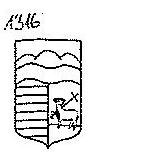
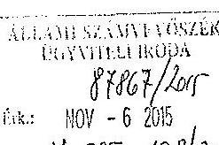
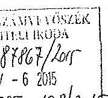
PÉCEL VÁROS ÖNKORMÁNYZAT POLGÁRMÉSTERE
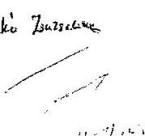

Iktatószám: J/1/12/2015.
Ügyintéző: Rab Tümea
Telefon: 06-28-662-010

Állami Számvevőszék
Domokos László
elnük úr részére

Budapest 4.
PL 54.
1364

Tárgy: észrevétel
Hivatkozási szám: V-0650-194/2015.
Melléklet: -

Radai Zatorko

Tisztelt Klinik Úr!

Köszönettel megkaptok a 2015. október 16. napján kelt, V-0650-194/2015. iktatószámú, „Az önkormányzatok
pénzügyi és vagyongazdálkodása szabályszerűségének ellenőrzéséről – Pécel" című jelentéstervezetet, mely
önkormányzatunkhoz 2015. október 22. napján érkezett meg.

A jelentéstervezettel kapcsolatos észrevételeink megtérele előtt ezúton szeretnénk megköszönni a helyszíni ellenőrzést
lefolytató számvevők alapon, minden részletet figyelembe vevő munkáját.

Sajnálatos számunkra, hogy az ellenőrzött időszak 2011. január 1-től 2013. december 31. napjáig terjedt, ugyanis a
2010 októberétől kezdődő munkánk igazi eredménye a 2014. évben vált láthatóvá. Rendbe tettük az önkormányzat
vagyonkatarzterét, a lökönyvi könyvelést, melyek a figyelmezett gazdálkodás alugját jelentik. A jelentéstervezetben
tett javaslatuk közül több már megvalósult, illetve folyamatban van. Mindezektől függetlenül bizonyosak vagyunk
abban, hogy az ellenőrzésük feltétlenül hasznos volt számunkra, hiszen feltárásra kerültek a gazdálkodást
meghatározó szabályozásbeli hiányosságok, hibák, melyek korrigálására a szükséges intézkedéseket megteesszük.

A jelentéstervezetben szereplő megállapítások helytállóságát nem megkérdőjelezve, a jelentéstervezettel kapcsolatban
az alábbi észrevételeket tesszük.

A polgármester részére megfogalmazott 1., 2., 4. és 5. számú megállapításokkal és javaslatokkal egyetértünk.
A 3. számú megállapítás azon részével, mely szerint a 2013. évi zárszámadás tervezetét az Ábt. 91. § (1)
bekezdésében foglalt április 30-ai határidőt követően terjesztette be a polgármester a képviselő-testület elé, nem
értünk egyet.
A 2013. évi zárszámadás tervezetét tartalmazó előterjesztés 2014. április 30-án készült el. 2014. április 30-án az
előterjesztés a képviselő-testület tagjai részére elektronikusan kiküldésre került, és az a 2014. május 29-ei képviselő-
testületi ülés tómái között szerepelt, tehát véleményünk szerint azt a jogszabály szerinti határidőre a képviselő-testület
elé terjesztettük. Amennyiben szükséges, ezt az állításunkat dokumentumokkal is igazolni tudjuk.
A 3. számú megállapítás és javaslat egyéb részeivel egyetértünk.

A jegyző részére megfogalmazott 2-8. számú megállapításokkal és javaslatokkal egyetértünk.
Az 1. számú megállapítás azon részével, mely szerint a 2013. évi zárszámadás tervezetét az Ábt. 91. § (1)
bekezdésében foglalt április 30-ai határidőt követően terjesztette be a polgármester a képviselő-testület elé, nem
értünk egyet, ugyanazon okból, amit a polgármester részére megfogalmazott 3. számú megállapításnál is írtunk.
Az 1. számú megállapítás és javaslat egyéb részeivel egyetértünk.

2119 Pótel, Kossuth sár 1. www.pozel.hu Tel: 28/452-751 Fax: 28/452-755 E-mail: polgarmester@pozel.hu

SZÁS 12

---

A jelentéstervezet 13. oldalán, a II. RÉSZLETES MEGÁLLAPÍTÁSOK ciss 1.1. pontjának második bekezdésében szereplő „Az Önkormányzat a belső ellenőrzések végzéséhez szükséges 2011. december 31-ig hatályos Iter. 5. § (1) bekezdésében, 2012. január 1-jétől a Iter. 17. § (1) bekezdésében előírt belső ellenőrzési kézikönyvvel 2011. január 1jétől 2013. január 1-jéig nem rendelkezett." megállapítással kapcsolatban - a belső ellenőrzési vezető nyilatkozata alapján - megjegyezzük, hogy a belső ellenőrzési vezető 2012. január 1. napi hatállyal elkészítette a belső ellenőrzési kézikönyvet, azt átadta a jegyző mint jóváhagyásra jogosult részére.

Kérjük, hogy a végleges ellenőrzési jelentés elkészítésekor a fentieket figyelembe venni szíveskedjenek.

Pécsi, 2015. november $\stackrel{\text { O. }}{=}$,
Tisztelettel:
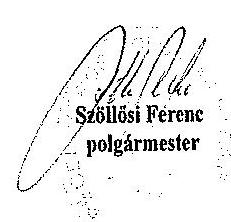

---

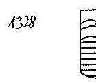

Állami Számvevőszék
Domokos László
elnök úr részére

Budapest 4,
PL 54.
1364

Tárgy: észrevétel
Hivatkozású szám: V-0650-194/2015.
Melléklet: -

Róki Szemle

Tisztelt Elnök Úr!

A V-0650-194/2015. iktatószámú, „Az önkormányzatok pénzügyi és vagyongazdálkodása szabályszerűségének ellenőrzéséről – Pécel” című jelentéstervezetet kapcsán, a 3/1/12/2015 válaszlevelünk alapján mellékelve megküldjük az alátámasztó dokumentumokat.

Kérjük, hogy a végleges ellenőrzési jelentés elkészítéskor a fentieket figyelembe venni szíveskedjenek.

Pécel, 2015. november, 23.

Tisztelettel:

Szállási Ferenc
polgármester

2119 Pécel, Komath tér 1. www.pecel.hu Tel: 28/452-751 Fax: 28/452-755 E-mail: polgarnestec@pecel.hu

2015. November 23.

---

Tárgy: Fwd: 2013. évi költségvetés végrehajtása
Feladó: Jeney Erzsebet <2119ph006@gmail.com>
Dátum: 2015.11.09. 15:51
Címzett: rab.timea@pecel.hu

Továbbított üzenet
Tárgy:2013. évi költségvetés végrehajtása
Dátum:Wed, 30 Apr 2014 20:44:06 +0200
Feladó:Jeney Erzsebet <2119ph006@gmail.com>
Válaszcím:jeney.erzsebet@pecel.hu
Szervezet:PPMH
Címzett:kt@pecel.hu

Tisztelt Képviselő Asszony!/Úr!
Az önök rendelkezésére bocsátott tárhelyre a 2014_05_29 mappába felkerült két előterjesztés:

1. Javaslat a Pécel Város Önkormányzata 2013. évi költségvetésének végrehajtásáról szóló rendelet megalkotására
2. Javaslat a 2013. évi ellenőrzési jelentés jóváhagyására

Üdvözlettel:

Jeney Erzsébet
irodavezető
Péceli Polgármesteri Hivatal
Szervezési Iroda
2119 Pécel, Kossuth tér 1.
telefon: 06/28/662131; e-mail: jeney.erzsebet@pecel.hu
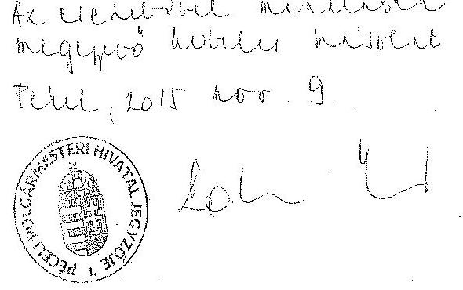

---

Tárgy: Fwd: előterjesztés cserel
Feladó: Jeney Erzsebet <2119ph006@gmail.com>
Dátum: 2015.11.09. 15:51
Címzett: rab.timea@pecel.hu

Továbbított üzenet
Tárgy:előterjesztés cserel
Dátum:Wed, 24 Apr 2013 17:53:39 +0200
Feladó:Jeney Erzsebet <2119ph006@gmail.com>
Válaszcím:jeney.erzsebet@pecel.hu
Szervezet:PPMH
Címzett:kt@pecel.hu

Tisztelt Képviselő Hölgyek, Urak!
Kedden megérkezett a könyvvizsgáló véleménye a 2012. évi zárszámadásról. A tárhelyre korábban elhelyezett 005_eloterjesztest ma délután kicseréltem a könyvvizsgálói véleménnyel kiegészített előterjesztéssel, ami a korábbihoz képest plusz 3 táblázatot is tartalmaz 31. 32. 33. (A bizottsági ülésen ezek lettek kiosztva)

A képviselő-testületen tárgyalandó előterjesztés tehát a jelenleg kint lévő 005 számú.

Üdvözlettel

Jeney Erzsébet
szervezési irodavezető
Pécel Város Önkormányzat
Polgármesteri Hivatal
2119 Pécel, Kossuth tér 1.
telefon: 06/28/662131; e-mail: jeney.erzsebet@pecel.hu
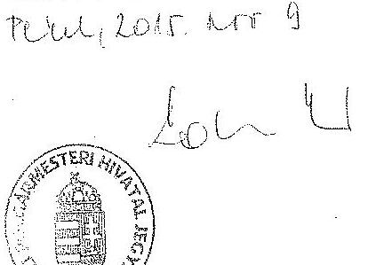

---

Tárgy: Fwd: kt ülés Pécel
Feladó: Jeney Erzsebet <2119ph006@gmail.com>
Dátum: 2015.11.09. 15:50
Címzett: rab.timea@pecel.hu

Továbbított üzenet
Tárgy:kt ülés Pécel
Dátum:Fri, 19 Apr 2013 15:51:30 +0200
Feladó:Jeney Erzsebet <2119ph006@gmail.com>
Válaszcím:jeney.erzsebet@pecel.hu
Szervezet:PPMH
Címzett:kt@pecel.hu

Tisztelt Képviselő-testület!
A 2013. április 25-i Kt. ülés előterjesztései már elérhetők az Önök rendelkezésére bocsátott tárhelyen.
Mellékelem a testületi ülés és a 2013. április 23-i bizottsági ülés meghívóját.
Üdvözlettel:

Jeney Erzsébet
szervezési irodavezető
Pécel Város Önkormányzat
Polgármesteri Hivatal
2119 Pécel, Kossuth tér 1.
telefon: 06/28/662131; e-mail: jeney.erzsebet@pecel.hu
-Mellékletek:
meghivó_2013_04_23_pübiz_oktatas_varosfeji_szoc.odt 27,9 KB
000_meghivo_2013_04_25.odt 47,7 KB

---

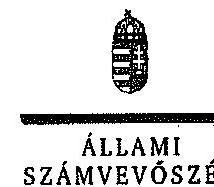

ELNOK

# Szállósi Ferenc úr 

polgármester

Pécel Város Önkormányzata

## Pécel

## Tisztelt Polgármester Úr!

Köszönettel megkaptam „Az önkormányzatok pénzügyi és vagyongazdálkodása szabályszerűségének ellenőrzéséről - Pécel" című jelentéstervezet megállapításaira tett észrevételét.

Az ellenőrzési megállapításokra vonatkozó észrevételét az Állami Számvevőszékről szóló 2011. évi LXVI. törvény 29. § (2) bekezdésében meghatározott tizenöt napos határidőn belül küldte meg. Az Állami Számvevőszék észrevétellel kapcsolatos álláspontját a mellékletként csatolt, a felügyeleti vezető által készített indokolás tartalmazza.

Budapest, 2015. A.A. hónap 23. nap
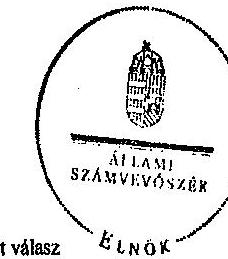

Tisztelettel:
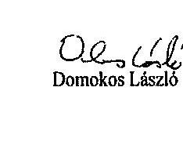

Domokos László

---

# 1. számú melléklet 

a V-0650-200/2015. számú levélhez
„Az önkormányzatok pénzügyi és vagyongazdálkodása szabályszerűségének ellenörzéséről - Pécel" címú jelentéstervezetre tett észrevételre adott válasz

| Észrevétel: | Az észrevétel a jelentéstervezetben a polgármesternek címzett 3. számú és a jegyzőnek címzett 1. a) számú intézkedést igénylő megállapítás utolsó mondatát érintette, mely szerint a 2013. évi zárszámadás tervezetét az Áht. 2 91. § (1) bekezdésében foglalt április 30-i határidőt követően terjesztette be a polgármester a képviselő-testület elé.   Álláspontjuk szerint a 2013. évi zárszámadás tervezetét tartalmazó előterjesztés 2014. április 30-án készült el. 2014. április 30-án az előterjesztés a képviselő-testület tagjai részére elektronikusan kiktüldésre került, és az a 2014. május 29-ei képviselőtestületi ülés témái között szerepelt. Véleményük szerint a zárszámadás tervezetét a jogszabály szerinti határidőre a képviselő-testület elé terjesztették. |
| :--: | :--: |
| Válasz: | Az Állami Számvevőszék az észrevételt nem fogadja el. |
| Indoklás: | Az észrevételhez pótlólag beküldött dokumentumok nem igazolták, hogy a polgármester az Áht. 2 91. § (1) bekezdésében foglaltak szerinti határidőben terjesztette elő a 2013. évi zárszámadás tervezetét a képviselő-testület elé. Az észrevételhez csatolt dokumentum szerint a képviselő-testület tagjait 2014. április 30-án a polgármester helyett az irodavezető tájékoztatta - elektronikus úton -a 2013. évi zárszámadás tervezetét tartalmazó előterjesztés elérhetőségéről. Az irodavezető elektronikus tájékoztatása nem tartalmazta a 2013. évi zárszámadási rendelettervezet előterjesztéseként csatolt dokumentumokat. |
| Észrevétel: | A jelentéstervezet 13. oldalán, a II. RÉSZLETES MEGÁLLAPÍTÁSOK cím 1.1 pontjának második bekezdésében szereplő „Az Önkormányzat a belső ellenörzések végzéséhez szükséges 2011. december 31-ig hatályos Ber. 5. § (1) bekezdésében, 2012. január 1-jétől a Bkr. 17. § (1) bekezdésében elöírt belső ellenőrzési kézikönyvvel 2011. január 1-jétől 2013. január 1-jéig nem rendelkezett." megállapítással kapcsolatban megjegyezték, hogy a belső ellenőrzési vezető 2012. január 1. napi hatálylyal elkészítette a belső ellenőrzési kézikönyvet, azt átadta a jegyző, mint jóváhagyásra jogosult részére. |
| Válasz: | Az Állami Számvevőszék az észrevételt nem fogadja el. |
| Indoklás: | A helyszíni ellenőrzés során átadott, továbbá az észrevételhez beküldött dokumentumok között nem szerepelt a 2012. január 1-jei hatállyal elkészített belső ellenőrzési kézikönyv, amely bizonyította volna az észrevételben jelzett állítást. |

Tájékoztatom Polgármester urat, hogy az Állami Számvevőszékről szóló 2011. évi LXVI. törvény 29. § (3) bekezdése alapján az Állami Számvevőszék a figyelembe nem vett észrevételeket köteles a jelentésben feltüntetni, és megindokolni, hogy azokat miért nem fogadta el.

Budapest, 2015.
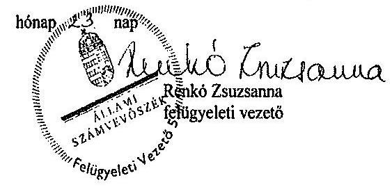

---

# FOGALOMTÁR 

adósságszolgálat
beruházás
bevételi kitettség
CLF módszer
fejlesztés
felújítás
fizetőképességi kockázat
garanciavállalás
hasznosítás
integritás

Az adósság tőkerészének és az esedékes kamat együttes összegének törlesztése.
A tárgyi eszköz beszerzése, létesítése, saját vállalkozásban történő előállítása, a beszerzett tárgyi eszköz üzembe helyezése. A beruházás a meglévő tárgyi eszköz bővítését, rendeltetésének megváltoztatását, átalakítását, élettartamának, teljesítőképességének közvetlen növelését eredményező tevékenység (Forrás: Számv. tv. 3. § (4) bekezdés 7. pontja).
Olyan függőségi viszony, ahol egy szervezet pénzügyi helyzetét meghatározó bevételek nagysága külső körülmények hatására azonnal és kedvezőtlen irányba változhat.
Az önkormányzatok költségvetése elemzésének módszere, amely a pénzügyi kapacitás (nettó múködési jövedelem) fogalmát helyezi a középpontba. A módszer következetesen elkülöníti a folyó és a felhalmozási költségvetés bevételeit és kiadásait, azok költségvetési egyenlegeit. Bizonyos mértékig a vállalati gazdálkodás logikai elemeit érvényesíti az önkormányzatok pénzügyi, jövedelmi helyzetének vizsgálata során.
Alapvetően felhalmozási kiadásokban megtestesülő tevékenység, amely új, vagy a korábbinál műszaki, technikai szempontból korszerűbb tárgyi eszköz létrehozására irányul, illetve meglévő tárgyi eszköz műszaki, technikai paramétereinek korszerűsítését valósítja meg (Forrás: Ávr. 1. § b) pontja).
Az elhasználódott tárgyi eszköz eredeti állaga (kapacitása, pontossága) helyreállitását szolgáló időszakonként visszatérő olyan tevékenység, melynek során az eszköz élettartama megnövekszik, minősége, használata jelentősen javul, így a pótlólagos ráfordításból a jövőben gazdasági előnyök származnak (Forrás: Számv. tv. 3. § (4) bekezdés 8. pontja).
Annak kockázata, hogy az adós az esetleges kamatfizetési és tőketörlesztési kötelezettségét átmenetileg vagy véglegesen nem tudja határidőre teljesíteni.
Olyan kötelezettségvállalás, ahol a garanciát vállaló valamely jövőbeni esemény bekövetkezésekor, a szerződésben meghatározott feltételek beálltakor a garancia kedvezményezettje számára meghatározott összegig, meghatározott időpontig, felszólításra azonnal fizet.
A nemzeti vagyon birtoklásának, használatának, hasznok szedése jogának bármely - a tulajdonjog átruházását nem eredményező - jogcímen történő átengedése, ide nem értve a vagyonkezelésbe adást, valamint a haszonélvezeti jog alapítását (Forrás: Nvtv. 3. § (1) bekezdés 4. pontja).
Az „integritás" - egyik gyakran használt jelentése szerint - az elvek, értékek, cselekvések, módszerek, intézkedések konzisztenciáját jelenti, vagyis olyan magatartásmódot, amely meghatározott értékeknek megfelel. Integritás-irányitási rendszer

---

kezességvállalás
koncessziós szerződés
kötvény
közfeladat
mérlegen kívüli tétel kockázata
nettó múködési jövedelem

ÖNHIKI támogatás
önkormányzat felhalmozási bevétele önkormányzat felhalmozási kiadásai önkormányzat folyó bevétele önkormányzat folyó kiadása önkormányzat folyó költségvetés egyenlege
bevezetése a szervezetben a szervezethez rendelt közfeladatok integritás szempontú ellátását, az érték alapú múködéssel (integritással) összefüggő szervezeti követelmények következetes érvényesítését jelenti (Forrás: „Magyarországi államháztartási belső kontroll standardok Útmutató", kiadta az NGM 2012 decemberében).
Szerződésben vállalt olyan kötelezettség, amelyben a kezes arra vállal kötelezettséget, hogy ha a szerződés kötelezettje nem teljesít a kezes maga fog helyette teljesíteni a jogosultnak. (Forrás: Ptk. 272. §).
A koncessziós szerződés olyan visszterhes szerződés, amelyben az állam vagy az önkormányzat a törvényben meghatározott tevékenységek gyakorlásának a jogát időlegesen úgy engedi át, hogy a jogosultnak részleges piaci monopóliumot biztosít. Hosszabb lejáratra szóló, hitelviszonyt megtestesítő kamatozó értékpapír. A kötvényben a kibocsátó arra kötelezi magát, hogy a kötvényben megjelölt pénzösszegnek az elốre meghatározott kamatát vagy egyéb jutalékait, továbbá az adott pénzösszeget a kötvény mindenkori tulajdonosának, illetve jogosultjának a megjelölt időben és módon megfizeti.
Jogszabályban meghatározott állami vagy önkormányzati feladat, amit az arra kötelezett közérdekből, a jogszabályban meghatározott követelményeknek és feltételeknek megfelelve végez, ideérive a lakossági közszolgáltatásokkal való ellátását, továbbá az állam nemzetközi szerződésekben vállalt kötelezettségeiből adódó közérdekű feladatokkal, valamint e feladatok ellátásakor szükséges infrastruktúra biztosítását is (Forrás: Nvtv. 3. § (1) bekezdés 7. pontja).
Annak kockázata, hogy a mérlegben ki nem mutatható kötelezettségvállalásból fizetési kötelezettség keletkezik.
A nettó múködési jövedelem a jövedelemtermelő képességet méri. Megmutatja a múködési bevételekből a múködési kiadások és a hitelek tőketörlesztésének kifizetése után fennmaradó jövedelmet.
Az önkormányzatok múködőképességét szolgáló, önhibájukon kívül hátrányos helyzetben levő települési önkormányzatok támogatása.
Az önkormányzatok tárgyévi felhalmozási célú költségvetési bevételei.
Az önkormányzatok tárgyévi felhalmozási célú költségvetési kiadásai.
Az önkormányzatok tárgyévi múködési célú költségvetési bevételei.
Az önkormányzatok tárgyévi múködési célú költségvetési kiadásai.
A folyó költségvetés egyenlege, azaz a múködési jövedelem megmutatja, hogy az Önkormányzat éves folyó bevétele fedezetet biztosít-e a kötelező és önként vállalt feladatellátáshoz

---

kapcsolódó éves folyó kiadására. A múködési jövedelem negatív értéke pénzügyileg fenntarthatatlan helyzetet jelez. A mutató pozitív értéke megtakarítást mutat, amely forrásul szolgálhat az Önkormányzat fennálló kötelezettségei megfizetéséhez, valamint fejlesztéselhez.
pénzügyi kapacitás A pénzügyi kapacitás az adósok hitelfelvételi képességének azon mértéke, ahol még növelni tudják az adósságot anélkül, hogy a fizetőképtelenség elkerülése érdekében csökkenteniük kellene akár az aktuális, akár a jövőben esedékes kiadásaikat.
PPP (Public Private
Partnership)
szállítói kitettség
törzsvagyon
tulajdonosi joggyakorló
üzemeltetésre átadott eszközök az önkormányzatnál
üzleti vagyon

A köz- és a magánszféra együttmúködésén alapuló fejlesztési konstrukció. A PPP keretében a közcél a magánszféra jelentős mértékủ közremúködésével valósul meg. Az állam (önkormányzat) a közszolgáltatások létrehozását a tradicionálisnál komplexebb módon bízza a magánszférára. Az együttmúködés hosszú távra szól. A magán partner felelőssége az infrastruktúra tervezésére, megépítésére, múködtetésére és legalább részben a projekt finanszírozására terjed ki. Az állam (önkormányzat) és/vagy a szolgáltatások igénybe vevője szolgáltatási dijat fizet.
Olyan függőségi viszony, ahol egy szervezet pénzügyi helyzete a szállítói tartozások rendezése érdekében foganatosított intézkedések hatására azonnal és kedvezőtlen irányba változhat.
A törzsvagyon körébe tartozó tulajdon vagy forgalomképtelen, vagy korlátozottan forgalomképes (Forrás: Ötv. 78. § és 79. §ai).
A helyi önkormányzat tulajdonában lévő azon vagyon, amely közvetlenül a kötelezö önkormányzati feladatkör ellátását vagy hatáskör gyakorlását szolgálja, és amelyet
a) az Nvtv. kizárólagos önkormányzati tulajdonban álló vagyonnak minősít;
b) törvény vagy a helyi önkormányzat rendelete nemzetgazdasági szempontból kiemelt jelentőségű nemzeti vagyonnak minősít;
c) törvény vagy a helyi önkormányzat rendelete korlátozottan forgalomképes vagyonelemként állapít meg (Forrás: Nvtv. 5. § (2) bekezdése).

Aki a nemzeti vagyon felett az államot vagy a helyi önkormányzatot megillető tulajdonosi jogok és kötelezettségek öszszességének gyakorlására jogosult (Forrás: Nvtv. 3. § (1) bekezdés 17. pontja).
Az önkormányzat tulajdonában lévő azon eszközök, amelyeket nem saját maga, vagy felügyelete alatt álló költségvetési szervei üzemeltetnek, hanem az üzemeltetését, müködtetését más szervekre bízta. Az önkormányzat számviteli nyilvántartásában elkülönítetten kell nyilvántartani ezen eszközök bruttó értékét és értékcsökkenését.
A nemzeti vagyon azon része, amely nem tartozik az önkormányzati vagyon esetén a törzsvagyonba (Forrás: Nvtv. 3. § (1) bekezdés 18. pontja).

---

vagyongazdálkodás

A nemzeti vagyongazdálkodás feladata a nemzeti vagyon rendeltetésének megfelelő, az állam, az önkormányzat mindenkori teherbíró képességéhez igazodó, elsődlegesen a közfeladatok ellátásához és a mindenkori társadalmi szükségletek kielégítéséhez szükséges, egységes elveken alapuló, átlátható, hatékony és költségtakarékos müködtetése, értékének megőrzése, állagának védelme, értéknövelő használata, hasznosítása, gyarapítása, továbbá az állam vagy a helyi önkormányzat feladatának ellátása szempontjából feleslegessé váló vagyontárgyak elidegenítése (Forrás: Nvtv. 7. § (2) bekezdése).

---

# RÖVIDÍTÉSEK JEGYZÉKE 

## Törvények

Adósságrendezési tv.
Áht. 1
Áht. 2
ÁSZ tv.
Info tv.

Kbt.
Mötv.

Ötv.
Számv. tv.

## Rendeletek és határozatok

Áhsz. 1

Áhsz. 2
Ámr.
Ávr.

Ber.
Bkr.
a helyi önkormányzatok adósságrendezési eljárásáról szóló 1996. évi XXV. törvény
az államháztartásról szóló 1992. évi XXXVIII. törvény (hatálytalan 2012. január 1-jétől)
az államháztartásról szóló 2011. évi CXCV. törvény (hatályos 2012. január 1-jétől)
az Állami Számvevőszékről szóló 2011. évi LXVI. törvény (hatályos 2011. július 1-jétől)
az információs önrendelkezési jogról és az információszabadságról szóló 2011. év CXII. törvény (hatályos 2012. január 1-jétől)
a közbeszerzésekről szóló 2011. évi CVIII. törvény (hatályos 2012. január 1-jétől)
Magyarország helyi önkormányzatairól szóló 2011. évi CLXXXIX. törvény (hatályos 2012. január 1-jétől, kivéve a 144. § (2)-(5) bekezdéseiben meghatározott paragrafusok egyes bekezdéseit, pontjait, amelyek 2013. január 1jén, illetve a 2014. évi általános önkormányzati választások napján léptnek hatályba)
a nemzeti vagyonról szóló 2011. évi CXCVI. törvény (hatályos 2011. december 31-től, kivéve a 20. § (2)-(3) bekezdéseiben meghatározott paragrafusokat)
a helyi önkormányzatokról szóló 1990. évi LXV. törvény (hatálytalan 2014. október 12-étől)
a számvitelről szóló 2000. évi C. törvény (hatályos 2001. január 1-jétől)

249/2000. (XII. 24.) Korm. rendelet az államháztartás szervezetei beszámolási és könyvvezetési kötelezettségének sajátosságairól (hatálytalan 2014. január 1-jétől)
4/2013. (I. 11.) Korm. rendelet az államháztartás számviteléről (hatályos 2014. január 1-jétől)
292/2009. (XII. 19.) Korm. rendelet az államháztartás múködési rendjéről (hatálytalan: 2012. január 1-jétől)
368/2011. (XII. 31.) Korm. rendelet az államháztartásról szóló törvény végrehajtásáról (hatályos 2012. január 1jétől)
193/2003. (XI. 26.) Korm. rendelet a költségvetési szervek belső ellenőrzéséről (hatálytalan 2012. január 1-jétől)
370/2011. (XII. 31.) Korm. rendelet a költségvetési szervek belső kontrollrendszeréről és belső ellenőrzéséről (hatályos 2012. január 1-jétől)

---

SZMSZ

Vagyongazdálkodási rendelet

147/1992. (XI. 6.) Korm. rendelet

## Egyéb rövidítések

ÁSZ
Beszerzési szabályzat

DPMV Zrt.
Értékelési szabályzat

FB
Gazdasági program

Pécel Város Önkormányzata Képviselő-testületének többször módosított 8/2007. (VI. 1.) számú rendelete a Képvi-selő-testület Szervezeti és Múködési Szabályzatáról (hatályos 2007. június 1-jétől),
Pécel Város Önkormányzata Képviselő-testületének 15/2011. (IV. 28.) számú rendelete a Képviselő-testület Szervezeti és Múködési Szabályzatáról (hatályos 2011. május 1-jétől),
Pécel Város Önkormányzata Képviselő-testületének 5/2013. (III. 4.) számú rendelete a Képviselő-testület Szervezeti és Múködési Szabályzatáról (hatályos 2013. március 5-étől).
Pécel Város Önkormányzata Képviselő-testületének többször módosított 24/2004. (IX. 15.) számú rendelete az Önkormányzat vagyonáról és az egyes vagyontárgyak feletti tulajdonosi jogok gyakorlásának szabályairól (hatályos 2004. szeptember 15-étől)

Pécel Város Önkormányzata Képviselő-testületének 9/2013. (IV. 30.) számú rendelete Pécel Város Önkormányzat vagyonáról, az egyes vagyontárgyak feletti tulajdonosi jogok gyakorlásának szabályairól (hatályos 2013. május 15-étől)
147/1992. (XI. 6.) Korm. rendelet az önkormányzatok tulajdonában lévő ingatlanvagyon nyilvántartási és adatszolgáltatási rendjéről (hatályos 1993. január 1-jétől)

Állami Számvevőszék
Pécel Város Önkormányzata Képviselő́ testületének 179/2011. (VII. 4.) számú határozatával elfogadott, Pécel Város Önkormányzat Polgármesteri Hivatala és intézményei Beszerzési Szabályzata (hatályos 2011. július 1-jétől)
Dél-Pest Megyei Víziközmű Szolgáltató Zrt.
Pécel Város Önkormányzatának Eszközök és Források Értékelési Szabályzata (hatályos 2007. június 11-étől),
15/2011. számú Jegyzői Utasítás az Eszközök és Források Értékelési Szabályzatáról (hatályos 2011. szeptember 1jétől),
5/2012. számú Polgármesteri, Jegyzői együttes utasítás az eszközök és források értékelési szabályzatáról (hatályos 2012. december 1-jétől),
Pécel Város Önkormányzatának Eszközök és Források Értékelési Szabályzata (hatályos 2013. április 1-jétől)
Felügyelő Bizottság
a Képviselő-testület 347/2011. (XII. 15.) számú határozatával elfogadott 2011-2014. évi időszakra szóló Gazdasági program

---

Hivatali SZMSZ

Jegyzö

Képviselő-testület
Kincstár
KLIK
Kormányhivatal
Közzétételi szabályzat

Leltározási szabályzat

Pécel Város Önkormányzata Képviselö-testületének 295/2009. (X. 29.) számú határozatával elfogadott Pécel Város Önkormányzata Polgármesteri Hivatala Szervezeti és Müködési Szabályzata (hatályos 2009. november 1jétől),
Pécel Város Önkormányzata Képviselő-testületének 320/2011. (XI. 30.) számú határozatával elfogadott Pécel Város Önkormányzata Polgármesteri Hivatala Szervezeti és Müködési Szabályzata (hatályos 2011. december 15jétől),
Pécel Város Önkormányzata Képviselö-testületének 322/2012. (IX. 27.) számú határozatával elfogadott Pécel Város Önkormányzata Polgármesteri Hivatala Szervezeti és Müködési Szabályzata (hatályos 2012. október 15-től),
Pécel Város Önkormányzata Képviselö-testületének 22/2013. (I. 31.) számú határozatával elfogadott Péceli Polgármesteri Hivatal Szervezeti és Müködési Szabályzata (hatályos 2013. február 5-étől).
Pécel Város Önkormányzatának 2011. augusztus 15-ig hivatalban volt jegyzője,
Pécel Város Önkormányzatának 2011. szeptember 21. és 2013. április 30-ka között hivatalban volt jegyzője,

Pécel Város Önkormányzatának 2013. május 1-je óta hivatalban lévő jegyzője.
A jegyzőt helyettesítő aljegyző 2011. február 1-től 2013. március 31 -ig.
Pécel Város Önkormányzatának Képviselő-testülete
Magyar Államkincstár
Klebelsberg Intézményfenntartó Központ
Pest Megyei Kormányhivatal
2/2004. számú Jegyzői utasítás az Önkormányzati közpénzek felhasználásának nyilvánossá tételéről (hatályos 2004. november 9-étől),
Péceli Polgármesteri Hivatal Szabályzata az információs önrendelkezési jogról és az információszabadságról szóló 2011. évi CXII. törvényben foglalt közzétételi kötelezettségekről (hatályos 2013. április 1-jétől)
Leltárkészítési és leltározási szabályzat (hatályos 2007. június 11-étől),
Pécel Város Önkormányzata Jegyzőjének 13/2011. számú utasítása a Leltározás és leltárkészítés szabályzatáról (hatályos 2011. szeptember 1-jétől),
4/2012. számú Polgármesteri, Jegyzői együttes Utasítás a leltárkészítési és leltározási szabályzatról (hatályos 2012. december 1-jétől),
Pécel Város Önkormányzatának leltárkészítési és leltározási szabályzata (hatályos 2013. április 1-jétől).

---

| MÜKI | múködőképesség megőrzését szolgáló kiegészítő támogatás |
| :--: | :--: |
| ÖNHIKI | önhibáján kívül hátrányos helyzetben lévő önkormányzatok támogatása |
| Önkormányzat | Pécel Város Önkormányzata |
| Péceli Vízmú Kft. | Péceli Vízmú-, Csatornamú és Városfejlesztési Korlátolt Felelősségú Társaság (2001. április 19-től 2013. június 23ig), Pécel Üzemeltető Korlátolt Felelősségű Társaság (2013. június 24 -étől) |
| Pénzügyi Iroda | Pécel Város Önkormányzat pénzügyi-gazdálkodási feladatait ellátó szervezeti egység |
| Pénzügyi Iroda Ügy-   rendje | Péceli Város Önkormányzata és a Polgármesteri Hivatala Pénzügyi Irodájának ügyrendje (hatályos: 2013. április 1jétől) |
| Pénzügyi bizottság | Pécel Város Önkormányzata Pénzügyi, Jogi és Ügyrendi Bizottsága |
| PIOK | Péceli Integrált Oktatási Központ (létrejött: 2011. augusztus 1-jén; fenntartása átadva a KLIK-nek 2013. január 1jétől) |
| polgármester   Polgármesteri hivatal PPP | Pécel Város Önkormányzatának polgármestere   Pécel Város Önkormányzatának Polgármesteri Hivatala Public Private Partnership (közfszéra magánszféra együtt múködése) |
| Selejtezési szabályzat | Pécel Város Önkormányzat Jegyzőjének 11/2011. számú utasítása a felesleges vagyontárgyak hasznosításának, selejtezésének szabályzatáról (hatályos 2011. szeptember 1jétől),   3/2012. Polgármesteri, Jegyzői együttes Utasítás a felesleges vagyontárgyak hasznosításáról és selejtezéséről (hatályos 2012. december 1-jétől 2013. március 30 -áig),   Pécel Város Önkormányzatának Szabályzata a felesleges vagyontárgyak hasznosításáról és selejtezéséről (hatályos 2013. április 1 -jétől) |
| Számlarend | Pécel Város Önkormányzat jegyzőjének 12/2011. számú utasítása Pécel Város Önkormányzata Polgármesteri hivatalának számlarendjéről (hatályos 2011. augusztus 1jétől),   6/2012. számú Polgármesteri, Jegyzői együttes Utasítás a számlarendről (hatályos 2012. december 1-jétől),   Pécel Város Önkormányzatának Szabályzata az Önkormányzat Számlarendjéről (hatályos 2013. április 1-jétől). |
| Számviteli politika | Pécel Város Önkormányzata jegyzőjének 14/2011. számú utasítása Pécel Város Önkormányzata Polgármesteri hivatalának Számviteli politikájáról (hatályos 2011. szeptember 1-jétől),   Pécel Város Önkormányzatának Szabályzata a Számviteli Politikáról (hatályos: 2013. április 1-jétől) |

---

Vagyongazdálkodási terv Pécel Város Önkormányzatának 225/2013. (VI. 27.) számú képviselő-testületi határozatával jóváhagyott kö-zép- és hosszú távú vagyongazdálkodási terve