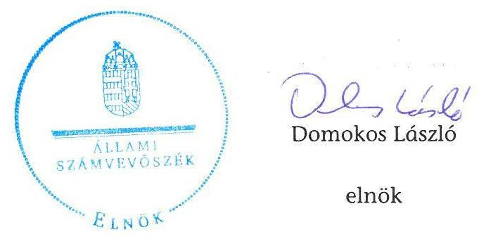
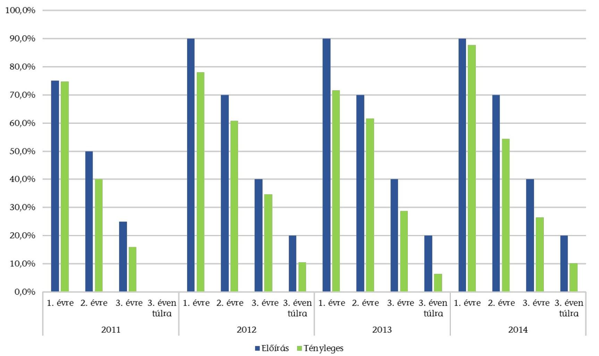
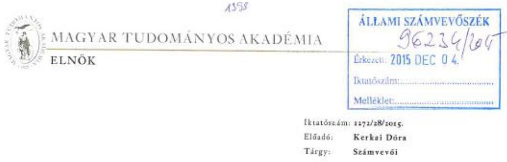
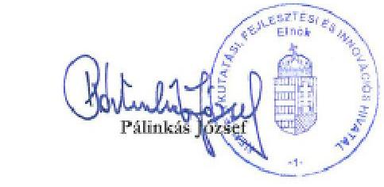

# ÁLLAMI   SZÁMVEVŐSZÉK 

## JELENTÉS

az Országos Tudományos Kutatási Alapprogramok ellenőrzéséről

---

# Állami Számvevőszék 

Iktatószám: V-0817-143/2015.
Témasorszám: 22
Vizsgálat-azonosító szám: V0724

## Az ellenőrzést felügyelte:

Dr. Pulay Gyula
felügyeleti vezető
Az ellenőrzést vezette és az ellenőrzés végrehajtásáért felelős:
Görgényi Gábor
ellenőrzésvezető
Az összefoglaló jelentést készítette:
Görgényi Gábor
ellenőrzésvezető
A számvevői munkaanyagok feldolgozásában és a jelentéstervezet öszszeállításában közremúködött:

Kriston-Vizi János
számvevő tanácsos
Az ellenőrzést végezték:

| Dombóvári Nóra | Gácser József Ferenc | Kriston-Vizi János |
| :-- | :-- | :-- |
| számvevő tanácsos | számvevő tanácsos | számvevő tanácsos |
| Solymár Ágnes | Somlai Gábor |  |
| számvevő főtanácsos | számvevő tanácsos |  |

---

# TARTALOMJEGYZÉK 

BEVEZETÉS ..... 7
I. ÖSSZEGZŐ MEGÁLLAPÍTÁSOK, KÖVETKEZTETÉSEK ..... 10
II. RÉSZLETES MEGÁLLAPÍTÁSOK ..... 13

1. Az OTKA stratégiai és a kormányzati stratégiai dokumentumok, valamint a támogatási célok összhangja ..... 13
2. A támogatások felhasználása és az elért kutatási eredmények nyomon követése, mérése, értékelése, valamint annak figyelembe vétele a stratégiai tervezés során ..... 14
3. Az OTKA előirányzatainak tervezése, felhasználása és az arról történő beszámolás szabályszerűsége ..... 16
4. A pályáztatási rendszerbe épített kontrollok múködése és a támogatások felhasználásának szabályszerűsége ..... 20
4.1. Az OTKA pályázatok lebonyolításának belső szabályai ..... 20
4.2. A pályázatkezelési folyamat kontrolljainak múködése ..... 22
4.3. Az összeférhetetlenségi, közzétételi és nyilvántartási kötelezettségek teljesítése ..... 24
5. A szervezeti átalakítások szabályszerűsége ..... 25

---

# MELLÉKLETEK 

1. Az OTKA stratégiáiban szereplő támogatási típusok
2. A kötelezettségvállalási arányok törvényi előírása és tényleges alakulása a 2011-2014. években
3. Az MTA és NKFIH észrevétele

---

# RÖVIDÍTÉSEK JEGYZÉKE 

## Törvények

Áht. 1
Áht. 2
ÁSZ tv.
MTA tv.
OTKA tv.

Tkfi tv.

## Rendeletek

Áhsz. 1

Áhsz. 2
Ámr.
Ávr.
146/2010. (IV. 29.)
Korm. rendelet

## Szórövidítések

ÁSZ
EPR
ESF
KFI stratégia

Kollégiumi ügyrendek
MTA gazdálkodási szabályzatai
az államháztartásról szóló 1992. évi XXXVIII. törvény (hatálytalan: 2012. január 1-jétől)
az államháztartásról szóló 2011. évi CXCV. törvény
az Állami Számvevőszékről szóló 2011. évi LXVI. törvény
a Magyar Tudományos Akadémiáról szóló 1994. évi XL. törvény
az Országos Tudományos Kutatási Alapprogramokról szóló 1997. évi CXXXVI. törvény (hatálytalan: 2015. január 1-jétől)
a tudományos kutatásról, fejlesztésről és innovációról szóló 2014. évi LXXVI. törvény

249/2000. (XII. 24.) Korm. rendelet az államháztartás szervezetei beszámolási és könyvvezetési kötelezettségének sajátosságairól (hatálytalan: 2014. január 1-jétől)
4/2013. (I. 11.) Korm. rendelet az államháztartás számviteléről (hatályos 2014. január 1-jétől)
292/2009. (XII. 19.) Korm. rendelet az államháztartás múködési rendjéről (hatálytalan: 2012. január 1-jétől)
368/2011. (XII. 31.) Korm. rendelet az államháztartásról szóló törvény végrehajtásáról
146/2010. (IV. 29.) Korm. rendelet a kutatás-fejlesztési és technológiai innovációs projektek közfinanszírozású támogatásáról (hatálytalan: 2015. január 1-jétől)

Állami Számvevőszék
Elektronikus Pályázati Rendszer
European Science Foundation/Európai Tudományos Alap
Befektetés a jövőbe Nemzeti Kutatás-fejlesztési és Innovációs Stratégia (2013-2020); A Nemzeti Kutatás-fejlesztési és Innovációs Stratégia (2013-2020) elfogadásáról szóló 1414/2013. (VII. 4.) Korm. határozat 1. melléklete
Tudományterületi Kollégiumok ügyrendje (hatályos: 2011. október 5-től, 2013-tól és 2014. október 15-től))
MTA fejezet kezelésű előirányzatok 2011. évi gazdálkodási szabályzata (2011.02.15., valamint 2011.06.15.), MTA fejezet kezelésű előirányzatok 2012. évi gazdálkodási szabályzata; a Magyar Tudományos Akadémia elnökének 24/2012. (VII.27.) számú határozata, MTA fejezet kezelésű előirányzatok 2013. évi gazdálkodási szabályzata; a Magyar Tudományos Akadémia elnökének 37/2013. (X.30.) számú határozata, MTA fejezet kezelésű előirányzatok 2014. évi gazdálkodási szabályzata; a Magyar Tudományos Akadémia elnökének 5/2014. (III.17.),

---

NGM
NIH
NKFI Alap
NKFI Hivatal
OTKA
OTKA Bizottság

OTKA Bizottság Ügyrendje $_{1}$
OTKA Bizottság Ügyrendje $_{2}$
OTKA Iroda
OTKA Iroda SZMSZ ${ }_{1}$
OTKA Iroda SZMSZ ${ }_{2}$
OTKA Iroda SZMSZ ${ }_{3}$
OTKA SZMSZ ${ }_{1}$
OTKA SZMSZ ${ }_{2}$
Pályázatkezelési Ügyrend
OTKA stratégia $_{1}$
OTKA stratégia $_{2}$
támogatási szabályzat

TTI stratégia

Zsűri ügyrendek
illetve 30/2014. (X.17.) számú határozata
Nemzetgazdasági Minisztérium
Nemzeti Innovációs Hivatal
Nemzeti Kutatási, Fejlesztési és Innovációs Alap
Nemzeti Kutatási, Fejlesztési és Innovációs Hivatal
Országos Tudományos Kutatási Alapprogramok
az OTKA vezető testülete az Országos Tudományos Kutatási Alapprogramok Bizottsága, amely elnökből, két alelnökből és 15 tagból állt
Bizottsági ülések ügyrendje (hatályos: 2009. június 29-től)
OTKA Bizottság Ügyrendje (hatályos: 2011. április 13-tól)
Országos Tudományos Kutatási Alapprogramok Irodája
OTKA Iroda Szervezeti Múködési Szabályzat (hatályos: 2006. február 1-jétől)

OTKA Iroda Szervezeti Múködési Szabályzat (hatályos: 2012. július 1-jétől)

OTKA Iroda Szervezeti Múködési Szabályzat (hatályos: 2013. május 1-jétől)

OTKA Alapprogramok Szervezeti Múködési Szabályzat (hatályos: 2005. július 14-től)
OTKA Alapprogramok Szervezeti Múködési Szabályzat (hatályos: 2012. december 20-tól)
OTKA Iroda pályázatkezelési ügyrendje 2012/2013 (hatályos 2012. december 1-jétől)
Az OTKA stratégiája 2008-2010 között
Országos Tudományos Kutatási Alapprogramok 20132015 Stratégia
OTKA Támogatási szerződések teljesítésének szabályai (pályázati fordulónként külön a kutatási és külön a publikációs támogatásokra kiadott)
A Kormány középtávú tudomány-, technológia- és inno-váció-politikai stratégiája; A Kormány középtávú tudo-mány-, technológia- és innováció-politikai stratégiájáról szóló 1023/2007. (IV. 5.) Korm. határozat melléklete
Zsűri és eseti bizottsági ülések ügyrendje (hatályos: 2011.október 5-től, 2013-tól és 2014. október 15-től)

---

# ÉRTELMEZŐ SZÓTÁR 

átalakítás
előirányzat-maradvány
értékelés
fejezeti kezelésű előirányzat
mérhető cél
mutató
nyomon követés
stratégiai tervdokumentum

Az általános jogutódlással történő megszüntetés átalakítással történhet. Az átalakítás lehet egyesítés vagy különválás. Az egyesítés lehet beolvadás vagy összeolvadás. (Forrás: Áht. ${ }_{1}$ 95. §-a, Áht. ${ }_{2}$ 11. §-a)
Az államháztartás központi alrendszerébe tartozó költségvetési szerveknél a módosított bevételi és kiadási előirányzatok és azok teljesítésének a Kormány rendeletében meghatározott tételekkel korrigált különbözete az elő-irányzat-maradvány. (Forrás: Áht. ${ }_{2}$ 2. § (1) bekezdés m) pontja)
A stratégiai tervdokumentumban rögzítésre kerülő vagy már rögzített célok, célkitűzések összevetése a megvalósítás eredményeként várható vagy már előállt helyzettel, feltárva a nem teljesült célok és nem várt hatások okait és javaslatokat megfogalmazva a további megvalósítás eredményességének javítására. (Forrás: 38/2012. (III. 12.) Korm. rendelet a kormányzati stratégiai irányításról 7. § 7. pont)

A fejezeti kezelésű előirányzatok a fejezetet irányító szerv sajátos szakmai, ágazati feladatai ellátása vagy az államnak a fejezethez tartozó költségvetési szervek tevékenységével kapcsolatban felmerülő, illetve szakmailag ahhoz kapcsolódó sajátos kötelezettségei teljesítése során felmerülő költségvetési bevételek és költségvetési kiadások elszámolására szolgálnak. (Forrás: Áht. 2 6/A. § (3) bekezdése)
Olyan cél, amelyhez mutató rendelhető. (Forrás: 38/2012. (III. 12.) Korm. rendelet a kormányzati stratégiai irányításról 7. § 11. pont)
Egy társadalmi, gazdasági, környezeti jelenség mérésére szolgáló számszerú adat vagy a jelenség minősítésére alkalmas információ. (Forrás: 38/2012. (III. 12.) Korm. rendelet a kormányzati stratégiai irányításról 7. § 12. pont)
Az elfogadott stratégiai tervdokumentumban foglalt célkitűzések, továbbá a feladatok előírt eljárás szerint és határidőben történő megvalósítására vonatkozó adatok gyüjtése és elemzése. (Forrás: 38/2012. (III. 12.) Korm. rendelet a kormányzati stratégiai irányításról 7. § 6. pont)
Az ország előrejelzés, a nemzeti középtávú stratégia, a miniszteri program, az intézményi munkaterv, továbbá a hosszú távú koncepció, a fehér könyv, a szakpolitikai stratégia, a szakpolitikai program, az intézményi stratégia és a zöld könyv. (Forrás: 38/2012. (III. 12.) Korm. rendelet a kormányzati stratégiai irányításról 7. § 2. pont)

---

.

---

# JELENTÉS 

## Az Országos Tudományos Kutatási Alapprogramok ellenőrzéséről

## BEVEZETÉS

Az ÁSZ stratégiájában hangsúlyos szerepet szán annak, hogy szilárd szakmai alapon álló, értékteremtő ellenőrzéseivel előmozdítsa a közpénzügyek átláthatóságát, rendezettségét és javaslataival a közpénzek és a közvagyon szabályos, gazdaságos, hatékony és eredményes felhasználását segítse. Az ellenőrzések témaválasztásánál kiemelkedő szerepet játszik, hogy az ellenőrzések elért eredményei hozzáadott értéket teremtsenek, a közpénzek felhasználásában kimutatható megtakarításokat, a gazdálkodás javítását eredményezzék. Az ÁSZ szerepet vállal a korrupció és a csalás elleni küzdelemben is. Közremúködik a korrupciós kockázatok és a korrupció elleni fellépés hatékony és eredményes eszközeinek beazonosításában, alkalmazásában, továbbá használatuk elterjesztésében, az integritás alapú közigazgatási kultúra kialakításában.

Az OTKA olyan független nemzeti intézmény, amely magyarországi kutatóhelyeken végzett, nemzetközi szinten is kiemelkedő alapkutatásokat támogatott nyilvános pályázati rendszerben, hazai és külföldi bírálók bevonásával. A szervezetet 1986-ban hozták létre, 1991-től független alapként, 1993-tól törvény ${ }^{1}$ alapján múködött, az Országos Tudományos Kutatási Alap jogutódja.

Az OTKA tv. kihirdetésével az Országgyúlés célja a tudományos kutatások és a kutatási infrastruktúra független, széles körú támogatása, a fiatal kutatók segítése volt, nemzetközi színvonalú tudományos eredmények létrehozása érdekében. Az OTKA az egyetlen kifejezetten alapkutatási forrás volt Magyarországon. Az alapkutatás, vagy felfedező kutatás olyan kísérleti vagy elméleti munka, amelyet elsősorban új ismeretek megszerzésének érdekében folytatnak, anélkül, hogy kilátásba helyeznék azok gyakorlati alkalmazását vagy felhasználását².

Az OTKA által nyújtott támogatások odaítélése nyilvános pályázati rendszerben történt. A pályázatokat az OTKA Bizottság elnöke hirdette meg. Egy témapályázatra támogatás legfeljebb négy évre, amennyiben a pályázatban foglaltak megvalósítása hosszabb időt igényel öt évre volt igénybe vehető az OTKA és a kedvezményezett közt létrejött támogatási szerződés szerint.

[^0]
[^0]:    ${ }^{1}$ 1993. évi XXII. törvény az Országos Tudományos Kutatási Alapról, majd 1997. évi CXXXVI. törvény az Országos Tudományos Kutatási Alapprogramokról
    ${ }^{2}$ A kutatás-fejlesztésről és a technológiai innovációról szóló 2004. évi CXXXIV. törvény 2012. január 1-től 2014. december 31-ig hatályos 4. § (1) bekezdés a) pontja szerint.

---

Az OTKA támogatási előirányzatok az MTA fejezet fejezeti kezelésű előirányzatai között jelentek meg. Az OTKA támogatások kezelésével kapcsolatos feladatokat az OTKA Iroda látta el, az irányító szervi feladatokat az MTA gyakorolta.

A pályáztatási és pályázatkezelési tevékenység szabályszerűségét véletlen mintavétel alkalmazásával ellenőriztük. „Megfelelőnek" értékeltük az ellenőrzött tevékenységet, amennyiben 95\%-os bizonyossággal a teljes sokaságban a hibaarány legfeljebb $10 \%$, „részben megfelelőnek" értékeltük, ha a hibaarány felső határa 10-30\% között volt, „nem megfelelőnek" pedig akkor, ha a mintavételi eredmények alapján a sokaságbeli hibaarány felső határa meghaladta a $30 \%$-ot.

Az OTKA ellenőrzése az ÁSZ 2015. első félévi ellenőrzési tervében 22. témasorszám alatt szerepelt. Az ellenőrzés indokoltságát adta az is, hogy a Tkfi tv. 45. §-a alapján 2014. december 31-én az OTKA Iroda összeolvadással megszűnt és 2015. január 1-jei hatállyal az NKFI Hivatal látja el az OTKA Iroda és a NIH közfeladatait.

Az ellenőrzés célja annak megállapítása volt, hogy biztosított volt-e az OTKA stratégiai, a kormányzati stratégiai tervdokumentumok és a támogatási célok összhangja; biztosított volt-e a támogatások felhasználásának, az elért kutatási eredményeknek a nyomon követése, mérése és értékelése, valamint az értékelés figyelembe vétele a stratégiai tervezés során; az OTKA fejezeti kezelésű előirányzatának tervezése, felhasználása és az arról történő beszámolás szabályszerű volt-e; a pályáztatási rendszerbe épített kontrollok biztosították-e a támogatások szabályszerű felhasználását; a szervezeti át-alakítások során az átadás-átvételi eljárások szabályszerűen történtek-e.

# Ennek keretében értékeltük, hogy: 

- az OTKA stratégiai, a kormányzati stratégiai tervdokumentumok és a támogatási célok összhangja biztosított volt-e;
- a támogatások felhasználásának, az elért kutatási eredményeknek a nyomon követése, mérése és értékelése, valamint az értékelés figyelembe vétele a stratégiai tervezés során biztosított volt-e;
- az OTKA fejezeti kezelésű előirányzatának tervezése, felhasználása és az arról történő beszámolás szabályszerű volt-e;
- a pályáztatási rendszerbe épített kontrollok a támogatások szabályszerű felhasználását biztosították-e;
- szabályszerűen hajtották-e végre a szervezeti átalakítások során az átadásátvételi eljárásokat.

## Az ellenőrzés várható hasznosulása:

Az alapkutatások hozzájárulnak a nemzeti tudásbázis bővítéséhez, erősítik a színvonalas felsőoktatást és fékezhetik a kutatók elvándorlását. Az alapkutatások gazdasági és társadalmi hasznosulásának érdekében fontos, hogy az állami támogatások felhasználása szabályszerű és átlátható legyen, amely hoszszabb távon valós eredményeket generálhat, hozzájárulva a gazdasági növe-

---

kedéshez. Az OTKA ellenőrzése illeszkedik azoknak az ellenőrzéseknek a sorába, amelyek a kutatás-fejlesztésre fordított közpénzek felhasználásának szabályszerűségéről, átláthatóságáról mondanak véleményt.

Az ellenőrzés eredményeként képet kapunk arról, hogy a Magyarországon végzett alapkutatások legjelentősebb támogatási forrásaként működő OTKA szakmai kezelése, pályázati rendszere biztosította-e a legkiemelkedőbb kutatások, illetve az azokhoz szükséges feltételek szabályszerű támogatását, az eredményes közpénz felhasználást. Az ellenőrzés eredményei hozzájárulnak az új intézményrendszer szabályszerű működésének kialakításához. Az ÁSZ ellenőrzése rávilágíthat a szabályozásból eredő esetleges problémákra, ezáltal hozzájárulhat a jelenleg átalakuló kutatás-fejlesztési, tudománypolitikai vonatkozású szabályozások fejlesztéséhez. A támogatások eredményes fel-használásának értékelésével kapcsolatos ellenőrzési tapasztalatok hozzájárulhatnak egy megfelelő, jól működő mérési, értékelési rendszer kiépítéséhez az új intézményi keretek között. A szabályszerűségi hibák, kontrollhiányosságok feltárásával az ÁSZ ellenőrzése hozzájárulhat az OTKA pályázatok (új nevén: Kutatási témapályázatok támogatása) szakmai kezelésének és a kapcsolódó pénzügyi folyamatoknak a javításához, ezáltal a támogatások jobb hasznosulásához.

Az ÁSZ a támogatási rendszer értékelésével képet adhat a társadalom számára arról, hogy az alapkutatásra fordított közpénzek felhasználása hogyan történik.

Az ellenőrzés típusa: megfelelőségi ellenőrzés.
Az ellenőrzött időszak 2011.. január 1-jétől 2014. december 31-ig, a stratégiát és eredményességet érintő ellenőrzési célok esetében 2005. január 1-jétől 2014. december 31-ig, az átadás-átvételt érintő cél esetében az átadás-átvétel befejezéséig tart.

Az ellenőrzésre az MTA-nál és az OTKA Iroda jogutód szervezeténél az NKFI Hivatalnál kerül sor.

Az ellenőrzés jogszabályi alapját az ÁSZ tv. 1. § (3) bekezdés, 5. § (2)-(3) bekezdései, valamint Áht. 2 61. § (2) bekezdésének előírásai képezik.

Az ellenőrzés módszertana az ÁSZ hivatalos honlapján (www.asz.hu) közzé-tett szakmai szabályokon alapul, amely a Legfőbb Ellenőrző Intézmények Nemzetközi Szervezete (INTOSAI) által kiadott nemzetközi standardok (ISSAI) figyelembevételével készült.

---

# I. ÖSSZEGZŐ MEGÁLLAPÍTÁSOK, KÖVETKEZTETÉSEK 

A kutatóhelyek által végzett alapkutatások támogatási rendszerének stratégiai szemléletű működtetése érdekében kidolgozott OTKA stratégiák a Kormány kutatási területre vonatkozó stratégiai tervdokumentumaival (TTI, KFI stratégia) összhangban voltak. Az OTKA a 2008-2010. évekre vonatkozóan, valamint a 2013. évtől rendelkezett jóváhagyott stratégiával.

Az OTKA pályázatok támogatási céljai összhangban voltak az OTKA stratégiáiban foglalt alapelvekkel, célokkal, kutatóhelyi érdekekkel. Ugyanakkor hiányosság volt, hogy az MTA, mint irányító szerv, a kutatás-fejlesztési és technológiai innovációs támogatások összehangolt működtetése érdekében a 146/2010. (IV. 29.) Korm. rendeletben foglaltak ellenére - a többi irányító szervvel összehangolt - a stratégiai célok elérését ismertető éves pályáztatási akciótervet az OTKA vonatkozásában - a rendelet hatályba lépését követően nem készített.

A támogatott kutatások mérési, értékelési, nyomon követési rendszerét az MTA, valamint az OTKA Bizottság részben szabályozta és dolgozta ki. Ehhez az is hozzájárult, hogy a 146/2010. (IV. 29.) Korm. rendelettel kialakított jogi környezet nem biztosította az értékelési rendszerre vonatkozó felelősségi viszonyok egy kézben tartását, mert a programértékeléssel összefüggésben mind az MTA, mind az OTKA Bizottság részére előírásokat fogalmazott meg, de azoknak elmaradt a végrehajtása.

A közpénzek eredményes felhasználásának vizsgálata érdekében az MTA a 146/2010. (IV. 29.) Korm. rendelet előírásai ellenére nem határozta meg a támogatási programok értékelésének célját, módját, eszközeit, szempontjait, továbbá nem hajtotta végre a programok értékelését. Az OTKA Bizottság a programok egészére vonatkozóan nem készített programértékelési terveket, nem határozta meg a programcélok elérésének ismérveit és indikátorait, valamint a programértékelés időbeli ütemezését, és azokat nem hozta nyilvánosságra a program ismertetésével együtt.

Az OTKA által támogatott kutatások eredményessége csak a megjelent publikációk, szabadalmak száma, és a publikációk minőségére utaló mérőszámok alapján lett volna értékelhető, de a számszaki adatokhoz értékelés nem kapcsolódott. A közpénzek eredményes felhasználásának vizsgálatához kapcsolódó további kritériumokat, mérőszámokat nem határoztak meg.

Az ESF egy tanulmányában az OTKA mérési és értékelési rendszerével összefüggésben a támogatott projektek tudományos és társadalmi-gazdasági hatásának elemzésének fontosságára hívta fel a figyelmet, de az ajánlás stratégiai tervezésben történő hasznosítására nem került sor.

A 2011-2014. évi költségvetési törvények összesen 28 494,0 M Ft költségvetési támogatást tartalmaztak a támogatási rendszernek forrást biztosító OTKA fejezeti kezelésű előirányzaton, amelyből az előző évi maradványokat és az elő-irányzat-módosítással átadott támogatásokat is figyelembe véve $28565,1 \mathrm{M} \mathrm{Ft}$

---

összegben támogattak alapkutatásokat. A tényleges felhasználás 28 240,2 M Ft volt.

Az OTKA elemi költségvetése, és az előirányzatok megállapítása megfelelt a jogszabályi előírásoknak. Az ellenőrzésre kiválasztott MTA fejezeten belüli, valamint a más fejezetekhez tartozó intézmények részére történő előirányzatmódosításokat szabályszerűen hajtották végre. Az OTKA bevételi és ki-adási előirányzatainak felhasználása és az előirányzat-maradványok meg-állapítása összességében megfelelt a jogszabályok és a belső szabályzatok előírásainak, a kötelezettségvállalási korlátokat betartották. Az éves költség-vetési beszámolók összeállítása szintén szabályszerűen történt, a szakmai feladatellátásról szóló éves kormánybeszámolókat az OTKA Bizottság elnöke elkészítette.

A pályázatok szakmai és pénzügyi kezeléséhez kapcsolódó belső szabályzatokat elkészítették és aktualizálták, azok összhangban voltak az OTKA stratégiai céljaival. A belső kontrollrendszeren belül kialakították a pályázatok lebonyolításához kapcsolódó kontrollok rendszerét. A támogatások kezelését az OTKA Iroda az EPR-ben bonyolította le. A rendszer a felépítéséből és működéséből eredően számos beépített kontrollt tartalmazott, a pályázatok benyújtását, jóváhagyását, véleményezését és a döntés-előkészítést érintő beavatkozások nyomon követhetőek, az ügyviteli események reprodukálhatóak voltak. Az EPR adatainak védelme és megbízhatósága érdekében - külső szolgáltató bevonásával - szigorú informatikai biztonsági eljárásokat alkalmaztak.

A pályázati kiírások, a benyújtott pályázatok értékelése és elbírálása, valamint a nyertes pályázókkal történő szerződéskötés és ellenőrzés összességében megfelelt a jogszabályok és a belső szabályzatok előírásainak, a folyamatba épített kontrollok biztosították a szabályszerű működést. A szerződés-kötés és támoga-tás-folyósítás területén feltárt hibák összességében nem befolyásolták a szabályszerű gazdálkodást. E területeken hiányosság volt, hogy a 2011-2012-ben kötött szerződésekben az Ámr. és az Áht. 2 előírásai ellenére nem kértek a szerződéskötéskor biztosítékot az esetleges visszafizetési kötelezettség teljesítése érdekében, illetve a támogatások folyósítására az Ámr. és az Ávr. előírásai ellenére, esetenként a finanszírozási időszakot lezáró rész-beszámolók elfogadása nélkül került sor.

A pályázatkezelés egyes szakaszaiban az OTKA tv.-ben előírt összeférhetetlenségi szabályok érvényesítése, valamint a közzétételi kötelezettségek teljesítése biztosított volt. Az OTKA Bizottság tagjai nem vettek részt olyan OTKA támogatású pályázatban, amelyet megbízatásuk alatt nyújtottak be, illetve a bírálati folyamatban nem vett részt és nem szavazott az, aki az adott pályázatban érdekelt, vagy elfogult volt.

Az NKFI Hivatal 2015. évi megalakulásával összefüggésben az OTKA Iroda és az MTA teljesítette a szervezeti változáshoz kapcsolódó, jogszabályokban előírt feladatokat. Az OTKA Iroda és az OTKA fejezeti kezelésű előirányzat megszüntetésével összefüggésben az Ávr.-ben rögzített feladatok végrehajtásáról, valamint az átadás-átvételi eljárás lebonyolításáról az MTA intézkedési tervben rendelkezett. A feladatok és a vagyonelemek átadás-átvételét szabályszerűen és dokumentáltan hajtották végre, a megszüntető okiratban részletesen rendelkeztek a közfeladat ellátási kötelezettség további teljesítéséről. Az OTKA Iroda és az

---

OTKA fejezeti kezelésű előirányzat 2014. évi költségvetési beszámolóját, zárás előtti és utáni főkönyvi kivonatát az NKFI Hivatal, mint jogutód szervezet határidőn belül elkészítette és megküldte az MTA részére.

Az ellenőrzés megállapításaihoz kapcsolódó következtetések:
Az ÁSZ az ellenőrzés eredményeként tett megállapítások egyike kapcsán sem fogalmaz meg az ellenőrzött szervezetek részére intézkedési javaslatot, mivel a kutatások támogatási rendszerére vonatkozó, az ellenőrzési időszakban hatályos jogszabályok helyébe 2015. január 1-től új szabályozás lépett. Kiemelendő, hogy
a) a Tkfi tv. 10. § (1) bekezdés I) pontja az NKFI Hivatal feladatává teszi az országos kutatás-fejlesztési és innovációs támogatási programok programstratégiájának és tervezésének megalapozását szolgáló elemzések, értékelések, koncepciók elkészítését, valamint a támogatási programok értékelését és nyomon követését;
b) a Tkfi tv. 22. § (1) bekezdése a pályázat kiírójának - az alapkutatások esetében az NKFI Hivatal elnökének - a felelősségi körébe helyezi a kutatás-fejlesztési projektek eredményességének, valamint a projektek céljának és jellegének megfelelő gazdasági és társadalmi hasznosulás értékelését;
c) a Tkfi tv. 22. § (2) bekezdése rendelkezik az értékelés költségeinek fedezetéről, (3) bekezdése pedig az értékelés nyilvánosságra hozataláról;
d) a Tkfi tv. 43. § (1) bekezdésének b) pontja felhatalmazza a Kormányt, hogy rendeletben állapítsa meg a programok és projektek értékelésének részletes szabályait, tartalmi követelményeit és rendszerét.

Az Országgyűlés által megteremtett új jogi és intézményi környezet akkor eredményezi a jelentésben feltárt hiányosságok megszüntetését, ha a Nemzeti Fejlesztési, Kutatási és Innovációs Hivatal olyan belső kontroll rendszert alakít ki, amely az alapkutatási programok esetében is érvényesíti az elszámoltathatóság, és az ezért viselt személyes felelősség elvét.

---

# II. RÉSZLETES MEGÁLLAPÍTÁSOK 

## 1. Az OTKA STRatÉGiai És a KORMÁNYZATI STRatÉGiai doKUMENTUMOK, VALAMINT A TÁMOGATÁSI CÉLOK ÖSSZHANGJA

Az OTKA a 2008-2010. évekre vonatkozóan, valamint a 2013. évtől rendelkezett jóváhagyott stratégiával. A stratégia elkészítését jogszabály nem írta elő kötelező jelleggel. Az OTKA Bizottság a 2008-2010. évekre vonatkozó OTKA stratégiát ${ }_{1}$ 2007-ben, a 2013-2015. évekre vonatkozó stratégiát ${ }_{2}$ pedig 2012 végén hagyta jóvá.

Az OTKA Bizottság a stratégiai tervét 2005-ben elkészítette és szakmai fórumokon egyeztette, de a 2005-2007. években nem került sor a terv bizottsági elfogadására. A 2008-2010. évi stratégiai időszakot követően 2011-ben tervbe vették egy 20112013. évekre vonatkozó stratégia kidolgozását, de az nem valósult meg.

Az OTKA stratégiákban ${ }_{1,2}$ fogalt célkitűzések összhangban voltak a kormányzati kutatási stratégiákkal, azzal ellentétes célokat nem tartalmaztak. A Kormány 2007-2013-ra szóló TTI stratégiája időszakában 2008-tól 2010-ig az OTKA stratégia ${ }_{1}$, 2013-ban a stratégia ${ }_{2}$ volt érvényben. A TTI stratégia alapkutatási prioritásai az OTKA stratégiáiban is szerepeltek. Ezek voltak az átlátható múködés; a pályázati rendszer; a kutatói teljesítmények értékelése; a fiatal kutatók, posztdoktorok támogatása; a nemzetközi együttmúködés elősegítése tudományos kutatásokban, képzésekben; a célzott alapkutatások támogatása; az OTKA forrásainak növelése és függetlensége; az alapkutatási infrastruktúra biztosítása; valamint a többéves projektek finanszírozásának biztosítása.

A tudományos kutatásokra vonatkozóan az OTKA stratégia ${ }_{2}$ és a Kormány 2013-2020. évi KFI stratégiájának céljai egymással összhangban voltak. A tudományos kutatások fő távlati céljai, illetve prioritásai közül mindkét stratégiában szerepelt az OTKA finanszírozásának fenntartása és a kutatói utánpótlás biztosítása, ezen belül a tehetséges fiatal kutatói utánpótlás és külföldi hazatérésük támogatása; a teljes kutatói életpálya támogatása, illetve a kutatói életpálya modell kialakítása; valamint a tudásáramlás elősegítése terén az uniós és nemzetközi pályázatokon, kezdeményezésekben való részvétel, illetve együttműködések. Ezzel összhangban a stratégia ${ }_{2}$ tartalmazta, hogy az alapkutatások támogatásában nem határoz meg kiemelt tudományágakat és kutatási célokat, de nyitottságát fejezte ki arra, hogy az OTKA célzottan hirdessen meg pályázatokat kiemelt tudományágakban, kutatási irányokban.

Az OTKA pályázatok támogatási céljai megfeleltek az OTKA tv. 1. § (2) és 4. § (3) bekezdés előírásainak és összhangban voltak az OTKA stratégiáiban foglalt alapelvekkel, célokkal, kutatóhelyi érdekekkel. Ennek megfelelően a 2008-2010. évi, valamint a 2013-2014. évi támogatási célokat a stratégiákban foglaltakkal összhangban határozták meg. Az MTA, mint irányító szerv részéről ugyanakkor hiányosság volt, hogy a kutatás-fejlesztési és technológiai innovációs projektekhez nyújtott közfinanszírozású támogatások összehangolt működtetése érdekében a 146/2010. (IV. 29.) Korm. rendelet 6. § (1) bekezdése

---

ellenére - a többi (kutatás-fejlesztési, technológiai innovációs támogatásokat lebonyolító) fejezetet irányító szervvel összehangolt - a stratégiai célok elérését ismertető éves pályáztatási akciótervet az OTKA vonatkozásában - a rendelet hatályba lépését követően - nem készített.

Az OTKA stratégiában ${ }_{1}$ szereplő pályázati típusokkal összhangban 2008-2010ben kutatási, pályakezdési és posztdoktori, a külföldről Magyarországra érkező kutatók részére kutatási és munkacsoport létesítő, nagy költségű alapkutatási, célzott alapkutatási és nemzetközi együttműködési pályázatokat írtak ki. Az OTKA Sabbatical című pályázatot a tudományos fokozattal rendelkező, de nem kutatói munkakörben dolgozók (oktatók, közgyűjteményi dolgozók stb.) kutatóévének támogatására írták ki 2009-ben, összhangban az OTKA stratégiában ${ }_{1}$ megfogalmazott kutatóhelyi érdekekkel. A 2013-2014. években az OTKA stratégiával ${ }_{2}$ összhangban kutatási, pályakezdési és posztdoktori, nemzetközi együttműködési és kiegészítő nemzetközi együttműködési pályázatokat írtak ki. A pályázati típusokat részletesen az 1. számú melléklet tartalmazza.

A jóváhagyott stratégiával nem rendelkező időszakokban a kiírt pályázatok céljai megfeleltek az OTKA tv.-nek és az OTKA Bizottság évente megfogalmazott célkitűzéseinek.

# 2. A TÁMOGATÁSOK FELHASZNÁLÁSA ÉS AZ ELÉRT KUTATÁSI EREDMÉNYEK NYOMON KÖVETÉSE, MÉRÉSE, ÉRTÉKELÉSE, VALAMINT 

ANNAK FIGYELEMBE VÉTELE A STRATÉGIAI TERVEZÉS SORÁN

Az MTA, valamint az OTKA Bizottság részben szabályozta, illetve dolgozta ki az OTKA mérési, értékelési, nyomon követési rendszerét a támogatott kutatások eredményeinek értékelése és nyomon követése érdekében. Ehhez az is hozzájárult, hogy a 146/2010. (IV. 29.) Korm. rendelettel kialakított jogi környezet nem biztosította az értékelési rendszerre vonatkozó felelősségi viszonyok egy kézben tartását, mert a programértékeléssel összefüggésben mind az MTA, mind az OTKA Bizottság, mint a programok kiírásáért, koordinálásáért és a programértékelés megszervezéséért felelős testületi szerv részére előírásokat fogalmazott meg az 56. § (1) és (4) bekezdéseiben, de azoknak elmaradt a végrehajtása.

Az irányító szerv a 146/2010. (IV. 29.) Korm. rendelet 56. § (1) bekezdése előírásai ellenére nem határozta meg a támogatási programok értékelésének célját, módját, eszközeit, szempontjait, továbbá nem hajtotta végre a programok értékelését. A programértékelés a közfinanszírozású programok eredményeinek, a programok végrehajtása során a rendelkezésre álló erőforrásokkal és az eredeti célokkal való összhangban állás, valamint az eredmények gazdaságitársadalmi hasznosítása és annak hatásai elemzésével a közpénzek eredményes felhasználásának vizsgálata érdekében lett volna indokolt, összhangban a 146/2010. (IV. 29.) Korm. rendelet 2. § 13. pontjával.

Mindezek következtében az irányító szerv az Áht. ${ }_{1}$ 49. § (5) bekezdés f) pontja, valamint az Áht. ${ }_{2}$ 9. § (1) bekezdés f) pontjának megfelelően az OTKA Iroda vonatkozásában nem tudta - dokumentált módon - érvényesíteni az erőforrásokkal való hatékony gazdálkodás követelményeit.

---

Az OTKA pályázati kiírásai tartalmazták az egyes pályázatok célját és a célokhoz kapcsolódó szakmai értékelési szempontokat, de a 146/2010. (IV. 29.) Korm. rendelet 56. § (4) bekezdése előírásai ellenére az OTKA Bizottság a programok kidolgozásával egyidejűleg - a programok egészére vonatkozóan - nem készített programértékelési terveket az adott tudományterület sajátosságainak figyelembevételével, nem határozta meg a programcélok elérésének ismérveit és indikátorait, valamint a programértékelés időbeli ütemezését, és azokat nem hozta nyilvánosságra a program ismertetésével együtt.

A belső szabályzatok és a támogatási szerződések alapján a pályázatnyertes vezető kutatóknak az elvégzett kutatómunkáról és annak eredményeiről éves rész, illetve összefoglaló zárójelentést kellett készíteniük. A zárójelentések szakmai értékelése, illetve ellenőrzése kiterjedt a kutatási munkatervtől történt esetleges eltérésekre, a kutatási projekt teljesülésére, szakmai eredményeire, valamint azok tudományos közléseire. Ennek megfelelően a zárójelentések értékelési szempontjai részét képezte, hogy

- a kutatás mennyiben hozott új ismereteket, illetve igazolt korábbi tudományos feltételezéseket,
- az új ismereteknek mekkora a jelentősége a szaktudomány szempontjából,
- milyen volt a kutatáshoz kapcsolódó publikációs tevékenység,
- mennyi volt a beadott szabadalmak száma,
- az elért eredmények mennyire voltak összhangban a kutatásra fordított támogatással.

Az OTKA Bizottság az egyes értékelési szempontok összegzett adatait az egyes programokra vonatkozóan számszerúen a Kormány számára elkészített éves beszámolókban szerepeltette. Az éves beszámolókban foglaltak szerint az OTKA által támogatott kutatások eredményessége a megjelent publikációk, szabadalmak száma, és a publikációk minőségére utaló mérőszámok alapján volt értékelhető. Az éves beszámolók ennek megfelelően az előző évhez viszonyítva, összesítve tartalmazták a támogatási programoknak köszönhetően megjelent publikációk és szabadalmak számát, de ahhoz értékelés nem kapcsolódott.

A pályázati kiírásokban és az OTKA belső szabályzataiban a pályázatok és a programok egészének értékeléséhez a szakmai szempontokon, valamint a publikációk, szabadalmak számának mérésén túl egyéb, a közpénzek eredményes felhasználásának vizsgálatához kapcsolódóan további kritériumokat, mennyiségi, illetve minőségi mutatószámokat nem határoztak meg.

Az OTKA mérési és értékelési rendszerének múködését, tartalmát meghatározó önálló elemzések, tanulmányok nem készültek, ebből eredően azokat a stratégia tervezések során nem vehették figyelembe. Az OTKA Bizottság ugyanakkor a stratégiákban foglaltak alapján fontosnak tartotta az OTKA múködésének értékelését, amelyhez független, külföldi értékelő szervezet megbízását tartotta kívánatosnak. Ennek eredményeképpen 2014-ben az ESF egy értékelő jelentésben számolt be az OTKA 2009-2013. évi múködéséről. A tanulmány 19 ajánlást fogalmazott meg az OTKA számára, ezek közül egy vonatkozott a mérési, értékelési rendszerre, amely a stratégiai tervezésben is hasznosítható. Az

---

érintett ajánlásban javasolták, hogy az OTKA kövesse nyomon a támogatott kutatási projektek szélesebb és hosszabb távú tudományos és társadalmigazdasági hatását a kutatási projektek eredményeinek, valamint a szélesebb és hosszabb távú hatások elemzésével. A javaslat stratégiai tervezésben történő hasznosítására az ellenőrzött időszak végéig nem került sor.

# 3. Az OTKA elöirányzatainak tervezése, felhasználása és az ARRÓL TÖRTÉNŐ BESZÁMOLÁS SZABÁLYSZERŰSÉGE 

Az OTKA elemi költségvetése, és az előirányzatok megállapítása megfelelt a jogszabályi előírásoknak. Az MTA fejezet költségvetése külön előirányzaton tartalmazta az OTKA Iroda és a támogatási rendszernek forrást biztosító OTKA fejezeti kezelésű előirányzat költségvetését. A 2011-2014. évi OTKA fejezeti kezelésű előirányzatok alakulását az 1. számú táblázat tartalmazza.

## 1. táblázat: Az OTKA fejezeti kezelésú előirányzatok

adatok M Ft-ban

| év | eredeti |  |  | módosított |  |  | teljesités |  |  |
| :--: | :--: | :--: | :--: | :--: | :--: | :--: | :--: | :--: | :--: |
|  | kiadás | bevétel | támogatás | kiadás | bevétel | támogatás | kiadás | bevétel | támogatás |
| 2011 | 5436,0 | 0,0 | 5436,0 | 1503,6 | 63,4 | 925,2 | 740,4 | 79,7 | 925,2 |
| 2012 | 7686,0 | 0,0 | 7686,0 | 1849,3 | 120,5 | 972,5 | 1061,7 | 145,3 | 972,5 |
| 2013 | 7686,0 | 0,0 | 7686,0 | 1783,0 | 97,4 | 871,8 | 1148,2 | 109,7 | 871,8 |
| 2014 | 7686,0 | 0,0 | 7686,0 | 1855,4 | 134,8 | 1050,7 | 1855,4 | 134,8 | 1050,7 |
| összesen | 28494,0 | 0,0 | 28494,0 | 6991,3 | 416,1 | 3820,2 | 4805,7 | 469,5 | 3820,2 |

Az OTKA tv. 6. § (2) bekezdés előírásának megfelelően, az előirányzatok felhasználása a kincstári körbe tartozó kutatóhelyek támogatása esetében előirányzat átadással valósult meg, így a módosított kiadási előirányzatok minden évben az eredeti előirányzat mintegy negyedére csökkentek (ld. 1. számú táblázat). Az egyéb kedvezményezettek esetében a támogatásokat pénzeszköz átadással biztosították a kedvezményezett folyószámlájára történő utalással. Ez utóbbiakat tartalmazták a teljesített előirányzatok.

A 2011-2014. évi költségvetési törvények összesen 28 494,0 M Ft költségvetési támogatást tartalmaztak az OTKA fejezeti kezelésű előirányzaton, melyből az előző évi maradványokat és az előirányzat-módosítással átadott előirányzatokat is figyelembe véve az OTKA Bizottság döntései alapján összesen 28 565,1 M Ft összegben támogattak alapkutatásokat. A tényleges felhasználás 28 240,2 M Ft volt. A különbözetet képező 324,9 M Ft összegű projektmaradványokat a támogatások kezelésével kapcsolatos feladatokat ellátó OTKA Iroda használhatta fel, összhangban az OTKA tv. 3. § (3) bekezdésével, amely szerint az OTKA Iroda múködési kiadásai az OTKA költségvetését terhelik. Az OTKA Iroda 2011-2014. évi előirányzatainak alakulását a 2. számú táblázat tartalmazza.

---

# 2. táblázat: Az OTKA Iroda előirányzatai 

| áv | eredeti |  |  | módosított |  |  | teljesítés |  |  |
| :--: | :--: | :--: | :--: | :--: | :--: | :--: | :--: | :--: | :--: |
|  | kiadás | bevétel | támogatás | kiadás | bevétel | támogatás | kiadás | bevétel | támogatás |
| 2011 | 392,5 | 0,0 | 392,5 | 664,9 | 228,7 | 436,2 | 596,6 | 206,7 | 436,2 |
| 2012 | 363,8 | 0,0 | 363,8 | 472,1 | 66,0 | 406,1 | 421,6 | 68,7 | 406,1 |
| 2013 | 363,8 | 0,0 | 363,8 | 537,7 | 172,7 | 364,9 | 502,3 | 172,7 | 364,9 |
| 2014 | 363,8 | 0,0 | 363,8 | 490,1 | 125,3 | 364,7 | 478,3 | 125,3 | 364,7 |
| összesen | 1483,9 | 0,0 | 1483,9 | 2164,8 | 592,7 | 1571,9 | 1998,8 | 573,4 | 1571,9 |

Az Áht.1.2 előírásainak megfelelően, az MTA Titkársága közreműködött a költségvetési tervezés fő kereteit meghatározó költségvetési irányelvek elkészítésében, és irányította a fejezethez tartozó OTKA előirányzatok tervezését. Az OTKA Iroda gondoskodott a saját, valamint az OTKA fejezeti kezelésű előirányzat éves költségvetési tervének, illetve a kincstári finanszírozási tervek elkészítéséről.

Az OTKA Bizottság elnöke az OTKA tv. 2. § (6) bekezdés a) pontjában előírt kötelezettségének eleget téve javaslatot tett az OTKA Bizottságnak a pénzügyi források fő jogcímek szerinti felosztására. Az OTKA Bizottság az elnök javaslata alapján hozta meg a pénzügyi források felosztásáról szóló döntését, ugyanakkor az OTKA tv. 2. § (7) bekezdés c) pontjában foglalt előírás ellenére egyik évben sem tett javaslatot a Kormánynak az OTKA költségvetési támogatási öszszegére.

Ebből eredően az OTKA Iroda a saját, valamint az OTKA fejezeti kezelésű előirányzatok tervezésekor az NGM-től kapott támogatási keretszámok lebontását figyelembe véve a korábbi évek adatát vette alapul bázisként. Az előirányzatok megállapítása során a jogszabályi előírások mellett figyelembe vették az NGM tervezési útmutatójának előírásait és az MTA fejezeti kezelésű előirányzatok tervezésére vonatkozó szabályzatainak előírásait. Az előirányzatok összegét számításokkal alátámasztották. A tervezés során figyelembe vették a már ismert feladat átadás-átvételből származó előirányzat változásokat, az egyéb determinációkat, valamint a korábbi években a tárgyévre vállalt kötelezettségek összegét.

A 2015. évi költségvetés tervezésének folyamata a szervezeti változások következtében eltért az azt megelőző évek gyakorlatától. Az OTKA tv.-t hatályon kívül helyező Tkfi tv. alapján 2015. január 1-től az OTKA Iroda jogutódja az NKFI Hivatal lett, amely szervezet ettől az időponttól kezdve - az OTKA fejezeti kezelésű előirányzat megszűnésével - már az NKFI Alap terhére bonyolította az új szabályozási környezet szerinti támogatási rendszert.

A Kormány a 1336/2014. (VI. 11.) Korm. határozatában az NKFI Hivatal létrehozásával összefüggő feladatok ellátására 2014. június 12 -től december 31-ig kormánybiztost nevezett ki. A 2015. évi költségvetési tervet a kormánybiztos által kijelölt gazdasági vezető a kormánybiztos jóváhagyásával készítette el, amelyet a Miniszterelnökséggel történő egyeztetést követően a 2015. évi költségvetés országgyűlési vitája során módosító indítvánnyal fogadtak el. Ez alapján az NKFI Alap 2015. évi költségvetésében „Kutatási témapályázatok támogatása" elnevezéssel 7686,0 M Ft kiadást irányoztak elő.

---

Az OTKA bevételi és kiadási előirányzataihoz kapcsolódóan ellenőrzésre kiválasztott MTA fejezeten belüli, valamint a más fejezetekhez tartozó intézmények részére történő előirányzat-módosításokat a jogszabályi előírásoknak és a belső szabályzásoknak megfelelően hajtották végre. Az előirányzat-módosítást elrendelő intézkedéseket az MTA elnöke által átruházott hatáskörben az OTKA Iroda Pénzügyi Főosztály vezetője tette meg. A fejezetek közötti előirányzatátcsoportosításra az érintett fejezetet irányító szervek megállapodása alapján került sor. A végrehajtott előirányzat-módosítások számviteli nyilvántartásokon történő átvezetése szabályszerűen megtörtént, a főkönyvi feladás az elő-irányzat-változás jogcímeinek megfelelt.

Az OTKA bevételi és kiadási előirányzatainak felhasználása összességében megfelelt a jogszabályok és a belső szabályzatok előírásainak. A teljesített kiadási és bevételi előirányzatok nem lépték túl a módosított előirányzatokat, a bevételi előirányzatok fedezetet biztosítottak kiadások teljesítésére.

Az OTKA fejezeti kezelésű előirányzat felhasználása az OTKA tv. 1. § (2) és a 4. § (3) bekezdésben meghatározott célokra történt nyilvános pályázati rendszerben. A tudományos kutatási, az ifjúsági és posztdoktori, valamint a nemzetközi együttműködésben végzett kutatási projektekre, illetve az eredmények publikálására 2011-2014-ben 5403 pályázatot nyújtottak be. A benyújtott pályázatokból a három tudományterület (Társadalom és Bölcsészettudomány, Műszaki és Természettudomány, Élettudomány ) kollégiuma által, hazai és külföldi szakértők bevonásával elvégzett véleményezés és rangsorolás eredményeképpen 1608 pályázat került ki nyertesként.

A támogatások felhasználásának jogcímeit a támogatási szerződéseknek is részét képező pályázati kiírásokban, valamint a pályázati fordulónként kiadott OTKA támogatási szerződések teljesítésének szabályaiban rögzítették. A támogatásokból nem finanszíroztak építési beruházást, felújítást, ingatlan vásárlást, a felhasználásukról szóló pénzügyi elszámolások alapján a kedvezményezettek a teljesítési szabályzatokban meghatározott kiadási jogcímekre használták fel a támogatásokat.

Az OTKA tv. előírásainak megfelelően a kiadási előirányzatok felhasználása során figyelemmel voltak az előző években a tárgyévre vállalt kötelezettségek összegére és betartották a tárgyévet követő évekre vonatkozó kötelezettségvállalási korlátokat (ld. 2. számú melléklet).

Az OTKA tv. 4. § (8) bekezdése alapján 2012. június 5 -ig az OTKA Bizottság a tárgyévet követő első évre a tárgyévben rendelkezésre álló költségvetési előirányzat $75 \%$-áig, a második évre annak $50 \%$-áig, a harmadik évre $25 \%$-áig vállalhatott kötelezettséget, beleszámítva az előző években vállaltakat is. A törvény 2012. június 6 -tól hatályos módosítása alapján az első évre az előirányzat $90 \%$-áig, a második évre annak 70\%-áig, a harmadik évre 40\%-áig, azon túl legfeljebb 20\%áig vállalhatott az OTKA Bizottság kötelezettséget.

Az OTKA Bizottság által a tárgyévet követő időszakokra vállalt kötelezettségek (az előző években vállalt kötelezettségek összegét is beleszámítva) összegének alakulását a 3. számú táblázat mutatja be.

---

# 3. táblázat: Az OTKA Bizottság által vállalt kötelezettségek 

|  | adatok M Ft-ban |  |  |  |
| :-- | --: | --: | --: | --: |
| Kötelezettségek összesen | $\mathbf{2 0 1 1}$ | $\mathbf{2 0 1 2}$ | $\mathbf{2 0 1 3}$ | $\mathbf{2 0 1 4}$ |
| a tárgyévet követő első évre | 4064,9 | 5990,8 | 5507,4 | 6743,2 |
| a tárgyévet követő második évre | 2176,4 | 4674,1 | 4733,9 | 4183,4 |
| a tárgyévet követő harmadik évre | 868,6 | 2663,3 | 2215,1 | 2027,4 |
| a tárgyévet követő harmadik éven túlra | 10,0 | 811,1 | 500,2 | 788,2 |

A támogatási szerződésekben foglalt feltételek megváltozása, a szerződések lejárata, valamint a támogatott kutatások meghiúsulása miatt fel nem használt előirányzatokról - az OTKA tv. 6. § (6) bekezdés előírásának megfelelően minden esetben az OTKA Bizottság elnöke döntött.

Az ellenőrzött időszakban 30 támogatás esetében változtak meg a szerződéses feltételek intézményváltás (a támogatott kutatás új intézménybe történő áthelyezése) miatt. Ezen projektek esetében a fel nem használt előirányzat összege visszafizetésre került. A szerződés lejáratakor a fel nem használt támogatási összeg, mint maradvány 569 projekt esetében az OTKA Bizottság döntése értelmében minden évben átadásra került az OTKA Iroda részére az EPR fejlesztésére, a zsűri és kollégiumi tagok díjazására, és a pályázatok kezelésének egyéb költségeire. A maradvány átadása az OTKA tv. 3. § (3) bekezdésével összhangban történt. Az OTKA Bizottság a kutatás meghiúsulása miatt 23 projekt viszszavonásáról döntött, amelyből 7 esetben még nem kötötték meg, 16 esetben pedig felbontották a támogatási szerződést. Ezekben az esetekben a támogatás folyósítása nem történt meg, így annak visszafizetéséről intézkedni nem kellett. A támogatási szerződés megszegése (szabálytalan támogatás felhasználás) miatt a támogatás összegének visszafizetéséről 11 projekt esetében döntöttek az SZMSZ és a 2012. december 1-jétől hatályos Pályázatkezelési ügyrend előírásának megfelelően. A szabálytalanul felhasznált támogatási összegeket a kedvezményezettek maradéktalanul visszafizették.

Az OTKA fejezeti kezelésű előirányzat felhasználásáról történő beszámolás megfelelt a jogszabályi előírásoknak. Az éves költségvetési beszámolók öszszeállítása a vonatkozó jogszabályi előírásoknak, a belső szabályozásokban foglaltaknak, valamint az irányító szerv által meghatározott követelményeknek. Az OTKA Bizottság az éves költségvetési beszámolókat elfogadta.

Az OTKA Iroda az OTKA fejezeti kezelésű előirányzatáról készített éves költségvetési beszámolókat és a zárszámadáshoz kapcsolódó adatszolgáltatásokat, valamint a beszámolók adatainak Kincstárral történő egyeztetéseit szabályszerűen elkészítette, illetve elvégezte. A költségvetési beszámolók tartalmazták az Áhsz., 11. § (1) és (3) bekezdései, valamint az Áhsz., 6. § (2) bekezdése előírásainak megfelelő tartalmi elemeket (mérleg, pénzforgalmi, illetve költségvetési jelentés, előirányzat-maradvány kimutatás stb.). A beszámolókat az OTKA Bizottság elnöke, mint a szerv vezetője és az OTKA Iroda gazdasági vezetője, mint a beszámoló elkészítéséért kijelölt felelős személy írta alá.

A könyvviteli mérlegekben szereplő követelések, pénzeszközök és aktív pénzügyi elszámolások mérlegben kimutatott értékét minden évben leltár és részle-

---

tező nyilvántartás alátámasztotta. A beszámolók részét képező pénzforgalmi jelentéseket főkönyvi kivonattal és analitikus nyilvántartásokkal alátámasztották.

Az előirányzat-maradványok megállapítása az Ámr., az Ávr. és az Áhsz. ${ }_{1-2}{ }^{3}$ előírásainak megfelelően történt. A maradvány kimutatások tartalmazták az alaptevékenység bevételeit és kiadásait, és bemutatták a kötelezettségvállalással terhelt és szabad maradványt. A kötelezettségvállalással terhelt előirányzatmaradványt alátámasztó, ellenőrzésre kiválasztott kötelezettségvállalási dokumentumok (támogatási szerződések) rendelkezésre álltak. A költségvetési beszámolókban kimutatott összes maradvány összege egyezőséget mutatott mind a főkönyvi könyvelés, mind az analitika adataival.

Az irányító szerv az Ámr. 212. § (1)-(2) bekezdései és a (3) bekezdés a) pontja, továbbá az Ávr. 152. § (1)-(3) bekezdések előírásai alapján a fejezet összes elő-irányzat-maradványáról az NGM felé a jogszabályi előírásoknak megfelelő időpontig elszámolást készített. Az MTA gazdálkodási szabályzatának megfelelően az OTKA fejezeti kezelésű előirányzat tárgyévi maradványát, a következő évi felhasználását az NGM jóváhagyását követően az MTA elnöke hagyta jóvá.

Az OTKA Bizottság elnöke az OTKA Bizottság részére beterjesztette a Kormány részére készített éves beszámolókat, amelyeket a Bizottság minden évben elfogadott. A kormánybeszámolókat az OTKA Bizottság elnöke minden évben megküldte a tudománypolitika koordinációjáért felelős miniszternek azzal a céllal, hogy azt a Kormány elé terjessze.

A Kormánynak készített beszámolók egyebek mellett tartalmazták az OTKA Bizottság tevékenységének bemutatását, a pályáztatásokra vonatkozó számszaki adatokat, az intézmény vezetésében beállt változások, valamint a kiemelkedő jelentőségű programok és feladatok ismertetését, továbbá a szakmai tevékenység összefoglalását. Az elkészített kormánybeszámolók nem tartalmaztak az éves költségvetési beszámolókkal ellentétes adatokat.

# 4. A PÁLYÁZTATÁSI RENDSZERBE ÉPÍTETT KONTROLLOK MÜKÖDÉSE ÉS A TÁMOGATÁSOK FELHASZNÁLÁSÁNAK SZABÁLYSZERŰSÉGE 

### 4.1. Az OTKA pályázatok lebonyolításának belső szabályai

A pályázatok és projektek szakmai és pénzügyi kezeléséhez, lebonyolításához kapcsolódó belső szabályozások rendelkezésre álltak, azok összhangban voltak a jogszabályok előírásaival és az OTKA stratégiai céljaival.

Az OTKA Iroda rendelkezett a támogatások lebonyolítását szabályozó OTKA SZMSZ ${ }_{1,2}$-szel. Az OTKA Iroda múködését külön SZMSZ ${ }_{1,2,3}$-ekben szabályozták. Az OTKA tv. előírásainak megfelelően az OTKA SZMSZ-einek elkészíttetéséről az OTKA Bizottság elnöke gondoskodott, amelyeket az OTKA Bizottság jóváha-

[^0]
[^0]:    ${ }^{3}$ Ámr. 207. § (1)-(2), (5), 208. § (2); Áhsz. ${ }_{1}$ 38. § (11), 39. §; Ávr. 149. § (1); Áhsz. ${ }_{2}$ 8. § (3)

---

gyott. Az OTKA Bizottság feladatait részletesen az OTKA Bizottság Ügyrendjeiben ${ }_{1,2}$ szabályozták.

Az OTKA Bizottság az OTKA tv. 2. § (7) bekezdés b) pontja alapján meghatározta a kiemelt kutatási területeket és felhasználási célokat. A pályázatok benyújtásának módját, elbírálásának menetét, támogatási feltételeit, a kollégiumok eljárásrendjét és a szakmai zsűrik működését külön eljárásrendekben határozták meg. Ennek keretében elkészítették a Kollégiumi és Zsúri ügyrendeket ${ }_{1,2,3}$, az OTKA Iroda Pályázatkezelési Ügyrendjét, az OTKA támogatási szerződések teljesítési szabályzatát, valamint az OTKA Eljárási és Etikai Bizottsága ügyrendjét.

A pályázatkezelés összeférhetetlenségi szabályait az OTKA SZMSZ ${ }_{1,2}$ mellett az OTKA Bizottság ügyrendje, a Kollégiumi és a Zsúri ügyrendek, majd 2012. decemberétől a Pályázatkezelési ügyrend, valamint 2013-tól az OTKA Összeférhetetlenségi eljárásrendjei határozták meg. A pályázatok kiírásával, elbírálásával kapcsolatos közzétételi kötelezettséget OTKA SZMSZ ${ }_{1,2}$-ekben szabályozták.

A belső kontrollrendszeren belül kialakították a pályázatok lebonyolításához kapcsolódó kontrollok rendszerét, amelynek elemeit a zsűrik és a kollégiumok véleményezési eljárását szabályozó ügyrendekben, az OTKA Iroda Pályázatkezelési Ügyrendjében, illetve a támogatási szerződések teljesítésének szabályozásában határozták meg.

Az OTKA által nyújtott támogatások kezelését az OTKA Iroda az EPR-ben bonyolította le. A rendszer a felépítéséből és múködéséből eredően számos beépített kontrollt tartalmazott a pályázatok szabályszerű lebonyolítása érdekében, használatának szabályait az EPR felhasználói kézikönyvek rögzítették.

Az EPR elkülönülten kezelte a kutatók, intézményi ügyintézők, valamint az OTKA munkatársai által elérhető funkciókat. A rendszer használatával a pályázatok benyújtása, jóváhagyása, véleményezése, a bizottsági döntés-előkészítés, a szak-mai- és pénzügyi rész- és zárójelentésének benyújtása, azok értékelése során elvégzett minden beavatkozás naplózott és nyomon követhető volt.

A belső szabályozásokat rendszeresen aktualizálták, azok követték a jogszabályi előírások és az egyes pályázati típusok változásait. A 2012. december 20-ától hatályos OTKA SZMSZ ${ }_{2}$ lehetővé tette a korábbi eljárásrendek átfogó, különálló ügyrendekben történő szabályozását. A pályázatok benyújtásának módját, elbírálásának menetét, támogatási feltételeit, a kollégiumok eljárásrendjét, a szakmai zsűrik múködését újból szabályozták. A módosításokkal a pályáztatás során felmerült ügyrendi problémákat, hiányosságokat kívánták megszüntetni. Az OTKA Bizottság Ügyrendjét; az OTKA SZMSZ ${ }_{2}$ elfogadásával párhuzamosan, a Tudományterületi Kollégiumok ügyrendjét és a Zsúri és eseti bizottsági ülések ügyrendjét a 2011., 2013., illetve 2014. években aktualizálták.

A pályázatok bírálatának menetét a Pályázatkezelési Ügyrend 2012. decemberi hatályba lépését megelőzően a Kollégiumi és Zsúri ügyrendekben szabályozták. Az OTKA Eljárási és Etikai Bizottsága ügyrendje 2012 áprilisától volt hatályos, előtte e kérdéskört az OTKA SZMSZ ${ }_{1}$ szabályozta.

---

# 4.2. A pályázatkezelési folyamat kontrolljainak múködése 

A pályázati kiírások, valamint a benyújtott pályázatok értékelése és elbírálása összességében megfelelt a jogszabályok és a belső szabályzatok előírásainak, a folyamatba épített kontrollok biztosították a rendszer szabályszerű múködését.

A támogatások odaítélése az OTKA tv. 4. § (1) bekezdés előírásainak megfelelően nyilvános pályázati rendszerben történt. A pályázatokat - az OTKA Bizottság javaslata alapján - a Bizottság elnöke hirdetette meg. A pályázati kiírás tartalmazta a támogatandó kutatási területeket, illetve a pályázati célokhoz kapcsolódó értékelési szempontokat. A pályázati eljárást az OTKA Bizottság a pályázati kiírásban és a pályázati útmutatóban határozta meg, amelyek az OTKA honlapján elérhetőek voltak. Pályázni a kiírásban és az útmutatóban leírt módon, az EPR-ben lehetett. A pályázatokon egyének, kutató csoportok és intézmények vehettek részt. A pályázatok meghirdetésével, fogadásával, formai ellenőrzésével, nyilvántartásba vételével kapcsolatos feladatokat az OTKA Iroda látta el.

Az OTKA tv. 5. § (1) bekezdés előírásainak megfelelően a beérkező pályázatokat az OTKA Tudományterületi Kollégiumain belül múködő zsúrik által felkért magyar és külföldi szakértők véleményezték szakmai és költségtervezési szempontból. A vélemények alapján a zsúrik rangsorolták a pályázatokat és javaslatot tettek a támogatásukra. A Tudományterületi Kollégiumok a pályázati eljárást, a bírálati szempontokat és a zsúrik értékelési szempontjait ellenőrizték.

A szakmai zsúrik észrevételei alapján, az OTKA Bizottság által meghatározott kiemelt tudományos kutatási irányok figyelembevételével, a Tudományterületi Kollégiumok javaslatot tettek az OTKA Bizottságnak a pályázatok támogatására. A pályázatok elbírálása során figyelembe vették a korábbi pályázatok zárójelentéseinek értékelését is. Az OTKA Bizottság döntéséről 30 napon belül kiértesítették a pályázókat. A pályázatokhoz kapcsolódó döntés előkészítését írásban dokumentálták, a pályázók a kapcsolódó dokumentációt megtekinthették.

A nyertes pályázókkal történő szerződéskötés, valamint a beszámoltatás és ellenőrzés - a szerződéskötés és támogatás folyósítás területén feltárt hibák ellenére - összességében megfelelt a jogszabályok és a belső szabályzatok előírásainak, a folyamatba épített kontrollok biztosították a rendszer szabályszerű múködését.

Az OTKA terhére nyújtott támogatások minden esetben az OTKA tv. 6. § (1) bekezdése és az időszakban hatályos OTKA SZMSZ-ek előírásainak megfelelően támogatási szerződéseken alapultak. A szerződések az OTKA Bizottság döntésének megfelelően tartalmazták a kutatás tárgyát, a kutatás teljes időszakára várható, ezen belül a kutatás első évére vonatkozó támogatási összegeket, valamint a kutatás kezdetének és befejezésének határidejét. A szerződések elválaszthatatlan részét képező pályázati anyagokban szereplő munkatervek tartalmaztak a kutatásra vonatkozóan évenkénti bontásban elvárt szakmai eredményeket, amelyek teljesítését a szakmai rész és záró beszámoló ellenőrzésekor a szakmai zsúri elnöke szakértők bevonásával ellenőrzött és értékelt. A szerződéseket szükség esetén (pl.: költségátcsoportosítások, személyi változások,

---

eszközbeszerzés módosítása, futamidő hosszabbítás, szüneteltetés miatt) szabályszerűen módosították.

A 2011-2012-ben megkötött szerződésekben az Ámr. 119. § (1) bekezdés és az Áht. 2 50. § (5) bekezdés előírása ellenére nem kértek a szerződések megkötésekor biztosítékot az esetleges visszafizetési kötelezettség teljesítése érdekében. A 2013. és 2014. években azonban a szerződések megkötésével egyidejűleg a kutatás feltételeit biztosító intézmények a támogatási összeg erejéig az OTKA javára szóló beszedési megbízás benyújtására vonatkozó felhatalmazó nyilatkozatot adtak.

A támogatások folyósítása minden esetben a kutatók által megküldött szakmai és pénzügyi beszámolók megküldését követően történt. A szakmai részbeszámolók és a pénzügyi részelszámolások elfogadását megelőző felülvizsgálat elhúzódása, illetve azok elvégzése határidejének szabályozatlansága miatt az Ámr. 124. § (5) bekezdése, és az Ávr. 78. § (1) bekezdése előírásától eltérően, a támogatások folyósítására esetenként a finanszírozási időszakot lezáró részbeszámolók elfogadása nélkül került sor. Ez nem felelt meg az OTKA Bizottság által jóváhagyott támogatási szabályzat előírásának sem, amely szerint az esedékes támogatási összeg finanszírozásának feltétele az előző támogatási öszszeggel való pénzügyi elszámolás és a szakmai beszámoló elfogadása.

A projektek megvalósítására vonatkozó beszámoltatás, ellenőrzés és a projektek nyomon követése minden esetben biztosított volt. Az OTKA tv. 7. § (1) bekezdés előírásának megfelelően a pályázat útján elnyert támogatás felhasználásáról és a kutatómunka előrehaladásáról a pályázók megküldték szakmai és pénzügyi részelszámolásukat, illetve a kutatás befejezését követően a pénzügyi és szakmai záró beszámolójukat. Az OTKA SZMSZ-ei előírásának megfelelően a zsűrik - szakértők bevonásával - minden esetben elvégezték a rész- és zárójelentések szakmai szempontból történő értékelését, az OTKA Iroda pedig azok pénzügyi értékelését.

A szakmai értékelés során a Pályázatkezelési Ügyrend előírásának megfelelően a pályázatban megjelölt, a pályázattal elérni kívánt eredmények megvalósulást értékelték (publikációk, szabadalmak száma, konferencia előadások száma stb.).

A pénzügyi ellenőrzés során az OTKA Iroda ellenőrizte a támogatások szerződésben meghatározott kiadási jogcímeire történő felhasználását, a támogatásból beszerzett eszközök nyilvántartását, kezelését, a projekthez kapcsolódó kötelezettségvállalások és pénzügyi teljesítések dátumának megfelelőségét.

A támogatások felhasználásáról és a kutatómunka előrehaladásáról megküldött rész- illetve zárójelentések elfogadásáról az OTKA tv. 7. § (2) bekezdés és a belső szabályzatok előírásának megfelelően a tudományterületi kollégiumok elnökei az OTKA Bizottság tagjaiként döntöttek.

Az OTKA Iroda minden évben elkészítette az OTKA éves helyszíni projektellenőrzési tervét, amely kockázat felmérésen alapult. Az ellenőrzési tervek alapján 2011-ben 124 projektet, 2012-ben 112 projektet, 2013-ban 76 projektet és 2014-ben 70 projektet ellenőriztek. Az ellenőrzések 11 projekt esetében tártak fel szabálytalanságot, jogosulatlan, rendeltetésellenes felhasználást. Az ellenőrzések következményeként, a belső szabályzatok előírásának megfelelően in-

---

tézkedés történt összesen 2,3 M Ft visszafizettetéséről, amely kötelezettségüknek a kedvezményezettek eleget tettek.

# 4.3. Az összeférhetetlenségi, közzétételi és nyilvántartási kötelezettségek teljesítése 

A pályázatkezelés egyes szakaszaiban az összeférhetetlenségi szabályok érvényesítése biztosított volt. Az OTKA tv. 4. § (6) bekezdés előírásainak megfelelően az OTKA Bizottság tagjai nem vettek részt olyan OTKA támogatást igénylő pályázatban, amelyet megbízatásuk alatt nyújtottak be. A bírálati folyamatban nem vett részt és nem szavazott az, aki az adott pályázatban érdekelt, vagy egyéb okból elfogult volt.

Az OTKA SZMSZ ${ }_{1,2,}$, illetve a Pályázatkezelési ügyrendnek megfelelően a zsűri összes tagja előre és írásban nyilatkozott a titoktartás és az összeférhetetlenségi szabályok betartásáról, valamint arról, hogy melyik pályázat tárgyalásánál állhat fenn összeférhetetlensége. Az összeférhetetlenségi nyilatkozatokat az ügyintézők rögzítették az EPR-ben a szavazás előtt. Az ügyintézők rögzítették továbbá a szakmai véleményezők, a kollégiumok tagjainak, valamint az OTKA Bizottsági tagok által jelzett összeférhetetlenségeket is. Az ügyviteli események az EPR kimutatásai alapján visszakereshetőek. Az összeférhetetlenség előfordulásának megelőzését az EPR-be beépített számítógépes kontrollok is támogatták. Az ellenőrzési protokollok automatikusan zárták ki az összeférhetetlenség előfordulását. Az ellenőrzött időszakban az összeférhetetlenségi szabályok be nem tartására vonatkozó jelzések nem történtek.

A pályázatkezelés valamennyi szakaszában biztosított volt az OTKA tv. 5. § (1) és (3), valamint a 7. § (5) bekezdéseiben előírt közzétételi kötelezettségek teljesítése. A meghirdetett pályázatokat, az OTKA Bizottság döntéseit és a nyertes pályázatok támogatási összegét az OTKA honlapján tették közzé. A kutatás befejezését követő - a tevékenység eredményességére és az előirányzatok felhasználására vonatkozó - értékelés összegzését szintén az OTKA honlapján hozták nyilvánosságra. Az értékelések tartalmazták a projekt adatait, a kutatás eredményének rövid leírását magyar és angol nyelven, a záró jelentés teljes szövegének elérési útvonalát, valamint a kutatáshoz kapcsolódóan a kutató által megjelentetett kiadványok jegyzékét.

A pályázatkezelési tevékenység során a beépített kontrollok biztosították az EPR megbízható, biztonságos múködését és a nyilvántartások megbízhatóságát. A pályázatkezelés valamennyi szakaszában az EPR biztosította a projektek naprakész, megbízható nyilvántartását, a pályázat benyújtásától, az értékelésen és finanszírozáson át a jelentéskészítés és értékelés folyamatáig. Az EPR-ben történt a pályázatok értékelésének és ellenőrzésének dokumentált elvégzése. A rendszer használatával a pályázatok benyújtását, jóváhagyását, véleményezését és a bizottsági döntés-előkészítést érintő beavatkozások nyomon követhetőek, az ügyviteli események reprodukálhatóak voltak. Az EPR tartalmazta a kutatók, a kollégiumi tagok, zsűrik és szakértők, valamint az OTKA Iroda munkatársai részére a támogatás felhasználásáról szóló szakmai és pénzügyi rész-, és végelszámolások elfogadásához szükséges funkciókat.

---

Az EPR-ben a pályázatok törzsadatai a szerződésekkel egyezően szerepeltek. A szerződésmódosítás esetén szükséges adatváltozásokat, a belső szabályzatok előírásának megfelelően, az EPR-ben minden esetben átvezették. A projektek státuszára vonatkozó nyilvántartást naprakészen vezették.

Az EPR adatainak védelme és megbízhatósága érdekében - külső szolgáltató bevonásával - szigorú informatikai biztonsági eljárásokat alkalmaztak. Az OTKA Iroda informatikai szabályzata értelmében havonta teljes adatbázismentést, hetente pedig inkrementális (az előző mentés óta bekövetkezett változások mentése) mentést végeznek, csökkentve ezzel az esetleges adatvesztések lehetőségét. Az OTKA Iroda az EPR-t folyamatosan karbantartotta, fejlesztette.

# 5. A SZERVEZETI ÁTALAKÍTÁSOK SZABÁLYSZERŰSÉGE 

Az OTKA Iroda és az MTA, mint irányító szerv teljesítette a szervezeti változáshoz kapcsolódóan a jogszabályokban előírt feladatokat. Az OTKA Iroda és az OTKA fejezeti kezelésű előirányzat megszüntetésével összefüggésben az Ávr. 14. §-ban rögzített feladatok végrehajtásáról, valamint az átadás-átvételi eljárás lebonyolításáról az MTA intézkedési tervben rendelkezett.

Az OTKA Iroda törzskönyvi nyilvántartásának módosítására a jogszabályi előírásokkal összhangban került sor. A megszüntető okirat tartalma megfelelt az Ávr. 14. § (2)-(3) bekezdéseiben megfogalmazott követelményeknek, a Kincstár törzskönyvi nyilvántartásából történő kivezetés és a szervezet megszüntetése 2014. december 31-én megtörtént.

Az OTKA Iroda és az OTKA fejezeti kezelésű előirányzat számláinak megszüntetéséről az irányító szerv rendelkezett. Az előirányzat-felhasználási keretszámlák megszüntetésére vonatkozó kincstári bejelentő okiratokat az MTA határidőre elkészítette. A megszüntetéshez kapcsolódóan az MTA gondoskodott a számlaegyenlegek jogutód keretszámla javára történő átvezetéséről, ezt követően a Kincstár a számla törzsadatokat megszüntetette. Az OTKA Iroda, valamint az OTKA fejezeti kezelésű előirányzat 2014. évi maradványainak NKFI Hivatal és NKFI Alap részére történő átutalásáról az MTA intézkedett.

Az OTKA Iroda és az OTKA fejezeti kezelésű előirányzat 2014. évi költségvetési beszámolói elkészítéséhez kapcsolódó feladatokat, valamint a megszűnés sajátos könyvviteli feladatait szabályszerűen hajtották végre. Az összeolvadáskor az OTKA Iroda mérlegében kimutatott eszközöket és forrásokat az NKFI Hivatal, mint jogutód szervezet alapításkori nyitó értékként vette fel könyveibe. Az OTKA Iroda által használt, MTA tulajdonú ingó vagyonelemek értékét az MTA részére történő visszaadásként vezették ki az OTKA Iroda könyveiből.

Az OTKA Iroda és az OTKA fejezeti kezelésű előirányzat 2014. évi költségvetési beszámolóját, zárás előtti és utáni főkönyvi kivonatát az NKFI Hivatal, mint jogutód szervezet határidőn belül elkészítette és megküldte az MTA részére. A beszámolóhoz, illetve az átadás-átvételhez kapcsolódó leltározási feladatokat a jogutód szervezet elvégezte. A beszámolókat az MTA Közgyűlése megtárgyalta és jóváhagyta, azokat megküldték a Kincstár részére.

---

Az összeolvadáshoz kapcsolódóan a feladatok átadás-átvételét szabályszerűen és dokumentáltan hajtották végre. A megszüntető okiratban részletesen rendelkeztek a közfeladat ellátási kötelezettség további teljesítéséről.

Az OTKA Iroda székhelyéül szolgáló ingatlan bérleménnyel kapcsolatban az átadás-átvételi eljárás során nem kellett rendelkezni, a bérleti szerződés módosításával kapcsolatban a jogutódlást követően az NKFI Hivatal elnöke intézkedett.

Az ingó vagyonátadás lebonyolítása megfelelt a vonatkozó jogszabályi előírásoknak. Az MTA és az OTKA Iroda között az MTA tulajdonú ingó vagyonelemekre kötött térítésmentes vagyonhasználati szerződés megszüntetéséről 2014. december 31-én megállapodásban rendelkeztek. A beszerzési tilalom alá tartozó ingó vagyonelemek vonatkozásában a Miniszterelnökséget vezető miniszternek küldött mentesítés iránti kérelem alapján az NKFI Hivatal gondoskodott a vagyonelemek átvételének engedélyeztetéséről. Az ingó vagyonelemek átadás-átvétele hiánytalanul megvalósult. Az OTKA Iroda-MTA, valamint az MTA-NKFI Hivatal között megkötött átadás-átvételi jegyzőkönyvek tételes tárgyi eszköz listái között eltérés nem volt.

Budapest, 2016. január „i.i.."

Melléklet: $\quad 3 \mathrm{db}$

---

# Az OTKA stratégiáiban szereplő támogatási típusok

|  Megnevezés | Betüjel | Rövid leírás, cél  |
| --- | --- | --- |
|  Kutatási pályázat | K | Az OTKA pályázatok alaptípusa, évi kétszeri pályázási lehetőséggel, az egyéni kutató, vagy kutatócsoport kutatási javaslata és annak teljes értékű finanszírozása.  |
|  Pályakezdési pályázat és posztdoktor foglalkoztatás | PD | A fiatal kutatók, posztdoktorok kiemelt támogatása.  |
|  Önálló kutatócsoport alapítására pályázat | NF | Egyszeri lehetőség 3-4 évre, jelentősebb pályázati összeggel, kiemelkedő fiatal kutatóknak.  |
|  Külföldről Magyarországra érkező kutatók kutatási és munkacsoport létesítő pályázata (NKTH-val közösen) | NH | Célja kiemelkedő teljesítményű, néhány éves külföldi tanulmányútra készülő, vagy ott lévő fiatal kutató programjának támogatása hazatérésekor, magyarországi kutatóhelyen.  |
|  Nagy költségű (nagy létszámú, vagy nagy költségű, vagy tudományos képzési) alapkutatási pályázat | NK | A szokásos kutatási pályázatot meghaladó költségigényű feladatok megoldását célozza, tudományos képzési pályázat esetében érett kutatók köré csoportosuló fiatalok (doktoranduszok, predoktorok, posztdoktorok) közös kutatásai, pályázati versenyben.  |
|  Alapkutatási célprogram pályázat (csak a stratégia-ben) | AC | A Kormány, illetve az Országgyűlés, a TTPK, az MTA és az OTKA által közösen meghatározott prioritás alapján.  |
|  Célzott alapkutatás pályázat (csak a stratégia. ben) | CK | Az NKTH-val közösen a KTI Alap terhére meghirdetett, a gazdaságban hasznosuló, innovációt megalapozó célzott alapkutatási pályázat.  |
|  Nemzetközi együttműködési pályázat | NN | Külföldi kutatócsoporttal együtt, együttműködésben megoldandó alapkutatási, illetve tudományos képzési feladatok pályázata.  |
|  Kiegészítő pályázatok (nemzetközi együttműködésre, tudományos közlés költségeire) | IN, PUB | A többi pályázathoz kapcsolódóan, nemzetközi együttműködés nem tervezhető költségeire. A kutatások eredményeinek közérthető ismertetéséhez és a kiemelkedő eredmények tudományos közléséhez kiegészítő támogatás.  |
|  Nagy kockázatú, kis valószínűséggel nagy haszonnal járó, feltáró kutatások pályázata | NR | Egyes benyújtott pályázatok ebbe a kategóriába besorolva, rövid, 1-2 éves futamidőre.  |

---

# A kötelezettségvállalási arányok törvényi előírása és tényleges alakulása a 2011-2014. években

---

# Domokos László elnök úr részére

## Állami Számvevőszék

### Budapest

Apáczai Czere János utca 10.
1052

## Tisztelt Elnök Úr!

Hivatkozva a V-0817-135/2015. iktatószámú levelére értesítem, hogy az Országos Tudományos Kutatási Alapprogramok ellenőrzéséről készített számvevőszékű jelentéstervezettel kapcsolatban észrevételt nem teszünk.

Tisztelt Elnök Úr, még egyszer köszönöm az Állami Számvevőszék munkatársainak szakszerű munkáját.

Budapest, 2015. november „” *

Köszönti

Lovász László

1051 Budapest, Széchenyi István tér 9. (1245 Budapest, Pf. 1000)
Telefon: +56 1 332-7176, +56 1 331-9353 / Fax: +56 1 332-8943 / E-mail: elnokseg@titkarsag.mta.hu / www.mta.hu

---

# Nemzeti Kutatási. Fejlesztési és InNOVÁciós Hivatal 

## Elnők

Iktatószám: 459-96/2015
Tárg: Országos Tudományos
Kutatási Alapprogromok
ellenőrzése

## Domokos László elnök úr   ÁLLAMI SZÁMVEVŐSZÉK

Budapest
V., Apáczai Csere J. u. 10.
1055

## Tisztelt Elnök Úr!

Hivatkozással az Állami Számvevőszék V-0817-136/2015. számú kevésére, valamint az Országos Tudományos Kutatási Alapprogromok ellenőrzésében kapcsolódóan a V-0817137/2015. iktatószámon megküldött ÁSZ jelentéstervezette a Nemzeti Kutatási, Fejlesztési és Innovációs Hivatal, mint jogutód szervezet részéről észrevételt nem teszek.

Budapest, 2015. december 3.

1077 Budapest, Kétfő: Anna tér 1. (Postacím: 1438 Budapest, Pf. 438)
E-mail: elnok@nidik.gov.hu | Telefon: +36 17959582